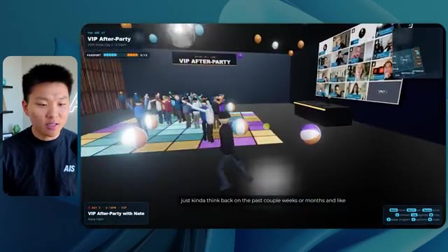
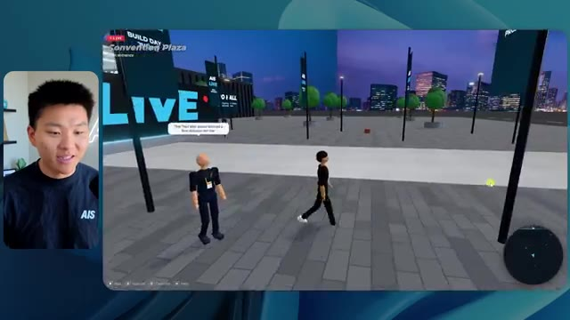
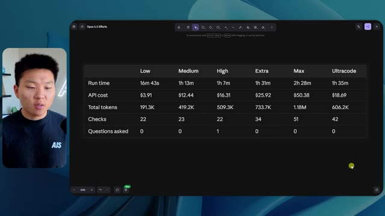

# 🎬 32 Tricks to Level Up Claude Code in 16 Mins

> **Chaîne** : [Nate Herk | AI Automation](https://www.youtube.com/@nateherk/featured)  
> **Lien YouTube** : [https://www.youtube.com/watch?v=jqoFP9QapXI](https://www.youtube.com/watch?v=jqoFP9QapXI)  
> **Date de publication** : 20260427  
> **Durée** : 00:16:15  
> **Identifiant vidéo** : `jqoFP9QapXI`  
> **Transcription & Analyse** : `whisper-v3-large-turbo+gemini-3.5-flash-lite`  

---

## 📌 Synthèse Exécutive & Outils

### 💡 Résumé

Dans cette vidéo de la chaîne *Nate Herk | AI Automation*, l'analyste propose une évaluation comparative rigoureuse du modèle de pointe **Opus 5.5** d'Anthropic appliqué à l'ingénierie logicielle autonome via **Claude Code**. L'expérimentation consiste à soumettre un prompt complexe et identique à travers différents niveaux d'effort (faible, moyen, élevé, etc.) : concevoir un monde 3D explorable à la troisième personne représentant une conférence technologique réaliste, enrichie par l'intégration d'un dossier Frame.io de 105 Go contenant les ressources vidéo d'un événement virtuel (*AIS Live*), tout en exploitant les directives de marque et les outils internes de l'écosystème du créateur.

Les résultats démontrent des divergences drastiques en termes de qualité architecturale, de rendu visuel, de temps d'exécution et de coût par l'API. Alors que le niveau d'effort faible produit une application basique, truffée de bugs d'affichage, d'images fixes et de PNJ (personnages non-joueurs) instables en près de 17 minutes pour un coût équivalent de 3,91 $, le niveau d'effort moyen élève significativement la barre. En une heure et 13 minutes (et pour 12,44 $ de coût API simulé), le modèle livre une expérience immersive de haute qualité intégrant des flux vidéo dynamiques, des palettes de couleurs conformes à la marque, une interface de carte synchronisée en direct et des interactions d'agents cohérentes.

Cette étude de cas met en lumière l'arbitrage critique auquel font face les ingénieurs en IA et développeurs : un niveau d'effort supérieur permet d'obtenir des agents autonomes capables de structurer des environnements complexes et fonctionnels sans nécessiter de supervision humaine (zéro question posée dans les deux cas), mais au prix d'une latence et d'une consommation de tokens accrues. La démonstration s'interrompt alors que le modèle à niveau élevé vient de achever sa compilation, introduisant une problématique opérationnelle classique : le déploiement rapide et la mise en ligne de ces prototypes logiciels générés par IA.

---

### 🛠️ Outils, Modèles & Logiciels Présentés

* **Claude Code** : Agent de développement logiciel par ligne de commande d'Anthropic permettant de concevoir, tester et exécuter des applications complexes de manière autonome.
* **Opus 5.5** : Modèle d'intelligence artificielle de pointe d'Anthropic, salué pour ses performances de raisonnement, son coût abordable et sa polyvalence dans la génération de code et d'agents.
* **Frame.io** : Plateforme de collaboration et de stockage cloud utilisée pour centraliser et injecter 105 gigaoctets de ressources vidéo d'événements dans le contexte de l'agent.
* **Hostinger** : Hébergeur web et sponsor de la vidéo, fournissant une extension gratuite pour éditeur de code afin de combler le fossé entre la génération locale d'applications et leur mise en ligne instantanée.
* **AIS Live** : Événement technologique virtuel et base de données source contenant les enregistrements, logos et supports marketing réutilisés pour la simulation 3D.
* **Système Herc 2** : Écosystème opérationnel personnel et système d'exploitation IA du créateur, mis à disposition comme ressource contextuelle pour l'agent.

---

### 🔑 Points Clés & Enseignements Stratégiques

* **L'impact direct du niveau d'effort sur la qualité architecturale** : Ajuster le paramètre d'effort d'Opus 5.5 ne modifie pas seulement la durée d'exécution, mais transforme radicalement la complexité logique, la stabilité des scripts et le respect des contraintes de design du code généré.
* **Gestion de l'autonomie et de la formulation des objectifs** : Le prompt initial s'appuie sur une approche par « objectif » (*slash goal*) globale plutôt que sur un micro-management, démontrant la capacité de l'agent à interpréter des directives créatives et techniques de haut niveau.
* **Tolérance zéro et autonomie décisionnelle** : Sur l'ensemble des exécutions testées dans cette démonstration, l'agent n'a posé aucune question de clarification à l'utilisateur, menant le processus de développement et de vérification de bout en bout en totale autonomie.
* **Le coût de la complexité visuelle** : Passer d'un effort faible à un effort moyen multiplie par plus de quatre le temps d'exécution (de 16 minutes à 1 heure 13) et le coût estimé par l'API (de 3,91 $ à 12,44 $), soulignant la nécessité d'un arbitrage rigoureux selon la criticité du projet.
* **Consommation de tokens et volume de traitement** : Le niveau moyen a nécessité près de 490 000 jetons et 23 cycles de vérification (ouvertures de navigateurs et tests), illustrant la charge computationnelle requise pour valider des environnements 3D interactifs.
* **Intégration de données lourdes multimodales** : L'agent a su exploiter avec succès un volume massif de 105 Go de données issues de Frame.io pour contextualiser des flux vidéo en direct au sein même des salles virtuelles de la conférence 3D.
* **Respect de l'identité de marque (*Branding*)** : Les niveaux d'effort supérieurs sont capables d'analyser et de restituer fidèlement les directives graphiques (palettes de couleurs, logos officiels, badges nominatifs personnalisés) contrairement aux versions d'effort faible génériques.
* **Gestion des bugs d'affichage et de la physique** : Les agents configurés avec des efforts limités souffrent de défauts majeurs (disparition de PNJ, textures figées), tandis que les efforts accrus stabilisent la logique de rendu, les flux vidéo dynamiques et les comportements contextuels des personnages.
* **La recommandation officielle d'Anthropic** : Il est préconisé de débuter l'ingénierie de prompt avec des niveaux intermédiaires (effort moyen) avant d'ajuster itérativement vers le haut ou vers le bas en fonction de la complexité réelle de la tâche requise.
* **Le goulet d'étranglement du déploiement post-génération** : La création rapide d'une application fonctionnelle par l'IA déplace le défi technologique de la phase de code vers la phase de mise en production, nécessitant des connecteurs cloud fluides pour éviter la friction du déploiement.

---

## ⏱️ Chronologie & Transcription Complète Audio & Visuelle (Mot pour Mot)

### ⏱️ `[00:00:00 - 00:00:20]` | Segment #01

**🔊 Audio (Transcription Intégrale Mot pour Mot en Français) :**
> Opus 5.5, Opus 5.5, Opus 5.5, Opus 5.5, Opus 5.5. Ce modèle est littéralement partout et pour de très bonnes raisons. Il est intelligent, il est bon marché, il a un goût incroyable, c'est un modèle d'IA extraordinaire. Mais avec chaque modèle d'IA, vous avez le choix de l'effort, que ce soit faible, moyen, élevé, extra, max, ou code ultra.

**👁️ Analyse Visuelle d'Écran (gemini-3.5-flash-lite) :**
**Interface & Outils** : Navigateur web (X / Twitter)

**Contenu textuel & Code** : Publication sur X avec texte et contenu visuel d'une simulation paysagère.

**Action / Démonstration** : Affichage d'un exemple de contenu généré par l'IA illustrant les propos du présentateur.

*⏱️ 00:00:05 — Capture d'écran d'un tweet sur X montrant une image générée représentant un paysage tropical côtier, accompagnée d'un texte sur la perturbation potentielle des créateurs techniques.*

---

### ⏱️ `[00:00:20 - 00:00:38]` | Segment #02

**🔊 Audio (Transcription Intégrale Mot pour Mot en Français) :**
> Alors dans cette vidéo, j’ai donné exactement le même prompt à Opus 5.5 et je l'ai exécuté sur chaque niveau d'effort, et nous allons comparer les résultats. Nous allons examiner la qualité de toutes les différentes sorties réelles, mais nous allons aussi examiner combien de temps chacun d’eux a pris pour s'exécuter, combien cela nous a coûté si c’était facturé par l'API, le nombre total de tokens, combien de vérifications ils ont effectuées, et combien de questions ils m’ont réellement posées tout au long du processus.

**👁️ Analyse Visuelle d'Écran (gemini-3.5-flash-lite) :**
**Interface & Outils** : Tableau blanc ou application de mindmapping / prise de notes (type Miro ou Obsidian Canvas).

**Contenu textuel & Code** : Tableau avec les colonnes Low, Medium, High, Extra, Max, Ultracode et les lignes Run time, API cost, Total tokens, Checks, Questions asked.

**Action / Démonstration** : Présentation du tableau comparatif des différents niveaux d'effort d'Opus 5.5.

*⏱️ 00:00:29 — Capture d'un tableau comparatif sombre montrant les différents niveaux d'effort (Low, Medium, High, Extra, Max, Ultracode) et des métriques (Run time, API cost, Total tokens, etc.).*

---

### ⏱️ `[00:00:39 - 00:00:58]` | Segment #03

**🔊 Audio (Transcription Intégrale Mot pour Mot en Français) :**
> Et les résultats qu'on a obtenus ne sont pas du tout ce à quoi je m'attends, donc j'ai hâte de partager ça avec vous les gars. Ne perdons pas de temps et entrons directement dans le vif du sujet. Bon, alors plongeons directement là-dedans. Je veux commencer juste en vous montrant le prompt réel qu'on a utilisé, qu'on a donné à absolument chacun de ces différents agents. Je vais aller dans les fichiers ici, et on va ouvrir ce fichier markdown de prompt, et je vais vous montrer ce qu'on a obtenu. Donc voici l'objectif (« slash goal ») que j'ai fourni.

**👁️ Analyse Visuelle d'Écran (gemini-3.5-flash-lite) :**
**Interface & Outils** : Interface de l'outil de développement et assistant IA (avec le modèle Opus 5.5).

**Contenu textuel & Code** : Un prompt textuel demandant de construire un monde 3D navigable à la troisième personne de la conférence AIS Live à partir d'enregistrements.

**Action / Démonstration** : Présentation et lecture du prompt initial configuré pour l'agent IA.

*⏱️ 00:00:48 — Interface de l'outil de développement avec un panneau latéral montrant les sessions de travail et un assistant IA affichant un prompt textuel demandant de construire un monde 3D.*

---

### ⏱️ `[00:00:58 - 00:01:34]` | Segment #04

**🔊 Audio (Transcription Intégrale Mot pour Mot en Français) :**
> J'ai dit : tu dois me créer un monde en 3D qui soit une conférence technologique réaliste dans laquelle je peux me promener en vue à la troisième personne. Tu vas regarder ce dossier, qui contient mes ressources d'enregistrement d'événements provenant d'AIS Live. Et ce dossier est un dossier Frame.io de 105 gigaoctets d'enregistrements vidéo. C'était un événement entièrement virtuel. Tout a été enregistré et tous les enregistrements sont juste ici. J'ai dit : ton objectif est de prendre cet événement et de le transformer en un monde 3D explorable qui me donne l'impression d'avoir réellement assisté à une vraie conférence en personne avec différentes salles, différentes pistes, différentes scènes, bla, bla, bla. N'hésite pas à utiliser key.ai si tu as besoin de générer des images ou des vidéos. Et tu peux aussi utiliser tout ce qui se trouve dans mon projet Herc 2, qui est comme mon système d'exploitation IA. J'ai dit :

**👁️ Analyse Visuelle d'Écran (gemini-3.5-flash-lite) :**
**Interface & Outils** : Éditeur de code (VS Code / interface similaire) et interface web Frame.io

**Contenu textuel & Code** : Fichier Markdown contenant le prompt détaillé demandant de transformer des enregistrements virtuels en un monde 3D explorable d'une conférence technologique.

**Action / Démonstration** : Présentation du prompt initial et des ressources d'enregistrement stockées sur Frame.io pour alimenter le projet 3D.

*⏱️ 00:01:07 — Un éditeur de texte affichant le fichier PROMPT.md avec les instructions pour créer le monde 3D, incluant un lien Frame.io.*

*⏱️ 00:01:16 — Une interface web Frame.io montrant les dossiers de ressources d'enregistrement d'événements (GA Access et VIP Access).*

*⏱️ 00:01:25 — Vue de retour sur l'éditeur de texte affichant le fichier PROMPT.md avec les consignes détaillées du projet.*

---

### ⏱️ `[00:01:34 - 00:02:08]` | Segment #05

**🔊 Audio (Transcription Intégrale Mot pour Mot en Français) :**
> vous serez jugé sur la créativité, le design, la physique et la sensation générale lorsque j'explorerai le monde 3D que vous avez construit. Et c'était fondamentalement la fin des instructions. Donc comme vous pouvez le voir sur ce côté gauche, j'ai exécuté ceci à travers tous les différents niveaux d'effort. Commençons par le niveau bas et progressons jusqu'au code ultra. Très bien. Donc ici nous avons le résultat du niveau bas. Ouvrons ceci et jetons un coup d'œil. Donc nous avons AIS Live, le sommet des services IA en personne enfin, et nous avons pu cliquer partout. Tout d'abord, cela ne fait pas très personnalisé. Genre, ce n'ego- n'est pas le logo d'IS Live. Ce ne sont même pas nos couleurs. Donc je n'aime pas trop ça, mais entrons ici. D'accord. C'est beaucoup trop lumineux. Euh, nous avons une carte en haut à droite. Nous avons une ville ici en arrière-plan. Je ne peux pas dire quelle ville c'est

**👁️ Analyse Visuelle d'Écran (gemini-3.5-flash-lite) :**
**Interface & Outils** : Interface web d'assistant IA ou plateforme de développement avec panneau latéral de sessions de travail.

**Contenu textuel & Code** : Message de l'agent IA proposant de commencer la tâche de construction d'un monde 3D ("Hi Nate. This worktree has the effort-test task queued in PROMPT.md : build a walkable third-person 3D world...").

**Action / Démonstration** : Le présentateur montre l'exécution des tests à travers différents niveaux dans l'interface de gauche.

*⏱️ 00:01:42 — Capture d'écran montrant le présentateur à gauche et une interface de chat/agent IA à droite listant différents niveaux de tests (Hello, Extra, High, Max, Ultracode, Medium, Low).*

---

### ⏱️ `[00:02:08 - 00:02:40]` | Segment #06

**🔊 Audio (Transcription Intégrale Mot pour Mot en Français) :**
> c'est. D'accord. C'est Chicago, ce qui est plutôt cool parce que vous savez, je vis à Chicago, mais bref, en haut à droite, nous pouvons voir une carte. Nous avons un hall d'accueil. Nous avons un hall d'exposition. Nous avons un salon VIP sur la scène principale. La carte montre également où se trouve chaque autre personne et cela se synchronise en direct. Nous pouvons donc voir l'enregistrement. Nous pouvons voir le premier jour, la keynote de l'hyper agent, le débriefing en direct. Cool. Donc ça connaît réellement l'agenda et ensuite il y a le deuxième jour. Donc il a trouvé ça, c'est bien. Nous avons ces petites boules ici que je peux espérer botter. D'accord. Le visage, oh, regardez ça. Si je vais par ici, toutes les personnes disparaissent tout simplement. Très mauvais. Très mauvais. D'accord. Alors voyons voir. Est-ce que je peux sprinter ? D'accord.

**👁️ Analyse Visuelle d'Écran (gemini-3.5-flash-lite) :**
**Interface & Outils** : Environnement virtuel 3D (type métavers / plateforme événementielle en ligne) avec mini-carte de navigation.

**Contenu textuel & Code** : Menus d'événement virtuel, emplacements des salles et noms des espaces (Lobby, Expo Hall, Main Stage, VIP Lounge).

**Action / Démonstration** : Navigation et exploration de l'espace virtuel de la conférence en 3D.

---

### ⏱️ `[00:02:40 - 00:03:04]` | Segment #07

**🔊 Audio (Transcription Intégrale Mot pour Mot en Français) :**
> Je peux avancer un peu plus vite. Je vais d'abord aller par ici. Il y a des produits promotionnels, euh, certifiés AIS plus glido. D'accord. Donc il y a les vrais stands qu'on avait lors de l'événement virtuel. On avait des stands. Donc c'est plutôt cool. Un petit endroit pour prendre des photos. Salle C. En ce moment, nous avons Tangy Frederick qui anime un atelier. D'accord. Mais ce n'est pas une vidéo. Comme vous pouvez le voir, c'est juste une image. Elle ne bouge pas. C'est donc juste une image. Ces gens sont en train de disparaître. Ce doivent être des fantômes. Allons par ici vers la salle A.

**👁️ Analyse Visuelle d'Écran (gemini-3.5-flash-lite) :**
**Interface & Outils** : Application de monde virtuel / métavers interactif 3D d'événement en ligne.

**Contenu textuel & Code** : Textes informatifs sur les stands virtuels, instructions d'intégration d'API et bannières de sponsors.

**Action / Démonstration** : Explications face caméra et démonstration conceptuelle.

*⏱️ 00:02:46 — Vue d'un monde virtuel style métavers montrant un personnage se déplaçant dans un hall d'exposition avec des stands de sponsors et des boîtes promotionnelles.*

*⏱️ 00:02:52 — Navigation dans une salle verte du monde virtuel avec des tables lumineuses et des écrans d'affichage pédagogiques.*

*⏱️ 00:02:58 — Gros plan sur un écran virtuel dans le monde 3D affichant des instructions sur l'utilisation des clés API et des étapes de configuration.*

---

### ⏱️ `[00:03:04 - 00:03:30]` | Segment #08

**🔊 Audio (Transcription Intégrale Mot pour Mot en Français) :**
> Nous avons Liberty White. D'accord. Très cool. Vos 30 premiers jours en automatisation. Encore une fois, ce n'est qu'une image fixe et les gens ont des bugs d'affichage. Donc ce n'est pas très bien ici. Je vais aller sur la scène principale et voir ce que nous avons. D'accord, cool. Donc nous avons une scène d'apparence principale. Les gens ont de gros bugs d'affichage. Vraiment mauvais. Ce n'est vraiment pas terrible. Notre vidéo est en train de bouger. Genre, j'ai vu mon visage ici et j'ai vu celui de Devin, mais maintenant ils ont disparu. Donc je ne sais pas ce qui s'est passé. D'accord. On dirait que c'est plutôt un diaporama. Rien n'est vraiment lu pour l'instant. Bref, entrons ici.

**👁️ Analyse Visuelle d'Écran (gemini-3.5-flash-lite) :**
**Interface & Outils** : Environnement virtuel 3D interactif (type metavers / plateforme de conférence en ligne)

**Contenu textuel & Code** : Interface de navigation virtuelle affichant "AIS LIVE AI Services Summit" et "Main Stage"

**Action / Démonstration** : Le présentateur navigue et déplace son avatar dans l'espace virtuel pour montrer la scène principale et les différentes salles d'atelier.

*⏱️ 00:03:17 — Vue de la scène principale d'une conférence virtuelle 3D avec un grand auditoire rempli d'avatars et l'intervenant en médaillon.*

*⏱️ 00:03:24 — Vue panoramique de la scène principale 'AIS LIVE - AI Services Summit' dans l'environnement virtuel avec des écrans géants.*

---

### ⏱️ `[00:03:30 - 00:03:58]` | Segment #09

**🔊 Audio (Transcription Intégrale Mot pour Mot en Français) :**
> Nous avons d'autres stands. Nous avons hyper agent. Nous avons Claude Code. Nous avons plus de cadeaux publicitaires. La salle B, c'est Dave Ebelor. Je suppose que c'est exactement la même chose. Nous avons du café. Et puis, je suppose que le salon VIP, c'est accès VIP uniquement. C'est plutôt cool, mais il n'y a vraiment rien qui se passe ici. Cet écran est bien trop lumineux. D'accord. Donc je pense que vous comprenez l'ambiance qu'on retire ici d'Opus 5.5 en effort faible. Et c'est là que les choses deviennent intéressantes. Combien de temps pensez-vous que cela a duré ? Combien de temps ? Celui-ci a duré 16 minutes et 43 secondes. Combien pensez-vous que cela a coûté ?

**👁️ Analyse Visuelle d'Écran (gemini-3.5-flash-lite) :**
**Interface & Outils** : Interface web interactive / tableau de bord de type canvas (Opus 5.5 Efforts).

**Contenu textuel & Code** : Tableau avec les colonnes Low, Medium, High, Extra, Max, Ultracode et les lignes Run time, API cost, Total tokens, Checks, Questions asked.

**Action / Démonstration** : Présentation d'un tableau comparatif des différents niveaux d'efforts du modèle Opus 5.5.

*⏱️ 00:03:51 — Tableau comparatif sur une interface de type canvas intitulée 'Opus 5.5 Efforts' avec des niveaux (Low, Medium, High, Extra, Max, Ultracode) et des critères (Run time, API cost, Total tokens, Checks, Questions asked).*

---

### ⏱️ `[00:03:58 - 00:04:26]` | Segment #10

**🔊 Audio (Transcription Intégrale Mot pour Mot en Français) :**
> 3,91 dollars si c'était une facturation par API. J'utilise évidemment mon abonnement ici, mais nous allons juste calculer cela en facturation API. Le nombre total de jetons était de 191 000. Il a effectué 22 vérifications. Donc la vérification, 22 fois il a ouvert le navigateur et a exécuté différentes sortes de vérifications. Donc 22 catégories de vérifications. Et combien de questions m'a-t-il posées ? Il m'a posé un total de zéro question tout au long de cette invite de commande d'objectif. D'accord. Alors, ouvrons l'effort moyen et voyons ce que nous avons. D'accord, c'est parti. Effort moyen. Nous avons Nate Herc. Nous avons mon badge. C'est aux couleurs de la marque AI's Life.

**👁️ Analyse Visuelle d'Écran (gemini-3.5-flash-lite) :**
**Interface & Outils** : Tableau blanc ou application de mind mapping / diagramme (type Excalidraw)

**Contenu textuel & Code** : Tableau avec les lignes : Run time (16m 43s), API cost ($3.91), Total tokens (191.3K), Checks, Questions asked ; colonnes : Low, Medium, High, Ex.

**Action / Démonstration** : Le présentateur commente le tableau affichant les métriques d'exécution et les coûts liés aux jetons d'API.

*⏱️ 00:04:05 — Un tableau comparatif des coûts et performances d'effort pour différents niveaux (Low, Medium, High, Ex), avec des détails sur le temps d'exécution, le coût de l'API ($3.91), le total des jetons (191.3K), les vérifications et les questions posées. Le présentateur apparaît dans une incrustation vidéo sur le côté gauche.*

---

### ⏱️ `[00:04:26 - 00:04:46]` | Segment #11

**🔊 Audio (Transcription Intégrale Mot pour Mot en Français) :**
> Alors ça a déjà l'air un petit peu mieux. Ça ressemble à nos palettes de couleurs qui ont utilisé nos directives de marque. Premier jour, construction, deuxième jour, gagner, VIP. Cool. D'accord. Je vais entrer dans le lieu. D'accord. Waouh. Une ambiance similaire, en somme. C'est en arrière-plan. Ça ne ressemble pas à Chicago, hein ? Non, ça ressemble à, honnêtement, ça ressemble à une ville imaginaire. Quoi qu'il en soit, c'est drôle qu'ils aient décidé de faire ça. Voyons si je peux me déplacer un peu plus vite. Oh, waouh.

**👁️ Analyse Visuelle d'Écran (gemini-3.5-flash-lite) :**
**Interface & Outils** : Application web interactive / environnement virtuel 3D (AIS Live)

**Contenu textuel & Code** : Page d'accueil de l'événement virtuel avec un badge nominatif (Nate Herk), des onglets de jours (Day 1 Build, Day 2 Earn, VIP) et des contrôles clavier (WASD walk, Shift sprint, etc.).

**Action / Démonstration** : Navigation et entrée dans le lieu virtuel 3D après visualisation de l'écran d'accueil de l'événement.

*⏱️ 00:04:31 — Interface web "Welcome to AIS Live" avec un badge d'accès virtuel au nom de Nate Herk et des options de navigation.*

*⏱️ 00:04:41 — Vue à la première personne dans un environnement virtuel 3D de type jeu montrant des avatars et une vue sur une ville de nuit à travers de grandes baies vitrées.*

---

### ⏱️ `[00:04:46 - 00:05:21]` | Segment #12

**🔊 Audio (Transcription Intégrale Mot pour Mot en Français) :**
> Les gens interagissent avec moi. Regardez. Si je m'approche de ce type, il a juste levé le bras. Bon, maintenant il ne veut plus rien savoir de moi du tout. Mais tous ces petits robots ici doivent prendre des décisions. Je ne sais pas s'ils utilisent Jev. C'est sûr que non. Je ne le lui ai pas dit. En fait, ma clé Jev est à l'arrière. Je ne sais pas. Peut-être qu'il l'a utilisée. Quoi qu'il en soit, on peut voir ici qu'on a la salle d'atelier C, le laboratoire des agents. Sympa. Donc celui-ci est en fait en cours d'exécution. Vous pouvez voir qu'il s'agit d'une vraie vidéo lue par Tangy. Tout le monde ici est en train de travailler sur un ordinateur portable. Ils ne buguent pas. C'est plutôt cool. De plus, mon badge est sur ma poitrine, ce qui est plutôt cool. Je peux venir par ici. Nous avons une carte en haut à droite, comme vous pouvez le voir, mais je peux venir par ici. Nous avons un

**👁️ Analyse Visuelle d'Écran (gemini-3.5-flash-lite) :**
**Interface & Outils** : Environnement 3D virtuel (plateforme de type métavers ou jeu en ligne).

**Contenu textuel & Code** : Aucun code, terminal ou prompt affiché ; uniquement des graphismes 3D interactifs.

**Action / Démonstration** : Exploration visuelle d'un espace virtuel virtuel avec des avatars animés.

---

### ⏱️ `[00:05:21 - 00:05:47]` | Segment #13

**🔊 Audio (Transcription Intégrale Mot pour Mot en Français) :**
> hall d'exposition. C'est là que nous avons le stand Glido. Et ça diffuse en ce moment. Oui, ça diffuse la vidéo de nous en train de parler de Glido. Ça diffuse la vidéo d'Ed et moi parlant de notre programme de certification. Nous avons le logo AIS Plus ici à l'arrière, qui est un peu mal placé. Ce sont les diapositives des conférenciers et les points clés. Alors wow, toutes ces ressources que nous avons distribuées après l'événement sont également toutes installées juste là. On peut voir que nous avons un coup de projecteur sur la communauté. C'est donc Aiden qui parle de l'affaire qu'il a conclue et c'est diffusé en direct. Ces gens regardent.

**👁️ Analyse Visuelle d'Écran (gemini-3.5-flash-lite) :**
**Interface & Outils** : Application de monde virtuel 3D / plateforme d'exposition en ligne

**Contenu textuel & Code** : Écrans virtuels affichant le logo "AIS+ Certified", des diapositives de présentation et des informations sur les sessions

**Action / Démonstration** : Navigation d'un avatar dans l'espace d'exposition virtuel

---

### ⏱️ `[00:05:47 - 00:06:21]` | Segment #14

**🔊 Audio (Transcription Intégrale Mot pour Mot en Français) :**
> Ils sont plutôt engagés. On a un hyper agent. C'était, c'est ce que je voulais dire. Si vous avez vu ces gens lever les mains en disant bonjour, c'était plutôt marrant. Regardez, regardez, le voilà qui recommence. Bref. Bon. Où est-ce que je suis maintenant ? Maintenant, je suis dans le hall principal. On a un bar à café. On a un grand logo, qui est le vrai logo. C'est trop lumineux, mais on a le logo. On peut voir si on peut entrer ici dans le parcours des fondations. On a Sabrina Romanov et Liberty White. Donc différentes formations juste là. On peut entrer dans cette salle. C'est le parcours avancé. Donc qu'est-ce qui se passe ici. On a Dave Ebelar et Saman qui parlent de différentes choses là-dedans. Et maintenant, allons jeter un œil à la scène principale. Oh, attendez, il y a une vidéo de moi là-haut. C'est genre un VIP

**👁️ Analyse Visuelle d'Écran (gemini-3.5-flash-lite) :**
**Interface & Outils** : Application de monde virtuel 3D / métavers de conférence.

**Contenu textuel & Code** : Environnement virtuel avec avatars, mini-carte en haut à droite, et texte "Main Lobby".

**Action / Démonstration** : Navigation et déplacement d'un avatar dans le hall virtuel.

---

### ⏱️ `[00:06:21 - 00:06:50]` | Segment #15

**🔊 Audio (Transcription Intégrale Mot pour Mot en Français) :**
> section ? Ouais, on ira voir ça dans une minute. Mais bref, voici la scène principale. Ça a l'air vraiment, vraiment très bien. On a une grande scène. On a genre quatre personnes assises ici. On a les trois écrans d'Alex là-haut avec Hyper Agent. Est-ce que j'ai le droit de monter sur scène ? Oh, et il me laisse monter sur scène. D'accord. C'est plutôt sympa. Bon, les gars, faisons un selfie. Laissez-moi prendre tout le monde en arrière-plan. Venez par ici. Bref, c'est vraiment, vraiment cool. Toutes les places ne sont pas occupées, par contre. Donc il faut qu'on travaille là-dessus. Mais bref, je vais y retourner en courant pour voir ce qu'était cette section VIP. D'accord. Salon VIP. J'ai l'impression que c'est comme un aéroport ou un truc du genre.

**👁️ Analyse Visuelle d'Écran (gemini-3.5-flash-lite) :**
**Interface & Outils** : Application de conférence virtuelle 3D / plateforme Hyper Agent.

**Contenu textuel & Code** : Interface utilisateur affichant les détails de la session "Hyperagent Keynote" par Alex McDonnell.

**Action / Démonstration** : Navigation et exploration de l'espace virtuel 3D représentant une conférence.

---

### ⏱️ `[00:06:51 - 00:07:14]` | Segment #16

**🔊 Audio (Transcription Intégrale Mot pour Mot en Français) :**
> OK, super. Donc maintenant nous avons les sessions VIP ici. Une FAQ VIP avec la lecture vidéo en direct de Nate juste ici. C'est vraiment, vraiment super. Et nous avons comme un bar ou quelque chose comme ça. Génial. Je dirais que c'est un très bon résultat. Maintenant, en ce qui concerne les statistiques ici, celle-ci a pris une heure et 13 minutes à s'exécuter. Cela nous aurait coûté 12 dollars et 44 cents. Elle a utilisé 490 000 jetons et elle a effectué 23 vérifications.

**👁️ Analyse Visuelle d'Écran (gemini-3.5-flash-lite) :**
**Interface & Outils** : Application virtuelle 3D / Interface web de tableau de bord analytique

**Contenu textuel & Code** : Statistiques de performance affichant un temps d'exécution de 16m 43s, un coût API de 3,91 $, 191,3K tokens et 22 vérifications.

**Action / Démonstration** : Navigation et présentation de l'espace VIP virtuel puis transition vers les statistiques de performance et de coûts.

*⏱️ 00:06:56 — Capture montrant un espace virtuel VIP avec un écran affichant une vidéo en direct et un bar en arrière-plan.*

*⏱️ 00:07:02 — Capture montrant un tableau de statistiques de performance (Opus 5.5 Efforts) avec des mesures de temps d'exécution et de coût API.*

---

### ⏱️ `[00:07:14 - 00:07:48]` | Segment #17

**🔊 Audio (Transcription Intégrale Mot pour Mot en Français) :**
> Et il nous a posé un total de zéro question une fois de plus. Très bien, passons au niveau élevé. C'était déjà un résultat plutôt correct et Anthropic eux-mêmes dans leur vidéo, ou désolé, pas une vidéo, un article sur la façon de prompter Opus 5.5. Ils ont dit de commencer simplement par le niveau moyen et de l'ajuster à la hausse ou à la baisse si nécessaire. C'était donc un résultat moyen. Passons au niveau élevé et voyons ce que nous avons obtenu. Très rapidement, les gars, je dois prendre une seconde pour vous parler du sponsor de la vidéo d'aujourd'hui, Hostinger. Donc, ces deux modèles viennent de me construire une version fonctionnelle de la même chose. Et maintenant, je me retrouve exactement là où je finis toujours, avec quelque chose de terminé sur mon ordinateur portable et aucun moyen rapide de le mettre en ligne. Et c'est le fossé que le connecteur d'Hostinger comble. C'est une extension gratuite

**👁️ Analyse Visuelle d'Écran (gemini-3.5-flash-lite) :**
**Interface & Outils** : Tableau de bord de type canvas pour le suivi des métriques d'IA et interface de développement ou d'IDE (probablement Cursor ou un outil similaire basé sur VS Code).

**Contenu textuel & Code** : Métriques comparatives (temps d'exécution de 16m43s à 1h13m, coûts API de 3.91$ à 12.44$, tokens, questions posées) et prompt de construction d'un calculateur ROI simple en HTML/JS.

**Action / Démonstration** : Présentation des résultats comparatifs des différents niveaux d'effort (Low, Medium, High) et suivi de la génération d'un outil web (calculateur ROI) par l'agent IA.

*⏱️ 00:07:22 — Un tableau comparatif des performances et des coûts de l'agent IA (Run time, API cost, Total tokens, Checks, Questions asked) selon différents niveaux d'effort (Low, Medium, High, Extra), avec le présentateur en médaillon à gauche.*

*⏱️ 00:07:39 — Une interface de développement avec deux panneaux divisés affichant des logs d'exécution, des étapes de réflexion (dataviz skill, thinking) et des lignes de code/prompts pour la création d'un calculateur ROI (Northwind ROI calculator), avec le présentateur en incrustation.*

---

### ⏱️ `[00:07:48 - 00:08:23]` | Segment #18

**🔊 Audio (Transcription Intégrale Mot pour Mot en Français) :**
> pour votre éditeur qui importe votre compte Hostinger dans ce que vous êtes déjà en train de coder. Donc VS Code, Cursor, Cloud Code, Codex, peu importe. Vous vous connectez une seule fois en un seul clic, et à partir de là, votre agent peut déployer le site, y pointer un domaine, configurer les enregistrements DNS, et vérifier votre VPS sans que vous ayez jamais à quitter l'éditeur. Donc, peu importe celui de ces outils que vous finirez par préférer, ce qu'il a construit se trouve à quelques minutes d'une vraie URL sur un hébergement géré. Connector est gratuit sur chaque formule d'hébergement, alors si vous avez toujours besoin de l'hébergement en dessous, prenez la formule illimitée avec le lien dans la description et utilisez le code NATEHERK pour 10 % de réduction. Cela inclut également un nom de domaine gratuit et un e-mail professionnel pour l'année. Et c'est toujours le moyen le moins cher que j'ai trouvé pour obtenir quelque chose

**👁️ Analyse Visuelle d'Écran (gemini-3.5-flash-lite) :**
**Interface & Outils** : Interface web/extension Hostinger et interface de terminal Claude Code.

**Contenu textuel & Code** : Statut "Connected", options "Websites", "Domains", "Subscriptions & Payments", "Email Marketing".

**Action / Démonstration** : Connexion du compte Hostinger à l'IDE via OAuth pour permettre à l'agent de gérer les sites et domaines.

*⏱️ 00:07:57 — Interface montrant la gestion de Hostinger depuis un IDE avec une connexion établie et les outils disponibles.*

---

### ⏱️ `[00:08:23 - 00:08:47]` | Segment #19

**🔊 Audio (Transcription Intégrale Mot pour Mot en Français) :**
> vous avez construit par-dessus une vraie URL. Donc revenons à la vidéo. D'accord. Encore une fois, très, très marqué par la marque. C'est un écran de chargement encore meilleur que le précédent. Nous avons ce petit effet sympa en arrière-plan. Nous avons le logo. Nous allons entrer dans le lieu. D'accord. Nous y voilà. Ça a l'air plutôt bien. Nous commençons à l'extérieur et vous pouvez voir que nous avons ces drapeaux pour tous les intervenants, Wyatt, Casper, Alex, Ed, Aiden, Sabrina, Liberty. C'est plutôt cool. Nous avons des blocs en direct ici.

**👁️ Analyse Visuelle d'Écran (gemini-3.5-flash-lite) :**
**Interface & Outils** : Application web 3D / environnement virtuel interactif 'AIS Live'

**Contenu textuel & Code** : Interface utilisateur avec bannières de navigation (WASD, Mouse), bannières d'événements et affichage de la position 'AIS Live Plaza'.

**Action / Démonstration** : Exploration d'un monde virtuel 3D interactif et entrée dans le lieu de l'événement.

*⏱️ 00:08:29 — Écran de chargement et d'accueil de la plateforme virtuelle 'AIS LIVE' affichant les détails de l'événement et les contrôles de navigation.*

*⏱️ 00:08:35 — Vue de la place virtuelle 'AIS Live Plaza' avec un avatar au centre, des bâtiments en arrière-plan et un guide textuel en haut.*

*⏱️ 00:08:41 — Navigation dans la place virtuelle 'AIS Live Plaza' montrant des bannières verticales avec les noms de conférenciers et des personnages animés.*

---

### ⏱️ `[00:08:47 - 00:09:23]` | Segment #20

**🔊 Audio (Transcription Intégrale Mot pour Mot en Français) :**
> Il a pris cette photo de moi, votre hôte, Nate Herc, John, Dave, Nate Herc. Voilà. D'accord. Les portes. C'est génial. Ce sont des portes coulissantes automatiques en verre. J'adorer ça. Nous pouvons voir l'enregistrement VIP. Nous pouvons voir l'admission générale. Nous pouvons venir ici et nous pouvons découvrir l'exposition avec différents stands, le projecteur sur la communauté. Vous pouvez également voir qu'en haut à gauche, j'ai un passeport. C'est donc comme si, il montrera combien d'endroits j'ai visités. Tout ceci est une vraie lecture. Nous avons un mur de ressources avec tous les différents conférenciers. Ils ont aussi une session de networking ici. Donc je vais venir très rapidement et voir de quoi il s'agit. Nous avons donc le bar à cold brew AIS. Nous avons différents membres de la communauté qui ont été mis en avant ou mis en lumière.

**👁️ Analyse Visuelle d'Écran (gemini-3.5-flash-lite) :**
**Interface & Outils** : Application web 3D virtuelle / Environnement d'événement virtuel.

**Contenu textuel & Code** : Interface d'événement virtuel avec zones d'enregistrement (VIP Check-In, Admission Générale) et affichages de programme.

**Action / Démonstration** : Navigation et exploration de l'espace virtuel par l'avatar de l'hôte.

*⏱️ 00:08:56 — Vue d'un espace de conférence virtuel 3D avec enregistrement et scène principale, et le présentateur à gauche.*

*⏱️ 00:09:05 — Navigation dans le hall d'exposition virtuel avec des stands et avatars, et le présentateur à gauche.*

*⏱️ 00:09:14 — Déplacement dans le hall d'enregistrement virtuel au milieu d'autres avatars, et le présentateur à gauche.*

---

### ⏱️ `[00:09:23 - 00:09:56]` | Segment #21

**🔊 Audio (Transcription Intégrale Mot pour Mot en Français) :**
> Nous avons l'aile VIP. Attends, quoi ? Récupère un bracelet. Oh, je dois en fait aller chercher le bracelet. D'accord. Laisse-moi m'enregistrer rapidement. Le bracelet est déjà mis. Attends, quoi ? D'accord. Oh, d'accord. Maintenant, les portes se sont ouvertes pour moi. Cool. Je peux entrer ici. Oh, ça mène juste à la scène principale. Salon VIP. C'est une séance de questions-réponses en cours. Ça a l'air très cool. Je veux dire, je suis très impressionné par la façon dont il est capable de faire ça. Waouh. D'accord. Donc c'est vraiment bien. Ce que nous avons fait, c'est que nous avions des salles de réunion VIP avec différentes personnes. Vous pouvez voir qu'il y a différentes salles, différents membres de l'équipe AIS qui participent à des choses. C'est vraiment cool. C'est très cool. C'est un VIP bien meilleur

**👁️ Analyse Visuelle d'Écran (gemini-3.5-flash-lite) :**
**Interface & Outils** : Application web 3D / plateforme virtuelle de conférence en ligne.

**Contenu textuel & Code** : Interface utilisateur virtuelle affichant des informations de localisation, des statuts de passeport, des noms de salles et des contrôles de navigation.

**Action / Démonstration** : Navigation et exploration d'un environnement virtuel 3D représentant une conférence ou un espace de networking.

*⏱️ 00:09:32 — Vue d'un espace virtuel 3D de type métavers montrant un hall d'enregistrement avec des avatars et des indications textuelles sur l'accès VIP.*

*⏱️ 00:09:40 — Vue de l'intérieur du salon VIP virtuel (« VIP Lounge ») avec des avatars assis sur des canapés et un écran affichant une visioconférence.*

*⏱️ 00:09:48 — Vue d'une zone de sessions de travail VIP dans le métavers avec plusieurs tables et des écrans interactifs aux thématiques variées.*

---

### ⏱️ `[00:09:56 - 00:10:30]` | Segment #22

**🔊 Audio (Transcription Intégrale Mot pour Mot en Français) :**
> expérience que ce qui a été montré dans la première partie. D'accord. After party VIP. Regardez ça. On a une piste de danse. On a tous ces éléments ici. On a la lecture de l'after party VIP juste ici. Et il y a une estrade de DJ. C'est tellement marrant. Il y a un petit bug ici, un petit glitch par là, mais c'est génial. Oh, super. Donc quand je suis ici sur la scène principale, on a des sous-titres. Vous pouvez voir juste ici en bas de mon écran, on a ces sous-titres de Wyatt qui est en train de parler ici. On a des lumières. On a le panneau. Très cool. Belle scène principale. Je vais aller par ici. On peut aller à la fondation,

**👁️ Analyse Visuelle d'Écran (gemini-3.5-flash-lite) :**
**Interface & Outils** : Application web 3D de visioconférence et d'événements virtuels interactifs.

**Contenu textuel & Code** : Interface utilisateur virtuelle affichant des flux vidéo de participants, une carte miniature et des contrôles de navigation.

**Action / Démonstration** : Navigation et visite guidée de l'environnement virtuel 3D par le présentateur.

*⏱️ 00:10:04 — Vue d'un espace virtuel d'after party VIP avec des avatars 3D qui dansent et un grand écran montrant les participants en visioconférence.*

*⏱️ 00:10:13 — Vue panoramique de la piste de danse virtuelle avec des ballons et une enseigne 'VIP AFTER-PARTY'.*

*⏱️ 00:10:21 — Vue de l'auditorium virtuel principal (Main Stage) avec un présentateur à l'écran et des avatars assis dans la salle.*

---

### ⏱️ `[00:10:30 - 00:11:06]` | Segment #23

**🔊 Audio (Transcription Intégrale Mot pour Mot en Français) :**
> avancé, et les parcours d'entreprise par ici. Alors voyons voir. Nous avons l'anatomie de trois vraies transactions. Nous avons hyper agent. Nous avons les évaluations avec Nate et Ed ici. Nous avons Dave qui intervient dans les trucs avancés. C'est vraiment bien. Je veux dire, évidemment, chacun, chacun de ces résultats jusqu'à présent, bas était correct. Moyen était meilleur. Élevé a été encore meilleur. Voyons si cette tendance se poursuit et allons voir ce que cela nous a coûté. Donc, élevé a fonctionné pendant une heure et sept minutes. Donc un peu plus rapide que moyen, cela nous aurait coûté 16 dollars et 31 cents. Il a utilisé un demi-million de jetons, 509 000. Il a fait 22 vérifications. Et il nous a aussi demandé, enfin, non, je me suis trompé. Ce

**👁️ Analyse Visuelle d'Écran (gemini-3.5-flash-lite) :**
**Interface & Outils** : Application de tableau blanc / outil de mindmapping et diagrammes (style Excalidraw ou similaire).

**Contenu textuel & Code** : Tableau de données comparatif avec les colonnes Low, Medium, High, Extra et les lignes Run time (ex: 16m 43s, 1h 13m...), API cost ($3.91, $12.44, $16.31), Total tokens, Checks, Questions asked.

**Action / Démonstration** : Analyse et présentation comparative des performances et coûts de différents niveaux d'effort (Low, Medium, High, Extra) pour un modèle IA.

*⏱️ 00:10:57 — Tableau comparatif dans une application de type tableau blanc/diagramme intitulé "Opus 5.5 Efforts" montrant les métriques Low, Medium, High et Extra (Run time, API cost, Total tokens, Checks, Questions asked).*

---

### ⏱️ `[00:11:06 - 00:11:25]` | Segment #24

**🔊 Audio (Transcription Intégrale Mot pour Mot en Français) :**
> l'un m'a posé une question et spoiler, c'était le seul qui nous a posé une question tout au long de tout ça. Alors voyons, il nous en reste trois : extra, max et ultra code. Laissez-moi ouvrir extra et nous verrons ce qu'on a. D'accord. Donc celui-ci a l'air plutôt bien. Je dirais honnêtement que jusqu'à présent, l'écran de chargement haut était le meilleur. Celui qu'on vient juste de voir, mais bref, entrons dans le live d'AIS.

**👁️ Analyse Visuelle d'Écran (gemini-3.5-flash-lite) :**
**Interface & Outils** : Application de tableau blanc ou de prise de notes numérique montrant un tableau de données analytiques.

**Contenu textuel & Code** : Un tableau avec les lignes : Run time (16m 43s, 1h 13m, 1h 7m), API cost ($3.91, $12.44, $16.31), Total tokens (191.3K, 419.2K, 509.3K), Checks (22, 23, 22), Questions asked (0, 0, 1).

**Action / Démonstration** : Le présentateur commente les résultats et s'apprête à ouvrir la colonne 'Extra'.

*⏱️ 00:11:11 — Tableau comparatif affichant les métriques (Run time, API cost, Total tokens, Checks, Questions asked) pour différentes configurations (Low, Medium, High, Extra) avec le présentateur en incrustation à gauche.*

---

### ⏱️ `[00:11:26 - 00:11:51]` | Segment #25

**🔊 Audio (Transcription Intégrale Mot pour Mot en Français) :**
> Wouah. D'accord. Donc on a comme de petits extraits sonores. Je peux discuter avec des gens. Le panneau sur la guerre des outils a réglé quelques débats pour moi. Sympa. Bonne perspective là-bas. Nous sommes de nouveau dehors. Nous avons ces différentes bannières, bien qu'elles soient toutes les mêmes. Elles n'affichent pas de noms de personnes différents. Donc grand logo AIS Live. L'aile des ateliers est par ici. Et passons par les portes coulissantes en verre pour voir ce que nous avons. Nous avons donc le café AIS. La carte est en bas à droite, et elle n'est pas très descriptive.

**👁️ Analyse Visuelle d'Écran (gemini-3.5-flash-lite) :**
**Interface & Outils** : Application ou plateforme virtuelle 3D interactive (environnement style métavers ou jeu)

**Contenu textuel & Code** : Environnement virtuel 3D de type place de convention avec des avatars et des bannières textuelles "AIS LIVE"

**Action / Démonstration** : Navigation et déplacement d'un avatar à travers l'environnement virtuel en 3D

*⏱️ 00:11:32 — Vue dans le monde virtuel montrant un avatar près d'une place extérieure avec des bannières et des bâtiments.*

*⏱️ 00:11:38 — L'avatar se déplace sur la place extérieure vers d'autres personnages virtuels regroupés au loin.*

*⏱️ 00:11:45 — L'avatar s'approche de l'entrée lumineuse d'un bâtiment ou d'un pavillon d'exposition virtuel.*

---

### ⏱️ `[00:11:51 - 00:12:26]` | Segment #26

**🔊 Audio (Transcription Intégrale Mot pour Mot en Français) :**
> J'aime bien comment les autres cartes nous ont dit quoi, genre où étaient les choses, mais celle-ci a l'air très professionnelle. On peut voir ici c'est la scène principale. Allons y faire un saut rapidement. Ils ont tous ces ballons qui volent partout, ce qui je pense est plutôt drôle. Les ballons de plage AIS. On me voit là-haut en train de parler. Je crois que j'introduisais l'un des jours. Continuons à avancer ici vers la salle d'atelier sur ce côté gauche. D'accord. Donc ici nous avons le théâtre Hyper Agent. Nous avons cette session sponsorisée ici par Hyper Agent, mais ça nous montre aussi ce qui va s'y passer. C'est vraiment drôle qu'on puisse discuter avec des gens. Salmon a construit un représentant commercial vocal en direct. La salle du juste prix était comble. Tu as pris le guide compagnon VIP ? C'est trop drôle. Nous avons la piste avancée dans

**👁️ Analyse Visuelle d'Écran (gemini-3.5-flash-lite) :**
**Interface & Outils** : Application ou plateforme web virtuelle 3D d'événements virtuels interactifs.

**Contenu textuel & Code** : Avatars 3D, interfaces de visioconférence intégrées dans un environnement virtuel, zones de discussion et panneaux d'information.
[DESC_IMAGE_3] Navigation et exploration de l'espace virtuel par le présentateur.

**Action / Démonstration** : Explications face caméra et démonstration conceptuelle.

*⏱️ 00:12:00 — Vue dans un espace virtuel 3D montrant une grande scène principale avec un écran géant affichant un présentateur et des spectateurs.*

*⏱️ 00:12:09 — Navigation dans le hall virtuel (Grand Lobby) d'une plateforme d'événement en ligne avec plusieurs avatars d'utilisateurs.*

*⏱️ 00:12:17 — Déplacement d'un avatar dans un couloir virtuel d'un bâtiment d'exposition ou de conférence en ligne.*

---

### ⏱️ `[00:12:26 - 00:12:58]` | Segment #27

**🔊 Audio (Transcription Intégrale Mot pour Mot en Français) :**
> ici. Encore une fois, nous avons la lecture en direct. Est-ce que c'est la lecture en direct ? Oh, d'accord. Ça a commencé une fois que je suis entré, mais je peux m'asseoir. Oh la la. Je peux regarder ça. Je peux me lever. Je veux m'asseoir au premier rang. C'est plutôt cool. C'est très bien. J'aime bien ça. Et vous savez ce que j'ai remarqué jusqu'à présent ? Le personnage réel que j'incarne me ressemble un peu. Je pense qu'il a été modélisé à partir de mes photos de profil ou quelque chose comme ça. Quoi qu'il en soit, nous avons Sabrina ici, l'animatrice de la salle ici, prenez n'importe quel siège libre. D'accord, super. Et j'ai vraiment aimé la fonctionnalité pour s'asseoir. C'est plutôt marrant. Genre, nous pourrions réellement assister à cet atelier et participer. Quoi qu'il en soit, cela nous montre les intervenants. Cela nous montre les

**👁️ Analyse Visuelle d'Écran (gemini-3.5-flash-lite) :**
**Interface & Outils** : Application de métavers ou de salle de classe virtuelle interactive.

**Contenu textuel & Code** : Interface utilisateur affichant "Advanced Track" et "Workshop Block 2" avec retransmission vidéo en direct et avatars d'utilisateurs.

**Action / Démonstration** : Exploration et navigation dans l'environnement virtuel interactif pendant le visionnage d'un atelier en direct.

*⏱️ 00:12:34 — Vue d'un espace virtuel interactif (type conférence virtuelle) avec un présentateur à gauche et une salle de classe virtuelle montrant un écran de projection avec un atelier technique.*

*⏱️ 00:12:42 — Navigation dans la salle virtuelle avec un avatar se déplaçant, montrant l'interface d'un atelier en ligne sur piste de fondation (Foundation Track).*

*⏱️ 00:12:50 — Vue alternative de la salle de conférence virtuelle interactive avec projecteur affichant les intervenants en direct et les participants connectés.*

---

### ⏱️ `[00:12:58 - 00:13:31]` | Segment #28

**🔊 Audio (Transcription Intégrale Mot pour Mot en Français) :**
> agenda. Il y a un petit tapis rouge ici pour prendre des photos. On peut prendre la pose. Oh, waouh. C'est plutôt cool. Bibliothèque de ressources, devenir certifié AIS Plus, Glido, Hyper Agent, AIS Plus, trois vraies affaires. Génial. Je veux dire, je dirais vraiment que jusqu'à présent, chacun est meilleur. Et on n'a même pas encore regardé la section VIP, le salon VIP. Montons ici très vite. J'espère que je pourrai entrer. Sympa. On a la réinitialisation des outils. Ce sont les différentes salles dans lesquelles nous pourrions aller. Donc encore une fois, je pourrais prendre la feuille de calcul et je pourrais essayer de comprendre comment tarifer mes trucs. C'est tellement cool. C'est vraiment mieux que le précédent où on a juste en quelque sorte

**👁️ Analyse Visuelle d'Écran (gemini-3.5-flash-lite) :**
**Interface & Outils** : Application de métavers ou événement virtuel 3D interactif.

**Contenu textuel & Code** : Environnement virtuel 3D avec affichage de bannières, stands et avatars.

**Action / Démonstration** : Navigation et exploration de l'espace virtuel par le présentateur.

---

### ⏱️ `[00:13:31 - 00:13:59]` | Segment #29

**🔊 Audio (Transcription Intégrale Mot pour Mot en Français) :**
> comme examiné des trucs. Génial. Je peux passer derrière le bar et venir ici. C'est très bien. Bon. Alors, en ce qui concerne les statistiques, celui-ci a tourné pendant une heure et demie. Il a coûté 25,92 dollars. Je ne sais pas pourquoi je dis point 25, 92 cents. C'était 733 000 jetons et 34 vérifications. Il a donc eu le plus grand nombre de vérifications de loin jusqu'à présent. Et il ne nous a posé zéro question. J'ai hâte de voir ce qu'on a obtenu ici de max et ultra code. D'accord. Voici les écrans de chargement de max, ennuyeux, mais c'est dans l'esprit de la marque et il y a notre logo.

**👁️ Analyse Visuelle d'Écran (gemini-3.5-flash-lite) :**
**Interface & Outils** : Tableau blanc ou outil de visualisation (type Excalidraw ou application de diagramme).

**Contenu textuel & Code** : Tableau comparatif montrant pour "Extra" : 1h 31m, 25,92 $ (mentionné à l'oral), etc.

**Action / Démonstration** : Le présentateur passe en revue les statistiques des différents tests affichés à l'écran.

*⏱️ 00:13:38 — Un tableau comparatif affichant les statistiques de performance de différents niveaux d'effort (Medium, High, Extra, Max, Ultracode) avec des durées, des coûts et des métriques de tokens.*

---

### ⏱️ `[00:14:00 - 00:14:35]` | Segment #30

**🔊 Audio (Transcription Intégrale Mot pour Mot en Français) :**
> Donc c'était bien. J'aime bien ça. Nous allons continuer et entrer dans AIS live. Ooh, jolie petite animation ici qui nous fait entrer. Encore une fois, le personnage me ressemble. Ils m'ont tous ressemblé. Je veux dire, en quelque sorte, nous sommes assis en arrière-plan. Ça ressemble à Chicago. Comme je l'mentionné plus tôt, beaucoup de ceux-ci jouent des sons et je n'inclus pas cela parce que ce serait très distrayant pour vous d'essayer d'écouter ce qui se passe en même temps que je parle. Il y a donc comme une légère musique dans tout ça. Je déteste la façon dont il marche. Cette marche est vraiment, vraiment mauvaise. Je veux dire, la marche, ouais, je n'aime pas du tout ça. Donc ce n'est pas génial. Mais à part ça, entrons et explorons. Remarquez ces ombres quand je rentre, elles basculent vraiment. Je ne sais pas trop pourquoi c'est le cas,

**👁️ Analyse Visuelle d'Écran (gemini-3.5-flash-lite) :**
**Interface & Outils** : Interface web de monde virtuel 3D / plateforme de métaverse et webcam du présentateur.

**Contenu textuel & Code** : Environnement virtuel en 3D avec des avatars, une mini-carte en bas à droite, et des panneaux d'événements en haut à droite.
[DESC_IMAGE_3] Exploration d'un espace virtuel interactif sous forme de jeu ou de métaverse 3D.

**Action / Démonstration** : Explications face caméra et démonstration conceptuelle.

---

### ⏱️ `[00:14:35 - 00:15:11]` | Segment #31

**🔊 Audio (Transcription Intégrale Mot pour Mot en Français) :**
> Mais bref, on peut discuter avec des gens ici aussi. Le stand de Hyperagent est juste là où l'on entre dans l'exposition. Tout va bien. Bon, super. Je peux continuer à appuyer sur E pour changer ce qu'ils disent. On a les conférenciers juste ici. Ça a l'air plutôt bien. Bien qu'on ait vraiment eu la photo de profil de tout le monde. Donc je ne sais pas pourquoi ce n'est pas inclus là. On voit des gens prendre des photos juste ici. J'adore ça. Et ça enregistre une petite photo. D'accord. La carte n'est pas non plus super, genre elle ne me donne pas une super explication de ce qui se passe, mais j'aime bien ces stands. Ils sont chouettes. Je pense que ces stands sont les meilleurs que j'ai vus jusqu'à présent. Genre, ils ont juste l'air bien. Ils ont des représentants. Il y a de superbes diapositives derrière eux. Ouais. Ces stands sont chouettes. D'accord. On a un petit théâtre en vedette

**👁️ Analyse Visuelle d'Écran (gemini-3.5-flash-lite) :**
**Interface & Outils** : Environnement virtuel 3D interactif (plateforme de conférence virtuelle).

**Contenu textuel & Code** : Interface de navigation virtuelle avec mini-carte, liste des conférenciers, et bannières informatives de l'événement.

**Action / Démonstration** : Exploration de l'espace virtuel, déplacement de l'avatar et interaction avec les différents stands et participants.

*⏱️ 00:14:44 — Vue d'un espace virtuel en 3D avec des avatars d'utilisateurs et des panneaux d'affichage de conférenciers.*

*⏱️ 00:14:53 — L'avatar s'approche d'un groupe de personnes virtuelles discutant près d'une table haute dans le hall d'exposition.*

*⏱️ 00:15:02 — Navigation dans le hall d'exposition virtuel montrant différents stands thématiques comme 'Evals Lab' et 'Enterprise AI'.*

---

### ⏱️ `[00:15:11 - 00:15:35]` | Segment #32

**🔊 Audio (Transcription Intégrale Mot pour Mot en Français) :**
> qui se passe par ici. C'est Casper. Bien que, pourquoi est-ce que ça ne se lit pas ? J'ai l'impression que ça devrait se lire, non ? Comme dans les autres, ils étaient toujours en train de jouer. On peut parler à d'autres personnes par ici. Le café est gratuit. Blah, blah, blah. Amy Simpson, Matt Wolf. Sympa. D'accord. C'est juste la zone de networking dans laquelle nous sommes en ce moment, mais on peut voir en haut à droite. On peut aussi voir ce qui est en direct sur la scène principale en ce moment. C'est un panel sur la guerre des outils. Alors allons par ici. Nous avons Devin, Cole, Dave et Russ qui discutent ici. Nous avons en quelque sorte de l'audiovisuel, des petits trucs de lumière qui se passent par ici.

**👁️ Analyse Visuelle d'Écran (gemini-3.5-flash-lite) :**
**Interface & Outils** : Application web de monde virtuel / salon virtuel 3D interactif (type Gather ou similaire).

**Contenu textuel & Code** : Interface utilisateur virtuelle affichant un espace d'exposition avec des avatars, des panneaux d'affichage de données ("Real Projects, Real Revenue"), une carte de mini-radar et des commandes de navigation.

**Action / Démonstration** : Navigation et exploration d'un environnement virtuel 3D interactif par le présentateur.

---

### ⏱️ `[00:15:36 - 00:15:55]` | Segment #33

**🔊 Audio (Transcription Intégrale Mot pour Mot en Français) :**
> Passons la scène principale à ce qui compte vraiment en ce moment. Comme ça, je peux changer de sujet. Cool. Je viens donc de passer à moi et Matt. On peut passer à l'anatomie de trois vraies transactions. C'est plutôt cool. La scène a l'air bien. On a un petit panneau sympa ici. Je peux monter sur la scène ? Sympa. Sympa. Bon, je ne peux pas aller trop loin, en fait. Bon tout le monde, laissez-moi prendre le selfie. Venez tous dans le cadre. Je peux aussi m'asseoir dans ce public par ici et simplement profiter de la session.

**👁️ Analyse Visuelle d'Écran (gemini-3.5-flash-lite) :**
**Interface & Outils** : Présentation ou face-caméra explicatif sans interface logicielle partagée.

**Contenu textuel & Code** : Explications orales et mise en contexte méthodologique.

**Action / Démonstration** : Explications face caméra et démonstration conceptuelle.

---

### ⏱️ `[00:15:55 - 00:16:14]` | Segment #34

**🔊 Audio (Transcription Intégrale Mot pour Mot en Français) :**
> Très cool, très cool. OK, allons par ici. Je vois une section à l'étage. C'est marrant comme ils choisissent tous de mettre la section VIP à l'étage. Je veux dire, je ne déteste pas ça. Oh la la, ils ont un escalator. Pas possible. Je vais discuter avec ce type sur l'escalator. Glenn a 15 ans d'expérience en agence. Ses trucs de "land and expand" étaient en or. Du bon travail, Glenn. Cool, donc je vais... je n'arrive même pas à passer devant ce type, par contre.

**👁️ Analyse Visuelle d'Écran (gemini-3.5-flash-lite) :**
**Interface & Outils** : Présentation ou face-caméra explicatif sans interface logicielle partagée.

**Contenu textuel & Code** : Explications orales et mise en contexte méthodologique.

**Action / Démonstration** : Explications face caméra et démonstration conceptuelle.

---

### ⏱️ `[00:16:14 - 00:16:48]` | Segment #35

**🔊 Audio (Transcription Intégrale Mot pour Mot en Français) :**
> Oh, je devais sauter par-dessus lui. D'accord, niveau VIP, badge requis. Oh mon Dieu. Tu te moques de moi ? Je dois aller chercher mon badge. D'accord, cool. Maintenant, ça montre que je suis un vrai VIP et je peux aller ici dans la section VIP. Nous avons de petites sessions de travail sympas là-bas, dans lesquelles nous pouvons sauter. Je me demande si ça va me laisser m'asseoir ici. Je peux juste discuter. Puis-je participer ? Ça ne me laisse pas m'asseoir et participer. C'est pas grave. Nous avons la salle de crise des prix. Oh, c'est peut-être l'after-party. Allons voir ce qui se passe par ici. Ou peut-être que je dois juste entrer par ici. D'accord. C'est bizarre. Je devais juste entrer par ici. Cette after-party n'est pas aussi cool que l'autre. Mais bref, allons voir ce qui se passe par ici.

**👁️ Analyse Visuelle d'Écran (gemini-3.5-flash-lite) :**
**Interface & Outils** : Présentation ou face-caméra explicatif sans interface logicielle partagée.

**Contenu textuel & Code** : Explications orales et mise en contexte méthodologique.

**Action / Démonstration** : Explications face caméra et démonstration conceptuelle.

---

### ⏱️ `[00:16:48 - 00:17:07]` | Segment #36

**🔊 Audio (Transcription Intégrale Mot pour Mot en Français) :**
> in the workshops. Okay. That was not good. Look at this. You can see everything and I just glitched and now boom. So that's not good. I would say overall, I mean, you guys are getting the vibe of how this works, but I would say that the one before, which was, I believe high, I liked that one better. I can't sit in these chairs either. Yeah. So I don't like the walking in this one.

**👁️ Analyse Visuelle d'Écran (gemini-3.5-flash-lite) :**
**Interface & Outils** : Application web de métaverse ou d'événement virtuel 3D interactif.

**Contenu textuel & Code** : Interface d'événement virtuel affichant des informations sur les sessions, des badges VIP et des flux vidéo en direct.

**Action / Démonstration** : Navigation et déplacement d'un avatar dans un espace virtuel d'événement en ligne.

*⏱️ 00:16:53 — Vue d'un monde virtuel 3D représentant un couloir d'événement avec un avatar en mouvement, le présentateur apparaissant dans un encadré à gauche.*

*⏱️ 00:16:57 — L'avatar s'approche de l'entrée d'une salle de conférence dans le monde virtuel 3D.*

*⏱️ 00:17:02 — L'avatar entre dans la salle de conférence virtuelle (Room C - HyperAgent Lab) où d'autres avatars assistants et écrans de présentation sont visibles.*

---

### ⏱️ `[00:17:07 - 00:17:43]` | Segment #37

**🔊 Audio (Transcription Intégrale Mot pour Mot en Français) :**
> Je n'aime pas trop l'ambiance et il y a quelques bugs. Donc, jusqu'à présent, si on veut regarder notre liste, j'aime bien, extra extra était celui que j'ai préféré jusqu'à présent. Mais bref, celui-ci était au maximum. Celui-ci était au maximum juste ici. Voyons donc combien de temps cela a fonctionné : deux heures et 28 minutes. Donc ça a fonctionné pendant longtemps, 50 dollars et 38 cents, 1,18 million de jetons. Donc ça a effectivement atteint un seuil de compaction et a dû se compacter automatiquement. Et ensuite, ça a fait 51 vérifications. Est-ce que ça l'a vraiment fait, par contre ? Parce qu'il y avait beaucoup de bugs là-dedans. Et de toute façon, celui-ci ne nous a posé zéro question. Donc, jusqu'à présent, à chaque fois, c'est devenu à peu près plus cher et ça a pris plus de temps, à part ici. Mais ceux-ci en gros

**👁️ Analyse Visuelle d'Écran (gemini-3.5-flash-lite) :**
**Interface & Outils** : Présentation ou face-caméra explicatif sans interface logicielle partagée.

**Contenu textuel & Code** : Explications orales et mise en contexte méthodologique.

**Action / Démonstration** : Explications face caméra et démonstration conceptuelle.

---

### ⏱️ `[00:17:43 - 00:18:17]` | Segment #38

**🔊 Audio (Transcription Intégrale Mot pour Mot en Français) :**
> a pris un temps très similaire, mais à chaque fois, il a utilisé plus de tokens parce qu'il a réfléchi davantage. Et puis, vous savez, ces tokens vont coûter plus cher. Mais bref, passons au dernier, qui est Ultra Code. Donc on espère vraiment que celui-ci sera le meilleur. Alors allons sur ce localhost et voyons ce qu'on a. Ok, super. Regardez ce badge. C'est un joli badge "host all access". On a un petit visuel sympa juste ici. On va aller de l'avant et entrer "AIS Live". Super. Ok. Bienvenue, Nate. J'aime bien la marche. Ça a l'air réaliste. J'aime le logo, même s'il manque le petit point rouge qui donne l'impression que c'est du direct. La carte en haut à droite

**👁️ Analyse Visuelle d'Écran (gemini-3.5-flash-lite) :**
**Interface & Outils** : Tableau comparatif de données et interface graphique 3D en ligne.

**Contenu textuel & Code** : Tableau avec des colonnes de configuration et des métriques chiffrées (temps, coût $16.31 à $50.38, tokens 509.3K à 1.18M).

**Action / Démonstration** : Présentation comparative des performances et démonstration d'un monde virtuel 3D.

*⏱️ 00:17:52 — Un tableau comparatif affichant les métriques des différents modes (High, Extra, Max, Ultracode) incluant le temps, le coût et le nombre de tokens.*

*⏱️ 00:18:09 — Une interface virtuelle 3D représentant un espace de conférence ou d'événement en ligne "AIS LIVE".*

---

### ⏱️ `[00:18:17 - 00:18:49]` | Segment #39

**🔊 Audio (Transcription Intégrale Mot pour Mot en Français) :**
> est un tout petit peu mieux étiqueté, donc je peux voir ce qui se passe. Je vais venir ici et récupérer mon bracelet VIP rapidement. D'accord, super. Ça me dit aussi quoi faire. Donc en haut à gauche, ça dit de scanner au portail VIP sur le mur est du hall. Donc je crois que l'est serait par là, non ? Ne mange jamais de gaufres détrempées. Ouais. Ailes VIP, scanner le bracelet. D'accord, cool. Maintenant je suis dans la section VIP. Je peux voir ces différentes pièces. L'outil a été réinitialisé. Une vidéo en direct est en cours de lecture. Je peux voir les sous-titres juste là de ce dont on est en train de parler. Ça diffuse aussi les sons, mais je ne diffuse tout simplement pas l'audio pour vous les gars parce que je ne veux pas surcharger.

**👁️ Analyse Visuelle d'Écran (gemini-3.5-flash-lite) :**
**Interface & Outils** : Application de métaverse ou de conférence virtuelle en 3D

**Contenu textuel & Code** : Interface utilisateur virtuelle affichant des instructions de quête, une mini-carte et des noms de salles (« VIP Wing », « VIP Room 5 »).

**Action / Démonstration** : Navigation et exploration de l'espace virtuel par le présentateur.

---

### ⏱️ `[00:18:50 - 00:19:08]` | Segment #40

**🔊 Audio (Transcription Intégrale Mot pour Mot en Français) :**
> Encore une fois, celui-ci fonctionne avec Cody et Mustafa là-dedans. C'est génial. Vidéo en direct. La vidéo ne se lance pas tant qu'on n'entre pas, par contre. Donc, honnêtement, je pense que c'est un bon choix. Dès que j'entre, par contre, la vidéo commence. Sympathique. Belle attention. Toutes ces pièces. Génial. Ouais. Je veux dire, ça fait très haut de gamme. Voici une salle de guerre des prix. Entrons ici. Moi et John là-dedans.

**👁️ Analyse Visuelle d'Écran (gemini-3.5-flash-lite) :**
**Interface & Outils** : Interface web d'un espace virtuel 3D de réunion/événement en ligne.

**Contenu textuel & Code** : Environnement virtuel 3D interactif affichant des salles de réunion, des indications textuelles ("VIP Wing", "Price It Right"), un mini-plan en haut à droite et une diffusion vidéo en direct.

**Action / Démonstration** : Navigation et exploration de l'espace virtuel par un avatar, illustrant le fonctionnement des salles de réunion en direct.

*⏱️ 00:18:54 — Capture d'écran montrant l'interface d'un espace virtuel en 3D (type Gather.town ou métavers) avec un avatar qui se déplace dans une aile VIP ("VIP Wing") et observe une salle de réunion en direct. Le présentateur apparaît en médaillon sur le côté gauche.*

---

### ⏱️ `[00:19:08 - 00:19:42]` | Segment #41

**🔊 Audio (Transcription Intégrale Mot pour Mot en Français) :**
> Et ensuite nous avons l'after-party sympa. Cet after-party n'est pas encore aussi animé. Et nous avons plus de ballons de plage pour une raison quelconque, mais cet after-party est cool. Je veux dire, ça nous donne une bonne ambiance et il y a la rediffusion juste ici de notre questions-réponses de l'after-party, tout cela est en direct aussi. Génial. Ok. Dirigeons-nous vers la scène principale. Cela m'invite aussi à prendre une place côté allée à la scène principale, qui est tout droit en traversant l'expo. Donc en fait, allons d'abord à travers l'expo. Qu'est-ce que vous construisez ? Il y a beaucoup de gens qui parlent de différentes choses par ici. Waouh. Il y a aussi comme un petit truc de basketball. Est-ce que je peux le lancer ? Je peux. Est-ce que je dois regarder en l'air pour le lancer ? Ok.

**👁️ Analyse Visuelle d'Écran (gemini-3.5-flash-lite) :**
**Interface & Outils** : Application ou plateforme virtuelle 3D (metaverse / espace virtuel de conférence).

**Contenu textuel & Code** : Environnement virtuel 3D interactif avec des avatars d'utilisateurs, des écrans de diffusion et des éléments textuels contextuels.
[DESC_IMAGE_3] Exploration de l'espace virtuel par un présentateur naviguant à travers différentes zones (VIP Lounge, VIP Wing, Expo Hall).

**Action / Démonstration** : Explications face caméra et démonstration conceptuelle.

*⏱️ 00:19:17 — Vue d'un espace virtuel 3D de type after-party avec des avatars, des écrans et des ballons de plage.*

---

### ⏱️ `[00:19:42 - 00:20:08]` | Segment #42

**🔊 Audio (Transcription Intégrale Mot pour Mot en Français) :**
> Eh bien, pas terrible. Mais bref, nous avons un stand AIS plus. Nous avons le stand Glido. Est-ce que ça diffuse en direct ? Oui, ça diffuse définitivement en direct. Sympa. Nous avons le stand de l'hyper agent. Nous avons d'autres trucs par ici. OK, super. Je vais aller dans la salle principale et voir si on peut choper une place côté allée. Dès qu'on entre, tout se met à jouer. On a une très bonne ambiance de scène. Comment je fais pour choper une place côté allée, par contre. Voilà. Il a fallu que je trouve la bonne. Je prends la place côté allée. Il n'y a personne sur scène, ce qui est bizarre. J'aimais bien quand il y avait du monde sur scène dans les versions précédentes.

**👁️ Analyse Visuelle d'Écran (gemini-3.5-flash-lite) :**
**Interface & Outils** : Environnement virtuel 3D de type métavers / plateforme d'événement en ligne.

**Contenu textuel & Code** : Aucun code source, terminal ou prompt n'est affiché.

**Action / Démonstration** : Navigation et exploration de différents espaces dans un monde virtuel 3D.

---

### ⏱️ `[00:20:08 - 00:20:31]` | Segment #43

**🔊 Audio (Transcription Intégrale Mot pour Mot en Français) :**
> Prenons un selfie rapide. Quoi qu'il en soit, on m'a moi et Pat là-haut. Pat est tout habillé comme un ouvrier du bâtiment. Comme vous pouvez le voir, nous faisions un petit appel de découverte simulé dans cet exemple. Je vais revenir par l'expo et nous allons aller ici vers l'aile des ateliers et simplement vérifier si ces pièces sont fondamentalement exactement les mêmes qu'elles devraient l'être. Maintenant, je ne peux pas vraiment discuter avec les gens. Avant, je le pouvais, dans les versions précédentes, discuter avec les gens, ce que je trouvais être une très belle touche. Et nous avons atelier un parcours fondation. Est-ce que je peux m'asseoir ?

**👁️ Analyse Visuelle d'Écran (gemini-3.5-flash-lite) :**
**Interface & Outils** : Application de métavers / espace virtuel interactif 3D.

**Contenu textuel & Code** : Environnement virtuel 3D avec avatars, mini-carte en haut à droite et interface de navigation textuelle.

**Action / Démonstration** : Exploration et navigation interactive de l'espace virtuel par le présentateur.

*⏱️ 00:20:14 — Vue principale de la scène virtuelle dans un espace événementiel virtuel avec des spectateurs et des écrans.*

*⏱️ 00:20:20 — Navigation dans le hall d'exposition virtuel (Expo Hall) montrant divers avatars et panneaux d'affichage.*

*⏱️ 00:20:25 — Déplacement du présentateur dans le couloir de l'aile des ateliers (Workshop Wing) avec des avatars d'utilisateurs.*

---

### ⏱️ `[00:20:32 - 00:21:04]` | Segment #44

**🔊 Audio (Transcription Intégrale Mot pour Mot en Français) :**
> Je ne peux pas m'asseoir. Je ne sais pas. Nous avons Liberty qui parle en ce moment et elle est en train de parler et nous pouvons l'entendre. Donc c'est bien, mais ça ne me laisse pas m'asseoir. Et regardez ça. Je deviens assez instable juste ici. Ça faisait des bugs de la façon dont je marchais. C'était genre comme si ça ne me laissais pas marcher. Ce n'est pas bon. Même chose. Nous avons cette piste avancée là-dedans. C'est génial. Donc dans l'ensemble, ils ont une ambiance très similaire. Je dirais que je suis impressionné par la façon dont ils ont été capables de raconter une histoire à partir de ce que nous faisions. Bibliothèque de points clés des intervenants. D'accord. C'est cool. Je ne pense pas que nous ayons vu cela de différents endroits, mais ce sont comme les ressources et ça montre des trucs sympas. Oh, wow. Je

**👁️ Analyse Visuelle d'Écran (gemini-3.5-flash-lite) :**
**Interface & Outils** : Application ou plateforme virtuelle 3D interactive de type métavers ou espace d'apprentissage en ligne.

**Contenu textuel & Code** : Environnement virtuel 3D, interfaces utilisateur superposées avec titres de salles ('Workshop A', 'Workshop B'), mini-carte et sous-titres de discussion.

**Action / Démonstration** : Exploration et navigation en temps réel d'un avatar dans différents espaces d'un événement virtuel.

*⏱️ 00:20:40 — Vue d'un monde virtuel 3D interactif montrant l'avatar du présentateur dans un espace nommé 'Workshop A - Foundation Track' avec l'interface de sous-titres et de navigation.*

*⏱️ 00:20:48 — Navigation de l'avatar dans une grande salle de conférence virtuelle 'Workshop B - Advanced Track' avec des pupitres et des écrans géants de présentation.*

*⏱️ 00:20:56 — Exploration de la 'Speaker Takeaways Library' dans l'espace virtuel avec des avatars de participants et des présentations affichées sur les murs.*

---

### ⏱️ `[00:21:04 - 00:21:41]` | Segment #45

**🔊 Audio (Transcription Intégrale Mot pour Mot en Français) :**
> peut réellement ouvrir toutes ces choses et nous pouvons prendre des photos juste ici également. Super. Prendre une photo. Je peux aussi l'enregistrer. Genre, je peux vraiment télécharger ceci. Et maintenant nous avons cette photo que nous venons de prendre à cet événement en direct de l'AIS. Très bien. Eh bien, je pense qu'il est temps pour moi de tirer quelques conclusions, mais voyons d'abord ce que cette exécution nous a coûté. Cela a pris une heure et 35 minutes. C'était donc beaucoup plus rapide que le mode max. Cela n'a coûté que 18 dollars et 69 cents. Waouh. C'était donc un peu plus cher que le mode high, moins cher que extra et beaucoup moins cher que max. Cela a également consommé 606 000 jetons et 42 vérifications avec zéro question. Maintenant, une autre chose intéressante à noter est que tout

**👁️ Analyse Visuelle d'Écran (gemini-3.5-flash-lite) :**
**Interface & Outils** : Visionneuse d'images du système d'exploitation et application de tableau blanc / diagramme en ligne.

**Contenu textuel & Code** : Photo de l'événement AIS Live et tableau de données chiffrées (temps, coûts, métriques).

**Action / Démonstration** : Affichage de la photo capturée lors de la démonstration, puis transition vers un tableau de données analytiques.

*⏱️ 00:21:13 — Visionneuse d'images affichant une photo prise lors de l'événement en direct de l'AIS avec deux avatars sur un tapis rouge.*

*⏱️ 00:21:22 — Interface de tableau blanc ou diagramme (Opus 5.5 Efforts) affichant un tableau comparatif avec des colonnes comme Ultracode, Max, Extra.*

---

### ⏱️ `[00:21:41 - 00:22:13]` | Segment #46

**🔊 Audio (Transcription Intégrale Mot pour Mot en Français) :**
> ces exécutions, aucune d'entre elles n'a utilisé de sous-agent. J'ai vérifié et je me suis assuré qu'aucune d'elles n'avait utilisé de sous-agents. Elles ne voulaient déléguer aucun travail, ce qui était intéressant. Donc ces jetons sont ce qui a été reflété à l'intérieur de cette session. Évidemment, comme je l'ai dit, celle-ci a dépassé, vous savez, 950 000, donc, ou peu importe quelle est la fenêtre de compaction. Je ne la laisse généralement jamais monter aussi haut, mais comme c'était un objectif « slash » et que je n'étais pas impliqué, celle-ci a dû se compacter, mais les autres ont simplement tourné dans cette seule session. Et ce sont les statistiques globales. Et aussi, très rapidement concernant les trucs d'UltraCode, les gars, je ne sais pas si vous avez remarqué cela, mais quand j'ai fait tourner UltraCode ces derniers temps, ça a juste fait bizarre. Ça a semblé un peu buggé. Moi, à quelques reprises, je l'ai fait tourner

**👁️ Analyse Visuelle d'Écran (gemini-3.5-flash-lite) :**
**Interface & Outils** : Application de tableau ou outil de présentation (ex: interface web ou document partagé) avec incrustation vidéo du présentateur en bas à gauche.

**Contenu textuel & Code** : Tableau de données : Run time (16m 43s à 2h 28m), API cost ($3.91 à $50.38), Total tokens (191.3K à 1.18M), Checks (22 à 51), Questions asked (0 ou 1).

**Action / Démonstration** : Le présentateur commente et analyse les données chiffrées du tableau comparant les coûts, le temps et l'utilisation des jetons selon les niveaux d'effort.

*⏱️ 00:21:49 — Tableau comparatif affichant les performances selon différents niveaux d'effort (Low, Medium, High, Extra, Max, Ultracode) avec les métriques associées (temps d'exécution, coût API, jetons totaux, vérifications, questions posées).*

---

### ⏱️ `[00:22:13 - 00:22:34]` | Segment #47

**🔊 Audio (Transcription Intégrale Mot pour Mot en Français) :**
> et j'ai été du genre, est-ce que ça tourne vraiment sur UltraCode ? Il a fait pas mal de vérifications de plus que ces autres, mais pour une raison quelconque, ça ne me semblait tout simplement pas correct, car essentiellement ce qu'est UltraCode, c'est un effort supplémentaire et c'est ensuite juste comme utiliser des flux de travail plus dynamiques afin de faire des choses. Et donc à travers toutes mes recherches dans les journaux de session et même quand je regardais ce truc se construire dans UltraCode, il ne lançait aucun de ces flux de travail dynamiques et j'ai essayé cela plusieurs fois.

**👁️ Analyse Visuelle d'Écran (gemini-3.5-flash-lite) :**
**Interface & Outils** : Tableau de bord analytique ou interface de benchmark (titre : "Opus 5.5 Efforts").

**Contenu textuel & Code** : Tableau avec des colonnes de niveaux d'effort et des lignes de métriques (Run time, API cost, Total tokens, Checks, Questions asked).

**Action / Démonstration** : Analyse visuelle et comparaison des différentes configurations d'exécution.

*⏱️ 00:22:18 — Un tableau comparatif des performances de différents niveaux d'effort (Low, Medium, High, Extra, Max, Ultracode) affichant le temps d'exécution, le coût API, le nombre de tokens, de vérifications et de questions posées.*

---

### ⏱️ `[00:22:35 - 00:23:00]` | Segment #48

**🔊 Audio (Transcription Intégrale Mot pour Mot en Français) :**
> Donc je ne sais pas si c'est un bug en ce moment dans le harnais de CloudCode ou si c'est juste avec Opus 5.5, c'est un petit peu pire avec UltraCode en ce moment ou quelque chose comme ça, mais dans les deux cas, ce sont les niveaux d'effort globaux réels et tout cela semble tout à fait logique quand on examine un peu la façon dont ils progressent. Jetez donc un œil à ceci. Coût maximum par rapport au coût minimum, nous avons eu 12,9 fois plus sur l'exécution la moins chère par rapport à l'exécution la plus chère, ce qui, je crois, allait de 3,98 dollars à 50,38 dollars.

**👁️ Analyse Visuelle d'Écran (gemini-3.5-flash-lite) :**
**Interface & Outils** : Application de prise de notes ou tableau blanc interactif affichant un tableau de données.

**Contenu textuel & Code** : Tableau avec des colonnes de niveaux d'effort et des lignes de métriques (Run time, API cost, Total tokens, Checks, Questions asked).
[ACCES] Le présentateur commente et analyse les données de performance affichées dans le tableau comparatif.

**Action / Démonstration** : Explications face caméra et démonstration conceptuelle.

*⏱️ 00:22:41 — Un tableau comparatif montrant les performances de différents niveaux d'effort (Low, Medium, High, Extra, Max, Ultracode) avec des métriques telles que le temps d'exécution (Run time), le coût de l'API (API cost), le nombre total de jetons (Total tokens), les vérifications (Checks) et les questions posées (Questions asked).*

---

### ⏱️ `[00:23:01 - 00:23:19]` | Segment #49

**🔊 Audio (Transcription Intégrale Mot pour Mot en Français) :**
> Donc c'était le minimum et le maximum. En ce qui concerne les vérifications maximales par rapport au minimum, nous avons eu un multiple de 2,3. Le total pour les six était de 127 dollars et ultra code était de 18,69 dollars. Examinons la vitesse par rapport au coût ici. Laissez-moi donc dézoomer un peu pour que nous puissions voir tout cela. Sur l'axe des X, nous avons le temps d'exécution. Sur l'axe des Y, nous avons le coût.

**👁️ Analyse Visuelle d'Écran (gemini-3.5-flash-lite) :**
**Interface & Outils** : Interface web de test et de visualisation de données (Opus Effort Test).

**Contenu textuel & Code** : Texte et statistiques chiffrées : 12.9x (Max cost vs Low), 2.3x (Max checks vs Low), $18.69 (Ultracode cost, 42 checks), $127.65 (Total across all six).

**Action / Démonstration** : Présentation des résultats comparatifs de coûts et de vérifications pour différentes configurations d'effort.

*⏱️ 00:23:05 — Capture d'écran montrant le présentateur à gauche et une interface affichant des métriques et des graphiques de tests sur les performances d'Opus.*

---

### ⏱️ `[00:23:19 - 00:23:42]` | Segment #50

**🔊 Audio (Transcription Intégrale Mot pour Mot en Français) :**
> Donc, j'ai l'impression que le mieux serait en bas à gauche, mais pas vraiment. Donc de toute façon, vous pouvez voir que bas était bon marché et rapide. Max était lent et cher. Mais ce genre de graphique a généralement du sens. Plus vous augmentez l'effort, plus ça va coûter cher et plus ça va prendre un peu plus de temps. C'est logique. Voyons maintenant la croissance par rapport à bas. Nous avons donc le temps d'exécution en bleu, les coûts de l'api en orange, les jetons en vert, et les vérifications en or jaunâtre, moutarde.

**👁️ Analyse Visuelle d'Écran (gemini-3.5-flash-lite) :**
**Interface & Outils** : Application web 'Opus Effort Test' affichant un nuage de points analytique.

**Contenu textuel & Code** : Graphique avec des axes 'Run time' et '$' (coût en API), représentant différents niveaux d'effort (Low, Medium, High, Extra, Ultracode, Max) avec infobulle détaillée sur le point 'Low' (16m 43s - $3.91 - 191.3K tokens - 22 checks).

**Action / Démonstration** : Le présentateur commente le graphique et survole les différents points de données représentant le coût et le temps d'exécution selon l'effort.

*⏱️ 00:23:25 — Un graphique comparatif 'Speed vs cost' (vitesse par rapport au coût) affiché dans une application web nommée 'Opus Effort Test', avec le présentateur incrusté en médaillon à gauche.*

---

### ⏱️ `[00:23:42 - 00:24:01]` | Segment #51

**🔊 Audio (Transcription Intégrale Mot pour Mot en Français) :**
> Et d'ailleurs, la raison pour laquelle UltraCode apparaît comme ça, c'est parce qu'il utilise réellement un niveau d'effort supplémentaire. Il est simplement incité et il utilise plutôt des flux de travail dynamiques et des choses comme ça, ce qui fait que, vous savez, c'est logique parce qu'en gros, il utilisait des éléments supplémentaires sous le capot. C'est aussi pour cela que Claude l'a étiqueté ici en orange. Bref, si nous continuons plus bas ici, c'est généralement logique, n'est-ce pas ?

**👁️ Analyse Visuelle d'Écran (gemini-3.5-flash-lite) :**
**Interface & Outils** : Application web de tableau de bord ou d'analyse intitulée "Opus Effort Test".

**Contenu textuel & Code** : Graphique linéaire comparant le temps d'exécution, le coût de l'API, les jetons et les vérifications, avec des courbes colorées et des valeurs chiffrées (ex: API cost 12.9x, Run time 8.9x, Tokens 6.2x, Checks 2.3x).

**Action / Démonstration** : Le présentateur commente le graphique, mettant en évidence les performances et le coût du niveau d'effort Ultracode par rapport aux autres niveaux.

*⏱️ 00:23:47 — Un graphique montrant la croissance relative des performances et des coûts selon différents niveaux d'effort (Low, Medium, High, Extra, Max, Ultracode) pour quatre métriques : Run time, API cost, Tokens et Checks.*

---

### ⏱️ `[00:24:02 - 00:24:21]` | Segment #52

**🔊 Audio (Transcription Intégrale Mot pour Mot en Français) :**
> À mesure que le niveau d'effort augmente, encore une fois, ces métriques vont augmenter. Le temps d'exécution, les coûts d'API, les jetons et les vérifications. C'est la même chose ici avec le temps d'exécution. Cela nous donne simplement des graphiques linéaires individuels pour chacune de ces différentes métriques, comme le coût d'API, les vérifications, le total des jetons, le coût par vérification, et tous les chiffres au même endroit. Des données plutôt cool donc.

**👁️ Analyse Visuelle d'Écran (gemini-3.5-flash-lite) :**
**Interface & Outils** : Interface web de tableau de bord ou de rapport analytique.

**Contenu textuel & Code** : Graphique linéaire comparant quatre métriques (API cost à 12.9x, Run time à 8.9x, Tokens à 6.2x, Checks à 2.3x) en fonction des niveaux d'effort (Low, Medium, High, Extra, Max, Ultracode).

**Action / Démonstration** : Le présentateur explique l'évolution des métriques en fonction du niveau d'effort, avec le curseur pointant sur la courbe des vérifications ("Checks").

*⏱️ 00:24:06 — Capture d'écran montrant un graphique de résultats d'un test d'effort ("Opus Effort Test") avec le présentateur à gauche.*

---

### ⏱️ `[00:24:21 - 00:24:40]` | Segment #53

**🔊 Audio (Transcription Intégrale Mot pour Mot en Français) :**
> Je dirais que rien ici n'est trop choquant. Ce qui m'a le plus choqué, ce sont ces résultats. Mes deux principaux candidats étaient "high", qui est celui-ci, et "extra", qui est celui-ci. Je dois donc retourner ici et me souvenir de ce que j'en pensais. J'ai vraiment aimé cette sensation. Celui-ci donne aussi l'impression d'être le plus fluide. La physique était agréable. La porte coulissante en verre était agréable. Je n'ai pas vraiment remarqué beaucoup de bugs dans celui-ci, ce qui est ce que j'ai vraiment aimé.

**👁️ Analyse Visuelle d'Écran (gemini-3.5-flash-lite) :**
**Interface & Outils** : Interface web d'un monde virtuel interactif (AIS LIVE / RingCentral).

**Contenu textuel & Code** : Éléments d'interface 3D, commandes de déplacement (WASD, Mouse) et affichage d'une place virtuelle.
[DESC_IMAGE_3] Navigation et exploration de l'espace 3D virtuel.

**Action / Démonstration** : Explications face caméra et démonstration conceptuelle.

*⏱️ 00:24:26 — Écran d'accueil de la plateforme virtuelle 'AIS LIVE' avec un bouton pour entrer dans le lieu virtuel.*

*⏱️ 00:24:31 — Vue à la troisième personne dans l'environnement virtuel 3D 'AIS Live Plaza' montrant des avatars et des bâtiments.*

*⏱️ 00:24:35 — Navigation dans la place virtuelle 3D 'AIS Live Plaza' avec des avatars de participants et des bannières informatives.*

---

### ⏱️ `[00:24:40 - 00:25:13]` | Segment #54

**🔊 Audio (Transcription Intégrale Mot pour Mot en Français) :**
> Je ne me rappelle pas si celui-ci était un de ceux où, oh, je ne pouvais pas parler aux gens par contre. Je pouvais juste passer à travers eux. Je ne pouvais pas m'asseoir dans celui-ci non plus. Voici un autre petit truc visuel où je passe pratiquement juste à travers ce mur. Donc je n'aime pas trop ça. Mais je pense, est-ce que c'était celui où je pouvais m'asseoir dans ces sessions ? Non. D'accord. Donc je ne pense pas que c'était mon gagnant alors. Celui-ci est super haut. Je pense que c'est le gagnant. Ouais. Je pense que c'était celui que j'aimais le plus. J'adorais toute cette ambiance. J'adorais le fait de pouvoir discuter avec des gens. C'était définitivement celui où on pouvait entrer ici et on pouvait s'asseoir où on voulait, prendre une place, se lever. Je pouvais lire ces trois offres et je pouvais discuter avec eux. J'ai aussi réalisé qu'il y avait de petites sections pour simuler des appels de découverte ici aussi.

**👁️ Analyse Visuelle d'Écran (gemini-3.5-flash-lite) :**
**Interface & Outils** : Navigateur web / Application de métavers virtuel AIS LIVE

**Contenu textuel & Code** : Interface utilisateur 3D d'un événement virtuel en ligne avec des options de navigation et de visioconférence

**Action / Démonstration** : Exploration d'un espace virtuel 3D et interaction avec l'interface de l'événement

*⏱️ 00:24:48 — Vue à l'intérieur d'un monde virtuel 3D avec des avatars avec le panneau 'Main Stage'.*

*⏱️ 00:24:57 — Écran d'accueil de la plateforme web 'AIS LIVE' avec un bouton 'Enter AIS Live'.*

*⏱️ 00:25:05 — Navigation d'un avatar dans un grand hall virtuel vers la scène principale.*

---

### ⏱️ `[00:25:13 - 00:25:51]` | Segment #55

**🔊 Audio (Transcription Intégrale Mot pour Mot en Français) :**
> Nous avons des produits promotionnels et des sacs cabas, ce qui est de la vraie physique. J'aime bien ça. C'était celui où on pouvait s'asseoir partout. Oui, j'ai vraiment, vraiment aimé celui-là. Bien que je pense que le seul inconvénient de celui-ci, c'était qu'il n'avait pas genre d'after-party VIP, parce que je pense que c'était le salon. Et je pense que c'était la seule partie de la section VIP, qui était constituée de ces différentes pièces où l'on pouvait entrer et s'asseoir. Mais à part ça, il n'offrait pas une super expérience VIP par rapport à certains des autres que nous avons vus. Donc mon gagnant ici va définitivement être Extra. Extra a fait un travail phénoménal. Cela représentait environ la moitié de la durée et la moitié du coût de Max. Donc Max, je pense, était tout simplement bien trop cher pour pas assez de bonnes choses. Je pense que les points forts étaient corrects. Ça aurait pu,

**👁️ Analyse Visuelle d'Écran (gemini-3.5-flash-lite) :**
**Interface & Outils** : Application virtuelle 3D / Interface de tableau ou de tableur interactif.

**Contenu textuel & Code** : Tableau avec métriques : Run time, API cost, Total tokens, Checks, Questions asked.

**Action / Démonstration** : Navigation et présentation dans un espace virtuel 3D, puis affichage d'un tableau comparatif analytique.

*⏱️ 00:25:23 — Vue à la première personne dans un environnement virtuel 3D représentant un couloir de bâtiment (West Concourse).*

*⏱️ 00:25:32 — Vue dans un salon virtuel (VIP Lounge) montrant des avatars assis autour d'une table avec des présentations textuelles au mur.*

*⏱️ 00:25:42 — Tableau comparatif de performances et de coûts par niveau (Low, Medium, High, Extra, Max, Ultracode) pour "Opus 5.5 Efforts".*

---

### ⏱️ `[00:25:51 - 00:26:25]` | Segment #56

**🔊 Audio (Transcription Intégrale Mot pour Mot en Français) :**
> with maybe one or two more prompts, gotten to where I really liked it. But for a slash goal, Extra delivered an amazing result here. I didn't love Medium. And for a lot of my knowledge work and stuff I'm doing, Medium works just fine. But for this task specifically, I needed a lot of reasoning. It had to go through tons of stuff. It had to go through tons of videos. It had to find a lot of things inside of my projects. It had to create an experience and tell a story out of everything. I think Extra did a phenomenal job. In general, though, I liked a lot of these outputs, but Extra is the one that I'd want to start from right now. If I wanted to really make that like a super, super polished and cool app and world, I would start with Extra's output and probably

**👁️ Analyse Visuelle d'Écran (gemini-3.5-flash-lite) :**
**Interface & Outils** : Application web ou tableau de bord de benchmark d'IA ("Opus 5.5 Efforts").

**Contenu textuel & Code** : Tableau de données chiffrées comparant les niveaux Low, Medium, High, Extra, Max et Ultracode (Run time, API cost, Total tokens, Checks, Questions asked).

**Action / Démonstration** : Analyse comparative des différents niveaux de performance et de coût des modèles d'IA.

*⏱️ 00:26:00 — Un tableau comparatif montrant les performances de différents niveaux d'effort (Low, Medium, High, Extra, Max, Ultracode) avec des métriques comme le temps d'exécution, le coût API, les tokens et le nombre de vérifications.*

---

### ⏱️ `[00:26:25 - 00:26:37]` | Segment #57

**🔊 Audio (Transcription Intégrale Mot pour Mot en Français) :**
> keep iterating with Extra. So anyways, guys, that was the experiment. I hope that you found that insightful. I hope that you learned something new. And if you did, please give it a like. It helps me out a ton. And as always, I appreciate you guys making it to the end of the video, and I'll see you on the next one. Thanks, everyone.

**👁️ Analyse Visuelle d'Écran (gemini-3.5-flash-lite) :**
**Interface & Outils** : Aucun (plan de présentation face caméra).

**Contenu textuel & Code** : Aucun contenu technique, code ou diagramme affiché.

**Action / Démonstration** : Le présentateur conclut la vidéo en s'adressant directement à l'audience.

---

