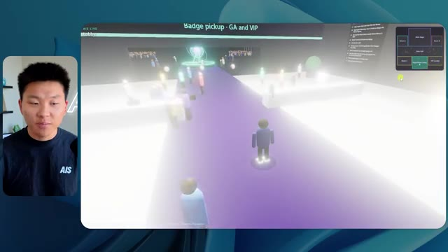
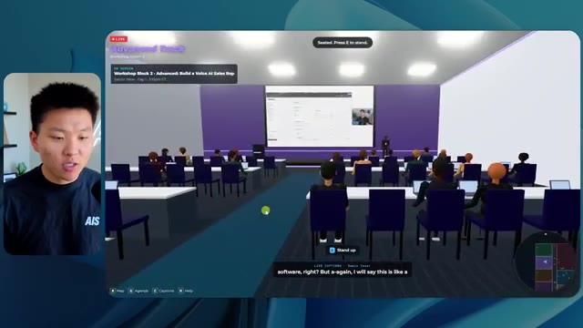
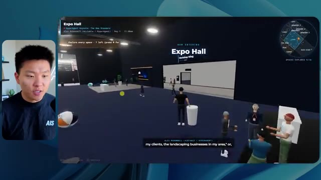

# 🎬 Claude Design 2 HOUR COURSE (Beginner to Pro)

> **Chaîne** : [Nate Herk | AI Automation](https://www.youtube.com/@nateherk/featured)  
> **Lien YouTube** : [https://www.youtube.com/watch?v=ovabeVoWrA0](https://www.youtube.com/watch?v=ovabeVoWrA0)  
> **Date de publication** : 20260430  
> **Durée** : 01:57:56  
> **Identifiant vidéo** : `ovabeVoWrA0`  
> **Transcription & Analyse** : `whisper-v3-large-turbo+gemini-3.5-flash-lite`  

---

## 📌 Synthèse Exécutive & Outils

### 💡 Résumé

Cette vidéo immersive de la chaîne *Nate Herk | AI Automation* propose une analyse empirique rigoureuse et comparative du modèle d'IA de pointe **Opus 5.5**, testé à travers ses différents niveaux d'effort (du mode "faible" au mode "code ultra") pour une tâche d'ingénierie logicielle et de design extrêmement complexe : la transformation d'un dossier Frame.io de 105 gigaoctets d'enregistrements vidéo en un monde 3D virtuel, interactif et explorable à la troisième personne simulant une conférence technologique réaliste (*AIS Live*).

Les démonstrations mettent en lumière l'impact direct de la configuration de l'effort sur l'autonomie des agents IA, la qualité visuelle, l'intégration des directives de marque et la cohérence de la simulation physique. Alors que le niveau d'effort "faible" produit un prototype rapide mais truffé de bugs visuels (personnages fantômes, images fixes au lieu de vidéos, non-respect de l'identité visuelle), le niveau d'effort "moyen" franchit un cap qualitatif impressionnant. Il génère une application fonctionnelle intégrant les palettes de couleurs de la marque, des PNJ dotés de micro-comportements, la lecture en temps réel des flux vidéo des ateliers et une navigation fluide dans les différentes salles (hall d'exposition, salon VIP, scène principale).

L'analyse de l'auteur démontre des métriques opérationnelles surprenantes, notamment en matière de consommation de tokens, de coûts d'API virtuels et de temps d'exécution. Elle souligne qu'une augmentation de l'effort améliore drastiquement la structure finale de l'application sans nécessiter d'interventions ou de questions supplémentaires de la part de l'agent, tout en posant la problématique critique du déploiement de ces prototypes fonctionnels vers la production en ligne.

### 🛠️ Outils, Modèles & Logiciels Présentés

* **Opus 5.5** : Modèle d'IA de pointe, ultra-rapide et économique, doté d'une intelligence supérieure et capable de gérer des requêtes complexes de développement et de design 3D.
* **Claude Code** : Environnement de programmation et d'assistance au développement utilisé pour piloter l'agent et exécuter les modifications de code.
* **Frame.io** : Plateforme de collaboration vidéo utilisée pour stocker et structurer les 105 gigaoctets d'enregistrements bruts de la conférence *AIS Live*.
* **Hostinger** : Sponsor et extension gratuite pour éditeur de code permettant d'intégrer les services d'hébergement et de mettre en ligne des applications web en un minimum de clics.
* **Système Herc 2** : Écosystème d'exploitation IA propriétaire de l'auteur servant de base de ressources et d'instructions pour les agents.

### 🔑 Points Clés & Enseignements Stratégiques

* **Impact direct du niveau d'effort sur la qualité** : La granularité de l'effort (faible, moyen, élevé, etc.) modifie profondément la fidélité visuelle, la gestion de la physique, le respect des chartes graphiques et la stabilité des flux multimédias intégrés.
* **Évolution de la fidélité contextuelle** : Le niveau d'effort "faible" génère des artefacts visuels majeurs (disparition de personnages, images statiques non lues, absence de branding), tandis que le niveau "moyen" réussit à structurer un univers immersif complet et cohérent.
* **Autonomie opérationnelle des agents** : Indépendamment du niveau d'effort choisi (bas ou moyen), l'agent a exécuté l'intégralité du prompt d'objectif complexe sans poser une seule question de clarification à l'utilisateur.
* **Économie de tokens et métriques d'exécution** : Le passage d'un effort faible (16 min 43 s, 191k tokens, 22 vérifications, 3,91 $) à un effort moyen (1h 13 min, 490k tokens, 23 vérifications, 12,44 $) démontre une augmentation proportionnelle des coûts de calcul et du temps de rendu, justifiée par la complexité de la production 3D.
* **Intégration multimédia dynamique** : Les agents performants ne se contentent pas de placer des espaces statiques ; ils intègrent et synchronisent des flux vidéo réels, des agendas de conférences et des ressources documentaires post-événement dans l'environnement 3D.
* **Gestion des PNJ (Personnages Non-Joueurs)** : Les efforts accrus permettent d'injecter des comportements basiques aux avatars présents dans la simulation (mouvements de bras, interactions contextuelles), renforçant l'immersion de la conférence virtuelle.
* **Recommandation méthodologique d'Anthropic** : Il est conseillé de débuter l'ingénierie de prompt avec un niveau d'effort moyen, puis d'ajuster les paramètres à la hausse ou à la baisse en fonction des besoins spécifiques de performance et de complexité du projet.
* **Le fossé du déploiement ("Deployment Gap")** : La création rapide d'un prototype fonctionnel par l'IA met en évidence un goulet d'étranglement classique en ingénierie logicielle : le passage de l'environnement local de développement à la mise en ligne rapide sur le web.
* **Importance des directives de marque** : Pour obtenir un résultat professionnel, l'agent doit être explicitement guidé ou alimenté par des directives de design strictes (palettes de couleurs, logos officiels d'AIS Live) afin d'éviter des rendus génériques.
* **Automatisation des tests visuels (Vérifications)** : Les agents exécutent de manière autonome des cycles de vérification (ouverture répétée du navigateur et tests interactifs) pour valider l'état fonctionnel de l'application générée en cours de route.

---

## ⏱️ Chronologie & Transcription Complète Audio & Visuelle (Mot pour Mot)

### ⏱️ `[00:00:00 - 00:00:20]` | Segment #01

**🔊 Audio (Transcription Intégrale Mot pour Mot en Français) :**
> Opus 5.5, Opus 5.5, Opus 5.5, Opus 5.5, Opus 5.5. Ce modèle est littéralement partout et pour de très bonnes raisons. Il est intelligent, il est bon marché, il a un goût incroyable, c'est un modèle d'IA incroyable. Mais avec chaque modèle d'IA, vous avez le choix de l'effort, que ce soit faible, moyen, élevé, extra, max ou code ultra.

**👁️ Analyse Visuelle d'Écran (gemini-3.5-flash-lite) :**
**Interface & Outils** : Interface du réseau social X (Twitter).

**Contenu textuel & Code** : Un tweet avec une vidéo intégrée montrant un environnement 3D/paysage tropical et le texte "It's a great time for hobbyists...".

**Action / Démonstration** : Affichage d'une publication virale illustrant les capacités des modèles d'IA récents.

*⏱️ 00:00:05 — Capture d'écran d'un post sur X (Twitter) montrant une vidéo de paysage tropical généré par IA et un texte sur la perturbation des créatifs techniques.*

---

### ⏱️ `[00:00:20 - 00:00:38]` | Segment #02

**🔊 Audio (Transcription Intégrale Mot pour Mot en Français) :**
> Donc, dans cette vidéo, j'ai donné exactement le même prompt à Opus 5.5 et je l'ai exécuté sur tous les niveaux d'effort, et nous allons comparer les résultats. Nous examinerons la qualité de toutes les différentes sorties réelles, mais nous allons également voir combien de temps chacun d'eux a fonctionné, combien cela nous a coûté si c'était une facturation par API, le nombre total de tokens, combien de vérifications ils ont exécutées, et combien de questions ils m'ont réellement posées tout au long du processus.

**👁️ Analyse Visuelle d'Écran (gemini-3.5-flash-lite) :**
**Interface & Outils** : Application de tableau blanc ou d'organisation (type Miro ou tableau de bord).

**Contenu textuel & Code** : Tableau comparatif avec les colonnes : Low, Medium, High, Extra, Max, Ultracode, et les lignes Run time, API cost, Total tokens, Checks, Questions asked.

**Action / Démonstration** : Présentation du tableau comparatif des performances selon les niveaux d'effort d'Opus 5.5.

*⏱️ 00:00:29 — Tableau comparatif sur fond sombre montrant les différents niveaux d'effort d'Opus 5.5 avec des métriques floutées.*

---

### ⏱️ `[00:00:39 - 00:00:58]` | Segment #03

**🔊 Audio (Transcription Intégrale Mot pour Mot en Français) :**
> Et les résultats que nous avons obtenus ne sont pas du tout ce à quoi je m'attends, donc j'ai hâte de partager cela avec vous les gars. Ne perdons pas de temps et allons directement à celui-ci. D'accord, alors plongeons-nous directement dans celui-ci. Je veux commencer simplement en vous montrant le prompt réel que nous avons utilisé, que nous avons donné à chacun de ces différents agents. Je vais aller dans les fichiers ici, et nous allons ouvrir ce fichier markdown de prompt, et je vais vous montrer ce que nous avons obtenu. Voici donc le slash objectif que j'ai fourni.

**👁️ Analyse Visuelle d'Écran (gemini-3.5-flash-lite) :**
**Interface & Outils** : Interface de l'application de développement / Agent IA (Opus 5.5, Ultracode) avec panneau latéral de gestion des sessions.

**Contenu textuel & Code** : Message de l'IA demandant l'autorisation de commencer à construire un monde 3D interactif basé sur PROMPT.md pour la conférence AIS Live.

**Action / Démonstration** : Affichage de l'interface de l'agent de développement avec un prompt en attente d'interaction utilisateur.

*⏱️ 00:00:48 — Interface de l'outil de développement montrant une conversation avec une IA (Opus 5.5 / Ultracode) concernant la création d'un monde 3D interactif.*

---

### ⏱️ `[00:00:58 - 00:01:34]` | Segment #04

**🔊 Audio (Transcription Intégrale Mot pour Mot en Français) :**
> J'ai dit, tu dois me créer un monde 3D qui est une conférence technologique réaliste dans laquelle je peux me promener en vue à la troisième personne. Tu vas regarder ce dossier, qui contient mes ressources d'enregistrement d'événements d'AIS Live. Et ce dossier est un dossier Frame.io de 105 gigaoctets d'enregistrements vidéo. C'était un événement complètement virtuel. Tout a été enregistré et tous les enregistrements sont ici même. J'ai dit, ton objectif est de prendre cet événement et de le transformer en un monde 3D explorable qui me donne l'impression d'être réellement allé à une vraie conférence en personne avec différentes salles, différentes pistes, différentes scènes, bla, bla, bla. N'hésite pas à utiliser key.ai si tu as besoin de générer des images ou des vidéos. Et tu peux aussi utiliser tout le reste à l'intérieur de mon projet Herc 2, qui est comme mon système d'exploitation IA. J'ai dit,

**👁️ Analyse Visuelle d'Écran (gemini-3.5-flash-lite) :**
**Interface & Outils** : Éditeur de code (VS Code / Cursor) et interface web Frame.io

**Contenu textuel & Code** : Fichier Markdown (PROMPT.md) contenant les instructions détaillées : création d'un monde 3D interactif en vue à la troisième personne, utilisation des ressources d'AIS Live, et évaluation sur la créativité, le design et la physique.

**Action / Démonstration** : Présentation du prompt initial et du dossier de ressources Frame.io de 105 Go pour la génération du monde 3D.

*⏱️ 00:01:07 — Éditeur de code affichant le fichier PROMPT.md avec les consignes pour créer un monde 3D de conférence technologique.*

*⏱️ 00:01:16 — Interface Frame.io montrant un dossier d'enregistrements d'événements AIS Live d'une taille de 105,69 Go.*

*⏱️ 00:01:25 — Éditeur de code montrant le contenu détaillé du prompt avec les instructions pour modéliser l'événement virtuel en 3D.*

---

### ⏱️ `[00:01:34 - 00:02:08]` | Segment #05

**🔊 Audio (Transcription Intégrale Mot pour Mot en Français) :**
> vous serez jugé sur la créativité, le design, la physique et la sensation générale lorsque j'explorerai le monde en 3D que vous avez construit. Et c'était fondamentalement la fin des instructions. Donc, comme vous pouvez le voir sur ce côté gauche, j'ai exécuté ceci à travers tous les différents niveaux d'effort. Commençons par le niveau bas et montons jusqu'à l'ultra code. Très bien. Donc ici, nous avons le résultat du niveau bas. Ouvrons ceci et jetons un œil. Nous avons donc AIS Live, le sommet des services IA enfin en personne, et nous avons pu cliquer partout. Tout d'abord, cela ne fait pas très personnalisé. Genre, ce n'of pas le logo d'IS Live. Ce n'est même pas nos couleurs. Donc je n'aime pas trop ça, mais entrons ici. D'accord. C'est bien trop lumineux. Euh, nous avons une carte en haut à droite. Nous avons une ville par ici. Je ne peux pas dire quelle ville c'est.

**👁️ Analyse Visuelle d'Écran (gemini-3.5-flash-lite) :**
**Interface & Outils** : Application de type éditeur ou agent IA avec barre latérale de gestion des sessions.

**Contenu textuel & Code** : Texte du prompt demandant de construire un monde 3D navigable à la troisième personne ("build a walkable third-person 3D world...").

**Action / Démonstration** : Navigation et sélection des différents niveaux de test (Hello, Extra, High, Max, Ultracode, Medium, Low) dans la barre latérale.

*⏱️ 00:01:42 — Interface d'une application d'IA montrant une liste de sessions de tests sur le panneau latéral gauche et un échange de messages concernant la construction d'un monde 3D.*

---

### ⏱️ `[00:02:08 - 00:02:40]` | Segment #06

**🔊 Audio (Transcription Intégrale Mot pour Mot en Français) :**
> c'est. D'accord. C'est Chicago, ce qui est plutôt cool parce que vous savez, je vis à Chicago, mais bref, en haut à droite, nous pouvons voir une carte. Nous avons un hall d'accueil. Nous avons un hall d'exposition. Nous avons le salon VIP, la scène principale. La carte montre également où se trouve chaque autre personne et cela se synchronise en direct. Nous pouvons donc voir l'enregistrement. Nous pouvons voir le premier jour, la keynote de l'agent Hyper, le débriefing en direct. Cool. Donc ça connaît réellement l'agenda et puis il y a le deuxième jour. Donc il a trouvé ça, c'est bien. Nous avons ces petites boules ici que je peux espérer botter. D'accord. Le visage, Oh, regardez ça. Si je vais par ici, toutes les personnes disparaissent tout simplement. Très mauvais. Très mauvais. D'accord. Alors voyons voir. Est-ce que je peux courir ? D'accord.

**👁️ Analyse Visuelle d'Écran (gemini-3.5-flash-lite) :**
**Interface & Outils** : Application web de monde virtuel interactif avec mini-carte de navigation.

**Contenu textuel & Code** : Plan du site virtuel (hall, exposition, salon VIP, scène principale) et programme de l'événement.

**Action / Démonstration** : Navigation et exploration des différentes salles de l'événement virtuel avec la mini-carte.

*⏱️ 00:02:16 — Vue d'un monde virtuel interactif avec des avatars et une mini-carte en haut à droite montrant différentes zones comme le hall, la scène principale et le salon VIP.*

*⏱️ 00:02:24 — Vue du hall d'un événement virtuel affichant le programme du jour sur un panneau et une mini-carte de navigation en haut à droite.*

*⏱️ 00:02:32 — Vue de l'Expo Hall virtuel avec des stands et des participants représentés par des avatars colorés, avec la mini-carte de l'événement en haut à droite.*

---

### ⏱️ `[00:02:40 - 00:03:04]` | Segment #07

**🔊 Audio (Transcription Intégrale Mot pour Mot en Français) :**
> Je peux avancer un peu plus vite. Je vais d'abord aller par ici. Il y a des produits promotionnels, euh, certifiés AIS plus glido. D'accord. Donc il y a les vrais stands qu'on avait dans l'événement virtuel. On avait des stands. Donc c'est plutôt cool. Un petit endroit pour prendre des photos. Salle C. En ce moment, nous avons Tangy Frederick qui anime un atelier. D'accord. Mais ce n'est pas une vidéo. Comme vous pouvez le voir, c'est juste une image. Elle ne bouge pas. Donc c'est juste une image. Ces gens sont en train de disparaître. Ce doivent être des fantômes. Allons par ici dans la salle A.

**👁️ Analyse Visuelle d'Écran (gemini-3.5-flash-lite) :**
**Interface & Outils** : Environnement virtuel 3D / jeu de type métavers avec affichage tête haute (HUD).

**Contenu textuel & Code** : Instructions textuelles sur écran virtuel et mini-carte de navigation.

**Action / Démonstration** : Navigation et exploration de l'espace d'exposition virtuel par le présentateur.

---

### ⏱️ `[00:03:04 - 00:03:30]` | Segment #08

**🔊 Audio (Transcription Intégrale Mot pour Mot en Français) :**
> Nous avons Liberty White. D'accord. Très cool. Vos trente premiers jours en automatisation. Encore une fois, c'est juste une image fixe et les gens ont des bugs visuels. Ce n'est donc pas très bon ici. Je vais aller sur la scène principale et voir ce que nous avons. D'accord, cool. Nous avons donc une scène qui a l'air principale. Les gens buguent. Vraiment beaucoup. Ce n'est vraiment pas bon du tout. Notre vidéo est en train de bouger. Genre, j'ai vu mon visage ici et j'ai vu celui de Devin, mais maintenant ils ont disparu. Je ne sais donc pas ce qui s'est passé. D'accord. On dirait que c'est plutôt un diaporama. Rien n'est encore vraiment diffusé. Bref, entrons ici.

**👁️ Analyse Visuelle d'Écran (gemini-3.5-flash-lite) :**
**Interface & Outils** : Environnement virtuel 3D de conférence en ligne (type metaverse/Gather Town).

**Contenu textuel & Code** : Interface de navigation 3D avec affichage des salles, écrans de présentation et avatars.

**Action / Démonstration** : Le présentateur navigue et explore les différentes salles virtuelles de la conférence.

*⏱️ 00:03:11 — Vue d'une salle d'atelier virtuelle (Workshop Room A) avec un avatar naviguant dans un espace 3D minimaliste.*

*⏱️ 00:03:17 — Vue de la scène principale (Main Stage) montrant un grand amphithéâtre virtuel rempli d'avatars de participants.*

*⏱️ 00:03:24 — Vue panoramique de la scène principale avec le grand écran affichant 'AIS LIVE AI Services Summit'.*

---

### ⏱️ `[00:03:30 - 00:03:58]` | Segment #09

**🔊 Audio (Transcription Intégrale Mot pour Mot en Français) :**
> Nous avons plus de stands. Nous avons hyper agent. Nous avons Claude Code. Nous avons plus de goodies. La salle B, c'est Dave Ebelor. Je suppose que c'est exactement la même chose. Nous avons du café. Et ensuite, je suppose que le salon VIP, c'est accès VIP uniquement. C'est plutôt cool, mais il n'y a vraiment rien qui se passe ici. Cet écran est bien trop lumineux. Bon. Donc je pense que vous comprenez l'ambiance qu'on obtient ici d'Opus 5.5 en effort faible. Et c'est là que les choses deviennent intéressantes. Combien de temps pensez-vous que cela a duré ? Combien de temps ? Celui-ci a duré 16 minutes et 43 secondes. Combien pensez-vous que cela a coûté ?

**👁️ Analyse Visuelle d'Écran (gemini-3.5-flash-lite) :**
**Interface & Outils** : Application web interactive / Tableau blanc virtuel (Canvas) et plateforme de métavers/simulation 3D.

**Contenu textuel & Code** : Tableau comparatif avec colonnes Low, Medium, High, Extra, Max, Ultracode et lignes Run time, API cost, Total tokens, Checks, Questions asked.

**Action / Démonstration** : Présentation des différents niveaux de performance et de coûts associés à des configurations d'agents ou de modèles d'IA.

*⏱️ 00:03:51 — Interface de tableau ou canvas montrant une matrice comparative avec des niveaux d'effort (Low, Medium, High, Extra, Max, Ultracode) et des métriques associées.*

---

### ⏱️ `[00:03:58 - 00:04:26]` | Segment #10

**🔊 Audio (Transcription Intégrale Mot pour Mot en Français) :**
> 3,91 dollars si c'était une facturation par API. J'utilise évidemment mon abonnement ici, mais nous allons simplement calculer cela avec la facturation par API. Le nombre total de jetons était de 191 000. Il a fait 22 vérifications. Donc pour la vérification, 22 fois il a ouvert le navigateur et a exécuté différentes sortes de vérifications. Donc 22 catégories de vérifications. Et combien de questions m'a-t-il posées ? Il m'a posé un total de zéro question tout au long de cette invite de commande d'objectif. D'accord. Alors, ouvrons l'effort moyen et voyons ce que nous avons. D'accord, c'est parti. Effort moyen. Nous avons Nate Herc. Nous avons mon badge. C'est marqué AI's Life.

**👁️ Analyse Visuelle d'Écran (gemini-3.5-flash-lite) :**
**Interface & Outils** : Tableau blanc ou application de mindmapping/diagramme (style Excalidraw ou similaire) avec le présentateur incrusté en médaillon à gauche.

**Contenu textuel & Code** : Tableau avec les lignes : Run time (16m 43s), API cost ($3.91), Total tokens (191.3K), Checks, Questions asked, et les colonnes Low, Medium, High, Ex.

**Action / Démonstration** : Le présentateur explique et commente les données chiffrées affichées dans le tableau comparatif des différents niveaux d'effort.

*⏱️ 00:04:05 — Un tableau comparatif montrant les métriques de performance et de coût, incluant le temps d'exécution (16m 43s), le coût API (3,91 $), le nombre total de jetons (191,3K) et les vérifications.*

---

### ⏱️ `[00:04:26 - 00:04:46]` | Segment #11

**🔊 Audio (Transcription Intégrale Mot pour Mot en Français) :**
> Donc ça a déjà l'air un petit peu mieux. Ça ressemble à nos palettes de couleurs qui ont utilisé nos directives de marque. Premier jour de construction, deuxième jour de gain, VIP. Cool. D'accord. Je vais entrer dans le lieu. D'accord. Waouh. Une ambiance donc un peu similaire. C'est en arrière-plan. Ça ne ressemble pas à Chicago pourtant, si ? Non, ça ressemble à un, honnêtement, ça ressemble à une ville inventée. Quoi qu'il en soit, c'est marrant qu'ils aient décidé de faire ça. Voyons si je peux me déplacer un peu plus vite. Oh, waouh.

**👁️ Analyse Visuelle d'Écran (gemini-3.5-flash-lite) :**
**Interface & Outils** : Application web interactive / Environnement virtuel 3D

**Contenu textuel & Code** : Page d'accueil de l'événement en ligne "AIS Live" avec options de navigation, contrôles clavier affichés et interface de jeu 3D.

**Action / Démonstration** : Le présentateur présente l'interface de connexion puis entre dans le lieu virtuel 3D.

*⏱️ 00:04:31 — L'interface web 'AIS Live' avec un badge d'accès au nom de Nate Herk et des boutons pour entrer dans le lieu virtuel.*

*⏱️ 00:04:41 — L'intérieur de l'espace virtuel 3D avec des avatars d'utilisateurs et une vue sur une ville gratte-ciel en arrière-plan.*

---

### ⏱️ `[00:04:46 - 00:05:21]` | Segment #12

**🔊 Audio (Transcription Intégrale Mot pour Mot en Français) :**
> Les gens interagissent avec moi. Regardez. Si je m'approche de ce type, il vient juste de lever le bras. Bon, maintenant il ne veut plus du tout avoir affaire à moi. Mais tous ces petits robots ici doivent prendre des décisions. Je ne sais pas s'ils utilisent Jev. Ils ne le font certainement pas. Je ne le lui ai pas dit. En fait, ma clé Jev est à l'arrière. Je ne sais pas. Peut-être qu'il l'a utilisée. Quoi qu'il en soit, nous pouvons voir ici que nous avons la salle d'atelier C, le laboratoire des agents. Sympa. Donc celui-ci est en fait en train de fonctionner. Vous pouvez voir qu'il s'agit d'une vraie vidéo lue par Tangy. Tout le monde ici est en train de travailler sur un ordinateur portable. Ils ne buguent pas. C'est plutôt cool. De plus, mon badge est sur ma poitrine, ce qui est plutôt cool. Je peux venir par ici. Nous avons une carte en haut à droite, comme vous pouvez le voir, mais je peux venir par ici. Nous avons un

**👁️ Analyse Visuelle d'Écran (gemini-3.5-flash-lite) :**
**Interface & Outils** : Environnement virtuel 3D / Plateforme collaborative immersive de type métavers ou jeu.

**Contenu textuel & Code** : Aucun code source, terminal ou prompt visible. Affichage d'informations de session en bas à gauche ('Enterprise AI Services').

**Action / Démonstration** : Navigation et exploration d'un environnement virtuel 3D par le présentateur.

---

### ⏱️ `[00:05:21 - 00:05:47]` | Segment #13

**🔊 Audio (Transcription Intégrale Mot pour Mot en Français) :**
> hall d'exposition. C'est là que nous avons le stand Glido. Et ça diffuse en ce moment. Oui, ça diffuse la vidéo de nous parlant de Glido. Ça diffuse la vidéo d'Ed et moi parlant de notre programme de certification. Nous avons le logo AIS Plus juste ici, qui est un peu dans un endroit bizarre. Ce sont les diapositives des conférenciers et les points clés. Donc wow, ce sont toutes les ressources que nous avons distribuées après l'événement. Elles sont toutes là également. Nous pouvons voir que nous avons un coup de projecteur sur la communauté. C'est donc Aiden qui parle de son contrat qu'il a décroché et c'est diffusé en direct. Ces gens regardent.

**👁️ Analyse Visuelle d'Écran (gemini-3.5-flash-lite) :**
**Interface & Outils** : Environnement virtuel 3D / plateforme d'exposition en ligne.

**Contenu textuel & Code** : Présentations et diapositives affichées sur les écrans du salon virtuel.

**Action / Démonstration** : Navigation et visite dans un salon d'exposition virtuel en 3D.

---

### ⏱️ `[00:05:47 - 00:06:21]` | Segment #14

**🔊 Audio (Transcription Intégrale Mot pour Mot en Français) :**
> Ils sont plutôt engagés. On a un hyper-agent. C'est ça, c'est ce que je voulais dire. Si vous avez vu ces gens lever les mains pour dire bonjour, c'était plutôt marrant. Regardez, regardez, le voilà qui recommence. Bref. Bon. Où est-ce que je suis maintenant ? Maintenant, je suis dans le hall principal. On a un bar à café. On a un grand logo, qui est le vrai logo. C'est trop lumineux, mais on a le logo. On peut voir si on peut entrer ici dans la piste des fondations. On a Sabrina Romanov et Liberty White. Donc différentes formations juste là. On peut entrer dans cette salle. C'est la piste avancée. Alors, qu'est-ce qui se passe ici ? On a Dave Ebelar et Saman qui parlent de différentes choses là-dedans. Et maintenant, allons jeter un œil à la scène principale. Oh, attendez, il y a une vidéo de moi là-haut. C'est genre un VIP

**👁️ Analyse Visuelle d'Écran (gemini-3.5-flash-lite) :**
**Interface & Outils** : Environnement virtuel 3D / Navigateur web (Metaverse / Application virtuelle)

**Contenu textuel & Code** : Avatars virtuels interagissant dans un espace de conférence 3D avec une mini-carte en haut à droite.

**Action / Démonstration** : Navigation et exploration d'un monde virtuel interactif habité par des agents ou des utilisateurs.

---

### ⏱️ `[00:06:21 - 00:06:50]` | Segment #15

**🔊 Audio (Transcription Intégrale Mot pour Mot en Français) :**
> section ? Ouais, on ira voir ça dans une minute. Mais bref, voici la scène principale. Ça a l'air vraiment, vraiment très bien. On a une grande scène. On a genre quatre personnes assises ici. On a les trois écrans d'Alex là-haut avec hyper agent. Est-ce que j'ai le droit de monter sur scène ? Oh, et il me laisse monter sur scène. D'accord. C'est plutôt sympa. Bon les gars, prenons un selfie. Laissez-moi prendre tout le monde en arrière-plan. Venez ici. Bref, ça c'est vraiment, vraiment cool. Toutes les places ne sont pas occupées par contre. Donc il va falloir travailler là-dessus. Mais bref, je vais y retourner en courant pour voir ce que c'était que cette section VIP. D'accord. Le salon VIP. J'ai l'impression que c'est comme un aéroport ou un truc comme ça.

**👁️ Analyse Visuelle d'Écran (gemini-3.5-flash-lite) :**
**Interface & Outils** : Environnement virtuel 3D / Plateforme métavers de conférence (Hyperagent)

**Contenu textuel & Code** : Interface utilisateur virtuelle affichant les détails de la keynote, le titre "Hyperagent Keynote", et la mini-carte de l'auditorium.

**Action / Démonstration** : Navigation et exploration de l'espace virtuel de conférence par l'avatar du présentateur.

*⏱️ 00:06:28 — Vue principale de l'auditorium virtuel avec des écrans de présentation Hyperagent et des spectateurs assis.*

*⏱️ 00:06:36 — Vue de dos de l'avatar naviguant sur la grande scène virtuelle face au public.*

*⏱️ 00:06:43 — Vue en plongée montrant l'avatar traversant l'allée centrale de la salle de conférence virtuelle remplie d'avatars.*

---

### ⏱️ `[00:06:51 - 00:07:14]` | Segment #16

**🔊 Audio (Transcription Intégrale Mot pour Mot en Français) :**
> Ok, super. Donc maintenant nous avons les sessions VIP ici. Une foire aux questions VIP avec la lecture vidéo en direct de Nate juste ici. Très, très cool. Et nous avons comme un bar ou quelque chose du genre. Génial. Je dirais que c'est un assez bon résultat. Maintenant, en ce qui concerne les statistiques ici, celle-ci a pris une heure et 13 minutes à s'exécuter. Cela nous aurait coûté 12 dollars et 44 cents. Elle a utilisé 490 000 jetons et elle a effectué 23 vérifications.

**👁️ Analyse Visuelle d'Écran (gemini-3.5-flash-lite) :**
**Interface & Outils** : Interface de monde virtuel 3D et tableau de bord de métriques "Opus 5.5 Efforts".

**Contenu textuel & Code** : Métriques d'exécution d'agents ou de modèles (Run time: 16m 43s, API cost: $3.91, Total tokens: 191.3K, Checks: 22, Questions asked: 0).

**Action / Démonstration** : Navigation dans l'espace virtuel 3D puis transition vers l'analyse des coûts et des performances d'exécution.

*⏱️ 00:06:56 — Capture montrant une visite virtuelle d'un espace VIP en 3D avec un écran géant affichant une session vidéo en direct (Q&A avec Nate).*

*⏱️ 00:07:02 — Capture montrant un tableau comparatif de performances "Opus 5.5 Efforts" affichant des métriques telles que le temps d'exécution (16m 43s), le coût API ($3.91) et le nombre total de tokens (191.3K).*

---

### ⏱️ `[00:07:14 - 00:07:48]` | Segment #17

**🔊 Audio (Transcription Intégrale Mot pour Mot en Français) :**
> Et il nous a posé un total de zéro question une fois de plus. Très bien, passons au niveau élevé. C'était déjà un résultat plutôt correct et Anthropic eux-mêmes dans leur vidéo de comment prompter Opus 5.5, ou désolé, pas une vidéo, un article. Ils ont dit de simplement commencer au niveau moyen et de l'ajuster à la hausse ou à la baisse si nécessaire. C'était donc un résultat moyen. Passons au niveau élevé et voyons ce qu'on a obtenu. Très rapidement les gars, je dois prendre une seconde pour vous parler du sponsor de la vidéo d'aujourd'hui, Hostinger. Donc ces deux modèles viennent de me construire une version fonctionnelle de la même chose. Et maintenant je suis exactement là où je finis toujours par me retrouver avec un produit fini sur mon ordinateur portable et aucun moyen rapide de le mettre en ligne. Et c'est le fossé que comble le connecteur d'Hostinger. C'est une extension gratuite

**👁️ Analyse Visuelle d'Écran (gemini-3.5-flash-lite) :**
**Interface & Outils** : Tableau de bord analytique et interface de développement / éditeur de code de type IDE.

**Contenu textuel & Code** : Métriques de performance (durée, coût API, jetons) dans le tableau et prompt de création d'une page HTML de calcul ROI avec le modèle Opus 5.5.

**Action / Démonstration** : Analyse comparative des coûts et des temps d'exécution par niveau d'effort, suivie d'une démonstration de génération de code par l'IA.

*⏱️ 00:07:22 — Un tableau comparatif des performances et coûts de l'agent (Run time, API cost, Total tokens, Checks, Questions asked) selon différents niveaux d'effort (Low, Medium, High, Extra).*

*⏱️ 00:07:39 — Une interface de développement avec des panneaux montrant le prompt de construction d'un calculateur ROI (Northwind ROI calculator) et des étapes de réflexion de l'IA (dataviz skill, Thinking, Ruminating).*

---

### ⏱️ `[00:07:48 - 00:08:23]` | Segment #18

**🔊 Audio (Transcription Intégrale Mot pour Mot en Français) :**
> pour votre éditeur qui intègre votre compte Hostinger dans l'outil de programmation que vous utilisez déjà. Que ce soit VS Code, Cursor, Cloud Code, Codex, et j'en passe. Vous vous connectez une seule fois en un clic, et à partir de là, votre agent peut déployer le site, y associer un domaine, configurer les enregistrements DNS et vérifier votre VPS sans que vous n'ayez jamais à quitter l'éditeur. Ainsi, peu importe celui de ces outils que vous préférez, ce qu'il a construit se trouve à quelques minutes d'une vraie URL sur un hébergement géré. Le connecteur est gratuit avec n'importe quel plan d'hébergement, donc si vous avez encore besoin de l'hébergement en dessous, prenez le plan illimité avec le lien dans la description et utilisez le code NATEHERK pour 10 % de réduction. Cela inclut également un nom de domaine gratuit et un e-mail professionnel pour l'année. Et c'est toujours le moyen le moins cher que j'ai trouvé pour obtenir quelque

**👁️ Analyse Visuelle d'Écran (gemini-3.5-flash-lite) :**
**Interface & Outils** : Interface web Hostinger / IDE (Claude Code)

**Contenu textuel & Code** : "Manage Hostinger from your IDE", statut "Connected VIA OAUTH", liste des outils disponibles (Websites, Domains, Subscriptions & Payments, Email Marketing).

**Action / Démonstration** : Connexion réussie du compte Hostinger à l'IDE via OAuth avec affichage des outils accessibles pour l'assistant.

*⏱️ 00:07:57 — Interface montrant l'intégration de Hostinger dans un IDE avec le statut de connexion actif et les outils disponibles (websites, domains, etc.) aux côtés de Claude Code.*

---

### ⏱️ `[00:08:23 - 00:08:47]` | Segment #19

**🔊 Audio (Transcription Intégrale Mot pour Mot en Français) :**
> vous avez construit sur une vraie URL. Donc retournons à la vidéo. D'accord. Encore une fois, très, très marqué par la marque. C'est un écran de chargement encore mieux que le précédent. Nous avons ce petit effet sympa en arrière-plan. Nous avons le logo. Nous allons entrer dans le lieu. D'accord. Nous y voilà. Ça a l'air plutôt bien. Nous commençons à l'extérieur et vous pouvez voir que nous avons ces drapeaux pour tous les intervenants, Wyatt, Casper, Alex, Ed, Aiden, Sabrina, Liberty. C'est plutôt cool. Nous avons des blocs en direct ici.

**👁️ Analyse Visuelle d'Écran (gemini-3.5-flash-lite) :**
**Interface & Outils** : Application web interactive en 3D / environnement virtuel hébergé sur RingCentral.

**Contenu textuel & Code** : Interface d'événement virtuel 'AIS Live', bannières d'événements, instructions de touches (WASD, Space, Tab), nom de l'espace 'AIS Live Plaza'.
[DESC_IMAGE_3] Navigation dans la place virtuelle 3D 'AIS Live Plaza' avec des bannières de conférenciers et des éléments interactifs.

**Action / Démonstration** : Connexion et entrée dans le lieu virtuel 3D de l'événement AIS Live, puis exploration de la place publique avec l'avatar.

*⏱️ 00:08:29 — Écran de chargement et d'accueil de la plateforme virtuelle 'AIS Live' avec le logo et les instructions de contrôle clavier/souris.*

*⏱️ 00:08:35 — Vue dans le monde virtuel 3D 'AIS Live Plaza' montrant des avatars et un environnement urbain stylisé avec des bâtiments et des arbres.*

*⏱️ 00:08:41 — Navigation dans la place virtuelle 3D 'AIS Live Plaza' avec des bannières de conférenciers affichant les noms des intervenants.*

---

### ⏱️ `[00:08:47 - 00:09:23]` | Segment #20

**🔊 Audio (Transcription Intégrale Mot pour Mot en Français) :**
> Il a pris cette photo de moi, votre hôte, Nate Herc, John, Dave, Nate Herc. Voilà. D'accord. Les portes. C'est génial. Ce sont des portes vitrées coulissantes automatiques. J'adore ça. Nous pouvons voir l'enregistrement VIP. Nous pouvons voir l'admission générale. Nous pouvons venir ici et nous pouvons découvrir l'expo avec différents stands, le coin de la communauté. Vous pouvez également voir qu'en haut à gauche, j'ai un passeport. Donc c'est genre, ça montrera combien d'endroits j'ai visités. Tout cela est une lecture réelle. Nous avons un mur de ressources avec tous les différents conférenciers. Ils ont aussi une session de networking par ici. Je vais donc venir très vite et voir de quoi il retourne. Nous avons donc le bar à cold brew AIS. Nous avons différents membres de la communauté qui ont été mis en avant ou en valeur.

**👁️ Analyse Visuelle d'Écran (gemini-3.5-flash-lite) :**
**Interface & Outils** : Application ou plateforme virtuelle en 3D (metaverse / espace événementiel virtuel).

**Contenu textuel & Code** : Environnement virtuel 3D interactif avec interface utilisateur d'événement (Registration Concourse, VIP Check-in, Main Stage).

**Action / Démonstration** : Exploration et navigation en 3D au sein de l'espace virtuel de l'événement.

*⏱️ 00:08:56 — Vue d'un monde virtuel interactif montrant l'accueil d'un événement avec des comptoirs d'enregistrement et une scène principale.*

*⏱️ 00:09:05 — Navigation dans un hall d'exposition virtuel avec des stands et des panneaux d'information.*

*⏱️ 00:09:14 — Déplacement d'avatars dans le hall du centre de conférence virtuel en 3D.*

---

### ⏱️ `[00:09:23 - 00:09:56]` | Segment #21

**🔊 Audio (Transcription Intégrale Mot pour Mot en Français) :**
> On a l'aile VIP. Attends, quoi ? Récupère un bracelet. Oh, je dois vraiment aller chercher le bracelet. D'accord. Laisse-moi m'enregistrer rapidement. Le bracelet est déjà mis. Attends, quoi ? D'accord. Oh, d'accord. Maintenant, les portes se sont ouvertes pour moi. Cool. Je peux entrer ici. Oh, ça mène juste à la scène principale. Salon VIP. Il y a une séance de questions-réponses en cours. Ça a l'air très sympa. Je veux dire, je suis très impressionné par la façon dont il parvient à faire ça. Waouh. D'accord. Donc c'est vraiment bien. Ce qu'on a fait, c'est qu'on a eu des salles de discussion VIP avec différentes personnes. Tu peux voir qu'il y a différentes salles, différents membres de l'équipe AIS qui participent à des trucs. C'est vraiment cool. C'est très cool. C'est un VIP bien meilleur

**👁️ Analyse Visuelle d'Écran (gemini-3.5-flash-lite) :**
**Interface & Outils** : Application ou plateforme virtuelle 3D interactive (environnement de conférence ou d'événement virtuel)

**Contenu textuel & Code** : Interface utilisateur virtuelle avec menus de navigation, mini-carte, indicateurs de progression et affichage des sessions VIP

**Action / Démonstration** : Navigation et exploration de différents espaces virtuels (hall, salon VIP, sessions de travail) dans l'application 3D

*⏱️ 00:09:32 — Le présentateur navigue dans un espace virtuel 3D montrant le hall d'enregistrement (Registration Concourse).*

*⏱️ 00:09:40 — L'avatar se trouve dans la zone VIP Lounge avec des écrans de présentation et d'autres participants.*

*⏱️ 00:09:48 — L'avatar explore une salle de travail VIP (VIP Working Sessions) avec plusieurs tables thématiques.*

---

### ⏱️ `[00:09:56 - 00:10:30]` | Segment #22

**🔊 Audio (Transcription Intégrale Mot pour Mot en Français) :**
> expérience que celle qui a été montrée dans le premier extrait. D'accord. After party VIP. Regardez ça. Nous avons une piste de danse. Nous avons tous ces éléments ici. Nous avons la lecture de l'after party VIP juste ici. Et il y a une estrade pour DJ. C'est trop marrant. Il y a un petit bug ici, un petit glitch par ici, mais c'est génial. Oh, super. Donc quand je suis ici sur la scène principale, nous avons des sous-titres. Vous pouvez voir juste ici en bas de mon écran, nous avons ces sous-titres de Wyatt qui est en train de parler là-haut. Nous avons des lumières. Nous avons le panel. Très cool. Belle scène principale. Je vais aller par ici, nous pouvons aller à la fondation,

**👁️ Analyse Visuelle d'Écran (gemini-3.5-flash-lite) :**
**Interface & Outils** : Application ou plateforme virtuelle 3D interactive (espace métavers / conférence virtuelle).

**Contenu textuel & Code** : Environnement virtuel 3D avec affichage de flux vidéo en direct des participants, interface de navigation, et informations sur les événements.

**Action / Démonstration** : Navigation et exploration d'un espace virtuel interactif de conférence et de fête.

*⏱️ 00:10:04 — Capture d'écran montrant l'interface d'un espace virtuel 3D (« VIP After-Party ») avec des avatars sur une piste de danse et un grand écran vidéo.*

*⏱️ 00:10:13 — Capture d'écran montrant une vue plus large de l'espace virtuel de l'after-party avec des ballons de plage et des avatars dansants.*

*⏱️ 00:10:21 — Capture d'écran montrant une salle de conférence virtuelle 3D (« Main Stage ») avec un grand écran de présentation et des rangées de sièges.*

---

### ⏱️ `[00:10:30 - 00:11:06]` | Segment #23

**🔊 Audio (Transcription Intégrale Mot pour Mot en Français) :**
> avancé, et les parcours d'entreprise par ici. Alors voyons voir. Nous avons l'anatomie de trois vraies transactions. Nous avons hyper agent. Nous avons les évaluations avec Nate et Ed ici. Nous avons Dave qui s'occupe des trucs avancés. C'est vraiment bien. Je veux dire, évidemment, chacun, chacun de ces résultats jusqu'à présent, le niveau bas était correct. Le niveau moyen était meilleur. Le niveau élevé a été encore meilleur. Voyons si cette tendance se poursuit et allons voir ce que cela nous a coûté. Le niveau élevé a donc tourné pendant une heure et sept minutes. Donc un peu plus rapide que le niveau moyen, cela nous aurait coûté 16 dollars et 31 cents. Il a utilisé un demi-million de tokens, 509 000. Il a fait 22 vérifications. Et il nous a aussi demandé, enfin, non, je me suis trompé, ce

**👁️ Analyse Visuelle d'Écran (gemini-3.5-flash-lite) :**
**Interface & Outils** : Application de tableau blanc / diagramme (style Excalidraw) avec un tableau comparatif de données d'exécution.

**Contenu textuel & Code** : Tableau montrant les données suivantes : Low (Run time: 16m 43s, API cost: $3.91, Total tokens: 191.3K, Checks: 22, Questions: 0), Medium (1h 13m, $12.44, 419.2K tokens, 23 checks), High (1h 7m, $16.31), et Extra.

**Action / Démonstration** : Analyse et présentation comparative des coûts et temps d'exécution de transactions d'agents IA selon différents niveaux d'effort.

*⏱️ 00:10:57 — Tableau comparatif sur une interface de type tableau blanc/diagramme montrant les métriques de performance et coûts (Run time, API cost, Total tokens) selon différents niveaux d'effort (Low, Medium, High, Extra).*

---

### ⏱️ `[00:11:06 - 00:11:25]` | Segment #24

**🔊 Audio (Transcription Intégrale Mot pour Mot en Français) :**
> l'un m'a posé une question et spoiler, c'était le seul qui nous a posé une question pendant tout ça. Donc voyons voir, il nous en reste trois : extra, max et ultra code. Laissez-moi ouvrir extra et nous verrons ce qu'on a. D'accord. Donc celui-ci a l'air plutôt bien. Je dirais honnêtement que jusqu'à présent, l'écran de chargement haut était le meilleur, celui qu'on vient juste de voir, mais bref, entrons dans le direct d'AIS.

**👁️ Analyse Visuelle d'Écran (gemini-3.5-flash-lite) :**
**Interface & Outils** : Application web ou tableau de bord de type interface utilisateur (UI) avec un panneau vidéo du présentateur en incrustation à gauche.

**Contenu textuel & Code** : Un tableau de données comparatives : Low (16m 43s, $3.91, 191.3K tokens, 22 checks, 0 questions), Medium (1h 13m, $12.44, 419.2K tokens, 23 checks, 0 questions), High (1h 07m, $16.31, 509.3K tokens, 22 checks, 1 question) et une colonne "Extra" sélectionnée.

**Action / Démonstration** : Le présentateur commente et examine les résultats des tests affichés dans le tableau pour la colonne "Extra".

*⏱️ 00:11:11 — Un tableau comparatif affichant les métriques (Run time, API cost, Total tokens, Checks, Questions asked) pour différents niveaux d'efforts ("Low", "Medium", "High", "Extra").*

---

### ⏱️ `[00:11:26 - 00:11:51]` | Segment #25

**🔊 Audio (Transcription Intégrale Mot pour Mot en Français) :**
> Whoa. D'accord. Donc on a comme de petits extraits sonores. Je peux discuter avec des gens. Le panneau sur la guerre des outils a réglé quelques débats pour moi. Sympa. Bonne perspective là-bas. On est dehors à nouveau. On a ces différentes bannières, bien qu'elles soient toutes les mêmes. Elles n'affichent pas de noms de personnes différentes. Donc grand logo AIS Live. L'aile des ateliers est par ici. Et passons par les portes coulissantes en verre pour voir ce qu'on a. Donc on a le café AIS. La carte est en bas à droite, et elle n'est pas très descriptive.

**👁️ Analyse Visuelle d'Écran (gemini-3.5-flash-lite) :**
**Interface & Outils** : Application ou plateforme virtuelle 3D / métavers avec mini-carte et interface utilisateur en incrustation.

**Contenu textuel & Code** : Environnement graphique 3D simulant une convention extérieure avec des avatars interactifs.
[DESC_IMAGE_3] Navigation et exploration à la troisième personne dans un espace virtuel 3D interactif.

**Action / Démonstration** : Explications face caméra et démonstration conceptuelle.

*⏱️ 00:11:32 — Vue dans un monde virtuel 3D (type métavers) avec un avatar de personnage et des bannières publicitaires textuelles.*

*⏱️ 00:11:38 — L'avatar poursuit sa progression dans la place centrale du monde virtuel avec des bâtiments urbains en arrière-plan.*

*⏱️ 00:11:45 — L'avatar entre dans un bâtiment lumineux et moderne du monde virtuel 3D.*

---

### ⏱️ `[00:11:51 - 00:12:26]` | Segment #26

**🔊 Audio (Transcription Intégrale Mot pour Mot en Français) :**
> J'aime bien comment les autres cartes nous ont dit ce que, genre où étaient les choses, mais celle-ci a l'air très professionnelle. On peut voir, voici la scène principale. Allons y faire un tour rapidement. Elles ont toutes ces balles qui volent partout, ce que je trouve assez marrant. Les ballons de plage AIS. On me voit là-haut en train de parler. Je crois que j'étais en train de faire l'introduction d'un des jours. Continuons à avancer par ici vers la salle d'atelier sur ce côté gauche. OK. Donc ici, nous avons le théâtre Hyper Agent. Nous avons cette session sponsorisée ici par Hyper Agent, mais ça nous montre aussi ce qui va s'y passer. C'est vraiment marrant qu'on puisse discuter avec des gens. Salmon a créé un représentant commercial vocal en direct. La salle "The Price Is Right" était comble. Tu as pris le guide du compagnon VIP ? C'est trop marrant. Nous avons le parcours avancé dans

**👁️ Analyse Visuelle d'Écran (gemini-3.5-flash-lite) :**
**Interface & Outils** : Application web 3D interactive, monde virtuel avec avatars et interface de chat.

**Contenu textuel & Code** : Environnement virtuel 3D interactif avec des avatars et du texte contextuel.

**Action / Démonstration** : Exploration des différentes zones de l'événement virtuel en guidant un avatar à l'écran.

*⏱️ 00:12:00 — Vue dans un espace virtuel 3D représentant une grande scène de conférence avec des avatars et un écran géant diffusant une vidéo.*

*⏱️ 00:12:09 — Navigation dans le hall d'un espace virtuel 3D avec des avatars interactifs et des panneaux de signalétique "Workshops".*

*⏱️ 00:12:17 — Exploration d'un couloir virtuel 3D avec des avatars et des bulles de texte montrant des interactions textuelles.*

---

### ⏱️ `[00:12:26 - 00:12:58]` | Segment #27

**🔊 Audio (Transcription Intégrale Mot pour Mot en Français) :**
> ici. Encore une fois, nous avons la lecture en direct. Est-ce que c'est la lecture en direct ? Oh, d'accord. Ça a commencé une fois que je suis entré, mais je peux m'asseoir. Oh la la. Je peux regarder ça. Je peux me lever. Je veux m'asseoir au premier rang. C'est plutôt cool. C'est très bien. J'aime ça. Et tu sais ce que j'ai remarqué jusqu'à présent ? Le personnage que j'incarne me ressemble un peu. Je pense qu'il s'est inspiré de mes photos de profil ou quelque chose comme ça. Bref, nous avons Sabrina ici, l'animatrice de la salle ici, prenez n'importe quel siège libre. D'accord, super. Et j'ai vraiment aimé la fonctionnalité pour s'asseoir. C'est assez marrant. Genre, on pourrait vraiment assister à cet atelier et participer. Bref, ça nous montre les conférenciers. Ça nous montre les

**👁️ Analyse Visuelle d'Écran (gemini-3.5-flash-lite) :**
**Interface & Outils** : Application web de réunion virtuelle / métavers éducatif (type Gather.town ou plateforme similaire de conférence en ligne)

**Contenu textuel & Code** : Interface utilisateur avec des options de navigation (Map, Agenda, Captions), un écran de projection affichant un séminaire et des participants sous forme d'avatars.

**Action / Démonstration** : Navigation et exploration de l'espace virtuel de conférence par le présentateur en explorant différents ateliers et pistes thématiques.

*⏱️ 00:12:34 — Vue d'un espace virtuel interactif (semblable à Gather.town ou un métavers) montrant un atelier intitulé "Advanced Track : Build a Voice AI Sales Rep" avec des avatars d'utilisateurs.*

*⏱️ 00:12:42 — Navigation dans la salle virtuelle pour l'atelier "Foundation Track : Build Your First AI Content Engine" montrant l'écran de projection et le présentateur.*

*⏱️ 00:12:50 — Déplacement de l'avatar dans la salle virtuelle du "Foundation Track" face à l'écran de présentation géant affichant l'interface de l'atelier.*

---

### ⏱️ `[00:12:58 - 00:13:31]` | Segment #28

**🔊 Audio (Transcription Intégrale Mot pour Mot en Français) :**
> ordre du jour. Il y a un petit tapis rouge ici pour prendre des photos. On peut prendre la pose. Oh, wouah. C'est plutôt cool. Bibliothèque de ressources, obtenez la certification AIS Plus, Glido, Hyper Agent, AIS Plus, trois vraies affaires. Génial. Je veux dire, je dirais vraiment que jusqu'à présent, chacune est meilleure. Et on n'a même pas encore vérifié la section VIP, le salon VIP. Allons par ici très vite. J'espère que je pourrai entrer. Sympa. On a une réinitialisation des outils. Ce sont les différentes pièces dans lesquelles on pourrait aller. Donc encore une fois, je pourrais prendre la feuille de calcul et je pourrais essayer de comprendre comment tarifer mes trucs. C'est tellement cool. C'est nettement mieux que le précédent où on a juste en quelque sorte

**👁️ Analyse Visuelle d'Écran (gemini-3.5-flash-lite) :**
**Interface & Outils** : Application ou plateforme virtuelle interactive en 3D (type événement virtuel en ligne).

**Contenu textuel & Code** : Environnement virtuel 3D avec affichage de panneaux textuels, bannières de sponsors et avatars d'utilisateurs.

**Action / Démonstration** : Navigation et exploration d'un espace virtuel interactif 3D lors d'une présentation.

---

### ⏱️ `[00:13:31 - 00:13:59]` | Segment #29

**🔊 Audio (Transcription Intégrale Mot pour Mot en Français) :**
> genre a regardé des trucs. Génial. Je peux aller derrière le bar et venir ici. C'est très bien. Bon. Alors, en ce qui concerne les statistiques, celui-ci a tourné pendant une heure et demie. Il a coûté 25,92 dollars. Je ne sais pas pourquoi je dis point 25,92 cents. C'était 733 000 jetons et 34 vérifications. Il a donc eu le plus grand nombre de vérifications de loin jusqu'à présent. Et il ne nous a posé zéro question. J'ai hâte de voir ce qu'on a obtenu ici de max et ultra code. Bon. Voici les écrans de chargement de max, ennuyeux, mais c'est dans l'esprit de la marque et il y a notre logo.

**👁️ Analyse Visuelle d'Écran (gemini-3.5-flash-lite) :**
**Interface & Outils** : Présentation ou face-caméra explicatif sans interface logicielle partagée.

**Contenu textuel & Code** : Explications orales et mise en contexte méthodologique.

**Action / Démonstration** : Explications face caméra et démonstration conceptuelle.

---

### ⏱️ `[00:14:00 - 00:14:35]` | Segment #30

**🔊 Audio (Transcription Intégrale Mot pour Mot en Français) :**
> Donc c'était bien. J'aime bien. On va continuer et entrer dans AIS live. Ooh, petite animation sympa ici qui nous fait entrer. Encore une fois, le personnage me ressemble. Ils m'ont tous ressemblé. Enfin, en gros, nous sommes assis en arrière-plan. Ça ressemble à Chicago. Comme je l'mentionné plus tôt, beaucoup de ceux-ci jouent des sons et je n'inclus pas cela parce que ce serait très perturbateur pour vous d'essayer d'écouter ce qui se passe en même temps que je parle. Donc il y a comme une légère musique dans tout ça. Je déteste la façon dont il marche. Cette marche est vraiment, vraiment mauvaise. Je veux dire, la marche, ouais, je n'aime pas du tout ça. Donc ce n'est pas génial. Mais à part ça, allons explorer. Remarquez ces ombres quand j'entre, elles changent vraiment, je ne sais pas trop pourquoi,

**👁️ Analyse Visuelle d'Écran (gemini-3.5-flash-lite) :**
**Interface & Outils** : Application web 3D immersive / plateforme virtuelle « AIS live » avec interface de type jeu vidéo (mini-carte, commandes clavier en bas).

**Contenu textuel & Code** : Environnement virtuel 3D interactif avec avatars, bâtiments urbains stylisés, bannières informatives et interface de navigation en surimpression.

**Action / Démonstration** : Navigation et exploration de l'espace virtuel 3D par le présentateur contrôlant son avatar.

*⏱️ 00:14:08 — Vue d'un monde virtuel 3D (AIS live) montrant un personnage avatar de type jeu vidéo se déplaçant sur une place urbaine, avec le présentateur en incrustation à gauche.*

*⏱️ 00:14:17 — L'avatar se rapproche d'un bâtiment moderne dans l'environnement virtuel 3D, montrant des bannières et d'autres personnages PNJ.*

*⏱️ 00:14:26 — L'avatar continue sa progression dans l'espace virtuel 3D, s'approchant de l'entrée d'un bâtiment principal d'exposition.*

---

### ⏱️ `[00:14:35 - 00:15:11]` | Segment #31

**🔊 Audio (Transcription Intégrale Mot pour Mot en Français) :**
> Mais de toute façon, nous pouvons aussi discuter avec des gens ici. Le stand Hyperagent est juste là où l'on entre dans l'exposition. Tout va bien. D'accord, cool. Je peux continuer à appuyer sur E pour leur faire changer ce qu'ils disent. Nous avons les conférenciers juste ici. Ça a l'air plutôt bien. Bien que nous ayons vraiment eu la photo de profil de tout le monde. Je ne sais donc pas pourquoi ce n'est pas inclus là. Nous voyons des gens prendre des photos juste ici. J'adore ça. Et ça enregistre une petite photo. D'accord. La carte n'est pas non plus super, genre, elle ne me donne pas une super explication de ce qui se passe, mais j'aime ces stands. Ils sont cool. Je pense que ces stands sont les meilleurs que j'ai vu jusqu'à présent. Genre, ils ont juste l'air bien. Ils ont des représentants. Il y a de superbes diaporamas derrière eux. Ouais. Ces stands sont cool. D'accord. Nous avons un petit théâtre mis en avant

**👁️ Analyse Visuelle d'Écran (gemini-3.5-flash-lite) :**
**Interface & Outils** : Environnement virtuel 3D multi-utilisateurs (type salon virtuel d'événement).

**Contenu textuel & Code** : Interface de navigation en 3D, panneaux d'affichage des conférenciers, mini-carte et commandes clavier en bas de l'écran.

**Action / Démonstration** : Navigation et exploration de l'espace virtuel par le présentateur incarné par un avatar.

*⏱️ 00:14:44 — Vue d'un espace de réception virtuel en 3D avec des avatars d'utilisateurs et des écrans d'affichage, commenté par le présentateur.*

*⏱️ 00:14:53 — Le présentateur navigue dans le hall virtuel, passant près de tables de discussion avec des avatars interagissant.*

*⏱️ 00:15:02 — Entrée dans le hall d'exposition virtuel (Expo Hall) montrant divers stands d'entreprises et de laboratoires d'IA.*

---

### ⏱️ `[00:15:11 - 00:15:35]` | Segment #32

**🔊 Audio (Transcription Intégrale Mot pour Mot en Français) :**
> qui se passe par ici. C'est Casper. Bien que, pourquoi est-ce que ça ne se lit pas ? J'ai l'impression que ça devrait se lire, non ? Comme dans les autres, ils étaient toujours en train de jouer. On peut parler à d'autres personnes par ici. Le café est gratuit. Blabla. Amy Simpson, Matt Wolf. Sympa. D'accord. C'est juste la zone de réseautage dans laquelle nous sommes en ce moment, mais on peut voir en haut à droite. On peut aussi voir ce qui est en direct sur la scène principale en ce moment. C'est un panel de guerre des outils. Alors allons par ici. Nous avons Devin, Cole, Dave et Russ qui discourent ici. On a en gros de l'audiovisuel, des trucs de lumière par ici.

**👁️ Analyse Visuelle d'Écran (gemini-3.5-flash-lite) :**
**Interface & Outils** : Application web 3D de salon virtuel / métavers de conférence.

**Contenu textuel & Code** : Environnement virtuel 3D interactif avec affichage d'informations de salon et de mini-cartes.

**Action / Démonstration** : Navigation et exploration d'un monde virtuel interactif par le présentateur.

---

### ⏱️ `[00:15:36 - 00:15:55]` | Segment #33

**🔊 Audio (Transcription Intégrale Mot pour Mot en Français) :**
> Passons la scène principale à ce qui importe vraiment en ce moment. Je peux donc changer de sujet. Super. Je viens de basculer sur moi et Matt. On peut passer à l'anatomie de trois vraies transactions. C'est plutôt cool. La scène a l'air bien. On a un petit panneau sympa ici. Je peux monter sur la scène ? Sympa. Sympa. Bon, je ne peux pas aller trop loin, en fait. Bon, tout le monde, laissez-moi prendre le selfie. Tout le monde vient là-dedans. Je peux aussi m'asseoir dans ce public par ici et simplement profiter de la session.

**👁️ Analyse Visuelle d'Écran (gemini-3.5-flash-lite) :**
**Interface & Outils** : Application de monde virtuel / plateforme d'événement en ligne (ex: Gather.town ou similaire).

**Contenu textuel & Code** : Interface utilisateur virtuelle affichant des indications textuelles ('AV desk - switch the Main Stage') et un mini-radar.

**Action / Démonstration** : Navigation et déplacement d'un avatar dans un espace virtuel 3D pour changer de scène.

---

### ⏱️ `[00:15:55 - 00:16:14]` | Segment #34

**🔊 Audio (Transcription Intégrale Mot pour Mot en Français) :**
> Très cool, très cool. OK, allons par ici. Je vois une section à l'étage. C'est marrant comme ils choisissent tous de mettre la section VIP à l'étage. Je veux dire, je ne déteste pas ça. Oh la la, ils ont un escalator. Pas possible. Je vais discuter avec ce type sur l'escalator. Glenn a 15 ans d'expérience en agence. Ses trucs de "land and expand" étaient en or. Du bon travail, Glenn. Cool, donc je vais... je n'arrive même pas à passer devant ce type, par contre.

**👁️ Analyse Visuelle d'Écran (gemini-3.5-flash-lite) :**
**Interface & Outils** : Application web d'événement virtuel en 3D interactive

**Contenu textuel & Code** : Interface utilisateur virtuelle affichant des informations de session en direct, un mini-carte et des commandes de déplacement (WASD)

**Action / Démonstration** : Navigation de l'avatar dans l'environnement virtuel vers la section VIP et interaction avec un autre participant sur l'escalator

*⏱️ 00:16:00 — Vue d'un espace virtuel en 3D représentant un hall d'accueil avec des bannières d'événements et des avatars d'utilisateurs.*

*⏱️ 00:16:04 — L'avatar s'approche d'un escalator menant au niveau VIP dans l'environnement virtuel.*

*⏱️ 00:16:09 — L'avatar emprunte l'escalator derrière un autre participant avec une bulle de dialogue affichant ses informations professionnelles.*

---

### ⏱️ `[00:16:14 - 00:16:48]` | Segment #35

**🔊 Audio (Transcription Intégrale Mot pour Mot en Français) :**
> Oh, j'ai dû sauter par-dessus lui. D'accord, niveau VIP, badge requis. Oh la la. Tu te moques de moi ? Je dois aller chercher mon badge. D'accord, super. Maintenant, ça montre que je suis un vrai VIP et je peux aller ici dans la section VIP. On a de petites sessions de travail sympas là-bas, qu'on peut rejoindre. Je me demande si ça va me laisser m'asseoir ici. Je peux juste discuter. Est-ce que je peux participer ? Ça ne me laisse pas m'asseoir et participer. C'est pas grave. On a la "War Room" sur les prix. Oh, ça pourrait être l'after-party. Allons voir ce qui se passe par ici. Ou peut-être que je dois juste entrer par ici. D'accord. C'est bizarre. J'avais juste besoin d'entrer par ici. Cet after-party n'est pas aussi cool que l'autre. Mais bref, allons voir ce qui se passe par ici.

**👁️ Analyse Visuelle d'Écran (gemini-3.5-flash-lite) :**
**Interface & Outils** : Application metaverse / monde virtuel 3D en ligne

**Contenu textuel & Code** : Interface de navigation virtuelle avec mini-carte, badges utilisateur (Nate Herk, profil VIP) et bulles de discussion.

**Action / Démonstration** : Exploration d'un environnement virtuel 3D, navigation dans un espace de conférence en ligne et accès à une section VIP.

*⏱️ 00:16:23 — Vue d'un monde virtuel 3D (metaverse) montrant un avatar dans un hall d'accueil moderne avec des escaliers.*

*⏱️ 00:16:31 — Vue dans le monde virtuel montrant une salle de réunion VIP avec un groupe d'avatars assis autour d'une table et un écran affichant des programmes.*

*⏱️ 00:16:39 — Autre angle dans le monde virtuel montrant des avatars se déplaçant dans une zone de lounge ou de réception avec des panneaux d'information.*

---

### ⏱️ `[00:16:48 - 00:17:07]` | Segment #36

**🔊 Audio (Transcription Intégrale Mot pour Mot en Français) :**
> dans les ateliers. D'accord. Ce n'était pas bien. Regardez ça. On peut tout voir et je viens de bugger et maintenant boum. Donc ce n'est pas bon. Je dirais qu'globalement, je veux dire, vous captez l'ambiance de comment ça fonctionne, mais je dirais que celui d'avant, qui était, je crois, élevé, celui-là, je l'aimais mieux. Je ne peux pas m'asseoir dans ces chaises non plus. Ouais. Donc je n'aime pas la façon de marcher dans celui-ci.

**👁️ Analyse Visuelle d'Écran (gemini-3.5-flash-lite) :**
**Interface & Outils** : Application web de salon virtuel 3D (type metavers/conférence virtuelle interactive)

**Contenu textuel & Code** : Environnement 3D interactif avec affichage d'informations de l'événement, mini-carte et interfaces de chat ou d'interaction sociale.

**Action / Démonstration** : Navigation et déplacement d'un avatar à travers les espaces virtuels d'un atelier en ligne.

*⏱️ 00:16:53 — Vue en 3D d'un avatar naviguant dans un couloir virtuel d'un événement en ligne, avec le présentateur visible à gauche.*

*⏱️ 00:16:57 — L'avatar s'approche de l'entrée de la salle de conférence virtuelle (Room C).*

*⏱️ 00:17:02 — L'avatar entre dans la salle de conférence virtuelle (Room C - HyperAgent Lab) où d'autres participants virtuels sont assis.*

---

### ⏱️ `[00:17:07 - 00:17:43]` | Segment #37

**🔊 Audio (Transcription Intégrale Mot pour Mot en Français) :**
> Je n'aime pas trop l'ambiance et il y a quelques bugs. Donc, jusqu'à présent, si nous voulons regarder notre liste, j'aime bien Extra Extra, c'est celui que j'ai le plus aimé jusqu'à présent. Mais bon, celui-ci était au maximum. Celui-ci était au maximum juste ici. Voyons donc combien de temps cela a duré : deux heures et 28 minutes. Ça a donc duré très longtemps, 50 dollars et 38 cents, 1,18 million de jetons. Il a donc en fait atteint une compaction et a dû s'auto-compacter. Et puis il a fait 51 vérifications. L'a-t-il vraiment fait, par contre ? Parce qu'il y avait beaucoup de bugs là-dedans. Et de toute façon, celui-ci ne nous a posé aucune question. Donc, jusqu'à présent, à chaque fois, c'est devenu à peu près plus cher et ça a pris plus de temps, à part ici. Mais ceux-ci fondamentalement

**👁️ Analyse Visuelle d'Écran (gemini-3.5-flash-lite) :**
**Interface & Outils** : Application de tableau blanc ou de prise de notes numérique avec un tableau structuré.

**Contenu textuel & Code** : Tableau avec des colonnes Medium (1h 13m, $12.44, 419.2K, 23, 0), High (1h 7m, $16.31, 509.3K, 22, 1), Extra (1h 31m, $25.92, 733.7K, 34, 0), ainsi que les colonnes Max et Ultracode.

**Action / Démonstration** : Le présentateur commente et analyse les différentes options et résultats du tableau comparatif.

*⏱️ 00:17:16 — Un tableau comparatif montrant différentes options (Medium, High, Extra, Max, Ultracode) avec des métriques de temps, de coût et de performance.*

---

### ⏱️ `[00:17:43 - 00:18:17]` | Segment #38

**🔊 Audio (Transcription Intégrale Mot pour Mot en Français) :**
> a pris à peu près le même laps de temps, mais à chaque fois, il utilise plus de tokens parce qu'ils ont davantage réfléchi. Et puis, vous savez, ces tokens vont coûter plus cher. Mais bref, passons au dernier, qui est Ultra Code. Donc on espère vraiment que celui-ci sera le meilleur. Alors allons sur ce localhost et voyons ce qu'on a. Ok, super. Regardez ce badge. C'est un joli badge "host all access". On a un petit visuel sympa juste ici. On va aller sur AIS Live. Cool. Ok. Bienvenue, Nate. J'aime bien la marche. Ça a l'air réaliste. J'aime le logo, même s'il lui manque le petit point rouge qui donne l'air d'un direct. La carte en haut à droite

**👁️ Analyse Visuelle d'Écran (gemini-3.5-flash-lite) :**
**Interface & Outils** : Tableau de données analytiques et interface d'application web 3D interactive.

**Contenu textuel & Code** : Tableau comparatif des performances et coûts de modèles, et affichage d'un environnement virtuel de conférence.

**Action / Démonstration** : Présentation des résultats comparatifs et visualisation de l'application générée dans le monde virtuel.

*⏱️ 00:17:52 — Tableau comparatif affichant les métriques (temps, coût en tokens, etc.) pour différents niveaux d'effort dont 'High', 'Extra', 'Max' et 'Ultracode'.*

*⏱️ 00:18:09 — Interface d'un espace virtuel 3D montrant le hall d'accueil de l'événement 'AIS LIVE' avec des avatars et des écrans géants.*

---

### ⏱️ `[00:18:17 - 00:18:49]` | Segment #39

**🔊 Audio (Transcription Intégrale Mot pour Mot en Français) :**
> est un petit peu mieux étiqueté, donc je peux voir ce qui se passe. Je vais venir ici et récupérer mon bracelet VIP très rapidement. D'accord, super. Ça me dit aussi quoi faire. Donc en haut à gauche, il est écrit de scanner au portail VIP sur le mur est du hall. Je crois donc que l'est serait par ici, non ? Ne mange jamais de gaufres détrempées. Ouais. Ailes VIP, scanner le bracelet. D'accord, cool. Maintenant, je suis dans la section VIP. Je peux voir ces différentes pièces. La réinitialisation des outils. La vidéo en direct est diffusée. Je peux voir les sous-titres juste là de ce qui est en train d'être dit. Ça joue aussi les sons, mais je ne diffuse tout simplement pas l'audio pour vous les gars parce que je ne veux pas submerger.

**👁️ Analyse Visuelle d'Écran (gemini-3.5-flash-lite) :**
**Interface & Outils** : Application web ou jeu de simulation virtuel en 3D représentant une conférence (AIS LIVE 2026).

**Contenu textuel & Code** : Interface utilisateur virtuelle affichant des instructions de quête ("Scan in at the VIP gate"), des cartes de navigation et des textes informatifs.

**Action / Démonstration** : Navigation et déplacement d'un avatar dans un environnement virtuel 3D vers une zone VIP.

---

### ⏱️ `[00:18:50 - 00:19:08]` | Segment #40

**🔊 Audio (Transcription Intégrale Mot pour Mot en Français) :**
> Encore une fois, celui-ci fonctionne avec Cody et Mustafa là-dedans. C'est génial. Vidéo en direct. La vidéo ne se lance pas tant qu'on n'entre pas, par contre. Donc, honnêtement, je trouve que c'est un bon choix. Dès que j'entre, par contre, la vidéo commence. Sympathique. Belle attention. Toutes ces pièces. Génial. Ouais. Je veux dire, ça fait très haut de gamme. Voici une salle de guerre des prix. Entrons ici. Moi et John là-dedans.

**👁️ Analyse Visuelle d'Écran (gemini-3.5-flash-lite) :**
**Interface & Outils** : Application web ou plateforme de réunion virtuelle en 3D

**Contenu textuel & Code** : Environnement virtuel nommé "VIP Wing" avec des salles de réunion, des écrans vidéo et des indications de navigation textuelles.

**Action / Démonstration** : Le présentateur commente la navigation d'un avatar dans l'espace virtuel et le déclenchement d'une vidéo en direct à l'entrée d'une pièce.

*⏱️ 00:18:54 — Capture d'écran montrant l'interface d'un espace virtuel en 3D (type metaverse ou salle de conférence virtuelle) avec un avatar qui se déplace dans une aile VIP, aux côtés du présentateur en incrustation vidéo.*

---

### ⏱️ `[00:19:08 - 00:19:42]` | Segment #41

**🔊 Audio (Transcription Intégrale Mot pour Mot en Français) :**
> And then we have nice the after party. This after party is not as busy yet. And we have more beach balls for some reason, but this after party is cool. I mean, it gives us the good vibe and there's the playback right here of our after party Q and a, this is all live as well. Sweet. Okay. Let's head into the main stage. It's also prompting me to grab an aisle seat at the main stage, which is straight through the expo. So actually let's go through the expo first. What are you building. There's a lot of people talking about different things over here. Wow. There's also like a little, a basketball thing. Can I throw it? I can. Do I have to look up to throw it up? Okay.

**👁️ Analyse Visuelle d'Écran (gemini-3.5-flash-lite) :**
**Interface & Outils** : Environnement virtuel 3D de type métavers / plateforme événementielle en ligne.

**Contenu textuel & Code** : Éléments graphiques d'interface utilisateur de la plateforme virtuelle affichant des plans, des notifications textuelles et des avatars 3D.

**Action / Démonstration** : Navigation et exploration de différentes zones d'un monde virtuel interactif par le présentateur.

---

### ⏱️ `[00:19:42 - 00:20:08]` | Segment #42

**🔊 Audio (Transcription Intégrale Mot pour Mot en Français) :**
> Eh bien, pas terrible. Mais bref, nous avons un stand AIS plus. Nous avons le stand Glido. Est-ce que ça diffuse en direct ? Ouais, ça diffuse définitivement en direct. Sympa. Nous avons le stand de l'hyper agent. Nous avons d'autres trucs par ici. OK, cool. Je vais aller dans la scène principale et voir si on peut attraper un siège côté allée. Dès qu'on entre, tout commence à jouer. On a une ambiance de scène très sympa. Comment faire pour attraper un siège côté allée, par contre. Voilà. Il fallait que je trouve le bon. Attraper le siège côté allée. Il n'y a personne sur la scène, ce qui est bizarre. J'aimais bien quand il y avait du monde sur la scène dans les versions précédentes.

**👁️ Analyse Visuelle d'Écran (gemini-3.5-flash-lite) :**
**Interface & Outils** : Environnement virtuel 3D interactif (plateforme de conférence virtuelle AIS Live).

**Contenu textuel & Code** : Interface utilisateur virtuelle affichant des stands de conférence, des indications textuelles (« Grab a seat »), une mini-carte et des flux vidéo en direct.

**Action / Démonstration** : Navigation et exploration de l'espace virtuel par le présentateur.

---

### ⏱️ `[00:20:08 - 00:20:31]` | Segment #43

**🔊 Audio (Transcription Intégrale Mot pour Mot en Français) :**
> Prenons un rapide selfie. Bref, il y a moi et Pat là-haut. Pat est habillé comme un ouvrier du bâtiment. Comme vous pouvez le voir, nous faisions un petit appel de découverte simulé dans cet exemple. Je vais revenir par l'expo et nous allons aller ici vers l'aile de l'atelier et simplement vérifier si ces chambres sont fondamentalement exactement les mêmes qu'elles devraient l'être. Maintenant, je ne peux pas vraiment discuter avec les gens. Je le pouvais avant, dans les versions précédentes, discuter avec les gens, ce que je trouvais vraiment une belle attention. Et nous avons atelier une piste de fondation. Est-ce que je peux m'asseoir ?

**👁️ Analyse Visuelle d'Écran (gemini-3.5-flash-lite) :**
**Interface & Outils** : Application virtuelle interactive 3D (metaverse / plateforme d'événements virtuels)

**Contenu textuel & Code** : Environnement virtuel 3D avec avatars d'utilisateurs et mini-carte de navigation en haut à droite

**Action / Démonstration** : Navigation et exploration de l'espace virtuel par le présentateur en direct

*⏱️ 00:20:20 — Le présentateur commente une vue virtuelle de l'Expo Hall montrant des avatars et des espaces d'exposition.*

*⏱️ 00:20:25 — Le présentateur navigue dans l'aile de l'atelier (Workshop Wing) montrant des couloirs virtuels et des avatars.*

---

### ⏱️ `[00:20:32 - 00:21:04]` | Segment #44

**🔊 Audio (Transcription Intégrale Mot pour Mot en Français) :**
> I can't sit down. I don't know. We do have Liberty actually talking right now and she is speaking and we can hear it. So that's nice, but it's not letting me sit down. And look at this. I'm getting pretty glitchy right here. That was glitching the way I was walking. It like wasn't letting me walk. That's not good. Same thing. We got this advanced track in there. Awesome. So overall, they have a very similar vibe. I will say I'm impressed by the way they were able to tell a story out of what we were doing. Speaker takeaways library. Okay. This is cool. I don't think we saw this from different places, but these are like the resources and showing some cool stuff. Oh, wow. I

**👁️ Analyse Visuelle d'Écran (gemini-3.5-flash-lite) :**
**Interface & Outils** : Application de réalité virtuelle / monde virtuel en 3D (Gather.town ou similaire)

**Contenu textuel & Code** : Interface utilisateur de monde virtuel 3D avec affichage des titres de salles et mini-carte

**Action / Démonstration** : Exploration et navigation interactive dans un espace virtuel en 3D avec un avatar

*⏱️ 00:20:40 — Vue d'un environnement virtuel en 3D représentant une salle d'exposition nommée 'Workshop A - Foundation Track' avec des avatars interactifs.*

*⏱️ 00:20:48 — Navigation dans la zone 'Workshop B - Advanced Track' d'un espace virtuel 3D avec des rangées de bureaux et un écran de présentation.*

*⏱️ 00:20:56 — Exploration de la 'Speaker Takeaways Library' dans l'environnement virtuel 3D contenant des affiches informatives et des avatars.*

---

### ⏱️ `[00:21:04 - 00:21:41]` | Segment #45

**🔊 Audio (Transcription Intégrale Mot pour Mot en Français) :**
> peut effectivement ouvrir toutes ces choses et nous pouvons prendre des photos ici même aussi. Super. Prendre une photo. Je peux aussi l'enregistrer. Genre, je peux vraiment télécharger ceci. Et maintenant nous avons cette photo que nous venons de prendre à cet événement en direct d'AIS. Très bien. Eh bien, je pense qu'il est temps pour moi de tirer quelques conclusions, mais voyons d'abord ce que cette exécution nous a coûté. Cela a pris une heure et 35 minutes. C'était donc beaucoup plus rapide que max. Cela n'a coûté que 18 dollars et 69 cents. Waouh. C'était donc un peu plus cher que high, moins cher que extra et beaucoup moins cher que max. Cela a également consommé 606 000 jetons et 42 vérifications avec zéro question. Maintenant, une autre chose intéressante à noter est que tout

**👁️ Analyse Visuelle d'Écran (gemini-3.5-flash-lite) :**
**Interface & Outils** : Visionneuse d'images Windows et outil de diagramme/tableau blanc.

**Contenu textuel & Code** : Photo de l'événement AIS Live avec décors et personnages virtuels sur un tapis rouge.

**Action / Démonstration** : Affichage de la photo téléchargée et enregistrée depuis l'application présentée.

*⏱️ 00:21:13 — Visionneuse d'images affichant une photo prise lors de l'événement en direct d'AIS avec des avatars sur un tapis rouge.*

---

### ⏱️ `[00:21:41 - 00:22:13]` | Segment #46

**🔊 Audio (Transcription Intégrale Mot pour Mot en Français) :**
> ces exécutions, aucune d'entre elles n'a utilisé de sous-agent. J'ai vérifié et je me suis assuré qu'aucune d'elles n'avait utilisé de sous-agents. Elles ne voulaient déléguer aucun travail, ce qui était intéressant. Donc ces jetons sont ce qui a été reflété à l'intérieur de cette session. Évidemment, comme je l'ai dit, celle-ci a dépassé, vous savez, 950 000, donc, ou peu importe quelle est la fenêtre de compaction. Je ne la laisse généralement jamais monter si haut, mais comme c'était un objectif global et que je n'étais pas impliqué, celle-ci a dû se compacter, mais le reste d'entre elles a simplement tourné dans cette seule session. Et ce sont les statistiques globales. Et aussi, très rapidement, concernant les trucs d'UltraCode, les gars, je ne sais pas si vous l'avez remarqué, mais quand j'ai fait tourner UltraCode ces derniers temps, ça a juste fait bizarre. Ça a semblé un peu buggé. Moi, à quelques reprises, je l'ai fait tourner

**👁️ Analyse Visuelle d'Écran (gemini-3.5-flash-lite) :**
**Interface & Outils** : Application web ou tableau de bord de présentation des performances « Opus 5.5 Efforts » avec le présentateur en médaillon vidéo.

**Contenu textuel & Code** : Tableau de données comparant Run time, API cost, Total tokens, Checks et Questions asked pour chaque niveau d'effort.

**Action / Démonstration** : Le présentateur explique les résultats des différentes exécutions et les statistiques associées aux jetons et coûts API.

*⏱️ 00:21:49 — Tableau comparatif affichant les performances de différents niveaux d'effort (Low, Medium, High, Extra, Max, Ultracode) avec le temps d'exécution, le coût API, le nombre total de jetons, les vérifications et les questions posées.*

---

### ⏱️ `[00:22:13 - 00:22:34]` | Segment #47

**🔊 Audio (Transcription Intégrale Mot pour Mot en Français) :**
> et je me suis dit, est-ce que ça tourne vraiment sous UltraCode ? Ça a fait pas mal de vérifications de plus que ces autres-là, mais pour une raison quelconque, ça ne me semblait pas correct, parce qu'essentiellement, ce qu'est UltraCode, c'est un effort supplémentaire, et ensuite c'est juste comme utiliser des flux de travail plus dynamiques afin de faire les choses. Et donc, à force de fouiller dans les journaux de session et même quand je regardais ce truc se construire dans UltraCode, ça ne lançait aucun de ces flux de travail dynamiques et j'ai essayé plusieurs fois.

**👁️ Analyse Visuelle d'Écran (gemini-3.5-flash-lite) :**
**Interface & Outils** : Application web ou tableau de bord avec une interface sombre affichant un tableau de métriques de modèles d'IA.

**Contenu textuel & Code** : Tableau comparatif avec les colonnes Low (16m 43s, $3.91, 191.3K, 22 checks), Medium, High, Extra, Max, et Ultracode (1h 35m, $18.69, 606.2K, 42 checks).

**Action / Démonstration** : Le présentateur commente et analyse les résultats comparatifs affichés dans le tableau concernant les différents niveaux d'effort et le mode Ultracode.

*⏱️ 00:22:18 — Un tableau comparatif des performances de différents niveaux d'effort (Low, Medium, High, Extra, Max, Ultracode) affichant le temps d'exécution, le coût API, les tokens totaux, les vérifications et les questions posées, avec la vidéo du présentateur en médaillon à gauche.*

---

### ⏱️ `[00:22:35 - 00:23:00]` | Segment #48

**🔊 Audio (Transcription Intégrale Mot pour Mot en Français) :**
> Donc je ne sais pas si c'est un bogue en ce moment dans le harnais CloudCode ou si c'est juste avec Opus 5.5, c'est un petit peu pire avec UltraCode en ce moment ou quelque chose comme ça, mais dans tous les sens, ce sont les véritables niveaux d'effort globaux et tout cela semble tout à fait logique quand on regarde un peu comment ils progressent. Jetez donc un œil à ceci. Coût maximal par rapport au coût minimal, nous avions 12,9 fois sur l'exécution la moins chère par rapport à l'exécution la plus chère, ce qui, je crois, allait de 3,98 $ à 50,38 $.

**👁️ Analyse Visuelle d'Écran (gemini-3.5-flash-lite) :**
**Interface & Outils** : Tableau de bord d'analyse ou application web de présentation de données.

**Contenu textuel & Code** : Tableau avec les en-têtes Low, Medium, High, Extra, Max, Ultracode et les lignes Run time, API cost, Total tokens, Checks, Questions asked.

**Action / Démonstration** : Présentation et analyse des résultats de tests comparatifs de modèles d'IA selon différents niveaux d'effort.

*⏱️ 00:22:41 — Un tableau comparatif montrant les performances et les coûts selon différents niveaux d'effort ("Low", "Medium", "High", "Extra", "Max", "Ultracode") avec des métriques telles que le temps d'exécution, le coût API, les tokens totaux, les vérifications et les questions posées.*

---

### ⏱️ `[00:23:01 - 00:23:19]` | Segment #49

**🔊 Audio (Transcription Intégrale Mot pour Mot en Français) :**
> Donc c'était le minimum et le maximum. En ce qui concerne les vérifications maximales par rapport au minimum, nous avons eu un multiplicateur de 2,3 fois. Le total pour les six était de 127 dollars et ultra code était de 18,69 dollars. Examinons la vitesse par rapport au coût ici. Laissez-moi donc dézoomer un peu pour que nous puissions voir tout cela. Sur l'axe des X, nous avons le temps d'exécution. Sur l'axe des Y, nous avons le coût.

**👁️ Analyse Visuelle d'Écran (gemini-3.5-flash-lite) :**
**Interface & Outils** : Interface web de test et de présentation de données (Opus Effort Test).

**Contenu textuel & Code** : Statistiques sur les sessions : "12.9x Max cost vs Low", "2.3x Max checks vs Low", "$18.69 Ultracode cost, 42 checks", "$127.65 Total across all six".

**Action / Démonstration** : Présentation des résultats comparatifs de coûts et de vérifications pour différentes configurations d'effort.

*⏱️ 00:23:05 — Capture d'écran montrant l'interface utilisateur avec des blocs de statistiques sur les tests d'effort d'Opus, avec le présentateur incrusté à gauche.*

---

### ⏱️ `[00:23:19 - 00:23:42]` | Segment #50

**🔊 Audio (Transcription Intégrale Mot pour Mot en Français) :**
> Donc j'ai l'impression que le mieux serait en bas à gauche, mais pas vraiment. Donc de toute façon, vous pouvez voir que low était bon marché et rapide. Max était lent et cher. Mais ce genre de graphique a généralement du sens. Plus vous augmentez l'effort, plus ça va coûter cher et plus ça va prendre un peu plus de temps. C'est logique. Voyons maintenant la croissance par rapport à low. Nous avons donc le temps d'exécution en bleu, les coûts de l'API en orange, les jetons en vert, et les vérifications en or jaunâtre, moutarde.

**👁️ Analyse Visuelle d'Écran (gemini-3.5-flash-lite) :**
**Interface & Outils** : Interface web de test avec un graphique de dispersion comparant la vitesse et le coût.

**Contenu textuel & Code** : Graphique montrant différents niveaux d'effort (Low, Medium, High, Extra, Ultracode, Max) avec des bulles indiquant le coût en dollars ($), le temps d'exécution et le nombre de vérifications, avec un tooltip détaillé pour le point 'Low'.

**Action / Démonstration** : Le présentateur commente le graphique de performance illustrant la corrélation entre le coût, le temps et le niveau d'effort.

*⏱️ 00:23:25 — Capture d'écran montrant le présentateur à gauche et un graphique de résultats intitulé 'Speed vs cost' sur une interface web intitulée 'Opus Effort Test'.*

---

### ⏱️ `[00:23:42 - 00:24:01]` | Segment #51

**🔊 Audio (Transcription Intégrale Mot pour Mot en Français) :**
> Et d'ailleurs, la raison pour laquelle UltraCode apparaît comme ça, c'est parce qu'il utilise réellement un niveau d'effort supplémentaire. Il est simplement incité et il utilise plutôt des flux de travail dynamiques et des choses comme ça, ce qui fait que, vous savez, c'est logique parce qu'en gros, il utilisait un supplément sous le capot. C'est aussi pourquoi Claude l'a marqué ici en orange. Bref, si on continue par ici, c'est généralement logique, n'est-ce pas ?

**👁️ Analyse Visuelle d'Écran (gemini-3.5-flash-lite) :**
**Interface & Outils** : Application web de tableau de bord ou d'analyse intitulée "Opus Effort Test".

**Contenu textuel & Code** : Graphique linéaire comparant les niveaux d'effort (Low, Medium, High, Extra, Max, Ultracode) par rapport au coût de l'API, au temps d'exécution et aux tokens.

**Action / Démonstration** : Le présentateur explique les résultats du test d'effort, montrant l'augmentation des coûts et des performances selon les différents modes.

*⏱️ 00:23:47 — Un graphique montrant la croissance relative de différents paramètres (Run time, API cost, Tokens, Checks) en fonction du niveau d'effort, avec le présentateur incrusté à gauche.*

---

### ⏱️ `[00:24:02 - 00:24:21]` | Segment #52

**🔊 Audio (Transcription Intégrale Mot pour Mot en Français) :**
> À mesure que le niveau d'effort augmente, encore une fois, ces métriques vont augmenter. Le temps d'exécution, les coûts d'API, les jetons et les vérifications. C'est la même chose ici avec le temps d'exécution. Cela nous donne en quelque sorte des graphiques linéaires individuels maintenant pour chacune de ces différentes métriques, comme le coût de l'API, les vérifications, le total des jetons, le coût par vérification, et tous les chiffres au même endroit. Des données plutôt cool donc.

**👁️ Analyse Visuelle d'Écran (gemini-3.5-flash-lite) :**
**Interface & Outils** : Interface web de test ou de tableau de bord analytique.

**Contenu textuel & Code** : Graphiques linéaires montrant la croissance relative (Run time 8.9x, API cost 12.9x, Tokens 6.2x, Checks 2.3x) en fonction du niveau d'effort (Low, Medium, High, Extra, Max, Ultracode).

**Action / Démonstration** : Présentation des résultats du test d'effort et explication de l'augmentation des métriques.

*⏱️ 00:24:06 — Capture d'écran montrant un graphique de résultats d'un test d'effort ("Opus Effort Test") avec le présentateur à gauche.*

---

### ⏱️ `[00:24:21 - 00:24:40]` | Segment #53

**🔊 Audio (Transcription Intégrale Mot pour Mot en Français) :**
> Je dirais que rien ici n'est trop choquant. Ce qui m'a le plus choqué, ce sont ces résultats. Mes deux principaux candidats étaient "high", qui est celui-ci, et "extra", qui est celui-là. Je dois donc retourner ici et me rappeler ce que j'en pensais. J'ai vraiment aimé cette sensation. Celui-ci a aussi l'air le plus fluide. La physique était bien. La porte coulissante en verre était bien. Je n'ai pas vraiment remarqué beaucoup de bugs dans celui-ci, ce qui est ce que j'ai vraiment aimé.

**👁️ Analyse Visuelle d'Écran (gemini-3.5-flash-lite) :**
**Interface & Outils** : Application web 3D interactive (environnement virtuel "AIS Live").

**Contenu textuel & Code** : Interface utilisateur de jeu/monde virtuel, commandes clavier/souris (WASD, Mouse, Space, Tab) et bannières textuelles.

**Action / Démonstration** : Exploration d'un monde virtuel 3D et entrée dans la plateforme événementielle en ligne.

*⏱️ 00:24:26 — Écran d'accueil de l'application virtuelle "AIS LIVE" avec les instructions de contrôle et le bouton "ENTER THE VENUE".*

*⏱️ 00:24:31 — Vue en monde virtuel 3D (AIS Live Plaza) montrant des avatars et des bannières informatives.*

*⏱️ 00:24:35 — Navigation de l'avatar dans la place virtuelle "AIS Live Plaza" avec des éléments 3D interactifs et des bannières.*

---

### ⏱️ `[00:24:40 - 00:25:13]` | Segment #54

**🔊 Audio (Transcription Intégrale Mot pour Mot en Français) :**
> Je ne me rappelle pas si celui-ci était un de ceux où, oh, je ne pouvais pas parler aux gens par contre. Je pouvais juste passer à travers eux. Je ne pouvais pas m'asseoir dans celui-là non plus. Voici un autre petit truc visuel où je passe pratiquement juste à travers ce mur. Donc je n'aime pas trop ça. Mais je pense, est-ce que c'était celui où je pouvais m'asseoir dans ces sessions ? Non. D'accord. Donc je ne pense pas que c'était mon gagnant alors. Celui-ci est super haut. Je pense que c'est le gagnant. Ouais. Je pense que c'était celui que j'aimais le plus. J'adorais toute cette ambiance. J'adorais le fait de pouvoir discuter avec les gens. C'était définitivement celui où on pouvait venir ici et on pouvait s'asseoir où on voulait, s'asseoir, se lever. Je pouvais lire ces trois offres et je pouvais discuter avec eux. J'ai aussi réalisé qu'il y avait de petites sections pour simuler des appels de découverte ici aussi.

**👁️ Analyse Visuelle d'Écran (gemini-3.5-flash-lite) :**
**Interface & Outils** : Application web interactive 3D / plateforme d'événement virtuel (AIS Live)

**Contenu textuel & Code** : Interface utilisateur de monde virtuel 3D, avatars, commandes de déplacement (WASD, shift, space) et affichage d'événements en direct.

**Action / Démonstration** : Exploration d'un espace virtuel 3D et navigation à travers une plateforme d'événement en ligne.

*⏱️ 00:24:48 — Vue à la troisième personne dans un espace virtuel 3D montrant des avatars et une scène principale.*

*⏱️ 00:24:57 — Écran d'accueil de l'application web « AIS LIVE » avec un bouton « Enter AIS Live ».*

*⏱️ 00:25:05 — Navigation dans un hall d'exposition virtuel 3D (« Grand Lobby ») avec un avatar en mouvement.*

---

### ⏱️ `[00:25:13 - 00:25:51]` | Segment #55

**🔊 Audio (Transcription Intégrale Mot pour Mot en Français) :**
> Nous avons des goodies et des sacs en toile, ce qui est de la vraie physique. J'aime bien ça. C'était celui où l'on pouvait s'asseoir partout. Oui, j'ai vraiment, vraiment aimé celui-là. Bien que je pense que le seul inconvénient de celui-ci, c'est qu'il n'y avait pas vraiment d'after-party VIP, parce que je crois que c'était le salon. Et je pense que c'était la seule partie de la section VIP, qui consistait en ces différentes salles où l'on pouvait entrer et s'asseoir. Mais à part ça, il n'offrait pas une super expérience VIP par rapport à certains des autres que nous avons vus. Donc mon gagnant ici va définitivement être Extra. Extra a fait un travail phénoménal. Cela représentait environ la moitié de la durée et la moitié du coût de Max. Donc Max, je pense, était tout simplement bien trop cher pour pas assez de bonnes choses. Je pense que les points forts étaient corrects. Ça aurait pu,

**👁️ Analyse Visuelle d'Écran (gemini-3.5-flash-lite) :**
**Interface & Outils** : Application de monde virtuel 3D et tableau de données comparatives.

**Contenu textuel & Code** : Statistiques de performance d'agents ou de modèles d'IA (temps d'exécution, coût API, tokens, vérifications).
[DESC_IMAGE_1] (Répétition pour format) Navigation dans un espace virtuel 3D.
[DESC_IMAGE_2] (Répétition pour format) Interaction dans un salon VIP virtuel.
[DESC_IMAGE_3] (Répétition pour format) Analyse de données de benchmarks de modèles.

**Action / Démonstration** : Navigation et présentation de données chiffrées sur les coûts et performances de modèles d'IA.

*⏱️ 00:25:23 — Vue d'un monde virtuel 3D (type Gather.town ou métavers) montrant un avatar se déplaçant dans un couloir d'un bâtiment nommé West Concourse.*

*⏱️ 00:25:32 — Vue dans l'espace virtuel de type salon VIP montrant des avatars assis à des tables de réunion avec des présentations à l'écran.*

*⏱️ 00:25:42 — Tableau de benchmarking comparant différents niveaux de performance (Low, Medium, High, Extra, Max, Ultracode) avec les temps d'exécution, coûts API et nombre de tokens.*

---

### ⏱️ `[00:25:51 - 00:26:25]` | Segment #56

**🔊 Audio (Transcription Intégrale Mot pour Mot en Français) :**
> avec peut-être un ou deux prompts de plus, arrivé là où je l'aimais vraiment. Mais pour un objectif de slash, Extra a fourni un résultat incroyable ici. Je n'ai pas adoré Medium. Et pour une grande partie de mon travail de réflexion et de ce que je fais, Medium fonctionne très bien. Mais pour cette tâche spécifiquement, j'avais besoin de beaucoup de raisonnement. Il devait passer par des tonnes de choses. Il devait passer par des tonnes de vidéos. Il devait trouver beaucoup de choses à l'intérieur de mes projets. Il devait créer une expérience et raconter une histoire à partir de tout. Je pense qu'Extra a fait un travail phénoménamental. En général, cependant, j'ai aimé beaucoup de ces résultats, mais Extra est celui avec lequel je voudrais commencer dès maintenant. Si je voulais vraiment faire de cette application et de cet univers quelque chose de super, super poli et cool, je commencerais par le résultat d'Extra et probablement

**👁️ Analyse Visuelle d'Écran (gemini-3.5-flash-lite) :**
**Interface & Outils** : Interface web ou application affichant un tableau de données analytiques.

**Contenu textuel & Code** : Tableau avec les colonnes Low, Medium, High, Extra, Max, Ultracode et les lignes Run time ($16m 43s$ à $2h 28m$), API cost ($3.91 à $50.38), Total tokens ($191.3K$ à $1.18M$), Checks et Questions asked.

**Action / Démonstration** : Le présentateur commente et analyse les résultats chiffrés des différents niveaux de performance affichés à l'écran.

*⏱️ 00:26:00 — Un tableau comparatif montrant les performances de différents niveaux d'effort (Low, Medium, High, Extra, Max, Ultracode) avec des métriques comme le temps d'exécution (Run time), le coût API (API cost), le nombre total de tokens, les vérifications (Checks) et les questions posées.*

---

### ⏱️ `[00:26:25 - 00:26:37]` | Segment #57

**🔊 Audio (Transcription Intégrale Mot pour Mot en Français) :**
> continuez à itérer avec Extra. Donc de toute façon, les gars, c'était ça l'expérience. J'espère que vous avez trouvé cela instructif. J'espère que vous avez appris quelque chose de nouveau. Et si c'est le cas, veuillez mettre un pouce bleu. Ça m'aide énormément. Et comme toujours, je vous remercie d'être arrivés jusqu'à la fin de la vidéo, et je vous dis à la prochaine. Merci à tous, tout le monde.

**👁️ Analyse Visuelle d'Écran (gemini-3.5-flash-lite) :**
**Interface & Outils** : Aucun

**Contenu textuel & Code** : Aucun

**Action / Démonstration** : Le présentateur s'adresse directement au public pour conclure la vidéo.

---

