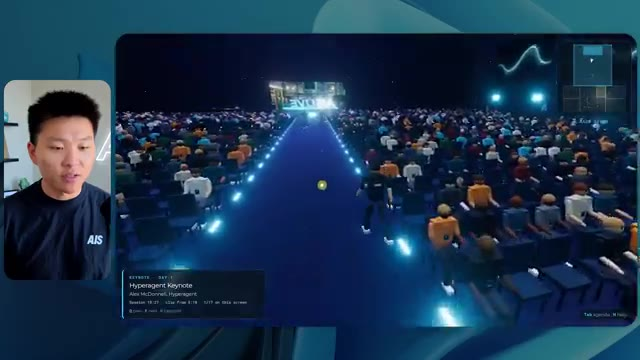

# 🎬 Build & Sell Claude Code Operating Systems (2+ Hour Course)

> **Chaîne** : [Nate Herk | AI Automation](https://www.youtube.com/@nateherk/featured)  
> **Lien YouTube** : [https://www.youtube.com/watch?v=bCljOfCH8Ms](https://www.youtube.com/watch?v=bCljOfCH8Ms)  
> **Date de publication** : 20260501  
> **Durée** : 02:33:21  
> **Identifiant vidéo** : `bCljOfCH8Ms`  
> **Transcription & Analyse** : `whisper-v3-large-turbo+gemini-3.5-flash-lite`  

---

## 📌 Synthèse Exécutive & Outils

### 💡 Résumé

Cette vidéo immersive de la chaîne *Nate Herk | AI Automation* explore l'impact du réglage du niveau d'effort sur les performances du modèle d'IA de pointe **Opus 5.5**, à travers un cas pratique d'ingénierie logicielle et d'automatisation complexe. L'expérience consiste à soumettre un prompt d'objectif unique et ambitieux à travers différents niveaux d'effort (de faible à ultra code) : transformer un dossier Frame.io de 105 gigaoctets contenant les enregistrements vidéo d'une conférence virtuelle (*AIS Live*) en un monde 3D interactif et explorable en vue à la troisième personne, intégrant la cinématique, les ressources de la marque et la logique de l'événement.

Les démonstrations en direct révèlent des écarts qualitatifs et quantitatifs spectaculaires entre les itérations. En mode **effort faible**, l'agent génère un monde rudimentaire en 16 minutes pour environ 3,91 $, caractérisé par des bugs graphiques majeurs, des textures statiques, une absence de respect de l'identité visuelle et des personnages fantomatiques, le tout sans poser la moindre question. En revanche, le mode **effort moyen** livre, après 1 heure et 13 minutes et 12,44 $ de coût API simulé, une application considérablement plus sophistiquée : respect rigoureux des codes graphiques de la marque, personnages dotés de micro-comportements autonomes, intégration fluide des flux vidéo en direct de l'événement et modélisation fidèle des différents espaces (scène principale, salons VIP, stands et ateliers). 

L'analyse de ces résultats met en lumière l'arbitrage critique entre complexité computationnelle, coût, temps d'exécution et autonomie de l'agent. Elle démontre que des niveaux d'effort supérieurs transforment radicalement la fiabilité d'un système autonome de génération de code brut en un prototype fonctionnel et esthétiquement cohérent, tout en soulignant le défi persistant du déploiement en production et de la mise en ligne rapide de ces applications générées par l'IA.

### 🛠️ Outils, Modèles & Logiciels Présentés

* **Claude Code** : Outil de développement piloté par agent permettant d'exécuter des tâches d'ingénierie complexes directement dans l'environnement de code.
* **Opus 5.5** : Modèle d'IA de pointe d'Anthropic, extrêmement performant et économique, utilisé ici pour évaluer l'impact des différents niveaux d'effort sur la génération de code et d'environnements 3D.
* **Frame.io** : Plateforme de collaboration vidéo utilisée pour stocker et structurer les 105 gigaoctets d'enregistrements de la conférence *AIS Live*.
* **Hostinger** : Sponsor et solution d'hébergement intégrée via une extension gratuite pour éditeur de code, permettant de combler le fossé entre le développement local par IA et la mise en ligne du produit fini.
* **Herc 2** : Système d'exploitation IA propriétaire servant de cadre de référence et de bibliothèque de ressources pour l'agent lors de la construction du monde 3D.
* **AIS Live** : Événement virtuel dont les ressources (flux vidéo, badges, stands et supports de présentation) ont servi de cas d'usage pour la simulation spatiale.

### 🔑 Points Clés & Enseignements Stratégiques

* **L'impact critique du réglage de l'effort** : Faire varier le niveau d'effort d'un même modèle (Opus 5.5) modifie radicalement non seulement la qualité esthétique et fonctionnelle du code généré, mais aussi sa structure logique globale.
* **Corrélation entre temps de calcul et maturité du produit** : Le passage d'un effort faible (16 minutes) à un effort moyen (1 heure et 13 minutes) multiplie par quatre le coût en ressources et en temps, mais élimine les bugs graphiques rédhibitoires (disparition de personnages, textures fixes) au profit d'un prototype immersif et stable.
* **Gestion de l'autonomie des agents** : Dans les deux configurations testées, l'agent a exécuté l'intégralité du prompt d'objectif sans poser une seule question à l'utilisateur, soulignant la nécessité de formuler des instructions initiales d'une précision chirurgicale.
* **Intégration contextuelle des données lourdes** : L'utilisation de dossiers volumineux (105 Go sur Frame.io) démontre la capacité des modèles récents à analyser, catégoriser et contextualiser des métadonnées massives pour les transposer dans un environnement virtuel interactif.
* **Respect de l'identité de marque** : Alors que l'effort faible ignore les chartes graphiques (couleurs et logos génériques), l'effort moyen intègre avec succès les directives de branding d'*AIS Live*, renforçant la crédibilité du monde 3D généré.
* **Comportements émergents et intelligence artificielle** : Le mode moyen a généré spontanément des micro-comportements pour les PNJ (personnages non-joueurs) présents dans l'environnement, illustrant une capacité d'initiative non explicitement demandée mais hautement valorisante pour l'expérience utilisateur.
* **Économie de l'API et ROI du développement** : Avec des coûts de l'ordre de 3,91 $ à 12,44 $ pour générer une application 3D complète à partir de zéro, le rapport coût-bénéfice des agents de codage bouleverse l'économie traditionnelle du prototypage logiciel.
* **Le goulet d'étranglement du déploiement** : La vidéo met en évidence une friction classique du développement assisté par IA : la transition fluide entre la génération locale d'un produit fonctionnel et sa mise en ligne publique, résolue ici par l'utilisation d'outils d'intégration d'hébergement.
* **Recommandation méthodologique d'Anthropic** : La bonne pratique validée empiriquement consiste à initialiser les tâches complexes au niveau d'effort moyen, puis d'ajuster dynamiquement le curseur à la hausse ou à la baisse en fonction de la complexité réelle de la tâche requise.
* **Vers des systèmes d'exploitation autonomes** : La fusion d'un écosystème de données (Herc 2), d'un stockage cloud (Frame.io) et d'un agent de génération contextuelle (Claude Code) préfigure l'ère des systèmes d'exploitation entièrement pilotés par l'intention utilisateur.

---

## ⏱️ Chronologie & Transcription Complète Audio & Visuelle (Mot pour Mot)

### ⏱️ `[00:00:00 - 00:00:20]` | Segment #01

**🔊 Audio (Transcription Intégrale Mot pour Mot en Français) :**
> Opus 5.5, Opus 5.5, Opus 5.5, Opus 5.5, Opus 5.5. Ce modèle est littéralement partout et pour de très bonnes raisons. Il est intelligent, il est bon marché, il a un goût extraordinaire, c'est un modèle d'IA incroyable. Mais avec chaque modèle d'IA, vous avez le choix de l'effort, que ce soit faible, moyen, élevé, extra, max ou code ultra.

**👁️ Analyse Visuelle d'Écran (gemini-3.5-flash-lite) :**
**Interface & Outils** : Application X (Twitter)

**Contenu textuel & Code** : Publication sur X avec un tweet et un média vidéo intégré représentant un environnement côtier.

**Action / Démonstration** : Présentation d'un exemple concret de contenu généré par l'IA illustrant les capacités des modèles.

*⏱️ 00:00:05 — Capture d'écran d'un tweet sur X montrant une vidéo de paysage tropical généré par IA et un commentaire sur la disruption des créatifs techniques.*

---

### ⏱️ `[00:00:20 - 00:00:38]` | Segment #02

**🔊 Audio (Transcription Intégrale Mot pour Mot en Français) :**
> Donc, dans cette vidéo, j'ai donné exactement le même prompt à Opus 5.5 et je l'ai exécuté sur chaque niveau d'effort, et nous allons comparer les résultats. Nous examinerons la qualité de tous les différents résultats réels, mais nous examinerons également combien de temps chacun d'eux a pris pour s'exécuter, combien cela nous a coûté si c'était facturé par l'API, le total des jetons, combien de vérifications ils ont effectuées, et combien de questions ils m'ont réellement posées tout au long du processus.

**👁️ Analyse Visuelle d'Écran (gemini-3.5-flash-lite) :**
**Interface & Outils** : Application de tableau ou canevas interactif (type Miro/Obsidian) montrant une grille comparative.

**Contenu textuel & Code** : Tableau avec les en-têtes de colonnes : Low, Medium, High, Extra, Max, Ultracode, et les lignes : Run time, API cost, Total tokens, Checks, Questions asked.

**Action / Démonstration** : Présentation du tableau comparatif des différents niveaux d'effort d'Opus 5.5 pour analyser les performances.

*⏱️ 00:00:29 — Tableau comparatif sombre intitulé 'Opus 5.5 Efforts' avec des colonnes de niveaux d'effort (Low, Medium, High, Extra, Max, Ultracode) et des lignes de métriques floutées (Run time, API cost, etc.).*

---

### ⏱️ `[00:00:39 - 00:00:58]` | Segment #03

**🔊 Audio (Transcription Intégrale Mot pour Mot en Français) :**
> Et les résultats que nous avons obtenus ne sont pas du tout ce à quoi je m'attends, donc j'ai hâte de partager cela avec vous les gars. Ne perdons pas de temps et entrons directement dans le vif du sujet. D'accord, alors plongeons directement dans celui-ci. Je veux commencer simplement en vous montrant le prompt réel que nous avons utilisé, que nous avons donné à chacun de ces différents agents. Je vais aller dans les fichiers ici, et nous allons ouvrir ce fichier markdown de prompt, et je vais vous montrer ce que nous avons obtenu. Voici donc le slash objectif que j'ai fourni.

**👁️ Analyse Visuelle d'Écran (gemini-3.5-flash-lite) :**
**Interface & Outils** : Interface logicielle de type assistant IA / éditeur (marquée avec Opus 5.5, Ultracode) et barre latérale de gestion de sessions.

**Contenu textuel & Code** : Texte affiché : "Hi Nate. This worktree has the effort-test task queued in PROMPT.md : build a walkable third-person 3D world..." avec des options de configuration d'effort (Extra, High, Max, Ultracode, Medium, Low).

**Action / Démonstration** : Affichage de l'interface de travail et du message initial de l'assistant IA invitant l'utilisateur à lancer une tâche de développement 3D.

*⏱️ 00:00:48 — Interface d'un éditeur ou d'un outil de développement avec une bulle vidéo du présentateur sur le côté gauche, affichant un prompt textuel lié à un test de niveau d'effort ("effort-test").*

---

### ⏱️ `[00:00:58 - 00:01:34]` | Segment #04

**🔊 Audio (Transcription Intégrale Mot pour Mot en Français) :**
> J'ai dit, tu dois me créer un monde 3D qui est une conférence tech réaliste dans laquelle je peux me promener en vue à la troisième personne. Tu vas regarder ce dossier, qui contient mes ressources d'enregistrement d'événements d'AIS Live. Et ce dossier est un dossier Frame.io de 105 gigaoctets d'enregistrements vidéo. C'était un événement complètement virtuel. Tout a été enregistré et tous les enregistrements sont ici. J'ai dit, ton objectif est de prendre cet événement et de le transformer en un monde 3D explorable qui me donne l'impression d'être réellement allé à une vraie conférence en personne avec différentes salles, différentes pistes, différentes scènes, bla, bla, bla. N'hésite pas à utiliser key.ai si tu as besoin de générer des images ou des vidéos. Et tu peux aussi utiliser n'importe quoi d'autre à l'intérieur de mon projet Herc 2, qui est comme mon système d'exploitation IA. J'ai dit,

**👁️ Analyse Visuelle d'Écran (gemini-3.5-flash-lite) :**
**Interface & Outils** : Éditeur de code (type VS Code / IDE web) et interface web Frame.io

**Contenu textuel & Code** : Fichier markdown PROMPT.md avec les instructions de génération du monde 3D et URL Frame.io (f.io/sPdlo-Si).

**Action / Démonstration** : Le présentateur détaille le prompt textuel et montre les ressources graphiques et vidéo stockées sur Frame.io.

*⏱️ 00:01:07 — Un éditeur de texte affichant le fichier PROMPT.md avec les instructions détaillées pour créer le monde 3D.*

*⏱️ 00:01:16 — Une interface Frame.io montrant un dossier d'environ 105 Go contenant les ressources d'enregistrement d'événements AIS Live.*

*⏱️ 00:01:25 — Vue prolongée du même fichier PROMPT.md dans l'éditeur de code, montrant le texte complet des consignes.*

---

### ⏱️ `[00:01:34 - 00:02:08]` | Segment #05

**🔊 Audio (Transcription Intégrale Mot pour Mot en Français) :**
> tu seras jugé sur la créativité, le design, la physique et la sensation générale lorsque j'explorerai le monde en 3D que tu as construit. Et c'était fondamentalement la fin des instructions. Donc, comme vous pouvez le voir sur ce côté gauche, j'ai exécuté cela à travers tous les différents niveaux d'effort. Commençons par le niveau bas et remontons jusqu'à ultra code. Très bien. Donc ici, nous avons le résultat du niveau bas. Ouvrons ceci et jetons un œil. Nous avons donc AIS live, le sommet des services IA en personne enfin, et nous avons pu cliquer partout. Tout d'abord, cela ne fait pas très personnalisé. Genre, ce n'is pas le logo d'IS Live. Ce ne sont même pas nos couleurs. Donc je n'aime pas trop ça, mais entrons ici. D'accord. C'est beaucoup trop lumineux. Euh, nous avons une carte en haut à droite ? Nous avons une ville par ici. Je ne peux pas dire quelle ville c'est.

**👁️ Analyse Visuelle d'Écran (gemini-3.5-flash-lite) :**
**Interface & Outils** : Application ou interface de développement d'IA avec un panneau latéral de gestion des sessions de travail et une zone de chat principale.

**Contenu textuel & Code** : Texte du prompt : "Hi Nate. This worktree has the effort-test task queued in PROMPT.md : build a walkable third-person 3D world of the AIS Live conference..." et champ de saisie utilisateur "yes, start the task in PROMPT.md".

**Action / Démonstration** : Sélection des différents niveaux de test et affichage des messages de l'agent IA proposant de démarrer la tâche.

*⏱️ 00:01:42 — Interface d'une application d'agent IA montrant différents niveaux de tests (Hello, Extra, High, Max, Ultracode, Medium, Low) dans la barre latérale gauche, avec un message demandant si l'agent doit commencer à construire un monde 3D interactif.*

---

### ⏱️ `[00:02:08 - 00:02:40]` | Segment #06

**🔊 Audio (Transcription Intégrale Mot pour Mot en Français) :**
> c'est. D'accord. C'est Chicago, ce qui est plutôt cool parce que tu sais, j'habite à Chicago, mais bref, en haut à droite, on peut voir une carte. Nous avons un hall d'accueil. Nous avons un hall d'exposition. Nous avons le salon VIP, la scène principale. La carte montre également où se trouve chaque autre personne et tout cela se synchronise en direct. Donc on peut voir l'enregistrement. On peut voir le premier jour, la keynote de l'agent Hyper, le débriefing en direct. Cool. Donc ça connaît vraiment le programme et ensuite il y a le deuxième jour. Donc il a trouvé ça, c'est bien. Nous avons ces petites boules ici que je peux espérer botter. D'accord. Le visage, Oh, regarde ça. Si je vais par ici, tous les gens disparaissent tout simplement. Très mauvais. Très mauvais. D'accord. Donc voyons voir. Est-ce que je peux sprinter ? D'accord.

**👁️ Analyse Visuelle d'Écran (gemini-3.5-flash-lite) :**
**Interface & Outils** : Application virtuelle 3D / plateforme de métavers ou de salon virtuel (AIS Live).

**Contenu textuel & Code** : Menus, programmes de conférences ("Day 1"), indications de navigation (Lobby, Expo Hall, Badge pickup) et mini-carte de l'événement.

**Action / Démonstration** : Navigation et exploration de différents espaces de la conférence virtuelle par l'avatar du présentateur.

*⏱️ 00:02:16 — Vue dans un monde virtuel d'une zone de retrait de badges (Badge pickup) avec des avatars et une mini-carte en haut à droite.*

*⏱️ 00:02:24 — Vue du hall d'accueil (Lobby) du monde virtuel montrant le programme du premier jour (Day 1) sur un panneau d'affichage.*

*⏱️ 00:02:32 — Vue de l'espace d'exposition (Expo Hall) du monde virtuel avec divers avatars et des éléments lumineux interactifs.*

---

### ⏱️ `[00:02:40 - 00:03:04]` | Segment #07

**🔊 Audio (Transcription Intégrale Mot pour Mot en Français) :**
> Je peux aller un peu plus vite. Je vais d'abord aller par ici. Il y a des produits promotionnels, euh, certifié AIS plus glido. D'accord. Donc il y a les vrais stands qu'on avait dans l'événement virtuel. On avait des stands. Donc c'est plutôt cool. Un petit endroit pour prendre des photos. Salle C. En ce moment, nous avons Tangy Frederick qui anime un atelier. D'accord. Mais ce n'est pas une vidéo. Comme vous pouvez le voir, c'est juste une image. Elle ne bouge pas. Donc c'est juste une image. Ces gens sont en train de disparaître. Ce doivent être des fantômes. Allons par ici vers la salle A.

**👁️ Analyse Visuelle d'Écran (gemini-3.5-flash-lite) :**
**Interface & Outils** : Environnement virtuel 3D interactif (type salon virtuel ou jeu de simulation).

**Contenu textuel & Code** : Textes d'affichage sur les stands, signalétique des salles et instructions textuelles sur écran virtuel (ex: 'Step 1: Go To Settings').

**Action / Démonstration** : Navigation et exploration d'un événement virtuel à l'aide d'un avatar 3D.

*⏱️ 00:02:46 — Vue d'un espace d'exposition virtuel 3D avec un avatar se déplaçant près d'un stand de sponsor étiqueté 'Glaido'.*

*⏱️ 00:02:52 — Entrée de l'avatar dans une salle d'atelier verte (Workshop Room C) avec des tables éclairées.*

*⏱️ 00:02:58 — Vue de l'intérieur de la salle d'atelier montrant un écran affichant des instructions ou des étapes de configuration d'une API.*

---

### ⏱️ `[00:03:04 - 00:03:30]` | Segment #08

**🔊 Audio (Transcription Intégrale Mot pour Mot en Français) :**
> Nous avons Liberty White. D'accord. Très cool. Vos 30 premiers jours en automatisation. Encore une fois, ce n'est qu'une image fixe et les gens ont des bugs. Donc ce n'est pas très bon ici. Je vais aller sur la scène principale et voir ce que nous avons. D'accord, cool. Nous avons donc une scène qui a l'air principale. Les gens ont de gros bugs. Vraiment mauvais. Ce n'est vraiment pas bon du tout. Notre vidéo est en train de bouger. Comme j'ai vu mon visage ici et j'ai vu celui de Devin, mais maintenant ils ont disparu. Donc je ne sais pas ce qui s'est passé. D'accord. On dirait que c'est plutôt un diaporama. Rien n'est encore vraiment diffusé. Quoi qu'il en soit, entrons ici.

**👁️ Analyse Visuelle d'Écran (gemini-3.5-flash-lite) :**
**Interface & Outils** : Application de métavers / espace virtuel 3D de conférence.

**Contenu textuel & Code** : Textes d'indication de salles et d'ateliers virtuels (Workshop Room A, Main Stage, AIS Live).

**Action / Démonstration** : Navigation et déplacement d'un avatar dans un environnement virtuel 3D de conférence.

*⏱️ 00:03:11 — Vue d'une salle virtuelle 3D (Workshop Room A - Foundation track) avec un avatar et des plateformes lumineuses.*

*⏱️ 00:03:17 — Vue de la scène principale d'une conférence virtuelle 3D avec un public nombreux et un avatar se déplaçant.*

*⏱️ 00:03:24 — Vue face à l'écran géant "AIS LIVE - AI Services Summit" dans l'auditorium virtuel avec des ballons.*

---

### ⏱️ `[00:03:30 - 00:03:58]` | Segment #09

**🔊 Audio (Transcription Intégrale Mot pour Mot en Français) :**
> Nous avons plus de stands. Nous avons hyper agent. Nous avons Claude Code. Nous avons plus de gadgets publicitaires. La salle B, c'est Dave Ebelor. Je suppose que c'est exactement la même chose. Nous avons du café. Et ensuite, je suppose que le salon VIP, accès VIP seulement. C'est plutôt cool, mais il ne se passe vraiment rien ici. Cet écran est beaucoup trop lumineux. D'accord. Donc je pense que vous comprenez l'ambiance que nous obtenons ici de la part d'Opus 5.5 en effort faible. Et c'est là que les choses deviennent intéressantes. Combien de temps pensez-vous que cela a duré ? Combien de temps ? Celui-ci a duré 16 minutes et 43 secondes. Combien pensez-vous que cela a coûté ?

**👁️ Analyse Visuelle d'Écran (gemini-3.5-flash-lite) :**
**Interface & Outils** : Application de tableau blanc / interface de diagramme Opus 5.5.

**Contenu textuel & Code** : Tableau comparatif avec les colonnes Low, Medium, High, Extra, Max, Ultracode et des lignes Run time, API cost, Total tokens, Checks, Questions asked.

**Action / Démonstration** : Présentation des différents niveaux de performance ou de configuration d'un agent IA.

*⏱️ 00:03:51 — Capture montrant un tableau comparatif avec les niveaux Low, Medium, High, Extra, Max et Ultracode.*

---

### ⏱️ `[00:03:58 - 00:04:26]` | Segment #10

**🔊 Audio (Transcription Intégrale Mot pour Mot en Français) :**
> 3,91 dollars si c'était une facturation par API. J'utilise évidemment mon abonnement ici, mais nous allons juste calculer cela en facturation API. Le nombre total de jetons était de 191 000. Il a effectué 22 vérifications. Donc la vérification, 22 fois il a ouvert le navigateur et a exécuté différentes sortes de vérifications. Donc 22 catégories de vérifications. Et combien de questions m'a-t-il posées ? Il m'a posé un total de zéro question tout au long de cette invite de commande d'objectif. D'accord. Alors, ouvrons l'effort moyen et voyons ce que nous avons. D'accord, c'est parti. Effort moyen. Nous avons Nate Herc. Nous avons mon badge. C'est aux couleurs de la marque AI's life.

**👁️ Analyse Visuelle d'Écran (gemini-3.5-flash-lite) :**
**Interface & Outils** : Interface de tableau blanc / application de mindmapping (style Excalidraw ou similaire).

**Contenu textuel & Code** : Tableau avec les lignes : Run time (16m 43s), API cost ($3.91), Total tokens (191.3K), Checks, Questions asked ; et les colonnes : Low, Medium, High, Ex.

**Action / Démonstration** : Présentation des résultats et des coûts d'exécution de l'agent IA.

*⏱️ 00:04:05 — Un tableau comparatif des efforts sur une interface de type tableau blanc affichant les métriques 'Run time', 'API cost' ($3.91), 'Total tokens' (191.3K), 'Checks' et 'Questions asked' pour le niveau 'Low'. Le présentateur apparaît en incrustation vidéo à gauche.*

---

### ⏱️ `[00:04:26 - 00:04:46]` | Segment #11

**🔊 Audio (Transcription Intégrale Mot pour Mot en Français) :**
> Donc ça a déjà l'air un petit peu mieux. Ça ressemble à nos palettes de couleurs qui ont utilisé nos directives de marque. Construction du premier jour, gain du deuxième jour, VIP. Cool. D'accord. Je vais entrer dans le lieu. D'accord. Waouh. Une ambiance similaire, en somme. C'est en arrière-plan. Ça ne ressemble pas à Chicago, hein ? Non, ça ressemble à, honnêtement, ça ressemble à une ville inventée. Quoi qu'il en soit, c'est drôle qu'ils aient décidé de faire ça. Voyons si je peux me déplacer un peu plus vite. Oh, waouh.

**👁️ Analyse Visuelle d'Écran (gemini-3.5-flash-lite) :**
**Interface & Outils** : Application web interactive / environnement virtuel 3D de type jeu (style Roblox/metaverse).

**Contenu textuel & Code** : Interface utilisateur graphique d'accueil avec badges d'identification, contrôles clavier affichés (WASD, Shift, Space), et simulation d'un espace événementiel virtuel 3D.

**Action / Démonstration** : Le présentateur examine l'interface de personnalisation du badge puis clique pour entrer dans le lieu virtuel de l'événement.

*⏱️ 00:04:31 — Interface d'accueil de l'application 'AIS Live' montrant un badge nominatif personnalisé au nom de Nate Herk avec des options de navigation (Day 1, Day 2, VIP) et un bouton 'Enter the Venue'.*

*⏱️ 00:04:41 — Vue à la première ou troisième personne à l'intérieur du lieu virtuel 'AIS Live', montrant des avatars 3D dans un espace type lounge avec vue sur une ville illuminée la nuit.*

---

### ⏱️ `[00:04:46 - 00:05:21]` | Segment #12

**🔊 Audio (Transcription Intégrale Mot pour Mot en Français) :**
> Les gens interagissent avec moi. Regardez. Si je m'approche de ce type, il vient de lever le bras. Bon, maintenant il ne veut plus du tout avoir affaire à moi. Mais tous ces petits robots ici doivent prendre des décisions. Je ne sais pas s'ils utilisent Jev. C'est sûr que non. Je ne lui ai pas dit de le faire. En fait, ma clé Jev est à l'arrière. Je ne sais pas. Peut-être qu'il l'a utilisée. Quoi qu'il en soit, on peut voir ici que nous avons la salle d'atelier C, le laboratoire des agents. Sympa. Donc celui-ci est en fait en cours d'exécution. Vous pouvez voir qu'il s'agit d'une vraie vidéo lue par Tangy. Tout le monde ici est en train de travailler sur un ordinateur portable. Ils ne buguent pas. C'est plutôt cool. De plus, mon badge est sur ma poitrine, ce qui est plutôt cool. Je peux venir par ici. Nous avons une carte en haut à droite, comme vous pouvez le voir, mais je peux venir par ici. Nous avons un

**👁️ Analyse Visuelle d'Écran (gemini-3.5-flash-lite) :**
**Interface & Outils** : Application de monde virtuel 3D (type metaverse ou simulation d'agents).

**Contenu textuel & Code** : Environnements virtuels 3D interactifs peuplés d'avatars représentant des utilisateurs ou des agents.

**Action / Démonstration** : Navigation et exploration d'un monde virtuel interactif avec des agents IA.

*⏱️ 00:04:55 — Vue en troisième personne d'un environnement virtuel 3D avec des avatars d'agents IA dans un hall moderne.*

*⏱️ 00:05:04 — Vue en contre-plongée depuis l'entrée d'une salle de classe ou de conférence virtuelle remplie d'avatars assis à des bureaux.*

*⏱️ 00:05:12 — Vue en hauteur montrant l'intérieur d'une salle de conférence virtuelle avec de nombreux avatars travaillant sur des ordinateurs portables.*

---

### ⏱️ `[00:05:21 - 00:05:47]` | Segment #13

**🔊 Audio (Transcription Intégrale Mot pour Mot en Français) :**
> hall d'exposition. C'est là que nous avons le stand Glido. Et ça diffuse en ce moment. Oui, ça diffuse la vidéo de nous en train de parler de Glido. Ça diffuse la vidéo d'Ed et moi parlant de notre programme de certification. Nous avons le logo AIS Plus juste ici, qui est placé dans un endroit un peu bizarre. Ce sont les diapositives des conférenciers et les points clés. Donc wouah, ce sont toutes les ressources que nous avons distribuées après l'événement. Elles sont toutes affichées juste là également. Nous pouvons voir que nous avons un coup de projecteur sur la communauté. Donc c'est Aiden qui parle de son contrat qu'il a décroché et c'est diffusé en direct. Ces gens regardent.

**👁️ Analyse Visuelle d'Écran (gemini-3.5-flash-lite) :**
**Interface & Outils** : Environnement virtuel 3D (metaverse / plateforme de conférence en ligne).

**Contenu textuel & Code** : Présentation visuelle du programme "Get AIS+ Certified: The AI Services Certification" et documents de conférence.

**Action / Démonstration** : Navigation et exploration virtuelle dans le hall d'exposition 3D par le présentateur.

---

### ⏱️ `[00:05:47 - 00:06:21]` | Segment #14

**🔊 Audio (Transcription Intégrale Mot pour Mot en Français) :**
> Ils sont plutôt engagés. On a un hyper-agent. C'est ça, c'est ce que je voulais dire. Si vous avez vu ces gens lever les mains en disant bonjour, c'était plutôt marrant. Regardez, regardez, le voilà qui recommence. Bref. Bon. Où est-ce que je suis maintenant ? Maintenant, je suis dans le hall principal. On a un bar à café. On a un grand logo, qui est le vrai logo. C'est trop lumineux, mais on a le logo. On peut voir si on peut entrer ici dans le parcours des fondations. On a Sabrina Romanov et Liberty White. Donc différentes formations juste là. On peut entrer dans cette salle. C'est le parcours avancé. Alors qu'est-ce qui se passe ici ? On a Dave Ebelar et Saman qui parlent de différentes choses là-dedans. Et maintenant, allons jeter un œil à la scène principale. Oh, attendez, il y a une vidéo de moi là-haut. C'est genre un VIP

**👁️ Analyse Visuelle d'Écran (gemini-3.5-flash-lite) :**
**Interface & Outils** : Application de métavers ou plateforme événementielle virtuelle 3D

**Contenu textuel & Code** : Environnement virtuel 3D montrant un hall principal (Main Lobby) et des avatars d'utilisateurs.

**Action / Démonstration** : Navigation et exploration d'un monde virtuel 3D interactif avec des avatars.

---

### ⏱️ `[00:06:21 - 00:06:50]` | Segment #15

**🔊 Audio (Transcription Intégrale Mot pour Mot en Français) :**
> section ? Ouais, on ira voir ça dans une minute. Mais bref, voici la scène principale. Ça a l'air vraiment, vraiment très bien. On a une grande scène. On a genre quatre personnes assises ici. On a les trois écrans d'Alex là-haut avec hyper agent. Est-ce que j'ai le droit de monter sur scène ? Oh, et il me laisse monter sur scène. D'accord. C'est plutôt sympa. Bon les gars, prenons un selfie. Laissez-moi prendre tout le monde en arrière-plan. Venez par ici. Bref, c'est vraiment, vraiment cool. Toutes les places ne sont pas occupées par contre. Donc il va falloir qu'on travaille là-dessus. Mais bref, je vais y retourner en courant pour voir ce qu'était cette section VIP. D'accord. Le salon VIP. J'ai l'impression que c'est comme un aéroport ou un truc du genre.

**👁️ Analyse Visuelle d'Écran (gemini-3.5-flash-lite) :**
**Interface & Outils** : Environnement virtuel 3D / Plateforme d'événements virtuels interactive

**Contenu textuel & Code** : Interface utilisateur virtuelle affichant "Hyperagent Keynote" avec les détails de session et une mini-carte en haut à droite.

**Action / Démonstration** : Navigation et exploration de la salle de conférence virtuelle par le présentateur.

*⏱️ 00:06:28 — Vue d'un espace virtuel en 3D avec un avatar naviguant dans une salle de conférence, montrant des écrans géants de présentation.*

*⏱️ 00:06:36 — Vue de l'arrière de la scène principale virtuelle avec des participants assis et l'avatar du présentateur.*

*⏱️ 00:06:43 — Vue en plongée de la salle de conférence virtuelle remplie d'avatars de participants.*

---

### ⏱️ `[00:06:51 - 00:07:14]` | Segment #16

**🔊 Audio (Transcription Intégrale Mot pour Mot en Français) :**
> D'accord, super. Donc maintenant nous avons les sessions VIP ici. Une foire aux questions VIP avec la lecture vidéo en direct de Nate juste ici. Très, très cool. Et nous avons comme un bar ou quelque chose comme ça. Génial. Je dirais que c'est un très bon résultat. Maintenant, en ce qui concerne les statistiques ici, celle-ci a pris une heure et 13 minutes à s'exécuter. Cela nous aurait coûté 12 dollars et 44 cents. Elle a utilisé 490 000 jetons et elle a effectué 23 vérifications.

**👁️ Analyse Visuelle d'Écran (gemini-3.5-flash-lite) :**
**Interface & Outils** : Environnement virtuel 3D et tableau de bord de métriques de performance.

**Contenu textuel & Code** : Session VIP Q&A with Nate, métriques de coût API, run time, total tokens, checks et questions posées.

**Action / Démonstration** : Présentation de l'espace VIP virtuel et analyse des coûts et performances d'exécution des tâches.

*⏱️ 00:06:56 — Vue d'un monde virtuel interactif (type salon VIP virtuel) avec des avatars et une grande session vidéo en direct affichant Nate Herk.*

*⏱️ 00:07:02 — Tableau de métriques et de performances affichant le temps d'exécution (16m 43s), le coût de l'API ($3.91), le nombre de tokens (191.3K), etc.*

---

### ⏱️ `[00:07:14 - 00:07:48]` | Segment #17

**🔊 Audio (Transcription Intégrale Mot pour Mot en Français) :**
> Et il nous a posé un total de zéro question une fois de plus. Très bien, passons au niveau élevé. C'était déjà un résultat plutôt correct et Anthropic eux-mêmes dans leur vidéo, ou désolé, pas une vidéo, un article sur comment prompter Opus 5.5, ils ont dit de commencer simplement par le niveau moyen et de l'ajuster à la hausse ou à la baisse si nécessaire. C'était donc un résultat moyen. Passons au niveau élevé et voyons ce que nous avons obtenu. Très rapidement, les gars, je dois prendre une seconde pour vous parler du sponsor de la vidéo d'aujourd'hui, Hostinger. Donc, ces deux modèles viennent de me créer une version fonctionnelle de la même chose. Et maintenant, je me retrouve exactement là où je finis toujours, avec un produit fini sur mon ordinateur portable et aucun moyen rapide de le mettre en ligne. Et c'est ce fossé que le connecteur d'Hostinger comble. C'est une extension gratuite.

**👁️ Analyse Visuelle d'Écran (gemini-3.5-flash-lite) :**
**Interface & Outils** : Tableau comparatif sur canevas numérique et interface de développement / éditeur de code.

**Contenu textuel & Code** : Tableau de benchmarks (temps, coûts, tokens) et panneau de configuration/chat d'un assistant de code.

**Action / Démonstration** : Présentation des résultats comparatifs entre les niveaux Low et Medium, puis transition vers le niveau High.

*⏱️ 00:07:22 — Un tableau comparatif des différents niveaux d'effort (Low, Medium, High, Extra) pour Opus 5.5, affichant des métriques comme le temps d'exécution, le coût API, les tokens et les questions posées.*

*⏱️ 00:07:39 — Une interface de développement avec un éditeur de code et un terminal affichant l'exécution de l'agent IA sur la création d'un calculateur de ROI Northwind.*

---

### ⏱️ `[00:07:48 - 00:08:23]` | Segment #18

**🔊 Audio (Transcription Intégrale Mot pour Mot en Français) :**
> pour votre éditeur qui intègre votre compte Hostinger dans l'environnement où vous codez déjà. Que ce soit VS Code, Cursor, Cloud Code, Codex, peu importe. Vous vous connectez une seule fois en un clic, et à partir de là, votre agent peut déployer le site, y pointer un domaine, configurer les enregistrements DNS et vérifier votre VPS sans que vous n'ayez jamais à quitter l'éditeur. Ainsi, peu importe celui de ces outils que vous finirez par préférer, ce qu'il a construit se trouve à quelques minutes d'une vraie URL sur un hébergement géré. Connector est gratuit avec chaque formule d'hébergement, donc si vous avez toujours besoin de l'hébergement sous-jacent, profitez de la formule illimitée grâce au lien dans la description et utilisez le code NATEHERK pour obtenir 10 % de réduction. Cela inclut également un nom de domaine gratuit et un e-mail professionnel pour l'année. Et c'est toujours le moyen le moins cher que j'ai trouvé pour obtenir quelque chose

**👁️ Analyse Visuelle d'Écran (gemini-3.5-flash-lite) :**
**Interface & Outils** : Interface de gestion Hostinger MCP / IDE et Claude Code.

**Contenu textuel & Code** : Statut "Connected via OAuth", Node.js 24.13.0, liste des outils disponibles pour l'assistant (Websites, Domains, Subscriptions & Payments, Email Marketing).

**Action / Démonstration** : Connexion du compte Hostinger à l'IDE pour permettre à l'agent d'accéder aux outils de gestion de sites, domaines et abonnements.

*⏱️ 00:07:57 — Interface montrant l'intégration de Hostinger dans un IDE avec le statut connecté et les outils disponibles (Websites, Domains, Subscriptions, Email Marketing), ainsi qu'une fenêtre Claude Code à droite.*

---

### ⏱️ `[00:08:23 - 00:08:47]` | Segment #19

**🔊 Audio (Transcription Intégrale Mot pour Mot en Français) :**
> tu as construit sur une vraie URL. Donc revenons à la vidéo. D'accord. Encore une fois, très, très marqué par la marque. C'est un écran de chargement encore meilleur que le précédent. Nous avons ce petit effet sympa en arrière-plan. Nous avons le logo. Nous allons entrer dans le lieu. D'accord. Nous y voilà. Ça a l'air plutôt bien. Nous commençons à l'extérieur et vous pouvez voir que nous avons ces drapeaux pour tous les intervenants, Wyatt, Casper, Alex, Ed, Aiden, Sabrina, Liberty. C'est plutôt cool. Nous avons des blocs en direct ici.

**👁️ Analyse Visuelle d'Écran (gemini-3.5-flash-lite) :**
**Interface & Outils** : Application web 3D interactive (plateforme virtuelle d'événement en ligne).

**Contenu textuel & Code** : Interface utilisateur avec mini-carte, indicateur de passeport, noms de conférenciers sur des bannières et commandes de déplacement (WASD).

**Action / Démonstration** : Navigation et exploration de l'espace virtuel 3D de l'événement par le présentateur.

*⏱️ 00:08:29 — Écran de chargement et d'accueil de la plateforme virtuelle 'AIS LIVE' avec logo, description de l'événement et contrôles clavier/souris.*

*⏱️ 00:08:35 — Entrée dans le monde virtuel en 3D représentant une place publique ('AIS Live Plaza') avec des avatars de personnages et des bâtiments en arrière-plan.*

*⏱️ 00:08:41 — Exploration de la place virtuelle 'AIS Live Plaza' avec des bannières verticales affichant des noms de conférenciers.*

---

### ⏱️ `[00:08:47 - 00:09:23]` | Segment #20

**🔊 Audio (Transcription Intégrale Mot pour Mot en Français) :**
> Il a pris cette photo de moi, votre hôte, Nate Herc, John, Dave, Nate Herc. Voilà. D'accord. Les portes. Génial. Ce sont des portes coulissantes automatiques en verre. J'adore ça. Nous pouvons voir l'enregistrement VIP. Nous pouvons voir l'admission générale. Nous pouvons venir ici et nous pouvons découvrir l'exposition avec différents stands, le coin de la communauté. Vous pouvez également voir qu'en haut à gauche, j'ai un passeport. C'est donc comme si, cela montrera combien d'endroits j'ai visités. Tout cela est une vraie lecture. Nous avons un mur de ressources avec tous les différents intervenants. Ils ont également une session de networking ici. Je vais donc venir très vite et voir de quoi il s'agit. Nous avons donc le bar à cold brew AIS. Nous avons différents membres de la communauté qui ont été mis en avant ou en lumière.

**👁️ Analyse Visuelle d'Écran (gemini-3.5-flash-lite) :**
**Interface & Outils** : Environnement virtuel 3D / Jeu en ligne ou plateforme événementielle virtuelle.

**Contenu textuel & Code** : Interface utilisateur avec mini-carte, indicateurs de progression (Passport), bannières textuelles "Registration", "VIP Check-In" et sous-titres vidéo.

**Action / Démonstration** : Exploration et navigation en vue à la troisième personne dans un monde virtuel 3D.

*⏱️ 00:08:56 — Vue d'un espace virtuel 3D de type salon ou conférence, montrant la zone d'enregistrement (Registration Concourse) avec des comptoirs et des avatars.*

*⏱️ 00:09:05 — Navigation dans un hall d'exposition virtuel (Expo Hall) en 3D avec des stands et des avatars d'utilisateurs.*

*⏱️ 00:09:14 — Déplacement d'un avatar au milieu d'autres personnages dans le hall d'accueil virtuel du salon.*

---

### ⏱️ `[00:09:23 - 00:09:56]` | Segment #21

**🔊 Audio (Transcription Intégrale Mot pour Mot en Français) :**
> On a l'aile VIP. Attends, quoi ? Récupère un bracelet. Oh, je dois vraiment aller chercher le bracelet. D'accord. Laisse-moi m'enregistrer rapidement. Le bracelet est déjà mis. Attends, quoi ? D'accord. Oh, d'accord. Maintenant, les portes se sont ouvertes pour moi. Cool. Je peux entrer ici. Oh, ça mène juste à la scène principale. Salon VIP. Il y a une séance de questions-réponses en cours. Ça a l'air très sympa. Je veux dire, je suis très impressionné par la façon dont il parvient à faire ça. Waouh. D'accord. Donc c'est vraiment bien. Ce qu'on a fait, c'est qu'on a eu des salles de discussion VIP avec différentes personnes. Tu peux voir qu'il y a différentes salles, différents membres de l'équipe AIS qui participent à des trucs. C'est vraiment cool. C'est très cool. Ça, c'est un VIP bien meilleur

**👁️ Analyse Visuelle d'Écran (gemini-3.5-flash-lite) :**
**Interface & Outils** : Environnement virtuel 3D interactif (plateforme d'événement en ligne / métaverse).

**Contenu textuel & Code** : Interface utilisateur virtuelle affichant les zones, les mini-cartes, les objectifs (« VIP Lounge », « VIP Working Sessions ») et des sous-titres textuels.

**Action / Démonstration** : Navigation et exploration de l'espace virtuel par l'avatar du présentateur pour accéder aux différentes salles VIP.

*⏱️ 00:09:32 — Vue d'un espace virtuel 3D de type métaverse montrant un hall d'enregistrement (Registration Concourse) avec des avatars et des indications textuelles.*

*⏱️ 00:09:40 — Vue de l'intérieur d'un salon VIP virtuel (VIP Lounge) avec un avatar face à un écran affichant une visioconférence.*

*⏱️ 00:09:48 — Vue d'un espace de sessions de travail VIP virtuelles (VIP Working Sessions) avec plusieurs tables thématiques et des écrans.*

---

### ⏱️ `[00:09:56 - 00:10:30]` | Segment #22

**🔊 Audio (Transcription Intégrale Mot pour Mot en Français) :**
> expérience que ce qui a été montré dans le premier élément. D'accord. After party VIP. Regardez ça. On a une piste de danse. On a tous ces éléments ici. On a la lecture de l'after party VIP juste ici. Et il y a une estrade pour DJ. C'est trop marrant. Il y a un petit bug ici, un glitch par ici, mais c'est génial. Oh, chouette. Donc quand je suis ici sur la scène principale, on a des sous-titres. Vous pouvez voir juste ici en bas de mon écran, on a ces sous-titres de Wyatt qui est en train de parler là-haut. On a des lumières. On a le panel. Très cool. Belle scène principale. Je vais aller par ici, on peut aller à la fondation,

**👁️ Analyse Visuelle d'Écran (gemini-3.5-flash-lite) :**
**Interface & Outils** : Aucune interface logicielle pertinente visible dans ces captures d'écran.

**Contenu textuel & Code** : Texte affiché dans la scène virtuelle: "VIP After-Party"

**Action / Démonstration** : Visualisation d'une expérience virtuelle d'une fête VIP.

*⏱️ 00:10:04 — Une scène virtuelle d'une fête VIP avec des avatars dansant sur une piste de danse lumineuse, avec un écran diffusant des visages en gros plan.*

*⏱️ 00:10:13 — La même scène virtuelle de fête VIP, avec la même disposition, montrant des avatars dansant et des visages en gros plan sur l'écran.*

---

### ⏱️ `[00:10:30 - 00:11:06]` | Segment #23

**🔊 Audio (Transcription Intégrale Mot pour Mot en Français) :**
> avancé, et les parcours d'entreprise ici. Alors voyons voir. Nous avons l'anatomie de trois vraies transactions. Nous avons hyper agent. Nous avons les évals avec Nate et Ed ici. Nous avons Dave qui intervient dans les trucs avancés. C'est vraiment bien. Je veux dire, évidemment, chacun, chacun de ces résultats jusqu'à présent, bas était correct. Moyen était meilleur. Élevé a été encore meilleur. Voyons si cette tendance se poursuit et allons voir ce que cela nous a coûté. Donc, élevé a fonctionné pendant une heure et sept minutes. Donc un peu plus rapide que moyen, cela nous aurait coûté 16 dollars et 31 cents. Cela a utilisé un demi-million de tokens, 509 000. Cela a fait 22 vérifications. Et cela nous a aussi demandé, enfin, non, je me suis trompé. Ce

**👁️ Analyse Visuelle d'Écran (gemini-3.5-flash-lite) :**
**Interface & Outils** : Outil de tableau blanc numérique / Interface d'analyse comparative de performances de modèles IA (ex: Opus 5.5 Efforts).

**Contenu textuel & Code** : Tableau avec colonnes Low, Medium, High, Extra et lignes Run time (16m 43s, etc.), API cost ($3.91, $12.44, $16.31), Total tokens, Checks et Questions asked.

**Action / Démonstration** : Analyse des coûts d'API, temps d'exécution et consommation de tokens pour différents niveaux d'effort d'un modèle d'IA.

*⏱️ 00:10:57 — Tableau comparatif sur un outil de type tableau blanc (ex: Excalidraw) montrant des métriques (Run time, API cost, Total tokens) selon différents niveaux d'effort (Low, Medium, High, Extra).*

---

### ⏱️ `[00:11:06 - 00:11:25]` | Segment #24

**🔊 Audio (Transcription Intégrale Mot pour Mot en Français) :**
> l'un m'a posé une question et spoiler, c'était le seul qui nous a posé une question de tout ça. Donc voyons voir, il nous en reste trois extra, max et ultra code. Laissez-moi ouvrir extra et nous verrons ce que nous avons. D'accord. Donc celui-ci a l'air plutôt bien. Je dirais honnêtement que jusqu'à présent, l'écran de chargement haut était le meilleur. Celui qu'on vient juste de voir, mais bref, entrons dans AIS live.

**👁️ Analyse Visuelle d'Écran (gemini-3.5-flash-lite) :**
**Interface & Outils** : Tableau (probablement dans une application de tableur ou un document)

**Contenu textuel & Code** : Run time: 16m 43s, 1h 13m, 1h 7m. API cost: $3.91, $12.44, $16.31. Total tokens: 191.3K, 419.2K, 509.3K. Checks: 22, 23, 22. Questions asked: 0, 0, 1. La colonne "Extra" est vide.

**Action / Démonstration** : Affichage d'un tableau de résultats.

*⏱️ 00:11:11 — Tableau comparatif des performances de "Opus 5.5" pour différentes configurations (Low, Medium, High, Extra), affichant le temps d'exécution, le coût de l'API, le nombre total de tokens, le nombre de vérifications et le nombre de questions posées.*

---

### ⏱️ `[00:11:26 - 00:11:51]` | Segment #25

**🔊 Audio (Transcription Intégrale Mot pour Mot en Français) :**
> Whoa. D'accord. Donc on a comme de petits extraits sonores. Je peux discuter avec des gens. Le panneau sur la guerre des outils a réglé quelques débats pour moi. Sympa. Bonne perspective ici. On est dehors à nouveau. On a ces différentes bannières, bien qu'elles soient toutes les mêmes. Elles n'affichent pas les noms de différentes personnes. Donc grand logo AIS Live. L'aile de l'atelier est par ici. Et traversons les portes coulissantes en verre pour voir ce qu'on a. Donc on a le café AIS. La carte est en bas à droite, et elle n'est pas très descriptive.

**👁️ Analyse Visuelle d'Écran (gemini-3.5-flash-lite) :**
**Interface & Outils** : Plateforme virtuelle (probablement pour un événement ou une conférence)

**Contenu textuel & Code** : N/A

**Action / Démonstration** : Navigation dans une interface virtuelle, présentation d'un environnement numérique.

*⏱️ 00:11:32 — Une scène virtuelle avec des avatars et des panneaux publicitaires. Un avatar porte une tenue noire, tandis qu'un autre est vêtu d'un t-shirt sombre et d'un pantalon noir. Des panneaux publicitaires indiquent "AIS LIVE".*

*⏱️ 00:11:38 — La même scène virtuelle, mais la perspective a légèrement changé, montrant plus d'avatars et le paysage urbain en arrière-plan. Les panneaux publicitaires "AIS LIVE" sont toujours visibles.*

*⏱️ 00:11:45 — Un avatar court vers une entrée de bâtiment dans la scène virtuelle. La lumière du soleil brille à travers les portes vitrées. Les panneaux publicitaires sont encore visibles.*

---

### ⏱️ `[00:11:51 - 00:12:26]` | Segment #26

**🔊 Audio (Transcription Intégrale Mot pour Mot en Français) :**
> J'aime bien comment les autres cartes nous ont indiqué ce à quoi, genre où étaient les choses, mais celle-ci a l'air très professionnelle. On peut voir, voici la scène principale. Allons y faire un saut rapidement. Elles ont toutes ces balles qui volent partout, ce qui je trouve est plutôt marrant. Les ballons de plage AIS. On me voit là-haut en train de parler. Je crois que j'introduisais l'une des journées. Continuons à avancer par ici vers la salle d'atelier sur ce côté gauche. D'accord. Donc ici, nous avons le théâtre Hyper Agent. Nous avons cette session sponsorisée ici par Hyper Agent, mais ça nous montre aussi ce qui va s'y passer. C'est vraiment marrant qu'on puisse discuter avec les gens. Salmon a créé un commercial vocal en direct. La salle "Le Juste Prix" était comble. Avez-vous pris le guide d'accompagnement VIP ? C'est tellement marrant. Nous avons le parcours avancé dans

**👁️ Analyse Visuelle d'Écran (gemini-3.5-flash-lite) :**
**Interface & Outils** : Environnement virtuel interactif

**Contenu textuel & Code** : Les panneaux indiquent "AI WORKSHOPS" et "ENTERPRISE AI SERVICES". Une bulle de dialogue indique "You see, like, the events, you see the stage, and the...". Une autre bulle de dialogue indique "Summit build a online sales map".

**Action / Démonstration** : Navigation et observation dans un environnement virtuel.

*⏱️ 00:12:00 — Vue du présentateur dans un environnement virtuel, sur une scène principale, avec une foule virtuelle et des effets visuels de "balles qui volent".*

*⏱️ 00:12:09 — Vue du présentateur interagissant avec des avatars dans un hall virtuel, avec des panneaux indiquant "AI WORKSHOPS" et "ENTERPRISE AI SERVICES".*

*⏱️ 00:12:17 — Vue du présentateur dans un couloir virtuel, avec plusieurs avatars se tenant et discutant, et une bulle de dialogue au-dessus d'un avatar.*

---

### ⏱️ `[00:12:26 - 00:12:58]` | Segment #27

**🔊 Audio (Transcription Intégrale Mot pour Mot en Français) :**
> ici. Encore une fois, nous avons la lecture en direct. Est-ce que c'est la lecture en direct ? Oh, d'accord. Ça a commencé une fois que je suis entré, mais je peux prendre place. Oh la la. Je peux regarder ça. Je peux me lever. Je veux m'asseoir au premier rang. C'est plutôt cool. C'est très bien. J'aime bien ça. Et vous savez ce que j'ai remarqué jusqu'à présent ? Le personnage que j'incarne me ressemble un peu. Je pense qu'il a été modélisé à partir de mes photos de profil ou quelque chose comme ça. Bref, nous avons Sabrina ici, l'animatrice de la salon ici, prenez n'importe quel siège libre. D'accord, super. Et j'ai vraiment aimé la fonctionnalité pour s'assoir. C'est assez marrant. Genre, on pourrait vraiment assister à cet atelier et participer. Bref, ça nous montre les intervenants. Ça nous montre les

**👁️ Analyse Visuelle d'Écran (gemini-3.5-flash-lite) :**
**Interface & Outils** : Plateforme de conférence virtuelle

**Contenu textuel & Code** : Aucune information de contenu spécifique n'est visible à l'écran.

**Action / Démonstration** : La scène montre une conférence ou une présentation se déroulant dans un environnement virtuel.

*⏱️ 00:12:34 — Un avatar virtuel est debout sur une scène devant un écran, tandis que d'autres avatars sont assis dans une salle de conférence virtuelle.*

*⏱️ 00:12:42 — Un avatar virtuel se tient sur une scène devant un grand écran dans un espace de conférence virtuel.*

*⏱️ 00:12:50 — Vue d'une salle de conférence virtuelle avec des avatars assis et un avatar debout sur la scène.*

---

### ⏱️ `[00:12:58 - 00:13:31]` | Segment #28

**🔊 Audio (Transcription Intégrale Mot pour Mot en Français) :**
> agenda. Il y a un petit tapis rouge ici pour prendre des photos. Nous pouvons poser. Oh, wow. C'est assez cool. Bibliothèque de ressources, obtenez la certification AIS Plus, Glido, Hyper Agent, AIS Plus, trois vraies affaires. Génial. Je veux dire, je dirais certainement que jusqu'à présent, chacun s'améliore. Et nous n'avons même pas encore vérifié la section VIP, le salon VIP. Montons ici rapidement. J'espère que je pourrai entrer. Bien. Nous avons réinitialisé l'outillage. Ce sont les différentes salles où nous pourrions aller. Donc, encore une fois, je pourrais prendre la feuille de travail et essayer de comprendre comment fixer le prix de mes affaires. C'est tellement cool. C'est définitivement mieux que le précédent où nous avions juste

**👁️ Analyse Visuelle d'Écran (gemini-3.5-flash-lite) :**
**Interface & Outils** : Application ou plateforme virtuelle 3D d'événement en ligne.

**Contenu textuel & Code** : Environnement virtuel 3D avec des stands et des avatars d'utilisateurs.

**Action / Démonstration** : Navigation et exploration d'un monde virtuel interactif.

---

### ⏱️ `[00:13:31 - 00:13:59]` | Segment #29

**🔊 Audio (Transcription Intégrale Mot pour Mot en Français) :**
> genre regardé des trucs. Génial. Je peux passer derrière le bar et venir ici. C'est très sympa. OK. Donc en ce qui concerne les statistiques, celui-ci a tourné pendant une heure et demie. Ça a coûté 25,92 dollars. Je ne sais pas pourquoi je dis virgule 25 dollars, 92 centimes. C'était 733 000 tokens et 34 vérifications. Il a donc eu de loin le plus grand nombre de vérifications jusqu'à présent. Et il nous a posé zéro question. J'ai hâte de voir ce qu'on a obtenu ici de la part de Max et Ultra Code. OK. Voici Max, des écrans de chargement, ennuyeux, mais c'est fidèle à la marque et il y a notre logo.

**👁️ Analyse Visuelle d'Écran (gemini-3.5-flash-lite) :**
**Interface & Outils** : Application de tableau blanc ou de diagramme en ligne (type Excalidraw ou similaire).

**Contenu textuel & Code** : Tableau avec les colonnes Medium, High, Extra, Max, Ultracode, affichant des durées (ex: 1h 31m), des coûts (ex: $12.44, $16.31) et des métriques de tokens.

**Action / Démonstration** : Présentation des statistiques de performance et de coût pour chaque niveau d'effort.

*⏱️ 00:13:38 — Un tableau comparatif montrant les statistiques de performance de différents niveaux d'effort, avec le présentateur visible à l'écran.*

---

### ⏱️ `[00:14:00 - 00:14:35]` | Segment #30

**🔊 Audio (Transcription Intégrale Mot pour Mot en Français) :**
> C'était donc bien. J'aime bien ça. On va continuer et entrer dans AIS live. Oh, jolie petite animation ici qui nous fait entrer. Encore une fois, le personnage me ressemble. Ils m'ont tous ressemblé. Enfin, plus ou moins, on est assis à l'arrière-plan. Ça ressemble à Chicago. Comme je l'ai mentionné plus tôt, beaucoup d'entre eux diffusent des sons et je n'inclus pas ça parce que ce serait très distrayant pour vous d'essayer d'écouter ce qui se passe tout en m'écoutant parler. Il y a donc une sorte de légère musique dans tout ça. Je déteste la façon dont il marche. Cette démarche est vraiment, vraiment mauvaise. Je veux dire, la démarche, ouais, je n'aime pas du tout ça. Donc ce n'est pas génial. Mais à part ça, entrons et explorons. Remarquez ces ombres quand j'entre, elles changent carrément d'un coup. Je ne sais pas trop pourquoi,

**👁️ Analyse Visuelle d'Écran (gemini-3.5-flash-lite) :**
**Interface & Outils** : Application web 3D interactive (AIS live)

**Contenu textuel & Code** : Environnement virtuel 3D avec avatars, mini-carte, bannières informatives et interface de contrôle

**Action / Démonstration** : Exploration et navigation dans l'univers virtuel 3D d'AIS live

*⏱️ 00:14:08 — Vue d'un monde virtuel 3D (AIS live) montrant une place urbaine avec des avatars de personnages et des gratte-ciels en arrière-plan.*

*⏱️ 00:14:17 — Déplacement de l'avatar dans l'environnement virtuel 3D d'AIS live s'approchant d'un bâtiment moderne.*

*⏱️ 00:14:26 — Navigation continue de l'avatar s'approchant de l'entrée d'un bâtiment vitré dans l'application AIS live.*

---

### ⏱️ `[00:14:35 - 00:15:11]` | Segment #31

**🔊 Audio (Transcription Intégrale Mot pour Mot en Français) :**
> Mais bref, on peut aussi discuter avec les gens ici. Le stand Hyperagent se trouve pile là où on entre dans l'expo. Tout va bien. OK, cool. Je peux continuer d'appuyer sur E pour leur faire changer ce qu'ils disent. On a les intervenants juste ici. Ça rend plutôt bien. Même si on avait bien la photo de profil de tout le monde. Donc je ne sais pas trop pourquoi ce n'est pas inclus là. On voit des gens prendre des photos juste ici. J'adore ça. Et ça enregistre une petite photo. OK. La carte n'est pas géniale non plus, genre elle ne m'explique pas super bien ce qui se passe, mais j'aime bien ces stands. Ils sont cool. Je pense que ces stands sont les meilleurs que j'aie vus jusqu'à présent. Genre, ils ont simplement l'air sympa. Ils ont des représentants. Il y a de belles diapositives derrière eux. Ouais. Ces stands sont cool. OK. On a une petite salle de conférence mise en avant

**👁️ Analyse Visuelle d'Écran (gemini-3.5-flash-lite) :**
**Interface & Outils** : Application web 3D immersive / plateforme virtuelle (type metavers d'événement)

**Contenu textuel & Code** : Environnement 3D interactif avec affichage du lieu (Reception, Expo Hall), mini-carte, commandes de déplacement et panneaux informatifs.

**Action / Démonstration** : Exploration de l'espace virtuel, interaction avec les avatars et passage de la réception au hall d'exposition.

*⏱️ 00:14:44 — Vue principale du monde virtuel 3D (espace de réception) avec des avatars et des écrans interactifs.*

*⏱️ 00:14:53 — Navigation dans le monde virtuel avec affichage d'une photo prise au stand "AIS Live step-and-repeat".*

*⏱️ 00:15:02 — Entrée dans le hall d'exposition (Expo Hall) montrant différents stands thématiques comme "Evals Lab" et "Enterprise AI".*

---

### ⏱️ `[00:15:11 - 00:15:35]` | Segment #32

**🔊 Audio (Transcription Intégrale Mot pour Mot en Français) :**
> ce qui se passe ici. C'est Casper. Bien que pourquoi ça ne joue pas ? J'ai l'impression que ça devrait jouer, n'est-ce pas ? Comme dans les autres, ils jouaient toujours. Nous pouvons parler à d'autres personnes ici. Le café est gratuit. Bla bla bla. Amy Simpson, Matt Wolf. Bien. C'est juste la zone de réseautage où nous sommes en ce moment, mais nous pouvons voir en haut à droite. Nous pouvons également voir ce qui est diffusé en direct sur la scène principale en ce moment. C'est un panel de guerre d'outils. Alors allons-y. Nous avons Devin, Cole, Dave et Russ qui discutent ici. Nous avons un peu de son et lumière qui se passe par ici.

**👁️ Analyse Visuelle d'Écran (gemini-3.5-flash-lite) :**
**Interface & Outils** : Application virtuelle 3D / Navigateur Web

**Contenu textuel & Code** : Environnement virtuel en 3D montrant un espace de conférence et d'exposition en ligne avec des avatars et des panneaux d'information

**Action / Démonstration** : Navigation et exploration d'un monde virtuel 3D interactif représentant une conférence en ligne

---

### ⏱️ `[00:15:36 - 00:15:55]` | Segment #33

**🔊 Audio (Transcription Intégrale Mot pour Mot en Français) :**
> Passons la scène principale à ce qui importe vraiment en ce moment. Je peux donc changer de sujet. Cool. Je viens donc de passer à moi et Matt. On peut passer à l'anatomie de trois vraies transactions. C'est plutôt cool. La scène a l'air bien. On a un petit panneau sympa ici. Je peux monter sur la scène ? Sympathetic. Sympa. Bon, je ne peux pas aller trop loin, en fait. Bon, tout le monde, laissez-moi prendre le selfie. Tout le monde vient là-dedans. Je peux aussi m'asseoir dans ce public là-bas et profiter simplement de la session.

**👁️ Analyse Visuelle d'Écran (gemini-3.5-flash-lite) :**
**Interface & Outils** : Application web de métavers / plateforme virtuelle de conférence 3D.

**Contenu textuel & Code** : Interface utilisateur virtuelle affichant une scène de conférence, des avatars et des indications de navigation (WASD).

**Action / Démonstration** : Navigation et déplacement d'un avatar dans l'espace virtuel 3D de la conférence.

---

### ⏱️ `[00:15:55 - 00:16:14]` | Segment #34

**🔊 Audio (Transcription Intégrale Mot pour Mot en Français) :**
> Très cool, très cool. OK, allons par ici. Je vois une section à l'étage. C'est marrant comme ils choisissent tous de mettre la section VIP à l'étage. Je veux dire, je ne déteste pas ça. Oh la la, ils ont un escalator. Pas possible. Je vais discuter avec ce type sur l'escalator. Glenn a 15 ans d'expérience en agence. Ses trucs de "land and expand" étaient en or. Du bon boulot, Glenn. Cool, donc je vais, je n'arrive même pas à passer devant ce type par contre.

**👁️ Analyse Visuelle d'Écran (gemini-3.5-flash-lite) :**
**Interface & Outils** : Application web interactive en 3D (metaverse / salon virtuel).

**Contenu textuel & Code** : Interface utilisateur virtuelle affichant des indications de navigation (WASD move, Space jump), des informations sur le niveau VIP et le profil des participants ("Glenn has 15 years of agency experience").

**Action / Démonstration** : Navigation et déplacement de l'avatar dans l'espace virtuel vers l'escalator pour rejoindre l'étage VIP.

*⏱️ 00:16:00 — Vue d'un environnement virtuel en 3D représentant un hall d'accueil moderne avec des avatars et un escalier menant à l'étage supérieur.*

*⏱️ 00:16:04 — L'avatar s'approche d'un escalator menant à la section "VIP Level" dans l'espace virtuel.*

*⏱️ 00:16:09 — L'avatar emprunte l'escalator derrière un autre participant virtuel, avec une bulle de dialogue affichant des informations sur Glenn.*

---

### ⏱️ `[00:16:14 - 00:16:48]` | Segment #35

**🔊 Audio (Transcription Intégrale Mot pour Mot en Français) :**
> Oh, j'ai dû sauter par-dessus lui. D'accord, niveau VIP, badge requis. Oh la vache. Tu te moques de moi ? Je dois aller chercher mon badge. D'accord, super. Maintenant, ça montre que je suis un vrai VIP et je peux aller ici dans la section VIP. On a de petites sessions de travail sympas là-bas, qu'on peut rejoindre. Je me demande si ça va me laisser m'asseoir ici. Je peux juste discuter. Est-ce que je peux participer ? Ça ne me laisse pas m'asseoir et participer. C'est pas grave. On a la "War Room" sur les prix. Oh, ça pourrait être l'after-party. Allons voir ce qui se passe par ici. Ou peut-être que je dois juste entrer par ici. D'accord. C'est bizarre. Je devais juste entrer par ici. Cet after-party n'est pas aussi cool que l'autre. Mais bref, allons voir ce qui se passe par ici.

**👁️ Analyse Visuelle d'Écran (gemini-3.5-flash-lite) :**
**Interface & Outils** : Application web de monde virtuel / événement en ligne 3D (type Gather.town ou similaire).

**Contenu textuel & Code** : Interface utilisateur virtuelle affichant le profil VIP de Nate Herk et des indications textuelles et de navigation.

**Action / Démonstration** : Navigation et exploration de l'espace virtuel par le présentateur.

*⏱️ 00:16:23 — Vue dans le monde virtuel montrant l'avatar du présentateur près d'un escalier dans le hall de réception.*

*⏱️ 00:16:31 — Vue de l'avatar participant à une session de travail VIP autour d'une table avec d'autres avatars virtuels.*

*⏱️ 00:16:39 — Vue de l'avatar naviguant dans l'espace VIP virtuel à proximité d'un bar et de panneaux d'affichage.*

---

### ⏱️ `[00:16:48 - 00:17:07]` | Segment #36

**🔊 Audio (Transcription Intégrale Mot pour Mot en Français) :**
> dans les ateliers. D'accord. Ce n'était pas bien. Regardez ça. On peut tout voir et j'ai juste bugué et maintenant boum. Donc ce n'est pas bon. Je dirais qu'globalement, je veux dire, vous captez l'ambiance de comment ça fonctionne, mais je dirais que celui d'avant, qui était, je crois, élevé, je préférais celui-là. Je ne peux pas m'asseoir dans ces chaises non plus. Ouais. Donc je n'aime pas la marche dans celui-ci.

**👁️ Analyse Visuelle d'Écran (gemini-3.5-flash-lite) :**
**Interface & Outils** : Environnement virtuel 3D en ligne de type plateforme de conférence virtuelle

**Contenu textuel & Code** : Interface utilisateur virtuelle affichant des avatars, des panneaux d'information, des mini-cartes et des infobulles textuelles.

**Action / Démonstration** : Navigation et déplacement d'un avatar à travers un espace virtuel d'ateliers et de conférences en ligne.

---

### ⏱️ `[00:17:07 - 00:17:43]` | Segment #37

**🔊 Audio (Transcription Intégrale Mot pour Mot en Français) :**
> Je n'aime pas trop l'ambiance et il y a quelques bugs. Donc, jusqu'à présent, si on veut regarder notre liste, j'aime bien Extra Extra, c'est celui que j'ai préféré le plus jusqu'à présent. Mais bon, celui-ci était au maximum. Celui-ci était au maximum juste ici. Voyons donc combien de temps cela a duré : deux heures et 28 minutes. Donc ça a duré longtemps, 50 dollars et 38 centimes, 1,18 million de jetons. Donc il a en fait atteint une compaction et a dû faire une auto-compaction. Et puis il a fait 51 vérifications. Est-ce qu'il l'a vraiment fait, hein ? Parce qu'il y avait beaucoup de bugs là-dedans. Et de toute façon, celui-ci ne nous a posé zéro question. Donc, jusqu'à présent, chaque fois, ça a pratiquement été plus cher et ça a pris plus de temps, à part ici. Mais ceux-ci fondamentalement

**👁️ Analyse Visuelle d'Écran (gemini-3.5-flash-lite) :**
**Interface & Outils** : Application web ou outil de tableau de bord / interface de type tableur ou canevas interactif.

**Contenu textuel & Code** : Tableau avec des colonnes Medium, High, Extra, Max, Ultracode et des lignes de données (temps comme 1h 13m, 1h 7m, 1h 31m ; coûts comme $12.44, $16.31, $25.92 ; tokens et autres métriques).

**Action / Démonstration** : Le présentateur commente et analyse les différents niveaux de performance et de coût affichés dans le tableau comparatif.

*⏱️ 00:17:16 — Un tableau comparatif montrant différentes options (Medium, High, Extra, Max, Ultracode) avec des métriques de temps, de coût et de performance, tandis que le présentateur parle à l'écran.*

---

### ⏱️ `[00:17:43 - 00:18:17]` | Segment #38

**🔊 Audio (Transcription Intégrale Mot pour Mot en Français) :**
> a pris un temps très similaire, mais à chaque fois, il a utilisé plus de tokens parce qu'ils ont réfléchi davantage. Et puis, vous savez, ces tokens vont coûter plus cher. Mais bref, passons au dernier, qui est Ultra Code. Donc on espérerait vraiment que celui-ci soit le meilleur. Alors allons sur ce localhost et voyons ce qu'on a. OK, super. Regardez ce badge. C'est un joli badge "host all access". On a un petit visuel sympa juste ici. On va aller de l'avant et entrer "AIS Live". Super. OK. Bienvenue, Nate. J'aime bien la marche. Ça a l'air réaliste. J'aime le logo, même s'il manque le petit point rouge qui donne l'impression que c'est en direct. La carte en haut à droite

**👁️ Analyse Visuelle d'Écran (gemini-3.5-flash-lite) :**
**Interface & Outils** : Tableau de données interactif et interface de présentation.

**Contenu textuel & Code** : Tableau avec des colonnes 'High', 'Extra', 'Max', 'Ultracode' et des lignes de métriques (durées '1h 7m', '1h 31m', '2h 28m', coûts '$16.31', '$25.92', '$50.38', et tokens '509.3K', '733.7K', '1.18M').

**Action / Démonstration** : Le présentateur analyse et compare les résultats des différents modes de performance avant de passer au mode Ultracode.

*⏱️ 00:17:52 — Tableau comparatif affichant les performances de différents niveaux de configuration (High, Extra, Max, Ultracode) avec des métriques de temps, de coût et de tokens.*

---

### ⏱️ `[00:18:17 - 00:18:49]` | Segment #39

**🔊 Audio (Transcription Intégrale Mot pour Mot en Français) :**
> est étiqueté un tout petit peu mieux, donc je peux voir ce qui se passe. Je vais venir ici et récupérer mon bracelet VIP très rapidement. D'accord, sympa. Ça me dit aussi quoi faire. Donc en haut à gauche, ça dit de scanner au portail VIP sur le mur est du hall. Donc je crois que l'est serait par là, non ? Ne mange jamais de gaufres molles. Ouais. Ailes VIP, scanner le bracelet. OK, super. Maintenant je suis dans la section VIP. Je peux voir ces différentes pièces. L'outil a été réinitialisé. La vidéo en direct est en train d'être diffusée. Je suis capable de voir les sous-titres juste là de ce dont on est en train de parler. Ça diffuse aussi les sons, mais je ne diffuse tout simplement pas l'audio pour vous les gars parce que je ne veux pas submerger.

**👁️ Analyse Visuelle d'Écran (gemini-3.5-flash-lite) :**
**Interface & Outils** : Environnement virtuel 3D / Jeu ou métavers d'événement en ligne.

**Contenu textuel & Code** : Textes d'interface du jeu (consignes de mission, noms de salles, mini-carte).

**Action / Démonstration** : Navigation et exploration de l'espace virtuel par le présentateur via son avatar.

---

### ⏱️ `[00:18:50 - 00:19:08]` | Segment #40

**🔊 Audio (Transcription Intégrale Mot pour Mot en Français) :**
> Encore une fois, celui-ci fonctionne avec Cody et Mustafa là-dedans. C'est génial. Vidéo en direct. La vidéo ne se lance pas tant qu'on n'entre pas, par contre. Donc, honnêtement, je pense que c'est un bon choix. Dès que j'entre, par contre, la vidéo commence. Sympa. Belle attention. Toutes ces pièces. Génial. Ouais. Je veux dire, ça fait très haut de gamme. Voici une salle de guerre pour la tarif. Sautons là-dedans. Moi et John là-dedans.

**👁️ Analyse Visuelle d'Écran (gemini-3.5-flash-lite) :**
**Interface & Outils** : Navigateur web / Application de monde virtuel 3D

**Contenu textuel & Code** : Environnement virtuel avec des salles de réunion, des avatars, du texte d'indication contextuel ("VIP Wing", "VIP Room 1 - Working Session") et une vue subjective ou en troisième personne.

**Action / Démonstration** : Navigation et exploration de l'espace virtuel par un utilisateur sous forme d'avatar.

*⏱️ 00:18:54 — Capture d'écran montrant l'interface d'un espace virtuel en 3D (type Gather Town ou métavers) avec le présentateur en incrustation vidéo à gauche, naviguant dans la zone "VIP Wing".*

---

### ⏱️ `[00:19:08 - 00:19:42]` | Segment #41

**🔊 Audio (Transcription Intégrale Mot pour Mot en Français) :**
> Et ensuite, nous avons l'after-party sympa. Cet after-party n'est pas encore aussi animé. Et nous avons plus de ballons de plage pour une raison quelconque, mais cet after-party est cool. Je veux dire, ça nous donne une bonne ambiance et il y a la rediffusion juste ici de notre séance de questions-réponses de l'after-party, tout cela est en direct aussi. Génial. Bon, allons vers la scène principale. Cela m'invite aussi à prendre un siège côté allée sur la scène principale, qui est tout droit en traversant l'expo. Donc en fait, allons d'abord à travers l'expo. Qu'est-ce que vous construisez ? Il y a beaucoup de gens qui parlent de différentes choses par ici. Waouh. Il y a aussi comme un petit truc de basketball. Est-ce que je peux le lancer ? Je peux. Est-ce que je dois regarder en l'air pour le lancer ? D'accord.

**👁️ Analyse Visuelle d'Écran (gemini-3.5-flash-lite) :**
**Interface & Outils** : Application virtuelle web / plateforme de métavers 3D.

**Contenu textuel & Code** : Environnement virtuel interactif avec avatars et affichages textuels.

**Action / Démonstration** : Navigation et exploration de différentes zones d'un espace virtuel 3D.

---

### ⏱️ `[00:19:42 - 00:20:08]` | Segment #42

**🔊 Audio (Transcription Intégrale Mot pour Mot en Français) :**
> Eh bien, pas terrible. Mais bref, nous avons un stand AIS plus. Nous avons le stand Glido. Est-ce que ça diffuse en direct ? Oui, ça diffuse définitivement en direct. Sympa. Nous avons le stand de l'hyper agent. Nous avons d'autres trucs par ici. OK, super. Je vais aller sur la scène principale et voir si on peut choper une place côté allée. Dès qu'on entre, tout se met à jouer. On a une très bonne ambiance de scène. Comment je fais pour choper une place côté allée, par contre. Voilà. Il fallait que je trouve la bonne. Je chope la place côté allée. Il n'y a personne sur la scène, ce qui est bizarre. J'aimais bien quand il y avait du monde sur la scène dans les versions précédentes.

**👁️ Analyse Visuelle d'Écran (gemini-3.5-flash-lite) :**
**Interface & Outils** : Application web interactive de type monde virtuel / métavers de conférence (AIS LIVE).

**Contenu textuel & Code** : Interface utilisateur affichant des indications textuelles (« Expo Hall », « Main Stage », « Grab a seat ») et des flux vidéo en direct.

**Action / Démonstration** : Navigation et exploration de l'espace virtuel de conférence par l'utilisateur.

---

### ⏱️ `[00:20:08 - 00:20:31]` | Segment #43

**🔊 Audio (Transcription Intégrale Mot pour Mot en Français) :**
> Prenons un petit selfie rapidement. Bref, on est là, moi et Pat. Pat est tout habillé comme un ouvrier du bâtiment. Comme vous pouvez le voir, on faisait un petit appel de découverte simulé dans cet exemple. Je vais revenir par l'expo et on va aller ici dans l'aile des ateliers et juste vérifier si ces salles sont fondamentalement exactement pareilles comme elles le devraient. Maintenant, je ne peux pas vraiment discuter avec les gens. Je le pouvais avant, dans les versions précédentes, discuter avec les gens, ce que je trouvais être une très jolie attention. Et nous avons l'atelier d'une piste de base. Est-ce que je peux m'asseoir ?

**👁️ Analyse Visuelle d'Écran (gemini-3.5-flash-lite) :**
**Interface & Outils** : Environnement virtuel 3D / Metavers de conférence (AIS LIVE)

**Contenu textuel & Code** : Interface utilisateur virtuelle affichant une carte miniature, des indications textuelles (« Explore every space ») et des sous-titres.

**Action / Démonstration** : Navigation et exploration de l'espace virtuel 3D par le présentateur.

---

### ⏱️ `[00:20:32 - 00:21:04]` | Segment #44

**🔊 Audio (Transcription Intégrale Mot pour Mot en Français) :**
> Je ne peux pas m'asseoir. Je ne sais pas. Nous avons Liberty qui parle en ce moment même et elle est en train de parler et nous pouvons l'entendre. Donc c'est bien, mais ça ne me laisse pas m'asseoir. Et regardez ça. Je deviens assez instable juste ici. Ça buguait de la façon dont je marchais. Ça ne voulait pour ainsi dire pas me laisser marcher. Ce n'est pas bon. Pareil. Nous avons cette piste avancée dedans. Génial. Donc dans l'ensemble, ils ont une ambiance très similaire. Je dirais que je suis impressionné par la façon dont ils ont été capables de raconter une histoire à partir de ce que nous faisions. Bibliothèque de points clés des intervenants. D'accord. C'est sympa. Je ne pense pas que nous ayons vu ça depuis différents endroits, mais ce sont comme les ressources et ça montre des trucs sympas. Oh, waouh. Je

**👁️ Analyse Visuelle d'Écran (gemini-3.5-flash-lite) :**
**Interface & Outils** : Environnement virtuel 3D interactif (metaverse / plateforme de conférence en ligne).

**Contenu textuel & Code** : Interface utilisateur de conférence virtuelle affichant des titres de salles, des cartes de mini-radar et des sous-titres de participants.

**Action / Démonstration** : Exploration et navigation interactive dans un monde virtuel 3D de type conférence/atelier.

*⏱️ 00:20:40 — Le présentateur navigue dans un environnement virtuel 3D montrant l'espace 'Workshop A - Foundation Track'.*

*⏱️ 00:20:48 — Le présentateur se déplace dans l'espace virtuel 3D 'Workshop B - Advanced Track' avec des tables de classe.*

*⏱️ 00:20:56 — Le présentateur explore la bibliothèque 'Speaker Takeaways Library' dans l'environnement virtuel 3D.*

---

### ⏱️ `[00:21:04 - 00:21:41]` | Segment #45

**🔊 Audio (Transcription Intégrale Mot pour Mot en Français) :**
> peut réellement ouvrir toutes ces choses et nous pouvons prendre des photos ici même aussi. Sympathique. Prendre une photo. Je peux aussi enregistrer ceci. Genre, je peux vraiment télécharger ceci. Et maintenant nous avons cette photo que nous venons de prendre à cet événement en direct d'AIS. Très bien. Eh bien, je pense qu'il est temps pour moi de tirer quelques conclusions, mais voyons d'abord ce que cette exécution nous a coûté. Cela a pris une heure et 35 minutes. C'était donc beaucoup plus rapide que max. Cela n'a coûté que 18 dollars et 69 cents. Waouh. C'était donc un peu plus cher que high, moins cher que extra et beaucoup moins cher que max. Il a également consommé 606 000 jetons et 42 vérifications avec zéro question. Maintenant, une autre chose intéressante à noter est que tous les

**👁️ Analyse Visuelle d'Écran (gemini-3.5-flash-lite) :**
**Interface & Outils** : Visionneuse photo Windows et application de tableau blanc/diagramme (Opus 5.5).

**Contenu textuel & Code** : Photo d'un événement virtuel AIS Live avec des avatars, et tableau de données chiffrées avec options de style.

**Action / Démonstration** : Affichage d'une photo capturée lors de la démonstration, puis basculement vers un tableau de suivi ou de planification.

*⏱️ 00:21:13 — Visionneuse d'images affichant une photo prise lors de l'événement en direct d'AIS avec des avatars 3D sur un tapis rouge.*

*⏱️ 00:21:22 — Interface de tableau/diagramme (Opus 5.5 Efforts) montrant des colonnes de données (Extra, Max, Ultracode) et des outils de modification.*

---

### ⏱️ `[00:21:41 - 00:22:13]` | Segment #46

**🔊 Audio (Transcription Intégrale Mot pour Mot en Français) :**
> ces exécutions, aucune d'entre elles n'a utilisé de sous-agent. J'ai vérifié et je me suis assuré qu'aucune d'elles n'avait utilisé de sous-agents. Elles ne voulaient déléguer aucun travail, ce qui était intéressant. Donc ces jetons sont ce qui a été reflété à l'intérieur de cette session. Évidemment, comme je l'ai dit, celle-ci a dépassé, vous savez, 950 000, donc, ou peu importe quelle est la fenêtre de compaction. Je ne la laisse généralement jamais monter aussi haut, mais comme c'était un objectif global et que je n'étais pas impliqué, celle-ci a dû se compacter, mais le reste d'entre elles ont simplement fonctionné dans cette seule session. Et ce sont les statistiques globales. Et aussi, très rapidement, concernant les trucs d'UltraCode, les gars, je ne sais pas si vous l'avez remarqué, mais ces derniers temps, quand j'ai fait tourner UltraCode, ça a juste fait bizarre. Ça a semblé un peu buggé. Moi, à quelques reprises, je l'ai fait tourner

**👁️ Analyse Visuelle d'Écran (gemini-3.5-flash-lite) :**
**Interface & Outils** : Application de tableau ou interface web de présentation de données avec un encart vidéo du présentateur.

**Contenu textuel & Code** : Tableau avec des lignes : Run time (16m 43s à 2h 28m), API cost ($3.91 à $50.38), Total tokens (191.3K à 1.18M), Checks (22 à 51), et Questions asked (0 à 1).

**Action / Démonstration** : Le présentateur explique et commente les résultats chiffrés affichés dans le tableau comparatif.

*⏱️ 00:21:49 — Un tableau comparatif montrant les métriques de performance et de coût pour différents niveaux d'effort (Low, Medium, High, Extra, Max, Ultracode) avec le présentateur en médaillon.*

---

### ⏱️ `[00:22:13 - 00:22:34]` | Segment #47

**🔊 Audio (Transcription Intégrale Mot pour Mot en Français) :**
> et je me suis dit, est-ce que ça tourne vraiment sous UltraCode ? Ça a fait pas mal de vérifications de plus que ces autres, mais pour une raison quelconque, ça ne me semblait pas correct, car essentiellement, ce qu'est UltraCode, c'est un effort supplémentaire et c'est juste comme utiliser des flux de travail plus dynamiques afin de faire les choses. Et donc, à force de fouiller dans les journaux de session et même quand je regardais cette chose se construire dans UltraCode, ça ne lançait aucun de ces flux de travail dynamiques et j'ai essayé cela plusieurs fois.

**👁️ Analyse Visuelle d'Écran (gemini-3.5-flash-lite) :**
**Interface & Outils** : Application web ou tableau de bord de type interface de benchmark ou outil d'analyse (intitulé 'Opus 5.5 Efforts')

**Contenu textuel & Code** : Tableau de données comparatives affichant les lignes : Run time, API cost, Total tokens, Checks, Questions asked selon les modes d'effort.

**Action / Démonstration** : Présentation et analyse comparative des performances et des coûts des différents modes d'effort d'Opus 5.5.

*⏱️ 00:22:18 — Un tableau comparatif des différents niveaux d'effort (Low, Medium, High, Extra, Max, Ultracode) avec des métriques telles que le temps d'exécution (Run time), le coût de l'API, le nombre total de tokens, les vérifications (Checks) et les questions posées. Le présentateur apparaît dans une petite fenêtre incrustée en bas à gauche.*

---

### ⏱️ `[00:22:35 - 00:23:00]` | Segment #48

**🔊 Audio (Transcription Intégrale Mot pour Mot en Français) :**
> Donc je ne sais pas si c'est un bug en ce moment dans le harnais CloudCode ou si c'est juste avec Opus 5.5, c'est un petit peu pire avec UltraCode en ce moment ou quelque chose comme ça, mais dans tous les sens, ce sont les véritables niveaux d'effort globaux et tout cela semble tout à fait logique quand on regarde comment ils progressent. Donc jetons un œil à cela. Coût maximum par rapport au coût minimum, nous avons eu 12,9 fois sur l'exécution la moins chère par rapport à l'exécution la plus chère, ce qui, je crois, allait de 3,98 dollars à 50,38 dollars.

**👁️ Analyse Visuelle d'Écran (gemini-3.5-flash-lite) :**
**Interface & Outils** : Application de tableau ou outil de documentation type Miro/Notion avec incrustation vidéo du présentateur.

**Contenu textuel & Code** : Tableau avec les colonnes Low, Medium, High, Extra, Max, Ultracode et les lignes Run time, API cost, Total tokens, Checks, Questions asked.

**Action / Démonstration** : Analyse et présentation des résultats de performance des différents modèles et niveaux d'effort.

*⏱️ 00:22:41 — Tableau comparatif des performances de différents niveaux d'effort (Low, Medium, High, Extra, Max, Ultracode) affichant le temps d'exécution, le coût API, le nombre de tokens, les vérifications et les questions posées.*

---

### ⏱️ `[00:23:01 - 00:23:19]` | Segment #49

**🔊 Audio (Transcription Intégrale Mot pour Mot en Français) :**
> Donc c'était bas et max. En ce qui concerne les vérifications max par rapport au bas, nous avons eu un multiple de 2,3. Le total pour les six était de 127 dollars et ultra code était de 18,69 dollars. Examinons la vitesse par rapport au coût ici. Laissez-moi donc dézoomer un peu pour que nous puissions voir tout cela. Sur l'axe des X, nous avons le temps d'exécution. Sur l'axe des Y, nous avons le coût.

**👁️ Analyse Visuelle d'Écran (gemini-3.5-flash-lite) :**
**Interface & Outils** : Interface web de tableau de bord analytique sombre avec des cartes de métriques.

**Contenu textuel & Code** : Texte et statistiques : "Six sessions ran the same prompt at different effort settings", "12.9x Max cost vs Low", "2.3x Max checks vs Low", "$18.69 Ultracode cost", "$127.65 Total across all six".

**Action / Démonstration** : Présentation et explication des résultats comparatifs de coûts et performances entre différents niveaux d'effort d'Opus.

*⏱️ 00:23:05 — Capture d'écran montrant le présentateur à gauche et un tableau de bord d'analyse de données "Opus Effort Test" à droite, affichant des métriques financières et de performance comme le coût max vs bas (12.9x), les vérifications (2.3x), et le coût total (127.65$).*

---

### ⏱️ `[00:23:19 - 00:23:42]` | Segment #50

**🔊 Audio (Transcription Intégrale Mot pour Mot en Français) :**
> Donc j'ai l'impression que le mieux serait en bas à gauche, mais pas vraiment. Donc de toute façon, vous pouvez voir que low était bon marché et rapide. Max était lent et cher. Mais ce genre de graphique a généralement du sens. Plus vous augmentez l'effort, plus ça va coûter cher et plus ça va prendre un peu plus de temps. C'est logique. Voyons maintenant la croissance par rapport à low. Nous avons donc le temps d'exécution en bleu, les coûts d'API en orange, les jetons en vert, et les vérifications en or jaunâtre, moutarde.

**👁️ Analyse Visuelle d'Écran (gemini-3.5-flash-lite) :**
**Interface & Outils** : Interface web d'analyse ou de test (Opus Effort Test) avec un graphique de dispersion (scatter plot).

**Contenu textuel & Code** : Graphique montrant la vitesse (en abscisse) par rapport au coût en dollars (en ordonnée). Les points représentent différents niveaux ('Low', 'Medium', 'High', 'Extra', 'Ultracode', 'Max') avec des infobulles détaillant le temps d'exécution, le coût en API, les tokens et les vérifications.

**Action / Démonstration** : Le présentateur commente le graphique en survolant ou en pointant le niveau 'Low'.

*⏱️ 00:23:25 — Capture d'écran montrant le présentateur à gauche et un graphique de comparatif de performance nommé 'Speed vs cost' (Opus Effort Test) à droite, illustrant la vitesse d'exécution en fonction du coût pour différents niveaux d'effort (Low, Medium, High, Extra, Ultracode, Max).*

---

### ⏱️ `[00:23:42 - 00:24:01]` | Segment #51

**🔊 Audio (Transcription Intégrale Mot pour Mot en Français) :**
> Et d'ailleurs, la raison pour laquelle UltraCode apparaît comme ça, c'est parce qu'il utilise réellement un niveau d'effort supplémentaire. Il est simplement incité et il utilise plutôt des flux de travail dynamiques et des choses comme ça, ce qui fait que, vous savez, c'est logique parce qu'en gros, il utilisait un supplément sous le capot. C'est aussi pourquoi Claude l'a étiqueté ici en orange. Bref, si nous continuons plus bas ici, c'est généralement logique, n'est-ce pas ?

**👁️ Analyse Visuelle d'Écran (gemini-3.5-flash-lite) :**
**Interface & Outils** : Interface web de test d'effort ("Opus Effort Test") avec graphique en courbes.

**Contenu textuel & Code** : Courbes illustrant l'augmentation du temps d'exécution (Run time), du coût API (API cost), des tokens et des vérifications (Checks).

**Action / Démonstration** : Le présentateur commente les performances comparatives et le niveau d'effort supérieur d'Ultracode.

*⏱️ 00:23:47 — Un graphique montrant la croissance relative des coûts et performances selon différents niveaux d'effort (Low, Medium, High, Extra, Max, Ultracode).*

---

### ⏱️ `[00:24:02 - 00:24:21]` | Segment #52

**🔊 Audio (Transcription Intégrale Mot pour Mot en Français) :**
> À mesure que le niveau d'effort augmente, encore une fois, ces métriques vont augmenter. Le temps d'exécution, les coûts d'API, les jetons et les vérifications. C'est la même chose ici avec le temps d'exécution. Cela nous donne simplement des graphiques linéaires individuels pour chacune de ces différentes métriques, comme le coût d'API, les vérifications, le total des jetons, le coût par vérification, et tous les chiffres au même endroit. Des données plutôt cool donc.

**👁️ Analyse Visuelle d'Écran (gemini-3.5-flash-lite) :**
**Interface & Outils** : Interface web de test et de visualisation de données.

**Contenu textuel & Code** : Graphiques linéaires montrant la croissance relative de plusieurs métriques (Run time, API cost, Tokens, Checks) en fonction du niveau d'effort (Low, Medium, High, Extra, Max).

**Action / Démonstration** : Le présentateur commente l'évolution croissante des différentes métriques de performance et de coût en fonction de l'augmentation du niveau d'effort.

*⏱️ 00:24:06 — Capture d'écran montrant un graphique de résultats d'un test d'effort, comparant le coût d'API, le temps d'exécution, les tokens et les vérifications selon différents niveaux d'effort.*

---

### ⏱️ `[00:24:21 - 00:24:40]` | Segment #53

**🔊 Audio (Transcription Intégrale Mot pour Mot en Français) :**
> Je vais dire que rien ici n'est trop choquant. Ce qui a été le plus choquant pour moi, ce sont ces résultats. Mes deux principaux favoris étaient high, qui est celui-ci, et extra, qui est celui-là. Je dois donc retourner ici et me rappeler ce que j'en pensais. J'ai vraiment aimé cette sensation. Celui-ci donne aussi l'impression d'être le plus fluide. La physique était agréable. La porte coulissante en verre était agréable. Je n'ai pas vraiment remarqué beaucoup de bugs dans celui-ci, ce qui est ce que j'ai vraiment aimé.

**👁️ Analyse Visuelle d'Écran (gemini-3.5-flash-lite) :**
**Interface & Outils** : Application web 3D interactive (environnement virtuel de type métavers).

**Contenu textuel & Code** : Interface utilisateur affichant 'AIS LIVE - Real Projects, Real Revenue', des bannières nominatives, une mini-carte et des contrôles clavier/souris.

**Action / Démonstration** : Exploration d'un monde virtuel 3D et navigation avec un avatar de personnage.

*⏱️ 00:24:26 — Écran d'accueil de l'application virtuelle AIS LIVE affichant le logo et les instructions de contrôle.*

*⏱️ 00:24:31 — Vue de la place virtuelle AIS Live Plaza avec des avatars de personnages et une mini-carte en haut à droite.*

*⏱️ 00:24:35 — Navigation de l'avatar du joueur dans l'environnement virtuel 3D d'AIS Live Plaza.*

---

### ⏱️ `[00:24:40 - 00:25:13]` | Segment #54

**🔊 Audio (Transcription Intégrale Mot pour Mot en Français) :**
> Je ne me souviens pas si celui-ci était un de ceux où, oh, je ne pouvais pas parler aux gens par contre. Je pouvais juste traverser tout droit. Je ne pouvais pas m'asseoir dans celui-ci non plus. Voici un autre petit truc visuel où je traverse fondamentalement ce mur tout droit. Donc, je n'aime pas trop ça. Mais je pense, est-ce que c'était celui où je pouvais m'asseoir dans ces sessions ? Non. D'accord. Donc je ne pense pas que c'était mon gagnant alors. Celui-ci est super haut. Je pense que c'est le gagnant. Ouais. Je pense que c'était celui que j'aimais le plus. J'adorais toute cette ambiance. J'adorais le fait que je pouvais discuter avec les gens. C'était définitivement celui où nous pouvions venir ici et nous pouvions nous asseoir où nous voulions, prendre une place, nous lever. Je pouvais lire ces trois offres et je pouvais discuter avec eux. J'ai aussi réalisé qu'il y avait de petites sections pour simuler des appels de découverte ici aussi.

**👁️ Analyse Visuelle d'Écran (gemini-3.5-flash-lite) :**
**Interface & Outils** : Application web 3D / plateforme virtuelle "AIS LIVE"
[CONSULTATION] Écran d'accueil et navigation dans le monde virtuel 3D "AIS LIVE"

**Contenu textuel & Code** : Explications orales et mise en contexte méthodologique.

**Action / Démonstration** : Navigation et exploration de l'environnement virtuel 3D par le présentateur

*⏱️ 00:24:48 — Vue à la troisième personne dans un espace virtuel 3D (Main Stage) avec des avatars et des indications de sessions.*

*⏱️ 00:24:57 — Écran d'accueil de la plateforme "AIS LIVE" avec le bouton "ENTER AIS LIVE" et les commandes de navigation.*

*⏱️ 00:25:05 — Vue en 3D d'un hall virtuel menant à la scène principale ("Main Stage") avec un avatar en mouvement.*

---

### ⏱️ `[00:25:13 - 00:25:51]` | Segment #55

**🔊 Audio (Transcription Intégrale Mot pour Mot en Français) :**
> Nous avons des articles promotionnels et des sacs, ce qui est de la vraie physique. J'aime ça. C'était celui où nous pouvions nous asseoir partout. Oui, j'ai vraiment, vraiment aimé celui-ci. Bien que je pense que le seul inconvénient de celui-ci était qu'il n'y avait pas de fête VIP après, car je pense que c'était le salon. Et je pense que c'était la seule partie de la section VIP, qui était ces pièces différentes dans lesquelles vous pouviez entrer et vous asseoir. Mais à part ça, il n'y avait pas une bonne expérience VIP par rapport à certaines des autres que nous avons vues. Donc mon gagnant ici sera certainement Extra. Extra a fait un travail phénoménal. C'était environ la moitié de la durée d'exécution et la moitié du coût de Max. Donc Max, je pense, était juste beaucoup trop pour pas assez de bien. Je pense que les points forts étaient décents. Ça aurait pu,

**👁️ Analyse Visuelle d'Écran (gemini-3.5-flash-lite) :**
**Interface & Outils** : Présentation ou face-caméra explicatif sans interface logicielle partagée.

**Contenu textuel & Code** : Explications orales et mise en contexte méthodologique.

**Action / Démonstration** : Explications face caméra et démonstration conceptuelle.

---

### ⏱️ `[00:25:51 - 00:26:25]` | Segment #56

**🔊 Audio (Transcription Intégrale Mot pour Mot en Français) :**
> avec peut-être un ou deux prompts de plus, arrivé là où je l'aimais vraiment. Mais pour un objectif de slash, Extra a fourni un résultat incroyable ici. Je n'ai pas adoré Medium. Et pour une grande partie de mon travail intellectuel et de ce que je fais, Medium fonctionne très bien. Mais pour cette tâche précisément, j'avais besoin de beaucoup de raisonnement. Il devait passer par des tonnes de choses. Il devait passer par des tonnes de vidéos. Il devait trouver beaucoup de choses dans mes projets. Il devait créer une expérience et raconter une histoire à partir de tout. Je pense qu'Extra a fait un travail phénoménal. En général, cependant, j'ai aimé beaucoup de ces résultats, mais Extra est celui avec lequel je voudrais commencer dès maintenant. Si je voulais vraiment en faire une application et un univers super, super polis et cool, je commencerais par le résultat d'Extra et probablement

**👁️ Analyse Visuelle d'Écran (gemini-3.5-flash-lite) :**
**Interface & Outils** : Opús 5.5 Efforts

**Contenu textuel & Code** : |        | Low        | Medium   | High     | Extra    | Max      | Ultracode |
|--------|------------|----------|----------|----------|----------|-----------|
| Run time | 16m 43s    | 1h 13m   | 1h 7m    | 1h 31m   | 2h 28m   | 1h 35m    |
| API cost | $3.91      | $12.44   | $16.31   | $25.92   | $50.38   | $18.69    |
| Total tokens | 191.3K     | 419.2K   | 509.3K   | 733.7K   | 1.18M    | 606.2K    |
| Checks | 22         | 23       | 22       | 34       | 51       | 42        |
| Questions asked | 0          | 0        | 1        | 0        | 0        | 0         |

**Action / Démonstration** : Présentation d'un tableau de résultats comparatifs.

*⏱️ 00:26:00 — Tableau comparatif des coûts et des performances de différents modèles d'IA, incluant le temps d'exécution, le coût de l'API, le nombre de tokens, les vérifications et le nombre de questions posées.*

---

### ⏱️ `[00:26:25 - 00:26:37]` | Segment #57

**🔊 Audio (Transcription Intégrale Mot pour Mot en Français) :**
> continuez à itérer avec Extra. Quoi qu'il en soit, les gars, c'était l'expérience. J'espère que vous l'avez trouvée instructive. J'espère que vous avez appris quelque chose de nouveau. Et si c'est le cas, veuillez lui donner un like. Ça m'aide énormément. Et comme toujours, j'apprécie que vous alliez jusqu'à la fin de la vidéo, et je vous retrouve dans la prochaine. Merci à tous.

**👁️ Analyse Visuelle d'Écran (gemini-3.5-flash-lite) :**
**Interface & Outils** : Présentation ou face-caméra explicatif sans interface logicielle partagée.

**Contenu textuel & Code** : Explications orales et mise en contexte méthodologique.

**Action / Démonstration** : Explications face caméra et démonstration conceptuelle.

---

