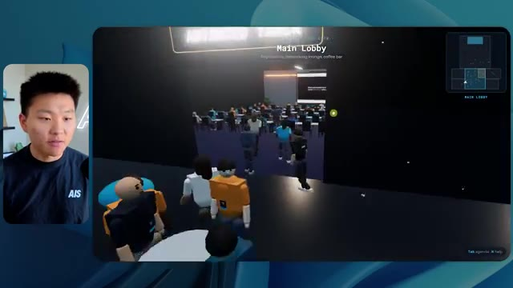

# 🎬 I Tried 100+ Claude Code Skills. These 6 Are The Best

> **Chaîne** : [Nate Herk | AI Automation](https://www.youtube.com/@nateherk/featured)  
> **Lien YouTube** : [https://www.youtube.com/watch?v=eRS3CmvrOvA](https://www.youtube.com/watch?v=eRS3CmvrOvA)  
> **Date de publication** : 20260503  
> **Durée** : 00:13:39  
> **Identifiant vidéo** : `eRS3CmvrOvA`  
> **Transcription & Analyse** : `whisper-v3-large-turbo+gemini-3.5-flash-lite`  

---

## 📌 Synthèse Exécutive & Outils

### 💡 Résumé

Dans cette vidéo issue de la chaîne de Nate Herk | AI Automation, l’analyste explore en conditions réelles les performances du modèle de pointe **Opus 5.5** à travers différents niveaux d'effort (de faible à ultra code) appliqués à une tâche d'ingénierie logicielle et d'automatisation hautement complexe. Le défi technique soumis à l'agent IA consistait à transformer un dossier Frame.io brut de 105 gigaoctets de vidéos d'événements virtuels (*AIS Live*) en un monde 3D interactif et explorable à la troisième personne, intégrant des salles thématiques, des scènes principales, des flux vidéo en direct et une physique de déplacement réaliste, le tout jugé sur la créativité et le design.

Les résultats démontrent une corrélation directe et fascinante entre la granularité de l'effort alloué, le temps d'exécution, la consommation de tokens et la fidélité visuelle et fonctionnelle du livrable. Alors que le niveau d'effort "Faible" a généré un prototype basique, truffé de bugs visuels, d'images fixes et d'artefacts en 16 minutes pour environ 3,91 $, le niveau "Moyen" a livré une application web 3D spectaculairement fonctionnelle. Cette version intermédiaire comprenait des palettes de couleurs respectant la charte graphique de la marque, des PNJ animés dotés de micro-comportements, des flux vidéo en streaming direct fonctionnels et des espaces immersifs complets (hall d'exposition, salon VIP, scènes principales), en 1 heure 13 minutes pour un coût équivalent API de 12,44 $. 

Fait remarquable souligné par l'analyste, dans les deux cas, l'agent a exécuté l'intégralité du développement de manière totalement autonome (*zero-shot*), effectuant des dizaines de vérifications dans un navigateur automatisé sans poser la moindre question humaine en cours de route. La transition vers les niveaux d'effort supérieurs illustre la puissance de l'ingénierie des agents autonomes, tout en posant la problématique critique du déploiement de production et de l'hébergement rapide des applications générées.

### 🛠️ Outils, Modèles & Logiciels Présentés

* **Opus 5.5** : Le modèle de langage et d'agent multimodal d'Anthropic au cœur des tests, reconnu pour sa puissance, son coût abordable et sa polyvalence dans la génération de code complexe et d'environnements interactifs.
* **Claude Code** : L'interface et l'environnement de développement en ligne de commande d'Anthropic utilisé pour piloter l'agent de programmation et exécuter les tâches d'ingénierie.
* **Hostinger (via son connecteur)** : L'extension d'éditeur gratuite sponsorisant la vidéo, permettant d'intégrer directement un compte d'hébergement web et cloud dans l'environnement de code pour combler le fossé entre le développement local et le déploiement en ligne.
* **Frame.io** : La plateforme cloud de gestion et de stockage vidéo utilisée pour ingérer la source brute de 105 Go des enregistrements de la conférence *AIS Live*.
* **Cursor / VS Code** : Les éditeurs de code et environnements de développement mentionnés comme intégrables avec les outils de connectivité cloud et de génération assistée par IA.
* **Key.ai** : L'outil de génération d'images et de vidéos par IA évoqué dans le prompt initial pour assister l'agent dans la création de ressources graphiques manquantes.
* **Hyper Agent / Glido** : Les systèmes d'exploitation IA internes et écosystèmes de briques logicielles propriétaires de Nate Herk référencés dans le contexte du projet.

### 🔑 Points Clés & Enseignements Stratégiques

* **Impact direct du paramètre d'effort** : Le choix du niveau d'effort (Faible, Moyen, Élevé, Extra, Max, Ultra Code) redéfinit radicalement la profondeur de raisonnement, la qualité du code produit et la robustesse architecturale de l'agent sans qu'il soit nécessaire de modifier le prompt initial.
* **Validation des recommandations d'Anthropic** : Les tests confirment empiriquement les directives d'Anthropic suggérant de démarrer l'ingénierie par un niveau d'effort moyen, qui offre souvent le meilleur compromis entre complexité fonctionnelle, temps d'exécution et pertinence des résultats avant d'ajuster finement.
* **Autonomie totale en mode *Zero-Shot*** : L'agent a démontré une capacité remarquable à exécuter des instructions complexes et holistiques ("crée-moi un monde 3D exploitable à partir de 105 Go de données") de bout en bout, accomplissant la tâche sans nécessiter d'interventions ou de clarifications humaines intermédiaires.
* **Boucle de rétroaction visuelle automatisée** : L'agent ne se contente pas d'écrire du code aveuglément ; il intègre une boucle d'assurance qualité en ouvrant et inspectant activement le navigateur à de multiples reprises (22 à 23 vérifications enregistrées) pour valider visuellement son propre travail.
* **Gestion des métriques de coût et de performance** : Le passage d'un effort faible à moyen multiplie par quatre le temps de calcul (de 16 minutes à 1h13) et le coût API estimé (de 3,91 $ à 12,44 $ pour environ 490 000 tokens), un investissement largement justifié par le bond qualitatif du rendu final.
* **Respect contextuel et identité de marque** : Un niveau d'effort suffisant permet à l'agent d'analyser en profondeur les ressources du projet pour appliquer dynamiquement la charte graphique, les palettes de couleurs et les logos exacts de la marque, transformant un prototype générique en une application sur mesure.
* **Intégration multimédia complexe** : L'agent est capable d'architecturer un espace 3D tout en y injectant et synchronisant des flux vidéo dynamiques, des cartes interactives en temps réel et des éléments de design fonctionnels à partir de sources brutes hétérogènes.
* **Le goulet d'étranglement du déploiement** : La génération autonome de code fonctionnel par l'IA crée un nouveau défi logistique : le passage rapide de l'environnement de développement local à la mise en ligne publique, nécessitant des intégrations de type connecteurs d'hébergement direct.
* **Agents et automatisation de l'événementiel** : L'utilisation d'agents d'IA avancés pour convertir des archives vidéo massives en expériences immersives explorables redéfinit le futur de la post-production et de la valorisation des événements virtuels ou hybrides.
* **Gestion de l'échelle des données** : Même confronté à des volumes de données brutes massifs (105 Go sur Frame.io), l'agent sait cibler, structurer et exploiter intelligemment les ressources nécessaires sans s'enliser dans la surcharge d'information, à condition de disposer de la puissance de calcul adéquate.

---

## ⏱️ Chronologie & Transcription Complète Audio & Visuelle (Mot pour Mot)

### ⏱️ `[00:00:00 - 00:00:20]` | Segment #01

**🔊 Audio (Transcription Intégrale Mot pour Mot en Français) :**
> Opus 5.5, Opus 5.5, Opus 5.5, Opus 5.5, Opus 5.5. Ce modèle est littéralement partout et pour de très bonnes raisons. Il est intelligent, il est bon marché, il a un goût incroyable, c'est un modèle d'IA incroyable. Mais avec chaque modèle d'IA, vous avez le choix de l'effort, que ce soit faible, moyen, élevé, extra, max ou code ultra.

**👁️ Analyse Visuelle d'Écran (gemini-3.5-flash-lite) :**
**Interface & Outils** : Interface du réseau social X (anciennement Twitter).

**Contenu textuel & Code** : Publication sur X avec un tweet et une vidéo intégrée montrant un environnement 3D tropical.

**Action / Démonstration** : Affichage d'un exemple de contenu généré par IA pour illustrer les propos sur les capacités du modèle Opus 5.5.

*⏱️ 00:00:05 — Capture d'écran montrant un post sur les réseaux sociaux (X/Twitter) affichant une vidéo de paysage tropical généré par IA et un texte commentant l'impact sur les professionnels.*

---

### ⏱️ `[00:00:20 - 00:00:38]` | Segment #02

**🔊 Audio (Transcription Intégrale Mot pour Mot en Français) :**
> Donc dans cette vidéo, j'ai donné à Opus 5.5 exactement le même prompt et je l'ai exécuté à chaque niveau d'effort et nous allons comparer les résultats. Nous allons examiner la qualité de toutes les différentes sorties réelles, mais ensuite nous allons également examiner combien de temps chacun d'entre eux a fonctionné, combien cela nous a coûté si c'était une facturation par API, le total des jetons, combien de vérifications ils ont exécutées et combien de questions ils m'ont réellement posées tout au long du processus.

**👁️ Analyse Visuelle d'Écran (gemini-3.5-flash-lite) :**
**Interface & Outils** : Application web ou tableau de bord de comparaison de modèles (interface de type canvas/table).

**Contenu textuel & Code** : Tableau comparatif avec les lignes : Run time, API cost, Total tokens, Checks, Questions asked, et les colonnes de niveaux d'effort (Low à Ultracode).

**Action / Démonstration** : Présentation du tableau comparatif évaluant les performances et les coûts selon les différents niveaux d'effort d'Opus 5.5.

*⏱️ 00:00:29 — Tableau de comparaison de l'interface montrant les différents niveaux d'effort (Low, Medium, High, Extra, Max, Ultracode) et les métriques associées.*

---

### ⏱️ `[00:00:39 - 00:00:58]` | Segment #03

**🔊 Audio (Transcription Intégrale Mot pour Mot en Français) :**
> Et les résultats que nous avons obtenus ne sont pas du tout ce à quoi je m'attends, donc j'ai hâte de partager cela avec vous les gars. Ne perdons pas de temps et allons directement à celui-ci. D'accord, alors sautons directement dans celui-ci. Je veux commencer juste en vous montrant le prompt réel que nous avons utilisé que nous avons donné à chacun de ces différents agents. Je vais aller dans les fichiers ici, et nous allons ouvrir ce fichier markdown de prompt, et je vais vous montrer ce que nous avons obtenu. Donc voici le slash objectif que j'ai alimenté.

**👁️ Analyse Visuelle d'Écran (gemini-3.5-flash-lite) :**
**Interface & Outils** : Application de développement / interface d'agent IA (type éditeur de code moderne ou outil de prompt) avec un panneau latéral de navigation et une zone de chat.

**Contenu textuel & Code** : Texte du prompt : "Hi Nate. This worktree has the effort-test task queued in PROMPT.md : build a walkable third-person 3D world of the AIS Live conference from your f.io recordings, with separate rooms, tracks, and stages, then send you a localhost link and the exact verification numbers. I haven't started it. Should I begin, or did you have something else in mind?"

**Action / Démonstration** : Affichage et lecture à l'écran du prompt initial de la tâche d'automatisation par l'IA avant exécution.

*⏱️ 00:00:48 — Interface d'un outil de développement (semblable à Cursor ou une application LLM) affichant un prompt textuel demandant de construire un monde 3D en 3D pour la conférence AIS Live, avec une petite fenêtre vidéo du présentateur sur le côté gauche.*

---

### ⏱️ `[00:00:58 - 00:01:34]` | Segment #04

**🔊 Audio (Transcription Intégrale Mot pour Mot en Français) :**
> J'ai dit, tu dois me créer un monde 3D qui est une conférence tech réaliste dans laquelle je peux me promener en vue à la troisième personne. Tu vas regarder ce dossier, qui contient mes ressources d'enregistrement d'événements d'AIS Live. Et ce dossier est un dossier Frame.io de 105 gigaoctets d'enregistrements vidéo. C'était un événement complètement virtuel. Tout a été enregistré et tous les enregistrements sont ici même. J'ai dit, ton objectif est de prendre cet événement et de le transformer en un monde 3D explorable qui me donne l'impression d'avoir réellement assisté à une vraie conférence en personne avec différentes salles, différentes pistes, différentes scènes, bla, bla, bla. n'hésite pas à utiliser key.ai si tu as besoin de générer des images ou des vidéos. Et tu peux aussi utiliser tout le reste à l'intérieur de mon projet Herc 2, qui est comme mon système d'exploitation IA. J'ai dit,

**👁️ Analyse Visuelle d'Écran (gemini-3.5-flash-lite) :**
**Interface & Outils** : Éditeur de code (VS Code / interface similaire) et interface web Frame.io.

**Contenu textuel & Code** : Instructions détaillées en markdown pour concevoir une conférence tech 3D interactive et lien Frame.io.

**Action / Démonstration** : Présentation du prompt initial et des ressources vidéo nécessaires à la création du monde virtuel.

*⏱️ 00:01:07 — Fichier PROMPT.md affiché dans l'éditeur montrant les instructions pour créer le monde 3D.*

*⏱️ 00:01:16 — Interface Frame.io montrant le dossier des ressources d'enregistrement d'événements AIS Live (105,69 Go).*

*⏱️ 00:01:25 — Fichier PROMPT.md affiché dans l'éditeur avec le texte complet des consignes pour l'agent.*

---

### ⏱️ `[00:01:34 - 00:02:08]` | Segment #05

**🔊 Audio (Transcription Intégrale Mot pour Mot en Français) :**
> tu seras jugé sur la créativité, le design, la physique et la sensation générale lorsque j'explorerai le monde en 3D que tu as construit. Et c'était fondamentalement la fin des instructions. Donc comme tu peux le voir sur ce côté gauche, j'ai fait passer cela par tous les différents niveaux d'effort. Commençons par le niveau bas et remontons jusqu'à ultra code. Très bien. Donc ici nous avons le résultat du niveau bas. Ouvrons ceci et jetons un œil. Nous avons donc AIS live, le sommet des services IA en personne enfin, et nous avons pu cliquer partout. Tout d'abord, cela ne fait pas très personnalisé. Genre ce n'est pas le logo d'IS Live. Ce n'est même pas nos couleurs. Donc je n'aimerais pas trop ça, mais entrons ici. D'accord. C'est beaucoup trop lumineux. Euh, nous avons une carte en haut à droite ? Nous avons une ville par ici. Je ne peux pas dire quelle ville c'est.

**👁️ Analyse Visuelle d'Écran (gemini-3.5-flash-lite) :**
**Interface & Outils** : Interface logicielle de type éditeur ou application IA (style Cursor / Claude Code)

**Contenu textuel & Code** : Message de l'assistant IA proposant de commencer la tâche demandée dans PROMPT.md (« build a walkable third-person 3D world ») et champ de saisie en bas avec le prompt « yes, start the task in PROMPT.md ».

**Action / Démonstration** : Le présentateur survole les différents niveaux d'effort (« Session logs cost analysis », « Hello », « Extra », « High », « Max », « Ultracode », « Medium », « Low ») dans la barre latérale.

*⏱️ 00:01:42 — Interface d'une application de développement affichant dans la barre latérale gauche différents niveaux d'effort (Hello, Extra, High, Max, Ultracode, Medium, Low) sous le projet effort-test, et dans le panneau principal un échange de messages demandant de construire un monde 3D.*

---

### ⏱️ `[00:02:08 - 00:02:40]` | Segment #06

**🔊 Audio (Transcription Intégrale Mot pour Mot en Français) :**
> c'est. D'accord. C'est Chicago, ce qui est plutôt cool parce que tu sais, j'habite à Chicago, mais bref, en haut, à droite, on peut voir une carte. Nous avons un hall d'accueil. Nous avons un hall d'exposition. Nous avons un salon VIP, la scène principale. Aussi, la carte montre où se trouve chaque autre personne et ça se synchronise en direct. Donc on peut voir l'enregistrement. On peut voir le premier jour, la keynote de l'hyper agent, le débrief en direct. Cool. Donc ça connaît réellement l'programme et puis il y a le deuxième jour. Donc il a trouvé ça, c'est bien. Nous avons ces petites boules ici que je peux espérer projeter d'un coup de pied. D'accord. Le visage, Oh, regarde ça. Si je vais par ici, tous les gens disparaissent tout simplement. Très mauvais. Très mauvais. D'accord. Alors voyons voir. Est-ce que je peux sprinter ? D'accord.

**👁️ Analyse Visuelle d'Écran (gemini-3.5-flash-lite) :**
**Interface & Outils** : Application web interactive / Environnement virtuel 3D de type métavers avec mini-carte de navigation.

**Contenu textuel & Code** : Interface utilisateur virtuelle affichant des programmes de conférence, des zones thématiques (Lobby, Badge pickup, Expo Hall, Main Stage, VIP Lounge).

**Action / Démonstration** : Navigation et exploration d'un espace virtuel interactif représentant les différents espaces d'un événement en ligne.

*⏱️ 00:02:16 — Vue d'un monde virtuel style métavers montrant la zone de retrait des badges avec des avatars et une mini-carte en haut à droite.*

*⏱️ 00:02:24 — Vue du hall d'accueil (Lobby) du monde virtuel avec un panneau affichant le programme du premier jour (Day 1).*

*⏱️ 00:02:32 — Vue du hall d'exposition (Expo Hall) dans le monde virtuel avec des avatars et des zones d'interaction lumineuses.*

---

### ⏱️ `[00:02:40 - 00:03:04]` | Segment #07

**🔊 Audio (Transcription Intégrale Mot pour Mot en Français) :**
> Je peux avancer un peu plus vite. Je vais d'abord aller par ici. Il y a des produits dérivés, euh, certifiés AIS plus glido. D'accord. Donc il y a les vrais stands qu'on avait dans l'événement virtuel. On avait des stands. Donc c'est plutôt cool. Un petit endroit pour prendre des photos. La salle C. En ce moment, nous avons Tangy Frederick qui anime un atelier. D'accord. Mais ce n'est pas une vidéo. Comme vous pouvez le voir, c'est juste une image. Elle ne bouge pas. C'est donc juste une image. Ces gens sont en train de disparaître. Ce doivent être des fantômes. Allons par ici dans la salle A.

**👁️ Analyse Visuelle d'Écran (gemini-3.5-flash-lite) :**
**Interface & Outils** : Environnement virtuel 3D interactif (type metavers / jeu) utilisé pour présenter l'événement.

**Contenu textuel & Code** : Affichage d'un stand virtuel de sponsor ("Glaido") et d'un écran de tutoriel textuel pour la configuration d'une clé API.
[COMPILATION] Navigation et exploration à l'intérieur de l'espace virtuel par le présentateur.

**Action / Démonstration** : Explications face caméra et démonstration conceptuelle.

*⏱️ 00:02:46 — Vue d'un monde virtuel style métavers montrant un personnage en avatar marchant devant un stand de sponsor étiqueté 'Glaido' avec des cubes marqués 'AIS'.*

*⏱️ 00:02:52 — Navigation dans une salle virtuelle verte (« Workshop Room C - Enterprise track ») avec des tables et un écran d'affichage au fond.*

*⏱️ 00:02:58 — Avancée dans la salle virtuelle face à un grand écran affichant des instructions par étapes (Step 1, Step 2, Step 3) sur l'utilisation des clés API.*

---

### ⏱️ `[00:03:04 - 00:03:30]` | Segment #08

**🔊 Audio (Transcription Intégrale Mot pour Mot en Français) :**
> Nous avons Liberty White. D'accord. Très cool. Vos trente premiers jours en automatisation. Encore une fois, c'est juste une image fixe et les gens ont des bugs visuels. Ce n'est donc pas très bon ici. Je vais aller sur la scène principale et voir ce que nous avons. D'accord, cool. Nous avons donc une scène qui a l'air principale. Les gens buguent. Vraiment beaucoup. Ce n'est vraiment pas bon du tout. Notre vidéo est en train de bouger. Genre, j'ai vu mon visage ici et j'ai vu celui de Devin, mais maintenant ils ont disparu. Donc je ne sais pas ce qui s'est passé. D'accord. Ça ressemble plutôt à un diaporama. Rien n'est vraiment diffusé pour l'instant. Bref, entrons ici.

**👁️ Analyse Visuelle d'Écran (gemini-3.5-flash-lite) :**
**Interface & Outils** : Environnement virtuel 3D de type métavers / plateforme d'événement en ligne.

**Contenu textuel & Code** : Interface de navigation 3D, avatars, écrans de présentation de l'atelier "Hyperagent Workshop".

**Action / Démonstration** : Navigation et déplacement d'un avatar à l'intérieur d'un espace virtuel de conférence en ligne.

*⏱️ 00:03:11 — Vue d'une salle d'atelier virtuelle (Workshop Room A) avec un avatar naviguant entre des plateformes lumineuses.*

*⏱️ 00:03:17 — Vue de la scène principale (Main Stage) d'un événement virtuel rempli d'avatars assis dans un auditorium.*

*⏱️ 00:03:24 — Vue face à l'écran géant affichant "AIS LIVE AI Services Summit" dans l'environnement virtuel interactif.*

---

### ⏱️ `[00:03:30 - 00:03:58]` | Segment #09

**🔊 Audio (Transcription Intégrale Mot pour Mot en Français) :**
> Nous avons plus de stands. Nous avons hyper agent. Nous avons Claude Code. Nous avons plus de gadgets publicitaires. La salle B, c'est Dave Ebelor. Je suppose que c'est exactement la même chose. Nous avons du café. Et ensuite, je suppose le salon VIP, accès VIP seulement. C'est plutôt cool, mais il ne se passe vraiment rien ici. Cet écran est bien trop lumineux. D'accord. Donc je pense que vous comprenez l'ambiance qu'on obtient ici d'Opus 5.5 à effort faible. Et c'est là que les choses deviennent intéressantes. À combien est-ce que vous pensez que cela a tourné ? Combien de temps ? Celui-ci a duré 16 minutes et 43 secondes. Combien pensez-vous que cela a coûté ?

**👁️ Analyse Visuelle d'Écran (gemini-3.5-flash-lite) :**
**Interface & Outils** : Application de tableau blanc / interface de canevas interactif (Opus 5.5 Efforts) et univers virtuel 3D.

**Contenu textuel & Code** : Tableau avec les en-têtes : Low, Medium, High, Extra, Max, Ultracode, et les lignes : Run time, API cost, Total tokens, Checks, Questions asked.

**Action / Démonstration** : Présentation du tableau comparatif des niveaux d'effort d'un modèle d'IA.

*⏱️ 00:03:51 — Capture d'écran d'un tableau comparatif intitulé "Opus 5.5 Efforts" avec des colonnes de Low à Ultracode et des lignes de métriques (Run time, API cost, Total tokens, Checks, Questions asked).*

---

### ⏱️ `[00:03:58 - 00:04:26]` | Segment #10

**🔊 Audio (Transcription Intégrale Mot pour Mot en Français) :**
> 3,91 dollars si c'était une facturation par API. J'utilise évidemment mon abonnement ici, mais nous allons juste calculer cela en facturation API. Le nombre total de jetons était de 191 000. Il a effectué 22 vérifications. Donc pour la vérification, il a ouvert le navigateur 22 fois et a exécuté différents types de vérifications. Donc 22 catégories de vérifications. Et combien de questions m'a-t-il posées ? Il m'a posé un total de zéro question tout au long de cette invite de type slash goal. D'accord. Alors, ouvrons l'effort moyen et voyons ce que nous avons. D'accord, c'est parti. Effort moyen. Nous avons Nate Herc. Nous avons mon badge. C'est aux couleurs de la marque AI's life.

**👁️ Analyse Visuelle d'Écran (gemini-3.5-flash-lite) :**
**Interface & Outils** : Interface de tableau blanc (type Excalidraw ou similaire).

**Contenu textuel & Code** : Tableau avec des colonnes "Low", "Medium", "High", et des lignes pour "Run time" (16m 43s), "API cost" ($3.91), "Total tokens" (191.3K), "Checks", et "Questions asked".

**Action / Démonstration** : Le présentateur explique les métriques de coût d'API et de consommation de jetons affichées à l'écran.

*⏱️ 00:04:05 — Le présentateur présente un tableau récapitulatif des coûts et performances d'un agent IA sur une interface de type tableau blanc.*

---

### ⏱️ `[00:04:26 - 00:04:46]` | Segment #11

**🔊 Audio (Transcription Intégrale Mot pour Mot en Français) :**
> Donc ça a déjà l'air un petit peu mieux. Ça ressemble à nos palettes de couleurs qui ont utilisé nos directives de marque. Premier jour de construction, deuxième jour de gain, VIP. Cool. D'accord. Je vais entrer dans le lieu. D'accord. Waouh. Une ambiance un peu similaire. C'est en arrière-plan. Ça ne ressemble pas à Chicago pourtant, si ? Non, ça ressemble à, honnêtement, ça ressemble à une ville imaginaire. Quoi qu'il en soit, c'est marrant qu'ils aient décidé de faire ça. Voyons si je peux avancer un peu plus vite. Oh, waouh.

**👁️ Analyse Visuelle d'Écran (gemini-3.5-flash-lite) :**
**Interface & Outils** : Application web / Interface utilisateur 3D de l'événement "AIS Live".

**Contenu textuel & Code** : Textes d'accueil "Welcome to AIS Live", badge avec nom "NATE HERK", options de contrôle au clavier (WASD walk, Shift sprint, Space jump) et boutons de navigation.

**Action / Démonstration** : Le présentateur commente l'interface graphique de l'application web puis clique sur "Enter the venue" pour entrer dans l'espace virtuel 3D.

*⏱️ 00:04:31 — Interface web de l'application "AIS Live" montrant un écran d'accueil avec un badge nominatif interactif (Nate Herk) et les options pour entrer dans le lieu virtuel.*

*⏱️ 00:04:41 — Vue en 3D à l'intérieur du lieu virtuel "AIS Live" montrant des avatars de personnages dans un espace moderne avec vue sur une ville illuminée la nuit.*

---

### ⏱️ `[00:04:46 - 00:05:21]` | Segment #12

**🔊 Audio (Transcription Intégrale Mot pour Mot en Français) :**
> Les gens interagissent avec moi. Regardez. Si je m'approche de ce type, il vient juste de lever le bras. Bon, maintenant il ne veut plus du tout avoir affaire à moi. Mais tous ces petits robots ici doivent prendre des décisions. Je ne sais pas s'ils utilisent Jev. Ils ne le font définitivement pas. Je ne le lui ai pas dit. En fait, ma clé Jev est à l'arrière. Je ne sais pas. Peut-être qu'il l'a utilisée. Quoi qu'il en soit, nous pouvons voir ici que nous avons la salle d'atelier C, le laboratoire des agents. Sympa. Donc celui-ci est en fait en train de tourner. Vous pouvez voir qu'il s'agit d'une vraie vidéo lue par Tangy. Tout le monde ici est en train de travailler sur un ordinateur portable. Ils ne buguent pas. C'est plutôt cool. De plus, mon badge est sur ma poitrine, ce qui est plutôt cool. Je peux venir par ici. Nous avons une carte en haut à droite, comme vous pouvez le voir, mais je peux venir par ici. Nous avons un

**👁️ Analyse Visuelle d'Écran (gemini-3.5-flash-lite) :**
**Interface & Outils** : Environnement virtuel 3D / Plateforme d'agents IA

**Contenu textuel & Code** : Avatars de personnages dans un espace de travail virtuel avec interface de mini-carte et informations de session (Enterprise AI Services)

**Action / Démonstration** : Navigation et exploration de l'environnement virtuel 3D peuplé d'agents IA autonomes

---

### ⏱️ `[00:05:21 - 00:05:47]` | Segment #13

**🔊 Audio (Transcription Intégrale Mot pour Mot en Français) :**
> hall d'exposition. C'est là que nous avons le stand Glido. Et ça diffuse en ce moment. Oui, ça diffuse la vidéo de nous en train de parler de Glido. Ça diffuse la vidéo d'Ed et moi parlant de notre programme de certification. Nous avons le logo AIS Plus ici à l'arrière, qui est un peu mal placé. Ce sont les diapositives des conférenciers et les points clés. Donc waouh, ce sont toutes les ressources que nous avons distribuées après l'événement. Elles sont toutes là aussi. Nous pouvons voir que nous avons un coup de projecteur sur la communauté. C'est donc Aiden qui parle de l'affaire qu'il a conclue et c'est diffusé en direct. Ces gens regardent.

**👁️ Analyse Visuelle d'Écran (gemini-3.5-flash-lite) :**
**Interface & Outils** : Environnement virtuel 3D de type métavers / plateforme d'événement en ligne.

**Contenu textuel & Code** : Textes, panneaux d'affichage, diapositives de présentation et infographies dans l'espace virtuel.

**Action / Démonstration** : Navigation et exploration d'un hall d'exposition virtuel par le présentateur.

---

### ⏱️ `[00:05:47 - 00:06:21]` | Segment #14

**🔊 Audio (Transcription Intégrale Mot pour Mot en Français) :**
> Ils sont plutôt engagés. On a un hyper agent. C'était, c'est ce que je voulais dire. Si vous avez vu ces gens lever les bras en disant bonjour, c'était plutôt marrant. Regardez, regardez, le voilà qui recommence. Bref. Bon. Où est-ce que je suis maintenant ? Maintenant, je suis dans le hall principal. On a un bar à café. On a un grand logo, qui est le vrai logo. C'est trop lumineux, mais on a le logo. On peut voir si on peut entrer ici dans le parcours fondation. On a Sabrina Romanov et Liberty White. Donc différentes formations juste là. On peut entrer dans cette pièce. C'est le parcours avancé. Alors qu'est-ce qui se passe ici. On a Dave Ebelar et Saman qui parlent de différentes choses là-dedans. Et maintenant, allons jeter un œil à la scène principale. Oh, attendez, il y a une vidéo de moi là-haut. Est-ce que c'est genre un VIP

**👁️ Analyse Visuelle d'Écran (gemini-3.5-flash-lite) :**
**Interface & Outils** : Environnement virtuel 3D / Plateforme d'événement en ligne

**Contenu textuel & Code** : Avatars numériques interactifs, interface de navigation 3D, mini-carte du hall principal

**Action / Démonstration** : Exploration et navigation dans un espace de conférence virtuel en 3D avec des avatars d'utilisateurs.

*⏱️ 00:05:55 — Vue dans le hall principal virtuel d'une plateforme d'événement avec des avatars de participants.*

*⏱️ 00:06:04 — Déplacement d'avatars virtuels dans un espace de conférence virtuel.*

*⏱️ 00:06:12 — Interaction d'avatars dans l'environnement virtuel 3D de l'événement en ligne.*

---

### ⏱️ `[00:06:21 - 00:06:50]` | Segment #15

**🔊 Audio (Transcription Intégrale Mot pour Mot en Français) :**
> section ? Ouais, on ira voir ça dans une minute. Mais bref, voici la scène principale. Ça a l'air vraiment, vraiment très bien. On a une grande scène. On a genre quatre personnes assises ici. On a les trois écrans d'Alex là-haut avec Hyper Agent. Est-ce que j'ai le droit de monter sur scène ? Oh, et il me laisse monter sur scène. D'accord. C'est plutôt sympa. Bon les gars, prenons un selfie. Laissez-moi mettre tout le monde en arrière-plan. Venez par ici. Bref, c'est plutôt, plutôt cool. Par contre, toutes les places ne sont pas occupées. Donc il faut qu'on travaille là-dessus. Mais bref, je vais retourner en courant voir ce qu'était cette section VIP. D'accord. Le salon VIP. J'ai l'impression que c'est comme un aéroport ou quelque chose comme ça.

**👁️ Analyse Visuelle d'Écran (gemini-3.5-flash-lite) :**
**Interface & Outils** : Application de métavers ou de conférence virtuelle 3D (Hyper Agent)

**Contenu textuel & Code** : Interface utilisateur virtuelle affichant les détails de la keynote (Hyperagent Keynote - Alex McDonnell) et une mini-carte de navigation.

**Action / Démonstration** : Navigation et exploration de l'espace de conférence virtuel en 3D par l'utilisateur.

*⏱️ 00:06:28 — Vue d'une conférence virtuelle 3D avec un avatar sur scène devant un public et des écrans géants affichant des présentations.*

*⏱️ 00:06:36 — Vue de l'arrière de la scène dans l'environnement virtuel avec des participants assis et l'avatar du présentateur se déplaçant.*

*⏱️ 00:06:43 — Vue en plongée d'une grande salle de conférence virtuelle bondée avec un avatar naviguant dans l'allée centrale.*

---

### ⏱️ `[00:06:51 - 00:07:14]` | Segment #16

**🔊 Audio (Transcription Intégrale Mot pour Mot en Français) :**
> D'accord, super. Donc maintenant nous avons les sessions VIP ici. Une foire aux questions VIP avec la lecture vidéo en direct de Nate juste ici. Très, très cool. Et nous avons comme un bar ou quelque chose. Génial. Je dirais que c'est un assez bon résultat. Maintenant, en ce qui concerne les statistiques ici, celle-ci a pris une heure et 13 minutes à s'exécuter. Cela nous aurait coûté 12 dollars et 44 cents. Elle a utilisé 490 000 jetons et elle a effectué 23 vérifications.

**👁️ Analyse Visuelle d'Écran (gemini-3.5-flash-lite) :**
**Interface & Outils** : Application de métaverse/espace virtuel 3D et tableau de bord de statistiques Opus 5.5 Efforts.

**Contenu textuel & Code** : Statistiques d'exécution : Run time: 16m 43s, API cost: $3.91, Total tokens: 191.3K, Checks: 22, Questions asked: 0.

**Action / Démonstration** : Présentation de l'espace VIP virtuel et affichage des statistiques des efforts d'Opus 5.5.

*⏱️ 00:06:56 — Vue d'un espace virtuel en 3D représentant un salon VIP avec un écran géant affichant une session vidéo en direct.*

*⏱️ 00:07:02 — Tableau de statistiques montrant les performances de l'IA (Run time 16m 43s, API cost $3.91, Total tokens 191.3K, Checks 22, Questions asked 0).*

---

### ⏱️ `[00:07:14 - 00:07:48]` | Segment #17

**🔊 Audio (Transcription Intégrale Mot pour Mot en Français) :**
> Et il nous a posé un total de zéro question une fois de plus. Très bien, passons au niveau élevé. C'était déjà un résultat plutôt correct et Anthropic eux-mêmes dans leur vidéo de comment prompter Opus 5.5, ou désolé, pas une vidéo, un article. Ils ont dit de commencer simplement par moyen et de l'ajuster à la hausse ou à la baisse si nécessaire. C'était donc un résultat moyen. Passons au niveau élevé et voyons ce qu'on a obtenu. Très rapidement, les gars, je dois prendre une seconde pour vous parler du sponsor de la vidéo d'aujourd'hui, Hostinger. Donc ces deux modèles viennent de me construire une version fonctionnelle de la même chose. Et maintenant, je suis exactement là où je finis toujours, avec quelque chose de terminé sur mon ordinateur portable et aucun moyen rapide de le mettre en ligne. Et c'est le fossé que comble le connecteur d'Hostinger. C'est une extension gratuite

**👁️ Analyse Visuelle d'Écran (gemini-3.5-flash-lite) :**
**Interface & Outils** : Tableau comparatif type Notion/Canvas et éditeur de code/environnement de développement avec IA (type Cursor/VS Code).

**Contenu textuel & Code** : Métriques de performance (Run time, API cost, Total tokens, Checks, Questions asked) et prompt de création d'un calculateur ROI (Northwind ROI calculator).

**Action / Démonstration** : Analyse comparative des coûts et temps d'exécution selon les niveaux de configuration de l'IA, puis visualisation du processus de génération de code.

*⏱️ 00:07:22 — Un tableau comparatif des performances et des coûts selon différents niveaux d'effort (Low, Medium, High, Extra) avec le présentateur en médaillon à gauche.*

*⏱️ 00:07:39 — Une interface de développement avec deux panneaux divisés montrant l'exécution d'un agent de code et son terminal de suivi, avec le présentateur incrusté en bas à droite.*

---

### ⏱️ `[00:07:48 - 00:08:23]` | Segment #18

**🔊 Audio (Transcription Intégrale Mot pour Mot en Français) :**
> pour votre éditeur qui intègre votre compte Hostinger dans l'environnement où vous codez déjà. Que ce soit VS Code, Cursor, Cloud Code, Codex, peu importe. Vous vous connectez une seule fois en un clic, et à partir de là, votre agent peut déployer le site, y associer un domaine, configurer les enregistrements DNS et vérifier votre VPS sans que vous ayez à quitter votre éditeur. Ainsi, peu importe celui que vous finirez par préférer, ce qu'il a construit n'est qu'à quelques minutes d'une vraie URL sur un hébergement géré. Connector est gratuit avec chaque formule d'hébergement, donc si vous avez encore besoin de l'hébergement en dessous, profitez de la formule illimitée avec le lien dans la description et utilisez le code NATEHERK pour 10 % de réduction. Cela inclut également un nom de domaine gratuit et un e-mail professionnel pour un an. Et c'est toujours le moyen le moins cher que j'ai trouvé pour obtenir un

**👁️ Analyse Visuelle d'Écran (gemini-3.5-flash-lite) :**
**Interface & Outils** : Navigateur web / IDE (intégration Hostinger) et terminal Claude Code

**Contenu textuel & Code** : Panneau de gestion Hostinger ("Manage Hostinger from your IDE"), statut "Connected" via OAuth avec Node.js 24.13.0, liste des outils disponibles avec cases à cocher.

**Action / Démonstration** : Connexion réussie du compte Hostinger à l'environnement de développement pour permettre à l'agent d'accéder aux outils de déploiement et de gestion.

*⏱️ 00:07:57 — Interface d'intégration Hostinger connectée via OAuth à un IDE, affichant les outils disponibles (Websites, Domains, Subscriptions, Email Marketing) et Claude Code sur le panneau droit.*

---

### ⏱️ `[00:08:23 - 00:08:47]` | Segment #19

**🔊 Audio (Transcription Intégrale Mot pour Mot en Français) :**
> vous avez construit sur une vraie URL. Donc revenons à la vidéo. D'accord. Encore une fois, très, très thématisé par la marque. C'est un écran de chargement encore mieux que le précédent. Nous avons ce joli petit effet en arrière-plan. Nous avons le logo. Nous allons entrer dans le lieu. D'accord. Nous y voilà. Ça a l'air plutôt bien. Nous commençons à l'extérieur et vous pouvez voir que nous avons ces drapeaux pour tous les intervenants, Wyatt, Casper, Alex, Ed, Aiden, Sabrina, Liberty. C'est plutôt cool. Nous avons des blocs en direct ici.

**👁️ Analyse Visuelle d'Écran (gemini-3.5-flash-lite) :**
**Interface & Outils** : Navigateur web / Application web 3D interactive (RingCentral / AIS Live).

**Contenu textuel & Code** : Interface d'un événement virtuel 3D avec bannières nominatives (Alex McDonnell, Wyatt Lyonsmith) et indications de contrôles clavier/souris.

**Action / Démonstration** : Connexion et exploration de l'espace virtuel 3D de l'événement par le présentateur.

*⏱️ 00:08:29 — Écran de chargement et d'accueil de la plateforme virtuelle 'AIS LIVE', affichant le logo et les instructions de contrôle.*

*⏱️ 00:08:35 — Vue dans le monde virtuel 3D isométrique (AIS Live Plaza), montrant l'avatar du joueur et un environnement urbain stylisé.*

*⏱️ 00:08:41 — Exploration de l'espace virtuel 3D 'AIS Live Plaza' avec des bannières informatives de conférenciers et des éléments interactifs.*

---

### ⏱️ `[00:08:47 - 00:09:23]` | Segment #20

**🔊 Audio (Transcription Intégrale Mot pour Mot en Français) :**
> Il a pris cette photo de moi, votre hôte, Nate Herc, John, Dave, Nate Herc. Voilà. D'accord. Les portes. Génial. Ce sont des portes automatiques coulissantes en verre. J'adore ça. Nous pouvons voir l'enregistrement VIP. Nous pouvons voir l'admission générale. Nous pouvons venir ici et nous pouvons découvrir l'exposition avec différents stands, le coin de la communauté. Vous pouvez également voir qu'en haut à gauche, j'ai un passeport. Donc c'est comme, il montrera combien d'endroits j'ai visités. Tout cela est une lecture réelle. Nous avons un mur de ressources avec tous les différents conférenciers. Ils ont aussi une session de networking par ici. Je vais donc venir très vite et voir de quoi il s'agit. Nous avons donc le bar à cold brew AIS. Nous avons différents membres de la communauté qui ont été mis en avant ou mis en lumière.

**👁️ Analyse Visuelle d'Écran (gemini-3.5-flash-lite) :**
**Interface & Outils** : Application de métavers / environnement virtuel 3D de conférence.

**Contenu textuel & Code** : Environnement virtuel 3D, avatars, panneaux d'affichage et interface de navigation (minimap et commandes en bas à droite).

**Action / Démonstration** : Navigation et déplacement d'un avatar dans un espace virtuel 3D interactif.

---

### ⏱️ `[00:09:23 - 00:09:56]` | Segment #21

**🔊 Audio (Transcription Intégrale Mot pour Mot en Français) :**
> On a l'aile VIP. Attends, quoi ? Récupère un bracelet. Oh, je dois vraiment aller chercher le bracelet. D'accord. Laisse-moi m'enregistrer rapidement. Le bracelet est déjà mis. Attends, quoi ? D'accord. Oh, d'accord. Maintenant, les portes se sont ouvertes pour moi. Cool. Je peux entrer ici. Oh, ça mène juste à la scène principale. Salon VIP. Il y a une séance de questions-réponses en cours. Ça a l'air très sympa. Je veux dire, je suis très impressionné par la façon dont il parvient à faire ça. Waouh. D'accord. Donc c'est vraiment bien. Ce qu'on a fait, c'est qu'on a eu des salles de discussion VIP avec différentes personnes. Tu peux voir qu'il y a différentes salles, différents membres de l'équipe AIS qui participent à des trucs. C'est vraiment cool. C'est très cool. C'est un VIP bien meilleur

**👁️ Analyse Visuelle d'Écran (gemini-3.5-flash-lite) :**
**Interface & Outils** : Application de métavers / espace virtuel interactif 3D

**Contenu textuel & Code** : Environnement virtuel 3D affichant des zones d'exposition, des écrans de présentation, des avatars et des indications textuelles (« VIP Lounge », « VIP Working Sessions », « Land Your First Paying Client »).

**Action / Démonstration** : Navigation et exploration de différentes salles virtuelles au sein de la plateforme de conférence en ligne.

*⏱️ 00:09:32 — Vue d'un monde virtuel interactif (Registration Concourse) avec le présentateur incrusté à gauche.*

*⏱️ 00:09:40 — Navigation du joueur dans le salon VIP virtuel (VIP Lounge) avec affichage d'une session vidéo.*

*⏱️ 00:09:48 — Exploration de l'espace des sessions de travail VIP (VIP Working Sessions) avec différents sujets affichés sur des panneaux.*

---

### ⏱️ `[00:09:56 - 00:10:30]` | Segment #22

**🔊 Audio (Transcription Intégrale Mot pour Mot en Français) :**
> expérience que ce qui a été montré dans la première partie. D'accord. Soirée VIP après le spectacle. Regardez ça. Nous avons une piste de danse. Nous avons tous ces éléments ici. Nous avons la lecture de la véritable soirée VIP après le spectacle juste ici. Et il y a une estrade de DJ. C'est tellement drôle. Il y a un petit bug ici, un petit problème technique juste là, mais c'est génial. Oh, chouette. Donc quand je suis ici sur la scène principale, nous avons des sous-titres. Vous pouvez voir juste ici au bas de mon écran, nous obtenons ces sous-titres de Wyatt qui parle réellement ici. Nous avons des lumières. Nous avons le panneau. Très chouette. Belle scène principale. Je vais aller par ici. Nous pouvons aller à la fondation,

**👁️ Analyse Visuelle d'Écran (gemini-3.5-flash-lite) :**
**Interface & Outils** : Application web interactive / métavers virtuel 3D

**Contenu textuel & Code** : Environnement virtuel 3D avec avatars, écrans vidéo de participants et interface de navigation

**Action / Démonstration** : Navigation et présentation d'un événement virtuel en ligne dans un espace métavers

*⏱️ 00:10:04 — Vue d'un espace virtuel de type métavers représentant une "VIP After-Party" avec des avatars d'utilisateurs et une piste de danse.*

*⏱️ 00:10:13 — Autre angle de vue dans le même espace virtuel de la fête VIP avec un écran affichant des participants en visioconférence.*

*⏱️ 00:10:21 — Vue d'une scène principale virtuelle (Main Stage) dans le même environnement virtuel avec des spectateurs assis et un écran de présentation.*

---

### ⏱️ `[00:10:30 - 00:11:06]` | Segment #23

**🔊 Audio (Transcription Intégrale Mot pour Mot en Français) :**
> avancé, et les parcours d'entreprise par ici. Alors voyons voir. Nous avons l'anatomie de trois vraies transactions. Nous avons hyper agent. Nous avons les évaluations avec Nate et Ed ici. Nous avons Dave qui intervient dans les trucs avancés. C'est vraiment bien. Je veux dire, évidemment, chacun, chacun de ces résultats jusqu'à présent, bas était correct. Moyen était meilleur. Élevé a été encore meilleur. Voyons si cette tendance se poursuit et allons voir ce que cela nous a coûté. Donc, élevé a tourné pendant une heure et sept minutes. Donc, un peu plus rapide que moyen, cela nous aurait coûté 16 dollars et 31 cents. Il a utilisé un demi-million de tokens, 509 000. Il a fait 22 vérifications. Et il nous a aussi demandé, enfin, non, je me suis trompé. Ce

**👁️ Analyse Visuelle d'Écran (gemini-3.5-flash-lite) :**
**Interface & Outils** : Outil de tableau blanc ou de diagramme en ligne (type Excalidraw ou similaire).

**Contenu textuel & Code** : Tableau de données chiffrées : Low (16m 43s, $3.91, 191.3K tokens, 22 checks), Medium (1h 13m, $12.44, 419.2K tokens, 23 checks), High ($16.31), Extra.

**Action / Démonstration** : Analyse comparative des coûts, temps d'exécution et consommation de tokens pour différents niveaux d'effort.

*⏱️ 00:10:57 — Tableau comparatif montrant les performances et coûts de différents niveaux d'effort (Low, Medium, High, Extra) avec les métriques Run time, API cost, Total tokens, Checks et Questions asked.*

---

### ⏱️ `[00:11:06 - 00:11:25]` | Segment #24

**🔊 Audio (Transcription Intégrale Mot pour Mot en Français) :**
> l'un m'a posé une question et, spoiler, c'est le seul qui nous a posé une question pendant tout ça. Voyons voir, il nous en reste trois : Extra, Max et Ultra Code. Laisse-moi ouvrir Extra et nous verrons ce qu'on a. D'accord. Donc celui-là a l'air plutôt bien. Je dirais honnêtement que pour l'instant, l'écran de chargement le plus haut était le meilleur. Celui qu'on vient juste de voir, mais bref, entrons dans AIS live.

**👁️ Analyse Visuelle d'Écran (gemini-3.5-flash-lite) :**
**Interface & Outils** : Application de tableau blanc ou de gestion de projet (type Canvas/Notion) avec incrustation vidéo de l'orateur.

**Contenu textuel & Code** : Tableau avec les colonnes Low, Medium, High et Extra, et les lignes Run time, API cost, Total tokens, Checks et Questions asked.

**Action / Démonstration** : Le présentateur commente les résultats du tableau et s'apprête à ouvrir les détails de la colonne Extra.

*⏱️ 00:11:11 — Tableau comparatif affichant les métriques de différents modèles ou configurations (Low, Medium, High, Extra) incluant le temps d'exécution, le coût API, les tokens et le nombre de questions posées.*

---

### ⏱️ `[00:11:26 - 00:11:51]` | Segment #25

**🔊 Audio (Transcription Intégrale Mot pour Mot en Français) :**
> Wouah. D'accord. Donc on a comme des petits extraits sonores. Je peux discuter avec des gens. Le panneau de la guerre des outils a réglé quelques débats pour moi. Sympr. Bonne perspective là-bas. Nous sommes de nouveau dehors. Nous avons ces différentes bannières, bien qu'elles soient toutes les mêmes. Elles n'affichent pas les noms de différentes personnes. Donc grand logo Big AIS Live. L'aile des ateliers est par ici. Et franchissons les portes coulissantes en verre pour voir ce que nous avons. Nous avons donc le café AIS. La carte est en bas à droite, et elle n'est pas très descriptive.

**👁️ Analyse Visuelle d'Écran (gemini-3.5-flash-lite) :**
**Interface & Outils** : Application ou plateforme virtuelle interactive en 3D (type métavers / monde virtuel).

**Contenu textuel & Code** : Environnement 3D avec interface de navigation, mini-carte en bas à droite et bulles de dialogue.

**Action / Démonstration** : Navigation et déplacement d'un avatar à travers un espace virtuel interactif.

*⏱️ 00:11:32 — Vue en jeu montrant un personnage explorant une place urbaine virtuelle avec des bannières publicitaires et des interactions textuelles.*

*⏱️ 00:11:38 — Poursuite de l'exploration de l'environnement virtuel en 3D avec des bâtiments et des zones de discussion de groupe.*

*⏱️ 00:11:45 — Le personnage virtuel s'approche de l'entrée principale d'un bâtiment moderne illuminé à l'intérieur du monde virtuel.*

---

### ⏱️ `[00:11:51 - 00:12:26]` | Segment #26

**🔊 Audio (Transcription Intégrale Mot pour Mot en Français) :**
> J'aime bien comment les autres cartes nous ont dit quoi, genre où se trouvaient les choses, mais celle-ci a l'air très professionnelle. On peut voir ici la scène principale. Allons y faire un saut rapidement. Ils ont tous ces ballons qui volent partout, ce que je trouve assez marrant. Les ballons de plage AIS. On nous voit là-haut en train de parler. Je crois que j'étais en train de présenter l'un des jours. Continuons à avancer par ici vers la salle d'atelier sur ce côté gauche. OK. Donc ici, nous avons le théâtre Hyper Agent. Nous avons cette session sponsorisée ici par Hyper Agent, mais cela nous montre aussi ce qui va se passer ici. C'est vraiment drôle qu'on puisse discuter avec des gens. Salmon a créé un représentant commercial vocal en direct. La salle "Le Juste Prix" était comble. Avez-vous pris le guide du compagnon VIP ? C'est tellement marrant. Nous avons le parcours avancé dans

**👁️ Analyse Visuelle d'Écran (gemini-3.5-flash-lite) :**
**Interface & Outils** : Application web interactive en 3D / environnement virtuel de conférence.

**Contenu textuel & Code** : Environnement virtuel 3D avec avatars, panneaux d'affichage et retransmission vidéo en direct.

**Action / Démonstration** : Exploration interactive de l'espace virtuel et navigation à travers les différentes zones de la conférence.

*⏱️ 00:12:00 — Vue d'une scène principale virtuelle avec un avatar et un écran géant diffusant une vidéo.*

*⏱️ 00:12:09 — Navigation dans un hall d'exposition virtuel avec des avatars d'utilisateurs et des enseignes d'ateliers.*

*⏱️ 00:12:17 — Exploration d'un couloir virtuel dans l'espace 3D interactif avec plusieurs avatars.*

---

### ⏱️ `[00:12:26 - 00:12:58]` | Segment #27

**🔊 Audio (Transcription Intégrale Mot pour Mot en Français) :**
> ici. Encore une fois, nous avons la lecture en direct. Est-ce que c'est la lecture en direct ? Oh, d'accord. Ça a commencé une fois que je suis entré, mais je peux m'asseoir. Oh la la. Je peux regarder ça. Je peux me lever. Je veux m'asseoir au premier rang. C'est plutôt cool. C'est très bien. J'aime ça. Et tu sais ce que j'ai remarqué jusqu'à présent ? Le personnage que j'incarne me ressemble un peu. Je pense qu'il s'est inspiré de mes photos de profil ou quelque chose comme ça. Bref, nous avons Sabrina ici, l'animatrice de la salon, prenez n'importe quel siège libre. D'accord, cool. Et j'ai vraiment aimé la fonctionnalité pour s'asseoir. C'est assez marrant. Genre, on pourrait vraiment assister à cet atelier et participer. Bref, ça nous montre les intervenants. Ça nous montre les

**👁️ Analyse Visuelle d'Écran (gemini-3.5-flash-lite) :**
**Interface & Outils** : Environnement virtuel 3D / Plateforme d'événement en ligne (metaverse de type Breakroom ou similaire)

**Contenu textuel & Code** : Interface utilisateur virtuelle avec menus de navigation (Map, Agenda, Captions), encart vidéo de diffusion et affichage de l'atelier 'Workshop Block 2'.

**Action / Démonstration** : Exploration d'un espace de réunion virtuel interactif en 3D par l'utilisateur.

*⏱️ 00:12:34 — Vue d'un espace de conférence virtuel 3D (Metaverse) avec des avatars assis et un écran géant affichant une présentation.*

*⏱️ 00:12:42 — Navigation dans la salle de classe virtuelle avec le présentateur qui explore l'environnement aux teintes vertes.*

*⏱️ 00:12:50 — Autre angle de vue de l'événement virtuel montrant l'écran de projection et le public avatar.*

---

### ⏱️ `[00:12:58 - 00:13:31]` | Segment #28

**🔊 Audio (Transcription Intégrale Mot pour Mot en Français) :**
> programme. Il y a un petit tapis rouge ici pour prendre des photos. On peut prendre la pose. Oh, waouh. C'est plutôt cool. Bibliothèque de ressources, devenir certifié AIS Plus, Glido, Hyper Agent, AIS Plus, trois vraies affaires. Génial. Je veux dire, je dirais vraiment que jusqu'à présent, chacune est meilleure. Et on n'a même pas encore regardé la section VIP, le salon VIP. Allons par ici très vite. J'espère que je pourrai entrer. Sympa. On a une réinitialisation des outils. Ce sont les différentes salles où l'on peut aller. Donc encore une fois, je pourrais prendre la feuille de calcul et je pourrais essayer de comprendre comment tarifer mes trucs. C'est tellement cool. C'est vraiment mieux que le précédent où on faisait juste

**👁️ Analyse Visuelle d'Écran (gemini-3.5-flash-lite) :**
**Interface & Outils** : Plateforme d'événement virtuel (type métavers)

**Contenu textuel & Code** : Questions interactives pour les participants (ex: "What's your gut floor number?", "What did clients come to you for and why?")

**Action / Démonstration** : Navigation et interaction dans l'environnement virtuel de l'événement.

*⏱️ 00:13:07 — L'image montre une salle d'exposition virtuelle où se déroule un événement AIS LIVE. On y voit plusieurs avatars, des panneaux publicitaires, et une moquette rouge pour les photos.*

*⏱️ 00:13:15 — Une vue élargie de l'événement virtuel, mettant en évidence l'espace "VIP LOUNGE" et des zones de "WORKSHOPS".*

*⏱️ 00:13:23 — La scène montre des avatars réunis autour d'une table dans un salon VIP virtuel, avec des questions affichées sur un écran, probablement pour une session interactive.*

---

### ⏱️ `[00:13:31 - 00:13:59]` | Segment #29

**🔊 Audio (Transcription Intégrale Mot pour Mot en Français) :**
> comme regardé des trucs. Génial. Je peux passer derrière le bar et venir ici. C'est très bien. Bon. Alors, en ce qui concerne les statistiques, celui-ci a tourné pendant une heure et demie. Il a coûté 25,92 dollars. Je ne sais pas pourquoi je dis point 25 dollars, 92 cents. C'était 733 000 jetons et 34 vérifications. Il a donc eu le plus grand nombre de vérifications de loin jusqu'à présent. Et il ne nous a posé zéro question. J' Hâte de voir ce qu'on a obtenu ici de max et ultra code. D'accord. Voici les écrans de chargement de max, ennuyeux, mais c'est dans l'esprit de la marque et il y a notre logo.

**👁️ Analyse Visuelle d'Écran (gemini-3.5-flash-lite) :**
**Interface & Outils** : Application de tableau blanc ou de prise de notes numérique (type Excalidraw) avec un panneau de configuration des formes à gauche.

**Contenu textuel & Code** : Un tableau de données affichant des durées (ex: 1h 31m), des coûts en dollars (ex: $12.44, $16.31) et des volumes de tokens.

**Action / Démonstration** : Le présentateur commente les statistiques affichées à l'écran concernant le niveau "Extra" (durée de 1h 31m, coût de $25.92 mentionné à l'oral).

*⏱️ 00:13:38 — Un tableau comparatif montrant les statistiques de performance de différents niveaux d'effort ("Medium", "High", "Extra", "Max", "Ultracode") avec le présentateur visible dans un encadré à gauche.*

---

### ⏱️ `[00:14:00 - 00:14:35]` | Segment #30

**🔊 Audio (Transcription Intégrale Mot pour Mot en Français) :**
> Donc c'était bien. J'aime bien ça. Nous allons continuer et entrer dans AIS live. Ooh, jolie petite animation ici qui nous fait entrer. Encore une fois, le personnage me ressemble. Ils m'ont tous ressemblé. Je veux dire, en quelque sorte, nous avons en arrière-plan. Ça ressemble à Chicago. Comme je l'ai mentionné plus tôt, beaucoup de ceux-ci jouent des sons et je n'inclurai pas cela parce que ce serait très distrayant pour vous d'essayer d'écouter ce qui se passe en même temps que je parle. Il y a donc une légère musique dans tout ça. Je déteste la façon dont il marche. Cette marche est vraiment, vraiment mauvaise. Je veux dire, la marche, ouais, je n'aime pas du tout ça. Donc ce n'est pas génial. Mais à part ça, entrons et explorons. Remarquez ces ombres quand je rentre, elles basculent vraiment. Je ne sais pas trop pourquoi,

**👁️ Analyse Visuelle d'Écran (gemini-3.5-flash-lite) :**
**Interface & Outils** : Application ou plateforme virtuelle 3D (AIS live)

**Contenu textuel & Code** : Environnement virtuel 3D avec interface utilisateur (mini-carte, indications de touches en bas, panneau d'événement en haut à droite)

**Action / Démonstration** : Navigation et déplacement d'un avatar dans le monde virtuel 3D (Arrival Plaza)

*⏱️ 00:14:08 — Vue d'un monde virtuel 3D (Arrival Plaza) avec un avatar contrôlé par l'utilisateur et plusieurs personnages non-joueurs.*

*⏱️ 00:14:17 — Avancée dans l'environnement virtuel 3D montrant des bâtiments modernes et une signalétique d'événement.*

*⏱️ 00:14:26 — Approche des portes vitrées d'un bâtiment d'exposition virtuel au sein de la plateforme AIS live.*

---

### ⏱️ `[00:14:35 - 00:15:11]` | Segment #31

**🔊 Audio (Transcription Intégrale Mot pour Mot en Français) :**
> Mais bref, on peut discuter avec des gens ici aussi. Le stand Hyperagent est juste là où on entre dans l'exposition. Tout va bien. OK, super. Je peux continuer à appuyer sur E pour changer ce qu'ils disent. On a les conférenciers juste ici. Ça a l'air plutôt bien. Même si on avait vraiment la photo de profil de tout le monde. Donc je ne sais pas trop pourquoi ce n'est pas inclus là. On voit des gens prendre des photos juste ici. J'adore ça. Et ça sauvegarde une petite photo. OK. La carte n'est pas super non plus, genre elle ne donne pas une super explication de ce qui se passe, mais j'aime bien ces stands. Ils sont cool. Je pense que ces stands sont les meilleurs que j'ai vu jusqu'à présent. Genre ils ont juste l'air bien. Ils ont des représentants. Il y a de jolis diaporamas derrière eux. Ouais. Ces stands sont cool. OK. On a un petit théâtre en vedette

**👁️ Analyse Visuelle d'Écran (gemini-3.5-flash-lite) :**
**Interface & Outils** : Environnement virtuel 3D d'événement en ligne (plateforme de conférence virtuelle).

**Contenu textuel & Code** : Interface de métavers ou de salon virtuel avec mini-carte, bannières d'événements et avatars de participants.

**Action / Démonstration** : Navigation et exploration d'un salon virtuel en 3D avec des avatars interactifs.

---

### ⏱️ `[00:15:11 - 00:15:35]` | Segment #32

**🔊 Audio (Transcription Intégrale Mot pour Mot en Français) :**
> se passe par ici. C'est Casper. Bien que pourquoi est-ce que ça ne se lit pas ? J'ai l'impression que ça devrait se lire, non ? Comme dans les autres, ils étaient toujours en train de lire. On peut parler à d'autres personnes par ici. Le café est gratuit. Blah, blah, blah. Amy Simpson, Matt Wolf. Sympa. D'accord. C'est juste la zone de réseautage dans laquelle nous sommes en ce moment, mais on peut voir en haut à droite. On peut aussi voir ce qui est en direct sur la scène principale en ce moment. C'est un panel sur la guerre des outils. Allons donc par ici. Nous avons Devin, Cole, Dave et Russ qui discutent ici. Nous avons en quelque sorte de l'audiovisuel, des petits trucs d'éclairage qui se passent par ici.

**👁️ Analyse Visuelle d'Écran (gemini-3.5-flash-lite) :**
**Interface & Outils** : Application web de conférence virtuelle en 3D / Metaverse

**Contenu textuel & Code** : Environnement virtuel 3D avec avatars, panneaux d'affichage textuels et mini-carte de navigation

**Action / Démonstration** : Navigation et exploration d'un espace de conférence virtuel en 3D avec un avatar

---

### ⏱️ `[00:15:36 - 00:15:55]` | Segment #33

**🔊 Audio (Transcription Intégrale Mot pour Mot en Français) :**
> Basculons la scène principale sur ce qui compte vraiment en ce moment. Je peux donc changer de sujet. Cool. Je viens donc de passer à moi et Matt. Nous pouvons passer à l'anatomie de trois vraies transactions. C'est plutôt cool. La scène a l'air bien. Nous avons un petit panneau sympa ici. Est-ce que je peux monter sur scène ? Super. Super. Enfin, je ne peux pas aller trop loin, en fait. Bon, tout le monde, laissez-moi prendre le selfie. Tout le monde vient là-dedans. Je peux aussi m'asseoir dans ce public par ici et juste profiter de la session.

**👁️ Analyse Visuelle d'Écran (gemini-3.5-flash-lite) :**
**Interface & Outils** : Application de réunion virtuelle 3D / metaverse type Gather.town ou similaire.

**Contenu textuel & Code** : Interface utilisateur virtuelle de conférence avec panneaux d'affichage et mini-carte radar.

**Action / Démonstration** : Navigation et déplacement d'un avatar dans l'espace virtuel 3D de la conférence.

---

### ⏱️ `[00:15:55 - 00:16:14]` | Segment #34

**🔊 Audio (Transcription Intégrale Mot pour Mot en Français) :**
> Très cool, très cool. OK, allons par ici. Je vois une section à l'étage. Donc c'est marrant comme ils choisissent tous de mettre la section VIP à l'étage. Je veux dire, je ne déteste pas ça. Oh la vache, ils ont un escalator. Pas possible. Je vais discuter avec ce type sur l'escalator. Glenn a 15 ans d'expérience en agence. Ses trucs de "land and expand" étaient en or. Du beau travail, Glenn. Cool, donc je vais... Je n'arrive même pas à dépasser ce type, par contre.

**👁️ Analyse Visuelle d'Écran (gemini-3.5-flash-lite) :**
**Interface & Outils** : Plateforme de conférence virtuelle (non spécifiée)

**Contenu textuel & Code** : Le contenu textuel affiché dans les interfaces inclut les informations sur le flux en direct ("LIVE MAIN STAGE"), les présentateurs ("Anatomy of Three Real Deals", "Aiden Finnegan, Ryann Lynemich, Glenn Marcus"), et un message contextuel sur l'un des avatars ("Glenn has 15 years of agency experience. His lend-and-expand stuff was gold").

**Action / Démonstration** : Exploration de l'environnement virtuel d'un événement.

*⏱️ 00:16:00 — La scène montre une entrée spacieuse et lumineuse, avec des fenêtres donnant sur une ville. Au centre, deux avatars se dirigent vers une section à l'étage.*

*⏱️ 00:16:04 — L'image se concentre sur un escalier mécanique et un escalier traditionnel menant au niveau VIP. Des avatars sont visibles sur les deux.*

*⏱️ 00:16:09 — L'image capture une scène sur l'escalier mécanique où un avatar interagit avec un autre. Un texte flottant mentionne "Chat with this attendee".*

---

### ⏱️ `[00:16:14 - 00:16:48]` | Segment #35

**🔊 Audio (Transcription Intégrale Mot pour Mot en Français) :**
> Oh, j'ai dû sauter par-dessus lui. D'accord, niveau VIP, badge requis. Oh la la. Tu te moques de moi ? Je dois aller chercher mon badge. D'accord, super. Maintenant, ça montre que je suis un vrai VIP et je peux aller ici dans la section VIP. On a de super petites sessions de travail par ici, qu'on peut rejoindre. Je me demande si ça va me laisser m'asseoir ici. Je peux juste discuter. Est-ce que je peux participer ? Ça ne me laisse pas m'asseoir et participer. Ce n'est pas grave. On a la "war room" des prix. Oh, ça, c'est peut-être l'after-party. Allons voir ce qui se passe par ici. Ou peut-être que je dois juste entrer par ici. D'accord. C'est bizarre. Je devais juste entrer par ici. Cette after-party n'est pas aussi cool que l'autre. Mais bref, allons voir ce qui se passe par ici.

**👁️ Analyse Visuelle d'Écran (gemini-3.5-flash-lite) :**
**Interface & Outils** : Application web de métavers / plateforme de conférence virtuelle 3D interactive

**Contenu textuel & Code** : Interface utilisateur virtuelle affichant les informations du profil du présentateur ("Nate Herk", badge VIP), des indications de navigation et des bulles de discussion.

**Action / Démonstration** : Navigation et exploration d'un monde virtuel interactif lors d'un événement en ligne.

*⏱️ 00:16:23 — Le présentateur navigue dans un environnement virtuel 3D de type métavers ou espace de conférence virtuel.*

*⏱️ 00:16:31 — L'avatar du présentateur se trouve dans une salle de réunion virtuelle avec un groupe d'autres avatars autour d'une table ronde.*

*⏱️ 00:16:39 — L'avatar se déplace dans un espace virtuel VIP avec des écrans d'affichage et des panneaux informatifs.*

---

### ⏱️ `[00:16:48 - 00:17:07]` | Segment #36

**🔊 Audio (Transcription Intégrale Mot pour Mot en Français) :**
> dans les ateliers. D'accord. Ce n'était pas bien. Regardez ça. On peut tout voir et j'ai juste eu un bug et maintenant boum. Donc ce n'est pas bon. Je dirais qu'globalement, je veux dire, vous captez l'ambiance de comment ça fonctionne, mais je dirais que celui d'avant, qui était, je crois, élevé, j'aimais mieux celui-là. Je ne peux pas m'asseoir dans ces chaises non plus. Ouais. Donc je n'aime pas la marche dans celui-ci.

**👁️ Analyse Visuelle d'Écran (gemini-3.5-flash-lite) :**
**Interface & Outils** : Application web virtuelle interactive 3D type metaverse/plateforme d'événement en ligne.

**Contenu textuel & Code** : Interface utilisateur affichant des informations sur les sessions (WorkShop Wing, Room C - HyperAgent Lab) et des avatars de participants.

**Action / Démonstration** : Navigation et déplacement d'un avatar à travers un espace virtuel d'événement.

*⏱️ 00:16:53 — Vue à la troisième personne d'un avatar se déplaçant dans un couloir virtuel d'un événement en ligne avec interface de type jeu vidéo.*

*⏱️ 00:16:57 — L'avatar s'approche de l'entrée de la salle C dans l'espace virtuel interactif.*

*⏱️ 00:17:02 — L'avatar entre dans la salle C (HyperAgent Lab) où des présentations et des participants virtuels sont visibles.*

---

### ⏱️ `[00:17:07 - 00:17:43]` | Segment #37

**🔊 Audio (Transcription Intégrale Mot pour Mot en Français) :**
> Je n'aime pas trop l'ambiance et il y a quelques bugs. Donc, jusqu'à présent, si nous voulons regarder notre liste, j'aime bien Extra Extra, c'était celui que j'aimais le plus jusqu'à présent. Mais bref, celui-ci était au maximum. Celui-ci était au maximum juste ici. Voyons donc combien de temps cela a duré : deux heures et 28 minutes. Ça a donc duré longtemps, 50 dollars et 38 cents, 1,18 million de tokens. Donc il a en fait atteint une compaction et a dû s'auto-compacter. Et ensuite il a fait 51 vérifications. Est-ce vraiment le cas ? Parce qu'il y avait beaucoup de bugs là-dedans. Et de toute façon, celui-ci ne nous a posé zéro question. Donc, jusqu'à présent, chaque fois, c'est devenu à peu près plus cher et ça a pris plus de temps, à part ici. Mais ceux-ci fondamentalement

**👁️ Analyse Visuelle d'Écran (gemini-3.5-flash-lite) :**
**Interface & Outils** : Application web ou tableau de bord d'analyse de performance (interface de type application canvas).

**Contenu textuel & Code** : Tableau de données comparatif avec les colonnes Medium, High, Extra, Max et Ultracode affichant des durées (ex: 1h 13m, 1h 31m), des coûts en dollars (ex: $12.44, $25.92) et des mesures numériques.

**Action / Démonstration** : Le présentateur commente les différentes colonnes du tableau, s'attardant sur les résultats des options Extra et Max.

*⏱️ 00:17:16 — Un tableau comparatif montrant les performances de différents niveaux d'efforts (« Medium », « High », « Extra », « Max », « Ultracode ») avec des durées, des coûts et d'autres métriques.*

---

### ⏱️ `[00:17:43 - 00:18:17]` | Segment #38

**🔊 Audio (Transcription Intégrale Mot pour Mot en Français) :**
> a pris à peu près le même temps, mais à chaque fois il a utilisé plus de tokens parce qu'ils ont réfléchi davantage. Et puis, vous savez, ces tokens vont coûter plus cher. Mais bref, passons au dernier, qui est ultra code. Donc on espère vraiment que celui-ci est le meilleur. Alors allons sur ce localhost et voyons ce qu'on a. OK, super. Regardez ce badge. C'est un joli badge, hôte all access. On a un petit visuel sympa juste ici. On va aller de l'avant et entrer AIS Live. Cool. OK. Bienvenue, Nate. J'aime bien la marche. Ça a l'air réaliste. J'aime le logo, même s'il lui manque le petit point rouge qui fait penser à du direct. La carte en haut à droite

**👁️ Analyse Visuelle d'Écran (gemini-3.5-flash-lite) :**
**Interface & Outils** : Tableau de données analytiques et interface d'application web 3D.

**Contenu textuel & Code** : Colonnes de métriques : High, Extra, Max, Ultracode avec temps, coûts et tokens.

**Action / Démonstration** : Présentation des résultats comparatifs et visualisation de l'application générée.

*⏱️ 00:17:52 — Tableau comparatif affichant les différents modes et leurs performances, avec le présentateur à gauche.*

*⏱️ 00:18:09 — Interface d'un jeu ou d'une simulation 3D interactive intitulée "AIS LIVE", avec un avatar au premier plan.*

---

### ⏱️ `[00:18:17 - 00:18:49]` | Segment #39

**🔊 Audio (Transcription Intégrale Mot pour Mot en Français) :**
> est un petit peu mieux étiqueté, donc je peux voir ce qui se passe. Je vais venir ici et récupérer mon bracelet VIP très rapidement. D'accord, sympa. Ça me dit aussi quoi faire. Donc en haut à gauche, il est écrit de scanner au portail VIP sur le mur est du hall. Je crois donc que l'est serait par ici, non ? Ne mange jamais de gaufres détrempées. Ouais. Ailes VIP, scanner le bracelet. D'accord, cool. Maintenant, je suis dans la section VIP. Je peux voir ces différentes pièces. La réinitialisation des outils. La vidéo en direct est diffusée. Je suis capable de voir les sous-titres juste là de ce qui est en train d'être dit. Ça diffuse aussi les sons, mais je ne diffuse tout simplement pas l'audio pour vous les gars parce que je ne veux pas submerger.

**👁️ Analyse Visuelle d'Écran (gemini-3.5-flash-lite) :**
**Interface & Outils** : Application web 3D / Environnement virtuel interactif (AIS Live 2026)

**Contenu textuel & Code** : Texte affiché à l'écran indiquant "Registration & Lobby", "VIP Wing", "VIP Room 5 - Tooling Reset / Solo to Real Business" et des instructions textuelles en haut à gauche.

**Action / Démonstration** : Navigation et exploration de l'espace virtuel par le présentateur pour accéder à la zone VIP et à la salle de réunion.

*⏱️ 00:18:25 — L'avatar du présentateur se déplace dans le hall d'enregistrement virtuel d'AIS Live 2026.*

*⏱️ 00:18:33 — L'avatar franchit les portes de la zone VIP Wing débloquée dans le monde virtuel.*

*⏱️ 00:18:41 — L'avatar arrive dans la salle VIP Room 5 où des participants virtuels sont assis autour d'une table ronde.*

---

### ⏱️ `[00:18:50 - 00:19:08]` | Segment #40

**🔊 Audio (Transcription Intégrale Mot pour Mot en Français) :**
> Encore une fois, celui-ci fonctionne avec Cody et Mustafa là-dedans. C'est génial. Vidéo en direct. La vidéo ne se lance pas tant qu'on n'entre pas, par contre. Donc, honnêtement, je pense que c'est un bon choix. Dès que j'entre, par contre, la vidéo commence. Sympa. Belle attention. Toutes ces pièces. Génial. Ouais. Je veux dire, ça fait très haut de gamme. Voici une salle de guerre des prix. Entrons ici. Moi et John là-dedans.

**👁️ Analyse Visuelle d'Écran (gemini-3.5-flash-lite) :**
**Interface & Outils** : Application web virtuelle ou plateforme de métavers / espace de réunion virtuel en 3D.

**Contenu textuel & Code** : Environnement virtuel avec affichage du texte 'VIP Wing', 'VIP ROOM 2 - WORKING SESSION', et un écran montrant une vidéo en direct d'utilisateurs.

**Action / Démonstration** : L'avatar se déplace dans l'environnement virtuel pour rejoindre une salle de réunion en ligne.

*⏱️ 00:18:54 — Un espace virtuel 3D représentant une aile VIP (VIP Wing) où un avatar navigue vers une salle de réunion, tandis que le présentateur apparaît en incrustation vidéo à gauche.*

---

### ⏱️ `[00:19:08 - 00:19:42]` | Segment #41

**🔊 Audio (Transcription Intégrale Mot pour Mot en Français) :**
> Et ensuite nous avons l'after-party sympa. Cet after-party n'est pas encore aussi animé. Et nous avons plus de ballons de plage pour une raison quelconque, mais cet after-party est cool. Je veux dire, ça nous donne une bonne ambiance et il y a la rediffusion juste ici de notre questions-réponses de l'after-party, tout cela est en direct aussi. Génial. Ok. Dirigeons-nous vers la scène principale. Ça m'invite aussi à prendre une place côté allée à la scène principale, qui est tout droit en traversant l'expo. Donc en fait, allons d'abord à travers l'expo. Qu'est-ce que vous construisez ? Il y a beaucoup de gens qui parlent de différentes choses par ici. Waouh. Il y a aussi genre un petit truc de basketball. Est-ce que je peux le lancer ? Je peux. Est-ce que je dois regarder en haut pour le lancer vers le haut ? Ok.

**👁️ Analyse Visuelle d'Écran (gemini-3.5-flash-lite) :**
**Interface & Outils** : Application de métavers / espace virtuel 3D interactif

**Contenu textuel & Code** : Environnement virtuel 3D avec avatars, mini-carte en haut à droite, indications textuelles et affichages interactifs.

**Action / Démonstration** : Navigation et visite guidée de l'espace virtuel par le présentateur.

*⏱️ 00:19:17 — Vue d'un espace virtuel 3D représentant une after-party avec des avatars, un dancefloor et un écran montrant une réunion en visio.*

---

### ⏱️ `[00:19:42 - 00:20:08]` | Segment #42

**🔊 Audio (Transcription Intégrale Mot pour Mot en Français) :**
> Eh bien, pas terrible. Mais bref, nous avons un stand AIS plus. Nous avons le stand Glido. Est-ce que ça diffuse en direct ? Oui, ça diffuse définitivement en direct. Sympa. Nous avons le stand de l'hyper agent. Nous avons d'autres trucs par ici. Ok, cool. Je vais aller dans la salle principale et voir si on peut trouver une place côté allée. Dès qu'on entre, tout commence à jouer. On a une très belle ambiance de scène. Comment je fais pour trouver une place côté allée, par contre. Voilà. Il a fallu que je trouve la bonne. Je prends la place côté allée. Il n'y a personne sur scène, ce qui est bizarre. J'aimais bien quand il y avait du monde sur scène dans les versions précédentes.

**👁️ Analyse Visuelle d'Écran (gemini-3.5-flash-lite) :**
**Interface & Outils** : Application web interactive / plateforme virtuelle 3D AIS Live.

**Contenu textuel & Code** : Environnement virtuel 3D interactif avec avatars, stands d'exposition et amphithéâtre.

**Action / Démonstration** : Navigation et déplacement de l'avatar dans la convention virtuelle vers la salle principale.

*⏱️ 00:19:48 — Vue de l'Expo Hall virtuel avec différents stands d'entreprises.*

*⏱️ 00:19:55 — Entrée dans la salle principale (Main Stage) de l'événement virtuel AIS Live.*

*⏱️ 00:20:01 — Vue rapprochée de l'auditorium virtuel avec les spectateurs assis et le message 'Grab a seat'.*

---

### ⏱️ `[00:20:08 - 00:20:31]` | Segment #43

**🔊 Audio (Transcription Intégrale Mot pour Mot en Français) :**
> Prenons un petit selfie. Bref, on a moi et Pat là-haut. Pat est habillé en ouvrier du bâtiment. Comme vous pouvez le voir, nous faisions un petit appel de découverte simulé dans cet exemple. Je vais revenir par l'expo et on va aller ici dans l'aile de l'atelier et juste vérifier si ces chambres sont fondamentalement exactement les mêmes qu'elles devraient l'être. Maintenant, je ne peux pas vraiment discuter avec les gens. Avant, je pouvais, dans les versions précédentes, discuter avec les gens, ce que je trouvais être une très jolie attention. Et nous avons un atelier, un parcours fondation. Est-ce que je peux m'asseoir ?

**👁️ Analyse Visuelle d'Écran (gemini-3.5-flash-lite) :**
**Interface & Outils** : Application de métaverse / conférence virtuelle 3D dans le navigateur.

**Contenu textuel & Code** : Environnement virtuel 3D montrant une scène principale, un hall d'exposition et des couloirs avec des avatars d'utilisateurs.

**Action / Démonstration** : Le présentateur navigue et explore les différentes sections du monde virtuel (scène principale, expo, puis aile de l'atelier).

*⏱️ 00:20:14 — Vue de la scène principale d'une conférence virtuelle 3D avec des avatars d'utilisateurs et le présentateur à l'écran.*

*⏱️ 00:20:20 — Navigation dans le hall d'exposition virtuel (Expo Hall) montrant divers avatars et panneaux indicateurs.*

*⏱️ 00:20:25 — Exploration de l'aile de l'atelier (Workshop Wing) dans l'environnement virtuel 3D en suivant un couloir avec des salles.*

---

### ⏱️ `[00:20:32 - 00:21:04]` | Segment #44

**🔊 Audio (Transcription Intégrale Mot pour Mot en Français) :**
> Je ne peux pas m'asseoir. Je ne sais pas. Nous avons Liberty qui parle en ce moment et elle parle et nous pouvons l'entendre. C'est donc sympa, mais ça ne me laisse pas m'asseoir. Et regardez ça. Je deviens assez bugué juste ici. Ça buguait la façon dont je marchais. Genre, ça ne me laissait pas marcher. Ce n'est pas bon. Pareil. Nous avons cette piste avancée là-dedans. Génial. Donc, dans l'ensemble, ils ont une ambiance très similaire. Je dirai que je suis impressionné par la façon dont ils ont pu raconter une histoire à partir de ce que nous faisions. Bibliothèque de points clés des intervenants. D'accord. C'est cool. Je ne pense pas que nous ayons vu cela de différents endroits, mais ce sont comme les ressources et cela montre des choses cool. Oh, waouh. Je

**👁️ Analyse Visuelle d'Écran (gemini-3.5-flash-lite) :**
**Interface & Outils** : Application virtuelle interactive en 3D

**Contenu textuel & Code** : Environnement virtuel 3D avec avatars, mini-carte et sous-titres audio en direct

**Action / Démonstration** : Exploration et navigation interactive dans un espace virtuel 3D pour assister à des ateliers

*⏱️ 00:20:40 — Le présentateur navigue dans une application virtuelle interactive intitulée 'Workshop A - Foundation Track' avec un avatar.*

*⏱️ 00:20:48 — L'avatar se déplace dans un espace virtuel nommé 'Workshop B - Advanced Track' montrant des salles de classe.*

*⏱️ 00:20:56 — L'avatar explore une autre section virtuelle appelée 'Speaker Takeaways Library' avec des panneaux d'affichage.*

---

### ⏱️ `[00:21:04 - 00:21:41]` | Segment #45

**🔊 Audio (Transcription Intégrale Mot pour Mot en Français) :**
> peut effectivement ouvrir toutes ces choses et nous pouvons prendre des photos ici même aussi. Super. Prends une photo. Je peux sauvegarder cela aussi. Genre, je peux vraiment télécharger ceci. Et maintenant nous avons cette photo que nous venons de prendre à cet événement en direct de l'AIS. Très bien. Eh bien, je pense qu'il est temps pour moi de tirer quelques conclusions, mais voyons d'abord ce que cette exécution nous a coûté. Cela a pris une heure et 35 minutes. C'était donc beaucoup plus rapide que max. Cela a seulement coûté 18 dollars et 69 cents. Waouh. C'était donc un peu plus cher que high, moins cher que extra et beaucoup moins cher que max. Cela a également consommé 606 000 jetons et 42 vérifications avec zéro question. Maintenant, une autre chose intéressante à noter est que tout

**👁️ Analyse Visuelle d'Écran (gemini-3.5-flash-lite) :**
**Interface & Outils** : Visionneuse d'images Windows / Application de visualisation

**Contenu textuel & Code** : Photo d'un événement virtuel avec avatars et arrière-plan "AIS LIVE"

**Action / Démonstration** : Affichage et sauvegarde de la photo prise lors de l'événement en direct

*⏱️ 00:21:13 — Visionneuse d'images affichant la photo prise lors de l'événement virtuel avec le logo AIS LIVE.*

---

### ⏱️ `[00:21:41 - 00:22:13]` | Segment #46

**🔊 Audio (Transcription Intégrale Mot pour Mot en Français) :**
> ces exécutions, aucune d'entre elles n'a utilisé de sous-agent. J'ai vérifié et je me suis assuré qu'aucune d'elles n'avait utilisé de sous-agents. Elles ne voulaient déléguer aucun travail, ce qui était intéressant. Donc ces jetons sont ce qui a été reflété à l'intérieur de cette session. Évidemment, comme je l'ai dit, celle-ci a dépassé, vous savez, 950 000, donc, ou peu importe quelle est la fenêtre de compaction. Je ne laisse jamais habituellement monter si haut, mais comme c'était un objectif global et que je n'étais pas impliqué, celle-ci a dû se compacter, mais le reste d'entre elles a simplement tourné dans cette unique session. Et voici les statistiques globales. Et aussi, très rapidement concernant les trucs d'UltraCode, les gars, je ne sais pas si vous avez remarqué cela, mais quand j'ai fait tourner UltraCode ces derniers temps, ça a juste fait bizarre. Ça a semblé un peu buggé. J', à quelques reprises, je l'ai fait tourner

**👁️ Analyse Visuelle d'Écran (gemini-3.5-flash-lite) :**
**Interface & Outils** : Application web ou tableau de bord avec une interface sombre présentant un tableau de données, accompagné d'une incrustation vidéo du présentateur en bas à gauche.

**Contenu textuel & Code** : Tableau de données : Run time (16m 43s à 2h 28m), API cost ($3.91 à $50.38), Total tokens (191.3K à 1.18M), Checks (22 à 51), Questions asked (0 à 1).

**Action / Démonstration** : Présentation des résultats comparatifs des différentes sessions d'exécution du modèle pour analyser l'utilisation des tokens, le coût et les performances.

*⏱️ 00:21:49 — Tableau comparatif affichant les performances selon différents niveaux d'effort (Low, Medium, High, Extra, Max, Ultracode) avec des métriques telles que le temps d'exécution, le coût API, le total des tokens, les vérifications et les questions posées.*

---

### ⏱️ `[00:22:13 - 00:22:34]` | Segment #47

**🔊 Audio (Transcription Intégrale Mot pour Mot en Français) :**
> et je me suis dit, est-ce que ça tourne vraiment sous UltraCode ? Il a fait pas mal de vérifications de plus que ces autres-là, mais pour une raison quelconque, ça ne m'a pas semblé correct, car essentiellement ce qu'est UltraCode, c'est un effort supplémentaire et c'est juste comme utiliser des flux de travail plus dynamiques afin de faire les choses. Et donc, à force de fouiller dans les journaux de session et même quand je regardais ce truc se construire dans UltraCode, il ne lançait aucun de ces flux de travail dynamiques et j'ai essayé cela plusieurs fois.

**👁️ Analyse Visuelle d'Écran (gemini-3.5-flash-lite) :**
**Interface & Outils** : Application de tableau de bord ou interface web de benchmarks (intitulée "Opus 5.5 Efforts")

**Contenu textuel & Code** : Tableau de données comparatives : Run time, API cost, Total tokens, Checks, Questions asked pour différents niveaux d'effort incluant Ultracode.

**Action / Démonstration** : Le présentateur commente les résultats et les métriques affichées dans le tableau comparatif des différents niveaux de performance.

*⏱️ 00:22:18 — Tableau comparatif affichant les performances selon différents niveaux d'effort (Low, Medium, High, Extra, Max, Ultracode) avec des métriques comme le temps d'exécution, le coût API, les tokens et les vérifications.*

---

### ⏱️ `[00:22:35 - 00:23:00]` | Segment #48

**🔊 Audio (Transcription Intégrale Mot pour Mot en Français) :**
> Donc je ne sais pas si c'est un bug en ce moment dans le harnais CloudCode ou si c'est juste avec Opus 5.5, c'est un petit peu pire avec UltraCode en ce moment ou quelque chose comme ça, mais dans les deux cas, ce sont les niveaux d'effort globaux réels et tout cela semble tout à fait logique quand on examine un peu la façon dont ils progressent. Jetez donc un œil à ceci. Coût maximum par rapport au coût minimum, nous avions 12,9 fois sur l'exécution la moins chère par rapport à l'exécution la plus chère, ce qui, je crois, allait de 3,98 $ à 50,38 $.

**👁️ Analyse Visuelle d'Écran (gemini-3.5-flash-lite) :**
**Interface & Outils** : Application web ou tableau de bord avec une interface sombre.

**Contenu textuel & Code** : Tableau de données comparatives pour 'Opus 5.5 Efforts' affichant les colonnes Low, Medium, High, Extra, Max, Ultracode et les lignes Run time, API cost, Total tokens, Checks, Questions asked.

**Action / Démonstration** : Présentation et analyse des résultats de performance et des coûts associés aux différents niveaux d'effort des modèles d'IA.

*⏱️ 00:22:41 — Un tableau comparatif montrant les performances de différents niveaux d'effort (Low, Medium, High, Extra, Max, Ultracode) avec des métriques telles que le temps d'exécution (Run time), le coût API (API cost), le nombre total de jetons (Total tokens), les vérifications (Checks) et les questions posées (Questions asked).*

---

### ⏱️ `[00:23:01 - 00:23:19]` | Segment #49

**🔊 Audio (Transcription Intégrale Mot pour Mot en Français) :**
> Donc c'était le minimum et le maximum. En ce qui concerne les vérifications maximales par rapport au minimum, nous avons eu un multiple de 2,3. Le total pour les six était de 127 dollars et l'ultracode était de 18,69 dollars. Examinons la vitesse par rapport au coût ici. Laissez-moi donc dézoomer un peu pour que nous puissions voir tout cela. Sur l'axe des X, nous avons le temps d'exécution. Sur l'axe des Y, nous avons le coût.

**👁️ Analyse Visuelle d'Écran (gemini-3.5-flash-lite) :**
**Interface & Outils** : Interface web de test et de visualisation de données (« Opus Effort Test »).

**Contenu textuel & Code** : Quatre blocs de métriques affichant : « 12.9x Max cost vs Low », « 2.3x Max checks vs Low », « $18.69 Ultracode cost, 42 checks », et « $127.65 Total across all six ».

**Action / Démonstration** : Le présentateur commente et analyse les résultats chiffrés des différents tests d'effort affichés à l'écran.

*⏱️ 00:23:05 — Capture d'écran montrant le présentateur à gauche et une interface Web affichant des métriques et des statistiques de tests d'effort sur plusieurs sessions.*

---

### ⏱️ `[00:23:19 - 00:23:42]` | Segment #50

**🔊 Audio (Transcription Intégrale Mot pour Mot en Français) :**
> Donc j'ai l'impression que le mieux serait en bas à gauche, mais pas vraiment. Donc de toute façon, vous pouvez voir que low était bon marché et rapide. Max était lent et cher. Mais ce genre de graphique a généralement du sens. Plus vous augmentez l'effort, plus ça va coûter cher et plus ça va prendre un peu plus de temps. C'est logique. Voyons maintenant la croissance par rapport à low. Nous avons donc le temps d'exécution en bleu, les coûts de l'API en orange, les jetons en vert, et les vérifications en or jaunâtre, moutarde.

**👁️ Analyse Visuelle d'Écran (gemini-3.5-flash-lite) :**
**Interface & Outils** : Interface web d'analyse de données ou de test d'IA ("Opus Effort Test") avec graphique en nuage de points (scatter plot).

**Contenu textuel & Code** : Graphique "Speed vs cost" avec des points représentant les niveaux d'effort (Low, Medium, High, Extra, Ultracode, Max) et une info-bulle affichant les détails pour "Low" (16m 43s - $3.91 - 191.3K tokens - 22 checks).

**Action / Démonstration** : Le présentateur commente le graphique de performance et de coût des différents niveaux d'effort d'un modèle d'IA.

*⏱️ 00:23:25 — Capture d'écran montrant le présentateur à gauche et un graphique de résultats d'un test intitulé "Speed vs cost" (Opus Effort Test) à droite, illustrant la relation entre le temps d'exécution (run time) et le coût de l'API pour différents niveaux d'effort (Low, Medium, High, Extra, Ultracode, Max).*

---

### ⏱️ `[00:23:42 - 00:24:01]` | Segment #51

**🔊 Audio (Transcription Intégrale Mot pour Mot en Français) :**
> Et au fait, la raison pour laquelle UltraCode s'affiche comme ceci, c'est parce qu'il utilise en réalité un niveau d'effort supplémentaire. Il est tout simplement incité et il utilise plutôt des flux de travail dynamiques et des choses de ce genre, c'est pourquoi, vous voyez, cela a du sens parce qu'il utilisait en gros plus de ressources sous le capot. C'est aussi pour cela que Claude l'a marqué ici en orange. Quoi qu'il en soit, si nous continuons à redescendre par ici, cela a généralement du sens, pas vrai ?

**👁️ Analyse Visuelle d'Écran (gemini-3.5-flash-lite) :**
**Interface & Outils** : Interface web d'analyse de données ou tableau de bord de test (Opus Effort Test).

**Contenu textuel & Code** : Graphique linéaire comparant quatre métriques : Run time, API cost, Tokens et Checks, avec des multiplicateurs allant jusqu'à 12.9x pour le coût API à l'approche du niveau Ultracode.

**Action / Démonstration** : Présentation des résultats d'un test comparatif sur les niveaux d'effort des modèles d'IA.

*⏱️ 00:23:47 — Un graphique comparatif intitulé "Growth relative to Low" affichant les performances selon différents niveaux d'effort (Low, Medium, High, Extra, Max, Ultracode) pour le temps d'exécution, le coût API, les tokens et les vérifications.*

---

### ⏱️ `[00:24:02 - 00:24:21]` | Segment #52

**🔊 Audio (Transcription Intégrale Mot pour Mot en Français) :**
> À mesure que le niveau d'effort augmente, encore une fois, ces métriques vont augmenter. Le temps d'exécution, les coûts d'API, les jetons et les vérifications. C'est la même chose ici avec le temps d'exécution. Cela nous donne simplement des graphiques linéaires individuels maintenant pour chacune de ces différentes métriques, comme le coût d'API, les vérifications, le total des jetons, le coût par vérification, et tous les chiffres au même endroit. Des données plutôt cool donc.

**👁️ Analyse Visuelle d'Écran (gemini-3.5-flash-lite) :**
**Interface & Outils** : Interface web d'analyse de données ou tableau de bord de test (Opus Effort Test).

**Contenu textuel & Code** : Graphiques linéaires comparant "Run time", "API cost", "Tokens" et "Checks" sur différents niveaux d'effort (Low, Medium, High, Extra, Max, Ultracode).

**Action / Démonstration** : Le présentateur commente l'augmentation des métriques à mesure que le niveau d'effort augmente.

*⏱️ 00:24:06 — Un graphique linéaire montrant l'évolution des métriques (coût API, temps d'exécution, jetons, vérifications) en fonction du niveau d'effort, avec le présentateur visible à gauche.*

---

### ⏱️ `[00:24:21 - 00:24:40]` | Segment #53

**🔊 Audio (Transcription Intégrale Mot pour Mot en Français) :**
> I will say nothing here is too shocking. What was more shocking to me was those results. My top two contenders were high, which is this one, and extra, which is this one. So I need to go back in here and just remember what I thought about them. I really liked this feel. This one also just feels the smoothest. The physics were nice. The sliding glass door was nice. I didn't really notice many bugs in this one, which is what I really liked.

**👁️ Analyse Visuelle d'Écran (gemini-3.5-flash-lite) :**
**Interface & Outils** : Interface web d'un monde virtuel interactif en 3D (AIS Live)

**Contenu textuel & Code** : Écran de démarrage, contrôles clavier/souris (WASD, Mouse, Space, etc.) et environnement 3D interactif avec avatars.

**Action / Démonstration** : Exploration et navigation dans l'espace virtuel 3D en utilisant les commandes affichées à l'écran.

*⏱️ 00:24:26 — Écran d'accueil de l'application 'AIS LIVE' avec des instructions de contrôle et un bouton 'Enter the venue'.*

*⏱️ 00:24:31 — Vue en 3D de l'espace virtuel 'AIS Live Plaza' avec des avatars de personnages et des bannières explicatives.*

*⏱️ 00:24:35 — Navigation dans la place virtuelle 'AIS Live Plaza' montrant le déplacement d'un avatar et des bannières informatives.*

---

### ⏱️ `[00:24:40 - 00:25:13]` | Segment #54

**🔊 Audio (Transcription Intégrale Mot pour Mot en Français) :**
> Je ne me souviens pas si c'était celui où, oh, je ne pouvais pas parler aux gens par contre. Je pouvais juste les traverser. Je ne pouvais pas m'asseoir dans celui-ci non plus. Voici une autre petite chose visuelle où je traverse simplement ce mur. Donc je n'aime pas ça. Mais je pense, était-ce celui où je pouvais m'asseoir dans ces sessions ? Non. Ok. Donc je ne pense pas que ce soit mon gagnant alors. C'est très haut. Je pense que c'est le gagnant. Ouais. Je pense que c'est celui que j'ai le plus aimé. J'ai adoré toute cette ambiance. J'ai adoré que je puisse discuter avec les gens. C'était vraiment celui où nous pouvions venir ici et nous pouvions nous asseoir où nous voulions, prendre une chaise, nous lever. Je pouvais lire ces trois accords et je pouvais discuter avec eux. J'ai aussi réalisé qu'il y avait de petites sections pour simuler des appels de découverte ici aussi.

**👁️ Analyse Visuelle d'Écran (gemini-3.5-flash-lite) :**
**Interface & Outils** : Application web 3D « AIS Live » (plateforme d'événement virtuel)

**Contenu textuel & Code** : Interface utilisateur d'un métavers avec commandes clavier affichées en bas de l'écran et indications d'événement.

**Action / Démonstration** : Exploration d'un environnement virtuel interactif en 3D avec des avatars d'utilisateurs.

*⏱️ 00:24:48 — Vue à la troisième personne dans l'univers virtuel 3D « AIS Live » montrant des avatars et un présentateur incrusté à gauche.*

*⏱️ 00:24:57 — Écran d'accueil de la plateforme « AIS Live » avec un bouton "Enter AIS Live" et des indications de commandes.*

*⏱️ 00:25:05 — Navigation dans le hall virtuel d'« AIS Live » face à une scène principale avec un écran géant diffusant une vidéo.*

---

### ⏱️ `[00:25:13 - 00:25:51]` | Segment #55

**🔊 Audio (Transcription Intégrale Mot pour Mot en Français) :**
> We have some swag and totes, which is real physics. I like that. This was the one where we could sit down everywhere. Yeah, I really, really liked this one. Although I think the one downside about this one was that it didn't have like a VIP after party because I think this was the lounge. And I think this was the only piece of the VIP section, which was these being the different rooms that you could come in and sit in. But besides that, it didn't have a great VIP experience compared to some of the other ones that we saw. So my winner here is definitely going to be Extra. Extra did a phenomenal job. It was about half the runtime and half the cost of Max. So Max, I think, was just way too much for not enough good. I think that highs was decent. It could have,

**👁️ Analyse Visuelle d'Écran (gemini-3.5-flash-lite) :**
**Interface & Outils** : Tableau de bord analytique (Opus 5.5 Efforts)

**Contenu textuel & Code** : Tableau comparatif affichant les métriques (Run time, API cost, Total tokens, Checks, Questions asked) selon différents niveaux d'effort (Low, Medium, High, Extra, Max, Ultracode)

**Action / Démonstration** : Sélection d'une colonne de données dans le tableau comparatif des efforts.

*⏱️ 00:25:42 — Tableau de comparaison des performances et des coûts de différents niveaux d'efforts d'Opus 5.5.*

---

### ⏱️ `[00:25:51 - 00:26:25]` | Segment #56

**🔊 Audio (Transcription Intégrale Mot pour Mot en Français) :**
> avec peut-être un ou deux prompts de plus, être arrivé là où ça me plaisait vraiment. Mais pour un slash goal, Extra a fourni un résultat incroyable ici. Je n'ai pas adoré Medium. Et pour une grande partie de mon travail intellectuel et des choses que je fais, Medium fonctionne très bien. Mais pour cette tâche en particulier, j'avais besoin de beaucoup de raisonnement. Il fallait parcourir des tonnes de choses. Il fallait parcourir des tonnes de vidéos. Il fallait trouver beaucoup de choses à l'intérieur de mes projets. Il fallait créer une expérience et raconter une histoire à partir de tout ça. Je pense qu'Extra a fait un travail phénoménal. De manière générale, pourtant, j'ai aimé beaucoup de ces résultats, mais Extra est celui à partir duquel je voudrais partir dès maintenant. Si je voulais vraiment en faire une application et un univers super, super soignés et cool, je commencerais avec le résultat d'Extra et probablement

**👁️ Analyse Visuelle d'Écran (gemini-3.5-flash-lite) :**
**Interface & Outils** : Application web de tableau ou de comparaison de modèles d'IA (intitulée "Opus 5.5 Efforts").

**Contenu textuel & Code** : Tableau de métriques comparant Low, Medium, High, Extra, Max et Ultracode avec des lignes : Run time, API cost, Total tokens, Checks, Questions asked.

**Action / Démonstration** : Le présentateur commente et analyse les résultats chiffrés du tableau pour chaque niveau d'effort, en particulier "Medium" et "Extra".

*⏱️ 00:26:00 — Tableau comparatif des performances de différents niveaux d'effort (Low, Medium, High, Extra, Max, Ultracode) affichant le temps d'exécution, le coût API, le nombre de tokens, les vérifications et les questions posées.*

---

### ⏱️ `[00:26:25 - 00:26:37]` | Segment #57

**🔊 Audio (Transcription Intégrale Mot pour Mot en Français) :**
> continuez à itérer avec Extra. Donc de toute façon, les gars, c'était l'expérience. J'espère que vous avez trouvé cela instructif. J'espère que vous avez appris quelque chose de nouveau. Et si c'est le cas, veuillez mettre un pouce bleu. Ça m'aide énormément. Et comme toujours, je vous remercie d'être arrivés jusqu'à la fin de la vidéo, et je vous dis à la prochaine. Merci à tous, les amis.

**👁️ Analyse Visuelle d'Écran (gemini-3.5-flash-lite) :**
**Interface & Outils** : Aucun (vue de la caméra principale)

**Contenu textuel & Code** : Aucun code ni interface logicielle visible

**Action / Démonstration** : Le présentateur s'adresse directement au public pour conclure la vidéo

---

