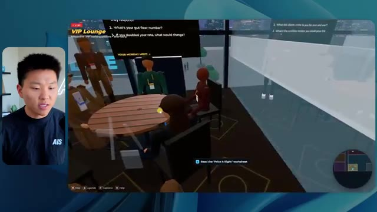

# 🎬 Building Realistic Voice Agents Has Never Been Easier

> **Chaîne** : [Nate Herk | AI Automation](https://www.youtube.com/@nateherk/featured)  
> **Lien YouTube** : [https://www.youtube.com/watch?v=-cdexJWN8YA](https://www.youtube.com/watch?v=-cdexJWN8YA)  
> **Date de publication** : 20260504  
> **Durée** : 00:32:23  
> **Identifiant vidéo** : `-cdexJWN8YA`  
> **Transcription & Analyse** : `whisper-v3-large-turbo+gemini-3.5-flash-lite`  

---

## 📌 Synthèse Exécutive & Outils

### 💡 Résumé

Cette vidéo de la chaîne *Nate Herk | AI Automation* explore l'impact des différents niveaux d'effort (de « faible » à « ultra code ») sur les performances du modèle d'IA **Opus 5.5**. L'expérimentation repose sur un prompt complexe et global : transformer un dossier brut de 105 gigaoctets de ressources vidéo (provenant de l'événement virtuel *AIS Live* via Frame.io) en un monde 3D interactif, explorable en vue à la troisième personne, simulant une conférence technologique physique réaliste. 

Les résultats comparatifs révèlent des contrastes saisissants en matière de qualité visuelle, de respect de la charte graphique, de fluidité et de fidélité fonctionnelle. Alors que le niveau « faible » génère un environnement sommaire truffé de bugs d'affichage, de textures figées et d'erreurs de branding, le niveau « moyen » produit une application 3D nettement plus aboutie, intégrant des PNJ réactifs, des flux vidéo en direct fonctionnels, une mini-carte synchronisée et un respect rigoureux de l'identité visuelle de la marque, le tout sans nécessiter la moindre intervention ou question de la part de l'utilisateur.

L'analyse minutieuse des métriques d'exécution (temps de traitement, coûts API simulés, volume de jetons, nombre de vérifications et de questions posées) offre aux ingénieurs et développeurs un cadre d'évaluation précieux pour calibrer l'effort des agents IA selon la complexité des livrables logiciels attendus. La démonstration s'inscrit dans une démarche pratique d'ingénierie logicielle assistée par IA, illustrant la transition fluide entre le prototypage conceptuel et le déploiement opérationnel.

### 🛠️ Outils, Modèles & Logiciels Présentés

* **Opus 5.5** : Modèle d'intelligence artificielle ultra-performant et économique, utilisé au cœur de l'expérimentation pour exécuter le prompt de génération 3D sous différents niveaux d'effort.
* **Claude Code** : Outil de programmation et d'assistance au développement utilisé pour piloter l'exécution et structurer le code du projet.
* **Frame.io** : Plateforme cloud de gestion et de stockage vidéo, hébergeant les 105 gigaoctets d'enregistrements bruts de l'événement *AIS Live*.
* **Hostinger Connector** : Extension gratuite pour éditeur de code, sponsor de la vidéo, permettant d'intégrer directement un compte d'hébergement web dans l'environnement de développement pour faciliter le déploiement en ligne.
* **Key.ai** : Service externe d'intelligence artificielle mentionné dans le prompt pour la génération dynamique d'images et de vidéos contextuelles.
* **Herc 2** : Système d'exploitation IA propriétaire de Nate Herk, mobilisable par l'agent pour orchestrer les ressources et automatiser les tâches complexes.

### 🔑 Points Clés & Enseignements Stratégiques

* **Impact direct du niveau d'effort sur la qualité** : La variation des paramètres d'effort d'Opus 5.5 modifie fondamentalement la profondeur du rendu, transformant un prototype grossier et bogué en une application 3D riche et fonctionnelle.
* **Maîtrise du branding et de la personnalisation** : Les niveaux d'effort supérieurs démontrent une capacité accrue à intégrer fidèlement les directives de marque, les palettes de couleurs et les logos officiels (comme celui d'*AIS Live*).
* **Gestion des flux multimédias en direct** : Un agent configuré avec un effort suffisant est capable d'associer des éléments spatiaux 3D à des flux vidéo réels, transformant des images fixes en ateliers et scènes dynamiques.
* **Autonomie décisionnelle des agents** : Sur l'ensemble des tests menés avec les niveaux faible et moyen, l'agent a fonctionné de manière totalement autonome sans poser la moindre question de clarification à l'utilisateur.
* **Analyse coût-bénéfice des ressources API** : Le passage du niveau faible au niveau moyen multiplie le temps d'exécution par plus de quatre (de ~16 minutes à 1 heure 13) et le coût API estimé par trois (de 3,91 $ à 12,44 $), soulignant un arbitrage nécessaire entre investissement calculé et exigence de finition.
* **Consommation de jetons et complexité vérificationnelle** : Le niveau moyen a nécessité près de 490 000 jetons et 23 cycles de vérification automatisée dans le navigateur, illustrant la charge de travail computationnelle requise pour stabiliser le code.
* **Recommandation méthodologique d'Anthropic** : Il est recommandé de débuter les flux de travail par un niveau d'effort « moyen » pour valider la structure globale avant d'ajuster (à la hausse ou à la baisse) selon les besoins spécifiques du projet.
* **Intelligence artificielle comportementale (PNJ)** : L'intégration d'entités non-joueuses (PNJ) capables de réagir contextuellement à la présence de l'utilisateur enrichit considérablement l'immersion dans les environnements virtuels générés par IA.
* **Combler le fossé entre code et déploiement** : L'utilisation d'intégrations directes comme l'extension Hostinger résout le problème classique du développeur qui se retrouve avec un code fonctionnel en local sans solution rapide de mise en ligne.
* **Efficacité des prompts contextuels globaux** : Fournir un objectif unifié incluant des références à des répertoires massifs (105 Go) permet à l'IA d'extraire de manière autonome la structure narrative et l'agenda d'un événement pour structurer son architecture logicielle.

---

## ⏱️ Chronologie & Transcription Complète Audio & Visuelle (Mot pour Mot)

### ⏱️ `[00:00:00 - 00:00:20]` | Segment #01

**🔊 Audio (Transcription Intégrale Mot pour Mot en Français) :**
> Opus 5.5, Opus 5.5, Opus 5.5, Opus 5.5, Opus 5.5. Ce modèle est littéralement partout et pour de très bonnes raisons. Il est intelligent, il est bon marché, il a un goût incroyable, c'est un modèle d'IA incroyable. Mais avec chaque modèle d'IA, vous avez le choix de l'effort, que ce soit faible, moyen, élevé, extra, max ou code ultra.

**👁️ Analyse Visuelle d'Écran (gemini-3.5-flash-lite) :**
**Interface & Outils** : Interface du réseau social X (Twitter).

**Contenu textuel & Code** : Publication de réseau social avec une vidéo intégrée représentant un environnement 3D côtier.

**Action / Démonstration** : Affichage d'un exemple de contenu généré par IA pour illustrer le propos sur l'impact de l'IA.

*⏱️ 00:00:05 — Capture d'écran d'un tweet sur X montrant une vidéo de paysage tropical généré par IA et un commentaire sur l'impact sur les créatifs techniques.*

---

### ⏱️ `[00:00:20 - 00:00:38]` | Segment #02

**🔊 Audio (Transcription Intégrale Mot pour Mot en Français) :**
> Donc dans cette vidéo, j'ai donné exactement le même prompt à Opus 5.5 et je l'ai exécuté sur tous les niveaux d'effort, et nous allons comparer les résultats. Nous examinerons la qualité de toutes les différentes sorties réelles, mais nous allons également examiner combien de temps chacun d'eux a fonctionné, combien cela nous a coûté si c'était une facturation par API, le total des jetons, combien de vérifications ils ont exécutées, et combien de questions ils m'ont réellement posées tout au long du processus.

**👁️ Analyse Visuelle d'Écran (gemini-3.5-flash-lite) :**
**Interface & Outils** : Application de tableau blanc / interface de comparaison de données (type Miro ou tableau de bord).

**Contenu textuel & Code** : Tableau avec les colonnes Low, Medium, High, Extra, Max, Ultracode et les lignes Run time, API cost, Total tokens, Checks, Questions asked.

**Action / Démonstration** : Présentation du tableau comparatif des différents niveaux d'effort d'Opus 5.5.

*⏱️ 00:00:29 — Capture d'écran d'un tableau comparatif avec les niveaux d'effort (Low, Medium, High, Extra, Max, Ultracode) et des métriques (Run time, API cost, Total tokens, Checks, Questions asked).*

---

### ⏱️ `[00:00:39 - 00:00:58]` | Segment #03

**🔊 Audio (Transcription Intégrale Mot pour Mot en Français) :**
> Et les résultats que nous avons obtenus ne sont pas du tout ce à quoi je m'attends, donc j'ai hâte de partager cela avec vous les gars. Ne perdons pas de temps et entrons directement dans celui-ci. D'accord, alors plongeons directement dans celui-ci. Je veux commencer juste en vous montrant le prompt réel que nous avons utilisé, que nous avons donné à chacun de ces différents agents. Je vais aller dans les fichiers ici, et nous allons ouvrir ce fichier markdown de prompt, et je vais vous montrer ce que nous avons obtenu. Voici donc le slash objectif que j'ai fourni.

**👁️ Analyse Visuelle d'Écran (gemini-3.5-flash-lite) :**
**Interface & Outils** : Éditeur de code avec interface d'agent IA (Opus 5.5 / Ultracode)

**Contenu textuel & Code** : Un message de l'IA demandant si elle doit commencer la tâche définie dans 'PROMPT.md' pour construire un monde 3D en vue à la troisième personne de la conférence AIS Live.

**Action / Démonstration** : Le présentateur présente l'interface et le prompt initial de l'agent IA dans l'éditeur.

*⏱️ 00:00:48 — Interface de l'éditeur de code montrant une discussion avec un assistant IA (Opus 5.5 / Ultracode) et une webcam du présentateur à gauche.*

---

### ⏱️ `[00:00:58 - 00:01:34]` | Segment #04

**🔊 Audio (Transcription Intégrale Mot pour Mot en Français) :**
> J'ai dit, tu dois me créer un monde en 3D qui est une conférence tech réaliste dans laquelle je peux me promener en vue à la troisième personne. Tu vas regarder ce dossier, qui contient mes ressources d'enregistrement d'événements provenant d'AIS Live. Et ce dossier est un dossier Frame.io de 105 gigaoctets d'enregistrements vidéo. C'était un événement entièrement virtuel. Tout a été enregistré et tous les enregistrements sont juste ici. J'ai dit, ton objectif est de prendre cet événement et de le transformer en un monde 3D explorable qui me donne l'impression d'être réellement allé à une vraie conférence en personne avec différentes salles, différentes pistes, différentes scènes, bla, bla, bla. N'hésite pas à utiliser key.ai si tu as besoin de générer des images ou des vidéos. Et tu peux aussi utiliser tout ce qui se trouve dans mon projet Herc 2, qui est comme mon système d'exploitation IA. J'ai dit,

**👁️ Analyse Visuelle d'Écran (gemini-3.5-flash-lite) :**
**Interface & Outils** : Éditeur de code (VS Code / Cursor) et interface web Frame.io

**Contenu textuel & Code** : Fichier markdown PROMP.md contenant les directives du projet de monde 3D et lien Frame.io (https://f.io/sPdlo-Si)
[CONSULTATION] Présentation du prompt détaillé et des dossiers de ressources vidéo de l'événement AIS Live d'une taille de 105 Go

**Action / Démonstration** : Explications face caméra et démonstration conceptuelle.

*⏱️ 00:01:07 — Un éditeur de code affichant un fichier PROMP.md avec les instructions pour créer un monde 3D interactif d'une conférence tech.*

*⏱️ 00:01:16 — Une interface Frame.io affichant un dossier de ressources d'événements de 105,69 Go nommé 'Sep 22, 2026' avec des sous-dossiers.*

*⏱️ 00:01:25 — L'éditeur de code montrant le contenu détaillé du prompt demandant de transformer des enregistrements virtuels en un monde 3D explorable.*

---

### ⏱️ `[00:01:34 - 00:02:08]` | Segment #05

**🔊 Audio (Transcription Intégrale Mot pour Mot en Français) :**
> tu seras jugé sur la créativité, le design, la physique et la sensation générale lorsque j'explorerai le monde en 3D que tu as construit. Et c'était fondamentalement la fin des instructions. Donc, comme vous pouvez le voir sur ce côté gauche, j'ai exécuté cela à travers tous les différents niveaux d'effort. Commençons par le niveau bas et remontons jusqu'à ultra code. Très bien. Donc ici, nous avons le résultat du niveau bas. Ouvrons ceci et jetons un coup d'œil. Nous avons donc AIS Live, le sommet des services IA en personne enfin, et nous avons pu cliquer autour. Tout d'abord, cela ne fait pas très personnalisé. Genre, ce n'ce n'est pas le logo d'AIS Live. Ce n'est même pas nos couleurs. Donc je n'aime pas trop ça, mais entrons ici. D'accord. C'est beaucoup trop lumineux. Euh, nous avons une carte en haut à droite. Nous avons une ville par ici. Je ne peux pas dire quelle ville c'est.

**👁️ Analyse Visuelle d'Écran (gemini-3.5-flash-lite) :**
**Interface & Outils** : Application de type éditeur ou interface web d'agent IA (style Claude/Opus).

**Contenu textuel & Code** : Texte de prompt concernant la création d'un monde 3D en vue à la troisième personne ("build a walkable third-person 3D world...") et réponse de l'agent demandant si il doit commencer.

**Action / Démonstration** : Navigation et sélection des différents niveaux de test (effort-test) dans le panneau de gauche pour exécuter la tâche.

*⏱️ 00:01:42 — Interface d'un assistant IA montrant différents niveaux de test (Hello, Extra, High, Max, Ultracode, Medium, Low) dans la barre latérale et une discussion en cours sur le panneau principal.*

---

### ⏱️ `[00:02:08 - 00:02:40]` | Segment #06

**🔊 Audio (Transcription Intégrale Mot pour Mot en Français) :**
> c'est. D'accord. C'est Chicago, ce qui est plutôt cool parce que tu sais, j'habite à Chicago, mais bref, en haut à droite, on peut voir une carte. Nous avons un hall d'accueil. Nous avons un hall d'exposition. Nous avons un salon VIP sur la scène principale. La carte montre également où se trouve chaque autre personne et cela se synchronise en direct. Donc nous pouvons voir l'enregistrement. Nous pouvons voir le premier jour, la keynote de l'agent hyper, le débriefing en direct. Cool. Donc il connaît réellement l'agenda et ensuite il y a le deuxième jour. Donc il a trouvé ça, c'est bien. Nous avons ces petites boules ici que je peux espérer botter. D'accord. Le visage, Oh, regarde ça. Si je vais par ici, tous les gens disparaissent tout simplement. Très mauvais. Très mauvais. D'accord. Alors voyons voir. Est-ce que je peux sprinter ? D'accord.

**👁️ Analyse Visuelle d'Écran (gemini-3.5-flash-lite) :**
**Interface & Outils** : Environnement virtuel 3D interactif (plateforme de conférence en ligne type metaverse).

**Contenu textuel & Code** : Menus de navigation, listes de sessions (Day 1 agenda) et mini-carte de l'événement virtuel.

**Action / Démonstration** : Exploration et navigation du présentateur dans les différentes zones de l'espace virtuel (badge pickup, lobby, expo hall).

*⏱️ 00:02:16 — Vue d'un monde virtuel interactif montrant un personnage de joueur devant un panneau de retrait de badges et une mini-carte en haut à droite.*

*⏱️ 00:02:24 — Vue du lobby virtuel avec un panneau affichant le programme du premier jour ("Day 1") et la mini-carte de navigation.*

*⏱️ 00:02:32 — Vue de l'hall d'exposition virtuel (Expo Hall) montrant des avatars et une installation lumineuse centrale.*

---

### ⏱️ `[00:02:40 - 00:03:04]` | Segment #07

**🔊 Audio (Transcription Intégrale Mot pour Mot en Français) :**
> Je peux avancer un peu plus vite. Je vais d'abord aller par ici. Il y a des produits dérivés, euh, un sweat glido certifié AIS plus. D'accord. Donc il y a les stands réels qu'on avait dans l'événement virtuel. On avait des stands. Donc c'est plutôt cool. Un petit endroit pour prendre des photos. La salle C. En ce moment, nous avons Tangy Frederick qui anime un atelier. D'accord. Mais ce n'est pas une vidéo. Comme vous pouvez le voir, c'est juste une image. Elle ne bouge pas. Donc c'est juste une image. Ces gens sont en train de disparaître. Ce doivent être des fantômes. Allons par ici vers la salle A.

**👁️ Analyse Visuelle d'Écran (gemini-3.5-flash-lite) :**
**Interface & Outils** : Environnement virtuel 3D de type métavers / plateforme événementielle en ligne

**Contenu textuel & Code** : Aucun code source ni terminal de commande ; affichage d'un espace virtuel 3D avec des bannières d'exposition et des écrans explicatifs.

**Action / Démonstration** : Navigation et déplacement d'un avatar dans l'espace virtuel pour présenter les différents stands et salles de l'événement.

---

### ⏱️ `[00:03:04 - 00:03:30]` | Segment #08

**🔊 Audio (Transcription Intégrale Mot pour Mot en Français) :**
> Nous avons Liberty White. D'accord. Très cool. Vos 30 premiers jours en automatisation. Encore une fois, c'est juste une image fixe et les gens ont des bugs d'affichage. Donc ce n'est pas très bien ici. Je vais aller sur la scène principale et voir ce que nous avons. D'accord, cool. Donc nous avons une scène d'apparence principale. Les gens ont des bugs d'affichage. Vraiment mauvais. Ce n'est pas très bien du tout. Notre vidéo est en train de bouger. Genre, j'ai vu mon visage ici et j'ai vu celui de Devin, mais maintenant ils ont disparu. Donc je ne sais pas ce qui s'est passé. D'accord. C'est, on dirait que c'est plutôt un diaporama. Rien n'est vraiment diffusé pour l'instant. Quoi qu'il en soit, entrons ici.

**👁️ Analyse Visuelle d'Écran (gemini-3.5-flash-lite) :**
**Interface & Outils** : Environnement virtuel 3D de type metavers / plateforme événementielle en ligne

**Contenu textuel & Code** : Aucun code ni terminal affiché, uniquement des affichages textuels d'interface virtuelle ('Workshop Room A', 'AIS LIVE AI Services Summit').

**Action / Démonstration** : Navigation et déplacement d'un avatar dans un espace virtuel 3D.

---

### ⏱️ `[00:03:30 - 00:03:58]` | Segment #09

**🔊 Audio (Transcription Intégrale Mot pour Mot en Français) :**
> Nous avons plus de stands. Nous avons hyper agent. Nous avons Claude Code. Nous avons plus de goodies. La salle B, c'est Dave Ebelor. Je suppose que c'est exactement la même chose. Nous avons du café. Et ensuite, je suppose que le salon VIP, accès VIP seulement. C'est plutôt cool, mais il n'y a vraiment rien qui se passe ici. Cet écran est beaucoup trop lumineux. D'accord. Donc je pense que vous comprenez l'ambiance que nous obtenons ici avec Opus 5.5 en effort faible. Et c'est là que les choses deviennent intéressantes. À combien est-ce que vous pensez que cela a tourné ? Pendant combien de temps ? Celui-ci a tourné pendant 16 minutes et 43 secondes. Combien est-ce que vous pensez que cela a coûté ?

**👁️ Analyse Visuelle d'Écran (gemini-3.5-flash-lite) :**
**Interface & Outils** : Application web interactive / Tableau blanc virtuel (Opus 5.5 Efforts)

**Contenu textuel & Code** : Tableau comparatif listant 'Run time', 'API cost', 'Total tokens', 'Checks' et 'Questions asked' selon différents niveaux d'effort (Low à Ultracode).

**Action / Démonstration** : Présentation des différents niveaux de performance et d'effort d'un modèle d'IA.

*⏱️ 00:03:51 — Tableau de comparaison des efforts et performances avec des colonnes Low, Medium, High, Extra, Max et Ultracode.*

---

### ⏱️ `[00:03:58 - 00:04:26]` | Segment #10

**🔊 Audio (Transcription Intégrale Mot pour Mot en Français) :**
> 3,91 dollars si c'était facturé par l'API. J'utilise évidemment mon abonnement ici, mais nous allons simplement calculer cela avec la facturation de l'API. Le nombre total de jetons était de 191 000. Il a effectué 22 vérifications. Donc pour la vérification, 22 fois il a ouvert le navigateur et a exécuté différentes sortes de vérifications. Donc 22 catégories de vérifications. Et combien de questions m'a-t-il posées ? Il m'a posé un total de zéro question tout au long de cette invite de commande globale. D'accord. Alors ouvrons l'effort moyen et voyons ce que nous avons. D'accord, c'est parti. Effort moyen. Nous avons Nate Herc. Nous avons mon badge. C'est la marque de commerce AI's life.

**👁️ Analyse Visuelle d'Écran (gemini-3.5-flash-lite) :**
**Interface & Outils** : Application de tableau blanc (ex: Excalidraw) avec le présentateur incrusté en médaillon à gauche.

**Contenu textuel & Code** : Tableau avec les lignes : Run time (16m 43s), API cost ($3.91), Total tokens (191.3K), Checks, Questions asked, sous des colonnes Low, Medium, High, Ex.

**Action / Démonstration** : Le présentateur présente et commente les données statistiques d'exécution affichées dans le tableau.

*⏱️ 00:04:05 — Tableau comparatif sur une application de tableau blanc affichant les métriques d'exécution pour un niveau d'effort bas, incluant le temps d'exécution, le coût API, le nombre total de jetons et les vérifications.*

---

### ⏱️ `[00:04:26 - 00:04:46]` | Segment #11

**🔊 Audio (Transcription Intégrale Mot pour Mot en Français) :**
> Donc ça a déjà l'air un petit peu mieux. Ça ressemble à nos palettes de couleurs qui ont utilisé nos directives de marque. Premier jour de construction, deuxième jour de gain, VIP. Cool. D'accord. Je vais entrer dans le lieu. D'accord. Waouh. Une ambiance similaire, en somme. C'est en arrière-plan. Ça ne ressemble pas à Chicago, hein ? Non, ça ressemble à, honnêtement, ça ressemble à une ville imaginaire. Quoi qu'il en soit, c'est marrant qu'ils aient décidé de faire ça. Voyons si je peux avancer un peu plus vite. Oh, waouh.

**👁️ Analyse Visuelle d'Écran (gemini-3.5-flash-lite) :**
**Interface & Outils** : Interface web interactive et espace virtuel 3D (type Gather.town ou métavers).

**Contenu textuel & Code** : Écran d'accueil de l'événement virtuel, instructions de contrôle (WASD walk, Shift sprint, Space jump) et affichage du badge "AIS Live".

**Action / Démonstration** : Le présentateur examine l'interface de connexion puis entre dans le lieu virtuel de l'événement.

*⏱️ 00:04:31 — Interface web "Welcome to AIS Live" avec un badge d'accès virtuel au nom de Nate Herk et des options de navigation.*

*⏱️ 00:04:41 — Vue à la première personne dans l'environnement virtuel 3D avec des avatars et un panorama urbain de nuit en arrière-plan.*

---

### ⏱️ `[00:04:46 - 00:05:21]` | Segment #12

**🔊 Audio (Transcription Intégrale Mot pour Mot en Français) :**
> Les gens interagissent avec moi. Regardez. Si je m'approche de ce type, il vient de lever le bras. Bon, maintenant il ne veut plus du tout avoir affaire à moi. Mais tous ces petits robots ici doivent prendre des décisions. Je ne sais pas s'ils utilisent Jev. C'est sûr que non. Je ne le lui ai pas dit. En fait, ma clé Jev est à l'arrière. Je ne sais pas. Peut-être qu'il l'a utilisée. Quoi qu'il en soit, nous pouvons voir ici que nous avons la salle d'atelier C, le laboratoire des agents. Sympa. Donc celui-ci est en fait en train d'être exécuté. Vous pouvez voir qu'il s'agit d'une vraie vidéo lue par Tangy. Tout le monde ici est en train de travailler sur un ordinateur portable. Ils ne buguent pas. C'est plutôt cool. De plus, mon badge est sur ma poitrine, ce qui est plutôt cool. Je peux venir par ici. Nous avons une carte en haut à droite, comme vous pouvez le voir, mais je peux venir par ici. Nous avons un

**👁️ Analyse Visuelle d'Écran (gemini-3.5-flash-lite) :**
**Interface & Outils** : Application de monde virtuel 3D (type Gather.town ou environnement similaire).

**Contenu textuel & Code** : Environnement virtuel peuplé d'avatars interactifs.

**Action / Démonstration** : Navigation et exploration d'un monde virtuel interactif en 3D.

---

### ⏱️ `[00:05:21 - 00:05:47]` | Segment #13

**🔊 Audio (Transcription Intégrale Mot pour Mot en Français) :**
> hall d'exposition. C'est là que nous avons le stand Glido. Et ça diffuse en ce moment. Oui, ça diffuse la vidéo de nous en train de parler de Glido. Ça diffuse la vidéo d'Ed et moi parlant de notre programme de certification. Nous avons le logo AIS Plus juste ici, qui est un peu mal placé. Ce sont les diapositives des conférenciers et les points clés. Alors wow, ce sont toutes les ressources que nous avons distribuées après l'événement. Elles sont toutes affichées là également. Nous pouvons voir que nous avons un projecteur de communauté. Donc ça, c'est Aiden qui parle de son contrat qu'il a décroché et ça joue en direct. Ces gens sont en train de regarder.

**👁️ Analyse Visuelle d'Écran (gemini-3.5-flash-lite) :**
**Interface & Outils** : Environnement virtuel 3D de type salon ou exposition en ligne (Gather town ou similaire).

**Contenu textuel & Code** : Éléments visuels de salon virtuel, avatars, panneaux d'affichage et diaporamas de présentation.
[DESC_IMAGE_1] Navigation et visite guidée d'un espace d'exposition virtuel par le présentateur.

**Action / Démonstration** : Explications face caméra et démonstration conceptuelle.

---

### ⏱️ `[00:05:47 - 00:06:21]` | Segment #14

**🔊 Audio (Transcription Intégrale Mot pour Mot en Français) :**
> Ils sont plutôt engagés. On a un hyper agent. C'était, c'est ce que je voulais dire. Si vous avez vu ces gens lever les bras en disant bonjour, c'était plutôt drôle. Regardez, regardez, le voilà qui recommence. Bref. D'accord. Où suis-je maintenant ? Maintenant, je suis dans le hall principal. On a un bar à café. On a un grand logo, qui est le vrai logo. C'est trop lumineux, mais on a le logo. On peut voir si on peut entrer ici dans le parcours fondation. On a Sabrina Romanov et Liberty White. Donc différentes formations juste là. On peut entrer dans cette salle. C'est le parcours avancé. Alors qu'est-ce qui se passe ici. On a Dave Ebelar et Saman qui parlent de différentes choses là-dedans. Et maintenant, allons jeter un œil à la scène principale. Oh, attendez, il y a une vidéo de moi là-haut. C'est genre un VIP

**👁️ Analyse Visuelle d'Écran (gemini-3.5-flash-lite) :**
**Interface & Outils** : Monde virtuel 3D / plateforme de métavers de conférence.

**Contenu textuel & Code** : Environnement virtuel 3D représentant un hall de réception et des espaces de conférence avec des avatars d'utilisateurs.

**Action / Démonstration** : Navigation et déplacement d'un avatar à l'intérieur du monde virtuel 3D.

---

### ⏱️ `[00:06:21 - 00:06:50]` | Segment #15

**🔊 Audio (Transcription Intégrale Mot pour Mot en Français) :**
> section ? Ouais, on va aller voir ça dans une minute. Mais bref, voici la scène principale. Ça a l'air vraiment, vraiment super. On a une grande scène. On a genre quatre personnes assises ici. On a les trois écrans d'Alex là-haut avec hyper agent. Est-ce que j'ai le droit de monter sur scène ? Oh, et me laisse monter sur scène. D'accord. C'est plutôt sympa. Bon les gars, faisons un selfie. Laissez-moi prendre tout le monde en arrière-plan. Venez par ici. Bref, c'est vraiment, vraiment cool. Par contre, toutes les places ne sont pas prises. Donc il faut qu'on travaille là-dessus. Mais bref, je vais retourner en courant voir ce que c'était que cette section VIP. D'accord. Le salon VIP. J'ai l'impression que c'est comme un aéroport ou un truc comme ça.

**👁️ Analyse Visuelle d'Écran (gemini-3.5-flash-lite) :**
**Interface & Outils** : Environnement virtuel 3D / Metavers de conférence (Hyperagent)

**Contenu textuel & Code** : Interface utilisateur virtuelle affichant les détails de la keynote (Alex McDonnell, Hyperagent) et mini-carte de navigation.

**Action / Démonstration** : Navigation et déplacement de l'avatar dans l'espace virtuel de la conférence.

---

### ⏱️ `[00:06:51 - 00:07:14]` | Segment #16

**🔊 Audio (Transcription Intégrale Mot pour Mot en Français) :**
> D'accord, super. Donc maintenant nous avons les sessions VIP ici. Une foire aux questions VIP avec la lecture vidéo en direct de Nate juste ici. Très, très cool. Et nous avons comme un bar ou quelque chose. Génial. Je dirais que c'est un assez bon résultat. Maintenant, en ce qui concerne les statistiques ici, celle-ci a pris une heure et 13 minutes à s'exécuter. Cela nous aurait coûté 12 dollars et 44 cents. Elle a utilisé 490 000 jetons et elle a effectué 23 vérifications.

**👁️ Analyse Visuelle d'Écran (gemini-3.5-flash-lite) :**
**Interface & Outils** : Interface de salon virtuel 3D et tableau de bord analytique (Opus 5.5 Efforts).

**Contenu textuel & Code** : Statistiques de performance d'exécution : 16m 43s de temps d'exécution, coût API de 3,91 $, 191,3K tokens au total, 22 vérifications.

**Action / Démonstration** : Le présentateur commente l'agencement de l'espace virtuel VIP puis présente les statistiques de performance affichées sur le tableau de bord.

*⏱️ 00:06:56 — Vue d'un espace virtuel 3D (salon VIP) montrant une session de questions/réponses en direct avec Nate.*

*⏱️ 00:07:02 — Tableau de bord d'analyse montrant les métriques de performance et de coût (Run time : 16m 43s, API cost : $3.91, Total tokens : 191.3K, Checks : 22, Questions asked : 0).*

---

### ⏱️ `[00:07:14 - 00:07:48]` | Segment #17

**🔊 Audio (Transcription Intégrale Mot pour Mot en Français) :**
> Et il nous a posé un total de zéro question une fois de plus. Très bien, passons à élevé. C'était déjà un résultat plutôt correct et Anthropic eux-mêmes dans leur vidéo « comment prompter Opus 5.5 », ou désolé, pas une vidéo, un article. Ils ont dit de commencer simplement par moyen et de l'augmenter ou de le réduire si nécessaire. C'était donc un résultat moyen. Passons à élevé et voyons ce que nous avons obtenu. Très rapidement, les gars, je dois prendre un moment pour vous parler du sponsor de la vidéo d'aujourd'hui, Hostinger. Donc, ces deux modèles viennent de me construire une version fonctionnelle de la même chose. Et maintenant, je suis exactement là où je finis toujours, avec quelque chose de terminé sur mon ordinateur portable et aucun moyen rapide de le mettre en ligne. Et c'est le fossé que comble le connecteur d'Hostinger. C'est une extension gratuite

**👁️ Analyse Visuelle d'Écran (gemini-3.5-flash-lite) :**
**Interface & Outils** : Tableau de bord analytique et interface de développement / éditeur de code.

**Contenu textuel & Code** : Métriques comparatives (Run time, API cost, Total tokens, Checks, Questions asked) et invite de génération d'un calculateur ROI Northwind en HTML.

**Action / Démonstration** : Analyse comparative des coûts et performances d'exécution des différents niveaux de prompt d'Opus 5.5.

*⏱️ 00:07:22 — Tableau de comparaison affichant les performances selon différents niveaux d'effort (Low, Medium, High, Extra) avec les métriques de temps, coût API, tokens, vérifications et questions posées.*

*⏱️ 00:07:39 — Interface de développement avec un éditeur affichant l'exécution d'un agent de génération de code et le panneau de chat latéral.*

---

### ⏱️ `[00:07:48 - 00:08:23]` | Segment #18

**🔊 Audio (Transcription Intégrale Mot pour Mot en Français) :**
> pour votre éditeur qui intègre votre compte Hostinger dans l'outil de programmation que vous utilisez déjà, que ce soit VS Code, Cursor, Cloud Code, Codex, et j'en passe. Vous vous connectez une seule fois en un clic, et à partir de là, votre agent peut déployer le site, y associer un domaine, configurer les enregistrements DNS et vérifier votre VPS sans que vous n'ayez jamais à quitter l'éditeur. Ainsi, peu importe celui de ces outils que vous finirez par préférer, ce qu'il a construit est à quelques minutes d'obtenir une vraie URL sur un hébergement géré. Le connecteur est gratuit sur chaque formule d'hébergement, donc si vous avez toujours besoin de l'hébergement sous-jacent, profitez de la formule illimitée grâce au lien dans la description et utilisez le code NATEHERK pour obtenir 10 % de réduction. Cela inclut également un nom de domaine gratuit et un e-mail professionnel pour un an. Et c'est toujours le moyen le plus économique que j'ai trouvé pour obtenir quelque

**👁️ Analyse Visuelle d'Écran (gemini-3.5-flash-lite) :**
**Interface & Outils** : Interface de gestion Hostinger connectée et interface de terminal Claude Code.

**Contenu textuel & Code** : Statut "Connected" via OAuth, Node.js 24.13.0, et liste des outils disponibles pour l'assistant (Websites, Domains, Subscriptions & Payments, Email Marketing).

**Action / Démonstration** : Connexion du compte Hostinger à l'IDE et affichage des outils accessibles par l'assistant.

*⏱️ 00:07:57 — Interface montrant la connexion de Hostinger depuis l'IDE avec la liste des outils disponibles (Websites, Domains, Subscriptions, Email Marketing) et le panneau Claude Code à droite.*

---

### ⏱️ `[00:08:23 - 00:08:47]` | Segment #19

**🔊 Audio (Transcription Intégrale Mot pour Mot en Français) :**
> tu as construit cela sur une vraie URL. Donc revenons à la vidéo. D'accord. Encore une fois, très, très marqué par la marque. C'est un écran de chargement encore meilleur que le précédent. Nous avons ce joli petit effet en arrière-plan. Nous avons le logo. Nous allons entrer dans le lieu. D'accord. Nous y voilà. Ça a l'air plutôt bien. Nous commençons à l'extérieur et vous pouvez voir que nous avons ces drapeaux pour tous les intervenants, Wyatt, Casper, Alex, Ed, Aiden, Sabrina, Liberty. C'est plutôt cool. Nous avons des blocs en direct ici.

**👁️ Analyse Visuelle d'Écran (gemini-3.5-flash-lite) :**
**Interface & Outils** : Application web 3D / Environnement virtuel (AIS Live)

**Contenu textuel & Code** : Interface d'un événement virtuel avec cartes de contrôle (WASD, MOUSE), bannières de conférenciers et indicateur de progression (Passport).

**Action / Démonstration** : Connexion et exploration de l'espace virtuel de l'événement en 3D.

*⏱️ 00:08:29 — Écran de chargement et d'accueil de la plateforme virtuelle 'AIS LIVE', affichant le logo et les instructions de contrôle.*

*⏱️ 00:08:35 — Vue de la place virtuelle 3D ('AIS Live Plaza') montrant des avatars de personnages et un environnement urbain stylisé.*

*⏱️ 00:08:41 — Navigation dans l'espace virtuel 3D avec des panneaux d'affichage aux noms de conférenciers et des éléments interactifs.*

---

### ⏱️ `[00:08:47 - 00:09:23]` | Segment #20

**🔊 Audio (Transcription Intégrale Mot pour Mot en Français) :**
> Il a pris cette photo de moi, votre hôte, Nate Herc, John, Dave, Nate Herc. Voilà. D'accord. Les portes. Génial. Ce sont des portes coulissantes automatiques en verre. J'adore ça. Nous pouvons voir l'enregistrement VIP. Nous pouvons voir l'admission générale. Nous pouvons venir ici et nous pouvons découvrir l'exposition avec différents stands, le coin de la communauté. Vous pouvez également voir qu'en haut à gauche, j'ai un passeport. Donc c'est comme si, cela montrera combien d'endroits j'ai visités. Tout cela est une lecture réelle. Nous avons un mur de ressources avec tous les différents intervenants. Ils ont également une session de networking ici. Je vais donc venir très vite et voir de quoi il s'agit. Nous avons donc le bar à cold brew AIS. Nous avons différents membres de la communauté qui ont été mis en avant ou mis en lumière.

**👁️ Analyse Visuelle d'Écran (gemini-3.5-flash-lite) :**
**Interface & Outils** : Application ou plateforme virtuelle 3D d'événement en ligne.

**Contenu textuel & Code** : Environnement 3D interactif avec interface de navigation et panneaux d'information (Registration, VIP Check-in, Expo Hall).

**Action / Démonstration** : Exploration et navigation d'un avatar dans un monde virtuel simulant une conférence en ligne.

*⏱️ 00:08:56 — Vue d'un espace virtuel 3D de type événement en ligne (Registration Concourse) avec des avatars et des comptoirs d'accueil.*

*⏱️ 00:09:05 — Navigation dans un hall d'exposition virtuel (Expo Hall) montrant divers stands interactifs et des informations sur les certifications.*

*⏱️ 00:09:14 — Déplacement d'un avatar au milieu d'autres personnages dans le hall de la conférence virtuelle avec de larges baies vitrées.*

---

### ⏱️ `[00:09:23 - 00:09:56]` | Segment #21

**🔊 Audio (Transcription Intégrale Mot pour Mot en Français) :**
> On a l'aile VIP. Attends, quoi ? Récupère un bracelet. Oh, je dois vraiment aller chercher le bracelet. D'accord. Laisse-moi m'enregistrer rapidement. Le bracelet est déjà mis. Attends, quoi ? D'accord. Oh, d'accord. Maintenant, les portes se sont ouvertes pour moi. Cool. Je peux entrer ici. Oh, ça mène juste à la scène principale. Salon VIP. Il y a une séance de questions-réponses en cours. Ça a l'air très sympa. Je veux dire, je suis très impressionné par la façon dont il est capable de faire ça. Waouh. D'accord. Donc c'est vraiment bien. Ce qu'on a fait, c'est qu'on a eu des salles de discussion VIP avec différentes personnes. Tu peux voir qu'il y a différentes salles, différents membres de l'équipe AIS qui vont dans des trucs. C'est vraiment cool. C'est très cool. C'est un VIP bien meilleur

**👁️ Analyse Visuelle d'Écran (gemini-3.5-flash-lite) :**
**Interface & Outils** : Application virtuelle interactive 2D/3D (style Gather.town)

**Contenu textuel & Code** : Interface utilisateur virtuelle affichant le statut du passeport, la mini-carte, les noms des salles (Registration Concourse, VIP Lounge, VIP Working Sessions) et les sous-titres.

**Action / Démonstration** : Navigation et exploration de différentes zones et salles d'un événement virtuel par l'avatar de l'utilisateur.

*⏱️ 00:09:32 — Vue d'un espace virtuel interactif (Gather.town ou similaire) montrant le personnage de l'utilisateur dans le hall de la zone Registration Concourse, avec des messages textuels et une mini-carte.*

*⏱️ 00:09:40 — Le personnage navigue dans le salon VIP (VIP Lounge) où un écran affiche une visioconférence avec des participants, et des sous-titres en bas.*

*⏱️ 00:09:48 — Le personnage se déplace dans une section de sessions de travail VIP comportant plusieurs tables rondes avec des écrans thématiques (« Price It Right », « Land Your First Paying Client »).*

---

### ⏱️ `[00:09:56 - 00:10:30]` | Segment #22

**🔊 Audio (Transcription Intégrale Mot pour Mot en Français) :**
> expérience que ce qui a été montré dans la première partie. D'accord. After party VIP. Regardez ça. On a une piste de danse. On a tous ces éléments ici. On a la lecture réelle de l'after party VIP juste ici. Et il y a une estrade pour DJ. C'est tellement marrant. Il y a un petit bug ici, un petit glitch par là, mais c'est génial. Oh, super. Donc quand je suis ici sur la scène principale, on a des sous-titres. Vous pouvez voir juste ici au bas de mon écran, on a ces sous-titres de Wyatt qui est en train de parler ici. On a des lumières. On a le panel. Très cool. Belle scène principale. Je vais aller par ici. On peut aller à la fondation,

**👁️ Analyse Visuelle d'Écran (gemini-3.5-flash-lite) :**
**Interface & Outils** : Application ou plateforme virtuelle 3D (Metaverse / espace événementiel en ligne)

**Contenu textuel & Code** : Environnement virtuel 3D avec avatars, écrans de visioconférence intégrés, interface utilisateur de navigation et bannières d'événements.

**Action / Démonstration** : Navigation et présentation interactive dans un espace événementiel virtuel 3D.

*⏱️ 00:10:04 — Capture d'écran montrant l'espace virtuel de l'after-party VIP avec une piste de danse lumineuse, des avatars et un écran affichant des participants en visio.*

*⏱️ 00:10:13 — Capture d'écran montrant une vue plus large de l'after-party VIP virtuel avec la signalétique "VIP AFTER-PARTY" et de multiples avatars.*

*⏱️ 00:10:21 — Capture d'écran montrant la scène principale (Main Stage) de l'événement virtuel avec un auditorium rempli d'avatars et un écran géant de présentation.*

---

### ⏱️ `[00:10:30 - 00:11:06]` | Segment #23

**🔊 Audio (Transcription Intégrale Mot pour Mot en Français) :**
> avancé, et les parcours d'entreprise par ici. Alors voyons voir. Nous avons l'anatomie de trois vraies transactions. Nous avons hyper agent. Nous avons les évaluations avec Nate et Ed ici. Nous avons Dave qui intervient sur les trucs avancés. C'est vraiment sympa. Je veux dire, évidemment, chacun, chacun de ces résultats jusqu'à présent, faible était correct. Moyen était meilleur. Élevé a été encore meilleur. Voyons si cette tendance se poursuit et allons voir ce que cela nous a coûté. Donc, élevé a tourné pendant une heure et sept minutes. Donc, un peu plus rapide que moyen, cela nous aurait coûté 16 dollars et 31 cents. Il a utilisé un demi-million de tokens, 509 000. Il a fait 22 vérifications. Et il nous a aussi demandé, enfin, non, je me suis trompé. Ce

**👁️ Analyse Visuelle d'Écran (gemini-3.5-flash-lite) :**
**Interface & Outils** : Application de tableau blanc / interface de présentation (Excalidraw ou similaire).

**Contenu textuel & Code** : Tableau avec les colonnes Low, Medium, High, Extra et les lignes Run time, API cost, Total tokens, Checks, Questions asked.

**Action / Démonstration** : Visualisation d'un tableau comparatif des performances et coûts de différents niveaux d'effort d'agents IA.

*⏱️ 00:10:57 — Un tableau comparatif montrant les métriques de différents niveaux d'effort (Low, Medium, High, Extra) avec les temps d'exécution, coûts API et tokens.*

---

### ⏱️ `[00:11:06 - 00:11:25]` | Segment #24

**🔊 Audio (Transcription Intégrale Mot pour Mot en Français) :**
> l'un m'a posé une question et spoiler, c'était le seul qui nous a posé une question pendant tout ça. Donc voyons voir, il nous en reste trois : extra, max et ultra code. Laissez-moi ouvrir extra et nous verrons ce que nous avons. D'accord. Donc celui-là a l'air plutôt bien. Je dirais honnêtement que jusqu'à présent, l'écran de chargement haut était le meilleur. Celui qu'on vient juste de voir, mais bref, entrons dans le direct d'AIS.

**👁️ Analyse Visuelle d'Écran (gemini-3.5-flash-lite) :**
**Interface & Outils** : Tableau de bord d'analyse de données / Interface web de type tableau comparatif

**Contenu textuel & Code** : Données chiffrées de performance pour les modes Low, Medium, High et Extra (ex: Run time : 16m 43s à 1h 13m, API cost : 3.91$ à 16.31$, Questions asked : 0, 0, 1)

**Action / Démonstration** : Le présentateur commente les résultats et s'apprête à ouvrir les détails du mode 'Extra' sur le tableau.

*⏱️ 00:11:11 — Tableau comparatif affichant les métriques de différents modes d'exécution (Low, Medium, High, Extra) avec les lignes Run time, API cost, Total tokens, Checks et Questions asked. Le présentateur apparaît dans une incrustation vidéo à gauche.*

---

### ⏱️ `[00:11:26 - 00:11:51]` | Segment #25

**🔊 Audio (Transcription Intégrale Mot pour Mot en Français) :**
> Wouah. D'accord. Donc on a comme de petits extraits sonores. Je peux discuter avec des gens. Le panneau sur la guerre des outils a réglé quelques débats pour moi. Sympa. Une bonne perspective là-bas. Nous sommes de nouveau dehors. Nous avons ces différentes bannières, bien qu'elles soient toutes les mêmes. Elles n'indiquent pas le nom de différentes personnes. Donc, grand logo Big AIS Live. L'aile de l'atelier est par ici. Et passons par les portes coulissantes en verre pour voir ce que nous avons. Nous avons donc le café AIS. La carte est en bas à droite, et elle n'est pas très descriptive.

**👁️ Analyse Visuelle d'Écran (gemini-3.5-flash-lite) :**
**Interface & Outils** : Environnement virtuel 3D / jeu ou métavers.

**Contenu textuel & Code** : Interface utilisateur virtuelle montrant une minimap, des indications de lieu ("Convention Plaza") et des avatars.

**Action / Démonstration** : Navigation et exploration de l'environnement virtuel en 3D par le présentateur.

*⏱️ 00:11:32 — Un avatar virtuel explore une place extérieure modélisée en 3D avec des bannières et des personnages non-joueurs.*

*⏱️ 00:11:38 — L'avatar poursuit sa progression sur la place extérieure près de bâtiments éclairés au crépuscule.*

*⏱️ 00:11:45 — L'avatar se dirige vers l'entrée lumineuse d'un bâtiment de type convention.*

---

### ⏱️ `[00:11:51 - 00:12:26]` | Segment #26

**🔊 Audio (Transcription Intégrale Mot pour Mot en Français) :**
> J'aime bien comment les autres cartes nous ont dit quoi, genre où étaient les choses, mais celle-ci a l'air très professionnelle. On peut voir ici c'est la scène principale. Allons y faire un saut rapidement. Ils ont tous ces ballons qui volent partout, ce qui je pense est plutôt marrant. Les ballons de plage AIS. On me voit là-haut en train de parler. Je crois que j'introduisais l'un des jours. Continuons à avancer par ici vers la salle d'atelier sur ce côté gauche. D'accord. Donc ici nous avons le Hyper Agent Theater. Nous avons cette session sponsorisée ici par Hyper Agent, mais ça nous montre aussi ce qui va s'y passer. C'est vraiment marrant qu'on puisse discuter avec les gens. Salmon a construit un représentant commercial vocal en direct. La salle du Juste Prix était comble. As-tu pris le guide d'accompagnement VIP ? C'est tellement marrant. Nous avons le parcours avancé dans

**👁️ Analyse Visuelle d'Écran (gemini-3.5-flash-lite) :**
**Interface & Outils** : Application web de conférence ou d'événement virtuel en 3D (metaverse).

**Contenu textuel & Code** : Environnement virtuel 3D interactif représentant une conférence avec écrans vidéo, avatars et infobulles de chat.

**Action / Démonstration** : Exploration d'un espace virtuel 3D, navigation à travers la scène principale et les couloirs de l'événement.

*⏱️ 00:12:00 — Vue de la scène principale d'une conférence virtuelle 3D avec un grand écran de diffusion et des avatars.*

*⏱️ 00:12:09 — Vue du hall d'entrée (Grand Lobby) d'un espace virtuel 3D interactif avec des avatars de participants.*

*⏱️ 00:12:17 — Navigation dans un couloir d'un centre de conférence virtuel 3D avec des avatars en discussion.*

---

### ⏱️ `[00:12:26 - 00:12:58]` | Segment #27

**🔊 Audio (Transcription Intégrale Mot pour Mot en Français) :**
> ici. Encore une fois, nous avons la lecture en direct. Est-ce que c'est la lecture en direct ? Oh, d'accord. Ça a commencé une fois que je suis entré, mais je peux prendre place. Oh la la. Je peux regarder ça. Je peux me lever. Je veux m'asseoir au premier rang. C'est plutôt cool. C'est très bien. J'aime bien ça. Et vous savez ce que j'ai remarqué jusqu'à présent ? Le personnage que j'incarne me ressemble un peu. Je pense qu'il a été modélisé à partir de mes photos de profil ou quelque chose comme ça. Bref, nous avons Sabrina ici, l'animatrice de la salle ici, prenez n'importe quel siège libre. D'accord, cool. Et j'ai vraiment aimé la fonctionnalité pour s'asseoir. C'est plutôt marrant. Genre, on pourrait vraiment assister à cet atelier et participer. Bref, ça nous montre les intervenants. Ça nous montre les

**👁️ Analyse Visuelle d'Écran (gemini-3.5-flash-lite) :**
**Interface & Outils** : Application de réunion virtuelle 3D / Environnement de métavers.

**Contenu textuel & Code** : Interface utilisateur virtuelle affichant une session de formation en direct "Advanced Track".

**Action / Démonstration** : Navigation et exploration de l'environnement virtuel 3D par l'utilisateur.

---

### ⏱️ `[00:12:58 - 00:13:31]` | Segment #28

**🔊 Audio (Transcription Intégrale Mot pour Mot en Français) :**
> agenda. Il y a un petit tapis rouge ici pour prendre des photos. On peut prendre la pose. Oh, wouah. C'est plutôt cool. Bibliothèque de ressources, obtenir la certification AIS Plus, Glido, Hyper Agent, AIS Plus, trois vraies offres. Génial. Je veux dire, je dirais vraiment que jusqu'à présent, chacune est meilleure. Et on n'a même pas encore vu la section VIP, le salon VIP. Montons ici très vite. J'espère que je pourrai entrer. Sympa. On a le réinitialisation des outils. Ce sont les différentes pièces où l'on peut aller. Donc encore une fois, je pourrais prendre la feuille de calcul et essayer de comprendre comment tarifer mes trucs. C'est tellement cool. C'est vraiment mieux que le précédent où l'on faisait juste

**👁️ Analyse Visuelle d'Écran (gemini-3.5-flash-lite) :**
**Interface & Outils** : Application ou plateforme virtuelle interactive en 3D (metaverse / événement virtuel)

**Contenu textuel & Code** : Environnement virtuel 3D avec des stands d'exposition, des avatars et des textes d'information

**Action / Démonstration** : Navigation et exploration de l'espace virtuel par le présentateur ou les utilisateurs

*⏱️ 00:13:07 — Vue de l'Expo Hall dans l'environnement virtuel avec des stands de sponsors comme Hyperagent et Glido.*

*⏱️ 00:13:15 — Vue du hall d'accueil virtuel avec des escaliers mécaniques et divers avatars d'utilisateurs.*

*⏱️ 00:13:23 — Vue de l'espace VIP Lounge avec des avatars assis autour d'une table et des questions affichées.*

---

### ⏱️ `[00:13:31 - 00:13:59]` | Segment #29

**🔊 Audio (Transcription Intégrale Mot pour Mot en Français) :**
> genre regardé des trucs. Génial. Je peux aller derrière le bar et venir ici. C'est très bien. Bon. Alors, en ce qui concerne les statistiques, celui-ci a tourné pendant une heure et demie. Il a coûté 25,92 dollars. Je ne sais pas pourquoi je dis point 25, 92 cents. C'était 733 000 jetons et 34 vérifications. Il a donc eu le plus grand nombre de vérifications de loin jusqu'à présent. Et il ne nous a posé aucune question. J'ai hâte de voir ce qu'on a obtenu ici de max et ultra code. D'accord. Voici les écrans de chargement de max, ennuyeux, mais c'est dans l'esprit de la marque et il y a notre logo.

**👁️ Analyse Visuelle d'Écran (gemini-3.5-flash-lite) :**
**Interface & Outils** : Application de tableau blanc ou de design interactif affichant un tableau de statistiques.

**Contenu textuel & Code** : Colonnes Medium, High, Extra (1h 31m, $25.92, etc.), Max, Ultracode.

**Action / Démonstration** : Le présentateur commente les statistiques du test affichées à l'écran.

*⏱️ 00:13:38 — Tableau comparatif sous forme de tableau ou graphique montrant différentes métriques (durée, coût, tokens) pour les niveaux Medium, High, Extra, Max et Ultracode.*

---

### ⏱️ `[00:14:00 - 00:14:35]` | Segment #30

**🔊 Audio (Transcription Intégrale Mot pour Mot en Français) :**
> Donc c'était bien. J'aime bien ça. On va continuer et entrer dans AIS live. Oh, une jolie petite animation ici qui nous fait entrer. Encore une fois, le personnage me ressemble. Ils m'ont tous ressemblé. Enfin, en quelque sorte, nous sommes assis en arrière-plan. Ça ressemble à Chicago. Comme je l'ai mentionné plus tôt, beaucoup de ces éléments jouent des sons et je n'inclurai pas cela parce que ce serait très perturbateur pour vous d'essayer d'écouter ce qui se passe en même temps que je parle. Il y a donc une légère musique dans tout cela. Je déteste la façon dont il marche. Cette démarche est vraiment, vraiment mauvaise. Je veux dire, la démarche, ouais, je n'aime pas du tout ça. Donc ce n'est pas génial. Mais à part ça, allons explorer. Remarquez ces ombres quand j'entre, elles changent vraiment. Je ne sais pas trop pourquoi,

**👁️ Analyse Visuelle d'Écran (gemini-3.5-flash-lite) :**
**Interface & Outils** : Application ou plateforme virtuelle 3D (AIS live)

**Contenu textuel & Code** : Interface utilisateur virtuelle avec mini-carte, indicateurs d'événements et commandes de navigation à l'écran.

**Action / Démonstration** : Navigation et déplacement d'un avatar dans l'environnement virtuel 3D de la plateforme AIS live.

*⏱️ 00:14:08 — Vue d'un monde virtuel 3D (AIS live) montrant une place urbaine avec des avatars de personnages et une mini-carte en bas à droite, tandis que le présentateur apparaît en incrustation à gauche.*

*⏱️ 00:14:17 — Poursuite de la navigation dans l'environnement virtuel 3D avec les avatars et les bâtiments de l'exposition.*

*⏱️ 00:14:26 — L'avatar se déplace vers l'entrée d'un bâtiment dans l'espace virtuel 3D d'AIS live.*

---

### ⏱️ `[00:14:35 - 00:15:11]` | Segment #31

**🔊 Audio (Transcription Intégrale Mot pour Mot en Français) :**
> mais bref, on peut discuter avec des gens ici aussi. Le stand Hyperagent est juste là où l'on entre dans l'expo. Tout va bien. D'accord, cool. Je peux continuer à cliquer sur E pour changer ce qu'ils disent. Nous avons les conférenciers juste ici. Ça a l'air plutôt bien. Bien que nous ayons définitivement la photo de profil de tout le monde. Je ne sais donc pas pourquoi ce n'est pas inclus là. On voit des gens prendre des photos juste ici. J'adore ça. Et ça enregistre une petite photo. D'accord. La carte n'est pas non plus super, genre ne me donne pas une super explication de ce qui se passe, mais j'aime ces stands. Ils sont cool. Je pense que ces stands sont les meilleurs que j'ai vu jusqu'à présent. Genre, ils ont juste l'air bien. Ils ont des représentants. Il y a de belles diapositives derrière eux. Ouais. Ces stands sont cool. D'accord. Nous avons un petit théâtre en vedette

**👁️ Analyse Visuelle d'Écran (gemini-3.5-flash-lite) :**
**Interface & Outils** : Application web de monde virtuel 3D interactif (metaverse/salon virtuel).

**Contenu textuel & Code** : Environnement virtuel 3D, avatars, panneaux d'information, mini-carte de navigation et commandes clavier en bas.

**Action / Démonstration** : Navigation et exploration de l'espace virtuel de l'exposition avec le présentateur.

*⏱️ 00:14:44 — Vue d'un espace virtuel 3D de réception avec des avatars et des panneaux affichant des conférenciers.*

*⏱️ 00:14:53 — Navigation dans l'espace virtuel près de l'entrée de l'exposition avec des interactions textuelles.*

*⏱️ 00:15:02 — Exploration du hall d'exposition virtuel montrant différents stands (Evals Lab, Enterprise AI).*

---

### ⏱️ `[00:15:11 - 00:15:35]` | Segment #32

**🔊 Audio (Transcription Intégrale Mot pour Mot en Français) :**
> qui se passe par ici. C'sest Casper. Bien que pourquoi est-ce que ça ne joue pas ? J'ai l'impression que ça devrait jouer, non ? Comme dans les autres, ils étaient toujours en train de jouer. On peut parler à d'autres personnes par ici. Le café est gratuit. Blah, blah, blah. Amy Simpson, Matt Wolf. Sympa. D'accord. C'est juste la zone de réseautage où nous sommes en ce moment, mais on peut voir en haut à droite. On peut aussi voir ce qui est en direct sur la scène principale en ce moment. C'est un panel sur la guerre des outils. Alors allons-y. On a Devin, Cole, Dave et Russ qui discutent ici. On a en quelque sorte de l'audiovisuel, des petits trucs d'éclairage qui se passent ici à l'arrière.

**👁️ Analyse Visuelle d'Écran (gemini-3.5-flash-lite) :**
**Interface & Outils** : Environnement virtuel 3D (type métavers / plateforme de webinaire interactive).

**Contenu textuel & Code** : Aucun code source, terminal ou prompt n'est affiché.

**Action / Démonstration** : Navigation et exploration d'un monde virtuel 3D par le présentateur.

---

### ⏱️ `[00:15:36 - 00:15:55]` | Segment #33

**🔊 Audio (Transcription Intégrale Mot pour Mot en Français) :**
> Basculer la scène principale vers ce qui importe vraiment en ce moment. Je peux donc changer de sujet. Cool. Je viens donc de passer à moi et Matt. Nous pouvons passer à l'anatomie de trois vraies transactions. C'est plutôt cool. La scène a l'air bien. Nous avons un petit panneau sympa ici. Je peux monter sur la scène ? Sympa. Sympa. Enfin, je ne peux pas aller trop loin, en fait. Bon, tout le monde, laissez-moi prendre le selfie. Tout le monde entre là-dedans. Je peux aussi m'asseoir dans ce public là-bas et simplement profiter de la session.

**👁️ Analyse Visuelle d'Écran (gemini-3.5-flash-lite) :**
**Interface & Outils** : Environnement virtuel 3D interactif (plateforme de conférence virtuelle).

**Contenu textuel & Code** : Interface utilisateur virtuelle affichant des commandes de déplacement (WASD, Shift, Space) et des informations sur les sessions en cours.

**Action / Démonstration** : Navigation et interaction d'un avatar dans l'espace virtuel de conférence.

---

### ⏱️ `[00:15:55 - 00:16:14]` | Segment #34

**🔊 Audio (Transcription Intégrale Mot pour Mot en Français) :**
> Très cool, très cool. OK, allons par ici. Je vois une section à l'étage. C'est marrant comme ils choisissent tous de mettre la section VIP à l'étage. Je veux dire, je ne déteste pas ça. Oh la la, ils ont un escalator. Pas possible. Je vais discuter avec ce type sur l'escalator. Glenn a 15 ans d'expérience en agence. Ses trucs de "land and expand" étaient en or. Du beau travail, Glenn. Cool, donc je vais... je n'arrive même pas à passer devant ce type, par contre.

**👁️ Analyse Visuelle d'Écran (gemini-3.5-flash-lite) :**
**Interface & Outils** : Plateforme de conférence virtuelle (probablement une interface 3D personnalisée ou un environnement de métavers)

**Contenu textuel & Code** : B bulle de dialogue "Glenn a 15 ans d'expérience. Glenn et moi avons discuté pendant une heure et demie. Glenn et moi avons beaucoup discuté." et "Chat with this attendee".

**Action / Démonstration** : Exploration d'un espace virtuel de conférence et interaction avec des avatars.

*⏱️ 00:16:00 — L'image montre une vue de la réception d'une conférence virtuelle en 3D, avec des avatars se déplaçant dans un espace spacieux.*

*⏱️ 00:16:04 — L'image représente un escalator menant au niveau VIP d'une conférence virtuelle. Plusieurs avatars montent l'escalator.*

*⏱️ 00:16:09 — L'image montre des avatars sur un escalator, se dirigeant vers le niveau VIP. Une bulle de dialogue indique "Glenn a 15 ans d'expérience. Glenn et moi avons discuté pendant une heure et demie. Glenn et moi avons beaucoup discuté." et "Chat with this attendee".*

---

### ⏱️ `[00:16:14 - 00:16:48]` | Segment #35

**🔊 Audio (Transcription Intégrale Mot pour Mot en Français) :**
> Oh, je devais sauter par-dessus lui. D'accord, niveau VIP, badge requis. Oh la la. Tu te moques de moi ? Je dois aller chercher mon badge. D'accord, super. Maintenant, ça montre que je suis un vrai VIP et je peux aller ici dans la section VIP. Nous avons de petites sessions de travail sympas là-bas, auxquelles nous pouvons participer. Je me demande si ça va me laisser genre m'asseoir ici. Je peux juste discuter. Est-ce que je peux participer ? Ça ne me laisse pas m'asseoir et participer. C'est pas grave. On a la salle de crise des prix. Oh, c'est peut-être l'after-party. Allons voir ce qui se passe par ici. Ou peut-être que je dois juste entrer par ici. D'accord. C'est bizarre. Je devais juste entrer par ici. Cet after-party n'est pas aussi cool que l'autre. Mais bref, allons voir ce qui se passe par ici.

**👁️ Analyse Visuelle d'Écran (gemini-3.5-flash-lite) :**
**Interface & Outils** : Application web d'événement virtuel 3D en ligne (type Gather ou plateforme similaire).

**Contenu textuel & Code** : Interface utilisateur virtuelle affichant le profil de Nate Herk avec badge VIP, mini-carte en bas à droite et bulles de discussion.

**Action / Démonstration** : Navigation et exploration de l'espace virtuel 3D par le présentateur accédant à la section VIP.

*⏱️ 00:16:23 — Vue en perspective dans l'espace virtuel 3D montrant l'avatar du présentateur au rez-de-chaussée près d'un escalier.*

*⏱️ 00:16:31 — Vue de l'espace virtuel VIP avec des avatars réunis autour d'une table ronde pour une session de travail.*

*⏱️ 00:16:39 — Vue en hauteur de la section VIP de l'événement virtuel montrant un espace lounge avec bar et des avatars connectés.*

---

### ⏱️ `[00:16:48 - 00:17:07]` | Segment #36

**🔊 Audio (Transcription Intégrale Mot pour Mot en Français) :**
> dans les ateliers. OK. Ce n'était pas bon. Regardez ça. Vous pouvez tout voir et je viens de bugger et maintenant boum. Donc ce n'est pas bon. Je dirais dans l'ensemble, je veux dire, vous avez une idée de comment ça marche, mais je dirais que celui d'avant, qui était, je crois haut, je l'aimais mieux. Je ne peux pas non plus m'asseoir sur ces chaises. Oui. Donc je n'aime pas la marche dans celui-ci.

**👁️ Analyse Visuelle d'Écran (gemini-3.5-flash-lite) :**
**Interface & Outils** : Application web d'événement virtuel 3D (metaverse / plateforme de conférence interactive).

**Contenu textuel & Code** : Interface utilisateur affichant le profil de Nate Herk, les commandes de déplacement (WASD, shift, etc.), une mini-carte et des bulles de discussion.
[DESC_IMAGE_3] Navigation et exploration d'un environnement virtuel interactif en 3D représentant des ateliers de conférence.

**Action / Démonstration** : Explications face caméra et démonstration conceptuelle.

*⏱️ 00:16:53 — Vue en 3D d'un espace virtuel interactif (style événement virtuel) montrant un avatar se déplaçant dans un couloir avec des éléments d'interface (mini-carte, profil de Nate Herk).*

*⏱️ 00:16:57 — L'avatar s'approche de l'entrée de la « Room C » dans le monde virtuel.*

*⏱️ 00:17:02 — L'avatar entre dans la salle de conférence virtuelle (Room C - HyperAgent Lab) où d'autres avatars assistants et des écrans de présentation sont visibles.*

---

### ⏱️ `[00:17:07 - 00:17:43]` | Segment #37

**🔊 Audio (Transcription Intégrale Mot pour Mot en Français) :**
> Je n'aime pas autant l'ambiance et il y a quelques bugs. Donc, jusqu'à présent, si nous voulons aller dans notre liste, j'ai aimé extra extra, c'était celui que j'ai le plus aimé jusqu'à présent. Mais bref, celui-ci était max. Celui-ci était max ici même. Alors voyons combien de temps cela a duré, deux heures et 28 minutes. Donc cela a duré longtemps, 50 dollars et 38 cents, 1,18 million de tokens. Donc il a en fait atteint une compaction et a dû auto-compacter. Et puis il a fait 51 vérifications. Vraiment ? Parce qu'il y avait beaucoup de bugs là-dedans. Et bref, celui-ci ne nous a posé aucune question. Donc, jusqu'à présent, chaque fois cela est devenu à peu près plus cher et a pris plus de temps à part ici. Mais ces基本上

**👁️ Analyse Visuelle d'Écran (gemini-3.5-flash-lite) :**
**Interface & Outils** : Application web ou tableau de bord de type canvas / tableur.

**Contenu textuel & Code** : Tableau avec les colonnes Medium (1h 13m, $12.44, 419.2K, 23, 0), High (1h 7m, $16.31, 509.3K, 22, 1), Extra (1h 31m, $25.92, 733.7K, 34, 0), ainsi que les colonnes Max et Ultracode avec des boîtes bleues vides.

**Action / Démonstration** : Le présentateur commente et analyse les différents niveaux du tableau comparatif.

*⏱️ 00:17:16 — Tableau comparatif affichant les différents niveaux d'effort (Medium, High, Extra, Max, Ultracode) avec des métriques de temps, de coût et de performance.*

---

### ⏱️ `[00:17:43 - 00:18:17]` | Segment #38

**🔊 Audio (Transcription Intégrale Mot pour Mot en Français) :**
> a pris à peu près le même temps, mais chaque fois, il utilise plus de tokens parce qu'ils ont beaucoup réfléchi. Et puis, vous savez, ces tokens vont coûter plus cher. Mais bref, passons au dernier, qui est ultra code. Nous espérions vraiment que ce serait le meilleur. Alors, allons-y sur cet hôte local et voyons ce que nous avons. D'accord, super. Regardez ce badge. C'est un joli badge, accès complet à l'hôte. Nous avons une jolie petite visualisation ici. Nous allons entrer dans AIS Live. Super. D'accord. Bienvenue, Nate. J'aime la façon dont ça marche. Ça semble réaliste. J'aime le logo, bien qu'il manque le petit point rouge qui le fait ressembler à en direct. La carte en haut à droite

**👁️ Analyse Visuelle d'Écran (gemini-3.5-flash-lite) :**
**Interface & Outils** : Tableau de bord comparatif et application 3D interactive

**Contenu textuel & Code** : Métriques de test d'IA (temps d'exécution, coût en dollars, nombre de tokens) et interface d'événement virtuel.

**Action / Démonstration** : Présentation des résultats comparatifs et visualisation d'une application 3D générée.

*⏱️ 00:17:52 — Un tableau comparatif montrant les performances des différents modes d'effort (High, Extra, Max, Ultracode) avec des métriques de temps, de coût et de tokens.*

*⏱️ 00:18:09 — Une interface virtuelle 3D représentant un événement nommé 'AIS LIVE' avec des avatars et des écrans d'accueil.*

---

### ⏱️ `[00:18:17 - 00:18:49]` | Segment #39

**🔊 Audio (Transcription Intégrale Mot pour Mot en Français) :**
> est étiqueté un peu mieux, donc je peux voir ce qui se passe. Je vais entrer ici et récupérer mon bracelet VIP rapidement. Ok, sympa. Il me dit aussi quoi faire. Donc en haut à gauche, il est dit de scanner à la porte VIP au mur est du hall. Je crois que l'est serait par ici, n'est-ce pas ? Jamais manger de gaufres détrempées. Ouais. Ailes VIP, scanner le bracelet. Ok, cool. Maintenant, je suis dans la section VIP. Je peux voir ces différentes salles. Le redémarrage de l'outillage. De la vidéo en direct est diffusée. Je peux voir les sous-titres juste là de ce dont on parle. Il diffuse aussi les sons, mais je ne vous diffuse pas l'audio car je ne veux pas vous submerger.

**👁️ Analyse Visuelle d'Écran (gemini-3.5-flash-lite) :**
**Interface & Outils** : Environnement virtuel 3D interactif (plateforme virtuelle AIS Live 2026).

**Contenu textuel & Code** : Textes d'indication de mission à l'écran ("Scan in at the VIP gate", "VIP Wing", "VIP Room 5").

**Action / Démonstration** : Navigation et exploration de l'espace virtuel par le présentateur.

*⏱️ 00:18:25 — L'avatar du présentateur se déplace dans le hall d'enregistrement virtuel d'AIS Live 2026.*

*⏱️ 00:18:33 — L'avatar franchit la porte d'entrée de la zone VIP Wing après avoir scanné son accès.*

*⏱️ 00:18:41 — L'avatar arrive dans la salle VIP Room 5 intitulée "Tooling Reset / Solo to Real Business" avec plusieurs autres avatars autour d'une table ronde.*

---

### ⏱️ `[00:18:50 - 00:19:08]` | Segment #40

**🔊 Audio (Transcription Intégrale Mot pour Mot en Français) :**
> Encore une fois, celui-ci fonctionne avec Cody et Mustafa là-dedans. C'est génial. Vidéo en direct. La vidéo ne se lance pas tant qu'on n'entre pas, par contre. Donc honnêtement, je pense que c'est une bonne décision. Dès que j'entre, par contre, la vidéo démarre. Sympa. Belle touche. Toutes ces salles. Génial. Ouais. Je veux dire, ça fait vraiment très haut de gamme. Voici une war room sur les prix. Entrons là-dedans. Moi et John là-dedans.

**👁️ Analyse Visuelle d'Écran (gemini-3.5-flash-lite) :**
**Interface & Outils** : Application web ou plateforme virtuelle 3D (type Metaverse / espace de réunion virtuel)

**Contenu textuel & Code** : Environnement virtuel 3D avec affichage textuel (« VIP Wing », « Price It Right - First 10 Clients Plan »), mini-carte radar en haut à droite et avatar de l'utilisateur.

**Action / Démonstration** : Navigation et exploration de l'espace virtuel en 3D, entrée dans une zone de réunion.

*⏱️ 00:18:54 — Capture d'écran montrant l'avatar du présentateur naviguant dans un espace virtuel 3D (« VIP Wing ») où l'on aperçoit une salle de réunion avec un flux vidéo en direct.*

---

### ⏱️ `[00:19:08 - 00:19:42]` | Segment #41

**🔊 Audio (Transcription Intégrale Mot pour Mot en Français) :**
> Et ensuite, nous avons l'after-party sympa. Cet after-party n'est pas encore aussi animé. Et nous avons plus de ballons de plage pour une raison quelconque, mais cet after-party est cool. Je veux dire, ça nous donne une bonne ambiance et il y a la rediffusion juste ici de notre séance de questions-réponses de l'after-party, tout cela est en direct aussi. Génial. Bon. Allons sur la scène principale. Cela m'invite aussi à prendre un siège côté allée sur la scène principale, qui est tout droit à travers l'expo. Donc en fait, traversons d'abord l'expo. Qu'est-ce que vous construisez ? Il y a beaucoup de gens qui parlent de différentes choses par ici. Waouh. Il y a aussi genre un petit truc de basketball. Est-ce que je peux le lancer ? Je peux. Est-ce que je dois regarder en haut pour le lancer vers le haut ? D'accord.

**👁️ Analyse Visuelle d'Écran (gemini-3.5-flash-lite) :**
**Interface & Outils** : Application de métavers ou espace virtuel 3D en ligne.

**Contenu textuel & Code** : Environnement virtuel 3D avec avatars interactifs et panneaux d'affichage.

**Action / Démonstration** : Navigation et exploration de différentes zones d'un espace virtuel 3D.

---

### ⏱️ `[00:19:42 - 00:20:08]` | Segment #42

**🔊 Audio (Transcription Intégrale Mot pour Mot en Français) :**
> Eh bien, pas terrible. Mais bref, nous avons un stand AIS plus. Nous avons le stand Glido. Est-ce que ça diffuse en direct ? Oui, ça diffuse bel et bien en direct. Sympa. Nous avons le stand Hyper Agent. Nous avons d'autres trucs par ici. D'accord, cool. Je vais aller dans la salle principale et voir si nous pouvons trouver une place côté allée. Dès qu'on entre, tout commence à jouer. On a une très belle ambiance de scène. Comment faire pour trouver une place côté allée par contre. Voilà. Il a fallu que je trouve la bonne. Trouver la place côté allée. Il n'y a personne sur scène, ce qui est bizarre. J'aimais bien quand il y avait du monde sur scène dans les versions précédentes.

**👁️ Analyse Visuelle d'Écran (gemini-3.5-flash-lite) :**
**Interface & Outils** : Application web virtuelle en 3D (type plateforme d'événement en ligne).

**Contenu textuel & Code** : Noms des stands (Glido, Hyper Agent, AIS) et de la salle principale (Main Stage).

**Action / Démonstration** : Navigation et exploration de l'espace virtuel par le présentateur.

*⏱️ 00:19:48 — Vue de l'Expo Hall virtuel avec différents stands d'entreprises et des avatars.*

*⏱️ 00:19:55 — Entrée du présentateur dans la salle principale (Main Stage) de l'événement virtuel.*

*⏱️ 00:20:01 — Avatars assis dans la salle principale (Main Stage) avec l'option de s'asseoir ou regarder la session.*

---

### ⏱️ `[00:20:08 - 00:20:31]` | Segment #43

**🔊 Audio (Transcription Intégrale Mot pour Mot en Français) :**
> Prenons un petit selfie. Bref, on a moi et Pat là-haut. Pat est tout habillé comme un ouvrier du bâtiment. Comme vous pouvez voir, on faisait un petit appel de découverte simulé dans cet exemple. Je vais revenir par l'expo et on va aller ici dans l'aile de l'atelier et juste vérifier si ces chambres sont fondamentalement exactement les mêmes qu'elles devraient l'être. Maintenant, je ne peux pas vraiment discuter avec les gens. Je le pouvais avant, dans les versions précédentes, discuter avec les gens, ce que je trouvais être une très belle touche. Et on a un atelier, un parcours fondation. Est-ce que je peux m'asseoir ?

**👁️ Analyse Visuelle d'Écran (gemini-3.5-flash-lite) :**
**Interface & Outils** : Environnement virtuel 3D en ligne (plateforme de conférence virtuelle).

**Contenu textuel & Code** : Interface utilisateur affichant une carte miniature, des indications textuelles (« Expo Hall », « Workshop Wing ») et des avatars de participants.

**Action / Démonstration** : Navigation et déplacement du point de vue à l'intérieur de l'espace virtuel 3D présenté à l'écran.

---

### ⏱️ `[00:20:32 - 00:21:04]` | Segment #44

**🔊 Audio (Transcription Intégrale Mot pour Mot en Français) :**
> Je ne peux pas m'asseoir. Je ne sais pas. Nous avons Liberty qui parle en ce moment et elle est en train de parler et nous pouvons l'entendre. Donc c'est bien, mais ça ne me laisse pas m'asseoir. Et regardez ça. Je deviens assez bugué juste ici. Ça buguait de la façon dont je marchais. Ça ne me laissera pour ainsi dire pas marcher. Ce n'est pas bon. Pareil. Nous avons cette piste avancée là-dedans. Génial. Donc dans l'ensemble, ils ont une ambiance très similaire. Je dirai que je suis impressionné par la façon dont ils ont été capables de raconter une histoire à partir de ce que nous faisions. Bibliothèque de points clés des intervenants. D'accord. C'est cool. Je ne pense pas que nous ayons vu ça depuis différents endroits, mais ce sont comme les ressources et ça montre des trucs sympas. Oh, waouh. Je

**👁️ Analyse Visuelle d'Écran (gemini-3.5-flash-lite) :**
**Interface & Outils** : Environnement virtuel 3D interactif (type metaverse/plateforme de conférence virtuelle).

**Contenu textuel & Code** : Interface d'un espace virtuel de conférence avec indications textuelles ("Workshop A", "Workshop B", "Speaker Takeaways Library", bannières de navigation).

**Action / Démonstration** : Le présentateur navigue et déplace son avatar à l'intérieur des différentes salles de l'environnement virtuel interactif.

*⏱️ 00:20:40 — Vue d'un monde virtuel interactif montrant le "Workshop A - Foundation Track" avec un avatar en train d'explorer l'espace.*

*⏱️ 00:20:48 — Navigation dans le monde virtuel vers le "Workshop B - Advanced Track" montrant une salle de classe virtuelle avec des pupitres et des écrans.*

*⏱️ 00:20:56 — Exploration de la "Speaker Takeaways Library" dans l'environnement virtuel avec des avatars et des présentations affichées aux murs.*

---

### ⏱️ `[00:21:04 - 00:21:41]` | Segment #45

**🔊 Audio (Transcription Intégrale Mot pour Mot en Français) :**
> peut effectivement ouvrir toutes ces choses et nous pouvons prendre des photos ici même aussi. Super. Prends une photo. Je peux sauvegarder ça aussi. Genre, je peux vraiment télécharger ça. Et maintenant nous avons cette photo que nous venons de prendre à cet événement en direct de l'AIS. Très bien. Eh bien, je pense qu'il est temps pour moi de tirer quelques conclusions, mais d'abord voyons ce que cette exécution nous a coûté. Cela a pris une heure et 35 minutes. C'était donc beaucoup plus rapide que max. Cela n'a coûté que 18 dollars et 69 cents. Waouh. C'était donc un peu plus cher que high, moins cher que extra et beaucoup moins cher que max. Cela a également consommé 606 000 jetons et 42 vérifications avec zéro question. Maintenant, une autre chose intéressante à noter est que tout

**👁️ Analyse Visuelle d'Écran (gemini-3.5-flash-lite) :**
**Interface & Outils** : Visionneuse d'images Windows et outil de diagramme de type Excalidraw ou application web collaborative.

**Contenu textuel & Code** : Photo d'un événement virtuel "AIS LIVE" et tableau de données chiffrées (durées, coûts, métriques).

**Action / Démonstration** : Présentation de la photo sauvegardée et visualisation de graphiques ou tableaux analytiques.

*⏱️ 00:21:13 — Visionneuse d'images affichant une photo prise lors de l'événement en direct de l'AIS montrant des avatars 3D sur un tapis rouge.*

*⏱️ 00:21:22 — Interface d'un tableau comparatif ou d'un outil de diagramme montrant des statistiques de performance avec des en-têtes comme "Extra", "Max", et "Ultracode".*

---

### ⏱️ `[00:21:41 - 00:22:13]` | Segment #46

**🔊 Audio (Transcription Intégrale Mot pour Mot en Français) :**
> ces exécutions, aucune d'entre elles n'a utilisé de sous-agent. J'ai vérifié et je me suis assuré qu'aucune d'elles n'avait utilisé de sous-agents. Elles ne voulaient déléguer aucun travail, ce qui était intéressant. Donc ces jetons sont ce qui a été reflété à l'intérieur de cette session. Évidemment, comme je l'ai dit, celle-ci a dépassé, vous savez, 950 000, donc, ou peu importe quelle est la fenêtre de compaction. Je ne laisse jamais habituellement monter si haut, mais comme c'était un objectif global et que je n'étais pas impliqué, celle-ci a dû se compacter, mais le reste d'entre elles a simplement tourné dans cette unique session. Et ce sont les statistiques globales. Et aussi, très rapidement concernant les trucs d'UltraCode, les gars, je ne sais pas si vous l'avez remarqué, mais quand j'ai exécuté UltraCode ces derniers temps, ça a juste fait bizarre. Ça a semblé un peu buggé. J'ai, à quelques reprises, je l'ai exécuté

**👁️ Analyse Visuelle d'Écran (gemini-3.5-flash-lite) :**
**Interface & Outils** : Tableau de bord de statistiques ou application de notes/présentation (marquée « Opus 5.5 Efforts »).

**Contenu textuel & Code** : Tableau avec les colonnes : Low, Medium, High, Extra, Max, Ultracode, et les lignes : Run time, API cost, Total tokens, Checks, Questions asked.

**Action / Démonstration** : Le présentateur commente et analyse les résultats chiffrés et les coûts d'exécution affichés dans le tableau pour chaque niveau de performance.

*⏱️ 00:21:49 — Tableau comparatif affichant les performances selon différents niveaux d'effort (Low, Medium, High, Extra, Max, Ultracode) avec des métriques telles que le temps d'exécution, le coût API, le total des tokens, les vérifications et les questions posées, aux côtés du présentateur en incrustation vidéo.*

---

### ⏱️ `[00:22:13 - 00:22:34]` | Segment #47

**🔊 Audio (Transcription Intégrale Mot pour Mot en Français) :**
> et je me suis dit, est-ce que ça tourne vraiment sous UltraCode ? Ça a fait pas mal de vérifications de plus que ces autres-là, mais pour une raison quelconque, ça ne me semblait pas correct, parce qu'essentiellement, ce qu'est UltraCode, c'est un effort supplémentaire et c'est juste comme utiliser des flux de travail plus dynamiques pour faire les choses. Et donc, à travers toutes mes recherches dans les journaux de session et même quand je regardais ce truc se construire dans UltraCode, ça ne lançait aucun de ces flux de travail dynamiques et j'ai essayé ça plusieurs fois.

**👁️ Analyse Visuelle d'Écran (gemini-3.5-flash-lite) :**
**Interface & Outils** : Interface web ou tableau de bord analytique présentant des métriques d'IA ("Opus 5.5 Efforts").

**Contenu textuel & Code** : Tableau avec des colonnes Low, Medium, High, Extra, Max, Ultracode et des lignes Run time, API cost, Total tokens, Checks, Questions asked.

**Action / Démonstration** : Le présentateur commente les résultats et les métriques affichées dans le tableau comparatif.

*⏱️ 00:22:18 — Tableau comparatif des performances de différents niveaux d'effort (Low, Medium, High, Extra, Max, Ultracode) affichant le temps d'exécution, le coût API, le nombre de tokens, les vérifications et les questions posées.*

---

### ⏱️ `[00:22:35 - 00:23:00]` | Segment #48

**🔊 Audio (Transcription Intégrale Mot pour Mot en Français) :**
> Donc je ne sais pas si c'est un bug en ce moment dans le harnais CloudCode ou si c'est juste avec Opus 5.5, c'est un tout petit peu pire avec UltraCode en ce moment ou quelque chose comme ça, mais de toute façon, ce sont les niveaux d'effort globaux réels et tout cela semble tout à fait logique quand on regarde un peu comment ils progressent. Jetons donc un coup d'œil à ceci. Coût maximum par rapport au minimum, nous avons eu 12,9 fois sur l'exécution la moins chère par rapport à l'exécution la plus chère, ce qui, je crois, allait de 3,98 $ à 50,38 $.

**👁️ Analyse Visuelle d'Écran (gemini-3.5-flash-lite) :**
**Interface & Outils** : Application web ou tableau de bord avec une incrustation vidéo du présentateur en bas à gauche.

**Contenu textuel & Code** : Tableau de données montrant les performances et coûts de différents niveaux d'effort (ex: Low: 16m 43s, $3.91, 191.3K tokens; Ultracode: 1h 35m, $18.69, 606.2K tokens).

**Action / Démonstration** : Analyse et présentation visuelle des résultats de tests selon les différents niveaux d'effort de l'IA.

*⏱️ 00:22:41 — Tableau comparatif affichant les niveaux d'effort (Low, Medium, High, Extra, Max, Ultracode) avec les métriques associées (Run time, API cost, Total tokens, Checks, Questions asked).*

---

### ⏱️ `[00:23:01 - 00:23:19]` | Segment #49

**🔊 Audio (Transcription Intégrale Mot pour Mot en Français) :**
> Donc c'était bas et maximum. En ce qui concerne les vérifications maximum par rapport au minimum, nous avons eu un multiple de 2,3. Le total pour les six était de 127 dollars et l'ultracode était de 18,69 dollars. Examinons la vitesse par rapport au coût ici. Laissez-moi donc dézoomer un peu pour que nous puissions voir tout cela. Sur l'axe des X, nous avons le temps d'exécution. Sur l'axe des Y, nous avons le coût.

**👁️ Analyse Visuelle d'Écran (gemini-3.5-flash-lite) :**
**Interface & Outils** : Application web ou tableau de bord analytique (« Opus Effort Test »).

**Contenu textuel & Code** : Statistiques sur les performances : « 12.9x Max cost vs Low », « 2.3x Max checks vs Low », « $18.69 Ultracode cost, 42 checks », « $127.65 Total across all six ».

**Action / Démonstration** : Présentation des résultats d'analyse comparative (benchmark) sur différents niveaux d'effort (de Low à Max et Ultracode).

*⏱️ 00:23:05 — Capture d'écran montrant l'interface d'un tableau de bord de test d'effort Opus avec des métriques de coûts et de vérifications.*

---

### ⏱️ `[00:23:19 - 00:23:42]` | Segment #50

**🔊 Audio (Transcription Intégrale Mot pour Mot en Français) :**
> Donc j'ai l'impression que le mieux serait en bas à gauche, mais pas vraiment. Donc de toute façon, vous pouvez voir que low était bon marché et rapide. Max était lent et coûteux. Mais ce genre de graphique a généralement du sens. À mesure que vous augmentez l'effort, ça va coûter plus cher et ça va prendre un peu plus de temps. C'est logique. Maintenant, voyons la croissance par rapport à low. Nous avons donc le temps d'exécution en bleu, les coûts d'API en orange, les jetons en vert, et les vérifications en or jaunâtre, moutarde.

**👁️ Analyse Visuelle d'Écran (gemini-3.5-flash-lite) :**
**Interface & Outils** : Interface web d'analyse de données avec graphique interactif.

**Contenu textuel & Code** : Graphique à nuage de points comparant le temps d'exécution (Run time) et le coût API ($), avec une info-bulle sur le point "Low" indiquant 16m 43s - $3.91 - 191.3K tokens - 22 checks.

**Action / Démonstration** : Le présentateur commente le graphique de performance et survole le point "Low" pour afficher les détails.

*⏱️ 00:23:25 — Un graphique montrant la vitesse en fonction du coût (Speed vs Cost) d'un test intitulé "Opus Effort Test".*

---

### ⏱️ `[00:23:42 - 00:24:01]` | Segment #51

**🔊 Audio (Transcription Intégrale Mot pour Mot en Français) :**
> Et d'ailleurs, la raison pour laquelle UltraCode apparaît comme ça, c'est parce qu'il utilise réellement un niveau d'effort supplémentaire. Il est simplement incité et il utilise plutôt des flux de travail dynamiques et des choses de ce genre, ce qui fait que, vous savez, cela a du sens parce qu'il utilisait essentiellement un supplément sous le capot. C'est aussi pourquoi Claude l'a étiqueté ici en orange. Quoi qu'il en soit, si nous continuons plus bas ici, cela a généralement du sens, n'est-ce pas ?

**👁️ Analyse Visuelle d'Écran (gemini-3.5-flash-lite) :**
**Interface & Outils** : Application web de tableau de bord ou d'analyse de données avec graphique en courbes.

**Contenu textuel & Code** : Graphique "Growth relative to Low" affichant les courbes pour le temps d'exécution (Run time 8.9x), le coût API (API cost 12.9x), les tokens (Tokens 6.2x) et les vérifications (Checks 2.3x) jusqu'au niveau Ultracode.

**Action / Démonstration** : Présentation et analyse comparative des performances et des coûts selon les différents niveaux d'effort de l'IA.

*⏱️ 00:23:47 — Capture d'écran montrant un graphique de résultats d'un test d'effort ("Opus Effort Test") avec différentes métriques (Run time, API cost, Tokens, Checks) comparées selon les niveaux d'effort (Low, Medium, High, Extra, Max, Ultracode).*

---

### ⏱️ `[00:24:02 - 00:24:21]` | Segment #52

**🔊 Audio (Transcription Intégrale Mot pour Mot en Français) :**
> Alors que le niveau d'effort augmente, encore une fois, ces métriques vont augmenter. Le temps d'exécution, les coûts de l'API, les jetons et les vérifications. C'est la même chose ici avec le temps d'exécution. Cela nous donne en quelque sorte plus de graphiques linéaires individuels maintenant pour chacune de ces différentes métriques, comme le coût de l'API, les vérifications, le total des jetons, le coût par vérification, et tous les chiffres au même endroit. Des données plutôt cool donc.

**👁️ Analyse Visuelle d'Écran (gemini-3.5-flash-lite) :**
**Interface & Outils** : Interface web de test et de visualisation de données.

**Contenu textuel & Code** : Graphiques linéaires comparant "API cost" (12.9x), "Run time" (8.9x), "Tokens" (6.2x) et "Checks" (2.3x) du niveau "Low" à "Max/Ultracode".

**Action / Démonstration** : Le présentateur commente l'augmentation des métriques à mesure que le niveau d'effort augmente.

*⏱️ 00:24:06 — Capture d'écran montrant un graphique de performance nommé "Opus Effort Test" illustrant la croissance relative des coûts d'API, du temps d'exécution, des jetons et des vérifications en fonction du niveau d'effort.*

---

### ⏱️ `[00:24:21 - 00:24:40]` | Segment #53

**🔊 Audio (Transcription Intégrale Mot pour Mot en Français) :**
> Je dirais que rien ici n'est trop choquant. Ce qui m'a le plus choqué, ce sont ces résultats. Mes deux principaux favoris étaient high, qui est celui-ci, et extra, qui est celui-ci. Donc je dois retourner ici et me rappeler ce que j'ai pensé d'eux. J'ai vraiment aimé cette sensation. Celui-ci donne aussi simplement l'impression d'être le plus fluide. La physique était agréable. La porte coulissante en verre était agréable. Je n'ai pas vraiment remarqué beaucoup de bugs dans celui-ci, ce qui est ce que j'ai vraiment aimé.

**👁️ Analyse Visuelle d'Écran (gemini-3.5-flash-lite) :**
**Interface & Outils** : Application web interactive / environnement virtuel 3D (AIS LIVE)

**Contenu textuel & Code** : Interface utilisateur affichant 'AIS LIVE - Real Projects, Real Revenue' et des instructions de contrôle clavier/souris.

**Action / Démonstration** : Exploration d'un monde virtuel interactif en 3D représentant une conférence ou un événement en ligne.

*⏱️ 00:24:26 — Écran d'accueil de l'application virtuelle 'AIS LIVE' avec le bouton 'Enter the Venue' et les contrôles de navigation.*

*⏱️ 00:24:31 — Vue immersive à la première ou troisième personne dans la place virtuelle 'AIS Live Plaza' avec des avatars et des bannières.*

*⏱️ 00:24:35 — Navigation dans la place virtuelle 'AIS Live Plaza' montrant le déplacement d'un avatar et les éléments interactifs du décor.*

---

### ⏱️ `[00:24:40 - 00:25:13]` | Segment #54

**🔊 Audio (Transcription Intégrale Mot pour Mot en Français) :**
> Je ne me rappelle plus si celui-ci était un de ceux où, oh, je ne pouvais pas parler aux gens par contre. Je pouvais juste passer à travers eux. Je ne pouvais pas m'asseoir dans celui-ci non plus. Voici un autre petit truc visuel où je fais essentiellement juste passer à travers ce mur. Donc je n'aime pas trop ça. Mais je pense, est-ce que c'était celui où je pouvais m'asseoir dans ces sessions ? Non. D'accord. Donc je ne pense pas que c'était mon gagnant alors. Celui-ci est extra haut. Je pense que c'est le gagnant. Ouais. Je pense que c'était celui que j'aimais le plus. J'adorais toute cette ambiance. J'adorais le fait de pouvoir discuter avec les gens. C'était définitivement celui où on pouvait venir ici et on pouvait s'asseoir où on voulait, prendre une place, se lever. Je pouvais lire ces trois offres et je pouvais discuter avec eux. J'ai aussi réalisé qu'il y avait de petites sections pour simuler des appels de découverte ici aussi.

**👁️ Analyse Visuelle d'Écran (gemini-3.5-flash-lite) :**
**Interface & Outils** : Application web 3D "AIS Live"

**Contenu textuel & Code** : Interface utilisateur virtuelle 3D avec affichage de la "Main Stage" et des avatars d'utilisateurs.

**Action / Démonstration** : Navigation et exploration de l'espace événementiel virtuel 3D.

*⏱️ 00:24:48 — L'animateur présente une interface virtuelle 3D (AIS Live) montrant un espace événementiel avec des avatars.*

*⏱️ 00:25:05 — Vue en 3D d'un espace événementiel virtuel avec une scène principale affichant une retransmission vidéo.*

---

### ⏱️ `[00:25:13 - 00:25:51]` | Segment #55

**🔊 Audio (Transcription Intégrale Mot pour Mot en Français) :**
> Nous avons des goodies et des sacs cabas, ce qui est de la vraie physique. J'aime bien ça. C'était celui où nous pouvions nous asseoir partout. Oui, j'ai vraiment, vraiment aimé celui-là. Bien que je pense que le seul inconvénient de celui-ci était qu'il n'avait pas vraiment d'after-party VIP, parce que je pense que c'était le salon. Et je pense que c'était la seule partie de la section VIP, c'était que c'étaient les différentes pièces dans lesquelles on pouvait entrer et s'asseoir. Mais à part ça, il n'offrait pas une super expérience VIP par rapport à certains des autres que nous avons vus. Donc mon gagnant ici va définitivement être Extra. Extra a fait un travail phénoménal. C'avait environ la moitié de la durée et la moitié du coût de Max. Donc Max, je pense, était tout simplement bien trop cher pour pas assez de qualité. Je pense que le niveau était correct. Ça aurait pu,

**👁️ Analyse Visuelle d'Écran (gemini-3.5-flash-lite) :**
**Interface & Outils** : Application virtuelle 3D et tableau de bord/interface de données (Opus 5.5 Efforts).

**Contenu textuel & Code** : Environnement virtuel 3D et tableau comparatif de métriques d'IA.
[DESC_ACTION_1] Navigation d'un avatar dans le couloir virtuel.
[DESC_ACTION_2] Avatars assis et interaction dans le salon VIP virtuel.
[DESC_ACTION_3] Sélection d'une colonne dans le tableau comparatif de performance.

**Action / Démonstration** : Explications face caméra et démonstration conceptuelle.

*⏱️ 00:25:23 — Vue d'un espace virtuel 3D avec des avatars se déplaçant dans un couloir (West Concourse).*

*⏱️ 00:25:32 — Vue de l'intérieur d'un espace virtuel 3D (VIP Lounge) avec des avatars assis autour d'une table et un écran géant.*

*⏱️ 00:25:42 — Tableau comparatif de performances (Run time, API cost, Total tokens, etc.) avec différentes configurations (Low, Medium, High, Extra, Max, Ultracode).*

---

### ⏱️ `[00:25:51 - 00:26:25]` | Segment #56

**🔊 Audio (Transcription Intégrale Mot pour Mot en Français) :**
> avec peut-être un ou deux prompts de plus, arrivé là où je l'aimais vraiment. Mais pour un objectif de niveau slash, Extra a fourni un résultat incroyable ici. Je n'ai pas adoré Medium. Et pour une grande partie de mon travail de réflexion et de ce que je fais, Medium fonctionne très bien. Mais pour cette tâche précisément, j'avais besoin de beaucoup de raisonnement. Il devait passer par des tonnes de choses. Il devait passer par des tonnes de vidéos. Il devait trouver beaucoup de choses à l'intérieur de mes projets. Il devait créer une expérience et raconter une histoire à partir de tout. Je pense qu'Extra a fait un travail phénoménale. En général, cependant, j'ai aimé beaucoup de ces résultats, mais Extra est celui avec lequel je voudrais commencer dès maintenant. Si je voulais vraiment en faire une application et un univers super, super polis et cool, je commencerais par le résultat d'Extra et probablement

**👁️ Analyse Visuelle d'Écran (gemini-3.5-flash-lite) :**
**Interface & Outils** : Tableau comparatif sur fond sombre avec le présentateur incrusté en médaillon dans le coin inférieur gauche.

**Contenu textuel & Code** : Tableau avec des colonnes de niveaux (Low, Medium, High, Extra, Max, Ultracode) et des lignes de données (Run time, API cost, Total tokens, Checks, Questions asked).

**Action / Démonstration** : Le présentateur commente et compare les résultats des différents niveaux d'effort affichés dans le tableau.

*⏱️ 00:26:00 — Un tableau comparatif montrant les métriques de performance de différents niveaux d'effort ("Low", "Medium", "High", "Extra", "Max", "Ultracode") incluant le temps d'exécution, le coût API, le total des tokens, les vérifications et les questions posées.*

---

### ⏱️ `[00:26:25 - 00:26:37]` | Segment #57

**🔊 Audio (Transcription Intégrale Mot pour Mot en Français) :**
> continuez d'itérer avec Extra. Donc de toute façon, les gars, c'eut été l'expérience. J'espère que vous avez trouvé cela instructif. J'espère que vous avez appris quelque chose de nouveau. Et si c'est le cas, veuillez lui donner un j'aime. Ça m'aide énormément. Et comme toujours, je vous remercie d'être arrivés jusqu'à la fin de la vidéo, et je vous verrai sur la prochaine. Merci à tous.

**👁️ Analyse Visuelle d'Écran (gemini-3.5-flash-lite) :**
**Interface & Outils** : Aucun (caméra de studio).

**Contenu textuel & Code** : Aucun contenu technique, code ou interface logicielle affiché.

**Action / Démonstration** : Le présentateur conclut la vidéo en parlant à l'audience.

---

