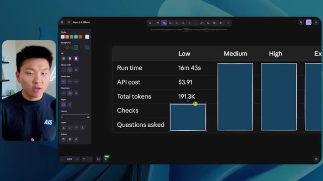
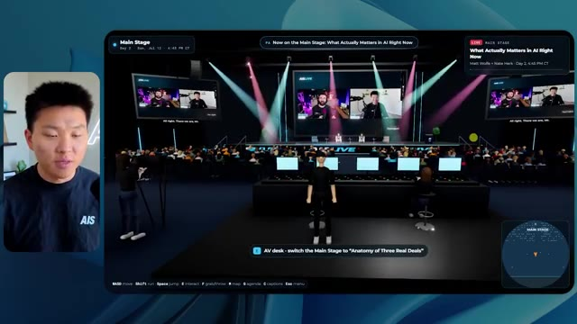
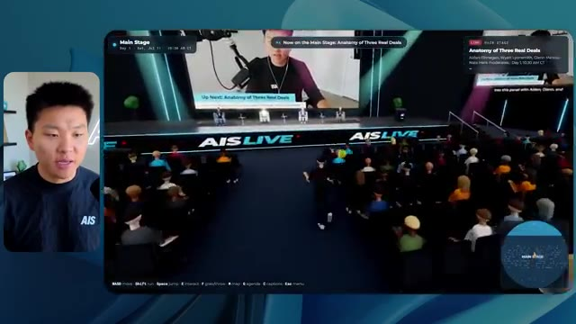
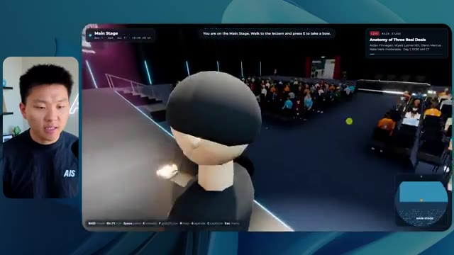

# 🎬 Higgsfield Just Turned Claude Into a Creative Agency

> **Chaîne** : [Nate Herk | AI Automation](https://www.youtube.com/@nateherk/featured)  
> **Lien YouTube** : [https://www.youtube.com/watch?v=xn6Z5PYyAIE](https://www.youtube.com/watch?v=xn6Z5PYyAIE)  
> **Date de publication** : 20260505  
> **Durée** : 00:35:27  
> **Identifiant vidéo** : `xn6Z5PYyAIE`  
> **Transcription & Analyse** : `whisper-v3-large-turbo+gemini-3.5-flash-lite`  

---

## 📌 Synthèse Exécutive & Outils

### 💡 Résumé

Dans cette vidéo issue de la chaîne de Nate Herk, l'analyste explore en profondeur l'impact des différents niveaux d'effort (« Effort Level ») du modèle **Opus 5.5** d'Anthropic appliqué à un cas d'usage d'ingénierie logicielle et d'agents IA hautement complexe. Le défi soumis à l'IA via un simple prompt programmatique (« slash goal ») consistait à concevoir entièrement, à partir d'un volume brut de 105 gigaoctets d'enregistrements vidéo d'un événement virtuel (provenant d'AIS Live sur Frame.io), un monde virtuel 3D explorable en vue à la troisième personne. Ce monde devait simuler fidèlement une conférence tech physique, dotée de scènes, de pistes de formation, d'éléments de branding, de PNJ (personnages non-joueurs) dynamiques, et de flux vidéo en direct.

La démonstration technique compare les résultats obtenus en faisant varier uniquement le paramètre d'effort de l'agent (allant du niveau « Bas » jusqu'au « Code Ultra », en passant par « Moyen » et « Élevé »). L'analyse comparative met en lumière l'évolution drastique de la qualité architecturale, de la fidélité visuelle, des performances et de l'autonomie des agents. Alors que le niveau bas génère un environnement sommaire, truffé de bugs graphiques d'affichage, de textures statiques et de PNJ fantômes en seulement 16 minutes, le niveau moyen élève considérablement le niveau de complexité en respectant la charte graphique de la marque, en intégrant de vraies lectures vidéo fluides, des PNJ interactifs réactifs et des environnements immersifs soignés, pour un temps d'exécution d'une heure et 13 minutes. 

Cette expérimentation met en exergue la puissance des agents autonomes sous Claude 5.5 capables d'exécuter des dizaines de vérifications dans un navigateur de manière totalement autonome — sans nécessiter la moindre clarification ou question intermédiaire de la part de l'utilisateur. La vidéo illustre la mutation des LLM d'assistants textuels en véritables agences de création logicielle et d'ingénierie automatisée, tout en soulignant la transition opérationnelle inévitable entre le développement local et le déploiement en production via des solutions d'hébergement intégrées.

### 🛠️ Outils, Modèles & Logiciels Présentés

* **Opus 5.5** : Modèle phare d'Anthropic réputé pour son intelligence, son coût d'API optimisé, sa polyvalence créative et son architecture hautement performante en matière de raisonnement agentique.
* **Claude Code** : Environnement de développement et interface d'agent de codage avancé permettant de piloter des tâches d'ingénierie logicielle complexes directement depuis le terminal.
* **Higgsfield** : Plateforme ou brique technologique évoquée comme catalyseur de transformation des assistants IA en véritables agences de création multimédia autonomes.
* **Frame.io** : Solution cloud de gestion et de stockage vidéo utilisée ici comme source massive (105 Go) pour alimenter l'agent en éléments multimédias d'événements.
* **Système d'exploitation IA Herc 2** : Écosystème d'automatisation propriétaire et personnalisé servant de base de travail et de réservoir de données et d'outils pour les agents.
* **Hostinger Connector** : Extension gratuite pour éditeur de code permettant de combler le fossé entre le développement local d'applications par l'IA et leur mise en ligne rapide sur un hébergement web.

### 🔑 Points Clés & Enseignements Stratégiques

* **Impact direct du paramètre d'effort (*Effort Level*)** : La manipulation du niveau d'effort sur un même prompt complexe modifie radicalement la profondeur d'exécution, la rigueur logique et le niveau de finition esthétique du code généré par l'IA.
* **Montée en charge algorithmique et temporelle** : Le passage d'un effort faible à un effort moyen multiplie par plus de quatre le temps de traitement (de 16 minutes à plus d'une heure), corollaire direct de la complexité des tâches d'intégration 3D et de gestion des flux médias.
* **Évolution des coûts d'API** : Les coûts de calcul mesurés passent de manière proportionnelle de 3,91 $ (niveau bas) à 12,44 $ (niveau moyen) pour des volumes de tokens s'élevant de 191 000 à 490 000 jetons, illustrant l'investissement computationnel requis pour des agents autonomes profonds.
* **Autonomie totale des agents autonomes** : Quel que soit le niveau d'effort configuré, les agents exécutent l'intégralité du cahier des charges de manière unilatérale, affichant un taux de sollicitation utilisateur de zéro question tout au long du processus.
* **Capacité de vérification automatisée** : L'agent valide lui-même son travail en ouvrant à de multiples reprises (plus de 20 fois) un navigateur pour inspecter, tester et ajuster le rendu visuel et fonctionnel de l'application 3D qu'il développe.
* **Transformation des données brutes en expériences immersives** : L'agent démontre une capacité remarquable à ingérer des téraoctets de données non structurées (105 Go de vidéos) et à les structurer logiquement dans un métavers interactif doté de salles thématiques et d'agendas contextuels.
* **Respect des chartes de marque** : Les niveaux d'effort supérieurs (moyen et au-delà) intègrent avec succès les directives de design, les palettes de couleurs et le branding de l'entreprise, transformant un prototype générique en une application sur mesure.
* **Dynamisme des PNJ et intégration multimédia** : Les agents de niveau supérieur injectent de la vie dans l'application en scriptant des comportements interactifs pour les personnages non-joueurs et en synchronisant de véritables flux vidéo en streaming à l'intérieur des scènes virtuelles.
* **Recommandation méthodologique officielle** : Suivant les recommandations d'Anthropic, la stratégie de prompt engineering optimale consiste à initier les requêtes complexes au niveau moyen, puis à ajuster l'effort à la hausse ou à la baisse selon la criticité du livrable.
* **Le goulet d'étranglement du déploiement** : L'automatisation de la création de logiciels par l'IA déplace le défi technique de l'écriture du code vers la mise en production, rendant indispensables des outils de connectivité directe entre l'IDE et l'hébergeur web.

---

## ⏱️ Chronologie & Transcription Complète Audio & Visuelle (Mot pour Mot)

### ⏱️ `[00:00:00 - 00:00:20]` | Segment #01

**🔊 Audio (Transcription Intégrale Mot pour Mot en Français) :**
> Opus 5.5, Opus 5.5, Opus 5.5, Opus 5.5, Opus 5.5. Ce modèle est littéralement partout et pour de très bonnes raisons. Il est intelligent, il est bon marché, il a un goût incroyable, c'est un modèle d'IA incroyable. Mais avec chaque modèle d'IA, vous avez le choix de l'effort, qu'il s'agisse de faible, moyen, élevé, extra, max ou code ultra.

**👁️ Analyse Visuelle d'Écran (gemini-3.5-flash-lite) :**
**Interface & Outils** : Interface du réseau social X (Twitter).

**Contenu textuel & Code** : Publication textuelle et vidéo intégrée montrant un environnement 3D tropical.

**Action / Démonstration** : Affichage à l'écran d'un tweet illustrant la discussion sur les capacités des modèles d'IA.

*⏱️ 00:00:05 — Capture d'écran montrant un post sur les réseaux sociaux (X/Twitter) affichant une vidéo de paysage tropical généré en 3D avec un texte concernant l'impact de l'IA sur les métiers créatifs.*

---

### ⏱️ `[00:00:20 - 00:00:38]` | Segment #02

**🔊 Audio (Transcription Intégrale Mot pour Mot en Français) :**
> Donc, dans cette vidéo, j'ai donné exactement le même prompt à Opus 5.5 et je l'ai exécuté sur chaque niveau d'effort, et nous allons comparer les résultats. Nous examinerons la qualité de tous les différents résultats réels, mais nous examinerons également combien de temps chacun d'eux a pris pour s'exécuter, combien cela nous a coûté si c'était une facturation par API, le nombre total de tokens, combien de vérifications ils ont exécutées, et combien de questions ils m'ont réellement posées tout au long du processus.

**👁️ Analyse Visuelle d'Écran (gemini-3.5-flash-lite) :**
**Interface & Outils** : Interface web de tableau comparatif (type application de mindmapping ou tableau de bord).

**Contenu textuel & Code** : Tableau avec les colonnes Low, Medium, High, Extra, Max, Ultracode et les lignes Run time, API cost, Total tokens, Checks, Questions asked.

**Action / Démonstration** : Affichage et comparaison des performances des différents niveaux d'effort d'Opus 5.5.

*⏱️ 00:00:29 — Tableau comparatif sur une interface web montrant les différents niveaux d'effort de Opus 5.5 (Low, Medium, High, Extra, Max, Ultracode) et des métriques telles que Run time, API cost, Total tokens.*

---

### ⏱️ `[00:00:39 - 00:00:58]` | Segment #03

**🔊 Audio (Transcription Intégrale Mot pour Mot en Français) :**
> Et les résultats que nous avons obtenus ne sont pas du tout ce à quoi je m'attends, donc j'ai hâte de partager cela avec vous les gars. Ne perdons pas de temps et entrons directement dans le vif du sujet. D'accord, alors plongeons directement dans celui-ci. Je veux commencer simplement en vous montrant le prompt réel que nous avons utilisé, que nous avons donné à chacun de ces différents agents. Je vais aller dans les fichiers ici, et nous allons ouvrir ce fichier markdown de prompt, et je vais vous montrer ce que nous avons obtenu. Voici donc le slash objectif que j'ai fourni.

**👁️ Analyse Visuelle d'Écran (gemini-3.5-flash-lite) :**
**Interface & Outils** : Interface de type éditeur / outil de développement IA (Opus 5.5, Ultracode) avec panneau latéral de navigation.

**Contenu textuel & Code** : Texte du prompt affiché : "Hi Nate. This worktree has the effort-test task queued in PROMPT.md : build a walkable third-person 3D world..." et champ de saisie de commande "Type / for commands".

**Action / Démonstration** : Affichage de l'interface de l'outil IA montrant le prompt initial d'un projet de monde 3D interactif.

*⏱️ 00:00:48 — Interface d'une application de développement avec un assistant IA (Opus 5.5 / CLI ou interface dédiée) affichant un prompt concernant un projet 3D, avec une incrustation vidéo du présentateur sur la gauche.*

---

### ⏱️ `[00:00:58 - 00:01:34]` | Segment #04

**🔊 Audio (Transcription Intégrale Mot pour Mot en Français) :**
> J'ai dit, tu dois me créer un monde en 3D qui est une conférence tech réaliste dans laquelle je peux me promener en vue à la troisième personne. Tu vas regarder ce dossier, qui contient mes éléments d'enregistrement d'événements provenant de AIS Live. Et ce dossier est un dossier Frame.io de 105 gigaoctets d'enregistrements vidéo. C'était un événement entièrement virtuel. Tout a été enregistré et tous les enregistrements sont juste ici. J'ai dit, ton objectif est de prendre cet événement et de le transformer en un monde explorable en 3D qui me donne l'impression d'être réellement allé à une vraie conférence en personne avec différentes salles, différentes pistes, différentes scènes, bla, bla, bla. N'hésite pas à utiliser key.ai si tu as besoin de générer des images ou des vidéos. Et tu peux aussi utiliser tout le reste à l'intérieur de mon projet Herc 2, qui est comme mon système d'exploitation IA. J'ai dit,

**👁️ Analyse Visuelle d'Écran (gemini-3.5-flash-lite) :**
**Interface & Outils** : Éditeur de code (type VS Code / Cursor) et interface web Frame.io

**Contenu textuel & Code** : Instructions du prompt demandant de convertir les enregistrements virtuels en un monde 3D explorable en vue à la troisième personne, avec lien Frame.io (https://f.io/sPdlo-Si).

**Action / Démonstration** : Présentation du prompt de configuration et des fichiers d'actifs vidéo de l'événement stockés sur Frame.io.

*⏱️ 00:01:07 — Un éditeur de texte affichant le fichier PROMPT.md avec les instructions de création d'un monde 3D interactif et le lien Frame.io des éléments d'enregistrement.*

*⏱️ 00:01:16 — Une interface web Frame.io montrant un dossier d'enregistrements d'événements AIS Live d'une taille totale de 105,69 Go avec les sous-dossiers GA Access et VIP Access.*

*⏱️ 00:01:25 — Vue similaire sur l'éditeur de texte affichant le fichier PROMPT.md avec les consignes détaillées données à l'agent IA.*

---

### ⏱️ `[00:01:34 - 00:02:08]` | Segment #05

**🔊 Audio (Transcription Intégrale Mot pour Mot en Français) :**
> tu seras jugé sur la créativité, le design, la physique et la sensation générale lorsque j'explorerai le monde en 3D que tu as construit. Et c'était fondamentalement la fin des instructions. Donc, comme vous pouvez le voir sur ce côté gauche, j'ai exécuté cela à travers tous les différents niveaux d'effort. Commençons par le niveau bas et remontons jusqu'à ultra code. Très bien. Donc ici, nous avons le résultat du niveau bas. Ouvrons ceci et jetons un coup d'œil. Nous avons donc AIS Live, le sommet des services IA en personne enfin, et nous avons pu cliquer partout. Tout d'abord, cela ne fait pas très personnalisé. Genre, ce n'ha pas le logo d'IS Live. Ce n'est même pas nos couleurs. Donc je n'aime pas trop ça, mais entrons ici. D'accord. C'est beaucoup trop lumineux. Euh, nous avons une carte en haut à droite, nous avons une ville par ici, je ne peux pas dire quelle ville c'est

**👁️ Analyse Visuelle d'Écran (gemini-3.5-flash-lite) :**
**Interface & Outils** : Interface web ou application de bureau d'un assistant de code IA (type Claude / interface personnalisée) avec panneau latéral de gestion des sessions (worktrees) et zone de chat principale.

**Contenu textuel & Code** : Message de l'assistant IA proposant de construire un monde 3D en troisième personne à partir d'enregistrements ("Hi Nate. This worktree has the effort-test task queued in PROMPT.md; build a walkable third-person 3D world..."). Barre latérale affichant les différents niveaux : Hello, Extra, High, Max, Ultracode, Medium, Low.

**Action / Démonstration** : Navigation et sélection des différents niveaux de test d'effort dans le panneau latéral gauche de l'application.

*⏱️ 00:01:42 — Interface d'une application de type assistant IA (style Claude/éditeur) montrant différents niveaux de tests d'effort dans la barre latérale gauche et un échange de messages concernant la construction d'un monde 3D.*

---

### ⏱️ `[00:02:08 - 00:02:40]` | Segment #06

**🔊 Audio (Transcription Intégrale Mot pour Mot en Français) :**
> c'est. D'accord. C'est Chicago, ce qui est plutôt cool parce que vous savez, j'habite à Chicago, mais bref, en haut à droite, nous pouvons voir une carte. Nous avons un hall d'accueil. Nous avons un hall d'exposition. Nous avons le salon VIP, la scène principale. De plus, la carte montre où se trouve chaque autre personne et cela se synchronise en direct. Nous pouvons donc voir l'enregistrement. Nous pouvons voir le premier jour, la keynote de l'hyper agent, le débriefing en direct. Cool. Donc ça connaît réellement l'agenda et puis il y a le deuxième jour. Donc il a trouvé ça, c'est bien. Nous avons ces petites boules ici que je peux espérer lancer autour de moi. D'accord. Le visage, Oh, regardez ça. Si je vais par ici, tous les gens disparaissent tout simplement. Très mauvais. Très mauvais. D'accord. Alors voyons voir. Est-ce que je peux sprinter ? D'accord.

**👁️ Analyse Visuelle d'Écran (gemini-3.5-flash-lite) :**
**Interface & Outils** : Application ou plateforme virtuelle 3D interactive (metaverse / événement virtuel) avec mini-carte de navigation.

**Contenu textuel & Code** : Panneaux textuels de programme ('DAY 1', sessions, sponsor booths) et interface de navigation 3D.

**Action / Démonstration** : Exploration et navigation dans les différents espaces virtuels de la conférence (lobby, expo hall, badges).

*⏱️ 00:02:16 — Vue dans une plateforme virtuelle 3D montrant un espace avec un avatar et une carte en haut à droite indiquant le hall, la scène principale et les autres zones.*

*⏱️ 00:02:24 — Navigation dans le hall virtuel avec un panneau affichant le programme du premier jour (Day 1) et la mini-carte en haut à droite.*

*⏱️ 00:02:32 — Exploration de l'Expo Hall virtuel avec des participants représentés par des avatars colorés et une installation lumineuse au centre.*

---

### ⏱️ `[00:02:40 - 00:03:04]` | Segment #07

**🔊 Audio (Transcription Intégrale Mot pour Mot en Français) :**
> Je peux avancer un peu plus vite. Je vais d'abord aller par ici. Il y a des produits promotionnels, euh, certifiés AIS plus glido. D'accord. Donc il y a les vrais stands qu'on avait lors de l'événement virtuel. On avait des stands. C'est donc plutôt cool. Un petit endroit pour prendre des photos. Salle C. En ce moment, nous avons Tangy Frederick qui anime un atelier. D'accord. Mais ce n'est pas une vidéo. Comme vous pouvez le voir, c'est juste une image. Elle ne bouge pas. C'est donc juste une image. Ces gens sont en train de disparaître. Ce doivent être des fantômes. Allons par ici dans la salle A.

**👁️ Analyse Visuelle d'Écran (gemini-3.5-flash-lite) :**
**Interface & Outils** : Environnement virtuel 3D interactif (type événementiel virtuel).

**Contenu textuel & Code** : Instructions textuelles et tutoriels sur écrans virtuels pour la configuration d'API.

**Action / Démonstration** : Exploration et déplacement de l'avatar dans l'espace virtuel pour découvrir les stands et les ateliers.

*⏱️ 00:02:46 — Vue d'un espace virtuel 3D avec un avatar se déplaçant devant un stand sponsorisé "Glaido" comportant des cubes de produits promotionnels.*

*⏱️ 00:02:52 — Navigation de l'avatar dans une salle virtuelle éclairée en vert avec des tables d'atelier et un écran de présentation au fond.*

*⏱️ 00:02:58 — Gros plan sur un écran virtuel affichant des instructions étape par étape sur la création de clés API ("Step 1: Go to...").*

---

### ⏱️ `[00:03:04 - 00:03:30]` | Segment #08

**🔊 Audio (Transcription Intégrale Mot pour Mot en Français) :**
> Nous avons Liberty White. D'accord. Très cool. Vos 30 premiers jours en automatisation. Encore une fois, c'est juste une image fixe et les gens ont des bugs d'affichage. Donc ce n'est pas très bien ici. Je vais aller sur la scène principale et voir ce que nous avons. D'accord, cool. Donc nous avons une scène principale. Les gens ont de gros bugs d'affichage. Vraiment mauvais. Ce n'est vraiment pas terrible. Notre vidéo est en train de bouger. Genre, j'ai vu mon visage ici et j'ai vu celui de Devin, mais maintenant ils ont disparu. Donc je ne sais pas ce qui s'est passé. D'accord. Ça ressemble plutôt à un diaporama. Rien n'est vraiment diffusé pour l'instant. Bref, entrons ici.

**👁️ Analyse Visuelle d'Écran (gemini-3.5-flash-lite) :**
**Interface & Outils** : Environnement virtuel 3D de type métavers ou événementiel en ligne.

**Contenu textuel & Code** : Interface de navigation en 3D avec affichage de salles d'ateliers et de présentations en direct.

**Action / Démonstration** : Exploration et déplacement de l'avatar dans l'espace virtuel de la conférence.

*⏱️ 00:03:11 — Vue d'une salle d'atelier virtuelle ("Workshop Room A") avec des plateformes circulaires lumineuses au sol.*

*⏱️ 00:03:17 — Vue de la scène principale ("Main Stage") d'un événement virtuel rempli d'avatars assis dans un auditorium.*

*⏱️ 00:03:24 — Vue de la scène principale affichant un grand écran géant "AIS LIVE AI Services Summit" dans l'espace virtuel.*

---

### ⏱️ `[00:03:30 - 00:03:58]` | Segment #09

**🔊 Audio (Transcription Intégrale Mot pour Mot en Français) :**
> Nous avons d'autres stands. Nous avons hyper agent. Nous avons Claude Code. Nous avons plus de cadeaux publicitaires. La salle B, c'est Dave Ebelor. Je suppose que c'est exactement la même chose. Nous avons du café. Et puis, je suppose que le salon VIP, c'est accès VIP uniquement. C'est plutôt cool, mais il n'y a vraiment rien qui se passe ici. Cet écran est bien trop lumineux. Bon. Donc je pense que vous comprenez l'ambiance qu'on obtient ici avec Opus 5.5 en effort faible. Et c'est là que les choses deviennent intéressantes. À combien est-ce que vous pensez que cela a tourné ? Combien de temps ? Celui-ci a duré 16 minutes et 43 secondes. Combien pensez-vous que cela a coûté ?

**👁️ Analyse Visuelle d'Écran (gemini-3.5-flash-lite) :**
**Interface & Outils** : Application web ou tableau blanc interactif type canevas (Opus 5.5 Efforts) et environnement virtuel 3D.
[DESC_IMAGE_3_CONTENT] Tableau avec les colonnes Low, Medium, High, Extra, Max, Ultracode et les lignes Run time, API cost, Total tokens, Checks, Questions asked.

**Contenu textuel & Code** : Explications orales et mise en contexte méthodologique.

**Action / Démonstration** : Navigation et présentation des fonctionnalités dans un espace virtuel 3D puis affichage d'un tableau comparatif de performance.

*⏱️ 00:03:51 — Interface de tableau comparatif nommée 'Opus 5.5 Efforts' affichant des niveaux (Low à Ultracode) et des métriques (Run time, API cost, etc.).*

---

### ⏱️ `[00:03:58 - 00:04:26]` | Segment #10

**🔊 Audio (Transcription Intégrale Mot pour Mot en Français) :**
> 3,91 dollars si c'était facturé par l'API. J'utilise évidemment mon abonnement ici, mais nous allons simplement calculer cela avec la tarification de l'API. Le nombre total de jetons était de 191 000. Il a effectué 22 vérifications. Donc pour la vérification, 22 fois il a ouvert le navigateur et a exécuté différents types de vérifications. Soit 22 catégories de vérifications. Et combien de questions m'a-t-il posées ? Il m'a posé un total de zéro question tout au long de cette invite de type slash goal. D'accord. Alors ouvrons l'effort moyen et voyons ce que nous avons. D'accord, c'est parti. Effort moyen. Nous avons Nate Herc. Nous avons mon badge. C'est aux couleurs de la marque AI's Life.

**👁️ Analyse Visuelle d'Écran (gemini-3.5-flash-lite) :**
**Interface & Outils** : Tableau blanc numérique / outil de dessin (type Excalidraw ou similaire).

**Contenu textuel & Code** : Tableau avec des lignes : Run time (16m 43s), API cost ($3.91), Total tokens (191.3K), Checks, Questions asked, sous les colonnes Low, Medium, High, Ex.

**Action / Démonstration** : Le présentateur explique les résultats et les coûts de l'API affichés dans le tableau.

*⏱️ 00:04:05 — Tableau comparatif sur une application de tableau blanc affichant les métriques d'exécution pour le niveau 'Low' (Run time: 16m 43s, API cost: $3.91, Total tokens: 191.3K, Checks, Questions asked).*

---

### ⏱️ `[00:04:26 - 00:04:46]` | Segment #11

**🔊 Audio (Transcription Intégrale Mot pour Mot en Français) :**
> Donc ça a déjà l'air un petit peu mieux. Ça ressemble à nos palettes de couleurs qui ont utilisé nos directives de marque. Premier jour de construction, deuxième jour de gain, VIP. Cool. D'accord. Je vais entrer dans le lieu. D'accord. Waouh. Une ambiance donc un peu similaire. C'est en arrière-plan. Ça ne ressemble pas à Chicago, hein ? Non, ça ressemble à, honnêtement, ça ressemble à une ville imaginaire. Quoi qu'il en soit, c'est drôle qu'ils aient décidé de faire ça. Voyons si je peux me déplacer un peu plus vite. Oh, waouh.

**👁️ Analyse Visuelle d'Écran (gemini-3.5-flash-lite) :**
**Interface & Outils** : Application web interactive / 3D virtuelle ("AIS Live").

**Contenu textuel & Code** : Écran de bienvenue avec le titre "Welcome to AIS Live", badge de conférence personnalisé (Nate Herk, Host - All Access) et contrôles de navigation.

**Action / Démonstration** : Navigation et entrée dans l'environnement virtuel 3D de la conférence.

*⏱️ 00:04:31 — Interface d'accueil de l'application 'AIS Live' montrant un badge de conférence au nom de Nate Herk et un bouton pour entrer dans le lieu virtuel.*

*⏱️ 00:04:41 — Vue à l'intérieur du lieu virtuel interactif en 3D avec des avatars d'utilisateurs et un panorama nocturne de ville en arrière-plan.*

---

### ⏱️ `[00:04:46 - 00:05:21]` | Segment #12

**🔊 Audio (Transcription Intégrale Mot pour Mot en Français) :**
> Les gens interagissent avec moi. Regardez. Si je m'approche de ce type, il vient de lever le bras. Bon, maintenant il ne veut plus du tout avoir affaire à moi. Mais tous ces petits robots ici doivent prendre des décisions. Je ne sais pas s'ils utilisent Jev. C'est sûr que non. Je ne le lui ai pas dit. En fait, ma clé Jev est à l'arrière. Je ne sais pas. Peut-être qu'il l'a utilisée. Quoi qu'il en soit, nous pouvons voir ici que nous avons la salle d'atelier C, le laboratoire des agents. Sympa. Donc celui-ci est en fait en train d'être exécuté. Vous pouvez voir qu'il s'agit d'une vraie vidéo lue par Tangy. Tout le monde ici est en train de travailler sur un ordinateur portable. Ils ne buguent pas. C'est plutôt cool. De plus, mon badge est sur ma poitrine, ce qui est plutôt cool. Je peux venir par ici. Nous avons une carte en haut à droite, comme vous pouvez le voir, mais je peux venir par ici. Nous avons un

**👁️ Analyse Visuelle d'Écran (gemini-3.5-flash-lite) :**
**Interface & Outils** : Application de monde virtuel / métavers de type conférence.

**Contenu textuel & Code** : Interface utilisateur affichant des informations sur les sessions ("Enterprise AI Services").

**Action / Démonstration** : Navigation et exploration d'un environnement virtuel 3D avec des agents/avatars.

---

### ⏱️ `[00:05:21 - 00:05:47]` | Segment #13

**🔊 Audio (Transcription Intégrale Mot pour Mot en Français) :**
> hall d'exposition. C'est là que nous avons le stand Glido. Et ça diffuse en ce moment. Oui, ça diffuse la vidéo de nous en train de parler de Glido. Ça diffuse la vidéo d'Ed et moi parlant de notre programme de certification. Nous avons le logo AIS Plus ici à l'arrière, qui est un peu mal placé. Ce sont les diapositives des conférenciers et les points clés. Alors wow, ce sont toutes les ressources que nous avons distribuées après l'événement. Elles sont toutes là également. Nous pouvons voir que nous avons un projecteur sur la communauté. C'est donc Aiden qui parle de l'accord qu'il a conclu et c'est diffusé en direct. Ces gens regardent.

**👁️ Analyse Visuelle d'Écran (gemini-3.5-flash-lite) :**
**Interface & Outils** : Environnement virtuel 3D de type métavers ou plateforme d'événement virtuel.

**Contenu textuel & Code** : Panneaux textuels, diapositives de présentation et affichages informatifs sur les stands virtuels.

**Action / Démonstration** : Navigation et exploration d'un espace d'exposition virtuel par des avatars.

---

### ⏱️ `[00:05:47 - 00:06:21]` | Segment #14

**🔊 Audio (Transcription Intégrale Mot pour Mot en Français) :**
> Ils sont plutôt engagés. On a un hyper agent. C'était, c'est ce que je voulais dire. Si vous avez vu ces gens lever les bras en disant bonjour, c'était plutôt marrant. Regardez, regardez, le voilà qui recommence. Bref. Bon. Où est-ce que je suis maintenant ? Maintenant, je suis dans le hall principal. On a un bar à café. On a un grand logo, qui est le vrai logo. C'est trop lumineux, mais on a le logo. On peut voir si on peut entrer ici dans le parcours fondation. On a Sabrina Romanov et Liberty White. Donc différentes formations juste là. On peut entrer dans cette salle. C'est le parcours avancé. Alors qu'est-ce qui se passe ici. On a Dave Ebelar et Saman qui parlent de différentes choses là-dedans. Et maintenant, allons jeter un œil à la scène principale. Oh, attendez, il y a une vidéo de moi là-haut. C'est du genre VIP

**👁️ Analyse Visuelle d'Écran (gemini-3.5-flash-lite) :**
**Interface & Outils** : Application de métavers ou monde virtuel 3D en ligne.

**Contenu textuel & Code** : Interface utilisateur affichant une carte miniature, des indications de texte comme "Main Lobby", et des avatars d'utilisateurs.

**Action / Démonstration** : Navigation et déplacement d'un avatar à travers un espace virtuel interactif.

*⏱️ 00:05:55 — Le présentateur apparaît dans un encadré à gauche, tandis que l'écran principal affiche un monde virtuel 3D représentant un hall principal avec des avatars interactifs.*

*⏱️ 00:06:04 — L'écran principal montre un avatar naviguant dans un environnement virtuel 3D se dirigeant vers une salle de conférence remplie de participants.*

*⏱️ 00:06:12 — Vue en 3D d'un espace virtuel où le présentateur navigue parmi d'autres avatars dans un hall de conférence numérique.*

---

### ⏱️ `[00:06:21 - 00:06:50]` | Segment #15

**🔊 Audio (Transcription Intégrale Mot pour Mot en Français) :**
> section ? Ouais, on ira voir ça dans une minute. Mais bref, voici la scène principale. Ça a l'air vraiment, vraiment très bien. On a une grande scène. On a genre quatre personnes assises ici. On a les trois écrans d'Alex là-haut avec hyper agent. Est-ce que j'ai le droit de monter sur scène ? Oh, et il me laisse monter sur scène. D'accord. C'est plutôt sympa. Bon les gars, prenons un selfie. Laissez-moi attraper tout le monde en arrière-plan. Venez par ici. Bref, c'est vraiment, vraiment cool. Toutes les places ne sont pas prises par contre. Donc il va falloir qu'on travaille là-dessus. Mais bref, je vais y retourner en courant pour voir ce qu'était cette section VIP. D'accord. Le salon VIP. J'ai l'impression que c'est comme un aéroport ou un truc du genre.

**👁️ Analyse Visuelle d'Écran (gemini-3.5-flash-lite) :**
**Interface & Outils** : Environnement virtuel 3D de conférence (Hyperagent)

**Contenu textuel & Code** : Interface utilisateur virtuelle avec affichage de la session "Hyperagent Keynote" et mini-carte de navigation.

**Action / Démonstration** : Navigation et exploration de l'espace virtuel de la conférence par le présentateur.

*⏱️ 00:06:28 — Vue principale de l'auditorium virtuel avec des écrans montrant la keynote d'Alex McDonnell et des spectateurs assis.*

*⏱️ 00:06:36 — Vue de dos de l'avatar naviguant vers la scène principale avec des personnes assises au premier plan.*

*⏱️ 00:06:43 — Vue en contre-plongée montrant l'allée centrale de l'auditorium virtuel rempli de nombreux avatars.*

---

### ⏱️ `[00:06:51 - 00:07:14]` | Segment #16

**🔊 Audio (Transcription Intégrale Mot pour Mot en Français) :**
> D'accord, super. Donc maintenant nous avons les sessions VIP ici. Une foire aux questions VIP avec la lecture vidéo en direct de Nate juste ici. Très, très cool. Et nous avons comme un bar ou quelque chose. Génial. Je dirais que c'est un assez bon résultat. Maintenant, en ce qui concerne les statistiques ici, celle-ci a pris une heure et 13 minutes à s'exécuter. Cela nous aurait coûté 12 dollars et 44 cents. Elle a utilisé 490 000 jetons et elle a effectué 23 vérifications.

**👁️ Analyse Visuelle d'Écran (gemini-3.5-flash-lite) :**
**Interface & Outils** : Environnement virtuel 3D et tableau de bord de statistiques (application web ou outil d'analyse).

**Contenu textuel & Code** : Métriques de performance : 16m 43s de temps d'exécution, 3.91 $ de coût d'API, 191.3K tokens totaux, 22 vérifications.

**Action / Démonstration** : Présentation de l'espace virtuel VIP puis transition vers l'affichage des statistiques de performance.

*⏱️ 00:06:56 — Vue d'un espace virtuel 3D (salon VIP) avec un écran affichant une session vidéo en direct du présentateur et des participants, ainsi qu'un espace bar en arrière-plan.*

*⏱️ 00:07:02 — Tableau de statistiques affichant les métriques d'exécution (Run time: 16m 43s, API cost: $3.91, Total tokens: 191.3K, Checks: 22, Questions asked: 0).*

---

### ⏱️ `[00:07:14 - 00:07:48]` | Segment #17

**🔊 Audio (Transcription Intégrale Mot pour Mot en Français) :**
> Et il nous a posé un total de zéro question une fois de plus. Très bien, passons au niveau élevé. C'était déjà un résultat plutôt correct et Anthropic eux-mêmes dans leur vidéo, ou désolé, pas une vidéo, un article sur comment prompter Opus 5.5, ils ont dit de commencer simplement par le niveau moyen et de l'ajuster à la hausse ou à la baisse si nécessaire. C'était donc un résultat moyen. Passons au niveau élevé et voyons ce que nous avons obtenu. Très rapidement, les gars, je dois prendre une seconde pour vous parler du sponsor de la vidéo d'aujourd'hui, Hostinger. Donc ces deux modèles viennent de me créer une version fonctionnelle de la même chose. Et maintenant, je me retrouve exactement là où je finis toujours, avec un projet terminé sur mon ordinateur portable et aucun moyen rapide de le mettre en ligne. Et c'est précisément le fossé que le connecteur d'Hostinger comble. C'est une extension gratuite

**👁️ Analyse Visuelle d'Écran (gemini-3.5-flash-lite) :**
**Interface & Outils** : Tableau comparatif visuel / Éditeur de code et interface d'agent IA

**Contenu textuel & Code** : Métriques de performance des différents niveaux de prompts (Low et Medium affichés, High et Extra en attente)

**Action / Démonstration** : Présentation des résultats comparatifs et transition vers le niveau supérieur

*⏱️ 00:07:22 — Tableau de comparaison des performances (Run time, API cost, Total tokens, Checks, Questions asked) selon les niveaux (Low, Medium, High, Extra).*

*⏱️ 00:07:39 — Interface de développement avec un panneau latéral affichant les détails de génération d'un calculateur ROI (Northwind ROI calculator).*

---

### ⏱️ `[00:07:48 - 00:08:23]` | Segment #18

**🔊 Audio (Transcription Intégrale Mot pour Mot en Français) :**
> pour votre éditeur qui intègre votre compte Hostinger dans l'outil de programmation que vous utilisez déjà, que ce soit VS Code, Cursor, Cloud Code, Codex, et j'en passe. Vous vous connectez une seule fois en un clic, et à partir de là, votre agent peut déployer le site, y associer un domaine, configurer les enregistrements DNS et vérifier votre VPS sans que vous n'ayez jamais à quitter l'éditeur. Ainsi, peu importe celui de ces outils que vous finirez par préférer, ce qu'il a construit n'est qu'à quelques minutes d'une vraie URL sur un hébergement géré. Connector est gratuit avec chaque formule d'hébergement, donc si vous avez toujours besoin de l'hébergement en dessous, profitez de la formule illimitée avec le lien dans la description et utilisez le code NATEHERK pour 10 % de réduction. Cela inclut également un domaine gratuit et un e-mail professionnel pour l'année. Et c'est toujours le moyen le plus économique que j'ai trouvé pour obtenir quelque chose

**👁️ Analyse Visuelle d'Écran (gemini-3.5-flash-lite) :**
**Interface & Outils** : Interface de gestion Hostinger connectée et Claude Code.

**Contenu textuel & Code** : Mention de "Manage Hostinger from your IDE", statut "Connected (VIA OAUTH)", et liste des outils disponibles (Websites, Domains, Subscriptions & Payments, Email Marketing).

**Action / Démonstration** : Connexion du compte Hostinger à l'IDE via OAuth affichant les outils accessibles par l'assistant.

*⏱️ 00:07:57 — Interface montrant la connexion de Hostinger depuis un IDE avec une liste d'outils disponibles (Websites, Domains, Subscriptions, etc.) et Claude Code sur le panneau droit.*

---

### ⏱️ `[00:08:23 - 00:08:47]` | Segment #19

**🔊 Audio (Transcription Intégrale Mot pour Mot en Français) :**
> tu as construit sur une vraie URL. Donc revenons à la vidéo. D'accord. Encore une fois, très, très marqué par la marque. C'est un écran de chargement encore meilleur que le précédent. Nous avons ce petit effet sympa en arrière-plan. Nous avons le logo. Nous allons entrer dans le lieu. D'accord. Nous y voilà. Ça a l'air plutôt bien. Nous commençons à l'extérieur et vous pouvez voir que nous avons ces drapeaux pour tous les intervenants, Wyatt, Casper, Alex, Ed, Aiden, Sabrina, Liberty. C'est plutôt cool. Nous avons des blocs en direct ici.

**👁️ Analyse Visuelle d'Écran (gemini-3.5-flash-lite) :**
**Interface & Outils** : Application web 3D immersive (plateforme d'événement virtuel hébergée sur RingCentral).

**Contenu textuel & Code** : Interface utilisateur avec panneaux d'information, bannières nominatives (Alex McDonnell, Wyatt Lyonsmith) et indications de navigation.

**Action / Démonstration** : Navigation et entrée dans le lieu virtuel 3D de l'événement.

*⏱️ 00:08:29 — Écran de chargement et d'accueil de la plateforme virtuelle 'AIS LIVE', avec le logo et les instructions de contrôle (WASD, Mouse, etc.).*

*⏱️ 00:08:35 — Vue dans le monde virtuel 3D 'AIS Live Plaza', montrant un avatar de type personnage cubique dans une grande place urbaine avec des bâtiments et d'autres avatars.*

*⏱️ 00:08:41 — Exploration de la place virtuelle avec des bannières verticales affichant des noms de conférenciers, dans un environnement 3D style métavers.*

---

### ⏱️ `[00:08:47 - 00:09:23]` | Segment #20

**🔊 Audio (Transcription Intégrale Mot pour Mot en Français) :**
> il a pris cette photo de moi, votre hôte, Nate Herc, John, Dave, Nate Herc. Voilà. D'accord. Les portes. Génial. Ce sont des portes coulissantes automatiques en verre. J'adore ça. On peut voir l'enregistrement VIP. On peut voir l'admission générale. On peut venir par ici et on peut découvrir l'exposition avec différents stands, le coin de la communauté. Vous pouvez aussi voir qu'en haut à gauche, j'ai un passeport. Donc c'est comme si, ça montrera combien d'endroits j'ai visités. Tout cela est une vraie lecture. Nous avons un mur de ressources avec tous les différents intervenants. Ils ont aussi une session de réseautage par ici. Donc je vais venir très vite et voir de quoi il s'agit. Nous avons donc le bar à cold brew AIS. Nous avons différents membres de la communauté qui ont été mis en avant ou en valeur.

**👁️ Analyse Visuelle d'Écran (gemini-3.5-flash-lite) :**
**Interface & Outils** : Environnement virtuel 3D interactif (jeu ou plateforme métavers).

**Contenu textuel & Code** : Interface utilisateur virtuelle avec mini-carte, indicateurs de progression et panneaux d'affichage d'événement.

**Action / Démonstration** : Exploration et navigation interactive dans l'espace virtuel de l'événement.

*⏱️ 00:08:56 — Vue d'un monde virtuel 3D montrant l'accueil d'un événement avec des comptoirs d'inscription et de VIP check-in.*

*⏱️ 00:09:05 — Navigation dans un hall d'exposition virtuel 3D avec des stands et des panneaux d'information.*

*⏱️ 00:09:14 — Vue à la troisième personne montrant un avatar se déplaçant dans le hall d'accueil virtuel parmi d'autres avatars.*

---

### ⏱️ `[00:09:23 - 00:09:56]` | Segment #21

**🔊 Audio (Transcription Intégrale Mot pour Mot en Français) :**
> On a l'aile VIP. Attends, quoi ? Récupère un bracelet. Oh, je dois vraiment aller chercher le bracelet. D'accord. Laisse-moi m'enregistrer rapidement. Le bracelet est déjà mis. Attends, quoi ? D'accord. Oh, d'accord. Maintenant, les portes se sont ouvertes pour moi. Cool. Je peux entrer ici. Oh, ça mène juste à la scène principale. Salon VIP. Il y a une séance de questions-réponses en cours. Ça a l'air très sympa. Je veux dire, je suis très impressionné par la façon dont il parvient à faire ça. Waouh. D'accord. Donc c'est vraiment bien. Ce qu'on a fait, c'est qu'on a eu des salles de discussion VIP avec différentes personnes. Tu peux voir qu'il y a différentes salles, différents membres de l'équipe AIS qui participent à des trucs. C'est vraiment cool. C'est très cool. C'est un VIP bien meilleur

**👁️ Analyse Visuelle d'Écran (gemini-3.5-flash-lite) :**
**Interface & Outils** : Application web interactive / Plateforme virtuelle type métavers de conférence en ligne (Gather town ou similaire).

**Contenu textuel & Code** : Interface utilisateur virtuelle affichant le lieu « VIP Lounge » et « VIP Working Sessions », des barres de progression de type passeport et un mini-carte en haut à droite.

**Action / Démonstration** : Navigation et exploration de différents espaces virtuels (hall, salon VIP, salles de travail) avec l'avatar.

*⏱️ 00:09:32 — Vue dans l'espace virtuel de type métavers montrant l'avatar du présentateur naviguant dans le hall d'enregistrement (Registration Concourse).*

*⏱️ 00:09:40 — Vue du salon VIP virtuel où l'avatar assiste à une session de questions-réponses avec un écran affichant la vidéo du présentateur.*

*⏱️ 00:09:48 — Vue de l'espace de sessions de travail VIP virtuel avec plusieurs salles thématiques et avatars assis autour de tables.*

---

### ⏱️ `[00:09:56 - 00:10:30]` | Segment #22

**🔊 Audio (Transcription Intégrale Mot pour Mot en Français) :**
> expérience que ce qui a été montré dans la première partie. D'accord. After party VIP. Regardez ça. On a une piste de danse. On a tous ces éléments ici. On a la lecture de l'after party VIP juste ici. Et il y a une estrade pour DJ. C'est tellement marrant. Il y a un petit bug ici, un petit glitch ici, mais c'est génial. Oh, cool. Donc quand je suis ici sur la scène principale, on a des sous-titres. Vous pouvez voir juste ici en bas de mon écran, on a ces sous-titres de Wyatt qui est en train de parler ici. On a des lumières. On a le panel. Très cool. Belle scène principale. Je vais aller ici. On peut aller à la fondation,

**👁️ Analyse Visuelle d'Écran (gemini-3.5-flash-lite) :**
**Interface & Outils** : Application web de monde virtuel / événement en ligne en 3D

**Contenu textuel & Code** : Environnement virtuel interactif avec avatars 3D, écrans de visioconférence et interface de navigation (passeport, commandes)

**Action / Démonstration** : Navigation et exploration d'un monde virtuel 3D lors d'un événement en ligne

*⏱️ 00:10:04 — Vue d'un espace virtuel représentant une 'after-party VIP' avec une piste de danse, des avatars, et un écran affichant des participants en visioconférence.*

*⏱️ 00:10:13 — Poursuite de la visite de la piste de danse virtuelle avec des ballons rebondissants et des avatars animés.*

*⏱️ 00:10:21 — Transition vers une autre zone de l'événement virtuel montrant une scène principale ('Main Stage') avec des spectateurs assis et un grand écran de présentation.*

---

### ⏱️ `[00:10:30 - 00:11:06]` | Segment #23

**🔊 Audio (Transcription Intégrale Mot pour Mot en Français) :**
> avancé, et les parcours d'entreprise par ici. Alors voyons voir. Nous avons l'anatomie de trois vraies transactions. Nous avons hyper agent. Nous avons les évaluations avec Nate et Ed ici. Nous avons Dave qui s'occupe des trucs avancés. C'est vraiment bien. Je veux dire, évidemment, chacun, chacun de ces résultats jusqu'à présent, le niveau bas était correct. Le niveau moyen était meilleur. Le niveau haut a été encore meilleur. Voyons si cette tendance se poursuit et allons voir ce que cela nous a coûté. Le niveau haut a donc tourné pendant une heure et sept minutes. Donc un peu plus rapide que le niveau moyen, cela nous aurait coûté 16 dollars et 31 cents. Il a utilisé un demi-million de tokens, 509 000. Il a fait 22 vérifications. Et il nous a aussi demandé, enfin, non, je me suis trompé. Ce

**👁️ Analyse Visuelle d'Écran (gemini-3.5-flash-lite) :**
**Interface & Outils** : Application de tableau blanc / interface de notes et de diagrammes (style Excalidraw / Opus).

**Contenu textuel & Code** : Tableau de données comparatives : Run time (16m 43s, 1h 13m, 1h 7m), API cost ($3.91, $12.44, $16.31), Total tokens (191.3K, 419.2K), Checks (22, 23), Questions asked (0, 0).

**Action / Démonstration** : Navigation et sélection d'éléments dans le tableau comparatif des coûts et performances d'exécution des agents.

*⏱️ 00:10:57 — Tableau comparatif dans un outil de design ou de notes affichant les métriques Low, Medium, High et Extra (Run time, API cost, Total tokens, Checks, Questions asked).*

---

### ⏱️ `[00:11:06 - 00:11:25]` | Segment #24

**🔊 Audio (Transcription Intégrale Mot pour Mot en Français) :**
> l'un m'a posé une question et spoiler, c'était le seul qui nous a posé une question de tout ça. Donc voyons voir, il nous en reste trois extra, max et ultra code. Laissez-moi ouvrir extra et nous verrons ce que nous avons. D'accord. Donc celui-ci a l'air plutôt bien. Je dirais honnêtement jusqu'à présent, l'écran de chargement haut était le meilleur. Celui que nous venons juste de voir, mais bref, entrons dans AIS live.

**👁️ Analyse Visuelle d'Écran (gemini-3.5-flash-lite) :**
**Interface & Outils** : Application de tableau de bord ou interface web de comparaison de performances d'IA.

**Contenu textuel & Code** : Tableau avec des lignes : Run time, API cost, Total tokens, Checks, et Questions asked.

**Action / Démonstration** : Le présentateur commente les résultats et les métriques affichées dans le tableau.

*⏱️ 00:11:11 — Un tableau comparatif montrant les métriques de différents efforts (Low, Medium, High, Extra) avec le présentateur à l'écran.*

---

### ⏱️ `[00:11:26 - 00:11:51]` | Segment #25

**🔊 Audio (Transcription Intégrale Mot pour Mot en Français) :**
> Whoa. D'accord. Donc on a comme de petits extraits sonores. Je peux discuter avec des gens. Le panneau sur la guerre des outils a réglé quelques débats pour moi. Sympas. Bonne perspective là-bas. On est dehors à nouveau. On a ces différentes bannières, bien qu'elles soient toutes les mêmes. Elles n'affichent pas de noms de personnes différents. Donc grand logo AIS Live. L'aile des ateliers est par ici. Et traversons les portes coulissantes en verre pour voir ce qu'on a. Donc on a le café AIS. La carte est en bas à droite, et elle n'est pas très descriptive.

**👁️ Analyse Visuelle d'Écran (gemini-3.5-flash-lite) :**
**Interface & Outils** : Environnement virtuel 3D / application web type métavers ou monde virtuel (Convention Plaza - AIS LIVE).

**Contenu textuel & Code** : Interface utilisateur de monde virtuel 3D avec mini-carte en bas à droite, indicateur "LIVE" en haut à gauche et avatars de personnages.

**Action / Démonstration** : Navigation et exploration dans l'environnement virtuel 3D par le présentateur ou son avatar.

---

### ⏱️ `[00:11:51 - 00:12:26]` | Segment #26

**🔊 Audio (Transcription Intégrale Mot pour Mot en Français) :**
> J'aime bien comment les autres cartes nous ont indiqué ce que, genre où se trouvaient les choses, mais celle-ci a l'air très professionnelle. On peut voir ici la scène principale. Allons y faire un tour rapidement. Ils ont tous ces ballons qui volent partout, ce qui je trouve est plutôt marrant. Les ballons de plage AIS. On me voit là-haut en train de parler. Je crois que j'étais en train de présenter l'une des journées. Continuons à avancer par ici vers la salle d'atelier sur ce côté gauche. D'accord. Donc ici, nous avons le théâtre Hyper Agent. Nous avons cette session sponsorisée ici par Hyper Agent, mais cela nous montre aussi ce qui va s'y passer. C'est vraiment marrant qu'on puisse discuter avec les gens. Salmon a créé un commercial vocal en direct. La salle du Juste Prix était comble. Avez-vous pris le guide d'accompagnement VIP ? C'est tellement marrant. Nous avons le parcours avancé dans

**👁️ Analyse Visuelle d'Écran (gemini-3.5-flash-lite) :**
**Interface & Outils** : Application web interactive de type monde virtuel 3D / événementiel en ligne.

**Contenu textuel & Code** : Environnement virtuel 3D interactif avec avatars, interface de chat et mini-carte en bas à droite.

**Action / Démonstration** : Exploration et navigation dans l'espace virtuel d'un événement.

*⏱️ 00:12:00 — Vue en 3D d'une grande salle de conférence virtuelle (Main Stage) avec des avatars et un écran géant diffusant une vidéo.*

*⏱️ 00:12:09 — Hall d'entrée virtuel (Grand Lobby) d'un événement en ligne avec des avatars d'utilisateurs et des enseignes de stands (Workshops).*

*⏱️ 00:12:17 — Couloir virtuel d'un espace événementiel 3D avec des avatars en discussion et des bulles de texte.*

---

### ⏱️ `[00:12:26 - 00:12:58]` | Segment #27

**🔊 Audio (Transcription Intégrale Mot pour Mot en Français) :**
> ici. Encore une fois, nous avons la lecture en direct. Est-ce que c'est la lecture en direct ? Oh, d'accord. Ça a commencé une fois que je suis entré, mais je peux prendre place. Oh la la. Je peux regarder ça. Je peux me lever. Je veux m'asseoir au premier rang. C'est plutôt cool. C'est très bien. J'aime bien ça. Et vous savez ce que j'ai remarqué jusqu'à présent ? Le personnage que j'incarne me ressemble un peu. Je pense qu'il a été modélisé à partir de mes photos de profil ou quelque chose comme ça. Bref, nous avons Sabrina ici, l'animatrice de la salle ici, prenez n'importe quel siège libre. D'accord, super. Et j'ai vraiment aimé la fonctionnalité pour s'asseoir. C'est assez marrant. Genre, on pourrait vraiment assister à cet atelier et participer. Bref, ça nous montre les intervenants. Ça nous montre les

**👁️ Analyse Visuelle d'Écran (gemini-3.5-flash-lite) :**
**Interface & Outils** : Environnement virtuel 3D de webinaire / plateforme de conférence en ligne (type espace métavers ou événement virtuel interactif).

**Contenu textuel & Code** : Interface d'événement virtuel avec un grand écran affichant un présentateur vidéo et des diapositives, et des avatars de participants assis dans une salle.

**Action / Démonstration** : Navigation et exploration de l'espace virtuel de conférence par le présentateur.

---

### ⏱️ `[00:12:58 - 00:13:31]` | Segment #28

**🔊 Audio (Transcription Intégrale Mot pour Mot en Français) :**
> programme. Il y a un petit tapis rouge ici pour prendre des photos. On peut prendre la pose. Oh, waouh. C'est plutôt cool. Bibliothèque de ressources, devenir certifié AIS Plus, Glido, Hyper Agent, AIS Plus, trois vraies affaires. Génial. Je veux dire, je dirais vraiment que jusqu'à présent, chacune est meilleure. Et on n'a même pas encore regardé la section VIP, le salon VIP. Allons par ici très vite. J'espère que je pourrai entrer. Sympa. On a une réinitialisation des outils. Ce sont les différentes salles dans lesquelles on peut aller. Donc encore une fois, je pourrais prendre la feuille d'exercices et je pourrais essayer de comprendre comment tarifer mes trucs. C'est tellement cool. C'est vraiment mieux que le précédent où on a juste en quelque sorte

**👁️ Analyse Visuelle d'Écran (gemini-3.5-flash-lite) :**
**Interface & Outils** : AUCUNE

**Contenu textuel & Code** : AUCUN

**Action / Démonstration** : AUCUNE

---

### ⏱️ `[00:13:31 - 00:13:59]` | Segment #29

**🔊 Audio (Transcription Intégrale Mot pour Mot en Français) :**
> genre j'ai regardé des trucs. Génial. Je peux aller derrière le bar et venir ici. C'est très bien. Bon. Alors, en ce qui concerne les statistiques, celui-ci a duré une heure et demie. Il a coûté 25,92 dollars. Je ne sais pas pourquoi je dis point 25, 92 cents. Il y a eu 733 000 jetons et 34 vérifications. Il a donc eu le plus grand nombre de vérifications de loin jusqu'à présent. Et il ne nous a posé zéro question. J'ai hâte de voir ce qu'on a obtenu ici de max et ultra code. Bon. Voici les écrans de chargement de max, ennuyeux, mais c'est dans l'esprit de la marque et il y a notre logo.

**👁️ Analyse Visuelle d'Écran (gemini-3.5-flash-lite) :**
**Interface & Outils** : Application de tableau blanc / prise de notes interactive (type Excalidraw).

**Contenu textuel & Code** : Tableau avec les colonnes Medium (1h 13m, $12.44, 419.2K), High (1h 7m, $16.31, 509.3K) et Extra (1h 31m).

**Action / Démonstration** : Le présentateur commente les statistiques affichées dans le tableau comparatif des différents niveaux d'efforts.

*⏱️ 00:13:38 — Tableau comparatif sous forme de tableau blanc montrant les statistiques des différents niveaux d'effort (Medium, High, Extra, Max, Ultracode) avec des durées, coûts et consommations de jetons.*

---

### ⏱️ `[00:14:00 - 00:14:35]` | Segment #30

**🔊 Audio (Transcription Intégrale Mot pour Mot en Français) :**
> Alors c'était bien. J'aime bien. On va continuer et entrer dans AIS live. Ooh, jolie petite animation ici qui nous fait entrer. Encore une fois, le personnage me ressemble. Ils m'ont tous ressemblé. Je veux dire, en quelque sorte, nous sommes assis en arrière-plan. Ça ressemble à Chicago. Comme je l'ai mentionné plus tôt, beaucoup de ceux-ci jouent des sons et je n'inclut pas cela parce que ce serait très distrayant pour vous d'essayer d'écouter ce qui se passe en même temps que je parle. Il y a donc une légère musique dans tout ça. Je déteste la façon dont il marche. Cette marche est vraiment, vraiment mauvaise. Je veux dire, la marche, ouais, je n'aime pas du tout ça. Ce n'est donc pas génial. Mais à part ça, entrons et explorons. Remarquez ces ombres quand j'entre, elles changent vraiment, je ne sais pas trop pourquoi,

**👁️ Analyse Visuelle d'Écran (gemini-3.5-flash-lite) :**
**Interface & Outils** : Interface web de l'application virtuelle 3D "AIS live"

**Contenu textuel & Code** : Environnement virtuel 3D avec avatars, bannières et mini-carte

**Action / Démonstration** : Exploration interactive de l'espace virtuel 3D de la plateforme AIS live

*⏱️ 00:14:08 — Vue d'une application virtuelle 3D (AIS live) montrant une place urbaine avec des avatars de personnages et des gratte-ciels en arrière-plan.*

*⏱️ 00:14:17 — Navigation dans l'environnement virtuel 3D avec l'avatar qui s'approche d'un bâtiment moderne.*

*⏱️ 00:14:26 — Gros plan sur l'avatar du présentateur se déplaçant sur la place virtuelle 3D en direction d'un bâtiment vitré.*

---

### ⏱️ `[00:14:35 - 00:15:11]` | Segment #31

**🔊 Audio (Transcription Intégrale Mot pour Mot en Français) :**
> mais de toute façon, on peut discuter avec des gens ici aussi. Le stand de Hyperagent est juste là où l'on entre dans l'exposition. Tout va bien. D'accord, cool. Je peux continuer à cliquer sur E pour faire changer ce qu'ils disent. Nous avons les intervenants juste ici. Ça a l'air plutôt bien. Bien que nous avions définitivement la photo de profil de tout le monde. Je ne sais donc pas trop pourquoi ce n'est pas inclus là. Nous voyons des gens prendre des photos juste ici. J'adore ça. Et ça enregistre une petite photo. D'accord. La carte n'est pas non plus super, genre ne me donne pas une super explication de ce qui se passe, mais j'aime ces stands. Ils sont cool. Je pense que ces stands sont les meilleurs que j'ai vus jusqu'à présent. Genre, ils ont juste l'air bien. Ils ont des représentants. Il y a de superbes diaporamas derrière eux. Ouais. Ces stands sont cool. D'accord. Nous avons un petit théâtre mis en avant

**👁️ Analyse Visuelle d'Écran (gemini-3.5-flash-lite) :**
**Interface & Outils** : Application web 3D (Metavers / Espace virtuel de conférence)

**Contenu textuel & Code** : Environnement virtuel 3D interactif avec des avatars, des panneaux d'affichage et des zones d'exposition.

**Action / Démonstration** : Navigation et exploration d'un salon virtuel avec des avatars d'utilisateurs.

---

### ⏱️ `[00:15:11 - 00:15:35]` | Segment #32

**🔊 Audio (Transcription Intégrale Mot pour Mot en Français) :**
> qui se passe par ici. C'est Casper. Bien que pourquoi est-ce que ça ne joue pas ? J'ai l'impression que ça devrait jouer, non ? Comme dans les autres, ils étaient toujours en train de jouer. On peut parler à d'autres personnes par ici. Le café est gratuit. Blabla. Amy Simpson, Matt Wolf. Sympa. D'accord. C'est juste la zone de réseautage dans laquelle nous sommes en ce moment, mais on peut voir en haut à droite. On peut aussi voir ce qui est en direct sur la scène principale en ce moment. C'est un panel de guerre des outils. Alors allons-y. Nous avons Devin, Cole, Dave et Russ qui discutent ici. Nous avons en quelque sorte de l'audiovisuel, des trucs de lumière qui se passent par ici.

**👁️ Analyse Visuelle d'Écran (gemini-3.5-flash-lite) :**
**Interface & Outils** : Monde virtuel 3D (type métavers / salon virtuel interactif).

**Contenu textuel & Code** : Aucun code source, terminal ou prompt visible.

**Action / Démonstration** : Navigation et déplacement d'un avatar dans un environnement virtuel 3D.

---

### ⏱️ `[00:15:36 - 00:15:55]` | Segment #33

**🔊 Audio (Transcription Intégrale Mot pour Mot en Français) :**
> Passons la scène principale à ce qui compte vraiment en ce moment. Je peux donc changer de sujet. Cool. Je viens donc de passer à moi et Matt. On peut passer à l'anatomie de trois vraies transactions. C'est plutôt cool. La scène a l'air bien. On a un petit panneau sympa ici. Je peux monter sur la scène ? Sympa. Sympa. Bon, je ne peux pas aller trop loin, en fait. Bon tout le monde, laissez-moi prendre le selfie. Tout le monde vient là-dedans. Je peux aussi m'asseoir dans le public par ici et juste profiter de la session.

**👁️ Analyse Visuelle d'Écran (gemini-3.5-flash-lite) :**
**Interface & Outils** : Application web interactive / Plateforme virtuelle 3D (type métavers de conférence)

**Contenu textuel & Code** : Interface utilisateur de conférence virtuelle affichant des flux vidéo en direct, le nom des sessions ("Anatomy of Three Real Deals"), et des contrôles de navigation (commandes clavier WASD).

**Action / Démonstration** : Navigation et déplacement d'un avatar 3D dans un environnement virtuel simulant une conférence en direct.

*⏱️ 00:15:40 — Vue d'une plateforme virtuelle de type métavers avec un avatar au premier plan et une scène principale affichant des intervenants vidéo ("AIS LIVE").*

*⏱️ 00:15:45 — L'avatar se déplace dans la salle de conférence virtuelle devant un public assis, avec un écran affichant "AIS LIVE" et le panneau "Anatomy of Three Real Deals".*

*⏱️ 00:15:50 — Vue en plongée arrière sur l'avatar du présentateur qui s'approche de la scène principale dans l'environnement virtuel 3D.*

---

### ⏱️ `[00:15:55 - 00:16:14]` | Segment #34

**🔊 Audio (Transcription Intégrale Mot pour Mot en Français) :**
> Très cool, très cool. OK, allons par ici. Je vois une section à l'étage. C'est marrant comme ils choisissent tous de mettre la section VIP à l'étage. Je veux dire, je ne déteste pas ça. Oh la la, ils ont un escalator. Pas possible. Je vais discuter avec ce type sur l'escalator. Glenn a 15 ans d'expérience en agence. Ses trucs de "land and expand" étaient en or. Du bon travail, Glenn. Cool, donc je vais... je n'arrive même pas à passer devant ce type, par contre.

**👁️ Analyse Visuelle d'Écran (gemini-3.5-flash-lite) :**
**Interface & Outils** : Environnement virtuel 3D interactif de type salon/événement en ligne.

**Contenu textuel & Code** : Interface utilisateur avec mini-carte, commandes de déplacement (WASD), et informations textuelles sur les participants.

**Action / Démonstration** : Navigation et exploration de l'espace virtuel 3D par le présentateur.

*⏱️ 00:16:00 — Vue d'un espace virtuel 3D avec des avatars se déplaçant dans un hall d'accueil moderne.*

*⏱️ 00:16:04 — L'avatar s'approche d'un escalier mécanique menant au niveau VIP dans l'environnement virtuel.*

*⏱️ 00:16:09 — L'avatar monte sur l'escalier mécanique et une bulle de dialogue affiche les informations sur Glenn.*

---

### ⏱️ `[00:16:14 - 00:16:48]` | Segment #35

**🔊 Audio (Transcription Intégrale Mot pour Mot en Français) :**
> Oh, j'ai dû sauter par-dessus lui. D'accord, niveau VIP, badge requis. Oh la vache. Tu te moques de moi ? Je dois aller chercher mon badge. D'accord, cool. Maintenant, ça montre que je suis un vrai VIP et je peux aller ici dans la section VIP. On a de superbes petites sessions de travail là-bas, auxquelles on peut se joindre. Je me demande si ça va me laisser m'asseoir ici. Je peux juste discuter. Est-ce que je peux participer ? Ça ne me laisse pas m'asseoir et participer. Ce n'est pas grave. On a la salle de crise des prix. Oh, ça pourrait être l'after-party. Allons voir ce qui se passe par ici. Ou peut-être que je dois juste entrer par ici. D'accord. C'est bizarre. J'avais juste à entrer par ici. Cet after-party n'est pas aussi cool que l'autre. Mais bref, allons voir ce qui se passe par ici.

**👁️ Analyse Visuelle d'Écran (gemini-3.5-flash-lite) :**
**Interface & Outils** : Application web de métaverse / environnement virtuel 3D interactif

**Contenu textuel & Code** : Interface utilisateur virtuelle avec mini-carte, badges VIP, commandes de déplacement (WASD) et bulles de discussion.

**Action / Démonstration** : Navigation et déplacement de l'avatar dans l'environnement virtuel pour accéder aux zones VIP.

*⏱️ 00:16:23 — Vue d'un monde virtuel 3D de type métaverse montrant un avatar dans un hall de réception avec des escaliers.*

*⏱️ 00:16:31 — Vue de l'espace VIP du monde virtuel avec des avatars autour d'une table lors d'une session de travail.*

*⏱️ 00:16:39 — Vue de l'avatar naviguant dans la zone VIP du monde virtuel vers une section bar/salle de réunion.*

---

### ⏱️ `[00:16:48 - 00:17:07]` | Segment #36

**🔊 Audio (Transcription Intégrale Mot pour Mot en Français) :**
> dans les ateliers. D'accord. Ce n'était pas bien. Regardez ça. On peut tout voir et j'ai juste bugué et maintenant boum. Donc ce n'est pas bon. Je dirais qu'globalement, je veux dire, vous captez l'ambiance de comment ça fonctionne, mais je dirais que celui d'avant, qui était, je crois, élevé, j'aimais mieux celui-là. Je ne peux pas m'asseoir dans ces chaises non plus. Ouais. Donc je n'aime pas la marche dans celui-ci.

**👁️ Analyse Visuelle d'Écran (gemini-3.5-flash-lite) :**
**Interface & Outils** : Plateforme d'événement virtuel 3D (style metaverse / Gather.town amélioré)

**Contenu textuel & Code** : Interface utilisateur virtuelle affichant les informations sur Nate Herk, la carte, et les discussions en direct.

**Action / Démonstration** : Navigation et exploration de l'espace virtuel des ateliers par le présentateur.

*⏱️ 00:16:53 — L'avatar du présentateur navigue dans le couloir virtuel d'une plateforme d'événement virtuel.*

*⏱️ 00:16:57 — L'avatar s'approche de l'entrée de la salle C - HyperAgent Lab.*

*⏱️ 00:17:02 — L'avatar entre dans la salle de conférence virtuelle où des participants virtuels assistent à un atelier.*

---

### ⏱️ `[00:17:07 - 00:17:43]` | Segment #37

**🔊 Audio (Transcription Intégrale Mot pour Mot en Français) :**
> Je n'aime pas trop l'ambiance et il y a quelques bugs. Donc, jusqu'à présent, si nous voulons regarder notre liste, j'aime bien Extra Extra, c'était celui que j'aimais le plus jusqu'à présent. Mais de toute façon, celui-ci était au maximum. Celui-ci était au maximum juste ici. Alors voyons combien de temps cela a tourné : deux heures et 28 minutes. Donc ça a tourné pendant longtemps, 50 dollars et 38 cents, 1,18 million de jetons. Donc il a en fait atteint une compaction et a dû s'auto-compacter. Et puis il a fait 51 vérifications. Est-ce qu'il l'a vraiment fait, hein ? Parce qu'il y avait beaucoup de bugs là-dedans. Et de toute façon, celui-ci ne nous a posé aucune question. Donc, jusqu'à présent, chaque fois, ou presque, c'est devenu plus cher et ça a pris plus de temps, à part ici. Mais ceux-ci, fondamentalement

**👁️ Analyse Visuelle d'Écran (gemini-3.5-flash-lite) :**
**Interface & Outils** : Application web de tableau ou de comparaison de modèles.

**Contenu textuel & Code** : Tableau avec des colonnes de configuration (Medium, High, Extra, Max, Ultracode) et des lignes de données chiffrées (durées, coûts en dollars, et volumes).

**Action / Démonstration** : Le présentateur commente et compare les différentes colonnes du tableau des niveaux d'efforts.

*⏱️ 00:17:16 — Tableau comparatif affichant les niveaux Medium, High, Extra, Max et Ultracode avec différentes métriques de temps, de coûts et de performances.*

---

### ⏱️ `[00:17:43 - 00:18:17]` | Segment #38

**🔊 Audio (Transcription Intégrale Mot pour Mot en Français) :**
> a pris à peu près le même temps, mais à chaque fois, il a utilisé plus de tokens parce qu'il a davantage réfléchi. Et puis, vous savez, ces tokens vont coûter plus cher. Mais bref, passons au dernier, qui est Ultra Code. Donc on espère vraiment que celui-ci sera le meilleur. Alors allons sur ce localhost et voyons ce qu'on a. D'accord, super. Regardez ce badge. C'est un joli badge "host all access". On a un petit visuel sympa juste ici. On va aller de l'avant et entrer "AIS Live". Cool. D'accord. Bienvenue, Nate. J'aime bien la marche, ça fait réaliste. J'aime le logo, même s'il lui manque le petit point rouge qui donne l'air d'un direct. La carte en haut à droite

**👁️ Analyse Visuelle d'Écran (gemini-3.5-flash-lite) :**
**Interface & Outils** : Tableau de données comparatif (image 1) et interface 3D/virtuelle interactive (image 2).

**Contenu textuel & Code** : Tableaux comparatifs de coûts et de temps d'exécution (1h 7m, $16.31, 509.3K tokens, etc.) et environnement 3D "AIS LIVE".

**Action / Démonstration** : Présentation des résultats comparatifs des différents modèles et visualisation du produit final généré dans un environnement 3D.

*⏱️ 00:17:52 — Tableau comparatif montrant les performances de différents niveaux de configuration (High, Extra, Max, Ultracode) avec des métriques de temps, de coût et de tokens.*

*⏱️ 00:18:09 — Interface d'un jeu ou d'un monde virtuel 3D affichant "AIS LIVE" au centre avec des avatars de personnages.*

---

### ⏱️ `[00:18:17 - 00:18:49]` | Segment #39

**🔊 Audio (Transcription Intégrale Mot pour Mot en Français) :**
> est un tout petit peu mieux étiqueté, donc je peux voir ce qui se passe. Je vais venir ici et récupérer mon bracelet VIP rapidement. D'accord, super. Ça me dit aussi quoi faire. Donc en haut à gauche, il est écrit de badger à l'entrée VIP du mur est du hall. Donc je crois que l'est serait par là, non ? Ne mangez jamais de gaufres détrempées. Ouais. Ailes VIP, badger le bracelet. D'accord, cool. Maintenant je suis dans la section VIP. Je peux voir ces différentes pièces. L'outil a été réinitialisé. Une vidéo en direct est diffusée. Je peux voir les sous-titres juste là de ce dont on est en train de parler. Ça diffuse aussi les sons, mais je ne diffuse tout simplement pas l'audio pour vous les gars parce que je ne veux pas surcharger.

**👁️ Analyse Visuelle d'Écran (gemini-3.5-flash-lite) :**
**Interface & Outils** : Environnement virtuel 3D / plateforme interactive de webinaire ou conférence virtuelle

**Contenu textuel & Code** : Interface utilisateur virtuelle affichant des instructions textuelles de navigation, des noms de pièces et des mini-cartes de localisation.

**Action / Démonstration** : Navigation de l'avatar du présentateur à travers le lobby virtuel pour entrer dans la zone VIP et rejoindre une session de travail.

*⏱️ 00:18:25 — Le présentateur évolue dans un espace virtuel 3D ("Registration & Lobby"), avec un avatar qui se déplace et des indications textuelles à l'écran concernant l'entrée VIP.*

*⏱️ 00:18:33 — L'avatar franchit une zone délimitée menant à l'espace "VIP Wing" dans l'environnement virtuel.*

*⏱️ 00:18:41 — L'avatar se trouve à l'intérieur de la "VIP Room 5 - Tooling Reset / Solo to Real Business" autour d'une table avec d'autres avatars virtuels.*

---

### ⏱️ `[00:18:50 - 00:19:08]` | Segment #40

**🔊 Audio (Transcription Intégrale Mot pour Mot en Français) :**
> Encore une fois, celui-ci fonctionne avec Cody et Mustafa là-dedans. C'est génial. Vidéo en direct. La vidéo ne se lance pas tant qu'on n'entre pas, par contre. Donc, honnêtement, je pense que c'est un bon choix. Dès que j'entre, par contre, la vidéo démarre. Sympathique. Belle attention. Toutes ces pièces. Génial. Ouais. Je veux dire, ça fait très haut de gamme. Voici une salle de crise pour les prix. Allons dedans. Moi et John là-dedans.

**👁️ Analyse Visuelle d'Écran (gemini-3.5-flash-lite) :**
**Interface & Outils** : Application web / environnement virtuel 3D de type espace de réunion interactif.

**Contenu textuel & Code** : Affichage de l'espace virtuel "VIP Wing", mini-carte en haut à droite, et affichage vidéo dans une pièce avec des participants.

**Action / Démonstration** : Navigation et exploration de l'espace virtuel par l'avatar.

*⏱️ 00:18:54 — Capture d'écran montrant l'interface d'un espace virtuel en 3D (type salon ou espace de conférence virtuel) avec un avatar en mouvement près d'une salle VIP où l'on aperçoit une vidéoconférence.*

---

### ⏱️ `[00:19:08 - 00:19:42]` | Segment #41

**🔊 Audio (Transcription Intégrale Mot pour Mot en Français) :**
> Et ensuite, nous avons l'after-party sympa. Cet after-party n'est pas encore aussi animé. Et nous avons plus de ballons de plage pour une raison quelconque, mais cet after-party est cool. Je veux dire, ça nous donne une bonne ambiance et il y a la rediffusion juste ici de notre session de questions-réponses de l'after-party, tout cela est en direct aussi. Génial. Bon. Allons sur la scène principale. Cela m'invite aussi à prendre un siège côté allée sur la scène principale, qui est tout droit en traversant l'expo. Donc en fait, traversons d'abord l'expo. Qu'est-ce que vous construisez ? Il y a beaucoup de gens qui parlent de différentes choses par ici. Waouh. Il y a aussi genre un petit truc de basketball. Est-ce que je peux le lancer ? Je peux. Est-ce que je dois regarder en l'air pour le lancer vers le haut ? D'accord.

**👁️ Analyse Visuelle d'Écran (gemini-3.5-flash-lite) :**
**Interface & Outils** : Application web de métavers / espace virtuel 3D interactif (type Gather ou similaire)

**Contenu textuel & Code** : Interface utilisateur virtuelle montrant un salon VIP, un panneau d'affichage et des avatars d'utilisateurs

**Action / Démonstration** : Navigation et exploration d'un espace virtuel 3D lors d'un after-party en ligne

*⏱️ 00:19:17 — Vue d'un espace virtuel 3D de type 'VIP Lounge & After-Party' avec des avatars d'utilisateurs et un écran de rediffusion.*

---

### ⏱️ `[00:19:42 - 00:20:08]` | Segment #42

**🔊 Audio (Transcription Intégrale Mot pour Mot en Français) :**
> Eh bien, pas terrible. Mais bref, nous avons un stand AIS plus. Nous avons le stand Glido. Est-ce que ça diffuse en direct ? Ouais, ça diffuse définitivement en direct. Sympa. Nous avons le stand de l'hyper agent. Nous avons d'autres trucs par ici. OK, cool. Je vais aller dans la scène principale et voir si on peut prendre une place côté allée. Dès qu'on entre, tout commence à diffuser. On a une très belle ambiance de scène. Comment faire pour prendre une place côté allée par contre. Voilà. Il fallait que je trouve la bonne. Je prends la place côté allée. Il n'y a personne sur la scène, ce qui est bizarre. J'aimais bien quand il y avait du monde sur la scène dans les versions précédentes.

**👁️ Analyse Visuelle d'Écran (gemini-3.5-flash-lite) :**
**Interface & Outils** : Application web de monde virtuel / salon virtuel 3D (AIS Live)

**Contenu textuel & Code** : Interface utilisateur affichant des avatars 3D, des stands virtuels et les écrans d'une conférence en direct.

**Action / Démonstration** : Navigation et exploration de l'espace virtuel par le présentateur.

---

### ⏱️ `[00:20:08 - 00:20:31]` | Segment #43

**🔊 Audio (Transcription Intégrale Mot pour Mot en Français) :**
> Prenons un petit selfie. Bref, il y a moi et Pat là-haut. Pat est habillé comme un ouvrier du bâtiment. Comme vous pouvez le voir, nous faisions un petit appel de découverte fictif dans cet exemple. Je vais revenir par l'expo et nous allons sortir ici dans l'aile de l'atelier et simplement vérifier si ces pièces sont fondamentalement exactement les mêmes qu'elles devraient l'être. Maintenant, je ne peux plus vraiment discuter avec les gens. Je le pouvais avant, dans les versions précédentes, discuter avec les gens, ce que je trouvais être une très belle attention. Et nous avons l'atelier d'une piste de base. Est-ce que je peux m'asseoir ?

**👁️ Analyse Visuelle d'Écran (gemini-3.5-flash-lite) :**
**Interface & Outils** : Application ou plateforme virtuelle 3D d'événement en ligne (type metavers/salon virtuel).

**Contenu textuel & Code** : Environnement virtuel 3D interactif avec avatars, mini-carte en haut à droite et sous-titres contextuels.

**Action / Démonstration** : Navigation et déplacement à l'intérieur d'un espace d'exposition virtuel en 3D.

---

### ⏱️ `[00:20:32 - 00:21:04]` | Segment #44

**🔊 Audio (Transcription Intégrale Mot pour Mot en Français) :**
> Je ne peux pas m'asseoir. Je ne sais pas. Nous avons Liberty qui parle en ce moment même et elle est en train de parler et nous pouvons l'entendre. Donc c'est bien, mais ça ne me laisse pas m'asseoir. Et regardez ça. Je deviens assez instable juste ici. Ça buguait de la façon dont je marchais. Ça ne me laissera pour ainsi dire pas marcher. Ce n'est pas bon. Pareil. Nous avons cette piste avancée là-dedans. Génial. Donc dans l'ensemble, ils ont une ambiance très similaire. Je dirai que je suis impressionné par la façon dont ils ont été capables de raconter une histoire à partir de ce que nous faisions. Bibliothèque des points clés des intervenants. D'accord. C'est cool. Je ne pense pas que nous ayons vu cela depuis différents endroits, mais ce sont comme les ressources et ça montre des choses cool. Oh, waouh. Je

**👁️ Analyse Visuelle d'Écran (gemini-3.5-flash-lite) :**
**Interface & Outils** : Application ou plateforme virtuelle 3D interactive (metaverse / espace virtuel d'événement).

**Contenu textuel & Code** : Interface d'un espace virtuel affichant des titres de salles, des avatars et des indications textuelles (« Workshop A », « Workshop B », « Speaker Takeaways Library »).

**Action / Démonstration** : Exploration et navigation en temps réel dans un monde virtuel 3D avec un avatar.

*⏱️ 00:20:40 — Le présentateur navigue dans un espace virtuel 3D intitulé « Workshop A - Foundation Track » avec un avatar.*

*⏱️ 00:20:48 — L'avatar se déplace dans une salle virtuelle intitulée « Workshop B - Advanced Track ».*

*⏱️ 00:20:56 — L'avatar explore une autre zone virtuelle 3D intitulée « Speaker Takeaways Library ».*

---

### ⏱️ `[00:21:04 - 00:21:41]` | Segment #45

**🔊 Audio (Transcription Intégrale Mot pour Mot en Français) :**
> peut réellement ouvrir toutes ces choses et nous pouvons prendre des photos juste ici également. Super. Prendre une photo. Je peux aussi enregistrer ceci. Genre, je peux vraiment télécharger ceci. Et maintenant nous avons cette photo que nous venons de prendre à cet événement en direct de l'IA. Très bien. Eh bien, je pense qu'il est temps pour moi de tirer quelques conclusions, mais voyons d'abord ce que cette exécution nous a coûté. Cela a pris une heure et 35 minutes. C'était donc beaucoup plus rapide que le maximum. Cela n'a coûté que 18 dollars et 69 cents. Waouh. C'était donc un peu plus cher qu'élevé, moins cher que extra et beaucoup moins cher que maximum. Cela a également consommé 606 000 jetons et 42 vérifications avec zéro question. Maintenant, une autre chose intéressante à noter est que tout

**👁️ Analyse Visuelle d'Écran (gemini-3.5-flash-lite) :**
**Interface & Outils** : Visionneuse de photos Windows, outil de tableau de bord / conception (Excalidraw ou similaire).

**Contenu textuel & Code** : Photo de l'événement virtuel avec des avatars, tableau de données avec des durées, des prix et des métriques.

**Action / Démonstration** : Le présentateur montre la photo capturée lors de l'événement virtuel, puis passe à un tableau de bord ou un diagramme analytique.

*⏱️ 00:21:13 — L'image montre une visionneuse de photos affichant une capture d'écran d'un événement virtuel avec des avatars sur un tapis rouge arborant le logo 'AIS LIVE'.*

*⏱️ 00:21:22 — L'image montre l'interface d'un outil de tableau de bord ou de conception, affichant un tableau comparatif avec des colonnes comme 'Extra', 'Max' et 'Ultracode'.*

---

### ⏱️ `[00:21:41 - 00:22:13]` | Segment #46

**🔊 Audio (Transcription Intégrale Mot pour Mot en Français) :**
> ces exécutions, aucune d'entre elles n'a utilisé de sous-agent. J'ai vérifié et je me suis assuré qu'aucune d'elles n'avait utilisé de sous-agents. Elles ne voulaient déléguer aucun travail, ce qui était intéressant. Donc ces jetons sont ce qui a été reflété à l'intérieur de cette session. Évidemment, comme je l'ai dit, celle-ci a dépassé, vous savez, 950 000, donc, ou peu importe quelle est la fenêtre de compaction. Je ne la laisse généralement jamais monter aussi haut, mais comme c'était un objectif « slash » et que je n'étais pas impliqué, celle-ci a dû se compacter, mais les autres ont simplement fonctionné dans cette seule session. Et ce sont les statistiques globales. Et aussi, très rapidement, concernant les trucs d'UltraCode, les gars, je ne sais pas si vous l'avez remarqué, mais ces derniers temps, quand j'ai exécuté UltraCode, ça m'a fait bizarre. Ça a l'air un peu buggé. À quelques reprises, je l'ai exécuté

**👁️ Analyse Visuelle d'Écran (gemini-3.5-flash-lite) :**
**Interface & Outils** : Tableau de données interactif / Interface de présentation (mode sombre).

**Contenu textuel & Code** : Tableau avec des colonnes de niveaux (Low à Ultracode) et des lignes de mesures : temps d'exécution (Run time), coût API (API cost), jetons totaux (Total tokens), vérifications (Checks) et questions posées (Questions asked).

**Action / Démonstration** : Le présentateur commente les résultats chiffrés du tableau comparatif des exécutions.

*⏱️ 00:21:49 — Un tableau comparatif montrant les différents niveaux d'effort (Low, Medium, High, Extra, Max, Ultracode) avec les métriques associées (Run time, API cost, Total tokens, Checks, Questions asked).*

---

### ⏱️ `[00:22:13 - 00:22:34]` | Segment #47

**🔊 Audio (Transcription Intégrale Mot pour Mot en Français) :**
> et je me suis dit, est-ce que ça tourne vraiment sous UltraCode ? Il a fait un peu plus de vérifications que ces autres-là, mais pour une raison quelconque, ça ne me semblait pas correct, car essentiellement ce qu'est UltraCode, c'est un effort supplémentaire et c'est juste comme utiliser des flux de travail plus dynamiques afin de faire les choses. Et donc à travers toutes mes recherches dans les journaux de session et même quand je regardais cette chose se construire dans UltraCode, ça ne lançait aucun de ces flux de travail dynamiques et j'ai essayé cela plusieurs fois.

**👁️ Analyse Visuelle d'Écran (gemini-3.5-flash-lite) :**
**Interface & Outils** : Application de tableau de bord ou interface web avec un tableau comparatif, incrustation vidéo du présentateur en bas à gauche.

**Contenu textuel & Code** : Tableau avec des colonnes de métriques : Run time, API cost, Total tokens, Checks, Questions asked pour différents modes de performance.

**Action / Démonstration** : Présentation des résultats comparatifs des différents niveaux de configuration et d'efforts d'IA.

*⏱️ 00:22:18 — Un tableau comparatif des différents niveaux d'efforts (Low, Medium, High, Extra, Max, Ultracode) affichant le temps d'exécution, le coût API, le total des tokens, les vérifications et les questions posées.*

---

### ⏱️ `[00:22:35 - 00:23:00]` | Segment #48

**🔊 Audio (Transcription Intégrale Mot pour Mot en Français) :**
> Donc, je ne sais pas si c'est un bug dans le harnais CloudCode en ce moment ou si c'est juste avec Opus 5.5, c'est un peu pire avec UltraCode en ce moment ou quelque chose comme ça, mais quoi qu'il en soit, ce sont les niveaux d'effort réels en bloc et tout cela semble avoir beaucoup de sens quand on regarde comment ils progressent. Alors, jetons un coup d'œil à cela. Coût maximum par rapport au minimum, nous avons eu 12,9 fois sur l'exécution la moins chère par rapport à l'exécution la plus chère, qui je crois était de 3,98 $ à 50,38 $.

**👁️ Analyse Visuelle d'Écran (gemini-3.5-flash-lite) :**
**Interface & Outils** : Tableau de bord / application web avec un tableau comparatif de performance.

**Contenu textuel & Code** : Tableau avec les colonnes : Low, Medium, High, Extra, Max, Ultracode, et les lignes : Run time, API cost, Total tokens, Checks, Questions asked.

**Action / Démonstration** : Présentation et analyse des différents niveaux d'effort des modèles d'IA.

*⏱️ 00:22:41 — Tableau comparatif des niveaux d'effort (Low, Medium, High, Extra, Max, Ultracode) affichant le temps d'exécution, le coût API, le nombre total de tokens, les vérifications et les questions posées.*

---

### ⏱️ `[00:23:01 - 00:23:19]` | Segment #49

**🔊 Audio (Transcription Intégrale Mot pour Mot en Français) :**
> Donc c'était le minimum et le maximum. En ce qui concerne les vérifications maximales par rapport au minimum, nous avons eu un multiple de 2,3. Le total pour les six était de 127 dollars et l'ultracode était de 18,69 dollars. Examinons la vitesse par rapport au coût ici. Laissez-moi donc dézoomer un peu pour que nous puissions voir tout cela. Sur l'axe des X, nous avons le temps d'exécution. Sur l'axe des Y, nous avons le coût.

**👁️ Analyse Visuelle d'Écran (gemini-3.5-flash-lite) :**
**Interface & Outils** : Système d'exploitation de bureau, application de présentation/visualisation de données

**Contenu textuel & Code** : "Opus Effort Test"
"Six sessions ran the same prompt at different effort settings. Low through Max are plotted in order; Ultracode (xhigh plus workflows) sits off the line as a hollow orange point."
"12.9x"
"Max cost vs Low"
"2.3x"
"Max checks vs Low"
"$18.69"
"Ultracode cost, 42 checks"
"$127.65"
"Total across all six"

**Action / Démonstration** : Affichage de données et de statistiques relatives à un test d'effort.

*⏱️ 00:23:05 — Le présentateur, un homme asiatique portant un t-shirt noir, est à gauche de l'écran. À droite, un écran d'ordinateur affiche des statistiques relatives à un test d'effort appelé "Opus Effort Test". Les statistiques montrent le coût maximal par rapport au minimum (12,9x), le nombre maximal de vérifications par rapport au minimum (2,3x), le coût d'Ultracode (18,69 $) et le coût total sur six sessions (127,65 $).*

---

### ⏱️ `[00:23:19 - 00:23:42]` | Segment #50

**🔊 Audio (Transcription Intégrale Mot pour Mot en Français) :**
> Donc j'ai l'impression que le mieux serait en bas à gauche, mais pas vraiment. Donc de toute façon, vous pouvez voir que low était bon marché et rapide. Max était lent et coûteux. Mais ce genre de graphique a généralement du sens. À mesure que vous augmentez l'effort, ça va coûter plus cher et ça va prendre un peu plus de temps. C'est logique. Voyons maintenant la croissance par rapport à low. Nous avons donc le temps d'exécution en bleu, les coûts de l'API en orange, les jetons en vert, et les vérifications en or jaunâtre, moutarde.

**👁️ Analyse Visuelle d'Écran (gemini-3.5-flash-lite) :**
**Interface & Outils** : Interface web de test d'effort Opus affichant un graphique de dispersion.

**Contenu textuel & Code** : Graphique avec en abscisse le temps d'exécution (Run time) et en ordonnée le coût en API ($), avec une infobulle sur le point "Low" indiquant 16m 43s - $3.91 - 191.3K tokens - 22 checks.

**Action / Démonstration** : Le présentateur commente le graphique comparant le coût et la vitesse des différents niveaux d'effort.

*⏱️ 00:23:25 — Un graphique montrant la vitesse par rapport au coût (Speed vs cost) d'un test d'effort d'Opus avec différentes configurations (Low, Medium, High, Extra, Ultracode, Max).*

---

### ⏱️ `[00:23:42 - 00:24:01]` | Segment #51

**🔊 Audio (Transcription Intégrale Mot pour Mot en Français) :**
> Et d'ailleurs, la raison pour laquelle UltraCode apparaît comme ça, c'est parce qu'il utilise réellement un niveau d'effort supplémentaire. Il est simplement incité et il utilise plutôt des flux de travail dynamiques et des choses comme ça, ce qui fait que, vous savez, cela a du sens parce qu'il utilisait essentiellement un supplément sous le capot. C'est aussi pourquoi Claude l'a étiqueté ici en orange. Quoi qu'il en soit, si nous continuons plus bas ici, cela a généralement du sens, n'est-ce pas ?

**👁️ Analyse Visuelle d'Écran (gemini-3.5-flash-lite) :**
**Interface & Outils** : Graphique

**Contenu textuel & Code** : Le graphique affiche les données relatives à "Run time", "API cost", "Tokens" et "Checks", avec des valeurs allant de 0x à 14x par rapport à un point de référence "Low".

**Action / Démonstration** : Aucune action visible à l'écran, il s'agit d'une visualisation de données.

*⏱️ 00:23:47 — Un graphique intitulé "Growth relative to Low" montre la croissance de différentes métriques (Run time, API cost, Tokens, Checks) en fonction de l'effort. La métrique "API cost" atteint son point le plus élevé à 12,9 fois la valeur de référence "Low".*

---

### ⏱️ `[00:24:02 - 00:24:21]` | Segment #52

**🔊 Audio (Transcription Intégrale Mot pour Mot en Français) :**
> À mesure que le niveau d'effort augmente, encore une fois, ces métriques vont augmenter. Temps d'exécution, coûts d'API, tokens et vérifications. Même chose ici avec le temps d'exécution. Ça nous donne juste en quelque sorte plus de graphiques linéaires individuels maintenant pour chacune de ces différentes métriques, comme le coût d'API, les vérifications, le total des tokens, le coût par vérification, et tous les chiffres réunis au même endroit. Donc des données plutôt cool.

**👁️ Analyse Visuelle d'Écran (gemini-3.5-flash-lite) :**
**Interface & Outils** : Interface web de visualisation de données / graphique analytique.

**Contenu textuel & Code** : Graphique linéaire comparant l'évolution des métriques (Run time 8.9x, API cost 12.9x, Tokens 6.2x, Checks 2.3x) selon différents niveaux d'effort (Low, Medium, High, Extra, Max, Ultracode).

**Action / Démonstration** : Le présentateur commente les différentes courbes de performance et de coûts affichées à l'écran.

*⏱️ 00:24:06 — Capture d'écran montrant un graphique de résultats d'un test d'effort ("Opus Effort Test") avec plusieurs courbes représentant les métriques (coût API, temps d'exécution, tokens, vérifications) en fonction du niveau d'effort.*

---

### ⏱️ `[00:24:21 - 00:24:40]` | Segment #53

**🔊 Audio (Transcription Intégrale Mot pour Mot en Français) :**
> Je dirais que rien ici n'est vraiment choquant. Ce qui m'a le plus choqué, ce sont ces résultats. Mes deux principaux favoris étaient high, qui est celui-ci, et extra, qui est celui-là. Je dois donc retourner ici et me rappeler ce que j'en pensais. J'ai vraiment aimé cette sensation. Celui-ci donne aussi l'impression d'être le plus fluide. La physique était sympa. La porte coulissante en verre était sympa. Je n'ai pas vraiment remarqué beaucoup de bugs dans celui-ci, ce qui est ce que j'ai vraiment aimé.

**👁️ Analyse Visuelle d'Écran (gemini-3.5-flash-lite) :**
**Interface & Outils** : Navigateur web affichant une application virtuelle 3D (metaverse/espace virtuel de conférence).

**Contenu textuel & Code** : Interface utilisateur de navigation 3D avec les touches de déplacement (WASD, Mouse, Space) et affichage d'une place virtuelle.

**Action / Démonstration** : Exploration interactive de l'espace virtuel de conférence "AIS LIVE".

*⏱️ 00:24:26 — Écran d'accueil de l'application web 3D "AIS LIVE" avec le bouton "Enter the Venue".*

*⏱️ 00:24:31 — Vue à la première/troisième personne dans l'univers virtuel "AIS Live Plaza" montrant des avatars et des bannières.*

*⏱️ 00:24:35 — Navigation dans la place virtuelle "AIS Live Plaza" avec des blocs lumineux formant le mot "LIVE".*

---

### ⏱️ `[00:24:40 - 00:25:13]` | Segment #54

**🔊 Audio (Transcription Intégrale Mot pour Mot en Français) :**
> Je ne me rappelle pas si celui-ci était un de ceux où, oh, je ne pouvais pas parler aux gens par contre. Je pouvais juste traverser tout droit à travers eux. Je ne pouvais pas m'asseoir dans celui-ci non plus. Voici une autre petite chose visuelle où je fais fondamentalement juste traverser tout droit ce mur. Donc je n'aime pas trop ça. Mais je pense, est-ce que c'était celui où je pouvais m'asseoir dans ces sessions ? Non. D'accord. Donc je ne pense pas que celui-ci était mon gagnant alors. Celui-ci est super haut. Je pense que c'est le gagnant. Ouais. Je pense que c'était celui que j'aimais le plus. J'adorais toute cette ambiance. J'adorais que je pouvais clavarder avec les gens. C'était définitivement celui où nous pouvions venir ici et nous pouvions nous asseoir où nous voulions, prendre un siège, nous lever. Je pouvais lire ces trois offres et je pouvais clavarder avec eux. J'ai aussi réalisé qu'il y avait de petites sections pour simuler des appels de découverte ici aussi.

**👁️ Analyse Visuelle d'Écran (gemini-3.5-flash-lite) :**
**Interface & Outils** : Application web interactive / plateforme virtuelle AIS LIVE

**Contenu textuel & Code** : Interface utilisateur 3D, navigation par avatars, flux vidéo en direct d'événements virtuels

**Action / Démonstration** : Navigation et exploration d'un environnement virtuel de conférence en ligne

*⏱️ 00:24:48 — L'écran montre un espace virtuel 3D avec des avatars d'utilisateurs et une interface de conférence interactive "Main Stage".*

*⏱️ 00:25:05 — L'écran affiche un avatar naviguant dans un couloir virtuel d'un événement en ligne avec affichage de la "Main Stage".*

---

### ⏱️ `[00:25:13 - 00:25:51]` | Segment #55

**🔊 Audio (Transcription Intégrale Mot pour Mot en Français) :**
> Nous avons des produits dérivés et des sacs en tissu, ce qui est de la vraie physique. J'aime bien ça. C'était celui où l'on pouvait s'asseoir partout. Oui, j'ai vraiment, vraiment aimé celui-là. Bien que je pense que le seul inconvénient de celui-ci, c'est qu'il n'y avait pas vraiment d'after party VIP, parce que je crois que c'était le salon. Et je pense que c'était la seule partie de la section VIP, c'est-à-dire ces différentes pièces où l'on pouvait entrer et s'asseoir. Mais à part ça, il n'offrait pas une super expérience VIP par rapport à certains des autres que nous avons vus. Donc mon gagnant ici va définitivement être Extra. Extra a fait un travail phénoménal. Cela représentait environ la moitié de la durée et la moitié du coût de Max. Donc Max, je pense, c'était tout simplement beaucoup trop pour pas assez de bien. Je pense que les points forts étaient corrects. Ça pouvait,

**👁️ Analyse Visuelle d'Écran (gemini-3.5-flash-lite) :**
**Interface & Outils** : Application virtuelle 3D / Navigateur web ou application de tableau de données

**Contenu textuel & Code** : Environnement virtuel avec avatars et tableau de statistiques (Run time, API cost, Total tokens, Checks, Questions asked)

**Action / Démonstration** : Navigation dans l'espace virtuel 3D et sélection de données sur un tableau comparatif

*⏱️ 00:25:23 — Vue à la première personne dans un environnement virtuel 3D représentant un couloir de conférence.*

*⏱️ 00:25:32 — Avatars virtuels assis autour d'une table de réunion dans le monde virtuel.*

*⏱️ 00:25:42 — Tableau de comparaison des coûts et performances d'Opus 5.5 Efforts montrant différentes catégories (Low, Medium, High, Extra, Max, Ultracode).*

---

### ⏱️ `[00:25:51 - 00:26:25]` | Segment #56

**🔊 Audio (Transcription Intégrale Mot pour Mot en Français) :**
> avec peut-être un ou deux prompts de plus, arrivé là où je l'aimais vraiment. Mais pour un objectif de niveau slash, Extra a fourni un résultat incroyable ici. Je n'ai pas adoré Medium. Et pour une grande partie de mon travail de réflexion et de ce que je fais, Medium fonctionne très bien. Mais pour cette tâche précisément, j'avais besoin de beaucoup de raisonnement. Il devait passer par des tonnes de choses. Il devait passer par des tonnes de vidéos. Il devait trouver beaucoup de choses à l'intérieur de mes projets. Il devait créer une expérience et raconter une histoire à partir de tout. Je pense qu'Extra a fait un travail phénoménale. En général, cependant, j'ai aimé beaucoup de ces résultats, mais Extra est celui avec lequel je voudrais commencer dès maintenant. Si je voulais vraiment en faire une application et un monde super, super soignés et cools, je commencerais par le résultat d'Extra et probablement

**👁️ Analyse Visuelle d'Écran (gemini-3.5-flash-lite) :**
**Interface & Outils** : Tableau comparatif sur fond sombre, avec une incrustation vidéo du présentateur en bas à gauche.

**Contenu textuel & Code** : Tableau de métriques comparatives : Run time (de 16m 43s à 2h 28m), API cost (de $3.91 à $50.38), Total tokens (de 191.3K à 1.18M), Checks, et Questions asked.
[ACCORD_OU_ACTION] Le présentateur analyse les résultats des différents niveaux d'effort affichés dans le tableau.

**Action / Démonstration** : Explications face caméra et démonstration conceptuelle.

*⏱️ 00:26:00 — Un tableau comparatif montrant les performances de différents niveaux d'effort (Low, Medium, High, Extra, Max, Ultracode) avec les métriques associées (Run time, API cost, Total tokens, Checks, Questions asked).*

---

### ⏱️ `[00:26:25 - 00:26:37]` | Segment #57

**🔊 Audio (Transcription Intégrale Mot pour Mot en Français) :**
> continuez d'itérer avec Extra. Donc de toute façon, les gars, c'était l'expérience. J'espère que vous avez trouvé cela instructif. J'espère que vous avez appris quelque chose de nouveau. Et si c'est le cas, veuillez mettre un pouce bleu. Ça m'aide énormément. Et comme toujours, je vous remercie d'être arrivés jusqu'à la fin de la vidéo, et je vous dis à la prochaine. Merci à tous, les amis.

**👁️ Analyse Visuelle d'Écran (gemini-3.5-flash-lite) :**
**Interface & Outils** : Aucune interface logicielle ou technique visible.

**Contenu textuel & Code** : Aucun code, terminal, prompt ou donnée affiché à l'écran.

**Action / Démonstration** : Le présentateur parle pour conclure sa vidéo et saluer son audience.

---

