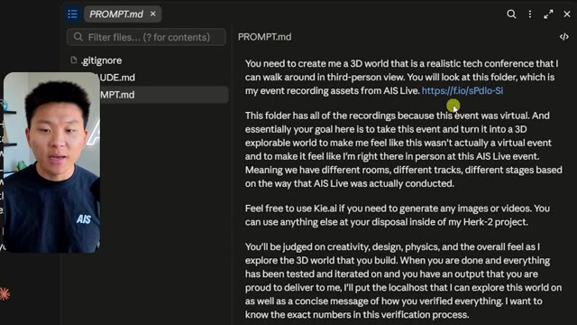
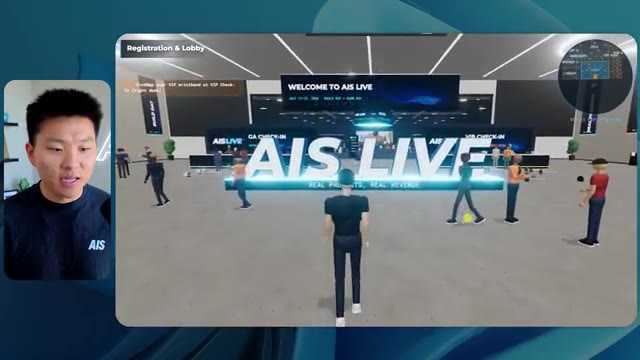
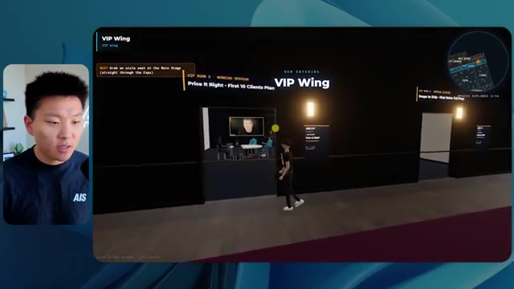
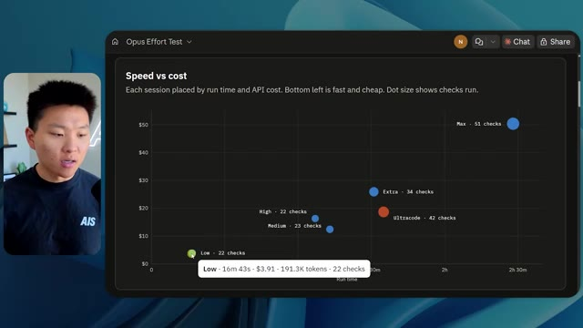

# 🎬 Master 97% of Codex in 1 Hour (full course)

> **Chaîne** : [Nate Herk | AI Automation](https://www.youtube.com/@nateherk/featured)  
> **Lien YouTube** : [https://www.youtube.com/watch?v=3TdD8Qv5Tk8](https://www.youtube.com/watch?v=3TdD8Qv5Tk8)  
> **Date de publication** : 20260506  
> **Durée** : 01:00:59  
> **Identifiant vidéo** : `3TdD8Qv5Tk8`  
> **Transcription & Analyse** : `whisper-v3-large-turbo+gemini-3.5-flash-lite`  

---

## 📌 Synthèse Exécutive & Outils

### 💡 Résumé

Dans cette vidéo de la chaîne *Nate Herk | AI Automation*, l'analyste et ingénieur explore les performances du modèle d'IA de pointe **Opus 5.5** à travers ses différents niveaux d'effort (de faible à ultra code). L'expérimentation repose sur un défi technique complexe et concret : transformer un dossier brut de 105 gigaoctets d'enregistrements vidéo (provenant de l'événement virtuel *AIS Live*) en un monde 3D interactif et explorable à la troisième personne, simulant une conférence technologique réelle avec différentes salles, pistes, scènes, et une direction artistique fidèle. 

Les résultats démontrent des variations spectaculaires dans la qualité de l'exécution, le temps de traitement, la consommation de jetons et les coûts estimés par API. Alors que le niveau d'effort *faible* a produit un monde 3D sommaire, truffé de bugs graphiques, d'images fixes et de PNJ (personnages non-joueurs) fantomatiques en 16 minutes pour environ 3,91 $, le niveau *moyen* a révélé un bond qualitatif impressionnant. Ce dernier a livré, en 1 heure et 13 minutes (pour 12,44 $), un environnement fluide respectant la charte graphique de la marque, intégrant de véritables flux vidéo dynamiques, des PNJ interactifs réactifs et une organisation spatiale cohérente (hall, salons VIP, scènes principales).

L'analyse met en lumière la pertinence des recommandations d'Anthropic, qui conseille de s'appuyer initialement sur le niveau d'effort *moyen* pour calibrer les tâches complexes d'ingénierie logicielle. Enfin, la vidéo introduit une transition fluide vers le déploiement réel des applications générées grâce à l'extension Hostinger, comblant ainsi le fossé entre le code produit localement par les agents IA et sa mise en ligne immédiate sur le web.

### 🛠️ Outils, Modèles & Logiciels Présentés

* **Opus 5.5** : Modèle d'intelligence artificielle de pointe d'Anthropic, réputé pour sa polyvalence, son efficacité économique et sa grande intelligence, utilisé ici pour générer un monde 3D complet à partir d'un prompt d'objectif.
* **Claude Code** : Outil de développement assisté par IA d'Anthropic intégré dans l'écosystème de codage pour exécuter des tâches d'ingénierie complexes.
* **Hostinger Connector** : Extension gratuite pour éditeurs de code (VS Code, Cursor, Claude Code, Codex) permettant de connecter son compte d'hébergement en un clic pour automatiser et simplifier le déploiement d'applications web.
* **Frame.io** : Plateforme cloud de gestion et de stockage vidéo utilisée pour héberger la source brute de 105 Go des enregistrements de la conférence *AIS Live*.
* **Herc 2** : Système d'exploitation IA propriétaire de Nate Herk servant de cadre de travail et de ressources pour l'orchestration des agents.

### 🔑 Points Clés & Enseignements Stratégiques

* **L'impact critique du niveau d'effort (*Effort Level*)** : Ajuster le niveau d'effort d'un modèle comme Opus 5.5 modifie radicalement la complexité du code généré, la robustesse de l'architecture 3D, la gestion de la physique et la fidélité visuelle.
* **Loi de rendement temporel et financier** : Le passage de l'effort faible à l'effort moyen multiplie le temps d'exécution par plus de quatre (de ~16 min à ~1h13) et triple le coût API estimé (de 3,91 $ à 12,44 $), un investissement largement justifié par la correction des bugs d'affichage et l'intégration de flux vidéo réels.
* **Autonomie totale des agents** : Sur l'ensemble des tests présentés, l'agent n'a posé *aucune* question à l'utilisateur (zéro intervention humaine requise), soulignant la capacité d'Opus 5.5 à interpréter des objectifs complexes de manière totalement autonome.
* **Boucle de rétroaction par vérifications automatisées** : À l'effort faible (22 vérifications) comme à l'effort moyen (23 vérifications), l'agent utilise des instances de navigation automatisées pour tester son propre travail visuellement, garantissant une démarche d'ingénierie itérative.
* **Context Engineering à grande échelle** : La capacité à ingérer et à exploiter intelligemment un volume massif de données hétérogènes (105 Go de vidéos, chartes graphiques, programmes d'événements) prouve l'efficacité des grands contextes pour la création d'expériences immersives.
* **Respect de l'identité de marque (Branding)** : Les niveaux d'effort supérieurs sont indispensables pour appliquer rigoureusement les directives de design, les palettes de couleurs et l'ergonomie visuelle propres à une entreprise, évitant le rendu générique des modèles basiques.
* **Gestion des PNJ et de l'interactivité** : Le niveau moyen a démontré une supériorité technique en dotant les personnages non-joueurs de comportements dynamiques (salutations, mouvements) et en évitant les disparitions de sprites constatées en mode faible.
* **Application des recommandations officielles** : Les tests confirment la pertinence de la méthodologie d'Anthropic qui suggère de débuter par un niveau *moyen* pour les tâches de création logicielle complexes, servant de point d'équilibre optimal avant d'affiner vers le haut ou le bas.
* **Résolution du goulet d'étranglement du déploiement** : Le passage d'un prototype fonctionnel généré par IA à sa mise en production en ligne reste un frein majeur, résolu ici par des outils d'intégration directe comme l'extension Hostinger.
* **Synergie entre automatisation et environnements de développement** : L'utilisation conjointe d'agents d'IA avancés et d'extensions de déploiement en un clic réduit drastiquement le *time-to-market* pour la création d'applications web interactives et immersives.

---

## ⏱️ Chronologie & Transcription Complète Audio & Visuelle (Mot pour Mot)

### ⏱️ `[00:00:00 - 00:00:20]` | Segment #01

**🔊 Audio (Transcription Intégrale Mot pour Mot en Français) :**
> Opus 5.5, Opus 5.5, Opus 5.5, Opus 5.5, Opus 5.5. Ce modèle est littéralement partout et pour de très bonnes raisons. Il est intelligent, il est bon marché, il a un goût incroyable, c'est un modèle d'IA incroyable. Mais avec chaque modèle d'IA, vous avez le choix de l'effort, que ce soit faible, moyen, élevé, extra, max ou code ultra.

**👁️ Analyse Visuelle d'Écran (gemini-3.5-flash-lite) :**
**Interface & Outils** : Interface du réseau social X (Twitter).

**Contenu textuel & Code** : Publication sur X avec un tweet sur l'impact de l'IA et une vidéo intégrée représentant un environnement 3D tropical.

**Action / Démonstration** : Affichage d'un exemple concret de contenu généré par IA sur les réseaux sociaux pour illustrer le propos.

*⏱️ 00:00:05 — Capture d'écran montrant un post sur les réseaux sociaux (X/Twitter) affichant une vidéo de paysage tropical généré par IA, avec le texte sur la disruption des métiers créatifs.*

---

### ⏱️ `[00:00:20 - 00:00:38]` | Segment #02

**🔊 Audio (Transcription Intégrale Mot pour Mot en Français) :**
> Donc dans cette vidéo, j'ai donné exactement le même prompt à Opus 5.5 et je l'ai exécuté à chaque niveau d'effort, et nous allons comparer les résultats. Nous allons examiner la qualité de toutes les différentes sorties réelles, mais nous allons aussi examiner combien de temps chacun d'eux a fonctionné, combien cela nous a coûté s'il s'agissait d'une facturation par API, le nombre total de jetons, combien de vérifications ils ont exécutées, et combien de questions ils m'ont réellement posées tout au long du processus.

**👁️ Analyse Visuelle d'Écran (gemini-3.5-flash-lite) :**
**Interface & Outils** : Interface web (tableau de comparaison).

**Contenu textuel & Code** : Tableau avec les colonnes Low, Medium, High, Extra, Max, Ultracode et les lignes Run time, API cost, Total tokens, Checks, Questions asked.

**Action / Démonstration** : Présentation du tableau comparatif des différents niveaux d'effort d'Opus 5.5.

*⏱️ 00:00:29 — Tableau comparatif sur une interface web intitulé "Opus 5.5 Efforts", présentant les différents niveaux d'effort (Low, Medium, High, Extra, Max, Ultracode) et des métriques (Run time, API cost, Total tokens, etc.).*

---

### ⏱️ `[00:00:39 - 00:00:58]` | Segment #03

**🔊 Audio (Transcription Intégrale Mot pour Mot en Français) :**
> Et les résultats qu'on a obtenus ne sont pas du tout ce à quoi je m'attendais, donc j'ai hâte de partager ça avec vous les gars. Ne perdons pas de temps et entrons directement dans le vif du sujet. D'accord, alors plongeons directement là-dedans. Je veux commencer juste en vous montrant le prompt réel que nous avons utilisé, que nous avons donné à chacun de ces différents agents. Je vais aller dans les fichiers par ici, et nous allons ouvrir ce fichier markdown de prompt, et je vais vous montrer ce qu'on a obtenu. Alors voici le slash objectif que j'ai fourni.

**👁️ Analyse Visuelle d'Écran (gemini-3.5-flash-lite) :**
**Interface & Outils** : Interface de développement / application IA (Opus 5.5 / Ultracode) avec panneau latéral de navigation de projets et zone de chat.

**Contenu textuel & Code** : Texte du prompt affiché à l'écran : "Hi Nate. This worktree has the effort-test task queued in PROMPT.md : build a walkable third-person 3D world of the AIS Live conference from your f.io recordings..."

**Action / Démonstration** : Le présentateur introduit et montre le prompt initial et l'environnement de développement avant de lancer l'exécution de la tâche par l'IA.

*⏱️ 00:00:48 — Interface d'une application d'IA (semblable à un IDE ou un terminal avancé comme Opus 5.5) avec une petite incrustation vidéo du présentateur à gauche, affichant un prompt textuel concernant la création d'un monde 3D.*

---

### ⏱️ `[00:00:58 - 00:01:34]` | Segment #04

**🔊 Audio (Transcription Intégrale Mot pour Mot en Français) :**
> J'ai dit, tu dois me créer un monde 3D qui est une conférence tech réaliste dans laquelle je peux me promener en vue à la troisième personne. Tu vas regarder ce dossier, qui contient mes ressources d'enregistrement d'événements de AIS Live. Et ce dossier est un dossier Frame.io de 105 gigaoctets d'enregistrements vidéo. C'était un événement entièrement virtuel. Tout a été enregistré et tous les enregistrements sont juste ici. J'ai dit, ton objectif est de prendre cet événement et de le transformer en un monde 3D explorable qui me donne l'impression d'être réellement allé à une vraie conférence en personne avec différentes salles, différentes pistes, différentes scènes, bla, bla, bla. N'hésite pas à utiliser key.ai si tu as besoin de générer des images ou des vidéos. Et tu peux aussi utiliser n'importe quoi d'autre à l'intérieur de mon projet Herc 2, qui est comme mon système d'exploitation IA. J'ai dit,

**👁️ Analyse Visuelle d'Écran (gemini-3.5-flash-lite) :**
**Interface & Outils** : Éditeur de code (type VS Code) et interface web Frame.io

**Contenu textuel & Code** : Fichier PROMPT.md détaillant la création d'un monde 3D interactif et lien Frame.io (https://f.io/sPdlo-Si) vers les ressources de 105 Go.

**Action / Démonstration** : Présentation du prompt initial et du dossier de ressources Frame.io utilisé pour alimenter l'agent IA.

*⏱️ 00:01:07 — Éditeur de texte affichant le fichier PROMPT.md contenant les instructions pour créer un monde 3D de conférence tech à partir de ressources d'événements.*

*⏱️ 00:01:16 — Interface de la plateforme Frame.io montrant un dossier de ressources d'événements de 105,69 Go pour AIS Live, avec des sous-dossiers GA Access et VIP Access.*

*⏱️ 00:01:25 — Retour sur l'éditeur de texte affichant le fichier PROMPT.md avec les consignes détaillées pour l'agent IA.*

---

### ⏱️ `[00:01:34 - 00:02:08]` | Segment #05

**🔊 Audio (Transcription Intégrale Mot pour Mot en Français) :**
> vous serez jugé sur la créativité, le design, la physique et la sensation générale lorsque j'explorerai le monde 3D que vous avez construit. Et c'était fondamentalement la fin des instructions. Donc comme vous pouvez le voir sur ce côté gauche, j'ai exécuté cela à travers tous les différents niveaux d'effort. Commençons par le niveau bas et remontons jusqu'à ultra code. Très bien. Donc ici nous avons le résultat du niveau bas. Ouvrons ceci et jetons un œil. Donc nous avons AIS Live, le sommet des services IA en personne enfin, et nous avons pu cliquer partout. Tout d'abord, on ne sent pas vraiment l'identité de la marque. Genre, ce n'ce n'est pas le logo d'IS Live. Ce n'est même pas nos couleurs. Donc je n'aime pas trop ça, mais entrons là-dedans. D'accord. C'est beaucoup trop lumineux. Euh, nous avons une carte en haut à droite. Nous avons une ville par ici. Je ne peux pas dire quelle ville c'est.

**👁️ Analyse Visuelle d'Écran (gemini-3.5-flash-lite) :**
**Interface & Outils** : Interface de type IDE / application de développement avec panneau latéral de navigation et interface de chat IA.

**Contenu textuel & Code** : Texte du prompt dans le chat : "Hi Nate. This worktree has the effort-test task queued in PROMPT.md : build a walkable third-person 3D world..." et dans la zone de saisie : "yes, start the task in PROMPT.md".

**Action / Démonstration** : Le présentateur commente les différents niveaux d'effort testés affichés dans la barre latérale gauche.

*⏱️ 00:01:42 — Capture d'écran montrant l'interface d'un assistant de code (Cursor ou application similaire) avec une barre latérale listant différents niveaux de test d'effort (Hello, Extra, High, Max, Ultracode, Medium, Low) et le panneau de discussion de l'IA affichant le prompt demandant de construire un monde 3D.*

---

### ⏱️ `[00:02:08 - 00:02:40]` | Segment #06

**🔊 Audio (Transcription Intégrale Mot pour Mot en Français) :**
> c'est. D'accord. C'est Chicago, ce qui est plutôt cool parce que tu sais, j'habite à Chicago, mais bref, en haut à droite, on peut voir une carte. Nous avons un hall d'accueil. Nous avons un hall d'exposition. Nous avons un salon VIP, la scène principale. Aussi, la carte montre où se trouve chaque autre personne et cela se synchronise en direct. Donc on peut voir l'enregistrement. On peut voir le premier jour, la keynote de l'hyper agent, le débriefing en direct. Cool. Donc il connaît réellement l'programme et puis il y a le deuxième jour. Donc il a trouvé ça, c'est bien. Nous avons ces petites boules ici que je peux espérer lancer. D'accord. Le visage, Oh, regarde ça. Si je vais par ici, toutes les personnes disparaissent. Très mauvais. Très mauvais. D'accord. Alors voyons voir. Est-ce que je peux sprinter ? D'accord.

**👁️ Analyse Visuelle d'Écran (gemini-3.5-flash-lite) :**
**Interface & Outils** : Application web interactive en 3D (type métavers / plateforme événementielle virtuelle).

**Contenu textuel & Code** : Menus d'événements, programmes de conférences ("Day 1"), cartes de navigation en haut à droite.

**Action / Démonstration** : Navigation et exploration virtuelle des différentes zones de l'événement par le présentateur.

*⏱️ 00:02:16 — Vue d'un espace virtuel 3D de type métavers montrant une zone de retrait de badges pour les participants.*

*⏱️ 00:02:24 — Vue du hall d'accueil (Lobby) virtuel affichant le programme du premier jour sur un panneau interactif.*

*⏱️ 00:02:32 — Vue de l'espace d'exposition (Expo Hall) du métavers avec des avatars et des animations lumineuses.*

---

### ⏱️ `[00:02:40 - 00:03:04]` | Segment #07

**🔊 Audio (Transcription Intégrale Mot pour Mot en Français) :**
> Je peux avancer un peu plus vite. Je vais d'abord aller par ici. Il y a des produits promotionnels, euh, certifiés AIS plus glido. D'accord. Donc il y a les vrais stands qu'on avait lors de l'événement virtuel. On avait des stands. Donc c'est plutôt cool. Un petit endroit pour prendre des photos. Salle C. En ce moment, nous avons Tangy Frederick qui anime un atelier. D'accord. Mais ce n'est pas une vidéo. Comme vous pouvez le voir, c'est juste une image. Elle ne bouge pas. C'est donc juste une image. Ces gens sont en train de disparaître. Ce doivent être des fantômes. Allons par ici dans la salle A.

**👁️ Analyse Visuelle d'Écran (gemini-3.5-flash-lite) :**
**Interface & Outils** : Environnement virtuel 3D de type salon d'exposition.

**Contenu textuel & Code** : Instructions visuelles sur grand écran virtuel concernant les étapes d'intégration API et de configuration de jetons.

**Action / Démonstration** : Exploration et navigation interactive de l'avatar dans le monde virtuel de la conférence.

*⏱️ 00:02:46 — Vue d'un espace d'exposition virtuel en 3D avec un avatar et des stands sponsorisés (GlaiDo).*

*⏱️ 00:02:52 — Navigation de l'avatar dans une salle d'atelier virtuelle verdoyante avec des tables éclairées.*

*⏱️ 00:02:58 — Approche d'un écran géant interactif affichant des instructions et des étapes d'intégration API dans l'environnement virtuel.*

---

### ⏱️ `[00:03:04 - 00:03:30]` | Segment #08

**🔊 Audio (Transcription Intégrale Mot pour Mot en Français) :**
> Nous avons Liberty White. D'accord. Très cool. Vos 30 premiers jours en automatisation. Encore une fois, c'est juste une image fixe et les gens ont des bugs d'affichage. Donc ce n'est pas très bien ici. Je vais aller sur la scène principale et voir ce que nous avons. D'accord, cool. Donc nous avons une scène d'apparence principale. Les gens ont de gros bugs d'affichage. Vraiment mauvais. Ce n'est vraiment pas terrible. Notre vidéo est en fait en train de bouger. J'ai vu mon visage ici et j'ai vu celui de Devin, mais maintenant ils ont disparu. Donc je ne sais pas ce qui s'est passé. D'accord. On dirait que c'est plutôt un diaporama. Rien n'est encore réellement lu. Bref, entrons ici.

**👁️ Analyse Visuelle d'Écran (gemini-3.5-flash-lite) :**
**Interface & Outils** : Application ou plateforme virtuelle 3D interactive (similaire à Gather ou un metaverse de conférence).

**Contenu textuel & Code** : Interface utilisateur avec affichage de salles virtuelles et panneaux thématiques ('Hyperagent Workshop').

**Action / Démonstration** : Navigation et exploration d'un environnement virtuel interactif en 3D par le présentateur.

*⏱️ 00:03:11 — Vue d'une salle d'atelier virtuelle 3D (Workshop Room A) avec un avatar de joueur se déplaçant.*

*⏱️ 00:03:17 — Vue de la scène principale d'une conférence virtuelle 3D remplie d'avatars assis dans un auditorium.*

*⏱️ 00:03:24 — Vue en face de la scène principale de l'événement 'AIS LIVE - AI Services Summit' dans l'environnement virtuel.*

---

### ⏱️ `[00:03:30 - 00:03:58]` | Segment #09

**🔊 Audio (Transcription Intégrale Mot pour Mot en Français) :**
> Nous avons plus de stands. Nous avons hyper agent. Nous avons Claude Code. Nous avons plus de goodies. La salle B, c'est Dave Ebelor. Je suppose que c'est exactement la même chose. Nous avons du café. Et ensuite, je suppose que le salon VIP, accès VIP seulement. C'est plutôt cool, mais il n'y a vraiment rien qui se passe ici. Cet écran est bien trop lumineux. Bon. Donc je pense que vous comprenez l'ambiance qu'on obtient ici d'Opus 5.5 en effort faible. Et c'est là que les choses deviennent intéressantes. Combien de temps pensez-vous que cela a duré ? Combien de temps ? Celui-ci a duré 16 minutes et 43 secondes. Combien pensez-vous que cela a coûté ?

**👁️ Analyse Visuelle d'Écran (gemini-3.5-flash-lite) :**
**Interface & Outils** : Application web / tableau blanc interactif type Canvas (Opus 5.5 Efforts) et monde virtuel 3D d'exposition.

**Contenu textuel & Code** : Tableau de métriques avec colonnes de Low à Ultracode et lignes Run time, API cost, Total tokens, Checks, Questions asked.

**Action / Démonstration** : Présentation d'un tableau comparatif des différents niveaux d'effort d'un modèle d'IA.

*⏱️ 00:03:51 — Un tableau comparatif sur une interface de type canvas montrant les niveaux de performance (Low, Medium, High, Extra, Max, Ultracode) et métriques (Run time, API cost, Total tokens, etc.).*

---

### ⏱️ `[00:03:58 - 00:04:26]` | Segment #10

**🔊 Audio (Transcription Intégrale Mot pour Mot en Français) :**
> 3,91 $ si c''était une facturation par API. J''utilise évidemment mon abonnement ici, mais nous allons simplement calculer cela en facturation par API. Le nombre total de jetons était de 191 000. Il a effectué 22 vérifications. Donc, la vérification, 22 fois il a ouvert le navigateur et a exécuté différentes sortes de vérifications. Donc, 22 catégories de vérifications. Et combien de questions m''a-t-il posées ? Il m''a posé un total de zéro question tout au long de cette invite de commande d''objectif. D''accord. Alors, ouvrons l''effort moyen et voyons ce que nous avons. D''accord, c''est parti. Effort moyen. Nous avons Nate Herc. Nous avons mon badge. C''est la marque de commerce d''AI's Life.

**👁️ Analyse Visuelle d'Écran (gemini-3.5-flash-lite) :**
**Interface & Outils** : Outil de tableau blanc ou de diagramme en ligne (type Excalidraw ou similaire).

**Contenu textuel & Code** : Tableau avec les lignes 'Run time' (16m 43s), 'API cost' ($3.91), 'Total tokens' (191.3K), 'Checks' et 'Questions asked', sous les colonnes 'Low', 'Medium', 'High' et 'Ex'.

**Action / Démonstration** : Le présentateur présente et commente le tableau récapitulatif des coûts et des performances liés à l'utilisation des jetons et de l'API.

*⏱️ 00:04:05 — Un tableau comparatif montrant les métriques de performance et de coût pour le niveau 'Low', incluant un temps d'exécution de 16m 43s, un coût API de 3,91 $, 191,3K jetons au total, ainsi que les lignes 'Checks' et 'Questions asked'.*

---

### ⏱️ `[00:04:26 - 00:04:46]` | Segment #11

**🔊 Audio (Transcription Intégrale Mot pour Mot en Français) :**
> Donc ça a déjà l'air un tout petit peu mieux. Ça ressemble à nos palettes de couleurs qui utilisaient nos directives de marque. Premier jour de construction, deuxième jour de gain, VIP. Cool. D'accord. Je vais entrer dans le lieu. D'accord. Waouh. Donc une ambiance un peu similaire. C'est en arrière-plan. Ça ne ressemble pas à Chicago, hein ? Non, ça ressemble à, honnêtement, ça ressemble à une ville imaginaire. Quoi qu'il en soit, c'est marrant qu'ils aient décidé de faire ça. Voyons si je peux avancer un peu plus vite. Oh, waouh.

**👁️ Analyse Visuelle d'Écran (gemini-3.5-flash-lite) :**
**Interface & Outils** : Application web interactive / Environnement virtuel 3D

**Contenu textuel & Code** : Écran d'accueil de l'événement virtuel avec badges personnalisés et interface de navigation 3D.

**Action / Démonstration** : Navigation et entrée dans l'espace virtuel de l'événement.

*⏱️ 00:04:31 — Interface web de l'application 'AIS Live' montrant un badge nominatif virtuel 'NATE HERK' et un bouton pour entrer dans le lieu virtuel.*

*⏱️ 00:04:41 — Vue à l'intérieur de l'espace virtuel 3D avec des avatars d'utilisateurs et un décor urbain en arrière-plan derrière de grandes baies vitrées.*

---

### ⏱️ `[00:04:46 - 00:05:21]` | Segment #12

**🔊 Audio (Transcription Intégrale Mot pour Mot en Français) :**
> Les gens interagissent avec moi. Regardez. Si je m'approche de ce type, il vient de lever le bras. Bon, maintenant il ne veut plus du tout avoir affaire à moi. Mais tous ces petits robots ici doivent prendre des décisions. Je ne sais pas s'ils utilisent Jev. C'est sûr que non. Je ne le lui ai pas dit. En fait, ma clé Jev est à l'arrière. Je ne sais pas. Peut-être qu'il l'a utilisée. Quoi qu'il en soit, nous pouvons voir ici que nous avons la salle d'atelier C, le laboratoire des agents. Sympa. Donc celui-ci est en fait en train d'être exécuté. Vous pouvez voir qu'il s'agit d'une vraie vidéo lue par Tangy. Tout le monde ici est en train de travailler sur un ordinateur portable. Ils ne buguent pas. C'est plutôt cool. De plus, mon badge est sur ma poitrine, ce qui est plutôt cool. Je peux venir par ici. Nous avons une carte en haut à droite, comme vous pouvez le voir, mais je peux venir par ici. Nous avons un

**👁️ Analyse Visuelle d'Écran (gemini-3.5-flash-lite) :**
**Interface & Outils** : Environnement virtuel 3D interactif (type métavers / plateforme de réunion virtuelle).

**Contenu textuel & Code** : Aucun code source, terminal ou prompt visible à l'écran.

**Action / Démonstration** : Navigation et exploration d'un monde virtuel 3D avec des avatars.

---

### ⏱️ `[00:05:21 - 00:05:47]` | Segment #13

**🔊 Audio (Transcription Intégrale Mot pour Mot en Français) :**
> hall d'exposition. C'est là que nous avons le stand Glido. Et ça diffuse en ce moment. Oui, ça diffuse la vidéo de nous parlant de Glido. Ça diffuse la vidéo d'Ed et moi parlant de notre programme de certification. Nous avons le logo AIS Plus juste ici, qui est un peu mal placé. Ce sont les diapositives des conférenciers et les points clés. Alors wow, ce sont toutes les ressources que nous avons distribuées après l'événement. Elles sont toutes là également. Nous pouvons voir que nous avons un coup de projecteur sur la communauté. C'est donc Aiden qui parle de son contrat qu'il a décroché et c'est diffusé en direct. Ces gens regardent.

**👁️ Analyse Visuelle d'Écran (gemini-3.5-flash-lite) :**
**Interface & Outils** : Environnement virtuel 3D de type métavers / plateforme d'événement virtuel.

**Contenu textuel & Code** : Diapositives de présentation et panneaux d'information textuels de l'événement AIS Plus.

**Action / Démonstration** : Navigation et déplacement d'un avatar dans l'espace d'exposition virtuel.

---

### ⏱️ `[00:05:47 - 00:06:21]` | Segment #14

**🔊 Audio (Transcription Intégrale Mot pour Mot en Français) :**
> Ils sont plutôt engagés. On a un hyper agent. C'était, c'est ce que je voulais dire. Si vous avez vu ces gens lever les mains en disant salut, c'était plutôt drôle. Regardez, regardez, le voilà qui recommence. Bref. D'accord. Où suis-je maintenant ? Maintenant, je suis dans le hall principal. On a un bar à café. On a un grand logo, qui est le vrai logo. Il est trop lumineux, mais on a le logo. On peut voir si on peut entrer ici dans le parcours fondation. On a Sabrina Romanov et Liberty White. Donc différentes formations juste là. On peut entrer dans cette salle. C'est le parcours avancé. Alors qu'est-ce qui se passe ici. On a Dave Ebelar et Saman qui parlent de différentes choses là-dedans. Et maintenant, allons jeter un œil à la scène principale. Oh, attendez, il y a une vidéo de moi là-haut. C'est genre un VIP

**👁️ Analyse Visuelle d'Écran (gemini-3.5-flash-lite) :**
**Interface & Outils** : Application ou plateforme virtuelle 3D interactive (environnement type métavers ou événement virtuel).

**Contenu textuel & Code** : Environnement virtuel 3D avec avatars, mini-carte en haut à droite, et texte "Main Lobby".

**Action / Démonstration** : Exploration et navigation à travers l'environnement virtuel 3D par le présentateur.

*⏱️ 00:05:55 — Vue d'un monde virtuel 3D représentant un hall principal (Main Lobby) avec des avatars et un comptoir de café.*

*⏱️ 00:06:04 — Navigation dans l'espace virtuel montrant des avatars se dirigeant vers une salle de conférence remplie.*

*⏱️ 00:06:12 — Vue depuis le hall principal vers un espace de discussion ou de networking animé par plusieurs avatars.*

---

### ⏱️ `[00:06:21 - 00:06:50]` | Segment #15

**🔊 Audio (Transcription Intégrale Mot pour Mot en Français) :**
> section ? Ouais, on ira voir ça dans une minute. Mais bref, voici la scène principale. Ça a l'air vraiment, vraiment très bien. On a une grande scène. On a genre quatre personnes assises ici. On a les trois écrans d'Alex là-haut avec hyper agent. Est-ce que j'ai le droit de monter sur scène ? Oh, et il me laisse monter sur scène. D'accord. C'est plutôt sympa. Bon les gars, prenons un selfie. Laissez-moi prendre tout le monde en arrière-plan. Venez ici. Bref, ça c'est vraiment, vraiment cool. Toutes les places ne sont pas occupées par contre. Donc il va falloir qu'on travaille là-dessus. Mais bref, je vais y retourner en courant pour voir ce qu'était cette section VIP. D'accord. Salon VIP. J'ai l'impression que c'est comme à l'aéroport ou un truc du genre.

**👁️ Analyse Visuelle d'Écran (gemini-3.5-flash-lite) :**
**Interface & Outils** : Application virtuelle 3D / Environnement virtuel Hyperagent

**Contenu textuel & Code** : Interface utilisateur virtuelle avec superposition d'informations de session 'Hyperagent Keynote' et mini-carte de navigation.

**Action / Démonstration** : Navigation et exploration de l'espace virtuel par l'avatar de l'utilisateur dans l'application Hyperagent.

*⏱️ 00:06:28 — Vue principale de l'auditorium virtuel montrant le présentateur naviguant dans un espace virtuel avec des écrans de présentation Hyperagent.*

*⏱️ 00:06:36 — Vue de l'arrière de la scène virtuelle avec des participants assis et l'avatar du présentateur faisant face à la scène principale.*

*⏱️ 00:06:43 — Vue en plongée depuis l'arrière de l'auditorium virtuel montrant les nombreux sièges occupés et la grande estrade au fond.*

---

### ⏱️ `[00:06:51 - 00:07:14]` | Segment #16

**🔊 Audio (Transcription Intégrale Mot pour Mot en Français) :**
> D'accord, super. Donc maintenant nous avons les sessions VIP ici. Une séance de questions-réponses VIP avec Nate, lecture vidéo en direct ici même. Très, très cool. Et nous avons comme un bar ou quelque chose comme ça. Génial. Je dirais que c'est un assez bon résultat. Maintenant, en ce qui concerne les statistiques ici, celui-ci a pris une heure et 13 minutes à s'exécuter. Il nous aurait coûté 12 dollars et 44 cents. Il a utilisé 490 000 jetons et il a effectué 23 vérifications.

**👁️ Analyse Visuelle d'Écran (gemini-3.5-flash-lite) :**
**Interface & Outils** : Espace virtuel 3D de type métavers / plateforme de réunion virtuelle (Image 1) et tableau de bord de métriques / application web (Image 2).

**Contenu textuel & Code** : Interface d'événement virtuel avec affichage vidéo et sous-titres (Image 1) ; tableau de données avec les lignes : Run time (16m 43s), API cost ($3.91), Total tokens (191.3K), Checks (22), Questions asked (0) (Image 2).

**Action / Démonstration** : Navigation et présentation de la plateforme virtuelle VIP (Image 1) puis analyse des métriques de performance de l'effort ou de l'exécution (Image 2).

*⏱️ 00:06:56 — Capture montrant un espace virtuel en 3D (salon VIP) avec un écran affichant une session vidéo en direct, une zone de bar en arrière-plan et des avatars de participants assis.*

*⏱️ 00:07:02 — Capture montrant un tableau comparatif ou un tableau de bord (« Opus 5.5 Efforts ») avec des métriques de performance telles que le temps d'exécution (Run time), le coût API et le total des tokens.*

---

### ⏱️ `[00:07:14 - 00:07:48]` | Segment #17

**🔊 Audio (Transcription Intégrale Mot pour Mot en Français) :**
> Et il nous a posé un total de zéro question une fois de plus. Très bien, passons à élevé. C'était déjà un résultat plutôt correct et Anthropic eux-mêmes dans leur vidéo « comment prompter Opus 5.5 », ou désolé, pas une vidéo, un article. Ils ont dit de commencer simplement par moyen et de l'ajuster vers le haut ou vers le bas si nécessaire. C'était donc un résultat moyen. Passons à élevé et voyons ce qu'on a obtenu. Très rapidement, les gars, je dois prendre une seconde pour vous parler du sponsor de la vidéo d'aujourd'hui, Hostinger. Donc ces deux modèles viennent de me créer une version fonctionnelle de la même chose. Et maintenant je suis exactement là où je finis toujours, avec un projet terminé sur mon ordinateur portable et aucun moyen rapide de le mettre en ligne. Et c'est ce fossé que le connecteur d'Hostinger comble. C'est une extension gratuite

**👁️ Analyse Visuelle d'Écran (gemini-3.5-flash-lite) :**
**Interface & Outils** : Interface de tableau de bord et éditeur de code/environnement de développement (type Cursor/VS Code).

**Contenu textuel & Code** : Tableau comparatif des coûts et performances d'Opus 5.5 pour différents niveaux, et code/prompt pour la création d'un "Northwind ROI calculator".

**Action / Démonstration** : Présentation des résultats comparatifs entre les modes Low et Medium, et préparation du passage au mode High.

*⏱️ 00:07:22 — Un tableau comparatif montrant les performances des différents niveaux d'effort (Low, Medium, High, Extra) avec les métriques associées (temps d'exécution, coût API, jetons, vérifications, questions posées).*

*⏱️ 00:07:39 — Une interface de développement avec un éditeur de code et un panneau de chat montrant la génération d'un calculateur ROI pour une application web.*

---

### ⏱️ `[00:07:48 - 00:08:23]` | Segment #18

**🔊 Audio (Transcription Intégrale Mot pour Mot en Français) :**
> pour votre éditeur qui intègre votre compte Hostinger dans l'environnement où vous codez déjà. Que ce soit VS Code, Cursor, Cloud Code, Codex, peu importe. Vous vous connectez une seule fois en un clic, et à partir de là, votre agent peut déployer le site, y associer un domaine, configurer les enregistrements DNS et vérifier votre VPS sans que vous ayez à quitter votre éditeur. Ainsi, peu importe celui que vous finirez par préférer, ce qu'il a construit est à quelques minutes d'obtenir une vraie URL sur un hébergement géré. L'extension Connector est gratuite avec chaque formule d'hébergement, donc si vous avez encore besoin de l'hébergement en dessous, profitez de la formule illimitée avec le lien dans la description et utilisez le code NATEHERK pour 10 % de réduction. Cela inclut également un nom de domaine gratuit et un e-mail professionnel pour l'année. Et c'est toujours le moyen le plus économique que j'ai trouvé pour obtenir

**👁️ Analyse Visuelle d'Écran (gemini-3.5-flash-lite) :**
**Interface & Outils** : Interface de gestion Hostinger connectée à l'IDE et Claude Code

**Contenu textuel & Code** : Statut "Connected", Node.js 24.13.0, liste des outils disponibles (Websites, Domains, Subscriptions & Payments, Email Marketing)

**Action / Démonstration** : Connexion réussie de Hostinger à l'IDE via OAuth pour permettre à l'assistant de gérer les sites web, domaines et abonnements

*⏱️ 00:07:57 — Interface montrant l'intégration de Hostinger dans l'IDE avec le statut connecté via OAuth et les outils disponibles (Websites, Domains, Subscriptions, Email Marketing), ainsi que Claude Code sur le panneau de droite et le présentateur en incrustation.*

---

### ⏱️ `[00:08:23 - 00:08:47]` | Segment #19

**🔊 Audio (Transcription Intégrale Mot pour Mot en Français) :**
> vous avez construit sur une vraie URL. Donc revenons à la vidéo. D'accord. Encore une fois, très, très marqué par la marque. C'est un écran de chargement encore meilleur que le précédent. Nous avons ce joli petit effet en arrière-plan. Nous avons le logo. Nous allons entrer dans le lieu. D'accord. Nous y voilà. Ça a l'air plutôt bien. Nous commençons à l'extérieur et vous pouvez voir que nous avons ces drapeaux pour tous les intervenants, Wyatt, Casper, Alex, Ed, Aiden, Sabrina, Liberty. C'est plutôt cool. Nous avons des blocs en direct ici.

**👁️ Analyse Visuelle d'Écran (gemini-3.5-flash-lite) :**
**Interface & Outils** : Application web 3D immersive (plateforme virtuelle d'événements)

**Contenu textuel & Code** : Interface utilisateur avec boussole, indicateurs de passeport, messages de guidage et instructions de navigation clavier/souris

**Action / Démonstration** : Navigation et exploration de la place virtuelle 3D (AIS Live Plaza)

*⏱️ 00:08:29 — Écran de chargement et d'accueil de la plateforme virtuelle 'AIS LIVE', affichant le logo et les instructions de contrôle (WASD pour se déplacer, MOUSE pour regarder, etc.).*

*⏱️ 00:08:35 — Vue de la place virtuelle 'AIS Live Plaza' dans l'environnement 3D avec des avatars d'utilisateurs et des bâtiments en arrière-plan.*

*⏱️ 00:08:41 — Exploration de la place virtuelle avec des bannières verticales affichant les noms des intervenants (speakers) au sein de l'univers 3D.*

---

### ⏱️ `[00:08:47 - 00:09:23]` | Segment #20

**🔊 Audio (Transcription Intégrale Mot pour Mot en Français) :**
> Il a pris cette photo de moi, votre hôte, Nate Herc, John, Dave, Nate Herc. Voilà. OK. Les portes. Génial. Ce sont des portes coulissantes automatiques en verre. J'adore ça. On peut voir l'enregistrement VIP. On peut voir l'admission générale. On peut venir par ici et on peut découvrir l'expo avec différents stands, le projecteur sur la communauté. Vous pouvez aussi voir qu'en haut à gauche, j'ai un passeport. Donc c'est du genre, ça montrera combien d'endroits j'ai visités. Tout cela est une vraie lecture. Nous avons un mur de ressources avec tous les différents intervenants. Ils ont aussi une session de networking par ici. Donc je vais venir très vite et voir de quoi il retourne. Nous avons donc le bar à cold brew AIS. Nous avons différents membres de la communauté qui ont été mis en avant ou en lumière.

**👁️ Analyse Visuelle d'Écran (gemini-3.5-flash-lite) :**
**Interface & Outils** : Application web ou jeu de simulation virtuel 3D en ligne.

**Contenu textuel & Code** : Environnement virtuel interactif d'une conférence, affichant des panneaux indicateurs ('Registration Concourse', 'VIP Check-In', 'Main Stage').

**Action / Démonstration** : Exploration et navigation en vue à la troisième personne dans un monde virtuel 3D.

*⏱️ 00:08:56 — Vue d'un espace virtuel 3D de type salon ou conférence, affichant la zone d'enregistrement avec des comptoirs VIP Check-In et Main Stage.*

*⏱️ 00:09:05 — Navigation dans un hall d'exposition virtuel 3D avec des stands d'information et des écrans interactifs.*

*⏱️ 00:09:14 — Déplacement d'un avatar au milieu d'autres personnages dans le hall d'accueil virtuel du salon.*

---

### ⏱️ `[00:09:23 - 00:09:56]` | Segment #21

**🔊 Audio (Transcription Intégrale Mot pour Mot en Français) :**
> On a l'aile VIP. Attends, quoi ? Récupère un bracelet. Oh, je dois vraiment aller chercher le bracelet. D'accord. Laisse-moi m'enregistrer rapidement. Le bracelet est déjà mis. Attends, quoi ? D'accord. Oh, d'accord. Maintenant, les portes se sont ouvertes pour moi. Cool. Je peux entrer ici. Oh, ça mène juste à la scène principale. Salon VIP. Il y a une séance de questions-réponses en cours. Ça a l'air très cool. Je veux dire, je suis très impressionné par la façon dont il est capable de faire ça. Waouh. D'accord. C'est donc vraiment bien. Ce qu'on a fait, c'est qu'on a eu des salles de discussion VIP avec différentes personnes. Tu peux voir qu'il y a différentes salles, différents membres de l'équipe AIS qui vont dans des trucs. C'est vraiment cool. C'est très cool. C'est un bien meilleur VIP

**👁️ Analyse Visuelle d'Écran (gemini-3.5-flash-lite) :**
**Interface & Outils** : Application de métaverse ou plateforme virtuelle 3D interactive (ex: Gather.town ou similaire)

**Contenu textuel & Code** : Interface utilisateur virtuelle affichant des zones textuelles (« VIP Lounge », « VIP Working Sessions », « Registration Concourse ») et des flux vidéo de conférence.

**Action / Démonstration** : Navigation et exploration de différents espaces virtuels d'une conférence ou d'un événement en ligne par le présentateur.

*⏱️ 00:09:32 — Vue d'un espace virtuel 3D de type métaverse montrant la zone d'inscription (Registration Concourse) avec le personnage du présentateur et du texte à l'écran concernant le bracelet VIP.*

*⏱️ 00:09:40 — Vue de l'intérieur de la salle VIP Lounge avec un écran montrant une vidéoconférence et des participants assis.*

*⏱️ 00:09:48 — Vue de l'espace VIP Working Sessions avec plusieurs salles thématiques virtuelles (Price It Right, Turn Your Expertise into a Service, Land Your First Paying Client).*

---

### ⏱️ `[00:09:56 - 00:10:30]` | Segment #22

**🔊 Audio (Transcription Intégrale Mot pour Mot en Français) :**
> expérience que ce qui a été montré dans le premier élément. D'accord. After party VIP. Regardez ça. On a une piste de danse. On a tous ces éléments ici. On a la lecture de l'after party VIP juste ici. Et il y a une estrade de DJ. C'est tellement marrant. Il y a un petit bug ici, un petit glitch par là, mais c'est génial. Oh, chouette. Donc quand je suis ici sur la scène principale, on a des sous-titres. Vous pouvez voir juste ici en bas de mon écran, on a ces sous-titres de Wyatt qui est en train de parler là-haut. On a des lumières. On a le panel. Très sympa. Belle scène principale. Je vais aller par ici. On peut aller à la fondation,

**👁️ Analyse Visuelle d'Écran (gemini-3.5-flash-lite) :**
**Interface & Outils** : Application web de monde virtuel / événement en ligne 3D.

**Contenu textuel & Code** : Interface utilisateur affichant "VIP After-Party", passeport, et commandes de navigation.

**Action / Démonstration** : Exploration d'un environnement virtuel 3D de type métavers représentant une conférence avec ses différentes salles.

*⏱️ 00:10:04 — Vue d'un espace virtuel d'after party VIP avec avatars et piste de danse interactive.*

*⏱️ 00:10:13 — Autre angle de la salle virtuelle VIP montrant les participants et l'écran géant.*

*⏱️ 00:10:21 — Vue de la scène principale (Main Stage) de l'événement virtuel avec un public assis et un écran de présentation.*

---

### ⏱️ `[00:10:30 - 00:11:06]` | Segment #23

**🔊 Audio (Transcription Intégrale Mot pour Mot en Français) :**
> avancé, et les parcours d'entreprise par ici. Alors voyons voir. Nous avons l'anatomie de trois vraies transactions. Nous avons hyper agent. Nous avons les évaluations avec Nate et Ed ici. Nous avons Dave qui intervient sur les trucs avancés. C'est vraiment sympa. Je veux dire, évidemment, chacun, chacun de ces résultats jusqu'à présent, faible était correct. Moyen était meilleur. Élevé a été encore meilleur. Voyons si cette tendance se poursuit et allons voir ce que cela nous a coûté. Donc, élevé a tourné pendant une heure et sept minutes. Donc, un peu plus rapide que moyen, cela nous aurait coûté 16 dollars et 31 cents. Cela a utilisé un demi-million de tokens, 509 000. Cela a fait 22 vérifications. Et cela nous a aussi demandé, eh bien, en fait, non, je me suis trompé. Cela

**👁️ Analyse Visuelle d'Écran (gemini-3.5-flash-lite) :**
**Interface & Outils** : Application de tableau blanc / interface de présentation (Excalidraw ou similaire).

**Contenu textuel & Code** : Tableau de données chiffrées : Run time (16m 43s, 1h 13m, 1h 7m), API cost ($3.91, $12.44, $16.31), Total tokens (191.3K, 419.2K), Checks (22, 23), Questions asked (0, 0).

**Action / Démonstration** : Analyse et visualisation des coûts et performances d'exécution (Opus 5.5 Efforts).

*⏱️ 00:10:57 — Un tableau comparatif montrant les métriques 'Low', 'Medium', 'High' et 'Extra' (temps d'exécution, coût API, tokens, etc.).*

---

### ⏱️ `[00:11:06 - 00:11:25]` | Segment #24

**🔊 Audio (Transcription Intégrale Mot pour Mot en Français) :**
> L'un m'a posé une question et, attention spoiler, c'était le seul qui nous a posé une question pendant tout ça. Alors voyons, il nous en reste trois : Extra, Max et Ultra Code. Laissez-moi ouvrir Extra et nous verrons ce que nous avons. D'accord. Donc celui-ci a l'air plutôt bien. Je dirais honnêtement que jusqu'à présent, l'écran de chargement haut était le meilleur, celui qu'on vient juste de voir, mais bref, entrons dans AIS Live.

**👁️ Analyse Visuelle d'Écran (gemini-3.5-flash-lite) :**
**Interface & Outils** : Tableau de bord d'analyse comparative (interface web de type tableau/canvas).

**Contenu textuel & Code** : Tableau avec des lignes : Run time, API cost, Total tokens, Checks, Questions asked, et des colonnes Low, Medium, High, Extra.

**Action / Démonstration** : Le présentateur commente les résultats du tableau et s'apprête à ouvrir les détails de la colonne 'Extra'.

*⏱️ 00:11:11 — Tableau comparatif affichant les métriques de différents modèles ou configurations (Low, Medium, High, Extra) avec les temps d'exécution, coûts d'API, tokens et questions posées.*

---

### ⏱️ `[00:11:26 - 00:11:51]` | Segment #25

**🔊 Audio (Transcription Intégrale Mot pour Mot en Français) :**
> Wouah. D'accord. Donc on a comme de petits extraits sonores. Je peux discuter avec des gens. Le panneau sur la guerre des outils a réglé quelques débats pour moi. Sympa. Bonne perspective là-bas. Nous sommes de nouveau dehors. Nous avons ces différentes bannières, bien qu'elles soient toutes les mêmes. Elles n'affichent pas de noms de personnes différents. Donc grand logo Big AIS Live. L'aile des ateliers est par ici. Et franchissons les portes coulissantes en verre pour voir ce que nous avons. Nous avons donc le café AIS. La carte est en bas à droite, et elle n'est pas très descriptive.

**👁️ Analyse Visuelle d'Écran (gemini-3.5-flash-lite) :**
**Interface & Outils** : Application ou plateforme virtuelle 3D interactive (métavers / environnement de conférence virtuel).

**Contenu textuel & Code** : Environnement virtuel 3D avec interface de navigation et mini-carte en bas à droite.
[DESC_IMAGE_3] Navigation et exploration de l'espace virtuel par l'utilisateur.

**Action / Démonstration** : Explications face caméra et démonstration conceptuelle.

*⏱️ 00:11:32 — Vue d'un monde virtuel 3D de type métavers avec un avatar en mouvement près de bannières publicitaires et de PNJ.*

*⏱️ 00:11:38 — Poursuite de la navigation de l'avatar dans l'espace virtuel extérieur avec des gratte-ciels en arrière-plan.*

*⏱️ 00:11:45 — L'avatar s'approche de l'entrée d'un bâtiment ou d'un pavillon d'exposition virtuel.*

---

### ⏱️ `[00:11:51 - 00:12:26]` | Segment #26

**🔊 Audio (Transcription Intégrale Mot pour Mot en Français) :**
> J'aime bien comment les autres cartes nous ont indiqué quoi, genre où étaient les choses, mais celle-ci a l'air très professionnelle. On peut voir, voici la scène principale. Allons y faire un saut rapidement. Ils ont tous ces ballons qui volent partout, ce qui je trouve est plutôt marrant. Les ballons de plage AIS. On nous voit là-haut en train de parler. Je crois que j'étais en train de faire l'introduction d'un des jours. Continuons à avancer par ici vers la salle d'atelier sur ce côté gauche. D'accord. Donc ici nous avons le Hyper Agent Theater. Nous avons cette session sponsorisée ici par Hyper Agent, mais ça nous montre aussi ce qui va s'y passer. C'est vraiment marrant qu'on puisse discuter avec les gens. Salmon a créé un représentant commercial vocal en direct. La salle "Le Juste Prix" était comble. As-tu pris le guide du compagnon VIP ? C'est tellement marrant. Nous avons le parcours avancé dans

**👁️ Analyse Visuelle d'Écran (gemini-3.5-flash-lite) :**
**Interface & Outils** : Application web 3D virtuelle / plateforme d'événement virtuel.

**Contenu textuel & Code** : Avatars 3D, interfaces de discussion (chat), mini-carte de navigation et écrans de diffusion vidéo en direct.

**Action / Démonstration** : Navigation et exploration de l'espace virtuel 3D avec les avatars.

*⏱️ 00:12:00 — Vue d'une scène principale virtuelle avec des avatars assis dans une salle de conférence et un écran géant montrant un présentateur en direct.*

*⏱️ 00:12:09 — Vue du hall d'accueil virtuel (Grand Lobby) avec plusieurs avatars et des panneaux indiquant des ateliers (Workshops).*

*⏱️ 00:12:17 — Vue d'un couloir virtuel interactif où des avatars se déplacent et interagissent via des bulles de discussion.*

---

### ⏱️ `[00:12:26 - 00:12:58]` | Segment #27

**🔊 Audio (Transcription Intégrale Mot pour Mot en Français) :**
> ici. Encore une fois, nous avons la lecture en direct. Est-ce que c'est une lecture en direct ? Oh, d'accord. Ça a commencé une fois que je suis entré, mais je peux prendre place. Oh la la. Je peux regarder ça. Je peux me lever. Je veux m'asseoir au premier rang. C'est plutôt cool. C'est très bien. J'aime bien ça. Et vous savez ce que j'ai remarqué jusqu'à présent ? Le personnage que j'incarne me ressemble un peu. Je pense qu'il a été modélisé à partir de mes photos de profil ou quelque chose comme ça. Quoi qu'il en soit, nous avons Sabrina ici, l'animatrice de la salle ici, prenez n'importe quel siège libre. D'accord, cool. Et j'ai vraiment aimé la fonction pour s'asseoir. C'est plutôt marrant. Genre, on pourrait vraiment assister à cet atelier et participer. Bref, ça nous montre les intervenants. Ça nous montre les

**👁️ Analyse Visuelle d'Écran (gemini-3.5-flash-lite) :**
**Interface & Outils** : Application de métavers / salle de classe virtuelle

**Contenu textuel & Code** : Environnement virtuel 3D avec affichage de visioconférence sur écran géant

**Action / Démonstration** : Navigation et exploration de la salle virtuelle par l'utilisateur

---

### ⏱️ `[00:12:58 - 00:13:31]` | Segment #28

**🔊 Audio (Transcription Intégrale Mot pour Mot en Français) :**
> agenda. Il y a un petit tapis rouge ici pour prendre des photos. On peut prendre la pose. Oh, wouah. C'est plutôt cool. Bibliothèque de ressources, obtenez la certification AIS Plus, Glido, Hyper Agent, AIS Plus, trois vraies affaires. Génial. Je veux dire, je dirais vraiment que jusqu'à présent, chacune est meilleure. Et on n'a même pas encore visité la section VIP, le salon VIP. Montons ici rapidement. J'espère que je pourrai entrer. Sympa. On a la réinitialisation des outils. Ce sont les différentes salles dans lesquelles on peut aller. Donc encore une fois, je pourrais prendre la feuille d'exercice et je pourrais essayer de comprendre comment tarifer mes trucs. C'est tellement cool. C'est vraiment mieux que le précédent où on a juste un peu

**👁️ Analyse Visuelle d'Écran (gemini-3.5-flash-lite) :**
**Interface & Outils** : Application ou plateforme virtuelle 3D (metaverse / événement virtuel).

**Contenu textuel & Code** : Aucun code source, terminal ou prompt visible.
[ESSAI] Navigation ou exploration dans un environnement virtuel 3D.

**Action / Démonstration** : Explications face caméra et démonstration conceptuelle.

---

### ⏱️ `[00:13:31 - 00:13:59]` | Segment #29

**🔊 Audio (Transcription Intégrale Mot pour Mot en Français) :**
> genre regardé des trucs. Génial. Je peux aller derrière le bar et venir ici. C'est très bien. Bon. Alors, en ce qui concerne les statistiques, celui-ci a duré une heure et demie. Il a coûté 25,92 dollars. Je ne sais pas pourquoi je dis point 25, 92 cents. Il y a eu 733 000 jetons et 34 vérifications. Il a donc eu le plus de vérifications de loin jusqu'à présent. Et il ne nous a posé zéro question. J'ai hâte de voir ce qu'on a obtenu ici de max et ultra code. D'accord. Voici les écrans de chargement de max, ennuyeux, mais c'est dans l'esprit de la marque et il y a notre logo.

**👁️ Analyse Visuelle d'Écran (gemini-3.5-flash-lite) :**
**Interface & Outils** : Application de tableau blanc / outil de visualisation ou de présentation (type Excalidraw).

**Contenu textuel & Code** : Tableau avec des colonnes "Medium", "High", "Extra", "Max", "Ultracode" affichant des durées (ex: 1h 31m pour Extra), des coûts (ex: $12.44, $16.31) et des métriques de tokens.

**Action / Démonstration** : Le présentateur passe en revue les différentes statistiques de performance et de coût pour chaque niveau d'effort.

*⏱️ 00:13:38 — Un tableau comparatif montrant les statistiques de différents niveaux d'effort (Medium, High, Extra, Max, Ultracode) avec le temps, le coût, et le nombre de tokens.*

---

### ⏱️ `[00:14:00 - 00:14:35]` | Segment #30

**🔊 Audio (Transcription Intégrale Mot pour Mot en Français) :**
> Donc c'était bien. J'aime bien ça. On va continuer et entrer dans AIS live. Oh, jolie petite animation ici qui nous fait entrer. Encore une fois, le personnage me ressemble. Ils m'ont tous ressemblé. Enfin, en quelque sorte, nous avons en arrière-plan... ça ressemble à Chicago. Comme je l'ai mentionné plus tôt, beaucoup de ces éléments jouent des sons et je ne les inclus pas parce que ce serait très perturbateur pour vous d'essayer d'écouter ce qui se passe en même temps que je parle. Il y a donc une légère musique dans tout ça. Je déteste la façon dont il marche. Cette démarche est vraiment, vraiment mauvaise. Je veux dire, la démarche, ouais, je n'aime pas du tout ça. Donc ce n'est pas génial. Mais à part ça, allons explorer. Remarquez ces ombres quand j'entre, elles changent vraiment, je ne sais pas trop pourquoi,

**👁️ Analyse Visuelle d'Écran (gemini-3.5-flash-lite) :**
**Interface & Outils** : Application web 3D immersive / Métavers (AIS live)

**Contenu textuel & Code** : Environnement virtuel 3D interactif avec interface de navigation et mini-carte

**Action / Démonstration** : Exploration d'un monde virtuel 3D à l'aide d'un avatar avatarisé

*⏱️ 00:14:08 — Le présentateur commente une interface virtuelle 3D (AIS live) montrant une place urbaine avec des avatars.*

*⏱️ 00:14:17 — L'avatar avance vers un bâtiment vitrine de type centre de conférence dans l'univers virtuel 3D.*

*⏱️ 00:14:26 — L'avatar s'approche de l'entrée principale du bâtiment virtuel pour continuer l'exploration.*

---

### ⏱️ `[00:14:35 - 00:15:11]` | Segment #31

**🔊 Audio (Transcription Intégrale Mot pour Mot en Français) :**
> mais de toute façon, on peut discuter avec des gens ici aussi. Le stand de Hyperagent est juste là où l'on entre dans l'expo. Tout va bien. D'accord, cool. Je peux continuer à cliquer sur E pour faire changer ce qu'ils disent. Nous avons les conférenciers juste ici. Ça a l'air plutôt bien. Bien qu'on ait définitivement eu la photo de profil de tout le monde. Je ne sais donc pas trop pourquoi ce n'est pas inclus là. On voit des gens prendre des photos juste ici. J'adore ça. Et ça enregistre une petite photo. D'accord. La carte n'est pas super non plus, genre elle ne donne pas une super explication de ce qui se passe, mais j'aime ces stands. Ils sont cool. Je pense que ces stands sont les meilleurs que j'aie vus jusqu'à présent. Genre, ils ont juste l'air bien. Ils ont des représentants. Il y a de superbes diaporamas derrière eux. Ouais. Ces stands sont cool. D'accord. Nous avons un petit théâtre mis en avant

**👁️ Analyse Visuelle d'Écran (gemini-3.5-flash-lite) :**
**Interface & Outils** : Application web 3D de visioconférence et d'événement virtuel (metavers).

**Contenu textuel & Code** : Environnement virtuel interactif d'une conférence avec des stands de présentation.

**Action / Démonstration** : Navigation d'un avatar à travers l'espace virtuel de l'événement.

---

### ⏱️ `[00:15:11 - 00:15:35]` | Segment #32

**🔊 Audio (Transcription Intégrale Mot pour Mot en Français) :**
> qui se passe par ici. C'est Casper. Bien que, pourquoi est-ce que ça ne se lit pas ? J'ai l'impression que ça devrait se lire, non ? Comme dans les autres, ils étaient toujours en train de jouer. On peut parler à d'autres personnes par ici. Le café est gratuit. Blah, blah, blah. Amy Simpson, Matt Wolf. Sympa. D'accord. C'est juste la zone de réseautage où nous sommes en ce moment, mais on peut voir en haut à droite. On peut aussi voir ce qui est en direct sur la scène principale en ce moment. C'est un panel sur la guerre des outils. Alors allons-y. Nous avons Devin, Cole, Dave et Russ qui discutent ici. Nous avons une sorte d'audiovisuel, des petits trucs qui se passent par ici.

**👁️ Analyse Visuelle d'Écran (gemini-3.5-flash-lite) :**
**Interface & Outils** : Environnement virtuel 3D en ligne type metaverse ou salon virtuel.

**Contenu textuel & Code** : Éléments graphiques de navigation 3D, panneaux d'affichage virtuels et interface de conférence virtuelle.

**Action / Démonstration** : Exploration visuelle et navigation d'un avatar dans un monde virtuel 3D lors de la présentation.

---

### ⏱️ `[00:15:36 - 00:15:55]` | Segment #33

**🔊 Audio (Transcription Intégrale Mot pour Mot en Français) :**
> Basculons la scène principale sur ce qui compte vraiment en ce moment. Je peux donc changer de sujet. C'est cool. Je viens donc de passer à moi et Matt. Nous pouvons passer à l'anatomie de trois vraies transactions. C'est plutôt cool. La scène a l'air bien. Nous avons un petit panneau sympa ici. Est-ce que je peux monter sur la scène ? Sympa. Sympa. Bon, je ne peux pas aller trop loin, en fait. Très bien, tout le monde, laissez-moi prendre le selfie. Tout le monde vient là-dedans. Je peux aussi m'asseoir dans le public par ici et simplement profiter de la session.

**👁️ Analyse Visuelle d'Écran (gemini-3.5-flash-lite) :**
**Interface & Outils** : Interface de monde virtuel 3D / métavers pour événement en ligne.

**Contenu textuel & Code** : Aucun code source, terminal ou prompt visible ; affichage de la scène virtuelle et d'avatars.

**Action / Démonstration** : Navigation et déplacement d'un avatar dans un environnement virtuel de conférence.

---

### ⏱️ `[00:15:55 - 00:16:14]` | Segment #34

**🔊 Audio (Transcription Intégrale Mot pour Mot en Français) :**
> Très cool, très cool. OK, allons par ici. Je vois une section à l'étage. C'est marrant comme ils choisissent tous de mettre la section VIP à l'étage. Je veux dire, je ne déteste pas ça. Oh la la, ils ont un escalator. Pas possible. Je vais discuter avec ce type sur l'escalator. Glenn a 15 ans d'expérience en agence. Ses trucs de "land and expand" étaient en or. Du beau travail, Glenn. Cool, donc je vais... je n'arrive même pas à dépasser ce type, par contre.

**👁️ Analyse Visuelle d'Écran (gemini-3.5-flash-lite) :**
**Interface & Outils** : Environnement virtuel 3D de conférence en ligne / plateforme virtuelle interactive.

**Contenu textuel & Code** : Interface utilisateur avec mini-carte, indications de navigation, panneau de session en direct et bulles de discussion textuelles.

**Action / Démonstration** : Navigation et exploration de l'espace virtuel par l'utilisateur, approche d'un autre participant sur l'escalier mécanique.

*⏱️ 00:16:00 — Vue d'un espace virtuel en 3D avec un avatar se déplaçant dans un grand hall avec des baies vitrées.*

*⏱️ 00:16:04 — L'avatar s'approche d'un escalier mécanique menant au niveau VIP dans l'environnement virtuel.*

*⏱️ 00:16:09 — L'avatar monte sur l'escalier mécanique et une bulle de dialogue apparaît au-dessus d'un autre avatar avec du texte descriptif.*

---

### ⏱️ `[00:16:14 - 00:16:48]` | Segment #35

**🔊 Audio (Transcription Intégrale Mot pour Mot en Français) :**
> Oh, j'ai dû sauter par-dessus lui. D'accord, niveau VIP, badge requis. Oh mon Dieu. Tu te moques de moi ? Je dois aller chercher mon badge. D'accord, cool. Maintenant, ça montre que je suis un vrai VIP et je peux aller ici dans la section VIP. Nous avons de petites sessions de travail sympas là-bas, auxquelles nous pouvons participer. Je me demande si ça va me laisser genre m'asseoir ici. Je peux juste discuter. Est-ce que je peux participer ? Ça ne me laisse pas m'asseoir et participer. C'est pas grave. Nous avons la salle de crise des prix. Oh, c'est peut-être l'after-party. Allons voir ce qui se passe par ici. Ou peut-être que je dois juste entrer par ici. D'accord. C'est bizarre. Je devais juste entrer par ici. Cet after-party n'est pas aussi cool que l'autre. Mais bref, allons voir ce qui se passe par ici.

**👁️ Analyse Visuelle d'Écran (gemini-3.5-flash-lite) :**
**Interface & Outils** : Environnement virtuel 3D de type metaverse / plateforme de conférence en ligne.

**Contenu textuel & Code** : Interface utilisateur virtuelle affichant les informations du profil de Nate Herk ("NATE HERK - Founder, AI Automation Society", badge VIP) et des indications de navigation.

**Action / Démonstration** : Navigation et exploration d'un espace de conférence virtuel 3D avec des avatars.

---

### ⏱️ `[00:16:48 - 00:17:07]` | Segment #36

**🔊 Audio (Transcription Intégrale Mot pour Mot en Français) :**
> dans les ateliers. D'accord. Ce n'était pas bien. Regardez ça. On peut tout voir et j'ai juste bugué et maintenant boum. Donc ce n'est pas bon. Je dirais qu'globalement, je veux dire, vous captez l'ambiance de la façon dont ça fonctionne, mais je dirais que celui d'avant, qui était, je crois, haut, celui-là, je l'aimais mieux. Je ne peux pas m'asseoir dans ces chaises non plus. Ouais. Donc je n'aime pas la marche dans celui-ci.

**👁️ Analyse Visuelle d'Écran (gemini-3.5-flash-lite) :**
**Interface & Outils** : Application web interactive en 3D (metaverse / événement virtuel).

**Contenu textuel & Code** : Interface utilisateur virtuelle affichant des informations sur l'événement, les ateliers et les participants.

**Action / Démonstration** : Navigation et exploration d'un espace virtuel 3D représentant une conférence ou un atelier.

*⏱️ 00:16:53 — Vue en 3D d'un avatar virtuel naviguant dans un couloir d'événement virtuel (Workshop Wing).*

*⏱️ 00:16:57 — L'avatar s'approche de l'entrée de la salle C dans l'environnement virtuel 3D.*

*⏱️ 00:17:02 — L'avatar entre dans la salle C (HyperAgent Lab) où se déroule un atelier virtuel avec d'autres participants.*

---

### ⏱️ `[00:17:07 - 00:17:43]` | Segment #37

**🔊 Audio (Transcription Intégrale Mot pour Mot en Français) :**
> Je n'aime pas trop l'ambiance et il y a quelques bugs. Donc, jusqu'à présent, si nous voulons regarder notre liste, j'aime bien Extra Extra, c'était celui que j'aimais le plus jusqu'à présent. Mais de toute façon, celui-ci était au maximum. Celui-ci était au maximum juste ici. Voyons donc combien de temps cela a duré : deux heures et 28 minutes. Ça a donc duré longtemps, 50 dollars et 38 cents, 1,18 million de jetons. Il a donc effectivement atteint une compaction et a dû s'auto-compacter. Et puis il a fait 51 vérifications. L'a-t-il vraiment fait, par contre ? Parce qu'il y avait beaucoup de bugs là-dedans. Et de toute façon, celui-ci ne nous a posé zéro question. Donc, jusqu'à présent, à chaque fois, ça a presque été plus cher et ça a pris plus de temps, à part ici. Mais ceux-ci en gros

**👁️ Analyse Visuelle d'Écran (gemini-3.5-flash-lite) :**
**Interface & Outils** : Application web de tableau de bord ou d'analyse.

**Contenu textuel & Code** : Tableau avec des colonnes Medium, High, Extra, Max, Ultracode et des lignes de données (durée, prix en dollars, métriques numériques).

**Action / Démonstration** : Le présentateur commente les différentes options et leurs résultats affichés dans le tableau comparatif.

*⏱️ 00:17:16 — Un tableau comparatif affichant différentes configurations (Medium, High, Extra, Max, Ultracode) avec des métriques de temps, de coûts et de performances, avec le présentateur incrusté à gauche.*

---

### ⏱️ `[00:17:43 - 00:18:17]` | Segment #38

**🔊 Audio (Transcription Intégrale Mot pour Mot en Français) :**
> a pris un temps très similaire, mais à chaque fois il a utilisé plus de tokens parce qu'il a réfléchi davantage. Et puis, vous savez, ces tokens vont coûter plus cher. Mais bref, passons au dernier, qui est ultra code. Donc on espère vraiment que celui-ci est le meilleur. Allons donc sur ce localhost et voyons ce qu'on a. D'accord, super. Regardez ce badge. C'est un joli badge host all access. On a un petit visuel sympa juste ici. On va aller de l'avant et entrer AIS Live. Cool. D'accord. Bienvenue, Nate. J'aime bien la marche. Ça a l'air réaliste. J'aime le logo, même s'il lui manque le petit point rouge qui fait penser à du direct. La carte en haut à droite

**👁️ Analyse Visuelle d'Écran (gemini-3.5-flash-lite) :**
**Interface & Outils** : Navigateur web / Application 3D locale.

**Contenu textuel & Code** : Interface 3D "AIS LIVE - Real Products, Real Revenue" avec des avatars dans un hall d'enregistrement.

**Action / Démonstration** : Navigation et présentation de l'application générée localement.

*⏱️ 00:18:09 — Interface web en 3D d'un événement virtuel intitulé "AIS LIVE" montrant un personnage de type avatar.*

---

### ⏱️ `[00:18:17 - 00:18:49]` | Segment #39

**🔊 Audio (Transcription Intégrale Mot pour Mot en Français) :**
> est un petit peu mieux étiqueté, donc je peux voir ce qui se passe. Je vais venir ici et récupérer mon bracelet VIP rapidement. OK, super. Ça me dit aussi quoi faire. Donc en haut à gauche, ça dit de flasher au portique VIP sur le mur est du hall. Donc je crois que l'est serait par là, non ? Never eat soggy waffles. Ouais. Ailes VIP, flasher le bracelet. OK, super. Maintenant, je suis dans la section VIP. Je peux voir ces différentes pièces. La réinitialisation des outils. Une vidéo en direct est en train d'être diffusée. Je peux voir les sous-titres juste là de ce dont on est en train de parler. Ça diffuse aussi les sons, mais je ne diffuse tout simplement pas l'audio pour vous les gars parce que je ne veux pas saturer.

**👁️ Analyse Visuelle d'Écran (gemini-3.5-flash-lite) :**
**Interface & Outils** : Jeu ou simulation virtuelle en 3D (sans éditeur de code, terminal ou outil d'automatisation IA).

**Contenu textuel & Code** : Interface utilisateur textuelle d'un jeu virtuel (indications de mission, mini-carte).

**Action / Démonstration** : Navigation et exploration d'un environnement virtuel 3D avec un avatar.

---

### ⏱️ `[00:18:50 - 00:19:08]` | Segment #40

**🔊 Audio (Transcription Intégrale Mot pour Mot en Français) :**
> Encore une fois, celui-ci fonctionne avec Cody et Mustafa là-dedans. C'est génial. Vidéo en direct. La vidéo ne se lance pas tant qu'on n'entre pas, par contre. Donc, honnêtement, je pense que c'est un bon choix. Dès que j'entre, par contre, la vidéo démarre. Sympathique. Belle attention. Toutes ces pièces. Génial. Ouais. Je veux dire, ça fait très haut de gamme. Voici une salle de crise pour les prix. Allons voir ça. Moi et John là-dedans.

**👁️ Analyse Visuelle d'Écran (gemini-3.5-flash-lite) :**
**Interface & Outils** : Navigateur web / Application de monde virtuel 3D.

**Contenu textuel & Code** : Environnement virtuel 3D affichant une zone nommée "VIP Wing", des salles de réunion avec écrans vidéo et des indications de navigation.

**Action / Démonstration** : Navigation et exploration d'un espace virtuel en 3D avec un avatar.

*⏱️ 00:18:54 — Capture d'écran montrant l'interface d'un espace virtuel en 3D (type Gather ou monde virtuel) où l'avatar explore une aile VIP avec des salles de réunion et des flux vidéo en direct.*

---

### ⏱️ `[00:19:08 - 00:19:42]` | Segment #41

**🔊 Audio (Transcription Intégrale Mot pour Mot en Français) :**
> Et ensuite nous avons l'after-party sympa. Cet after-party n'est pas encore aussi animé. Et nous avons plus de ballons de plage pour une raison quelconque, mais cet after-party est cool. Je veux dire, ça nous donne une bonne ambiance et il y a la rediffusion juste ici de notre questions-réponses de l'after-party, tout cela est en direct aussi. Génial. Ok. Dirigeons-nous vers la scène principale. Ça m'invite aussi à prendre une place côté allée à la scène principale, qui est tout droit en traversant l'expo. Donc en fait, allons d'abord à travers l'expo. Qu'est-ce que vous construisez ? Il y a beaucoup de gens qui parlent de différentes choses par ici. Waouh. Il y a aussi comme un petit truc de basketball. Est-ce que je peux le lancer ? Je peux. Est-ce que je dois regarder en haut pour le lancer vers le haut ? D'accord.

**👁️ Analyse Visuelle d'Écran (gemini-3.5-flash-lite) :**
**Interface & Outils** : Application virtuelle 3D / plateforme de métavers ou de salon virtuel

**Contenu textuel & Code** : Environnement virtuel interactif avec avatars, mini-carte en haut à droite, indications textuelles et écrans de diffusion.

**Action / Démonstration** : Navigation et exploration dans l'espace virtuel 3D de la conférence.

*⏱️ 00:19:17 — Vue d'une fête virtuelle en 3D avec des avatars d'utilisateurs sur une piste de danse et des écrans, correspondant à l'after-party mentionnée dans l'audio.*

---

### ⏱️ `[00:19:42 - 00:20:08]` | Segment #42

**🔊 Audio (Transcription Intégrale Mot pour Mot en Français) :**
> Eh bien, pas terrible. Mais bref, nous avons un stand AIS plus. Nous avons le stand Glido. Est-ce que ça diffuse en direct ? Oui, ça diffuse définitivement en direct. Sympa. Nous avons le stand hyper agent. Nous avons d'autres trucs par ici. D'accord, cool. Je vais aller sur la scène principale et voir si on peut choper un siège côté allée. Dès qu'on entre, tout commence à jouer. On a une très bonne ambiance de scène. Comment je fais pour choper un siège côté allée par contre. Voilà. Il a fallu que je trouve le bon. Choper le siège côté allée. Il n'y a personne sur la scène, ce qui est bizarre. J'aimais bien quand il y avait du monde sur la scène dans les versions précédentes.

**👁️ Analyse Visuelle d'Écran (gemini-3.5-flash-lite) :**
**Interface & Outils** : Application web de salon virtuel 3D / Metavers événementiel (AIS LIVE).

**Contenu textuel & Code** : Navigation dans un événement virtuel avec des stands (Expo Hall) et une scène principale (Main Stage).

**Action / Démonstration** : Exploration des différents stands et déplacement vers la scène principale dans l'environnement virtuel.

---

### ⏱️ `[00:20:08 - 00:20:31]` | Segment #43

**🔊 Audio (Transcription Intégrale Mot pour Mot en Français) :**
> Prenons un rapide selfie. Bref, on a moi et Pat là-haut. Pat est habillé comme un ouvrier du bâtiment. Comme vous pouvez le voir, on faisait une petite simulation d'appel de découverte dans cet exemple. Je vais revenir par l'exposition et on va aller par ici vers l'aile des ateliers et juste vérifier si ces chambres sont fondamentalement exactement telles qu'elles devraient l'être. Maintenant, je ne peux plus vraiment discuter avec les gens. Je le pouvais avant, dans les versions précédentes, discuter avec les gens, ce que je trouvais être une très belle attention. Et nous avons atelier un parcours fondation. Est-ce que je peux m'asseoir ?

**👁️ Analyse Visuelle d'Écran (gemini-3.5-flash-lite) :**
**Interface & Outils** : Environnement virtuel 3D de type métavers / plateforme d'événement en ligne.

**Contenu textuel & Code** : Aucun code, terminal ou prompt n'est affiché.

**Action / Démonstration** : Navigation et déplacement du présentateur dans l'espace virtuel 3D vers l'aile des ateliers.

---

### ⏱️ `[00:20:32 - 00:21:04]` | Segment #44

**🔊 Audio (Transcription Intégrale Mot pour Mot en Français) :**
> Je ne peux pas m'asseoir. Je ne sais pas. Nous avons Liberty qui parle en ce moment même et elle est en train de parler et nous pouvons l'entendre. Donc c'est bien, mais ça ne me laisse pas m'asseoir. Et regardez ça. Je deviens assez instable juste ici. Ça faisait des bugs de la façon dont je marchais. Ça ne voulait pour ainsi dire pas me laisser marcher. Ce n'est pas bon. Pareil. On a cette piste avancée dedans. Génial. Donc dans l'ensemble, ils ont une ambiance très similaire. Je dirais que je suis impressionné par la façon dont ils ont été capables de raconter une histoire à partir de ce que nous faisions. Bibliothèque de points clés des intervenants. D'accord. C'est cool. Je ne pense pas qu'on ait vu ça depuis différents endroits, mais ce sont comme les ressources et ça montre des trucs sympas. Oh, waouh. Je

**👁️ Analyse Visuelle d'Écran (gemini-3.5-flash-lite) :**
**Interface & Outils** : Application ou plateforme virtuelle interactive en 3D (metaverse / événement virtuel).

**Contenu textuel & Code** : Interface d'événement virtuel avec des sections nommées "Workshop A - Foundation Track", "Workshop B - Advanced Track" et "Speaker Takeaways Library".

**Action / Démonstration** : Navigation et exploration d'un environnement virtuel interactif en 3D avec des avatars.

*⏱️ 00:20:40 — Vue d'un espace virtuel 3D nommé "Workshop A - Foundation Track" avec un avatar de personnage et du texte contextuel.*

*⏱️ 00:20:48 — Navigation dans la zone virtuelle "Workshop B - Advanced Track" affichant des tables de classe et des écrans de présentation.*

*⏱️ 00:20:56 — Exploration de la section "Speaker Takeaways Library" avec des avatars de participants dans une salle de conférence virtuelle.*

---

### ⏱️ `[00:21:04 - 00:21:41]` | Segment #45

**🔊 Audio (Transcription Intégrale Mot pour Mot en Français) :**
> peut réellement ouvrir toutes ces choses et nous pouvons prendre des photos ici même aussi. Sympathique. Prendre une photo. Je peux aussi l'enregistrer. Genre, je peux vraiment télécharger ceci. Et maintenant nous avons cette photo que nous venons de prendre à cet événement en direct de l'AIS. Très bien. Eh bien, je pense qu'il est temps pour moi de tirer quelques conclusions, mais d'abord, voyons ce que cette exécution nous a coûté. Cela a pris une heure et 35 minutes. C'était donc beaucoup plus rapide que le maximum. Cela n'a coûté que 18 dollars et 69 cents. Wow. C'était donc un peu plus cher que le niveau élevé, moins cher que l'extra et beaucoup moins cher que le maximum. Cela a également utilisé 606 000 jetons et 42 vérifications avec zéro question. Maintenant, une autre chose intéressante à noter est que tous les

**👁️ Analyse Visuelle d'Écran (gemini-3.5-flash-lite) :**
**Interface & Outils** : Visionneuse d'images Windows / Application de visualisation de photos.

**Contenu textuel & Code** : Photo intitulée "ais-live-photo.png" montrant un décor d'événement avec le logo AIS LIVE et des avatars 3D.

**Action / Démonstration** : Visualisation d'une photo capturée lors de l'événement en direct de l'AIS.

*⏱️ 00:21:13 — Visionneuse d'images affichant une photo prise lors d'un événement virtuel "AIS LIVE" avec deux avatars sur un tapis rouge.*

---

### ⏱️ `[00:21:41 - 00:22:13]` | Segment #46

**🔊 Audio (Transcription Intégrale Mot pour Mot en Français) :**
> ces exécutions, aucune d'entre elles n'a utilisé de sous-agent. J'ai vérifié et je me suis assuré qu'aucune d'elles n'avait utilisé de sous-agents. Elles ne voulaient déléguer aucun travail, ce qui était intéressant. Donc ces jetons sont ce qui a été reflété à l'intérieur de cette session. Évidemment, comme je l'ai dit, celle-ci a dépassé, vous savez, 950 000, donc, ou peu importe quelle est la fenêtre de compaction. Je ne la laisse généralement jamais monter si haut, mais comme c'était un objectif global et que je n'étais pas impliqué, celle-ci a dû se compacter, mais les autres ont simplement tourné dans cette unique session. Et voici les statistiques globales. Et aussi, très rapidement concernant les trucs d'UltraCode, les gars, je ne sais pas si vous avez remarqué, mais quand j'ai exécuté UltraCode ces derniers temps, ça a juste fait bizarre. Ça a semblé un peu buggé. Moi, plusieurs fois où je l'ai exécuté

**👁️ Analyse Visuelle d'Écran (gemini-3.5-flash-lite) :**
**Interface & Outils** : Application de tableau ou outil de présentation en ligne (interface sombre).

**Contenu textuel & Code** : Tableau avec les colonnes : Low, Medium, High, Extra, Max, Ultracode. Lignes : Run time, API cost, Total tokens, Checks, Questions asked.

**Action / Démonstration** : Présentation et analyse comparative des métriques d'exécution et de consommation de jetons.

*⏱️ 00:21:49 — Tableau comparatif affichant les performances selon différents niveaux d'effort (Low, Medium, High, Extra, Max, Ultracode) avec le temps d'exécution, le coût API, le nombre total de jetons, les vérifications et les questions posées.*

---

### ⏱️ `[00:22:13 - 00:22:34]` | Segment #47

**🔊 Audio (Transcription Intégrale Mot pour Mot en Français) :**
> et j'ai été du genre, est-ce que ça tourne vraiment sur UltraCode ? Il a fait pas mal de vérifications de plus que ces autres, mais pour une raison quelconque, ça ne me semblait tout simplement pas correct, car essentiellement ce qu'est UltraCode, c'est un effort supplémentaire et c'est ensuite comme utiliser des flux de travail plus dynamiques afin de faire les choses. Et donc à travers toutes mes recherches dans les journaux de session et même quand je regardais cette chose se construire dans UltraCode, ça ne lançait aucun de ces flux de travail dynamiques et j'ai essayé cela plusieurs fois.

**👁️ Analyse Visuelle d'Écran (gemini-3.5-flash-lite) :**
**Interface & Outils** : Tableau de bord analytique ou interface de visualisation de données.

**Contenu textuel & Code** : Tableau de données comparatives : Run time, API cost, Total tokens, Checks, Questions asked pour différents modes de réglage de l'IA.

**Action / Démonstration** : Analyse et comparaison des performances, coûts et métriques d'exécution entre les différents niveaux d'effort et le mode Ultracode.

*⏱️ 00:22:18 — Tableau comparatif affichant les performances selon différents niveaux d'effort (Low, Medium, High, Extra, Max, Ultracode) avec des métriques comme le temps d'exécution, le coût API, les tokens et les vérifications.*

---

### ⏱️ `[00:22:35 - 00:23:00]` | Segment #48

**🔊 Audio (Transcription Intégrale Mot pour Mot en Français) :**
> Donc je ne sais pas si c'est un bug en ce moment dans le harnais CloudCode ou si c'est juste avec Opus 5.5, c'est un petit peu pire avec UltraCode en ce moment ou quelque chose comme ça, mais dans les deux cas, ce sont les niveaux d'effort globaux réels et tout cela semble tout à fait logique quand on examine un peu la façon dont ils progressent. Jetez donc un œil à ceci. Coût maximal par rapport au coût minimal, nous avions 12,9 fois sur l'exécution la moins chère par rapport à l'exécution la plus chère, ce qui, je crois, allait de 3,98 $ à 50,38 $.

**👁️ Analyse Visuelle d'Écran (gemini-3.5-flash-lite) :**
**Interface & Outils** : Interface web ou outil de visualisation sous forme de tableau (style tableau blanc ou interface de notes).

**Contenu textuel & Code** : Tableau avec les colonnes : Low, Medium, High, Extra, Max, Ultracode, et les lignes : Run time, API cost, Total tokens, Checks, Questions asked.

**Action / Démonstration** : Présentation et analyse comparative des coûts, du temps d'exécution et des tokens consommés selon les différents niveaux d'effort des modèles.

*⏱️ 00:22:41 — Un tableau comparatif montrant les performances de différents niveaux d'effort (Low, Medium, High, Extra, Max, Ultracode) avec des métriques telles que le temps d'exécution, le coût API, le nombre total de tokens, les vérifications et les questions posées.*

---

### ⏱️ `[00:23:01 - 00:23:19]` | Segment #49

**🔊 Audio (Transcription Intégrale Mot pour Mot en Français) :**
> Donc c'était bas et max. En ce qui concerne les vérifications max par rapport à bas, nous avons eu un multiple de 2,3 fois. Le total pour les six était de 127 dollars et ultra code était de 18,69 dollars. Regardons la vitesse par rapport au coût ici. Laissez-moi donc dézoomer un peu pour que nous puissions voir tout cela. Sur l'axe des X, nous avons le temps d'exécution. Sur l'axe des Y, nous avons le coût.

**👁️ Analyse Visuelle d'Écran (gemini-3.5-flash-lite) :**
**Interface & Outils** : Interface web de test / tableau de bord de métriques.

**Contenu textuel & Code** : Texte explicatif sur les tests ("Six sessions ran the same prompt...") et quatre blocs de métriques : "12.9x Max cost vs Low", "2.3x Max checks vs Low", "$18.69 Ultracode cost, 42 checks", "$127.65 Total across all six".

**Action / Démonstration** : Présentation et analyse des résultats comparatifs entre différents niveaux d'effort (Low vs Max) et l'Ultracode.

*⏱️ 00:23:05 — Capture d'écran montrant l'interface d'un test d'effort Opus avec des métriques de coût et de performance affichées dans des blocs de données.*

---

### ⏱️ `[00:23:19 - 00:23:42]` | Segment #50

**🔊 Audio (Transcription Intégrale Mot pour Mot en Français) :**
> Donc j'ai l'impression que le mieux serait en bas à gauche, mais pas vraiment. Donc de toute façon, vous pouvez voir que low était bon marché et rapide. Max était lent et cher. Mais ce genre de graphique a généralement du sens. Plus vous augmentez l'effort, plus ça va coûter cher et plus ça va prendre un peu plus de temps. C'est logique. Voyons maintenant la croissance par rapport à low. Nous avons donc le temps d'exécution en bleu, les coûts de l'API en orange, les jetons en vert, et les vérifications en or jaunâtre, moutarde.

**👁️ Analyse Visuelle d'Écran (gemini-3.5-flash-lite) :**
**Interface & Outils** : Interface web d'analyse de données (Opus Effort Test)

**Contenu textuel & Code** : Graphique en nuage de points comparant le temps d'exécution (Run time) et le coût de l'API ($), avec des points étiquetés "Low", "Medium", "High", "Extra", "Ultracode", et "Max", ainsi qu'une infobulle affichant les détails pour "Low" (16m 43s - $3.91 - 191.3K tokens - 22 checks).

**Action / Démonstration** : Le présentateur commente le graphique comparant la vitesse et le coût des différents niveaux d'effort de l'IA.

*⏱️ 00:23:25 — Capture d'écran montrant le présentateur à gauche et un graphique de résultats d'un test intitulé "Speed vs cost" sur l'interface "Opus Effort Test", comparant le coût et le temps d'exécution selon différents niveaux d'effort.*

---

### ⏱️ `[00:23:42 - 00:24:01]` | Segment #51

**🔊 Audio (Transcription Intégrale Mot pour Mot en Français) :**
> Et d'ailleurs, la raison pour laquelle UltraCode apparaît comme ça, c'est parce qu'il utilise réellement un niveau d'effort supplémentaire. Il est simplement incité et il utilise plutôt des flux de travail dynamiques et des choses comme ça, ce qui fait que, vous savez, cela a du sens parce qu'il utilisait essentiellement un supplément sous le capot. C'est aussi pourquoi Claude l'a étiqueté ici en orange. Bref, si nous continuons plus bas ici, cela a généralement du sens, n'est-ce pas ?

**👁️ Analyse Visuelle d'Écran (gemini-3.5-flash-lite) :**
**Interface & Outils** : Interface web de test ou de benchmark ("Opus Effort Test") avec affichage de graphiques de performance.

**Contenu textuel & Code** : Graphique "Growth relative to Low" comparant Run time, API cost, Tokens et Checks sur une échelle allant de Low à Max et Ultracode.

**Action / Démonstration** : Le présentateur commente le graphique et pointe les performances du modèle Ultracode sur l'axe d'effort supplémentaire.

*⏱️ 00:23:47 — Un graphique montrant la croissance relative de différents paramètres (coût API, temps d'exécution, tokens, vérifications) en fonction du niveau d'effort, avec une mention spécifique pour Ultracode.*

---

### ⏱️ `[00:24:02 - 00:24:21]` | Segment #52

**🔊 Audio (Transcription Intégrale Mot pour Mot en Français) :**
> À mesure que le niveau d'effort augmente, encore une fois, ces métriques vont augmenter. Le temps d'exécution, les coûts d'API, les jetons et les vérifications. C'est la même chose ici avec le temps d'exécution. Cela nous donne simplement des graphiques linéaires individuels pour chacune de ces différentes métriques, comme le coût d'API, les vérifications, le total des jetons, le coût par vérification, et tous les chiffres au même endroit. Des données plutôt cool, donc.

**👁️ Analyse Visuelle d'Écran (gemini-3.5-flash-lite) :**
**Interface & Outils** : Interface web de test d'effort 'Opus Effort Test' affichant un graphique avec le présentateur visible en incrustation à gauche.

**Contenu textuel & Code** : Graphique avec courbes de tendance pour 'API cost 12.9x', 'Run time 8.9x', 'Tokens 6.2x', et 'Checks 2.3x' en fonction des niveaux d'effort (Low, Medium, High, Extra, Max, Ultracode).

**Action / Démonstration** : Le présentateur explique l'augmentation des métriques (temps d'exécution, coûts d'API, jetons, vérifications) à mesure que le niveau d'effort augmente.

*⏱️ 00:24:06 — Un graphique linéaire montrant la croissance relative par rapport au niveau 'Low' (faible effort) pour différentes métriques : Run time (temps d'exécution), API cost (coût d'API), Tokens et Checks (vérifications).*

---

### ⏱️ `[00:24:21 - 00:24:40]` | Segment #53

**🔊 Audio (Transcription Intégrale Mot pour Mot en Français) :**
> Je dirais que rien ici n'est trop choquant. Ce qui a été le plus choquant pour moi, ce sont ces résultats. Mes deux principaux concurrents étaient high, qui est celui-ci, et extra, qui est celui-ci. Je dois donc retourner ici et me rappeler ce que j'en pensais. J'ai vraiment aimé cette sensation. Celui-ci donne aussi l'impression d'être le plus fluide. La physique était bien. La porte coulissante en verre était bien. Je n'ai pas vraiment remarqué beaucoup de bugs dans celui-ci, ce qui est ce que j'ai vraiment aimé.

**👁️ Analyse Visuelle d'Écran (gemini-3.5-flash-lite) :**
**Interface & Outils** : Interface web interactive / environnement virtuel 3D en ligne

**Contenu textuel & Code** : Écran d'accueil et monde virtuel 3D 'AIS Live Plaza' avec des contrôles de navigation affichés

**Action / Démonstration** : Navigation et exploration de l'espace virtuel interactif en 3D

*⏱️ 00:24:26 — Écran d'accueil de la plateforme 'AIS LIVE' avec les instructions de navigation (WASD, ESPACE, etc.) et le bouton 'ENTER THE VENUE'.*

*⏱️ 00:24:31 — Vue immersive en 3D (environnement virtuel en ligne) montrant une place publique avec des avatars de participants et des bannières informatives.*

*⏱️ 00:24:35 — Navigation de l'utilisateur dans l'environnement virtuel 3D de 'AIS Live Plaza' avec des avatars interactifs.*

---

### ⏱️ `[00:24:40 - 00:25:13]` | Segment #54

**🔊 Audio (Transcription Intégrale Mot pour Mot en Français) :**
> Je ne me souviens pas si celui-ci était un de ceux où, oh, je ne pouvais pas parler aux gens par contre. Je pouvais juste traverser tout droit. Je ne pouvais pas m'asseoir dans celui-ci non plus. Voici un autre petit truc visuel où je traverse fondamentalement ce mur tout droit. Donc, je n'aime pas trop ça. Mais je pense, est-ce que c'était celui où je pouvais m'asseoir dans ces sessions ? Non. D'accord. Donc je ne pense pas que c'était mon gagnant alors. Celui-ci est super haut. Je pense que c'est le gagnant. Ouais. Je pense que c'était celui que j'aimais le plus. J'adorais toute cette ambiance. J'adorais le fait que je pouvais discuter avec des gens. C'était définitivement celui où nous pouvions venir ici et nous pouvions nous asseoir où nous voulions, prendre une place, nous lever. Je pouvais lire ces trois offres et je pouvais discuter avec eux. J'ai aussi réalisé qu'il y avait de petites sections pour simuler des appels de découverte ici aussi.

**👁️ Analyse Visuelle d'Écran (gemini-3.5-flash-lite) :**
**Interface & Outils** : Application web interactive / Plateforme virtuelle 3D (AIS Live)

**Contenu textuel & Code** : Interface utilisateur avec contrôles de navigation, bannières d'événements et affichage des sessions en direct.

**Action / Démonstration** : Navigation et exploration de l'espace virtuel 3D par le présentateur.

*⏱️ 00:24:48 — Vue à la troisième personne dans l'environnement virtuel 3D (AIS Live) montrant des avatars et l'interface de navigation.*

*⏱️ 00:24:57 — Écran d'accueil de la plateforme web interactive 'AIS Live' avec le bouton 'ENTER AIS LIVE'.*

*⏱️ 00:25:05 — Vue principale de l'événement virtuel 3D montrant l'entrée d'une salle de conférence avec un grand écran de diffusion.*

---

### ⏱️ `[00:25:13 - 00:25:51]` | Segment #55

**🔊 Audio (Transcription Intégrale Mot pour Mot en Français) :**
> Nous avons des produits promotionnels et des sacs cabas, ce qui est de la vraie physique. J'aime bien. C'était celui où l'on pouvait s'asseoir partout. Oui, j'ai vraiment, vraiment aimé celui-là. Bien que je pense que le seul inconvénient de celui-ci, c'est qu'il n'y avait pas genre d'after-party VIP, parce que je crois que c'était le salon. Et je pense que c'était la seule partie de la section VIP, qui consistait en ces différentes pièces où l'on pouvait entrer et s'asseoir. Mais à part ça, il n'offrait pas une super expérience VIP par rapport à certains des autres que nous avons vus. Donc mon gagnant ici va définitivement être Extra. Extra a fait un travail phénoménal. Cela représentait environ la moitié de la durée et la moitié du coût de Max. Donc Max, je pense, c'était tout simplement beaucoup trop pour pas assez de bien. Je pense que le point culminant était correct. Ça aurait pu,

**👁️ Analyse Visuelle d'Écran (gemini-3.5-flash-lite) :**
**Interface & Outils** : Interface de métaverse ou monde virtuel 3D, et application de tableau de bord analytique ("Opus 5.5 Efforts").

**Contenu textuel & Code** : Métriques de performance, temps d'exécution, coûts API, nombre de tokens, vérifications et questions pour différents niveaux de modèles d'IA.
[DESC_IMAGE_3] Navigation et sélection de la colonne "Extra" dans le tableau comparatif des efforts.

**Action / Démonstration** : Explications face caméra et démonstration conceptuelle.

*⏱️ 00:25:23 — Vue à la première personne d'un environnement virtuel en 3D représentant un couloir ("West Concourse").*

*⏱️ 00:25:32 — Scène virtuelle interactive montrant des avatars assis autour d'une table dans un salon virtuel ("VIP Lounge").*

*⏱️ 00:25:42 — Tableau comparatif sur fond sombre montrant les performances de différents niveaux ("Low", "Medium", "High", "Extra", "Max", "Ultracode").*

---

### ⏱️ `[00:25:51 - 00:26:25]` | Segment #56

**🔊 Audio (Transcription Intégrale Mot pour Mot en Français) :**
> avec peut-être un ou deux prompts de plus, arrivé là où je l'aimais vraiment. Mais pour un objectif de niveau slash, Extra a fourni un résultat incroyable ici. Je n'ai pas adoré Medium. Et pour une grande partie de mon travail de réflexion et de ce que je fais, Medium fonctionne très bien. Mais pour cette tâche précisément, j'avais besoin de beaucoup de raisonnement. Il devait passer par des tonnes de choses. Il devait passer par des tonnes de vidéos. Il devait trouver beaucoup de choses à l'intérieur de mes projets. Il devait créer une expérience et raconter une histoire à partir de tout. Je pense qu'Extra a fait un travail phénoménale. En général, cependant, j'ai aimé beaucoup de ces résultats, mais Extra est celui avec lequel je voudrais commencer dès maintenant. Si je voulais vraiment en faire une application et un monde super, super soignés et cools, je commencerais par le résultat d'Extra et probablement

**👁️ Analyse Visuelle d'Écran (gemini-3.5-flash-lite) :**
**Interface & Outils** : Application de tableau ou outil de benchmark (titre "Opus 5.5 Efforts")

**Contenu textuel & Code** : Tableau avec les colonnes Low, Medium, High, Extra, Max, Ultracode et les lignes Run time, API cost, Total tokens, Checks, Questions asked.

**Action / Démonstration** : Le présentateur commente les résultats du benchmark affichés dans le tableau, en comparant les niveaux Extra et Medium.

*⏱️ 00:26:00 — Un tableau comparatif montrant les performances de différents niveaux d'effort (Low, Medium, High, Extra, Max, Ultracode) avec des métriques comme le temps d'exécution (Run time), le coût API (API cost), le total des tokens, les vérifications et les questions posées.*

---

### ⏱️ `[00:26:25 - 00:26:37]` | Segment #57

**🔊 Audio (Transcription Intégrale Mot pour Mot en Français) :**
> continuez à itérer avec Extra. Donc de toute façon, les gars, c'était l'expérience. J'espère que vous avez trouvé cela instructif. J'espère que vous avez appris quelque chose de nouveau. Et si c'est le cas, veuillez lui donner un j'aime. Ça m'aide énormément. Et comme toujours, je vous remercie d'être arrivés jusqu'à la fin de la vidéo, et je vous verrai sur la prochaine. Merci à tous.

**👁️ Analyse Visuelle d'Écran (gemini-3.5-flash-lite) :**
**Interface & Outils** : Aucune interface ou logiciel visible.

**Contenu textuel & Code** : Aucun code, terminal ou prompt affiché.

**Action / Démonstration** : Le présentateur s'adresse aux spectateurs pour conclure la vidéo.

---

