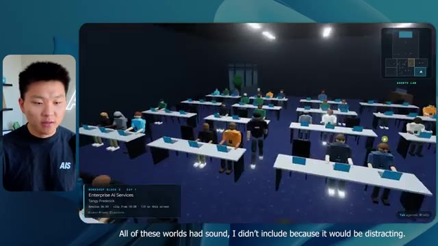
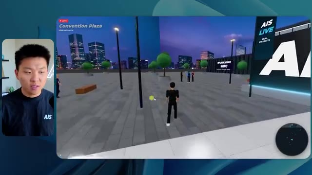

# 🎬 AGI is Here. Anthropic Just Proved It.

> **Chaîne** : [Nate Herk | AI Automation](https://www.youtube.com/@nateherk/featured)  
> **Lien YouTube** : [https://www.youtube.com/watch?v=NDeyhGnNECc](https://www.youtube.com/watch?v=NDeyhGnNECc)  
> **Date de publication** : 20260605  
> **Durée** : 00:12:37  
> **Identifiant vidéo** : `NDeyhGnNECc`  
> **Transcription & Analyse** : `whisper-v3-large-turbo+gemini-3.5-flash-lite`  

---

## 📌 Synthèse Exécutive & Outils

### 💡 Résumé

Dans cette vidéo de la chaîne *Nate Herk | AI Automation*, l'analyseur explore en profondeur les capacités révolutionnaires du modèle **Opus 5.5** d'Anthropic appliqué à la génération d'environnements virtuels complexes. Le test consiste à soumettre un unique prompt de type « slash goal » ambitieux : transformer un dossier Frame.io de 105 gigaoctets d'enregistrements vidéo d'un événement virtuel (*AIS Live*) en un monde 3D explorable à la troisième personne, simulant une conférence en personne avec différentes salles, pistes, scènes, et en exploitant des outils de génération d'images et le système d'exploitation IA du créateur.

L'expérimentation compare les performances d'Opus 5.5 à travers différents niveaux d'effort (du niveau bas à l'ultra code). Les résultats démontrent l'impact spectaculaire de l'ajustement du niveau d'effort sur la qualité du livrable : le mode « faible » génère un monde rudimentaire, visuellement instable (personnages fantômes, images fixes au lieu de vidéos) en 16 minutes pour 3,91 $, tandis que le mode « moyen » produit un univers visuellement cohérent, respectant l'identité de marque, intégrant des flux vidéo fonctionnels et des PNJ (personnages non-joueurs) dynamiques, en 1 heure 13 minutes pour 12,44 $. Le tout s'exécute de manière entièrement autonome sans qu'aucune question supplémentaire ne soit posée par les agents.

Cette démonstration met également en lumière le goulet d'étranglement classique du développement assisté par IA : la transition entre un code fonctionnel généré localement et son déploiement en production, un défi relevé par des solutions de connectivité intégrées directement aux éditeurs de code.

### 🛠️ Outils, Modèles & Logiciels Présentés

* **Opus 5.5** : Modèle d'IA de pointe d'Anthropic, extrêmement intelligent et économique, capable de gérer des tâches de développement complexes à différents niveaux d'effort configurables.
* **Claude Code** : Outil de programmation et d'assistance au développement utilisé pour l'exécution des tâches de codage et d'ingénierie logicielle.
* **Agents IA** : Systèmes autonomes capables d'orchestrer des flux de travail complexes, d'interagir avec des environnements de développement et d'effectuer des vérifications visuelles répétées.
* **Frame.io** : Plateforme de collaboration vidéo utilisée ici pour stocker les 105 Go d'enregistrements de l'événement *AIS Live*.
* **Hostinger Connector** : Extension gratuite pour éditeurs de code (VS Code, Cursor, Claude Code, etc.) permettant de relier directement l'environnement de développement aux services d'hébergement pour un déploiement en ligne instantané.
* **Herc 2** : Système d'exploitation IA personnel du créateur utilisé comme écosystème de référence pour les ressources et intégrations.

### 🔑 Points Clés & Enseignements Stratégiques

* **Impact direct du paramètre d'effort** : Le choix du niveau d'effort (faible, moyen, élevé, max, ultra code) redéfinit radicalement la profondeur, la stabilité et la qualité esthétique du code et des rendus générés par l'IA.
* **Autonomie complète des agents** : Sur des prompts complexes de type « slash goal », Opus 5.5 est capable de mener à bien l'intégralité d'un projet d'envergure sans nécessiter d'interventions ou de questions de clarification de la part de l'utilisateur.
* **Compromis temps/coût/qualité** : Un niveau d'effort faible livre un résultat rapide (16 min, ~3,91 $) mais truffé de bugs visuels et d'incohérences de design, tandis qu'un niveau moyen optimise l'expérience (1 h 13, ~12,44 $) avec une interface propre et des éléments dynamiques fluides.
* **Gestion des boucles de rétroaction autonome** : Les agents exécutent des centaines de vérifications contextuelles (ouverture de navigateurs, tests de rendu) de manière itérative pour s'assurer de la viabilité de l'application construite.
* **Respect des directives de marque (Branding)** : Les niveaux d'effort supérieurs sont capables d'assimiler et d'appliquer avec précision les palettes de couleurs, logos et identités visuelles fournis dans les instructions.
* **Intégration multimédia en temps réel** : La transformation d'archives vidéo massives (105 Go) en flux dynamiques intégrés dans des écrans virtuels 3D prouve la maturité des agents pour traiter des volumes de données non structurées.
* **Comportement des PNJ et interactivité** : Les modèles avancés intègrent des logiques comportementales pour les personnages présents dans le monde virtuel, renforçant l'immersion et le réalisme de la conférence.
* **Le fossé du déploiement post-développement** : Le principal défi de l'ingénierie pilotée par IA reste le passage d'un prototype fonctionnel sur machine locale à une mise en ligne accessible, nécessitant des outils d'intégration continus.
* **Recommandation méthodologique d'Anthropic** : Il est préconisé de débuter les expérimentations de prompt engineering sur Opus 5.5 au niveau « moyen », puis d'ajuster le curseur à la hausse ou à la baisse selon la criticité du livrable attendu.

---

## ⏱️ Chronologie & Transcription Complète Audio & Visuelle (Mot pour Mot)

### ⏱️ `[00:00:00 - 00:00:20]` | Segment #01

**🔊 Audio (Transcription Intégrale Mot pour Mot en Français) :**
> Opus 5.5, Opus 5.5, Opus 5.5, Opus 5.5, Opus 5.5. Ce modèle est littéralement partout et pour de très bonnes raisons. Il est intelligent, il est bon marché, il a un goût incroyable, c'est un modèle d'IA incroyable. Mais avec chaque modèle d'IA, vous avez le choix de l'effort, que ce soit faible, moyen, élevé, extra, max ou code ultra.

**👁️ Analyse Visuelle d'Écran (gemini-3.5-flash-lite) :**
**Interface & Outils** : Twitter / X (navigateur web)

**Contenu textuel & Code** : Un post de réseau social incluant un contenu visuel généré par IA et des métriques d'engagement (vues, likes, retweets).

**Action / Démonstration** : Le présentateur illustre ses propos en montrant un tweet pertinent sur l'impact de l'IA sur les créateurs.

*⏱️ 00:00:05 — Une capture d'écran d'un tweet montrant une vidéo ou une image de paysage tropical généré par IA, avec le texte du post évoquant l'impact sur les créateurs techniques.*

---

### ⏱️ `[00:00:20 - 00:00:38]` | Segment #02

**🔊 Audio (Transcription Intégrale Mot pour Mot en Français) :**
> Donc, dans cette vidéo, j'ai donné exactement le même prompt à Opus 5.5 et je l'ai exécuté à chaque niveau d'effort, et nous allons comparer les résultats. Nous examinerons la qualité de toutes les différentes sorties réelles, mais nous examinerons également le temps d'exécution de chacun d'eux, combien cela nous a coûté si c'était une facturation par API, le nombre total de tokens, combien de vérifications ils ont exécutées et combien de questions ils m'ont réellement posées tout au long du processus.

**👁️ Analyse Visuelle d'Écran (gemini-3.5-flash-lite) :**
**Interface & Outils** : Application de tableau blanc ou d'interface de présentation (type canvas).

**Contenu textuel & Code** : Tableau avec les lignes : Run time, API cost, Total tokens, Checks, Questions asked, et colonnes pour chaque niveau d'effort.

**Action / Démonstration** : Présentation du tableau comparatif des performances selon les niveaux d'effort d'Opus 5.5.

*⏱️ 00:00:29 — Capture d'un tableau comparatif montrant les différents niveaux d'effort (Low, Medium, High, Extra, Max, Ultracode) et métriques associées.*

---

### ⏱️ `[00:00:39 - 00:00:58]` | Segment #03

**🔊 Audio (Transcription Intégrale Mot pour Mot en Français) :**
> Et les résultats qu'on a obtenus ne sont pas du tout ce à quoi je m'attends, donc j'ai hâte de partager ça avec vous les gars. Ne perdons pas de temps et entrons directement dans le vif du sujet. Bon, alors passons directement à celui-là. Je veux commencer juste en vous montrant le vrai prompt qu'on a utilisé, qu'on a donné à chacun de ces différents agents. Je vais aller dans les fichiers ici, et on va ouvrir ce fichier markdown de prompt, et je vais vous montrer ce qu'on a obtenu. Donc voici le slash objectif que j'ai fourni.

**👁️ Analyse Visuelle d'Écran (gemini-3.5-flash-lite) :**
**Interface & Outils** : Interface de type éditeur / outil d'IA (style application de bureau ou web avec barre latérale).

**Contenu textuel & Code** : Texte de prompt dans l'interface montrant une discussion avec un agent IA concernant un test d'effort ("Hi Nate. This worktree has the effort-test task queued...").

**Action / Démonstration** : Navigation et présentation de l'interface et du prompt initial de test d'effort.

*⏱️ 00:00:48 — Interface d'un éditeur ou d'un outil d'IA avec une petite vignette vidéo du présentateur sur le côté gauche.*

---

### ⏱️ `[00:00:58 - 00:01:34]` | Segment #04

**🔊 Audio (Transcription Intégrale Mot pour Mot en Français) :**
> J'ai dit, tu dois me créer un monde 3D qui est une conférence tech réaliste dans laquelle je peux me promener en vue à la troisième personne. Tu vas regarder ce dossier, qui contient mes ressources d'enregistrement d'événements de AIS Live. Et ce dossier est un dossier Frame.io de 105 gigaoctets d'enregistrements vidéo. C'était un événement entièrement virtuel. Tout a été enregistré et tous les enregistrements sont juste ici. J'ai dit, ton objectif est de prendre cet événement et de le transformer en un monde 3D explorable qui me donne l'impression d'avoir réellement assisté à une vraie conférence en personne avec différentes salles, différentes pistes, différentes scènes, bla, bla, bla. N'hésite pas à utiliser key.ai si tu as besoin de générer des images ou des vidéos. Et tu peux aussi utiliser tout le reste à l'intérieur de mon projet Herc 2, qui est comme mon système d'exploitation IA. J'ai dit,

**👁️ Analyse Visuelle d'Écran (gemini-3.5-flash-lite) :**
**Interface & Outils** : Éditeur de code (VS Code ou similaire) et interface web de stockage (Frame.io)

**Contenu textuel & Code** : Fichier Markdown de prompt décrivant la création d'une conférence tech 3D en vue à la troisième personne à partir d'enregistrements de 105 Go.

**Action / Démonstration** : Présentation du prompt initial et des ressources vidéo sur Frame.io fournies à l'IA pour générer le monde virtuel.

*⏱️ 00:01:07 — Un éditeur de texte affichant un fichier PROMP.md avec les instructions détaillées pour créer un monde 3D interactif basé sur un événement AIS Live.*

*⏱️ 00:01:16 — Une interface web de partage de fichiers Frame.io montrant un dossier nommé "Sep 22, 2026" contenant 105,69 Go de ressources réparties dans "GA Access (For AIS)" et "VIP Access".*

*⏱️ 00:01:25 — Un retour sur le fichier PROMP.md dans l'éditeur de texte, mettant en valeur les consignes pour transformer les enregistrements virtuels en un monde 3D explorable.*

---

### ⏱️ `[00:01:34 - 00:02:08]` | Segment #05

**🔊 Audio (Transcription Intégrale Mot pour Mot en Français) :**
> vous serez jugé sur la créativité, le design, la physique, et la sensation générale alors que j'explore le monde 3D que vous avez construit. Et c'était pratiquement la fin des instructions. Donc comme vous pouvez le voir sur ce côté gauche, j'ai exécuté ceci à travers tous les différents niveaux d'effort. Commençons par le niveau bas et progressons jusqu'à l'ultra code. Très bien. Donc ici nous avons le résultat du niveau bas. Ouvrons ceci et jetons un œil. Donc nous avons AIS Live, le sommet des services IA en personne enfin, et nous pouvions cliquer partout. Tout d'abord, on ne sent pas vraiment l'identité de la marque. Genre, ce n'ego- ce n'est même pas le logo d'IS Live. Ce n'est même pas nos couleurs. Donc je n'aime pas trop ça, mais entrons ici. D'accord. C'est beaucoup trop lumineux. Euh, nous avons une carte en haut à droite. Nous avons une ville par ici. Je ne peux pas dire quelle ville c'est.

**👁️ Analyse Visuelle d'Écran (gemini-3.5-flash-lite) :**
**Interface & Outils** : Interface web d'un assistant de code / agent IA.

**Contenu textuel & Code** : Historique des sessions ('Hello', 'Extra', 'High', 'Max', 'Ultracode', 'Medium', 'Low') et message d'un agent IA proposant de commencer la tâche de construction d'un monde 3D.

**Action / Démonstration** : Navigation et sélection des différents niveaux de test d'effort dans le panneau latéral.

*⏱️ 00:01:42 — Interface d'une application d'IA affichant une liste de sessions avec différents niveaux d'effort dans le panneau latéral gauche, et une conversation active dans le panneau principal.*

---

### ⏱️ `[00:02:08 - 00:02:40]` | Segment #06

**🔊 Audio (Transcription Intégrale Mot pour Mot en Français) :**
> C'est. D'accord. C'est Chicago, ce qui est plutôt cool parce que vous savez, j'habite à Chicago, mais bref, en haut à droite, nous pouvons voir une carte. Nous avons un hall d'accueil. Nous avons un hall d'exposition. Nous avons un salon VIP sur la scène principale. La carte montre également où se trouve chaque autre personne et cela se synchronise en direct. Nous pouvons donc voir l'enregistrement. Nous pouvons voir le premier jour, la keynote sur l'agent hyper, le débriefing en direct. Cool. Donc ça connaît réellement l'ordre du jour et puis il y a le deuxième jour. Donc il a trouvé ça, c'est bien. Nous avons ces petites boules ici que je peux espérer botter. D'accord. Le visage, oh, regardez ça. Si je vais par ici, tous les gens disparaissent tout simplement. Très mauvais. Très mauvais. D'accord. Alors voyons voir. Est-ce que je peux sprinter ? D'accord.

**👁️ Analyse Visuelle d'Écran (gemini-3.5-flash-lite) :**
**Interface & Outils** : Application web 3D / environnement virtuel en ligne (type Gather.town ou métavers d'événement)

**Contenu textuel & Code** : Carte de navigation miniature, panneaux d'affichage du programme, avatars d'utilisateurs et zones d'interaction

**Action / Démonstration** : Navigation et exploration d'un environnement virtuel de conférence en 3D

*⏱️ 00:02:16 — Vue en 3D d'un espace virtuel interactif montrant le coin "Badge pickup" avec une mini-carte en haut à droite.*

*⏱️ 00:02:24 — Vue de l'accueil ("Lobby") virtuel en 3D avec un panneau affichant le programme du premier jour et la mini-carte.*

*⏱️ 00:02:32 — Vue de la halle d'exposition virtuelle ("Expo Hall") avec des avatars et des éléments lumineux interactifs.*

---

### ⏱️ `[00:02:40 - 00:03:04]` | Segment #07

**🔊 Audio (Transcription Intégrale Mot pour Mot en Français) :**
> Je peux avancer un peu plus vite. Je vais d'abord aller par ici. Il y a des produits dérivés, euh, un sweat glido certifié AIS plus. D'accord. Donc il y a les vrais stands qu'on avait lors de l'événement virtuel. On avait des stands. Donc c'est plutôt cool. Un petit endroit pour prendre des photos. La salle C. En ce moment, nous avons Tangy Frederick qui anime un atelier. D'accord. Mais ce n'est pas une vidéo. Comme vous pouvez le voir, c'est juste une image. Elle ne bouge pas. C'est donc juste une image. Ces gens sont en train de disparaître. Ce doivent être des fantômes. Allons par ici dans la salle A.

**👁️ Analyse Visuelle d'Écran (gemini-3.5-flash-lite) :**
**Interface & Outils** : Environnement virtuel 3D style métavers ou jeu vidéo.

**Contenu textuel & Code** : Éléments visuels d'un événement virtuel, stands sponsorisés et panneaux explicatifs.

**Action / Démonstration** : Navigation et exploration de l'espace virtuel par un avatar.

---

### ⏱️ `[00:03:04 - 00:03:30]` | Segment #08

**🔊 Audio (Transcription Intégrale Mot pour Mot en Français) :**
> Nous avons Liberty White. D'accord. Très cool. Vos 30 premiers jours en automatisation. Encore une fois, c'est juste une image fixe et les gens ont des bugs d'affichage. Donc ce n'est pas très bien ici. Je vais aller sur la scène principale et voir ce que nous avons. D'accord, cool. Donc nous avons une scène d'apparence principale. Les gens ont des bugs d'affichage. Vraiment grave. Ce n'est vraiment pas terrible. Notre vidéo est en fait en train de bouger. Genre, j'ai vu mon visage ici et j'ai vu celui de Devin, mais maintenant ils ont disparu. Donc je ne sais pas ce qui s'est passé. D'accord. Ça, on dirait plutôt un diaporama. Rien n'est encore réellement lu. Bref, entrons ici.

**👁️ Analyse Visuelle d'Écran (gemini-3.5-flash-lite) :**
**Interface & Outils** : Environnement virtuel 3D interactif (type métavers ou plateforme de conférence virtuelle).

**Contenu textuel & Code** : Textes d'affichage "Workshop Room A: Foundation track" et "Main Stage: Hyperagent Workshop".

**Action / Démonstration** : Navigation et déplacement d'un avatar 3D dans un espace de conférence virtuel.

---

### ⏱️ `[00:03:30 - 00:03:58]` | Segment #09

**🔊 Audio (Transcription Intégrale Mot pour Mot en Français) :**
> Nous avons d'autres stands. Nous avons hyper agent. Nous avons Claude Code. Nous avons plus de cadeaux publicitaires. La salle B, c'est Dave Ebelor. Je suppose que c'est exactement la même chose. Nous avons du café. Et puis, je suppose que le salon VIP, accès VIP seulement. C'est plutôt cool, mais il n'y a vraiment rien qui se passe ici. Cet écran est bien trop lumineux. Bon. Donc je pense que vous comprenez l'ambiance qu'on obtient ici de la part d'Opus 5.5 en effort faible. Et c'est là que les choses deviennent intéressantes. Combien de temps pensez-vous que cela a duré ? Combien de temps ? Celui-ci a duré 16 minutes et 43 secondes. Combien pensez-vous que cela a coûté ?

**👁️ Analyse Visuelle d'Écran (gemini-3.5-flash-lite) :**
**Interface & Outils** : Interface web de tableau blanc ou de documentation (Opus 5.5 Efforts) et environnement virtuel 3D.

**Contenu textuel & Code** : Tableau comparatif affichant Run time, API cost, Total tokens, Checks, et Questions asked pour différents niveaux d'effort.

**Action / Démonstration** : Navigation et présentation des fonctionnalités et comparatifs de performance.

*⏱️ 00:03:51 — Tableau comparatif dans une interface web intitulée 'Opus 5.5 Efforts' avec des colonnes de niveaux (Low à Ultracode) et des métriques.*

---

### ⏱️ `[00:03:58 - 00:04:26]` | Segment #10

**🔊 Audio (Transcription Intégrale Mot pour Mot en Français) :**
> 3,91 dollars si c'était une facturation par API. J'utilise évidemment mon abonnement ici, mais nous allons simplement calculer cela avec la facturation par API. Le total des jetons était de 191 000. Il a effectué 22 vérifications. Donc, pour la vérification, il a ouvert le navigateur 22 fois et a exécuté différents types de vérifications. Donc, 22 catégories de vérifications. Et combien de questions m'a-t-il posées ? Il m'a posé un total de zéro question tout au long de cette invite de type « slash goal ». D'accord. Alors, ouvrons l'effort moyen et voyons ce que nous avons. D'accord, c'est parti. Effort moyen. Nous avons Nate Herc. Nous avons mon badge. C'est marqué aux couleurs d'AI's life.

**👁️ Analyse Visuelle d'Écran (gemini-3.5-flash-lite) :**
**Interface & Outils** : Application de tableau blanc / interface de diagramme (style Excalidraw ou similaire) nommée 'Opus 5.5 Efforts'

**Contenu textuel & Code** : Tableau avec les lignes : Run time (16m 43s), API cost ($3.91), Total tokens (191.3K), Checks, Questions asked, sous les colonnes Low, Medium, High, Ex.

**Action / Démonstration** : Présentation des résultats chiffrés et des coûts d'API d'un test d'agent IA dans le tableau.

*⏱️ 00:04:05 — Un tableau comparatif affiché dans une application de type tableau blanc ou infographie (intitulé 'Opus 5.5 Efforts'), montrant les métriques 'Run time' (16m 43s), 'API cost' ($3.91), 'Total tokens' (191.3K), 'Checks' et 'Questions asked' pour différents niveaux d'effort (Low, Medium, High, Ex). Le présentateur apparaît en médaillon à gauche.*

---

### ⏱️ `[00:04:26 - 00:04:46]` | Segment #11

**🔊 Audio (Transcription Intégrale Mot pour Mot en Français) :**
> Donc ça a déjà l'air un petit peu mieux. On dirait notre palette de couleurs qui a utilisé nos directives de marque. Premier jour de construction, deuxième jour de gain, VIP. Cool. D'accord. Je vais entrer dans le lieu. D'accord. Waouh. Une ambiance similaire, en gros. C'est en arrière-plan. Ça ne ressemble pas à Chicago, hein ? Non, ça ressemble à, honnêtement, ça ressemble à une ville inventée. Quoi qu'il en soit, c'est marrant qu'ils aient décidé de faire ça. Voyons si je peux avancer un peu plus vite. Oh, waouh.

**👁️ Analyse Visuelle d'Écran (gemini-3.5-flash-lite) :**
**Interface & Outils** : Application web interactive / Plateforme virtuelle 3D 'AIS Live'.

**Contenu textuel & Code** : Écran d'accueil avec badge (Nate Herk, Host - All Access) et contrôles clavier affichés, puis scène virtuelle 3D avec avatars et décor urbain nocturne.

**Action / Démonstration** : Le présentateur clique sur 'ENTER THE VENUE' pour entrer dans l'environnement virtuel 3D.

*⏱️ 00:04:31 — Interface web de bienvenue 'AIS Live' avec un badge nominatif personnalisé affichant 'NATE HERK' et le bouton 'ENTER THE VENUE'.*

*⏱️ 00:04:41 — Vue à la première ou troisième personne d'un monde virtuel 3D de type métavers avec des avatars et une vue sur une ville de nuit à travers de grandes baies vitrées.*

---

### ⏱️ `[00:04:46 - 00:05:21]` | Segment #12

**🔊 Audio (Transcription Intégrale Mot pour Mot en Français) :**
> Les gens interagissent avec moi. Regardez. Si je m'approche de ce type, il vient juste de lever le bras. Bon, maintenant il ne veut plus rien savoir de moi du tout. Mais tous ces petits robots ici doivent prendre des décisions. Je ne suis pas sûr s'ils utilisent Jev. C'est sûr que non. Je ne le lui ai pas dit. En fait, ma clé Jev est à l'arrière. Je ne sais pas. Peut-être qu'il l'a utilisée. Quoi qu'il en soit, nous pouvons voir ici que nous avons la salle d'atelier C, le laboratoire des agents. Sympa. Donc celui-ci est réellement en train de fonctionner. Vous pouvez voir qu'il s'agit d'une vraie vidéo lue par Tangy. Tout le monde ici est en train de travailler sur un ordinateur portable. Ils ne buguent pas. C'est plutôt cool. De plus, mon badge est sur ma poitrine, ce qui est plutôt cool. Je peux venir par ici. Nous avons une carte en haut à droite, comme vous pouvez le voir, mais je peux venir par ici. Nous avons un

**👁️ Analyse Visuelle d'Écran (gemini-3.5-flash-lite) :**
**Interface & Outils** : Environnement virtuel 3D interactif (type métavers / simulation d'agents).

**Contenu textuel & Code** : Interface de simulation virtuelle avec mini-carte en haut à droite et informations de session en bas à gauche.

**Action / Démonstration** : Exploration et navigation du présentateur à travers un espace virtuel 3D peuplé d'avatars d'agents.

*⏱️ 00:04:55 — Vue à la première personne dans un environnement virtuel 3D avec des avatars interactifs.*

*⏱️ 00:05:04 — Entrée dans la salle 'Agents Lab' d'un espace virtuel 3D avec un encart 'Enterprise AI Services'.*

*⏱️ 00:05:12 — Vue en hauteur d'une grande salle de classe virtuelle remplie d'avatars assis à des bureaux.*

---

### ⏱️ `[00:05:21 - 00:05:47]` | Segment #13

**🔊 Audio (Transcription Intégrale Mot pour Mot en Français) :**
> halle d'exposition. C'est là que nous avons le stand Glido. Et ça diffuse en ce moment. Oui, ça diffuse la vidéo de nous en train de parler de Glido. Ça diffuse la vidéo d'Ed et moi parlant de notre programme de certification. Nous avons le logo AIS Plus ici à l'arrière, qui est un peu mal placé. Ce sont les diapositives des conférenciers et les points clés. Alors waouh, ce sont toutes les ressources que nous avons distribuées après l'événement. Elles sont toutes là aussi. Nous pouvons voir que nous avons un projecteur sur la communauté. C'est donc Aiden qui parle de l'accord qu'il a conclu et c'est diffusé en direct. Ces gens regardent.

**👁️ Analyse Visuelle d'Écran (gemini-3.5-flash-lite) :**
**Interface & Outils** : Environnement virtuel 3D / Metaverse (type Gather.town ou similaire)

**Contenu textuel & Code** : Aucun code source, terminal ou prompt visible, uniquement des éléments graphiques d'un monde virtuel.

**Action / Démonstration** : Navigation et exploration d'un espace d'exposition virtuel par des avatars.

---

### ⏱️ `[00:05:47 - 00:06:21]` | Segment #14

**🔊 Audio (Transcription Intégrale Mot pour Mot en Français) :**
> Ils sont plutôt engagés. On a l'hyper agent. C'était, c'est ce que je voulais dire. Si vous avez vu ces gens lever les bras en disant bonjour, c'était plutôt marrant. Regardez, regardez, le voilà qui recommence. Bref. Bon. Où est-ce que je suis maintenant ? Maintenant, je suis dans le hall principal. On a un bar à café. On a un grand logo, qui est le vrai logo. Il est trop lumineux, mais on a le logo. On peut voir si on peut entrer ici dans le parcours fondation. On a Sabrina Romanov et Liberty White. Donc différentes formations juste là. On peut entrer dans cette salle. C'est le parcours avancé. Alors qu'est-ce qui se passe ici. On a Dave Ebelar et Saman qui parlent de différentes choses là-dedans. Et maintenant, allons jeter un œil à la scène principale. Oh, attendez, il y a une vidéo de moi là-haut. C'est du genre VIP

**👁️ Analyse Visuelle d'Écran (gemini-3.5-flash-lite) :**
**Interface & Outils** : Application web de métaverse / espace virtuel 3D et caméra du présentateur.

**Contenu textuel & Code** : Environnement virtuel 3D avec interface utilisateur textuelle en haut (Main Lobby) et mini-carte.

**Action / Démonstration** : Exploration et navigation interactive de l'espace virtuel par le présentateur.

*⏱️ 00:05:55 — Vue d'un monde virtuel interactif (hall principal avec avatars et comptoir café) avec le présentateur incrusté à gauche.*

*⏱️ 00:06:04 — Navigation dans le monde virtuel vers une salle de conférence avec des avatars assis.*

*⏱️ 00:06:12 — Vue en mouvement dans le hall principal virtuel montrant plusieurs avatars interactifs.*

---

### ⏱️ `[00:06:21 - 00:06:50]` | Segment #15

**🔊 Audio (Transcription Intégrale Mot pour Mot en Français) :**
> section ? Ouais, on ira voir ça dans une minute. Mais bref, voici la scène principale. Ça a l'air vraiment, vraiment super. On a une grande scène. On a genre quatre personnes assises ici. On a les trois écrans d'Alex là-haut avec "hyper agent". Est-ce que j'ai le droit de monter sur scène ? Oh, et ça me laisse monter sur scène. OK. C'est plutôt sympa. Bon les gars, prenons un selfie. Laissez-moi mettre tout le monde en arrière-plan. Venez par ici. Bref, c'est vraiment, vraiment cool. Par contre, toutes les places ne sont pas prises. Donc il faut qu'on travaille là-dessus. Mais bref, je vais y retourner en courant pour voir ce qu'était cette section VIP. OK. Le salon VIP. J'ai l'impression que c'est comme un salon d'aéroport ou un truc comme ça.

**👁️ Analyse Visuelle d'Écran (gemini-3.5-flash-lite) :**
**Interface & Outils** : Monde virtuel 3D / Plateforme d'événement virtuel

**Contenu textuel & Code** : Interface d'événement virtuel, mini-carte en haut à droite, panneau d'information de keynote en bas à gauche

**Action / Démonstration** : Navigation d'un avatar dans un espace de conférence virtuel 3D

---

### ⏱️ `[00:06:51 - 00:07:14]` | Segment #16

**🔊 Audio (Transcription Intégrale Mot pour Mot en Français) :**
> D'accord, super. Donc maintenant nous avons les sessions VIP ici. Une session VIP de questions-réponses avec Nate, une lecture vidéo en direct juste ici. Très, très cool. Et nous avons comme un bar ou quelque chose comme ça. Génial. Je dirais que c'est un très bon résultat. Maintenant, en ce qui concerne les statistiques ici, celle-ci a pris une heure et 13 minutes à s'exécuter. Cela nous aurait coûté 12 dollars et 44 cents. Elle a utilisé 490 000 jetons et elle a effectué 23 vérifications.

**👁️ Analyse Visuelle d'Écran (gemini-3.5-flash-lite) :**
**Interface & Outils** : Application de métavers / espace virtuel 3D et tableau de bord d'analyse de performance (Opus 5.5 Efforts).

**Contenu textuel & Code** : Interface d'événement virtuel avec lecteur vidéo et espace de discussion, ainsi qu'un tableau de métriques d'exécution d'IA (Run time, API cost, Total tokens, Checks, Questions asked).

**Action / Démonstration** : Navigation et présentation d'un espace virtuel VIP interactif, suivie du passage à un tableau récapitulatif des performances d'un modèle d'IA.

*⏱️ 00:06:56 — Capture montrant un espace virtuel en 3D (type métavers) avec des avatars d'utilisateurs, un grand écran affichant une session vidéo en direct (VIP Q&A with Nate), et un bar en arrière-plan.*

*⏱️ 00:07:02 — Tableau de bord intitulé "Opus 5.5 Efforts" affichant des statistiques de performance pour le niveau "Low" : temps d'exécution (16m 43s), coût API ($3.91), nombre de tokens (191.3K), vérifications (22) et questions posées (0), avec des colonnes pour Medium, High et Extra.*

---

### ⏱️ `[00:07:14 - 00:07:48]` | Segment #17

**🔊 Audio (Transcription Intégrale Mot pour Mot en Français) :**
> Et il nous a posé un total de zéro question une fois de plus. Très bien, passons à élevé. C'était déjà un résultat plutôt correct et Anthropic eux-mêmes dans leur vidéo, ou désolé, pas une vidéo, un article sur comment prompter Opus 5.5, ils ont dit de commencer simplement par moyen et d'ajuster à la hausse ou à la baisse si nécessaire. C'était donc un résultat moyen. Passons à élevé et voyons ce que nous avons obtenu. Très rapidement, les gars, je dois prendre une seconde pour vous parler du sponsor de la vidéo d'aujourd'hui, Hostinger. Donc, ces deux modèles viennent de me créer une version fonctionnelle de la même chose. Et maintenant, je me retrouve exactement là où je finis toujours, avec un projet terminé sur mon ordinateur portable et aucun moyen rapide de le mettre en ligne. Et c'est précisément le fossé que le connecteur d'Hostinger comble. C'est une extension gratuite

**👁️ Analyse Visuelle d'Écran (gemini-3.5-flash-lite) :**
**Interface & Outils** : Tableau de bord visuel et interface d'éditeur de code / assistant IA (type IDE).

**Contenu textuel & Code** : Tableau de métriques d'exécution et prompt pour construire un "Northwind ROI calculator" en HTML.

**Action / Démonstration** : Présentation des résultats comparatifs et analyse des performances de l'agent selon le niveau d'effort configuré.

*⏱️ 00:07:22 — Un tableau comparatif montrant les performances de différents niveaux d'effort (Low, Medium, High, Extra) avec des métriques comme le temps d'exécution, le coût API, les tokens et les questions posées.*

*⏱️ 00:07:39 — Une interface de développement avec un éditeur affichant le prompt de création d'un calculateur de ROI et l'activité de l'IA en cours d'exécution.*

---

### ⏱️ `[00:07:48 - 00:08:23]` | Segment #18

**🔊 Audio (Transcription Intégrale Mot pour Mot en Français) :**
> pour votre éditeur qui intègre votre compte Hostinger dans l'outil de programmation que vous utilisez déjà, que ce soit VS Code, Cursor, Cloud Code, Codex, et j'en passe. Vous vous connectez une seule fois en un clic, et à partir de là, votre agent peut déployer le site, y pointer un domaine, configurer les enregistrements DNS et vérifier votre VPS sans que vous ayez à quitter votre éditeur. Ainsi, quel que soit celui que vous préparez, ce qu'il a construit est à quelques minutes d'une vraie URL sur un hébergement géré. Le connecteur est gratuit sur tous les forfaits d'hébergement, donc si vous avez toujours besoin de l'hébergement en dessous, prenez le forfait illimité avec le lien dans la description et utilisez le code NATEHERK pour 10 % de réduction. Cela inclut également un domaine gratuit et un e-mail professionnel pour l'année. Et c'est toujours le moyen le plus économique que j'ai trouvé pour obtenir un

**👁️ Analyse Visuelle d'Écran (gemini-3.5-flash-lite) :**
**Interface & Outils** : Interface de gestion Hostinger MCP / Claude Code

**Contenu textuel & Code** : "Manage Hostinger from your IDE", "Connected", "Available tools" (Websites, Domains, Subscriptions & Payments, Email Marketing)

**Action / Démonstration** : Connexion réussie du compte Hostinger à l'IDE via OAuth avec les permissions d'accès aux outils.

*⏱️ 00:07:57 — Interface montrant l'intégration de Hostinger dans l'IDE avec le statut connecté et la liste des outils disponibles.*

---

### ⏱️ `[00:08:23 - 00:08:47]` | Segment #19

**🔊 Audio (Transcription Intégrale Mot pour Mot en Français) :**
> tu as construit cela sur une vraie URL. Alors revenons à la vidéo. D'accord. Encore une fois, très, très marqué par la marque. C'est un écran de chargement encore meilleur que le précédent. Nous avons ce joli petit effet en arrière-plan. Nous avons le logo. Nous allons entrer dans le lieu. D'accord. Nous y voilà. Ça a l'air plutôt bien. Nous commençons à l'extérieur et tu peux voir que nous avons ces drapeaux pour tous les intervenants, Wyatt, Casper, Alex, Ed, Aiden, Sabrina, Liberty. C'est plutôt cool. Nous avons des blocs en direct ici.

**👁️ Analyse Visuelle d'Écran (gemini-3.5-flash-lite) :**
**Interface & Outils** : Application web interactive 3D / Navigateur web

**Contenu textuel & Code** : Interface utilisateur de métavers ou monde virtuel avec indications de touches (WASD, Mouse, etc.) et logo AIS LIVE

**Action / Démonstration** : Connexion et exploration de l'espace virtuel interactif en 3D

*⏱️ 00:08:29 — Écran de chargement et d'accueil de la plateforme virtuelle 'AIS LIVE', affichant le logo, les instructions de contrôle et le bouton 'Enter the Venue'.*

*⏱️ 00:08:35 — Vue de la place virtuelle 'AIS Live Plaza' avec des avatars 3D et des bâtiments urbains en arrière-plan.*

*⏱️ 00:08:41 — Exploration de la place virtuelle 'AIS Live Plaza' montrant des bannières avec des noms de conférenciers.*

---

### ⏱️ `[00:08:47 - 00:09:23]` | Segment #20

**🔊 Audio (Transcription Intégrale Mot pour Mot en Français) :**
> il a pris cette photo de moi, votre hôte, Nate Herc, John, Dave, Nate Herc. Voilà. D'accord. Les portes. C'est génial. Ce sont des portes coulissantes automatiques en verre. J'adore ça. On peut voir l'enregistrement VIP. On peut voir l'admission générale. On peut venir par ici et on peut découvrir l'expo avec différents stands, le projecteur sur la communauté. Vous pouvez aussi voir qu'en haut à gauche, j'ai un passeport. C'est donc comme, ça montrera combien d'endroits j'ai visités. Tout cela est une vraie lecture. Nous avons un mur de ressources avec tous les différents conférenciers. Ils ont aussi une session de réseautage par ici. Je vais donc venir très vite voir de quoi il retourne. Nous avons donc le bar à cold brew AIS. Nous avons différents membres de la communauté qui ont été mis en avant ou mis en lumière.

**👁️ Analyse Visuelle d'Écran (gemini-3.5-flash-lite) :**
**Interface & Outils** : Application de métavers ou monde virtuel 3D de conférence.

**Contenu textuel & Code** : Environnement virtuel interactif, interface de navigation, affichage du hall d'enregistrement et de l'Expo Hall.

**Action / Démonstration** : Exploration et navigation en vue à la troisième personne dans un espace événementiel virtuel 3D.

*⏱️ 00:08:56 — Vue d'un monde virtuel 3D représentant une zone d'enregistrement de conférence avec des comptoirs 'VIP Check-In' et 'Registration GA'.*

*⏱️ 00:09:05 — Navigation dans un hall d'exposition virtuel 3D avec des stands d'information et des avatars de participants.*

*⏱️ 00:09:14 — Déplacement d'un avatar à travers le hall d'entrée virtuel entouré d'autres avatars en mouvement.*

---

### ⏱️ `[00:09:23 - 00:09:56]` | Segment #21

**🔊 Audio (Transcription Intégrale Mot pour Mot en Français) :**
> Nous avons l'aile VIP. Attends, quoi ? Prends un bracelet. Oh, je dois vraiment aller chercher le bracelet. D'accord. Laisse-moi m'enregistrer rapidement. Le bracelet est déjà mis. Attends, quoi ? D'accord. Oh, d'accord. Maintenant, les portes se sont ouvertes pour moi. Cool. Je peux entrer ici. Oh, ça mène juste à la scène principale. Salon VIP. Il y a une séance de questions-réponses en cours. Ça a l'air très cool. Je veux dire, je suis très impressionné par la façon dont il est capable de faire ça. Waouh. D'accord. Donc c'est vraiment bien. Ce qu'on a fait, c'est qu'on a eu des salles de discussion VIP avec différentes personnes. Tu peux voir qu'il y a différentes salles, différents membres de l'équipe AIS qui participent à des trucs. C'est vraiment cool. C'est très cool. C'est un VIP bien meilleur

**👁️ Analyse Visuelle d'Écran (gemini-3.5-flash-lite) :**
**Interface & Outils** : Application de métavers / espace virtuel interactif 3D.

**Contenu textuel & Code** : Interface utilisateur affichant la zone actuelle, les statuts de passeport, la carte miniature et les options de navigation.

**Action / Démonstration** : Exploration et navigation dans l'espace virtuel par l'avatar de l'utilisateur pour accéder à différentes zones et sessions.

*⏱️ 00:09:32 — Vue d'un espace virtuel 3D « Registration Concourse » avec l'avatar de l'utilisateur explorant la zone.*

*⏱️ 00:09:40 — Intérieur d'un salon VIP virtuel (« VIP Lounge ») avec des participants assis sur des canapés et un écran affichant une visioconférence.*

*⏱️ 00:09:48 — Espace de travail virtuel (« VIP Working Sessions ») divisé en différentes salles thématiques interactives.*

---

### ⏱️ `[00:09:56 - 00:10:30]` | Segment #22

**🔊 Audio (Transcription Intégrale Mot pour Mot en Français) :**
> expérience que ce qui a été montré dans la première partie. D'accord. After party VIP. Regardez ça. On a une piste de danse. On a tous ces éléments ici. On a la lecture de l'after party VIP juste ici. Et il y a une estrade de DJ. C'est trop marrant. Il y a un petit bug ici, un petit glitch ici, mais c'est génial. Oh, cool. Donc quand je suis ici sur la scène principale, on a des sous-titres. Vous pouvez voir juste ici en bas de mon écran, on a ces sous-titres de Wyatt qui est en train de parler là-haut. On a des lumières. On a le panel. Très cool. Belle scène principale. Je vais aller ici. On peut aller à la fondation,

**👁️ Analyse Visuelle d'Écran (gemini-3.5-flash-lite) :**
**Interface & Outils** : Application web 3D immersive (plateforme d'événement virtuel)

**Contenu textuel & Code** : Interface utilisateur virtuelle affichant "VIP After-Party" et "Main Stage", avatars 3D et flux vidéo en direct.

**Action / Démonstration** : Navigation et exploration de différents espaces virtuels (after-party et scène principale) lors d'un événement en ligne.

*⏱️ 00:10:04 — Capture montrant l'interface d'un espace virtuel 3D (After-party VIP) avec des avatars sur une piste de danse et un écran affichant des flux vidéo de participants.*

*⏱️ 00:10:13 — Vue similaire de l'espace virtuel 3D montrant l'after-party VIP avec une piste de danse lumineuse, des ballons et des avatars en mouvement.*

*⏱️ 00:10:21 — Capture montrant un autre espace virtuel 3D représentant une grande scène principale (Main Stage) avec des sièges et un présentateur sur écran géant.*

---

### ⏱️ `[00:10:30 - 00:11:06]` | Segment #23

**🔊 Audio (Transcription Intégrale Mot pour Mot en Français) :**
> avancé, et les parcours d'entreprise par ici. Alors voyons voir. Nous avons l'anatomie de trois vraies transactions. Nous avons hyper agent. Nous avons les évaluations avec Nate et Ed ici. Nous avons Dave qui s'occupe des trucs avancés. C'est vraiment bien. Je veux dire, évidemment, chacun de ces résultats jusqu'à présent, faible était correct. Moyen était meilleur. Élevé a été encore meilleur. Voyons si cette tendance se poursuit et allons voir ce que cela nous a coûté. Donc, le mode élevé a tourné pendant une heure et sept minutes. Donc un peu plus rapide que moyen, cela nous aurait coûté 16 dollars et 31 cents. Il a utilisé un demi-million de jetons, 509 000. Il a fait 22 vérifications. Et il nous a aussi demandé, enfin, non, je me suis trompé, ce

**👁️ Analyse Visuelle d'Écran (gemini-3.5-flash-lite) :**
**Interface & Outils** : Application de tableau ou outil de présentation (type Excalidraw ou tableau de bord analytique).

**Contenu textuel & Code** : Tableau comparatif : Run time (16m 43s, 1h 13m...), API cost ($3.91, $12.44, $16.31), Total tokens (191.3K, 419.2K...), Checks, Questions asked.

**Action / Démonstration** : Analyse des coûts et des performances d'exécution des agents IA à différents niveaux d'effort.

*⏱️ 00:10:57 — Un tableau comparatif montrant les coûts API, les temps d'exécution et les tokens pour différents niveaux de performance (Low, Medium, High, Extra).*

---

### ⏱️ `[00:11:06 - 00:11:25]` | Segment #24

**🔊 Audio (Transcription Intégrale Mot pour Mot en Français) :**
> l'un m'a posé une question et, divulgâcheur, c'était le seul qui nous a posé une question tout au long de tout cela. Voyons voir, il nous en reste trois : Extra, Max et Ultra Code. Laisse-moi ouvrir Extra et nous verrons ce que nous avons. D'accord. Donc celui-ci a l'air plutôt bien. Je dirais honnêtement que jusqu'à présent, l'écran de chargement haut était le meilleur. Celui que nous venons juste de voir, mais bref, entrons dans AIS Live.

**👁️ Analyse Visuelle d'Écran (gemini-3.5-flash-lite) :**
**Interface & Outils** : Tableau de bord d'analyse ou application web de suivi des performances.

**Contenu textuel & Code** : Tableau avec les lignes : Run time, API cost, Total tokens, Checks, Questions asked, et les colonnes Low, Medium, High, Extra.
[DESC_IMAGE_1] Analyse et consultation des résultats de tests comparatifs d'agents IA.

**Action / Démonstration** : Explications face caméra et démonstration conceptuelle.

*⏱️ 00:11:11 — Un tableau comparatif montrant les métriques de différents niveaux d'effort (Low, Medium, High, Extra) avec le présentateur incrusté à gauche.*

---

### ⏱️ `[00:11:26 - 00:11:51]` | Segment #25

**🔊 Audio (Transcription Intégrale Mot pour Mot en Français) :**
> Ouf. D'accord. Donc nous avons comme de petits extraits sonores. Je peux discuter avec des gens. Le panneau sur la guerre des outils a réglé quelques débats pour moi. Sympa. Bonne perspective là-bas. Nous sommes de nouveau dehors. Nous avons ces différentes bannières, bien qu'elles soient toutes les mêmes. Elles n'affichent pas les noms de différentes personnes. Donc, grand logo AIS Live. L'aile de l'atelier est par ici. Et passons par les portes coulissantes en verre pour voir ce que nous avons. Donc nous avons le café AIS. La carte est en bas à droite, et elle n'est pas très descriptive.

**👁️ Analyse Visuelle d'Écran (gemini-3.5-flash-lite) :**
**Interface & Outils** : Environnement virtuel 3D / Jeu ou application de métavers interactif avec mini-carte et interface de contrôle à l'écran.

**Contenu textuel & Code** : Éléments graphiques 3D interactifs, bannières textuelles 'AIS LIVE', mini-carte en bas à droite et dialogues textuels d'avatars.

**Action / Démonstration** : Navigation et exploration en temps réel dans un monde virtuel 3D à l'aide d'un avatar par le présentateur.

*⏱️ 00:11:32 — Un avatar virtuel se déplace dans un espace 3D de type métavers ou monde virtuel, avec des bannières 'LIVE' et 'AIS LIVE', et un personnage non-joueur proche.*

*⏱️ 00:11:38 — Vue en extérieur d'un monde virtuel 3D nocturne avec des bâtiments, des arbres stylisés, et l'avatar du joueur marchant vers une zone d'exposition ou de conférence ('AIS LIVE').*

*⏱️ 00:11:45 — L'avatar virtuel s'approche de l'entrée lumineuse d'un bâtiment ou d'un hall d'exposition futuriste à l'intérieur de l'environnement virtuel.*

---

### ⏱️ `[00:11:51 - 00:12:26]` | Segment #26

**🔊 Audio (Transcription Intégrale Mot pour Mot en Français) :**
> J'aime bien comment les autres cartes nous ont montré ce qu'il y avait, genre où étaient les choses, mais celle-ci a l'air très professionnelle. On peut voir ici c'est la scène principale. Allons y faire un saut rapidement. Elles ont toutes ces balles qui volent partout, ce qui je trouve est plutôt marrant. Les ballons de plage AIS. On nous voit là-haut en train de parler. Je crois que j'introduisais l'un des jours. Continuons à avancer par ici vers la salle d'atelier sur ce côté gauche. D'accord. Donc ici nous avons le théâtre Hyper Agent. Nous avons cette session sponsorisée ici par Hyper Agent, mais ça nous montre aussi ce qui va s'y passer. C'est vraiment marrant qu'on puisse discuter avec des gens. Salmon a créé un commercial vocal en direct. La salle du Juste Prix était comble. Tu as pris le guide du compagnon VIP ? C'est trop marrant. On a le parcours avancé dans

**👁️ Analyse Visuelle d'Écran (gemini-3.5-flash-lite) :**
**Interface & Outils** : Application web de monde virtuel 3D / métavers de conférence.

**Contenu textuel & Code** : Environnement virtuel 3D interactif avec avatars, bulles de dialogue, mini-carte en bas à droite et affichage vidéo en direct.

**Action / Démonstration** : Navigation et exploration de l'espace virtuel de la conférence en 3D.

*⏱️ 00:12:00 — Capture d'écran montrant l'avatar du présentateur dans un auditorium virtuel 3D (Main Stage) avec un écran de présentation en direct.*

*⏱️ 00:12:09 — Capture d'écran montrant le hall d'entrée virtuel (Grand Lobby) avec plusieurs avatars de participants et des bannières de workshops.*

*⏱️ 00:12:17 — Capture d'écran montrant un couloir virtuel avec des avatars en discussion et des panneaux indicateurs.*

---

### ⏱️ `[00:12:26 - 00:12:58]` | Segment #27

**🔊 Audio (Transcription Intégrale Mot pour Mot en Français) :**
> ici. Encore une fois, nous avons une lecture en direct. Est-ce que c'est une lecture en direct ? Oh, d'accord. Ça a commencé une fois que je suis entré, mais je peux m'asseoir. Oh la la. Je peux regarder ça. Je peux me lever. Je veux m'asseoir au premier rang. C'est plutôt cool. C'est très bien. J'aime bien. Et vous savez ce que j'ai remarqué jusqu'à présent ? Le personnage que j'incarne me ressemble un peu. Je pense qu'il s'est inspiré de mes photos de profil ou quelque chose comme ça. Quoi qu'il en soit, nous avons Sabrina ici, l'animatrice de la salle ici, prenez n'importe quel siège libre. D'accord, cool. Et j'ai vraiment aimé la fonctionnalité pour s'asseoir. C'est plutôt marrant. Genre, on pourrait vraiment assister à cet atelier et participer. Bref, ça nous montre les intervenants. Ça nous montre les

**👁️ Analyse Visuelle d'Écran (gemini-3.5-flash-lite) :**
**Interface & Outils** : Plateforme de conférence virtuelle 3D

**Contenu textuel & Code** : Interface utilisateur avec affichage de l'écran d'un atelier 'Workshop Block 2 - Foundations Build Your First AI Content Engine'

**Action / Démonstration** : Exploration de l'environnement virtuel interactif de conférence en direct

*⏱️ 00:12:34 — Le présentateur navigue dans une plateforme de conférence virtuelle 3D avec un écran affichant un atelier sur la construction d'un agent commercial vocal.*

*⏱️ 00:12:42 — Vue de la salle de conférence virtuelle affichant 'Foundation Track' avec le présentateur à gauche et la scène au loin.*

*⏱️ 00:12:50 — Vue en gros plan de l'écran principal montrant l'interface d'un atelier en ligne avec des participants vidéo intégrés dans l'environnement virtuel.*

---

### ⏱️ `[00:12:58 - 00:13:31]` | Segment #28

**🔊 Audio (Transcription Intégrale Mot pour Mot en Français) :**
> programme. Il y a un petit tapis rouge ici pour prendre des photos. On peut prendre la pose. Oh, waouh. C'est plutôt cool. Bibliothèque de ressources, devenir certifié AIS Plus, Glido, Hyper Agent, AIS Plus, trois vraies offres. Génial. Je veux dire, je dirais vraiment que jusqu'à présent, chacune est meilleure. Et on n'a même pas encore visité la section VIP, le salon VIP. Montons ici très vite. J'espère que je pourrai entrer. Sympa. On a la réinitialisation des outils. Ce sont les différentes pièces dans lesquelles on pourrait aller. Donc encore une fois, je pourrais prendre la feuille d'exercices et je pourrais essayer de comprendre comment tarifer mes produits. C'est tellement cool. C'est vraiment mieux que le précédent où on a juste en quelque sorte

**👁️ Analyse Visuelle d'Écran (gemini-3.5-flash-lite) :**
**Interface & Outils** : Application de monde virtuel 3D / plateforme d'événement virtuel.

**Contenu textuel & Code** : Aucun code source, terminal ou prompt visible ; uniquement l'interface d'un monde virtuel 3D.

**Action / Démonstration** : Navigation et exploration d'un environnement virtuel en 3D par l'utilisateur.

---

### ⏱️ `[00:13:31 - 00:13:59]` | Segment #29

**🔊 Audio (Transcription Intégrale Mot pour Mot en Français) :**
> comme j'ai regardé des trucs. Génial. Je peux aller derrière le bar et venir ici. C'est très bien. Bon. Alors, en ce qui concerne les statistiques, celui-ci a tourné pendant une heure et demie. Il a coûté 25,92 dollars. Je ne sais pas pourquoi je dis point 25 dollars et 92 cents. Il y a eu 733 000 jetons et 34 vérifications. C'est donc de loin le plus grand nombre de vérifications jusqu'à présent. Et il ne nous a posé aucune question. J'ai hâte de voir ce qu'on a obtenu ici de la part de max et ultra code. D'accord. Voici les écrans de chargement de max, ennuyeux, mais c'est dans l'esprit de la marque et il y a notre logo.

**👁️ Analyse Visuelle d'Écran (gemini-3.5-flash-lite) :**
**Interface & Outils** : Application de tableau blanc ou de diagramme (type Excalidraw ou similaire).

**Contenu textuel & Code** : Colonnes Medium (1h 13m, $12.44, 419.2K, 23, 0), High (1h 7m, $16.31, 509.3K, 22, 1), Extra (1h 31m), ainsi que Max et Ultracode.

**Action / Démonstration** : Présentation des statistiques de performance et de coût pour chaque niveau de configuration.

*⏱️ 00:13:38 — Tableau comparatif sous forme de tableau ou graphique montrant différentes métriques (durée, coût, etc.) réparties par niveaux (Medium, High, Extra, Max, Ultracode).*

---

### ⏱️ `[00:14:00 - 00:14:35]` | Segment #30

**🔊 Audio (Transcription Intégrale Mot pour Mot en Français) :**
> Alors c'était bien. J'aime bien. On va continuer et entrer dans AIS live. Ooh, petite animation sympa ici qui nous fait entrer. Encore une fois, le personnage me ressemble. Ils m'ont tous ressemblé. Enfin, en gros, nous sommes assis en arrière-plan. On dirait Chicago. Comme je l'ai mentionné plus tôt, beaucoup de ceux-ci jouent des sons et je n'inclus pas cela parce que ce serait très perturbant pour vous d'essayer d'écouter ce qui se passe en même temps que je parle. Il y a donc comme une légère musique dans tout ça. Je déteste la façon dont il marche. Cette marche est vraiment, vraiment mauvaise. Je veux dire, la marche, ouais, je n'aime pas du tout ça. Donc ce n'est pas génial. Mais à part ça, entrons et explorons. Remarquez ces ombres quand j'entre, elles changent vraiment brusquement, je ne sais pas trop pourquoi,

**👁️ Analyse Visuelle d'Écran (gemini-3.5-flash-lite) :**
**Interface & Outils** : Environnement virtuel 3D en ligne type metaverse / AIS Live

**Contenu textuel & Code** : Interface de navigation 3D avec mini-carte en bas à droite, panneaux indicateurs et flux vidéo en direct en médaillon.

**Action / Démonstration** : Exploration interactive de la plateforme virtuelle 3D par le présentateur.

*⏱️ 00:14:08 — Vue d'un monde virtuel 3D (Arrival Plaza) avec un avatar au premier plan et le présentateur incrusté à gauche.*

*⏱️ 00:14:17 — L'avatar avance dans l'environnement virtuel 3D en direction d'un bâtiment moderne type centre de congrès.*

*⏱️ 00:14:26 — L'avatar continue sa progression et s'approche de l'entrée vitrée du bâtiment virtuel.*

---

### ⏱️ `[00:14:35 - 00:15:11]` | Segment #31

**🔊 Audio (Transcription Intégrale Mot pour Mot en Français) :**
> mais de toute façon, on peut discuter avec des gens ici aussi. Le stand Hyperagent est juste là où on entre dans l'expo. Tout va bien. OK, super. Je peux continuer à appuyer sur E pour leur faire changer ce qu'ils disent. On a les conférenciers juste ici. Ça a l'air plutôt bien. Bien qu'on ait vraiment eu la photo de profil de tout le monde. Donc je ne sais pas trop pourquoi ce n'est pas inclus là. On voit des gens prendre des photos juste ici. J'adore ça. Et ça enregistre une petite photo. OK. La carte n'est pas super non plus, genre elle ne donne pas une super explication de ce qui se passe, mais j'aime bien ces stands. Ils sont cool. Je pense que ces stands sont les meilleurs que j'ai vu jusqu'à présent. Genre ils ont juste l'air bien. Ils ont des représentants. Il y a de superbes diapositives derrière eux. Ouais. Ces stands sont cool. OK. On a un petit théâtre en vedette

**👁️ Analyse Visuelle d'Écran (gemini-3.5-flash-lite) :**
**Interface & Outils** : Application web de salon virtuel 3D (type Gather.town ou similaire)

**Contenu textuel & Code** : Environnement virtuel 3D interactif avec des stands d'exposition et des avatars d'utilisateurs.

**Action / Démonstration** : Navigation et exploration du monde virtuel en 3D.

---

### ⏱️ `[00:15:11 - 00:15:35]` | Segment #32

**🔊 Audio (Transcription Intégrale Mot pour Mot en Français) :**
> qui se passe par ici. C'est Casper. Bien que pourquoi est-ce que ça ne joue pas ? J'ai l'impression que ça devrait jouer, non ? Comme dans les autres, ça jouait toujours. On peut parler à d'autres gens par ici. Le café est gratuit, bla, bla, bla. Amy Simpson, Matt Wolf. Sympa. D'accord. C'est juste la zone de networking où on est en ce moment, mais on peut voir en haut à droite. On peut aussi voir ce qui est en direct sur la scène principale en ce moment. C'est un panel de guerre des outils. Alors allons par ici. On a Devin, Cole, Dave et Russ qui discutent par ici. On a en quelque sorte de l'audiovisuel, des petits trucs de lumière qui se passent par ici.

**👁️ Analyse Visuelle d'Écran (gemini-3.5-flash-lite) :**
**Interface & Outils** : Application web de monde virtuel 3D (plateforme de conférence en ligne type Gather.town ou similaire).

**Contenu textuel & Code** : Interface utilisateur virtuelle 3D avec avatars, mini-carte et affichages informatifs d'événements en direct.

**Action / Démonstration** : Navigation d'un avatar à travers un espace virtuel de conférence en ligne.

---

### ⏱️ `[00:15:36 - 00:15:55]` | Segment #33

**🔊 Audio (Transcription Intégrale Mot pour Mot en Français) :**
> Basculer la scène principale vers ce qui importe vraiment en ce moment. Donc je peux changer de sujet. Cool. Donc je viens de passer à moi et Matt. On peut passer à l'anatomie de trois vraies transactions. C'est plutôt cool. La scène a l'air bien. On a un petit panneau sympa ici. Est-ce que je peux monter sur scène ? Sympa. Sympa. Bon, je ne peux pas aller trop loin, en fait. Bon tout le monde, laissez-moi prendre le selfie. Tout le monde vient là-dedans. Je peux aussi m'asseoir dans ce public par ici et juste profiter de la session.

**👁️ Analyse Visuelle d'Écran (gemini-3.5-flash-lite) :**
**Interface & Outils** : Application de métavers / monde virtuel 3D de conférence en ligne

**Contenu textuel & Code** : Interface utilisateur virtuelle affichant des indications textuelles (« AV desk - switch the Main Stage ») et une mini-carte.

**Action / Démonstration** : Navigation et interaction de l'avatar dans l'environnement virtuel 3D de la conférence AIS LIVE.

---

### ⏱️ `[00:15:55 - 00:16:14]` | Segment #34

**🔊 Audio (Transcription Intégrale Mot pour Mot en Français) :**
> Très cool, très cool. OK, allons par ici. Je vois une section à l'étage. Donc c'est marrant comme ils choisissent tous de mettre la section VIP à l'étage. Je veux dire, je ne déteste pas ça. Oh la vache, ils ont un escalator. Pas possible. Je vais discuter avec ce type sur l'escalator. Glenn a 15 ans d'expérience en agence. Ses trucs de "land and expand" étaient en or. Du beau travail, Glenn. Cool, donc je vais, je ne peux même pas passer devant ce type par contre.

**👁️ Analyse Visuelle d'Écran (gemini-3.5-flash-lite) :**
**Interface & Outils** : Environnement virtuel 3D en ligne / Plateforme d'événement virtuel.

**Contenu textuel & Code** : Interface utilisateur avec mini-carte, commandes de déplacement et bannières informatives (VIP Level, Anatomy of Three Real Deals).

**Action / Démonstration** : Navigation et déplacement dans un espace virtuel 3D vers le niveau VIP.

---

### ⏱️ `[00:16:14 - 00:16:48]` | Segment #35

**🔊 Audio (Transcription Intégrale Mot pour Mot en Français) :**
> Oh, j'ai dû sauter par-dessus lui. D'accord, niveau VIP, badge requis. Oh mon Dieu. Tu te moques de moi ? Je dois aller chercher mon badge. D'accord, cool. Maintenant, ça montre que je suis un vrai VIP et je peux aller ici dans la section VIP. Nous avons de petites sessions de travail sympas là-bas, auxquelles nous pouvons participer. Je me demande si ça va me laisser m'asseoir ici. Je peux juste discuter. Puis-je participer ? Ça ne me laisse pas m'asseoir et participer. C'est pas grave. Nous avons la salle de crise des prix. Oh, c'est peut-être l'after-party. Allons voir ce qui se passe par ici. Ou peut-être que je dois juste entrer par ici. D'accord. C'est bizarre. Je devais juste entrer par ici. Cette after-party n'est pas aussi cool que l'autre. Mais bref, allons voir ce qui se passe par ici.

**👁️ Analyse Visuelle d'Écran (gemini-3.5-flash-lite) :**
**Interface & Outils** : Application de métavers / espace virtuel 3D (type Gather.town ou environnement similaire)

**Contenu textuel & Code** : Interface utilisateur avec mini-carte, commandes de déplacement (WASD), affichage de profil VIP et panneaux informatifs d'événements en direct.

**Action / Démonstration** : Navigation et exploration d'un espace virtuel 3D avec un avatar utilisateur.

*⏱️ 00:16:23 — Vue d'un espace virtuel en 3D où le présentateur navigue, avec un panneau d'information affichant "Nate Herk" et un badge VIP.*

*⏱️ 00:16:31 — Le personnage virtuel accède à une zone VIP et rejoint une table ronde où des participants virtuels interagissent avec des bulles de texte.*

*⏱️ 00:16:39 — Vue panoramique de la section VIP virtuelle montrant divers espaces de travail et des avatars de participants.*

---

### ⏱️ `[00:16:48 - 00:17:07]` | Segment #36

**🔊 Audio (Transcription Intégrale Mot pour Mot en Français) :**
> dans les ateliers. D'accord. Ce n'était pas bien. Regardez ça. On peut tout voir et je viens de bugger et maintenant boum. Donc ce n'est pas bon. Je dirais qu'globalement, je veux dire, vous avez l'ambiance de la façon dont ça fonctionne, but je dirais que celui d'avant, qui était, je crois, "high", j'aimais mieux celui-là. Je ne peux pas m'asseoir dans ces chaises non plus. Ouais. Donc je n'aime pas la façon de marcher dans celui-ci.

**👁️ Analyse Visuelle d'Écran (gemini-3.5-flash-lite) :**
**Interface & Outils** : Application ou plateforme virtuelle 3D (type Gather.town ou similaire)

**Contenu textuel & Code** : Environnement virtuel 3D avec avatars, panneaux d'affichage et écrans de présentation.

**Action / Démonstration** : Navigation et déplacement d'un avatar dans un espace virtuel d'atelier.

---

### ⏱️ `[00:17:07 - 00:17:43]` | Segment #37

**🔊 Audio (Transcription Intégrale Mot pour Mot en Français) :**
> Je n'aime pas autant l'ambiance et il y a quelques bugs. Donc, jusqu'à présent, si nous voulons regarder notre liste, j'aime bien, Extra Extra était celui que j'ai préféré le plus jusqu'à présent. Mais de toute façon, celui-ci était au maximum. Celui-ci était au maximum juste ici. Voyons donc combien de temps cela a duré, deux heures et 28 minutes. Ça a donc duré très longtemps, 50 dollars et 38 cents, 1,18 million de jetons. Donc, ça a en fait atteint une compaction et a dû s'auto-compacter. Et ensuite, ça a fait 51 vérifications. Est-ce que ça l'a vraiment fait, par contre ? Parce qu'il y avait beaucoup de bugs là-dedans. Et de toute façon, celui-ci ne nous a posé zéro question. Donc, jusqu'à présent, à chaque fois, c'est pratiquement devenu plus cher et ça a pris plus de temps, à part ici. Mais ceux-ci fondamentalement

**👁️ Analyse Visuelle d'Écran (gemini-3.5-flash-lite) :**
**Interface & Outils** : Application web / Tableau de bord de type canvas ou interface de comparaison.

**Contenu textuel & Code** : Tableau de données comparant des métriques telles que le temps (ex: 1h 13m, 1h 7m), des coûts en dollars (ex: $12.44, $16.31, $25.92) et des valeurs numériques.

**Action / Démonstration** : Le présentateur commente et analyse les résultats affichés dans le tableau comparatif.

*⏱️ 00:17:16 — Un tableau comparatif montrant différentes catégories (Medium, High, Extra, Max, Ultracode) avec des métriques de temps, de coûts et de performances, aux côtés de la webcam du présentateur.*

---

### ⏱️ `[00:17:43 - 00:18:17]` | Segment #38

**🔊 Audio (Transcription Intégrale Mot pour Mot en Français) :**
> a pris un laps de temps très similaire, mais à chaque fois, il a utilisé plus de tokens parce qu'il a réfléchi davantage. Et puis, vous savez, ces tokens vont coûter plus cher. Mais bref, passons au dernier, qui est ultra code. Donc, nous espérons vraiment que celui-ci sera le meilleur. Allons donc sur ce localhost et voyons ce que nous avons. D'accord, super. Regardez ce badge. C'est un joli badge host all access. Nous avons un joli petit visuel juste ici. Nous allons aller de l'avant et entrer AIS Live. Cool. D'accord. Bienvenue, Nate. J'aime la marche. Ça a l'air réaliste. J'aime le logo, bien qu'il manque le petit point rouge qui donne l'air d'un direct. La carte en haut à droite

**👁️ Analyse Visuelle d'Écran (gemini-3.5-flash-lite) :**
**Interface & Outils** : Tableau de bord analytique et interface virtuelle 3D.

**Contenu textuel & Code** : Métriques de performance, temps d'exécution, coûts en dollars et volume de tokens.

**Action / Démonstration** : Présentation des résultats comparatifs et visualisation de l'application générée.

*⏱️ 00:17:52 — Un tableau comparatif montrant les métriques de différents modes (High, Extra, Max, Ultracode) avec des durées, coûts et nombre de tokens.*

*⏱️ 00:18:09 — Une interface virtuelle 3D intitulée 'AIS LIVE' avec un avatar de personnage au centre.*

---

### ⏱️ `[00:18:17 - 00:18:49]` | Segment #39

**🔊 Audio (Transcription Intégrale Mot pour Mot en Français) :**
> est un petit peu mieux étiqueté, donc je peux voir ce qui se passe. Je vais venir ici et récupérer mon bracelet VIP rapidement. Ok, super. Ça me dit aussi quoi faire. Donc en haut à gauche, ça dit de scanner au portail VIP sur le mur est du hall. Donc je crois que l'est serait par là, non ? Never eat soggy waffles. Ouais. Ailes VIP, scanner le bracelet. Ok, super. Maintenant je suis dans la section VIP. Je peux voir ces différentes salles. L'outil a été réinitialisé. La vidéo en direct est diffusée. Je peux voir les sous-titres juste là de ce dont on parle. Ça joue aussi les sons, mais je ne diffuse tout simplement pas l'audio pour vous les gars parce que je ne veux pas submerger.

**👁️ Analyse Visuelle d'Écran (gemini-3.5-flash-lite) :**
**Interface & Outils** : Application de métavers / monde virtuel 3D (Spatial ou équivalent)

**Contenu textuel & Code** : Interface utilisateur virtuelle avec mini-carte, instructions textuelles et affichage des zones de l'événement (AIS LIVE 2026).

**Action / Démonstration** : Navigation et exploration d'un environnement virtuel 3D par le présentateur.

*⏱️ 00:18:25 — Vue d'un monde virtuel 3D avec un avatar se déplaçant dans le hall d'enregistrement (Registration & Lobby) lors d'un événement virtuel.*

*⏱️ 00:18:33 — L'avatar franchit l'entrée de la zone VIP Wing dans l'espace virtuel.*

*⏱️ 00:18:41 — L'avatar se trouve à l'intérieur d'une salle VIP (VIP Room 5) avec d'autres avatars assis autour d'une table ronde.*

---

### ⏱️ `[00:18:50 - 00:19:08]` | Segment #40

**🔊 Audio (Transcription Intégrale Mot pour Mot en Français) :**
> Encore une fois, celui-ci fonctionne avec Cody et Mustafa là-dedans. C'est génial. Vidéo en direct. La vidéo ne se lance pas tant qu'on n'entre pas, par contre. Donc, honnêtement, je pense que c'est un bon choix. Dès que j'entre, cependant, la vidéo démarre. Sympa. Belle attention. Toutes ces pièces. Génial. Ouais. Je veux dire, ça fait très haut de gamme. Voici une salle de guerre pour la tarification. Entrons ici. Moi et John là-dedans.

**👁️ Analyse Visuelle d'Écran (gemini-3.5-flash-lite) :**
**Interface & Outils** : Navigateur web / Application de monde virtuel 3D

**Contenu textuel & Code** : Environnement virtuel 3D avec des indications textuelles ('VIP Wing', 'Price It Right - First 10 Clients Plan') et un avatar de personnage.

**Action / Démonstration** : Navigation et exploration de l'espace virtuel par l'utilisateur.

*⏱️ 00:18:54 — Un espace virtuel 3D (Metaverse) montrant un avatar se déplaçant dans une aile VIP avec des salles de réunion et des écrans vidéo en direct.*

---

### ⏱️ `[00:19:08 - 00:19:42]` | Segment #41

**🔊 Audio (Transcription Intégrale Mot pour Mot en Français) :**
> Et ensuite nous avons l'after-party sympa. Cet after-party n'est pas encore aussi animé. Et nous avons plus de ballons de plage pour une raison quelconque, mais cet after-party est cool. Je veux dire, ça nous donne une bonne ambiance et il y a la retransmission juste ici de notre session de questions-réponses de l'after-party, tout cela est en direct aussi. Génial. Bon. Allons sur la scène principale. Ça m'invite aussi à prendre un siège côté allée sur la scène principale, qui se trouve tout droit en traversant l'expo. Donc en fait, allons d'abord traverser l'expo. Qu'est-ce que vous construisez ? Il y a beaucoup de gens qui parlent de différentes choses par ici. Waouh. Il y a aussi comme un petit truc de basketball. Est-ce que je peux le lancer ? Je peux. Est-ce que je dois regarder en l'air pour le lancer vers le haut ? D'accord.

**👁️ Analyse Visuelle d'Écran (gemini-3.5-flash-lite) :**
**Interface & Outils** : Application de métavers ou espace virtuel 3D en ligne.

**Contenu textuel & Code** : Environnement virtuel 3D avec interface utilisateur incrustée (cartes, instructions de navigation, affichage d'événements).

**Action / Démonstration** : Navigation et visite guidée d'un espace virtuel 3D interactif.

---

### ⏱️ `[00:19:42 - 00:20:08]` | Segment #42

**🔊 Audio (Transcription Intégrale Mot pour Mot en Français) :**
> Eh bien, pas terrible. Mais bref, nous avons un stand AIS plus. Nous avons le stand Glido. Est-ce que ça diffuse en direct ? Oui, ça diffuse définitivement en direct. Sympa. Nous avons le stand hyper agent. Nous avons d'autres trucs par ici. D'accord, cool. Je vais aller sur la scène principale et voir si on peut choper un siège côté allée. Dès qu'on entre, tout se met à diffuser. On a une très bonne ambiance de scène. Comment je fais pour choper un siège côté allée, par contre. Voilà. Il a fallu que je trouve le bon. Choper le siège côté allée. Il n'y a personne sur la scène, ce qui est bizarre. J'aimais bien quand il y avait du monde sur la scène dans les versions précédentes.

**👁️ Analyse Visuelle d'Écran (gemini-3.5-flash-lite) :**
**Interface & Outils** : Application web / monde virtuel 3D AIS Live

**Contenu textuel & Code** : Interface utilisateur d'un salon virtuel avec mini-carte, instructions textuelles et affichage des sessions en direct.

**Action / Démonstration** : Navigation et exploration de l'espace virtuel 3D de la conférence AIS Live par le présentateur.

*⏱️ 00:19:48 — Vue de l'Expo Hall virtuel dans l'application AIS Live montrant divers stands et participants.*

*⏱️ 00:19:55 — Navigation vers la scène principale (Main Stage) de l'événement virtuel AIS Live.*

*⏱️ 00:20:01 — Arrivée et prise de place dans l'amphithéâtre de la scène principale pour assister à la session en direct.*

---

### ⏱️ `[00:20:08 - 00:20:31]` | Segment #43

**🔊 Audio (Transcription Intégrale Mot pour Mot en Français) :**
> Prenons un petit selfie. Bref, il y a moi et Pat là-haut. Pat est habillé comme un ouvrier du bâtiment. Comme vous pouvez le voir, nous faisions un petit appel de découverte simulé dans cet exemple. Je vais revenir par l'expo et nous allons aller ici dans l'aile des ateliers et juste vérifier si ces salles sont fondamentalement exactement telles qu'elles devraient être. Maintenant, je ne peux plus vraiment discuter avec les gens. Je le pouvais avant, dans les versions précédentes, discuter avec les gens, ce que je trouvais être une très belle attention. Et nous avons l'atelier, une piste de fondation. Est-ce que je peux m'asseoir ?

**👁️ Analyse Visuelle d'Écran (gemini-3.5-flash-lite) :**
**Interface & Outils** : Application de métavers / espace virtuel 3D en ligne (AISLIVE / environnement interactif)

**Contenu textuel & Code** : Interface d'un monde virtuel avec mini-carte de navigation, sous-titres et avatars animés

**Action / Démonstration** : Navigation et exploration virtuelle dans un environnement 3D interactif (visite guidée du salon)

*⏱️ 00:20:14 — Vue d'une scène virtuelle 3D (Main Stage) avec un public d'avatars et des écrans, commentée par le présentateur à gauche.*

*⏱️ 00:20:20 — Navigation dans un hall d'exposition virtuel (Expo Hall) en 3D avec des avatars interactifs et l'indication 'Workshop Wing'.*

*⏱️ 00:20:25 — Déplacement dans l'aile des ateliers (Workshop Wing) d'un espace virtuel 3D montrant des avatars et une mini-carte en haut à droite.*

---

### ⏱️ `[00:20:32 - 00:21:04]` | Segment #44

**🔊 Audio (Transcription Intégrale Mot pour Mot en Français) :**
> Je ne peux pas m'asseoir. Je ne sais pas. Nous avons Liberty qui est en train de parler en ce moment même et elle parle et nous pouvons l'entendre. C'est donc sympa, mais ça ne me laisse pas m'asseoir. Et regardez ça. Je deviens assez instable ici. Ça buguait de la façon dont je marchais. Ça ne me laissera pour ainsi dire pas marcher. Ce n'est pas bon. Pareil. Nous avons cette piste avancée là-dedans. Génial. Donc, dans l'ensemble, ils ont une ambiance très similaire. Je dirai que je suis impressionné par la façon dont ils ont été capables de raconter une histoire à partir de ce que nous faisions. Bibliothèque de points clés de l'intervenant. D'accord. C'est cool. Je ne pense pas que nous ayons vu cela depuis différents endroits, mais ce sont comme les ressources et qui montrent des choses cool. Oh, waouh. Je

**👁️ Analyse Visuelle d'Écran (gemini-3.5-flash-lite) :**
**Interface & Outils** : Application de métavers / simulation virtuelle en 3D

**Contenu textuel & Code** : Interface d'un espace virtuel de conférence avec des panneaux d'indication et des avatars de participants

**Action / Démonstration** : Navigation et exploration de différents espaces virtuels (workshops et bibliothèque) dans le métavers

---

### ⏱️ `[00:21:04 - 00:21:41]` | Segment #45

**🔊 Audio (Transcription Intégrale Mot pour Mot en Français) :**
> peut réellement ouvrir toutes ces choses et nous pouvons prendre des photos ici même aussi. Sympathique. Prendre une photo. Je peux aussi l'enregistrer. Genre, je peux vraiment télécharger ceci. Et maintenant nous avons cette photo que nous venons de prendre à cet événement en direct de l'IA. Très bien. Eh bien, je pense qu'il est temps pour moi de tirer quelques conclusions, mais voyons d'abord ce que cette exécution nous a coûté. Cela a pris une heure et 35 minutes. C'était donc beaucoup plus rapide que max. Cela n'a coûté que 18 dollars et 69 cents. Waouh. C'était donc un peu plus cher que high, moins cher que extra et beaucoup moins cher que max. Cela a également consommé 606 000 jetons et 42 vérifications avec zéro question. Maintenant, une autre chose intéressante à noter est que tous les

**👁️ Analyse Visuelle d'Écran (gemini-3.5-flash-lite) :**
**Interface & Outils** : Visionneuse d'images Windows / Application de prise de vue

**Contenu textuel & Code** : Photo de l'événement virtuel AIS LIVE avec des avatars sur tapis rouge

**Action / Démonstration** : Affichage de la photo prise lors de l'événement en direct

*⏱️ 00:21:13 — Visionneuse d'images affichant une photo prise lors de l'événement en direct de l'IA (AIS LIVE).*

---

### ⏱️ `[00:21:41 - 00:22:13]` | Segment #46

**🔊 Audio (Transcription Intégrale Mot pour Mot en Français) :**
> ces exécutions, aucune d'entre elles n'a utilisé de sous-agent. J'ai vérifié et je me suis assuré qu'aucune d'elles n'avait utilisé de sous-agents. Ils ne voulaient déléguer aucun travail, ce qui était intéressant. Donc ces jetons sont ce qui a été reflété à l'intérieur de cette session. Évidemment, comme je l'ai dit, celle-ci a dépassé, vous savez, 950 000, donc, ou quelle que soit la taille de la fenêtre de compaction. Je ne laisse généralement jamais monter aussi haut, mais comme c'était un objectif global et que je n'étais pas impliqué, celle-ci a dû se compacter, mais le reste d'entre elles a simplement fonctionné dans cette session unique. Et ce sont les statistiques globales. Et aussi, très rapidement concernant les trucs d'UltraCode, les gars, je ne sais pas si vous l'avez remarqué, mais quand j'ai fait tourner UltraCode ces derniers temps, ça a juste fait bizarre. Ça a semblé un peu buggé. Je, plusieurs fois je l'ai fait tourner

**👁️ Analyse Visuelle d'Écran (gemini-3.5-flash-lite) :**
**Interface & Outils** : Application web ou tableau de bord de benchmark (Opus 5.5 Efforts)

**Contenu textuel & Code** : Tableau avec les métriques : Run time (16m 43s à 2h 28m), API cost ($3.91 à $50.38), Total tokens (191.3K à 1.18M), Checks (22 à 51), Questions asked (0 ou 1)

**Action / Démonstration** : Présentation et analyse comparative des coûts, du nombre de jetons et des temps d'exécution selon les niveaux d'effort.

*⏱️ 00:21:49 — Tableau comparatif affichant les performances de différents niveaux d'effort (Low, Medium, High, Extra, Max, Ultracode) avec le temps d'exécution, le coût API, le nombre total de jetons, les vérifications et les questions posées.*

---

### ⏱️ `[00:22:13 - 00:22:34]` | Segment #47

**🔊 Audio (Transcription Intégrale Mot pour Mot en Français) :**
> et je me suis dit, est-ce que ça tourne vraiment sous UltraCode ? Ça a fait pas mal de vérifications de plus que ces autres, mais pour une raison quelconque, ça ne me semblait pas correct, car essentiellement ce qu'est UltraCode, c'est un effort supplémentaire et c'est juste comme utiliser des flux de travail plus dynamiques afin de faire les choses. Et donc à travers toutes mes recherches dans les journaux de session et même quand je regardais ce truc se construire dans UltraCode, ça ne lançait aucun de ces flux de travail dynamiques et j'ai essayé cela plusieurs fois.

**👁️ Analyse Visuelle d'Écran (gemini-3.5-flash-lite) :**
**Interface & Outils** : Application web ou tableau de bord de test/benchmark (Opus 5.5 Efforts).

**Contenu textuel & Code** : Tableau de données chiffrées comparant plusieurs niveaux d'exécution (Run time, coût API, tokens, vérifications, questions).

**Action / Démonstration** : Analyse visuelle et explication des différents modes d'effort par le présentateur.

*⏱️ 00:22:18 — Un tableau comparatif montrant les performances de différents niveaux d'effort (Low, Medium, High, Extra, Max, Ultracode) avec les métriques Run time, API cost, Total tokens, Checks et Questions asked.*

---

### ⏱️ `[00:22:35 - 00:23:00]` | Segment #48

**🔊 Audio (Transcription Intégrale Mot pour Mot en Français) :**
> Donc je ne sais pas si c'est un bug actuellement dans le harnais CloudCode ou si c'est juste avec Opus 5.5, c'urrentement un tout petit peu pire avec UltraCode ou quelque chose comme ça, mais dans les deux cas, ce sont les niveaux d'effort globaux réels et tout cela semble tout à fait logique quand on examine un peu la façon dont ils progressent. Jetez donc un œil à ceci. Coût maximum par rapport au coût minimum, nous avons eu 12,9 fois sur l'exécution la moins chère par rapport à l'exécution la plus chère, ce qui, je crois, allait de 3,98 $ à 50,38 $.

**👁️ Analyse Visuelle d'Écran (gemini-3.5-flash-lite) :**
**Interface & Outils** : Interface web ou tableau de bord présentant des statistiques d'exécution d'un modèle (intitulé "Opus 5.5 Efforts").

**Contenu textuel & Code** : Tableau avec des colonnes de niveaux d'effort (Low, Medium, High, Extra, Max, Ultracode) et des lignes mesurant le temps d'exécution (Run time), le coût de l'API (API cost), le total des tokens (Total tokens), les vérifications (Checks) et les questions posées (Questions asked).

**Action / Démonstration** : Analyse comparative des coûts, des tokens et des temps de calcul en fonction des différents niveaux d'effort du modèle Opus 5.5.

*⏱️ 00:22:41 — Un tableau comparatif affichant les performances, les coûts d'API, le nombre de tokens et de vérifications pour différents niveaux d'effort (Low, Medium, High, Extra, Max, Ultracode) d'un modèle d'IA.*

---

### ⏱️ `[00:23:01 - 00:23:19]` | Segment #49

**🔊 Audio (Transcription Intégrale Mot pour Mot en Français) :**
> Donc c'était « low » et « max ». En ce qui concerne les vérifications « max » par rapport à « low », nous avons eu un multiple de 2,3. Le total pour les six était de 127 balles et « ultra code » était de 18,69 $. Regardons la vitesse par rapport au coût ici. Laissez-moi donc dézoomer un peu pour que nous puissions voir tout cela. Sur l'axe des X, nous avons le temps d'exécution. Sur l'axe des Y, nous avons le coût.

**👁️ Analyse Visuelle d'Écran (gemini-3.5-flash-lite) :**
**Interface & Outils** : Interface web de tableau de bord / application de test d'effort.

**Contenu textuel & Code** : Métriques affichées : '12.9x Max cost vs Low', '2.3x Max checks vs Low', '$18.69 Ultracode cost, 42 checks', '$127.65 Total across all six'. Explication textuelle sur les sessions de test.

**Action / Démonstration** : Présentation et analyse comparative des coûts et des vérifications selon les différents paramètres d'effort du modèle.

*⏱️ 00:23:05 — Une capture d'écran montrant le présentateur à gauche et une interface web de tableau de bord d'analyse à droite, intitulée 'Opus Effort Test', affichant des métriques de coûts et de performances comparant différents niveaux d'effort ('Low', 'Max', 'Ultracode').*

---

### ⏱️ `[00:23:19 - 00:23:42]` | Segment #50

**🔊 Audio (Transcription Intégrale Mot pour Mot en Français) :**
> Donc j'ai l'impression que le mieux serait en bas à gauche, mais pas vraiment. Donc de toute façon, vous pouvez voir que low était bon marché et rapide. Max était lent et cher. Mais ce genre de graphique a généralement du sens. Plus vous augmentez l'effort, plus ça va coûter cher et plus ça va prendre un peu plus de temps. C'est logique. Voyons maintenant la croissance par rapport à low. Nous avons donc le temps d'exécution en bleu, les coûts de l'API en orange, les jetons en vert, et les vérifications en or jaunâtre, moutarde.

**👁️ Analyse Visuelle d'Écran (gemini-3.5-flash-lite) :**
**Interface & Outils** : Pas d'interface logicielle spécifique identifiée au-delà du graphique.

**Contenu textuel & Code** : Le graphique montre une relation entre la durée d'exécution (en heures), le coût (en dollars) et le nombre de sessions. Les étiquettes incluent "Low - 22 checks", "Medium - 23 checks", "High - 22 checks", "Ultracode - 42 checks", "Extra - 34 checks" et "Max - 51 checks". Une infobulle pour "Low" indique "Low - 16m 43s - $3.91 - 191.3K tokens - 22 checks".

**Action / Démonstration** : Aucune action spécifique n'est visible, le graphique est présenté comme une visualisation de données.

*⏱️ 00:23:25 — Un graphique montrant la vitesse par rapport au coût, avec des points représentant différentes sessions, et leurs tailles indiquant le nombre de contrôles effectués. La partie inférieure gauche du graphique est étiquetée comme rapide et bon marché.*

---

### ⏱️ `[00:23:42 - 00:24:01]` | Segment #51

**🔊 Audio (Transcription Intégrale Mot pour Mot en Français) :**
> Et d'ailleurs, la raison pour laquelle UltraCode apparaît comme ça, c'est parce qu'il utilise réellement un niveau d'effort supplémentaire. Il est simplement incité et il utilise plutôt des flux de travail dynamiques et des choses comme ça, ce qui fait que, vous savez, c'est logique parce qu'il utilisait essentiellement des ressources supplémentaires sous le capot. C'est aussi pourquoi Claude l'a étiqueté ici en orange. Quoi qu'il en soit, si nous continuons plus bas ici, c'est généralement logique, n'est-ce pas ?

**👁️ Analyse Visuelle d'Écran (gemini-3.5-flash-lite) :**
**Interface & Outils** : Interface web de test des niveaux d'effort avec graphique analytique.

**Contenu textuel & Code** : Graphique linéaire comparant le temps d'exécution (Run time), le coût API (API cost), les tokens et les vérifications (Checks) avec des courbes colorées.

**Action / Démonstration** : Le présentateur commente les résultats du test de niveau d'effort, illustrant l'augmentation des coûts et des performances pour les niveaux supérieurs comme UltraCode.

*⏱️ 00:23:47 — Un graphique montrant la croissance relative des performances et des coûts (temps d'exécution, coût API, jetons, vérifications) en fonction de différents niveaux d'effort (Low, Medium, High, Extra, Max, Ultracode).*

---

### ⏱️ `[00:24:02 - 00:24:21]` | Segment #52

**🔊 Audio (Transcription Intégrale Mot pour Mot en Français) :**
> Alors que le niveau d'effort augmente, encore une fois, ces métriques vont augmenter. Temps d'exécution, coûts des API, jetons et vérifications. Même chose ici avec le temps d'exécution. Cela nous donne simplement davantage de graphiques linéaires individuels maintenant pour chacune de ces différentes métriques, comme le coût des API, les vérifications, le total des jetons, le coût par vérification, et tous les chiffres en un seul endroit. Donc, des données plutôt cool.

**👁️ Analyse Visuelle d'Écran (gemini-3.5-flash-lite) :**
**Interface & Outils** : Interface web de tableau de bord ou d'outil d'analyse (Opus Effort Test).

**Contenu textuel & Code** : Graphique linéaire comparant le temps d'exécution, le coût de l'API, les jetons et les vérifications à différents niveaux d'effort (Low, Medium, High, Extra, Max, Ultracode).

**Action / Démonstration** : Analyse et présentation des résultats de tests d'effort montrant l'augmentation des coûts et des performances.

*⏱️ 00:24:06 — Un graphique montrant la croissance relative de différentes métriques (Run time, API cost, Tokens, Checks) en fonction du niveau d'effort, avec le présentateur à gauche.*

---

### ⏱️ `[00:24:21 - 00:24:40]` | Segment #53

**🔊 Audio (Transcription Intégrale Mot pour Mot en Français) :**
> I will say nothing here is too shocking. What was more shocking to me was those results. My top two contenders were high, which is this one, and extra, which is this one. So I need to go back in here and just remember what I thought about them. I really liked this feel. This one also just feels the smoothest. The physics were nice. The sliding glass door was nice. I didn't really notice many bugs in this one, which is what I really liked.

**👁️ Analyse Visuelle d'Écran (gemini-3.5-flash-lite) :**
**Interface & Outils** : Application web 3D immersive interactive (AIS LIVE).

**Contenu textuel & Code** : Interface utilisateur affichant des commandes de déplacement (WASD, Mouse), une mini-carte et un compteur de passeport (1/13).

**Action / Démonstration** : Exploration d'un environnement virtuel 3D et navigation interactive dans un métavers événementiel.

*⏱️ 00:24:26 — Écran d'accueil de la plateforme virtuelle 'AIS LIVE' avec un bouton 'Enter the Venue' et les instructions de contrôle.*

*⏱️ 00:24:31 — Vue immersive en 3D (type métavers ou jeu) de 'AIS Live Plaza' montrant un avatar de joueur au milieu d'une place publique virtuelle.*

*⏱️ 00:24:35 — Navigation de l'avatar dans la place virtuelle 'AIS Live Plaza' en direction de l'entrée d'un bâtiment virtuel.*

---

### ⏱️ `[00:24:40 - 00:25:13]` | Segment #54

**🔊 Audio (Transcription Intégrale Mot pour Mot en Français) :**
> Je ne me rappelle pas si celui-ci était un de ceux où, oh, je ne pouvais pas parler aux gens par contre. Je pouvais juste traverser tout droit. Je ne pouvais pas m'asseoir dans celui-ci non plus. Voici un autre petit truc visuel où je fais essentiellement juste traverser tout droit ce mur. Donc je n'aime pas trop ça. Mais je pense, est-ce que c'était celui où je pouvais m'asseoir dans ces sessions ? Non. D'accord. Donc je ne pense pas que c'était mon gagnant alors. Celui-ci est super haut. Je pense que c'est le gagnant. Ouais. Je pense que c'était celui que j'aimais le plus. J'adorais toute cette ambiance. J'adorais le fait que je pouvais discuter avec les gens. C'était définitivement celui où nous pouvions entrer ici et nous pouvions nous asseoir où nous voulions, prendre un siège, nous lever. Je pouvais lire ces trois offres et je pouvais discuter avec eux. J'ai aussi réalisé qu'il y avait de petites sections pour simuler des appels de découverte ici aussi.

**👁️ Analyse Visuelle d'Écran (gemini-3.5-flash-lite) :**
**Interface & Outils** : Application web 3D interactive "AIS LIVE" (espace virtuel événementiel).

**Contenu textuel & Code** : Interface utilisateur virtuelle affichant un environnement 3D avec des avatars, une mini-carte et des informations de session.

**Action / Démonstration** : Exploration d'un espace virtuel 3D et déplacement d'un avatar dans une plateforme événementielle en ligne.

*⏱️ 00:24:48 — Vue d'un espace virtuel 3D avec des avatars, montrant l'interface du "Main Stage" d'AIS Live.*

*⏱️ 00:25:05 — Navigation de l'avatar dans le hall virtuel d'AIS Live devant la scène principale.*

---

### ⏱️ `[00:25:13 - 00:25:51]` | Segment #55

**🔊 Audio (Transcription Intégrale Mot pour Mot en Français) :**
> Nous avons des goodies et des sacs en toile, ce qui est de la vraie physique. J'aime bien. C'était celui où on pouvait s'asseoir partout. Oui, j'ai vraiment, vraiment aimé celui-là. Bien que je pense que le seul inconvénient de celui-ci, c'est qu'il n'avait pas vraiment d'after party VIP, parce que je pense que c'était le salon. Et je pense que c'était la seule partie de la section VIP, c'est-à-dire ces différentes pièces où l'on pouvait entrer et s'asseoir. Mais à part ça, il n'offrait pas une super expérience VIP par rapport à certains autres qu'on a vus. Donc mon gagnant ici va définitivement être Extra. Extra a fait un travail phénoménal. C'était environ la moitié de la durée et la moitié du coût de Max. Donc Max, je pense, c'était tout simplement beaucoup trop pour pas assez de bien. Je pense que les points forts étaient corrects. Ça aurait pu,

**👁️ Analyse Visuelle d'Écran (gemini-3.5-flash-lite) :**
**Interface & Outils** : Tableau de bord / application web affichant un tableau comparatif.

**Contenu textuel & Code** : Tableau comparatif des performances de l'IA (Opus 5.5 Efforts) avec des données de temps d'exécution, coûts API, tokens et vérifications.

**Action / Démonstration** : Sélection ou survol d'une colonne ("Extra") dans le tableau comparatif.

*⏱️ 00:25:42 — Tableau comparatif intitulé "Opus 5.5 Efforts" affichant différentes métriques (Run time, API cost, Total tokens, Checks, Questions asked) selon les niveaux (Low, Medium, High, Extra, Max, Ultracode).*

---

### ⏱️ `[00:25:51 - 00:26:25]` | Segment #56

**🔊 Audio (Transcription Intégrale Mot pour Mot en Français) :**
> avec peut-être une ou deux autres instructions, je suis arrivé là où j'aimais vraiment ça. Mais pour un objectif de slash, Extra a livré un résultat incroyable ici. Je n'ai pas aimé Medium. Et pour une grande partie de mon travail de connaissance et des choses que je fais, Medium fonctionne très bien. Mais pour cette tâche spécifiquement, j'avais besoin de beaucoup de raisonnement. Il a fallu passer par des tonnes de choses. Il a fallu passer par des tonnes de vidéos. Il a fallu trouver beaucoup de choses à l'intérieur de mes projets. Il a fallu créer une expérience et raconter une histoire à partir de tout cela. Je pense qu'Extra a fait un travail phénoménal. En général, cependant, j'ai aimé beaucoup de ces résultats, mais Extra est celui avec lequel je voudrais commencer maintenant. Si je voulais vraiment en faire une application et un monde super, super polis et cool, je commencerais avec la sortie d'Extra et probablement

**👁️ Analyse Visuelle d'Écran (gemini-3.5-flash-lite) :**
**Interface & Outils** : Application web ou tableau de bord avec un tableau comparatif.

**Contenu textuel & Code** : Tableau de données comparatif : Run time (de 16m 43s à 2h 28m), API cost (de $3.91 à $50.38), Total tokens, Checks et Questions asked.

**Action / Démonstration** : Comparaison visuelle des performances et des coûts entre les différents niveaux de réglage d'effort (notamment Low, Medium, High, Extra, Max, Ultracode).

*⏱️ 00:26:00 — Tableau comparatif affichant les performances de différents niveaux d'effort (Low, Medium, High, Extra, Max, Ultracode) avec des métriques telles que le temps d'exécution (Run time), le coût API (API cost), le nombre total de jetons (Total tokens), les vérifications (Checks) et les questions posées (Questions asked).*

---

### ⏱️ `[00:26:25 - 00:26:37]` | Segment #57

**🔊 Audio (Transcription Intégrale Mot pour Mot en Français) :**
> Continuez à itérer avec Extra. Donc de toute façon, les gars, c'était l'expérience. J'espère que vous avez trouvé cela instructif. J'espère que vous avez appris quelque chose de nouveau. Et si c'est le cas, veuillez mettre un pouce bleu. Ça m'aide énormément. Et comme toujours, je vous remercie d'être arrivés jusqu'à la fin de la vidéo, et je vous dis à la prochaine. Merci à tous, les amis.

**👁️ Analyse Visuelle d'Écran (gemini-3.5-flash-lite) :**
**Interface & Outils** : Aucune interface logicielle ou technique affichée.

**Contenu textuel & Code** : Aucun code, terminal ou données visibles.

**Action / Démonstration** : Le présentateur s'adresse directement au public pour conclure la vidéo.

---

