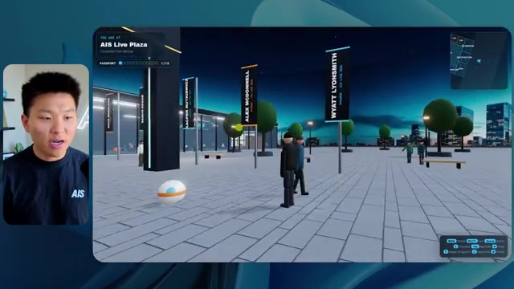

# 🎬 Is Claude Mythos Coming?

> **Chaîne** : [Nate Herk | AI Automation](https://www.youtube.com/@nateherk/featured)  
> **Lien YouTube** : [https://www.youtube.com/watch?v=lkR6mvqQQlk](https://www.youtube.com/watch?v=lkR6mvqQQlk)  
> **Date de publication** : 20260606  
> **Durée** : 00:12:24  
> **Identifiant vidéo** : `lkR6mvqQQlk`  
> **Transcription & Analyse** : `whisper-v3-large-turbo+gemini-3.5-flash-lite`  

---

## 📌 Synthèse Exécutive & Outils

### 💡 Résumé

Cette vidéo de la chaîne *Nate Herk | AI Automation* plonge au cœur de l'ingénierie des agents IA et de l'optimisation des flux de développement en testant le modèle **Opus 5.5** d'Anthropic sous l'angle critique du paramètre d'*Effort Level*. À travers une expérimentation concrète et audacieuse, Nate Herk soumet un prompt unique et complexe (un *slash goal*) consistant à transformer un dossier brut de 105 gigaoctets d'enregistrements vidéo d'un événement virtuel (*AIS Live*) en un monde 3D interactif, explorable à la troisième personne, intégrant physique, design et respect de l'identité visuelle de la marque. 

La vidéo décortique l'impact direct des différents niveaux d'effort (Faible, Moyen, Élevé) sur la qualité finale de l'application générée, tout en analysant des métriques opérationnelles cruciales telles que le temps d'exécution, le coût estimé en API, le volume de tokens consommés, le nombre de vérifications automatisées et l'autonomie des agents. Les résultats remettent en question les idées reçues : le niveau faible, bien que rapide, produit un monde superficiel peuplé d'avatars fantomatiques et truffé de bugs visuels pour un coût de 3,91 $ et 16 minutes d'exécution, tandis que le niveau moyen élève considérablement le niveau de réalisme (vidéos fonctionnelles, respect de la charte graphique, interactions dynamiques et PNJ réactifs) au prix d'une heure et 13 minutes de traitement et de 12,44 $. 

Au-delà de la prouesse technique de prototypage instantané, cette démonstration met en lumière la nécessité cruciale de combler le fossé entre le code généré localement et son déploiement en production, une problématique habilement résolue par l'intégration d'outils de publication directe comme l'extension Hostinger.

### 🛠️ Outils, Modèles & Logiciels Présentés

* **Opus 5.5** : Le modèle d'intelligence artificielle phare d'Anthropic, salué pour son intelligence, son coût abordable et sa capacité à s'adapter dynamiquement à différents niveaux d'effort algorithmique.
* **Claude Code** : L'outil de développement et de génération de code intégré d'Anthropic, utilisé comme environnement de travail pour piloter les agents autonomes.
* **Effort Level (Faible, Moyen, Élevé, Ultra)** : Le paramètre de configuration d'Anthropic permettant de moduler la profondeur de raisonnement, le temps de calcul et la rigueur d'exécution d'un agent IA.
* **Frame.io** : La plateforme cloud de gestion et de stockage vidéo utilisée pour héberger le dossier de 105 Go contenant les ressources brutes de l'événement *AIS Live*.
* **Hostinger Connector** : Une extension gratuite pour éditeur de code (VS Code) présentée comme sponsor, permettant de lier instantanément un environnement de développement local à un compte d'hébergement web pour faciliter le déploiement.
* **Système d'exploitation IA Herc 2** : L'écosystème propriétaire et modulaire de Nate Herk servant de cadre de référence et de boîte à outils pour orchestrer ses automatisations.

### 🔑 Points Clés & Enseignements Stratégiques

* **L'impact direct du paramètre d'effort** : La modification du niveau d'effort (*Effort Level*) ne se limite pas à ajuster le temps d'exécution ; elle transforme radicalement la complexité architecturale, la rigueur du design et la fidélité fonctionnelle du code produit par l'IA.
* **Le piège du prototypage superficiel en niveau faible** : Un effort réglé sur le niveau bas produit des résultats esthétiquement pauvres, des bugs d'affichage majeurs (avatars qui disparaissent) et des intégrations génériques (absence de respect de la charte graphique) pour un temps d'exécution de 16 minutes et un coût de 3,91 $.
* **Le bond qualitatif du niveau moyen** : Le passage au niveau d'effort moyen justifie pleinement son coût (12,44 $ et 1 h 13 min de traitement) en générant un monde 3D cohérent, respectueux de la marque, intégrant de vraies lectures vidéo et des personnages non-joueurs (PNJ) dotés de micro-comportements interactifs.
* **L'autonomie totale des agents** : À travers les différents tests réalisés avec des invites de type *slash goal*, les agents se sont montrés totalement autonomes, exécutant des dizaines de vérifications dans le navigateur sans nécessiter la moindre intervention humaine ni poser de questions de clarification.
* **La lourdeur des boucles de validation automatisée** : L'agent en mode moyen a exécuté pas moins de 23 cycles de vérification (ouverture répétée du navigateur pour tester l'application), illustrant la rigueuritérative nécessaire pour s'assurer de la viabilité du code généré.
* **L'équation coût/bénéfice des tokens** : L'augmentation de l'effort s'accompagne d'une explosion logique de la consommation de jetons (passant de 191 000 tokens en mode faible à 490 000 tokens en mode moyen), un investissement en ressources justifié par la richesse de l'application finale.
* **L'alignement des recommandations d'Anthropic** : L'expérience confirme empiriquement la bonne pratique préconisée par Anthropic dans sa documentation : commencer par un niveau d'effort moyen pour évaluer la pertinence de la tâche avant d'ajuster le curseur à la hausse ou à la baisse.
* **Le goulet d'étranglement du déploiement** : La génération d'une application fonctionnelle par l'IA crée un nouveau défi opérationnel, celui du passage du code brut stocké en local sur l'ordinateur portable à une mise en ligne accessible sur le web.
* **L'importance des extensions de productivité pour le dernier kilomètre** : L'utilisation d'outils de connectivité directe entre l'IDE (comme VS Code) et les services d'hébergement web élimine les frictions techniques et accélère considérablement le cycle de livraison des projets automatisés.

---

## ⏱️ Chronologie & Transcription Complète Audio & Visuelle (Mot pour Mot)

### ⏱️ `[00:00:00 - 00:00:20]` | Segment #01

**🔊 Audio (Transcription Intégrale Mot pour Mot en Français) :**
> Opus 5.5, Opus 5.5, Opus 5.5, Opus 5.5, Opus 5.5. Ce modèle est littéralement partout et pour de très bonnes raisons. Il est intelligent, il est bon marché, il a un goût extraordinaire, c'est un modèle d'IA incroyable. Mais avec chaque modèle d'IA, vous avez le choix de l'effort, que ce soit faible, moyen, élevé, extra, max ou code ultra.

**👁️ Analyse Visuelle d'Écran (gemini-3.5-flash-lite) :**
**Interface & Outils** : Interface du réseau social X (Twitter).

**Contenu textuel & Code** : Publication sur X avec une vidéo intégrée montrant un environnement 3D tropical.

**Action / Démonstration** : Affichage d'un exemple de contenu généré par IA pour illustrer les propos sur la disruption technologique.

*⏱️ 00:00:05 — Capture d'écran d'un tweet sur X montrant une vidéo de paysage tropical générée par IA et un texte sur la perturbation des métiers créatifs.*

---

### ⏱️ `[00:00:20 - 00:00:38]` | Segment #02

**🔊 Audio (Transcription Intégrale Mot pour Mot en Français) :**
> Donc dans cette vidéo, j'ai donné exactement le même prompt à Opus 5.5 et je l'ai exécuté à chaque niveau d'effort, et nous allons comparer les résultats. Nous examinerons la qualité de toutes les différentes sorties réelles, mais nous allons aussi examiner combien de temps chacun d'eux a pris, combien cela nous a coûté si c'était une facturation par API, le total des jetons, combien de vérifications ils ont exécutées, et combien de questions ils m'ont réellement posées tout au long du processus.

**👁️ Analyse Visuelle d'Écran (gemini-3.5-flash-lite) :**
**Interface & Outils** : Application web de tableau blanc ou de prise de notes (type canvas)

**Contenu textuel & Code** : Tableau avec les colonnes : Low, Medium, High, Extra, Max, Ultracode, et les lignes : Run time, API cost, Total tokens, Checks, Questions asked.

**Action / Démonstration** : Présentation du tableau comparatif des performances de l'IA selon les différents niveaux d'effort.

*⏱️ 00:00:29 — Tableau comparatif sur fond sombre montrant les différents niveaux d'effort (Low, Medium, High, Extra, Max, Ultracode) et des métriques (Run time, API cost, Total tokens, Checks, Questions asked) avec des zones floutées.*

---

### ⏱️ `[00:00:39 - 00:00:58]` | Segment #03

**🔊 Audio (Transcription Intégrale Mot pour Mot en Français) :**
> Et les résultats que nous avons obtenus ne sont pas du tout ce à quoi je m'attendais, donc j'ai hâte de partager cela avec vous les gars. Ne perdons pas de temps et allons directement à celui-ci. D'accord, alors plongeons directement dans celui-ci. Je veux commencer juste en vous montrant, les gars, le prompt réel que nous avons utilisé, que nous avons donné à chacun de ces différents agents. Je vais aller dans les fichiers ici, et nous allons ouvrir ce fichier markdown de prompt, et je vais vous montrer ce que nous avons obtenu. Voici donc le slash objectif que j'ai fourni.

**👁️ Analyse Visuelle d'Écran (gemini-3.5-flash-lite) :**
**Interface & Outils** : Interface de l'application de développement IA (style éditeur/agent) avec barre latérale de gestion des tâches et zone de chat.

**Contenu textuel & Code** : Message de l'assistant IA demandant si l'utilisateur souhaite commencer la tâche de construction d'un monde 3D interactif basé sur un fichier PROMPT.md.

**Action / Démonstration** : Le présentateur introduit l'interface de l'outil de développement et prépare le lancement d'une tâche de génération de code IA.

*⏱️ 00:00:48 — Interface de l'application de développement IA montrant un panneau latéral avec des sessions de test d'effort et une fenêtre de chat principal avec un message de prompt.*

---

### ⏱️ `[00:00:58 - 00:01:34]` | Segment #04

**🔊 Audio (Transcription Intégrale Mot pour Mot en Français) :**
> J'ai dit, tu dois me créer un monde 3D qui est une conférence tech réaliste dans laquelle je peux me promener en vue à la troisième personne. Tu vas regarder ce dossier, qui contient mes ressources d'enregistrement d'événements de AIS Live. Et ce dossier est un dossier frame IO de 105 gigaoctets d'enregistrements vidéo. C'était un événement entièrement virtuel. Tout a été enregistré et tous les enregistrements sont juste ici. J'ai dit, ton objectif est de prendre cet événement et de le transformer en un monde 3D explorable qui me donne l'impression d'être réellement allé à une vraie conférence en personne avec différentes salles, différentes pistes, différentes scènes, bla, bla, bla. N'hésite pas à utiliser key.ai si tu as besoin de générer des images ou des vidéos. Et tu peux aussi utiliser n'importe quoi d'autre à l'intérieur de mon projet Herc 2, qui est comme mon système d'exploitation IA. J'ai dit,

**👁️ Analyse Visuelle d'Écran (gemini-3.5-flash-lite) :**
**Interface & Outils** : Éditeur de code (VS Code / Cursor) et interface web Frame.io

**Contenu textuel & Code** : Fichier Markdown de prompt pour l'agent IA et interface de partage de fichiers cloud Frame.io (105 Go)

**Action / Démonstration** : Présentation du prompt initial et du dossier de ressources nécessaires pour la génération du monde 3D

*⏱️ 00:01:07 — Éditeur de code affichant le fichier PROMPT.md avec les instructions pour créer un monde 3D interactif et le lien Frame.io.*

*⏱️ 00:01:16 — Interface Frame.io affichant un dossier de ressources d'événements AIS Live de 105 Go avec les sous-dossiers 'GA Access' et 'VIP Access'.*

*⏱️ 00:01:25 — Retour sur l'éditeur de code montrant le contenu complet du prompt demandant de convertir les enregistrements virtuels en un monde 3D explorable.*

---

### ⏱️ `[00:01:34 - 00:02:08]` | Segment #05

**🔊 Audio (Transcription Intégrale Mot pour Mot en Français) :**
> vous serez jugé sur la créativité, le design, la physique et la sensation générale lorsque j'explorerai le monde 3D que vous avez construit. Et c'était fondamentalement la fin des instructions. Donc, comme vous pouvez le voir sur ce côté gauche, j'ai exécuté ceci à travers tous les différents niveaux d'effort. Commençons par le niveau bas et progressons jusqu'à l'ultra code. Très bien. Donc ici, nous avons le résultat du niveau bas. Ouvrons ceci et jetons un œil. Nous avons donc AIS Live, le sommet des services IA en personne enfin, et nous avons pu cliquer partout. Tout d'abord, cela ne fait pas très personnalisé. Genre, ce n' ce n'est pas le logo d'IS Live. Ce n'est même pas nos couleurs. Donc je n'aime pas trop ça, mais entrons ici. D'accord. C'est beaucoup trop lumineux. Euh, nous avons une carte en haut à droite. Nous avons une ville ici en arrière-plan. Je ne peux pas dire quelle ville c'est.

**👁️ Analyse Visuelle d'Écran (gemini-3.5-flash-lite) :**
**Interface & Outils** : Interface web d'un assistant de code / agent IA (type interface Claude ou outil similaire) avec panneau latéral de gestion des worktrees et sessions.

**Contenu textuel & Code** : Texte du prompt : "Hi Nate. This worktree has the effort-test task queued in PROMPT.md : build a walkable third-person 3D world of the AIS Live conference from your f.io recordings..." et saisie utilisateur "yes, start the task in PROMPT.md".

**Action / Démonstration** : Navigation et sélection des différents niveaux de test (Hello, Extra, High, Max, Ultracode, Medium, Low) dans le panneau latéral gauche.

*⏱️ 00:01:42 — Interface d'une application d'IA affichant une liste de sessions de test avec différents niveaux (Hello, Extra, High, Max, Ultracode, Medium, Low) et un panneau de discussion montrant un prompt lié à la création d'un monde 3D.*

---

### ⏱️ `[00:02:08 - 00:02:40]` | Segment #06

**🔊 Audio (Transcription Intégrale Mot pour Mot en Français) :**
> C'est. D'accord. C'est Chicago, ce qui est plutôt cool parce que tu sais, je vis à Chicago, mais bref, en haut à droite, on peut voir une carte. On a un hall d'accueil. On a un hall d'exposition. On a un salon VIP, la scène principale. Aussi, la carte montre où se trouve chaque autre personne et ça se synchronise en direct. Donc on peut voir l'enregistrement. On peut voir le premier jour, la keynote de l'agent Hyper, le débriefing en direct. Cool. Donc il connaît vraiment l'programme et puis il y a le deuxième jour. Donc il a trouvé ça, c'est bien. On a ces petites boules ici que je peux espérer lancer autour de moi. D'accord. Le visage, oh, regarde ça. Si je vais par ici, toutes les personnes disparaissent tout simplement. Très mauvais. Très mauvais. D'accord. Alors voyons voir. Est-ce que je peux sprinter ? D'accord.

**👁️ Analyse Visuelle d'Écran (gemini-3.5-flash-lite) :**
**Interface & Outils** : Application virtuelle 3D interactive (plateforme de conférence virtuelle).

**Contenu textuel & Code** : Menus, programmes de conférence, mini-cartes de localisation et avatars d'utilisateurs.

**Action / Démonstration** : Navigation et exploration de différents espaces de la conférence virtuelle 3D.

*⏱️ 00:02:16 — Vue d'un espace virtuel 3D interactif montrant le retrait des badges avec plusieurs avatars et une mini-carte en haut à droite.*

*⏱️ 00:02:24 — Vue du lobby dans l'application virtuelle 3D avec un panneau affichant le programme du premier jour ("Day 1").*

*⏱️ 00:02:32 — Vue de l'Expo Hall dans le monde virtuel avec des avatars, des stands et une mini-carte interactive.*

---

### ⏱️ `[00:02:40 - 00:03:04]` | Segment #07

**🔊 Audio (Transcription Intégrale Mot pour Mot en Français) :**
> Je peux aller un peu plus vite. Je vais d'abord aller par ici. Il y a des produits promotionnels, euh, certifié AIS plus glido. D'accord. Donc il y a les vrais stands qu'on avait dans l'événement virtuel. On avait des stands. Donc c'est plutôt cool. Un petit endroit pour prendre des photos. Salle C. En ce moment, nous avons Tangy Frederick qui anime un atelier. D'accord. Mais ce n'est pas une vidéo. Comme vous pouvez le voir, c'est juste une image. Elle ne bouge pas. Donc c'est juste une image. Ces gens sont en train de disparaître. Ce doivent être des fantômes. Allons par ici vers la salle A.

**👁️ Analyse Visuelle d'Écran (gemini-3.5-flash-lite) :**
**Interface & Outils** : Application de métavers 3D / événement virtuel interactif

**Contenu textuel & Code** : Instructions affichées sur grand écran virtuel : "Step 1: Go To Settings", "Step 2: Go To API Integrations", "Step 3: Go To Create A New Token"

**Action / Démonstration** : Exploration et navigation d'un avatar dans un espace d'événement virtuel interactif (stands, salles d'ateliers et affichage de contenu pédagogique).

*⏱️ 00:02:46 — Vue d'un monde virtuel 3D de type métavers montrant un stand d'exposition avec le logo Glaido et des cubes marqués AIS.*

*⏱️ 00:02:52 — Le personnage virtuel navigue dans une salle d'atelier aux éclairages verts fluorescents (Salle C / Enterprise track).*

*⏱️ 00:02:58 — Gros plan sur un écran virtuel dans le monde 3D affichant des instructions étape par étape sur la création de clés API.*

---

### ⏱️ `[00:03:04 - 00:03:30]` | Segment #08

**🔊 Audio (Transcription Intégrale Mot pour Mot en Français) :**
> Nous avons Liberty White. D'accord. Très cool. Vos 30 premiers jours en automatisation. Encore une fois, c'est juste une image fixe et les gens ont des bugs d'affichage. Donc ce n'est pas très bien ici. Je vais aller sur la scène principale et voir ce que nous avons. D'accord, cool. Donc nous avons une scène principale. Les gens ont de gros bugs d'affichage. Vraiment mauvais. Ce n'est vraiment pas terrible. Notre vidéo est en train de bouger. Genre, j'ai vu mon visage ici et j'ai vu celui de Devin, mais maintenant ils ont disparu. Donc je ne sais pas trop ce qui s'est passé. D'accord. C'est, on dirait que c'est plutôt un diaporama. Rien n'est vraiment diffusé pour l'instant. Quoi qu'il en soit, entrons ici.

**👁️ Analyse Visuelle d'Écran (gemini-3.5-flash-lite) :**
**Interface & Outils** : Application ou plateforme virtuelle 3D type métavers / monde virtuel interactif (AIS Live).

**Contenu textuel & Code** : Interface de navigation et affichage de l'événement 'AIS Live AI Services Summit' avec des avatars stylisés.
[COPIE] Navigation et déplacement de l'avatar de l'utilisateur à l'intérieur de l'espace virtuel de conférence.

**Action / Démonstration** : Explications face caméra et démonstration conceptuelle.

*⏱️ 00:03:17 — Navigation dans l'espace virtuel de type métavers avec un public d'avatars assis face à une estrade (Main Stage).*

*⏱️ 00:03:24 — Vue d'ensemble de la grande salle virtuelle 'AIS Live - AI Services Summit' avec écrans géants et avatars.*

---

### ⏱️ `[00:03:30 - 00:03:58]` | Segment #09

**🔊 Audio (Transcription Intégrale Mot pour Mot en Français) :**
> Nous avons d'autres stands. Nous avons hyper agent. Nous avons Claude Code. Nous avons plus de cadeaux publicitaires. La salle B, c'est Dave Ebelor. Je suppose que c'est exactement la même chose. Nous avons du café. Et puis, je suppose que le salon VIP est réservé à l'accès VIP uniquement. C'est plutôt cool, mais il ne se passe vraiment rien ici. Cet écran est beaucoup trop lumineux. D'accord. Donc je pense que vous comprenez l'ambiance que nous obtenons ici avec Opus 5.5 en effort faible. Et c'est là que les choses deviennent intéressantes. Combien de temps pensez-vous que cela a duré ? Combien de temps ? Celui-ci a duré 16 minutes et 43 secondes. Combien pensez-vous que cela a coûté ?

**👁️ Analyse Visuelle d'Écran (gemini-3.5-flash-lite) :**
**Interface & Outils** : Interface de tableau blanc / application de mindmapping montrant un tableau comparatif.

**Contenu textuel & Code** : Tableau avec les colonnes Low, Medium, High, Extra, Max, Ultracode et les lignes Run time, API cost, Total tokens, Checks, Questions asked.

**Action / Démonstration** : Le présentateur commente le tableau comparatif affiché à l'écran.

*⏱️ 00:03:51 — Un tableau comparatif sur fond sombre avec les niveaux Low, Medium, High, Extra, Max et Ultracode.*

---

### ⏱️ `[00:03:58 - 00:04:26]` | Segment #10

**🔊 Audio (Transcription Intégrale Mot pour Mot en Français) :**
> 3,91 dollars si c'était une facturation par API. J'utilise évidemment mon abonnement ici, mais nous allons simplement calculer cela en facturation par API. Le total des jetons était de 191 000. Il a effectué 22 vérifications. Donc pour la vérification, il a ouvert le navigateur 22 fois et a exécuté différents types de vérifications. Donc 22 catégories de vérifications. Et combien de questions m'a-t-il posées ? Il m'a posé un total de zéro question tout au long de cette invite de type « slash goal ». D'accord. Alors, ouvrons l'effort moyen et voyons ce que nous avons. D'accord, y voilà. Effort moyen. Nous avons Nate Herc. Nous avons mon badge. C'est de la marque AI's Life.

**👁️ Analyse Visuelle d'Écran (gemini-3.5-flash-lite) :**
**Interface & Outils** : Outil de tableau blanc ou d'édition graphique en ligne (type Excalidraw ou similaire).

**Contenu textuel & Code** : Tableau avec les lignes "Run time", "API cost", "Total tokens", "Checks", "Questions asked" et les colonnes "Low", "Medium", "High", "Ex".

**Action / Démonstration** : Le présentateur commente les résultats chiffrés affichés dans le tableau pour le niveau d'effort "Low".

*⏱️ 00:04:05 — Un tableau comparatif montrant les métriques de performance et de coût pour le niveau "Low" (Temps d'exécution: 16m 43s, Coût API: 3,91 $, Total des jetons: 191,3K, Vérifications, Questions posées).*

---

### ⏱️ `[00:04:26 - 00:04:46]` | Segment #11

**🔊 Audio (Transcription Intégrale Mot pour Mot en Français) :**
> Donc ça a déjà l'air un petit peu mieux. Ça ressemble à nos palettes de couleurs qui ont utilisé nos directives de marque. Premier jour de construction, deuxième jour de gain, VIP. Cool. D'accord. Je vais entrer dans le lieu. D'accord. Waouh. Une ambiance similaire, en gros. C'est en arrière-plan. Ça ne ressemble pas à Chicago, hein ? Non, ça ressemble à, honnêtement, ça ressemble à une ville imaginaire. Quoi qu'il en soit, c'est marrant qu'ils aient décidé de faire ça. Voyons si je peux avancer un peu plus vite. Oh, waouh.

**👁️ Analyse Visuelle d'Écran (gemini-3.5-flash-lite) :**
**Interface & Outils** : Application web interactive / Plateforme virtuelle 'AIS Live' 3D

**Contenu textuel & Code** : Page de connexion/accueil avec badge VIP interactif et commandes de navigation virtuelle (WASD, Shift, Espace)

**Action / Démonstration** : Le présentateur se connecte à l'application et entre dans le lieu virtuel 3D de l'événement.

*⏱️ 00:04:31 — Interface d'accueil de l'application 'AIS Live' montrant un badge de pass VIP aux couleurs de la marque avec le nom 'NATE HERK' et un bouton 'ENTER THE VENUE'.*

*⏱️ 00:04:41 — Vue virtuelle en 3D d'un espace de type métavers ou jeu avec des avatars d'utilisateurs et une vue panoramique nocturne de ville en arrière-plan.*

---

### ⏱️ `[00:04:46 - 00:05:21]` | Segment #12

**🔊 Audio (Transcription Intégrale Mot pour Mot en Français) :**
> Les gens interagissent avec moi. Regardez. Si je m'approche de ce type, il vient de lever le bras. Bon, maintenant il ne veut plus du tout avoir affaire à moi. Mais tous ces petits robots ici doivent prendre des décisions. Je ne sais pas s'ils utilisent Jev. C'est sûr que non. Je ne le lui ai pas dit. En fait, ma clé Jev est à l'arrière. Je ne sais pas. Peut-être qu'il l'a utilisée. Quoi qu'il en soit, nous pouvons voir ici que nous avons la salle d'atelier C, le laboratoire des agents. Sympa. Donc celui-ci est en fait en train d'être exécuté. Vous pouvez voir qu'il s'agit d'une vraie vidéo lue par Tangy. Tout le monde ici est en train de travailler sur un ordinateur portable. Ils ne buguent pas. C'est plutôt cool. De plus, mon badge est sur ma poitrine, ce qui est plutôt cool. Je peux venir par ici. Nous avons une carte en haut à droite, comme vous pouvez le voir, mais je peux venir par ici. Nous avons un

**👁️ Analyse Visuelle d'Écran (gemini-3.5-flash-lite) :**
**Interface & Outils** : Application de monde virtuel 3D (type Gather.town ou environnement similaire)

**Contenu textuel & Code** : Environnement virtuel avec des avatars d'utilisateurs et une mini-carte en haut à droite.

**Action / Démonstration** : Navigation et exploration de l'espace virtuel par le présentateur.

---

### ⏱️ `[00:05:21 - 00:05:47]` | Segment #13

**🔊 Audio (Transcription Intégrale Mot pour Mot en Français) :**
> hall d'exposition. C'est là que nous avons le stand Glido. Et ça diffuse en ce moment. Oui, ça diffuse la vidéo de nous parlant de Glido. Ça diffuse la vidéo d'Ed et moi parlant de notre programme de certification. Nous avons le logo AIS Plus juste ici, qui est un peu dans un endroit bizarre. Ce sont les diapositives des conférenciers et les points clés. Alors wow, ce sont toutes les ressources que nous avons distribuées après l'événement. Elles sont toutes là aussi. Nous pouvons voir que nous avons un coup de projecteur sur la communauté. C'est donc Aiden qui parle de l'accord qu'il a conclu et c'est diffusé en direct. Ces gens regardent.

**👁️ Analyse Visuelle d'Écran (gemini-3.5-flash-lite) :**
**Interface & Outils** : Environnement virtuel 3D / plateforme interactive de type salon virtuel.

**Contenu textuel & Code** : Affiches, bannières, diapositives et interfaces graphiques d'un événement virtuel (AIS+ Certified).

**Action / Démonstration** : Navigation et visite guidée d'un espace d'exposition virtuel par le présentateur.

---

### ⏱️ `[00:05:47 - 00:06:21]` | Segment #14

**🔊 Audio (Transcription Intégrale Mot pour Mot en Français) :**
> Ils sont plutôt engagés. On a l'hyper agent. C'était, c'est ce que je voulais dire. Si vous avez vu ces gens lever les bras en disant salut, c'était plutôt drôle. Regardez, regardez, le voilà qui recommence. Bref. Bon. Où est-ce que je suis maintenant ? Maintenant, je suis dans le hall principal. On a un bar à café. On a un grand logo, qui est le vrai logo. C'est trop lumineux, mais on a le logo. On peut voir si on peut entrer ici pour le parcours de base. On a Sabrina Romanov et Liberty White. Donc, différentes formations juste là. On peut entrer dans cette salle. C'est le parcours avancé. Alors, qu'est-ce qui se passe ici ? On a Dave Ebelar et Saman qui parlent de différentes choses là-dedans. Et maintenant, allons jeter un œil à la scène principale. Oh, attendez, il y a une vidéo de moi là-haut. Est-ce que c'est comme un VIP

**👁️ Analyse Visuelle d'Écran (gemini-3.5-flash-lite) :**
**Interface & Outils** : Application de métavers ou de salon virtuel en 3D

**Contenu textuel & Code** : Environnement virtuel 3D de type salle de conférence et hall d'exposition avec mini-carte en haut à droite

**Action / Démonstration** : Navigation et déplacement d'un avatar dans un espace virtuel 3D lors d'un événement en ligne

---

### ⏱️ `[00:06:21 - 00:06:50]` | Segment #15

**🔊 Audio (Transcription Intégrale Mot pour Mot en Français) :**
> section ? Ouais, on ira voir ça dans une minute. Mais bref, voici la scène principale. Ça a l'air vraiment, vraiment très bien. On a une grande scène. On a genre quatre personnes assises ici. On a les trois écrans d'Alex là-haut avec hyper agent. Est-ce que j'ai le droit de monter sur scène ? Oh, et il me laisse monter sur scène. D'accord. C'est plutôt sympa. Bon les gars, prenons un selfie. Laissez-moi mettre tout le monde en arrière-plan. Venez par ici. Bref, c'est plutôt, plutôt cool. Par contre, toutes les places ne sont pas occupées. Donc il faut qu'on travaille là-dessus. Mais bref, je vais y retourner en courant pour voir ce que c'était que cette section VIP. D'accord. Salon VIP. J'ai l'impression que c'est comme un aéroport ou un truc comme ça.

**👁️ Analyse Visuelle d'Écran (gemini-3.5-flash-lite) :**
**Interface & Outils** : Application virtuelle 3D de type métavers / plateforme de conférence Hyperagent.

**Contenu textuel & Code** : Interface utilisateur de visioconférence ou d'événement virtuel avec affichage des sessions (« Hyperagent Keynote »).

**Action / Démonstration** : Navigation et exploration de l'espace virtuel par l'utilisateur à travers un avatar 3D.

---

### ⏱️ `[00:06:51 - 00:07:14]` | Segment #16

**🔊 Audio (Transcription Intégrale Mot pour Mot en Français) :**
> Ok, super. Donc maintenant nous avons les sessions VIP ici. Session de questions-réponses VIP avec Nate, lecture vidéo en direct juste ici. Très, très cool. Et nous avons comme un bar ou quelque chose du genre. Génial. Je dirais que c'est un très bon résultat. Maintenant, en ce qui concerne les statistiques ici, celle-ci a pris une heure et 13 minutes à s'exécuter. Cela nous aurait coûté 12 dollars et 44 cents. Elle a utilisé 490 000 jetons et elle a effectué 23 vérifications.

**👁️ Analyse Visuelle d'Écran (gemini-3.5-flash-lite) :**
**Interface & Outils** : Espace virtuel 3D et tableau de bord d'analyse de performance "Opus 5.5 Efforts".

**Contenu textuel & Code** : Statistiques d'exécution d'IA : Run time 16m 43s, API cost $3.91, Total tokens 191.3K, Checks 22, Questions asked 0.

**Action / Démonstration** : Présentation de la zone VIP virtuelle puis transition vers l'affichage des métriques et statistiques d'utilisation.

*⏱️ 00:06:56 — Capture montrant l'espace virtuel VIP avec un écran géant affichant une session de questions-réponses en direct, un bar et des avatars d'utilisateurs.*

*⏱️ 00:07:02 — Capture montrant un tableau de statistiques sur une interface "Opus 5.5 Efforts" détaillant le temps d'exécution (16m 43s), le coût de l'API ($3.91) et les tokens (191.3K).*

---

### ⏱️ `[00:07:14 - 00:07:48]` | Segment #17

**🔊 Audio (Transcription Intégrale Mot pour Mot en Français) :**
> Et il ne nous a posé absolument aucune question une nouvelle fois. Très bien, passons au niveau élevé. C'était déjà un résultat plutôt correct, et Anthropic eux-mêmes dans leur vidéo sur comment prompter Opus 5.5, ou désolé, pas une vidéo, un article. Ils ont dit de commencer simplement par le niveau moyen et d'ajuster à la hausse ou à la baisse si nécessaire. C'était donc un résultat moyen. Passons au niveau élevé pour voir ce qu'on obtient. Très rapidement, les gars, je dois prendre une seconde pour vous parler du sponsor de la vidéo d'aujourd'hui, Hostinger. Donc ces deux modèles viennent de me créer une version fonctionnelle de la même chose. Et maintenant, je me retrouve exactement là où je finis toujours, avec quelque chose de terminé sur mon ordinateur portable et aucun moyen rapide de le mettre en ligne. Et c'est précisément le fossé que comble le connecteur d'Hostinger. C'est une extension gratuite

**👁️ Analyse Visuelle d'Écran (gemini-3.5-flash-lite) :**
**Interface & Outils** : Tableau comparatif sur canevas numérique et interface de développement / outil d'IA.

**Contenu textuel & Code** : Métriques de performance d'IA (temps d'exécution, coût API, jetons) et code/prompts liés au projet "Northwind ROI calculator".
[DESC_IMAGE_2] Analyse et présentation comparative des résultats de différents niveaux de configuration d'IA.

**Action / Démonstration** : Présentation des résultats comparatifs et discussion sur les niveaux de performance et d'effort des modèles d'IA.

*⏱️ 00:07:22 — Un tableau comparatif affichant les métriques (Run time, API cost, Total tokens, Checks, Questions asked) pour différents niveaux de performance (Low, Medium, High, Extra), avec le présentateur incrusté à gauche.*

*⏱️ 00:07:39 — Une interface de développement ou de chat d'IA divisée en deux panneaux montrant l'exécution d'un prompt pour créer un calculateur de ROI Northwind, avec le présentateur en incrustation en bas à droite.*

---

### ⏱️ `[00:07:48 - 00:08:23]` | Segment #18

**🔊 Audio (Transcription Intégrale Mot pour Mot en Français) :**
> pour votre éditeur qui intègre votre compte Hostinger dans l'outil où vous êtes déjà en train de coder. Donc VS Code, Cursor, Cloud Code, Codex, comme vous voulez. Vous vous connectez une seule fois en un seul clic, et à partir de là, votre agent peut déployer le site, y pointer un domaine, configurer les enregistrements DNS et vérifier votre VPS sans que vous n'ayez jamais à quitter l'éditeur. Donc, peu importe celui de ces outils que vous finirez par préférer, ce qu'il a construit se trouve à quelques minutes d'une vraie URL sur un hébergement géré. Le connecteur est gratuit sur tous les forfaits d'hébergement, donc si vous avez toujours besoin de l'hébergement en dessous, prenez le forfait illimité avec le lien dans la description et utilisez le code NATEHERK pour 10 % de réduction. Cela inclut également un domaine gratuit et un e-mail professionnel pour l'année. Et c'est toujours le moyen le moins cher que j'ai trouvé pour obtenir quelque chose

**👁️ Analyse Visuelle d'Écran (gemini-3.5-flash-lite) :**
**Interface & Outils** : Interface de gestion Hostinger MCP / IDE et terminal Claude Code

**Contenu textuel & Code** : Panneau "Manage Hostinger from your IDE" avec statut "Connected" et options pour les sites web, domaines, abonnements et e-mail marketing.

**Action / Démonstration** : Connexion du compte Hostinger à l'éditeur via OAuth pour permettre à l'assistant de gérer les déploiements et les domaines.

*⏱️ 00:07:57 — Interface montrant l'intégration de Hostinger connectée via OAuth à un IDE, avec le panneau de Claude Code sur la droite et le présentateur en médaillon.*

---

### ⏱️ `[00:08:23 - 00:08:47]` | Segment #19

**🔊 Audio (Transcription Intégrale Mot pour Mot en Français) :**
> vous avez construit sur une vraie URL. Donc revenons à la vidéo. D'accord. Encore une fois, très, très marqué par la marque. C'est un écran de chargement encore mieux que le précédent. Nous avons ce petit effet sympa en arrière-plan. Nous avons le logo. Nous allons entrer dans le lieu. D'accord. Nous y voilà. Ça a l'air plutôt bien. Nous commençons dehors et vous pouvez voir que nous avons ces drapeaux pour tous les intervenants, Wyatt, Casper, Alex, Ed, Aiden, Sabrina, Liberty. C'est plutôt cool. Nous avons des blocs en direct ici.

**👁️ Analyse Visuelle d'Écran (gemini-3.5-flash-lite) :**
**Interface & Outils** : Application web 3D / Navigateur web (plateforme événementielle virtuelle)

**Contenu textuel & Code** : Éléments graphiques 3D, bannières d'intervenants (Alex McDonnell, Wyatt Lyonsmith), HUD avec minimap et indicateurs de passeport

**Action / Démonstration** : Exploration d'un monde virtuel interactif en 3D représentant un espace de conférence en ligne

*⏱️ 00:08:29 — Écran de chargement et d'accueil de la plateforme virtuelle 'AIS LIVE' affichant les détails de l'événement et les contrôles de navigation.*

*⏱️ 00:08:35 — Vue de la place virtuelle 3D ('AIS Live Plaza') montrant les avatars et l'environnement extérieur du lieu virtuel.*

*⏱️ 00:08:41 — Vue en jeu de la place virtuelle montrant des bannières verticales avec des noms de conférenciers et l'avatar de l'utilisateur.*

---

### ⏱️ `[00:08:47 - 00:09:23]` | Segment #20

**🔊 Audio (Transcription Intégrale Mot pour Mot en Français) :**
> Il a pris cette photo de moi, votre hôte, Nate Herc, John, Dave, Nate Herc. Voilà. D'accord. Les portes. Génial. Ce sont des portes coulissantes automatiques en verre. J'adore ça. On peut voir l'enregistrement VIP. On peut voir l'admission générale. On peut venir par ici et on peut découvrir l'expo avec différents stands, le coin de la communauté. Vous pouvez aussi voir qu'en haut à gauche, j'ai un passeport. Donc c'est du genre, ça va montrer combien d'endroits j'ai visités. Tout cela est une vraie lecture. Nous avons un mur de ressources avec tous les différents intervenants. Ils ont aussi une session de réseautage par ici. Donc je vais y aller très vite et voir de quoi il s'agit. Nous avons donc le bar à cold brew AIS. Nous avons différents membres de la communauté qui ont été mis en avant ou en valeur.

**👁️ Analyse Visuelle d'Écran (gemini-3.5-flash-lite) :**
**Interface & Outils** : Application virtuelle 3D / Metavers de conférence et salon professionnel en ligne

**Contenu textuel & Code** : Interface utilisateur virtuelle affichant des zones de l'événement (Registration Concourse, Main Stage, Expo Hall), un passeport numérique et des options de navigation

**Action / Démonstration** : Navigation et visite guidée à l'intérieur d'un monde virtuel représentant une conférence en ligne avec des avatars

*⏱️ 00:08:56 — Vue principale de l'espace virtuel de l'événement avec un avatar se déplaçant vers la scène principale et les comptoirs d'enregistrement.*

*⏱️ 00:09:05 — Exploration de l'expo hall virtuel montrant des stands d'exposition et des bannières informatives.*

*⏱️ 00:09:14 — Vue panoramique du hall d'enregistrement virtuel avec des avatars d'utilisateurs qui circulent et de grandes baies vitrées.*

---

### ⏱️ `[00:09:23 - 00:09:56]` | Segment #21

**🔊 Audio (Transcription Intégrale Mot pour Mot en Français) :**
> Nous avons l'aile VIP. Attends, quoi ? Prends un bracelet. Oh, je dois vraiment aller chercher le bracelet. D'accord. Laisse-moi m'enregistrer rapidement. Le bracelet est déjà mis. Attends, quoi ? D'accord. Oh, d'accord. Maintenant, les portes se sont ouvertes pour moi. Cool. Je peux entrer ici. Oh, ça mène juste à la scène principale. Salon VIP. Il y a une séance de questions-réponses en cours. Ça a l'air très cool. Je veux dire, je suis très impressionné par la façon dont il est capable de faire ça. Waouh. D'accord. C'est donc vraiment bien. Ce que nous avons fait, c'est que nous avons eu des salles de discussion VIP avec différentes personnes. Tu peux voir qu'il y a différentes salles, différents membres de l'équipe AIS qui vont dans des trucs. C'est vraiment cool. C'est très cool. C'est un bien meilleur VIP

**👁️ Analyse Visuelle d'Écran (gemini-3.5-flash-lite) :**
**Interface & Outils** : Application ou plateforme virtuelle 3D interactive de type salon virtuel / métaverse.

**Contenu textuel & Code** : Interface utilisateur affichant la carte, les objectifs (Passport), et les sous-titres des interventions audio ("So evals are super, super important.").

**Action / Démonstration** : Navigation et exploration de différentes zones et salles VIP au sein de l'espace virtuel 3D.

*⏱️ 00:09:32 — Image montrant un avatar explorant une zone d'inscription virtuelle dans un espace 3D avec des bannières informatives.*

*⏱️ 00:09:40 — Image montrant l'avatar dans un salon VIP virtuel (VIP Lounge) avec des participants assis sur des canapés et un écran affichant une visioconférence.*

*⏱️ 00:09:48 — Image montrant l'avatar naviguant dans une zone de sessions de travail VIP avec différentes salles thématiques ("Price It Right", "Land Your First Paying Client").*

---

### ⏱️ `[00:09:56 - 00:10:30]` | Segment #22

**🔊 Audio (Transcription Intégrale Mot pour Mot en Français) :**
> expérience que ce qui a été montré dans la première partie. D'accord. After party VIP. Regardez ça. On a une piste de danse. On a tous ces éléments ici. On a la lecture de l'after party VIP juste ici. Et il y a une estrade pour DJ. C'est tellement marrant. Il y a un petit bug ici, un petit glitch ici, mais c'est génial. Oh, cool. Donc quand je suis ici sur la scène principale, on a des sous-titres. Vous pouvez voir juste ici en bas de mon écran, on a ces sous-titres de Wyatt qui est en train de parler ici. On a des lumières. On a le panel. Très cool. Belle scène principale. Je vais aller par ici. On peut aller vers la fondation,

**👁️ Analyse Visuelle d'Écran (gemini-3.5-flash-lite) :**
**Interface & Outils** : Environnement virtuel 3D interactif (plateforme de conférence ou événement virtuel en ligne)

**Contenu textuel & Code** : Interface utilisateur affichant la carte, le statut du passeport, les commandes de déplacement et le flux vidéo des participants.

**Action / Démonstration** : Navigation et exploration de l'espace virtuel par le présentateur.

*⏱️ 00:10:04 — Vue d'un espace virtuel d'after-party VIP avec piste de danse, avatars et écran géant montrant des participants en visio.*

*⏱️ 00:10:13 — Autre angle de la piste de danse virtuelle avec des ballons de plage et l'enseigne 'VIP AFTER-PARTY'.*

*⏱️ 00:10:21 — Vue de l'auditorium virtuel principal (Main Stage) avec un écran de présentation et des avatars assis dans le public.*

---

### ⏱️ `[00:10:30 - 00:11:06]` | Segment #23

**🔊 Audio (Transcription Intégrale Mot pour Mot en Français) :**
> avancé, et les parcours d'entreprise par ici. Alors voyons voir. Nous avons l'anatomie de trois vraies transactions. Nous avons hyper agent. Nous avons les évals avec Nate et Ed ici. Nous avons Dave qui s'occupe des trucs avancés. C'est vraiment bien. Je veux dire, évidemment, chacun, chacun de ces résultats jusqu'à présent, bas était correct. Moyen était meilleur. Élevé a été encore meilleur. Voyons si cette tendance se poursuit et allons voir ce que cela nous a coûté. Donc, élevé a tourné pendant une heure et sept minutes. Donc un peu plus rapide que moyen, cela nous aurait coûté 16 dollars et 31 cents. Il a utilisé un demi-million de tokens, 509 000. Il a fait 22 vérifications. Et il nous a aussi demandé, enfin, non, je me suis trompé. Ce

**👁️ Analyse Visuelle d'Écran (gemini-3.5-flash-lite) :**
**Interface & Outils** : Application web / Tableau de bord de métriques.

**Contenu textuel & Code** : Tableau avec des colonnes Low ($3.91, 16m 43s), Medium ($12.44, 1h 13m), High ($16.31, 1h 7m) et Extra.

**Action / Démonstration** : Analyse comparative des coûts d'API et des temps d'exécution selon les niveaux d'effort.

*⏱️ 00:10:57 — Tableau comparatif montrant les coûts et métriques (Run time, API cost, Total tokens, etc.) pour différents niveaux d'effort (Low, Medium, High, Extra).*

---

### ⏱️ `[00:11:06 - 00:11:25]` | Segment #24

**🔊 Audio (Transcription Intégrale Mot pour Mot en Français) :**
> l'un m'a posé une question et, divulgâcheur, c'était le seul qui nous a posé une question de tout ça. Alors voyons voir, il nous en reste trois : Extra, Max et Ultra Code. Laissez-moi ouvrir Extra et nous verrons ce que nous avons. D'accord. Donc celui-ci a l'air plutôt bien. Je dirais honnêtement que jusqu'à présent, l'écran de chargement haut était le meilleur. Celui que nous venons de voir, mais bref, entrons dans AIS Live.

**👁️ Analyse Visuelle d'Écran (gemini-3.5-flash-lite) :**
**Interface & Outils** : Application de tableau de bord ou interface web de comparaison de modèles.

**Contenu textuel & Code** : Tableau avec des colonnes Low, Medium, High, Extra et des lignes Run time, API cost, Total tokens, Checks, Questions asked.

**Action / Démonstration** : Le présentateur commente les résultats et sélectionne la colonne « Extra ».

*⏱️ 00:11:11 — Tableau comparatif affichant les métriques de différents modèles (« Low », « Medium », « High », « Extra ») incluant le temps d'exécution, le coût API, le nombre de tokens et de questions posées.*

---

### ⏱️ `[00:11:26 - 00:11:51]` | Segment #25

**🔊 Audio (Transcription Intégrale Mot pour Mot en Français) :**
> Wouah. D'accord. Donc nous avons comme de petits extraits sonores. Je peux discuter avec des gens. Le panel de la guerre des outils a réglé quelques débats pour moi. Sympa. Bonne perspective là-bas. Nous sommes dehors à nouveau. Nous avons ces différentes bannières, bien qu'elles soient toutes les mêmes. Elles n'affichent pas les noms de différentes personnes. Donc grand logo de AIS live. L'aile de l'atelier est par ici. Et passons par les portes coulissantes en verre et voyons ce que nous avons. Donc nous avons le café AIS. La carte est en bas à droite, et elle n'est pas très descriptive.

**👁️ Analyse Visuelle d'Écran (gemini-3.5-flash-lite) :**
**Interface & Outils** : Environnement virtuel (probablement une plateforme de métavers ou de collaboration virtuelle)

**Contenu textuel & Code** : Aucune information de contenu visible ou pertinente.

**Action / Démonstration** : Exploration et interaction dans un environnement virtuel.

*⏱️ 00:11:32 — Une scène virtuelle avec des avatars se promenant sur une place publique, avec des bannières "AIS LIVE" et "BUILD DAY" visibles.*

*⏱️ 00:11:38 — La même scène virtuelle, avec des avatars se dirigeant vers l'entrée d'un bâtiment de conférence. Le soleil se couche derrière la ville.*

*⏱️ 00:11:45 — Un avatar virtuel court vers l'entrée principale d'un grand bâtiment, ressemblant à un centre de conférence.*

---

### ⏱️ `[00:11:51 - 00:12:26]` | Segment #26

**🔊 Audio (Transcription Intégrale Mot pour Mot en Français) :**
> J'aime bien comment les autres cartes nous ont dit ce, genre, où étaient les choses, mais celle-ci a l'air très professionnelle. On peut voir ici c'est la scène principale. Allons y faire un tour rapidement. Ils ont tous ces ballons qui volent partout, ce qui je trouve est plutôt marrant. Les ballons de plage AIS. On nous a là-haut en train de parler. Je crois que j'introduisais l'un des jours. Continuons par ici vers la salle d'atelier sur ce côté gauche. D'accord. Donc ici nous avons le théâtre Hyper Agent. Nous avons cette session sponsorisée ici par Hyper Agent, mais ça nous montre aussi ce qui va se passer ici. C'est vraiment marrant qu'on puisse discuter avec des gens. Salmon a créé un représentant commercial vocal en direct. La salle du Juste Prix était comble. Tu as pris le guide compagnon VIP ? C'est trop marrant. Nous avons le parcours avancé dans

**👁️ Analyse Visuelle d'Écran (gemini-3.5-flash-lite) :**
**Interface & Outils** : Environnement virtuel de type métavers ou conférence.

**Contenu textuel & Code** : Texte sur des panneaux virtuels : "LIVE", "Main Stage", "Grand Ballroom", "Day 2 Open Now Let's Turn This Into Money", "AIS LIVE in the Room", "F WORKSHOPS", "Foundation · Advanced · Enterprise", "ENTERPRISE AI SERVICES". Des bulles de dialogue avec du texte sont également visibles.

**Action / Démonstration** : Exploration d'un espace virtuel représentant un événement.

*⏱️ 00:12:00 — Vue de la scène principale d'un événement virtuel, avec un conférencier sur scène et une foule dans le public. Des ballons virtuels flottent dans l'air.*

*⏱️ 00:12:09 — Une scène intérieure d'un événement virtuel avec des panneaux indiquant "F WORKSHOPS" et "ENTERPRISE AI SERVICES". Des avatars sont présents.*

*⏱️ 00:12:17 — Un couloir dans un environnement virtuel, avec plusieurs avatars qui interagissent. Des indications comme "Map", "Agenda", "Captions", "Help" sont visibles en bas de l'écran.*

---

### ⏱️ `[00:12:26 - 00:12:58]` | Segment #27

**🔊 Audio (Transcription Intégrale Mot pour Mot en Français) :**
> here. Once again, we've got live playback. Is that live playback? Oh, okay. It started once I got in, but I can take a seat. Oh my. I can watch this. I can stand up. I want to sit in the front. That's pretty cool. That's very nice. I like that. And you know what I noticed so far? The actual character that I'm playing kind of looks like me. I think it modeled it off of my thumbnail pictures or something. Anyways, we have Sabrina in here, room host here, grab any open seat. Okay, cool. And I really liked the sitting functionality. It's kind of funny. Like we could actually attend this workshop and participate. Anyways, it's showing us the speakers. It's showing us the

**👁️ Analyse Visuelle d'Écran (gemini-3.5-flash-lite) :**
**Interface & Outils** : Application de métavers ou plateforme de visioconférence en réalité virtuelle 3D (type Gather Town ou similaire).

**Contenu textuel & Code** : Interface utilisateur virtuelle d'un événement en ligne, affichant des options de navigation (Map, Agenda, Captions), un écran de projection géant avec un flux vidéo de webinaire et des avatars d'utilisateurs.

**Action / Démonstration** : Navigation et exploration de l'espace de réunion virtuel 3D par l'utilisateur (assis/debout).

*⏱️ 00:12:34 — Vue d'une salle de classe virtuelle en 3D violette avec des avatars assis, un écran de projection affichant une interface web et le présentateur incrusté à gauche.*

*⏱️ 00:12:42 — Vue de la salle de classe virtuelle en 3D verte avec d'autres avatars et une présentation en cours sur grand écran.*

*⏱️ 00:12:50 — Changement d'angle de caméra dans l'espace virtuel 3D montrant l'auditorium vert et l'écran principal affichant le webinaire en direct.*

---

### ⏱️ `[00:12:58 - 00:13:31]` | Segment #28

**🔊 Audio (Transcription Intégrale Mot pour Mot en Français) :**
> ordre du jour. Il y a un petit tapis rouge ici pour prendre des photos. Nous pouvons poser. Oh, wow. C'est plutôt cool. Bibliothèque de ressources, obtenez votre certification AIS Plus, Glido, Hyper Agent, AIS Plus, trois vraies affaires. Génial. Je veux dire, je dirais certainement que jusqu'à présent, chacun s'améliore. Et nous n'avons même pas encore regardé la section VIP, le salon VIP. Montons rapidement ici. J'espère que je peux entrer. Bien. Nous avons réinitialisé les outils. Ce sont les différentes salles où nous pourrions aller. Donc encore une fois, je pourrais prendre la feuille de travail et essayer de comprendre comment tarifer mes affaires. C'est tellement cool. C'est vraiment mieux que le précédent où nous avons un peu juste

**👁️ Analyse Visuelle d'Écran (gemini-3.5-flash-lite) :**
**Interface & Outils** : Application virtuelle 3D (metaverse / plateforme d'événements virtuels)

**Contenu textuel & Code** : Environnement virtuel 3D interactif avec des stands et des avatars d'utilisateurs

**Action / Démonstration** : Navigation et exploration d'un événement virtuel en 3D par l'utilisateur

---

### ⏱️ `[00:13:31 - 00:13:59]` | Segment #29

**🔊 Audio (Transcription Intégrale Mot pour Mot en Français) :**
> comme regardé des choses. Génial. Je peux me mettre derrière le bar et venir ici. C'est très agréable. D'accord. Pour ce qui est des statistiques, celle-ci a duré une heure et demie. Elle coûte 25,92 dollars. Je ne sais pas pourquoi je dis 25 dollars, 92 cents. C'était 733 000 tokens et 34 vérifications. Elle a donc eu de loin le plus grand nombre de vérifications jusqu'à présent. Et elle ne nous a posé aucune question. J'ai hâte de voir ce que nous avons ici de Max et d'Ultra Code. D'accord. Voici Max, écrans de chargement, ennuyeux, mais c'est dans la marque et il y a notre logo.

**👁️ Analyse Visuelle d'Écran (gemini-3.5-flash-lite) :**
**Interface & Outils** : Tableau blanc ou outil de diagramme interactif (type Excalidraw ou similaire).

**Contenu textuel & Code** : Tableau avec colonnes "Medium", "High", "Extra", "Max", "Ultracode". Pour la colonne "Extra", les valeurs affichées sont : 1h 31m, $12.44, 419.2K tokens, 23.

**Action / Démonstration** : Le présentateur commente les statistiques du tableau et zoome sur la colonne "Extra".

*⏱️ 00:13:38 — Un tableau comparatif montrant les statistiques des différents niveaux d'effort (Medium, High, Extra, Max, Ultracode) avec des durées, des coûts, le nombre de tokens et de vérifications.*

---

### ⏱️ `[00:14:00 - 00:14:35]` | Segment #30

**🔊 Audio (Transcription Intégrale Mot pour Mot en Français) :**
> Alors c'était bien. J'aime bien ça. On va continuer et entrer dans AIS live. Oh, une jolie petite animation ici qui nous fait entrer. Encore une fois, le personnage me ressemble. Ils m'ont tous ressemblé. Enfin, en quelque sorte, nous sommes assis en arrière-plan. Ça ressemble à Chicago. Comme je l'mentionné plus tôt, beaucoup de ceux-ci jouent des sons et je n'inclus pas cela parce que ce serait très distrayant pour vous d'essayer d'écouter ce qui se passe en même temps que je parle. Il y a donc comme une légère musique dans tout ça. Je déteste la façon dont il marche. Cette façon de marcher est vraiment, vraiment mauvaise. Je veux dire, la marche, ouais, je n'aime pas du tout ça. Donc ce n'est pas génial. Mais à part ça, allons-y et explorons. Remarquez ces ombres quand je rentre, elles changent vraiment. Je ne sais pas trop pourquoi,

**👁️ Analyse Visuelle d'Écran (gemini-3.5-flash-lite) :**
**Interface & Outils** : Application web ou plateforme virtuelle 3D (AIS live)

**Contenu textuel & Code** : Environnement virtuel 3D avec des avatars, des panneaux indicateurs, une mini-carte et des éléments d'interface utilisateur en incrustation.

**Action / Démonstration** : Navigation et exploration de l'espace virtuel 3D de la plateforme AIS live par le présentateur.

---

### ⏱️ `[00:14:35 - 00:15:11]` | Segment #31

**🔊 Audio (Transcription Intégrale Mot pour Mot en Français) :**
> Mais de toute façon, nous pouvons aussi discuter avec des gens ici. Le stand de Hyperagent est juste là où l'on entre dans l'exposition. Tout va bien. Bon, c'est super. Je peux continuer à appuyer sur E pour changer ce qu'ils disent. Nous avons les conférenciers juste ici. Ça a l'air plutôt bien. Bien que nous avions vraiment la photo de profil de tout le monde. Je ne sais donc pas pourquoi ce n'est pas inclus là. Nous voyons des gens prendre des photos juste ici. J'adore ça. Et ça enregistre une petite photo. D'accord. La carte n'est pas non plus super, genre ne me donne pas une super explication de ce qui se passe, mais j'aime ces stands. Ils sont cool. Je pense que ces stands sont les meilleurs que j'ai vu jusqu'à présent. Genre, ils ont juste une belle apparence. Ils ont des représentants. Il y a de superbes diaporamas derrière eux. Ouais. Ces stands sont cool. D'accord. Nous avons un petit théâtre mis en avant

**👁️ Analyse Visuelle d'Écran (gemini-3.5-flash-lite) :**
**Interface & Outils** : Application web virtuelle 3D (Metavers / Espace événementiel virtuel)

**Contenu textuel & Code** : Interface de navigation virtuelle avec mini-carte, liste des conférenciers et affichage d'événements en direct

**Action / Démonstration** : Exploration d'un salon virtuel 3D et interaction avec les différents stands et avatars du monde virtuel

*⏱️ 00:14:44 — Vue d'un espace de réception virtuel en 3D avec des avatars d'utilisateurs et un panneau listant les conférenciers.*

*⏱️ 00:14:53 — Navigation dans le monde virtuel près de la zone d'exposition avec une bulle de dialogue affichant une discussion entre avatars.*

*⏱️ 00:15:02 — Entrée dans le hall d'exposition ("Expo Hall") avec différents stands thématiques comme "Evals Lab" et "Enterprise AI".*

---

### ⏱️ `[00:15:11 - 00:15:35]` | Segment #32

**🔊 Audio (Transcription Intégrale Mot pour Mot en Français) :**
> qui se passe par ici. C'est Casper. Bien que, pourquoi est-ce que ça ne se lit pas ? J'ai l'impression que ça devrait se lire, non ? Comme dans les autres, ils étaient toujours en train de jouer. On peut parler à d'autres personnes par ici. Le café est gratuit. Blah, blah, blah. Amy Simpson, Matt Wolf. Sympa. D'accord. C'est juste la zone de réseautage où nous sommes en ce moment, mais on peut voir en haut à droite. On peut aussi voir ce qui est en direct sur la scène principale en ce moment. C'est un panel sur la guerre des outils. Alors allons-y. Nous avons Devin, Cole, Dave et Russ qui discutent ici. Nous avons en quelque sorte de l'audiovisuel, des trucs de lumière qui se passent ici à l'arrière.

**👁️ Analyse Visuelle d'Écran (gemini-3.5-flash-lite) :**
**Interface & Outils** : Application de métavers / plateforme virtuelle interactive en 3D dans le navigateur.

**Contenu textuel & Code** : Environnement virtuel 3D avec des avatars, des panneaux informatifs financiers et des interfaces de navigation.

**Action / Démonstration** : Navigation et exploration de différents espaces virtuels (hall d'exposition, salon, scène principale) à l'aide d'un avatar.

---

### ⏱️ `[00:15:36 - 00:15:55]` | Segment #33

**🔊 Audio (Transcription Intégrale Mot pour Mot en Français) :**
> Basculer la scène principale vers ce qui compte vraiment en ce moment. Je peux donc changer de sujet. Cool. Je viens donc de basculer sur moi et Matt. Nous pouvons passer à l'anatomie de trois vraies transactions. C'est plutôt cool. La scène a l'air bien. Nous avons un joli petit panel ici. Je peux monter sur la scène ? Sympa. Sympa. Bon, je ne peux pas aller trop loin, en fait. Bon tout le monde, laissez-moi prendre le selfie. Tout le monde vient là-dedans. Je peux aussi m'asseoir dans ce public par ici et simplement profiter de la session.

**👁️ Analyse Visuelle d'Écran (gemini-3.5-flash-lite) :**
**Interface & Outils** : Interface de métavers ou de monde virtuel 3D (type Gather.town ou similaire) affichée sur l'écran principal.

**Contenu textuel & Code** : Environnement virtuel 3D simulant une conférence avec avatars, écrans vidéo et interface utilisateur de navigation (WASD).

**Action / Démonstration** : Navigation et déplacement d'un avatar dans l'espace virtuel de la plateforme de conférence.

---

### ⏱️ `[00:15:55 - 00:16:14]` | Segment #34

**🔊 Audio (Transcription Intégrale Mot pour Mot en Français) :**
> Très cool, très cool. OK, allons par ici. Je vois une section à l'étage. C'est marrant comme ils choisissent tous de mettre la section VIP à l'étage. Je veux dire, je ne déteste pas ça. Oh la la, ils ont un escalator. Pas possible. Je vais discuter avec ce type sur l'escalator. Glenn a 15 ans d'expérience en agence. Ses trucs de "land and expand" étaient en or. Du beau travail, Glenn. Cool, donc je vais... je n'arrive même pas à passer ce type, par contre.

**👁️ Analyse Visuelle d'Écran (gemini-3.5-flash-lite) :**
**Interface & Outils** : Application ou plateforme virtuelle 3D (type événement virtuel ou métavers).

**Contenu textuel & Code** : Environnement virtuel 3D avec interface utilisateur (mini-map, indications de commandes WASD, panneau d'événement "Anatomy of Three Real Deals").

**Action / Démonstration** : Navigation et déplacement d'un avatar dans l'espace virtuel vers la zone VIP via un escalator.

*⏱️ 00:16:00 — Vue d'un espace de réception virtuel en 3D avec de grandes baies vitrées et des personnages d'avatars.*

*⏱️ 00:16:04 — L'avatar s'approche d'un escalator menant au niveau VIP dans l'environnement virtuel.*

*⏱️ 00:16:09 — L'avatar monte sur l'escalator derrière un autre participant virtuel affichant une bulle de dialogue.*

---

### ⏱️ `[00:16:14 - 00:16:48]` | Segment #35

**🔊 Audio (Transcription Intégrale Mot pour Mot en Français) :**
> Oh, j'ai dû sauter par-dessus lui. D'accord, niveau VIP, badge requis. Oh mon Dieu. Tu te moques de moi ? Je dois aller chercher mon badge. D'accord, super. Maintenant, ça montre que je suis un vrai VIP et je peux aller ici dans la section VIP. On a de super petites sessions de travail par ici, auxquelles on peut se joindre. Je me demande si ça va me laisser m'asseoir ici. Je peux juste discuter. Est-ce que je peux participer ? Ça ne me laisse pas m'asseoir et participer. C'est pas grave. On a la salle de crise sur les prix. Oh, ça, c'est peut-être l'after-party. Allons voir ce qui se passe par ici. Ou peut-être que je dois juste entrer par ici. D'accord. C'est bizarre. Je devais juste entrer par ici. Cet after-party n'est pas aussi cool que l'autre. Mais bref, allons voir ce qui se passe par ici.

**👁️ Analyse Visuelle d'Écran (gemini-3.5-flash-lite) :**
**Interface & Outils** : Environnement virtuel 3D (plateforme de conférence ou d'événement virtuel)

**Contenu textuel & Code** : Interface utilisateur avec badge VIP, mini-carte, informations sur l'événement et avatars interactifs

**Action / Démonstration** : Navigation et exploration de l'espace virtuel 3D par l'avatar de l'utilisateur

*⏱️ 00:16:23 — Vue d'un espace virtuel 3D avec un avatar et l'interface utilisateur montrant le statut 'VIP' de Nate Herk.*

*⏱️ 00:16:31 — Navigation dans la section VIP de l'événement virtuel montrant une table ronde et des sessions de travail.*

*⏱️ 00:16:39 — Exploration d'une autre zone de l'espace virtuel avec des écrans d'affichage et des avatars d'utilisateurs.*

---

### ⏱️ `[00:16:48 - 00:17:07]` | Segment #36

**🔊 Audio (Transcription Intégrale Mot pour Mot en Français) :**
> dans les ateliers. D'accord. Ce n'était pas bien. Regardez ça. On peut tout voir et je viens de bugger et maintenant boum. Donc ce n'est pas bon. Je dirais qu'globalement, je veux dire, vous avez l'ambiance de la façon dont cela fonctionne, mais je dirais que celui d'avant, qui était, je crois, "high", j'aimais mieux celui-là. Je ne peux pas m'asseoir dans ces chaises non plus. Ouais. Donc je n'aime pas la façon de marcher dans celui-ci.

**👁️ Analyse Visuelle d'Écran (gemini-3.5-flash-lite) :**
**Interface & Outils** : Application web 3D immersive (plateforme d'événement virtuel)

**Contenu textuel & Code** : Environnement virtuel 3D avec avatars, mini-carte et interfaces de présentation.

**Action / Démonstration** : Navigation et exploration de l'espace virtuel de l'atelier par le présentateur.

*⏱️ 00:16:53 — Vue d'un avatar virtuel naviguant dans un couloir d'un espace virtuel 3D (Workshop Wing).*

*⏱️ 00:16:57 — L'avatar s'approche d'une porte menant à une salle de classe virtuelle (Room C).*

*⏱️ 00:17:02 — L'avatar entre dans la salle et interagit avec d'autres participants virtuels lors d'un atelier.*

---

### ⏱️ `[00:17:07 - 00:17:43]` | Segment #37

**🔊 Audio (Transcription Intégrale Mot pour Mot en Français) :**
> Je n'aime pas autant l'ambiance et il y a quelques bugs. Donc, jusqu'à présent, si nous voulons regarder notre liste, j'aime bien, extra extra était celui que j'aimais le plus jusqu'à présent. Mais bref, celui-ci était au maximum. Celui-ci était au maximum juste ici. Voyons donc combien de temps cela a duré, deux heures et 28 minutes. Ça a donc duré très longtemps, 50 dollars et 38 cents, 1,18 million de jetons. Donc, ça a en fait atteint une compaction et a dû s'auto-compacter. Et puis ça a fait 51 vérifications. Est-ce que ça l'a vraiment fait, par contre ? Parce qu'il y avait beaucoup de bugs là-dedans. Et de toute façon, celui-ci ne nous a posé zéro question. Donc, jusqu'à présent, à chaque fois, c'est presque devenu plus cher et ça a pris plus de temps, à part ici. Mais ceux-ci en gros

**👁️ Analyse Visuelle d'Écran (gemini-3.5-flash-lite) :**
**Interface & Outils** : Interface web de tableau de bord / outil de comparaison d'efforts.

**Contenu textuel & Code** : Tableau avec des colonnes Medium, High, Extra, Max, Ultracode, et des lignes contenant des durées (ex. 1h 13m, 1h 31m), des coûts en dollars (ex. $12.44, $25.92) et des scores quantitatifs.

**Action / Démonstration** : Le présentateur commente et analyse les résultats affichés dans le tableau comparatif des différents niveaux d'effort.

*⏱️ 00:17:16 — Un tableau comparatif affichant différentes configurations (Medium, High, Extra, Max, Ultracode) avec des métriques de temps, de coûts et de performances, aux côtés du présentateur.*

---

### ⏱️ `[00:17:43 - 00:18:17]` | Segment #38

**🔊 Audio (Transcription Intégrale Mot pour Mot en Français) :**
> a pris à peu près le même temps, mais à chaque fois, il a utilisé plus de jetons parce qu'il a davantage réfléchi. Et puis, vous savez, ces jetons vont coûter plus cher. Mais bref, passons au dernier, qui est Ultra Code. Donc, nous espérons vraiment que celui-ci est le meilleur. Alors, allons voir sur ce localhost ce que nous avons. OK, super. Regardez ce badge. C'est un joli badge "host all access". Nous avons un petit visuel sympa juste ici. Nous allons entrer "AIS Live". Super. OK. Bienvenue, Nate. J'aime bien la marche. Ça a l'air réaliste. J'aime le logo, même s'il manque le petit point rouge qui donne l'impression que c'est en direct. La carte en haut à droite

**👁️ Analyse Visuelle d'Écran (gemini-3.5-flash-lite) :**
**Interface & Outils** : Tableau comparatif visuel et application/environnement virtuel 3D.

**Contenu textuel & Code** : Données comparatives de coûts et de jetons, et interface d'un jeu ou d'un monde virtuel interactif (AIS LIVE).

**Action / Démonstration** : Présentation comparative des modes de fonctionnement d'un modèle d'IA puis transition vers une application ou un monde virtuel.

*⏱️ 00:17:52 — Tableau comparatif affichant les performances de différents niveaux de configuration (High, Extra, Max, Ultracode) avec des métriques de temps, de coût et de jetons.*

*⏱️ 00:18:09 — Interface virtuelle 3D d'un événement intitulé "AIS LIVE" montrant un hall d'accueil avec des avatars et des panneaux informatifs.*

---

### ⏱️ `[00:18:17 - 00:18:49]` | Segment #39

**🔊 Audio (Transcription Intégrale Mot pour Mot en Français) :**
> est un petit peu mieux étiqueté, donc je peux voir ce qui se passe. Je vais venir ici et récupérer mon bracelet VIP très rapidement. D'accord, super. Ça me dit aussi quoi faire. Donc en haut à gauche, il est écrit de scanner au portique VIP sur le mur est du hall. Donc je crois que l'est serait par ici, n'est-ce pas ? Ne mange jamais de gaufres molles. Ouais. Ailes VIP, scanner le bracelet. D'accord, cool. Maintenant je suis dans la section VIP. Je peux voir ces différentes salles. La réinitialisation des outils. Une vidéo en direct est diffusée. Je suis capable de voir les sous-titres juste là de ce dont on est en train de parler. Ça diffuse aussi les sons, mais je ne diffuse tout simplement pas l'audio pour vous les gars parce que je ne veux pas submerger.

**👁️ Analyse Visuelle d'Écran (gemini-3.5-flash-lite) :**
**Interface & Outils** : Application de simulation 3D interactive (environnement virtuel ou métavers).

**Contenu textuel & Code** : Éléments textuels contextuels affichés à l'écran ("Registration & Lobby", "VIP Wing", "VIP Room 5").

**Action / Démonstration** : Navigation et déplacement d'un avatar à travers un espace virtuel d'événement ou de conférence en ligne.

---

### ⏱️ `[00:18:50 - 00:19:08]` | Segment #40

**🔊 Audio (Transcription Intégrale Mot pour Mot en Français) :**
> Encore une fois, celui-ci fonctionne avec Cody et Mustafa là-dedans. C'est génial. Vidéo en direct. La vidéo ne se lance pas tant qu'on n'entre pas, par contre. Donc, honnêtement, je pense que c'est un bon choix. Dès que j'entre, cependant, la vidéo démarre. Sympa. Belle attention. Toutes ces pièces. Génial. Ouais. Je veux dire, ça fait très haut de gamme. Voici une salle de guerre pour la tarification. Allons-hop, entrons ici. Moi et John là-dedans.

**👁️ Analyse Visuelle d'Écran (gemini-3.5-flash-lite) :**
**Interface & Outils** : Application web de monde virtuel / salon 3D interactif

**Contenu textuel & Code** : Environnement virtuel 3D avec affichage textuel (« VIP Wing », « VIP Room 1 - Working Session », « Price It Right ») et flux vidéo en direct dans une pièce.

**Action / Démonstration** : Navigation d'un avatar à travers le couloir virtuel pour s'approcher d'une salle de réunion et déclencher la lecture d'une vidéo en direct.

*⏱️ 00:18:54 — Capture d'écran montrant l'interface d'un espace virtuel 3D (type Gather Town ou salon virtuel) avec le présentateur incrusté en caméra à gauche. On y voit un avatar se déplaçant dans un couloir virtuel ("VIP Wing") menant à une salle de réunion où une vidéo en direct est visible sur un écran.*

---

### ⏱️ `[00:19:08 - 00:19:42]` | Segment #41

**🔊 Audio (Transcription Intégrale Mot pour Mot en Français) :**
> Et ensuite nous avons l'after-party sympa. Cet after-party n'est pas encore aussi animé. Et nous avons plus de ballons de plage pour une raison quelconque, mais cet after-party est cool. Je veux dire, ça nous donne une bonne ambiance et il y a la retransmission juste ici de notre session de questions-réponses de l'after-party, tout cela est en direct aussi. Génial. Bon. Allons sur la scène principale. Ça m'invite aussi à prendre un siège côté allée sur la scène principale, qui est tout droit à travers l'expo. Donc en fait, allons d'abord à travers l'expo. Qu'est-ce que vous construisez. Il y a beaucoup de gens qui parlent de différentes choses par ici. Waouh. Il y a aussi comme un petit truc de basketball. Est-ce que je peux le lancer ? Je peux. Est-ce que je dois regarder en haut pour le lancer vers le haut ? D'accord.

**👁️ Analyse Visuelle d'Écran (gemini-3.5-flash-lite) :**
**Interface & Outils** : Environnement virtuel 3D / plateforme de métavers ou de conférence interactive.

**Contenu textuel & Code** : Éléments graphiques d'un espace virtuel, panneaux d'affichage, mur de post-it interactif et mini-carte.

**Action / Démonstration** : Navigation et visite guidée à l'intérieur d'un monde virtuel 3D par le présentateur.

---

### ⏱️ `[00:19:42 - 00:20:08]` | Segment #42

**🔊 Audio (Transcription Intégrale Mot pour Mot en Français) :**
> Eh bien, pas terrible. Mais bref, nous avons un stand AIS plus. Nous avons le stand Glido. Est-ce que ça diffuse en direct ? Ouais, ça diffuse définitivement en direct. Sympa. Nous avons le stand Hyper Agent. Nous avons d'autres trucs par ici. Bon, cool. Je vais aller dans la salle principale et voir si on peut trouver une place côté allée. Dès qu'on entre, tout commence à jouer. On a une très bonne ambiance de scène. Comment je fais pour trouver une place côté allée, par contre. Voilà. Il a fallu que je trouve la bonne. Je prends la place côté allée. Il n'y a personne sur scène, ce qui est bizarre. J'aimais bien quand il y avait du monde sur scène dans les versions précédentes.

**👁️ Analyse Visuelle d'Écran (gemini-3.5-flash-lite) :**
**Interface & Outils** : Environnement virtuel 3D de conférence (plateforme web interactive AIS Live).

**Contenu textuel & Code** : Noms des stands, indications de navigation, affichages de sessions en direct ("Main Stage", "Expo Hall").

**Action / Démonstration** : Exploration des différents espaces de la conférence virtuelle et déplacement vers la scène principale.

*⏱️ 00:19:48 — Le présentateur navigue dans l'espace virtuel de l'Expo Hall montrant différents stands (AIS, Glido, Hyper Agent).*

*⏱️ 00:19:55 — Vue d'ensemble de la salle principale (Main Stage) dans l'environnement virtuel avec de grands écrans de diffusion.*

*⏱️ 00:20:01 — Gros plan sur les sièges de la salle principale (Main Stage) avec l'option de s'asseoir et de suivre la session en direct.*

---

### ⏱️ `[00:20:08 - 00:20:31]` | Segment #43

**🔊 Audio (Transcription Intégrale Mot pour Mot en Français) :**
> Prenons un petit selfie. Bref, il y a Pat et moi là-haut. Pat est habillé comme un ouvrier du bâtiment. Comme vous pouvez le voir, nous faisions un petit appel de découverte simulé dans cet exemple. Je vais revenir par l'expo et nous allons aller ici vers l'aile de l'atelier et simplement vérifier si ces chambres sont fondamentalement exactement telles qu'elles devraient être. Maintenant, je ne peux pas vraiment discuter avec les gens. Avant, je le pouvais, dans les versions précédentes, discuter avec les gens, ce que je trouvais vraiment très agréable. Et nous avons l'atelier d'une piste de base. Est-ce que je peux m'asseoir ?

**👁️ Analyse Visuelle d'Écran (gemini-3.5-flash-lite) :**
**Interface & Outils** : Application de métavers / environnement virtuel 3D (type Gather.town ou similaire).

**Contenu textuel & Code** : Interface d'un événement virtuel avec des avatars, une mini-carte en haut à droite et des sous-titres textuels.

**Action / Démonstration** : Navigation et exploration de l'environnement virtuel par le présentateur.

*⏱️ 00:20:14 — Vue principale de l'espace virtuel avec la scène principale affichée à l'écran.*

*⏱️ 00:20:20 — Navigation dans le hall d'exposition virtuel (Expo Hall) montrant divers avatars et panneaux.*

*⏱️ 00:20:25 — Déplacement vers l'aile de l'atelier (Workshop Wing) dans l'environnement virtuel en 3D.*

---

### ⏱️ `[00:20:32 - 00:21:04]` | Segment #44

**🔊 Audio (Transcription Intégrale Mot pour Mot en Français) :**
> Je ne peux pas m'asseoir. Je ne sais pas. Nous avons Liberty qui parle en ce moment même et elle est en train de parler et nous pouvons l'entendre. Donc c'est bien, mais ça ne me laisse pas m'asseoir. Et regardez ça. Je deviens assez instable juste ici. Ça buguait de la façon dont je marchais. Ça ne voulait pour ainsi dire pas me laisser marcher. Ce n'est pas bon. Pareil. Nous avons cette piste avancée là-dedans. Génial. Donc dans l'ensemble, ils ont une ambiance très similaire. Je dirais que je suis impressionné par la façon dont ils ont réussi à raconter une histoire à partir de ce que nous faisions. Bibliothèque de points clés des intervenants. D'accord. C'est cool. Je ne pense pas qu'on ait vu ça depuis différents endroits, mais ce sont comme les ressources et ça montre des trucs sympas. Oh, ouah. Je

**👁️ Analyse Visuelle d'Écran (gemini-3.5-flash-lite) :**
**Interface & Outils** : Environnement virtuel 3D interactif (plateforme de conférence ou d'apprentissage en ligne).

**Contenu textuel & Code** : Textes d'indication de zones, titres d'ateliers et sous-titres de dialogue.

**Action / Démonstration** : Exploration et déplacement d'un avatar dans différentes salles de l'espace virtuel.

*⏱️ 00:20:40 — Vue d'un monde virtuel 3D interactif montrant l'avatar du présentateur dans un espace nommé 'Workshop A - Foundation Track'.*

*⏱️ 00:20:48 — Navigation de l'avatar dans une grande salle de classe virtuelle intitulée 'Workshop B - Advanced Track'.*

*⏱️ 00:20:56 — Exploration de l'espace virtuel 'Speaker Takeaways Library' avec des avatars et des écrans informatifs.*

---

### ⏱️ `[00:21:04 - 00:21:41]` | Segment #45

**🔊 Audio (Transcription Intégrale Mot pour Mot en Français) :**
> peut effectivement ouvrir toutes ces choses et nous pouvons prendre des photos ici même également. Super. Prendre une photo. Je peux aussi l'enregistrer. Genre, je peux vraiment télécharger ceci. Et maintenant nous avons cette photo que nous venons de prendre à cet événement en direct de l'AIS. Très bien. Eh bien, je pense qu'il est temps pour moi de tirer quelques conclusions, mais d'abord, voyons ce que cette exécution nous a coûté. Cela a pris une heure et 35 minutes. C'était donc beaucoup plus rapide que max. Cela n'a coûté que 18 dollars et 69 cents. Waouh. C'était donc un peu plus cher que high, moins cher que extra et beaucoup moins cher que max. Cela a également consommé 606 000 jetons et 42 vérifications avec zéro question. Maintenant, une autre chose intéressante à noter est que tout

**👁️ Analyse Visuelle d'Écran (gemini-3.5-flash-lite) :**
**Interface & Outils** : Visionneuse de photos et application de tableau/diagramme.

**Contenu textuel & Code** : Photo d'un événement "AIS LIVE" et tableau comparatif avec des colonnes "Ultracode", "Max", "Extra".

**Action / Démonstration** : Affichage de la photo prise lors de l'événement et navigation dans l'interface de données.

*⏱️ 00:21:13 — Visionneuse d'images affichant une photo prise lors d'un événement en direct avec des avatars sur un tapis rouge.*

*⏱️ 00:21:22 — Interface de diagramme ou de tableau montrant des colonnes avec des durées et des statistiques.*

---

### ⏱️ `[00:21:41 - 00:22:13]` | Segment #46

**🔊 Audio (Transcription Intégrale Mot pour Mot en Français) :**
> ces exécutions, aucune d'entre elles n'a utilisé de sous-agent. J'ai vérifié et je me suis assuré qu'aucune d'entre elles n'avait utilisé de sous-agents. Ils ne voulaient déléguer aucun travail, ce qui était intéressant. Donc ces jetons sont ce qui a été reflété à l'intérieur de cette session. Évidemment, comme je l'ai dit, celle-ci a dépassé, vous savez, 950 000, donc, ou peu importe quelle est la fenêtre de compaction. Je ne la laisse généralement jamais monter si haut, mais comme c'était un objectif global et que je n'étais pas impliqué, celle-ci a dû se compacter, mais le reste d'entre elles a simplement tourné dans cette unique session. Et ce sont les statistiques globales. Et aussi, très rapidement concernant le truc d'UltraCode, les gars, je ne sais pas si vous avez remarqué cela, mais quand j'ai fait tourner UltraCode ces derniers temps, ça a juste fait bizarre. Ça a semblé un peu buggé. Je l'ai fait tourner quelques fois

**👁️ Analyse Visuelle d'Écran (gemini-3.5-flash-lite) :**
**Interface & Outils** : Application de tableau de bord ou interface web de présentation de données avec le présentateur incrusté en haut à gauche.

**Contenu textuel & Code** : Tableau avec les en-têtes : Low, Medium, High, Extra, Max, Ultracode, et les lignes : Run time (16m 43s à 2h 28m), API cost ($3.91 à $50.38), Total tokens (191.3K à 1.18M), Checks, Questions asked.

**Action / Démonstration** : Le présentateur explique et commente les résultats chiffrés du tableau comparatif des différentes exécutions.

*⏱️ 00:21:49 — Un tableau comparatif montrant les métriques de performance de différents niveaux d'effort (Low, Medium, High, Extra, Max, Ultracode) incluant le temps d'exécution, le coût API, le total des tokens, les vérifications et les questions posées.*

---

### ⏱️ `[00:22:13 - 00:22:34]` | Segment #47

**🔊 Audio (Transcription Intégrale Mot pour Mot en Français) :**
> et je me suis dit, est-ce que ça tourne vraiment sous UltraCode ? Ça a fait pas mal de vérifications de plus que ces autres-là, mais pour une raison quelconque, ça ne me semblait pas correct, parce qu'essentiellemment, ce qu'est UltraCode, c'est un effort supplémentaire, et ensuite c'est juste comme utiliser des flux de travail plus dynamiques afin de faire les choses. Et donc, à force de fouiller dans les journaux de session et même quand je regardais cette chose se construire dans UltraCode, ça ne lançait aucun de ces flux de travail dynamiques, et j'ai essayé cela plusieurs fois.

**👁️ Analyse Visuelle d'Écran (gemini-3.5-flash-lite) :**
**Interface & Outils** : Application web ou tableau de bord avec une interface sombre présentant un tableau de données analytiques.

**Contenu textuel & Code** : Tableau comparatif avec les métriques : Run time (ex: 16m 43s à 2h 28m), API cost (ex: $3.91 à $50.38), Total tokens, Checks (ex: 22 à 51), et Questions asked.

**Action / Démonstration** : Analyse et présentation des résultats comparatifs des différents modes d'exécution par le présentateur.

*⏱️ 00:22:18 — Un tableau comparatif des performances de différents niveaux d'effort (Low, Medium, High, Extra, Max, Ultracode) affichant le temps d'exécution, le coût API, le nombre de tokens, de vérifications et de questions posées.*

---

### ⏱️ `[00:22:35 - 00:23:00]` | Segment #48

**🔊 Audio (Transcription Intégrale Mot pour Mot en Français) :**
> Donc, je ne sais pas si c'est un bug actuellement dans l'environnement CloudCode ou si c'est juste avec Opus 5.5, c'est un peu pire avec UltraCode en ce moment ou quelque chose comme ça, mais dans les deux cas, ce sont les véritables niveaux d'effort globaux et tout cela semble tout à fait logique quand on examine leur progression. Jetons donc un coup d'œil à ceci. Coût maximal par rapport au coût minimal, nous avons eu 12,9 fois sur l'exécution la moins chère par rapport à l'exécution la plus chère, ce qui, je crois, allait de 3,98 $ à 50,38 $.

**👁️ Analyse Visuelle d'Écran (gemini-3.5-flash-lite) :**
**Interface & Outils** : Application de tableau blanc / interface de notes (type Miro ou similaire)

**Contenu textuel & Code** : Tableau avec les colonnes Low, Medium, High, Extra, Max, Ultracode et les lignes Run time, API cost, Total tokens, Checks, Questions asked.

**Action / Démonstration** : Le présentateur commente et analyse les données comparatives des différents niveaux d'effort affichées à l'écran.

*⏱️ 00:22:41 — Un tableau comparatif affichant les performances selon différents niveaux d'effort (Low, Medium, High, Extra, Max, Ultracode) avec des métriques comme le temps d'exécution, le coût API, les tokens, les vérifications et les questions posées.*

---

### ⏱️ `[00:23:01 - 00:23:19]` | Segment #49

**🔊 Audio (Transcription Intégrale Mot pour Mot en Français) :**
> Donc c'était bas et max. En ce qui concerne les vérifications max par rapport au bas, nous avons eu un multiple de 2,3 fois. Le total pour les six était de 127 dollars et ultra code était de 18,69 dollars. Regardons la vitesse par rapport au coût ici. Laissez-moi donc dézoomer un peu pour que nous puissions voir tout cela. Donc sur l'axe des X, nous avons le temps d'exécution. Sur l'axe des Y, nous avons le coût.

**👁️ Analyse Visuelle d'Écran (gemini-3.5-flash-lite) :**
**Interface & Outils** : Interface web de tableau de bord / application de notes ou de visualisation de données.

**Contenu textuel & Code** : Texte et statistiques : "12.9x Max cost vs Low", "2.3x Max checks vs Low", "$18.69 Ultracode cost, 42 checks", "$127.65 Total across all six".

**Action / Démonstration** : Le présentateur commente et analyse les résultats chiffrés des tests de coût et de performance des différents niveaux d'effort.

*⏱️ 00:23:05 — Capture d'écran montrant le présentateur à gauche et un tableau de bord analytique à droite affichant des métriques de test sur Claude Opus avec différentes configurations d'effort.*

---

### ⏱️ `[00:23:19 - 00:23:42]` | Segment #50

**🔊 Audio (Transcription Intégrale Mot pour Mot en Français) :**
> Donc j'ai l'impression que le mieux serait en bas à gauche, mais pas vraiment. Donc de toute façon, vous pouvez voir que low était bon marché et rapide. Max était lent et coûteux. Mais ce genre de graphique a généralement du sens. Plus vous augmentez l'effort, plus ça va coûter cher et plus ça va prendre un peu plus de temps. C'est logique. Voyons maintenant la croissance par rapport à low. Nous avons donc le temps d'exécution en bleu, les coûts de l'API en orange, les jetons en vert, et les vérifications en jaune doré, moutarde.

**👁️ Analyse Visuelle d'Écran (gemini-3.5-flash-lite) :**
**Interface & Outils** : Interface web de test et de visualisation de données (« Opus Effort Test ») avec incrustation vidéo du présentateur en bas à gauche.

**Contenu textuel & Code** : Graphique de dispersion montrant les points de données : Low (16m 43s - $3.91 - 191.3K tokens - 22 checks) en bas à gauche, et Max - 51 checks en haut à droite.

**Action / Démonstration** : Le présentateur commente le graphique en pointant les différents résultats de performance et de coût des tests d'effort.

*⏱️ 00:23:25 — Capture d'écran montrant un graphique de comparaison intitulé 'Speed vs cost' comparant différents niveaux d'effort (Low, Medium, High, Extra, Ultracode, Max) en fonction du temps d'exécution et du coût de l'API.*

---

### ⏱️ `[00:23:42 - 00:24:01]` | Segment #51

**🔊 Audio (Transcription Intégrale Mot pour Mot en Français) :**
> Et d'ailleurs, la raison pour laquelle UltraCode apparaît comme ça, c'est parce qu'il utilise réellement un niveau d'effort supplémentaire. Il est simplement incité et il utilise plutôt des flux de travail dynamiques et des choses comme ça, ce qui fait que, vous savez, c'est logique parce qu'il utilisait essentiellement un supplément sous le capot. C'est aussi pourquoi Claude l'a étiqueté ici en orange. Bref, si nous continuons plus bas ici, c'est généralement logique, n'est-ce pas ?

**👁️ Analyse Visuelle d'Écran (gemini-3.5-flash-lite) :**
**Interface & Outils** : Interface web de visualisation de données ou de tableau de bord analytique intitulée "Opus Effort Test".

**Contenu textuel & Code** : Graphique linéaire comparant quatre métriques : Run time, API cost, Tokens et Checks, avec des courbes montrant l'augmentation des valeurs jusqu'au niveau Ultracode.

**Action / Démonstration** : Le présentateur commente le graphique et le niveau d'effort supplémentaire utilisé par Ultracode.

*⏱️ 00:23:47 — Un graphique montrant la croissance relative des performances et des coûts (temps d'exécution, coût API, jetons, vérifications) en fonction de différents niveaux d'effort (Low, Medium, High, Extra, Max, Ultracode).*

---

### ⏱️ `[00:24:02 - 00:24:21]` | Segment #52

**🔊 Audio (Transcription Intégrale Mot pour Mot en Français) :**
> À mesure que le niveau d'effort augmente, encore une fois, ces métriques vont augmenter. Le temps d'exécution, les coûts d'API, les jetons et les vérifications. C'est la même chose ici avec le temps d'exécution. Cela nous donne simplement des graphiques linéaires individuels maintenant pour chacune de ces différentes métriques, comme le coût d'API, les vérifications, le total des jetons, le coût par vérification, et tous les chiffres au même endroit. Donc, des données plutôt cool.

**👁️ Analyse Visuelle d'Écran (gemini-3.5-flash-lite) :**
**Interface & Outils** : Interface web de tableau de bord ou d'outil d'analyse.

**Contenu textuel & Code** : Graphique montrant la croissance relative par rapport au niveau "Low" pour les métriques API cost (12.9x), Run time (8.9x), Tokens (6.2x) et Checks (2.3x).

**Action / Démonstration** : Le présentateur commente l'évolution des métriques en fonction de l'augmentation du niveau d'effort.

*⏱️ 00:24:06 — Un graphique linéaire comparant différentes métriques (coût API, temps d'exécution, jetons et vérifications) en fonction du niveau d'effort ("Opus Effort Test").*

---

### ⏱️ `[00:24:21 - 00:24:40]` | Segment #53

**🔊 Audio (Transcription Intégrale Mot pour Mot en Français) :**
> Je dirais que rien ici n'est trop choquant. Ce qui m'a le plus choqué, ce sont ces résultats. Mes deux principaux candidats étaient "high", qui est celui-ci, et "extra", qui est celui-ci. Je dois donc revenir ici et me rappeler ce que j'en pensais. J'ai vraiment aimé cette sensation. Celui-ci donne aussi l'impression d'être le plus fluide. La physique était agréable. La porte coulissante en verre était agréable. Je n'ai pas vraiment remarqué beaucoup de bugs dans celui-ci, ce qui est ce que j'ai vraiment aimé.

**👁️ Analyse Visuelle d'Écran (gemini-3.5-flash-lite) :**
**Interface & Outils** : Application web interactive / Environnement virtuel 3D (AIS Live)

**Contenu textuel & Code** : Interface d'accueil avec titre "AIS LIVE - Real Projects, Real Revenue", instructions de contrôles clavier/souris, et espace virtuel 3D avec bannières et avatars.

**Action / Démonstration** : Navigation et exploration de l'environnement virtuel 3D interactif par le présentateur.

*⏱️ 00:24:26 — Écran d'accueil de l'application virtuelle "AIS LIVE" avec un bouton pour entrer dans le lieu.*

*⏱️ 00:24:31 — Vue de la place virtuelle "AIS Live Plaza" avec des avatars de personnages et des bannières explicatives.*

*⏱️ 00:24:35 — Navigation de l'avatar dans l'environnement virtuel "AIS Live Plaza" en face de bâtiments et de panneaux d'affichage.*

---

### ⏱️ `[00:24:40 - 00:25:13]` | Segment #54

**🔊 Audio (Transcription Intégrale Mot pour Mot en Français) :**
> Je ne me rappelle pas si celui-ci était un de ceux où, oh, je ne pouvais pas parler aux gens en revanche. Je pouvais juste passer à travers eux. Je ne pouvais pas m'asseoir dans celui-ci non plus. Voici un autre petit truc visuel où je passe basiquement juste à travers ce mur. Donc je n'aime pas trop ça. Mais je pense, est-ce que c'était celui où je pouvais m'asseoir dans ces sessions ? Non. D'accord. Donc je ne pense pas que c'était mon gagnant alors. Celui-ci est super haut. Je pense que c'est le gagnant. Ouais. Je pense que c'était celui que j'aimais le plus. J'adorais toute cette ambiance. J'adorais le fait de pouvoir discuter avec les gens. C'était définitivement celui où l'on pouvait venir ici et s'asseoir où on voulait, prendre une place, se lever. Je pouvais lire ces trois offres et je pouvais discuter avec eux. J'ai aussi réalisé qu'il y avait de petites sections pour simuler des appels de découverte ici aussi.

**👁️ Analyse Visuelle d'Écran (gemini-3.5-flash-lite) :**
**Interface & Outils** : Application web interactive de simulation 3D (AIS Live)

**Contenu textuel & Code** : Interface utilisateur virtuelle affichant "Main Stage", des avatars, une mini-carte et des commandes de navigation (WASD, shift, space).

**Action / Démonstration** : Navigation et exploration d'un espace virtuel 3D avec un avatar.

*⏱️ 00:24:48 — Vue d'une simulation virtuelle 3D (AIS Live) montrant un avatar dans un espace intérieur avec des participants.*

*⏱️ 00:25:05 — Vue de l'avatar naviguant dans le hall principal (Main Stage) de la plateforme virtuelle AIS Live.*

---

### ⏱️ `[00:25:13 - 00:25:51]` | Segment #55

**🔊 Audio (Transcription Intégrale Mot pour Mot en Français) :**
> Nous avons des produits dérivés et des sacs en tissu, ce qui est de la vraie physique. J'aime bien ça. C'était celui où l'on pouvait s'asseoir partout. Oui, j'ai vraiment, vraiment aimé celui-là. Bien que je pense que le seul inconvénient de celui-ci, c'est qu'il n'y avait pas vraiment d'after-party VIP, parce que je pense que c'était le salon. Et je pense que c'était la seule partie de la section VIP, qui consistait en ces différentes salles dans lesquelles on pouvait entrer et s'asseoir. Mais à part ça, il n'offrait pas une super expérience VIP par rapport à certains des autres que nous avons vus. Donc mon gagnant ici va définitivement être Extra. Extra a fait un travail phénoménal. Cela représentait environ la moitié de la durée et la moitié du coût de Max. Donc Max, je pense, c'était vraiment beaucoup trop pour pas assez de bien. Je pense que le niveau était correct. Ça pouvait

**👁️ Analyse Visuelle d'Écran (gemini-3.5-flash-lite) :**
**Interface & Outils** : Application de monde virtuel 3D et tableau de bord/outil de métriques.

**Contenu textuel & Code** : Environnement virtuel 3D interactif et tableau de données techniques comparatives (Low, Medium, High, Extra, Max, Ultracode).

**Action / Démonstration** : Navigation dans un espace virtuel 3D et sélection d'une colonne dans un tableau de métriques.

*⏱️ 00:25:23 — Vue dans un monde virtuel 3D montrant un couloir (West Concourse) avec des avatars et un présentateur incrusté à gauche.*

*⏱️ 00:25:32 — Vue de l'intérieur d'un espace virtuel VIP Lounge avec des tables, des chaises et des avatars assis.*

*⏱️ 00:25:42 — Tableau comparatif "Opus 5.5 Efforts" affichant des métriques de performance (Run time, API cost, Total tokens, Checks).*

---

### ⏱️ `[00:25:51 - 00:26:25]` | Segment #56

**🔊 Audio (Transcription Intégrale Mot pour Mot en Français) :**
> avec peut-être un ou deux prompts de plus, j'en suis arrivé là où je l'aimais vraiment. Mais pour un objectif de niveau slash, Extra a fourni un résultat incroyable ici. Je n'ai pas adoré Medium. Et pour une grande partie de mon travail de réflexion et de ce que je fais, Medium fonctionne très bien. Mais pour cette tâche précisément, j'avais besoin de beaucoup de raisonnement. Il devait passer au peigne fin des tonnes de choses. Il devait passer au peigne fin des tonnes de vidéos. Il devait trouver beaucoup de choses à l'intérieur de mes projets. Il devait créer une expérience et raconter une histoire à partir de tout cela. Je pense qu'Extra a fait un travail phénoménal. En général, cependant, j'ai aimé beaucoup de ces résultats, mais Extra est celui avec lequel je voudrais commencer dès maintenant. Si je voulais vraiment faire de cette application et de cet univers quelque chose de super, super léché et cool, je commencerais par le résultat d'Extra et probablement

**👁️ Analyse Visuelle d'Écran (gemini-3.5-flash-lite) :**
**Interface & Outils** : Interface web de comparaison de modèles ou d'outils d'IA (type tableau de bord ou canvas).

**Contenu textuel & Code** : Tableau de données avec colonnes : Low, Medium, High, Extra, Max, Ultracode, et lignes : Run time, API cost, Total tokens, Checks, Questions asked.

**Action / Démonstration** : Le présentateur analyse ou commente les résultats comparatifs affichés dans le tableau entre les différents modes d'effort.

*⏱️ 00:26:00 — Un tableau comparatif montrant les performances de différents niveaux d'effort (Low, Medium, High, Extra, Max, Ultracode) avec le temps d'exécution, le coût API, le nombre total de tokens, les vérifications et les questions posées.*

---

### ⏱️ `[00:26:25 - 00:26:37]` | Segment #57

**🔊 Audio (Transcription Intégrale Mot pour Mot en Français) :**
> continuez à itérer avec Extra. Donc de toute façon, les gars, c'était l'expérience. J'espère que vous avez trouvé cela instructif. J'espère que vous avez appris quelque chose de nouveau. Et si c'est le cas, veuillez mettre un pouce bleu. Ça m'aide énormément. Et comme toujours, je vous remercie d'être arrivés jusqu'à la fin de la vidéo, et je vous vois dans la suivante. Merci à tous.

**👁️ Analyse Visuelle d'Écran (gemini-3.5-flash-lite) :**
**Interface & Outils** : Aucune interface technique ou logicielle affichée.

**Contenu textuel & Code** : Aucun code, terminal ou donnée visible.

**Action / Démonstration** : Le présentateur conclut la vidéo et fait ses remerciements.

---

