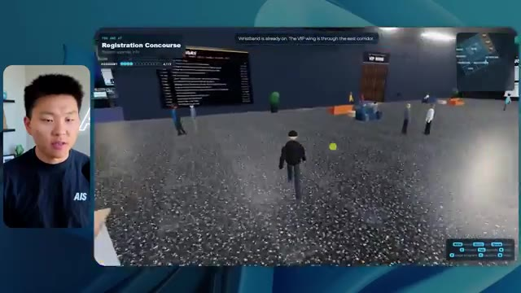
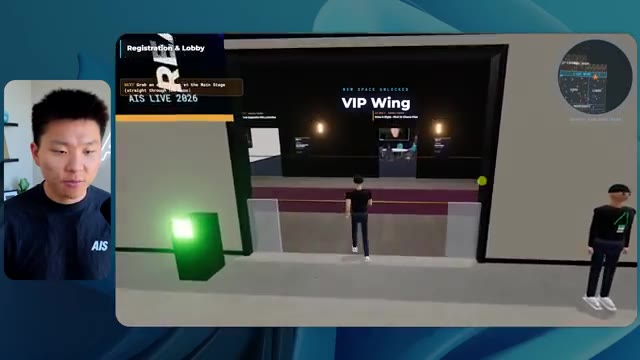
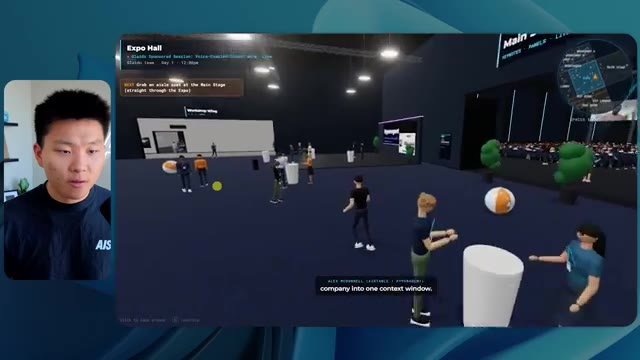
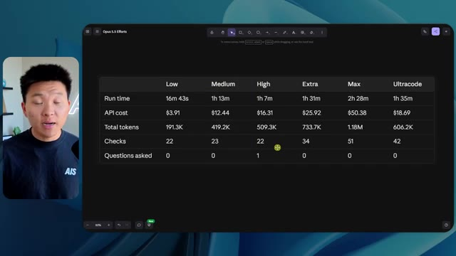

# 🎬 Claude Mythos is Finally Here.

> **Chaîne** : [Nate Herk | AI Automation](https://www.youtube.com/@nateherk/featured)  
> **Lien YouTube** : [https://www.youtube.com/watch?v=dYrrEKXtttk](https://www.youtube.com/watch?v=dYrrEKXtttk)  
> **Date de publication** : 20260609  
> **Durée** : 00:08:41  
> **Identifiant vidéo** : `dYrrEKXtttk`  
> **Transcription & Analyse** : `whisper-v3-large-turbo+gemini-3.5-flash-lite`  

---

## 📌 Synthèse Exécutive & Outils

### 💡 Résumé

Dans cette vidéo de la chaîne Nate Herk | AI Automation, l'analyste explore en profondeur les capacités du nouveau modèle d'IA **Opus 5.5** d'Anthropic en le soumettant à un test d'ingénierie complexe et grandeur nature : transformer un dossier Frame.io de 105 gigaoctets d'enregistrements vidéo d'une conférence virtuelle en un monde 3D explorable à la troisième personne, semblable à un événement physique réel (avec salles, scènes et pistes thématiques). Le prompt est exécuté de manière comparative à travers différents niveaux d'effort (faible, moyen, élevé, etc.) pour évaluer l'impact direct sur la qualité du code généré, le temps d'exécution, la consommation de jetons et les coûts API théoriques.

Les résultats révèlent des dynamiques surprenantes en matière d'ingénierie des agents IA. En mode à **faible effort**, le modèle livre une application en 16 minutes et 43 secondes pour 191 000 jetons (coût API estimé à 3,91 $), mais pèche lourdement sur l'identité visuelle de la marque, les textures, la physique (avatars qui disparaissent) et la lecture des vidéos réduites à de simples images fixes. En revanche, le passage au mode à **effort moyen** métamorphose radicalement le livrable après 1 heure et 13 minutes, 490 000 jetons et un coût de 12,44 $ : l'agent intègre avec succès la charte graphique, déploie des PNJ (personnages non-joueurs) réactifs dotés de comportements visuels, lit de véritables flux vidéo en direct, organise l'espace en zones thématiques fonctionnelles (salon VIP, scènes principales, stands) et exploite l'ensemble des ressources documentaires de l'événement.

Cette démonstration met en lumière la pertinence de la méthodologie recommandée par Anthropic, qui conseille d'initier les prompts complexes au niveau moyen avant d'ajuster. Elle illustre également le fossé classique du développement logiciel assisté par IA, où la génération de code fonctionnel et immersif débouche instantanément sur un besoin crucial de déploiement et d'hébergement web rapide, comblé ici par le sponsor Hostinger.

### 🛠️ Outils, Modèles & Logiciels Présentés

* **Opus 5.5** : Le modèle d'intelligence artificielle de pointe d'Anthropic, réputé pour sa polyvalence, son efficacité économique, sa grande intelligence et sa flexibilité à travers les différents niveaux d'effort.
* **Claude Code** : L'outil de programmation et d'assistance au développement par IA utilisé pour exécuter les instructions de l'agent dans l'environnement de travail.
* **Agents IA** : Systèmes autonomes capables d'orchestrer des tâches complexes de développement, d'interagir avec des navigateurs pour effectuer des vérifications et de manipuler des dossiers volumineux.
* **Frame.io** : Plateforme de gestion et de stockage cloud utilisée pour héberger les 105 gigaoctets d'enregistrements vidéo de la conférence "AIS Live".
* **Key.ai / Jev** : Technologies ou clés d'API tierces mentionnées pour la génération potentielle d'images, de vidéos ou la prise de décision contextuelle au sein des mondes virtuels.
* **Hostinger (via son connecteur/extension)** : Outil de déploiement et d'hébergement web gratuit intégré aux éditeurs de code, permettant de combler le fossé entre la fin d'un développement local par IA et la mise en ligne immédiate du produit fini.

### 🔑 Points Clés & Enseignements Stratégiques

* **Impact direct du paramètre d'effort** : Le choix du niveau d'effort (faible, moyen, élevé, etc.) modifie profondément la complexité structurelle, la rigueur logique et la finition esthétique du code produit par l'IA à partir d'un prompt identique.
* **Validation des recommandations constructeurs** : L'expérimentation valide la bonne pratique d'Anthropic qui suggère de démarrer les tâches complexes au niveau d'effort moyen, servant de point d'équilibre optimal entre performance, richesse fonctionnelle et temps de calcul.
* **Gestion du temps et complexité algorithmique** : Le mode à faible effort a nécessité 16 minutes d'exécution, tandis que le mode moyen a étendu ce temps à 1 heure et 13 minutes, démontrant que l'effort accru se traduit par une exploration et une génération de code beaucoup plus minutieuses.
* **Analyse comparative des coûts API** : Le coût estimé de l'inférence passe de 3,91 $ (faible effort, 191k tokens, 22 vérifications) à 12,44 $ (effort moyen, 490k tokens, 23 vérifications), offrant un ratio coût/bénéfice largement favorable au mode moyen au vu de la qualité du résultat.
* **Autonomie et absence de sollicitation** : Fait remarquable, l'agent a exécuté l'intégralité du prompt complexe (objectif de type "slash goal") sans poser la moindre question intermédiaire à l'utilisateur, illustrant l'autonomie croissante des agents de nouvelle génération.
* **Boucles de rétroaction autonome (Vérifications)** : Les agents exécutent des phases de test automatisées (ouverture de navigateurs à de multiples reprises, de 22 à 23 fois selon le mode) pour valider visuellement ou fonctionnellement le rendu de l'application en cours de création.
* **Intégration contextuelle de grands volumes de données** : Capacité d'un agent IA à analyser un dossier de 105 Go sur Frame.io et à en extraire la structure sémantique (jours de conférence, ateliers, interventions de speakers) pour la cartographier dans un environnement virtuel 3D.
* **Respect de la fidélité de marque (Brand Identity)** : Alors que le mode faible échoue à reproduire les couleurs et les logos de la marque "AIS Live", le mode moyen intègre avec succès les directives graphiques et les palettes de couleurs officielles de l'entreprise.
* **Dynamisme et interactivité des environnements** : Le passage à un niveau d'effort supérieur permet à l'IA d'aller au-delà de la simple image statique en intégrant des flux vidéo fonctionnels, des éléments mobiles et des PNJ réagissant à la présence de l'utilisateur.
* **Résolution du « Fossé de Déploiement »** : La génération réussie d'un prototype fonctionnel par l'IA crée un gouffre logistique classique entre le code local et la mise en production, nécessitant des intégrations fluides comme l'extension Hostinger pour un passage au web immédiat.

---

## ⏱️ Chronologie & Transcription Complète Audio & Visuelle (Mot pour Mot)

### ⏱️ `[00:00:00 - 00:00:20]` | Segment #01

**🔊 Audio (Transcription Intégrale Mot pour Mot en Français) :**
> Opus 5.5, Opus 5.5, Opus 5.5, Opus 5.5, Opus 5.5. Ce modèle est littéralement partout et pour de très bonnes raisons. Il est intelligent, il est bon marché, il a un goût incroyable, c'est un modèle d'IA incroyable. Mais avec chaque modèle d'IA, vous avez le choix de l'effort, que ce soit faible, moyen, élevé, extra, max ou code ultra.

**👁️ Analyse Visuelle d'Écran (gemini-3.5-flash-lite) :**
**Interface & Outils** : Réseau social X (anciennement Twitter)

**Contenu textuel & Code** : Publication textuelle et vidéo/image illustrant les capacités d'un modèle d'IA en matière de création visuelle.

**Action / Démonstration** : Présentation d'un exemple concret de contenu généré par IA partagé sur les réseaux sociaux.

*⏱️ 00:00:05 — Capture d'écran d'un tweet sur X montrant une image générée représentant un paysage tropical côtier avec une mer, des palmiers et des habitations.*

---

### ⏱️ `[00:00:20 - 00:00:38]` | Segment #02

**🔊 Audio (Transcription Intégrale Mot pour Mot en Français) :**
> Donc dans cette vidéo, j'ai donné à Opus 5.5 exactement le même prompt et je l'ai exécuté sur chaque niveau d'effort et nous allons comparer les résultats. Nous allons examiner la qualité de tous les différents résultats réels, mais nous allons aussi examiner combien de temps chacun d'eux a pris, combien cela nous a coûté si c'était une facturation par API, le nombre total de tokens, combien de vérifications ils ont exécutées, et combien de questions ils m'ont réellement posées tout au long du processus.

**👁️ Analyse Visuelle d'Écran (gemini-3.5-flash-lite) :**
**Interface & Outils** : Application de tableau blanc / interface de présentation (Canvas)

**Contenu textuel & Code** : Tableau avec les colonnes Low, Medium, High, Extra, Max, Ultracode et les lignes Run time, API cost, Total tokens, Checks, Questions asked.

**Action / Démonstration** : Présentation comparative des différents niveaux d'effort de l'IA Opus 5.5.

*⏱️ 00:00:29 — Tableau comparatif sur fond sombre montrant les différents niveaux d'effort d'Opus 5.5 avec des métriques (Run time, API cost, Total tokens, etc.).*

---

### ⏱️ `[00:00:39 - 00:00:58]` | Segment #03

**🔊 Audio (Transcription Intégrale Mot pour Mot en Français) :**
> Et les résultats que nous avons obtenus ne correspondent pas du tout à ce que j'attendais, donc j'ai hâte de partager cela avec vous les gars. Ne perdons pas de temps et entrons directement dans le vif du sujet. Bon, alors plongeons directement là-dedans. Je veux commencer juste en vous montrant le prompt réel que nous avons utilisé, que nous avons donné à chacun de ces différents agents. Je vais aller dans les fichiers ici, et nous allons ouvrir ce fichier markdown de prompt, et je vais vous montrer ce que nous avons obtenu. Alors voici le slash objectif que j'ai fourni.

**👁️ Analyse Visuelle d'Écran (gemini-3.5-flash-lite) :**
**Interface & Outils** : Éditeur de code / Interface de développement Agent IA, avec volet latéral de navigation et barre de saisie de commandes en bas.

**Contenu textuel & Code** : Message textuel d'un assistant IA adressé à Nate : "Hi Nate. This worktree has the effort-test task queued in PROMPT.md : build a walkable third-person 3D world..." avec options de configuration en bas (Opus 5.5, Ultracode, etc.).

**Action / Démonstration** : Le présentateur présente l'interface de développement d'un agent IA et le prompt initial configuré pour la tâche en cours.

*⏱️ 00:00:48 — Interface de l'éditeur de code Cursor (ou interface de développement similaire) affichant un projet d'agent IA avec une conversation textuelle, avec une petite incrustation vidéo du présentateur sur le côté gauche.*

---

### ⏱️ `[00:00:58 - 00:01:34]` | Segment #04

**🔊 Audio (Transcription Intégrale Mot pour Mot en Français) :**
> J'ai dit, tu dois me créer un monde 3D qui est une conférence tech réaliste dans laquelle je peux me promener en vue à la troisième personne. Tu vas regarder ce dossier, qui contient mes ressources d'enregistrement d'événements de AIS Live. Et ce dossier est un dossier Frame.io de 105 gigaoctets d'enregistrements vidéo. C'était un événement entièrement virtuel. Tout a été enregistré et tous les enregistrements sont juste ici. J'ai dit, ton objectif est de prendre cet événement et de le transformer en un monde 3D explorable qui me donne l'impression d'être réellement allé à une vraie conférence en personne avec différentes salles, différentes pistes, différentes scènes, bla, bla, bla. N'hésite pas à utiliser key.ai si tu as besoin de générer des images ou des vidéos. Et tu peux aussi utiliser tout le reste à l'intérieur de mon projet Herc 2, qui est comme mon système d'exploitation IA. J'ai dit,

**👁️ Analyse Visuelle d'Écran (gemini-3.5-flash-lite) :**
**Interface & Outils** : Éditeur de code (type VS Code / Cursor) et interface web Frame.io

**Contenu textuel & Code** : Fichier Markdown PROMPT.md avec les instructions de génération du monde 3D et le lien Frame.io (https://f.io/sPdlo-Si).

**Action / Démonstration** : Présentation du prompt initial et du dossier de ressources cloud contenant les enregistrements vidéo de l'événement.

*⏱️ 00:01:07 — Éditeur de code affichant le fichier PROMPT.md contenant les instructions pour créer un monde 3D de conférence tech basé sur les enregistrements AIS Live.*

*⏱️ 00:01:16 — Interface Frame.io montrant un dossier de 105,69 Go contenant les ressources d'enregistrement d'événements divisées en sous-dossiers (GA Access et VIP Access).*

*⏱️ 00:01:25 — Retour à l'éditeur de code affichant le contenu du fichier PROMPT.md avec les consignes détaillées du projet.*

---

### ⏱️ `[00:01:34 - 00:02:08]` | Segment #05

**🔊 Audio (Transcription Intégrale Mot pour Mot en Français) :**
> vous serez jugé sur la créativité, le design, la physique et la sensation générale lorsque j'explorerai le monde 3D que vous avez construit. Et c'était fondamentalement la fin des instructions. Donc comme vous pouvez le voir sur ce côté gauche, j'ai exécuté cela à travers tous les différents niveaux d'effort. Commençons par le niveau bas et remontons jusqu'à ultra code. Très bien. Donc ici nous avons le résultat du niveau bas. Ouvrons ceci et jetons un œil. Nous avons donc AIS live, le sommet des services IA en personne enfin, et nous avons pu cliquer partout. Tout d'abord, on ne sent pas vraiment l'identité de la marque. Genre, ce n'est pas le logo d'IS Live. Ce n'est même pas nos couleurs. Donc je n'aimes pas trop ça, mais entrons ici. D'accord. C'est beaucoup trop lumineux. Euh, nous avons une carte en haut à droite. Nous avons une ville ici en arrière-plan. Je ne peux pas dire quelle ville c'est.

**👁️ Analyse Visuelle d'Écran (gemini-3.5-flash-lite) :**
**Interface & Outils** : Interface web d'un outil de type assistant de code / agent IA avec un volet de navigation à gauche et une zone de chat interactive à droite.

**Contenu textuel & Code** : Texte du prompt : 'Hi Nate. This worktree has the effort-test task queued in PROMPT.md : build a walkable third-person 3D world of the AIS Live conference...' et un champ de saisie avec la réponse 'yes, start the task in PROMPT.md'.

**Action / Démonstration** : Le présentateur commente l'exécution des tests à travers différents niveaux de configuration visibles dans le panneau latéral.

*⏱️ 00:01:42 — Capture d'écran montrant l'interface d'un outil de développement ou d'agent IA avec le présentateur incrusté à gauche, affichant un panneau latéral avec différents niveaux de test (Hello, Extra, High, Max, Ultracode, Medium, Low) et une conversation textuelle à droite.*

---

### ⏱️ `[00:02:08 - 00:02:40]` | Segment #06

**🔊 Audio (Transcription Intégrale Mot pour Mot en Français) :**
> c'est. D'accord. C'est Chicago, ce qui est plutôt cool parce que tu sais, j'habite à Chicago, mais bref, en haut à droite, on peut voir une carte. Nous avons un hall d'accueil. Nous avons un hall d'exposition. Nous avons un salon VIP sur la scène principale. La carte montre également où se trouve chaque autre personne et cela se synchronise en direct. On peut donc voir l'enregistrement. On peut voir le premier jour, la keynote de l'hyper agent, le débriefing en direct. Cool. Donc ça connaît réellement l'agenda et puis il y a le deuxième jour. Donc il a trouvé ça, c'est bien. Nous avons ces petites boules ici que je peux espérer botter. D'accord. Le visage, oh, regarde ça. Si je vais par ici, tous les gens disparaissent tout simplement. Très mauvais. Très mauvais. D'accord. Alors voyons voir. Est-ce que je peux sprinter ? D'accord.

**👁️ Analyse Visuelle d'Écran (gemini-3.5-flash-lite) :**
**Interface & Outils** : Application de métavers / espace virtuel 3D (type Gather.town ou équivalent) avec mini-carte de navigation et panneau d'affichage.

**Contenu textuel & Code** : Texte du programme "Day 1" et en-têtes de salles (Badge pickup, Lobby, Expo Hall).

**Action / Démonstration** : Navigation et exploration de l'espace virtuel 3D par le présentateur.

---

### ⏱️ `[00:02:40 - 00:03:04]` | Segment #07

**🔊 Audio (Transcription Intégrale Mot pour Mot en Français) :**
> Je peux aller un peu plus vite. Je vais d'abord aller par ici. Il y a des produits promotionnels, euh, certifiés AIS plus glido. D'accord. Donc, il y a les stands réels que nous avions dans l'événement virtuel. Nous avions des stands. Donc c'est plutôt cool. Un petit endroit pour prendre des photos. Salle C. En ce moment, nous avons Tangy Frederick qui anime un atelier. D'accord. Mais ce n'est pas une vidéo. Comme vous pouvez le voir, c'est juste une image. Elle ne bouge pas. C'est donc juste une image. Ces gens sont en train de disparaître. Ce doivent être des fantômes. Allons par ici dans la salle A.

**👁️ Analyse Visuelle d'Écran (gemini-3.5-flash-lite) :**
**Interface & Outils** : Application ou plateforme virtuelle 3D d'événement en ligne (type Gather / Metaverse).

**Contenu textuel & Code** : Environnement virtuel 3D avec affichage d'informations de stands, sponsors et tutoriels d'API.

**Action / Démonstration** : Exploration et navigation d'un avatar à travers l'espace virtuel de l'événement.

*⏱️ 00:02:46 — Vue d'un espace d'exposition virtuel en 3D avec un avatar se déplaçant près de stands de sponsors.*

*⏱️ 00:02:52 — Navigation dans une salle d'atelier thématique virtuelle (Enterprise track) avec des tables et écrans interactifs.*

*⏱️ 00:02:58 — Gros plan sur un écran virtuel affichant des instructions textuelles et étapes pour créer une clé API.*

---

### ⏱️ `[00:03:04 - 00:03:30]` | Segment #08

**🔊 Audio (Transcription Intégrale Mot pour Mot en Français) :**
> Nous avons Liberty White. D'accord. Très cool. Vos 30 premiers jours en automatisation. Encore une fois, c'est juste une image fixe et les gens ont des bugs d'affichage. Donc ce n'est pas très bon ici. Je vais aller sur la scène principale et voir ce que nous avons. D'accord, cool. Donc nous avons une scène principale. Les gens ont de gros bugs d'affichage. Vraiment mauvais. Ce n'est vraiment pas bon du tout. Notre vidéo est en train de bouger. Genre, j'ai vu mon visage ici et j'ai vu celui de Devin, mais maintenant ils ont disparu. Donc je ne sais pas ce qui s'est passé. D'accord. On dirait que c'est plutôt un diaporama. Rien n'est vraiment lu pour l'instant. Quoi qu'il en soit, entrons ici.

**👁️ Analyse Visuelle d'Écran (gemini-3.5-flash-lite) :**
**Interface & Outils** : Environnement virtuel 3D interactif de type Metaverse / espace de conférence en ligne (Gather town ou similaire).

**Contenu textuel & Code** : Interface utilisateur virtuelle de conférence avec mini-carte de navigation, indications textuelles et affichage d'ateliers sur l'automatisation et les agents IA.

**Action / Démonstration** : Le présentateur navigue et déplace son avatar à travers les différentes salles et scènes virtuelles de l'événement en ligne.

*⏱️ 00:03:11 — Vue dans un espace virtuel 3D (Metaverse) montrant un personnage avatar dans une salle intitulée "Workshop Room A - Foundation track" avec des plateformes circulaires lumineuses.*

*⏱️ 00:03:17 — Vue de l'avatar naviguant dans un auditorium virtuel comble pour le "Hyperagent Workshop: How to Build an Always-On Fleet of Agents" sur la scène principale.*

*⏱️ 00:03:24 — Vue de l'avatar approchant d'une grande scène principale affichant le logo "AIS LIVE AI Services Summit" avec des écrans de présentation et des ballons décoratifs.*

---

### ⏱️ `[00:03:30 - 00:03:58]` | Segment #09

**🔊 Audio (Transcription Intégrale Mot pour Mot en Français) :**
> Nous avons d'autres stands. Nous avons hyper agent. Nous avons Claude Code. Nous avons plus de gadgets publicitaires. La salle B, c'est Dave Ebelor. Je suppose que c'est exactement la même chose. Nous avons du café. Et puis, je suppose que le salon VIP, accès VIP seulement. C'est plutôt cool, mais il ne se passe vraiment rien ici. Cet écran est beaucoup trop lumineux. D'accord. Donc je pense que vous comprenez l'ambiance que nous obtenons ici de la part d'Opus 5.5 en mode faible effort. Et c'est là que les choses deviennent intéressantes. Combien de temps pensez-vous que cela a duré ? Combien de temps ? Celui-ci a duré 16 minutes et 43 secondes. Combien pensez-vous que cela a coûté ?

**👁️ Analyse Visuelle d'Écran (gemini-3.5-flash-lite) :**
**Interface & Outils** : Application de tableau blanc / interface de canevas interactif (Opus 5.5 Efforts).

**Contenu textuel & Code** : Tableau avec les colonnes : Low, Medium, High, Extra, Max, Ultracode, et les lignes : Run time, API cost, Total tokens, Checks, Questions asked.

**Action / Démonstration** : Le présentateur commente le tableau comparatif des niveaux d'efforts et de performance des agents.

*⏱️ 00:03:51 — Un tableau comparatif sur une interface de type tableau blanc affichant différents niveaux d'effort (Low, Medium, High, Extra, Max, Ultracode) et des métriques associées.*

---

### ⏱️ `[00:03:58 - 00:04:26]` | Segment #10

**🔊 Audio (Transcription Intégrale Mot pour Mot en Français) :**
> 3,91 dollars si c'était une facturation par API. J'utilise évidemment mon abonnement ici, mais nous allons simplement calculer cela en facturation par API. Le total des jetons était de 191 000. Il a effectué 22 vérifications. Donc pour la vérification, il a ouvert le navigateur 22 fois et a exécuté différentes sortes de vérifications. Donc 22 catégories de vérifications. Et combien de questions m'a-t-il posées ? Il m'a posé un total de zéro question tout au long de cette invite de type slash goal. D'accord. Alors, ouvrons l'effort moyen et voyons ce que nous avons obtenu. D'accord, c'est parti. Effort moyen. Nous avons Nate Herc. Nous avons mon badge. C'est du contenu de la marque AI's Life.

**👁️ Analyse Visuelle d'Écran (gemini-3.5-flash-lite) :**
**Interface & Outils** : Application de tableau blanc ou de prise de notes numérique (type Excalidraw ou similaire).

**Contenu textuel & Code** : Tableau avec des colonnes Low, Medium, High, Ex et des lignes Run time, API cost, Total tokens, Checks, Questions asked.

**Action / Démonstration** : Le présentateur explique les coûts et les métriques d'utilisation des jetons et du temps d'exécution.

*⏱️ 00:04:05 — Un tableau comparatif montrant les métriques de performance et de coût pour le niveau "Low" (Run time: 16m 43s, API cost: $3.91, Total tokens: 191.3K, Checks, Questions asked).*

---

### ⏱️ `[00:04:26 - 00:04:46]` | Segment #11

**🔊 Audio (Transcription Intégrale Mot pour Mot en Français) :**
> Donc ça a déjà l'air un tout petit peu mieux. Ça ressemble à nos palettes de couleurs qui utilisaient nos directives de marque. Premier jour, construction, deuxième jour, gain, VIP. Cool. D'accord. Je vais entrer dans le lieu. D'accord. Waouh. Donc une ambiance un peu similaire. C'est en arrière-plan. Ça ne ressemble pas à Chicago, hein ? Non, ça ressemble à, honnêtement, ça ressemble à une ville imaginaire. Quoi qu'il en soit, c'est drôle qu'ils aient décidé de faire ça. Voyons si je peux me déplacer un peu plus vite. Oh, waouh.

**👁️ Analyse Visuelle d'Écran (gemini-3.5-flash-lite) :**
**Interface & Outils** : Interface web interactive et application de métavers / espace virtuel 3D.

**Contenu textuel & Code** : Écran de bienvenue « Welcome to AIS Live », badges d'accès, instructions de navigation clavier (WASD, Shift, Espace), et interface d'avatar 3D.

**Action / Démonstration** : Le présentateur parcourt l'interface d'accueil puis entre dans le lieu virtuel 3D.

*⏱️ 00:04:31 — Interface web de l'application « AIS Live » affichant un badge nominatif avec le nom de Nate Herk et des options d'accès de premier plan.*

*⏱️ 00:04:41 — Vue dans l'espace virtuel 3D avec des avatars d'utilisateurs et un panorama urbain en arrière-plan à travers de grandes baies vitrées.*

---

### ⏱️ `[00:04:46 - 00:05:21]` | Segment #12

**🔊 Audio (Transcription Intégrale Mot pour Mot en Français) :**
> Les gens interagissent avec moi. Regardez. Si je m'approche de ce type, il vient de lever le bras. Bon, maintenant il ne veut plus du tout avoir affaire à moi. Mais tous ces petits robots ici doivent prendre des décisions. Je ne sais pas s'ils utilisent Jev. C'est sûr que non. Je ne lui ai pas dit de le faire. En fait, ma clé Jev est à l'arrière. Je ne sais pas. Peut-être qu'il l'a utilisée. Quoi qu'il en soit, on peut voir ici que nous avons la salle d'atelier C, le laboratoire des agents. Sympa. Donc celui-ci est en fait en train de tourner. Vous pouvez voir qu'il s'agit d'une vraie vidéo lue par Tangy. Tout le monde ici est en train de travailler sur un ordinateur portable. Ils ne buguent pas. C'est plutôt cool. De plus, mon badge est sur ma poitrine, ce qui est plutôt cool. Je peux venir par ici. Nous avons une carte en haut à droite, comme vous pouvez le voir, mais je peux venir par ici. Nous avons un

**👁️ Analyse Visuelle d'Écran (gemini-3.5-flash-lite) :**
**Interface & Outils** : Environnement virtuel 3D de type métavers / plateforme collaborative en ligne.

**Contenu textuel & Code** : Aucun code source, terminal ou prompt visible à l'écran, uniquement une simulation virtuelle.

**Action / Démonstration** : Navigation et exploration d'un environnement virtuel interactif habité par des avatars.

---

### ⏱️ `[00:05:21 - 00:05:47]` | Segment #13

**🔊 Audio (Transcription Intégrale Mot pour Mot en Français) :**
> hall d'exposition. C'est là que nous avons le stand Glido. Et ça diffuse en ce moment. Oui, ça diffuse la vidéo de nous parlant de Glido. Ça diffuse la vidéo d'Ed et moi parlant de notre programme de certification. Nous avons le logo AIS Plus juste ici, qui est placé dans un endroit un peu bizarre. Ce sont les diapositives et les points clés des conférenciers. Donc wow, ce sont toutes les ressources que nous avons distribuées après l'événement. Elles sont toutes affichées juste là également. Nous pouvons voir que nous avons un projecteur sur la communauté. Donc c'est Aiden qui parle de son contrat qu'il a décroché et ça se joue en direct. Ces gens sont en train de regarder.

**👁️ Analyse Visuelle d'Écran (gemini-3.5-flash-lite) :**
**Interface & Outils** : Environnement virtuel 3D de type métavers / plateforme d'exposition en ligne.

**Contenu textuel & Code** : Affiches textuelles, présentations et affichage d'informations de session en bas à gauche ("Get AIS+ Certified...").

**Action / Démonstration** : Navigation et exploration d'un hall d'exposition virtuel par le présentateur.

---

### ⏱️ `[00:05:47 - 00:06:21]` | Segment #14

**🔊 Audio (Transcription Intégrale Mot pour Mot en Français) :**
> Ils sont plutôt engagés. On a l'hyper agent. C'était, c'est ce que je voulais dire. Si vous avez vu ces gens lever les bras pour dire bonjour, c'était plutôt marrant. Regardez, regardez, le voilà qui recommence. Bref. Bon. Où est-ce que je suis maintenant ? Maintenant, je suis dans le hall principal. On a un bar à café. On a un grand logo, qui est le vrai logo. C'est trop lumineux, mais on a le logo. On peut voir si on peut entrer ici dans le parcours des fondations. On a Sabrina Romanov et Liberty White. Donc différentes formations juste là. On peut entrer dans cette salle. C'est le parcours avancé. Alors qu'est-ce qui se passe ici. On a Dave Ebelar et Saman qui parlent de trucs différents là-dedans. Et maintenant, allons jeter un œil à la scène principale. Oh, attendez, il y a une vidéo de moi là-haut. C'est du genre VIP ?

**👁️ Analyse Visuelle d'Écran (gemini-3.5-flash-lite) :**
**Interface & Outils** : Application de metaverse / monde virtuel 3D en ligne.

**Contenu textuel & Code** : Environnement virtuel 3D interactif avec interface de navigation et mini-carte.

**Action / Démonstration** : Exploration et déplacement d'un avatar dans un espace virtuel de conférence en ligne.

---

### ⏱️ `[00:06:21 - 00:06:50]` | Segment #15

**🔊 Audio (Transcription Intégrale Mot pour Mot en Français) :**
> section ? Ouais, on ira voir ça dans une minute. Mais bref, voici la scène principale. Ça a l'air vraiment, vraiment bien. On a une grande scène. On a genre quatre personnes assises ici. On a les trois écrans d'Alex là-haut avec l'hyper agent. Est-ce que j'ai le droit de monter sur scène ? Oh, et il me laisse monter sur scène. D'accord. C'est plutôt sympa. Bon les gars, faisons un selfie. Laissez-moi prendre tout le monde en arrière-plan. Venez par ici. Bref, c'est vraiment, vraiment cool. Toutes les places ne sont pas prises par contre. Donc il faut qu'on travaille là-dessus. Mais bref, je vais y retourner en courant pour voir ce qu'était cette section VIP. D'accord. Le salon VIP. J'ai l'impression que c'est comme un aéroport ou un truc comme ça.

**👁️ Analyse Visuelle d'Écran (gemini-3.5-flash-lite) :**
**Interface & Outils** : Environnement virtuel 3D de type plateforme de conférence en ligne / métavers.

**Contenu textuel & Code** : Interface utilisateur affichant les détails de la session ('Hyperagent Keynote' par Alex McDonnell) et un mini-carte en haut à droite.

**Action / Démonstration** : Navigation et exploration d'un espace de conférence virtuel 3D avec un avatar.

---

### ⏱️ `[00:06:51 - 00:07:14]` | Segment #16

**🔊 Audio (Transcription Intégrale Mot pour Mot en Français) :**
> Ok, super. Donc maintenant nous avons les sessions VIP ici. Une séance de questions-réponses VIP avec Nate, lecture vidéo en direct juste ici. Très, très cool. Et nous avons comme un bar ou quelque chose du genre. Génial. Je dirais que c'est un très bon résultat. Maintenant, en ce qui concerne les statistiques ici, celle-ci a pris une heure et 13 minutes à s'exécuter. Cela nous aurait coûté 12 dollars et 44 cents. Elle a utilisé 490 000 jetons et a fait 23 vérifications.

**👁️ Analyse Visuelle d'Écran (gemini-3.5-flash-lite) :**
**Interface & Outils** : Application de monde virtuel 3D et tableau de bord de métriques d'IA (Opus 5.5).

**Contenu textuel & Code** : Métriques affichées : Run time (16m 43s), API cost ($3.91), Total tokens (191.3K), Checks (22), Questions asked (0).

**Action / Démonstration** : Présentation de l'environnement virtuel VIP et analyse des performances/coûts d'exécution de l'agent.

*⏱️ 00:06:56 — Capture montrant un espace virtuel en 3D (salon VIP) avec des avatars d'utilisateurs et un écran géant diffusant une vidéo de questions-réponses.*

*⏱️ 00:07:02 — Capture montrant un tableau de bord ou un canevas intitulé "Opus 5.5 Efforts" affichant des métriques d'exécution (Run time, API cost, Total tokens, Checks).*

---

### ⏱️ `[00:07:14 - 00:07:48]` | Segment #17

**🔊 Audio (Transcription Intégrale Mot pour Mot en Français) :**
> Et il ne nous a posé absolument aucune question une fois de plus. Très bien, passons au niveau élevé. C'était déjà un résultat plutôt correct et Anthropic eux-mêmes dans leur vidéo, ou désolé, pas une vidéo, un article sur comment prompter Opus 5.5. Ils ont dit de commencer simplement par le niveau moyen et de l'ajuster à la hausse ou à la baisse si nécessaire. C'était donc un résultat moyen. Passons au niveau élevé et voyons ce qu'on a obtenu. Très rapidement, les gars, je dois prendre une seconde pour vous parler du sponsor de la vidéo d'aujourd'hui, Hostinger. Donc ces deux modèles viennent de me créer une version fonctionnelle de la même chose. Et maintenant, je me retrouve exactement là où je finis toujours, avec un produit terminé sur mon ordinateur portable et aucun moyen rapide de le mettre en ligne. Et c'est ce fossé que le connecteur d'Hostinger comble. C'est une extension gratuite

**👁️ Analyse Visuelle d'Écran (gemini-3.5-flash-lite) :**
**Interface & Outils** : Tableau comparatif sur une interface de type tableau blanc / application web, et éditeur de code avec interface d'agent IA.

**Contenu textuel & Code** : Tableau de métriques d'évaluation de modèles IA (Run time, API cost, Total tokens, Checks, Questions asked) et prompt pour construire un calculateur ROI.
[DESC_IMAGE_2] Analyse comparative des performances des niveaux d'effort et exécution d'une tâche de développement d'application web par un agent IA.

**Action / Démonstration** : Explications face caméra et démonstration conceptuelle.

*⏱️ 00:07:22 — Un tableau comparatif affichant les métriques (temps d'exécution, coût API, tokens, vérifications, questions posées) selon différents niveaux d'effort (Low, Medium, High, Extra).*

*⏱️ 00:07:39 — Une interface de développement avec des panneaux montrant le prompt de création d'un calculateur ROI, le statut d'exécution et les réflexions de l'IA.*

---

### ⏱️ `[00:07:48 - 00:08:23]` | Segment #18

**🔊 Audio (Transcription Intégrale Mot pour Mot en Français) :**
> pour votre éditeur qui intègre votre compte Hostinger dans l'outil de programmation que vous utilisez déjà, que ce soit VS Code, Cursor, Cloud Code, Codex, et j'en passe. Vous vous connectez une seule fois en un clic, et à partir de là, votre agent peut déployer le site, y associer un domaine, configurer les enregistrements DNS et vérifier votre VPS sans que vous n'ayez jamais à quitter l'éditeur. Ainsi, peu importe celui de ces outils que vous finirez par préférer, ce qu'il a construit n'est qu'à quelques minutes d'une véritable URL sur un hébergement géré. Le connecteur est gratuit avec chaque formule d'hébergement. Donc si vous avez encore besoin de l'hébergement en dessous, profitez de la formule illimitée grâce au lien dans la description et utilisez le code NATEHERK pour obtenir 10 % de réduction. Cela comprend également un nom de domaine gratuit et un e-mail professionnel pour un an. Et c'est toujours le moyen le plus économique que j'ai trouvé pour obtenir un

**👁️ Analyse Visuelle d'Écran (gemini-3.5-flash-lite) :**
**Interface & Outils** : Interface web d'intégration Hostinger et outil Claude Code

**Contenu textuel & Code** : Statut "Connected", "Manage Hostinger from your IDE", liste des outils disponibles avec options cochées (Websites, Domains, Subscriptions & Payments, Email Marketing)

**Action / Démonstration** : Connexion du compte Hostinger à l'environnement de développement pour permettre à l'agent de gérer les sites et domaines

*⏱️ 00:07:57 — Interface montrant la connexion réussie de Hostinger à l'IDE via OAuth avec les outils disponibles (Websites, Domains, Subscriptions, Email Marketing), ainsi qu'une fenêtre Claude Code à droite et la vidéo du présentateur.*

---

### ⏱️ `[00:08:23 - 00:08:47]` | Segment #19

**🔊 Audio (Transcription Intégrale Mot pour Mot en Français) :**
> tu as construit par-dessus une vraie URL. Alors revenons à la vidéo. D'accord. Encore une fois, très, très thématisé par la marque. C'est un écran de chargement encore mieux que le précédent. On a ce petit effet sympa en arrière-plan. On a le logo. On va entrer dans le lieu. D'accord. Nous y voilà. Ça a l'air plutôt pas mal. On commence à l'extérieur et tu peux voir qu'on a ces drapeaux pour tous les intervenants, Wyatt, Casper, Alex, Ed, Aiden, Sabrina, Liberty. C'est plutôt cool. On a des blocs en direct ici.

**👁️ Analyse Visuelle d'Écran (gemini-3.5-flash-lite) :**
**Interface & Outils** : Navigateur web / plateforme virtuelle 3D (RingCentral / AIS Live).

**Contenu textuel & Code** : Interface utilisateur virtuelle 3D, instructions de contrôle (WASD, Mouse), bannières de noms de speakers.

**Action / Démonstration** : Connexion à l'événement virtuel et exploration de la place principale en 3D avec un avatar.

*⏱️ 00:08:29 — Écran de chargement et d'accueil de la plateforme virtuelle 'AIS LIVE', affichant les touches de contrôle et le bouton pour entrer dans le lieu.*

*⏱️ 00:08:35 — Entrée dans l'espace virtuel 3D (AIS Live Plaza) montrant des avatars et un environnement urbain avec un message de bienvenue.*

*⏱️ 00:08:41 — Navigation dans l'espace virtuel 3D avec des bannières aux noms de conférenciers et des éléments interactifs au sol.*

---

### ⏱️ `[00:08:47 - 00:09:23]` | Segment #20

**🔊 Audio (Transcription Intégrale Mot pour Mot en Français) :**
> il a pris cette photo de moi, votre hôte, Nate Herc, John, Dave, Nate Herc. Voilà. D'accord. Les portes. C'est génial. Ce sont des portes coulissantes automatiques en verre. J'adore ça. Nous pouvons voir l'enregistrement VIP. Nous pouvons voir l'admission générale. Nous pouvons venir ici et nous pouvons découvrir l'exposition avec différents stands, le projecteur sur la communauté. Vous pouvez également voir qu'en haut à gauche, j'ai un passeport. Donc c'est comme si, cela montrera combien d'endroits j'ai visités. Tout cela est une lecture réelle. Nous avons un mur de ressources avec tous les différents intervenants. Ils ont également une session de réseautage ici. Je vais donc venir très vite et voir de quoi il s'agit. Nous avons donc le bar à cold brew AIS. Nous avons différents membres de la communauté qui ont été mis en avant ou mis en lumière.

**👁️ Analyse Visuelle d'Écran (gemini-3.5-flash-lite) :**
**Interface & Outils** : Application web 3D / Environnement virtuel de type métavers ou plateforme de conférence en ligne.

**Contenu textuel & Code** : Interface utilisateur virtuelle affichant "Registration Concourse", "VIP Check-in" et des options de navigation.

**Action / Démonstration** : Exploration interactive de l'événement virtuel par l'animateur sous forme d'avatar 3D.

*⏱️ 00:08:56 — Vue principale de l'espace virtuel de conférence avec la scène principale et les comptoirs d'inscription.*

*⏱️ 00:09:05 — Navigation dans le hall d'exposition virtuel montrant des stands et des avatars d'utilisateurs.*

*⏱️ 00:09:14 — Déplacement d'un avatar dans le hall d'accueil avec vue sur les baies vitrées et les autres participants.*

---

### ⏱️ `[00:09:23 - 00:09:56]` | Segment #21

**🔊 Audio (Transcription Intégrale Mot pour Mot en Français) :**
> On a l'aile VIP. Attends, quoi ? Prends un bracelet. Ah, je dois vraiment aller chercher le bracelet. D'accord. Laisse-moi m'enregistrer rapidement. Le bracelet est déjà mis. Attends, quoi ? D'accord. Oh, d'accord. Maintenant, les portes se sont ouvertes pour moi. Cool. Je peux entrer ici. Oh, ça mène juste à la scène principale. Salon VIP. Il y a une séance de questions-réponses en cours. Ça a l'air très cool. Je veux dire, je suis très impressionné par la façon dont il est capable de faire ça. Waouh. D'accord. C'est donc vraiment bien. Ce qu'on a fait, c'est qu'on a eu des salles de discussion VIP avec différentes personnes. Tu peux voir qu'il y a différentes salles, différents membres de l'équipe AIS qui vont dans des trucs. C'est vraiment cool. C'est très cool. C'est un bien meilleur VIP

**👁️ Analyse Visuelle d'Écran (gemini-3.5-flash-lite) :**
**Interface & Outils** : Environnement virtuel en 3D / Plateforme virtuelle interactive

**Contenu textuel & Code** : Navigation dans l'espace virtuel, panneaux d'affichage et sessions de travail VIP

**Action / Démonstration** : Exploration des différentes zones de l'événement virtuel (hall, salon VIP, sessions de travail)

*⏱️ 00:09:32 — Le présentateur navigue dans l'espace virtuel du hall d'enregistrement (Registration Concourse).*

*⏱️ 00:09:40 — Le présentateur se trouve dans le salon VIP pour une session de questions-réponses.*

*⏱️ 00:09:48 — Le présentateur explore les salles de travail VIP avec différentes thématiques affichées sur les écrans.*

---

### ⏱️ `[00:09:56 - 00:10:30]` | Segment #22

**🔊 Audio (Transcription Intégrale Mot pour Mot en Français) :**
> expérience que ce qui était montré dans le premier morceau. D'accord. After party VIP. Regardez ça. On a une piste de danse. On a tous ces éléments ici. On a la lecture de l'after party VIP juste ici. Et il y a une estrade de DJ. C'est trop marrant. Il y a un petit bug ici, un petit glitch juste là, mais c'est génial. Oh, cool. Donc quand je suis ici sur la scène principale, on a des sous-titres. Vous pouvez voir juste ici en bas de mon écran, on a ces sous-titres de Wyatt qui est en train de parler là-haut. On a des lumières. On a le panel. Très cool. Belle scène principale. Je vais aller par ici. On peut aller à la fondation,

**👁️ Analyse Visuelle d'Écran (gemini-3.5-flash-lite) :**
**Interface & Outils** : Application web 3D interactive (espace virtuel type metaverse/plateforme événementielle en ligne).

**Contenu textuel & Code** : Interface utilisateur virtuelle affichant 'VIP After-Party' et 'Main Stage', panneaux d'information, mini-carte et commandes clavier.

**Action / Démonstration** : Navigation et exploration d'un environnement virtuel 3D interactif avec avatars et flux vidéo en direct.

*⏱️ 00:10:04 — Vue rapprochée d'une piste de danse virtuelle étiquetée 'VIP After-Party' avec des avatars et un grand écran vidéo.*

*⏱️ 00:10:13 — Vue générale de la piste de danse virtuelle montrant l'ambiance avec des ballons et une estrade DJ.*

*⏱️ 00:10:21 — Vue de l'auditorium virtuel principal 'Main Stage' avec des spectateurs assis face à une grande estrade.*

---

### ⏱️ `[00:10:30 - 00:11:06]` | Segment #23

**🔊 Audio (Transcription Intégrale Mot pour Mot en Français) :**
> avancé, et les parcours d'entreprise par ici. Alors voyons voir. Nous avons l'anatomie de trois vraies transactions. Nous avons l'hyper agent. Nous avons les évaluations avec Nate et Ed ici. Nous avons Dave qui s'occupe des trucs avancés. C'est vraiment bien. Je veux dire, évidemment, chacun, chacun de ces résultats jusqu'à présent, faible était correct. Moyen était meilleur. Élevé a été encore meilleur. Voyons si cette tendance se poursuit et voyons combien cela nous a coûté. Donc, élevé a fonctionné pendant une heure et sept minutes. Donc un peu plus rapide que moyen, cela nous aurait coûté 16 dollars et 31 cents. Il a utilisé un demi-million de jetons, 509 000. Il a fait 22 vérifications. Et il nous a aussi demandé, enfin, non, je me suis trompé. Ce

**👁️ Analyse Visuelle d'Écran (gemini-3.5-flash-lite) :**
**Interface & Outils** : Application de tableau blanc / interface de présentation (type Excalidraw) affichant un tableau de données analytiques.

**Contenu textuel & Code** : Tableau comparatif : Run time (16m 43s à 1h 07m), API cost ($3.91 à $16.31), Total tokens (191.3K à 419.2K), Checks et Questions asked.

**Action / Démonstration** : Analyse et affichage des performances et coûts d'exécution selon différents niveaux d'effort.

*⏱️ 00:10:57 — Un tableau comparatif des efforts et coûts d'Opus 5.5 montrant les métriques 'Low', 'Medium', 'High' et 'Extra'.*

---

### ⏱️ `[00:11:06 - 00:11:25]` | Segment #24

**🔊 Audio (Transcription Intégrale Mot pour Mot en Français) :**
> l'un m'a posé une question et spoiler, c'était le seul qui nous a posé une question pendant tout ça. Donc voyons voir, il nous en reste trois : Extra, Max et Ultra Code. Laissez-moi ouvrir Extra et on va voir ce qu'on a. Ok. Donc celui-ci a l'air plutôt pas mal. Je dirais honnêtement que jusqu'à présent, l'écran de chargement haut était le meilleur. Celui qu'on vient juste de voir, mais bref, entrons dans AIS live.

**👁️ Analyse Visuelle d'Écran (gemini-3.5-flash-lite) :**
**Interface & Outils** : Application de tableau de bord / interface de visualisation de données (style canvas / mindmap) avec le présentateur en incrustation vidéo à gauche.

**Contenu textuel & Code** : Tableau de données : Run time (16m 43s, 1h 13m, 1h 7m), API cost ($3.91, $12.44, $16.31), Total tokens (191.3K, 419.2K, 509.3K), Checks (22, 23, 22), Questions asked (0, 0, 1), et la colonne "Extra" en surbrillance.

**Action / Démonstration** : Le présentateur passe en revue et compare les performances des différents modes d'exécution de l'IA, s'apprêtant à ouvrir la section "Extra".

*⏱️ 00:11:11 — Tableau comparatif affichant les métriques de différents modes d'effort (Low, Medium, High, Extra) incluant le temps d'exécution, le coût API, les tokens et les questions posées.*

---

### ⏱️ `[00:11:26 - 00:11:51]` | Segment #25

**🔊 Audio (Transcription Intégrale Mot pour Mot en Français) :**
> Whoa. D'accord. Donc on a genre des petits extraits sonores. Je peux discuter avec des gens. Le panneau sur la guerre des outils a réglé quelques débats pour moi. Sympa. Bonne perspective là-bas. On est dehors à nouveau. On a ces différentes bannières, bien qu'elles soient toutes les mêmes. Elles n'affichent pas genre les noms de différentes personnes. Donc gros logo AIS live. L'aile de l'atelier est par ici. Et passons par les portes coulissantes en verre et voyons ce qu'on a. Donc on a le café AIS. La carte est en bas à droite, et elle n'est pas très descriptive.

**👁️ Analyse Visuelle d'Écran (gemini-3.5-flash-lite) :**
**Interface & Outils** : Application ou plateforme virtuelle en 3D (type métavers ou jeu)

**Contenu textuel & Code** : Environnement virtuel 3D avec avatars et bannières textuelles

**Action / Démonstration** : Navigation et exploration d'un monde virtuel interactif

---

### ⏱️ `[00:11:51 - 00:12:26]` | Segment #26

**🔊 Audio (Transcription Intégrale Mot pour Mot en Français) :**
> J'aime bien comment les autres cartes nous ont indiqué ce qui, genre, où se trouvaient les choses, mais celle-ci a l'air très professionnelle. On peut voir ici la scène principale. Allons y faire un tour rapide. Ils ont tous ces ballons qui volent partout, ce qui est plutôt marrant selon moi. Les ballons de plage AIS. On me voit là-haut en train de parler. Je crois que j'étais en train d'introduire l'un des jours. Continuons par ici vers la salle d'atelier sur ce côté gauche. OK. Donc ici nous avons le théâtre Hyper Agent. Nous avons cette session sponsorisée ici par Hyper Agent, mais ça nous montre aussi ce qui va s'y passer. C'est vraiment marrant qu'on puisse discuter avec les gens. Salmon a créé un commercial vocal en direct. La salle "Le Juste Prix" était comble. Tu as pris le guide du compagnon VIP ? C'est trop marrant. On a le parcours avancé dans

**👁️ Analyse Visuelle d'Écran (gemini-3.5-flash-lite) :**
**Interface & Outils** : Application web de monde virtuel / salon virtuel 3D (type événement en ligne).

**Contenu textuel & Code** : Environnement 3D interactif avec avatars, écrans vidéo en direct et bulles de texte.

**Action / Démonstration** : Exploration et navigation en vue à la troisième personne dans l'espace virtuel de l'événement.

*⏱️ 00:12:00 — Vue principale de l'auditorium virtuel avec des spectateurs et un écran géant affichant le présentateur.*

*⏱️ 00:12:09 — Navigation dans le lobby virtuel de l'événement avec des panneaux de signalétique et d'autres avatars.*

*⏱️ 00:12:17 — Exploration d'un couloir virtuel interactif avec des avatars et des bulles de discussion.*

---

### ⏱️ `[00:12:26 - 00:12:58]` | Segment #27

**🔊 Audio (Transcription Intégrale Mot pour Mot en Français) :**
> ici. Encore une fois, nous avons la lecture en direct. Est-ce que c'est la lecture en direct ? Oh, d'accord. Ça a commencé une fois que je suis entré, mais je peux m'asseoir. Oh la la. Je peux regarder ça. Je peux me lever. Je veux m'asseoir au premier rang. C'est plutôt cool. C'est très bien. J'aime bien ça. Et vous savez ce que j'ai remarqué jusqu'à présent ? Le personnage réel que j'incarne me ressemble un peu. Je pense qu'il a été modélisé à partir de mes photos de profil ou quelque chose comme ça. Quoi qu'il en soit, nous avons Sabrina ici, l'animatrice de la salle ici, prenez n'importe quel siège libre. D'accord, super. Et j'ai vraiment aimé la fonctionnalité pour s'asseoir. C'est plutôt marrant. Genre, nous pourrions réellement assister à cet atelier et participer. Quoi qu'il en soit, ça nous montre les intervenants. Ça nous montre les

**👁️ Analyse Visuelle d'Écran (gemini-3.5-flash-lite) :**
**Interface & Outils** : Environnement virtuel 3D de type salle de conférence / webinaire interactif (type Gather ou plateforme similaire)

**Contenu textuel & Code** : Interface utilisateur affichant 'Workshop Block 2 - Advanced Build a Voice AI Sales Rep' et 'Foundation Track' avec des avatars de participants

**Action / Démonstration** : Exploration d'un espace de réunion virtuel interactif en 3D par l'utilisateur

*⏱️ 00:12:34 — Capture d'écran montrant l'intervenant à gauche et une simulation virtuelle 3D d'une salle de classe interactive aux tons violets à droite, avec un écran affichant un atelier sur l'IA.*

*⏱️ 00:12:42 — Capture d'écran montrant l'intervenant à gauche et la navigation dans la salle virtuelle 3D aux accents verts pour le 'Foundation Track'.*

*⏱️ 00:12:50 — Capture d'écran montrant l'intervenant à gauche et un changement de perspective dans l'environnement virtuel 3D face au grand écran de présentation.*

---

### ⏱️ `[00:12:58 - 00:13:31]` | Segment #28

**🔊 Audio (Transcription Intégrale Mot pour Mot en Français) :**
> programme. Il y a un petit tapis rouge ici pour prendre des photos. On peut prendre la pose. Oh, wouah. C'est plutôt cool. Bibliothèque de ressources, obtenez la certification AIS Plus, Glido, Hyper Agent, AIS Plus, trois vraies affaires. Génial. Je veux dire, je dirais vraiment que jusqu'à présent, chacune est meilleure. Et on n'a même pas encore vu la section VIP, le salon VIP. Montons par ici rapidement. J'espère que je pourrai entrer. Sympa. On a la réinitialisation des outils. Ce sont les différentes salles dans lesquelles nous pouvons aller. Donc encore une fois, je pourrais prendre la feuille de calcul et je pourrais essayer de comprendre comment tarifer mes trucs. C'est tellement cool. C'est vraiment mieux que le précédent où on a juste en quelque sorte

**👁️ Analyse Visuelle d'Écran (gemini-3.5-flash-lite) :**
**Interface & Outils** : Application ou plateforme virtuelle web 3D (metaverse/salon virtuel de conférence).

**Contenu textuel & Code** : Environnement virtuel 3D interactif affichant des stands de sponsors, des zones VIP et des questions textuelles flottantes.

**Action / Démonstration** : Navigation et exploration d'un salon virtuel en 3D avec des avatars par le présentateur.

---

### ⏱️ `[00:13:31 - 00:13:59]` | Segment #29

**🔊 Audio (Transcription Intégrale Mot pour Mot en Français) :**
> on a regardé des trucs. Génial. Je peux aller derrière le bar et venir ici. C'est très bien. Bon. Alors, en ce qui concerne les statistiques, celui-ci a tourné pendant une heure et demie. Il a coûté 25,92 dollars. Je ne sais pas pourquoi je dis point, 25 dollars et 92 cents. Il y a eu 733 000 jetons et 34 vérifications. Il a donc eu le plus grand nombre de vérifications de loin jusqu'à présent. Et il nous a posé zéro question. J'ai hâte de voir ce qu'on a obtenu ici de max et ultra code. D'accord. Voici les écrans de chargement de max, ennuyeux, mais c'est dans l'esprit de la marque et il y a notre logo.

**👁️ Analyse Visuelle d'Écran (gemini-3.5-flash-lite) :**
**Interface & Outils** : Application de tableau blanc / interface de présentation visuelle (type Excalidraw ou similaire).

**Contenu textuel & Code** : Tableau avec des colonnes de niveaux d'effort. Pour la colonne "Extra" : durée de 1h 31m, coût de 25,92 $ (mentionné à l'oral) et 733 000 jetons.

**Action / Démonstration** : Le présentateur commente les statistiques du test affichées à l'écran pour le niveau "Extra".

*⏱️ 00:13:38 — Un tableau comparatif montrant les statistiques de performance de différents niveaux d'effort ("Medium", "High", "Extra", "Max", "Ultracode"), affichant des durées, des coûts en dollars et le nombre de tokens.*

---

### ⏱️ `[00:14:00 - 00:14:35]` | Segment #30

**🔊 Audio (Transcription Intégrale Mot pour Mot en Français) :**
> Donc c'était bien. J'aime bien ça. Nous allons continuer et entrer dans AIS en direct. Ooh, petite animation sympa ici qui nous fait entrer. Encore une fois, le personnage me ressemble. Ils m'ont tous ressemblé. Je veux dire, en quelque sorte, nous sommes assis en arrière-plan. Ça ressemble à Chicago. Comme je l'mentionné plus tôt, beaucoup de ceux-ci jouent des sons et je n'inclus pas cela parce que ce serait très distrayant pour vous d'essayer d'écouter ce qui se passe en même temps que je parle. Il y a donc comme une légère musique dans tout ça. Je déteste la façon dont il marche. Cette marche est vraiment, vraiment mauvaise. Je veux dire, la marche, ouais, je n'aime pas du tout ça. Ce n'est donc pas génial. Mais à part ça, entrons et explorons. Remarquez ces ombres quand je rentre, elles basculent vraiment. Je ne sais pas trop pourquoi,

**👁️ Analyse Visuelle d'Écran (gemini-3.5-flash-lite) :**
**Interface & Outils** : Application ou plateforme virtuelle 3D (metaverse/monde virtuel interactif)

**Contenu textuel & Code** : Environnement virtuel 3D avec interface utilisateur (mini-carte, indications de touches en bas, panneau d'événement en haut à droite)

**Action / Démonstration** : Exploration d'un monde virtuel interactif (AIS en direct) par le présentateur et son avatar

*⏱️ 00:14:08 — Vue d'un monde virtuel 3D (Arrival Plaza) avec des avatars et des bâtiments style urbain.*

*⏱️ 00:14:17 — Navigation dans l'espace virtuel 3D montrant l'approche d'un grand bâtiment moderne.*

*⏱️ 00:14:26 — Gros plan sur l'avatar du présentateur se déplaçant devant les entrées de bâtiments virtuels.*

---

### ⏱️ `[00:14:35 - 00:15:11]` | Segment #31

**🔊 Audio (Transcription Intégrale Mot pour Mot en Français) :**
> Mais de toute façon, nous pouvons aussi discuter avec des gens ici. Le stand Hyperagent est juste là où l'on entre dans l'exposition. Tout va bien. D'accord, super. Je peux continuer à appuyer sur E pour changer ce qu'ils disent. Nous avons les conférenciers juste ici. Ça a l'air plutôt bien. Bien que nous avions définitivement la photo de profil de tout le monde. Je ne sais donc pas pourquoi ce n'est pas inclus là. Nous voyons des gens prendre des photos juste ici. J'adore ça. Et ça enregistre une petite photo. D'accord. La carte n'est pas non plus super, genre ne me donne pas une super explication de ce qui se passe, mais j'aime ces stands. Ils sont cool. Je pense que ces stands sont les meilleurs que j'ai vu jusqu'à présent. Genre, ils ont juste l'air bien. Ils ont des représentants. Il y a de superbes diaporamas derrière eux. Ouais. Ces stands sont cool. D'accord. Nous avons un petit théâtre mis en avant.

**👁️ Analyse Visuelle d'Écran (gemini-3.5-flash-lite) :**
**Interface & Outils** : Application web de salon virtuel 3D (type événement metaverse/virtuel interactif)

**Contenu textuel & Code** : Environnement 3D interactif avec interface de navigation, mini-carte, liste des conférenciers et flux vidéo en direct (The Tool War Panel)

**Action / Démonstration** : Navigation et exploration de l'espace virtuel 3D, interaction avec les avatars et découverte des différents stands et halls d'exposition.

*⏱️ 00:14:44 — Vue principale de l'espace d'accueil virtuel avec des avatars et des écrans interactifs affichant la liste des conférenciers.*

*⏱️ 00:14:53 — Avatars interagissant autour d'une table haute dans le hall virtuel, avec une incrustation photo sur le côté droit.*

*⏱️ 00:15:02 — Entrée dans le hall d'exposition virtuel avec des stands thématiques ('Evals Lab', 'Enterprise AI') et des participants.*

---

### ⏱️ `[00:15:11 - 00:15:35]` | Segment #32

**🔊 Audio (Transcription Intégrale Mot pour Mot en Français) :**
> se passe par ici. C'est Casper. Bien que pourquoi est-ce que ça ne se lit pas ? J'ai l'impression que ça devrait se lire, non ? Comme dans les autres, ils étaient toujours en train de lire. On peut parler à d'autres personnes par ici. Le café est gratuit. Blah, blah, blah. Amy Simpson, Matt Wolf. Sympa. D'accord. C'est juste la zone de réseautage où nous sommes en ce moment, mais on peut voir en haut à droite. On peut aussi voir ce qui est en direct sur la scène principale en ce moment. C'est un panel sur la guerre des outils. Alors allons-y. Nous avons Devin, Cole, Dave et Russ qui discutent ici. Nous avons en quelque sorte de l'audiovisuel, des trucs de lumière qui se passent par ici.

**👁️ Analyse Visuelle d'Écran (gemini-3.5-flash-lite) :**
**Interface & Outils** : Environnement virtuel 3D / Navigateur web de métaverse ou plateforme d'événement virtuel.

**Contenu textuel & Code** : Interface d'événement virtuel affichant des stands, un hall d'exposition, des avatars d'utilisateurs et des écrans de présentation interactifs.

**Action / Démonstration** : Navigation et déplacement d'un avatar dans un espace d'événement virtuel en 3D.

---

### ⏱️ `[00:15:36 - 00:15:55]` | Segment #33

**🔊 Audio (Transcription Intégrale Mot pour Mot en Français) :**
> Basculons la scène principale sur ce qui compte vraiment en ce moment. Je peux donc changer de sujet. C'est cool. Je viens donc de passer à moi et Matt. Nous pouvons passer à l'anatomie de trois vraies transactions. C'est plutôt cool. La scène a l'air bien. Nous avons un joli petit panel ici. Je peux monter sur la scène ? Sympa. Sympa. Bon, je ne peux pas aller trop loin, en fait. Très bien tout le monde, laissez-moi prendre le selfie. Tout le monde vient là-dedans. Je peux aussi m'asseoir dans le public là-bas et simplement profiter de la session.

**👁️ Analyse Visuelle d'Écran (gemini-3.5-flash-lite) :**
**Interface & Outils** : Environnement virtuel 3D (type metavers ou plateforme de conférence virtuelle).

**Contenu textuel & Code** : Aucun code source, terminal, prompt ou donnée technique affiché.

**Action / Démonstration** : Navigation et affichage d'un monde virtuel 3D de conférence.

---

### ⏱️ `[00:15:55 - 00:16:14]` | Segment #34

**🔊 Audio (Transcription Intégrale Mot pour Mot en Français) :**
> Très cool, très cool. OK, allons par ici. Je vois une section à l'étage. Donc c'est marrant comme ils choisissent tous de mettre la section VIP à l'étage. Je veux dire, je ne déteste pas ça. Oh la vache, ils ont un escalator. Pas possible. Je vais discuter avec ce type sur l'escalator. Glenn a 15 ans d'expérience en agence. Ses trucs de "land and expand" étaient en or. Du beau travail, Glenn. Cool, donc je vais... je n'arrive même pas à passer ce type par contre.

**👁️ Analyse Visuelle d'Écran (gemini-3.5-flash-lite) :**
**Interface & Outils** : Application ou plateforme virtuelle 3D en ligne type salon virtuel

**Contenu textuel & Code** : Interface utilisateur virtuelle avec mini-carte, commandes de déplacement en bas (WASD) et panneau d'événement en haut à droite

**Action / Démonstration** : Navigation et exploration de l'environnement virtuel 3D vers la section VIP

*⏱️ 00:16:00 — Vue générale du hall d'un espace virtuel 3D avec de grandes baies vitrées et des personnages.*

*⏱️ 00:16:04 — L'avatar s'approche d'un escalator menant au niveau VIP dans l'environnement virtuel.*

*⏱️ 00:16:09 — L'avatar monte sur l'escalator derrière un autre personnage, affichant une bulle de dialogue avec une description de Glenn.*

---

### ⏱️ `[00:16:14 - 00:16:48]` | Segment #35

**🔊 Audio (Transcription Intégrale Mot pour Mot en Français) :**
> Oh, j'ai dû sauter par-dessus lui. D'accord, niveau VIP, badge requis. Oh la vache. Tu te moques de moi ? Je dois aller chercher mon badge. D'accord, cool. Maintenant, ça montre que je suis un vrai VIP et je peux aller ici dans la section VIP. On a de superbes petites sessions de travail là-bas, qu'on peut rejoindre. Je me demande si ça va me laisser genre m'asseoir ici. Je peux juste discuter. Je peux participer ? Ça ne me laisse pas m'asseoir et participer. C'est pas grave. On a la "war room" des prix. Oh, ça, c'est peut-être l'after-party. Allons voir ce qui se passe par ici. Ou alors je dois juste entrer par là. D'accord. C'est bizarre. Je devais juste entrer par ici. Cet after-party n'est pas aussi cool que l'autre. Mais bref, allons voir ce qui se passe par ici.

**👁️ Analyse Visuelle d'Écran (gemini-3.5-flash-lite) :**
**Interface & Outils** : Application d'événement virtuel en 3D / environnement métavers.

**Contenu textuel & Code** : Interface utilisateur avec des badges VIP, mini-carte, agenda, et panneaux d'affichage d'événements virtuels.

**Action / Démonstration** : Navigation et exploration d'un monde virtuel interactif par le présentateur.

---

### ⏱️ `[00:16:48 - 00:17:07]` | Segment #36

**🔊 Audio (Transcription Intégrale Mot pour Mot en Français) :**
> dans les ateliers. D'accord. Ce n'était pas bien. Regardez ça. On peut tout voir et je viens de bugger et maintenant boum. Donc ce n'est pas bon. Je dirais qu'globalement, je veux dire, vous avez l'ambiance de la façon dont cela fonctionne, mais je dirais que celui d'avant, qui était, je crois, élevé, j'ai préféré celui-là. Je ne peux pas m'asseoir dans ces chaises non plus. Ouais. Donc je n'aime pas la marche dans celui-ci.

**👁️ Analyse Visuelle d'Écran (gemini-3.5-flash-lite) :**
**Interface & Outils** : Application de métavers / plateforme d'événements virtuels 3D.

**Contenu textuel & Code** : Environnement virtuel 3D interactif avec des interfaces textuelles et des bulles de discussion.

**Action / Démonstration** : Navigation d'un avatar à travers un espace virtuel d'événements et d'ateliers.

---

### ⏱️ `[00:17:07 - 00:17:43]` | Segment #37

**🔊 Audio (Transcription Intégrale Mot pour Mot en Français) :**
> Je n'aime pas autant l'ambiance et il y a quelques bugs. Donc, jusqu'à présent, si nous voulons regarder notre liste, j'aime extra extra, c'était celui que j'aimais le plus jusqu'à présent. Mais de toute façon, celui-ci était au maximum. Celui-ci était au maximum ici. Alors voyons combien de temps cela a duré, deux heures et 28 minutes. Donc ça a duré longtemps, 50 dollars et 38 cents, 1,18 million de jetons. Donc il a en fait atteint une compaction et a dû s'auto-compacter. Et puis il a fait 51 vérifications. L'a-t-il vraiment fait, par contre ? Parce qu'il y avait beaucoup de bugs là-dedans. Et de toute façon, celui-ci ne nous a posé aucune question. Donc, jusqu'à présent, chaque fois, à peu près, c'est devenu plus cher et ça a pris plus de temps, à part ici. Mais ceux-ci fondamentalement

**👁️ Analyse Visuelle d'Écran (gemini-3.5-flash-lite) :**
**Interface & Outils** : Application web de tableau ou de canevas interactif.

**Contenu textuel & Code** : Tableau avec des colonnes Medium, High, Extra, Max, Ultracode, et des lignes contenant des durées (ex. 1h 13m), des coûts en dollars (ex. $12.44, $16.31, $25.92), des volumes de tokens et des statistiques d'erreurs ou de bugs.

**Action / Démonstration** : Le présentateur commente et compare les résultats des différents modes d'effort, en pointant les colonnes Max et Ultracode.

*⏱️ 00:17:16 — Tableau comparatif affichant les différents modes de performance (Medium, High, Extra, Max, Ultracode) avec des métriques de temps, de coût et de tokens, et le présentateur visible en incrustation à gauche.*

---

### ⏱️ `[00:17:43 - 00:18:17]` | Segment #38

**🔊 Audio (Transcription Intégrale Mot pour Mot en Français) :**
> a pris à peu près le même temps, mais à chaque fois il a utilisé plus de jetons parce qu'il a réfléchi davantage. Et puis, vous savez, ces jetons vont coûter plus cher. Mais bref, passons au dernier, qui est Ultra Code. Donc on espère vraiment que celui-ci est le meilleur. Alors allons sur ce localhost et voyons ce qu'on a. Ok, super. Regardez ce badge. C'est un joli badge, hôte all access. On a un joli petit visuel juste ici. On va aller de l'avant et entrer AIS Live. Cool. Ok. Bienvenue, Nate. J'aime bien la marche. Ça a l'air réaliste. J'aime le logo, même s'il manque le petit point rouge qui fait penser au direct. La carte en haut à droite

**👁️ Analyse Visuelle d'Écran (gemini-3.5-flash-lite) :**
**Interface & Outils** : Navigateur web / Application 3D locale (localhost)

**Contenu textuel & Code** : Application web interactive représentant un espace virtuel 3D avec personnages animés et panneaux d'accueil.

**Action / Démonstration** : Navigation et présentation de l'application générée finale hébergée en local.

*⏱️ 00:18:09 — Interface web 3D interactive « AIS LIVE » affichant un hall d'accueil virtuel avec des avatars et le logo géant « AIS LIVE ».*

---

### ⏱️ `[00:18:17 - 00:18:49]` | Segment #39

**🔊 Audio (Transcription Intégrale Mot pour Mot en Français) :**
> est un peu mieux étiqueté, donc je peux voir ce qui se passe. Je vais venir ici et récupérer mon bracelet VIP très rapidement. D'accord, sympa. Ça me dit aussi ce que je dois faire. Donc en haut à gauche, il est écrit de flasher au portail VIP sur le mur est du hall. Je crois donc que l'est serait par ici, non ? Ne mange jamais de gaufres détrempées. Ouais. Ailes VIP, flasher le bracelet. D'accord, cool. Maintenant, je suis dans la section VIP. Je peux voir ces différentes salles. L'outil a été réinitialisé. La vidéo en direct est diffusée. Je peux voir les sous-titres juste là de ce dont on parle. Ça diffuse aussi les sons, mais je ne diffuse tout simplement pas l'audio pour vous les gars parce que je ne veux pas surcharger.

**👁️ Analyse Visuelle d'Écran (gemini-3.5-flash-lite) :**
**Interface & Outils** : Application de métavers ou jeu de simulation virtuelle d'événement en ligne.

**Contenu textuel & Code** : Textes d'indications de mission, cartes de mini-carte et noms de salles virtuelles.

**Action / Démonstration** : Navigation et exploration de l'espace virtuel par l'avatar du présentateur.

*⏱️ 00:18:25 — Vue dans le monde virtuel montrant le hall d'enregistrement avec l'avatar du présentateur et des instructions de quête.*

*⏱️ 00:18:33 — Passage de l'avatar du présentateur à travers le portail VIP Wing après avoir validé le contrôle d'accès.*

*⏱️ 00:18:41 — Arrivée de l'avatar dans la salle VIP Room 5 pour une session de travail avec d'autres participants virtuels.*

---

### ⏱️ `[00:18:50 - 00:19:08]` | Segment #40

**🔊 Audio (Transcription Intégrale Mot pour Mot en Français) :**
> Encore une fois, celui-ci fonctionne avec Cody et Mustafa là-dedans. C'est génial. Vidéo en direct. La vidéo ne se lance pas tant qu'on n'entre pas, par contre. Donc, honnêtement, je trouve que c'est un bon choix. Dès que j'entre, par contre, la vidéo démarre. Sympathique. Belle attention. Toutes ces pièces. Génial. Ouais. Je veux dire, ça fait très haut de gamme. Voici une salle de crise pour les prix. Allons voir ça. Moi et John là-dedans.

**👁️ Analyse Visuelle d'Écran (gemini-3.5-flash-lite) :**
**Interface & Outils** : Interface web d'un monde virtuel 3D / événement virtuel en ligne.

**Contenu textuel & Code** : Vue en perspective d'un avatar se déplaçant dans un espace virtuel avec des panneaux textuels ('VIP Wing', 'VIP ROOM 1 - WORKING SESSION') et un écran de diffusion vidéo en direct.

**Action / Démonstration** : L'avatar navigue et entre dans une zone VIP virtuelle où une réunion vidéo en direct est visible à travers une vitre ou sur un écran.

*⏱️ 00:18:54 — Un espace virtuel 3D (genre métavers ou événement en ligne) où l'avatar du présentateur entre dans une section intitulée 'VIP Wing' avec une salle de réunion et un écran vidéo affichant des participants.*

---

### ⏱️ `[00:19:08 - 00:19:42]` | Segment #41

**🔊 Audio (Transcription Intégrale Mot pour Mot en Français) :**
> Et ensuite, nous avons la super after-party. Cette after-party n'est pas encore aussi animée. Et nous avons plus de ballons de plage pour une raison quelconque, mais cette after-party est cool. Je veux dire, ça nous donne une bonne ambiance et il y a la retransmission juste ici de notre session de questions-réponses de l'after-party, tout cela est en direct aussi. Génial. D'accord. Dirigeons-nous vers la scène principale. Ça m'invite aussi à prendre un siège côté allée sur la scène principale, qui se trouve tout droit en traversant l'exposition. Alors en fait, allons d'abord faire un tour dans l'exposition. Qu'est-ce que vous construisez ? Il y a beaucoup de gens qui parlent de différentes choses par ici. Waouh. Il y a aussi comme un petit truc de basketball. Est-ce que je peux le lancer ? Je peux. Est-ce que je dois regarder en l'air pour le lancer ? D'accord.

**👁️ Analyse Visuelle d'Écran (gemini-3.5-flash-lite) :**
**Interface & Outils** : Environnement virtuel 3D (Metaverse / Espace virtuel interactif).

**Contenu textuel & Code** : Aucun code source, terminal ou prompt n'est affiché à l'écran.

**Action / Démonstration** : Exploration visuelle d'un espace virtuel 3D par le présentateur.

---

### ⏱️ `[00:19:42 - 00:20:08]` | Segment #42

**🔊 Audio (Transcription Intégrale Mot pour Mot en Français) :**
> Eh bien, pas terrible. Mais bref, nous avons un stand AIS plus. Nous avons le stand Glido. Est-ce que ça joue en direct ? Ouais, ça joue définitivement en direct. Sympa. Nous avons le stand de l'hyper agent. Nous avons d'autres trucs par ici. Ok, cool. Je vais aller dans la scène principale et voir si on peut choper un siège côté allée. Dès qu'on entre, tout commence à jouer. On a une très bonne ambiance de scène. Comment je fais pour choper un siège côté allée par contre. Voilà. Il a fallu que je trouve le bon. Choper le siège côté allée. Il n'y a personne sur la scène, ce qui est bizarre. J'aimais bien quand il y avait des gens sur la scène dans les versions précédentes.

**👁️ Analyse Visuelle d'Écran (gemini-3.5-flash-lite) :**
**Interface & Outils** : Application web interactive / plateforme virtuelle de conférence en 3D (AIS Live)

**Contenu textuel & Code** : Environnement virtuel 3D de type métavers ou salon virtuel avec zones d'exposition, scène principale et avatars.

**Action / Démonstration** : Navigation et exploration de l'espace virtuel par le présentateur, passage de l'Expo Hall à la scène principale.

*⏱️ 00:19:48 — Vue de l'Expo Hall dans l'environnement virtuel interactif, montrant différents stands et des avatars d'utilisateurs.*

*⏱️ 00:19:55 — Navigation vers la scène principale (Main Stage) de l'événement virtuel avec affichage du live en cours sur écrans géants.*

*⏱️ 00:20:01 — Arrivée dans la salle de conférence virtuelle principale avec des spectateurs assis et une invite pour s'asseoir (Grab a seat).*

---

### ⏱️ `[00:20:08 - 00:20:31]` | Segment #43

**🔊 Audio (Transcription Intégrale Mot pour Mot en Français) :**
> Prenons un petit selfie. Bref, il y a moi et Pat là-haut. Pat est habillé comme un ouvrier du bâtiment. Comme vous pouvez le voir, nous avons fait un petit appel de découverte simulé dans cet exemple. Je vais revenir par l'expo et nous allons sortir ici dans l'aile de l'atelier et simplement vérifier si ces rooms sont fondamentalement exactement les mêmes qu'elles devraient l'être. Maintenant, je ne peux pas vraiment discuter avec les gens. Je le pouvais avant, dans les versions précédentes, discuter avec les gens, ce que je trouvais être une très belle attention. Et nous avons l'atelier d'une piste de fondation. Est-ce que je peux m'asseoir ?

**👁️ Analyse Visuelle d'Écran (gemini-3.5-flash-lite) :**
**Interface & Outils** : Environnement virtuel 3D de type métavers / plateforme de conférence interactive.

**Contenu textuel & Code** : Éléments visuels d'une interface de monde virtuel, mini-carte en haut à droite et sous-titres de dialogue.

**Action / Démonstration** : Navigation et exploration de l'espace virtuel par le présentateur.

---

### ⏱️ `[00:20:32 - 00:21:04]` | Segment #44

**🔊 Audio (Transcription Intégrale Mot pour Mot en Français) :**
> Je ne peux pas m'asseoir. Je ne sais pas. Nous avons Liberty qui est en train de parler en ce moment même et elle parle et nous pouvons l'entendre. C'est donc sympa, mais ça ne me laisse pas m'asseoir. Et regardez ça. Je deviens assez buggé juste ici. Ça faisait bugger ma façon de marcher. Ça ne voulait pour ainsi dire pas me laisser marcher. Ce n'est pas bon. Pareil. Nous avons cette piste avancée là-dedans. Génial. Donc dans l'ensemble, ils ont une ambiance très similaire. Je dirais que je suis impressionné par la façon dont ils ont été capables de raconter une histoire à partir de ce que nous faisions. Bibliothèque de points clés des intervenants. D'accord. C'est cool. Je ne pense pas que nous ayons vu cela de différents endroits, mais ce sont comme les ressources et ça montre des choses sympas. Oh, wow. Je

**👁️ Analyse Visuelle d'Écran (gemini-3.5-flash-lite) :**
**Interface & Outils** : Environnement virtuel 3D de type métaverse / plateforme interactive.

**Contenu textuel & Code** : Textes d'indications et de titres de salles virtuelles ("Workshop A - Foundation Track", "Workshop B - Advanced Track", "Speaker Takeaways Library").

**Action / Démonstration** : Navigation et exploration de différents espaces virtuels au sein de la plateforme.

*⏱️ 00:20:40 — L'écran montre un environnement virtuel "Workshop A - Foundation Track" avec un avatar en mouvement.*

*⏱️ 00:20:48 — L'écran montre une salle de classe virtuelle "Workshop B - Advanced Track" avec plusieurs pupitres.*

*⏱️ 00:20:56 — L'écran montre la salle "Speaker Takeaways Library" avec des avatars et des présentoirs d'informations.*

---

### ⏱️ `[00:21:04 - 00:21:41]` | Segment #45

**🔊 Audio (Transcription Intégrale Mot pour Mot en Français) :**
> peut réellement ouvrir toutes ces choses et nous pouvons prendre des photos ici même aussi. Sympathique. Prendre une photo. Je peux aussi l'enregistrer. Genre, je peux vraiment télécharger ceci. Et maintenant nous avons cette photo que nous venons de prendre à cet événement en direct de l'IA. Très bien. Eh bien, je pense qu'il est temps pour moi de tirer quelques conclusions, mais d'abord, voyons ce que cette exécution nous a coûté. Cela a pris une heure et 35 minutes. C'était donc beaucoup plus rapide que max. Cela n'a coûté que 18 dollars et 69 cents. Waouh. C'était donc un peu plus cher que high, moins cher que extra et beaucoup moins cher que max. Cela a également utilisé 606 000 jetons et 42 vérifications avec zéro question. Maintenant, une autre chose intéressante à noter est que tout

**👁️ Analyse Visuelle d'Écran (gemini-3.5-flash-lite) :**
**Interface & Outils** : Visionneuse d'images Windows / Application de visualisation de photos.

**Contenu textuel & Code** : Photo intitulée "ais-live-photo.png" montrant deux avatars posant devant un fond siglé "AIS LIVE" sur un tapis rouge.

**Action / Démonstration** : Affichage de la photo prise lors de l'événement en direct pour illustrer la capture d'image réalisée par l'application.

*⏱️ 00:21:13 — Visionneuse d'images affichant une photo prise lors d'un événement virtuel (AIS LIVE) avec des avatars sur un tapis rouge.*

---

### ⏱️ `[00:21:41 - 00:22:13]` | Segment #46

**🔊 Audio (Transcription Intégrale Mot pour Mot en Français) :**
> ces exécutions, aucune d'entre elles n'a utilisé de sous-agent. J'ai vérifié et je me suis assuré qu'aucune d'entre elles n'avait utilisé de sous-agents. Ils ne voulaient déléguer aucun travail, ce qui était intéressant. Donc ces jetons sont ce qui a été reflété à l'intérieur de cette session. Évidemment, comme je l'ai dit, celle-ci a dépassé, vous savez, 950 000, donc, ou quelle que soit la fenêtre de compaction. Je ne laisse jamais habituellement monter si haut, mais comme c'était un objectif global et que je n'étais pas impliqué, celle-ci a dû se compacter, mais le reste d'entre elles a simplement fonctionné dans cette unique session. Et ce sont les statistiques globales. Et aussi, très rapidement concernant les trucs d'UltraCode, les gars, je ne sais pas si vous l'avez remarqué, mais quand j'ai fait tourner UltraCode ces derniers temps, ça a juste fait bizarre. Ça a l'air un peu buggé. Je, plusieurs fois je l'ai fait tourner

**👁️ Analyse Visuelle d'Écran (gemini-3.5-flash-lite) :**
**Interface & Outils** : Tableau de bord d'analyse ou outil de visualisation de données (style interface web ou application de notes/diagrammes).

**Contenu textuel & Code** : Tableau avec les lignes : Run time, API cost, Total tokens, Checks, et Questions asked répartis selon six niveaux d'effort d'exécution.

**Action / Démonstration** : Présentation des résultats comparatifs des différentes sessions d'exécution des agents IA.

*⏱️ 00:21:49 — Tableau comparatif affichant les performances, les coûts d'API, le nombre total de jetons, les vérifications et les questions posées pour différents niveaux d'effort (Low, Medium, High, Extra, Max, Ultracode).*

---

### ⏱️ `[00:22:13 - 00:22:34]` | Segment #47

**🔊 Audio (Transcription Intégrale Mot pour Mot en Français) :**
> et je me suis dit, est-ce que ça tourne vraiment sous UltraCode ? Ça a fait pas mal de vérifications de plus que ces autres, mais pour une raison quelconque, ça ne me semblait pas correct, car essentiellement ce qu'est UltraCode, c'est un effort supplémentaire et ensuite c'est juste comme utiliser des flux de travail plus dynamiques afin de faire les choses. Et donc à travers toutes mes recherches dans les journaux de session et même quand je regardais cette chose se construire dans UltraCode, ça ne lançait aucun de ces flux de travail dynamiques et j'ai essayé cela plusieurs fois.

**👁️ Analyse Visuelle d'Écran (gemini-3.5-flash-lite) :**
**Interface & Outils** : Tableau de bord de test ou application web affichant un tableau comparatif de performance d'IA

**Contenu textuel & Code** : Tableau avec les colonnes : Low (16m 43s, $3.91, 191.3K tokens, 22 checks), Medium, High, Extra, Max et Ultracode (1h 35m, $18.69, 606.2K tokens, 42 checks)

**Action / Démonstration** : Comparaison et analyse visuelle des métriques de différents modes d'exécution d'un modèle d'IA

*⏱️ 00:22:18 — Un tableau comparatif montrant les performances de différents niveaux d'effort (Low, Medium, High, Extra, Max, Ultracode) avec des métriques telles que le temps d'exécution (Run time), le coût API (API cost), le total des tokens, le nombre de vérifications (Checks) et de questions posées (Questions asked). Le présentateur apparaît dans une incrustation vidéo à gauche.*

---

### ⏱️ `[00:22:35 - 00:23:00]` | Segment #48

**🔊 Audio (Transcription Intégrale Mot pour Mot en Français) :**
> Donc je ne sais pas si c'est un bug en ce moment dans le harnais de CloudCode ou si c'est juste avec Opus 5.5, c'est un tout petit peu pire avec UltraCode en ce moment ou quelque chose comme ça, mais dans les deux cas, ce sont les véritables niveaux d'effort globaux et tout cela semble tout à fait logique quand on examine un peu la façon dont ils progressent. Donc jetons un œil à ceci. Coût maximum par rapport au coût faible, nous avons eu 12,9 fois sur l'exécution la moins chère par rapport à l'exécution la plus chère, ce qui, je crois, allait de 3,98 $ à 50,38 $.

**👁️ Analyse Visuelle d'Écran (gemini-3.5-flash-lite) :**
**Interface & Outils** : Tableau blanc ou application de notes sur fond sombre avec le présentateur en médaillon vidéo à gauche.

**Contenu textuel & Code** : Tableau avec des colonnes de niveaux d'effort et des lignes pour Run time (ex: 16m 43s à 2h 28m), API cost (ex: $3.91 à $50.38), Total tokens, Checks et Questions asked.

**Action / Démonstration** : Le présentateur commente et analyse les différentes métriques et niveaux d'effort affichés dans le tableau comparatif.

*⏱️ 00:22:41 — Un tableau comparatif montrant les performances de différents niveaux d'effort (Low, Medium, High, Extra, Max, Ultracode) pour Opus 5.5, incluant le temps d'exécution, le coût API, le total des tokens, les vérifications et les questions posées.*

---

### ⏱️ `[00:23:01 - 00:23:19]` | Segment #49

**🔊 Audio (Transcription Intégrale Mot pour Mot en Français) :**
> Donc c'était « low » et « max ». En ce qui concerne les vérifications « max » par rapport à « low », nous avons eu un multiplicateur de 2,3. Le total pour les six était de 127 dollars et le code « ultra » était de 18,69 dollars. Examinons la vitesse par rapport au coût ici. Laissez-moi donc dézoomer un peu pour que nous puissions voir tout cela. Sur l'axe des X, nous avons le temps d'exécution. Sur l'axe des Y, nous avons le coût.

**👁️ Analyse Visuelle d'Écran (gemini-3.5-flash-lite) :**
**Interface & Outils** : Interface web de test / Tableau de bord analytique.

**Contenu textuel & Code** : Texte explicatif sur les sessions et blocs de données chiffrées : "12.9x Max cost vs Low", "2.3x Max checks vs Low", "$18.69 Ultracode cost", "$127.65 Total across all six".

**Action / Démonstration** : Analyse visuelle des coûts et des performances des différents réglages d'effort.

*⏱️ 00:23:05 — Capture d'écran montrant l'interface d'un test d'effort Opus avec plusieurs cartes métriques de performance et de coût.*

---

### ⏱️ `[00:23:19 - 00:23:42]` | Segment #50

**🔊 Audio (Transcription Intégrale Mot pour Mot en Français) :**
> Donc j'ai l'impression que le mieux serait en bas à gauche, mais pas vraiment. Bref, vous pouvez voir que Low était bon marché et rapide. Max était lent et coûteux. Mais ce genre de graphique a généralement du sens. À mesure que vous augmentez l'effort, ça va coûter plus cher et ça va prendre un peu plus de temps. C'est logique. Voyons maintenant la croissance par rapport à Low. Nous avons donc le temps d'exécution en bleu, les coûts de l'API en orange, les jetons en vert, et les vérifications en or jaunâtre, moutarde.

**👁️ Analyse Visuelle d'Écran (gemini-3.5-flash-lite) :**
**Interface & Outils** : Interface web de test "Opus Effort Test" affichant un graphique de performance.

**Contenu textuel & Code** : Graphique à dispersion comparant le temps d'exécution (Run time) et le coût de l'API ($), avec des points étiquetés "Low", "Medium", "High", "Extra", "Ultracode", et "Max". L'infobulle indique : "Low - 16m 43s - $3.91 - 191.3K tokens - 22 checks".

**Action / Démonstration** : Le présentateur commente le graphique de performance et analyse le point de données "Low".

*⏱️ 00:23:25 — Un graphique montrant la vitesse en fonction du coût pour différents niveaux d'effort (Low, Medium, High, Extra, Ultracode, Max), avec une infobulle active sur le point "Low".*

---

### ⏱️ `[00:23:42 - 00:24:01]` | Segment #51

**🔊 Audio (Transcription Intégrale Mot pour Mot en Français) :**
> Et d'ailleurs, la raison pour laquelle UltraCode apparaît comme ça, c'est parce qu'il utilise en fait un niveau d'effort supplémentaire. Il est simplement incité et il utilise plutôt des flux de travail dynamiques et des choses comme ça, ce qui fait que, vous savez, c'est logique parce qu'il utilisait essentiellement un supplément sous le capot. C'est aussi pourquoi Claude l'a marqué ici en orange. Quoi qu'il en soit, si nous continuons plus bas ici, c'est généralement logique, n'est-ce pas ?

**👁️ Analyse Visuelle d'Écran (gemini-3.5-flash-lite) :**
**Interface & Outils** : Interface web de test des niveaux d'effort ("Opus Effort Test") affichant des courbes analytiques et statistiques.

**Contenu textuel & Code** : Graphique linéaire représentant les coûts d'API (12.9x), le temps d'exécution (8.9x), les tokens (6.2x) et les vérifications ("Checks" 2.3x) en fonction des niveaux d'effort, avec une infobulle sur le point "Extra".

**Action / Démonstration** : Présentation et analyse comparative des performances et des coûts selon les niveaux d'effort d'un modèle d'IA, illustrant notamment l'impact du niveau "Ultracode".

*⏱️ 00:23:47 — Un graphique montrant la croissance relative par rapport à un niveau faible ("Growth relative to Low") avec différentes métriques (Run time, API cost, Tokens, Checks) selon les niveaux d'effort (Low, Medium, High, Extra, Max, Ultracode), le tout présenté dans une interface web sombre aux côtés d'une vidéo du présentateur.*

---

### ⏱️ `[00:24:02 - 00:24:21]` | Segment #52

**🔊 Audio (Transcription Intégrale Mot pour Mot en Français) :**
> À mesure que le niveau d'effort augmente, une fois de plus, ces métriques vont augmenter. Le temps d'exécution, les coûts d'API, les jetons et les vérifications. C'est la même chose ici avec le temps d'exécution. Cela nous donne simplement des graphiques linéaires individuels maintenant pour chacune de ces différentes métriques, comme le coût d'API, les vérifications, le total des jetons, le coût par vérification, et tous les chiffres au même endroit. Des données plutôt cool donc.

**👁️ Analyse Visuelle d'Écran (gemini-3.5-flash-lite) :**
**Interface & Outils** : Interface web d'un tableau de bord de test ou d'analyse.

**Contenu textuel & Code** : Graphiques linéaires avec des courbes colorées pour 'Run time', 'API cost', 'Tokens' et 'Checks' sur différents niveaux d'effort (Low, Medium, High, Extra, Max, Ultracode).

**Action / Démonstration** : Présentation et analyse visuelle des métriques de performance et de coûts selon le niveau d'effort configuré.

*⏱️ 00:24:06 — Capture d'écran montrant un graphique linéaire comparant la croissance relative par rapport au niveau 'Low' (faible) pour différentes métriques : coût API, temps d'exécution, jetons et vérifications. Le présentateur apparaît en incrustation à gauche.*

---

### ⏱️ `[00:24:21 - 00:24:40]` | Segment #53

**🔊 Audio (Transcription Intégrale Mot pour Mot en Français) :**
> Je dirais que rien ici n'est trop choquant. Ce qui a été le plus choquant pour moi, ce sont ces résultats. Mes deux principaux concurrents étaient High, qui est celui-ci, et Extra, qui est celui-là. Je dois donc retourner ici et me souvenir de ce que j'en pensais. J'ai vraiment aimé cette sensation. Celui-ci donne aussi simplement l'impression d'être le plus fluide. La physique était agréable. La porte coulissante en verre était agréable. Je n'ai vraiment pas remarqué beaucoup de bugs dans celui-ci, ce qui est ce que j'ai vraiment aimé.

**👁️ Analyse Visuelle d'Écran (gemini-3.5-flash-lite) :**
**Interface & Outils** : Application web interactive en 3D type métavers ou monde virtuel.

**Contenu textuel & Code** : Interface utilisateur affichant 'AIS LIVE', des instructions de déplacement (WASD, MOUSE) et une place virtuelle en 3D.

**Action / Démonstration** : Exploration et navigation dans l'environnement virtuel 3D de la plateforme 'AIS LIVE'.

*⏱️ 00:24:26 — Écran d'accueil de la plateforme virtuelle 'AIS LIVE' montrant le titre et les instructions de contrôle.*

*⏱️ 00:24:31 — Vue en 3D isométrique d'une place virtuelle ('AIS Live Plaza') avec des avatars et des bannières explicatives.*

*⏱️ 00:24:35 — Navigation de l'avatar dans l'environnement virtuel 3D de la plateforme 'AIS LIVE'.*

---

### ⏱️ `[00:24:40 - 00:25:13]` | Segment #54

**🔊 Audio (Transcription Intégrale Mot pour Mot en Français) :**
> Je ne me rappelle pas si celui-ci était un de ceux où, oh, je ne pouvais pas parler aux gens par contre. Je pouvais juste traverser tout droit. Je ne pouvais pas m'asseoir dans celui-ci non plus. Voici un autre petit truc visuel où je fais essentiellement juste traverser ce mur tout droit. Donc, je n'aime pas trop ça. Mais je pense, est-ce que c'était celui où je pouvais m'asseoir dans ces sessions ? Non. D'accord. Donc je ne pense pas que c'était mon gagnant alors. Celui-ci est super haut. Je pense que c'est le gagnant. Ouais. Je pense que c'était celui que j'aimais le plus. J'adorais toute cette ambiance. J'adorais le fait que je pouvais discuter avec les gens. C'était définitivement celui où nous pouvions venir ici et nous pouvions nous asseoir où nous voulions, prendre une place, nous lever. Je pouvais lire ces trois offres et je pouvais discuter avec eux. J'ai aussi réalisé qu'il y avait de petites sections pour simuler des appels de découverte ici aussi.

**👁️ Analyse Visuelle d'Écran (gemini-3.5-flash-lite) :**
**Interface & Outils** : Application web 3D "AIS LIVE" (plateforme virtuelle d'événements).

**Contenu textuel & Code** : Interface d'événement virtuel 3D affichant la scène principale, les commandes de déplacement et le logo "AIS LIVE".

**Action / Démonstration** : Navigation et exploration de l'espace virtuel 3D par l'utilisateur.

*⏱️ 00:24:48 — Vue d'un monde virtuel 3D avec des avatars où le présentateur navigue et commente l'interface.*

*⏱️ 00:25:05 — Navigation d'un avatar dans un espace virtuel 3D représentant une conférence avec une scène principale ("Main Stage").*

---

### ⏱️ `[00:25:13 - 00:25:51]` | Segment #55

**🔊 Audio (Transcription Intégrale Mot pour Mot en Français) :**
> Nous avons des objets publicitaires et des sacs, ce qui est de la vraie physique. J'aime bien ça. C'était celui où l'on pouvait s'asseoir partout. Oui, j'ai vraiment, vraiment aimé celui-là. Bien que je pense que le seul inconvénient de celui-ci, c'était qu'il n'y avait pas vraiment d'after party VIP, parce que je pense que c'était le salon. Et je pense que c'était la seule partie de la section VIP, qui consistait à avoir différentes salles dans lesquelles on pouvait entrer et s'asseoir. Mais à part ça, il n'offrait pas une super expérience VIP par rapport à certains des autres que nous avons vus. Donc mon gagnant ici va définitivement être Extra. Extra a fait un travail phénoménal. C'était à peu près la moitié de la durée et la moitié du coût de Max. Donc Max, je pense, c'était tout simplement beaucoup trop pour pas assez de bien. Je pense que les points forts étaient corrects. Ça aurait pu,

**👁️ Analyse Visuelle d'Écran (gemini-3.5-flash-lite) :**
**Interface & Outils** : Application de métavers/monde virtuel 3D et tableau de bord comparatif de données d'IA.

**Contenu textuel & Code** : Tableaux comparatifs de coûts API, temps d'exécution et tokens pour différents niveaux d'efforts, ainsi qu'un monde virtuel interactif.
[DESC_IMAGE_1] Navigation et exploration d'un environnement virtuel 3D représentant un espace de conférence.

**Action / Démonstration** : Explications face caméra et démonstration conceptuelle.

*⏱️ 00:25:23 — Vue d'un monde virtuel en 3D représentant un couloir de conférence ("West Concourse") avec des avatars de participants.*

*⏱️ 00:25:32 — Vue d'un espace virtuel VIP avec des avatars assis autour d'une table, affichant des écrans textuels et des options d'interaction.*

*⏱️ 00:25:42 — Tableau comparatif affichant les performances de différents niveaux de modèles (Low, Medium, High, Extra, Max, Ultracode) avec des métriques de temps d'exécution, de coût API et de tokens.*

---

### ⏱️ `[00:25:51 - 00:26:25]` | Segment #56

**🔊 Audio (Transcription Intégrale Mot pour Mot en Français) :**
> avec peut-être un ou deux prompts de plus, arrivé là où je l'aimais vraiment. Mais pour un objectif de niveau slash, Extra a fourni un résultat incroyable ici. Je n'ai pas adoré Medium. Et pour une grande partie de mon travail de réflexion et de ce que je fais, Medium fonctionne très bien. Mais pour cette tâche précisément, j'avais besoin de beaucoup de raisonnement. Il a dû passer par des tonnes de choses. Il a dû passer par des tonnes de vidéos. Il a dû trouver beaucoup de choses à l'intérieur de mes projets. Il a dû créer une expérience et raconter une histoire à partir de tout cela. Je pense qu'Extra a fait un travail phénoménal. En général, cependant, j'ai aimé beaucoup de ces résultats, mais Extra est celui avec lequel je voudrais commencer dès maintenant. Si je voulais vraiment en faire une application et un monde super, super soignés et cool, je commencerais par le résultat d'Extra et probablement

**👁️ Analyse Visuelle d'Écran (gemini-3.5-flash-lite) :**
**Interface & Outils** : Tableau comparatif sur une interface web.

**Contenu textuel & Code** : Tableau avec colonnes Low, Medium, High, Extra, Max, Ultracode et lignes Run time, API cost, Total tokens, Checks, Questions asked.

**Action / Démonstration** : Présentation et analyse comparative des différents niveaux d'effort et de leurs coûts/performances.

*⏱️ 00:26:00 — Un tableau comparatif montrant les performances de différents niveaux d'effort (Low, Medium, High, Extra, Max, Ultracode) avec des métriques comme le temps d'exécution, le coût API, les tokens, les vérifications et les questions posées.*

---

### ⏱️ `[00:26:25 - 00:26:37]` | Segment #57

**🔊 Audio (Transcription Intégrale Mot pour Mot en Français) :**
> continuez à itérer avec Extra. Donc de toute façon, les gars, c'était l'expérience. J'espère que vous avez trouvé cela instructif. J'espère que vous avez appris quelque chose de nouveau. Et si c'est le cas, veuillez mettre un pouce bleu. Ça m'aide énormément. Et comme toujours, je vous remercie d'être arrivés jusqu'à la fin de la vidéo, et je vous vois dans la prochaine. Merci à tous, tout le monde.

**👁️ Analyse Visuelle d'Écran (gemini-3.5-flash-lite) :**
**Interface & Outils** : Aucun éditeur, terminal ou application visible.

**Contenu textuel & Code** : Aucun code source, terminal ou donnée affiché à l'écran.

**Action / Démonstration** : Le présentateur conclut la vidéo en parlant à la caméra.

---

