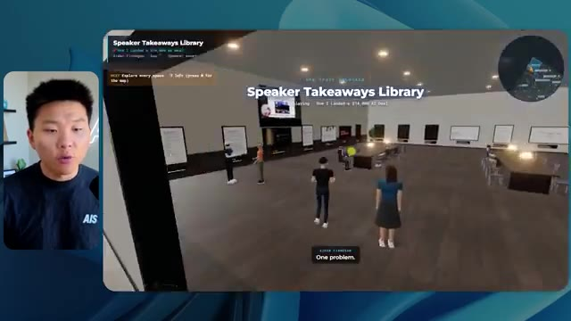
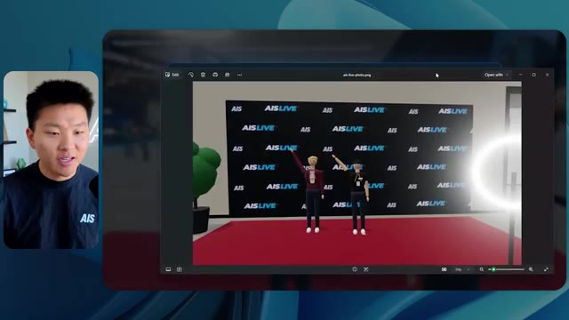
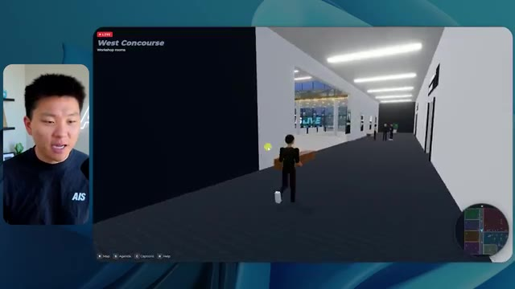

# 🎬 How to Build Claude Subagents Better Than 99% of People

> **Chaîne** : [Nate Herk | AI Automation](https://www.youtube.com/@nateherk/featured)  
> **Lien YouTube** : [https://www.youtube.com/watch?v=e18sdZLwP7o](https://www.youtube.com/watch?v=e18sdZLwP7o)  
> **Date de publication** : 20260609  
> **Durée** : 00:26:42  
> **Identifiant vidéo** : `e18sdZLwP7o`  
> **Transcription & Analyse** : `whisper-v3-large-turbo+gemini-3.5-flash-lite`  

---

## 📌 Synthèse Exécutive & Outils

### 💡 Résumé

Cette vidéo menée par Nate Herk sur la chaîne *Nate Herk | AI Automation* plonge au cœur de l'ingénierie des agents IA et du paramétrage des modèles de pointe en comparant rigoureusement les performances d'**Opus 5.5** à travers ses différents niveaux d'effort (faible, moyen et élevé). L'expérience consiste à soumettre un unique et exigeant prompt de type « slash goal » (objectif global) visant à transformer un dossier Frame.io brut de 105 gigaoctets d'enregistrements vidéo (provenant d'un événement virtuel baptisé AIS Live) en un monde 3D virtuel, interactif et explorable à la troisième personne, intégrant des salles de conférence, des scènes, des stands et des flux vidéo en direct. 

Les résultats démontrent des contrastes saisissants tant sur le plan qualitatif qu'opérationnel. L'exécution en mode « effort faible » a généré un monde 3D certes fonctionnel mais truffé de bugs graphiques, d'images fixes non lues et d'incohérences de design, pour une durée de 16 minutes 43 secondes, un coût API estimé à 3,91 $ et 191 000 jetons consommés via 22 vérifications automatiques. À l'inverse, l'exécution en mode « effort moyen » a produit un monde 3D hautement sophistiqué, respectueux de la charte graphique de la marque, doté de PNJ (personnages non-joueurs) réactifs, de flux vidéo en direct fonctionnels (comme les ateliers de Tangy Frederick et les interventions d'Ed ou d'Aiden) et d'une exploration fluide, pour un temps d'exécution d'1 heure 13 minutes, un coût de 12,44 $ (490 000 jetons et 23 vérifications). 

Fait remarquable dans les deux cas, le modèle a fonctionné en autonomie complète sans poser la moindre question à l'utilisateur tout au long du processus, illustrant la puissance d'exécution des agents IA avancés lorsqu'ils sont couplés à des environnements de développement intégrés et à des outils d'automatisation de pointe.

### 🛠️ Outils, Modèles & Logiciels Présentés

* **Opus 5.5** : Le modèle d'intelligence artificielle phare d'Anthropic, réputé pour sa polyvalence, son intelligence, son coût abordable et ses performances de pointe en programmation et en raisonnement.
* **Claude Code** : L'environnement de développement et d'ingénierie logicielle basé sur Claude, utilisé pour orchestrer la création de code et le déploiement des agents.
* **Cadre d'effort (Effort Level)** : Le paramètre de configuration d'Anthropic (faible, moyen, haut, max, code ultra) permettant d'ajuster dynamiquement la profondeur de calcul, le raisonnement et la rigueur d'exécution d'un modèle pour une tâche donnée.
* **Frame.io** : La plateforme cloud de gestion et de stockage vidéo utilisée ici pour stocker les 105 gigaoctets d'enregistrements bruts de l'événement AIS Live.
* **Herc 2** : Le système d'exploitation IA personnel de Nate Herk servant de boîte à outils et de bibliothèque de ressources intégrée pour le développement.
* **Key.ai** : Un service de génération d'images et de vidéos par IA sollicité par l'agent pour créer des éléments visuels contextuels à la volée.
* **Hostinger & son connecteur gratuit** : L'extension d'éditeur présentée comme sponsor, permettant de combler le fossé entre le code généré localement sur l'ordinateur portable et le déploiement rapide en ligne.

### 🔑 Points Clés & Enseignements Stratégiques

* **Impact direct du niveau d'effort sur la qualité visuelle et fonctionnelle** : Ajuster le paramètre d'effort d'Opus 5.5 transforme radicalement le livrable final, passant d'un prototype grossier et bogué (effort faible) à une application immersive et soignée (effort moyen).
* **Respect des directives de marque (Branding)** : Le mode d'effort moyen a su intégrer spontanément les codes couleurs et les éléments visuels de la marque AIS Live, contrairement au mode faible qui a produit un design générique et non personnalisé.
* **Autonomie totale des agents (« Zero-Question Execution »)** : À travers les différents tests, le modèle a exécuté des instructions complexes de type *slash goal* en toute autonomie, sans ressentir le besoin de solliciter l'utilisateur pour des clarifications, démontrant une excellente robustesse de déduction contextuelle.
* **Gestion des flux multimédias dynamiques** : Alors que l'effort faible se contentait d'afficher des images fixes et des PNJ « fantômes » disparaissant à l'approche, l'effort moyen a réussi à instancier de véritables flux vidéo en lecture (ateliers, keynotes) et des PNJ dotés d'une gestuelle interactive.
* **Équivalence temps/coût des API** : L'ingénierie par agent a un coût mesurable : l'effort faible a nécessité 16 minutes et 3,91 $ (191k tokens), tandis que l'effort moyen a requis 1 heure 13 minutes et 12,44 $ (490k tokens), soulignant un compromis explicite entre investissement financier/temporel et excellence du résultat.
* **Capacité de vérification autonome (Autonomous Verification)** : L'agent a eu recours à l'ouverture itérative de navigateurs (22 à 23 vérifications) pour tester par lui-même son travail visuel, agissant comme un ingénieur QA (Assurance Qualité) intégré.
* **Recommandation officielle d'Anthropic** : Les directives d'Anthropic conseillent de commencer par un niveau d'effort moyen pour les tâches de prompt engineering complexes, puis d'ajuster vers le haut ou le bas selon la criticité du livrable.
* **Intégration d'écosystèmes massifs de données** : La capacité d'un agent moderne à analyser et structurer un dossier de 105 Go de vidéos (via Frame.io) pour en extraire une topographie logique (hall d'accueil, salon VIP, scènes, pistes) illustre la puissance de la structuration de données non structurées.
* **Réduction du fossé entre code local et production** : La conclusion de l'expérimentation met en lumière le défi classique du développement assisté par IA : disposer d'un code fonctionnel sur sa machine locale et nécessiter des connecteurs fluides (comme Hostinger) pour industrialiser la mise en ligne instantanée.
* **Spécificnalité spatiale et physique 3D** : Le prompt exigeant des critères de physique, de design et de créativité, l'agent a su concevoir une carte interactive en haut à droite synchronisée en direct avec la position de l'utilisateur et le programme de l'événement.

---

## ⏱️ Chronologie & Transcription Complète Audio & Visuelle (Mot pour Mot)

### ⏱️ `[00:00:00 - 00:00:20]` | Segment #01

**🔊 Audio (Transcription Intégrale Mot pour Mot en Français) :**
> Opus 5.5, Opus 5.5, Opus 5.5, Opus 5.5, Opus 5.5. Ce modèle est littéralement partout et pour de très bonnes raisons. Il est intelligent, il est bon marché, il a un goût incroyable, c'est un modèle d'IA incroyable. Mais avec chaque modèle d'IA, vous avez le choix de l'effort, que ce soit faible, moyen, haut, extra, max ou code ultra.

**👁️ Analyse Visuelle d'Écran (gemini-3.5-flash-lite) :**
**Interface & Outils** : Interface de Twitter (X) affichant un post et une vidéo intégrée.

**Contenu textuel & Code** : Un tweet commentant l'impact de l'IA sur les créateurs techniques avec un média visuel.

**Action / Démonstration** : Présentation d'une publication sur les réseaux sociaux illustrant les capacités des nouveaux modèles d'IA.

*⏱️ 00:00:05 — Une capture d'écran d'un tweet montrant un paysage tropical généré en 3D avec des maisons et des palmiers.*

---

### ⏱️ `[00:00:20 - 00:00:38]` | Segment #02

**🔊 Audio (Transcription Intégrale Mot pour Mot en Français) :**
> Donc dans cette vidéo, j'ai donné exactement le même prompt à Opus 5.5 et je l'ai exécuté à chaque niveau d'effort, et nous allons comparer les résultats. Nous allons examiner la qualité de toutes les différentes sorties réelles, mais nous allons aussi examiner le temps d'exécution de chacun d'eux, combien cela nous a coûté si c'était facturé par l'API, le total des jetons, combien de vérifications ils ont exécutées et combien de questions ils m'ont réellement posées tout au long du processus.

**👁️ Analyse Visuelle d'Écran (gemini-3.5-flash-lite) :**
**Interface & Outils** : Application de tableau blanc ou interface de présentation comparative (type Miro ou Canva).

**Contenu textuel & Code** : Tableau comparatif structuré par niveaux d'effort (Low, Medium, High, Extra, Max, Ultracode) et par métriques de performance (Run time, API cost, Total tokens, Checks, Questions asked).

**Action / Démonstration** : Présentation visuelle de la grille comparative des résultats selon les niveaux d'effort d'Opus 5.5.

*⏱️ 00:00:29 — Tableau de comparaison montrant les différents niveaux d'effort d'Opus 5.5 (Low, Medium, High, Extra, Max, Ultracode) et leurs métriques (Run time, API cost, Total tokens, etc.).*

---

### ⏱️ `[00:00:39 - 00:00:58]` | Segment #03

**🔊 Audio (Transcription Intégrale Mot pour Mot en Français) :**
> Et les résultats qu'on a obtenus ne sont pas du tout ce à quoi je m'attendais, donc j'ai hâte de partager ça avec vous les gars. Ne perdons pas de temps et entrons directement dans le vif du sujet. Bon, alors passons tout de suite à la suite. Je veux commencer simplement en vous montrant le prompt exact qu'on a utilisé, qu'on a donné à chacun de ces différents agents. Je vais aller dans les fichiers ici, et on va ouvrir ce fichier markdown de prompt, et je vais vous montrer ce qu'on a obtenu. Alors voici le slash objectif que j'ai fourni.

**👁️ Analyse Visuelle d'Écran (gemini-3.5-flash-lite) :**
**Interface & Outils** : Interface logicielle de type éditeur / assistant IA (Opus 5.5 / Ultracode) avec incrustation vidéo du présentateur.

**Contenu textuel & Code** : Texte du prompt affiché : "Hi Nate. This worktree has the effort-test task queued in PROMPT.md : build a walkable third-person 3D world of the AIS Live conference..."

**Action / Démonstration** : Présentation du prompt initial dans l'interface de l'agent IA avant de lancer le test.

*⏱️ 00:00:48 — Interface de l'outil de développement et d'IA affichant une session de travail avec un panneau latéral de configuration et une zone de chat principale montrant le prompt initial.*

---

### ⏱️ `[00:00:58 - 00:01:34]` | Segment #04

**🔊 Audio (Transcription Intégrale Mot pour Mot en Français) :**
> J'ai dit, tu dois me créer un monde en 3D qui est une conférence technologique réaliste dans laquelle je peux me déplacer en vue à la troisième personne. Tu vas regarder ce dossier, qui contient mes éléments d'enregistrement d'événements provenant d'AIS Live. Et ce dossier est un dossier Frame.io de 105 gigaoctets d'enregistrements vidéo. C'était un événement entièrement virtuel. Tout a été enregistré et tous les enregistrements sont ici. J'ai dit, ton objectif est de prendre cet événement et de le transformer en un monde explorable en 3D qui me donne l'impression d'être réellement allé à une vraie conférence en personne avec différentes salles, différentes pistes, différentes scènes, bla, bla, bla. N'hésite pas à utiliser key.ai si tu as besoin de générer des images ou des vidéos. Et tu peux aussi utiliser tout ce qui se trouve dans mon projet Herc 2, qui est comme mon système d'exploitation IA. J'ai dit,

**👁️ Analyse Visuelle d'Écran (gemini-3.5-flash-lite) :**
**Interface & Outils** : Éditeur de code (type VS Code / Cursor) et interface web Frame.io

**Contenu textuel & Code** : Fichier Markdown PROMPT.md contenant le prompt complet demandant de transformer des enregistrements d'événements virtuels en un monde 3D interactif (conférence tech réaliste) avec un lien Frame.io (https://f.io/sPdlo-Si).

**Action / Démonstration** : Présentation et explication du prompt d'automatisation et du dossier de ressources Frame.io utilisé pour alimenter l'agent IA.

*⏱️ 00:01:07 — Un éditeur de texte affichant le fichier PROMPT.md avec les instructions détaillées pour créer un monde 3D interactif et le lien vers les ressources AIS Live.*

*⏱️ 00:01:16 — Une interface Frame.io montrant le dossier d'archivage d'événements contenant les sous-dossiers "GA Access" et "VIP Access" pour les enregistrements d'AIS Live.*

*⏱️ 00:01:25 — L'éditeur de texte affichant à nouveau le fichier PROMPT.md détaillant la conception d'un espace 3D explorable en vue à la troisième personne basé sur les enregistrements.*

---

### ⏱️ `[00:01:34 - 00:02:08]` | Segment #05

**🔊 Audio (Transcription Intégrale Mot pour Mot en Français) :**
> vous serez jugé sur la créativité, le design, la physique et la sensation générale lorsque j'explorerai le monde 3D que vous avez construit. Et c'était fondamentalement la fin des instructions. Donc, comme vous pouvez le voir sur ce côté gauche, j'ai exécuté ceci à travers tous les différents niveaux d'effort. Commençons par le niveau bas et progressons jusqu'à l'ultra code. Très bien. Donc ici, nous avons le résultat du niveau bas. Ouvrons ceci et jetons un œil. Nous avons donc AIS Live, le sommet des services IA en personne enfin, et nous avons pu cliquer partout. Tout d'abord, cela ne fait pas très "marqué". Genre, ce n'ha pas le logo d'AIS Live. Ce n'est même pas nos couleurs. Donc je n'aime pas trop ça, mais entrons ici. D'accord. C'est beaucoup too bright. Euh, nous avons une carte en haut à droite ; nous avons une ville ici en arrière-plan. Je ne peux pas dire quelle ville c'est.

**👁️ Analyse Visuelle d'Écran (gemini-3.5-flash-lite) :**
**Interface & Outils** : Interface web d'agent conversationnel / outil de développement avec gestion de worktrees.

**Contenu textuel & Code** : Texte du prompt : "Hi Nate. This worktree has the effort-test task queued in PROMPT.md : build a walkable third-person 3D world..." et la réponse de l'utilisateur dans le champ de saisie : "yes, start the task in PROMPT.md".

**Action / Démonstration** : Navigation ou sélection des différents niveaux de test dans le panneau latéral de l'application.

*⏱️ 00:01:42 — Interface d'une application d'IA (similaire à Claude Code / interface de chat avec worktrees) affichant un panneau latéral avec différents niveaux de test (Hello, Extra, High, Max, Ultracode, Medium, Low) et le texte d'un prompt demandant de construire un monde 3D.*

---

### ⏱️ `[00:02:08 - 00:02:40]` | Segment #06

**🔊 Audio (Transcription Intégrale Mot pour Mot en Français) :**
> C'est. D'accord. C'est Chicago, ce qui est plutôt sympa parce que tu sais, j'habite à Chicago, mais bref, en haut à droite, on peut voir une carte. On a un hall d'accueil. On a un hall d'exposition. On a un salon VIP, la scène principale. La carte montre aussi où se trouve chaque autre personne et tout se synchronise en direct. Donc on peut voir l'enregistrement. On peut voir le premier jour, la keynote Hyper Agent, le débrief en direct. Super. Donc le système connaît vraiment le programme et ensuite il y a le deuxième jour. Donc il a trouvé ça, c'est bien. On a ces petites boules ici que je peux espérer projeter en me déplaçant. D'accord. Le visage, oh, regarde ça ! Si je vais par ici, tous les gens disparaissent tout simplement. Très mauvais. Très mauvais. D'accord. Alors voyons voir. Est-ce que je peux sprinter ? D'accord.

**👁️ Analyse Visuelle d'Écran (gemini-3.5-flash-lite) :**
**Interface & Outils** : Application web de monde virtuel / salon 3D interactif avec mini-carte de navigation.

**Contenu textuel & Code** : Menus d'événements, programmes de conférences ("Day 1"), indications de zones (Badge pickup, Lobby, Expo Hall) et avatars d'utilisateurs.

**Action / Démonstration** : Navigation et exploration d'un espace de conférence virtuel 3D.

*⏱️ 00:02:16 — Vue d'un espace virtuel 3D interactif avec des avatars de participants et une mini-carte en haut à droite.*

*⏱️ 00:02:24 — Vue du hall d'accueil (Lobby) virtuel affichant le programme (Day 1) avec la mini-carte de navigation.*

*⏱️ 00:02:32 — Vue de l'Expo Hall virtuel avec des stands, des avatars de participants et des éléments interactifs lumineux.*

---

### ⏱️ `[00:02:40 - 00:03:04]` | Segment #07

**🔊 Audio (Transcription Intégrale Mot pour Mot en Français) :**
> Je peux avancer un peu plus vite. Je vais d'abord aller par ici. Il y a des produits dérivés, euh, un sweat à capuche certifié AIS plus. D'accord. Donc il y a les vrais stands qu'on avait lors de l'événement virtuel. On avait des stands. Donc c'est plutôt cool. Un petit endroit pour prendre des photos. Salle C. En ce moment, nous avons Tangy Frederick qui anime un atelier. D'accord. Mais ce n'est pas une vidéo. Comme vous pouvez le voir, c'est juste une image. Elle ne bouge pas. C'est donc juste une image. Ces gens sont en train de disparaître. Ça doit être des fantômes. Allons par ici vers la salle A.

**👁️ Analyse Visuelle d'Écran (gemini-3.5-flash-lite) :**
**Interface & Outils** : Environnement virtuel 3D (style métavers / jeu vidéo).

**Contenu textuel & Code** : Affichage d'un espace d'exposition virtuel avec des panneaux d'information et des didacticiels textuels sur des écrans virtuels.

**Action / Démonstration** : Navigation et déplacement d'un avatar à l'intérieur d'une salle de conférence et d'exposition virtuelle 3D.

---

### ⏱️ `[00:03:04 - 00:03:30]` | Segment #08

**🔊 Audio (Transcription Intégrale Mot pour Mot en Français) :**
> Nous avons Liberty White. D'accord. Très cool. Vos 30 premiers jours en automatisation. Encore une fois, c'est juste une image fixe et les gens ont des bugs d'affichage. Donc ce n'est pas très bon ici. Je vais aller sur la scène principale et voir ce que nous avons. D'accord, cool. Nous avons donc une scène d'apparence principale. Les gens ont des bugs d'affichage. Vraiment grave. Ce n'est vraiment pas terrible. Notre vidéo est en fait en train de bouger. Comme j'ai vu mon visage ici et j'ai vu celui de Devin, mais maintenant ils ont disparu. Donc je ne sais pas trop ce qui s'est passé. D'accord. C'est, on dirait que c'est plutôt un diaporama. Rien n'est en fait en train d'être lu pour l'instant. Quoi qu'il en soit, entrons ici.

**👁️ Analyse Visuelle d'Écran (gemini-3.5-flash-lite) :**
**Interface & Outils** : Environnement virtuel 3D interactif (type metaverse/plateforme de conférence virtuelle).

**Contenu textuel & Code** : Interface utilisateur avec mini-carte de navigation, indications textuelles (WASD move, Space jump), et panneaux de présentation de conférence.
[DESC_IMAGE_1] Navigation d'un avatar dans une salle de conférence virtuelle interactive.

**Action / Démonstration** : Explications face caméra et démonstration conceptuelle.

*⏱️ 00:03:11 — Vue d'un monde virtuel interactif montrant le Workshop Room A (Foundation track) avec un avatar d'utilisateur.*

*⏱️ 00:03:17 — Vue de la scène principale (Main Stage) d'un événement virtuel avec un public d'avatars et le titre 'Hyperagent Workshop'.*

*⏱️ 00:03:24 — Vue face à l'écran géant de la scène principale affichant 'AIS LIVE AI Services Summit'.*

---

### ⏱️ `[00:03:30 - 00:03:58]` | Segment #09

**🔊 Audio (Transcription Intégrale Mot pour Mot en Français) :**
> Nous avons d'autres stands. Nous avons hyper agent. Nous avons Claude Code. Nous avons plus de gadgets. La salle B est animée par Dave Ebelor. Je suppose que c'est exactement la même chose. Nous avons du café. Et puis, je suppose, le salon VIP, accès VIP seulement. C'est plutôt cool, mais il ne se passe vraiment rien ici. Cet écran est bien trop lumineux. D'accord. Donc je pense que vous comprenez l'ambiance que nous retirons d'ici avec Opus 5.5 en effort faible. Et c'est là que les choses deviennent intéressantes. Combien de temps pensez-vous que cela a duré ? Combien de temps ? Celui-ci a duré 16 minutes et 43 secondes. Combien pensez-vous que cela a coûté ?

**👁️ Analyse Visuelle d'Écran (gemini-3.5-flash-lite) :**
**Interface & Outils** : Application web / Tableau blanc virtuel (Opus 5.5 Efforts)

**Contenu textuel & Code** : Tableau comparatif des niveaux d'effort (Low, Medium, High, Extra, Max, Ultracode) avec métriques (Run time, API cost, Total tokens, Checks, Questions asked).

**Action / Démonstration** : Présentation des différents niveaux de performance et de coût des agents.

*⏱️ 00:03:51 — Interface montrant un tableau comparatif avec les colonnes Low, Medium, High, Extra, Max, Ultracode et des lignes Run time, API cost, Total tokens, etc.*

---

### ⏱️ `[00:03:58 - 00:04:26]` | Segment #10

**🔊 Audio (Transcription Intégrale Mot pour Mot en Français) :**
> 3,91 dollars si c'était une facturation par API. J'utilise évidemment mon abonnement ici, mais nous allons simplement calculer cela avec la facturation par API. Le nombre total de tokens était de 191 000. Il a fait 22 vérifications. Donc, pour la vérification, il a ouvert le navigateur 22 fois et a exécuté différentes sortes de vérifications. Donc, 22 catégories de vérifications. Et combien de questions m'a-t-il posées ? Il m'a posé un total de zéro question tout au long de cette invite de type slash goal. D'accord. Alors, ouvrons l'effort moyen et voyons ce que nous avons obtenu. D'accord, c'est parti. Effort moyen. Nous avons Nate Herc. Nous avons mon badge. C'est marqué aux couleurs d'AI's Life.

**👁️ Analyse Visuelle d'Écran (gemini-3.5-flash-lite) :**
**Interface & Outils** : Tableau blanc ou application de mind mapping/diagramme (style Excalidraw ou similaire).

**Contenu textuel & Code** : Tableau avec les lignes : Run time (16m 43s), API cost ($3.91), Total tokens (191.3K), Checks, et Questions asked, sous des colonnes Low, Medium, High, Ex.

**Action / Démonstration** : Le présentateur commente les résultats chiffrés et les coûts d'API affichés dans le tableau.

*⏱️ 00:04:05 — Un tableau comparatif montrant les métriques de performance et de coût pour différents niveaux d'effort, avec le présentateur visible dans un encadré à gauche.*

---

### ⏱️ `[00:04:26 - 00:04:46]` | Segment #11

**🔊 Audio (Transcription Intégrale Mot pour Mot en Français) :**
> Donc ça a déjà l'air un petit peu mieux. Ça ressemble à nos palettes de couleurs qui ont utilisé nos directives de marque. Premier jour de construction, deuxième jour de gain, VIP. Cool. D'accord. Je vais entrer dans le lieu. D'accord. Waouh. Une ambiance similaire, en gros. C'est en arrière-plan. Ça ne ressemble pas à Chicago, hein ? Non, ça ressemble à, honnêtement, ça ressemble à une ville imaginaire. Quoi qu'il en soit, c'est marrant qu'ils aient décidé de faire ça. Voyons si je peux me déplacer un peu plus vite. Oh, waouh.

**👁️ Analyse Visuelle d'Écran (gemini-3.5-flash-lite) :**
**Interface & Outils** : Interface web d'une application virtuelle 3D (style métavers/événementiel).

**Contenu textuel & Code** : Page de connexion/accueil 'Welcome to AIS Live' avec badges et contrôles de navigation.

**Action / Démonstration** : Le présentateur clique sur le bouton pour entrer dans le lieu virtuel.

*⏱️ 00:04:31 — Écran de bienvenue de l'application 'AIS Live' avec un badge d'accès au nom de 'Nate Herk' et un bouton 'Enter the venue'.*

*⏱️ 00:04:41 — Vue dans l'espace virtuel 3D de l'application montrant des avatars d'utilisateurs dans un hall moderne avec vue sur la ville.*

---

### ⏱️ `[00:04:46 - 00:05:21]` | Segment #12

**🔊 Audio (Transcription Intégrale Mot pour Mot en Français) :**
> Les gens interagissent avec moi. Regardez. Si je m'approche de ce type, il vient de lever le bras. Bon, maintenant il ne veut plus du tout avoir affaire à moi. Mais tous ces petits robots ici doivent prendre des décisions. Je ne sais pas s'ils utilisent Jev. C'est sûr que non. Je ne lui ai pas dit de le faire. En fait, ma clé Jev est à l'arrière. Je ne sais pas. Peut-être qu'il l'a utilisée. Quoi qu'il en soit, nous pouvons voir ici que nous avons la salle d'atelier C, le laboratoire des agents. Sympa. Donc celui-ci est réellement en train de fonctionner. Vous pouvez voir qu'il s'agit d'une vraie vidéo lue par Tangy. Tout le monde ici est vraiment en train de travailler sur un ordinateur portable. Ils ne buguent pas. C'est plutôt cool. De plus, mon badge est sur ma poitrine, ce qui est plutôt cool. Je peux venir par ici. Nous avons une carte en haut à droite, comme vous pouvez le voir, mais je peux venir par ici. Nous avons un

**👁️ Analyse Visuelle d'Écran (gemini-3.5-flash-lite) :**
**Interface & Outils** : Environnement virtuel 3D / plateforme de simulation d'agents.

**Contenu textuel & Code** : Interface de simulation avec mini-carte en haut à droite et informations de session en bas à gauche ("Enterprise AI Services").

**Action / Démonstration** : Exploration d'un monde virtuel 3D peuplé d'avatars et de robots autonomes.

---

### ⏱️ `[00:05:21 - 00:05:47]` | Segment #13

**🔊 Audio (Transcription Intégrale Mot pour Mot en Français) :**
> halle d'exposition. C'est là que nous avons le stand Glido. Et ça diffuse en ce moment. Oui, ça diffuse la vidéo de nous en train de parler de Glido. Ça diffuse la vidéo d'Ed et moi parlant de notre programme de certification. Nous avons le logo AIS Plus ici à l'arrière, qui est un peu mal placé. Ce sont les diapositives des conférenciers et les points clés. Alors waouh, ce sont toutes les ressources que nous avons distribuées après l'événement. Elles sont toutes là aussi. Nous pouvons voir que nous avons un projecteur de communauté. C'est donc Aiden qui parle de son contrat qu'il a décroché et c'est diffusé en direct. Ces gens regardent.

**👁️ Analyse Visuelle d'Écran (gemini-3.5-flash-lite) :**
**Interface & Outils** : Environnement virtuel 3D de type metavers ou salon virtuel d'exposition.

**Contenu textuel & Code** : Éléments graphiques d'un salon virtuel : bannières, écrans de présentation, panneaux d'information, et mini-carte de navigation.

**Action / Démonstration** : Navigation et exploration de l'espace d'exposition virtuel par le présentateur.

---

### ⏱️ `[00:05:47 - 00:06:21]` | Segment #14

**🔊 Audio (Transcription Intégrale Mot pour Mot en Français) :**
> Ils sont plutôt engagés. On a l'hyper agent. C'était, c'est ce que je voulais dire. Si vous avez vu ces gens lever les bras pour dire bonjour, c'était plutôt marrant. Regardez, regardez, le voilà qui recommence. Bref. Bon. Où est-ce que je suis maintenant ? Maintenant, je suis dans le hall principal. On a un bar à café. On a un grand logo, qui est le vrai logo. Il est trop lumineux, mais on a le logo. On peut voir si on peut entrer ici dans le parcours des fondations. On a Sabrina Romanov et Liberty White. Donc différentes formations juste là. On peut entrer dans cette salle. C'est le parcours avancé. Alors qu'est-ce qui se passe ici ? On a Dave Ebelar et Saman qui parlent de différentes choses là-dedans. Et maintenant, allons jeter un œil à la scène principale. Oh, attendez, il y a une vidéo de moi là-haut. C'est genre un VIP

**👁️ Analyse Visuelle d'Écran (gemini-3.5-flash-lite) :**
**Interface & Outils** : Application de monde virtuel 3D / plateforme d'événement virtuel.

**Contenu textuel & Code** : Environnement virtuel 3D avec interface de mini-carte et texte "Main Lobby".

**Action / Démonstration** : Exploration et navigation dans un espace virtuel 3D avec des avatars.

---

### ⏱️ `[00:06:21 - 00:06:50]` | Segment #15

**🔊 Audio (Transcription Intégrale Mot pour Mot en Français) :**
> section ? Ouais, on ira voir ça dans une minute. Mais bref, voici la scène principale. Ça a l'air vraiment, vraiment très bien. On a une grande scène. On a genre quatre personnes assises ici. On a les les trois écrans d'Alex là-haut avec hyper agent. Est-ce que j'ai le droit de monter sur scène ? Oh, et il me laisse monter sur scène. D'accord. C'est plutôt sympa. Bon les gars, faisons un selfie. Laissez-moi prendre tout le monde en arrière-plan. Venez ici. Bref, ça c'est vraiment, vraiment cool. Tout le monde n'est pas assis par contre. Donc il faut qu'on travaille là-dessus. Mais bref, je vais y retourner en courant pour voir ce que c'était que cette section VIP. D'accord. Le salon VIP. J'ai l'impression que c'est comme un aéroport ou un truc du genre.

**👁️ Analyse Visuelle d'Écran (gemini-3.5-flash-lite) :**
**Interface & Outils** : Environnement virtuel 3D / Plateforme de métavers ou de conférence interactive.

**Contenu textuel & Code** : Interface utilisateur affichant les détails de la keynote (Hyperagent Keynote par Alex McDonnell) et une mini-carte.

**Action / Démonstration** : Navigation d'un avatar dans une salle de conférence virtuelle 3D.

---

### ⏱️ `[00:06:51 - 00:07:14]` | Segment #16

**🔊 Audio (Transcription Intégrale Mot pour Mot en Français) :**
> Ok, super. Donc maintenant, nous avons les sessions VIP ici. Une foire aux questions VIP avec la lecture vidéo en direct de Nate juste ici. C'est vraiment, vraiment super. Et nous avons comme un bar ou quelque chose comme ça. Génial. Je dirais que c'est un très bon résultat. Maintenant, en ce qui concerne les statistiques ici, celle-ci a pris une heure et 13 minutes à s'exécuter. Cela nous aurait coûté 12 dollars et 44 cents. Elle a utilisé 490 000 jetons et elle a effectué 23 vérifications.

**👁️ Analyse Visuelle d'Écran (gemini-3.5-flash-lite) :**
**Interface & Outils** : Interface virtuelle 3D et tableau de bord web d'analyse de performances (Opus 5.5 Efforts).

**Contenu textuel & Code** : Tableaux de statistiques avec métriques : Run time (16m 43s), API cost ($3.91), Total tokens (191.3K), Checks (22), et vue de l'espace virtuel VIP.

**Action / Démonstration** : Navigation et présentation de l'espace virtuel VIP puis affichage des statistiques d'exécution du projet.

*⏱️ 00:06:56 — Capture montrant un espace virtuel en 3D (type métaverse) avec un grand écran affichant une vidéo en direct du présentateur et un coin bar en arrière-plan.*

*⏱️ 00:07:02 — Capture montrant un tableau de données dans une interface web affichant les métriques d'exécution (Run time, API cost, Total tokens, etc.).*

---

### ⏱️ `[00:07:14 - 00:07:48]` | Segment #17

**🔊 Audio (Transcription Intégrale Mot pour Mot en Français) :**
> Et il nous a posé un total de zéro question une fois de plus. Très bien, passons au niveau élevé. C'était déjà un résultat plutôt correct et Anthropic eux-mêmes dans leur vidéo de comment prompter Opus 5.5, ou désolé, pas une vidéo, un article. Ils ont dit de commencer simplement par le niveau moyen et d'ajuster à la hausse ou à la baisse si nécessaire. C'était donc un résultat moyen. Passons au niveau élevé et voyons ce que nous avons obtenu. Très rapidement, les gars, je dois prendre une seconde pour vous parler du sponsor de la vidéo d'aujourd'hui, Hostinger. Donc, ces deux modèles viennent de me créer une version fonctionnelle de la même chose. Et maintenant, je me retrouve exactement là où je finis toujours, avec un produit fini sur mon ordinateur portable et aucun moyen rapide de le mettre en ligne. Et c'est précisément le fossé que comble le connecteur d'Hostinger. C'est une extension gratuite.

**👁️ Analyse Visuelle d'Écran (gemini-3.5-flash-lite) :**
**Interface & Outils** : Tableau comparatif (Image 1) et éditeur de code Cursor avec interface d'agent IA (Image 2).

**Contenu textuel & Code** : Métriques de run time, coût API, tokens, checks et questions posées (Image 1) ; prompt de construction d'un calculateur de ROI et étapes de réflexion de l'IA (Image 2).
[DESC_ACTION_1] Le présentateur commente le tableau comparatif des différents niveaux d'effort d'Opus 5.5.
[DESC_ACTION_2] L'éditeur Cursor affiche le processus de génération de code pour le calculateur ROI avec les détails de l'agent IA.

**Action / Démonstration** : Explications face caméra et démonstration conceptuelle.

*⏱️ 00:07:22 — Tableau comparatif des performances et coûts d'Opus 5.5 selon différents niveaux d'effort (Low, Medium, High, Extra).*

*⏱️ 00:07:39 — Interface de l'éditeur de code Cursor montrant le projet Northwind ROI calculator avec l'exécution de l'agent.*

---

### ⏱️ `[00:07:48 - 00:08:23]` | Segment #18

**🔊 Audio (Transcription Intégrale Mot pour Mot en Français) :**
> pour votre éditeur qui intègre votre compte Hostinger dans l'environnement où vous codez déjà. Que ce soit VS Code, Cursor, Cloud Code, Codex, peu importe. Vous vous connectez une seule fois en un clic, et à partir de là, votre agent peut déployer le site, y associer un domaine, configurer les enregistrements DNS et vérifier votre VPS sans que vous ayez jamais à quitter l'éditeur. Alors, peu importe celui de ces outils que vous finirez par préférer, ce qu'il a construit est à quelques minutes d'une véritable URL sur un hébergement géré. Le connecteur est gratuit avec toutes les offres d'hébergement, donc si vous avez toujours besoin de l'hébergement sous-jacent, profitez de l'offre illimitée avec le lien dans la description et utilisez le code NATEHERK pour obtenir 10 % de réduction. Cela comprend également un nom de domaine gratuit et un e-mail professionnel pour un an. Et c'est toujours le moyen le plus économique que j'ai trouvé pour obtenir quelque chose

**👁️ Analyse Visuelle d'Écran (gemini-3.5-flash-lite) :**
**Interface & Outils** : Interface de gestion Hostinger connectée à l'IDE et interface de terminal Claude Code.

**Contenu textuel & Code** : Statut "Connected", "Node.js 24.13.0", liste des outils disponibles (Websites, Domains, Subscriptions & Payments, Email Marketing).

**Action / Démonstration** : Connexion du compte Hostinger à l'environnement de développement pour permettre à l'agent d'accéder aux outils de gestion.

*⏱️ 00:07:57 — Interface montrant l'intégration de Hostinger dans l'IDE avec le statut connecté via OAuth et les outils disponibles (Websites, Domains, Subscriptions, Email Marketing), ainsi qu'une fenêtre Claude Code à droite.*

---

### ⏱️ `[00:08:23 - 00:08:47]` | Segment #19

**🔊 Audio (Transcription Intégrale Mot pour Mot en Français) :**
> vous avez construit sur une vraie URL. Donc revenons à la vidéo. D'accord. Encore une fois, très, très marqué par la marque. C'est un écran de chargement encore mieux que le précédent. Nous avons ce petit effet sympa en arrière-plan. Nous avons le logo. Nous allons entrer dans le lieu. D'accord. Nous y voilà. Ça a l'air plutôt bien. Nous commençons dehors et vous pouvez voir que nous avons ces drapeaux pour tous les intervenants, Wyatt, Casper, Alex, Ed, Aiden, Sabrina, Liberty. C'est plutôt cool. Nous avons des blocs en direct ici.

**👁️ Analyse Visuelle d'Écran (gemini-3.5-flash-lite) :**
**Interface & Outils** : Application web 3D / environnement virtuel en ligne (AIS Live)

**Contenu textuel & Code** : Interface utilisateur avec instructions de contrôle (WASD, Mouse, E, Tab), bannières nominatives et mini-carte

**Action / Démonstration** : Navigation et exploration de l'espace virtuel de l'événement en 3D avec un avatar

*⏱️ 00:08:29 — Écran de chargement et d'accueil de la plateforme virtuelle 'AIS LIVE', affichant le logo, les touches de contrôle et un bouton 'ENTER THE VENUE'.*

*⏱️ 00:08:35 — Vue dans l'espace virtuel 3D 'AIS Live Plaza', montrant un avatar de joueur, des bâtiments urbains et l'interface de navigation.*

*⏱️ 00:08:41 — Exploration de la place virtuelle avec des bannières verticales affichant des noms de intervenants ('WYATT LYONSMITH', 'ALEX MCDONNELL').*

---

### ⏱️ `[00:08:47 - 00:09:23]` | Segment #20

**🔊 Audio (Transcription Intégrale Mot pour Mot en Français) :**
> Il a pris cette photo de moi, votre hôte, Nate Herc, John, Dave, Nate Herc. Voilà. OK. Les portes. Génial. Ce sont des portes coulissantes automatiques en verre. J'adore ça. On peut voir l'enregistrement VIP. On peut voir l'admission générale. On peut venir par ici et on peut découvrir l'expo avec différents stands, le projecteur sur la communauté. Vous pouvez aussi voir qu'en haut à gauche, j'ai un passeport. Donc c'est comme si, ça va montrer combien d'endroits j'ai visités. Tout cela est une vraie lecture. Nous avons un mur de ressources avec tous les différents intervenants. Ils ont aussi une session de réseautage par ici. Donc je vais venir très vite et voir de quoi il s'agit. Nous avons donc le bar à cold brew AIS. Nous avons différents membres de la communauté qui ont été mis en avant ou en lumière.

**👁️ Analyse Visuelle d'Écran (gemini-3.5-flash-lite) :**
**Interface & Outils** : Application web 3D immersive / Metavers événementiel

**Contenu textuel & Code** : Environnement virtuel 3D interactif avec avatars, panneaux d'affichage et interface utilisateur de navigation

**Action / Démonstration** : Navigation et exploration de l'espace virtuel par le présentateur

*⏱️ 00:08:56 — Vue principale de l'espace virtuel avec la scène principale et les comptoirs d'enregistrement.*

*⏱️ 00:09:05 — Exploration de l'Expo Hall virtuel avec des stands et des certifications visibles.*

*⏱️ 00:09:14 — Déplacement de l'avatar au milieu d'autres participants dans le hall d'entrée virtuel.*

---

### ⏱️ `[00:09:23 - 00:09:56]` | Segment #21

**🔊 Audio (Transcription Intégrale Mot pour Mot en Français) :**
> On a la zone VIP. Attends, quoi ? Prends un bracelet. Ah, je dois vraiment aller chercher le bracelet. D'accord. Laisse-moi m'enregistrer rapidement. Le bracelet est déjà mis. Attends, quoi ? D'accord. Oh, d'accord. Maintenant, les portes se sont ouvertes pour moi. Cool. Je peux entrer ici. Oh, ça mène juste à la scène principale. Salon VIP. Il y a une séance de questions-réponses en cours. Ça a l'air très cool. Je veux dire, je suis très impressionné par la façon dont il parvient à faire ça. Waouh. D'accord. Donc c'est vraiment bien. Ce qu'on a fait, c'est qu'on a eu des salles de discussion VIP avec différentes personnes. Tu peux voir qu'il y a différentes salles, différents membres de l'équipe AIS qui vont dans des trucs. C'est vraiment cool. C'est très cool. C'est un VIP bien meilleur

**👁️ Analyse Visuelle d'Écran (gemini-3.5-flash-lite) :**
**Interface & Outils** : Application web ou jeu virtuel en 3D représentant un espace de conférence virtuel.

**Contenu textuel & Code** : Éléments d'interface utilisateur de salon virtuel, affichage de sessions, avatars et affichages de visioconférence intégrés.

**Action / Démonstration** : Navigation et déplacement d'un avatar dans l'environnement virtuel 3D.

---

### ⏱️ `[00:09:56 - 00:10:30]` | Segment #22

**🔊 Audio (Transcription Intégrale Mot pour Mot en Français) :**
> expérience que ce qui a été montré dans la première partie. D'accord. After party VIP. Regardez ça. On a une piste de danse. On a tous ces éléments ici. On a la lecture de l'after party VIP juste ici. Et il y a une estrade pour DJ. C'est tellement marrant. Il y a un petit bug ici, un petit glitch ici, mais c'est génial. Oh, super. Donc quand je suis ici sur la scène principale, on a des sous-titres. Vous pouvez voir juste ici en bas de mon écran, on a ces sous-titres de Wyatt qui est en train de parler ici. On a des lumières. On a le panneau. Très cool. Belle scène principale. Je vais aller par ici. On peut aller à la fondation,

**👁️ Analyse Visuelle d'Écran (gemini-3.5-flash-lite) :**
**Interface & Outils** : Application web virtuelle immersive / plateforme d'événement virtuel 3D

**Contenu textuel & Code** : Interface utilisateur virtuelle affichant 'VIP After-Party', 'Main Stage', liste des participants et commandes de navigation.
[DESC_IMAGE_3] Navigation dans un espace événementiel virtuel interactif en 3D représentant une conférence.

**Action / Démonstration** : Explications face caméra et démonstration conceptuelle.

*⏱️ 00:10:04 — Vue d'une salle virtuelle 'VIP After-Party' avec avatars animés sur une piste de danse et écran vidéo mural.*

*⏱️ 00:10:13 — Vue de la piste de danse virtuelle de l'after-party avec des ballons de plage et des participants affichés sur écran géant.*

*⏱️ 00:10:21 — Vue d'une salle de conférence virtuelle 'Main Stage' avec un avatar au premier plan et un présentateur sur écran géant.*

---

### ⏱️ `[00:10:30 - 00:11:06]` | Segment #23

**🔊 Audio (Transcription Intégrale Mot pour Mot en Français) :**
> avancé, et les parcours d'entreprise ici. Donc voyons voir. Nous avons l'anatomie de trois vraies transactions. Nous avons hyper agent. Nous avons les évaluations avec Nate et Ed ici. Nous avons Dave qui s'occupe des trucs avancés. C'est vraiment bien. Je veux dire, évidemment, chacun, chacun de ces résultats jusqu'à présent, faible était correct. Moyen était meilleur. Élevé a été encore meilleur. Voyons si cette tendance se poursuit et allons voir ce que cela nous a coûté. Donc, élevé a fonctionné pendant une heure et sept minutes. Donc un peu plus rapide que moyen, cela nous aurait coûté 16 dollars et 31 cents. Il a utilisé un demi-million de jetons, 509 000. Il a fait 22 vérifications. Et il nous a aussi demandé, enfin, non, je me suis trompé. Ce

**👁️ Analyse Visuelle d'Écran (gemini-3.5-flash-lite) :**
**Interface & Outils** : Tableau blanc ou application de notes/diagrammes (style Miro/Excalidraw) avec un tableau de données comparatives.

**Contenu textuel & Code** : Tableau avec les colonnes Low, Medium, High, Extra, et des lignes Run time, API cost, Total tokens, Checks, Questions asked.

**Action / Démonstration** : Présentation des résultats comparatifs d'analyses et de coûts d'API pour différents niveaux d'effort.

*⏱️ 00:10:57 — Tableau comparatif sur fond sombre montrant les performances de différents niveaux (Low, Medium, High, Extra) avec les temps d'exécution, coûts API et jetons.*

---

### ⏱️ `[00:11:06 - 00:11:25]` | Segment #24

**🔊 Audio (Transcription Intégrale Mot pour Mot en Français) :**
> L'un m'a posé une question et, spoiler, c'était le seul qui nous a posé une question tout au long de tout ça. Donc voyons, il nous en reste trois : Extra, Max et Ultra Code. Laissez-moi ouvrir Extra et nous verrons ce que nous avons. D'accord. Donc celui-ci a l'air plutôt bien. Je dirais honnêtement qu'jusqu'à présent, l'écran de chargement était le meilleur. Celui qu'on vient juste de voir, mais bref, entrons dans AIS live.

**👁️ Analyse Visuelle d'Écran (gemini-3.5-flash-lite) :**
**Interface & Outils** : Tableau de bord analytique ou interface de visualisation de données.

**Contenu textuel & Code** : Données comparatives chiffrées : Run time (16m 43s, 1h 13m, etc.), API cost ($3.91, $12.44, etc.), Total tokens, Checks, et Questions asked (avec un total de 1 question posée dans la colonne High).

**Action / Démonstration** : Le présentateur commente le tableau de résultats et s'apprête à ouvrir les détails de la colonne "Extra".

*⏱️ 00:11:11 — Tableau comparatif affichant les métriques de différents modèles ou configurations (Low, Medium, High, Extra) incluant le temps d'exécution, le coût API, le nombre de tokens et les questions posées.*

---

### ⏱️ `[00:11:26 - 00:11:51]` | Segment #25

**🔊 Audio (Transcription Intégrale Mot pour Mot en Français) :**
> Wouah. D'accord. Donc nous avons comme de petits extraits sonores. Je peux discuter avec des gens. Le panel de la guerre des outils a réglé quelques débats pour moi. Sympa. Bonne perspective là-bas. Nous sommes dehors à nouveau. Nous avons ces différentes bannières, bien qu'elles soient toutes les mêmes. Elles ne portent pas le nom de différentes personnes. Donc grand logo Big AIS Live. L'aile de l'atelier est par ici. Et passons par les portes coulissantes en verre et voyons ce que nous avons. Nous avons donc le café AIS. La carte est en bas à droite, et elle n'est pas très descriptive.

**👁️ Analyse Visuelle d'Écran (gemini-3.5-flash-lite) :**
**Interface & Outils** : Application de métavers ou espace virtuel 3D interactif avec interface de navigation.

**Contenu textuel & Code** : Environnement virtuel 3D avec avatars, bannières "Convention Plaza" et "AIS LIVE".

**Action / Démonstration** : Navigation et déplacement d'un avatar dans l'espace virtuel 3D.

*⏱️ 00:11:32 — Un avatar virtuel se déplace dans un espace virtuel en 3D représentant une place de convention, avec des personnages non-joueurs et des bannières publicitaires.*

*⏱️ 00:11:38 — L'avatar poursuit sa progression sur la place virtuelle en extérieur vers de nouveaux bâtiments et bannières indicatives.*

*⏱️ 00:11:45 — L'avatar s'approche de l'entrée principale d'un bâtiment futuriste dans l'environnement virtuel 3D.*

---

### ⏱️ `[00:11:51 - 00:12:26]` | Segment #26

**🔊 Audio (Transcription Intégrale Mot pour Mot en Français) :**
> J'aime bien comment les autres cartes nous ont indiqué ce que, genre où se trouvaient les choses, mais celle-ci a l'air très professionnelle. On peut voir ici la scène principale. Allons y faire un tour rapidement. Elles ont toutes ces balles qui volent autour, ce qui est plutôt marrant je trouve. Les ballons de plage AIS. On me voit là-haut en train de parler. Je crois que j'introduisais l'un des jours. Continuons par ici vers la salle d'atelier sur ce côté gauche. D'accord. Donc ici, nous avons le théâtre Hyper Agent. Nous avons cette session sponsorisée ici par Hyper Agent, mais ça nous montre aussi ce qui va s'y passer. C'est vraiment drôle qu'on puisse discuter avec des gens. Salmon a créé un commercial vocal en direct. La salle "Le Juste Prix" était comble. Avez-vous pris le guide du compagnon VIP ? C'est tellement marrant. Nous avons le parcours avancé dans

**👁️ Analyse Visuelle d'Écran (gemini-3.5-flash-lite) :**
**Interface & Outils** : Application web de métavers / plateforme virtuelle interactive en 3D.

**Contenu textuel & Code** : Environnement virtuel 3D interactif avec avatars, écrans vidéo en direct et bulles de texte.

**Action / Démonstration** : Navigation et exploration de l'espace virtuel par le présentateur.

*⏱️ 00:12:00 — Vue principale de l'auditorium virtuel avec un écran géant montrant une présentation en direct.*

*⏱️ 00:12:09 — Hall d'entrée virtuel d'un espace d'exposition avec des avatars d'utilisateurs et des panneaux indicateurs.*

*⏱️ 00:12:17 — Couloir virtuel montrant des avatars et des bulles de discussion interactives.*

---

### ⏱️ `[00:12:26 - 00:12:58]` | Segment #27

**🔊 Audio (Transcription Intégrale Mot pour Mot en Français) :**
> ici. Encore une fois, nous avons la lecture en direct. C'est bien la lecture en direct ? Oh, d'accord. Ça a commencé une fois que je suis entré, mais je peux m'asseoir. Oh la la. Je peux regarder ça. Je peux me lever. Je veux m'asseoir au premier rang. C'est plutôt cool. C'est très bien. J'aime ça. Et tu sais ce que j'ai remarqué jusqu'à présent ? Le personnage que j'incarne me ressemble un peu. Je pense qu'il s'est inspiré de mes photos de profil ou quelque chose comme ça. Quoi qu'il en soit, nous avons Sabrina ici, l'animatrice de la salle, prenez n'importe quel siège libre. D'accord, cool. Et j'ai vraiment aimé la fonctionnalité pour s'asseoir. C'est plutôt marrant. Genre, nous pourrions réellement assister à cet atelier et participer. Quoi qu'il en soit, cela nous montre les intervenants. Cela nous montre les

**👁️ Analyse Visuelle d'Écran (gemini-3.5-flash-lite) :**
**Interface & Outils** : Environnement virtuel 3D / plateforme de webinaire interactive.

**Contenu textuel & Code** : Interface d'événement virtuel montrant un atelier en direct, des avatars d'utilisateurs et des projections sur écran géant.

**Action / Démonstration** : Navigation et exploration de la plateforme virtuelle 3D par l'utilisateur.

---

### ⏱️ `[00:12:58 - 00:13:31]` | Segment #28

**🔊 Audio (Transcription Intégrale Mot pour Mot en Français) :**
> programme. Il y a un petit tapis rouge ici pour prendre des photos. On peut prendre la pose. Oh, waouh. C'est plutôt cool. Bibliothèque de ressources, obtenir la certification AIS Plus, Glido, Hyper Agent, AIS Plus, trois vraies affaires. Génial. Je veux dire, je dirais vraiment que jusqu'à présent, chacune est meilleure. Et on n'a même pas encore vu la section VIP, le salon VIP. Montons ici très vite. J'espère que je pourrai entrer. Sympa. On a la réinitialisation des outils. Ce sont les différentes pièces dans lesquelles on pourrait aller. Donc encore une fois, je pourrais prendre la feuille d'exercices et je pourrais essayer de comprendre comment tarifer mes trucs. C'est tellement cool. C'est vraiment mieux que le précédent où on a juste en quelque sorte

**👁️ Analyse Visuelle d'Écran (gemini-3.5-flash-lite) :**
**Interface & Outils** : Application de réalité virtuelle / Metaverse 3D (plateforme événementielle virtuelle).

**Contenu textuel & Code** : Environnement virtuel 3D interactif avec des avatars, des stands, des écrans d'affichage et des bulles de texte.

**Action / Démonstration** : Navigation et exploration d'un événement virtuel en 3D par un utilisateur.

---

### ⏱️ `[00:13:31 - 00:13:59]` | Segment #29

**🔊 Audio (Transcription Intégrale Mot pour Mot en Français) :**
> genre j'ai regardé des trucs. Génial. Je peux aller derrière le bar et venir ici. C'est très bien. Bon. Alors, en ce qui concerne les statistiques, celui-ci a tourné pendant une heure et demie. Il a coûté 25,92 dollars. Je ne sais pas pourquoi je dis point 25, 92 cents. C'était 733 000 jetons et 34 vérifications. Il a donc eu le plus grand nombre de vérifications de loin jusqu'à présent. Et il ne nous a posé zéro question. J'ai hâte de voir ce qu'on a obtenu ici de max et ultra code. D'accord. Voici les écrans de chargement de max, ennuyeux, mais c'est dans l'esprit de la marque et il y a notre logo.

**👁️ Analyse Visuelle d'Écran (gemini-3.5-flash-lite) :**
**Interface & Outils** : Application de tableau blanc / prise de notes numérique (type Excalidraw)

**Contenu textuel & Code** : Tableau de statistiques comparatives : colonnes Medium (1h 13m, $12.44, 419.2K), High (1h 7m, $16.31, 509.3K), Extra (1h 31m)

**Action / Démonstration** : Présentation des résultats statistiques et des coûts liés à l'exécution de tâches avec différents niveaux de paramètres.

*⏱️ 00:13:38 — Tableau comparatif sous forme de tableau ou graphique montrant différentes métriques (durée, coût, etc.) selon les niveaux d'effort (Medium, High, Extra, Max, Ultracode).*

---

### ⏱️ `[00:14:00 - 00:14:35]` | Segment #30

**🔊 Audio (Transcription Intégrale Mot pour Mot en Français) :**
> Alors c'était bien. J'aime bien. On va continuer et entrer dans AIS en direct. Oh, jolie petite animation ici qui nous fait entrer. Encore une fois, le personnage me ressemble. Ils m'ont tous ressemblé. Enfin, en gros, nous sommes assis en arrière-plan. On dirait Chicago. Comme je l'ai mentionné plus tôt, beaucoup de ces éléments jouent des sons et je ne les inclus pas parce que ce serait très perturbateur pour vous d'essayer d'écouter ce qui se passe en même temps que je parle. Il y a donc une légère musique dans tout cela. Je déteste cette façon de marcher. Cette façon de marcher est vraiment, vraiment mauvaise. Je veux dire, la marche, ouais, je n'aime pas du tout ça. Donc ce n'est pas génial. Mais à part ça, allons explorer. Remarquez ces ombres quand j'entre, elles basculent vraiment. Je ne sais pas trop pourquoi,

**👁️ Analyse Visuelle d'Écran (gemini-3.5-flash-lite) :**
**Interface & Outils** : Application web interactive / Plateforme virtuelle 3D (AIS)

**Contenu textuel & Code** : Environnement 3D virtuel avec interface de navigation et mini-carte

**Action / Démonstration** : Exploration d'un monde virtuel 3D avec un avatar personnalisé

*⏱️ 00:14:08 — Vue d'un monde virtuel 3D (AIS) avec un avatar de personnage et des bâtiments urbains en arrière-plan.*

*⏱️ 00:14:17 — L'avatar se déplace vers l'entrée d'un grand bâtiment moderne dans le monde virtuel 3D.*

*⏱️ 00:14:26 — L'avatar s'approche de l'entrée vitrée d'un hall d'exposition virtuel.*

---

### ⏱️ `[00:14:35 - 00:15:11]` | Segment #31

**🔊 Audio (Transcription Intégrale Mot pour Mot en Français) :**
> mais de toute façon, on peut discuter avec des gens ici aussi. Le stand Hyperagent est juste là où on entre dans l'expo. Tout va bien. OK, super. Je peux continuer à appuyer sur E pour leur faire changer ce qu'ils disent. On a les conférenciers juste ici. Ça a l'air plutôt bien. Bien qu'on ait vraiment eu la photo de profil de tout le monde. Donc je ne sais pas trop pourquoi ce n'est pas inclus là. On voit des gens prendre des photos juste ici. J'adore ça. Et ça enregistre une petite photo. OK. La carte n'est pas non plus super, genre ne donne pas une super explication de ce qui se passe, mais j'aime bien ces stands. Ils sont cool. Je pense que ces stands sont les meilleurs que j'ai vu jusqu'à présent. Genre ils ont juste l'air bien. Ils ont des représentants. Il y a de superbes diapos derrière eux. Ouais. Ces stands sont cool. OK. On a un petit théâtre en vedette

**👁️ Analyse Visuelle d'Écran (gemini-3.5-flash-lite) :**
**Interface & Outils** : Application web interactive en 3D (monde virtuel/metaverse d'événement).

**Contenu textuel & Code** : Environnement 3D avec des avatars, des panneaux d'affichage et des zones textuelles (« Reception », « Expo Hall », stands).

**Action / Démonstration** : Exploration d'un monde virtuel interactif en 3D représentant un salon ou une conférence en ligne.

---

### ⏱️ `[00:15:11 - 00:15:35]` | Segment #32

**🔊 Audio (Transcription Intégrale Mot pour Mot en Français) :**
> qui se passe par ici. C'est Casper. Bien que, pourquoi est-ce que ça ne joue pas ? J'ai l'impression que ça devrait jouer, non ? Comme dans les autres, ils étaient toujours en train de jouer. On peut parler à d'autres personnes par ici. Le café est gratuit, bla, bla, bla. Amy Simpson, Matt Wolf. Sympa. D'accord. C'est juste la zone de réseautage dans laquelle nous sommes en ce moment, mais on peut voir en haut à droite. On peut aussi voir ce qui est en direct sur la scène principale en ce moment. C'est un panel sur la guerre des outils. Alors allons par ici. Nous avons Devin, Cole, Dave et Russ qui discutent ici. Nous avons du matériel audiovisuel, un peu d'éclairage par ici.

**👁️ Analyse Visuelle d'Écran (gemini-3.5-flash-lite) :**
**Interface & Outils** : Monde virtuel 3D interactif (plateforme d'événement virtuel type Metaverse)

**Contenu textuel & Code** : Avatars 3D, panneaux d'affichage textuels (« Real Projects, Real Revenue »), et interface de navigation en bas d'écran.

**Action / Démonstration** : Navigation et exploration d'un environnement virtuel d'événement en ligne par le présentateur.

---

### ⏱️ `[00:15:36 - 00:15:55]` | Segment #33

**🔊 Audio (Transcription Intégrale Mot pour Mot en Français) :**
> Basculons la scène principale sur ce qui compte vraiment en ce moment. Je peux donc changer de sujet. Cool. Je viens donc de basculer sur moi et Matt. Nous pouvons passer à l'anatomie de trois vraies transactions. C'est plutôt cool. La scène a l'air bien. Nous avons un joli petit panel ici. Je peux monter sur la scène ? Sympa. Sympa. Bon, je ne peux pas aller trop loin, en fait. Bon tout le monde, laissez-moi prendre le selfie. Tout le monde vient là-dedans. Je peux aussi m'asseoir dans le public par ici et simplement profiter de la session.

**👁️ Analyse Visuelle d'Écran (gemini-3.5-flash-lite) :**
**Interface & Outils** : Environnement virtuel 3D / Interface de métavers de conférence en ligne

**Contenu textuel & Code** : Aucun code source ni terminal visible, uniquement des éléments d'interface utilisateur de jeu/monde virtuel (mini-carte, commandes en bas).

**Action / Démonstration** : Navigation et déplacement d'un avatar dans un environnement virtuel de conférence 3D.

---

### ⏱️ `[00:15:55 - 00:16:14]` | Segment #34

**🔊 Audio (Transcription Intégrale Mot pour Mot en Français) :**
> Très cool, très cool. OK, allons par ici. Je vois une section à l'étage. Donc c'est marrant comme ils choisissent tous de mettre la section VIP à l'étage. Je veux dire, je ne déteste pas ça. Oh la vache, ils ont un escalator. Pas possible. Je vais discuter avec ce type sur l'escalator. Glenn a 15 ans d'expérience en agence. Ses trucs de "land and expand" étaient en or. Du bon travail, Glenn. Cool, donc je vais, je n'arrive même pas à passer devant ce type par contre.

**👁️ Analyse Visuelle d'Écran (gemini-3.5-flash-lite) :**
**Interface & Outils** : Environnement virtuel 3D interactif avec interface de navigation et mini-carte.

**Contenu textuel & Code** : Textes d'interface utilisateur, indications de touches (WASD), et bulles de discussion avec des avatars.

**Action / Démonstration** : Exploration d'un espace virtuel 3D et interaction avec un autre avatar sur un escalier mécanique.

*⏱️ 00:16:00 — Vue générale du hall d'un espace virtuel 3D avec de grandes baies vitrées et des personnages.*

*⏱️ 00:16:04 — Le présentateur s'approche d'un escalier mécanique menant au niveau VIP dans l'environnement virtuel.*

*⏱️ 00:16:09 — Gros plan sur l'escalier mécanique montrant une bulle de dialogue avec un avatar ("Glenn has 15 years of agency experience").*

---

### ⏱️ `[00:16:14 - 00:16:48]` | Segment #35

**🔊 Audio (Transcription Intégrale Mot pour Mot en Français) :**
> Oh, j'ai dû sauter par-dessus lui. D'accord, niveau VIP, badge requis. Oh la la. Tu te moques de moi ? Je dois aller chercher mon badge. D'accord, cool. Maintenant, ça montre que je suis un vrai VIP et je peux aller ici dans la section VIP. On a de petites sessions de travail sympas par ici, qu'on peut rejoindre. Je me demande si ça va me laisser m'asseoir ici. Je peux juste discuter. Est-ce que je peux participer ? Ça ne me laisse pas m'asseoir et participer. C'est pas grave. On a la "war room" sur les prix. Oh, ça pourrait être l'after-party. Allons voir ce qui se passe par ici. Ou peut-être que je dois juste entrer par ici. D'accord. C'est bizarre. Je devais juste entrer par ici. Cet after-party n'est pas aussi cool que l'autre. Mais bref, allons voir ce qui se passe par ici.

**👁️ Analyse Visuelle d'Écran (gemini-3.5-flash-lite) :**
**Interface & Outils** : Application de métavers ou de salon virtuel 3D interactif.

**Contenu textuel & Code** : Interface utilisateur virtuelle affichant le profil de Nate Herk avec un badge VIP, une mini-carte et des commandes de navigation à l'écran.

**Action / Démonstration** : Navigation et exploration de l'espace virtuel par le présentateur, montrant l'accès aux zones VIP.

*⏱️ 00:16:23 — Vue d'un monde virtuel 3D montrant l'avatar du présentateur dans le hall d'accueil d'un événement virtuel.*

*⏱️ 00:16:31 — L'avatar du présentateur accède à une salle de réunion VIP avec d'autres participants virtuels assis autour d'une table ronde.*

*⏱️ 00:16:39 — L'avatar navigue dans un espace virtuel d'exposition VIP avec des panneaux informatifs et un espace bar.*

---

### ⏱️ `[00:16:48 - 00:17:07]` | Segment #36

**🔊 Audio (Transcription Intégrale Mot pour Mot en Français) :**
> dans les ateliers. D'accord. Ce n'était pas bien. Regardez ça. On peut tout voir et je viens de bugger et maintenant boum. Donc ce n'est pas bon. Je dirais qu'globalement, je veux dire, vous avez l'ambiance de comment ça fonctionne, but je dirais que celui d'avant, qui était, je crois, élevé, j'ai préféré celui-là. Je ne peux pas m'asseoir dans ces chaises non plus. Ouais. Donc je n'aime pas la marche dans celui-ci.

**👁️ Analyse Visuelle d'Écran (gemini-3.5-flash-lite) :**
**Interface & Outils** : Plateforme événementielle virtuelle en 3D (style métavers / Gather Town amélioré).

**Contenu textuel & Code** : Interface utilisateur virtuelle affichant le nom du présentateur (Nate Herk), des mini-cartes, des options d'interaction et des présentations de slides.

**Action / Démonstration** : Navigation et exploration de l'espace virtuel 3D de l'événement par le présentateur.

*⏱️ 00:16:53 — L'avatar du présentateur navigue dans le couloir virtuel 3D d'une plateforme d'événements virtuels (« Workshop Wing »).*

*⏱️ 00:16:57 — L'avatar virtuel s'approche de l'entrée de la « Room C » dans l'espace virtuel.*

*⏱️ 00:17:02 — L'avatar virtuel entre dans la salle de conférence virtuelle (Room C - HyperAgent Lab) où d'autres participants virtuels sont assis aux tables.*

---

### ⏱️ `[00:17:07 - 00:17:43]` | Segment #37

**🔊 Audio (Transcription Intégrale Mot pour Mot en Français) :**
> Je n'aime pas autant l'ambiance et il y a quelques bugs. Donc, jusqu'à présent, si nous voulons regarder notre liste, j'aime bien, extra extra était celui que j'ai préféré jusqu'à présent. Mais de toute façon, celui-ci était au maximum. Celui-ci était au maximum juste ici. Voyons donc combien de temps cela a duré, deux heures et 28 minutes. Ça a donc duré longtemps, 50 dollars et 38 cents, 1,18 million de jetons. Donc, il a en fait atteint une compaction et a dû s'auto-compacter. Et ensuite, il a fait 51 vérifications. L'a-t-il vraiment fait, cependant ? Parce qu'il y avait beaucoup de bugs là-dedans. Et de toute façon, celui-ci ne nous a posé aucune question. Donc, jusqu'à présent, à chaque fois, c'est presque devenu plus cher et ça a pris plus de temps, à part ici. Mais ceux-ci en gros

**👁️ Analyse Visuelle d'Écran (gemini-3.5-flash-lite) :**
**Interface & Outils** : Application web de tableau ou outil de comparaison visuelle (type canevas/tableau de bord).

**Contenu textuel & Code** : Tableau de données comparatives avec les colonnes Medium, High, Extra, Max, Ultracode et des lignes de métriques (durées, coûts en dollars, nombres de tokens, etc.).

**Action / Démonstration** : Le présentateur commente et compare les résultats des différentes configurations du tableau.

*⏱️ 00:17:16 — Tableau comparatif affichant différentes catégories de performance (Medium, High, Extra, Max, Ultracode) avec des métriques de temps, de coût et de jetons.*

---

### ⏱️ `[00:17:43 - 00:18:17]` | Segment #38

**🔊 Audio (Transcription Intégrale Mot pour Mot en Français) :**
> a pris à peu près le même temps, mais à chaque fois, il a utilisé plus de jetons parce qu'il a réfléchi davantage. Et puis, vous savez, ces jetons vont coûter plus cher. Mais bref, passons au dernier, qui est Ultra Code. Donc, nous espérons vraiment que celui-ci sera le meilleur. Alors, allons voir sur ce serveur local ce que nous avons. OK, super. Regardez ce badge. C'est un joli badge d'accès complet à l'hôte. Nous avons un petit visuel sympa ici. Nous allons entrer sur AIS Live. Super. OK. Bienvenue, Nate. J'aime bien la marche. Ça a l'air réaliste. J'aime le logo, même s'il lui manque le petit point rouge qui donne l'impression que c'est en direct. La carte en haut à droite

**👁️ Analyse Visuelle d'Écran (gemini-3.5-flash-lite) :**
**Interface & Outils** : Application web 3D / Interface utilisateur virtuelle

**Contenu textuel & Code** : Environnement virtuel 3D avec un grand panneau "AIS LIVE", des avatars et des indications textuelles ("Registration & Lobby").

**Action / Démonstration** : Navigation et présentation de l'application finale générée dans un environnement virtuel.

*⏱️ 00:18:09 — Interface graphique d'une application 3D interactive "AIS LIVE" montrant un avatar en vue subjective ou à la troisième personne dans un hall d'accueil virtuel.*

---

### ⏱️ `[00:18:17 - 00:18:49]` | Segment #39

**🔊 Audio (Transcription Intégrale Mot pour Mot en Français) :**
> est un tout petit peu mieux étiqueté, donc je peux voir ce qui se passe. Je vais venir ici et récupérer mon bracelet VIP rapidement. Ok, super. Ça me dit aussi quoi faire. Donc en haut à gauche, il est écrit de badger à l'entrée VIP sur le mur est du hall. Donc je crois que l'est serait par là, non ? Ne mange jamais de gaufres détrempées. Ouais. Ailes VIP, badger le bracelet. Ok, cool. Maintenant je suis dans la section VIP. Je peux voir ces différentes pièces. L'outil a été réinitialisé. La vidéo en direct est en train d'être diffusée. Je peux voir les sous-titres juste là de ce dont on est en train de parler. Ça diffuse aussi les sons, mais je ne diffuse tout simplement pas l'audio pour vous les gars parce que je ne veux pas saturer.

**👁️ Analyse Visuelle d'Écran (gemini-3.5-flash-lite) :**
**Interface & Outils** : Application de métavers / environnement virtuel 3D interactif.

**Contenu textuel & Code** : Interface utilisateur virtuelle affichant des instructions de quête (« Scan in at the VIP gate »), des panneaux indicateurs et une mini-carte en haut à droite.

**Action / Démonstration** : Navigation et exploration d'un environnement virtuel interactif en 3D par le présentateur.

---

### ⏱️ `[00:18:50 - 00:19:08]` | Segment #40

**🔊 Audio (Transcription Intégrale Mot pour Mot en Français) :**
> Encore une fois, celui-ci fonctionne avec Cody et Mustafa là-dedans. C'est génial. Vidéo en direct. La vidéo ne se lance pas tant qu'on n'entre pas, par contre. Donc, honnêtement, je pense que c'est un bon choix. Dès que j'entre, par contre, la vidéo démarre. Sympa. Belle attention. Toutes ces pièces. Génial. Ouais. Je veux dire, ça fait très haut de gamme. Voici une salle de guerre des prix. Allons voir ça. Moi et John là-dedans.

**👁️ Analyse Visuelle d'Écran (gemini-3.5-flash-lite) :**
**Interface & Outils** : Navigateur web / Application de monde virtuel 3D

**Contenu textuel & Code** : Environnement virtuel nommé "VIP Wing" avec des avatars, des salles de réunion et des écrans vidéo interactifs.

**Action / Démonstration** : Navigation d'un avatar dans l'espace virtuel 3D pour entrer dans une zone spécifique.

*⏱️ 00:18:54 — Capture d'écran montrant l'interface d'un espace virtuel 3D (type Gather.town ou métavers) avec le présentateur en incrustation vidéo à gauche.*

---

### ⏱️ `[00:19:08 - 00:19:42]` | Segment #41

**🔊 Audio (Transcription Intégrale Mot pour Mot en Français) :**
> Et ensuite nous avons l'after-party sympa. Cet after-party n'est pas encore aussi animé. Et nous avons plus de ballons de plage pour une raison quelconque, mais cet after-party est cool. Je veux dire, ça nous donne une bonne ambiance et il y a la retransmission juste ici de notre session de questions-réponses de l'after-party, tout cela est en direct aussi. Génial. D'accord. Dirigeons-nous vers la scène principale. Cela m'invite aussi à prendre un siège côté allée à la scène principale, qui se trouve tout droit en traversant l'exposition. Alors en fait, allons d'abord traverser l'exposition. Qu'est-ce que vous construisez ? Il y a beaucoup de gens qui parlent de différentes choses par ici. Waouh. Il y a aussi genre un petit truc de basketball. Est-ce que je peux le lancer ? Je peux. Est-ce que je dois regarder en l'air pour le lancer ? D'accord.

**👁️ Analyse Visuelle d'Écran (gemini-3.5-flash-lite) :**
**Interface & Outils** : Environnement virtuel 3D (plateforme de métavers/événements en ligne)

**Contenu textuel & Code** : Aucun code source, terminal ou prompt visible, uniquement des éléments graphiques d'un espace virtuel 3D.

**Action / Démonstration** : Navigation et présentation d'un espace virtuel 3D par le présentateur.

---

### ⏱️ `[00:19:42 - 00:20:08]` | Segment #42

**🔊 Audio (Transcription Intégrale Mot pour Mot en Français) :**
> Eh bien, pas terrible. Mais bref, nous avons un stand AIS plus. Nous avons le stand Glido. Est-ce que ça diffuse en direct ? Ouais, ça diffuse définitivement en direct. Sympa. Nous avons le stand de l'hyper agent. Nous avons d'autres trucs par ici. Bon, super. Je vais aller sur la scène principale et voir si on peut trouver une place côté allée. Dès qu'on entre, tout commence à jouer. On a une très belle ambiance de scène. Comment je fais pour choper une place côté allée par contre. Voilà. Il a fallu que je trouve la bonne. Je prends la place côté allée. Il n'y a personne sur scène, ce qui est bizarre. J'aimais bien quand il y avait du monde sur scène dans les versions précédentes.

**👁️ Analyse Visuelle d'Écran (gemini-3.5-flash-lite) :**
**Interface & Outils** : Application ou plateforme virtuelle 3D d'événement en ligne (type salon virtuel ou métavers).

**Contenu textuel & Code** : Interface utilisateur affichant des indications de navigation, des noms de stands et des flux vidéo en direct.

**Action / Démonstration** : Navigation et exploration de l'espace virtuel par le présentateur.

---

### ⏱️ `[00:20:08 - 00:20:31]` | Segment #43

**🔊 Audio (Transcription Intégrale Mot pour Mot en Français) :**
> Prenons un petit selfie. Bref, il y a Pat et moi là-haut. Pat est habillé comme un ouvrier du bâtiment. Comme vous pouvez le voir, nous faisions un petit appel de découverte simulé dans cet exemple. Je vais revenir par l'expo et nous allons aller ici dans l'aile de l'atelier et simplement vérifier si ces rooms sont fondamentalement exactement les mêmes qu'elles devraient l'être. Maintenant, je ne peux plus vraiment discuter avec les gens. Je le pouvais avant, dans les versions précédentes, discuter avec les gens, ce que je trouvais être une très jolie attention. Et nous avons l'atelier, un parcours de base. Est-ce que je peux m'asseoir ?

**👁️ Analyse Visuelle d'Écran (gemini-3.5-flash-lite) :**
**Interface & Outils** : Application ou plateforme virtuelle interactive de type métavers / conférence en ligne (AIS LIVE)

**Contenu textuel & Code** : Environnement virtuel 3D interactif avec avatars, mini-carte en haut à droite et sous-titres de discussion.

**Action / Démonstration** : Exploration des différents espaces virtuels (scène principale, hall d'exposition, aile de l'atelier).

*⏱️ 00:20:14 — Vue d'une scène principale virtuelle avec des avatars d'utilisateurs et une estrade marquée 'AIS LIVE'.*

*⏱️ 00:20:20 — Navigation dans le hall d'exposition virtuel ('Expo Hall') montrant des avatars et des espaces d'exposition.*

*⏱️ 00:20:25 — Déplacement dans l'aile de l'atelier ('Workshop Wing') avec des avatars en discussion dans un couloir virtuel.*

---

### ⏱️ `[00:20:32 - 00:21:04]` | Segment #44

**🔊 Audio (Transcription Intégrale Mot pour Mot en Français) :**
> Je ne peux pas m'asseoir. Je ne sais pas. Nous avons Liberty qui est en train de parler en ce moment même et elle parle et nous pouvons l'entendre. C'est donc sympa, mais ça ne me laisse pas m'asseoir. Et regardez ça. Je deviens assez instable ici. Ça buguait de la façon dont je marchais. Ça ne me laissait pour ainsi dire pas marcher. Ce n'est pas bon. Pareil. Nous avons cette piste avancée là-dedans. Génial. Donc, dans l'ensemble, ils ont une ambiance très similaire. Je dirai que je suis impressionné par la façon dont ils ont été capables de raconter une histoire à partir de ce que nous faisions. Bibliothèque de points clés des intervenants. D'accord. C'est cool. Je ne pense pas que nous ayons vu cela de différents endroits, mais ce sont comme les ressources et qui montrent des trucs sympas. Oh, ouah. Je

**👁️ Analyse Visuelle d'Écran (gemini-3.5-flash-lite) :**
**Interface & Outils** : Environnement virtuel 3D interactif.

**Contenu textuel & Code** : Interface utilisateur affichant des titres de sections, des minimaps et des sous-titres textuels ("All right.", "in whatever programming language...", "One problem.").

**Action / Démonstration** : Exploration et navigation dans un espace virtuel collaboratif en 3D par le présentateur.

*⏱️ 00:20:40 — Vue d'un monde virtuel 3D (Workshop A - Foundation Track) avec un avatar de personnage et du texte à l'écran.*

*⏱️ 00:20:48 — Navigation dans un espace virtuel 3D nommé "Workshop B - Advanced Track" avec des bureaux de classe.*

*⏱️ 00:20:56 — Exploration de l'espace virtuel 3D "Speaker Takeaways Library" avec des avatars et des tableaux d'affichage.*

---

### ⏱️ `[00:21:04 - 00:21:41]` | Segment #45

**🔊 Audio (Transcription Intégrale Mot pour Mot en Français) :**
> peut réellement ouvrir toutes ces choses et nous pouvons prendre des photos ici même aussi. Sympathique. Prendre une photo. Je peux aussi l'enregistrer. Genre, je peux vraiment télécharger ceci. Et maintenant nous avons cette photo que nous venons de prendre à cet événement en direct de l'IA. Très bien. Eh bien, je pense qu'il est temps pour moi de tirer quelques conclusions, mais voyons d'abord ce que cette exécution nous a coûté. Cela a pris une heure et 35 minutes. C'était donc beaucoup plus rapide que max. Cela n'a coûté que 18 dollars et 69 cents. Waouh. C'était donc un peu plus cher que high, moins cher que extra et beaucoup moins cher que max. Cela a également consommé 606 000 jetons et 42 vérifications avec zéro question. Maintenant, une autre chose intéressante à noter est que tous les

**👁️ Analyse Visuelle d'Écran (gemini-3.5-flash-lite) :**
**Interface & Outils** : Visionneuse d'images Windows / Application de visualisation.

**Contenu textuel & Code** : Photo d'un événement virtuel avec des avatars sur un tapis rouge et un panneau de fond "AIS LIVE".

**Action / Démonstration** : Affichage de la photo capturée lors de la démonstration en direct.

*⏱️ 00:21:13 — Visionneuse de photo affichant une image prise lors de l'événement en direct de l'IA (AIS LIVE).*

---

### ⏱️ `[00:21:41 - 00:22:13]` | Segment #46

**🔊 Audio (Transcription Intégrale Mot pour Mot en Français) :**
> ces exécutions, aucune d'entre elles n'a utilisé de sous-agent. J'ai vérifié et je me suis assuré qu'aucune d'elles n'avait utilisé de sous-agents. Ils ne voulaient déléguer aucun travail, ce qui était intéressant. Donc ces jetons sont ce qui a été reflété à l'intérieur de cette session. Évidemment, comme je l'ai dit, celle-ci a dépassé, vous savez, 950 000, donc, ou quelle que soit la fenêtre de compactage. Je ne laisse généralement jamais monter aussi haut, mais comme c'était un objectif « slash » et que je n'étais pas impliqué, celle-ci a dû se compacter, mais le reste d'entre elles a simplement fonctionné dans cette session unique. Et voici les statistiques globales. Et aussi, très rapidement, à propos des trucs UltraCode, les gars, je ne sais pas si vous avez remarqué cela, mais quand j'ai fait tourner UltraCode ces derniers temps, ça a juste fait bizarre. Ça a l'air un peu buggé. Je, à quelques reprises, je l'ai fait tourner

**👁️ Analyse Visuelle d'Écran (gemini-3.5-flash-lite) :**
**Interface & Outils** : Application web / Tableau de bord de métriques de modèles d'IA

**Contenu textuel & Code** : Tableau avec les colonnes : Low, Medium, High, Extra, Max, Ultracode, et les lignes : Run time, API cost, Total tokens, Checks, Questions asked.

**Action / Démonstration** : Le présentateur explique et commente les résultats du tableau montrant l'utilisation des jetons et les coûts d'exécution.

*⏱️ 00:21:49 — Tableau comparatif des performances de l'IA (Opus 5.5 Efforts) affichant le temps d'exécution, le coût de l'API, le total des jetons, les vérifications et les questions posées selon différents niveaux d'effort, avec le présentateur incrusté à gauche.*

---

### ⏱️ `[00:22:13 - 00:22:34]` | Segment #47

**🔊 Audio (Transcription Intégrale Mot pour Mot en Français) :**
> et je me suis dit, est-ce que ça tourne vraiment sous UltraCode ? Ça a fait pas mal de vérifications de plus que ces autres, mais pour une raison quelconque, ça ne me semblait pas correct, car essentiellement, ce qu'est UltraCode, c'est un effort supplémentaire, et ensuite, c'est juste comme utiliser des flux de travail plus dynamiques afin de faire les choses. Et donc, à travers toutes mes recherches dans les journaux de session et même quand je regardais ce truc se construire dans UltraCode, ça ne lançait aucun de ces flux de travail dynamiques et j'ai essayé plusieurs fois.

**👁️ Analyse Visuelle d'Écran (gemini-3.5-flash-lite) :**
**Interface & Outils** : Tableau de bord de test ou application web avec une fenêtre vidéo du présentateur en médaillon.

**Contenu textuel & Code** : Tableau avec des colonnes de niveau d'effort et des lignes pour Run time, API cost, Total tokens, Checks, et Questions asked.
[RÉSULTAT] Analyse comparative des performances et des coûts selon le niveau d'effort sélectionné.

**Action / Démonstration** : Explications face caméra et démonstration conceptuelle.

*⏱️ 00:22:18 — Un tableau comparatif montrant les métriques de différents niveaux d'effort (Low, Medium, High, Extra, Max, Ultracode) comprenant le temps d'exécution, le coût API, les jetons totaux, les vérifications et les questions posées.*

---

### ⏱️ `[00:22:35 - 00:23:00]` | Segment #48

**🔊 Audio (Transcription Intégrale Mot pour Mot en Français) :**
> Donc je ne sais pas si c'est un bug en ce moment dans le harnais de CloudCode ou si c'est juste avec Opus 5.5, c'est un tout petit peu pire avec UltraCode en ce moment ou quelque chose comme ça, mais dans les deux cas, ce sont les niveaux d'effort globaux réels et tout cela semble tout à fait logique quand on examine un peu la façon dont ils progressent. Jetons donc un coup d'œil à ceci. Coût maximal par rapport au coût minimal, nous avons eu 12,9 fois sur l'exécution la moins chère par rapport à l'exécution la plus chère, ce qui, je crois, allait de 3,98 $ à 50,38 $.

**👁️ Analyse Visuelle d'Écran (gemini-3.5-flash-lite) :**
**Interface & Outils** : Application de tableau blanc ou de prise de notes numérique avec affichage d'un tableau structuré.

**Contenu textuel & Code** : Tableau avec les colonnes Low, Medium, High, Extra, Max, Ultracode et les lignes Run time, API cost, Total tokens, Checks, Questions asked.
[AUDIT] Le présentateur commente les données du tableau comparant les niveaux d'effort des différents modèles.

**Action / Démonstration** : Explications face caméra et démonstration conceptuelle.

*⏱️ 00:22:41 — Un tableau comparatif montrant les performances de différents niveaux d'effort (Low, Medium, High, Extra, Max, Ultracode) avec des métriques telles que le temps d'exécution (Run time), le coût API (API cost), le total des tokens, les vérifications (Checks) et les questions posées.*

---

### ⏱️ `[00:23:01 - 00:23:19]` | Segment #49

**🔊 Audio (Transcription Intégrale Mot pour Mot en Français) :**
> C'était donc le minimum et le maximum. Pour ce qui est des vérifications maximales par rapport au minimum, nous avons obtenu un multiple de 2,3. Le total pour les six s'élevait à 127 dollars et ultra code valait 18,69 dollars. Examinons la vitesse par rapport au coût ici. Laissez-moi donc dézoomer un peu pour que nous puissions voir tout cela. Sur l'axe des X, nous avons le temps d'exécution. Sur l'axe des Y, nous avons le coût.

**👁️ Analyse Visuelle d'Écran (gemini-3.5-flash-lite) :**
**Interface & Outils** : Interface web de test d'effort ("Opus Effort Test")

**Contenu textuel & Code** : Texte et blocs de statistiques : "Max cost vs Low (12.9x)", "Max checks vs Low (2.3x)", "Ultracode cost, 42 checks ($18.69)", "Total across all six ($127.65)"

**Action / Démonstration** : Présentation des résultats d'analyse comparative des coûts et des performances de différentes sessions d'effort.

*⏱️ 00:23:05 — Un tableau de bord ou une interface de test montrant des métriques de performance et de coût (12.9x, 2.3x, $18.69, $127.65) avec le présentateur visible dans une incrustation vidéo à gauche.*

---

### ⏱️ `[00:23:19 - 00:23:42]` | Segment #50

**🔊 Audio (Transcription Intégrale Mot pour Mot en Français) :**
> Donc j'ai l'impression que le mieux serait en bas à gauche, mais pas vraiment. Donc de toute façon, vous pouvez voir que Low était bon marché et rapide. Max était lent et cher. Mais ce genre de graphique a généralement du sens. Plus l'effort augmente, plus ça va coûter cher et plus ça va prendre un peu plus de temps. C'est logique. Voyons maintenant la croissance par rapport à Low. Nous avons donc le temps d'exécution en bleu, les coûts de l'API en orange, les jetons en vert et les vérifications en or jaunâtre, moutarde.

**👁️ Analyse Visuelle d'Écran (gemini-3.5-flash-lite) :**
**Interface & Outils** : Interface web d'analyse de test (Opus Effort Test).

**Contenu textuel & Code** : Un graphique comparant le coût en dollars et le temps d'exécution, avec une infobulle ouverte sur le point 'Low' indiquant les détails (16m 43s - $3.91 - 191.3K tokens - 22 checks).

**Action / Démonstration** : Le présentateur commente les résultats du graphique en survolant le point représentant le niveau 'Low'.

*⏱️ 00:23:25 — Capture d'écran montrant le présentateur à gauche et un graphique de type nuage de points intitulé 'Speed vs cost' (vitesse par rapport au coût) affichant les performances de différents niveaux d'effort (Low, Medium, High, Extra, Ultracode, Max).*

---

### ⏱️ `[00:23:42 - 00:24:01]` | Segment #51

**🔊 Audio (Transcription Intégrale Mot pour Mot en Français) :**
> Et d'ailleurs, la raison pour laquelle UltraCode apparaît comme ça, c'est parce qu'il utilise en fait un niveau d'effort supplémentaire. Il est simplement incité et il utilise plutôt des flux de travail dynamiques et des choses de ce genre, ce qui explique pourquoi, vous savez, cela a du sens, car il utilisait essentiellement un supplément sous le capot. C'est aussi pourquoi Claude l'a étiqueté ici en orange. Quoi qu'il en soit, si nous continuons plus bas ici, cela a généralement du sens, n'est-ce pas ?

**👁️ Analyse Visuelle d'Écran (gemini-3.5-flash-lite) :**
**Interface & Outils** : Tableau de bord web d'analyse de données ou de test d'effort (Opus Effort Test).

**Contenu textuel & Code** : Graphique linéaire comparant le temps d'exécution (Run time), le coût API (API cost), les jetons (Tokens) et les vérifications (Checks) avec une infobulle (tooltip) sur le niveau "Extra".

**Action / Démonstration** : Le présentateur commente le graphique et le niveau d'effort "Ultracode" affiché à l'extrême droite.

*⏱️ 00:23:47 — Un graphique en courbes intitulé « Growth relative to Low » montrant l'évolution des performances, des coûts API, des tokens et des vérifications (checks) en fonction des niveaux d'effort (Low, Medium, High, Extra, Max, Ultracode).*

---

### ⏱️ `[00:24:02 - 00:24:21]` | Segment #52

**🔊 Audio (Transcription Intégrale Mot pour Mot en Français) :**
> À mesure que le niveau d'effort augmente, une fois de plus, ces métriques vont augmenter. Le temps d'exécution, les coûts d'API, les jetons et les vérifications. C'est la même chose ici avec le temps d'exécution. Cela nous donne simplement des graphiques linéaires individuels maintenant pour chacune de ces différentes métriques, comme le coût d'API, les vérifications, le total des jetons, le coût par vérification, et tous les chiffres au même endroit. Donc, des données plutôt cool.

**👁️ Analyse Visuelle d'Écran (gemini-3.5-flash-lite) :**
**Interface & Outils** : Interface web de test et de visualisation de données.

**Contenu textuel & Code** : Graphiques linéaires montrant l'évolution des métriques (Run time, API cost, Tokens, Checks) selon les niveaux d'effort (Low, Medium, High, Extra, Max, Ultracode).

**Action / Démonstration** : Le présentateur commente les courbes de performance et les augmentations des différentes métriques.

*⏱️ 00:24:06 — Capture d'écran montrant un graphique de résultats d'un test intitulé 'Opus Effort Test', comparant la croissance relative de différentes métriques (coût d'API, temps d'exécution, jetons et vérifications) en fonction du niveau d'effort.*

---

### ⏱️ `[00:24:21 - 00:24:40]` | Segment #53

**🔊 Audio (Transcription Intégrale Mot pour Mot en Français) :**
> Je dirais que rien ici n'est trop choquant. Ce qui m'a le plus choqué, ce sont ces résultats. Mes deux principaux favoris étaient high, qui est celui-ci, et extra, qui est celui-ci. Je dois donc retourner ici et me rappeler ce que j'en pensais. J'ai vraiment aimé cette sensation. Celui-ci donne aussi simplement l'impression d'être le plus fluide. La physique était bien. La porte coulissante en verre était bien. Je n'ai pas vraiment remarqué beaucoup de bugs dans celui-ci, ce qui est ce que j'ai vraiment aimé.

**👁️ Analyse Visuelle d'Écran (gemini-3.5-flash-lite) :**
**Interface & Outils** : Application web interactive en 3D (metaverse/espace virtuel de conférence)

**Contenu textuel & Code** : Interface utilisateur avec instructions de navigation (WASD, Mouse, Space) et affichage de la zone 'AIS Live Plaza'

**Action / Démonstration** : Exploration et navigation interactive dans un monde virtuel 3D représentant une conférence ou un événement en ligne

*⏱️ 00:24:26 — Écran d'accueil de l'application web 'AIS LIVE' avec un bouton 'Enter the venue' et des instructions de contrôle clavier/souris.*

*⏱️ 00:24:31 — Vue en monde virtuel 3D (AIS Live Plaza) montrant un avatar de joueur entouré de personnages non-joueurs et de bannières d'événements.*

*⏱️ 00:24:35 — Navigation dans l'espace virtuel 3D avec l'avatar se déplaçant sur une place pavée devant des bâtiments modernes illuminés.*

---

### ⏱️ `[00:24:40 - 00:25:13]` | Segment #54

**🔊 Audio (Transcription Intégrale Mot pour Mot en Français) :**
> Je ne me rappelle pas si celui-ci était un de ceux où, oh, je ne pouvais pas parler aux gens par contre. Je pouvais juste passer à travers eux. Je ne pouvais pas m'asseoir dans celui-ci non plus. Voici un autre petit truc visuel où je passe fondamentalement juste à travers ce mur. Donc je n'aime pas trop ça. Mais je pense, est-ce que c'était celui où je pouvais m'asseoir dans ces sessions ? Non. D'accord. Donc je ne pense pas que c'était mon gagnant alors. Celui-ci est super haut. Je pense que c'est le gagnant. Ouais. Je pense que c'était celui que j'aimais le plus. J'adorais toute cette ambiance. J'adorais le fait que je pouvais discuter avec les gens. C'était vraiment celui où nous pouvions venir ici et nous pouvions nous asseoir où nous voulions, prendre une place, nous lever. Je pouvais lire ces trois offres et je pouvais discuter avec eux. J'ai aussi réalisé qu'il y avait de petites sections pour simuler des appels de découverte ici aussi.

**👁️ Analyse Visuelle d'Écran (gemini-3.5-flash-lite) :**
**Interface & Outils** : Interface web de l'application virtuelle 3D AIS Live.

**Contenu textuel & Code** : Environnement 3D virtuel avec avatars, écrans de conférence et éléments d'interface utilisateur (commandes de déplacement, mini-carte).

**Action / Démonstration** : Navigation et exploration de l'espace virtuel 3D représentant une conférence en ligne.

*⏱️ 00:24:48 — Vue d'un monde virtuel 3D (AIS Live) montrant un avatar naviguant dans une salle de conférence avec des personnages et des interfaces de navigation.*

*⏱️ 00:25:05 — Navigation de l'avatar dans le hall virtuel d'AIS Live devant la scène principale (Main Stage) avec un grand écran.*

---

### ⏱️ `[00:25:13 - 00:25:51]` | Segment #55

**🔊 Audio (Transcription Intégrale Mot pour Mot en Français) :**
> Nous avons des objets publicitaires et des sacs, ce qui est de la vraie physique. J'aime bien ça. C'était celui où nous pouvions nous asseoir partout. Oui, j'ai vraiment, vraiment aimé celui-là. Bien que je pense que le seul inconvénient de celui-ci, c'était qu'il n'y avait pas vraiment d'after party VIP, parce que je pense que c'était le salon. Et je pense que c'était la seule partie de la section VIP, qui consistait en ces différentes salles où l'on pouvait entrer et s'asseoir. Mais à part ça, il n'offrait pas une super expérience VIP par rapport à certains des autres que nous avons vus. Donc mon gagnant ici va définitivement être Extra. Extra a fait un travail phénoménal. C'était environ la moitié de la durée et la moitié du coût de Max. Donc Max, je pense, c'était tout simplement beaucoup trop pour pas assez de bien. Je pense que les points forts étaient corrects. Ça pouvait

**👁️ Analyse Visuelle d'Écran (gemini-3.5-flash-lite) :**
**Interface & Outils** : Application virtuelle 3D / Navigateur web et outil de tableau/diagramme (Opus 5.5 Efforts)

**Contenu textuel & Code** : Métriques de performance, temps d'exécution (Run time), coûts API, et nombre total de tokens pour différents niveaux d'effort.
[DESC_IMAGE_3_ACTION] L'utilisateur sélectionne une colonne du tableau pour mettre en surbrillance les données du niveau "Extra".

**Action / Démonstration** : Explications face caméra et démonstration conceptuelle.

*⏱️ 00:25:23 — Vue à la première personne dans un espace virtuel 3D montrant un couloir nommé "West Concourse" avec des avatars d'utilisateurs.*

*⏱️ 00:25:32 — Vue de l'intérieur d'un espace virtuel interactif (VIP Lounge) où des avatars sont assis à des tables rondes avec des écrans de présentation.*

*⏱️ 00:25:42 — Tableau comparatif affichant les performances de différents niveaux (Low, Medium, High, Extra, Max, Ultracode) avec des métriques de temps d'exécution, coût API et tokens.*

---

### ⏱️ `[00:25:51 - 00:26:25]` | Segment #56

**🔊 Audio (Transcription Intégrale Mot pour Mot en Français) :**
> avec peut-être un ou deux prompts de plus, j'en suis arrivé là où je l'aimais vraiment. Mais pour un objectif de slash, Extra a fourni un résultat incroyable ici. Je n'ai pas adoré Medium. Et pour une grande partie de mon travail intellectuel et de ce que je fais, Medium fonctionne très bien. Mais pour cette tâche précisément, j'avais besoin de beaucoup de raisonnement. Il devait passer au peigne fin des tonnes de choses. Il devait passer au peigne fin des tonnes de vidéos. Il devait trouver beaucoup de choses à l'intérieur de mes projets. Il devait créer une expérience et raconter une histoire à partir de tout cela. Je pense qu'Extra a fait un travail phénoménal. En général, cependant, j'ai aimé beaucoup de ces résultats, mais Extra est celui avec lequel je voudrais commencer dès maintenant. Si je voulais vraiment en faire une application et un univers super, super léchés et cool, je commencerais par le résultat d'Extra et probablement

**👁️ Analyse Visuelle d'Écran (gemini-3.5-flash-lite) :**
**Interface & Outils** : Application web ou tableau de bord de test/benchmark ("Opus 5.5 Efforts").

**Contenu textuel & Code** : Tableau chiffré comparant les durées d'exécution, les coûts API, le nombre total de tokens, les vérifications et les questions posées selon les différents niveaux de réglage.

**Action / Démonstration** : Le présentateur commente les résultats comparatifs affichés à l'écran, notamment les performances des niveaux "Extra" et "Medium".

*⏱️ 00:26:00 — Un tableau comparatif montrant les performances de différents niveaux d'effort (Low, Medium, High, Extra, Max, Ultracode) avec les métriques Run time, API cost, Total tokens, Checks et Questions asked.*

---

### ⏱️ `[00:26:25 - 00:26:37]` | Segment #57

**🔊 Audio (Transcription Intégrale Mot pour Mot en Français) :**
> continuez à itérer avec Extra. Donc de toute façon, les gars, c'était l'expérience. J'espère que vous avez trouvé cela instructif. J'espère que vous avez appris quelque chose de nouveau. Et si c'est le cas, veuillez mettre un pouce bleu. Ça m'aide énormément. Et comme toujours, je vous remercie d'être arrivés jusqu'à la fin de la vidéo, et je vous vois dans la prochaine. Merci à tous.

**👁️ Analyse Visuelle d'Écran (gemini-3.5-flash-lite) :**
**Interface & Outils** : Aucune interface logicielle visible.

**Contenu textuel & Code** : Aucun contenu technique affiché.

**Action / Démonstration** : Le présentateur s'adresse à son audience pour conclure la vidéo.

---

