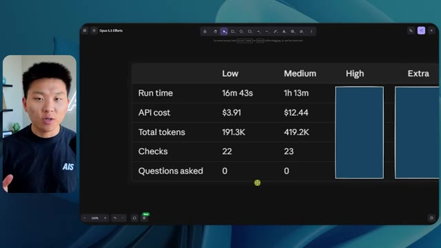

# 🎬 I Turned Claude Into the Ultimate Second Brain

> **Chaîne** : [Nate Herk | AI Automation](https://www.youtube.com/@nateherk/featured)  
> **Lien YouTube** : [https://www.youtube.com/watch?v=8QQ_INxAhRs](https://www.youtube.com/watch?v=8QQ_INxAhRs)  
> **Date de publication** : 20260610  
> **Durée** : 00:34:20  
> **Identifiant vidéo** : `8QQ_INxAhRs`  
> **Transcription & Analyse** : `whisper-v3-large-turbo+gemini-3.5-flash-lite`  

---

## 📌 Synthèse Exécutive & Outils

### 💡 Résumé

Dans cette vidéo issue de la chaîne *Nate Herk | AI Automation*, l'analyste explore les performances pratiques de **Claude (Opus 5.5)** à travers ses différents niveaux d'effort (*Effort Level*) pour résoudre une tâche d'ingénierie logicielle et d'automatisation extrêmement complexe. Le défi consistait à transformer un dossier Frame.io brut de 105 gigaoctets d'enregistrements vidéo d'un événement virtuel (*AIS Live*) en un monde 3D interactif et explorable à la troisième personne, simulant une conférence en personne réaliste avec différentes salles, pistes, scènes, éléments de design et intégrations de marque. 

La vidéo compare rigoureusement les résultats obtenus entre les modes d'effort bas et moyen (l'effort élevé étant interrompu par une transition publicitaire). Les tests révèlent des contrastes saisissants en termes de rendu visuel, de fidélité contextuelle, de gestion des scripts et des vidéos, ainsi qu'en ressources consommées (temps d'exécution, coût API estimé, volume de tokens et nombre de vérifications autonomes par navigateur). Le modèle démontre une capacité impressionnante à s'auto-orienter malgré l'absence totale de questions posées à l'utilisateur, tout en illustrant l'impact direct du paramétrage de l'effort sur la qualité finale de l'agentique logicielle.

---

### 🛠️ Outils, Modèles & Logiciels Présentés

* **Claude (Opus 5.5)** : Le modèle d'intelligence artificielle central d'Anthropic, salué pour son intelligence, son coût abordable et sa polyvalence, évalué ici à travers ses différents niveaux d'effort.
* **Claude Code / Cursor / VS Code / Codex** : Des environnements de développement et des extensions de programmation utilisés pour exécuter les agents et manipuler le code généré.
* **Frame.io** : La plateforme cloud de collaboration vidéo utilisée pour stocker le dossier massif de 105 Go d'enregistrements de la conférence *AIS Live*.
* **Hostinger Connector** : L'extension gratuite présentée par le sponsor, permettant d'importer un compte d'hébergement directement dans l'IDE pour déployer rapidement des projets locaux.
* **Key.ai** : Un service externe mentionné dans le prompt pour la génération optionnelle d'images ou de vidéos nécessaires à la construction du monde 3D.
* **Système d'exploitation IA Herc 2** : L'écosystème propriétaire et l'environnement de travail de Nate Herk auquel l'agent avait accès pour puiser des ressources.

---

### 🔑 Points Clés & Enseignements Stratégiques

* **Impact direct du niveau d'effort sur le rendu visuel** : Le passage d'un effort faible à un effort moyen transforme radicalement la qualité de l'application 3D, corrigeant les bugs d'affichage des avatars, les incohérences de palettes de couleurs et l'intégration des logos officiels.
* **Gestion autonome des ressources multimédias** : En mode effort moyen, l'agent est capable d'extraire et de diffuser de vraies flux vidéos (ateliers de Tangy Frederick, présentations Glido) sur des écrans virtuels à l'intérieur du monde 3D, là où le mode faible se contentait d'images fixes.
* **Autonomie exécutive maximale** : Fait remarquable, qu'il s'agisse du mode bas ou moyen, l'agent n'a posé *zéro question* à l'utilisateur tout au long du processus, démontrant une forte autonomie décisionnelle basée uniquement sur le prompt initial.
* **Arbitrage entre coût, temps et complexité** : Le mode faible a nécessité 16 minutes et 43 secondes pour un coût API estimé de 3,91 $ (191 000 tokens, 22 vérifications), tandis que le mode moyen a exigé 1 heure et 13 minutes pour 12,44 $ (490 000 tokens, 23 vérifications).
* **Boucles de rétroaction et d'auto-vérification** : Les agents exécutent de multiples vérifications autonomes en ouvrant à répétition le navigateur (22 à 23 cycles de test), validant par eux-mêmes le comportement de l'interface et du rendu graphique.
* **Le goulet d'étranglement du déploiement** : L'expérimentation met en lumière la friction classique du développement assisté par IA : générer un projet fonctionnel et complexe sur sa machine locale ne résout pas nativement le défi de sa mise en ligne rapide sur le web.
* **Richesse de la structure contextuelle** : Fournir un dossier volumineux et brut (105 Go) couplé à des directives de design strictes permet à Opus 5.5 d'extraire la structure logique d'un événement (Jour 1, Jour 2, keynotes, salons VIP) pour structurer l'architecture spatiale du monde virtuel.
* **Recommandation officielle d'Anthropic** : Comme le rappelle l'analyse, la bonne pratique d'ingénierie pour Opus 5.5 consiste à initier les prompts complexes sur un niveau d'effort moyen, puis d'ajuster le curseur à la hausse ou à la baisse selon les résultats intermédiaires.
* **Immersion et interactivité comportementale** : À effort moyen, l'agent intègre des éléments de design avancés, tels que des PNJ (personnages non-joueurs) animés qui réagissent à la proximité de l'utilisateur, augmentant considérablement la sensation de présence réaliste.
* **Consolidation des workflows d'automatisation** : L'utilisation conjointe de Claude Opus 5.5 et d'outils de déploiement instantané (comme l'écosystème Hostinger) comble le fossé entre la conception d'applications logicielles sur mesure par IA et leur commercialisation ou mise en production immédiate.

---

## ⏱️ Chronologie & Transcription Complète Audio & Visuelle (Mot pour Mot)

### ⏱️ `[00:00:00 - 00:00:20]` | Segment #01

**🔊 Audio (Transcription Intégrale Mot pour Mot en Français) :**
> Opus 5.5, Opus 5.5, Opus 5.5, Opus 5.5, Opus 5.5. Ce modèle est littéralement partout et pour de très bonnes raisons. Il est intelligent, il est bon marché, il a un goût incroyable, c'est un modèle d'IA incroyable. Mais avec chaque modèle d'IA, vous avez le choix de l'effort, que ce soit faible, moyen, haut, extra, max ou code ultra.

**👁️ Analyse Visuelle d'Écran (gemini-3.5-flash-lite) :**
**Interface & Outils** : Interface du réseau social X (Twitter) affichant un post avec une vidéo intégrée.

**Contenu textuel & Code** : Publication textuelle sur X (« It's a great time for hobbyists... ») contenant une vidéo interactive de paysage tropical avec des palmiers et des habitations.

**Action / Démonstration** : Affichage d'un tweet illustrant les capacités des modèles d'IA récents en matière de génération graphique ou vidéo.

*⏱️ 00:00:05 — Une capture d'écran d'un tweet montrant une vidéo de paysage tropical généré par IA et un texte évoquant une disruption pour les créatifs techniques.*

---

### ⏱️ `[00:00:20 - 00:00:38]` | Segment #02

**🔊 Audio (Transcription Intégrale Mot pour Mot en Français) :**
> Donc dans cette vidéo, j'ai donné exactement le même prompt à Opus 5.5 et je l'ai exécuté sur chaque niveau d'effort et nous allons comparer les résultats. Nous examinerons la qualité de tous les différents résultats réels, mais nous examinerons également combien de temps chacun d'eux a pris, combien cela nous a coûté s'il s'agissait d'une facturation par API, le nombre total de tokens, combien de vérifications ils ont exécutées et combien de questions ils m'ont réellement posées tout au long du processus.

**👁️ Analyse Visuelle d'Écran (gemini-3.5-flash-lite) :**
**Interface & Outils** : Interface web de tableau de bord (type application de mind mapping ou de tableur interactif).

**Contenu textuel & Code** : Tableau comparatif avec les colonnes Low, Medium, High, Extra, Max, Ultracode et les lignes Run time, API cost, Total tokens, Checks, Questions asked.

**Action / Démonstration** : Présentation du tableau comparatif des différents niveaux d'effort d'Opus 5.5.

*⏱️ 00:00:29 — Tableau comparatif sur une interface web montrant les différents niveaux d'effort (Low, Medium, High, Extra, Max, Ultracode) et des métriques (Run time, API cost, Total tokens, etc.).*

---

### ⏱️ `[00:00:39 - 00:00:58]` | Segment #03

**🔊 Audio (Transcription Intégrale Mot pour Mot en Français) :**
> Et les résultats que nous avons obtenus ne sont pas du tout ce à quoi je m'attendais, donc j'ai hâte de partager cela avec vous les gars. Ne perdons pas de temps et allons directement à celui-ci. D'accord, alors plongeons directement dans celui-ci. Je veux commencer juste en vous montrant le prompt réel que nous avons utilisé que nous avons donné à chacun de ces différents agents. Je vais aller dans les fichiers ici, et nous allons ouvrir ce fichier markdown de prompt, et je vais vous montrer ce que nous avons obtenu. Voici donc le slash objectif que j'ai fourni.

**👁️ Analyse Visuelle d'Écran (gemini-3.5-flash-lite) :**
**Interface & Outils** : Interface Cursor / Éditeur de code assisté par IA.

**Contenu textuel & Code** : Texte du prompt : "Hi Nate. This worktree has the effort-test task queued in PROMPT.md : build a walkable third-person 3D world..."

**Action / Démonstration** : Présentation de l'environnement de développement et du prompt initial de l'agent IA.

*⏱️ 00:00:48 — Interface de l'éditeur de code Cursor montrant le projet "effort-test" avec un prompt demandant de construire un monde 3D en 3D.*

---

### ⏱️ `[00:00:58 - 00:01:34]` | Segment #04

**🔊 Audio (Transcription Intégrale Mot pour Mot en Français) :**
> J'ai dit, tu dois me créer un monde 3D qui est une conférence tech réaliste dans laquelle je peux me promener en vue à la troisième personne. Tu vas regarder ce dossier, qui contient mes éléments d'enregistrement d'événements d'AIS Live. Et ce dossier est un dossier Frame.io de 105 gigaoctets d'enregistrements vidéo. C'était un événement entièrement virtuel. Tout a été enregistré et tous les enregistrements sont juste ici. J'ai dit, ton objectif est de prendre cet événement et de le transformer en un monde 3D explorable qui me donne l'impression d'être réellement allé à une vraie conférence en personne avec différentes salles, différentes pistes, différentes scènes, blabla, blabla. N'hésite pas à utiliser key.ai si tu as besoin de générer des images ou des vidéos. Et tu peux aussi utiliser tout le reste à l'intérieur de mon projet Herc 2, qui est comme mon système d'exploitation IA. J'ai dit,

**👁️ Analyse Visuelle d'Écran (gemini-3.5-flash-lite) :**
**Interface & Outils** : Éditeur de code (VS Code / interface similaire) et interface cloud Frame.io.

**Contenu textuel & Code** : Texte du prompt demandant de transformer des enregistrements d'événements virtuels en un monde 3D explorable avec différentes salles, pistes et scènes.

**Action / Démonstration** : Navigation dans le fichier de configuration et consultation du dossier de stockage des ressources vidéo de l'événement.

*⏱️ 00:01:07 — Fichier PROMPT.md affiché dans l'éditeur montrant les instructions pour créer un monde 3D interactif et réaliste d'une conférence tech.*

*⏱️ 00:01:16 — Interface Frame.io montrant un dossier d'enregistrements d'événements AIS Live d'une taille totale de 105.69 Go avec les sous-dossiers GA Access et VIP Access.*

---

### ⏱️ `[00:01:34 - 00:02:08]` | Segment #05

**🔊 Audio (Transcription Intégrale Mot pour Mot en Français) :**
> vous serez jugé sur la créativité, le design, la physique et la sensation générale lorsque j'explorerai le monde 3D que vous avez construit. Et c'était fondamentalement la fin des instructions. Donc, comme vous pouvez le voir sur ce côté gauche, j'ai exécuté ceci à travers tous les différents niveaux d'effort. Commençons par le niveau bas et montons jusqu'au code ultra. Très bien. Donc ici, nous avons le résultat du niveau bas. Ouvrons ceci et jetons un œil. Nous avons donc AIS Live, le sommet des services d'IA en personne enfin, et nous avons pu cliquer partout. Tout d'abord, cela ne fait pas très personnalisé. Genre, ce n'est pas le logo d'IS Live. Ce n'est même pas nos couleurs. Donc je n'aimerais pas trop ça, mais entrons ici. D'accord. C'est beaucoup trop lumineux. Euh, nous avons une carte en haut à droite. Nous avons une ville par ici. Je ne peux pas dire quelle ville c'est.

**👁️ Analyse Visuelle d'Écran (gemini-3.5-flash-lite) :**
**Interface & Outils** : Interface web de l'application d'IA avec un panneau latéral de navigation par dossiers/sessions.

**Contenu textuel & Code** : Texte du prompt demandant de construire un monde 3D navigable à la troisième personne basé sur les enregistrements d'une conférence, avec des salles, pistes et scènes séparées.

**Action / Démonstration** : Le curseur survole la liste des niveaux d'effort dans le panneau de gauche pour montrer les différents tests exécutés.

*⏱️ 00:01:42 — Interface d'une application d'assistant IA affichant des sessions de test par niveau d'effort, avec le présentateur en incrustation vidéo à gauche.*

---

### ⏱️ `[00:02:08 - 00:02:40]` | Segment #06

**🔊 Audio (Transcription Intégrale Mot pour Mot en Français) :**
> C'est. D'accord. C'est Chicago, ce qui est plutôt cool parce que tu sais, j'habite à Chicago, mais bref, en haut à droite, on peut voir une carte. Nous avons un lobby. Nous avons un hall d'exposition. Nous avons un salon VIP sur la scène principale. La carte montre également où se trouve chaque autre personne et cela se synchronise en direct. Donc on peut voir l'enregistrement. On peut voir le premier jour, la keynote de l'hyper agent, le débriefing en direct. Cool. Donc il connaît réellement l'agenda et puis il y a le deuxième jour. Donc il a trouvé ça, c'est bien. Nous avons ces petites boules ici que je peux espérer botter. D'accord. Le visage, oh, regardez ça. Si je vais par ici, tous les gens disparaissent tout simplement. Très mauvais. Très mauvais. D'accord. Alors voyons voir. Est-ce que je peux sprinter ? D'accord.

**👁️ Analyse Visuelle d'Écran (gemini-3.5-flash-lite) :**
**Interface & Outils** : Application web immersive 3D / environnement virtuel de conférence avec mini-carte et affichage de la caméra du présentateur.

**Contenu textuel & Code** : Interface utilisateur virtuelle de conférence (Lobby, Exposition, Programme "DAY 1", mini-carte de navigation).

**Action / Démonstration** : Navigation et exploration de l'environnement virtuel de conférence en 3D par le présentateur.

*⏱️ 00:02:16 — Vue dans l'espace virtuel montrant une zone de retrait des badges avec le présentateur à gauche et une mini-carte en haut à droite.*

*⏱️ 00:02:24 — Vue du lobby virtuel avec un panneau affichant le programme du jour et la carte interactive en haut à droite.*

*⏱️ 00:02:32 — Vue du hall d'exposition virtuel avec des avatars et des éléments lumineux interactifs.*

---

### ⏱️ `[00:02:40 - 00:03:04]` | Segment #07

**🔊 Audio (Transcription Intégrale Mot pour Mot en Français) :**
> Je peux avancer un peu plus vite. Je vais d'abord aller par ici. Il y a des produits promotionnels, euh, certifiés AIS plus glido. D'accord. Donc, il y a les stands réels que nous avions dans l'événement virtuel. Nous avions des stands. Donc c'est plutôt cool. Un petit endroit pour prendre des photos. La salle C. En ce moment, nous avons Tangy Frederick qui anime un atelier. D'accord. Mais ce n'est pas une vidéo. Comme vous pouvez le voir, c'est juste une image. Elle ne bouge pas. Donc c'est juste une image. Ces gens sont en train de disparaître. Ce doivent être des fantômes. Allons par ici dans la salle A.

**👁️ Analyse Visuelle d'Écran (gemini-3.5-flash-lite) :**
**Interface & Outils** : Environnement virtuel 3D interactif (type métavers / jeu web).

**Contenu textuel & Code** : Affichage de bannières de sponsors, de plans de salles d'ateliers et d'instructions textuelles (étapes API).

**Action / Démonstration** : Exploration et navigation du présentateur à l'intérieur du salon virtuel interactif.

*⏱️ 00:02:46 — Vue d'un monde virtuel style métavers montrant un personnage se déplaçant près d'un stand de sponsor nommé Glaido.*

*⏱️ 00:02:52 — Le personnage navigue dans une pièce verdoyante du monde virtuel avec des tables lumineuses et des écrans d'information.*

*⏱️ 00:02:58 — Gros plan sur le personnage s'approchant d'un écran géant affichant des instructions étape par étape sur la configuration d'une clé API.*

---

### ⏱️ `[00:03:04 - 00:03:30]` | Segment #08

**🔊 Audio (Transcription Intégrale Mot pour Mot en Français) :**
> Nous avons Liberty White. D'accord. Très sympa. Vos 30 premiers jours en automatisation. Encore une fois, c'est juste une image fixe et les gens ont des bugs d'affichage. Donc ce n'est pas très bon ici. Je vais aller sur la scène principale et voir ce que nous avons. D'accord, sympa. Donc nous avons une scène principale. Les gens ont des bugs d'affichage. Vraiment beaucoup. Ce n'est vraiment pas terrible. Notre vidéo est en train de bouger. Genre, j'ai vu mon visage ici et j'ai vu celui de Devin, mais maintenant ils ont disparu. Donc je ne sais pas ce qui s'est passé. D'accord. On dirait que c'est plutôt un diaporama. Rien n'est vraiment diffusé pour l'instant. Quoi qu'il en soit, entrons ici.

**👁️ Analyse Visuelle d'Écran (gemini-3.5-flash-lite) :**
**Interface & Outils** : Environnement virtuel 3D interactif (type metaverse/plateforme de conférence virtuelle).

**Contenu textuel & Code** : Interface utilisateur avec mini-carte de navigation et textes d'indications pour les contrôles de l'avatar.

**Action / Démonstration** : Le présentateur navigue et explore les différentes salles et scènes de l'événement virtuel 3D.

*⏱️ 00:03:11 — Vue dans un espace virtuel 3D montrant une salle d'atelier (Workshop Room A - Foundation track) avec un avatar d'utilisateur.*

*⏱️ 00:03:17 — Vue de la scène principale d'une conférence virtuelle 3D remplie d'avatars assis, avec un écran affichant l'atelier "Hyperagent Workshop".*

*⏱️ 00:03:24 — Vue de face de la scène principale dans l'environnement virtuel 3D affichant le logo "AIS LIVE - AI Services Summit" sur un grand écran.*

---

### ⏱️ `[00:03:30 - 00:03:58]` | Segment #09

**🔊 Audio (Transcription Intégrale Mot pour Mot en Français) :**
> Nous avons d'autres stands. Nous avons hyper agent. Nous avons Claude Code. Nous avons plus de produits promotionnels. La salle B, c'est Dave Ebelor. Je suppose que c'est exactement la même chose. Nous avons du café. Et puis, je suppose que le salon VIP, c'est un accès VIP uniquement. C'est plutôt cool, mais il n'y a vraiment rien qui se passe ici. Cet écran est bien trop lumineux. Bon. Donc je pense que vous comprenez l'ambiance qu'on obtient ici avec Opus 5.5 en effort faible. Et c'est là que les choses deviennent intéressantes. Combien de temps pensez-vous que cela a duré ? Combien de temps ? Celui-ci a duré 16 minutes et 43 secondes. Combien pensez-vous que cela a coûté ?

**👁️ Analyse Visuelle d'Écran (gemini-3.5-flash-lite) :**
**Interface & Outils** : Interface web de tableau de bord / canevas (Opus 5.5 Efforts).

**Contenu textuel & Code** : Tableau comparatif avec les colonnes Low, Medium, High, Extra, Max, Ultracode et les lignes Run time, API cost, Total tokens, Checks, Questions asked.

**Action / Démonstration** : Présentation et analyse d'un tableau comparatif des différents niveaux d'effort de l'IA.

*⏱️ 00:03:51 — Tableau comparatif sur interface web 'Opus 5.5 Efforts' montrant les niveaux Low, Medium, High, Extra, Max et Ultracode avec divers critères (Run time, API cost, etc.).*

---

### ⏱️ `[00:03:58 - 00:04:26]` | Segment #10

**🔊 Audio (Transcription Intégrale Mot pour Mot en Français) :**
> 3,91 dollars si c'eût été une facturation par API. J'utilise évidemment mon abonnement ici, mais nous allons simplement calculer cela avec la facturation par API. Le total des jetons était de 191 000. Il a fait 22 vérifications. Donc, pour la vérification, il a ouvert 22 fois le navigateur et exécuté différents types de vérifications. Donc, 22 catégories de vérifications. Et combien de questions m'a-t-il posées ? Il m'a posé un total de zéro question tout au long de cette invite de commande globale. D'accord. Alors, ouvrons l'effort moyen et voyons ce que nous avons. D'accord, c'est parti. Effort moyen. Nous avons Nate Herc. Nous avons mon badge. C'est de la marque AI's Life.

**👁️ Analyse Visuelle d'Écran (gemini-3.5-flash-lite) :**
**Interface & Outils** : Tableau blanc ou application de mind mapping / diagramme (style Excalidraw ou similaire).

**Contenu textuel & Code** : Tableau avec des colonnes 'Low', 'Medium', 'High' et 'Ex' et des lignes 'Run time', 'API cost', 'Total tokens', 'Checks', 'Questions asked'.

**Action / Démonstration** : Le présentateur explique les coûts et les métriques d'un test d'agent IA affichés dans le tableau.

*⏱️ 00:04:05 — Un tableau comparatif montrant les métriques de performance et de coût pour le niveau 'Low', incluant le temps d'exécution (16m 43s), le coût API ($3.91) et le total des jetons (191.3K).*

---

### ⏱️ `[00:04:26 - 00:04:46]` | Segment #11

**🔊 Audio (Transcription Intégrale Mot pour Mot en Français) :**
> Donc ça a déjà l'air un tout petit peu mieux. Ça ressemble à nos palettes de couleurs qui utilisaient nos directives de marque. Premier jour de construction, deuxième jour de gain, VIP. Cool. D'accord. Je vais entrer dans le lieu. D'accord. Waouh. Donc une ambiance similaire en quelque sorte. C'est en arrière-plan. Ça ne ressemble pas à Chicago pour autant, n'est-ce pas ? Non, ça ressemble à, honnêtement, ça ressemble à une ville inventée. Quoi qu'il en soit, c'est marrant qu'ils aient décidé de faire ça. Voyons si je peux me déplacer un peu plus vite. Oh, waouh.

**👁️ Analyse Visuelle d'Écran (gemini-3.5-flash-lite) :**
**Interface & Outils** : Interface web d'une application virtuelle 3D (type plateforme événementielle ou jeu en ligne).

**Contenu textuel & Code** : Écran d'accueil de "AIS Live" avec options de badges et de navigation, puis immersion dans un monde virtuel avec avatars.

**Action / Démonstration** : Le présentateur clique sur le bouton "ENTER THE VENUE" pour entrer dans l'espace virtuel 3D.

*⏱️ 00:04:31 — Interface d'accueil de l'application "AIS Live" montrant un badge nominatif personnalisé ("NATE HERK") avec des boutons pour "DAY 1 BUILD", "DAY 2 EARN", "VIP", et un bouton "ENTER THE VENUE".*

*⏱️ 00:04:41 — Vue à la première personne dans un environnement virtuel 3D de type jeu montrant des avatars et une grande baie vitrée avec une vue nocturne sur une ville.*

---

### ⏱️ `[00:04:46 - 00:05:21]` | Segment #12

**🔊 Audio (Transcription Intégrale Mot pour Mot en Français) :**
> Les gens interagissent avec moi. Regardez. Si je m'approche de ce type, il vient de lever le bras. Bon, maintenant il ne veut plus du tout avoir affaire à moi. Mais tous ces petits robots ici doivent prendre des décisions. Je ne sais pas s'ils utilisent Jev. C'est sûr que non. Je ne le lui ai pas dit. En fait, ma clé Jev est à l'arrière. Je ne sais pas. Peut-être qu'il l'a utilisée. Quoi qu'il en soit, nous pouvons voir ici que nous avons la salle d'atelier C, le laboratoire des agents. Sympa. Donc celui-ci est en fait en cours d'exécution. Vous pouvez voir qu'il s'agit d'une vraie vidéo lue par Tangy. Tout le monde ici est en train de travailler sur un ordinateur portable. Ils ne buguent pas. C'est plutôt cool. De plus, mon badge est sur ma poitrine, ce qui est plutôt cool. Je peux venir par ici. Nous avons une carte en haut à droite, comme vous pouvez le voir, mais je peux venir par ici. Nous avons un

**👁️ Analyse Visuelle d'Écran (gemini-3.5-flash-lite) :**
**Interface & Outils** : Application de métavers / espace virtuel 3D (Gather.town ou similaire).

**Contenu textuel & Code** : Environnement virtuel 3D interactif avec des avatars et une mini-carte de navigation.

**Action / Démonstration** : Navigation et exploration de l'espace virtuel par le présentateur sous forme d'avatar 3D.

---

### ⏱️ `[00:05:21 - 00:05:47]` | Segment #13

**🔊 Audio (Transcription Intégrale Mot pour Mot en Français) :**
> hall d'exposition. C'est ici que nous avons le stand Glido. Et ça diffuse réellement. Oui, ça diffuse la vidéo de nous parlant de Glido. Ça diffuse la vidéo d'Ed et moi parlant de notre programme de certification. Nous avons le logo AIS Plus ici à l'arrière, qui est placé dans un endroit un peu bizarre. Ce sont les diapositives des conférenciers et les points clés. Alors wow, ce sont toutes les ressources que nous avons distribuées après l'événement. Elles sont toutes là aussi. Nous pouvons voir que nous avons un coup de projecteur sur la communauté. C'est donc Aiden qui parle de son contrat qu'il a décroché et c'est diffusé en direct. Ces gens regardent.

**👁️ Analyse Visuelle d'Écran (gemini-3.5-flash-lite) :**
**Interface & Outils** : Environnement virtuel 3D / Navigateur web

**Contenu textuel & Code** : Présentation virtuelle d'un stand de certification AIS+ et affichage de diaporamas.

**Action / Démonstration** : Navigation et visite guidée d'un espace d'exposition virtuel 3D.

---

### ⏱️ `[00:05:47 - 00:06:21]` | Segment #14

**🔊 Audio (Transcription Intégrale Mot pour Mot en Français) :**
> Ils sont plutôt engagés. On a l'hyper agent. C'était, c'est ce que je voulais dire. Si vous avez vu ces gens lever les bras pour dire bonjour, c'était plutôt marrant. Regardez, regardez, le voilà qui recommence. Bref. Bon. Où est-ce que je suis maintenant ? Maintenant, je suis dans le hall principal. On a un bar à café. On a un grand logo, qui est le vrai logo. C'est trop lumineux, mais on a le logo. On peut voir si on peut entrer ici dans le parcours fondation. On a Sabrina Romanov et Liberty White. Donc différentes formations juste là. On peut entrer dans cette salle. C'est le parcours avancé. Alors qu'est-ce qui se passe ici. On a Dave Ebelar et Saman qui parlent de différentes choses là-dedans. Et maintenant, allons jeter un œil à la scène principale. Oh, attendez, il y a une vidéo de moi là-haut. C'est genre un VIP

**👁️ Analyse Visuelle d'Écran (gemini-3.5-flash-lite) :**
**Interface & Outils** : Application de métavers / espace virtuel 3D en ligne.

**Contenu textuel & Code** : Environnement virtuel 3D avec avatars interactifs et interface de navigation (mini-carte).

**Action / Démonstration** : Navigation et déplacement d'un avatar dans l'espace virtuel du métavers.

---

### ⏱️ `[00:06:21 - 00:06:50]` | Segment #15

**🔊 Audio (Transcription Intégrale Mot pour Mot en Français) :**
> section ? Ouais, on ira voir ça dans une minute. Mais bref, voici la scène principale. Ça a l'air vraiment, vraiment bien. On a une grande scène. On a genre quatre personnes assises ici. On a les trois écrans d'Alex là-haut avec Hyper Agent. Est-ce que j'ai le droit de monter sur scène ? Oh, et il me laisse monter sur scène. OK. C'est plutôt sympa. Bon les gars, prenons un selfie. Laissez-moi prendre tout le monde en arrière-plan. Venez par ici. Bref, c'est vraiment, vraiment cool. Toutes les places ne sont pas occupées par contre. Il va donc falloir qu'on travaille là-dessus. Mais bref, je vais courir voir ce qu'était cette section VIP. OK. Le salon VIP. J'ai l'impression que c'est comme un aéroport ou un truc du genre.

**👁️ Analyse Visuelle d'Écran (gemini-3.5-flash-lite) :**
**Interface & Outils** : Application de simulation virtuelle Hyper Agent Keynote.

**Contenu textuel & Code** : Interface utilisateur affichant les détails de la session "Hyperagent Keynote" avec le nom d'Alex McDonnell et une mini-carte de navigation.

**Action / Démonstration** : Exploration d'un environnement virtuel interactif en 3D représentant une keynote technologique.

---

### ⏱️ `[00:06:51 - 00:07:14]` | Segment #16

**🔊 Audio (Transcription Intégrale Mot pour Mot en Français) :**
> Okay, cool. Donc maintenant nous avons les sessions VIP ici. Session de questions-réponses VIP avec Nate, lecture vidéo en direct juste ici. Très, très cool. Et nous avons comme un bar ou quelque chose comme ça. Génial. Je dirais que c'est un assez bon résultat. Maintenant, en ce qui concerne les statistiques ici, celle-ci a pris une heure et 13 minutes à s'exécuter. Cela nous aurait coûté 12 dollars et 44 cents. Elle a utilisé 490 000 jetons et a fait 23 vérifications.

**👁️ Analyse Visuelle d'Écran (gemini-3.5-flash-lite) :**
**Interface & Outils** : Application virtuelle 3D (espace VIP) et tableau de bord de métriques de projet.

**Contenu textuel & Code** : Interface utilisateur virtuelle affichant une vidéo en direct et un tableau de données analytiques.

**Action / Démonstration** : Navigation et présentation des fonctionnalités de l'espace virtuel et des coûts associés.

*⏱️ 00:06:56 — Aperçu d'un espace virtuel 3D montrant une session VIP de questions-réponses avec Nate et un espace bar.*

*⏱️ 00:07:02 — Tableau de données montrant les métriques de performance et de coût pour le niveau 'Low' (Run time 16m 43s, API cost $3.91, 191.3K tokens).*

---

### ⏱️ `[00:07:14 - 00:07:48]` | Segment #17

**🔊 Audio (Transcription Intégrale Mot pour Mot en Français) :**
> Et il nous a posé un total de zéro question une fois de plus. Très bien, passons à élevé. C'était déjà un résultat plutôt correct et Anthropic eux-mêmes dans leur vidéo, ou désolé, pas une vidéo, un article sur comment prompter Opus 5.5. Ils ont dit de commencer simplement par moyen et d'ajuster à la hausse ou à la baisse si nécessaire. C'était donc un résultat moyen. Passons à élevé et voyons ce que nous avons obtenu. Très rapidement, les gars, je dois prendre une seconde pour vous parler du sponsor de la vidéo d'aujourd'hui, Hostinger. Donc, ces deux modèles viennent de me créer une version fonctionnelle de la même chose. Et maintenant, je me retrouve exactement là où je finis toujours, avec un projet terminé sur mon ordinateur portable et aucun moyen rapide de le mettre en ligne. Et c'est précisément le fossé que comble le connecteur d'Hostinger. C'est une extension gratuite

**👁️ Analyse Visuelle d'Écran (gemini-3.5-flash-lite) :**
**Interface & Outils** : Tableau blanc interactif (Image 1) et environnement de développement de type VS Code / Cursor avec panneau latéral de chat IA (Image 2).

**Contenu textuel & Code** : Tableau de données chiffrées sur les coûts et performances d'exécution (Image 1) et invite de commande pour créer un "Northwind ROI calculator" en HTML (Image 2).

**Action / Démonstration** : Présentation des résultats comparatifs des différents niveaux de paramétrage de l'IA.

*⏱️ 00:07:22 — Un tableau comparatif affichant les métriques (Run time, API cost, Total tokens, Checks, Questions asked) pour différents niveaux de performance (Low, Medium, High, Extra).*

*⏱️ 00:07:39 — Une interface de développement avec un éditeur de code divisé en deux fenêtres, affichant un assistant IA en train de générer le code d'un calculateur de ROI.*

---

### ⏱️ `[00:07:48 - 00:08:23]` | Segment #18

**🔊 Audio (Transcription Intégrale Mot pour Mot en Français) :**
> pour votre éditeur qui importe votre compte Hostinger dans l'environnement de programmation que vous utilisez déjà. Donc VS Code, Cursor, Cloud Code, Codex, et j'en passe. Vous vous connectez une seule fois en un seul clic, et à partir de là, votre agent peut déployer le site, y pointer un domaine, configurer les enregistrements DNS et vérifier votre VPS sans que vous ayez jamais à quitter l'éditeur. Ainsi, peu importe celui de ces outils que vous finirez par préférer, ce qu'il a construit se trouve à quelques minutes d'une URL réelle sur un hébergement géré. Connector est gratuit avec chaque formule d'hébergement, donc si vous avez toujours besoin de l'hébergement sous-jacent, profitez de la formule illimitée grâce au lien dans la description et utilisez le code NATEHERK pour obtenir 10 % de réduction. Cela inclut également un nom de domaine gratuit et un e-mail professionnel pour un an. Et c'est toujours le moyen le moins cher que j'ai trouvé pour obtenir quelque chose

**👁️ Analyse Visuelle d'Écran (gemini-3.5-flash-lite) :**
**Interface & Outils** : Navigateur web et interface de terminal Claude Code

**Contenu textuel & Code** : Tableau de bord d'intégration Hostinger avec l'état « Connected » et les outils d'assistance accessibles.

**Action / Démonstration** : Connexion du compte Hostinger à l'environnement de développement (IDE) via OAuth.

*⏱️ 00:07:57 — Interface montrant la connexion réussie de Hostinger à l'IDE avec la liste des outils disponibles (Websites, Domains, Subscriptions & Payments, Email Marketing).*

---

### ⏱️ `[00:08:23 - 00:08:47]` | Segment #19

**🔊 Audio (Transcription Intégrale Mot pour Mot en Français) :**
> Vous avez construit sur une vraie URL. Donc revenons à la vidéo. D'accord. Encore une fois, très, très thématisé par la marque. C'est un écran de chargement encore mieux que le précédent. Nous avons ce joli petit effet en arrière-plan. Nous avons le logo. Nous allons entrer dans le lieu. D'accord. Nous y voilà. Ça a l'air plutôt bien. Nous commençons à l'extérieur et vous pouvez voir que nous avons ces drapeaux pour tous les intervenants, Wyatt, Casper, Alex, Ed, Aiden, Sabrina, Liberty. C'est plutôt cool. Nous avons des blocs en direct ici.

**👁️ Analyse Visuelle d'Écran (gemini-3.5-flash-lite) :**
**Interface & Outils** : Navigateur web affichant une application 3D interactive (environnement virtuel).

**Contenu textuel & Code** : Interface utilisateur de l'application virtuelle AIS LIVE, affichant le titre 'AIS Live Plaza', une mini-carte et des contrôles clavier/souris.

**Action / Démonstration** : Navigation et exploration de l'environnement virtuel 3D de la conférence AIS LIVE.

*⏱️ 00:08:29 — Écran de chargement et d'accueil de la plateforme virtuelle 'AIS LIVE' avec logo et instructions de commandes.*

*⏱️ 00:08:35 — Vue de la place virtuelle 'AIS Live Plaza' en 3D isométrique avec des avatars de personnages et des gratte-ciels en arrière-plan.*

*⏱️ 00:08:41 — Exploration de la place virtuelle avec des bannières de conférenciers affichées dans l'environnement 3D.*

---

### ⏱️ `[00:08:47 - 00:09:23]` | Segment #20

**🔊 Audio (Transcription Intégrale Mot pour Mot en Français) :**
> ça a pris cette photo de moi, votre hôte, Nate Herc, John, Dave, Nate Herc. Voilà. OK. Les portes. Génial. Ce sont des portes coulissantes automatiques en verre. J'adore ça. On peut voir l'enregistrement VIP. On peut voir l'admission générale. On peut venir par ici et on peut découvrir l'expo avec différents stands, le projecteur sur la communauté. Vous pouvez aussi voir qu'en haut à gauche, j'ai un passeport. Donc c'est comme si, ça va montrer combien d'endroits j'ai visités. Tout cela est une vraie lecture. Nous avons un mur de ressources avec tous les différents intervenants. Ils ont aussi une session de réseautage par ici. Donc je vais venir très vite et voir de quoi il s'agit. Nous avons donc le bar à cold brew AIS. Nous avons différents membres de la communauté qui ont été mis en avant ou en valeur.

**👁️ Analyse Visuelle d'Écran (gemini-3.5-flash-lite) :**
**Interface & Outils** : Application virtuelle 3D de type Metaverse ou plateforme de conférence virtuelle.

**Contenu textuel & Code** : Environnement virtuel 3D avec affichage de bannières d'événements, zones de check-in et avatars d'utilisateurs.

**Action / Démonstration** : Navigation et exploration d'un espace d'événement virtuel en 3D par l'hôte.

---

### ⏱️ `[00:09:23 - 00:09:56]` | Segment #21

**🔊 Audio (Transcription Intégrale Mot pour Mot en Français) :**
> Nous avons l'aile VIP. Attends, quoi ? Prends un bracelet. Oh, je dois vraiment aller chercher le bracelet. D'accord. Laisse-moi m'enregistrer rapidement. Le bracelet est déjà mis. Attends, quoi ? D'accord. Oh, d'accord. Maintenant, les portes se sont ouvertes pour moi. Cool. Je peux entrer ici. Oh, ça mène juste à la scène principale. Salon VIP. Il y a une séance de questions-réponses en cours. Ça a l'air très cool. Je veux dire, je suis très impressionné par la façon dont il est capable de faire ça. Waouh. D'accord. Donc c'est vraiment bien. Ce qu'on a fait, c'est qu'on a eu des salles de discussion VIP avec différentes personnes. Tu peux voir qu'il y a différentes salles, différents membres de l'équipe AIS qui participent à des trucs. C'est vraiment cool. C'est très cool. C'est un VIP bien meilleur

**👁️ Analyse Visuelle d'Écran (gemini-3.5-flash-lite) :**
**Interface & Outils** : Application de métavers / espace virtuel 3D de conférence en ligne.

**Contenu textuel & Code** : Interface utilisateur virtuelle affichant le lieu (VIP Lounge, Registration Concourse), des sous-titres et une mini-carte.

**Action / Démonstration** : Navigation et exploration d'un environnement virtuel interactif en 3D par le présentateur.

*⏱️ 00:09:32 — Image montrant un espace virtuel 3D avec l'interface 'Registration Concourse' où le présentateur navigue en avatar.*

*⏱️ 00:09:40 — Image montrant l'espace virtuel 3D 'VIP Lounge' avec des avatars assis et un écran affichant le présentateur.*

*⏱️ 00:09:48 — Image montrant la zone 'VIP Working Sessions' avec plusieurs salles thématiques virtuelles.*

---

### ⏱️ `[00:09:56 - 00:10:30]` | Segment #22

**🔊 Audio (Transcription Intégrale Mot pour Mot en Français) :**
> expérience que ce qui a été montré dans la première partie. D'accord. After party VIP. Regardez ça. On a une piste de danse. On a tous ces éléments ici. On a la lecture de l'after party VIP juste ici. Et il y a une estrade de DJ. C'est trop marrant. Il y a un petit bug ici, un petit glitch ici, mais c'est génial. Oh, cool. Donc quand je suis ici sur la scène principale, on a des sous-titres. Vous pouvez voir juste ici en bas de mon écran, on a ces sous-titres de Wyatt qui est en train de parler là-haut. On a des lumières. On a le panel. Très cool. Belle scène principale. Je vais aller ici. On peut aller à la fondation,

**👁️ Analyse Visuelle d'Écran (gemini-3.5-flash-lite) :**
**Interface & Outils** : Application web d'événement virtuel en 3D (espace métavers / conférence virtuelle).

**Contenu textuel & Code** : Interface utilisateur avec mini-carte, liste des participants, et affichage vidéo en direct.

**Action / Démonstration** : Navigation et exploration de l'espace virtuel par le présentateur.

*⏱️ 00:10:04 — Capture montrant l'interface d'un espace virtuel 3D avec une piste de danse (VIP After-Party) et des avatars.*

*⏱️ 00:10:13 — Vue générale de la fête virtuelle VIP avec un grand écran affichant des participants en visioconférence.*

*⏱️ 00:10:21 — Vue de l'auditorium principal virtuel (Main Stage) avec des sièges et un présentateur sur grand écran.*

---

### ⏱️ `[00:10:30 - 00:11:06]` | Segment #23

**🔊 Audio (Transcription Intégrale Mot pour Mot en Français) :**
> avancé, et les parcours d'entreprise par ici. Donc, voyons voir. Nous avons l'anatomie de trois vrais dossiers. Nous avons l'hyper agent. Nous avons les évaluations avec Nate et Ed ici. Nous avons Dave qui intervient dans les trucs avancés. C'est vraiment bien. Je veux dire, évidemment, chacun, chacun de ces résultats jusqu'à présent, « bas » était correct. « Moyen » était mieux. « Haut » a été encore meilleur. Voyons si cette tendance se poursuit et allons voir ce que cela nous a coûté. Donc, « haut » a fonctionné pendant une heure et sept minutes. Donc un peu plus rapide que « moyen », cela nous aurait coûté 16 dollars et 31 cents. Il a utilisé un demi-million de tokens, 509 000. Il a fait 22 vérifications. Et il nous a aussi demandé, enfin, non, je me trompais. Ce

**👁️ Analyse Visuelle d'Écran (gemini-3.5-flash-lite) :**
**Interface & Outils** : Application de tableau de bord / outil d'analyse (Opus 5.5 Efforts)

**Contenu textuel & Code** : Tableau comparatif avec les colonnes : Low, Medium, High, Extra. Lignes : Run time (16m 43s, 1h 13m, 1h 7m), API cost ($3.91, $12.44, $16.31), Total tokens (191.3K, 419.2K), Checks (22, 23), Questions asked (0, 0).

**Action / Démonstration** : Analyse comparative des coûts et des temps d'exécution selon différents niveaux d'effort de l'agent.

*⏱️ 00:10:57 — Capture d'écran montrant le présentateur à gauche et un tableau de comparaison de performances intitulé "Opus 5.5 Efforts" avec des métriques (Run time, API cost, Total tokens, Checks, Questions asked) réparties en colonnes Low, Medium, High, Extra.*

---

### ⏱️ `[00:11:06 - 00:11:25]` | Segment #24

**🔊 Audio (Transcription Intégrale Mot pour Mot en Français) :**
> l'un m'a posé une question et, divulgâcheur, c'était le seul qui nous a posé une question tout au long de tout ça. Voyons voir, il nous en reste trois : Extra, Max et Ultra Code. Laissez-moi ouvrir Extra et nous verrons ce que nous avons. D'accord. Celui-ci a l'air plutôt bien. Je dirais honnêtement que jusqu'à présent, l'écran de chargement haut était le meilleur. Celui qu'on vient de voir, mais bref, entrons dans AIS live.

**👁️ Analyse Visuelle d'Écran (gemini-3.5-flash-lite) :**
**Interface & Outils** : Tableau de bord d'analyse ou interface web comparative (Opus 5.5 Efforts)

**Contenu textuel & Code** : Tableau avec des métriques de performance et de coût : Run time (16m 43s à 1h 7m), API cost ($3.91 à $16.31), Total tokens, Checks (22-23), et Questions asked (0 pour Low/Medium, 1 pour High).

**Action / Démonstration** : Le présentateur commente les résultats et sélectionne la colonne 'Extra'.

*⏱️ 00:11:11 — Un tableau comparatif des performances de différents niveaux d'effort (Low, Medium, High, Extra) affichant le temps d'exécution, le coût API, le nombre total de tokens, les vérifications et les questions posées.*

---

### ⏱️ `[00:11:26 - 00:11:51]` | Segment #25

**🔊 Audio (Transcription Intégrale Mot pour Mot en Français) :**
> Waouh. D'accord. Donc nous avons comme de petits extraits sonores. Je peux discuter avec des gens. Le panneau de la guerre des outils a réglé quelques débats pour moi. Sympratique. Une bonne perspective là-bas. Nous sommes de nouveau dehors. Nous avons ces différentes bannières, bien qu'elles soient toutes les mêmes. Elles ne portent pas le nom de différentes personnes. Donc un grand logo AIS live. L'aile de l'atelier est par ici. Et passons par les portes coulissantes en verre pour voir ce que nous avons. Nous avons donc le café AIS. La carte est en bas à droite, et elle n'est pas très descriptive.

**👁️ Analyse Visuelle d'Écran (gemini-3.5-flash-lite) :**
**Interface & Outils** : Environnement virtuel 3D interactif de type metaverse/jeu vidéo.

**Contenu textuel & Code** : Aucun code source, terminal ou texte technique n'est affiché à l'écran.

**Action / Démonstration** : Navigation et exploration de l'espace virtuel par le présentateur.

---

### ⏱️ `[00:11:51 - 00:12:26]` | Segment #26

**🔊 Audio (Transcription Intégrale Mot pour Mot en Français) :**
> J'aime bien comment les autres cartes nous ont montré ce que, genre où étaient les choses, mais celle-ci a l'air très professionnelle. On peut voir ici c'est la scène principale. Allons y faire un saut rapidement. Ils ont tous ces ballons qui volent partout, ce que je trouve assez marrant. Les ballons de plage AIS. On nous voit moi là-haut en train de parler. Je crois que j'étais en train de faire l'introduction d'un des jours. Continuons à avancer par ici vers la salle d'atelier sur ce côté gauche. D'accord. Donc ici nous avons le théâtre Hyper Agent. Nous avons cette session sponsorisée ici par Hyper Agent, mais ça nous montre aussi ce qui va se passer ici. C'est vraiment marrant qu'on puisse discuter avec des gens. Salmon a créé un agent commercial vocal en direct. La salle "Le Juste Prix" était comble. Tu as pris le guide du compagnon VIP ? C'est trop marrant. Nous avons le parcours avancé dans

**👁️ Analyse Visuelle d'Écran (gemini-3.5-flash-lite) :**
**Interface & Outils** : Application ou plateforme virtuelle 3D en ligne de type métavers ou événement virtuel.

**Contenu textuel & Code** : Environnement 3D interactif avec des avatars d'utilisateurs, des écrans de diffusion vidéo en direct et des éléments d'interface comme des mini-cartes et des options de chat.

**Action / Démonstration** : Exploration d'un espace virtuel 3D, navigation entre la scène principale et les couloirs de l'événement.

*⏱️ 00:12:00 — Vue d'une scène principale virtuelle avec des avatars assis dans une salle de conférence et une vidéo en direct diffusée sur grand écran.*

*⏱️ 00:12:09 — Navigation dans un hall d'exposition virtuel en 3D avec des avatars interactifs et des panneaux indiquant des ateliers.*

*⏱️ 00:12:17 — Exploration d'un couloir virtuel au sein de l'environnement virtuel avec des avatars et des bulles de discussion.*

---

### ⏱️ `[00:12:26 - 00:12:58]` | Segment #27

**🔊 Audio (Transcription Intégrale Mot pour Mot en Français) :**
> ici. Encore une fois, nous avons la lecture en direct. Est-ce que c'est la lecture en direct ? Oh, d'accord. Ça a commencé une fois que je suis entré, mais je peux prendre place. Oh la la. Je peux regarder ça. Je peux me lever. Je veux m'asseoir au premier rang. C'est plutôt cool. C'est très bien. J'aime bien ça. Et vous savez ce que j'ai remarqué jusqu'à présent ? Le personnage que j'incarne me ressemble un peu. Je pense qu'il a été modélisé à partir de mes photos de profil ou quelque chose comme ça. Bref, nous avons Sabrina ici, l'animatrice de la salle ici, prenez n'importe quel siège libre. D'accord, super. Et j'ai vraiment aimé la fonctionnalité pour s'asseoir. C'est plutôt marrant. Genre, on pourrait vraiment assister à cet atelier et participer. Bref, ça nous montre les intervenants. Ça nous montre les

**👁️ Analyse Visuelle d'Écran (gemini-3.5-flash-lite) :**
**Interface & Outils** : Application de métavers / plateforme de conférence virtuelle 3D.

**Contenu textuel & Code** : Interface utilisateur virtuelle affichant des options de visioconférence et des présentations en streaming.

**Action / Démonstration** : Navigation et exploration de l'environnement virtuel en 3D par le présentateur.

---

### ⏱️ `[00:12:58 - 00:13:31]` | Segment #28

**🔊 Audio (Transcription Intégrale Mot pour Mot en Français) :**
> programme. Il y a un petit tapis rouge ici pour prendre des photos. On peut prendre la pose. Oh, wouah. C'est plutôt cool. Bibliothèque de ressources, obtenez la certification AIS Plus, Glido, Hyper Agent, AIS Plus, trois vraies affaires. Génial. Je veux dire, je dirais vraiment que jusqu'à présent, chacune est meilleure que la précédente. Et on n'a même pas encore vu la section VIP, le salon VIP. Allons par ici très vite. J'espère que je pourrai entrer. Sympa. On a le réinitialisation des outils. Ce sont les différentes salles où l'on peut aller. Donc encore une fois, je pourrais prendre la feuille de travail et je pourrais essayer de comprendre comment tarifer mes trucs. C'est tellement cool. C'est vraiment mieux que le précédent où l'on faisait juste en quelque sorte

**👁️ Analyse Visuelle d'Écran (gemini-3.5-flash-lite) :**
**Interface & Outils** : Présentation ou face-caméra explicatif sans interface logicielle partagée.

**Contenu textuel & Code** : Explications orales et mise en contexte méthodologique.

**Action / Démonstration** : Explications face caméra et démonstration conceptuelle.

---

### ⏱️ `[00:13:31 - 00:13:59]` | Segment #29

**🔊 Audio (Transcription Intégrale Mot pour Mot en Français) :**
> comme on a regardé des trucs. Génial. Je peux aller derrière le bar et venir ici. C'est très bien. Bon. Alors, en ce qui concerne les statistiques, celui-ci a tourné pendant une heure et demie. Il a coûté 25,92 dollars. Je ne sais pas pourquoi je dis point 25 dollars et 92 centimes. Il y a eu 733 000 jetons et 34 vérifications. Il a donc eu le plus grand nombre de vérifications de loin jusqu'à présent. Et il ne nous a posé zéro question. J'ai hâte de voir ce qu'on a obtenu ici de la part de max et ultra code. D'accord. Voici les écrans de chargement de max, ennuyeux, mais c'est dans l'esprit de la marque et il y a notre logo.

**👁️ Analyse Visuelle d'Écran (gemini-3.5-flash-lite) :**
**Interface & Outils** : Opus 5.5

**Contenu textuel & Code** : Les données affichées dans le graphique incluent :
- Medium: 1h 13m, $12.44, 419.2K, 23, 0
- High: 1h 7m, $16.31, 509.3K, 22, 1
- Extra: 1h 31m
- Max: (barre vide)
- Ultracode: (barre vide)

**Action / Démonstration** : Manipulation d'un élément graphique sur la colonne "Extra".

*⏱️ 00:13:38 — Un graphique à barres présente des données comparatives pour différentes options : "Medium", "High", "Extra", "Max", et "Ultracode". Chaque colonne affiche des valeurs pour le temps (heures, minutes), le coût en dollars, des quantités (K) et des nombres. Un des éléments graphiques sur la colonne "Extra" est en cours de manipulation.*

---

### ⏱️ `[00:14:00 - 00:14:35]` | Segment #30

**🔊 Audio (Transcription Intégrale Mot pour Mot en Français) :**
> Donc c'était bien. J'aime bien. On va continuer et entrer dans AIS live. Ooh, petite animation sympa ici qui nous fait entrer. Encore une fois, le personnage me ressemble. Ils m'ont tous ressemblé. Enfin, en gros, nous sommes assis en arrière-plan. On dirait Chicago. Comme je l'ai mentionné plus tôt, beaucoup de ces éléments jouent des sons et je ne les inclus pas parce que ce serait très perturbateur pour vous d'essayer d'écouter ce qui se passe en même temps que je parle. Il y a donc une légère musique dans tout cela. Je déteste cette façon de marcher. Cette façon de marcher est vraiment, vraiment mauvaise. Je veux dire, la marche, ouais, je n'aime pas du tout ça. Donc ce n'est pas génial. Mais à part ça, allons explorer. Remarquez ces ombres quand j'entre, elles changent vraiment. Je ne sais pas trop pourquoi,

**👁️ Analyse Visuelle d'Écran (gemini-3.5-flash-lite) :**
**Interface & Outils** : Présentation ou face-caméra explicatif sans interface logicielle partagée.

**Contenu textuel & Code** : Explications orales et mise en contexte méthodologique.

**Action / Démonstration** : Explications face caméra et démonstration conceptuelle.

---

### ⏱️ `[00:14:35 - 00:15:11]` | Segment #31

**🔊 Audio (Transcription Intégrale Mot pour Mot en Français) :**
> mais de toute façon, on peut discuter avec des gens ici aussi. Le stand Hyperagent est juste là où on entre dans l'expo. Tout va bien. OK, super. Je peux continuer à appuyer sur E pour changer ce qu'ils disent. On a les conférenciers juste ici. Ça a l'air plutôt bien. Bien qu'on ait vraiment eu la photo de profil de tout le monde. Donc je ne sais pas trop pourquoi ce n'est pas inclus là. On voit des gens prendre des photos juste ici. J'adore ça. Et ça sauvegarde une petite photo. OK. La carte n'est pas super non plus, genre elle ne donne pas une super explication de ce qui se passe, mais j'aime bien ces stands. Ils sont cool. Je pense que ces stands sont les meilleurs que j'aie vus jusqu'à présent. Genre, ils ont juste l'air bien. Ils ont des représentants. Il y a de superbes diapos derrière eux. Ouais. Ces stands sont cool. OK. On a un petit théâtre en vedette

**👁️ Analyse Visuelle d'Écran (gemini-3.5-flash-lite) :**
**Interface & Outils** : Application web 3D interactive (environnement virtuel type Gather.town ou similaire).

**Contenu textuel & Code** : Interface utilisateur virtuelle affichant des stands de conférence, des avatars d'utilisateurs, des panneaux d'affichage et une mini-carte.

**Action / Démonstration** : Navigation et exploration d'un monde virtuel 3D avec un avatar.

---

### ⏱️ `[00:15:11 - 00:15:35]` | Segment #32

**🔊 Audio (Transcription Intégrale Mot pour Mot en Français) :**
> qui se passe par ici. C'est Casper. Bien que, pourquoi est-ce que ça ne joue pas ? J'ai l'impression que ça devrait jouer, non ? Comme dans les autres, ils étaient toujours en train de jouer. On peut parler à d'autres personnes par ici. Le café est gratuit, bla, bla, bla. Amy Simpson, Matt Wolf. Sympa. D'accord. C'est juste la zone de réseautage dans laquelle nous sommes en ce moment, mais on peut voir en haut à droite. On peut aussi voir ce qui est en direct sur la scène principale en ce moment. C'est un panel sur la guerre des outils. Alors allons par ici. Nous avons Devin, Cole, Dave et Russ qui discutent ici. Nous avons en quelque sorte de l'audiovisuel, des trucs de lumière qui se passent par ici.

**👁️ Analyse Visuelle d'Écran (gemini-3.5-flash-lite) :**
**Interface & Outils** : Monde virtuel 3D / Plateforme d'événement en ligne interactive (type Gather/Spatial).

**Contenu textuel & Code** : Interface utilisateur affichant des commandes de navigation (WASD, Mouse, Shift, Space), une mini-carte en bas à droite et le titre d'une session en haut à droite.

**Action / Démonstration** : Navigation et exploration d'un environnement virtuel 3D avec un avatar numérique par le présentateur.

---

### ⏱️ `[00:15:36 - 00:15:55]` | Segment #33

**🔊 Audio (Transcription Intégrale Mot pour Mot en Français) :**
> Basculer la scène principale vers ce qui importe vraiment en ce moment. Je peux donc changer de sujet. Cool. Je viens de basculer sur moi et Matt. On peut passer à l'anatomie de trois vraies transactions. C'est plutôt cool. La scène a l'air bien. On a un petit panneau sympa ici. Je peux monter sur la scène ? Sympa. Sympa. Enfin, je ne peux pas aller trop loin, en fait. Bon, tout le monde, laissez-moi prendre le selfie. Tout le monde vient là-dedans. Je peux aussi m'asseoir dans ce public là-bas et juste profiter de la session.

**👁️ Analyse Visuelle d'Écran (gemini-3.5-flash-lite) :**
**Interface & Outils** : Monde virtuel 3D / Navigateur Web

**Contenu textuel & Code** : Environnement virtuel de conférence (AIS LIVE) avec avatars et interface de streaming

**Action / Démonstration** : Navigation et déplacement d'un avatar dans un espace virtuel 3D

---

### ⏱️ `[00:15:55 - 00:16:14]` | Segment #34

**🔊 Audio (Transcription Intégrale Mot pour Mot en Français) :**
> Très cool, très cool. OK, allons par ici. Je vois une section à l'étage. C'est marrant comme ils choisissent tous de mettre la section VIP à l'étage. Je veux dire, je ne déteste pas ça. Oh la la, ils ont un escalator. Pas possible. Je vais discuter avec ce type sur l'escalator. Glenn a 15 ans d'expérience en agence. Ses trucs de "land and expand" étaient en or. Du bon boulot, Glenn. Cool, donc je vais, je n'arrive même pas à dépasser ce type par contre.

**👁️ Analyse Visuelle d'Écran (gemini-3.5-flash-lite) :**
**Interface & Outils** : Environnement virtuel 3D interactif avec interface de navigation et mini-carte.

**Contenu textuel & Code** : Interface utilisateur avec commandes WASD et infobulle de discussion avec un avatar ("Chat with this attendee").

**Action / Démonstration** : Navigation et déplacement de l'avatar vers l'étage VIP dans le monde virtuel.

*⏱️ 00:16:00 — Vue dans l'espace virtuel 3D montrant le hall de réception avec des avatars et de grandes baies vitrées.*

*⏱️ 00:16:04 — L'avatar s'approche de l'escalator menant au niveau VIP dans l'environnement virtuel.*

*⏱️ 00:16:09 — L'avatar emprunte l'escalator en direction du niveau VIP avec une bulle de dialogue affichant les informations d'un participant ("Glenn has 15 years of agency experience...").*

---

### ⏱️ `[00:16:14 - 00:16:48]` | Segment #35

**🔊 Audio (Transcription Intégrale Mot pour Mot en Français) :**
> Oh, je devais sauter par-dessus lui. D'accord, niveau VIP, badge requis. Oh la la. Tu te moques de moi ? Je dois aller chercher mon badge. D'accord, super. Maintenant, ça montre que je suis un vrai VIP et je peux aller ici dans la section VIP. Nous avons de petites sessions de travail sympas par ici, auxquelles nous pouvons participer. Je me demande si ça va me laisser m'asseoir ici. Je peux juste discuter. Est-ce que je peux participer ? Ça ne me laisse pas m'asseoir et participer. C'est pas grave. Nous avons la "War Room" sur la tarification. Oh, ça pourrait être l'after-party. Allons voir ce qui se passe par ici. Ou peut-être que je dois juste entrer par ici. D'accord. C'est bizarre. Je devais juste entrer par ici. Cet after-party n'est pas aussi cool que l'autre. Mais bref, allons voir ce qui se passe par ici.

**👁️ Analyse Visuelle d'Écran (gemini-3.5-flash-lite) :**
**Interface & Outils** : Application de métavers / espace virtuel 3D en ligne.

**Contenu textuel & Code** : Environnement virtuel 3D interactif avec avatars, interface de navigation, mini-carte et badges VIP.

**Action / Démonstration** : Navigation et exploration dans l'espace virtuel par le présentateur.

*⏱️ 00:16:23 — Vue d'un monde virtuel 3D avec un avatar se déplaçant près d'un escalier et d'une réception.*

*⏱️ 00:16:31 — Vue de l'intérieur d'un monde virtuel montrant un groupe d'avatars autour d'une table ronde pour une session de travail.*

*⏱️ 00:16:39 — Vue de l'intérieur d'un espace virtuel 3D avec des avatars se déplaçant dans une salle de conférence VIP.*

---

### ⏱️ `[00:16:48 - 00:17:07]` | Segment #36

**🔊 Audio (Transcription Intégrale Mot pour Mot en Français) :**
> dans les ateliers. D'accord. Ce n'était pas bien. Regardez ça. On peut tout voir et je viens de bugger et maintenant boum. Donc ce n'est pas bon. Je dirais qu'globalement, je veux dire, vous captez l'ambiance de comment ça fonctionne, mais je dirais que celui d'avant, qui était, je crois, élevé, je préférais celui-là. Je ne peux pas m'asseoir dans ces chaises non plus. Ouais. Donc je n'aime pas la marche dans celui-ci.

**👁️ Analyse Visuelle d'Écran (gemini-3.5-flash-lite) :**
**Interface & Outils** : Application de métavers ou de salon virtuel en 3D.

**Contenu textuel & Code** : Environnement virtuel interactif avec avatars, mini-carte et interfaces de présentation.

**Action / Démonstration** : Navigation et exploration d'un espace de conférence virtuel.

*⏱️ 00:16:53 — Vue en 3D d'un avatar virtuel naviguant dans un couloir d'événement virtuel (Workshop Wing).*

*⏱️ 00:16:57 — L'avatar s'approche de l'entrée d'une salle d'atelier (Room C).*

*⏱️ 00:17:02 — L'avatar se trouve à l'intérieur de la salle d'atelier devant d'autres participants et une estrade.*

---

### ⏱️ `[00:17:07 - 00:17:43]` | Segment #37

**🔊 Audio (Transcription Intégrale Mot pour Mot en Français) :**
> Je n'aime pas autant l'ambiance et il y a quelques bugs. Donc, jusqu'à présent, si nous voulons regarder notre liste, j'aime bien, extra extra était celui que j'aimais le plus jusqu'à présent. Mais de toute façon, celui-ci était au maximum. Celui-ci était au maximum juste ici. Voyons donc combien de temps cela a duré, deux heures et 28 minutes. Ça a donc duré très longtemps, 50 dollars et 38 cents, 1,18 million de tokens. Donc il a en fait atteint une compaction et a dû s'auto-compacter. Et ensuite il a fait 51 vérifications. L'a-t-il vraiment fait cependant ? Parce qu'il y avait beaucoup de bugs là-dedans. Et de toute façon, celui-ci ne nous a posé aucune question. Donc, jusqu'à présent, chaque fois, à peu près, c'est devenu plus cher et ça a pris plus de temps, à part ici. Mais ceux-ci en gros

**👁️ Analyse Visuelle d'Écran (gemini-3.5-flash-lite) :**
**Interface & Outils** : Application web de tableau de bord / interface de visualisation de données.

**Contenu textuel & Code** : Tableau avec des colonnes Medium, High, Extra, Max, Ultracode et des lignes de données (temps, prix en dollars, jetons, etc.).

**Action / Démonstration** : Le présentateur commente et analyse les différents niveaux de performance affichés dans le tableau.

*⏱️ 00:17:16 — Un tableau comparatif montrant différentes catégories d'efforts (Medium, High, Extra, Max, Ultracode) avec des métriques de temps, de coût et de performance.*

---

### ⏱️ `[00:17:43 - 00:18:17]` | Segment #38

**🔊 Audio (Transcription Intégrale Mot pour Mot en Français) :**
> a pris un montant de temps très similaire, mais à chaque fois il a utilisé plus de tokens parce qu'ils ont réfléchi davantage. Et puis, vous savez, ces tokens vont coûter plus cher. Mais bref, passons au dernier, qui est ultra code. Donc on espérerait vraiment que celui-ci soit le meilleur. Alors allons sur ce localhost et voyons ce qu'on a. OK, super. Regardez ce badge. C'est un joli badge host all access. On a un petit visuel sympa juste ici. On va continuer et entrer AIS Live. Cool. OK. Bienvenue, Nate. J'aime bien la marche. Ça a l'air réaliste. J'aime le logo, même s'il manque le petit point rouge qui fait penser à du direct. La carte en haut à droite

**👁️ Analyse Visuelle d'Écran (gemini-3.5-flash-lite) :**
**Interface & Outils** : Tableau de données comparatives et interface d'application 3D virtuelle

**Contenu textuel & Code** : Tableau comparatif avec des temps d'exécution (1h 7m, 1h 31m, etc.), des coûts en dollars ($16.31, $25.92, $50.38), le nombre de tokens (509.3K, 733.7K, 1.18M), et une vue 3D d'événement virtuel.

**Action / Démonstration** : Présentation comparative des performances des modèles d'IA et démonstration visuelle d'un résultat généré en 3D.

*⏱️ 00:17:52 — Un tableau comparatif montrant les métriques de performance et de coût pour différents niveaux d'effort, incluant High, Extra, Max et Ultracode.*

*⏱️ 00:18:09 — Une application 3D interactive ou un jeu affichant un avatar et le logo 'AIS LIVE' dans un hall d'accueil virtuel.*

---

### ⏱️ `[00:18:17 - 00:18:49]` | Segment #39

**🔊 Audio (Transcription Intégrale Mot pour Mot en Français) :**
> est un petit peu mieux étiqueté, donc je peux voir ce qui se passe. Je vais venir ici et récupérer mon bracelet VIP très rapidement. D'accord, super. Ça me dit aussi quoi faire. Donc en haut à gauche, il est écrit de badger au portail VIP sur le mur est du hall. Je crois donc que l'est serait par ici, n'est-ce pas ? Ne mangez jamais de gaufres détrempées. Ouais. Ailes VIP, badger le bracelet. D'accord, cool. Maintenant, je suis dans la section VIP. Je peux voir ces différentes pièces. L'outil a été réinitialisé. Une vidéo en direct est diffusée. Je peux voir les sous-titres en direct de ce dont on parle. Ça diffuse aussi les sons, mais je ne diffuse tout simplement pas l'audio pour vous les gars parce que je ne veux pas saturer.

**👁️ Analyse Visuelle d'Écran (gemini-3.5-flash-lite) :**
**Interface & Outils** : Application ou plateforme virtuelle 3D interactive (jeu ou monde virtuel d'événement en ligne).

**Contenu textuel & Code** : Textes d'indication de mission à l'écran (« Scan in at the VIP gate », « VIP Wing », « VIP Room 5 »).

**Action / Démonstration** : Navigation et exploration de l'espace virtuel 3D pour accéder à la zone VIP et rejoindre une réunion.

*⏱️ 00:18:25 — Le présentateur évolue dans l'espace virtuel du hall d'enregistrement (Registration & Lobby) avec des instructions textuelles affichées à l'écran.*

*⏱️ 00:18:33 — L'avatar du présentateur franchit l'accès de la zone VIP (VIP Wing) dans l'environnement virtuel 3D.*

*⏱️ 00:18:41 — L'avatar se trouve dans la salle VIP 5 (VIP Room 5 - Tooling Reset / Solo to Real Business) autour d'une table ronde avec d'autres avatars.*

---

### ⏱️ `[00:18:50 - 00:19:08]` | Segment #40

**🔊 Audio (Transcription Intégrale Mot pour Mot en Français) :**
> Encore une fois, celui-ci fonctionne avec Cody et Mustafa là-dedans. C'est génial. Vidéo en direct. La vidéo ne se lance pas tant qu'on n'entre pas, par contre. Donc, honnêtement, je pense que c'est un bon choix. Dès que j'entre, par contre, la vidéo commence. Sympa. Belle attention. Toutes ces pièces. Génial. Ouais. Je veux dire, ça fait très haut de gamme. Voici une salle de guerre pour la tarifation. Entrons ici. Moi et John là-dedans.

**👁️ Analyse Visuelle d'Écran (gemini-3.5-flash-lite) :**
**Interface & Outils** : Application web ou plateforme virtuelle interactive (type monde virtuel ou salon en ligne).

**Contenu textuel & Code** : Interface utilisateur avec des indications textuelles (« VIP Wing », « VIP Room 1 - Working Session », « Price It Right - First 10 Clients Plan »), une mini-carte en haut à droite et une vue à la troisième personne d'un avatar.

**Action / Démonstration** : Navigation et exploration de l'espace virtuel par l'avatar se dirigeant vers une salle de réunion avec flux vidéo.

*⏱️ 00:18:54 — Capture d'écran montrant l'espace virtuel du « VIP Wing » avec un avatar en mouvement et une salle de réunion affichant une vidéo en direct, tandis que le présentateur apparaît dans une vignette à gauche.*

---

### ⏱️ `[00:19:08 - 00:19:42]` | Segment #41

**🔊 Audio (Transcription Intégrale Mot pour Mot en Français) :**
> Et ensuite nous avons l'after-party sympa. Cet after-party n'est pas encore aussi animé. Et nous avons plus de ballons de plage pour une raison quelconque, mais cet after-party est cool. Je veux dire, ça nous donne une bonne ambiance et il y a la retransmission juste ici de notre session de questions-réponses de l'after-party, tout cela est en direct aussi. Génial. D'accord. Dirigeons-nous vers la scène principale. Cela m'invite aussi à prendre un siège côté allée à la scène principale, qui se trouve tout droit à travers l'expo. Alors en fait, traversons d'abord l'expo. Qu'est-ce que vous construisez ? Il y a beaucoup de gens qui parlent de différentes choses par ici. Waouh. Il y a aussi genre un petit truc de basket. Est-ce que je peux le lancer ? Je peux. Est-ce que je dois regarder en haut pour le lancer ? D'accord.

**👁️ Analyse Visuelle d'Écran (gemini-3.5-flash-lite) :**
**Interface & Outils** : Application de monde virtuel 3D / plateforme de type métavers

**Contenu textuel & Code** : Environnement virtuel 3D avec avatars, panneaux textuels et mini-carte

**Action / Démonstration** : Navigation et visite guidée d'un espace virtuel 3D interactif

---

### ⏱️ `[00:19:42 - 00:20:08]` | Segment #42

**🔊 Audio (Transcription Intégrale Mot pour Mot en Français) :**
> Eh bien, pas terrible. Mais bref, nous avons un stand AIS plus. Nous avons le stand Glido. Est-ce que ça diffuse en direct ? Oui, ça diffuse définitivement en direct. Sympa. Nous avons le stand Hyper Agent. Nous avons d'autres trucs par ici. Bon, cool. Je vais aller sur la scène principale et voir si on peut choper un siège côté allée. Dès qu'on entre, tout commence à jouer. On a une très belle ambiance de scène. Comment faire pour choper un siège côté allée par contre ? Voilà. Il a fallu que je trouve le bon. Je prends le siège côté allée. Il n'y a personne sur la scène, ce qui est bizarre. J'aimais bien quand il y avait des gens sur la scène dans les versions précédentes.

**👁️ Analyse Visuelle d'Écran (gemini-3.5-flash-lite) :**
**Interface & Outils** : Application ou plateforme virtuelle 3D en ligne (metaverse/salon virtuel)

**Contenu textuel & Code** : Environnement virtuel 3D interactif avec des avatars et des stands d'exposition virtuels.

**Action / Démonstration** : Navigation et exploration de l'espace virtuel par le présentateur.

---

### ⏱️ `[00:20:08 - 00:20:31]` | Segment #43

**🔊 Audio (Transcription Intégrale Mot pour Mot en Français) :**
> Prenons un selfie rapide. Quoi qu'il en soit, on m'a, moi et Pat, là-haut. Pat est habillé comme un ouvrier du bâtiment. Comme vous pouvez le voir, nous faisions un petit appel de découverte fictif dans cet exemple. Je vais revenir par l'expo et nous allons aller ici dans l'aile de l'atelier et simplement vérifier si ces rooms sont fondamentalement exactement les mêmes qu'elles devraient l'être. Maintenant, je ne peux pas vraiment discuter avec les gens. J'en étais capable, dans les versions précédentes, de discuter avec les gens, ce que je trouvais être une très belle touche. Et nous avons l'atelier d'une piste de fondation. Est-ce que je peux m'asseoir ?

**👁️ Analyse Visuelle d'Écran (gemini-3.5-flash-lite) :**
**Interface & Outils** : Application web virtuelle 3D de type espace de conférence en ligne.

**Contenu textuel & Code** : Environnement virtuel interactif montrant divers avatars de participants et des zones désignées (Expo Hall, Workshop Wing).

**Action / Démonstration** : Navigation et exploration de l'espace virtuel par le présentateur.

*⏱️ 00:20:20 — Vue de l'Expo Hall dans l'application virtuelle de conférence avec des avatars de participants.*

*⏱️ 00:20:25 — Navigation dans l'aile de l'atelier (Workshop Wing) au sein de l'environnement virtuel 3D.*

---

### ⏱️ `[00:20:32 - 00:21:04]` | Segment #44

**🔊 Audio (Transcription Intégrale Mot pour Mot en Français) :**
> Je ne peux pas m'asseoir. Je ne sais pas. Nous avons Liberty qui parle en ce moment et elle est en train de parler et nous pouvons l'entendre. Donc c'est bien, mais ça ne me laisse pas m'asseoir. Et regardez ça. Je deviens assez instable juste ici. Ça buguait de la façon dont je marchais. Ça ne voulait pour ainsi dire pas me laisser marcher. Ce n'est pas bon. C'est la même chose. Nous avons cette piste avancée là-dedans. Génial. Donc dans l'ensemble, ils ont une ambiance très similaire. Je dirai que je suis impressionné par la façon dont ils ont réussi à raconter une histoire à partir de ce que nous faisions. Bibliothèque de points clés des intervenants. D'accord. C'est cool. Je ne pense pas que nous ayons vu cela à partir de différents endroits, mais ce sont comme les ressources et ça montre des trucs sympas. Oh, waouh. Je

**👁️ Analyse Visuelle d'Écran (gemini-3.5-flash-lite) :**
**Interface & Outils** : Application web interactive / Environnement virtuel 3D (type Gather.town ou similaire).

**Contenu textuel & Code** : Interface d'un espace virtuel de conférence en ligne avec des zones thématiques, mini-carte et avatars d'utilisateurs.

**Action / Démonstration** : Exploration et navigation interactive de l'animateur à travers les différentes pièces de l'espace virtuel.

*⏱️ 00:20:40 — Vue d'un monde virtuel 3D interactif dans le navigateur, montrant un avatar explorant une salle intitulée "Workshop A - Foundation Track".*

*⏱️ 00:20:48 — Navigation dans une autre section du monde virtuel 3D intitulée "Workshop B - Advanced Track" avec des tables de classe et des avatars.*

*⏱️ 00:20:56 — Exploration d'une grande salle virtuelle nommée "Speaker Takeaways Library" avec des présentations affichées sur les murs.*

---

### ⏱️ `[00:21:04 - 00:21:41]` | Segment #45

**🔊 Audio (Transcription Intégrale Mot pour Mot en Français) :**
> peut réellement ouvrir toutes ces choses et nous pouvons prendre des photos ici même aussi. Sympathique. Prendre une photo. Je peux aussi l'enregistrer. Genre, je peux vraiment télécharger ceci. Et maintenant nous avons cette photo que nous venons de prendre à cet événement en direct de l'AIS. Très bien. Eh bien, je pense qu'il est temps pour moi de tirer quelques conclusions, mais voyons d'abord ce que cette exécution nous a coûté. Cela a pris une heure et 35 minutes. C'était donc beaucoup plus rapide que max. Cela n'a coûté que 18 dollars et 69 cents. Waouh. C'était donc un peu plus cher que high, moins cher que extra et beaucoup moins cher que max. Cela a également consommé 606 000 jetons et 42 vérifications avec zéro question. Maintenant, une autre chose intéressante à noter est que tout cela

**👁️ Analyse Visuelle d'Écran (gemini-3.5-flash-lite) :**
**Interface & Outils** : Visionneuse d'images native du système d'exploitation et outil de diagramme/tableau blanc.

**Contenu textuel & Code** : Photo de l'événement virtuel AIS LIVE avec avatars sur tapis rouge.

**Action / Démonstration** : Visualisation et démonstration d'une photo prise lors de l'événement en direct.

*⏱️ 00:21:13 — Visionneuse d'images affichant une photo prise lors de l'événement virtuel avec deux avatars sur un tapis rouge devant un panneau 'AIS LIVE'.*

---

### ⏱️ `[00:21:41 - 00:22:13]` | Segment #46

**🔊 Audio (Transcription Intégrale Mot pour Mot en Français) :**
> ces exécutions, aucune d'entre elles n'a utilisé de sous-agent. J'ai vérifié et je me suis assuré qu'aucune d'elles n'avait utilisé de sous-agents. Elles ne voulaient déléguer aucun travail, ce qui était intéressant. Donc ces jetons sont ce qui a été reflété à l'intérieur de cette session. Évidemment, comme je l'ai dit, celle-ci a dépassé, vous savez, 950 000, donc, ou peu importe quelle est la fenêtre de compaction. Je ne la laisse généralement jamais monter si haut, mais comme c'était un objectif global et que je n'étais pas impliqué, celle-ci a dû se compacter, mais les autres ont simplement tourné dans cette seule session. Et ce sont les statistiques globales. Et aussi, très rapidement concernant les trucs d'UltraCode, les gars, je ne sais pas si vous l'avez remarqué, mais quand j'ai fait tourner UltraCode ces derniers temps, ça a juste fait bizarre. Ça a semblé un peu buggé. Moi, plusieurs fois où je l'ai fait tourner

**👁️ Analyse Visuelle d'Écran (gemini-3.5-flash-lite) :**
**Interface & Outils** : Application de tableau blanc ou de notes (type Excalidraw ou Miro) avec le présentateur visible en incrustation vidéo sur la gauche.

**Contenu textuel & Code** : Un tableau de données chiffrées : Run time (de 16m 43s à 2h 28m), API cost (de $3.91 à $50.38), Total tokens (de 191.3K à 1.18M), Checks (de 22 à 51), et Questions asked (0 ou 1).

**Action / Démonstration** : Présentation des résultats d'analyses et de métriques d'exécution d'agents IA pour comparer l'impact des différents niveaux de paramétrage.

*⏱️ 00:21:49 — Tableau comparatif affichant les performances selon différents niveaux d'effort (Low, Medium, High, Extra, Max, Ultracode) avec les métriques associées : temps d'exécution, coût API, total des tokens, vérifications et questions posées.*

---

### ⏱️ `[00:22:13 - 00:22:34]` | Segment #47

**🔊 Audio (Transcription Intégrale Mot pour Mot en Français) :**
> et je me suis dit, est-ce que ça tourne vraiment sous UltraCode ? Ça a fait pas mal de vérifications de plus que ces autres, mais pour une raison quelconque, ça ne me semblait pas correct, car essentiellement, ce qu'est UltraCode, c'est un effort supplémentaire, puis c'est juste comme utiliser des flux de travail plus dynamiques pour faire les choses. Et donc, à force de fouiller dans les journaux de session et même quand je regardais cette chose se construire dans UltraCode, ça ne lançait aucun de ces flux de travail dynamiques et j'ai essayé plusieurs fois.

**👁️ Analyse Visuelle d'Écran (gemini-3.5-flash-lite) :**
**Interface & Outils** : Tableau de bord ou interface web de présentation de données/métriques.

**Contenu textuel & Code** : Tableau avec les en-têtes : Low, Medium, High, Extra, Max, Ultracode, et les lignes : Run time, API cost, Total tokens, Checks, Questions asked.

**Action / Démonstration** : Affichage des résultats comparatifs des différents niveaux d'efforts du modèle IA.

*⏱️ 00:22:18 — Un tableau comparatif montrant les performances de différents niveaux d'effort (Low, Medium, High, Extra, Max, Ultracode) avec des métriques comme le temps d'exécution, le coût API, les tokens totaux et le nombre de vérifications, pendant que le présentateur parle à l'écran.*

---

### ⏱️ `[00:22:35 - 00:23:00]` | Segment #48

**🔊 Audio (Transcription Intégrale Mot pour Mot en Français) :**
> Donc je ne sais pas si c'est un bug en ce moment dans le harnais CloudCode ou si c'est juste avec Opus 5.5, c'est un tout petit peu pire avec UltraCode en ce moment ou quelque chose comme ça, mais dans les deux cas, ce sont les niveaux d'effort globaux réels et tout cela semble tout à fait logique quand on regarde un peu comment ils progressent. Jetez donc un œil à ceci. Coût maximal par rapport au coût minimal, nous avons eu 12,9 fois sur l'exécution la moins chère par rapport à l'exécution la plus chère, ce qui, je crois, allait de 3,98 $ à 50,38 $.

**👁️ Analyse Visuelle d'Écran (gemini-3.5-flash-lite) :**
**Interface & Outils** : Application de tableau blanc ou de notes (type Miro ou Canva) sur fond sombre, avec le présentateur en médaillon vidéo à gauche.

**Contenu textuel & Code** : Tableau avec les colonnes Low, Medium, High, Extra, Max, Ultracode et les lignes Run time, API cost, Total tokens, Checks, Questions asked.

**Action / Démonstration** : Le présentateur commente et analyse les performances et les coûts associés aux différents niveaux d'effort des modèles d'IA.

*⏱️ 00:22:41 — Tableau comparatif des niveaux d'effort (Low, Medium, High, Extra, Max, Ultracode) affichant le temps d'exécution, le coût API, les tokens totaux, les vérifications et les questions posées.*

---

### ⏱️ `[00:23:01 - 00:23:19]` | Segment #49

**🔊 Audio (Transcription Intégrale Mot pour Mot en Français) :**
> Donc c'était le minimum et le maximum. En ce qui concerne les vérifications maximales par rapport aux minimales, nous avons eu un multiple de 2,3X. Le total sur les six était de 127 dollars et le code ultra était de 18,69 $. Regardons maintenant la vitesse par rapport au coût. Laissez-moi donc faire un peu de zoom arrière pour que nous puissions voir tout cela. Donc sur l'axe des X, nous avons le temps d'exécution. Sur l'axe des Y, nous avons le coût.

**👁️ Analyse Visuelle d'Écran (gemini-3.5-flash-lite) :**
**Interface & Outils** : Application web ou tableau de bord analytique.

**Contenu textuel & Code** : Statistiques affichées : "12.9x Max cost vs Low", "2.3x Max checks vs Low", "$18.69 Ultracode cost, 42 checks", "$127.65 Total across all six".

**Action / Démonstration** : Présentation des résultats comparatifs des tests d'effort par le présentateur.

*⏱️ 00:23:05 — Capture d'écran montrant l'interface d'un tableau de bord de test avec des statistiques sur les coûts et les vérifications d'effort Opus.*

---

### ⏱️ `[00:23:19 - 00:23:42]` | Segment #50

**🔊 Audio (Transcription Intégrale Mot pour Mot en Français) :**
> Donc j'ai l'impression que le mieux serait en bas à gauche, mais pas vraiment. Donc de toute façon, vous pouvez voir que low était bon marché et rapide. Max était lent et cher. Mais ce genre de graphique a généralement du sens. Plus vous augmentez l'effort, plus ça va coûter cher et plus ça va prendre un peu plus de temps. C'est logique. Voyons maintenant la croissance par rapport à low. Nous avons donc le temps d'exécution en bleu, les coûts de l'API en orange, les jetons en vert, et les vérifications en or jaunâtre, moutarde.

**👁️ Analyse Visuelle d'Écran (gemini-3.5-flash-lite) :**
**Interface & Outils** : Interface web (probablement une application de test de performance ou de comparaison de modèles d'IA)

**Contenu textuel & Code** : Graphique "Speed vs cost" avec des points étiquetés "Low", "Medium", "High", "Extra", "Ultracode", et "Max". Les données affichées pour "Low" incluent le temps d'exécution, le coût, les tokens et le nombre de vérifications.

**Action / Démonstration** : Affichage d'un graphique comparant la vitesse et le coût de différentes options d'IA. Le graphique est utilisé pour visualiser l'efficacité des différentes configurations en termes de temps et de dépenses.

*⏱️ 00:23:25 — Un graphique à points montrant le temps d'exécution par coût pour différentes options d'IA. L'axe des X représente le temps d'exécution et l'axe des Y représente le coût en dollars.*

---

### ⏱️ `[00:23:42 - 00:24:01]` | Segment #51

**🔊 Audio (Transcription Intégrale Mot pour Mot en Français) :**
> Et d'ailleurs, la raison pour laquelle UltraCode apparaît comme ça, c'est parce qu'il utilise réellement un niveau d'effort supplémentaire. Il est simplement incité à le faire et il utilise plutôt des flux de travail dynamiques et des choses de ce genre, ce qui explique pourquoi, vous savez, cela a du sens, car il utilisait essentiellement un effort supplémentaire sous le capot. C'est aussi pour cela que Claude l'a étiqueté ici en orange. Quoi qu'il en soit, si nous continuons plus bas ici, c'est tout à fait logique, n'est-ce pas ?

**👁️ Analyse Visuelle d'Écran (gemini-3.5-flash-lite) :**
**Interface & Outils** : Interface web de test d'effort (Opus Effort Test).

**Contenu textuel & Code** : Graphique linéaire comparant le temps d'exécution (Run time), le coût API (API cost), les tokens et les vérifications (Checks) à travers différents niveaux (Low, Medium, High, Extra, Max, Ultracode).

**Action / Démonstration** : Le présentateur commente les résultats et l'utilisation d'un niveau d'effort supplémentaire (Extra / Ultracode).

*⏱️ 00:23:47 — Un graphique montrant la croissance relative par rapport à un niveau faible (Low) selon différents niveaux d'effort, avec le présentateur incrusté à gauche.*

---

### ⏱️ `[00:24:02 - 00:24:21]` | Segment #52

**🔊 Audio (Transcription Intégrale Mot pour Mot en Français) :**
> Au fur et à mesure que le niveau d'effort augmente, encore une fois, ces métriques vont augmenter. Le temps d'exécution, les coûts d'API, les jetons et les vérifications. C'est la même chose ici avec le temps d'exécution. Cela nous donne simplement des graphiques linéaires individuels supplémentaires maintenant pour chacune de ces différentes métriques, comme le coût d'API, les vérifications, le total des jetons, le coût par vérification, et tous les chiffres au même endroit. Des données plutôt cool donc.

**👁️ Analyse Visuelle d'Écran (gemini-3.5-flash-lite) :**
**Interface & Outils** : Interface web de test et de visualisation de données.

**Contenu textuel & Code** : Graphiques linéaires montrant la croissance relative par rapport au niveau 'Low' (API cost 12.9x, Run time 8.9x, Tokens 6.2x, Checks 2.3x) selon différents niveaux d'effort (Low, Medium, High, Extra, Max, Ultracode).

**Action / Démonstration** : Le présentateur commente l'évolution des métriques présentées graphiquement sur l'interface.

*⏱️ 00:24:06 — Capture d'écran montrant un graphique de résultats d'un test d'effort, avec le présentateur à gauche et le tableau de bord affichant les métriques (Run time, API cost, Tokens, Checks) en fonction du niveau d'effort.*

---

### ⏱️ `[00:24:21 - 00:24:40]` | Segment #53

**🔊 Audio (Transcription Intégrale Mot pour Mot en Français) :**
> Je dirais que rien ici n'est trop choquant. Ce qui a été le plus choquant pour moi, ce sont ces résultats. Mes deux principaux favoris étaient high, qui est celui-ci, et extra, qui est celui-là. Je dois donc revenir ici et me rappeler ce que j'ai pensé d'eux. J'ai vraiment aimé cette sensation. Celui-ci donne aussi simplement l'impression d'être le plus fluide. La physique était agréable. La porte coulissante en verre était agréable. Je n'ai pas vraiment remarqué beaucoup de bugs dans celui-ci, ce qui est ce que j'ai vraiment aimé.

**👁️ Analyse Visuelle d'Écran (gemini-3.5-flash-lite) :**
**Interface & Outils** : Application web 3D immersive ("AIS LIVE")

**Contenu textuel & Code** : Interface utilisateur avec instructions de déplacement (WASD, Mouse, Space, Tab) et nom des zones virtuelles.

**Action / Démonstration** : Exploration d'un espace virtuel 3D avec un avatar dans une application interactive.

*⏱️ 00:24:26 — Écran d'accueil de l'application virtuelle "AIS LIVE" avec les contrôles de navigation et le bouton "Enter the venue".*

*⏱️ 00:24:31 — Vue en monde virtuel 3D (AIS Live Plaza) avec des avatars et des indications de contrôles clavier/souris.*

*⏱️ 00:24:35 — Navigation dans la place virtuelle 3D montrant l'avatar du joueur marchant vers des bâtiments et des bannières informatives.*

---

### ⏱️ `[00:24:40 - 00:25:13]` | Segment #54

**🔊 Audio (Transcription Intégrale Mot pour Mot en Français) :**
> Je ne me rappelle pas si celui-ci était un de ceux où, oh, je ne pouvais pas parler aux gens par contre. Je pouvais juste passer à travers eux. Je ne pouvais pas m'asseoir dans celui-ci non plus. Voici un autre petit truc visuel où je passe basiquement juste à travers ce mur. Donc je n'aime pas trop ça. Mais je pense, est-ce que c'était celui où je pouvais m'asseoir dans ces sessions ? Non. D'accord. Donc je ne pense pas que c'était mon gagnant alors. Celui-ci est super haut. Je pense que c'est le gagnant. Ouais. Je pense que c'était celui que j'aimais le plus. J'adorais toute cette ambiance. J'adorais le fait de pouvoir discuter avec des gens. C'était définitivement celui où l'on pouvait venir ici et où l'on pouvait s'asseoir où on voulait, s'asseoir, se lever. Je pouvais lire ces trois offres et je pouvais discuter avec eux. J'ai aussi réalisé qu'il y avait de petites sections pour simuler des appels de découverte ici aussi.

**👁️ Analyse Visuelle d'Écran (gemini-3.5-flash-lite) :**
**Interface & Outils** : Application web 3D (plateforme événementielle virtuelle AIS LIVE).

**Contenu textuel & Code** : Interface utilisateur virtuelle, boutons de navigation et panneaux d'information d'événement.

**Action / Démonstration** : Navigation et exploration d'un environnement virtuel en 3D.

*⏱️ 00:24:48 — Capture montrant l'intérieur d'un espace virtuel 3D avec des avatars d'utilisateurs.*

*⏱️ 00:25:05 — Vue de l'avatar naviguant vers la « Main Stage » dans l'espace virtuel.*

---

### ⏱️ `[00:25:13 - 00:25:51]` | Segment #55

**🔊 Audio (Transcription Intégrale Mot pour Mot en Français) :**
> Nous avons des produits publicitaires et des sacs, ce qui est de la vraie physique. J'aime ça. C'était celui où nous pouvions nous asseoir partout. Ouais, j'ai vraiment, vraiment aimé celui-ci. Bien que je pense que le seul inconvénient de celui-ci, c'est qu'il n'y avait pas genre d'after-party VIP, parce que je pense que c'était le salon. Et je pense que c'était la seule partie de la section VIP, qui consistait en ces différentes pièces où l'on pouvait entrer et s'asseoir. Mais à part ça, il n'offrait pas une super expérience VIP par rapport à certains des autres que nous avons vus. Donc mon gagnant ici va définitivement être Extra. Extra a fait un travail phénoménal. C'était environ la moitié de la durée et la moitié du coût de Max. Donc Max, je pense, c'était tout simplement beaucoup trop pour pas assez de bien. Je pense que les points forts étaient corrects. Ça pouvait,

**👁️ Analyse Visuelle d'Écran (gemini-3.5-flash-lite) :**
**Interface & Outils** : Application 3D virtuelle / Métaverse et interface web de tableau de données de performance.

**Contenu textuel & Code** : Statistiques de temps d'exécution, coût API, nombre total de tokens, vérifications et questions posées pour différents modes d'effort d'Opus 5.5.

**Action / Démonstration** : Navigation et exploration d'un environnement virtuel 3D puis affichage d'un tableau comparatif analytique.

*⏱️ 00:25:23 — Vue dans un monde virtuel style métaverse/jeu montrant un avatar marchant dans un couloir moderne ("West Concourse").*

*⏱️ 00:25:32 — Vue dans un espace virtuel nommé "VIP Lounge" avec des avatars assis autour d'une table et des écrans affichant du texte.*

*⏱️ 00:25:42 — Tableau comparatif des performances et coûts de différents niveaux ("Low", "Medium", "High", "Extra", "Max", "Ultracode") pour "Opus 5.5 Efforts".*

---

### ⏱️ `[00:25:51 - 00:26:25]` | Segment #56

**🔊 Audio (Transcription Intégrale Mot pour Mot en Français) :**
> avec peut-être un ou deux prompts de plus, j'en suis arrivé là où je l'aimais vraiment. Mais pour un objectif de niveau slash, Extra a fourni un résultat incroyable ici. Je n'ai pas adoré Medium. Et pour une grande partie de mon travail de réflexion et de ce que je fais, Medium fonctionne très bien. Mais pour cette tâche précisément, j'avais besoin de beaucoup de raisonnement. Il devait passer au peigne fin des tonnes de trucs. Il devait passer au peigne fin des tonnes de vidéos. Il devait trouver beaucoup de choses au sein de mes projets. Il devait créer une expérience et raconter une histoire à partir de tout cela. Je pense qu'Extra a fait un travail phénoménal. En général, cependant, j'ai aimé beaucoup de ces résultats, mais Extra est celui avec lequel je voudrais commencer dès maintenant. Si je voulais vraiment en faire une application et un univers super, super léchés et cool, je commencerais par le résultat d'Extra et probablement

**👁️ Analyse Visuelle d'Écran (gemini-3.5-flash-lite) :**
**Interface & Outils** : Application de tableau ou outil de benchmark (titre « Opus 5.5 Efforts »).

**Contenu textuel & Code** : Tableau avec les colonnes Low, Medium, High, Extra, Max, Ultracode et les lignes Run time, API cost, Total tokens, Checks, Questions asked.

**Action / Démonstration** : Le présentateur commente et compare les résultats des différents niveaux d'effort affichés dans le tableau.

*⏱️ 00:26:00 — Tableau comparatif des performances de différents niveaux d'effort (Low, Medium, High, Extra, Max, Ultracode) affichant le temps d'exécution, le coût API, le nombre total de tokens, les vérifications et les questions posées, avec le présentateur en médaillon.*

---

### ⏱️ `[00:26:25 - 00:26:37]` | Segment #57

**🔊 Audio (Transcription Intégrale Mot pour Mot en Français) :**
> continuez à itérer avec Extra. Donc de toute façon, les gars, c'était l'expérience. J'espère que vous avez trouvé cela instructif. J'espère que vous avez appris quelque chose de nouveau. Et si c'est le cas, veuillez mettre un pouce bleu. Ça m'aide énormément. Et comme toujours, je vous remercie d'être arrivés jusqu'à la fin de la vidéo, et je vous vois dans la prochaine. Merci à tous.

**👁️ Analyse Visuelle d'Écran (gemini-3.5-flash-lite) :**
**Interface & Outils** : Aucune interface logicielle visible.

**Contenu textuel & Code** : Aucun contenu textuel, de code ou de données visible.

**Action / Démonstration** : Le présentateur conclut la vidéo en parlant à l'audience.

---

