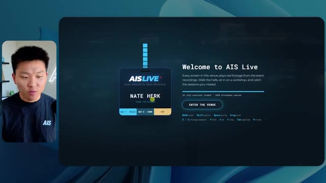
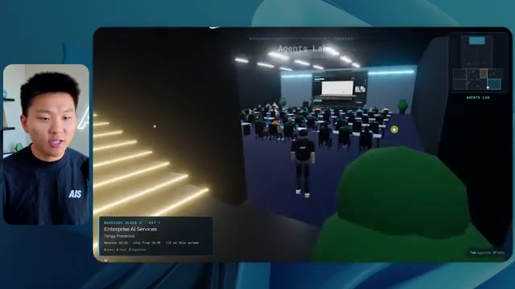
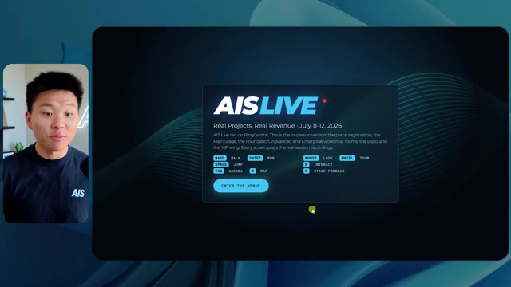
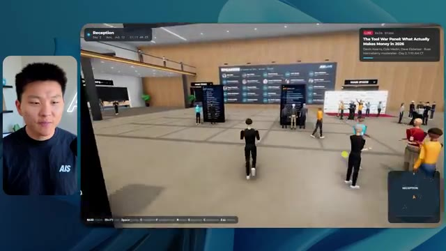
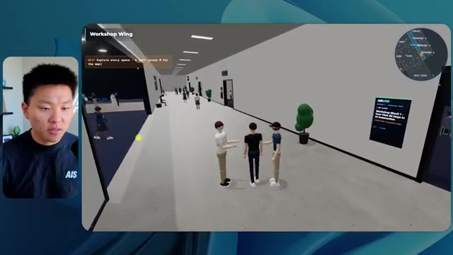
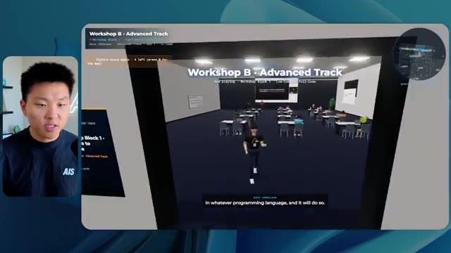
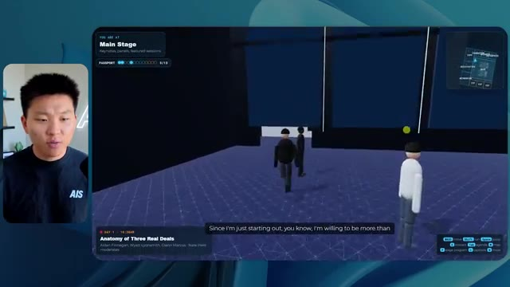

# 🎬 Claude Fable 5 Made This Entire Video By Itself.

> **Chaîne** : [Nate Herk | AI Automation](https://www.youtube.com/@nateherk/featured)  
> **Lien YouTube** : [https://www.youtube.com/watch?v=ONmaDdOBGig](https://www.youtube.com/watch?v=ONmaDdOBGig)  
> **Date de publication** : 20260612  
> **Durée** : 00:05:46  
> **Identifiant vidéo** : `ONmaDdOBGig`  
> **Transcription & Analyse** : `whisper-v3-large-turbo+gemini-3.5-flash-lite`  

---

## 📌 Synthèse Exécutive & Outils

### 💡 Résumé

Dans cette vidéo publiée sur la chaîne *Nate Herk | AI Automation*, Nate Herk réalise une expérimentation d'ingénierie IA ambitieuse pour démontrer les capacités de l'agent autonome **Opus 5.5**. À partir d'un unique prompt complexe de type *slash goal*, l'objectif était de concevoir entièrement, de zéro et de manière autonome, un monde virtuel 3D interactif et explorable à la troisième personne, simulant une conférence technologique réaliste (*AIS Live*). Pour nourrir ce monde, l'agent a dû analyser et exploiter un dossier brut de 105 gigaoctets d'enregistrements vidéo sur Frame.io, tout en mobilisant des outils de génération d'images et l'écosystème logiciel interne du créateur.

L'expérience compare l'impact du paramètre d'exécution de l'IA (du niveau « bas » jusqu'au « code ultra ») sur le résultat final, mesurant non seulement la qualité visuelle et fonctionnelle, mais aussi des métriques objectives telles que le temps d'exécution, le coût API équivalent, le volume de tokens, le nombre de vérifications automatisées dans le navigateur et les interactions requises avec l'humain. 

Les résultats démontrent une progression spectaculaire de la qualité : alors que le niveau bas produit un environnement rudimentaire, bogué et peu fidèle à l'identité visuelle de la marque après plus de 16 minutes de traitement, le niveau moyen livre une application fonctionnelle bluffante en un peu plus d'une heure. Ce monde intermédiaire intègre des vidéos en lecture réelle, le respect de la charte graphique, des PNJ (personnages non-joueurs) animés, des cartes dynamiques et des espaces thématiques complets (scène principale, salons VIP, ateliers), tout cela sans qu'aucune intervention ou question supplémentaire ne soit posée à l'utilisateur humain.

---

### 🛠️ Outils, Modèles & Logiciels Présentés

* **Opus 5.5** : Le modèle d'intelligence artificielle agentique ultra-performant d'Anthropic, économique, intelligent et capable d'exécuter des flux de travail logiciels complexes de bout en bout.
* **Claude Code** : L'interface de programmation et d'exécution par la ligne de commande associée aux modèles Anthropic pour orchestrer les agents de développement.
* **Frame.io** : La plateforme cloud de gestion et de stockage vidéo utilisée ici pour stocker les 105 gigaoctets d'archives d'événements virtuels analysés par l'IA.
* **Key.ai** : Un service tiers de génération d'images et de vidéos par IA sollicité par l'agent pour créer des ressources graphiques manquantes.
* **Herc 2** : Le système d'exploitation IA propriétaire du créateur, contenant des configurations, des scripts et des ressources de marque intégrés par l'agent.
* **Hostinger Connector** : Une extension gratuite pour éditeur de code (comme VS Code ou Cursor) permettant de combler le fossé entre le développement local d'une application par l'IA et son déploiement en ligne direct.

---

### 🔑 Points Clés & Enseignements Stratégiques

* **L'autonomie radicale des agents par *slash goal*** : Un prompt direct, contextuel et orienté vers un objectif final permet à un modèle comme Opus 5.5 de planifier, concevoir, structurer et déployer une application logicielle complète (un monde 3D) sans supervision humaine constante.
* **L'impact critique du niveau d'effort (*Effort Level*)** : La modification du niveau d'effort (bas, moyen, élevé, max, code ultra) modifie profondément la complexité du raisonnement, la rigueur de l'implémentation et la qualité finale du produit, passant d'un prototype grossier à une application web 3D immersive et soignée.
* **Corrélation entre temps de calcul et complexité visuelle** : Le passage du niveau bas au niveau moyen a multiplié le temps d'exécution par quatre (de ~16 minutes à 1h13) et le coût API théorique par trois (de 3,91 $ à 12,44 $), mais a généré un bond qualitatif exponentiel en termes de design, d'ergonomie et de fidélité fonctionnelle.
* **L'autonomie décisionnelle sans sollicitation humaine** : Dans les configurations testées (bas et moyen), l'agent n'a posé aucune question à l'utilisateur (« zéro question »), démontrant une capacité impressionnante à interpréter les ambiguïtés d'un cahier des charges et à prendre des décisions d'architecture de manière autonome.
* **Le rôle actif des vérifications automatisées (*Self-Testing*)** : L'agent ne se contente pas de coder à l'aveugle ; il effectue des boucles de validation itératives (par exemple, 22 à 23 ouvertures de navigateur autonomes) pour tester visuellement son travail, repérer les anomalies et s'auto-corriger.
* **Exploitation de données massives hétérogènes** : Capacité démontrée d'un agent IA à ingérer, trier et exploiter intelligemment un volume massif de données brutes non structurées (105 Go de vidéos sur Frame.io) pour alimenter dynamiquement un produit logiciel interactif.
* **Respect des consignes de design et de branding** : Alors que le niveau bas a échoué à reproduire l'identité visuelle d'AIS Live (couleurs, logos), le niveau moyen a su intégrer avec succès les directives de la marque, plaçant les badges, les palettes de couleurs et les logos aux endroits pertinents.
* **Intégration multimédia contextuelle** : L'agent est parvenu à extraire des flux vidéo des archives pour les projeter de manière synchrone sur des écrans virtuels à l'intérieur du monde 3D (scènes principales, ateliers, salles de classe), transformant une image statique en une expérience vivante.
* **La gestion de la foule et de l'intelligence comportementale** : Au-delà du décor, l'agent a doté les avatars du monde virtuel de comportements rudimentaires (salutations, mouvements, présence synchronisée sur la mini-carte), renforçant l'immersion de l'utilisateur.
* **Le goulet d'étranglement du déploiement post-génération** : L'expérimentation met en lumière un frottement classique de l'ingénierie moderne : la capacité des agents à générer un code fonctionnel complexe est fulgurante, mais le pont vers la mise en production en ligne nécessite des outils d'intégration continus et fluides (comme les extensions d'hébergement).
* **Recommandation méthodologique d'Anthropic** : Pour l'utilisation d'Opus 5.5 sur des projets complexes, il est conseillé de débuter par un niveau d'effort moyen pour valider la structure globale, avant d'ajuster le curseur à la hausse ou à la baisse selon le compromis souhaité entre coût et perfectionnisme.

---

## ⏱️ Chronologie & Transcription Complète Audio & Visuelle (Mot pour Mot)

### ⏱️ `[00:00:00 - 00:00:20]` | Segment #01

**🔊 Audio (Transcription Intégrale Mot pour Mot en Français) :**
> Opus 5.5, Opus 5.5, Opus 5.5, Opus 5.5, Opus 5.5. Ce modèle est littéralement partout et pour de très bonnes raisons. Il est intelligent, il est bon marché, il a un goût incroyable, c'est un modèle d'IA incroyable. Mais avec chaque modèle d'IA, vous avez le choix de l'effort, que ce soit faible, moyen, élevé, extra, max ou code ultra.

**👁️ Analyse Visuelle d'Écran (gemini-3.5-flash-lite) :**
**Interface & Outils** : Navigateur web (Twitter / X)

**Contenu textuel & Code** : Publication sur les réseaux sociaux avec une vidéo intégrée illustrant le potentiel des modèles d'IA.

**Action / Démonstration** : Le présentateur introduit le sujet de la vidéo en montrant un exemple concret d'impact de l'IA sur la création de contenu.

*⏱️ 00:00:05 — Une capture d'écran d'un tweet montrant une vidéo de paysage tropical en 3D générée par IA.*

---

### ⏱️ `[00:00:20 - 00:00:38]` | Segment #02

**🔊 Audio (Transcription Intégrale Mot pour Mot en Français) :**
> Donc, dans cette vidéo, j'ai donné exactement le même prompt à Opus 5.5 et je l'ai exécuté à tous les niveaux d'effort possibles, et nous allons comparer les résultats. Nous examinerons la qualité de toutes les différentes sorties réelles, mais nous examinerons également combien de temps chacun d'eux a pris pour s'exécuter, combien cela nous a coûté s'il s'agissait d'une facturation par API, le nombre total de tokens, combien de vérifications ils ont exécutées, et combien de questions ils m'ont réellement posées tout au long du processus.

**👁️ Analyse Visuelle d'Écran (gemini-3.5-flash-lite) :**
**Interface & Outils** : Interface web de tableau blanc ou de prise de notes (type Miro ou application similaire) avec un tableau structuré.

**Contenu textuel & Code** : Tableau comparatif listant les niveaux d'effort (Low, Medium, High, Extra, Max, Ultracode) en colonnes et des critères de performance en lignes.

**Action / Démonstration** : Présentation visuelle du plan de comparaison des différents niveaux d'effort d'Opus 5.5.

*⏱️ 00:00:29 — Tableau comparatif sur une interface web intitulé "Opus 5.5 Efforts", présentant les niveaux d'effort (Low, Medium, High, Extra, Max, Ultracode) et des métriques (Run time, API cost, Total tokens, Checks, Questions asked).*

---

### ⏱️ `[00:00:39 - 00:00:58]` | Segment #03

**🔊 Audio (Transcription Intégrale Mot pour Mot en Français) :**
> Et les résultats qu'on a obtenus ne sont pas du tout ce à quoi je m'attends, donc j'ai hâte de partager ça avec vous les gars. Ne perdons pas de temps et entrons directement dans le vif du sujet. Bon, alors passons directement à celui-ci. Je veux commencer simplement en vous montrant le prompt réel que nous avons utilisé, que nous avons donné à chacun de ces différents agents. Je vais aller dans les fichiers ici, et nous allons ouvrir ce fichier markdown de prompt, et je vais vous montrer ce qu'on a obtenu. Donc voici le « slash goal » que j'ai fourni.

**👁️ Analyse Visuelle d'Écran (gemini-3.5-flash-lite) :**
**Interface & Outils** : Éditeur de code (interface de type interface de développement IA / Opus 5.5).

**Contenu textuel & Code** : Prompt affiché : 'Hi Nate. This worktree has the effort-test task queued in PROMPT.md : build a walkable third-person 3D world of the AIS Live conference...'

**Action / Démonstration** : Présentation du prompt de test et de l'interface de développement par le présentateur.

*⏱️ 00:00:48 — Interface de l'éditeur de code montrant une discussion avec une IA (Opus 5.5 / Ultracode) et un prompt concernant la création d'un monde 3D interactif.*

---

### ⏱️ `[00:00:58 - 00:01:34]` | Segment #04

**🔊 Audio (Transcription Intégrale Mot pour Mot en Français) :**
> J'ai dit, tu dois me créer un monde 3D qui est une conférence tech réaliste dans laquelle je peux me promener en vue à la troisième personne. Tu vas regarder ce dossier, qui contient mes ressources d'enregistrement d'événements de AIS Live. Et ce dossier est un dossier frame IO de 105 gigaoctets d'enregistrements vidéo. C'était un événement complètement virtuel. Tout a été enregistré et tous les enregistrements sont juste ici. J'ai dit, ton objectif est de prendre cet événement et de le transformer en un monde 3D explorable qui me donne l'impression d'être réellement allé à une vraie conférence en personne avec différentes salles, différentes pistes, différentes scènes, bla, bla, bla. N'hésite pas à utiliser key.ai si tu as besoin de générer des images ou des vidéos. Et tu peux aussi utiliser tout le reste à l'intérieur de mon projet Herc 2, qui est comme mon système d'exploitation IA. J'ai dit,

**👁️ Analyse Visuelle d'Écran (gemini-3.5-flash-lite) :**
**Interface & Outils** : Éditeur de code (type VS Code) et interface web Frame.io.

**Contenu textuel & Code** : Instructions markdown détaillant la création d'une conférence tech 3D exploitable en vue à la troisième personne à partir d'un dossier Frame.io de 105 Go.

**Action / Démonstration** : Présentation du prompt initial et des ressources d'enregistrement vidéo de l'événement AIS Live.

*⏱️ 00:01:07 — Éditeur de code affichant le fichier PROMPT.md avec les instructions pour créer un monde 3D interactif et le lien Frame.io.*

*⏱️ 00:01:16 — Interface Frame.io montrant un dossier de 105,69 Go contenant les ressources d'enregistrement de l'événement AIS Live (GA Access et VIP Access).*

*⏱️ 00:01:25 — Même vue de l'éditeur de code sur le fichier PROMPT.md détaillant les exigences de design et de physique pour le monde 3D.*

---

### ⏱️ `[00:01:34 - 00:02:08]` | Segment #05

**🔊 Audio (Transcription Intégrale Mot pour Mot en Français) :**
> vous serez jugé sur la créativité, le design, la physique et la sensation générale lorsque j'explorerai le monde 3D que vous avez construit. Et c'était fondamentalement la fin des instructions. Donc comme vous pouvez le voir sur ce côté gauche, j'ai exécuté ceci à travers tous les différents niveaux d'effort. Commençons par le niveau bas et remontons jusqu'au code ultra. Très bien. Donc ici nous avons le résultat du niveau bas. Ouvrons ceci et jetons un œil. Donc nous avons AIS Live, le sommet des services IA en personne enfin, et nous avons pu cliquer partout. Tout d'abord, on ne sent pas vraiment la marque ici. Genre ce n'is pas le logo d'IS Live. Ce ne sont même pas nos couleurs. Donc je n'aime pas trop ça, mais entrons ici. D'accord. C'est beaucoup trop lumineux. Euh, nous avons une carte en haut à droite, nous avons une ville ici en arrière-plan. Je ne peux pas dire quelle ville c'est.

**👁️ Analyse Visuelle d'Écran (gemini-3.5-flash-lite) :**
**Interface & Outils** : Application de type interface de chat ou d'agent IA avec panneau de navigation par worktrees et sessions.

**Contenu textuel & Code** : Un message de l'assistant IA demandant si la tâche de construction d'un monde 3D doit commencer selon PROMPT.md, avec en bas un champ de saisie contenant la réponse : 'yes, start the task in PROMPT.md'.

**Action / Démonstration** : Navigation et sélection parmi différents niveaux de tests d'effort dans la barre latérale de l'application.

*⏱️ 00:01:42 — Le présentateur est visible dans une vignette à gauche, tandis que l'écran principal affiche une interface de développement avec une barre latérale listant différents niveaux de test (Hello, Extra, High, Max, Ultracode, Medium, Low) sous une section 'effort-test'.*

---

### ⏱️ `[00:02:08 - 00:02:40]` | Segment #06

**🔊 Audio (Transcription Intégrale Mot pour Mot en Français) :**
> C'est. D'accord. C'est Chicago, ce qui est plutôt cool parce que tu sais, j'habite à Chicago, mais bref, en haut à droite, on peut voir une carte. Nous avons un hall d'accueil. Nous avons un hall d'exposition. Nous avons un salon VIP, la scène principale. La carte montre aussi où se trouve chaque autre personne et cela se synchronise en direct. Donc on peut voir l'enregistrement. On peut voir le premier jour, la keynote de l'hyper agent, le débrief en direct. Cool. Donc ça connaît vraiment l'agenda et puis il y a le deuxième jour. Donc il a trouvé ça, c'est bien. Nous avons ces petites boules ici que je peux espérer shooter. D'accord. Le visage, Oh, regarde ça. Si je vais par ici, tous les gens disparaissent tout simplement. Très mauvais. Très mauvais. D'accord. Alors voyons voir. Est-ce que je peux sprinter ? D'accord.

**👁️ Analyse Visuelle d'Écran (gemini-3.5-flash-lite) :**
**Interface & Outils** : Application virtuelle 3D / plateforme de conférence en ligne interactive

**Contenu textuel & Code** : Plan du site virtuel, mini-carte de navigation et programme d'événements affichés sur les écrans de l'application

**Action / Démonstration** : Navigation et exploration de différentes zones d'un événement virtuel en 3D (lobby, expo hall, retrait des badges)

*⏱️ 00:02:16 — Vue d'un espace virtuel 3D avec un avatar et une carte interactive en haut à droite indiquant la zone de retrait des badges.*

*⏱️ 00:02:24 — Vue du lobby virtuel 3D avec le présentateur à gauche et un panneau affichant le programme du premier jour ("Day 1").*

*⏱️ 00:02:32 — Vue de l'Expo Hall virtuel 3D avec divers avatars et éléments lumineux interactifs, ainsi que la mini-carte en haut à droite.*

---

### ⏱️ `[00:02:40 - 00:03:04]` | Segment #07

**🔊 Audio (Transcription Intégrale Mot pour Mot en Français) :**
> Je peux avancer un peu plus vite. Je vais d'abord aller par ici. Il y a des produits dérivés, euh, un sweat à capuche certifié AIS plus. D'accord. Donc, il y a les stands réels qu'on avait dans l'événement virtuel. On avait des stands. Donc, c'est plutôt cool. Un petit endroit pour prendre des photos. La salle C. En ce moment, nous avons Tangy Frederick qui anime un atelier. D'accord. Mais ce n'est pas une vidéo. Comme vous pouvez le voir, c'est juste une image. Elle ne bouge pas. Donc c'est juste une image. Ces gens sont en train de disparaître. Ce doivent être des fantômes. Allons par ici vers la salle A.

**👁️ Analyse Visuelle d'Écran (gemini-3.5-flash-lite) :**
**Interface & Outils** : Environnement virtuel 3D (type monde virtuel ou métavers).

**Contenu textuel & Code** : Aucun code source, terminal ou interface technique textuelle exploitable.

**Action / Démonstration** : Navigation d'un avatar dans un environnement virtuel 3D d'exposition.

---

### ⏱️ `[00:03:04 - 00:03:30]` | Segment #08

**🔊 Audio (Transcription Intégrale Mot pour Mot en Français) :**
> Nous avons Liberty White. D'accord. Très cool. Vos 30 premiers jours dans l'automatisation. Encore une fois, c'est juste une image fixe et les gens ont des bugs d'affichage. Donc ce n'est pas très bon ici. Je vais aller sur la scène principale et voir ce que nous avons. D'accord, cool. Donc nous avons une scène principale. Les gens ont de gros bugs d'affichage. Vraiment mauvais. Ce n'est vraiment pas bon du tout. Notre vidéo est en train de bouger. Genre, j'ai vu mon visage ici et j'ai vu celui de Devin, mais maintenant ils ont disparu. Donc je ne sais pas ce qui s'est passé. D'accord. On dirait que c'est plutôt un diaporama. Rien n'est vraiment lu pour l'instant. Quoi qu'il en soit, entrons ici.

**👁️ Analyse Visuelle d'Écran (gemini-3.5-flash-lite) :**
**Interface & Outils** : Environnement virtuel 3D interactif (type métavers / plateforme événementielle virtuelle).

**Contenu textuel & Code** : Interface utilisateur virtuelle affichant le titre de l'atelier et la carte de navigation de l'événement.

**Action / Démonstration** : Navigation et déplacement d'un avatar dans l'espace virtuel de la conférence en ligne.

---

### ⏱️ `[00:03:30 - 00:03:58]` | Segment #09

**🔊 Audio (Transcription Intégrale Mot pour Mot en Français) :**
> Nous avons d'autres stands. Nous avons hyper agent. Nous avons Claude Code. Nous avons plus de cadeaux publicitaires. La salle B, c'est Dave Ebelor. Je suppose que c'est exactement la même chose. Nous avons du café. Et puis, je suppose que le salon VIP, c'est accès VIP uniquement. C'est plutôt cool, mais il n'y a vraiment rien qui se passe ici. Cet écran est bien trop lumineux. Bon. Donc je pense que vous comprenez l'ambiance qu'on obtient ici avec Opus 5.5 en effort faible. Et c'est là que les choses deviennent intéressantes. Combien de temps pensez-vous que cela a duré ? Combien de temps ? Celui-ci a duré 16 minutes et 43 secondes. Combien pensez-vous que cela a coûté ?

**👁️ Analyse Visuelle d'Écran (gemini-3.5-flash-lite) :**
**Interface & Outils** : Tableau de bord web type interface de diagramme ou d'analyse (Opus 5.5 Efforts)

**Contenu textuel & Code** : Tableau comparatif avec les colonnes Low, Medium, High, Extra, Max, Ultracode et les lignes Run time, API cost, Total tokens, Checks, Questions asked

**Action / Démonstration** : Présentation des différents niveaux de performance et d'effort d'un modèle d'IA

*⏱️ 00:03:51 — Interface de tableau de bord 'Opus 5.5 Efforts' affichant une matrice de niveaux d'effort (Low à Ultracode) avec des métriques (Run time, API cost, Total tokens, Checks, Questions asked).*

---

### ⏱️ `[00:03:58 - 00:04:26]` | Segment #10

**🔊 Audio (Transcription Intégrale Mot pour Mot en Français) :**
> 3,91 dollars si c'était une facturation par API. J'utilise évidemment mon abonnement ici, mais nous allons simplement calculer cela en facturation par API. Le total des jetons était de 191 000. Il a effectué 22 vérifications. Donc pour la vérification, il a ouvert le navigateur 22 fois et a exécuté différents types de vérifications. Donc 22 catégories de vérifications. Et combien de questions m'a-t-il posées ? Il m'a posé un total de zéro question tout au long de cette invite de type slash goal. D'accord. Alors, ouvrons l'effort moyen et voyons ce que nous avons. D'accord, c'est parti. Effort moyen. Nous avons Nate Herc. Nous avons mon badge. C'est la marque AI's life.

**👁️ Analyse Visuelle d'Écran (gemini-3.5-flash-lite) :**
**Interface & Outils** : Application de tableau blanc ou de diagramme avec une barre latérale d'outils de dessin.

**Contenu textuel & Code** : Tableau avec des colonnes Low, Medium, High, et des lignes Run time, API cost ($3.91), Total tokens (191.3K), Checks, Questions asked.

**Action / Démonstration** : Le présentateur commente les coûts d'API et les statistiques d'exécution affichées dans le tableau.

*⏱️ 00:04:05 — Un tableau comparatif montrant les métriques de performance et de coût pour le niveau de effort "Low" (Run time: 16m 43s, API cost: $3.91, Total tokens: 191.3K, Checks, Questions asked).*

---

### ⏱️ `[00:04:26 - 00:04:46]` | Segment #11

**🔊 Audio (Transcription Intégrale Mot pour Mot en Français) :**
> Donc ça a déjà l'air un petit peu mieux. Ça ressemble à nos palettes de couleurs qui ont utilisé nos directives de marque. Premier jour de construction, deuxième jour de gain, VIP. Cool. D'accord. Je vais entrer dans le lieu. D'accord. Waouh. Une ambiance similaire, en gros. C'est en arrière-plan. Ça ne ressemble pas à Chicago, hein ? Non, ça ressemble à, honnêtement, ça ressemble à une ville imaginaire. Quoi qu'il en soit, c'est marrant qu'ils aient décidé de faire ça. Voyons si je peux avancer un peu plus vite. Oh, waouh.

**👁️ Analyse Visuelle d'Écran (gemini-3.5-flash-lite) :**
**Interface & Outils** : Application web interactive / Environnement 3D virtuel (plateforme événementielle AIS Live)

**Contenu textuel & Code** : Écran d'accueil de la plateforme "AIS Live" avec le nom "Nate Herk", badges d'accès et instructions de navigation.

**Action / Démonstration** : Navigation et entrée dans le lieu virtuel de l'événement en cliquant sur "ENTER THE VENUE".

*⏱️ 00:04:31 — Interface d'accueil de "AIS Live" montrant un badge nominatif virtuel pour "Nate Herk" avec les options "Day 1 BUILD", "Day 2 EARN", "VIP", et le bouton "ENTER THE VENUE".*

*⏱️ 00:04:41 — Vue dans le lieu virtuel 3D avec des avatars d'utilisateurs et une vue panoramique urbaine de nuit en arrière-plan.*

---

### ⏱️ `[00:04:46 - 00:05:21]` | Segment #12

**🔊 Audio (Transcription Intégrale Mot pour Mot en Français) :**
> Les gens interagissent avec moi. Regardez. Si je m'approche de ce type, il vient juste de lever le bras. Bon, maintenant il ne veut plus rien savoir de moi du tout. Mais tous ces petits robots ici doivent prendre des décisions. Je ne sais pas s'ils utilisent Jev. C'est sûr que non. Je ne lui ai pas dit de le faire. En fait, ma clé Jev est à l'arrière. Je ne sais pas. Peut-être qu'il l'a utilisée. Quoi qu'il en soit, nous pouvons voir ici que nous avons la salle d'atelier C, le laboratoire des agents. Sympa. Donc celui-ci est en fait exécuté. Vous pouvez voir qu'il s'agit d'une vraie vidéo lue par Tangy. Tout le monde ici est en train de travailler sur un ordinateur portable. Ils ne buguent pas. C'est plutôt cool. De plus, mon badge est sur ma poitrine, ce qui est plutôt cool. Je peux venir par ici. Nous avons une carte en haut à droite, comme vous pouvez le voir, mais je peux venir par ici. Nous avons un

**👁️ Analyse Visuelle d'Écran (gemini-3.5-flash-lite) :**
**Interface & Outils** : Environnement virtuel 3D / Jeu / Simulateur d'agents.

**Contenu textuel & Code** : Simulation 3D interactive avec des personnages et des interfaces de salle de conférence.
[COMPILATION] Navigation dans un monde virtuel 3D et interaction avec des agents simulés.

**Action / Démonstration** : Explications face caméra et démonstration conceptuelle.

*⏱️ 00:04:55 — Vue en jeu d'un monde virtuel interactif avec des avatars et des PNJ en mouvement.*

*⏱️ 00:05:04 — Vue depuis une mezzanine surplombant une salle de conférence virtuelle remplie d'avatars assis.*

*⏱️ 00:05:12 — Vue rapprochée d'une salle de classe virtuelle avec de nombreux rangs de tables et d'ordinateurs où sont assis des avatars.*

---

### ⏱️ `[00:05:21 - 00:05:47]` | Segment #13

**🔊 Audio (Transcription Intégrale Mot pour Mot en Français) :**
> halle d'exposition. C'est là que nous avons le stand Glido. Et ça diffuse en ce moment. Oui, ça diffuse la vidéo de nous en train de parler de Glido. Ça diffuse la vidéo d'Ed et moi parlant de notre programme de certification. Nous avons le logo AIS Plus ici à l'arrière, qui est placé dans un endroit un peu bizarre. Ce sont les diapositives des conférenciers et les points clés. Donc waouh, ce sont toutes les ressources que nous avons distribuées après l'événement. Elles sont toutes là aussi. Nous pouvons voir que nous avons un coup de projecteur sur la communauté. Donc c'est Aiden qui parle de son contrat qu'il a décroché et c'est diffusé en direct. Ces gens regardent.

**👁️ Analyse Visuelle d'Écran (gemini-3.5-flash-lite) :**
**Interface & Outils** : Environnement virtuel 3D de type salon d'exposition (Metaverse / plateforme événementielle virtuelle).

**Contenu textuel & Code** : Affichage textuel de la session « Get AIS+ Certified: The AIS Services Certification » et diapositives de présentation.

**Action / Démonstration** : Navigation et visite guidée de l'espace d'exposition virtuel par le présentateur.

---

### ⏱️ `[00:05:47 - 00:06:21]` | Segment #14

**🔊 Audio (Transcription Intégrale Mot pour Mot en Français) :**
> Ils sont plutôt engagés. On a un hyper-agent. C'est ça, c'est ce que je voulais dire. Si vous avez vu ces gens lever les mains pour dire bonjour, c'était plutôt marrant. Regardez, regardez, le voilà qui recommence. Bref. Bon. Où est-ce que je suis maintenant ? Maintenant, je suis dans le hall principal. On a un bar à café. On a un grand logo, qui est le vrai logo. Il est trop lumineux, mais on a le logo. On peut voir si on peut entrer ici dans le parcours des fondations. On a Sabrina Romanov et Liberty White. Donc différentes formations juste là. On peut entrer dans cette salle. C'est le parcours avancé. Alors qu'est-ce qui se passe ici. On a Dave Ebelar et Saman qui parlent de différentes choses là-dedans. Et maintenant, allons jeter un œil à la scène principale. Oh, attendez, il y a une vidéo de moi là-haut. Est-ce que c'est genre un VIP

**👁️ Analyse Visuelle d'Écran (gemini-3.5-flash-lite) :**
**Interface & Outils** : Environnement virtuel 3D en ligne.

**Contenu textuel & Code** : Interface utilisateur de simulation virtuelle montrant des avatars et des indications textuelles ("Main Lobby").

**Action / Démonstration** : Exploration d'un espace virtuel interactif par le présentateur.

---

### ⏱️ `[00:06:21 - 00:06:50]` | Segment #15

**🔊 Audio (Transcription Intégrale Mot pour Mot en Français) :**
> section ? Ouais, on ira voir ça dans une minute. Mais bref, voici la scène principale. Ça a l'air vraiment, vraiment très bien. On a une grande scène. On a genre quatre personnes assises ici. On a les trois écrans d'Alex là-haut avec "hyper agent". Est-ce que j'ai le droit de monter sur scène ? Oh, et ça me laisse monter sur scène. D'accord. C'est plutôt sympa. Bon, les gars, faisons un selfie. Laissez-moi prendre tout le monde en arrière-plan. Venez par ici. Bref, c'est vraiment, vraiment cool. Par contre, toutes les places ne sont pas prises. Donc il faut qu'on travaille là-dessus. Mais bref, je vais y retourner en courant pour voir ce que c'était que cette section VIP. D'accord. Le salon VIP. J'ai l'impression que c'est comme un aéroport ou un truc comme ça.

**👁️ Analyse Visuelle d'Écran (gemini-3.5-flash-lite) :**
**Interface & Outils** : Application web ou plateforme virtuelle 3D (Hyperagent).

**Contenu textuel & Code** : Interface utilisateur avec encadré d'information de keynote (Hyperagent Keynote - Alex McDonnell).

**Action / Démonstration** : Navigation de l'avatar de l'utilisateur dans l'espace virtuel de la conférence.

---

### ⏱️ `[00:06:51 - 00:07:14]` | Segment #16

**🔊 Audio (Transcription Intégrale Mot pour Mot en Français) :**
> Okay, cool. Donc maintenant nous avons les sessions VIP ici. Session de questions-réponses VIP avec Nate, lecture vidéo en direct juste ici. Très, très cool. Et nous avons comme un bar ou quelque chose comme ça. Génial. Je dirais que c'est un assez bon résultat. Maintenant, en ce qui concerne les statistiques ici, celle-ci a pris une heure et 13 minutes à s'exécuter. Cela nous aurait coûté 12 dollars et 44 cents. Elle a utilisé 490 000 jetons et elle a effectué 23 vérifications.

**👁️ Analyse Visuelle d'Écran (gemini-3.5-flash-lite) :**
**Interface & Outils** : Espace virtuel 3D et tableau de bord analytique.
[DESC_IMAGE_2] Métriques d'exécution (Run time: 16m 43s, API cost: $3.91, Total tokens: 191.3K, Checks: 22, Questions asked: 0).

**Contenu textuel & Code** : Explications orales et mise en contexte méthodologique.

**Action / Démonstration** : Présentation de l'environnement virtuel VIP et analyse des performances de l'application.

*⏱️ 00:06:56 — Aperçu d'un espace virtuel VIP en 3D avec un écran géant affichant une session de questions-réponses en direct.*

*⏱️ 00:07:02 — Tableau de bord d'analyse montrant les métriques de performance et de coûts (Run time 16m 43s, API cost $3.91, Total tokens 191.3K).*

---

### ⏱️ `[00:07:14 - 00:07:48]` | Segment #17

**🔊 Audio (Transcription Intégrale Mot pour Mot en Français) :**
> Et il nous a posé un total de zéro question une fois de plus. Très bien, passons à élevé. C'était déjà un résultat plutôt correct et Anthropic eux-mêmes dans leur vidéo, ou désolé, pas une vidéo, un article sur comment prompter Opus 5.5. Ils ont dit de commencer simplement par moyen et d'ajuster à la hausse ou à la baisse si nécessaire. C'était donc un résultat moyen. Passons à élevé et voyons ce qu'on a obtenu. Très rapidement, les gars, je dois prendre une seconde pour vous parler du sponsor de la vidéo d'aujourd'hui, Hostinger. Donc ces deux modèles viennent de me construire une version fonctionnelle de la même chose. Et maintenant, je suis exactement là où je finis toujours, avec un produit fini sur mon ordinateur portable et aucun moyen rapide de le mettre en ligne. Et c'est le fossé que comble le connecteur d'Hostinger. C'est une extension gratuite

**👁️ Analyse Visuelle d'Écran (gemini-3.5-flash-lite) :**
**Interface & Outils** : Tableau blanc ou application de notes visuelles (Image 1) ; IDE ou interface de développement pour agent IA avec panneau de chat et code/aperçu (Image 2).

**Contenu textuel & Code** : Tableau de données comparatives des performances d'IA selon les niveaux "Low" et "Medium" (Image 1) ; Prompt détaillé de création d'un calculateur ROI en HTML autonome et journal d'activité de l'agent IA (Image 2).

**Action / Démonstration** : Présentation des résultats comparatifs de l'agent IA (Image 1) et démonstration de la génération d'un outil de calcul ROI par l'agent (Image 2).

*⏱️ 00:07:22 — Un tableau comparatif affichant les résultats de différents niveaux d'effort (Low, Medium, High, Extra) avec les métriques associées (temps d'exécution, coût API, nombre de tokens, vérifications et questions posées).*

*⏱️ 00:07:39 — Une interface de développement de type éditeur/agent de code divisée en deux volets, montrant le processus de construction d'un calculateur ROI (Northwind ROI calculator) avec des statistiques de réflexion (tokens, compétences dataviz) et le présentateur en médaillon.*

---

### ⏱️ `[00:07:48 - 00:08:23]` | Segment #18

**🔊 Audio (Transcription Intégrale Mot pour Mot en Français) :**
> pour votre éditeur qui intègre votre compte Hostinger dans l'outil de programmation que vous utilisez déjà, que ce soit VS Code, Cursor, Cloud Code, Codex, et j'en passe. Vous vous connectez une seule fois en un clic, et à partir de là, votre agent peut déployer le site, y associer un domaine, configurer les enregistrements DNS et vérifier votre VPS sans que vous ayez à quitter votre éditeur. Alors, peu importe celui que vous préférez au final, ce qu'il a construit se trouve à quelques minutes d'une vraie URL sur un hébergement géré. Le connecteur est gratuit avec chaque formule d'hébergement, donc si vous avez encore besoin de l'hébergement sous-jacent, profitez de la formule illimitée grâce au lien dans la description et utilisez le code NATEHERK pour obtenir 10 % de réduction. Cela comprend également un nom de domaine gratuit et un e-mail professionnel pour un an. Et c'est toujours le moyen le plus économique que j'ai trouvé pour obtenir un

**👁️ Analyse Visuelle d'Écran (gemini-3.5-flash-lite) :**
**Interface & Outils** : Navigateur web / Application Hostinger intégrée et interface Claude Code (IDE)

**Contenu textuel & Code** : "Manage Hostinger from your IDE", statut "Connected (VIA OAUTH)", et options d'outils disponibles avec cases à cocher.

**Action / Démonstration** : Connexion unique du compte Hostinger à l'IDE et affichage des outils de gestion autorisés.

*⏱️ 00:07:57 — Interface montrant l'intégration de Hostinger connectée via OAuth à un IDE, avec une liste d'outils disponibles (Websites, Domains, Subscriptions, Email Marketing) et Claude Code sur le panneau droit.*

---

### ⏱️ `[00:08:23 - 00:08:47]` | Segment #19

**🔊 Audio (Transcription Intégrale Mot pour Mot en Français) :**
> tu as construit par-dessus une vraie URL. Donc revenons-en à la vidéo. D'accord. Encore une fois, très, très marqué par la marque. C'est un écran de chargement encore mieux que le précédent. Nous avons ce petit effet sympa en arrière-plan. Nous avons le logo. Nous allons entrer dans le lieu. D'accord. Nous y voilà. Ça a l'air plutôt bien. Nous commençons dehors et vous pouvez voir que nous avons ces drapeaux pour tous les intervenants, Wyatt, Casper, Alex, Ed, Aiden, Sabrina, Liberty. C'est plutôt cool. Nous avons des blocs en direct ici.

**👁️ Analyse Visuelle d'Écran (gemini-3.5-flash-lite) :**
**Interface & Outils** : Application web interactive 3D, environnement virtuel RingCentral.

**Contenu textuel & Code** : Interface utilisateur avec mini-carte, indicateurs de progression et contrôles clavier (WASD, ESPACE, etc.).

**Action / Démonstration** : Connexion à l'espace virtuel, chargement de l'application et entrée dans le lieu 3D.

*⏱️ 00:08:29 — Écran de chargement de l'application web 'AIS Live' avec le logo et les instructions de contrôle clavier/souris.*

*⏱️ 00:08:35 — Vue de la place virtuelle 'AIS Live Plaza' en 3D avec des avatars d'utilisateurs et des bâtiments en arrière-plan.*

*⏱️ 00:08:41 — Exploration de la place virtuelle avec des bannières verticales affichant les noms des intervenants.*

---

### ⏱️ `[00:08:47 - 00:09:23]` | Segment #20

**🔊 Audio (Transcription Intégrale Mot pour Mot en Français) :**
> il a pris cette photo de moi, votre hôte, Nate Herc, John, Dave, Nate Herc. Voilà. D'accord. Les portes. Génial. Ce sont des portes automatiques coulissantes en verre. J'adore ça. Nous pouvons voir l'enregistrement VIP. Nous pouvons voir l'admission générale. Nous pouvons venir ici et nous pouvons découvrir l'expo avec différents stands, le projecteur sur la communauté. Vous pouvez également voir qu'en haut à gauche, j'ai un passeport. C'est donc comme si, cela montrera combien d'endroits j'ai visités. Tout ceci est une vraie lecture. Nous avons un mur de ressources avec tous les différents intervenants. Ils ont également une session de networking ici. Je vais donc venir très vite voir de quoi il s'agit. Nous avons donc le bar à cold brew AIS. Nous avons différents membres de la communauté qui ont été mis en avant ou en valeur.

**👁️ Analyse Visuelle d'Écran (gemini-3.5-flash-lite) :**
**Interface & Outils** : Environnement virtuel 3D / Jeu ou plateforme de métavers.

**Contenu textuel & Code** : Interface utilisateur virtuelle affichant des informations de navigation, des bannières d'événements et des listes de participants.

**Action / Démonstration** : Exploration d'un espace virtuel interactif sous forme d'avatar par l'hôte.

*⏱️ 00:08:56 — Vue d'un espace virtuel 3D de type salon ou conférence, montrant la zone d'enregistrement (Registration Concourse) avec des comptoirs GA et VIP.*

*⏱️ 00:09:05 — Navigation dans un hall d'exposition virtuel (Expo Hall) avec des stands et des avatars d'utilisateurs.*

*⏱️ 00:09:14 — Déplacement d'avatairs dans le hall d'enregistrement virtuel avec de grandes baies vitrées.*

---

### ⏱️ `[00:09:23 - 00:09:56]` | Segment #21

**🔊 Audio (Transcription Intégrale Mot pour Mot en Français) :**
> On a la zone VIP. Attends, quoi ? Prends un bracelet. Ah, je dois vraiment aller chercher le bracelet. D'accord. Laisse-moi m'enregistrer rapidement. Le bracelet est déjà mis. Attends, quoi ? D'accord. Oh, d'accord. Maintenant, les portes se sont ouvertes pour moi. Cool. Je peux entrer ici. Oh, ça mène juste à la scène principale. Salon VIP. Il y a une séance de questions-réponses en cours. Ça a l'air très cool. Je veux dire, je suis très impressionné par la façon dont il parvient à faire ça. Waouh. D'accord. Donc c'est vraiment bien. Ce qu'on a fait, c'est qu'on a eu des salles de discussion VIP avec différentes personnes. Tu peux voir qu'il y a différentes salles, différents membres de l'équipe AIS qui vont dans des trucs. C'est vraiment cool. C'est très cool. C'est un bien meilleur VIP

**👁️ Analyse Visuelle d'Écran (gemini-3.5-flash-lite) :**
**Interface & Outils** : Application de métavers 3D / environnement virtuel en ligne (web 3D).

**Contenu textuel & Code** : Interface utilisateur virtuelle affichant la carte du lieu, les informations de passeport (Passport), les contrôles clavier et des affichages textuels interactifs.

**Action / Démonstration** : Navigation et exploration de différentes zones et salles VIP par l'avatar dans l'environnement virtuel.

*⏱️ 00:09:32 — Vue d'un monde virtuel 3D (type metavers) montrant un avatar se déplaçant dans la zone de réception, avec un message textuel concernant le bracelet VIP en haut.*

*⏱️ 00:09:40 — L'avatar se trouve dans le salon VIP (VIP Lounge) où un écran affiche une visioconférence avec le présentateur, et un sous-titre indique l'importance des évaluations.*

*⏱️ 00:09:48 — L'avatar explore une salle de sessions de travail VIP (« VIP Working Sessions ») avec plusieurs espaces thématiques (« Price It Right », « Turn Your Expertise into a Service », « Land Your First Paying Client »).*

---

### ⏱️ `[00:09:56 - 00:10:30]` | Segment #22

**🔊 Audio (Transcription Intégrale Mot pour Mot en Français) :**
> expérience que ce qui a été montré dans la première partie. D'accord. After party VIP. Regardez ça. On a une piste de danse. On a tous ces éléments ici. On a la lecture de l'after party VIP juste ici. Et il y a une estrade de DJ. C'est tellement marrant. Il y a un petit bug juste ici, un petit glitch juste là, mais c'est génial. Oh, cool. Donc quand je suis ici sur la scène principale, on a des sous-titres. Vous pouvez voir juste ici en bas de mon écran, on a ces sous-titres de Wyatt qui est en train de parler ici. On a des lumières. On a le panel. Très cool. Belle scène principale. Je vais aller ici. On peut aller à la fondation,

**👁️ Analyse Visuelle d'Écran (gemini-3.5-flash-lite) :**
**Interface & Outils** : Application web de monde virtuel interactif / métavers

**Contenu textuel & Code** : Environnement virtuel 3D avec avatars, flux vidéo en direct incrustés, interface de visioconférence et éléments de gamification.

**Action / Démonstration** : Navigation et présentation des différentes salles du monde virtuel (after party puis scène principale).

*⏱️ 00:10:04 — Capture montrant l'interface d'un monde virtuel interactif (Gather Town ou similaire) avec une piste de danse ("VIP After-Party") et des avatars.*

*⏱️ 00:10:13 — Capture de la même interface de monde virtuel, montrant une vue légèrement différente de l'after-party avec des écrans vidéo et des participants.*

*⏱️ 00:10:21 — Capture du monde virtuel montrant cette fois une scène principale ("Main Stage") avec des participants assis dans un auditoire virtuel.*

---

### ⏱️ `[00:10:30 - 00:11:06]` | Segment #23

**🔊 Audio (Transcription Intégrale Mot pour Mot en Français) :**
> avancé, et les parcours d'entreprise par ici. Alors voyons voir. Nous avons l'anatomie de trois vraies transactions. Nous avons hyper agent. Nous avons les évaluations avec Nate et Ed ici. Nous avons Dave qui s'occupe des trucs avancés. C'est vraiment bien. Je veux dire, évidemment, chacun, chacun de ces résultats jusqu'à présent, faible était correct. Moyen était meilleur. Élevé a été encore meilleur. Voyons si cette tendance se poursuit et voyons combien cela nous a coûté. Donc, élevé a tourné pendant une heure et sept minutes. Donc un peu plus rapide que moyen, cela nous aurait coûté 16 dollars et 31 cents. Il a utilisé un demi-million de tokens, 509 000. Il a fait 22 vérifications. Et il nous a aussi demandé, enfin, non, je me suis trompé. Ce

**👁️ Analyse Visuelle d'Écran (gemini-3.5-flash-lite) :**
**Interface & Outils** : Application de tableau blanc / outil de mindmapping et d'analyse (style Excalidraw ou similaire) nommé "Opus 5.5 Efforts".

**Contenu textuel & Code** : Tableau de données chiffrées : Run time (16m 43s à 1h 13m), API cost ($3.91 à $16.31), Total tokens (191.3K à 419.2K), Checks (22 à 23), Questions asked (0).

**Action / Démonstration** : Manipulation d'éléments visuels et sélection de cellules dans le tableau de comparaison des performances des modèles.

*⏱️ 00:10:57 — Un tableau comparatif montrant des métriques d'évaluation d'IA (Run time, API cost, Total tokens, Checks, Questions asked) selon différents niveaux d'effort (Low, Medium, High, Extra).*

---

### ⏱️ `[00:11:06 - 00:11:25]` | Segment #24

**🔊 Audio (Transcription Intégrale Mot pour Mot en Français) :**
> l'un m'a posé une question et spoiler, c'était le seul qui nous a posé une question de tout ça. Donc voyons voir, il nous en reste trois, extra, max et ultra code. Laissez-moi ouvrir extra et nous verrons ce qu'on a. D'accord. Donc celui-ci a l'air plutôt bien. Je dirais honnêtement que jusqu'à présent, l'écran de chargement haut était le meilleur. Celui qu'on vient juste de voir, mais bref, entrons dans AIS live.

**👁️ Analyse Visuelle d'Écran (gemini-3.5-flash-lite) :**
**Interface & Outils** : Application de tableau de bord ou interface de canevas (Opus 5.5 Efforts) avec la webcam du présentateur incrustée à gauche.

**Contenu textuel & Code** : Tableau avec des colonnes Low, Medium, High et une colonne active Extra. Lignes : Run time, API cost, Total tokens, Checks, Questions asked.

**Action / Démonstration** : Le présentateur commente les résultats comparatifs et s'apprête à ouvrir ou analyser la colonne Extra.

*⏱️ 00:11:11 — Un tableau comparatif montrant les métriques de performance de différents niveaux d'effort (Low, Medium, High, Extra), incluant le temps d'exécution, le coût API, le nombre total de tokens, les vérifications et les questions posées.*

---

### ⏱️ `[00:11:26 - 00:11:51]` | Segment #25

**🔊 Audio (Transcription Intégrale Mot pour Mot en Français) :**
> Whoa. D'accord. Donc on a genre des petits extraits sonores. Je peux discuter avec les gens. Le panneau sur la guerre des outils a réglé quelques débats pour moi. Sympas. Bonne perspective là-bas. On est dehors à nouveau. On a ces différentes bannières, bien qu'elles soient toutes pareilles. Elles n'affichent pas du genre les noms de différentes personnes. Donc gros logo AIS live. L'aile des ateliers est par ici. Et passons par les portes coulissantes en verre pour voir ce qu'on a. Donc on a le café AIS. La carte est en bas à droite, et elle n'est pas très descriptive.

**👁️ Analyse Visuelle d'Écran (gemini-3.5-flash-lite) :**
**Interface & Outils** : Application ou plateforme virtuelle 3D (type métavers ou jeu en ligne).

**Contenu textuel & Code** : Environnement 3D avec des avatars, des bannières "AIS LIVE", un mini-carte et des dialogues textuels.
[DESC_IMAGE_3] L'avatar se déplace et explore l'environnement virtuel 3D.

**Action / Démonstration** : Explications face caméra et démonstration conceptuelle.

*⏱️ 00:11:32 — Vue d'un monde virtuel en 3D avec un avatar qui se déplace sur une place extérieure, montrant des bannières publicitaires et un autre personnage.*

*⏱️ 00:11:38 — L'avatar continue de marcher dans l'environnement virtuel en extérieur près de bâtiments et d'arbres sous un ciel crépusculaire.*

*⏱️ 00:11:45 — L'avatar s'approche de l'entrée d'un bâtiment ou d'un hall d'exposition futuriste à l'intérieur de l'espace virtuel 3D.*

---

### ⏱️ `[00:11:51 - 00:12:26]` | Segment #26

**🔊 Audio (Transcription Intégrale Mot pour Mot en Français) :**
> J'aime bien comment les autres cartes nous ont montré quoi, genre où se trouvaient les choses, mais celle-ci a l'air très professionnelle. On peut voir que voici la scène principale. Allons y faire un tour rapidement. Elles ont toutes ces balles qui volent autour, ce que je trouve assez marrant. Les ballons de plage AIS. On nous voit, moi là-haut en train de parler. Je crois que j'introduisais l'une des journées. Continuons à avancer par ici vers la salle d'atelier sur ce côté gauche. OK. Donc ici nous avons le théâtre Hyper Agent. Nous avons cette session sponsorisée ici par Hyper Agent, mais ça nous montre aussi ce qui va s'y passer. C'est vraiment marrant qu'on puisse discuter avec les gens. Salmon a créé un commercial vocal en direct. La salle du juste prix était comble. Avez-vous pris le guide du compagnon VIP ? C'est trop marrant. On a le parcours avancé dans

**👁️ Analyse Visuelle d'Écran (gemini-3.5-flash-lite) :**
**Interface & Outils** : Application web de métaverse ou plateforme d'événements virtuels en 3D (type Gather Town ou équivalent 3D).

**Contenu textuel & Code** : Environnement virtuel 3D interactif avec des avatars d'utilisateurs, des écrans de retransmission vidéo en direct et des bulles de discussion textuelles.

**Action / Démonstration** : Navigation et exploration de l'espace virtuel par le présentateur sous forme d'avatar.

*⏱️ 00:12:00 — Le présentateur navigue dans une salle de conférence virtuelle en 3D montrant une scène principale avec un écran géant et un public d'avatars.*

*⏱️ 00:12:09 — L'avatar du présentateur explore le lobby virtuel d'un événement en ligne, avec des panneaux indiquant "Workshops" et d'autres zones interactives.*

*⏱️ 00:12:17 — Vue de l'intérieur d'un couloir virtuel de l'application où plusieurs avatars interagissent et discutent près de salles de service.*

---

### ⏱️ `[00:12:26 - 00:12:58]` | Segment #27

**🔊 Audio (Transcription Intégrale Mot pour Mot en Français) :**
> ici. Encore une fois, nous avons la lecture en direct. Est-ce que c'est la lecture en direct ? Oh, d'accord. Ça a commencé une fois que je suis entré, mais je peux m'asseoir. Oh la la. Je peux regarder ça. Je peux me lever. Je veux m'asseoir au premier rang. C'est plutôt cool. C'est très bien. J'aime bien ça. Et vous savez ce que j'ai remarqué jusqu'à présent ? Le personnage que j'incarne me ressemble un peu. Je pense qu'il a été modélisé à partir de mes photos de profil ou quelque chose comme ça. Quoi qu'il en soit, nous avons Sabrina ici, l'animatrice de la salle ici, prenez n'importe quel siège disponible. D'accord, cool. Et j'ai vraiment aimé la fonctionnalité pour s'asseoir. C'est plutôt marrant. Genre, on pourrait vraiment assister à cet atelier et participer. Bref, ça nous montre les intervenants. Ça nous montre les

**👁️ Analyse Visuelle d'Écran (gemini-3.5-flash-lite) :**
**Interface & Outils** : Environnement virtuel 3D / Plateforme de réunion virtuelle ou de webinaire interactif (type Virbela ou similaire).

**Contenu textuel & Code** : Interface utilisateur virtuelle avec affichage d'un atelier (« Workshop Block 2 »), avatars d'utilisateurs et écran géant projetant une interface web et des webcams.

**Action / Démonstration** : Navigation et exploration de l'espace de réunion virtuel 3D par le présentateur.

---

### ⏱️ `[00:12:58 - 00:13:31]` | Segment #28

**🔊 Audio (Transcription Intégrale Mot pour Mot en Français) :**
> programme. Il y a un petit tapis rouge ici pour prendre des photos. On peut prendre la pose. Oh, waouh. C'est plutôt cool. Bibliothèque de ressources, obtenir la certification AIS Plus, Glido, Hyper Agent, AIS Plus, trois vraies affaires. Génial. Je veux dire, je dirais vraiment que jusqu'à présent, chacune est meilleure. Et on n'a même pas encore vu la section VIP, le salon VIP. Montons par ici rapidement. J'espère que je pourrai entrer. Sympa. On a le réinitialisation des outils. Ce sont les différentes salles dans lesquelles on pourrait aller. Donc encore une fois, je pourrais prendre la feuille d'exercices et je pourrais essayer de comprendre comment tarifer mes produits. C'est tellement cool. C'est vraiment mieux que le précédent où on faisait juste

**👁️ Analyse Visuelle d'Écran (gemini-3.5-flash-lite) :**
**Interface & Outils** : Environnement virtuel 3D en ligne.

**Contenu textuel & Code** : Éléments textuels d'interface pour la navigation et les interactions sociales virtuelles.

**Action / Démonstration** : Navigation et exploration de l'espace virtuel par le présentateur.

---

### ⏱️ `[00:13:31 - 00:13:59]` | Segment #29

**🔊 Audio (Transcription Intégrale Mot pour Mot en Français) :**
> Genre, j'ai regardé des trucs. Génial. Je peux aller derrière le bar et venir ici. C'est très bien. Bon. Alors, en ce qui concerne les statistiques, celle-ci a duré une heure et demie. Elle a coûté 25,92 dollars. Je ne sais pas pourquoi je dis point, 25 dollars et 92 cents. Il y a eu 733 000 jetons et 34 vérifications. C'est donc de loin le plus grand nombre de vérifications jusqu'à présent, et elle ne nous a posé aucune question. J'ai hâte de voir ce qu'on a obtenu ici de max et ultra code. D'accord. Voici max, des écrans de chargement, ennuyeux, mais c'est dans l'esprit de la marque et il y a notre logo.

**👁️ Analyse Visuelle d'Écran (gemini-3.5-flash-lite) :**
**Interface & Outils** : Application de tableau blanc ou de prise de notes numérique (type Excalidraw ou similaire).

**Contenu textuel & Code** : Tableau avec des colonnes 'Medium', 'High', 'Extra', 'Max', 'Ultracode' et des lignes affichant le temps (ex: 1h 31m), le coût (ex: $25.92), et d'autres statistiques.

**Action / Démonstration** : Le présentateur commente les statistiques affichées à l'écran pour les différents niveaux de performance.

*⏱️ 00:13:38 — Tableau comparatif sous forme de tableau ou graphique montrant différentes métriques (durée 1h 31m, coût $25.92, etc.) selon les niveaux d'effort (Medium, High, Extra, Max, Ultracode).*

---

### ⏱️ `[00:14:00 - 00:14:35]` | Segment #30

**🔊 Audio (Transcription Intégrale Mot pour Mot en Français) :**
> Alors c'était bien. J'aime bien. On va continuer et entrer dans AIS live. Ooh, petite animation sympa ici qui nous fait entrer. Encore une fois, le personnage me ressemble. Ils m'ont tous ressemblé. Je veux dire, en gros, nous sommes assis en arrière-plan. Ça ressemble à Chicago. Comme je l'ai mentionné plus tôt, beaucoup de ces jeux diffusent des sons et je ne les inclus pas parce que ce serait très perturbateur pour vous d'essayer d'écouter ce qui se passe en même temps que je parle. Il y a donc une légère musique dans tout ça. Je déteste la façon dont il marche. Cette marche est vraiment, vraiment mauvaise. Je veux dire, la marche, ouais, je n'aime pas du tout ça. Donc ce n'est pas génial. Mais à part ça, allons explorer. Remarquez ces ombres quand j'entre, elles changent vraiment brusquement, je ne sais pas trop pourquoi,

**👁️ Analyse Visuelle d'Écran (gemini-3.5-flash-lite) :**
**Interface & Outils** : Application ou plateforme virtuelle 3D en ligne ("AIS live") affichée dans un navigateur web avec des commandes de déplacement en bas.

**Contenu textuel & Code** : Environnement virtuel 3D interactif représentant une place urbaine moderne avec des bannières textuelles et une mini-carte en bas à droite.

**Action / Démonstration** : Navigation et exploration en vue à la troisième personne dans un monde virtuel 3D représentant un événement ou un salon en ligne.

---

### ⏱️ `[00:14:35 - 00:15:11]` | Segment #31

**🔊 Audio (Transcription Intégrale Mot pour Mot en Français) :**
> Mais de toute façon, nous pouvons aussi discuter avec des gens ici. Le stand Hyperagent est juste là où l'on entre dans l'exposition. Tout va bien. D'accord, super. Je peux continuer à appuyer sur E pour changer ce qu'ils disent. Nous avons les intervenants juste ici. Ça a l'air plutôt bien. Bien que nous avions vraiment la photo de profil de tout le monde. Je ne sais donc pas pourquoi ce n'est pas inclus là. Nous voyons des gens prendre des photos juste ici. J'adore ça. Et ça enregistre une petite photo. D'accord. La carte n'est pas non plus super, genre elle ne donne pas une super explication de ce qui se passe, mais j'aime ces stands. Ils sont cool. Je pense que ces stands sont les meilleurs que j'ai vu jusqu'à présent. Genre, ils ont juste l'air bien. Ils ont des représentants. Il y a de superbes diaporamas derrière eux. Ouais. Ces stands sont cool. D'accord. Nous avons un petit théâtre mis en avant.

**👁️ Analyse Visuelle d'Écran (gemini-3.5-flash-lite) :**
**Interface & Outils** : Application web 3D immersive (monde virtuel interactif)

**Contenu textuel & Code** : Environnement virtuel 3D avec avatars, panneaux d'affichage et mini-carte

**Action / Démonstration** : Exploration et navigation dans l'espace virtuel de l'exposition d'IA

*⏱️ 00:14:44 — Vue d'un monde virtuel 3D montrant une réception avec des avatars et des écrans d'information sur les intervenants.*

*⏱️ 00:14:53 — Navigation dans le monde virtuel 3D montrant l'entrée vers l'exposition avec des avatars discutant autour d'une table haute.*

*⏱️ 00:15:02 — Entrée dans la halle d'exposition virtuelle avec différents stands (Evals Lab, Enterprise AI).*

---

### ⏱️ `[00:15:11 - 00:15:35]` | Segment #32

**🔊 Audio (Transcription Intégrale Mot pour Mot en Français) :**
> qui se passe par ici. C'est Casper. Bien que pourquoi est-ce que ça ne joue pas ? J'ai l'impression que ça devrait jouer, non ? Comme dans les autres, ça jouait toujours. On peut parler à d'autres personnes par ici. Le café est gratuit, blabla. Amy Simpson, Matt Wolf. Sympas. Bon. C'est juste la zone de réseautage dans laquelle nous sommes en ce moment, mais on peut voir en haut à droite. On peut aussi voir ce qui est en direct sur la scène principale en ce moment. C'est un panel sur la guerre des outils. Alors allons par ici. Nous avons Devin, Cole, Dave et Russ qui discutent ici. Nous avons de l'audiovisuel, des petits trucs lumineux qui se passent par ici.

**👁️ Analyse Visuelle d'Écran (gemini-3.5-flash-lite) :**
**Interface & Outils** : Navigateur web affichant une plateforme virtuelle 3D (metaverse / événement virtuel).

**Contenu textuel & Code** : Interface utilisateur virtuelle 3D avec affichage de statistiques, mini-carte et commandes de déplacement (WASD, shift, etc.).

**Action / Démonstration** : Navigation et exploration de l'espace virtuel par le présentateur incarné par un avatar.

---

### ⏱️ `[00:15:36 - 00:15:55]` | Segment #33

**🔊 Audio (Transcription Intégrale Mot pour Mot en Français) :**
> Basculons la scène principale sur ce qui compte vraiment en ce moment. Je peux donc changer de sujet. Cool. Je viens donc de passer à moi et Matt. Nous pouvons passer à l'anatomie de trois vraies transactions. C'est plutôt cool. La scène a l'air bien. Nous avons un petit panel sympa ici. Est-ce que je peux monter sur scène ? Super. Super. Enfin, je ne peux pas aller trop loin, en fait. Bon tout le monde, laissez-moi prendre le selfie. Que tout le monde vienne là-dedans. Je peux aussi m'asseoir dans ce public là-bas et simplement profiter de la session.

**👁️ Analyse Visuelle d'Écran (gemini-3.5-flash-lite) :**
**Interface & Outils** : Interface de monde virtuel 3D / plateforme d'événements en ligne (AIS Live)

**Contenu textuel & Code** : Aucun code source, terminal, prompt ou donnée technique affiché (uniquement l'interface graphique du monde virtuel 3D).

**Action / Démonstration** : Navigation et exploration d'un environnement virtuel 3D interactif représentant une conférence en direct.

---

### ⏱️ `[00:15:55 - 00:16:14]` | Segment #34

**🔊 Audio (Transcription Intégrale Mot pour Mot en Français) :**
> Très cool, très cool. OK, allons par ici. Je vois une section à l'étage. C'est marrant comme ils choisissent tous de mettre la section VIP à l'étage. Je veux dire, je ne déteste pas ça. Oh la la, ils ont un escalator. Pas possible. Je vais discuter avec ce type sur l'escalator. Glenn a 15 ans d'expérience en agence. Ses trucs de "land and expand" étaient en or. Du beau travail, Glenn. Cool, donc je vais, je n'arrive même pas à dépasser ce type par contre.

**👁️ Analyse Visuelle d'Écran (gemini-3.5-flash-lite) :**
**Interface & Outils** : Application ou plateforme virtuelle 3D en ligne

**Contenu textuel & Code** : Environnement virtuel interactif avec avatars, interface de navigation, mini-carte et informations en surbrillance

**Action / Démonstration** : Navigation et exploration de l'espace virtuel par le présentateur

*⏱️ 00:16:00 — Vue d'un espace de réception virtuel en 3D avec des personnages et de grandes baies vitrées.*

*⏱️ 00:16:04 — Gros plan sur des escalators menant au niveau VIP dans l'environnement virtuel.*

*⏱️ 00:16:09 — Affichage d'une bulle de dialogue avec un avatar dans l'escalator virtuel mentionnant l'expérience de Glenn.*

---

### ⏱️ `[00:16:14 - 00:16:48]` | Segment #35

**🔊 Audio (Transcription Intégrale Mot pour Mot en Français) :**
> Oh, j'ai dû sauter par-dessus lui. D'accord, niveau VIP, badge requis. Oh mon Dieu. Tu te moques de moi ? Je dois aller chercher mon badge. D'accord, super. Maintenant, ça montre que je suis un vrai VIP et je peux aller ici dans la section VIP. On a de superbes petites sessions de travail par ici, auxquelles on peut participer. Je me demande si ça va me laisser m'asseoir ici. Je peux juste discuter. Est-ce que je peux participer ? Ça ne me laisse pas m'asseoir et participer. C'est pas grave. On a la salle de crise pour les prix. Oh, ça pourrait être l'after-party. Allons voir ce qui se passe par ici. Ou peut-être que je dois juste entrer par ici. D'accord. C'est bizarre. Je devais juste entrer par ici. Cet after-party n'est pas aussi cool que l'autre. Mais bref, allons voir ce qui se passe par ici.

**👁️ Analyse Visuelle d'Écran (gemini-3.5-flash-lite) :**
**Interface & Outils** : Application de bureau virtuelle ou monde virtuel en 3D (type métavers de conférence en ligne)

**Contenu textuel & Code** : Interface d'événement virtuel avec affichage du profil utilisateur (Nate Herk, VIP), mini-carte de navigation et bulles de discussion textuelles.

**Action / Démonstration** : Navigation et exploration d'un environnement virtuel 3D avec des avatars interactifs.

---

### ⏱️ `[00:16:48 - 00:17:07]` | Segment #36

**🔊 Audio (Transcription Intégrale Mot pour Mot en Français) :**
> dans les ateliers. D'accord. Ce n'était pas bien. Regardez ça. On peut tout voir et je viens de bugger et maintenant boum. Donc ce n'est pas bon. Je dirais qu'globalement, je veux dire, vous captez l'ambiance de comment ça fonctionne, mais je dirais que celui d'avant, qui était, je crois, élevé, celui-là, je l'aimais mieux. Je ne peux pas m'asseoir dans ces chaises non plus. Ouais. Donc je n'aime pas la façon de marcher dans celui-ci.

**👁️ Analyse Visuelle d'Écran (gemini-3.5-flash-lite) :**
**Interface & Outils** : Environnement virtuel 3D (plateforme de métavers pour événements)

**Contenu textuel & Code** : Interface d'événement virtuel avec mini-carte, contrôles de déplacement et informations sur les sessions.

**Action / Démonstration** : Navigation et déplacement d'un avatar à travers les espaces virtuels de l'événement.

*⏱️ 00:16:53 — Le présentateur navigue dans un environnement virtuel 3D de type métavers représentant un couloir d'ateliers.*

*⏱️ 00:16:57 — L'avatar s'approche de l'entrée d'une salle de conférence virtuelle (Room C) dans le métavers.*

*⏱️ 00:17:02 — L'avatar entre dans la salle d'atelier virtuelle où des participants et une présentation sur écran sont visibles.*

---

### ⏱️ `[00:17:07 - 00:17:43]` | Segment #37

**🔊 Audio (Transcription Intégrale Mot pour Mot en Français) :**
> Je n'aime pas autant l'ambiance et il y a quelques bugs. Donc, jusqu'à présent, si nous voulons regarder notre liste, j'aime extra extra, c'était celui que j'aimais le plus jusqu'à présent. Mais de toute façon, celui-ci était au maximum. Celui-ci était au maximum juste ici. Voyons donc combien de temps cela a duré, deux heures et 28 minutes. Ça a donc duré longtemps, 50 dollars et 38 centimes, 1,18 million de jetons. Donc, il a en fait atteint une compaction et a dû s'auto-compacter. Et puis il a fait 51 vérifications. L'a-t-il vraiment fait, cependant ? Parce qu'il y avait beaucoup de bugs là-dedans. Et de toute façon, celui-ci ne nous a posé zéro question. Donc, jusqu'à présent, chaque fois, à peu près, c'est devenu plus cher et ça a pris plus de temps, à part ici. Mais ceux-ci fondamentalement

**👁️ Analyse Visuelle d'Écran (gemini-3.5-flash-lite) :**
**Interface & Outils** : Application web de tableau de bord ou d'outil d'analyse avec interface en mode sombre.

**Contenu textuel & Code** : Tableau avec les colonnes Medium, High, Extra, Max, Ultracode et des lignes de données chiffrées (durées, coûts en dollars, tokens/métriques, etc.).

**Action / Démonstration** : Comparaison et analyse des différentes options ou efforts du modèle affichés dans le tableau.

*⏱️ 00:17:16 — Un tableau comparatif affichant différentes configurations (Medium, High, Extra, Max, Ultracode) avec des métriques de temps, de coûts et de performances, accompagné du présentateur à l'écran.*

---

### ⏱️ `[00:17:43 - 00:18:17]` | Segment #38

**🔊 Audio (Transcription Intégrale Mot pour Mot en Français) :**
> a pris à peu près le même temps, mais à chaque fois, il a utilisé plus de jetons parce qu'il a davantage réfléchi. Et puis, vous savez, ces jetons vont coûter plus cher. Mais bref, passons au dernier, qui est Ultra Code. Donc, nous espérons vraiment que celui-ci sera le meilleur. Allons donc sur ce localhost et voyons ce que nous avons. OK, super. Regardez ce badge. C'est un joli badge "host all access". Nous avons un joli petit visuel juste ici. Nous allons aller de l'avant et entrer "AIS Live". Super. OK. Bienvenue, Nate. J'aime la marche. Ça a l'air réaliste. J'aime le logo, bien qu'il manque le petit point rouge qui donne l'air d'un direct. La carte en haut à droite

**👁️ Analyse Visuelle d'Écran (gemini-3.5-flash-lite) :**
**Interface & Outils** : Tableau de bord analytique et interface d'application 3D virtuelle

**Contenu textuel & Code** : Données comparatives de performance (temps, coûts, tokens) et environnement virtuel 3D « AIS LIVE »

**Action / Démonstration** : Présentation comparative des résultats d'un modèle et démonstration d'une application 3D en cours d'exécution

*⏱️ 00:17:52 — Tableau de comparaison des performances montrant les colonnes High, Extra, Max et Ultracode avec des métriques de temps, de coûts et de tokens.*

*⏱️ 00:18:09 — Interface d'un monde virtuel 3D représentant le lobby d'un événement intitulé « AIS LIVE » avec des avatars de personnages.*

---

### ⏱️ `[00:18:17 - 00:18:49]` | Segment #39

**🔊 Audio (Transcription Intégrale Mot pour Mot en Français) :**
> est un tout petit peu mieux étiqueté, donc je peux voir ce qui se passe. Je vais venir ici et récupérer mon bracelet VIP rapidement. Ok, super. Ça me dit aussi quoi faire. Donc en haut à gauche, il est écrit de badger à l'entrée VIP au mur est du hall. Donc je crois que l'est serait par là, non ? Never eat soggy waffles. Ouais. Ailes VIP, badger le bracelet. Ok, super. Maintenant je suis dans la section VIP. Je peux voir ces différentes salles. L'outil s'est réinitialisé. Une vidéo en direct est diffusée. Je peux voir les sous-titres juste là de ce qui est en train d'être dit. Ça diffuse aussi les sons, mais je ne diffuse tout simplement pas l'audio pour vous les gars parce que je ne veux pas saturer.

**👁️ Analyse Visuelle d'Écran (gemini-3.5-flash-lite) :**
**Interface & Outils** : Environnement virtuel 3D en ligne (plateforme d'événement virtuel)

**Contenu textuel & Code** : Textes d'instructions du jeu/monde virtuel (Registration & Lobby, VIP Wing, VIP Room 5)

**Action / Démonstration** : Navigation de l'avatar du présentateur à travers le hall, passage de l'entrée VIP et entrée dans une salle de réunion virtuelle.

*⏱️ 00:18:25 — Vue dans le monde virtuel montrant le présentateur naviguant dans le hall d'enregistrement avec des instructions textuelles.*

*⏱️ 00:18:33 — Entrée de l'aile VIP débloquée dans l'environnement virtuel avec un texte d'indication à l'écran.*

*⏱️ 00:18:41 — Intérieur de la salle VIP 5 montrant un groupe d'avatars assis autour d'une table ronde pour une session de travail.*

---

### ⏱️ `[00:18:50 - 00:19:08]` | Segment #40

**🔊 Audio (Transcription Intégrale Mot pour Mot en Français) :**
> Encore une fois, celui-ci fonctionne avec Cody et Mustafa là-dedans. C'est génial. Vidéo en direct. La vidéo ne se lance pas tant qu'on n'entre pas, par contre. Donc, honnêtement, je pense que c'est un bon choix. Dès que j'entre, cependant, la vidéo démarre. Sympa. Belle attention. Toutes ces pièces. Génial. Ouais. Je veux dire, ça fait très haut de gamme. Voici une salle de guerre des prix. Entrons ici. Moi et John là-dedans.

**👁️ Analyse Visuelle d'Écran (gemini-3.5-flash-lite) :**
**Interface & Outils** : Interface web d'un espace virtuel 3D / plateforme de réunion interactive.

**Contenu textuel & Code** : Environnement virtuel nommé « VIP Wing » avec affichage textuel des salles et écrans vidéo interactifs.

**Action / Démonstration** : Navigation d'un avatar dans l'espace virtuel pour tester l'activation automatique d'une vidéo en direct à l'entrée d'une salle.

*⏱️ 00:18:54 — Capture d'écran montrant l'interface d'un espace virtuel 3D (type Gather) où un avatar navigue dans une aile VIP avec des salles de réunion affichant des flux vidéo en direct.*

---

### ⏱️ `[00:19:08 - 00:19:42]` | Segment #41

**🔊 Audio (Transcription Intégrale Mot pour Mot en Français) :**
> Et puis nous avons la super after-party. Cette after-party n'est pas encore aussi animée. Et nous avons plus de ballons de plage pour une raison quelconque, mais cette after-party est cool. Je veux dire, ça nous donne une bonne ambiance et il y a la relecture ici de notre foire aux questions de l'after-party, tout cela est en direct aussi. Génial. D'accord. Dirigeons-nous vers la scène principale. Cela m'invite également à prendre une place côté allée sur la scène principale, qui se trouve tout droit en traversant l'exposition. Alors en fait, traversons d'abord l'exposition. Qu'est-ce que vous construisez ? Il y a beaucoup de gens qui parlent de différentes choses par ici. Waouh. Il y a aussi comme un petit truc de basketball. Est-ce que je peux le lancer ? Je peux. Est-ce que je dois regarder en l'air pour le lancer ? D'accord.

**👁️ Analyse Visuelle d'Écran (gemini-3.5-flash-lite) :**
**Interface & Outils** : Environnement virtuel 3D en ligne (type Gather.town ou similaire).

**Contenu textuel & Code** : Éléments visuels d'un monde virtuel, panneaux d'affichage et avatars d'utilisateurs.

**Action / Démonstration** : Navigation et exploration d'un espace virtuel interactif par le présentateur.

---

### ⏱️ `[00:19:42 - 00:20:08]` | Segment #42

**🔊 Audio (Transcription Intégrale Mot pour Mot en Français) :**
> Eh bien, pas terrible. Mais bref, nous avons un stand AIS plus. Nous avons le stand Glido. Est-ce que ça diffuse en direct ? Ouais, ça diffuse définitivement en direct. Sympa. Nous avons le stand Hyper Agent. Nous avons d'autres trucs par ici. OK, super. Je vais aller dans la salle principale et voir si on peut trouver une place côté allée. Dès qu'on entre, tout commence à jouer. On a une très belle ambiance de scène. Comment je fais pour trouver une place côté allée par contre ? Voilà. Il a fallu que je trouve la bonne. Je prends la place côté allée. Il n'y a personne sur la scène, ce qui est bizarre. J'aimais bien quand il y avait du monde sur la scène dans les versions précédentes.

**👁️ Analyse Visuelle d'Écran (gemini-3.5-flash-lite) :**
**Interface & Outils** : Application web de conférence virtuelle (AIS Live / Metaverse d'événement).

**Contenu textuel & Code** : Interface utilisateur de monde virtuel 3D avec bannières de session, mini-carte et sous-titres contextuels.

**Action / Démonstration** : Navigation et exploration de l'espace virtuel par le présentateur se dirigeant vers la scène principale.

*⏱️ 00:19:48 — Vue de l'Expo Hall dans l'événement virtuel avec différents stands d'entreprises.*

*⏱️ 00:19:55 — Entrée dans la salle principale (Main Stage) de la plateforme virtuelle avec un public et un écran de diffusion.*

*⏱️ 00:20:01 — Gros plan sur les spectateurs assis dans la salle principale avec les options de navigation affichées à l'écran.*

---

### ⏱️ `[00:20:08 - 00:20:31]` | Segment #43

**🔊 Audio (Transcription Intégrale Mot pour Mot en Français) :**
> Prenons un petit selfie. Bref, il y a Pat et moi là-haut. Pat est habillé comme un ouvrier du bâtiment. Comme vous pouvez le voir, nous faisions un petit appel de découverte simulé dans cet exemple. Je vais revenir par l'expo et nous allons sortir ici dans l'aile de l'atelier et simplement vérifier si ces rooms sont fondamentalement exactement les mêmes qu'elles devraient l'être. Maintenant, je ne peux plus vraiment the chatter avec les gens. Avant, je pouvais le faire dans les versions précédentes, chatter avec les gens, ce que je trouvais vraiment très sympa. Et nous avons l'atelier d'une piste de fondation. Est-ce que je peux m'asseoir ?

**👁️ Analyse Visuelle d'Écran (gemini-3.5-flash-lite) :**
**Interface & Outils** : Application ou plateforme virtuelle 3D interactive (metaverse / événement virtuel).

**Contenu textuel & Code** : Interface de navigation virtuelle montrant des avatars, une mini-carte en haut à droite et des indications textuelles de déplacement.

**Action / Démonstration** : Exploration et navigation en vue subjective à travers différents espaces d'un événement virtuel 3D.

*⏱️ 00:20:14 — Vue principale d'un espace virtuel 3D avec une estrade et un public assis.*

*⏱️ 00:20:20 — Navigation dans la zone de l'Expo Hall d'un monde virtuel 3D avec des avatars.*

*⏱️ 00:20:25 — Déplacement dans l'aile de l'atelier (Workshop Wing) d'une application ou d'un monde virtuel 3D.*

---

### ⏱️ `[00:20:32 - 00:21:04]` | Segment #44

**🔊 Audio (Transcription Intégrale Mot pour Mot en Français) :**
> Je ne peux pas m'asseoir. Je ne sais pas. Nous avons Liberty qui parle en ce moment même et elle est en train de parler et nous pouvons l'entendre. Donc c'est bien, mais ça ne me laisse pas m'asseoir. Et regardez ça. Je deviens assez buggé juste ici. Ça faisait bugger la façon dont je marchais. C'était comme si ça ne me laissait pas marcher. Ce n'est pas bon. Pareil. Nous avons cette piste avancée là-dedans. Génial. Donc dans l'ensemble, ils ont une ambiance très similaire. Je dirai que je suis impressionné par la façon dont ils ont pu raconter une histoire à partir de ce que nous faisions. Bibliothèque de points clés des intervenants. D'accord. C'est cool. Je ne pense pas que nous ayons vu cela depuis différents endroits, mais ce sont comme les ressources et ça montre des trucs sympas. Oh, waouh. Je

**👁️ Analyse Visuelle d'Écran (gemini-3.5-flash-lite) :**
**Interface & Outils** : Application ou plateforme virtuelle 3D interactive (environnement de type metaverse ou espace de conférence virtuel).

**Contenu textuel & Code** : Textes d'indication de zones ("Workshop A - Foundation Track", "Workshop B - Advanced Track", "Speaker Takeaways Library") et sous-titres de discussion.

**Action / Démonstration** : Explications face caméra et démonstration conceptuelle.

*⏱️ 00:20:40 — Vue d'un monde virtuel 3D (Workshop A - Foundation Track) avec un avatar de personnage et du texte à l'écran.*

*⏱️ 00:20:48 — Navigation dans une autre zone du monde virtuel (Workshop B - Advanced Track) avec des rangées de bureaux et des avatars.*

*⏱️ 00:20:56 — Exploration d'une grande salle virtuelle nommée "Speaker Takeaways Library" avec des tableaux et plusieurs avatars.*

---

### ⏱️ `[00:21:04 - 00:21:41]` | Segment #45

**🔊 Audio (Transcription Intégrale Mot pour Mot en Français) :**
> peut effectivement ouvrir toutes ces choses et nous pouvons prendre des photos ici même aussi. Super. Prends une photo. Je peux sauvegarder ça aussi. Genre, je peux vraiment télécharger ça. Et maintenant nous avons cette photo que nous venons de prendre à cet événement en direct de l'IA. Très bien. Eh bien, je pense qu'il est temps pour moi de tirer quelques conclusions, mais d'abord voyons ce que cette exécution nous a coûté. Cela a pris une heure et 35 minutes. C'était donc beaucoup plus rapide que le maximum. Cela n'a coûté que 18 dollars et 69 cents. Waouh. C'était donc un peu plus cher que le niveau élevé, moins cher que l'extra et beaucoup moins cher que le maximum. Cela a également consommé 606 000 jetons et 42 vérifications avec zéro question. Maintenant, une autre chose intéressante à noter est que tout

**👁️ Analyse Visuelle d'Écran (gemini-3.5-flash-lite) :**
**Interface & Outils** : Visionneuse d'images Windows et navigateur/application web.

**Contenu textuel & Code** : Photo de deux avatars sur un tapis rouge avec un panneau de fond "AIS LIVE".

**Action / Démonstration** : Affichage de la photo prise lors de l'événement virtuel et téléchargée.

*⏱️ 00:21:13 — Visionneuse d'images affichant une photo virtuelle prise lors d'un événement IA en direct (AIS LIVE).*

---

### ⏱️ `[00:21:41 - 00:22:13]` | Segment #46

**🔊 Audio (Transcription Intégrale Mot pour Mot en Français) :**
> ces exécutions, aucune d'entre elles n'a utilisé de sous-agent. J'ai regardé et je me suis assuré qu'aucune d'entre elles n'avait utilisé de sous-agents. Ils ne voulaient déléguer aucun travail, ce qui était intéressant. Donc ces jetons sont ce qui a été reflété à l'intérieur de cette session. Évidemment, comme je l'ai dit, celle-ci a dépassé, vous savez, 950 000, donc, ou quelle que soit la fenêtre de compaction. Je ne la laisse généralement jamais monter si haut, mais comme c'était un objectif global et que je n'étais pas impliqué, celle-ci a dû se compacter, mais le reste d'entre elles a simplement fonctionné dans cette unique session. Et ce sont les statistiques globales. Et aussi, rapidement concernant les trucs d'UltraCode, les gars, je ne sais pas si vous l'avez remarqué, mais quand j'ai exécuté UltraCode ces derniers temps, ça a juste fait bizarre. Ça a semblé un peu buggé. Je, plusieurs fois je l'ai exécuté

**👁️ Analyse Visuelle d'Écran (gemini-3.5-flash-lite) :**
**Interface & Outils** : Application de tableau ou outil de présentation (type interface web/Markdown de comparaison)

**Contenu textuel & Code** : Tableau de données : Run time (16m 43s à 2h 28m), API cost ($3.91 à $50.38), Total tokens (191.3K à 1.18M), Checks (22 à 51), Questions asked (0 ou 1)

**Action / Démonstration** : Analyse et présentation comparative des résultats d'exécution par niveau d'effort par le présentateur

*⏱️ 00:21:49 — Tableau comparatif des performances et des coûts selon différents niveaux d'effort (Low, Medium, High, Extra, Max, Ultracode) avec métriques de temps d'exécution, coût API, jetons totaux, vérifications et questions posées.*

---

### ⏱️ `[00:22:13 - 00:22:34]` | Segment #47

**🔊 Audio (Transcription Intégrale Mot pour Mot en Français) :**
> et je me suis dit, est-ce que ça tourne vraiment sous UltraCode ? Ça a fait pas mal de vérifications de plus que ces autres, mais pour une raison quelconque, ça ne me semblait pas correct, car essentiellement, ce qu'est UltraCode, c'est un effort supplémentaire, puis c'est juste comme utiliser des flux de travail plus dynamiques pour faire les choses. Et donc, à force de fouiller dans les journaux de session et même quand je regardais cette chose se construire dans UltraCode, ça ne lançait aucun de ces flux de travail dynamiques et j'ai essayé plusieurs fois.

**👁️ Analyse Visuelle d'Écran (gemini-3.5-flash-lite) :**
**Interface & Outils** : Application web ou tableau de bord de métriques de modèles d'IA (intitulé 'Opus 5.5 Efforts').

**Contenu textuel & Code** : Tableau de données comparatives : Run time (16m 43s à 2h 28m), API cost ($3.91 à $50.38), Total tokens (191.3K à 1.18M), Checks (22 à 51), Questions asked (0 à 1).

**Action / Démonstration** : Le présentateur commente et analyse les différentes lignes du tableau comparatif, notamment les colonnes 'Extra' et 'Ultracode'.

*⏱️ 00:22:18 — Tableau comparatif affichant les performances de différents niveaux d'effort (Low, Medium, High, Extra, Max, Ultracode) avec des métriques telles que le temps d'exécution, le coût API, les jetons totaux, les vérifications et les questions posées.*

---

### ⏱️ `[00:22:35 - 00:23:00]` | Segment #48

**🔊 Audio (Transcription Intégrale Mot pour Mot en Français) :**
> Donc je ne sais pas si c'est un bug en ce moment dans le harnais CloudCode ou si c'est juste avec Opus 5.5, c'est un petit peu pire avec UltraCode en ce moment ou quelque chose comme ça, mais dans les deux cas, ce sont les niveaux d'effort globaux réels et tout cela semble tout à fait logique quand on examine un peu la façon dont ils progressent. Jetez donc un œil à ceci. Coût maximum par rapport au minimum, nous avons eu 12,9 fois sur l'exécution la moins chère par rapport à l'exécution la plus chère, ce qui, je crois, allait de 3,98 $ à 50,38 $.

**👁️ Analyse Visuelle d'Écran (gemini-3.5-flash-lite) :**
**Interface & Outils** : Application de tableau blanc ou de notes (type Miro ou similaire) avec une incrustation vidéo du présentateur en bas à gauche.

**Contenu textuel & Code** : Un tableau avec les lignes : Run time, API cost, Total tokens, Checks, Questions asked, et les colonnes Low, Medium, High, Extra, Max, Ultracode.

**Action / Démonstration** : Le présentateur commente et analyse les données chiffrées du tableau comparatif sur les niveaux d'effort d'Opus 5.5 et d'Ultracode.

*⏱️ 00:22:41 — Un tableau comparatif montrant les performances et les coûts selon différents niveaux d'effort (Low, Medium, High, Extra, Max, Ultracode) pour Opus 5.5.*

---

### ⏱️ `[00:23:01 - 00:23:19]` | Segment #49

**🔊 Audio (Transcription Intégrale Mot pour Mot en Français) :**
> Donc c'était bas et maximum. En ce qui concerne les vérifications maximum par rapport au bas, nous avons eu un multiple de 2,3. Le total pour les six était de 127 dollars et l'ultracode était de 18,69 dollars. Examinons la vitesse par rapport au coût ici. Laissez-moi donc dézoomer un peu pour que nous puissions voir tout cela. Sur l'axe des X, nous avons le temps d'exécution. Sur l'axe des Y, nous avons le coût.

**👁️ Analyse Visuelle d'Écran (gemini-3.5-flash-lite) :**
**Interface & Outils** : Interface web d'analyse / tableau de bord personnalisé

**Contenu textuel & Code** : Texte : "Six sessions ran the same prompt at different effort settings...", cartes de métriques montrant "12.9x Max cost vs Low", "2.3x Max checks vs Low", "$18.69 Ultracode cost, 42 checks", "$127.65 Total across all six"

**Action / Démonstration** : Présentation et analyse des résultats de coût et de performance par le présentateur.

*⏱️ 00:23:05 — Un tableau de bord affichant les résultats d'un test d'effort Opus avec plusieurs métriques comparatives (coût max vs bas, vérifications max vs bas, coût Ultracode et total). Le présentateur apparaît dans un encadré à gauche.*

---

### ⏱️ `[00:23:19 - 00:23:42]` | Segment #50

**🔊 Audio (Transcription Intégrale Mot pour Mot en Français) :**
> Donc j'ai l'impression que le mieux serait en bas à gauche, mais pas vraiment. Donc de toute façon, vous pouvez voir que low était bon marché et rapide. Max était lent et cher. Mais ce genre de graphique a généralement du sens. Plus l'effort augmente, plus ça va coûter cher et plus ça va prendre un peu plus de temps. C'est logique. Voyons maintenant la croissance par rapport à low. Nous avons le temps d'exécution en bleu, les coûts de l'API en orange, les tokens en vert, et les vérifications en jaune doré, moutarde.

**👁️ Analyse Visuelle d'Écran (gemini-3.5-flash-lite) :**
**Interface & Outils** : Application web de test de performance affichant un graphique de dispersion.

**Contenu textuel & Code** : Un graphique comparant le temps d'exécution (Run time) et le coût de l'API (Cost) avec différents niveaux d'effort (Low, Medium, High, Extra, Ultracode, Max). Une infobulle affiche les détails du point 'Low' : 16m 43s - $3.91 - 191.3K tokens - 22 checks.

**Action / Démonstration** : Le présentateur commente le graphique en pointant ou en analysant la position du point "Low" (en bas à gauche, rapide et bon marché) par rapport aux autres.

*⏱️ 00:23:25 — Capture d'écran montrant le présentateur à gauche et un graphique de performance intitulé "Speed vs cost" sur l'interface "Opus Effort Test" à droite.*

---

### ⏱️ `[00:23:42 - 00:24:01]` | Segment #51

**🔊 Audio (Transcription Intégrale Mot pour Mot en Français) :**
> Et d'ailleurs, la raison pour laquelle UltraCode apparaît comme ça, c'est parce qu'il utilise réellement un niveau d'effort supplémentaire. Il est simplement incité à le faire et il utilise plutôt des flux de travail dynamiques et des choses de ce genre, ce qui fait que, vous savez, c'est logique parce qu'en gros, il utilisait un effort supplémentaire sous le capot. C'est aussi pour cela que Claude l'a étiqueté ici en orange. Quoi qu'il en soit, si nous continuons plus bas ici, c'est généralement logique, n'est-ce pas ?

**👁️ Analyse Visuelle d'Écran (gemini-3.5-flash-lite) :**
**Interface & Outils** : Interface web de test des niveaux d'effort d'Opus (graphique analytique).

**Contenu textuel & Code** : Graphique "Growth relative to Low" avec des courbes pour Run time (8.9x), API cost (12.9x), Tokens (6.2x) et Checks (2.3x), incluant les catégories Low, Medium, High, Extra, Max et Ultracode.

**Action / Démonstration** : Visualisation et analyse comparative des performances et coûts selon le niveau d'effort de l'IA.

*⏱️ 00:23:47 — Un graphique montrant la croissance relative de différents paramètres (temps d'exécution, coût API, jetons et vérifications) en fonction du niveau d'effort, avec une info-bulle sur le niveau 'Extra' et 'Ultracode'.*

---

### ⏱️ `[00:24:02 - 00:24:21]` | Segment #52

**🔊 Audio (Transcription Intégrale Mot pour Mot en Français) :**
> Au fur et à mesure que le niveau d'effort augmente, encore une fois, ces métriques vont augmenter. Le temps d'exécution, les coûts d'API, les jetons et les vérifications. C'est la même chose ici avec le temps d'exécution. Cela nous donne simplement des graphiques linéaires individuels pour chacune de ces différentes métriques, comme le coût d'API, les vérifications, le total des jetons, le coût par vérification, et tous les chiffres au même endroit. Donc, des données plutôt cool.

**👁️ Analyse Visuelle d'Écran (gemini-3.5-flash-lite) :**
**Interface & Outils** : Interface web de test d'effort (Opus Effort Test).

**Contenu textuel & Code** : Graphiques montrant la corrélation entre les niveaux d'effort (Low, Medium, High, Extra, Max, Ultracode) et les augmentations du coût API, du temps d'exécution, des jetons et des vérifications.

**Action / Démonstration** : Le présentateur explique les résultats des tests d'effort sur un graphique montrant la hausse des coûts et des performances.

*⏱️ 00:24:06 — Un graphique linéaire comparant la croissance relative de différentes métriques (temps d'exécution, coût API, jetons et vérifications) en fonction du niveau d'effort, avec le présentateur visible dans un coin.*

---

### ⏱️ `[00:24:21 - 00:24:40]` | Segment #53

**🔊 Audio (Transcription Intégrale Mot pour Mot en Français) :**
> Je dirais que rien ici n'est trop choquant. Ce qui m'a le plus choqué, ce sont ces résultats. Mes deux principaux favoris étaient high, qui est celui-ci, et extra, qui est celui-ci. Je dois donc retourner ici et me rappeler ce que j'en pensais. J'ai vraiment aimé cette sensation. Celui-ci donne aussi simplement l'impression d'être le plus fluide. La physique était agréable. La porte coulissante en verre était agréable. Je n'ai pas vraiment remarqué beaucoup de bugs dans celui-ci, ce qui est ce que j'ai vraiment aimé.

**👁️ Analyse Visuelle d'Écran (gemini-3.5-flash-lite) :**
**Interface & Outils** : Application web 3D interactive 'AIS Live'

**Contenu textuel & Code** : Interface utilisateur avec contrôles de navigation clavier/souris (WASD, Mouse, Space, etc.) et bannières textuelles.

**Action / Démonstration** : Exploration d'un environnement virtuel 3D en ligne.

*⏱️ 00:24:26 — Écran d'accueil de la plateforme interactive 'AIS Live' montrant le bouton 'Enter the Venue' et les contrôles de navigation.*

*⏱️ 00:24:31 — Vue isométrique d'un espace virtuel 3D représentant 'AIS Live Plaza' avec des avatars et des bannières explicatives.*

*⏱️ 00:24:35 — Navigation de l'avatar dans l'espace virtuel 3D de 'AIS Live Plaza' avec des éléments interactifs au premier plan.*

---

### ⏱️ `[00:24:40 - 00:25:13]` | Segment #54

**🔊 Audio (Transcription Intégrale Mot pour Mot en Français) :**
> Je ne me souviens pas si celui-ci était un de ceux où, oh, je ne pouvais pas parler aux gens par contre. Je pouvais juste les traverser tout droit. Je ne pouvais pas m'asseoir dans celui-ci non plus. Voici un autre petit truc visuel où je traverse carrément ce mur tout droit. Donc, je n'aime pas trop ça. Mais je crois, est-ce que c'était celui où je pouvais m'asseoir dans ces sessions ? Non. D'accord. Donc je ne pense pas que c'était mon gagnant du coup. Celui-ci est super haut. Je pense que c'est le gagnant. Ouais. Je pense que c'était celui que j'aimais le plus. J'adorais toute cette ambiance. J'adorais le fait de pouvoir discuter avec les gens. C'était définitivement celui où l'on pouvait venir ici et s'asseoir où on voulait, prendre une place, se lever. Je pouvais lire ces trois offres et je pouvais discuter avec eux. Je me suis aussi rendu compte qu'il y avait de petites sections pour faire des simulations d'appels de découverte ici aussi.

**👁️ Analyse Visuelle d'Écran (gemini-3.5-flash-lite) :**
**Interface & Outils** : Interface web d'événement virtuel en 3D (AIS Live)

**Contenu textuel & Code** : Environnement virtuel 3D, avatars, commandes de déplacement à l'écran, affichage de session en direct.

**Action / Démonstration** : Navigation et exploration de l'espace virtuel de la conférence en 3D.

*⏱️ 00:24:48 — Vue d'un espace virtuel 3D (AIS Live) montrant des avatars et une interface de navigation.*

*⏱️ 00:25:05 — Vue à la troisième personne d'un avatar se déplaçant dans le hall d'un événement virtuel en 3D.*

---

### ⏱️ `[00:25:13 - 00:25:51]` | Segment #55

**🔊 Audio (Transcription Intégrale Mot pour Mot en Français) :**
> Nous avons des objets publicitaires et des sacs, ce qui est de la vraie physique. J'aime bien ça. C'était celui où l'on pouvait s'asseoir partout. Oui, j'ai vraiment, vraiment aimé celui-là. Bien que je pense que le seul inconvénient de celui-ci, c'était qu'il n'y avait pas vraiment d'after party VIP, parce que je pense que c'était le salon. Et je pense que c'était la seule partie de la section VIP, qui était constituée de ces différentes pièces dans lesquelles on pouvait entrer et s'asseoir. Mais à part ça, il n'y avait pas une super expérience VIP par rapport à certains des autres que nous avons vus. Donc mon gagnant ici va définitivement être Extra. Extra a fait un travail phénoménal. C'était à peu près la moitié du temps d'exécution et la moitié du coût de Max. Donc Max, je pense, c'était juste beaucoup trop pour pas assez de bien. Je pense que les points forts étaient corrects. Ça pouvait,

**👁️ Analyse Visuelle d'Écran (gemini-3.5-flash-lite) :**
**Interface & Outils** : Application virtuelle 3D (Metaverse/Gather town-like) et tableau de bord comparatif / outil d'analyse (Opus 5.5 Efforts).

**Contenu textuel & Code** : Tableaux comparatifs de métriques d'IA (Run time, API cost, Total tokens, Checks, Questions asked) et interface d'espace virtuel interactif.
[DESC_IMAGE_1] Navigation et exploration d'un environnement 3D virtuel de type salon ou conférence.
[DESC_IMAGE_2] Interaction au sein de l'espace virtuel VIP avec des sièges et des écrans d'information.
[DESC_IMAGE_3] Sélection et analyse visuelle d'une colonne de données dans le tableau comparatif des efforts.

**Action / Démonstration** : Explications face caméra et démonstration conceptuelle.

*⏱️ 00:25:23 — Vue d'un monde virtuel en 3D représentant un couloir de conférence ("West Concourse") avec des avatars en mouvement.*

*⏱️ 00:25:32 — Scène virtuelle interactive représentant un salon VIP où des avatars sont assis autour de tables et des panneaux textuels affichent des informations.*

*⏱️ 00:25:42 — Tableau comparatif des performances et coûts de différents niveaux d'effort (Low, Medium, High, Extra, Max, Ultracode) pour "Opus 5.5 Efforts".*

---

### ⏱️ `[00:25:51 - 00:26:25]` | Segment #56

**🔊 Audio (Transcription Intégrale Mot pour Mot en Français) :**
> avec peut-être un ou deux prompts de plus, j'en suis arrivé là où je l'aimais vraiment. Mais pour un objectif de niveau slash, Extra a fourni un résultat incroyable ici. Je n'ai pas adoré Medium. Et pour une grande partie de mon travail intellectuel et de ce que je fais, Medium fonctionne très bien. Mais pour cette tâche précisément, j'avais besoin de beaucoup de raisonnement. Il devait passer au peigne fin des tonnes de choses. Il devait passer au peigne fin des tonnes de vidéos. Il devait trouver beaucoup de choses à l'intérieur de mes projets. Il devait créer une expérience et raconter une histoire à partir de tout cela. Je pense qu'Extra a fait un travail phénoménal. En général, cependant, j'ai aimé beaucoup de ces résultats, mais Extra est celui avec lequel je voudrais commencer dès maintenant. Si je voulais vraiment en faire une application et un univers super, super léchés et cool, je commencerais par le résultat d'Extra et probablement

**👁️ Analyse Visuelle d'Écran (gemini-3.5-flash-lite) :**
**Interface & Outils** : Application web ou outil de visualisation de données avec interface sombre.

**Contenu textuel & Code** : Tableau de données comparatives : colonnes Low, Medium, High, Extra, Max, Ultracode avec des métriques (Run time, API cost, Total tokens, Checks, Questions asked).

**Action / Démonstration** : Le présentateur commente et compare les résultats des différents niveaux d'effort affichés dans le tableau.

*⏱️ 00:26:00 — Un tableau comparatif affichant les performances de différents niveaux d'effort (Low, Medium, High, Extra, Max, Ultracode) selon le temps d'exécution, le coût API, les tokens, les vérifications et les questions posées, avec le présentateur incrusté à gauche.*

---

### ⏱️ `[00:26:25 - 00:26:37]` | Segment #57

**🔊 Audio (Transcription Intégrale Mot pour Mot en Français) :**
> Continuez à itérer avec Extra. Donc de toute façon, les gars, c'était l'expérience. J'espère que vous avez trouvé cela instructif. J'espère que vous avez appris quelque chose de nouveau. Et si c'est le cas, veuillez mettre un pouce bleu. Ça m'aide énormément. Et comme toujours, je vous remercie d'être arrivés jusqu'à la fin de la vidéo, et je vous dis à la prochaine. Merci à tous, les amis.

**👁️ Analyse Visuelle d'Écran (gemini-3.5-flash-lite) :**
**Interface & Outils** : Aucune interface logicielle visible.

**Contenu textuel & Code** : Aucun contenu textuel ou technique affiché.

**Action / Démonstration** : Le présentateur s'adresse aux spectateurs pour conclure la vidéo.

---

