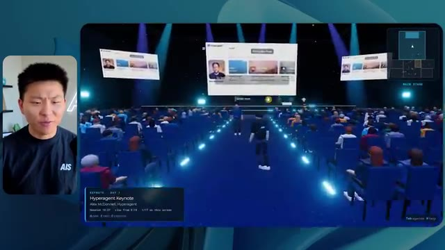
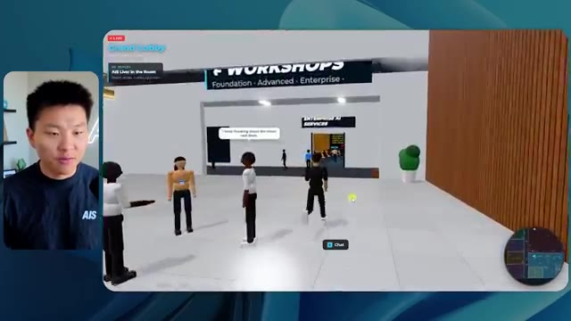
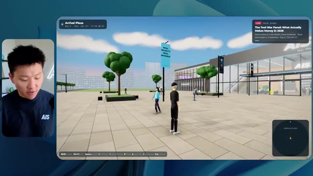

# 🎬 From Zero to Head of AI in 1 Year (as a regular person)

> **Chaîne** : [Nate Herk | AI Automation](https://www.youtube.com/@nateherk/featured)  
> **Lien YouTube** : [https://www.youtube.com/watch?v=diY71x7GUjI](https://www.youtube.com/watch?v=diY71x7GUjI)  
> **Date de publication** : 20260612  
> **Durée** : 00:41:50  
> **Identifiant vidéo** : `diY71x7GUjI`  
> **Transcription & Analyse** : `whisper-v3-large-turbo+gemini-3.5-flash-lite`  

---

## 📌 Synthèse Exécutive & Outils

### 💡 Résumé
Dans cette vidéo de la chaîne *Nate Herk | AI Automation*, l'analyste explore en profondeur l'impact du paramètre de réglage de l'effort (effort level) sur le modèle **Opus 5.5** d'Anthropic. Pour tester les limites de ces différents niveaux, Nate a soumis un prompt unique, extrêmement exigeant, à l'agent IA : concevoir un monde virtuel 3D explorable en vue à la troisième personne, simulant une conférence tech réaliste (AIS Live). L'agent devait exploiter un dossier Frame.io de 105 Go contenant les enregistrements vidéo de l'événement, intégrer l'écosystème du projet Herc 2, et faire preuve de créativité, de rigueur en design, ainsi que de maîtrise physique.

Les résultats obtenus à travers les différents niveaux (du niveau bas au niveau moyen, sachant que la vidéo s'interrompt avant l'analyse des niveaux élevés) révèlent des dynamiques surprenantes. Le niveau bas a produit un monde 3D fonctionnel mais esthétiquement pauvre, truffé de bugs graphiques et dénué de l'identité de marque, en 16 minutes et pour 3,91 $ (en équivalent API). À l'inverse, le niveau moyen a spectaculairement amélioré la qualité visuelle, la fidélité à la charte graphique, l'intégration des vidéos en direct et le comportement des avatars, au prix d'un temps d'exécution de 1 heure et 13 minutes et d'un coût estimé à 12,44 $. Fait remarquable : dans les deux cas, l'agent n'a posé aucune question de clarification à l'utilisateur, démontrant une autonomie totale mais soulignant le besoin d'un cadrage initial irréprochable.

### 🛠️ Outils, Modèles & Logiciels Présentés
* **Opus 5.5** : Modèle d'IA de pointe d'Anthropic, réputé pour son intelligence, son coût abordable et sa polyvalence, au cœur de toutes les expérimentations de la vidéo.
* **Claude Code** : Outil de programmation et d'assistance au développement utilisé pour exécuter les agents et manipuler l'environnement de code.
* **Agents IA** : Systèmes autonomes capables d'orchestrer la création d'applications complexes, de naviguer dans des dossiers massifs et d'effectuer des tests itératifs.
* **Frame.io** : Plateforme de collaboration vidéo hébergeant ici les 105 gigaoctets d'enregistrements bruts de l'événement AIS Live.
* **Herc 2** : Système d'exploitation IA personnel de Nate Herk servant de base de ressources et d'environnement d'intégration pour les projets.
* **Hostinger (et son connecteur)** : Sponsor de la vidéo, proposant une extension gratuite pour éditeur de code permettant de déployer et mettre en ligne instantanément des projets finis.

### 🔑 Points Clés & Enseignements Stratégiques
1. **L'impact direct du niveau d'effort sur la qualité :** Le choix du niveau d'effort (*Effort Level*) modifie radicalement la profondeur du travail fourni par Opus 5.5, passant d'un rendu grossier et bogué (niveau bas) à une application web 3D riche, fluide et visuellement soignée (niveau moyen).
2. **Évolution des coûts et du temps de calcul :** Augmenter l'effort se traduit inévitablement par une consommation accrue de ressources : le niveau bas a nécessité 16 minutes et 191 000 tokens (3,91 $), tandis que le niveau moyen a requis 1 heure 13 minutes et 490 000 tokens (12,44 $).
3. **Le piège de l'autonomie aveugle :** À la fois au niveau bas et au niveau moyen, l'agent a exécuté l'intégralité du prompt sans poser *aucune* question à l'utilisateur, ce qui démontre une grande autonomie mais exige des prompts initiaux d'une précision chirurgicale pour éviter les contresens de design.
4. **Capacité d'ingestion et d'analyse multimédia :** Les agents récents démontrent une aptitude impressionnante à explorer de grands volumes de données (105 Go sur Frame.io) pour en extraire des agendas, identifier des intervenants et structurer l'information de manière cohérente dans un environnement virtuel.
5. **Respect de l'identité de marque :** Si le niveau bas a échoué à reproduire les codes visuels d'AIS Live, le niveau moyen a su intégrer les palettes de couleurs, les logos et les directives de marque, prouvant qu'un effort accru permet une meilleure contextualisation esthétique.
6. **Immersion et interactivité dynamique :** Le niveau moyen ne s'est pas contenté de projeter des images fixes ; il a intégré des flux vidéo dynamiques, des zones VIP fonctionnelles, une mini-carte synchronisée en direct et des PNJ (personnages non-joueurs) dotés d'animations de salutation.
7. **La recommandation officielle d'Anthropic :** Comme le soulignent les guides d'Anthropic, la bonne pratique consiste à démarrer les expérimentations complexes au niveau moyen, puis à ajuster l'effort à la hausse ou à la baisse en fonction du compromis recherché entre complexité, coût et temps d'exécution.
8. **Le goulet d'étranglement du déploiement :** L'automatisation par l'IA permet de générer des prototypes fonctionnels complets en un temps record, créant un nouveau défi logistique : le passage direct du code local à la mise en ligne en production (problématique résolue par des outils de type connecteur d'hébergement).

---

## ⏱️ Chronologie & Transcription Complète Audio & Visuelle (Mot pour Mot)

### ⏱️ `[00:00:00 - 00:00:20]` | Segment #01

**🔊 Audio (Transcription Intégrale Mot pour Mot en Français) :**
> Opus 5.5, Opus 5.5, Opus 5.5, Opus 5.5, Opus 5.5. Ce modèle est littéralement partout et pour de très bonnes raisons. Il est intelligent, il est bon marché, il a un goût incroyable, c'est un modèle d'IA incroyable. Mais avec chaque modèle d'IA, vous avez le choix de l'effort, que ce soit faible, moyen, élevé, extra, max ou code ultra.

**👁️ Analyse Visuelle d'Écran (gemini-3.5-flash-lite) :**
**Interface & Outils** : Twitter / X (réseau social)

**Contenu textuel & Code** : Un post Twitter incluant une image de paysage tropical et du texte en anglais sur l'impact des IA sur les créatifs.

**Action / Démonstration** : Présentation d'un exemple concret de contenu généré par IA dans un post de réseau social.

*⏱️ 00:00:05 — Une capture d'écran d'un tweet montrant une vidéo ou une image interactive représentant un paysage tropical généré par IA, illustrant la discussion sur les capacités du modèle Opus 5.5.*

---

### ⏱️ `[00:00:20 - 00:00:38]` | Segment #02

**🔊 Audio (Transcription Intégrale Mot pour Mot en Français) :**
> Donc, dans cette vidéo, j'ai donné exactement le même prompt à Opus 5.5 et je l'ai exécuté à chaque niveau d'effort, et nous allons comparer les résultats. Nous examinerons la qualité de toutes les différentes productions réelles, mais nous allons aussi examiner combien de temps chacun d'eux a fonctionné, combien cela nous a coûté si c'était une facturation par API, le nombre total de tokens, combien de vérifications ils ont exécutées, et combien de questions ils m'ont réellement posées tout au long du processus.

**👁️ Analyse Visuelle d'Écran (gemini-3.5-flash-lite) :**
**Interface & Outils** : Application de tableau ou canevas interactif (type Miro ou tableau de bord d'analyse).

**Contenu textuel & Code** : Tableau comparatif avec les lignes : Run time, API cost, Total tokens, Checks, Questions asked, et les colonnes de niveaux d'effort.

**Action / Démonstration** : Présentation du tableau comparatif des performances de l'IA selon les niveaux d'effort.

*⏱️ 00:00:29 — Tableau de comparaison montrant différents niveaux d'effort (Low, Medium, High, Extra, Max, Ultracode) et métriques (Run time, API cost, Total tokens, etc.).*

---

### ⏱️ `[00:00:39 - 00:00:58]` | Segment #03

**🔊 Audio (Transcription Intégrale Mot pour Mot en Français) :**
> Et les résultats que nous avons obtenus ne sont pas du tout ce à quoi je m'attendais, donc j'ai hâte de partager cela avec vous les gars. Ne perdons pas de temps et allons directement à celui-ci. D'accord, alors plongeons-nous directement dans celui-ci. Je veux commencer juste en vous montrant le prompt réel que nous avons utilisé que nous avons donné à chacun de ces différents agents. Je vais aller dans les fichiers ici, et nous allons ouvrir ce fichier markdown de prompt, et je vais vous montrer ce que nous avons obtenu. Voici donc le slash objectif que j'ai fourni.

**👁️ Analyse Visuelle d'Écran (gemini-3.5-flash-lite) :**
**Interface & Outils** : Interface de l'outil de développement / assistant IA (style éditeur de code avec panneau de chat).

**Contenu textuel & Code** : Texte du prompt demandant de construire un monde 3D en vue à la troisième personne de la conférence AIS Live à partir d'enregistrements.

**Action / Démonstration** : Présentation de l'interface de l'outil de développement et du message initial de l'assistant IA.

*⏱️ 00:00:48 — L'interface d'un assistant de code affichant une session de travail avec un prompt et une petite fenêtre vidéo du présentateur sur le côté.*

---

### ⏱️ `[00:00:58 - 00:01:34]` | Segment #04

**🔊 Audio (Transcription Intégrale Mot pour Mot en Français) :**
> J'ai dit, tu dois me créer un monde en 3D qui est une conférence tech réaliste dans laquelle je peux me promener en vue à la troisième personne. Tu vas regarder ce dossier, qui contient mes ressources d'enregistrement d'événements d'AIS Live. Et ce dossier est un dossier Frame.io de 105 gigaoctets d'enregistrements vidéo. C'était un événement complètement virtuel. Tout a été enregistré et tous les enregistrements sont ici. J'ai dit, ton objectif est de prendre cet événement et de le transformer en un monde explorable en 3D qui me donne l'impression d'être réellement allé à une vraie conférence en personne avec différentes salles, différentes pistes, différentes scènes, bla, bla, bla. N'hésite pas à utiliser key.ai si tu as besoin de générer des images ou des vidéos. Et tu peux aussi utiliser tout le reste à l'intérieur de mon projet Herc 2, qui est comme mon système d'exploitation IA. J'ai dit,

**👁️ Analyse Visuelle d'Écran (gemini-3.5-flash-lite) :**
**Interface & Outils** : VS Code (ou éditeur similaire) et interface web Frame.io

**Contenu textuel & Code** : Fichier PROMPT.md contenant les instructions détaillées pour transformer les enregistrements d'événements virtuels en un monde 3D explorable.

**Action / Démonstration** : Présentation du prompt de configuration et des fichiers de ressources Frame.io pour le projet 3D.

*⏱️ 00:01:07 — Éditeur de texte affichant le fichier PROMPT.md avec les instructions pour créer un monde 3D interactif et le lien Frame.io.*

*⏱️ 00:01:16 — Interface Frame.io montrant un dossier de 105,69 Go contenant les enregistrements des événements AIS Live ("GA Access" et "VIP Access").*

*⏱️ 00:01:25 — Même vue que l'image 1 sur l'éditeur de code affichant le prompt complet pour la génération du monde 3D.*

---

### ⏱️ `[00:01:34 - 00:02:08]` | Segment #05

**🔊 Audio (Transcription Intégrale Mot pour Mot en Français) :**
> vous serez jugé sur la créativité, le design, la physique et la sensation générale lorsque j'explorerai le monde 3D que vous avez construit. Et c'était fondamentalement la fin des instructions. Donc, comme vous pouvez le voir sur ce côté gauche, j'ai exécuté ceci à travers tous les différents niveaux d'effort. Commençons par le niveau bas et progressons jusqu'à l'ultra code. Très bien. Donc ici, nous avons le résultat du niveau bas. Ouvrons ceci et jetons un coup d'œil. Nous avons donc AIS Live, le sommet des services d'IA en personne enfin, et nous avons pu cliquer partout. Tout d'abord, on ne sent pas vraiment l'identité de la marque. Genre, ce n'ha pas le logo d'IS Live. Ce n'est même pas nos couleurs. Donc je n'aime pas trop ça, mais entrons ici. D'accord. C'est bien trop lumineux. Hum, nous avons une carte en haut à droite. Nous avons une ville par ici. Je ne peux pas dire quelle ville c'est

**👁️ Analyse Visuelle d'Écran (gemini-3.5-flash-lite) :**
**Interface & Outils** : Application de type interface web d'assistant IA / agent de développement

**Contenu textuel & Code** : Texte de prompt de l'assistant : "Hi Nate. This worktree has the effort-test task queued in PROMPT.md : build a walkable third-person 3D world..." et réponse de l'utilisateur : "yes, start the task in PROMPT.md"

**Action / Démonstration** : Navigation et sélection des différents niveaux de test d'effort dans l'interface de l'agent IA.

*⏱️ 00:01:42 — Interface d'une application d'assistant IA montrant une liste de sessions de tests sur le panneau latéral gauche ("effort-test", avec des niveaux comme Hello, Extra, High, Max, Low) et un panneau de discussion à droite. Le présentateur est visible en incrustation à gauche.*

---

### ⏱️ `[00:02:08 - 00:02:40]` | Segment #06

**🔊 Audio (Transcription Intégrale Mot pour Mot en Français) :**
> c'est. D'accord. C'est Chicago, ce qui est plutôt cool parce que tu sais, j'habite à Chicago, mais bref, en haut à droite, on peut voir une carte. Nous avons un hall d'accueil. Nous avons une salle d'exposition. Nous avons un salon VIP sur la scène principale. La carte montre également où se trouve chaque autre personne et cela se synchronise en direct. Donc nous pouvons voir l'enregistrement. Nous pouvons voir le premier jour, la keynote de l'agent Hyper, le débriefing en direct. Cool. Donc il connaît réellement l'agenda et ensuite il y a le deuxième jour. Donc il a trouvé ça, c'est bien. Nous avons ces petites boules ici que je peux espérer botter. D'accord. Le visage, oh, regarde ça. Si je vais par ici, toutes les personnes disparaissent tout simplement. Très mauvais. Très mauvais. D'accord. Alors voyons voir. Est-ce que je peux sprinter ? D'accord.

**👁️ Analyse Visuelle d'Écran (gemini-3.5-flash-lite) :**
**Interface & Outils** : Application web 3D immersive avec mini-carte de navigation et affichage du présentateur en incrustation vidéo.

**Contenu textuel & Code** : Programme de conférence (Day 1), panneaux informatifs, bannières et plan interactif du lieu virtuel (Lobby, Expo Hall, Main Stage).

**Action / Démonstration** : Navigation et exploration d'un environnement virtuel interactif représentant un lieu de conférence en ligne.

*⏱️ 00:02:16 — Vue d'un espace virtuel interactif 3D montrant une zone de retrait de badges et une carte de navigation en haut à droite.*

*⏱️ 00:02:24 — Vue du hall d'accueil virtuel avec un panneau affichant le programme de la première journée de la conférence.*

*⏱️ 00:02:32 — Vue de l'Expo Hall virtuel avec des avatars d'utilisateurs et une structure lumineuse centrale animée.*

---

### ⏱️ `[00:02:40 - 00:03:04]` | Segment #07

**🔊 Audio (Transcription Intégrale Mot pour Mot en Français) :**
> Je peux aller un peu plus vite. Je vais d'abord aller par ici. Il y a des produits promotionnels, euh, certifié AIS plus glido. D'accord. Donc il y a les vrais stands que nous avions dans l'événement virtuel. Nous avions des stands. Donc c'est plutôt cool. Un petit endroit pour prendre des photos. Salle C. En ce moment, nous avons Tangy Frederick qui anime un atelier. D'accord. Mais ce n'est pas une vidéo. Comme vous pouvez le voir, c'est juste une image. Elle ne bouge pas. C'est donc juste une image. Ces gens sont en train de disparaître. Ce doivent être des fantômes. Allons par ici dans la salle A.

**👁️ Analyse Visuelle d'Écran (gemini-3.5-flash-lite) :**
**Interface & Outils** : Application ou plateforme virtuelle 3D d'événement en ligne.

**Contenu textuel & Code** : Environnement virtuel 3D interactif avec des bannières informatives et des guides textuels.

**Action / Démonstration** : Exploration d'un salon virtuel interactif par un avatar.

*⏱️ 00:02:46 — Vue d'un espace d'exposition virtuel 3D avec un avatar et des stands sponsorisés (Glaido).*

*⏱️ 00:02:52 — Navigation dans une salle d'atelier virtuelle ("Workshop Room C - Enterprise track") avec des tables lumineuses.*

*⏱️ 00:02:58 — Gros plan sur un écran virtuel affichant des instructions avec des étapes pour configurer une clé API.*

---

### ⏱️ `[00:03:04 - 00:03:30]` | Segment #08

**🔊 Audio (Transcription Intégrale Mot pour Mot en Français) :**
> Nous avons Liberty White. D'accord. Très cool. Vos 30 premiers jours dans l'automatisation. Encore une fois, c'est juste une image fixe et les gens ont des bugs d'affichage. Donc ce n'est pas très bon ici. Je vais aller sur la scène principale et voir ce que nous avons. D'accord, cool. Donc nous avons une scène principale. Les gens ont de gros bugs d'affichage. Vraiment mauvais. Ce n'est vraiment pas bon du tout. Notre vidéo est en train de bouger. Genre, j'ai vu mon visage ici et j'ai vu celui de Devin, mais maintenant ils ont disparu. Donc je ne sais pas ce qui s'est passé. D'accord. Ça ressemble plutôt à un diaporama. Rien n'est réellement diffusé pour l'instant. Bref, entrons ici.

**👁️ Analyse Visuelle d'Écran (gemini-3.5-flash-lite) :**
**Interface & Outils** : Environnement virtuel 3D interactif (type metaverse/plateforme de conférence virtuelle).

**Contenu textuel & Code** : Aucun code source, terminal ou prompt visible ; interface graphique d'un événement virtuel 3D.

**Action / Démonstration** : Navigation et déplacement d'un avatar dans l'espace virtuel de la conférence.

---

### ⏱️ `[00:03:30 - 00:03:58]` | Segment #09

**🔊 Audio (Transcription Intégrale Mot pour Mot en Français) :**
> Nous avons d'autres stands. Nous avons hyper agent. Nous avons Claude Code. Nous avons plus de cadeaux publicitaires. La salle B, c'est Dave Ebelor. Je suppose que c'est exactement la même chose. Nous avons du café. Et puis, je suppose que le salon VIP, c'est accès VIP uniquement. C'est plutôt cool, mais il n'y a vraiment rien qui se passe ici. Cet écran est bien trop lumineux. Bon. Donc je pense que vous comprenez l'ambiance qu'on obtient ici d'Opus 5.5 à faible effort. Et c'est là que les choses deviennent intéressantes. Combien de temps pensez-vous que cela a pris ? Combien de temps ? Celui-ci a duré 16 minutes et 43 secondes. Combien pensez-vous que cela a coûté ?

**👁️ Analyse Visuelle d'Écran (gemini-3.5-flash-lite) :**
**Interface & Outils** : Interface web / Tableau de bord d'analyse de modèle d'IA (Opus 5.5 Efforts).

**Contenu textuel & Code** : Tableau comparatif avec les colonnes Low, Medium, High, Extra, Max, Ultracode et les lignes Run time, API cost, Total tokens, Checks, Questions asked.

**Action / Démonstration** : Affichage d'un tableau comparatif des performances et des coûts selon différents niveaux d'effort d'un modèle d'IA.

*⏱️ 00:03:51 — Interface de tableau de bord 'Opus 5.5 Efforts' montrant des métriques comparatives (Low, Medium, High, Extra, Max, Ultracode) avec des critères comme Run time, API cost, Total tokens.*

---

### ⏱️ `[00:03:58 - 00:04:26]` | Segment #10

**🔊 Audio (Transcription Intégrale Mot pour Mot en Français) :**
> 3,91 dollars si c'était une facturation par API. J'utilise évidemment mon abonnement ici, mais nous allons simplement calculer cela en facturation par API. Le nombre total de jetons était de 191 000. Il a effectué 22 vérifications. Donc, la vérification, 22 fois, il a ouvert le navigateur et a exécuté différents types de vérifications. Donc 22 catégories de vérifications. Et combien de questions m'a-t-il posées ? Il m'a posé un total de zéro question tout au long de cette invite de commande d'objectif. D'accord. Alors, ouvrons l'effort moyen et voyons ce que nous avons obtenu. D'accord, c'est parti. Effort moyen. Nous avons Nate Herc. Nous avons mon badge. C'est marqué AI's life.

**👁️ Analyse Visuelle d'Écran (gemini-3.5-flash-lite) :**
**Interface & Outils** : Application de tableau blanc numérique / Outil de présentation (type Excalidraw ou similaire).

**Contenu textuel & Code** : Tableau avec les lignes 'Run time' (16m 43s), 'API cost' ($3.91), 'Total tokens' (191.3K), 'Checks', et 'Questions asked' sous les colonnes 'Low', 'Medium', 'High', etc.

**Action / Démonstration** : Le présentateur commente les métriques affichées dans le tableau comparatif, illustrant le temps d'exécution, le coût de l'API et le nombre de jetons.

*⏱️ 00:04:05 — Capture d'écran montrant un tableau comparatif de performance et de coût sur une interface de tableau blanc ou de prise de notes, avec le présentateur en incrustation vidéo à gauche.*

---

### ⏱️ `[00:04:26 - 00:04:46]` | Segment #11

**🔊 Audio (Transcription Intégrale Mot pour Mot en Français) :**
> Donc ça a déjà l'air un petit peu mieux. Ça ressemble à nos palettes de couleurs qui ont utilisé nos directives de marque. Premier jour de construction, deuxième jour de gain, VIP. Cool. D'accord. Je vais entrer dans le lieu. D'accord. Waouh. Une ambiance un peu similaire. C'est en arrière-plan. Ça ne ressemble pas à Chicago, hein ? Non, ça ressemble à, honnêtement, ça ressemble à une ville inventée. Quoi qu'il en soit, c'est drôle qu'ils aient décidé de faire ça. Voyons si je peux me déplacer un peu plus vite. Oh, waouh.

**👁️ Analyse Visuelle d'Écran (gemini-3.5-flash-lite) :**
**Interface & Outils** : Application web interactive / Plateforme virtuelle 3D (AIS Live)

**Contenu textuel & Code** : Interface utilisateur avec badge virtuel, titre 'Welcome to AIS Live', boutons de navigation et contrôles clavier affichés.

**Action / Démonstration** : Navigation et entrée dans l'espace virtuel 3D depuis l'écran d'accueil.

*⏱️ 00:04:31 — Écran d'accueil de l'application web 'AIS Live' avec un badge nominatif virtuel au nom de Nate Herk et un bouton pour entrer dans le lieu virtuel.*

*⏱️ 00:04:41 — Vue à la première ou troisième personne dans l'univers virtuel 3D représentant un espace de type lounge ou bureau avec vue sur une ville de nuit.*

---

### ⏱️ `[00:04:46 - 00:05:21]` | Segment #12

**🔊 Audio (Transcription Intégrale Mot pour Mot en Français) :**
> Les gens interagissent avec moi. Regardez. Si je m'approche de ce type, il vient de lever le bras. Bon, maintenant il ne veut plus du tout avoir affaire à moi. Mais tous ces petits robots ici doivent prendre des décisions. Je ne sais pas s'ils utilisent Jev. C'est sûr que non. Je ne le lui ai pas dit. En fait, ma clé Jev est à l'arrière. Je ne sais pas. Peut-être qu'il l'a utilisée. Quoi qu'il en soit, nous pouvons voir ici que nous avons la salle d'atelier C, le laboratoire des agents. Sympa. Donc celui-ci est réellement en train de tourner. Vous pouvez voir qu'il s'agit d'une vraie vidéo lue par Tangy. Tout le monde ici est en train de travailler sur un ordinateur portable. Ils ne buguent pas. C'est plutôt cool. De plus, mon badge est sur ma poitrine, ce qui est plutôt cool. Je peux venir par ici. Nous avons une carte en haut à droite, comme vous pouvez le voir, mais je peux venir par ici. Nous avons un

**👁️ Analyse Visuelle d'Écran (gemini-3.5-flash-lite) :**
**Interface & Outils** : Application de métavers ou monde virtuel 3D (type Gather.town ou environnement similaire).

**Contenu textuel & Code** : Aucun code ni texte technique affiché, uniquement l'environnement 3D virtuel avec des personnages.

**Action / Démonstration** : Navigation et déplacement d'un avatar à travers un monde virtuel interactif peuplé d'agents ou de PNJ.

---

### ⏱️ `[00:05:21 - 00:05:47]` | Segment #13

**🔊 Audio (Transcription Intégrale Mot pour Mot en Français) :**
> hall d'exposition. C'est là que nous avons le stand Glido. Et ça diffuse actuellement. Oui, ça passe la vidéo de nous en train de parler de Glido. Ça passe la vidéo d'Ed et moi parlant de notre programme de certification. Nous avons le logo AIS Plus juste ici, qui est placé dans un endroit un peu bizarre. Ce sont les diapositives et les points clés des conférenciers. Donc wow, ce sont toutes les ressources que nous avons distribuées après l'événement. Elles sont toutes affichées juste là également. Nous pouvons voir que nous avons un projecteur de communauté. C'est donc Aiden qui parle de son contrat qu'il a décroché et c'est diffusé en direct. Ces gens regardent.

**👁️ Analyse Visuelle d'Écran (gemini-3.5-flash-lite) :**
**Interface & Outils** : Environnement virtuel 3D / Metavers d'exposition

**Contenu textuel & Code** : Textes de présentation, diapositives de conférence et signalétique virtuelle

**Action / Démonstration** : Navigation et exploration de l'espace virtuel par l'avatar du présentateur

---

### ⏱️ `[00:05:47 - 00:06:21]` | Segment #14

**🔊 Audio (Transcription Intégrale Mot pour Mot en Français) :**
> Ils sont plutôt engagés. On a l'hyper agent. C'était, c'est ce que je voulais dire. Si vous avez vu ces gens lever les bras pour dire bonjour, c'était plutôt drôle. Regardez, regardez, le voilà qui recommence. Bref. Bon. Où est-ce que je suis maintenant ? Maintenant, je suis dans le hall principal. On a un bar à café. On a un grand logo, qui est le vrai logo. C'est trop lumineux, mais on a le logo. On peut voir si on peut entrer ici dans le parcours des fondations. On a Sabrina Romanov et Liberty White. Donc différentes formations juste là. On peut entrer dans cette salle. C'est le parcours avancé. Alors qu'est-ce qui se passe ici. On a Dave Ebelar et Saman qui parlent de différentes choses là-dedans. Et maintenant, allons jeter un œil à la scène principale. Oh, attendez, il y a une vidéo de moi là-haut. Est-ce que c'est comme un VIP

**👁️ Analyse Visuelle d'Écran (gemini-3.5-flash-lite) :**
**Interface & Outils** : Application de métavers ou plateforme virtuelle 3D (ex: Gather.town ou similaire)

**Contenu textuel & Code** : Environnement virtuel 3D de type salon ou conférence en ligne avec mini-carte et avatars personnalisés

**Action / Démonstration** : Navigation et exploration d'un hall principal virtuel avec des avatars d'utilisateurs

---

### ⏱️ `[00:06:21 - 00:06:50]` | Segment #15

**🔊 Audio (Transcription Intégrale Mot pour Mot en Français) :**
> section ? Ouais, on va aller voir ça dans une minute. Mais bref, voici la scène principale. Ça a l'air vraiment, vraiment bien. On a une grande scène. On a genre quatre personnes assises ici. On a les trois écrans d'Alex là-haut avec "hyper agent". Est-ce que j'ai le droit de monter sur scène ? Oh, et il me laisse monter sur scène. D'accord. C'est plutôt sympa. Bon les gars, faisons un selfie. Laissez-moi prendre tout le monde en arrière-plan. Venez par ici. Bref, c'est plutôt, plutôt cool. Par contre, toutes les places ne sont pas occupées. Donc il va falloir qu'on travaille là-dessus. Mais bref, je vais y retourner en courant pour voir ce qu'était cette section VIP. D'accord. Le salon VIP. J'ai l'impression que c'est comme un aéroport ou un truc comme ça.

**👁️ Analyse Visuelle d'Écran (gemini-3.5-flash-lite) :**
**Interface & Outils** : Application web / Monde virtuel 3D de conférence (Hyperagent Keynote)

**Contenu textuel & Code** : Interface utilisateur de l'événement virtuel avec affichage des sessions, mini-carte et sous-titres contextuels

**Action / Démonstration** : Navigation et exploration de l'espace virtuel de la keynote par le présentateur

*⏱️ 00:06:28 — Vue générale de la salle de conférence virtuelle (Keynote) avec les écrans d'Alex et le public.*

*⏱️ 00:06:36 — Vue de l'avatar naviguant près de la scène principale avec des sièges pour les intervenants.*

*⏱️ 00:06:43 — Vue en plongée montrant l'avatar marchant dans l'allée centrale de la salle virtuelle bondée.*

---

### ⏱️ `[00:06:51 - 00:07:14]` | Segment #16

**🔊 Audio (Transcription Intégrale Mot pour Mot en Français) :**
> Ok, super. Donc maintenant nous avons les sessions VIP ici. Une FAQ VIP avec la lecture vidéo en direct de Nate juste ici. Très, très cool. Et nous avons comme un bar ou quelque chose comme ça. Génial. Je dirais que c'est un assez bon résultat. Maintenant, en ce qui concerne les statistiques ici, celle-ci a pris une heure et 13 minutes à s'exécuter. Cela nous aurait coûté 12 dollars et 44 cents. Elle a utilisé 490 000 jetons et elle a effectué 23 vérifications.

**👁️ Analyse Visuelle d'Écran (gemini-3.5-flash-lite) :**
**Interface & Outils** : Application virtuelle 3D (espace VIP) et tableau de bord de statistiques Opus 5.5.

**Contenu textuel & Code** : Statistiques de performance : Run time (16m 43s), API cost ($3.91), Total tokens (191.3K), Checks (22), Questions asked (0).

**Action / Démonstration** : Navigation dans l'espace virtuel VIP puis passage à l'analyse des statistiques d'exécution du projet.

*⏱️ 00:06:56 — Vue d'un espace virtuel VIP avec un écran géant affichant une session vidéo en direct (Q&A with Nate) et des avatars de participants.*

*⏱️ 00:07:02 — Tableau de statistiques sur l'interface "Opus 5.5 Efforts" affichant le temps d'exécution (16m 43s), le coût API ($3.91) et les tokens (191.3K).*

---

### ⏱️ `[00:07:14 - 00:07:48]` | Segment #17

**🔊 Audio (Transcription Intégrale Mot pour Mot en Français) :**
> Et il nous a posé un total de zéro question une fois de plus. Très bien, passons au niveau élevé. C'était déjà un résultat plutôt correct, et Anthropic eux-mêmes dans leur vidéo de conseils sur le prompt d'Opus 5.5, ou désolé, pas une vidéo, un article. Ils ont dit de commencer simplement par le niveau moyen et d'ajuster à la hausse ou à la baisse si nécessaire. C'était donc un résultat moyen. Passons au niveau élevé et voyons ce qu'on a obtenu. Très rapidement, les gars, je dois prendre une seconde pour vous parler du sponsor de la vidéo d'aujourd'hui, Hostinger. Ces deux modèles viennent donc de me construire une version fonctionnelle de la même chose. Et maintenant, je me retrouve exactement là où je finis toujours, avec un projet terminé sur mon ordinateur portable et aucun moyen rapide de le mettre en ligne. Et c'est le fossé que comble le connecteur d'Hostinger. C'est une extension gratuite

**👁️ Analyse Visuelle d'Écran (gemini-3.5-flash-lite) :**
**Interface & Outils** : Tableau de bord analytique et interface d'outil de développement / IDE.

**Contenu textuel & Code** : Tableau comparatif avec métriques (Run time: 16m 43s, 1h 13m; API cost: $3.91, $12.44; Total tokens; Checks; Questions asked: 0) et code/prompt de génération de calculateur ROI.

**Action / Démonstration** : Comparaison des métriques de performance et des coûts d'exécution de l'agent IA selon les différents niveaux d'effort configurés.

*⏱️ 00:07:22 — Un tableau comparatif des performances d'Opus 5.5 selon différents niveaux d'effort (Low, Medium, High, Extra), affichant le temps d'exécution, le coût API, les tokens et le nombre de questions posées.*

*⏱️ 00:07:39 — Une interface de développement avec un éditeur affichant l'exécution d'un prompt pour créer un calculateur de ROI Northwind, avec le présentateur visible en incrustation.*

---

### ⏱️ `[00:07:48 - 00:08:23]` | Segment #18

**🔊 Audio (Transcription Intégrale Mot pour Mot en Français) :**
> pour votre éditeur qui intègre votre compte Hostinger dans l'outil de programmation que vous utilisez déjà, que ce soit VS Code, Cursor, Cloud Code, Codex, et j'en passe. Vous vous connectez une seule fois en un clic, et à partir de là, votre agent peut déployer le site, y associer un domaine, configurer les enregistrements DNS et vérifier votre VPS sans que vous ayez à quitter votre éditeur. Ainsi, quel que soit celui que vous finirez par préférer, ce qu'il a construit se trouve à quelques minutes d'une véritable URL sur un hébergement géré. Connector est gratuit avec chaque formule d'hébergement, donc si vous avez toujours besoin de l'hébergement sous-jacent, profitez de la formule illimitée grâce au lien dans la description et utilisez le code NATEHERK pour obtenir 10 % de réduction. Cela inclut également un nom de domaine gratuit et un e-mail professionnel pour un an. Et c'est toujours le moyen le moins cher que j'aie trouvé pour obtenir quelque chose

**👁️ Analyse Visuelle d'Écran (gemini-3.5-flash-lite) :**
**Interface & Outils** : Interface de gestion Hostinger et interface de terminal Claude Code.

**Contenu textuel & Code** : Statut "Connected" via OAuth avec Node.js 24.13.0, liste des outils disponibles (Websites, Domains, Subscriptions & Payments, Email Marketing).

**Action / Démonstration** : Connexion réussie du compte Hostinger à l'éditeur avec affichage des outils accessibles par l'assistant.

*⏱️ 00:07:57 — Interface montrant la connexion de Hostinger à un IDE avec les outils disponibles (Websites, Domains, Subscriptions, Email Marketing) et Claude Code dans un panneau adjacent.*

---

### ⏱️ `[00:08:23 - 00:08:47]` | Segment #19

**🔊 Audio (Transcription Intégrale Mot pour Mot en Français) :**
> tu as construit cela sur une vraie URL. Alors revenons à la vidéo. D'accord. Encore une fois, très, très thématisé par la marque. C'est un écran de chargement encore mieux que le précédent. Nous avons ce joli petit effet en arrière-plan. Nous avons le logo. Nous allons entrer dans le lieu. D'accord. Nous y voilà. Ça a l'air plutôt bien. Nous commençons à l'extérieur et tu peux voir que nous avons ces drapeaux pour tous les intervenants, Wyatt, Casper, Alex, Ed, Aiden, Sabrina, Liberty. C'est plutôt cool. Nous avons des blocs en direct ici.

**👁️ Analyse Visuelle d'Écran (gemini-3.5-flash-lite) :**
**Interface & Outils** : Interface web d'événement virtuel en 3D

**Contenu textuel & Code** : Écran d'accueil de l'événement 'AIS LIVE' avec contrôles de navigation (WASD, Mouse, etc.) et environnement 3D interactif

**Action / Démonstration** : Entrée dans le lieu virtuel et navigation dans l'espace 3D de la plateforme

*⏱️ 00:08:29 — Écran de chargement et d'accueil de la plateforme virtuelle 'AIS LIVE', affichant le logo, les instructions de contrôle et le bouton 'ENTER THE VENUE'.*

*⏱️ 00:08:35 — Vue de la place virtuelle 'AIS Live Plaza' en 3D isométrique avec des avatars et des bâtiments en arrière-plan.*

*⏱️ 00:08:41 — Exploration de la place virtuelle avec des bannières verticales affichant des noms de conférenciers.*

---

### ⏱️ `[00:08:47 - 00:09:23]` | Segment #20

**🔊 Audio (Transcription Intégrale Mot pour Mot en Français) :**
> Il a pris cette photo de moi, votre hôte, Nate Herc, John, Dave, Nate Herc. Voilà. OK. Les portes. Génial. Ce sont des portes coulissantes automatiques en verre. J'adore ça. Nous pouvons voir l'enregistrement VIP. Nous pouvons voir l'admission générale. Nous pouvons venir par ici et nous pouvons découvrir l'exposition avec différents stands, le projecteur sur la communauté. Vous pouvez également voir qu'en haut à gauche, j'ai un passeport. C'est donc comme si, cela montrera combien d'endroits j'ai visités. Tout cela est une lecture réelle. Nous avons un mur de ressources avec tous les différents intervenants. Ils ont également une session de réseautage par ici. Je vais donc venir très vite voir de quoi il retourne. Nous avons donc le bar à cold brew AIS. Nous avons différents membres de la communauté qui ont été mis en avant ou en valeur.

**👁️ Analyse Visuelle d'Écran (gemini-3.5-flash-lite) :**
**Interface & Outils** : Application de métavers ou de salon virtuel en 3D

**Contenu textuel & Code** : Environnement virtuel 3D avec affichage de bannières d'événements et de comptoirs d'accueil

**Action / Démonstration** : Exploration et navigation en vue à la troisième personne dans un monde virtuel de conférence en ligne

*⏱️ 00:08:56 — Vue d'un espace virtuel 3D de type salon ou conférence, affichant le hall d'enregistrement avec la scène principale.*

*⏱️ 00:09:05 — Navigation dans un hall d'exposition virtuel avec des stands et des avatars interactifs.*

*⏱️ 00:09:14 — Déplacement d'un avatar dans le hall d'enregistrement virtuel entouré d'autres participants virtuels.*

---

### ⏱️ `[00:09:23 - 00:09:56]` | Segment #21

**🔊 Audio (Transcription Intégrale Mot pour Mot en Français) :**
> On a l'aile VIP. Attends, quoi ? Récupère un bracelet. Oh, je dois vraiment aller chercher le bracelet. D'accord. Laisse-moi m'enregistrer rapidement. Le bracelet est déjà mis. Attends, quoi ? D'accord. Oh, d'accord. Maintenant, les portes se sont ouvertes pour moi. Cool. Je peux entrer ici. Oh, ça mène juste à la scène principale. Salon VIP. Il y a une séance de questions-réponses en cours. Ça a l'air très cool. Je veux dire, je suis très impressionné par la façon dont il est capable de faire ça. Waouh. D'accord. Donc c'est vraiment bien. Ce qu'on a fait, c'est qu'on a eu des salles de discussion VIP avec différentes personnes. Tu peux voir qu'il y a différentes salles, différents membres de l'équipe AIS qui participent à des trucs. C'est vraiment cool. C'est très cool. C'est un VIP bien meilleur

**👁️ Analyse Visuelle d'Écran (gemini-3.5-flash-lite) :**
**Interface & Outils** : Application ou plateforme virtuelle 3D interactive (type Gather Town ou métavers événementiel).

**Contenu textuel & Code** : Textes informatifs sur les salles, cartes de navigation, sous-titres et affichages de sessions VIP.

**Action / Démonstration** : Navigation et exploration d'un environnement virtuel 3D par l'avatar de l'utilisateur.

*⏱️ 00:09:32 — Vue d'un espace virtuel 3D représentant la zone d'enregistrement (Registration Concourse) avec des avatars et une interface de jeu.*

*⏱️ 00:09:40 — Vue de la salle VIP Lounge dans l'espace virtuel avec un grand écran montrant une vidéoconférence.*

*⏱️ 00:09:48 — Vue de la salle VIP Working Sessions avec plusieurs tables rondes thématiques et des avatars participant aux ateliers.*

---

### ⏱️ `[00:09:56 - 00:10:30]` | Segment #22

**🔊 Audio (Transcription Intégrale Mot pour Mot en Français) :**
> expérience que celle qui a été montrée dans le premier morceau. D'accord. After party VIP. Regardez ça. On a une piste de danse. On a tous ces éléments ici. On a la lecture de l'after party VIP juste là. Et il y a une estrade de DJ. C'est trop marrant. Il y a un petit bug ici, un petit glitch juste là, mais c'est génial. Oh, cool. Donc quand je suis ici sur la scène principale, on a des sous-titres. Vous pouvez voir juste ici en bas de mon écran, on a ces sous-titres de Wyatt qui est en train de parler là-haut. On a des lumières. On a le panel. Très cool. Belle scène principale. Je vais aller par ici. On peut aller à la fondation,

**👁️ Analyse Visuelle d'Écran (gemini-3.5-flash-lite) :**
**Interface & Outils** : Application ou plateforme virtuelle événementielle 3D (type Metaverse / Gather / plateforme similaire).

**Contenu textuel & Code** : Environnement virtuel 3D interactif avec avatars, écrans de visioconférence et interface utilisateur de navigation.
[DESC_IMAGE_3] Navigation dans l'espace virtuel et présentation des différentes zones (After-party, scène principale).

**Action / Démonstration** : Explications face caméra et démonstration conceptuelle.

*⏱️ 00:10:04 — Capture d'écran montrant l'interface d'un événement virtuel (VIP After-Party) avec des avatars sur une piste de danse et un écran affichant des participants en visio.*

*⏱️ 00:10:13 — Vue de l'after-party VIP dans l'univers virtuel, avec la piste de danse colorée, des ballons et une enseigne lumineuse "VIP AFTER-PARTY".*

*⏱️ 00:10:21 — Vue de la scène principale ("Main Stage") d'un événement virtuel avec un public assis et une retransmission vidéo d'intervenants sur grand écran.*

---

### ⏱️ `[00:10:30 - 00:11:06]` | Segment #23

**🔊 Audio (Transcription Intégrale Mot pour Mot en Français) :**
> avancé, et les parcours d'entreprise par ici. Donc, voyons voir. Nous avons l'anatomie de trois vrais contrats. Nous avons hyper agent. Nous avons les évaluations avec Nate et Ed ici. Nous avons Dave qui s'occupe des trucs avancés. C'est vraiment bien. Je veux dire, évidemment, chacun, chacun de ces résultats jusqu'à présent, faible était correct. Moyen était meilleur. Élevé a été encore meilleur. Voyons si cette tendance se poursuit et voyons combien cela nous a coûté. Donc, le mode élevé a tourné pendant une heure et sept minutes. Donc un peu plus rapide que le mode moyen, cela nous aurait coûté 16 dollars et 31 cents. Il a utilisé un demi-million de tokens, 509 000. Il a fait 22 vérifications. Et il nous a aussi demandé, enfin, en fait, non, je me suis trompé. Ce

**👁️ Analyse Visuelle d'Écran (gemini-3.5-flash-lite) :**
**Interface & Outils** : Outil de tableau blanc / application de présentation (Opus 5.5 Efforts) et interface de monde virtuel 3D.

**Contenu textuel & Code** : Tableau de données comparatives des performances et coûts d'API selon différents niveaux d'effort (Low: 16m43s / $3.91, Medium: 1h13m / $12.44, High: 1h7m / $16.31).

**Action / Démonstration** : Analyse visuelle d'un tableau comparatif de performances d'exécution et de coûts de tokens.

*⏱️ 00:10:57 — Tableau comparatif dans un outil de type tableau blanc affichant les métriques Low, Medium, High et Extra (Run time, API cost, Total tokens, Checks).*

---

### ⏱️ `[00:11:06 - 00:11:25]` | Segment #24

**🔊 Audio (Transcription Intégrale Mot pour Mot en Français) :**
> l'un m'a posé une question et, divulgâcheur, c'était le seul qui nous a posé une question tout au long de tout cela. Voyons voir, il nous en reste trois : Extra, Max et Ultra Code. Laissez-moi ouvrir Extra et nous verrons ce que nous avons. D'accord. Donc celui-ci a l'air plutôt bien. Je dirais honnêtement que jusqu'à présent, l'écran de chargement haut était le meilleur. Celui que nous venons de voir, mais de toute façon, entrons dans AIS Live.

**👁️ Analyse Visuelle d'Écran (gemini-3.5-flash-lite) :**
**Interface & Outils** : Application de tableau blanc ou de prise de notes numérique de type interface canvas (titre "Opus 5.5 Efforts").

**Contenu textuel & Code** : Tableau avec les lignes Run time, API cost, Total tokens, Checks, et Questions asked pour chaque niveau (Low, Medium, High, Extra).

**Action / Démonstration** : Le présentateur commente les résultats et sélectionne ou met en avant la colonne « Extra » du tableau.

*⏱️ 00:11:11 — Tableau comparatif affichant les métriques de différents niveaux (Low, Medium, High, Extra) avec le présentateur en incrustation vidéo à gauche.*

---

### ⏱️ `[00:11:26 - 00:11:51]` | Segment #25

**🔊 Audio (Transcription Intégrale Mot pour Mot en Français) :**
> Wouah. D'accord. Donc nous avons comme de petits extraits sonores. Je peux discuter avec des gens. Le panneau de la guerre des outils a réglé quelques débats pour moi. Sympa. Bonne perspective là-bas. Nous sommes dehors à nouveau. Nous avons ces différentes bannières, bien qu'elles soient toutes les mêmes. Elles n'affichent pas les noms de différentes personnes. Donc grand logo AIS live. L'aile de l'atelier est par ici. Et passons par les portes coulissantes en verre pour voir ce que nous avons. Donc nous avons le café AIS. La carte est en bas à droite, et elle n'est pas très descriptive.

**👁️ Analyse Visuelle d'Écran (gemini-3.5-flash-lite) :**
**Interface & Outils** : Application web 3D / Environnement virtuel interactif type métavers.

**Contenu textuel & Code** : Interface de monde virtuel avec mini-carte en bas à droite et bulles de dialogue.

**Action / Démonstration** : Exploration et navigation dans un espace de convention virtuel en 3D.

*⏱️ 00:11:32 — Vue d'un monde virtuel 3D de type métavers avec un avatar et des personnages non-joueurs (PNJ) discutant.*

*⏱️ 00:11:38 — Navigation dans la place publique virtuelle avec des bannières et des bâtiments affichant 'AIS LIVE'.*

*⏱️ 00:11:45 — L'avatar s'approche de l'entrée principale d'un bâtiment virtuel lumineux.*

---

### ⏱️ `[00:11:51 - 00:12:26]` | Segment #26

**🔊 Audio (Transcription Intégrale Mot pour Mot en Français) :**
> J'aime comment les autres cartes nous ont dit quoi, comme où étaient les choses, mais celle-ci a l'air très professionnelle. On peut voir ici la scène principale. Allons-y rapidement. Ils ont tous ces ballons qui volent, ce que je trouve assez drôle. Les ballons de plage de l'IA. On me voit là-haut parler. Je crois que j'introduisais un des jours. Continuons à avancer ici vers la salle de conférence sur ce côté gauche. D'accord. Donc ici nous avons le Hyper Agent Theater. Nous avons cette session sponsorisée ici par Hyper Agent, mais elle nous montre aussi ce qui se passe ici. C'est vraiment drôle qu'on puisse discuter avec les gens. Salmon a construit un représentant commercial vocal en direct. La salle "Price it right" était bondée. As-tu pris le guide compagnon VIP ? C'est tellement drôle. Nous avons le parcours avancé dans

**👁️ Analyse Visuelle d'Écran (gemini-3.5-flash-lite) :**
**Interface & Outils** : Application web de monde virtuel / métavers de conférence en ligne.

**Contenu textuel & Code** : Environnement virtuel 3D interactif avec avatars, écrans vidéo intégrés, signalétique textuelle ("Main Stage", "Workshops") et mini-carte en bas à droite.

**Action / Démonstration** : Navigation et exploration d'un espace virtuel de conférence en ligne par l'utilisateur.

*⏱️ 00:12:00 — Vue à la première personne d'un événement virtuel en 3D montrant la scène principale avec des avatars et un écran géant de présentation.*

*⏱️ 00:12:09 — Navigation d'un avatar dans le hall d'entrée virtuel ("Grand Lobby") d'une conférence en ligne avec des zones d'ateliers et des participants.*

*⏱️ 00:12:17 — Déplacement d'un avatar dans un couloir virtuel d'un espace de conférence en ligne, avec des bulles de discussion textuelles entre participants.*

---

### ⏱️ `[00:12:26 - 00:12:58]` | Segment #27

**🔊 Audio (Transcription Intégrale Mot pour Mot en Français) :**
> ici. Encore une fois, nous avons la lecture en direct. Est-ce que c'est la lecture en direct ? Oh, d'accord. Ça a commencé une fois que je suis entré, mais je peux prendre place. Oh la la. Je peux regarder ça. Je peux me lever. Je veux m'asseoir au premier rang. C'est plutôt cool. C'est très bien. J'aime ça. Et vous savez ce que j'ai remarqué jusqu'à présent ? Le personnage réel que j'incarne me ressemble un peu. Je pense qu'il s'est inspiré de mes photos de profil ou quelque chose comme ça. Quoi qu'il en soit, nous avons Sabrina ici, l'animatrice de la salle ici, prenez n'importe quelle place libre. D'accord, cool. Et j'ai vraiment aimé la fonctionnalité pour s'asseoir. C'est plutôt marrant. Genre, on pourrait vraiment assister à cet atelier et participer. Bref, ça nous montre les intervenants. Ça nous montre les

**👁️ Analyse Visuelle d'Écran (gemini-3.5-flash-lite) :**
**Interface & Outils** : Application de métaverse ou plateforme de conférence virtuelle en 3D

**Contenu textuel & Code** : Interface utilisateur d'un événement virtuel en ligne avec des avatars, des fenêtres de présentation vidéo et des légendes en direct.

**Action / Démonstration** : Navigation et exploration de l'espace virtuel par l'avatar de l'utilisateur.

---

### ⏱️ `[00:12:58 - 00:13:31]` | Segment #28

**🔊 Audio (Transcription Intégrale Mot pour Mot en Français) :**
> ordre du jour. Il y a un petit tapis rouge ici pour prendre des photos. On peut prendre la pose. Oh, wouah. C'est plutôt cool. Bibliothèque de ressources, obtenez la certification AIS Plus, Glido, Hyper Agent, AIS Plus, trois vraies affaires. Génial. Je veux dire, je dirais vraiment que jusqu'à présent, chacune est meilleure. Et on n'a même pas encore vu la section VIP, le salon VIP. Allons par ici vite fait. J'espère que je pourrai entrer. Sympa. On a une réinitialisation des outils. Ce sont les différentes pièces dans lesquelles on pourrait aller. Donc encore une fois, je pourrais prendre la feuille de calcul et je pourrais essayer de comprendre comment tarifer mes trucs. C'est tellement cool. C'est vraiment mieux que la précédente où l'on faisait juste en quelque sorte

**👁️ Analyse Visuelle d'Écran (gemini-3.5-flash-lite) :**
**Interface & Outils** : Environnement virtuel 3D en ligne (plateforme de conférence virtuelle).

**Contenu textuel & Code** : Avatars numériques, affichage d'une foire d'exposition virtuelle, interface de navigation 3D.
[DESC_IMAGE_3] Navigation et exploration dans l'espace virtuel de la conférence.

**Action / Démonstration** : Explications face caméra et démonstration conceptuelle.

---

### ⏱️ `[00:13:31 - 00:13:59]` | Segment #29

**🔊 Audio (Transcription Intégrale Mot pour Mot en Français) :**
> comme regardé des trucs. Génial. Je peux passer derrière le bar et venir ici. C'est très bien. Bon. Alors, en ce qui concerne les statistiques, celui-ci a duré une heure et demie. Il coûte 25,92 dollars. Je ne sais pas pourquoi je dis point 25, 92 cents. C'était 733 000 jetons et 34 vérifications. Il a donc eu le plus grand nombre de vérifications de loin jusqu'à présent. Et il nous a posé zéro question. J'ai hâte de voir ce qu'on a obtenu ici de max et ultra code. D'accord. Voici les écrans de chargement de max, ennuyeux, mais c'est dans l'esprit de la marque et il y a notre logo.

**👁️ Analyse Visuelle d'Écran (gemini-3.5-flash-lite) :**
**Interface & Outils** : Application de tableau blanc ou de prise de notes avec interface graphique sombre.

**Contenu textuel & Code** : Tableau avec colonnes "Medium", "High", "Extra", "Max", "Ultracode", montrant des durées, des coûts (ex. 1h 31m, $12.44), et des volumes de jetons.

**Action / Démonstration** : Le présentateur commente et analyse les données statistiques affichées dans le tableau comparatif.

*⏱️ 00:13:38 — Un tableau comparatif affichant les statistiques d'utilisation de différents niveaux d'effort, avec le présentateur visible dans un encadré à gauche.*

---

### ⏱️ `[00:14:00 - 00:14:35]` | Segment #30

**🔊 Audio (Transcription Intégrale Mot pour Mot en Français) :**
> Donc c'était bien. J'aime bien. On va continuer et entrer dans AIS live. Ooh, petite animation sympa ici qui nous fait entrer. Encore une fois, le personnage me ressemble. Ils m'ont tous ressemblé. Enfin, en gros, on a [quelqu'un] assis en arrière-plan. Ça ressemble à Chicago. Comme je l'ai mentionné plus tôt, beaucoup de ces [éléments] jouent des sons et je n'inclut pas cela parce que ce serait très perturbant pour vous d'essayer d'écouter ce qui se passe en même temps que moi je parle. Il y a donc comme une légère musique dans tout ça. Je déteste la façon dont il marche. Cette démarche est vraiment, vraiment mauvaise. Je veux dire, la démarche, ouais, je n'aime pas du tout ça. Donc ce n'est pas génial. Mais à part ça, entrons et explorons. Remarquez ces ombres quand je rentre, elles basculent vraiment. Je ne sais pas trop pourquoi,

**👁️ Analyse Visuelle d'Écran (gemini-3.5-flash-lite) :**
**Interface & Outils** : Application web 3D immersive / plateforme virtuelle AIS live.

**Contenu textuel & Code** : Environnement virtuel 3D interactif avec interface de navigation (mini-map, bannières de conférence et contrôles clavier).

**Action / Démonstration** : Exploration d'un espace virtuel 3D en vue à la troisième personne par le présentateur.

*⏱️ 00:14:08 — Vue d'un monde virtuel 3D (AIS live) montrant une place urbaine avec des personnages animés, observée par le présentateur à gauche.*

*⏱️ 00:14:17 — Navigation dans l'espace virtuel 3D vers l'entrée d'un bâtiment principal affichant des bannières informatives.*

*⏱️ 00:14:26 — Avancée du personnage virtuel dans la place publique en direction d'un bâtiment vitré moderne.*

---

### ⏱️ `[00:14:35 - 00:15:11]` | Segment #31

**🔊 Audio (Transcription Intégrale Mot pour Mot en Français) :**
> Mais de toute façon, on peut discuter avec des gens ici aussi. Le stand Hyperagent est juste là où l'on entre dans l'exposition. Tout va bien. OK, super. Je peux continuer à appuyer sur E pour changer ce qu'ils disent. Nous avons les conférenciers juste ici. Ça a l'air plutôt bien. Bien qu'on ait définitivement la photo de profil de tout le monde. Je ne sais donc pas pourquoi ce n'est pas inclus là. On voit des gens prendre des photos juste ici. J'adore ça. Et ça enregistre une petite photo. OK. La carte n'est pas non plus super, genre elle ne donne pas une super explication de ce qui se passe, mais j'aime ces stands. Ils sont cool. Je pense que ces stands sont les meilleurs que j'aie vus jusqu'à présent. Genre, ils ont juste l'air bien. Il y a des représentants. Il y a de superbes diaporamas derrière eux. Ouais. Ces stands sont cool. OK. Nous avons un petit théâtre vedette

**👁️ Analyse Visuelle d'Écran (gemini-3.5-flash-lite) :**
**Interface & Outils** : Application web virtuelle 3D / environnement de conférence en ligne.

**Contenu textuel & Code** : Interface utilisateur virtuelle affichant les listes des conférenciers, la mini-carte et les commandes de navigation.

**Action / Démonstration** : Exploration interactive de la foire virtuelle, discussion avec des avatars et découverte des stands d'exposition.

*⏱️ 00:14:44 — Vue d'un espace virtuel 3D avec des avatars d'utilisateurs et des panneaux d'affichage des conférenciers, tandis que le présentateur apparaît dans un encadré à gauche.*

*⏱️ 00:14:53 — Navigation dans le monde virtuel près de tables de discussion avec des bulles de texte interactives et une mini-carte en bas à droite.*

*⏱️ 00:15:02 — Entrée dans le hall d'exposition virtuel (Expo Hall) avec des stands thématisés 'Evals Lab' et 'Enterprise AI'.*

---

### ⏱️ `[00:15:11 - 00:15:35]` | Segment #32

**🔊 Audio (Transcription Intégrale Mot pour Mot en Français) :**
> qui se passe par ici. C'est Casper. Bien que, pourquoi est-ce que ça ne joue pas ? J'ai l'impression que ça devrait jouer, non ? Comme dans les autres, ils étaient toujours en train de jouer. On peut parler à d'autres personnes par ici. Le café est gratuit, bla, bla, bla. Amy Simpson, Matt Wolf. Sympa. D'accord. C'est juste la zone de réseautage dans laquelle nous sommes en ce moment, mais on peut voir en haut à droite. On peut aussi voir ce qui est en direct sur la scène principale en ce moment. C'est un panel sur la guerre des outils. Allons donc par ici. On a Devin, Cole, Dave et Russ qui discutent ici. On a en quelque sorte de l'audiovisuel, des petits trucs d'éclairage qui se passent ici derrière.

**👁️ Analyse Visuelle d'Écran (gemini-3.5-flash-lite) :**
**Interface & Outils** : Monde virtuel 3D en ligne (type métavers / plateforme événementielle virtuelle).

**Contenu textuel & Code** : Aucun code source, terminal ou prompt n'est affiché ; uniquement des environnements virtuels 3D avec des avatars et des affichages textuels d'événements.

**Action / Démonstration** : Navigation et exploration d'un environnement virtuel 3D par un avatar.

---

### ⏱️ `[00:15:36 - 00:15:55]` | Segment #33

**🔊 Audio (Transcription Intégrale Mot pour Mot en Français) :**
> Basculons la scène principale sur ce qui compte vraiment en ce moment. Je peux donc changer de sujet. Cool. Je viens donc de passer à moi et Matt. Nous pouvons passer à l'anatomie de trois vraies transactions. C'est plutôt cool. La scène a l'air bien. Nous avons un petit panel sympa ici. Est-ce que je peux monter sur scène ? Super. Super. Enfin, je ne peux pas aller trop loin, en fait. Bon, tout le monde, laissez-moi prendre le selfie. Tout le monde vient là-dedans. Je peux aussi m'asseoir dans ce public là-bas et simplement profiter de la session.

**👁️ Analyse Visuelle d'Écran (gemini-3.5-flash-lite) :**
**Interface & Outils** : Application de métavers / plateforme événementielle virtuelle (AIS LIVE)

**Contenu textuel & Code** : Interface utilisateur virtuelle 3D avec des avatars, des écrans de retransmission et des indications textuelles de navigation (WASD move, Space jump, etc.)

**Action / Démonstration** : Navigation et déplacement dans l'environnement virtuel 3D pour changer de scène de présentation

---

### ⏱️ `[00:15:55 - 00:16:14]` | Segment #34

**🔊 Audio (Transcription Intégrale Mot pour Mot en Français) :**
> Très cool, très cool. OK, allons par ici. Je vois une section à l'étage. C'est marrant comme ils choisissent tous de mettre la section VIP à l'étage. Je veux dire, je ne déteste pas ça. Oh la la, ils ont un escalator. Pas possible. Je vais discuter avec ce type sur l'escalator. Glenn a 15 ans d'expérience en agence. Ses trucs de "land and expand" étaient en or. Du beau boulot, Glenn. Cool, donc je vais, je n'arrive même pas à passer devant ce type par contre.

**👁️ Analyse Visuelle d'Écran (gemini-3.5-flash-lite) :**
**Interface & Outils** : Application ou plateforme virtuelle 3D (environnement de type métavers ou événement virtuel).

**Contenu textuel & Code** : Interface utilisateur virtuelle affichant le lieu ('Lobby - Escalator to VIP Level'), la mini-carte et les commandes de navigation.
[DESC_IMAGE_3] Navigation dans l'environnement virtuel 3D et interaction avec un autre avatar (participant).

**Action / Démonstration** : Explications face caméra et démonstration conceptuelle.

*⏱️ 00:16:00 — Vue générale du hall d'accueil virtuel en 3D avec de grandes baies vitrées et des personnages d'avatars.*

*⏱️ 00:16:04 — Gros plan montrant des avatars se dirigeant vers l'escalator menant au niveau VIP.*

*⏱️ 00:16:09 — Capture affichant un avatar sur l'escalator avec une bulle de dialogue indiquant l'expérience de Glenn.*

---

### ⏱️ `[00:16:14 - 00:16:48]` | Segment #35

**🔊 Audio (Transcription Intégrale Mot pour Mot en Français) :**
> Oh, j'ai dû sauter par-dessus lui. D'accord, niveau VIP, badge requis. Oh la la. Tu te moques de moi ? Je dois aller chercher mon badge. D'accord, cool. Maintenant, ça montre que je suis un vrai VIP et je peux aller ici dans la section VIP. On a de petites sessions de travail sympas par ici, qu'on peut rejoindre. Je me demande si ça va me laisser m'asseoir ici. Je peux juste discuter. Est-ce que je peux participer ? Ça ne me laisse pas m'asseoir et participer. C'est pas grave. On a la "war room" des prix. Oh, ça pourrait être l'after-party. Allons voir ce qui se passe par ici. Ou peut-être que je dois juste entrer par ici. D'accord. C'est bizarre. Je devais juste entrer par ici. Cet after-party n'est pas aussi cool que l'autre. Mais bref, allons voir ce qui se passe par ici.

**👁️ Analyse Visuelle d'Écran (gemini-3.5-flash-lite) :**
**Interface & Outils** : Application web de métavers ou monde virtuel 3D interactif.

**Contenu textuel & Code** : Interface utilisateur virtuelle affichant le profil de Nate Herk, des informations sur les sessions et des avatars d'utilisateurs.

**Action / Démonstration** : Navigation et exploration de l'espace virtuel 3D par le présentateur.

*⏱️ 00:16:23 — Vue d'un monde virtuel 3D montrant un avatar dans un hall de réception avec des escaliers.*

*⏱️ 00:16:31 — Vue de l'espace virtuel VIP avec des avatars autour d'une table de travail et des panneaux de présentation.*

*⏱️ 00:16:39 — Vue de l'espace virtuel VIP montrant l'avatar naviguant vers une zone de conférence.*

---

### ⏱️ `[00:16:48 - 00:17:07]` | Segment #36

**🔊 Audio (Transcription Intégrale Mot pour Mot en Français) :**
> dans les ateliers. D'accord. Ce n'était pas bien. Regardez ça. On peut tout voir et je viens de bugger et maintenant boum. Donc ce n'est pas bon. Je dirais qu'globalement, je veux dire, vous avez l'ambiance de la façon dont cela fonctionne, mais je dirais que celui d'avant, qui était, je crois, "high", j'aimais mieux celui-là. Je ne peux pas m'asseoir dans ces chaises non plus. Ouais. Donc je n'aime pas la façon de marcher dans celui-ci.

**👁️ Analyse Visuelle d'Écran (gemini-3.5-flash-lite) :**
**Interface & Outils** : Application web de monde virtuel 3D de conférence en ligne.

**Contenu textuel & Code** : Environnement virtuel 3D interactif avec avatars, mini-carte, affichage d'agenda et interface de chat.

**Action / Démonstration** : Navigation et exploration de l'espace virtuel de l'événement par le présentateur.

*⏱️ 00:16:53 — Vue d'un avatar virtuel naviguant dans un couloir moderne 3D d'une conférence virtuelle, avec interface de contrôle.*

*⏱️ 00:16:57 — L'avatar s'approche de l'entrée d'une salle de classe virtuelle étiquetée 'Room C'.*

*⏱️ 00:17:02 — L'avatar entre dans la salle de conférence virtuelle 'Room C - HyperAgent Lab' où des participants virtuels assistent à une présentation.*

---

### ⏱️ `[00:17:07 - 00:17:43]` | Segment #37

**🔊 Audio (Transcription Intégrale Mot pour Mot en Français) :**
> Je n'aime pas autant l'ambiance et il y a quelques bugs. Donc, jusqu'à présent, si nous voulons regarder notre liste, j'aime bien Extra Extra, c'est celui que j'ai préféré jusqu'à présent. Mais bref, celui-ci était au maximum. Celui-ci était au maximum juste ici. Voyons donc combien de temps cela a duré : deux heures et 28 minutes. Ça a donc duré très longtemps, 50 dollars et 38 cents, 1,18 million de jetons. Donc, ça a en fait atteint une compaction et a dû s'auto-compacter. Et puis ça a fait 51 vérifications. Est-ce que ça l'a vraiment fait, par contre ? Parce qu'il y avait beaucoup de bugs là-dedans. Et de toute façon, celui-ci ne nous a posé zéro question. Donc, jusqu'à présent, à chaque fois, ça a pratiquement été plus cher et ça a pris plus de temps, à part ici. Mais ceux-ci en gros

**👁️ Analyse Visuelle d'Écran (gemini-3.5-flash-lite) :**
**Interface & Outils** : Application web ou tableau de bord interactif avec un tableau de données.

**Contenu textuel & Code** : Tableau avec des colonnes Medium (1h 13m, $12.44, 419.2K, 23, 0), High (1h 7m, $16.31, 509.3K, 22, 1), Extra (1h 31m, $25.92, 733.7K, 34, 0), Max, et Ultracode.

**Action / Démonstration** : Le présentateur commente les résultats et compare les différentes options du tableau.

*⏱️ 00:17:16 — Tableau comparatif affichant les performances selon différents modes (Medium, High, Extra, Max, Ultracode) avec des métriques de temps, coût et jetons.*

---

### ⏱️ `[00:17:43 - 00:18:17]` | Segment #38

**🔊 Audio (Transcription Intégrale Mot pour Mot en Français) :**
> a pris à peu près le même laps de temps, mais à chaque fois, il a utilisé plus de jetons parce qu'il a davantage réfléchi. Et puis, vous savez, ces jetons vont coûter plus cher. Mais bref, passons au dernier, qui est ultra code. Donc, nous espérerions vraiment que celui-ci soit le meilleur. Alors, allons voir sur ce localhost et voyons ce que nous avons. D'accord, super. Regardez ce badge. C'est un joli badge, hôte all access. Nous avons un joli petit visuel juste ici. Nous allons aller de l'avant et entrer dans AIS Live. Super. D'accord. Bienvenue, Nate. J'aime la marche. Ça a l'air réaliste. J'aime le logo, bien qu'il lui manque le petit point rouge qui donne l'impression que c'est en direct. La carte en haut à droite

**👁️ Analyse Visuelle d'Écran (gemini-3.5-flash-lite) :**
**Interface & Outils** : Tableau comparatif de données et interface web d'application 3D (AIS LIVE).

**Contenu textuel & Code** : Métriques comparatives (temps de calcul, coûts en dollars, nombre de jetons) et affichage d'un monde virtuel 3D avec avatars.

**Action / Démonstration** : Présentation comparative des résultats d'exécution selon les niveaux de complexité et démonstration de l'application générée.

*⏱️ 00:17:52 — Tableau de comparaison montrant les performances de différents niveaux d'effort (High, Extra, Max, Ultracode) avec les temps, coûts et métriques associés.*

*⏱️ 00:18:09 — Interface virtuelle 3D d'un événement (« AIS LIVE ») avec des avatars et un grand logo affiché dans un hall d'accueil.*

---

### ⏱️ `[00:18:17 - 00:18:49]` | Segment #39

**🔊 Audio (Transcription Intégrale Mot pour Mot en Français) :**
> est étiqueté un petit peu mieux, donc je peux voir ce qui se passe. Je vais venir ici et récupérer mon bracelet VIP rapidement. Ok, super. Ça me dit aussi quoi faire. Donc en haut à gauche, il est écrit de badger à l'entrée VIP au mur est du hall. Donc je crois que l'est serait par ici, n'est-ce pas ? Ne mange jamais de gaufres molles. Ouais. Ailes VIP, badger le bracelet. Ok, cool. Maintenant je suis dans la section VIP. Je peux voir ces différentes salles. L'outil a été réinitialisé. La vidéo en direct est diffusée. Je peux voir les sous-titres juste là de ce dont on parle. Ça diffuse aussi les sons, mais je ne diffuse tout simplement pas l'audio pour vous les gars parce que je ne veux pas surcharger.

**👁️ Analyse Visuelle d'Écran (gemini-3.5-flash-lite) :**
**Interface & Outils** : Application ou plateforme virtuelle 3D interactive (environnement d'événement en ligne).

**Contenu textuel & Code** : Interface utilisateur virtuelle affichant des instructions textuelles de navigation (« Scan in at the VIP gate ») et le nom des salles (« VIP Wing », « VIP Room 5 »).

**Action / Démonstration** : Navigation et exploration de l'espace virtuel pour accéder à la zone VIP et rejoindre une session de travail.

*⏱️ 00:18:25 — Vue dans le monde virtuel montrant le hall d'enregistrement avec l'avatar du présentateur et des indications textuelles sur l'entrée VIP.*

*⏱️ 00:18:33 — L'avatar franchit les portes de la zone VIP Wing dans l'environnement virtuel.*

*⏱️ 00:18:41 — L'avatar se trouve dans une salle de réunion virtuelle (VIP Room 5) avec plusieurs participants assis autour d'une table.*

---

### ⏱️ `[00:18:50 - 00:19:08]` | Segment #40

**🔊 Audio (Transcription Intégrale Mot pour Mot en Français) :**
> Encore une fois, celui-ci fonctionne avec Cody et Mustafa là-dedans. C'est génial. Vidéo en direct. La vidéo ne se lance pas tant qu'on n'entre pas, par contre. Donc, honnêtement, je pense que c'est un bon choix. Dès que j'entre, par contre, la vidéo démarre. Sympa. Belle attention. Toutes ces pièces. Génial. Ouais. Je veux dire, ça fait très haut de gamme. Voici une salle de guerre des prix. Allons voir ça. Moi et John là-dedans.

**👁️ Analyse Visuelle d'Écran (gemini-3.5-flash-lite) :**
**Interface & Outils** : Application web / environnement virtuel 3D type metaverse

**Contenu textuel & Code** : Environnement virtuel 3D affichant une « VIP Wing » avec des salles de réunion et des écrans vidéo en direct.

**Action / Démonstration** : Navigation d'un avatar dans l'espace virtuel et exploration des différentes salles.

*⏱️ 00:18:54 — Capture d'écran montrant l'interface d'un espace virtuel 3D (metaverse ou plateforme de réunion virtuelle) où un avatar navigue dans une aile VIP.*

---

### ⏱️ `[00:19:08 - 00:19:42]` | Segment #41

**🔊 Audio (Transcription Intégrale Mot pour Mot en Français) :**
> Et ensuite nous avons l'after-party sympa. Cet after-party n'est pas encore aussi animé. Et nous avons plus de ballons de plage pour une raison quelconque, mais cet after-party est cool. Je veux dire, ça nous donne une bonne ambiance et il y a la retransmission juste ici de notre session de questions-réponses de l'after-party, tout cela est en direct aussi. Génial. D'accord. Dirigeons-nous vers la scène principale. Cela m'invite aussi à prendre un siège côté allée à la scène principale, qui est tout droit à travers l'expo. Donc en fait, allons d'abord à travers l'expo. Qu'est-ce que vous construisez ? Il y a beaucoup de gens qui parlent de différentes choses par ici. Waouh. Il y a aussi genre un petit truc de basketball. Est-ce que je peux le lancer ? Je peux. Est-ce que je dois regarder en haut pour le lancer vers le haut ? D'accord.

**👁️ Analyse Visuelle d'Écran (gemini-3.5-flash-lite) :**
**Interface & Outils** : Application de métavers / espace virtuel interactif en 3D dans le navigateur.

**Contenu textuel & Code** : Environnement 3D virtuel avec des avatars, du texte textuel d'interface utilisateur et un mur de notes interactif.

**Action / Démonstration** : Navigation et visite guidée d'un espace virtuel interactif en 3D.

---

### ⏱️ `[00:19:42 - 00:20:08]` | Segment #42

**🔊 Audio (Transcription Intégrale Mot pour Mot en Français) :**
> Eh bien, pas terrible. Mais bref, nous avons un stand AIS plus. Nous avons le stand Glido. Est-ce que ça diffuse en direct ? Ouais, ça diffuse définitivement en direct. Sympa. Nous avons le stand de l'hyper agent. Nous avons d'autres trucs par ici. OK, cool. Je vais aller dans la scène principale et voir si nous pouvons prendre un siège côté allée. Dès qu'on entre, tout commence à diffuser. On a une très belle ambiance de scène. Comment est-ce que je prends un siège côté allée par contre ? Voilà. J'ai dû trouver le bon. Prendre le siège côté allée. Il n'y a personne sur la scène, ce qui est bizarre. J'aimais bien quand il y avait du monde sur la scène dans les versions précédentes.

**👁️ Analyse Visuelle d'Écran (gemini-3.5-flash-lite) :**
**Interface & Outils** : Application web interactive 3D / plateforme virtuelle d'événement (AIS Live).

**Contenu textuel & Code** : Environnement virtuel 3D interactif affichant une salle d'exposition, une estrade, des avatars d'utilisateurs et des interfaces de navigation.

**Action / Démonstration** : Navigation et déplacement de l'avatar utilisateur à travers l'espace virtuel de l'exposition vers la scène principale.

*⏱️ 00:19:48 — Le présentateur navigue dans un espace virtuel d'exposition (Expo Hall) en 3D avec des avatars.*

*⏱️ 00:19:55 — L'avatar du présentateur entre dans la salle de conférence principale (Main Stage) de l'événement virtuel.*

*⏱️ 00:20:01 — L'avatar prend place dans l'auditorium virtuel de la scène principale devant un écran de retransmission.*

---

### ⏱️ `[00:20:08 - 00:20:31]` | Segment #43

**🔊 Audio (Transcription Intégrale Mot pour Mot en Français) :**
> Prenons un petit selfie. Bref, il y a moi et Pat là-haut. Pat est habillé comme un ouvrier du bâtiment. Comme vous pouvez le voir, nous faisions un petit appel de découverte simulé dans cet exemple. Je vais revenir par l'expo et nous allons sortir ici dans l'aile de l'atelier et juste vérifier si ces rooms sont fondamentalement exactement les mêmes qu'elles devraient l'être. Maintenant, je ne peux plus vraiment discuter avec les gens. Je le pouvais avant, dans les versions précédentes, discuter avec les gens, ce que je trouvais être une très jolie touche. Et nous avons l'atelier de la piste de fondation. Est-ce que je peux m'asseoir ?

**👁️ Analyse Visuelle d'Écran (gemini-3.5-flash-lite) :**
**Interface & Outils** : Application virtuelle 3D (environnement virtuel de type événement/conférence)

**Contenu textuel & Code** : Environnement virtuel 3D interactif avec avatars, mini-carte en haut à droite et indications textuelles de navigation.

**Action / Démonstration** : Navigation et déplacement à l'intérieur de l'espace virtuel (hall d'exposition et aile des ateliers).

*⏱️ 00:20:25 — Le présentateur à gauche et une vue d'un couloir dans l'aile de l'atelier virtuel (Workshop Wing) à l'écran.*

---

### ⏱️ `[00:20:32 - 00:21:04]` | Segment #44

**🔊 Audio (Transcription Intégrale Mot pour Mot en Français) :**
> Je ne peux pas m'asseoir. Je ne sais pas. Nous avons Liberty qui est en train de parler en ce moment même et elle parle et nous pouvons l'entendre. C'est donc sympa, mais ça ne me laisse pas m'asseoir. Et regardez ça. Je deviens assez instable ici. Ça buguait de la façon dont je marchais. Ça ne me laissera pour ainsi dire pas marcher. Ce n'est pas bon. Pareil. Nous avons cette piste avancée là-dedans. C'est génial. Donc, dans l'ensemble, ils ont une ambiance très similaire. Je dirai que je suis impressionné par la façon dont ils ont été capables de raconter une histoire à partir de ce que nous faisions. Bibliothèque de points clés des intervenants. D'accord. C'est cool. Je ne pense pas que nous ayons vu cela depuis différents endroits, mais ce sont comme les ressources et qui montrent des choses sympas. Oh, wow. Je

**👁️ Analyse Visuelle d'Écran (gemini-3.5-flash-lite) :**
**Interface & Outils** : Environnement virtuel 3D en ligne de type Gather Town / Spatial.

**Contenu textuel & Code** : Noms des sections de l'événement virtuel ("Workshop A", "Workshop B", "Speaker Takeaways Library") et avatars de participants.

**Action / Démonstration** : Exploration et navigation interactive dans un espace de conférence virtuel 3D.

*⏱️ 00:20:40 — Le présentateur navigue dans une salle virtuelle "Workshop A - Foundation Track" avec des avatars.*

*⏱️ 00:20:48 — Le présentateur explore une autre salle virtuelle intitulée "Workshop B - Advanced Track" avec des postes de travail.*

*⏱️ 00:20:56 — Vue de la salle virtuelle "Speaker Takeaways Library" où plusieurs avatars interagissent autour de tables.*

---

### ⏱️ `[00:21:04 - 00:21:41]` | Segment #45

**🔊 Audio (Transcription Intégrale Mot pour Mot en Français) :**
> peut effectivement ouvrir toutes ces choses et nous pouvons prendre des photos ici même aussi. Super. Prendre une photo. Je peux enregistrer ceci également. Genre, je peux effectivement télécharger ceci. Et maintenant nous avons cette photo que nous venons de prendre à cet événement en direct de l'AIS. Très bien. Eh bien, je pense qu'il est temps pour moi de tirer quelques conclusions, mais voyons d'abord ce que cette exécution nous a coûté. Cela a pris une heure et 35 minutes. C'était donc beaucoup plus rapide que max. Cela n'a coûté que 18 dollars et 69 cents. Waouh. C'était donc un peu plus cher que high, moins cher que extra et beaucoup moins cher que max. Cela a également consommé 606 000 jetons et 42 vérifications avec zéro question. Maintenant, une autre chose intéressante à noter est que tout

**👁️ Analyse Visuelle d'Écran (gemini-3.5-flash-lite) :**
**Interface & Outils** : Visionneuse d'images de Windows / Application de tableau blanc

**Contenu textuel & Code** : Photo d'événement virtuel 'ais-live-photo.png' avec des avatars 3D sur fond 'AIS LIVE'.

**Action / Démonstration** : Visualisation et présentation de la photo capturée lors de l'événement en direct.

*⏱️ 00:21:13 — Visionneuse d'images affichant une photo prise lors de l'événement en direct de l'AIS LIVE avec des avatars sur un tapis rouge.*

---

### ⏱️ `[00:21:41 - 00:22:13]` | Segment #46

**🔊 Audio (Transcription Intégrale Mot pour Mot en Français) :**
> ces exécutions, aucune d'entre elles n'a utilisé de sous-agent. J'ai regardé et je me suis assuré qu'aucune d'entre elles n'avait utilisé de sous-agents. Ils ne voulaient déléguer aucun travail, ce qui était intéressant. Donc ces jetons sont ce qui a été reflété à l'intérieur de cette session. Évidemment, comme je l'ai dit, celle-ci a dépassé, vous savez, 950 000, donc, ou quelle que soit la fenêtre de compaction. Je ne laisse jamais habituellement monter si haut, mais comme c'était un objectif global et que je n'étais pas impliqué, celle-ci a dû se compacter, mais le reste d'entre elles a simplement fonctionné dans cette session unique. Et ce sont les statistiques globales. Et aussi rapidement sur les trucs d'UltraCode, les gars, je ne sais pas si vous avez remarqué cela, mais quand j'ai exécuté UltraCode dernièrement, ça a juste semblé bizarre. Ça a semblé un peu buggé. Je, plusieurs fois je l'ai exécuté

**👁️ Analyse Visuelle d'Écran (gemini-3.5-flash-lite) :**
**Interface & Outils** : Tableau de bord / Application web (présentation de données)

**Contenu textuel & Code** : Tableau de données comparatives des niveaux d'effort pour Opus 5.5, avec des durées d'exécution, des coûts API en dollars et des volumes de tokens.

**Action / Démonstration** : Analyse comparative des différents niveaux d'effort et des métriques associées affichées à l'écran.

*⏱️ 00:21:49 — Tableau comparatif montrant les performances et les coûts selon différents niveaux d'effort (Low, Medium, High, Extra, Max, Ultracode) avec les métriques Run time, API cost, Total tokens, Checks et Questions asked.*

---

### ⏱️ `[00:22:13 - 00:22:34]` | Segment #47

**🔊 Audio (Transcription Intégrale Mot pour Mot en Français) :**
> et je me suis dit, est-ce que ça tourne vraiment sous UltraCode ? Ça a fait pas mal de vérifications de plus que ces autres-là, mais pour une raison quelconque, ça ne m'a pas semblé correct, car essentiellement, ce qu'est UltraCode, c'est un effort supplémentaire, et ensuite c'est juste comme utiliser des flux de travail plus dynamiques pour faire les choses. Et donc, à force de fouiller dans les journaux de session et même quand je regardais ce truc se construire dans UltraCode, ça ne lançait aucun de ces flux de travail dynamiques et j'ai essayé ça plusieurs fois.

**👁️ Analyse Visuelle d'Écran (gemini-3.5-flash-lite) :**
**Interface & Outils** : Interface web d'un tableau de bord ou d'une application de visualisation de données.

**Contenu textuel & Code** : Tableau de métriques comparatives incluant 'Run time', 'API cost', 'Total tokens', 'Checks', et 'Questions asked' pour chaque niveau d'effort, avec le présentateur visible en incrustation vidéo à gauche.

**Action / Démonstration** : Analyse et présentation comparative des différents modes d'exécution par le présentateur.

*⏱️ 00:22:18 — Un tableau comparatif des performances de différents niveaux d'effort (Low, Medium, High, Extra, Max, Ultracode) affichant le temps d'exécution, le coût API, le nombre total de tokens, les vérifications et les questions posées.*

---

### ⏱️ `[00:22:35 - 00:23:00]` | Segment #48

**🔊 Audio (Transcription Intégrale Mot pour Mot en Français) :**
> Donc je ne sais pas si c'est un bug en ce moment dans le harnais de CloudCode ou si c'est juste avec Opus 5.5, c'est un tout petit peu pire avec UltraCode en ce moment ou quelque chose comme ça, mais dans les deux cas, ce sont les niveaux d'effort globaux réels et tout cela semble tout à fait logique quand on regarde un peu comment ils progressent. Jetez donc un œil à ceci. Coût maximal par rapport au coût minimal, nous avions 12,9 fois sur l'exécution la moins chère par rapport à l'exécution la plus chère, ce qui, je crois, allait de 3,98 $ à 50,38 $.

**👁️ Analyse Visuelle d'Écran (gemini-3.5-flash-lite) :**
**Interface & Outils** : Tableau de bord d'analyse ou application de prise de notes/tableaux (style interface web sombre)

**Contenu textuel & Code** : Tableau avec les colonnes : Low, Medium, High, Extra, Max, Ultracode, et les lignes : Run time, API cost, Total tokens, Checks, Questions asked.

**Action / Démonstration** : Présentation et analyse comparative des performances et coûts selon les niveaux d'effort des modèles d'IA.

*⏱️ 00:22:41 — Tableau comparatif affichant les niveaux d'effort (Low, Medium, High, Extra, Max, Ultracode) avec leurs temps d'exécution, coûts d'API, tokens totaux, vérifications et questions posées.*

---

### ⏱️ `[00:23:01 - 00:23:19]` | Segment #49

**🔊 Audio (Transcription Intégrale Mot pour Mot en Français) :**
> Donc c'était bas et max. En ce qui concerne les vérifications max par rapport au bas, nous avons eu un multiple de 2,3 fois. Le total pour les six était de 127 dollars et ultra code était de 18,69 dollars. Regardons la vitesse par rapport au coût ici. Laissez-moi donc dézoomer un peu pour que nous puissions voir tout cela. Donc sur l'axe des X, nous avons le temps d'exécution. Sur l'axe des Y, nous avons le coût.

**👁️ Analyse Visuelle d'Écran (gemini-3.5-flash-lite) :**
**Interface & Outils** : Interface web d'analyse de données (type tableau de bord personnalisé).

**Contenu textuel & Code** : Métriques affichées : "12.9x Max cost vs Low", "2.3x Max checks vs Low", "$18.69 Ultracode cost, 42 checks", "$127.65 Total across all six", ainsi que du texte explicatif sur les sessions et paramètres d'effort.

**Action / Démonstration** : Présentation des résultats d'analyse et des coûts comparatifs entre différents niveaux d'effort d'intelligence artificielle.

*⏱️ 00:23:05 — Capture d'écran montrant le présentateur à gauche et un tableau de bord analytique à droite affichant des métriques comparatives de sessions d'IA (coûts, vérifications, multiples).*

---

### ⏱️ `[00:23:19 - 00:23:42]` | Segment #50

**🔊 Audio (Transcription Intégrale Mot pour Mot en Français) :**
> Donc j'ai l'impression que le mieux serait en bas à gauche, mais pas vraiment. Donc de toute façon, vous pouvez voir que low était bon marché et rapide. Max était lent et cher. Mais ce genre de graphique a généralement du sens. Plus vous augmentez l'effort, plus ça va coûter cher et plus ça va prendre un peu plus de temps. C'est logique. Voyons maintenant la croissance par rapport à low. Nous avons donc le temps d'exécution en bleu, les coûts de l'API en orange, les jetons en vert, et les vérifications en or jaunâtre, moutarde.

**👁️ Analyse Visuelle d'Écran (gemini-3.5-flash-lite) :**
**Interface & Outils** : Application web de test de performance avec graphique interactif de type scatter plot.

**Contenu textuel & Code** : Graphique avec axes 'Run time' et '$' affichant les points de données : Low (16m 43s - $3.91 - 191.3K tokens), Medium, High, Extra, Ultracode, et Max ($50, 2h 30m, 51 checks).

**Action / Démonstration** : Le présentateur commente les résultats du test en survolant le point 'Low' pour afficher les détails de la session.

*⏱️ 00:23:25 — Un graphique comparatif intitulé 'Speed vs cost' montrant le coût de l'API en fonction du temps d'exécution pour différents niveaux d'effort (Low, Medium, High, Extra, Ultracode, Max).*

---

### ⏱️ `[00:23:42 - 00:24:01]` | Segment #51

**🔊 Audio (Transcription Intégrale Mot pour Mot en Français) :**
> Et d'ailleurs, la raison pour laquelle UltraCode apparaît comme ça, c'est parce qu'il utilise réellement un niveau d'effort supplémentaire. Il est simplement incité et il utilise plutôt des flux de travail dynamiques et des choses comme ça, ce qui fait que, vous savez, c'est logique parce qu'il utilisait essentiellement un supplément sous le capot. C'est aussi pourquoi Claude l'a étiqueté ici en orange. Quoi qu'il en soit, si nous continuons plus bas ici, c'est généralement logique, n'est-ce pas ?

**👁️ Analyse Visuelle d'Écran (gemini-3.5-flash-lite) :**
**Interface & Outils** : Interface web de test et de visualisation de données ("Opus Effort Test").

**Contenu textuel & Code** : Graphique en courbes avec légende (Run time, API cost, Tokens, Checks) et valeurs chiffrées pour chaque niveau d'effort.

**Action / Démonstration** : Le présentateur commente le graphique et le niveau d'effort d'Ultracode.

*⏱️ 00:23:47 — Graphique montrant la croissance relative des performances par rapport à un niveau faible, comparant le temps d'exécution, le coût API, les tokens et les vérifications selon différents niveaux d'effort (Low, Medium, High, Extra, Max, Ultracode).*

---

### ⏱️ `[00:24:02 - 00:24:21]` | Segment #52

**🔊 Audio (Transcription Intégrale Mot pour Mot en Français) :**
> Alors que le niveau d'effort augmente, encore une fois, ces métriques vont augmenter. Le temps d'exécution, les coûts d'API, les jetons et les vérifications. C'est la même chose ici avec le temps d'exécution. Ça nous donne simplement en quelque sorte plus de graphiques linéaires individuels maintenant pour chacune de ces différentes métriques, comme le coût d'API, les vérifications, le total des jetons, le coût par vérification, et tous les chiffres au même endroit. Donc des données plutôt cool.

**👁️ Analyse Visuelle d'Écran (gemini-3.5-flash-lite) :**
**Interface & Outils** : Interface web de test / tableau de bord de métriques.

**Contenu textuel & Code** : Graphiques linéaires affichant les métriques : "Run time" (8.9x), "API cost" (12.9x), "Tokens" (6.2x), "Checks" (2.3x) du niveau Low à Max/Ultracode.

**Action / Démonstration** : Le présentateur explique l'augmentation des métriques (temps d'exécution, coûts d'API, jetons, vérifications) lorsque le niveau d'effort augmente.

*⏱️ 00:24:06 — Capture d'écran montrant un graphique de résultats d'un test d'effort ("Opus Effort Test") avec le présentateur à gauche. Le graphique compare l'évolution des coûts d'API, du temps d'exécution, des jetons et des vérifications en fonction du niveau d'effort.*

---

### ⏱️ `[00:24:21 - 00:24:40]` | Segment #53

**🔊 Audio (Transcription Intégrale Mot pour Mot en Français) :**
> Je vais dire que rien ici n'est trop choquant. Ce qui a été le plus choquant pour moi, ce sont ces résultats. Mes deux principaux concurrents étaient high, qui est celui-ci, et extra, qui est celui-ci. Je dois donc retourner ici et me souvenir de ce que j'en pensais. J'ai vraiment aimé cette sensation. Celui-ci donne aussi l'impression d'être le plus fluide. La physique était agréable. La porte coulissante en verre était agréable. Je n'ai pas vraiment remarqué beaucoup de bugs dans celui-ci, ce qui est ce que j'ai vraiment aimé.

**👁️ Analyse Visuelle d'Écran (gemini-3.5-flash-lite) :**
**Interface & Outils** : Application web 3D interactive (environnement virtuel "AIS Live").

**Contenu textuel & Code** : Interface utilisateur virtuelle avec indications de touches (WASD, Mouse, Space, Tab) et bannières d'événements.

**Action / Démonstration** : Exploration et navigation dans l'environnement virtuel 3D de la conférence.

*⏱️ 00:24:26 — Écran d'accueil de l'application virtuelle "AIS LIVE" avec les contrôles de navigation affichés.*

*⏱️ 00:24:31 — Vue en 3D isométrique/première personne de l'espace virtuel "AIS Live Plaza" avec des avatars.*

*⏱️ 00:24:35 — Navigation dans l'espace virtuel en 3D montrant l'avatar du présentateur se déplaçant sur la place.*

---

### ⏱️ `[00:24:40 - 00:25:13]` | Segment #54

**🔊 Audio (Transcription Intégrale Mot pour Mot en Français) :**
> Je ne me rappelle pas si celui-ci était un de ceux où, oh, je ne pouvais pas parler aux gens par contre. Je pouvais juste traverser tout droit. Je ne pouvais pas m'asseoir dans celui-là non plus. Voici un autre petit truc visuel où je fais essentiellement juste traverser ce mur tout droit. Donc, je n'adore pas ça. Mais je pense, est-ce que c'était celui où je pouvais m'asseoir dans ces sessions ? Non. D'accord. Donc, je ne pense pas que c'était mon gagnant alors. Celui-ci est super haut. Je pense que c'est le gagnant. Ouais. Je pense que c'était celui que j'aimais le plus. J'adorais toute cette ambiance. J'adorais que je pouvais discuter avec les gens. C'était définitivement celui où nous pouvions venir ici et nous pouvions nous asseoir où nous voulions, prendre une place, nous lever. Je pouvais lire ces trois offres et je pouvais discuter avec eux. J'ai aussi réalisé qu'il y avait de petites sections pour simuler des appels de découverte ici aussi.

**👁️ Analyse Visuelle d'Écran (gemini-3.5-flash-lite) :**
**Interface & Outils** : Application web 3D interactive (AIS LIVE).

**Contenu textuel & Code** : Interface utilisateur virtuelle montrant une scène principale (Main Stage) et des avatars de participants.

**Action / Démonstration** : Navigation et exploration de l'environnement virtuel 3D.

*⏱️ 00:24:48 — Vue d'un espace virtuel 3D avec des avatars où le présentateur navigue et commente l'interface.*

*⏱️ 00:25:05 — Navigation dans un hall virtuel 3D (Main Stage) avec un écran affichant une retransmission vidéo.*

---

### ⏱️ `[00:25:13 - 00:25:51]` | Segment #55

**🔊 Audio (Transcription Intégrale Mot pour Mot en Français) :**
> Nous avons des goodies et des sacs cabas, ce qui est de la vraie physique. J'aime bien ça. C'était celui où l'on pouvait s'asseoir partout. Oui, j'ai vraiment, vraiment aimé celui-là. Bien que je pense que le seul inconvénient de celui-ci, c'était qu'il n'y avait pas vraiment d'after-party VIP, parce que je crois que c'était le salon. Et je pense que c'était la seule partie de la section VIP, c'était ces différentes salles dans lesquelles on pouvait entrer et s'asseoir. Mais à part ça, il n'offrait pas une super expérience VIP par rapport à certains des autres qu'on a vus. Donc mon gagnant ici va définitivement être Extra. Extra a fait un travail phénoménal. C'était environ la moitié du temps de diffusion et la moitié du coût de Max. Donc Max, je pense, c'était tout simplement beaucoup trop pour pas assez de bien. Je pense que les points forts étaient corrects. Ça aurait pu,

**👁️ Analyse Visuelle d'Écran (gemini-3.5-flash-lite) :**
**Interface & Outils** : Application de métavers 3D / plateforme virtuelle et tableau de bord de données analytiques.

**Contenu textuel & Code** : Environnement 3D interactif et tableau de statistiques d'exécution et de coûts d'API (Low à Ultracode).
[DESC_IMAGE_1] Navigation et exploration dans un espace virtuel 3D.
[DESC_IMAGE_2] Interaction dans un salon VIP virtuel.
[DESC_IMAGE_3] Analyse et sélection d'une colonne dans le tableau comparatif des efforts d'Opus 5.5.

**Action / Démonstration** : Explications face caméra et démonstration conceptuelle.

*⏱️ 00:25:23 — Vue d'un monde virtuel 3D (West Concourse) montrant un avatar se déplaçant dans un couloir.*

*⏱️ 00:25:32 — Vue dans un espace virtuel étiqueté 'VIP Lounge' où des avatars sont assis autour d'une table face à un écran de présentation.*

*⏱️ 00:25:42 — Tableau comparatif intitulé 'Opus 5.5 Efforts' affichant les métriques de performance selon différents niveaux de complexité (Run time, API cost, Total tokens, etc.).*

---

### ⏱️ `[00:25:51 - 00:26:25]` | Segment #56

**🔊 Audio (Transcription Intégrale Mot pour Mot en Français) :**
> avec peut-être un ou deux prompts de plus, j'en suis arrivé là où je l'aimais vraiment. Mais pour un objectif de niveau slash, Extra a livré un résultat extraordinaire ici. Je n'ai pas adoré Medium. Et pour une grande partie de mon travail de réflexion et de ce que je fais, Medium fonctionne très bien. Mais pour cette tâche précisément, j'avais besoin de beaucoup de raisonnement. Il devait passer au peigne fin des tonnes de trucs. Il devait passer au peigne fin des tonnes de vidéos. Il devait trouver beaucoup de choses au sein de mes projets. Il devait créer une expérience et raconter une histoire à partir de tout cela. Je pense qu'Extra a fait un travail phénoménal. En général, pourtant, j'ai aimé beaucoup de ces résultats, mais Extra est celui avec lequel je voudrais commencer dès maintenant. Si je voulais vraiment en faire une application et un univers super, super léchés et cool, je commencerais par le résultat d'Extra et probablement

**👁️ Analyse Visuelle d'Écran (gemini-3.5-flash-lite) :**
**Interface & Outils** : Tableau de bord d'analyse ou application de suivi des performances des modèles IA

**Contenu textuel & Code** : Tableau avec les colonnes Low, Medium, High, Extra, Max, Ultracode et les lignes Run time, API cost, Total tokens, Checks, Questions asked.

**Action / Démonstration** : Le présentateur commente et compare les résultats des différents niveaux d'effort affichés dans le tableau.

*⏱️ 00:26:00 — Un tableau comparatif montrant les métriques de performance de différents niveaux de réglage d'effort (Low, Medium, High, Extra, Max, Ultracode) comprenant le temps d'exécution, le coût API, les tokens totaux, les vérifications et les questions posées.*

---

### ⏱️ `[00:26:25 - 00:26:37]` | Segment #57

**🔊 Audio (Transcription Intégrale Mot pour Mot en Français) :**
> continuez à faire des itérations avec Extra. Donc de toute façon, les gars, c'était l'expérience. J'espère que vous avez trouvé cela instructif. J'espère que vous avez appris quelque chose de nouveau. Et si c'est le cas, veuillez mettre un pouce bleu. Ça m'aide énormément. Et comme toujours, je vous remercie d'être arrivés jusqu'à la fin de la vidéo, et je vous vois dans la suivante. Merci à tous.

**👁️ Analyse Visuelle d'Écran (gemini-3.5-flash-lite) :**
**Interface & Outils** : Aucune

**Contenu textuel & Code** : Aucun

**Action / Démonstration** : Le présentateur s'adresse directement aux spectateurs pour conclure la vidéo.

---

