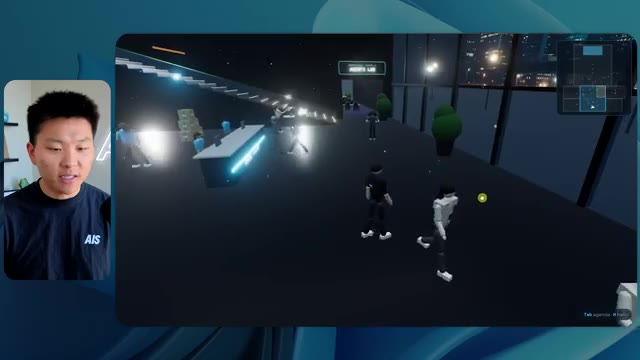
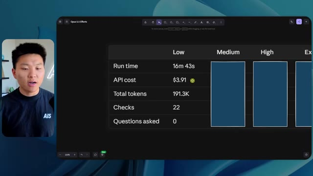
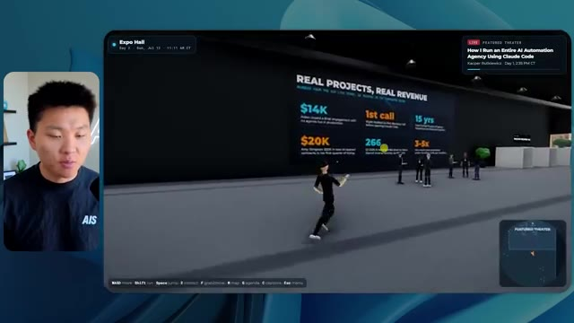

# 🎬 Claude Code + Clay Makes Lead Generation Actually Fun

> **Chaîne** : [Nate Herk | AI Automation](https://www.youtube.com/@nateherk/featured)  
> **Lien YouTube** : [https://www.youtube.com/watch?v=zyvdl__Ywfk](https://www.youtube.com/watch?v=zyvdl__Ywfk)  
> **Date de publication** : 20260712  
> **Durée** : 00:18:02  
> **Identifiant vidéo** : `zyvdl__Ywfk`  
> **Transcription & Analyse** : `whisper-v3-large-turbo+gemini-3.5-flash-lite`  

---

## 📌 Synthèse Exécutive & Outils

### 💡 Résumé
Dans cette vidéo intitulée **Claude Code + Clay font de la génération de leads un vrai jeu d'enfant**, Nate Herk décortique les capacités pratiques d'automatisation et de développement propulsées par les modèles de pointe.

### 🛠️ Outils, Modèles & Logiciels Présentés
- **Opus 5.5 & Claude Code** : Modèles d'ingénierie et agents de codage autonome.

### 🔑 Points Clés & Enseignements Stratégiques
- Optimiser le niveau d'effort et le raisonnement des modèles IA pour des résultats industriels.
- Automatiser les cycles de création logicielle de bout en bout.

---

## ⏱️ Chronologie & Transcription Complète Audio & Visuelle (Mot pour Mot)

### ⏱️ `[00:00:00 - 00:00:20]` | Segment #01

**🔊 Audio (Transcription Intégrale Mot pour Mot en Français) :**
> Opus 5.5, Opus 5.5, Opus 5.5, Opus 5.5, Opus 5.5. Ce modèle est littéralement partout et pour de très bonnes raisons. Il est intelligent, il est bon marché, il a un goût incroyable, c'est un modèle d'IA incroyable. Mais avec chaque modèle d'IA, vous avez le choix de l'effort, que ce soit faible, moyen, élevé, extra, max ou code ultra.

**👁️ Analyse Visuelle d'Écran (gemini-3.5-flash-lite) :**
**Interface & Outils** : X (Twitter)

**Contenu textuel & Code** : Publication sur X avec un tweet et une vidéo intégrée représentant un environnement tropical 3D.

**Action / Démonstration** : Affichage d'un exemple concret de contenu généré pour illustrer le propos sur l'impact de l'IA.

*⏱️ 00:00:05 — Une capture d'écran d'un tweet montrant un paysage tropical généré en 3D avec des maisons et des palmiers, illustrant une publication sur l'impact de l'IA.*

---

### ⏱️ `[00:00:20 - 00:00:38]` | Segment #02

**🔊 Audio (Transcription Intégrale Mot pour Mot en Français) :**
> So in this video, I gave Opus 5.5 the same exact prompt and I ran it on every single effort level and we're gonna be comparing the results. We will look at the quality of all of the different actual outputs, But then we're also going to look at how long each one of these ran, how much it cost us if it was API billing, the total tokens, how many checks they ran, and how many questions they actually asked me throughout the process.

**👁️ Analyse Visuelle d'Écran (gemini-3.5-flash-lite) :**
**Interface & Outils** : Application web ou tableau de bord interactif (type Canvas/Notion).

**Contenu textuel & Code** : Tableau avec des colonnes pour les niveaux d'effort (Low, Medium, High, Extra, Max, Ultracode) et des lignes pour les métriques (Run time, API cost, Total tokens, Checks, Questions asked).

**Action / Démonstration** : Présentation du tableau comparatif des différents niveaux d'effort et de leurs coûts/performances respectifs.

*⏱️ 00:00:29 — Un tableau comparatif sur fond sombre présentant différents niveaux d'effort (Low, Medium, High, Extra, Max, Ultracode) et métriques (Run time, API cost, Total tokens).*

---

### ⏱️ `[00:00:39 - 00:00:58]` | Segment #03

**🔊 Audio (Transcription Intégrale Mot pour Mot en Français) :**
> And the results that we got are not what I expected at all, so I can't wait to share this with you guys. Let's not waste any time and just get straight into this one. Okay, so let's jump right into this one. I want to start off just by showing you guys the actual prompt that we used that we gave to every single one of these different agents. I'm going to go into the files over here, and we're going to open up this prompt markdown file, and I'll show you what we got. So here is the slash goal that I fed in.

**👁️ Analyse Visuelle d'Écran (gemini-3.5-flash-lite) :**
**Interface & Outils** : Interface logicielle de type agent IA / assistant de code (avec un panneau latéral et une zone de chat).

**Contenu textuel & Code** : Texte affiché dans l'interface : "Hi Nate. This worktree has the effort-test task queued in PROMPT.md : build a walkable third-person 3D world of the AIS Live conference..."

**Action / Démonstration** : Présentation de l'interface et du prompt initial de la tâche en cours.

*⏱️ 00:00:48 — Interface d'un éditeur ou d'un outil d'IA avec une petite vignette vidéo du présentateur sur le côté gauche, affichant un prompt textuel lié à la création d'un monde 3D.*

---

### ⏱️ `[00:00:58 - 00:01:34]` | Segment #04

**🔊 Audio (Transcription Intégrale Mot pour Mot en Français) :**
> I said, you need to create me a 3D world that is a realistic tech conference that I can walk around in third-person view. You will look at this folder, which is my event recording assets from AIS Live. And this folder is a frame IO folder of 105 gigabytes of video recordings. This was a completely virtual event. Everything was recorded and all of the recordings are right here. I said, your goal is to take this event and turn it into a 3D explorable world that makes me feel like I actually went to a real in-person conference with different rooms, different tracks, different stages, blah, blah, blah. Feel free to use key.ai if you need to generate any images or videos. And you can also use anything else inside of my Herc 2 project, which is like my AI operating system. I said,

**👁️ Analyse Visuelle d'Écran (gemini-3.5-flash-lite) :**
**Interface & Outils** : VS Code / Éditeur de texte markdown, Navigateur web (Frame.io)

**Contenu textuel & Code** : Fichier PROMPT.md contenant le prompt demandant de transformer des enregistrements vidéo de 105 Go en un monde 3D exploitable.

**Action / Démonstration** : Présentation des instructions du prompt et de l'arborescence des dossiers vidéo de l'événement.

*⏱️ 00:01:07 — Éditeur de code affichant le fichier PROMPT.md avec les instructions pour créer un monde 3D interactif et un lien Frame.io.*

*⏱️ 00:01:16 — Interface cloud Frame.io montrant les dossiers d'enregistrements vidéo de l'événement AIS Live pesant 105.69 Go.*

*⏱️ 00:01:25 — Éditeur de code montrant à nouveau le fichier PROMPT.md détaillant les exigences de conception du monde 3D.*

---

### ⏱️ `[00:01:34 - 00:02:08]` | Segment #05

**🔊 Audio (Transcription Intégrale Mot pour Mot en Français) :**
> you'll be judged on creativity, design, physics, and the overall feel as I explore the 3D world that you built. And that was basically the end of the instructions. So as you can see on this left-hand side, I ran this through all of the different effort levels. Let's start off with low and work our way up to ultra code. All right. So here we have the result from low. Let's open this up and take a look. So we have AIS live, AI services summit in person finally, and we were able to click around. First of all, this doesn't feel very branded. Like this isn't the IS Live logo. It's not even our colors. So I don't love that, but let's get in here. Okay. This is way too bright. Um, we have a map in the top, right? We have a city back here. I can't tell what city

**👁️ Analyse Visuelle d'Écran (gemini-3.5-flash-lite) :**
**Interface & Outils** : Application de type interface de chat/agent IA avec explorateur de projets et sessions.

**Contenu textuel & Code** : Texte du prompt demandant de construire un monde 3D interactif et liste des différents niveaux de test d'effort.

**Action / Démonstration** : Le curseur sélectionne le niveau d'effort "Low" dans la liste des sessions de test.

*⏱️ 00:01:42 — Interface d'une application d'agent IA montrant les différents niveaux d'effort (Low, Medium, High, Max, Ultracode) dans la barre latérale gauche.*

---

### ⏱️ `[00:02:08 - 00:02:40]` | Segment #06

**🔊 Audio (Transcription Intégrale Mot pour Mot en Français) :**
> C'est. D'accord. C'est Chicago, ce qui est plutôt cool parce que, tu sais, je vis à Chicago, mais bref, en haut à droite, nous pouvons voir une carte. Nous avons un hall d'accueil. Nous avons un hall d'exposition. Nous avons le salon VIP, la scène principale. La carte montre également où se trouve chaque autre personne et cela se synchronise en direct. Nous pouvons donc voir l'enregistrement. Nous pouvons voir le premier jour, la keynote de Hyper Agent, le débriefing en direct. Cool. Donc ça connaît réellement l'agenda et puis il y a le deuxième jour. Donc il a trouvé ça, c'est bien. Nous avons ces petites boules ici que je peux, espérons-le, faire bouger en tapant dedans. D'accord. Le visage, oh, regarde ça. Si je vais par ici, toutes les personnes disparaissent tout simplement. Très mauvais. Très mauvais. D'accord. Alors voyons voir. Est-ce que je peux sprinter ? D'accord.

**👁️ Analyse Visuelle d'Écran (gemini-3.5-flash-lite) :**
**Interface & Outils** : Application de monde virtuel / salon en ligne interactif avec mini-carte et avatars.

**Contenu textuel & Code** : Menus de navigation, planning "DAY 1" et indicateurs de zones (Lobby, Expo Hall, VIP Lounge).

**Action / Démonstration** : Navigation et exploration des différentes zones du salon virtuel par l'avatar.

*⏱️ 00:02:16 — Vue d'un monde virtuel interactif avec avatars et une carte de navigation en haut à droite indiquant le lieu.*

*⏱️ 00:02:24 — Le présentateur explore le lobby virtuel affichant le programme du premier jour (DAY 1).*

*⏱️ 00:02:32 — Vue de l'Expo Hall virtuel avec des stands de sponsors et des zones de discussion.*

---

### ⏱️ `[00:02:40 - 00:03:04]` | Segment #07

**🔊 Audio (Transcription Intégrale Mot pour Mot en Français) :**
> Je peux avancer un peu plus vite. Je vais d'abord aller par ici. Il y a des cadeaux publicitaires, euh, certifié AIS plus glido. D'accord. Donc, il y a les vrais stands qu'on avait dans l'événement virtuel. On avait des stands. Donc, c'est plutôt cool. Un petit endroit pour prendre des photos. Salle C. En ce moment, nous avons Tangy Frederick qui anime un atelier. D'accord. Mais ce n'est pas une vidéo. Comme vous pouvez le voir, c'est juste une image. Elle ne bouge pas. Donc c'est juste une image. Ces gens sont en train de disparaître. Ce doivent être des fantômes. Allons par ici dans la salle A.

**👁️ Analyse Visuelle d'Écran (gemini-3.5-flash-lite) :**
**Interface & Outils** : Présentation ou face-caméra explicatif sans interface logicielle partagée.

**Contenu textuel & Code** : Explications orales et mise en contexte méthodologique.

**Action / Démonstration** : Explications face caméra et démonstration conceptuelle.

---

### ⏱️ `[00:03:04 - 00:03:30]` | Segment #08

**🔊 Audio (Transcription Intégrale Mot pour Mot en Français) :**
> Nous avons Liberty White. D'accord. Très cool. Vos 30 premiers jours dans l'automatisation. Encore une fois, c'est juste une image fixe et les gens ont des bugs d'affichage. Donc ce n'est pas très bien ici. Je vais aller sur la scène principale et voir ce que nous avons. D'accord, cool. Donc nous avons une scène principale. Les gens ont des bugs d'affichage. Vraiment beaucoup. Ce n'est vraiment pas terrible. Notre vidéo est en train de bouger. Genre, j'ai vu mon visage ici et j'ai vu celui de Devin, mais maintenant ils ont disparu. Donc je ne sais pas ce qui s'est passé. D'accord. On dirait que c'est plutôt un diaporama. Rien n'est vraiment diffusé pour l'instant. Quoi qu'il en soit, entrons ici.

**👁️ Analyse Visuelle d'Écran (gemini-3.5-flash-lite) :**
**Interface & Outils** : Environnement virtuel 3D / Plateforme de métavers ou de conférence interactive.

**Contenu textuel & Code** : Texte affiché "Now showing: Hyperagent Workshop: How to Build an Always-On Fleet of Agents" et "AIS LIVE AI Services Summit".

**Action / Démonstration** : Navigation et déplacement d'un avatar dans un espace de conférence virtuel 3D pour assister à un atelier.

*⏱️ 00:03:17 — Vue dans un monde virtuel interactif montrant une salle de conférence remplie d'avatars et un présentateur qui navigue dans l'espace.*

*⏱️ 00:03:24 — Vue large de la scène principale d'un événement virtuel "AIS LIVE - AI Services Summit" avec de grands écrans et des avatars.*

---

### ⏱️ `[00:03:30 - 00:03:58]` | Segment #09

**🔊 Audio (Transcription Intégrale Mot pour Mot en Français) :**
> Nous avons plus de stands. Nous avons hyper agent. Nous avons Claude Code. Nous avons plus de goodies. La salle B, c'est Dave Ebelor. Je suppose que c'est exactement la même chose. Nous avons du café. Et puis, je suppose, le salon VIP, accès VIP seulement. C'est plutôt cool, mais il n'y a vraiment rien qui se passe ici. Cet écran est bien trop lumineux. D'accord. Donc je pense que vous comprenez l'ambiance qu'on obtient ici d'Opus 5.5 en effort faible. Et c'est là que les choses deviennent intéressantes. Combien de temps pensez-vous que cela a duré ? Combien de temps ? Celui-ci a duré 16 minutes et 43 secondes. Combien pensez-vous que cela a coûté ?

**👁️ Analyse Visuelle d'Écran (gemini-3.5-flash-lite) :**
**Interface & Outils** : Présentation ou face-caméra explicatif sans interface logicielle partagée.

**Contenu textuel & Code** : Explications orales et mise en contexte méthodologique.

**Action / Démonstration** : Explications face caméra et démonstration conceptuelle.

---

### ⏱️ `[00:03:58 - 00:04:26]` | Segment #10

**🔊 Audio (Transcription Intégrale Mot pour Mot en Français) :**
> 3,91 dollars si c'était une facturation par API. J'utilise évidemment mon abonnement ici, mais nous allons simplement calculer cela en facturation par API. Le total des jetons était de 191 000. Il a effectué 22 vérifications. Donc pour la vérification, il a ouvert le navigateur 22 fois et a exécuté différentes sortes de vérifications. Donc 22 catégories de vérifications. Et combien de questions m'a-t-il posées ? Il m'a posé un total de zéro question tout au long de cette invite d'objectif oblique. D'accord. Alors, ouvrons l'effort moyen et voyons ce que nous avons. D'accord, c'est parti. Effort moyen. Nous avons Nate Herc. Nous avons mon badge. C'est de la marque AI's Life.

**👁️ Analyse Visuelle d'Écran (gemini-3.5-flash-lite) :**
**Interface & Outils** : Application de tableau blanc ou de diagramme (type Excalidraw) avec un panneau de configuration latéral.

**Contenu textuel & Code** : Tableau comparatif avec les colonnes Low, Medium, High et des lignes pour Run time (16m 43s), API cost ($3.91), Total tokens (191.3K), Checks et Questions asked.

**Action / Démonstration** : Le présentateur commente les résultats chiffrés et les coûts d'API affichés dans le tableau.

*⏱️ 00:04:05 — Capture d'écran montrant le présentateur à gauche et un tableau de données sur fond sombre à droite, affichant les métriques d'exécution (Run time, API cost, Total tokens, Checks, Questions asked).*

---

### ⏱️ `[00:04:26 - 00:04:46]` | Segment #11

**🔊 Audio (Transcription Intégrale Mot pour Mot en Français) :**
> Donc ça a déjà l'air un petit peu mieux. Ça ressemble à nos palettes de couleurs qui ont utilisé nos directives de marque. Premier jour de construction, deuxième jour de gain, VIP. Cool. D'accord. Je vais entrer dans le lieu. D'accord. Waouh. Une ambiance un peu similaire. C'est en arrière-plan. Ça ne ressemble pas à Chicago, n'est-ce pas ? Non, ça ressemble à, honnêtement, ça ressemble à une ville imaginaire. Quoi qu'il en soit, c'est drôle qu'ils aient décidé de faire ça. Voyons si je peux me déplacer un peu plus vite. Oh, waouh.

**👁️ Analyse Visuelle d'Écran (gemini-3.5-flash-lite) :**
**Interface & Outils** : Présentation ou face-caméra explicatif sans interface logicielle partagée.

**Contenu textuel & Code** : Explications orales et mise en contexte méthodologique.

**Action / Démonstration** : Explications face caméra et démonstration conceptuelle.

---

### ⏱️ `[00:04:46 - 00:05:21]` | Segment #12

**🔊 Audio (Transcription Intégrale Mot pour Mot en Français) :**
> The people are interacting with me. Watch. If I go up to this guy, he just like raised his arm. Well, now he doesn't want anything to do with me at all. But all of these little robots here must be making decisions. I'm not sure if they're using Jev. They're definitely not. I didn't tell it to. Actually, my Jev key is in the back. I don't know. Maybe it did use it. Anyways, we can see here we have Workshop Room C, Agents Lab. Nice. So this one is actually being run. You can see that is a real video being played by Tangy. Everyone here is actually like working on a laptop. They're not glitching. This is pretty cool. Also, my badge is on my chest, which is pretty cool. I can come this way. We have a map up in the top right, as you guys can see, but I can come this way. We have an

**👁️ Analyse Visuelle d'Écran (gemini-3.5-flash-lite) :**
**Interface & Outils** : Environnement virtuel 3D interactif (type monde virtuel ou métavers).

**Contenu textuel & Code** : Avatars 3D modélisés, disposition de type salle de réunion ou atelier (Agents Lab), mini-carte de navigation en haut à droite.
[CONTRÔLE] Exploration et interaction en vue subjective (first-person) dans un espace virtuel habité par des avatars.

**Action / Démonstration** : Explications face caméra et démonstration conceptuelle.

*⏱️ 00:04:55 — Vue à la première personne d'un environnement virtuel en 3D avec des avatars interactifs.*

*⏱️ 00:05:04 — Vue en hauteur d'un espace de type salle de conférence ou laboratoire virtuel rempli d'avatars.*

*⏱️ 00:05:12 — Vue en plongée d'une salle de classe virtuelle avec de nombreux avatars assis devant des bureaux.*

---

### ⏱️ `[00:05:21 - 00:05:47]` | Segment #13

**🔊 Audio (Transcription Intégrale Mot pour Mot en Français) :**
> expo hall. This is where we have the Glido booth. And this is actually playing. Yeah, it's playing the video of us talking about Glido. It's playing the video of Ed and I talking about our certification program. We've got the AIS Plus logo back here, which is kind of in a weird spot. This is a speaker slides and takeaways. So wow, this is all the resources that we gave out after the event. They're all sitting right there as well. We can see we've got a community spotlight. So this is Aiden talking about his deal that he landed and it's playing live. These people are watching.

**👁️ Analyse Visuelle d'Écran (gemini-3.5-flash-lite) :**
**Interface & Outils** : Environnement virtuel 3D / application de salon virtuel interactif.

**Contenu textuel & Code** : Éléments graphiques 3D, avatars, affichage de stands et de présentations de type salon professionnel virtuel.

**Action / Démonstration** : Navigation et visite guidée d'un espace virtuel 3D par le présentateur.

---

### ⏱️ `[00:05:47 - 00:06:21]` | Segment #14

**🔊 Audio (Transcription Intégrale Mot pour Mot en Français) :**
> They're pretty engaged. We've got hyper agent. That was, that's what I meant. If you guys saw those people like raising their arms saying hi, that was kind of funny. Look, look, there he goes again. Anyways. Okay. Where am I now? Now I'm in the main lobby. We've got a coffee bar. We've got a big logo, which is the real logo. It's too bright, but we have the logo. We can see if we can come in here to the foundation track. We've got Sabrina Romanov and Liberty White. So different trainings right there. We can come into this room. This is the advanced track. So what's going on here. We've got Dave Ebelar and Saman talking about some different stuff in there. And now let's go take a look at the main stage. Oh, wait, there's a video of me up there. Is that like a VIP

**👁️ Analyse Visuelle d'Écran (gemini-3.5-flash-lite) :**
**Interface & Outils** : Environnement virtuel 3D (Metaverse / application web de type événementiel virtuel)

**Contenu textuel & Code** : Aucun code source, terminal ou prompt visible ; affichage d'un monde virtuel avec mini-carte et avatars.

**Action / Démonstration** : Navigation et déplacement d'un avatar dans l'espace virtuel du metaverse.

---

### ⏱️ `[00:06:21 - 00:06:50]` | Segment #15

**🔊 Audio (Transcription Intégrale Mot pour Mot en Français) :**
> section ? Ouais, on ira voir ça dans une minute. Mais bref, voici la scène principale. Ça a l'air très, très bien. On a une grande scène. On a genre quatre personnes assises ici. On a les trois écrans d'Alex là-haut avec hyper agent. Est-ce que j'ai le droit de monter sur scène ? Oh, et il me laisse monter sur scène. D'accord. C'est plutôt sympa. Bon les gars, prenons un selfie. Laissez-moi mettre tout le monde en arrière-plan. Venez par ici. Bref, c'est vraiment, vraiment cool. Toutes les places ne sont pas prises par contre. Donc il faut qu'on travaille là-dessus. Mais bref, je vais retourner en courant voir ce que c'était que cette section VIP. D'accord. Salon VIP. J'ai l'impression que c'est genre l'aéroport ou un truc comme ça.

**👁️ Analyse Visuelle d'Écran (gemini-3.5-flash-lite) :**
**Interface & Outils** : Environnement virtuel 3D de conférence (type metaverse / plateforme d'événements virtuels) avec interface HUD d'information (Hyperagent Keynote).

**Contenu textuel & Code** : Informations textuelles de l'événement en bas à gauche ("Keynote Day 1, Hyperagent Keynote, Alex McDonnell") et mini-carte de navigation en haut à droite.

**Action / Démonstration** : Navigation et déplacement d'un avatar virtuel à travers la salle de conférence et vers la scène principale.

---

### ⏱️ `[00:06:51 - 00:07:14]` | Segment #16

**🔊 Audio (Transcription Intégrale Mot pour Mot en Français) :**
> OK, super. Donc maintenant nous avons les sessions VIP ici. Une FAQ VIP avec la lecture vidéo en direct de Nate juste ici. C'est vraiment, vraiment super. Et nous avons comme un bar ou quelque chose comme ça. Génial. Je dirais que c'est un très bon résultat. Maintenant, en ce qui concerne les statistiques ici, celle-ci a pris une heure et 13 minutes à s'exécuter. Cela nous aurait coûté 12 dollars et 44 cents. Elle a utilisé 490 000 jetons et elle a effectué 23 vérifications.

**👁️ Analyse Visuelle d'Écran (gemini-3.5-flash-lite) :**
**Interface & Outils** : Application virtuelle interactive de salon VIP et tableau de bord de statistiques.

**Contenu textuel & Code** : Vidéo en direct de FAQ VIP et métriques de performances d'exécution (temps, coût API, jetons).

**Action / Démonstration** : Présentation des différentes zones de l'espace VIP virtuel puis affichage des statistiques d'exécution et de coûts.

*⏱️ 00:06:56 — Capture montrant l'interface d'un espace virtuel VIP avec un écran géant affichant une session de questions/réponses en direct de Nate et des avatars d'utilisateurs.*

*⏱️ 00:07:02 — Capture montrant un tableau de bord ou canvas affichant des statistiques de performance (Run time: 16m 43s, API cost: $3.91, Total tokens: 191.3K, Checks: 22).*

---

### ⏱️ `[00:07:14 - 00:07:48]` | Segment #17

**🔊 Audio (Transcription Intégrale Mot pour Mot en Français) :**
> Et il nous a posé un total de zéro question une fois de plus. Très bien, passons à élevé. C'était déjà un résultat plutôt correct et Anthropic eux-mêmes dans leur vidéo, ou désolé, pas une vidéo, un article sur comment prompter Opus 5.5. Ils ont dit de commencer simplement par moyen et de l'ajuster vers le haut ou vers le bas si nécessaire. C'était donc un résultat moyen. Passons à élevé et voyons ce qu'on a obtenu. Très rapidement, les gars, je dois prendre une seconde pour vous parler du sponsor de la vidéo d'aujourd'hui, Hostinger. Donc ces deux modèles viennent de me construire une version fonctionnelle de la même chose. Et maintenant, je suis exactement là où je finis toujours, avec un produit fini sur mon ordinateur portable et aucun moyen rapide de le mettre en ligne. Et c'est le fossé que le connecteur d'Hostinger comble. C'est une extension gratuite

**👁️ Analyse Visuelle d'Écran (gemini-3.5-flash-lite) :**
**Interface & Outils** : Tableau de bord visuel et interface de développement / éditeur de code.

**Contenu textuel & Code** : Tableau comparatif de métriques d'IA et interface de chat/génération de code avec prompt pour un calculateur ROI.

**Action / Démonstration** : Présentation comparative des résultats d'exécution de l'agent selon les niveaux d'effort et démonstration de génération de code.

*⏱️ 00:07:22 — Un tableau comparatif des performances d'Opus 5.5 selon différents niveaux d'effort (Low, Medium, High, Extra) montrant les temps d'exécution, coûts API, tokens et questions posées.*

*⏱️ 00:07:39 — Une interface de développement avec un éditeur montrant le processus de génération d'un calculateur ROI (Northwind ROI calculator) avec l'agent IA en action.*

---

### ⏱️ `[00:07:48 - 00:08:23]` | Segment #18

**🔊 Audio (Transcription Intégrale Mot pour Mot en Français) :**
> pour votre éditeur qui intègre votre compte Hostinger dans l'environnement où vous codez déjà. Que ce soit VS Code, Cursor, Cloud Code, Codex, peu importe. Vous vous connectez une seule fois en un clic, et à partir de là, votre agent peut déployer le site, y associer un domaine, configurer les enregistrements DNS et vérifier votre VPS sans que vous n'ayez jamais à quitter l'éditeur. Ainsi, peu importe celui de ces outils que vous finirez par préférer, ce qu'il a construit se trouve à quelques minutes d'une vraie URL sur un hébergement géré. Le connecteur est gratuit avec chaque formule d'hébergement, donc si vous avez toujours besoin de l'hébergement sous-jacent, profitez de la formule illimitée via le lien dans la description et utilisez le code NATEHERK pour 10 % de réduction. Cela inclut également un nom de domaine gratuit et un e-mail professionnel pour l'année. Et c'est toujours le moyen le plus économique que j'ai trouvé pour obtenir un

**👁️ Analyse Visuelle d'Écran (gemini-3.5-flash-lite) :**
**Interface & Outils** : Interface web Hostinger (Manage Hostinger from your IDE) et interface Claude Code avec vignette vidéo du présentateur.

**Contenu textuel & Code** : Statut "Connected", Node.js 24.13.0, liste des outils accessibles ("Websites", "Domains", "Subscriptions & Payments", "Email Marketing") avec options cochées.

**Action / Démonstration** : Connexion réussie du compte Hostinger à l'IDE via OAuth pour permettre à l'agent de gérer les sites web, domaines et abonnements.

*⏱️ 00:07:57 — Interface d'intégration Hostinger connectée via OAuth à un IDE, affichant les outils disponibles (Websites, Domains, Subscriptions & Payments, Email Marketing) aux côtés d'une interface Claude Code.*

---

### ⏱️ `[00:08:23 - 00:08:47]` | Segment #19

**🔊 Audio (Transcription Intégrale Mot pour Mot en Français) :**
> tu as construit par-dessus une vraie URL. Donc revenons-en à la vidéo. D'accord. Encore une fois, très, très marqué par la marque. C'est un écran de chargement encore mieux que le précédent. On a ce joli petit effet en arrière-plan. On a le logo. On va entrer dans le lieu. D'accord. Nous y voilà. Ça a l'air plutôt bien. On commence dehors et tu peux voir qu'on a ces drapeaux pour tous les intervenants, Wyatt, Casper, Alex, Ed, Aiden, Sabrina, Liberty. C'est plutôt cool. On a des blocs en direct ici.

**👁️ Analyse Visuelle d'Écran (gemini-3.5-flash-lite) :**
**Interface & Outils** : Présentation ou face-caméra explicatif sans interface logicielle partagée.

**Contenu textuel & Code** : Explications orales et mise en contexte méthodologique.

**Action / Démonstration** : Explications face caméra et démonstration conceptuelle.

---

### ⏱️ `[00:08:47 - 00:09:23]` | Segment #20

**🔊 Audio (Transcription Intégrale Mot pour Mot en Français) :**
> il a pris cette photo de moi, votre hôte, Nate Herc, John, Dave, Nate Herc. Voilà. D'accord. Les portes. C'est génial. Ce sont des portes coulissantes automatiques en verre. J'adore ça. On peut voir l'enregistrement VIP. On peut voir l'admission générale. On peut venir par ici et on peut découvrir l'exposition avec différents stands, le projecteur sur la communauté. Vous pouvez aussi voir qu'en haut à gauche, j'ai un passeport. Donc c'est comme, ça montrera combien d'endroits j'ai visités. Tout ceci est une vraie lecture. Nous avons un mur de ressources avec tous les différents conférenciers. Ils ont aussi une session de réseautage par ici. Donc je vais venir très vite et voir de quoi il s'agit. Donc nous avons le bar à infusion froide AIS. Nous avons différents membres de la communauté qui ont été mis en avant ou mis en lumière.

**👁️ Analyse Visuelle d'Écran (gemini-3.5-flash-lite) :**
**Interface & Outils** : Environnement virtuel 3D / Jeu de type metaverse

**Contenu textuel & Code** : Interface utilisateur affichant "Registration Concourse", "VIP CHECK-IN" et des informations sur les sessions.

**Action / Démonstration** : Exploration interactive d'un événement virtuel en 3D par l'animateur.

*⏱️ 00:08:56 — Vue d'un monde virtuel 3D représentant une conférence avec une scène principale, un avatar joueur et des comptoirs d'enregistrement.*

*⏱️ 00:09:05 — Navigation dans le hall d'exposition virtuel avec des stands d'information et des bannières publicitaires.*

*⏱️ 00:09:14 — Déplacement d'avatars virtuels dans le couloir d'enregistrement d'un événement en ligne 3D.*

---

### ⏱️ `[00:09:23 - 00:09:56]` | Segment #21

**🔊 Audio (Transcription Intégrale Mot pour Mot en Français) :**
> On a la zone VIP. Attends, quoi ? Prends un bracelet. Ah, je dois vraiment aller chercher le bracelet. D'accord. Laisse-moi m'enregistrer rapidement. Le bracelet est déjà mis. Attends, quoi ? D'accord. Oh, d'accord. Maintenant, les portes se sont ouvertes pour moi. Cool. Je peux entrer ici. Oh, ça mène juste à la scène principale. Salon VIP. Il y a une séance de questions-réponses en cours. Ça a l'air très cool. Je veux dire, je suis très impressionné par la façon dont il parvient à faire ça. Waouh. D'accord. Donc c'est vraiment bien. Ce qu'on a fait, c'est qu'on a eu des salles de discussion VIP avec différentes personnes. Tu peux voir qu'il y a différentes salles, différents membres de l'équipe AIS qui vont dans des trucs. C'est vraiment cool. C'est très cool. C'est un bien meilleur VIP

**👁️ Analyse Visuelle d'Écran (gemini-3.5-flash-lite) :**
**Interface & Outils** : Présentation ou face-caméra explicatif sans interface logicielle partagée.

**Contenu textuel & Code** : Explications orales et mise en contexte méthodologique.

**Action / Démonstration** : Explications face caméra et démonstration conceptuelle.

---

### ⏱️ `[00:09:56 - 00:10:30]` | Segment #22

**🔊 Audio (Transcription Intégrale Mot pour Mot en Français) :**
> expérience que ce qui a été montré dans la première partie. D'accord. After party VIP. Regardez ça. On a une piste de danse. On a tous ces éléments ici. On a la lecture de l'after party VIP juste ici. Et il y a une estrade de DJ. C'est trop marrant. Il y a un petit bug ici, un petit glitch ici, mais c'est génial. Oh, cool. Donc quand je suis ici sur la scène principale, on a des sous-titres. Vous pouvez voir juste ici en bas de mon écran, on a ces sous-titres de Wyatt qui est en train de parler ici. On a des lumières. On a le panneau. Très cool. Belle scène principale. Je vais aller par ici. On peut aller à la fondation,

**👁️ Analyse Visuelle d'Écran (gemini-3.5-flash-lite) :**
**Interface & Outils** : Application web de métavers ou événement virtuel 3D (type Gather ou équivalent).

**Contenu textuel & Code** : Environnement virtuel 3D interactif avec avatars, flux vidéo en direct, panneaux d'information et commandes de navigation.
[DESC_ACTION] Navigation et exploration d'un espace virtuel 3D représentant un événement en ligne avec des zones interactives.

**Action / Démonstration** : Explications face caméra et démonstration conceptuelle.

*⏱️ 00:10:04 — Vue d'un espace virtuel d'after-party avec des avatars, une piste de danse colorée et un grand écran montrant des participants en visio.*

*⏱️ 00:10:13 — Vue de l'after-party VIP avec piste de danse, avatars d'utilisateurs et écran affichant des flux vidéo de participants.*

*⏱️ 00:10:21 — Vue d'une salle de conférence virtuelle (Main Stage) avec des sièges occupés par des avatars et un grand écran de présentation.*

---

### ⏱️ `[00:10:30 - 00:11:06]` | Segment #23

**🔊 Audio (Transcription Intégrale Mot pour Mot en Français) :**
> avancé, et les parcours d'entreprise ici. Donc voyons voir. Nous avons l'anatomie de trois vraies transactions. Nous avons hyper agent. Nous avons les évaluations avec Nate et Ed ici. Nous avons Dave qui s'occupe des trucs avancés. C'est vraiment bien. Je veux dire, évidemment, chacun, chacun de ces résultats jusqu'à présent, bas était correct. Moyen était meilleur. Élevé a été encore meilleur. Voyons si cette tendance se poursuit et allons voir ce que cela nous a coûté. Donc, élevé a tourné pendant une heure et sept minutes. Donc un peu plus rapide que moyen, cela nous aurait coûté 16 dollars et 31 cents. Il a utilisé un demi-million de jetons, 509 000. Il a fait 22 vérifications. Et il nous a aussi demandé, enfin, non, je me suis trompé, ce

**👁️ Analyse Visuelle d'Écran (gemini-3.5-flash-lite) :**
**Interface & Outils** : Tableau blanc ou application de tableau (type Miro / Excalidraw) affichant un tableau comparatif structuré.

**Contenu textuel & Code** : Tableau avec les colonnes Low, Medium, High, Extra et les lignes Run time ($16m 43s$, $1h 13m$, etc.), API cost ($3.91, $12.44, $16.31), Total tokens, Checks et Questions asked.

**Action / Démonstration** : Présentation des résultats comparatifs de performances et de coûts d'exécution selon différents niveaux d'effort.

*⏱️ 00:10:57 — Tableau comparatif détaillé (intitulé "Opus 5.5 Efforts") affichant des métriques par niveau (Low, Medium, High, Extra) incluant le temps d'exécution, le coût API, le nombre de tokens et de vérifications.*

---

### ⏱️ `[00:11:06 - 00:11:25]` | Segment #24

**🔊 Audio (Transcription Intégrale Mot pour Mot en Français) :**
> l'un m'a posé une question et, divulgâcheur, c'était le seul qui nous a posé une question tout au long de tout ça. Voyons voir, il nous en reste trois : Extra, Max et Ultra Code. Laissez-moi ouvrir Extra et nous verrons ce que nous avons. D'accord. Celui-ci a l'air plutôt bien. Je dirais honnêtement que jusqu'à présent, l'écran de chargement haut était le meilleur. Celui qu'on vient juste de voir, mais bref, entrons dans le direct d'AIS.

**👁️ Analyse Visuelle d'Écran (gemini-3.5-flash-lite) :**
**Interface & Outils** : Tableau de bord d'analyse ou interface de rapport de performance.

**Contenu textuel & Code** : Tableau avec colonnes Low, Medium, High, Extra et lignes Run time, API cost, Total tokens, Checks, Questions asked.

**Action / Démonstration** : Le présentateur commente les résultats et les métriques des différents tests présentés à l'écran.

*⏱️ 00:11:11 — Tableau comparatif affichant les métriques de différents niveaux d'effort (Low, Medium, High, Extra) incluant le temps d'exécution, le coût API, les tokens et le nombre de questions posées, avec le présentateur en médaillon.*

---

### ⏱️ `[00:11:26 - 00:11:51]` | Segment #25

**🔊 Audio (Transcription Intégrale Mot pour Mot en Français) :**
> Whoa. D'accord. Donc on a genre des petits extraits sonores. Je peux discuter avec des gens. Le panneau sur la guerre des outils a réglé quelques débats pour moi. Sympa. Bonne perspective là-bas. On est dehors à nouveau. On a ces différentes bannières, bien qu'elles soient toutes les mêmes. Elles n'affichent pas genre les noms de différentes personnes. Donc gros logo AIS Live. L'aile des ateliers est par ici. Et passons par les portes coulissantes en verre pour voir ce qu'on a. Donc on a le café AIS. La carte est en bas à droite, et elle n'est pas très descriptive.

**👁️ Analyse Visuelle d'Écran (gemini-3.5-flash-lite) :**
**Interface & Outils** : Présentation ou face-caméra explicatif sans interface logicielle partagée.

**Contenu textuel & Code** : Explications orales et mise en contexte méthodologique.

**Action / Démonstration** : Explications face caméra et démonstration conceptuelle.

---

### ⏱️ `[00:11:51 - 00:12:26]` | Segment #26

**🔊 Audio (Transcription Intégrale Mot pour Mot en Français) :**
> I like how the other maps have told us what, like where things were, but this one looks very professional. We can see here's the main stage. Let's hop in here real quick. They've all got these balls flying around, which I think is pretty funny. The AIS beach balls. We have me up there speaking. I think I was introing one of the days. Let's keep on moving here to the workshop room on this left side. Okay. So here we've got the Hyper Agent Theater. We've got this sponsored session in here by Hyper Agent, but it's showing us what's coming up in here as well. It's really funny that we can chat to people. Salmon built a voice sales rep live. The price it right room was packed. Did you grab the VIP companion guide? That's so funny. We have the advanced track in

**👁️ Analyse Visuelle d'Écran (gemini-3.5-flash-lite) :**
**Interface & Outils** : Application ou plateforme virtuelle 3D (type métaverse/événement virtuel en ligne)

**Contenu textuel & Code** : Environnement virtuel interactif, avatars 3D, interfaces de navigation et affichages textuels d'événements en direct

**Action / Démonstration** : Navigation et exploration de différentes salles et zones d'un événement virtuel en 3D

*⏱️ 00:12:00 — Vue dans un monde virtuel 3D montrant une grande scène principale (Main Stage) avec un public et l'avatar du présentateur sur scène.*

*⏱️ 00:12:09 — Vue de l'avatar du présentateur explorant le hall d'entrée (Grand Lobby) d'un espace événementiel virtuel avec divers avatars d'utilisateurs.*

*⏱️ 00:12:17 — Navigation de l'avatar dans un couloir virtuel d'un espace de conférence interactif avec des panneaux informatifs et des bulles de discussion.*

---

### ⏱️ `[00:12:26 - 00:12:58]` | Segment #27

**🔊 Audio (Transcription Intégrale Mot pour Mot en Français) :**
> here. Once again, we've got live playback. Is that live playback? Oh, okay. It started once I got in, but I can take a seat. Oh my. I can watch this. I can stand up. I want to sit in the front. That's pretty cool. That's very nice. I like that. And you know what I noticed so far? The actual character that I'm playing kind of looks like me. I think it modeled it off of my thumbnail pictures or something. Anyways, we have Sabrina in here, room host here, grab any open seat. Okay, cool. And I really liked the sitting functionality. It's kind of funny. Like we could actually attend this workshop and participate. Anyways, it's showing us the speakers. It's showing us the

**👁️ Analyse Visuelle d'Écran (gemini-3.5-flash-lite) :**
**Interface & Outils** : Environnement virtuel en ligne 3D (type plateforme de métavers ou événement virtuel interactif).

**Contenu textuel & Code** : Interface utilisateur virtuelle affichant des options de navigation (Map, Agenda, Captions), un écran de projection avec un flux vidéo de l'atelier (« Workshop Block 2 ») et des avatars de participants.

**Action / Démonstration** : Exploration interactive de la salle de classe virtuelle, navigation dans le métavers et découverte des fonctionnalités de l'événement en direct.

*⏱️ 00:12:34 — Vue à la première personne d'un environnement virtuel interactif en 3D représentant une salle de classe ou de conférence aux tons violets, avec des avatars assis et un écran géant affichant une présentation, le tout commenté par le présentateur dans un encadré à gauche.*

*⏱️ 00:12:42 — Vue similaire dans un espace virtuel similaire mais aux tons verts (Foundation Track), montrant des participants sous forme d'avatairs et un grand écran de projection à l'avant de la salle virtuelle.*

*⏱️ 00:12:50 — Angle de caméra différent dans la même salle virtuelle verte, montrant le public assis sur les côtés et l'écran de projection affichant l'interface web d'un atelier en direct avec des flux vidéo.*

---

### ⏱️ `[00:12:58 - 00:13:31]` | Segment #28

**🔊 Audio (Transcription Intégrale Mot pour Mot en Français) :**
> agenda. There's a little red carpet here to take some pictures. We can strike a pose. Oh, wow. That's pretty cool. Resource library, get AIS Plus certified, Glido, Hyper Agent, AIS Plus, three real deals. Awesome. I mean, I would definitely say so far, each one is getting better. And we didn't even check out the VIP section yet, the VIP lounge. Let's go up here real quick. Hopefully I can get in. Nice. We've got tooling reset. These are the different rooms we could go in. So once again, I could grab the worksheet and I could try to understand how to price my stuff. This is so cool. This is definitely better than the previous one where we kind of just

**👁️ Analyse Visuelle d'Écran (gemini-3.5-flash-lite) :**
**Interface & Outils** : Application de métavers / monde virtuel 3D de conférence.

**Contenu textuel & Code** : Environnement virtuel 3D avec interface de navigation et mini-carte.

**Action / Démonstration** : Navigation et exploration de différents espaces virtuels (hall d'expo, hall d'accueil, salon VIP).

---

### ⏱️ `[00:13:31 - 00:13:59]` | Segment #29

**🔊 Audio (Transcription Intégrale Mot pour Mot en Français) :**
> like looked at stuff. Awesome. I can get behind the bar and come in here. This is very nice. Okay. So as far as statistics go, this one ran for an hour and a half. It costs 25.92 bucks. I don't know why I say point $25, 92 cents. It was 733,000 tokens and 34 checks. So it had the most checks so far by far. And it asked us zero questions. I can't wait to see what we got here from max and ultra code. Okay. Here is max loading screens, boring, but it's on brand and it has our logo.

**👁️ Analyse Visuelle d'Écran (gemini-3.5-flash-lite) :**
**Interface & Outils** : Application de tableau blanc ou de diagramme en ligne (type Excalidraw) avec un panneau d'édition latéral à gauche.

**Contenu textuel & Code** : Tableau avec des colonnes de configuration ("Medium", "High", "Extra", "Max", "Ultracode") et des lignes de statistiques : "1h 13m", "1h 7m", "1h 31m", coûts en dollars ("$12.44", "$16.31"), nombres de tokens ("419.2K", "509.3K") et nombre de vérifications.

**Action / Démonstration** : Le présentateur présente et commente les statistiques comparatives des différentes exécutions d'agents IA, en surlignant la colonne "Extra".

*⏱️ 00:13:38 — Tableau comparatif sous forme de graphique avec les colonnes Medium, High, Extra, Max et Ultracode, affichant des durées, des coûts et des métriques d'exécution.*

---

### ⏱️ `[00:14:00 - 00:14:35]` | Segment #30

**🔊 Audio (Transcription Intégrale Mot pour Mot en Français) :**
> So that was good. I like that. We will go ahead and enter AIS live. Ooh, nice little animation here that brings us in. Once again, the character looks like me. They've all looked like me. I mean, sort of, we have sitting in the background. This looks like Chicago. Like I mentioned earlier, a lot of these are playing sounds and I'm not including that because it would be very distracting for you guys to try to listen to what's going on as well as me speaking. So there is like some slight music in all these. I hate how this is walking. This walking is really, really bad. I mean, the walking, yeah, I don't like this at all. So that's not great. But besides that, let's go in and explore. Notice these shadows when I walk in, they like really switch. I'm not sure why that is,

**👁️ Analyse Visuelle d'Écran (gemini-3.5-flash-lite) :**
**Interface & Outils** : Application web 3D immersive / Metavers (AIS live)

**Contenu textuel & Code** : Environnement virtuel 3D avec interface utilisateur (mini-carte, indications de navigation, affichage de live-stream).

**Action / Démonstration** : Navigation et exploration de l'espace virtuel 3D par l'avatar.

*⏱️ 00:14:08 — Le présentateur commente une interface virtuelle 3D (AIS live) représentant une place urbaine avec des avatars.*

*⏱️ 00:14:17 — La caméra virtuelle se déplace dans l'environnement 3D montrant des bâtiments modernes et d'autres avatars en mouvement.*

*⏱️ 00:14:26 — L'avatar du présentateur s'approche de l'entrée d'un bâtiment dans l'application virtuelle.*

---

### ⏱️ `[00:14:35 - 00:15:11]` | Segment #31

**🔊 Audio (Transcription Intégrale Mot pour Mot en Français) :**
> but anyways, we can chat with people in here too. Hyperagent booth is right where you walk into the expo. All good. Okay, cool. I can keep clicking E to make them change what they say. We've got the speakers right here. That looks pretty good. Although we definitely had everyone's profile picture. So I'm not sure why that's not included there. We see people taking pictures right here. I love that. And it saves a little picture. Okay. The map also isn't super, like doesn't give me a great explanation of what's going on, but I like these booths. These are cool. I think these booths are the best that I've seen so far. Like they just look nice. They've got reps. There's nice like slides behind them. Yeah. These booths are cool. Okay. We have a little featured theater

**👁️ Analyse Visuelle d'Écran (gemini-3.5-flash-lite) :**
**Interface & Outils** : Présentation ou face-caméra explicatif sans interface logicielle partagée.

**Contenu textuel & Code** : Explications orales et mise en contexte méthodologique.

**Action / Démonstration** : Explications face caméra et démonstration conceptuelle.

---

### ⏱️ `[00:15:11 - 00:15:35]` | Segment #32

**🔊 Audio (Transcription Intégrale Mot pour Mot en Français) :**
> qui se passe par ici. C'est Casper. Bien que pourquoi est-ce que ça ne joue pas ? J'ai l'impression que ça devrait jouer, non ? Comme dans les autres, ça jouait toujours. On peut parler à d'autres gens par ici. Le café est gratuit, blabla, blabla. Amy Simpson, Matt Wolf. Sympa. D'accord. C'est juste la zone de networking où on est en ce moment, mais on peut voir en haut à droite. On peut aussi voir ce qui est en direct sur la scène principale en ce moment. C'est un panel sur la guerre des outils. Alors allons voir ça. On a Devin, Cole, Dave et Russ qui discutent ici. On a de l'audio-vidéo, quelques petits trucs lumineux par ici à l'arrière.

**👁️ Analyse Visuelle d'Écran (gemini-3.5-flash-lite) :**
**Interface & Outils** : Application ou plateforme virtuelle web 3D (style métavers / salon virtuel interactif).

**Contenu textuel & Code** : Interface de salon virtuel avec mini-carte, commandes de déplacement, et affichage en temps réel de panels et de statistiques de projets.

**Action / Démonstration** : Navigation et exploration d'un environnement virtuel 3D par le présentateur (avatar).

*⏱️ 00:15:17 — Vue d'un monde virtuel 3D montrant un avatar se déplaçant dans un hall d'exposition avec des panneaux de statistiques chiffrées.*

*⏱️ 00:15:23 — Navigation dans un espace de networking virtuel avec des stands et d'autres avatars en ligne.*

*⏱️ 00:15:29 — Entrée dans une salle de conférence virtuelle (Main Stage) avec des écrans affichant des intervenants en direct.*

---

### ⏱️ `[00:15:36 - 00:15:55]` | Segment #33

**🔊 Audio (Transcription Intégrale Mot pour Mot en Français) :**
> Basculons la scène principale sur ce qui compte vraiment en ce moment. Je peux donc changer de sujet. Cool. Je viens donc de passer sur moi et Matt. Nous pouvons passer à l'anatomie de trois vraies transactions. C'est plutôt cool. La scène a l'air bien. Nous avons un petit panel sympa ici. Est-ce que je peux monter sur la scène ? Sympa. Sympa. Bon, je ne peux pas aller trop loin, en fait. Bon, tout le monde, laissez-moi prendre le selfie. Tout le monde, venez là-dedans. Je peux aussi m'asseoir dans ce public par ici et juste profiter de la session.

**👁️ Analyse Visuelle d'Écran (gemini-3.5-flash-lite) :**
**Interface & Outils** : Application virtuelle 3D / Plateforme de métavers ou de conférence en ligne

**Contenu textuel & Code** : Aucun code source, commande ou prompt affiché (uniquement des graphismes de simulation 3D)

**Action / Démonstration** : Navigation et affichage d'une scène virtuelle 3D de conférence en ligne

---

### ⏱️ `[00:15:55 - 00:16:14]` | Segment #34

**🔊 Audio (Transcription Intégrale Mot pour Mot en Français) :**
> Très cool, très cool. OK, allons par ici. Je vois une section à l'étage. C'est marrant comme ils choisissent tous de mettre la section VIP à l'étage. Je veux dire, je ne déteste pas ça. Oh la la, ils ont un escalator. Pas possible. Je vais discuter avec ce type sur l'escalator. Glenn a 15 ans d'expérience en agence. Ses trucs de "land and expand" étaient en or. Du super boulot, Glenn. Cool, donc je vais... Je n'arrive même pas à passer devant ce type, par contre.

**👁️ Analyse Visuelle d'Écran (gemini-3.5-flash-lite) :**
**Interface & Outils** : Environnement virtuel 3D en ligne (plateforme de conférence ou événement virtuel).

**Contenu textuel & Code** : Interface utilisateur avec mini-carte, commandes de déplacement (WASD), et affichage des sessions en direct.

**Action / Démonstration** : Navigation et exploration de l'espace virtuel par le présentateur guidant son avatar vers l'étage VIP.

*⏱️ 00:16:00 — Vue d'un espace de réception virtuel en 3D avec de grandes baies vitrées et des personnages d'avatars.*

*⏱️ 00:16:04 — L'avatar s'approche d'un escalator menant au niveau VIP dans l'environnement virtuel.*

*⏱️ 00:16:09 — L'avatar monte sur l'escalator derrière un autre participant virtuel affichant une bulle de dialogue.*

---

### ⏱️ `[00:16:14 - 00:16:48]` | Segment #35

**🔊 Audio (Transcription Intégrale Mot pour Mot en Français) :**
> Oh, j'ai dû sauter par-dessus lui. D'accord, niveau VIP, badge requis. Oh la la. Tu te moques de moi ? Je dois aller chercher mon badge. D'accord, cool. Maintenant, ça montre que je suis un vrai VIP et je peux aller ici dans la section VIP. On a de super petites sessions de travail par ici, qu'on peut rejoindre. Je me demande si ça va me laisser m'asseoir ici. Je peux juste discuter. Est-ce que je peux participer ? Ça ne me laisse pas m'asseoir et participer. C'est pas grave. On a la salle de crise sur les prix. Oh, ça pourrait être l'after-party. Allons voir ce qui se passe par ici. Ou peut-être que je dois juste entrer par ici. D'accord. C'est bizarre. Je devais juste entrer par ici. Cet after-party n'est pas aussi cool que l'autre. Mais bref, allons voir ce qui se passe par ici.

**👁️ Analyse Visuelle d'Écran (gemini-3.5-flash-lite) :**
**Interface & Outils** : Application ou plateforme web virtuelle 3D interactive (environnement d'événement virtuel style métavers).

**Contenu textuel & Code** : Interface utilisateur de l'événement virtuel affichant le profil de Nate Herk ("Nate Herk, Founder, AI Automation Society") et le statut VIP.

**Action / Démonstration** : Navigation et exploration d'un monde virtuel 3D avec un avatar lors d'une démonstration en direct.

---

### ⏱️ `[00:16:48 - 00:17:07]` | Segment #36

**🔊 Audio (Transcription Intégrale Mot pour Mot en Français) :**
> dans les ateliers. D'accord. Ce n'était pas bien. Regardez ça. On peut tout voir et je viens de bugger et maintenant boum. Donc ce n'est pas bon. Je dirais qu'globalement, je veux dire, vous saisissez l'ambiance de la façon dont ça fonctionne, mais je dirais que celui d'avant, qui était, je crois, "high" [élevé/haut], celui-là, je l'aimais mieux. Je ne peux pas m'asseoir dans ces chaises non plus. Ouais. Donc je n'aime pas la marche dans celui-ci.

**👁️ Analyse Visuelle d'Écran (gemini-3.5-flash-lite) :**
**Interface & Outils** : Application web de monde virtuel 3D / espace de conférence en ligne

**Contenu textuel & Code** : Environnement 3D interactif avec avatars, mini-carte et interfaces de chat

**Action / Démonstration** : Navigation et déplacement d'un avatar à travers l'espace virtuel des ateliers

*⏱️ 00:16:53 — Vue d'un avatar dans un couloir virtuel d'un espace de conférence 3D.*

*⏱️ 00:16:57 — L'avatar s'approche de l'entrée d'une salle de conférence (Room C).*

*⏱️ 00:17:02 — L'avatar entre dans la salle de conférence virtuelle (HyperAgent Lab) où d'autres participants virtuels sont assis.*

---

### ⏱️ `[00:17:07 - 00:17:43]` | Segment #37

**🔊 Audio (Transcription Intégrale Mot pour Mot en Français) :**
> I don't like the vibe as much and there's some bugs. So, so far, if we want to go to our list, I like extra extra was the one that I liked the most so far. But anyways, this one was max. This one was max right here. So let's see how long this ran for two hours and 28 minutes. So it ran for a long time, $50 and 38 cents, 1.18 million tokens. So it actually hit a compaction and had to auto compact. And then it did 51 checks. Did it really though? Cause there was a lot of bugs in there. And anyways, this one asked us zero questions. So, so far each time pretty much has gotten more expensive and took longer besides right here. But these basically

**👁️ Analyse Visuelle d'Écran (gemini-3.5-flash-lite) :**
**Interface & Outils** : Présentation ou face-caméra explicatif sans interface logicielle partagée.

**Contenu textuel & Code** : Explications orales et mise en contexte méthodologique.

**Action / Démonstration** : Explications face caméra et démonstration conceptuelle.

---

### ⏱️ `[00:17:43 - 00:18:17]` | Segment #38

**🔊 Audio (Transcription Intégrale Mot pour Mot en Français) :**
> took like very similar amount of time, but every time it's used more tokens because they've been thinking more. And then, you know, those tokens are going to cost more. But anyways, let's move on to the final one, which is ultra code. So we would really hope that this one is the best one. So let's hop into this local host and see what we've got. Okay, cool. Look at this badge. It's a nice badge host all access. We've got a nice little visual right here. We'll go ahead and enter AIS Live. Cool. Okay. Welcome in, Nate. I like the walking. It feels realistic. I like the logo, although it's missing the little red dot that makes it look like live. The map in the top right

**👁️ Analyse Visuelle d'Écran (gemini-3.5-flash-lite) :**
**Interface & Outils** : Présentation ou face-caméra explicatif sans interface logicielle partagée.

**Contenu textuel & Code** : Explications orales et mise en contexte méthodologique.

**Action / Démonstration** : Explications face caméra et démonstration conceptuelle.

---

### ⏱️ `[00:18:17 - 00:18:49]` | Segment #39

**🔊 Audio (Transcription Intégrale Mot pour Mot en Français) :**
> is labeled a little bit better, so I can see what's going on. I'm going to come in here and collect my VIP wristband real quick. Okay, nice. It's also telling me what to do. So in the top left, it says scan in at the VIP gate at the lobby east wall. So I believe east would be this way, right? Never eat soggy waffles. Yeah. VIP wings, scan wristband. Okay, cool. Now I'm in the VIP section. I can see these different rooms. The tooling reset. Live video is being played. I'm able to see the closed captions right there of what's being talked about. It's also playing the sounds, but I'm just not playing the audio for you guys because I don't want to overwhelm.

**👁️ Analyse Visuelle d'Écran (gemini-3.5-flash-lite) :**
**Interface & Outils** : Présentation ou face-caméra explicatif sans interface logicielle partagée.

**Contenu textuel & Code** : Explications orales et mise en contexte méthodologique.

**Action / Démonstration** : Explications face caméra et démonstration conceptuelle.

---

### ⏱️ `[00:18:50 - 00:19:08]` | Segment #40

**🔊 Audio (Transcription Intégrale Mot pour Mot en Français) :**
> Once again, this one's working with Cody and Mustafa in there. That's awesome. Live video. The video doesn't play until you walk in though. So honestly, I think that's a good call. As soon as I walk in though, the video starts. Nice. Nice touch. All these rooms. Awesome. Yeah. I mean, this feels very premium. Here's a pricing war room. Let's hop in here. Me and John in there.

**👁️ Analyse Visuelle d'Écran (gemini-3.5-flash-lite) :**
**Interface & Outils** : Présentation ou face-caméra explicatif sans interface logicielle partagée.

**Contenu textuel & Code** : Explications orales et mise en contexte méthodologique.

**Action / Démonstration** : Explications face caméra et démonstration conceptuelle.

---

### ⏱️ `[00:19:08 - 00:19:42]` | Segment #41

**🔊 Audio (Transcription Intégrale Mot pour Mot en Français) :**
> And then we have nice the after party. This after party is not as busy yet. And we have more beach balls for some reason, but this after party is cool. I mean, it gives us the good vibe and there's the playback right here of our after party Q and a, this is all live as well. Sweet. Okay. Let's head into the main stage. It's also prompting me to grab an aisle seat at the main stage, which is straight through the expo. So actually let's go through the expo first. What are you building. There's a lot of people talking about different things over here. Wow. There's also like a little, a basketball thing. Can I throw it? I can. Do I have to look up to throw it up? Okay.

**👁️ Analyse Visuelle d'Écran (gemini-3.5-flash-lite) :**
**Interface & Outils** : Présentation ou face-caméra explicatif sans interface logicielle partagée.

**Contenu textuel & Code** : Explications orales et mise en contexte méthodologique.

**Action / Démonstration** : Explications face caméra et démonstration conceptuelle.

---

### ⏱️ `[00:19:42 - 00:20:08]` | Segment #42

**🔊 Audio (Transcription Intégrale Mot pour Mot en Français) :**
> Eh bien, pas terrible. Mais bref, nous avons un stand AIS plus. Nous avons le stand Glido. Est-ce que ça diffuse en direct ? Ouais, ça diffuse définitivement en direct. Sympa. Nous avons le stand hyper agent. Nous avons d'autres trucs par ici. Ok, cool. Je vais aller sur la scène principale et voir si on peut choper un siège côté couloir. Dès qu'on entre, tout commence à jouer. On a une très belle ambiance de scène. Comment je fais pour choper un siège côté couloir, par contre. Voilà. Il a fallu que je trouve le bon. Choper le siège côté couloir. Il n'y a personne sur la scène, ce qui est bizarre. J'aimais bien quand il y avait du monde sur la scène dans les versions précédentes.

**👁️ Analyse Visuelle d'Écran (gemini-3.5-flash-lite) :**
**Interface & Outils** : Environnement virtuel 3D interactif (Metaverse / Plateforme virtuelle AIS LIVE).

**Contenu textuel & Code** : Navigation dans un espace virtuel avec affichage de bannières d'événements et de sous-titres contextuels.

**Action / Démonstration** : Exploration de l'espace virtuel et déplacement vers la scène principale.

---

### ⏱️ `[00:20:08 - 00:20:31]` | Segment #43

**🔊 Audio (Transcription Intégrale Mot pour Mot en Français) :**
> Prenons un petit selfie. Bref, il y a moi et Pat là-haut. Pat est habillé en ouvrier du bâtiment. Comme vous pouvez le voir, nous faisions un petit appel de découverte simulé dans cet exemple. Je vais revenir par l'exposition et nous allons aller ici dans l'aile de l'atelier et simplement vérifier si ces chambres sont fondamentalement exactement les mêmes qu'elles devraient l'être. Maintenant, je ne peux pas vraiment discuter avec les gens. Je le pouvais avant, dans les versions précédentes, discuter avec les gens, ce que je trouvais être une très belle touche. Et nous avons l'atelier d'une piste de fondation. Est-ce que je peux m'asseoir ?

**👁️ Analyse Visuelle d'Écran (gemini-3.5-flash-lite) :**
**Interface & Outils** : Application ou plateforme virtuelle 3D interactive (metaverse / événement virtuel).

**Contenu textuel & Code** : Environnement virtuel 3D avec des avatars, des affiches d'événements et une mini-carte en haut à droite.

**Action / Démonstration** : Navigation et exploration de l'espace virtuel par le présentateur.

---

### ⏱️ `[00:20:32 - 00:21:04]` | Segment #44

**🔊 Audio (Transcription Intégrale Mot pour Mot en Français) :**
> Je ne peux pas m'asseoir. Je ne sais pas. Nous avons Liberty qui est en train de parler en ce moment même et elle parle et nous pouvons l'entendre. Donc c'est bien, mais ça ne me laisse pas m'asseoir. Et regardez ça. Je deviens assez instable ici. Ça faisait un bug de la façon dont je marchais. C'était comme si ça ne me laissait pas marcher. Ce n'est pas bon. C'est la même chose. Nous avons cette piste avancée là-dedans. Génial. Donc dans l'ensemble, ils ont une ambiance très similaire. Je dirais que je suis impressionné par la façon dont ils ont été capables de raconter une histoire à partir de ce que nous faisions. Bibliothèque de points clés des intervenants. D'accord. C'est cool. Je ne pense pas que nous ayons vu cela depuis différents endroits, mais ce sont comme les ressources et cela montre des trucs sympas. Oh, waouh. Je

**👁️ Analyse Visuelle d'Écran (gemini-3.5-flash-lite) :**
**Interface & Outils** : Environnement virtuel 3D interactif de type métavers ou plateforme d'événements virtuels en ligne.

**Contenu textuel & Code** : Noms des sections (Workshop A, Workshop B, Speaker Takeaways Library) et sous-titres textuels des participants.

**Action / Démonstration** : Exploration et déplacement de l'avatar dans les différentes salles de l'événement virtuel.

*⏱️ 00:20:40 — Vue d'un monde virtuel 3D interactif (Workshop A - Foundation Track) avec un avatar qui se déplace et une interface de sous-titres en bas.*

*⏱️ 00:20:48 — Navigation dans une autre salle virtuelle nommée "Workshop B - Advanced Track" avec des tables de classe et des écrans.*

*⏱️ 00:20:56 — Exploration d'un espace virtuel nommé "Speaker Takeaways Library" avec des avatars d'utilisateurs et des panneaux d'information.*

---

### ⏱️ `[00:21:04 - 00:21:41]` | Segment #45

**🔊 Audio (Transcription Intégrale Mot pour Mot en Français) :**
> peut réellement ouvrir toutes ces choses et nous pouvons prendre des photos ici même aussi. Sympathique. Prendre une photo. Je peux aussi l'enregistrer. Genre, je peux vraiment télécharger ceci. Et maintenant nous avons cette photo que nous venons de prendre à cet événement en direct de l'IA. Très bien. Eh bien, je pense qu'il est temps pour moi de tirer quelques conclusions, mais voyons d'abord ce que cette exécution nous a coûté. Cela a pris une heure et 35 minutes. C'était donc beaucoup plus rapide que max. Cela n'a coûté que 18 dollars et 69 cents. Waouh. C'était donc un peu plus cher que high, moins cher que extra et beaucoup moins cher que max. Cela a également consommé 606 000 jetons et 42 vérifications avec zéro question. Maintenant, une autre chose intéressante à noter est que tous les

**👁️ Analyse Visuelle d'Écran (gemini-3.5-flash-lite) :**
**Interface & Outils** : Présentation ou face-caméra explicatif sans interface logicielle partagée.

**Contenu textuel & Code** : Explications orales et mise en contexte méthodologique.

**Action / Démonstration** : Explications face caméra et démonstration conceptuelle.

---

### ⏱️ `[00:21:41 - 00:22:13]` | Segment #46

**🔊 Audio (Transcription Intégrale Mot pour Mot en Français) :**
> these runs, none of them used a sub agent. I looked through and I made sure none of them used sub agents. They didn't want to delegate any work around, which was interesting. So these tokens are what was reflected inside of that session. Obviously, like I said, this one went over, you know, 950K, so, or whatever the compaction window is. I never usually let it get that high, but because this was a slash goal and I wasn't involved, this one had to compact, but the rest of them just ran in this one session. And these are the overall stats. And also real quick on the UltraCode stuff, guys, I don't know if you've been noticing this, but when I've been running UltraCode lately, it's just felt weird. It's felt a little buggy. I, a couple of times I've ran it

**👁️ Analyse Visuelle d'Écran (gemini-3.5-flash-lite) :**
**Interface & Outils** : Présentation ou face-caméra explicatif sans interface logicielle partagée.

**Contenu textuel & Code** : Explications orales et mise en contexte méthodologique.

**Action / Démonstration** : Explications face caméra et démonstration conceptuelle.

---

### ⏱️ `[00:22:13 - 00:22:34]` | Segment #47

**🔊 Audio (Transcription Intégrale Mot pour Mot en Français) :**
> and been like, is it even running UltraCode? It did quite a few more checks than these other ones, but for some reason it just didn't feel right because essentially what UltraCode is, is it's extra effort and then it's just like using more dynamic workflows in order to do things. And so through all my digging on the session logs and even when I was watching this thing build in UltraCode, it wasn't spinning up any of these dynamic workflows and I tried this a few times.

**👁️ Analyse Visuelle d'Écran (gemini-3.5-flash-lite) :**
**Interface & Outils** : Présentation ou face-caméra explicatif sans interface logicielle partagée.

**Contenu textuel & Code** : Explications orales et mise en contexte méthodologique.

**Action / Démonstration** : Explications face caméra et démonstration conceptuelle.

---

### ⏱️ `[00:22:35 - 00:23:00]` | Segment #48

**🔊 Audio (Transcription Intégrale Mot pour Mot en Français) :**
> So I don't know if that's a bug right now in the CloudCode harness or if it's just with Opus 5.5, it's a little bit worse with UltraCode right now or something, but either way, these are the actual bulk effort levels and this all seems to make a lot of sense when you kind of look through how they progress. So let's take a look at this. Max cost versus low, we had 12.9X on the cheapest run compared to the most expensive run, which I believe was $3.98 to $50.38.

**👁️ Analyse Visuelle d'Écran (gemini-3.5-flash-lite) :**
**Interface & Outils** : Présentation ou face-caméra explicatif sans interface logicielle partagée.

**Contenu textuel & Code** : Explications orales et mise en contexte méthodologique.

**Action / Démonstration** : Explications face caméra et démonstration conceptuelle.

---

### ⏱️ `[00:23:01 - 00:23:19]` | Segment #49

**🔊 Audio (Transcription Intégrale Mot pour Mot en Français) :**
> So that was low and max. As far as max checks versus low, we had a 2.3X multiple. The total across all six was 127 bucks and ultra code was $18.69. Let's look at speed versus cost here. So let me zoom out a little bit so we can see this whole thing. So on the X axis, we have runtime. In the Y axis, we have cost.

**👁️ Analyse Visuelle d'Écran (gemini-3.5-flash-lite) :**
**Interface & Outils** : Présentation ou face-caméra explicatif sans interface logicielle partagée.

**Contenu textuel & Code** : Explications orales et mise en contexte méthodologique.

**Action / Démonstration** : Explications face caméra et démonstration conceptuelle.

---

### ⏱️ `[00:23:19 - 00:23:42]` | Segment #50

**🔊 Audio (Transcription Intégrale Mot pour Mot en Français) :**
> So I feel like what the best would be is in the bottom left, but not really. So anyways, you can see that low was cheap and fast. Max was slow and expensive. But this sort of chart typically makes sense. As you increase in effort, it's gonna cost more and it's gonna run a little bit longer. That makes sense. Now let's see growth relative to low. So we have runtime in blue, API costs in orange, tokens in green, and checks in yellowish gold, mustard.

**👁️ Analyse Visuelle d'Écran (gemini-3.5-flash-lite) :**
**Interface & Outils** : Présentation ou face-caméra explicatif sans interface logicielle partagée.

**Contenu textuel & Code** : Explications orales et mise en contexte méthodologique.

**Action / Démonstration** : Explications face caméra et démonstration conceptuelle.

---

### ⏱️ `[00:23:42 - 00:24:01]` | Segment #51

**🔊 Audio (Transcription Intégrale Mot pour Mot en Français) :**
> And by the way, the reason why UltraCode shows up like this is because it actually uses extra effort level. It's just incentivized and it uses more like dynamic workflows and things like that, which is why this, you know, this makes sense because it basically was using extra under the hood. That's also why Claude tagged it here in orange. Anyways, if we continue back down here, this typically makes sense, right?

**👁️ Analyse Visuelle d'Écran (gemini-3.5-flash-lite) :**
**Interface & Outils** : Présentation ou face-caméra explicatif sans interface logicielle partagée.

**Contenu textuel & Code** : Explications orales et mise en contexte méthodologique.

**Action / Démonstration** : Explications face caméra et démonstration conceptuelle.

---

### ⏱️ `[00:24:02 - 00:24:21]` | Segment #52

**🔊 Audio (Transcription Intégrale Mot pour Mot en Français) :**
> As the effort level increases, once again, these metrics are gonna increase. Runtime, API costs, tokens, and checks. Same thing here with runtime. It's just kind of giving us more individual line charts now for each of these different metrics, like API cost, checks, total tokens, cost per check, and all the numbers in one spot. So pretty cool data.

**👁️ Analyse Visuelle d'Écran (gemini-3.5-flash-lite) :**
**Interface & Outils** : Présentation ou face-caméra explicatif sans interface logicielle partagée.

**Contenu textuel & Code** : Explications orales et mise en contexte méthodologique.

**Action / Démonstration** : Explications face caméra et démonstration conceptuelle.

---

### ⏱️ `[00:24:21 - 00:24:40]` | Segment #53

**🔊 Audio (Transcription Intégrale Mot pour Mot en Français) :**
> I will say nothing here is too shocking. What was more shocking to me was those results. My top two contenders were high, which is this one, and extra, which is this one. So I need to go back in here and just remember what I thought about them. I really liked this feel. This one also just feels the smoothest. The physics were nice. The sliding glass door was nice. I didn't really notice many bugs in this one, which is what I really liked.

**👁️ Analyse Visuelle d'Écran (gemini-3.5-flash-lite) :**
**Interface & Outils** : Présentation ou face-caméra explicatif sans interface logicielle partagée.

**Contenu textuel & Code** : Explications orales et mise en contexte méthodologique.

**Action / Démonstration** : Explications face caméra et démonstration conceptuelle.

---

### ⏱️ `[00:24:40 - 00:25:13]` | Segment #54

**🔊 Audio (Transcription Intégrale Mot pour Mot en Français) :**
> I can't remember if this one was one where, oh, I couldn't talk to people though. I could just walk right through them. I couldn't sit in this one either. Here is another little visual thing where I basically just walk right through this wall. So don't love that. But I think, was this the one where I could sit in these sessions? No. Okay. So I don't think this was my winner then. This is extra high. I think this is the winner. Yeah. I think this was the one that I liked the most. I loved this whole vibe. I loved that I could chat to people. This was definitely the one where we could come in here and we could sit wherever we wanted, take a seat, stand up. I could read these three deals and I could chat with them. I also realized that there was little sections to mock discovery calls in here too.

**👁️ Analyse Visuelle d'Écran (gemini-3.5-flash-lite) :**
**Interface & Outils** : Présentation ou face-caméra explicatif sans interface logicielle partagée.

**Contenu textuel & Code** : Explications orales et mise en contexte méthodologique.

**Action / Démonstration** : Explications face caméra et démonstration conceptuelle.

---

### ⏱️ `[00:25:13 - 00:25:51]` | Segment #55

**🔊 Audio (Transcription Intégrale Mot pour Mot en Français) :**
> We have some swag and totes, which is real physics. I like that. This was the one where we could sit down everywhere. Yeah, I really, really liked this one. Although I think the one downside about this one was that it didn't have like a VIP after party because I think this was the lounge. And I think this was the only piece of the VIP section, which was these being the different rooms that you could come in and sit in. But besides that, it didn't have a great VIP experience compared to some of the other ones that we saw. So my winner here is definitely going to be Extra. Extra did a phenomenal job. It was about half the runtime and half the cost of Max. So Max, I think, was just way too much for not enough good. I think that highs was decent. It could have,

**👁️ Analyse Visuelle d'Écran (gemini-3.5-flash-lite) :**
**Interface & Outils** : Présentation ou face-caméra explicatif sans interface logicielle partagée.

**Contenu textuel & Code** : Explications orales et mise en contexte méthodologique.

**Action / Démonstration** : Explications face caméra et démonstration conceptuelle.

---

### ⏱️ `[00:25:51 - 00:26:25]` | Segment #56

**🔊 Audio (Transcription Intégrale Mot pour Mot en Français) :**
> with maybe one or two more prompts, gotten to where I really liked it. But for a slash goal, Extra delivered an amazing result here. I didn't love Medium. And for a lot of my knowledge work and stuff I'm doing, Medium works just fine. But for this task specifically, I needed a lot of reasoning. It had to go through tons of stuff. It had to go through tons of videos. It had to find a lot of things inside of my projects. It had to create an experience and tell a story out of everything. I think Extra did a phenomenal job. In general, though, I liked a lot of these outputs, but Extra is the one that I'd want to start from right now. If I wanted to really make that like a super, super polished and cool app and world, I would start with Extra's output and probably

**👁️ Analyse Visuelle d'Écran (gemini-3.5-flash-lite) :**
**Interface & Outils** : Présentation ou face-caméra explicatif sans interface logicielle partagée.

**Contenu textuel & Code** : Explications orales et mise en contexte méthodologique.

**Action / Démonstration** : Explications face caméra et démonstration conceptuelle.

---

### ⏱️ `[00:26:25 - 00:26:37]` | Segment #57

**🔊 Audio (Transcription Intégrale Mot pour Mot en Français) :**
> keep iterating with Extra. So anyways, guys, that was the experiment. I hope that you found that insightful. I hope that you learned something new. And if you did, please give it a like. It helps me out a ton. And as always, I appreciate you guys making it to the end of the video, and I'll see you on the next one. Thanks, everyone.

**👁️ Analyse Visuelle d'Écran (gemini-3.5-flash-lite) :**
**Interface & Outils** : Présentation ou face-caméra explicatif sans interface logicielle partagée.

**Contenu textuel & Code** : Explications orales et mise en contexte méthodologique.

**Action / Démonstration** : Explications face caméra et démonstration conceptuelle.

---

