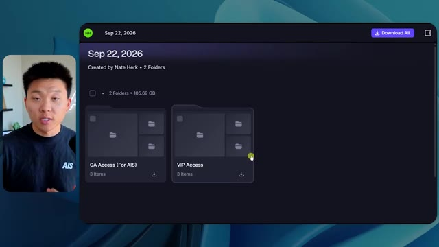
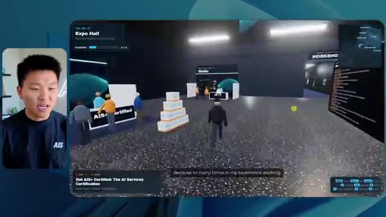
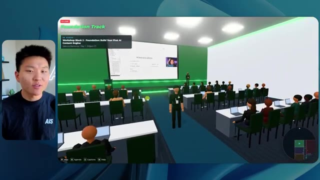

# 🎬 The $200K AI Job That Didn't Exist Last Year

> **Chaîne** : [Nate Herk | AI Automation](https://www.youtube.com/@nateherk/featured)  
> **Lien YouTube** : [https://www.youtube.com/watch?v=eFOTQpbGcy8](https://www.youtube.com/watch?v=eFOTQpbGcy8)  
> **Date de publication** : 20260714  
> **Durée** : 00:10:14  
> **Identifiant vidéo** : `eFOTQpbGcy8`  
> **Transcription & Analyse** : `whisper-v3-large-turbo+gemini-3.5-flash-lite`  

---

## 📌 Synthèse Exécutive & Outils

### 💡 Résumé
Dans cette vidéo, Nate Herk explore l'impact des différents niveaux d'effort (de faible à ultra code) du modèle d'IA de pointe **Opus 5.5** sur une tâche de développement logiciel extrêmement complexe : transformer 105 gigaoctets d'enregistrements vidéo d'un événement virtuel (AIS Live) en un monde 3D explorable, interactif et réaliste en vue à la troisième personne. L'agent IA doit intégrer les ressources du projet, respecter l'identité de marque, gérer la physique, l'affichage vidéo en direct et générer des environnements virtuels sophistiqués sans aucune supervision humaine (zéro question posée). 

Les démonstrations comparent l'exécution de la même invite globale (*slash goal*) à travers les graduations d'effort du modèle. En mode **faible**, le résultat souffre de bugs visuels majeurs (personnages fantômes qui disparaissent, images fixes au lieu de vidéos, manque de personnalisation) pour un coût modeste de 3,91 $ et une durée de 16 minutes. En revanche, le mode **moyen** offre un bond qualitatif impressionnant : respect des chartes graphiques de la marque, personnages dotés de micro-comportements dynamiques, intégration fluide des flux vidéo de l'événement et création de zones distinctes (ateliers, stands, scène principale, salon VIP). 

Cette expérimentation met en lumière un arbitrage crucial en ingénierie IA entre la granularité de l'exécution autonome, le temps de calcul (passant de 16 minutes à plus d'une heure) et la consommation de jetons (jusqu'à 490 000 jetons). Elle démontre que les modèles avancés comme Opus 5.5, couplés à des agents de codage autonomes, redéfinissent la productivité en ingénierie logicielle, tout en soulignant le besoin critique d'outils de déploiement et de mise en ligne instantanée pour combler l'écart entre le code généré localement et l'accessibilité web.

### 🛠️ Outils, Modèles & Logiciels Présentés
* **Opus 5.5** : Modèle d'IA de pointe d'Anthropic extrêmement performant et économique, utilisé ici pour piloter la génération d'un monde 3D interactif à partir de consignes complexes.
* **Claude Code** : Environnement de programmation et d'assistance par IA par ligne de commande d'Anthropic, utilisé comme plateforme d'exécution pour les agents de développement.
* **Hostinger Connector** : Extension gratuite pour éditeurs de code permettant d'intégrer directement un compte d'hébergement Hostinger dans les environnements de développement (VS Code, Cursor, Claude Code) pour un déploiement instantané.
* **Frame.io** : Plateforme cloud de stockage et de gestion vidéo utilisée pour héberger la base documentaire de 105 Go d'enregistrements de l'événement AIS Live.
* **Key.ai / Jev** : Solutions d'IA mentionnées pour la génération d'actifs multimédias (images/vidéos) et potentiellement l'orchestration comportementale des PNJ (personnages non-joueurs) dans le monde 3D.
* **Cursor / VS Code** : Éditeurs de code de référence cités dans l'écosystème de développement assisté par IA.

### 🔑 Points Clés & Enseignements Stratégiques
* **Paramétrage des niveaux d'effort** : La sélection du niveau d'effort (faible, moyen, haut, extra, max, code ultra) modifie radicalement la profondeur d'exécution, la robustesse du code et la fidélité visuelle du résultat final.
* **Évolution exponentielle de la qualité** : Passer d'un effort faible à un effort moyen multiplie par quatre le temps d'exécution (de 16 minutes à 1h13) et le coût API (de 3,91 $ à 12,44 $), mais résout drastiquement les bugs visuels et l'immersion.
* **Autonomie totale des agents** : À travers tous les tests, l'agent a opéré de manière totalement autonome sans poser une seule question à l'utilisateur, soulignant la maturité des architectures de type *slash goal*.
* **Gestion des flux multimédias complexes** : Un bon agent d'ingénierie ne se limite pas à produire du code statique : il est capable d'intégrer et de synchroniser des flux vidéo en direct, des interfaces utilisateur dynamiques (cartes de navigation) et des identités visuelles de marque.
* **Recommandation d'Anthropic** : Les directives officielles préconisent de démarrer systématiquement les prompts complexes au niveau d'effort moyen, puis d'ajuster à la hausse ou à la baisse selon la criticité du livrable.
* **Consommation de jetons et scalabilité** : Les tâches de conception immersive à grande échelle génèrent une volumétrie importante (plus de 490 000 jetons pour l'effort moyen), nécessitant une budgétisation rigoureuse en cas de facturation par API.
* **Le dernier kilomètre du déploiement** : La génération de code fonctionnel par l'IA crée un nouveau goulet d'étranglement : le passage du projet local sur la machine de l'développeur vers un environnement de production en ligne accessible au public.
* **Rôle des intégrations natives** : Des outils comme le connecteur Hostinger comblent le fossé entre les agents de codage (Claude Code, Cursor) et l'infrastructure d'hébergement, éliminant les frictions de mise en ligne.
* **Complexité contextuelle** : L'IA a su analyser et exploiter un volume massif de données hétérogènes (105 Go de vidéos Frame.io) pour structurer sémantiquement un espace virtuel cohérent (salles, pistes, scènes, salons VIP).
* **Émergence de nouveaux rôles techniques** : Ce type de démonstration illustre l'apparition de postes et de compétences à forte valeur ajoutée en ingénierie IA, combinant l'architecture de systèmes autonomes, le prompt engineering avancé et l'automatisation complète de chaînes de production logicielles.

---

## ⏱️ Chronologie & Transcription Complète Audio & Visuelle (Mot pour Mot)

### ⏱️ `[00:00:00 - 00:00:20]` | Segment #01

**🔊 Audio (Transcription Intégrale Mot pour Mot en Français) :**
> Opus 5.5, Opus 5.5, Opus 5.5, Opus 5.5, Opus 5.5. Ce modèle est littéralement partout et pour de très bonnes raisons. Il est intelligent, il est bon marché, il a un goût incroyable, c'est un modèle d'IA incroyable. Mais avec chaque modèle d'IA, vous avez le choix de l'effort, que ce soit faible, moyen, haut, extra, max ou code ultra.

**👁️ Analyse Visuelle d'Écran (gemini-3.5-flash-lite) :**
**Interface & Outils** : Interface du réseau social X (Twitter) affichant un post et une vidéo intégrée.

**Contenu textuel & Code** : Publication textuelle sur X et lecteur vidéo avec une vue en 3D d'un paysage tropical.

**Action / Démonstration** : Présentation visuelle d'un exemple concret lié à l'utilisation des technologies d'IA.

*⏱️ 00:00:05 — Une capture d'écran d'un tweet montrant une vidéo ou une simulation 3D d'un paysage tropical avec des maisons, illustrant la discussion sur les capacités des modèles d'IA.*

---

### ⏱️ `[00:00:20 - 00:00:38]` | Segment #02

**🔊 Audio (Transcription Intégrale Mot pour Mot en Français) :**
> Donc dans cette vidéo, j'ai donné exactement le même prompt à Opus 5.5 et je l'ai exécuté à chaque niveau d'effort, et nous allons comparer les résultats. Nous allons examiner la qualité de tous les différents résultats réels, mais nous allons aussi examiner combien de temps chacun d'eux a pris pour s'exécuter, combien cela nous a coûté si c'était une facturation par API, le nombre total de jetons, combien de vérifications ils ont exécutées, et combien de questions ils m'ont réellement posées tout au long du processus.

**👁️ Analyse Visuelle d'Écran (gemini-3.5-flash-lite) :**
**Interface & Outils** : Interface web de tableau de bord ou d'outil de comparaison.

**Contenu textuel & Code** : Tableau comparatif avec les colonnes Low, Medium, High, Extra, Max, Ultracode et les lignes Run time, API cost, Total tokens, Checks, Questions asked.

**Action / Démonstration** : Présentation du tableau comparatif des différents niveaux d'effort d'Opus 5.5.

*⏱️ 00:00:29 — Tableau comparatif sur une interface web intitulé "Opus 5.5 Efforts", affichant les différents niveaux d'effort (Low, Medium, High, Extra, Max, Ultracode) et des métriques (Run time, API cost, Total tokens, Checks, Questions asked).*

---

### ⏱️ `[00:00:39 - 00:00:58]` | Segment #03

**🔊 Audio (Transcription Intégrale Mot pour Mot en Français) :**
> Et les résultats qu'on a obtenus ne sont pas du tout ce à quoi je m'attendais, donc j'ai hâte de partager ça avec vous les gars. Ne perdons pas de temps et entrons directement dans le vif du sujet. Bon, alors plongeons directement là-dedans. Je veux commencer juste en vous montrant le prompt réel qu'on a utilisé, qu'on a donné à chacun de ces différents agents. Je vais aller dans les fichiers ici, et nous allons ouvrir ce fichier markdown de prompt, et je vais vous montrer ce qu'on a obtenu. Donc voici le slash objectif que j'ai fourni.

**👁️ Analyse Visuelle d'Écran (gemini-3.5-flash-lite) :**
**Interface & Outils** : Interface de type éditeur d'assistant IA / interface web avec un panneau latéral de navigation et une zone de chat.

**Contenu textuel & Code** : Texte du prompt affiché : "Hi Nate. This worktree has the effort-test task queued in PROMPT.md : build a walkable third-person 3D world of the AIS Live conference..."

**Action / Démonstration** : Affichage et lecture du prompt initial dans l'interface de l'outil d'IA avant le lancement de la tâche.

*⏱️ 00:00:48 — Interface d'un éditeur ou d'une application d'assistant IA avec le présentateur incrusté en bas à gauche, affichant un prompt textuel concernant un projet en 3D.*

---

### ⏱️ `[00:00:58 - 00:01:34]` | Segment #04

**🔊 Audio (Transcription Intégrale Mot pour Mot en Français) :**
> J'ai dit : tu dois me créer un monde 3D qui est une conférence tech réaliste dans laquelle je peux me promener en vue à la troisième personne. Tu vas regarder ce dossier, qui contient mes ressources d'enregistrement d'événements de AIS Live. Et ce dossier est un dossier Frame.io de 105 gigaoctets d'enregistrements vidéo. C'était un événement entièrement virtuel. Tout a été enregistré et tous les enregistrements sont juste ici. J'ai dit, ton objectif est de prendre cet événement et de le transformer en un monde 3D explorable qui me donne l'impression d'être réellement allé à une vraie conférence en personne avec différentes salles, différentes pistes, différentes scènes, bla, bla, bla. N'hésite pas à utiliser key.ai si tu as besoin de générer des images ou des vidéos. Et tu peux aussi utiliser n'importe quoi d'autre à l'intérieur de mon projet Herc 2, qui est comme mon système d'exploitation IA. J'ai dit,

**👁️ Analyse Visuelle d'Écran (gemini-3.5-flash-lite) :**
**Interface & Outils** : Éditeur de code (VS Code / interface similaire) et navigateur web affichant Frame.io.

**Contenu textuel & Code** : Texte du prompt demandant la création d'une conférence tech 3D interactive et explorant un dossier Frame.io de 105 Go.

**Action / Démonstration** : Présentation du prompt de configuration et des ressources d'enregistrement pour le projet d'IA.

*⏱️ 00:01:07 — Un éditeur de code affichant un fichier PROMPT.md contenant des instructions détaillées pour la création d'un monde 3D.*

*⏱️ 00:01:16 — Une interface web Frame.io montrant un dossier d'enregistrements d'événements de 105,69 Go.*

*⏱️ 00:01:25 — Retour sur l'éditeur de code affichant le fichier PROMPT.md avec le lien Frame.io visible.*

---

### ⏱️ `[00:01:34 - 00:02:08]` | Segment #05

**🔊 Audio (Transcription Intégrale Mot pour Mot en Français) :**
> vous serez jugé sur la créativité, le design, la physique et la sensation générale lorsque j'explorerai le monde 3D que vous avez construit. Et c'était fondamentalement la fin des instructions. Donc, comme vous pouvez le voir sur ce côté gauche, j'ai exécuté cela à travers tous les différents niveaux d'effort. Commençons par le niveau bas et montons jusqu'à ultra code. Très bien. Nous avons donc ici le résultat du niveau bas. Ouvrons ceci et jetons un œil. Nous avons donc AIS live, le sommet des services IA en personne enfin, et nous avons pu cliquer partout. Tout d'abord, cela ne fait pas très personnalisé. Genre, ce n'ce n'est pas le logo d'IS Live. Ce n'est même pas nos couleurs. Donc je n'aime pas trop ça, mais entrons ici. D'accord. C'est beaucoup too bright, c'est beaucoup trop lumineux. Euh, nous avons une carte en haut à droite. Nous avons une ville ici en arrière-plan. Je ne peux pas dire quelle ville c'est.

**👁️ Analyse Visuelle d'Écran (gemini-3.5-flash-lite) :**
**Interface & Outils** : Interface web d'un outil de développement ou d'agent IA avec panneau de navigation latéral et zone de chat.

**Contenu textuel & Code** : Texte du prompt : 'Hi Nate. This worktree has the effort-test task queued in PROMPT.md : build a walkable third-person 3D world...'.

**Action / Démonstration** : Le présentateur survole ou sélectionne différents niveaux de test d'effort dans la barre latérale gauche.

*⏱️ 00:01:42 — Capture d'écran montrant l'interface d'un assistant IA avec un panneau latéral à gauche listant différents niveaux de tests d'effort ('Hello', 'Extra', 'High', 'Max', 'Ultracode', 'Medium', 'Low') et une conversation à droite affichant le prompt demandant de construire un monde 3D.*

---

### ⏱️ `[00:02:08 - 00:02:40]` | Segment #06

**🔊 Audio (Transcription Intégrale Mot pour Mot en Français) :**
> C'est. D'accord. C'est Chicago, ce qui est plutôt cool parce que tu sais, j'habite à Chicago, mais bref, en haut à droite, on peut voir une carte. Nous avons un hall d'accueil. Nous avons un hall d'exposition. Nous avons un salon VIP sur la scène principale. La carte montre également où se trouve chaque autre personne et tout cela se synchronise en direct. On peut donc voir l'inscription. On peut voir le premier jour, la keynote de l'hyper agent, le débriefing en direct. Cool. Donc il connaît vraiment le programme et puis il y a le deuxième jour. Il a donc trouvé ça, c'est bien. Nous avons ces petites boules ici que je peux espérer botter. D'accord. Le visage, Oh, regarde ça ! Si je vais par ici, tous les gens disparaissent tout simplement. Très mauvais. Très mauvais. D'accord. Alors voyons voir. Est-ce que je peux sprinter ? D'accord.

**👁️ Analyse Visuelle d'Écran (gemini-3.5-flash-lite) :**
**Interface & Outils** : Application virtuelle 3D interactive (type Gather.town ou similaire)

**Contenu textuel & Code** : Carte de navigation, listes de sessions et programmes de conférence virtuels

**Action / Démonstration** : Exploration et navigation d'un utilisateur à travers les différentes zones d'un événement virtuel en ligne

*⏱️ 00:02:16 — Vue d'un espace virtuel interactif représentant un hall d'accueil avec des avatars et une mini-carte en haut à droite.*

*⏱️ 00:02:24 — Vue de l'intérieur d'un hall virtuel affichant le programme du premier jour sur un panneau interactif.*

*⏱️ 00:02:32 — Vue d'un espace virtuel d'exposition avec des participants représentés par des avatars colorés et une installation lumineuse centrale.*

---

### ⏱️ `[00:02:40 - 00:03:04]` | Segment #07

**🔊 Audio (Transcription Intégrale Mot pour Mot en Français) :**
> Je peux aller un peu plus vite. Je vais d'abord aller par ici. Il y a des produits promotionnels, euh, certifié AIS plus glido. D'accord. Donc il y a les vrais stands que nous avions dans l'événement virtuel. Nous avions des stands. Donc c'est plutôt cool. Un petit endroit pour prendre des photos. Salle C. En ce moment, nous avons Tangy Frederick qui anime un atelier. D'accord. Mais ce n'est pas une vidéo. Comme vous pouvez le voir, c'est juste une image. Elle ne bouge pas. C'est donc juste une image. Ces gens sont en train de disparaître. Ce doivent être des fantômes. Allons par ici dans la salle A.

**👁️ Analyse Visuelle d'Écran (gemini-3.5-flash-lite) :**
**Interface & Outils** : Environnement virtuel 3D interactif (metaverse/salon virtuel).

**Contenu textuel & Code** : Éléments textuels et graphiques intégrés dans l'environnement virtuel 3D (panneaux de stands, présentations sur écran géant).

**Action / Démonstration** : Navigation et exploration de l'espace virtuel par le présentateur contrôlant un avatar.

*⏱️ 00:02:46 — Vue d'un monde virtuel 3D de type salon professionnel, montrant un avatar se déplaçant devant un stand sponsorisé "Glaido" avec des blocs marqués "AIS".*

*⏱️ 00:02:52 — L'avatar progresse dans une salle thématique verdoyante et futuriste du monde virtuel, entourée de tables éclairées.*

*⏱️ 00:02:58 — L'avatar fait face à un grand écran virtuel affichant des instructions textuelles et des étapes (ex: "Step 1. Go to Settings") dans un espace d'atelier.*

---

### ⏱️ `[00:03:04 - 00:03:30]` | Segment #08

**🔊 Audio (Transcription Intégrale Mot pour Mot en Français) :**
> Nous avons Liberty White. D'accord. Très cool. Vos 30 premiers jours en automatisation. Encore une fois, c'est juste une image fixe et les gens ont des bugs d'affichage. Donc ce n'est pas très bien ici. Je vais aller sur la scène principale et voir ce que nous avons. D'accord, cool. Donc nous avons une scène principale. Les gens ont de gros bugs d'affichage. Vraiment mauvais. Ce n'est vraiment pas terrible. Notre vidéo est en fait en train de bouger. Genre, j'ai vu mon visage ici et j'ai vu celui de Devin, mais maintenant ils ont disparu. Donc je ne sais pas ce qui s'est passé. D'accord. On dirait que c'est plutôt un diaporama. Rien n'est vraiment lu pour l'instant. Quoi qu'il en soit, entrons ici.

**👁️ Analyse Visuelle d'Écran (gemini-3.5-flash-lite) :**
**Interface & Outils** : Application ou plateforme virtuelle interactive en 3D (type metaverse ou événement virtuel).

**Contenu textuel & Code** : Interface utilisateur virtuelle affichant "AIS LIVE AI Services Summit" et "Hyperagent Workshop".

**Action / Démonstration** : Le présentateur navigue et explore différentes zones et scènes de l'événement virtuel.

*⏱️ 00:03:17 — Navigation d'un avatar dans un amphithéâtre virtuel bondé pour le Hyperagent Workshop.*

*⏱️ 00:03:24 — Vue panoramique de la scène principale "AIS LIVE AI Services Summit" dans l'environnement virtuel.*

---

### ⏱️ `[00:03:30 - 00:03:58]` | Segment #09

**🔊 Audio (Transcription Intégrale Mot pour Mot en Français) :**
> Nous avons d'autres stands. Nous avons hyper agent. Nous avons Claude Code. Nous avons plus de goodies. La salle B, c'est Dave Ebelor. Je suppose que c'est exactement la même chose. Nous avons du café. Et ensuite, je suppose que le salon VIP, accès VIP seulement. C'est plutôt cool, mais il n'y a vraiment rien qui se passe ici. Cet écran est bien trop lumineux. D'accord. Donc je pense que vous comprenez l'ambiance qu'on a là avec Opus 5.5 en effort faible. Et c'est là que les choses deviennent intéressantes. À combien est-ce que vous pensez que ça s'est exécuté ? Combien de temps ? Celui-ci a duré 16 minutes et 43 secondes. Combien est-ce que vous pensez que ça a coûté ?

**👁️ Analyse Visuelle d'Écran (gemini-3.5-flash-lite) :**
**Interface & Outils** : Tableau blanc numérique / Outil de mindmapping (Opus 5.5 Efforts)

**Contenu textuel & Code** : Tableau avec des colonnes de performance (Low, Medium, High, Extra, Max, Ultracode) et des lignes de métriques (Run time, API cost, Total tokens, Checks, Questions asked).

**Action / Démonstration** : Présentation d'un tableau comparatif des différents niveaux d'effort d'un modèle d'IA.

*⏱️ 00:03:51 — Tableau comparatif sur une interface de type tableau blanc affichant les niveaux de performance (Low, Medium, High, Extra, Max, Ultracode).*

---

### ⏱️ `[00:03:58 - 00:04:26]` | Segment #10

**🔊 Audio (Transcription Intégrale Mot pour Mot en Français) :**
> 3,91 $ si c'était une facturation par API. J'utilise évidemment mon abonnement ici, mais nous allons simplement calculer cela avec la facturation par API. Le total des jetons était de 191 000. Il a fait 22 vérifications. Donc la vérification, 22 fois il a ouvert le navigateur et a exécuté différentes sortes de vérifications. Donc 22 catégories de vérifications. Et combien de questions m'a-t-il posées ? Il m'a posé un total de zéro question tout au long de cette invite de type slash goal. D'accord. Alors, ouvrons l'effort moyen et voyons ce que nous avons. D'accord, c'est parti. Effort moyen. Nous avons Nate Herc. Nous avons mon badge. C'est la marque de fabrique d'AI's Life.

**👁️ Analyse Visuelle d'Écran (gemini-3.5-flash-lite) :**
**Interface & Outils** : Tableau de bord de type application de notes ou diagramme interactif (ex: Excalidraw ou similaire).

**Contenu textuel & Code** : Tableau avec les lignes 'Run time' (16m 43s), 'API cost' ($3.91), 'Total tokens' (191.3K), 'Checks', et 'Questions asked', classées par colonnes 'Low', 'Medium', 'High', etc.

**Action / Démonstration** : Le présentateur explique les métriques du tableau en pointant du doigt les données de coût et de jetons.

*⏱️ 00:04:05 — Un tableau comparatif des coûts et performances d'exécution s'affiche à l'écran, avec le présentateur visible dans un encadré à gauche.*

---

### ⏱️ `[00:04:26 - 00:04:46]` | Segment #11

**🔊 Audio (Transcription Intégrale Mot pour Mot en Français) :**
> Donc ça a déjà l'air un petit peu mieux. Ça ressemble à nos palettes de couleurs qui ont utilisé nos directives de marque. Premier jour de construction, deuxième jour de gain, VIP. Cool. D'accord. Je vais entrer dans le lieu. D'accord. Waouh. Une ambiance similaire, en gros. C'est en arrière-plan. Ça ne ressemble pas à Chicago, hein ? Non, ça ressemble à, honnêtement, ça ressemble à une ville imaginaire. Quoi qu'il en soit, c'est marrant qu'ils aient décidé de faire ça. Voyons si je peux avancer un peu plus vite. Oh, waouh.

**👁️ Analyse Visuelle d'Écran (gemini-3.5-flash-lite) :**
**Interface & Outils** : Application web interactive / Plateforme virtuelle 3D AIS Live

**Contenu textuel & Code** : Écran d'accueil avec badge de pass (Day 1 Build, Day 2 Earn, VIP), texte "Welcome to AIS Live", et commandes de navigation clavier.

**Action / Démonstration** : Le présentateur clique sur "Enter the venue" pour entrer et explorer l'espace virtuel en 3D.

*⏱️ 00:04:31 — Interface d'accueil de l'événement virtuel AIS Live affichant un badge nominatif interactif (Nate Herk) aux couleurs de la marque et un bouton pour entrer dans le lieu.*

*⏱️ 00:04:41 — Vue en 3D à l'intérieur du lieu virtuel de l'événement montrant des avatars d'utilisateurs et une vue panoramique urbaine en arrière-plan.*

---

### ⏱️ `[00:04:46 - 00:05:21]` | Segment #12

**🔊 Audio (Transcription Intégrale Mot pour Mot en Français) :**
> Les gens interagissent avec moi. Regardez. Si je m'approche de ce type, il vient de lever le bras. Bon, maintenant il ne veut plus du tout avoir affaire à moi. Mais tous ces petits robots ici doivent prendre des décisions. Je ne sais pas s'ils utilisent Jev. C'est sûr que non. Je ne le lui ai pas dit. En fait, ma clé Jev est à l'arrière. Je ne sais pas. Peut-être qu'il l'a utilisée. Quoi qu'il en soit, nous pouvons voir ici que nous avons la salle d'atelier C, le laboratoire des agents. Sympa. Donc celui-ci est en fait en train d'être exécuté. Vous pouvez voir qu'il s'agit d'une vraie vidéo lue par Tangy. Tout le monde ici est en train de travailler sur un ordinateur portable. Ils ne buguent pas. C'est plutôt cool. De plus, mon badge est sur ma poitrine, ce qui est plutôt cool. Je peux venir par ici. Nous avons une carte en haut à droite, comme vous pouvez le voir, mais je peux venir par ici. Nous avons un

**👁️ Analyse Visuelle d'Écran (gemini-3.5-flash-lite) :**
**Interface & Outils** : Environnement virtuel 3D interactif (type métavers ou jeu de type Gather.town / Roblox).

**Contenu textuel & Code** : Aucun code source, terminal ou prompt n'est affiché ; uniquement un monde virtuel 3D avec des avatars.

**Action / Démonstration** : Navigation et déplacement de l'avatar du présentateur à travers différents espaces virtuels remplis d'autres agents.

---

### ⏱️ `[00:05:21 - 00:05:47]` | Segment #13

**🔊 Audio (Transcription Intégrale Mot pour Mot en Français) :**
> hall d'exposition. C'est là que nous avons le stand Glido. Et ça diffuse en ce moment. Oui, ça diffuse la vidéo de nous parlant de Glido. Ça diffuse la vidéo d'Ed et moi parlant de notre programme de certification. Nous avons le logo AIS Plus juste ici, qui est un peu dans un endroit bizarre. Ce sont les diapositives des conférenciers et les points clés. Alors wow, ce sont toutes les ressources que nous avons distribuées après l'événement. Elles sont toutes affichées là également. Nous pouvons voir que nous avons un projecteur de communauté. C'est donc Aiden qui parle de son contrat qu'il a décroché et ça se joue en direct. Ces gens sont en train de regarder.

**👁️ Analyse Visuelle d'Écran (gemini-3.5-flash-lite) :**
**Interface & Outils** : Environnement virtuel 3D de type métavers ou salon virtuel interactif

**Contenu textuel & Code** : Écrans virtuels affichant des présentations, des logos "AIS+ Certified" et des graphiques informatifs

**Action / Démonstration** : Navigation et visite guidée d'un stand virtuel dans un espace d'exposition en ligne

---

### ⏱️ `[00:05:47 - 00:06:21]` | Segment #14

**🔊 Audio (Transcription Intégrale Mot pour Mot en Français) :**
> Ils sont plutôt engagés. On a l'hyper agent. C'était, c'est ce que je voulais dire. Si vous avez vu ces gens lever les bras en disant bonjour, c'était plutôt marrant. Regardez, regardez, le voilà qui recommence. Bref. Bon. Où est-ce que je suis maintenant ? Maintenant, je suis dans le hall principal. On a un bar à café. On a un grand logo, qui est le vrai logo. C'est trop lumineux, mais on a le logo. On peut voir si on peut entrer ici dans le parcours des fondations. On a Sabrina Romanov et Liberty White. Donc différentes formations juste là. On peut entrer dans cette salle. C'est le parcours avancé. Alors qu'est-ce qui se passe ici. On a Dave Ebelar et Saman qui parlent de trucs différents là-dedans. Et maintenant, allons jeter un œil à la scène principale. Oh, attendez, il y a une vidéo de moi là-haut. C'est du genre VIP ?

**👁️ Analyse Visuelle d'Écran (gemini-3.5-flash-lite) :**
**Interface & Outils** : Environnement virtuel 3D interactif de type métavers / plateforme de conférence en ligne.

**Contenu textuel & Code** : Interface d'événement virtuel avec mini-carte de navigation, indicateurs de position et avatars d'utilisateurs.

**Action / Démonstration** : Navigation et exploration de l'espace virtuel de conférence par le présentateur.

*⏱️ 00:05:55 — Le présentateur commente une vue en 3D d'un espace virtuel nommé « Main Lobby » où l'on aperçoit des avatars et un comptoir de café.*

*⏱️ 00:06:04 — L'avatar se déplace vers une grande salle de conférence virtuelle remplie de participants assis et écoutant une présentation.*

*⏱️ 00:06:12 — L'avatar se déplace dans le hall principal virtuel au milieu d'autres avatars en interaction.*

---

### ⏱️ `[00:06:21 - 00:06:50]` | Segment #15

**🔊 Audio (Transcription Intégrale Mot pour Mot en Français) :**
> section ? Ouais, on ira voir ça dans une minute. Mais bref, voici la scène principale. Ça a l'air vraiment, vraiment super. On a une grande scène. On a genre quatre personnes assises ici. On a les trois écrans d'Alex là-haut avec l'hyper agent. Est-ce que j'ai le droit de monter sur scène ? Oh, et il me laisse monter sur scène. D'accord. C'est plutôt sympa. Bon les gars, faisons un selfie. Laissez-moi prendre tout le monde en arrière-plan. Venez par ici. Bref, c'est vraiment, vraiment cool. Toutes les places ne sont pas prises par contre. Donc il faut qu'on travaille là-dessus. Mais bref, je vais courir voir ce qu'était cette section VIP. D'accord. Le salon VIP. J'ai l'impression que c'est comme un aéroport ou un truc du genre.

**👁️ Analyse Visuelle d'Écran (gemini-3.5-flash-lite) :**
**Interface & Outils** : Environnement virtuel 3D / plateforme de conférence virtuelle interactive.

**Contenu textuel & Code** : Interface utilisateur affichant "Hyperagent Keynote" avec les informations de session en bas à gauche et une mini-carte en haut à droite.

**Action / Démonstration** : Navigation et exploration de l'espace virtuel par l'avatar du présentateur.

---

### ⏱️ `[00:06:51 - 00:07:14]` | Segment #16

**🔊 Audio (Transcription Intégrale Mot pour Mot en Français) :**
> OK, super. Donc maintenant nous avons les sessions VIP ici. Une FAQ VIP avec la lecture vidéo en direct de Nate juste ici. Très, très cool. Et nous avons comme un bar ou quelque chose comme ça. Génial. Je dirais que c'est un très bon résultat. Maintenant, en ce qui concerne les statistiques ici, celle-ci a pris une heure et 13 minutes à s'exécuter. Cela nous aurait coûté 12 dollars et 44 cents. Elle a utilisé 490 000 jetons et elle a effectué 23 vérifications.

**👁️ Analyse Visuelle d'Écran (gemini-3.5-flash-lite) :**
**Interface & Outils** : Interface 3D virtuelle, Interface de tableau de bord

**Contenu textuel & Code** : Run time: 16m 43s
API cost: $3.91
Total tokens: 191.3K
Checks: 22
Questions asked: 0

**Action / Démonstration** : Présentation des résultats d'un projet ou d'une démonstration.

*⏱️ 00:06:56 — Un écran affiche une scène virtuelle de type "lounge VIP" avec des avatars, et une vidéo de Nate Hersh sur un écran. En bas à gauche, un élément graphique indique "VIP Q&A with Nate".*

*⏱️ 00:07:02 — Un tableau de statistiques, étiqueté "Opus 5.5 Effects", affiche des données telles que "Run time", "API cost", "Total tokens", "Checks" et "Questions asked". Des barres graphiques sont partiellement remplies à côté des données.*

---

### ⏱️ `[00:07:14 - 00:07:48]` | Segment #17

**🔊 Audio (Transcription Intégrale Mot pour Mot en Français) :**
> Et il nous a posé un total de zéro question une fois de plus. Très bien, passons au niveau élevé. C'était déjà un résultat plutôt correct et Anthropic eux-mêmes dans leur vidéo, ou désolé, pas une vidéo, un article sur comment prompter Opus 5.5. Ils ont dit de commencer simplement par le niveau moyen et d'ajuster à la hausse ou à la baisse si nécessaire. C'était donc un résultat moyen. Passons au niveau élevé et voyons ce qu'on a obtenu. Très rapidement, les gars, je dois prendre une seconde pour vous parler du sponsor de la vidéo d'aujourd'hui, Hostinger. Donc, ces deux modèles viennent de me construire une version fonctionnelle de la même chose. Et maintenant, je suis exactement là où je finis toujours, avec un projet terminé sur mon ordinateur portable et aucun moyen rapide de le mettre en ligne. Et c'est le fossé que le connecteur d'Hostinger comble. C'est une extension gratuite

**👁️ Analyse Visuelle d'Écran (gemini-3.5-flash-lite) :**
**Interface & Outils** : Présentation ou face-caméra explicatif sans interface logicielle partagée.

**Contenu textuel & Code** : Explications orales et mise en contexte méthodologique.

**Action / Démonstration** : Explications face caméra et démonstration conceptuelle.

---

### ⏱️ `[00:07:48 - 00:08:23]` | Segment #18

**🔊 Audio (Transcription Intégrale Mot pour Mot en Français) :**
> pour votre éditeur qui intègre votre compte Hostinger dans l'outil de programmation que vous utilisez déjà, que ce soit VS Code, Cursor, Cloud Code, Codex, et j'en passe. Vous vous connectez une seule fois en un clic, et à partir de là, votre agent peut déployer le site, y pointer un domaine, configurer les enregistrements DNS et vérifier votre VPS sans que vous ayez à quitter votre éditeur. Ainsi, quel que soit celui de ces outils que vous finirez par préférer, ce qu'il a construit n'est qu'à quelques minutes d'une vraie URL sur un hébergement géré. Connector est gratuit avec tous les abonnements d'hébergement, donc si vous avez toujours besoin de l'hébergement en dessous, procurez-vous l'abonnement illimité grâce au lien dans la description et utilisez le code NATEHERK pour obtenir 10 % de réduction. Cela inclut également un nom de domaine gratuit et un e-mail professionnel pour l'année. Et c'est toujours le moyen le moins cher que j'ai trouvé pour obtenir un

**👁️ Analyse Visuelle d'Écran (gemini-3.5-flash-lite) :**
**Interface & Outils** : Présentation ou face-caméra explicatif sans interface logicielle partagée.

**Contenu textuel & Code** : Explications orales et mise en contexte méthodologique.

**Action / Démonstration** : Explications face caméra et démonstration conceptuelle.

---

### ⏱️ `[00:08:23 - 00:08:47]` | Segment #19

**🔊 Audio (Transcription Intégrale Mot pour Mot en Français) :**
> vous avez construit sur une vraie URL. Donc revenons à la vidéo. D'accord. Encore une fois, très, très thématisé par la marque. C'est un écran de chargement encore meilleur que le précédent. Nous avons ce joli petit effet en arrière-plan. Nous avons le logo. Nous allons entrer dans le lieu. D'accord. Nous y voilà. Ça a l'air plutôt bien. Nous commençons à l'extérieur et vous pouvez voir que nous avons ces drapeaux pour tous les intervenants, Wyatt, Casper, Alex, Ed, Aiden, Sabrina, Liberty. C'est plutôt cool. Nous avons des blocs en direct ici.

**👁️ Analyse Visuelle d'Écran (gemini-3.5-flash-lite) :**
**Interface & Outils** : Présentation ou face-caméra explicatif sans interface logicielle partagée.

**Contenu textuel & Code** : Explications orales et mise en contexte méthodologique.

**Action / Démonstration** : Explications face caméra et démonstration conceptuelle.

---

### ⏱️ `[00:08:47 - 00:09:23]` | Segment #20

**🔊 Audio (Transcription Intégrale Mot pour Mot en Français) :**
> it took this picture from me, your host, Nate Herc, John, Dave, Nate Herc. There we go. Okay. The doors. Awesome. They're automatic sliding glass doors. I love that. We can see VIP check-in. We can see GA. We can come over here and we can check out the expo with different booths, community spotlight. You can also see that in the top left, I have a passport. So it's like, it will be showing how many of the places I've visited. All of these are real playback. We've got a resource wall with all of the different speakers. They've also got a networking session over here. So I'm going to come over real quick and see what that's all about. So we've got the AIS cold brew bar. We've got different community members that were spotlighted or highlighted.

**👁️ Analyse Visuelle d'Écran (gemini-3.5-flash-lite) :**
**Interface & Outils** : Application web 3D / Environnement virtuel interactif

**Contenu textuel & Code** : Interface d'événement virtuel avec bannières, comptoirs d'accueil et mini-carte

**Action / Démonstration** : Navigation et visite guidée de l'espace virtuel de conférence par le présentateur

*⏱️ 00:08:56 — Vue principale de l'espace virtuel avec la scène centrale et les comptoirs de check-in VIP et GA.*

*⏱️ 00:09:05 — Exploration de l'expo hall virtuel montrant différents stands et la certification AIS+.*

*⏱️ 00:09:14 — Navigation dans le hall virtuel montrant les avatars et l'architecture intérieure du lieu.*

---

### ⏱️ `[00:09:23 - 00:09:56]` | Segment #21

**🔊 Audio (Transcription Intégrale Mot pour Mot en Français) :**
> We've got the VIP wing. Wait, what? Pick up a wristband. Oh, I have to actually go get the wristband. Okay. Let me check in real quick. Wristband's already on. Wait, what? Okay. Oh, okay. Now the doors have opened for me. Cool. I can come into here. Oh, that just goes to the main stage. VIP lounge. This is a Q and A going on. It looks like very cool. I mean, I'm very impressed by how it's able to do this. Wow. Okay. So this is really good. What we did is we had VIP breakout rooms with different people. You can see that there's different rooms, different members of the AIS team going into stuff. This is really cool. This is very cool. That's a much better VIP

**👁️ Analyse Visuelle d'Écran (gemini-3.5-flash-lite) :**
**Interface & Outils** : Présentation ou face-caméra explicatif sans interface logicielle partagée.

**Contenu textuel & Code** : Explications orales et mise en contexte méthodologique.

**Action / Démonstration** : Explications face caméra et démonstration conceptuelle.

---

### ⏱️ `[00:09:56 - 00:10:30]` | Segment #22

**🔊 Audio (Transcription Intégrale Mot pour Mot en Français) :**
> experience than what was shown in the first piece. Okay. VIP after party. Look at this. We've got a dance floor. We've got all these elements in here. We have the actual VIP after party playback right here. And there's a DJ booth. That is so funny. There's a bit of a bug right here, a glitch right there, but this is awesome. Oh, cool. So when I'm in here in the main stage, we get closed captions. You can see right here in the bottom of my screen, we're getting these closed captions of Wyatt actually talking up here. We've got lights. We've got the panel. Very cool. Nice main stage. I'm going to go over here. We can go to the foundation,

**👁️ Analyse Visuelle d'Écran (gemini-3.5-flash-lite) :**
**Interface & Outils** : Application web ou plateforme virtuelle 3D (metaverse / événement virtuel)

**Contenu textuel & Code** : Environnement virtuel 3D interactif avec avatars, écrans vidéo de participants et commandes de navigation à l'écran.
[DESC_IMAGE_3]

**Action / Démonstration** : Navigation et présentation dans l'environnement virtuel 3D de l'événement en ligne.

*⏱️ 00:10:04 — Vue d'un espace virtuel VIP After-Party avec des avatars sur une piste de danse et un grand écran montrant des participants en visio.*

*⏱️ 00:10:13 — Vue légèrement différente de la piste de danse virtuelle de la VIP After-Party avec de la musique et des avatars en mouvement.*

*⏱️ 00:10:21 — Vue d'une scène principale virtuelle (Main Stage) avec un public d'avatars assis et un intervenant sur grand écran.*

---

### ⏱️ `[00:10:30 - 00:11:06]` | Segment #23

**🔊 Audio (Transcription Intégrale Mot pour Mot en Français) :**
> advanced, and the enterprise tracks over here. So let's see. We have anatomy of a three real deals. We've got hyper agent. We've got the evals with Nate and Ed in here. We've got Dave going on in the advanced stuff. This is really nice. I mean, obviously each, each of these outputs so far, low was okay. Medium was better. High has been even better. Let's see if that trend continues and let's go ahead and see what this cost us. So high ran for one hour and seven minutes. So a little bit quicker than medium, it would have cost us $16 and 31 cents. It used half a million tokens, 509,000. It did 22 checks. And it also asked us, well, actually, no, I was wrong. This

**👁️ Analyse Visuelle d'Écran (gemini-3.5-flash-lite) :**
**Interface & Outils** : Application de tableau blanc / interface de présentation (type Excalidraw ou similaire).

**Contenu textuel & Code** : Tableau de données comparatives 'Opus 5.5 Efforts' avec des colonnes Low, Medium, High, Extra et des lignes Run time, API cost, Total tokens, Checks, Questions asked.

**Action / Démonstration** : Présentation des résultats comparatifs et des performances de différents niveaux d'effort d'un modèle d'IA.

*⏱️ 00:10:57 — Tableau comparatif intitulé 'Opus 5.5 Efforts' affichant les métriques (Run time, API cost, Total tokens, Checks) selon différents niveaux (Low, Medium, High, Extra).*

---

### ⏱️ `[00:11:06 - 00:11:25]` | Segment #24

**🔊 Audio (Transcription Intégrale Mot pour Mot en Français) :**
> one asked me one question and spoiler, it was the only one that asked us a question throughout all of this. So let's see, we've got three left extra max and ultra code. Let me pull open extra and we'll see what we got. Okay. So this one looks pretty good. I would honestly say so far, the loading screen high was the best. The one that we just saw, but anyways, let's enter AIS live.

**👁️ Analyse Visuelle d'Écran (gemini-3.5-flash-lite) :**
**Interface & Outils** : Application web ou tableau de bord avec une interface de canevas (intitulé « Opus 5.5 Efforts »).

**Contenu textuel & Code** : Tableau avec des colonnes Low, Medium, High, Extra et des lignes pour Run time, API cost, Total tokens, Checks, Questions asked.

**Action / Démonstration** : Le présentateur analyse et commente les résultats comparatifs affichés dans le tableau.

*⏱️ 00:11:11 — Un tableau comparatif montrant les métriques de différents modèles ou configurations (Low, Medium, High, Extra) incluant le temps d'exécution, le coût API, le nombre total de tokens, les vérifications et les questions posées.*

---

### ⏱️ `[00:11:26 - 00:11:51]` | Segment #25

**🔊 Audio (Transcription Intégrale Mot pour Mot en Français) :**
> Wouah. D'accord. Donc nous avons comme de petits extraits sonores. Je peux discuter avec des gens. Le panel de la guerre des outils a réglé quelques débats pour moi. Sympa. Bonne perspective là-bas. Nous sommes dehors à nouveau. Nous avons ces différentes bannières, bien qu'elles soient toutes les mêmes. Elles n'affichent pas les noms de différentes personnes. Donc grand logo Big AIS Live. L'aile de l'atelier est par ici. Et traversons les portes coulissantes en verre pour voir ce que nous avons. Donc nous avons le café AIS. La carte est en bas à droite, et elle n'est pas très descriptive.

**👁️ Analyse Visuelle d'Écran (gemini-3.5-flash-lite) :**
**Interface & Outils** : Application de métavers 3D / Navigateur web virtuel

**Contenu textuel & Code** : Environnement virtuel 3D avec avatars, bannières 'AIS LIVE' et mini-carte en bas à droite

**Action / Démonstration** : Navigation et déplacement d'un avatar dans le monde virtuel 3D

*⏱️ 00:11:32 — Vue d'un monde virtuel 3D de type métavers avec un avatar en mouvement sur une place de convention.*

*⏱️ 00:11:38 — Poursuite de la navigation de l'avatar dans l'environnement virtuel 3D nocturne avec des bannières publicitaires.*

*⏱️ 00:11:45 — L'avatar s'approche de l'entrée principale d'un bâtiment virtuel lumineux.*

---

### ⏱️ `[00:11:51 - 00:12:26]` | Segment #26

**🔊 Audio (Transcription Intégrale Mot pour Mot en Français) :**
> J'aime bien comment les autres cartes nous ont montré ce qu'il y avait, genre où étaient les choses, mais celle-ci a l'air très professionnelle. On peut voir ici c'est la scène principale. Allons y faire un tour rapidement. Elles ont toutes ces balles qui volent partout, ce que je trouve plutôt marrant. Les balles de plage AIS. On nous voit là-haut en train de parler. Je crois que j'introduisais l'un des jours. Continuons par ici vers la salle d'atelier sur ce côté gauche. D'accord. Donc ici nous avons le théâtre Hyper Agent. Nous avons cette session sponsorisée ici par Hyper Agent, mais ça nous montre aussi ce qui va se passer ici. C'est vraiment marrant qu'on puisse discuter avec les gens. Salmon a créé un représentant commercial vocal en direct. La salle "Le Juste Prix" était comble. As-tu pris le guide du compagnon VIP ? C'est trop marrant. Nous avons le parcours avancé dans

**👁️ Analyse Visuelle d'Écran (gemini-3.5-flash-lite) :**
**Interface & Outils** : Application ou plateforme virtuelle en 3D avec avatars et mini-carte.

**Contenu textuel & Code** : Environnement virtuel 3D simulant une conférence en ligne avec écrans et participants.

**Action / Démonstration** : Exploration d'un monde virtuel 3D en naviguant à travers différentes salles (scène principale, hall, couloirs).

*⏱️ 00:12:00 — Vue dans un monde virtuel 3D montrant une grande scène principale avec un écran de diffusion vidéo et des avatars d'utilisateurs.*

*⏱️ 00:12:09 — Navigation dans le hall d'entrée virtuel (Grand Lobby) d'une plateforme d'événements virtuels en 3D.*

*⏱️ 00:12:17 — Déplacement d'un avatar dans un couloir virtuel au sein de la plateforme 3D.*

---

### ⏱️ `[00:12:26 - 00:12:58]` | Segment #27

**🔊 Audio (Transcription Intégrale Mot pour Mot en Français) :**
> ici. Encore une fois, nous avons la lecture en direct. Est-ce que c'est la lecture en direct ? Oh, d'accord. Ça a commencé une fois que je suis entré, mais je peux m'asseoir. Oh la la. Je peux regarder ça. Je peux me lever. Je veux m'asseoir au premier rang. C'est plutôt cool. C'est très bien. J'aime bien. Et vous savez ce que j'ai remarqué jusqu'à présent ? Le personnage réel que j'incarne me ressemble un peu. Je pense qu'il a été modélisé à partir de mes photos de profil ou quelque chose comme ça. Bref, nous avons Sabrina ici, l'animatrice de la salle ici, prenez n'importe quel siège libre. D'accord, super. Et j'ai vraiment aimé la fonctionnalité pour s'asseoir. C'est assez marrant. Genre, on pourrait vraiment assister à cet atelier et participer. Bref, ça nous montre les intervenants. Ça nous montre les

**👁️ Analyse Visuelle d'Écran (gemini-3.5-flash-lite) :**
**Interface & Outils** : Plateforme de réunion ou d'événement virtuel en 3D (type Metaverse / espace virtuel).

**Contenu textuel & Code** : Environnement virtuel 3D avec des avatars d'utilisateurs, des pupitres et un écran de présentation affichant du contenu de webinaire.

**Action / Démonstration** : Navigation et exploration de l'espace de réunion virtuel 3D par l'utilisateur.

*⏱️ 00:12:34 — Le présentateur à gauche et l'écran principal montrant une simulation de salle de classe virtuelle violette avec des avatars et un tableau d'affichage.*

*⏱️ 00:12:42 — Le présentateur à gauche et l'écran principal montrant une simulation de salle de classe virtuelle verte avec des participants assis.*

*⏱️ 00:12:50 — Le présentateur à gauche et une vue changeante de la salle de classe virtuelle avec des écrans de présentation vidéo en grand plan.*

---

### ⏱️ `[00:12:58 - 00:13:31]` | Segment #28

**🔊 Audio (Transcription Intégrale Mot pour Mot en Français) :**
> ordre du jour. Il y a un petit tapis rouge ici pour prendre des photos. On peut prendre la pose. Oh, wouah. C'est plutôt cool. Bibliothèque de ressources, obtenez la certification AIS Plus, Glido, Hyper Agent, AIS Plus, trois vraies affaires. Génial. Je veux dire, je dirais vraiment que jusqu'à présent, chacune est meilleure que la précédente. Et on n'a même pas encore vu la section VIP, le salon VIP. Montons par ici rapidement. J'espère que je pourrai entrer. Sympa. On a le réinitialisation des outils. Ce sont les différentes salles où l'on peut aller. Donc encore une fois, je pourrais prendre la feuille de calcul et je pourrais essayer de comprendre comment tarifer mes produits. C'est tellement cool. C'est vraiment mieux que la précédente où l'on faisait juste en quelque sorte

**👁️ Analyse Visuelle d'Écran (gemini-3.5-flash-lite) :**
**Interface & Outils** : Application virtuelle 3D / Metavers de conférence.

**Contenu textuel & Code** : Environnement virtuel 3D interactif avec des stands d'exposition (Hyperagent, Glido).

**Action / Démonstration** : Exploration et navigation dans l'espace virtuel par le présentateur.

---

### ⏱️ `[00:13:31 - 00:13:59]` | Segment #29

**🔊 Audio (Transcription Intégrale Mot pour Mot en Français) :**
> J'ai regardé des trucs. Génial. Je peux passer derrière le barre et venir ici. C'est très bien. Bon. Alors, en ce qui concerne les statistiques, celui-ci a duré une heure et demie. Il a coûté 25,92 dollars. Je ne sais pas pourquoi je dis point 25,92 cents. C'était 733 000 jetons et 34 vérifications. Il a donc eu le plus grand nombre de vérifications de loin, et il ne nous a posé aucune question. J'ai hâte de voir ce qu'on a là de max et ultra code. D'accord. Voici les écrans de chargement de max, ennuyeux, mais c'est dans l'esprit de la marque et il y a notre logo.

**👁️ Analyse Visuelle d'Écran (gemini-3.5-flash-lite) :**
**Interface & Outils** : Tableau blanc ou application de dessin/diagramme avec le présentateur en médaillon à gauche.

**Contenu textuel & Code** : Statistiques affichées : "Medium" (1h 13m, $12.44, 419.2K, 23, 0), "High" (1h 7m, $16.31, 509.3K, 22, 1), et "Extra" (1h 31m).

**Action / Démonstration** : Le présentateur commente et analyse les statistiques de durée, de coût et de jetons pour chaque niveau.

*⏱️ 00:13:38 — Un tableau comparatif montrant les statistiques des différents niveaux de performance (Medium, High, Extra, Max, Ultracode) avec des durées, des coûts en dollars et le nombre de tokens.*

---

### ⏱️ `[00:14:00 - 00:14:35]` | Segment #30

**🔊 Audio (Transcription Intégrale Mot pour Mot en Français) :**
> Donc c'était bien. J'aime bien. On va continuer et entrer dans AIS live. Ooh, petite animation sympa ici qui nous fait entrer. Encore une fois, le personnage me ressemble. Ils m'ont tous ressemblé. Enfin, en gros, on a [quelqu'un] assis en arrière-plan. Ça ressemble à Chicago. Comme je l'mentionnais plus tôt, beaucoup de ceux-ci jouent des sons et je n'inclus pas ça parce que ce serait très perturbateur pour vous d'essayer d'écouter ce qui se passe en même temps que moi je parle. Donc il y a comme une légère musique dans tous ceux-là. Je déteste comment ça marche. Cette façon de marcher est vraiment, vraiment mauvaise. Je veux dire, la marche, ouais, je n'aime pas du tout ça. Donc ce n'est pas génial. Mais à part ça, entrons et explorons. Remarquez ces ombres quand je rentre, elles changent vraiment. Je ne sais pas trop pourquoi,

**👁️ Analyse Visuelle d'Écran (gemini-3.5-flash-lite) :**
**Interface & Outils** : Application web de monde virtuel 3D / métavers (AIS live)

**Contenu textuel & Code** : Environnement virtuel 3D interactif avec avatars, bannières publicitaires et interface utilisateur de navigation

**Action / Démonstration** : Exploration visuelle et navigation dans l'espace virtuel 3D par le présentateur

---

### ⏱️ `[00:14:35 - 00:15:11]` | Segment #31

**🔊 Audio (Transcription Intégrale Mot pour Mot en Français) :**
> Mais de toute façon, on peut discuter avec des gens ici aussi. Le stand Hyperagent est juste là où on entre dans l'expo. Tout va bien. OK, super. Je peux continuer à appuyer sur E pour faire changer ce qu'ils disent. On a les conférenciers juste ici. Ça a l'air plutôt pas mal. Bien qu'on avait vraiment la photo de profil de tout le monde. Du coup, je ne sais pas trop pourquoi ce n'est pas inclus là. On voit des gens qui prennent des photos juste ici. J'adore ça. Et ça enregistre une petite photo. OK. La carte n'est pas super non plus, genre elle ne donne pas une super explication de ce qui se passe, mais j'aime bien ces stands. Ils sont sympas. Je pense que ces stands sont les meilleurs que j'ai vus jusqu'à présent. Genre, ils ont juste une belle apparence. Ils ont des représentants. Il y a de superbes diapos derrière eux. Ouais. Ces stands sont sympas. OK. On a un petit théâtre en vedette.

**👁️ Analyse Visuelle d'Écran (gemini-3.5-flash-lite) :**
**Interface & Outils** : Environnement virtuel 3D de type métavers pour événement en ligne (plateforme de conférence virtuelle).

**Contenu textuel & Code** : Interface utilisateur virtuelle affichant les listes de conférenciers, la mini-carte, les commandes de déplacement (ZQSD) et le panneau de diffusion en direct.

**Action / Démonstration** : Exploration et navigation interactive dans l'événement virtuel avec les avatars pour découvrir les différents stands.

*⏱️ 00:14:44 — Vue principale de l'espace virtuel de réception avec les avatars et les écrans affichant les conférenciers.*

*⏱️ 00:14:53 — Avatars interagissant autour d'une table haute près de l'entrée de l'exposition virtuelle avec une photo souvenir affichée.*

*⏱️ 00:15:02 — Navigation dans le hall d'exposition virtuel montrant les stands 'Evals Lab' et 'Enterprise AI'.*

---

### ⏱️ `[00:15:11 - 00:15:35]` | Segment #32

**🔊 Audio (Transcription Intégrale Mot pour Mot en Français) :**
> qui se passe par ici. C'est Casper. Bien que pourquoi est-ce que ça ne joue pas ? J'ai l'impression que ça devrait jouer, non ? Comme dans les autres, ils étaient toujours en train de jouer. On peut parler à d'autres personnes par ici. Le café est gratuit. Blabla. Amy Simpson, Matt Wolf. Sympa. D'accord. C'est juste la zone de réseautage dans laquelle nous sommes en ce moment, mais on peut voir en haut à droite. On peut aussi voir ce qui est en direct sur la scène principale en ce moment. C'est un panel de guerre des outils. Allons donc par ici. Nous avons Devin, Cole, Dave et Russ qui discutent ici. Nous avons en quelque sorte de l'audiovisuel, des trucs de lumière qui se passent par ici.

**👁️ Analyse Visuelle d'Écran (gemini-3.5-flash-lite) :**
**Interface & Outils** : Application web de métavers / salon virtuel 3D

**Contenu textuel & Code** : Environnement virtuel 3D interactif avec des avatars, des panneaux informatifs et des affichages de conférences en direct.

**Action / Démonstration** : Navigation et exploration d'un événement virtuel en ligne avec un avatar.

---

### ⏱️ `[00:15:36 - 00:15:55]` | Segment #33

**🔊 Audio (Transcription Intégrale Mot pour Mot en Français) :**
> Bascule la scène principale sur ce qui compte vraiment en ce moment. Je peux donc changer de sujet. Cool. Je viens donc de passer à moi et Matt. On peut passer à l'anatomie de trois vraies transactions. C'est plutôt cool. La scène a l'air bien. On a un petit panneau sympa ici. Je peux monter sur la scène ? Sympa. Sympa. Bon, je ne peux pas aller trop loin, en fait. Bon, tout le monde, laissez-moi prendre un selfie. Tout le monde vient là-dedans. Je peux aussi m'asseoir dans le public par ici et juste profiter de la session.

**👁️ Analyse Visuelle d'Écran (gemini-3.5-flash-lite) :**
**Interface & Outils** : Environnement virtuel 3D de conférence / plateforme d'événement virtuel.

**Contenu textuel & Code** : Interface utilisateur virtuelle avec commandes de déplacement (WASD, shift, space) et affichage de la scène principale.

**Action / Démonstration** : Navigation et déplacement d'un avatar dans un espace virtuel 3D pour rejoindre la scène.

---

### ⏱️ `[00:15:55 - 00:16:14]` | Segment #34

**🔊 Audio (Transcription Intégrale Mot pour Mot en Français) :**
> Très cool, très cool. OK, allons par ici. Je vois une section à l'étage. C'est marrant comme ils choisissent tous de mettre la section VIP à l'étage. Je veux dire, je ne déteste pas ça. Oh la la, ils ont un escalator. Pas possible. Je vais discuter avec ce type sur l'escalator. Glenn a 15 ans d'expérience en agence. Ses trucs de "land and expand" étaient en or. Du beau boulot, Glenn. Cool, donc je vais... Je n'arrive même pas à dépasser ce type, par contre.

**👁️ Analyse Visuelle d'Écran (gemini-3.5-flash-lite) :**
**Interface & Outils** : Application ou plateforme virtuelle 3D interactive (metaverse / événement virtuel).

**Contenu textuel & Code** : Environnement virtuel 3D avec des avatars, interface utilisateur avec mini-map, commandes de déplacement en bas et panneau d'événement en haut à droite.

**Action / Démonstration** : Navigation et exploration d'un lieu d'événement virtuel, interaction avec les avatars et escalade des escaliers vers la zone VIP.

*⏱️ 00:16:00 — Vue d'un espace de réception virtuel en 3D avec des personnages et des grandes baies vitrées.*

*⏱️ 00:16:04 — Le présentateur s'approche des escaliers menant au niveau VIP dans l'environnement virtuel.*

*⏱️ 00:16:09 — Gros plan sur un avatar montant l'escalator avec une bulle de dialogue affichant l'expérience de Glenn.*

---

### ⏱️ `[00:16:14 - 00:16:48]` | Segment #35

**🔊 Audio (Transcription Intégrale Mot pour Mot en Français) :**
> Oh, j'ai dû sauter par-dessus lui. D'accord, niveau VIP, badge requis. Oh mon Dieu. Tu te moques de moi ? Je dois aller chercher mon badge. D'accord, cool. Maintenant, ça montre que je suis un vrai VIP et je peux aller ici dans la section VIP. Nous avons de petites sessions de travail sympas par ici, dans lesquelles nous pouvons sauter. Je me demande si ça va me laisser m'asseoir ici. Je peux juste discuter. Est-ce que je peux participer ? Ça ne me laisse pas m'asseoir et participer. C'est pas grave. Nous avons la salle de crise des prix. Oh, c'est peut-être l'after-party. Allons voir ce qui se passe par ici. Ou peut-être que je dois juste entrer par ici. D'accord. C'est bizarre. Je devais juste entrer par ici. Cet after-party n'est pas aussi cool que l'autre. Mais de toute façon, allons voir ce qui se passe par ici.

**👁️ Analyse Visuelle d'Écran (gemini-3.5-flash-lite) :**
**Interface & Outils** : Application de conférence virtuelle 3D / plateforme interactive

**Contenu textuel & Code** : Interface utilisateur virtuelle avec profils d'utilisateurs, badges VIP et options de discussion de groupe

**Action / Démonstration** : Navigation et exploration d'un environnement virtuel en 3D par l'avatar de l'utilisateur

*⏱️ 00:16:23 — L'avatar du présentateur navigue dans le hall d'accueil virtuel d'une application de conférence en ligne.*

*⏱️ 00:16:31 — L'avatar accède à une salle de réunion VIP avec un groupe de participants autour d'une table ronde.*

*⏱️ 00:16:39 — L'avatar explore l'espace VIP et se déplace dans une zone de travail interactive.*

---

### ⏱️ `[00:16:48 - 00:17:07]` | Segment #36

**🔊 Audio (Transcription Intégrale Mot pour Mot en Français) :**
> dans les ateliers. D'accord. Ce n'était pas bien. Regardez ça. On peut tout voir et je viens de bugger et maintenant boum. Donc ce n'est pas bon. Je dirais qu'globalement, je veux dire, vous saisissez l'ambiance de la façon dont ça fonctionne, mais je dirais que celui d'avant, qui était, je crois, "élevé", j'aimais mieux celui-là. Je ne peux pas m'asseoir dans ces chaises non plus. Ouais. Donc je n'aime pas la façon de marcher dans celui-ci.

**👁️ Analyse Visuelle d'Écran (gemini-3.5-flash-lite) :**
**Interface & Outils** : Application web de métavers ou de salon virtuel en 3D.

**Contenu textuel & Code** : Environnement virtuel interactif 3D avec interface utilisateur, mini-carte et pop-ups de discussion.

**Action / Démonstration** : Navigation d'un avatar à travers les différents espaces de l'atelier virtuel.

*⏱️ 00:16:53 — Vue en 3D d'un avatar virtuel naviguant dans un couloir d'événement virtuel (Workshop Wing).*

*⏱️ 00:16:57 — L'avatar s'approche de l'entrée d'une salle de conférence (Room C).*

*⏱️ 00:17:02 — L'avatar entre dans la salle "Room C - HyperAgent Lab" où des présentations et des participants virtuels sont visibles.*

---

### ⏱️ `[00:17:07 - 00:17:43]` | Segment #37

**🔊 Audio (Transcription Intégrale Mot pour Mot en Français) :**
> Je n'aime pas autant l'ambiance et il y a quelques bugs. Donc, jusqu'à présent, si nous voulons regarder notre liste, j'aime extra extra, c'était celui que j'aimais le plus jusqu'à présent. Mais de toute façon, celui-ci était au maximum. Celui-ci était au maximum juste ici. Alors voyons combien de temps cela a duré, deux heures et 28 minutes. Donc ça a duré longtemps, 50 dollars et 38 cents, 1,18 million de jetons. Donc il a en fait atteint une compaction et a dû s'auto-compacter. Et ensuite il a fait 51 vérifications. L'a-t-il vraiment fait cependant ? Parce qu'il y avait beaucoup de bugs là-dedans. Et de toute façon, celui-ci ne nous a posé zéro question. Donc, jusqu'à présent, à chaque fois, c'est presque devenu plus cher et ça a pris plus de temps à part ici. Mais ceux-ci fondamentalement

**👁️ Analyse Visuelle d'Écran (gemini-3.5-flash-lite) :**
**Interface & Outils** : Application web ou tableau de bord de type canvas / tableau comparatif.

**Contenu textuel & Code** : Tableau avec des colonnes Medium, High, Extra, Max, Ultracode et des lignes de données chiffrées (temps, dollars, tokens/métriques).

**Action / Démonstration** : Le présentateur commente et compare les résultats des différents niveaux d'effort affichés dans le tableau.

*⏱️ 00:17:16 — Tableau comparatif affichant les résultats de différents niveaux d'effort (Medium, High, Extra, Max, Ultracode) avec des métriques de temps, de coût et de performance.*

---

### ⏱️ `[00:17:43 - 00:18:17]` | Segment #38

**🔊 Audio (Transcription Intégrale Mot pour Mot en Français) :**
> took like very similar amount of time, but every time it's used more tokens because they've been thinking more. And then, you know, those tokens are going to cost more. But anyways, let's move on to the final one, which is ultra code. So we would really hope that this one is the best one. So let's hop into this local host and see what we've got. Okay, cool. Look at this badge. It's a nice badge host all access. We've got a nice little visual right here. We'll go ahead and enter AIS Live. Cool. Okay. Welcome in, Nate. I like the walking. It feels realistic. I like the logo, although it's missing the little red dot that makes it look like live. The map in the top right

**👁️ Analyse Visuelle d'Écran (gemini-3.5-flash-lite) :**
**Interface & Outils** : Tableau comparatif sur un outil de tableau blanc / application web, et interface 3D d'événement virtuel.
[DESC_IMAGE_1] Métriques de performance des modèles d'IA (temps d'exécution, coût en dollars, nombre de tokens).

**Contenu textuel & Code** : Explications orales et mise en contexte méthodologique.

**Action / Démonstration** : Présentation comparative des résultats d'utilisation des différents modes de traitement.

*⏱️ 00:17:52 — Un tableau comparatif montrant les performances des différents modes (High, Extra, Max, Ultracode) avec des métriques de temps, de coût et de tokens.*

*⏱️ 00:18:09 — Une interface virtuelle 3D représentant un événement en direct nommé "AIS LIVE" avec des avatars.*

---

### ⏱️ `[00:18:17 - 00:18:49]` | Segment #39

**🔊 Audio (Transcription Intégrale Mot pour Mot en Français) :**
> is labeled a little bit better, so I can see what's going on. I'm going to come in here and collect my VIP wristband real quick. Okay, nice. It's also telling me what to do. So in the top left, it says scan in at the VIP gate at the lobby east wall. So I believe east would be this way, right? Never eat soggy waffles. Yeah. VIP wings, scan wristband. Okay, cool. Now I'm in the VIP section. I can see these different rooms. The tooling reset. Live video is being played. I'm able to see the closed captions right there of what's being talked about. It's also playing the sounds, but I'm just not playing the audio for you guys because I don't want to overwhelm.

**👁️ Analyse Visuelle d'Écran (gemini-3.5-flash-lite) :**
**Interface & Outils** : Application ou plateforme virtuelle 3D (metaverse / événement virtuel).

**Contenu textuel & Code** : Instructions textuelles de quête/guidage, panneaux d'indication ("Registration & Lobby", "VIP Wing", "VIP Room 5").

**Action / Démonstration** : Exploration d'un espace virtuel 3D, déplacement de l'avatar vers la zone VIP pour récupérer un bracelet et participer à une session.

*⏱️ 00:18:25 — Vue d'un monde virtuel 3D montrant le hall d'enregistrement (Registration & Lobby) avec des instructions textuelles en haut à gauche.*

*⏱️ 00:18:33 — Navigation du personnage virtuel s'apprêtant à entrer dans la zone "VIP Wing".*

*⏱️ 00:18:41 — Arrivée dans la "VIP Room 5" où des avatars sont assis autour d'une table ronde pour une session de travail.*

---

### ⏱️ `[00:18:50 - 00:19:08]` | Segment #40

**🔊 Audio (Transcription Intégrale Mot pour Mot en Français) :**
> Once again, this one's working with Cody and Mustafa in there. That's awesome. Live video. The video doesn't play until you walk in though. So honestly, I think that's a good call. As soon as I walk in though, the video starts. Nice. Nice touch. All these rooms. Awesome. Yeah. I mean, this feels very premium. Here's a pricing war room. Let's hop in here. Me and John in there.

**👁️ Analyse Visuelle d'Écran (gemini-3.5-flash-lite) :**
**Interface & Outils** : Application web de monde virtuel 3D / environnement virtuel collaboratif

**Contenu textuel & Code** : Vue à la troisième personne d'un avatar se déplaçant dans un espace virtuel avec des salles étiquetées comme 'VIP Room' et un affichage de mini-carte en haut à droite.

**Action / Démonstration** : Navigation et exploration d'un espace virtuel interactif avec déclenchement de vidéos à l'entrée des salles.

*⏱️ 00:18:54 — Un utilisateur navigue dans un environnement virtuel 3D interactif (semblable à Gather ou une plateforme similaire de monde virtuel) montrant une zone 'VIP Wing' avec des avatars et des salles de réunion virtuelles.*

---

### ⏱️ `[00:19:08 - 00:19:42]` | Segment #41

**🔊 Audio (Transcription Intégrale Mot pour Mot en Français) :**
> And then we have nice the after party. This after party is not as busy yet. And we have more beach balls for some reason, but this after party is cool. I mean, it gives us the good vibe and there's the playback right here of our after party Q and a, this is all live as well. Sweet. Okay. Let's head into the main stage. It's also prompting me to grab an aisle seat at the main stage, which is straight through the expo. So actually let's go through the expo first. What are you building. There's a lot of people talking about different things over here. Wow. There's also like a little, a basketball thing. Can I throw it? I can. Do I have to look up to throw it up? Okay.

**👁️ Analyse Visuelle d'Écran (gemini-3.5-flash-lite) :**
**Interface & Outils** : Application de métaverse / monde virtuel 3D en ligne.

**Contenu textuel & Code** : Environnement virtuel 3D interactif avec des avatars et des affichages textuels.
[ESSAI] Navigation dans l'espace virtuel par le présentateur.

**Action / Démonstration** : Explications face caméra et démonstration conceptuelle.

---

### ⏱️ `[00:19:42 - 00:20:08]` | Segment #42

**🔊 Audio (Transcription Intégrale Mot pour Mot en Français) :**
> Eh bien, pas terrible. Mais bref, nous avons un stand AIS plus. Nous avons le stand Glido. Est-ce que ça diffuse en direct ? Oui, ça diffuse définitivement en direct. Sympa. Nous avons le stand Hyper Agent. Nous avons d'autres trucs par ici. Bon, cool. Je vais aller dans la salle principale et voir si on peut choper un siège côté allée. Dès qu'on entre, tout se met à jouer. On a une ambiance de scène très sympa. Comment je fais pour choper un siège côté allée, par contre. Voilà. Il a fallu que je trouve le bon. Choper le siège côté allée. Il n'y a personne sur scène, ce qui est bizarre. J'aimais bien quand il y avait du monde sur scène dans les versions précédentes.

**👁️ Analyse Visuelle d'Écran (gemini-3.5-flash-lite) :**
**Interface & Outils** : Présentation ou face-caméra explicatif sans interface logicielle partagée.

**Contenu textuel & Code** : Explications orales et mise en contexte méthodologique.

**Action / Démonstration** : Explications face caméra et démonstration conceptuelle.

---

### ⏱️ `[00:20:08 - 00:20:31]` | Segment #43

**🔊 Audio (Transcription Intégrale Mot pour Mot en Français) :**
> Prenons un petit selfie. Bref, il y a moi et Pat là-haut. Pat est habillé comme un ouvrier du bâtiment. Comme vous pouvez le voir, nous faisions un petit appel de découverte simulé dans cet exemple. Je vais revenir par l'expo et nous allons sortir ici dans l'aile de l'atelier et simplement vérifier si ces rooms sont fondamentalement exactement les mêmes qu'elles devraient l'être. Maintenant, je ne peux plus vraiment discuter avec les gens. Je le pouvais avant, dans les versions précédentes, discuter avec les gens, ce que je trouvais être une très jolie touche. Et nous avons l'atelier, un parcours fondamental. Est-ce que je peux m'asseoir ?

**👁️ Analyse Visuelle d'Écran (gemini-3.5-flash-lite) :**
**Interface & Outils** : Environnement virtuel 3D en ligne (plateforme de conférence ou événement virtuel interactif)

**Contenu textuel & Code** : Interface d'un monde virtuel avec mini-carte en haut à droite, sous-titres et instructions de navigation

**Action / Démonstration** : Exploration d'un espace virtuel 3D, déplacement de la scène principale vers le hall d'exposition et l'aile de l'atelier

*⏱️ 00:20:14 — Vue d'une scène principale virtuelle avec des avatars et un présentateur à gauche.*

*⏱️ 00:20:20 — Navigation dans le hall d'exposition virtuel (Expo Hall) montrant divers avatars et panneaux indicatifs.*

*⏱️ 00:20:25 — Déplacement dans l'aile de l'atelier (Workshop Wing) avec des avatars en discussion dans un couloir.*

---

### ⏱️ `[00:20:32 - 00:21:04]` | Segment #44

**🔊 Audio (Transcription Intégrale Mot pour Mot en Français) :**
> Je ne peux pas m'asseoir. Je ne sais pas. Nous avons Liberty qui est en train de parler en ce moment même et elle parle et nous pouvons l'entendre. Donc c'est bien, mais ça ne me laisse pas m'asseoir. Et regardez ça. Je deviens assez instable ici. Ça faisait bugger la façon dont je marchais. C'était genre comme si ça ne me laissait pas marcher. Ce n'est pas bon. Pareil. Nous avons cette piste avancée là-dedans. Génial. Donc dans l'ensemble, ils ont une ambiance très similaire. Je dirai que je suis impressionné par la façon dont ils ont été capables de raconter une histoire à partir de ce que nous faisions. Bibliothèque de points clés de l'intervenant. D'accord. C'est cool. Je ne pense pas que nous ayons vu cela de différents endroits, mais ce sont comme les ressources et ça montre des trucs sympas. Oh, waouh. Je

**👁️ Analyse Visuelle d'Écran (gemini-3.5-flash-lite) :**
**Interface & Outils** : Environnement virtuel 3D interactif de type metavers / plateforme d'événements virtuels.

**Contenu textuel & Code** : Textes d'indication de zones ('Workshop A', 'Workshop B', 'Speaker Takeaways Library') et sous-titres de discussion des avatars.

**Action / Démonstration** : Exploration et déplacement d'un avatar dans différentes salles de l'événement virtuel.

*⏱️ 00:20:40 — Vue d'un environnement virtuel 3D avec des avatars, intitulé 'Workshop A - Foundation Track'.*

*⏱️ 00:20:48 — Navigation dans une autre salle de l'espace virtuel, intitulée 'Workshop B - Advanced Track'.*

*⏱️ 00:20:56 — Exploration de la 'Speaker Takeaways Library' dans l'interface virtuelle avec des avatars interactifs.*

---

### ⏱️ `[00:21:04 - 00:21:41]` | Segment #45

**🔊 Audio (Transcription Intégrale Mot pour Mot en Français) :**
> peut réellement ouvrir toutes ces choses et nous pouvons prendre des photos ici même aussi. Super. Prendre une photo. Je peux enregistrer ceci également. Genre, je peux vraiment télécharger ceci. Et maintenant nous avons cette photo que nous venons de prendre à cet événement en direct d'AIS. Très bien. Eh bien, je pense qu'il est temps pour moi de tirer quelques conclusions, mais d'abord voyons ce que cette exécution nous a coûté. Cela a pris une heure et 35 minutes. C'était donc beaucoup plus rapide que max. Cela n'a coûté que 18 dollars et 69 cents. Waouh. C'était donc un peu plus cher que high, moins cher que extra et beaucoup moins cher que max. Cela a également utilisé 606 000 jetons et 42 vérifications avec zéro question. Maintenant, une autre chose intéressante à noter est que tout

**👁️ Analyse Visuelle d'Écran (gemini-3.5-flash-lite) :**
**Interface & Outils** : Visionneuse d'images native et application de tableau blanc / diagramme (Excalidraw ou similaire).

**Contenu textuel & Code** : Photo d'un événement virtuel "AIS LIVE" avec des avatars d'utilisateurs sur fond de panneau publicitaire, et tableau comparatif de durées et coûts.

**Action / Démonstration** : Affichage de la photo capturée lors de la démonstration et navigation dans l'interface de diagramme.

*⏱️ 00:21:13 — Visionneuse d'images affichant une photo prise lors d'un événement virtuel "AIS LIVE" avec des avatars sur un tapis rouge.*

---

### ⏱️ `[00:21:41 - 00:22:13]` | Segment #46

**🔊 Audio (Transcription Intégrale Mot pour Mot en Français) :**
> ces exécutions, aucune d'entre elles n'a utilisé de sous-agent. J'ai vérifié et je me suis assuré qu'aucune d'entre elles n'avait utilisé de sous-agents. Ils ne voulaient déléguer aucun travail, ce qui était intéressant. Donc ces jetons sont ce qui a été reflété à l'intérieur de cette session. Évidemment, comme je l'ai dit, celle-ci a dépassé, vous savez, 950 000, donc, ou peu importe quelle est la fenêtre de compaction. Je ne la laisse généralement jamais monter aussi haut, mais comme c'était un objectif global et que je n'étais pas impliqué, celle-ci a dû se compacter, mais le reste d'entre elles a simplement fonctionné dans cette session unique. Et ce sont les statistiques globales. Et aussi, très rapidement concernant les trucs d'UltraCode, les gars, je ne sais pas si vous avez remarqué cela, mais quand j'ai exécuté UltraCode ces derniers temps, ça a juste fait bizarre. Ça a semblé un peu buggé. J'ai, plusieurs fois je l'ai exécuté

**👁️ Analyse Visuelle d'Écran (gemini-3.5-flash-lite) :**
**Interface & Outils** : Tableau de bord de statistiques ou application de prise de notes/diagramme (Opus 5.5 Efforts)

**Contenu textuel & Code** : Tableau avec des colonnes de niveaux (Low à Ultracode) et des lignes pour Run time, API cost, Total tokens, Checks et Questions asked.

**Action / Démonstration** : Le présentateur explique les résultats et les coûts en jetons affichés dans le tableau pour chaque niveau d'exécution.

*⏱️ 00:21:49 — Un tableau comparatif montrant les métriques de performance de différents niveaux d'effort (Low, Medium, High, Extra, Max, Ultracode) incluant le temps d'exécution, le coût API, le total des jetons et les vérifications.*

---

### ⏱️ `[00:22:13 - 00:22:34]` | Segment #47

**🔊 Audio (Transcription Intégrale Mot pour Mot en Français) :**
> et s'est dit : est-ce que ça tourne vraiment sous UltraCode ? Il a fait pas mal de vérifications de plus que ces autres, mais pour une raison quelconque, ça ne me semblait pas correct, car essentiellement ce qu'est UltraCode, c'est un effort supplémentaire et ensuite c'est juste comme utiliser des flux de travail plus dynamiques afin de faire des choses. Et donc à travers toutes mes recherches dans les journaux de session et même quand je regardais cette chose se construire dans UltraCode, il ne lançait aucun de ces flux de travail dynamiques et j'ai essayé cela plusieurs fois.

**👁️ Analyse Visuelle d'Écran (gemini-3.5-flash-lite) :**
**Interface & Outils** : Tableau de bord ou interface web de données analytiques.

**Contenu textuel & Code** : Tableau avec les colonnes Low, Medium, High, Extra, Max, Ultracode et les lignes Run time, API cost, Total tokens, Checks, Questions asked.

**Action / Démonstration** : Analyse et comparaison des métriques par niveau d'effort.

*⏱️ 00:22:18 — Un tableau comparatif montrant les performances de différents niveaux d'effort (Low, Medium, High, Extra, Max, Ultracode) avec des métriques telles que le temps d'exécution, le coût API, le nombre total de tokens, les vérifications et les questions posées.*

---

### ⏱️ `[00:22:35 - 00:23:00]` | Segment #48

**🔊 Audio (Transcription Intégrale Mot pour Mot en Français) :**
> Donc je ne sais pas si c'est un bug en ce moment dans l'infrastructure de CloudCode ou si c'est juste avec Opus 5.5, c'est un tout petit peu pire avec UltraCode en ce moment ou quelque chose comme ça, mais dans les deux cas, ce sont les niveaux d'effort globaux réels et tout cela semble tout à fait logique quand on examine la façon dont ils progressent. Jetez donc un œil à ceci. Coût maximum par rapport au minimum, nous avons eu 12,9 fois plus sur l'exécution la moins chère par rapport à l'exécution la plus chère, ce qui, je crois, allait de 3,98 $ à 50,38 $.

**👁️ Analyse Visuelle d'Écran (gemini-3.5-flash-lite) :**
**Interface & Outils** : Application de tableau de bord ou interface web avec une vue de type tableau de données.

**Contenu textuel & Code** : Tableau avec des colonnes de niveaux d'effort (Low, Medium, High, Extra, Max, Ultracode) et des lignes pour Run time, API cost, Total tokens, Checks, et Questions asked.

**Action / Démonstration** : Le présentateur commente les résultats comparatifs affichés dans le tableau pour illustrer l'impact des niveaux d'effort sur l'exécution.

*⏱️ 00:22:41 — Un tableau comparatif montrant les performances et coûts de différents niveaux d'effort pour 'Opus 5.5' et 'Ultracode'.*

---

### ⏱️ `[00:23:01 - 00:23:19]` | Segment #49

**🔊 Audio (Transcription Intégrale Mot pour Mot en Français) :**
> Donc c'était bas et max. En ce qui concerne les vérifications max par rapport au bas, nous avons eu un multiple de 2,3 fois. Le total pour les six était de 127 dollars et ultra code était de 18,69 dollars. Regardons la vitesse par rapport au coût ici. Laissez-moi donc dézoomer un peu pour que nous puissions voir tout cela. Sur l'axe des X, nous avons le temps d'exécution. Sur l'axe des Y, nous avons le coût.

**👁️ Analyse Visuelle d'Écran (gemini-3.5-flash-lite) :**
**Interface & Outils** : Interface web de tableau de bord / application de notes et analyses (type Artifacts / interface Claude ou web custom).

**Contenu textuel & Code** : Statistiques : "12.9x Max cost vs Low", "2.3x Max checks vs Low", "$18.69 Ultracode cost, 42 checks", "$127.65 Total across all six".

**Action / Démonstration** : Présentation des résultats d'un test comparatif sur les coûts et performances selon les niveaux d'effort.

*⏱️ 00:23:05 — Capture d'écran montrant le présentateur à gauche et un tableau de bord analytique à droite affichant des métriques comparatives (coûts et vérifications) pour différents niveaux d'effort d'Opus.*

---

### ⏱️ `[00:23:19 - 00:23:42]` | Segment #50

**🔊 Audio (Transcription Intégrale Mot pour Mot en Français) :**
> Donc j'ai l'impression que le mieux serait en bas à gauche, mais pas vraiment. Donc de toute façon, vous pouvez voir que Low était bon marché et rapide. Max était lent et cher. Mais ce genre de graphique a généralement du sens. Plus vous augmentez l'effort, plus ça va coûter cher et plus ça va prendre un peu plus de temps. C'est logique. Maintenant, voyons la croissance par rapport à Low. Nous avons donc le temps d'exécution en bleu, les coûts de l'API en orange, les jetons en vert et les vérifications en or jaunâtre, moutarde.

**👁️ Analyse Visuelle d'Écran (gemini-3.5-flash-lite) :**
**Interface & Outils** : Interface web de test et de visualisation de données (Opus Effort Test).

**Contenu textuel & Code** : Graphique à nuage de points comparant le coût en dollars et le temps d'exécution (Run time), avec des infobulles détaillant les statistiques (ex: Low - 16m 43s - $3.91 - 191.3K tokens - 22 checks).

**Action / Démonstration** : Le présentateur commente et analyse les résultats du graphique affiché à l'écran.

*⏱️ 00:23:25 — Capture d'écran montrant le présentateur à gauche et un graphique de test de performance intitulé 'Speed vs cost' (Opus Effort Test) à droite, illustrant la relation entre le temps d'exécution et le coût de l'API pour différents niveaux d'effort (Low, Medium, High, Extra, Ultracode, Max).*

---

### ⏱️ `[00:23:42 - 00:24:01]` | Segment #51

**🔊 Audio (Transcription Intégrale Mot pour Mot en Français) :**
> Et d'ailleurs, la raison pour laquelle UltraCode apparaît comme ça, c'est parce qu'il utilise réellement un niveau d'effort supplémentaire. Il est simplement incité et il utilise plutôt des flux de travail dynamiques et des choses comme ça, ce qui fait que, vous savez, c'est logique, car il utilisait fondamentalement un effort supplémentaire sous le capot. C'est aussi pourquoi Claude l'a étiqueté ici en orange. Quoi qu'il en soit, si nous continuons plus bas ici, c'est généralement logique, n'est-ce pas ?

**👁️ Analyse Visuelle d'Écran (gemini-3.5-flash-lite) :**
**Interface & Outils** : Application web de tableau de bord / graphiques de tests de performance (Intitulé "Opus Effort Test").

**Contenu textuel & Code** : Graphique linéaire comparant le temps d'exécution, le coût de l'API, les jetons (tokens) et les vérifications (checks) pour différents niveaux d'effort (Low, Medium, High, Extra, Max, Ultracode).

**Action / Démonstration** : Analyse visuelle des performances comparatives des différents niveaux d'effort, avec le curseur sur le niveau 'Extra'.

*⏱️ 00:23:47 — Un graphique montrant la croissance relative des performances et des coûts (API cost, Run time, Tokens, Checks) en fonction du niveau d'effort, avec une section pour 'Ultracode'.*

---

### ⏱️ `[00:24:02 - 00:24:21]` | Segment #52

**🔊 Audio (Transcription Intégrale Mot pour Mot en Français) :**
> À mesure que le niveau d'effort augmente, une fois de plus, ces métriques vont augmenter. Le temps d'exécution, les coûts d'API, les jetons et les vérifications. C'est la même chose ici avec le temps d'exécution. Cela nous donne simplement des graphiques linéaires individuels maintenant pour chacune de ces différentes métriques, comme le coût d'API, les vérifications, le total des jetons, le coût par vérification, et tous les chiffres au même endroit. Des données plutôt cool donc.

**👁️ Analyse Visuelle d'Écran (gemini-3.5-flash-lite) :**
**Interface & Outils** : Interface web de test d'effort pour un modèle d'IA (Opus Effort Test).

**Contenu textuel & Code** : Graphique montrant les courbes d'évolution pour 'Run time' (8.9x), 'API cost' (12.9x), 'Tokens' (6.2x) et 'Checks' (2.3x) de Low à Max.

**Action / Démonstration** : Le présentateur commente l'augmentation des métriques par rapport au niveau d'effort.

*⏱️ 00:24:06 — Un graphique linéaire comparant la croissance de différentes métriques (coût API, temps d'exécution, jetons, vérifications) en fonction du niveau d'effort, avec le présentateur à gauche.*

---

### ⏱️ `[00:24:21 - 00:24:40]` | Segment #53

**🔊 Audio (Transcription Intégrale Mot pour Mot en Français) :**
> Je dirais que rien ici n'est trop choquant. Ce qui m'a le plus choqué, ce sont ces résultats. Mes deux principaux favoris étaient high, qui est celui-ci, et extra, qui est celui-ci. Je dois donc retourner ici et me rappeler ce que j'en pensais. J'ai vraiment aimé cette sensation. Celui-ci donne aussi simplement l'impression d'être le plus fluide. La physique était bien. La porte coulissante en verre était bien. Je n'ai pas vraiment remarqué beaucoup de bugs dans celui-ci, ce qui est ce que j'ai vraiment aimé.

**👁️ Analyse Visuelle d'Écran (gemini-3.5-flash-lite) :**
**Interface & Outils** : Application web 3D interactive (AIS Live)

**Contenu textuel & Code** : Interface utilisateur avec commandes de déplacement (WASD, Mouse, Space) et affichage d'une place virtuelle 3D

**Action / Démonstration** : Exploration et navigation interactive dans un monde virtuel 3D représentant une conférence ou un événement en ligne

*⏱️ 00:24:26 — Écran d'accueil de l'application web 'AIS Live' avec le logo et les instructions de contrôle clavier/souris.*

*⏱️ 00:24:31 — Vue en 3D isométrique d'un monde virtuel interactif (AIS Live Plaza) avec des avatars et des bannières informatives.*

*⏱️ 00:24:35 — Navigation de l'avatar dans l'environnement virtuel 3D de la plateforme AIS Live vers l'entrée d'un bâtiment.*

---

### ⏱️ `[00:24:40 - 00:25:13]` | Segment #54

**🔊 Audio (Transcription Intégrale Mot pour Mot en Français) :**
> I can't remember if this one was one where, oh, I couldn't talk to people though. I could just walk right through them. I couldn't sit in this one either. Here is another little visual thing where I basically just walk right through this wall. So don't love that. But I think, was this the one where I could sit in these sessions? No. Okay. So I don't think this was my winner then. This is extra high. I think this is the winner. Yeah. I think this was the one that I liked the most. I loved this whole vibe. I loved that I could chat to people. This was definitely the one where we could come in here and we could sit wherever we wanted, take a seat, stand up. I could read these three deals and I could chat with them. I also realized that there was little sections to mock discovery calls in here too.

**👁️ Analyse Visuelle d'Écran (gemini-3.5-flash-lite) :**
**Interface & Outils** : Interface web / Application 3D virtuelle

**Contenu textuel & Code** : Écran de connexion 'AIS LIVE - Real Projects, Real Revenue' et environnements virtuels 3D interactifs avec avatars.

**Action / Démonstration** : Navigation et exploration de l'espace virtuel 3D de la conférence.

*⏱️ 00:24:48 — Vue en jeu montrant des avatars 3D dans un environnement virtuel et un encart d'agenda en bas à gauche.*

*⏱️ 00:24:57 — Écran d'accueil de l'application web 'AIS LIVE' avec un bouton 'ENTER AIS LIVE'.*

*⏱️ 00:25:05 — Vue à la troisième personne d'un avatar se déplaçant dans un hall virtuel face à une grande scène principale (Main Stage).*

---

### ⏱️ `[00:25:13 - 00:25:51]` | Segment #55

**🔊 Audio (Transcription Intégrale Mot pour Mot en Français) :**
> We have some swag and totes, which is real physics. I like that. This was the one where we could sit down everywhere. Yeah, I really, really liked this one. Although I think the one downside about this one was that it didn't have like a VIP after party because I think this was the lounge. And I think this was the only piece of the VIP section, which was these being the different rooms that you could come in and sit in. But besides that, it didn't have a great VIP experience compared to some of the other ones that we saw. So my winner here is definitely going to be Extra. Extra did a phenomenal job. It was about half the runtime and half the cost of Max. So Max, I think, was just way too much for not enough good. I think that highs was decent. It could have,

**👁️ Analyse Visuelle d'Écran (gemini-3.5-flash-lite) :**
**Interface & Outils** : Application de tableau blanc ou de prise de notes affichant un tableau comparatif ("Opus 5.5 Efforts").

**Contenu textuel & Code** : Tableau avec des métriques telles que Run time, API cost, Total tokens, Checks et Questions asked pour chaque niveau de performance.

**Action / Démonstration** : Sélection ou surbrillance d'une colonne ("Extra") dans le tableau comparatif des efforts.

*⏱️ 00:25:42 — Tableau comparatif des performances et coûts de différents niveaux d'effort (Low, Medium, High, Extra, Max, Ultracode) pour Opus 5.5.*

---

### ⏱️ `[00:25:51 - 00:26:25]` | Segment #56

**🔊 Audio (Transcription Intégrale Mot pour Mot en Français) :**
> with maybe one or two more prompts, gotten to where I really liked it. But for a slash goal, Extra delivered an amazing result here. I didn't love Medium. And for a lot of my knowledge work and stuff I'm doing, Medium works just fine. But for this task specifically, I needed a lot of reasoning. It had to go through tons of stuff. It had to go through tons of videos. It had to find a lot of things inside of my projects. It had to create an experience and tell a story out of everything. I think Extra did a phenomenal job. In general, though, I liked a lot of these outputs, but Extra is the one that I'd want to start from right now. If I wanted to really make that like a super, super polished and cool app and world, I would start with Extra's output and probably

**👁️ Analyse Visuelle d'Écran (gemini-3.5-flash-lite) :**
**Interface & Outils** : Interface web montrant des statistiques de performance sous forme de tableau (Opus 5.5 Efforts).

**Contenu textuel & Code** : Tableau avec des métriques : Run time, API cost, Total tokens, Checks, Questions asked pour différents modes.

**Action / Démonstration** : Analyse et comparaison des différents niveaux de performance et de coût des agents IA.

*⏱️ 00:26:00 — Un tableau comparatif des performances de différents niveaux d'effort (Low, Medium, High, Extra, Max, Ultracode) affichant le temps d'exécution, le coût API, le nombre total de tokens, les vérifications et les questions posées.*

---

### ⏱️ `[00:26:25 - 00:26:37]` | Segment #57

**🔊 Audio (Transcription Intégrale Mot pour Mot en Français) :**
> keep iterating with Extra. So anyways, guys, that was the experiment. I hope that you found that insightful. I hope that you learned something new. And if you did, please give it a like. It helps me out a ton. And as always, I appreciate you guys making it to the end of the video, and I'll see you on the next one. Thanks, everyone.

**👁️ Analyse Visuelle d'Écran (gemini-3.5-flash-lite) :**
**Interface & Outils** : Aucun (vue caméra de studio)

**Contenu textuel & Code** : Aucun élément textuel ou de code à l'écran

**Action / Démonstration** : Le présentateur parle face caméra et conclut la vidéo

---

