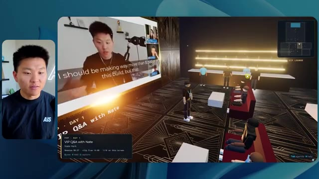
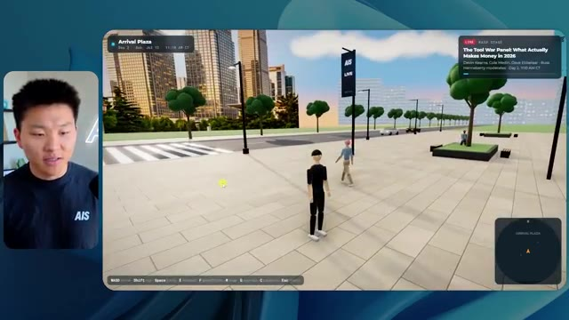

# 🎬 Why Your AI Offer Isn't Selling, and How to Fix That

> **Chaîne** : [Nate Herk | AI Automation](https://www.youtube.com/@nateherk/featured)  
> **Lien YouTube** : [https://www.youtube.com/watch?v=8MEJen0nblQ](https://www.youtube.com/watch?v=8MEJen0nblQ)  
> **Date de publication** : 20260720  
> **Durée** : 00:55:40  
> **Identifiant vidéo** : `8MEJen0nblQ`  
> **Transcription & Analyse** : `whisper-v3-large-turbo+gemini-3.5-flash-lite`  

---

## 📌 Synthèse Exécutive & Outils

### 💡 Résumé

Dans cette vidéo issue de la chaîne de Nate Herk, l'analyste explore en profondeur l'impact des différents niveaux d'effort (« Effort Level ») du modèle d'IA de pointe **Opus 5.5** d'Anthropic. Pour tester les limites de ces réglages, il soumet un prompt complexe et ambitieux à l'agent : concevoir et développer un monde 3D interactif et explorable à la troisième personne, simulant une conférence tech réaliste (basée sur un dossier Frame.io de 105 Go d'enregistrements de l'événement *AIS Live*), intégrant des visuels de marque, de la physique, de la vidéo en streaming et des interactions dynamiques.

Les résultats obtenus démontrent un fossé qualitatif et quantitatif saisissant entre les modes d'exécution. Le mode à **faible effort** génère un monde rudimentaire, bogué (personnages fantômes qui disparaissent, images statiques non lues, absence de branding correct), prenant tout de même 16 minutes et 43 secondes pour 3,91 $ de coût API et 191 000 jetons, sans poser la moindre question. En revanche, le mode à **effort moyen** (recommandé par Anthropic comme point de départ) livre un chef-d'œuvre fonctionnel en 1 heure et 13 minutes (12,44 $, 490 000 jetons) : les PNJ interagissent, les vidéos tournent en direct sur les écrans des salles d'atelier et d'exposition, la palette de couleurs respecte fidèlement l'identité visuelle d'AIS Live, et la navigation est fluide.

Cette expérimentation met en lumière la subtilité du compromis entre temps de calcul, investissement financier et complexité de rendu pour les agents IA autonomes. L'analyse s'interrompt au moment d'aborder le niveau élevé, tout en soulignant la friction classique du développeur : transformer un prototype fonctionnel généré par l'IA en une application déployée en production, un défi relevé ici grâce au sponsor de la vidéo, Hostinger.

### 🛠️ Outils, Modèles & Logiciels Présentés

* **Opus 5.5** : Le modèle de langage et d'intelligence artificielle de pointe d'Anthropic, reconnu pour sa polyvalence, son coût modéré et ses capacités de raisonnement poussées.
* **Effort Level (Faible, Moyen, Élevé, Extra, Max, Code Ultra)** : Le paramètre de réglage de la profondeur de calcul et du niveau d'effort cognitif alloué par le modèle pour exécuter un prompt.
* **Claude Code** : L'assistant de développement et de programmation avancé d'Anthropic utilisé dans l'écosystème de l'ingénieur.
* **Frame.io** : La plateforme cloud de collaboration vidéo utilisée ici pour stocker les 105 gigaoctets d'enregistrements bruts de l'événement *AIS Live*.
* **Herc 2** : Le système d'exploitation IA propriétaire de Nate Herk, servant d'environnement de travail et d'intégration pour les agents.
* **Key.ai** : Un outil de génération d'images et de vidéos par IA mobilisé pour enrichir les ressources du monde 3D.
* **Hostinger & Connecteur Hostinger** : Une extension gratuite pour éditeur de code permettant d'intégrer directement un compte d'hébergement pour un déploiement web rapide.

### 🔑 Points Clés & Enseignements Stratégiques

* **L'importance cruciale du réglage de l'effort (« Effort Level »)** : Le choix du niveau d'effort (faible, moyen, élevé, etc.) modifie drastiquement le comportement, la minutie et la qualité globale des livrables produits par un agent IA comme Opus 5.5.
* **Le niveau moyen comme standard d'optimisation** : Conformément aux recommandations officielles d'Anthropic, démarrer au niveau d'effort moyen offre souvent le meilleur équilibre entre pertinence contextuelle, respect des consignes de design et maîtrise des coûts.
* **La gestion de la complexité visuelle et fonctionnelle** : À faible effort, l'agent produit des artefacts visuels grossiers (bugs d'affichage, PNJ fantômes, images fixes), tandis qu'à effort moyen, il gère avec succès la lecture vidéo en direct, les animations interactives et la cohérence spatiale.
* **L'autonomie totale des agents** : Dans les tests menés avec les niveaux faible et moyen, l'agent n'a posé aucune question de clarification au cours du processus, démontrant une forte capacité d'autonomie mais soulignant aussi le risque de dérive si l'intention initiale est mal interprétée.
* **Le ratio temps/coût des tâches lourdes** : Un rendu complexe de simulation 3D à partir de données massives (105 Go) demande des temps de traitement significatifs (de 16 minutes à plus d'une heure) et des volumes de jetons élevés (de 191k à près de 500k tokens), nécessitant une budgétisation rigoureuse des appels API.
* **L'intégration contextuelle des données brutes** : L'agent a démontré une excellente aptitude à parcourir de vastes répertoires de fichiers (dossiers Frame.io) pour en extraire le contenu pertinent (planning des jours 1 et 2, intervenants, ateliers) et l'injecter dynamiquement dans l'interface virtuelle.
* **Le respect des directives de marque (« Brand Guidelines »)** : Un agent configuré avec un effort insuffisant ignore l'identité visuelle (logos, palettes de couleurs), tandis qu'un effort adéquat restitue fidèlement l'image de marque de l'entreprise (dans ce cas, *AIS Live*).
* **Du prototype à la production : le gouffre du déploiement** : Générer une application ou un monde virtuel fonctionnel sur sa machine locale n'est que la première étape ; le véritable goulot d'étranglement de l'ingénierie moderne reste la capacité à pousser rapidement ce code en ligne.
* **L'utilité des extensions d'IDE pour le DevOps** : L'utilisation d'outils de connexion directe entre l'éditeur de code et l'hébergeur (comme le connecteur Hostinger) élimine les frictions traditionnelles du déploiement web pour les développeurs utilisant l'IA.
* **La simulation d'événements hybrides par l'IA** : Transformer des archives vidéo volumineuses en un espace virtuel explorable à la troisième personne représente un cas d'usage novateur et hautement immersif pour l'engagement communautaire post-événement.

---

## ⏱️ Chronologie & Transcription Complète Audio & Visuelle (Mot pour Mot)

### ⏱️ `[00:00:00 - 00:00:20]` | Segment #01

**🔊 Audio (Transcription Intégrale Mot pour Mot en Français) :**
> Opus 5.5, Opus 5.5, Opus 5.5, Opus 5.5, Opus 5.5. Ce modèle est littéralement partout et pour de très bonnes raisons. Il est intelligent, il est bon marché, il a un goût incroyable, c'est un modèle d'IA incroyable. Mais avec chaque modèle d'IA, vous avez le choix de l'effort, que ce soit faible, moyen, élevé, extra, max ou code ultra.

**👁️ Analyse Visuelle d'Écran (gemini-3.5-flash-lite) :**
**Interface & Outils** : X (anciennement Twitter)

**Contenu textuel & Code** : Publication sur X avec texte et vidéo intégrée montrant un environnement 3D tropical.

**Action / Démonstration** : Affichage d'un tweet illustrant les capacités des nouveaux modèles d'IA en matière de création de contenu visuel.

*⏱️ 00:00:05 — Une capture d'écran d'un tweet montrant une vidéo de paysage généré par IA avec une plage, des palmiers et des habitations.*

---

### ⏱️ `[00:00:20 - 00:00:38]` | Segment #02

**🔊 Audio (Transcription Intégrale Mot pour Mot en Français) :**
> Donc dans cette vidéo, j'ai donné exactement le même prompt à Opus 5.5 et je l'ai exécuté à chaque niveau d'effort, et nous allons comparer les résultats. Nous allons examiner la qualité de tous les différents résultats réels, mais nous allons aussi examiner combien de temps chacun d'eux a pris, combien cela nous a coûté si c'était facturé par l'API, le total des jetons, combien de vérifications ils ont exécutées, et combien de questions ils m'ont réellement posées tout au long du processus.

**👁️ Analyse Visuelle d'Écran (gemini-3.5-flash-lite) :**
**Interface & Outils** : Interface web de tableau blanc / application de présentation (type Miro ou Canva).

**Contenu textuel & Code** : Tableau comparatif des niveaux d'effort de Opus 5.5 avec les métriques : Run time, API cost, Total tokens, Checks, Questions asked.

**Action / Démonstration** : Présentation du tableau comparatif analysant les différents niveaux d'effort d'un modèle d'IA.

*⏱️ 00:00:29 — Tableau comparatif sur une interface avec différentes colonnes de niveaux d'effort (Low, Medium, High, Extra, Max, Ultracode) et des lignes de métriques (Run time, API cost, Total tokens, Checks, Questions asked).*

---

### ⏱️ `[00:00:39 - 00:00:58]` | Segment #03

**🔊 Audio (Transcription Intégrale Mot pour Mot en Français) :**
> Et les résultats que nous avons obtenus ne sont pas du tout ce à quoi je m'attendais, donc j'ai hâte de partager cela avec vous les gars. Ne perdons pas de temps et allons directement à celui-ci. D'accord, alors plongeons-nous directement dans celui-ci. Je veux commencer juste en vous montrant le prompt réel que nous avons utilisé que nous avons donné à chacun de ces différents agents. Je vais aller dans les fichiers ici, et nous allons ouvrir ce fichier markdown de prompt, et je vais vous montrer ce que nous avons obtenu. Voici donc le slash objectif que j'ai fourni.

**👁️ Analyse Visuelle d'Écran (gemini-3.5-flash-lite) :**
**Interface & Outils** : Interface utilisateur de l'application de développement (style IDE / assistant IA).

**Contenu textuel & Code** : Texte du prompt : "Hi Nate. This worktree has the effort-test task queued in PROMPT.md : build a walkable third-person 3D world of the AIS Live conference..."

**Action / Démonstration** : Présentation de l'interface de travail et du prompt initial de l'agent IA.

*⏱️ 00:00:48 — Interface d'un outil de développement avec un panneau latéral et une fenêtre de discussion montrant un prompt lié au projet AIS Live conference.*

---

### ⏱️ `[00:00:58 - 00:01:34]` | Segment #04

**🔊 Audio (Transcription Intégrale Mot pour Mot en Français) :**
> J'ai dit, tu dois me créer un monde 3D qui est une conférence tech réaliste dans laquelle je peux me promener en vue à la troisième personne. Tu vas regarder ce dossier, qui contient mes ressources d'enregistrement d'événements de AIS Live. Et ce dossier est un dossier Frame.io de 105 gigaoctets d'enregistrements vidéo. C'était un événement complètement virtuel. Tout a été enregistré et tous les enregistrements sont ici. J'ai dit, ton objectif est de prendre cet événement et de le transformer en un monde 3D explorable qui me donne l'impression d'être réellement allé à une vraie conférence en personne avec différentes salles, différentes pistes, différentes scènes, bla, bla, bla. N'hésite pas à utiliser key.ai si tu as besoin de générer des images ou des vidéos. Et tu peux aussi utiliser tout ce qui se trouve dans mon projet Herc 2, qui est comme mon système d'exploitation IA. J'ai dit,

**👁️ Analyse Visuelle d'Écran (gemini-3.5-flash-lite) :**
**Interface & Outils** : Éditeur de code (VS Code / interface similaire) et interface cloud Frame.io.

**Contenu textuel & Code** : Fichier Markdown PROMPT.md contenant les instructions pour concevoir une conférence tech 3D interactive (lien Frame.io, consignes de design et de physique).

**Action / Démonstration** : Présentation des instructions données à l'agent IA et visualisation du dépôt de ressources d'enregistrement sur Frame.io.

*⏱️ 00:01:07 — Éditeur de code affichant le fichier PROMPT.md avec les instructions détaillées pour créer un monde 3D interactif basé sur un événement virtuel.*

*⏱️ 00:01:16 — Interface Frame.io affichant le dossier de l'événement "Sep 22, 2026" contenant les dossiers GA Access et VIP Access pour un total de 105,69 Go.*

*⏱️ 00:01:25 — Éditeur de code affichant le contenu du prompt principal demandant de transformer les enregistrements d'un événement virtuel en monde 3D explorable.*

---

### ⏱️ `[00:01:34 - 00:02:08]` | Segment #05

**🔊 Audio (Transcription Intégrale Mot pour Mot en Français) :**
> vous serez jugé sur la créativité, le design, la physique et la sensation générale lorsque j'explorerai le monde 3D que vous avez construit. Et c'était fondamentalement la fin des instructions. Donc comme vous pouvez le voir sur ce côté gauche, j'ai exécuté cela à travers tous les différents niveaux d'effort. Commençons par le niveau bas et remontons jusqu'à l'ultra code. Très bien. Donc ici nous avons le résultat du niveau bas. Ouvrons ceci et jetons un œil. Donc nous avons AIS Live, le sommet des services IA enfin en personne, et nous avons pu cliquer partout. Tout d'abord, on ne sent pas vraiment l'image de marque. Genre, ce n'ce n'est pas le logo d'IS Live. Ce n'est même pas nos couleurs. Donc je n'aime pas trop ça, mais entrons ici. D'accord. C'est beaucoup trop lumineux. Euh, nous avons une carte en haut à droite. Nous avons une ville par ici. Je ne peux pas dire quelle ville c'est.

**👁️ Analyse Visuelle d'Écran (gemini-3.5-flash-lite) :**
**Interface & Outils** : Interface web ou application de type assistant IA / IDE basé sur le cloud.

**Contenu textuel & Code** : Prompt affiché : "Hi Nate. This worktree has the effort-test task queued in PROMPT.md : build a walkable third-person 3D world..." avec une liste de sessions de tests sur le panneau de gauche.

**Action / Démonstration** : Navigation et sélection dans les différents niveaux de test de l'agent IA.

*⏱️ 00:01:42 — Capture d'écran montrant l'interface d'un outil de développement ou d'agent IA avec un panneau latéral listant différents niveaux d'effort (Hello, Extra, High, Max, Ultracode, Medium, Low) et le présentateur à gauche.*

---

### ⏱️ `[00:02:08 - 00:02:40]` | Segment #06

**🔊 Audio (Transcription Intégrale Mot pour Mot en Français) :**
> c'est. D'accord. C'est Chicago, ce qui est plutôt cool parce que tu sais, j'habite à Chicago, mais bref, en haut à droite, on peut voir une carte. Nous avons un hall d'accueil. Nous avons une salle d'exposition. Nous avons un salon VIP, la scène principale. La carte montre également où se trouve chaque autre personne et cela se synchronise en direct. On peut donc voir l'enregistrement. On peut voir le premier jour, la keynote de l'hyper agent, le débriefing en direct. Cool. Donc il connaît réellement le programme et puis il y a le deuxième jour. Donc il a trouvé ça, c'est bien. Nous avons ces petits ballons ici que je peux espérer botter. D'accord. Le visage, oh, regarde ça. Si je vais par ici, tous les gens disparaissent tout simplement. Très mauvais. Très mauvais. D'accord. Alors voyons voir. Est-ce que je peux sprinter ? D'accord.

**👁️ Analyse Visuelle d'Écran (gemini-3.5-flash-lite) :**
**Interface & Outils** : Application de simulation ou plateforme d'événement virtuel en 3D.

**Contenu textuel & Code** : Carte de navigation, plans de salles, avatars et panneaux d'information du programme.

**Action / Démonstration** : Navigation et exploration interactive dans un environnement virtuel 3D.

*⏱️ 00:02:16 — Vue d'une simulation virtuelle avec un avatar se déplaçant dans un espace d'événement (Badge pickup).*

*⏱️ 00:02:24 — Vue de l'intérieur du hall d'accueil (Lobby) montrant les panneaux du programme (Day 1).*

*⏱️ 00:02:32 — Vue de la salle d'exposition (Expo Hall) avec des avatars et des éléments graphiques lumineux.*

---

### ⏱️ `[00:02:40 - 00:03:04]` | Segment #07

**🔊 Audio (Transcription Intégrale Mot pour Mot en Français) :**
> Je peux avancer un peu plus vite. Je vais d'abord aller par ici. Il y a des produits dérivés, euh, un sweat à capuche certifié AIS plus. D'accord. Il y a donc les vrais stands qu'on avait lors de l'événement virtuel. On avait des stands. Donc c'est plutôt cool. Un petit endroit pour prendre des photos. Salle C. En ce moment, nous avons Tangy Frederick qui anime un atelier. D'accord. Mais ce n'est pas une vidéo. Comme vous pouvez le voir, c'est juste une image. Elle ne bouge pas. C'est donc juste une image. Ces gens sont en train de disparaître. Ce doivent être des fantômes. Allons par ici dans la salle A.

**👁️ Analyse Visuelle d'Écran (gemini-3.5-flash-lite) :**
**Interface & Outils** : Application ou plateforme virtuelle 3D en ligne.

**Contenu textuel & Code** : Éléments textuels et visuels d'un événement virtuel (stands, guides d'API, ateliers).

**Action / Démonstration** : Navigation et exploration de l'espace virtuel par le présentateur.

---

### ⏱️ `[00:03:04 - 00:03:30]` | Segment #08

**🔊 Audio (Transcription Intégrale Mot pour Mot en Français) :**
> Nous avons Liberty White. D'accord. Très cool. Vos 30 premiers jours en automatisation. Encore une fois, c'est juste une image fixe et les gens ont des bugs d'affichage. Donc pas très bien ici. Je vais aller sur la scène principale et voir ce que nous avons. D'accord, cool. Donc nous avons une scène principale. Les gens ont de gros bugs d'affichage. Vraiment mauvais. Ce n'est vraiment pas terrible. Notre vidéo est en train de bouger. Genre, j'ai vu mon visage ici et j'ai vu celui de Devin, mais maintenant ils ont disparu. Donc je ne sais pas trop ce qui s'est passé. D'accord. C'est, on dirait que c'est plutôt un diaporama. Rien n'est vraiment lu pour l'instant. Quoi qu'il en soit, entrons ici.

**👁️ Analyse Visuelle d'Écran (gemini-3.5-flash-lite) :**
**Interface & Outils** : Environnement virtuel 3D / Metavers de conférence (type Gather.town ou similaire)

**Contenu textuel & Code** : Interface de navigation 3D avec affichage textuel de l'événement et de la mini-carte en haut à droite.

**Action / Démonstration** : Exploration et déplacement de l'avatar dans le monde virtuel de la conférence.

*⏱️ 00:03:11 — Vue d'une salle virtuelle "Workshop Room A" avec un avatar et des plateformes lumineuses.*

*⏱️ 00:03:17 — Vue de la scène principale "Main Stage" montrant un amphithéâtre virtuel rempli d'avatars.*

*⏱️ 00:03:24 — Vue de l'auditorium virtuel affichant le grand écran "AIS LIVE - AI Services Summit".*

---

### ⏱️ `[00:03:30 - 00:03:58]` | Segment #09

**🔊 Audio (Transcription Intégrale Mot pour Mot en Français) :**
> Nous avons plus de stands. Nous avons hyper agent. Nous avons Claude Code. Nous avons plus de goodies. La salle B, c'est Dave Ebelor. Je suppose que c'est exactement la même chose. Nous avons du café. Et ensuite, je suppose que le salon VIP, c'est accès VIP uniquement. C'est plutôt cool, mais il n'y a vraiment rien qui se passe ici. Cet écran est beaucoup trop lumineux. D'accord. Donc je pense que vous comprenez l'ambiance que nous tirons d'Opus 5.5 en mode faible effort. Et c'est là que les choses deviennent intéressantes. Combien de temps pensez-vous que cela a duré ? Combien de temps ? Celui-ci a duré 16 minutes et 43 secondes. Combien pensez-vous que cela a coûté ?

**👁️ Analyse Visuelle d'Écran (gemini-3.5-flash-lite) :**
**Interface & Outils** : Interface web de tableau comparatif (Opus 5.5 Efforts) et interface de monde virtuel 3D (Roblox ou similaire).

**Contenu textuel & Code** : Tableau avec des colonnes de niveau d'effort (Low, Medium, High, Extra, Max, Ultracode) et des lignes de métriques (Run time, API cost, Total tokens, Checks, Questions asked).

**Action / Démonstration** : Présentation d'un tableau comparatif des performances de différents niveaux d'effort pour un modèle d'IA.

*⏱️ 00:03:51 — Un tableau comparatif sur une interface web intitulé 'Opus 5.5 Efforts' avec des niveaux d'effort (Low, Medium, High, Extra, Max, Ultracode) et des métriques.*

---

### ⏱️ `[00:03:58 - 00:04:26]` | Segment #10

**🔊 Audio (Transcription Intégrale Mot pour Mot en Français) :**
> 3,91 dollars si c'était une facturation par API. J'utilise évidemment mon abonnement ici, mais nous allons simplement calculer cela avec la facturation par API. Le total des jetons était de 191 000. Il a fait 22 vérifications. Donc la vérification, 22 fois il a ouvert le navigateur et a exécuté différents types de vérifications. Donc 22 catégories de vérifications. Et combien de questions m'a-t-il posées ? Il m'a posé un total de zéro question tout au long de cette invite de commande d'objectif. D'accord. Alors, ouvrons l'effort moyen et voyons ce que nous avons. D'accord, c'est parti. Effort moyen. Nous avons Nate Herc. Nous avons mon badge. C'est la marque de commerce d'AI's Life.

**👁️ Analyse Visuelle d'Écran (gemini-3.5-flash-lite) :**
**Interface & Outils** : Tableau blanc ou outil de visualisation de données de type Excalidraw ("Opus 5.5 Efforts").

**Contenu textuel & Code** : Tableau avec des métriques de performance : Run time (16m 43s), API cost ($3.91), Total tokens (191.3K), Checks, et Questions asked répartis par niveaux (Low, Medium, High).

**Action / Démonstration** : Le présentateur commente et analyse les coûts en tokens et le temps d'exécution affichés dans le tableau.

*⏱️ 00:04:05 — Capture d'écran montrant le présentateur à gauche et un tableau de données et de métriques d'évaluation sur le projet à droite.*

---

### ⏱️ `[00:04:26 - 00:04:46]` | Segment #11

**🔊 Audio (Transcription Intégrale Mot pour Mot en Français) :**
> Donc ça a déjà l'air un petit peu mieux. Ça donne l'impression d'être nos palettes de couleurs qui ont utilisé nos directives de marque. Premier jour construction, deuxième jour gain, VIP. Cool. D'accord. Je vais entrer dans le lieu. D'accord. Wouah. Une ambiance un peu similaire. C'est en arrière-plan. Ça ne ressemble pas à Chicago par contre, n'est-ce pas ? Non, ça ressemble à un, honnêtement, ça ressemble à une ville inventée. Quoi qu'il en soit, c'est marrant qu'ils aient décidé de faire ça. Voyons si je peux avancer un peu plus vite. Oh, wouah.

**👁️ Analyse Visuelle d'Écran (gemini-3.5-flash-lite) :**
**Interface & Outils** : Navigateur web / Application web 3D interactive (AIS Live)

**Contenu textuel & Code** : Écran d'accueil avec badge utilisateur personnalisable, boutons « ENTER THE VENUE » et contrôles clavier (WASD, Shift, Space, etc.)

**Action / Démonstration** : Le présentateur navigue dans l'application web interactive, clique pour entrer dans le lieu virtuel 3D.

*⏱️ 00:04:31 — Interface web de l'application « AIS Live » affichant un badge nominatif avec le nom de Nate Herk et des options d'accès.*

*⏱️ 00:04:41 — Vue virtuelle 3D à l'intérieur d'un espace événementiel numérique montrant des avatars et une vue sur une ville la nuit.*

---

### ⏱️ `[00:04:46 - 00:05:21]` | Segment #12

**🔊 Audio (Transcription Intégrale Mot pour Mot en Français) :**
> Les gens interagissent avec moi. Regardez. Si je m'approche de ce type, il vient de lever le bras. Bon, maintenant il ne veut plus du tout avoir affaire à moi. Mais tous ces petits robots ici doivent prendre des décisions. Je ne sais pas s'ils utilisent Jev. C'est sûr que non. Je ne le lui ai pas dit. En fait, ma clé Jev est à l'arrière. Je ne sais pas. Peut-être qu'elle l'a utilisée. Quoi qu'il en soit, nous pouvons voir ici que nous avons la salle d'atelier C, le laboratoire des agents. Sympa. Donc celui-ci est en fait en train d'être exécuté. Vous pouvez voir qu'il s'agit d'une vraie vidéo lue par Tangy. Tout le monde ici est en train de travailler sur un ordinateur portable. Ils ne buguent pas. C'est plutôt cool. De plus, mon badge est sur ma poitrine, ce qui est plutôt cool. Je peux venir par ici. Nous avons une carte en haut à droite, comme vous pouvez le voir, mais je peux venir par ici. Nous avons un

**👁️ Analyse Visuelle d'Écran (gemini-3.5-flash-lite) :**
**Interface & Outils** : Environnement virtuel 3D interactif (type métavers / plateforme de réunion virtuelle).

**Contenu textuel & Code** : Avatars numériques simulant des interactions dans un espace de travail virtuel.

**Action / Démonstration** : Navigation et exploration d'un monde virtuel peuplé d'avatars et de robots autonomes.

---

### ⏱️ `[00:05:21 - 00:05:47]` | Segment #13

**🔊 Audio (Transcription Intégrale Mot pour Mot en Français) :**
> hall d'exposition. C'est là que nous avons le stand de Glido. Et ça diffuse actuellement. Oui, ça diffuse la vidéo de nous en train de parler de Glido. Ça diffuse la vidéo d'Ed et de moi en train de parler de notre programme de certification. Nous avons le logo AIS Plus ici à l'arrière, qui est placé dans un endroit un peu bizarre. Ce sont les diapositives des conférenciers et les points clés. Donc waouh, ce sont toutes les ressources que nous avons distribuées après l'événement. Elles sont toutes là aussi. Nous pouvons voir que nous avons un projecteur sur la communauté. Donc c'est Aiden qui parle de son contrat qu'il a décroché et c'est diffusé en direct. Ces gens regardent.

**👁️ Analyse Visuelle d'Écran (gemini-3.5-flash-lite) :**
**Interface & Outils** : Environnement virtuel 3D de type salon professionnel ou métavers.

**Contenu textuel & Code** : Panneaux textuels, écrans de présentation virtuels, affiches informatives et mini-carte du hall d'exposition.

**Action / Démonstration** : Navigation et exploration d'un salon virtuel en 3D par le présentateur.

---

### ⏱️ `[00:05:47 - 00:06:21]` | Segment #14

**🔊 Audio (Transcription Intégrale Mot pour Mot en Français) :**
> Ils sont plutôt engagés. On a l'hyper agent. C'était, c'est ce que je voulais dire. Si vous avez vu ces gens lever les bras pour dire bonjour, c'était plutôt marrant. Regardez, regardez, le voilà qui recommence. Bref. Bon. Où est-ce que je suis maintenant ? Maintenant, je suis dans le hall principal. On a un bar à café. On a un grand logo, qui est le vrai logo. C'est trop lumineux, mais on a le logo. On peut voir si on peut entrer ici dans le parcours fondation. On a Sabrina Romanov et Liberty White. Donc différentes formations juste là. On peut entrer dans cette salle. C'est le parcours avancé. Alors qu'est-ce qui se passe ici. On a Dave Ebelar et Saman qui parlent de différentes choses là-dedans. Et maintenant, allons jeter un œil à la scène principale. Oh, attendez, il y a une vidéo de moi là-haut. C'est du genre VIP ?

**👁️ Analyse Visuelle d'Écran (gemini-3.5-flash-lite) :**
**Interface & Outils** : Application web ou plateforme virtuelle 3D interactive (Metavers / événement virtuel).

**Contenu textuel & Code** : Environnement graphique 3D simulant un salon virtuel (« Main Lobby ») avec des interfaces utilisateur de navigation et des avatars de participants.

**Action / Démonstration** : Navigation et déplacement d'un avatar à travers un espace virtuel 3D lors d'une démonstration d'événement en ligne.

---

### ⏱️ `[00:06:21 - 00:06:50]` | Segment #15

**🔊 Audio (Transcription Intégrale Mot pour Mot en Français) :**
> section ? Ouais, on ira voir ça dans une minute. Mais bref, voici la scène principale. Ça a l'air vraiment, vraiment très bien. On a une grande scène. On a genre quatre personnes assises ici. On a les trois écrans d'Alex là-haut avec hyper agent. Est-ce que j'ai le droit de monter sur scène ? Oh, et il me laisse monter sur scène. OK. C'est plutôt sympa. Bon les gars, faisons un selfie. Laissez-moi prendre tout le monde en arrière-plan. Venez par ici. Bref, c'est plutôt, plutôt cool. Par contre, toutes les places ne sont pas occupées. Donc il va falloir qu'on travaille là-dessus. Mais bref, je vais retourner en courant voir ce qu'était cette section VIP. OK. Le salon VIP. J'ai l'impression que c'est comme un salon d'aéroport ou un truc comme ça.

**👁️ Analyse Visuelle d'Écran (gemini-3.5-flash-lite) :**
**Interface & Outils** : Environnement virtuel 3D de type métavers / plateforme de conférence interactive.

**Contenu textuel & Code** : Interface utilisateur affichant les détails de la keynote 'Hyperagent Keynote' par Alex McDonnell avec une carte de navigation en haut à droite.

**Action / Démonstration** : Navigation et exploration de l'espace virtuel par l'avatar de l'utilisateur dans l'auditorium.

---

### ⏱️ `[00:06:51 - 00:07:14]` | Segment #16

**🔊 Audio (Transcription Intégrale Mot pour Mot en Français) :**
> OK, super. Donc maintenant nous avons les sessions VIP ici. Une session de questions-réponses VIP avec Nate, lecture vidéo en direct juste ici. Très, très cool. Et nous avons comme un bar ou quelque chose du genre. Génial. Je dirais que c'est un très bon résultat. Maintenant, en ce qui concerne les statistiques ici, celle-ci a pris une heure et 13 minutes à s'exécuter. Cela nous aurait coûté 12 dollars et 44 cents. Elle a utilisé 490 000 jetons et elle a effectué 23 vérifications.

**👁️ Analyse Visuelle d'Écran (gemini-3.5-flash-lite) :**
**Interface & Outils** : Interface de monde virtuel 3D et tableau de bord analytique (Opus 5.5).

**Contenu textuel & Code** : Métriques de performance : Run time (16m 43s), API cost ($3.91), Total tokens (191.3K), Checks (22), Questions asked (0).

**Action / Démonstration** : Présentation des sessions VIP virtuelles et analyse des coûts et performances d'exécution.

*⏱️ 00:06:56 — Vue d'un espace virtuel 3D (type métavers) montrant une session VIP avec un écran géant affichant une vidéo en direct et un bar en arrière-plan.*

*⏱️ 00:07:02 — Tableau de données dans une interface de type canvas (Opus 5.5 Efforts) affichant des métriques telles que le temps d'exécution, le coût API et le nombre total de jetons.*

---

### ⏱️ `[00:07:14 - 00:07:48]` | Segment #17

**🔊 Audio (Transcription Intégrale Mot pour Mot en Français) :**
> Et il nous a posé un total de zéro question une fois de plus. Très bien, passons au niveau élevé. C'était déjà un résultat plutôt correct, et Anthropic eux-mêmes dans leur vidéo, ou désolé, pas une vidéo, un article sur comment prompter Opus 5.5, ils ont dit de commencer simplement par le niveau moyen et d'ajuster à la hausse ou à la baisse si nécessaire. C'était donc un résultat moyen. Passons au niveau élevé et voyons ce que nous avons obtenu. Très rapidement, les gars, je dois prendre une petite seconde pour vous parler du sponsor de la vidéo d'aujourd'hui, Hostinger. Donc ces deux modèles viennent de me créer une version fonctionnelle de la même chose. Et maintenant, je me retrouve exactement là où je finis toujours, avec un projet terminé sur mon ordinateur portable et aucun moyen rapide de le mettre en ligne. Et c'est précisément le fossé que comble le connecteur d'Hostinger. C'est une extension gratuite

**👁️ Analyse Visuelle d'Écran (gemini-3.5-flash-lite) :**
**Interface & Outils** : Tableau comparatif sur canevas numérique et interface de l'outil de développement d'agent IA

**Contenu textuel & Code** : Tableau de métriques (Run time, API cost, Total tokens, Checks, Questions asked) pour les modes Low et Medium, et code du prompt pour "Northwind ROI calculator".

**Action / Démonstration** : Comparaison des performances des différents niveaux d'effort d'Opus 5.5 et suivi de l'exécution de la génération du calculateur ROI.

*⏱️ 00:07:22 — Un tableau comparatif des performances d'Opus 5.5 selon différents niveaux (Low, Medium, High, Extra) affichant le temps d'exécution, le coût API, les tokens et le nombre de questions posées, avec le présentateur en médaillon.*

*⏱️ 00:07:39 — Une interface de développement avec des panneaux côte à côte montrant le prompt pour construire un calculateur ROI NorthWind et le processus de réflexion de l'agent IA, avec le présentateur incrusté en bas à droite.*

---

### ⏱️ `[00:07:48 - 00:08:23]` | Segment #18

**🔊 Audio (Transcription Intégrale Mot pour Mot en Français) :**
> pour votre éditeur qui intègre votre compte Hostinger dans l'outil de programmation que vous utilisez déjà, que ce soit VS Code, Cursor, Cloud Code, Codex, et j'en passe. Vous vous connectez une seule fois en un clic, et à partir de là, votre agent peut déployer le site, y associer un domaine, configurer les enregistrements DNS et vérifier votre VPS sans que vous ayez à quitter votre éditeur. Ainsi, peu importe celui que vous finirez par préférer, ce qu'il a construit se trouve à seulement quelques minutes d'une vraie URL sur un hébergement géré. Connector est gratuit avec chaque formule d'hébergement, donc si vous avez toujours besoin de l'hébergement sous-jacent, profitez de la formule illimitée grâce au lien dans la description et utilisez le code NATEHERK pour obtenir 10 % de réduction. Cela inclut également un nom de domaine gratuit et un e-mail professionnel pour un an. Et cela reste le moyen le plus économique que j'aie trouvé pour obtenir

**👁️ Analyse Visuelle d'Écran (gemini-3.5-flash-lite) :**
**Interface & Outils** : Interface de gestion Hostinger et Claude Code

**Contenu textuel & Code** : Statut "Connected" avec Node.js 24.13.0, outils disponibles (Websites, Domains, Subscriptions, Email Marketing) et interface Claude Code.

**Action / Démonstration** : Connexion unique via OAuth pour gérer Hostinger directement depuis l'IDE.

*⏱️ 00:07:57 — Interface montrant l'intégration de Hostinger connectée via OAuth et un panneau Claude Code sur le côté droit.*

---

### ⏱️ `[00:08:23 - 00:08:47]` | Segment #19

**🔊 Audio (Transcription Intégrale Mot pour Mot en Français) :**
> vous avez construit sur une vraie URL. Donc revenons à la vidéo. D'accord. Encore une fois, très, très thématisé par la marque. C'est un écran de chargement encore mieux que le précédent. Nous avons ce petit effet sympa en arrière-plan. Nous avons le logo. Nous allons entrer dans le lieu. D'accord. Nous y voilà. Ça a l'air plutôt bien. Nous commençons à l'extérieur et vous pouvez voir que nous avons ces drapeaux pour tous les intervenants, Wyatt, Casper, Alex, Ed, Aiden, Sabrina, Liberty. C'est plutôt cool. Nous avons des blocs en direct ici.

**👁️ Analyse Visuelle d'Écran (gemini-3.5-flash-lite) :**
**Interface & Outils** : Navigateur web affichant l'application 3D interactive AIS Live propulsée par RingCentral.

**Contenu textuel & Code** : Interface utilisateur 3D d'un monde virtuel avec bannières, mini-carte, indicateur de passeport et instructions de navigation.

**Action / Démonstration** : Navigation et exploration de l'espace virtuel interactif en 3D après avoir cliqué sur 'Enter the Venue'.

*⏱️ 00:08:29 — Écran de chargement de l'événement virtuel AIS Live avec le logo et les instructions de contrôle (WASD, Mouse).*

*⏱️ 00:08:35 — Vue de la place virtuelle 3D (AIS Live Plaza) avec des avatars et des bâtiments urbains au crépuscule.*

*⏱️ 00:08:41 — Exploration de l'espace virtuel AIS Live Plaza avec des bannières nominatives et des éléments interactifs au sol.*

---

### ⏱️ `[00:08:47 - 00:09:23]` | Segment #20

**🔊 Audio (Transcription Intégrale Mot pour Mot en Français) :**
> il a pris cette photo de moi, votre hôte, Nate Herc, John, Dave, Nate Herc. Voilà. OK. Les portes. Génial. Ce sont des portes coulissantes en verre automatiques. J'adore ça. On peut voir l'enregistrement VIP. On peut voir l'admission générale. On peut venir par ici et on peut découvrir l'exposition avec différents stands, le projecteur sur la communauté. Vous pouvez aussi voir qu'en haut à gauche, j'ai un passeport. Donc c'est du genre, ça montrera combien d'endroits j'ai visités. Tout cela est une lecture réelle. Nous avons un mur de ressources avec tous les différents intervenants. Ils ont aussi une session de networking par ici. Donc je vais venir très vite voir de quoi il s'agit. Nous avons donc le bar à cold brew AIS. Nous avons différents membres de la communauté qui ont été mis en avant ou en valeur.

**👁️ Analyse Visuelle d'Écran (gemini-3.5-flash-lite) :**
**Interface & Outils** : Environnement virtuel 3D en ligne / Plateforme d'événement virtuel.

**Contenu textuel & Code** : Interface utilisateur virtuelle avec bannières d'événements, mini-carte et menus de navigation.

**Action / Démonstration** : Exploration et navigation interactive dans un monde virtuel simulant un salon professionnel.

*⏱️ 00:08:56 — Vue d'un espace virtuel en 3D représentant une zone d'enregistrement (Registration Concourse) avec des comptoirs 'VIP Check-In' et 'Registration GA'.*

*⏱️ 00:09:05 — Navigation dans un hall d'exposition virtuel (Expo Hall) montrant des stands d'exposition et des avatars d'utilisateurs.*

*⏱️ 00:09:14 — Vue à la première ou troisième personne dans le hall d'entrée virtuel avec des portes en verre et des avatars se déplaçant.*

---

### ⏱️ `[00:09:23 - 00:09:56]` | Segment #21

**🔊 Audio (Transcription Intégrale Mot pour Mot en Français) :**
> On a la zone VIP. Attends, quoi ? Prends un bracelet. Oh, je dois vraiment aller chercher le bracelet. D'accord. Laisse-moi m'enregistrer rapidement. Le bracelet est déjà mis. Attends, quoi ? D'accord. Oh, d'accord. Maintenant, les portes se sont ouvertes pour moi. Cool. Je peux entrer ici. Oh, ça mène juste à la scène principale. Salon VIP. Il y a une séance de questions-réponses en cours. Ça a l'air très cool. Je veux dire, je suis très impressionné par la façon dont il parvient à faire ça. Waouh. D'accord. Donc c'est vraiment bien. Ce qu'on a fait, c'est qu'on a eu des salles de discussion VIP avec différentes personnes. Tu peux voir qu'il y a différentes salles, différents membres de l'équipe AIS qui vont dans des trucs. C'est vraiment cool. C'est très cool. C'est un VIP bien meilleur

**👁️ Analyse Visuelle d'Écran (gemini-3.5-flash-lite) :**
**Interface & Outils** : Application de métavers / espace virtuel interactif 3D

**Contenu textuel & Code** : Interface utilisateur avec mini-carte, indicateurs de statut, texte « Registration Concourse », « VIP Lounge », et « VIP Working Sessions ».

**Action / Démonstration** : Navigation et exploration d'un environnement virtuel 3D avec des sessions de travail et des espaces de discussion VIP.

*⏱️ 00:09:32 — Vue d'un espace virtuel 3D de type métavers montrant la zone d'accueil « Registration Concourse » avec des avatars et des indications textuelles sur l'accès VIP.*

*⏱️ 00:09:40 — Vue de la « VIP Lounge » dans le monde virtuel 3D, montrant des avatars assis sur des canapés et un écran affichant une visioconférence.*

*⏱️ 00:09:48 — Vue de l'espace « VIP Working Sessions » avec différents îlots de discussion thématiques (« Price It Right », « Turn Your Expertise into a Service », « Land Your First Paying Client »).*

---

### ⏱️ `[00:09:56 - 00:10:30]` | Segment #22

**🔊 Audio (Transcription Intégrale Mot pour Mot en Français) :**
> expérience que ce qui a été montré dans la première partie. D'accord. After party VIP. Regardez ça. On a une piste de danse. On a tous ces éléments ici. On a la lecture de l'after party VIP juste ici. Et il y a une estrade de DJ. C'est tellement marrant. Il y a un petit bug juste ici, un petit glitch juste là, mais c'est génial. Oh, cool. Donc quand je suis ici sur la scène principale, on a des sous-titres. Vous pouvez voir juste ici en bas de mon écran, on a ces sous-titres de Wyatt qui est en train de parler là-haut. On a des lumières. On a le panneau. Très cool. Belle scène principale. Je vais aller par ici. On peut aller à la fondation,

**👁️ Analyse Visuelle d'Écran (gemini-3.5-flash-lite) :**
**Interface & Outils** : Application web de monde virtuel interactif en 2D/3D (Gather Town / type Metaverse).

**Contenu textuel & Code** : Environnements virtuels interactifs, interface de visioconférence intégrée, affichage de participants et de sessions.

**Action / Démonstration** : Navigation et visite guidée à travers différentes pièces d'un événement virtuel (After-party puis scène principale).

*⏱️ 00:10:04 — Capture montrant l'interface d'un monde virtuel interactif (Gather Town ou similaire) avec une piste de danse ("VIP After-Party") et des avatars.*

*⏱️ 00:10:13 — Capture montrant la suite de l'after-party virtuel avec des participants représentés sous forme d'avatars et des ballons de plage.*

*⏱️ 00:10:21 — Capture montrant une autre zone du monde virtuel, la "Main Stage", avec un auditorium rempli d'avatars face à une scène principale.*

---

### ⏱️ `[00:10:30 - 00:11:06]` | Segment #23

**🔊 Audio (Transcription Intégrale Mot pour Mot en Français) :**
> avancé, et les parcours d'entreprise par ici. Alors voyons voir. Nous avons l'anatomie de trois vraies transactions. Nous avons hyper agent. Nous avons les évaluations avec Nate et Ed ici. Nous avons Dave qui s'occupe des trucs avancés. C'est vraiment bien. Je veux dire, évidemment, chacun, chacun de ces résultats jusqu'à présent, faible était correct. Moyen était meilleur. Élevé a été encore meilleur. Voyons si cette tendance se poursuit et allons voir ce que cela nous a coûté. Donc, élevé a fonctionné pendant une heure et sept minutes. Donc un peu plus rapide que moyen, cela nous aurait coûté 16 dollars et 31 cents. Il a utilisé un demi-million de tokens, 509 000. Il a fait 22 vérifications. Et il nous a aussi demandé, enfin, non, je me suis trompé. Ce

**👁️ Analyse Visuelle d'Écran (gemini-3.5-flash-lite) :**
**Interface & Outils** : Application de tableau blanc / interface de présentation (style Excalidraw ou similaire).

**Contenu textuel & Code** : Tableau de données chiffrées : Run time (16m 43s, 1h 13m, 1h 7m), API cost ($3.91, $12.44, $16.31), Total tokens (191.3K, 419.2K), Checks (22, 23), Questions asked (0, 0).

**Action / Démonstration** : Visualisation d'un tableau comparatif d'évaluations d'agents IA par niveau d'effort.

*⏱️ 00:10:57 — Un tableau comparatif montrant les métriques de performance et de coût pour différents niveaux d'effort (Low, Medium, High, Extra) incluant Run time, API cost, Total tokens et Checks.*

---

### ⏱️ `[00:11:06 - 00:11:25]` | Segment #24

**🔊 Audio (Transcription Intégrale Mot pour Mot en Français) :**
> l'un m'a posé une question et spoiler, c'était le seul qui nous a posé une question pendant tout ça. Alors voyons, il nous en reste trois : Extra, Max et Ultra Code. Laissez-moi ouvrir Extra et nous verrons ce que nous avons. D'accord. Donc celui-ci a l'air plutôt bien. Je dirais honnêtement que jusqu'à présent, l'écran de chargement haut était le meilleur. Celui qu'on vient juste de voir, mais bref, entrons dans AIS Live.

**👁️ Analyse Visuelle d'Écran (gemini-3.5-flash-lite) :**
**Interface & Outils** : Application de tableau de bord / interface web de visualisation de données.

**Contenu textuel & Code** : Données chiffrées de performance : Low ($3.91, 191.3K tokens), Medium ($12.44, 419.2K tokens), High ($16.31, 509.3K tokens, 1 question posée).

**Action / Démonstration** : Le présentateur commente les résultats du tableau et s'apprête à ouvrir les détails de la configuration Extra.

*⏱️ 00:11:11 — Tableau comparatif affichant les métriques (Run time, API cost, Total tokens, Checks, Questions asked) pour différentes configurations (Low, Medium, High, Extra) avec le présentateur en incrustation vidéo à gauche.*

---

### ⏱️ `[00:11:26 - 00:11:51]` | Segment #25

**🔊 Audio (Transcription Intégrale Mot pour Mot en Français) :**
> Waouh. D'accord. Donc nous avons comme de petits extraits sonores. Je peux discuter avec des gens. Le panneau sur la guerre des outils a réglé quelques débats pour moi. Sympa. Bonne perspective là-bas. Nous sommes de nouveau dehors. Nous avons ces différentes bannières, bien qu'elles soient toutes les mêmes. Elles n'affichent pas les noms de différentes personnes. Donc grand logo AIS en direct. L'aile de l'atelier est par ici. Et passons par les portes coulissantes en verre pour voir ce que nous avons. Nous avons donc le café AIS. La carte est en bas à droite, et elle n'est pas très descriptive.

**👁️ Analyse Visuelle d'Écran (gemini-3.5-flash-lite) :**
**Interface & Outils** : Présentation ou face-caméra explicatif sans interface logicielle partagée.

**Contenu textuel & Code** : Explications orales et mise en contexte méthodologique.

**Action / Démonstration** : Explications face caméra et démonstration conceptuelle.

---

### ⏱️ `[00:11:51 - 00:12:26]` | Segment #26

**🔊 Audio (Transcription Intégrale Mot pour Mot en Français) :**
> J'aime bien comment les autres cartes nous ont montré ce que, genre où étaient les choses, mais celle-ci a l'air très professionnelle. On peut voir ici c'est la scène principale. Allons y faire un tour rapidement. Ils ont tous ces ballons qui volent partout, ce qui je trouve est plutôt marrant. Les ballons de plage AIS. On nous voit moi là-haut en train de parler. Je crois que j'introduisais l'une des journées. Continuons par ici vers la salle d'atelier sur ce côté gauche. D'accord. Donc ici nous avons le théâtre Hyper Agent. Nous avons cette session sponsorisée ici par Hyper Agent, mais ça nous montre aussi ce qui va s'y passer. C'est vraiment marrant qu'on puisse discuter avec les gens. Salmon a créé un commercial vocal en direct. La salle du juste prix était comble. Tu as pris le guide compagnon VIP ? C'est trop marrant. On a le parcours avancé dans

**👁️ Analyse Visuelle d'Écran (gemini-3.5-flash-lite) :**
**Interface & Outils** : Présentation ou face-caméra explicatif sans interface logicielle partagée.

**Contenu textuel & Code** : Explications orales et mise en contexte méthodologique.

**Action / Démonstration** : Explications face caméra et démonstration conceptuelle.

---

### ⏱️ `[00:12:26 - 00:12:58]` | Segment #27

**🔊 Audio (Transcription Intégrale Mot pour Mot en Français) :**
> ici. Encore une fois, nous avons la lecture en direct. Est-ce que c'est la lecture en direct ? Oh, d'accord. Ça a commencé une fois que je suis entré, mais je peux m'asseoir. Oh la la. Je peux regarder ça. Je peux me lever. Je veux m'asseoir au premier rang. C'est plutôt cool. C'est très bien. J'aime bien ça. Et vous savez ce que j'ai remarqué jusqu'à présent ? Le personnage que j'incarne me ressemble un peu. Je pense qu'il a été modélisé à partir de mes photos de profil ou quelque chose comme ça. Quoi qu'il en soit, nous avons Sabrina ici, l'animatrice de la salle ici, prenez n'importe quel siège libre. D'accord, cool. Et j'ai vraiment aimé la fonctionnalité pour s'asseoir. C'est assez marrant. Genre, on pourrait vraiment assister à cet atelier et participer. Bref, ça nous montre les intervenants. Ça nous montre les

**👁️ Analyse Visuelle d'Écran (gemini-3.5-flash-lite) :**
**Interface & Outils** : Présentation ou face-caméra explicatif sans interface logicielle partagée.

**Contenu textuel & Code** : Explications orales et mise en contexte méthodologique.

**Action / Démonstration** : Explications face caméra et démonstration conceptuelle.

---

### ⏱️ `[00:12:58 - 00:13:31]` | Segment #28

**🔊 Audio (Transcription Intégrale Mot pour Mot en Français) :**
> programme. Il y a un petit tapis rouge ici pour prendre des photos. On peut prendre la pose. Oh, waouh. C'est plutôt cool. Bibliothèque de ressources, obtenir la certification AIS Plus, Glido, Hyper Agent, AIS Plus, trois vrais deals. Génial. Je veux dire, je dirais vraiment que jusqu'à présent, chacun est de mieux en mieux. Et on n'a même pas encore été voir la section VIP, le salon VIP. Montons ici vite fait. En espérant que je puisse entrer. Sympa. On a la réinitialisation des outils. Ce sont les différentes salles dans lesquelles on pourrait aller. Donc encore une fois, je pourrais prendre la feuille de travail et je pourrais essayer de comprendre comment fixer mes prix. C'est tellement cool. C'est clairement mieux que le précédent où on a en quelque sorte juste

**👁️ Analyse Visuelle d'Écran (gemini-3.5-flash-lite) :**
**Interface & Outils** : Application ou plateforme virtuelle 3D (metaverse / événement virtuel).

**Contenu textuel & Code** : Environnement virtuel interactif 3D avec affichage de texte contextuel et d'avatars.

**Action / Démonstration** : Navigation et exploration de l'espace virtuel par un utilisateur.

---

### ⏱️ `[00:13:31 - 00:13:59]` | Segment #29

**🔊 Audio (Transcription Intégrale Mot pour Mot en Français) :**
> like looked at stuff. Awesome. I can get behind the bar and come in here. This is very nice. Okay. So as far as statistics go, this one ran for an hour and a half. It costs 25.92 bucks. I don't know why I say point $25, 92 cents. It was 733,000 tokens and 34 checks. So it had the most checks so far by far. And it asked us zero questions. I can't wait to see what we got here from max and ultra code. Okay. Here is max loading screens, boring, but it's on brand and it has our logo.

**👁️ Analyse Visuelle d'Écran (gemini-3.5-flash-lite) :**
**Interface & Outils** : Présentation ou face-caméra explicatif sans interface logicielle partagée.

**Contenu textuel & Code** : Explications orales et mise en contexte méthodologique.

**Action / Démonstration** : Explications face caméra et démonstration conceptuelle.

---

### ⏱️ `[00:14:00 - 00:14:35]` | Segment #30

**🔊 Audio (Transcription Intégrale Mot pour Mot en Français) :**
> So that was good. I like that. We will go ahead and enter AIS live. Ooh, nice little animation here that brings us in. Once again, the character looks like me. They've all looked like me. I mean, sort of, we have sitting in the background. This looks like Chicago. Like I mentioned earlier, a lot of these are playing sounds and I'm not including that because it would be very distracting for you guys to try to listen to what's going on as well as me speaking. So there is like some slight music in all these. I hate how this is walking. This walking is really, really bad. I mean, the walking, yeah, I don't like this at all. So that's not great. But besides that, let's go in and explore. Notice these shadows when I walk in, they like really switch. I'm not sure why that is,

**👁️ Analyse Visuelle d'Écran (gemini-3.5-flash-lite) :**
**Interface & Outils** : Application web ou plateforme virtuelle 3D (AIS live) avec affichage d'une mini-carte et de contrôles à l'écran.

**Contenu textuel & Code** : Environnement virtuel 3D interactif représentant une place urbaine (Arrival Plaza), panneaux d'affichage et interface de navigation.

**Action / Démonstration** : Navigation et exploration de l'espace virtuel 3D avec l'avatar du présentateur.

*⏱️ 00:14:08 — Vue d'une application virtuelle 3D (AIS live) montrant une place urbaine avec des avatars de personnages et des gratte-ciels en arrière-plan.*

*⏱️ 00:14:17 — Poursuite de la visite virtuelle 3D montrant l'avatar du présentateur se déplaçant sur une place pavée devant des bâtiments modernes.*

*⏱️ 00:14:26 — L'avatar 3D du présentateur se dirigeant vers l'entrée d'un bâtiment vitrine dans l'espace virtuel.*

---

### ⏱️ `[00:14:35 - 00:15:11]` | Segment #31

**🔊 Audio (Transcription Intégrale Mot pour Mot en Français) :**
> but anyways, we can chat with people in here too. Hyperagent booth is right where you walk into the expo. All good. Okay, cool. I can keep clicking E to make them change what they say. We've got the speakers right here. That looks pretty good. Although we definitely had everyone's profile picture. So I'm not sure why that's not included there. We see people taking pictures right here. I love that. And it saves a little picture. Okay. The map also isn't super, like doesn't give me a great explanation of what's going on, but I like these booths. These are cool. I think these booths are the best that I've seen so far. Like they just look nice. They've got reps. There's nice like slides behind them. Yeah. These booths are cool. Okay. We have a little featured theater

**👁️ Analyse Visuelle d'Écran (gemini-3.5-flash-lite) :**
**Interface & Outils** : Application web de monde virtuel 3D (metaverse / plateforme événementielle en ligne).

**Contenu textuel & Code** : Environnement virtuel 3D avec des avatars, des panneaux informatifs et des mini-cartes de navigation.

**Action / Démonstration** : Exploration interactive de l'espace virtuel et discussion avec des avatars.

*⏱️ 00:14:44 — Vue d'un espace de réception virtuel en 3D avec des avatars d'utilisateurs et des panneaux d'affichage des intervenants.*

*⏱️ 00:14:53 — Navigation dans le monde virtuel près de l'entrée de l'exposition avec une bulle de dialogue affichée par un avatar.*

*⏱️ 00:15:02 — Entrée dans le hall d'exposition virtuel affichant différents stands thématiques ('Evals Lab', 'Enterprise AI').*

---

### ⏱️ `[00:15:11 - 00:15:35]` | Segment #32

**🔊 Audio (Transcription Intégrale Mot pour Mot en Français) :**
> going on over here. It's Casper. Although why is this not playing? I feel like this should be playing, right? Like in the other ones, they were always playing. We can talk to some other people over here. Coffee's free. Blah, blah, blah. Amy Simpson, Matt Wolf. Nice. Okay. This is just the networking area that we're in right now, but we can see in the top right. We can also see what's live on the main stage right now. It is a tool war panel. So let's head in here. We've got Devin, Cole, Dave, and Russ chatting in here. We've got sort of AV, some light stuff going on back here.

**👁️ Analyse Visuelle d'Écran (gemini-3.5-flash-lite) :**
**Interface & Outils** : Navigateur web affichant une application de monde virtuel / salon en 3D.

**Contenu textuel & Code** : Interface utilisateur de monde virtuel 3D avec commandes (WASD, Mouse, Shift) et panneaux textuels d'exposition.

**Action / Démonstration** : Exploration d'un environnement virtuel interactif en 3D par le présentateur.

---

### ⏱️ `[00:15:36 - 00:15:55]` | Segment #33

**🔊 Audio (Transcription Intégrale Mot pour Mot en Français) :**
> Passons la scène principale à ce qui compte vraiment en ce moment. Je peux donc changer de sujet. Cool. Je viens donc de passer à moi et Matt. On peut passer à l'anatomie de trois vraies transactions. C'est plutôt cool. La scène a l'air bien. On a un petit panneau sympa ici. Je peux monter sur la scène ? Sympathique. Sympathique. Bon, je ne peux pas aller trop loin, en fait. Bon tout le monde, laissez-moi prendre le selfie. Tout le monde vient là-dedans. Je peux aussi m'asseoir dans ce public par ici et juste profiter de la session.

**👁️ Analyse Visuelle d'Écran (gemini-3.5-flash-lite) :**
**Interface & Outils** : Monde virtuel 3D de type métavers / plateforme de conférence en ligne.

**Contenu textuel & Code** : Interface utilisateur affichant une scène virtuelle, des avatars d'utilisateurs et des commandes de navigation (WASD).

**Action / Démonstration** : Navigation et déplacement d'un avatar à l'intérieur d'une plateforme de événementiel virtuel 3D.

---

### ⏱️ `[00:15:55 - 00:16:14]` | Segment #34

**🔊 Audio (Transcription Intégrale Mot pour Mot en Français) :**
> Très cool, très cool. OK, allons par ici. Je vois une section à l'étage. C'est marrant comme ils choisissent tous de mettre la section VIP à l'étage. Je veux dire, je ne déteste pas ça. Oh la la, ils ont un escalator. Pas possible. Je vais discuter avec ce type sur l'escalator. Glenn a 15 ans d'expérience en agence. Ses trucs de "land and expand" étaient en or. Du beau travail, Glenn. Cool, donc je vais, je n'arrive même pas à dépasser ce type par contre.

**👁️ Analyse Visuelle d'Écran (gemini-3.5-flash-lite) :**
**Interface & Outils** : Environnement virtuel 3D interactif de type salon/événement en ligne.

**Contenu textuel & Code** : Interface utilisateur virtuelle affichant une mini-carte, des indications de touches et une bulle de chat avec un avatar.

**Action / Démonstration** : Navigation de l'avatar dans l'espace virtuel 3D et interaction avec un autre participant sur un escalator.

*⏱️ 00:16:00 — Vue générale du hall d'accueil virtuel en 3D avec de grandes baies vitrées et des personnages.*

*⏱️ 00:16:04 — Le présentateur s'approche des escaliers menant à la zone VIP dans l'environnement virtuel.*

*⏱️ 00:16:09 — Gros plan sur l'escalator avec une bulle de dialogue affichant une discussion avec un participant virtuel nommé Glenn.*

---

### ⏱️ `[00:16:14 - 00:16:48]` | Segment #35

**🔊 Audio (Transcription Intégrale Mot pour Mot en Français) :**
> Oh, j'ai dû sauter par-dessus lui. D'accord, niveau VIP, badge requis. Oh la la. Tu te moques de moi ? Je dois aller chercher mon badge. D'accord, cool. Maintenant, ça montre que je suis un vrai VIP et je peux aller ici dans la section VIP. Nous avons de petites sessions de travail sympas par ici, dans lesquelles nous pouvons sauter. Je me demande si ça va me laisser m'asseoir ici. Je peux juste discuter. Est-ce que je peux participer ? Ça ne me laisse pas m'asseoir et participer. C'est pas grave. Nous avons la salle de crise des prix. Oh, c'est peut-être l'after-party. Allons voir ce qui se passe par ici. Ou peut-être que je dois juste entrer par ici. D'accord. C'est bizarre. J'ai juste dû entrer par ici. Cet after-party n'est pas aussi cool que l'autre. Mais bref, allons voir ce qui se passe par ici.

**👁️ Analyse Visuelle d'Écran (gemini-3.5-flash-lite) :**
**Interface & Outils** : Application web de métavers 3D / plateforme de conférence virtuelle interactive

**Contenu textuel & Code** : Interface utilisateur avec mini-carte de navigation, commandes clavier (WASD, Shift, Space), affichage du profil utilisateur (Nate Herk, VIP) et flux vidéo en direct.

**Action / Démonstration** : Navigation et exploration de l'espace virtuel par le présentateur, visite de la section VIP et des salles de travail.

*⏱️ 00:16:23 — Vue en perspective d'un environnement virtuel 3D de type métavers avec des escaliers et un avatar se déplaçant.*

*⏱️ 00:16:31 — Vue de l'intérieur d'une salle de réunion virtuelle avec un groupe d'avatars assis autour d'une table et une présentation affichée sur un écran mural.*

*⏱️ 00:16:39 — Vue en 3D d'un espace lounge virtuel avec des écrans affichant des informations VIP et plusieurs avatars.*

---

### ⏱️ `[00:16:48 - 00:17:07]` | Segment #36

**🔊 Audio (Transcription Intégrale Mot pour Mot en Français) :**
> dans les ateliers. D'accord. Ce n'était pas bien. Regardez ça. On peut tout voir et je viens de bugger et maintenant boum. Donc ce n'est pas bon. Je dirais qu'globalement, je veux dire, vous saisissez l'ambiance de la façon dont ça fonctionne, mais je dirais que celui d'avant, qui était, je crois, "high", j'aimais mieux celui-là. Je ne peux pas m'asseoir dans ces chaises non plus. Ouais. Donc je n'aime pas la façon de marcher dans celui-ci.

**👁️ Analyse Visuelle d'Écran (gemini-3.5-flash-lite) :**
**Interface & Outils** : Application web de monde virtuel 3D / plateforme d'événements virtuels en ligne

**Contenu textuel & Code** : Environnement virtuel en 3D avec interface utilisateur, mini-carte et badges informatifs (Nate Herk, Workshop Wing)

**Action / Démonstration** : Navigation et déplacement d'un avatar à travers un espace virtuel d'ateliers et de conférences

*⏱️ 00:16:53 — Vue d'un monde virtuel 3D représentant un couloir d'événement avec des avatars et des panneaux informatifs.*

*⏱️ 00:16:57 — L'avatar s'approche d'une porte menant à une salle de conférence virtuelle (Room C).*

*⏱️ 00:17:02 — L'avatar entre dans la salle de conférence virtuelle où d'autres participants virtuels assistent à une présentation.*

---

### ⏱️ `[00:17:07 - 00:17:43]` | Segment #37

**🔊 Audio (Transcription Intégrale Mot pour Mot en Français) :**
> Je n'aime pas autant l'ambiance et il y a quelques bugs. Donc, jusqu'à présent, si nous voulons regarder notre liste, j'aime extra extra, c'était celui que j'aimais le plus jusqu'à présent. Mais de toute façon, celui-ci était au maximum. Celui-ci était au maximum juste ici. Alors voyons combien de temps cela a duré, deux heures et 28 minutes. Donc ça a duré longtemps, 50 dollars et 38 cents, 1,18 million de jetons. Donc il a en fait atteint une compaction et a dû s'auto-compacter. Et puis il a fait 51 vérifications. L'a-t-il vraiment fait, par contre ? Parce qu'il y avait beaucoup de bugs là-dedans. Et de toute façon, celui-ci ne nous a posé aucune question. Donc, jusqu'à présent, à chaque fois, c'est pratiquement devenu plus cher et ça a pris plus de temps, à part ici. Mais ceux-ci fondamentalement

**👁️ Analyse Visuelle d'Écran (gemini-3.5-flash-lite) :**
**Interface & Outils** : Application web ou tableau de bord sous forme de tableau de comparaison.

**Contenu textuel & Code** : Tableau avec des colonnes Medium, High, Extra, Max, Ultracode et des lignes de données chiffrées (temps, dollars, jetons).

**Action / Démonstration** : Le présentateur commente et analyse les performances comparées des différents modes affichés.

*⏱️ 00:17:16 — Un tableau comparatif affichant différentes métriques (durée, coût, etc.) pour plusieurs niveaux de performance : Medium, High, Extra, Max et Ultracode.*

---

### ⏱️ `[00:17:43 - 00:18:17]` | Segment #38

**🔊 Audio (Transcription Intégrale Mot pour Mot en Français) :**
> a pris à peu près le même laps de temps, mais à chaque fois, il a utilisé plus de jetons parce qu'il a davantage réfléchi. Et puis, vous savez, ces jetons vont coûter plus cher. Mais bref, passons au dernier, qui est Ultra Code. Donc, nous espérons vraiment que celui-ci sera le meilleur. Allons donc sur ce localhost et voyons ce que nous avons. OK, super. Regardez ce badge. C'est un joli badge host all access. Nous avons un joli petit visuel juste ici. Nous allons aller de l'avant et entrer AIS Live. Cool. OK. Bienvenue, Nate. J'aime bien la marche. Ça a l'air réaliste. J'aime le logo, même s'il lui manque le petit point rouge qui donne l'impression que c'est du direct. La carte en haut à droite

**👁️ Analyse Visuelle d'Écran (gemini-3.5-flash-lite) :**
**Interface & Outils** : Tableau blanc ou application de tableau de bord et moteur graphique 3D / interface de jeu.

**Contenu textuel & Code** : Tableau comparatif avec des colonnes "High", "Extra", "Max", "Ultracode" et des lignes de métriques ; écran 3D affichant "WELCOME TO AIS LIVE" avec des avatars.

**Action / Démonstration** : Présentation des résultats comparatifs des différents niveaux de performance et d'un projet généré.

*⏱️ 00:17:52 — Tableau comparatif affichant les métriques (temps, coût, jetons) pour différents modes d'effort, dont Ultracode.*

*⏱️ 00:18:09 — Interface d'un jeu ou d'une simulation en 3D représentant un espace d'événement virtuel "AIS LIVE".*

---

### ⏱️ `[00:18:17 - 00:18:49]` | Segment #39

**🔊 Audio (Transcription Intégrale Mot pour Mot en Français) :**
> est étiqueté un petit peu mieux, donc je peux voir ce qui se passe. Je vais venir ici et récupérer mon bracelet VIP rapidement. Ok, super. Ça me dit aussi quoi faire. Donc en haut à gauche, ça dit de scanner à l'entrée VIP sur le mur est du hall. Donc je crois que l'est serait par là, non ? Never eat soggy waffles. Ouais. Ailes VIP, scanner le bracelet. Ok, cool. Maintenant je suis dans la section VIP. Je peux voir ces différentes salles. L'outil a été réinitialisé. Une vidéo en direct est diffusée. Je peux voir les sous-titres juste là de ce dont on parle. Ça joue aussi les sons, mais je ne diffuse tout simplement pas l'audio pour vous les gars parce que je ne veux pas surcharger.

**👁️ Analyse Visuelle d'Écran (gemini-3.5-flash-lite) :**
**Interface & Outils** : Jeu ou application virtuelle 3D (environnement virtuel de type événement en ligne)

**Contenu textuel & Code** : Instructions à l'écran ("Scan in at the VIP gate", "VIP Wing", "VIP Room 5")

**Action / Démonstration** : Navigation et exploration de l'espace virtuel par le joueur, passage de la zone d'accueil vers l'aile VIP et une salle de réunion.

*⏱️ 00:18:25 — Le présentateur évolue dans un monde virtuel 3D, le jeu montrant le hall d'enregistrement avec des instructions textuelles en haut à gauche et un message "Already on your wrist".*

*⏱️ 00:18:33 — Le personnage du joueur franchit l'entrée d'une zone intitulée "VIP Wing" dans l'espace virtuel, avec un dispositif de scan vert.*

*⏱️ 00:18:41 — Le personnage arrive dans la salle "VIP Room 5 - Tooling Reset / Solo to Real Business" où des avatars sont assis autour d'une table ronde.*

---

### ⏱️ `[00:18:50 - 00:19:08]` | Segment #40

**🔊 Audio (Transcription Intégrale Mot pour Mot en Français) :**
> Encore une fois, celui-ci fonctionne avec Cody et Mustafa là-dedans. C'est génial. Vidéo en direct. La vidéo ne se lance pas tant qu'on n'entre pas, par contre. Donc, honnêtement, je pense que c'est un bon choix. Dès que j'entre, par contre, la vidéo démarre. Sympa. Belle attention. Toutes ces pièces. Génial. Ouais. Je veux dire, ça fait très haut de gamme. Voici une salle de guerre des prix. Allons voir ça. Moi et John là-dedans.

**👁️ Analyse Visuelle d'Écran (gemini-3.5-flash-lite) :**
**Interface & Outils** : Application web d'espace virtuel / métavers 3D.

**Contenu textuel & Code** : Vue isométrique d'une salle virtuelle ("VIP Wing") avec des indications textuelles et un personnage contrôlé à l'écran.

**Action / Démonstration** : Navigation et exploration de l'environnement virtuel en 3D.

*⏱️ 00:18:54 — Capture d'écran montrant l'interface d'un espace virtuel en 3D (type Gather) où un avatar navigue dans une aile VIP.*

---

### ⏱️ `[00:19:08 - 00:19:42]` | Segment #41

**🔊 Audio (Transcription Intégrale Mot pour Mot en Français) :**
> Et ensuite nous avons l'after-party sympa. Cet after-party n'est pas encore aussi animé. Et nous avons plus de ballons de plage pour une raison quelconque, mais cet after-party est cool. Je veux dire, ça nous donne une bonne ambiance et il y a la retransmission juste ici de notre session de questions-réponses de l'after-party, tout cela est en direct aussi. Génial. D'accord. Dirigeons-nous vers la scène principale. Cela m'invite aussi à prendre une place côté allée à la scène principale, qui est tout droit en traversant l'expo. Donc en fait, traversons d'abord l'expo. Qu'est-ce que vous construisez ? Il y a beaucoup de gens qui parlent de différentes choses par ici. Waouh. Il y a aussi genre un petit truc de basket. Est-ce que je peux le lancer ? Je peux. Est-ce que je dois regarder en l'air pour le lancer ? D'accord.

**👁️ Analyse Visuelle d'Écran (gemini-3.5-flash-lite) :**
**Interface & Outils** : Environnement virtuel 3D / Navigateur web

**Contenu textuel & Code** : Aucun code source, terminal ou prompt visible (uniquement des graphismes de monde virtuel 3D).

**Action / Démonstration** : Navigation et exploration d'un monde virtuel 3D de type métavers ou espace communautaire en ligne.

---

### ⏱️ `[00:19:42 - 00:20:08]` | Segment #42

**🔊 Audio (Transcription Intégrale Mot pour Mot en Français) :**
> Eh bien, pas terrible. Mais bref, nous avons un stand AIS plus. Nous avons le stand Glido. Est-ce que ça diffuse en direct ? Ouais, ça diffuse définitivement en direct. Sympa. Nous avons le stand Hyper Agent. Nous avons d'autres trucs par ici. Bon, cool. Je vais aller sur la scène principale et voir si on peut choper un siège côté allée. Dès qu'on entre, tout commence à diffuser. On a une très belle ambiance de scène. Comment je fais pour choper un siège côté allée, par contre. Voilà. Il a fallu que je trouve le bon. Choper le siège côté allée. Il n'y a personne sur la scène, ce qui est bizarre. J'aimais bien quand il y avait du monde sur la scène dans les versions précédentes.

**👁️ Analyse Visuelle d'Écran (gemini-3.5-flash-lite) :**
**Interface & Outils** : Application web d'événement virtuel 3D (AIS LIVE / Expo).

**Contenu textuel & Code** : Environnement virtuel 3D interactif avec avatars, stands et écrans de diffusion en direct.

**Action / Démonstration** : Navigation et exploration de l'espace virtuel par le présentateur se dirigeant vers la scène principale.

*⏱️ 00:19:48 — Vue de l'Expo Hall dans l'événement virtuel avec différents stands d'entreprises.*

*⏱️ 00:19:55 — Entrée du présentateur dans la zone de la scène principale (Main Stage).*

*⏱️ 00:20:01 — Vue de l'auditorium de la scène principale avec des sièges occupés et des écrans géants.*

---

### ⏱️ `[00:20:08 - 00:20:31]` | Segment #43

**🔊 Audio (Transcription Intégrale Mot pour Mot en Français) :**
> Prenons un petit selfie. Bref, il y a moi et Pat là-haut. Pat est habillé comme un ouvrier du bâtiment. Comme vous pouvez le voir, nous faisions un petit appel de découverte simulé dans cet exemple. Je vais revenir par l'expo et nous allons aller ici dans l'aile de l'atelier et juste vérifier si ces rooms sont fondamentalement exactement les mêmes qu'elles devraient l'être. Maintenant, je ne peux plus vraiment discuter avec les gens. Je le pouvais avant, dans les versions précédentes, discuter avec les gens, ce que je trouvais être une très jolie attention. Et nous avons l'atelier, un parcours fondamental. Est-ce que je peux m'asseoir ?

**👁️ Analyse Visuelle d'Écran (gemini-3.5-flash-lite) :**
**Interface & Outils** : Application virtuelle 3D / plateforme de métavers ou de conférence interactive.

**Contenu textuel & Code** : Environnement virtuel 3D avec des textes d'interface (Main Stage, Expo Hall, Workshop Wing, avatars).

**Action / Démonstration** : Navigation et visite guidée de l'espace virtuel par le présentateur.

*⏱️ 00:20:14 — Vue d'une scène virtuelle 3D (Main Stage) avec le présentateur incrusté à gauche.*

*⏱️ 00:20:20 — Navigation dans un hall d'exposition virtuel (Expo Hall) en 3D montrant des avatars et l'entrée de l'aile des ateliers.*

*⏱️ 00:20:25 — Déplacement virtuel dans l'aile de l'atelier (Workshop Wing) avec des avatars interactifs dans un couloir virtuel.*

---

### ⏱️ `[00:20:32 - 00:21:04]` | Segment #44

**🔊 Audio (Transcription Intégrale Mot pour Mot en Français) :**
> Je ne peux pas m'asseoir. Je ne sais pas. Nous avons Liberty qui est en train de parler en ce moment même et elle parle et nous pouvons l'entendre. C'est donc sympa, mais ça ne me laisse pas m'asseoir. Et regardez ça. Je deviens assez instable ici. Ça buguait de la façon dont je marchais. Ça ne me laissera pour ainsi dire pas marcher. Ce n'est pas bon. C'est pareil. Nous avons cette piste avancée là-dedans. C'est génial. Donc, dans l'ensemble, ils ont une ambiance très similaire. Je dirai que je suis impressionné par la façon dont ils ont été capables de raconter une histoire à partir de ce que nous faisions. Bibliothèque de points clés des intervenants. D'accord. C'est cool. Je ne pense pas que nous ayons vu cela de différents endroits, mais ce sont comme les ressources et qui montrent des choses sympas. Oh, ouah. Je

**👁️ Analyse Visuelle d'Écran (gemini-3.5-flash-lite) :**
**Interface & Outils** : Environnement virtuel 3D / Plateforme de métavers ou d'événement virtuel (type Gather.town ou similaire)

**Contenu textuel & Code** : Interface d'exploration virtuelle affichant des pistes d'ateliers (Workshop A, Workshop B, Speaker Takeaways Library) et des dialogues d'avatars.

**Action / Démonstration** : Navigation et exploration de différents espaces virtuels au sein d'une plateforme d'événement ou d'atelier en ligne.

---

### ⏱️ `[00:21:04 - 00:21:41]` | Segment #45

**🔊 Audio (Transcription Intégrale Mot pour Mot en Français) :**
> peut réellement ouvrir toutes ces choses et nous pouvons prendre des photos ici même aussi. Sympathique. Prendre une photo. Je peux aussi l'enregistrer. Genre, je peux vraiment télécharger ceci. Et maintenant nous avons cette photo que nous venons de prendre à cet événement en direct de l'IA. Très bien. Eh bien, je pense qu'il est temps pour moi de tirer quelques conclusions, mais voyons d'abord ce que cette exécution nous a coûté. Cela a pris une heure et 35 minutes. C'était donc beaucoup plus rapide que max. Cela n'a coûté que 18 dollars et 69 cents. Wow. C'était donc un peu plus cher que high, moins cher que extra et beaucoup moins cher que max. Cela a également consommé 606 000 jetons et 42 vérifications avec zéro question. Maintenant, une autre chose intéressante à noter est que tout

**👁️ Analyse Visuelle d'Écran (gemini-3.5-flash-lite) :**
**Interface & Outils** : Visionneuse d'images système / Application de tableau blanc ou diagramme.

**Contenu textuel & Code** : Photo de l'événement virtuel avec des avatars sur fond noir "AIS LIVE" / Tableau de données (colonnes Ultra, Extra, Max, Ultracode).
[DESC_ACTION_1] Présentation de la photo capturée lors de l'événement en direct.
[DESC_ACTION_2] Affichage d'un tableau comparatif des durées et coûts.

**Action / Démonstration** : Explications face caméra et démonstration conceptuelle.

*⏱️ 00:21:13 — Visionneuse d'images affichant une photo prise lors d'un événement virtuel (AIS LIVE).*

*⏱️ 00:21:22 — Interface de tableau de bord ou d'outil de diagramme affichant des données comparatives sous forme de tableau.*

---

### ⏱️ `[00:21:41 - 00:22:13]` | Segment #46

**🔊 Audio (Transcription Intégrale Mot pour Mot en Français) :**
> ces exécutions, aucune d'entre elles n'a utilisé de sous-agent. J'ai vérifié et je me suis assuré qu'aucune d'elles n'utilisait de sous-agents. Ils ne voulaient déléguer aucun travail, ce qui était intéressant. Donc ces jetons sont ce qui a été reflété à l'intérieur de cette session. Évidemment, comme je l'ai dit, celle-ci a dépassé, vous savez, 950 000, donc, ou quelle que soit la fenêtre de compaction. Je ne laisse généralement jamais monter aussi haut, mais comme c'était un objectif global et que je n'étais pas impliqué, celle-ci a dû se compacter, mais le reste d'entre elles a simplement tourné dans cette unique session. Et ce sont les statistiques globales. Et aussi, rapidement, à propos des trucs d'UltraCode, les gars, je ne sais pas si vous avez remarqué cela, mais quand j'ai exécuté UltraCode ces derniers temps, ça a juste fait bizarre. Ça a semblé un peu buggé. J'ai, à quelques reprises, je l'ai exécuté

**👁️ Analyse Visuelle d'Écran (gemini-3.5-flash-lite) :**
**Interface & Outils** : Application de tableau de bord ou outil de visualisation de données (style Excalidraw ou tableau blanc interactif).

**Contenu textuel & Code** : Tableau avec les colonnes : Low, Medium, High, Extra, Max, Ultracode. Lignes : Run time, API cost, Total tokens, Checks, Questions asked.

**Action / Démonstration** : Le présentateur commente le tableau comparatif des performances et des coûts par niveau d'effort.

*⏱️ 00:21:49 — Un tableau comparatif montrant les performances de différents niveaux d'effort (Low, Medium, High, Extra, Max, Ultracode) avec les temps d'exécution, coûts API, nombre total de jetons, vérifications et questions posées.*

---

### ⏱️ `[00:22:13 - 00:22:34]` | Segment #47

**🔊 Audio (Transcription Intégrale Mot pour Mot en Français) :**
> et je me suis dit, est-ce que ça tourne vraiment sous UltraCode ? Ça a fait pas mal de vérifications de plus que ces autres-là, mais pour une raison quelconque, ça ne m'a pas semblé correct, car essentiellement, ce qu'est UltraCode, c'est un effort supplémentaire, et ensuite c'est juste comme utiliser des flux de travail plus dynamiques pour faire les choses. Et donc, à travers toutes mes recherches dans les journaux de session et même quand je regardais cette chose se construire dans UltraCode, ça ne lançait aucun de ces flux de travail dynamiques et j'ai essayé ça plusieurs fois.

**👁️ Analyse Visuelle d'Écran (gemini-3.5-flash-lite) :**
**Interface & Outils** : Application web ou tableau de bord de type interface de benchmark ou outil d'analyse de performances de modèles d'IA.

**Contenu textuel & Code** : Tableau de données comparatives incluant : Run time (de 16m 43s à 2h 28m), API cost (de $3.91 à $50.38), Total tokens (de 191.3K à 1.18M), Checks (de 22 à 51) et Questions asked (0 ou 1).

**Action / Démonstration** : Présentation et analyse des résultats comparatifs entre différents niveaux d'effort et le mode Ultracode.

*⏱️ 00:22:18 — Tableau comparatif affichant les performances de différents niveaux d'effort (Low, Medium, High, Extra, Max, Ultracode) avec des métriques telles que le temps d'exécution (Run time), le coût API (API cost), le nombre total de tokens, les vérifications (Checks) et les questions posées. Le présentateur apparaît dans une incrustation vidéo à gauche.*

---

### ⏱️ `[00:22:35 - 00:23:00]` | Segment #48

**🔊 Audio (Transcription Intégrale Mot pour Mot en Français) :**
> Donc je ne sais pas si c'est un bug en ce moment dans le harnais de CloudCode ou si c'est juste avec Opus 5.5, c'est un tout petit peu pire avec UltraCode en ce moment ou quelque chose comme ça, mais dans les deux cas, ce sont les niveaux d'effort globaux réels et tout cela semble tout à fait logique quand on examine un peu la façon dont ils progressent. Donc jetons un œil à ceci. Coût maximum par rapport au coût minimum, nous avons eu 12,9 fois sur l'exécution la moins chère par rapport à l'exécution la plus chère, ce qui, je crois, allait de 3,98 dollars à 50,38 dollars.

**👁️ Analyse Visuelle d'Écran (gemini-3.5-flash-lite) :**
**Interface & Outils** : Tableau blanc ou application de notes en ligne (ex: Miro, Excalidraw ou similaire) avec une incrustation vidéo du présentateur.

**Contenu textuel & Code** : Tableau avec les colonnes : Low (16m 43s, $3.91, 191.3K tokens, 22 checks), Medium, High, Extra, Max et Ultracode.

**Action / Démonstration** : Le présentateur commente et analyse les données comparatives des différents niveaux d'effort affichées à l'écran.

*⏱️ 00:22:41 — Un tableau comparatif montrant les performances de différents niveaux d'effort (Low, Medium, High, Extra, Max, Ultracode) avec des métriques comme le temps d'exécution, le coût API, les tokens et les vérifications.*

---

### ⏱️ `[00:23:01 - 00:23:19]` | Segment #49

**🔊 Audio (Transcription Intégrale Mot pour Mot en Français) :**
> Donc c'était le minimum et le maximum. En ce qui concerne les vérifications maximales par rapport au minimum, nous avons eu un multiple de 2,3. Le total pour les six était de 127 dollars et l'ultracode était de 18,69 dollars. Examinons la vitesse par rapport au coût ici. Laissez-moi donc dézoomer un peu pour que nous puissions voir tout cela. Sur l'axe des X, nous avons le temps d'exécution. Sur l'axe des Y, nous avons le coût.

**👁️ Analyse Visuelle d'Écran (gemini-3.5-flash-lite) :**
**Interface & Outils** : Application web de tableau de bord ou d'analyse de données (style interface de chat IA / dashboard personnalisé).

**Contenu textuel & Code** : Statistiques : "12.9x Max cost vs Low", "2.3x Max checks vs Low", "$18.69 Ultracode cost, 42 checks", "$127.65 Total across all six". Texte explicatif sur les sessions et les différents réglages d'effort.

**Action / Démonstration** : Présentation des résultats comparatifs de coûts et de vérifications (checks) entre différents niveaux d'effort de l'IA.

*⏱️ 00:23:05 — Capture d'écran montrant le présentateur à gauche et un tableau de bord analytique présentant des métriques de performance et de coût pour différentes sessions de test de l'IA (Opus Effort Test).*

---

### ⏱️ `[00:23:19 - 00:23:42]` | Segment #50

**🔊 Audio (Transcription Intégrale Mot pour Mot en Français) :**
> Donc, j'ai l'impression que le mieux serait en bas à gauche, mais pas vraiment. Donc, de toute façon, vous pouvez voir que Low était bon marché et rapide. Max était lent et cher. Mais ce genre de graphique a généralement du sens. À mesure que vous augmentez l'effort, cela va coûter plus cher et cela va prendre un peu plus de temps. C'est logique. Voyons maintenant la croissance par rapport à Low. Nous avons donc le temps d'exécution en bleu, les coûts de l'API en orange, les jetons en vert et les vérifications en or jaunâtre, moutarde.

**👁️ Analyse Visuelle d'Écran (gemini-3.5-flash-lite) :**
**Interface & Outils** : Interface web de test des niveaux d'effort d'Opus (Opus Effort Test).

**Contenu textuel & Code** : Graphique en nuage de points (scatter plot) avec des bulles représentant les sessions : 'Low', 'Medium', 'High', 'Extra', 'Ultracode', 'Max', avec affichage des détails au survol de la souris.

**Action / Démonstration** : Le présentateur survole le point 'Low' pour afficher les détails de la session (durée, coût, tokens, vérifications).

*⏱️ 00:23:25 — Un graphique comparatif intitulé 'Speed vs cost' montrant le coût de l'API en fonction du temps d'exécution pour différents niveaux d'effort (Low, Medium, High, Extra, Ultracode, Max).*

---

### ⏱️ `[00:23:42 - 00:24:01]` | Segment #51

**🔊 Audio (Transcription Intégrale Mot pour Mot en Français) :**
> Et d'ailleurs, la raison pour laquelle UltraCode apparaît comme ça, c'est parce qu'il utilise réellement un niveau d'effort supplémentaire. Il est simplement incité à le faire et il utilise plutôt des flux de travail dynamiques et des choses de ce genre, ce qui explique pourquoi, vous savez, cela a du sens, car il utilisait essentiellement un effort supplémentaire sous le capot. C'est aussi pour cela que Claude l'a étiqueté ici en orange. Bref, si nous continuons un peu plus bas ici, c'est tout à fait logique, n'est-ce pas ?

**👁️ Analyse Visuelle d'Écran (gemini-3.5-flash-lite) :**
**Interface & Outils** : Interface web de test et de visualisation de données, affichant un graphique linéaire en mode sombre.

**Contenu textuel & Code** : Graphique de croissance relative avec des courbes pour "Run time", "API cost", "Tokens" et "Checks", avec le niveau "Ultracode" en fin de grille.

**Action / Démonstration** : Analyse visuelle des performances comparatives d'un modèle avec différents niveaux d'effort, avec une info-bulle survolant le niveau "Extra".

*⏱️ 00:23:47 — Capture d'écran montrant un graphique de résultats comparatifs intitulé "Growth relative to Low", illustrant l'évolution des performances selon différents niveaux d'effort (Low, Medium, High, Extra, Max, Ultracode) pour des métriques comme le coût API, le temps d'exécution, les tokens et les vérifications.*

---

### ⏱️ `[00:24:02 - 00:24:21]` | Segment #52

**🔊 Audio (Transcription Intégrale Mot pour Mot en Français) :**
> Alors que le niveau d'effort augmente, une fois de plus, ces métriques vont augmenter. Le temps d'exécution, les coûts d'API, les jetons et les vérifications. C'est la même chose ici avec le temps d'exécution. Cela nous donne simplement des graphiques linéaires individuels maintenant pour chacune de ces différentes métriques, comme le coût d'API, les vérifications, le total des jetons, le coût par vérification, et tous les chiffres au même endroit. Donc des données plutôt chouettes.

**👁️ Analyse Visuelle d'Écran (gemini-3.5-flash-lite) :**
**Interface & Outils** : Application web de tableau de bord de test d'effort ("Opus Effort Test").

**Contenu textuel & Code** : Graphiques linéaires comparant "Run time", "API cost", "Tokens" et "Checks" sur une échelle de "Low" à "Max" / "Ultracode".

**Action / Démonstration** : Le présentateur commente l'augmentation des métriques (temps d'exécution, coûts d'API, jetons, vérifications) lorsque le niveau d'effort augmente.

*⏱️ 00:24:06 — Un graphique montrant la croissance relative de différentes métriques (coût d'API, temps d'exécution, jetons, vérifications) en fonction du niveau d'effort, avec le présentateur visible à gauche.*

---

### ⏱️ `[00:24:21 - 00:24:40]` | Segment #53

**🔊 Audio (Transcription Intégrale Mot pour Mot en Français) :**
> I will say nothing here is too shocking. What was more shocking to me was those results. My top two contenders were high, which is this one, and extra, which is this one. So I need to go back in here and just remember what I thought about them. I really liked this feel. This one also just feels the smoothest. The physics were nice. The sliding glass door was nice. I didn't really notice many bugs in this one, which is what I really liked.

**👁️ Analyse Visuelle d'Écran (gemini-3.5-flash-lite) :**
**Interface & Outils** : Application web interactive en 3D / Navigateur Web

**Contenu textuel & Code** : Interface d'accueil et monde virtuel 3D "AIS LIVE" avec commandes (WASD, Mouse, etc.) et bannières textuelles

**Action / Démonstration** : Navigation et exploration de l'espace virtuel interactif de la plateforme AIS Live

*⏱️ 00:24:26 — Écran d'accueil de l'application virtuelle "AIS LIVE" avec les contrôles de navigation affichés.*

*⏱️ 00:24:31 — Vue dans l'espace virtuel 3D "AIS Live Plaza" avec des avatars de personnages et des bannières d'événements.*

*⏱️ 00:24:35 — Navigation de l'avatar dans la place virtuelle "AIS Live Plaza" devant des bâtiments modernes.*

---

### ⏱️ `[00:24:40 - 00:25:13]` | Segment #54

**🔊 Audio (Transcription Intégrale Mot pour Mot en Français) :**
> I can't remember if this one was one where, oh, I couldn't talk to people though. I could just walk right through them. I couldn't sit in this one either. Here is another little visual thing where I basically just walk right through this wall. So don't love that. But I think, was this the one where I could sit in these sessions? No. Okay. So I don't think this was my winner then. This is extra high. I think this is the winner. Yeah. I think this was the one that I liked the most. I loved this whole vibe. I loved that I could chat to people. This was definitely the one where we could come in here and we could sit wherever we wanted, take a seat, stand up. I could read these three deals and I could chat with them. I also realized that there was little sections to mock discovery calls in here too.

**👁️ Analyse Visuelle d'Écran (gemini-3.5-flash-lite) :**
**Interface & Outils** : Navigateur web affichant une application web interactive d'événement virtuel en 3D ("AIS LIVE").

**Contenu textuel & Code** : Interface utilisateur de monde virtuel 3D avec affichage d'avatars, de cartes de mini-jeu/localisation et de commandes de déplacement.

**Action / Démonstration** : Exploration d'un espace virtuel 3D et navigation entre différentes zones de l'événement en ligne.

*⏱️ 00:24:48 — Vue à la troisième personne dans l'environnement virtuel 3D montrant des avatars et une interface utilisateur d'événement en ligne.*

*⏱️ 00:24:57 — Écran de démarrage du site web de l'événement virtuel "AIS LIVE" avec le bouton "ENTER AIS LIVE".*

*⏱️ 00:25:05 — Navigation dans un hall virtuel 3D menant à la scène principale (Main Stage) avec un écran géant affichant une vidéo.*

---

### ⏱️ `[00:25:13 - 00:25:51]` | Segment #55

**🔊 Audio (Transcription Intégrale Mot pour Mot en Français) :**
> We have some swag and totes, which is real physics. I like that. This was the one where we could sit down everywhere. Yeah, I really, really liked this one. Although I think the one downside about this one was that it didn't have like a VIP after party because I think this was the lounge. And I think this was the only piece of the VIP section, which was these being the different rooms that you could come in and sit in. But besides that, it didn't have a great VIP experience compared to some of the other ones that we saw. So my winner here is definitely going to be Extra. Extra did a phenomenal job. It was about half the runtime and half the cost of Max. So Max, I think, was just way too much for not enough good. I think that highs was decent. It could have,

**👁️ Analyse Visuelle d'Écran (gemini-3.5-flash-lite) :**
**Interface & Outils** : Application virtuelle 3D / Navigateur web ou outil de tableau blanc montrant un tableau comparatif ("Opus 5.5 Efforts").

**Contenu textuel & Code** : Tableau de données comparatives sur les coûts d'API, temps d'exécution, tokens et vérifications par niveau d'effort, et environnement virtuel 3D.
[DESC_IMAGE_3] Analyse des performances de différents niveaux d'efforts affichée dans un tableau comparatif.

**Action / Démonstration** : Explications face caméra et démonstration conceptuelle.

*⏱️ 00:25:23 — Vue à la première personne d'un environnement virtuel en 3D représentant un couloir ("West Concourse").*

*⏱️ 00:25:32 — Vue dans un espace virtuel type lounge où des avatars assis autour d'une table assistent à une présentation ("Scope to Ship").*

*⏱️ 00:25:42 — Tableau comparatif des performances et coûts de différents niveaux de modèle (Low, Medium, High, Extra, Max, Ultracode) avec des métriques (Run time, API cost, Total tokens, etc.).*

---

### ⏱️ `[00:25:51 - 00:26:25]` | Segment #56

**🔊 Audio (Transcription Intégrale Mot pour Mot en Français) :**
> avec peut-être un ou deux prompts de plus, j'en suis arrivé là où je l'aimais vraiment. Mais pour un objectif de slash, Extra a fourni un résultat incroyable ici. Je n'ai pas adoré Medium. Et pour une grande partie de mon travail de réflexion et de ce que je fais, Medium fonctionne très bien. Mais pour cette tâche précisément, j'avais besoin de beaucoup de raisonnement. Il devait passer au peigne fin des tonnes de trucs. Il devait passer au peigne fin des tonnes de vidéos. Il devait trouver beaucoup de choses à l'intérieur de mes projets. Il devait créer une expérience et raconter une histoire à partir de tout cela. Je pense qu'Extra a fait un travail phénoménal. En général, cependant, j'ai aimé beaucoup de ces résultats, mais Extra est celui avec lequel je voudrais commencer dès maintenant. Si je voulais vraiment faire de ça une application et un univers super, super léchés et cool, je commencerais par le résultat d'Extra et probablement

**👁️ Analyse Visuelle d'Écran (gemini-3.5-flash-lite) :**
**Interface & Outils** : Présentation ou face-caméra explicatif sans interface logicielle partagée.

**Contenu textuel & Code** : Explications orales et mise en contexte méthodologique.

**Action / Démonstration** : Explications face caméra et démonstration conceptuelle.

---

### ⏱️ `[00:26:25 - 00:26:37]` | Segment #57

**🔊 Audio (Transcription Intégrale Mot pour Mot en Français) :**
> keep iterating with Extra. So anyways, guys, that was the experiment. I hope that you found that insightful. I hope that you learned something new. And if you did, please give it a like. It helps me out a ton. And as always, I appreciate you guys making it to the end of the video, and I'll see you on the next one. Thanks, everyone.

**👁️ Analyse Visuelle d'Écran (gemini-3.5-flash-lite) :**
**Interface & Outils** : Caméra fixe (enregistrement vidéo de type vlog/tutoriel).

**Contenu textuel & Code** : Aucun code, terminal ou interface logicielle visible (simple plan de fin de vidéo).

**Action / Démonstration** : Le présentateur parle directement à la caméra pour faire ses adieux et demander aux spectateurs de liker la vidéo.

---

