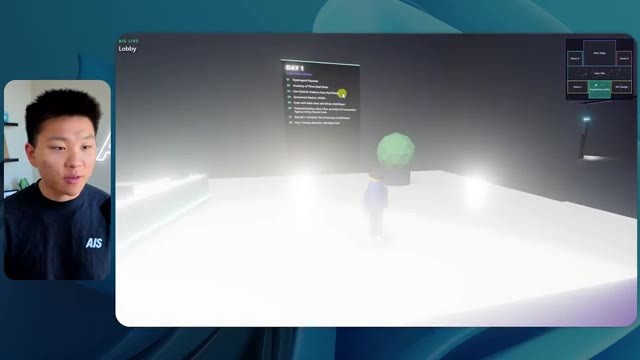
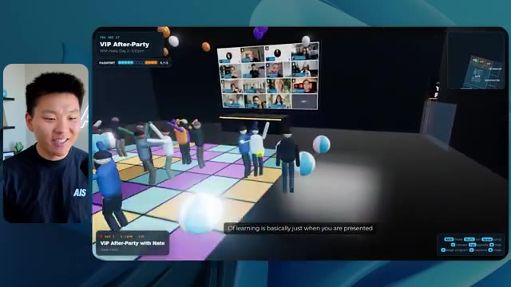
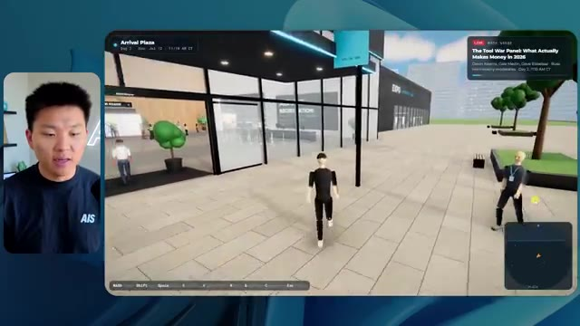
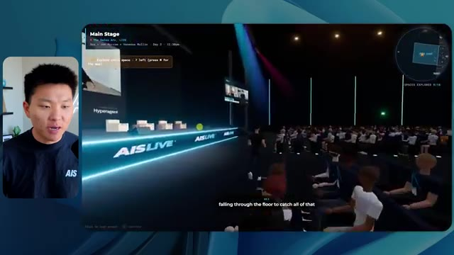

# 🎬 How I’d Make Money with Claude if my life depended on it

> **Chaîne** : [Nate Herk | AI Automation](https://www.youtube.com/@nateherk/featured)  
> **Lien YouTube** : [https://www.youtube.com/watch?v=vY0EzTP-7EA](https://www.youtube.com/watch?v=vY0EzTP-7EA)  
> **Date de publication** : 20260722  
> **Durée** : 00:09:19  
> **Identifiant vidéo** : `vY0EzTP-7EA`  
> **Transcription & Analyse** : `whisper-v3-large-turbo+gemini-3.5-flash-lite`  

---

## 📌 Synthèse Exécutive & Outils

### 💡 Résumé

Dans cette vidéo de la chaîne Nate Herk | AI Automation, l'analyste explore les performances comparatives du modèle de pointe **Opus 5.5** soumis à différents niveaux d'effort (de "faible" à "code ultra"). Le cas pratique consiste à utiliser un prompt unique de type *slash goal* très exigeant : transformer un dossier Frame.io de 105 gigaoctets contenant des enregistrements vidéo d'un événement virtuel (*AIS Live*) en un monde 3D explorable à la troisième personne, simulant une conférence technologique physique réaliste, avec des salles thématiques, des pistes, des scènes et une intégration de la marque.

Les démonstrations mettent en lumière l'impact direct de la graduation de l'effort sur la qualité du code généré, l'autonomie des agents IA et l'utilisation des ressources. Alors que le niveau *bas* produit un résultat esthétiquement pauvre, truffé de bugs d'affichage, d'images fixes non animées et de personnages "fantômes" qui disparaissent en 16 minutes pour 3,91 $, le niveau *moyen* élève considérablement la barre. Ce dernier intègre les directives de marque, des PNJ réactifs, de vraies lectures vidéo en streaming, des cartes synchronisées en direct et une modélisation spatiale poussée, nécessitant une heure et treize minutes pour un coût API estimé à 12,44 $.

L'analyse démontre que l'ajustement minutieux du niveau d'effort permet d'optimiser l'équilibre entre la complexité architecturale exigée, le temps d'exécution et les coûts en jetons, tout en soulignant la nécessité de connecter ces environnements générés à des solutions de déploiement rapide et d'hébergement web pour combler le fossé entre prototypage IA et mise en production.

### 🛠️ Outils, Modèles & Logiciels Présentés

*   **Opus 5.5** : Le modèle d'intelligence artificielle central de la démonstration, salué pour son intelligence, son coût abordable et sa capacité à s'adapter à divers niveaux d'effort pour des tâches d'ingénierie complexes.
*   **Claude Code** : L'environnement de programmation et d'assistance par IA utilisé pour orchestrer la génération du code et interagir avec l'espace de travail.
*   **Anthropic** : L'entreprise conceptrice des modèles Claude et source des recommandations méthodologiques sur le prompting et le réglage des niveaux d'effort.
*   **Frame.io** : La plateforme cloud de gestion de médias utilisée pour stocker et alimenter l'agent avec 105 gigaoctets d'enregistrements vidéo de l'événement *AIS Live*.
*   **Herc 2** : Le système d'exploitation IA propriétaire de Nate Herk, servant d'écosystème de ressources et d'outils interconnectés pour les agents.
*   **Hostinger (Connecteur Hostinger)** : L'outil de parrainage et extension gratuite pour éditeurs de code permettant de relier directement les environnements de développement (VS Code, Cursor, Claude Code, etc.) à un compte d'hébergement pour une mise en ligne instantanée.
*   **VS Code & Cursor** : Des éditeurs de code et environnements de développement compatibles avec les connecteurs de déploiement et l'ingénierie assistée par IA.
*   **Glido** : Un outil ou module tiers mentionné dans le monde virtuel pour la diffusion de programmes de certification et de présentations.

### 🔑 Points Clés & Enseignements Stratégiques

*   **Impact direct du niveau d'effort** : La modification du paramètre d'effort (bas, moyen, élevé, extra, max, code ultra) change radicalement la qualité finale de l'application générée, passant d'un prototype grossier et buggé à une expérience immersive fonctionnelle.
*   **Corrélation temps/coût/complexité** : Le passage d'un effort *bas* à un effort *moyen* multiplie par plus de quatre le temps d'exécution (de ~16 min à 1h13) et le coût API estimé (de 3,91 $ à 12,44 $), tout en multipliant la valeur perçue et la stabilité du produit final.
*   **Autonomie totale des agents** : Quel que soit le niveau d'effort testé (bas ou moyen), l'agent a exécuté l'intégralité du prompt complexe sans poser la moindre question à l'utilisateur, démontrant une excellente autonomie de planification et d'interprétation des objectifs.
*   **Validation visuelle automatisée** : L'utilisation de vérifications autonomes (22 à 23 ouvertures de navigateur par l'agent pour inspecter son propre travail) est un mécanisme critique pour s'assurer de la cohérence visuelle et fonctionnelle du monde 3D en cours de construction.
*   **Respect de l'identité de marque** : Les niveaux d'effort supérieurs sont indispensables pour que l'IA intègre subtilement et correctement les chartes graphiques, palettes de couleurs et logos spécifiques d'une entreprise plutôt que de recourir à des designs génériques.
*   **Gestion des médias dynamiques vs statiques** : Un effort insuffisant produit des "salles de conférence" avec de simples images fixes et des PNJ aux comportements erratiques ("fantômes"), tandis qu'un effort supérieur intègre du streaming vidéo réel et des interactions dynamiques fluides.
*   **Consommation de jetons et volumétrie** : La génération de mondes 3D interactifs complexes à partir de consignes globales consomme massivement des ressources (entre 191 000 et 490 000 jetons), nécessitant une gestion rigoureuse des quotas et des budgets API.
*   **Recommandation officielle d'Anthropic** : Les bonnes pratiques d'ingénierie suggèrent de débuter l'expérimentation des prompts complexes à un niveau d'effort *moyen*, puis d'ajuster itérativement vers le haut ou vers le bas selon la criticité du livrable attendu.
*   **Le gouffre entre code généré et déploiement** : Obtenir un produit fini fonctionnel depuis son environnement de développement local n'est que la première étape ; l'utilisation d'intégrations natives (comme le connecteur Hostinger) est vitale pour automatiser le pont vers la mise en production en ligne.
*   **Élimination des frictions de l'ingénierie logicielle** : Combiner des agents capables de traiter de lourdes charges de données (comme 105 Go de vidéos Frame.io) avec des outils de code automatisés permet de transformer un concept marketing complexe en prototype tangible en un temps record.

---

## ⏱️ Chronologie & Transcription Complète Audio & Visuelle (Mot pour Mot)

### ⏱️ `[00:00:00 - 00:00:20]` | Segment #01

**🔊 Audio (Transcription Intégrale Mot pour Mot en Français) :**
> Opus 5.5, Opus 5.5, Opus 5.5, Opus 5.5, Opus 5.5. Ce modèle est littéralement partout et pour de très bonnes raisons. Il est intelligent, il est bon marché, il a un goût incroyable, c'est un modèle d'IA incroyable. Mais avec chaque modèle d'IA, vous avez le choix de l'effort, que ce soit faible, moyen, élevé, extra, max ou code ultra.

**👁️ Analyse Visuelle d'Écran (gemini-3.5-flash-lite) :**
**Interface & Outils** : Interface du réseau social X (Twitter).

**Contenu textuel & Code** : Un tweet avec un texte en anglais sur les créateurs techniques et une vidéo intégrée montrant un environnement 3D virtuel.

**Action / Démonstration** : Affichage d'un post de réseau social illustrant l'impact potentiel de l'IA sur la création de contenu visuel.

*⏱️ 00:00:05 — Une capture d'écran d'un post sur le réseau social X montrant une vidéo ou une simulation 3D de paysage tropical avec des maisons et des palmiers.*

---

### ⏱️ `[00:00:20 - 00:00:38]` | Segment #02

**🔊 Audio (Transcription Intégrale Mot pour Mot en Français) :**
> Donc dans cette vidéo, j'ai donné exactement le même prompt à Opus 5.5 et je l'ai exécuté sur chaque niveau d'effort et nous allons comparer les résultats. Nous allons examiner la qualité de tous les différents résultats réels, mais ensuite nous allons également examiner combien de temps chacun d'eux a pris, combien cela nous a coûté si c'était une facturation par API, le nombre total de tokens, combien de vérifications ils ont exécutées et combien de questions ils m'ont réellement posées tout au long du processus.

**👁️ Analyse Visuelle d'Écran (gemini-3.5-flash-lite) :**
**Interface & Outils** : Application de tableau blanc / canevas (type Miro ou similaire).

**Contenu textuel & Code** : Tableau comparatif pour Opus 5.5 Effors avec les colonnes Low, Medium, High, Extra, Max, Ultracode et les lignes Run time, API cost, Total tokens, Checks, Questions asked.

**Action / Démonstration** : Présentation du tableau comparatif des différents niveaux d'effort de l'IA Opus 5.5.

*⏱️ 00:00:29 — Interface de tableau de bord ou canevas montrant un tableau comparatif avec les niveaux d'effort (Low, Medium, High, Extra, Max, Ultracode) et des métriques (Run time, API cost, Total tokens, etc.).*

---

### ⏱️ `[00:00:39 - 00:00:58]` | Segment #03

**🔊 Audio (Transcription Intégrale Mot pour Mot en Français) :**
> Et les résultats que nous avons obtenus ne sont pas du tout ce à quoi je m'attendais, donc j'ai hâte de partager cela avec vous les gars. Ne perdons pas de temps et allons directement à celui-ci. D'accord, alors plongeons-nous directement dans celui-ci. Je veux commencer juste en vous montrant le prompt réel que nous avons utilisé que nous avons donné à chacun de ces différents agents. Je vais aller dans les fichiers ici, et nous allons ouvrir ce fichier markdown de prompt, et je vais vous montrer ce que nous avons obtenu. Voici donc le slash objectif que j'ai fourni.

**👁️ Analyse Visuelle d'Écran (gemini-3.5-flash-lite) :**
**Interface & Outils** : Interface de l'application de développement (style éditeur/agent IA avec barre latérale et zone de chat).

**Contenu textuel & Code** : Texte du prompt demandant de construire un monde 3D interactif et des options de configuration dans la barre latérale.

**Action / Démonstration** : Navigation et présentation de l'interface de l'agent de développement IA par le présentateur.

*⏱️ 00:00:48 — Interface d'un outil de développement avec un agent IA (Opus 5.5 / Ultracode) affichant un prompt concernant un monde 3D et une petite incrustation vidéo du présentateur sur le côté gauche.*

---

### ⏱️ `[00:00:58 - 00:01:34]` | Segment #04

**🔊 Audio (Transcription Intégrale Mot pour Mot en Français) :**
> J'ai dit : tu dois me créer un monde en 3D qui est une conférence technologique réaliste dans laquelle je peux me promener en vue à la troisième personne. Tu vas regarder ce dossier, qui contient mes ressources d'enregistrement d'événements provenant d'AIS Live. Et ce dossier est un dossier Frame.io de 105 gigaoctets d'enregistrements vidéo. C'était un événement entièrement virtuel. Tout a été enregistré et tous les enregistrements sont ici même. J'ai dit : ton objectif est de prendre cet événement et de le transformer en un monde explorable en 3D qui me donne l'impression d'avoir réellement assisté à une vraie conférence en personne avec différentes salles, différentes pistes, différentes scènes, bla, bla, bla. N'hésite pas à utiliser key.ai si tu as besoin de générer des images ou des vidéos. Et tu peux aussi utiliser n'importe quoi d'autre dans mon projet Herc 2, qui est comme mon système d'exploitation IA. J'ai dit,

**👁️ Analyse Visuelle d'Écran (gemini-3.5-flash-lite) :**
**Interface & Outils** : Éditeur de code (VS Code / Cursor) et interface web Frame.io

**Contenu textuel & Code** : Fichier Markdown contenant le prompt demandant de convertir les enregistrements d'un événement virtuel en monde 3D explorable à la troisième personne.

**Action / Démonstration** : Présentation du prompt de configuration et navigation dans les ressources cloud Frame.io contenant les enregistrements vidéo de l'événement.

*⏱️ 00:01:07 — Éditeur de code affichant un fichier PROMPT.md avec des instructions détaillées pour créer un monde 3D interactif et un lien Frame.io.*

*⏱️ 00:01:16 — Interface Frame.io montrant un dossier partagé ("Sep 22, 2026") contenant les sous-dossiers "GA Access (For AIS)" et "VIP Access" des enregistrements de l'événement.*

*⏱️ 00:01:25 — Retour sur l'éditeur de code affichant le fichier PROMPT.md avec le prompt complet destiné à l'agent IA.*

---

### ⏱️ `[00:01:34 - 00:02:08]` | Segment #05

**🔊 Audio (Transcription Intégrale Mot pour Mot en Français) :**
> vous serez jugé sur la créativité, le design, la physique et la sensation générale lorsque j'explorerai le monde 3D que vous avez construit. Et c'était fondamentalement la fin des instructions. Donc comme vous pouvez le voir sur ce côté gauche, j'ai exécuté ceci à travers tous les différents niveaux d'effort. Commençons par le niveau bas et remontons jusqu'au code ultra. Très bien. Voici donc le résultat du niveau bas. Ouvrons ceci et jetons un coup d'œil. Nous avons donc AIS live, le sommet des services IA en personne enfin, et nous avons pu cliquer partout. Tout d'abord, on ne sent pas vraiment l'identité de la marque. Genre, ce n'est pas le logo d'IS Live. Ce n'est même pas nos couleurs. Donc je n'aime pas trop ça, mais entrons ici. D'accord. C'est beaucoup too bright, euh, trop lumineux. Nous avons une carte en haut à droite, nous avons une ville ici en arrière-plan, je ne peux pas dire quelle ville c'est.

**👁️ Analyse Visuelle d'Écran (gemini-3.5-flash-lite) :**
**Interface & Outils** : Interface web d'assistant IA / éditeur de prompts (style Claude / application spécialisée).

**Contenu textuel & Code** : Texte du prompt demandant de construire un monde 3D en vue à la troisième personne pour la conférence AIS Live, et message de l'utilisateur "yes, start the task in PROMPT.md".

**Action / Démonstration** : Navigation et sélection des différents niveaux de test d'effort dans la barre latérale gauche par le présentateur.

*⏱️ 00:01:42 — Interface d'une application d'IA montrant une liste de sessions de test avec différents niveaux d'effort (Hello, Extra, High, Max, Ultracode, Medium, Low) et un panneau de discussion avec un agent IA.*

---

### ⏱️ `[00:02:08 - 00:02:40]` | Segment #06

**🔊 Audio (Transcription Intégrale Mot pour Mot en Français) :**
> c'est. D'accord. C'est Chicago, ce qui est plutôt cool parce que tu sais, je vis à Chicago, mais bref, en haut à droite, on peut voir une carte. On a un hall d'accueil. On a un hall d'exposition. On a le salon VIP de la scène principale. Aussi la carte montre où se trouve chaque autre personne et ça se synchronise en direct. Donc on peut voir l'enregistrement. On peut voir le premier jour, la keynote de l'hyper agent, le débrief en direct. Cool. Donc ça connaît vraiment l'agenda et puis il y a le deuxième jour. Donc ça a trouvé ça, c'est bien. On a ces petites boules ici que je peux espérer botter. D'accord. Le visage, Oh, regarde ça. Si je vais par ici, tous les gens disparaissent tout simplement. Très mauvais. Très mauvais. D'accord. Alors voyons voir. Est-ce que je peux sprinter ? D'accord.

**👁️ Analyse Visuelle d'Écran (gemini-3.5-flash-lite) :**
**Interface & Outils** : Application web ou plateforme virtuelle interactive en 3D avec mini-carte de navigation et affichage vidéo du présentateur.

**Contenu textuel & Code** : Menus textuels et planning de conférence ("Day 1", "Sponsors, booths and hallway conversations") intégrés dans l'environnement virtuel 3D.

**Action / Démonstration** : Navigation et exploration de l'espace virtuel 3D de la conférence par le présentateur.

*⏱️ 00:02:16 — Vue d'un espace virtuel en 3D représentant une zone de retrait des badges, avec un mini-carte en haut à droite indiquant la position des différents participants.*

*⏱️ 00:02:24 — Vue du lobby virtuel avec un écran affichant le programme du premier jour ("Day 1") et la mini-carte de navigation.*

*⏱️ 00:02:32 — Vue de l'Expo Hall virtuel avec des avatars de participants et des éléments interactifs lumineux au sol.*

---

### ⏱️ `[00:02:40 - 00:03:04]` | Segment #07

**🔊 Audio (Transcription Intégrale Mot pour Mot en Français) :**
> Je peux avancer un peu plus vite. Je vais d'abord aller par ici. Il y a des produits dérivés, euh, un sweat à capuche certifié AIS plus. D'accord. Donc il y a les vrais stands qu'on avait dans l'événement virtuel. On avait des stands. Donc c'est plutôt cool. Un petit endroit pour prendre des photos. La salle C. En ce moment, nous avons Tangy Frederick qui anime un atelier. D'accord. Mais ce n'est pas une vidéo. Comme vous pouvez le voir, c'est juste une image. Elle ne bouge pas. Donc c'est juste une image. Ces gens sont en train de disparaître. Ce sont sûrement des fantômes. Allons par ici dans la salle A.

**👁️ Analyse Visuelle d'Écran (gemini-3.5-flash-lite) :**
**Interface & Outils** : Environnement virtuel 3D (style métavers)

**Contenu textuel & Code** : Hall d'exposition virtuel, stands de sponsors et panneaux d'instructions

**Action / Démonstration** : Navigation et exploration d'un événement virtuel en 3D

---

### ⏱️ `[00:03:04 - 00:03:30]` | Segment #08

**🔊 Audio (Transcription Intégrale Mot pour Mot en Français) :**
> Nous avons Liberty White. D'accord. Très cool. Vos 30 premiers jours en automatisation. Encore une fois, c'est juste une image fixe et les gens ont des bugs d'affichage. Donc ce n'est pas très bien ici. Je vais aller sur la scène principale et voir ce que nous avons. D'accord, cool. Donc nous avons une scène principale. Les gens ont des bugs d'affichage. Vraiment beaucoup. Ce n'est vraiment pas terrible. Notre vidéo est en train de bouger. Genre, j'ai vu mon visage ici et j'ai vu celui de Devin, mais maintenant ils ont disparu. Donc je ne sais pas ce qui s'est passé. D'accord. On dirait que c'est plutôt un diaporama. Rien n'est vraiment diffusé pour l'instant. Quoi qu'il en soit, entrons ici.

**👁️ Analyse Visuelle d'Écran (gemini-3.5-flash-lite) :**
**Interface & Outils** : Environnement virtuel 3D interactif (plateforme de type événement virtuel ou métavers).

**Contenu textuel & Code** : Aucun code source, terminal ou prompt visible ; affichage d'un monde virtuel 3D avec avatars et écrans de présentation.

**Action / Démonstration** : Navigation et déplacement d'un avatar dans un espace virtuel d'événement en ligne.

---

### ⏱️ `[00:03:30 - 00:03:58]` | Segment #09

**🔊 Audio (Transcription Intégrale Mot pour Mot en Français) :**
> Nous avons plus de stands. Nous avons hyper agent. Nous avons Claude Code. Nous avons plus de goodies. La salle B, c'est Dave Ebelor. Je suppose que c'est exactement la même chose. Nous avons du café. Et ensuite, je suppose, le salon VIP, accès VIP seulement. C'est plutôt sympa, mais il n'y a vraiment rien qui se passe ici. Cet écran est bien trop lumineux. Bon. Donc je pense que vous comprenez l'ambiance qu'on obtient ici d'Opus 5.5 à faible effort. Et c'est là que les choses deviennent intéressantes. À combien est-ce que vous pensez que cela a tourné ? Combien de temps ? Celui-ci a tourné pendant 16 minutes et 43 secondes. Combien est-ce que vous pensez que ça a coûté ?

**👁️ Analyse Visuelle d'Écran (gemini-3.5-flash-lite) :**
**Interface & Outils** : Application de tableau blanc / canevas (type Opus 5.5 Efforts)

**Contenu textuel & Code** : Tableau comparatif avec les colonnes : Low, Medium, High, Extra, Max, Ultracode et les lignes : Run time, API cost, Total tokens, Checks, Questions asked.

**Action / Démonstration** : Le présentateur présente ou commente un tableau d'évaluation des performances et coûts de différents modes ou niveaux d'effort.

*⏱️ 00:03:51 — Interface de tableau ou canevas montrant des niveaux de performance (Low, Medium, High, Extra, Max, Ultracode) avec des métriques comme Run time, API cost, Total tokens.*

---

### ⏱️ `[00:03:58 - 00:04:26]` | Segment #10

**🔊 Audio (Transcription Intégrale Mot pour Mot en Français) :**
> 3,91 dollars si c'était une facturation par API. J'utilise évidemment mon abonnement ici, mais nous allons simplement calculer cela avec la facturation par API. Le total des jetons était de 191 000. Il a fait 22 vérifications. Donc la vérification, 22 fois il a ouvert le navigateur et a exécuté différentes sortes de vérifications. Donc 22 catégories de vérifications. Et combien de questions m'a-t-il posées ? Il m'a posé un total de zéro question tout au long de cette invite de type slash goal. D'accord. Alors, ouvrons l'effort moyen et voyons ce que nous avons. D'accord, c'est parti. Effort moyen. Nous avons Nate Herc. Nous avons mon badge. C'est de la marque AI's Life.

**👁️ Analyse Visuelle d'Écran (gemini-3.5-flash-lite) :**
**Interface & Outils** : Tableau blanc numérique / outil de design (type Excalidraw ou similaire).

**Contenu textuel & Code** : Un tableau présentant les métriques : Run time (16m 43s), API cost ($3.91), Total tokens (191.3K), Checks, et Questions asked, répartis en colonnes Low, Medium, High.

**Action / Démonstration** : Présentation et analyse des coûts d'API, du temps d'exécution et du nombre total de jetons consommés par l'agent.

*⏱️ 00:04:05 — Capture d'écran montrant un tableau de données comparatives sur un outil de design/tableau blanc (« Opus 5.5 Efforts »), avec le présentateur incrusté à gauche.*

---

### ⏱️ `[00:04:26 - 00:04:46]` | Segment #11

**🔊 Audio (Transcription Intégrale Mot pour Mot en Français) :**
> Donc ça a déjà l'air un petit peu mieux. Ça ressemble à nos palettes de couleurs qui ont utilisé nos directives de marque. Premier jour de construction, deuxième jour de gain, VIP. Cool. D'accord. Je vais entrer dans le lieu. D'accord. Waouh. Une ambiance un peu similaire. C'est en arrière-plan. Ça ne ressemble pas à Chicago, n'est-ce pas ? Non, ça ressemble à un, honnêtement, ça ressemble à une ville imaginaire. Quoi qu'il en soit, c'est drôle qu'ils aient décidé de faire ça. Voyons si je peux me déplacer un peu plus vite. Oh, waouh.

**👁️ Analyse Visuelle d'Écran (gemini-3.5-flash-lite) :**
**Interface & Outils** : Application web interactive / Environnement virtuel 3D (style métavers)

**Contenu textuel & Code** : Écran d'accueil de l'événement 'AIS Live' avec badge ('NATE HERK'), boutons de navigation (Day 1, Day 2, VIP) et instructions de contrôle.

**Action / Démonstration** : Navigation et entrée dans le lieu virtuel de l'événement en ligne.

*⏱️ 00:04:31 — Interface web de l'application 'AIS Live' avec un badge nominatif de pass et le bouton pour entrer dans le lieu virtuel.*

*⏱️ 00:04:41 — Vue à la première ou troisième personne dans un espace virtuel 3D avec des avatars et un paysage urbain nocturne en arrière-plan.*

---

### ⏱️ `[00:04:46 - 00:05:21]` | Segment #12

**🔊 Audio (Transcription Intégrale Mot pour Mot en Français) :**
> Les gens interagissent avec moi. Regardez. Si je m'approche de ce type, il vient de lever le bras. Bon, maintenant il ne veut plus du tout avoir affaire à moi. Mais tous ces petits robots ici doivent prendre des décisions. Je ne sais pas s'ils utilisent Jev. C'est sûr que non. Je ne lui ai pas dit de le faire. En fait, ma clé Jev est à l'arrière. Je ne sais pas. Peut-être qu'il l'a utilisée. Quoi qu'il en soit, nous pouvons voir ici que nous avons la salle d'atelier C, le laboratoire des agents. Sympa. Donc celui-ci est en fait en train de tourner. Vous pouvez voir qu'il s'agit d'une vraie vidéo lue par Tangy. Tout le monde ici est en train de travailler sur un ordinateur portable. Ils ne buguent pas. C'est plutôt cool. De plus, mon badge est sur ma poitrine, ce qui est plutôt cool. Je peux venir par ici. Nous avons une carte en haut à droite, comme vous pouvez le voir, mais je peux venir par ici. Nous avons un

**👁️ Analyse Visuelle d'Écran (gemini-3.5-flash-lite) :**
**Interface & Outils** : Environnement virtuel 3D / plateforme de simulation interactive (type Gather.town ou similaire).

**Contenu textuel & Code** : Aucun code source, commande ou prompt textuel n'est affiché.

**Action / Démonstration** : Navigation et exploration d'un monde virtuel interactif habité par des agents ou des avatars animés.

---

### ⏱️ `[00:05:21 - 00:05:47]` | Segment #13

**🔊 Audio (Transcription Intégrale Mot pour Mot en Français) :**
> hall d'exposition. C'est là que nous avons le stand Glido. Et ça diffuse en ce moment. Oui, ça diffuse la vidéo de nous parlant de Glido. Ça diffuse la vidéo d'Ed et moi parlant de notre programme de certification. Nous avons le logo AIS Plus juste ici, qui est un peu mal placé. Ce sont les diapositives des conférenciers et les points clés. Donc waouh, ce sont toutes les ressources que nous avons distribuées après l'événement. Elles sont toutes là aussi. Nous pouvons voir que nous avons un projecteur sur la communauté. Donc c'est Aiden qui parle de son contrat qu'il a décroché et c'est diffusé en direct. Ces gens sont en train de regarder.

**👁️ Analyse Visuelle d'Écran (gemini-3.5-flash-lite) :**
**Interface & Outils** : Environnement virtuel 3D de type metaverse / salon virtuel interactif.

**Contenu textuel & Code** : Affiches, présentations et diapositives virtuelles pour le programme AIS+ Certified.

**Action / Démonstration** : Navigation et visite guidée d'un hall d'exposition virtuel.

---

### ⏱️ `[00:05:47 - 00:06:21]` | Segment #14

**🔊 Audio (Transcription Intégrale Mot pour Mot en Français) :**
> Ils sont plutôt engagés. On a l'hyper agent. C'était, c'est ce que je voulais dire. Si vous avez vu ces gens lever les bras pour dire bonjour, c'était plutôt drôle. Regardez, regardez, le voilà qui recommence. Bref. Bon. Où est-ce que je suis maintenant ? Maintenant, je suis dans le hall principal. On a un bar à café. On a un grand logo, qui est le vrai logo. C'est trop lumineux, mais on a le logo. On peut voir si on peut entrer ici dans le parcours des fondations. On a Sabrina Romanov et Liberty White. Donc différentes formations juste là. On peut entrer dans cette salle. C'est le parcours avancé. Alors qu'est-ce qui se passe ici. On a Dave Ebelar et Saman qui parlent de différentes choses là-dedans. Et maintenant, allons jeter un œil à la scène principale. Oh, attendez, il y a une vidéo de moi là-haut. C'est genre un VIP

**👁️ Analyse Visuelle d'Écran (gemini-3.5-flash-lite) :**
**Interface & Outils** : Application web 3D / Environnement virtuel de type metaverse / Plateforme de réunion virtuelle

**Contenu textuel & Code** : Interface utilisateur affichant "Main Lobby", une minimap en haut à droite et des avatars 3D d'utilisateurs.

**Action / Démonstration** : Navigation et déplacement d'un avatar à l'intérieur d'un espace virtuel 3D d'événement.

---

### ⏱️ `[00:06:21 - 00:06:50]` | Segment #15

**🔊 Audio (Transcription Intégrale Mot pour Mot en Français) :**
> section ? Ouais, on ira voir ça dans une minute. Mais bref, voici la scène principale. Ça a l'air vraiment, vraiment super. On a une grande scène. On a genre quatre personnes assises ici. On a les trois écrans d'Alex là-haut avec l'hyper agent. Est-ce que j'ai le droit de monter sur scène ? Oh, et il me laisse monter sur scène. D'accord. C'est plutôt sympa. Bon les gars, faisons un selfie. Laissez-moi prendre tout le monde en arrière-plan. Venez par ici. Bref, c'est vraiment, vraiment cool. Toutes les places ne sont pas occupées par contre. Donc il va falloir qu'on travaille là-dessus. Mais bref, je vais y retourner en courant pour voir ce qu'était cette section VIP. D'accord. Le salon VIP. J'ai l'impression que c'est comme un aéroport ou un truc du genre.

**👁️ Analyse Visuelle d'Écran (gemini-3.5-flash-lite) :**
**Interface & Outils** : Application de monde virtuel / plateforme de conférence en ligne 3D

**Contenu textuel & Code** : Interface utilisateur affichant les détails de la keynote "Hyperagent Keynote" par Alex McDonnell

**Action / Démonstration** : Navigation et exploration de l'espace virtuel par l'avatar du présentateur

---

### ⏱️ `[00:06:51 - 00:07:14]` | Segment #16

**🔊 Audio (Transcription Intégrale Mot pour Mot en Français) :**
> Ok, super. Donc maintenant nous avons les sessions VIP ici. Session de questions-réponses VIP avec Nate, lecture vidéo en direct juste ici. Très, très cool. Et nous avons comme un bar ou quelque chose comme ça. Génial. Je dirais que c'est un plutôt bon résultat. Maintenant, en ce qui concerne les statistiques ici, celui-ci a pris une heure et 13 minutes à s'exécuter. Il nous aurait coûté 12 dollars et 44 cents. Il a utilisé 490 000 jetons et il a effectué 23 vérifications.

**👁️ Analyse Visuelle d'Écran (gemini-3.5-flash-lite) :**
**Interface & Outils** : Espace virtuel 3D / plateforme de type métavers et tableau de bord de métriques d'IA ("Opus 5.5 Efforts").

**Contenu textuel & Code** : Métriques de performance d'IA : Run time (16m 43s), API cost ($3.91), Total tokens (191.3K), Checks (22), et affichage vidéo d'une session VIP Q&A.

**Action / Démonstration** : Navigation et présentation d'un monde virtuel 3D avec diffusion vidéo intégrée, puis analyse des coûts et performances d'exécution d'une IA.

*⏱️ 00:06:56 — Capture montrant un espace virtuel en 3D (type métavers) avec des avatars et un grand écran affichant une session vidéo en direct, tandis que le présentateur apparaît en incrustation à gauche.*

*⏱️ 00:07:02 — Capture montrant un tableau de bord ou un canevas comparatif (intitulé "Opus 5.5 Efforts") affichant des métriques telles que le temps d'exécution (16m 43s), le coût API ($3.91) et le nombre de tokens (191.3K).*

---

### ⏱️ `[00:07:14 - 00:07:48]` | Segment #17

**🔊 Audio (Transcription Intégrale Mot pour Mot en Français) :**
> Et il nous a posé un total de zéro question une fois de plus. Très bien, passons à élevé. C'était déjà un résultat plutôt correct et Anthropic eux-mêmes dans leur vidéo, ou désolé, pas une vidéo, un article sur comment prompter Opus 5.5. Ils ont dit de commencer simplement par moyen et d'ajuster à la hausse ou à la baisse si nécessaire. C'était donc un résultat moyen. Passons à élevé et voyons ce qu'on a obtenu. Rapidement les gars, je dois prendre une seconde pour vous parler du sponsor de la vidéo d'aujourd'hui, Hostinger. Donc ces deux modèles viennent de me construire une version fonctionnelle de la même chose. Et maintenant je suis exactement là où je finis toujours, avec un produit fini sur mon ordinateur portable et aucun moyen rapide de le mettre en ligne. Et c'est le fossé que le connecteur d'Hostinger comble. C'est une extension gratuite

**👁️ Analyse Visuelle d'Écran (gemini-3.5-flash-lite) :**
**Interface & Outils** : Tableau blanc ou application de notes structurées pour l'Image 1 ; environnement de développement intégré (IDE) type VS Code ou Cursor pour l'Image 2.

**Contenu textuel & Code** : Tableau comparatif chiffré des performances de l'IA (Image 1) ; code source et prompt pour construire un calculateur de ROI "Northwind ROI calculator" (Image 2).

**Action / Démonstration** : Présentation des résultats comparatifs des différents niveaux de configuration de l'IA, suivie d'une démonstration de génération de code.

*⏱️ 00:07:22 — Tableau de comparaison affichant les métriques (temps d'exécution, coût API, jetons, vérifications, questions posées) selon différents niveaux d'effort (Low, Medium, High, Extra).*

*⏱️ 00:07:39 — Interface de développement divisée en deux volets montrant un éditeur de code et un assistant IA en train de générer un calculateur de ROI en HTML/JS.*

---

### ⏱️ `[00:07:48 - 00:08:23]` | Segment #18

**🔊 Audio (Transcription Intégrale Mot pour Mot en Français) :**
> pour votre éditeur qui intègre votre compte Hostinger dans l'outil de programmation que vous utilisez déjà, que ce soit VS Code, Cursor, Cloud Code, Codex, et j'en passe. Vous vous connectez une seule fois en un clic, et à partir de là, votre agent peut déployer le site, y pointer un domaine, configurer les enregistrements DNS et vérifier votre VPS sans que vous ayez jamais à quitter l'éditeur. Ainsi, peu importe celui de ces outils que vous finirez par préférer, ce qu'il a construit est à seulement quelques minutes d'une vraie URL sur un hébergement géré. Le connecteur est gratuit avec chaque formule d'hébergement, donc si vous avez toujours besoin de l'hébergement sous-jacent, profitez de la formule illimitée avec le lien dans la description et utilisez le code NATEHERK pour 10 % de réduction. Cela inclut également un nom de domaine gratuit et un e-mail professionnel pour un an. Et c'est toujours le moyen le plus économique que j'ai trouvé pour obtenir un

**👁️ Analyse Visuelle d'Écran (gemini-3.5-flash-lite) :**
**Interface & Outils** : Interface de gestion Hostinger connectée et interface de terminal Claude Code.

**Contenu textuel & Code** : Options de gestion Hostinger (Websites, Domains, Subscriptions & Payments, Email Marketing) et statut connecté via OAuth avec Node.js 24.13.0.

**Action / Démonstration** : Connexion unique d'Hostinger à l'IDE permettant à l'assistant d'accéder aux outils de déploiement et de gestion.

*⏱️ 00:07:57 — Interface montrant la connexion OAuth de Hostinger depuis l'IDE avec les différents outils disponibles (Websites, Domains, Subscriptions, Email Marketing), et Claude Code dans un panneau adjacent.*

---

### ⏱️ `[00:08:23 - 00:08:47]` | Segment #19

**🔊 Audio (Transcription Intégrale Mot pour Mot en Français) :**
> vous avez construit sur une vraie URL. Donc revenons à la vidéo. D'accord. Encore une fois, très, très marqué par la marque. C'est un écran de chargement encore mieux que le précédent. Nous avons ce joli petit effet en arrière-plan. Nous avons le logo. Nous allons entrer dans le lieu. D'accord. Nous y voilà. Ça a l'air plutôt bien. Nous commençons à l'extérieur et vous pouvez voir que nous avons ces drapeaux pour tous les intervenants, Wyatt, Casper, Alex, Ed, Aiden, Sabrina, Liberty. C'est plutôt cool. Nous avons des blocs en direct ici.

**👁️ Analyse Visuelle d'Écran (gemini-3.5-flash-lite) :**
**Interface & Outils** : Application web 3D interactive (metaverse / plateforme événementielle virtuelle 'AIS Live')

**Contenu textuel & Code** : Écran de chargement avec instructions de contrôle et interface de monde virtuel 3D avec bannières informatives et avatars

**Action / Démonstration** : Navigation et entrée dans l'espace virtuel interactif de l'événement en ligne

*⏱️ 00:08:29 — Écran de chargement et d'accueil de la plateforme virtuelle 'AIS Live', présentant le logo, les touches de contrôle (WASD, Mouse, etc.) et le bouton 'Enter the Venue'.*

*⏱️ 00:08:35 — Entrée dans l'environnement virtuel 3D interactif 'AIS Live Plaza', montrant un avatar de joueur, des bâtiments de ville en arrière-plan et un guide textuel en haut.*

*⏱️ 00:08:41 — Exploration de la place virtuelle 'AIS Live Plaza' avec des bannières verticales affichant des noms de conférenciers ou de sections et un petit robot sphérique au sol.*

---

### ⏱️ `[00:08:47 - 00:09:23]` | Segment #20

**🔊 Audio (Transcription Intégrale Mot pour Mot en Français) :**
> il a pris cette photo de moi, votre hôte, Nate Herc, John, Dave, Nate Herc. Voilà. D'accord. Les portes. C'est génial. Ce sont des portes coulissantes automatiques en verre. J'adore ça. On peut voir l'enregistrement VIP. On peut voir l'admission générale. On peut venir par ici et on peut découvrir l'exposition avec différents stands, le projecteur sur la communauté. Vous pouvez aussi voir qu'en haut à gauche, j'ai un passeport. Donc c'est genre, ça va montrer combien d'endroits j'ai visités. Tout cela est une vraie lecture. Nous avons un mur de ressources avec tous les différents conférenciers. Ils ont aussi une session de réseautage par ici. Donc je vais venir très vite et voir de quoi il s'agit. Donc nous avons le bar à infusion à froid AIS. Nous avons différents membres de la communauté qui ont été mis en avant ou mis en lumière.

**👁️ Analyse Visuelle d'Écran (gemini-3.5-flash-lite) :**
**Interface & Outils** : Application ou plateforme virtuelle d'événement 3D (type metaverse ou salon virtuel interactif).

**Contenu textuel & Code** : Éléments d'interface utilisateur incluant des bannières d'enregistrement ("Registration Concourse"), des indications de sessions et des pop-ups d'information.

**Action / Démonstration** : Exploration et visite guidée d'un salon virtuel en 3D par l'hôte.

*⏱️ 00:08:56 — Vue d'un espace virtuel d'événement en ligne montrant l'accueil, les comptoirs d'enregistrement et la scène principale avec des avatars.*

*⏱️ 00:09:05 — Navigation dans une zone d'exposition virtuelle avec des stands de certification et des bannières informatives.*

*⏱️ 00:09:14 — Déplacement d'un avatar dans le hall virtuel entouré d'autres participants et de baies vitrées.*

---

### ⏱️ `[00:09:23 - 00:09:56]` | Segment #21

**🔊 Audio (Transcription Intégrale Mot pour Mot en Français) :**
> Nous avons l'aile VIP. Attends, quoi ? Prends un bracelet. Oh, je dois vraiment aller chercher le bracelet. D'accord. Laisse-moi m'enregistrer rapidement. Le bracelet est déjà mis. Attends, quoi ? D'accord. Oh, d'accord. Maintenant, les portes se sont ouvertes pour moi. Cool. Je peux entrer ici. Oh, ça mène juste à la scène principale. Salon VIP. Il y a une séance de questions-réponses en cours. Ça a l'air très cool. Je veux dire, je suis très impressionné par la façon dont il est capable de faire ça. Waouh. D'accord. Donc c'est vraiment bien. Ce qu'on a fait, c'est qu'on a eu des salles de discussion VIP avec différentes personnes. Tu peux voir qu'il y a différentes salles, différents membres de l'équipe AIS qui vont dans des trucs. C'est vraiment cool. C'est très cool. C'est un VIP tellement meilleur

**👁️ Analyse Visuelle d'Écran (gemini-3.5-flash-lite) :**
**Interface & Outils** : Application de métavers virtuel 3D (environnement virtuel interactif).

**Contenu textuel & Code** : Interface utilisateur virtuelle avec cartes, indicateurs de progression, et sous-titres de discussion.

**Action / Démonstration** : Navigation et exploration de différentes zones d'un événement virtuel par l'avatar de l'utilisateur.

*⏱️ 00:09:32 — Vue d'un espace de type métavers virtuel nommé "Registration Concourse" avec un avatar en mouvement.*

*⏱️ 00:09:40 — Vue dans une salle VIP virtuelle avec un écran affichant une visioconférence et des avatars assis.*

*⏱️ 00:09:48 — Vue d'une zone de sessions de travail VIP ("VIP Working Sessions") avec plusieurs tables et écrans de présentation.*

---

### ⏱️ `[00:09:56 - 00:10:30]` | Segment #22

**🔊 Audio (Transcription Intégrale Mot pour Mot en Français) :**
> expérience que ce qui a été montré dans le premier élément. D'accord. After-party VIP. Regardez ça. On a une piste de danse. On a tous ces éléments ici. On a la lecture de l'after-party VIP juste ici. Et il y a une estrade de DJ. C'est trop marrant. Il y a un petit bug juste ici, un petit glitch juste là, mais c'est génial. Oh, cool. Donc quand je suis ici sur la scène principale, on a des sous-titres. Vous pouvez voir juste ici en bas de mon écran, on a ces sous-titres de Wyatt qui est en train de parler là-haut. On a des lumières. On a le panel. Très cool. Belle scène principale. Je vais aller par ici. On peut aller à la fondation,

**👁️ Analyse Visuelle d'Écran (gemini-3.5-flash-lite) :**
**Interface & Outils** : Application web 3D / Environnement virtuel interactif (type Gather ou similaire)

**Contenu textuel & Code** : Interface utilisateur virtuelle affichant les zones 'VIP After-Party' et 'Main Stage', des flux vidéo de participants et des avatars 3D.

**Action / Démonstration** : Navigation et exploration de l'environnement virtuel interactif par le présentateur.

*⏱️ 00:10:04 — Capture montrant l'espace virtuel 'VIP After-Party' avec des avatars et un grand écran de visioconférence.*

*⏱️ 00:10:13 — Capture montrant une vue élargie de la piste de danse virtuelle avec des ballons et des avatars en mouvement.*

*⏱️ 00:10:21 — Capture montrant l'espace virtuel de la 'Main Stage' avec un public assis et une retransmission vidéo.*

---

### ⏱️ `[00:10:30 - 00:11:06]` | Segment #23

**🔊 Audio (Transcription Intégrale Mot pour Mot en Français) :**
> avancé, et les parcours d'entreprise par ici. Donc voyons voir. Nous avons l'anatomie de trois vrais contrats. Nous avons hyper agent. Nous avons les évals avec Nate et Ed ici. Nous avons Dave qui s'occupe des trucs avancés. C'est vraiment bien. Je veux dire, évidemment, chacun, chacun de ces résultats jusqu'à présent, faible était correct. Moyen était meilleur. Élevé a été encore meilleur. Voyons si cette tendance se poursuit et voyons combien cela nous a coûté. Donc, élevé a fonctionné pendant une heure et sept minutes. Donc un peu plus rapide que moyen, cela nous aurait coûté 16 dollars et 31 cents. Il a utilisé un demi-million de tokens, 509 000. Il a fait 22 vérifications. Et il nous a aussi demandé, enfin, non, je me suis trompé. Ce

**👁️ Analyse Visuelle d'Écran (gemini-3.5-flash-lite) :**
**Interface & Outils** : Application de tableau blanc ou de prise de notes numérique avec interface de type tableur ou diagramme.

**Contenu textuel & Code** : Tableau comparatif affichant 'Run time', 'API cost', 'Total tokens', 'Checks' et 'Questions asked'.

**Action / Démonstration** : Présentation comparative des coûts et métriques d'exécution de modèles ou d'agents IA.

*⏱️ 00:10:57 — Tableau de comparaison montrant les coûts et performances selon les niveaux 'Low', 'Medium', 'High' et 'Extra'.*

---

### ⏱️ `[00:11:06 - 00:11:25]` | Segment #24

**🔊 Audio (Transcription Intégrale Mot pour Mot en Français) :**
> l'un m'a posé une question et spoiler, c'était le seul qui nous a posé une question tout au long de tout ça. Donc voyons voir, il nous en reste trois extra, max et ultra code. Laissez-moi ouvrir extra et nous verrons ce qu'on a. D'accord. Donc celui-ci a l'air plutôt bien. Je dirais honnêtement qu'jusqu'à présent, l'écran de chargement haut était le meilleur. Celui qu'on vient juste de voir, mais bref, entrons dans AIS live.

**👁️ Analyse Visuelle d'Écran (gemini-3.5-flash-lite) :**
**Interface & Outils** : Application de tableau de bord ou outil de mind-mapping/kanban en ligne avec incrustation vidéo du présentateur.

**Contenu textuel & Code** : Tableau de données : Run time, API cost, Total tokens, Checks, Questions asked pour les colonnes Low, Medium, High, Extra.

**Action / Démonstration** : Le présentateur commente les résultats du tableau et s'apprête à ouvrir la section 'Extra'.

*⏱️ 00:11:11 — Un tableau comparatif montrant les métriques de différents niveaux d'effort (Low, Medium, High, Extra) avec les temps d'exécution, coûts API, tokens, vérifications et questions posées.*

---

### ⏱️ `[00:11:26 - 00:11:51]` | Segment #25

**🔊 Audio (Transcription Intégrale Mot pour Mot en Français) :**
> Waouh. D'accord. Donc nous avons comme de petits extraits sonores. Je peux discuter avec des gens. Le panel de la guerre des outils a réglé quelques débats pour moi. Sympratique. Bon point de vue là-dessus. Nous sommes à nouveau dehors. Nous avons ces différentes bannières, bien qu'elles soient toutes les mêmes. Elles n'affichent pas les noms de différentes personnes. Donc grand logo AIS Live. L'aile de l'atelier est par ici. Et passons par les portes coulissantes en verre pour voir ce que nous avons. Nous avons donc le café AIS. La carte est en bas à droite, et elle n'est pas très descriptive.

**👁️ Analyse Visuelle d'Écran (gemini-3.5-flash-lite) :**
**Interface & Outils** : Application de métavers ou monde virtuel 3D interactif.

**Contenu textuel & Code** : Environnement 3D avec avatars, interface de navigation, mini-carte en bas à droite et bannières textuelles.

**Action / Démonstration** : Exploration et déplacement d'un avatar dans un espace virtuel 3D.

*⏱️ 00:11:32 — Vue d'un monde virtuel en 3D (style métavers) avec des avatars et des bannières publicitaires textuelles 'AIS LIVE'.*

*⏱️ 00:11:38 — Navigation d'un avatar dans la place extérieure du monde virtuel 3D avec des bâtiments urbains en arrière-plan.*

*⏱️ 00:11:45 — L'avatar s'approche de l'entrée lumineuse d'un bâtiment ou d'un hall d'exposition virtuel.*

---

### ⏱️ `[00:11:51 - 00:12:26]` | Segment #26

**🔊 Audio (Transcription Intégrale Mot pour Mot en Français) :**
> J'aime bien comment les autres cartes nous ont montré ce que, genre où se trouvaient les choses, mais celle-ci a l'air très professionnelle. On peut voir ici c'est la scène principale. Allons y faire un saut rapidement. Elles ont toutes ces balles qui volent autour, ce qui je trouve est plutôt marrant. Les ballons de plage AIS. On me voit là-haut en train de parler. Je crois que j'étais en train d'introduire l'un des jours. Continuons par ici vers la salle d'atelier sur ce côté gauche. OK. Donc ici nous avons le théâtre Hyper Agent. Nous avons cette session sponsorisée ici par Hyper Agent, mais ça nous montre aussi ce qui va s'y passer. C'est vraiment marrant qu'on puisse discuter avec des gens. Salmon a créé un représentant commercial vocal en direct. La salle "Le Juste Prix" était comble. As-tu pris le guide du compagnon VIP ? C'est tellement marrant. Nous avons le parcours avancé dans

**👁️ Analyse Visuelle d'Écran (gemini-3.5-flash-lite) :**
**Interface & Outils** : Application de monde virtuel 3D interactif (type métavers / plateforme événementielle en ligne).

**Contenu textuel & Code** : Interface utilisateur avec mini-carte en bas à droite, options de menu (Map, Agenda, Captions, Help) et panneaux textuels contextuels.

**Action / Démonstration** : Navigation et exploration de différents espaces virtuels (scène principale, hall d'entrée) avec l'avatar.

*⏱️ 00:12:00 — Vue d'une scène principale virtuelle avec un écran de présentation et un public d'avatars dans un monde 3D.*

*⏱️ 00:12:09 — Vue d'un hall virtuel (Grand Lobby) avec plusieurs avatars et des panneaux indiquant des ateliers d'intelligence artificielle.*

*⏱️ 00:12:17 — Vue d'un couloir virtuel où des avatars se déplacent et interagissent via des bulles de discussion.*

---

### ⏱️ `[00:12:26 - 00:12:58]` | Segment #27

**🔊 Audio (Transcription Intégrale Mot pour Mot en Français) :**
> ici. Encore une fois, nous avons la lecture en direct. Est-ce que c'est la lecture en direct ? Oh, d'accord. Ça a commencé une fois que je suis entré, mais je peux prendre place. Oh la la. Je peux regarder ça. Je peux me lever. Je veux m'asseoir au premier rang. C'est plutôt cool. C'est très bien. J'aime ça. Et vous savez ce que j'ai remarqué jusqu'à présent ? Le personnage réel que j'incarne me ressemble un peu. Je pense qu'il a été modélisé à partir de mes photos de profil ou quelque chose comme ça. Bref, nous avons Sabrina ici, l'animatrice de la salle, prenez n'importe quel siège disponible. D'accord, cool. Et j'ai vraiment aimé la fonctionnalité pour s'asseoir. C'est plutôt marrant. Genre, on pourrait vraiment assister à cet atelier et participer. Bref, ça nous montre les intervenants. Ça nous montre les

**👁️ Analyse Visuelle d'Écran (gemini-3.5-flash-lite) :**
**Interface & Outils** : Présentation ou face-caméra explicatif sans interface logicielle partagée.

**Contenu textuel & Code** : Explications orales et mise en contexte méthodologique.

**Action / Démonstration** : Explications face caméra et démonstration conceptuelle.

---

### ⏱️ `[00:12:58 - 00:13:31]` | Segment #28

**🔊 Audio (Transcription Intégrale Mot pour Mot en Français) :**
> programme. Il y a un petit tapis rouge ici pour prendre des photos. On peut prendre la pose. Oh, wouah. C'est plutôt cool. Bibliothèque de ressources, obtenir la certification AIS Plus, Glido, Hyper Agent, AIS Plus, trois vraies offres. Génial. Je veux dire, je dirais vraiment que jusqu'à présent, chacune est meilleure que la précédente. Et on n'a même pas encore vu la section VIP, le salon VIP. Montons ici très vite. J'espère que je pourrai entrer. Sympa. On a une réinitialisation des outils. Ce sont les différentes salles dans lesquelles nous pourrions aller. Donc encore une fois, je pourrais prendre la feuille de calcul et essayer de comprendre comment tarifer mes trucs. C'est tellement cool. C'est vraiment mieux que le précédent où on faisait juste en quelque sorte

**👁️ Analyse Visuelle d'Écran (gemini-3.5-flash-lite) :**
**Interface & Outils** : Présentation ou face-caméra explicatif sans interface logicielle partagée.

**Contenu textuel & Code** : Explications orales et mise en contexte méthodologique.

**Action / Démonstration** : Explications face caméra et démonstration conceptuelle.

---

### ⏱️ `[00:13:31 - 00:13:59]` | Segment #29

**🔊 Audio (Transcription Intégrale Mot pour Mot en Français) :**
> genre j'ai regardé des trucs. Génial. Je peux passer derrière le bar et venir ici. C'est très bien. Bon. Alors, en ce qui concerne les statistiques, celui-ci a tourné pendant une heure et demie. Il a coûté 25,92 dollars. Je ne sais pas pourquoi je dis point 25 dollars 92 cents. C'était 733 000 jetons et 34 vérifications. Il a donc eu le plus grand nombre de vérifications de loin jusqu'à présent. Et il ne nous a posé zéro question. J'ai hâte de voir ce qu'on a obtenu ici de max et ultra code. Bon. Voici les écrans de chargement de max, ennuyeux, mais c'est dans l'esprit de la marque et il y a notre logo.

**👁️ Analyse Visuelle d'Écran (gemini-3.5-flash-lite) :**
**Interface & Outils** : Application de tableau blanc ou de prise de notes numérique (type Excalidraw ou similaire).

**Contenu textuel & Code** : Un tableau de statistiques avec les colonnes Medium (1h 13m, $12.44, 419.2K), High (1h 7m, $16.31, 509.3K) et Extra (1h 31m).

**Action / Démonstration** : Le présentateur commente les statistiques de durée, de coût et de jetons pour chaque niveau d'effort.

*⏱️ 00:13:38 — Tableau comparatif des performances et des coûts pour différents niveaux d'effort (Medium, High, Extra, Max, Ultracode) affichant les durées, les coûts en dollars et le nombre de tokens.*

---

### ⏱️ `[00:14:00 - 00:14:35]` | Segment #30

**🔊 Audio (Transcription Intégrale Mot pour Mot en Français) :**
> Donc c'était bien. J'aime bien. On va continuer et entrer dans AIS live. Ooh, petite animation sympa ici qui nous fait entrer. Encore une fois, le personnage me ressemble. Ils m'ont tous ressemblé. Enfin, en gros, on a ça en arrière-plan. Ça ressemble à Chicago. Comme je l'ai mentionné plus tôt, beaucoup de ces jeux jouent des sons et je n'inclurai pas cela parce que ce serait très perturbateur pour vous d'essayer d'écouter ce qui se passe en même temps que moi je parle. Donc il y a une sorte de musique légère dans tout ça. Je déteste la façon dont il marche. Cette façon de marcher est vraiment, vraiment nulle. Je veux dire, la marche, ouais, je n'aime pas du tout ça. Donc ce n'est pas top. Mais à part ça, allons explorer. Remarquez ces ombres quand je rentre, elles changent vraiment radicalement, je ne sais pas trop pourquoi,

**👁️ Analyse Visuelle d'Écran (gemini-3.5-flash-lite) :**
**Interface & Outils** : Application web ou plateforme virtuelle 3D interactive (type metaverse / événement virtuel 'AIS Live') avec mini-carte et commandes à l'écran.

**Contenu textuel & Code** : Environnement virtuel 3D interactif 'Arrival Plaza' avec affichage d'événements en direct en haut à droite ('The Tool War Panel') et bannières textuelles.

**Action / Démonstration** : Navigation et exploration en temps réel d'un monde virtuel 3D par le présentateur.

*⏱️ 00:14:08 — Vue d'un monde virtuel 3D (Arrival Plaza) avec des avatars de type jeu vidéo, montrant une place pavée avec des bâtiments et des arbres, tandis que le présentateur apparaît en incrustation à gauche.*

*⏱️ 00:14:17 — Progression dans l'environnement virtuel 3D avec l'avatar se déplaçant vers un bâtiment moderne marqué 'AIS Live', affichant une mini-carte en bas à droite.*

*⏱️ 00:14:26 — L'avatar s'approche de l'entrée vitrée d'un grand bâtiment d'exposition (Expo) dans le monde virtuel, avec des bannières informatives et l'interface utilisateur de navigation en bas.*

---

### ⏱️ `[00:14:35 - 00:15:11]` | Segment #31

**🔊 Audio (Transcription Intégrale Mot pour Mot en Français) :**
> Mais de toute façon, on peut discuter avec des gens ici aussi. Le stand Hyperagent est juste là où on entre dans l'expo. Tout va bien. OK, super. Je peux continuer à appuyer sur E pour changer ce qu'ils disent. On a les conférenciers juste ici. Ça a l'air plutôt bien. Bien qu'on avait clairement la photo de profil de tout le monde. Je ne sais donc pas pourquoi ce n'est pas inclus là. On voit des gens prendre des photos juste ici. J'adore ça. Et ça enregistre une petite photo. OK. La carte n'est pas non plus super, genre ne donne pas une super explication de ce qui se passe, mais j'aime bien ces stands. Ils sont cool. Je pense que ces stands sont les meilleurs que j'ai vu jusqu'à présent. Genre, ils ont juste l'air bien. Ils ont des représentants. Il y a de superbes diapos derrière eux. Ouais. Ces stands sont cool. OK. On a un petit théâtre en vedette

**👁️ Analyse Visuelle d'Écran (gemini-3.5-flash-lite) :**
**Interface & Outils** : Présentation ou face-caméra explicatif sans interface logicielle partagée.

**Contenu textuel & Code** : Explications orales et mise en contexte méthodologique.

**Action / Démonstration** : Explications face caméra et démonstration conceptuelle.

---

### ⏱️ `[00:15:11 - 00:15:35]` | Segment #32

**🔊 Audio (Transcription Intégrale Mot pour Mot en Français) :**
> qui se passe par ici. C'est Casper. Bien que, pourquoi est-ce que ça ne joue pas ? J'ai l'impression que ça devrait jouer, non ? Comme dans les autres, ils étaient toujours en train de jouer. On peut parler à d'autres personnes par ici. Le café est gratuit. Blabla. Amy Simpson, Matt Wolf. Super. D'accord. C'est juste la zone de réseautage dans laquelle nous sommes en ce moment, mais on peut voir en haut à droite. On peut aussi voir ce qui est en direct sur la scène principale en ce moment. C'est un panel de guerre des outils. Allons donc par ici. Nous avons Devin, Cole, Dave et Russ qui discutent ici. Nous avons en quelque sorte de l'audiovisuel, des trucs de lumière qui se passent par ici.

**👁️ Analyse Visuelle d'Écran (gemini-3.5-flash-lite) :**
**Interface & Outils** : Application web de métavers 3D / plateforme virtuelle interactive.

**Contenu textuel & Code** : Aucun code source, terminal ou prompt visible.

**Action / Démonstration** : Navigation et exploration d'un environnement virtuel 3D par le présentateur.

---

### ⏱️ `[00:15:36 - 00:15:55]` | Segment #33

**🔊 Audio (Transcription Intégrale Mot pour Mot en Français) :**
> Passons la scène principale à ce qui compte vraiment en ce moment. Je peux donc changer de sujet. C'est cool. Je viens donc de passer à moi et Matt. Nous pouvons passer à l'anatomie de trois vraies transactions. C'est plutôt cool. La scène a l'air bien. Nous avons un petit panneau sympa ici. Je peux monter sur la scène ? Sympa. Sympa. Bon, je ne peux pas aller trop loin, en fait. Bon, tout le monde, laissez-moi prendre le selfie. Tout le monde vient là-dedans. Je peux aussi m'asseoir dans ce public là-bas et simplement profiter de la session.

**👁️ Analyse Visuelle d'Écran (gemini-3.5-flash-lite) :**
**Interface & Outils** : Application de métavers ou de conférence virtuelle 3D interactive.

**Contenu textuel & Code** : Interface utilisateur virtuelle avec mini-carte, commandes de déplacement et affichage de l'événement en direct.

**Action / Démonstration** : Exploration d'un environnement virtuel 3D et interaction avec les éléments de la scène de conférence.

---

### ⏱️ `[00:15:55 - 00:16:14]` | Segment #34

**🔊 Audio (Transcription Intégrale Mot pour Mot en Français) :**
> Très cool, très cool. OK, allons par ici. Je vois une section à l'étage. C'est marrant comme ils choisissent tous de mettre la section VIP à l'étage. Je veux dire, je ne déteste pas ça. Oh la la, ils ont un escalator. Pas possible. Je vais discuter avec ce type sur l'escalator. Glenn a 15 ans d'expérience en agence. Ses trucs de "land and expand" étaient en or. Du beau boulot, Glenn. Cool, donc je vais, je n'arrive même pas à passer devant ce type par contre.

**👁️ Analyse Visuelle d'Écran (gemini-3.5-flash-lite) :**
**Interface & Outils** : Application virtuelle 3D / Navigateur web de métavers ou de salon virtuel interactif

**Contenu textuel & Code** : Interface utilisateur virtuelle incluant une mini-carte, un indicateur d'événement en direct (« Anatomy of Three Real Deals »), des commandes de déplacement (WASD) et des bulles de discussion avec les avatars.

**Action / Démonstration** : Navigation dans l'environnement virtuel 3D, approche d'un escalator et interaction avec un autre participant.

*⏱️ 00:16:00 — Vue d'un espace de réception virtuel en 3D avec de grandes baies vitrées et des personnages.*

*⏱️ 00:16:04 — L'avatar s'approche d'un escalator menant au niveau VIP, affichant des indications textuelles et une mini-carte.*

*⏱️ 00:16:09 — L'avatar monte sur l'escalator derrière un autre participant virtuel, avec une bulle de dialogue affichant les informations de Glenn.*

---

### ⏱️ `[00:16:14 - 00:16:48]` | Segment #35

**🔊 Audio (Transcription Intégrale Mot pour Mot en Français) :**
> Oh, j'ai dû sauter par-dessus lui. D'accord, niveau VIP, badge requis. Oh la la. Tu te moques de moi ? Je dois aller chercher mon badge. D'accord, cool. Maintenant, ça montre que je suis un vrai VIP et je peux aller ici dans la section VIP. On a de petites sessions de travail sympas par là, qu'on peut rejoindre. Je me demande si ça va me laisser genre m'asseoir ici. Je peux juste discuter. Est-ce que je peux participer ? Ça ne me laisse pas m'asseoir et participer. C'est pas grave. On a la "War Room" sur les prix. Oh, ça, c'est peut-être l'after-party. Allons voir ce qui se passe par ici. Ou alors je dois juste entrer par là. D'accord. C'est bizarre. Je devais juste entrer par ici. Cette after-party n'est pas aussi cool que l'autre. Mais bref, allons voir ce qui se passe par là.

**👁️ Analyse Visuelle d'Écran (gemini-3.5-flash-lite) :**
**Interface & Outils** : Application web de monde virtuel 3D / plateforme d'événement virtuel.

**Contenu textuel & Code** : Interface utilisateur virtuelle affichant le profil de Nate Herk, des badges VIP et des options de navigation.

**Action / Démonstration** : Exploration et navigation interactive dans l'environnement virtuel 3D par le présentateur.

*⏱️ 00:16:23 — Vue d'un monde virtuel 3D interactif avec des avatars dans un hall de réception avec escaliers.*

*⏱️ 00:16:31 — Navigation dans une zone VIP avec des participants virtuels assis autour d'une table de travail.*

*⏱️ 00:16:39 — Exploration d'une autre section du monde virtuel avec des espaces de discussion et des écrans d'affichage.*

---

### ⏱️ `[00:16:48 - 00:17:07]` | Segment #36

**🔊 Audio (Transcription Intégrale Mot pour Mot en Français) :**
> dans les ateliers. D'accord. Ce n'était pas bien. Regardez ça. On peut tout voir et je viens de bugger et maintenant boum. Donc ce n'est pas bon. Je dirais qu'globalement, je veux dire, vous saisissez l'ambiance de la façon dont ça fonctionne, mais je dirais que celui d'avant, qui était, je crois, "high", j'aimais mieux celui-là. Je ne peux pas m'asseoir dans ces chaises non plus. Ouais. Donc je n'aime pas la façon de marcher dans celui-ci.

**👁️ Analyse Visuelle d'Écran (gemini-3.5-flash-lite) :**
**Interface & Outils** : Environnement virtuel 3D de type métavers / plateforme d'événement virtuel.

**Contenu textuel & Code** : Interface utilisateur virtuelle affichant des informations sur l'événement, les ateliers et les commandes de navigation.

**Action / Démonstration** : Navigation et déplacement d'un avatar à l'intérieur d'un espace d'atelier virtuel 3D.

*⏱️ 00:16:53 — Vue d'un monde virtuel 3D représentant un couloir d'événement avec un avatar en mouvement, le présentateur apparaissant dans un encadré à gauche.*

*⏱️ 00:16:57 — L'avatar s'approche de l'entrée d'une salle de conférence virtuelle étiquetée 'Room C'.*

*⏱️ 00:17:02 — L'avatar entre dans la salle de classe virtuelle, avec des écrans de présentation et des participants assis autour de tables.*

---

### ⏱️ `[00:17:07 - 00:17:43]` | Segment #37

**🔊 Audio (Transcription Intégrale Mot pour Mot en Français) :**
> Je n'aime pas autant l'ambiance et il y a quelques bugs. Donc, jusqu'à présent, si nous voulons regarder notre liste, j'aime extra extra, c'était celui que j'aimais le plus jusqu'à présent. Mais de toute façon, celui-ci était au maximum. Celui-ci était au maximum juste ici. Voyons donc combien de temps cela a duré, deux heures et 28 minutes. Ça a donc duré longtemps, 50 dollars et 38 cents, 1,18 million de jetons. Donc, ça a en fait atteint une compaction et a dû s'auto-compacter. Et puis ça a fait 51 vérifications. Est-ce que ça l'a vraiment fait ? Parce qu'il y avait beaucoup de bugs là-dedans. Et de toute façon, celui-ci nous a posé zéro question. Donc, jusqu'à présent, chaque fois, à peu près, c'est devenu plus cher et ça a pris plus de temps, à part ici. Mais ceux-ci fondamentalement

**👁️ Analyse Visuelle d'Écran (gemini-3.5-flash-lite) :**
**Interface & Outils** : Application web de tableau de bord ou d'analyse.

**Contenu textuel & Code** : Tableau avec des colonnes Medium (1h 13m, $12.44, 419.2K, 23, 0), High (1h 7m, $16.31, 509.3K, 22, 1), Extra (1h 31m, $25.92, 733.7K, 34, 0), Max et Ultracode.

**Action / Démonstration** : Le présentateur commente et compare les différents résultats du tableau.

*⏱️ 00:17:16 — Tableau comparatif affichant les performances de différents niveaux (Medium, High, Extra, Max, Ultracode) avec des mesures de temps, coûts et métriques.*

---

### ⏱️ `[00:17:43 - 00:18:17]` | Segment #38

**🔊 Audio (Transcription Intégrale Mot pour Mot en Français) :**
> a pris à peu près le même laps de temps, mais à chaque fois, il a utilisé plus de jetons parce qu'ils ont davantage réfléchi. Et puis, vous savez, ces jetons vont coûter plus cher. Mais bref, passons au dernier, qui est Ultra Code. Donc, nous espérons vraiment que celui-ci est le meilleur. Alors, allons voir sur ce localhost et voyons ce que nous avons. D'accord, super. Regardez ce badge. C'est un joli badge "host all access". Nous avons un joli petit visuel juste ici. Nous allons aller de l'avant et entrer "AIS Live". Super. D'accord. Bienvenue, Nate. J'aime bien la marche. Ça a l'air réaliste. J'aime le logo, même s'il manque le petit point rouge qui donne l'impression que c'est du direct. La carte en haut à droite

**👁️ Analyse Visuelle d'Écran (gemini-3.5-flash-lite) :**
**Interface & Outils** : Tableau blanc ou application de mind mapping / Application web 3D interactive (jeu ou simulation)

**Contenu textuel & Code** : Tableau avec métriques de temps, coûts en dollars ($) et volumes de jetons (K, M) / Scène virtuelle 3D avec avatars et texte « WELCOME TO AIS LIVE »

**Action / Démonstration** : Présentation des résultats comparatifs et visualisation d'une application ou d'un monde virtuel généré.

*⏱️ 00:17:52 — Tableau comparatif affichant les performances, les coûts et le nombre de jetons pour différents niveaux d'efforts (« High », « Extra », « Max », « Ultracode »).*

*⏱️ 00:18:09 — Interface virtuelle 3D interactive montrant un hall d'accueil « AIS LIVE » avec des avatars de personnages et des bannières d'événements.*

---

### ⏱️ `[00:18:17 - 00:18:49]` | Segment #39

**🔊 Audio (Transcription Intégrale Mot pour Mot en Français) :**
> est un peu mieux étiqueté, donc je peux voir ce qui se passe. Je vais venir ici et récupérer mon bracelet VIP rapidement. Ok, super. Ça me dit aussi quoi faire. Donc en haut à gauche, il est écrit de flasher au portail VIP sur le mur est du hall. Donc je crois que l'est serait par ici, n'est-ce pas ? Ne mangez jamais de gaufres molles. Ouais. Ailes VIP, flasher le bracelet. Ok, cool. Maintenant je suis dans la section VIP. Je peux voir ces différentes salles. La réinitialisation des outils. La vidéo en direct est diffusée. Je peux voir les sous-titres juste là de ce dont on parle. Ça joue aussi les sons, mais je ne joue tout simplement pas l'audio pour vous les gars parce que je ne veux pas submerger.

**👁️ Analyse Visuelle d'Écran (gemini-3.5-flash-lite) :**
**Interface & Outils** : Environnement virtuel 3D de type métaverse / plateforme d'événement en ligne.

**Contenu textuel & Code** : Textes d'indications textuelles à l'écran (« Registration & Lobby », « VIP Wing », « VIP Room 5 · Tooling Reset / Solo to Real Business »), mini-carte radar en haut à droite.

**Action / Démonstration** : Navigation et exploration de l'espace virtuel par l'avatar du présentateur.

*⏱️ 00:18:25 — Vue dans le monde virtuel montrant le hall d'enregistrement avec un avatar de joueur naviguant vers le comptoir VIP.*

*⏱️ 00:18:33 — Vue de l'avatar franchissant l'entrée de la zone VIP Wing dans l'espace virtuel.*

*⏱️ 00:18:41 — L'avatar se trouve dans la salle VIP Room 5 où des participants virtuels sont assis autour d'une table ronde.*

---

### ⏱️ `[00:18:50 - 00:19:08]` | Segment #40

**🔊 Audio (Transcription Intégrale Mot pour Mot en Français) :**
> Encore une fois, celui-ci fonctionne avec Cody et Mustafa là-dedans. C'est génial. Vidéo en direct. La vidéo ne se lance pas tant qu'on n'entre pas, par contre. Donc, honnêtement, je pense que c'est un bon choix. Dès que j'entre, par contre, la vidéo commence. Sympa. Belle attention. Toutes ces pièces. Génial. Ouais. Je veux dire, ça fait très haut de gamme. Voici une salle de guerre pour la tarification. Entrons ici. Moi et John là-dedans.

**👁️ Analyse Visuelle d'Écran (gemini-3.5-flash-lite) :**
**Interface & Outils** : Navigateur web / application virtuelle 3D (espace virtuel de réunion ou événement en ligne)

**Contenu textuel & Code** : Interface utilisateur virtuelle affichant le titre "VIP Wing", des panneaux textuels interactifs indiquant "Price It Right - First 10 Clients Plan", une salle de réunion avec un écran vidéo en direct et une mini-carte en haut à droite.

**Action / Démonstration** : Navigation et exploration de l'espace virtuel par l'avatar se dirigeant vers une salle de réunion active.

*⏱️ 00:18:54 — Un utilisateur navigue dans un environnement virtuel 3D interactif (Metaverse/plateforme événementielle virtuelle) appelé "VIP Wing", avec un avatar qui s'approche d'une salle de réunion virtuelle.*

---

### ⏱️ `[00:19:08 - 00:19:42]` | Segment #41

**🔊 Audio (Transcription Intégrale Mot pour Mot en Français) :**
> Et ensuite nous avons l'after-party sympa. Cet after-party n'est pas encore aussi animé. Et nous avons plus de ballons de plage pour une raison quelconque, mais cet after-party est cool. Je veux dire, ça nous donne une bonne ambiance et il y a la retransmission juste ici de notre session de questions-réponses de l'after-party, tout cela est en direct aussi. Génial. D'accord. Dirigeons-nous vers la scène principale. Cela m'invite aussi à prendre un siège côté allée sur la scène principale, qui se trouve tout droit à travers l'expo. Alors allons d'abord à travers l'expo. Qu'est-ce que vous construisez ? Il y a beaucoup de gens qui parlent de différentes choses par ici. Waouh. Il y a aussi comme un petit truc de basketball. Est-ce que je peux le lancer ? Je peux. Est-ce que je dois regarder en haut pour le lancer ? D'accord.

**👁️ Analyse Visuelle d'Écran (gemini-3.5-flash-lite) :**
**Interface & Outils** : Environnement virtuel 3D / plateforme interactive de type métavers.

**Contenu textuel & Code** : Éléments visuels d'un monde virtuel (avatars, panneaux d'affichage, mur de post-it interactifs).

**Action / Démonstration** : Navigation et exploration d'un espace virtuel 3D par le présentateur.

---

### ⏱️ `[00:19:42 - 00:20:08]` | Segment #42

**🔊 Audio (Transcription Intégrale Mot pour Mot en Français) :**
> Eh bien, pas terrible. Mais bref, nous avons un stand AIS plus. Nous avons le stand Glido. Est-ce que ça diffuse en direct ? Ouais, ça diffuse définitivement en direct. Sympa. Nous avons le stand Hyper Agent. Nous avons d'autres trucs par ici. Ok, cool. Je vais aller sur la scène principale et voir si on peut choper une place côté allée. Dès qu'on entre, tout commence à jouer. On a une très belle ambiance de scène. Comment je fais pour choper une place côté allée, par contre. Voilà. Il a fallu que je trouve la bonne. Je chope la place côté allée. Il n'y a personne sur la scène, ce qui est bizarre. J'aimais bien quand il y avait du monde sur la scène dans les versions précédentes.

**👁️ Analyse Visuelle d'Écran (gemini-3.5-flash-lite) :**
**Interface & Outils** : Environnement virtuel 3D de type métavers / plateforme d'événement en ligne (AIS LIVE).

**Contenu textuel & Code** : Interface utilisateur virtuelle de navigation, mini-carte de localisation et sous-titres textuels.

**Action / Démonstration** : Navigation et déplacement de l'utilisateur à travers les différents espaces de l'événement virtuel.

---

### ⏱️ `[00:20:08 - 00:20:31]` | Segment #43

**🔊 Audio (Transcription Intégrale Mot pour Mot en Français) :**
> Prenons un petit selfie. Bref, il y a moi et Pat là-haut. Pat est habillé comme un ouvrier du bâtiment. Comme vous pouvez le voir, nous faisions un petit appel de découverte simulé dans cet exemple. Je vais revenir par l'expo et nous allons sortir ici dans l'aile de l'atelier et simplement vérifier si ces rooms sont fondamentalement exactement les mêmes qu'elles devraient l'être. Maintenant, je ne peux plus vraiment discuter avec les gens. Je le pouvais avant, dans les versions précédentes, discuter avec les gens, ce que je trouvais être une très jolie attention. Et nous avons l'atelier, un parcours fondamental. Est-ce que je peux m'asseoir ?

**👁️ Analyse Visuelle d'Écran (gemini-3.5-flash-lite) :**
**Interface & Outils** : Application de monde virtuel 3D interactif (« AIS LIVE »)

**Contenu textuel & Code** : Environnement virtuel 3D avec affichage de la carte, des objectifs et des avatars

**Action / Démonstration** : Navigation et exploration virtuelle dans les différentes salles de l'événement en ligne

*⏱️ 00:20:14 — Vue d'une scène principale virtuelle avec des avatars et un présentateur en incrustation.*

*⏱️ 00:20:20 — Navigation dans le hall d'exposition virtuel avec des avatars d'utilisateurs.*

*⏱️ 00:20:25 — Déplacement dans l'aile de l'atelier virtuel (« Workshop Wing ») selon la narration.*

---

### ⏱️ `[00:20:32 - 00:21:04]` | Segment #44

**🔊 Audio (Transcription Intégrale Mot pour Mot en Français) :**
> Je ne peux pas m'asseoir. Je ne sais pas. Nous avons Liberty qui est en train de parler en ce moment même et elle parle et nous pouvons l'entendre. C'est donc sympa, mais ça ne me laisse pas m'asseoir. Et regardez ça. Je deviens assez instable ici. Ça buguait de la façon dont je marchais. Ça ne me laissera pour ainsi dire pas marcher. Ce n'est pas bon. Pareil. Nous avons cette piste avancée là-dedans. C'est génial. Donc dans l'ensemble, ils ont une ambiance très similaire. Je dirai que je suis impressionné par la façon dont ils ont réussi à raconter une histoire à partir de ce que nous faisions. Bibliothèque de points clés de l'orateur. D'accord. C'est cool. Je ne pense pas que nous ayons vu cela de différents endroits, mais ce sont comme les ressources et qui montrent des trucs sympas. Oh, waouh. Je

**👁️ Analyse Visuelle d'Écran (gemini-3.5-flash-lite) :**
**Interface & Outils** : Espace virtuel 3D / plateforme de type métavers ou jeu en ligne (Gather town ou similaire)

**Contenu textuel & Code** : Interface utilisateur affichant des espaces virtuels nommés Workshop A, Workshop B et Speaker Takeaways Library

**Action / Démonstration** : Navigation et exploration d'un environnement virtuel interactif en 3D

---

### ⏱️ `[00:21:04 - 00:21:41]` | Segment #45

**🔊 Audio (Transcription Intégrale Mot pour Mot en Français) :**
> peut réellement ouvrir toutes ces choses et nous pouvons prendre des photos ici même aussi. Sympathique. Prendre une photo. Je peux aussi l'enregistrer. Genre, je peux vraiment télécharger ceci. Et maintenant nous avons cette photo que nous venons de prendre à cet événement en direct de l'AIS. Très bien. Eh bien, je pense qu'il est temps pour moi de tirer quelques conclusions, mais voyons d'abord ce que cette exécution nous a coûté. Cela a pris une heure et 35 minutes. C'était donc beaucoup plus rapide que max. Cela n'a coûté que 18 dollars et 69 cents. Wow. C'était donc un peu plus cher que high, moins cher que extra et beaucoup moins cher que max. Cela a également consommé 606 000 jetons et 42 vérifications avec zéro question. Maintenant, une autre chose intéressante à noter est que tout

**👁️ Analyse Visuelle d'Écran (gemini-3.5-flash-lite) :**
**Interface & Outils** : Visionneuse d'images Windows / Application de visualisation de photos.

**Contenu textuel & Code** : Photo de l'événement en direct 'AIS LIVE' avec des avatars 3D.

**Action / Démonstration** : Visualisation et présentation d'une photo prise pendant la démonstration interactive.

*⏱️ 00:21:13 — Visionneuse d'images affichant une photo prise lors de l'événement virtuel avec deux avatars sur un tapis rouge devant un panneau 'AIS LIVE'.*

---

### ⏱️ `[00:21:41 - 00:22:13]` | Segment #46

**🔊 Audio (Transcription Intégrale Mot pour Mot en Français) :**
> ces exécutions, aucune d'entre elles n'a utilisé de sous-agent. J'ai vérifié et je me suis assuré qu'aucune d'entre elles n'utilisait de sous-agents. Ils ne voulaient déléguer aucun travail, ce qui était intéressant. Donc ces jetons sont ce qui a été reflété à l'intérieur de cette session. Évidemment, comme je l'ai dit, celle-ci a dépassé, vous savez, 950 000, donc, ou quelle que soit la fenêtre de compaction. Je ne laisse généralement jamais monter aussi haut, mais comme c'était un objectif global et que je n'étais pas impliqué, celle-ci a dû se compacter, mais les autres ont simplement fonctionné dans cette unique session. Et ce sont les statistiques globales. Et aussi, très rapidement concernant les trucs d'UltraCode, les gars, je ne sais pas si vous avez remarqué cela, mais quand j'ai fait tourner UltraCode ces derniers temps, ça a juste fait bizarre. Ça a l'air un peu buggé. Je, plusieurs fois je l'ai fait tourner

**👁️ Analyse Visuelle d'Écran (gemini-3.5-flash-lite) :**
**Interface & Outils** : Application de tableau ou interface web de présentation de données avec le présentateur incrusté en vidéo.

**Contenu textuel & Code** : Tableau avec des colonnes Low, Medium, High, Extra, Max, Ultracode et des lignes : Run time (ex: 16m 43s à 2h 28m), API cost (ex: $3.91 à $50.38), Total tokens (ex: 191.3K à 1.18M), Checks (22 à 51), Questions asked (0 ou 1).

**Action / Démonstration** : Le présentateur commente les résultats chiffrés des différentes sessions d'exécution affichés dans le tableau.

*⏱️ 00:21:49 — Un tableau comparatif montrant les performances, les coûts d'API, le nombre de jetons, les vérifications et les questions posées selon différents niveaux d'effort (Low, Medium, High, Extra, Max, Ultracode).*

---

### ⏱️ `[00:22:13 - 00:22:34]` | Segment #47

**🔊 Audio (Transcription Intégrale Mot pour Mot en Français) :**
> et j'ai été du genre, est-ce que ça tourne vraiment sur UltraCode ? Ça a fait pas mal de vérifications de plus que ces autres-là, mais pour une raison quelconque, ça ne me semblait pas correct, car essentiellement, ce qu'est UltraCode, c'est un effort supplémentaire, et ensuite c'est juste comme utiliser des flux de travail plus dynamiques afin de faire les choses. Et donc, à travers toutes mes recherches dans les journaux de session et même quand je regardais ce truc se construire dans UltraCode, ça ne lançait aucun de ces flux de travail dynamiques et j'ai essayé cela plusieurs fois.

**👁️ Analyse Visuelle d'Écran (gemini-3.5-flash-lite) :**
**Interface & Outils** : Application web ou tableau de bord de benchmark.

**Contenu textuel & Code** : Tableau comparatif avec les colonnes Low, Medium, High, Extra, Max, Ultracode et les lignes Run time, API cost, Total tokens, Checks, Questions asked.

**Action / Démonstration** : Analyse et présentation visuelle des performances selon le niveau d'effort configuré.

*⏱️ 00:22:18 — Un tableau comparatif montrant les métriques de différents niveaux d'effort (Low, Medium, High, Extra, Max, Ultracode) incluant le temps d'exécution, le coût API, les tokens totaux et le nombre de vérifications.*

---

### ⏱️ `[00:22:35 - 00:23:00]` | Segment #48

**🔊 Audio (Transcription Intégrale Mot pour Mot en Français) :**
> So I don't know if that's a bug right now in the CloudCode harness or if it's just with Opus 5.5, it's a little bit worse with UltraCode right now or something, but either way, these are the actual bulk effort levels and this all seems to make a lot of sense when you kind of look through how they progress. So let's take a look at this. Max cost versus low, we had 12.9X on the cheapest run compared to the most expensive run, which I believe was $3.98 to $50.38.

**👁️ Analyse Visuelle d'Écran (gemini-3.5-flash-lite) :**
**Interface & Outils** : Application de tableau ou outil de documentation en ligne (interface sombre).

**Contenu textuel & Code** : Tableau avec des colonnes de niveaux d'effort et des lignes pour Run time, API cost, Total tokens, Checks et Questions asked.

**Action / Démonstration** : Le présentateur commente et analyse les données chiffrées du tableau comparatif affiché à l'écran.

*⏱️ 00:22:41 — Tableau comparatif des niveaux d'effort (Low, Medium, High, Extra, Max, Ultracode) détaillant le temps d'exécution, le coût API, le nombre de tokens, les vérifications et les questions posées.*

---

### ⏱️ `[00:23:01 - 00:23:19]` | Segment #49

**🔊 Audio (Transcription Intégrale Mot pour Mot en Français) :**
> Donc c'était bas et max. En ce qui concerne les vérifications max par rapport au bas, nous avons eu un multiple de 2,3 fois. Le total pour les six était de 127 dollars et ultra code était de 18,69 dollars. Regardons la vitesse par rapport au coût ici. Laissez-moi donc dézoomer un peu pour que nous puissions voir tout cela. Donc sur l'axe des X, nous avons le temps d'exécution. Sur l'axe des Y, nous avons le coût.

**👁️ Analyse Visuelle d'Écran (gemini-3.5-flash-lite) :**
**Interface & Outils** : Interface web de tableau de bord ou application de notes/analyse (style Notion ou interface customisée) avec le titre "Opus Effort Test".

**Contenu textuel & Code** : Texte descriptif "Six sessions ran the same prompt at different effort settings..." et quatre cartes de métriques : "12.9x Max cost vs Low", "2.3x Max checks vs Low", "$18.69 Ultracode cost, 42 checks", "$127.65 Total across all six".

**Action / Démonstration** : Le présentateur commente et analyse les résultats chiffrés des différents niveaux d'effort (bas vs max) et les coûts associés.

*⏱️ 00:23:05 — Capture d'écran montrant le présentateur à gauche et un tableau de bord analytique à droite affichant des métriques de coût et de performance d'un test d'effort d'Opus.*

---

### ⏱️ `[00:23:19 - 00:23:42]` | Segment #50

**🔊 Audio (Transcription Intégrale Mot pour Mot en Français) :**
> So I feel like what the best would be is in the bottom left, but not really. So anyways, you can see that low was cheap and fast. Max was slow and expensive. But this sort of chart typically makes sense. As you increase in effort, it's gonna cost more and it's gonna run a little bit longer. That makes sense. Now let's see growth relative to low. So we have runtime in blue, API costs in orange, tokens in green, and checks in yellowish gold, mustard.

**👁️ Analyse Visuelle d'Écran (gemini-3.5-flash-lite) :**
**Interface & Outils** : Application web de test/analyse de performance (Opus Effort Test)

**Contenu textuel & Code** : Graphique de dispersion représentant le coût en dollars ($0 à $50) en fonction du temps d'exécution (Run time, de 0 à 2h30), avec des points indiquant les différents niveaux d'effort (Low : 16m 43s - $3.91 - 191.3K tokens - 22 checks, Max, Ultracode, etc.).

**Action / Démonstration** : Le présentateur commente le graphique et survole le point 'Low' pour afficher les détails de la session (durée, coût, tokens, vérifications).

*⏱️ 00:23:25 — Capture d'écran montrant le présentateur à gauche et un graphique de performance intitulé 'Speed vs cost' (Opus Effort Test) à droite, illustrant la relation entre le temps d'exécution et le coût de l'API selon différents niveaux d'effort (Low, Medium, High, Extra, Ultracode, Max).*

---

### ⏱️ `[00:23:42 - 00:24:01]` | Segment #51

**🔊 Audio (Transcription Intégrale Mot pour Mot en Français) :**
> Et d'ailleurs, la raison pour laquelle UltraCode apparaît comme ça, c'est parce qu'il utilise réellement un niveau d'effort supplémentaire. Il est simplement incité et il utilise plutôt des flux de travail dynamiques et des choses comme ça, ce qui fait que, vous savez, c'est logique parce qu'il utilisait essentiellement un supplément sous le capot. C'est aussi pourquoi Claude l'a étiqueté ici en orange. Bref, si nous continuons plus bas ici, c'est généralement logique, n'est-ce pas ?

**👁️ Analyse Visuelle d'Écran (gemini-3.5-flash-lite) :**
**Interface & Outils** : Interface web de test et de visualisation de données (« Opus Effort Test ») avec graphiques en courbes.

**Contenu textuel & Code** : Courbes montrant l'évolution du temps d'exécution (Run time), du coût API (API cost), du nombre de tokens et de vérifications (Checks) avec une infobulle sur le niveau 'Extra'.

**Action / Démonstration** : Le présentateur commente le graphique et survole les différents niveaux d'effort pour illustrer l'augmentation des coûts et des performances.

*⏱️ 00:23:47 — Graphique de résultats intitulé 'Growth relative to Low' comparant les performances, le coût API, les tokens et les vérifications selon différents niveaux d'effort (Low, Medium, High, Extra, Max, Ultracode).*

---

### ⏱️ `[00:24:02 - 00:24:21]` | Segment #52

**🔊 Audio (Transcription Intégrale Mot pour Mot en Français) :**
> À mesure que le niveau d'effort augmente, une fois de plus, ces métriques vont augmenter. Le temps d'exécution, les coûts d'API, les jetons et les vérifications. C'est la même chose ici avec le temps d'exécution. Cela nous donne simplement des graphiques linéaires individuels maintenant pour chacune de ces différentes métriques, comme le coût d'API, les vérifications, le total des jetons, le coût par vérification, et tous les chiffres au même endroit. Des données plutôt cool donc.

**👁️ Analyse Visuelle d'Écran (gemini-3.5-flash-lite) :**
**Interface & Outils** : Interface web de visualisation de données, affichant des graphiques linéaires sur fond sombre.

**Contenu textuel & Code** : Graphiques avec des courbes pour 'Run time' (bleu, 8.9x), 'API cost' (rouge, 12.9x), 'Tokens' (vert, 6.2x) et 'Checks' (jaune, 2.3x).

**Action / Démonstration** : Le présentateur commente l'évolution des métriques en fonction du niveau d'effort, avec le curseur pointant sur les données.

*⏱️ 00:24:06 — Capture d'écran montrant un graphique de résultats d'un test intitulé 'Opus Effort Test', comparant différents niveaux d'effort (Low, Medium, High, Extra, Max, Ultracode) par rapport au temps d'exécution, au coût d'API, aux jetons et aux vérifications.*

---

### ⏱️ `[00:24:21 - 00:24:40]` | Segment #53

**🔊 Audio (Transcription Intégrale Mot pour Mot en Français) :**
> Je vais dire que rien ici n'est trop choquant. Ce qui a été le plus choquant pour moi, ce sont ces résultats. Mes deux principaux concurrents étaient high, qui est celui-ci, et extra, qui est celui-ci. Je dois donc retourner ici et me rappeler ce que j'en pensais. J'ai vraiment aimé cette sensation. Celui-ci donne aussi simplement la sensation d'être le plus fluide. La physique était bien. La porte coulissante en verre était bien. Je n'ai pas vraiment remarqué beaucoup de bugs dans celui-ci, ce qui est ce que j'ai vraiment aimé.

**👁️ Analyse Visuelle d'Écran (gemini-3.5-flash-lite) :**
**Interface & Outils** : Interface web d'application virtuelle 3D (AIS Live / RingCentral)

**Contenu textuel & Code** : Écran de démarrage, instructions de touches (WASD, Space, Tab, Mouse) et environnement 3D interactif

**Action / Démonstration** : Navigation et exploration de l'espace virtuel 3D de la plateforme événementielle AIS Live

*⏱️ 00:24:26 — Écran d'accueil de la plateforme interactive AIS Live avec des instructions de contrôle clavier et souris.*

*⏱️ 00:24:31 — Vue en monde virtuel 3D de l'application AIS Live Plaza avec des avatars de personnages et des bannières informatives.*

*⏱️ 00:24:35 — Navigation de l'utilisateur à l'intérieur de l'espace virtuel 3D AIS Live Plaza montrant les façades et les bannières.*

---

### ⏱️ `[00:24:40 - 00:25:13]` | Segment #54

**🔊 Audio (Transcription Intégrale Mot pour Mot en Français) :**
> Je ne me rappelle pas si celui-ci était un de ceux où, oh, je ne pouvais pas parler aux gens par contre. Je pouvais juste traverser tout droit à travers eux. Je ne pouvais pas m'asseoir dans celui-ci non plus. Voici un autre petit truc visuel où je fais essentiellement juste traverser tout droit ce mur. Donc je n'aime pas trop ça. Mais je pense, est-ce que c'était celui où je pouvais m'asseoir dans ces sessions ? Non. D'accord. Donc je ne pense pas que c'était mon gagnant alors. Celui-ci est super haut. Je pense que c'est le gagnant. Ouais. Je pense que c'était celui que j'aimais le plus. J'adorais toute cette ambiance. J'adorais que je pouvais clavarder avec les gens. C'était définitivement celui où nous pouvions entrer ici et nous pouvions nous asseoir où nous voulions, prendre un siège, nous lever. Je pouvais lire ces trois offres et je pouvais clavarder avec eux. J'ai aussi réalisé qu'il y avait de petites sections pour simuler des appels de découverte ici aussi.

**👁️ Analyse Visuelle d'Écran (gemini-3.5-flash-lite) :**
**Interface & Outils** : Application web 3D immersive AIS Live

**Contenu textuel & Code** : Interface utilisateur virtuelle interactive avec cartes, boutons de navigation et affichage de sessions en direct.

**Action / Démonstration** : Exploration et navigation interactive au sein de l'environnement virtuel 3D de la plateforme.

*⏱️ 00:24:48 — Vue d'un espace virtuel 3D avec des avatars où le présentateur navigue et commente l'interface.*

*⏱️ 00:25:05 — Navigation dans le hall virtuel 3D menant à la scène principale 'Main Stage' affichant une retransmission vidéo.*

---

### ⏱️ `[00:25:13 - 00:25:51]` | Segment #55

**🔊 Audio (Transcription Intégrale Mot pour Mot en Français) :**
> Nous avons des goodies et des sacs cabas, ce qui est de la vraie physique. J'aime bien ça. C'était celui où on pouvait s'asseoir partout. Oui, j'ai vraiment, vraiment aimé celui-là. Bien que je pense que le seul inconvénient de celui-ci, c'était qu'il n'avait pas vraiment d'after-party VIP, parce que je pense que c'était le salon. Et je pense que c'était la seule partie de la section VIP, qui consistait à avoir différentes salles où l'on pouvait entrer et s'asseoir. Mais à part ça, il n'offrait pas une super expérience VIP par rapport à certains des autres que nous avons vus. Donc mon gagnant ici va définitivement être Extra. Extra a fait un travail phénoménal. C'était à peu près moitié moins long et moitié moins cher que Max. Donc Max, je pense, c'était tout simplement beaucoup trop pour pas assez de bien. Je pense que les points forts étaient corrects. Ça aurait pu,

**👁️ Analyse Visuelle d'Écran (gemini-3.5-flash-lite) :**
**Interface & Outils** : Application de métavers/événement virtuel 3D, Interface de tableau de données ou de benchmarks.

**Contenu textuel & Code** : Environnement virtuel 3D avec avatars et tableaux de bord de conférence, ainsi qu'un tableau de métriques techniques et financières.

**Action / Démonstration** : Navigation dans un espace virtuel 3D et analyse de données comparatives de performances de modèles d'IA.

*⏱️ 00:25:23 — Capture montrant un monde virtuel 3D interactif (type salon virtuel ou événement en ligne) où un avatar évolue dans un couloir moderne.*

*⏱️ 00:25:32 — Capture montrant l'intérieur d'un espace VIP virtuel où des avatars sont assis autour d'une table avec des écrans de présentation.*

*⏱️ 00:25:42 — Capture affichant un tableau comparatif de performances et de coûts (Run time, API cost, Total tokens) pour différents niveaux de modèles (Low, Medium, High, Extra, Max, Ultracode).*

---

### ⏱️ `[00:25:51 - 00:26:25]` | Segment #56

**🔊 Audio (Transcription Intégrale Mot pour Mot en Français) :**
> avec peut-être un ou deux prompts de plus, arrivé là où je l'aimais vraiment. Mais pour un objectif de niveau slash, Extra a fourni un résultat incroyable ici. Je n'ai pas adoré Medium. Et pour une grande partie de mon travail de réflexion et de ce que je fais, Medium fonctionne très bien. Mais pour cette tâche précisément, j'avais besoin de beaucoup de raisonnement. Il devait passer au peigne fin des tonnes de choses. Il devait passer au peigne fin des tonnes de vidéos. Il devait trouver beaucoup de choses à l'intérieur de mes projets. Il devait créer une expérience et raconter une histoire à partir de tout cela. Je pense qu'Extra a fait un travail phénoménal. En général, cependant, j'ai aimé beaucoup de ces résultats, mais Extra est celui avec lequel je voudrais commencer dès maintenant. Si je voulais vraiment faire de cela une application et un univers super, super polis et cool, je commencerais par le résultat d'Extra et probablement

**👁️ Analyse Visuelle d'Écran (gemini-3.5-flash-lite) :**
**Interface & Outils** : Application de tableau de bord / interface web de comparaison de modèles d'IA

**Contenu textuel & Code** : Tableau avec les colonnes Low, Medium, High, Extra, Max, Ultracode et les lignes Run time, API cost, Total tokens, Checks, Questions asked.

**Action / Démonstration** : Présentation et analyse comparative des différents niveaux d'effort et de leurs coûts/performances associés.

*⏱️ 00:26:00 — Un tableau comparatif des performances de différents niveaux d'effort (Low, Medium, High, Extra, Max, Ultracode) affichant le temps d'exécution, le coût API, le total des tokens, les vérifications et les questions posées, avec le présentateur visible en vignette à gauche.*

---

### ⏱️ `[00:26:25 - 00:26:37]` | Segment #57

**🔊 Audio (Transcription Intégrale Mot pour Mot en Français) :**
> Continuez à faire des itérations avec Extra. Donc de toute façon, les gars, c'était l'expérience. J'espère que vous avez trouvé cela instructif. J'espère que vous avez appris quelque chose de nouveau. Et si c'est le cas, veuillez lui donner un j'aime. Cela m'aide énormément. Et comme toujours, je vous remercie d'être arrivés jusqu'à la fin de la vidéo, et je vous verrai sur la prochaine. Merci, tout le monde.

**👁️ Analyse Visuelle d'Écran (gemini-3.5-flash-lite) :**
**Interface & Outils** : Aucune interface logicielle ou technique affichée.

**Contenu textuel & Code** : Aucun code, terminal ou diagramme visible.

**Action / Démonstration** : Le présentateur conclut la vidéo en parlant à l'audience.

---

