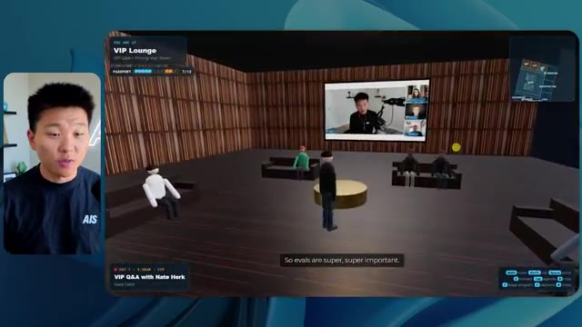
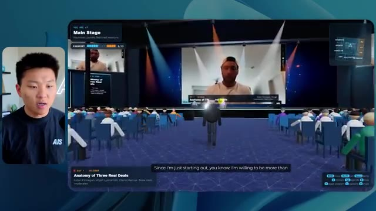
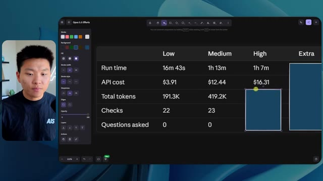
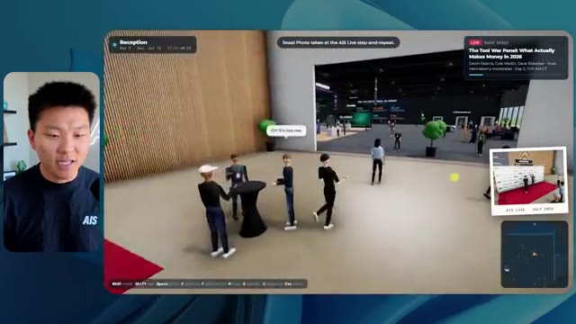
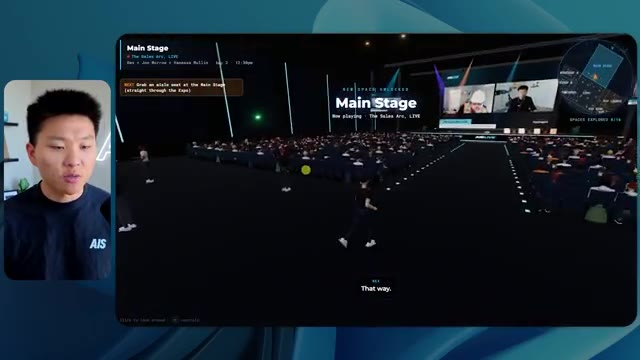

# 🎬 Steal My Exact AI OS Setup (5 simple tips)

> **Chaîne** : [Nate Herk | AI Automation](https://www.youtube.com/@nateherk/featured)  
> **Lien YouTube** : [https://www.youtube.com/watch?v=Ek1NBfnnTH0](https://www.youtube.com/watch?v=Ek1NBfnnTH0)  
> **Date de publication** : 20260723  
> **Durée** : 00:25:03  
> **Identifiant vidéo** : `Ek1NBfnnTH0`  
> **Transcription & Analyse** : `whisper-v3-large-turbo+gemini-3.5-flash-lite`  

---

## 📌 Synthèse Exécutive & Outils

### 💡 Résumé

La vidéo de la chaîne Nate Herk | AI Automation explore l'impact critique des niveaux d'effort sur les performances, les coûts et la qualité d'exécution du modèle **Opus 5.5** d'Anthropic. Pour tester ses limites, Nate soumet un prompt unique et ambitieux à différents niveaux d'effort (faible, moyen, élevé, ainsi que max et code ultra) : concevoir et coder un monde 3D interactif et explorable à la troisième personne, simulant une conférence tech réaliste (AIS Live) à partir d'un dossier Frame.io brut de 105 gigaoctets contenant l'intégralité des enregistrements vidéo d'un événement virtuel.

L'analyse comparative révèle des contrastes saisissants. En effort **faible**, le modèle génère une maquette 3D fonctionnelle en 16 minutes et 43 secondes (pour 3,91 $ et 191 000 jetons), mais truffée de bugs d'affichage, de PNJ (personnages non joueurs) fantômes qui disparaissent, d'éléments non thématisés et de vidéos figées sous forme d'images fixes. En passant à l'effort **moyen**, le résultat fait un bond qualitatif spectaculaire : le monde 3D intègre la charte graphique de la marque, les PNJ réagissent dynamiquement, les flux vidéo se lisent en direct sur les différents écrans des salles et de la scène principale, et l'architecture spatiale devient cohérente, malgré un temps d'exécution de 1 heure et 13 minutes (pour 12,44 $ et 490 000 jetons). 

Fait remarquable à travers ces tests, le modèle fait preuve d'une autonomie totale en exécutant de multiples vérifications dans le navigateur (22 à 23 cycles de test automatisés) et en posant exactement zéro question de clarification à l'utilisateur, illustrant le potentiel et les limites de l'automatisation agentique pure.

---

### 🛠️ Outils, Modèles & Logiciels Présentés

* **Opus 5.5** : Modèle de pointe d'Anthropic, extrêmement intelligent et économique, utilisé ici comme moteur central de l'agent IA pour concevoir un environnement 3D interactif complexe.
* **Anthropic** : Entreprise conceptrice du modèle Opus 5.5 et des directives de prompt engineering recommandant de débuter les tâches complexes au niveau d'effort moyen.
* **Claude Code** : Outil de développement assisté par IA et environnement de travail intégré mentionné dans la chaîne d'outils du système d'exploitation IA du créateur.
* **Frame.io** : Plateforme de collaboration et de stockage vidéo cloud utilisée pour héberger le dossier massif de 105 Go contenant les enregistrements bruts de l'événement AIS Live.
* **Herc 2** : Système d'exploitation IA personnalisé du créateur Nate Herk, servant de hub central pour exécuter les agents et intégrer les projets de développement.
* **Key.ai** : Service de génération d'images et de vidéos par IA sollicité par le prompt pour alimenter les ressources visuelles du monde 3D.
* **Hostinger** : Sponsor de la vidéo, fournissant un connecteur et une extension gratuite pour intégrer l'hébergement web directement dans l'éditeur de code et déployer instantanément les applications générées.

---

### 🔑 Points Clés & Enseignements Stratégiques

* **Impact direct du paramètre d'effort** : Le choix du niveau d'effort (faible, moyen, élevé) modifie radicalement la profondeur logique, la complexité architecturale et la finition visuelle du code produit par Opus 5.5 à partir du même prompt.
* **Autonomie décisionnelle totale** : Dans les configurations testées, l'agent n'a posé aucune question de clarification à l'utilisateur, prenant l'entièreté des décisions de design et d'implémentation de manière autonome.
* **Boucles de rétroaction et d'auto-vérification** : L'agent effectue de manière autonome des dizaines de vérifications (22 à 23 cycles) en ouvrant un navigateur pour tester et inspecter visuellement son propre travail au fil de la génération.
* **Évolution exponentielle des coûts et du temps** : Passer d'un effort faible à un effort moyen multiplie le temps d'exécution par plus de 4 (de 16 minutes à 1h13) et le coût API estimé par plus de 3 (de 3,91 $ à 12,44$), nécessitant un arbitrage stratégique selon la criticité du livrable.
* **Gestion des artefacts visuels complexes** : Le niveau faible génère des bugs graphiques majeurs (disparition de personnages, textures sur-lumineuses, médias statiques), tandis que le niveau moyen résout ces problématiques en synchronisant des flux vidéo dynamiques et des comportements de PNJ cohérents.
* **Respect rigoureux du branding** : Un niveau d'effort insuffisant conduit à une application générique sans respect de l'identité visuelle, alors qu'un effort accru permet d'intégrer fidèlement les palettes de couleurs et les directives de marque (marquage AIS Live).
* **Exploitation de données massives hétérogènes** : L'agent démontre une forte capacité à structurer un contenu brut et non structuré (un répertoire Frame.io de 105 Go) pour en extraire une logique contextuelle (agendas, parcours de formation, scènes thématiques).
* **Méthodologie de prompt engineering recommandée** : Conformément aux recommandations d'Anthropic, la bonne pratique consiste à initialiser les tâches complexes au niveau d'effort moyen, puis à ajuster vers le haut ou vers le bas en fonction du compromis recherché entre vitesse et raffinement.
* **Le fossé entre génération et déploiement** : La création d'un produit logiciel fonctionnel par l'IA pose immédiatement la problématique de sa mise en ligne rapide, un gouffre comblé par des outils d'intégration d'hébergement directement dans l'éditeur.

---

## ⏱️ Chronologie & Transcription Complète Audio & Visuelle (Mot pour Mot)

### ⏱️ `[00:00:00 - 00:00:20]` | Segment #01

**🔊 Audio (Transcription Intégrale Mot pour Mot en Français) :**
> Opus 5.5, Opus 5.5, Opus 5.5, Opus 5.5, Opus 5.5. Ce modèle est littéralement partout et pour de très bonnes raisons. Il est intelligent, il est bon marché, il a un goût incroyable, c'est un modèle d'IA incroyable. Mais avec chaque modèle d'IA, vous avez le choix de l'effort, que ce soit faible, moyen, élevé, extra, max ou code ultra.

**👁️ Analyse Visuelle d'Écran (gemini-3.5-flash-lite) :**
**Interface & Outils** : Twitter (X)

**Contenu textuel & Code** : Publication sur les réseaux sociaux avec une vidéo intégrée représentant un environnement 3D tropical.

**Action / Démonstration** : Le présentateur commente une publication et une vidéo d'exemple illustrant l'impact des outils d'IA.

*⏱️ 00:00:05 — Une capture d'écran d'un tweet ou post montrant une vidéo générée de paysage tropical et de maisons au bord de l'eau.*

---

### ⏱️ `[00:00:20 - 00:00:38]` | Segment #02

**🔊 Audio (Transcription Intégrale Mot pour Mot en Français) :**
> Donc dans cette vidéo, j'ai donné exactement le même prompt à Opus 5.5 et je l'ai exécuté à chaque niveau d'effort, et nous allons comparer les résultats. Nous allons examiner la qualité de tous les différents résultats réels, mais nous allons aussi examiner combien de temps chacun d'eux a pris pour s'exécuter, combien cela nous a coûté si c'était une facturation par API, le nombre total de jetons, combien de vérifications ils ont exécutées, et combien de questions ils m'ont réellement posées tout au long du processus.

**👁️ Analyse Visuelle d'Écran (gemini-3.5-flash-lite) :**
**Interface & Outils** : Application web de tableau blanc / interface de comparaison de prompts (Opus 5.5 Efforts).

**Contenu textuel & Code** : Tableau structuré avec des colonnes de niveaux d'effort et des lignes de métriques (Run time, API cost, Total tokens, Checks, Questions asked).

**Action / Démonstration** : Présentation de la structure de comparaison des différents niveaux d'effort d'Opus 5.5.

*⏱️ 00:00:29 — Un tableau comparatif montrant les différents niveaux d'effort (Low, Medium, High, Extra, Max, Ultracode) et les métriques associées (Run time, API cost, Total tokens, Checks, Questions asked).*

---

### ⏱️ `[00:00:39 - 00:00:58]` | Segment #03

**🔊 Audio (Transcription Intégrale Mot pour Mot en Français) :**
> Et les résultats que nous avons obtenus ne sont pas du tout ce à quoi je m'attendais, donc j'ai hâte de partager cela avec vous les gars. Ne perdons pas de temps et allons directement à celui-ci. D'accord, alors plongeons-nous directement dans celui-ci. Je veux commencer juste en vous montrant le prompt réel que nous avons utilisé que nous avons donné à chacun de ces différents agents. Je vais aller dans les fichiers ici, et nous allons ouvrir ce fichier markdown de prompt, et je vais vous montrer ce que nous avons obtenu. Voici donc le slash objectif que j'ai fourni.

**👁️ Analyse Visuelle d'Écran (gemini-3.5-flash-lite) :**
**Interface & Outils** : Interface de l'application de développement / CLI Opus 5.5.

**Contenu textuel & Code** : Texte du prompt demandant de construire un monde 3D interactif et navigable à la troisième personne de la conférence AIS Live à partir d'enregistrements.

**Action / Démonstration** : Présentation de l'interface de l'outil et lecture du message de l'agent IA prêt à débuter la tâche.

*⏱️ 00:00:48 — Interface de l'outil de développement IA avec le panneau latéral affichant les options de worktree et la conversation avec un agent montrant un prompt de tâche 3D.*

---

### ⏱️ `[00:00:58 - 00:01:34]` | Segment #04

**🔊 Audio (Transcription Intégrale Mot pour Mot en Français) :**
> J'ai dit : tu dois me créer un monde 3D qui est une conférence tech réaliste dans laquelle je peux me promener en vue à la troisième personne. Tu vas regarder ce dossier, qui contient mes éléments d'enregistrement d'événement d'AIS Live. Et ce dossier est un dossier Frame.io de 105 gigaoctets d'enregistrements vidéo. C'était un événement complètement virtuel. Tout a été enregistré et tous les enregistrements sont ici même. J'ai dit, ton objectif est de prendre cet événement et de le transformer en un monde 3D explorable qui me donne l'impression d'avoir réellement assisté à une vraie conférence en personne avec différentes salles, différentes pistes, différentes scènes, bla, bla, bla. N'hésite pas à utiliser key.ai si tu as besoin de générer des images ou des vidéos. Et tu peux aussi utiliser n'importe quoi d'autre à l'intérieur de mon projet Herc 2, qui est comme mon système d'exploitation IA. J'ai dit,

**👁️ Analyse Visuelle d'Écran (gemini-3.5-flash-lite) :**
**Interface & Outils** : Éditeur de code (VS Code / Cursor) et interface web Frame.io.

**Contenu textuel & Code** : Fichier PROMPT.md contenant le prompt complet demandant de convertir les enregistrements vidéo en monde 3D de conférence tech explorable.

**Action / Démonstration** : Présentation du prompt initial et du dossier de ressources Frame.io de 105 Go pour le projet de monde 3D.

*⏱️ 00:01:07 — Éditeur de code affichant le fichier PROMPT.md avec les instructions pour créer un monde 3D interactif et le lien Frame.io.*

*⏱️ 00:01:16 — Interface Frame.io montrant le dossier de 105,69 Go contenant les enregistrements de l'événement AIS Live (GA Access et VIP Access).*

*⏱️ 00:01:25 — Éditeur de code montrant à nouveau le fichier PROMPT.md avec les consignes détaillées pour l'agent IA.*

---

### ⏱️ `[00:01:34 - 00:02:08]` | Segment #05

**🔊 Audio (Transcription Intégrale Mot pour Mot en Français) :**
> vous serez jugé sur la créativité, le design, la physique et la sensation générale lors de mon exploration du monde 3D que vous avez construit. Et c'était fondamentalement la fin des instructions. Donc, comme vous pouvez le voir sur ce côté gauche, j'ai exécuté ceci à travers tous les différents niveaux d'effort. Commençons par le niveau bas et remontons jusqu'à ultra code. Très bien. Nous avons donc ici le résultat du niveau bas. Ouvrons ceci et jetons un coup d'œil. Nous avons donc AIS live, le sommet des services IA enfin en personne, et nous avons pu cliquer partout. Tout d'abord, on ne sent pas vraiment la marque ici. Genre, ce n'ego- pas le logo d'IS Live. Ce ne sont même pas nos couleurs. Donc je n'aime pas trop ça, mais entrons ici. D'accord. C'est beaucoup trop lumineux. Euh, nous avons une carte en haut à droite. Nous avons une ville par ici. Je ne peux pas dire quelle ville c'est

**👁️ Analyse Visuelle d'Écran (gemini-3.5-flash-lite) :**
**Interface & Outils** : Application web ou client lourd d'IA (similaire à une interface de type Claude Code / Opus 5.5).

**Contenu textuel & Code** : Texte du prompt initial de l'agent demandant de construire un monde 3D navigable à la troisième personne pour la conférence AIS Live, avec différentes pièces, pistes et scènes.

**Action / Démonstration** : Le présentateur survole ou sélectionne les différentes sessions de tests d'effort dans le menu de gauche.

*⏱️ 00:01:42 — Interface d'une application d'agent IA montrant un panneau latéral avec différentes sessions de test d'effort (Hello, Extra, High, Max, Ultracode, Medium, Low) et un panneau de discussion principal affichant le prompt de l'agent.*

---

### ⏱️ `[00:02:08 - 00:02:40]` | Segment #06

**🔊 Audio (Transcription Intégrale Mot pour Mot en Français) :**
> c'est. D'accord. C'est Chicago, ce qui est plutôt cool parce que vous savez, je vis à Chicago, mais bref, en haut à droite, nous pouvons voir une carte. Nous avons un hall d'accueil. Nous avons un hall d'exposition. Nous avons un salon VIP sur la scène principale. La carte montre également où se trouve chaque autre personne et cela se synchronise en direct. Nous pouvons donc voir l'enregistrement. Nous pouvons voir le premier jour, la keynote de l'hyper agent, le débriefing en direct. Cool. Donc il connaît réellement l'agenda et puis il y a le deuxième jour. Il a donc trouvé ça, c'est bien. Nous avons ces petites boules ici que je peux espérer lancer autour. D'accord. Le visage, Oh, regardez ça. Si je vais par ici, tous les gens disparaissent tout simplement. Très mauvais. Très mauvais. D'accord. Voyons voir. Est-ce que je peux sprinter ? D'accord.

**👁️ Analyse Visuelle d'Écran (gemini-3.5-flash-lite) :**
**Interface & Outils** : Application de réalité virtuelle / monde virtuel en 3D

**Contenu textuel & Code** : Interface utilisateur de monde virtuel avec carte de navigation, avatars et panneaux d'information

**Action / Démonstration** : Navigation et exploration d'un environnement virtuel de conférence 3D

---

### ⏱️ `[00:02:40 - 00:03:04]` | Segment #07

**🔊 Audio (Transcription Intégrale Mot pour Mot en Français) :**
> Je peux avancer un peu plus vite. Je vais d'abord aller par ici. Il y a des produits dérivés, euh, un sweat à capuche certifié AIS plus. D'accord. Il y a donc les vrais stands qu'on avait lors de l'événement virtuel. On avait des stands. C'est donc plutôt cool. Un petit endroit pour prendre des photos. La salle C. En ce moment, nous avons Tangy Frederick qui anime un atelier. D'accord. Mais ce n'est pas une vidéo. Comme vous pouvez le voir, c'est juste une image. Elle ne bouge pas. C'est donc juste une image. Ces gens sont en train de disparaître. Ce doivent être des fantômes. Allons par ici dans la salle A.

**👁️ Analyse Visuelle d'Écran (gemini-3.5-flash-lite) :**
**Interface & Outils** : Application web 3D / Environnement virtuel interactif (métavers).

**Contenu textuel & Code** : Textes informatifs et tutoriels sur écran virtuel ("Step 1, Step 2, Step 3", indications d'API Key).

**Action / Démonstration** : Navigation et exploration de l'espace virtuel par le présentateur sous forme d'avatar 3D.

*⏱️ 00:02:46 — Vue d'un espace virtuel 3D de type métavers montrant un avatar se déplaçant près de stands d'exposition.*

*⏱️ 00:02:52 — L'avatar progresse dans une salle thématique de l'événement virtuel avec des tables lumineuses et des écrans d'information.*

*⏱️ 00:02:58 — Gros plan sur un panneau d'affichage virtuel expliquant des étapes techniques (API Key, tutoriel).*

---

### ⏱️ `[00:03:04 - 00:03:30]` | Segment #08

**🔊 Audio (Transcription Intégrale Mot pour Mot en Français) :**
> Nous avons Liberty White. D'accord. Très cool. Vos 30 premiers jours en automatisation. Encore une fois, c'est juste une image fixe et les gens ont des bugs d'affichage. Donc ce n'est pas très bon ici. Je vais aller sur la scène principale et voir ce que nous avons. D'accord, cool. Donc nous avons une scène principale. Les gens ont de gros bugs d'affichage. Vraiment mauvais. Ce n'est vraiment pas bon du tout. Notre vidéo est en train de bouger. Genre, j'ai vu mon visage ici et j'ai vu celui de Devin, mais maintenant ils ont disparu. Donc je ne sais pas ce qui s'est passé. D'accord. On dirait plutôt un diaporama. Rien n'est vraiment diffusé pour l'instant. Bref, entrons ici.

**👁️ Analyse Visuelle d'Écran (gemini-3.5-flash-lite) :**
**Interface & Outils** : Application de monde virtuel / espace virtuel interactif 2D/3D (Gather Town).

**Contenu textuel & Code** : Interface utilisateur virtuelle montrant une salle de conférence avec des avatars, des écrans de présentation et des zones de navigation.

**Action / Démonstration** : Navigation et déplacement de l'avatar à travers les différentes salles et scènes de l'événement virtuel.

*⏱️ 00:03:11 — Vue d'un avatar virtuel dans une salle d'atelier d'un monde virtuel interactif (Gather Town ou similaire).*

*⏱️ 00:03:17 — Vue de l'avatar naviguant dans la scène principale remplie de nombreux participants virtuels assis.*

*⏱️ 00:03:24 — Vue de l'avatar se déplaçant face à un grand écran affichant 'AIS LIVE AI Services Summit'.*

---

### ⏱️ `[00:03:30 - 00:03:58]` | Segment #09

**🔊 Audio (Transcription Intégrale Mot pour Mot en Français) :**
> Nous avons plus de stands. Nous avons hyper agent. Nous avons Claude Code. Nous avons plus de goodies. La salle B, c'est Dave Ebelor. Je suppose que c'est exactement la même chose. Nous avons du café. Et ensuite, je suppose que le salon VIP, c'est accès VIP uniquement. C'est plutôt cool, mais il n'y a vraiment rien qui se passe ici. Cet écran est bien trop lumineux. Bon. Donc je pense que vous comprenez l'ambiance qu'on obtient ici d'Opus 5.5 en effort faible. Et c'est là que les choses deviennent intéressantes. À combien est-ce que vous pensez que cela a tourné ? Combien de temps ? Celui-ci a tourné pendant 16 minutes et 43 secondes. Combien est-ce que vous pensez que cela a coûté ?

**👁️ Analyse Visuelle d'Écran (gemini-3.5-flash-lite) :**
**Interface & Outils** : Tableau de bord web d'analyse et d'évaluation comparative (benchmarking).

**Contenu textuel & Code** : Tableau avec des colonnes de performance (Run time, API cost, Total tokens, Checks, Questions asked) et des lignes de niveaux d'effort (Low à Ultracode).

**Action / Démonstration** : Analyse comparative des coûts et performances selon différents niveaux d'effort de l'agent.

*⏱️ 00:03:51 — Interface de tableau de bord montrant un tableau comparatif avec les niveaux Low, Medium, High, Extra, Max et Ultracode.*

---

### ⏱️ `[00:03:58 - 00:04:26]` | Segment #10

**🔊 Audio (Transcription Intégrale Mot pour Mot en Français) :**
> 3,91 dollars si c'eût été une facturation par API. J'utilise évidemment mon abonnement ici, mais nous allons simplement calculer cela avec la facturation par API. Le nombre total de jetons était de 191 000. Il a effectué 22 vérifications. Donc pour la vérification, il a ouvert le navigateur à 22 reprises et a exécuté différents types de vérifications. Soit 22 catégories de vérifications. Et combien de questions m'a-t-il posées ? Il m'a posé un total de zéro question tout au long de cette invite de l'objectif slash. D'accord. Alors ouvrons l'effort moyen et voyons ce que nous avons obtenu. D'accord, c'est parti. Effort moyen. Nous avons Nate Herc. Nous avons mon badge. C'est du contenu de la marque AI's life.

**👁️ Analyse Visuelle d'Écran (gemini-3.5-flash-lite) :**
**Interface & Outils** : Application de tableau blanc ou de design (ex: Excalidraw ou similaire).

**Contenu textuel & Code** : Tableau avec les lignes : Run time (16m 43s), API cost ($3.91), Total tokens (191.3K), Checks, et Questions asked.

**Action / Démonstration** : Le présentateur commente les coûts d'API et les statistiques d'utilisation des jetons affichés dans le tableau.

*⏱️ 00:04:05 — Un tableau comparatif montrant les métriques de performance et de coût pour différents niveaux d'effort (Low, Medium, High).*

---

### ⏱️ `[00:04:26 - 00:04:46]` | Segment #11

**🔊 Audio (Transcription Intégrale Mot pour Mot en Français) :**
> Donc ça a déjà l'air un petit peu mieux. Ça ressemble à nos palettes de couleurs qui ont utilisé nos directives de marque. Premier jour de construction, deuxième jour de gain, VIP. Cool. D'accord. Je vais entrer dans le lieu. D'accord. Waouh. Une ambiance un peu similaire. C'est en arrière-plan. Ça ne ressemble pas à Chicago, n'est-ce pas ? Non, ça ressemble à un, honnêtement, ça ressemble à une ville imaginaire. Quoi qu'il en soit, c'est drôle qu'ils aient décidé de faire ça. Voyons si je peux me déplacer un peu plus vite. Oh, waouh.

**👁️ Analyse Visuelle d'Écran (gemini-3.5-flash-lite) :**
**Interface & Outils** : Interface web et application 3D virtuelle 'AIS Live'.

**Contenu textuel & Code** : Badge utilisateur 'NATE HERK' avec options de navigation, contrôles clavier affichés.

**Action / Démonstration** : Le présentateur entre dans l'espace virtuel 3D après la sélection de l'interface d'accueil.

*⏱️ 00:04:31 — Interface web de l'application 'AIS Live' avec un badge nominatif de pass et le bouton 'ENTER THE VENUE'.*

*⏱️ 00:04:41 — Vue dans l'application 3D virtuelle de type metaverse montrant des avatars et un décor intérieur avec vue sur une ville la nuit.*

---

### ⏱️ `[00:04:46 - 00:05:21]` | Segment #12

**🔊 Audio (Transcription Intégrale Mot pour Mot en Français) :**
> Les gens interagissent avec moi. Regardez. Si je m'approche de ce type, il vient de lever le bras. Bon, maintenant il ne veut plus du tout avoir affaire à moi. Mais tous ces petits robots ici doivent prendre des décisions. Je ne sais pas s'ils utilisent Jev. C'est sûr que non. Je ne lui ai pas dit de le faire. En fait, ma clé Jev est à l'arrière. Je ne sais pas. Peut-être qu'il l'a utilisée. Quoi qu'il en soit, nous pouvons voir ici que nous avons la salle d'atelier C, le laboratoire des agents. Sympa. Donc celui-ci est en fait en train de fonctionner. Vous pouvez voir qu'il s'agit d'une vraie vidéo lue par Tangy. Tout le monde ici est en train de travailler sur un ordinateur portable. Ils ne buguent pas. C'est plutôt cool. De plus, mon badge est sur ma poitrine, ce qui est plutôt cool. Je peux venir par ici. Nous avons une carte en haut à droite, comme vous pouvez le voir, mais je peux venir par ici. Nous avons un

**👁️ Analyse Visuelle d'Écran (gemini-3.5-flash-lite) :**
**Interface & Outils** : Application de monde virtuel 3D / environnement de simulation d'agents.

**Contenu textuel & Code** : Environnement virtuel 3D interactif avec des personnages simulant des agents autonomes.
[DESC_IMAGE_1] Navigation et exploration d'un environnement virtuel peuplé d'avatars d'IA.

**Action / Démonstration** : Explications face caméra et démonstration conceptuelle.

*⏱️ 00:04:55 — Vue en jeu d'un espace virtuel 3D avec des avatars d'agents et le présentateur en incrustation.*

*⏱️ 00:05:04 — Vue d'une salle de conférence virtuelle (Agents Lab) montrant plusieurs avatars assis à des bureaux.*

*⏱️ 00:05:12 — Vue rapprochée dans la salle de classe virtuelle avec de nombreux avatars dotés d'ordinateurs portables.*

---

### ⏱️ `[00:05:21 - 00:05:47]` | Segment #13

**🔊 Audio (Transcription Intégrale Mot pour Mot en Français) :**
> hall d'exposition. C'est là que nous avons le stand Glido. Et ça diffuse en ce moment. Oui, ça diffuse la vidéo de nous parlant de Glido. Ça diffuse la vidéo d'Ed et moi parlant de notre programme de certification. Nous avons le logo AIS Plus juste ici, qui est un peu dans un endroit bizarre. Ce sont les diapositives des conférenciers et les points clés. Alors wow, ce sont toutes les ressources que nous avons distribuées après l'événement. Elles sont toutes affichées juste là également. Nous pouvons voir que nous avons un projecteur sur la communauté. Donc c'est Aiden qui parle de son contrat qu'il a décroché et ça joue en direct. Ces gens sont en train de regarder.

**👁️ Analyse Visuelle d'Écran (gemini-3.5-flash-lite) :**
**Interface & Outils** : Environnement virtuel 3D (metaverse / plateforme d'exposition en ligne).

**Contenu textuel & Code** : Aucun code source, terminal ou prompt visible ; uniquement des éléments d'interface d'un monde virtuel (panneaux d'affichage, mini-carte, avatars).

**Action / Démonstration** : Navigation et visite guidée d'un espace d'exposition virtuel par le présentateur.

---

### ⏱️ `[00:05:47 - 00:06:21]` | Segment #14

**🔊 Audio (Transcription Intégrale Mot pour Mot en Français) :**
> Ils sont plutôt engagés. On a l'hyper agent. C'était, c'est ce que je voulais dire. Si vous avez vu ces gens lever les mains en disant bonjour, c'était plutôt marrant. Regardez, regardez, le voilà qui recommence. Bref. Bon. Où est-ce que je suis maintenant ? Maintenant, je suis dans le hall principal. On a un bar à café. On a un grand logo, qui est le vrai logo. C'est trop lumineux, mais on a le logo. On peut voir si on peut entrer ici dans le parcours des fondations. On a Sabrina Romanov et Liberty White. Donc différentes formations juste là. On peut entrer dans cette salle. C'est le parcours avancé. Alors qu'est-ce qui se passe ici. On a Dave Ebelar et Saman qui parlent de différentes choses là-dedans. Et maintenant, allons jeter un œil à la scène principale. Oh, attendez, il y a une vidéo de moi là-haut. Est-ce que c'est genre un VIP

**👁️ Analyse Visuelle d'Écran (gemini-3.5-flash-lite) :**
**Interface & Outils** : Application web de monde virtuel / plateforme d'événements en ligne.

**Contenu textuel & Code** : Interface utilisateur 3D avec mini-carte de navigation et avatars interactifs.

**Action / Démonstration** : Navigation et exploration d'un environnement virtuel en 3D avec des avatars d'utilisateurs.

*⏱️ 00:05:55 — Vue dans le hall principal virtuel d'une plateforme en ligne avec des avatars d'utilisateurs.*

*⏱️ 00:06:04 — Déplacement de l'avatar du présentateur vers une salle de conférence virtuelle remplie de participants.*

*⏱️ 00:06:12 — Vue d'ensemble montrant plusieurs avatars réunis dans un espace virtuel interactif.*

---

### ⏱️ `[00:06:21 - 00:06:50]` | Segment #15

**🔊 Audio (Transcription Intégrale Mot pour Mot en Français) :**
> section ? Ouais, on va aller voir ça dans une minute. Mais bref, voici la scène principale. Ça a l'air très, très bien. On a une grande scène. On a genre quatre personnes assises ici. On a les trois écrans d'Alex là-haut avec hyper agent. Est-ce que j'ai le droit de monter sur scène ? Oh, et il me laisse monter sur scène. OK. C'est plutôt sympa. Bon les gars, prenons un selfie. Laissez-moi mettre tout le monde en arrière-plan. Venez par ici. Bref, c'est plutôt, plutôt cool. Par contre, toutes les places ne sont pas prises. Donc il faut qu'on travaille là-dessus. Mais bref, je vais retourner voir ce qu'était cette section VIP. OK. Salon VIP. J'ai l'impression que c'est comme un aéroport ou quelque chose comme ça.

**👁️ Analyse Visuelle d'Écran (gemini-3.5-flash-lite) :**
**Interface & Outils** : Application ou plateforme virtuelle 3D (Hyperagent)

**Contenu textuel & Code** : Interface utilisateur affichant les détails de la session "Hyperagent Keynote" avec les informations de l'intervenant Alex McDonnell.

**Action / Démonstration** : Navigation d'un avatar dans l'espace virtuel de la conférence en 3D.

---

### ⏱️ `[00:06:51 - 00:07:14]` | Segment #16

**🔊 Audio (Transcription Intégrale Mot pour Mot en Français) :**
> Okay, super. Donc maintenant nous avons les sessions VIP ici. Session de questions-réponses VIP avec Nate, lecture vidéo en direct juste ici. Très, très cool. Et nous avons comme un bar ou quelque chose comme ça. Génial. Je dirais que c'est un très bon résultat. Maintenant, en ce qui concerne les statistiques ici, celle-ci a pris une heure et 13 minutes à s'exécuter. Cela nous aurait coûté 12 dollars et 44 cents. Elle a utilisé 490 000 jetons et elle a fait 23 vérifications.

**👁️ Analyse Visuelle d'Écran (gemini-3.5-flash-lite) :**
**Interface & Outils** : Application virtuelle 3D / Interface web de tableau de bord de métriques.

**Contenu textuel & Code** : Métriques d'exécution, coût API de 3,91 $, 191 3K tokens, 22 vérifications, et affichage vidéo dans un espace virtuel.

**Action / Démonstration** : Présentation du salon VIP virtuel et des statistiques d'exécution du projet.

*⏱️ 00:06:56 — Vue d'un espace virtuel 3D (salon VIP) avec un écran affichant une session vidéo en direct du présentateur et un espace bar en arrière-plan.*

*⏱️ 00:07:02 — Interface de tableau de bord montrant des métriques de performance et de coûts d'API (Run time: 16m 43s, API cost: $3.91, Total tokens: 191.3K, Checks: 22).*

---

### ⏱️ `[00:07:14 - 00:07:48]` | Segment #17

**🔊 Audio (Transcription Intégrale Mot pour Mot en Français) :**
> Et il nous a posé un total de zéro question une fois de plus. Très bien, passons au niveau élevé. C'était déjà un résultat plutôt correct, et Anthropic eux-mêmes dans leur vidéo sur la façon de prompter Opus 5.5, ou désolé, pas une vidéo, un article. Ils ont dit de commencer simplement par le niveau moyen et de l'ajuster à la hausse ou à la baisse si nécessaire. C'était donc un résultat moyen. Passons au niveau élevé et voyons ce qu'on obtient. Très rapidement, les gars, je dois prendre un instant pour vous parler du sponsor de la vidéo d'aujourd'hui, Hostinger. Ces deux modèles viennent donc de me créer une version fonctionnelle de la même chose. Et maintenant, je me retrouve là où je finis toujours, avec un produit fini sur mon ordinateur portable et aucun moyen rapide de le mettre en ligne. Et c'est précisément le fossé que comble le connecteur d'Hostinger. C'est une extension gratuite

**👁️ Analyse Visuelle d'Écran (gemini-3.5-flash-lite) :**
**Interface & Outils** : Tableau de bord analytique et interface de développement / éditeur de code.

**Contenu textuel & Code** : Tableau comparatif des coûts et temps d'exécution par niveau d'effort, et instructions de prompt pour un calculateur Northwind ROI.

**Action / Démonstration** : Analyse comparative des performances des différents niveaux de configuration d'Opus et visualisation de l'avancement d'un agent de génération de code.

*⏱️ 00:07:22 — Un tableau comparatif montrant les métriques de performance pour différents niveaux de prompt (Low, Medium, High, Extra) avec les temps d'exécution, les coûts API, le nombre de tokens et de questions posées.*

*⏱️ 00:07:39 — Une interface de développement avec un éditeur de code et un panneau de chat interactif affichant la génération d'un calculateur de ROI en HTML/JS.*

---

### ⏱️ `[00:07:48 - 00:08:23]` | Segment #18

**🔊 Audio (Transcription Intégrale Mot pour Mot en Français) :**
> pour votre éditeur qui intègre votre compte Hostinger dans l'outil de programmation que vous utilisez déjà, que ce soit VS Code, Cursor, Cloud Code, Codex, et j'en passe. Vous vous connectez une seule fois en un clic, et à partir de là, votre agent peut déployer le site, y pointer un domaine, configurer les enregistrements DNS et vérifier votre VPS sans que vous ayez jamais à quitter l'éditeur. Ainsi, peu importe celui de ces outils que vous finirez par préférer, ce qu'il a construit n'est qu'à quelques minutes d'une vraie URL sur un hébergement géré. Le connecteur est gratuit avec chaque formule d'hébergement. Si vous avez donc encore besoin de l'hébergement sous-jacent, profitez de la formule illimitée grâce au lien dans la description et utilisez le code NATEHERK pour obtenir 10 % de réduction. Cela comprend également un nom de domaine gratuit et un e-mail professionnel pour un an. Et c'est toujours le moyen le plus économique que j'ai trouvé pour obtenir quelque chose

**👁️ Analyse Visuelle d'Écran (gemini-3.5-flash-lite) :**
**Interface & Outils** : Interface web Hostinger (Manage Hostinger from your IDE) et interface Claude Code.

**Contenu textuel & Code** : Statut de connexion ("Connected", "VIA OAUTH", Node.js 24.13.0) et liste des outils disponibles avec options cochées (Websites, Domains, Subscriptions & Payments, Email Marketing).

**Action / Démonstration** : Connexion du compte Hostinger à l'éditeur/IDE pour permettre à l'assistant d'accéder aux outils de gestion de sites et de domaines.

*⏱️ 00:07:57 — Interface montrant la connexion OAuth de Hostinger depuis un IDE avec les outils disponibles (Websites, Domains, Subscriptions, Email Marketing), aux côtés de l'interface Claude Code et de la webcam du présentateur.*

---

### ⏱️ `[00:08:23 - 00:08:47]` | Segment #19

**🔊 Audio (Transcription Intégrale Mot pour Mot en Français) :**
> vous avez construit sur une vraie URL. Donc revenons à la vidéo. D'accord. Encore une fois, très, très thématisé par la marque. C'est un écran de chargement encore mieux que le précédent. Nous avons ce joli petit effet en arrière-plan. Nous avons le logo. Nous allons entrer dans le lieu. D'accord. Nous y voilà. Ça a l'air plutôt bien. Nous commençons à l'extérieur et vous pouvez voir que nous avons ces drapeaux pour tous les intervenants, Wyatt, Casper, Alex, Ed, Aiden, Sabrina, Liberty. C'est plutôt cool. Nous avons des blocs en direct ici.

**👁️ Analyse Visuelle d'Écran (gemini-3.5-flash-lite) :**
**Interface & Outils** : Application web 3D virtuelle hébergée sur RingCentral (AIS Live).

**Contenu textuel & Code** : Interface utilisateur virtuelle interactive avec mini-carte, instructions de déplacement (WASD, Souris) et bannières nominatives.

**Action / Démonstration** : Navigation et exploration de l'espace virtuel 3D de la conférence par le présentateur.

*⏱️ 00:08:29 — Écran de chargement et d'accueil de la plateforme virtuelle AIS Live avec le logo, les détails de l'événement et les contrôles clavier.*

*⏱️ 00:08:35 — Vue de la place virtuelle 3D (AIS Live Plaza) avec des avatars d'utilisateurs et des gratte-ciels en arrière-plan.*

*⏱️ 00:08:41 — Exploration de la place virtuelle montrant des bannières verticales aux noms de conférenciers et un petit robot sphérique au sol.*

---

### ⏱️ `[00:08:47 - 00:09:23]` | Segment #20

**🔊 Audio (Transcription Intégrale Mot pour Mot en Français) :**
> il a pris cette photo de moi, votre hôte, Nate Herc, John, Dave, Nate Herc. Voilà. D'accord. Les portes. Génial. Ce sont des portes coulissantes automatiques en verre. J'adore ça. Nous pouvons voir l'enregistrement VIP. Nous pouvons voir l'admission générale. Nous pouvons venir ici et nous pouvons découvrir l'exposition avec différents stands, le projecteur sur la communauté. Vous pouvez également voir qu'en haut à gauche, j'ai un passeport. C'est donc comme si, cela montrera combien d'endroits j'ai visités. Tout cela est une vraie lecture. Nous avons un mur de ressources avec tous les différents intervenants. Ils ont également une session de réseautage par ici. Je vais donc venir très vite et voir de quoi il s'agit. Nous avons donc le bar à infusion à froid AIS. Nous avons différents membres de la communauté qui ont été mis en avant ou mis en lumière.

**👁️ Analyse Visuelle d'Écran (gemini-3.5-flash-lite) :**
**Interface & Outils** : Environnement virtuel 3D / Navigateur web

**Contenu textuel & Code** : Interface d'événement virtuel avec des sections comme 'Registration Concourse' et 'Expo Hall'

**Action / Démonstration** : Exploration et navigation interactive dans un monde virtuel 3D de conférence

*⏱️ 00:08:56 — Vue d'un espace virtuel 3D de type salon ou conférence, affichant 'REGISTRATION' avec l'avatar du présentateur.*

*⏱️ 00:09:05 — Navigation dans un hall d'exposition virtuel avec des stands et des panneaux d'information.*

*⏱️ 00:09:14 — Déplacement d'avatairs virtuels dans un grand hall d'accueil avec des fenêtres en verre.*

---

### ⏱️ `[00:09:23 - 00:09:56]` | Segment #21

**🔊 Audio (Transcription Intégrale Mot pour Mot en Français) :**
> Nous avons l'aile VIP. Attends, quoi ? Prends un bracelet. Oh, je dois vraiment aller chercher le bracelet. D'accord. Laisse-moi m'enregistrer rapidement. Le bracelet est déjà mis. Attends, quoi ? D'accord. Oh, d'accord. Maintenant, les portes se sont ouvertes pour moi. Cool. Je peux entrer ici. Oh, ça mène juste à la scène principale. Salon VIP. Il y a une séance de questions-réponses en cours. Ça a l'air très cool. Je veux dire, je suis très impressionné par la façon dont il est capable de faire ça. Waouh. D'accord. C'est donc vraiment bien. Ce que nous avons fait, c'est que nous avons eu des salles de discussion VIP avec différentes personnes. Tu peux voir qu'il y a différentes salles, différents membres de l'équipe AIS qui participent à des trucs. C'est vraiment cool. C'est très cool. C'est un bien meilleur VIP

**👁️ Analyse Visuelle d'Écran (gemini-3.5-flash-lite) :**
**Interface & Outils** : Application ou plateforme virtuelle 3D interactive (metaverse / événement virtuel).

**Contenu textuel & Code** : Interface utilisateur affichant la carte, les objectifs (Passport), et les sous-titres des dialogues dans le monde virtuel.

**Action / Démonstration** : Navigation et exploration de l'espace virtuel 3D par l'avatar, accédant aux différentes zones VIP et sessions de travail.

*⏱️ 00:09:32 — Vue d'un espace virtuel 3D représentant une zone d'enregistrement (Registration Concourse) avec des avatars et une interface de jeu.*

*⏱️ 00:09:40 — Vue de la salle VIP Lounge dans l'espace virtuel avec un grand écran affichant une visioconférence et des participants assis.*

*⏱️ 00:09:48 — Vue de l'espace "VIP Working Sessions" dans le monde virtuel montrant différentes tables de discussion thématiques ("Price It Right", "Turn Your Expertise into a Service", etc.).*

---

### ⏱️ `[00:09:56 - 00:10:30]` | Segment #22

**🔊 Audio (Transcription Intégrale Mot pour Mot en Français) :**
> expérience que ce qui a été montré dans la première partie. D'accord. After party VIP. Regardez ça. On a une piste de danse. On a tous ces éléments ici. On a la lecture de l'after party VIP juste ici. Et il y a une estrade de DJ. C'est tellement marrant. Il y a un petit bug juste ici, un petit glitch juste là, mais c'est génial. Oh, cool. Donc quand je suis ici sur la scène principale, on a des sous-titres. Vous pouvez voir juste ici en bas de mon écran, on a ces sous-titres de Wyatt qui est en train de parler ici. On a des lumières. On a le panneau. Très cool. Belle scène principale. Je vais aller par ici. On peut aller à la fondation,

**👁️ Analyse Visuelle d'Écran (gemini-3.5-flash-lite) :**
**Interface & Outils** : Espace virtuel 3D interactif (plateforme d'événement virtuel)

**Contenu textuel & Code** : Interface utilisateur virtuelle affichant un passeport, des avatars, une piste de danse, et des flux vidéo de participants.

**Action / Démonstration** : Navigation et exploration de l'espace virtuel 3D par l'animateur.

*⏱️ 00:10:04 — Capture montrant l'interface d'un espace virtuel 3D (after-party VIP) avec des avatars sur une piste de danse et un écran affichant des participants en visio.*

*⏱️ 00:10:13 — Vue légèrement différente de la piste de danse virtuelle de l'after-party VIP avec des ballons et une estrade de DJ.*

*⏱️ 00:10:21 — Vue d'une autre zone virtuelle 3D (scène principale d'une conférence avec des spectateurs assis et un intervenant sur grand écran).*

---

### ⏱️ `[00:10:30 - 00:11:06]` | Segment #23

**🔊 Audio (Transcription Intégrale Mot pour Mot en Français) :**
> avancé, et les parcours d'entreprise par ici. Alors voyons voir. Nous avons l'anatomie de trois vraies transactions. Nous avons hyper agent. Nous avons les évals avec Nate et Ed ici. Nous avons Dave qui s'occupe des trucs avancés. C'est vraiment bien. Je veux dire, évidemment, chacun, chacun de ces résultats jusqu'à présent, faible était correct. Moyen était meilleur. Élevé a été encore meilleur. Voyons si cette tendance se poursuit et voyons combien cela nous a coûté. Donc, élevé a duré une heure et sept minutes. Donc un peu plus rapide que moyen, cela nous aurait coûté 16 dollars et 31 cents. Il a utilisé un demi-million de tokens, 509 000. Il a fait 22 vérifications. Et il nous a aussi demandé, enfin, non, je me suis trompé. Ce

**👁️ Analyse Visuelle d'Écran (gemini-3.5-flash-lite) :**
**Interface & Outils** : Outil de tableau blanc / application de présentation (style Excalidraw ou similaire)

**Contenu textuel & Code** : Tableau comparatif des coûts et performances d'exécution (Low: $3.91, 191.3K tokens ; Medium: $12.44, 419.2K tokens ; High: $16.31 ; Extra)

**Action / Démonstration** : Présentation comparative des résultats d'exécutions de transactions ou d'agents selon différents niveaux d'effort.

*⏱️ 00:10:57 — Tableau comparatif affiché dans une application de type tableau blanc ou outil de présentation, détaillant les métriques (Run time, API cost, Total tokens, Checks) selon différents niveaux d'effort (Low, Medium, High, Extra).*

---

### ⏱️ `[00:11:06 - 00:11:25]` | Segment #24

**🔊 Audio (Transcription Intégrale Mot pour Mot en Français) :**
> l'un m'a posé une question et, divulgâcheur, c'était le seul qui nous a posé une question tout au long de tout ça. Alors voyons voir, il nous en reste trois : Extra, Max et Ultra Code. Laissez-moi ouvrir Extra et nous verrons ce que nous avons. D'accord. Donc celui-ci a l'air plutôt bien. Je dirais honnêtement que jusqu'à présent, l'écran de chargement était le meilleur. Celui qu'on vient juste de voir, mais bref, entrons dans AIS Live.

**👁️ Analyse Visuelle d'Écran (gemini-3.5-flash-lite) :**
**Interface & Outils** : Application de tableau blanc ou interface de tableau de bord (Canvas / Opus 5.5 Efforts).

**Contenu textuel & Code** : Tableau de données comparatives avec les colonnes Low, Medium, High, Extra et les lignes Run time, API cost, Total tokens, Checks, Questions asked.

**Action / Démonstration** : Le présentateur commente les résultats et s'apprête à ouvrir les détails de la colonne Extra.

*⏱️ 00:11:11 — Un tableau comparatif affichant les métriques (temps d'exécution, coût API, jetons totaux, vérifications et questions posées) pour différentes configurations (Low, Medium, High, Extra), avec le présentateur visible en incrustation à gauche.*

---

### ⏱️ `[00:11:26 - 00:11:51]` | Segment #25

**🔊 Audio (Transcription Intégrale Mot pour Mot en Français) :**
> Whoa. D'accord. Donc on a genre des petits extraits sonores. Je peux discuter avec des gens. Le panneau de la guerre des outils a réglé quelques débats pour moi. Sympa. Bonne perspective là-bas. On est dehors à nouveau. On a ces différentes bannières, bien qu'elles soient toutes les mêmes. Elles n'affichent pas genre les noms de différentes personnes. Donc gros logo AIS live. L'aile des ateliers est par ici. Et traversons les portes coulissantes en verre pour voir ce qu'on a. Donc on a le café AIS. La carte est en bas à droite, et elle n'est pas très descriptive.

**👁️ Analyse Visuelle d'Écran (gemini-3.5-flash-lite) :**
**Interface & Outils** : Application ou plateforme virtuelle 3D (environnement de type métaverse / jeu).

**Contenu textuel & Code** : Interface graphique d'un monde virtuel avec mini-carte en bas à droite et bulles de dialogue.

**Action / Démonstration** : Navigation et exploration de l'espace virtuel par le présentateur contrôlant son avatar.

*⏱️ 00:11:32 — Vue d'un monde virtuel 3D de type métaverse montrant un avatar se déplaçant sur une place avec des bannières publicitaires et des personnages non-joueurs.*

*⏱️ 00:11:38 — Poursuite de la navigation dans l'environnement virtuel en 3D avec l'avatar marchant près d'arbres stylisés et de bâtiments de convention.*

*⏱️ 00:11:45 — L'avatar s'approche de l'entrée lumineuse d'un bâtiment principal au sein de la simulation virtuelle 3D.*

---

### ⏱️ `[00:11:51 - 00:12:26]` | Segment #26

**🔊 Audio (Transcription Intégrale Mot pour Mot en Français) :**
> J'aime bien comment les autres cartes nous ont montré ce que, genre, où se trouvaient les choses, mais celle-ci a l'air très professionnelle. On peut voir ici la scène principale. Allons voir ça rapidement. Ils ont tous ces ballons qui volent autour, ce qui est plutôt drôle, je trouve. Les ballons de plage AIS. On me voit là-haut en train de parler. Je crois que j'étais en train de présenter l'une des journées. Continuons par ici vers la salle d'atelier sur ce côté gauche. OK. Donc ici nous avons le théâtre Hyper Agent. Nous avons cette session sponsorisée ici par Hyper Agent, mais ça nous montre aussi ce qui va se passer ici. C'est vraiment marrant qu'on puisse discuter avec des gens. Salmon a créé un commercial vocal en direct. La salle "Le Juste Prix" était comble. Tu as pris le guide du compagnon VIP ? C'est trop marrant. Nous avons le parcours avancé dans

**👁️ Analyse Visuelle d'Écran (gemini-3.5-flash-lite) :**
**Interface & Outils** : Présentation ou face-caméra explicatif sans interface logicielle partagée.

**Contenu textuel & Code** : Explications orales et mise en contexte méthodologique.

**Action / Démonstration** : Explications face caméra et démonstration conceptuelle.

---

### ⏱️ `[00:12:26 - 00:12:58]` | Segment #27

**🔊 Audio (Transcription Intégrale Mot pour Mot en Français) :**
> ici. Encore une fois, nous avons une lecture en direct. C'est une lecture en direct ? Oh, d'accord. Ça a commencé une fois que je suis entré, mais je peux m'asseoir. Oh la la. Je peux regarder ça. Je peux me lever. Je veux m'asseoir au premier rang. C'est plutôt cool. C'est très bien. J'aime bien ça. Et vous savez ce que j'ai remarqué jusqu'à présent ? Le personnage que j'incarne me ressemble un peu. Je pense qu'il s'est inspiré de mes photos de profil ou quelque chose comme ça. Quoi qu'il en soit, nous avons Sabrina ici, l'animatrice de la salle, prenez n'importe quel siège libre. D'accord, super. Et j'ai vraiment aimé la fonctionnalité pour s'asseoir. C'est assez marrant. Genre, on pourrait vraiment assister à cet atelier et participer. Bref, ça nous montre les intervenants. Ça nous montre les

**👁️ Analyse Visuelle d'Écran (gemini-3.5-flash-lite) :**
**Interface & Outils** : Application de métavers ou de salle de classe virtuelle 3D (type Gather ou plateforme similaire).

**Contenu textuel & Code** : Interface utilisateur virtuelle affichant une salle de conférence, un écran géant avec webcams et le titre d'un atelier.

**Action / Démonstration** : Navigation et exploration de l'environnement virtuel en 3D par le présentateur.

---

### ⏱️ `[00:12:58 - 00:13:31]` | Segment #28

**🔊 Audio (Transcription Intégrale Mot pour Mot en Français) :**
> programme. Il y a un petit tapis rouge ici pour prendre des photos. On peut prendre la pose. Oh, wouah. C'est plutôt cool. Bibliothèque de ressources, obtenez la certification AIS Plus, Glido, Hyper Agent, AIS Plus, trois vraies affaires. Génial. Je veux dire, je dirais vraiment que jusqu'à présent, chacune est meilleure. Et on n'a même pas encore vu la section VIP, le salon VIP. Montons par ici rapidement. J'espère que je pourrai entrer. Sympa. On a la réinitialisation des outils. Ce sont les différentes pièces dans lesquelles nous pourrions aller. Donc, encore une fois, je pourrais prendre la feuille d'exercice et je pourrais essayer de comprendre comment tarifer mes trucs. C'est tellement cool. C'est vraiment mieux que le précédent où l'on faisait juste en quelque sorte

**👁️ Analyse Visuelle d'Écran (gemini-3.5-flash-lite) :**
**Interface & Outils** : Application ou plateforme virtuelle 3D interactive (type métavers).

**Contenu textuel & Code** : Environnement virtuel 3D avec des stands sponsorisés (AIS+, Hyperagent, Glido) et des avatars d'utilisateurs.

**Action / Démonstration** : Navigation et exploration d'un événement virtuel en 3D avec des avatars.

---

### ⏱️ `[00:13:31 - 00:13:59]` | Segment #29

**🔊 Audio (Transcription Intégrale Mot pour Mot en Français) :**
> Genre, j'ai regardé des trucs. Génial. Je peux aller derrière le bar et venir ici. C'est très bien. Bon. Alors, en ce qui concerne les statistiques, celui-ci a tourné pendant une heure et demie. Il a coûté 25,92 dollars. Je ne sais pas pourquoi je dis point, 25 dollars et 92 cents. C'était 733 000 jetons et 34 vérifications. Il a donc eu le plus grand nombre de vérifications de loin jusqu'à présent. Et il ne nous a posé aucune question. J'ai hâte de voir ce qu'on a là de la part de max et d'ultra code. D'accord. Voici les écrans de chargement de max, ennuyeux, mais c'est dans l'esprit de la marque et il y a notre logo.

**👁️ Analyse Visuelle d'Écran (gemini-3.5-flash-lite) :**
**Interface & Outils** : Application de tableau blanc ou d'édition de diagrammes (type Excalidraw ou similaire).

**Contenu textuel & Code** : Colonnes Medium, High, Extra, Max, Ultracode avec des valeurs comme '1h 31m', '$12.44', '$16.31', '419.2K', '509.3K'.

**Action / Démonstration** : Le présentateur commente les statistiques du tableau et sélectionne une colonne.

*⏱️ 00:13:38 — Un tableau comparatif montrant les durées d'exécution, les coûts et d'autres métriques pour différents niveaux d'effort (Medium, High, Extra, Max, Ultracode).*

---

### ⏱️ `[00:14:00 - 00:14:35]` | Segment #30

**🔊 Audio (Transcription Intégrale Mot pour Mot en Français) :**
> Donc c'était bien. J'aime bien. On va continuer et entrer dans AIS live. Ooh, petite animation sympa ici qui nous fait entrer. Encore une fois, le personnage me ressemble. Ils m'ont tous ressemblé. Enfin, en quelque sorte, nous sommes assis en arrière-plan. Ça ressemble à Chicago. Comme je l'mentionné plus tôt, beaucoup de ceux-ci jouent des sons et je n'inclus pas cela parce que ce serait très perturbateur pour vous d'essayer d'écouter ce qui se passe en même temps que je parle. Il y a donc une légère musique dans tous ceux-là. Je déteste la façon dont il marche. Cette façon de marcher est vraiment, vraiment nulle. Je veux dire, la marche, ouais, je n'aime pas du tout ça. Donc ce n'est pas génial. Mais à part ça, allons explorer. Remarquez ces ombres quand je rentre, elles basculent vraiment, je ne sais pas trop pourquoi,

**👁️ Analyse Visuelle d'Écran (gemini-3.5-flash-lite) :**
**Interface & Outils** : Application web 3D immersive (monde virtuel interactif AIS Live)

**Contenu textuel & Code** : Interface utilisateur virtuelle avec mini-carte, bannières d'événements et commandes de déplacement (WASD)

**Action / Démonstration** : Exploration et navigation interactive dans un monde virtuel 3D représentant une place de convention ou de salon.

*⏱️ 00:14:08 — Vue d'un monde virtuel 3D (Arrival Plaza) avec un avatar de personnage et des bâtiments de type urbain.*

*⏱️ 00:14:17 — Navigation dans l'environnement virtuel en 3D montrant l'approche d'un grand bâtiment vitré "AIS".*

*⏱️ 00:14:26 — Progression de l'avatar vers l'entrée principale d'un bâtiment moderne dans l'application virtuelle.*

---

### ⏱️ `[00:14:35 - 00:15:11]` | Segment #31

**🔊 Audio (Transcription Intégrale Mot pour Mot en Français) :**
> Mais de toute façon, on peut discuter avec des gens ici aussi. Le stand Hyperagent est juste là où on entre dans l'expo. Tout va bien. OK, super. Je peux continuer à appuyer sur E pour changer ce qu'ils disent. On a les conférenciers juste ici. Ça a l'air plutôt bien. Bien qu'on ait clairement la photo de profil de tout le monde. Je ne sais donc pas trop pourquoi ce n'est pas inclus là. On voit des gens prendre des photos juste ici. J'adore ça. Et ça enregistre une petite photo. OK. La carte n'est pas super non plus, genre elle ne donne pas une super explication de ce qui se passe, mais j'aime bien ces stands. Ils sont cool. Je pense que ces stands sont les meilleurs que j'aie vus jusqu'à présent. Genre, ils ont juste une belle apparence. Ils ont des représentants. Il y a de superbes diapos derrière eux. Ouais. Ces stands sont cool. OK. On a un petit théâtre en vedette

**👁️ Analyse Visuelle d'Écran (gemini-3.5-flash-lite) :**
**Interface & Outils** : Application web de monde virtuel 3D / événement en ligne (plateforme de conférence virtuelle).

**Contenu textuel & Code** : Interface utilisateur affichant la carte miniature, le panneau des conférenciers et le flux vidéo en direct du présentateur (Nate Herk).

**Action / Démonstration** : Navigation et exploration de l'espace virtuel 3D pour visiter les stands et interagir avec les éléments de la conférence.

*⏱️ 00:14:44 — Vue d'un espace virtuel 3D de type métavers avec des avatars et des panneaux affichant des listes de conférenciers, avec le présentateur en incrustation vidéo à gauche.*

*⏱️ 00:14:53 — Navigation dans le hall virtuel montrant des avatars en train d'interagir près d'une table haute et un aperçu photo pris sur l'événement.*

*⏱️ 00:15:02 — Entrée dans l'Expo Hall virtuel avec différents stands thématiques (« Evals Lab », « Enterprise AI ») et des avatars de participants.*

---

### ⏱️ `[00:15:11 - 00:15:35]` | Segment #32

**🔊 Audio (Transcription Intégrale Mot pour Mot en Français) :**
> qui se passe par ici. C'est Casper. Bien que pourquoi est-ce que ça ne joue pas ? J'ai l'impression que ça devrait jouer, non ? Comme dans les autres, ils étaient toujours en train de jouer. On peut parler à d'autres personnes par ici. Le café est gratuit. Blabla. Amy Simpson, Matt Wolf. Sympa. D'accord. C'est juste la zone de networking où nous sommes en ce moment, mais on peut voir en haut à droite. On peut aussi voir ce qui est en direct sur la scène principale en ce moment. C'est un panel de guerre des outils. Allons donc par ici. On a Devin, Cole, Dave et Russ qui discutent ici. On a de l'audiovisuel, des petites lumières par ici.

**👁️ Analyse Visuelle d'Écran (gemini-3.5-flash-lite) :**
**Interface & Outils** : Application web de metaverse / salon virtuel 3D (type Gather Town ou équivalent en 3D).

**Contenu textuel & Code** : Environnement virtuel 3D avec affichage d'avatars, de bannières d'événements, de panneaux d'affichage de statistiques et de flux vidéo en direct.

**Action / Démonstration** : Navigation et exploration d'un monde virtuel 3D interactif lors d'un événement ou d'une conférence en ligne.

---

### ⏱️ `[00:15:36 - 00:15:55]` | Segment #33

**🔊 Audio (Transcription Intégrale Mot pour Mot en Français) :**
> Bascule la scène principale sur ce qui compte vraiment en ce moment. Je peux donc changer de sujet. Cool. Je viens donc de basculer sur moi et Matt. On peut passer à l'anatomie de trois vraies transactions. C'est plutôt cool. La scène a l'air bien. On a un petit panneau sympa ici. Je peux monter sur la scène ? Sympa. Sympa. Bon, je ne peux pas aller trop loin, en fait. Bon, tout le monde, laissez-moi prendre le selfie. Tout le monde vient là-dedans. Je peux aussi m'asseoir dans le public par ici et juste profiter de la session.

**👁️ Analyse Visuelle d'Écran (gemini-3.5-flash-lite) :**
**Interface & Outils** : Application de métavers / conférence virtuelle 3D (AIS LIVE)

**Contenu textuel & Code** : Interface utilisateur d'un événement virtuel avec mini-carte, commandes de déplacement et affichage de scène principale

**Action / Démonstration** : Navigation et déplacement d'un avatar dans un environnement virtuel 3D de conférence

---

### ⏱️ `[00:15:55 - 00:16:14]` | Segment #34

**🔊 Audio (Transcription Intégrale Mot pour Mot en Français) :**
> Très cool, très cool. OK, allons par ici. Je vois une section à l'étage. C'est marrant comme ils choisissent tous de mettre la section VIP à l'étage. Je veux dire, je ne déteste pas ça. Oh la la, ils ont un escalator. Pas possible. Je vais discuter avec ce type sur l'escalator. Glenn a 15 ans d'expérience en agence. Ses trucs de "land and expand" étaient en or. Du beau travail, Glenn. Cool, donc je vais... Je n'arrive même pas à passer devant ce type, par contre.

**👁️ Analyse Visuelle d'Écran (gemini-3.5-flash-lite) :**
**Interface & Outils** : Application ou plateforme virtuelle 3D (environnement virtuel de conférence/événement).

**Contenu textuel & Code** : Interface de navigation virtuelle 3D avec mini-carte, indicateurs de touches (WASD), et panneaux d'événements en direct.

**Action / Démonstration** : Exploration d'un espace de conférence virtuel 3D et interaction avec des participants sous forme d'avatars.

*⏱️ 00:16:00 — Vue d'un espace de réception virtuel en 3D avec de grandes baies vitrées et des personnages d'avatars.*

*⏱️ 00:16:04 — Gros plan sur des escalators virtuels menant vers une section 'VIP Level'.*

*⏱️ 00:16:09 — L'avatar s'approche d'un autre personnage sur l'escalator avec une bulle de dialogue affichant une conversation.*

---

### ⏱️ `[00:16:14 - 00:16:48]` | Segment #35

**🔊 Audio (Transcription Intégrale Mot pour Mot en Français) :**
> Oh, j'ai dû sauter par-dessus lui. D'accord, niveau VIP, badge requis. Oh mon Dieu. Tu te moques de moi ? Je dois aller chercher mon badge. D'accord, cool. Maintenant, ça montre que je suis un vrai VIP et je peux aller ici dans la section VIP. Nous avons de petites sessions de travail sympas par ici, auxquelles nous pouvons participer. Je me demande si ça va me laisser m'asseoir ici. Je peux juste discuter. Est-ce que je peux participer ? Ça ne me laisse pas m'asseoir et participer. C'est pas grave. Nous avons la « war room » des prix. Oh, c'est peut-être l'after-party. Allons voir ce qui se passe par ici. Ou peut-être que je dois juste entrer par ici. D'accord. C'est bizarre. Je devais juste entrer par ici. Cette after-party n'est pas aussi cool que l'autre. Mais bref, allons voir ce qui se passe par ici.

**👁️ Analyse Visuelle d'Écran (gemini-3.5-flash-lite) :**
**Interface & Outils** : Application ou plateforme virtuelle 3D (metaverse / événement virtuel)

**Contenu textuel & Code** : Interface d'un événement virtuel avec affichage du profil utilisateur (Nate Herk), mini-carte et commandes de déplacement (WASD).

**Action / Démonstration** : Navigation et exploration de l'espace virtuel 3D par l'avatar.

*⏱️ 00:16:23 — Vue d'un espace virtuel 3D avec un avatar et un escalier.*

*⏱️ 00:16:31 — Vue de l'espace virtuel montrant une section VIP avec des avatars autour d'une table ronde.*

*⏱️ 00:16:39 — Vue de l'espace virtuel montrant des participants dans une zone de travail ou de conférence.*

---

### ⏱️ `[00:16:48 - 00:17:07]` | Segment #36

**🔊 Audio (Transcription Intégrale Mot pour Mot en Français) :**
> dans les ateliers. D'accord. Ce n'était pas bien. Regardez ça. On peut tout voir et je viens de bugger et maintenant boum. Donc ce n'est pas bon. Je dirais qu'globalement, je veux dire, vous saisissez l'ambiance de la façon dont ça fonctionne, mais je dirais que celui d'avant, qui était, je crois, "élevé", j'aimais mieux celui-là. Je ne peux pas m'asseoir dans ces chaises non plus. Ouais. Donc je n'aime pas la façon de marcher dans celui-ci.

**👁️ Analyse Visuelle d'Écran (gemini-3.5-flash-lite) :**
**Interface & Outils** : Plateforme virtuelle en 3D (type Metaverse ou événement virtuel interactif)

**Contenu textuel & Code** : Environnement virtuel avec interface de navigation, mini-carte et badges informatifs (Nate Herk, Workshop Wing)

**Action / Démonstration** : Navigation et exploration d'un espace virtuel de conférence avec un avatar 3D

*⏱️ 00:16:53 — Vue d'un avatar dans un environnement virtuel 3D représentant un couloir de conférence.*

*⏱️ 00:16:57 — L'avatar s'approche d'une porte ouverte menant à une salle de conférence (Room C).*

*⏱️ 00:17:02 — L'avatar entre dans la salle de présentation avec des participants virtuels et des écrans affichant du contenu.*

---

### ⏱️ `[00:17:07 - 00:17:43]` | Segment #37

**🔊 Audio (Transcription Intégrale Mot pour Mot en Français) :**
> Je n'aime pas autant l'ambiance et il y a quelques bugs. Donc, jusqu'à présent, si nous voulons regarder notre liste, j'aime bien, Extra Extra était celui que j'ai préféré le plus jusqu'à présent. Mais de toute façon, celui-ci était au maximum. Celui-ci était au maximum juste ici. Voyons donc combien de temps cela a duré : deux heures et 28 minutes. Ça a donc duré longtemps, 50 dollars et 38 cents, 1,18 million de jetons. Donc, ça a en fait atteint une compaction et a dû s'auto-compacter. Et ensuite, ça a fait 51 vérifications. Est-ce que ça l'a vraiment fait ? Parce qu'il y avait beaucoup de bugs là-dedans. Et de toute façon, celui-ci ne nous a posé zéro question. Donc, jusqu'à présent, chaque fois, ou presque, c'est devenu plus cher et ça a pris plus de temps, à part ici. Mais ceux-ci fondamentalement

**👁️ Analyse Visuelle d'Écran (gemini-3.5-flash-lite) :**
**Interface & Outils** : Application web ou outil de tableau de bord personnalisé (interface de type interface de canvas ou tableau comparatif).

**Contenu textuel & Code** : Tableau comparatif avec des colonnes : Medium (1h 13m, $12.44, 419.2K, 23, 0), High (1h 7m, $16.31, 509.3K, 22, 1), Extra (1h 31m, $25.92, 733.7K, 34, 0), Max et Ultracode.

**Action / Démonstration** : Le présentateur commente et analyse les résultats affichés dans le tableau comparatif entre les différentes options.

*⏱️ 00:17:16 — Un tableau comparatif affichant différentes catégories de performance (Medium, High, Extra, Max, Ultracode) avec des métriques de temps, de coût et de jetons, tandis que le présentateur apparaît en médaillon à l'écran.*

---

### ⏱️ `[00:17:43 - 00:18:17]` | Segment #38

**🔊 Audio (Transcription Intégrale Mot pour Mot en Français) :**
> a pris un laps de temps très similaire, mais à chaque fois, il a utilisé plus de jetons parce qu'il a réfléchi davantage. Et puis, vous savez, ces jetons vont coûter plus cher. Mais bref, passons au dernier, qui est Ultra Code. Donc, nous espérons vraiment que celui-ci sera le meilleur. Allons donc sur ce localhost et voyons ce que nous avons. D'accord, super. Regardez ce badge. C'est un joli badge "host all access". Nous avons un joli petit visuel juste ici. Nous allons entrer "AIS Live". Super. D'accord. Bienvenue, Nate. J'aime bien la marche. Ça a l'air réaliste. J'aime le logo, bien qu'il manque le petit point rouge qui donne l'air d'un direct. La carte en haut à droite

**👁️ Analyse Visuelle d'Écran (gemini-3.5-flash-lite) :**
**Interface & Outils** : Tableau blanc ou application de notes de type Miro/Notion

**Contenu textuel & Code** : Tableau avec des données de performance (temps, coûts en dollars, nombre de jetons) pour les modes High, Extra, Max et Ultracode.

**Action / Démonstration** : Présentation des résultats comparatifs et introduction du mode Ultracode.

*⏱️ 00:17:52 — Un tableau comparatif affichant les performances de différents niveaux (« High », « Extra », « Max », « Ultracode ») avec des métriques de temps, de coût et de jetons.*

---

### ⏱️ `[00:18:17 - 00:18:49]` | Segment #39

**🔊 Audio (Transcription Intégrale Mot pour Mot en Français) :**
> est un petit peu mieux étiqueté, donc je peux voir ce qui se passe. Je vais venir ici et récupérer mon bracelet VIP rapidement. Ok, super. Ça me dit aussi quoi faire. Donc en haut à gauche, ça dit de flasher au portail VIP sur le mur est du hall. Donc je crois que l'est serait par là, non ? Never eat soggy waffles. Ouais. Ailes VIP, flasher le bracelet. Ok, cool. Maintenant je suis dans la section VIP. Je peux voir ces différentes salles. L'outil a été réinitialisé. La vidéo en direct est diffusée. Je peux voir les sous-titres juste là de ce dont on parle. Ça joue aussi les sons, mais je ne joue tout simplement pas l'audio pour vous les gars parce que je ne veux pas submerger.

**👁️ Analyse Visuelle d'Écran (gemini-3.5-flash-lite) :**
**Interface & Outils** : Application web 3D / Environnement virtuel de conférence (AIS LIVE 2026).

**Contenu textuel & Code** : Interface utilisateur virtuelle affichant des objectifs ('Scan in at the VIP gate', 'VIP Wing', 'VIP Room 5').

**Action / Démonstration** : Navigation et exploration de l'espace virtuel par l'avatar du présentateur.

*⏱️ 00:18:25 — Vue dans le monde virtuel montrant le présentateur naviguant dans le hall d'enregistrement avec des indications de quête.*

*⏱️ 00:18:33 — Entrée de l'espace 'VIP Wing' dans l'environnement virtuel avec un message de déverrouillage de zone.*

*⏱️ 00:18:41 — Intérieur de la 'VIP Room 5' montrant des avatars autour d'une table ronde pour une session de travail.*

---

### ⏱️ `[00:18:50 - 00:19:08]` | Segment #40

**🔊 Audio (Transcription Intégrale Mot pour Mot en Français) :**
> Encore une fois, celui-ci fonctionne avec Cody et Mustafa là-dedans. C'est génial. Vidéo en direct. La vidéo ne se lance pas tant qu'on n'entre pas, par contre. Donc, honnêtement, je pense que c'est un bon choix. Dès que j'entre, par contre, la vidéo démarre. Sympa. Belle attention. Toutes ces pièces. Génial. Ouais. Je veux dire, ça fait très haut de gamme. Voici une salle de réunion sur les prix. Entrons ici. Moi et John là-dedans.

**👁️ Analyse Visuelle d'Écran (gemini-3.5-flash-lite) :**
**Interface & Outils** : Application web de monde virtuel / espace événementiel en ligne.

**Contenu textuel & Code** : Vue en perspective d'un couloir virtuel avec des salles VIP, des écrans et des indications textuelles à l'écran.

**Action / Démonstration** : Navigation d'un avatar dans l'espace virtuel pour tester l'interaction et les flux vidéo en direct.

*⏱️ 00:18:54 — Capture d'écran montrant l'interface d'un monde virtuel interactif (type événement virtuel ou métavers) avec un avatar qui se déplace dans une zone nommée VIP Wing, pendant que le présentateur commente en incrustation.*

---

### ⏱️ `[00:19:08 - 00:19:42]` | Segment #41

**🔊 Audio (Transcription Intégrale Mot pour Mot en Français) :**
> Et ensuite, nous avons l'after-party sympa. Cet after-party n'est pas encore aussi animé. Et nous avons plus de ballons de plage pour une raison quelconque, mais cet after-party est cool. Je veux dire, ça nous donne une bonne ambiance et il y a la retransmission juste ici de notre séance de questions-réponses de l'after-party, tout cela est en direct aussi. Génial. Bon. Dirigeons-nous vers la scène principale. Cela m'invite également à prendre une place côté allée à la scène principale, qui se trouve tout droit en traversant l'expo. Donc en fait, allons d'abord faire un tour à l'expo. Qu'est-ce que vous construisez ? Il y a beaucoup de gens qui parlent de différentes choses par ici. Waouh. Il y a aussi genre un petit truc de basketball. Je peux le lancer ? Je peux. Est-ce que je dois regarder en l'air pour le lancer vers le haut ? D'accord.

**👁️ Analyse Visuelle d'Écran (gemini-3.5-flash-lite) :**
**Interface & Outils** : Environnement virtuel 3D de type métavers / plateforme événementielle interactive.

**Contenu textuel & Code** : Interface utilisateur virtuelle avec mini-carte, indications textuelles et affichage d'avatars.

**Action / Démonstration** : Exploration visuelle d'un espace virtuel interactif lors de la présentation.

*⏱️ 00:19:17 — Le présentateur commente une visite virtuelle dans une salle de réception (after-party) en 3D avec des avatars, des ballons et des écrans.*

---

### ⏱️ `[00:19:42 - 00:20:08]` | Segment #42

**🔊 Audio (Transcription Intégrale Mot pour Mot en Français) :**
> Eh bien, pas terrible. Mais bref, nous avons un stand AIS plus. Nous avons le stand Glido. Est-ce que ça diffuse en direct ? Oui, ça diffuse définitivement en direct. Sympa. Nous avons le stand de l'hyper agent. Nous avons d'autres trucs par ici. OK, cool. Je vais aller dans la salle principale et voir si on peut choper une place côté allée. Dès qu'on entre, tout commence à jouer. On a une très bonne ambiance de scène. Comment faire pour choper une place côté allée par contre ? Voilà. Il a fallu que je trouve la bonne. Je chope la place côté allée. Il n'y a personne sur scène, ce qui est bizarre. J'aimais bien quand il y avait du monde sur scène dans les versions précédentes.

**👁️ Analyse Visuelle d'Écran (gemini-3.5-flash-lite) :**
**Interface & Outils** : Application ou plateforme virtuelle 3D (metaverse/événementiel) affichant des espaces d'exposition et des salles de conférence.

**Contenu textuel & Code** : Interface utilisateur virtuelle affichant les noms des zones, les diffusions en direct et les options de navigation.

**Action / Démonstration** : Navigation et exploration virtuelle de différents stands d'exposition vers la salle principale de conférence.

*⏱️ 00:19:48 — Vue d'un espace d'exposition virtuel (Expo Hall) montrant divers stands et avatars de participants.*

*⏱️ 00:19:55 — Vue d'une grande salle de conférence virtuelle (Main Stage) avec un écran géant affichant des flux en direct.*

*⏱️ 00:20:01 — Vue rapprochée de la scène principale virtuelle (Main Stage) avec les sièges et le public virtuel (Grab a seat).*

---

### ⏱️ `[00:20:08 - 00:20:31]` | Segment #43

**🔊 Audio (Transcription Intégrale Mot pour Mot en Français) :**
> Prenons un petit selfie rapidement. Bref, il y a moi et Pat là-haut. Pat est habillé comme un ouvrier du bâtiment. Comme vous pouvez le voir, nous faisions un petit appel de découverte simulé dans cet exemple. Je vais revenir par l'expo et nous allons aller ici vers l'aile des ateliers et simplement vérifier si ces rooms sont fondamentalement exactement les mêmes qu'elles devraient l'être. Maintenant, je ne peux pas vraiment discuter avec les gens. Je le pouvais avant, dans les versions précédentes, discuter avec les gens, ce que je trouvais être une très belle touche. Et nous avons l'atelier d'une piste de fondation. Est-ce que je peux m'asseoir ?

**👁️ Analyse Visuelle d'Écran (gemini-3.5-flash-lite) :**
**Interface & Outils** : Environnement virtuel 3D interactif (plateforme d'événement en ligne).

**Contenu textuel & Code** : Interface de navigation virtuelle avec mini-carte, avatars, et indications textuelles.

**Action / Démonstration** : Exploration et navigation dans l'espace virtuel par le présentateur.

*⏱️ 00:20:14 — Vue d'une scène virtuelle 3D avec des avatars dans un espace événementiel en ligne.*

*⏱️ 00:20:20 — Navigation dans le hall d'exposition virtuel (Expo Hall) avec des avatars interactifs.*

*⏱️ 00:20:25 — Déplacement dans l'aile des ateliers (Workshop Wing) de l'environnement virtuel.*

---

### ⏱️ `[00:20:32 - 00:21:04]` | Segment #44

**🔊 Audio (Transcription Intégrale Mot pour Mot en Français) :**
> Je ne peux pas m'asseoir. Je ne sais pas. Nous avons Liberty qui est en train de parler en ce moment même et elle parle et nous pouvons l'entendre. Donc c'est bien, mais ça ne me laisse pas m'asseoir. Et regardez ça. Je deviens assez instable ici. Ça faisait bugger la façon dont je marchais. C'était genre comme si ça ne me laissait pas marcher. Ce n'est pas bon. Pareil. Nous avons cette piste avancée là-dedans. Génial. Donc dans l'ensemble, ils ont une ambiance très similaire. Je dirai que je suis impressionné par la façon dont ils ont été capables de raconter une histoire à partir de ce que nous faisions. Bibliothèque de points clés de l'intervenant. D'accord. C'est cool. Je ne pense pas que nous ayons vu cela de différents endroits, mais ce sont comme les ressources et ça montre des trucs sympas. Oh, waouh. Je

**👁️ Analyse Visuelle d'Écran (gemini-3.5-flash-lite) :**
**Interface & Outils** : Application de monde virtuel 3D en ligne avec avatars et interface de visioconférence intégrée.

**Contenu textuel & Code** : Textes d'indications de navigation et sous-titres audio des participants dans l'environnement virtuel.

**Action / Démonstration** : Exploration et navigation interactive de l'animateur à l'intérieur des différents espaces virtuels 3D.

*⏱️ 00:20:40 — Vue d'un monde virtuel 3D montrant l'espace 'Workshop A - Foundation Track' avec des avatars et des sous-titres de dialogue.*

*⏱️ 00:20:48 — Navigation dans l'espace virtuel 'Workshop B - Advanced Track' avec une vue de salle de classe 3D et des sous-titres textuels.*

*⏱️ 00:20:56 — Exploration de l'espace virtuel 'Speaker Takeaways Library' représentant une grande salle de conférence avec des écrans et des avatars.*

---

### ⏱️ `[00:21:04 - 00:21:41]` | Segment #45

**🔊 Audio (Transcription Intégrale Mot pour Mot en Français) :**
> peut effectivement ouvrir toutes ces choses et nous pouvons prendre des photos ici même aussi. Super. Prendre une photo. Je peux enregistrer ceci également. Genre, je peux effectivement télécharger ceci. Et maintenant nous avons cette photo que nous venons de prendre à cet événement en direct d'AIS. Très bien. Eh bien, je pense qu'il est temps pour moi de tirer quelques conclusions, mais voyons d'abord ce que cette exécution nous a coûté. Cela a pris une heure et 35 minutes. C'était donc beaucoup plus rapide que max. Cela n'a coûté que 18 dollars et 69 cents. Waouh. C'était donc un peu plus cher que high, moins cher que extra et beaucoup moins cher que max. Cela a également consommé 606 000 jetons et 42 vérifications avec zéro question. Maintenant, une autre chose intéressante à noter est que tout

**👁️ Analyse Visuelle d'Écran (gemini-3.5-flash-lite) :**
**Interface & Outils** : Visionneuse d'images (Windows Photos) et application de tableau blanc/diagramme (Opus 5.5 Efforts).

**Contenu textuel & Code** : Photo de l'événement AIS Live montrant des personnages virtuels sur un tapis rouge devant un panneau de fond 'AIS LIVE', et un tableau de données analytiques.

**Action / Démonstration** : Affichage et visualisation de la photo téléchargée prise lors de l'événement en direct.

*⏱️ 00:21:13 — Visionneuse d'images affichant une photo prise lors de l'événement en direct d'AIS avec des avatars 3D sur un tapis rouge.*

---

### ⏱️ `[00:21:41 - 00:22:13]` | Segment #46

**🔊 Audio (Transcription Intégrale Mot pour Mot en Français) :**
> ces exécutions, aucune d'entre elles n'a utilisé de sous-agent. J'ai regardé et je me suis assuré qu'aucune d'elles n'avait utilisé de sous-agents. Ils ne voulaient déléguer aucun travail, ce qui était intéressant. Donc ces jetons sont ce qui a été reflété à l'intérieur de cette session. Évidemment, comme je l'ai dit, celle-ci a dépassé, vous savez, 950 000, donc, ou quelle que soit la fenêtre de compactage. Je ne la laisse généralement jamais monter si haut, mais comme c'était un objectif « slash » et que je n'étais pas impliqué, celle-ci a dû se compacter, mais le reste d'entre elles ont simplement tourné dans cette seule session. Et ce sont les statistiques globales. Et aussi, très rapidement sur les trucs d'UltraCode, les gars, je ne sais pas si vous l'avez remarqué, mais quand j'ai fait tourner UltraCode ces derniers temps, ça a juste fait bizarre. Ça a l'air un peu buggé. Je, plusieurs fois je l'ai fait tourner

**👁️ Analyse Visuelle d'Écran (gemini-3.5-flash-lite) :**
**Interface & Outils** : Application web ou tableau de bord avec le titre "Opus 5.5 Efforts".

**Contenu textuel & Code** : Tableau avec les lignes : Run time (16m 43s à 2h 28m), API cost ($3.91 à $50.38), Total tokens (191.3K à 1.18M), Checks (22 à 51), et Questions asked (0 ou 1).

**Action / Démonstration** : Le présentateur explique les résultats des différentes exécutions et le nombre total de jetons reflétés dans la session.

*⏱️ 00:21:49 — Un tableau comparatif montrant les métriques de performance et de coût pour différents niveaux d'effort (Low, Medium, High, Extra, Max, Ultracode).*

---

### ⏱️ `[00:22:13 - 00:22:34]` | Segment #47

**🔊 Audio (Transcription Intégrale Mot pour Mot en Français) :**
> et on s'est dit, est-ce que ça tourne vraiment sous UltraCode ? Ça a fait pas mal de vérifications de plus que ces autres-là, mais pour une raison quelconque, ça ne semblait pas correct, car essentiellement, ce qu'est UltraCode, c'est un effort supplémentaire, et ensuite c'est comme utiliser des flux de travail plus dynamiques pour faire les choses. Et donc, à force de fouiller dans les journaux de session et même quand je regardais ce truc se construire sous UltraCode, ça ne lançait aucun de ces flux de travail dynamiques, et j'ai essayé plusieurs fois.

**👁️ Analyse Visuelle d'Écran (gemini-3.5-flash-lite) :**
**Interface & Outils** : Tableau de bord de type application web ou outil d'analyse avec le titre "Opus 5.5 Efforts".

**Contenu textuel & Code** : Tableau avec les colonnes : Low, Medium, High, Extra, Max, Ultracode ; et les lignes : Run time, API cost, Total tokens, Checks, Questions asked.

**Action / Démonstration** : Présentation et analyse comparative des performances et des coûts selon les différents modes d'effort de l'IA.

*⏱️ 00:22:18 — Un tableau comparatif montrant les métriques de différents niveaux d'effort (Low, Medium, High, Extra, Max, Ultracode) incluant le temps d'exécution, le coût API, le nombre total de tokens, les vérifications et les questions posées.*

---

### ⏱️ `[00:22:35 - 00:23:00]` | Segment #48

**🔊 Audio (Transcription Intégrale Mot pour Mot en Français) :**
> Donc je ne sais pas si c'est un bug en ce moment dans le harnais de CloudCode ou si c'est juste avec Opus 5.5, c'est un tout petit peu pire avec UltraCode en ce moment ou quelque chose comme ça, mais dans les deux cas, ce sont les niveaux d'effort globaux réels et tout cela semble tout à fait logique quand on examine un peu la façon dont ils progressent. Jetons donc un œil à ceci. Coût maximal par rapport au coût minimal, nous avons eu 12,9 fois sur l'exécution la moins chère par rapport à l'exécution la plus chère, ce qui, je crois, allait de 3,98 dollars à 50,38 dollars.

**👁️ Analyse Visuelle d'Écran (gemini-3.5-flash-lite) :**
**Interface & Outils** : Tableau de bord / application de notes ou de mindmapping sur fond sombre avec le présentateur en médaillon vidéo à gauche.

**Contenu textuel & Code** : Tableau avec les colonnes : Low, Medium, High, Extra, Max, Ultracode. Lignes : Run time, API cost, Total tokens, Checks, Questions asked.

**Action / Démonstration** : Le présentateur commente et analyse les données chiffrées du tableau comparatif des différents niveaux d'effort des modèles.

*⏱️ 00:22:41 — Tableau comparatif des performances de différents niveaux d'effort pour Opus 5.5 (Low, Medium, High, Extra, Max, Ultracode) affichant le temps d'exécution, le coût API, le nombre total de tokens, les vérifications et les questions posées.*

---

### ⏱️ `[00:23:01 - 00:23:19]` | Segment #49

**🔊 Audio (Transcription Intégrale Mot pour Mot en Français) :**
> Donc c'était bas et maximum. En ce qui concerne les vérifications maximales par rapport au minimum, nous avons eu un multiple de 2,3. Le total pour les six était de 127 dollars et le code ultra était de 18,69 dollars. Examinons la vitesse par rapport au coût ici. Laissez-moi donc dézoomer un peu pour que nous puissions voir tout cela. Sur l'axe des X, nous avons le temps d'exécution. Sur l'axe des Y, nous avons le coût.

**👁️ Analyse Visuelle d'Écran (gemini-3.5-flash-lite) :**
**Interface & Outils** : Application web ou tableau de bord personnalisé (Opus Effort Test).

**Contenu textuel & Code** : Métriques comparatives affichées dans des cartes : '12.9x Max cost vs Low', '2.3x Max checks vs Low', '$18.69 Ultracode cost', '$127.65 Total across all six', ainsi qu'une description textuelle des tests.

**Action / Démonstration** : Présentation des résultats comparatifs des différents niveaux d'effort et coûts associés.

*⏱️ 00:23:05 — Tableau de bord affichant les résultats de tests de performance et de coût pour différentes sessions d'effort (Low, Max, Ultracode) avec des métriques telles que le multiple de coût, le nombre de vérifications et le coût total.*

---

### ⏱️ `[00:23:19 - 00:23:42]` | Segment #50

**🔊 Audio (Transcription Intégrale Mot pour Mot en Français) :**
> Donc j'ai l'impression que le mieux serait en bas à gauche, mais pas vraiment. Bref, vous pouvez voir que Low était bon marché et rapide. Max était lent et coûteux. Mais ce genre de graphique a généralement du sens. À mesure que vous augmentez l'effort, ça va coûter plus cher et ça va prendre un peu plus de temps. C'est logique. Voyons maintenant la croissance par rapport à Low. Nous avons donc le temps d'exécution en bleu, les coûts de l'API en orange, les jetons en vert, et les vérifications en or jaunâtre, moutarde.

**👁️ Analyse Visuelle d'Écran (gemini-3.5-flash-lite) :**
**Interface & Outils** : Interface web "Opus Effort Test" affichant un graphique de dispersion (Speed vs cost).

**Contenu textuel & Code** : Graphique montrant l'axe des x (temps d'exécution) et l'axe des y (coût en API en dollars), avec une infobulle détaillée sur le point "Low" (16m 43s - $3.91 - 191.3K tokens - 22 checks).

**Action / Démonstration** : Survol du point "Low" sur le graphique pour afficher les détails de la session.

*⏱️ 00:23:25 — Un graphique comparant la vitesse et le coût de différentes sessions d'effort ("Low", "Medium", "High", "Extra", "Ultracode", "Max"), avec le présentateur en médaillon à gauche.*

---

### ⏱️ `[00:23:42 - 00:24:01]` | Segment #51

**🔊 Audio (Transcription Intégrale Mot pour Mot en Français) :**
> Et d'ailleurs, la raison pour laquelle UltraCode apparaît comme ça, c'est parce qu'il utilise réellement un niveau d'effort supplémentaire. Il est simplement incité et il utilise plutôt des flux de travail dynamiques et des choses comme ça, ce qui fait que, vous savez, c'est logique parce qu'il utilisait essentiellement un supplément sous le capot. C'est aussi pourquoi Claude l'a étiqueté ici en orange. Bref, si nous continuons plus bas ici, c'est généralement logique, n'est-ce pas ?

**👁️ Analyse Visuelle d'Écran (gemini-3.5-flash-lite) :**
**Interface & Outils** : Interface web de test et de visualisation de données (graphiques de performance d'IA).

**Contenu textuel & Code** : Graphique avec des courbes représentant le temps d'exécution, le coût API, les tokens et les vérifications, avec une infobulle sur le niveau 'Extra'.

**Action / Démonstration** : Présentation et analyse comparative des différents niveaux d'effort et de leur impact sur les coûts et les performances.

*⏱️ 00:23:47 — Un graphique montrant la croissance relative des performances, des coûts API, des tokens et des vérifications en fonction de différents niveaux d'effort (Low, Medium, High, Extra, Max, Ultracode).*

---

### ⏱️ `[00:24:02 - 00:24:21]` | Segment #52

**🔊 Audio (Transcription Intégrale Mot pour Mot en Français) :**
> À mesure que le niveau d'effort augmente, encore une fois, ces métriques vont augmenter. Le temps d'exécution, les coûts d'API, les jetons et les vérifications. C'est la même chose ici avec le temps d'exécution. Cela nous donne simplement des graphiques linéaires individuels maintenant pour chacune de ces différentes métriques, comme le coût d'API, les vérifications, le total des jetons, le coût par vérification, et tous les chiffres au même endroit. Donc, des données plutôt cool.

**👁️ Analyse Visuelle d'Écran (gemini-3.5-flash-lite) :**
**Interface & Outils** : Interface web de tableau de bord ou d'outil de visualisation de données.

**Contenu textuel & Code** : Graphique linéaire comparant quatre métriques (Run time, API cost, Tokens, Checks) sur un axe horizontal représentant le niveau d'effort et un axe vertical représentant la croissance relative par rapport à la valeur "Low".

**Action / Démonstration** : Le présentateur explique les tendances à la hausse des différentes métriques en fonction de l'augmentation du niveau d'effort.

*⏱️ 00:24:06 — Capture d'écran montrant un graphique de résultats d'un test intitulé "Opus Effort Test", illustrant l'évolution des métriques selon différents niveaux d'effort (Low, Medium, High, Extra, Max, Ultracode) avec les courbes pour "Run time", "API cost", "Tokens" et "Checks".*

---

### ⏱️ `[00:24:21 - 00:24:40]` | Segment #53

**🔊 Audio (Transcription Intégrale Mot pour Mot en Français) :**
> Je dirais que rien ici n'est trop choquant. Ce qui a été le plus choquant pour moi, ce sont ces résultats. Mes deux principaux favoris étaient high, qui est celui-ci, et extra, qui est celui-ci. Je dois donc retourner ici et me rappeler ce que j'en pensais. J'ai vraiment aimé cette sensation. Celui-ci donne aussi simplement la sensation d'être le plus fluide. La physique était bien. La porte coulissante en verre était bien. Je n'ai pas vraiment remarqué beaucoup de bugs dans celui-ci, ce qui est ce que j'ai vraiment aimé.

**👁️ Analyse Visuelle d'Écran (gemini-3.5-flash-lite) :**
**Interface & Outils** : Application web interactive 3D type metaverse (AIS Live)

**Contenu textuel & Code** : Interface utilisateur virtuelle, instructions de déplacement (WASD, Mouse, Space, Tab) et bannières d'événements.

**Action / Démonstration** : Exploration et navigation dans l'environnement virtuel 3D de la conférence.

*⏱️ 00:24:26 — Écran d'accueil de l'application virtuelle 'AIS LIVE' montrant les contrôles de navigation et le bouton d'entrée.*

*⏱️ 00:24:31 — Vue interactive de la place virtuelle 'AIS Live Plaza' avec des avatars et des indications de déplacement.*

*⏱️ 00:24:35 — Navigation en vue subjective ou à la troisième personne dans l'environnement 3D virtuel 'AIS Live Plaza'.*

---

### ⏱️ `[00:24:40 - 00:25:13]` | Segment #54

**🔊 Audio (Transcription Intégrale Mot pour Mot en Français) :**
> Je ne me souviens pas si celui-ci était un de ceux où, oh, je ne pouvais pas parler aux gens par contre. Je pouvais juste passer à travers eux. Je ne pouvais pas m'asseoir dans celui-là non plus. Voici un autre petit truc visuel où je traverse carrément ce mur. Donc je n'aime pas trop ça. Mais je crois, est-ce que c'était celui où je pouvais m'asseoir dans ces sessions ? Non. D'accord. Donc je ne pense pas que c'était mon gagnant alors. Celui-ci est ultra haut. Je crois que c'est le gagnant. Ouais. Je pense que c'était celui que j'aimais le plus. J'adorais toute cette ambiance. J'adorais le fait de pouvoir discuter avec les gens. C'était définitivement celui où on pouvait venir ici et s'asseoir où on voulait, prendre une place, se lever. Je pouvais lire ces trois offres et je pouvais discuter avec eux. J'ai aussi réalisé qu'il y avait de petites sections pour simuler des appels de découverte ici aussi.

**👁️ Analyse Visuelle d'Écran (gemini-3.5-flash-lite) :**
**Interface & Outils** : Application web 3D "AIS LIVE" / Interface de monde virtuel.

**Contenu textuel & Code** : Environnement virtuel interactif, interface de conférence en ligne, avatars 3D.

**Action / Démonstration** : Exploration et navigation d'un utilisateur dans l'événement virtuel 3D.

*⏱️ 00:24:48 — Vue d'un espace virtuel 3D (AIS LIVE) avec des avatars et des indications textuelles sur l'événement.*

*⏱️ 00:25:05 — Navigation d'un avatar dans un grand hall virtuel avec un écran géant affichant une retransmission.*

---

### ⏱️ `[00:25:13 - 00:25:51]` | Segment #55

**🔊 Audio (Transcription Intégrale Mot pour Mot en Français) :**
> Nous avons des goodies et des sacs cabas, ce qui est de la vraie physique. J'aime bien ça. C'était celui où l'on pouvait s'asseoir partout. Oui, j'ai vraiment, vraiment aimé celui-là. Bien que je pense que le seul inconvénient de celui-ci, c'était qu'il n'y avait pas vraiment d'after-party VIP, parce que je crois que c'était le salon. Et je pense que c'était la seule partie de la section VIP, qui consistait en ces différentes salles où l'on pouvait entrer et s'asseoir. Mais à part ça, il n'offrait pas une super expérience VIP par rapport à certains des autres que nous avons vus. Donc mon gagnant ici va définitivement être Extra. Extra a fait un travail phénoménal. Cela représentait environ la moitié de la durée et la moitié du coût de Max. Donc Max, je pense, était tout simplement beaucoup trop pour pas assez de bien. Je pense que les points forts étaient corrects. Ça pouvait

**👁️ Analyse Visuelle d'Écran (gemini-3.5-flash-lite) :**
**Interface & Outils** : Monde virtuel 3D de type espace de réunion et tableau de données (interface web/tableau de bord).

**Contenu textuel & Code** : Environnement virtuel 3D interactif et tableau chiffré (temps d'exécution, coût API, tokens, vérifications, questions).

**Action / Démonstration** : Navigation et exploration dans un espace virtuel 3D, puis sélection de données sur un tableau de performances.

*⏱️ 00:25:23 — Vue d'un monde virtuel 3D (West Concourse) avec un avatar se déplaçant dans un couloir.*

*⏱️ 00:25:32 — Vue de l'intérieur d'un salon VIP virtuel où des avatars sont assis autour d'une table avec des écrans de présentation.*

*⏱️ 00:25:42 — Tableau de comparaison des performances et des coûts selon différents niveaux (Low, Medium, High, Extra, Max, Ultracode) pour "Opus 5.5 Efforts".*

---

### ⏱️ `[00:25:51 - 00:26:25]` | Segment #56

**🔊 Audio (Transcription Intégrale Mot pour Mot en Français) :**
> avec peut-être une ou deux instructions de plus, j'en suis arrivé là où je l'aimais vraiment. Mais pour un objectif global, Extra a fourni un résultat incroyable ici. Je n'ai pas adoré Medium. Et pour une grande partie de mon travail de réflexion et de ce que je fais, Medium fonctionne très bien. Mais pour cette tâche en particulier, j'avais besoin de beaucoup de raisonnement. Il devait passer au crible des tonnes de choses. Il devait passer au crible des tonnes de vidéos. Il devait trouver beaucoup de choses à l'intérieur de mes projets. Il devait créer une expérience et raconter une histoire à partir de tout cela. Je pense qu'Extra a fait un travail phénoménal. En général, cependant, j'ai aimé beaucoup de ces résultats, mais Extra est celui avec lequel je voudrais commencer dès maintenant. Si je voulais vraiment faire de cette application et de cet univers quelque chose de super, super peaufiné et cool, je commencerais par le résultat d'Extra et probablement

**👁️ Analyse Visuelle d'Écran (gemini-3.5-flash-lite) :**
**Interface & Outils** : Application de tableau ou interface web de résultats (titre "Opus 5.5 Efforts")

**Contenu textuel & Code** : Tableau avec les colonnes : Low, Medium, High, Extra, Max, Ultracode et les lignes : Run time, API cost, Total tokens, Checks, Questions asked.

**Action / Démonstration** : Le présentateur commente et compare les résultats des différents modes présentés dans le tableau.

*⏱️ 00:26:00 — Un tableau comparatif des performances de différents niveaux d'effort ("Low", "Medium", "High", "Extra", "Max", "Ultracode") affichant le temps d'exécution, le coût API, le nombre total de jetons, les vérifications et les questions posées.*

---

### ⏱️ `[00:26:25 - 00:26:37]` | Segment #57

**🔊 Audio (Transcription Intégrale Mot pour Mot en Français) :**
> Continuez à itérer avec Extra. Donc de toute façon, les gars, c'était l'expérience. J'espère que vous avez trouvé cela instructif. J'espère que vous avez appris quelque chose de nouveau. Et si c'est le cas, veuillez mettre un pouce bleu. Ça m'aide énormément. Et comme toujours, je vous remercie d'être arrivés jusqu'à la fin de la vidéo, et je vous dis à la prochaine. Merci à tous.

**👁️ Analyse Visuelle d'Écran (gemini-3.5-flash-lite) :**
**Interface & Outils** : Aucune interface logicielle ou outil technique affiché.

**Contenu textuel & Code** : Aucun code, terminal ou donnée visible.

**Action / Démonstration** : Le présentateur s'adresse directement au public pour conclure la vidéo.

---

