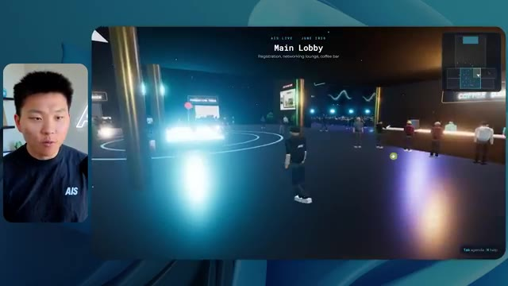
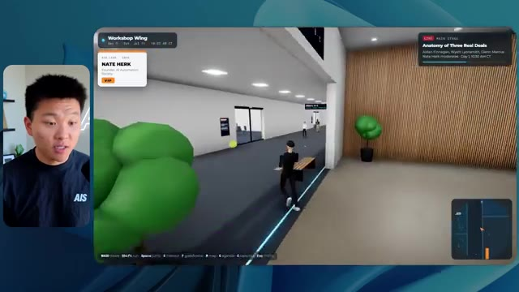
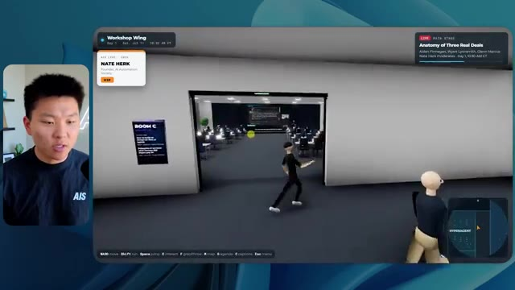
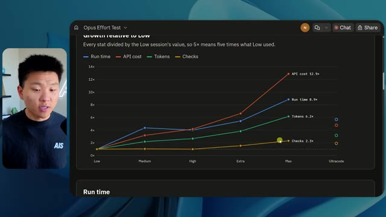

# 🎬 I Tested Opus 5 vs. Fable 5. What You Need to Know.

> **Chaîne** : [Nate Herk | AI Automation](https://www.youtube.com/@nateherk/featured)  
> **Lien YouTube** : [https://www.youtube.com/watch?v=2J3uX8iRNng](https://www.youtube.com/watch?v=2J3uX8iRNng)  
> **Date de publication** : 20260724  
> **Durée** : 00:30:53  
> **Identifiant vidéo** : `2J3uX8iRNng`  
> **Transcription & Analyse** : `whisper-v3-large-turbo+gemini-3.5-flash-lite`  

---

## 📌 Synthèse Exécutive & Outils

### 💡 Résumé
Dans cette vidéo, Nate Herk explore l'impact des différents niveaux d'effort (de faible à ultra-code) appliqués au modèle **Opus 5.5** d'Anthropic pour réaliser une tâche d'ingénierie logicielle et d'automatisation complexe : transformer un dossier brut de 105 gigaoctets d'enregistrements vidéo (provenant de l'événement virtuel *AIS Live*) en un monde 3D interactif et explorable à la troisième personne, simulant une conférence technologique physique. L'expérimentation démontre que les performances des agents IA ne se mesurent pas seulement à la réussite globale de la génération, mais à un compromis subtil entre temps d'exécution, coût par API, consommation de jetons, rigueur visuelle et autonomie de l'agent. 

Alors que le niveau d'effort *faible* produit un résultat rapide (16 minutes, 3,91 $) mais truffé de bugs visuels, d'images fixes non animées et d'une incohérence totale de la charte graphique, le niveau *moyen* (recommandé par Anthropic) élève considérablement le niveau qualitatif. Ce dernier intègre les bonnes palettes de couleurs, des PNJ (personnages non-joueurs) animés qui réagissent, de vraies lectures vidéo en streaming pour les ateliers, ainsi qu'une fidélité sémantique accrue au programme de la conférence, le tout pour 1 heure 13 minutes de traitement et 12,44 $ de coût API équivalent. Fait notable : dans les deux cas, le modèle a fonctionné en totale autonomie, s'appuyant sur des vérifications automatisées dans le navigateur sans poser la moindre question humaine.

Cette démonstration met en lumière la maturité des outils de développement assistés par IA comme Claude Code et Cursor, tout en soulignant le défi persistant du déploiement : transformer un code fonctionnel généré localement en une application accessible en ligne, un fossé que des solutions d'hébergement intégrées cherchent à combler.

### 🛠️ Outils, Modèles & Logiciels Présentés
* **Opus 5.5 (Anthropic)** : Le modèle de pointe d'Anthropic utilisé pour l'ensemble des tests de génération de code et de logique d'agent.
* **Claude Code** : L'assistant de développement en ligne de commande et environnement de travail utilisé pour orchestrer les agents et exécuter les prompts complexes.
* **Herc 2** : Le système d'exploitation IA personnel de Nate Herk servant de boîte à outils et d'écosystème de référence pour alimenter l'agent.
* **Frame.io** : La plateforme de stockage cloud utilisée pour héberger les 105 gigaoctets de ressources vidéo brutes de l'événement *AIS Live*.
* **Hostinger (Connecteur)** : L'extension gratuite présentée par le sponsor, permettant d'importer et de lier son compte d'hébergement directement dans les environnements de code (VS Code, Cursor, Claude Code, etc.) pour simplifier le déploiement.
* **Cursor / VS Code** : Éditeurs de code de référence pour le développement assisté par IA.
* **Key.ai** : Service tiers suggéré dans le prompt pour la génération dynamique d'images et de vidéos contextuelles.

### 🔑 Points Clés & Enseignements Stratégiques
* **L'importance critique des paramètres d'effort** : Ajuster le niveau d'effort d'Opus 5.5 modifie radicalement le comportement de l'agent, passant d'une exécution superficielle (niveau faible) à une architecture logicielle riche et soignée (niveau moyen et au-delà).
* **Le compromis temps/coût/qualité** : Le test montre qu'un niveau d'effort supérieur multiplie par quatre le temps d'exécution (de 16 minutes à plus d'une heure) et le coût API estimé (de 3,91 $ à 12,44 $), un investissement largement justifié par la suppression des bugs visuels majeurs.
* **L'autonomie totale des agents** : À la fois en mode faible et moyen, Opus 5.5 a accompli des tâches massives et complexes sans nécessiter d'intervention humaine ni poser de questions de clarification, démontrant une excellente autonomie décisionnelle.
* **La puissance des vérifications automatisées** : L'agent a exécuté respectivement 22 et 23 vérifications en ouvrant itérativement un navigateur pour tester son propre travail, confirmant que le *self-debugging* visuel est un pilier de l'ingénierie par agent moderne.
* **L'intégration contextuelle de données massives** : L'agent a réussi à ingérer, structurer et cartographier intelligemment un volume brut de 105 Go de vidéos pour l'associer à des lieux virtuels précis (scène principale, salons VIP, salles d'atelier).
* **Le respect de l'identité de marque** : Un effort accru permet à l'IA de passer d'un design générique et aveugle à l'intégration rigoureuse de la charte graphique, des logos et des palettes de couleurs spécifiques de l'entreprise.
* **La gestion de l'immersion 3D et de la physique** : Les agents dotés d'un effort suffisant sont capables de concevoir des environnements interactifs complexes intégrant des PNJ dotés de comportements dynamiques et des éléments de navigation fluides (cartes en temps réel, zones de sprint).
* **La transition entre code local et production** : La génération locale d'applications complexes par l'IA crée un "fossé de déploiement" qu'il est impératif de combler à l'aide d'extensions de connectivité directe vers les hébergeurs web.
* **La recommandation méthodologique d'Anthropic** : Suivant les directives officielles d'Anthropic, il est optimal de démarrer l'expérimentation d'un prompt complexe au niveau d'effort moyen avant d'itérer à la hausse ou à la baisse selon la criticité du livrable.
* **L'essor des environnements de conférence virtuels augmentés** : Cette démonstration prouve qu'il est désormais possible d'automatiser entièrement la création d'espaces virtuels expérientiels à partir de simples archives vidéo, ouvrant la voie à de nouveaux standards pour l'événementiel numérique.

---

## ⏱️ Chronologie & Transcription Complète Audio & Visuelle (Mot pour Mot)

### ⏱️ `[00:00:00 - 00:00:20]` | Segment #01

**🔊 Audio (Transcription Intégrale Mot pour Mot en Français) :**
> Opus 5,5, Opus 5,5, Opus 5,5, Opus 5,5, Opus 5,5. Ce modèle est littéralement partout et pour de très bonnes raisons. Il est intelligent, il est bon marché, il a un goût extraordinaire, c'est un modèle d'IA incroyable. Mais avec chaque modèle d'IA, vous avez le choix de l'effort, que ce soit faible, moyen, élevé, extra, max ou code ultra.

**👁️ Analyse Visuelle d'Écran (gemini-3.5-flash-lite) :**
**Interface & Outils** : Interface du réseau social X (Twitter).

**Contenu textuel & Code** : Publication sur X avec un tweet et une vidéo intégrée montrant un environnement 3D réaliste.

**Action / Démonstration** : Présentation visuelle d'un tweet illustrant les capacités des modèles d'IA.

*⏱️ 00:00:05 — Capture d'écran d'un tweet sur X montrant un rendu visuel 3D de paysage tropical avec des habitations et un texte sur la perturbation des créatifs techniques.*

---

### ⏱️ `[00:00:20 - 00:00:38]` | Segment #02

**🔊 Audio (Transcription Intégrale Mot pour Mot en Français) :**
> Donc dans cette vidéo, j'ai donné exactement le même prompt à Opus 5.5 et je l'ai exécuté à chaque niveau d'effort et nous allons comparer les résultats. Nous allons examiner la qualité de toutes les différentes sorties réelles, mais nous allons aussi examiner combien de temps chacun d'eux a fonctionné, combien cela nous a coûté si c'était une facturation par API, le nombre total de tokens, combien de vérifications ils ont exécutées et combien de questions ils m'ont réellement posées tout au long du processus.

**👁️ Analyse Visuelle d'Écran (gemini-3.5-flash-lite) :**
**Interface & Outils** : Application web de tableau blanc ou de prise de notes (type Miro ou similaire).

**Contenu textuel & Code** : Tableau avec les en-têtes de colonnes : Low, Medium, High, Extra, Max, Ultracode, et les lignes : Run time, API cost, Total tokens, Checks, Questions asked.

**Action / Démonstration** : Présentation du tableau comparatif des performances de l'IA selon les différents niveaux d'effort.

*⏱️ 00:00:29 — Un tableau comparatif montrant les différents niveaux d'effort (Low, Medium, High, Extra, Max, Ultracode) avec des métriques comme Run time, API cost et Total tokens.*

---

### ⏱️ `[00:00:39 - 00:00:58]` | Segment #03

**🔊 Audio (Transcription Intégrale Mot pour Mot en Français) :**
> Et les résultats que nous avons obtenus ne sont pas du tout ce à quoi je m'attendais, donc j'ai hâte de partager cela avec vous les gars. Ne perdons pas de temps et allons directement à celui-ci. D'accord, alors plongeons-nous directement dans celui-ci. Je veux commencer juste en vous montrant, les gars, le prompt réel que nous avons utilisé, que nous avons donné à chacun de ces différents agents. Je vais aller dans les fichiers ici, et nous allons ouvrir ce fichier markdown de prompt, et je vais vous montrer ce que nous avons obtenu. Voici donc le slash objectif que j'ai fourni.

**👁️ Analyse Visuelle d'Écran (gemini-3.5-flash-lite) :**
**Interface & Outils** : Interface de type éditeur/agent IA (probablement Opus 5.5 ou un outil similaire) avec panneau latéral de gestion de worktrees et zone de discussion.

**Contenu textuel & Code** : Message de l'IA : "Hi Nate. This worktree has the effort-test task queued in PROMPT.md : build a walkable third-person 3D world of the AIS Live conference from your f.io recordings..." et options de configuration d'effort dans le panneau latéral (Hello, Extra, High, Max, Ultracode, Medium, Low).

**Action / Démonstration** : Navigation et présentation de l'interface de l'agent IA par le présentateur, montrant la configuration des tests d'effort et le prompt initial.

*⏱️ 00:00:48 — Interface d'un outil de développement avec un panneau latéral montrant divers projets et une fenêtre de chat avec une IA affichant un prompt sur un monde 3D.*

---

### ⏱️ `[00:00:58 - 00:01:34]` | Segment #04

**🔊 Audio (Transcription Intégrale Mot pour Mot en Français) :**
> J'ai dit : tu dois me créer un monde en 3D qui est une conférence technologique réaliste dans laquelle je peux me promener en vue à la troisième personne. Tu vas regarder ce dossier, qui contient mes ressources d'enregistrement d'événements d'AIS Live. Et ce dossier est un dossier Frame.io de 105 gigaoctets d'enregistrements vidéo. C'était un événement complètement virtuel. Tout a été enregistré et tous les enregistrements sont ici. J'ai dit, ton objectif est de prendre cet événement et de le transformer en un monde explorable en 3D qui me donne l'impression d'être réellement allé à une vraie conférence en personne avec différentes salles, différentes pistes, différentes scènes, bla, bla, bla. N'hésite pas à utiliser key.ai si tu as besoin de générer des images ou des vidéos. Et tu peux aussi utiliser tout ce qui se trouve dans mon projet Herc 2, qui est comme mon système d'exploitation IA. J'ai dit,

**👁️ Analyse Visuelle d'Écran (gemini-3.5-flash-lite) :**
**Interface & Outils** : Éditeur de code (type VS Code) et interface web de stockage vidéo (Frame.io).

**Contenu textuel & Code** : Fichier Markdown contenant un prompt demandant de convertir des enregistrements d'événements virtuels en monde 3D explorable à la troisième personne.

**Action / Démonstration** : Présentation des instructions textuelles destinées à l'agent IA et visualisation du dossier Frame.io contenant les ressources source de 105 Go.

*⏱️ 00:01:07 — Éditeur de code affichant le fichier PROMPT.md avec les instructions détaillées pour créer un monde 3D interactif basé sur un événement virtuel.*

*⏱️ 00:01:16 — Interface Frame.io montrant un dossier d'enregistrements d'événements AIS Live d'une taille de 105,69 Go contenant des sous-dossiers "GA Access" et "VIP Access".*

*⏱️ 00:01:25 — Éditeur de code affichant à nouveau le fichier PROMPT.md avec le prompt complet décrivant les exigences de design, de physique et d'exploration du monde 3D.*

---

### ⏱️ `[00:01:34 - 00:02:08]` | Segment #05

**🔊 Audio (Transcription Intégrale Mot pour Mot en Français) :**
> tu seras jugé sur la créativité, le design, la physique et la sensation générale lorsque j'explorerai le monde 3D que tu as construit. Et c'était pratiquement la fin des instructions. Donc, comme tu peux le voir sur le côté gauche, j'ai exécuté ceci à travers tous les différents niveaux d'effort. Commençons par le niveau bas et remontons jusqu'à ultra code. Très bien. Nous avons donc ici le résultat du niveau bas. Ouvrons ceci et jetons un œil. Nous avons donc AIS live, le sommet des services d'IA en personne enfin, et nous avons pu cliquer partout. Tout d'abord, on ne sent pas vraiment l'identité de la marque. Genre, ce n'ofre pas le logo d'IS Live. Ce ne sont même pas nos couleurs. Donc je n'aime pas trop ça, mais entrons ici. D'accord. C'est beaucoup trop lumineux. Euh, nous avons une carte en haut à droite. Nous avons une ville par ici. Je ne peux pas dire quelle ville c'est

**👁️ Analyse Visuelle d'Écran (gemini-3.5-flash-lite) :**
**Interface & Outils** : Interface web d'un agent IA ou d'un outil de développement (type interface propriétaire ou plateforme de chat avancée).

**Contenu textuel & Code** : Panneau latéral listant des sessions de test (Hello, Extra, High, Max, Ultracode, Medium, Low) et un message de l'assistant proposant de commencer la tâche de construction d'un monde 3D.

**Action / Démonstration** : Le présentateur survole ou sélectionne les différents niveaux d'effort dans le panneau de gauche de l'interface.

*⏱️ 00:01:42 — Interface d'une application de type assistant ou agent IA montrant à gauche un menu avec différents niveaux de tests d'effort et à droite une conversation textuelle.*

---

### ⏱️ `[00:02:08 - 00:02:40]` | Segment #06

**🔊 Audio (Transcription Intégrale Mot pour Mot en Français) :**
> C'est. D'accord. C'est Chicago, ce qui est plutôt cool parce que tu sais, j'habite à Chicago, mais bref, en haut à droite, on peut voir une carte. Nous avons un hall d'accueil. Nous avons un hall d'exposition. Nous avons un salon VIP, la scène principale. La carte montre aussi où se trouve chaque autre personne et cela se synchronise en direct. Donc on peut voir l'enregistrement. On peut voir le premier jour, la keynote de l'agent hyper, le débrief en direct. Cool. Donc ça connaît réellement le programme et puis il y a le deuxième jour. Donc ça a trouvé ça, c'est bien. Nous avons ces petites boules ici que je peux espérer botter. D'accord. Le visage, oh, regarde ça. Si je vais par ici, tous les gens disparaissent tout simplement. Très mauvais. Très mauvais. D'accord. Alors voyons voir. Est-ce que je peux sprinter ? D'accord.

**👁️ Analyse Visuelle d'Écran (gemini-3.5-flash-lite) :**
**Interface & Outils** : Application ou plateforme virtuelle 3D avec interface utilisateur intégrée et mini-carte de navigation.

**Contenu textuel & Code** : Environnement virtuel 3D interactif avec avatars, panneaux d'information textuels et carte de localisation.

**Action / Démonstration** : Navigation et exploration d'un espace virtuel en 3D représentant un événement ou une conférence.

---

### ⏱️ `[00:02:40 - 00:03:04]` | Segment #07

**🔊 Audio (Transcription Intégrale Mot pour Mot en Français) :**
> Je peux avancer un peu plus vite. Je vais d'abord aller par ici. Il y a des produits dérivés, euh, un sweat à capuche certifié AIS plus. D'accord. Donc il y a les vrais stands qu'on avait dans l'événement virtuel. On avait des stands. Donc c'est plutôt cool. Un petit endroit pour prendre des photos. La salle C. En ce moment, nous avons Tangy Frederick qui anime un atelier. D'accord. Mais ce n'est pas une vidéo. Comme vous pouvez le voir, c'est juste une image. Elle ne bouge pas. C'est donc juste une image. Ces gens sont en train de disparaître. Ce doivent être des fantômes. Allons par ici vers la salle A.

**👁️ Analyse Visuelle d'Écran (gemini-3.5-flash-lite) :**
**Interface & Outils** : Environnement virtuel 3D type métavers / jeu de rôle.

**Contenu textuel & Code** : Aucun code source, terminal ou prompt visible, uniquement des éléments graphiques 3D et des panneaux informatifs virtuels.

**Action / Démonstration** : Navigation et exploration dans l'espace virtuel de l'événement.

---

### ⏱️ `[00:03:04 - 00:03:30]` | Segment #08

**🔊 Audio (Transcription Intégrale Mot pour Mot en Français) :**
> Nous avons Liberty White. D'accord. Très cool. Vos 30 premiers jours en automatisation. Encore une fois, c'est juste une image fixe et les gens ont des bugs visuels. Donc pas très bon ici. Je vais aller sur la scène principale et voir ce que nous avons. D'accord, cool. Donc nous avons une scène principale. Les gens ont des bugs visuels. Vraiment mauvais. Ce n'est vraiment pas bon du tout. Notre vidéo est en train de bouger. Genre, j'ai vu mon visage ici et j'ai vu celui de Devin, mais maintenant ils ont disparu. Donc je ne sais pas ce qui s'est passé. D'accord. On dirait que c'est plutôt un diaporama. Rien n'est vraiment lu pour l'instant. Quoi qu'il en soit, entrons ici.

**👁️ Analyse Visuelle d'Écran (gemini-3.5-flash-lite) :**
**Interface & Outils** : Environnement virtuel 3D de type métavers / plateforme d'événement virtuel.

**Contenu textuel & Code** : Textes d'indication de salle ('Workshop Room A', 'Main Stage', 'AIS LIVE AI Services Summit').

**Action / Démonstration** : Navigation et déplacement d'un avatar à l'intérieur de l'espace virtuel de conférence.

*⏱️ 00:03:11 — Vue d'une salle virtuelle de type metavers (Workshop Room A) montrant un avatar et des plateformes lumineuses.*

*⏱️ 00:03:17 — Vue de la scène principale d'un événement virtuel (AIS Live) avec un grand public d'avatars assis.*

*⏱️ 00:03:24 — Vue plus large de l'amphithéâtre virtuel avec le grand écran affichant 'AIS LIVE AI Services Summit'.*

---

### ⏱️ `[00:03:30 - 00:03:58]` | Segment #09

**🔊 Audio (Transcription Intégrale Mot pour Mot en Français) :**
> Nous avons d'autres stands. Nous avons hyper agent. Nous avons Claude Code. Nous avons plus de cadeaux publicitaires. La salle B, c'est Dave Ebelor. Je suppose que c'est exactement la même chose. Nous avons du café. Et ensuite, je suppose, le salon VIP, accès VIP seulement. C'est plutôt cool, mais il n'y a vraiment rien qui se passe ici. Cet écran est bien trop lumineux. D'accord. Donc je pense que vous comprenez l'ambiance qu'on obtient ici de la part d'Opus 5.5 en effort faible. Et c'est là que les choses deviennent intéressantes. Combien de temps pensez-vous que cela a duré ? Combien de temps ? Celui-ci a duré 16 minutes et 43 secondes. Combien pensez-vous que cela a coûté ?

**👁️ Analyse Visuelle d'Écran (gemini-3.5-flash-lite) :**
**Interface & Outils** : Application web ou tableau de bord 'Opus 5.5 Efforts'.

**Contenu textuel & Code** : Tableau comparatif avec des métriques de performance et de coût pour différents niveaux de réglage (Low à Ultracode).

**Action / Démonstration** : Navigation et présentation des options de performance et de coût dans un tableau analytique.

*⏱️ 00:03:51 — Un tableau de bord interactif intitulé 'Opus 5.5 Efforts' présentant un tableau comparatif avec des niveaux de performance (Low, Medium, High, Extra, Max, Ultracode) et des métriques (Run time, API cost, Total tokens, Checks, Questions asked).*

---

### ⏱️ `[00:03:58 - 00:04:26]` | Segment #10

**🔊 Audio (Transcription Intégrale Mot pour Mot en Français) :**
> 3,91 dollars si c'était une facturation par API. J'utilise évidemment mon abonnement ici, mais nous allons simplement calculer cela en facturation par API. Le nombre total de jetons était de 191 000. Il a effectué 22 vérifications. Donc, la vérification, 22 fois il a ouvert le navigateur et a exécuté différentes sortes de vérifications. Donc 22 catégories de vérifications. Et combien de questions m'a-t-il posées ? Il m'a posé un total de zéro question tout au long de cette invite de commande d'objectif. D'accord. Alors, ouvrons l'effort moyen et voyons ce que nous avons. D'accord, c'est parti. Effort moyen. Nous avons Nate Herc. Nous avons mon badge. C'est la marque AI's life.

**👁️ Analyse Visuelle d'Écran (gemini-3.5-flash-lite) :**
**Interface & Outils** : Outil de tableau blanc ou de diagramme (type Excalidraw ou similaire).

**Contenu textuel & Code** : Tableau avec les colonnes Low, Medium, High, Extreme et les lignes Run time (16m 43s), API cost ($3.91), Total tokens (191.3K), Checks et Questions asked.

**Action / Démonstration** : Le présentateur explique les métriques de coût et de performance affichées dans le tableau.

*⏱️ 00:04:05 — Un tableau comparatif des coûts et performances d'une IA selon différents niveaux (Low, Medium, High, Extreme), affichant 16m 43s pour le temps d'exécution, 3,91 $ pour le coût API, 191,3K pour le total des jetons, ainsi que les lignes 'Checks' et 'Questions asked'.*

---

### ⏱️ `[00:04:26 - 00:04:46]` | Segment #11

**🔊 Audio (Transcription Intégrale Mot pour Mot en Français) :**
> Donc ça a déjà l'air un petit peu mieux. Ça ressemble à nos palettes de couleurs qui ont utilisé nos directives de marque. Premier jour de construction, deuxième jour de gain, VIP. Cool. D'accord. Je vais entrer dans le lieu. D'accord. Waouh. Une ambiance similaire, en gros. C'est en arrière-plan. Ça ne ressemble pas à Chicago, hein ? Non, ça ressemble à, honnêtement, ça ressemble à une ville inventée. Quoi qu'il en soit, c'est drôle qu'ils aient décidé de faire ça. Voyons si je peux me déplacer un peu plus vite. Oh, waouh.

**👁️ Analyse Visuelle d'Écran (gemini-3.5-flash-lite) :**
**Interface & Outils** : Application web interactive / 3D

**Contenu textuel & Code** : Interface d'accueil 'Welcome to AIS Live' avec badge d'accès, instructions de navigation et environnement 3D virtuel.

**Action / Démonstration** : Le présentateur clique sur 'ENTER THE VENUE' pour entrer dans le lieu virtuel 3D.

*⏱️ 00:04:31 — L'écran affiche l'interface d'accueil de l'événement virtuel 'AIS Live' avec un badge nominatif au nom de Nate Herk et des boutons d'accès.*

*⏱️ 00:04:41 — L'écran montre une vue en 3D à l'intérieur du lieu virtuel 'AIS Live' avec des avatars de participants et une vue sur une ville la nuit.*

---

### ⏱️ `[00:04:46 - 00:05:21]` | Segment #12

**🔊 Audio (Transcription Intégrale Mot pour Mot en Français) :**
> Les gens interagissent avec moi. Regardez. Si je m'approche de ce type, il vient de lever le bras. Bon, maintenant il ne veut plus du tout avoir affaire à moi. Mais tous ces petits robots ici doivent prendre des décisions. Je ne suis pas sûr qu'ils utilisent Jev. C'est sûr que non. Je ne lui ai pas dit de le faire. En fait, ma clé Jev est à l'arrière. Je ne sais pas. Peut-être qu'il l'a utilisée. Quoi qu'il en soit, nous pouvons voir ici que nous avons la salle d'atelier C, le laboratoire des agents. Sympa. Donc celui-ci est réellement en train de fonctionner. Vous pouvez voir qu'il s'agit d'une vraie vidéo lue par Tangy. Tout le monde ici est en train de travailler sur un ordinateur portable. Ils ne buguent pas. C'est plutôt cool. De plus, mon badge est sur ma poitrine, ce qui est plutôt cool. Je peux venir par ici. Nous avons une carte en haut à droite, comme vous pouvez le voir, mais je peux venir par ici. Nous avons un

**👁️ Analyse Visuelle d'Écran (gemini-3.5-flash-lite) :**
**Interface & Outils** : Environnement virtuel 3D / Application metaverse

**Contenu textuel & Code** : Avatars numériques, interface de navigation en 3D et mini-carte de localisation

**Action / Démonstration** : Exploration d'un monde virtuel 3D peuplé d'avatars et de PNJ interactifs

---

### ⏱️ `[00:05:21 - 00:05:47]` | Segment #13

**🔊 Audio (Transcription Intégrale Mot pour Mot en Français) :**
> hall d'exposition. C'est là que nous avons le stand Glido. Et ça diffuse en ce moment. Oui, ça diffuse la vidéo de nous parlant de Glido. Ça diffuse la vidéo d'Ed et moi parlant de notre programme de certification. Nous avons le logo AIS Plus juste ici, qui est un peu mal placé. Ce sont les diapositives des conférenciers et les points clés. Alors wow, ce sont toutes les ressources que nous avons distribuées après l'événement. Elles sont toutes affichées là également. Nous pouvons voir que nous avons un projecteur sur la communauté. Donc c'est Aiden qui parle de son contrat qu'il a décroché et ça se joue en direct. Ces gens sont en train de regarder.

**👁️ Analyse Visuelle d'Écran (gemini-3.5-flash-lite) :**
**Interface & Outils** : Environnement virtuel 3D / plateforme de type métavers ou salon virtuel.

**Contenu textuel & Code** : Éléments graphiques d'un salon virtuel avec des affichages de diapositives "Speaker Slides & Takeaways" et des informations de session.

**Action / Démonstration** : Navigation et visite guidée d'un espace d'exposition virtuel par le présentateur.

---

### ⏱️ `[00:05:47 - 00:06:21]` | Segment #14

**🔊 Audio (Transcription Intégrale Mot pour Mot en Français) :**
> Ils sont plutôt engagés. On a l'hyper agent. C'était, c'est ce que je voulais dire. Si vous avez vu ces gens lever les bras en disant bonjour, c'était plutôt marrant. Regardez, regardez, le voilà qui recommence. Bref. Bon. Où est-ce que je suis maintenant ? Maintenant, je suis dans le hall principal. On a un bar à café. On a un grand logo, qui est le vrai logo. C'est trop lumineux, mais on a le logo. On peut voir si on peut entrer ici dans le parcours des fondations. On a Sabrina Romanov et Liberty White. Donc différentes formations juste là. On peut entrer dans cette salle. C'est le parcours avancé. Alors qu'est-ce qui se passe ici. On a Dave Ebelar et Saman qui parlent de différentes choses là-dedans. Et maintenant, allons jeter un œil à la scène principale. Oh, attendez, il y a une vidéo de moi là-haut. Est-ce que c'est genre un VIP

**👁️ Analyse Visuelle d'Écran (gemini-3.5-flash-lite) :**
**Interface & Outils** : Environnement virtuel 3D interactif (plateforme d'événement en ligne).

**Contenu textuel & Code** : Interface utilisateur virtuelle, mini-carte de navigation, avatars 3D et zones étiquetées (Main Lobby).

**Action / Démonstration** : Navigation et exploration d'un espace virtuel 3D par le présentateur.

*⏱️ 00:05:55 — Vue dans le hall principal virtuel (Main Lobby) montrant les avatars des participants et l'interface de navigation 3D.*

*⏱️ 00:06:04 — Déplacement de l'avatar vers une salle de conférence ou une zone de présentation virtuelle avec un écran de projection au fond.*

*⏱️ 00:06:12 — Vue en contre-plongée montrant l'avatar évoluant parmi d'autres participants virtuels autour de tables dans l'espace 3D.*

---

### ⏱️ `[00:06:21 - 00:06:50]` | Segment #15

**🔊 Audio (Transcription Intégrale Mot pour Mot en Français) :**
> section ? Ouais, on ira voir ça dans une minute. Mais bref, voici la scène principale. Ça a l'air vraiment, vraiment super. On a une grande scène. On a genre quatre personnes assises ici. On a les trois écrans d'Alex là-haut avec l'hyper agent. Est-ce que j'ai le droit de monter sur scène ? Oh, et il me laisse monter sur scène. D'accord. C'est plutôt sympa. Bon les gars, faisons un selfie. Laissez-moi prendre tout le monde en arrière-plan. Venez par ici. Bref, c'est vraiment, vraiment cool. Toutes les places ne sont pas occupées par contre. Donc il faut qu'on travaille là-dessus. Mais bref, je vais retourner voir ce que c'était que cette section VIP. D'accord. Le salon VIP. J'ai l'impression que c'est comme un aéroport ou un truc comme ça.

**👁️ Analyse Visuelle d'Écran (gemini-3.5-flash-lite) :**
**Interface & Outils** : Environnement virtuel 3D / Plateforme d'événement virtuel.

**Contenu textuel & Code** : Interface utilisateur affichant les détails de la session (Hyperagent Keynote) et des écrans de présentation virtuels.
[CONSIDERATIONS] Navigation et exploration d'un monde virtuel 3D lors d'une keynote d'agents IA, sans affichage de code ni d'éditeur technique.

**Action / Démonstration** : Explications face caméra et démonstration conceptuelle.

---

### ⏱️ `[00:06:51 - 00:07:14]` | Segment #16

**🔊 Audio (Transcription Intégrale Mot pour Mot en Français) :**
> OK, super. Donc maintenant, nous avons les sessions VIP ici. Une foire aux questions VIP avec la lecture vidéo en direct de Nate juste ici. Très, très cool. Et nous avons comme un bar ou quelque chose du genre. Génial. Je dirais que c'est un plutôt bon résultat. Maintenant, en ce qui concerne les statistiques ici, celle-ci a pris une heure et 13 minutes à s'exécuter. Cela nous aurait coûté 12 dollars et 44 cents. Elle a utilisé 490 000 jetons et a fait 23 vérifications.

**👁️ Analyse Visuelle d'Écran (gemini-3.5-flash-lite) :**
**Interface & Outils** : Espace virtuel 3D et tableau de bord de suivi de performance (Opus 5.5).

**Contenu textuel & Code** : Métriques : Run time (16m 43s), API cost ($3.91), Total tokens (191.3K), Checks (22), Questions asked (0).

**Action / Démonstration** : Présentation de la session VIP virtuelle puis passage à l'analyse des coûts et des performances d'exécution.

*⏱️ 00:06:56 — Vue d'un espace virtuel VIP avec un écran géant affichant une vidéo en direct de Nate Herk et des avatars d'utilisateurs.*

*⏱️ 00:07:02 — Tableau comparatif affichant les métriques de performance et de coûts (Run time, API cost, Total tokens, etc.) avec le titre "Opus 5.5 Efforts".*

---

### ⏱️ `[00:07:14 - 00:07:48]` | Segment #17

**🔊 Audio (Transcription Intégrale Mot pour Mot en Français) :**
> Et il nous a posé un total de zéro question une fois de plus. Très bien, passons au niveau élevé. C'était déjà un résultat plutôt correct et Anthropic eux-mêmes dans leur vidéo, ou désolé, pas une vidéo, un article sur comment prompter Opus 5.5, ils ont dit de commencer simplement par le niveau moyen et de l'ajuster à la hausse ou à la baisse si nécessaire. C'était donc un résultat moyen. Passons au niveau élevé et voyons ce que nous avons obtenu. Très rapidement, les gars, je dois prendre une seconde pour vous parler du sponsor de la vidéo d'aujourd'hui, Hostinger. Ces deux modèles viennent donc de me construire une version fonctionnelle de la même chose. Et maintenant, je me retrouve exactement là où je finis toujours, avec un projet terminé sur mon ordinateur portable et aucun moyen rapide de le mettre en ligne. Et c'est le fossé que le connecteur d'Hostinger comble. C'est une extension gratuite

**👁️ Analyse Visuelle d'Écran (gemini-3.5-flash-lite) :**
**Interface & Outils** : Tableau de bord comparatif et environnement de développement/éditeur de code.

**Contenu textuel & Code** : Tableau comparatif des coûts et temps d'exécution (Low: 16m 43s / $3.91, Medium: 1h 13m / $12.44) et prompt de calculatrice ROI.

**Action / Démonstration** : Présentation des résultats comparatifs selon différents niveaux d'effort d'Opus 5.5.

*⏱️ 00:07:22 — Un tableau comparatif des performances de l'effort d'Opus 5.5 affichant les colonnes Low, Medium, High et Extra avec des métriques telles que le temps d'exécution, le coût API, les tokens et les questions posées.*

*⏱️ 00:07:39 — Une interface de développement avec un panneau de chat affichant le prompt "Build Northwind ROI calculator" et le présentateur en médaillon.*

---

### ⏱️ `[00:07:48 - 00:08:23]` | Segment #18

**🔊 Audio (Transcription Intégrale Mot pour Mot en Français) :**
> pour votre éditeur qui importe votre compte Hostinger dans l'outil où vous codez déjà. Que ce soit VS Code, Cursor, Cloud Code, Codex, et j'en passe. Vous vous connectez une seule fois en un seul clic, et à partir de là, votre agent peut déployer le site, y pointer un domaine, configurer les enregistrements DNS et vérifier votre VPS sans jamais avoir à quitter l'éditeur. Donc, peu importe celui de ces outils que vous finirez par préférer, ce qu'il a construit n'est qu'à quelques minutes d'une vraie URL sur un hébergement géré. Le connecteur est gratuit avec n'importe quel plan d'hébergement, donc si vous avez toujours besoin de l'hébergement sous-jacent, profitez du plan illimité via le lien dans la description et utilisez le code NATEHERK pour 10 % de réduction. Cela inclut également un nom de domaine gratuit et un e-mail professionnel pour l'année. Et c'est toujours le moyen le plus économique que j'ai trouvé pour obtenir quelque chose

**👁️ Analyse Visuelle d'Écran (gemini-3.5-flash-lite) :**
**Interface & Outils** : Interface de gestion Hostinger connectée et interface de l'assistant Claude Code.

**Contenu textuel & Code** : Statut "Connected", Node.js v24.13.0, liste des outils disponibles (Websites, Domains, Subscriptions & Payments, Email Marketing) et logo Claude Code.

**Action / Démonstration** : Connexion du compte Hostinger à l'IDE pour permettre à l'assistant de gérer les sites et les domaines.

*⏱️ 00:07:57 — Interface montrant l'intégration de Hostinger dans un IDE avec un statut connecté et les outils disponibles (Websites, Domains, etc.), aux côtés de l'interface Claude Code.*

---

### ⏱️ `[00:08:23 - 00:08:47]` | Segment #19

**🔊 Audio (Transcription Intégrale Mot pour Mot en Français) :**
> Tu as construit sur une vraie URL. Donc revenons à la vidéo. D'accord. Encore une fois, très, très marqué par la marque. C'est un écran de chargement encore mieux que le précédent. Nous avons ce petit effet sympa en arrière-plan. Nous avons le logo. Nous allons entrer dans le lieu. D'accord. Nous y voilà. Ça a l'air plutôt bien. Nous commençons dehors et vous pouvez voir que nous avons ces drapeaux pour tous les intervenants, Wyatt, Casper, Alex, Ed, Aiden, Sabrina, Liberty. C'est plutôt cool. Nous avons des blocs en direct ici.

**👁️ Analyse Visuelle d'Écran (gemini-3.5-flash-lite) :**
**Interface & Outils** : Interface web immersive 3D, plateforme virtuelle 'AIS Live'.

**Contenu textuel & Code** : Logos 'AIS LIVE', bannières d'événements, commandes clavier/souris affichées à l'écran, nom de la zone 'AIS Live Plaza'.

**Action / Démonstration** : Connexion à l'espace virtuel, chargement de l'interface et entrée dans le lieu virtuel.

*⏱️ 00:08:29 — Écran de chargement et d'accueil de la plateforme 'AIS LIVE' avec le bouton 'Enter the Venue' et les instructions de contrôle.*

*⏱️ 00:08:35 — Entrée dans l'espace virtuel 3D interactif 'AIS Live Plaza' avec un avatar au premier plan et des bâtiments en arrière-plan.*

*⏱️ 00:08:41 — Exploration de la place virtuelle 'AIS Live Plaza' avec des bannières de conférenciers et des éléments interactifs au sol.*

---

### ⏱️ `[00:08:47 - 00:09:23]` | Segment #20

**🔊 Audio (Transcription Intégrale Mot pour Mot en Français) :**
> Il a pris cette photo de moi, votre hôte, Nate Herc, John, Dave, Nate Herc. Voilà. OK. Les portes. Génial. Ce sont des portes coulissantes automatiques en verre. J'adore ça. Nous pouvons voir l'enregistrement VIP. Nous pouvons voir l'admission générale. Nous pouvons venir par ici et nous pouvons découvrir l'exposition avec différents stands, le projecteur sur la communauté. Vous pouvez également voir qu'en haut à gauche, j'ai un passeport. Donc c'est comme si, cela montrera combien d'endroits j'ai visités. Tout cela est une lecture réelle. Nous avons un mur de ressources avec tous les différents intervenants. Ils ont également une session de réseautage par ici. Je vais donc venir très vite et voir de quoi il retourne. Nous avons donc le bar à cold brew AIS. Nous avons différents membres de la communauté qui ont été mis en avant ou mis en lumière.

**👁️ Analyse Visuelle d'Écran (gemini-3.5-flash-lite) :**
**Interface & Outils** : Application ou plateforme virtuelle 3D (Metaverse / espace d'événement en ligne).

**Contenu textuel & Code** : Environnement virtuel 3D interactif avec des avatars et des panneaux d'affichage.

**Action / Démonstration** : Navigation et exploration de l'espace virtuel par le présentateur.

---

### ⏱️ `[00:09:23 - 00:09:56]` | Segment #21

**🔊 Audio (Transcription Intégrale Mot pour Mot en Français) :**
> Nous avons l'aile VIP. Attends, quoi ? Prends un bracelet. Oh, je dois vraiment aller chercher le bracelet. D'accord. Laisse-moi m'enregistrer rapidement. Le bracelet est déjà mis. Attends, quoi ? D'accord. Oh, d'accord. Maintenant, les portes se sont ouvertes pour moi. Cool. Je peux entrer ici. Oh, ça mène juste à la scène principale. Salon VIP. Il y a une séance de questions-réponses en cours. Ça a l'air très cool. Je veux dire, je suis très impressionné par la façon dont il est capable de faire ça. Waouh. D'accord. Donc c'est vraiment bien. Ce qu'on a fait, c'est qu'on a eu des salles de discussion VIP avec différentes personnes. Tu peux voir qu'il y a différentes salles, différents membres de l'équipe AIS qui participent à des trucs. C'est vraiment cool. C'est très cool. C'est un VIP bien meilleur

**👁️ Analyse Visuelle d'Écran (gemini-3.5-flash-lite) :**
**Interface & Outils** : Application ou plateforme virtuelle 3D interactive (metaverse / événement virtuel) avec interface utilisateur de navigation.

**Contenu textuel & Code** : Éléments textuels et visuels de navigation virtuelle, écrans de visioconférence intégrés et panneaux thématiques ("Price It Right", "Land Your First Paying Client").

**Action / Démonstration** : Navigation et exploration d'un environnement virtuel 3D par un avatar et participation à des sessions interactives.

*⏱️ 00:09:32 — Vue d'un espace virtuel 3D de type salon ou conférence, montrant un avatar se déplaçant dans un hall avec un panneau d'affichage et l'interface utilisateur en incrustation montrant le présentateur.*

*⏱️ 00:09:40 — Intérieur d'un salon VIP virtuel 3D avec des avatars assis sur des canapés et un écran affichant une visioconférence, illustrant la session de questions-réponses.*

*⏱️ 00:09:48 — Espace virtuel montrant des sessions de travail VIP avec des salles thématiques et des tables rondes d'avatars.*

---

### ⏱️ `[00:09:56 - 00:10:30]` | Segment #22

**🔊 Audio (Transcription Intégrale Mot pour Mot en Français) :**
> expérience que ce qui a été montré dans la première partie. D'accord. After party VIP. Regardez ça. Nous avons une piste de danse. Nous avons tous ces éléments ici. Nous avons la lecture de l'after party VIP juste ici. Et il y a une estrade de DJ. C'est tellement drôle. Il y a un petit bug juste ici, un petit glitch juste là, mais c'est génial. Oh, super. Donc quand je suis ici sur la scène principale, nous avons des sous-titres. Vous pouvez voir juste ici au bas de mon écran, nous obtenons ces sous-titres de Wyatt qui est en train de parler ici. Nous avons des lumières. Nous avons le panneau. Très cool. Belle scène principale. Je vais aller ici. Nous pouvons aller à la fondation,

**👁️ Analyse Visuelle d'Écran (gemini-3.5-flash-lite) :**
**Interface & Outils** : Application ou plateforme virtuelle 3D interactive (environnement d'événement en ligne).

**Contenu textuel & Code** : Interface utilisateur affichant le titre de l'événement ('VIP After-Party', 'Main Stage'), un passeport et des sous-titres.
[DESC_IMAGE_1] Navigation et exploration de l'espace virtuel par le présentateur.
[DESC_IMAGE_2] Navigation et exploration de l'espace virtuel par le présentateur.
[DESC_IMAGE_3] Navigation et exploration de l'espace virtuel par le présentateur.

**Action / Démonstration** : Explications face caméra et démonstration conceptuelle.

*⏱️ 00:10:04 — Vue d'un espace virtuel d'after party VIP avec avatars en 3D sur une piste de danse lumineuse.*

*⏱️ 00:10:13 — Autre angle de l'after party VIP montrant les participants virtuels, un écran géant et des ballons de plage.*

*⏱️ 00:10:21 — Vue d'une scène principale virtuelle (Main Stage) avec des spectateurs assis et un grand écran de présentation.*

---

### ⏱️ `[00:10:30 - 00:11:06]` | Segment #23

**🔊 Audio (Transcription Intégrale Mot pour Mot en Français) :**
> avancé, et les parcours d'entreprise par ici. Donc voyons voir. Nous avons l'anatomie de trois vrais contrats. Nous avons hyper agent. Nous avons les évaluations avec Nate et Ed ici. Nous avons Dave qui s'occupe des trucs avancés. C'est vraiment bien. Je veux dire, évidemment, chacun, chacun de ces résultats jusqu'à présent, faible était correct. Moyen était meilleur. Élevé a été encore meilleur. Voyons si cette tendance se poursuit et allons voir ce que cela nous a coûté. Donc, élevé a tourné pendant une heure et sept minutes. Donc un peu plus rapide que moyen, cela nous aurait coûté 16 dollars et 31 cents. Cela a utilisé un demi-million de jetons, 509 000. Cela a fait 22 vérifications. Et cela nous a aussi demandé, enfin, non, je me suis trompé. Ce

**👁️ Analyse Visuelle d'Écran (gemini-3.5-flash-lite) :**
**Interface & Outils** : Tableau blanc interactif ou application de mind mapping / notes (style Miro, Excalidraw ou similaire).

**Contenu textuel & Code** : Tableau avec des données de performance et de coûts d'API : Run time (16m 43s, 1h 13m, 1h 7m), API cost ($3.91, $12.44, $16.31), Total tokens (191.3K, 419.2K), Checks (22, 23), Questions asked (0, 0).
[DESC_IMAGE_1] Le présentateur est visible à gauche, tandis que l'écran principal montre un univers virtuel 3D (type jeu ou simulation) nommé Workshop Corridor.
[DESC_IMAGE_2] Le présentateur est visible à gauche, et l'écran principal montre la suite de la navigation dans l'univers virtuel 3D (Workshop Corridor).
[DESC_IMAGE_3] Le présentateur est visible à gauche, tandis que l'écran principal affiche un tableau comparatif avec des métriques (Run time, API cost, Total tokens, Checks, Questions asked) pour différents niveaux (Low, Medium, High, Extra).

**Action / Démonstration** : Explications face caméra et démonstration conceptuelle.

*⏱️ 00:10:57 — Le présentateur est visible à gauche, tandis que l'écran principal affiche un tableau comparatif avec des métriques (Run time, API cost, Total tokens, Checks, Questions asked) pour différents niveaux (Low, Medium, High, Extra).*

---

### ⏱️ `[00:11:06 - 00:11:25]` | Segment #24

**🔊 Audio (Transcription Intégrale Mot pour Mot en Français) :**
> l'un m'a posé une question et, divulgâcheur, c'était le seul qui nous a posé une question pendant tout ça. Alors voyons voir, il nous en reste trois : Extra, Max et Ultra Code. Laissez-moi ouvrir Extra et nous verrons ce que nous avons. D'accord. Donc celui-ci a l'air plutôt bien. Je dirais honnêtement que jusqu'à présent, l'écran de chargement haut était le meilleur. Celui qu'on vient juste de voir, mais bref, entrons dans AIS Live.

**👁️ Analyse Visuelle d'Écran (gemini-3.5-flash-lite) :**
**Interface & Outils** : Tableau de bord comparatif / Interface de notes ou de canvas (Opus 5.5 Efforts)

**Contenu textuel & Code** : Tableau avec des colonnes Low, Medium, High et Extra, et des lignes Run time, API cost, Total tokens, Checks et Questions asked.

**Action / Démonstration** : Le présentateur commente les résultats de la colonne « Extra » dans le tableau comparatif.

*⏱️ 00:11:11 — Un tableau comparatif montrant les métriques de différents modèles (« Low », « Medium », « High », « Extra ») incluant le temps d'exécution, le coût API, le nombre total de tokens, les vérifications et les questions posées. Le présentateur apparaît dans une petite fenêtre à gauche.*

---

### ⏱️ `[00:11:26 - 00:11:51]` | Segment #25

**🔊 Audio (Transcription Intégrale Mot pour Mot en Français) :**
> Whoa. D'accord. Donc on a comme de petits extraits sonores. Je peux discuter avec des gens. Le panneau sur la guerre des outils a réglé quelques débats pour moi. Sympa. Bonne perspective là-bas. On est dehors à nouveau. On a ces différentes bannières, bien qu'elles soient toutes les mêmes. Elles n'affichent pas de noms de personnes différents. Donc grand logo AIS live. L'aile des ateliers est par ici. Et passons par les portes coulissantes en verre pour voir ce qu'on a. Donc on a le café AIS. La carte est en bas à droite, et elle n'est pas très descriptive.

**👁️ Analyse Visuelle d'Écran (gemini-3.5-flash-lite) :**
**Interface & Outils** : Application ou plateforme virtuelle 3D / metaverse interactive.

**Contenu textuel & Code** : Environnement 3D avec avatars, bannières "AIS LIVE" et interface de mini-carte.

**Action / Démonstration** : Navigation et exploration de l'espace virtuel par l'utilisateur.

*⏱️ 00:11:32 — Vue en jeu de type avatar virtuel à la première ou troisième personne explorant une place de convention virtuelle avec des personnages et des bannières publicitaires.*

*⏱️ 00:11:38 — L'avatar poursuit sa progression en extérieur sur la place de la convention virtuelle, se dirigeant vers des zones d'exposition.*

*⏱️ 00:11:45 — L'avatar virtuel s'approche de l'entrée principale lumineuse d'un bâtiment ou d'un pavillon de convention.*

---

### ⏱️ `[00:11:51 - 00:12:26]` | Segment #26

**🔊 Audio (Transcription Intégrale Mot pour Mot en Français) :**
> J'aime bien comment les autres cartes nous ont montré ce que, genre où étaient les choses, mais celle-ci a l'air très professionnelle. On peut voir ici c'est la scène principale. Allons y faire un saut rapidement. Ils ont tous ces ballons qui volent partout, ce qui est assez drôle je trouve. Les ballons de plage AIS. On nous a là-haut en train de parler. Je crois que j'étais en train d'introduire un des jours. Continuons à avancer par ici vers la salle d'atelier sur ce côté gauche. D'accord. Donc ici nous avons le théâtre Hyper Agent. Nous avons cette session sponsorisée ici par Hyper Agent, mais cela nous montre aussi ce qui va s'y passer. C'est vraiment drôle qu'on puisse discuter avec les gens. Salmon a construit un représentant commercial vocal en direct. La salle « Le Juste Prix » était comble. As-tu pris le guide du compagnon VIP ? C'est trop drôle. Nous avons la piste avancée dans

**👁️ Analyse Visuelle d'Écran (gemini-3.5-flash-lite) :**
**Interface & Outils** : Navigateur web affichant une plateforme virtuelle 3D (espace événementiel virtuel).

**Contenu textuel & Code** : Environnement virtuel 3D interactif avec avatars, écrans vidéo en direct et zones d'ateliers.

**Action / Démonstration** : Exploration et navigation interactive dans un espace virtuel d'événement en ligne.

*⏱️ 00:12:00 — Vue d'un espace virtuel 3D représentant une scène principale avec un écran géant et des spectateurs.*

*⏱️ 00:12:09 — Navigation dans un hall d'accueil virtuel en 3D avec des avatars et des enseignes d'ateliers.*

*⏱️ 00:12:17 — Déplacement d'un avatar dans un couloir virtuel d'un événement en ligne.*

---

### ⏱️ `[00:12:26 - 00:12:58]` | Segment #27

**🔊 Audio (Transcription Intégrale Mot pour Mot en Français) :**
> ici. Encore une fois, nous avons la lecture en direct. Est-ce que c'est la lecture en direct ? Oh, d'accord. Ça a commencé une fois que je suis entré, mais je peux m'asseoir. Oh la la. Je peux regarder ça. Je peux me lever. Je veux m'asseoir au premier rang. C'est plutôt cool. C'est très bien. J'aime ça. Et tu sais ce que j'ai remarqué jusqu'à présent ? Le personnage que j'incarne me ressemble un peu. Je pense qu'il s'est inspiré de mes photos de profil ou quelque chose comme ça. Quoi qu'il en soit, nous avons Sabrina ici, l'animatrice de la salle ici, prenez n'importe quel siège disponible. D'accord, cool. Et j'ai vraiment aimé la fonctionnalité pour s'asseoir. C'est plutôt marrant. Genre, on pourrait vraiment assister à cet atelier et participer. Bref, ça nous montre les intervenants. Ça nous montre les

**👁️ Analyse Visuelle d'Écran (gemini-3.5-flash-lite) :**
**Interface & Outils** : Environnement virtuel de réunion ou plateforme metavers

**Contenu textuel & Code** : Aucun code source, terminal ou prompt visible

**Action / Démonstration** : Navigation ou exploration de la plateforme virtuelle de conférence

---

### ⏱️ `[00:12:58 - 00:13:31]` | Segment #28

**🔊 Audio (Transcription Intégrale Mot pour Mot en Français) :**
> programme. Il y a un petit tapis rouge ici pour prendre quelques photos. On peut prendre la pose. Oh, waouh. C'est plutôt cool. Bibliothèque de ressources, obtenez la certification AIS Plus, Glido, Hyper Agent, AIS Plus, trois vraies affaires. Génial. Je veux dire, je dirais vraiment que jusqu'à présent, chacune est meilleure. Et nous n'avons même pas encore vérifié la section VIP, le salon VIP. Montons par ici très vite. J'espère que je pourrons entrer. Sympa. Nous avons une réinitialisation des outils. Ce sont les différentes pièces dans lesquelles nous pourrions aller. Donc encore une fois, je pourrais prendre la feuille de calcul et je pourrais essayer de comprendre comment tarifer mes trucs. C'est tellement cool. C'est vraiment mieux que le précédent où nous avons un peu juste

**👁️ Analyse Visuelle d'Écran (gemini-3.5-flash-lite) :**
**Interface & Outils** : Application virtuelle 3D (environnement virtuel type métavers ou plateforme de conférence en ligne).

**Contenu textuel & Code** : Aucun code source, terminal ou prompt visible ; affichage d'un environnement virtuel interactif en 3D avec des stands et des avatars.
[DESC_IMAGE_3] Navigation et exploration de l'espace virtuel de conférence par le présentateur.

**Action / Démonstration** : Explications face caméra et démonstration conceptuelle.

---

### ⏱️ `[00:13:31 - 00:13:59]` | Segment #29

**🔊 Audio (Transcription Intégrale Mot pour Mot en Français) :**
> comme j'ai regardé des trucs. Génial. Je peux passer derrière le bar et venir ici. C'est très bien. Bon. Alors, en ce qui concerne les statistiques, celui-ci a tourné pendant une heure et demie. Il a coûté 25,92 dollars. Je ne sais pas pourquoi je dis point 25,92 cents. Il y a eu 733 000 jetons et 34 vérifications. Il a donc eu le plus grand nombre de vérifications de loin jusqu'à présent. Et il ne nous a posé aucune question. J'ai hâte de voir ce qu'on a obtenu ici de max et ultra code. D'accord. Voici les écrans de chargement de max, ennuyeux, mais c'est dans l'esprit de la marque et il y a notre logo.

**👁️ Analyse Visuelle d'Écran (gemini-3.5-flash-lite) :**
**Interface & Outils** : Tableau blanc ou application de mind mapping / diagramme de type Excalidraw.

**Contenu textuel & Code** : Colonne "Extra" avec 1h 31m, 25,92 $ et un graphique en barres.

**Action / Démonstration** : Présentation des statistiques de performance et de coût pour le niveau "Extra".

*⏱️ 00:13:38 — Tableau comparatif affichant les statistiques de différents niveaux d'effort (Medium, High, Extra, Max, Ultracode) comprenant la durée, le coût en dollars et le nombre de tokens.*

---

### ⏱️ `[00:14:00 - 00:14:35]` | Segment #30

**🔊 Audio (Transcription Intégrale Mot pour Mot en Français) :**
> Alors c'était bien. J'aime bien ça. On va continuer et entrer dans AIS live. Oh, une jolie petite animation ici qui nous fait entrer. Encore une fois, le personnage me ressemble. Ils m'ont tous ressemblé. Je veux dire, en quelque sorte, nous sommes assis en arrière-plan. Ça ressemble à Chicago. Comme je l'mentionné plus tôt, beaucoup de ceux-ci jouent des sons et je n'inclus pas cela parce que ce serait très distrayant pour vous d'essayer d'écouter ce qui se passe en même temps que moi qui parle. Il y a donc comme une légère musique dans tout ça. Je déteste la façon dont il marche. Cette façon de marcher est vraiment, vraiment mauvaise. Je veux dire, la marche, ouais, je n'aime pas du tout ça. Donc ce n'est pas génial. Mais à part ça, entrons et explorons. Remarquez ces ombres quand je rentre, elles basculent vraiment, je ne sais pas trop pourquoi,

**👁️ Analyse Visuelle d'Écran (gemini-3.5-flash-lite) :**
**Interface & Outils** : Interface web d'application virtuelle 3D (AIS live) avec commandes de navigation en bas et mini-carte.

**Contenu textuel & Code** : Environnement virtuel 3D simulant une place publique avec interface de conférence en ligne et panneaux d'information.

**Action / Démonstration** : Navigation et exploration d'un monde virtuel 3D représentant une conférence ou un événement en ligne.

*⏱️ 00:14:08 — Vue d'une application virtuelle 3D (AIS live) montrant une place urbaine avec des avatars de personnages et des bannières d'événements.*

*⏱️ 00:14:17 — Navigation dans l'environnement virtuel 3D montrant l'approche d'un bâtiment principal avec des bannières "Real Projects Real Revenue".*

*⏱️ 00:14:26 — Avatars de personnages se déplaçant devant l'entrée vitrée d'un bâtiment d'exposition dans le monde virtuel.*

---

### ⏱️ `[00:14:35 - 00:15:11]` | Segment #31

**🔊 Audio (Transcription Intégrale Mot pour Mot en Français) :**
> mais de toute façon, on peut discuter avec des gens ici aussi. Le stand Hyperagent est juste là où on entre dans l'expo. Tout va bien. D'accord, super. Je peux continuer à appuyer sur E pour faire changer ce qu'ils disent. On a les conférenciers juste ici. Ça a l'air plutôt pas mal. Bien qu'on ait vraiment eu la photo de profil de tout le monde. Je ne sais donc pas trop pourquoi ce n'est pas inclus là. On voit des gens prendre des photos juste ici. J'adore ça. Et ça sauvegarde une petite photo. D'accord. La carte n'est pas non plus super, genre ne donne pas une super explication de ce qui se passe, mais j'aime bien ces stands. Ils sont cool. Je pense que ces stands sont les meilleurs que j'aie vus jusqu'à présent. Genre, ils ont juste l'air bien. Ils ont des représentants. Il y a de superbes diapositives derrière eux. Ouais. Ces stands sont cool. D'accord. On a un petit théâtre en vedette

**👁️ Analyse Visuelle d'Écran (gemini-3.5-flash-lite) :**
**Interface & Outils** : Application web 3D immersive / Plateforme virtuelle d'événement (Gather / espace virtuel similaire)

**Contenu textuel & Code** : Environnement virtuel 3D interactif avec affichage de panneaux d'information, de stands d'exposition et de flux vidéo en direct.

**Action / Démonstration** : Navigation et déplacement d'un avatar dans l'espace virtuel de l'événement.

*⏱️ 00:14:44 — Vue d'un espace virtuel 3D de type métavers avec des avatars de conférenciers et des panneaux d'affichage.*

*⏱️ 00:14:53 — Navigation dans le hall virtuel montrant des avatars et une photo souvenir incrustée.*

*⏱️ 00:15:02 — Exploration de l'Expo Hall virtuel avec des stands thématiques (Evals Lab, Enterprise AI).*

---

### ⏱️ `[00:15:11 - 00:15:35]` | Segment #32

**🔊 Audio (Transcription Intégrale Mot pour Mot en Français) :**
> qui se passe par ici. C'est Casper. Bien que pourquoi est-ce que ça ne joue pas ? J'ai l'impression que ça devrait jouer, non ? Comme dans les autres, ils étaient toujours en train de jouer. On peut parler à d'autres personnes par ici. Le café est gratuit. Blabla. Amy Simpson, Matt Wolf. Sympa. D'accord. C'est juste la zone de networking où nous sommes en ce moment, mais on peut voir en haut à droite. On peut aussi voir ce qui est en direct sur la scène principale en ce moment. C'est un panel de guerre des outils. Alors allons par ici. Nous avons Devin, Cole, Dave et Russ qui discutent ici. Nous avons en quelque sorte de l'audiovisuel, des petits trucs d'éclairage qui se passent ici à l'arrière.

**👁️ Analyse Visuelle d'Écran (gemini-3.5-flash-lite) :**
**Interface & Outils** : Monde virtuel 3D (type métavers / plateforme d'événement virtuel)

**Contenu textuel & Code** : Interface utilisateur affichant une vue à la troisième personne d'un avatar explorant un événement virtuel avec des panneaux d'affichage de projets et des flux vidéo en direct.

**Action / Démonstration** : Navigation et exploration d'un environnement virtuel interactif en 3D.

---

### ⏱️ `[00:15:36 - 00:15:55]` | Segment #33

**🔊 Audio (Transcription Intégrale Mot pour Mot en Français) :**
> Basculons la scène principale sur ce qui compte vraiment en ce moment. Je peux donc changer de sujet. Cool. Je viens de basculer sur moi et Matt. Nous pouvons passer à l'anatomie de trois vraies transactions. C'est plutôt cool. La scène a l'air bien. Nous avons un petit panel sympa ici. Est-ce que je peux monter sur scène ? Sympa. Sympa. Bon, je ne peux pas aller trop loin, en fait. Bon tout le monde, laissez-moi prendre le selfie. Tout le monde, venez là-dedans. Je peux aussi aller m'asseoir dans le public par ici et juste profiter de la session.

**👁️ Analyse Visuelle d'Écran (gemini-3.5-flash-lite) :**
**Interface & Outils** : Application de métavers ou de salon virtuel en 3D (type Gather.town ou similaire)

**Contenu textuel & Code** : Interface utilisateur virtuelle affichant une scène de conférence avec des avatars et des écrans vidéo intégrés, commandes de déplacement en bas (WASD).

**Action / Démonstration** : Navigation et exploration de l'espace virtuel par le présentateur pour changer de scène.

---

### ⏱️ `[00:15:55 - 00:16:14]` | Segment #34

**🔊 Audio (Transcription Intégrale Mot pour Mot en Français) :**
> Très cool, très cool. OK, allons par ici. Je vois une section à l'étage. C'est marrant comme ils choisissent tous de mettre la section VIP à l'étage. Je veux dire, je ne déteste pas ça. Oh la la, ils ont un escalator. Pas possible. Je vais discuter avec ce type sur l'escalator. Glenn a 15 ans d'expérience en agence. Ses trucs de "land and expand" étaient en or. Du beau boulot, Glenn. Cool, donc je vais, je n'arrive même pas à dépasser ce type par contre.

**👁️ Analyse Visuelle d'Écran (gemini-3.5-flash-lite) :**
**Interface & Outils** : Application virtuelle 3D / Plateforme d'événement virtuel style metaverse

**Contenu textuel & Code** : Interface utilisateur virtuelle avec mini-carte, commandes de déplacement (WASD) et panneaux informatifs d'événements en direct.

**Action / Démonstration** : Navigation et déplacement de l'avatar dans l'environnement virtuel vers la zone VIP.

*⏱️ 00:16:00 — Vue d'un espace de réception virtuel en 3D avec de grandes baies vitrées et des personnages d'avatars.*

*⏱️ 00:16:04 — L'avatar s'approche d'un escalator menant au niveau VIP avec une signalétique jaune "VIP LEVEL".*

*⏱️ 00:16:09 — L'avatar monte sur l'escalator derrière un autre personnage, affichant une bulle de dialogue avec une description.*

---

### ⏱️ `[00:16:14 - 00:16:48]` | Segment #35

**🔊 Audio (Transcription Intégrale Mot pour Mot en Français) :**
> Oh, j'ai dû sauter par-dessus lui. D'accord, niveau VIP, badge requis. Oh la la. Tu te moques de moi ? Je dois aller chercher mon badge. D'accord, cool. Maintenant, ça montre que je suis un vrai VIP et je peux aller ici dans la section VIP. On a de super petites sessions de travail par ici, qu'on peut rejoindre. Je me demande si ça va me laisser m'asseoir ici. Je peux juste discuter. Je peux participer ? Ça ne me laisse pas m'asseoir et participer. C'est pas grave. On a la salle de crise sur les prix. Oh, ça pourrait être l'after-party. Allons voir ce qui se passe par ici. Ou peut-être que je dois juste entrer par ici. D'accord. C'est bizarre. Je devais juste entrer par ici. Cet after-party n'est pas aussi cool que l'autre. Mais bref, allons voir ce qui se passe par ici.

**👁️ Analyse Visuelle d'Écran (gemini-3.5-flash-lite) :**
**Interface & Outils** : Application de métavers ou espace virtuel 3D interactif dans le navigateur.

**Contenu textuel & Code** : Interface utilisateur virtuelle avec carte de profil 'Nate Herk', commandes de navigation en bas et zones étiquetées 'VIP Level'.

**Action / Démonstration** : Navigation et exploration d'un environnement virtuel en 3D avec des avatars.

---

### ⏱️ `[00:16:48 - 00:17:07]` | Segment #36

**🔊 Audio (Transcription Intégrale Mot pour Mot en Français) :**
> dans les ateliers. D'accord. Ce n'était pas bien. Regardez ça. On peut tout voir et je viens de bugger et maintenant boum. Donc ce n'est pas bon. Je dirais qu'globalement, je veux dire, vous avez l'ambiance de la façon dont ça fonctionne, but I would say that the one before, which was, I believe high, I liked that one better. Je ne peux pas m'asseoir dans ces chaises non plus. Ouais. Donc je n'aime pas la façon de marcher dans celui-là.

**👁️ Analyse Visuelle d'Écran (gemini-3.5-flash-lite) :**
**Interface & Outils** : Environnement virtuel 3D de conférence / plateforme d'événement virtuel.

**Contenu textuel & Code** : Interface utilisateur virtuelle avec mini-carte, commandes de déplacement (WASD, Shift, E) et panneaux d'information sur les sessions.

**Action / Démonstration** : Navigation et déplacement d'un avatar 3D à travers les différents espaces de l'événement virtuel.

*⏱️ 00:16:53 — Vue d'un avatar virtuel naviguant dans un couloir d'un espace de conférence virtuel 3D (Workshop Wing) avec le présentateur incrusté à gauche.*

*⏱️ 00:16:57 — L'avatar s'approche de l'entrée de la « Room C » dans l'environnement virtuel.*

*⏱️ 00:17:02 — L'avatar est entré dans la pièce « Room C - HyperAgent Lab » où des présentations et des participants virtuels sont visibles.*

---

### ⏱️ `[00:17:07 - 00:17:43]` | Segment #37

**🔊 Audio (Transcription Intégrale Mot pour Mot en Français) :**
> Je n'aime pas autant l'ambiance et il y a quelques bugs. Donc, jusqu'à présent, si nous voulons regarder notre liste, j'aime bien, extra extra était celui que j'aimais le plus jusqu'à présent. Mais de toute façon, celui-ci était au maximum. Celui-ci était au maximum juste ici. Voyons donc combien de temps cela a duré : deux heures et 28 minutes. Ça a donc duré longtemps, 50 dollars et 38 cents, 1,18 million de tokens. Donc ça a en fait atteint une compaction et a dû faire une auto-compaction. Et puis ça a fait 51 vérifications. Est-ce que ça l'a vraiment fait, hein ? Parce qu'il y avait beaucoup de bugs là-dedans. Et de toute façon, celui-ci ne nous a posé zéro question. Donc, jusqu'à présent, chaque fois, à peu près, c'est devenu plus cher et ça a pris plus de temps, à part ici. Mais ceux-ci fondamentalement

**👁️ Analyse Visuelle d'Écran (gemini-3.5-flash-lite) :**
**Interface & Outils** : Interface web de tableau de bord ou d'analyse de données (style application SaaS ou outil de benchmark).

**Contenu textuel & Code** : Tableau avec des colonnes Medium, High, Extra, Max, Ultracode et des lignes de données chiffrées (temps, dollars, tokens).

**Action / Démonstration** : Le présentateur analyse et compare les différents résultats et niveaux affichés dans le tableau.

*⏱️ 00:17:16 — Un tableau comparatif montrant différentes catégories d'efforts (Medium, High, Extra, Max, Ultracode) avec des mesures de temps, de coûts et de jetons, ainsi que le présentateur en médaillon.*

---

### ⏱️ `[00:17:43 - 00:18:17]` | Segment #38

**🔊 Audio (Transcription Intégrale Mot pour Mot en Français) :**
> a pris à peu près le même temps, mais à chaque fois il a utilisé plus de jetons parce qu'ils ont davantage réfléchi. Et puis, vous savez, ces jetons vont coûter plus cher. Mais bref, passons au dernier, qui est Ultra Code. Donc on espère vraiment que celui-ci sera le meilleur. Alors allons sur ce localhost et voyons ce qu'on a. Ok, super. Regardez ce badge. C'est un joli badge, hôte de tous les accès. On a un petit visuel sympa juste ici. On va aller entrer AIS Live. Cool. Ok. Bienvenue, Nate. J'aime bien la marche. Ça a l'air réaliste. J'aime le logo, même s'il lui manque le petit point rouge qui donne l'impression que c'est du direct. La carte en haut à droite

**👁️ Analyse Visuelle d'Écran (gemini-3.5-flash-lite) :**
**Interface & Outils** : Tableau comparatif visuel et application web 3D.

**Contenu textuel & Code** : Métriques de performances (temps, coûts en dollars, nombre de jetons) et interface de simulation virtuelle 3D.
[DESC_IMAGE_1] Analyse comparative des coûts et performances d'exécution des différents modes de l'agent.
[DESC_IMAGE_2] Navigation dans le monde virtuel 3D associé au projet en cours d'évaluation.

**Action / Démonstration** : Explications face caméra et démonstration conceptuelle.

*⏱️ 00:17:52 — Tableau comparatif affichant les métriques (durée, coût, tokens) pour différents niveaux dont 'High', 'Extra', 'Max' et 'Ultracode'.*

*⏱️ 00:18:09 — Interface d'un jeu ou monde virtuel 3D affichant 'AIS LIVE - REAL PRODUCTS, REAL REVENUE' dans un hall d'accueil.*

---

### ⏱️ `[00:18:17 - 00:18:49]` | Segment #39

**🔊 Audio (Transcription Intégrale Mot pour Mot en Français) :**
> est un petit peu mieux étiqueté, donc je peux voir ce qui se passe. Je vais venir ici et récupérer mon bracelet VIP rapidement. Ok, super. Ça me dit aussi quoi faire. Donc en haut à gauche, il est écrit de badger à l'entrée VIP du mur est du hall. Donc je crois que l'est serait par là, non ? Les gaufres détrempées ne s'avalent jamais. Ouais. Ailes VIP, badger le bracelet. Ok, super. Maintenant je suis dans la section VIP. Je peux voir ces différentes salles. L'outil a été réinitialisé. La vidéo en direct est diffusée. Je peux voir les sous-titres juste là de ce dont on est en train de parler. Ça diffuse aussi les sons, mais je ne diffuse tout simplement pas l'audio pour vous les gars parce que je ne veux pas submerger.

**👁️ Analyse Visuelle d'Écran (gemini-3.5-flash-lite) :**
**Interface & Outils** : Application de monde virtuel / environnement virtuel 3D interactif

**Contenu textuel & Code** : Interface utilisateur affichant des instructions textuelles en haut à gauche et une mini-carte en haut à droite

**Action / Démonstration** : Navigation et exploration de l'espace virtuel par le présentateur à travers son avatar

*⏱️ 00:18:25 — Vue générale du hall d'enregistrement virtuel avec un avatar de joueur explorant la zone.*

*⏱️ 00:18:33 — L'avatar franchit l'entrée de la zone VIP Wing débloquée dans le monde virtuel.*

*⏱️ 00:18:41 — L'avatar se trouve dans une salle de réunion VIP virtuelle autour d'une table ronde avec d'autres participants.*

---

### ⏱️ `[00:18:50 - 00:19:08]` | Segment #40

**🔊 Audio (Transcription Intégrale Mot pour Mot en Français) :**
> Encore une fois, celui-ci fonctionne avec Cody et Mustafa là-dedans. C'est génial. Vidéo en direct. La vidéo ne se lance pas tant qu'on n'entre pas, par contre. Donc, honnêtement, je pense que c'est un bon choix. Dès que j'entre, par contre, la vidéo démarre. Sympa. Belle attention. Toutes ces pièces. Génial. Ouais. Je veux dire, ça fait très haut de gamme. Voici une salle de guerre des prix. Allons voir ça. Moi et John là-dedans.

**👁️ Analyse Visuelle d'Écran (gemini-3.5-flash-lite) :**
**Interface & Outils** : Application web ou environnement virtuel 3D interactif.

**Contenu textuel & Code** : Interface utilisateur virtuelle affichant 'VIP Wing', des salles de réunion et des instructions contextuelles.

**Action / Démonstration** : Exploration d'un espace virtuel 3D et entrée dans une salle de réunion avec activation automatique de la vidéo en direct.

*⏱️ 00:18:54 — Un utilisateur navigue dans un environnement virtuel 3D représentant une aile VIP ('VIP Wing') avec un avatar en mouvement et une salle de réunion affichant une vidéo en direct.*

---

### ⏱️ `[00:19:08 - 00:19:42]` | Segment #41

**🔊 Audio (Transcription Intégrale Mot pour Mot en Français) :**
> Et ensuite, nous avons la jolie fête d'après. Cette fête d'après n'est pas encore aussi animée. Et nous avons plus de ballons de plage pour une raison quelconque, mais cette fête d'après est cool. Je veux dire, ça nous donne une bonne ambiance et il y a la rediffusion juste ici de notre séance de questions-réponses de la fête d'après, tout cela est en direct aussi. Super. D'accord. Dirigeons-nous vers la scène principale. Ça m'invite également à prendre un siège côté allée à la scène principale, qui est tout droit à travers l'expo. Alors en fait, allons d'abord à travers l'expo. Qu'est-ce que vous construisez ? Il y a beaucoup de gens qui parlent de différentes choses par ici. Waouh. Il y a aussi comme un petit truc de basketball. Est-ce que je peux le lancer ? Je peux. Est-ce que je dois regarder en haut pour le lancer en l'air ? D'accord.

**👁️ Analyse Visuelle d'Écran (gemini-3.5-flash-lite) :**
**Interface & Outils** : Environnement virtuel 3D / plateforme de métavers.

**Contenu textuel & Code** : Aucun code, terminal ou prompt visible, uniquement des éléments visuels d'un monde virtuel 3D.

**Action / Démonstration** : Navigation et exploration d'un environnement virtuel par un avatar.

---

### ⏱️ `[00:19:42 - 00:20:08]` | Segment #42

**🔊 Audio (Transcription Intégrale Mot pour Mot en Français) :**
> Eh bien, pas terrible. Mais bref, nous avons un stand AIS plus. Nous avons le stand Glido. Est-ce que ça diffuse en direct ? Ouais, ça diffuse définitivement en direct. Sympa. Nous avons le stand Hyper Agent. Nous avons d'autres trucs par ici. OK, cool. Je vais aller dans la salle principale et voir si on peut trouver une place côté allée. Dès qu'on entre, tout commence à jouer. On a une très belle ambiance de scène. Comment je fais pour trouver une place côté allée par contre. Voilà. Il a fallu que je trouve la bonne. Je prends la place côté allée. Il n'y a personne sur la scène, ce qui est bizarre. J'aimais bien quand il y avait du monde sur la scène dans les versions précédentes.

**👁️ Analyse Visuelle d'Écran (gemini-3.5-flash-lite) :**
**Interface & Outils** : Application de conférence virtuelle en 3D (Metaverse / espace virtuel interactif)

**Contenu textuel & Code** : Interface utilisateur virtuelle avec navigation spatiale, mini-carte et sous-titres contextuels

**Action / Démonstration** : Navigation et exploration de l'espace virtuel pour rejoindre la salle principale (Main Stage)

---

### ⏱️ `[00:20:08 - 00:20:31]` | Segment #43

**🔊 Audio (Transcription Intégrale Mot pour Mot en Français) :**
> Prenons un selfie rapide. Quoi qu'il en soit, on m'a mis moi et Pat là-haut. Pat est habillé comme un ouvrier du bâtiment. Comme vous pouvez le voir, nous faisions un petit appel de découverte simulé dans cet exemple. Je vais revenir par l'expo et nous allons aller ici dans l'aile de l'atelier et simplement vérifier si ces rooms sont fondamentalement exactement les mêmes qu'elles devraient. Maintenant, je ne peux plus vraiment discuter avec les gens. Avant, je le pouvais, dans les versions précédentes, discuter avec les gens, ce que je trouvais être une très belle touche. Et nous avons l'atelier d'une piste de fondation. Est-ce que je peux m'asseoir ?

**👁️ Analyse Visuelle d'Écran (gemini-3.5-flash-lite) :**
**Interface & Outils** : Application de métavers ou plateforme virtuelle 3D (type Gather ou environnement virtuel d'événement).

**Contenu textuel & Code** : Environnement virtuel 3D interactif avec interface de navigation, mini-carte en haut à droite et indications textuelles de déplacement.
[DESC_IMAGE_3] Le présentateur navigue virtuellement à travers différents espaces de l'événement en ligne.

**Action / Démonstration** : Explications face caméra et démonstration conceptuelle.

*⏱️ 00:20:14 — Vue d'une scène principale virtuelle avec des avatars d'utilisateurs et une estrade de présentation.*

*⏱️ 00:20:20 — Navigation dans un hall d'exposition virtuel avec des avatars d'utilisateurs et l'entrée de l'aile de l'atelier.*

*⏱️ 00:20:25 — Déplacement dans le couloir virtuel de l'aile de l'atelier (Workshop Wing) montrant plusieurs avatars.*

---

### ⏱️ `[00:20:32 - 00:21:04]` | Segment #44

**🔊 Audio (Transcription Intégrale Mot pour Mot en Français) :**
> Je ne peux pas m'asseoir. Je ne sais pas. Nous avons Liberty qui est en train de parler en ce moment même et elle parle et nous pouvons l'entendre. C'est donc sympa, mais ça ne me laisse pas m'asseoir. Et regardez ça. Je deviens assez instable ici. Ça buguait de la façon dont je marchais. Ça ne me laissera pour ainsi dire pas marcher. Ce n'est pas bon. Pareil. Nous avons cette piste avancée là-dedans. Génial. Donc, dans l'ensemble, ils ont une ambiance très similaire. Je dirai que je suis impressionné par la façon dont ils ont pu raconter une histoire à partir de ce que nous faisions. Bibliothèque de points clés de l'intervenant. D'accord. C'est cool. Je ne pense pas que nous ayons vu cela de différents endroits, mais ce sont comme les ressources et ça montre des choses cool. Oh, waouh. Je

**👁️ Analyse Visuelle d'Écran (gemini-3.5-flash-lite) :**
**Interface & Outils** : Environnement virtuel 3D / Plateforme virtuelle en ligne (metaverse ou espace de conférence virtuel)

**Contenu textuel & Code** : Interface utilisateur affichant des indications textuelles ("Workshop A", "Explore every space"), des noms d'avatars et des sous-titres de dialogue.

**Action / Démonstration** : Explications face caméra et démonstration conceptuelle.

---

### ⏱️ `[00:21:04 - 00:21:41]` | Segment #45

**🔊 Audio (Transcription Intégrale Mot pour Mot en Français) :**
> peut effectivement ouvrir toutes ces choses et nous pouvons prendre des photos ici même aussi. Symbole. Prendre une photo. Je peux enregistrer cela aussi. Genre, je peux effectivement télécharger ceci. Et maintenant nous avons cette photo que nous venons de prendre à cet événement en direct d'AIS. Très bien. Eh bien, je pense qu'il est temps pour moi de tirer quelques conclusions, mais d'abord, voyons ce que cette exécution nous a coûté. Cela a pris une heure et 35 minutes. C'était donc beaucoup plus rapide que le maximum. Cela n'a coûté que 18 dollars et 69 cents. Waouh. C'était donc un peu plus cher que le niveau élevé, moins cher que l'extra et beaucoup moins cher que le maximum. Cela a également consommé 606 000 jetons et 42 vérifications avec zéro question. Maintenant, une autre chose intéressante à noter est que tout

**👁️ Analyse Visuelle d'Écran (gemini-3.5-flash-lite) :**
**Interface & Outils** : Visionneuse d'images Windows / Application de prise de vue virtuelle AIS Live

**Contenu textuel & Code** : Photo virtuelle d'un événement en direct avec des avatars sur fond de tapis rouge "AIS LIVE".

**Action / Démonstration** : Affichage de la photo prise lors de l'événement virtuel et commentée par le présentateur.

*⏱️ 00:21:13 — Visionneuse d'images affichant une photo virtuelle prise lors d'un événement AIS Live, montrant des avatars sur un tapis rouge avec le logo AIS LIVE en arrière-plan.*

---

### ⏱️ `[00:21:41 - 00:22:13]` | Segment #46

**🔊 Audio (Transcription Intégrale Mot pour Mot en Français) :**
> ces exécutions, aucune d'entre elles n'a utilisé de sous-agent. J'ai vérifié et je me suis assuré qu'aucune d'entre elles n'avait utilisé de sous-agents. Ils ne voulaient déléguer aucun travail, ce qui était intéressant. Donc ces jetons sont ce qui a été reflété à l'intérieur de cette session. Évidemment, comme je l'ai dit, celle-ci a dépassé, vous savez, 950 000, donc, ou quelle que soit la fenêtre de compaction. Je ne la laisse généralement jamais monter aussi haut, mais comme c'était un objectif global et que je n'étais pas impliqué, celle-ci a dû se compacter, mais les autres ont simplement fonctionné dans cette session unique. Et voici les statistiques globales. Et aussi, très rapidement, à propos des trucs d'UltraCode, les gars, je ne sais pas si vous avez remarqué cela, mais quand j'ai fait tourner UltraCode ces derniers temps, ça a juste fait bizarre. Ça a l'air un peu buggé. Je, plusieurs fois où je l'ai fait tourner

**👁️ Analyse Visuelle d'Écran (gemini-3.5-flash-lite) :**
**Interface & Outils** : Tableau de bord de statistiques de performance et d'analyse d'exécution de modèles d'IA (Opus 5.5 Efforts).

**Contenu textuel & Code** : Tableau avec des colonnes de niveaux d'effort et des lignes de données : Run time (16m 43s à 2h 28m), API cost ($3.91 à $50.38), Total tokens (191.3K à 1.18M), Checks et Questions asked.

**Action / Démonstration** : Le présentateur commente et analyse les résultats chiffrés du tableau comparatif affiché à l'écran.

*⏱️ 00:21:49 — Tableau comparatif affichant les performances selon différents niveaux d'effort (Low, Medium, High, Extra, Max, Ultracode) avec des métriques comme le temps d'exécution, le coût API et le total des jetons.*

---

### ⏱️ `[00:22:13 - 00:22:34]` | Segment #47

**🔊 Audio (Transcription Intégrale Mot pour Mot en Français) :**
> et je me suis dit, est-ce que ça tourne vraiment sous UltraCode ? Ça a fait pas mal de vérifications de plus que ces autres-là, mais pour une raison quelconque, ça ne me semblait pas correct, parce qu'essentiellemment, ce qu'est UltraCode, c'est un effort supplémentaire, et ensuite c'est comme utiliser des flux de travail plus dynamiques pour faire les choses. Et donc, à force de fouiller dans les journaux de session et même quand je regardais ce truc se construire en UltraCode, ça ne lançait aucun de ces flux de travail dynamiques, et j'ai essayé plusieurs fois.

**👁️ Analyse Visuelle d'Écran (gemini-3.5-flash-lite) :**
**Interface & Outils** : Application web ou tableau de bord de visualisation de données.

**Contenu textuel & Code** : Tableau avec des colonnes de niveaux (Low à Ultracode) et des lignes de métriques (Run time, API cost, Total tokens, Checks, Questions asked).

**Action / Démonstration** : Présentation et analyse comparative des performances et des coûts selon les différents modes d'effort.

*⏱️ 00:22:18 — Un tableau comparatif montrant les métriques de performance de différents niveaux d'effort (Low, Medium, High, Extra, Max, Ultracode) incluant le temps d'exécution, le coût API, le nombre total de tokens, les vérifications et les questions posées.*

---

### ⏱️ `[00:22:35 - 00:23:00]` | Segment #48

**🔊 Audio (Transcription Intégrale Mot pour Mot en Français) :**
> Donc je ne sais pas si c'est un bug en ce moment dans le harnais de CloudCode ou si c'est juste avec Opus 5.5, c'est un tout petit peu pire avec UltraCode en ce moment ou quelque chose comme ça, mais dans les deux cas, ce sont les niveaux d'effort globaux réels et tout cela semble tout à fait logique quand on examine un peu la façon dont ils progressent. Donc jetons un coup d'œil à ceci. Coût maximum par rapport au coût minimum, nous avons eu 12,9 fois sur l'exécution la moins chère par rapport à l'exécution la plus chère, ce qui, je crois, allait de 3,98 $ à 50,38 $.

**👁️ Analyse Visuelle d'Écran (gemini-3.5-flash-lite) :**
**Interface & Outils** : Présentation ou face-caméra explicatif sans interface logicielle partagée.

**Contenu textuel & Code** : Explications orales et mise en contexte méthodologique.

**Action / Démonstration** : Explications face caméra et démonstration conceptuelle.

---

### ⏱️ `[00:23:01 - 00:23:19]` | Segment #49

**🔊 Audio (Transcription Intégrale Mot pour Mot en Français) :**
> Donc c'était « low » et « max ». En ce qui concerne les vérifications « max » par rapport à « low », nous avons eu un multiplicateur de 2,3X. Le total pour les six était de 127 dollars et « ultra code » était de 18,69 dollars. Examinons la vitesse par rapport au coût ici. Laissez-moi donc dézoomer un peu pour que nous puissions voir tout cela. Sur l'axe des X, nous avons le temps d'exécution. Sur l'axe des Y, nous avons le coût.

**👁️ Analyse Visuelle d'Écran (gemini-3.5-flash-lite) :**
**Interface & Outils** : Interface web de test et de visualisation de données (« Opus Effort Test »).

**Contenu textuel & Code** : Statistiques : "12.9x Max cost vs Low", "2.3x Max checks vs Low", "$18.69 Ultracode cost, 42 checks", "$127.65 Total across all six".

**Action / Démonstration** : Présentation des données comparatives de coût et de performance des différents réglages d'effort.

*⏱️ 00:23:05 — Interface affichant les résultats d'un test d'effort sur Claude Opus, montrant des statistiques comparatives de coût et de vérifications entre les réglages « Low », « Max » et « Ultracode ».*

---

### ⏱️ `[00:23:19 - 00:23:42]` | Segment #50

**🔊 Audio (Transcription Intégrale Mot pour Mot en Français) :**
> Donc j'ai l'impression que le mieux serait en bas à gauche, mais pas vraiment. Donc de toute façon, vous pouvez voir que low était bon marché et rapide. Max était lent et cher. Mais ce genre de graphique a généralement du sens. Plus vous augmentez l'effort, plus ça va coûter cher et plus ça va prendre un peu plus de temps. C'est logique. Voyons maintenant la croissance par rapport à low. Nous avons donc le temps d'exécution en bleu, les coûts de l'API en orange, les jetons en vert, et les vérifications en or jaunâtre, moutarde.

**👁️ Analyse Visuelle d'Écran (gemini-3.5-flash-lite) :**
**Interface & Outils** : Interface web de test et de visualisation de données de performance

**Contenu textuel & Code** : Graphique en nuage de points comparant le temps d'exécution (Run time) et le coût (API cost) pour différents niveaux d'effort (Low, Medium, High, Extra, Ultracode, Max), avec une infobulle affichant les détails du point 'Low' (16m 43s - $3.91 - 191.3K tokens - 22 checks).

**Action / Démonstration** : Le présentateur commente le graphique et survole le point 'Low' pour afficher les détails de performance.

*⏱️ 00:23:25 — Capture d'écran montrant un graphique de comparaison 'Speed vs cost' (vitesse par rapport au coût) intitulé 'Opus Effort Test', avec le présentateur en médaillon à gauche.*

---

### ⏱️ `[00:23:42 - 00:24:01]` | Segment #51

**🔊 Audio (Transcription Intégrale Mot pour Mot en Français) :**
> Et d'ailleurs, la raison pour laquelle UltraCode apparaît comme ça, c'est parce qu'il utilise réellement un niveau d'effort supplémentaire. Il est simplement incité et il utilise plutôt des flux de travail dynamiques et des choses comme ça, ce qui fait que, vous savez, c'est logique parce qu'il utilisait essentiellement un supplément sous le capot. C'est aussi pourquoi Claude l'a étiqueté ici en orange. Bref, si nous continuons plus bas ici, c'est généralement logique, n'est-ce pas ?

**👁️ Analyse Visuelle d'Écran (gemini-3.5-flash-lite) :**
**Interface & Outils** : Présentation ou face-caméra explicatif sans interface logicielle partagée.

**Contenu textuel & Code** : Explications orales et mise en contexte méthodologique.

**Action / Démonstration** : Explications face caméra et démonstration conceptuelle.

---

### ⏱️ `[00:24:02 - 00:24:21]` | Segment #52

**🔊 Audio (Transcription Intégrale Mot pour Mot en Français) :**
> Alors que le niveau d'effort augmente, une fois de plus, ces mesures vont augmenter. Le temps d'exécution, les coûts d'API, les jetons et les vérifications. C'est la même chose ici avec le temps d'exécution. Cela nous donne simplement des graphiques linéaires individuels maintenant pour chacune de ces différentes mesures, comme le coût d'API, les vérifications, le total des jetons, le coût par vérification, et tous les chiffres au même endroit. Des données plutôt cool donc.

**👁️ Analyse Visuelle d'Écran (gemini-3.5-flash-lite) :**
**Interface & Outils** : Application web de tableau de bord ou d'analyse "Opus Effort Test".

**Contenu textuel & Code** : Graphiques linéaires affichant les courbes de Run time (8.9x), API cost (12.9x), Tokens (6.2x) et Checks (2.3x) à différents niveaux d'effort.

**Action / Démonstration** : Le présentateur analyse les graphiques comparatifs montrant l'augmentation des coûts d'API, du temps d'exécution, des jetons et des vérifications en fonction de l'effort.

*⏱️ 00:24:06 — Un graphique montrant la croissance relative par rapport à un niveau faible ("Growth relative to Low") pour différentes métriques : Run time, API cost, Tokens et Checks, en fonction du niveau d'effort ("Low", "Medium", "High", "Extra", "Max", "Ultracode").*

---

### ⏱️ `[00:24:21 - 00:24:40]` | Segment #53

**🔊 Audio (Transcription Intégrale Mot pour Mot en Français) :**
> I will say nothing here is too shocking. What was more shocking to me was those results. My top two contenders were high, which is this one, and extra, which is this one. So I need to go back in here and just remember what I thought about them. I really liked this feel. This one also just feels the smoothest. The physics were nice. The sliding glass door was nice. I didn't really notice many bugs in this one, which is what I really liked.

**👁️ Analyse Visuelle d'Écran (gemini-3.5-flash-lite) :**
**Interface & Outils** : Application web 3D / Navigateur web

**Contenu textuel & Code** : Interface d'accueil et monde virtuel 3D interactif 'AIS LIVE'

**Action / Démonstration** : Navigation et exploration de l'espace virtuel interactif en 3D

*⏱️ 00:24:26 — Écran d'accueil de l'application 'AIS LIVE' avec un bouton 'Enter the Venue' et les instructions de contrôle du clavier.*

*⏱️ 00:24:31 — Vue de la place virtuelle 'AIS Live Plaza' en 3D avec des avatars de personnages et une interface de jeu.*

*⏱️ 00:24:35 — Navigation de l'avatar du joueur dans l'environnement 3D virtuel 'AIS Live Plaza'.*

---

### ⏱️ `[00:24:40 - 00:25:13]` | Segment #54

**🔊 Audio (Transcription Intégrale Mot pour Mot en Français) :**
> I can't remember if this one was one where, oh, I couldn't talk to people though. I could just walk right through them. I couldn't sit in this one either. Here is another little visual thing where I basically just walk right through this wall. So don't love that. But I think, was this the one where I could sit in these sessions? No. Okay. So I don't think this was my winner then. This is extra high. I think this is the winner. Yeah. I think this was the one that I liked the most. I loved this whole vibe. I loved that I could chat to people. This was definitely the one where we could come in here and we could sit wherever we wanted, take a seat, stand up. I could read these three deals and I could chat with them. I also realized that there was little sections to mock discovery calls in here too.

**👁️ Analyse Visuelle d'Écran (gemini-3.5-flash-lite) :**
**Interface & Outils** : Navigateur web, plateforme virtuelle 3D (AIS Live)

**Contenu textuel & Code** : Interface d'événement virtuel, avatars 3D, écrans de diffusion en direct

**Action / Démonstration** : Navigation et exploration de l'espace virtuel 3D de la plateforme AIS Live

*⏱️ 00:24:48 — Vue dans l'espace virtuel 3D montrant des avatars et une interface d'événement "Main Stage".*

*⏱️ 00:24:57 — Écran d'accueil de la plateforme web "AIS LIVE" avec un bouton "ENTER AIS LIVE".*

*⏱️ 00:25:05 — Navigation d'un avatar dans le hall virtuel d'une conférence en ligne avec écran géant et public.*

---

### ⏱️ `[00:25:13 - 00:25:51]` | Segment #55

**🔊 Audio (Transcription Intégrale Mot pour Mot en Français) :**
> Nous avons des articles promotionnels et des sacs, ce qui est de la vraie physique. J'aime ça. C'était celui où nous pouvions nous asseoir partout. Oui, j'ai vraiment, vraiment aimé celui-ci. Bien que je pense que le seul inconvénient de celui-ci était qu'il n'y avait pas de fête VIP après, parce que je pense que c'était le salon. Et je pense que c'était la seule partie de la section VIP, qui étaient ces pièces différentes dans lesquelles vous pouviez venir et vous asseoir. Mais à part ça, il n'y avait pas une super expérience VIP comparé à certains des autres que nous avons vus. Donc mon gagnant ici sera définitivement Extra. Extra a fait un travail phénoménal. C'était environ la moitié de la durée et la moitié du coût de Max. Donc Max, je pense, était tout simplement trop pour pas assez de bien. Je pense que les points forts étaient décents. Ça aurait pu,

**👁️ Analyse Visuelle d'Écran (gemini-3.5-flash-lite) :**
**Interface & Outils** : Application metaverse 3D, tableau de bord de métriques de modèles IA

**Contenu textuel & Code** : Environnement virtuel 3D avec avatars et tableau comparatif de performances de modèles (Run time, API cost, Total tokens)

**Action / Démonstration** : Navigation dans un espace virtuel et analyse de métriques de coûts et de performances d'IA

*⏱️ 00:25:23 — Vue d'un monde virtuel 3D (type Gather.town ou metaverse) montrant un couloir et des avatars.*

*⏱️ 00:25:32 — Vue de l'intérieur d'un espace virtuel VIP montrant des avatars assis autour d'une table avec des écrans de présentation.*

*⏱️ 00:25:42 — Tableau de comparaison de performances d'Opus 5.5 affichant les temps d'exécution, les coûts API et le nombre de tokens.*

---

### ⏱️ `[00:25:51 - 00:26:25]` | Segment #56

**🔊 Audio (Transcription Intégrale Mot pour Mot en Français) :**
> avec peut-être un ou deux prompts de plus, arrivé là où je l'aimais vraiment. Mais pour un objectif de niveau slash, Extra a fourni un résultat incroyable ici. Je n'ai pas adoré Medium. Et pour une grande partie de mon travail de réflexion et de ce que je fais, Medium fonctionne très bien. Mais pour cette tâche précisément, j'avais besoin de beaucoup de raisonnement. Il devait passer par des tonnes de trucs. Il devait passer par des tonnes de vidéos. Il devait trouver beaucoup de choses à l'intérieur de mes projets. Il devait créer une expérience et raconter une histoire à partir de tout. Je pense qu'Extra a fait un travail phénoménamental. En général, cependant, j'ai aimé beaucoup de ces résultats, mais Extra est celui avec lequel je voudrais commencer dès maintenant. Si je voulais vraiment faire de cette application et de ce monde quelque chose de super, super poli et cool, je commencerais avec le résultat d'Extra et probablement

**👁️ Analyse Visuelle d'Écran (gemini-3.5-flash-lite) :**
**Interface & Outils** : Application web ou tableau de bord avec une interface sombre (dark mode).

**Contenu textuel & Code** : Un tableau de données comparant plusieurs métriques d'IA selon les modes d'effort : Run time (16m 43s à 2h 28m), API cost ($3.91 à $50.38), Total tokens, Checks et Questions asked.

**Action / Démonstration** : Le présentateur commente les performances et les coûts associés à chaque niveau d'effort, en particulier Medium et Extra.

*⏱️ 00:26:00 — Un tableau comparatif des différents niveaux d'effort (Low, Medium, High, Extra, Max, Ultracode) affichant le temps d'exécution, le coût API, le nombre total de tokens, les vérifications et les questions posées.*

---

### ⏱️ `[00:26:25 - 00:26:37]` | Segment #57

**🔊 Audio (Transcription Intégrale Mot pour Mot en Français) :**
> keep iterating with Extra. So anyways, guys, that was the experiment. I hope that you found that insightful. I hope that you learned something new. And if you did, please give it a like. It helps me out a ton. And as always, I appreciate you guys making it to the end of the video, and I'll see you on the next one. Thanks, everyone.

**👁️ Analyse Visuelle d'Écran (gemini-3.5-flash-lite) :**
**Interface & Outils** : Aucune interface logicielle

**Contenu textuel & Code** : Aucun contenu technique

**Action / Démonstration** : Le présentateur parle face caméra pour conclure la vidéo.

---

