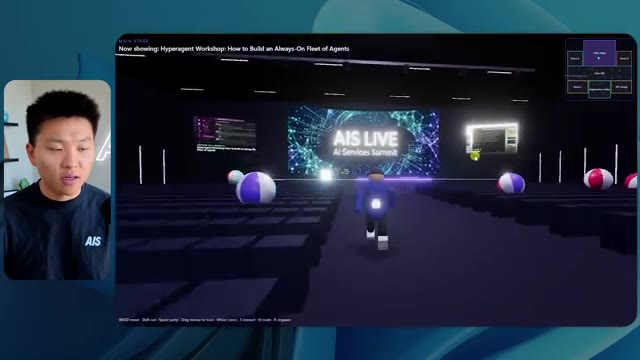
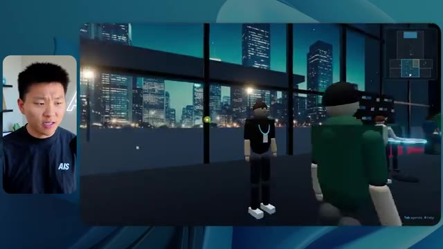
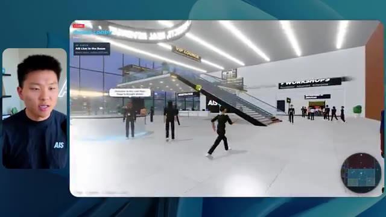

# 🎬 This AI Technology Will Replace Millions (Here's How to Prepare)

> **Chaîne** : [Nate Herk | AI Automation](https://www.youtube.com/@nateherk/featured)  
> **Lien YouTube** : [https://www.youtube.com/watch?v=Ums8suyAG1A](https://www.youtube.com/watch?v=Ums8suyAG1A)  
> **Date de publication** : 20260726  
> **Durée** : 00:14:03  
> **Identifiant vidéo** : `Ums8suyAG1A`  
> **Transcription & Analyse** : `whisper-v3-large-turbo+gemini-3.5-flash-lite`  

---

## 📌 Synthèse Exécutive & Outils

### 💡 Résumé

Dans cette vidéo issue de la chaîne de Nate Herk, l'analyse se penche sur l'évaluation comparative du modèle **Opus 5.5** d'Anthropic appliqué à un cas d'usage d'ingénierie logicielle complexe : transformer un dossier de 105 gigaoctets d'enregistrements vidéo (provenant de l'événement virtuel *AIS Live* via Frame.io) en un monde 3D interactif et explorable en vue à la troisième personne. L'expérience consiste à soumettre strictement le même prompt global à travers différents niveaux de configuration de l'effort d'inférence (allant du niveau "faible" jusqu'aux paliers supérieurs), afin de mesurer l'impact direct sur la qualité du code généré, le temps d'exécution, la consommation de tokens et le coût par API.

Les démonstrations révèlent des écarts saisissants dans les livrables. Au niveau d'effort "faible", l'agent produit un monde 3D fonctionnel mais grossier (bugs d'affichage, absence d'identité de marque, images fixes non lues, PNJ fantômes qui disparaissent) en 16 minutes pour environ 3,91 $ et 191k tokens. En passant au niveau "moyen", l'agent intègre avec succès la charte graphique de la marque, anime des PNJ réactifs, diffuse correctement les flux vidéo des ateliers et restitue des espaces scéniques cohérents (hall d'exposition, scène principale, salon VIP), au prix d'une exécution d'une heure et 13 minutes, pour un coût de 12,44 $ et 490k tokens. 

Fait notable pour ces deux niveaux d'exécution : l'agent a opéré de manière entièrement autonome sans poser la moindre question de clarification à l'utilisateur, s'appuyant uniquement sur ses vérifications itératives du navigateur (22 à 23 cycles de test). Cette expérimentation démontre la maturité croissante des agents IA pour le prototypage d'applications immersives tout en soulignant l'arbitrage critique entre complexité du rendu, consommation de ressources et temps de calcul.

### 🛠️ Outils, Modèles & Logiciels Présentés

* **Opus 5.5** : Modèle d'IA phare d'Anthropic, réputé pour sa vitesse, son coût abordable et ses performances de pointe dans les tâches d'ingénierie et de génération de code.
* **Anthropic** : Entreprise de recherche en IA et créatrice de la famille de modèles Claude, proposant des directives d'ingénierie de prompt basées sur le réglage de l'effort.
* **Effort Level (Faible, Moyen, Élevé, Extra, Max, Ultra Code)** : Paramètre de configuration des agents permettant de moduler la profondeur de réflexion, le temps de calcul et la rigueur d'exécution d'un modèle face à une tâche donnée.
* **Claude Code** : Outil de programmation et d'assistance au développement par ligne de commande d'Anthropic, utilisé comme environnement de travail pour exécuter les agents.
* **Frame.io** : Plateforme de collaboration vidéo et de gestion de médias, abritant ici le répertoire massif de 105 gigaoctets d'enregistrements bruts de l'événement *AIS Live*.
* **Herc 2** : Système d'exploitation IA propriétaire de Nate Herk, servant d'écosystème de ressources et d'outils interconnectés pour le développement d'applications.
* **Key.ai** : Service de génération d'images et de vidéos par IA sollicité par l'agent pour concevoir les éléments visuels du monde 3D.
* **Hostinger (Connecteur)** : Extension d'éditeur gratuite présentée comme sponsor, servant à combler le fossé entre les environnements de développement locaux (VS Code, Cursor, Claude Code, etc.) et le déploiement en ligne en un clic.
* **VS Code / Cursor** : Environnements de développement intégrés (IDE) compatibles avec les extensions de déploiement et d'automatisation logicielle.

### 🔑 Points Clés & Enseignements Stratégiques

* **Impact du niveau d'effort sur la qualité architecturale** : L'ajustement du niveau d'effort modifie radicalement la structure, la robustesse et la finition esthétique du code généré, transformant un prototype rudimentaire et buggé en une application riche et fonctionnelle.
* **Autonomie décisionnelle des agents** : À travers les tests présentés, les agents exécutent des prompts complexes et globaux de manière totalement autonome, accomplissant des tâches d'ingénierie d'envergure sans nécessiter de micro-management ni poser de questions intermédiaires à l'utilisateur.
* **Arbitrage coût-bénéfice des ressources** : Un effort accru (passage du niveau faible au niveau moyen) multiplie le temps d'exécution par plus de quatre (16 min vs 1h13) et triple le coût estimé par API (3,91 $ vs 12,44$), nécessitant d'évaluer la criticité du livrable avant de lancer des inférences lourdes.
* **Consommation de tokens proportionnelle** : La complexité de la tâche de génération 3D se traduit par une empreinte en tokens significative (de 191k à 490k tokens), soulignant la nécessité d'optimiser le contexte pour maîtriser les coûts de production à grande échelle.
* **Boucles de rétroaction et d'auto-vérification** : Les agents démontrent une capacité critique à valider leur travail en conditions réelles, illustrée par l'ouverture et le test répétés du navigateur (22 à 23 vérifications autonomes) pour s'assurer du bon rendu visuel.
* **Recommandation officielle de prompt engineering** : Selon les directives d'Anthropic, il est méthodologiquement recommandé de débuter les flux de travail complexes au niveau d'effort moyen, puis d'ajuster l'intensité à la hausse ou à la baisse selon la complexité réelle du livrable attendu.
* **Intégration fluide de données multimédias massives** : Les agents modernes parviennent à exploiter et structurer efficacement des volumes de données non structurées colossaux (105 Go de vidéos) pour les réinjecter de manière cohérente dans une interface interactive.
* **Conformité rigoureuse aux directives de marque** : Un niveau d'effort supérieur permet à l'IA de respecter fidèlement les chartes graphiques, les palettes de couleurs et l'identité visuelle d'une entreprise, éliminant les incohérences esthétiques inhérentes aux configurations minimales.
* **Gestion des PNJ et de la logique comportementale** : Les modèles de pointe parviennent à implémenter des éléments de logique d'interaction et de mouvement pour les personnages non-joueurs (PNJ), bien que des efforts de réglage fins restent nécessaires pour éviter les bugs d'affichage spatiaux.
* **Résolution du fossé entre code local et mise en production** : L'ingénierie logicielle assistée par IA se heurte structurellement à la friction du déploiement final ; l'utilisation de connecteurs natifs d'hébergement directement dans l'IDE fluidifie considérablement le passage d'un produit fini sur la machine à un site en ligne.

---

## ⏱️ Chronologie & Transcription Complète Audio & Visuelle (Mot pour Mot)

### ⏱️ `[00:00:00 - 00:00:20]` | Segment #01

**🔊 Audio (Transcription Intégrale Mot pour Mot en Français) :**
> Opus 5.5, Opus 5.5, Opus 5.5, Opus 5.5, Opus 5.5. Ce modèle est littéralement partout et pour de très bonnes raisons. Il est intelligent, il est bon marché, il a un goût incroyable, c'est un modèle d'IA incroyable. Mais avec chaque modèle d'IA, vous avez le choix de l'effort, que ce soit faible, moyen, élevé, extra, max ou ultra code.

**👁️ Analyse Visuelle d'Écran (gemini-3.5-flash-lite) :**
**Interface & Outils** : Twitter (X)

**Contenu textuel & Code** : Publication de réseau social avec une vidéo intégrée représentant un décor naturel insulaire en 3D.

**Action / Démonstration** : Présentation d'un exemple concret de création assistée par intelligence artificielle sur les réseaux sociaux.

*⏱️ 00:00:05 — Une capture d'écran d'un tweet montrant une vidéo de paysage tropical généré par IA, avec le texte sur les créatifs techniques.*

---

### ⏱️ `[00:00:20 - 00:00:38]` | Segment #02

**🔊 Audio (Transcription Intégrale Mot pour Mot en Français) :**
> Donc dans cette vidéo, j'ai donné exactement le même prompt à Opus 5.5 et je l'ai exécuté à chaque niveau d'effort, et nous allons comparer les résultats. Nous allons examiner la qualité de tous les différents résultats réels, mais nous allons aussi examiner le temps d'exécution de chacun d'eux, combien cela nous a coûté si c'était une facturation par API, le nombre total de tokens, combien de vérifications ils ont effectuées, et combien de questions ils m'ont réellement posées tout au long du processus.

**👁️ Analyse Visuelle d'Écran (gemini-3.5-flash-lite) :**
**Interface & Outils** : Tableau blanc ou application de notes/diagramme (type Miro ou Obsidian Canvas) avec des colonnes de niveaux d'effort.

**Contenu textuel & Code** : Tableau comparatif pour "Opus 5.5 Efforts" avec les lignes : Run time, API cost, Total tokens, Checks, Questions asked.

**Action / Démonstration** : Présentation du tableau comparatif évaluant l'impact des différents niveaux d'effort d'Opus 5.5 sur le temps d'exécution, le coût et les performances.

*⏱️ 00:00:29 — Un tableau comparatif sur un espace de travail montrant différents niveaux d'effort (Low, Medium, High, Extra, Max, Ultracode) et des métriques (Run time, API cost, Total tokens, etc.).*

---

### ⏱️ `[00:00:39 - 00:00:58]` | Segment #03

**🔊 Audio (Transcription Intégrale Mot pour Mot en Français) :**
> Et les résultats qu'on a obtenus ne sont pas du tout ce à quoi je m'attends, donc j'ai hâte de partager ça avec vous les gars. Ne perdons pas de temps et entrons directement dans le vif du sujet. Bon, alors passons directement à celui-ci. Je veux commencer juste en vous montrant le prompt réel qu'on a utilisé, qu'on a donné à chacun de ces différents agents. Je vais aller dans les fichiers par ici, et nous allons ouvrir ce fichier markdown de prompt, et je vais vous montrer ce qu'on a obtenu. Donc voici le slash objectif que j'ai fourni.

**👁️ Analyse Visuelle d'Écran (gemini-3.5-flash-lite) :**
**Interface & Outils** : Interface de développement / application LLM (style Claude Code / CLI web avec panneau latéral)

**Contenu textuel & Code** : Texte du prompt initial de l'assistant : « Hi Nate. This worktree has the effort-test task queued in PROMPT.md : build a walkable third-person 3D world... » et barre de saisie de commandes en bas.

**Action / Démonstration** : Affichage de l'interface de l'outil de développement avec le prompt initial de l'agent IA à l'écran.

*⏱️ 00:00:48 — Interface d'une application de type assistant IA (Claude Code / interface de développement) avec une vue de code, un panneau latéral listant des sessions (effort-test, Hello, Session logs cost analysis) et le présentateur incrusté en miniature dans un coin.*

---

### ⏱️ `[00:00:58 - 00:01:34]` | Segment #04

**🔊 Audio (Transcription Intégrale Mot pour Mot en Français) :**
> J'ai dit, tu dois me créer un monde 3D qui est une conférence tech réaliste dans laquelle je peux me promener en vue à la troisième personne. Tu vas regarder ce dossier, qui contient mes ressources d'enregistrement d'événements de AIS Live. Et ce dossier est un dossier frame IO de 105 gigaoctets d'enregistrements vidéo. C'était un événement entièrement virtuel. Tout a été enregistré et tous les enregistrements sont juste ici. J'ai dit, ton objectif est de prendre cet événement et de le transformer en un monde 3D explorable qui me donne l'impression d'être réellement allé à une vraie conférence en personne avec différentes salles, différentes pistes, différentes scènes, bla, bla, bla. N'hésite pas à utiliser key.ai si tu as besoin de générer des images ou des vidéos. Et tu peux aussi utiliser tout le reste à l'intérieur de mon projet Herc 2, qui est comme mon système d'exploitation IA. J'ai dit,

**👁️ Analyse Visuelle d'Écran (gemini-3.5-flash-lite) :**
**Interface & Outils** : VS Code et navigateur web affichant Frame.io

**Contenu textuel & Code** : Fichier Markdown PROMPT.md avec instructions détaillées pour l'IA et lien Frame.io (https://f.io/sPdlo-Si)

**Action / Démonstration** : Présentation du prompt initial demandant la conversion d'un événement virtuel en monde 3D explorable et visualisation du dossier source Frame.io de 105 Go

*⏱️ 00:01:07 — Éditeur de code affichant le fichier PROMPT.md contenant les instructions pour créer un monde 3D de conférence tech basé sur des ressources Frame.io.*

*⏱️ 00:01:16 — Interface Frame.io montrant un dossier d'enregistrements d'événements AIS Live d'une taille de 105,69 Go avec des sous-dossiers GA Access et VIP Access.*

*⏱️ 00:01:25 — Vue identique à l'image 1 de l'éditeur de code affichant le fichier de prompt détaillé.*

---

### ⏱️ `[00:01:34 - 00:02:08]` | Segment #05

**🔊 Audio (Transcription Intégrale Mot pour Mot en Français) :**
> vous serez jugé sur la créativité, le design, la physique et la sensation générale lorsque j'explorerai le monde 3D que vous avez construit. Et c'était fondamentalement la fin des instructions. Donc, comme vous pouvez le voir sur ce côté gauche, j'ai exécuté cela à travers tous les différents niveaux d'effort. Commençons par le niveau bas et montons jusqu'à ultra code. Très bien. Nous avons donc ici le résultat du niveau bas. Ouvrons ceci et jetons un œil. Nous avons donc AIS live, le sommet des services IA en personne enfin, et nous avons pu cliquer partout. Tout d'abord, on ne sent pas vraiment l'identité de la marque. Genre, ce n'ha pas le logo d'IS Live. Ce n'est même pas nos couleurs. Donc je n'aime pas trop ça, mais entrons ici. D'accord. C'est beaucoup trop lumineux. Euh, nous avons une carte en haut à droite. Nous avons une ville par ici. Je ne peux pas dire quelle ville c'est

**👁️ Analyse Visuelle d'Écran (gemini-3.5-flash-lite) :**
**Interface & Outils** : Interface web d'un assistant IA / application de développement

**Contenu textuel & Code** : Texte du prompt demandant de construire un monde 3D walkable en vue à la troisième personne pour la conférence AIS Live, et la liste des sessions dans le menu de gauche.

**Action / Démonstration** : Le présentateur survole ou sélectionne les différents niveaux de test d'effort dans le panneau latéral gauche.

*⏱️ 00:01:42 — Capture d'écran montrant l'interface d'un assistant IA avec un panneau latéral à gauche listant différents niveaux de tests d'effort ('Hello', 'Extra', 'High', 'Max', 'Ultracode', 'Medium', 'Low') et une conversation active dans le panneau principal concernant la création d'un monde 3D.*

---

### ⏱️ `[00:02:08 - 00:02:40]` | Segment #06

**🔊 Audio (Transcription Intégrale Mot pour Mot en Français) :**
> c'est. D'accord. C'est Chicago, ce qui est plutôt cool parce que tu sais, j'habite à Chicago, mais bref, en haut à droite, on peut voir une carte. Nous avons un hall d'accueil. Nous avons un hall d'exposition. Nous avons un salon VIP sur la scène principale. La carte montre également où se trouve chaque autre personne et cela se synchronise en direct. On peut donc voir l'enregistrement. On peut voir le premier jour, la keynote de l'hyper agent, le débriefing en direct. Cool. Donc ça connaît réellement l'agenda et puis il y a le deuxième jour. Donc il a trouvé ça, c'est bien. Nous avons ces petites boules ici que je peux espérer botter. D'accord. Le visage, Oh, regarde ça. Si je vais par ici, tous les gens disparaissent tout simplement. Très mauvais. Très mauvais. D'accord. Alors voyons voir. Est-ce que je peux sprinter ? D'accord.

**👁️ Analyse Visuelle d'Écran (gemini-3.5-flash-lite) :**
**Interface & Outils** : Application web 3D interactive (metaverse / plateforme événementielle virtuelle).

**Contenu textuel & Code** : Programme d'événement virtuel, cartes de navigation, avatars et environnements 3D.

**Action / Démonstration** : Navigation et exploration de l'espace virtuel par le présentateur.

---

### ⏱️ `[00:02:40 - 00:03:04]` | Segment #07

**🔊 Audio (Transcription Intégrale Mot pour Mot en Français) :**
> Je peux avancer un peu plus vite. Je vais d'abord aller par ici. Il y a des goodies, euh, le badge certifié AIS plus glido. D'accord. Donc il y a les stands réels qu'on avait dans l'événement virtuel. On avait des stands. Donc c'est plutôt cool. Un petit endroit pour prendre des photos. Salle C. En ce moment, nous avons Tangy Frederick qui anime un atelier. D'accord. Mais ce n'est pas une vidéo. Comme vous pouvez le voir, c'est juste une image. Elle ne bouge pas. C'est donc juste une image. Ces gens sont en train de disparaître. Ce doivent être des fantômes. Allons par ici vers la salle A.

**👁️ Analyse Visuelle d'Écran (gemini-3.5-flash-lite) :**
**Interface & Outils** : Environnement virtuel 3D interactif (plateforme d'événement virtuel).

**Contenu textuel & Code** : Aucun code source, terminal ou prompt visible, uniquement des éléments de navigation 3D et des panneaux informatifs.

**Action / Démonstration** : Exploration et déplacement de l'avatar dans l'espace virtuel de l'événement.

---

### ⏱️ `[00:03:04 - 00:03:30]` | Segment #08

**🔊 Audio (Transcription Intégrale Mot pour Mot en Français) :**
> Nous avons Liberty White. D'accord. Très cool. Vos 30 premiers jours en automatisation. Encore une fois, c'est juste une image fixe et les gens ont des bugs d'affichage. Donc ce n'est pas très bien ici. Je vais aller sur la scène principale et voir ce que nous avons. D'accord, cool. Donc nous avons une scène d'apparence principale. Les gens ont des bugs d'affichage. Vraiment grave. Ce n'est vraiment pas terrible. Notre vidéo est en fait en train de bouger. Genre, j'ai vu mon visage ici et j'ai vu celui de Devin, mais maintenant ils ont disparu. Donc je ne sais pas ce qui s'est passé. D'accord. C'est, on dirait plutôt un diaporama. Rien n'est vraiment lu pour l'instant. Bref, entrons ici.

**👁️ Analyse Visuelle d'Écran (gemini-3.5-flash-lite) :**
**Interface & Outils** : Application ou plateforme virtuelle 3D (type Gather.town ou environnement Metavers) avec interface d'auditorium.

**Contenu textuel & Code** : Texte affiché : "Now showing: Hyperagent Workshop: How to Build an Always-On Fleet of Agents" et le logo "AIS LIVE AI Services Summit".

**Action / Démonstration** : Le présentateur navigue et explore la scène principale de l'événement virtuel en 3D.

*⏱️ 00:03:17 — Navigation dans un espace virtuel 3D montrant l'auditorium principal ("Main Stage") rempli d'avatars.*

*⏱️ 00:03:24 — Vue face à la scène principale affichant le logo "AIS LIVE AI Services Summit" et le présentateur en médaillon.*

---

### ⏱️ `[00:03:30 - 00:03:58]` | Segment #09

**🔊 Audio (Transcription Intégrale Mot pour Mot en Français) :**
> Nous avons d'autres stands. Nous avons hyper agent. Nous avons Claude Code. Nous avons plus de cadeaux publicitaires. La salle B, c'est Dave Ebelor. Je suppose que c'est exactement la même chose. Nous avons du café. Et ensuite, je suppose, le salon VIP, accès VIP seulement. C'est plutôt cool, mais il n'y a vraiment rien qui se passe ici. Cet écran est beaucoup trop lumineux. D'accord. Donc je pense que vous comprenez l'ambiance que nous obtenons ici de la part d'Opus 5.5 en faible effort. Et c'est là que les choses deviennent intéressantes. Combien de temps pensez-vous que cela a duré ? Combien de temps ? Celui-ci a duré 16 minutes et 43 secondes. Combien pensez-vous que cela a coûté ?

**👁️ Analyse Visuelle d'Écran (gemini-3.5-flash-lite) :**
**Interface & Outils** : Interface web / Tableau de bord (Opus 5.5 Efforts)

**Contenu textuel & Code** : Tableau avec les colonnes Low, Medium, High, Extra, Max, Ultracode et les lignes Run time, API cost, Total tokens, Checks, Questions asked.

**Action / Démonstration** : Présentation ou analyse d'un tableau comparatif des performances de l'agent.

*⏱️ 00:03:51 — Un tableau comparatif sur une interface web intitulé 'Opus 5.5 Efforts' avec des niveaux de Low à Ultracode.*

---

### ⏱️ `[00:03:58 - 00:04:26]` | Segment #10

**🔊 Audio (Transcription Intégrale Mot pour Mot en Français) :**
> 3,91 dollars si c'était une facturation par API. J'utilise évidemment mon abonnement ici, mais nous allons simplement calculer cela avec la facturation par API. Le total des jetons était de 191 000. Il a fait 22 vérifications. Donc pour la vérification, il a ouvert le navigateur 22 fois et a exécuté différents types de vérifications. Donc 22 catégories de vérifications. Et combien de questions m'a-t-il posées ? Il m'a posé un total de zéro question tout au long de cette invite de commande globale. D'accord. Alors, ouvrons l'effort moyen et voyons ce que nous avons obtenu. D'accord, y voilà. Effort moyen. Nous avons Nate Herc. Nous avons mon badge. C'est de la marque AI's Life.

**👁️ Analyse Visuelle d'Écran (gemini-3.5-flash-lite) :**
**Interface & Outils** : Application de tableau blanc / diagramme (Excalidraw ou similaire) avec le présentateur en incrustation vidéo à gauche.

**Contenu textuel & Code** : Tableau avec les lignes : Run time (16m 43s), API cost ($3.91), Total tokens (191.3K), Checks, et Questions asked.

**Action / Démonstration** : Le présentateur explique les métriques de coût et d'utilisation des tokens affichées dans le tableau comparatif.

*⏱️ 00:04:05 — Un tableau comparatif sur un tableau blanc virtuel montrant les coûts et performances pour différents niveaux (Low, Medium, High).*

---

### ⏱️ `[00:04:26 - 00:04:46]` | Segment #11

**🔊 Audio (Transcription Intégrale Mot pour Mot en Français) :**
> Donc ça a déjà l'air un petit peu mieux. Ça ressemble à nos palettes de couleurs qui ont utilisé nos directives de marque. Premier jour de construction, deuxième jour de gain, VIP. Cool. D'accord. Je vais entrer dans le lieu. D'accord. Waouh. Une ambiance similaire, en somme. C'est en arrière-plan. Ça ne ressemble pas à Chicago, hein ? Non, ça ressemble à, honnêtement, ça ressemble à une ville imaginaire. Quoi qu'il en soit, c'est marrant qu'ils aient décidé de faire ça. Voyons si je peux avancer un peu plus vite. Oh, waouh.

**👁️ Analyse Visuelle d'Écran (gemini-3.5-flash-lite) :**
**Interface & Outils** : Application web interactive / Environnement virtuel 3D (AIS Live)

**Contenu textuel & Code** : Écran d'accueil de l'événement virtuel avec badges, options de navigation, et interface de simulation 3D avec avatars.

**Action / Démonstration** : Le présentateur navigue dans l'interface et entre dans le lieu virtuel de l'événement.

*⏱️ 00:04:31 — Interface web de l'application 'AIS Live' montrant un badge nominatif virtuel pour 'NATE HERK' et un bouton 'ENTER THE VENUE'.*

*⏱️ 00:04:41 — Vue à la première ou troisième personne à l'intérieur du lieu virtuel 'AIS Live', représentant un espace de type lounge avec des avatars et une grande baie vitrée donnant sur une ville de nuit.*

---

### ⏱️ `[00:04:46 - 00:05:21]` | Segment #12

**🔊 Audio (Transcription Intégrale Mot pour Mot en Français) :**
> Les gens interagissent avec moi. Regardez. Si je m'approche de ce type, il vient de lever le bras. Bon, maintenant il ne veut plus du tout avoir affaire à moi. Mais tous ces petits robots ici doivent prendre des décisions. Je ne suis pas sûr qu'ils utilisent Jev. C'est sûr que non. Je ne lui ai pas dit de le faire. En fait, ma clé Jev est à l'arrière. Je ne sais pas. Peut-être qu'il l'a utilisée. Quoi qu'il en soit, nous pouvons voir ici que nous avons la salle d'atelier C, le laboratoire des agents. Sympa. Donc celui-ci est en fait en train de fonctionner. Vous pouvez voir qu'il s'agit d'une vraie vidéo lue par Tangy. Tout le monde ici est en train de travailler sur un ordinateur portable. Ils ne buguent pas. C'est plutôt cool. De plus, mon badge est sur ma poitrine, ce qui est plutôt cool. Je peux venir par ici. Nous avons une carte en haut à droite, comme vous pouvez le voir, mais je peux venir par ici. Nous avons un

**👁️ Analyse Visuelle d'Écran (gemini-3.5-flash-lite) :**
**Interface & Outils** : Environnement virtuel 3D de type métaverse / plateforme de réunion virtuelle (Gather ou similaire).

**Contenu textuel & Code** : Interface graphique d'un espace virtuel montrant des avatars et des indications textuelles ("Agents Lab", "Enterprise AI Services").

**Action / Démonstration** : Navigation et exploration de l'espace virtuel par le présentateur sous forme d'avatar 3D.

---

### ⏱️ `[00:05:21 - 00:05:47]` | Segment #13

**🔊 Audio (Transcription Intégrale Mot pour Mot en Français) :**
> hall d'exposition. C'est là que nous avons le stand Glido. Et ça diffuse en ce moment. Oui, ça diffuse la vidéo de nous parlant de Glido. Ça diffuse la vidéo d'Ed et moi parlant de notre programme de certification. Nous avons le logo AIS Plus juste ici, qui est placé dans un endroit un peu bizarre. Ce sont les diapositives et les points clés des conférenciers. Alors wouah, ce sont toutes les ressources que nous avons distribuées après l'événement. Elles sont toutes affichées là aussi. On peut voir que nous avons un projecteur de communauté. Donc c'est Aiden qui parle de son contrat qu'il a décroché et ça se joue en direct. Ces gens sont en train de regarder.

**👁️ Analyse Visuelle d'Écran (gemini-3.5-flash-lite) :**
**Interface & Outils** : Environnement virtuel 3D (plateforme de type salon ou conférence virtuelle)

**Contenu textuel & Code** : Écrans virtuels affichant du texte et des présentations dans le métavers

**Action / Démonstration** : Navigation et déplacement d'un avatar dans le hall d'exposition virtuel

---

### ⏱️ `[00:05:47 - 00:06:21]` | Segment #14

**🔊 Audio (Transcription Intégrale Mot pour Mot en Français) :**
> Ils sont plutôt engagés. On a hyper agent. C'était, c'est ce que je voulais dire. Si vous avez vu ces gens lever les mains pour dire bonjour, c'était plutôt drôle. Regardez, regardez, le voilà qui recommence. Bref. D'accord. Où est-ce que je suis maintenant ? Maintenant, je suis dans le hall principal. On a un bar à café. On a un grand logo, qui est le vrai logo. C'est trop lumineux, mais on a le logo. On peut voir si on peut entrer ici dans le parcours des fondations. On a Sabrina Romanov et Liberty White. Donc différentes formations juste là. On peut entrer dans cette salle. C'est le parcours avancé. Alors, qu'est-ce qui se passe ici ? On a Dave Ebelar et Saman qui parlent de différentes choses là-dedans. Et maintenant, allons jeter un œil à la scène principale. Oh, attendez, il y a une vidéo de moi là-haut. C'est genre un VIP

**👁️ Analyse Visuelle d'Écran (gemini-3.5-flash-lite) :**
**Interface & Outils** : Application web interactive / Environnement virtuel 3D de type métavers ou plateforme d'événements.

**Contenu textuel & Code** : Interface utilisateur affichant une carte miniature, des indications textuelles ('Main Lobby') et des avatars de participants.

**Action / Démonstration** : Navigation et exploration de l'espace virtuel interactif par le présentateur.

*⏱️ 00:05:55 — Vue dans le hall principal virtuel d'une plateforme en ligne avec des avatars d'utilisateurs et une mini-carte.*

*⏱️ 00:06:04 — Navigation vers une salle de conférence ou une zone de présentation au sein de l'environnement virtuel 3D.*

*⏱️ 00:06:12 — Vue d'ensemble montrant des participants sous forme d'avatairs regroupés autour de tables dans l'espace virtuel.*

---

### ⏱️ `[00:06:21 - 00:06:50]` | Segment #15

**🔊 Audio (Transcription Intégrale Mot pour Mot en Français) :**
> section ? Ouais, on va aller voir ça dans une minute. Mais bref, voici la scène principale. Ça a l'air très, très bien. On a une grande scène. On a genre quatre personnes assises ici. On a les trois écrans d'Alex là-haut avec l'hyper agent. Est-ce que j'ai le droit de monter sur scène ? Oh, et il me laisse monter sur scène. OK. C'est plutôt sympa. Bon, les gars, faisons un selfie. Laissez-moi prendre tout le monde en arrière-plan. Venez par ici. Bref, c'est plutôt, plutôt cool. Par contre, toutes les places ne sont pas occupées. Donc il faut qu'on travaille là-dessus. Mais bref, je vais courir voir ce qu'était cette section VIP. OK. Le salon VIP. J'ai l'impression que c'est comme un salon d'aéroport ou un truc comme ça.

**👁️ Analyse Visuelle d'Écran (gemini-3.5-flash-lite) :**
**Interface & Outils** : Environnement virtuel 3D de type métavers / plateforme de conférence (Hyperagent Keynote).

**Contenu textuel & Code** : Interface utilisateur affichant les informations de la session « Hyperagent Keynote » et un mini-carte en haut à droite.

**Action / Démonstration** : Navigation et déplacement de l'avatar de l'utilisateur à l'intérieur de l'auditorium virtuel.

---

### ⏱️ `[00:06:51 - 00:07:14]` | Segment #16

**🔊 Audio (Transcription Intégrale Mot pour Mot en Français) :**
> Ok, super. Donc maintenant nous avons les sessions VIP ici. Une foire aux questions VIP avec Nate, lecture vidéo en direct juste ici. Très, très cool. Et nous avons comme un bar ou quelque chose du genre. Génial. Je dirais que c'est un très bon résultat. Maintenant, en ce qui concerne les statistiques ici, celle-ci a pris une heure et 13 minutes à s'exécuter. Cela nous aurait coûté 12 dollars et 44 cents. Elle a utilisé 490 000 jetons et elle a effectué 23 vérifications.

**👁️ Analyse Visuelle d'Écran (gemini-3.5-flash-lite) :**
**Interface & Outils** : Espace virtuel 3D et tableau de bord de statistiques Opus 5.5 Efforts.

**Contenu textuel & Code** : Vidéo en direct "VIP Q&A with Nate", et statistiques de run time, coût API, total des tokens et vérifications.

**Action / Démonstration** : Navigation et présentation des fonctionnalités de l'espace virtuel VIP, puis passage à l'analyse des statistiques d'exécution.

*⏱️ 00:06:56 — L'écran montre un espace virtuel 3D de salon VIP avec un écran géant diffusant une vidéo de questions-réponses et un bar en arrière-plan.*

*⏱️ 00:07:02 — L'écran présente un tableau de statistiques de performance (Opus 5.5 Efforts) affichant le temps d'exécution (16m 43s), le coût API ($3.91) et le nombre total de tokens (191.3K).*

---

### ⏱️ `[00:07:14 - 00:07:48]` | Segment #17

**🔊 Audio (Transcription Intégrale Mot pour Mot en Français) :**
> Et il nous a posé un total de zéro question une fois de plus. Très bien, passons au niveau élevé. C'était déjà un résultat plutôt correct, et Anthropic eux-mêmes dans leur vidéo sur la façon de prompter Opus 5.5, ou désolé, pas une vidéo, un article. Ils ont dit de commencer simplement par le niveau moyen et de l'ajuster à la hausse ou à la baisse si nécessaire. C'était donc un résultat moyen. Passons au niveau élevé et voyons ce qu'on a obtenu. Très rapidement, les gars, je dois prendre une seconde pour vous parler du sponsor de la vidéo d'aujourd'hui, Hostinger. Donc ces deux modèles viennent de me construire une version fonctionnelle de la même chose. Et maintenant, je suis exactement là où je finis toujours, avec un produit fini sur mon ordinateur portable et aucun moyen rapide de le mettre en ligne. Et c'est le fossé que le connecteur d'Hostinger comble. C'est une extension gratuite

**👁️ Analyse Visuelle d'Écran (gemini-3.5-flash-lite) :**
**Interface & Outils** : Tableau de bord de métriques et interface de développement de type IDE/chat.

**Contenu textuel & Code** : Tableau comparatif de performances (Run time, API cost, Total tokens, Checks, Questions asked) et prompt de création d'un calculateur ROI.

**Action / Démonstration** : Analyse comparative des coûts et des performances de différents niveaux d'effort d'IA.

*⏱️ 00:07:22 — Un tableau comparatif montrant les métriques de performance pour différents niveaux d'effort (Low, Medium, High, Extra) avec les temps d'exécution et les coûts d'API.*

*⏱️ 00:07:39 — Une interface de développement avec un éditeur de code et un panneau de chat montrant la génération d'un calculateur de ROI en HTML/JS.*

---

### ⏱️ `[00:07:48 - 00:08:23]` | Segment #18

**🔊 Audio (Transcription Intégrale Mot pour Mot en Français) :**
> pour votre éditeur qui intègre votre compte Hostinger dans l'outil de programmation que vous utilisez déjà, que ce soit VS Code, Cursor, Cloud Code, Codex, et j'en passe. Vous vous connectez une seule fois en un clic, et à partir de là, votre agent peut déployer le site, y associer un domaine, configurer les enregistrements DNS et vérifier votre VPS sans que vous n'ayez jamais à quitter l'éditeur. Ainsi, peu importe celui de ces outils que vous finirez par préférer, ce qu'il a construit n'est qu'à quelques minutes d'une véritable URL sur un hébergement géré. Le connecteur est gratuit avec chaque formule d'hébergement. Donc, si vous avez toujours besoin de l'hébergement sous-jacent, profitez de la formule illimitée grâce au lien dans la description et utilisez le code NATEHERK pour obtenir 10 % de réduction. Cela inclut également un nom de domaine gratuit et un e-mail professionnel pour un an. Et c'est toujours le moyen le plus économique que j'ai trouvé pour obtenir quelque

**👁️ Analyse Visuelle d'Écran (gemini-3.5-flash-lite) :**
**Interface & Outils** : Interface web d'intégration Hostinger (Manage Hostinger from your IDE) et interface Claude Code.

**Contenu textuel & Code** : Statut "Connected", mention "VIA OAUTH", version Node.js 24.13.0, et liste des outils disponibles (Websites avec 154 tools, Domains avec 49 tools).

**Action / Démonstration** : Connexion unique validée permettant à l'assistant d'accéder aux fonctionnalités de gestion Hostinger (déploiement, domaines, abonnements).

*⏱️ 00:07:57 — Interface montrant la connexion réussie de Hostinger depuis un IDE via OAuth, avec les outils disponibles (Websites, Domains, Subscriptions, Email Marketing) et Claude Code dans le panneau de droite.*

---

### ⏱️ `[00:08:23 - 00:08:47]` | Segment #19

**🔊 Audio (Transcription Intégrale Mot pour Mot en Français) :**
> tu as construit sur une vraie URL. Donc revenons à la vidéo. D'accord. Encore une fois, très, très thématisé par la marque. C'est un écran de chargement encore meilleur que le précédent. Nous avons ce petit effet sympa en arrière-plan. Nous avons le logo. Nous allons entrer dans le lieu. D'accord. Nous y voilà. Ça a l'air plutôt bien. Nous commençons à l'extérieur et tu peux voir que nous avons ces drapeaux pour tous les intervenants, Wyatt, Casper, Alex, Ed, Aiden, Sabrina, Liberty. C'est plutôt cool. Nous avons des blocs en direct ici.

**👁️ Analyse Visuelle d'Écran (gemini-3.5-flash-lite) :**
**Interface & Outils** : Navigateur web / Application web 3D immersive (AIS LIVE)

**Contenu textuel & Code** : Interface utilisateur avec logo AIS LIVE, instructions de contrôle clavier/souris et bannières interactives d'événements.

**Action / Démonstration** : Navigation et exploration de l'espace virtuel 3D de la conférence.

*⏱️ 00:08:29 — Écran de chargement et d'accueil de la plateforme virtuelle 'AIS LIVE' avec le bouton 'Enter the Venue'.*

*⏱️ 00:08:35 — Vue dans le monde virtuel 3D de 'AIS Live Plaza' avec des avatars et des bâtiments urbains en arrière-plan.*

*⏱️ 00:08:41 — Progression dans la plaza virtuelle 'AIS Live Plaza' avec des bannières verticales affichant les noms des intervenants.*

---

### ⏱️ `[00:08:47 - 00:09:23]` | Segment #20

**🔊 Audio (Transcription Intégrale Mot pour Mot en Français) :**
> il a pris cette photo de moi, votre hôte, Nate Herc, John, Dave, Nate Herc. Voilà. D'accord. Les portes. Génial. Ce sont des portes coulissantes automatiques en verre. J'adore ça. Nous pouvons voir l'enregistrement VIP. Nous pouvons voir l'admission générale. Nous pouvons venir ici et nous pouvons découvrir l'exposition avec différents stands, le projecteur sur la communauté. Vous pouvez également voir qu'en haut à gauche, j'ai un passeport. Donc c'est comme si, cela montrera combien d'endroits j'ai visités. Tout cela est une vraie lecture. Nous avons un mur de ressources avec tous les différents intervenants. Ils ont également une session de réseautage ici. Je vais donc venir très vite et voir de quoi il s'agit. Nous avons donc le bar à cold brew AIS. Nous avons différents membres de la communauté qui ont été mis en avant ou mis en lumière.

**👁️ Analyse Visuelle d'Écran (gemini-3.5-flash-lite) :**
**Interface & Outils** : Application ou plateforme virtuelle 3D interactive (environnement virtuel d'événement).

**Contenu textuel & Code** : Éléments graphiques d'interface utilisateur 3D, menus de navigation, bannières d'événements et avatars virtuels.

**Action / Démonstration** : Exploration et navigation en vue subjective/troisième personne dans l'espace virtuel 3D de la conférence.

*⏱️ 00:08:56 — Vue d'un monde virtuel 3D montrant l'accueil d'un événement ('Registration Concourse' et 'VIP Check-In') avec le présentateur incrusté à gauche.*

*⏱️ 00:09:05 — Navigation dans l'exposition virtuelle 3D ('Expo Hall') avec des avatars et des stands d'information.*

*⏱️ 00:09:14 — Déplacement d'avatars dans le hall d'inscription virtuel de l'événement en ligne.*

---

### ⏱️ `[00:09:23 - 00:09:56]` | Segment #21

**🔊 Audio (Transcription Intégrale Mot pour Mot en Français) :**
> On a la zone VIP. Attends, quoi ? Prends un bracelet. Ah, je dois vraiment aller chercher le bracelet. D'accord. Laisse-moi m'enregistrer rapidement. Le bracelet est déjà mis. Attends, quoi ? D'accord. Oh, d'accord. Maintenant, les portes se sont ouvertes pour moi. Cool. Je peux entrer ici. Oh, ça mène juste à la scène principale. Salon VIP. Il y a une séance de questions-réponses en cours. Ça a l'air très cool. Je veux dire, je suis très impressionné par la façon dont il parvient à faire ça. Waouh. D'accord. Donc c'est vraiment bien. Ce qu'on a fait, c'est qu'on a eu des salles de discussion VIP avec différentes personnes. Tu peux voir qu'il y a différentes salles, différents membres de l'équipe AIS qui vont dans des trucs. C'est vraiment cool. C'est très cool. C'est un bien meilleur VIP

**👁️ Analyse Visuelle d'Écran (gemini-3.5-flash-lite) :**
**Interface & Outils** : Environnement virtuel 3D interactif de type salon/conférence en ligne.

**Contenu textuel & Code** : Éléments textuels et visuels de l'interface virtuelle (menus de navigation, cartes, badges de statut, écrans de projection).
[DESC_IMAGE_1] Navigation d'un avatar dans un espace d'événement virtuel.

**Action / Démonstration** : Explications face caméra et démonstration conceptuelle.

*⏱️ 00:09:32 — Vue d'un espace virtuel 3D avec un avatar se déplaçant dans le hall d'enregistrement (Registration Concourse).*

*⏱️ 00:09:40 — Vue de l'intérieur de la "VIP Lounge" virtuelle montrant des avatars assis et un écran affichant une visioconférence.*

*⏱️ 00:09:48 — Vue de l'espace "VIP Working Sessions" dans le monde virtuel avec plusieurs salles thématiques ("Price It Right", "Turn Your Expertise into a Service", "Land Your First Paying Client").*

---

### ⏱️ `[00:09:56 - 00:10:30]` | Segment #22

**🔊 Audio (Transcription Intégrale Mot pour Mot en Français) :**
> expérience que ce qui a été montré dans la première partie. D'accord. After party VIP. Regardez ça. On a une piste de danse. On a tous ces éléments ici. On a la lecture de l'after party VIP juste ici. Et il y a une estrade de DJ. C'est trop marrant. Il y a un petit bug ici, un petit glitch ici, mais c'est génial. Oh, cool. Donc quand je suis ici sur la scène principale, on a des sous-titres. Vous pouvez voir juste ici en bas de mon écran, on a ces sous-titres de Wyatt qui est en train de parler ici. On a des lumières. On a le panneau. Très cool. Belle scène principale. Je vais aller ici. On peut aller à la fondation,

**👁️ Analyse Visuelle d'Écran (gemini-3.5-flash-lite) :**
**Interface & Outils** : Application web de métaverse / plateforme d'événements virtuels en 3D.

**Contenu textuel & Code** : Interface utilisateur virtuelle affichant les zones, passeports et commandes de navigation.

**Action / Démonstration** : Navigation et exploration d'un environnement virtuel 3D avec des avatars.

*⏱️ 00:10:04 — Vue d'un espace virtuel d'after-party avec des avatars dansants et un grand écran vidéo.*

*⏱️ 00:10:13 — Vue de l'after-party VIP montrant les participants virtuels, une estrade de DJ et des ballons de plage.*

*⏱️ 00:10:21 — Vue de la scène principale d'une conférence virtuelle avec des spectateurs assis et une présentation vidéo.*

---

### ⏱️ `[00:10:30 - 00:11:06]` | Segment #23

**🔊 Audio (Transcription Intégrale Mot pour Mot en Français) :**
> avancé, et les parcours d'entreprise par ici. Alors voyons voir. Nous avons l'anatomie de trois vraies transactions. Nous avons l'hyper agent. Nous avons les évaluations avec Nate et Ed ici. Nous avons Dave qui s'occupe des trucs avancés. C'est vraiment bien. Je veux dire, évidemment, chacun, chacun de ces résultats jusqu'à présent, faible était correct. Moyen était meilleur. Élevé a été encore meilleur. Voyons si cette tendance se poursuit et allons voir ce que cela nous a coûté. Donc, élevé a fonctionné pendant une heure et sept minutes. Donc un peu plus rapide que moyen, cela nous aurait coûté 16 dollars et 31 cents. Il a utilisé un demi-million de tokens, 509 000. Il a fait 22 vérifications. Et il nous a aussi demandé, enfin, non, je me suis trompé. Ce

**👁️ Analyse Visuelle d'Écran (gemini-3.5-flash-lite) :**
**Interface & Outils** : Présentation ou face-caméra explicatif sans interface logicielle partagée.

**Contenu textuel & Code** : Explications orales et mise en contexte méthodologique.

**Action / Démonstration** : Explications face caméra et démonstration conceptuelle.

---

### ⏱️ `[00:11:06 - 00:11:25]` | Segment #24

**🔊 Audio (Transcription Intégrale Mot pour Mot en Français) :**
> l'un m'a posé une question et, spoiler, c'était le seul qui nous a posé une question tout au long de tout ça. Donc voyons, il nous en reste trois : extra, max et ultra code. Laissez-moi ouvrir extra et nous verrons ce que nous avons. D'accord. Donc celui-ci a l'air plutôt bien. Je dirais honnêtement que jusqu'à présent, l'écran de chargement haut était le meilleur. Celui que nous venons de voir, mais bref, entrons dans AIS live.

**👁️ Analyse Visuelle d'Écran (gemini-3.5-flash-lite) :**
**Interface & Outils** : Application de tableau de bord ou canevas visuel (intitulé 'Opus 5.5 Efforts').

**Contenu textuel & Code** : Tableau avec des colonnes Low, Medium, High, Extra et des lignes Run time, API cost, Total tokens, Checks, Questions asked.

**Action / Démonstration** : Le présentateur commente les résultats affichés dans le tableau pour la catégorie 'Extra'.

*⏱️ 00:11:11 — Un tableau comparatif montrant les métriques de performance et de coût pour différents niveaux (Low, Medium, High, Extra), incluant le temps d'exécution, le coût API, le nombre total de tokens, les vérifications et les questions posées.*

---

### ⏱️ `[00:11:26 - 00:11:51]` | Segment #25

**🔊 Audio (Transcription Intégrale Mot pour Mot en Français) :**
> Whoa. D'accord. Donc on a genre des petits extraits sonores. Je peux discuter avec des gens. Le panneau sur la guerre des outils a réglé quelques débats pour moi. Sympa. Bonne perspective là-bas. On est dehors à nouveau. On a ces différentes bannières, bien qu'elles soient toutes pareilles. Elles ne disent pas genre les noms de différentes personnes. Donc gros logo AIS Live. L'aile de l'atelier est par ici. Et passons par les portes coulissantes en verre et voyons ce qu'on a. Donc on a le café AIS. La carte est en bas à droite, et elle n'est pas très descriptive.

**👁️ Analyse Visuelle d'Écran (gemini-3.5-flash-lite) :**
**Interface & Outils** : Application ou plateforme virtuelle 3D / métavers avec mini-carte et interface de discussion.

**Contenu textuel & Code** : Environnement virtuel 3D, avatars, bannières et interface utilisateur HUD de navigation.

**Action / Démonstration** : Navigation et exploration de l'espace virtuel par le présentateur.

*⏱️ 00:11:32 — Vue d'un monde virtuel 3D de type métavers avec un avatar qui se déplace près de bannières publicitaires et de bâtiments urbains de nuit.*

*⏱️ 00:11:38 — Poursuite de la navigation dans l'espace virtuel 3D montrant un avatar marchant sur une place avec des arbres et des écrans géants de convention.*

*⏱️ 00:11:45 — L'avatar s'approche de l'entrée lumineuse d'un grand bâtiment ou d'une zone couverte dans l'environnement virtuel.*

---

### ⏱️ `[00:11:51 - 00:12:26]` | Segment #26

**🔊 Audio (Transcription Intégrale Mot pour Mot en Français) :**
> J'aime bien comment les autres cartes nous ont dit ce que, genre où se trouvaient les choses, mais celle-ci a l'air très professionnelle. On peut voir ici c'est la scène principale. Allons y faire un tour très vite. Ils ont tous ces ballons qui volent autour, ce qui je pense est plutôt marrant. Les ballons de plage AIS. On nous voit moi là-haut en train de parler. Je crois que j'introduisais l'un des jours. Continuons à avancer par ici vers la salle d'atelier sur ce côté gauche. D'accord. Donc ici nous avons le théâtre Hyper Agent. Nous avons cette session sponsorisée ici par Hyper Agent, mais ça nous montre aussi ce qui va s'y passer. C'est vraiment marrant qu'on puisse discuter avec des gens. Salmon a créé un représentant commercial vocal en direct. La salle du juste prix était comble. Tu as pris le guide du compagnon VIP ? C'est trop marrant. On a le parcours avancé dans

**👁️ Analyse Visuelle d'Écran (gemini-3.5-flash-lite) :**
**Interface & Outils** : Application web de métavers / plateforme d'événements virtuels 3D.

**Contenu textuel & Code** : Environnement 3D interactif avec avatars, écrans vidéo en direct et bulles de discussion.

**Action / Démonstration** : Navigation et exploration de l'espace virtuel par le présentateur à l'aide d'un avatar.

*⏱️ 00:12:00 — Vue principale de l'auditorium virtuel avec un écran géant affichant le présentateur en direct.*

*⏱️ 00:12:09 — Hall d'entrée virtuel avec des avatars d'utilisateurs et des panneaux de signalisation pour les ateliers.*

*⏱️ 00:12:17 — Couloir virtuel montrant d'autres avatars en discussion dans l'espace de l'événement en ligne.*

---

### ⏱️ `[00:12:26 - 00:12:58]` | Segment #27

**🔊 Audio (Transcription Intégrale Mot pour Mot en Français) :**
> ici. Encore une fois, nous avons la lecture en direct. Est-ce que c'est une lecture en direct ? Oh, d'accord. Ça a commencé une fois que je suis entré, mais je peux m'asseoir. Oh la la. Je peux regarder ça. Je peux me lever. Je veux m'asseoir au premier rang. C'est plutôt cool. C'est très bien. J'aime ça. Et tu sais ce que j'ai remarqué jusqu'à présent ? Le personnage réel que j'incarne me ressemble un peu. Je pense qu'il a été modélisé à partir de mes photos de profil ou quelque chose comme ça. Bref, nous avons Sabrina ici, l'animatrice de la salle ici, prenez n'importe quel siège libre. D'accord, cool. Et j'ai vraiment aimé la fonctionnalité pour s'asseoir. C'est assez marrant. Genre, nous pourrions réellement assister à cet atelier et participer. Bref, ça nous montre les intervenants. Ça nous montre les

**👁️ Analyse Visuelle d'Écran (gemini-3.5-flash-lite) :**
**Interface & Outils** : Application de métavers ou plateforme de visioconférence virtuelle en 3D.

**Contenu textuel & Code** : Interface d'événement virtuel avec avatar 3D, écrans de présentation, et flux vidéo en direct.
[DESC_IMAGE_1] Navigation et exploration de l'environnement virtuel en 3D par le présentateur.

**Action / Démonstration** : Explications face caméra et démonstration conceptuelle.

*⏱️ 00:12:34 — Vue d'une salle de classe virtuelle en 3D avec des avatars assis, un écran géant affichant un atelier et le présentateur en incrustation à gauche.*

*⏱️ 00:12:42 — Autre angle de la salle virtuelle en 3D aux tons verts (« Foundation Track ») montrant l'amphithéâtre virtuel et les participants.*

*⏱️ 00:12:50 — Vue rapprochée de l'intérieur de l'espace virtuel 3D avec l'écran de projection affichant des flux vidéo et des présentations.*

---

### ⏱️ `[00:12:58 - 00:13:31]` | Segment #28

**🔊 Audio (Transcription Intégrale Mot pour Mot en Français) :**
> programme. Il y a un petit tapis rouge ici pour prendre des photos. On peut prendre la pose. Oh, waouh. C'est plutôt cool. Bibliothèque de ressources, obtenez la certification AIS Plus, Glido, Hyper Agent, AIS Plus, trois vraies offres. Génial. Je veux dire, je dirais vraiment que jusqu'à présent, chacune est meilleure. Et nous n'avons même pas encore vu la section VIP, le salon VIP. Montons ici rapidement. J'espère que je pourrai entrer. Sympa. Nous avons la réinitialisation des outils. Ce sont les différentes salles dans lesquelles nous pouvons aller. Donc encore une fois, je pourrais prendre la feuille d'exercices et je pourrais essayer de comprendre comment fixer le prix de mes produits. C'est tellement cool. C'est vraiment mieux que le précédent où on faisait juste

**👁️ Analyse Visuelle d'Écran (gemini-3.5-flash-lite) :**
**Interface & Outils** : Application de métaverse ou plateforme d'événement virtuel 3D.

**Contenu textuel & Code** : Environnement virtuel interactif avec avatars, stands de sponsors et interfaces de discussion.

**Action / Démonstration** : Navigation et exploration d'un événement virtuel 3D par un utilisateur.

*⏱️ 00:13:07 — Vue d'un hall d'exposition virtuel 3D avec des stands d'entreprises (Hyperagent, Glido) et des avatars de participants.*

*⏱️ 00:13:15 — Hall d'entrée virtuel d'une conférence avec des escalators, un comptoir d'accueil et des avatars en mouvement.*

*⏱️ 00:13:23 — Scène de discussion virtuelle dans un salon VIP autour d'une table avec des avatars et des panneaux de texte.*

---

### ⏱️ `[00:13:31 - 00:13:59]` | Segment #29

**🔊 Audio (Transcription Intégrale Mot pour Mot en Français) :**
> genre, a regardé des trucs. Génial. Je peux passer derrière le bar et venir ici. C'est très bien. Bon. Alors, en ce qui concerne les statistiques, celui-ci a tourné pendant une heure et demie. Il coûte 25,92 dollars. Je ne sais pas pourquoi je dis 25,92 $ et cents. Il y avait 733 000 jetons et 34 vérifications. Il a donc eu le plus grand nombre de vérifications de loin jusqu'à présent. Et il ne nous a posé zéro question. J'ai hâte de voir ce qu'on a obtenu ici de la part de max et ultra code. Bon. Voici les écrans de chargement de max, ennuyeux, mais c'est dans l'esprit de la marque et il y a notre logo.

**👁️ Analyse Visuelle d'Écran (gemini-3.5-flash-lite) :**
**Interface & Outils** : Tableau blanc ou outil de visualisation/design (type Excalidraw) avec un panneau de configuration des couleurs et styles à gauche.

**Contenu textuel & Code** : Tableau avec des colonnes de niveaux d'effort contenant des données : durées (ex: 1h 13m, 1h 31m), coûts (ex: $12.44, $16.31), et nombre de tokens (419.2K, 509.3K).

**Action / Démonstration** : Le présentateur commente et analyse les statistiques de performances affichées dans le tableau.

*⏱️ 00:13:38 — Un tableau comparatif des performances de différents niveaux d'effort ("Medium", "High", "Extra", "Max", "Ultracode") affichant des durées, des coûts en dollars et des métriques de tokens.*

---

### ⏱️ `[00:14:00 - 00:14:35]` | Segment #30

**🔊 Audio (Transcription Intégrale Mot pour Mot en Français) :**
> Donc c'était bien. J'aime bien ça. On va continuer et entrer dans AIS en direct. Ooh, petite animation sympa ici qui nous fait entrer. Encore une fois, le personnage me ressemble. Ils m'ont tous ressemblé. Enfin, en gros, nous sommes assis en arrière-plan. On dirait Chicago. Comme je l'mentionné plus tôt, beaucoup de ces éléments jouent des sons et je n'inclura pas ça parce que ce serait très perturbateur pour vous d'essayer d'écouter ce qui se passe en même temps que moi je parle. Donc il y a comme une légère musique dans tout ça. Je déteste la façon dont il marche. Cette marche est vraiment, vraiment mauvaise. Je veux dire, la marche, ouais, je n'aime pas du tout ça. Donc ce n'est pas génial. Mais à part ça, allons explorer. Remarquez ces ombres quand je rentre, elles basculent vraiment, je ne sais pas trop pourquoi,

**👁️ Analyse Visuelle d'Écran (gemini-3.5-flash-lite) :**
**Interface & Outils** : Application ou plateforme virtuelle 3D (AIS en direct) avec interface de type jeu vidéo et mini-carte.

**Contenu textuel & Code** : Environnement virtuel 3D interactif représentant une place publique moderne avec des avatars, des panneaux informatifs et des bâtiments.
[DESC_IMAGE_3] Navigation et exploration de l'environnement virtuel 3D par l'avatar.

**Action / Démonstration** : Explications face caméra et démonstration conceptuelle.

*⏱️ 00:14:08 — Le présentateur en incrustation vidéo à gauche, et à droite une vue d'une place virtuelle 3D (Arrival Plaza) avec des avatars et des gratte-ciels en arrière-plan.*

*⏱️ 00:14:17 — Le présentateur à gauche, et une vue de la plateforme virtuelle 3D montrant l'approche d'un bâtiment moderne avec des bannières publicitaires.*

*⏱️ 00:14:26 — Le présentateur à gauche, et l'avatar de l'utilisateur se déplaçant à l'extérieur d'un grand bâtiment vitré dans l'environnement virtuel.*

---

### ⏱️ `[00:14:35 - 00:15:11]` | Segment #31

**🔊 Audio (Transcription Intégrale Mot pour Mot en Français) :**
> mais de toute façon, on peut discuter avec des gens ici aussi. Le stand Hyperagent est juste là où on entre dans l'exposition. Tout va bien. OK, super. Je peux continuer à appuyer sur E pour faire changer ce qu'ils disent. On a les conférenciers juste ici. Ça a l'air plutôt bien. Bien qu'on ait définitivement la photo de profil de tout le monde. Donc je ne sais pas trop pourquoi ce n'est pas inclus là. On voit des gens prendre des photos juste ici. J'adore ça. Et ça enregistre une petite photo. OK. La carte n'est pas super non plus, genre elle ne me donne pas une super explication de ce qui se passe, mais j'aime bien ces stands. Ils sont cool. Je pense que ces stands sont les meilleurs que j'ai vu jusqu'à présent. Genre, ils ont juste l'air bien. Ils ont des représentants. Il y a de superbes diapositives derrière eux. Ouais. Ces stands sont cool. OK. On a un petit théâtre en vedette

**👁️ Analyse Visuelle d'Écran (gemini-3.5-flash-lite) :**
**Interface & Outils** : Environnement virtuel 3D interactif (plateforme d'événement virtuel)

**Contenu textuel & Code** : Panneaux d'affichage virtuels avec listes de conférenciers, stands virtuels (Evals Lab, Enterprise AI) et mini-carte de navigation

**Action / Démonstration** : Exploration et navigation en vue à la troisième personne dans l'univers virtuel de la conférence

*⏱️ 00:14:44 — Vue d'un espace virtuel 3D montrant des avatars et une grande liste de conférenciers affichée sur un panneau mural.*

*⏱️ 00:14:53 — Avatars interagissant autour d'une table haute dans l'environnement virtuel, avec une photo souvenir affichée à l'écran.*

*⏱️ 00:15:02 — Entrée dans le hall d'exposition virtuel (Expo Hall) avec des stands étiquetés 'Evals Lab' et 'Enterprise AI'.*

---

### ⏱️ `[00:15:11 - 00:15:35]` | Segment #32

**🔊 Audio (Transcription Intégrale Mot pour Mot en Français) :**
> qui se passe par ici. C'est Casper. Bien que pourquoi est-ce que ça ne joue pas ? J'ai l'impression que ça devrait jouer, non ? Comme dans les autres, ça jouait toujours. On peut parler à d'autres gens par ici. Le café est gratuit, blabla, blabla. Amy Simpson, Matt Wolf. Sympa. D'accord. C'est juste la zone de networking où on est en ce moment, mais on peut voir en haut à droite. On peut aussi voir ce qui est en direct sur la scène principale en ce moment. C'est un panel de guerre des outils. Alors allons par ici. On a Devin, Cole, Dave et Russ qui discutent par ici. On a de l'audio-visuel, quelques petits trucs de lumière par ici.

**👁️ Analyse Visuelle d'Écran (gemini-3.5-flash-lite) :**
**Interface & Outils** : Application ou plateforme virtuelle 3D de type métavers / salon virtuel interactif

**Contenu textuel & Code** : Environnement virtuel 3D interactif avec avatars, bannières et panneaux de conférence ("Real Projects, Real Revenue", "Main Stage")

**Action / Démonstration** : Exploration et navigation dans l'espace virtuel par le présentateur contrôlant un avatar

*⏱️ 00:15:17 — Vue d'un avatar virtuel explorant un hall d'exposition virtuel en 3D avec des bannières et des panneaux informatifs.*

*⏱️ 00:15:23 — Navigation dans une zone de réseautage virtuelle (Networking Lounge) où se trouvent divers avatars et stands.*

*⏱️ 00:15:29 — Entrée dans la salle principale (Main Stage) d'un événement virtuel avec des écrans affichant des intervenants en direct.*

---

### ⏱️ `[00:15:36 - 00:15:55]` | Segment #33

**🔊 Audio (Transcription Intégrale Mot pour Mot en Français) :**
> Basculons la scène principale sur ce qui compte vraiment en ce moment. Je peux donc changer de sujet. C'est cool. Je viens donc de passer à moi et Matt. Nous pouvons passer à l'anatomie de trois vraies transactions. C'est plutôt cool. La scène a l'air bien. On a un petit panneau sympa ici. Je peux monter sur la scène ? Sympa. Sympa. Bon, je ne peux pas aller trop loin, en fait. Bon tout le monde, laissez-moi prendre le selfie. Tout le monde vient là-dedans. Je peux aussi m'asseoir dans le public par ici et juste profiter de la session.

**👁️ Analyse Visuelle d'Écran (gemini-3.5-flash-lite) :**
**Interface & Outils** : Environnement virtuel 3D / metaverse de type Gather Town ou plateforme similaire.

**Contenu textuel & Code** : Interface utilisateur virtuelle avec commandes de déplacement (WASD), affichage du titre de la session "Anatomy of Three Real Deals" et mini-carte.

**Action / Démonstration** : Navigation et exploration de l'environnement virtuel 3D pour configurer la scène de la conférence en direct.

---

### ⏱️ `[00:15:55 - 00:16:14]` | Segment #34

**🔊 Audio (Transcription Intégrale Mot pour Mot en Français) :**
> Très cool, très cool. OK, allons par ici. Je vois une section à l'étage. C'est marrant comme ils choisissent tous de mettre la section VIP à l'étage. Je veux dire, je ne déteste pas ça. Oh la la, ils ont un escalator. Pas possible. Je vais discuter avec ce type sur l'escalator. Glenn a 15 ans d'expérience en agence. Ses trucs de "land and expand" étaient en or. Du beau boulot, Glenn. Cool, donc je vais, je n'arrive même pas à passer devant ce type par contre.

**👁️ Analyse Visuelle d'Écran (gemini-3.5-flash-lite) :**
**Interface & Outils** : Application virtuelle 3D / Navigateur web de métavers événementiel.

**Contenu textuel & Code** : Interface utilisateur virtuelle 3D avec boussole, commandes clavier (WASD), panneau d'événement en haut à droite et bulles de discussion.

**Action / Démonstration** : Navigation et déplacement d'un avatar dans l'espace virtuel vers l'étage VIP.

*⏱️ 00:16:00 — Vue principale du hall d'un espace virtuel 3D avec des avatars d'utilisateurs se déplaçant et de grandes baies vitrées.*

*⏱️ 00:16:04 — L'avatar s'approche d'un escalier mécanique menant à la zone VIP.*

*⏱️ 00:16:09 — L'avatar monte sur l'escalier mécanique et affiche une bulle de dialogue avec un autre participant (Glenn).*

---

### ⏱️ `[00:16:14 - 00:16:48]` | Segment #35

**🔊 Audio (Transcription Intégrale Mot pour Mot en Français) :**
> Oh, j'ai dû sauter par-dessus lui. D'accord, niveau VIP, badge requis. Oh la la. Tu te moques de moi ? Je dois aller chercher mon badge. D'accord, cool. Maintenant, ça montre que je suis un vrai VIP et je peux aller ici dans la section VIP. Nous avons de petites sessions de travail sympas par ici, dans lesquelles nous pouvons sauter. Je me demande si ça va me laisser m'asseoir ici. Je peux juste discuter. Est-ce que je peux participer ? Ça ne me laisse pas m'asseoir et participer. C'est pas grave. Nous avons la salle de crise des prix. Oh, ça pourrait être la fête d'après. Allons voir ce qui se passe par ici. Ou peut-être que je dois juste entrer par ici. D'accord. C'est bizarre. Je devais juste entrer par ici. Cette fête d'après n'est pas aussi cool que l'autre. Mais bref, allons voir ce qui se passe par ici.

**👁️ Analyse Visuelle d'Écran (gemini-3.5-flash-lite) :**
**Interface & Outils** : Application de métavers ou espace virtuel 3D interactif.

**Contenu textuel & Code** : Éléments d'interface utilisateur de navigation 3D, badges de profil VIP et panneaux d'information sur les sessions.

**Action / Démonstration** : Navigation et exploration de l'espace virtuel 3D par l'utilisateur.

*⏱️ 00:16:23 — Vue dans un espace virtuel 3D montrant l'avatar du présentateur dans une zone de réception avec des escaliers.*

*⏱️ 00:16:31 — Vue de l'espace virtuel 3D montrant une session de travail en groupe autour d'une table avec des écrans de présentation.*

*⏱️ 00:16:39 — Vue de l'espace virtuel 3D montrant une autre section de la salle VIP avec des participants et des panneaux d'affichage.*

---

### ⏱️ `[00:16:48 - 00:17:07]` | Segment #36

**🔊 Audio (Transcription Intégrale Mot pour Mot en Français) :**
> dans les ateliers. D'accord. Ce n'était pas bien. Regardez ça. On peut tout voir et je viens de bugger et maintenant boum. Donc ce n'est pas bon. Je dirais qu'globalement, je veux dire, vous saisissez l'ambiance de comment ça fonctionne, mais je dirais que celui d'avant, qui était, je crois, élevé, j'aimais mieux celui-là. Je ne peux pas m'asseoir dans ces chaises non plus. Ouais. Donc je n'aime pas la marche dans celui-ci.

**👁️ Analyse Visuelle d'Écran (gemini-3.5-flash-lite) :**
**Interface & Outils** : Présentation ou face-caméra explicatif sans interface logicielle partagée.

**Contenu textuel & Code** : Explications orales et mise en contexte méthodologique.

**Action / Démonstration** : Explications face caméra et démonstration conceptuelle.

---

### ⏱️ `[00:17:07 - 00:17:43]` | Segment #37

**🔊 Audio (Transcription Intégrale Mot pour Mot en Français) :**
> Je n'aime pas autant l'ambiance et il y a quelques bugs. Donc, jusqu'à présent, si nous voulons regarder notre liste, j'aime bien, extra extra était celui que j'ai préféré jusqu'à présent. Mais de toute façon, celui-ci était au maximum. Celui-ci était au maximum juste ici. Voyons donc combien de temps cela a duré, deux heures et 28 minutes. Ça a donc duré longtemps, 50 dollars et 38 cents, 1,18 million de jetons. Donc, il a en fait atteint une compaction et a dû s'auto-compacter. Et puis il a fait 51 vérifications. L'a-t-il vraiment fait, cependant ? Parce qu'il y avait beaucoup de bugs là-dedans. Et de toute façon, celui-ci ne nous a posé zéro question. Donc, jusqu'à présent, chaque fois, ou presque, c'est devenu plus cher et ça a pris plus de temps, à part ici. Mais ceux-ci en gros

**👁️ Analyse Visuelle d'Écran (gemini-3.5-flash-lite) :**
**Interface & Outils** : Application web de tableau ou de comparaison de données (type canevas ou tableur).

**Contenu textuel & Code** : Tableau avec des colonnes Medium, High, Extra, Max, Ultracode contenant des valeurs numériques (ex: 1h 13m, $12.44, 419.2K, 23, 0).

**Action / Démonstration** : Le présentateur commente les différentes colonnes et compare les résultats affichés.

*⏱️ 00:17:16 — Un tableau comparatif montrant différentes options (Medium, High, Extra, Max, Ultracode) avec des métriques de temps, de coût et de performance.*

---

### ⏱️ `[00:17:43 - 00:18:17]` | Segment #38

**🔊 Audio (Transcription Intégrale Mot pour Mot en Français) :**
> a pris à peu près le même laps de temps, mais à chaque fois, il a utilisé plus de jetons parce qu'il a davantage réfléchi. Et puis, vous savez, ces jetons vont coûter plus cher. Mais bref, passons au dernier, qui est Ultra Code. Donc, nous espérons vraiment que celui-ci sera le meilleur. Alors, allons sur ce localhost et voyons ce que nous avons. D'accord, super. Regardez ce badge. C'est un joli badge "host all access". Nous avons un joli petit visuel juste ici. Nous allons aller de l'avant et entrer "AIS Live". Cool. D'accord. Bienvenue, Nate. J'aime la marche. Ça a l'air réaliste. J'aime le logo, bien qu'il manque le petit point rouge qui donne l'air d'un direct. La carte en haut à droite

**👁️ Analyse Visuelle d'Écran (gemini-3.5-flash-lite) :**
**Interface & Outils** : Présentation ou face-caméra explicatif sans interface logicielle partagée.

**Contenu textuel & Code** : Explications orales et mise en contexte méthodologique.

**Action / Démonstration** : Explications face caméra et démonstration conceptuelle.

---

### ⏱️ `[00:18:17 - 00:18:49]` | Segment #39

**🔊 Audio (Transcription Intégrale Mot pour Mot en Français) :**
> est un peu mieux étiqueté, donc je peux voir ce qui se passe. Je vais venir ici et récupérer mon bracelet VIP rapidement. Ok, super. Ça me dit aussi quoi faire. Donc en haut à gauche, il est écrit de flasher au portique VIP sur le mur est du hall. Donc je crois que l'est serait par là, non ? Never eat soggy waffles. Ouais. Ailes VIP, flasher le bracelet. Ok, cool. Maintenant je suis dans la section VIP. Je peux voir ces différentes salles. L'outil s'est réinitialisé. Une vidéo en direct est diffusée. Je peux voir les sous-titres juste là de ce qui est en train d'être dit. Ça diffuse aussi les sons, mais je ne diffuse tout simplement pas l'audio pour vous les gars parce que je ne veux pas saturer.

**👁️ Analyse Visuelle d'Écran (gemini-3.5-flash-lite) :**
**Interface & Outils** : Présentation ou face-caméra explicatif sans interface logicielle partagée.

**Contenu textuel & Code** : Explications orales et mise en contexte méthodologique.

**Action / Démonstration** : Explications face caméra et démonstration conceptuelle.

---

### ⏱️ `[00:18:50 - 00:19:08]` | Segment #40

**🔊 Audio (Transcription Intégrale Mot pour Mot en Français) :**
> Encore une fois, celui-ci fonctionne avec Cody et Mustafa là-dedans. C'est génial. Vidéo en direct. La vidéo ne se lance pas tant qu'on n'entre pas, par contre. Donc, honnêtement, je pense que c'est un bon choix. Dès que j'entre, cependant, la vidéo démarre. Sympa. Belle attention. Toutes ces pièces. Génial. Ouais. Je veux dire, ça fait très haut de gamme. Voici une salle de guerre pour la tarification. Entrons ici. Moi et John là-dedans.

**👁️ Analyse Visuelle d'Écran (gemini-3.5-flash-lite) :**
**Interface & Outils** : Navigateur web / Application de métavers ou d'espace virtuel interactif.

**Contenu textuel & Code** : Environnement virtuel 3D nommé 'VIP Wing' avec des affichages textuels, une mini-carte en haut à droite et une salle de réunion où une vidéo en direct est visible à l'intérieur.

**Action / Démonstration** : L'avatar de l'utilisateur navigue et s'approche d'une salle de réunion virtuelle pour lancer ou visionner une vidéo en direct.

*⏱️ 00:18:54 — Capture d'écran montrant l'interface d'un espace virtuel 3D en ligne avec un avatar se déplaçant dans une aile VIP et une salle de réunion vidéo en direct.*

---

### ⏱️ `[00:19:08 - 00:19:42]` | Segment #41

**🔊 Audio (Transcription Intégrale Mot pour Mot en Français) :**
> Et ensuite, nous avons la jolie after party. Cette after party n'est pas encore aussi animée. Et nous avons plus de ballons de plage pour une raison quelconque, mais cette after party est cool. Je veux dire, ça nous donne une bonne ambiance et il y a la relecture juste ici de notre séance de questions-réponses de l'after party, tout cela est en direct aussi. Génial. D'accord. Dirigeons-nous vers la scène principale. Cela m'invite également à prendre une place côté allée sur la scène principale, qui se trouve tout droit en traversant l'exposition. Alors en fait, allons d'abord traverser l'exposition. Qu'est-ce que vous construisez ? Il y a beaucoup de gens qui parlent de différentes choses par ici. Waouh. Il y a aussi comme un petit truc de basket. Est-ce que je peux le lancer ? Je peux. Est-ce que je dois regarder en haut pour le lancer vers le haut ? D'accord.

**👁️ Analyse Visuelle d'Écran (gemini-3.5-flash-lite) :**
**Interface & Outils** : Application web de métavers / espace virtuel 3D interactif

**Contenu textuel & Code** : Environnement virtuel 3D avec affichage de bannières d'événements, mini-carte et interactions textuelles

**Action / Démonstration** : Navigation et visite guidée à l'intérieur d'un espace virtuel 3D par le présentateur

*⏱️ 00:19:17 — Capture montrant l'interface d'un espace virtuel 3D (after party/VIP Lounge) avec des avatars et des ballons de plage.*

*⏱️ 00:19:25 — Capture montrant la navigation dans un couloir virtuel 3D (VIP Wing) avec une carte en haut à droite.*

*⏱️ 00:19:34 — Capture montrant l'Expo Hall virtuel 3D avec un mur de post-it interactifs et des espaces communautaires.*

---

### ⏱️ `[00:19:42 - 00:20:08]` | Segment #42

**🔊 Audio (Transcription Intégrale Mot pour Mot en Français) :**
> Eh bien, pas terrible. Mais bref, nous avons un stand AIS plus. Nous avons le stand Glido. Est-ce que ça diffuse en direct ? Oui, ça diffuse définitivement en direct. Sympa. Nous avons le stand de l'hyper agent. Nous avons d'autres trucs par ici. Ok, cool. Je vais aller sur la scène principale et voir si on peut trouver une place côté allée. Dès qu'on entre, tout se met à jouer. On a une très bonne ambiance de scène. Comment faire pour trouver une place côté allée par contre. Voilà. Il fallait que je trouve la bonne. Je prends la place côté allée. Il n'y a personne sur la scène, ce qui est bizarre. J'aimais bien quand il y avait du monde sur la scène dans les versions précédentes.

**👁️ Analyse Visuelle d'Écran (gemini-3.5-flash-lite) :**
**Interface & Outils** : Environnement virtuel 3D de type métavers / plateforme de conférence interactive.

**Contenu textuel & Code** : Interface d'un événement virtuel en ligne avec affichage des sessions en direct (AIS Live, Main Stage, Expo Hall).

**Action / Démonstration** : Navigation et déplacement de l'avatar dans l'espace virtuel pour explorer les stands et trouver une place assise.

*⏱️ 00:19:48 — Vue d'un espace d'exposition virtuel (Expo Hall) montrant divers stands et avatars lors de la visite.*

*⏱️ 00:19:55 — Vue d'ensemble de la scène principale (Main Stage) dans l'environnement virtuel avec un public assis.*

*⏱️ 00:20:01 — Gros plan sur l'espace « Main Stage » virtuel avec l'option "Grab a seat" et les instructions à l'écran.*

---

### ⏱️ `[00:20:08 - 00:20:31]` | Segment #43

**🔊 Audio (Transcription Intégrale Mot pour Mot en Français) :**
> Prenons un petit selfie. Bref, il y a moi et Pat là-haut. Pat est habillé comme un ouvrier du bâtiment. Comme vous pouvez le voir, nous faisions un petit appel de découverte simulé dans cet exemple. Je vais revenir par l'expo et nous allons sortir ici dans l'aile de l'atelier et juste vérifier si ces rooms sont fondamentalement exactement les mêmes qu'elles devraient l'être. Maintenant, je ne peux plus vraiment discuter avec les gens. Je le pouvais avant, dans les versions précédentes, discuter avec les gens, ce que je trouvais vraiment très agréable. Et nous avons l'atelier d'une piste de fondation. Est-ce que je peux m'asseoir ?

**👁️ Analyse Visuelle d'Écran (gemini-3.5-flash-lite) :**
**Interface & Outils** : Application virtuelle 3D / plateforme de simulation d'événements virtuels.

**Contenu textuel & Code** : Environnement virtuel 3D interactif avec avatars, mini-carte et sous-titres textuels.

**Action / Démonstration** : Navigation et exploration de différents espaces virtuels (scène principale, expo hall, aile de l'atelier).

*⏱️ 00:20:14 — Vue d'une scène virtuelle 3D avec une estrade principale et un public virtuel.*

*⏱️ 00:20:20 — Navigation du présentateur dans une salle d'exposition virtuelle (Expo Hall) en 3D.*

*⏱️ 00:20:25 — Déplacement dans l'aile de l'atelier (Workshop Wing) d'un espace virtuel 3D.*

---

### ⏱️ `[00:20:32 - 00:21:04]` | Segment #44

**🔊 Audio (Transcription Intégrale Mot pour Mot en Français) :**
> Je ne peux pas m'asseoir. Je ne sais pas. Nous avons Liberty qui est en train de parler en ce moment même et elle parle et nous pouvons l'entendre. Donc c'est bien, mais ça ne me laisse pas m'asseoir. Et regardez ça. Je deviens assez instable ici. Ça faisait bugger la façon dont je marchais. C'était genre comme si ça ne me laissait pas marcher. Ce n'est pas bon. Pareil. Nous avons cette piste avancée là-dedans. C'est génial. Donc dans l'ensemble, ils ont une ambiance très similaire. Je dirai que je suis impressionné par la façon dont ils ont été capables de raconter une histoire à partir de ce que nous faisions. Bibliothèque de points clés des intervenants. D'accord. C'est cool. Je ne pense pas que nous ayons vu cela venant de différents endroits, mais ce sont comme les ressources et qui montrent des trucs sympas. Oh, ouah. Je

**👁️ Analyse Visuelle d'Écran (gemini-3.5-flash-lite) :**
**Interface & Outils** : Présentation ou face-caméra explicatif sans interface logicielle partagée.

**Contenu textuel & Code** : Explications orales et mise en contexte méthodologique.

**Action / Démonstration** : Explications face caméra et démonstration conceptuelle.

---

### ⏱️ `[00:21:04 - 00:21:41]` | Segment #45

**🔊 Audio (Transcription Intégrale Mot pour Mot en Français) :**
> peut effectivement ouvrir toutes ces choses et nous pouvons prendre des photos ici même aussi. Super. Prendre une photo. Je peux aussi l'enregistrer. Genre, je peux vraiment télécharger ceci. Et maintenant nous avons cette photo que nous venons de prendre à cet événement en direct d'AIS. Très bien. Eh bien, je pense qu'il est temps pour moi de tirer quelques conclusions, mais voyons d'abord ce que cette exécution nous a coûté. Cela a pris une heure et 35 minutes. C'était donc beaucoup plus rapide que max. Cela n'a coûté que 18 dollars et 69 cents. Waouh. C'était donc un peu plus cher que high, moins cher qu'extra et beaucoup moins cher que max. Cela a également consommé 606 000 jetons et effectué 42 vérifications avec zéro question. Maintenant, une autre chose intéressante à noter est que tout

**👁️ Analyse Visuelle d'Écran (gemini-3.5-flash-lite) :**
**Interface & Outils** : Présentation ou face-caméra explicatif sans interface logicielle partagée.

**Contenu textuel & Code** : Explications orales et mise en contexte méthodologique.

**Action / Démonstration** : Explications face caméra et démonstration conceptuelle.

---

### ⏱️ `[00:21:41 - 00:22:13]` | Segment #46

**🔊 Audio (Transcription Intégrale Mot pour Mot en Français) :**
> ces exécutions, aucune d'entre elles n'a utilisé de sous-agent. J'ai vérifié et je me suis assuré qu'aucune d'elles n'avait utilisé de sous-agents. Elles ne voulaient déléguer aucun travail, ce qui était intéressant. Donc ces jetons sont ce qui a été reflété à l'intérieur de cette session. Évidemment, comme je l'ai dit, celle-ci a dépassé, vous savez, 950 000, donc, ou quelle que soit la fenêtre de compactage. Je ne la laisse généralement jamais monter si haut, mais comme c'était un objectif global et que je n'étais pas impliqué, celle-ci a dû se compacter, mais les autres ont juste tourné dans cette seule session. Et ce sont les statistiques globales. Et aussi, très rapidement concernant les trucs d'UltraCode, les gars, je ne sais pas si vous avez remarqué cela, mais quand j'ai fait tourner UltraCode ces derniers temps, ça a juste fait bizarre. Ça a semblé un peu buggé. J'ai, à quelques reprises, je l'ai fait tourner

**👁️ Analyse Visuelle d'Écran (gemini-3.5-flash-lite) :**
**Interface & Outils** : Présentation ou face-caméra explicatif sans interface logicielle partagée.

**Contenu textuel & Code** : Explications orales et mise en contexte méthodologique.

**Action / Démonstration** : Explications face caméra et démonstration conceptuelle.

---

### ⏱️ `[00:22:13 - 00:22:34]` | Segment #47

**🔊 Audio (Transcription Intégrale Mot pour Mot en Français) :**
> et je me disais : est-ce que ça fait même tourner UltraCode ? Il a fait pas mal de vérifications de plus que ces autres-là, mais pour une raison quelconque, quelque chose ne semblait tout simplement pas normal, parce qu'essentiellement, ce qu'est UltraCode, c'est un effort supplémentaire et puis c'est tout simplement comme utiliser des flux de travail plus dynamiques pour faire les choses. Et donc, à travers toutes mes fouilles dans les journaux de session et même quand je regardais ce truc se construire dans UltraCode, ça ne lançait aucun de ces flux de travail dynamiques, et j'ai essayé ça à plusieurs reprises.

**👁️ Analyse Visuelle d'Écran (gemini-3.5-flash-lite) :**
**Interface & Outils** : Application web ou tableau de bord avec une vue de type tableur ou interface de présentation de données.

**Contenu textuel & Code** : Données chiffrées comparant les niveaux d'effort : Run time (de 16m 43s à 2h 28m), API cost (de $3.91 à $50.38), Total tokens, Checks et Questions asked.

**Action / Démonstration** : Analyse comparative des différents modes d'exécution d'un modèle d'IA (mention d'Opus 5.5 Efforts).

*⏱️ 00:22:18 — Tableau comparatif affichant les performances de différents niveaux d'effort (Low, Medium, High, Extra, Max, Ultracode) avec des métriques telles que le temps d'exécution, le coût API, les tokens totaux, les vérifications et les questions posées.*

---

### ⏱️ `[00:22:35 - 00:23:00]` | Segment #48

**🔊 Audio (Transcription Intégrale Mot pour Mot en Français) :**
> Donc je ne sais pas si c'est un bug actuellement dans le harnais CloudCode ou si c'est juste avec Opus 5.5, c'و est un tout petit peu pire avec UltraCode en ce moment ou quelque chose comme ça, mais dans les deux cas, ce sont les niveaux d'effort globaux réels et tout cela semble tout à fait logique quand on examine un peu la façon dont ils progressent. Jetez donc un œil à ceci. Coût maximum par rapport au coût faible, nous avons eu 12,9 fois sur l'exécution la moins chère par rapport à l'exécution la plus chère, ce qui, je crois, allait de 3,98 $ à 50,38 $.

**👁️ Analyse Visuelle d'Écran (gemini-3.5-flash-lite) :**
**Interface & Outils** : Application de tableau ou outil de présentation en ligne avec le présentateur en incrustation vidéo (PiP).

**Contenu textuel & Code** : Tableau de données comparatives : niveaux d'effort (Low à Ultracode), temps d'exécution (Run time de 16m 43s à 2h 28m), coût d'API (de 3,91 $ à 50,38 $), tokens totaux (191.3K à 1.18M), vérifications et questions posées.

**Action / Démonstration** : Le présentateur commente et analyse les résultats chiffrés du tableau comparatif des différents niveaux d'effort des modèles d'IA.

*⏱️ 00:22:41 — Tableau comparatif affichant les performances, les coûts d'API, le nombre de tokens, les vérifications et les questions posées selon différents niveaux d'effort (Low, Medium, High, Extra, Max, Ultracode) pour Opus 5.5, avec la vidéo du présentateur incrustée en bas à gauche.*

---

### ⏱️ `[00:23:01 - 00:23:19]` | Segment #49

**🔊 Audio (Transcription Intégrale Mot pour Mot en Français) :**
> Donc c'était bas et max. En ce qui concerne les vérifications max par rapport au bas, nous avons eu un multiplicateur de 2,3 fois. Le total pour les six était de 127 balles et l'ultra code était de 18,69 dollars. Regardons la vitesse par rapport au coût ici. Laissez-moi donc dézoomer un peu pour que nous puissions voir tout cela. Sur l'axe des X, nous avons le temps d'exécution. Sur l'axe des Y, nous avons le coût.

**👁️ Analyse Visuelle d'Écran (gemini-3.5-flash-lite) :**
**Interface & Outils** : Application web / Tableau de bord analytique (« Opus Effort Test »)

**Contenu textuel & Code** : Métriques chiffrées : 12.9x (Max cost vs Low), 2.3x (Max checks vs Low), $18.69 (Ultracode cost, 42 checks), $127.65 (Total across all six).

**Action / Démonstration** : Le présentateur commente les données statistiques comparant les différents niveaux d'effort (low, max, ultracode) pour l'exécution d'un prompt.

*⏱️ 00:23:05 — Interface affichant les résultats d'un test d'effort sur Claude Opus, montrant des métriques de coûts et de vérifications sous forme de cartes.*

---

### ⏱️ `[00:23:19 - 00:23:42]` | Segment #50

**🔊 Audio (Transcription Intégrale Mot pour Mot en Français) :**
> Donc j'ai l'impression que le mieux serait en bas à gauche, mais pas vraiment. Donc de toute façon, vous pouvez voir que low était bon marché et rapide. Max était lent et cher. Mais ce genre de graphique a généralement du sens. Plus l'effort augmente, plus ça va coûter cher et plus ça va prendre un peu plus de temps. C'est logique. Voyons maintenant la croissance par rapport à low. Nous avons le temps d'exécution en bleu, les coûts de l'API en orange, les jetons en vert, et les vérifications en jaune doré, moutarde.

**👁️ Analyse Visuelle d'Écran (gemini-3.5-flash-lite) :**
**Interface & Outils** : Application web de test (Opus Effort Test) affichant un graphique interactif en nuage de points.

**Contenu textuel & Code** : Graphique avec en abscisse le temps d'exécution (Run time) et en ordonnée le coût en dollars ($0 à $50), montrant les points Low ($3.91, 16m 43s) jusqu'à Max (plus lent et plus cher).

**Action / Démonstration** : Le présentateur commente le graphique en pointant du doigt ou en analysant les performances relatives des différents niveaux d'effort.

*⏱️ 00:23:25 — Capture d'écran montrant le présentateur à gauche et un graphique de type nuage de points intitulé 'Speed vs cost' à droite, comparant le temps d'exécution et le coût d'API selon différents niveaux d'effort (Low, Medium, High, Extra, Ultracode, Max).*

---

### ⏱️ `[00:23:42 - 00:24:01]` | Segment #51

**🔊 Audio (Transcription Intégrale Mot pour Mot en Français) :**
> Et d'ailleurs, la raison pour laquelle UltraCode apparaît comme ça, c'est parce qu'il utilise réellement un niveau d'effort supplémentaire. Il est simplement incité et il utilise plutôt des flux de travail dynamiques et des choses comme ça, ce qui fait que, vous savez, c'est logique parce qu'il utilisait essentiellement des ressources supplémentaires sous le capot. C'est aussi pourquoi Claude l'a marqué ici en orange. Quoi qu'il en soit, si nous continuons plus bas ici, c'est généralement logique, n'est-ce pas ?

**👁️ Analyse Visuelle d'Écran (gemini-3.5-flash-lite) :**
**Interface & Outils** : Interface web de test des niveaux d'effort d'Opus avec graphique de données.

**Contenu textuel & Code** : Graphique linéaire comparant le temps d'exécution, le coût API, les tokens et les vérifications (« Checks ») avec des courbes colorées.

**Action / Démonstration** : Le présentateur commente le graphique comparatif des performances et des coûts des différents modes d'effort, notamment le mode Ultracode.

*⏱️ 00:23:47 — Un graphique montrant la croissance relative des coûts et performances selon différents niveaux d'effort (Low, Medium, High, Extra, Max, Ultracode).*

---

### ⏱️ `[00:24:02 - 00:24:21]` | Segment #52

**🔊 Audio (Transcription Intégrale Mot pour Mot en Français) :**
> Au fur et à mesure que le niveau d'effort augmente, encore une fois, ces métriques vont augmenter. Le temps d'exécution, les coûts d'API, les jetons et les vérifications. C'est la même chose ici avec le temps d'exécution. Cela nous donne simplement des graphiques linéaires individuels pour chacune de ces différentes métriques, comme le coût de l'API, les vérifications, le total des jetons, le coût par vérification, et tous les chiffres au même endroit. Des données plutôt cool, donc.

**👁️ Analyse Visuelle d'Écran (gemini-3.5-flash-lite) :**
**Interface & Outils** : Application web ou tableau de bord d'analyse de données (style interface de chat/partage avec graphiques linéaires).

**Contenu textuel & Code** : Graphique linéaire comparant quatre métriques (Run time, API cost, Tokens, Checks) sur différents niveaux d'effort (Low, Medium, High, Extra, Max, Ultracode), avec des coefficients multiplicateurs affichés pour chaque courbe (ex. API cost 12.9x, Run time 8.9x, Tokens 6.2x, Checks 2.3x).

**Action / Démonstration** : Le présentateur commente l'augmentation des métriques (temps d'exécution, coûts d'API, jetons, vérifications) lorsque le niveau d'effort augmente.

*⏱️ 00:24:06 — Capture d'écran montrant un graphique de performance d'un test intitulé « Opus Effort Test », illustrant la croissance relative de plusieurs métriques (temps d'exécution, coût API, jetons, vérifications) en fonction du niveau d'effort, avec le présentateur visible à gauche.*

---

### ⏱️ `[00:24:21 - 00:24:40]` | Segment #53

**🔊 Audio (Transcription Intégrale Mot pour Mot en Français) :**
> Je dirais que rien ici n'est trop choquant. Ce qui m'a le plus choqué, ce sont ces résultats. Mes deux principaux favoris étaient high, qui est celui-ci, et extra, qui est celui-ci. Je dois donc retourner ici et me rappeler ce que j'en pensais. J'ai vraiment aimé cette sensation. Celui-ci donne aussi simplement l'impression d'être le plus fluide. La physique était agréable. La porte coulissante en verre était agréable. Je n'ai pas vraiment remarqué beaucoup de bugs dans celui-ci, ce qui est ce que j'ai vraiment aimé.

**👁️ Analyse Visuelle d'Écran (gemini-3.5-flash-lite) :**
**Interface & Outils** : Navigateur web affichant une application virtuelle 3D interactive (AIS Live Plaza).

**Contenu textuel & Code** : Interface utilisateur avec des contrôles de jeu (WASD, Mouse), cartes et indicateurs de progression.

**Action / Démonstration** : Exploration d'un monde virtuel interactif en 3D représentant un espace de conférence.

*⏱️ 00:24:26 — Écran de démarrage de l'application 'AIS LIVE' avec un bouton 'Enter the Venue' et les instructions de contrôle.*

*⏱️ 00:24:31 — Vue de l'environnement virtuel en 3D 'AIS Live Plaza' avec des avatars et des panneaux informatifs.*

*⏱️ 00:24:35 — Navigation dans la place virtuelle 3D avec un avatar se déplaçant devant des bâtiments et des bannières d'événements.*

---

### ⏱️ `[00:24:40 - 00:25:13]` | Segment #54

**🔊 Audio (Transcription Intégrale Mot pour Mot en Français) :**
> Je ne me rappelle plus si celui-ci était un de ceux où, oh, je ne pouvais pas parler aux gens par contre. Je pouvais juste passer à travers eux. Je ne pouvais pas m'asseoir dans celui-là non plus. Voici un autre petit truc visuel où je passe pratiquement juste à travers ce mur. Donc, je n'adore pas ça. Mais je pense, est-ce que c'était celui où je pouvais m'asseoir dans ces sessions ? Non. D'accord. Donc je ne pense pas que c'était mon gagnant alors. Celui-ci est super haut. Je pense que c'est le gagnant. Ouais. Je pense que c'était celui que j'aimais le plus. J'adorais toute cette ambiance. J'adorais le fait que je pouvais discuter avec les gens. C'était définitivement celui où on pouvait entrer ici et on pouvait s'asseoir où on voulait, prendre une place, se lever. Je pouvais lire ces trois offres et je pouvais discuter avec eux. J'ai aussi réalisé qu'il y avait de petites sections pour simuler des appels de découverte ici aussi.

**👁️ Analyse Visuelle d'Écran (gemini-3.5-flash-lite) :**
**Interface & Outils** : Application web 3D interactive 'AIS LIVE'

**Contenu textuel & Code** : Interface utilisateur virtuelle interactive avec navigation par avatar et flux vidéo en direct.

**Action / Démonstration** : Exploration d'un environnement virtuel 3D et navigation entre les espaces de conférence.

*⏱️ 00:24:48 — Vue d'un monde virtuel 3D avec des avatars où le présentateur navigue et commente l'interface.*

*⏱️ 00:25:05 — Navigation dans le hall virtuel avec une grande scène principale affichant une retransmission vidéo.*

---

### ⏱️ `[00:25:13 - 00:25:51]` | Segment #55

**🔊 Audio (Transcription Intégrale Mot pour Mot en Français) :**
> Nous avons des objets publicitaires et des sacs cabas, ce qui est de la vraie physique. J'aime bien ça. C'était celui où l'on pouvait s'asseoir partout. Oui, j'ai vraiment, vraiment aimé celui-ci. Bien que je pense que le seul inconvénient de celui-ci était qu'il n'y avait pas vraiment d'after-party VIP parce que je pense que c'était le salon. Et je pense que c'était la seule partie de la section VIP, qui consistait en ces différentes salles dans lesquelles on pouvait entrer et s'asseoir. Mais à part ça, il n'offrait pas une super expérience VIP par rapport à certains des autres que nous avons vus. Donc mon gagnant ici va définitivement être Extra. Extra a fait un travail phénoménal. C'était environ la moitié de la durée et la moitié du coût de Max. Donc Max, je pense, c'était tout simplement beaucoup trop pour pas assez de bien. Je pense que les points forts étaient corrects. Ça pouvait,

**👁️ Analyse Visuelle d'Écran (gemini-3.5-flash-lite) :**
**Interface & Outils** : Application virtuelle 3D / Navigateur web et outil de tableau comparatif.

**Contenu textuel & Code** : Environnement virtuel 3D de réunion/conférence et tableau de métriques (Run time, API cost, Total tokens, Checks).

**Action / Démonstration** : Navigation dans un espace virtuel 3D et sélection/analyse d'un tableau comparatif de performances.

*⏱️ 00:25:23 — Vue d'un monde virtuel en 3D représentant un couloir de conférence, avec un avatar de personnage et des indications de navigation.*

*⏱️ 00:25:32 — Vue de l'intérieur d'un salon virtuel (VIP Lounge) avec des avatars assis autour d'une table et des écrans affichant des questions et informations.*

*⏱️ 00:25:42 — Tableau de comparaison d'efforts et de coûts (Run time, API cost, Total tokens) affiché sur une interface sombre.*

---

### ⏱️ `[00:25:51 - 00:26:25]` | Segment #56

**🔊 Audio (Transcription Intégrale Mot pour Mot en Français) :**
> avec peut-être une ou deux instructions de plus, arrivé à un point où je l'aimais vraiment. Mais pour un objectif de niveau slash, Extra a fourni un résultat incroyable ici. Je n'ai pas adoré Medium. Et pour une grande partie de mon travail de réflexion et de ce que je fais, Medium fonctionne très bien. Mais pour cette tâche en particulier, j'avais besoin de beaucoup de raisonnement. Il devait passer au crible des tonnes d'éléments. Il devait passer au crible des tonnes de vidéos. Il devait trouver beaucoup de choses dans mes projets. Il devait créer une expérience et raconter une histoire à partir de tout cela. Je pense qu'Extra a fait un travail phénoménal. En général, cependant, j'ai aimé beaucoup de ces résultats, mais Extra est celui avec lequel je voudrais commencer dès maintenant. Si je voulais vraiment en faire une application et un univers super, super léchés et cool, je commencerais par le résultat d'Extra et probablement

**👁️ Analyse Visuelle d'Écran (gemini-3.5-flash-lite) :**
**Interface & Outils** : Interface web ou outil de visualisation de tableau de bord d'évaluation de modèle d'IA (intitulé "Opus 5.5 Efforts").

**Contenu textuel & Code** : Tableau de données chiffrées comparant plusieurs niveaux d'effort pour un modèle d'IA, avec des durées allant de 16m 43s à 2h 28m et des coûts d'API de 3,91 $ à 50,38 $.

**Action / Démonstration** : Présentation et analyse comparative des résultats selon les différents niveaux de configuration des efforts du modèle.

*⏱️ 00:26:00 — Un tableau comparatif montrant les performances de différents niveaux d'effort (Low, Medium, High, Extra, Max, Ultracode) avec des métriques telles que le temps d'exécution (Run time), le coût API (API cost), le total des tokens, les vérifications (Checks) et les questions posées.*

---

### ⏱️ `[00:26:25 - 00:26:37]` | Segment #57

**🔊 Audio (Transcription Intégrale Mot pour Mot en Français) :**
> Continuez à itérer avec Extra. Donc de toute façon, les gars, c'était l'expérience. J'espère que vous avez trouvé cela instructif. J'espère que vous avez appris quelque chose de nouveau. Et si c'est le cas, veuillez mettre un pouce bleu. Ça m'aide énormément. Et comme toujours, je vous remercie d'être arrivés jusqu'à la fin de la vidéo, et je vous dis à la prochaine. Merci à tous.

**👁️ Analyse Visuelle d'Écran (gemini-3.5-flash-lite) :**
**Interface & Outils** : Aucune interface logicielle visible (vue présentateur uniquement).

**Contenu textuel & Code** : Aucun code, terminal ou donnée affiché à l'écran.

**Action / Démonstration** : Le présentateur conclut la vidéo en parlant à la caméra.

---

