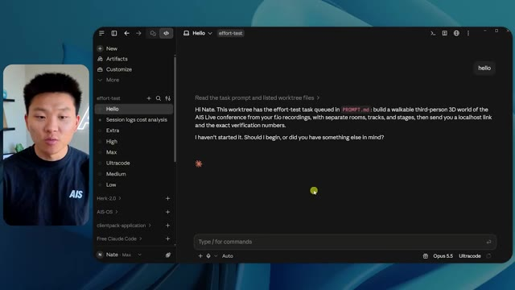
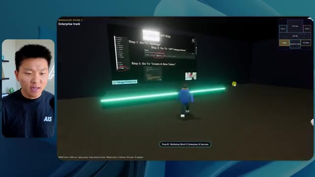
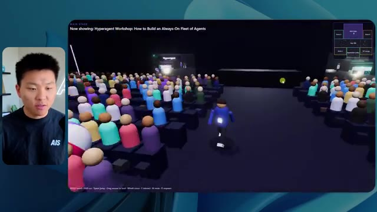
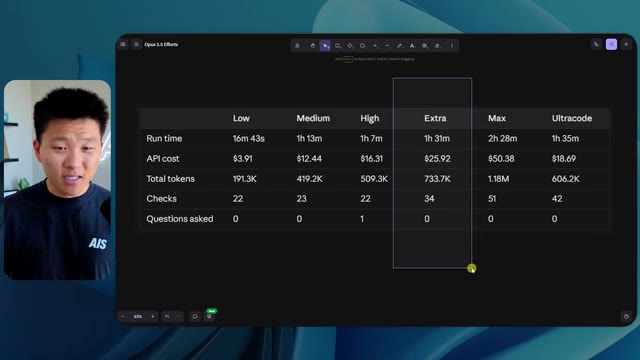

# 🎬 18 Months of Pricing AI Automations in 21 Mins

> **Chaîne** : [Nate Herk | AI Automation](https://www.youtube.com/@nateherk/featured)  
> **Lien YouTube** : [https://www.youtube.com/watch?v=Lg5TYWPSg6M](https://www.youtube.com/watch?v=Lg5TYWPSg6M)  
> **Date de publication** : 20260801  
> **Durée** : 00:21:19  
> **Identifiant vidéo** : `Lg5TYWPSg6M`  
> **Transcription & Analyse** : `whisper-v3-large-turbo+gemini-3.5-flash-lite`  

---

## 📌 Synthèse Exécutive & Outils

### 💡 Résumé

Dans cette vidéo de la chaîne *Nate Herk | AI Automation*, l'analyste et ingénieur explore l'impact critique du réglage de l'effort des modèles d'IA sur un cas d'usage d'ingénierie logicielle complexe : la génération automatique d'un monde 3D interactif et explorable à la troisième personne, simulant une conférence tech en direct. En fournissant exactement le même prompt à **Opus 5.5** à travers différents niveaux d'effort (de faible à moyen, puis vers les niveaux supérieurs), la vidéo met en lumière des écarts spectaculaires en matière de qualité de rendu, de respect de la charte graphique, de fluidité des animations et d'intégration de données multimédias issues d'un dossier Frame.io de 105 gigaoctets. 

Les démonstrations montrent comment un niveau d'effort faible (mode *low*) génère un prototype rudimentaire truffé de bugs visuels, de visages fantomatiques et d'images statiques, nécessitant près de 17 minutes pour un coût API de 3,91 $, tandis que le niveau moyen (*medium*) élève considérablement la barre en respectant la palette de couleurs de la marque, en intégrant de vraies boucles vidéo lues en streaming pour les ateliers, et en gérant des PNJ animés basiques, pour un temps d'exécution d'une heure et 13 minutes et un coût de 12,44 $. Cette expérimentation démontre que les niveaux d'effort supérieurs ne se contentent pas d'augmenter la consommation de tokens et le temps de calcul, mais transforment radicalement la robustesse architecturale et la finition esthétique des agents IA autonomes.

La vidéo intègre également une transition sponsorisée fluide mettant en avant une solution d'hébergement et de déploiement instantané via une extension d'éditeur, résolvant le goulet d'étranglement classique du passage du code local généré par l'IA à une mise en production en ligne immédiate.

### 🛠️ Outils, Modèles & Logiciels Présentés

* **Opus 5.5** : Modèle de pointe d'Anthropic, extrêmement intelligent et économique, constituant le cœur moteur de cette expérimentation de développement assisté par IA.
* **Claude Code** : Environnement de développement et assistant de codage avancé utilisé pour orchestrer les tâches de programmation et interagir avec les fichiers locaux.
* **Frame.io** : Plateforme cloud de gestion multimédia utilisée ici comme source massive de 105 Go d'enregistrements vidéo pour alimenter le monde 3D.
* **Hostinger Connector** : Extension gratuite pour éditeurs de code (VS Code, Cursor, Claude Code, etc.) permettant d'importer son compte d'hébergement pour un déploiement direct et sans friction.
* **Système d'exploitation IA Herc 2** : Écosystème de travail personnalisé de l'auteur servant de base de données contextuelle et de ressources pour l'agent IA.
* **Key.ai** : Outil d'génération d'images et de vidéos mobilisé par l'agent pour créer des assets visuels à la volée au sein de la simulation.

### 🔑 Points Clés & Enseignements Stratégiques

* **Impact direct du niveau d'effort sur la qualité** : Modifier le paramètre d'effort d'un même prompt change fondamentalement la profondeur logique, la rigueur d'exécution et le soin esthétique apportés par le modèle, validant l'hypothèse qu'un prompt identique ne livre pas du tout la même valeur selon la ressource de calcul allouée.
* **Le piège des prototypes à faible effort** : Le mode *low* (faible effort) a produit en 16 minutes et 43 secondes (191k tokens, 22 vérifications, 0 question) un environnement 3D grossier, marqué par des bugs d'affichage majeurs, des PNJ inconsistants et des flux vidéo réduits à de simples images fixes non animées.
* **L'équilibre optimal du niveau moyen** : Recommandé par Anthropic comme point de départ, le mode *medium* a nécessité 1 heure et 13 minutes, 490k tokens, 23 vérifications et 0 question pour un coût de 12,44 $, générant un monde 3D nettement supérieur avec respect de la charte de marque, vidéos en streaming fonctionnelles et PNJ interactifs.
* **Autonomie totale des agents** : À travers les différents tests, l'agent a fait preuve d'une autonomie absolue en exécutant de multiples vérifications dans un navigateur et en menant à bien la tâche complexe sans jamais ressentir le besoin de poser la moindre question de clarification à l'utilisateur.
* **Gestion et ingestion de données massives** : L'expérimentation prouve la capacité des modèles récents à analyser et exploiter indirectement des volumes de données titanesques (105 Go de vidéos sur Frame.io) pour structurer des espaces virtuels contextuels et thématiques fidèles à un événement réel.
* **Combler le fossé entre code local et mise en ligne** : La démonstration souligne un goulet d'étranglement classique en ingénierie IA : la production d'un projet fonctionnel en local ne résout pas la friction du déploiement web, un problème résolu par des connecteurs d'hébergement intégrés directement dans l'IDE.
* **Importance de l'identité visuelle dans l'IA générative** : Un agent IA performant sur le plan structurel doit également intégrer les directives de branding (palettes de couleurs, logos, typographies) pour éviter de livrer des interfaces génériques déconnectées de l'identité réelle de l'entreprise.
* **Analyse de rentabilité et facturation API** : Le suivi rigoureux des coûts (de 3,91 $ pour le niveau bas à 12,44 $ pour le niveau moyen) rappelle l'importance d'optimiser les niveaux d'effort en phase de prototypage pour maîtriser les coûts cachés de l'inférence à grande échelle.
* **Simulation comportementale et immersion** : L'intégration d'éléments dynamiques (cartes de géolocalisation synchronisées en direct, avatars interactifs, espaces VIP sectorisés) démontre que les agents modernes peuvent concevoir des expériences utilisateur immersives et complexes à partir d'instructions textuelles de haut niveau.

---

## ⏱️ Chronologie & Transcription Complète Audio & Visuelle (Mot pour Mot)

### ⏱️ `[00:00:00 - 00:00:20]` | Segment #01

**🔊 Audio (Transcription Intégrale Mot pour Mot en Français) :**
> Opus 5.5, Opus 5.5, Opus 5.5, Opus 5.5, Opus 5.5. Ce modèle est littéralement partout et pour de très bonnes raisons. Il est intelligent, il est bon marché, il a un goût incroyable, c'est un modèle d'IA incroyable. Mais avec chaque modèle d'IA, vous avez le choix de l'effort, que ce soit faible, moyen, haut, extra, max ou code ultra.

**👁️ Analyse Visuelle d'Écran (gemini-3.5-flash-lite) :**
**Interface & Outils** : X (anciennement Twitter)

**Contenu textuel & Code** : Publication textuelle et média vidéo illustrant l'impact des modèles d'IA sur la création technique.

**Action / Démonstration** : Affichage d'un exemple concret de contenu généré ou commenté via une capture de tweet pour appuyer le propos.

*⏱️ 00:00:05 — Une capture d'écran d'une publication sur les réseaux sociaux (X/Twitter) montrant un post sur la disruption des créatifs techniques avec une vidéo intégrée d'un paysage côtier en 3D.*

---

### ⏱️ `[00:00:20 - 00:00:38]` | Segment #02

**🔊 Audio (Transcription Intégrale Mot pour Mot en Français) :**
> Donc, dans cette vidéo, j'ai donné exactement le même prompt à Opus 5.5 et je l'ai exécuté à chaque niveau d'effort, et nous allons comparer les résultats. Nous examinerons la qualité de toutes les différentes sorties réelles, mais nous examinerons également le temps d'exécution de chacun d'eux, combien cela nous a coûté si c'était une facturation par API, le nombre total de tokens, combien de vérifications ils ont exécutées et combien de questions ils m'ont réellement posées tout au long du processus.

**👁️ Analyse Visuelle d'Écran (gemini-3.5-flash-lite) :**
**Interface & Outils** : Application web de tableau blanc / interface de présentation (type Miro ou Canva).

**Contenu textuel & Code** : Tableau comparatif pour Opus 5.5 avec les lignes : Run time, API cost, Total tokens, Checks, Questions asked, et les colonnes de Low à Ultracode.

**Action / Démonstration** : Présentation des différents niveaux d'effort d'Opus 5.5 et des métriques associées sous forme de tableau.

*⏱️ 00:00:29 — Tableau comparatif sur interface web montrant les différents niveaux d'effort de l'IA (Low, Medium, High, Extra, Max, Ultracode) et des métriques (Run time, API cost, Total tokens, etc.).*

---

### ⏱️ `[00:00:39 - 00:00:58]` | Segment #03

**🔊 Audio (Transcription Intégrale Mot pour Mot en Français) :**
> Et les résultats que nous avons obtenus ne sont pas du tout ce à quoi je m'attendais, donc j'ai hâte de partager cela avec vous les gars. Ne perdons pas de temps et allons directement à celui-ci. D'accord, alors plongeons-nous directement dans celui-ci. Je veux commencer juste en vous montrant le prompt réel que nous avons utilisé que nous avons donné à chacun de ces différents agents. Je vais aller dans les fichiers ici, et nous allons ouvrir ce fichier markdown de prompt, et je vais vous montrer ce que nous avons obtenu. Voici donc le slash objectif que j'ai fourni.

**👁️ Analyse Visuelle d'Écran (gemini-3.5-flash-lite) :**
**Interface & Outils** : Interface web ou application de développement (Opus 5.5 / Ultracode)

**Contenu textuel & Code** : Message de l'assistant IA demandant si l'agent doit commencer à construire un monde 3D interactif basé sur un fichier PROMPT.md.

**Action / Démonstration** : Le présentateur présente l'interface de l'outil de développement IA et le prompt initial configuré.

*⏱️ 00:00:48 — Interface sombre d'une application de développement avec le présentateur incrusté à gauche, affichant un assistant IA (Opus 5.5 / Ultracode) et une invite de commande.*

---

### ⏱️ `[00:00:58 - 00:01:34]` | Segment #04

**🔊 Audio (Transcription Intégrale Mot pour Mot en Français) :**
> J'ai dit, tu dois me créer un monde 3D qui est une conférence tech réaliste dans laquelle je peux me promener en vue à la troisième personne. Tu vas regarder ce dossier, qui contient mes ressources d'enregistrement d'événements de AIS Live. Et ce dossier est un dossier Frame.io de 105 gigaoctets d'enregistrements vidéo. C'était un événement complètement virtuel. Tout a été enregistré et tous les enregistrements sont juste ici. J'ai dit, ton objectif est de prendre cet événement et de le transformer en un monde 3D explorable qui me donne l'impression d'être réellement allé à une vraie conférence en personne avec différentes salles, différentes pistes, différentes scènes, bla, bla, bla. N'hésite pas à utiliser key.ai si tu as besoin de générer des images ou des vidéos. Et tu peux aussi utiliser tout le reste à l'intérieur de mon projet Herc 2, qui est comme mon système d'exploitation IA. J'ai dit,

**👁️ Analyse Visuelle d'Écran (gemini-3.5-flash-lite) :**
**Interface & Outils** : Éditeur de code (type VS Code ou IDE web) et interface cloud Frame.io

**Contenu textuel & Code** : Fichier PROMPT.md détaillant la création d'un monde 3D pour une conférence tech interactive à partir d'enregistrements d'événements (lien Frame.io de 105 Go)
[DESC_IMAGE_3] Présentation du prompt de configuration pour l'agent IA chargé de générer l'environnement virtuel 3D explorable.

**Action / Démonstration** : Explications face caméra et démonstration conceptuelle.

*⏱️ 00:01:07 — Un éditeur de texte affichant un fichier Markdown nommé PROMPT.md contenant les instructions détaillées pour créer un monde 3D interactif basé sur un dossier d'enregistrements d'événements.*

*⏱️ 00:01:16 — Une interface de partage de fichiers Frame.io montrant un dossier nommé "Sep 22, 2026" de 105,69 Go avec deux sous-dossiers "GA Access (For AIS)" et "VIP Access".*

*⏱️ 00:01:25 — Retour sur l'éditeur de texte affichant le fichier PROMPT.md avec les directives de conception du monde 3D et les critères d'évaluation.*

---

### ⏱️ `[00:01:34 - 00:02:08]` | Segment #05

**🔊 Audio (Transcription Intégrale Mot pour Mot en Français) :**
> vous serez jugé sur la créativité, le design, la physique et la sensation générale lorsque j'explorerai le monde 3D que vous avez construit. Et c'était fondamentalement la fin des instructions. Donc, comme vous pouvez le voir sur ce côté gauche, j'ai exécuté cela à travers tous les différents niveaux d'effort. Commençons par le niveau bas et montons jusqu'à ultra code. Très bien. Nous avons donc ici le résultat du niveau bas. Ouvrons ceci et jetons un œil. Nous avons donc AIS live, le sommet des services d'IA en personne enfin, et nous avons pu cliquer partout. Tout d'abord, on ne sent pas vraiment la marque ici. Genre, ce n'ha pas le logo d'IS Live. Ce ne sont même pas nos couleurs. Donc je n'aime pas trop ça, mais entrons ici. D'accord. C'est beaucoup trop lumineux. Euh, nous avons une carte en haut à droite. Nous avons une ville ici en arrière-plan. Je ne peux pas dire quelle ville c'est.

**👁️ Analyse Visuelle d'Écran (gemini-3.5-flash-lite) :**
**Interface & Outils** : Interface web d'un assistant de type LLM / outil de développement (style Claude Code / interface personnalisée).

**Contenu textuel & Code** : Texte du prompt demandant de construire un monde 3D en troisième personne à partir d'enregistrements, avec une liste de sessions de test de niveau ("effort-test").

**Action / Démonstration** : Le présentateur montre la liste des différents niveaux d'effort exécutés dans l'interface.

*⏱️ 00:01:42 — Capture d'écran montrant l'interface d'un assistant de code affichant différents niveaux de test (Hello, Extra, High, Max, Ultracode, Medium, Low) dans la barre latérale gauche, avec un panneau de discussion à droite.*

---

### ⏱️ `[00:02:08 - 00:02:40]` | Segment #06

**🔊 Audio (Transcription Intégrale Mot pour Mot en Français) :**
> c'est. D'accord. C'est Chicago, ce qui est plutôt cool parce que tu sais, j'habite à Chicago, mais bref, en haut à droite, on peut voir une carte. Nous avons un hall d'accueil. Nous avons un hall d'exposition. Nous avons une scène principale du salon VIP. La carte montre également où se trouve chaque autre personne et cela se synchronise en direct. Donc on peut voir l'inscription. On peut voir le premier jour, la keynote de l'hyper agent, le débriefing en direct. Cool. Donc ça connaît réellement l'programme et puis il y a le deuxième jour. Donc il a trouvé ça, c'est bien. Nous avons ces petites boules ici que je peux espérer pousser du pied. D'accord. Le visage, Oh, regarde ça. Si je vais par ici, tous les gens disparaissent tout simplement. Très mauvais. Très mauvais. D'accord. Alors voyons voir. Est-ce que je peux sprinter ? D'accord.

**👁️ Analyse Visuelle d'Écran (gemini-3.5-flash-lite) :**
**Interface & Outils** : Application virtuelle 3D / Navigateur web de conférence virtuelle

**Contenu textuel & Code** : Carte interactive (minimap), programme des conférences ('Day 1') et zones du salon virtuel

**Action / Démonstration** : Navigation et exploration de l'espace virtuel du salon à l'aide d'un avatar 3D

*⏱️ 00:02:16 — Vue d'un espace virtuel 3D avec des avatars et un panneau 'Badge pickup - GA and VIP' et une minimap en haut à droite.*

*⏱️ 00:02:24 — Vue du hall virtuel 3D (Lobby) avec le programme de la 'DAY 1' affiché et un avatar au centre.*

*⏱️ 00:02:32 — Vue de l'Expo Hall virtuel 3D montrant des sponsors, des stands et des avatars autour d'une sphère lumineuse centrale.*

---

### ⏱️ `[00:02:40 - 00:03:04]` | Segment #07

**🔊 Audio (Transcription Intégrale Mot pour Mot en Français) :**
> Je peux aller un peu plus vite. Je vais d'abord aller par ici. Il y a des produits promotionnels, euh, certifiés AIS plus glido. D'accord. Donc, il y a les vrais stands qu'on avait dans l'événement virtuel. On avait des stands. Donc c'est plutôt cool. Un petit endroit pour prendre des photos. Salle C. En ce moment, nous avons Tangy Frederick qui anime un atelier. D'accord. Mais ce n'est pas une vidéo. Comme vous pouvez le voir, c'est juste une image. Elle ne bouge pas. Donc c'est juste une image. Ces gens sont en train de disparaître. Ce doivent être des fantômes. Allons par ici vers la salle A.

**👁️ Analyse Visuelle d'Écran (gemini-3.5-flash-lite) :**
**Interface & Outils** : Environnement virtuel 3D interactif (type metaverse/salon virtuel)

**Contenu textuel & Code** : Affichage sur grand écran virtuel des étapes pour créer un token d'API (Step 1, Step 2, Step 3).

**Action / Démonstration** : Navigation d'un avatar à travers le salon virtuel pour visiter les différents stands et salles d'ateliers.

*⏱️ 00:02:46 — Vue d'un espace d'exposition virtuel avec des stands et des cubes promotionnels 'Glaido'.*

*⏱️ 00:02:52 — Entrée dans une salle d'atelier thématique 'Enterprise track' au sein de l'environnement virtuel.*

*⏱️ 00:02:58 — Avancée dans la salle d'atelier virtuelle face à un écran affichant des étapes d'intégration d'API.*

---

### ⏱️ `[00:03:04 - 00:03:30]` | Segment #08

**🔊 Audio (Transcription Intégrale Mot pour Mot en Français) :**
> Nous avons Liberty White. D'accord. Très cool. Vos 30 premiers jours en automatisation. Encore une fois, c'est juste une image fixe et les gens ont des bugs d'affichage. Donc ce n'est pas très bon ici. Je vais aller sur la scène principale et voir ce que nous avons. D'accord, cool. Donc nous avons une scène principale. Les gens ont de gros bugs d'affichage. Vraiment mauvais. Ce n'est vraiment pas bon du tout. Notre vidéo est en train de bouger. Genre, j'ai vu mon visage ici et j'ai vu celui de Devin, mais maintenant ils ont disparu. Donc je ne sais pas ce qui s'est passé. D'accord. On dirait plutôt un diaporama. Rien n'est vraiment lu pour l'instant. Bref, entrons ici.

**👁️ Analyse Visuelle d'Écran (gemini-3.5-flash-lite) :**
**Interface & Outils** : Application de métavers / espace virtuel interactif 3D (plateforme de conférence en ligne type Gather).

**Contenu textuel & Code** : Interface d'événement virtuel avec affichage 'Main Stage' et indications textuelles de navigation (WASD move).

**Action / Démonstration** : Navigation d'un utilisateur à travers les différentes salles et scènes de l'événement virtuel.

*⏱️ 00:03:11 — Vue dans un espace virtuel 3D (type Gather Town / metaverse) montrant une pièce intitulée 'Workshop Room A: Foundation track'.*

*⏱️ 00:03:17 — Navigation d'un avatar dans une grande salle de conférence virtuelle (Main Stage) remplie d'avatars assis.*

*⏱️ 00:03:24 — Vue de face de la scène principale 'AIS LIVE AI Services Summit' dans l'environnement virtuel avec des écrans géants et des ballons.*

---

### ⏱️ `[00:03:30 - 00:03:58]` | Segment #09

**🔊 Audio (Transcription Intégrale Mot pour Mot en Français) :**
> Nous avons d'autres stands. Nous avons hyper agent. Nous avons Claude Code. Nous avons plus de gadgets publicitaires. La salle B, c'est Dave Ebelor. Je suppose que c'est exactement la même chose. Nous avons du café. Et ensuite, je suppose, le salon VIP, accès VIP seulement. C'est plutôt cool, mais il n'y a vraiment rien qui se passe ici. Cet écran est bien trop lumineux. D'accord. Donc je pense que vous comprenez l'ambiance qu'on obtient ici d'Opus 5.5 en mode faible effort. Et c'est là que les choses deviennent intéressantes. Combien de temps pensez-vous que cela a duré ? Combien de temps ? Celui-ci a duré 16 minutes et 43 secondes. Combien pensez-vous que cela a coûté ?

**👁️ Analyse Visuelle d'Écran (gemini-3.5-flash-lite) :**
**Interface & Outils** : Tableau blanc ou application de mind mapping / tableau de bord 'Opus 5.5 Efforts'

**Contenu textuel & Code** : Tableau comparatif structuré en colonnes de performance (Low, Medium, High, Extra, Max, Ultracode) et lignes de critères (Run time, API cost, Total tokens, Checks, Questions asked).

**Action / Démonstration** : Présentation et analyse comparative des différents niveaux d'effort et coûts associés aux modèles ou agents.

*⏱️ 00:03:51 — Interface d'un tableau comparatif avec les niveaux 'Low', 'Medium', 'High', 'Extra', 'Max', 'Ultracode' et des métriques telles que 'Run time', 'API cost', 'Total tokens'.*

---

### ⏱️ `[00:03:58 - 00:04:26]` | Segment #10

**🔊 Audio (Transcription Intégrale Mot pour Mot en Français) :**
> 3,91 dollars si c'était une facturation par API. J'utilise évidemment mon abonnement ici, mais nous allons simplement calculer cela en facturation par API. Le total des jetons était de 191 000. Il a effectué 22 vérifications. Donc la vérification, 22 fois il a ouvert le navigateur et a exécuté différentes sortes de vérifications. Donc 22 catégories de vérifications. Et combien de questions m'a-t-il posées ? Il m'a posé un total de zéro question tout au long de cette invite de commande d'objectif. D'accord. Alors, ouvrons l'effort moyen et voyons ce que nous avons. D'accord, c'est parti. Effort moyen. Nous avons Nate Herc. Nous avons mon badge. C'est de la marque AI's Life.

**👁️ Analyse Visuelle d'Écran (gemini-3.5-flash-lite) :**
**Interface & Outils** : Application de tableau blanc / prise de notes visuelle (ex: Excalidraw ou similaire).

**Contenu textuel & Code** : Tableau avec les métriques pour le niveau « Low » : Run time (16m 43s), API cost ($3.91), Total tokens (191.3K), Checks, et Questions asked.

**Action / Démonstration** : Le présentateur explique les métriques de coût et de jetons affichées à l'écran tout en modifiant ou sélectionnant un élément du tableau.

*⏱️ 00:04:05 — Un tableau comparatif des coûts et performances d'un agent IA affiché sur une interface de type tableau blanc ou éditeur visuel.*

---

### ⏱️ `[00:04:26 - 00:04:46]` | Segment #11

**🔊 Audio (Transcription Intégrale Mot pour Mot en Français) :**
> Donc ça a déjà l'air un petit peu mieux. Ça ressemble à nos palettes de couleurs qui ont utilisé nos directives de marque. Premier jour de construction, deuxième jour de gain, VIP. Cool. D'accord. Je vais entrer dans le lieu. D'accord. Waouh. Une ambiance similaire, en gros. C'est en arrière-plan. Ça ne ressemble pas à Chicago, hein ? Non, ça ressemble à un, honnêtement, ça ressemble à une ville inventée. Quoi qu'il en soit, c'est marrant qu'ils aient décidé de faire ça. Voyons si je peux me déplacer un peu plus vite. Oh, waouh.

**👁️ Analyse Visuelle d'Écran (gemini-3.5-flash-lite) :**
**Interface & Outils** : Application web interactive / Plateforme virtuelle 3D 'AIS Live'

**Contenu textuel & Code** : Écran d'accueil avec badge (Nate Herk, Host - All Access), texte de bienvenue, commandes de navigation et compteur de sessions.

**Action / Démonstration** : Le présentateur entre dans le lieu virtuel 3D en cliquant sur le bouton d'entrée.

*⏱️ 00:04:31 — Interface d'accueil de l'application 'AIS Live' avec un badge d'accès au nom de Nate Herk et des options de navigation.*

*⏱️ 00:04:41 — Vue dans le lieu virtuel 3D de l'application 'AIS Live' montrant des avatars et une vue sur une ville illuminée.*

---

### ⏱️ `[00:04:46 - 00:05:21]` | Segment #12

**🔊 Audio (Transcription Intégrale Mot pour Mot en Français) :**
> Les gens interagissent avec moi. Regardez. Si je m'approche de ce type, il vient de lever le bras. Bon, maintenant il ne veut plus du tout avoir affaire à moi. Mais tous ces petits robots ici doivent prendre des décisions. Je ne sais pas s'ils utilisent Jev. C'est sûr que non. Je ne lui ai pas dit de le faire. En fait, ma clé Jev est à l'arrière. Je ne sais pas. Peut-être qu'il l'a utilisée. Quoi qu'il en soit, nous pouvons voir ici que nous avons la salle d'atelier C, le laboratoire des agents. Sympa. Donc celui-ci est en fait en train de fonctionner. Vous pouvez voir qu'il s'agit d'une vraie vidéo lue par Tangy. Tout le monde ici est en train de travailler sur un ordinateur portable. Ils ne buguent pas. C'est plutôt cool. De plus, mon badge est sur ma poitrine, ce qui est plutôt cool. Je peux venir par ici. Nous avons une carte en haut à droite, comme vous pouvez le voir, mais je peux venir par ici. Nous avons un

**👁️ Analyse Visuelle d'Écran (gemini-3.5-flash-lite) :**
**Interface & Outils** : Environnement virtuel 3D / Interface de simulation interactive.

**Contenu textuel & Code** : Aucun code source, terminal ou prompt textuel affiché, uniquement de la simulation 3D.

**Action / Démonstration** : Navigation et exploration de l'environnement virtuel avec des avatars d'agents.

---

### ⏱️ `[00:05:21 - 00:05:47]` | Segment #13

**🔊 Audio (Transcription Intégrale Mot pour Mot en Français) :**
> hall d'exposition. C'est ici que nous avons le stand de Glido. Et ça diffuse actuellement. Oui, ça diffuse la vidéo de nous parlant de Glido. Ça diffuse la vidéo d'Ed et de moi parlant de notre programme de certification. Nous avons le logo AIS Plus juste ici, qui est un peu mal placé. Ce sont les diapositives des conférenciers et les points clés. Donc wow, ce sont toutes les ressources que nous avons distribuées après l'événement. Elles sont toutes là aussi. Nous pouvons voir que nous avons un projecteur de communauté. C'est donc Aiden qui parle de son contrat qu'il a décroché et ça se joue en direct. Ces gens regardent.

**👁️ Analyse Visuelle d'Écran (gemini-3.5-flash-lite) :**
**Interface & Outils** : Environnement virtuel 3D de type métavers ou exposition en ligne.

**Contenu textuel & Code** : Écrans virtuels affichant des diaporamas de présentation, du texte et des interfaces utilisateur de salon virtuel.

**Action / Démonstration** : Navigation et visite guidée d'un hall d'exposition virtuel 3D par le présentateur.

---

### ⏱️ `[00:05:47 - 00:06:21]` | Segment #14

**🔊 Audio (Transcription Intégrale Mot pour Mot en Français) :**
> Ils sont plutôt engagés. On a l'hyper agent. C'était, c'est ce que je voulais dire. Si vous avez vu ces gens lever les mains en disant bonjour, c'était plutôt marrant. Regardez, regardez, le voilà qui recommence. Bref. Bon. Où est-ce que je suis maintenant ? Maintenant, je suis dans le hall principal. On a un bar à café. On a un grand logo, qui est le vrai logo. C'est trop lumineux, mais on a le logo. On peut voir si on peut entrer ici dans le parcours des fondations. On a Sabrina Romanov et Liberty White. Donc différentes formations juste là. On peut entrer dans cette salle. C'est le parcours avancé. Alors qu'est-ce qui se passe ici ? On a Dave Ebelar et Saman qui parlent de différentes choses là-dedans. Et maintenant, allons jeter un œil à la scène principale. Oh, attendez, il y a une vidéo de moi là-haut. Est-ce que c'est genre un VIP

**👁️ Analyse Visuelle d'Écran (gemini-3.5-flash-lite) :**
**Interface & Outils** : Application de métavers / monde virtuel 3D interactif (type Gather ou similaire).

**Contenu textuel & Code** : Environnement virtuel 3D avec interface de mini-carte et indicateurs de navigation.

**Action / Démonstration** : Navigation et exploration d'un espace virtuel en ligne avec des avatars.

*⏱️ 00:05:55 — Vue d'un monde virtuel 3D représentant un hall principal avec des avatars d'utilisateurs.*

*⏱️ 00:06:04 — Navigation dans le monde virtuel 3D en direction d'une salle de conférence avec un écran de présentation.*

*⏱️ 00:06:12 — Vue en contre-plongée montrant plusieurs avatars interactifs regroupés dans l'espace virtuel.*

---

### ⏱️ `[00:06:21 - 00:06:50]` | Segment #15

**🔊 Audio (Transcription Intégrale Mot pour Mot en Français) :**
> section ? Ouais, on ira voir ça dans une minute. Mais bref, voici la scène principale. Ça a l'air vraiment, vraiment super. On a une grande scène. On a genre quatre personnes assises ici. On a les trois écrans d'Alex là-haut avec l'hyper agent. Est-ce que j'ai le droit de monter sur scène ? Oh, et il me laisse monter sur scène. D'accord. C'est plutôt sympa. Bon les gars, faisons un selfie. Laissez-moi prendre tout le monde en arrière-plan. Venez par ici. Bref, c'est vraiment, vraiment cool. Par contre, toutes les places ne sont pas occupées. Donc il va falloir qu'on travaille là-dessus. Mais bref, je vais courir voir ce qu'était cette section VIP. D'accord. Salon VIP. J'ai l'impression que c'est comme un aéroport ou un truc comme ça.

**👁️ Analyse Visuelle d'Écran (gemini-3.5-flash-lite) :**
**Interface & Outils** : Environnement virtuel 3D / Plateforme de conférence en ligne

**Contenu textuel & Code** : Interface utilisateur affichant des informations de session de keynote et des écrans de présentation virtuels

**Action / Démonstration** : Navigation et exploration de l'espace virtuel par le présentateur sous forme d'avatar

---

### ⏱️ `[00:06:51 - 00:07:14]` | Segment #16

**🔊 Audio (Transcription Intégrale Mot pour Mot en Français) :**
> Ok, super. Donc maintenant, nous avons les sessions VIP ici. Une séance de questions-réponses VIP avec Nate en lecture vidéo en direct juste ici. Vraiment, vraiment super. Et nous avons comme un bar ou quelque chose comme ça. Génial. Je dirais que c'est un très bon résultat. Maintenant, en ce qui concerne les statistiques ici, celui-ci a pris une heure et 13 minutes à s'exécuter. Cela nous aurait coûté 12 dollars et 44 cents. Il a utilisé 490 000 jetons et il a effectué 23 vérifications.

**👁️ Analyse Visuelle d'Écran (gemini-3.5-flash-lite) :**
**Interface & Outils** : Application de métavers / espace virtuel 3D et tableau de bord analytique web (Opus 5.5 Efforts).

**Contenu textuel & Code** : Affichage des métriques : Run time 16m 43s, API cost $3.91, Total tokens 191.3K, Checks 22, Questions asked 0.

**Action / Démonstration** : Navigation et présentation de l'espace VIP virtuel suivi de la consultation des statistiques d'exécution dans le tableau de bord.

*⏱️ 00:06:56 — Capture montrant un espace virtuel en 3D (salon VIP) avec un écran affichant une session de questions-réponses en direct et le présentateur dans une vignette à gauche.*

*⏱️ 00:07:02 — Capture montrant un tableau de bord analytique (« Opus 5.5 Efforts ») avec des métriques de performance telles que le temps d'exécution (Run time), le coût API et le nombre de tokens.*

---

### ⏱️ `[00:07:14 - 00:07:48]` | Segment #17

**🔊 Audio (Transcription Intégrale Mot pour Mot en Français) :**
> Et il nous a posé un total de zéro question une fois de plus. Très bien, passons au niveau élevé. C'était déjà un résultat plutôt correct et Anthropic eux-mêmes dans leur vidéo de comment prompter Opus 5.5, ou désolé, pas une vidéo, un article. Ils ont dit de commencer simplement par le niveau moyen et d'ajuster à la hausse ou à la baisse si nécessaire. C'était donc un résultat moyen. Passons au niveau élevé et voyons ce qu'on a obtenu. Très rapidement, les gars, je dois prendre une petite seconde pour vous parler du sponsor de la vidéo d'aujourd'hui, Hostinger. Donc ces deux modèles viennent de me créer une version fonctionnelle de la même chose. Et maintenant, je me retrouve exactement là où je finis toujours, avec un projet terminé sur mon ordinateur portable et aucun moyen rapide de le mettre en ligne. Et c'est ce fossé que le connecteur d'Hostinger comble. C'est une extension gratuite

**👁️ Analyse Visuelle d'Écran (gemini-3.5-flash-lite) :**
**Interface & Outils** : Tableau comparatif de données et interface d'éditeur de code / assistant IA (type IDE).

**Contenu textuel & Code** : Tableau montrant le temps d'exécution, le coût API, les tokens et les questions posées pour les niveaux Low et Medium, ainsi qu'un prompt de création de calculateur ROI.

**Action / Démonstration** : Présentation des résultats comparatifs et analyse des performances des différents modes d'effort d'Opus 5.5.

*⏱️ 00:07:22 — Un tableau comparatif des performances et coûts de différents niveaux d'effort (Low, Medium, High, Extra) pour Opus 5.5, avec le présentateur en médaillon.*

*⏱️ 00:07:39 — Une interface de développement avec un éditeur de code et un panneau de chat montrant le prompt pour créer un calculateur ROI Northwind, avec le présentateur en bas à droite.*

---

### ⏱️ `[00:07:48 - 00:08:23]` | Segment #18

**🔊 Audio (Transcription Intégrale Mot pour Mot en Français) :**
> pour votre éditeur qui importe votre compte Hostinger dans ce sur quoi vous êtes déjà en train de coder. Donc VS Code, cursor, cloud code, codex, vous l'nommez. Vous vous connectez une seule fois en un seul clic, et à partir de là, votre agent peut déployer le site, y pointer un domaine, configurer les enregistrements DNS, et vérifier votre VPS sans que vous n'ayez jamais à quitter l'éditeur. Donc, peu importe celui de ces outils que vous finirez par préférer, ce qu'il a construit est à quelques minutes d'une vraie URL sur un hébergement géré. Connector est gratuit sur chaque hébergement ou forfait, donc si vous avez toujours besoin de l'hébergement en dessous, prenez le forfait illimité avec le lien dans la description et utilisez le code NATEHERK pour 10 % de réduction. Cela vient également avec un domaine gratuit et un e-mail professionnel pour l'année. Et c'est toujours le moyen le moins cher que j'ai trouvé pour obtenir quelque chose

**👁️ Analyse Visuelle d'Écran (gemini-3.5-flash-lite) :**
**Interface & Outils** : Interface web Hostinger, Claude Code et webcam du présentateur.

**Contenu textuel & Code** : Panneau "Manage Hostinger from your IDE" avec statut "Connected (VIA OAUTH)" et liste des outils disponibles (Websites, Domains, Subscriptions & Payments, Email Marketing).

**Action / Démonstration** : Connexion du compte Hostinger à l'environnement de développement via OAuth pour permettre au chatbot ou à l'agent d'accéder aux outils de gestion.

*⏱️ 00:07:57 — Interface montrant l'intégration de Hostinger dans un IDE avec un panneau de connexion OAuth et les outils disponibles, aux côtés d'une fenêtre Claude Code et de la webcam du présentateur.*

---

### ⏱️ `[00:08:23 - 00:08:47]` | Segment #19

**🔊 Audio (Transcription Intégrale Mot pour Mot en Français) :**
> tu as construit sur une vraie URL. Donc revenons à la vidéo. D'accord. Encore une fois, très, très marqué par la marque. C'est un écran de chargement encore mieux que le précédent. Nous avons ce petit effet sympa en arrière-plan. Nous avons le logo. Nous allons entrer dans le lieu. D'accord. Nous y voilà. Ça a l'air plutôt bien. Nous commençons dehors et vous pouvez voir que nous avons ces drapeaux pour tous les intervenants, Wyatt, Casper, Alex, Ed, Aiden, Sabrina, Liberty. C'est plutôt cool. Nous avons des blocs en direct ici.

**👁️ Analyse Visuelle d'Écran (gemini-3.5-flash-lite) :**
**Interface & Outils** : Application web 3D / RingCentral (AIS Live Metaverse)

**Contenu textuel & Code** : Écran de chargement de l'événement virtuel AIS Live avec consignes de déplacement et interface de monde 3D

**Action / Démonstration** : Entrée dans le lieu virtuel (Enter the Venue) et exploration de la place principale de l'événement 3D

*⏱️ 00:08:29 — Écran de chargement et d'accueil de l'événement virtuel AIS Live avec le logo et les instructions de contrôle.*

*⏱️ 00:08:35 — Vue dans le monde virtuel 3D montrant l'avatar du présentateur sur la place principale (AIS Live Plaza).*

*⏱️ 00:08:41 — Navigation dans l'espace virtuel 3D de l'AIS Live Plaza avec des bannières de conférenciers.*

---

### ⏱️ `[00:08:47 - 00:09:23]` | Segment #20

**🔊 Audio (Transcription Intégrale Mot pour Mot en Français) :**
> il a pris cette photo de moi, votre hôte, Nate Herc, John, Dave, Nate Herc. Voilà. D'accord. Les portes. Génial. Ce sont des portes coulissantes automatiques en verre. J'adore ça. Nous pouvons voir l'enregistrement VIP. Nous pouvons voir l'admission générale. Nous pouvons venir ici et nous pouvons découvrir l'exposition avec différents stands, le projecteur sur la communauté. Vous pouvez également voir qu'en haut à gauche, j'ai un passeport. C'est donc comme si, cela montrera combien d'endroits j'ai visités. Tout cela est une vraie lecture. Nous avons un mur de ressources avec tous les différents intervenants. Ils ont également une session de networking ici même. Je vais donc venir très vite voir de quoi il s'agit. Nous avons donc le bar à cold brew AIS. Nous avons différents membres de la communauté qui ont été mis en avant ou en lumière.

**👁️ Analyse Visuelle d'Écran (gemini-3.5-flash-lite) :**
**Interface & Outils** : Application de conférence virtuelle en 3D / Environnement métavers interactif

**Contenu textuel & Code** : Éléments graphiques d'un événement virtuel, bannières d'enregistrement, mini-carte et interfaces de navigation utilisateur

**Action / Démonstration** : Exploration d'un espace virtuel de conférence et navigation entre les différents stands et zones d'accueil

*⏱️ 00:08:56 — Vue d'un monde virtuel interactif montrant une zone d'enregistrement de conférence avec des avatars et des bannières 'AIS LIVE - REGISTRATION'.*

*⏱️ 00:09:05 — Navigation dans un hall d'exposition virtuel avec des stands et des écrans d'information affichant des certifications et des ateliers.*

*⏱️ 00:09:14 — Déplacement d'un avatar au milieu d'autres participants virtuels dans le grand hall d'un événement en ligne.*

---

### ⏱️ `[00:09:23 - 00:09:56]` | Segment #21

**🔊 Audio (Transcription Intégrale Mot pour Mot en Français) :**
> On a l'aile VIP. Attends, quoi ? Prends un bracelet. Ah, je dois vraiment aller chercher le bracelet. D'accord. Laisse-moi m'enregistrer rapidement. Le bracelet est déjà mis. Attends, quoi ? D'accord. Oh, d'accord. Maintenant, les portes se sont ouvertes pour moi. Cool. Je peux entrer ici. Oh, ça mène juste à la scène principale. Salon VIP. Il y a une séance de questions-réponses en cours. Ça a l'air très cool. Je veux dire, je suis très impressionné par sa capacité à faire ça. Waouh. D'accord. Donc c'est vraiment bien. Ce qu'on a fait, c'est qu'on a eu des salles de discussion VIP avec différentes personnes. Tu peux voir qu'il y a différentes salles, différents membres de l'équipe AIS qui participent à des trucs. C'est vraiment cool. C'est très cool. C'est un VIP nettement meilleur

**👁️ Analyse Visuelle d'Écran (gemini-3.5-flash-lite) :**
**Interface & Outils** : Environnement virtuel 3D en ligne (type Gather.town ou métavers de conférence interactive) avec affichage tête haute (HUD), mini-carte et indicateurs de progression.

**Contenu textuel & Code** : Interface d'événement virtuel affichant des indications textuelles ('Wristband is already on', 'VIP Q&A with Nate Herk'), un tableau de bord de progression (Passport) et des écrans vidéo intégrés dans l'espace 3D.

**Action / Démonstration** : Exploration et navigation interactive de l'avatar dans le métavers de la conférence, transition entre l'accueil, le salon VIP et les salles de travail.

*⏱️ 00:09:32 — L'avatar du présentateur se déplace dans un espace virtuel 3D représentant la zone d'enregistrement d'une conférence (Registration Concourse).*

*⏱️ 00:09:40 — L'avatar se trouve dans le salon VIP (VIP Lounge) où un écran affiche une visioconférence avec Nate Herk et des participants, avec la légende textuelle sur l'importance des évaluations.*

*⏱️ 00:09:48 — L'avatar navigue dans la zone des sessions de travail VIP (VIP Working Sessions), montrant différentes salles thématiques comme 'Price It Right' et 'Land Your First Paying Client'.*

---

### ⏱️ `[00:09:56 - 00:10:30]` | Segment #22

**🔊 Audio (Transcription Intégrale Mot pour Mot en Français) :**
> expérience que ce qui a été montré dans la première partie. D'accord. After party VIP. Regardez ça. On a une piste de danse. On a tous ces éléments ici. On a la lecture de l'after party VIP juste ici. Et il y a une estrade de DJ. C'est trop marrant. Il y a un petit bug ici, un petit glitch ici, mais c'est génial. Oh, cool. Donc quand je suis ici sur la scène principale, on a des sous-titres. Vous pouvez voir juste ici en bas de mon écran, on a ces sous-titres de Wyatt qui est en train de parler là-haut. On a des lumières. On a le panel. Très cool. Belle scène principale. Je vais aller ici. On peut aller à la fondation,

**👁️ Analyse Visuelle d'Écran (gemini-3.5-flash-lite) :**
**Interface & Outils** : Environnement virtuel 3D / Metaverse interactif

**Contenu textuel & Code** : Interface utilisateur virtuelle affichant les zones "VIP After-Party" et "Main Stage", avec des flux vidéo en direct et des avatars de participants.

**Action / Démonstration** : Explications face caméra et démonstration conceptuelle.

*⏱️ 00:10:04 — Capture montrant l'interface d'un espace virtuel 3D (Metaverse) pour une after party VIP, avec des avatars et des écrans vidéo.*

*⏱️ 00:10:13 — Vue légèrement différente de la même after party VIP virtuelle avec une piste de danse et des participants représentés par des avatars.*

*⏱️ 00:10:21 — Capture montrant la scène principale (Main Stage) de l'événement virtuel avec un public assis et un grand écran vidéo central.*

---

### ⏱️ `[00:10:30 - 00:11:06]` | Segment #23

**🔊 Audio (Transcription Intégrale Mot pour Mot en Français) :**
> avancé, et les parcours d'entreprise ici. Alors voyons voir. Nous avons l'anatomie de trois vraies transactions. Nous avons hyper agent. Nous avons les évaluations avec Nate et Ed ici. Nous avons Dave qui s'occupe des trucs avancés. C'est vraiment bien. Je veux dire, évidemment, chacun, chacun de ces résultats jusqu'à présent, faible était correct. Moyen était mieux. Élevé a été encore meilleur. Voyons si cette tendance se poursuit et voyons ce que cela nous a coûté. Donc, élevé a fonctionné pendant une heure et sept minutes. Donc, un peu plus rapide que moyen, cela nous aurait coûté 16 dollars et 31 cents. Il a utilisé un demi-million de jetons, 509 000. Il a fait 22 vérifications. Et il nous a aussi demandé, eh bien, en fait, non, j'avais tort. Ce

**👁️ Analyse Visuelle d'Écran (gemini-3.5-flash-lite) :**
**Interface & Outils** : Application de tableau blanc numérique / Outil de visualisation de données et environnement virtuel 3D.

**Contenu textuel & Code** : Tableau de données chiffrées : Run time (16m 43s à 1h 13m), API cost ($3.91 à $16.31), Total tokens (191.3K à 419.2K), Checks (22 à 23).

**Action / Démonstration** : Analyse comparative des coûts et performances d'exécution des modèles selon différents niveaux d'effort.

*⏱️ 00:10:57 — Image 3 : Tableau comparatif sur interface de type tableau blanc/diagramme montrant les métriques de performance et de coûts (Run time, API cost, Total tokens, Checks) pour différents niveaux d'effort (Low, Medium, High, Extra).*

---

### ⏱️ `[00:11:06 - 00:11:25]` | Segment #24

**🔊 Audio (Transcription Intégrale Mot pour Mot en Français) :**
> l'un m'a posé une question et, divulgâcheur, c'était le seul qui nous a posé une question tout au long de tout ça. Voyons voir, il nous en reste trois : Extra, Max et Ultra Code. Laissez-moi ouvrir Extra et nous verrons ce que nous avons. D'accord. Celui-ci a l'air plutôt bien. Je dirais honnêtement que jusqu'à présent, l'écran de chargement haut était le meilleur. Celui qu'on vient juste de voir, mais bref, entrons dans AIS Live.

**👁️ Analyse Visuelle d'Écran (gemini-3.5-flash-lite) :**
**Interface & Outils** : Application de tableau de bord ou interface de visualisation de données (type canevas).

**Contenu textuel & Code** : Tableau avec des lignes : Run time (16m 43s, 1h 13m, 1h 7m), API cost ($3.91, $12.44, $16.31), Total tokens (191.3K, 419.2K, 509.3K), Checks (22, 23, 22), Questions asked (0, 0, 1).

**Action / Démonstration** : Le présentateur commente les résultats et s'apprête à ouvrir les détails de la colonne Extra.

*⏱️ 00:11:11 — Tableau comparatif affichant les métriques de différents niveaux d'effort (Low, Medium, High, Extra) avec le présentateur en médaillon à gauche.*

---

### ⏱️ `[00:11:26 - 00:11:51]` | Segment #25

**🔊 Audio (Transcription Intégrale Mot pour Mot en Français) :**
> Whoa. D'accord. Donc on a comme de petits extraits sonores. Je peux discuter avec des gens. Le panneau sur la guerre des outils a réglé quelques débats pour moi. Sympa. Bonne perspective là-bas. On est dehors à nouveau. On a ces différentes bannières, bien qu'elles soient toutes les mêmes. Elles n'affichent pas de noms de personnes différents. Donc grand logo AIS live. L'aile de l'atelier est par ici. Et passons par les portes coulissantes en verre pour voir ce qu'on a. Donc on a le café AIS. La carte est en bas à droite, et elle n'est pas très descriptive.

**👁️ Analyse Visuelle d'Écran (gemini-3.5-flash-lite) :**
**Interface & Outils** : Application de métaverse ou monde virtuel 3D interactif.

**Contenu textuel & Code** : Environnement virtuel 3D avec avatars, bannières "AIS LIVE", mini-carte en bas à droite et dialogues textuels.

**Action / Démonstration** : Navigation et exploration de l'espace virtuel 3D par l'utilisateur.

*⏱️ 00:11:32 — Vue d'un monde virtuel 3D de type métaverse avec des avatars et des bannières publicitaires "AIS LIVE" dans une zone urbaine en soirée.*

*⏱️ 00:11:38 — Poursuite de l'exploration du monde virtuel 3D montrant l'avatar du joueur se déplaçant près d'une place de convention avec des bâtiments éclairés.*

*⏱️ 00:11:45 — L'avatar s'approche de l'entrée principale d'un bâtiment du centre de convention virtuel avec des effets lumineux.*

---

### ⏱️ `[00:11:51 - 00:12:26]` | Segment #26

**🔊 Audio (Transcription Intégrale Mot pour Mot en Français) :**
> J'aime bien comment les autres cartes nous ont indiqué ce à quoi, genre où étaient les choses, mais celle-ci a l'air très professionnelle. On peut voir ici la scène principale. Allons y faire un tour rapidement. Elles ont toutes ces boules qui volent partout, ce qui, je trouve, est plutôt marrant. Les ballons de plage AIS. On me voit là-haut en train de parler. Je crois que j'introduisais l'une des journées. Continuons à avancer par ici vers la salle d'atelier sur ce côté gauche. OK. Donc ici, nous avons le théâtre Hyper Agent. Nous avons cette session sponsorisée ici par Hyper Agent, mais ça nous montre aussi ce qui va s'y passer. C'est vraiment marrant qu'on puisse discuter avec des gens. Salmon a créé un représentant commercial vocal en direct. La salle "The Price is Right" était bondée. Tu as pris le guide du compagnon VIP ? C'est trop marrant. Nous avons le parcours avancé dans

**👁️ Analyse Visuelle d'Écran (gemini-3.5-flash-lite) :**
**Interface & Outils** : Application web 3D interactive (environnement virtuel d'événement en ligne).

**Contenu textuel & Code** : Interface d'événement virtuel 3D montrant des avatars, des écrans vidéo intégrés et des bulles de discussion.

**Action / Démonstration** : Navigation et exploration de différents espaces d'un événement virtuel en 3D (scène principale, hall et couloirs).

*⏱️ 00:12:00 — Vue principale de l'auditorium dans l'espace virtuel 3D avec un écran géant affichant un présentateur et un public d'avatars.*

*⏱️ 00:12:09 — Hall d'entrée virtuel 3D (Grand Lobby) avec plusieurs avatars de participants et des enseignes de workshops.*

*⏱️ 00:12:17 — Couloir virtuel 3D avec des avatars en discussion et des bulles de dialogue affichant du texte.*

---

### ⏱️ `[00:12:26 - 00:12:58]` | Segment #27

**🔊 Audio (Transcription Intégrale Mot pour Mot en Français) :**
> ici. Encore une fois, nous avons la lecture en direct. Est-ce que c'est la lecture en direct ? Oh, d'accord. Ça a commencé une fois que je suis entré, mais je peux prendre place. Oh la la. Je peux regarder ça. Je peux me lever. Je veux m'asseoir au premier rang. C'est plutôt cool. C'est très bien. J'aime ça. Et vous savez ce que j'ai remarqué jusqu'à présent ? Le personnage réel que j'incarne me ressemble un peu. Je pense qu'il s'est inspiré de mes images de miniatures ou quelque chose comme ça. Quoi qu'il en soit, nous avons Sabrina ici, l'animatrice de la salle ici, prenez n'importe quel siège libre. D'accord, super. Et j'ai vraiment aimé la fonctionnalité pour s'asseoir. C'est assez marrant. Genre, on pourrait vraiment assister à cet atelier et participer. Quoi qu'il en soit, ça nous montre les intervenants. Ça nous montre les

**👁️ Analyse Visuelle d'Écran (gemini-3.5-flash-lite) :**
**Interface & Outils** : Application de monde virtuel 3D / plateforme de conférence en ligne interactive.

**Contenu textuel & Code** : Interface utilisateur virtuelle affichant un atelier en direct ("Workshop Block 2") et des avatars d'utilisateurs.

**Action / Démonstration** : Navigation et exploration d'une salle de classe virtuelle interactive 3D.

---

### ⏱️ `[00:12:58 - 00:13:31]` | Segment #28

**🔊 Audio (Transcription Intégrale Mot pour Mot en Français) :**
> programme. Il y a un petit tapis rouge ici pour prendre des photos. On peut prendre la pose. Oh, wouah. C'est plutôt cool. Bibliothèque de ressources, obtenez la certification AIS Plus, Glido, Hyper Agent, AIS Plus, trois vraies affaires. Génial. Je veux dire, je dirais vraiment que jusqu'à présent, chacune est meilleure que la précédente. Et on n'a même pas encore visité la section VIP, le salon VIP. Allons par ici vite fait. J'espère que je pourrai entrer. Sympa. On a une remise à niveau des outils. Ce sont les différentes salles où l'on peut aller. Donc encore une fois, je pourrais récupérer la feuille d'exercices et essayer de comprendre comment fixer mes prix. C'est tellement cool. C'est vraiment mieux que le précédent où on faisait juste en quelque sorte

**👁️ Analyse Visuelle d'Écran (gemini-3.5-flash-lite) :**
**Interface & Outils** : Environnement virtuel 3D (metaverse / plateforme événementielle virtuelle).

**Contenu textuel & Code** : Aucun code, terminal, prompt ou donnée technique affiché.

**Action / Démonstration** : Navigation et exploration de l'espace virtuel par le présentateur.

---

### ⏱️ `[00:13:31 - 00:13:59]` | Segment #29

**🔊 Audio (Transcription Intégrale Mot pour Mot en Français) :**
> genre regardé des trucs. Génial. Je peux passer derrière le bar et venir ici. C'est très bien. Bon. Alors, en ce qui concerne les statistiques, celui-ci a duré une heure et demie. Il coûte 25,92 dollars. Je ne sais pas pourquoi je dis point 25, 92 cents. C'était 733 000 jetons et 34 vérifications. Il a donc eu le plus de vérifications de loin jusqu'à présent. Et il ne nous a posé zéro question. J'ai hâte de voir ce qu'on a obtenu ici de max et ultra code. Bon. Voici les écrans de chargement de max, ennuyeux, mais c'est dans l'esprit de la marque et il y a notre logo.

**👁️ Analyse Visuelle d'Écran (gemini-3.5-flash-lite) :**
**Interface & Outils** : Opus 5.5 Effects

**Contenu textuel & Code** : Les données affichées dans le tableau incluent des durées (ex: "1h 13m", "1h 7m", "1h 31m"), des coûts (ex: "$12.44", "$16.31"), des jetons (ex: "419.2K", "509.3K") et des vérifications (ex: "23", "22").

**Action / Démonstration** : Aucune action visible. Il s'agit d'une visualisation de données statique.

*⏱️ 00:13:38 — Une présentation visuelle montre un tableau de données comparant différents niveaux ("Medium", "High", "Extra", "Max", "Ultracode") avec des métriques telles que la durée, le coût, le nombre de jetons et le nombre de vérifications. Des barres bleues représentent visuellement certaines de ces données. Le logiciel "Opus 5.5 Effects" est affiché en haut.*

---

### ⏱️ `[00:14:00 - 00:14:35]` | Segment #30

**🔊 Audio (Transcription Intégrale Mot pour Mot en Français) :**
> Alors c'était bien. J'aime bien. On va continuer et entrer dans AIS en direct. Oh, jolie petite animation ici qui nous fait entrer. Encore une fois, le personnage me ressemble. Ils m'ont tous ressemblé. Je veux dire, en quelque sorte, nous sommes assis en arrière-plan. Ça ressemble à Chicago. Comme je l'ai mentionné plus tôt, beaucoup de ces éléments jouent des sons et je n'inclurais pas cela parce que ce serait très distrayant pour vous d'essayer d'écouter ce qui se passe en même temps que je parle. Il y a donc une légère musique dans tout cela. Je déteste la façon dont il marche. Cette façon de marcher est vraiment, vraiment mauvaise. Je veux dire, la marche, ouais, je n'aime pas du tout ça. Ce n'est donc pas génial. Mais à part ça, allons explorer. Remarquez ces ombres quand j'entre, elles changent vraiment brusquement, je ne sais pas trop pourquoi,

**👁️ Analyse Visuelle d'Écran (gemini-3.5-flash-lite) :**
**Interface & Outils** : Monde virtuel AIS

**Contenu textuel & Code** : AUCUN

**Action / Démonstration** : Navigation dans un environnement virtuel

*⏱️ 00:14:08 — Une scène dans un monde virtuel avec des personnages stylisés ressemblant à des avatars, un paysage urbain en arrière-plan et des panneaux "AIS LIVE".*

*⏱️ 00:14:17 — Vue d'une place dans un monde virtuel avec des bâtiments modernes, des arbres stylisés, des panneaux "AIS" et des personnages avatars.*

*⏱️ 00:14:26 — Scène d'un monde virtuel montrant une entrée de bâtiment avec la mention "EXPO" et des personnages avatars se déplaçant dans l'environnement.*

---

### ⏱️ `[00:14:35 - 00:15:11]` | Segment #31

**🔊 Audio (Transcription Intégrale Mot pour Mot en Français) :**
> mais bref, nous pouvons aussi discuter avec des gens ici. Le stand Hyperagent est juste là où vous entrez dans l'expo. Tout va bien. Ok, cool. Je peux continuer à appuyer sur E pour les faire changer ce qu'ils disent. Nous avons les conférenciers juste ici. Ça a l'air plutôt bien. Bien que nous ayons absolument la photo de profil de tout le monde. Donc, je ne suis pas sûr pourquoi cela n'est pas inclus ici. Nous voyons des gens prendre des photos juste ici. J'adore ça. Et ça sauvegarde une petite image. Ok. La carte n'est pas non plus super, comme elle ne me donne pas une bonne explication de ce qui se passe, mais j'aime ces stands. Ils sont cools. Je pense que ces stands sont les meilleurs que j'ai vus jusqu'à présent. Comme ils sont juste beaux. Ils ont des représentants. Il y a de belles présentations derrière eux. Oui. Ces stands sont cools. Ok. Nous avons un petit théâtre à l'affiche

**👁️ Analyse Visuelle d'Écran (gemini-3.5-flash-lite) :**
**Interface & Outils** : Application web 3D interactive, environnement virtuel de conférence

**Contenu textuel & Code** : Interface utilisateur virtuelle affichant des avatars, des panneaux d'information, des stands d'exposition et des contrôles de navigation

**Action / Démonstration** : Exploration d'un espace virtuel 3D et interaction avec des personnages non-joueurs via des raccourcis clavier

*⏱️ 00:14:44 — Le présentateur navigue dans une application web interactive en 3D représentant une réception virtuelle avec des avatars.*

*⏱️ 00:14:53 — L'avatar se déplace près d'autres personnages virtuels avec une bulle de dialogue affichant une interaction.*

*⏱️ 00:15:02 — L'avatar explore un hall d'exposition virtuel (Expo Hall) contenant différents stands comme 'Evals Lab' et 'Enterprise AI'.*

---

### ⏱️ `[00:15:11 - 00:15:35]` | Segment #32

**🔊 Audio (Transcription Intégrale Mot pour Mot en Français) :**
> ce qui se passe par ici. C'est Casper. Bien que pourquoi ça ne joue pas ? J'ai l'impression que ça devrait jouer, n'est-ce pas ? Comme dans les autres, ils jouaient toujours. On peut parler à d'autres personnes par ici. Le café est gratuit. Blablabla. Amy Simpson, Matt Wolf. Bien. Ceci est juste la zone de networking dans laquelle nous sommes en ce moment, mais nous pouvons voir en haut à droite. Nous pouvons aussi voir ce qui est en direct sur la scène principale en ce moment. C'est un panel de guerre d'outils. Alors allons-y. Nous avons Devin, Cole, Dave et Russ qui discutent ici. Nous avons un peu de matériel audiovisuel, des choses lumineuses qui se passent derrière ici.

**👁️ Analyse Visuelle d'Écran (gemini-3.5-flash-lite) :**
**Interface & Outils** : Application web de monde virtuel 3D / plateforme de métavers pour événement en ligne.

**Contenu textuel & Code** : Interface utilisateur avec commandes clavier (WASD, Shift, Espace), mini-carte et affichage du flux vidéo en direct d'une conférence.

**Action / Démonstration** : Exploration et navigation en temps réel d'un espace virtuel interactif lors d'un événement en ligne.

*⏱️ 00:15:17 — Vue d'un monde virtuel 3D interactif montrant une salle d'exposition (Expo Hall) avec des avatars et des écrans affichant des statistiques de projets.*

*⏱️ 00:15:23 — Navigation dans le salon virtuel (Networking Lounge) montrant l'avatar du présentateur se déplaçant dans l'espace avec d'autres participants virtuels.*

*⏱️ 00:15:29 — Entrée dans la salle de conférence principale (Main Stage) du monde virtuel avec des écrans montrant une table ronde en direct.*

---

### ⏱️ `[00:15:36 - 00:15:55]` | Segment #33

**🔊 Audio (Transcription Intégrale Mot pour Mot en Français) :**
> Passez la scène principale à ce qui compte vraiment en ce moment. Ainsi, je peux changer de sujet. Cool. Donc je viens de passer à moi et Matt. Nous pouvons aller à l'anatomie de trois vraies affaires. C'est plutôt cool. La scène a l'air bien. Nous avons un joli petit panel ici. Puis-je monter sur scène ? Bien. Bien. Eh bien, je ne peux pas aller trop loin, en fait. D'accord, tout le monde, laissez-moi prendre le selfie. Tout le monde participe. Je peux aussi m'asseoir dans ce public ici et profiter de la session.

**👁️ Analyse Visuelle d'Écran (gemini-3.5-flash-lite) :**
**Interface & Outils** : Environnement virtuel 3D / plateforme de métaverse de conférence en ligne.

**Contenu textuel & Code** : Interface utilisateur virtuelle affichant des commandes de déplacement (WASD, Shift, Space), des informations sur l'événement en cours (« Anatomy of Three Real Deals ») et un mini-carte.

**Action / Démonstration** : Navigation et déplacement de l'avatar dans l'espace virtuel de la conférence.

---

### ⏱️ `[00:15:55 - 00:16:14]` | Segment #34

**🔊 Audio (Transcription Intégrale Mot pour Mot en Français) :**
> Very cool, very cool. Okay, let's go over here. I see an upstairs section. So it's funny how they all choose to put the VIP section upstairs. I mean, I don't hate it. Oh my gosh, they have an escalator. No way. I'm gonna chat with this guy on the escalator. Glenn has 15 years of agency experience. His land and expand stuff was gold. Great work, Glenn. Cool, so I'm gonna, I can't even get past this guy though.

**👁️ Analyse Visuelle d'Écran (gemini-3.5-flash-lite) :**
**Interface & Outils** : Application web ou environnement virtuel 3D interactif avec interface de type metavers

**Contenu textuel & Code** : Environnement virtuel 3D avec mini-carte, boutons de navigation et indicateurs de session en direct

**Action / Démonstration** : Navigation de l'avatar dans le monde virtuel et interaction sur l'escalier mécanique vers la zone VIP

*⏱️ 00:16:00 — Vue d'un espace virtuel en 3D avec des avatars d'utilisateurs et de grandes baies vitrées donnant sur des gratte-ciels.*

*⏱️ 00:16:04 — L'avatar s'approche d'un escalier mécanique menant au niveau VIP dans l'environnement virtuel.*

*⏱️ 00:16:09 — L'avatar emprunte l'escalier mécanique derrière un autre participant avec une bulle de dialogue affichant des informations.*

---

### ⏱️ `[00:16:14 - 00:16:48]` | Segment #35

**🔊 Audio (Transcription Intégrale Mot pour Mot en Français) :**
> Oh, j'ai dû le sauter. D'accord, niveau VIP, badge requis. Oh mon dieu. Vous vous moquez de moi. Je dois aller chercher mon badge. D'accord, cool. Maintenant, ça montre que je suis un vrai VIP et que je peux monter ici dans la section VIP. Nous avons de bonnes petites sessions de travail là-bas, dans lesquelles nous pouvons aller. Je me demande si ça me laissera par exemple m'asseoir ici. Je peux juste discuter. Puis-je participer ? Ça ne me laisse pas m'asseoir et participer. Ce n'est pas grave. Nous avons la salle de guerre des prix. Oh, ça pourrait être la fête après. Allons voir ce qui se passe par ici. Ou peut-être que je dois juste entrer par ici. D'accord. C'est bizarre. J'ai juste dû entrer par ici. Cette fête après n'est pas aussi cool que l'autre. Mais en tout cas, allons voir ce qui se passe par ici.

**👁️ Analyse Visuelle d'Écran (gemini-3.5-flash-lite) :**
**Interface & Outils** : Interface de monde virtuel 3D / plateforme de réunion virtuelle hébergée dans un navigateur ou une application dédiée.

**Contenu textuel & Code** : Environnement virtuel 3D interactif avec avatars, interface utilisateur avec mini-carte, indicateurs de niveau VIP et agenda.

**Action / Démonstration** : Navigation et exploration d'un espace virtuel 3D interactif avec des sessions de travail et des zones réservées aux VIP.

---

### ⏱️ `[00:16:48 - 00:17:07]` | Segment #36

**🔊 Audio (Transcription Intégrale Mot pour Mot en Français) :**
> dans les ateliers. D'accord. Ce n'était pas bien. Regardez ça. On peut tout voir et je viens de bugger et maintenant boum. Donc ce n'est pas bien. Je dirais qu'globalement, je veux dire, vous captez l'ambiance de comment ça fonctionne, mais je dirais que celui d'avant, qui était, je crois, élevé, j'aimais mieux celui-là. Je ne peux pas m'asseoir dans ces chaises non plus. Ouais. Donc je n'aime pas la marche dans celui-ci.

**👁️ Analyse Visuelle d'Écran (gemini-3.5-flash-lite) :**
**Interface & Outils** : Interface web de métavers / plateforme d'événement virtuel 3D.

**Contenu textuel & Code** : Environnement virtuel 3D avec des avatars, des panneaux informatifs, des écrans de présentation et une minimap.

**Action / Démonstration** : Navigation et exploration d'un environnement virtuel d'événement en 3D par un avatar.

---

### ⏱️ `[00:17:07 - 00:17:43]` | Segment #37

**🔊 Audio (Transcription Intégrale Mot pour Mot en Français) :**
> Je n'aime pas autant l'ambiance et il y a quelques bugs. Donc, jusqu'à présent, si nous voulons regarder notre liste, j'aime extra extra, c'était celui que j'aimais le plus jusqu'à présent. Mais de toute façon, celui-ci était max. Celui-ci était max juste ici. Alors voyons combien de temps cela a duré, deux heures et 28 minutes. Donc ça a duré longtemps, 50 dollars et 38 cents, 1,18 million de tokens. Donc il y a eu une compaction et ça a dû s'auto-compacter. Et puis ça a fait 51 vérifications. Est-ce que ça l'a vraiment fait ? Parce qu'il y avait beaucoup de bugs là-dedans. Et de toute façon, celui-ci nous a posé zéro question. Donc, jusqu'à présent, à chaque fois, c'est devenu à peu près plus cher et ça a pris plus de temps, à part ici. Mais ceux-ci fondamentalement

**👁️ Analyse Visuelle d'Écran (gemini-3.5-flash-lite) :**
**Interface & Outils** : Tableau de bord d'analyse ou interface de comparaison de modèles.

**Contenu textuel & Code** : Lignes de données comparant des durées (ex: 1h 13m, 1h 7m), des coûts (ex: $12.44, $16.31) et des métriques numériques pour chaque mode.

**Action / Démonstration** : Le présentateur commente et compare les résultats des différents modes affichés dans le tableau.

*⏱️ 00:17:16 — Un tableau comparatif montrant différentes options (Medium, High, Extra, Max, Ultracode) avec des métriques de temps, de coût et de performance.*

---

### ⏱️ `[00:17:43 - 00:18:17]` | Segment #38

**🔊 Audio (Transcription Intégrale Mot pour Mot en Français) :**
> a pris à peu près le même laps de temps, mais à chaque fois, il a utilisé plus de jetons parce qu'il a davantage réfléchi. Et puis, vous savez, ces jetons vont coûter plus cher. Mais bref, passons au dernier, qui est Ultra Code. Donc, nous espérons vraiment que celui-ci est le meilleur. Alors, allons voir sur ce localhost et voyons ce que nous avons. D'accord, super. Regardez ce badge. C'est un joli badge "host all access". Nous avons un joli petit visuel juste ici. Nous allons aller de l'avant et entrer "AIS Live". Super. D'accord. Bienvenue, Nate. J'aime bien la marche. Ça a l'air réaliste. J'aime le logo, même s'il manque le petit point rouge qui donne l'impression que c'est du direct. La carte en haut à droite

**👁️ Analyse Visuelle d'Écran (gemini-3.5-flash-lite) :**
**Interface & Outils** : Tableau de bord de comparaison de données (Image 1) et interface virtuelle 3D / application web (Image 2).

**Contenu textuel & Code** : Métriques de performance des modèles d'IA (temps, coût en dollars, nombre de jetons) et environnement virtuel interactif 'AIS LIVE'.

**Action / Démonstration** : Présentation des résultats comparatifs et visualisation de l'application générée ou testée.

*⏱️ 00:17:52 — Tableau de comparaison montrant les performances de différents niveaux de configuration (High, Extra, Max, Ultracode) avec des métriques de temps, de coût et de jetons.*

*⏱️ 00:18:09 — Interface d'un jeu ou d'une simulation virtuelle 3D intitulée 'AIS LIVE' avec un avatar au premier plan et des personnages dans un hall d'accueil.*

---

### ⏱️ `[00:18:17 - 00:18:49]` | Segment #39

**🔊 Audio (Transcription Intégrale Mot pour Mot en Français) :**
> est un petit peu mieux étiqueté, donc je peux voir ce qui se passe. Je vais venir ici et récupérer mon bracelet VIP rapidement. Ok, super. Ça me dit aussi ce que je dois faire. Donc en haut à gauche, ça dit de scanner au portail VIP sur le mur est du hall. Donc je crois que l'est serait par là, non ? Ne mange jamais de gaufres détrempées. Ouais. Ailes VIP, scanner le bracelet. Ok, cool. Maintenant je suis dans la section VIP. Je peux voir ces différentes pièces. L'outil a été réinitialisé. La vidéo en direct est en train d'être diffusée. Je suis capable de voir les sous-titres juste là de ce dont on est en train de parler. Ça diffuse aussi les sons, mais je ne diffuse tout simplement pas l'audio pour vous les gars parce que je ne veux pas saturer.

**👁️ Analyse Visuelle d'Écran (gemini-3.5-flash-lite) :**
**Interface & Outils** : Environnement virtuel 3D de type métavers / plateforme événementielle en ligne.

**Contenu textuel & Code** : Interface utilisateur affichant des indications textuelles de quête, une mini-carte et des titres de salles (VIP Room 5).

**Action / Démonstration** : Navigation et exploration de l'espace virtuel par le présentateur.

---

### ⏱️ `[00:18:50 - 00:19:08]` | Segment #40

**🔊 Audio (Transcription Intégrale Mot pour Mot en Français) :**
> Encore une fois, celle-ci fonctionne avec Cody et Mustafa là-dedans. C'est génial. Vidéo en direct. La vidéo ne se lance pas tant qu'on n'entre pas, par contre. Donc, honnêtement, je pense que c'est un bon choix. Dès que j'entre, par contre, la vidéo démarre. Sympa. Belle attention. Toutes ces pièces. Génial. Ouais. Je veux dire, ça fait très haut de gamme. Voici une salle de guerre des prix. Allons voir ça. Moi et John là-dedans.

**👁️ Analyse Visuelle d'Écran (gemini-3.5-flash-lite) :**
**Interface & Outils** : Navigateur web / Application de monde virtuel 3D (type Gather Town ou équivalent)

**Contenu textuel & Code** : Environnement virtuel 3D avec des indications textuelles ('VIP Wing', 'VIP ROOM 2 - WORKING SESSION', 'Price It Right - First 10 Clients Plan') et un avatar en mouvement.

**Action / Démonstration** : Navigation et exploration de l'espace virtuel par l'utilisateur.

*⏱️ 00:18:54 — Capture d'écran montrant l'interface d'un monde virtuel interactif (type métavers ou espace de conférence en ligne) où un avatar se déplace dans une zone nommée VIP Wing, avec un écran affichant une vidéo en direct dans une salle de réunion.*

---

### ⏱️ `[00:19:08 - 00:19:42]` | Segment #41

**🔊 Audio (Transcription Intégrale Mot pour Mot en Français) :**
> Et ensuite nous avons l'after-party sympa. Cet after-party n'est pas encore aussi animé. Et nous avons plus de ballons de plage pour une raison quelconque, mais cet after-party est cool. Je veux dire, ça nous donne une bonne ambiance et il y a la retransmission juste ici de notre session de questions-réponses de l'after-party, tout cela est en direct aussi. Génial. D'accord. Dirigeons-nous vers la scène principale. Cela m'invite aussi à prendre un siège côté allée à la scène principale, qui se trouve tout droit à travers l'expo. Donc en fait, allons d'abord à travers l'expo. Qu'est-ce que vous construisez ? Il y a beaucoup de gens qui parlent de différentes choses par ici. Waouh. Il y a aussi genre un petit truc de basket. Est-ce que je peux le lancer ? Je peux. Est-ce que je dois regarder en haut pour le lancer vers le haut ? D'accord.

**👁️ Analyse Visuelle d'Écran (gemini-3.5-flash-lite) :**
**Interface & Outils** : Application ou plateforme virtuelle 3D (metaverse / espace virtuel de conférence).

**Contenu textuel & Code** : Environnement virtuel 3D avec interface de navigation, mini-carte et panneaux d'affichage.

**Action / Démonstration** : Navigation et visite guidée à travers les différents espaces virtuels de l'événement (after-party, couloir, expo hall).

---

### ⏱️ `[00:19:42 - 00:20:08]` | Segment #42

**🔊 Audio (Transcription Intégrale Mot pour Mot en Français) :**
> Eh bien, pas terrible. Mais bref, nous avons un stand AIS plus. Nous avons le stand Glido. Est-ce que ça diffuse en direct ? Ouais, ça diffuse définitivement en direct. Sympa. Nous avons le stand de l'hyper agent. Nous avons d'autres trucs par ici. Bon, super. Je vais aller dans la salle principale et voir si on peut choper un siège côté allée. Dès qu'on entre, tout commence à jouer. On a une ambiance de scène très sympa. Comment je fais pour choper un siège côté allée par contre. Voilà. Il a fallu que je trouve le bon. Je chope le siège côté allée. Il n'y a personne sur scène, ce qui est bizarre. J'aimais bien quand il y avait du monde sur scène dans les versions précédentes.

**👁️ Analyse Visuelle d'Écran (gemini-3.5-flash-lite) :**
**Interface & Outils** : Application de métaverse / événement virtuel 3D (AIS Live)

**Contenu textuel & Code** : Interface utilisateur virtuelle affichant "Expo Hall", "Main Stage", et des options de navigation

**Action / Démonstration** : Navigation de l'avatar utilisateur à travers l'espace virtuel et installation dans la salle principale

---

### ⏱️ `[00:20:08 - 00:20:31]` | Segment #43

**🔊 Audio (Transcription Intégrale Mot pour Mot en Français) :**
> Prenons un petit selfie. Bref, il y a moi et Pat là-haut. Pat est habillé comme un ouvrier du bâtiment. Comme vous pouvez le voir, nous faisions un petit appel de découverte simulé dans cet exemple. Je vais revenir par l'expo et nous allons sortir ici dans l'aile de l'atelier et simplement vérifier si ces rooms sont fondamentalement exactement les mêmes qu'elles devraient l'être. Maintenant, je ne peux plus vraiment discuter avec les gens. Je le pouvais avant, dans les versions précédentes, discuter avec les gens, ce que je trouvais vraiment une belle attention. Et nous avons l'atelier d'une piste de fondation. Est-ce que je peux m'asseoir ?

**👁️ Analyse Visuelle d'Écran (gemini-3.5-flash-lite) :**
**Interface & Outils** : Application de métavers / environnement virtuel 3D interactif

**Contenu textuel & Code** : Environnement virtuel 3D avec interface utilisateur de navigation, mini-carte en haut à droite et sous-titres textuels.

**Action / Démonstration** : Navigation et exploration de différentes zones d'un espace virtuel 3D (scène principale, hall d'exposition et atelier).

*⏱️ 00:20:14 — Vue d'un espace virtuel 3D représentant une scène principale (Main Stage) avec un public et des avatars.*

*⏱️ 00:20:20 — Navigation dans le hall d'exposition virtuel (Expo Hall) montrant divers avatars et panneaux d'indication.*

*⏱️ 00:20:25 — Déplacement dans l'aile de l'atelier (Workshop Wing) montrant des couloirs virtuels et des avatars en discussion.*

---

### ⏱️ `[00:20:32 - 00:21:04]` | Segment #44

**🔊 Audio (Transcription Intégrale Mot pour Mot en Français) :**
> Je ne peux pas m'asseoir. Je ne sais pas. Nous avons Liberty qui est en train de parler en ce moment même et elle parle et nous pouvons l'entendre. C'est donc sympa, mais ça ne me laisse pas m'asseoir. Et regardez ça. Je deviens assez instable ici. Ça buguait de la façon dont je marchais. Ça ne me laissera pour ainsi dire pas marcher. Ce n'est pas bon. C'est la même chose. Nous avons cette piste avancée là-dedans. C'est génial. Donc, dans l'ensemble, ils ont une ambiance très similaire. Je dirai que je suis impressionné par la façon dont ils ont réussi à raconter une histoire à partir de ce que nous faisions. Bibliothèque de points clés des intervenants. D'accord. C'est cool. Je ne pense pas que nous ayons vu cela de différents endroits, mais ce sont comme les ressources et cela montre des choses cool. Oh, wow. Je

**👁️ Analyse Visuelle d'Écran (gemini-3.5-flash-lite) :**
**Interface & Outils** : Application de métavers / monde virtuel 3D interactif (Gather Town ou similaire)

**Contenu textuel & Code** : Interface utilisateur affichant des indications de navigation, des pistes d'ateliers et des avatars d'utilisateurs.

**Action / Démonstration** : Exploration d'un environnement virtuel interactif en 3D avec des avatars de participants.

*⏱️ 00:20:40 — Vue d'un monde virtuel 3D (Workshops) où l'avatar du présentateur explore différentes salles d'événements virtuels.*

*⏱️ 00:20:48 — Navigation de l'avatar dans l'espace 'Workshop B - Advanced Track' d'une plateforme virtuelle interactive.*

*⏱️ 00:20:56 — Exploration de l'espace 'Speaker Takeaways Library' dans le monde virtuel avec plusieurs avatars et écrans d'affichage.*

---

### ⏱️ `[00:21:04 - 00:21:41]` | Segment #45

**🔊 Audio (Transcription Intégrale Mot pour Mot en Français) :**
> peut effectivement ouvrir toutes ces choses et nous pouvons prendre des photos ici même aussi. Super. Prendre une photo. Je peux enregistrer ceci également. Genre, je peux vraiment télécharger ceci. Et maintenant nous avons cette photo que nous venons de prendre à cet événement en direct de l'AIS. Très bien. Eh bien, je pense qu'il est temps pour moi de tirer quelques conclusions, mais voyons d'abord ce que cette exécution nous a coûté. Cela a pris une heure et 35 minutes. C'était donc beaucoup plus rapide que max. Cela n'a coûté que 18 dollars et 69 cents. Waouh. C'était donc un peu plus cher que high, moins cher que extra et beaucoup moins cher que max. Cela a également consommé 606 000 jetons et 42 vérifications avec zéro question. Maintenant, une autre chose intéressante à noter est que tout

**👁️ Analyse Visuelle d'Écran (gemini-3.5-flash-lite) :**
**Interface & Outils** : Visionneuse d'images Windows / Application de visualisation

**Contenu textuel & Code** : Photo virtuelle d'un événement 'AIS LIVE' avec des avatars de personnages sur tapis rouge.

**Action / Démonstration** : Le présentateur montre la photo qui vient d'être capturée lors de la démonstration en direct.

*⏱️ 00:21:13 — L'image montre le présentateur en médaillon à gauche et, à l'écran principal, une visionneuse de photos affichant une image virtuelle avec des avatars devant un panneau 'AIS LIVE'.*

---

### ⏱️ `[00:21:41 - 00:22:13]` | Segment #46

**🔊 Audio (Transcription Intégrale Mot pour Mot en Français) :**
> ces exécutions, aucune d'entre elles n'a utilisé de sous-agent. J'ai vérifié et je me suis assuré qu'aucune d'elles n'avait utilisé de sous-agents. Ils ne voulaient déléguer aucun travail, ce qui était intéressant. Donc ces jetons sont ce qui a été reflété à l'intérieur de cette session. Évidemment, comme je l'ai dit, celle-ci a dépassé, vous savez, 950K, donc, ou peu importe quelle est la fenêtre de compaction. Je ne laisse jamais habituellement monter si haut, mais comme c'était un objectif « slash » et que je n'étais pas impliqué, celle-ci a dû se compacter, mais le reste d'entre elles a simplement fonctionné dans cette unique session. Et ce sont les statistiques globales. Et aussi, très rapidement concernant les trucs d'UltraCode, les gars, je ne sais pas si vous l'avez remarqué, mais quand j'ai fait tourner UltraCode ces derniers temps, ça a juste fait bizarre. Ça a semblé un peu buggé. Moi, à quelques reprises, je l'ai fait tourner

**👁️ Analyse Visuelle d'Écran (gemini-3.5-flash-lite) :**
**Interface & Outils** : Application web ou tableau de bord de visualisation de données (intitulé "Opus 5.5 Efforts") avec une vue incrustée du présentateur.

**Contenu textuel & Code** : Tableau de données comparatives : Run time (de 16m 43s à 2h 28m), API cost (de $3.91 à $50.38), Total tokens (de 191.3K à 1.18M), Checks (de 22 à 51) et Questions asked (0 ou 1).

**Action / Démonstration** : Le présentateur commente et analyse les résultats chiffrés du tableau comparatif affiché à l'écran.

*⏱️ 00:21:49 — Tableau comparatif affichant les métriques de performance de différents niveaux d'effort (Low, Medium, High, Extra, Max, Ultracode) comprenant le temps d'exécution, le coût API, les jetons totaux, les vérifications et les questions posées.*

---

### ⏱️ `[00:22:13 - 00:22:34]` | Segment #47

**🔊 Audio (Transcription Intégrale Mot pour Mot en Français) :**
> et je me suis dit, est-ce que ça tourne vraiment sous UltraCode ? Ça a fait pas mal de vérifications de plus que ces autres, mais pour une raison quelconque, ça ne me semblait pas correct, car essentiellement, ce qu'est UltraCode, c'est un effort supplémentaire, et ensuite c'est juste comme utiliser des flux de travail plus dynamiques afin de faire les choses. Et donc, à force de fouiller dans les journaux de session et même quand je regardais ce truc se construire dans UltraCode, ça ne lançait aucun de ces flux de travail dynamiques, et j'ai essayé plusieurs fois.

**👁️ Analyse Visuelle d'Écran (gemini-3.5-flash-lite) :**
**Interface & Outils** : Tableau de bord d'analyse ou application web de métriques ("Opus 5.5 Efforts").

**Contenu textuel & Code** : Tableau avec les colonnes : Low, Medium, High, Extra, Max, Ultracode, et les lignes : Run time, API cost, Total tokens, Checks, Questions asked.

**Action / Démonstration** : Présentation des résultats comparatifs des différents niveaux de configuration et d'efforts du modèle.

*⏱️ 00:22:18 — Un tableau comparatif montrant les métriques de performance de différents niveaux d'effort (Low, Medium, High, Extra, Max, Ultracode) incluant le temps d'exécution, le coût de l'API, les tokens totaux, les vérifications et les questions posées.*

---

### ⏱️ `[00:22:35 - 00:23:00]` | Segment #48

**🔊 Audio (Transcription Intégrale Mot pour Mot en Français) :**
> Donc je ne sais pas si c'est un bug en ce moment dans le harnais de CloudCode ou si c'est juste avec Opus 5.5, c'est un tout petit peu pire avec UltraCode en ce moment ou quelque chose comme ça, mais dans les deux cas, ce sont les niveaux d'effort globaux réels et tout cela semble tout à fait logique quand on examine un peu la façon dont ils progressent. Jetez donc un coup d'œil à ceci. Coût maximal par rapport au coût minimal, nous avons eu 12,9 fois sur l'exécution la moins chère par rapport à l'exécution la plus chère, ce qui, je crois, allait de 3,98 dollars à 50,38 dollars.

**👁️ Analyse Visuelle d'Écran (gemini-3.5-flash-lite) :**
**Interface & Outils** : Application de type tableau de bord / tableur ou outil de visualisation de données avec le présentateur incrusté à gauche.

**Contenu textuel & Code** : Tableau avec les colonnes Low, Medium, High, Extra, Max, Ultracode et les lignes Run time, API cost, Total tokens, Checks, Questions asked.

**Action / Démonstration** : Le présentateur commente les résultats comparatifs des différents niveaux d'effort et modèles.

*⏱️ 00:22:41 — Tableau comparatif affichant les performances de différents niveaux d'effort (Low, Medium, High, Extra, Max, Ultracode) avec le temps d'exécution, le coût API, les tokens totaux, les vérifications et les questions posées.*

---

### ⏱️ `[00:23:01 - 00:23:19]` | Segment #49

**🔊 Audio (Transcription Intégrale Mot pour Mot en Français) :**
> Donc c'était bas et max. En ce qui concerne les vérifications max par rapport au bas, nous avons eu un multiple de 2,3 fois. Le total pour les six était de 127 dollars et ultra code était de 18,69 dollars. Regardons la vitesse par rapport au coût ici. Laissez-moi donc dézoomer un peu pour que nous puissions voir tout cela. Sur l'axe des X, nous avons le temps d'exécution. Sur l'axe des Y, nous avons le coût.

**👁️ Analyse Visuelle d'Écran (gemini-3.5-flash-lite) :**
**Interface & Outils** : Interface web de tableau de bord de métriques "Opus Effort Test".

**Contenu textuel & Code** : Statistiques sur les sessions de test avec différents réglages d'effort (coût, vérifications, totaux).

**Action / Démonstration** : Le présentateur commente les résultats chiffrés affichés sur le tableau de bord.

*⏱️ 00:23:05 — Capture d'écran montrant le présentateur à gauche et une interface web de tableau de bord de test montrant des métriques (12.9x, 2.3x, $18.69, $127.65).*

---

### ⏱️ `[00:23:19 - 00:23:42]` | Segment #50

**🔊 Audio (Transcription Intégrale Mot pour Mot en Français) :**
> Donc j'ai l'impression que le mieux serait en bas à gauche, mais pas vraiment. Donc de toute façon, vous pouvez voir que Low était bon marché et rapide. Max était lent et cher. Mais ce genre de graphique a généralement du sens. Plus vous augmentez l'effort, plus ça va coûter cher et un peu plus de temps d'exécution. C'est logique. Voyons maintenant la croissance par rapport à Low. Nous avons donc le temps d'exécution en bleu, les coûts de l'API en orange, les jetons en vert et les vérifications en or jaunâtre, moutarde.

**👁️ Analyse Visuelle d'Écran (gemini-3.5-flash-lite) :**
**Interface & Outils** : Interface web de test ou de dashboard analytique affichant un graphique de dispersion.

**Contenu textuel & Code** : Graphique "Speed vs cost" montrant des points de données pour "Low", "Medium", "High", "Extra", "Ultracode" et "Max" avec des infobulles détaillant le temps d'exécution, le coût en API, le nombre de tokens et de vérifications.

**Action / Démonstration** : Analyse et survol d'un point du graphique pour afficher les détails de performance d'une session de test.

*⏱️ 00:23:25 — Un graphique comparant la vitesse et le coût de différentes sessions d'effort ("Opus Effort Test"), avec le présentateur visible dans un encadré à gauche.*

---

### ⏱️ `[00:23:42 - 00:24:01]` | Segment #51

**🔊 Audio (Transcription Intégrale Mot pour Mot en Français) :**
> Et d'ailleurs, la raison pour laquelle UltraCode apparaît comme ça, c'est parce qu'il utilise réellement un niveau d'effort supplémentaire. Il est simplement incité et il utilise plutôt des flux de travail dynamiques et des choses comme ça, ce qui fait que, vous savez, c'est logique parce qu'il utilisait essentiellement un supplément sous le capot. C'est aussi pourquoi Claude l'a étiqueté ici en orange. Bref, si on continue par ici, c'est généralement logique, n'est-ce pas ?

**👁️ Analyse Visuelle d'Écran (gemini-3.5-flash-lite) :**
**Interface & Outils** : Application web de dashboard ou rapport de test (Opus Effort Test).

**Contenu textuel & Code** : Graphique linéaire comparant "Run time", "API cost", "Tokens" et "Checks" pour différents niveaux d'effort (Low, Medium, High, Extra, Max, Ultracode).

**Action / Démonstration** : Le présentateur commente les résultats du test de performance et de coût selon le niveau d'effort de l'IA.

*⏱️ 00:23:47 — Graphique montrant la croissance relative des coûts, du temps d'exécution et des tokens en fonction du niveau d'effort, avec le présentateur en médaillon à gauche.*

---

### ⏱️ `[00:24:02 - 00:24:21]` | Segment #52

**🔊 Audio (Transcription Intégrale Mot pour Mot en Français) :**
> Alors que le niveau d'effort augmente, encore une fois, ces métriques vont augmenter. Le temps d'exécution, les coûts d'API, les jetons et les vérifications. C'est la même chose ici avec le temps d'exécution. Ça nous donne simplement en quelque sorte plus de graphiques linéaires individuels maintenant pour chacune de ces différentes métriques, comme le coût d'API, les vérifications, le total des jetons, le coût par vérification, et tous les chiffres au même endroit. Des données plutôt cool donc.

**👁️ Analyse Visuelle d'Écran (gemini-3.5-flash-lite) :**
**Interface & Outils** : Interface web de visualisation de données, tableau de bord de métriques d'IA.

**Contenu textuel & Code** : Graphiques linéaires montrant l'augmentation des coûts d'API (12.9x), du temps d'exécution (8.9x), des tokens (6.2x) et des vérifications (2.3x) en fonction du niveau d'effort.

**Action / Démonstration** : Le présentateur commente l'augmentation des métriques (temps d'exécution, coûts d'API, jetons, vérifications) lorsque le niveau d'effort augmente.

*⏱️ 00:24:06 — Capture d'écran montrant le présentateur à gauche et un graphique comparatif des performances de l'API selon différents niveaux d'effort (Low, Medium, High, Extra, Max, Ultracode) pour le temps d'exécution, le coût API, les tokens et les vérifications.*

---

### ⏱️ `[00:24:21 - 00:24:40]` | Segment #53

**🔊 Audio (Transcription Intégrale Mot pour Mot en Français) :**
> Je vais dire que rien ici n'est trop choquant. Ce qui a été le plus choquant pour moi, ce sont ces résultats. Mes deux principaux favoris étaient high, qui est celui-ci, et extra, qui est celui-là. Je dois donc retourner ici et me rappeler ce que j'en pensais. J'ai vraiment aimé cette sensation. Celui-ci donne aussi simplement l'impression d'être le plus fluide. La physique était agréable. La porte coulissante en verre était agréable. Je n'ai pas vraiment remarqué beaucoup de bugs dans celui-ci, ce qui est ce que j'ai vraiment aimé.

**👁️ Analyse Visuelle d'Écran (gemini-3.5-flash-lite) :**
**Interface & Outils** : Navigateur web / application virtuelle 3D interactive (AIS LIVE).

**Contenu textuel & Code** : Interface utilisateur avec instructions de contrôle clavier/souris (WASD, SHIFT, SPACE, etc.) et affichage de la place virtuelle.

**Action / Démonstration** : Exploration et navigation dans l'environnement virtuel 3D de la conférence.

*⏱️ 00:24:26 — Écran d'accueil de l'application 'AIS LIVE' avec un bouton pour entrer dans la salle virtuelle.*

*⏱️ 00:24:31 — Vue de la place virtuelle 3D ('AIS Live Plaza') avec des avatars de personnages et des bannières informatives.*

*⏱️ 00:24:35 — Navigation de l'avatar dans la place virtuelle 3D en train de s'approcher d'un bâtiment.*

---

### ⏱️ `[00:24:40 - 00:25:13]` | Segment #54

**🔊 Audio (Transcription Intégrale Mot pour Mot en Français) :**
> Je ne me rappelle plus si celui-ci était un de ceux où, oh, je ne pouvais pas parler aux gens par contre. Je pouvais juste traverser tout droit. Je ne pouvais pas m'asseoir dans celui-là non plus. Voici un autre petit truc visuel où je fais fondamentalement juste traverser ce mur tout droit. Donc je n'aime pas trop ça. Mais je pense, est-ce que c'était celui où je pouvais m'asseoir dans ces sessions ? Non. D'accord. Donc je ne pense pas que c'était mon gagnant alors. Celui-ci est super haut. Je pense que c'est le gagnant. Ouais. Je pense que c'était celui que j'aimais le plus. J'adorais toute cette ambiance. J'adorais le fait que je pouvais discuter avec les gens. C'était définitivement celui où nous pouvions venir ici et nous pouvions nous asseoir où nous voulions, prendre une place, nous lever. Je pouvais lire ces trois offres et je pouvais discuter avec eux. J'ai aussi réalisé qu'il y avait de petites sections pour simuler des appels de découverte ici aussi.

**👁️ Analyse Visuelle d'Écran (gemini-3.5-flash-lite) :**
**Interface & Outils** : Application web 3D interactive (environnement virtuel AIS Live)

**Contenu textuel & Code** : Interface d'événement virtuel, commandes de déplacement clavier (WASD, Shift, Space, Drag, E), affichage de la Main Stage et du Grand Lobby

**Action / Démonstration** : Navigation et exploration dans l'environnement virtuel 3D montrant les interactions et les déplacements d'avatars

*⏱️ 00:24:48 — Vue d'un espace virtuel 3D (Main Stage) avec des avatars et des indications textuelles en haut à gauche et en bas.*

*⏱️ 00:25:05 — Navigation d'un avatar dans le hall virtuel (Grand Lobby) menant vers la Main Stage avec un écran affichant un flux vidéo en direct.*

---

### ⏱️ `[00:25:13 - 00:25:51]` | Segment #55

**🔊 Audio (Transcription Intégrale Mot pour Mot en Français) :**
> Nous avons des produits publicitaires et des sacs cabas, ce qui est de la vraie physique. J'aime bien ça. C'était celui où l'on pouvait s'asseoir partout. Oui, j'ai vraiment, vraiment aimé celui-ci. Bien que je pense que le seul inconvénient de celui-ci était qu'il n'y avait pas vraiment d'after-party VIP parce que je pense que c'était le salon. Et je pense que c'était la seule partie de la section VIP, c'est-à-dire que c'étaient les différentes pièces dans lesquelles on pouvait entrer et s'asseoir. Mais à part ça, il n'offrait pas une super expérience VIP par rapport à certains des autres que nous avons vus. Donc mon gagnant ici va définitivement être Extra. Extra a fait un travail phénoménal. C'était environ la moitié de la durée et la moitié du coût de Max. Donc Max, je pense, c'était tout simplement beaucoup trop pour pas assez de bien. Je pense que les points forts étaient corrects. Ça pouvait,

**👁️ Analyse Visuelle d'Écran (gemini-3.5-flash-lite) :**
**Interface & Outils** : Application de métavers 3D / Interface de tableau de données de performance.

**Contenu textuel & Code** : Questions de workshop virtuel et tableau de métriques de modèles IA (Run time, API cost, Total tokens, Checks).

**Action / Démonstration** : Navigation et exploration d'un environnement virtuel 3D puis affichage d'un tableau comparatif de performances de modèles.

*⏱️ 00:25:23 — Vue dans un monde virtuel 3D (genre métavers/jeu vidéo) montrant un couloir 'West Concourse' avec des avatars et un présentateur incrusté à gauche.*

*⏱️ 00:25:32 — Vue dans le monde virtuel 3D montrant un salon VIP (VIP Lounge) avec des avatars assis autour d'une table et des écrans affichant des questions textuelles.*

*⏱️ 00:25:42 — Tableau comparatif des performances et coûts de différents niveaux ('Opus 5.5 Efforts' : Low, Medium, High, Extra, Max, Ultracode) avec des métriques de temps d'exécution et de coûts d'API.*

---

### ⏱️ `[00:25:51 - 00:26:25]` | Segment #56

**🔊 Audio (Transcription Intégrale Mot pour Mot en Français) :**
> avec peut-être une ou deux instructions de plus, j'en suis arrivé là où je l'aimais vraiment. Mais pour un objectif ambitieux, Extra a fourni un résultat incroyable ici. Je n'ai pas adoré Medium. Et pour une grande partie de mon travail de réflexion et de ce que je fais, Medium fonctionne très bien. Mais pour cette tâche spécifiquement, j'avais besoin de beaucoup de raisonnement. Il devait passer au peigne fin des tonnes de choses. Il devait passer au peigne fin des tonnes de vidéos. Il devait trouver beaucoup de choses à l'intérieur de mes projets. Il devait créer une expérience et raconter une histoire à partir de tout cela. Je pense qu'Extra a fait un travail phénoménal. En général, cependant, j'ai aimé beaucoup de ces résultats, mais Extra est celui avec lequel je voudrais commencer dès maintenant. Si je voulais vraiment en faire une application et un univers super, super soignés et cools, je commencerais par le résultat d'Extra et probablement

**👁️ Analyse Visuelle d'Écran (gemini-3.5-flash-lite) :**
**Interface & Outils** : Tableau de bord d'analyse comparative ou interface web de résultats de tests.

**Contenu textuel & Code** : Tableau avec des colonnes Low, Medium, High, Extra, Max, Ultracode et des lignes : Run time (16m 43s à 2h 28m), API cost ($3.91 à $50.38), Total tokens, Checks et Questions asked.

**Action / Démonstration** : Le présentateur commente et compare les résultats obtenus pour chaque niveau d'effort, notamment en soulignant la performance du niveau Extra.

*⏱️ 00:26:00 — Un tableau comparatif montrant les métriques de performance et de coût pour différents niveaux d'effort (Low, Medium, High, Extra, Max, Ultracode).*

---

### ⏱️ `[00:26:25 - 00:26:37]` | Segment #57

**🔊 Audio (Transcription Intégrale Mot pour Mot en Français) :**
> continuez à itérer avec Extra. Donc de toute façon, les gars, c'était l'expérience. J'espère que vous avez trouvé cela instructif. J'espère que vous avez appris quelque chose de nouveau. Et si c'est le cas, veuillez mettre un pouce bleu. Ça m'aide énormément. Et comme toujours, je vous remercie d'être arrivés jusqu'à la fin de la vidéo, et je vous vois dans la suivante. Merci à tous.

**👁️ Analyse Visuelle d'Écran (gemini-3.5-flash-lite) :**
**Interface & Outils** : Aucune interface logicielle ou technique visible.

**Contenu textuel & Code** : Aucun code, terminal ou données affichés à l'écran.

**Action / Démonstration** : Le présentateur conclut la vidéo et s'adresse directement à l'audience.

---

