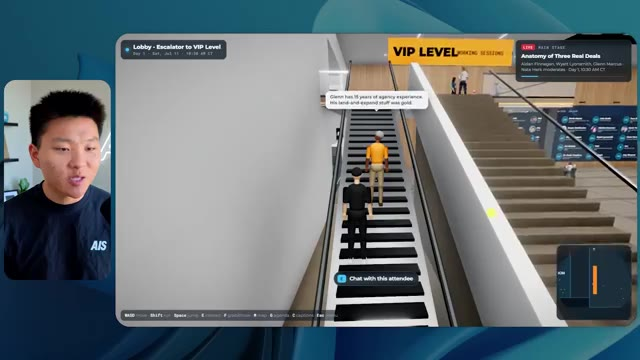

# 🎬 5000 Hours of Building AI in Just 17 Minutes

> **Chaîne** : [Nate Herk | AI Automation](https://www.youtube.com/@nateherk/featured)  
> **Lien YouTube** : [https://www.youtube.com/watch?v=7WZ6XldxX0U](https://www.youtube.com/watch?v=7WZ6XldxX0U)  
> **Date de publication** : 20260804  
> **Durée** : 00:15:44  
> **Identifiant vidéo** : `7WZ6XldxX0U`  
> **Transcription & Analyse** : `whisper-v3-large-turbo+gemini-3.5-flash-lite`  

---

## 📌 Synthèse Exécutive & Outils

### 💡 Résumé

La vidéo « 5 000 heures de développement IA en seulement 17 minutes » de la chaîne *Nate Herk | AI Automation* explore l'utilisation intensive des agents IA et des curseurs d'effort d'un modèle d'intelligence artificielle de pointe (Opus 5.5 d'Anthropic). L'expérimentation consiste à soumettre un unique prompt ambitieux (« slash goal ») à plusieurs niveaux d'effort (de faible à ultra code) pour automatiser la conception et le développement d'un monde 3D interactif et explorable à la troisième personne. Ce monde virtuel simule une conférence technologique réaliste, baptisée « AIS Live », à partir d'un dossier de 105 gigaoctets d'enregistrements vidéo bruts (issus de Frame.io), tout en s'intégrant dans l'écosystème de développement personnel de l'auteur (« Herc 2 »).

À travers les différentes exécutions, l'analyste compare minutieusement non seulement le rendu visuel et fonctionnel du logiciel généré, mais aussi des métriques clés telles que le temps d'exécution, le coût théorique par API, le nombre total de tokens consommés, les vérifications autonomes effectuées via le navigateur et le nombre de questions posées à l'utilisateur. Les résultats révèlent une progression spectaculaire de la qualité : le niveau faible produit un prototype sommaire aux textures boguées et aux éléments statiques en plus de 16 minutes, tandis que le niveau moyen livre en un peu plus d'une heure un monde cohérent, respectueux de l'identité de marque, peuplé d'avatars dynamiques et intégrant de véritables flux vidéo fonctionnels. 

Cette démonstration met en lumière la puissance de l'ingénierie des agents IA couplée à une modulation fine des niveaux d'effort, tout en soulignant la friction classique du développeur : le passage d'un code fonctionnel généré localement sur la machine à son déploiement rapide en production, transition habilement comblée par des solutions d'hébergement intégrées.

### 🛠️ Outils, Modèles & Logiciels Présentés

*   **Opus 5.5 (Anthropic)** : Modèle d'intelligence artificielle ultra-performant et économique, utilisé au cœur de l'expérience pour piloter la génération du monde 3D et exécuter des tâches d'ingénierie complexes de manière autonome.
*   **Claude Code** : Outil de développement et d'assistance par ligne de commande d'Anthropic intégré dans le flux de travail de l'agent.
*   **Herc 2** : Système d'exploitation IA propriétaire de l'auteur servant de base de données contextuelle et d'environnement pour alimenter les agents en ressources de projet.
*   **Frame.io** : Plateforme cloud de stockage et de révision vidéo utilisée ici pour stocker les 105 Go d'enregistrements de la conférence « AIS Live ».
*   **Hostinger** : Sponsor de la vidéo, fournissant une extension gratuite pour éditeur de code permettant de déployer et de mettre en ligne instantanément des projets finis.
*   **Key.ai** : Service tiers optionnel mis à disposition de l'agent pour la génération dynamique d'images et de vidéos contextuelles.

### 🔑 Points Clés & Enseignements Stratégiques

*   **Impact du niveau d'effort sur l'autonomie et la qualité** : Modifier le paramètre d'effort d'un modèle (faible, moyen, élevé, etc.) change radicalement la profondeur du raisonnement et la qualité du code produit, transformant un prototype grossier en une application web 3D riche et structurée.
*   **Exploitation de contextes massifs** : L'agent est capable d'analyser et d'exploiter efficacement un volume de données brutes gigantesque (105 Go de vidéos sur Frame.io) pour en extraire la logique métier, l'ordre du jour et les interventions des conférenciers.
*   **Respect de l'identité de marque** : Un niveau d'effort insuffisant (faible) ignore les chartes graphiques et livre des palettes de couleurs inadaptées, tandis qu'un niveau supérieur (moyen) intègre nativement les palettes, logos et directives visuelles de l'entreprise.
*   **Gestion des entités et de la physique dans les environnements 3D** : Les agents IA sont capables de coder des environnements interactifs complexes à la troisième personne intégrant des cartes de navigation en temps réel, des PNJ (personnages non-joueurs) animés et des éléments de design d'espace.
*   **Autonomie décisionnelle totale** : Fait remarquable, les agents ont exécuté l'intégralité du prompt d'objectif (slash goal) complexes sans poser une seule question à l'utilisateur, démontrant une excellente capacité d'interprétation contextuelle.
*   **Arbitrage temps/coût de calcul** : Le niveau faible a nécessité 16 minutes et 43 secondes pour un coût API estimé à 3,91 $ (191k tokens), tandis que le niveau moyen a requis 1 heure et 13 minutes pour 12,44 $ (490k tokens), illustrant l'investissement nécessaire pour obtenir un résultat professionnel.
*   **Vérification itérative automatisée** : L'agent réalise des contrôles qualité en ouvrant de manière autonome le navigateur à plusieurs reprises (plus de 20 vérifications par run) pour inspecter son propre travail visuellement.
*   **Intégration multimédia dynamique** : Au-delà de simples images statiques générées par défaut au niveau bas, les configurations supérieures réussissent à intégrer de vrais flux vidéo fonctionnels, des diaporamas interactifs et des espaces virtuels sectorisés (scène principale, salons VIP, stands).
*   **La transition du local au cloud (Déploiement)** : Le goulot d'étranglement moderne du développement assisté par IA n'est plus la génération du code, mais la capacité à pousser rapidement un projet terminé vers un environnement de production en ligne sans friction.
*   **Méthodologie de prompting recommandée** : Conformément aux recommandations d'Anthropic, il est stratégique de débuter les flux de travail complexes avec un niveau d'effort moyen, puis d'ajuster itérativement vers le haut ou vers le bas selon la criticité du livrable attendu.

---

## ⏱️ Chronologie & Transcription Complète Audio & Visuelle (Mot pour Mot)

### ⏱️ `[00:00:00 - 00:00:20]` | Segment #01

**🔊 Audio (Transcription Intégrale Mot pour Mot en Français) :**
> Opus 5.5, Opus 5.5, Opus 5.5, Opus 5.5, Opus 5.5. Ce modèle est littéralement partout et pour de très bonnes raisons. Il est intelligent, il est bon marché, il a un goût incroyable, c'est un modèle d'IA incroyable. Mais avec chaque modèle d'IA, vous avez le choix de l'effort, que ce soit faible, moyen, élevé, extra, max ou code ultra.

**👁️ Analyse Visuelle d'Écran (gemini-3.5-flash-lite) :**
**Interface & Outils** : X (Twitter)

**Contenu textuel & Code** : Publication sur les réseaux sociaux avec une vidéo intégrée montrant un rendu visuel 3D.

**Action / Démonstration** : Le présentateur illustre ses propos en montrant un exemple de contenu visuel généré par IA partagé sur les réseaux sociaux.

*⏱️ 00:00:05 — Capture d'écran d'un tweet sur X (Twitter) montrant une vidéo de paysage généré par IA représentant un environnement côtier tropical.*

---

### ⏱️ `[00:00:20 - 00:00:38]` | Segment #02

**🔊 Audio (Transcription Intégrale Mot pour Mot en Français) :**
> Donc, dans cette vidéo, j'ai donné exactement le même prompt à Opus 5.5 et je l'ai exécuté à chaque niveau d'effort, et nous allons comparer les résultats. Nous examinerons la qualité de tous les différents résultats réels, mais nous allons également examiner combien de temps chacun d'eux a pris pour s'exécuter, combien cela nous a coûté si c'était une facturation par API, le nombre total de tokens, combien de vérifications ils ont effectuées, et combien de questions ils m'ont réellement posées tout au long du processus.

**👁️ Analyse Visuelle d'Écran (gemini-3.5-flash-lite) :**
**Interface & Outils** : Application de tableau blanc ou de prise de notes visuelle (type Miro ou Canvas) avec un tableau structuré.

**Contenu textuel & Code** : Tableau comparatif des niveaux d'effort de l'IA (Low à Ultracode) avec des colonnes floutées pour les résultats de performance.

**Action / Démonstration** : Présentation du tableau de comparaison des performances et des coûts selon les différents niveaux d'effort de l'IA.

*⏱️ 00:00:29 — Tableau comparatif sur fond sombre montrant les différents niveaux d'effort (Low, Medium, High, Extra, Max, Ultracode) et les métriques associées (Run time, API cost, Total tokens, Checks, Questions asked).*

---

### ⏱️ `[00:00:39 - 00:00:58]` | Segment #03

**🔊 Audio (Transcription Intégrale Mot pour Mot en Français) :**
> Et les résultats que nous avons obtenus ne sont pas du tout ce à quoi je m'attendais, donc j'ai hâte de partager cela avec vous les gars. Ne perdons pas de temps et allons directement à celui-ci. D'accord, alors plongeons-nous directement dans celui-ci. Je veux commencer juste en vous montrant le prompt réel que nous avons utilisé que nous avons donné à chacun de ces différents agents. Je vais aller dans les fichiers ici, et nous allons ouvrir ce fichier markdown de prompt, et je vais vous montrer ce que nous avons obtenu. Voici donc le slash objectif que j'ai fourni.

**👁️ Analyse Visuelle d'Écran (gemini-3.5-flash-lite) :**
**Interface & Outils** : Application de développement / interface de l'outil de code avec panneau de discussion et gestion des worktrees.

**Contenu textuel & Code** : Message de l'assistant IA demandant confirmation pour lancer la création d'un monde 3D interactif basé sur le fichier PROMPT.md.

**Action / Démonstration** : Présentation de l'interface de l'outil de développement et du prompt initial en cours de discussion.

*⏱️ 00:00:48 — Interface d'une application de développement avec le panneau latéral affichant les différents tests d'effort et la zone de discussion principale montrant un message de l'assistant IA invitant à commencer la tâche de création d'un monde 3D en 3 ème personne.*

---

### ⏱️ `[00:00:58 - 00:01:34]` | Segment #04

**🔊 Audio (Transcription Intégrale Mot pour Mot en Français) :**
> J'ai dit, tu dois me créer un monde 3D qui est une conférence tech réaliste dans laquelle je peux me promener en vue à la troisième personne. Tu vas regarder ce dossier, qui contient mes éléments d'enregistrement d'événements de AIS Live. Et ce dossier est un dossier frame IO de 105 gigaoctets d'enregistrements vidéo. C'était un événement complètement virtuel. Tout a été enregistré et tous les enregistrements sont juste ici. J'ai dit, ton objectif est de prendre cet événement et de le transformer en un monde 3D explorable qui me donne l'impression d'être réellement allé à une vraie conférence en personne avec différentes salles, différentes pistes, différentes scènes, bla, bla, bla. N'hésite pas à utiliser key.ai si tu as besoin de générer des images ou des vidéos. Et tu peux aussi utiliser tout le reste à l'intérieur de mon projet Herc 2, qui est comme mon système d'exploitation IA. J'ai dit,

**👁️ Analyse Visuelle d'Écran (gemini-3.5-flash-lite) :**
**Interface & Outils** : Éditeur de code (VS Code / Cursor) et interface web de stockage (Frame.io)

**Contenu textuel & Code** : Fichier Markdown PROMPT.md détaillant la création d'un monde 3D virtuel et lien Frame.io (https://f.io/sPdlo-Si)
[DESC_IMAGE_3] Affichage du prompt demandant la transformation des enregistrements en monde 3D explorable en vue à la troisième personne.

**Action / Démonstration** : Explications face caméra et démonstration conceptuelle.

*⏱️ 00:01:07 — Éditeur de code affichant le fichier PROMPT.md contenant les instructions pour créer un monde 3D de conférence tech.*

*⏱️ 00:01:16 — Interface web montrant le dossier Frame.io de 105,69 Go contenant les enregistrements des événements AIS Live.*

*⏱️ 00:01:25 — Éditeur de code montrant le contenu détaillé du prompt avec les liens vers les ressources et les attentes du projet.*

---

### ⏱️ `[00:01:34 - 00:02:08]` | Segment #05

**🔊 Audio (Transcription Intégrale Mot pour Mot en Français) :**
> vous serez jugés sur la créativité, le design, la physique et la sensation générale lorsque j'explorerai le monde en 3D que vous avez construit. Et c'était pratiquement la fin des instructions. Donc, comme vous pouvez le voir sur ce côté gauche, j'ai exécuté ceci à travers tous les différents niveaux d'effort. Commençons par le niveau bas et remontons jusqu'à ultra code. Très bien. Nous avons donc ici le résultat du niveau bas. Ouvrons ceci et jetons un coup d'œil. Nous avons donc AIS Live, le sommet des services IA en personne enfin, et nous avons pu cliquer partout. Tout d'abord, on ne sent pas vraiment l'identité de la marque. Genre, ce n'ha pas le logo d'IS Live. Ce ne sont même pas nos couleurs. Donc je n'aime pas trop ça, mais entrons ici. D'accord. C'est beaucoup trop lumineux. Euh, nous avons une carte en haut à droite. Nous avons une ville par ici. Je ne peux pas dire quelle ville c'est.

**👁️ Analyse Visuelle d'Écran (gemini-3.5-flash-lite) :**
**Interface & Outils** : Application web d'agent IA / interface de chat conversationnelle.

**Contenu textuel & Code** : Texte du prompt initial de l'IA proposant de construire un monde 3D navigable en vue à la troisième personne (« build a walkable third-person 3D world ») et réponse de l'utilisateur (« yes, start the task in PROMPT.md »).

**Action / Démonstration** : Sélection des différents niveaux d'effort dans le panneau latéral pour exécuter la tâche.

*⏱️ 00:01:42 — Interface d'une application d'agent IA montrant un panneau latéral avec des sessions de test par niveau d'effort (Hello, Extra, High, Max, Ultracode, Medium, Low) et la conversation principale à droite.*

---

### ⏱️ `[00:02:08 - 00:02:40]` | Segment #06

**🔊 Audio (Transcription Intégrale Mot pour Mot en Français) :**
> C'est. D'accord. C'est Chicago, ce qui est plutôt sympa parce que tu sais, je vis à Chicago, mais bref, en haut, à droite, on peut voir une carte. Nous avons un hall d'accueil. Nous avons un hall d'exposition. Nous avons le salon VIP, la scène principale. La carte montre également où se trouve chaque autre personne et tout cela se synchronise en direct. On peut donc voir l'inscription. On peut voir le premier jour, le discours d'ouverture de l'agent hyper, le débriefing en direct. Cool. Donc ça connaît réellement l'ordre du jour, et puis il y a le deuxième jour. Donc ça a trouvé ça, c'est bien. Nous avons ces petites boules ici que je peux espérer lancer autour de moi. D'accord. Le visage, oh, regarde ça. Si je vais par ici, toutes les personnes disparaissent tout simplement. Très mauvais. Très mauvais. D'accord. Alors voyons voir. Est-ce que je peux sprinter ? D'accord.

**👁️ Analyse Visuelle d'Écran (gemini-3.5-flash-lite) :**
**Interface & Outils** : Application web de conférence virtuelle en 3D (type Gather.town ou équivalent metavers) avec mini-carte de navigation.

**Contenu textuel & Code** : Menus de navigation de l'événement, planning du premier jour, indications de zones (Badge pickup, Lobby, Expo Hall, Main Stage).
[DESC_IMAGE_1] Navigation d'un avatar dans l'espace virtuel 3D de la conférence et exploration des différentes zones indiquées sur la mini-carte.

**Action / Démonstration** : Explications face caméra et démonstration conceptuelle.

*⏱️ 00:02:16 — Vue d'un espace virtuel 3D avec des avatars de participants, affichant le panneau 'Badge pickup - GA and VIP' et une mini-carte interactive en haut à droite.*

*⏱️ 00:02:24 — Vue du hall d'accueil (Lobby) virtuel avec un panneau affichant le programme du 'Day 1' et la mini-carte de l'événement en haut à droite.*

*⏱️ 00:02:32 — Vue du hall d'exposition virtuel (Expo Hall) montrant des avatars et des zones d'interaction lumineuses, avec la mini-carte toujours visible en haut à droite.*

---

### ⏱️ `[00:02:40 - 00:03:04]` | Segment #07

**🔊 Audio (Transcription Intégrale Mot pour Mot en Français) :**
> Je peux avancer un peu plus vite. Je vais d'abord aller par ici. Il y a des goodies, euh, un sweat glido certifié AIS plus. D'accord. Donc il y a les vrais stands qu'on avait dans l'événement virtuel. On avait des stands. Donc c'est plutôt cool. Un petit endroit pour prendre des photos. Salle C. En ce moment, nous avons Tangy Frederick qui anime un atelier. D'accord. Mais ce n'est pas une vidéo. Comme vous pouvez le voir, c'est juste une image. Elle ne bouge pas. C'est donc juste une image. Ces gens sont en train de disparaître. Ce doivent être des fantômes. Allons par ici vers la salle A.

**👁️ Analyse Visuelle d'Écran (gemini-3.5-flash-lite) :**
**Interface & Outils** : Environnement virtuel 3D interactif (type Roblox ou plateforme d'événement virtuel)

**Contenu textuel & Code** : Affichage textuel dans le jeu : "Sponsors, booths and hallway conversations", "Glaido - Day 1 sponsor", instructions de configuration d'API.

**Action / Démonstration** : Navigation et exploration à l'intérieur d'un événement virtuel en 3D par le présentateur.

*⏱️ 00:02:46 — Vue d'un monde virtuel style métaverse montrant un personnage explorant un hall d'exposition avec des stands sponsorisés (Glaido).*

*⏱️ 00:02:52 — Le personnage navigue vers une salle d'atelier verte (Workshop Room C - Enterprise track) dans l'environnement virtuel.*

*⏱️ 00:02:58 — Le personnage se rapproche d'un écran géant dans l'environnement virtuel affichant des instructions sur une clé API et des étapes de configuration.*

---

### ⏱️ `[00:03:04 - 00:03:30]` | Segment #08

**🔊 Audio (Transcription Intégrale Mot pour Mot en Français) :**
> Nous avons Liberty White. D'accord. Très cool. Vos 30 premiers jours en automatisation. Encore une fois, c'est juste une image fixe et les gens ont des bugs d'affichage. Donc pas très bon ici. Je vais aller sur la scène principale et voir ce que nous avons. D'accord, cool. Donc nous avons une scène principale. Les gens ont de gros bugs d'affichage. Vraiment mauvais. Ce n'est vraiment pas terrible. Notre vidéo est en fait en train de bouger. Genre, j'ai vu mon visage ici et j'ai vu celui de Devin, mais maintenant ils ont disparu. Donc je ne sais pas trop ce qui s'est passé. D'accord. C'est, on dirait plutôt un diaporama. Rien n'est vraiment lu pour l'instant. Quoi qu'il en soit, entrons ici.

**👁️ Analyse Visuelle d'Écran (gemini-3.5-flash-lite) :**
**Interface & Outils** : Application ou plateforme virtuelle 3D de type métaverse / espace événementiel en ligne.

**Contenu textuel & Code** : Environnement 3D interactif avec avatars, salles d'ateliers et scènes de conférence.

**Action / Démonstration** : Navigation et déplacement d'un avatar à travers les différents espaces de l'événement virtuel.

*⏱️ 00:03:11 — Vue d'une salle d'atelier virtuelle (Workshop Room A) montrant un avatar et des plateformes lumineuses.*

*⏱️ 00:03:17 — Vue de la scène principale d'une conférence virtuelle remplie d'avatars assis dans un auditorium virtuel.*

*⏱️ 00:03:24 — Vue face à l'écran géant d'une conférence virtuelle affichant le logo "AIS LIVE AI Services Summit".*

---

### ⏱️ `[00:03:30 - 00:03:58]` | Segment #09

**🔊 Audio (Transcription Intégrale Mot pour Mot en Français) :**
> Nous avons d'autres stands. Nous avons hyper agent. Nous avons Claude Code. Nous avons plus de cadeaux publicitaires. La salle B, c'est Dave Ebelor. Je suppose que c'est exactement la même chose. Nous avons du café. Et puis je suppose le salon VIP, accès VIP seulement. C'est plutôt cool, mais il n'y a vraiment rien qui se passe ici. Cet écran est bien trop lumineux. D'accord. Donc je pense que vous comprenez l'ambiance qu'on obtient ici d'Opus 5.5 en effort faible. Et c'est là que les choses deviennent intéressantes. Combien de temps pensez-vous que cela a duré ? Combien de temps ? Celui-ci a duré 16 minutes et 43 secondes. Combien pensez-vous que cela a coûté ?

**👁️ Analyse Visuelle d'Écran (gemini-3.5-flash-lite) :**
**Interface & Outils** : Application de tableau ou canevas web (Opus 5.5 Efforts)

**Contenu textuel & Code** : Tableau comparatif avec colonnes Low, Medium, High, Extra, Max, Ultracode et lignes Run time, API cost, Total tokens, Checks, Questions asked.

**Action / Démonstration** : Présentation des différents niveaux d'effort et de leurs métriques associées.

*⏱️ 00:03:51 — Interface de tableau ou de diagramme montrant des niveaux de performance (Low, Medium, High, Extra, Max, Ultracode) et des métriques associées (Run time, API cost, Total tokens).*

---

### ⏱️ `[00:03:58 - 00:04:26]` | Segment #10

**🔊 Audio (Transcription Intégrale Mot pour Mot en Français) :**
> 3,91 dollars si c'était une facturation par API. J'utilise évidemment mon abonnement ici, mais nous allons juste calculer cela avec la facturation par API. Le nombre total de tokens était de 191 000. Il a fait 22 vérifications. Donc pour la vérification, 22 fois il a ouvert le navigateur et a exécuté différentes sortes de vérifications. Donc 22 catégories de vérifications. Et combien de questions m'a-t-il posées ? Il m'a posé un total de zéro question tout au long de cette invite de commande d'objectif (slash goal). D'accord. Alors, ouvrons l'effort moyen et voyons ce que nous avons. D'accord, c'est parti. Effort moyen. Nous avons Nate Herc. Nous avons mon badge. C'est du contenu de la marque AI's Life.

**👁️ Analyse Visuelle d'Écran (gemini-3.5-flash-lite) :**
**Interface & Outils** : Application de tableau blanc ou de prise de notes numérique avec des graphiques et des tableaux.

**Contenu textuel & Code** : Tableau de données avec des lignes "Run time", "API cost", "Total tokens", "Checks", "Questions asked" et des colonnes "Low", "Medium", "High", "Ext".

**Action / Démonstration** : Le présentateur commente les métriques affichées concernant le coût et l'utilisation des tokens pour l'exécution.

*⏱️ 00:04:05 — Un tableau comparatif montrant les métriques de performance et de coût pour le niveau de difficulté "Low" (Run time: 16m 43s, API cost: $3.91, Total tokens: 191.3K, Checks, Questions asked), avec le présentateur visible dans une vignette en incrustation.*

---

### ⏱️ `[00:04:26 - 00:04:46]` | Segment #11

**🔊 Audio (Transcription Intégrale Mot pour Mot en Français) :**
> Donc ça a déjà l'air un petit peu mieux. Ça ressemble à nos palettes de couleurs qui ont utilisé nos directives de marque. Premier jour de construction, deuxième jour de gain, VIP. Cool. D'accord. Je vais entrer dans le lieu. D'accord. Waouh. Une ambiance similaire en quelque sorte. C'est en arrière-plan. Ça ne ressemble pas à Chicago, n'est-ce pas ? Non, ça ressemble à, honnêtement, ça ressemble à une ville imaginaire. Quoi qu'il en soit, c'est drôle qu'ils aient décidé de faire ça. Voyons si je peux bouger un peu plus vite. Oh, waouh.

**👁️ Analyse Visuelle d'Écran (gemini-3.5-flash-lite) :**
**Interface & Outils** : Application web interactive / 3D virtuellement générée (AIS Live).

**Contenu textuel & Code** : Écran d'accueil avec badge d'accès, commandes de déplacement (WASD, Shift, Espace) et interface 3D d'un espace événementiel virtuel.

**Action / Démonstration** : Le présentateur navigue dans l'interface de l'application et entre dans le lieu virtuel.

*⏱️ 00:04:31 — Interface d'accueil de l'application 'AIS Live' montrant un badge nominatif virtuel au nom de Nate Herk et un bouton 'Enter the Venue'.*

*⏱️ 00:04:41 — Vue à la première ou troisième personne à l'intérieur du lieu virtuel 3D avec des avatars et une grande baie vitrée donnant sur une ville de nuit.*

---

### ⏱️ `[00:04:46 - 00:05:21]` | Segment #12

**🔊 Audio (Transcription Intégrale Mot pour Mot en Français) :**
> Les gens interagissent avec moi. Regardez. Si je m'approche de ce type, il vient de lever le bras. Bon, maintenant il ne veut plus du tout avoir affaire à moi. Mais tous ces petits robots ici doivent prendre des décisions. Je ne sais pas s'ils utilisent Jev. C'est sûr que non. Je ne le lui ai pas dit. En fait, ma clé Jev est à l'arrière. Je ne sais pas. Peut-être qu'il l'a utilisée. Quoi qu'il en soit, nous pouvons voir ici que nous avons la salle d'atelier C, le laboratoire des agents. Sympa. Donc celui-ci est en fait en train d'être exécuté. Vous pouvez voir qu'il s'agit d'une vraie vidéo lue par Tangy. Tout le monde ici est en train de travailler sur un ordinateur portable. Ils ne buguent pas. C'est plutôt cool. De plus, mon badge est sur ma poitrine, ce qui est plutôt cool. Je peux venir par ici. Nous avons une carte en haut à droite, comme vous pouvez le voir, mais je peux venir par ici. Nous avons un

**👁️ Analyse Visuelle d'Écran (gemini-3.5-flash-lite) :**
**Interface & Outils** : Environnement virtuel 3D (type métavers ou jeu de simulation).

**Contenu textuel & Code** : Avatars 3D modélisés interagissant dans un espace virtuel avec interface utilisateur contextuelle.
[DESC_IMAGE_1] Navigation d'un avatar dans un espace virtuel 3D.
[DESC_IMAGE_2] Navigation d'un avatar dans un espace virtuel 3D.
[DESC_IMAGE_3] Navigation d'un avatar dans un espace virtuel 3D.

**Action / Démonstration** : Explications face caméra et démonstration conceptuelle.

---

### ⏱️ `[00:05:21 - 00:05:47]` | Segment #13

**🔊 Audio (Transcription Intégrale Mot pour Mot en Français) :**
> le hall d'exposition. C'est là que nous avons le stand Glido. Et ça diffuse actuellement. Oui, ça diffuse la vidéo de nous en train de parler de Glido. Ça diffuse la vidéo d'Ed et moi en train de parler de notre programme de certification. Nous avons le logo AIS Plus ici à l'arrière, qui est un peu mal placé. Ce sont les diapositives des conférenciers et les points clés. Alors waouh, ce sont toutes les ressources que nous avons distribuées après l'événement. Elles sont toutes affichées juste là également. Nous pouvons voir que nous avons un coup de projecteur sur la communauté. Donc c'est Aiden qui parle de son contrat qu'il a décroché et c'est diffusé en direct. Ces gens regardent.

**👁️ Analyse Visuelle d'Écran (gemini-3.5-flash-lite) :**
**Interface & Outils** : Environnement virtuel 3D de type metaverse / plateforme d'événement virtuel.

**Contenu textuel & Code** : Écrans virtuels affichant des diaporamas et des informations de session.

**Action / Démonstration** : Navigation et exploration d'un hall d'exposition virtuel par un avatar.

---

### ⏱️ `[00:05:47 - 00:06:21]` | Segment #14

**🔊 Audio (Transcription Intégrale Mot pour Mot en Français) :**
> Ils sont plutôt engagés. On a hyper agent. C'était, c'est ce que je voulais dire. Si vous avez vu ces gens lever les mains pour dire bonjour, c'était plutôt marrant. Regardez, regardez, le voilà qui recommence. Bref. Bon. Où est-ce que je suis maintenant ? Maintenant, je suis dans le hall principal. On a un bar à café. On a un grand logo, qui est le vrai logo. C'est trop lumineux, mais on a le logo. On peut voir si on peut entrer ici dans le parcours fondation. On a Sabrina Romanov et Liberty White. Donc différentes formations juste là. On peut entrer dans cette salle. C'est le parcours avancé. Alors, qu'est-ce qui se passe ici. On a Dave Ebelar et Saman qui parlent de différentes choses là-dedans. Et maintenant, allons jeter un œil à la scène principale. Oh, attendez, il y a une vidéo de moi là-haut. C'est genre un VIP

**👁️ Analyse Visuelle d'Écran (gemini-3.5-flash-lite) :**
**Interface & Outils** : Application ou plateforme virtuelle 3D (Metaverse / espace de conférence virtuel).

**Contenu textuel & Code** : Environnement virtuel 3D interactif avec des avatars, des affichages de texte HUD ("Main Lobby") et une mini-carte de navigation.

**Action / Démonstration** : Navigation et déplacement d'un avatar à travers le monde virtuel 3D.

---

### ⏱️ `[00:06:21 - 00:06:50]` | Segment #15

**🔊 Audio (Transcription Intégrale Mot pour Mot en Français) :**
> section ? Ouais, on ira voir ça dans une minute. Mais bref, voici la scène principale. Ça a l'air vraiment, vraiment super. On a une grande scène. On a genre quatre personnes assises ici. On a les trois écrans d'Alex là-haut avec "hyper agent". Est-ce que j'ai le droit de monter sur scène ? Oh, et il me laisse monter sur scène. D'accord. C'est plutôt sympa. Bon les gars, prenons un selfie. Laissez-moi prendre tout le monde en arrière-plan. Venez par ici. Bref, c'est vraiment, vraiment cool. Toutes les places ne sont pas occupées par contre. Donc il faut qu'on travaille là-dessus. Mais bref, je vais y retourner en courant pour voir ce que c'était que cette section VIP. D'accord. Le salon VIP. J'ai l'impression que c'est comme un salon d'aéroport ou un truc comme ça.

**👁️ Analyse Visuelle d'Écran (gemini-3.5-flash-lite) :**
**Interface & Outils** : Application web / plateforme de conférence virtuelle 3D

**Contenu textuel & Code** : Interface utilisateur affichant "Hyperagent Keynote" avec les détails de la session par Alex McDonnell.

**Action / Démonstration** : Navigation et exploration d'un environnement de conférence virtuel en 3D.

---

### ⏱️ `[00:06:51 - 00:07:14]` | Segment #16

**🔊 Audio (Transcription Intégrale Mot pour Mot en Français) :**
> Okay, super. Donc maintenant nous avons les sessions VIP ici. Session de questions-réponses VIP avec Nate, lecture vidéo en direct juste ici. Très, très cool. Et nous avons comme un bar ou quelque chose comme ça. Génial. Je dirais que c'est un assez bon résultat. Maintenant, en ce qui concerne les statistiques ici, celle-ci a pris une heure et 13 minutes à s'exécuter. Cela nous aurait coûté 12 dollars et 44 cents. Elle a utilisé 490 000 jetons et elle a effectué 23 vérifications.

**👁️ Analyse Visuelle d'Écran (gemini-3.5-flash-lite) :**
**Interface & Outils** : Interface web d'événement virtuel et tableau de bord de métriques.

**Contenu textuel & Code** : "VIP Q&A with Nate", "Run time: 16m 43s", "API cost: $3.91", "Total tokens: 191.3K", "Checks: 22".

**Action / Démonstration** : Présentation de la zone VIP et analyse des coûts et performances d'exécution.

*⏱️ 00:06:56 — Capture montrant l'interface d'un espace virtuel VIP avec un écran affichant une session vidéo en direct et un bar en arrière-plan.*

*⏱️ 00:07:02 — Tableau de métriques affichant les performances (Run time 16m 43s, API cost $3.91, 191.3K tokens).*

---

### ⏱️ `[00:07:14 - 00:07:48]` | Segment #17

**🔊 Audio (Transcription Intégrale Mot pour Mot en Français) :**
> Et il nous a posé un total de zéro question une fois de plus. Très bien, passons à élevé. C'était déjà un résultat plutôt correct et Anthropic eux-mêmes dans leur vidéo sur comment prompter Opus 5.5, ou désolé, pas une vidéo, un article. Ils ont dit de commencer simplement par moyen et d'ajuster à la hausse ou à la baisse si nécessaire. C'était donc un résultat moyen. Passons à élevé et voyons ce que nous avons obtenu. Très rapidement, les gars, je dois prendre une seconde pour vous parler du sponsor de la vidéo d'aujourd'hui, Hostinger. Donc ces deux modèles viennent de me créer une version fonctionnelle de la même chose. Et maintenant, je me retrouve exactement là où je finis toujours, avec un projet terminé sur mon ordinateur portable et aucun moyen rapide de le mettre en ligne. Et c'est précisément le fossé que comble le connecteur d'Hostinger. C'est une extension gratuite

**👁️ Analyse Visuelle d'Écran (gemini-3.5-flash-lite) :**
**Interface & Outils** : Tableau de données interactif et éditeur de code / interface de chat pour agent IA.

**Contenu textuel & Code** : Tableaux de métriques (coût API, temps d'exécution, nombre de tokens) et instructions de prompt pour la création d'un fichier HTML de calcul de ROI.

**Action / Démonstration** : Analyse comparative des performances des différents modes d'effort de l'IA et suivi de la génération d'un outil web par un agent.

*⏱️ 00:07:22 — Un tableau comparatif des performances de l'IA (Run time, API cost, Total tokens, Checks, Questions asked) selon différents niveaux d'effort (Low, Medium, High, Extra).*

*⏱️ 00:07:39 — Une interface de développement avec un éditeur affichant les logs d'exécution d'un agent IA construisant un calculateur ROI (Northwind ROI calculator).*

---

### ⏱️ `[00:07:48 - 00:08:23]` | Segment #18

**🔊 Audio (Transcription Intégrale Mot pour Mot en Français) :**
> pour votre éditeur qui intègre votre compte Hostinger dans l'outil de programmation que vous utilisez déjà, que ce soit VS Code, Cursor, Cloud Code, Codex, et j'en passe. Vous vous connectez une seule fois en un clic, et à partir de là, votre agent peut déployer le site, y associer un domaine, configurer les enregistrements DNS et vérifier votre VPS sans que vous ayez à quitter votre éditeur. Ainsi, quel que soit celui que vous préférez au final, ce qu'il a construit se trouve à quelques minutes d'une véritable URL sur un hébergement géré. Le connecteur est gratuit avec chaque formule d'hébergement, donc si vous avez encore besoin de l'hébergement sous-jacent, profitez de la formule illimitée via le lien dans la description et utilisez le code NATEHERK pour obtenir 10 % de réduction. Cela inclut également un nom de domaine gratuit et un e-mail professionnel pour un an. Et c'est toujours le moyen le moins cher que j'ai trouvé pour obtenir quelque chose

**👁️ Analyse Visuelle d'Écran (gemini-3.5-flash-lite) :**
**Interface & Outils** : Interface web Hostinger et Claude Code dans un IDE.

**Contenu textuel & Code** : Statut "Connected" via OAuth, Node.js 24.13.0, et liste des outils d'assistance (Websites, Domains, Subscriptions & Payments, Email Marketing).

**Action / Démonstration** : Connexion unique établie permettant à l'agent de gérer les sites et les domaines.

*⏱️ 00:07:57 — Interface montrant la connexion réussie de Hostinger depuis l'IDE, avec les outils disponibles (Websites, Domains, Subscriptions, Email Marketing).*

---

### ⏱️ `[00:08:23 - 00:08:47]` | Segment #19

**🔊 Audio (Transcription Intégrale Mot pour Mot en Français) :**
> Tu as construit cela sur une vraie URL. Alors revenons à la vidéo. D'accord. Encore une fois, très, très marqué par la marque. C'est un écran de chargement encore meilleur que le précédent. Nous avons ce joli petit effet en arrière-plan. Nous avons le logo. Nous allons entrer dans le lieu. D'accord. Nous y voilà. Ça a l'air plutôt bien. Nous commençons à l'extérieur et vous pouvez voir que nous avons ces drapeaux pour tous les intervenants, Wyatt, Casper, Alex, Ed, Aiden, Sabrina, Liberty. C'est plutôt cool. Nous avons des blocs en direct ici.

**👁️ Analyse Visuelle d'Écran (gemini-3.5-flash-lite) :**
**Interface & Outils** : Application web interactive 3D / Navigateur web

**Contenu textuel & Code** : Interface utilisateur de jeu 3D avec bannières d'événements, instructions de touches (WASD, MOUSE) et mini-carte.

**Action / Démonstration** : Exploration de l'espace virtuel et entrée dans le lieu de l'événement en ligne.

*⏱️ 00:08:29 — Écran de chargement de l'application 'AIS LIVE' avec le logo, les instructions de contrôle et le bouton 'ENTER THE VENUE'.*

*⏱️ 00:08:35 — Entrée dans l'espace virtuel 3D interactif 'AIS Live Plaza' avec des avatars et des bâtiments en arrière-plan.*

*⏱️ 00:08:41 — Navigation dans la place virtuelle 'AIS Live Plaza' montrant des bannières verticales avec des noms d'intervenants.*

---

### ⏱️ `[00:08:47 - 00:09:23]` | Segment #20

**🔊 Audio (Transcription Intégrale Mot pour Mot en Français) :**
> elle a pris cette photo de moi, votre hôte, Nate Herc, John, Dave, Nate Herc. Voilà. OK. Les portes. Génial. Ce sont des portes coulissantes automatiques en verre. J'adore ça. On peut voir l'enregistrement VIP. On peut voir l'admission générale. On peut venir par ici et on peut découvrir l'exposition avec différents stands, le coin de la communauté. Vous pouvez aussi voir qu'en haut à gauche, j'ai un passeport. Donc c'est comme, ça montrera combien d'endroits j'ai visités. Tout cela est une vraie lecture. Nous avons un mur de ressources avec tous les différents intervenants. Ils ont aussi une session de réseautage par ici. Je vais donc venir très vite voir de quoi il s'agit. Nous avons donc le bar à cold brew AIS. Nous avons différents membres de la communauté qui ont été mis en avant ou mis en lumière.

**👁️ Analyse Visuelle d'Écran (gemini-3.5-flash-lite) :**
**Interface & Outils** : Application de métavers / monde virtuel 3D en ligne

**Contenu textuel & Code** : Environnement virtuel 3D interactif avec interface d'enregistrement et bannières d'événements

**Action / Démonstration** : Exploration et navigation en vue subjective/troisième personne dans l'espace virtuel de la conférence

*⏱️ 00:08:56 — Vue d'un monde virtuel 3D montrant l'accueil d'un événement avec des comptoirs d'enregistrement et une scène principale.*

*⏱️ 00:09:05 — Navigation dans un hall d'exposition virtuel avec des stands et des avatars interactifs.*

*⏱️ 00:09:14 — Déplacement d'un avatar au milieu d'autres personnages dans le hall d'entrée virtuel de l'événement.*

---

### ⏱️ `[00:09:23 - 00:09:56]` | Segment #21

**🔊 Audio (Transcription Intégrale Mot pour Mot en Français) :**
> On a la zone VIP. Attends, quoi ? Prends un bracelet. Ah, je dois vraiment aller chercher le bracelet. D'accord. Laisse-moi m'enregistrer rapidement. Le bracelet est déjà mis. Attends, quoi ? D'accord. Oh, d'accord. Maintenant, les portes se sont ouvertes pour moi. Cool. Je peux entrer ici. Oh, ça mène juste à la scène principale. Salon VIP. Il y a une séance de questions-réponses en cours. Ça a l'air très cool. Je veux dire, je suis très impressionné par la façon dont il est capable de faire ça. Waouh. D'accord. Donc c'est vraiment bien. Ce qu'on a fait, c'est qu'on a eu des salles de discussion VIP avec différentes personnes. Tu peux voir qu'il y a différentes salles, différents membres de l'équipe AIS qui vont dans des trucs. C'est vraiment cool. C'est très cool. C'est un bien meilleur VIP

**👁️ Analyse Visuelle d'Écran (gemini-3.5-flash-lite) :**
**Interface & Outils** : Environnement virtuel 3D interactif de type métavers / plateforme de conférence en ligne.

**Contenu textuel & Code** : Éléments textuels d'interface (« Registration Concourse », « VIP Lounge », « VIP Working Sessions », commandes en bas à droite).

**Action / Démonstration** : Navigation et exploration de différents espaces virtuels (enregistrement, salon VIP et salles de travail) par l'avatar du présentateur.

*⏱️ 00:09:32 — Vue d'un espace virtuel 3D représentant une zone d'enregistrement (Registration Concourse) avec des avatars et une mini-carte en haut à droite.*

*⏱️ 00:09:40 — Vue du salon VIP virtuel (VIP Lounge) avec un grand écran montrant une visioconférence et des participants assis sur des canapés.*

*⏱️ 00:09:48 — Vue de sessions de travail VIP virtuelles (VIP Working Sessions) avec différents ateliers étiquetés (« Price It Right », « Turn Your Expertise into a Service », etc.).*

---

### ⏱️ `[00:09:56 - 00:10:30]` | Segment #22

**🔊 Audio (Transcription Intégrale Mot pour Mot en Français) :**
> expérience que celle qui a été montrée dans le premier extrait. D'accord. La fête VIP d'après-spectacle. Regardez ça. Nous avons une piste de danse. Nous avons tous ces éléments ici. Nous avons la lecture de la fête VIP d'après-spectacle juste ici. Et il y a une estrade de DJ. C'est tellement drôle. Il y a un petit bug ici, un petit dysfonctionnement juste là, mais c'est génial. Oh, super. Donc quand je suis ici sur la scène principale, nous obtenons des sous-titres. Vous pouvez voir juste ici au bas de mon écran, nous obtenons ces sous-titres de Wyatt qui est en train de parler ici. Nous avons des lumières. Nous avons le panneau. Très cool. Belle scène principale. Je vais aller par ici. Nous pouvons aller à la fondation,

**👁️ Analyse Visuelle d'Écran (gemini-3.5-flash-lite) :**
**Interface & Outils** : AUCUNE

**Contenu textuel & Code** : AUCUNE

**Action / Démonstration** : AUCUNE

---

### ⏱️ `[00:10:30 - 00:11:06]` | Segment #23

**🔊 Audio (Transcription Intégrale Mot pour Mot en Français) :**
> avancé, et les parcours d'entreprise ici. Alors voyons voir. Nous avons l'anatomie de trois vraies transactions. Nous avons hyper agent. Nous avons les évaluations avec Nate et Ed ici. Nous avons Dave qui s'occupe des trucs avancés. C'est vraiment bien. Je veux dire, évidemment, chacun, chacun de ces résultats jusqu'à présent, faible était correct. Moyen était mieux. Élevé a été encore mieux. Voyons si cette tendance se poursuit et voyons combien cela nous a coûté. Donc, le niveau élevé a fonctionné pendant une heure et sept minutes. Donc un peu plus rapide que moyen, cela nous aurait coûté 16 dollars et 31 cents. Il a utilisé un demi-million de tokens, 509 000. Il a fait 22 vérifications. Et il nous a aussi demandé, enfin, non, je me suis trompé, ce

**👁️ Analyse Visuelle d'Écran (gemini-3.5-flash-lite) :**
**Interface & Outils** : Application de tableau blanc / interface de type Excalidraw ou outil de diagramme/analyse (titre en haut à gauche : Opus 5.5 Efforts).

**Contenu textuel & Code** : Tableau de données comparatives : Run time (16m 43s, 1h 13m, 1h 7m), API cost ($3.91, $12.44, $16.31), Total tokens (191.3K, 419.2K), Checks (22, 23), Questions asked (0, 0).

**Action / Démonstration** : Manipulation d'éléments graphiques (redimensionnement de blocs bleus) sur un tableau d'évaluation de performances d'IA.

*⏱️ 00:10:57 — Capture d'un tableau comparatif d'analyse ("Opus 5.5 Efforts") montrant les métriques Low, Medium, High et Extra (temps d'exécution, coût API, jetons totaux, vérifications, questions posées).*

---

### ⏱️ `[00:11:06 - 00:11:25]` | Segment #24

**🔊 Audio (Transcription Intégrale Mot pour Mot en Français) :**
> l'un m'a posé une question et, divulgâcheur, c'était le seul qui nous a posé une question de tout ça. Voyons voir, il nous en reste trois : Extra, Max et Ultra Code. Laissez-moi ouvrir Extra et nous verrons ce que nous avons. D'accord. Celui-ci a l'air plutôt bien. Je dirais honnêtement que jusqu'à présent, l'écran de chargement haut était le meilleur. Celui qu'on vient juste de voir, mais bref, entrons dans AIS Live.

**👁️ Analyse Visuelle d'Écran (gemini-3.5-flash-lite) :**
**Interface & Outils** : Application de tableau de bord ou interface de visualisation de données (style canevas interactif).

**Contenu textuel & Code** : Tableau chiffré comparant les durées d'exécution, les coûts API, le nombre de tokens, les vérifications et les questions posées.
[DESC_ACTION_1] Le présentateur commente le tableau et ouvre la section 'Extra'.

**Action / Démonstration** : Explications face caméra et démonstration conceptuelle.

*⏱️ 00:11:11 — Un tableau comparatif des performances de différents niveaux d'effort (Low, Medium, High, Extra) avec les métriques associées (Run time, API cost, Total tokens, Checks, Questions asked).*

---

### ⏱️ `[00:11:26 - 00:11:51]` | Segment #25

**🔊 Audio (Transcription Intégrale Mot pour Mot en Français) :**
> Waouh. D'accord. Donc nous avons comme de petits extraits sonores. Je peux discuter avec des gens. Le panneau sur la guerre des outils a réglé quelques débats pour moi. Sympa. Bonne perspective là-bas. Nous sommes dehors à nouveau. Nous avons ces différentes bannières, bien qu'elles soient toutes les mêmes. Elles n'affichent pas les noms de différentes personnes. Donc grand logo AIS Live. L'aile de l'atelier est par ici. Et passons par les portes coulissantes en verre pour voir ce que nous avons. Donc nous avons le café AIS. La carte est en bas à droite, et elle n'est pas très descriptive.

**👁️ Analyse Visuelle d'Écran (gemini-3.5-flash-lite) :**
**Interface & Outils** : Espace virtuel (plateforme de conférence ou de présentation)

**Contenu textuel & Code** : "LIVE", "BUILD DAY", "Convention Plaza", "AIS LIVE REAL PROJECTS"

**Action / Démonstration** : Navigation dans un environnement virtuel

*⏱️ 00:11:32 — Un avatar se tient à côté d'un autre avatar devant des bannières dans un espace virtuel.*

*⏱️ 00:11:38 — Une scène virtuelle montrant une place de convention avec des avatars et des bannières.*

*⏱️ 00:11:45 — Un avatar court dans un espace virtuel vers l'entrée d'un bâtiment.*

---

### ⏱️ `[00:11:51 - 00:12:26]` | Segment #26

**🔊 Audio (Transcription Intégrale Mot pour Mot en Français) :**
> J'aime la façon dont les autres cartes nous ont dit quoi, comme où les choses étaient, mais celle-ci a l'air très professionnelle. Nous pouvons voir ici la scène principale. Allons-y rapidement. Ils ont tous ces ballons qui volent autour, ce que je trouve assez drôle. Les ballons de plage IA. Nous nous voyons parler là-haut. Je pense que j'introduisais l'un des jours. Continuons ici vers la salle d'atelier sur ce côté gauche. D'accord. Donc ici, nous avons le Hyper Agent Theater. Nous avons cette session sponsorisée ici par Hyper Agent, mais elle nous montre aussi ce qui arrive ici. C'est vraiment drôle que nous puissions discuter avec les gens. Salmon a construit un représentant commercial vocal en direct. La pièce "Price it right" était bondée. As-tu récupéré le guide compagnon VIP ? C'est tellement drôle. Nous avons le parcours avancé dans

**👁️ Analyse Visuelle d'Écran (gemini-3.5-flash-lite) :**
**Interface & Outils** : Application web de monde virtuel 3D / plateforme d'événement virtuel.

**Contenu textuel & Code** : Environnement virtuel 3D, avatars d'utilisateurs, signalétique (Grand Lobby, Workshops, Enterprise Services).

**Action / Démonstration** : Navigation et exploration de l'espace virtuel par le présentateur.

*⏱️ 00:12:00 — Vue d'un monde virtuel 3D montrant la scène principale d'une conférence avec des avatars et des écrans vidéo.*

*⏱️ 00:12:09 — Navigation dans le hall d'entrée (Grand Lobby) d'un espace virtuel 3D avec des avatars d'utilisateurs.*

*⏱️ 00:12:17 — Déplacement d'un avatar dans un couloir virtuel 3D d'une plateforme d'événement en ligne.*

---

### ⏱️ `[00:12:26 - 00:12:58]` | Segment #27

**🔊 Audio (Transcription Intégrale Mot pour Mot en Français) :**
> ici. Encore une fois, nous avons la lecture en direct. Est-ce que c'est la lecture en direct ? Oh, d'accord. Ça a commencé une fois que je suis entré, mais je peux prendre place. Oh la la. Je peux regarder ça. Je peux me lever. Je veux m'asseoir au premier rang. C'est plutôt cool. C'est très bien. J'aime bien ça. Et vous savez ce que j'ai remarqué jusqu'à présent ? Le personnage que j'incarne me ressemble un peu. Je pense qu'il a été modélisé à partir de mes photos de profil ou quelque chose comme ça. Bref, nous avons Sabrina ici, l'animatrice de la salle ici, prenez n'importe quel siège libre. D'accord, super. Et j'ai vraiment aimé la fonctionnalité pour s'asseoir. C'est plutôt marrant. Genre, on pourrait vraiment assister à cet atelier et participer. Bref, ça nous montre les intervenants. Ça nous montre les

**👁️ Analyse Visuelle d'Écran (gemini-3.5-flash-lite) :**
**Interface & Outils** : Plateforme de conférence virtuelle (non spécifiée)

**Contenu textuel & Code** : Informations sur l'atelier virtuel, y compris le titre "Workshop Block 2 : Foundation Build Your First AI Content Engine". Des vidéos de présentateurs sont intégrées à l'écran principal.

**Action / Démonstration** : Présentation d'un atelier virtuel, avec des participants qui suivent le contenu affiché sur un écran virtuel.

*⏱️ 00:12:34 — Vue d'une salle de conférence virtuelle avec une scène principale où un conférencier est présent, et une audience assise dans des sièges virtuels. Un autre écran affiche des informations.*

*⏱️ 00:12:42 — La même salle de conférence virtuelle, mais avec un accent différent sur la scène et les participants. L'écran principal affiche des détails de l'atelier.*

*⏱️ 00:12:50 — Une vue plus rapprochée de la salle de conférence virtuelle, montrant les participants assis et l'écran principal projetant le contenu de l'atelier.*

---

### ⏱️ `[00:12:58 - 00:13:31]` | Segment #28

**🔊 Audio (Transcription Intégrale Mot pour Mot en Français) :**
> programme. Il y a un petit tapis rouge ici pour prendre des photos. On peut prendre la pose. Oh, wouah. C'est plutôt cool. Bibliothèque de ressources, obtenez la certification AIS Plus, Glido, Hyper Agent, AIS Plus, trois vraies affaires. Génial. Je veux dire, je dirais vraiment que jusqu'à présent, chacune est meilleure que la précédente. Et on n'a même pas encore vu la section VIP, le salon VIP. Allons par ici très vite. J'espère que je pourrai entrer. Sympa. On a une réinitialisation des outils. Ce sont les différentes pièces dans lesquelles on pourrait aller. Donc encore une fois, je pourrais prendre la feuille de calcul et je pourrais essayer de comprendre comment tarifer mes trucs. C'est tellement cool. C'est vraiment mieux que la précédente où on a en quelque sorte juste

**👁️ Analyse Visuelle d'Écran (gemini-3.5-flash-lite) :**
**Interface & Outils** : Application ou plateforme virtuelle 3D d'événement en ligne (type metaverse).

**Contenu textuel & Code** : Environnement virtuel 3D interactif avec des avatars, des panneaux informatifs et des menus de navigation.

**Action / Démonstration** : Navigation et exploration d'un événement virtuel en ligne via un avatar 3D.

---

### ⏱️ `[00:13:31 - 00:13:59]` | Segment #29

**🔊 Audio (Transcription Intégrale Mot pour Mot en Français) :**
> genre a regardé des trucs. Génial. Je peux aller derrière le bar et venir ici. C'est très bien. Bon. Alors, en ce qui concerne les statistiques, celui-ci a tourné pendant une heure et demie. Il coûte 25,92 dollars. Je ne sais pas pourquoi je dis point 25, 92 cents. C'était 733 000 jetons et 34 vérifications. Il a donc eu le plus de vérifications de loin jusqu'à présent. Et il nous a posé zéro question. J'ai hâte de voir ce qu'on a obtenu ici de max et ultra code. D'accord. Voici les écrans de chargement de max, ennuyeux, mais c'est dans l'esprit de la marque et il y a notre logo.

**👁️ Analyse Visuelle d'Écran (gemini-3.5-flash-lite) :**
**Interface & Outils** : Application de tableau de bord ou outil de visualisation de données de type tableau.

**Contenu textuel & Code** : Tableau de statistiques de performance et de coûts pour Opus 5.5 Efforts, avec des colonnes de métriques et des graphiques à barres.

**Action / Démonstration** : Le présentateur commente les statistiques affichées à l'écran concernant le temps d'exécution et le coût des différentes configurations d'effort d'IA.

*⏱️ 00:13:38 — Un tableau comparatif montrant les statistiques de différentes configurations ("Medium", "High", "Extra", "Max", "Ultracode") incluant le temps d'exécution (ex: 1h 31m), le coût (ex: $12.44, $16.31), le nombre de tokens et d'autres métriques.*

---

### ⏱️ `[00:14:00 - 00:14:35]` | Segment #30

**🔊 Audio (Transcription Intégrale Mot pour Mot en Français) :**
> Alors, c'était bien. J'aime bien. On va y aller et entrer dans AIS live. Ooh, une jolie petite animation ici qui nous fait entrer. Encore une fois, le personnage me ressemble. Ils m'ont tous ressemblé. Je veux dire, en gros, nous sommes assis en arrière-plan. On dirait Chicago. Comme je l'mentionnais plus tôt, beaucoup de ceux-ci jouent des sons et je n'inclus pas cela parce que ce serait très distrayant pour vous d'essayer d'écouter ce qui se passe en même temps que je parle. Il y a donc une légère musique dans tout ça. Je déteste la façon dont il marche. Cette marche est vraiment, vraiment mauvaise. Je veux dire, la marche, ouais, je n'aime pas du tout ça. Ce n'est donc pas génial. Mais à part ça, allons explorer. Remarquez ces ombres quand je rentre, elles basculent vraiment. Je ne sais pas trop pourquoi,

**👁️ Analyse Visuelle d'Écran (gemini-3.5-flash-lite) :**
**Interface & Outils** : Application virtuelle 3D / plateforme interactive AIS Live

**Contenu textuel & Code** : Environnement virtuel 3D interactif avec avatars, mini-carte en bas à droite et interface de contrôle

**Action / Démonstration** : Navigation et exploration de l'espace virtuel 3D avec le personnage avatar

*⏱️ 00:14:08 — Le présentateur commente une interface virtuelle 3D (AIS live) montrant une place urbaine avec des avatars de personnages.*

*⏱️ 00:14:17 — La caméra virtuelle se déplace dans l'environnement 3D montrant des bâtiments modernes et des arbres stylisés.*

*⏱️ 00:14:26 — Gros plan sur l'avatar du personnage qui se déplace vers l'entrée d'un bâtiment dans l'application virtuelle.*

---

### ⏱️ `[00:14:35 - 00:15:11]` | Segment #31

**🔊 Audio (Transcription Intégrale Mot pour Mot en Français) :**
> mais de toute façon, on peut discuter avec des gens ici aussi. Le stand Hyperagent est juste là où on entre dans l'exposition. Tout va bien. OK, super. Je peux continuer à appuyer sur E pour changer ce qu'ils disent. On a les conférenciers juste ici. Ça a l'air plutôt bien. Même si on avait vraiment la photo de profil de tout le monde. Je ne sais donc pas pourquoi ce n'est pas inclus là. On voit des gens prendre des photos juste ici. J'adore ça. Et ça enregistre une petite photo. OK. La carte n'est pas super non plus, genre elle ne donne pas une super explication de ce qui se passe, mais j'aime bien ces stands. Ils sont cool. Je pense que ces stands sont les meilleurs que j'aievus jusqu'à présent. Genre, ils ont juste une belle apparence. Il y a des représentants. Il y a de superbes diapositives derrière eux. Ouais. Ces stands sont cool. OK. On a un petit théâtre en vedette

**👁️ Analyse Visuelle d'Écran (gemini-3.5-flash-lite) :**
**Interface & Outils** : Environnement virtuel 3D interactif (plateforme d'événement virtuel)

**Contenu textuel & Code** : Interface utilisateur avec mini-carte, commandes de navigation et affichage d'informations de conférence en direct.

**Action / Démonstration** : Navigation et exploration de l'espace virtuel par le présentateur en incarnant un avatar 3D.

*⏱️ 00:14:44 — Vue principale dans l'environnement virtuel montrant le hall de réception avec des avatars et des écrans d'affichage.*

*⏱️ 00:14:53 — Déplacement de l'avatar vers l'entrée du hall d'exposition avec une bulle de dialogue affichant une interaction.*

*⏱️ 00:15:02 — Arrivée dans l'Expo Hall virtuel avec différents stands étiquetés comme Evals Lab et Enterprise AI.*

---

### ⏱️ `[00:15:11 - 00:15:35]` | Segment #32

**🔊 Audio (Transcription Intégrale Mot pour Mot en Français) :**
> qui se passe par ici. C'est Casper. Bien que pourquoi est-ce que ça ne joue pas ? J'ai l'impression que ça devrait jouer, non ? Comme dans les autres, ça jouait toujours. On peut parler à d'autres gens par ici. Le café est gratuit, blabla. Amy Simpson, Matt Wolf. Sympa. D'accord. C'est juste la zone de réseautage dans laquelle nous sommes en ce moment, mais on peut voir en haut à droite. On peut aussi voir ce qui est en direct sur la scène principale en ce moment. C'est un panel de guerre des outils. Alors allons-y. On a Devin, Cole, Dave et Russ qui discutent ici. On a du genre audiovisuel, des trucs de lumière par ici à l'arrière.

**👁️ Analyse Visuelle d'Écran (gemini-3.5-flash-lite) :**
**Interface & Outils** : Navigateur web / Application de monde virtuel 3D (Metaverse)

**Contenu textuel & Code** : Environnement virtuel 3D avec avatars, panneaux d'affichage textuels et mini-carte

**Action / Démonstration** : Navigation d'un avatar dans un espace virtuel d'exposition et de conférence en ligne

---

### ⏱️ `[00:15:36 - 00:15:55]` | Segment #33

**🔊 Audio (Transcription Intégrale Mot pour Mot en Français) :**
> Basculons la scène principale sur ce qui compte vraiment en ce moment. Je peux donc changer de sujet. Cool. Je viens de basculer sur moi et Matt. Nous pouvons passer à l'anatomie de trois vraies transactions. C'est plutôt cool. La scène a l'air bien. On a un petit panel sympa ici. Je peux monter sur la scène ? Sympa. Sympa. Bon, je ne peux pas aller trop loin, en fait. Très bien tout le monde, laissez-moi prendre le selfie. Tout le monde vient là-dedans. Je peux aussi m'asseoir dans ce public par ici et simplement profiter de la session.

**👁️ Analyse Visuelle d'Écran (gemini-3.5-flash-lite) :**
**Interface & Outils** : Monde virtuel 3D (type Gather.town ou spatial) et webcam du présentateur.

**Contenu textuel & Code** : Interface utilisateur d'un environnement virtuel interactif avec commandes de déplacement et affichage de scène en direct.
[COM] Navigation et explication d'un événement virtuel en 3D.

**Action / Démonstration** : Le présentateur navigue dans l'espace virtuel pour montrer la scène principale.

---

### ⏱️ `[00:15:55 - 00:16:14]` | Segment #34

**🔊 Audio (Transcription Intégrale Mot pour Mot en Français) :**
> Très cool, très cool. OK, allons par ici. Je vois une section à l'étage. C'est marrant comme ils choisissent tous de mettre la section VIP à l'étage. Je veux dire, je ne déteste pas ça. Oh la la, ils ont un escalator. Pas possible. Je vais discuter avec ce type sur l'escalator. Glenn a 15 ans d'expérience en agence. Ses trucs de "land and expand" étaient en or. Du beau boulot, Glenn. Cool, donc je vais, je n'arrive même pas à passer devant ce type par contre.

**👁️ Analyse Visuelle d'Écran (gemini-3.5-flash-lite) :**
**Interface & Outils** : Application ou plateforme virtuelle 3D d'événement en ligne.

**Contenu textuel & Code** : Interface utilisateur virtuelle 3D, avatars, bannières 'VIP LEVEL' et bulles de dialogue textuelles.

**Action / Démonstration** : Navigation et déplacement d'un avatar dans l'espace virtuel vers la zone VIP via un escalator.

*⏱️ 00:16:00 — Vue d'un espace de réception virtuel en 3D avec des personnages et de grandes baies vitrées.*

*⏱️ 00:16:04 — Gros plan sur des escalators et des escaliers menant au niveau VIP dans l'environnement virtuel.*

*⏱️ 00:16:09 — Interaction avec un avatar sur l'escalator affichant une bulle de dialogue avec du texte informatif.*

---

### ⏱️ `[00:16:14 - 00:16:48]` | Segment #35

**🔊 Audio (Transcription Intégrale Mot pour Mot en Français) :**
> Oh, j'ai dû sauter par-dessus lui. D'accord, niveau VIP, badge requis. Oh mon Dieu. Tu te moques de moi ? Je dois aller chercher mon badge. D'accord, super. Maintenant, ça montre que je suis un vrai VIP et je peux aller ici dans la section VIP. On a de super petites sessions de travail par ici, auxquelles on peut se joindre. Je me demande si ça va me laisser m'asseoir ici. Je peux juste discuter. Est-ce que je peux participer ? Ça ne me laisse pas m'asseoir et participer. C'est pas grave. On a la salle de crise des prix. Oh, ça pourrait être l'after-party. Allons voir ce qui se passe par ici. Ou peut-être que je dois juste entrer par ici. D'accord. C'est bizarre. J'avais juste besoin d'entrer par ici. Cet after-party n'est pas aussi cool que l'autre. Mais bref, allons voir ce qui se passe par ici.

**👁️ Analyse Visuelle d'Écran (gemini-3.5-flash-lite) :**
**Interface & Outils** : Environnement virtuel 3D en ligne (plateforme de conférence virtuelle ou métaverse).

**Contenu textuel & Code** : Interface utilisateur affichant le profil "Nate Herk", le statut "VIP Level", la mini-carte en bas à droite et des infobulles de chat.

**Action / Démonstration** : Navigation et exploration de l'espace virtuel par l'avatar de l'utilisateur.

*⏱️ 00:16:23 — Vue d'un espace virtuel 3D de type métaverse montrant un hall d'accueil avec un escalier et le profil de Nate Herk en badge VIP.*

*⏱️ 00:16:31 — Navigation dans une salle de réunion virtuelle 3D avec des participants assis autour d'une table et un écran de présentation.*

*⏱️ 00:16:39 — Exploration d'une section VIP avec des panneaux informatifs et des avatars virtuels dans l'environnement 3D.*

---

### ⏱️ `[00:16:48 - 00:17:07]` | Segment #36

**🔊 Audio (Transcription Intégrale Mot pour Mot en Français) :**
> dans les ateliers. D'accord. Ce n'était pas bien. Regardez ça. On peut tout voir et je viens de bugger et maintenant boum. Donc ce n'est pas bon. Je dirais qu'globalement, je veux dire, vous saisissez l'ambiance de comment ça fonctionne, mais je dirais que celui d'avant, qui était, je crois, élevé, je préférais celui-là. Je ne peux pas m'asseoir dans ces chaises non plus. Ouais. Donc je n'aime pas la marche dans celui-ci.

**👁️ Analyse Visuelle d'Écran (gemini-3.5-flash-lite) :**
**Interface & Outils** : Application web 3D d'événements virtuels (type metaverse / plateforme de conférence interactive).

**Contenu textuel & Code** : Interface graphique avec mini-carte, commandes de navigation, informations sur l'intervenant (Nate Herk) et panneaux de salle.

**Action / Démonstration** : Navigation et exploration de l'environnement virtuel 3D en vue à la troisième personne.

*⏱️ 00:16:53 — Vue d'un avatar virtuel naviguant dans un couloir moderne 3D d'une plateforme d'événements virtuels.*

*⏱️ 00:16:57 — L'avatar s'approche de l'entrée d'une salle de conférence virtuelle (Room C).*

*⏱️ 00:17:02 — L'avatar entre dans la salle de conférence virtuelle où des participants virtuels assistent à un atelier.*

---

### ⏱️ `[00:17:07 - 00:17:43]` | Segment #37

**🔊 Audio (Transcription Intégrale Mot pour Mot en Français) :**
> Je n'aime pas autant l'ambiance et il y a quelques bugs. Donc, jusqu'à présent, si nous voulons regarder notre liste, j'aime bien, Extra Extra était celui que j'ai préféré jusqu'à présent. Mais de toute façon, celui-ci était au maximum. Celui-ci était au maximum juste ici. Voyons donc combien de temps cela a duré : deux heures et 28 minutes. Ça a donc duré longtemps, 50 dollars et 38 cents, 1,18 million de jetons. Donc, ça a en fait atteint une compaction et a dû s'auto-compacter. Et puis ça a fait 51 vérifications. Est-ce que ça l'a vraiment fait, par contre ? Parce qu'il y avait beaucoup de bugs là-dedans. Et de toute façon, celui-ci ne nous a posé aucune question. Donc, jusqu'à présent, chaque fois, ou presque, c'est devenu plus cher et ça a pris plus de temps, à part ici. Mais ceux-ci fondamentalement

**👁️ Analyse Visuelle d'Écran (gemini-3.5-flash-lite) :**
**Interface & Outils** : Application web de tableau de bord ou interface de gestion (Opus 5.5 Efforts)

**Contenu textuel & Code** : Tableau avec les en-têtes Medium, High, Extra, Max, Ultracode et des lignes de données (durées, coûts en dollars, tokens, etc.)

**Action / Démonstration** : Le présentateur commente et compare les résultats affichés dans le tableau pour chaque niveau de configuration.

*⏱️ 00:17:16 — Tableau comparatif affichant les performances de différents niveaux de configuration (Medium, High, Extra, Max, Ultracode) avec des métriques de temps, de coût et de jetons, tandis que le présentateur parle à l'écran.*

---

### ⏱️ `[00:17:43 - 00:18:17]` | Segment #38

**🔊 Audio (Transcription Intégrale Mot pour Mot en Français) :**
> a pris à peu près le même laps de temps, mais à chaque fois, il a utilisé plus de jetons parce qu'il a davantage réfléchi. Et puis, vous savez, ces jetons vont coûter plus cher. Mais bref, passons au dernier, qui est l'ultra code. Donc, nous espérons vraiment que celui-ci sera le meilleur. Alors, allons voir sur ce localhost ce que nous avons. OK, super. Regardez ce badge. C'est un joli badge host all access. Nous avons un joli petit visuel juste ici. Nous allons aller de l'avant et entrer AIS Live. Cool. OK. Bienvenue, Nate. J'aime bien la marche. Ça a l'air réaliste. J'aime le logo, même s'il lui manque le petit point rouge qui donne l'impression que c'est du direct. La carte en haut à droite

**👁️ Analyse Visuelle d'Écran (gemini-3.5-flash-lite) :**
**Interface & Outils** : Tableau de données interactif et interface 3D d'événement virtuel.

**Contenu textuel & Code** : Tableau avec des métriques de temps, de coûts et de tokens pour différents modes (High, Extra, Max, Ultracode).

**Action / Démonstration** : Le présentateur commente le tableau comparatif des performances et des coûts des différents modes d'effort.

*⏱️ 00:17:52 — Tableau de comparaison montrant les niveaux High, Extra, Max et Ultracode.*

---

### ⏱️ `[00:18:17 - 00:18:49]` | Segment #39

**🔊 Audio (Transcription Intégrale Mot pour Mot en Français) :**
> est un tout petit peu mieux étiqueté, donc je peux voir ce qui se passe. Je vais venir ici et récupérer mon bracelet VIP rapidement. Ok, super. Ça me dit aussi ce que je dois faire. Donc en haut à gauche, il est écrit de badger à l'entrée VIP au mur est du hall. Donc je crois que l'est serait par là, n'est-ce pas ? Les gaufres mouillées ne m'intéressent pas. Ouais. Ailes VIP, badger le bracelet. Ok, super. Maintenant je suis dans la section VIP. Je peux voir ces différentes salles. L'outil a été réinitialisé. La vidéo en direct est diffusée. Je suis capable de voir les sous-titres juste là de ce dont on est en train de parler. Ça diffuse aussi les sons, mais je ne diffuse tout simplement pas l'audio pour vous les gars parce que je ne veux pas saturer.

**👁️ Analyse Visuelle d'Écran (gemini-3.5-flash-lite) :**
**Interface & Outils** : Application web de monde virtuel 3D ou jeu de simulation d'événement en ligne.

**Contenu textuel & Code** : Interface utilisateur affichant des instructions textuelles de mission (Registration & Lobby, VIP Wing, VIP Room 5).

**Action / Démonstration** : Navigation et exploration de l'espace virtuel 3D pour accéder à une salle VIP de réunion.

*⏱️ 00:18:25 — Vue dans l'espace virtuel du hall d'enregistrement avec l'avatar du présentateur se déplaçant.*

*⏱️ 00:18:33 — L'avatar franchit l'entrée de la zone VIP Wing dans l'environnement virtuel 3D.*

*⏱️ 00:18:41 — L'avatar arrive dans la salle VIP Room 5 où des avatars sont assis autour d'une table ronde.*

---

### ⏱️ `[00:18:50 - 00:19:08]` | Segment #40

**🔊 Audio (Transcription Intégrale Mot pour Mot en Français) :**
> Encore une fois, celui-ci fonctionne avec Cody et Mustafa là-dedans. C'est génial. Vidéo en direct. La vidéo ne se lance pas tant qu'on n'entre pas, par contre. Donc, honnêtement, je pense que c'est un bon choix. Dès que j'entre, par contre, la vidéo démarre. Sympathique. Belle attention. Toutes ces pièces. Génial. Ouais. Je veux dire, ça fait très haut de gamme. Voici une salle de crise pour les prix. Allons voir ça. Moi et John là-dedans.

**👁️ Analyse Visuelle d'Écran (gemini-3.5-flash-lite) :**
**Interface & Outils** : Application web d'espace virtuel 3D / métavers interactif.

**Contenu textuel & Code** : Environnement virtuel représentant une "VIP Wing" avec des salles de réunion et des écrans vidéo en direct.

**Action / Démonstration** : Navigation d'un avatar dans l'espace virtuel et approche d'une salle de réunion.

*⏱️ 00:18:54 — Capture d'écran montrant l'interface d'un espace virtuel en 3D (type Gather.town ou similaire) où un avatar navigue dans une aile VIP.*

---

### ⏱️ `[00:19:08 - 00:19:42]` | Segment #41

**🔊 Audio (Transcription Intégrale Mot pour Mot en Français) :**
> Et ensuite nous avons l'after-party sympa. Cet after-party n'est pas encore aussi animé. Et nous avons plus de ballons de plage pour une raison quelconque, mais cet after-party est cool. Je veux dire, ça nous donne une bonne ambiance et il y a la retransmission juste ici de notre session de questions-réponses de l'after-party, tout cela est en direct aussi. Génial. D'accord. Dirigeons-nous vers la scène principale. Cela m'invite aussi à prendre une place côté allée à la scène principale, qui est tout droit en traversant l'expo. Donc en fait, traversons d'abord l'expo. Qu'est-ce que vous construisez ? Il y a beaucoup de gens qui parlent de différentes choses par ici. Waouh. Il y a aussi comme un petit truc de basketball. Est-ce que je peux le lancer ? Je peux. Est-ce que je dois lever les yeux pour le lancer en l'air ? D'accord.

**👁️ Analyse Visuelle d'Écran (gemini-3.5-flash-lite) :**
**Interface & Outils** : Application de métavers / espace virtuel 3D en ligne

**Contenu textuel & Code** : Environnement virtuel 3D interactif avec des avatars et des affichages textuels.

**Action / Démonstration** : Navigation et présentation d'un espace virtuel 3D par l'animateur.

---

### ⏱️ `[00:19:42 - 00:20:08]` | Segment #42

**🔊 Audio (Transcription Intégrale Mot pour Mot en Français) :**
> Eh bien, pas terrible. Mais bref, nous avons un stand AIS plus. Nous avons le stand Glido. Est-ce que ça diffuse en direct ? Oui, ça diffuse définitivement en direct. Sympa. Nous avons le stand Hyper Agent. Nous avons d'autres trucs par ici. Bon, cool. Je vais aller sur la scène principale et voir si on peut choper une place côté allée. Dès qu'on entre, tout commence à jouer. On a une très bonne ambiance de scène. Comment je fais pour choper une place côté allée par contre. Voilà. J'ai dû trouver la bonne. Je prends la place côté allée. Il n'y a personne sur la scène, ce qui est bizarre. J'aimais bien quand il y avait du monde sur la scène dans les versions précédentes.

**👁️ Analyse Visuelle d'Écran (gemini-3.5-flash-lite) :**
**Interface & Outils** : Application de metaverse / monde virtuel 3D dans le navigateur

**Contenu textuel & Code** : Environnement virtuel 3D avec des stands d'exposition, des avatars et une scène principale

**Action / Démonstration** : Navigation et exploration de l'espace virtuel 3D par l'utilisateur

---

### ⏱️ `[00:20:08 - 00:20:31]` | Segment #43

**🔊 Audio (Transcription Intégrale Mot pour Mot en Français) :**
> Prenons un petit selfie rapidement. Bref, on a moi et Pat là-haut. Pat est habillé comme un ouvrier du bâtiment. Comme vous pouvez voir, on faisait un petit appel de découverte simulé dans cet exemple. Je vais revenir par l'expo et on va aller ici dans l'aile de l'atelier et juste vérifier si ces rooms sont fondamentalement exactement les mêmes qu'elles devraient l'être. Maintenant, je ne peux pas vraiment discuter avec les gens. Je pouvais le faire avant, dans les versions précédentes, discuter avec les gens, ce que je trouvais vraiment une belle attention. Et on a l'atelier d'une piste de fondation. Est-ce que je peux m'asseoir ?

**👁️ Analyse Visuelle d'Écran (gemini-3.5-flash-lite) :**
**Interface & Outils** : Application de monde virtuel 3D / plateforme d'événement virtuel.

**Contenu textuel & Code** : Environnement virtuel 3D interactif avec avatars, mini-carte et sous-titres textuels.

**Action / Démonstration** : Navigation et exploration d'un espace virtuel 3D pour illustrer un exemple.

---

### ⏱️ `[00:20:32 - 00:21:04]` | Segment #44

**🔊 Audio (Transcription Intégrale Mot pour Mot en Français) :**
> Je ne peux pas m'asseoir. Je ne sais pas. Nous avons Liberty qui est en train de parler en ce moment même et elle parle et nous pouvons l'entendre. C'est donc sympa, mais ça ne me laisse pas m'asseoir. Et regardez ça. Je deviens assez buggé juste ici. Ça buggait de la façon dont je marchais. Ça ne me laissera pour ainsi dire pas marcher. Ce n'est pas bon. Pareil. Nous avons cette piste avancée là-dedans. Génial. Donc dans l'ensemble, ils ont une ambiance très similaire. Je dirai que je suis impressionné par la façon dont ils ont pu raconter une histoire à partir de ce que nous faisaient. Bibliothèque de points clés des intervenants. D'accord. C'est cool. Je ne pense pas que nous ayons vu cela depuis différents endroits, mais ce sont comme les ressources et qui montrent des choses cool. Oh, ouah. Je

**👁️ Analyse Visuelle d'Écran (gemini-3.5-flash-lite) :**
**Interface & Outils** : Application ou plateforme virtuelle 3D interactive (metaverse/environnement de conférence virtuel).

**Contenu textuel & Code** : Textes d'indication de zones ('Workshop A - Foundation Track', 'Workshop B - Advanced Track', 'Speaker Takeaways Library') et mini-carte de navigation en haut à droite.

**Action / Démonstration** : Exploration et déplacement d'un avatar dans différentes salles de conférence virtuelles.

*⏱️ 00:20:40 — Le présentateur évolue dans un espace virtuel 3D nommé 'Workshop A - Foundation Track' avec des avatars.*

*⏱️ 00:20:48 — Navigation dans une autre salle virtuelle 3D intitulée 'Workshop B - Advanced Track' remplie de tables et de chaises.*

*⏱️ 00:20:56 — Exploration de la section 'Speaker Takeaways Library' dans le monde virtuel avec plusieurs avatars et écrans affichant des informations.*

---

### ⏱️ `[00:21:04 - 00:21:41]` | Segment #45

**🔊 Audio (Transcription Intégrale Mot pour Mot en Français) :**
> peut réellement ouvrir toutes ces choses et nous pouvons prendre des photos ici même aussi. Sympathique. Prendre une photo. Je peux aussi l'enregistrer. Genre, je peux vraiment télécharger ceci. Et maintenant nous avons cette photo que nous venons de prendre à cet événement en direct de l'IA. Très bien. Eh bien, je pense qu'il est temps pour moi de tirer quelques conclusions, mais voyons d'abord ce que cette exécution nous a coûté. Cela a pris une heure et 35 minutes. C'était donc beaucoup plus rapide que max. Cela n'a coûté que 18 dollars et 69 cents. Wow. C'était donc un peu plus cher que high, moins cher que extra et beaucoup moins cher que max. Cela a également consommé 606 000 jetons et 42 vérifications avec zéro question. Maintenant, une autre chose intéressante à noter est que tout

**👁️ Analyse Visuelle d'Écran (gemini-3.5-flash-lite) :**
**Interface & Outils** : Visionneuse d'images Windows / Application web de diagramme

**Contenu textuel & Code** : Photo de deux avatars sur un tapis rouge avec le logo AIS LIVE en arrière-plan / Tableau de données comparatives

**Action / Démonstration** : Affichage et visualisation de la photo prise pendant l'événement en direct

*⏱️ 00:21:13 — Visionneuse d'images affichant une photo prise lors de l'événement en direct de l'IA (AIS LIVE).*

---

### ⏱️ `[00:21:41 - 00:22:13]` | Segment #46

**🔊 Audio (Transcription Intégrale Mot pour Mot en Français) :**
> ces exécutions, aucune d'entre elles n'a utilisé de sous-agent. J'ai vérifié et je me suis assuré qu'aucune d'entre elles n'avait utilisé de sous-agents. Ils ne voulaient déléguer aucun travail, ce qui était intéressant. Donc ces jetons sont ce qui a été reflété à l'intérieur de cette session. Évidemment, comme je l'ai dit, celle-ci a dépassé, vous savez, 950 000, donc, ou peu importe quelle est la fenêtre de compaction. Je ne la laisse généralement jamais monter aussi haut, mais comme c'était un objectif global et que je n'étais pas impliqué, celle-ci a dû se compacter, mais le reste d'entre elles a simplement fonctionné dans cette unique session. Et ce sont les statistiques globales. Et aussi, très rapidement concernant les trucs d'UltraCode, les gars, je ne sais pas si vous avez remarqué cela, mais quand j'ai fait tourner UltraCode ces derniers temps, ça a juste fait bizarre. Ça a semblé un peu buggé. J'ai, à quelques reprises, je l'ai fait tourner

**👁️ Analyse Visuelle d'Écran (gemini-3.5-flash-lite) :**
**Interface & Outils** : Application web / tableau de bord de benchmark (Opus 5.5 Efforts)

**Contenu textuel & Code** : Tableau avec les métriques : Run time, API cost, Total tokens, Checks, Questions asked pour chaque niveau de configuration.

**Action / Démonstration** : Analyse et présentation des résultats comparatifs des différents niveaux d'effort sans sous-agents.

*⏱️ 00:21:49 — Tableau comparatif affichant les performances selon différents niveaux d'effort (Low, Medium, High, Extra, Max, Ultracode) avec le temps d'exécution, le coût API, le total des tokens, les vérifications et les questions posées.*

---

### ⏱️ `[00:22:13 - 00:22:34]` | Segment #47

**🔊 Audio (Transcription Intégrale Mot pour Mot en Français) :**
> et j'ai eu l'impression : est-ce que ça tourne vraiment sous UltraCode ? Il a fait pas mal de vérifications de plus que ces autres, mais pour une raison quelconque, ça ne m'a pas semblé correct, parce qu'essentiellemment, ce qu'est UltraCode, c'est un effort supplémentaire, et ensuite c'est juste comme utiliser des flux de travail plus dynamiques afin de faire les choses. Et donc, à travers toutes mes recherches dans les journaux de session et même quand je regardais ce truc se construire dans UltraCode, il ne lançait aucun de ces flux de travail dynamiques et j'ai essayé cela plusieurs fois.

**👁️ Analyse Visuelle d'Écran (gemini-3.5-flash-lite) :**
**Interface & Outils** : Tableau de données ou interface web de type tableau de bord / application de notes.

**Contenu textuel & Code** : Tableau comparatif avec les colonnes : Low, Medium, High, Extra, Max, Ultracode, et les lignes : Run time, API cost, Total tokens, Checks, Questions asked.

**Action / Démonstration** : Le présentateur commente et analyse les données chiffrées du tableau comparatif affiché à l'écran.

*⏱️ 00:22:18 — Un tableau comparatif montrant les performances de différents niveaux d'effort (Low, Medium, High, Extra, Max, Ultracode) avec des métriques telles que le temps d'exécution, le coût API, le nombre total de jetons, les vérifications et les questions posées.*

---

### ⏱️ `[00:22:35 - 00:23:00]` | Segment #48

**🔊 Audio (Transcription Intégrale Mot pour Mot en Français) :**
> Donc je ne sais pas si c'est un bug en ce moment dans le harnais de CloudCode ou si c'est juste avec Opus 5.5, c'رش est un tout petit peu pire avec UltraCode en ce moment ou quelque chose comme ça, mais dans les deux cas, ce sont les véritables niveaux d'effort globaux et tout cela semble tout à fait logique quand on regarde la façon dont ils progressent. Jetez donc un œil à ceci. Coût maximum par rapport au coût faible, nous avons eu 12,9 fois sur l'exécution la moins chère par rapport à l'exécution la plus chère, ce qui, je crois, allait de 3,98 $ à 50,38 $.

**👁️ Analyse Visuelle d'Écran (gemini-3.5-flash-lite) :**
**Interface & Outils** : Interface web de tableau de bord ou d'outil de benchmark (type application de mind mapping ou tableau de données).

**Contenu textuel & Code** : Tableau comparatif des performances et coûts par niveau d'effort ("Opus 5.5 Efforts").

**Action / Démonstration** : Le présentateur commente les résultats et les niveaux d'effort affichés dans le tableau.

*⏱️ 00:22:41 — Un tableau comparatif affichant les différents niveaux d'effort (Low, Medium, High, Extra, Max, Ultracode) avec des métriques telles que le temps d'exécution (Run time), le coût API, le nombre total de tokens, les vérifications et les questions posées.*

---

### ⏱️ `[00:23:01 - 00:23:19]` | Segment #49

**🔊 Audio (Transcription Intégrale Mot pour Mot en Français) :**
> Donc c'était bas et maximum. En ce qui concerne les vérifications maximales par rapport aux basses, nous avons eu un multiple de 2,3. Le total pour les six était de 127 dollars et ultra code était de 18,69 dollars. Examinons la vitesse par rapport au coût ici. Laissez-moi donc dézoomer un peu pour que nous puissions voir tout cela. Sur l'axe des X, nous avons le temps d'exécution. Sur l'axe des Y, nous avons le coût.

**👁️ Analyse Visuelle d'Écran (gemini-3.5-flash-lite) :**
**Interface & Outils** : Tableau de bord web ou interface d'application de notes/analyses (Style UI sombre avec cartes de métriques)

**Contenu textuel & Code** : Texte explicatif ('Six sessions ran the same prompt at different effort settings...') et quatre cartes de données affichant '12.9x Max cost vs Low', '2.3x Max checks vs Low', '$18.69 Ultracode cost, 42 checks', et '$127.65 Total across all six'.

**Action / Démonstration** : Le présentateur commente et analyse les résultats chiffrés affichés sur le tableau de bord concernant la vitesse, le coût et le nombre de vérifications.

*⏱️ 00:23:05 — Capture d'écran montrant le présentateur à gauche et un tableau de bord analytique à droite intitulé 'Opus Effort Test', affichant des métriques comparatives sur les coûts, le nombre de vérifications (checks) et les performances de différentes configurations d'effort.*

---

### ⏱️ `[00:23:19 - 00:23:42]` | Segment #50

**🔊 Audio (Transcription Intégrale Mot pour Mot en Français) :**
> Donc j'ai l'impression que le mieux serait en bas à gauche, mais pas vraiment. Donc de toute façon, vous pouvez voir que low était bon marché et rapide. Max était lent et cher. Mais ce genre de graphique a généralement du sens. Plus vous augmentez l'effort, plus ça va coûter cher et plus ça va prendre un peu plus de temps. C'est logique. Voyons maintenant la croissance par rapport à low. Nous avons donc le temps d'exécution en bleu, les coûts de l'API en orange, les jetons en vert, et les vérifications en or jaunâtre, moutarde.

**👁️ Analyse Visuelle d'Écran (gemini-3.5-flash-lite) :**
**Interface & Outils** : Interface web d'analyse de données ou tableau de bord personnalisé.

**Contenu textuel & Code** : Graphique à nuage de points (vitesse en abscisse, coût en ordonnée) avec des points étiquetés 'Low', 'Medium', 'High', 'Extra', 'Ultracode', 'Max'.

**Action / Démonstration** : Le présentateur commente le graphique montrant que le niveau 'Low' est le plus rapide et le moins cher, tandis que 'Max' est le plus lent et le plus cher.

*⏱️ 00:23:25 — Capture d'écran montrant un graphique de performance intitulé 'Speed vs cost' comparant le temps d'exécution et le coût API selon différents niveaux d'effort (Low, Medium, High, Extra, Ultracode, Max).*

---

### ⏱️ `[00:23:42 - 00:24:01]` | Segment #51

**🔊 Audio (Transcription Intégrale Mot pour Mot en Français) :**
> Et d'ailleurs, la raison pour laquelle UltraCode apparaît comme ça, c'est parce qu'il utilise réellement un niveau d'effort supplémentaire. Il est simplement incité et il utilise plutôt des flux de travail dynamiques et des choses comme ça, ce qui fait que, vous savez, c'est logique, car il utilisait essentiellement un effort supplémentaire sous le capot. C'est aussi pourquoi Claude l'a étiqueté ici en orange. Bref, si nous continuons plus bas ici, c'est généralement logique, n'est-ce pas ?

**👁️ Analyse Visuelle d'Écran (gemini-3.5-flash-lite) :**
**Interface & Outils** : Application web de tableau de bord ou de test d'effort ("Opus Effort Test") avec affichage de graphiques de données.

**Contenu textuel & Code** : Graphique linéaire comparant quatre métriques : Run time (8.9x), API cost (12.9x), Tokens (6.2x) et Checks (2.3x).

**Action / Démonstration** : Analyse visuelle des performances comparatives entre les différents niveaux d'effort d'un modèle d'IA.

*⏱️ 00:23:47 — Un graphique montrant la croissance relative de différents niveaux d'effort (Low, Medium, High, Extra, Max, Ultracode) en fonction du temps d'exécution, du coût API, des tokens et des vérifications.*

---

### ⏱️ `[00:24:02 - 00:24:21]` | Segment #52

**🔊 Audio (Transcription Intégrale Mot pour Mot en Français) :**
> Au fur et à mesure que le niveau d'effort augmente, encore une fois, ces métriques vont augmenter. Le temps d'exécution, les coûts d'API, les jetons et les vérifications. C'est la même chose ici avec le temps d'exécution. Cela nous donne simplement des graphiques linéaires individuels pour chacune de ces différentes métriques, comme le coût d'API, les vérifications, le total des jetons, le coût par vérification, et tous les chiffres au même endroit. Des données plutôt cool donc.

**👁️ Analyse Visuelle d'Écran (gemini-3.5-flash-lite) :**
**Interface & Outils** : Interface web de tableau de bord ou d'application de test.

**Contenu textuel & Code** : Graphique linéaire comparant quatre métriques (Run time en bleu, API cost en rouge, Tokens en vert, Checks en jaune) à travers différents niveaux d'effort (Low, Medium, High, Extra, Max, Ultracode).

**Action / Démonstration** : Le présentateur explique l'augmentation des métriques (temps d'exécution, coûts API, jetons et vérifications) en fonction du niveau d'effort.

*⏱️ 00:24:06 — Capture d'écran montrant un graphique de performance d'un test intitulé "Opus Effort Test", illustrant la croissance relative de métriques (Run time, API cost, Tokens, Checks) en fonction du niveau d'effort.*

---

### ⏱️ `[00:24:21 - 00:24:40]` | Segment #53

**🔊 Audio (Transcription Intégrale Mot pour Mot en Français) :**
> Je dirais que rien ici n'est trop choquant. Ce qui a été le plus choquant pour moi, ce sont ces résultats. Mes deux principaux favoris étaient high, qui est celui-ci, et extra, qui est celui-ci. Je dois donc revenir ici et me rappeler ce que j'ai pensé d'eux. J'ai vraiment aimé cette sensation. Celui-ci donne aussi simplement l'impression d'être le plus fluide. La physique était agréable. La porte coulissante en verre était agréable. Je n'ai pas vraiment remarqué beaucoup de bugs dans celui-ci, ce qui est ce que j'ai vraiment aimé.

**👁️ Analyse Visuelle d'Écran (gemini-3.5-flash-lite) :**
**Interface & Outils** : Application web interactive de type monde virtuel 3D (AIS Live).

**Contenu textuel & Code** : Interface utilisateur avec les indications de contrôle clavier/souris (WASD, Mouse, Space, etc.) et le titre "AIS LIVE".

**Action / Démonstration** : Exploration et navigation dans l'espace virtuel 3D de l'événement.

*⏱️ 00:24:26 — Écran d'accueil de l'application virtuelle "AIS LIVE" montrant les informations sur l'événement et les touches de contrôle.*

*⏱️ 00:24:31 — Vue de l'environnement virtuel 3D "AIS Live Plaza" avec des avatars de participants et des bannières informatives.*

*⏱️ 00:24:35 — Navigation de l'avatar dans la place virtuelle "AIS Live Plaza" en face de bâtiments modernes et d'autres avatars.*

---

### ⏱️ `[00:24:40 - 00:25:13]` | Segment #54

**🔊 Audio (Transcription Intégrale Mot pour Mot en Français) :**
> Je ne me souviens pas si celui-ci était un de ceux où, oh, je ne pouvais pas parler aux gens par contre. Je pouvais juste traverser tout droit. Je ne pouvais pas m'asseoir dans celui-là non plus. Voici un autre petit truc visuel où je traverse carrément ce mur. Donc je n'aime pas trop ça. Mais je crois, est-ce que c'était celui où je pouvais m'asseoir dans ces sessions ? Non. D'accord. Donc je ne pense pas que c'était mon gagnant alors. Celui-ci est extra haut. Je pense que c'est le gagnant. Ouais. Je pense que c'était celui que j'aimais le plus. J'adorais toute cette ambiance. J'adorais le fait de pouvoir discuter avec les gens. C'était définitivement celui où on pouvait entrer ici et on pouvait s'asseoir où on voulait, prendre une place, se lever. Je pouvais lire ces trois offres et je pouvais discuter avec eux. J'ai aussi réalisé qu'il y avait de petites sections pour simuler des appels de découverte ici aussi.

**👁️ Analyse Visuelle d'Écran (gemini-3.5-flash-lite) :**
**Interface & Outils** : Application web interactive de type monde virtuel 3D ("AIS LIVE")

**Contenu textuel & Code** : Interface utilisateur virtuelle montrant une scène principale, un compteur de participants, et des contrôles de navigation

**Action / Démonstration** : Exploration et navigation interactive dans un environnement virtuel 3D de type métavers ou événement en ligne

*⏱️ 00:24:48 — Vue d'un espace virtuel 3D avec des avatars au niveau de la Main Stage.*

*⏱️ 00:25:05 — Navigation d'un avatar dans le hall virtuel vers la grande scène (Main Stage).*

---

### ⏱️ `[00:25:13 - 00:25:51]` | Segment #55

**🔊 Audio (Transcription Intégrale Mot pour Mot en Français) :**
> Nous avons des goodies et des tote bags, ce qui est de la vraie physique. J'aime bien. C'était celui où l'on pouvait s'asseoir partout. Oui, j'ai vraiment, vraiment aimé celui-là. Bien que je pense que le seul inconvénient de celui-ci, c'était qu'il n'avait pas vraiment d'after-party VIP, parce que je pense que c'était le salon. Et je pense que c'était la seule partie de la section VIP, qui consistait en ces différentes pièces dans lesquelles on pouvait entrer et s'asseoir. Mais à part ça, il n'offrait pas une super expérience VIP par rapport à certains des autres que nous avons vus. Donc mon gagnant ici va définitivement être Extra. Extra a fait un travail phénoménal. C'était à peu près la moitié du temps de diffusion et la moitié du coût de Max. Donc Max, je pense, c'était tout simplement beaucoup too much pour pas assez de bien. Je pense que les points forts étaient corrects. Ça aurait pu,

**👁️ Analyse Visuelle d'Écran (gemini-3.5-flash-lite) :**
**Interface & Outils** : Application de monde virtuel / environnement 3D et tableau de bord analytique Opus 5.5 Efforts.

**Contenu textuel & Code** : Éléments de monde virtuel interactif et tableau de métriques de performance et coûts d'API (Run time, API cost, Total tokens, Checks, Questions asked).
[DESC_IMAGE_3] Navigation et sélection visuelle dans le tableau comparatif des efforts d'Opus 5.5.

**Action / Démonstration** : Explications face caméra et démonstration conceptuelle.

*⏱️ 00:25:23 — Vue d'un monde virtuel interactif (West Concourse) avec un avatar en mouvement dans un couloir moderne.*

*⏱️ 00:25:32 — Vue d'un espace virtuel VIP Lounge où des avatars sont assis autour d'une table avec des écrans de présentation.*

*⏱️ 00:25:42 — Tableau de bord comparatif "Opus 5.5 Efforts" affichant les performances selon les niveaux (Low, Medium, High, Extra, Max, Ultracode) avec durées, coûts API et jetons.*

---

### ⏱️ `[00:25:51 - 00:26:25]` | Segment #56

**🔊 Audio (Transcription Intégrale Mot pour Mot en Français) :**
> avec peut-être un ou deux prompts de plus, j'en suis arrivé là où je l'aimais vraiment. Mais pour un objectif de slash, Extra a fourni un résultat incroyable ici. Je n'ai pas adoré Medium. Et pour une grande partie de mon travail de réflexion et de ce que je fais, Medium fonctionne très bien. Mais pour cette tâche précisément, j'avais besoin de beaucoup de raisonnement. Il devait passer au peigne fin des tonnes de choses. Il devait passer au peigne fin des tonnes de vidéos. Il devait trouver beaucoup de choses à l'intérieur de mes projets. Il devait créer une expérience et raconter une histoire à partir de tout cela. Je pense qu'Extra a fait un travail phénoménal. En général, cependant, j'ai aimé beaucoup de ces résultats, mais Extra est celui avec lequel je voudrais commencer dès maintenant. Si je voulais vraiment faire de cela une application et un univers super, super polis et cool, je commencerais par le résultat d'Extra et probablement

**👁️ Analyse Visuelle d'Écran (gemini-3.5-flash-lite) :**
**Interface & Outils** : Application web ou tableau de bord avec un tableau comparatif de performance.

**Contenu textuel & Code** : Tableau comparant les métriques (Run time, API cost, Total tokens, Checks, Questions asked) pour chaque niveau d'effort (Low à Ultracode).

**Action / Démonstration** : Analyse et comparaison des différents niveaux d'effort d'un modèle d'IA affichés à l'écran.

*⏱️ 00:26:00 — Un tableau comparatif montrant les performances de différents niveaux d'effort (Low, Medium, High, Extra, Max, Ultracode) avec des métriques comme le temps d'exécution, le coût API, les tokens et le nombre de vérifications.*

---

### ⏱️ `[00:26:25 - 00:26:37]` | Segment #57

**🔊 Audio (Transcription Intégrale Mot pour Mot en Français) :**
> Continuez à itérer avec Extra. Donc de toute façon, les gars, c'était l'expérience. J'espère que vous avez trouvé cela instructif. J'espère que vous avez appris quelque chose de nouveau. Et si c'est le cas, veuillez mettre un pouce bleu. Ça m'aide énormément. Et comme toujours, je vous remercie d'être arrivés jusqu'à la fin de la vidéo, et je vous dis à la prochaine. Merci à tous.

**👁️ Analyse Visuelle d'Écran (gemini-3.5-flash-lite) :**
**Interface & Outils** : Aucun logiciel ou interface n'est affiché.

**Contenu textuel & Code** : Aucun code, terminal ou donnée visible.

**Action / Démonstration** : Le présentateur s'adresse aux spectateurs pour conclure la vidéo.

---

