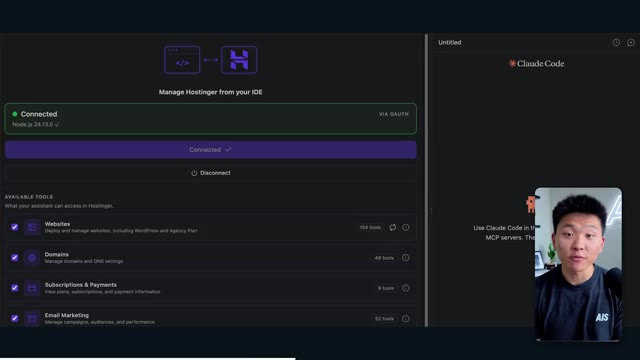

# 🎬 Build & Sell Grok Bots (2 Hour Course)

> **Chaîne** : [Nate Herk | AI Automation](https://www.youtube.com/@nateherk/featured)  
> **Lien YouTube** : [https://www.youtube.com/watch?v=4hKJ9X6rGFo](https://www.youtube.com/watch?v=4hKJ9X6rGFo)  
> **Date de publication** : 20260831  
> **Durée** : 01:45:41  
> **Identifiant vidéo** : `4hKJ9X6rGFo`  
> **Transcription & Analyse** : `whisper-v3-large-turbo+gemini-3.5-flash-lite`  

---

## 📌 Synthèse Exécutive & Outils

### 💡 Résumé
Dans cette vidéo intitulée **Créer et Vendre des Bots Grok (Cours de 2 Heures)**, Nate Herk décortique les capacités pratiques d'automatisation et de développement propulsées par les modèles de pointe.

### 🛠️ Outils, Modèles & Logiciels Présentés
- **Opus 5.5 & Claude Code** : Modèles d'ingénierie et agents de codage autonome.

### 🔑 Points Clés & Enseignements Stratégiques
- Optimiser le niveau d'effort et le raisonnement des modèles IA pour des résultats industriels.
- Automatiser les cycles de création logicielle de bout en bout.

---

## ⏱️ Chronologie & Transcription Complète Audio & Visuelle (Mot pour Mot)

### ⏱️ `[00:00:00 - 00:00:20]` | Segment #01

**🔊 Audio (Transcription Intégrale Mot pour Mot en Français) :**
> Opus 5,5, Opus 5,5, Opus 5,5, Opus 5,5, Opus 5,5. Ce modèle est littéralement partout et pour de très bonnes raisons. Il est intelligent, il est bon marché, il a un goût incroyable, c'est un modèle d'IA incroyable. Mais avec chaque modèle d'IA, vous avez le choix de l'effort, que ce soit faible, moyen, élevé, extra, max ou code ultra.

**👁️ Analyse Visuelle d'Écran (gemini-3.5-flash-lite) :**
**Interface & Outils** : Interface du réseau social X (Twitter)

**Contenu textuel & Code** : Publication textuelle et vidéo intégrée illustrant le sujet.

**Action / Démonstration** : Affichage d'un exemple de contenu généré par IA sur les réseaux sociaux.

*⏱️ 00:00:05 — Capture d'écran d'un tweet montrant une vidéo de paysage généré par IA et un texte sur l'impact sur les professionnels.*

---

### ⏱️ `[00:00:20 - 00:00:38]` | Segment #02

**🔊 Audio (Transcription Intégrale Mot pour Mot en Français) :**
> Donc, dans cette vidéo, j'ai donné exactement le même prompt à Opus 5.5 et je l'ai exécuté à chaque niveau d'effort, et nous allons comparer les résultats. Nous examinerons la qualité de tous les différents résultats réels, mais nous examinerons également le temps d'exécution de chacun d'eux, combien cela nous a coûté s'il s'agissait d'une facturation par API, le nombre total de tokens, le nombre de vérifications qu'ils ont effectuées et le nombre de questions qu'ils m'ont réellement posées tout au long du processus.

**👁️ Analyse Visuelle d'Écran (gemini-3.5-flash-lite) :**
**Interface & Outils** : Interface web de tableau de bord / outil de mindmapping ou de comparaison.

**Contenu textuel & Code** : Tableau avec des colonnes de niveaux d'effort et des lignes de métriques d'exécution (Run time, API cost, Total tokens, etc.).

**Action / Démonstration** : Comparaison visuelle des performances d'Opus 5.5 à travers différents niveaux d'effort.

*⏱️ 00:00:29 — Tableau comparatif sur une interface web intitulé "Opus 5.5 Efforts", listant les niveaux d'effort (Low, Medium, High, Extra, Max, Ultracode) et des métriques (Run time, API cost, Total tokens, Checks, Questions asked).*

---

### ⏱️ `[00:00:39 - 00:00:58]` | Segment #03

**🔊 Audio (Transcription Intégrale Mot pour Mot en Français) :**
> Et les résultats que nous avons obtenus ne sont pas du tout ce à quoi je m'attendais, donc j'ai hâte de partager cela avec vous les gars. Ne perdons pas de temps et allons directement à celui-ci. D'accord, alors plongeons-nous directement dans celui-ci. Je veux commencer juste en vous montrant le prompt réel que nous avons utilisé que nous avons donné à chacun de ces différents agents. Je vais aller dans les fichiers ici, et nous allons ouvrir ce fichier markdown de prompt, et je vais vous montrer ce que nous avons obtenu. Voici donc le slash objectif que j'ai fourni.

**👁️ Analyse Visuelle d'Écran (gemini-3.5-flash-lite) :**
**Interface & Outils** : Interface de l'outil de développement IA (type application de chat/agent avec barre latérale de gestion des sessions et worktrees).

**Contenu textuel & Code** : Message de l'agent IA : 'Hi Nate. This worktree has the effort-test task queued in PROMPT.md : build a walkable third-person 3D world of the AIS Live conference...' avec la barre de saisie 'Type / for commands'.

**Action / Démonstration** : Présentation de l'interface de l'outil et lecture du prompt initial configuré pour l'agent avant le début de la tâche.

*⏱️ 00:00:48 — Interface de l'outil de développement IA affichant un chat avec un agent (mode worktree 'effort-test') demandant de construire un monde 3D interactif basé sur PROMPT.md.*

---

### ⏱️ `[00:00:58 - 00:01:34]` | Segment #04

**🔊 Audio (Transcription Intégrale Mot pour Mot en Français) :**
> J'ai dit : tu dois me créer un monde en 3D qui est une conférence technologique réaliste dans laquelle je peux me promener en vue à la troisième personne. Tu vas regarder ce dossier, qui contient mes ressources d'enregistrement d'événements provenant d'AIS Live. Et ce dossier est un dossier Frame.io de 105 gigaoctets d'enregistrements vidéo. C'était un événement entièrement virtuel. Tout a été enregistré et tous les enregistrements sont ici. J'ai dit, ton objectif est de prendre cet événement et de le transformer en un monde explorable en 3D qui me donne l'impression d'être réellement allé à une vraie conférence en personne avec différentes salles, différentes pistes, différentes scènes, bla, bla, bla. N'hésite pas à utiliser key.ai si tu as besoin de générer des images ou des vidéos. Et tu peux aussi utiliser tout ce qui se trouve dans mon projet Herc 2, qui est comme mon système d'exploitation IA. J'ai dit,

**👁️ Analyse Visuelle d'Écran (gemini-3.5-flash-lite) :**
**Interface & Outils** : Éditeur de code (type VS Code) et interface web Frame.io

**Contenu textuel & Code** : Fichier Markdown de prompt pour l'agent IA et structure de dossiers cloud (Frame.io)

**Action / Démonstration** : Présentation du prompt de configuration et des fichiers de ressources vidéo de l'événement AIS Live.

*⏱️ 00:01:07 — Éditeur de texte affichant le fichier PROMPT.md avec les instructions pour créer le monde 3D et le lien Frame.io.*

*⏱️ 00:01:16 — Interface Frame.io montrant le dossier "Sep 22, 2026" contenant les sous-dossiers "GA Access (For AIS)" et "VIP Access".*

*⏱️ 00:01:25 — Retour sur l'éditeur de texte affichant le fichier PROMPT.md avec les directives de création du monde virtuel.*

---

### ⏱️ `[00:01:34 - 00:02:08]` | Segment #05

**🔊 Audio (Transcription Intégrale Mot pour Mot en Français) :**
> vous serez jugé sur la créativité, le design, la physique et la sensation générale lorsque j'explorerai le monde 3D que vous avez construit. Et c'était fondamentalement la fin des instructions. Donc, comme vous pouvez le voir sur ce côté gauche, j'ai exécuté cela à travers tous les différents niveaux d'effort. Commençons par le niveau bas et montons jusqu'à ultra code. Très bien. Nous avons donc ici le résultat du niveau bas. Ouvrons ceci et jetons un coup d'œil. Nous avons donc AIS live, le sommet des services IA en personne enfin, et nous avons pu cliquer partout. Tout d'abord, cela ne fait pas très personnalisé. Genre, ce n'est pas le logo d'IS Live. Ce n'est même pas nos couleurs. Donc je n'aimes pas trop ça, mais entrons ici. D'accord. C'est beaucoup trop lumineux. Euh, nous avons une carte en haut à droite. Nous avons une ville par ici. Je ne peux pas dire quelle ville c'est.

**👁️ Analyse Visuelle d'Écran (gemini-3.5-flash-lite) :**
**Interface & Outils** : Application web ou de bureau d'un outil de développement assisté par IA.

**Contenu textuel & Code** : Texte du prompt : "Hi Nate. This worktree has the effort-test task queued in PROMPT.md : build a walkable third-person 3D world..." et la réponse de l'utilisateur en bas : "yes, start the task in PROMPT.md".

**Action / Démonstration** : Navigation et sélection des différents niveaux de test dans la barre latérale par le présentateur.

*⏱️ 00:01:42 — Capture d'écran montrant l'interface d'un assistant de code IA (type Claude ou similaire) avec une colonne latérale listant différents niveaux de test (Hello, Extra, High, Max, Ultracode, Medium, Low) et une conversation affichant un prompt sur la création d'un monde 3D.*

---

### ⏱️ `[00:02:08 - 00:02:40]` | Segment #06

**🔊 Audio (Transcription Intégrale Mot pour Mot en Français) :**
> c'est. D'accord. C'est Chicago, ce qui est plutôt cool parce que tu sais, j'habite à Chicago, mais bref, en haut à droite, on peut voir une carte. Nous avons un hall d'accueil. Nous avons une salle d'exposition. Nous avons un salon VIP, la scène principale. La carte montre également où se trouve chaque autre personne et cela se synchronise en direct. On peut donc voir l'enregistrement. On peut voir le premier jour, la keynote de l'hyper agent, le débriefing en direct. Cool. Donc il connaît réellement l'agenda et puis il y a le deuxième jour. Donc il a trouvé ça, c'est bien. Nous avons ces petites boules ici que je peux espérer botter. D'accord. Le visage, oh, regarde ça. Si je vais par ici, toutes les personnes disparaissent tout simplement. Très mauvais. Très mauvais. D'accord. Alors voyons voir. Est-ce que je peux sprinter ? D'accord.

**👁️ Analyse Visuelle d'Écran (gemini-3.5-flash-lite) :**
**Interface & Outils** : Présentation ou face-caméra explicatif sans interface logicielle partagée.

**Contenu textuel & Code** : Explications orales et mise en contexte méthodologique.

**Action / Démonstration** : Explications face caméra et démonstration conceptuelle.

---

### ⏱️ `[00:02:40 - 00:03:04]` | Segment #07

**🔊 Audio (Transcription Intégrale Mot pour Mot en Français) :**
> Je peux avancer un peu plus vite. Je vais d'abord aller par ici. Il y a des goodies, euh, certifiés AIS plus glido. D'accord. Donc, il y a les vrais stands qu'on avait lors de l'événement virtuel. On avait des stands. Donc c'est plutôt cool. Un petit endroit pour prendre des photos. Salle C. En ce moment, nous avons Tangy Frederick qui anime un atelier. D'accord. Mais ce n'est pas une vidéo. Comme vous pouvez le voir, c'est juste une image. Elle ne bouge pas. Donc c'est juste une image. Ces gens sont en train de disparaître. Ce doivent être des fantômes. Allons par ici vers la salle A.

**👁️ Analyse Visuelle d'Écran (gemini-3.5-flash-lite) :**
**Interface & Outils** : Environnement virtuel 3D de type jeu vidéo (metaverse / plateforme d'événement virtuel).

**Contenu textuel & Code** : Texte affiché sur les écrans virtuels : "Glaido", "Workshop Room C", "Enterprise track", et des guides d'utilisation avec des étapes (Step 1, Step 2, Step 3).

**Action / Démonstration** : Exploration et navigation interactive dans un monde virtuel représentant un salon ou une conférence en ligne.

---

### ⏱️ `[00:03:04 - 00:03:30]` | Segment #08

**🔊 Audio (Transcription Intégrale Mot pour Mot en Français) :**
> Nous avons Liberty White. D'accord. Très cool. Vos 30 premiers jours en automatisation. Encore une fois, c'est juste une image fixe et les gens ont des bugs d'affichage. Donc ce n'est pas très bien ici. Je vais aller sur la scène principale et voir ce que nous avons. D'accord, cool. Donc nous avons une scène principale. Les gens ont des bugs d'affichage. Vraiment beaucoup. Ce n'est vraiment pas terrible. Notre vidéo est en train de bouger. Genre, j'ai vu mon visage ici et j'ai vu celui de Devin, mais maintenant ils ont disparu. Donc je ne sais pas ce qui s'est passé. D'accord. On dirait que c'est plutôt un diaporama. Rien n'est vraiment lu pour l'instant. Quoi qu'il en soit, entrons ici.

**👁️ Analyse Visuelle d'Écran (gemini-3.5-flash-lite) :**
**Interface & Outils** : Application ou plateforme virtuelle 3D (type métavers ou événement virtuel interactif).

**Contenu textuel & Code** : Interface d'événement virtuel affichant "AIS LIVE AI Services Summit" et "Hyperagent Workshop".

**Action / Démonstration** : Navigation et déplacement de l'avatar du présentateur à l'intérieur de l'environnement virtuel vers la scène principale.

*⏱️ 00:03:17 — Le présentateur navigue dans le monde virtuel et arrive dans une grande salle de conférence remplie d'avatars assis, montrant l'atelier "Hyperagent Workshop".*

*⏱️ 00:03:24 — Vue de face de la scène principale "AIS LIVE AI Services Summit" dans l'environnement virtuel avec un grand écran central et des avatars dans les sièges.*

---

### ⏱️ `[00:03:30 - 00:03:58]` | Segment #09

**🔊 Audio (Transcription Intégrale Mot pour Mot en Français) :**
> Nous avons d'autres stands. Nous avons hyper agent. Nous avons Claude Code. Nous avons plus de goodies. La salle B, c'est Dave Ebelor. Je suppose que c'est exactement la même chose. Nous avons du café. Et ensuite, je suppose que le salon VIP, c'est accès VIP uniquement. C'est plutôt cool, mais il n'y a vraiment rien qui se passe ici. Cet écran est beaucoup trop lumineux. D'accord. Donc je pense que vous comprenez l'ambiance qu'on obtient ici d'Opus 5.5 en effort faible. Et c'est là que les choses deviennent intéressantes. Combien de temps pensez-vous que cela a duré ? Combien de temps ? Celui-ci a duré 16 minutes et 43 secondes. Combien pensez-vous que cela a coûté ?

**👁️ Analyse Visuelle d'Écran (gemini-3.5-flash-lite) :**
**Interface & Outils** : Présentation ou face-caméra explicatif sans interface logicielle partagée.

**Contenu textuel & Code** : Explications orales et mise en contexte méthodologique.

**Action / Démonstration** : Explications face caméra et démonstration conceptuelle.

---

### ⏱️ `[00:03:58 - 00:04:26]` | Segment #10

**🔊 Audio (Transcription Intégrale Mot pour Mot en Français) :**
> 3,91 dollars si c'était une facturation par API. J'utilise évidemment mon abonnement ici, mais nous allons simplement calculer cela avec la facturation par API. Le total des jetons était de 191 000. Il a effectué 22 vérifications. Donc pour la vérification, il a ouvert le navigateur à 22 reprises et a exécuté différentes sortes de vérifications. Donc 22 catégories de vérifications. Et combien de questions m'a-t-il posées ? Il m'a posé un total de zéro question tout au long de cette invite de commande d'objectif. D'accord. Alors, ouvrons l'effort moyen et voyons ce que nous avons. D'accord, c'est parti. Effort moyen. Nous avons Nate Herc. Nous avons mon badge. C'est du contenu de la marque AI's Life.

**👁️ Analyse Visuelle d'Écran (gemini-3.5-flash-lite) :**
**Interface & Outils** : Outil de tableau blanc ou de diagramme (type Excalidraw ou similaire).

**Contenu textuel & Code** : Tableau avec les en-têtes "Low", "Medium", "High", "Ex" et les lignes "Run time", "API cost", "Total tokens", "Checks", "Questions asked".

**Action / Démonstration** : Le présentateur explique et commente les coûts d'API ($3.91) et le nombre total de jetons (191.3K) affichés dans le tableau.

*⏱️ 00:04:05 — Un tableau comparatif montrant les métriques de performance et de coût pour le niveau "Low" (Run time: 16m 43s, API cost: $3.91, Total tokens: 191.3K, Checks, Questions asked).*

---

### ⏱️ `[00:04:26 - 00:04:46]` | Segment #11

**🔊 Audio (Transcription Intégrale Mot pour Mot en Français) :**
> So this is already looking a little bit better. This feels like our color schemes that used our brand guidelines. Day one build, day two earn, VIP. Cool. Okay. I'm going to enter the venue. Okay. Wow. So similar sort of vibe. It's sitting in the background. This doesn't look like Chicago though, does it? No, this looks like a, honestly, this looks like a made up city. Either way, it's funny that they decided to do that. Let's see if I can move a little faster. Oh, wow.

**👁️ Analyse Visuelle d'Écran (gemini-3.5-flash-lite) :**
**Interface & Outils** : Présentation ou face-caméra explicatif sans interface logicielle partagée.

**Contenu textuel & Code** : Explications orales et mise en contexte méthodologique.

**Action / Démonstration** : Explications face caméra et démonstration conceptuelle.

---

### ⏱️ `[00:04:46 - 00:05:21]` | Segment #12

**🔊 Audio (Transcription Intégrale Mot pour Mot en Français) :**
> The people are interacting with me. Watch. If I go up to this guy, he just like raised his arm. Well, now he doesn't want anything to do with me at all. But all of these little robots here must be making decisions. I'm not sure if they're using Jev. They're definitely not. I didn't tell it to. Actually, my Jev key is in the back. I don't know. Maybe it did use it. Anyways, we can see here we have Workshop Room C, Agents Lab. Nice. So this one is actually being run. You can see that is a real video being played by Tangy. Everyone here is actually like working on a laptop. They're not glitching. This is pretty cool. Also, my badge is on my chest, which is pretty cool. I can come this way. We have a map up in the top right, as you guys can see, but I can come this way. We have an

**👁️ Analyse Visuelle d'Écran (gemini-3.5-flash-lite) :**
**Interface & Outils** : Présentation ou face-caméra explicatif sans interface logicielle partagée.

**Contenu textuel & Code** : Explications orales et mise en contexte méthodologique.

**Action / Démonstration** : Explications face caméra et démonstration conceptuelle.

---

### ⏱️ `[00:05:21 - 00:05:47]` | Segment #13

**🔊 Audio (Transcription Intégrale Mot pour Mot en Français) :**
> expo hall. This is where we have the Glido booth. And this is actually playing. Yeah, it's playing the video of us talking about Glido. It's playing the video of Ed and I talking about our certification program. We've got the AIS Plus logo back here, which is kind of in a weird spot. This is a speaker slides and takeaways. So wow, this is all the resources that we gave out after the event. They're all sitting right there as well. We can see we've got a community spotlight. So this is Aiden talking about his deal that he landed and it's playing live. These people are watching.

**👁️ Analyse Visuelle d'Écran (gemini-3.5-flash-lite) :**
**Interface & Outils** : Présentation ou face-caméra explicatif sans interface logicielle partagée.

**Contenu textuel & Code** : Explications orales et mise en contexte méthodologique.

**Action / Démonstration** : Explications face caméra et démonstration conceptuelle.

---

### ⏱️ `[00:05:47 - 00:06:21]` | Segment #14

**🔊 Audio (Transcription Intégrale Mot pour Mot en Français) :**
> They're pretty engaged. We've got hyper agent. That was, that's what I meant. If you guys saw those people like raising their arms saying hi, that was kind of funny. Look, look, there he goes again. Anyways. Okay. Where am I now? Now I'm in the main lobby. We've got a coffee bar. We've got a big logo, which is the real logo. It's too bright, but we have the logo. We can see if we can come in here to the foundation track. We've got Sabrina Romanov and Liberty White. So different trainings right there. We can come into this room. This is the advanced track. So what's going on here. We've got Dave Ebelar and Saman talking about some different stuff in there. And now let's go take a look at the main stage. Oh, wait, there's a video of me up there. Is that like a VIP

**👁️ Analyse Visuelle d'Écran (gemini-3.5-flash-lite) :**
**Interface & Outils** : Présentation ou face-caméra explicatif sans interface logicielle partagée.

**Contenu textuel & Code** : Explications orales et mise en contexte méthodologique.

**Action / Démonstration** : Explications face caméra et démonstration conceptuelle.

---

### ⏱️ `[00:06:21 - 00:06:50]` | Segment #15

**🔊 Audio (Transcription Intégrale Mot pour Mot en Français) :**
> section? Yeah, we'll go check that out in a sec. But anyways, this is the main stage. This looks very, very nice. We've got a big stage. We've got like four people sitting up here. We've got the the three screens of Alex up there with hyper agent. Am I allowed to get on stage? Oh, and lets me up on stage. Okay. That's pretty nice. All right, guys, let's take a selfie. Let me get everyone in the background. Get in here. Anyways, that is pretty, pretty cool. Not every seat is filled though. So we need to work on that. But anyways, I'm going to run back over and see what that VIP section was. Okay. VIP lounge. I feel like this is like a worth the airport or something.

**👁️ Analyse Visuelle d'Écran (gemini-3.5-flash-lite) :**
**Interface & Outils** : Présentation ou face-caméra explicatif sans interface logicielle partagée.

**Contenu textuel & Code** : Explications orales et mise en contexte méthodologique.

**Action / Démonstration** : Explications face caméra et démonstration conceptuelle.

---

### ⏱️ `[00:06:51 - 00:07:14]` | Segment #16

**🔊 Audio (Transcription Intégrale Mot pour Mot en Français) :**
> Okay, cool. So now we've got the VIP sessions up here. VIP Q and a with Nate live video playback right here. Very, very cool. And we've got like a bar or something. Awesome. I would say that this is a pretty good output. Now, as far as the stats here, this one took one hour and 13 minutes to run. It would have cost us $12 and 44 cents. It used 490,000 tokens and it did 23 checks.

**👁️ Analyse Visuelle d'Écran (gemini-3.5-flash-lite) :**
**Interface & Outils** : Application web interactive 3D et tableau de bord de statistiques de performance.

**Contenu textuel & Code** : Données de performance : Run time (16m 43s), API cost ($3.91), Total tokens (191.3K), Checks (22).

**Action / Démonstration** : Le présentateur commente le rendu visuel de la salle virtuelle puis examine les statistiques d'exécution d'une tâche.

*⏱️ 00:06:56 — Capture montrant l'interface virtuelle interactive d'un événement avec des avatars d'utilisateurs et une retransmission vidéo en direct (VIP Q&A with Nate).*

*⏱️ 00:07:02 — Tableau statistique montrant les performances d'exécution (Run time de 16m 43s, coût API de 3.91$, 191.3K tokens).*

---

### ⏱️ `[00:07:14 - 00:07:48]` | Segment #17

**🔊 Audio (Transcription Intégrale Mot pour Mot en Français) :**
> And it asked us a grand total of zero questions once again. All right, let's move on to high. This was already a pretty decent output and Anthropic themselves in their how to prompt Opus 5.5 video, or sorry, not video, article. They said to just start on medium and scale it up or down if you need. So that was a medium output. Let's move over to high and see what we got. Real quick, guys, I need to take a second to tell you about the sponsor of today's video, Hostinger. So both of these models just built me a working version of the same thing. And now I'm right where I always end up with something finished sitting on my laptop and no quick way to get it online. And that's the gap that Hostinger's connector closes. It's a free extension

**👁️ Analyse Visuelle d'Écran (gemini-3.5-flash-lite) :**
**Interface & Outils** : Présentation ou face-caméra explicatif sans interface logicielle partagée.

**Contenu textuel & Code** : Explications orales et mise en contexte méthodologique.

**Action / Démonstration** : Explications face caméra et démonstration conceptuelle.

---

### ⏱️ `[00:07:48 - 00:08:23]` | Segment #18

**🔊 Audio (Transcription Intégrale Mot pour Mot en Français) :**
> for your editor that pulls your Hostinger account into whatever you're already coding in. So VS Code, cursor, cloud code, codex, you name it. You sign in once with a single click, and from there, your agent can deploy the site, point a domain at it, set the DNS records, and check on your VPS without you ever having to leave the editor. So whichever one of these you end up liking better, the thing it built is a couple minutes away from a real URL on managed hosting. Connector is free on every hosting or plan, so if you still need the hosting underneath it, grab the unlimited plan with the link in the description and use code NATEHERK for 10% off. That also comes with a free domain and business email for the year. And it's still the cheapest way that I found to get something

**👁️ Analyse Visuelle d'Écran (gemini-3.5-flash-lite) :**
**Interface & Outils** : Interface de gestion Hostinger pour IDE et interface Claude Code.

**Contenu textuel & Code** : Statut "Connected", Node.js 24.13.0, liste des outils disponibles (Websites, Domains, Subscriptions & Payments, Email Marketing) avec cases à cocher.

**Action / Démonstration** : Connexion du compte Hostinger à l'IDE et affichage des outils accessibles par l'assistant.

*⏱️ 00:07:57 — Interface montrant l'intégration de Hostinger dans un IDE avec un statut connecté et les outils disponibles (Websites, Domains, Subscriptions, Email Marketing), ainsi qu'une fenêtre Claude Code à droite et la webcam du présentateur.*

---

### ⏱️ `[00:08:23 - 00:08:47]` | Segment #19

**🔊 Audio (Transcription Intégrale Mot pour Mot en Français) :**
> you built onto a real URL. So let's get back to the video. Okay. Once again, very, very branded. This is even better of a loading screen than the previous one. We've got this nice little effect in the background. We've got the logo. We'll enter the venue. Okay. Here we are. This looks pretty nice. We start outside and you can see that we have these flags for all the speakers, Wyatt, Casper, Alex, Ed, Aiden, Sabrina, Liberty. This is pretty cool. We got live blocks here.

**👁️ Analyse Visuelle d'Écran (gemini-3.5-flash-lite) :**
**Interface & Outils** : Navigateur web / Application virtuelle 3D 'AIS LIVE'

**Contenu textuel & Code** : Interface utilisateur avec contrôles (WASD, Mouse), mini-carte et bannières d'événements.

**Action / Démonstration** : Navigation et exploration de l'espace virtuel 3D de l'événement.

*⏱️ 00:08:29 — Écran de chargement virtuel 'AIS LIVE' affichant les détails de l'événement et les contrôles clavier.*

*⏱️ 00:08:35 — Entrée dans l'environnement virtuel 3D montrant la place principale 'AIS Live Plaza' avec des avatars.*

*⏱️ 00:08:41 — Exploration de la place virtuelle avec des bannières nominatives d'intervenants et un robot sphérique.*

---

### ⏱️ `[00:08:47 - 00:09:23]` | Segment #20

**🔊 Audio (Transcription Intégrale Mot pour Mot en Français) :**
> it took this picture from me, your host, Nate Herc, John, Dave, Nate Herc. There we go. Okay. The doors. Awesome. They're automatic sliding glass doors. I love that. We can see VIP check-in. We can see GA. We can come over here and we can check out the expo with different booths, community spotlight. You can also see that in the top left, I have a passport. So it's like, it will be showing how many of the places I've visited. All of these are real playback. We've got a resource wall with all of the different speakers. They've also got a networking session over here. So I'm going to come over real quick and see what that's all about. So we've got the AIS cold brew bar. We've got different community members that were spotlighted or highlighted.

**👁️ Analyse Visuelle d'Écran (gemini-3.5-flash-lite) :**
**Interface & Outils** : Application virtuelle 3D / Metavers de conférence interactive

**Contenu textuel & Code** : Environnement virtuel 3D avec bannières de conférence, zones de check-in et stands d'exposition

**Action / Démonstration** : Navigation et exploration interactive de l'espace virtuel par le présentateur sous forme d'avatar

*⏱️ 00:08:56 — Le présentateur navigue dans une application virtuelle interactive montrant l'accueil d'une conférence, avec des comptoirs de "VIP Check-in" et "Registration - GA".*

*⏱️ 00:09:05 — L'avatar du présentateur explore l'Expo Hall virtuel avec différents stands de partenaires et de la communauté.*

*⏱️ 00:09:14 — Vue en mouvement dans le hall virtuel avec des avatars d'utilisateurs et de visiteurs se déplaçant dans l'espace de la conférence.*

---

### ⏱️ `[00:09:23 - 00:09:56]` | Segment #21

**🔊 Audio (Transcription Intégrale Mot pour Mot en Français) :**
> On a la zone VIP. Attends, quoi ? Prends un bracelet. Ah, je dois vraiment aller chercher le bracelet. D'accord. Laisse-moi m'enregistrer rapidement. Le bracelet est déjà mis. Attends, quoi ? D'accord. Oh, d'accord. Maintenant, les portes se sont ouvertes pour moi. Cool. Je peux entrer ici. Oh, ça mène juste à la scène principale. Salon VIP. Il y a une séance de questions-réponses en cours. Ça a l'air très cool. Je veux dire, je suis très impressionné par la façon dont il est capable de faire ça. Wouah. D'accord. Donc c'est vraiment bien. Ce qu'on a fait, c'est qu'on a eu des salles de discussion VIP avec différentes personnes. Tu peux voir qu'il y a différentes salles, différents membres de l'équipe AIS qui participent à des trucs. C'est vraiment cool. C'est très cool. C'est un bien meilleur VIP

**👁️ Analyse Visuelle d'Écran (gemini-3.5-flash-lite) :**
**Interface & Outils** : Environnement virtuel 3D de type métavers / plateforme de conférence interactive.

**Contenu textuel & Code** : Éléments textuels d'interface HUD, mini-carte, indicateurs de progression et affichage des sessions VIP.

**Action / Démonstration** : Navigation et exploration d'un espace virtuel interactif par l'avatar du présentateur.

*⏱️ 00:09:32 — Vue dans l'espace virtuel du hall de conférence montrant l'avatar du présentateur et les informations textuelles sur le bracelet et la zone VIP.*

*⏱️ 00:09:40 — Intérieur du salon VIP virtuel où l'avatar se trouve face à un écran affichant des participants en visioconférence.*

*⏱️ 00:09:48 — Espace des sessions de travail VIP dans le monde virtuel avec différents stands étiquetés ('Price It Right', 'Turn Your Expertise into a Service', 'Land Your First Paying Client').*

---

### ⏱️ `[00:09:56 - 00:10:30]` | Segment #22

**🔊 Audio (Transcription Intégrale Mot pour Mot en Français) :**
> expérience que ce qui a été montré dans le premier élément. D'accord. After party VIP. Regardez ça. On a une piste de danse. On a tous ces éléments ici. On a la lecture de l'after party VIP juste ici. Et il y a une estrade de DJ. C'est tellement marrant. Il y a un petit bug juste ici, un petit glitch juste là, mais c'est génial. Oh, cool. Donc quand je suis ici sur la scène principale, on a des sous-titres. Vous pouvez voir juste ici en bas de mon écran, on a ces sous-titres de Wyatt qui est en train de parler ici. On a des lumières. On a le panel. Très cool. Belle scène principale. Je vais aller ici. On peut aller à la fondation,

**👁️ Analyse Visuelle d'Écran (gemini-3.5-flash-lite) :**
**Interface & Outils** : Présentation ou face-caméra explicatif sans interface logicielle partagée.

**Contenu textuel & Code** : Explications orales et mise en contexte méthodologique.

**Action / Démonstration** : Explications face caméra et démonstration conceptuelle.

---

### ⏱️ `[00:10:30 - 00:11:06]` | Segment #23

**🔊 Audio (Transcription Intégrale Mot pour Mot en Français) :**
> avancé, et les parcours d'entreprise ici. Donc voyons voir. Nous avons l'anatomie de trois vraies transactions. Nous avons hyper agent. Nous avons les évaluations avec Nate et Ed ici. Nous avons Dave qui s'occupe des trucs avancés. C'est vraiment bien. Je veux dire, évidemment, chacun, chacun de ces résultats jusqu'à présent, faible était correct. Moyen était meilleur. Élevé a été encore meilleur. Voyons si cette tendance se poursuit et voyons combien cela nous a coûté. Donc, le niveau élevé a fonctionné pendant une heure et sept minutes. Donc un peu plus rapide que moyen, cela nous aurait coûté 16 dollars et 31 cents. Il a utilisé un demi-million de jetons, 509 000. Il a fait 22 vérifications. Et il nous a aussi demandé, enfin, non, je me suis trompé. Ce

**👁️ Analyse Visuelle d'Écran (gemini-3.5-flash-lite) :**
**Interface & Outils** : Présentation ou face-caméra explicatif sans interface logicielle partagée.

**Contenu textuel & Code** : Explications orales et mise en contexte méthodologique.

**Action / Démonstration** : Explications face caméra et démonstration conceptuelle.

---

### ⏱️ `[00:11:06 - 00:11:25]` | Segment #24

**🔊 Audio (Transcription Intégrale Mot pour Mot en Français) :**
> l'un m'a posé une question et, divulgâcheur, c'était le seul qui nous a posé une question tout au long de tout ça. Alors voyons voir, il nous en reste trois : Extra, Max et Ultra Code. Laissez-moi ouvrir Extra et nous verrons ce que nous avons. D'accord. Donc celui-ci a l'air plutôt bien. Je dirais honnêtement que jusqu'à présent, l'écran de chargement haut était le meilleur, celui qu'on vient juste de voir, mais bref, entrons dans AIS Live.

**👁️ Analyse Visuelle d'Écran (gemini-3.5-flash-lite) :**
**Interface & Outils** : Présentation ou face-caméra explicatif sans interface logicielle partagée.

**Contenu textuel & Code** : Explications orales et mise en contexte méthodologique.

**Action / Démonstration** : Explications face caméra et démonstration conceptuelle.

---

### ⏱️ `[00:11:26 - 00:11:51]` | Segment #25

**🔊 Audio (Transcription Intégrale Mot pour Mot en Français) :**
> Whoa. D'accord. Donc on a genre des petits extraits sonores. Je peux discuter avec des gens. Le panneau sur la guerre des outils a réglé quelques débats pour moi. Sympa. Bonne perspective là-bas. On est dehors à nouveau. On a ces différentes bannières, bien qu'elles soient toutes les mêmes. Elles n'affichent pas genre les noms de différentes personnes. Donc gros logo AIS Live. L'aile des ateliers est par ici. Et passons par les portes coulissantes en verre pour voir ce qu'on a. Donc on a le café AIS. La carte est en bas à droite, et elle n'est pas très descriptive.

**👁️ Analyse Visuelle d'Écran (gemini-3.5-flash-lite) :**
**Interface & Outils** : Présentation ou face-caméra explicatif sans interface logicielle partagée.

**Contenu textuel & Code** : Explications orales et mise en contexte méthodologique.

**Action / Démonstration** : Explications face caméra et démonstration conceptuelle.

---

### ⏱️ `[00:11:51 - 00:12:26]` | Segment #26

**🔊 Audio (Transcription Intégrale Mot pour Mot en Français) :**
> J'aime bien comment les autres cartes nous ont indiqué ce que, genre où étaient les choses, mais celle-ci a l'air très professionnelle. On peut voir ici la scène principale. Allons y faire un tour rapidement. Ils ont tous ces ballons qui volent partout, ce que je trouve plutôt marrant. Les ballons de plage AIS. On me voit là-haut en train de parler. Je crois que j'introduisais l'une des journées. Continuons par ici vers la salle d'atelier sur ce côté gauche. D'accord. Donc ici, nous avons le théâtre Hyper Agent. Nous avons cette session sponsorisée ici par Hyper Agent, mais cela nous montre aussi ce qui va s'y passer. C'est vraiment marrant qu'on puisse discuter avec les gens. Salmon a créé un représentant commercial vocal en direct. La salle "Le Juste Prix" était comble. Avez-vous pris le guide du compagnon VIP ? C'est trop marrant. Nous avons le parcours avancé dans

**👁️ Analyse Visuelle d'Écran (gemini-3.5-flash-lite) :**
**Interface & Outils** : Application web virtuelle en 3D (metaverse / événement virtuel)

**Contenu textuel & Code** : Environnement virtuel 3D avec avatars, écrans vidéo en direct et zones d'ateliers

**Action / Démonstration** : Navigation et exploration de l'espace virtuel par le présentateur

*⏱️ 00:12:00 — Vue d'une scène principale virtuelle avec des avatars et un écran affichant une présentation en direct.*

*⏱️ 00:12:09 — Navigation dans un hall d'exposition virtuel avec des panneaux d'ateliers et des avatars d'utilisateurs.*

*⏱️ 00:12:17 — Exploration d'un couloir dans l'environnement virtuel avec des avatars interagissant et des bulles de discussion.*

---

### ⏱️ `[00:12:26 - 00:12:58]` | Segment #27

**🔊 Audio (Transcription Intégrale Mot pour Mot en Français) :**
> ici. Encore une fois, nous avons la lecture en direct. Est-ce que c'est une lecture en direct ? Oh, d'accord. Ça a commencé une fois que je suis entré, mais je peux prendre place. Oh la la. Je peux regarder ça. Je peux me lever. Je veux m'asseoir au premier rang. C'est plutôt cool. C'est très bien. J'aime bien ça. Et vous savez ce que j'ai remarqué jusqu'à présent ? Le personnage que j'incarne me ressemble un peu. Je pense qu'il a été modélisé à partir de mes photos de profil ou quelque chose comme ça. Quoi qu'il en soit, nous avons Sabrina ici, l'animatrice de la salle, prenez n'importe quel siège libre. D'accord, cool. Et j'ai vraiment aimé la fonctionnalité pour s'asseoir. C'est plutôt marrant. Comme si on pouvait réellement assister à cet atelier et participer. Quoi qu'il en soit, cela nous montre les intervenants. Cela nous montre les

**👁️ Analyse Visuelle d'Écran (gemini-3.5-flash-lite) :**
**Interface & Outils** : Environnement virtuel 3D de conférence en ligne.

**Contenu textuel & Code** : Interface utilisateur de la plateforme virtuelle avec des flux vidéo et des présentations sur écran géant.

**Action / Démonstration** : Navigation et exploration d'un événement virtuel sous forme d'avatar.

---

### ⏱️ `[00:12:58 - 00:13:31]` | Segment #28

**🔊 Audio (Transcription Intégrale Mot pour Mot en Français) :**
> ordre du jour. Il y a un petit tapis rouge ici pour prendre des photos. On peut prendre la pose. Oh, wouah. C'est plutôt cool. Bibliothèque de ressources, obtenez la certification AIS Plus, Glido, Hyper Agent, AIS Plus, trois vraies affaires. C'est génial. Je veux dire, je dirais vraiment que jusqu'à présent, chacune est meilleure que la précédente. Et on n'a même pas encore vu la section VIP, le salon VIP. Allons par ici très vite. J'espère que je pourrai entrer. Sympa. On a une réinitialisation des outils. Ce sont les différentes salles dans lesquelles nous pourrions aller. Donc encore une fois, je pourrais prendre la feuille de calcul et je pourrais essayer de comprendre comment tarifer mes produits. C'est tellement cool. C'est vraiment mieux que la précédente où nous avons en quelque sorte juste

**👁️ Analyse Visuelle d'Écran (gemini-3.5-flash-lite) :**
**Interface & Outils** : Environnement virtuel 3D interactif de type salon ou conférence en ligne.

**Contenu textuel & Code** : Éléments graphiques d'un monde virtuel (stands, avatars, mini-carte, panneaux textuels de questions/réponses).

**Action / Démonstration** : Navigation et exploration de l'espace virtuel de la conférence par le présentateur.

---

### ⏱️ `[00:13:31 - 00:13:59]` | Segment #29

**🔊 Audio (Transcription Intégrale Mot pour Mot en Français) :**
> like looked at stuff. Awesome. I can get behind the bar and come in here. This is very nice. Okay. So as far as statistics go, this one ran for an hour and a half. It costs 25.92 bucks. I don't know why I say point $25, 92 cents. It was 733,000 tokens and 34 checks. So it had the most checks so far by far. And it asked us zero questions. I can't wait to see what we got here from max and ultra code. Okay. Here is max loading screens, boring, but it's on brand and it has our logo.

**👁️ Analyse Visuelle d'Écran (gemini-3.5-flash-lite) :**
**Interface & Outils** : Application de tableau blanc ou de diagramme en ligne (type Excalidraw).

**Contenu textuel & Code** : Tableau avec colonnes Medium, High, Extra, Max, Ultracode, affichant des durées (ex. 1h 31m), des coûts (ex. $12.44), des tokens (419.2K) et des nombres de vérifications.

**Action / Démonstration** : Le présentateur commente et présente les statistiques des différents niveaux de test affichées à l'écran.

*⏱️ 00:13:38 — Un tableau comparatif montrant les statistiques des différents niveaux d'effort, avec le présentateur visible à gauche de l'écran.*

---

### ⏱️ `[00:14:00 - 00:14:35]` | Segment #30

**🔊 Audio (Transcription Intégrale Mot pour Mot en Français) :**
> So that was good. I like that. We will go ahead and enter AIS live. Ooh, nice little animation here that brings us in. Once again, the character looks like me. They've all looked like me. I mean, sort of, we have sitting in the background. This looks like Chicago. Like I mentioned earlier, a lot of these are playing sounds and I'm not including that because it would be very distracting for you guys to try to listen to what's going on as well as me speaking. So there is like some slight music in all these. I hate how this is walking. This walking is really, really bad. I mean, the walking, yeah, I don't like this at all. So that's not great. But besides that, let's go in and explore. Notice these shadows when I walk in, they like really switch. I'm not sure why that is,

**👁️ Analyse Visuelle d'Écran (gemini-3.5-flash-lite) :**
**Interface & Outils** : Application virtuelle 3D / Interface Web (AIS live)

**Contenu textuel & Code** : Environnement 3D interactif avec interface de navigation et mini-carte

**Action / Démonstration** : Exploration d'un monde virtuel 3D par le présentateur

*⏱️ 00:14:08 — Vue d'une application virtuelle 3D (AIS live) montrant une place urbaine stylisée avec des avatars et des bâtiments, et le présentateur dans une vignette à gauche.*

*⏱️ 00:14:17 — Progression dans l'environnement virtuel 3D avec l'avatar se déplaçant vers l'entrée d'un bâtiment d'exposition.*

*⏱️ 00:14:26 — L'avatar s'approche de l'entrée principale du bâtiment virtuel en vue subjective/troisième personne.*

---

### ⏱️ `[00:14:35 - 00:15:11]` | Segment #31

**🔊 Audio (Transcription Intégrale Mot pour Mot en Français) :**
> but anyways, we can chat with people in here too. Hyperagent booth is right where you walk into the expo. All good. Okay, cool. I can keep clicking E to make them change what they say. We've got the speakers right here. That looks pretty good. Although we definitely had everyone's profile picture. So I'm not sure why that's not included there. We see people taking pictures right here. I love that. And it saves a little picture. Okay. The map also isn't super, like doesn't give me a great explanation of what's going on, but I like these booths. These are cool. I think these booths are the best that I've seen so far. Like they just look nice. They've got reps. There's nice like slides behind them. Yeah. These booths are cool. Okay. We have a little featured theater

**👁️ Analyse Visuelle d'Écran (gemini-3.5-flash-lite) :**
**Interface & Outils** : Application web de monde virtuel 3D / plateforme d'événement virtuel.

**Contenu textuel & Code** : Environnement virtuel interactif 3D avec interface de navigation et panneaux informatifs.

**Action / Démonstration** : Navigation et interaction avec les avatars et les éléments du monde virtuel.

*⏱️ 00:14:44 — Vue d'un espace virtuel 3D avec des avatars d'utilisateurs et des panneaux d'affichage de conférenciers.*

*⏱️ 00:14:53 — Navigation dans le monde virtuel près de l'entrée de l'exposition avec des avatars et une photo incrustée.*

*⏱️ 00:15:02 — Exploration de l'Expo Hall virtuel avec différents stands (Evals Lab, Enterprise AI).*

---

### ⏱️ `[00:15:11 - 00:15:35]` | Segment #32

**🔊 Audio (Transcription Intégrale Mot pour Mot en Français) :**
> going on over here. It's Casper. Although why is this not playing? I feel like this should be playing, right? Like in the other ones, they were always playing. We can talk to some other people over here. Coffee's free. Blah, blah, blah. Amy Simpson, Matt Wolf. Nice. Okay. This is just the networking area that we're in right now, but we can see in the top right. We can also see what's live on the main stage right now. It is a tool war panel. So let's head in here. We've got Devin, Cole, Dave, and Russ chatting in here. We've got sort of AV, some light stuff going on back here.

**👁️ Analyse Visuelle d'Écran (gemini-3.5-flash-lite) :**
**Interface & Outils** : Application web 3D / metaverse (environnement virtuel interactif).

**Contenu textuel & Code** : Interface utilisateur de navigation 3D avec des avatars, des panneaux d'affichage et des écrans de retransmission vidéo en direct.

**Action / Démonstration** : Exploration et navigation interactive dans un monde virtuel simulant un événement de networking professionnel.

---

### ⏱️ `[00:15:36 - 00:15:55]` | Segment #33

**🔊 Audio (Transcription Intégrale Mot pour Mot en Français) :**
> Switch the main stage to what actually matters right now. So I can switch the topic. Cool. So I just switched to me and Matt. We can go to anatomy of three real deals. That's pretty cool. The stage looks good. We've got a nice little panel up here. Can I get on the stage? Nice. Nice. Well, I can't go too far, actually. All right, everyone, let me take the selfie. Everyone get in this. I can also take a seat in this audience over here and just enjoy the session.

**👁️ Analyse Visuelle d'Écran (gemini-3.5-flash-lite) :**
**Interface & Outils** : Application web de monde virtuel / plateforme de conférence 3D interactive (AIS LIVE).

**Contenu textuel & Code** : Éléments d'interface utilisateur virtuels de conférence : panneau 'Main Stage', affichage des panels, et commandes de navigation textuelles au bas de l'écran.

**Action / Démonstration** : Navigation et déplacement d'un avatar dans un espace virtuel 3D pour simuler une participation ou une présentation en direct.

---

### ⏱️ `[00:15:55 - 00:16:14]` | Segment #34

**🔊 Audio (Transcription Intégrale Mot pour Mot en Français) :**
> Very cool, very cool. Okay, let's go over here. I see an upstairs section. So it's funny how they all choose to put the VIP section upstairs. I mean, I don't hate it. Oh my gosh, they have an escalator. No way. I'm gonna chat with this guy on the escalator. Glenn has 15 years of agency experience. His land and expand stuff was gold. Great work, Glenn. Cool, so I'm gonna, I can't even get past this guy though.

**👁️ Analyse Visuelle d'Écran (gemini-3.5-flash-lite) :**
**Interface & Outils** : Présentation ou face-caméra explicatif sans interface logicielle partagée.

**Contenu textuel & Code** : Explications orales et mise en contexte méthodologique.

**Action / Démonstration** : Explications face caméra et démonstration conceptuelle.

---

### ⏱️ `[00:16:14 - 00:16:48]` | Segment #35

**🔊 Audio (Transcription Intégrale Mot pour Mot en Français) :**
> Oh, I had to jump over him. Okay, VIP level, badge required. Oh my gosh. Are you kidding me? I have to go get my badge. Okay, cool. Now it shows that I'm an actual VIP and I can go up here to the VIP section. We have nice little working sessions back there, which we can hop in. I wonder if it'll let me like sit down in here. I can just chat. Can I participate? It's not letting me sit and participate. That's okay. We've got the pricing war room. Oh, this might be the after party. Let's go see what's going on back here. Or maybe I just have to enter from over here. Okay. That's weird. I just had to enter from over here. This after party is not as cool as the other one. But anyways, let's go see what's going on back here

**👁️ Analyse Visuelle d'Écran (gemini-3.5-flash-lite) :**
**Interface & Outils** : Présentation ou face-caméra explicatif sans interface logicielle partagée.

**Contenu textuel & Code** : Explications orales et mise en contexte méthodologique.

**Action / Démonstration** : Explications face caméra et démonstration conceptuelle.

---

### ⏱️ `[00:16:48 - 00:17:07]` | Segment #36

**🔊 Audio (Transcription Intégrale Mot pour Mot en Français) :**
> dans les ateliers. D'accord. Ce n'était pas bien. Regardez ça. On peut tout voir et je viens de bugger et maintenant boum. Donc ce n'est pas bon. Je dirais qu'globalement, je veux dire, vous avez l'ambiance de la façon dont ça fonctionne, but je dirais que celui d'avant, qui était, je crois élevé, j'aimais mieux celui-là. Je ne peux pas m'asseoir dans ces chaises non plus. Ouais. Donc je n'aime pas la façon de marcher dans celui-ci.

**👁️ Analyse Visuelle d'Écran (gemini-3.5-flash-lite) :**
**Interface & Outils** : Environnement virtuel 3D interactif (plateforme de conférence virtuelle).

**Contenu textuel & Code** : Interface graphique de navigation virtuelle, mini-carte, affichage des informations sur les sessions et avatars de participants.

**Action / Démonstration** : Navigation et déplacement d'un avatar à travers les différents espaces de l'événement virtuel.

*⏱️ 00:16:53 — Un avatar 3D navigue dans un couloir virtuel d'un espace de conférence en ligne (Workshop Wing).*

*⏱️ 00:16:57 — L'avatar 3D s'approche et entre dans une salle de conférence virtuelle (Room C).*

*⏱️ 00:17:02 — L'avatar 3D se déplace à l'intérieur de la salle de conférence virtuelle devant un public assis et une estrade.*

---

### ⏱️ `[00:17:07 - 00:17:43]` | Segment #37

**🔊 Audio (Transcription Intégrale Mot pour Mot en Français) :**
> Je n'aime pas autant l'ambiance et il y a quelques bugs. Donc, jusqu'à présent, si nous voulons regarder notre liste, j'aime bien, extra extra était celui que j'aimais le plus jusqu'à présent. Mais bref, celui-ci était au maximum. Celui-ci était au maximum juste ici. Voyons donc combien de temps cela a tourné, deux heures et 28 minutes. Ça a donc tourné pendant longtemps, 50 dollars et 38 centimes, 1,18 million de jetons. Donc, ça a en fait atteint une compaction et a dû s'auto-compacter. Et ensuite, ça a fait 51 vérifications. Est-ce que ça l'a vraiment fait ? Parce qu'il y avait beaucoup de bugs là-dedans. Et bref, celui-ci nous a posé zéro question. Donc, jusqu'à présent, chaque fois, c'est pratiquement devenu plus cher et ça a pris plus de temps, à part ici. Mais ceux-ci fondamentalement

**👁️ Analyse Visuelle d'Écran (gemini-3.5-flash-lite) :**
**Interface & Outils** : Interface web ou tableau de bord sous forme de tableau interactif.

**Contenu textuel & Code** : Données comparatives de performance et de coût pour différents niveaux de réglage ou modèles (Medium, High, Extra, Max, Ultracode).

**Action / Démonstration** : Le présentateur analyse les résultats comparatifs affichés dans le tableau pour différents modes.

*⏱️ 00:17:16 — Tableau comparatif avec des colonnes de niveaux d'effort (Medium, High, Extra, Max, Ultracode) affichant des durées, des coûts en dollars et des métriques.*

---

### ⏱️ `[00:17:43 - 00:18:17]` | Segment #38

**🔊 Audio (Transcription Intégrale Mot pour Mot en Français) :**
> a pris à peu près le même laps de temps, mais à chaque fois, il a utilisé plus de jetons parce qu'il a davantage réfléchi. Et puis, vous savez, ces jetons vont coûter plus cher. Mais bref, passons au dernier, qui est Ultra Code. Donc, nous espérons vraiment que celui-ci sera le meilleur. Alors, allons sur ce localhost et voyons ce que nous avons. D'accord, super. Regardez ce badge. C'est un joli badge "host all access". Nous avons un joli petit visuel juste ici. Allons-y et entrons "AIS Live". Super. D'accord. Bienvenue, Nate. J'aime bien la marche. Ça a l'air réaliste. J'aime le logo, même s'il lui manque le petit point rouge qui donne l'air d'être en direct. La carte en haut à droite

**👁️ Analyse Visuelle d'Écran (gemini-3.5-flash-lite) :**
**Interface & Outils** : Tableau comparatif de données et interface d'application web 3D.

**Contenu textuel & Code** : Tableaux de métriques (temps, coût en dollars, nombre de jetons) et environnement virtuel affichant "WELCOME TO AIS LIVE".

**Action / Démonstration** : Présentation comparative des résultats d'exécution et démonstration de l'application interactive générée.

*⏱️ 00:17:52 — Tableau de données comparatif affichant les performances, les coûts et les métriques de différents modes (High, Extra, Max, Ultracode).*

*⏱️ 00:18:09 — Interface d'une application virtuelle interactive 3D ("AIS LIVE") avec des avatars de personnages et un hall d'accueil.*

---

### ⏱️ `[00:18:17 - 00:18:49]` | Segment #39

**🔊 Audio (Transcription Intégrale Mot pour Mot en Français) :**
> est un tout petit peu mieux étiqueté, donc je peux voir ce qui se passe. Je vais venir ici et récupérer mon bracelet VIP rapidement. Ok, super. Ça me dit aussi ce que je dois faire. Donc en haut à gauche, il est écrit de badger à l'entrée VIP sur le mur est du hall. Donc je crois que l'est par ici, non ? « Never eat soggy waffles ». Ouais. Ailes VIP, badger le bracelet. OK, super. Maintenant, je suis dans la section VIP. Je peux voir ces différentes salles. L'outil a été réinitialisé. La vidéo en direct est diffusée. Je peux voir les sous-titres juste là de ce dont on parle. Ça diffuse aussi les sons, mais je ne diffuse tout simplement pas l'audio pour vous les gars parce que je ne veux pas saturer.

**👁️ Analyse Visuelle d'Écran (gemini-3.5-flash-lite) :**
**Interface & Outils** : Présentation ou face-caméra explicatif sans interface logicielle partagée.

**Contenu textuel & Code** : Explications orales et mise en contexte méthodologique.

**Action / Démonstration** : Explications face caméra et démonstration conceptuelle.

---

### ⏱️ `[00:18:50 - 00:19:08]` | Segment #40

**🔊 Audio (Transcription Intégrale Mot pour Mot en Français) :**
> Once again, this one's working with Cody and Mustafa in there. That's awesome. Live video. The video doesn't play until you walk in though. So honestly, I think that's a good call. As soon as I walk in though, the video starts. Nice. Nice touch. All these rooms. Awesome. Yeah. I mean, this feels very premium. Here's a pricing war room. Let's hop in here. Me and John in there.

**👁️ Analyse Visuelle d'Écran (gemini-3.5-flash-lite) :**
**Interface & Outils** : Présentation ou face-caméra explicatif sans interface logicielle partagée.

**Contenu textuel & Code** : Explications orales et mise en contexte méthodologique.

**Action / Démonstration** : Explications face caméra et démonstration conceptuelle.

---

### ⏱️ `[00:19:08 - 00:19:42]` | Segment #41

**🔊 Audio (Transcription Intégrale Mot pour Mot en Français) :**
> Et ensuite, nous avons la super after-party. Cette after-party n'est pas encore aussi animée. Et nous avons plus de ballons de plage pour une raison quelconque, mais cette after-party est sympa. Je veux dire, ça nous donne une bonne ambiance et il y a la relecture juste ici de notre session de questions-réponses de l'after-party, tout cela est en direct aussi. Trop bien. Ok. Dirigeons-nous vers la scène principale. Ça m'invite aussi à prendre un siège côté allée sur la scène principale, qui se trouve tout droit en traversant l'exposition. Donc en fait, allons d'abord faire un tour dans l'exposition. Qu'est-ce que vous construisez ? Il y a beaucoup de gens qui parlent de différentes choses par ici. Waouh. Il y a aussi genre un petit truc de basket. Je peux le lancer ? Je peux. Je dois regarder en l'air pour le lancer ? Ok.

**👁️ Analyse Visuelle d'Écran (gemini-3.5-flash-lite) :**
**Interface & Outils** : Présentation ou face-caméra explicatif sans interface logicielle partagée.

**Contenu textuel & Code** : Explications orales et mise en contexte méthodologique.

**Action / Démonstration** : Explications face caméra et démonstration conceptuelle.

---

### ⏱️ `[00:19:42 - 00:20:08]` | Segment #42

**🔊 Audio (Transcription Intégrale Mot pour Mot en Français) :**
> Well, not great. But anyways, we have an AIS plus booth. We have the Glido booth. Is that playing live? Yeah, that definitely is playing live. Nice. We have the hyper agent booth. We have other stuff over here. Okay, cool. I'm going to go into the main stage and see if we can grab an aisle seat. As soon as we walk in, everything starts playing. We've got a very nice stage vibe. How do I grab an aisle seat though. There we go. I had to find the right one. Grab the aisle seat. There's no one on the stage, which is weird. I liked when they had people on the stage in the past versions.

**👁️ Analyse Visuelle d'Écran (gemini-3.5-flash-lite) :**
**Interface & Outils** : Présentation ou face-caméra explicatif sans interface logicielle partagée.

**Contenu textuel & Code** : Explications orales et mise en contexte méthodologique.

**Action / Démonstration** : Explications face caméra et démonstration conceptuelle.

---

### ⏱️ `[00:20:08 - 00:20:31]` | Segment #43

**🔊 Audio (Transcription Intégrale Mot pour Mot en Français) :**
> Let's take a quick selfie. Anyways, we got me and Pat up there. Pat is all dressed up like a construction worker. As you can see, we were doing a little mock discovery call in that example. I'm going to come back through the expo and we're going to go out here to the workshop wing and just check out if these rooms basically are the exact same as they should. Now I can't actually chat with people. I used to be able to, in the previous versions, chat with people, which I thought was a really nice touch. And we have workshop a foundation track. Can I sit down?

**👁️ Analyse Visuelle d'Écran (gemini-3.5-flash-lite) :**
**Interface & Outils** : Présentation ou face-caméra explicatif sans interface logicielle partagée.

**Contenu textuel & Code** : Explications orales et mise en contexte méthodologique.

**Action / Démonstration** : Explications face caméra et démonstration conceptuelle.

---

### ⏱️ `[00:20:32 - 00:21:04]` | Segment #44

**🔊 Audio (Transcription Intégrale Mot pour Mot en Français) :**
> I can't sit down. I don't know. We do have Liberty actually talking right now and she is speaking and we can hear it. So that's nice, but it's not letting me sit down. And look at this. I'm getting pretty glitchy right here. That was glitching the way I was walking. It like wasn't letting me walk. That's not good. Same thing. We got this advanced track in there. Awesome. So overall, they have a very similar vibe. I will say I'm impressed by the way they were able to tell a story out of what we were doing. Speaker takeaways library. Okay. This is cool. I don't think we saw this from different places, but these are like the resources and showing some cool stuff. Oh, wow. I

**👁️ Analyse Visuelle d'Écran (gemini-3.5-flash-lite) :**
**Interface & Outils** : Présentation ou face-caméra explicatif sans interface logicielle partagée.

**Contenu textuel & Code** : Explications orales et mise en contexte méthodologique.

**Action / Démonstration** : Explications face caméra et démonstration conceptuelle.

---

### ⏱️ `[00:21:04 - 00:21:41]` | Segment #45

**🔊 Audio (Transcription Intégrale Mot pour Mot en Français) :**
> can actually open all of these things and we can take pictures right here as well. Nice. Take a photo. I can save this as well. Like I can actually download this. And now we have this photo that we just took at this AIS live event. All right. Well, I think it is time for me to make some conclusions, but first let us see what this run cost us. This took a one hour and 35 minutes. So it was much faster than max. It only took $18 and 69 cents. Wow. So it was a little bit more expensive than high, cheaper than extra and much cheaper than max. It also ran 606,000 tokens and 42 checks with zero questions. Now, one other thing that's interesting to note is that all of

**👁️ Analyse Visuelle d'Écran (gemini-3.5-flash-lite) :**
**Interface & Outils** : Présentation ou face-caméra explicatif sans interface logicielle partagée.

**Contenu textuel & Code** : Explications orales et mise en contexte méthodologique.

**Action / Démonstration** : Explications face caméra et démonstration conceptuelle.

---

### ⏱️ `[00:21:41 - 00:22:13]` | Segment #46

**🔊 Audio (Transcription Intégrale Mot pour Mot en Français) :**
> these runs, none of them used a sub agent. I looked through and I made sure none of them used sub agents. They didn't want to delegate any work around, which was interesting. So these tokens are what was reflected inside of that session. Obviously, like I said, this one went over, you know, 950K, so, or whatever the compaction window is. I never usually let it get that high, but because this was a slash goal and I wasn't involved, this one had to compact, but the rest of them just ran in this one session. And these are the overall stats. And also real quick on the UltraCode stuff, guys, I don't know if you've been noticing this, but when I've been running UltraCode lately, it's just felt weird. It's felt a little buggy. I, a couple of times I've ran it

**👁️ Analyse Visuelle d'Écran (gemini-3.5-flash-lite) :**
**Interface & Outils** : Présentation ou face-caméra explicatif sans interface logicielle partagée.

**Contenu textuel & Code** : Explications orales et mise en contexte méthodologique.

**Action / Démonstration** : Explications face caméra et démonstration conceptuelle.

---

### ⏱️ `[00:22:13 - 00:22:34]` | Segment #47

**🔊 Audio (Transcription Intégrale Mot pour Mot en Français) :**
> and been like, is it even running UltraCode? It did quite a few more checks than these other ones, but for some reason it just didn't feel right because essentially what UltraCode is, is it's extra effort and then it's just like using more dynamic workflows in order to do things. And so through all my digging on the session logs and even when I was watching this thing build in UltraCode, it wasn't spinning up any of these dynamic workflows and I tried this a few times.

**👁️ Analyse Visuelle d'Écran (gemini-3.5-flash-lite) :**
**Interface & Outils** : Présentation ou face-caméra explicatif sans interface logicielle partagée.

**Contenu textuel & Code** : Explications orales et mise en contexte méthodologique.

**Action / Démonstration** : Explications face caméra et démonstration conceptuelle.

---

### ⏱️ `[00:22:35 - 00:23:00]` | Segment #48

**🔊 Audio (Transcription Intégrale Mot pour Mot en Français) :**
> So I don't know if that's a bug right now in the CloudCode harness or if it's just with Opus 5.5, it's a little bit worse with UltraCode right now or something, but either way, these are the actual bulk effort levels and this all seems to make a lot of sense when you kind of look through how they progress. So let's take a look at this. Max cost versus low, we had 12.9X on the cheapest run compared to the most expensive run, which I believe was $3.98 to $50.38.

**👁️ Analyse Visuelle d'Écran (gemini-3.5-flash-lite) :**
**Interface & Outils** : Présentation ou face-caméra explicatif sans interface logicielle partagée.

**Contenu textuel & Code** : Explications orales et mise en contexte méthodologique.

**Action / Démonstration** : Explications face caméra et démonstration conceptuelle.

---

### ⏱️ `[00:23:01 - 00:23:19]` | Segment #49

**🔊 Audio (Transcription Intégrale Mot pour Mot en Français) :**
> So that was low and max. As far as max checks versus low, we had a 2.3X multiple. The total across all six was 127 bucks and ultra code was $18.69. Let's look at speed versus cost here. So let me zoom out a little bit so we can see this whole thing. So on the X axis, we have runtime. In the Y axis, we have cost.

**👁️ Analyse Visuelle d'Écran (gemini-3.5-flash-lite) :**
**Interface & Outils** : Présentation ou face-caméra explicatif sans interface logicielle partagée.

**Contenu textuel & Code** : Explications orales et mise en contexte méthodologique.

**Action / Démonstration** : Explications face caméra et démonstration conceptuelle.

---

### ⏱️ `[00:23:19 - 00:23:42]` | Segment #50

**🔊 Audio (Transcription Intégrale Mot pour Mot en Français) :**
> So I feel like what the best would be is in the bottom left, but not really. So anyways, you can see that low was cheap and fast. Max was slow and expensive. But this sort of chart typically makes sense. As you increase in effort, it's gonna cost more and it's gonna run a little bit longer. That makes sense. Now let's see growth relative to low. So we have runtime in blue, API costs in orange, tokens in green, and checks in yellowish gold, mustard.

**👁️ Analyse Visuelle d'Écran (gemini-3.5-flash-lite) :**
**Interface & Outils** : Présentation ou face-caméra explicatif sans interface logicielle partagée.

**Contenu textuel & Code** : Explications orales et mise en contexte méthodologique.

**Action / Démonstration** : Explications face caméra et démonstration conceptuelle.

---

### ⏱️ `[00:23:42 - 00:24:01]` | Segment #51

**🔊 Audio (Transcription Intégrale Mot pour Mot en Français) :**
> And by the way, the reason why UltraCode shows up like this is because it actually uses extra effort level. It's just incentivized and it uses more like dynamic workflows and things like that, which is why this, you know, this makes sense because it basically was using extra under the hood. That's also why Claude tagged it here in orange. Anyways, if we continue back down here, this typically makes sense, right?

**👁️ Analyse Visuelle d'Écran (gemini-3.5-flash-lite) :**
**Interface & Outils** : Présentation ou face-caméra explicatif sans interface logicielle partagée.

**Contenu textuel & Code** : Explications orales et mise en contexte méthodologique.

**Action / Démonstration** : Explications face caméra et démonstration conceptuelle.

---

### ⏱️ `[00:24:02 - 00:24:21]` | Segment #52

**🔊 Audio (Transcription Intégrale Mot pour Mot en Français) :**
> As the effort level increases, once again, these metrics are gonna increase. Runtime, API costs, tokens, and checks. Same thing here with runtime. It's just kind of giving us more individual line charts now for each of these different metrics, like API cost, checks, total tokens, cost per check, and all the numbers in one spot. So pretty cool data.

**👁️ Analyse Visuelle d'Écran (gemini-3.5-flash-lite) :**
**Interface & Outils** : Présentation ou face-caméra explicatif sans interface logicielle partagée.

**Contenu textuel & Code** : Explications orales et mise en contexte méthodologique.

**Action / Démonstration** : Explications face caméra et démonstration conceptuelle.

---

### ⏱️ `[00:24:21 - 00:24:40]` | Segment #53

**🔊 Audio (Transcription Intégrale Mot pour Mot en Français) :**
> I will say nothing here is too shocking. What was more shocking to me was those results. My top two contenders were high, which is this one, and extra, which is this one. So I need to go back in here and just remember what I thought about them. I really liked this feel. This one also just feels the smoothest. The physics were nice. The sliding glass door was nice. I didn't really notice many bugs in this one, which is what I really liked.

**👁️ Analyse Visuelle d'Écran (gemini-3.5-flash-lite) :**
**Interface & Outils** : Présentation ou face-caméra explicatif sans interface logicielle partagée.

**Contenu textuel & Code** : Explications orales et mise en contexte méthodologique.

**Action / Démonstration** : Explications face caméra et démonstration conceptuelle.

---

### ⏱️ `[00:24:40 - 00:25:13]` | Segment #54

**🔊 Audio (Transcription Intégrale Mot pour Mot en Français) :**
> I can't remember if this one was one where, oh, I couldn't talk to people though. I could just walk right through them. I couldn't sit in this one either. Here is another little visual thing where I basically just walk right through this wall. So don't love that. But I think, was this the one where I could sit in these sessions? No. Okay. So I don't think this was my winner then. This is extra high. I think this is the winner. Yeah. I think this was the one that I liked the most. I loved this whole vibe. I loved that I could chat to people. This was definitely the one where we could come in here and we could sit wherever we wanted, take a seat, stand up. I could read these three deals and I could chat with them. I also realized that there was little sections to mock discovery calls in here too.

**👁️ Analyse Visuelle d'Écran (gemini-3.5-flash-lite) :**
**Interface & Outils** : Présentation ou face-caméra explicatif sans interface logicielle partagée.

**Contenu textuel & Code** : Explications orales et mise en contexte méthodologique.

**Action / Démonstration** : Explications face caméra et démonstration conceptuelle.

---

### ⏱️ `[00:25:13 - 00:25:51]` | Segment #55

**🔊 Audio (Transcription Intégrale Mot pour Mot en Français) :**
> We have some swag and totes, which is real physics. I like that. This was the one where we could sit down everywhere. Yeah, I really, really liked this one. Although I think the one downside about this one was that it didn't have like a VIP after party because I think this was the lounge. And I think this was the only piece of the VIP section, which was these being the different rooms that you could come in and sit in. But besides that, it didn't have a great VIP experience compared to some of the other ones that we saw. So my winner here is definitely going to be Extra. Extra did a phenomenal job. It was about half the runtime and half the cost of Max. So Max, I think, was just way too much for not enough good. I think that highs was decent. It could have,

**👁️ Analyse Visuelle d'Écran (gemini-3.5-flash-lite) :**
**Interface & Outils** : Présentation ou face-caméra explicatif sans interface logicielle partagée.

**Contenu textuel & Code** : Explications orales et mise en contexte méthodologique.

**Action / Démonstration** : Explications face caméra et démonstration conceptuelle.

---

### ⏱️ `[00:25:51 - 00:26:25]` | Segment #56

**🔊 Audio (Transcription Intégrale Mot pour Mot en Français) :**
> with maybe one or two more prompts, gotten to where I really liked it. But for a slash goal, Extra delivered an amazing result here. I didn't love Medium. And for a lot of my knowledge work and stuff I'm doing, Medium works just fine. But for this task specifically, I needed a lot of reasoning. It had to go through tons of stuff. It had to go through tons of videos. It had to find a lot of things inside of my projects. It had to create an experience and tell a story out of everything. I think Extra did a phenomenal job. In general, though, I liked a lot of these outputs, but Extra is the one that I'd want to start from right now. If I wanted to really make that like a super, super polished and cool app and world, I would start with Extra's output and probably

**👁️ Analyse Visuelle d'Écran (gemini-3.5-flash-lite) :**
**Interface & Outils** : Présentation ou face-caméra explicatif sans interface logicielle partagée.

**Contenu textuel & Code** : Explications orales et mise en contexte méthodologique.

**Action / Démonstration** : Explications face caméra et démonstration conceptuelle.

---

### ⏱️ `[00:26:25 - 00:26:37]` | Segment #57

**🔊 Audio (Transcription Intégrale Mot pour Mot en Français) :**
> keep iterating with Extra. So anyways, guys, that was the experiment. I hope that you found that insightful. I hope that you learned something new. And if you did, please give it a like. It helps me out a ton. And as always, I appreciate you guys making it to the end of the video, and I'll see you on the next one. Thanks, everyone.

**👁️ Analyse Visuelle d'Écran (gemini-3.5-flash-lite) :**
**Interface & Outils** : Présentation ou face-caméra explicatif sans interface logicielle partagée.

**Contenu textuel & Code** : Explications orales et mise en contexte méthodologique.

**Action / Démonstration** : Explications face caméra et démonstration conceptuelle.

---

