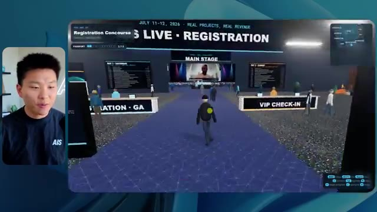
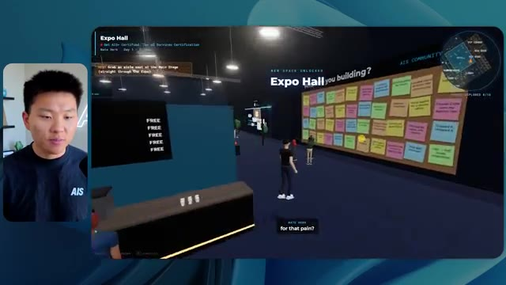
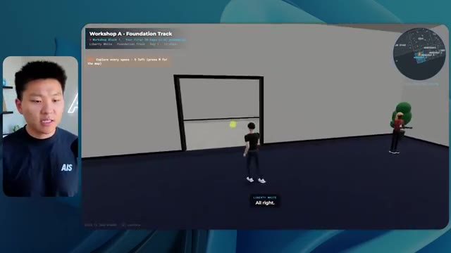

# 🎬 Fable 5.1 Just Dropped. It Looks Unreal.

> **Chaîne** : [Nate Herk | AI Automation](https://www.youtube.com/@nateherk/featured)  
> **Lien YouTube** : [https://www.youtube.com/watch?v=8IyORt-7rOQ](https://www.youtube.com/watch?v=8IyORt-7rOQ)  
> **Date de publication** : 20260901  
> **Durée** : 00:05:31  
> **Identifiant vidéo** : `8IyORt-7rOQ`  
> **Transcription & Analyse** : `whisper-v3-large-turbo+gemini-3.5-flash-lite`  

---

## 📌 Synthèse Exécutive & Outils

### 💡 Résumé

La vidéo de la chaîne Nate Herk | AI Automation explore l'impact des différents niveaux d'effort (de faible à *code ultra*) sur les performances du modèle d'IA **Opus 5.5**, à travers un test grandeur nature d'ingénierie logicielle et d'automatisation. L'objectif confié à l'agent IA était ambitieux : transformer un dossier brut de 105 gigaoctets de ressources vidéo (provenant d'un événement virtuel, *AIS Live*) en un monde 3D interactif et explorable en vue à la troisième personne, simulant une conférence tech physique avec des salles thématiques, des scènes et un design immersif fidèle à la marque.

Les résultats obtenus démontrent un grand écart qualitatif et comportemental selon le niveau d'effort configuré. Le niveau d'effort faible a produit une simulation basique, visuellement inaboutie, truffée de bugs d'affichage et dépourvue de l'identité de marque, pour un temps d'exécution de près de 17 minutes et un coût estimé de 3,91 $ (en API). À l'inverse, le niveau d'effort moyen a radicalement transformé la qualité du rendu : respect des codes graphiques, intégration réussie de flux vidéo en direct, PNJ (personnages non-joueurs) dotés d'animations comportementales et architecture de salles cohérente, au prix d'une durée d'une heure et quart et d'un coût de 12,44 $.

Cette expérimentation met en lumière la nécessité d'ajuster finement les curseurs d'effort des agents IA selon la complexité des livrables attendus. Elle souligne également l'un des goulets d'étranglement classiques du développement assisté par IA : la transition fluide entre un prototype fonctionnel généré localement et son déploiement en production, un fossé que des solutions d'infrastructure et d'hébergement intégrées cherchent à combler.

### 🛠️ Outils, Modèles & Logiciels Présentés

* **Opus 5.5** : Modèle d'intelligence artificielle de pointe d'Anthropic, réputé pour sa polyvalence, son efficacité économique et ses hautes capacités de raisonnement.
* **Claude Code** : Environnement de programmation et d'assistance piloté par IA, utilisé pour exécuter des tâches complexes de développement logiciel.
* **Hostinger (et son connecteur)** : Solution d'hébergement et extension gratuite pour éditeurs de code permettant de lier directement les environnements de développement (VS Code, Cursor, Claude Code, etc.) au compte de l'utilisateur pour un déploiement simplifié.
* **Frame.io** : Plateforme de gestion et de stockage cloud utilisée ici pour héberger les 105 gigaoctets d'enregistrements vidéo bruts de l'événement.
* **Key.ai** : Outil de génération d'images et de vidéos par IA mobilisé par les agents pour la création de ressources graphiques sur mesure.
* **Herc 2** : Système d'exploitation et d'automatisation IA propriétaire utilisé comme environnement de travail centralisé pour les scripts et ressources du projet.

### 🔑 Points Clés & Enseignements Stratégiques

* **Impact direct du niveau d'effort sur la qualité** : L'expérimentation prouve que la simple variation des paramètres d'effort (faible vs moyen) modifie du tout au tout la structure, la stabilité et le raffinement esthétique d'un livrable complexe généré par IA.
* **Arbitrage coût-temps-performance** : Le niveau faible offre un prototype rapide (16 minutes, ~3,91 $) mais inutilisable en l'état, tandis que le niveau moyen livre un produit fonctionnel et soigné, mais exige plus d'une heure de traitement et un coût supérieur (~12,44 $).
* **Autonomie totale des agents** : Dans tous les cas testés, l'agent a fonctionné de manière totalement autonome sans poser la moindre question de clarification à l'utilisateur, illustrant la capacité des modèles récents à interpréter des instructions complexes et vagues.
* **Rigoureuseté de l'intégration visuelle** : Le passage d'un effort faible à moyen a permis de corriger les incohérences de design en appliquant avec succès les directives de la marque (palettes de couleurs, logos officiels, signalétique).
* **Gestion des flux multimédias dynamiques** : Les agents de niveau supérieur réussissent à intégrer de véritables flux vidéo en streaming et des interfaces interactives (comme des écrans de conférence ou des barres de FAQ) au sein d'un univers 3D virtuel.
* **Comportements émergents et PNJ** : Les agents configurés avec un niveau d'effort supérieur dotent les personnages virtuels d'animations et d'interactions rudimentaires (salutations, déplacements), renforçant l'immersion de l'utilisateur.
* **Recommandation officielle d'Anthropic** : Les préconisations d'ingénierie de prompt conseillent généralement de débuter les tests au niveau moyen, puis d'ajuster itérativement vers le haut ou vers le bas en fonction des résultats obtenus et des contraintes de ressources.
* **Le défi du déploiement post-génération** : Obtenir un prototype fonctionnel généré par IA sur sa machine ne résout pas la friction du passage en production, nécessitant des outils de connectivité directe entre l'IDE et les serveurs d'hébergement.
* **Exploitation de données massives hétérogènes** : Les modèles actuels démontrent une excellente capacité à analyser et structurer de vastes volumes de données non structurées (ici 105 Go de vidéos) pour en extraire une logique spatiale et thématique pertinente.
* **Automatisation de la logique métier** : L'agent a été capable de cartographier automatiquement un agenda complexe sur deux jours (keynotes, ateliers, pistes de formation) et de l'injecter dans un parcours utilisateur cohérent dans le monde 3D.

---

## ⏱️ Chronologie & Transcription Complète Audio & Visuelle (Mot pour Mot)

### ⏱️ `[00:00:00 - 00:00:20]` | Segment #01

**🔊 Audio (Transcription Intégrale Mot pour Mot en Français) :**
> Opus 5.5, Opus 5.5, Opus 5.5, Opus 5.5, Opus 5.5. Ce modèle est littéralement partout et pour de très bonnes raisons. Il est intelligent, il est bon marché, il a un goût incroyable, c'est un modèle d'IA extraordinaire. Mais avec chaque modèle d'IA, vous avez le choix de l'effort, que ce soit faible, moyen, haut, extra, max ou code ultra.

**👁️ Analyse Visuelle d'Écran (gemini-3.5-flash-lite) :**
**Interface & Outils** : Navigateur web (Twitter / X)

**Contenu textuel & Code** : Publication sur les réseaux sociaux (X) incluant une vidéo de simulation de paysage 3D et du texte en anglais sur l'impact de l'IA.

**Action / Démonstration** : Affichage d'une publication X montrant un exemple de génération ou de rendu en lien avec le sujet abordé.

*⏱️ 00:00:05 — Une capture d'écran d'un tweet montrant une vidéo ou une simulation 3D d'un paysage côtier tropical avec des arbres, des maisons et l'océan.*

---

### ⏱️ `[00:00:20 - 00:00:38]` | Segment #02

**🔊 Audio (Transcription Intégrale Mot pour Mot en Français) :**
> Donc dans cette vidéo, j'ai donné exactement le même prompt à Opus 5.5 et je l'ai exécuté à chaque niveau d'effort, et nous allons comparer les résultats. Nous examinerons la qualité de toutes les différentes sorties réelles, mais nous allons aussi examiner combien de temps chacun d'eux a pris pour s'exécuter, combien cela nous a coûté si c'était une facturation par API, le total des jetons, combien de vérifications ils ont exécutées, et combien de questions ils m'ont réellement posées tout au long du processus.

**👁️ Analyse Visuelle d'Écran (gemini-3.5-flash-lite) :**
**Interface & Outils** : Tableau blanc ou application de mind mapping/canvas (style Miro ou Obsidian) affichant un tableau comparatif.

**Contenu textuel & Code** : Tableau comparatif des niveaux d'effort de l'IA (Low à Ultracode) évalués selon divers critères (Run time, API cost, Total tokens, Checks, Questions asked).

**Action / Démonstration** : Présentation du tableau comparatif analysant les différents niveaux d'effort d'exécution d'Opus 5.5.

*⏱️ 00:00:29 — Capture d'écran d'un tableau comparatif avec les niveaux d'effort (Low, Medium, High, Extra, Max, Ultracode) et des métriques (Run time, API cost, Total tokens, etc.).*

---

### ⏱️ `[00:00:39 - 00:00:58]` | Segment #03

**🔊 Audio (Transcription Intégrale Mot pour Mot en Français) :**
> Et les résultats que nous avons obtenus ne sont pas du tout ce à quoi je m'attendais, donc j'ai hâte de partager cela avec vous les gars. Ne perdons pas de temps et allons directement à celui-ci. D'accord, alors plongeons-nous directement dans celui-ci. Je veux commencer juste en vous montrant le prompt réel que nous avons utilisé que nous avons donné à chacun de ces différents agents. Je vais aller dans les fichiers ici, et nous allons ouvrir ce fichier markdown de prompt, et je vais vous montrer ce que nous avons obtenu. Voici donc le slash objectif que j'ai fourni.

**👁️ Analyse Visuelle d'Écran (gemini-3.5-flash-lite) :**
**Interface & Outils** : Interface web de l'application de développement IA (style Claude Code / CLI Web).

**Contenu textuel & Code** : Message de l'assistant IA demandant confirmation pour lancer la tâche de création d'un monde 3D à partir des enregistrements de la conférence AIS Live ("Read the task prompt and listed worktree files...").

**Action / Démonstration** : Le présentateur introduit l'outil et montre l'invite de commande en attente de validation de l'IA pour démarrer le projet.

*⏱️ 00:00:48 — Interface de l'outil de développement IA affichant un assistant virtuel avec une discussion active et la barre de saisie de commandes, incluant une incrustation vidéo du présentateur sur la gauche.*

---

### ⏱️ `[00:00:58 - 00:01:34]` | Segment #04

**🔊 Audio (Transcription Intégrale Mot pour Mot en Français) :**
> J'ai dit, tu dois me créer un monde en 3D qui est une conférence tech réaliste dans laquelle je peux me déplacer en vue à la troisième personne. Tu vas regarder ce dossier, qui contient mes ressources d'enregistrement d'événements de AIS Live. Et ce dossier est un dossier Frame.io de 105 gigaoctets d'enregistrements vidéo. C'était un événement entièrement virtuel. Tout a été enregistré et tous les enregistrements sont juste ici. J'ai dit, ton objectif est de prendre cet événement et de le transformer en un monde 3D explorable qui me donne l'impression d'être réellement allé à une vraie conférence en personne avec différentes salles, différentes pistes, différentes scènes, bla, bla, bla. N'hésite pas à utiliser key.ai si tu as besoin de générer des images ou des vidéos. Et tu peux aussi utiliser n'importe quoi d'autre dans mon projet Herc 2, qui est comme mon système d'exploitation IA. J'ai dit,

**👁️ Analyse Visuelle d'Écran (gemini-3.5-flash-lite) :**
**Interface & Outils** : Éditeur de code (type VS Code) et interface web de stockage cloud (Frame.io).

**Contenu textuel & Code** : Fichier Markdown PROMPT.md détaillant les consignes pour transformer des enregistrements virtuels en un monde 3D explorable à la troisième personne, avec lien Frame.io.

**Action / Démonstration** : Présentation du prompt initial et du dossier de ressources vidéo de 105 Go fourni à l'IA pour la génération de la conférence tech virtuelle.

*⏱️ 00:01:07 — Éditeur de texte affichant le fichier PROMPT.md contenant les instructions pour créer un monde 3D interactif et réaliste basé sur des enregistrements d'événements.*

*⏱️ 00:01:16 — Interface web Frame.io affichant un dossier d'enregistrements d'événements de 105,69 Go ("Sep 22, 2026") avec les sous-dossiers "GA Access" et "VIP Access".*

*⏱️ 00:01:25 — Retour sur l'éditeur de texte affichant le fichier PROMPT.md avec les directives de conception du monde virtuel 3D.*

---

### ⏱️ `[00:01:34 - 00:02:08]` | Segment #05

**🔊 Audio (Transcription Intégrale Mot pour Mot en Français) :**
> vous serez jugé sur la créativité, le design, la physique et la sensation générale lorsque j'explorerai le monde 3D que vous avez construit. Et c'était fondamentalement la fin des instructions. Donc comme vous pouvez le voir sur ce côté gauche, j'ai exécuté ceci à travers tous les différents niveaux d'effort. Commençons par le niveau bas et remontons jusqu'au code ultra. Très bien. Donc ici nous avons le résultat du niveau bas. Ouvrons ceci et jetons un coup d'œil. Nous avons donc AIS live, le sommet des services IA en personne enfin, et nous avons pu cliquer partout. Tout d'abord, on ne sent pas vraiment l'identité de la marque. Genre, ce n'est pas le logo d'IS Live. Ce n'est même pas nos couleurs. Donc je n'aimes pas trop ça, mais entrons ici. D'accord. C'est beaucoup trop lumineux. Euh, nous avons une carte en haut à droite. Nous avons une ville par ici. Je ne peux pas dire quelle ville c'est

**👁️ Analyse Visuelle d'Écran (gemini-3.5-flash-lite) :**
**Interface & Outils** : Interface logicielle de type assistant IA / éditeur de projet

**Contenu textuel & Code** : Texte de prompt demandant de construire un monde 3D en vue à la troisième personne avec des salles, pistes et scènes distinctes basées sur des enregistrements.

**Action / Démonstration** : Navigation et sélection des différents niveaux de tests d'effort dans le panneau latéral gauche.

*⏱️ 00:01:42 — Le présentateur à gauche et une interface d'application sombre affichant un panneau latéral avec des niveaux de test d'effort (Hello, Extra, High, Max, Ultracode, Medium, Low) et un panneau de discussion principal avec un agent IA.*

---

### ⏱️ `[00:02:08 - 00:02:40]` | Segment #06

**🔊 Audio (Transcription Intégrale Mot pour Mot en Français) :**
> c’est. D'accord. C'est Chicago, ce qui est plutôt cool parce que tu sais, je vis à Chicago, mais bref, en haut, à droite, nous pouvons voir une carte. Nous avons un hall d'accueil. Nous avons un hall d'exposition. Nous avons un salon VIP sur la scène principale. La carte montre également où se trouve chaque autre personne et cela se synchronise en direct. Nous pouvons donc voir l'inscription. Nous pouvons voir le premier jour, la keynote de l'hyper agent, le débriefing en direct. Cool. Donc il connaît réellement l'agenda et ensuite il y a le deuxième jour. Donc il a trouvé ça, c'est bien. Nous avons ces petites boules ici que je peux espérer lancer autour de moi. D'accord. Le visage, Oh, regarde ça. Si je vais par ici, toutes les personnes disparaissent tout simplement. Très mauvais. Très mauvais. D'accord. Voyons voir. Est-ce que je peux sprinter ? D'accord.

**👁️ Analyse Visuelle d'Écran (gemini-3.5-flash-lite) :**
**Interface & Outils** : Application de métavers ou plateforme d'événement virtuel en 3D

**Contenu textuel & Code** : Carte de navigation, planning du jour 1 et éléments d'interface 3D

**Action / Démonstration** : Navigation et exploration de l'espace virtuel par le présentateur

*⏱️ 00:02:16 — Vue d'un espace virtuel 3D avec un avatar et une carte interactive en haut à droite.*

*⏱️ 00:02:24 — Affichage du hall virtuel (Lobby) avec un panneau d'affichage du programme (Day 1).*

*⏱️ 00:02:32 — Vue du hall d'exposition (Expo Hall) dans l'environnement virtuel avec des avatars et des animations lumineuses.*

---

### ⏱️ `[00:02:40 - 00:03:04]` | Segment #07

**🔊 Audio (Transcription Intégrale Mot pour Mot en Français) :**
> Je peux avancer un peu plus vite. Je vais d'abord aller par ici. Il y a des produits dérivés, euh, un sweat à capuche certifié AIS plus. D'accord. Donc il y a les vrais stands qu'on avait dans l'événement virtuel. On avait des stands. Donc c'est plutôt cool. Un petit endroit pour prendre des photos. La salle C. En ce moment, nous avons Tangy Frederick qui anime un atelier. D'accord. Mais ce n'est pas une vidéo. Comme vous pouvez le voir, c'est juste une image. Elle ne bouge pas. Donc c'est juste une image. Ces gens sont en train de disparaître. Ce doivent être des fantômes. Allons par ici dans la salle A.

**👁️ Analyse Visuelle d'Écran (gemini-3.5-flash-lite) :**
**Interface & Outils** : Environnement virtuel 3D interactif (type monde virtuel ou métavers).

**Contenu textuel & Code** : Éléments graphiques d'un événement virtuel, stands de sponsors et instructions de tutoriel.

**Action / Démonstration** : Navigation et exploration de l'espace virtuel par le présentateur.

---

### ⏱️ `[00:03:04 - 00:03:30]` | Segment #08

**🔊 Audio (Transcription Intégrale Mot pour Mot en Français) :**
> Nous avons Liberty White. D'accord. Très cool. Vos 30 premiers jours en automatisation. Encore une fois, c'est juste une image fixe et les gens ont des bugs d'affichage. Donc ce n'est pas très bien ici. Je vais aller sur la scène principale et voir ce que nous avons. D'accord, cool. Donc nous avons une scène principale. Les gens ont de gros bugs d'affichage. Vraiment mauvais. Ce n'est vraiment pas terrible. Notre vidéo est en fait en train de bouger. Genre, j'ai vu mon visage ici et j'ai vu celui de Devin, mais maintenant ils ont disparu. Donc je ne sais pas ce qui s'est passé. D'accord. C'est, on dirait que c'est plutôt un diaporama. Rien n'est vraiment lu pour l'instant. Bref, entrons ici.

**👁️ Analyse Visuelle d'Écran (gemini-3.5-flash-lite) :**
**Interface & Outils** : Environnement virtuel 3D interactif (type métavers / plateforme événementielle virtuelle).

**Contenu textuel & Code** : Affichage des titres d'ateliers ("Hyperagent Workshop: How to Build an Always-On Fleet of Agents") et du logo "AIS LIVE AI Services Summit".

**Action / Démonstration** : Navigation et déplacement d'un avatar à l'intérieur d'un espace de conférence virtuel 3D.

*⏱️ 00:03:17 — L'avatar se déplace dans un grand amphithéâtre virtuel rempli d'avatars représentant un public assistant à un atelier.*

*⏱️ 00:03:24 — Vue large de la scène principale "AIS LIVE - AI Services Summit" dans l'environnement virtuel 3D avec des écrans de présentation géants.*

---

### ⏱️ `[00:03:30 - 00:03:58]` | Segment #09

**🔊 Audio (Transcription Intégrale Mot pour Mot en Français) :**
> Nous avons d'autres stands. Nous avons hyper agent. Nous avons Claude Code. Nous avons plus de gadgets publicitaires. La salle B, c'est Dave Ebelor. Je suppose que c'est exactement la même chose. Nous avons du café. Et puis je suppose le salon VIP, accès VIP seulement. C'est plutôt cool, mais il ne se passe vraiment rien ici. Cet écran est bien trop lumineux. D'accord. Donc je pense que vous comprenez l'ambiance qu'on obtient ici d'Opus 5.5 en effort faible. Et c'est là que les choses deviennent intéressantes. Combien de temps pensez-vous que cela a duré ? Combien de temps ? Celui-ci a duré 16 minutes et 43 secondes. Combien pensez-vous que cela a coûté ?

**👁️ Analyse Visuelle d'Écran (gemini-3.5-flash-lite) :**
**Interface & Outils** : Application web / Tableau blanc de présentation "Opus 5.5 Efforts" et environnement virtuel 3D.

**Contenu textuel & Code** : Tableau comparatif avec les lignes : Run time, API cost, Total tokens, Checks, Questions asked, et colonnes de Low à Ultracode.

**Action / Démonstration** : Présentation d'un tableau comparatif des efforts et coûts d'exécution de modèles d'IA.

*⏱️ 00:03:51 — Tableau comparatif "Opus 5.5 Efforts" affichant des niveaux de performance (Low, Medium, High, Extra, Max, Ultracode) et des métriques.*

---

### ⏱️ `[00:03:58 - 00:04:26]` | Segment #10

**🔊 Audio (Transcription Intégrale Mot pour Mot en Français) :**
> 3,91 dollars si c'était une facturation par API. J'utilise évidemment mon abonnement ici, mais nous allons simplement calculer cela en facturation par API. Le total des jetons était de 191 000. Il a effectué 22 vérifications. Donc la vérification, 22 fois il a ouvert le navigateur et a exécuté différents types de vérifications. Donc 22 catégories de vérifications. Et combien de questions m'a-t-il posé ? Il m'a posé un total de zéro question tout au long de cette invite de commande d'objectif. D'accord. Alors, ouvrons l'effort moyen et voyons ce que nous avons obtenu. D'accord, c'est parti. Effort moyen. Nous avons Nate Herc. Nous avons mon badge. C'est la marque AI's life.

**👁️ Analyse Visuelle d'Écran (gemini-3.5-flash-lite) :**
**Interface & Outils** : Outil de tableau blanc numérique / application de visualisation de données (intitulé "Opus 5.5 Efforts")

**Contenu textuel & Code** : Tableau avec les lignes : Run time (16m 43s), API cost ($3.91), Total tokens (191.3K), Checks, et Questions asked, organisées par colonnes de niveau d'effort (Low, Medium, High).

**Action / Démonstration** : Le présentateur explique et commente les coûts et les statistiques d'utilisation affichés dans le tableau pour le niveau d'effort bas (Low).

*⏱️ 00:04:05 — Un tableau affiché sur un outil de type tableau blanc numérique ou interface de présentation, montrant les métriques de performance et de coût telles que le temps d'exécution (Run time), le coût API (API cost à $3.91), le nombre total de jetons (Total tokens à 191.3K) et les vérifications (Checks), avec le présentateur visible à l'écran.*

---

### ⏱️ `[00:04:26 - 00:04:46]` | Segment #11

**🔊 Audio (Transcription Intégrale Mot pour Mot en Français) :**
> Donc ça a déjà l'air un petit peu mieux. Ça ressemble à nos palettes de couleurs qui ont utilisé nos directives de marque. Premier jour de construction, deuxième jour de gain, VIP. Cool. D'accord. Je vais entrer dans le lieu. D'accord. Waouh. Une ambiance similaire, en somme. C'est en arrière-plan. Ça ne ressemble pas à Chicago, hein ? Non, ça ressemble à, honnêtement, ça ressemble à une ville imaginaire. Quoi qu'il en soit, c'est marrant qu'ils aient décidé de faire ça. Voyons si je peux avancer un peu plus vite. Oh, waouh.

**👁️ Analyse Visuelle d'Écran (gemini-3.5-flash-lite) :**
**Interface & Outils** : Application web interactive / 3D venue

**Contenu textuel & Code** : Écran d'accueil "Welcome to AIS Live" avec badge, instructions de contrôle clavier et interface utilisateur de l'événement virtuel.

**Action / Démonstration** : Le présentateur navigue et entre dans l'environnement virtuel 3D de l'événement.

*⏱️ 00:04:31 — Interface web "Welcome to AIS Live" avec un badge d'accès au nom de Nate Herk et des boutons de navigation.*

*⏱️ 00:04:41 — Vue virtuelle 3D à l'intérieur du lieu avec des avatars de type Roblox et une vue sur une ville illuminée.*

---

### ⏱️ `[00:04:46 - 00:05:21]` | Segment #12

**🔊 Audio (Transcription Intégrale Mot pour Mot en Français) :**
> Les gens interagissent avec moi. Regardez. Si je m'approche de ce type, il vient de lever le bras. Bon, maintenant il ne veut plus du tout avoir affaire à moi. Mais tous ces petits robots ici doivent prendre des décisions. Je ne sais pas s'ils utilisent Jev. C'est sûr que non. Je ne le lui ai pas dit. En fait, ma clé Jev est à l'arrière. Je ne sais pas. Peut-être qu'il l'a utilisée. Quoi qu'il en soit, nous pouvons voir ici que nous avons la salle d'atelier C, le laboratoire des agents. Sympa. Donc celui-ci est réellement en train de fonctionner. Vous pouvez voir qu'il s'agit d'une vraie vidéo diffusée par Tangy. Tout le monde ici est en train de travailler sur un ordinateur portable. Ils ne buguent pas. C'est plutôt cool. De plus, mon badge est sur ma poitrine, ce qui est plutôt cool. Je peux venir par ici. Nous avons une carte en haut à droite, comme vous pouvez le voir, mais je peux venir par ici. Nous avons un

**👁️ Analyse Visuelle d'Écran (gemini-3.5-flash-lite) :**
**Interface & Outils** : Environnement virtuel 3D de type métavers / monde virtuel.

**Contenu textuel & Code** : Avatars interactifs simulant des agents ou des participants dans un espace virtuel.

**Action / Démonstration** : Exploration d'un monde virtuel 3D peuplé d'avatars par l'utilisateur.

---

### ⏱️ `[00:05:21 - 00:05:47]` | Segment #13

**🔊 Audio (Transcription Intégrale Mot pour Mot en Français) :**
> hall d'exposition. C'est là que nous avons le stand de Glido. Et ça diffuse actuellement. Oui, ça diffuse la vidéo de nous parlant de Glido. Ça diffuse la vidéo d'Ed et moi parlant de notre programme de certification. Nous avons le logo AIS Plus ici derrière, qui est un peu dans un endroit bizarre. Ce sont les diapositives des conférenciers et les points clés. Donc waouh, ce sont toutes les ressources que nous avons distribuées après l'événement. Elles sont toutes assises là aussi. Nous pouvons voir que nous avons un projecteur sur la communauté. Donc c'est Aiden qui parle de son contrat qu'il a décroché et ça se lit en direct. Ces gens regardent.

**👁️ Analyse Visuelle d'Écran (gemini-3.5-flash-lite) :**
**Interface & Outils** : Environnement virtuel 3D / Plateforme d'événement virtuel.

**Contenu textuel & Code** : Écrans virtuels affichant des diapositives de présentation, des textes et des informations de session.

**Action / Démonstration** : Navigation et exploration dans le monde virtuel de l'exposition.

---

### ⏱️ `[00:05:47 - 00:06:21]` | Segment #14

**🔊 Audio (Transcription Intégrale Mot pour Mot en Français) :**
> Ils sont plutôt engagés. On a l'hyper agent. C'était, c'est ce que je voulais dire. Si vous avez vu ces gens lever les bras pour dire bonjour, c'était plutôt drôle. Regardez, regardez, le voilà qui recommence. Bref. Bon. Où est-ce que je suis maintenant ? Maintenant, je suis dans le hall principal. On a un bar à café. On a un grand logo, qui est le vrai logo. C'est trop lumineux, mais on a le logo. On peut voir si on peut entrer ici dans le parcours des fondations. On a Sabrina Romanov et Liberty White. Donc différentes formations juste là. On peut entrer dans cette salle. C'est le parcours avancé. Alors qu'est-ce qui se passe ici ? On a Dave Ebelar et Saman qui parlent de différentes choses là-dedans. Et maintenant, allons jeter un œil à la scène principale. Oh, attendez, il y a une vidéo de moi là-haut. Est-ce que c'est comme un VIP

**👁️ Analyse Visuelle d'Écran (gemini-3.5-flash-lite) :**
**Interface & Outils** : Application de métavers / espace virtuel 3D (type événement virtuel ou plateforme de networking).

**Contenu textuel & Code** : Environnement virtuel 3D avec interface de mini-carte et indications de navigation.

**Action / Démonstration** : Navigation et déplacement d'un avatar à travers le hall virtuel et entrée dans une salle de conférence.

---

### ⏱️ `[00:06:21 - 00:06:50]` | Segment #15

**🔊 Audio (Transcription Intégrale Mot pour Mot en Français) :**
> section ? Ouais, on ira voir ça dans une minute. Mais bref, voici la scène principale. Ça a l'air vraiment, vraiment super. On a une grande scène. On a genre quatre personnes assises ici. On a les trois écrans d'Alex là-haut avec l'hyper agent. Est-ce que j'ai le droit de monter sur scène ? Oh, et il me laisse monter sur scène. D'accord. C'est plutôt sympa. Bon les gars, faisons un selfie. Laissez-moi prendre tout le monde en fond. Venez par ici. Bref, c'est vraiment, vraiment cool. Par contre, toutes les places ne sont pas prises. Donc il faut qu'on travaille là-dessus. Mais bref, je vais retourner voir ce qu'était cette section VIP. D'accord. Le salon VIP. J'ai l'impression que c'est comme un aéroport ou un truc comme ça.

**👁️ Analyse Visuelle d'Écran (gemini-3.5-flash-lite) :**
**Interface & Outils** : Environnement virtuel 3D / plateforme de conférence en ligne.

**Contenu textuel & Code** : Interface utilisateur de l'événement virtuel affichant les informations de session "Hyperagent Keynote".

**Action / Démonstration** : Navigation et exploration de l'espace virtuel par l'avatar de l'utilisateur.

---

### ⏱️ `[00:06:51 - 00:07:14]` | Segment #16

**🔊 Audio (Transcription Intégrale Mot pour Mot en Français) :**
> Ok, super. Donc maintenant nous avons les sessions VIP ici. Une FAQ VIP avec la lecture vidéo en direct de Nate juste ici. Très, très cool. Et nous avons comme un bar ou quelque chose comme ça. Génial. Je dirais que c'est un assez bon résultat. Maintenant, en ce qui concerne les statistiques ici, celle-ci a pris une heure et 13 minutes à s'exécuter. Cela nous aurait coûté 12 dollars et 44 cents. Elle a utilisé 490 000 jetons et elle a fait 23 vérifications.

**👁️ Analyse Visuelle d'Écran (gemini-3.5-flash-lite) :**
**Interface & Outils** : Espace virtuel 3D et tableau de bord de statistiques (Opus 5.5 Efforts).

**Contenu textuel & Code** : Statistiques de performance : temps d'exécution (16m 43s), coût API ($3.91), tokens totaux (191.3K).

**Action / Démonstration** : Présentation de la zone VIP virtuelle puis transition vers l'analyse des statistiques d'exécution.

*⏱️ 00:06:56 — Capture montrant l'espace VIP virtuel en 3D avec un écran géant diffusant une vidéo de Nate Herk et des avatars d'utilisateurs.*

*⏱️ 00:07:02 — Capture affichant un tableau comparatif ou un panneau de statistiques (Run time: 16m 43s, API cost: $3.91, Total tokens: 191.3K, Checks: 22).*

---

### ⏱️ `[00:07:14 - 00:07:48]` | Segment #17

**🔊 Audio (Transcription Intégrale Mot pour Mot en Français) :**
> Et il nous a posé un total de zéro question une fois de plus. Très bien, passons à élevé. C'était déjà un résultat plutôt correct et Anthropic eux-mêmes dans leur vidéo, ou désolé, pas une vidéo, un article sur comment prompter Opus 5.5. Ils ont dit de commencer simplement par moyen et de l'ajuster vers le haut ou vers le bas si nécessaire. C'était donc un résultat moyen. Passons à élevé et voyons ce qu'on a obtenu. Très rapidement, les gars, je dois prendre une seconde pour vous parler du sponsor de la vidéo d'aujourd'hui, Hostinger. Donc ces deux modèles viennent de me construire une version fonctionnelle de la même chose. Et maintenant, je me retrouve exactement là où je finis toujours, avec un produit fini sur mon ordinateur portable et aucun moyen rapide de le mettre en ligne. Et c'est précisément le fossé que le connecteur d'Hostinger comble. C'est une extension gratuite

**👁️ Analyse Visuelle d'Écran (gemini-3.5-flash-lite) :**
**Interface & Outils** : Tableau blanc/canevas de présentation et interface d'éditeur de code (type Cursor ou VS Code).

**Contenu textuel & Code** : Tableau comparatif des performances (Low: 16m 43s, Medium: 1h 13m) et prompt "Build a single-page ROI calculator...".

**Action / Démonstration** : Présentation des résultats comparatifs entre différents niveaux de configuration d'effort de l'IA.

*⏱️ 00:07:22 — Un tableau comparatif montrant les métriques pour différents niveaux d'effort (Low, Medium, High, Extra) avec les temps d'exécution, les coûts API, le nombre de tokens et de questions posées.*

*⏱️ 00:07:39 — Une interface de développement avec un éditeur de code et un panneau de chat montrant le prompt pour construire un calculateur ROI pour une agence.*

---

### ⏱️ `[00:07:48 - 00:08:23]` | Segment #18

**🔊 Audio (Transcription Intégrale Mot pour Mot en Français) :**
> pour votre éditeur qui intègre votre compte Hostinger dans l'outil de programmation que vous utilisez déjà, que ce soit VS Code, Cursor, Cloud Code, Codex, et j'en passe. Vous vous connectez une seule fois en un clic, et à partir de là, votre agent peut déployer le site, y pointer un domaine, configurer les enregistrements DNS et vérifier votre VPS sans que vous ayez à quitter votre éditeur. Ainsi, quel que soit celui de ces outils que vous finirez par préférer, ce qu'il a construit n'est qu'à quelques minutes d'une vraie URL sur un hébergement géré. Connector est gratuit avec chaque formule d'hébergement, donc si vous avez encore besoin de l'hébergement en dessous, prenez la formule illimitée avec le lien dans la description et utilisez le code NATEHERK pour obtenir 10 % de réduction. Cela inclut également un domaine gratuit et un e-mail professionnel pour l'année. Et c'est toujours le moyen le moins cher que j'ai trouvé pour obtenir quelque

**👁️ Analyse Visuelle d'Écran (gemini-3.5-flash-lite) :**
**Interface & Outils** : Interface web/IDE de configuration Hostinger et fenêtre Claude Code.

**Contenu textuel & Code** : Options de gestion Hostinger (Connected via OAuth, Node.js 24.13.0) et liste des outils accessibles par l'assistant.

**Action / Démonstration** : Connexion de Hostinger à l'IDE pour permettre à l'agent de gérer les sites web, domaines et abonnements.

*⏱️ 00:07:57 — Interface montrant la connexion OAuth de Hostinger depuis l'IDE, avec les outils disponibles (Websites, Domains, Subscriptions & Payments, Email Marketing).*

---

### ⏱️ `[00:08:23 - 00:08:47]` | Segment #19

**🔊 Audio (Transcription Intégrale Mot pour Mot en Français) :**
> tu as construit sur une vraie URL. Donc revenons à la vidéo. D'accord. Encore une fois, très, très marqué par la marque. C'est un écran de chargement encore mieux que le précédent. Nous avons ce petit effet sympa en arrière-plan. Nous avons le logo. Nous allons entrer dans le lieu. D'accord. Nous y voilà. Ça a l'air plutôt bien. Nous commençons dehors et tu peux voir que nous avons ces drapeaux pour tous les intervenants, Wyatt, Casper, Alex, Ed, Aiden, Sabrina, Liberty. C'est plutôt cool. Nous avons des blocs en direct ici.

**👁️ Analyse Visuelle d'Écran (gemini-3.5-flash-lite) :**
**Interface & Outils** : Application web 3D immersive hébergée sur RingCentral (AIS Live Plaza)

**Contenu textuel & Code** : Interface utilisateur 3D avec bannières de conférenciers, mini-carte, indicateur de progression (passeport) et instructions de navigation.

**Action / Démonstration** : Navigation et exploration de l'espace virtuel 3D par le présentateur après avoir cliqué sur 'Enter the Venue'.

*⏱️ 00:08:29 — Écran de chargement et d'accueil de la plateforme virtuelle 'AIS LIVE' avec logo, description de l'événement et contrôles clavier/souris affichés.*

*⏱️ 00:08:35 — Entrée dans l'univers virtuel 3D (AIS Live Plaza) avec un avatar au premier plan, des bâtiments en arrière-plan et des indications textuelles en haut.*

*⏱️ 00:08:41 — Exploration de la place virtuelle avec des bannières verticales affichant des noms de conférenciers, des arbres stylisés et des avatars de personnages.*

---

### ⏱️ `[00:08:47 - 00:09:23]` | Segment #20

**🔊 Audio (Transcription Intégrale Mot pour Mot en Français) :**
> Il a pris cette photo de moi, votre hôte, Nate Herc, John, Dave, Nate Herc. Voilà. OK. Les portes. Génial. Ce sont des portes coulissantes automatiques en verre. J'adore ça. Nous pouvons voir l'enregistrement VIP. Nous pouvons voir l'admission générale. Nous pouvons venir par ici et nous pouvons découvrir l'exposition avec différents stands, le projecteur sur la communauté. Vous pouvez également voir qu'en haut à gauche, j'ai un passeport. C'est donc comme si, cela montrera combien d'endroits j'ai visités. Tout cela est une vraie lecture. Nous avons un mur de ressources avec tous les différents intervenants. Ils ont également une session de réseautage par ici. Je vais donc venir très vite et voir de quoi il s'agit. Nous avons donc le bar à cold brew AIS. Nous avons différents membres de la communauté qui ont été mis en avant ou mis en lumière.

**👁️ Analyse Visuelle d'Écran (gemini-3.5-flash-lite) :**
**Interface & Outils** : Application web 3D / Environnement virtuel interactif

**Contenu textuel & Code** : Interface utilisateur virtuelle 3D avec bannières d'événements, mini-carte et listes de participants.

**Action / Démonstration** : Navigation et exploration d'un monde virtuel 3D représentant une conférence ou un salon en ligne.

*⏱️ 00:08:56 — Vue d'un espace virtuel 3D de type événement en ligne (concourse d'enregistrement) avec des avatars et un présentateur en incrustation.*

*⏱️ 00:09:05 — Navigation dans un hall d'exposition virtuel 3D avec des stands et des panneaux d'information interactifs.*

*⏱️ 00:09:14 — Déplacement d'avatars dans le hall d'entrée virtuel montrant de grandes baies vitrées et des comptoirs d'accueil.*

---

### ⏱️ `[00:09:23 - 00:09:56]` | Segment #21

**🔊 Audio (Transcription Intégrale Mot pour Mot en Français) :**
> Nous avons l'aile VIP. Attends, quoi ? Prends un bracelet. Oh, je dois vraiment aller chercher le bracelet. D'accord. Laisse-moi m'enregistrer rapidement. Le bracelet est déjà mis. Attends, quoi ? D'accord. Oh, d'accord. Maintenant, les portes se sont ouvertes pour moi. Cool. Je peux entrer ici. Oh, ça mène juste à la scène principale. Salon VIP. Il y a une séance de questions-réponses en cours. Ça a l'air très cool. Je veux dire, je suis très impressionné par la façon dont il est capable de faire ça. Waouh. D'accord. Donc c'est vraiment bien. Ce qu'on a fait, c'est qu'on a eu des salles de discussion VIP avec différentes personnes. Tu peux voir qu'il y a différentes salles, différents membres de l'équipe AIS qui vont dans des trucs. C'est vraiment cool. C'est très cool. C'est un VIP bien meilleur

**👁️ Analyse Visuelle d'Écran (gemini-3.5-flash-lite) :**
**Interface & Outils** : Application virtuelle 3D / Metavers de conférence (Gather ou similaire).

**Contenu textuel & Code** : Interface utilisateur virtuelle avec mini-carte, indicateurs de statut, barre de progression Passport, et panneaux textuels informatifs.

**Action / Démonstration** : Navigation et exploration de l'espace virtuel de conférence par l'avatar.

*⏱️ 00:09:32 — Vue principale de l'espace virtuel montrant l'avatar du présentateur dans le hall d'enregistrement (Registration Concourse).*

*⏱️ 00:09:40 — Vue de la salle VIP Lounge où se déroule une session de questions-réponses avec Nate Herk, avec un écran affichant une visioconférence.*

*⏱️ 00:09:48 — Vue de l'espace VIP Working Sessions avec plusieurs tables rondes thématiques et des participants virtuels.*

---

### ⏱️ `[00:09:56 - 00:10:30]` | Segment #22

**🔊 Audio (Transcription Intégrale Mot pour Mot en Français) :**
> expérience que ce qui a été montré dans le premier élément. D'accord. After party VIP. Regardez ça. On a une piste de danse. On a tous ces éléments ici. On a la lecture de l'after party VIP juste ici. Et il y a une estrade de DJ. C'est trop marrant. Il y a un petit bug ici, un petit glitch ici, mais c'est génial. Oh, cool. Donc quand je suis ici sur la scène principale, on a des sous-titres. Vous pouvez voir juste ici en bas de mon écran, on a ces sous-titres de Wyatt qui est en train de parler là-haut. On a des lumières. On a le panel. Très cool. Belle scène principale. Je vais aller ici. On peut aller à la fondation,

**👁️ Analyse Visuelle d'Écran (gemini-3.5-flash-lite) :**
**Interface & Outils** : Environnement virtuel 3D interactif de type métavers / plateforme événementielle en ligne.

**Contenu textuel & Code** : Interface utilisateur virtuelle affichant les informations de l'événement, la carte, les commandes clavier et des flux vidéo de participants.

**Action / Démonstration** : Navigation et exploration d'un espace événementiel virtuel 3D par le présentateur.

*⏱️ 00:10:04 — Capture d'écran montrant l'interface d'un espace virtuel 3D (VIP After-Party) avec des avatars sur une piste de danse et un écran affichant des flux vidéo.*

*⏱️ 00:10:13 — Vue légèrement différente de la piste de danse virtuelle 3D avec des ballons et des participants représentés par des avatars.*

*⏱️ 00:10:21 — Vue d'une scène principale virtuelle (Main Stage) avec un grand écran de présentation et des rangées de sièges occupés par des avatars.*

---

### ⏱️ `[00:10:30 - 00:11:06]` | Segment #23

**🔊 Audio (Transcription Intégrale Mot pour Mot en Français) :**
> avancé, et les parcours d'entreprise ici. Donc voyons voir. Nous avons l'anatomie de trois vrais contrats. Nous avons hyper agent. Nous avons les évaluations avec Nate et Ed ici. Nous avons Dave qui s'occupe des trucs avancés. C'est vraiment bien. Je veux dire, évidemment, chacun, chacun de ces résultats jusqu'à présent, faible était correct. Moyen était meilleur. Élevé a été encore meilleur. Voyons si cette tendance se poursuit et allons voir ce que cela nous a coûté. Donc, élevé a tourné pendant une heure et sept minutes. Donc, un peu plus rapide que moyen, cela nous aurait coûté 16 dollars et 31 cents. Il a utilisé un demi-million de tokens, 509 000. Il a fait 22 vérifications. Et il nous a aussi demandé, enfin, non, je me suis trompé. Ce

**👁️ Analyse Visuelle d'Écran (gemini-3.5-flash-lite) :**
**Interface & Outils** : Application de tableau blanc / interface de présentation (Excalidraw ou similaire) affichant des données comparatives.

**Contenu textuel & Code** : Tableau avec des colonnes Low, Medium, High, Extra et des lignes Run time, API cost, Total tokens, Checks, Questions asked.

**Action / Démonstration** : Présentation des résultats d'évaluations et de benchmarks avec différentes configurations d'efforts.

*⏱️ 00:10:57 — Un tableau comparatif montrant les performances et coûts de différents niveaux d'effort (Low, Medium, High, Extra) avec des métriques telles que le temps d'exécution, le coût API, les tokens et les vérifications.*

---

### ⏱️ `[00:11:06 - 00:11:25]` | Segment #24

**🔊 Audio (Transcription Intégrale Mot pour Mot en Français) :**
> l'un m'a posé une question et, divulgâcheur, c'était le seul qui nous a posé une question tout au long de tout cela. Voyons voir, il nous en reste trois : Extra, Max et Ultra Code. Laissez-moi ouvrir Extra et nous verrons ce que nous avons. D'accord. Donc celui-ci a l'air plutôt bien. Je dirais honnêtement que jusqu'à présent, l'écran de chargement haut était le meilleur. Celui que nous venons de voir, mais de toute façon, entrons dans AIS Live.

**👁️ Analyse Visuelle d'Écran (gemini-3.5-flash-lite) :**
**Interface & Outils** : Application de tableau blanc ou de prise de notes (ex: Canvas, Miro ou équivalent) affichant un tableau comparatif.

**Contenu textuel & Code** : Tableau avec les lignes : Run time (16m 43s, 1h 13m, 1h 7m), API cost ($3.91, $12.44, $16.31), Total tokens (191.3K, 419.2K, 509.3K), Checks (22, 23, 22), Questions asked (0, 0, 1) et une colonne « Extra » en surbrillance.

**Action / Démonstration** : Le présentateur commente les résultats et sélectionne visuellement la colonne « Extra » sur le tableau.

*⏱️ 00:11:11 — Un tableau comparatif montrant les métriques de performance et de coût pour différentes configurations (Low, Medium, High, Extra), avec le présentateur en médaillon à gauche.*

---

### ⏱️ `[00:11:26 - 00:11:51]` | Segment #25

**🔊 Audio (Transcription Intégrale Mot pour Mot en Français) :**
> Waouh. D'accord. Donc nous avons comme de petits extraits sonores. Je peux discuter avec des gens. Le panneau sur la guerre des outils a réglé quelques débats pour moi. Sympa. Bonne perspective là-bas. Nous sommes dehors à nouveau. Nous avons ces différentes bannières, bien qu'elles soient toutes les mêmes. Elles ne affichent pas de noms de personnes différents. Donc un grand logo AIS live. L'aile de l'atelier est par ici. Et passons par les portes coulissantes en verre pour voir ce que nous avons. Donc nous avons le café AIS. La carte est en bas à droite, et elle n'est pas très descriptive.

**👁️ Analyse Visuelle d'Écran (gemini-3.5-flash-lite) :**
**Interface & Outils** : Application ou plateforme virtuelle 3D interactive (environnement type métavers ou jeu en ligne).

**Contenu textuel & Code** : Environnement virtuel 3D avec interface de navigation, mini-carte en bas à droite et avatars animés.

**Action / Démonstration** : Navigation et exploration d'un monde virtuel 3D par l'utilisateur.

*⏱️ 00:11:32 — Vue d'un monde virtuel interactif (style jeu 3D) avec un avatar qui se déplace sur une place de convention, montrant des bulles de dialogue et des bannières publicitaires.*

*⏱️ 00:11:38 — Poursuite de la navigation dans l'environnement virtuel 3D avec l'avatar se dirigeant vers des zones d'exposition et des bâtiments illuminés.*

*⏱️ 00:11:45 — L'avatar s'approche de l'entrée principale d'un bâtiment virtuel à l'architecture moderne, avec des effets de lumière et de brillance.*

---

### ⏱️ `[00:11:51 - 00:12:26]` | Segment #26

**🔊 Audio (Transcription Intégrale Mot pour Mot en Français) :**
> J'aime bien comment les autres cartes nous ont montré ce qu'il y avait, genre où étaient les choses, mais celle-ci a l'air très professionnelle. On peut voir ici la scène principale. Allons y faire un tour rapidement. Ils ont tous ces ballons qui volent partout, ce qui est plutôt marrant, je trouve. Les ballons de plage AIS. On me voit là-haut en train de parler. Je crois que c'était pour l'intro d'un des jours. Continuons par ici vers la salle d'atelier sur ce côté gauche. OK. Donc ici, nous avons le théâtre Hyper Agent. On a cette session sponsorisée ici par Hyper Agent, mais ça nous montre aussi ce qui va se passer par la suite. C'est vraiment marrant qu'on puisse discuter avec les gens. Salmon a créé un représentant commercial vocal en direct. La salle "Le Juste Prix" était comble. As-tu pris le guide du compagnon VIP ? C'est trop marrant. On a le parcours avancé dans

**👁️ Analyse Visuelle d'Écran (gemini-3.5-flash-lite) :**
**Interface & Outils** : Application ou plateforme virtuelle 3D de type métavers ou événement en ligne.

**Contenu textuel & Code** : Environnement virtuel 3D interactif avec avatars, interface de chat et mini-carte.

**Action / Démonstration** : Navigation et exploration de l'espace virtuel par le présentateur.

*⏱️ 00:12:00 — Vue principale d'un espace virtuel 3D de conférence avec un avatar d'utilisateur se déplaçant dans une salle de spectacle remplie de sièges.*

*⏱️ 00:12:09 — Vue du lobby principal de l'espace virtuel avec des avatars d'utilisateurs et des enseignes de salles d'ateliers.*

*⏱️ 00:12:17 — Vue d'un couloir de l'espace virtuel 3D avec des avatars d'utilisateurs en train d'interagir.*

---

### ⏱️ `[00:12:26 - 00:12:58]` | Segment #27

**🔊 Audio (Transcription Intégrale Mot pour Mot en Français) :**
> ici. Encore une fois, nous avons la lecture en direct. Est-ce que c'est la lecture en direct ? Oh, d'accord. Ça a commencé une fois que je suis entré, mais je peux m'asseoir. Oh la la. Je peux regarder ça. Je peux me lever. Je veux m'asseoir au premier rang. C'est plutôt cool. C'est très bien. J'aime bien ça. Et vous savez ce que j'ai remarqué jusqu'à présent ? Le personnage réel que j'incarne me ressemble un peu. Je pense qu'il a été modélisé à partir de mes photos de profil ou quelque chose comme ça. Quoi qu'il en soit, nous avons Sabrina ici, l'animatrice de la salle ici, prenez n'importe quel siège libre. D'accord, cool. Et j'ai vraiment aimé la fonctionnalité pour s'asseoir. C'est plutôt marrant. Genre, on pourrait vraiment assister à cet atelier et participer. Quoi qu'il en soit, ça nous montre les intervenants. Ça nous montre les

**👁️ Analyse Visuelle d'Écran (gemini-3.5-flash-lite) :**
**Interface & Outils** : Application de métavers ou de salle de classe virtuelle 3D (type Gather, Virbela ou similaire).

**Contenu textuel & Code** : Interface utilisateur virtuelle affichant des ateliers de formation en direct, des écrans de présentation et des avatars interactifs.

**Action / Démonstration** : Navigation et exploration d'une salle de classe virtuelle dans un environnement 3D.

*⏱️ 00:12:34 — Vue d'une salle de classe virtuelle 3D avec des avatars d'utilisateurs assis et un écran géant affichant une interface de webinaire.*

*⏱️ 00:12:42 — Autre angle de la salle de classe virtuelle 3D (Foundation Track) avec l'avatar du présentateur se déplaçant.*

*⏱️ 00:12:50 — Vue rapprochée de l'intérieur de la salle virtuelle montrant un grand écran de projection avec des flux vidéo en direct.*

---

### ⏱️ `[00:12:58 - 00:13:31]` | Segment #28

**🔊 Audio (Transcription Intégrale Mot pour Mot en Français) :**
> agenda. Il y a un petit tapis rouge ici pour prendre quelques photos. On peut prendre la pose. Oh, waouh. C'est plutôt cool. Bibliothèque de ressources, obtenez la certification AIS Plus, Glido, Hyper Agent, AIS Plus, trois vraies affaires. Génial. Je veux dire, je dirais vraiment que jusqu'à présent, chacun est de mieux en mieux. Et nous n'avons même pas encore jeté un œil à la section VIP, le salon VIP. Montons ici très vite. J'espère que je pourrai entrer. Sympa. Nous avons une réinitialisation des outils. Ce sont les différentes salles dans lesquelles nous pourrions aller. Donc encore une fois, je pourrais prendre la feuille de calcul et je pourrais essayer de comprendre comment tarifer mes trucs. C'est tellement cool. C'est vraiment mieux que le précédent où on faisait juste

**👁️ Analyse Visuelle d'Écran (gemini-3.5-flash-lite) :**
**Interface & Outils** : Application ou plateforme virtuelle interactive en 3D

**Contenu textuel & Code** : Avatars 3D, panneaux d'affichage virtuels et interfaces de navigation textuelles

**Action / Démonstration** : Navigation et exploration de l'environnement virtuel 3D

---

### ⏱️ `[00:13:31 - 00:13:59]` | Segment #29

**🔊 Audio (Transcription Intégrale Mot pour Mot en Français) :**
> genre, j'ai regardé des trucs. Génial. Je peux aller derrière le bar et venir ici. C'est très bien. Bon. Alors, en ce qui concerne les statistiques, celui-ci a tourné pendant une heure et demie. Il a coûté 25,92 dollars. Je ne sais pas pourquoi je dis point 25 dollars, 92 cents. Il y a eu 733 000 jetons et 34 vérifications. Il a donc eu le plus grand nombre de vérifications de loin jusqu'à présent. Et il ne nous a posé aucune question. J'ai hâte de voir ce qu'on a obtenu ici de max et d'ultra code. Bon. Voici les écrans de chargement de max, ennuyeux, mais c'est dans l'esprit de la marque et il y a notre logo.

**👁️ Analyse Visuelle d'Écran (gemini-3.5-flash-lite) :**
**Interface & Outils** : Application web de tableau blanc ou de diagramme (type Excalidraw ou similaire).

**Contenu textuel & Code** : Tableau avec des durées ("1h 13m", "1h 7m", "1h 31m"), des coûts ("$12.44", "$16.31") et des graphiques en colonnes.

**Action / Démonstration** : Le présentateur commente les statistiques de temps et de coût affichées à l'écran pour le niveau d'effort "Extra".

*⏱️ 00:13:38 — Un tableau comparatif montrant les performances et coûts de différents niveaux d'effort ("Medium", "High", "Extra", "Max", "Ultracode").*

---

### ⏱️ `[00:14:00 - 00:14:35]` | Segment #30

**🔊 Audio (Transcription Intégrale Mot pour Mot en Français) :**
> Donc c'était bien. J'aime bien ça. Nous allons continuer et entrer dans AIS live. Ooh, jolie petite animation ici qui nous fait entrer. Encore une fois, le personnage me ressemble. Ils m'ont tous ressemblé. Enfin, en quelque sorte, nous sommes assis en arrière-plan. Ça ressemble à Chicago. Comme je l'mentionné plus tôt, beaucoup de ceux-ci jouent des sons et je n'inclus pas cela parce que ce serait très distrayant pour vous d'essayer d'écouter ce qui se passe en même temps que moi qui parle. Il y a donc comme une légère musique dans tout ça. Je déteste la façon dont il marche. Cette marche est vraiment, vraiment mauvaise. Je veux dire, la marche, ouais, je n'aime pas du tout ça. Donc ce n'est pas génial. Mais à part ça, allons-y et explorons. Remarquez ces ombres quand je rentre, elles changent vraiment, je ne sais pas trop pourquoi,

**👁️ Analyse Visuelle d'Écran (gemini-3.5-flash-lite) :**
**Interface & Outils** : Application web 3D interactive / Métavers (AIS Live)

**Contenu textuel & Code** : Interface utilisateur virtuelle avec mini-carte, bannières informatives et panneaux de navigation.

**Action / Démonstration** : Navigation et exploration de l'environnement virtuel en 3D par le présentateur.

---

### ⏱️ `[00:14:35 - 00:15:11]` | Segment #31

**🔊 Audio (Transcription Intégrale Mot pour Mot en Français) :**
> Mais bref, on peut discuter avec des gens ici aussi. Le stand Hyperagent est juste là où l'on entre dans l'expo. Tout va bien. OK, super. Je peux continuer à appuyer sur E pour changer ce qu'ils disent. On a les conférenciers juste ici. Ça a l'air plutôt bien. Bien qu'on ait vraiment eu la photo de profil de tout le monde. Je ne sais donc pas trop pourquoi ce n'est pas inclus là. On voit des gens prendre des photos juste ici. J'adore ça. Et ça sauvegarde une petite photo. OK. La carte n'est pas non plus super, genre ne donne pas une super explication de ce qui se passe, mais j'aime bien ces stands. Ils sont cool. Je pense que ces stands sont les meilleurs que j'aie vus jusqu'à présent. Genre, ils ont juste l'air bien. Ils ont des représentants. Il y a de superbes diapos derrière eux. Ouais. Ces stands sont cool. OK. On a un petit théâtre en vedette

**👁️ Analyse Visuelle d'Écran (gemini-3.5-flash-lite) :**
**Interface & Outils** : Application web virtuelle 3D (Metavers / Salon virtuel d'exposition)

**Contenu textuel & Code** : Environnement virtuel 3D avec des panneaux d'information, des stands d'exposition et des avatars d'utilisateurs.

**Action / Démonstration** : Navigation à l'intérieur de l'espace virtuel et interaction avec les éléments de l'exposition.

*⏱️ 00:14:44 — Vue d'un espace d'exposition virtuel avec des avatars, un panneau d'affichage des conférenciers au fond et le présentateur à gauche.*

*⏱️ 00:14:53 — Le présentateur navigue dans l'espace virtuel et prend une photo près d'un stand, avec une incrustation photo sur la droite.*

*⏱️ 00:15:02 — Arrivée dans le hall d'exposition virtuel montrant différents stands thématiques (« Evals Lab », « Enterprise AI ») avec des avatars.*

---

### ⏱️ `[00:15:11 - 00:15:35]` | Segment #32

**🔊 Audio (Transcription Intégrale Mot pour Mot en Français) :**
> se passe par ici. C'est Casper. Bien que, pourquoi est-ce que ça ne se lit pas ? J'ai l'impression que ça devrait se lire, non ? Comme dans les autres, ils étaient toujours en train de lire. On peut parler à d'autres personnes par ici. Le café est gratuit, bla, bla, bla. Amy Simpson, Matt Wolf. Sympa. D'accord. C'est juste la zone de réseautage où nous sommes en ce moment, mais on peut voir en haut à droite. On peut aussi voir ce qui est en direct sur la scène principale en ce moment. C'est un panel sur la guerre des outils. Alors allons par ici. Nous avons Devin, Cole, Dave et Russ qui discutent ici. Nous avons de l'audiovisuel, des trucs de lumière par ici.

**👁️ Analyse Visuelle d'Écran (gemini-3.5-flash-lite) :**
**Interface & Outils** : Monde virtuel 3D en ligne (plateforme de type événement virtuel ou métavers).

**Contenu textuel & Code** : Éléments graphiques d'interface utilisateur (HUD) du monde virtuel avec indications de navigation et affichage vidéo en direct.

**Action / Démonstration** : Navigation et exploration d'un environnement virtuel interactif en 3D par un avatar.

---

### ⏱️ `[00:15:36 - 00:15:55]` | Segment #33

**🔊 Audio (Transcription Intégrale Mot pour Mot en Français) :**
> Passons la scène principale à ce qui compte vraiment en ce moment. Je peux donc changer de sujet. Cool. Je viens de passer sur moi et Matt. On peut passer à l'anatomie de trois vraies transactions. C'est plutôt cool. La scène a l'air bien. On a un petit panneau sympa ici. Je peux monter sur la scène ? Sympa. Sympa. Bon, je ne peux pas aller trop loin, en fait. Bon tout le monde, laissez-moi prendre le selfie. Tout le monde vient là-dedans. Je peux aussi m'asseoir dans le public par ici et juste profiter de la session.

**👁️ Analyse Visuelle d'Écran (gemini-3.5-flash-lite) :**
**Interface & Outils** : Application de monde virtuel / métavers de conférence (AIS LIVE)

**Contenu textuel & Code** : Interface utilisateur virtuelle affichant un auditorium 3D, des écrans de retransmission vidéo et des indications textuelles de navigation.

**Action / Démonstration** : Navigation et déplacement d'un avatar virtuel à l'intérieur d'une plateforme de conférence en ligne.

---

### ⏱️ `[00:15:55 - 00:16:14]` | Segment #34

**🔊 Audio (Transcription Intégrale Mot pour Mot en Français) :**
> Très cool, très cool. OK, allons par ici. Je vois une section à l'étage. C'est marrant comme ils choisissent tous de mettre la section VIP à l'étage. Je veux dire, je ne déteste pas ça. Oh la la, ils ont un escalator. Pas possible. Je vais discuter avec ce type sur l'escalator. Glenn a 15 ans d'expérience en agence. Ses trucs de "land and expand" étaient en or. Du beau boulot, Glenn. Cool, donc je vais, je n'arrive même pas à passer ce type par contre.

**👁️ Analyse Visuelle d'Écran (gemini-3.5-flash-lite) :**
**Interface & Outils** : Environnement virtuel 3D de conférence ou d'événement en ligne.

**Contenu textuel & Code** : Interface utilisateur virtuelle affichant le nom des zones, une mini-carte, des indications de touches et une infobulle sur un participant.

**Action / Démonstration** : Navigation et déplacement de l'avatar dans l'espace virtuel vers la section VIP en empruntant l'escalator.

*⏱️ 00:16:00 — Vue d'un espace de réception virtuel en 3D avec de grandes baies vitrées et des personnages d'avatars.*

*⏱️ 00:16:04 — L'avatar s'approche d'un escalator menant à la zone VIP dans l'environnement virtuel.*

*⏱️ 00:16:09 — L'avatar monte sur l'escalator derrière un autre participant, affichant une bulle de dialogue avec les informations de Glenn.*

---

### ⏱️ `[00:16:14 - 00:16:48]` | Segment #35

**🔊 Audio (Transcription Intégrale Mot pour Mot en Français) :**
> Oh, j'ai dû sauter par-dessus lui. D'accord, niveau VIP, badge requis. Oh mon Dieu. Tu te moques de moi ? Je dois aller chercher mon badge. D'accord, super. Maintenant, ça montre que je suis un vrai VIP et je peux aller ici dans la section VIP. Nous avons de petites sessions de travail sympas par ici, auxquelles nous pouvons participer. Je me demande si ça va me laisser m'asseoir ici. Je peux juste discuter. Est-ce que je peux participer ? Ça ne me laisse pas m'asseoir et participer. C'est pas grave. Nous avons la salle de crise sur les tarifications. Oh, c'est peut-être l'after-party. Allons voir ce qui se passe par ici. Ou peut-être que je dois juste entrer par ici. D'accord. C'est bizarre. Je devais juste entrer par ici. Cet after-party n'est pas aussi cool que l'autre. Mais bref, allons voir ce qui se passe par ici.

**👁️ Analyse Visuelle d'Écran (gemini-3.5-flash-lite) :**
**Interface & Outils** : Application web virtuelle 3D / Metavers de conférence (interface utilisateur avec mini-map, profil VIP, et options de discussion).

**Contenu textuel & Code** : Éléments textuels de conférence, affichage du profil "NATE HERK - Founder, AI Automation Society" avec badge VIP, et bulles de discussion entre avatars.

**Action / Démonstration** : Navigation et exploration de l'environnement virtuel 3D, accès à la zone VIP et participation aux sessions de travail.

*⏱️ 00:16:23 — L'avatar du présentateur se déplace dans un hall virtuel 3D près d'un escalier.*

*⏱️ 00:16:31 — Vue de la section VIP virtuelle montrant plusieurs avatars réunis autour d'une table ronde pour une session de travail.*

*⏱️ 00:16:39 — L'avatar navigue dans un espace de réunion virtuel VIP avec des écrans affichant des informations.*

---

### ⏱️ `[00:16:48 - 00:17:07]` | Segment #36

**🔊 Audio (Transcription Intégrale Mot pour Mot en Français) :**
> dans les ateliers. D'accord. Ce n'était pas bien. Regardez ça. On peut tout voir et je viens de bugger et maintenant boum. Donc ce n'est pas bon. Je dirais qu'globalement, je veux dire, vous captez l'ambiance de comment ça fonctionne, mais je dirais que celui d'avant, qui était, je crois, "haut", celui-là, je l'aimais mieux. Je ne peux pas m'asseoir dans ces chaises non plus. Ouais. Donc je n'aime pas la marche dans celui-ci.

**👁️ Analyse Visuelle d'Écran (gemini-3.5-flash-lite) :**
**Interface & Outils** : Environnement virtuel (plateforme de conférence/exhibition virtuelle)

**Contenu textuel & Code** : Non applicable (pas de code ou de commandes affichés)

**Action / Démonstration** : Navigation dans un environnement virtuel et présentation d'un espace virtuel de conférence.

*⏱️ 00:17:02 — La vue se concentre sur une salle de conférence virtuelle, "Room C - HyperAgent Lab". Des avatars sont assis autour d'une table, apparemment engagés dans une présentation. Des textes apparaissent dans des cadres, dont un "Chat with this attendee".*

---

### ⏱️ `[00:17:07 - 00:17:43]` | Segment #37

**🔊 Audio (Transcription Intégrale Mot pour Mot en Français) :**
> Je n'aime pas autant l'ambiance et il y a quelques bugs. Donc, jusqu'à présent, si nous voulons regarder notre liste, j'aime bien, extra extra était celui que j'aimais le plus jusqu'à présent. Mais bref, celui-ci était au maximum. Celui-ci était au maximum juste ici. Voyons donc combien de temps cela a duré : deux heures et 28 minutes. Ça a donc duré très longtemps, 50 dollars et 38 centimes, 1,18 million de jetons. Donc, ça a en fait atteint une compaction et a dû s'auto-compacter. Et ensuite, ça a fait 51 vérifications. Est-ce que ça l'a vraiment fait ? Parce qu'il y avait beaucoup de bugs là-dedans. Et bref, celui-ci ne nous a posé zéro question. Donc, jusqu'à présent, chaque fois, c'est pratiquement devenu plus cher et ça a pris plus de temps à part ici. Mais ceux-ci fondamentalement

**👁️ Analyse Visuelle d'Écran (gemini-3.5-flash-lite) :**
**Interface & Outils** : Tableau comparatif dans une fenêtre d'application (probablement une interface web ou un outil d'analyse).

**Contenu textuel & Code** : | Medium | High | Extra | Max | Ultracode |
|---|---|---|---|---|
| 1h 13m | 1h 7m | 1h 31m |  |  |
| $12.44 | $16.31 | $25.92 |  |  |
| 419.2K | 509.3K | 733.7K |  |  |
| 23 | 22 | 34 |  |  |
| 0 | 1 | 0 |  |  |

**Action / Démonstration** : Affichage d'un tableau de comparaison des performances.

*⏱️ 00:17:16 — Un tableau comparant les performances de différents niveaux (Medium, High, Extra, Max, Ultracode) avec des données telles que le temps, le coût, le nombre de tokens, et le nombre d'itérations. Des barres bleues vides représentent les données pour les niveaux Max et Ultracode.*

---

### ⏱️ `[00:17:43 - 00:18:17]` | Segment #38

**🔊 Audio (Transcription Intégrale Mot pour Mot en Français) :**
> a pris à peu près le même laps de temps, mais à chaque fois, il a utilisé plus de jetons parce qu'il a davantage réfléchi. Et puis, vous savez, ces jetons vont coûter plus cher. Mais bref, passons au dernier, qui est Ultra Code. Donc, nous espérons vraiment que celui-ci sera le meilleur. Alors, allons sur ce localhost et voyons ce que nous avons. D'accord, super. Regardez ce badge. C'est un joli badge "host all access". Nous avons un joli petit visuel juste ici. Allons-y et entrons "AIS Live". Super. D'accord. Bienvenue, Nate. J'aime bien la marche. Ça a l'air réaliste. J'aime le logo, même s'il lui manque le petit point rouge qui donne l'air d'être en direct. La carte en haut à droite

**👁️ Analyse Visuelle d'Écran (gemini-3.5-flash-lite) :**
**Interface & Outils** : Tableau comparatif de données et interface graphique 3D d'application ou de monde virtuel.

**Contenu textuel & Code** : Tableaux de métriques (temps d'exécution, coût en dollars, nombre de jetons) et affichage visuel 3D interactif.

**Action / Démonstration** : Présentation comparative des résultats d'expériences sur différents modes d'IA suivie d'une démonstration d'application 3D.

*⏱️ 00:17:52 — Un tableau comparatif affichant les performances de différents modes (High, Extra, Max, Ultracode) avec des métriques de temps, de coût et de jetons.*

*⏱️ 00:18:09 — Une interface virtuelle 3D représentant un salon ou hall d'accueil d'événement baptisé "AIS LIVE" avec des avatars de personnages.*

---

### ⏱️ `[00:18:17 - 00:18:49]` | Segment #39

**🔊 Audio (Transcription Intégrale Mot pour Mot en Français) :**
> est un petit peu mieux étiqueté, donc je peux voir ce qui se passe. Je vais venir ici et récupérer mon bracelet VIP rapidement. D'accord, sympa. Ça me dit aussi ce que je dois faire. Donc en haut à gauche, il est écrit de scanner au portail VIP sur le mur est du hall. Donc je crois que l'est serait par ici, non ? Ne mange jamais de gaufres détrempées. Ouais. Ailes VIP, scanner le bracelet. D'accord, cool. Maintenant, je suis dans la section VIP. Je peux voir ces différentes pièces. L'outil a été réinitialisé. La vidéo en direct est en train d'être diffusée. Je suis capable de voir les sous-titres juste là de ce dont on parle. Ça diffuse aussi les sons, mais je ne diffuse tout simplement pas l'audio pour vous les gars parce que je ne veux pas submerger.

**👁️ Analyse Visuelle d'Écran (gemini-3.5-flash-lite) :**
**Interface & Outils** : Environnement virtuel 3D / plateforme de métavers.

**Contenu textuel & Code** : Interface d'événement virtuel affichant le texte 'Registration & Lobby', 'VIP Wing' et des instructions de navigation textuelles.

**Action / Démonstration** : Navigation et exploration de l'espace virtuel par le présentateur contrôlant son avatar.

---

### ⏱️ `[00:18:50 - 00:19:08]` | Segment #40

**🔊 Audio (Transcription Intégrale Mot pour Mot en Français) :**
> Encore une fois, celui-ci fonctionne avec Cody et Mustafa là-dedans. C'est génial. Vidéo en direct. La vidéo ne se lance pas tant qu'on n'entre pas, par contre. Donc, honnêtement, je pense que c'est un bon choix. Dès que j'entre, par contre, la vidéo démarre. Sympa. Belle attention. Toutes ces pièces. Génial. Ouais. Je veux dire, ça fait très haut de gamme. Voici une salle de guerre des prix. Allons voir ça. Moi et John là-dedans.

**👁️ Analyse Visuelle d'Écran (gemini-3.5-flash-lite) :**
**Interface & Outils** : Scène virtuelle 3D d'une conférence ou d'un événement.

**Contenu textuel & Code** : Signalisation textuelle indiquant "VIP Wing", "VIP Room 1", "Monday Session", "Price It Right - First 10 Clients Plan", "NOW ENTERING VIP Wing". Une mini-carte de l'espace est visible.

**Action / Démonstration** : Navigation dans un environnement virtuel.

*⏱️ 00:18:54 — L'image montre une scène virtuelle d'une "VIP Wing" avec un comptoir d'accueil où des personnes sont assises. Sur le mur, il y a une signalisation indiquant "VIP Wing" et des informations sur les salles et les événements. Une petite carte de l'espace est affichée dans le coin supérieur droit.*

---

### ⏱️ `[00:19:08 - 00:19:42]` | Segment #41

**🔊 Audio (Transcription Intégrale Mot pour Mot en Français) :**
> Et ensuite nous avons l'after-party sympa. Cet after-party n'est pas encore aussi animé. Et nous avons plus de ballons de plage pour une raison quelconque, mais cet after-party est cool. Je veux dire, ça nous donne une bonne ambiance et il y a la retransmission juste ici de notre session de questions-réponses de l'after-party, tout cela est en direct aussi. Génial. D'accord. Dirigeons-nous vers la scène principale. Ça m'invite aussi à prendre une place côté allée à la scène principale, qui est tout droit en traversant l'expo. Donc en fait, allons d'abord à l'expo. Qu'est-ce que vous construisez ? Il y a beaucoup de gens qui parlent de différentes choses par ici. Waouh. Il y a aussi comme un petit truc de basket. Est-ce que je peux le lancer ? Je peux. Est-ce que je dois regarder en l'air pour le lancer ? D'accord.

**👁️ Analyse Visuelle d'Écran (gemini-3.5-flash-lite) :**
**Interface & Outils** : Plateforme de réunion virtuelle

**Contenu textuel & Code** : Post-it avec divers messages (indiscernables)

**Action / Démonstration** : Navigation et exploration dans un environnement virtuel

*⏱️ 00:19:17 — Une scène de fête virtuelle avec des avatars sur une piste de danse, des ballons de plage et une fenêtre de retransmission en direct.*

*⏱️ 00:19:34 — Une scène d'expo virtuelle avec un mur rempli de post-it et des avatars interagissant.*

---

### ⏱️ `[00:19:42 - 00:20:08]` | Segment #42

**🔊 Audio (Transcription Intégrale Mot pour Mot en Français) :**
> Eh bien, pas terrible. Mais bref, nous avons un stand AIS plus. Nous avons le stand Glido. Est-ce que ça diffuse en direct ? Ouais, ça diffuse définitivement en direct. Sympa. Nous avons le stand Hyper Agent. Nous avons d'autres trucs par ici. Ok, cool. Je vais aller sur la scène principale et voir si on peut choper un siège côté allée. Dès qu'on entre, tout se met à jouer. On a une très bonne ambiance de scène. Comment je fais pour choper un siège côté allée par contre. Voilà. J'ai dû trouver le bon. Je chope le siège côté allée. Il n'y a personne sur la scène, ce qui est bizarre. J'aimais bien quand il y avait du monde sur la scène dans les versions précédentes.

**👁️ Analyse Visuelle d'Écran (gemini-3.5-flash-lite) :**
**Interface & Outils** : Environnement virtuel d'une conférence (Expo Hall et Main Stage)

**Contenu textuel & Code** : AUCUNE

**Action / Démonstration** : Navigation dans un environnement virtuel, visualisation de stands et de la scène principale.

*⏱️ 00:19:48 — Une vue de l'Expo Hall, avec plusieurs stands et des avatars se déplaçant. Il y a un panneau qui dit "Glido sponsored session".*

*⏱️ 00:19:55 — La scène principale de l'événement, remplie d'une large audience assise, avec des écrans affichant des présentations.*

*⏱️ 00:20:01 — La scène principale, vue de plus près, montrant des avatars assis dans les gradins. Un message indique "Grab a seat".*

---

### ⏱️ `[00:20:08 - 00:20:31]` | Segment #43

**🔊 Audio (Transcription Intégrale Mot pour Mot en Français) :**
> Prenons un petit selfie. Bref, il y a Pat et moi là-haut. Pat est habillé comme un ouvrier du bâtiment. Comme vous pouvez le voir, nous faisions un petit appel de découverte simulé dans cet exemple. Je vais revenir par l'expo et nous allons sortir ici dans l'aile de l'atelier et juste vérifier si ces rooms sont fondamentalement exactement les mêmes qu'elles devraient l'être. Maintenant, je ne peux plus vraiment the chatter avec les gens. Je le pouvais avant, dans les versions précédentes, chatter avec les gens, ce que je trouvais être une très jolie attention. Et nous avons l'atelier d'une piste de fondation. Est-ce que je peux m'asseoir ?

**👁️ Analyse Visuelle d'Écran (gemini-3.5-flash-lite) :**
**Interface & Outils** : None

**Contenu textuel & Code** : None

**Action / Démonstration** : None

*⏱️ 00:20:20 — Aperçu de l'écran, montrant l'espace virtuel "Expo Hall" avec des avatars.*

*⏱️ 00:20:25 — Aperçu de l'écran, montrant l'espace virtuel "Workshop Wing" avec des avatars.*

---

### ⏱️ `[00:20:32 - 00:21:04]` | Segment #44

**🔊 Audio (Transcription Intégrale Mot pour Mot en Français) :**
> Je ne peux pas m'asseoir. Je ne sais pas. Nous avons Liberty qui est en train de parler en ce moment même et elle parle et nous pouvons l'entendre. C'est donc sympa, mais ça ne me laisse pas m'asseoir. Et regardez ça. Je deviens assez instable ici. Ça buguait de la façon dont je marchais. Ça ne me laissera pour ainsi dire pas marcher. Ce n'est pas bon. Pareil. Nous avons cette piste avancée là-dedans. Génial. Donc, dans l'ensemble, ils ont une ambiance très similaire. Je dirai que je suis impressionné par la façon dont ils ont pu raconter une histoire à partir de ce que nous faisaient. Bibliothèque de points clés de l'intervenant. D'accord. C'est cool. Je ne pense pas que nous ayons vu cela de différents endroits, mais ce sont comme les ressources et qui montrent des choses sympas. Oh, ouah. Je

**👁️ Analyse Visuelle d'Écran (gemini-3.5-flash-lite) :**
**Interface & Outils** : Environnement virtuel 3D interactif (type Gather.town ou métavers similaire).

**Contenu textuel & Code** : Interface d'un espace virtuel de conférence en ligne avec avatars et affichage d'informations textuelles.

**Action / Démonstration** : Navigation et exploration de différents espaces de l'événement virtuel par le présentateur.

*⏱️ 00:20:40 — Le présentateur navigue dans une salle virtuelle "Workshop A - Foundation Track" avec un avatar en vue 3D.*

*⏱️ 00:20:48 — L'avatar se déplace dans l'espace virtuel "Workshop B - Advanced Track" montrant des rangées de bureaux et des écrans.*

*⏱️ 00:20:56 — L'avatar explore l'espace virtuel "Speaker Takeaways Library" avec des présentations affichées sur les murs.*

---

### ⏱️ `[00:21:04 - 00:21:41]` | Segment #45

**🔊 Audio (Transcription Intégrale Mot pour Mot en Français) :**
> peut effectivement ouvrir toutes ces choses et nous pouvons prendre des photos ici même aussi. Sympathique. Prendre une photo. Je peux aussi enregistrer ceci. Genre, je peux vraiment télécharger ceci. Et maintenant nous avons cette photo que nous venons de prendre à cet événement en direct de l'AIS. Très bien. Eh bien, je pense qu'il est temps pour moi de tirer quelques conclusions, mais voyons d'abord ce que cette exécution nous a coûté. Cela a pris une heure et 35 minutes. C'était donc beaucoup plus rapide que max. Cela n'a coûté que 18 dollars et 69 cents. Waouh. C'était donc un peu plus cher que high, moins cher que extra et beaucoup moins cher que max. Il a également utilisé 606 000 jetons et 42 vérifications avec zéro question. Maintenant, une autre chose intéressante à noter est que tout

**👁️ Analyse Visuelle d'Écran (gemini-3.5-flash-lite) :**
**Interface & Outils** : Visionneuse de photos Windows / Application de tableau blanc ou diagramme (Opus 5.5 Efforts).

**Contenu textuel & Code** : Photo de l'événement AIS Live montrant un photomaton virtuel / Tableau de données chiffrées avec des en-têtes comme "Extra", "Max", "Ultracode".

**Action / Démonstration** : Affichage de la photo téléchargée depuis l'application puis navigation vers une interface de diagramme ou de tableau de bord.

*⏱️ 00:21:13 — Visionneuse d'images affichant une photo prise lors d'un événement virtuel AIS LIVE avec des avatars sur un tapis rouge.*

*⏱️ 00:21:22 — Interface d'un outil de diagramme ou de tableau (type Excalidraw ou application similaire) montrant des données de performance et de coûts.*

---

### ⏱️ `[00:21:41 - 00:22:13]` | Segment #46

**🔊 Audio (Transcription Intégrale Mot pour Mot en Français) :**
> ces exécutions, aucune d'entre elles n'a utilisé de sous-agent. J'ai vérifié et je me suis assuré qu'aucune d'elles n'avait utilisé de sous-agents. Ils ne voulaient déléguer aucun travail, ce qui était intéressant. Donc ces jetons sont ce qui a été reflété à l'intérieur de cette session. Évidemment, comme je l'ai dit, celle-ci a dépassé, vous savez, 950 000, donc, ou quelle que soit la fenêtre de compactage. Je ne la laisse généralement jamais monter si haut, mais comme c'était un objectif global et que je n'étais pas impliqué, celle-ci a dû se compacter, mais le reste d'entre elles a simplement fonctionné dans cette unique session. Et ce sont les statistiques globales. Et aussi, très rapidement, concernant les trucs d'UltraCode, les gars, je ne sais pas si vous l'avez remarqué, mais quand j'ai exécuté UltraCode ces derniers temps, ça a juste fait bizarre. Ça a semblé un peu buggé. Je, plusieurs fois je l'ai exécuté

**👁️ Analyse Visuelle d'Écran (gemini-3.5-flash-lite) :**
**Interface & Outils** : Présentation ou face-caméra explicatif sans interface logicielle partagée.

**Contenu textuel & Code** : Explications orales et mise en contexte méthodologique.

**Action / Démonstration** : Explications face caméra et démonstration conceptuelle.

---

### ⏱️ `[00:22:13 - 00:22:34]` | Segment #47

**🔊 Audio (Transcription Intégrale Mot pour Mot en Français) :**
> et à me dire, est-ce que ça tourne vraiment sous UltraCode ? Il a fait pas mal de vérifications de plus que ces autres-là, mais pour une raison quelconque, ça ne m'a pas semblé correct, car essentiellement, ce qu'est UltraCode, c'est un effort supplémentaire, puis c'est un peu comme utiliser des flux de travail plus dynamiques pour faire les choses. Et donc, à force de fouiller dans les journaux de session et même quand je regardais cet outil se construire dans UltraCode, il ne lançait aucun de ces flux de travail dynamiques, et j'ai essayé cela plusieurs fois.

**👁️ Analyse Visuelle d'Écran (gemini-3.5-flash-lite) :**
**Interface & Outils** : Tableau dans une fenêtre d'application.

**Contenu textuel & Code** : Lignes : Run time, API cost, Total tokens, Checks, Questions asked. Colonnes : Low, Medium, High, Extra, Max, Ultracode. Valeurs : 16m 43s, $3.91, 191.3K, 22, 0 pour "Low"; 1h 13m, $12.44, 419.2K, 23, 0 pour "Medium"; 1h 7m, $16.31, 509.3K, 22, 1 pour "High"; 1h 31m, $25.92, 733.7K, 34, 0 pour "Extra"; 2h 28m, $50.38, 1.18M, 51, 0 pour "Max"; 1h 35m, $18.69, 606.2K, 42, 0 pour "Ultracode".

**Action / Démonstration** : Comparaison de données présentées dans un tableau.

*⏱️ 00:22:18 — Tableau comparatif des efforts de Opus 5.5 pour différentes options, incluant le temps d'exécution, le coût de l'API, les tokens totaux, les vérifications et les questions posées. La colonne "UltraCode" montre des résultats spécifiques.*

---

### ⏱️ `[00:22:35 - 00:23:00]` | Segment #48

**🔊 Audio (Transcription Intégrale Mot pour Mot en Français) :**
> Donc je ne sais pas si c'est un bug actuellement dans le harnais CloudCode ou si c'est juste avec Opus 5.5, c'رش est un tout petit peu pire avec UltraCode en ce moment ou quelque chose comme ça, mais dans les deux cas, ce sont les niveaux d'effort globaux réels et tout cela semble tout à fait logique quand on examine la façon dont ils progressent. Jetons donc un œil à ceci. Coût maximum par rapport au minimum, nous avons eu 12,9 fois sur l'exécution la moins chère par rapport à l'exécution la plus chère, ce qui, je crois, allait de 3,98 $ à 50,38 $.

**👁️ Analyse Visuelle d'Écran (gemini-3.5-flash-lite) :**
**Interface & Outils** : Présentation ou face-caméra explicatif sans interface logicielle partagée.

**Contenu textuel & Code** : Explications orales et mise en contexte méthodologique.

**Action / Démonstration** : Explications face caméra et démonstration conceptuelle.

---

### ⏱️ `[00:23:01 - 00:23:19]` | Segment #49

**🔊 Audio (Transcription Intégrale Mot pour Mot en Français) :**
> Donc c'était bas et max. En ce qui concerne les vérifications max par rapport au bas, nous avons eu un multiple de 2,3 fois. Le total pour les six était de 127 dollars et ultra code était de 18,69 dollars. Regardons la vitesse par rapport au coût ici. Laissez-moi donc dézoomer un peu pour que nous puissions voir tout cela. Donc sur l'axe des X, nous avons le temps d'exécution. Sur l'axe des Y, nous avons le coût.

**👁️ Analyse Visuelle d'Écran (gemini-3.5-flash-lite) :**
**Interface & Outils** : Présentation ou face-caméra explicatif sans interface logicielle partagée.

**Contenu textuel & Code** : Explications orales et mise en contexte méthodologique.

**Action / Démonstration** : Explications face caméra et démonstration conceptuelle.

---

### ⏱️ `[00:23:19 - 00:23:42]` | Segment #50

**🔊 Audio (Transcription Intégrale Mot pour Mot en Français) :**
> Donc, j'ai l'impression que le mieux serait en bas à gauche, mais pas vraiment. Donc, de toute façon, vous pouvez voir que low était bon marché et rapide. Max était lent et cher. Mais ce genre de graphique a généralement du sens. À mesure que vous augmentez l'effort, cela va coûter plus cher et cela va prendre un peu plus de temps. C'est logique. Voyons maintenant la croissance par rapport à low. Nous avons donc le temps d'exécution en bleu, les coûts de l'API en orange, les jetons en vert et les vérifications en or jaunâtres, moutarde.

**👁️ Analyse Visuelle d'Écran (gemini-3.5-flash-lite) :**
**Interface & Outils** : Interface web de test d'effort avec graphique de performance (scatter plot).

**Contenu textuel & Code** : Graphique montrant différents niveaux d'effort (Low, Medium, High, Extra, Ultracode, Max) avec des métriques de temps d'exécution, de coût en dollars et de nombre de tokens (ex: Low - 16m 43s - $3.91 - 191.3K tokens).

**Action / Démonstration** : Le présentateur commente le graphique comparant la vitesse et le coût des différents niveaux d'effort.

*⏱️ 00:23:25 — Capture d'écran montrant le présentateur à gauche et un graphique de résultats intitulé 'Speed vs cost' (Opus Effort Test) à droite, illustrant la relation entre le temps d'exécution et le coût de l'API.*

---

### ⏱️ `[00:23:42 - 00:24:01]` | Segment #51

**🔊 Audio (Transcription Intégrale Mot pour Mot en Français) :**
> Et d'ailleurs, la raison pour laquelle UltraCode apparaît comme ça, c'est parce qu'il utilise réellement un niveau d'effort supplémentaire. Il est simplement incité et il utilise plutôt des flux de travail dynamiques et des choses comme ça, ce qui fait que, vous savez, c'est logique parce qu'il utilisait essentiellement des ressources supplémentaires sous le capot. C'est aussi pourquoi Claude l'a marqué ici en orange. Quoi qu'il en soit, si nous continuons plus bas ici, c'est généralement logique, n'est-ce pas ?

**👁️ Analyse Visuelle d'Écran (gemini-3.5-flash-lite) :**
**Interface & Outils** : Interface web de test des niveaux d'effort d'Opus avec graphique comparatif.

**Contenu textuel & Code** : Graphique linéaire comparant 'Run time', 'API cost', 'Tokens' et 'Checks' selon les paliers d'effort, avec une info-bulle sur le niveau 'Extra'.

**Action / Démonstration** : Présentation et analyse des résultats de performance et de coût selon les différents niveaux d'effort de l'IA.

*⏱️ 00:23:47 — Un graphique montrant la croissance relative des performances et des coûts (temps d'exécution, coût API, jetons, vérifications) en fonction de différents niveaux d'effort (Low, Medium, High, Extra, Max, Ultracode).*

---

### ⏱️ `[00:24:02 - 00:24:21]` | Segment #52

**🔊 Audio (Transcription Intégrale Mot pour Mot en Français) :**
> À mesure que le niveau d'effort augmente, une fois de plus, ces métriques vont augmenter. Le temps d'exécution, les coûts d'API, les jetons et les vérifications. C'est la même chose ici avec le temps d'exécution. Cela nous donne simplement des graphiques linéaires individuels maintenant pour chacune de ces différentes métriques, comme le coût d'API, les vérifications, le total des jetons, le coût par vérification, et tous les chiffres au même endroit. Des données plutôt cool donc.

**👁️ Analyse Visuelle d'Écran (gemini-3.5-flash-lite) :**
**Interface & Outils** : Interface web de test et de visualisation de données.

**Contenu textuel & Code** : Graphique linéaire comparant 'Run time', 'API cost', 'Tokens' et 'Checks' sur une échelle allant de 'Low' à 'Max'.

**Action / Démonstration** : Le présentateur commente les courbes de performance et de coûts affichées à l'écran.

*⏱️ 00:24:06 — Un graphique montrant la croissance relative de différentes métriques (temps d'exécution, coût API, jetons, vérifications) en fonction du niveau d'effort, avec le présentateur visible à gauche.*

---

### ⏱️ `[00:24:21 - 00:24:40]` | Segment #53

**🔊 Audio (Transcription Intégrale Mot pour Mot en Français) :**
> Je dirais que rien ici n'est trop choquant. Ce qui m'a le plus choqué, ce sont ces résultats. Mes deux principaux favoris étaient high, qui est celui-ci, et extra, qui est celui-ci. Je dois donc retourner ici et me rappeler ce que j'en pensais. J'ai vraiment aimé cette sensation. Celui-ci donne aussi simplement la sensation d'être le plus fluide. La physique était sympa. La porte coulissante en verre était sympa. Je n'ai pas vraiment remarqué beaucoup de bugs dans celui-ci, ce qui est ce que j'ai vraiment aimé.

**👁️ Analyse Visuelle d'Écran (gemini-3.5-flash-lite) :**
**Interface & Outils** : Navigateur web affichant une application 3D interactive 'AIS LIVE'

**Contenu textuel & Code** : Interface d'accueil avec commandes de navigation (WASD, Mouse, etc.) et environnement 3D virtuel

**Action / Démonstration** : Navigation et exploration de l'espace virtuel interactif de l'événement AIS LIVE

*⏱️ 00:24:26 — Écran d'accueil de l'application web 'AIS LIVE' avec un bouton pour entrer dans le lieu virtuel.*

*⏱️ 00:24:31 — Vue de la place virtuelle 'AIS Live Plaza' avec des avatars et des indications de navigation en 3D.*

*⏱️ 00:24:35 — Navigation de l'avatar du joueur sur la place virtuelle 'AIS Live Plaza' devant des bâtiments et des bannières.*

---

### ⏱️ `[00:24:40 - 00:25:13]` | Segment #54

**🔊 Audio (Transcription Intégrale Mot pour Mot en Français) :**
> Je ne me rappelle plus si celui-ci était un de ceux où, oh, je ne pouvais pas parler aux gens par contre. Je pouvais juste traverser tout droit. Je ne pouvais pas m'asseoir dans celui-ci non plus. Voici un autre petit truc visuel où je fais fondamentalement juste traverser ce mur tout droit. Donc je n'aime pas trop ça. Mais je pense, est-ce que c'était celui où je pouvais m'asseoir dans ces sessions ? Non. D'accord. Donc je ne pense pas que c'était mon gagnant alors. Celui-ci est super haut. Je pense que c'est le gagnant. Ouais. Je pense que c'était celui que j'aimais le plus. J'adorais toute cette ambiance. J'adorais le fait que je pouvais discuter avec les gens. C'était définitivement celui où nous pouvions venir ici et nous pouvions nous asseoir où nous voulions, prendre une place, nous lever. Je pouvais lire ces trois offres et je pouvais discuter avec eux. J'ai aussi réalisé qu'il y avait de petites sections pour simuler des appels de découverte ici aussi.

**👁️ Analyse Visuelle d'Écran (gemini-3.5-flash-lite) :**
**Interface & Outils** : Application Web 3D / Plateforme virtuelle AIS LIVE

**Contenu textuel & Code** : Interface d'événement virtuel 3D avec avatars, mini-carte et commandes de déplacement (WASD walk, Shift run, Space jump).

**Action / Démonstration** : Navigation et déplacement d'un avatar à l'intérieur de l'espace virtuel de l'événement.

*⏱️ 00:24:48 — Vue d'un monde virtuel 3D avec des avatars où le présentateur navigue, montrant l'interface utilisateur d'un événement en ligne.*

*⏱️ 00:25:05 — Vue à la troisième personne d'un avatar se déplaçant dans le hall virtuel d'une conférence en ligne (Main Stage).*

---

### ⏱️ `[00:25:13 - 00:25:51]` | Segment #55

**🔊 Audio (Transcription Intégrale Mot pour Mot en Français) :**
> Nous avons des goodies et des sacs cabas, ce qui est de la physique réelle. J'aime bien ça. C'était celui où l'on pouvait s'asseoir partout. Oui, j'ai vraiment, vraiment aimé celui-là. Bien que je pense que le seul inconvénient de celui-ci, c'est qu'il n'y avait pas vraiment d'after-party VIP, parce que je crois que c'était le salon. Et je pense que c'était la seule partie de la section VIP, qui consistait en ces différentes salles dans lesquelles on pouvait entrer et s'asseoir. Mais à part ça, il n'offrait pas une super expérience VIP par rapport à certains des autres que nous avons vus. Donc mon gagnant ici va définitivement être Extra. Extra a fait un travail phénoménal. C'était environ la moitié de la durée et la moitié du coût de Max. Donc Max, je pense, c'était vraiment trop pour pas assez de bien. Je pense que les points forts étaient corrects. Ça pouvait,

**👁️ Analyse Visuelle d'Écran (gemini-3.5-flash-lite) :**
**Interface & Outils** : Application virtuelle 3D (Metaverse / Gather town ou équivalent) et tableau de bord de métriques de modèles IA.

**Contenu textuel & Code** : Tableaux de statistiques de performance d'IA (Run time, API cost, Total tokens, Checks) et environnement virtuel 3D interactif.

**Action / Démonstration** : Navigation et exploration d'un environnement virtuel collaboratif, puis analyse d'un tableau de benchmarks de coûts et performances.

*⏱️ 00:25:23 — Vue dans un espace virtuel 3D montrant un couloir (West Concourse) avec des avatars et des salles de réunion.*

*⏱️ 00:25:32 — Intérieur d'un salon virtuel (VIP Lounge) avec des participants assis autour de tables et des écrans affichant des consignes de travail.*

*⏱️ 00:25:42 — Tableau comparatif des performances et coûts de différents niveaux (Low, Medium, High, Extra, Max, Ultracode) affichant le temps d'exécution, le coût API, le nombre de tokens et de vérifications.*

---

### ⏱️ `[00:25:51 - 00:26:25]` | Segment #56

**🔊 Audio (Transcription Intégrale Mot pour Mot en Français) :**
> avec peut-être un ou deux prompts de plus, j'en suis arrivé là où je l'aimais vraiment. Mais pour un objectif de niveau slash, Extra a fourni un résultat incroyable ici. Je n'ai pas adoré Medium. Et pour une grande partie de mon travail intellectuel et de ce que je fais, Medium fonctionne très bien. Mais pour cette tâche précisément, j'avais besoin de beaucoup de raisonnement. Il devait passer au peigne fin des tonnes de choses. Il devait passer au peigne fin des tonnes de vidéos. Il devait trouver beaucoup de choses à l'intérieur de mes projets. Il devait créer une expérience et raconter une histoire à partir de tout cela. Je pense qu'Extra a fait un travail phénoménal. En général, cependant, j'ai aimé beaucoup de ces résultats, mais Extra est celui avec lequel je voudrais commencer dès maintenant. Si je voulais vraiment faire de cela une application et un univers super, super polis et cool, je commencerais par le résultat d'Extra et probablement

**👁️ Analyse Visuelle d'Écran (gemini-3.5-flash-lite) :**
**Interface & Outils** : Application web de tableau ou tableau de bord avec une incrustation vidéo du présentateur en bas à gauche.

**Contenu textuel & Code** : Tableau de données comparatif avec colonnes : Low, Medium, High, Extra, Max, Ultracode et lignes : Run time, API cost, Total tokens, Checks, Questions asked.

**Action / Démonstration** : Le présentateur commente et compare les performances et les coûts des différents niveaux d'effort affichés dans le tableau.

*⏱️ 00:26:00 — Un tableau comparatif montrant les métriques de différents niveaux d'effort (Low, Medium, High, Extra, Max, Ultracode) comprenant le temps d'exécution, le coût API, le total des tokens, les vérifications et les questions posées.*

---

### ⏱️ `[00:26:25 - 00:26:37]` | Segment #57

**🔊 Audio (Transcription Intégrale Mot pour Mot en Français) :**
> continuez à itérer avec Extra. Donc de toute façon, les gars, c'était l'expérience. J'espère que vous avez trouvé cela instructif. J'espère que vous avez appris quelque chose de nouveau. Et si c'est le cas, veuillez lui donner un j'aime. Ça m'aide énormément. Et comme toujours, je vous remercie d'être arrivés jusqu'à la fin de la vidéo, et je vous verrai sur la prochaine. Merci à tous.

**👁️ Analyse Visuelle d'Écran (gemini-3.5-flash-lite) :**
**Interface & Outils** : Aucun (simple plan de la caméra du présentateur)

**Contenu textuel & Code** : Aucun code, terminal ou élément technique affiché

**Action / Démonstration** : Le présentateur conclut la vidéo en s'adressant aux spectateurs

---

