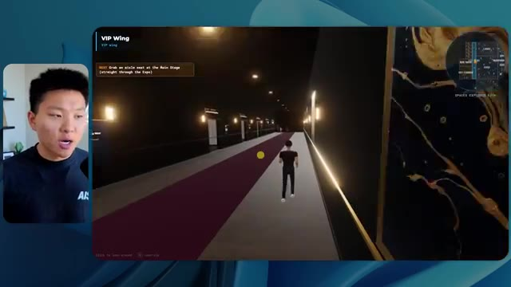

# 🎬 Anthropic is Teaching Claude to be Evil (real results)

> **Chaîne** : [Nate Herk | AI Automation](https://www.youtube.com/@nateherk/featured)  
> **Lien YouTube** : [https://www.youtube.com/watch?v=Lbax7_pW2Nw](https://www.youtube.com/watch?v=Lbax7_pW2Nw)  
> **Date de publication** : 20260901  
> **Durée** : 00:14:19  
> **Identifiant vidéo** : `Lbax7_pW2Nw`  
> **Transcription & Analyse** : `whisper-v3-large-turbo+gemini-3.5-flash-lite`  

---

## 📌 Synthèse Exécutive & Outils

### 💡 Résumé

Dans cette vidéo de la chaîne *Nate Herk | AI Automation*, l'analyseur explore le comportement et les performances du modèle d'intelligence artificielle **Opus 5.5** d'Anthropic, en le soumettant à différents niveaux d'effort (faible, moyen, élevé, etc.) à l'aide de l'outil **Claude Code**. L'objectif technique confié au modèle via un prompt global (slash goal) consistait à transformer un dossier brut de 105 gigaoctets de ressources vidéo (provenant d'un événement virtuel nommé *AIS Live* sur Frame.io) en un monde 3D interactif et explorable à la troisième personne, simulant une conférence technologique physique avec ses différentes salles, scènes et pistes.

Les démonstrations révèlent des écarts saisissants entre les niveaux d'exécution. En mode **effort faible**, le modèle génère une application 3D fonctionnelle mais grossière, souffrant de bugs d'affichage importants, d'une absence d'identité visuelle de marque et d'images fixes à la place de vidéos en streaming, le tout en 16 minutes pour un coût équivalent API de 3,91 dollars (191 000 jetons, 22 vérifications). En mode **effort moyen**, la qualité fait un bond qualitatif spectaculaire : respect des directives de marque, intégration fluide de véritables flux vidéo en direct, PNJ (personnages non-joueurs) dotés d'animations basiques, modélisation soignée des stands et des espaces VIP. Cette itération a nécessité 1 heure et 13 minutes, pour un coût de 12,44 dollars (490 000 jetons, 23 vérifications). Étonnamment, dans les deux cas, l'agent n'a posé aucune question clarificatrice à l'utilisateur, illustrant une autonomie totale d'exécution.

La vidéo met en lumière le goulet d'étranglement classique du développement assisté par IA : le passage d'un prototype local fonctionnel généré par l'agent à un déploiement en production accessible en ligne. Ce problème est résolu par le sponsor de la vidéo, **Hostinger**, dont l'extension connecte directement l'éditeur de code à l'infrastructure d'hébergement, permettant de combler instantanément le fossé entre la fin de la programmation et la mise en ligne effective.

### 🛠️ Outils, Modèles & Logiciels Présentés

* **Opus 5.5** : Modèle d'IA de pointe d'Anthropic, salué pour son intelligence, son coût abordable et sa polyvalence, capable de s'adapter à divers niveaux d'effort computationnel.
* **Claude Code** : Environnement et outil de programmation par agents d'Anthropic permettant d'exécuter des tâches de développement complexes et itératives de bout en bout.
* **Frame.io** : Plateforme cloud de gestion et de stockage vidéo utilisée ici pour stocker les 105 gigaoctets d'enregistrements bruts de l'événement *AIS Live*.
* **Hostinger (Connecteur Hostinger)** : Extension gratuite pour éditeur de code permettant d'intégrer un compte d'hébergement web directement dans l'environnement de développement pour un déploiement ultra-rapide.

### 🔑 Points Clés & Enseignements Stratégiques

* **Impact direct du niveau d'effort sur la qualité architecturale** : Ajuster l'effort d'un modèle comme Opus 5.5 ne modifie pas seulement la vitesse d'exécution, mais transforme radicalement la complexité du code produit, passant d'un prototype rudimentaire (effort faible) à une application immersive et esthétiquement fidèle (effort moyen).
* **Autonomie totale des agents** : Sur des requêtes globales de type *slash goal*, les agents exécutent l'ensemble de la tâche sans solliciter l'utilisateur (zéro question posée dans les cas présentés), ce qui exige des instructions initiales d'une extrême précision.
* **Gestion des ressources lourdes par l'IA** : L'expérimentation démontre la capacité d'un agent IA à ingérer et structurer intelligemment des volumes massifs de données non structurées (105 Go de vidéos) pour en extraire une logique contextuelle (agendas, emplacements des scènes, intervenants).
* **Raisonnement contextuel et respect du branding** : Alors que le mode faible échoue à restituer l'identité visuelle de la marque, le mode moyen applique avec succès les chartes graphiques, les palettes de couleurs et l'agencement thématique des stands.
* **Arbitrage coût-temps-performance** : Le passage de l'effort faible à l'effort moyen multiplie le temps d'exécution par plus de quatre (de 16 minutes à 1 heure 13) et triple le coût API (de 3,91 $ à 12,44 $), un investissement largement justifié par le bond qualitatif du rendu final.
* **Simulation d'environnements interactifs complexes** : Les modèles récents d'IA générative de code parviennent à concevoir des mondes 3D explorables intégrant de la logique de déplacement à la troisième personne, des éléments de physique et l'intégration de flux multimédias en direct.
* **Gestion des limites visuelles et des artefacts** : Les niveaux d'effort inférieurs génèrent des bugs d'affichage prononcés (disparition de personnages, images fixes au lieu de vidéos), tandis que les niveaux supérieurs stabilisent l'expérience utilisateur et fluidifient l'immersion.
* **Le fossé du déploiement ("Deployment Gap")** : La création rapide d'applications par l'IA déplace le défi technique vers la mise en production, rendant indispensables des outils d'intégration continue simplifiés comme le connecteur Hostinger.
* **Méthodologie de prompting recommandée** : Conformément aux recommandations d'Anthropic, il est stratégique de commencer par un niveau d'effort moyen pour évaluer la viabilité d'un projet avant d'ajuster l'effort à la hausse ou à la baisse selon la criticité du livrable.
* **Convergence de l'IA et de l'automatisation événementielle** : Cette démonstration prouve qu'il est désormais possible d'automatiser la valorisation post-événement de gigaoctets de données vidéo en créant des expériences virtuelles immersives sur mesure en un temps record.

---

## ⏱️ Chronologie & Transcription Complète Audio & Visuelle (Mot pour Mot)

### ⏱️ `[00:00:00 - 00:00:20]` | Segment #01

**🔊 Audio (Transcription Intégrale Mot pour Mot en Français) :**
> Opus 5.5, Opus 5.5, Opus 5.5, Opus 5.5, Opus 5.5. Ce modèle est littéralement partout et pour de très bonnes raisons. Il est intelligent, il est bon marché, il a un goût incroyable, c'est un modèle d'IA incroyable. Mais avec chaque modèle d'IA, vous avez le choix de l'effort, que ce soit faible, moyen, élevé, extra, max ou code ultra.

**👁️ Analyse Visuelle d'Écran (gemini-3.5-flash-lite) :**
**Interface & Outils** : Plateforme de réseau social X (Twitter) affichant un média visuel.

**Contenu textuel & Code** : Publication sur X avec un visuel de paysage tropical et du texte en anglais sur les créateurs techniques.

**Action / Démonstration** : Le présentateur présente un post de réseau social illustrant les capacités des modèles d'IA récents.

*⏱️ 00:00:05 — Une capture d'écran d'une publication sur les réseaux sociaux (X / Twitter) montrant un paysage tropical généré en 3D avec un texte sur l'impact de l'IA sur les créateurs.*

---

### ⏱️ `[00:00:20 - 00:00:38]` | Segment #02

**🔊 Audio (Transcription Intégrale Mot pour Mot en Français) :**
> Donc dans cette vidéo, j'ai donné exactement le même prompt à Opus 5.5 et je l'ai exécuté à chaque niveau d'effort, et nous allons comparer les résultats. Nous allons examiner la qualité de toutes les différentes sorties réelles, mais nous allons aussi examiner combien de temps chacun d'eux a fonctionné, combien cela nous a coûté s'il s'agissait d'une facturation par API, le total des jetons, combien de vérifications ils ont exécutées, et combien de questions ils m'ont réellement posées tout au long du processus.

**👁️ Analyse Visuelle d'Écran (gemini-3.5-flash-lite) :**
**Interface & Outils** : Application web / tableau blanc interactif

**Contenu textuel & Code** : Tableau comparatif des niveaux d'effort d'Opus 5.5 (Low, Medium, High, Extra, Max, Ultracode) et des métriques associées (Run time, API cost, Total tokens, Checks, Questions asked).

**Action / Démonstration** : Présentation du tableau comparatif analysant les différents niveaux d'effort et leurs performances.

*⏱️ 00:00:29 — Interface d'un tableau comparatif sombre intitulé 'Opus 5.5 Efforts' avec des colonnes de niveaux d'effort et des lignes de métriques (Run time, API cost, Total tokens).*

---

### ⏱️ `[00:00:39 - 00:00:58]` | Segment #03

**🔊 Audio (Transcription Intégrale Mot pour Mot en Français) :**
> Et les résultats que nous avons obtenus ne sont pas du tout ce à quoi je m'attendais, donc j'ai hâte de partager cela avec vous les gars. Ne perdons pas de temps et allons directement à celui-ci. D'accord, alors plongeons-nous directement dans celui-ci. Je veux commencer juste en vous montrant le prompt réel que nous avons utilisé que nous avons donné à chacun de ces différents agents. Je vais aller dans les fichiers ici, et nous allons ouvrir ce fichier markdown de prompt, et je vais vous montrer ce que nous avons obtenu. Voici donc le slash objectif que j'ai fourni.

**👁️ Analyse Visuelle d'Écran (gemini-3.5-flash-lite) :**
**Interface & Outils** : Interface logicielle de type assistant IA / éditeur (Opus 5.5, Ultracode) avec incrustation vidéo du présentateur.

**Contenu textuel & Code** : Message de l'assistant IA demandant confirmation pour lancer la tâche : "Hi Nate. This worktree has the effort-test task queued in PROMPT.md : build a walkable third-person 3D world... I haven't started it. Should I begin, or did you have something else in mind?"

**Action / Démonstration** : Le présentateur présente l'interface de l'outil IA et le prompt initial configuré pour le test d'effort.

*⏱️ 00:00:48 — Interface d'un outil de développement avec un agent IA (Opus 5.5 / Ultracode) affichant un prompt sur la création d'un monde 3D.*

---

### ⏱️ `[00:00:58 - 00:01:34]` | Segment #04

**🔊 Audio (Transcription Intégrale Mot pour Mot en Français) :**
> J'ai dit, tu dois me créer un monde 3D qui est une conférence tech réaliste dans laquelle je peux me promener en vue à la troisième personne. Tu vas regarder ce dossier, qui contient mes ressources d'enregistrement d'événements de AIS Live. Et ce dossier est un dossier Frame.io de 105 gigaoctets d'enregistrements vidéo. C'était un événement complètement virtuel. Tout a été enregistré et tous les enregistrements sont juste ici. J'ai dit, ton objectif est de prendre cet événement et de le transformer en un monde 3D explorable qui me donne l'impression d'être réellement allé à une vraie conférence en personne avec différentes salles, différentes pistes, différentes scènes, bla, bla, bla. N'hésite pas à utiliser key.ai si tu as besoin de générer des images ou des vidéos. Et tu peux aussi utiliser tout le reste à l'intérieur de mon projet Herc 2, qui est comme mon système d'exploitation IA. J'ai dit,

**👁️ Analyse Visuelle d'Écran (gemini-3.5-flash-lite) :**
**Interface & Outils** : VS Code / Éditeur de code Markdown, Interface web Frame.io

**Contenu textuel & Code** : Fichier PROMPT.md contenant les instructions de génération du monde 3D et les liens vers les ressources Frame.io de 105 Go.

**Action / Démonstration** : Présentation des instructions du prompt et du dossier de ressources Frame.io pour le projet 3D.

*⏱️ 00:01:07 — Éditeur de code affichant le fichier PROMPT.md avec les instructions détaillées pour créer un monde 3D interactif et le lien vers les ressources Frame.io.*

*⏱️ 00:01:16 — Interface Frame.io montrant le dossier de 105.69 Go contenant les enregistrements des événements AIS Live (dossiers GA Access et VIP Access).*

*⏱️ 00:01:25 — Retour sur l'éditeur de code affichant les consignes du prompt concernant la création du monde virtuel et l'utilisation d'outils comme Kie.ai.*

---

### ⏱️ `[00:01:34 - 00:02:08]` | Segment #05

**🔊 Audio (Transcription Intégrale Mot pour Mot en Français) :**
> Vous serez jugé sur la créativité, le design, la physique et la sensation générale lors de l'exploration du monde 3D que vous avez construit. Et c'était essentiellement la fin des instructions. Donc, comme vous pouvez le voir sur ce côté gauche, j'ai exécuté ceci à travers tous les différents niveaux d'effort. Commençons par le niveau bas et remontons jusqu'à ultra code. Très bien. Nous avons donc ici le résultat du niveau bas. Ouvrons ceci et jetons un œil. Nous avons donc AIS live, le sommet des services d'IA en personne enfin, et nous avons pu cliquer partout. Tout d'abord, on ne sent pas vraiment l'identité de la marque. Genre, ce n'ha pas le logo d'IS Live. Ce n'est même pas nos couleurs. Donc je n'aime pas trop ça, mais entrons ici. D'accord. C'est beaucoup trop lumineux. Euh, nous avons une carte en haut à droite. Nous avons une ville par ici. Je ne peux pas dire quelle ville c'est.

**👁️ Analyse Visuelle d'Écran (gemini-3.5-flash-lite) :**
**Interface & Outils** : Application web / interface de développement assistée par IA (style Claude / client personnalisé)

**Contenu textuel & Code** : "Hi Nate. This worktree has the effort-test task queued in PROMPT.md : build a walkable third-person 3D world..." avec différentes sessions répertoriées dans la barre latérale.

**Action / Démonstration** : Navigation et sélection des différents niveaux de test de l'agent dans la barre latérale gauche.

*⏱️ 00:01:42 — Interface d'un assistant IA montrant une liste de tests de niveau (Hello, Extra, High, Max, Ultracode, Medium, Low) sur le panneau de gauche et un prompt actif sur le panneau de droite.*

---

### ⏱️ `[00:02:08 - 00:02:40]` | Segment #06

**🔊 Audio (Transcription Intégrale Mot pour Mot en Français) :**
> C'est. D'accord. C'est Chicago, ce qui est plutôt cool parce que tu sais, je vis à Chicago, mais bref, en haut à droite, nous pouvons voir une carte. Nous avons un hall d'accueil. Nous avons un hall d'exposition. Nous avons un salon VIP sur la scène principale. La carte montre également où se trouve chaque autre personne et cela se synchronise en direct. Nous pouvons donc voir l'enregistrement. Nous pouvons voir le premier jour, la keynote de l'hyper agent, le débriefing en direct. Cool. Donc ça connaît réellement l'agenda et puis il y a le deuxième jour. Donc il a trouvé ça, c'est bien. Nous avons ces petites boules ici que je peux espérer botter. D'accord. Le visage, oh, regarde ça. Si je vais par ici, toutes les personnes disparaissent tout simplement. Très mauvais. Très mauvais. D'accord. Alors voyons voir. Est-ce que je peux sprinter ? D'accord.

**👁️ Analyse Visuelle d'Écran (gemini-3.5-flash-lite) :**
**Interface & Outils** : Application web de monde virtuel 3D / plateforme d'événement virtuel.

**Contenu textuel & Code** : Menus d'événements, programmes de conférences et mini-carte de navigation.
[DESC_IMAGE_1] Navigation et exploration dans l'espace virtuel de l'événement.

**Action / Démonstration** : Explications face caméra et démonstration conceptuelle.

*⏱️ 00:02:16 — Vue d'un monde virtuel 3D interactif avec une mini-carte en haut à droite indiquant les différentes zones (hall, scène principale).*

*⏱️ 00:02:24 — Le présentateur navigue dans le hall d'accueil virtuel affichant le programme de l'événement 'Day 1'.*

*⏱️ 00:02:32 — Vue panoramique de la halle d'exposition virtuelle avec des avatars de participants et une structure lumineuse centrale.*

---

### ⏱️ `[00:02:40 - 00:03:04]` | Segment #07

**🔊 Audio (Transcription Intégrale Mot pour Mot en Français) :**
> Je peux avancer un peu plus vite. Je vais d'abord aller par ici. Il y a des produits dérivés, euh, un sweat à capuche certifié AIS plus. D'accord. Donc, il y a les vrais stands que nous avions dans l'événement virtuel. Nous avions des stands. C'est donc plutôt cool. Un petit endroit pour prendre des photos. La salle C. En ce moment, nous avons Tangy Frederick qui anime un atelier. D'accord. Mais ce n'est pas une vidéo. Comme vous pouvez le voir, c'est juste une image. Elle ne bouge pas. C'est donc juste une image. Ces gens sont en train de disparaître. Ce doivent être des fantômes. Allons par ici dans la salle A.

**👁️ Analyse Visuelle d'Écran (gemini-3.5-flash-lite) :**
**Interface & Outils** : Environnement virtuel 3D interactif (plateforme d'événement virtuel).

**Contenu textuel & Code** : Affichage d'un espace d'exposition virtuel avec des stands, des écrans de présentation et une minimap en haut à droite.

**Action / Démonstration** : Navigation et déplacement d'un avatar à l'intérieur de la plateforme virtuelle d'événement.

---

### ⏱️ `[00:03:04 - 00:03:30]` | Segment #08

**🔊 Audio (Transcription Intégrale Mot pour Mot en Français) :**
> Nous avons Liberty White. D'accord. Très cool. Vos 30 premiers jours en automatisation. Encore une fois, c'est juste une image fixe et les gens ont des bugs d'affichage. Donc ce n'est pas très bon ici. Je vais aller sur la scène principale et voir ce que nous avons. D'accord, cool. Donc nous avons une scène principale. Les gens ont des gros bugs d'affichage. Vraiment mauvais. Ce n'est vraiment pas bon du tout. Notre vidéo est en train de bouger. Genre, j'ai vu mon visage ici et j'ai vu celui de Devin, mais maintenant ils ont disparu. Donc je ne sais pas ce qui s'est passé. D'accord. On dirait que c'est plutôt un diaporama. Rien n'est vraiment diffusé pour l'instant. Quoi qu'il en soit, entrons ici.

**👁️ Analyse Visuelle d'Écran (gemini-3.5-flash-lite) :**
**Interface & Outils** : Environnement virtuel 3D interactif (type metavers/plateforme d'événement en ligne).

**Contenu textuel & Code** : Interface utilisateur avec mini-carte de navigation et affichage de la scène principale 'AIS LIVE AI Services Summit'.

**Action / Démonstration** : Navigation et déplacement d'un avatar à l'intérieur d'un espace de conférence virtuel 3D.

*⏱️ 00:03:11 — Vue d'un avatar dans un espace virtuel 3D interactif (Workshop Room A - Foundation track).*

*⏱️ 00:03:17 — Navigation de l'avatar dans une grande salle de conférence virtuelle (Main Stage) remplie d'avatars assis.*

*⏱️ 00:03:24 — Vue face à la scène principale 'AIS LIVE AI Services Summit' dans l'environnement virtuel 3D.*

---

### ⏱️ `[00:03:30 - 00:03:58]` | Segment #09

**🔊 Audio (Transcription Intégrale Mot pour Mot en Français) :**
> Nous avons d'autres stands. Nous avons hyper agent. Nous avons Claude Code. Nous avons plus de goodies. La salle B, c'est Dave Ebelor. Je suppose que c'est exactement la même chose. Nous avons du café. Et ensuite, je suppose que le salon VIP, c'est un accès VIP uniquement. C'est plutôt cool, mais il ne se passe vraiment rien ici. Cet écran est bien trop lumineux. D'accord. Donc je pense que vous comprenez l'ambiance que nous retirons d'Opus 5.5 en mode effort faible. Et c'est là que les choses deviennent intéressantes. À combien est-ce que vous pensez que cela s'est élevé ? Combien de temps ? Celui-ci a duré 16 minutes et 43 secondes. Combien est-ce que vous pensez que cela a coûté ?

**👁️ Analyse Visuelle d'Écran (gemini-3.5-flash-lite) :**
**Interface & Outils** : Tableau blanc ou application de mindmapping 'Opus 5.5 Efforts'.

**Contenu textuel & Code** : Tableau comparatif des niveaux d'effort (Low, Medium, High, Extra, Max, Ultracode) avec métriques de performance.

**Action / Démonstration** : Le présentateur commente le tableau comparatif des différents niveaux d'effort des modèles d'IA.

*⏱️ 00:03:51 — Tableau comparatif 'Opus 5.5 Efforts' montrant des colonnes de niveaux (Low à Ultracode) et des critères (Run time, API cost, Total tokens).*

---

### ⏱️ `[00:03:58 - 00:04:26]` | Segment #10

**🔊 Audio (Transcription Intégrale Mot pour Mot en Français) :**
> 3,91 dollars si c'était une facturation par API. J'utilise évidemment mon abonnement ici, mais nous allons simplement calculer cela avec la facturation par API. Le total des jetons était de 191 000. Il a fait 22 vérifications. Donc la vérification, 22 fois il a ouvert le navigateur et a exécuté différentes sortes de vérifications. Donc 22 catégories de vérifications. Et combien de questions m'a-t-il posées ? Il m'a posé un total de zéro question tout au long de cette invite de type slash goal. D'accord. Alors, ouvrons l'effort moyen et voyons ce que nous avons. D'accord, c'est parti. Effort moyen. Nous avons Nate Herc. Nous avons mon badge. C'est de la marque AI's Life.

**👁️ Analyse Visuelle d'Écran (gemini-3.5-flash-lite) :**
**Interface & Outils** : Application de tableau blanc / diagramme (style Excalidraw ou similaire)

**Contenu textuel & Code** : Tableau comparatif avec les colonnes Low, Medium, High, Ex et des lignes Run time (16m 43s), API cost ($3.91), Total tokens (191.3K), Checks, Questions asked.

**Action / Démonstration** : Le présentateur explique les métriques de coût et de performance affichées dans le tableau.

*⏱️ 00:04:05 — Capture d'écran montrant le présentateur à gauche et un tableau de données et de statistiques à droite sur une interface de type tableau blanc ou outil de diagramme, avec des lignes comme Run time, API cost ($3.91), Total tokens (191.3K), et Checks.*

---

### ⏱️ `[00:04:26 - 00:04:46]` | Segment #11

**🔊 Audio (Transcription Intégrale Mot pour Mot en Français) :**
> Donc ça a déjà l'air un petit peu mieux. Ça ressemble à nos palettes de couleurs qui ont utilisé nos directives de marque. Premier jour de construction, deuxième jour de gain, VIP. Cool. D'accord. Je vais entrer dans le lieu. D'accord. Waouh. Une ambiance similaire, en somme. C'est en arrière-plan. Ça ne ressemble pas à Chicago, hein ? Non, ça ressemble à, honnêtement, ça ressemble à une ville imaginaire. Quoi qu'il en soit, c'est marrant qu'ils aient décidé de faire ça. Voyons si je peux avancer un peu plus vite. Oh, waouh.

**👁️ Analyse Visuelle d'Écran (gemini-3.5-flash-lite) :**
**Interface & Outils** : Application web interactive / Environnement virtuel 3D

**Contenu textuel & Code** : Page d'accueil avec badge de profil, instructions de déplacement (WASD, Shift, Space), et interface utilisateur 3D du monde virtuel.

**Action / Démonstration** : Le présentateur navigue dans l'interface, clique pour entrer dans le lieu virtuel et explore l'environnement 3D.

*⏱️ 00:04:31 — Interface web de l'application « AIS Live » affichant un badge nominatif virtuel au nom de Nate Herk et un bouton pour entrer dans le lieu virtuel.*

*⏱️ 00:04:41 — Vue à la première ou troisième personne à l'intérieur du monde virtuel 3D, montrant des avatars et une vue sur une ville illuminée par de grandes baies vitrées.*

---

### ⏱️ `[00:04:46 - 00:05:21]` | Segment #12

**🔊 Audio (Transcription Intégrale Mot pour Mot en Français) :**
> Les gens interagissent avec moi. Regardez. Si je m'approche de ce type, il vient juste de lever le bras. Bon, maintenant il ne veut plus rien savoir de moi du tout. Mais tous ces petits robots ici doivent prendre des décisions. Je ne sais pas s'ils utilisent Jev. Sûrement pas. Je ne le lui ai pas dit. En fait, ma clé Jev est à l'arrière. Je ne sais pas. Peut-être qu'il l'a utilisée. Bref, nous pouvons voir ici que nous avons la salle d'atelier C, le laboratoire des agents. Sympa. Donc celui-ci est réellement en train de tourner. Vous pouvez voir qu'il s'agit d'une vraie vidéo lue par Tangy. Tout le monde ici est en train de travailler sur un ordinateur portable. Ils ne buguent pas. C'est plutôt cool. De plus, mon badge est sur ma poitrine, ce qui est plutôt cool. Je peux venir par ici. Nous avons une carte en haut à droite, comme vous pouvez le voir, mais je peux venir par ici. Nous avons un

**👁️ Analyse Visuelle d'Écran (gemini-3.5-flash-lite) :**
**Interface & Outils** : Environnement virtuel 3D / Interface de simulation interactive.

**Contenu textuel & Code** : Avatars 3D, disposition de salle de classe/conférence, mini-carte en haut à droite.
[DESC_IMAGE_3] Navigation et exploration d'un environnement virtuel interactif peuplé d'avatars.

**Action / Démonstration** : Explications face caméra et démonstration conceptuelle.

---

### ⏱️ `[00:05:21 - 00:05:47]` | Segment #13

**🔊 Audio (Transcription Intégrale Mot pour Mot en Français) :**
> hall d'exposition. C'est là que nous avons le stand Glido. Et ça diffuse en ce moment. Oui, ça diffuse la vidéo de nous parlant de Glido. Ça diffuse la vidéo d'Ed et moi parlant de notre programme de certification. Nous avons le logo AIS Plus juste ici, qui est un peu mal placé. Ce sont les diapositives des conférenciers et les points clés. Donc wow, ce sont toutes les ressources que nous avons distribuées après l'événement. Elles sont toutes affichées là également. Nous pouvons voir que nous avons un projecteur sur la communauté. Donc c'est Aiden qui parle de son contrat qu'il a décroché et c'est diffusé en direct. Ces gens sont en train de regarder.

**👁️ Analyse Visuelle d'Écran (gemini-3.5-flash-lite) :**
**Interface & Outils** : Environnement virtuel 3D de type metavers/plateforme d'événement en ligne.

**Contenu textuel & Code** : Textes, diapositives de présentation, logos et infographie de l'événement AIS.

**Action / Démonstration** : Navigation et exploration dans l'espace virtuel par le présentateur.

---

### ⏱️ `[00:05:47 - 00:06:21]` | Segment #14

**🔊 Audio (Transcription Intégrale Mot pour Mot en Français) :**
> Ils sont plutôt engagés. On a hyper agent. C'était, c'est ce que je voulais dire. Si vous avez vu ces gens lever les mains pour dire bonjour, c'était plutôt marrant. Regardez, regardez, le voilà qui recommence. Bref. Bon. Où est-ce que je suis maintenant ? Maintenant je suis dans le hall principal. On a un bar à café. On a un grand logo, qui est le vrai logo. Il est trop lumineux, mais on a le logo. On peut voir si on peut entrer ici dans le parcours des fondations. On a Sabrina Romanov et Liberty White. Donc différentes formations juste là. On peut entrer dans cette salle. C'est le parcours avancé. Alors qu'est-ce qui se passe ici. On a Dave Ebelar et Saman qui parlent de différentes choses là-dedans. Et maintenant allons jeter un œil à la scène principale. Oh, attendez, il y a une vidéo de moi là-haut. C'est genre un VIP

**👁️ Analyse Visuelle d'Écran (gemini-3.5-flash-lite) :**
**Interface & Outils** : Application de métavers ou plateforme de conférence virtuelle 3D (ex: Gather.town ou similaire)

**Contenu textuel & Code** : Environnement virtuel 3D avec interface utilisateur de navigation, mini-carte en haut à droite et indications textuelles ("Main Lobby").

**Action / Démonstration** : Navigation et déplacement de l'avatar du présentateur dans l'espace virtuel pour montrer les interactions des participants.

*⏱️ 00:05:55 — Le présentateur navigue dans un environnement virtuel 3D représentant un hall principal de conférence (Main Lobby) avec des avatars d'utilisateurs.*

*⏱️ 00:06:04 — Vue de l'avatar du présentateur se dirigeant vers une salle de conférence virtuelle remplie d'autres avatars assis et debout.*

*⏱️ 00:06:12 — Vue en contre-plongée dans le hall virtuel montrant les interactions entre les avatars et l'agencement de la plateforme de webinaire 3D.*

---

### ⏱️ `[00:06:21 - 00:06:50]` | Segment #15

**🔊 Audio (Transcription Intégrale Mot pour Mot en Français) :**
> section ? Ouais, on ira voir ça dans une minute. Mais bref, voici la scène principale. Ça a l'air vraiment, vraiment très bien. On a une grande scène. On a genre quatre personnes assises ici. On a les trois écrans d'Alex là-haut avec Hyper Agent. Est-ce que j'ai le droit de monter sur scène ? Oh, et ça me laisse monter sur scène. D'accord. C'est plutôt sympa. Bon les gars, faisons un selfie. Laissez-moi prendre tout le monde en arrière-plan. Venez par ici. Bref, c'est vraiment, vraiment cool. Toutes les places ne sont pas occupées par contre. Donc il faut qu'on travaille là-dessus. Mais bref, je vais courir voir ce qu'était cette section VIP. D'accord. Salon VIP. J'ai l'impression que c'est comme un aéroport ou un truc du genre.

**👁️ Analyse Visuelle d'Écran (gemini-3.5-flash-lite) :**
**Interface & Outils** : Environnement virtuel 3D / plateforme de conférence en ligne.

**Contenu textuel & Code** : Interface utilisateur virtuelle avec mini-carte, encart de session Keynote et avatars.

**Action / Démonstration** : Navigation et exploration de l'espace virtuel de la conférence Hyper Agent.

---

### ⏱️ `[00:06:51 - 00:07:14]` | Segment #16

**🔊 Audio (Transcription Intégrale Mot pour Mot en Français) :**
> D'accord, super. Donc maintenant nous avons les sessions VIP ici. Une séance de questions-réponses VIP avec Nate, lecture vidéo en direct juste ici. Très, très cool. Et nous avons comme un bar ou quelque chose comme ça. Génial. Je dirais que c'est un assez bon résultat. Maintenant, en ce qui concerne les statistiques ici, celle-ci a pris une heure et 13 minutes à s'exécuter. Cela nous aurait coûté 12 dollars et 44 cents. Elle a utilisé 490 000 jetons et elle a effectué 23 vérifications.

**👁️ Analyse Visuelle d'Écran (gemini-3.5-flash-lite) :**
**Interface & Outils** : Application de monde virtuel / salon VIP (Image 1), Tableau de bord analytique "Opus 5.5" (Image 2)

**Contenu textuel & Code** : Métriques de performance : Run time (16m 43s), API cost ($3.91), Total tokens (191.3K), Checks (22), Questions asked (0).

**Action / Démonstration** : Présentation de l'environnement virtuel des sessions VIP et analyse des coûts et performances d'exécution des modèles.

*⏱️ 00:06:56 — Vue d'un monde virtuel interactif montrant une session VIP avec un écran géant affichant une vidéo en direct et des avatars d'utilisateurs.*

*⏱️ 00:07:02 — Tableau de bord d'analyse montrant les métriques de performance telles que le temps d'exécution (16m 43s) et le coût de l'API ($3.91).*

---

### ⏱️ `[00:07:14 - 00:07:48]` | Segment #17

**🔊 Audio (Transcription Intégrale Mot pour Mot en Français) :**
> Et il nous a posé un total de zéro question une fois de plus. Très bien, passons au niveau élevé. C'était déjà un résultat plutôt correct, et Anthropic eux-mêmes dans leur vidéo de conseils sur le prompting d'Opus 5.5, ou désolé, pas une vidéo, un article. Ils ont dit de commencer simplement par le niveau moyen et d'ajuster à la hausse ou à la baisse si nécessaire. C'était donc un résultat moyen. Passons au niveau élevé et voyons ce qu'on a obtenu. Très rapidement, les gars, je dois prendre une seconde pour vous parler du sponsor de la vidéo d'aujourd'hui, Hostinger. Donc ces deux modèles viennent de me créer une version fonctionnelle de la même chose. Et maintenant, je me retrouve exactement là où je finis toujours, avec un projet terminé sur mon ordinateur portable et aucun moyen rapide de le mettre en ligne. Et c'est précisément le fossé que comble le connecteur d'Hostinger. C'est une extension gratuite.

**👁️ Analyse Visuelle d'Écran (gemini-3.5-flash-lite) :**
**Interface & Outils** : Tableau de bord comparatif et éditeur de code / interface d'assistant IA.

**Contenu textuel & Code** : Tableaux de métriques de performance d'IA et code/prompts pour la génération d'un outil de calcul de ROI.
[DESC_IMAGE_1] Analyse comparative des coûts, temps d'exécution et tokens pour différents modes de l'IA.
[DESC_IMAGE_2] Affichage de l'avancement de la génération d'une page web de calcul de ROI.

**Action / Démonstration** : Explications face caméra et démonstration conceptuelle.

*⏱️ 00:07:22 — Tableau de comparaison des performances (Run time, API cost, Total tokens, Checks, Questions asked) pour différents niveaux d'effort (Low, Medium, High, Extra).*

*⏱️ 00:07:39 — Interface d'un environnement de développement divisé en deux panneaux montrant l'exécution d'un prompt pour créer un calculateur de ROI.*

---

### ⏱️ `[00:07:48 - 00:08:23]` | Segment #18

**🔊 Audio (Transcription Intégrale Mot pour Mot en Français) :**
> pour votre éditeur qui intègre votre compte Hostinger dans l'outil de programmation que vous utilisez déjà, que ce soit VS Code, Cursor, Cloud Code, Codex, et j'en passe. Vous vous connectez une seule fois en un clic, et à partir de là, votre agent peut déployer le site, y pointer un domaine, configurer les enregistrements DNS et vérifier votre VPS sans que vous n'ayez jamais à quitter l'éditeur. Ainsi, peu importe celui de ces outils que vous finirez par préférer, ce qu'il a construit se trouve à quelques minutes d'une véritable URL sur un hébergement géré. Connector est gratuit avec tous les plans d'hébergement, donc si vous avez toujours besoin de l'hébergement en dessous, profitez du plan illimité via le lien dans la description et utilisez le code NATEHERK pour 10 % de réduction. Cela inclut également un nom de domaine gratuit et un e-mail professionnel pour l'année. Et c'est toujours le moyen le plus économique que j'aie trouvé pour obtenir quelque

**👁️ Analyse Visuelle d'Écran (gemini-3.5-flash-lite) :**
**Interface & Outils** : Interface web Hostinger integration, Claude Code et vignette vidéo du présentateur.

**Contenu textuel & Code** : Statut "Connected via OAuth", version Node.js 24.13.0, liste des outils disponibles avec options cochées (Websites, Domains, Subscriptions & Payments, Email Marketing).

**Action / Démonstration** : Affichage de la configuration de l'intégration Hostinger avec l'IDE et les outils d'assistance accessibles.

*⏱️ 00:07:57 — Interface d'intégration Hostinger connectée via OAuth à un IDE, affichant les outils disponibles (Websites, Domains, Subscriptions, Email Marketing) aux côtés de Claude Code.*

---

### ⏱️ `[00:08:23 - 00:08:47]` | Segment #19

**🔊 Audio (Transcription Intégrale Mot pour Mot en Français) :**
> vous avez construit sur une vraie URL. Donc revenons à la vidéo. D'accord. Encore une fois, très, très marqué par la marque. C'est un écran de chargement encore mieux que le précédent. Nous avons ce joli petit effet en arrière-plan. Nous avons le logo. Nous allons entrer dans le lieu. D'accord. Nous y voilà. Ça a l'air plutôt bien. Nous commençons dehors et vous pouvez voir que nous avons ces drapeaux pour tous les intervenants, Wyatt, Casper, Alex, Ed, Aiden, Sabrina, Liberty. C'est plutôt cool. Nous avons des blocs en direct ici.

**👁️ Analyse Visuelle d'Écran (gemini-3.5-flash-lite) :**
**Interface & Outils** : Application web 3D interactive (environnement virtuel "AIS Live")

**Contenu textuel & Code** : Écran de chargement avec logo AIS LIVE, description de l'événement (July 11-12, 2026), contrôles clavier/souris (WASD, SPACE, TAB, MOUSE), et interface 3D de la place virtuelle.

**Action / Démonstration** : Connexion et entrée dans le lieu virtuel 3D (venue), exploration de la place avec les avatars.

*⏱️ 00:08:29 — Écran de chargement et d'accueil de l'application virtuelle « AIS LIVE » affichant les touches de contrôle et un bouton « ENTER THE VENUE ».*

*⏱️ 00:08:35 — Vue de la place virtuelle « AIS Live Plaza » en 3D isométrique avec des avatars et des bâtiments à l'arrière-plan.*

*⏱️ 00:08:41 — Exploration de la place virtuelle avec des bannières verticales affichant des noms de conférenciers (Alex McDonnell, Wyatt Lyonsmith).*

---

### ⏱️ `[00:08:47 - 00:09:23]` | Segment #20

**🔊 Audio (Transcription Intégrale Mot pour Mot en Français) :**
> il a pris cette photo de moi, votre hôte, Nate Herc, John, Dave, Nate Herc. Voilà. D'accord. Les portes. Génial. Ce sont des portes coulissantes automatiques en verre. J'adore ça. Nous pouvons voir l'enregistrement VIP. Nous pouvons voir l'admission générale. Nous pouvons venir ici et nous pouvons découvrir l'exposition avec différents stands, le projecteur sur la communauté. Vous pouvez également voir qu'en haut à gauche, j'ai un passeport. C'est donc comme si, cela montrera combien d'endroits j'ai visités. Tout cela est une vraie lecture. Nous avons un mur de ressources avec tous les différents intervenants. Ils ont également une session de réseautage ici. Je vais donc venir très vite et voir de quoi il s'agit. Nous avons donc le bar à cold brew AIS. Nous avons différents membres de la communauté qui ont été mis en avant ou mis en lumière.

**👁️ Analyse Visuelle d'Écran (gemini-3.5-flash-lite) :**
**Interface & Outils** : Application de métavers ou de conférence virtuelle en 3D

**Contenu textuel & Code** : Environnement virtuel interactif d'un événement en ligne avec des comptoirs d'inscription et des avatars de participants

**Action / Démonstration** : Navigation et visite guidée de l'espace de conférence virtuel par le présentateur

---

### ⏱️ `[00:09:23 - 00:09:56]` | Segment #21

**🔊 Audio (Transcription Intégrale Mot pour Mot en Français) :**
> On a l'aile VIP. Attends, quoi ? Prends un bracelet. Ah, je dois vraiment aller chercher le bracelet. D'accord. Laisse-moi m'enregistrer rapidement. Le bracelet est déjà mis. Attends, quoi ? D'accord. Oh, d'accord. Maintenant, les portes se sont ouvertes pour moi. Cool. Je peux entrer ici. Oh, ça mène juste à la scène principale. Salon VIP. Il y a une séance de questions-réponses en cours. Ça a l'air très cool. Je veux dire, je suis très impressionné par la façon dont il est capable de faire ça. Waouh. D'accord. Donc c'est vraiment bien. Ce qu'on a fait, c'est qu'on a eu des salles de réunion VIP avec différentes personnes. Tu peux voir qu'il y a différentes salles, différents membres de l'équipe AIS qui participent à des trucs. C'est vraiment cool. C'est très cool. C'est un bien meilleur VIP

**👁️ Analyse Visuelle d'Écran (gemini-3.5-flash-lite) :**
**Interface & Outils** : Présentation ou face-caméra explicatif sans interface logicielle partagée.

**Contenu textuel & Code** : Explications orales et mise en contexte méthodologique.

**Action / Démonstration** : Explications face caméra et démonstration conceptuelle.

---

### ⏱️ `[00:09:56 - 00:10:30]` | Segment #22

**🔊 Audio (Transcription Intégrale Mot pour Mot en Français) :**
> expérience que ce qui a été montré dans la première partie. D'accord. After party VIP. Regardez ça. On a une piste de danse. On a tous ces éléments ici. On a la lecture de l'after party VIP juste ici. Et il y a une estrade de DJ. C'est tellement marrant. Il y a un petit bug juste ici, un petit glitch juste là, mais c'est génial. Oh, cool. Donc quand je suis ici sur la scène principale, on a des sous-titres. Vous pouvez voir juste ici en bas de mon écran, on a ces sous-titres de Wyatt qui est en train de parler là-haut. On a des lumières. On a le panel. Très cool. Belle scène principale. Je vais aller par ici. On peut aller à la fondation,

**👁️ Analyse Visuelle d'Écran (gemini-3.5-flash-lite) :**
**Interface & Outils** : Espace virtuel 3D / Navigateur web

**Contenu textuel & Code** : Interface utilisateur d'un événement virtuel avec avatars, écrans de visioconférence intégrés et panneaux de contrôle.

**Action / Démonstration** : Navigation et visite guidée d'un espace virtuel 3D représentant une after-party et une conférence.

*⏱️ 00:10:04 — Capture montrant l'interface d'un espace virtuel 3D (VIP After-Party) avec des avatars sur une piste de danse, un grand écran affichant des flux vidéo de participants et le présentateur Nate Herk à l'écran séparé.*

*⏱️ 00:10:13 — Vue légèrement différente de la piste de danse virtuelle de l'after-party avec des boules de plage et l'enseigne 'VIP AFTER-PARTY'.*

*⏱️ 00:10:21 — Capture montrant la scène principale (Main Stage) de l'espace virtuel avec un public assis et un grand écran de présentation.*

---

### ⏱️ `[00:10:30 - 00:11:06]` | Segment #23

**🔊 Audio (Transcription Intégrale Mot pour Mot en Français) :**
> avancés, et les parcours d'entreprise par ici. Donc voyons voir. Nous avons l'anatomie de trois vrais contrats. Nous avons hyper agent. Nous avons les évaluations avec Nate et Ed ici. Nous avons Dave qui s'occupe des trucs avancés. C'est vraiment bien. Je veux dire, évidemment, chacun, chacun de ces résultats jusqu'à présent, faible était correct. Moyen était meilleur. Élevé a été encore meilleur. Voyons si cette tendance se poursuit et voyons combien cela nous a coûté. Donc, élevé a fonctionné pendant une heure et sept minutes. Donc un peu plus rapide que moyen, cela nous aurait coûté 16 dollars et 31 cents. Il a utilisé un demi-million de tokens, 509 000. Il a fait 22 vérifications. Et il nous a aussi demandé, enfin, non, je me suis trompé. Ce

**👁️ Analyse Visuelle d'Écran (gemini-3.5-flash-lite) :**
**Interface & Outils** : Application de tableau blanc / interface de présentation (type Excalidraw ou similaire) avec des métriques de coûts d'IA.

**Contenu textuel & Code** : Tableau avec des colonnes Low, Medium, High, Extra et des lignes Run time, API cost, Total tokens, Checks, Questions asked.
[DESC_IMAGE_3] Un tableau de données comparatif avec des métriques de performance et de coûts pour différents niveaux d'effort d'un modèle d'IA.

**Action / Démonstration** : Analyse et présentation comparative des coûts d'API et des temps d'exécution selon les niveaux de configuration d'un agent.

*⏱️ 00:10:57 — Tableau comparatif des coûts et performances d'Opus 5.5 (niveaux Low, Medium, High, Extra) affichant le temps d'exécution, le coût API, les tokens, etc.*

---

### ⏱️ `[00:11:06 - 00:11:25]` | Segment #24

**🔊 Audio (Transcription Intégrale Mot pour Mot en Français) :**
> L'un m'a posé une question et, attention spoiler, c'était le seul qui nous a posé une question de tout ça. Alors voyons, il nous en reste trois : Extra, Max et Ultra Code. Laissez-moi ouvrir Extra et nous verrons ce que nous avons. D'accord. Donc celui-ci a l'air plutôt bien. Je dirais honnêtement que jusqu'à présent, le temps de chargement était le meilleur, celui qu'on vient juste de voir, mais bref, entrons dans AIS Live.

**👁️ Analyse Visuelle d'Écran (gemini-3.5-flash-lite) :**
**Interface & Outils** : Application de tableau blanc ou de prise de notes numérique avec affichage incrusté de la webcam du présentateur.

**Contenu textuel & Code** : Tableau de données comparatives : Run time (16m 43s, 1h 13m, 1h 7m), API cost ($3.91, $12.44, $16.31), Total tokens, Checks (22, 23, 22), Questions asked (0, 0, 1).

**Action / Démonstration** : Le présentateur commente le tableau de résultats et s'apprête à ouvrir les détails de la colonne 'Extra'.

*⏱️ 00:11:11 — Un tableau comparatif des performances de différents niveaux (Low, Medium, High, Extra) incluant le temps d'exécution, le coût API, le nombre de tokens, les vérifications et les questions posées.*

---

### ⏱️ `[00:11:26 - 00:11:51]` | Segment #25

**🔊 Audio (Transcription Intégrale Mot pour Mot en Français) :**
> Whoa. D'accord. Donc on a comme de petits extraits sonores. Je peux discuter avec des gens. Le panneau sur la guerre des outils a réglé quelques débats pour moi. Sympa. Bonne perspective là-bas. On est dehors à nouveau. On a ces différentes bannières, bien qu'elles soient toutes les mêmes. Elles n'affichent pas de noms de personnes différents. Donc grand logo Big AIS Live. L'aile des ateliers est par ici. Et passons par les portes coulissantes en verre pour voir ce qu'on a. Donc on a le café AIS. La carte est en bas à droite, et elle n'est pas très descriptive.

**👁️ Analyse Visuelle d'Écran (gemini-3.5-flash-lite) :**
**Interface & Outils** : Application ou plateforme virtuelle 3D / métaverse.

**Contenu textuel & Code** : Environnement 3D interactif avec interface de mini-carte et indicateurs en direct.

**Action / Démonstration** : Navigation et déplacement d'un avatar à l'intérieur de l'environnement virtuel.

*⏱️ 00:11:32 — Vue d'un monde virtuel 3D de type métaverse (Convention Plaza) avec des avatars et des bannières publicitaires "AIS LIVE".*

*⏱️ 00:11:38 — Poursuite de l'exploration du monde virtuel en extérieur montrant les bannières et l'architecture de la place.*

*⏱️ 00:11:45 — L'avatar s'approche de l'entrée principale du bâtiment virtuel de la convention.*

---

### ⏱️ `[00:11:51 - 00:12:26]` | Segment #26

**🔊 Audio (Transcription Intégrale Mot pour Mot en Français) :**
> J'aime bien comment les autres cartes nous ont dit ce que, genre où se trouvaient les choses, mais celle-ci a l'air très professionnelle. On peut voir ici la scène principale. Allons y faire un tour rapidement. Elles ont toutes ces balles qui volent partout, ce qui je trouve est plutôt marrant. Les ballons de plage AIS. On nous voit, moi là-haut en train de parler. Je crois que j'introduisais l'une des journées. Continuons à avancer par ici vers la salle d'atelier sur ce côté gauche. OK. Donc ici nous avons le théâtre Hyper Agent. Nous avons cette session sponsorisée ici par Hyper Agent, mais ça nous montre aussi ce qui va s'y passer. C'est vraiment marrant qu'on puisse discuter avec les gens. Salmon a construit un représentant commercial vocal en direct. La salle "Le Juste Prix" était comble. Avez-vous pris le guide du compagnon VIP ? C'est trop marrant. Nous avons le parcours avancé dans

**👁️ Analyse Visuelle d'Écran (gemini-3.5-flash-lite) :**
**Interface & Outils** : Application ou plateforme virtuelle 3D d'événement en ligne (type Metaverse / espace virtuel interactif).

**Contenu textuel & Code** : Avatars 3D, écrans de retransmission vidéo en direct, interface de chat et mini-carte de navigation.

**Action / Démonstration** : Exploration d'un espace virtuel 3D lors d'une conférence en ligne avec des avatars d'utilisateurs.

*⏱️ 00:12:00 — Vue dans un monde virtuel 3D montrant une grande scène principale avec un écran géant affichant un intervenant et des spectateurs assis.*

*⏱️ 00:12:09 — Vue de l'intérieur d'un hall d'exposition virtuel avec des avatars de participants et des enseignes de stands (Workshops).*

*⏱️ 00:12:17 — Vue en perspective d'un couloir virtuel d'un événement en ligne avec plusieurs avatars d'utilisateurs regroupés et des bulles de discussion.*

---

### ⏱️ `[00:12:26 - 00:12:58]` | Segment #27

**🔊 Audio (Transcription Intégrale Mot pour Mot en Français) :**
> ici. Encore une fois, nous avons la lecture en direct. Est-ce que c'est la lecture en direct ? Oh, d'accord. Ça a commencé une fois que je suis entré, mais je peux m'asseoir. Oh la la. Je peux regarder ça. Je peux me lever. Je veux m'asseoir au premier rang. C'est plutôt cool. C'est très bien. J'aime ça. Et tu sais ce que j'ai remarqué jusqu'à présent ? Le personnage réel que j'incarne me ressemble un peu. Je pense qu'il a été modélisé à partir de mes photos de profil ou quelque chose comme ça. Quoi qu'il en soit, nous avons Sabrina ici, l'animatrice de la salle ici, prenez n'importe quel siège disponible. D'accord, cool. Et j'ai vraiment aimé la fonctionnalité pour s'asseoir. C'est plutôt marrant. Genre, nous pourrions réellement assister à cet atelier et participer. Quoi qu'il en soit, cela nous montre les conférenciers. Cela nous montre les

**👁️ Analyse Visuelle d'Écran (gemini-3.5-flash-lite) :**
**Interface & Outils** : Application de réalité virtuelle / environnement virtuel 3D

**Contenu textuel & Code** : Interface utilisateur virtuelle avec affichage d'un atelier en direct et avatars d'utilisateurs

**Action / Démonstration** : Navigation et exploration d'un événement virtuel en ligne

*⏱️ 00:12:34 — Le présentateur regarde une simulation virtuelle 3D d'une salle de classe avec des avatars.*

*⏱️ 00:12:42 — Vue de la salle de classe virtuelle montrant un écran de présentation en arrière-plan.*

*⏱️ 00:12:50 — Autre angle de vue de l'environnement virtuel interactif pendant la navigation.*

---

### ⏱️ `[00:12:58 - 00:13:31]` | Segment #28

**🔊 Audio (Transcription Intégrale Mot pour Mot en Français) :**
> programme. Il y a un petit tapis rouge ici pour prendre des photos. On peut prendre la pose. Oh, wouah. C'est plutôt cool. Bibliothèque de ressources, obtenez la certification AIS Plus, Glido, Hyper Agent, AIS Plus, trois vraies affaires. Génial. Je veux dire, je dirais vraiment que jusqu'à présent, chacune est meilleure. Et on n'a même pas encore regardé la section VIP, le salon VIP. Montons ici très vite. J'espère que je pourrai entrer. Sympa. Nous avons une réinitialisation des outils. Ce sont les différentes salles dans lesquelles nous pourrions aller. Donc encore une fois, je pourrais prendre la feuille de calcul et je pourrais essayer de comprendre comment tarifer mes trucs. C'est tellement cool. C'est vraiment mieux que le précédent où on faisait juste en quelque sorte

**👁️ Analyse Visuelle d'Écran (gemini-3.5-flash-lite) :**
**Interface & Outils** : Application ou plateforme virtuelle 3D (Metaverse / espace virtuel d'événement).

**Contenu textuel & Code** : Environnement virtuel 3D interactif avec des panneaux d'affichage textuels et des avatars d'utilisateurs.

**Action / Démonstration** : Navigation et exploration de l'espace virtuel par un avatar.

---

### ⏱️ `[00:13:31 - 00:13:59]` | Segment #29

**🔊 Audio (Transcription Intégrale Mot pour Mot en Français) :**
> genre j'ai regardé des trucs. Génial. Je peux aller derrière le bar et venir ici. C'est très bien. Bon. Alors, en ce qui concerne les statistiques, celui-ci a duré une heure et demie. Il a coûté 25,92 dollars. Je ne sais pas pourquoi je dis point 25,92 cents. C'était 733 000 jetons et 34 vérifications. Il a donc eu le plus grand nombre de vérifications de loin, de très loin. Et il ne nous a posé zéro question. J'ai hâte de voir ce qu'on a obtenu ici de max et ultra code. Bon. Voici les écrans de chargement de max, ennuyeux, mais c'est dans l'esprit de la marque et il y a notre logo.

**👁️ Analyse Visuelle d'Écran (gemini-3.5-flash-lite) :**
**Interface & Outils** : Application de tableau blanc ou de diagramme en ligne (type Excalidraw).

**Contenu textuel & Code** : Tableau avec des colonnes Medium (1h 13m, $12.44, 419.2K, 23, 0), High (1h 7m, $16.31, 509.3K, 22, 1), et Extra (1h 31m).

**Action / Démonstration** : Le présentateur commente les statistiques du tableau comparant les coûts et la durée des tests.

*⏱️ 00:13:38 — Un tableau comparatif montrant les statistiques de durées et de coûts pour différents niveaux de performance (Medium, High, Extra, Max, Ultracode).*

---

### ⏱️ `[00:14:00 - 00:14:35]` | Segment #30

**🔊 Audio (Transcription Intégrale Mot pour Mot en Français) :**
> Donc c'était bien. J'aime bien. On va continuer et entrer dans AIS live. Ooh, petite animation sympa ici qui nous fait entrer. Encore une fois, le personnage me ressemble. Ils m'ont tous ressemblé. Je veux dire, en quelque sorte, nous sommes assis en arrière-plan. Ça ressemble à Chicago. Comme je l'ai mentionné plus tôt, beaucoup de ceux-ci jouent des sons et je n'inclut pas cela parce que ce serait très distrayant pour vous d'essayer d'écouter ce qui se passe en même temps que je parle. Il y a donc une légère musique dans tout ça. Je déteste la façon dont il marche. Cette marche est vraiment, vraiment mauvaise. Je veux dire, la marche, ouais, je n'aime pas du tout ça. Donc ce n'est pas génial. Mais à part ça, entrons et explorons. Remarquez ces ombres quand je rentre, elles basculent vraiment. Je ne sais pas trop pourquoi,

**👁️ Analyse Visuelle d'Écran (gemini-3.5-flash-lite) :**
**Interface & Outils** : Application web interactive 3D, environnement virtuel de type métavers ou événement en ligne.

**Contenu textuel & Code** : Interface utilisateur avec mini-carte, bannières d'événements "The Tool War Panel: What Actually Makes Money in 2026" et commandes de déplacement (WASD).

**Action / Démonstration** : Exploration et navigation en temps réel dans un monde virtuel 3D représentant une conférence ou un salon professionnel en ligne.

*⏱️ 00:14:08 — Le présentateur commente une interface virtuelle interactive montrant un espace public en 3D avec des avatars, nommé Arrival Plaza.*

*⏱️ 00:14:17 — La caméra virtuelle progresse dans l'espace virtuel 3D vers un bâtiment moderne avec des bannières explicatives.*

*⏱️ 00:14:26 — L'avatar guidé par l'utilisateur approche de l'entrée vitrée d'un grand bâtiment d'exposition virtuel.*

---

### ⏱️ `[00:14:35 - 00:15:11]` | Segment #31

**🔊 Audio (Transcription Intégrale Mot pour Mot en Français) :**
> mais de toute façon, on peut discuter avec des gens ici aussi. Le stand Hyperagent est juste là où on entre dans l'expo. Tout va bien. OK, super. Je peux continuer à appuyer sur E pour leur faire changer ce qu'ils disent. On a les conférenciers juste ici. Ça a l'air plutôt bien. Bien qu'on ait vraiment eu la photo de profil de tout le monde. Donc je ne sais pas trop pourquoi ce n'est pas inclus là. On voit des gens prendre des photos juste ici. J'adore ça. Et ça enregistre une petite photo. OK. La carte n'est pas non plus super, genre ne me donne pas une super explication de ce qui se passe, mais j'aime bien ces stands. Ils sont cool. Je pense que ces stands sont les meilleurs que j'aie vus jusqu'à présent. Genre, ils ont juste l'air bien. Ils ont des représentants. Il y a de superbes diapositives derrière eux. Ouais. Ces stands sont cool. OK. On a un petit théâtre en vedette

**👁️ Analyse Visuelle d'Écran (gemini-3.5-flash-lite) :**
**Interface & Outils** : Application web interactive / Environnement virtuel 3D de type métaverse

**Contenu textuel & Code** : Interface utilisateur virtuelle affichant des stands, des avatars, des panneaux informatifs et des commandes de navigation (WASD, map, agenda)

**Action / Démonstration** : Navigation et exploration d'un salon d'exposition virtuel avec des avatars interactifs

---

### ⏱️ `[00:15:11 - 00:15:35]` | Segment #32

**🔊 Audio (Transcription Intégrale Mot pour Mot en Français) :**
> qui se passe par ici. C'est Casper. Bien que pourquoi est-ce que ça ne joue pas ? J'ai l'impression que ça devrait jouer, non ? Comme dans les autres, ils étaient toujours en train de jouer. On peut parler à d'autres personnes par ici. Le café est gratuit. Bla, bla, bla. Amy Simpson, Matt Wolf. Sympa. D'accord. C'est juste la zone de réseautage dans laquelle nous sommes en ce moment, mais on peut voir en haut à droite. On peut aussi voir ce qui est en direct sur la scène principale en ce moment. C'est un panel de guerre d'outils. Alors allons-y. On a Devin, Cole, Dave et Russ qui discutent ici. On a en quelque sorte de l'audiovisuel, des petits trucs de lumière qui se passent derrière ici.

**👁️ Analyse Visuelle d'Écran (gemini-3.5-flash-lite) :**
**Interface & Outils** : Application web de métavers 3D / environnement virtuel interactif.

**Contenu textuel & Code** : Interface utilisateur virtuelle affichant des statistiques de projets, un mini-carte et des commandes de déplacement (WASD, Shift, Space).

**Action / Démonstration** : Exploration et navigation dans un espace virtuel en ligne représentant un salon professionnel ou une conférence.

---

### ⏱️ `[00:15:36 - 00:15:55]` | Segment #33

**🔊 Audio (Transcription Intégrale Mot pour Mot en Français) :**
> Basculons la scène principale sur ce qui compte vraiment en ce moment. Je peux donc changer de sujet. C'est cool. Je viens donc de passer à moi et Matt. On peut passer à l'anatomie de trois vraies transactions. C'est plutôt cool. La scène a l'air bien. On a un petit panneau sympa ici. Je peux monter sur la scène ? Sympa. Sympa. Bon, je ne peux pas aller trop loin, en fait. Bon, tout le monde, laissez-moi prendre le selfie. Tout le monde vient là-dedans. Je peux aussi m'asseoir dans le public par ici et juste profiter de la session.

**👁️ Analyse Visuelle d'Écran (gemini-3.5-flash-lite) :**
**Interface & Outils** : Application virtuelle 3D (environnement de type metaverse/conférence en ligne)

**Contenu textuel & Code** : Interface de simulation de conférence en ligne avec avatars 3D et flux vidéo de la scène principale.

**Action / Démonstration** : Navigation et déplacement de l'avatar 3D dans l'espace virtuel de conférence.

---

### ⏱️ `[00:15:55 - 00:16:14]` | Segment #34

**🔊 Audio (Transcription Intégrale Mot pour Mot en Français) :**
> Très cool, très cool. OK, allons par ici. Je vois une section à l'étage. C'est marrant comme ils choisissent tous de mettre la section VIP à l'étage. Je veux dire, je ne déteste pas ça. Oh la la, ils ont un escalator. Pas possible. Je vais discuter avec ce type sur l'escalator. Glenn a 15 ans d'expérience en agence. Ses trucs de "land and expand" étaient en or. Du beau boulot, Glenn. Cool, donc je vais, je n'arrive même pas à passer devant ce type par contre.

**👁️ Analyse Visuelle d'Écran (gemini-3.5-flash-lite) :**
**Interface & Outils** : Application ou plateforme virtuelle 3D (environnement virtuel en ligne type metaverse/événement virtuel).

**Contenu textuel & Code** : Interface utilisateur virtuelle affichant le lieu (Reception, Lobby - Escalator to VIP Level), des informations de session en direct et une minimap.

**Action / Démonstration** : Navigation et exploration d'un environnement virtuel 3D, montée sur un escalator virtuel et interaction avec un autre avatar.

*⏱️ 00:16:00 — Vue d'un espace de réception virtuel en 3D avec de grandes baies vitrées et des personnages d'avatars.*

*⏱️ 00:16:04 — L'avatar s'approche d'un escalator menant au niveau VIP dans l'environnement virtuel.*

*⏱️ 00:16:09 — L'avatar emprunte l'escalator derrière un autre participant virtuel affichant une bulle de dialogue ("Glenn has 15 years of agency experience...").*

---

### ⏱️ `[00:16:14 - 00:16:48]` | Segment #35

**🔊 Audio (Transcription Intégrale Mot pour Mot en Français) :**
> Oh, j'ai dû sauter par-dessus lui. D'accord, niveau VIP, badge requis. Oh mon Dieu. Tu te moques de moi ? Je dois aller chercher mon badge. D'accord, super. Maintenant, ça montre que je suis un vrai VIP et je peux aller ici dans la section VIP. On a de superbes petits ateliers par ici, qu'on peut rejoindre. Je me demande si ça va me laisser m'asseoir ici. Je peux juste discuter. Je peux participer ? Ça ne me laisse pas m'asseoir et participer. C'est pas grave. On a la salle de crise sur les prix. Oh, ça pourrait être l'after-party. Allons voir ce qui se passe par ici. Ou peut-être que je dois juste entrer par ici. D'accord. C'est bizarre. Je devais juste entrer par ici. Cet after-party n'est pas aussi cool que l'autre. Mais bref, allons voir ce qui se passe par ici.

**👁️ Analyse Visuelle d'Écran (gemini-3.5-flash-lite) :**
**Interface & Outils** : Application web de monde virtuel 3D / métavers interactif pour événement en ligne.

**Contenu textuel & Code** : Interface utilisateur virtuelle affichant le profil de Nate Herk, le niveau VIP, des dialogues textuels d'avatars et des plans d'événements.

**Action / Démonstration** : Navigation d'un avatar dans un espace virtuel 3D lors d'une conférence en ligne.

---

### ⏱️ `[00:16:48 - 00:17:07]` | Segment #36

**🔊 Audio (Transcription Intégrale Mot pour Mot en Français) :**
> dans les ateliers. D'accord. Ce n'était pas bien. Regardez ça. On peut tout voir et je viens de bugger et maintenant boum. Donc ce n'est pas bon. Je dirais qu'globalement, je veux dire, vous saisissez l'ambiance de la façon dont ça fonctionne, mais je dirais que celui d'avant, qui était, je crois, "high", j'aimais mieux celui-là. Je ne peux pas m'asseoir dans ces chaises non plus. Ouais. Donc je n'aime pas la façon de marcher dans celui-ci.

**👁️ Analyse Visuelle d'Écran (gemini-3.5-flash-lite) :**
**Interface & Outils** : Application web 3D / plateforme de conférence virtuelle immersive.

**Contenu textuel & Code** : Interface utilisateur virtuelle avec mini-carte, commandes de déplacement et bulles de discussion.

**Action / Démonstration** : Navigation et déplacement d'un avatar à l'intérieur d'une convention virtuelle.

*⏱️ 00:16:53 — Vue en 3D d'un avatar virtuel naviguant dans un couloir d'un espace de conférence virtuel (Workshop Wing).*

*⏱️ 00:16:57 — L'avatar s'approche de l'entrée de la salle Room C - HyperAgent Lab.*

*⏱️ 00:17:02 — L'avatar entre dans la salle de classe virtuelle où des présentations et des participants virtuels sont visibles.*

---

### ⏱️ `[00:17:07 - 00:17:43]` | Segment #37

**🔊 Audio (Transcription Intégrale Mot pour Mot en Français) :**
> Je n'aime pas autant l'ambiance et il y a quelques bugs. Donc, jusqu'à présent, si nous voulons regarder notre liste, j'aime bien, extra extra était celui que j'ai préféré le plus jusqu'à présent. Mais de toute façon, celui-ci était au maximum. Celui-ci était au maximum juste ici. Voyons donc combien de temps cela a duré : deux heures et 28 minutes. Ça a donc duré longtemps, 50 dollars et 38 centimes, 1,18 million de jetons. Donc, ça a en fait atteint une compaction et a dû s'auto-compacter. Et puis ça a fait 51 vérifications. Est-ce que ça l'a vraiment fait ? Parce qu'il y avait beaucoup de bugs là-dedans. Et de toute façon, celui-ci nous a posé zéro question. Donc, jusqu'à présent, à chaque fois, ou presque, c'est devenu plus a coûté plus cher et a pris plus de temps, à part ici. Mais ceux-ci en gros

**👁️ Analyse Visuelle d'Écran (gemini-3.5-flash-lite) :**
**Interface & Outils** : Application web ou tableau de bord sous forme de tableau comparatif.

**Contenu textuel & Code** : Tableau avec des colonnes Medium, High, Extra, Max et Ultracode, et des lignes montrant des durées, des prix ($12.44, $16.31, $25.92), des nombres de tokens et des statistiques.

**Action / Démonstration** : Le présentateur commente et analyse les différents résultats et configurations du tableau.

*⏱️ 00:17:16 — Tableau comparatif affichant différentes métriques (temps, coûts, tokens) selon plusieurs niveaux de configuration (Medium, High, Extra, Max, Ultracode) avec le présentateur à gauche.*

---

### ⏱️ `[00:17:43 - 00:18:17]` | Segment #38

**🔊 Audio (Transcription Intégrale Mot pour Mot en Français) :**
> a pris à peu près le même laps de temps, mais à chaque fois, il a utilisé plus de jetons parce qu'ils ont davantage réfléchi. Et puis, vous savez, ces jetons vont coûter plus cher. Mais bref, passons au dernier, qui est ultra code. Donc, nous espérons vraiment que celui-ci sera le meilleur. Alors, allons sur ce localhost et voyons ce que nous avons. D'accord, super. Regardez ce badge. C'est un joli badge host all access. Nous avons un joli petit visuel juste ici. Nous allons continuer et entrer dans AIS Live. Sympa. D'accord. Bienvenue, Nate. J'aime bien la marche. Ça a l'air réaliste. J'aime le logo, même s'il manque le petit point rouge qui donne l'impression que c'est du direct. La carte en haut à droite

**👁️ Analyse Visuelle d'Écran (gemini-3.5-flash-lite) :**
**Interface & Outils** : Tableau de données et interface web d'application 3D virtuelle

**Contenu textuel & Code** : Données comparatives de coûts et de jetons, interface d'événement virtuel 'AIS LIVE' avec avatars 3D

**Action / Démonstration** : Présentation comparative des modes d'exécution d'IA et démonstration visuelle du résultat de l'application générée

*⏱️ 00:17:52 — Un tableau comparatif montrant les performances des différents modes (High, Extra, Max, Ultracode) avec les temps, coûts et nombre de jetons.*

*⏱️ 00:18:09 — Une capture d'écran d'une application web interactive en 3D intitulée 'AIS LIVE' avec des avatars de personnages et un hall d'accueil virtuel.*

---

### ⏱️ `[00:18:17 - 00:18:49]` | Segment #39

**🔊 Audio (Transcription Intégrale Mot pour Mot en Français) :**
> est un peu mieux étiqueté, donc je peux voir ce qui se passe. Je vais venir ici et récupérer mon bracelet VIP rapidement. Ok, super. Ça me dit aussi quoi faire. Donc en haut à gauche, il est écrit de flasher au portail VIP sur le mur est du hall. Je crois donc que l'est serait par ici, non ? Ne mange jamais de gaufres détrempées. Ouais. Ailes VIP, flasher le bracelet. Ok, cool. Maintenant, je suis dans la section VIP. Je peux voir ces différentes salles. L'outil s'est réinitialisé. La vidéo en direct est en train d'être diffusée. Je peux voir les sous-titres juste là de ce dont on parle. Ça diffuse aussi les sons, mais je ne diffuse tout simplement pas l'audio pour vous les gars parce que je ne veux pas saturer.

**👁️ Analyse Visuelle d'Écran (gemini-3.5-flash-lite) :**
**Interface & Outils** : Application ou plateforme virtuelle 3D interactive (jeu ou simulation de salon virtuel).

**Contenu textuel & Code** : Textes d'interface affichant les instructions, le nom des zones (« Registration & Lobby », « VIP Wing », « VIP Room 5 ») et mini-carte.

**Action / Démonstration** : Navigation et exploration de l'espace virtuel par le présentateur contrôlant son avatar.

---

### ⏱️ `[00:18:50 - 00:19:08]` | Segment #40

**🔊 Audio (Transcription Intégrale Mot pour Mot en Français) :**
> Encore une fois, celui-ci fonctionne avec Cody et Mustafa là-dedans. C'est génial. Vidéo en direct. La vidéo ne se lance pas tant qu'on n'entre pas, par contre. Donc, honnêtement, je pense que c'est un bon choix. Dès que j'entre, par contre, la vidéo démarre. Sympa. Belle attention. Toutes ces pièces. Génial. Ouais. Je veux dire, ça fait très haut de gamme. Voici une salle de guerre des prix. Allons voir ça. Moi et John là-dedans.

**👁️ Analyse Visuelle d'Écran (gemini-3.5-flash-lite) :**
**Interface & Outils** : Application web ou plateforme de réunion virtuelle 3D (ex. Gather, Spatial, ou équivalent)

**Contenu textuel & Code** : Interface utilisateur virtuelle affichant une vue à la troisième personne dans un espace de bureau virtuel avec des indications textuelles et des salles thématiques.

**Action / Démonstration** : Navigation et exploration de l'espace virtuel par l'avatar de l'utilisateur.

*⏱️ 00:18:54 — Un utilisateur navigue dans un environnement virtuel 3D représentant une aile VIP ('VIP Wing') où l'on aperçoit un avatar en mouvement près d'une salle de réunion.*

---

### ⏱️ `[00:19:08 - 00:19:42]` | Segment #41

**🔊 Audio (Transcription Intégrale Mot pour Mot en Français) :**
> Et ensuite, nous avons une belle après-fête. Cette après-fête n'est pas encore aussi animée. Et nous avons plus de ballons de plage pour une raison quelconque, mais cette après-fête est cool. Je veux dire, cela nous donne une bonne ambiance et il y a la relecture juste ici de notre question-réponse de l'après-fête, tout cela est en direct aussi. Génial. D'accord. Dirigeons-nous vers la scène principale. Cela m'invite aussi à prendre un siège côté allée à la scène principale, qui est tout droit à travers l'exposition. Alors en fait, traversons d'abord l'exposition. Qu'est-ce que vous construisez ? Il y a beaucoup de gens qui parlent de différentes choses par ici. Waouh. Il y a aussi comme un petit truc de basket. Est-ce que je peux le lancer ? Je peux. Est-ce que je dois regarder en haut pour le lancer en haut ? D'accord.

**👁️ Analyse Visuelle d'Écran (gemini-3.5-flash-lite) :**
**Interface & Outils** : Application ou plateforme virtuelle 3D (metaverse / événement virtuel).

**Contenu textuel & Code** : Environnements virtuels 3D interactifs, avatars, affichages textuels de navigation et mur de notes.

**Action / Démonstration** : Exploration et navigation en vue subjective/troisième personne dans l'espace virtuel de l'événement.

*⏱️ 00:19:17 — Vue d'une fête virtuelle en 3D avec des avatars d'utilisateurs sur une piste de danse lumineuse.*

*⏱️ 00:19:25 — Navigation d'un avatar dans un couloir virtuel sombre nommé VIP Wing.*

*⏱️ 00:19:34 — Vue d'un hall d'exposition virtuel (Expo Hall) affichant un grand mur de notes adhésives interactives.*

---

### ⏱️ `[00:19:42 - 00:20:08]` | Segment #42

**🔊 Audio (Transcription Intégrale Mot pour Mot en Français) :**
> Eh bien, pas terrible. Mais bref, nous avons un stand AIS plus. Nous avons le stand Glido. Est-ce que ça diffuse en direct ? Ouais, ça diffuse définitivement en direct. Sympa. Nous avons le stand de l'hyper agent. Nous avons d'autres trucs par ici. Bon, cool. Je vais aller sur la scène principale et voir si on peut choper un siège côté allée. Dès qu'on entre, tout commence à jouer. On a une très belle ambiance de scène. Comment faire pour choper un siège côté allée par contre ? Voilà. Il a fallu que je trouve le bon. Choper le siège côté allée. Il n'y a personne sur la scène, ce qui est bizarre. J'aimais bien quand il y avait du monde sur la scène dans les versions précédentes.

**👁️ Analyse Visuelle d'Écran (gemini-3.5-flash-lite) :**
**Interface & Outils** : Environnement virtuel 3D en ligne (metaverse / plateforme d'événement virtuel)

**Contenu textuel & Code** : Interface de navigation virtuelle avec mini-carte, sous-titres contextuels et indications de déplacement.

**Action / Démonstration** : Navigation et déplacement de l'avatar de l'utilisateur à travers l'espace virtuel pour rejoindre la scène principale.

---

### ⏱️ `[00:20:08 - 00:20:31]` | Segment #43

**🔊 Audio (Transcription Intégrale Mot pour Mot en Français) :**
> Prenons un petit selfie rapidement. Bref, il y a moi et Pat là-haut. Pat est habillé comme un ouvrier du bâtiment. Comme vous pouvez le voir, nous faisions un petit appel de découverte simulé dans cet exemple. Je vais revenir par l'expo et nous allons aller ici vers l'aile des ateliers et simplement vérifier si ces salles sont fondamentalement exactement telles qu'elles devraient être. Maintenant, je ne peux pas vraiment discuter avec les gens. Je le pouvais avant, dans les versions précédentes, discuter avec les gens, ce que je trouvais être une très jolie touche. Et nous avons l'atelier d'une piste de fondation. Est-ce que je peux m'asseoir ?

**👁️ Analyse Visuelle d'Écran (gemini-3.5-flash-lite) :**
**Interface & Outils** : Application virtuelle 3D / Environnement de métavers interactif (AIS LIVE).

**Contenu textuel & Code** : Interface de navigation virtuelle avec mini-carte, indications textuelles et avatars d'utilisateurs.

**Action / Démonstration** : Exploration et navigation en vue subjective à l'intérieur de l'espace virtuel 3D.

*⏱️ 00:20:14 — Vue principale d'un espace virtuel 3D (AIS LIVE) montrant une estrade et un public d'avatars.*

*⏱️ 00:20:20 — Navigation dans le hall d'exposition virtuel (Expo Hall) en 3D avec des avatars interactifs.*

*⏱️ 00:20:25 — Déplacement dans l'aile des ateliers (Workshop Wing) de l'environnement virtuel 3D.*

---

### ⏱️ `[00:20:32 - 00:21:04]` | Segment #44

**🔊 Audio (Transcription Intégrale Mot pour Mot en Français) :**
> Je ne peux pas m'asseoir. Je ne sais pas. Nous avons Liberty qui est en train de parler en ce moment même et elle parle et nous pouvons l'entendre. C'est donc sympa, mais ça ne me laisse pas m'asseoir. Et regardez ça. Je deviens assez instable ici. Ça buguait de la façon dont je marchais. Ça ne me laissait pour ainsi dire pas marcher. Ce n'est pas bon. Pareil. Nous avons cette piste avancée là-dedans. Génial. Donc, dans l'ensemble, ils ont une ambiance très similaire. Je dirai que je suis impressionné par la façon dont ils ont pu raconter une histoire à partir de ce que nous faisaient. Bibliothèque de points clés de l'intervenant. D'accord. C'est cool. Je ne pense pas que nous ayons vu cela venant de différents endroits, mais ce sont comme les ressources et montrant des trucs sympas. Oh, waouh. Je

**👁️ Analyse Visuelle d'Écran (gemini-3.5-flash-lite) :**
**Interface & Outils** : Environnement virtuel 3D interactif (type metaverse/plateforme de conférence virtuelle).

**Contenu textuel & Code** : Textes d'interface affichant les titres des ateliers ('Workshop A', 'Workshop B', 'Speaker Takeaways Library') et des dialogues de l'avatar.

**Action / Démonstration** : Navigation et exploration de différents espaces virtuels au sein de la plateforme de conférence.

*⏱️ 00:20:40 — Le présentateur explore un monde virtuel 3D (Workshop A - Foundation Track) avec des avatars et des indications textuelles.*

*⏱️ 00:20:48 — Navigation dans la zone 'Workshop B - Advanced Track' du monde virtuel avec des tables et une présentation affichée.*

*⏱️ 00:20:56 — Exploration de la 'Speaker Takeaways Library' dans l'environnement virtuel avec des panneaux d'affichage et plusieurs avatars.*

---

### ⏱️ `[00:21:04 - 00:21:41]` | Segment #45

**🔊 Audio (Transcription Intégrale Mot pour Mot en Français) :**
> peut réellement ouvrir toutes ces choses et nous pouvons prendre des photos ici même aussi. Super. Prendre une photo. Je peux enregistrer ceci aussi. Genre, je peux vraiment télécharger ceci. Et maintenant nous avons cette photo que nous venons de prendre à cet événement en direct de l'AIS. Très bien. Eh bien, je pense qu'il est temps pour moi de tirer quelques conclusions, mais d'abord, voyons combien cela nous a coûté. Cela a pris une heure et 35 minutes. C'était donc beaucoup plus rapide que max. Cela n'a coûté que 18 dollars et 69 cents. Waouh. C'était donc un peu plus cher que high, moins cher que extra et beaucoup moins cher que max. Cela a également utilisé 606 000 jetons et 42 vérifications avec zéro question. Maintenant, une autre chose intéressante à noter est que tout

**👁️ Analyse Visuelle d'Écran (gemini-3.5-flash-lite) :**
**Interface & Outils** : Visionneuse d'images Windows et application de tableau blanc/diagramme (style Excalidraw ou similaire).

**Contenu textuel & Code** : Photo de l'événement AIS Live d'un côté, et tableau de données chiffrées avec des durées et des montants financiers de l'autre.

**Action / Démonstration** : Présentation de la photo téléchargée et prise lors de l'événement, puis affichage de données et de graphiques analytiques.

*⏱️ 00:21:13 — Visionneuse d'images affichant une photo prise lors de l'événement en direct de l'AIS, avec deux avatars sur un tapis rouge devant un panneau de fond "AIS LIVE".*

*⏱️ 00:21:22 — Interface de tableau de bord ou d'outil de diagramme affichant des données comparatives avec des colonnes telles que "Extra", "Max" et "Ultracode".*

---

### ⏱️ `[00:21:41 - 00:22:13]` | Segment #46

**🔊 Audio (Transcription Intégrale Mot pour Mot en Français) :**
> ces exécutions, aucune d'entre elles n'a utilisé de sous-agent. J'ai regardé et je me suis assuré qu'aucune d'entre elles n'avait utilisé de sous-agents. Elles ne voulaient déléguer aucun travail, ce qui était intéressant. Donc ces jetons sont ce qui a été reflété à l'intérieur de cette session. Évidemment, comme je l'ai dit, celle-ci a dépassé, vous savez, 950 000, donc, ou quelle que soit la fenêtre de compaction. Je ne la laisse généralement jamais monter aussi haut, mais comme c'était un objectif global et que je n'étais pas impliqué, celle-ci a dû se compacter, mais le reste d'entre elles a simplement fonctionné dans cette unique session. Et ce sont les statistiques globales. Et aussi, rapidement, à propos des trucs d'UltraCode, les gars, je ne sais pas si vous l'avez remarqué, mais quand j'ai fait tourner UltraCode ces derniers temps, ça a juste fait bizarre. Ça a semblé un peu buggé. Je, à quelques reprises, je l'ai fait tourner

**👁️ Analyse Visuelle d'Écran (gemini-3.5-flash-lite) :**
**Interface & Outils** : Application web ou tableau de bord de présentation des performances.

**Contenu textuel & Code** : Tableau comparatif avec les colonnes : Low, Medium, High, Extra, Max, Ultracode, et les lignes : Run time, API cost, Total tokens, Checks, Questions asked.

**Action / Démonstration** : Présentation des résultats d'exécutions et comparaison des coûts en jetons selon les différents niveaux d'effort.

*⏱️ 00:21:49 — Un tableau comparatif montrant les métriques de performance de différents niveaux d'effort (Low, Medium, High, Extra, Max, Ultracode) comprenant le temps d'exécution, le coût API, le nombre total de jetons, les vérifications et les questions posées.*

---

### ⏱️ `[00:22:13 - 00:22:34]` | Segment #47

**🔊 Audio (Transcription Intégrale Mot pour Mot en Français) :**
> et je me suis dit, est-ce que ça tourne vraiment sous UltraCode ? Ça a fait pas mal de vérifications de plus que ces autres, mais pour une raison quelconque, ça ne me semblait pas correct, car essentiellement ce qu'est UltraCode, c'est un effort supplémentaire et c'est ensuite comme utiliser des flux de travail plus dynamiques afin de faire les choses. Et donc, à travers toutes mes recherches dans les journaux de session et même quand je regardais cette chose se construire dans UltraCode, ça ne lançait aucun de ces flux de travail dynamiques et j'ai essayé cela plusieurs fois.

**👁️ Analyse Visuelle d'Écran (gemini-3.5-flash-lite) :**
**Interface & Outils** : Application de tableau de bord ou interface web avec le présentateur incrusté en médaillon à gauche.

**Contenu textuel & Code** : Tableau de données avec des métriques : Run time (ex: 16m 43s à 2h 28m), API cost ($3.91 à $50.38), Total tokens, Checks (22 à 51), et Questions asked.

**Action / Démonstration** : Le présentateur commente et analyse les données comparatives affichées dans le tableau sur les différents modes d'effort, notamment le mode Ultracode.

*⏱️ 00:22:18 — Un tableau comparatif montrant les métriques de performance et de coûts selon différents niveaux d'effort (Low, Medium, High, Extra, Max, Ultracode).*

---

### ⏱️ `[00:22:35 - 00:23:00]` | Segment #48

**🔊 Audio (Transcription Intégrale Mot pour Mot en Français) :**
> Donc je ne sais pas si c'est un bug en ce moment dans le harnais de CloudCode ou si c'est juste avec Opus 5.5, c'est un tout petit peu pire avec UltraCode en ce moment ou quelque chose comme ça, mais dans les deux cas, ce sont les niveaux d'effort globaux réels et tout cela semble tout à fait logique quand on examine un peu la façon dont ils progressent. Jetons donc un coup d'œil à ceci. Coût maximal par rapport au coût minimal, nous avions 12,9 fois sur l'exécution la moins chère par rapport à l'exécution la plus chère, ce qui, je crois, allait de 3,98 dollars à 50,38 dollars.

**👁️ Analyse Visuelle d'Écran (gemini-3.5-flash-lite) :**
**Interface & Outils** : Tableau de bord de comparaison de modèles d'IA (interface web / application de notes ou de synthèse).

**Contenu textuel & Code** : Tableau avec des colonnes de niveaux d'effort et des lignes de métriques (Run time, API cost, Total tokens, Checks, Questions asked).

**Action / Démonstration** : Le présentateur commente et analyse les performances et les coûts comparés des différents niveaux d'effort des modèles d'IA.

*⏱️ 00:22:41 — Tableau comparatif des niveaux d'effort (Low, Medium, High, Extra, Max, Ultracode) détaillant le temps d'exécution, le coût API, le nombre total de tokens, les vérifications et les questions posées.*

---

### ⏱️ `[00:23:01 - 00:23:19]` | Segment #49

**🔊 Audio (Transcription Intégrale Mot pour Mot en Français) :**
> Donc c'était le minimum et le maximum. En ce qui concerne les vérifications maximales par rapport au minimum, nous avons eu un multiple de 2,3. Le total pour les six était de 127 dollars et l'ultracode était de 18,69 dollars. Examinons la vitesse par rapport au coût ici. Laissez-moi donc dézoomer un peu pour que nous puissions voir tout cela. Sur l'axe des X, nous avons le temps d'exécution. Sur l'axe des Y, nous avons le coût.

**👁️ Analyse Visuelle d'Écran (gemini-3.5-flash-lite) :**
**Interface & Outils** : Tableau de bord d'une application web ou d'un outil d'analyse personnalisé ("Opus Effort Test").

**Contenu textuel & Code** : Texte explicatif : "Six sessions ran the same prompt at different effort settings..." et quatre cartes de métriques : "12.9x Max cost vs Low", "2.3x Max checks vs Low", "$18.69 Ultracode cost, 42 checks", "$127.65 Total across all six".

**Action / Démonstration** : Présentation des résultats comparatifs de coûts et de vérifications entre différents niveaux d'effort d'IA.

*⏱️ 00:23:05 — Capture d'écran montrant le présentateur à gauche et un tableau de bord d'analyse avec des métriques de coûts et de performances pour des tests "Opus Effort" à droite.*

---

### ⏱️ `[00:23:19 - 00:23:42]` | Segment #50

**🔊 Audio (Transcription Intégrale Mot pour Mot en Français) :**
> Donc j'ai l'impression que le mieux serait en bas à gauche, mais pas vraiment. Bref, vous pouvez voir que Low était bon marché et rapide. Max était lent et coûteux. Mais ce genre de graphique a généralement du sens. À mesure que vous augmentez l'effort, ça va coûter plus cher et ça va prendre un peu plus de temps. C'est logique. Voyons maintenant la croissance par rapport à Low. Nous avons donc le temps d'exécution en bleu, les coûts de l'API en orange, les jetons en vert et les vérifications en jaune doré, moutarde.

**👁️ Analyse Visuelle d'Écran (gemini-3.5-flash-lite) :**
**Interface & Outils** : Interface web d'analyse de données (Opus Effort Test) avec graphique interactif.

**Contenu textuel & Code** : Graphique 'Speed vs cost' affichant les points Low, Medium, High, Extra, Ultracode et Max avec leurs coûts, temps d'exécution et nombre de vérifications.

**Action / Démonstration** : Survol du point 'Low' par le curseur de la souris pour afficher les détails de la session (16m 43s - $3.91 - 191.3K tokens - 22 checks).

*⏱️ 00:23:25 — Un graphique en nuage de points comparant la vitesse (temps d'exécution) et le coût (en dollars) de différents niveaux d'effort, avec une info-bulle détaillée pour le point 'Low'.*

---

### ⏱️ `[00:23:42 - 00:24:01]` | Segment #51

**🔊 Audio (Transcription Intégrale Mot pour Mot en Français) :**
> Et d'ailleurs, la raison pour laquelle UltraCode apparaît comme ça, c'est parce qu'il utilise réellement un niveau d'effort supplémentaire. Il est simplement incité et il utilise plutôt des flux de travail dynamiques et des choses comme ça, ce qui fait que, vous savez, c'est logique parce qu'il utilisait essentiellement des ressources supplémentaires sous le capot. C'est aussi pour cela que Claude l'a marqué ici en orange. Bref, si nous continuons un peu plus bas, c'est généralement logique, n'est-ce pas ?

**👁️ Analyse Visuelle d'Écran (gemini-3.5-flash-lite) :**
**Interface & Outils** : Interface web de test et de visualisation de données ("Opus Effort Test") affichant un graphique linéaire.

**Contenu textuel & Code** : Graphique "Growth relative to Low" avec des courbes pour Run time (8.9x), API cost (12.9x), Tokens (6.2x) et Checks (2.3x), incluant une section finale pour Ultracode.

**Action / Démonstration** : Le présentateur commente le graphique comparant les différents niveaux d'effort, s'attardant sur l'utilisation d'un niveau d'effort supplémentaire et dynamique (Ultracode).

*⏱️ 00:23:47 — Un graphique montrant la croissance relative des performances et des coûts (coût API, temps d'exécution, tokens, vérifications) en fonction des niveaux d'effort (Low, Medium, High, Extra, Max, Ultracode).*

---

### ⏱️ `[00:24:02 - 00:24:21]` | Segment #52

**🔊 Audio (Transcription Intégrale Mot pour Mot en Français) :**
> Au fur et à mesure que le niveau d'effort augmente, encore une fois, ces métriques vont augmenter. Le temps d'exécution, les coûts d'API, les jetons et les vérifications. C'est la même chose ici avec le temps d'exécution. Cela nous donne simplement des graphiques linéaires individuels pour chacune de ces différentes métriques, comme le coût d'API, les vérifications, le total des jetons, le coût par vérification, et tous les chiffres au même endroit. Des données plutôt cool donc.

**👁️ Analyse Visuelle d'Écran (gemini-3.5-flash-lite) :**
**Interface & Outils** : Interface web de visualisation de données ou tableau de bord d'analyse

**Contenu textuel & Code** : Graphique "Growth relative to Low" avec des courbes pour Run time (8.9x), API cost (12.9x), Tokens (6.2x) et Checks (2.3x) sur différents niveaux d'effort (Low, Medium, High, Extra, Max, Ultracode)

**Action / Démonstration** : Le présentateur commente l'augmentation des métriques selon le niveau d'effort.

*⏱️ 00:24:06 — Un graphique linéaire montrant l'évolution des métriques (coût API, temps d'exécution, jetons, vérifications) en fonction du niveau d'effort, avec le présentateur visible à gauche.*

---

### ⏱️ `[00:24:21 - 00:24:40]` | Segment #53

**🔊 Audio (Transcription Intégrale Mot pour Mot en Français) :**
> Je vais dire que rien ici n'est trop choquant. Ce qui a été le plus choquant pour moi, ce sont ces résultats. Mes deux principaux concurrents étaient high, qui est celui-ci, et extra, qui est celui-ci. Donc je dois retourner ici et me rappeler ce que j'en pensais. J'ai vraiment aimé cette sensation. Celui-ci donne aussi simplement l'impression d'être le plus fluide. La physique était agréable. La porte coulissante en verre était agréable. Je n'ai pas vraiment remarqué beaucoup de bugs dans celui-ci, ce qui est ce que j'ai vraiment aimé.

**👁️ Analyse Visuelle d'Écran (gemini-3.5-flash-lite) :**
**Interface & Outils** : Application Web interactive 3D (AIS LIVE)

**Contenu textuel & Code** : Interface utilisateur 3D avec bannières, avatars et instructions de navigation

**Action / Démonstration** : Exploration d'un espace virtuel 3D et navigation avec un avatar

*⏱️ 00:24:26 — Écran d'accueil de la plateforme interactive 'AIS LIVE' avec un bouton pour entrer dans le lieu virtuel.*

*⏱️ 00:24:31 — Vue de l'espace virtuel 'AIS Live Plaza' avec des avatars 3D et des bannières informatives.*

*⏱️ 00:24:35 — Navigation d'un avatar dans la place virtuelle 'AIS Live Plaza' montrant les bâtiments et les éléments interactifs.*

---

### ⏱️ `[00:24:40 - 00:25:13]` | Segment #54

**🔊 Audio (Transcription Intégrale Mot pour Mot en Français) :**
> Je ne me rappelle plus si celui-ci était un de ceux où, oh, je ne pouvais pas parler aux gens par contre. Je pouvais juste traverser tout droit. Je ne pouvais pas m'asseoir dans celui-là non plus. Voici un autre petit truc visuel où je fais essentiellement juste traverser tout droit ce mur. Donc je n'aime pas trop ça. Mais je pense, est-ce que c'est celui où je pouvais m'asseoir dans ces sessions ? Non. D'accord. Donc je ne pense pas que c'était mon gagnant alors. Celui-ci est super haut. Je pense que c'est le gagnant. Ouais. Je pense que c'était celui que j'aimais le plus. J'adorais toute cette ambiance. J'adorais le fait que je pouvais discuter avec les gens. C'était définitivement celui où nous pouvions venir ici et nous pouvions nous asseoir où nous voulions, prendre une place, nous lever. Je pouvais lire ces trois offres et je pouvais discuter avec eux. J'ai aussi réalisé qu'il y avait de petites sections pour simuler des appels de découverte ici aussi.

**👁️ Analyse Visuelle d'Écran (gemini-3.5-flash-lite) :**
**Interface & Outils** : Application web interactive / environnement virtuel 3D (AIS Live)

**Contenu textuel & Code** : Interface d'événement virtuel en ligne, graphismes 3D de type métavers avec avatar et commandes de déplacement.
[DESC_IMAGE_3] Navigation de l'utilisateur dans l'environnement 3D virtuel de la plateforme AIS Live.

**Action / Démonstration** : Explications face caméra et démonstration conceptuelle.

*⏱️ 00:24:48 — Vue en jeu montrant un avatar traversant un mur ou se déplaçant dans l'espace virtuel de AIS Live.*

*⏱️ 00:25:05 — Vue à la troisième personne dans l'environnement virtuel montrant l'avatar s'approchant de la grande scène principale.*

---

### ⏱️ `[00:25:13 - 00:25:51]` | Segment #55

**🔊 Audio (Transcription Intégrale Mot pour Mot en Français) :**
> Nous avons des produits dérivés et des sacs cabas, ce qui est de la vraie physique. J'aime bien ça. C'était celui où on pouvait s'asseoir partout. Oui, j'ai vraiment, vraiment aimé celui-là. Bien que je pense que le seul inconvénient de celui-ci, c'était qu'il n'y avait pas vraiment d'after party VIP, parce que je pense que c'était le salon. Et je crois que c'était la seule partie de la section VIP, qui consistait en ces différentes pièces où l'on pouvait entrer et s'asseoir. Mais à part ça, il n'offrait pas une super expérience VIP par rapport à certains des autres qu'on a vus. Donc mon gagnant ici va définitivement être Extra. Extra a fait un travail phénoménal. C'était environ la moitié de la durée et la moitié du coût de Max. Donc Max, je pense, c'était tout simplement beaucoup trop pour pas assez de bien. Je pense que les points forts étaient corrects. Ça aurait pu,

**👁️ Analyse Visuelle d'Écran (gemini-3.5-flash-lite) :**
**Interface & Outils** : Application de tableau blanc / interface web de comparaison de modèles (Opus 5.5 Efforts)

**Contenu textuel & Code** : Tableau avec les colonnes Low, Medium, High, Extra, Max, Ultracode comparant Run time, API cost ($3.91 à $50.38), Total tokens, Checks et Questions asked.

**Action / Démonstration** : Sélection ou surbrillance d'une colonne du tableau de métriques par l'utilisateur.

*⏱️ 00:25:42 — Un tableau comparatif montrant les métriques de différents niveaux d'efforts (Low, Medium, High, Extra, Max, Ultracode) avec Run time, API cost, Total tokens, Checks et Questions asked.*

---

### ⏱️ `[00:25:51 - 00:26:25]` | Segment #56

**🔊 Audio (Transcription Intégrale Mot pour Mot en Français) :**
> avec peut-être un ou deux prompts de plus, arrivé à un point où je l'aimais vraiment. Mais pour un objectif global, Extra a livré un résultat incroyable ici. Je n'ai pas adoré Medium. Et pour une grande partie de mon travail intellectuel et de ce que je fais, Medium fonctionne très bien. Mais pour cette tâche précisément, j'avais besoin de beaucoup de raisonnement. Il devait passer au peigne fin des tonnes de choses. Il devait passer au peigne fin des tonnes de vidéos. Il devait trouver beaucoup de choses à l'intérieur de mes projets. Il devait créer une expérience et raconter une histoire à partir de tout cela. Je pense qu'Extra a fait un travail phénoménal. En général, cependant, j'ai aimé beaucoup de ces résultats, mais Extra est celui avec lequel je voudrais commencer dès maintenant. Si je voulais vraiment faire de ça une application et un univers super, super léchés et cool, je commencerais avec le résultat d'Extra et probablement

**👁️ Analyse Visuelle d'Écran (gemini-3.5-flash-lite) :**
**Interface & Outils** : Tableau de bord d'analyse ou application web de benchmark (Opus 5.5 Efforts).

**Contenu textuel & Code** : Tableau avec les colonnes Low, Medium, High, Extra, Max, Ultracode et les lignes Run time, API cost, Total tokens, Checks, Questions asked.

**Action / Démonstration** : Le présentateur commente les résultats comparatifs affichés dans le tableau pour différents niveaux d'effort d'IA.

*⏱️ 00:26:00 — Tableau comparatif des performances de différents niveaux d'effort (Low, Medium, High, Extra, Max, Ultracode) affichant le temps d'exécution, le coût API, les tokens totaux et le nombre de vérifications.*

---

### ⏱️ `[00:26:25 - 00:26:37]` | Segment #57

**🔊 Audio (Transcription Intégrale Mot pour Mot en Français) :**
> continuez à itérer avec Extra. Donc de toute façon, les gars, c'était l'expérience. J'espère que vous avez trouvé cela instructif. J'espère que vous avez appris quelque chose de nouveau. Et si c'est le cas, veuillez mettre un pouce bleu. Ça m'aide énormément. Et comme toujours, je vous remercie d'être arrivés jusqu'à la fin de la vidéo, et je vous dis à la prochaine. Merci à tous.

**👁️ Analyse Visuelle d'Écran (gemini-3.5-flash-lite) :**
**Interface & Outils** : Aucune interface logicielle ou technique visible.

**Contenu textuel & Code** : Aucun code, terminal ou données affichés.

**Action / Démonstration** : Le présentateur conclut la vidéo en parlant à la caméra.

---

