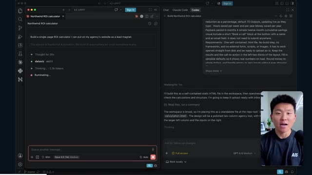

# 🎬 Every Grok Bot Concept Explained for Normal People

> **Chaîne** : [Nate Herk | AI Automation](https://www.youtube.com/@nateherk/featured)  
> **Lien YouTube** : [https://www.youtube.com/watch?v=NyfYxpXiw_0](https://www.youtube.com/watch?v=NyfYxpXiw_0)  
> **Date de publication** : 20260901  
> **Durée** : 00:21:32  
> **Identifiant vidéo** : `NyfYxpXiw_0`  
> **Transcription & Analyse** : `whisper-v3-large-turbo+gemini-3.5-flash-lite`  

---

## 📌 Synthèse Exécutive & Outils

### 💡 Résumé

Dans cette vidéo de la chaîne *Nate Herk | AI Automation*, Nate explore l'impact critique du réglage du niveau d'effort (*Effort Level*) sur le modèle d'intelligence artificielle **Opus 5.5**, à travers un cas pratique d'ingénierie logicielle extrêmement ambitieux : la transformation d'un dossier Frame.io de 105 gigaoctets d'enregistrements vidéo d'un événement virtuel (*AIS Live*) en un monde 3D interactif et explorable à la troisième personne, simulant une conférence tech en personne. En fournissant exactement le même prompt complexe (*slash goal*) à travers différents niveaux d'effort (de faible à code ultra), l'expérimentation met en lumière l'écart abyssal de qualité, d'autonomie et de raffinement des applications générées par les agents IA. 

Les démonstrations révèlent que le niveau d'effort faible génère une application rudimentaire, visuellement défectueuse, manquant de personnalisation graphique et souffrant de bugs de rendu (éléments statiques au lieu de flux vidéo, PNJ fantômes). À l'inverse, le passage au niveau d'effort moyen transforme radicalement le livrable : intégration de la charte graphique de la marque, PNJ dotés de micro-comportements dynamiques, diffusion en direct effective des ateliers et des keynotes, et modélisation fidèle des espaces (hall d'exposition, scènes principales, salons VIP). De manière surprenante, malgré la complexité gargantuesque de la tâche, l'agent n'a posé aucune question de clarification à l'utilisateur, illustrant une autonomie totale couplée à une consommation de ressources et un temps de calcul croissants.

Enfin, la vidéo aborde le goulet d'étranglement classique du développement assisté par IA : le passage du code fonctionnel local à un déploiement en production accessible en ligne. C'est ici qu'intervient le sponsor Hostinger, dont l'extension de connectivité s'intègre directement dans les environnements de développement (VS Code, Cursor) pour combler le fossé entre la génération d'applications complexes par les agents et leur mise en ligne immédiate, bouclant ainsi la boucle de l'automatisation logicielle moderne.

### 🛠️ Outils, Modèles & Logiciels Présentés

* **Opus 5.5** : Le modèle de pointe d'Anthropic, réputé pour son intelligence et son efficacité économique, utilisé ici pour piloter des agents de développement complexes.
* **Claude Code** : L'outil de programmation et d'assistance logicielle avancé d'Anthropic pour l'exécution de tâches de développement dans l'écosystème de l'utilisateur.
* **Anthropic** : L'entreprise conceptrice des modèles de langage et des frameworks d'agents IA évalués dans cette démonstration technique.
* **Frame.io** : La plateforme de gestion et de stockage cloud utilisée pour héberger les 105 gigaoctets d'enregistrements vidéo de l'événement *AIS Live*.
* **Hostinger** : Le service d'hébergement web et de serveurs dont l'extension gratuite connecte directement les éditeurs de code (VS Code, Cursor) pour faciliter le déploiement en ligne.
* **Herc 2 / Système d'exploitation IA** : L'écosystème propriétaire et centralisé de Nate Herk servant de base pour l'automatisation et l'intégration des outils d'IA.
* **Cursor / VS Code** : Les environnements de développement intégrés (IDE) mentionnés pour l'implémentation de code et l'utilisation de connecteurs de déploiement.

### 🔑 Points Clés & Enseignements Stratégiques

* **Impact direct du niveau d'effort sur les livrables** : La modification du paramètre d'effort d'un modèle d'IA modifie profondément la complexité, la stabilité visuelle et la richesse fonctionnelle du code généré, passant d'un prototype grossier et instable à une application web 3D riche et immersive.
* **Le piège de la fidélité visuelle bas niveau** : À l'effort faible, l'agent génère des interfaces génériques, des images fixes non lues à la place des flux vidéo, et des bugs d'affichage majeurs (disparition d'éléments, personnages fantômes), démontrant un manque d'attention aux détails esthétiques et fonctionnels.
* **Autonomie opérationnelle et autonomie décisionnelle** : L'agent a exécuté des tâches de conception d'une ampleur massive (traitement de 105 Go de données, génération d'un monde 3D interactif) en posant exactement zéro question à l'utilisateur, illustrant une capacité d'autonomie et d'inférence contextuelle impressionnante mais risquée si le prompt manque de rigueur.
* **Évolution exponentielle des performances (effort moyen)** : Le passage à un effort moyen permet à l'IA d'incorporer avec succès la charte graphique de la marque, d'intégrer des flux vidéo dynamiques fonctionnels pour les ateliers et, de manière surprenante, d'animer des PNJ dotés de comportements rudimentaires.
* **Gestion du temps et des coûts d'API** : L'expérimentation montre que l'augmentation de l'effort s'accompagne d'un coût computationnel et temporel proportionnel (par exemple, 16 minutes et 3,91 $ pour le niveau bas contre plus d'une heure et 12,44 $ pour le niveau moyen), nécessitant un arbitrage stratégique selon les besoins de production.
* **Consommation de jetons et volume de vérifications** : L'agent exécute des centaines de milliers de jetons (de 191k à 490k) et réalise des dizaines de vérifications automatisées en ouvrant itérativement un navigateur pour tester ses propres réalisations, s'inscrivant dans une boucle de rétroaction autonome (*self-correction*).
* **Le fossé du déploiement en développement IA** : La génération de code par des agents résout la phase de création, mais crée un nouveau goulot d'étranglement : la transition fluide entre un produit fonctionnel exécuté localement sur l'ordinateur portable et sa mise en ligne publique.
* **Intégration des outils de développement modernes** : L'utilisation d'extensions natives connectant directement les environnements de code (VS Code, Cursor) aux services d'hébergement (comme Hostinger) éliminera les frictions opérationnelles et accélérera la boucle de livraison des agents IA.
* **L'importance des recommandations officielles d'ingénierie** : Les préconisations d'Anthropic suggèrent d'initier les prompts complexes à un niveau d'effort moyen avant d'ajuster itérativement vers le haut ou vers le bas, évitant ainsi un gaspillage inutile de ressources sur des tâches simples ou une sous-performance sur des tâches complexes.
* **Convergence de la vidéo et des environnements virtuels** : L'utilisation d'agents pour transformer des archives de webinaires ou d'événements virtuels en expériences 3D gamifiées et explorables ouvre des perspectives inédites pour la réutilisation des actifs numériques et l'engagement communautaire.

---

## ⏱️ Chronologie & Transcription Complète Audio & Visuelle (Mot pour Mot)

### ⏱️ `[00:00:00 - 00:00:20]` | Segment #01

**🔊 Audio (Transcription Intégrale Mot pour Mot en Français) :**
> Opus 5.5, Opus 5.5, Opus 5.5, Opus 5.5, Opus 5.5. Ce modèle est littéralement partout et pour de très bonnes raisons. Il est intelligent, il est bon marché, il a un goût incroyable, c'est un modèle d'IA incroyable. Mais avec chaque modèle d'IA, vous avez le choix de l'effort, que ce soit faible, moyen, élevé, extra, max ou code ultra.

**👁️ Analyse Visuelle d'Écran (gemini-3.5-flash-lite) :**
**Interface & Outils** : X (Twitter)

**Contenu textuel & Code** : Publication textuelle sur X et vidéo de paysage tropical généré par IA.

**Action / Démonstration** : Affichage d'une publication sur les réseaux sociaux illustrant l'impact des modèles d'IA sur la création technique.

*⏱️ 00:00:05 — Une capture d'écran montrant un tweet sur X (anciennement Twitter) avec une vidéo intégrée affichant un paysage tropical en 3D.*

---

### ⏱️ `[00:00:20 - 00:00:38]` | Segment #02

**🔊 Audio (Transcription Intégrale Mot pour Mot en Français) :**
> Donc dans cette vidéo, j'ai donné exactement le même prompt à Opus 5.5 et je l'ai exécuté à chaque niveau d'effort, et nous allons comparer les résultats. Nous allons examiner la qualité de toutes les différentes sorties réelles, mais nous allons aussi examiner combien de temps chacun d'eux a fonctionné, combien cela nous a coûté s'il s'agissait d'une facturation par API, le total des jetons, combien de vérifications ils ont exécutées, et combien de questions ils m'ont réellement posées tout au long du processus.

**👁️ Analyse Visuelle d'Écran (gemini-3.5-flash-lite) :**
**Interface & Outils** : Application de tableau blanc / interface web de comparaison (type Miro ou similaire).

**Contenu textuel & Code** : Tableau comparatif des niveaux d'effort d'Opus 5.5 avec des métriques de performance floutées.

**Action / Démonstration** : Présentation du tableau comparatif évaluant les différents niveaux d'effort d'Opus 5.5.

*⏱️ 00:00:29 — Capture d'un tableau comparatif avec les colonnes Low, Medium, High, Extra, Max et Ultracode, et les lignes Run time, API cost, Total tokens, Checks, Questions asked.*

---

### ⏱️ `[00:00:39 - 00:00:58]` | Segment #03

**🔊 Audio (Transcription Intégrale Mot pour Mot en Français) :**
> Et les résultats que nous avons obtenus ne sont pas du tout ce à quoi je m'attendais, donc j'ai hâte de partager cela avec vous les gars. Ne perdons pas de temps et allons directement à celui-ci. D'accord, alors plongeons-nous directement dans celui-ci. Je veux commencer juste en vous montrant le prompt réel que nous avons utilisé, que nous avons donné à chacun de ces différents agents. Je vais aller dans les fichiers ici, et nous allons ouvrir ce fichier markdown de prompt, et je vais vous montrer ce que nous avons obtenu. Voici donc le slash objectif que j'ai fourni.

**👁️ Analyse Visuelle d'Écran (gemini-3.5-flash-lite) :**
**Interface & Outils** : Interface utilisateur de l'outil de développement / assistant IA (Opus 5.5)

**Contenu textuel & Code** : Message de l'assistant IA invitant à démarrer une tâche : "Hi Nate. This worktree has the effort-test task queued in PROMPT.md : build a walkable third-person 3D world..."

**Action / Démonstration** : Présentation de l'interface de l'outil de développement et du prompt initial de l'assistant IA.

*⏱️ 00:00:48 — L'interface de l'application de développement affichée à l'écran, montrant une conversation avec un assistant IA (Opus 5.5) et une barre latérale listant des projets ("effort-test").*

---

### ⏱️ `[00:00:58 - 00:01:34]` | Segment #04

**🔊 Audio (Transcription Intégrale Mot pour Mot en Français) :**
> J'ai dit : tu dois me créer un monde 3D qui est une conférence tech réaliste dans laquelle je peux me promener en vue à la troisième personne. Tu vas regarder ce dossier, qui contient mes éléments d'enregistrement d'événement provenant d'AIS Live. Et ce dossier est un dossier Frame.io de 105 gigaoctets d'enregistrements vidéo. C'était un événement complètement virtuel. Tout a été enregistré et tous les enregistrements sont juste ici. J'ai dit, ton objectif est de prendre cet événement et de le transformer en un monde 3D explorable qui me donne l'impression d'être réellement allé à une vraie conférence en personne avec différentes salles, différentes pistes, différentes scènes, bla, bla, bla. N'hésite pas à utiliser key.ai si tu as besoin de générer des images ou des vidéos. Et tu peux aussi utiliser tout le reste à l'intérieur de mon projet Herc 2, qui est comme mon système d'exploitation IA. J'ai dit,

**👁️ Analyse Visuelle d'Écran (gemini-3.5-flash-lite) :**
**Interface & Outils** : Éditeur de code (VS Code / Cursor) et interface web Frame.io

**Contenu textuel & Code** : Fichier PROMPT.md avec instructions textuelles pour l'IA et URL Frame.io (https://f.io/sPdlo-Si)
[DESC_ACTION_1] Présentation du prompt de configuration et du dossier de ressources de 105 Go sur Frame.io

**Action / Démonstration** : Explications face caméra et démonstration conceptuelle.

*⏱️ 00:01:07 — Éditeur de texte affichant le fichier PROMPT.md contenant les instructions pour créer un monde 3D de conférence tech basé sur un dossier d'enregistrements.*

*⏱️ 00:01:16 — Interface Frame.io montrant un dossier d'enregistrements d'événements AIS Live d'une taille de 105,69 Go contenant des sous-dossiers.*

*⏱️ 00:01:25 — Éditeur de texte montrant à nouveau le fichier PROMPT.md avec les consignes détaillées pour l'agent IA concernant la création du monde virtuel.*

---

### ⏱️ `[00:01:34 - 00:02:08]` | Segment #05

**🔊 Audio (Transcription Intégrale Mot pour Mot en Français) :**
> vous serez jugé sur la créativité, le design, la physique et la sensation générale lorsque j'explorerai le monde 3D que vous avez construit. Et c'était fondamentalement la fin des instructions. Donc, comme vous pouvez le voir sur ce côté gauche, j'ai exécuté ceci à travers tous les différents niveaux d'effort. Commençons par le niveau bas et progressons jusqu'à code ultra. Très bien. Donc ici, nous avons le résultat du niveau bas. Ouvrons ceci et jetons un coup d'œil. Nous avons donc AIS Live, le sommet des services IA enfin en personne, et nous avons pu cliquer partout. Tout d'abord, cela ne fait pas très personnalisé. Genre, ce n'is pas le logo d'IS Live. Ce n'est même pas nos couleurs. Donc je n'aime pas trop ça, mais entrons ici. D'accord. C'est beaucoup trop lumineux. Euh, nous avons une carte en haut à droite. Nous avons une ville par ici. Je ne peux pas dire quelle ville c'est

**👁️ Analyse Visuelle d'Écran (gemini-3.5-flash-lite) :**
**Interface & Outils** : Application web ou interface d'agent IA personnalisée (style Claude/éditeur de code sombre)

**Contenu textuel & Code** : "Hi Nate. This worktree has the effort-test task queued in PROMPT.md : build a walkable third-person 3D world of the AIS Live conference..."

**Action / Démonstration** : Sélection des différents niveaux d'effort dans le menu latéral et affichage des prompts correspondants.

*⏱️ 00:01:42 — Interface d'une application d'assistant IA affichant les différents niveaux d'effort (Hello, Extra, High, Max, Ultracode, Medium, Low) sur le panneau de gauche et un message lié à la construction d'un monde 3D.*

---

### ⏱️ `[00:02:08 - 00:02:40]` | Segment #06

**🔊 Audio (Transcription Intégrale Mot pour Mot en Français) :**
> c'est. D'accord. C'est Chicago, ce qui est plutôt cool parce que tu sais, je vis à Chicago, mais bref, en haut à droite, on peut voir une carte. Nous avons un hall d'accueil. Nous avons un hall d'exposition. Nous avons un salon VIP sur la scène principale. La carte montre également où se trouve chaque autre personne et cela se synchronise en direct. Donc on peut voir l'enregistrement. On peut voir le premier jour, la keynote de l'agent Hyper, le débriefing en direct. Cool. Donc il connaît réellement l'agenda et puis il y a le deuxième jour. Donc il a trouvé ça, c'est bien. Nous avons ces petites boules ici que je peux espérer botter. D'accord. Le visage, oh, regarde ça. Si je vais par ici, tous les gens disparaissent tout simplement. Très mauvais. Très mauvais. D'accord. Donc voyons voir. Est-ce que je peux sprinter ? D'accord.

**👁️ Analyse Visuelle d'Écran (gemini-3.5-flash-lite) :**
**Interface & Outils** : Application web de monde virtuel 3D (type métavers / plateforme événementielle)

**Contenu textuel & Code** : Carte de navigation miniature en haut à droite, panneaux textuels du programme (DAY 1) et indications de zones (Badge pickup, Expo Hall)

**Action / Démonstration** : Navigation et exploration d'un environnement virtuel interactif à l'aide d'un avatar

*⏱️ 00:02:16 — Vue d'un monde virtuel interactif montrant un avatar dans une zone de retrait de badges.*

*⏱️ 00:02:24 — Vue du hall d'accueil (Lobby) du monde virtuel avec le programme de la journée affiché sur un panneau.*

*⏱️ 00:02:32 — Vue de l'Expo Hall du monde virtuel avec des avatars et des éléments lumineux interactifs.*

---

### ⏱️ `[00:02:40 - 00:03:04]` | Segment #07

**🔊 Audio (Transcription Intégrale Mot pour Mot en Français) :**
> Je peux avancer un peu plus vite. Je vais d'abord aller par ici. Il y a des produits dérivés, euh, un sweat à capuche certifié AIS plus. D'accord. Donc, il y a les vrais stands que nous avions dans l'événement virtuel. Nous avions des stands. C'est plutôt sympa. Un petit endroit pour prendre des photos. La salle C. En ce moment, nous avons Tangy Frederick qui anime un atelier. D'accord. Mais ce n'est pas une vidéo. Comme vous pouvez le voir, c'est juste une image. Elle ne bouge pas. C'est donc juste une image. Ces gens sont en train de disparaître. Ce doivent être des fantômes. Allons par ici dans la salle A.

**👁️ Analyse Visuelle d'Écran (gemini-3.5-flash-lite) :**
**Interface & Outils** : Application de métavers / événement virtuel 3D (style Gather/Spatial).

**Contenu textuel & Code** : Environnement virtuel 3D interactif avec des panneaux explicatifs sur les services d'IA d'entreprise.

**Action / Démonstration** : Navigation et exploration d'un espace d'événement virtuel en 3D par le présentateur.

*⏱️ 00:02:46 — Vue d'un événement virtuel 3D avec un avatar se déplaçant dans un hall d'exposition, montrant des stands de sponsors.*

*⏱️ 00:02:52 — Navigation dans une salle d'atelier virtuelle verdoyante avec des tables éclairées et des écrans d'information.*

*⏱️ 00:02:58 — Gros plan sur un écran de présentation virtuel dans une salle d'atelier affichant des instructions étape par étape sur une clé API.*

---

### ⏱️ `[00:03:04 - 00:03:30]` | Segment #08

**🔊 Audio (Transcription Intégrale Mot pour Mot en Français) :**
> Nous avons Liberty White. D'accord. Très cool. Vos 30 premiers jours en automatisation. Encore une fois, c'est juste une image fixe et les gens ont des bugs d'affichage. Donc ce n'est pas très bon ici. Je vais aller sur la scène principale et voir ce que nous avons. D'accord, cool. Donc nous avons une scène principale. Les gens ont des bugs d'affichage. Vraiment mauvais. Ce n'est vraiment pas bon du tout. Notre vidéo est en train de bouger. Genre, j'ai vu mon visage ici et j'ai vu celui de Devin, mais maintenant ils ont disparu. Donc je ne sais pas ce qui s'est passé. D'accord. On dirait que c'est plutôt un diaporama. Rien n'est vraiment lu pour l'instant. Quoi qu'il en soit, entrons ici.

**👁️ Analyse Visuelle d'Écran (gemini-3.5-flash-lite) :**
**Interface & Outils** : Application de métavers / plateforme d'événement virtuel 3D interactive.

**Contenu textuel & Code** : Environnement virtuel 3D représentant une conférence avec salles d'ateliers et scène principale.

**Action / Démonstration** : Exploration et navigation interactive dans l'espace virtuel par le présentateur.

*⏱️ 00:03:11 — Vue d'un avatar dans un espace virtuel 3D (Workshop Room A - Foundation track) avec des plateformes lumineuses.*

*⏱️ 00:03:17 — Navigation de l'avatar dans une grande salle de conférence virtuelle (Main Stage) remplie d'avatars de participants.*

*⏱️ 00:03:24 — Vue de face de la scène principale "AIS LIVE - AI Services Summit" dans l'environnement virtuel avec des écrans de présentation géants.*

---

### ⏱️ `[00:03:30 - 00:03:58]` | Segment #09

**🔊 Audio (Transcription Intégrale Mot pour Mot en Français) :**
> Nous avons plus de stands. Nous avons hyper agent. Nous avons Claude Code. Nous avons plus de goodies. La salle B, c'est Dave Ebelor. Je suppose que c'est exactement la même chose. Nous avons du café. Et ensuite, je suppose que le salon VIP, c'est accès VIP uniquement. C'est plutôt cool, mais il n'y a vraiment rien qui se passe ici. Cet écran est beaucoup trop lumineux. D'accord. Donc je pense que vous comprenez l'ambiance qu'on obtient ici avec Opus 5.5 en effort faible. Et c'est là que les choses deviennent intéressantes. À combien est-ce que vous pensez que cela a tourné ? Combien de temps ? Celui-ci a tourné pendant 16 minutes et 43 secondes. Combien est-ce que vous pensez que cela a coûté ?

**👁️ Analyse Visuelle d'Écran (gemini-3.5-flash-lite) :**
**Interface & Outils** : Application web collaborative / tableau blanc (Opus 5.5 Efforts)

**Contenu textuel & Code** : Tableau comparatif avec les métriques : Run time, API cost, Total tokens, Checks, Questions asked selon différents niveaux d'effort.
[DESC_IMAGE_3] Présentation d'un tableau comparatif des performances de l'outil IA selon le niveau d'effort configuré.

**Action / Démonstration** : Explications face caméra et démonstration conceptuelle.

*⏱️ 00:03:51 — Tableau comparatif en ligne montrant les niveaux d'effort de l'outil Opus 5.5 (Low, Medium, High, Extra, Max, Ultracode).*

---

### ⏱️ `[00:03:58 - 00:04:26]` | Segment #10

**🔊 Audio (Transcription Intégrale Mot pour Mot en Français) :**
> 3,91 dollars si c'était une facturation par API. J'utilise évidemment mon abonnement ici, mais nous allons simplement calculer cela en facturation par API. Le nombre total de jetons était de 191 000. Il a effectué 22 vérifications. Donc, pour la vérification, il a ouvert le navigateur 22 fois et a exécuté différents types de vérifications. Donc 22 catégories de vérifications. Et combien de questions m'a-t-il posées ? Il m'a posé un total de zéro question tout au long de cette invite de type "slash goal". D'accord. Alors, ouvrons l'effort moyen et voyons ce que nous avons. D'accord, c'est parti. Effort moyen. Nous avons Nate Herc. Nous avons mon badge. C'est la marque de "AI's life".

**👁️ Analyse Visuelle d'Écran (gemini-3.5-flash-lite) :**
**Interface & Outils** : Application de tableau blanc (type Excalidraw)

**Contenu textuel & Code** : Tableau avec des colonnes "Low", "Medium", "High", "Ex" et des lignes pour "Run time" (16m 43s), "API cost" ($3.91), "Total tokens" (191.3K), "Checks", et "Questions asked".

**Action / Démonstration** : Le présentateur explique et présente les résultats d'un test d'automatisation IA affichés sur le tableau blanc.

*⏱️ 00:04:05 — Tableau comparatif sur une application de tableau blanc affichant les métriques d'exécution pour différents niveaux d'effort, avec le présentateur visible dans une vignette à gauche.*

---

### ⏱️ `[00:04:26 - 00:04:46]` | Segment #11

**🔊 Audio (Transcription Intégrale Mot pour Mot en Français) :**
> Donc ça a déjà l'air un petit peu mieux. Ça ressemble à nos palettes de couleurs qui ont utilisé nos directives de marque. Premier jour de construction, deuxième jour de gain, VIP. Cool. D'accord. Je vais entrer dans le lieu. D'accord. Waouh. Une ambiance similaire, en gros. C'est en arrière-plan. Ça ne ressemble pas à Chicago, hein ? Non, ça ressemble à, honnêtement, ça ressemble à une ville inventée. Quoi qu'il en soit, c'est marrant qu'ils aient décidé de faire ça. Voyons si je peux me déplacer un peu plus vite. Oh, waouh.

**👁️ Analyse Visuelle d'Écran (gemini-3.5-flash-lite) :**
**Interface & Outils** : Application web interactive / 3D virtuelle 'AIS Live' avec affichage d'avatars et interface de contrôle de jeu/navigation.

**Contenu textuel & Code** : Écran d'accueil avec texte d'introduction ('Welcome to AIS Live', badge 'NATE HERK', boutons 'ENTER THE VENUE' et commandes clavier) puis vue 3D d'un espace virtuel.

**Action / Démonstration** : Le présentateur clique sur 'Enter the Venue' pour entrer dans l'environnement virtuel 3D de l'événement.

*⏱️ 00:04:31 — Interface d'accueil de l'événement 'AIS Live' montrant un badge nominatif personnalisé au nom de Nate Herk avec les boutons de navigation et d'accès.*

*⏱️ 00:04:41 — Vue dans le monde virtuel 3D de l'application 'AIS Live', montrant des avatars de type pixel art/low-poly dans un espace intérieur avec vue sur une ville la nuit.*

---

### ⏱️ `[00:04:46 - 00:05:21]` | Segment #12

**🔊 Audio (Transcription Intégrale Mot pour Mot en Français) :**
> Les gens interagissent avec moi. Regardez. Si je m'approche de ce type, il vient de lever le bras. Bon, maintenant il ne veut plus du tout avoir affaire à moi. Mais tous ces petits robots ici doivent prendre des décisions. Je ne sais pas s'ils utilisent Jev. C'est sûr que non. Je ne lui ai pas dit de le faire. En fait, ma clé Jev est à l'arrière. Je ne sais pas. Peut-être qu'il l'a utilisée. Quoi qu'il en soit, nous pouvons voir ici que nous avons la salle d'atelier C, le laboratoire des agents. Sympa. Donc celui-ci est réellement en train de tourner. Vous pouvez voir qu'il s'agit d'une vraie vidéo diffusée par Tangy. Tout le monde ici est en train de travailler sur un ordinateur portable. Ils ne buguent pas. C'est plutôt cool. De plus, mon badge est sur ma poitrine, ce qui est plutôt cool. Je peux venir par ici. Nous avons une carte en haut à droite, comme vous pouvez le voir, mais je peux venir par ici. Nous avons un

**👁️ Analyse Visuelle d'Écran (gemini-3.5-flash-lite) :**
**Interface & Outils** : Présentation ou face-caméra explicatif sans interface logicielle partagée.

**Contenu textuel & Code** : Explications orales et mise en contexte méthodologique.

**Action / Démonstration** : Explications face caméra et démonstration conceptuelle.

---

### ⏱️ `[00:05:21 - 00:05:47]` | Segment #13

**🔊 Audio (Transcription Intégrale Mot pour Mot en Français) :**
> hall d'exposition. C'est là que nous avons le stand Glido. Et ça diffuse en ce moment. Oui, ça diffuse la vidéo de nous parlant de Glido. Ça diffuse la vidéo d'Ed et moi parlant de notre programme de certification. Nous avons le logo AIS Plus juste ici, qui est placé dans un endroit un peu bizarre. Ce sont les diapositives et les points clés des conférenciers. Alors wouah, toutes ces ressources que nous avons distribuées après l'événement sont également toutes là. Nous pouvons voir que nous avons un projecteur de communauté. Donc c'est Aiden qui parle de son contrat qu'il a décroché et ça joue en direct. Ces gens regardent.

**👁️ Analyse Visuelle d'Écran (gemini-3.5-flash-lite) :**
**Interface & Outils** : Présentation ou face-caméra explicatif sans interface logicielle partagée.

**Contenu textuel & Code** : Explications orales et mise en contexte méthodologique.

**Action / Démonstration** : Explications face caméra et démonstration conceptuelle.

---

### ⏱️ `[00:05:47 - 00:06:21]` | Segment #14

**🔊 Audio (Transcription Intégrale Mot pour Mot en Français) :**
> Ils sont plutôt engagés. On a l'hyper agent. C'était, c'est ce que je voulais dire. Si vous avez vu ces gens lever les bras pour dire bonjour, c'était plutôt marrant. Regardez, regardez, le voilà qui recommence. Bref. Bon. Où est-ce que je suis maintenant ? Maintenant, je suis dans le hall principal. On a un bar à café. On a un grand logo, qui est le vrai logo. C'est trop lumineux, mais on a le logo. On peut voir si on peut entrer ici dans le parcours fondation. On a Sabrina Romanov et Liberty White. Donc différentes formations juste là. On peut entrer dans cette salle. C'est le parcours avancé. Alors qu'est-ce qui se passe ici ? On a Dave Ebelar et Saman qui parlent de différentes choses là-dedans. Et maintenant, allons jeter un œil à la scène principale. Oh, attendez, il y a une vidéo de moi là-haut. C'est genre un VIP

**👁️ Analyse Visuelle d'Écran (gemini-3.5-flash-lite) :**
**Interface & Outils** : Environnement virtuel 3D interactif (plateforme d'événement en ligne).

**Contenu textuel & Code** : Interface utilisateur virtuelle avec mini-carte, texte "Main Lobby" et avatars.

**Action / Démonstration** : Exploration d'un monde virtuel 3D par le présentateur.

---

### ⏱️ `[00:06:21 - 00:06:50]` | Segment #15

**🔊 Audio (Transcription Intégrale Mot pour Mot en Français) :**
> section ? Ouais, on ira voir ça dans une minute. Mais bref, voici la scène principale. Ça a l'air vraiment, vraiment super. On a une grande scène. On a genre quatre personnes assises ici. On a les trois écrans d'Alex là-haut avec l'hyper agent. Est-ce que j'ai le droit de monter sur scène ? Oh, et il me laisse monter sur scène. D'accord. C'est plutôt sympa. Bon les gars, faisons un selfie. Laissez-moi prendre tout le monde en arrière-plan. Venez par ici. Bref, c'est vraiment, vraiment cool. Par contre, toutes les places ne sont pas occupées. Donc il va falloir qu'on travaille là-dessus. Mais bref, je vais courir voir ce que c'était que cette section VIP. D'accord. Le salon VIP. J'ai l'impression que c'est comme un aéroport ou un truc comme ça.

**👁️ Analyse Visuelle d'Écran (gemini-3.5-flash-lite) :**
**Interface & Outils** : Environnement virtuel 3D / plateforme de métavers de conférence.

**Contenu textuel & Code** : Avatars numériques, affichage d'une keynote avec écrans de présentation.

**Action / Démonstration** : Navigation et exploration d'un espace virtuel de conférence en ligne.

---

### ⏱️ `[00:06:51 - 00:07:14]` | Segment #16

**🔊 Audio (Transcription Intégrale Mot pour Mot en Français) :**
> Okay, c'est super. Donc maintenant nous avons les sessions VIP ici. Une foire aux questions VIP avec la lecture vidéo en direct de Nate juste ici. Vraiment, vraiment super. Et nous avons comme un bar ou quelque chose du genre. Génial. Je dirais que c'est un très bon résultat. Maintenant, en ce qui concerne les statistiques ici, celle-ci a pris une heure et 13 minutes à s'exécuter. Cela nous aurait coûté 12 dollars et 44 cents. Elle a utilisé 490 000 jetons et a fait 23 vérifications.

**👁️ Analyse Visuelle d'Écran (gemini-3.5-flash-lite) :**
**Interface & Outils** : Espace virtuel 3D et tableau de bord analytique web.

**Contenu textuel & Code** : Vidéo en direct intégrée dans un environnement virtuel et tableau comparatif de performances d'IA (Run time: 16m 43s, API cost: $3.91, Total tokens: 191.3K).

**Action / Démonstration** : Navigation et présentation de l'espace virtuel VIP, puis passage à l'affichage des métriques de performance et de coûts de l'API.

*⏱️ 00:06:56 — Capture montrant un espace virtuel 3D (type Metaverse/Gather) avec un grand écran affichant une vidéo en direct du présentateur (Nate Herk) et un coin salon VIP.*

*⏱️ 00:07:02 — Capture montrant un tableau de données analytiques ou de performances (« Opus 5.5 Efforts ») avec des métriques comme « Run time », « API cost » ($3.91) et « Total tokens » (191.3K).*

---

### ⏱️ `[00:07:14 - 00:07:48]` | Segment #17

**🔊 Audio (Transcription Intégrale Mot pour Mot en Français) :**
> Et il nous a posé un total de zéro question une fois de plus. Très bien, passons à élevé. C'était déjà un résultat plutôt correct et Anthropic eux-mêmes dans leur vidéo sur comment prompter Opus 5.5, ou désolé, pas une vidéo, un article. Ils ont dit de commencer simplement par moyen et de l'ajuster vers le haut ou vers le bas si nécessaire. C'était donc un résultat moyen. Passons à élevé et voyons ce qu'on a obtenu. Très rapidement, les gars, je dois prendre une seconde pour vous parler du sponsor de la vidéo d'aujourd'hui, Hostinger. Donc ces deux modèles viennent de me construire une version fonctionnelle de la même chose. Et maintenant, je me retrouve exactement là où je finis toujours, avec un produit fini sur mon ordinateur portable et aucun moyen rapide de le mettre en ligne. Et c'est précisément le fossé que comble le connecteur d'Hostinger. C'est une extension gratuite

**👁️ Analyse Visuelle d'Écran (gemini-3.5-flash-lite) :**
**Interface & Outils** : Tableau de bord de type canvas / Interface de développement et de génération de code.

**Contenu textuel & Code** : Tableau comparatif de performances d'IA (Run time, API cost, Total tokens, Checks, Questions asked) et invite de code pour une application de calcul de ROI.

**Action / Démonstration** : Comparaison des résultats d'exécution selon différents niveaux d'effort de l'IA et suivi de la génération d'un outil de calcul ROI.

*⏱️ 00:07:22 — Un tableau comparatif montrant les métriques pour les niveaux d'effort 'Low' et 'Medium' (temps d'exécution, coût API, jetons totaux, vérifications, questions posées), avec les colonnes 'High' et 'Extra' vides.*

*⏱️ 00:07:39 — Une interface de développement (type éditeur de code ou environnement de test) avec un panneau de chat à droite et un affichage de l'application en cours de construction à gauche.*

---

### ⏱️ `[00:07:48 - 00:08:23]` | Segment #18

**🔊 Audio (Transcription Intégrale Mot pour Mot en Français) :**
> pour votre éditeur qui intègre votre compte Hostinger dans l'outil de programmation que vous utilisez déjà, que ce soit VS Code, Cursor, Cloud Code, Codex, et j'en passe. Vous vous connectez une seule fois en un clic, et à partir de là, votre agent peut déployer le site, y pointer un domaine, configurer les enregistrements DNS et vérifier votre VPS sans que vous n'ayez jamais à quitter l'éditeur. Alors, peu importe celui de ces outils que vous préférez, ce qu'il a construit se trouve à quelques minutes d'une vraie URL sur un hébergement géré. Le connecteur est gratuit avec chaque formule d'hébergement, donc si vous avez toujours besoin de l'hébergement sous-jacent, profitez de la formule illimitée via le lien dans la description et utilisez le code NATEHERK pour obtenir 10 % de réduction. Cela inclut également un nom de domaine gratuit et un e-mail professionnel pour l'année. Et c'est toujours le moyen le plus économique que j'ai trouvé pour obtenir quelque chose

**👁️ Analyse Visuelle d'Écran (gemini-3.5-flash-lite) :**
**Interface & Outils** : Interface web Hostinger (Manage Hostinger from your IDE) et interface Claude Code.

**Contenu textuel & Code** : Statut "Connected via OAuth", version de Node.js 24.13.0, et liste des outils accessibles (Websites, Domains, Subscriptions & Payments, Email Marketing).

**Action / Démonstration** : Connexion du compte Hostinger à l'IDE validée avec les autorisations d'outils activées.

*⏱️ 00:07:57 — Interface montrant la connexion OAuth de Hostinger depuis un IDE avec les outils disponibles (Websites, Domains, Subscriptions, Email Marketing), aux côtés de l'interface Claude Code et de la webcam du présentateur.*

---

### ⏱️ `[00:08:23 - 00:08:47]` | Segment #19

**🔊 Audio (Transcription Intégrale Mot pour Mot en Français) :**
> vous avez construit sur une vraie URL. Revenons donc à la vidéo. Ok. Encore une fois, très, très marqué. C'est même mieux qu'un écran de chargement que le précédent. Nous avons ce joli petit effet en arrière-plan. Nous avons le logo. Nous entrons dans le lieu. Ok. Nous y voilà. Cela a l'air plutôt bien. Nous commençons à l'extérieur et vous pouvez voir que nous avons ces drapeaux pour tous les intervenants, Wyatt, Casper, Alex, Ed, Aiden, Sabrina, Liberty. C'est plutôt cool. Nous avons des blocs en direct ici.

**👁️ Analyse Visuelle d'Écran (gemini-3.5-flash-lite) :**
**Interface & Outils** : Présentation ou face-caméra explicatif sans interface logicielle partagée.

**Contenu textuel & Code** : Explications orales et mise en contexte méthodologique.

**Action / Démonstration** : Explications face caméra et démonstration conceptuelle.

---

### ⏱️ `[00:08:47 - 00:09:23]` | Segment #20

**🔊 Audio (Transcription Intégrale Mot pour Mot en Français) :**
> it took this picture from me, your host, Nate Herc, John, Dave, Nate Herc. There we go. Okay. The doors. Awesome. They're automatic sliding glass doors. I love that. We can see VIP check-in. We can see GA. We can come over here and we can check out the expo with different booths, community spotlight. You can also see that in the top left, I have a passport. So it's like, it will be showing how many of the places I've visited. All of these are real playback. We've got a resource wall with all of the different speakers. They've also got a networking session over here. So I'm going to come over real quick and see what that's all about. So we've got the AIS cold brew bar. We've got different community members that were spotlighted or highlighted.

**👁️ Analyse Visuelle d'Écran (gemini-3.5-flash-lite) :**
**Interface & Outils** : Environnement virtuel 3D interactif de type métavers ou jeu en ligne.

**Contenu textuel & Code** : Éléments textuels 'Registration Concourse', 'VIP Check-In' et bannières d'événements.

**Action / Démonstration** : Navigation et exploration de l'espace virtuel par le présentateur.

*⏱️ 00:08:56 — Vue principale de l'espace virtuel avec la scène principale, le comptoir VIP Check-In et l'accueil général.*

*⏱️ 00:09:05 — Exploration de l'expo hall avec différents stands et bannières publicitaires.*

*⏱️ 00:09:14 — Déplacement du personnage dans le hall d'enregistrement virtuel parmi d'autres avatars.*

---

### ⏱️ `[00:09:23 - 00:09:56]` | Segment #21

**🔊 Audio (Transcription Intégrale Mot pour Mot en Français) :**
> Nous avons l'aile VIP. Attends, quoi ? Prends un bracelet. Oh, je dois vraiment aller chercher le bracelet. D'accord. Laisse-moi m'enregistrer rapidement. Le bracelet est déjà mis. Attends, quoi ? D'accord. Oh, d'accord. Maintenant, les portes se sont ouvertes pour moi. Cool. Je peux entrer ici. Oh, ça mène juste à la scène principale. Salon VIP. Il y a une séance de questions-réponses en cours. Ça a l'air très cool. Je veux dire, je suis très impressionné par la façon dont il est capable de faire ça. Waouh. D'accord. Donc c'est vraiment bien. Ce qu'on a fait, c'est qu'on a eu des salles de discussion VIP avec différentes personnes. Tu peux voir qu'il y a différentes salles, différents membres de l'équipe AIS qui participent à des trucs. C'est vraiment cool. C'est très cool. C'est un VIP bien meilleur

**👁️ Analyse Visuelle d'Écran (gemini-3.5-flash-lite) :**
**Interface & Outils** : Présentation ou face-caméra explicatif sans interface logicielle partagée.

**Contenu textuel & Code** : Explications orales et mise en contexte méthodologique.

**Action / Démonstration** : Explications face caméra et démonstration conceptuelle.

---

### ⏱️ `[00:09:56 - 00:10:30]` | Segment #22

**🔊 Audio (Transcription Intégrale Mot pour Mot en Français) :**
> expérience que ce qui a été montré dans la première partie. OK. L'after-party VIP. Regardez ça. On a une piste de danse. On a tous ces éléments ici. On a la rediffusion même de l'after-party VIP juste ici. Et il y a une cabine de DJ. C'est tellement drôle. Il y a un petit bug juste ici, un glitch juste là, mais c'est génial. Oh, cool. Donc quand je suis ici sur la scène principale, on a les sous-titres. Vous pouvez voir juste ici au bas de mon écran, on a ces sous-titres de Wyatt en train de parler là-haut. On a des lumières. On a le panel. Très cool. Belle scène principale. Je vais aller par ici. On peut aller à la fondation,

**👁️ Analyse Visuelle d'Écran (gemini-3.5-flash-lite) :**
**Interface & Outils** : Présentation ou face-caméra explicatif sans interface logicielle partagée.

**Contenu textuel & Code** : Explications orales et mise en contexte méthodologique.

**Action / Démonstration** : Explications face caméra et démonstration conceptuelle.

---

### ⏱️ `[00:10:30 - 00:11:06]` | Segment #23

**🔊 Audio (Transcription Intégrale Mot pour Mot en Français) :**
> advanced, and the enterprise tracks over here. So let's see. We have anatomy of a three real deals. We've got hyper agent. We've got the evals with Nate and Ed in here. We've got Dave going on in the advanced stuff. This is really nice. I mean, obviously each, each of these outputs so far, low was okay. Medium was better. High has been even better. Let's see if that trend continues and let's go ahead and see what this cost us. So high ran for one hour and seven minutes. So a little bit quicker than medium, it would have cost us $16 and 31 cents. It used half a million tokens, 509,000. It did 22 checks. And it also asked us, well, actually, no, I was wrong. This

**👁️ Analyse Visuelle d'Écran (gemini-3.5-flash-lite) :**
**Interface & Outils** : Application web / tableau de bord de statistiques (type outil de benchmark ou design system).

**Contenu textuel & Code** : Tableau de données comparatives : Run time, API cost, Total tokens, Checks, Questions asked pour différents niveaux d'effort (Low, Medium, High).

**Action / Démonstration** : Présentation des résultats de performance et de coûts associés aux différents niveaux d'effort d'un modèle d'IA.

*⏱️ 00:10:57 — Tableau comparatif des performances et coûts de l'effort "Opus 5.5" (Low, Medium, High, Extra) affichant le temps d'exécution, le coût API et le nombre de tokens.*

---

### ⏱️ `[00:11:06 - 00:11:25]` | Segment #24

**🔊 Audio (Transcription Intégrale Mot pour Mot en Français) :**
> L'un d'eux m'a posé une question et, spoiler, c'était le seul qui nous ait posé une question pendant tout ceci. Alors voyons, il nous en reste trois : Extra, Max et Ultra Code. Laissez-moi ouvrir Extra et on va voir ce qu'on a. OK. Alors celui-ci a l'air plutôt pas mal. Honnêtement, je dirais que jusqu'ici, l'écran de chargement High était le meilleur. Celui qu'on vient tout juste de voir, mais de toute façon, entrons dans AIS live.

**👁️ Analyse Visuelle d'Écran (gemini-3.5-flash-lite) :**
**Interface & Outils** : Application de tableau de bord / interface web de benchmark

**Contenu textuel & Code** : Tableau avec les colonnes Low, Medium, High, Extra et les lignes Run time, API cost, Total tokens, Checks, Questions asked.

**Action / Démonstration** : Le présentateur commente les résultats comparatifs affichés dans le tableau pour chaque modèle/niveau.

*⏱️ 00:11:11 — Tableau comparatif affichant les métriques de différents niveaux d'effort (Low, Medium, High, Extra) incluant le temps d'exécution, le coût API, le nombre de tokens, de vérifications et de questions posées.*

---

### ⏱️ `[00:11:26 - 00:11:51]` | Segment #25

**🔊 Audio (Transcription Intégrale Mot pour Mot en Français) :**
> Whoa. D'accord. Donc on a genre des petits extraits sonores. Je peux discuter avec des gens. Le panneau de la guerre des outils a réglé quelques débats pour moi. Sympa. Bonne perspective là-bas. On est dehors à nouveau. On a ces différentes bannières, bien qu'elles soient toutes les mêmes. Elles n'affichent pas genre les noms de différentes personnes. Donc gros logo AIS live. L'aile de l'atelier est par ici. Et passons par les portes coulissantes en verre pour voir ce qu'on a. Donc on a le café AIS. La carte est en bas à droite, et elle n'est pas très descriptive.

**👁️ Analyse Visuelle d'Écran (gemini-3.5-flash-lite) :**
**Interface & Outils** : Environnement virtuel 3D interactif (type métavers / monde virtuel en ligne).

**Contenu textuel & Code** : Interface utilisateur affichant 'Convention Plaza', mini-carte en bas à droite, bulles de dialogue et bannières publicitaires.

**Action / Démonstration** : Navigation et exploration de l'espace virtuel 3D par l'avatar.

*⏱️ 00:11:32 — Vue d'un monde virtuel 3D de type métavers avec un avatar se promenant sur une place et des panneaux publicitaires affichant 'AIS LIVE'.*

*⏱️ 00:11:38 — L'avatar poursuit sa promenade en plein air sur la place virtuelle avec des bâtiments illuminés en arrière-plan.*

*⏱️ 00:11:45 — L'avatar s'approche de l'entrée principale du bâtiment 'Convention Plaza' dans l'espace virtuel 3D.*

---

### ⏱️ `[00:11:51 - 00:12:26]` | Segment #26

**🔊 Audio (Transcription Intégrale Mot pour Mot en Français) :**
> J'aime bien comment les autres cartes nous ont montré ce que, genre, où se trouvaient les choses, mais celle-ci a l'air très professionnelle. On peut voir ici c'est la scène principale. Allons y faire un tour rapidement. Ils ont tous ces ballons qui volent partout, ce qui je trouve est plutôt drôle. Les ballons de plage AIS. On nous voit moi là-haut en train de parler. Je crois que j'introduisais l'un des jours. Continuons à avancer par ici vers la salle d'atelier sur ce côté gauche. D'accord. Donc ici nous avons le théâtre Hyper Agent. Nous avons cette session sponsorisée ici par Hyper Agent, mais ça nous montre aussi ce qui va se passer ici. C'est vraiment marrant qu'on puisse discuter avec des gens. Salmon a créé un commercial vocal en direct. La salle du Juste Prix était comble. As-tu pris le guide du compagnon VIP ? C'est trop marrant. Nous avons la piste avancée dans

**👁️ Analyse Visuelle d'Écran (gemini-3.5-flash-lite) :**
**Interface & Outils** : Environnement virtuel 3D de conférence en ligne (type salon virtuel interactif).

**Contenu textuel & Code** : Avatars 3D, interfaces de navigation, mini-carte en bas à droite, écrans vidéo intégrés dans l'environnement.

**Action / Démonstration** : Navigation et exploration d'un espace virtuel de conférence en ligne par le présentateur.

*⏱️ 00:12:00 — Vue d'une scène principale virtuelle avec un avatar au premier plan, un public assis et un grand écran montrant le présentateur.*

*⏱️ 00:12:09 — Vue dans un hall d'entrée virtuel avec des avatars d'utilisateurs et des panneaux indiquant des ateliers (Workshops).*

*⏱️ 00:12:17 — Vue dans un couloir virtuel d'un espace de conférence en ligne avec plusieurs avatars d'utilisateurs.*

---

### ⏱️ `[00:12:26 - 00:12:58]` | Segment #27

**🔊 Audio (Transcription Intégrale Mot pour Mot en Français) :**
> ici. Encore une fois, nous avons une lecture en direct. Est-ce que c'est une lecture en direct ? Oh, d'accord. Ça a commencé une fois que je suis entré, mais je peux prendre place. Oh la la. Je peux regarder ça. Je peux me lever. Je veux m'asseoir au premier rang. C'est plutôt cool. C'est très bien. J'aime ça. Et vous savez ce que j'ai remarqué jusqu'à présent ? Le personnage réel que j'incarne me ressemble un peu. Je pense qu'il a été modélisé à partir de mes photos de profil ou quelque chose comme ça. Bref, nous avons Sabrina ici, l'animatrice de la salle ici, prenez n'importe quelle place libre. D'accord, super. Et j'ai vraiment aimé la fonctionnalité pour s'asseoir. C'est assez marrant. Genre, on pourrait vraiment assister à cet atelier et participer. Bref, ça nous montre les intervenants. Ça nous montre les

**👁️ Analyse Visuelle d'Écran (gemini-3.5-flash-lite) :**
**Interface & Outils** : Environnement virtuel 3D de conférence en ligne (type salon virtuel ou monde virtuel interactif).

**Contenu textuel & Code** : Interface utilisateur affichant "Advanced Track" et "Foundation Track" avec des fenêtres de webcams et des présentations en direct.

**Action / Démonstration** : Navigation et exploration de l'espace virtuel par l'avatar, observation des différentes salles de l'événement en direct.

---

### ⏱️ `[00:12:58 - 00:13:31]` | Segment #28

**🔊 Audio (Transcription Intégrale Mot pour Mot en Français) :**
> programme. Il y a un petit tapis rouge ici pour prendre des photos. On peut prendre la pose. Oh, wouah. C'est plutôt cool. Bibliothèque de ressources, obtenir la certification AIS Plus, Glido, Hyper Agent, AIS Plus, trois vraies offres. Génial. Je veux dire, je dirais vraiment que jusqu'à présent, chacune est meilleure que la précédente. Et on n'a même pas encore vu la section VIP, le salon VIP. Allons par ici très vite. J'espère que je pourrai entrer. Sympa. On a le réinitialisation des outils. Ce sont les différentes salles dans lesquelles nous pouvons aller. Donc encore une fois, je pourrais prendre la feuille de calcul et je pourrais essayer de comprendre comment tarifer mes trucs. C'est tellement cool. C'est vraiment mieux que le précédent où on faisait juste en quelque sorte

**👁️ Analyse Visuelle d'Écran (gemini-3.5-flash-lite) :**
**Interface & Outils** : Présentation ou face-caméra explicatif sans interface logicielle partagée.

**Contenu textuel & Code** : Explications orales et mise en contexte méthodologique.

**Action / Démonstration** : Explications face caméra et démonstration conceptuelle.

---

### ⏱️ `[00:13:31 - 00:13:59]` | Segment #29

**🔊 Audio (Transcription Intégrale Mot pour Mot en Français) :**
> genre a regardé des trucs. Génial. Je peux aller derrière le bar et venir ici. C'est très bien. Bon. Alors, en ce qui concerne les statistiques, celui-ci a tourné pendant une heure et demie. Il coûte 25,92 dollars. Je ne sais pas pourquoi je dis point 25,92 cents. C'était 733 000 jetons et 34 vérifications. Il a donc eu le plus de vérifications de loin jusqu'à présent. Et il ne nous a posé zéro question. J' Hâte de voir ce qu'on a obtenu ici de max et ultra code. D'accord. Voici les écrans de chargement de max, ennuyeux, mais c'est dans l'esprit de la marque et il y a notre logo.

**👁️ Analyse Visuelle d'Écran (gemini-3.5-flash-lite) :**
**Interface & Outils** : Application de tableau blanc ou de diagramme en ligne (style Excalidraw ou similaire).

**Contenu textuel & Code** : Tableau avec colonnes : Medium (1h 13m, $12.44, 419.2K, 23, 0), High (1h 7m, $16.31, 509.3K, 22, 1), et Extra (1h 31m).

**Action / Démonstration** : Le présentateur commente les statistiques affichées dans le tableau comparatif des différents niveaux d'effort.

*⏱️ 00:13:38 — Un tableau comparatif montrant les statistiques de performance de différents niveaux d'effort (Medium, High, Extra, Max, Ultracode) avec le temps d'exécution, le coût et le nombre de tokens.*

---

### ⏱️ `[00:14:00 - 00:14:35]` | Segment #30

**🔊 Audio (Transcription Intégrale Mot pour Mot en Français) :**
> Alors c'était bien. J'aime bien. On va continuer et entrer dans AIS en direct. Oh, jolie petite animation ici qui nous fait entrer. Encore une fois, le personnage me ressemble. Ils m'ont tous ressemblé. Enfin, en quelque sorte, nous sommes assis en arrière-plan. Ça ressemble à Chicago. Comme je l'mentionné plus tôt, beaucoup de ceux-ci jouent des sons et je n'inclus pas cela parce que ce serait très perturbateur pour vous d'essayer d'écouter ce qui se passe en même temps que je parle. Il y a donc une légère musique dans tout ça. Je déteste la façon dont il marche. Cette marche est vraiment, vraiment mauvaise. Je veux dire, la marche, ouais, je n'aime pas du tout ça. Donc ce n'est pas génial. Mais à part ça, allons explorer. Remarquez ces ombres quand j'entre, elles changent vraiment, je ne sais pas trop pourquoi,

**👁️ Analyse Visuelle d'Écran (gemini-3.5-flash-lite) :**
**Interface & Outils** : Présentation ou face-caméra explicatif sans interface logicielle partagée.

**Contenu textuel & Code** : Explications orales et mise en contexte méthodologique.

**Action / Démonstration** : Explications face caméra et démonstration conceptuelle.

---

### ⏱️ `[00:14:35 - 00:15:11]` | Segment #31

**🔊 Audio (Transcription Intégrale Mot pour Mot en Français) :**
> Mais de toute façon, on peut discuter avec des gens ici aussi. Le stand Hyperagent est juste là où on entre dans l'expo. Tout va bien. OK, super. Je peux continuer à appuyer sur E pour changer ce qu'ils disent. On a les conférenciers juste ici. Ça a l'air plutôt bien. Bien qu'on avait vraiment la photo de profil de tout le monde. Du coup, je ne sais pas trop pourquoi ce n'est pas inclus là. On voit des gens prendre des photos juste ici. J'adore ça. Et ça sauvegarde une petite photo. OK. La carte n'est pas super non plus, genre ne donne pas une super explication de ce qui se passe, mais j'aime bien ces stands. Ils sont cool. Je pense que ces stands sont les meilleurs que j'aie vus jusqu'à présent. Genre, ils ont juste une belle apparence. Il y a des représentants. Il y a de superbes diapos derrière eux. Ouais. Ces stands sont cool. OK. On a un petit théâtre mis en avant

**👁️ Analyse Visuelle d'Écran (gemini-3.5-flash-lite) :**
**Interface & Outils** : Présentation ou face-caméra explicatif sans interface logicielle partagée.

**Contenu textuel & Code** : Explications orales et mise en contexte méthodologique.

**Action / Démonstration** : Explications face caméra et démonstration conceptuelle.

---

### ⏱️ `[00:15:11 - 00:15:35]` | Segment #32

**🔊 Audio (Transcription Intégrale Mot pour Mot en Français) :**
> ...qui se passe par ici. C'est Casper. Même si, pourquoi est-ce que ça ne se lance pas ? J'ai l'impression que ça devrait tourner, non ? Comme dans les autres, ça tournait toujours. On peut parler à d'autres personnes par ici. Le café est gratuit. Bla, bla, bla. Amy Simpson, Matt Wolf. Sympa. D'accord. C'est juste l'espace de réseautage dans lequel on se trouve actuellement, mais on peut voir en haut à droite. On peut aussi voir ce qui passe en direct sur la scène principale en ce moment. C'est une table ronde sur la guerre des outils. Alors entrons ici. On a Devin, Cole, Dave et Russ qui discutent ici. On a une sorte d'audiovisuel, des jeux de lumière qui se passent là derrière.

**👁️ Analyse Visuelle d'Écran (gemini-3.5-flash-lite) :**
**Interface & Outils** : Application web de métavers ou de salon virtuel 3D.

**Contenu textuel & Code** : Environnement virtuel 3D avec affichage textuel d'informations sur des panneaux virtuels et mini-carte en bas à droite.

**Action / Démonstration** : Navigation et déplacement d'un avatar dans un espace virtuel d'événements en ligne.

---

### ⏱️ `[00:15:36 - 00:15:55]` | Segment #33

**🔊 Audio (Transcription Intégrale Mot pour Mot en Français) :**
> Bascule la scène principale sur ce qui compte vraiment en ce moment. Donc je peux changer de sujet. Cool. Donc je viens de basculer sur moi et Matt. On peut aller sur l'anatomie de trois vrais deals. C'est plutôt cool. La scène rend bien. On a un joli petit panel juste ici. Est-ce que je peux monter sur scène ? Sympa. Sympa. Bon, je ne peux pas aller trop loin, en fait. Très bien tout le monde, laissez-moi prendre le selfie. Venez tous dessus. Je peux aussi m'asseoir dans ce public juste ici et simplement profiter de la session.

**👁️ Analyse Visuelle d'Écran (gemini-3.5-flash-lite) :**
**Interface & Outils** : Présentation ou face-caméra explicatif sans interface logicielle partagée.

**Contenu textuel & Code** : Explications orales et mise en contexte méthodologique.

**Action / Démonstration** : Explications face caméra et démonstration conceptuelle.

---

### ⏱️ `[00:15:55 - 00:16:14]` | Segment #34

**🔊 Audio (Transcription Intégrale Mot pour Mot en Français) :**
> Très cool, très cool. OK, allons par ici. Je vois une section à l'étage. Donc c'est marrant comme ils choisissent tous de mettre la section VIP à l'étage. Je veux dire, je ne déteste pas ça. Oh la vache, ils ont un escalator. Pas croyable. Je vais discuter avec ce type sur l'escalator. Glenn a 15 ans d'expérience en agence. Ses trucs de "land and expand" étaient en or. Du super boulot, Glenn. Cool, donc je vais, je n'arrive même pas à dépasser ce type pourtant.

**👁️ Analyse Visuelle d'Écran (gemini-3.5-flash-lite) :**
**Interface & Outils** : Application de métaverse ou plateforme d'événements virtuels en 3D

**Contenu textuel & Code** : Interface utilisateur avec mini-carte en bas à droite, commandes de déplacement en bas (WASD, Shift, Space), et bulles de discussion textuelles au-dessus des avatars.

**Action / Démonstration** : Navigation dans l'espace virtuel 3D et interaction avec un autre participant sur un escalator menant à la zone VIP.

*⏱️ 00:16:09 — Gros plan sur l'avatar virtuel montant l'escalator derrière un autre participant, avec une bulle de dialogue affichant "Glenn has 15 years of agency experience..." et un bouton d'interaction "Chat with this attendee".*

---

### ⏱️ `[00:16:14 - 00:16:48]` | Segment #35

**🔊 Audio (Transcription Intégrale Mot pour Mot en Français) :**
> Oh, j'ai dû sauter par-dessus lui. D'accord, niveau VIP, badge requis. Oh mon Dieu. Tu te moques de moi ? Je dois aller chercher mon badge. D'accord, super. Maintenant, ça montre que je suis un vrai VIP et je peux aller ici dans la section VIP. On a de petites sessions de travail sympas par ici, qu'on peut rejoindre. Je me demande si ça va me laisser m'asseoir ici. Je peux juste discuter. Je peux participer ? Ça ne me laisse pas m'asseoir et participer. C'est pas grave. On a la "War Room" sur les prix. Oh, ça pourrait être l'after-party. Allons voir ce qui se passe par ici. Ou peut-être que je dois juste entrer par ici. D'accord. C'est bizarre. Je devais juste entrer par ici. Cet after-party n'est pas aussi cool que l'autre. Mais bref, allons voir ce qui se passe par ici.

**👁️ Analyse Visuelle d'Écran (gemini-3.5-flash-lite) :**
**Interface & Outils** : Présentation ou face-caméra explicatif sans interface logicielle partagée.

**Contenu textuel & Code** : Explications orales et mise en contexte méthodologique.

**Action / Démonstration** : Explications face caméra et démonstration conceptuelle.

---

### ⏱️ `[00:16:48 - 00:17:07]` | Segment #36

**🔊 Audio (Transcription Intégrale Mot pour Mot en Français) :**
> dans les ateliers. D'accord. Ce n'était pas bien. Regardez ça. On peut tout voir et je viens de bugger et maintenant boum. Donc ce n'est pas bon. Je dirais qu'globalement, je veux dire, vous avez l'ambiance de la façon dont cela fonctionne, mais je dirais que celui d'avant, qui était, je crois, "high", j'aimais mieux celui-là. Je ne peux pas m'asseoir dans ces chaises non plus. Ouais. Donc je n'aime pas la façon de marcher dans celui-ci.

**👁️ Analyse Visuelle d'Écran (gemini-3.5-flash-lite) :**
**Interface & Outils** : Environnement virtuel 3D interactif (plateforme d'événement virtuel)

**Contenu textuel & Code** : Interface utilisateur de métavers ou de salon virtuel avec mini-carte, commandes de déplacement et affichage d'informations de session.

**Action / Démonstration** : Navigation et exploration d'un espace de conférence virtuel 3D par l'utilisateur.

*⏱️ 00:16:53 — Vue en 3D d'un avatar se déplaçant dans le couloir d'un espace virtuel d'événements, avec des panneaux d'affichage et une mini-carte.*

*⏱️ 00:16:57 — L'avatar s'approche de l'entrée d'une salle de conférence (Room C) dans l'espace virtuel 3D.*

*⏱️ 00:17:02 — L'avatar entre dans la salle de conférence virtuelle (HyperAgent Lab) où des présentations et des participants virtuels sont visibles.*

---

### ⏱️ `[00:17:07 - 00:17:43]` | Segment #37

**🔊 Audio (Transcription Intégrale Mot pour Mot en Français) :**
> Je n'aime pas autant l'ambiance et il y a quelques bugs. Donc, jusqu'à présent, si nous voulons regarder notre liste, j'aime extra extra, c'était celui que j'aimais le plus jusqu'à présent. Mais de toute façon, celui-ci était au maximum. Celui-ci était au maximum juste ici. Voyons donc combien de temps cela a duré : deux heures et 28 minutes. Ça a donc duré longtemps, 50 dollars et 38 cents, 1,18 million de jetons. Il a donc effectivement atteint une compaction et a dû s'auto-compacter. Et puis il a fait 51 vérifications. L'a-t-il vraiment fait, cependant ? Parce qu'il y avait beaucoup de bugs là-dedans. Et de toute façon, celui-ci ne nous a posé zéro question. Donc, jusqu'à présent, à chaque fois, c'est presque devenu plus aisé et ça a pris plus de temps, à part ici. Mais ceux-ci fondamentalement

**👁️ Analyse Visuelle d'Écran (gemini-3.5-flash-lite) :**
**Interface & Outils** : Interface web de tableau de bord ou d'outil de comparaison de modèles d'IA.

**Contenu textuel & Code** : Tableau avec des colonnes Medium, High, Extra, Max, Ultracode et des lignes de données chiffrées (durées, coûts en dollars, tokens).

**Action / Démonstration** : Le présentateur commente et analyse les différents niveaux de performance et de coût affichés dans le tableau.

*⏱️ 00:17:16 — Un tableau comparatif montrant différentes options (Medium, High, Extra, Max, Ultracode) avec des métriques de temps, de coût et de performance.*

---

### ⏱️ `[00:17:43 - 00:18:17]` | Segment #38

**🔊 Audio (Transcription Intégrale Mot pour Mot en Français) :**
> a pris à peu près le même laps de temps, mais à chaque fois, il a utilisé plus de jetons parce qu'il a davantage réfléchi. Et puis, vous savez, ces jetons vont coûter plus cher. Mais bref, passons au dernier, qui est Ultra Code. Donc, nous espérons vraiment que celui-ci sera le meilleur. Alors, allons sur ce localhost et voyons ce que nous avons. D'accord, super. Regardez ce badge. C'est un joli badge, hôte de tous les accès. Nous avons un joli petit visuel juste ici. Nous allons aller de l'avant et entrer dans AIS Live. Cool. D'accord. Bienvenue, Nate. J'aime la marche. Ça a l'air réaliste. J'aime le logo, bien qu'il lui manque le petit point rouge qui donne l'air du direct. La carte en haut à droite

**👁️ Analyse Visuelle d'Écran (gemini-3.5-flash-lite) :**
**Interface & Outils** : Application web de tableau comparatif et interface virtuelle 3D.

**Contenu textuel & Code** : Tableau de données comparatives (temps, coûts, jetons) et scène virtuelle 3D 'AIS LIVE'.
[DESC_IMAGE_1] Présentation comparative des performances des modèles d'IA.
[DESC_IMAGE_2] Navigation dans l'application 3D générée.

**Action / Démonstration** : Explications face caméra et démonstration conceptuelle.

*⏱️ 00:17:52 — Un tableau comparatif montrant les métriques pour différents niveaux (High, Extra, Max, Ultracode) incluant le temps, le coût et le nombre de jetons.*

*⏱️ 00:18:09 — Une interface virtuelle 3D intitulée 'AIS LIVE' avec un avatar au centre de la scène.*

---

### ⏱️ `[00:18:17 - 00:18:49]` | Segment #39

**🔊 Audio (Transcription Intégrale Mot pour Mot en Français) :**
> est un petit peu mieux étiqueté, donc je peux voir ce qui se passe. Je vais venir ici et récupérer mon bracelet VIP rapidement. Ok, super. Ça me dit aussi quoi faire. Donc en haut à gauche, il est écrit de badger à l'entrée VIP du mur est du hall. Donc je crois que l'est serait par ici, n'est-ce pas ? Ne mangez jamais de gaufres détrempées. Ouais. Ailes VIP, badger le bracelet. Ok, cool. Maintenant, je suis dans la section VIP. Je peux voir ces différentes salles. L'outil a été réinitialisé. La vidéo en direct est diffusée. Je peux voir les sous-titres juste là de ce dont on parle. Ça joue aussi les sons, mais je ne diffuse tout simplement pas l'audio pour vous les gars parce que je ne veux pas surcharger.

**👁️ Analyse Visuelle d'Écran (gemini-3.5-flash-lite) :**
**Interface & Outils** : Environnement virtuel 3D interactif (jeu ou plateforme de réunion virtuelle).

**Contenu textuel & Code** : Textes d'instructions de mission affichés à l'écran (« Registration & Lobby », « VIP Wing », « VIP Room 5 »).

**Action / Démonstration** : Navigation de l'avatar à travers les différentes zones de l'événement virtuel, du hall d'entrée vers la zone VIP.

*⏱️ 00:18:25 — Vue dans le monde virtuel montrant le présentateur naviguant dans le hall d'enregistrement avec des instructions textuelles.*

*⏱️ 00:18:33 — Entrée de l'aile VIP (VIP Wing) dans l'environnement virtuel avec un message indiquant le déverrouillage d'un nouvel espace.*

*⏱️ 00:18:41 — Intérieur de la salle VIP 5 montrant un groupe d'avatars assis autour d'une table ronde pour une session de travail.*

---

### ⏱️ `[00:18:50 - 00:19:08]` | Segment #40

**🔊 Audio (Transcription Intégrale Mot pour Mot en Français) :**
> Encore une fois, celui-ci fonctionne avec Cody et Mustafa là-dedans. C'est génial. Vidéo en direct. La vidéo ne se lance pas tant qu'on n'entre pas, par contre. Donc, honnêtement, je pense que c'est un bon choix. Dès que j'entre, par contre, la vidéo démarre. Sympa. Belle attention. Toutes ces pièces. Génial. Ouais. Je veux dire, ça fait très haut de gamme. Voici une salle de guerre pour la tarification. Entrons ici. Moi et John là-dedans.

**👁️ Analyse Visuelle d'Écran (gemini-3.5-flash-lite) :**
**Interface & Outils** : Application web de métavers / espace virtuel 3D interactif

**Contenu textuel & Code** : Interface d'un espace virtuel nommé "VIP Wing" montrant des avatars et des salles de réunion (VIP Room 1).

**Action / Démonstration** : Navigation et exploration de l'espace virtuel 3D.

*⏱️ 00:18:54 — Un utilisateur navigue dans un environnement virtuel 3D interactif représentant une aile VIP avec des salles de réunion et des écrans vidéo en direct.*

---

### ⏱️ `[00:19:08 - 00:19:42]` | Segment #41

**🔊 Audio (Transcription Intégrale Mot pour Mot en Français) :**
> Et ensuite nous avons l'after-party sympa. Cet after-party n'est pas encore aussi animé. Et nous avons plus de ballons de plage pour une raison quelconque, mais cet after-party est cool. Je veux dire, ça nous donne une bonne ambiance et il y a la retransmission juste ici de notre session de questions-réponses de l'after-party, tout cela est en direct aussi. Génial. D'accord. Dirigeons-nous vers la scène principale. Cela m'invite aussi à prendre un siège côté allée à la scène principale, qui se trouve tout droit à travers l'expo. Donc en fait, allons d'abord à travers l'expo. Qu'est-ce que vous construisez ? Il y a beaucoup de gens qui parlent de différentes choses par ici. Waouh. Il y a aussi comme un petit truc de basketball. Est-ce que je peux le lancer ? Je peux. Est-ce que je dois regarder en haut pour le lancer vers le haut ? D'accord.

**👁️ Analyse Visuelle d'Écran (gemini-3.5-flash-lite) :**
**Interface & Outils** : Présentation ou face-caméra explicatif sans interface logicielle partagée.

**Contenu textuel & Code** : Explications orales et mise en contexte méthodologique.

**Action / Démonstration** : Explications face caméra et démonstration conceptuelle.

---

### ⏱️ `[00:19:42 - 00:20:08]` | Segment #42

**🔊 Audio (Transcription Intégrale Mot pour Mot en Français) :**
> Eh bien, pas terrible. Mais bref, nous avons un stand AIS plus. Nous avons le stand Glido. Est-ce que ça diffuse en direct ? Oui, ça diffuse définitivement en direct. Sympa. Nous avons le stand Hyper Agent. Nous avons d'autres trucs par ici. Bon, cool. Je vais aller dans la salle principale et voir si on peut choper une place côté allée. Dès qu'on entre, tout se met à jouer. On a une très bonne ambiance de scène. Comment faire pour choper une place côté allée par contre. Voilà. Il a fallu que je trouve la bonne. Je prends la place côté allée. Il n'y a personne sur scène, ce qui est bizarre. J'aimais bien quand il y avait du monde sur scène dans les versions précédentes.

**👁️ Analyse Visuelle d'Écran (gemini-3.5-flash-lite) :**
**Interface & Outils** : Présentation ou face-caméra explicatif sans interface logicielle partagée.

**Contenu textuel & Code** : Explications orales et mise en contexte méthodologique.

**Action / Démonstration** : Explications face caméra et démonstration conceptuelle.

---

### ⏱️ `[00:20:08 - 00:20:31]` | Segment #43

**🔊 Audio (Transcription Intégrale Mot pour Mot en Français) :**
> Prenons un petit selfie. Bref, il y a moi et Pat là-haut. Pat est habillé comme un ouvrier du bâtiment. Comme vous pouvez le voir, nous faisions un petit appel de découverte simulé dans cet exemple. Je vais revenir par l'expo et nous allons aller ici vers l'aile des ateliers et simplement vérifier si ces salles sont fondamentalement exactement les mêmes qu'elles devraient l'être. Maintenant, je ne peux plus vraiment discuter avec les gens. Je le pouvais avant, dans les versions précédentes, discuter avec les gens, ce que je trouvais être une très belle attention. Et nous avons l'atelier d'une piste de fondation. Est-ce que je peux m'asseoir ?

**👁️ Analyse Visuelle d'Écran (gemini-3.5-flash-lite) :**
**Interface & Outils** : Présentation ou face-caméra explicatif sans interface logicielle partagée.

**Contenu textuel & Code** : Explications orales et mise en contexte méthodologique.

**Action / Démonstration** : Explications face caméra et démonstration conceptuelle.

---

### ⏱️ `[00:20:32 - 00:21:04]` | Segment #44

**🔊 Audio (Transcription Intégrale Mot pour Mot en Français) :**
> I can't sit down. I don't know. We do have Liberty actually talking right now and she is speaking and we can hear it. So that's nice, but it's not letting me sit down. And look at this. I'm getting pretty glitchy right here. That was glitching the way I was walking. It like wasn't letting me walk. That's not good. Same thing. We got this advanced track in there. Awesome. So overall, they have a very similar vibe. I will say I'm impressed by the way they were able to tell a story out of what we were doing. Speaker takeaways library. Okay. This is cool. I don't think we saw this from different places, but these are like the resources and showing some cool stuff. Oh, wow. I

**👁️ Analyse Visuelle d'Écran (gemini-3.5-flash-lite) :**
**Interface & Outils** : Environnement virtuel 3D en ligne de type métavers ou plateforme d'événements virtuels.

**Contenu textuel & Code** : Éléments textuels d'interface de la plateforme virtuelle incluant des titres de salles, des indications de navigation et des sous-titres de dialogue.

**Action / Démonstration** : Exploration et navigation dans un espace virtuel 3D avec un avatar lors d'un événement en ligne.

---

### ⏱️ `[00:21:04 - 00:21:41]` | Segment #45

**🔊 Audio (Transcription Intégrale Mot pour Mot en Français) :**
> on peut en fait ouvrir toutes ces choses et on peut aussi prendre des photos juste ici. Sympa. Prendre une photo. Je peux aussi enregistrer ça. Genre, je peux vraiment télécharger ça. Et maintenant, on a cette photo qu'on vient tout juste de prendre à cet événement live AIS. Très bien. Eh bien, je pense qu'il est temps pour moi de tirer quelques conclusions, mais d'abord voyons ce que cette exécution nous a coûté. Ça a pris une heure et 35 minutes. C'était donc bien plus rapide que max. Ça n'a coûté que 18 dollars et 69 centimes. Waouh. C'était donc un tout petit peu plus cher que high, moins cher qu'extra et bien moins cher que max. Ça a aussi traité 606 000 tokens et 42 vérifications avec zéro question. Maintenant, une autre chose intéressante à noter, c'est que tout

**👁️ Analyse Visuelle d'Écran (gemini-3.5-flash-lite) :**
**Interface & Outils** : Visionneuse d'images Windows / Application de prise de vue

**Contenu textuel & Code** : Photo d'un événement virtuel avec le logo "AIS LIVE" sur fond noir et des avatars de participants.

**Action / Démonstration** : Affichage et visualisation d'une photo capturée lors de la démonstration en direct.

*⏱️ 00:21:13 — Visionneuse d'images affichant une photo prise lors de l'événement virtuel AIS LIVE avec des avatars sur un tapis rouge.*

---

### ⏱️ `[00:21:41 - 00:22:13]` | Segment #46

**🔊 Audio (Transcription Intégrale Mot pour Mot en Français) :**
> Ces runs, aucun d'entre eux n'a utilisé de sous-agent. J'ai regardé en détail et je me suis assuré qu'aucun d'eux n'utilisait de sous-agents. Ils n'ont pas voulu déléguer de travail, ce qui était intéressant. Donc ces tokens sont ce qui s'est reflété à l'intérieur de cette session. Évidemment, comme je l'ai dit, celui-ci a dépassé, vous savez, les 950 k, enfin, quelle que soit la fenêtre de compaction. D'habitude, je ne le laisse jamais monter aussi haut, mais comme c'était un slash goal et que je n'étais pas impliqué, celui-ci a dû compacter, mais le reste a simplement tourné dans cette seule session. Et voilà les statistiques globales. Et aussi très rapidement sur le sujet d'UltraCode, les gars, je ne sais pas si vous avez remarqué ça, mais quand j'ai fait tourner UltraCode ces derniers temps, ça m'a juste paru bizarre. Ça semblait un peu buggé. J'ai, les deux ou trois fois où je l'ai lancé

**👁️ Analyse Visuelle d'Écran (gemini-3.5-flash-lite) :**
**Interface & Outils** : Application de tableau blanc ou de notes (type Miro, Obsidian ou similaire) avec une incrustation vidéo du présentateur en bas à gauche.

**Contenu textuel & Code** : Tableau de données : Run time, API cost ($3.91 à $50.38), Total tokens (191.3K à 1.18M), Checks (22 à 51), Questions asked (0 ou 1).

**Action / Démonstration** : Le présentateur commente les métriques et les coûts des différents niveaux de runs présentés dans le tableau.

*⏱️ 00:21:49 — Un tableau comparatif des performances de différents niveaux d'effort (Low, Medium, High, Extra, Max, Ultracode) affichant le temps d'exécution, le coût API, le nombre total de tokens, les vérifications et les questions posées.*

---

### ⏱️ `[00:22:13 - 00:22:34]` | Segment #47

**🔊 Audio (Transcription Intégrale Mot pour Mot en Français) :**
> and been like, is it even running UltraCode? It did quite a few more checks than these other ones, but for some reason it just didn't feel right because essentially what UltraCode is, is it's extra effort and then it's just like using more dynamic workflows in order to do things. And so through all my digging on the session logs and even when I was watching this thing build in UltraCode, it wasn't spinning up any of these dynamic workflows and I tried this a few times.

**👁️ Analyse Visuelle d'Écran (gemini-3.5-flash-lite) :**
**Interface & Outils** : Application de tableau de bord ou interface web de présentation de données avec incrustation vidéo du présentateur.

**Contenu textuel & Code** : Tableau de données comparatives : Run time (16m 43s à 2h 28m), API cost ($3.91 à $50.38), Total tokens (191.3K à 1.18M), Checks (22 à 51), Questions asked.

**Action / Démonstration** : Présentation des résultats comparatifs des différents niveaux de configuration d'effort d'un modèle d'IA.

*⏱️ 00:22:18 — Tableau comparatif affichant les performances selon différents niveaux d'effort (Low, Medium, High, Extra, Max, Ultracode) avec des métriques comme le temps d'exécution, le coût API, le nombre de tokens, les vérifications et les questions posées.*

---

### ⏱️ `[00:22:35 - 00:23:00]` | Segment #48

**🔊 Audio (Transcription Intégrale Mot pour Mot en Français) :**
> Donc je ne sais pas si c'est un bug en ce moment dans le harnais CloudCode ou si c'est juste avec Opus 5.5, que c'est un peu pire avec UltraCode actuellement ou quelque chose du genre, mais quoi qu'il en soit, ce sont les véritables niveaux d'effort globaux et tout cela semble tout à fait logique quand on regarde un peu la façon dont ils progressent. Jetons donc un coup d'œil à cela. Coût maximal par rapport au plus bas, nous avons eu du 12,9X sur l'exécution la moins chère comparée à l'exécution la plus chère, qui allait je crois de 3,98 $ à 50,38 $.

**👁️ Analyse Visuelle d'Écran (gemini-3.5-flash-lite) :**
**Interface & Outils** : Interface web de tableau blanc / prise de notes (type Miro, Whimsical ou similaire)

**Contenu textuel & Code** : Tableau de données montrant les performances et coûts selon les niveaux d'effort (ex: Low = 16m 43s, $3.91, 191.3K tokens ; Max = 2h 28m, $50.38, 1.18M tokens).

**Action / Démonstration** : Analyse et présentation comparative des différents modes d'effort d'Opus 5.5.

*⏱️ 00:22:41 — Tableau comparatif des niveaux d'effort (Low, Medium, High, Extra, Max, Ultracode) avec les métriques associées (Run time, API cost, Total tokens, Checks, Questions asked).*

---

### ⏱️ `[00:23:01 - 00:23:19]` | Segment #49

**🔊 Audio (Transcription Intégrale Mot pour Mot en Français) :**
> Donc c'était le minimum et le maximum. En ce qui concerne les vérifications maximales par rapport au minimum, nous avons eu un multiple de 2,3. Le total pour les six était de 127 balles et l'ultracode était de 18,69 $. Regardons la vitesse par rapport au coût ici. Laissez-moi donc dézoomer un peu pour que nous puissions voir tout ça. Sur l'axe des X, nous avons le temps d'exécution. Sur l'axe des Y, nous avons le coût.

**👁️ Analyse Visuelle d'Écran (gemini-3.5-flash-lite) :**
**Interface & Outils** : Tableau de bord d'analyse de données (application web personnalisée)

**Contenu textuel & Code** : Texte explicatif et cartes de métriques : 'Six sessions ran the same prompt at different effort settings...', '12.9x Max cost vs Low', '2.3x Max checks vs Low', '$18.69 Ultracode cost, 42 checks', '$127.65 Total across all six'

**Action / Démonstration** : Présentation des résultats comparatifs entre différents niveaux d'effort pour l'exécution de prompts.

*⏱️ 00:23:05 — Capture d'écran montrant le présentateur à gauche et un tableau de bord analytique à droite intitulé 'Opus Effort Test', affichant des métriques de coût et de performance (12.9x, 2.3x, $18.69, $127.65).*

---

### ⏱️ `[00:23:19 - 00:23:42]` | Segment #50

**🔊 Audio (Transcription Intégrale Mot pour Mot en Français) :**
> Donc j'ai l'impression que le mieux serait en bas à gauche, mais pas vraiment. Donc de toute façon, vous pouvez voir que low était bon marché et rapide. Max était lent et cher. Mais ce genre de graphique a généralement du sens. Plus vous augmentez l'effort, plus ça va coûter cher et plus ça va prendre un peu plus de temps. C'est logique. Voyons maintenant la croissance par rapport à low. Nous avons donc le temps d'exécution en bleu, les coûts de l'API en orange, les jetons en vert, et les vérifications en or jaunâtre, moutarde.

**👁️ Analyse Visuelle d'Écran (gemini-3.5-flash-lite) :**
**Interface & Outils** : Interface web de test ou d'analyse "Opus Effort Test" affichant un graphique de dispersion.

**Contenu textuel & Code** : Graphique avec en abscisse le temps d'exécution et en ordonnée le coût en dollars, affichant les points Low, Medium, High, Extra, Ultracode et Max. Une info-bulle détaillée apparaît pour le point 'Low' (16m 43s - $3.91 - 191.3K tokens - 22 checks).

**Action / Démonstration** : Le présentateur commente le graphique et survole le point 'Low' en bas à gauche.

*⏱️ 00:23:25 — Un graphique montrant la vitesse par rapport au coût (Speed vs cost) pour différents niveaux d'effort, avec le présentateur en médaillon à gauche.*

---

### ⏱️ `[00:23:42 - 00:24:01]` | Segment #51

**🔊 Audio (Transcription Intégrale Mot pour Mot en Français) :**
> Et d'ailleurs, la raison pour laquelle UltraCode apparaît comme ça, c'est parce qu'il utilise réellement un niveau d'effort supplémentaire. Il est simplement incité et il utilise plutôt des flux de travail dynamiques et des choses comme ça, ce qui fait que, vous savez, c'est logique parce qu'il utilisait essentiellement un supplément sous le capot. C'est aussi pour cela que Claude l'a marqué ici en orange. Bref, si nous continuons plus bas ici, c'est généralement logique, n'est-ce pas ?

**👁️ Analyse Visuelle d'Écran (gemini-3.5-flash-lite) :**
**Interface & Outils** : Interface web de test des niveaux d'effort d'Opus avec graphique comparatif.

**Contenu textuel & Code** : Graphique linéaire comparant le temps d'exécution (Run time), le coût API (API cost), les tokens et les vérifications (Checks) avec des courbes colorées et des valeurs chiffrées (jusqu'à Ultracode).

**Action / Démonstration** : Le présentateur commente le graphique et survole les points de données pour illustrer l'impact des différents niveaux d'effort sur les coûts et les performances.

*⏱️ 00:23:47 — Un graphique montrant la croissance relative des performances et des coûts (temps d'exécution, coût API, jetons, vérifications) en fonction de différents niveaux d'effort (Low, Medium, High, Extra, Max, Ultracode).*

---

### ⏱️ `[00:24:02 - 00:24:21]` | Segment #52

**🔊 Audio (Transcription Intégrale Mot pour Mot en Français) :**
> Au fur et à mesure que le niveau d'effort augmente, encore une fois, ces métriques vont augmenter. Le temps d'exécution, les coûts d'API, les jetons et les vérifications. C'est la même chose ici avec le temps d'exécution. Cela nous donne simplement des graphiques linéaires individuels supplémentaires maintenant pour chacune de ces différentes métriques, comme le coût d'API, les vérifications, le total des jetons, le coût par vérification, et tous les chiffres au même endroit. Des données plutôt cool donc.

**👁️ Analyse Visuelle d'Écran (gemini-3.5-flash-lite) :**
**Interface & Outils** : Application web ou tableau de bord d'analyse de données (titre "Opus Effort Test")

**Contenu textuel & Code** : Graphique avec des courbes pour "Run time", "API cost", "Tokens", et "Checks" évalués sur différents niveaux d'effort (Low, Medium, High, Extra, Max, Ultracode)

**Action / Démonstration** : Présentation des résultats de tests comparatifs illustrant l'augmentation des coûts et des performances selon le niveau d'effort.

*⏱️ 00:24:06 — Un graphique linéaire affichant la croissance relative des métriques (temps d'exécution, coût API, jetons, vérifications) en fonction du niveau d'effort, avec le présentateur visible à gauche.*

---

### ⏱️ `[00:24:21 - 00:24:40]` | Segment #53

**🔊 Audio (Transcription Intégrale Mot pour Mot en Français) :**
> I will say nothing here is too shocking. What was more shocking to me was those results. My top two contenders were high, which is this one, and extra, which is this one. So I need to go back in here and just remember what I thought about them. I really liked this feel. This one also just feels the smoothest. The physics were nice. The sliding glass door was nice. I didn't really notice many bugs in this one, which is what I really liked.

**👁️ Analyse Visuelle d'Écran (gemini-3.5-flash-lite) :**
**Interface & Outils** : Présentation ou face-caméra explicatif sans interface logicielle partagée.

**Contenu textuel & Code** : Explications orales et mise en contexte méthodologique.

**Action / Démonstration** : Explications face caméra et démonstration conceptuelle.

---

### ⏱️ `[00:24:40 - 00:25:13]` | Segment #54

**🔊 Audio (Transcription Intégrale Mot pour Mot en Français) :**
> Je ne me souviens pas si celui-ci était un de ceux où, oh, je ne pouvais pas parler aux gens par contre. Je pouvais juste passer à travers eux. Je ne pouvais pas m'asseoir dans celui-là non plus. Voici un autre petit truc visuel où je traverse carrément ce mur. Donc, je n'aime pas trop ça. Mais je pense, est-ce que c'était celui où je pouvais m'asseoir dans ces sessions ? Non. Bon. Donc je ne pense pas que c'était mon gagnant du coup. Celui-ci est super haut. Je pense que c'est le gagnant. Ouais. Je pense que c'était celui que j'aimais le plus. J'adorais toute cette ambiance. J'adorais le fait de pouvoir discuter avec les gens. C'était définitivement celui où on pouvait venir ici et s'asseoir où on voulait, prendre une place, se lever. Je pouvais lire ces trois offres et je pouvais discuter avec eux. J'ai aussi réalisé qu'il y avait de petites sections pour faire des simulations d'appels de découverte ici aussi.

**👁️ Analyse Visuelle d'Écran (gemini-3.5-flash-lite) :**
**Interface & Outils** : Présentation ou face-caméra explicatif sans interface logicielle partagée.

**Contenu textuel & Code** : Explications orales et mise en contexte méthodologique.

**Action / Démonstration** : Explications face caméra et démonstration conceptuelle.

---

### ⏱️ `[00:25:13 - 00:25:51]` | Segment #55

**🔊 Audio (Transcription Intégrale Mot pour Mot en Français) :**
> Nous avons des produits dérivés et des sacs en toile, ce qui relève de la physique réelle. J'aime bien ça. C'était celui où l'on pouvait s'asseoir partout. Oui, j'ai vraiment, vraiment aimé celui-là. Bien que je pense que le seul inconvénient de celui-ci, c'est qu'il n'y avait pas vraiment d'after-party VIP, parce que je pense que c'était le salon. Et je pense que c'était le seul élément de la section VIP, qui consistait en ces différentes pièces où l'on pouvait entrer et s'asseoir. Mais à part ça, il n'offrait pas une super expérience VIP par rapport à certains des autres que nous avons vus. Donc mon gagnant ici va définitivement être Extra. Extra a fait un travail phénoménal. Sa durée était d'environ la moitié et son coût de la moitié de celui de Max. Donc Max, je pense, était tout simplement bien trop cher pour le peu de qualité obtenue. Je pense que les points forts étaient corrects. Ça pouvait,

**👁️ Analyse Visuelle d'Écran (gemini-3.5-flash-lite) :**
**Interface & Outils** : Application de métavers virtuel et interface de tableau analytique web (Opus 5.5).

**Contenu textuel & Code** : Éléments de métavers 3D interactifs et tableau comparatif chiffré de métriques d'IA (Run time, API cost, Total tokens).

**Action / Démonstration** : Navigation dans un espace virtuel 3D et sélection de données sur un tableau de bord analytique.

*⏱️ 00:25:23 — Vue dans un monde virtuel style métavers représentant un couloir ("West Concourse") avec un avatar en mouvement.*

*⏱️ 00:25:32 — Vue dans l'espace virtuel montrant une table ronde VIP avec des avatars assis et un écran affichant "Scope to Ship".*

*⏱️ 00:25:42 — Tableau comparatif des performances et coûts ("Opus 5.5 Efforts") détaillant le temps d'exécution, le coût API et le nombre de tokens.*

---

### ⏱️ `[00:25:51 - 00:26:25]` | Segment #56

**🔊 Audio (Transcription Intégrale Mot pour Mot en Français) :**
> avec peut-être un ou deux prompts de plus, j'en suis arrivé là où je l'aimais vraiment. Mais pour un objectif de niveau slash, Extra a fourni un résultat incroyable ici. Je n'ai pas adoré Medium. Et pour une grande partie de mon travail de réflexion et de ce que je fais, Medium fonctionne très bien. Mais pour cette tâche spécifique, j'avais besoin de beaucoup de raisonnement. Il devait passer par des tonnes de choses. Il devait passer par des tonnes de vidéos. Il devait trouver beaucoup de choses à l'intérieur de mes projets. Il devait créer une expérience et raconter une histoire à partir de tout cela. Je pense qu'Extra a fait un travail phénoménal. En général, cependant, j'ai aimé beaucoup de ces résultats, mais Extra est celui avec lequel je voudrais commencer dès maintenant. Si je voulais vraiment en faire une application et un univers super, super léchés et sympas, je commencerais par le résultat d'Extra et probablement

**👁️ Analyse Visuelle d'Écran (gemini-3.5-flash-lite) :**
**Interface & Outils** : Présentation ou face-caméra explicatif sans interface logicielle partagée.

**Contenu textuel & Code** : Explications orales et mise en contexte méthodologique.

**Action / Démonstration** : Explications face caméra et démonstration conceptuelle.

---

### ⏱️ `[00:26:25 - 00:26:37]` | Segment #57

**🔊 Audio (Transcription Intégrale Mot pour Mot en Français) :**
> continuez à itérer avec Extra. Bref, les gars, c'était ça l'expérience. J'espère que vous avez trouvé ça instructif. J'espère que vous avez appris quelque chose de nouveau. Et si c'est le cas, s'il vous plaît, mettez un like. Ça m'aide énormément. Et comme toujours, j'apprécie que vous soyez restés jusqu'à la fin de la vidéo, et je vous dis à la prochaine. Merci à tous.

**👁️ Analyse Visuelle d'Écran (gemini-3.5-flash-lite) :**
**Interface & Outils** : Présentation ou face-caméra explicatif sans interface logicielle partagée.

**Contenu textuel & Code** : Explications orales et mise en contexte méthodologique.

**Action / Démonstration** : Explications face caméra et démonstration conceptuelle.

---

