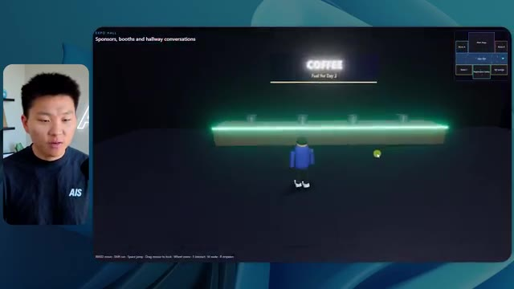
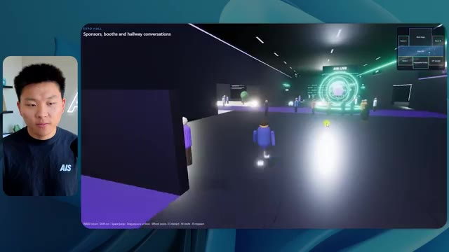
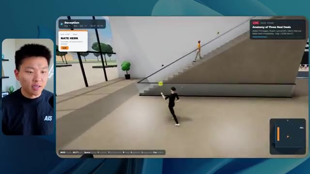

# 🎬 Fable 5.1 FINALLY Kills AI Website Slop

> **Chaîne** : [Nate Herk | AI Automation](https://www.youtube.com/@nateherk/featured)  
> **Lien YouTube** : [https://www.youtube.com/watch?v=FFWtxjvW2ts](https://www.youtube.com/watch?v=FFWtxjvW2ts)  
> **Date de publication** : 20260902  
> **Durée** : 00:16:13  
> **Identifiant vidéo** : `FFWtxjvW2ts`  
> **Transcription & Analyse** : `whisper-v3-large-turbo+gemini-3.5-flash-lite`  

---

## 📌 Synthèse Exécutive & Outils

### 💡 Résumé

La vidéo de la chaîne *Nate Herk | AI Automation* aborde une expérimentation empirique et comparative majeure autour de l'utilisation du modèle **Opus 5.5** et de sa configuration d'effort (« Effort Level »). Face à l'inflation de sites web génériques et superficiels produits par l'IA, le test pousse le modèle dans ses retranchements en lui confiant un mandat d'ingénierie complexe et immersif : transformer un dossier brut de 105 gigaoctets d'enregistrements vidéo (provenant de l'événement virtuel *AIS Live* stocké sur Frame.io) en un monde 3D interactif et explorable à la troisième personne, intégrant physique, design de marque, PNJ et intégration multimédia en direct. 

L'expérimentation confronte les différents niveaux d'effort du modèle (du niveau *Low* au niveau *High* / *Ultra Code*). Les résultats démontrent des divergences spectaculaires en matière de rendu visuel, de fidélité à la charte graphique, de gestion des PNJ, de temps de calcul et de coûts d'API. Le niveau *Low*, bien que rapide (16 minutes pour environ 3,91 $), génère des incohérences visuelles (logos absents, PNJ qui disparaissent, images statiques au lieu de flux vidéo). À l'inverse, le niveau *Medium* surprend par sa capacité à structurer fidèlement l'espace, à respecter les palettes de couleurs de la marque, à animer des avatars dynamiques et à intégrer de véritables flux vidéo fonctionnels, pour un coût de 12,44 $ et un temps de traitement d'un peu plus d'une heure.

Cette démonstration met en lumière le gouffre opérationnel existant entre un prototype superficiel généré par IA et une application logicielle fonctionnelle. Elle introduit également les problématiques de déploiement, soulignant la nécessité de combler le fossé entre l'environnement de développement local et la mise en ligne en production grâce à des solutions d'infrastructure intégrées.

### 🛠️ Outils, Modèles & Logiciels Présentés

* **Opus 5.5** : Modèle d'IA de pointe extrêmement performant, économique et polyvalent, utilisé comme moteur central pour l'ensemble des tâches de génération et d'ingénierie logicielle.
* **Claude Code** : Environnement et assistant de développement avancé d'Anthropic pour l'écriture, le test et l'orchestration de code en local.
* **Effort Level (Faible, Moyen, Élevé, Extra, Max, Ultra Code)** : Paramètre de configuration granulaire permettant d'ajuster la profondeur de réflexion, le temps de calcul et la rigueur d'exécution d'Opus 5.5.
* **Frame.io** : Plateforme cloud de gestion de contenu vidéo, utilisée ici pour stocker et structurer les 105 gigaoctets d'archives brutes de l'événement *AIS Live*.
* **Hostinger Connector** : Extension gratuite pour éditeurs de code permettant de lier l'environnement de développement (VS Code, Cursor, Claude Code, etc.) à l'infrastructure d'hébergement Hostinger en un seul clic pour un déploiement instantané.
* **Cursor / VS Code** : Éditeurs de code sources compatibles avec les extensions d'automatisation et de connectivité cloud.

### 🔑 Points Clés & Enseignements Stratégiques

* **Paramétrage de l'Effort Level** : Le choix du niveau d'effort (*Effort Level*) modifie radicalement la complexité architecturale et la finition du code généré, allant d'un simple prototype visuel instable à une application interactive hautement fonctionnelle.
* **Gestion de la complexité multimodale** : Le modèle est capable d'analyser un volume massif de données hétérogènes (105 Go de vidéos sur Frame.io) pour en extraire la structure événementielle (agenda, scènes, ateliers) et la retranscrire dans un environnement virtuel.
* **Rigueur visuelle et respect de l'identité de marque** : Les niveaux d'effort bas échouent à capturer l'identité visuelle (logos, palettes de couleurs *AIS Live*), tandis que les niveaux supérieurs intègrent avec précision la charte graphique de l'entreprise.
* **Stabilité et comportement des entités (PNJ)** : L'ingénierie d'agents appliquée aux mondes 3D révèle des limites techniques nettes aux niveaux d'effort inférieurs (disparition d'avatars, bugs d'affichage), corrigées ou atténuées par un niveau de calcul supérieur.
* **Intégration multimédia en temps réel** : La transformation d'un espace virtuel nécessite de passer d'images statiques (slides de présentation) à des flux vidéo dynamiques, un défi que seuls les niveaux d'effort intermédiaires à élevés parviennent à orchestrer correctement.
* **Analyse coût-bénéfice des exécutions API** : Un niveau d'effort bas a nécessité 16 minutes et 3,91 $ de tokens pour un résultat médiocre, tandis qu'un niveau moyen a nécessité 1 heure 13 minutes et 12,44 $ pour un résultat qualitativement exploitable.
* **Autonomie des agents et zéro-shot prompting** : Dans tous les cas testés, le modèle a exécuté le mandat global (*slash goal*) de manière totalement autonome sans poser la moindre question de clarification à l'utilisateur.
* **La transition du code local à la production** : Le gouffre classique du développement assisté par IA réside dans l'obtention d'un produit fini fonctionnel en local sans pipeline de déploiement immédiat vers le Web.
* **Recommandation d'ingénierie d'Anthropic** : Les directives officielles préconisent de débuter les prompts complexes au niveau d'effort « moyen », puis d'ajuster vers le haut ou le bas en fonction des exigences de performance et de complexité observées.
* **Dépassement de la « bouillie de sites web »** : L'utilisation conjointe d'Opus 5.5 et de Claude Code avec un niveau d'effort maîtrisé permet de s'affranchir des interfaces web génériques et sans âme pour concevoir des expériences logicielles hautement personnalisées.

---

## ⏱️ Chronologie & Transcription Complète Audio & Visuelle (Mot pour Mot)

### ⏱️ `[00:00:00 - 00:00:20]` | Segment #01

**🔊 Audio (Transcription Intégrale Mot pour Mot en Français) :**
> Opus 5.5, Opus 5.5, Opus 5.5, Opus 5.5, Opus 5.5. Ce modèle est littéralement partout et pour de très bonnes raisons. Il est intelligent, il est bon marché, il a un goût incroyable, c'est un modèle d'IA incroyable. Mais avec chaque modèle d'IA, vous avez le choix de l'effort, que ce soit faible, moyen, élevé, extra, max ou ultra code.

**👁️ Analyse Visuelle d'Écran (gemini-3.5-flash-lite) :**
**Interface & Outils** : Interface du réseau social X (Twitter).

**Contenu textuel & Code** : Publication textuelle sur X (« It's a great time for hobbyists... ») avec une vidéo intégrée montrant un environnement virtuel généré ou une simulation 3D.

**Action / Démonstration** : Affichage d'un tweet illustrant les capacités des modèles d'IA générative dans la création visuelle et 3D.

*⏱️ 00:00:05 — Une capture d'écran d'une publication sur les réseaux sociaux (X / Twitter) montrant un tweet avec un média vidéo intégré représentant un paysage tropical en 3D.*

---

### ⏱️ `[00:00:20 - 00:00:38]` | Segment #02

**🔊 Audio (Transcription Intégrale Mot pour Mot en Français) :**
> Donc dans cette vidéo, j'ai donné exactement le même prompt à Opus 5.5 et je l'ai exécuté à tous les niveaux d'effort possibles, et nous allons comparer les résultats. Nous examinerons la qualité de toutes les différentes sorties réelles, mais nous allons également voir combien de temps chacun d'eux a pris pour s'exécuter, combien cela nous a coûté si c'était facturé par l'API, le nombre total de tokens, combien de vérifications ils ont effectuées, et combien de questions ils m'ont réellement posées tout au long du processus.

**👁️ Analyse Visuelle d'Écran (gemini-3.5-flash-lite) :**
**Interface & Outils** : Application de tableau blanc / interface de comparaison visuelle (type Miro ou Canva)

**Contenu textuel & Code** : Tableau comparatif des performances de Opus 5.5 avec les lignes : Run time, API cost, Total tokens, Checks, Questions asked et les colonnes : Low, Medium, High, Extra, Max, Ultracode.

**Action / Démonstration** : Présentation du plan de comparaison des performances et des coûts selon les niveaux d'effort du modèle.

*⏱️ 00:00:29 — Un tableau de comparaison structuré affichant différents niveaux d'effort (Low, Medium, High, Extra, Max, Ultracode) avec des métriques comme Run time, API cost, Total tokens, Checks et Questions asked.*

---

### ⏱️ `[00:00:39 - 00:00:58]` | Segment #03

**🔊 Audio (Transcription Intégrale Mot pour Mot en Français) :**
> Et les résultats que nous avons obtenus ne sont pas du tout ce à quoi je m'attendais, donc j'ai hâte de partager cela avec vous les gars. Ne perdons pas de temps et allons directement à celui-ci. D'accord, alors plongeons-nous directement dans celui-ci. Je veux commencer juste en vous montrant le prompt réel que nous avons utilisé, que nous avons donné à chacun de ces différents agents. Je vais aller dans les fichiers ici, et nous allons ouvrir ce fichier markdown de prompt, et je vais vous montrer ce que nous avons obtenu. Voici donc le slash objectif que j'ai fourni.

**👁️ Analyse Visuelle d'Écran (gemini-3.5-flash-lite) :**
**Interface & Outils** : Interface de l'éditeur/outil de développement (type interface web d'agent IA ou IDE moderne).

**Contenu textuel & Code** : Message affiché : "Hi Nate. This worktree has the effort-test task queued in PROMPT.md : build a walkable third-person 3D world of the AIS Live conference..."

**Action / Démonstration** : Présentation de l'interface de travail et du prompt initial pour un test d'effort sur un projet 3D.

*⏱️ 00:00:48 — Interface d'une application de développement avec un panneau latéral montrant différents projets et tests d'effort, et une zone de discussion affichant un prompt sur la création d'un monde 3D.*

---

### ⏱️ `[00:00:58 - 00:01:34]` | Segment #04

**🔊 Audio (Transcription Intégrale Mot pour Mot en Français) :**
> J'ai dit, tu dois me créer un monde 3D qui est une conférence tech réaliste dans laquelle je peux me promener en vue à la troisième personne. Tu vas regarder ce dossier, qui contient mes ressources d'enregistrement d'événements de AIS Live. Et ce dossier est un dossier frame IO de 105 gigaoctets d'enregistrements vidéo. C'était un événement complètement virtuel. Tout a été enregistré et tous les enregistrements sont ici. J'ai dit, ton objectif est de prendre cet événement et de le transformer en un monde 3D explorable qui me donne l'impression d'être réellement allé à une vraie conférence en personne avec différentes salles, différentes pistes, différentes scènes, bla, bla, bla. N'hésite pas à utiliser key.ai si tu as besoin de générer des images ou des vidéos. Et tu peux aussi utiliser tout ce qui se trouve dans mon projet Herc 2, qui est comme mon système d'exploitation IA. J'ai dit,

**👁️ Analyse Visuelle d'Écran (gemini-3.5-flash-lite) :**
**Interface & Outils** : Éditeur de code (VS Code/Cursor) et interface web Frame.io

**Contenu textuel & Code** : Fichier Markdown PROMPT.md contenant les instructions détaillées pour l'IA et lien Frame.io vers les 105 Go de ressources vidéos.

**Action / Démonstration** : Présentation du prompt initial et des ressources nécessaires pour la génération du monde 3D de conférence.

*⏱️ 00:01:07 — Éditeur de texte affichant le fichier PROMPT.md avec les instructions pour créer un monde 3D de conférence tech.*

*⏱️ 00:01:16 — Interface cloud Frame.io montrant un dossier de 105.69 Go contenant les ressources d'enregistrement des événements AIS Live.*

*⏱️ 00:01:25 — Retour sur l'éditeur de texte affichant le prompt détaillé demandant de transformer les enregistrements virtuels en monde 3D explorable.*

---

### ⏱️ `[00:01:34 - 00:02:08]` | Segment #05

**🔊 Audio (Transcription Intégrale Mot pour Mot en Français) :**
> vous serez jugés sur la créativité, le design, la physique et la sensation générale alors que j'explore le monde en 3D que vous avez construit. Et c'était pratiquement la fin des instructions. Donc comme vous pouvez le voir sur ce côté gauche, j'ai exécuté ceci à travers tous les différents niveaux d'effort. Commençons par le niveau bas et remontons jusqu'à ultra code. Très bien. Donc ici nous avons le résultat du niveau bas. Ouvrons ceci et jetons un œil. Donc nous avons AIS Live, le sommet des services IA en personne enfin, et nous avons pu cliquer partout. Tout d'abord, on ne sent pas vraiment l'image de marque. Genre, ce n'ha pas le logo d'IS Live. Ce n'est même pas nos couleurs. Donc je n'aime pas trop ça, mais entrons ici. D'accord. C'est beaucoup trop lumineux. Euh, nous avons une carte en haut à droite. Nous avons une ville par ici. Je ne peux pas dire quelle ville c'est

**👁️ Analyse Visuelle d'Écran (gemini-3.5-flash-lite) :**
**Interface & Outils** : Application web / interface d'agent IA (avec panneau latéral de sessions et zone de chat)

**Contenu textuel & Code** : Texte du prompt demandant de construire un monde 3D à la première/troisième personne pour la conférence AIS Live, avec différentes sessions de test d'effort (Hello, Extra, High, Max, Ultracode, Medium, Low).

**Action / Démonstration** : Navigation et sélection des différents niveaux de test d'effort dans l'interface de l'agent IA.

*⏱️ 00:01:42 — Interface d'une application d'assistant IA montrant une liste de niveaux d'effort sur le panneau de gauche et un message d'interaction avec l'agent dans le panneau principal.*

---

### ⏱️ `[00:02:08 - 00:02:40]` | Segment #06

**🔊 Audio (Transcription Intégrale Mot pour Mot en Français) :**
> C'est. D'accord. C'est Chicago, ce qui est plutôt cool parce que tu sais, j'habite à Chicago, mais bref, en haut à droite, on peut voir une carte. On a un lobby. On a un hall d'exposition. On a le salon VIP, la scène principale. La carte montre aussi où se trouve chaque autre personne et ça se synchronise en direct. Donc on peut voir l'enregistrement. On peut voir le premier jour, la keynote Hyper Agent, le débriefing en direct. Cool. Donc ça connaît vraiment l'agenda et puis il y a le deuxième jour. Donc ça a trouvé ça, c'est bien. On a ces petites balles ici que je peux espérer projeter d'un coup de pied. D'accord. Le visage, oh, regarde ça. Si je vais par ici, tous les gens disparaissent tout simplement. Très mauvais. Très mauvais. D'accord. Alors voyons voir. Est-ce que je peux sprinter ? D'accord.

**👁️ Analyse Visuelle d'Écran (gemini-3.5-flash-lite) :**
**Interface & Outils** : Application web interactive / Plateforme virtuelle en 3D

**Contenu textuel & Code** : Interface utilisateur virtuelle affichant des plans d'étage, un panneau de programme "DAY 1" et des avatars d'utilisateurs.

**Action / Démonstration** : Navigation et exploration d'un environnement virtuel interactif représentant un événement.

*⏱️ 00:02:16 — Vue d'un monde virtuel interactif montrant le retrait des badges avec une mini-carte en haut à droite.*

*⏱️ 00:02:24 — Vue du lobby virtuel de l'événement avec un panneau affichant le programme du premier jour et la carte de navigation.*

*⏱️ 00:02:32 — Vue de l'hall d'exposition virtuel avec des avatars d'utilisateurs et des zones lumineuses interactives.*

---

### ⏱️ `[00:02:40 - 00:03:04]` | Segment #07

**🔊 Audio (Transcription Intégrale Mot pour Mot en Français) :**
> Je peux avancer un peu plus vite. Je vais d'abord aller par ici. Il y a des produits dérivés, euh, un sweat à capuche certifié AIS plus. D'accord. Donc il y a les vrais stands qu'on avait dans l'événement virtuel. On avait des stands. Donc c'est plutôt cool. Un petit endroit pour prendre des photos. Salle C. En ce moment, nous avons Tangy Frederick qui anime un atelier. D'accord. Mais ce n'est pas une vidéo. Comme vous pouvez le voir, c'est juste une image. Elle ne bouge pas. Donc c'est juste une image. Ces gens sont en train de disparaître. Ce doivent être des fantômes. Allons par ici dans la salle A.

**👁️ Analyse Visuelle d'Écran (gemini-3.5-flash-lite) :**
**Interface & Outils** : Application de métavers ou monde virtuel 3D interactif.

**Contenu textuel & Code** : Environnement virtuel 3D interactif avec des écrans d'affichage textuels et des stands.

**Action / Démonstration** : Navigation et exploration d'un événement virtuel en 3D par l'avatar.

---

### ⏱️ `[00:03:04 - 00:03:30]` | Segment #08

**🔊 Audio (Transcription Intégrale Mot pour Mot en Français) :**
> Nous avons Liberty White. D'accord. Très cool. Vos 30 premiers jours en automatisation. Encore une fois, c'est juste une image fixe et les gens ont des bugs d'affichage. Donc ce n'est pas très bon ici. Je vais aller sur la scène principale et voir ce que nous avons. D'accord, cool. Donc nous avons une scène principale. Les gens ont des bugs d'affichage. Vraiment mauvais. Ce n'est vraiment pas bon du tout. Notre vidéo est en train de bouger. Genre, j'ai vu mon visage ici et j'ai vu celui de Devin, mais maintenant ils ont disparu. Donc je ne sais pas ce qui s'est passé. D'accord. On dirait que c'est plutôt un diaporama. Rien n'est vraiment diffusé pour l'instant. Quoi qu'il en soit, entrons ici.

**👁️ Analyse Visuelle d'Écran (gemini-3.5-flash-lite) :**
**Interface & Outils** : Application web interactive / Environnement virtuel 3D de conférence en ligne.

**Contenu textuel & Code** : Interface utilisateur virtuelle de type jeu vidéo avec commandes de déplacement et mini-carte de navigation en haut à droite.

**Action / Démonstration** : Navigation et déplacement d'un avatar à l'intérieur d'un événement virtuel en ligne (sommet sur l'IA).

*⏱️ 00:03:11 — Vue d'un espace virtuel interactif (type métavers) montrant un avatar dans une pièce étiquetée 'Foundation track' avec des plateformes lumineuses.*

*⏱️ 00:03:17 — Vue de la scène principale 'Main Stage' dans le monde virtuel avec de nombreux avatars assis dans un auditorium virtuel et le texte 'Hyperagent Workshop'.*

*⏱️ 00:03:24 — Vue panoramique de la scène principale 'AIS LIVE AI Services Summit' dans l'environnement virtuel avec un grand écran central et des ballons.*

---

### ⏱️ `[00:03:30 - 00:03:58]` | Segment #09

**🔊 Audio (Transcription Intégrale Mot pour Mot en Français) :**
> Nous avons plus de stands. Nous avons hyper agent. Nous avons Claude Code. Nous avons plus de goodies. La salle B, c'est Dave Ebelor. Je suppose que c'est exactement la même chose. Nous avons du café. Et puis, je suppose, le salon VIP, accès VIP seulement. C'est plutôt cool, mais il n'y a vraiment rien qui se passe ici. Cet écran est bien trop lumineux. Bon. Donc je pense que vous comprenez l'ambiance qu'on obtient ici avec Opus 5.5 en effort faible. Et c'est là que les choses deviennent intéressantes. À combien est-ce que vous pensez que cela a tourné ? Combien de temps ? Celui-ci a tourné pendant 16 minutes et 43 secondes. Combien est-ce que vous pensez que cela a coûté ?

**👁️ Analyse Visuelle d'Écran (gemini-3.5-flash-lite) :**
**Interface & Outils** : Application 3D interactive et interface de tableau/diagramme en ligne (Opus 5.5 Efforts).

**Contenu textuel & Code** : Tableau comparatif des niveaux d'effort (Low, Medium, High, Extra, Max, Ultracode) et métriques associées.

**Action / Démonstration** : Exploration d'un monde virtuel 3D et présentation d'un tableau comparatif d'efforts d'IA.

*⏱️ 00:03:37 — Vue dans un monde virtuel 3D représentant un espace d'exposition (Expo Hall) avec un comptoir "COFFEE".*

*⏱️ 00:03:44 — Navigation d'un avatar dans le salon virtuel 3D montrant des stands et des zones d'exposition.*

*⏱️ 00:03:51 — Interface de tableau comparatif intitulée "Opus 5.5 Efforts" avec des niveaux de Low à Ultracode et des métriques (Run time, API cost, Total tokens).*

---

### ⏱️ `[00:03:58 - 00:04:26]` | Segment #10

**🔊 Audio (Transcription Intégrale Mot pour Mot en Français) :**
> 3,91 dollars si c'était une facturation par API. J'utilise évidemment mon abonnement ici, mais nous allons simplement calculer cela avec la facturation par API. Le nombre total de tokens était de 191 000. Il a fait 22 vérifications. Donc pour la vérification, il a ouvert le navigateur 22 fois et a exécuté différents types de vérifications. Donc 22 catégories de vérifications. Et combien de questions m'a-t-il posées ? Il m'a posé un total de zéro question tout au long de ce prompt avec la commande slash goal. D'accord. Alors, ouvrons l'effort moyen et voyons ce que nous avons obtenu. D'accord, c'est parti. Effort moyen. Nous avons Nate Herc. Nous avons mon badge. C'est du contenu de la marque AI's Life.

**👁️ Analyse Visuelle d'Écran (gemini-3.5-flash-lite) :**
**Interface & Outils** : Tableau blanc numérique / outil de diagramme interactif (type Excalidraw)

**Contenu textuel & Code** : Tableau comparatif affichant les métriques : Run time (16m 43s), API cost ($3.91), Total tokens (191.3K), Checks, et Questions asked sous les colonnes Low, Medium, High, Ext.

**Action / Démonstration** : Le présentateur commente et analyse les coûts et performances affichés dans le tableau pour le test 'Low'.

*⏱️ 00:04:05 — Capture d'écran montrant un tableau de données sur un tableau blanc virtuel avec le présentateur en incrustation à gauche, détaillant les performances pour le niveau 'Low' (Run time: 16m 43s, API cost: $3.91, Total tokens: 191.3K).*

---

### ⏱️ `[00:04:26 - 00:04:46]` | Segment #11

**🔊 Audio (Transcription Intégrale Mot pour Mot en Français) :**
> Donc ça a déjà l'air un petit peu mieux. Ça ressemble à nos palettes de couleurs qui ont utilisé nos directives de marque. Premier jour de construction, deuxième jour de gain, VIP. Cool. D'accord. Je vais entrer dans le lieu. D'accord. Waouh. Une ambiance similaire, en gros. C'est en arrière-plan. Ça ne ressemble pas à Chicago, hein ? Non, ça ressemble à, honnêtement, ça ressemble à une ville inventée. Quoi qu'il en soit, c'est marrant qu'ils aient décidé de faire ça. Voyons si je peux me déplacer un peu plus vite. Oh, waouh.

**👁️ Analyse Visuelle d'Écran (gemini-3.5-flash-lite) :**
**Interface & Outils** : Application web interactive / environnement virtuel 3D (type Gather.town ou similaire)

**Contenu textuel & Code** : Écran d'accueil de l'événement 'AIS Live' avec badges et contrôles de navigation

**Action / Démonstration** : Le présentateur clique sur 'Enter the Venue' pour entrer dans l'environnement virtuel 3D.

*⏱️ 00:04:31 — Interface d'accueil de l'application 'AIS Live' montrant un badge de conférence personnalisé au nom de Nate Herk et un bouton 'Enter the Venue'.*

*⏱️ 00:04:41 — Vue à la première ou troisième personne à l'intérieur du lieu virtuel 3D avec des avatars et une vue sur une ville illuminée la nuit à travers de grandes baies vitrées.*

---

### ⏱️ `[00:04:46 - 00:05:21]` | Segment #12

**🔊 Audio (Transcription Intégrale Mot pour Mot en Français) :**
> Les gens interagissent avec moi. Regardez. Si je m'approche de ce type, il vient de lever le bras. Bon, maintenant il ne veut plus du tout avoir affaire à moi. Mais tous ces petits robots ici doivent prendre des décisions. Je ne sais pas s'ils utilisent Jev. C'est sûr que non. Je ne lui ai pas dit de le faire. En fait, ma clé Jev est à l'arrière. Je ne sais pas. Peut-être qu'il l'a utilisée. Quoi qu'il en soit, nous pouvons voir ici que nous avons la salle d'atelier C, le laboratoire des agents. Sympa. Donc celui-ci est en fait en train de fonctionner. Vous pouvez voir qu'il s'agit d'une vraie vidéo lue par Tangy. Tout le monde ici est en train de travailler sur un ordinateur portable. Ils ne buguent pas. C'est plutôt cool. De plus, mon badge est sur ma poitrine, ce qui est plutôt cool. Je peux venir par ici. Nous avons une carte en haut à droite, comme vous pouvez le voir, mais je peux venir par ici. Nous avons un

**👁️ Analyse Visuelle d'Écran (gemini-3.5-flash-lite) :**
**Interface & Outils** : Application de monde virtuel 3D / environnement de simulation (style jeu vidéo)

**Contenu textuel & Code** : Environnement virtuel 3D interactif avec des personnages non-joueurs (NPC) ou avatars d'agents IA, affichant des informations de session en bas à gauche ("Enterprise AI Services").

**Action / Démonstration** : Exploration d'un monde virtuel 3D où des avatars autonomes se déplacent et interagissent.

---

### ⏱️ `[00:05:21 - 00:05:47]` | Segment #13

**🔊 Audio (Transcription Intégrale Mot pour Mot en Français) :**
> hall d'exposition. C'est ici que nous avons le stand Glido. Et ça diffuse actuellement. Oui, ça diffuse la vidéo de nous parlant de Glido. Ça diffuse la vidéo d'Ed et de moi parlant de notre programme de certification. Nous avons le logo AIS Plus ici, qui est un peu mal placé. Ce sont les diapositives des conférenciers et les points clés. Alors wow, ce sont toutes les ressources que nous avons distribuées après l'événement. Elles sont toutes là aussi. Nous pouvons voir que nous avons un projecteur sur la communauté. Donc c'est Aiden qui parle de son contrat qu'il a décroché et ça se joue en direct. Ces gens regardent.

**👁️ Analyse Visuelle d'Écran (gemini-3.5-flash-lite) :**
**Interface & Outils** : Environnement virtuel 3D de type metaverse / exposition virtuelle.

**Contenu textuel & Code** : Écrans virtuels affichant des présentations, des diaporamas et des textes informatifs dans l'espace 3D.

**Action / Démonstration** : Navigation et exploration d'un hall d'exposition virtuel par le présentateur.

---

### ⏱️ `[00:05:47 - 00:06:21]` | Segment #14

**🔊 Audio (Transcription Intégrale Mot pour Mot en Français) :**
> Ils sont plutôt engagés. On a l'hyper agent. C'était, c'est ce que je voulais dire. Si vous avez vu ces gens lever les bras pour dire bonjour, c'était plutôt marrant. Regardez, regardez, le voilà qui recommence. Bref. Bon. Où est-ce que je suis maintenant ? Maintenant, je suis dans le hall principal. On a un bar à café. On a un grand logo, qui est le vrai logo. Il est trop lumineux, mais on a le logo. On peut voir si on peut entrer ici dans le parcours fondation. On a Sabrina Romanov et Liberty White. Donc différentes formations juste là. On peut entrer dans cette salle. C'est le parcours avancé. Alors qu'est-ce qui se passe ici. On a Dave Ebelar et Saman qui parlent de différentes choses là-dedans. Et maintenant allons jeter un œil à la scène principale. Oh, attendez, il y a une vidéo de moi là-haut. C'est du genre VIP

**👁️ Analyse Visuelle d'Écran (gemini-3.5-flash-lite) :**
**Interface & Outils** : Application de monde virtuel 3D / plateforme de métavers pour événement.

**Contenu textuel & Code** : Environnement virtuel 3D avec avatars interactifs, mini-carte et interface de navigation.

**Action / Démonstration** : Exploration et navigation dans un espace virtuel de type métavers ou salon virtuel.

---

### ⏱️ `[00:06:21 - 00:06:50]` | Segment #15

**🔊 Audio (Transcription Intégrale Mot pour Mot en Français) :**
> section ? Ouais, on ira voir ça dans une minute. Mais bref, voici la scène principale. Ça a l'air vraiment, vraiment très bien. On a une grande scène. On a genre quatre personnes assises ici. On a les trois écrans d'Alex là-haut avec l'hyper agent. Est-ce que j'ai le droit de monter sur scène ? Oh, et il me laisse monter sur scène. D'accord. C'est plutôt sympa. Bon les gars, faisons un selfie. Laissez-moi prendre tout le monde en arrière-plan. Venez par ici. Bref, c'est vraiment, vraiment cool. Par contre, toutes les places ne sont pas occupées. Donc il faut qu'on travaille là-dessus. Mais bref, je vais retourner voir ce que c'était que cette section VIP. D'accord. Le salon VIP. J'ai l'impression que c'est comme un aéroport ou un truc comme ça.

**👁️ Analyse Visuelle d'Écran (gemini-3.5-flash-lite) :**
**Interface & Outils** : Application de visioconférence ou d'événement virtuel 3D (Hyperagent / environnement de conférence immersive).
[DESC_IMAGE_3] Environnement virtuel 3D interactif avec avatars, écrans de présentation et mini-carte de navigation.

**Contenu textuel & Code** : Explications orales et mise en contexte méthodologique.

**Action / Démonstration** : Navigation et exploration de la scène virtuelle 3D par l'utilisateur.

*⏱️ 00:06:28 — Vue d'une conférence virtuelle 3D (Hyperagent Keynote) montrant une grande salle remplie d'avatars et un écran géant de présentation.*

*⏱️ 00:06:36 — Vue depuis la scène virtuelle montrant quatre personnes assises et des participants dans la salle.*

*⏱️ 00:06:43 — Vue en plongée de la salle de conférence virtuelle avec les spectateurs assis le long d'une allée lumineuse.*

---

### ⏱️ `[00:06:51 - 00:07:14]` | Segment #16

**🔊 Audio (Transcription Intégrale Mot pour Mot en Français) :**
> OK, super. Donc maintenant nous avons les sessions VIP ici. Une foire aux questions VIP avec Nate, lecture vidéo en direct juste ici. Très, très cool. Et nous avons comme un bar ou quelque chose du genre. Génial. Je dirais que c'est un plutôt bon résultat. Maintenant, en ce qui concerne les statistiques ici, celui-ci a pris une heure et 13 minutes à s'exécuter. Il nous aurait coûté 12 dollars et 44 cents. Il a utilisé 490 000 jetons et il a effectué 23 vérifications.

**👁️ Analyse Visuelle d'Écran (gemini-3.5-flash-lite) :**
**Interface & Outils** : Application virtuelle 3D / Interface web de tableau de bord (Opus 5.5 Efforts)

**Contenu textuel & Code** : Métriques de performance (Run time: 16m 43s, API cost: $3.91, Total tokens: 191.3K, Checks: 22)

**Action / Démonstration** : Présentation des sessions VIP virtuelles puis transition vers l'analyse des statistiques d'exécution.

*⏱️ 00:06:56 — Capture montrant un espace virtuel 3D (lounge VIP) avec des avatars d'utilisateurs et un grand écran vidéo affichant le présentateur, ainsi qu'une incrustation vidéo du présentateur à gauche.*

*⏱️ 00:07:02 — Capture montrant un tableau comparatif ou un tableau de bord (Opus 5.5 Efforts) affichant des métriques telles que le temps d'exécution, le coût API et le total des tokens.*

---

### ⏱️ `[00:07:14 - 00:07:48]` | Segment #17

**🔊 Audio (Transcription Intégrale Mot pour Mot en Français) :**
> Et il nous a posé un total de zéro question une fois de plus. Très bien, passons à élevé. C'était déjà un résultat plutôt correct et Anthropic eux-mêmes dans leur vidéo, ou désolé, pas une vidéo, un article sur comment prompter Opus 5.5, ils ont dit de commencer simplement par moyen et de l'ajuster vers le haut ou vers le bas si besoin. C'était donc un résultat moyen. Passons à élevé et voyons ce que nous avons obtenu. Très rapidement, les gars, je dois prendre une seconde pour vous parler du sponsor de la vidéo d'aujourd'hui, Hostinger. Donc ces deux modèles viennent de me construire une version fonctionnelle de la même chose. Et maintenant, je me retrouve exactement là où je finis toujours, avec un produit fini sur mon ordinateur portable et aucun moyen rapide de le mettre en ligne. Et c'est précisément le fossé que le connecteur d'Hostinger comble. C'est une extension gratuite

**👁️ Analyse Visuelle d'Écran (gemini-3.5-flash-lite) :**
**Interface & Outils** : Tableau de bord de métriques de modèles IA et éditeur de code/interface d'agent (ex: Cursor / VS Code).

**Contenu textuel & Code** : Tableau de données comparatives des coûts et performances d'exécution, et instructions textuelles pour créer un calculateur de ROI en HTML/JS.

**Action / Démonstration** : Comparaison des résultats selon les différents niveaux d'effort du modèle et analyse des métriques de génération.

*⏱️ 00:07:22 — Un tableau comparatif des performances de différents niveaux d'effort (Low, Medium, High, Extra) avec les métriques associées (Run time, API cost, Total tokens, Checks, Questions asked).*

*⏱️ 00:07:39 — Une interface de développement avec un éditeur affichant le prompt de construction d'un calculateur de ROI et l'avancement de l'agent IA.*

---

### ⏱️ `[00:07:48 - 00:08:23]` | Segment #18

**🔊 Audio (Transcription Intégrale Mot pour Mot en Français) :**
> pour votre éditeur qui intègre votre compte Hostinger dans l'environnement où vous codez déjà. Que ce soit VS Code, Cursor, Cloud Code, Codex, peu importe. Vous vous connectez une seule fois en un clic, et à partir de là, votre agent peut déployer le site, y pointer un nom de domaine, configurer les enregistrements DNS et vérifier votre VPS sans jamais avoir à quitter l'éditeur. Ainsi, peu importe celui de ces outils que vous préférez, ce qu'il a construit n'est qu'à quelques minutes d'une véritable URL sur un hébergement géré. Le connecteur est gratuit avec toutes les formules d'hébergement, donc si vous avez encore besoin de l'hébergement sous-jacent, profitez de la formule illimitée grâce au lien dans la description et utilisez le code NATEHERK pour obtenir 10 % de réduction. Cela inclut également un nom de domaine gratuit et un e-mail professionnel pour un an. Et c'est toujours le moyen le plus économique que j'ai trouvé pour obtenir un

**👁️ Analyse Visuelle d'Écran (gemini-3.5-flash-lite) :**
**Interface & Outils** : Interface de gestion Hostinger connectée à un IDE et terminal Claude Code

**Contenu textuel & Code** : Statut "Connected via OAuth", Node.js 24.13.0, liste des outils disponibles avec options cochées (Websites, Domains, Subscriptions & Payments, Email Marketing).

**Action / Démonstration** : Connexion du compte Hostinger à l'IDE pour permettre à l'agent d'accéder aux outils de gestion de sites web, domaines et abonnements.

*⏱️ 00:07:57 — Interface montrant l'intégration de Hostinger dans l'IDE avec un statut connecté via OAuth et la liste des outils disponibles (Websites, Domains, Subscriptions, Email Marketing), ainsi qu'une fenêtre Claude Code à droite.*

---

### ⏱️ `[00:08:23 - 00:08:47]` | Segment #19

**🔊 Audio (Transcription Intégrale Mot pour Mot en Français) :**
> tu as construit sur une vraie URL. Donc revenons à la vidéo. D'accord. Encore une fois, très, très marqué par la marque. C'est un écran de chargement encore mieux que le précédent. Nous avons ce petit effet sympa en arrière-plan. Nous avons le logo. Nous allons entrer dans le lieu. D'accord. Nous y voilà. Ça a l'air plutôt bien. Nous commençons à l'extérieur et vous pouvez voir que nous avons ces drapeaux pour tous les intervenants, Wyatt, Casper, Alex, Ed, Aiden, Sabrina, Liberty. C'est plutôt cool. Nous avons des blocs en direct ici.

**👁️ Analyse Visuelle d'Écran (gemini-3.5-flash-lite) :**
**Interface & Outils** : Application web 3D immersive (plateforme virtuelle AIS Live / RingCentral)

**Contenu textuel & Code** : Interface utilisateur 3D avec bannières d'intervenants, mini-carte et instructions de déplacement

**Action / Démonstration** : Navigation et exploration de l'espace virtuel 3D par le présentateur

*⏱️ 00:08:29 — Écran de chargement de l'événement virtuel AIS Live avec le logo et le bouton 'Enter the Venue'.*

*⏱️ 00:08:35 — Vue dans le monde virtuel 3D (AIS Live Plaza) montrant des avatars et des bâtiments urbains au loin.*

*⏱️ 00:08:41 — Exploration de la place virtuelle avec des bannières verticales affichant les noms des intervenants de l'événement.*

---

### ⏱️ `[00:08:47 - 00:09:23]` | Segment #20

**🔊 Audio (Transcription Intégrale Mot pour Mot en Français) :**
> ça a pris cette photo de moi, votre hôte, Nate Herc, John, Dave, Nate Herc. Voilà. OK. Les portes. Génial. Ce sont des portes coulissantes automatiques en verre. J'adore ça. On peut voir l'enregistrement VIP. On peut voir l'admission générale. On peut venir par ici et on peut découvrir l'exposition avec différents stands, le projecteur sur la communauté. Vous pouvez aussi voir qu'en haut à gauche, j'ai un passeport. Donc c'est comme si, ça montrera combien d'endroits j'ai visités. Tout cela est une vraie lecture. Nous avons un mur de ressources avec tous les différents intervenants. Ils ont aussi une session de réseautage par ici. Je vais donc venir très vite et voir de quoi il retourne. Nous avons donc le bar à cold brew AIS. Nous avons différents membres de la communauté qui ont été mis en avant ou mis en lumière.

**👁️ Analyse Visuelle d'Écran (gemini-3.5-flash-lite) :**
**Interface & Outils** : Application ou plateforme virtuelle 3D (type métavers / espace d'événement virtuel)

**Contenu textuel & Code** : Éléments textuels de l'interface virtuelle : 'Registration Concourse', 'VIP Check-In', 'Expo Hall', 'PASSPORT'.

**Action / Démonstration** : Navigation et exploration de l'espace virtuel par l'avatar de l'utilisateur.

*⏱️ 00:08:56 — Vue d'un espace virtuel 3D de type métavers avec une scène principale et des comptoirs d'enregistrement.*

*⏱️ 00:09:05 — Navigation dans une zone d'exposition virtuelle (Expo Hall) avec des stands et des avatars interactifs.*

*⏱️ 00:09:14 — Déplacement dans le hall de la zone d'enregistrement avec des portes en verre et des avatars de visiteurs.*

---

### ⏱️ `[00:09:23 - 00:09:56]` | Segment #21

**🔊 Audio (Transcription Intégrale Mot pour Mot en Français) :**
> Nous avons l'aile VIP. Attends, quoi ? Prends un bracelet. Oh, je dois vraiment aller chercher le bracelet. D'accord. Laisse-moi m'enregistrer rapidement. Le bracelet est déjà mis. Attends, quoi ? D'accord. Oh, d'accord. Maintenant, les portes se sont ouvertes pour moi. Cool. Je peux entrer ici. Oh, ça mène juste à la scène principale. Salon VIP. Il y a une séance de questions-réponses en cours. Ça a l'air très cool. Je veux dire, je suis très impressionné par la façon dont il est capable de faire ça. Waouh. D'accord. Donc c'est vraiment bien. Ce qu'on a fait, c'est qu'on a eu des salles de discussion VIP avec différentes personnes. Tu peux voir qu'il y a différentes salles, différents membres de l'équipe AIS qui vont dans des trucs. C'est vraiment cool. C'est très cool. C'est un VIP bien meilleur

**👁️ Analyse Visuelle d'Écran (gemini-3.5-flash-lite) :**
**Interface & Outils** : Application de métavers / espace virtuel 3D interactif

**Contenu textuel & Code** : Interface d'événement virtuel avec cartes, avatars, bannières thématiques ("Price It Right", "Land Your First Paying Client") et sous-titres contextuels

**Action / Démonstration** : Navigation d'un avatar à travers l'espace virtuel de l'événement et exploration des différentes salles VIP

*⏱️ 00:09:32 — Vue d'un espace virtuel 3D de type salon d'événement (Registration Concourse) avec un avatar en mouvement.*

*⏱️ 00:09:40 — Vue de la salle VIP Lounge dans l'espace virtuel avec des avatars assis sur des canapés et un grand écran vidéo affichant le présentateur.*

*⏱️ 00:09:48 — Vue de la section des sessions de travail VIP (VIP Working Sessions) avec plusieurs tables de discussion thématiques.*

---

### ⏱️ `[00:09:56 - 00:10:30]` | Segment #22

**🔊 Audio (Transcription Intégrale Mot pour Mot en Français) :**
> expérience que ce qui a été montré dans la première partie. D'accord. After party VIP. Regardez ça. On a une piste de danse. On a tous ces éléments ici. On a la lecture réelle de l'after party VIP juste ici. Et il y a une estrade de DJ. C'est trop marrant. Il y a un petit bug juste ici, un petit glitch juste là, mais c'est génial. Oh, cool. Donc quand je suis ici sur la scène principale, on a des sous-titres. Vous pouvez voir juste ici en bas de mon écran, on a ces sous-titres de Wyatt qui est en train de parler ici. On a des lumières. On a le panel. Très cool. Belle scène principale. Je vais aller par ici. On peut aller à la fondation,

**👁️ Analyse Visuelle d'Écran (gemini-3.5-flash-lite) :**
**Interface & Outils** : Application web / environnement virtuel 3D interactif de type événement en ligne.

**Contenu textuel & Code** : Environnement virtuel 3D affichant une piste de danse "VIP After-Party", des avatars d'utilisateurs et un grand écran montrant les flux vidéo des participants.

**Action / Démonstration** : Navigation et présentation d'une plateforme virtuelle interactive avec des espaces de type "after-party" et "main stage".

*⏱️ 00:10:04 — Capture montrant l'interface virtuelle d'une after-party VIP avec piste de danse, avatars et écran géant de visioconférence.*

*⏱️ 00:10:13 — Vue légèrement différente de la même after-party virtuelle avec des participants représentés par des avatars et des ballons de plage.*

---

### ⏱️ `[00:10:30 - 00:11:06]` | Segment #23

**🔊 Audio (Transcription Intégrale Mot pour Mot en Français) :**
> avancé, et les parcours d'entreprise ici. Alors voyons voir. Nous avons l'anatomie de trois vraies transactions. Nous avons hyper agent. Nous avons les évaluations avec Nate et Ed ici. Nous avons Dave qui s'occupe des trucs avancés. C'est vraiment bien. Je veux dire, évidemment, chacun, chacun de ces résultats jusqu'à présent, faible était correct. Moyen était meilleur. Élevé a été encore meilleur. Voyons si cette tendance se poursuit et voyons ce que cela nous a coûté. Donc, le niveau élevé a fonctionné pendant une heure et sept minutes. Donc un peu plus rapide que moyen, cela nous aurait coûté 16 dollars et 31 cents. Il a utilisé un demi-million de tokens, 509 000. Il a fait 22 vérifications. Et il nous a aussi demandé, enfin, non, je me suis trompé, ce

**👁️ Analyse Visuelle d'Écran (gemini-3.5-flash-lite) :**
**Interface & Outils** : Application de tableau blanc / interface de diagramme (style Excalidraw / Opus 5.5 Efforts)

**Contenu textuel & Code** : Tableau de données comparatif : Low (16m 43s, $3.91, 191.3K tokens, 22 checks), Medium (1h 13m, $12.44, 419.2K tokens, 23 checks), High ($16.31), et colonnes High/Extra en cours d'édition.

**Action / Démonstration** : Analyse et présentation comparative des coûts et temps d'exécution selon les niveaux d'effort de l'agent.

*⏱️ 00:10:57 — Tableau comparatif dans une application de type tableau blanc montrant les performances et coûts de différents niveaux d'effort (Low, Medium, High, Extra) avec les métriques Run time, API cost, Total tokens, Checks et Questions asked.*

---

### ⏱️ `[00:11:06 - 00:11:25]` | Segment #24

**🔊 Audio (Transcription Intégrale Mot pour Mot en Français) :**
> l'un m'a posé une question et, spoiler, c'était le seul qui nous a posé une question tout au long de tout ça. Donc voyons, il nous en reste trois : extra, max et ultra code. Laissez-moi ouvrir extra et nous verrons ce que nous avons. D'accord. Donc celui-ci a l'air plutôt bien. Je dirais honnêtement que jusqu'à présent, l'écran de chargement haut était le meilleur. Celui que nous venons juste de voir, mais bref, entrons dans AIS live.

**👁️ Analyse Visuelle d'Écran (gemini-3.5-flash-lite) :**
**Interface & Outils** : Application de tableau blanc ou de prise de notes (type canvas)

**Contenu textuel & Code** : Tableau avec les lignes : Run time, API cost, Total tokens, Checks, Questions asked. Colonnes Low, Medium, High et Extra.

**Action / Démonstration** : Le présentateur commente les résultats du niveau Extra.

*⏱️ 00:11:11 — Un tableau comparatif montrant les métriques de différents niveaux (Low, Medium, High, Extra) avec le présentateur incrusté à gauche.*

---

### ⏱️ `[00:11:26 - 00:11:51]` | Segment #25

**🔊 Audio (Transcription Intégrale Mot pour Mot en Français) :**
> Whoa. D'accord. Donc on a genre des petits extraits sonores. Je peux discuter avec des gens. Le panneau sur la guerre des outils a réglé quelques débats pour moi. Sympa. Bonne perspective là-bas. On est dehors à nouveau. On a ces différentes bannières, bien qu'elles soient toutes pareilles. Elles n'affichent pas genre les noms de différentes personnes. Donc gros logo AIS live. L'aile de l'atelier est par ici. Et passons par les portes coulissantes en verre pour voir ce qu'on a. Donc on a le café AIS. La carte est en bas à droite, et elle n'est pas très descriptive.

**👁️ Analyse Visuelle d'Écran (gemini-3.5-flash-lite) :**
**Interface & Outils** : AUCUNE

**Contenu textuel & Code** : AUCUN

**Action / Démonstration** : AUCUNE

---

### ⏱️ `[00:11:51 - 00:12:26]` | Segment #26

**🔊 Audio (Transcription Intégrale Mot pour Mot en Français) :**
> J'aime bien comment les autres cartes nous ont indiqué ce que, genre où étaient les choses, mais celle-ci a l'air très professionnelle. On peut voir, voici la scène principale. Allons y faire un tour rapidement. Ils ont tous ces ballons qui volent partout, ce qui je trouve est plutôt marrant. Les ballons de plage AIS. On me voit là-haut en train de parler. Je crois que j'introduisais l'une des journées. Continuons d'avancer par ici vers la salle d'atelier sur ce côté gauche. D'accord. Donc ici, nous avons le théâtre Hyper Agent. Nous avons cette session sponsorisée ici par Hyper Agent, mais ça nous montre aussi ce qui va s'y passer. C'est vraiment marrant qu'on puisse discuter avec les gens. Salmon a créé un commercial vocal en direct. La salle "Le Juste Prix" était comble. As-tu pris le guide du compagnon VIP ? C' لهذا tellement marrant. Nous avons la piste avancée dans

**👁️ Analyse Visuelle d'Écran (gemini-3.5-flash-lite) :**
**Interface & Outils** : Application web de monde virtuel 3D (type metaverse/événement virtuel).

**Contenu textuel & Code** : Environnement 3D interactif avec avatars, écrans vidéo intégrés, bulles de dialogue et mini-carte.

**Action / Démonstration** : Navigation et exploration de l'espace virtuel par le présentateur.

*⏱️ 00:12:00 — Vue d'une scène principale virtuelle avec un public d'avatars et un écran géant montrant le présentateur.*

*⏱️ 00:12:09 — Vue du grand hall virtuel (Grand Lobby) avec plusieurs avatars et des panneaux "Workshops".*

*⏱️ 00:12:17 — Vue d'un couloir virtuel avec des avatars et des bulles de discussion.*

---

### ⏱️ `[00:12:26 - 00:12:58]` | Segment #27

**🔊 Audio (Transcription Intégrale Mot pour Mot en Français) :**
> ici. Encore une fois, nous avons la lecture en direct. Est-ce que c'est la lecture en direct ? Oh, d'accord. Ça a commencé une fois que je suis entré, mais je peux prendre place. Oh la la. Je peux regarder ça. Je peux me lever. Je veux m'asseoir au premier rang. C'est plutôt cool. C'est très bien. J'aime bien ça. Et tu sais ce que j'ai remarqué jusqu'à présent ? Le personnage réel que j'incarne me ressemble un peu. Je pense qu'il a été modélisé à partir de mes photos de profil ou quelque chose comme ça. Bref, nous avons Sabrina ici, l'animatrice de la salle ici, prenez n'importe quel siège libre. D'accord, cool. Et j'ai vraiment aimé la fonctionnalité pour s'asseoir. C'est plutôt marrant. Genre, on pourrait vraiment assister à cet atelier et participer. Bref, ça nous montre les intervenants. Ça nous montre les

**👁️ Analyse Visuelle d'Écran (gemini-3.5-flash-lite) :**
**Interface & Outils** : Application de métaverse ou plateforme de conférence virtuelle 3D (type Gather ou événement virtuel interactif).

**Contenu textuel & Code** : Interface utilisateur virtuelle affichant un atelier en direct ("Workshop Block 2") et des avatars d'utilisateurs dans une salle de classe virtuelle.

**Action / Démonstration** : Navigation et exploration de l'espace virtuel par l'avatar du présentateur.

---

### ⏱️ `[00:12:58 - 00:13:31]` | Segment #28

**🔊 Audio (Transcription Intégrale Mot pour Mot en Français) :**
> programme. Il y a un petit tapis rouge ici pour prendre des photos. On peut prendre la pose. Oh, waouh. C'est plutôt cool. Bibliothèque de ressources, obtenir la certification AIS Plus, Glido, Hyper Agent, AIS Plus, trois vraies affaires. Génial. Je veux dire, je dirais vraiment que jusqu'à présent, chacune est meilleure. Et on n'a même pas encore vu la section VIP, le salon VIP. Montons ici très vite. J'espère que je pourrai entrer. Sympa. On a le réinitialisation des outils. Ce sont les différentes salles où l'on peut aller. Donc encore une fois, je pourrais prendre la feuille de calcul et je pourrais essayer de comprendre comment tarifer mes trucs. C'est tellement cool. C'est vraiment mieux que le précédent où l'on faisait juste en quelque sorte

**👁️ Analyse Visuelle d'Écran (gemini-3.5-flash-lite) :**
**Interface & Outils** : Environnement virtuel 3D interactif (type monde virtuel ou métavers).

**Contenu textuel & Code** : Éléments visuels d'un monde virtuel, avatars, panneaux de texte (« Expo Hall », « VIP Lounge », questions affichées à l'écran).

**Action / Démonstration** : Navigation et exploration d'un espace virtuel 3D lors d'une démonstration de plateforme en ligne.

---

### ⏱️ `[00:13:31 - 00:13:59]` | Segment #29

**🔊 Audio (Transcription Intégrale Mot pour Mot en Français) :**
> comme j'ai regardé des trucs. Génial. Je peux passer derrière le barre et venir ici. C'est très bien. Bon. Alors, en ce qui concerne les statistiques, celui-ci a duré une heure et demie. Il coûte 25,92 dollars. Je ne sais pas pourquoi je dis point, 25 dollars et 92 cents. Il y a eu 733 000 jetons et 34 vérifications. Il a donc eu le plus de vérifications de loin jusqu'à présent. Et il ne nous a posé zéro question. J'ai hâte de voir ce qu'on a obtenu ici de max et ultra code. D'accord. Voici les écrans de chargement de max, ennuyeux, mais c'est dans l'esprit de la marque et il y a notre logo.

**👁️ Analyse Visuelle d'Écran (gemini-3.5-flash-lite) :**
**Interface & Outils** : Application de tableau blanc ou d'édition de diagrammes (type Excalidraw ou similaire).

**Contenu textuel & Code** : Tableau avec des colonnes de niveaux (Medium: 1h 13m, $12.44, 419.2K jetons ; High: 1h 7m, $16.31, 509.3K jetons ; Extra: 1h 31m) et le présentateur à l'écran.

**Action / Démonstration** : Le présentateur commente les statistiques du tableau et sélectionne un élément graphique.

*⏱️ 00:13:38 — Un tableau comparatif sur fond sombre montrant les performances et coûts de différents niveaux d'effort (Medium, High, Extra, Max, Ultracode), avec le présentateur visible à gauche.*

---

### ⏱️ `[00:14:00 - 00:14:35]` | Segment #30

**🔊 Audio (Transcription Intégrale Mot pour Mot en Français) :**
> Alors c'était bien. J'aime bien. On va continuer et entrer dans AIS live. Ooh, petite animation sympa ici qui nous fait entrer. Encore une fois, le personnage me ressemble. Ils m'ont tous ressemblé. Enfin, en gros, nous sommes assis en arrière-plan. On dirait Chicago. Comme je l'ai mentionné plus tôt, beaucoup de ces éléments jouent des sons et je ne les inclus pas parce que ce serait très perturbateur pour vous d'essayer d'écouter ce qui se passe en même temps que moi je parle. Il y a donc une légère musique dans tout ça. Je déteste cette façon de marcher. Cette démarche est vraiment, vraiment mauvaise. Je veux dire, la démarche, ouais, je n'aime pas du tout ça. Donc ce n'est pas génial. Mais à part ça, allons explorer. Remarquez ces ombres quand je rentre, elles basculent vraiment, je ne sais pas trop pourquoi,

**👁️ Analyse Visuelle d'Écran (gemini-3.5-flash-lite) :**
**Interface & Outils** : Application web interactive de monde virtuel 3D (AIS live) avec mini-carte et commandes de déplacement à l'écran.

**Contenu textuel & Code** : Environnement virtuel 3D interactif avec interface utilisateur de type jeu vidéo (mini-carte, bannières informatives, panneaux).

**Action / Démonstration** : Exploration et navigation d'un utilisateur à l'aide d'un avatar dans un espace virtuel 3D représentant une convention ou un salon.

*⏱️ 00:14:08 — Vue d'un monde virtuel 3D (AIS live) montrant une place urbaine avec des avatars de personnages et des gratte-ciels en arrière-plan.*

*⏱️ 00:14:17 — Poursuite de la navigation dans l'environnement virtuel 3D montrant l'approche d'un bâtiment moderne avec de larges baies vitrées.*

*⏱️ 00:14:26 — Avancement de l'avatar vers l'entrée du bâtiment de l'exposition virtuelle avec des panneaux indicateurs.*

---

### ⏱️ `[00:14:35 - 00:15:11]` | Segment #31

**🔊 Audio (Transcription Intégrale Mot pour Mot en Français) :**
> Mais de toute façon, nous pouvons aussi discuter avec des gens ici. Le stand Hyperagent est juste là où l'on entre dans l'exposition. Tout va bien. D'accord, super. Je peux continuer à appuyer sur E pour changer ce qu'ils disent. Nous avons les intervenants juste ici. Ça a l'air plutôt bien. Bien que nous avions vraiment la photo de profil de tout le monde. Je ne sais donc pas pourquoi ce n'est pas inclus là. Nous voyons des gens prendre des photos juste ici. J'adore ça. Et ça enregistre une petite photo. D'accord. La carte n'est pas non plus super, genre ne me donne pas une super explication de ce qui se passe, mais j'aime ces stands. Ils sont cool. Je pense que ces stands sont les meilleurs que j'aie vus jusqu'à présent. Genre, ils ont juste l'air bien. Ils ont des représentants. Il y a de superbes diapositives derrière eux. Ouais. Ces stands sont cool. D'accord. Nous avons un petit théâtre mis en avant.

**👁️ Analyse Visuelle d'Écran (gemini-3.5-flash-lite) :**
**Interface & Outils** : Application virtuelle 3D / Environnement d'événement virtuel en ligne

**Contenu textuel & Code** : Interface utilisateur virtuelle affichant des listes d'intervenants, des panneaux d'exposition (Evals Lab, Enterprise AI) et une mini-carte de navigation

**Action / Démonstration** : Exploration interactive de l'espace d'exposition virtuel 3D avec des avatars et des interactions textuelles/visuelles

*⏱️ 00:14:44 — Vue d'un espace d'exposition virtuel en 3D avec des avatars d'utilisateurs, des écrans affichant des listes d'intervenants et le présentateur en incrustation vidéo à gauche.*

*⏱️ 00:14:53 — Navigation dans le monde virtuel près de l'entrée de l'exposition, montrant un groupe d'avatars et une notification de prise de photo.*

*⏱️ 00:15:02 — Exploration de l'Expo Hall virtuel avec différents stands étiquetés (Evals Lab, Enterprise AI) et des participants représentés par des avatars.*

---

### ⏱️ `[00:15:11 - 00:15:35]` | Segment #32

**🔊 Audio (Transcription Intégrale Mot pour Mot en Français) :**
> qui se passe par ici. C'est Casper. Bien que pourquoi est-ce que ça ne joue pas ? J'ai l'impression que ça devrait jouer, non ? Comme dans les autres, ils étaient toujours en train de jouer. On peut parler à d'autres personnes par ici. Le café est gratuit. Blah, blah, blah. Amy Simpson, Matt Wolf. Sympa. D'accord. C'est juste la zone de networking où nous sommes en ce moment, mais on peut voir en haut à droite. On peut aussi voir ce qui est en direct sur la scène principale en ce moment. C'est un panel sur la guerre des outils. Alors allons par ici. Nous avons Devin, Cole, Dave et Russ qui discourent par ici. Nous avons en quelque sorte de l'audiovisuel, des petits trucs de lumière qui se passent par ici.

**👁️ Analyse Visuelle d'Écran (gemini-3.5-flash-lite) :**
**Interface & Outils** : Application de métavers ou plateforme de conférence virtuelle 3D dans le navigateur.

**Contenu textuel & Code** : Interface utilisateur virtuelle affichant des stands, des panneaux informatifs ("Real Projects, Real Revenue") et des avatars d'utilisateurs.

**Action / Démonstration** : Navigation et exploration d'un monde virtuel interactif par le présentateur (avatar).

---

### ⏱️ `[00:15:36 - 00:15:55]` | Segment #33

**🔊 Audio (Transcription Intégrale Mot pour Mot en Français) :**
> Basculer la scène principale sur ce qui compte vraiment en ce moment. Je peux donc changer de sujet. Cool. Donc je viens de basculer sur moi et Matt. On peut passer à l'anatomie de trois vrais deals. C'est plutôt cool. La scène a l'air bien. On a un joli petit panel ici en haut. Est-ce que je peux monter sur scène ? Super. Super. Bon, je ne peux pas aller trop loin, en fait. Très bien, tout le monde, laissez-moi prendre le selfie. Mettez-vous tous dedans. Je peux aussi m'asseoir dans ce public par ici et juste profiter de la session.

**👁️ Analyse Visuelle d'Écran (gemini-3.5-flash-lite) :**
**Interface & Outils** : Application web d'événement virtuel / plateforme de métaverse (AIS Live)

**Contenu textuel & Code** : Interface utilisateur virtuelle affichant une salle de conférence, un écran géant avec un panel, des avatars de participants et des commandes de navigation (WASD, shift, etc.).

**Action / Démonstration** : Navigation d'un avatar dans un espace événementiel virtuel interactif.

---

### ⏱️ `[00:15:55 - 00:16:14]` | Segment #34

**🔊 Audio (Transcription Intégrale Mot pour Mot en Français) :**
> Très cool, très cool. OK, allons par ici. Je vois une section à l'étage. C'est marrant comme ils choisissent tous de mettre la section VIP à l'étage. Je veux dire, je ne déteste pas ça. Oh la la, ils ont un escalator. Pas possible. Je vais discuter avec ce type sur l'escalator. Glenn a 15 ans d'expérience en agence. Ses trucs de "land and expand" étaient en or. Du beau boulot, Glenn. Cool, donc je vais, je n'arrive même pas à passer devant ce type par contre.

**👁️ Analyse Visuelle d'Écran (gemini-3.5-flash-lite) :**
**Interface & Outils** : Environnement virtuel 3D de type métaverse / plateforme d'événement virtuel.

**Contenu textuel & Code** : Interface d'événement virtuel avec mini-carte, indications de navigation (WASD) et panneau de diffusion en direct.

**Action / Démonstration** : Navigation de l'avatar dans l'espace virtuel et approche de l'escalator menant à la zone VIP.

*⏱️ 00:16:00 — Vue d'un espace de réception virtuel en 3D avec de grandes baies vitrées montrant des gratte-ciels en arrière-plan et un avatar se déplaçant.*

*⏱️ 00:16:04 — Gros plan montrant l'avatar s'approchant d'un escalator menant au niveau VIP dans l'environnement virtuel.*

*⏱️ 00:16:09 — L'avatar emprunte l'escalator derrière un autre personnage virtuel affichant une bulle de dialogue textuelle.*

---

### ⏱️ `[00:16:14 - 00:16:48]` | Segment #35

**🔊 Audio (Transcription Intégrale Mot pour Mot en Français) :**
> Oh, j'ai dû sauter par-dessus lui. D'accord, niveau VIP, badge requis. Oh la la. Tu te moques de moi ? Je dois aller chercher mon badge. D'accord, cool. Maintenant, ça montre que je suis un vrai VIP et je peux aller ici dans la section VIP. Nous avons de petites sessions de travail sympas par ici, dans lesquelles nous pouvons sauter. Je me demande si ça va me laisser m'asseoir ici. Je peux juste discuter. Est-ce que je peux participer ? Ça ne me laisse pas m'asseoir et participer. C'est pas grave. Nous avons la salle de crise des prix. Oh, c'est peut-être l'after-party. Allons voir ce qui se passe par ici. Ou peut-être que je dois juste entrer par ici. D'accord. C'est bizarre. Je devais juste entrer par ici. Cet after-party n'est pas aussi cool que l'autre. Mais bref, allons voir ce qui se passe par ici.

**👁️ Analyse Visuelle d'Écran (gemini-3.5-flash-lite) :**
**Interface & Outils** : Application web interactive de monde virtuel 3D (type Gather.town ou équivalent).

**Contenu textuel & Code** : Interface utilisateur virtuelle affichant le profil du présentateur ("Nate Herk", badge VIP), une carte miniature, des commandes de navigation (WASD) et des bulles de discussion.

**Action / Démonstration** : Navigation et exploration d'un environnement virtuel 3D interactif par le présentateur.

*⏱️ 00:16:23 — Vue d'un monde virtuel 3D avec un avatar se déplaçant près d'un escalier dans une réception, tandis que le présentateur apparaît dans une incrustation vidéo à gauche.*

*⏱️ 00:16:31 — Vue de l'intérieur d'une salle de réunion virtuelle montrant des avatars autour d'une table avec des bulles de discussion et une présentation projetée sur un écran.*

*⏱️ 00:16:39 — Vue en perspective d'un espace virtuel de type salon ou bar avec plusieurs avatars et un panneau affichant des informations textuelles.*

---

### ⏱️ `[00:16:48 - 00:17:07]` | Segment #36

**🔊 Audio (Transcription Intégrale Mot pour Mot en Français) :**
> dans les ateliers. D'accord. Ce n'était pas bien. Regardez ça. On peut tout voir et je viens de bugger et maintenant boum. Donc ce n'est pas bon. Je dirais qu'globalement, je veux dire, vous avez l'ambiance de la façon dont ça fonctionne, but I would say that the one before, which was, I believe high, I liked that one better. Je ne peux pas m'asseoir dans ces chaises non plus. Ouais. Donc je n'aime pas la marche dans celui-ci.

**👁️ Analyse Visuelle d'Écran (gemini-3.5-flash-lite) :**
**Interface & Outils** : Application ou plateforme de métavers / monde virtuel 3D (ex: Topia, Gather, ou similaire).

**Contenu textuel & Code** : Environnement virtuel 3D avec avatars, panneaux d'affichage informatifs, et infobulles de chat.
[DESC_ACTION] Le présentateur navigue et explore un monde virtuel 3D représentant des ateliers et salles de conférence.

**Action / Démonstration** : Explications face caméra et démonstration conceptuelle.

*⏱️ 00:16:53 — Vue à la première/troisième personne d'un environnement virtuel 3D représentant un couloir moderne avec des plantes et des panneaux d'affichage.*

*⏱️ 00:16:57 — L'avatar du présentateur s'approche et entre dans une salle de conférence virtuelle (Room C).*

*⏱️ 00:17:02 — L'avatar se trouve à l'intérieur de la salle de conférence virtuelle où des présentations et des discussions ont lieu avec d'autres avatars.*

---

### ⏱️ `[00:17:07 - 00:17:43]` | Segment #37

**🔊 Audio (Transcription Intégrale Mot pour Mot en Français) :**
> Je n'aime pas autant l'ambiance et il y a quelques bugs. Donc, jusqu'à présent, si nous voulons regarder notre liste, j'aime bien, extra extra était celui que j'aimais le plus jusqu'à présent. Mais de toute façon, celui-ci était au maximum. Celui-ci était au maximum juste ici. Voyons donc combien de temps cela a tourné, deux heures et 28 minutes. Ça a donc duré longtemps, 50 dollars et 38 cents, 1,18 million de tokens. Donc ça a en fait atteint une compaction et a dû s'auto-compacter. Et ensuite, ça a fait 51 vérifications. Est-ce que ça l'a vraiment fait, par contre ? Parce qu'il y avait beaucoup de bugs là-dedans. Et de toute façon, celui-ci nous a posé zéro question. Donc, jusqu'à présent, chaque fois, ou presque, c'est devenu plus cher et ça a pris plus de temps, à part ici. Mais ceux-là essentiellement

**👁️ Analyse Visuelle d'Écran (gemini-3.5-flash-lite) :**
**Interface & Outils** : Interface web de tableau de bord ou d'analyse.

**Contenu textuel & Code** : Tableau avec des colonnes Medium, High, Extra, Max, Ultracode et des lignes de données (temps, prix, statistiques).

**Action / Démonstration** : Comparaison visuelle des différentes options de configuration évaluées par le présentateur.

*⏱️ 00:17:16 — Tableau comparatif affichant différentes configurations (Medium, High, Extra, Max, Ultracode) avec des métriques de temps, de coût et de performance.*

---

### ⏱️ `[00:17:43 - 00:18:17]` | Segment #38

**🔊 Audio (Transcription Intégrale Mot pour Mot en Français) :**
> a pris à peu près le même temps, mais à chaque fois il a utilisé plus de jetons parce qu'ils ont davantage réfléchi. Et puis, vous savez, ces jetons vont coûter plus cher. Mais bref, passons au dernier, qui est Ultra Code. Donc on espère vraiment que celui-ci sera le meilleur. Alors allons sur ce localhost et voyons ce qu'on a. Ok, super. Regardez ce badge. C'est un joli badge, hôte de tous les accès. On a un petit visuel sympa juste ici. On va aller entrer dans AIS Live. Sympathetic. Ok. Bienvenue, Nate. J'aime bien la marche. Ça a l'air réaliste. J'aime le logo, même s'il manque le petit point rouge qui donne l'air d'être en direct. La carte en haut à droite

**👁️ Analyse Visuelle d'Écran (gemini-3.5-flash-lite) :**
**Interface & Outils** : Tableau blanc ou application de mind mapping / Interface web 3D (Metaverse ou environnement virtuel)

**Contenu textuel & Code** : Données chiffrées de performances (1h 7m, $16.31, 509.3K tokens, etc.) et environnement 3D avec le logo AIS LIVE.

**Action / Démonstration** : Comparaison des coûts et performances d'exécution des différents modes d'effort, puis navigation dans l'application virtuelle.

*⏱️ 00:17:52 — Tableau comparatif affichant les métriques (durée, coût, jetons) pour les modes High, Extra, Max et Ultracode.*

*⏱️ 00:18:09 — Interface virtuelle 3D d'un hall d'événement en ligne nommé 'AIS LIVE' avec des avatars de personnages.*

---

### ⏱️ `[00:18:17 - 00:18:49]` | Segment #39

**🔊 Audio (Transcription Intégrale Mot pour Mot en Français) :**
> est un petit peu mieux étiqueté, donc je peux voir ce qui se passe. Je vais venir ici et récupérer mon bracelet VIP rapidement. Ok, super. Ça me dit aussi quoi faire. Donc en haut à gauche, ça dit de scanner à l'entrée VIP sur le mur est du hall. Donc je crois que l'est serait par là, non ? Les gaufres détrempées, jamais. Ouais. Ailes VIP, scanner le bracelet. Ok, cool. Maintenant je suis dans la section VIP. Je peux voir ces différentes pièces. L'outil a été réinitialisé. La vidéo en direct est diffusée. Je suis capable de voir les sous-titres juste là de ce dont on parle. Ça diffuse aussi les sons, mais je ne diffuse tout simplement pas l'audio pour vous les gars parce que je ne veux pas saturer.

**👁️ Analyse Visuelle d'Écran (gemini-3.5-flash-lite) :**
**Interface & Outils** : Application de monde virtuel / environnement 3D interactif

**Contenu textuel & Code** : Interface utilisateur affichant des instructions textuelles en haut à gauche et une mini-carte radar en haut à droite

**Action / Démonstration** : Navigation d'un avatar dans l'espace virtuel pour explorer différentes salles et sections de l'événement

*⏱️ 00:18:25 — Vue dans un jeu ou un monde virtuel d'un avatar se déplaçant dans un grand hall d'exposition étiqueté 'Registration & Lobby'.*

*⏱️ 00:18:33 — L'avatar s'approche d'une entrée marquée 'VIP Wing' dans l'environnement virtuel.*

*⏱️ 00:18:41 — L'avatar se trouve à l'intérieur d'une salle de réunion virtuelle intitulée 'VIP Room 5 - Tooling Reset / Solo to Real Business' avec plusieurs autres avatars assis autour d'une table ronde.*

---

### ⏱️ `[00:18:50 - 00:19:08]` | Segment #40

**🔊 Audio (Transcription Intégrale Mot pour Mot en Français) :**
> Encore une fois, celui-ci fonctionne avec Cody et Mustafa là-dedans. C'est génial. Vidéo en direct. La vidéo ne se lance pas tant qu'on n'entre pas, par contre. Donc, honnêtement, je pense que c'est un bon choix. Dès que j'entre, par contre, la vidéo démarre. Sympa. Belle attention. Toutes ces pièces. Génial. Ouais. Je veux dire, ça fait très haut de gamme. Voici une salle de guerre des prix. Allons voir ça. Moi et John là-dedans.

**👁️ Analyse Visuelle d'Écran (gemini-3.5-flash-lite) :**
**Interface & Outils** : Interface web d'un espace virtuel 3D / plateforme de réunion interactive.

**Contenu textuel & Code** : Vues de salles virtuelles (« VIP Wing », « Price It Right ») avec des écrans de vidéo en direct affichant des participants.

**Action / Démonstration** : Navigation d'un avatar dans l'environnement virtuel pour explorer les différentes salles et découvrir les flux vidéo en direct.

*⏱️ 00:18:54 — Capture d'écran montrant l'interface d'un espace virtuel 3D (type Gather) où un avatar navigue dans une aile VIP avec des salles de réunion.*

---

### ⏱️ `[00:19:08 - 00:19:42]` | Segment #41

**🔊 Audio (Transcription Intégrale Mot pour Mot en Français) :**
> Et ensuite nous avons l'after-party sympa. Cet after-party n'est pas encore aussi animé. Et nous avons plus de ballons de plage pour une raison quelconque, mais cet after-party est cool. Je veux dire, ça nous donne une bonne ambiance et il y a la retransmission juste ici de notre session de questions-réponses de l'after-party, tout cela est en direct aussi. Génial. Bon. Allons sur la scène principale. Ça m'invite aussi à prendre un siège côté allée sur la scène principale, qui se trouve tout droit en traversant l'expo. Donc en fait, allons d'abord à travers l'expo. Qu'est-ce que vous construisez ? Il y a beaucoup de gens qui parlent de différentes choses par ici. Waouh. Il y a aussi comme un petit truc de basketball. Est-ce que je peux le lancer ? Je peux. Est-ce que je dois lever les yeux pour le lancer en l'air ? D'accord.

**👁️ Analyse Visuelle d'Écran (gemini-3.5-flash-lite) :**
**Interface & Outils** : Application de monde virtuel 3D / plateforme de métavers.

**Contenu textuel & Code** : Environnement virtuel interactif, avatars, panneaux d'affichage et mini-carte de navigation.

**Action / Démonstration** : Navigation et visite guidée à travers différentes salles d'un événement virtuel en ligne.

---

### ⏱️ `[00:19:42 - 00:20:08]` | Segment #42

**🔊 Audio (Transcription Intégrale Mot pour Mot en Français) :**
> Eh bien, pas terrible. Mais bref, nous avons un stand AIS plus. Nous avons le stand Glido. Est-ce que ça diffuse en direct ? Ouais, ça diffuse définitivement en direct. Sympa. Nous avons le stand hyper agent. Nous avons d'autres trucs par ici. Ok, cool. Je vais aller sur la scène principale et voir si on peut choper un siège côté allée. Dès qu'on entre, tout commence à jouer. On a une très bonne ambiance de scène. Comment faire pour choper un siège côté allée par contre. Voilà. J'ai dû trouver le bon. Choper le siège côté allée. Il n'y a personne sur scène, ce qui est bizarre. J'aimais bien quand il y avait du monde sur scène dans les versions précédentes.

**👁️ Analyse Visuelle d'Écran (gemini-3.5-flash-lite) :**
**Interface & Outils** : Environnement virtuel 3D interactif (plateforme d'événement en ligne).

**Contenu textuel & Code** : Avatars virtuels, écrans de diffusion en direct, interfaces de navigation dans un salon virtuel.
[DESC_ACTION] Navigation et exploration de l'espace virtuel par le présentateur.

**Action / Démonstration** : Explications face caméra et démonstration conceptuelle.

---

### ⏱️ `[00:20:08 - 00:20:31]` | Segment #43

**🔊 Audio (Transcription Intégrale Mot pour Mot en Français) :**
> Prenons un petit selfie. Bref, il y a Pat et moi là-haut. Pat est habillé en ouvrier du bâtiment. Comme vous pouvez le voir, nous faisions un petit appel de découverte simulé dans cet exemple. Je vais revenir par l'exposition et nous allons aller ici dans l'aile de l'atelier et simplement vérifier si ces rooms sont fondamentalement exactement telles qu'elles devraient l'être. Maintenant, je ne peux pas vraiment discuter avec les gens. Je le pouvais avant, dans les versions précédentes, discuter avec les gens, ce que je trouvais être une très jolie attention. Et nous avons l'atelier d'une piste de fondation. Est-ce que je peux m'asseoir ?

**👁️ Analyse Visuelle d'Écran (gemini-3.5-flash-lite) :**
**Interface & Outils** : Environnement virtuel 3D interactif (metaverse / plateforme événementielle en ligne).

**Contenu textuel & Code** : Éléments textuels de navigation et d'interface utilisateur intégrés au monde virtuel (panneaux, mini-carte, sous-titres).

**Action / Démonstration** : Exploration et navigation interactive à travers les différentes sections de l'espace virtuel.

*⏱️ 00:20:14 — Vue d'une scène principale virtuelle avec des avatars numériques et des écrans géants arborant la marque AIS LIVE.*

*⏱️ 00:20:20 — Navigation dans un hall d'exposition virtuel (Expo Hall) où plusieurs avatars interagissent.*

*⏱️ 00:20:25 — Déplacement de l'avatar dans l'aile de l'atelier (Workshop Wing) d'un environnement virtuel en 3D.*

---

### ⏱️ `[00:20:32 - 00:21:04]` | Segment #44

**🔊 Audio (Transcription Intégrale Mot pour Mot en Français) :**
> Je ne peux pas m'asseoir. Je ne sais pas. Nous avons Liberty qui est en train de parler en ce moment et elle parle et nous pouvons l'entendre. C'est donc sympa, mais ça ne me laisse pas m'asseoir. Et regardez ça. Je deviens assez instable juste ici. Ça faisait bugger ma façon de marcher. C'était comme si ça ne me laissais pas marcher. Ce n'est pas bon. Pareil. Nous avons cette piste avancée là-dedans. Génial. Donc dans l'ensemble, ils ont une ambiance très similaire. Je dirais que je suis impressionné par la façon dont ils ont réussi à raconter une histoire à partir de ce que nous faisions. Bibliothèque de points clés des intervenants. D'accord. C'est cool. Je ne pense pas que nous ayons vu cela depuis différents endroits, mais ce sont comme les ressources et qui montrent des trucs sympas. Oh, waouh. Je

**👁️ Analyse Visuelle d'Écran (gemini-3.5-flash-lite) :**
**Interface & Outils** : Environnement virtuel 3D interactif de type métavers ou plateforme d'événement virtuel.

**Contenu textuel & Code** : Interface d'un espace virtuel 3D avec bannières de salles ('Workshop A', 'Workshop B', 'Speaker Takeaways Library') et avatars de participants.

**Action / Démonstration** : Exploration et navigation interactive de l'utilisateur à l'intérieur des différents espaces virtuels de la plateforme.

*⏱️ 00:20:40 — L'avatar du présentateur se déplace dans un espace virtuel d'atelier ('Workshop A - Foundation Track') près d'un autre avatar nommé Liberty White.*

*⏱️ 00:20:48 — L'avatar du présentateur entre dans un autre espace virtuel nommé 'Workshop B - Advanced Track' avec des tables et des chaises de classe.*

*⏱️ 00:20:56 — L'avatar navigue dans un autre espace virtuel appelé 'Speaker Takeaways Library' comportant plusieurs panneaux d'affichage et des tables de réunion.*

---

### ⏱️ `[00:21:04 - 00:21:41]` | Segment #45

**🔊 Audio (Transcription Intégrale Mot pour Mot en Français) :**
> peut réellement ouvrir toutes ces choses et nous pouvons prendre des photos ici même aussi. Sympathique. Prendre une photo. Je peux aussi l'enregistrer. Genre, je peux vraiment télécharger ceci. Et maintenant nous avons cette photo que nous venons de prendre à cet événement en direct de l'IA. Très bien. Eh bien, je pense qu'il est temps pour moi de tirer quelques conclusions, mais voyons d'abord ce que cette exécution nous a coûté. Cela a pris une heure et 35 minutes. C'était donc beaucoup plus rapide que max. Cela n'a coûté que 18 dollars et 69 cents. Waouh. C'était donc un peu plus cher que high, moins cher que extra et beaucoup moins cher que max. Cela a également consommé 606 000 jetons et 42 vérifications avec zéro question. Maintenant, une autre chose intéressante à noter est que tous les

**👁️ Analyse Visuelle d'Écran (gemini-3.5-flash-lite) :**
**Interface & Outils** : Visionneuse de photos Windows et application de tableau blanc / diagramme en ligne.

**Contenu textuel & Code** : Photo de l'événement virtuel AI avec des personnages 3D, et un tableau de données chiffrées (durées, prix, métriques).

**Action / Démonstration** : Le présentateur montre la photo prise pendant la démo, puis bascule sur un outil de visualisation de données ou de diagramme.

*⏱️ 00:21:13 — Visionneuse d'images affichant une photo prise lors de l'événement virtuel avec des avatars sur un tapis rouge marqué 'AIS LIVE'.*

*⏱️ 00:21:22 — Interface de tableau blanc ou d'édition (Excalidraw ou similaire) affichant un tableau comparatif avec des colonnes comme 'Ultracode' et 'Max'.*

---

### ⏱️ `[00:21:41 - 00:22:13]` | Segment #46

**🔊 Audio (Transcription Intégrale Mot pour Mot en Français) :**
> ces exécutions, aucune d'entre elles n'a utilisé de sous-agent. J'ai regardé et je me suis assuré qu'aucune d'entre elles n'avait utilisé de sous-agents. Ils ne voulaient déléguer aucun travail, ce qui était intéressant. Donc ces jetons sont ce qui a été reflété à l'intérieur de cette session. Évidemment, comme je l'ai dit, celle-ci a dépassé, vous savez, 950 000, donc, ou quelle que soit la fenêtre de compaction. Je ne laisse jamais habituellement monter si haut, mais comme c'était un objectif global et que je n'étais pas impliqué, celle-ci a dû se compacter, mais le reste d'entre elles a simplement fonctionné dans cette session unique. Et ce sont les statistiques globales. Et aussi rapidement sur le truc d'UltraCode, les gars, je ne sais pas si vous avez remarqué cela, mais quand j'ai exécuté UltraCode dernièrement, ça a juste fait bizarre. Ça a semblé un peu buggé. Moi, à quelques reprises, je l'ai exécuté

**👁️ Analyse Visuelle d'Écran (gemini-3.5-flash-lite) :**
**Interface & Outils** : Application de tableau de bord / interface web de benchmark (titre « Opus 5.5 Efforts »).

**Contenu textuel & Code** : Tableau de données chiffrées comparant les niveaux Low, Medium, High, Extra, Max et Ultracode en fonction de leur temps d'exécution, coût et consommation de tokens.

**Action / Démonstration** : Analyse et présentation des résultats de performance des différentes configurations d'effort.

*⏱️ 00:21:49 — Tableau comparatif affichant les performances selon différents niveaux d'effort (Low, Medium, High, Extra, Max, Ultracode) avec les métriques associées : durée d'exécution (Run time), coût API (API cost), tokens totaux (Total tokens), vérifications (Checks) et questions posées (Questions asked).*

---

### ⏱️ `[00:22:13 - 00:22:34]` | Segment #47

**🔊 Audio (Transcription Intégrale Mot pour Mot en Français) :**
> et je me suis dit, est-ce que ça tourne vraiment sous UltraCode ? Ça a fait pas mal de vérifications de plus que ces autres-là, mais pour une raison quelconque, ça ne me semblait pas correct, parce qu'essentiellemment, ce qu'est UltraCode, c'est un effort supplémentaire, et ensuite c'est juste comme utiliser des flux de travail plus dynamiques afin de faire les choses. Et donc, à force de fouiller dans les journaux de session et même quand je regardais ce truc se construire dans UltraCode, ça ne lançait aucun de ces flux de travail dynamiques, et j'ai essayé plusieurs fois.

**👁️ Analyse Visuelle d'Écran (gemini-3.5-flash-lite) :**
**Interface & Outils** : Tableau comparatif sur fond sombre avec le présentateur visible en incrustation à gauche.

**Contenu textuel & Code** : Tableau de données comparatives : Run time, API cost, Total tokens, Checks, Questions asked pour différents modes (Low, Medium, High, Extra, Max, Ultracode).

**Action / Démonstration** : Analyse comparative des coûts, du temps d'exécution et du nombre de vérifications par mode.

*⏱️ 00:22:18 — Un tableau comparatif montrant les performances de différents niveaux d'effort (Low, Medium, High, Extra, Max, Ultracode) avec des métriques telles que le temps d'exécution, le coût API, le total des tokens, les vérifications et les questions posées.*

---

### ⏱️ `[00:22:35 - 00:23:00]` | Segment #48

**🔊 Audio (Transcription Intégrale Mot pour Mot en Français) :**
> Donc je ne sais pas si c'est un bug en ce moment dans le harnais de CloudCode ou si c'est juste avec Opus 5.5, c'est un tout petit peu pire avec UltraCode en ce moment ou quelque chose comme ça, mais de toute façon, ce sont les véritables niveaux d'effort globaux et tout cela semble tout à fait logique quand on examine un peu la façon dont ils progressent. Jetez donc un œil à ceci. Coût maximum par rapport au minimum, nous avons eu 12,9 fois sur l'exécution la moins chère par rapport à l'exécution la plus chère, ce qui, je crois, allait de 3,98 $ à 50,38 $.

**👁️ Analyse Visuelle d'Écran (gemini-3.5-flash-lite) :**
**Interface & Outils** : Application de tableau ou outil de notes/présentation affichant un tableau de données.

**Contenu textuel & Code** : Tableau avec des colonnes de niveaux d'effort (Low, Medium, High, Extra, Max, Ultracode) et des lignes de métriques (Run time, API cost, Total tokens, Checks, Questions asked).

**Action / Démonstration** : Le présentateur commente et analyse les performances et les coûts des différents niveaux d'effort affichés dans le tableau.

*⏱️ 00:22:41 — Un tableau comparatif des niveaux d'effort (Low, Medium, High, Extra, Max, Ultracode) affichant le temps d'exécution, le coût API, le nombre total de tokens, les vérifications et les questions posées.*

---

### ⏱️ `[00:23:01 - 00:23:19]` | Segment #49

**🔊 Audio (Transcription Intégrale Mot pour Mot en Français) :**
> Donc c'était le minimum et le maximum. En ce qui concerne les vérifications maximales par rapport au minimum, nous avons eu un multiple de 2,3. Le total pour les six était de 127 dollars et l'ultracode était de 18,69 dollars. Examinons la vitesse par rapport au coût ici. Laissez-moi donc dézoomer un peu pour que nous puissions voir tout cela. Sur l'axe des X, nous avons le temps d'exécution. Sur l'axe des Y, nous avons le coût.

**👁️ Analyse Visuelle d'Écran (gemini-3.5-flash-lite) :**
**Interface & Outils** : Interface web (probablement une application ou un tableau de bord)

**Contenu textuel & Code** : "Six sessions ran the same prompt at different effort settings. Low through Max are plotted in order; Ultracode (xhigh plus workflows) sits off the line as a hollow orange point."
"12.9x Max cost vs Low"
"2.3x Max checks vs Low"
"$18.69 Ultracode cost, 42 checks"
"$127.65 Total across all six"

**Action / Démonstration** : Affichage des résultats d'une analyse comparative des coûts et des performances de différentes sessions IA.

*⏱️ 00:23:05 — Une carte affiche les résultats d'un test d'effort pour les sessions IA, détaillant le coût maximal par rapport au coût faible, le nombre maximal de vérifications par rapport au nombre faible, le coût de l'ultracode et le total pour six sessions.*

---

### ⏱️ `[00:23:19 - 00:23:42]` | Segment #50

**🔊 Audio (Transcription Intégrale Mot pour Mot en Français) :**
> Donc, j'ai l'impression que le mieux serait en bas à gauche, mais pas vraiment. Donc de toute façon, vous pouvez voir que Low était bon marché et rapide. Max était lent et coûteux. Mais ce genre de graphique a généralement du sens. À mesure que vous augmentez l'effort, cela va coûter plus cher et cela va prendre un peu plus de temps. C'est logique. Voyons maintenant la croissance par rapport à Low. Nous avons donc le temps d'exécution en bleu, les coûts de l'API en orange, les jetons en vert et les vérifications en or jaunâtre, moutarde.

**👁️ Analyse Visuelle d'Écran (gemini-3.5-flash-lite) :**
**Interface & Outils** : Interface web d'une application de test de performance.

**Contenu textuel & Code** : Titre du graphique : "Opus Effort Test". Axes du graphique : "Run Time" (en heures) et coût (en dollars, de 0 à 50). Points de données étiquetés : "Low - 22 checks", "Medium - 23 checks", "High - 22 checks", "Ultracode - 42 checks", "Extra - 34 checks", "Max - 51 checks". Détails pour "Low" : 16m 43s - $3.91 - 191.3K tokens - 22 checks.

**Action / Démonstration** : Le présentateur commente le graphique.

*⏱️ 00:23:25 — Un graphique de dispersion montrant la vitesse par rapport au coût, avec des points représentant différentes configurations.*

---

### ⏱️ `[00:23:42 - 00:24:01]` | Segment #51

**🔊 Audio (Transcription Intégrale Mot pour Mot en Français) :**
> Et d'ailleurs, la raison pour laquelle UltraCode apparaît comme ça, c'est parce qu'il utilise réellement un niveau d'effort supplémentaire. Il est simplement incité et il utilise plutôt des flux de travail dynamiques et des choses de ce genre, ce qui fait que, vous savez, c'est logique parce qu'il utilisait essentiellement des ressources supplémentaires sous le capot. C'est aussi pour cela que Claude l'a étiqueté ici en orange. Quoi qu'il en soit, si nous continuons un peu plus bas, c'est généralement logique, n'est-ce pas ?

**👁️ Analyse Visuelle d'Écran (gemini-3.5-flash-lite) :**
**Interface & Outils** : Interface web d'un tableau de bord de test ou d'analyse de performances IA (projet 'Opus Effort Test').

**Contenu textuel & Code** : Graphique à lignes affichant les courbes 'API cost' (12.9x), 'Run time' (8.9x), 'Tokens' (6.2x) et 'Checks' (2.3x).

**Action / Démonstration** : Le présentateur commente le graphique et les résultats des différents niveaux d'effort, notamment le niveau 'Ultracode'.

*⏱️ 00:23:47 — Un graphique comparatif intitulé 'Growth relative to Low' montrant l'évolution des performances selon différents niveaux d'effort (Low, Medium, High, Extra, Max, Ultracode) pour le temps d'exécution, le coût API, les tokens et les vérifications. Le présentateur apparaît dans une petite fenêtre à gauche.*

---

### ⏱️ `[00:24:02 - 00:24:21]` | Segment #52

**🔊 Audio (Transcription Intégrale Mot pour Mot en Français) :**
> À mesure que le niveau d'effort augmente, une fois de plus, ces mesures vont augmenter. Le temps d'exécution, les coûts d'API, les jetons et les vérifications. C'est la même chose ici avec le temps d'exécution. Cela nous donne en quelque sorte plus de graphiques linéaires individuels maintenant pour chacune de ces différentes mesures, comme le coût d'API, les vérifications, le total des jetons, le coût par vérification, et tous les chiffres au même endroit. Des données plutôt cool donc.

**👁️ Analyse Visuelle d'Écran (gemini-3.5-flash-lite) :**
**Interface & Outils** : Interface web d'un tableau de bord de test d'effort (Opus Effort Test).

**Contenu textuel & Code** : Graphiques montrant l'évolution relative (en x) par rapport au niveau 'Low' pour les métriques API cost (12.9x), Run time (8.9x), Tokens (6.2x) et Checks (2.3x) à travers différents niveaux d'effort (Low, Medium, High, Extra, Max, Ultracode).

**Action / Démonstration** : Présentation et analyse des résultats de performance et de coût selon le niveau d'effort configuré.

*⏱️ 00:24:06 — Un graphique linéaire comparant différentes métriques (temps d'exécution, coût API, jetons et vérifications) en fonction du niveau d'effort, avec le présentateur visible à gauche de l'écran.*

---

### ⏱️ `[00:24:21 - 00:24:40]` | Segment #53

**🔊 Audio (Transcription Intégrale Mot pour Mot en Français) :**
> Je vais dire que rien ici n'est trop choquant. Ce qui a été le plus choquant pour moi, ce sont ces résultats. Mes deux principaux concurrents étaient high, qui est celui-ci, et extra, qui est celui-ci. Je dois donc retourner ici et me rappeler ce que j'en pensais. J'ai vraiment aimé cette sensation. Celui-ci donne aussi simplement l'impression d'être le plus fluide. La physique était agréable. La porte coulissante en verre était agréable. Je n'ai pas vraiment remarqué beaucoup de bugs dans celui-ci, ce qui est ce que j'ai vraiment aimé.

**👁️ Analyse Visuelle d'Écran (gemini-3.5-flash-lite) :**
**Interface & Outils** : Application web 3D interactive "AIS LIVE" / "AIS Live Plaza"

**Contenu textuel & Code** : Interface d'accueil avec commandes (WASD, Mouse, Space, Tab) et environnement 3D virtuel style métavers avec avatars.

**Action / Démonstration** : Exploration et navigation dans l'environnement virtuel 3D de la plateforme AIS Live.

*⏱️ 00:24:26 — Écran d'accueil de l'application virtuelle "AIS LIVE" avec un bouton "ENTER THE VENUE" et les instructions de contrôle.*

*⏱️ 00:24:31 — Vue dans l'espace virtuel 3D "AIS Live Plaza" montrant un avatar de joueur entouré d'autres avatars et de bannières informatives.*

*⏱️ 00:24:35 — Navigation de l'avatar dans la place virtuelle 3D "AIS Live Plaza" en train de s'approcher des bâtiments et des bannières.*

---

### ⏱️ `[00:24:40 - 00:25:13]` | Segment #54

**🔊 Audio (Transcription Intégrale Mot pour Mot en Français) :**
> Je ne me rappelle pas si celui-ci était un de ceux où, oh, je ne pouvais pas parler aux gens par contre. Je pouvais juste traverser tout droit à travers eux. Je ne pouvais pas m'asseoir dans celui-ci non plus. Voici un autre petit truc visuel où je fais essentiellement juste traverser tout droit à travers ce mur. Donc je n'aime pas trop ça. Mais je pense, est-ce que c'était celui-là où je pouvais m'asseoir dans ces sessions ? Non. D'accord. Donc je ne pense pas que c'était mon gagnant alors. Celui-ci est extra haut. Je pense que c'est le gagnant. Ouais. Je pense que c'était celui que j'aimais le plus. J'ai adoré toute cette ambiance. J'ai adoré que je pouvais clavarder avec les gens. C'était définitivement celui où nous pouvions entrer ici et nous pouvions nous asseoir où nous voulions, prendre un siège, nous lever. Je pouvais lire ces trois offres et je pouvais clavarder avec eux. J'ai aussi réalisé qu'il y avait de petites sections pour simuler des appels de découverte ici aussi.

**👁️ Analyse Visuelle d'Écran (gemini-3.5-flash-lite) :**
**Interface & Outils** : Application web 3D / Plateforme virtuelle AIS LIVE

**Contenu textuel & Code** : Interface utilisateur virtuelle, avatars 3D, écran de connexion et commandes de déplacement (WASD, Shift, Espace, etc.).

**Action / Démonstration** : Navigation et exploration de l'espace virtuel de la conférence AIS LIVE par le présentateur.

*⏱️ 00:24:48 — Vue à la troisième personne dans l'environnement virtuel 3D d'AIS LIVE, montrant des avatars et l'interface de navigation.*

*⏱️ 00:24:57 — Écran d'accueil de la plateforme "AIS LIVE" avec le bouton "ENTER AIS LIVE" et les instructions de contrôle.*

*⏱️ 00:25:05 — Navigation de l'avatar dans le hall virtuel d'AIS LIVE, s'approchant de la scène principale (Main Stage) avec un écran géant.*

---

### ⏱️ `[00:25:13 - 00:25:51]` | Segment #55

**🔊 Audio (Transcription Intégrale Mot pour Mot en Français) :**
> Nous avons des objets publicitaires et des sacs, ce qui est de la vraie physique. J'aime bien ça. C'était celui où l'on pouvait s'asseoir partout. Oui, j'ai vraiment, vraiment aimé celui-là. Bien que je pense que le seul inconvénient de celui-ci, c'était qu'il n'y avait pas vraiment d'after party VIP, parce que je pense que c'était le salon. Et je pense que c'était la seule partie de la section VIP, qui consistait en ces différentes pièces où l'on pouvait entrer et s'asseoir. Mais à part ça, il n'offrait pas une super expérience VIP par rapport à certains des autres que nous avons vus. Donc mon gagnant ici va définitivement être Extra. Extra a fait un travail phénoménal. C'était environ la moitié de la durée et la moitié du coût de Max. Donc Max, je pense, c'était tout simplement beaucoup trop pour pas assez de bien. Je pense que le niveau était correct. Ça aurait pu,

**👁️ Analyse Visuelle d'Écran (gemini-3.5-flash-lite) :**
**Interface & Outils** : Application virtuelle 3D et tableau de bord de métriques de performance ("Opus 5.5 Efforts").

**Contenu textuel & Code** : Métriques de test (Run time, API cost, Total tokens, Checks, Questions asked) et interface d'espace virtuel 3D.

**Action / Démonstration** : Navigation dans un environnement virtuel 3D et sélection d'une colonne dans un tableau de données analytiques.

*⏱️ 00:25:23 — Vue d'un monde virtuel en 3D avec des avatars se déplaçant dans un couloir moderne ("West Concourse").*

*⏱️ 00:25:32 — Scène virtuelle dans un salon VIP où des avatars sont assis autour d'une table avec des écrans affichant du contenu textuel.*

*⏱️ 00:25:42 — Tableau comparatif montrant les performances et coûts de différents niveaux d'effort ("Opus 5.5 Efforts") avec des métriques comme le temps d'exécution et le coût de l'API.*

---

### ⏱️ `[00:25:51 - 00:26:25]` | Segment #56

**🔊 Audio (Transcription Intégrale Mot pour Mot en Français) :**
> avec peut-être un ou deux prompts de plus, j'en suis arrivé là où je l'aimais vraiment. Mais pour un objectif de slash, Extra a fourni un résultat incroyable ici. Je n'ai pas adoré Medium. Et pour beaucoup de mon travail intellectuel et de ce que je fais, Medium fonctionne très bien. Mais pour cette tâche précisément, j'avais besoin de beaucoup de raisonnement. Il a dû passer au peigne fin des tonnes de trucs. Il a dû passer au peigne fin des tonnes de vidéos. Il a dû trouver beaucoup de choses au sein de mes projets. Il a dû créer une expérience et raconter une histoire à partir de tout cela. Je pense qu'Extra a fait un travail phénoménal. En général, cependant, j'ai aimé beaucoup de ces résultats, mais Extra est celui avec lequel je voudrais commencer dès maintenant. Si je voulais vraiment en faire une application et un univers super, super léchés et sympas, je commencerais par le résultat d'Extra et probablement

**👁️ Analyse Visuelle d'Écran (gemini-3.5-flash-lite) :**
**Interface & Outils** : Interface web / tableau de bord avec une table de données comparative.

**Contenu textuel & Code** : Tableau de données avec des colonnes de niveaux d'effort et des lignes de métriques (Run time, API cost, Total tokens, Checks, Questions asked).

**Action / Démonstration** : Le présentateur commente et analyse les résultats chiffrés du tableau comparatif affiché à l'écran.

*⏱️ 00:26:00 — Un tableau comparatif montrant les métriques de différents niveaux d'effort (Low, Medium, High, Extra, Max, Ultracode) incluant le temps d'exécution, le coût API, le total de tokens, les vérifications et les questions posées.*

---

### ⏱️ `[00:26:25 - 00:26:37]` | Segment #57

**🔊 Audio (Transcription Intégrale Mot pour Mot en Français) :**
> continuez à itérer avec Extra. Donc de toute façon, les gars, c'était l'expérience. J'espère que vous avez trouvé cela instructif. J'espère que vous avez appris quelque chose de nouveau. Et si c'est le cas, veuillez mettre un pouce bleu. Ça m'aide énormément. Et comme toujours, je vous remercie d'être arrivés jusqu'à la fin de la vidéo, et je vous vois dans la prochaine. Merci à tous.

**👁️ Analyse Visuelle d'Écran (gemini-3.5-flash-lite) :**
**Interface & Outils** : Aucune interface logicielle visible.

**Contenu textuel & Code** : Aucun contenu technique, code ou terminal affiché.

**Action / Démonstration** : Le présentateur conclut la vidéo en parlant à l'audience.

---

