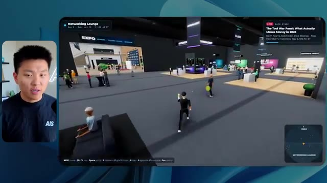
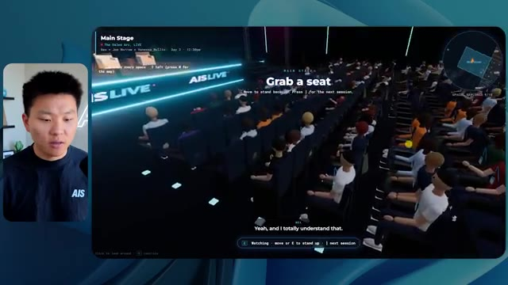
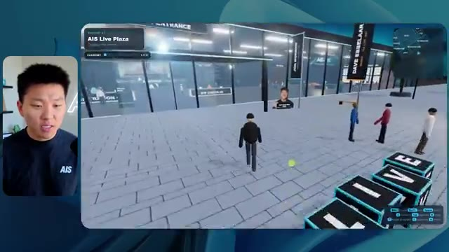

# 🎬 I Had Fable 5.1 and 5 Build Me the Same App

> **Chaîne** : [Nate Herk | AI Automation](https://www.youtube.com/@nateherk/featured)  
> **Lien YouTube** : [https://www.youtube.com/watch?v=5FukkI4fbiU](https://www.youtube.com/watch?v=5FukkI4fbiU)  
> **Date de publication** : 20260903  
> **Durée** : 00:12:37  
> **Identifiant vidéo** : `5FukkI4fbiU`  
> **Transcription & Analyse** : `whisper-v3-large-turbo+gemini-3.5-flash-lite`  

---

## 📌 Synthèse Exécutive & Outils

### 💡 Résumé

Dans cette vidéo de la chaîne *Nate Herk | AI Automation*, l'animateur explore l'impact direct du paramètre de niveau d'effort (*effort level*) sur les performances de génération de code et d'agents IA, en utilisant le modèle de pointe **Opus 5.5** (mentionné par erreur comme Fable 5.1/5 dans le titre). Le défi soumis à l'IA via un prompt global de type *slash goal* (« slash objectif ») consistait à concevoir entièrement, de zéro, un monde 3D interactif en vue à la troisième personne simulant une conférence technologique réaliste, exploitant un dossier brut de 105 gigaoctets d'enregistrements vidéo (provenant de l'événement virtuel *AIS Live*), tout en intégrant des éléments de design, de physique et des outils de génération d'images/vidéos.

L'expérimentation compare rigoureusement l'exécution du même prompt à travers différents niveaux d'effort (du mode *Low* jusqu'aux modes avancés comme *Medium*). Les résultats démontrent des divergences saisissantes : là où le mode faible effort (Low) a produit en 16 minutes une application rudimentaire, visuellement dégradée (bugs d'affichage, images fixes non lues, PNJ fantômes) pour un coût API estimé de 3,91 $ (191 000 jetons, 22 vérifications), le mode d'effort moyen (*Medium*) a livré une application qualitative, dotée de la charte graphique de la marque, de PNJ dotés de comportements réactifs, de véritables flux vidéo dynamiques, d'une mini-carte synchronisée et d'un monde 3D immersif comprenant halls, salles d'ateliers et salon VIP. 

Cette seconde itération a nécessité 1 heure et 13 minutes d'exécution, mobilisé 490 000 jetons, 23 vérifications, pour un coût API de 12,44 $, le tout de manière entièrement autonome sans nécessiter la moindre question intermédiaire de la part de l'agent. La démonstration met en lumière le fossé qualitatif entre les paliers d'inférence, confirmant l'importance stratégique d'ajuster le niveau d'effort selon la complexité architecturale requise, tout en soulignant la friction finale classique du déploiement en production, résolue par des extensions d'hébergement intégrées.

### 🛠️ Outils, Modèles & Logiciels Présentés

* **Opus 5.5** : Modèle d'intelligence artificielle de pointe d'Anthropic, hautement performant, économique et polyvalent, utilisé pour piloter la génération complète du code et de l'application 3D.
* **Claude Code** : Environnement de développement et assistant de codage avancé d'Anthropic permettant l'exécution d'agents IA directement dans le flux de travail logiciel.
* **Agents IA / *Effort Level*** : Paramètre de configuration des modèles (faible, moyen, élevé, extra, max, code ultra) permettant de calibrer la profondeur de raisonnement, le temps de calcul et la rigueur d'exécution d'une tâche.
* **Frame.io** : Plateforme de collaboration et de stockage cloud utilisée ici pour héberger et structurer les 105 gigaoctets d'enregistrements vidéo de l'événement *AIS Live*.
* **AIS Live** : Événement technologique virtuel de référence fournissant les assets bruts, le contenu de marque, les agendas et les flux vidéo intégrés dans la simulation 3D.
* **Système d'exploitation IA Herc 2** : Écosystème logiciel propriétaire et modulaire de Nate Herk servant de boîte à outils et de référence contextuelle pour l'automatisation.
* **Key.ai** : Outil externe d'intelligence artificielle sollicité par l'agent pour la génération dynamique d'images et de ressources graphiques contextuelles.
* **Hostinger** : Sponsor de la vidéo et solution d'hébergement web, dotée d'une extension gratuite pour éditeurs de code permettant de combler le fossé entre le développement local et la mise en ligne rapide en production.
* **VS Code / Cursor** : Éditeurs de code et environnements de développement intégrés compatibles avec les extensions de déploiement et les outils d'IA.

### 🔑 Points Clés & Enseignements Stratégiques

* **Impact direct du niveau d'effort** : Le paramètre d'effort d'un modèle d'IA ne se limite pas à la vitesse d'exécution ; il redéfinit en profondeur la complexité architecturale, le soin apporté au design, la robustesse logique et la fidélité fonctionnelle du code produit.
* **Corrélation coût/qualité exponentielle** : Passer du niveau d'effort *Low* au niveau *Medium* a multiplié le temps d'exécution par 4,5 (16 min vs 1h13) et le coût API par ~3,2 (3,91 $ vs 12,44 $), mais a transformé un prototype bancal en une application fonctionnelle et esthétiquement probante.
* **Autonomie totale des agents** : À travers les différents tests menés avec ce type de prompt (*slash goal* complexe), les agents ont fonctionné de manière totalement autonome sans poser une seule question de clarification à l'utilisateur, soulignant l'importance d'un prompt initial extrêmement précis.
* **Gestion de la multimodalisme et des assets lourds** : Un agent IA de pointe est capable d'analyser une structure de dossiers volumineuse (105 Go de vidéos) et de cartographier intelligemment des métadonnées (agendas, pistes, intervenants) pour les injecter dynamiquement dans une interface 3D.
* **Gestion des flux multimédias en temps réel** : La différence critique entre un résultat médiocre (images fixes et bugs d'affichage) et un résultat réussi (flux vidéo dynamiques intégrés, PNJ interactifs) réside dans la capacité du modèle à allouer plus de cycles de calcul pour structurer proprement les composants front-end.
* **Recommandation officielle d'Anthropic** : En accord avec les bonnes pratiques d'ingénierie d'Anthropic, il est recommandé de démarrer l'expérimentation d'un prompt complexe à un niveau d'effort moyen (*Medium*) avant d'ajuster itérativement vers le haut ou vers le bas selon les résultats obtenus.
* **L'écueil du déploiement post-génération** : L'automatisation de la création d'une application fonctionnelle laisse l'ingénieur face au défi classique du passage à l'échelle : transformer un code généré localement en un produit accessible en ligne de manière fluide.
* **Intégration des flux de travail de développement** : L'utilisation d'assistants de code et d'extensions d'hébergement directement intégrées dans les environnements de travail (VS Code, Cursor) s'avère indispensable pour fluidifier la transition entre la génération par l'IA et le déploiement en production.
* **Respect des chartes graphiques de marque** : Un niveau d'effort suffisant permet à l'IA d'assimiler et d'appliquer avec rigueur les directives de design et les palettes de couleurs d'une marque (comme *AIS Live*), évitant des rendus génériques ou désalignés.
* **Immersion et physique dans les applications 3D** : Les agents modernes peuvent concevoir des environnements 3D explorables sophistiqués (cartes dynamiques, zones VIP, scènes principales, PNJ réactifs) à condition d'être dotés d'une capacité de raisonnement suffisante lors de la phase de compilation.

---

## ⏱️ Chronologie & Transcription Complète Audio & Visuelle (Mot pour Mot)

### ⏱️ `[00:00:00 - 00:00:20]` | Segment #01

**🔊 Audio (Transcription Intégrale Mot pour Mot en Français) :**
> Opus 5,5, Opus 5,5, Opus 5,5, Opus 5,5, Opus 5,5. Ce modèle est littéralement partout et pour de très bonnes raisons. Il est intelligent, il est bon marché, il a un goût extraordinaire, c'est un modèle d'IA incroyable. Mais avec chaque modèle d'IA, vous avez le choix de l'effort, que ce soit faible, moyen, élevé, extra, max ou code ultra.

**👁️ Analyse Visuelle d'Écran (gemini-3.5-flash-lite) :**
**Interface & Outils** : Application X (Twitter)

**Contenu textuel & Code** : Publication textuelle et image de rendu 3D de paysage côtier.
[DESC_IMAGE_1] Présentation d'un exemple visuel illustrant l'impact des IA sur la création.

**Action / Démonstration** : Explications face caméra et démonstration conceptuelle.

*⏱️ 00:00:05 — Capture d'écran d'un tweet sur X montrant un rendu visuel 3D et un texte sur la perturbation des métiers créatifs.*

---

### ⏱️ `[00:00:20 - 00:00:38]` | Segment #02

**🔊 Audio (Transcription Intégrale Mot pour Mot en Français) :**
> Donc dans cette vidéo, j'ai donné à Opus 5.5 exactement le même prompt et je l'ai exécuté sur chaque niveau d'effort, et nous allons comparer les résultats. Nous allons examiner la qualité de toutes les différentes sorties réelles, mais nous allons aussi examiner combien de temps chacun d'eux a pris, combien cela nous a coûté si c'était facturé par l'API, le total des jetons, combien de vérifications ils ont exécutées, et combien de questions ils m'ont réellement posées tout au long du processus.

**👁️ Analyse Visuelle d'Écran (gemini-3.5-flash-lite) :**
**Interface & Outils** : Application web de tableau blanc ou de prise de notes (type canvas) affichant un tableau comparatif.

**Contenu textuel & Code** : Tableau comparatif des niveaux d'effort d'Opus 5.5 : Low, Medium, High, Extra, Max, Ultracode, avec les lignes Run time, API cost, Total tokens, Checks et Questions asked.

**Action / Démonstration** : Présentation du tableau comparatif analysant les différents niveaux d'effort et leurs métriques associées.

*⏱️ 00:00:29 — Tableau comparatif sur fond sombre intitulé 'Opus 5.5 Efforts' listant des métriques (Run time, API cost, Total tokens, etc.) pour différents niveaux d'effort (Low, Medium, High, Extra, Max, Ultracode).*

---

### ⏱️ `[00:00:39 - 00:00:58]` | Segment #03

**🔊 Audio (Transcription Intégrale Mot pour Mot en Français) :**
> Et les résultats que nous avons obtenus ne correspondent pas du tout à ce que j'attendais, donc j'ai hâte de partager cela avec vous les gars. Ne perdons pas de temps et entrons directement dans le vif du sujet. D'accord, alors plongeons directement là-dedans. Je veux commencer juste en vous montrant le prompt réel que nous avons utilisé, que nous avons donné à chacun de ces différents agents. Je vais aller dans les fichiers ici, et nous allons ouvrir ce fichier markdown de prompt, et je vais vous montrer ce que nous avons obtenu. Voici donc le slash objectif que j'ai fourni.

**👁️ Analyse Visuelle d'Écran (gemini-3.5-flash-lite) :**
**Interface & Outils** : Interface utilisateur de type environnement de développement ou assistant IA avec barre latérale et zone de discussion.

**Contenu textuel & Code** : Texte affiché : "Hi Nate. This worktree has the effort-test task queued in PROMPT.md : build a walkable third-person 3D world..." avec options de configuration en bas.

**Action / Démonstration** : Affichage de l'interface de travail et du prompt initial de l'assistant de code.

*⏱️ 00:00:48 — Interface d'un éditeur ou d'un outil de développement avec une webcam du présentateur incrustée à gauche, affichant un prompt textuel lié à un test d'effort.*

---

### ⏱️ `[00:00:58 - 00:01:34]` | Segment #04

**🔊 Audio (Transcription Intégrale Mot pour Mot en Français) :**
> J'ai dit : tu dois me créer un monde en 3D qui est une conférence tech réaliste dans laquelle je peux me promener en vue à la troisième personne. Tu vas regarder ce dossier, qui contient mes éléments d'enregistrement d'événements provenant d'AIS Live. Et ce dossier est un dossier Frame.io de 105 gigaoctets d'enregistrements vidéo. C'était un événement complètement virtuel. Tout a été enregistré et tous les enregistrements sont ici même. J'ai dit, ton objectif est de prendre cet événement et de le transformer en un monde 3D explorable qui me donne l'impression d'être réellement allé à une vraie conférence en personne avec différentes salles, différentes pistes, différentes scènes, bla, bla, bla. N'hésite pas à utiliser key.ai si tu as besoin de générer des images ou des vidéos. Et tu peux aussi utiliser tout ce qui se trouve dans mon projet Herc 2, qui est comme mon système d'exploitation IA. J'ai dit,

**👁️ Analyse Visuelle d'Écran (gemini-3.5-flash-lite) :**
**Interface & Outils** : Éditeur de code (VS Code / Cursor) et interface web Frame.io

**Contenu textuel & Code** : Fichier PROMPT.md contenant les instructions détaillées pour créer une conférence tech en 3D à partir d'enregistrements d'événements AIS Live, avec un lien Frame.io (https://f.io/sPdlo-Si).
[DESC_IMAGE_3]

**Action / Démonstration** : Navigation entre le fichier de configuration et la consultation du dossier source distant.

*⏱️ 00:01:07 — Vue d'un éditeur de code affichant un fichier PROMPT.md avec les instructions pour générer un monde 3D.*

*⏱️ 00:01:16 — Interface web de stockage de fichiers Frame.io montrant un dossier d'événements de 105,69 Go.*

*⏱️ 00:01:25 — Retour sur l'éditeur de code avec le fichier PROMPT.md détaillant les consignes pour transformer les enregistrements en monde 3D explorable.*

---

### ⏱️ `[00:01:34 - 00:02:08]` | Segment #05

**🔊 Audio (Transcription Intégrale Mot pour Mot en Français) :**
> vous serez jugé sur la créativité, le design, la physique et la sensation générale lorsque j'explorerai le monde 3D que vous avez construit. Et c'était fondamentalement la fin des instructions. Donc, comme vous pouvez le voir sur ce côté gauche, j'ai exécuté ceci à travers tous les différents niveaux d'effort. Commençons par le niveau bas et progressons jusqu'à l'ultra code. Très bien. Donc ici, nous avons le résultat du niveau bas. Ouvrons ceci et jetons un œil. Nous avons donc AIS Live, le sommet des services IA en personne enfin, et nous avons pu cliquer partout. Tout d'abord, cela ne fait pas très personnalisé. Genre, ce n' ce n'est pas le logo d'IS Live. Ce n'est même pas nos couleurs. Donc je n'aime pas trop ça, mais entrons ici. D'accord. C'est beaucoup trop lumineux. Euh, nous avons une carte en haut à droite. Nous avons une ville par ici. Je ne peux pas dire quelle ville c'est.

**👁️ Analyse Visuelle d'Écran (gemini-3.5-flash-lite) :**
**Interface & Outils** : Application web / interface de chat d'agent IA

**Contenu textuel & Code** : Texte du prompt demandant de construire un monde 3D en troisième personne à partir d'enregistrements vidéo, avec une liste de niveaux d'effort (Hello, Extra, High, Max, Ultracode, Medium, Low).

**Action / Démonstration** : Navigation et sélection des différents niveaux de test d'effort dans la barre latérale.

*⏱️ 00:01:42 — Interface d'une application d'IA montrant différents niveaux de tests d'effort dans la barre latérale gauche et une conversation avec l'assistant sur le panneau principal.*

---

### ⏱️ `[00:02:08 - 00:02:40]` | Segment #06

**🔊 Audio (Transcription Intégrale Mot pour Mot en Français) :**
> c'est. D'accord. C'est Chicago, ce qui est plutôt cool parce que tu sais, j'habite à Chicago, mais bref, en haut à droite, on peut voir une carte. Nous avons un hall d'accueil. Nous avons un hall d'exposition. Nous avons un salon VIP sur la scène principale. La carte montre également où se trouve chaque autre personne et cela se synchronise en direct. On peut donc voir l'enregistrement. On peut voir le premier jour, la keynote de l'hyper agent, le débriefing en direct. Cool. Donc ça connaît réellement l'agenda et puis il y a le deuxième jour. Donc ça a trouvé ça, c'est bien. Nous avons ces petites boules ici que je peux espérer botter. D'accord. Le visage, Oh, regarde ça. Si je vais par ici, tous les gens disparaissent tout simplement. Très mauvais. Très mauvais. D'accord. Alors voyons voir. Est-ce que je peux sprinter ? D'accord.

**👁️ Analyse Visuelle d'Écran (gemini-3.5-flash-lite) :**
**Interface & Outils** : Application de monde virtuel 3D en ligne avec mini-carte de navigation.

**Contenu textuel & Code** : Menus d'événements, programmes des conférences et repères géographiques virtuels.

**Action / Démonstration** : Navigation et exploration d'un espace virtuel d'événement en ligne.

*⏱️ 00:02:16 — Vue d'un monde virtuel interactif montrant un personnage sur un tapis violet et une mini-carte en haut à droite.*

*⏱️ 00:02:24 — Vue dans le monde virtuel montrant le hall d'accueil avec un panneau d'affichage du programme (Day 1).*

*⏱️ 00:02:32 — Vue dans le monde virtuel de l'Expo Hall avec des avatars et des zones d'interaction lumineuses.*

---

### ⏱️ `[00:02:40 - 00:03:04]` | Segment #07

**🔊 Audio (Transcription Intégrale Mot pour Mot en Français) :**
> Je peux avancer un peu plus vite. Je vais d'abord aller par ici. Il y a des goodies, euh, un sweat glido certifié AIS. D'accord. Il y a donc les vrais stands qu'on avait dans l'événement virtuel. On avait des stands. C'est donc plutôt cool. Un petit endroit pour prendre des photos. Salle C. En ce moment, nous avons Tangy Frederick qui anime un atelier. D'accord. Mais ce n'est pas une vidéo. Comme vous pouvez le voir, c'est juste une image. Elle ne bouge pas. C'est donc juste une image. Ces gens sont en train de disparaître. Ce doivent être des fantômes. Allons par ici dans la salle A.

**👁️ Analyse Visuelle d'Écran (gemini-3.5-flash-lite) :**
**Interface & Outils** : Environnement virtuel 3D interactif (jeu ou plateforme d'événement virtuel).

**Contenu textuel & Code** : Affichage d'un espace d'exposition virtuel avec des stands et des panneaux d'information textuels.

**Action / Démonstration** : Exploration d'un monde virtuel interactif par le présentateur (visite guidée de l'événement).

---

### ⏱️ `[00:03:04 - 00:03:30]` | Segment #08

**🔊 Audio (Transcription Intégrale Mot pour Mot en Français) :**
> Nous avons Liberty White. D'accord. Très cool. Vos 30 premiers jours en automatisation. Encore une fois, c'est juste une image fixe et les gens ont des bugs d'affichage. Donc pas très bon ici. Je vais aller sur la scène principale et voir ce que nous avons. D'accord, cool. Donc nous avons une scène principale. Les gens ont des bugs d'affichage. Vraiment mauvais. Ce n'est vraiment pas bon du tout. Notre vidéo est en train de bouger. Comme j'ai vu mon visage ici et j'ai vu celui de Devin, mais maintenant ils ont disparu. Donc je ne sais pas ce qui s'est passé. D'accord. Ça ressemble plutôt à un diaporama. Rien n'est vraiment diffusé pour l'instant. Bref, entrons ici.

**👁️ Analyse Visuelle d'Écran (gemini-3.5-flash-lite) :**
**Interface & Outils** : Environnement virtuel 3D interactif (type métavers / Gather Town).

**Contenu textuel & Code** : Interface d'événement virtuel avec affichage du titre de l'atelier et mini-carte de navigation.

**Action / Démonstration** : Navigation d'un avatar à travers les différentes salles et espaces de l'événement virtuel.

*⏱️ 00:03:11 — Vue d'une salle d'atelier virtuelle 3D (Workshop Room A) montrant un avatar et des plateformes lumineuses.*

*⏱️ 00:03:17 — Vue de la scène principale remplie d'avatars virtuels assis dans un amphithéâtre 3D.*

*⏱️ 00:03:24 — Vue panoramique de la scène principale d'un événement virtuel affichant le logo "AIS LIVE AI Services Summit".*

---

### ⏱️ `[00:03:30 - 00:03:58]` | Segment #09

**🔊 Audio (Transcription Intégrale Mot pour Mot en Français) :**
> Nous avons d'autres stands. Nous avons hyper agent. Nous avons Claude Code. Nous avons plus de cadeaux publicitaires. La salle B, c'est Dave Ebelor. Je suppose que c'est exactement la même chose. Nous avons du café. Et ensuite, je suppose, le salon VIP, accès VIP seulement. C'est plutôt cool, mais il n'y a vraiment rien qui se passe ici. Cet écran est beaucoup trop lumineux. D'accord. Donc je pense que vous comprenez l'ambiance qu'on obtient ici avec Opus 5.5 en faible effort. Et c'est là que les choses deviennent intéressantes. À combien est-ce que vous pensez que cela a tourné ? Combien de temps ? Celui-ci a tourné pendant 16 minutes et 43 secondes. Combien est-ce que vous pensez que cela a coûté ?

**👁️ Analyse Visuelle d'Écran (gemini-3.5-flash-lite) :**
**Interface & Outils** : Interface web de tableau blanc ou de diagramme (Opus 5.5 Efforts).

**Contenu textuel & Code** : Tableau avec des colonnes Low, Medium, High, Extra, Max, Ultracode et des lignes Run time, API cost, Total tokens, Checks, Questions asked.

**Action / Démonstration** : Navigation et présentation des options de configuration du modèle Opus.

*⏱️ 00:03:51 — Un tableau comparatif des efforts sur l'interface d'Opus 5.5 affichant des niveaux de performance.*

---

### ⏱️ `[00:03:58 - 00:04:26]` | Segment #10

**🔊 Audio (Transcription Intégrale Mot pour Mot en Français) :**
> 3,91 dollars si c'était une facturation par API. J'utilise évidemment mon abonnement ici, mais nous allons simplement calculer cela en facturation par API. Le nombre total de jetons était de 191 000. Il a effectué 22 vérifications. Donc, la vérification, 22 fois il a ouvert le navigateur et a exécuté différentes sortes de vérifications. Donc, 22 catégories de vérifications. Et combien de questions m'a-t-il posées ? Il m'a posé un total de zéro question tout au long de cette invite de type « slash goal ». D'accord. Alors, ouvrons l'effort moyen et voyons ce que nous avons obtenu. D'accord, c'est parti. Effort moyen. Nous avons Nate Herc. Nous avons mon badge. C'est du contenu de marque AI's life.

**👁️ Analyse Visuelle d'Écran (gemini-3.5-flash-lite) :**
**Interface & Outils** : Application de tableau blanc / outil de schématisation (ex: Excalidraw)

**Contenu textuel & Code** : Tableau avec les lignes : Run time (16m 43s), API cost ($3.91), Total tokens (191.3K), Checks, Questions asked, sous la colonne 'Low'.

**Action / Démonstration** : Le présentateur explique et commente les coûts en API et les métriques d'exécution affichées dans le tableau.

*⏱️ 00:04:05 — Un tableau comparatif montrant les métriques de performance et de coût pour le niveau 'Low' : temps d'exécution (16m 43s), coût API ($3.91), total des tokens (191.3K), vérifications et questions posées, avec le présentateur visible à gauche.*

---

### ⏱️ `[00:04:26 - 00:04:46]` | Segment #11

**🔊 Audio (Transcription Intégrale Mot pour Mot en Français) :**
> Donc ça a déjà l'air un petit peu mieux. Ça ressemble à nos palettes de couleurs qui ont utilisé nos directives de marque. Premier jour de construction, deuxième jour de gain, VIP. Cool. D'accord. Je vais entrer dans le lieu. D'accord. Waouh. Une ambiance similaire, en gros. C'est en arrière-plan. Ça ne ressemble pas à Chicago, hein ? Non, ça ressemble à, honnêtement, ça ressemble à une ville imaginaire. Quoi qu'il en soit, c'est drôle qu'ils aient décidé de faire ça. Voyons si je peux me déplacer un peu plus vite. Oh, waouh.

**👁️ Analyse Visuelle d'Écran (gemini-3.5-flash-lite) :**
**Interface & Outils** : Interface web de l'application virtuelle 'AIS Live'

**Contenu textuel & Code** : Écran d'accueil de l'événement virtuel avec badges, contrôles de navigation (WASD, Espace) et environnement 3D interactif.

**Action / Démonstration** : Le présentateur navigue dans l'interface de l'application et entre dans le lieu virtuel de l'événement.

*⏱️ 00:04:31 — Interface d'accueil de l'application 'AIS Live' avec un badge d'accès personnalisé aux couleurs de la marque au nom de Nate Herk et un bouton 'Enter the Venue'.*

*⏱️ 00:04:41 — Vue à la première personne ou en 3D d'un espace virtuel interactif (type métavers) montrant des avatars dans un bureau moderne avec vue sur la ville la nuit.*

---

### ⏱️ `[00:04:46 - 00:05:21]` | Segment #12

**🔊 Audio (Transcription Intégrale Mot pour Mot en Français) :**
> Les gens interagissent avec moi. Regardez. Si je m'approche de ce type, il vient de lever le bras. Bon, maintenant il ne veut plus du tout avoir affaire à moi. Mais tous ces petits robots ici doivent prendre des décisions. Je ne sais pas s'ils utilisent Jev. C'est sûr que non. Je ne le lui ai pas dit. En fait, ma clé Jev est à l'arrière. Je ne sais pas. Peut-être qu'il l'a utilisée. Quoi qu'il en soit, nous pouvons voir ici que nous avons la salle d'atelier C, le laboratoire des agents. Sympa. Donc celui-ci est en fait en train d'être exécuté. Vous pouvez voir qu'il s'agit d'une vraie vidéo lue par Tangy. Tout le monde ici travaille réellement sur un ordinateur portable. Ils ne buguent pas. C'est plutôt cool. De plus, mon badge est sur ma poitrine, ce qui est plutôt cool. Je peux venir par ici. Nous avons une carte en haut à droite, comme vous pouvez le voir, mais je peux venir par ici. Nous avons un

**👁️ Analyse Visuelle d'Écran (gemini-3.5-flash-lite) :**
**Interface & Outils** : Application ou plateforme virtuelle 3D (metaverse / environnement collaboratif).

**Contenu textuel & Code** : Environnement virtuel peuplé d'avatars interactifs.

**Action / Démonstration** : Navigation et exploration d'un monde virtuel 3D par le présentateur.

---

### ⏱️ `[00:05:21 - 00:05:47]` | Segment #13

**🔊 Audio (Transcription Intégrale Mot pour Mot en Français) :**
> hall d'exposition. C'est là que nous avons le stand Glido. Et ça diffuse en ce moment. Oui, ça diffuse la vidéo de nous parlant de Glido. Ça diffuse la vidéo d'Ed et moi parlant de notre programme de certification. Nous avons le logo AIS Plus juste ici, qui est placé dans un endroit un peu bizarre. Ce sont les diapositives et les points clés des intervenants. Alors waouh, ce sont toutes les ressources que nous avons distribuées après l'événement. Elles sont toutes affichées là aussi. Nous pouvons voir que nous avons un projecteur sur la communauté. Donc c'est Aiden qui parle de l'accord qu'il a conclu et ça se joue en direct. Ces gens sont en train de regarder.

**👁️ Analyse Visuelle d'Écran (gemini-3.5-flash-lite) :**
**Interface & Outils** : Environnement virtuel 3D / plateforme de salon virtuel (type metavers) et webcam du présentateur.

**Contenu textuel & Code** : Interface utilisateur virtuelle affichant des présentations, des informations de session "Get AIS+ Certified", et des avatars d'utilisateurs.

**Action / Démonstration** : Navigation et visite guidée à l'intérieur d'un hall d'exposition virtuel en 3D.

---

### ⏱️ `[00:05:47 - 00:06:21]` | Segment #14

**🔊 Audio (Transcription Intégrale Mot pour Mot en Français) :**
> Ils sont plutôt engagés. On a l'hyper agent. C'était, c'est ce que je voulais dire. Si vous avez vu ces gens lever les bras en disant bonjour, c'était plutôt marrant. Regardez, regardez, le voilà qui recommence. Bref. Bon. Où est-ce que je suis maintenant ? Maintenant, je suis dans le hall principal. On a un bar à café. On a un grand logo, qui est le vrai logo. C'est trop lumineux, mais on a le logo. On peut voir si on peut entrer ici pour le parcours des bases. On a Sabrina Romanov et Liberty White. Donc différentes formations juste là. On peut entrer dans cette salle. C'est le parcours avancé. Alors qu'est-ce qui se passe ici ? On a Dave Ebelar et Saman qui parlent de différentes choses là-dedans. Et maintenant, allons jeter un œil à la scène principale. Oh, attendez, il y a une vidéo de moi là-haut. C'est du genre VIP ?

**👁️ Analyse Visuelle d'Écran (gemini-3.5-flash-lite) :**
**Interface & Outils** : Application de monde virtuel 3D / plateforme de métavers ou événement en ligne.

**Contenu textuel & Code** : Environnement virtuel 3D interactif avec des avatars d'utilisateurs et une mini-carte de navigation.

**Action / Démonstration** : Navigation et déplacement d'un avatar à l'intérieur du hall principal et de la zone de conférence virtuelle.

*⏱️ 00:05:55 — Vue d'un monde virtuel interactif (style salon ou conférence) avec le présentateur en incrustation vidéo à gauche.*

*⏱️ 00:06:04 — Navigation dans le monde virtuel montrant des avatars et une salle de conférence avec un écran de présentation au fond.*

*⏱️ 00:06:12 — Autre angle de vue dans le monde virtuel montrant des avatars autour de tables et se déplaçant dans l'espace.*

---

### ⏱️ `[00:06:21 - 00:06:50]` | Segment #15

**🔊 Audio (Transcription Intégrale Mot pour Mot en Français) :**
> section ? Ouais, on va aller voir ça dans une minute. Mais bref, voici la scène principale. Ça a l'air vraiment, vraiment bien. On a une grande scène. On a genre quatre personnes assises ici. On a les trois écrans d'Alex là-haut avec "hyper agent". Est-ce que j'ai le droit de monter sur scène ? Oh, et il me laisse monter sur scène. D'accord. C'est plutôt sympa. Bon les gars, faisons un selfie. Laissez-moi prendre tout le monde en arrière-plan. Venez ici. Bref, c'est vraiment, vraiment cool. Par contre, toutes les places ne sont pas occupées. Donc il va falloir qu'on travaille là-dessus. Mais bref, je vais y retourner en courant pour voir ce qu'était cette section VIP. D'accord. Le salon VIP. J'ai l'impression que c'est comme un aéroport ou un truc du genre.

**👁️ Analyse Visuelle d'Écran (gemini-3.5-flash-lite) :**
**Interface & Outils** : Environnement virtuel 3D de type métavers / plateforme de conférence interactive.

**Contenu textuel & Code** : Interface utilisateur avec encadré d'information "Hyperagent Keynote" et mini-carte de navigation.

**Action / Démonstration** : Exploration d'un espace de conférence virtuel 3D par l'utilisateur (avatar).

---

### ⏱️ `[00:06:51 - 00:07:14]` | Segment #16

**🔊 Audio (Transcription Intégrale Mot pour Mot en Français) :**
> D'accord, super. Donc maintenant nous avons les sessions VIP ici. Une séance de questions-réponses VIP avec Nate, lecture vidéo en direct juste ici. Très, très cool. Et nous avons comme un bar ou quelque chose du genre. Génial. Je dirais que c'est un assez bon résultat. Maintenant, en ce qui concerne les statistiques ici, celui-ci a pris une heure et 13 minutes à s'exécuter. Il nous aurait coûté 12 dollars et 44 cents. Il a utilisé 490 000 jetons et il a effectué 23 vérifications.

**👁️ Analyse Visuelle d'Écran (gemini-3.5-flash-lite) :**
**Interface & Outils** : Interface 3D de salon virtuel / Application de visualisation de données (intitulée Opus 5.5 Efforts).

**Contenu textuel & Code** : Métriques d'exécution et de coûts : Run time (16m 43s), API cost ($3.91), Total tokens (191.3K), Checks (22), Questions asked (0).

**Action / Démonstration** : Présentation des fonctionnalités VIP de l'événement virtuel et analyse comparative des performances et des coûts.

*⏱️ 00:06:56 — Vue d'un espace virtuel 3D montrant un salon VIP avec des avatars, un bar et un grand écran affichant une session vidéo en direct.*

*⏱️ 00:07:02 — Tableau de données ou de métriques montrant des statistiques de performance telles que le temps d'exécution (16m 43s), le coût API ($3.91) et le nombre total de jetons (191.3K).*

---

### ⏱️ `[00:07:14 - 00:07:48]` | Segment #17

**🔊 Audio (Transcription Intégrale Mot pour Mot en Français) :**
> Et il nous a posé un total de zéro question une fois de plus. Très bien, passons au niveau élevé. C'était déjà un résultat plutôt correct et Anthropic eux-mêmes dans leur vidéo sur comment prompter Opus 5.5, ou désolé, pas une vidéo, un article. Ils ont dit de commencer simplement par moyen et d'ajuster à la hausse ou à la baisse si nécessaire. C'était donc un résultat moyen. Passons au niveau élevé et voyons ce qu'on a obtenu. Très rapidement, les gars, je dois prendre une seconde pour vous parler du sponsor de la vidéo d'aujourd'hui, Hostinger. Donc, ces deux modèles viennent de me construire une version fonctionnelle de la même chose. Et maintenant, je me retrouve exactement là où je finis toujours, avec un produit fini sur mon ordinateur portable et aucun moyen rapide de le mettre en ligne. Et c'est le fossé que comble le connecteur d'Hostinger. C'est une extension gratuite

**👁️ Analyse Visuelle d'Écran (gemini-3.5-flash-lite) :**
**Interface & Outils** : Tableau de bord de type tableur / Canvas (Image 1) et environnement de développement de type éditeur de code ou assistant IA (Image 2).

**Contenu textuel & Code** : Métriques de test d'IA (temps d'exécution, coût API, tokens) et instructions de prompt pour la création d'un calculateur de ROI.

**Action / Démonstration** : Comparaison des résultats de performance d'un modèle d'IA entre différents niveaux de réglage et démonstration de la génération d'un outil de calcul de ROI.

*⏱️ 00:07:22 — Un tableau comparatif des performances de l'IA (Run time, API cost, Total tokens, Checks, Questions asked) selon différents niveaux d'effort ("Low", "Medium", "High", "Extra").*

*⏱️ 00:07:39 — Une interface de développement de code avec un panneau affichant un prompt ("Build NorthWind ROI calculator") et l'exécution en cours avec les métriques associées.*

---

### ⏱️ `[00:07:48 - 00:08:23]` | Segment #18

**🔊 Audio (Transcription Intégrale Mot pour Mot en Français) :**
> pour votre éditeur qui intègre votre compte Hostinger dans l'outil de programmation que vous utilisez déjà, que ce soit VS Code, Cursor, Cloud Code, Codex, et j'en passe. Vous vous connectez une seule fois en un clic, et à partir de là, votre agent peut déployer le site, y associer un domaine, configurer les enregistrements DNS et vérifier votre VPS sans que vous n'ayez jamais à quitter l'éditeur. Ainsi, peu importe celui de ces outils que vous finirez par préférer, ce qu'il a créé se trouve à quelques minutes d'une vraie URL sur un hébergement géré. Connector est gratuit avec toutes les offres d'hébergement, donc si vous avez toujours besoin de l'hébergement sous-jacent, profitez de l'offre illimitée avec le lien dans la description et utilisez le code NATEHERK pour 10 % de réduction. Cela inclut également un nom de domaine gratuit et un e-mail professionnel pour l'année. Et c'est toujours le moyen le moins cher que j'ai trouvé pour obtenir quelque

**👁️ Analyse Visuelle d'Écran (gemini-3.5-flash-lite) :**
**Interface & Outils** : Interface web de gestion Hostinger et Claude Code

**Contenu textuel & Code** : Statut "Connected", "Manage Hostinger from your IDE", outils disponibles avec options cochées (Websites, Domains, Subscriptions & Payments, Email Marketing).

**Action / Démonstration** : Connexion de l'IDE à Hostinger en un clic via OAuth et affichage des outils d'assistance disponibles pour l'agent.

*⏱️ 00:07:57 — Interface montrant la connexion réussie de Hostinger à l'IDE via OAuth avec les outils disponibles (Websites, Domains, etc.) et Claude Code sur le panneau de droite.*

---

### ⏱️ `[00:08:23 - 00:08:47]` | Segment #19

**🔊 Audio (Transcription Intégrale Mot pour Mot en Français) :**
> tu as construit sur une vraie URL. Donc revenons à la vidéo. D'accord. Encore une fois, très, très thématisé par la marque. C'est un écran de chargement encore mieux que le précédent. Nous avons ce joli petit effet en arrière-plan. Nous avons le logo. Nous allons entrer dans le lieu. D'accord. Nous y voilà. Ça a l'air plutôt bien. Nous commençons à l'extérieur et tu peux voir que nous avons ces drapeaux pour tous les intervenants, Wyatt, Casper, Alex, Ed, Aiden, Sabrina, Liberty. C'est plutôt cool. Nous avons des blocs en direct ici.

**👁️ Analyse Visuelle d'Écran (gemini-3.5-flash-lite) :**
**Interface & Outils** : Application web interactive en 3D / environnement virtuel 3D (type RingCentral).

**Contenu textuel & Code** : Interface utilisateur avec instructions de contrôle (WASD, Mouse, Space, etc.) et affichage de la zone 'AIS Live Plaza'.

**Action / Démonstration** : Navigation et entrée dans le lieu virtuel 3D de l'événement.

*⏱️ 00:08:29 — Écran de chargement et d'accueil de la plateforme virtuelle 'AIS LIVE', affichant le logo et les instructions de contrôle.*

*⏱️ 00:08:35 — Vue de l'environnement virtuel en 3D représentant une place publique ('AIS Live Plaza') avec des avatars de personnages et des bâtiments en arrière-plan.*

*⏱️ 00:08:41 — Exploration de la place virtuelle 'AIS Live Plaza' avec des bannières verticales affichant les noms des intervenants.*

---

### ⏱️ `[00:08:47 - 00:09:23]` | Segment #20

**🔊 Audio (Transcription Intégrale Mot pour Mot en Français) :**
> Il a pris cette photo de moi, votre hôte, Nate Herc, John, Dave, Nate Herc. Voilà. OK. Les portes. Génial. Ce sont des portes coulissantes automatiques en verre. J'adore ça. Nous pouvons voir l'enregistrement VIP. Nous pouvons voir l'admission générale. Nous pouvons venir par ici et nous pouvons découvrir l'exposition avec différents stands, le projecteur sur la communauté. Vous pouvez également voir qu'en haut à gauche, j'ai un passeport. Donc c'est comme si, cela montrera combien d'endroits j'ai visités. Tout cela est une vraie lecture. Nous avons un mur de ressources avec tous les différents intervenants. Ils ont également une session de réseautage par ici. Je vais donc venir très vite voir de quoi il s'agit. Nous avons donc le bar à cold brew AIS. Nous avons différents membres de la communauté qui ont été mis en avant ou mis en lumière.

**👁️ Analyse Visuelle d'Écran (gemini-3.5-flash-lite) :**
**Interface & Outils** : Application ou plateforme virtuelle 3D interactive (monde virtuel / métavers de conférence).

**Contenu textuel & Code** : Éléments textuels de l'interface virtuelle : « Registration Concourse », « VIP Check-In », « EXPO HALL », « Get AIS+ Certified ».

**Action / Démonstration** : Exploration et navigation dans un espace virtuel 3D représentant une conférence ou un salon professionnel en ligne.

*⏱️ 00:08:56 — Vue d'un espace virtuel 3D de type salon ou conférence, avec un avatar de joueur se déplaçant vers une zone d'enregistrement et une scène principale.*

*⏱️ 00:09:05 — Navigation dans un hall d'exposition virtuel 3D (« Expo Hall ») avec des stands de présentation et des avatars de participants.*

*⏱️ 00:09:14 — Déplacement dans le hall d'entrée virtuel (« Registration Concourse ») entouré d'autres avatars en mouvement.*

---

### ⏱️ `[00:09:23 - 00:09:56]` | Segment #21

**🔊 Audio (Transcription Intégrale Mot pour Mot en Français) :**
> Nous avons l'aile VIP. Attends, quoi ? Prends un bracelet. Oh, je dois vraiment aller chercher le bracelet. D'accord. Laisse-moi m'enregistrer rapidement. Le bracelet est déjà mis. Attends, quoi ? D'accord. Oh, d'accord. Maintenant, les portes se sont ouvertes pour moi. Cool. Je peux entrer ici. Oh, ça mène juste à la scène principale. Salon VIP. Il y a une séance de questions-réponses en cours. Ça a l'air très cool. Je veux dire, je suis très impressionné par la façon dont il est capable de faire ça. Waouh. D'accord. C'est donc vraiment bien. Ce que nous avons fait, c'est que nous avons eu des salles de discussion VIP avec différentes personnes. Tu peux voir qu'il y a différentes salles, différents membres de l'équipe AIS qui participent à des choses. C'est vraiment cool. C'est très cool. C'est un bien meilleur VIP

**👁️ Analyse Visuelle d'Écran (gemini-3.5-flash-lite) :**
**Interface & Outils** : Application de métavers ou de salon virtuel 3D avec interface utilisateur intégrée.

**Contenu textuel & Code** : Textes de navigation, étiquettes de salles ("VIP Lounge", "VIP Working Sessions"), mini-carte et sous-titres contextuels.

**Action / Démonstration** : Navigation et exploration dans un environnement virtuel 3D interactif.

*⏱️ 00:09:32 — Vue d'un espace de conférence virtuel 3D (Registration Concourse) avec un avatar qui se déplace et une interface d'orientation.*

*⏱️ 00:09:40 — Vue de la salle VIP Lounge avec des avatars assis sur des canapés et un grand écran montrant une visioconférence.*

*⏱️ 00:09:48 — Vue de l'espace VIP Working Sessions avec plusieurs sessions de travail interactives étiquetées et des groupes d'avatars.*

---

### ⏱️ `[00:09:56 - 00:10:30]` | Segment #22

**🔊 Audio (Transcription Intégrale Mot pour Mot en Français) :**
> expérience que celle qui a été montrée dans la première partie. D'accord. After party VIP. Regardez ça. On a une piste de danse. On a tous ces éléments ici. On a la lecture de l'after party VIP juste ici. Et il y a une estrade pour DJ. C'est tellement marrant. Il y a un petit bug ici, un petit glitch juste là, mais c'est génial. Oh, super. Donc quand je suis ici sur la scène principale, on a des sous-titres. Vous pouvez voir juste ici en bas de mon écran, on a ces sous-titres de Wyatt qui est en train de parler ici. On a des lumières. On a le panel. Très cool. Belle scène principale. Je vais aller ici. On peut aller à la fondation,

**👁️ Analyse Visuelle d'Écran (gemini-3.5-flash-lite) :**
**Interface & Outils** : Application web de métavers ou monde virtuel 3D interactif (type événement en ligne)

**Contenu textuel & Code** : Environnement virtuel 3D avec avatars, flux vidéo en direct de participants, commandes de navigation à l'écran

**Action / Démonstration** : Exploration d'un monde virtuel 3D montrant l'after-party VIP et la scène principale d'un événement en ligne

*⏱️ 00:10:04 — Vue d'un espace virtuel représentant une 'VIP After-Party' avec des avatars 3D sur une piste de danse illuminée et des écrans vidéo affichant des participants.*

*⏱️ 00:10:13 — Vue légèrement élargie de la piste de danse virtuelle de l'after-party avec des ballons de plage et un panneau 'VIP AFTER-PARTY'.*

*⏱️ 00:10:21 — Vue de la 'Main Stage' (scène principale) virtuelle avec un public assis dans des fauteuils et un conférencier affiché sur grand écran.*

---

### ⏱️ `[00:10:30 - 00:11:06]` | Segment #23

**🔊 Audio (Transcription Intégrale Mot pour Mot en Français) :**
> avancé, et les parcours d'entreprise ici. Alors voyons voir. Nous avons l'anatomie de trois vraies transactions. Nous avons hyper agent. Nous avons les évaluations avec Nate et Ed ici. Nous avons Dave qui s'occupe des trucs avancés. C'est vraiment bien. Je veux dire, évidemment, chacun, chacun de ces résultats jusqu'à présent, faible était correct. Moyen était meilleur. Élevé a été encore meilleur. Voyons si cette tendance se poursuit et voyons ce que cela nous a coûté. Donc, élevé a duré une heure et sept minutes. Donc un peu plus rapide que moyen, cela nous aurait coûté 16 dollars et 31 cents. Il a utilisé un demi-million de jetons, 509 000. Il a fait 22 vérifications. Et il nous a aussi demandé, enfin, non, je me suis trompé. Ce

**👁️ Analyse Visuelle d'Écran (gemini-3.5-flash-lite) :**
**Interface & Outils** : Tableau de bord de planification / Outil de visualisation (ex: Excalidraw ou similaire).

**Contenu textuel & Code** : Tableau avec des métriques de performance : Run time (16m 43s, 1h 13m, etc.), API cost ($3.91, $12.44, $16.31), Total tokens, Checks, et Questions asked.

**Action / Démonstration** : Présentation et analyse des coûts et performances d'exécution des modèles par l'animateur.

*⏱️ 00:10:57 — Image 3 : Un tableau comparatif montrant les coûts, le temps d'exécution et les tokens pour différents niveaux d'effort (Low, Medium, High, Extra).*

---

### ⏱️ `[00:11:06 - 00:11:25]` | Segment #24

**🔊 Audio (Transcription Intégrale Mot pour Mot en Français) :**
> L'un m'a posé une question et, attention spoiler, c'était le seul qui nous a posé une question de tout ça. Voyons voir, il nous en reste trois : Extra, Max et Ultra code. Laissez-moi ouvrir Extra et nous verrons ce que nous avons. D'accord. Celui-ci a l'air plutôt bien. Je dirais honnêtement que jusqu'à présent, l'écran de chargement haut était le meilleur. Celui que nous venons de voir, mais de toute façon, entrons dans AIS live.

**👁️ Analyse Visuelle d'Écran (gemini-3.5-flash-lite) :**
**Interface & Outils** : Tableau de bord d'analyse ou application de suivi (interface de type canvas/tableur).

**Contenu textuel & Code** : Tableau avec des colonnes Low, Medium, High, Extra et des lignes de données : Run time (ex: 16m 43s, 1h 13m), API cost ($3.91, $12.44, $16.31), Total tokens (191.3K, 419.2K, 509.3K), Checks (22, 23, 22), Questions asked (0, 0, 1).

**Action / Démonstration** : Le présentateur commente les résultats du tableau et s'apprête à ouvrir les détails de la colonne Extra.

*⏱️ 00:11:11 — Un tableau comparatif montrant les métriques de différents modèles (Low, Medium, High, Extra) incluant le temps d'exécution (Run time), le coût API (API cost), le nombre de tokens (Total tokens), de vérifications (Checks) et de questions posées (Questions asked).*

---

### ⏱️ `[00:11:26 - 00:11:51]` | Segment #25

**🔊 Audio (Transcription Intégrale Mot pour Mot en Français) :**
> Wouah. D'accord. Donc nous avons comme de petits extraits sonores. Je peux discuter avec des gens. Le panel de la guerre des outils a réglé quelques débats pour moi. Sympa. Bonne perspective là-bas. Nous sommes dehors à nouveau. Nous avons ces différentes bannières, bien qu'elles soient toutes les mêmes. Elles n'affichent pas les noms de différentes personnes. Donc grand logo de AIS live. L'aile de l'atelier est par ici. Et traversons les portes coulissantes en verre pour voir ce que nous avons. Donc nous avons le café AIS. La carte est en bas à droite, et elle n'est pas très descriptive.

**👁️ Analyse Visuelle d'Écran (gemini-3.5-flash-lite) :**
**Interface & Outils** : Application ou plateforme virtuelle 3D interactive (environnement métavers / jeu de type Roblox ou plateforme événementielle virtuelle).

**Contenu textuel & Code** : Interface de jeu/métavers avec mini-carte en bas à droite, nom de zone 'Convention Plaza', et avatars interactifs.

**Action / Démonstration** : Navigation et déplacement d'un avatar à travers un espace virtuel 3D lors d'une visite d'événement.

*⏱️ 00:11:32 — Vue d'un monde virtuel 3D de type métavers avec un avatar en mouvement sur une place de convention, montrant des bannières publicitaires et d'autres avatars.*

*⏱️ 00:11:38 — L'avatar poursuit son déplacement dans l'environnement virtuel en extérieur, passant près de bancs, de lampadaires et d'un bâtiment portant des bannières 'AIS LIVE'.*

*⏱️ 00:11:45 — L'avatar s'approche de l'entrée principale lumineuse d'un bâtiment ou d'un hall d'exposition dans le monde virtuel 3D.*

---

### ⏱️ `[00:11:51 - 00:12:26]` | Segment #26

**🔊 Audio (Transcription Intégrale Mot pour Mot en Français) :**
> J'aime bien comment les autres cartes nous ont indiqué ce que, genre où étaient les choses, mais celle-ci a l'air très professionnelle. On peut voir ici c'est la scène principale. Allons y faire un saut rapidement. Elles ont toutes ces balles qui volent autour, ce que je trouve assez marrant. Les ballons de plage AIS. On nous voit là-haut en train de parler. Je crois que j'introduisais l'un des jours. Continuons par ici vers la salle d'atelier sur ce côté gauche. D'accord. Donc ici nous avons le théâtre Hyper Agent. Nous avons cette session sponsorisée ici par Hyper Agent, mais ça nous montre aussi ce qui va se passer ici. C'est vraiment marrant qu'on puisse discuter avec des gens. Salmon a créé un commercial vocal en direct. La salle "Le Juste Prix" était comble. Tu as pris le guide du compagnon VIP ? C'est trop marrant. Nous avons la piste avancée dans

**👁️ Analyse Visuelle d'Écran (gemini-3.5-flash-lite) :**
**Interface & Outils** : Application ou plateforme virtuelle 3D (type métavers / conférence virtuelle en ligne).

**Contenu textuel & Code** : Environnement virtuel interactif, avatars, écrans de diffusion en direct, bulles de discussion.

**Action / Démonstration** : Exploration d'un espace de conférence virtuel et découverte des différentes salles de l'événement.

*⏱️ 00:12:00 — Vue dans un monde virtuel 3D montrant un auditorium avec un présentateur sur grand écran, une scène principale et des avatars d'utilisateurs.*

*⏱️ 00:12:09 — Navigation dans un hall d'exposition virtuel (Grand Lobby) avec des avatars interactifs et des panneaux textuels.*

*⏱️ 00:12:17 — Déplacement dans un couloir du monde virtuel 3D avec plusieurs avatars discutant ou se déplaçant.*

---

### ⏱️ `[00:12:26 - 00:12:58]` | Segment #27

**🔊 Audio (Transcription Intégrale Mot pour Mot en Français) :**
> ici. Encore une fois, nous avons la lecture en direct. Est-ce que c'est la lecture en direct ? Oh, d'accord. Ça a commencé une fois que je suis entré, mais je peux prendre place. Oh la la. Je peux regarder ça. Je peux me lever. Je veux m'asseoir au premier rang. C'est plutôt cool. C'est très bien. J'aime bien ça. Et vous savez ce que j'ai remarqué jusqu'à présent ? Le personnage réel que j'incarne me ressemble un peu. Je pense qu'il a été modélisé à partir de mes photos de profil ou quelque chose comme ça. Quoi qu'il en soit, nous avons Sabrina ici, l'animatrice de la salle ici, prenez n'importe quel siège libre. D'accord, cool. Et j'ai vraiment aimé la fonctionnalité pour s'asseoir. C'est plutôt marrant. Genre, nous pourrions réellement assister à cet atelier et participer. Quoi qu'il en soit, cela nous montre les conférenciers. Cela nous montre les

**👁️ Analyse Visuelle d'Écran (gemini-3.5-flash-lite) :**
**Interface & Outils** : Application de réunion virtuelle 3D / environnement virtuel.

**Contenu textuel & Code** : Aucun code source, terminal ou prompt visible de manière exploitable.

**Action / Démonstration** : Navigation et exploration de l'environnement virtuel 3D.

---

### ⏱️ `[00:12:58 - 00:13:31]` | Segment #28

**🔊 Audio (Transcription Intégrale Mot pour Mot en Français) :**
> programme. Il y a un petit tapis rouge ici pour prendre des photos. On peut prendre la pose. Oh, wouah. C'est plutôt cool. Bibliothèque de ressources, obtenez la certification AIS Plus, Glido, Hyper Agent, AIS Plus, trois vraies affaires. Génial. Je veux dire, je dirais vraiment que jusqu'à présent, chacune est meilleure que la précédente. Et on n'a même pas encore vu la section VIP, le salon VIP. Montons par ici très vite. J'espère que je pourrai entrer. Sympa. On a le réinitialisateur d'outils. Ce sont les différentes salles dans lesquelles nous pouvons aller. Donc encore une fois, je pourrais prendre la feuille de calcul et je pourrais essayer de comprendre comment fixer mes prix. C'est tellement cool. C'est vraiment mieux que le précédent où on faisait juste en quelque sorte

**👁️ Analyse Visuelle d'Écran (gemini-3.5-flash-lite) :**
**Interface & Outils** : Application web virtuelle / Metaverse en 3D

**Contenu textuel & Code** : Environnement virtuel interactif avec avatars, stands d'exposition et interfaces textuelles contextuelles.

**Action / Démonstration** : Navigation et exploration de l'espace virtuel par le présentateur.

---

### ⏱️ `[00:13:31 - 00:13:59]` | Segment #29

**🔊 Audio (Transcription Intégrale Mot pour Mot en Français) :**
> genre a regardé des trucs. Génial. Je peux passer derrière le bar et venir ici. C'est très bien. Bon. Alors, en ce qui concerne les statistiques, celui-ci a duré une heure et demie. Il coûte 25,92 dollars. Je ne sais pas pourquoi je dis point 25 dollars 92 cents. C'était 733 000 jetons et 34 vérifications. Il a donc eu le plus de vérifications de loin jusqu'à présent. Et il ne nous a posé aucune question. J'ai hâte de voir ce qu'on a là de max et ultra code. D'accord. Voici les écrans de chargement de max, ennuyeux, mais c'est dans l'esprit de la marque et il y a notre logo.

**👁️ Analyse Visuelle d'Écran (gemini-3.5-flash-lite) :**
**Interface & Outils** : Outil de tableau blanc ou de diagramme (type Excalidraw ou similaire).

**Contenu textuel & Code** : Un tableau de statistiques comparatives : niveau Medium (1h 13m, $12.44, 419.2K, 23, 0), High (1h 7m, $16.31, 509.3K, 22, 1), et Extra (1h 31m).

**Action / Démonstration** : Le présentateur commente et analyse les statistiques de performance et de coût affichées à l'écran.

*⏱️ 00:13:38 — Tableau comparatif sous forme de tableau ou graphique montrant différentes métriques (durées, coûts en dollars, nombre de tokens et d'itérations) pour plusieurs niveaux d'effort (« Medium », « High », « Extra », « Max », « Ultracode »). Le présentateur est visible en incrustation à gauche.*

---

### ⏱️ `[00:14:00 - 00:14:35]` | Segment #30

**🔊 Audio (Transcription Intégrale Mot pour Mot en Français) :**
> Donc c'était bien. J'aime bien. On va continuer et entrer dans AIS live. Ooh, petite animation sympa ici qui nous fait entrer. Encore une fois, le personnage me ressemble. Ils m'ont tous ressemblé. Enfin, en gros, on a ça en arrière-plan. Ça ressemble à Chicago. Comme je l'ai mentionné plus tôt, beaucoup de ces éléments jouent des sons et je ne les inclus pas parce que ce serait très perturbateur pour vous d'essayer d'écouter ce qui se passe en même temps que moi je parle. Il y a donc une légère musique dans tout ça. Je déteste la façon dont il marche. Cette démarche est vraiment, vraiment mauvaise. Je veux dire, la marche, ouais, je n'aime pas du tout ça. Donc ce n'est pas génial. Mais à part ça, allons explorer. Remarquez ces ombres quand j'entre, elles changent vraiment, je ne sais pas trop pourquoi,

**👁️ Analyse Visuelle d'Écran (gemini-3.5-flash-lite) :**
**Interface & Outils** : Interface de monde virtuel en ligne (type métavers / salon virtuel AIS live).

**Contenu textuel & Code** : Environnement virtuel 3D interactif avec mini-carte en bas à droite et affichage des commandes en bas de l'écran.

**Action / Démonstration** : Navigation et exploration de la place principale d'un événement virtuel en 3D.

*⏱️ 00:14:08 — Vue d'un monde virtuel 3D (Arrival Plaza) avec des avatars et des bâtiments type Chicago, le présentateur apparaissant dans un encadré à gauche.*

*⏱️ 00:14:17 — Progression dans l'environnement virtuel montrant de nouveaux bâtiments et un panneau publicitaire, commenté par le présentateur.*

*⏱️ 00:14:26 — Avatars en mouvement se dirigeant vers l'entrée d'un grand bâtiment vitré dans l'univers virtuel 3D.*

---

### ⏱️ `[00:14:35 - 00:15:11]` | Segment #31

**🔊 Audio (Transcription Intégrale Mot pour Mot en Français) :**
> mais de toute façon, nous pouvons aussi discuter avec les gens ici. Le stand Hyperagent est juste là où l'on entre dans l'exposition. Tout va bien. D'accord, super. Je peux continuer à cliquer sur E pour faire changer ce qu'ils disent. Nous avons les intervenants juste ici. Ça a l'air plutôt bien. Bien que nous avions définitivement la photo de profil de tout le monde. Je ne sais donc pas pourquoi ce n'est pas inclus ici. Nous voyons des gens prendre des photos juste ici. J'adore ça. Et ça enregistre une petite photo. D'accord. La carte n'est pas non plus super, genre ne me donne pas une super explication de ce qui se passe, mais j'aime ces stands. Ils sont cool. Je pense que ces stands sont les meilleurs que j'ai vu jusqu'à présent. Genre, ils ont juste l'air bien. Ils ont des représentants. Il y a de superbes diapositives derrière eux. Ouais. Ces stands sont cool. D'accord. Nous avons un petit théâtre en vedette

**👁️ Analyse Visuelle d'Écran (gemini-3.5-flash-lite) :**
**Interface & Outils** : Application web de métaverse ou d'événement virtuel en 3D (type Gather.town ou similaire).

**Contenu textuel & Code** : Environnement virtuel interactif d'un salon professionnel avec des panneaux d'information et des flux vidéo en direct.

**Action / Démonstration** : Navigation et exploration de l'espace virtuel 3D avec un avatar.

*⏱️ 00:14:44 — Vue d'un espace virtuel en 3D avec des avatars d'utilisateurs et un panneau affichant la liste des intervenants.*

*⏱️ 00:14:53 — L'avatar de l'utilisateur navigue près d'un groupe de personnages virtuels avec une bulle de dialogue affichant 'Oh! Excuse me'.*

*⏱️ 00:15:02 — Exploration de l'espace virtuel montrant différents stands d'exposition thématiques comme 'Evals Lab' et 'Enterprise AI'.*

---

### ⏱️ `[00:15:11 - 00:15:35]` | Segment #32

**🔊 Audio (Transcription Intégrale Mot pour Mot en Français) :**
> qui se passe par ici. C'est Casper. Bien que, pourquoi est-ce que ça ne joue pas ? J'ai l'impression que ça devrait jouer, non ? Comme dans les autres, ils étaient toujours en train de jouer. On peut parler à d'autres personnes par ici. Le café est gratuit, bla, bla, bla. Amy Simpson, Matt Wolf. Sympa. D'accord. C'est juste la zone de networking dans laquelle nous sommes en ce moment, mais on peut voir en haut à droite. On peut aussi voir ce qui est en direct sur la scène principale en ce moment. C'est un panel sur la guerre des outils. Alors allons par ici. Nous avons Devin, Cole, Dave et Russ qui discourent ici. Nous avons en quelque sorte de l'audiovisuel, des petits trucs de lumière qui se passent par ici.

**👁️ Analyse Visuelle d'Écran (gemini-3.5-flash-lite) :**
**Interface & Outils** : Application web de monde virtuel / salon virtuel interactif

**Contenu textuel & Code** : Environnement 3D avec avatars, panneaux d'affichage informatifs et retransmission vidéo en direct

**Action / Démonstration** : Exploration et navigation d'un avatar dans l'espace virtuel du salon de conférence

*⏱️ 00:15:17 — Vue d'un monde virtuel interactif (type salon virtuel) montrant des avatars et des panneaux affichant des projets et revenus, avec le présentateur incrusté à gauche.*

*⏱️ 00:15:23 — Navigation dans la zone de networking du monde virtuel, avec des stands et d'autres avatars en ligne.*

*⏱️ 00:15:29 — Entrée dans une salle de conférence virtuelle (Main Stage) où des écrans géants diffusent une table ronde en direct.*

---

### ⏱️ `[00:15:36 - 00:15:55]` | Segment #33

**🔊 Audio (Transcription Intégrale Mot pour Mot en Français) :**
> Basculons la scène principale sur ce qui compte vraiment en ce moment. Je peux donc changer de sujet. Cool. Je viens donc de passer sur moi et Matt. Nous pouvons passer à l'anatomie de trois vraies transactions. C'est plutôt cool. La scène a l'air bien. Nous avons un petit panel sympa ici. Je peux monter sur la scène ? Sympa. Sympa. Bon, je ne peux pas aller trop loin, en fait. Bon tout le monde, laissez-moi prendre le selfie. Tout le monde, venez là-dedans. Je peux aussi m'asseoir dans le public par ici et simplement profiter de la session.

**👁️ Analyse Visuelle d'Écran (gemini-3.5-flash-lite) :**
**Interface & Outils** : Application web virtuelle 3D / Métaverse de conférence (AIS LIVE)

**Contenu textuel & Code** : Interface utilisateur virtuelle affichant une scène de conférence, le public, et des indications textuelles de navigation (WASD move, E interact)

**Action / Démonstration** : Navigation et exploration de l'environnement virtuel 3D représentant une conférence en direct.

---

### ⏱️ `[00:15:55 - 00:16:14]` | Segment #34

**🔊 Audio (Transcription Intégrale Mot pour Mot en Français) :**
> Très cool, très cool. OK, allons par ici. Je vois une section à l'étage. C'est marrant comme ils choisissent tous de mettre la section VIP à l'étage. Je veux dire, je ne déteste pas ça. Oh la la, ils ont un escalator. Pas possible. Je vais discuter avec ce type sur l'escalator. Glenn a 15 ans d'expérience en agence. Ses trucs de "land and expand" étaient en or. Du beau travail, Glenn. Cool, donc je vais, je n'arrive même pas à passer devant ce type en fait.

**👁️ Analyse Visuelle d'Écran (gemini-3.5-flash-lite) :**
**Interface & Outils** : Application virtuelle 3D / Metavers pour événement en ligne

**Contenu textuel & Code** : Interface utilisateur de navigation 3D avec mini-carte, indicateurs de touches (WASD) et panneau d'événement en direct.

**Action / Démonstration** : Navigation de l'avatar dans l'espace virtuel et interaction avec un autre participant sur un escalator.

*⏱️ 00:16:00 — Vue générale du hall d'accueil virtuel en 3D avec de grandes baies vitrées et des personnages.*

*⏱️ 00:16:04 — Gros plan sur l'escalator menant au niveau VIP avec une signalétique jaune et des avatars qui montent.*

*⏱️ 00:16:09 — Vue de l'avatar s'approchant d'un autre personnage sur l'escalator avec une bulle de dialogue affichant l'expérience de Glenn.*

---

### ⏱️ `[00:16:14 - 00:16:48]` | Segment #35

**🔊 Audio (Transcription Intégrale Mot pour Mot en Français) :**
> Oh, il a fallu que je saute par-dessus lui. D'accord, niveau VIP, badge requis. Oh la la. Tu te moques de moi ? Je dois aller chercher mon badge. D'accord, super. Maintenant, ça montre que je suis un vrai VIP et je peux monter ici dans la section VIP. On a de superbes petites sessions de travail par ici, auxquelles on peut se greffer. Je me demande si ça va me laisser m'asseoir ici. Je peux juste discuter. Est-ce que je peux participer ? Ça ne me laisse pas m'asseoir et participer. C'est pas grave. On a la "war room" des prix. Oh, ça, c'est peut-être l'after-party. Allons voir ce qui se passe par ici. Ou alors je dois juste entrer par ici. D'accord. C'est bizarre. Je devais juste entrer par ici. Cet after-party n'est pas aussi cool que l'autre. Mais bref, allons voir ce qui se passe par ici.

**👁️ Analyse Visuelle d'Écran (gemini-3.5-flash-lite) :**
**Interface & Outils** : Espace virtuel 3D interactif (plateforme d'événement en ligne)

**Contenu textuel & Code** : Interface utilisateur virtuelle montrant un avatar, une carte miniature, des infobulles de chat et un panneau d'événement (Anatomy of Three Real Deals)

**Action / Démonstration** : Navigation et exploration de l'espace virtuel par le présentateur sous forme d'avatar

---

### ⏱️ `[00:16:48 - 00:17:07]` | Segment #36

**🔊 Audio (Transcription Intégrale Mot pour Mot en Français) :**
> dans les ateliers. D'accord. Ce n'était pas bien. Regardez ça. On peut tout voir et je viens de bugger et maintenant boum. Donc ce n'est pas bon. Je dirais qu'globalement, je veux dire, vous captez l'ambiance de comment ça fonctionne, mais je dirais que celui d'avant, qui était, je crois, "high", j'aimais mieux celui-là. Je ne peux pas m'asseoir dans ces chaises non plus. Ouais. Donc je n'aime pas la marche dans celui-ci.

**👁️ Analyse Visuelle d'Écran (gemini-3.5-flash-lite) :**
**Interface & Outils** : Application web 3D d'événement virtuel (metaverse / plateforme de conférence interactive).

**Contenu textuel & Code** : Interface utilisateur virtuelle affichant des informations sur l'événement, les participants et les salles de conférence.

**Action / Démonstration** : Navigation d'un avatar à travers un espace virtuel d'ateliers et de conférences en ligne.

*⏱️ 00:16:53 — Vue en 3D d'un avatar se déplaçant dans un couloir d'un espace virtuel d'événements, avec des incrustations vidéo du présentateur.*

*⏱️ 00:16:57 — L'avatar s'approche de l'entrée d'une salle étiquetée "Room C" dans l'environnement virtuel.*

*⏱️ 00:17:02 — L'avatar entre dans la salle "Room C - HyperAgent Lab" où se trouvent d'autres avatars et une présentation sur écran.*

---

### ⏱️ `[00:17:07 - 00:17:43]` | Segment #37

**🔊 Audio (Transcription Intégrale Mot pour Mot en Français) :**
> Je n'aime pas autant l'ambiance et il y a quelques bugs. Donc, jusqu'à présent, si nous voulons regarder notre liste, j'aime bien, extra extra était celui que j'ai préféré jusqu'à présent. Mais de toute façon, celui-ci était au maximum. Celui-ci était au maximum juste ici. Voyons donc combien de temps cela a duré : deux heures et 28 minutes. Ça a donc duré longtemps, 50 dollars et 38 cents, 1,18 million de jetons. Donc, il a en fait atteint une compaction et a dû s'auto-compacter. Et puis il a fait 51 vérifications. L'a-t-il vraiment fait, par contre ? Parce qu'il y avait beaucoup de bugs là-dedans. Et de toute façon, celui-ci ne nous a posé zéro question. Donc, jusqu'à présent, chaque fois, ça a presque été plus cher et ça a pris plus de temps à part ici. Mais ceux-ci fondamentalement

**👁️ Analyse Visuelle d'Écran (gemini-3.5-flash-lite) :**
**Interface & Outils** : Interface web de tableau de bord / outil de comparaison (style application de productivité ou de benchmark).

**Contenu textuel & Code** : Tableau avec des colonnes : Medium, High, Extra, Max, Ultracode, présentant des durées (ex: 1h 13m, 1h 7m), des coûts en dollars (ex: $12.44, $16.31, $25.92) et des scores numériques.

**Action / Démonstration** : Le présentateur commente et compare les différentes colonnes du tableau de benchmark des performances.

*⏱️ 00:17:16 — Tableau comparatif affichant les résultats de différents niveaux (Medium, High, Extra, Max, Ultracode) avec des durées, des coûts et des métriques.*

---

### ⏱️ `[00:17:43 - 00:18:17]` | Segment #38

**🔊 Audio (Transcription Intégrale Mot pour Mot en Français) :**
> a pris à peu près le même laps de temps, mais à chaque fois, il a utilisé plus de jetons parce qu'il a davantage réfléchi. Et puis, vous savez, ces jetons vont coûter plus cher. Mais bref, passons au dernier, qui est Ultra Code. Donc, nous espérons vraiment que celui-ci sera le meilleur. Allons donc sur ce localhost et voyons ce que nous avons. OK, super. Regardez ce badge. C'est un joli badge "host all access". Nous avons un petit visuel sympathique juste ici. Nous allons aller de l'avant et entrer "AIS Live". Super. OK. Bienvenue, Nate. J'aime bien la marche. Ça a l'air réaliste. J'aime le logo, même s'il manque le petit point rouge qui donne l'impression que c'est du direct. La carte en haut à droite

**👁️ Analyse Visuelle d'Écran (gemini-3.5-flash-lite) :**
**Interface & Outils** : Tableau blanc/application de notes (Image 1) et application 3D/jeu (Image 2).

**Contenu textuel & Code** : Données chiffrées de performance de modèles d'IA et environnement virtuel 3D de conférence.

**Action / Démonstration** : Présentation des résultats comparatifs et visualisation de l'application finale générée.

*⏱️ 00:17:52 — Tableau comparatif affichant les métriques (temps, coût, jetons) des différents niveaux de performance (High, Extra, Max, Ultracode).*

*⏱️ 00:18:09 — Interface d'un jeu ou d'un monde virtuel 3D montrant l'événement "AIS LIVE" avec des avatars.*

---

### ⏱️ `[00:18:17 - 00:18:49]` | Segment #39

**🔊 Audio (Transcription Intégrale Mot pour Mot en Français) :**
> est un tout petit peu mieux étiqueté, donc je peux voir ce qui se passe. Je vais venir ici et récupérer mon bracelet VIP rapidement. Ok, super. Ça me dit aussi ce que je dois faire. Donc en haut à gauche, il est écrit de badger à l'entrée VIP au mur est du hall. Donc je crois que l'est serait par là, non ? "Ne mange jamais de gaufres détrempées" [Never eat soggy waffles]. Ouais. Ailes VIP, badger le bracelet. Ok, cool. Maintenant je suis dans la section VIP. Je peux voir ces différentes pièces. L'outil a été réinitialisé. Une vidéo en direct est diffusée. Je peux voir les sous-titres juste là de ce dont on est en train de parler. Ça diffuse aussi les sons, mais je ne diffuse tout simplement pas l'audio pour vous les gars parce que je ne veux pas saturer.

**👁️ Analyse Visuelle d'Écran (gemini-3.5-flash-lite) :**
**Interface & Outils** : Interface 3D interactive (environnement virtuel AIS Live 2026).

**Contenu textuel & Code** : Textes d'indication de mission à l'écran, cartes et affichages d'orientation dans le monde virtuel.

**Action / Démonstration** : Navigation de l'avatar dans l'espace virtuel de la conférence.

---

### ⏱️ `[00:18:50 - 00:19:08]` | Segment #40

**🔊 Audio (Transcription Intégrale Mot pour Mot en Français) :**
> Encore une fois, celui-ci fonctionne avec Cody et Mustafa là-dedans. C'est génial. Vidéo en direct. La vidéo ne se lance pas tant qu'on n'entre pas, par contre. Donc, honnêtement, je pense que c'est un bon choix. Dès que j'entre, cependant, la vidéo démarre. Sympa. Belle attention. Toutes ces pièces. Génial. Ouais. Je veux dire, ça fait très haut de gamme. Voici une salle de guerre pour la tarification. Entrons ici. Moi et John là-dedans.

**👁️ Analyse Visuelle d'Écran (gemini-3.5-flash-lite) :**
**Interface & Outils** : Application web 3D / Metavers virtuel

**Contenu textuel & Code** : Environnement virtuel 3D avec affichage de texte 'VIP Wing', mini-carte en haut à droite, et un avatar en mouvement.

**Action / Démonstration** : Navigation et exploration de l'espace virtuel par l'utilisateur/avatar.

*⏱️ 00:18:54 — Capture d'écran montrant l'interface d'un espace virtuel 3D (genre metaverse ou événement virtuel interactif) avec un avatar qui se déplace dans une zone appelée 'VIP Wing' et une salle de réunion où une vidéo en direct est visible.*

---

### ⏱️ `[00:19:08 - 00:19:42]` | Segment #41

**🔊 Audio (Transcription Intégrale Mot pour Mot en Français) :**
> Et ensuite nous avons l'after-party sympa. Cet after-party n'est pas encore aussi animé. Et nous avons plus de ballons de plage pour une raison quelconque, mais cet after-party est cool. Je veux dire, ça nous donne une bonne ambiance et il y a la retransmission juste ici de notre session de questions-réponses de l'after-party, tout cela est en direct aussi. Génial. Bon. Dirigeons-nous vers la scène principale. Cela m'invite aussi à prendre un siège côté allée sur la scène principale, qui est tout droit à travers l'expo. Donc en fait, allons d'abord à travers l'expo. Qu'est-ce que vous construisez ? Il y a beaucoup de gens qui parlent de différentes choses par ici. Waouh. Il y a aussi genre un petit truc de basketball. Est-ce que je peux le lancer ? Je peux. Est-ce que je dois regarder en l'air pour le lancer vers le haut ? D'accord.

**👁️ Analyse Visuelle d'Écran (gemini-3.5-flash-lite) :**
**Interface & Outils** : Environnement virtuel 3D / application de métavers.

**Contenu textuel & Code** : Aucun code source, terminal ou prompt visible.

**Action / Démonstration** : Navigation et exploration d'un espace virtuel 3D.

---

### ⏱️ `[00:19:42 - 00:20:08]` | Segment #42

**🔊 Audio (Transcription Intégrale Mot pour Mot en Français) :**
> Eh bien, pas terrible. Mais bref, nous avons un stand AIS plus. Nous avons le stand Glido. Est-ce que ça joue en direct ? Oui, ça joue définitivement en direct. Sympa. Nous avons le stand Hyper Agent. Nous avons d'autres trucs par ici. Bon, cool. Je vais aller sur la scène principale et voir si on peut choper une place côté allée. Dès qu'on entre, tout se met à jouer. On a une super ambiance de scène. Comment je fais pour choper une place côté allée, par contre. Voilà. Il a fallu que je trouve la bonne. Je chope la place côté allée. Il n'y a personne sur la scène, ce qui est bizarre. J'aimais bien quand il y avait du monde sur la scène dans les versions précédentes.

**👁️ Analyse Visuelle d'Écran (gemini-3.5-flash-lite) :**
**Interface & Outils** : Application de monde virtuel 3D en ligne (plateforme de conférence virtuelle AIS Live).

**Contenu textuel & Code** : Interface utilisateur virtuelle affichant les zones d'exposition, les stands d'entreprises (Glido, Hyper Agent) et les options de navigation.

**Action / Démonstration** : Exploration d'un salon virtuel en 3D et déplacement vers la scène principale pour assister à une présentation en direct.

*⏱️ 00:19:48 — Vue de l'Expo Hall dans une application de monde virtuel en 3D représentant une conférence.*

*⏱️ 00:19:55 — Navigation vers la scène principale (Main Stage) dans le monde virtuel.*

*⏱️ 00:20:01 — Vue de l'auditorium principal de la conférence virtuelle avec le message invitant à s'asseoir ("Grab a seat").*

---

### ⏱️ `[00:20:08 - 00:20:31]` | Segment #43

**🔊 Audio (Transcription Intégrale Mot pour Mot en Français) :**
> Prenons un petit selfie rapidement. Bref, on me voit avec Pat là-haut. Pat est habillé en ouvrier du bâtiment. Comme vous pouvez le voir, nous faisions un petit appel de découverte simulé dans cet exemple. Je vais revenir par l'exposition et nous allons aller ici vers l'aile des ateliers et simplement vérifier si ces salles sont fondamentalement exactement telles qu'elles devraient l'être. Maintenant, je ne peux pas vraiment discuter avec les gens. Avant, je le pouvais, dans les versions précédentes, discuter avec les gens, ce que je trouvais être une très belle touche. Et nous avons l'atelier d'une piste de fondation. Est-ce que je peux m'asseoir ?

**👁️ Analyse Visuelle d'Écran (gemini-3.5-flash-lite) :**
**Interface & Outils** : Application web virtuelle en 3D (metaverse / plateforme d'événement virtuel)

**Contenu textuel & Code** : Environnement virtuel interactif avec mini-carte, avatars, et indications textuelles de navigation

**Action / Démonstration** : Navigation et exploration de l'espace virtuel par le présentateur

*⏱️ 00:20:14 — Vue d'une scène principale virtuelle avec des avatars et un présentateur en incrustation.*

*⏱️ 00:20:20 — Navigation dans le hall d'exposition virtuel (Expo Hall) montrant l'entrée vers l'aile des ateliers.*

*⏱️ 00:20:25 — Déplacement dans l'aile des ateliers (Workshop Wing) du monde virtuel.*

---

### ⏱️ `[00:20:32 - 00:21:04]` | Segment #44

**🔊 Audio (Transcription Intégrale Mot pour Mot en Français) :**
> Je ne peux pas m'asseoir. Je ne sais pas. Nous avons Liberty qui est en train de parler en ce moment même et elle parle et nous pouvons l'entendre. C'est donc sympa, mais ça ne me laisse pas m'asseoir. Et regardez ça. Je deviens assez instable ici. Ça buguait de la façon dont je marchais. Ça ne me laissera pour ainsi dire pas marcher. Ce n'est pas bon. C'est la même chose. Nous avons cette piste avancée là-dedans. C'est génial. Donc, dans l'ensemble, ils ont une ambiance très similaire. Je dirai que je suis impressionné par la façon dont ils ont été capables de raconter une histoire à partir de ce que nous faisions. Bibliothèque de points clés des intervenants. D'accord. C'est cool. Je ne pense pas que nous ayons vu cela de différents endroits, mais ce sont comme les ressources et cela montre des choses sympas. Oh, ouah. Je

**👁️ Analyse Visuelle d'Écran (gemini-3.5-flash-lite) :**
**Interface & Outils** : Application de monde virtuel 3D / métavers éducatif interactif.

**Contenu textuel & Code** : Interface d'un espace virtuel avec des panneaux textuels, des avatars et une mini-carte de navigation.

**Action / Démonstration** : Navigation et exploration de différentes salles thématiques (workshops, bibliothèque) dans l'environnement virtuel.

*⏱️ 00:20:40 — Vue d'un espace virtuel nommé 'Workshop A - Foundation Track' avec un avatar personnage.*

*⏱️ 00:20:48 — Navigation dans la zone 'Workshop B - Advanced Track' d'un monde virtuel 3D.*

*⏱️ 00:20:56 — Exploration de la section 'Speaker Takeaways Library' dans l'environnement virtuel.*

---

### ⏱️ `[00:21:04 - 00:21:41]` | Segment #45

**🔊 Audio (Transcription Intégrale Mot pour Mot en Français) :**
> peut effectivement ouvrir toutes ces choses et nous pouvons prendre des photos ici même également. Super. Prendre une photo. Je peux enregistrer ceci également. Genre, je peux effectivement télécharger ceci. Et maintenant nous avons cette photo que nous venons de prendre à cet événement en direct de l'IA. Très bien. Eh bien, je pense qu'il est temps pour moi de tirer quelques conclusions, mais voyons d'abord ce que cette exécution nous a coûté. Cela a pris une heure et 35 minutes. C'était donc beaucoup plus rapide que max. Cela n'a coûté que 18 dollars et 69 cents. Waouh. C'était donc un peu plus cher que high, moins cher que extra et beaucoup moins cher que max. Cela a également consommé 606 000 jetons et 42 vérifications avec zéro question. Maintenant, une autre chose intéressante à noter est que tout

**👁️ Analyse Visuelle d'Écran (gemini-3.5-flash-lite) :**
**Interface & Outils** : Visionneuse d'images Windows et application de type tableau blanc/diagramme (ex: Excalidraw ou similaire).

**Contenu textuel & Code** : Photo de l'événement virtuel 'AIS LIVE' avec des avatars 3D et un tableau de statistiques/efforts.

**Action / Démonstration** : Affichage de la photo prise lors de la démonstration en direct.

*⏱️ 00:21:13 — Visionneuse d'images affichant la photo capturée lors de l'événement en direct montrant deux avatars sur un tapis rouge devant un panneau 'AIS LIVE'.*

---

### ⏱️ `[00:21:41 - 00:22:13]` | Segment #46

**🔊 Audio (Transcription Intégrale Mot pour Mot en Français) :**
> ces exécutions, aucune d'entre elles n'a utilisé de sous-agent. J'ai vérifié et je me suis assuré qu'aucune d'elles n'avait utilisé de sous-agents. Ils ne voulaient déléguer aucun travail, ce qui était intéressant. Donc ces jetons sont ce qui a été reflété à l'intérieur de cette session. Évidemment, comme je l'ai dit, celle-ci a dépassé, vous savez, 950 000, donc, ou quelle que soit la fenêtre de compactage. Je ne la laisse généralement jamais monter aussi haut, mais comme c'était un objectif global et que je n'étais pas impliqué, celle-ci a dû se compacter, mais le reste d'entre elles a simplement fonctionné dans cette unique session. Et ce sont les statistiques globales. Et aussi, très rapidement, à propos des trucs d'UltraCode, les gars, je ne sais pas si vous l'avez remarqué, mais quand j'ai fait tourner UltraCode ces derniers temps, ça a juste fait bizarre. Ça a l'air un peu buggé. Je, plusieurs fois je l'ai fait tourner

**👁️ Analyse Visuelle d'Écran (gemini-3.5-flash-lite) :**
**Interface & Outils** : Tableau de bord de métriques de modèles d'IA (Opus 5.5 Efforts)

**Contenu textuel & Code** : Tableau avec les lignes : Run time, API cost, Total tokens, Checks, Questions asked pour différents niveaux d'effort.

**Action / Démonstration** : Présentation et analyse des résultats de tests d'exécution de l'agent IA selon différents niveaux d'effort.

*⏱️ 00:21:49 — Tableau comparatif affichant les performances de différents niveaux d'effort (Low, Medium, High, Extra, Max, Ultracode) avec le temps d'exécution, le coût API, le nombre total de tokens, les vérifications et les questions posées.*

---

### ⏱️ `[00:22:13 - 00:22:34]` | Segment #47

**🔊 Audio (Transcription Intégrale Mot pour Mot en Français) :**
> et je me suis dit, est-ce que ça tourne vraiment sous UltraCode ? Ça a fait pas mal de vérifications de plus que ces autres-là, mais pour une raison quelconque, ça ne me semblait pas correct, parce qu'essentiellemment, ce qu'est UltraCode, c'est un effort supplémentaire, et ensuite c'est comme utiliser des flux de travail plus dynamiques pour faire les choses. Et donc, à force de fouiller dans les journaux de session et même quand je regardais cette chose se construire dans UltraCode, ça ne lançait aucun de ces flux de travail dynamiques, et j'ai essayé plusieurs fois.

**👁️ Analyse Visuelle d'Écran (gemini-3.5-flash-lite) :**
**Interface & Outils** : Application web ou tableau de bord de benchmark / interface de type outil de visualisation.

**Contenu textuel & Code** : Tableau avec des colonnes Low, Medium, High, Extra, Max, Ultracode et des lignes Run time, API cost, Total tokens, Checks, Questions asked.

**Action / Démonstration** : Présentation et analyse comparative des performances et des coûts selon les modes d'effort de l'IA.

*⏱️ 00:22:18 — Un tableau comparatif montrant les métriques de différents niveaux d'effort (Low, Medium, High, Extra, Max, Ultracode) incluant le temps d'exécution, le coût API, les tokens et le nombre de vérifications.*

---

### ⏱️ `[00:22:35 - 00:23:00]` | Segment #48

**🔊 Audio (Transcription Intégrale Mot pour Mot en Français) :**
> Donc je ne sais pas si c'est un bug actuellement dans le harnais CloudCode ou si c'est juste avec Opus 5.5, c'و'est un tout petit peu pire avec UltraCode en ce moment ou quelque chose comme ça, mais dans les deux cas, ce sont les niveaux d'effort globaux réels et tout cela semble tout à fait logique quand on examine un peu la façon dont ils progressent. Jetez donc un œil à ceci. Coût maximum par rapport au coût minimum, nous avons eu un facteur de 12,9 sur l'exécution la moins chère par rapport à l'exécution la plus chère, ce qui, je crois, représentait 3,98 $ contre 50,38 $.

**👁️ Analyse Visuelle d'Écran (gemini-3.5-flash-lite) :**
**Interface & Outils** : Application de tableau ou outil de notes interactif (type canevas/whiteboard) avec le présentateur en médaillon vidéo à gauche.

**Contenu textuel & Code** : Tableau de données chiffrées comparant Opus 5.5 selon ses niveaux d'effort et Ultracode (Run time de 16m 43s à 2h 28m, coûts API de $3.91 à $50.38, tokens de 191.3K à 1.18M).

**Action / Démonstration** : Analyse et présentation visuelle des résultats de tests comparatifs d'agents IA selon les niveaux d'effort.

*⏱️ 00:22:41 — Un tableau comparatif montrant les performances de différents niveaux d'effort (Low, Medium, High, Extra, Max, Ultracode) avec des métriques telles que le temps d'exécution (Run time), le coût API (API cost), le nombre total de tokens, de vérifications et de questions posées.*

---

### ⏱️ `[00:23:01 - 00:23:19]` | Segment #49

**🔊 Audio (Transcription Intégrale Mot pour Mot en Français) :**
> Donc c'était le minimum et le maximum. En ce qui concerne les vérifications maximales par rapport au minimum, nous avons eu un multiple de 2,3. Le total pour les six était de 127 balles et le code ultra était de 18,69 $. Regardons la vitesse par rapport au coût ici. Laissez-moi donc dézoomer un peu pour que nous puissions voir tout cela. Sur l'axe des X, nous avons le temps d'exécution. Sur l'axe des Y, nous avons le coût.

**👁️ Analyse Visuelle d'Écran (gemini-3.5-flash-lite) :**
**Interface & Outils** : Tableau de bord web d'analyse de données ou d'application IA.

**Contenu textuel & Code** : Statistiques : '12.9x Max cost vs Low', '2.3x Max checks vs Low', '$18.69 Ultracode cost, 42 checks', '$127.65 Total across all six'.

**Action / Démonstration** : Présentation des résultats comparatifs de tests d'effort sur différentes sessions avec des métriques chiffrées.

*⏱️ 00:23:05 — Capture d'écran montrant le présentateur à gauche et un tableau de bord d'analyse nommé 'Opus Effort Test' à droite, affichant des métriques de coût et de performance sous forme de cartes.*

---

### ⏱️ `[00:23:19 - 00:23:42]` | Segment #50

**🔊 Audio (Transcription Intégrale Mot pour Mot en Français) :**
> Donc, j'ai l'impression que le mieux serait en bas à gauche, mais pas vraiment. Donc, de toute façon, vous pouvez voir que low était bon marché et rapide. Max était lent et cher. Mais ce genre de graphique a généralement du sens. À mesure que vous augmentez l'effort, ça va coûter plus cher et ça va prendre un peu plus de temps. C'est logique. Voyons maintenant la croissance par rapport à low. Nous avons donc le temps d'exécution en bleu, les coûts d'API en orange, les jetons en vert et les vérifications en or jaunâtre, moutarde.

**👁️ Analyse Visuelle d'Écran (gemini-3.5-flash-lite) :**
**Interface & Outils** : Interface web d'analyse de tests (Opus Effort Test).

**Contenu textuel & Code** : Graphique à dispersion représentant les sessions par temps d'exécution et coût API, avec infobulle pour 'Low' (16m 43s - $3.91 - 191.3K tokens - 22 checks).

**Action / Démonstration** : Le présentateur commente le graphique de performance et de coût des différents niveaux d'effort.

*⏱️ 00:23:25 — Un graphique comparatif 'Speed vs cost' montrant le coût en fonction du temps d'exécution pour différents niveaux d'effort (Low, Medium, High, Extra, Ultracode, Max).*

---

### ⏱️ `[00:23:42 - 00:24:01]` | Segment #51

**🔊 Audio (Transcription Intégrale Mot pour Mot en Français) :**
> Et d'ailleurs, la raison pour laquelle UltraCode apparaît comme ça, c'est parce qu'il utilise réellement un niveau d'effort supplémentaire. Il est simplement incité et il utilise plutôt des flux de travail dynamiques et des choses comme ça, ce qui fait que, vous savez, c'est logique parce qu'il utilisait essentiellement des ressources supplémentaires sous le capot. C'est aussi pour cela que Claude l'a étiqueté ici en orange. Quoi qu'il en soit, si nous continuons plus bas ici, c'est généralement logique, n'est-ce pas ?

**👁️ Analyse Visuelle d'Écran (gemini-3.5-flash-lite) :**
**Interface & Outils** : Interface web de tableau de bord ou d'analyse des tests d'effort Opus.

**Contenu textuel & Code** : Graphique linéaire comparant "Run time", "API cost", "Tokens" et "Checks" avec des multiplicateurs allant jusqu'à 12.9x pour l'API cost et une mention pour "Ultracode".

**Action / Démonstration** : Le présentateur commente le graphique montrant l'augmentation des coûts et des performances selon les niveaux d'effort et l'utilisation d'Ultracode.

*⏱️ 00:23:47 — Graphique montrant la croissance relative des performances et des coûts (coût API, temps d'exécution, tokens, vérifications) en fonction de différents niveaux d'effort (Low, Medium, High, Extra, Max, Ultracode).*

---

### ⏱️ `[00:24:02 - 00:24:21]` | Segment #52

**🔊 Audio (Transcription Intégrale Mot pour Mot en Français) :**
> À mesure que le niveau d'effort augmente, une fois de plus, ces métriques vont augmenter. Le temps d'exécution, les coûts d'API, les jetons et les vérifications. C'est la même chose ici avec le temps d'exécution. Cela nous donne simplement des graphiques linéaires individuels maintenant pour chacune de ces différentes métriques, comme le coût d'API, les vérifications, le total des jetons, le coût par vérification, et tous les chiffres au même endroit. Des données plutôt cool donc.

**👁️ Analyse Visuelle d'Écran (gemini-3.5-flash-lite) :**
**Interface & Outils** : Interface web de test et de visualisation de données.

**Contenu textuel & Code** : Graphiques linéaires comparant les performances et les coûts selon le niveau d'effort (Low, Medium, High, Extra, Max).

**Action / Démonstration** : Le présentateur explique l'impact de l'augmentation du niveau d'effort sur les métriques du système.

*⏱️ 00:24:06 — Un graphique montrant la croissance relative de différentes métriques (temps d'exécution, coût API, jetons, vérifications) en fonction du niveau d'effort, avec le présentateur visible à gauche.*

---

### ⏱️ `[00:24:21 - 00:24:40]` | Segment #53

**🔊 Audio (Transcription Intégrale Mot pour Mot en Français) :**
> Je dirais que rien ici n'est trop choquant. Ce qui a été le plus choquant pour moi, ce sont ces résultats. Mes deux principaux favoris étaient high, qui est celui-ci, et extra, qui est celui-ci. Donc je dois retourner ici et me rappeler ce que j'en pensais. J'ai vraiment aimé cette sensation. Celui-ci donne aussi simplement l'impression d'être le plus fluide. La physique était agréable. La porte coulissante en verre était agréable. Je n'ai pas vraiment remarqué beaucoup de bugs dans celui-ci, ce qui est ce que j'ai vraiment aimé.

**👁️ Analyse Visuelle d'Écran (gemini-3.5-flash-lite) :**
**Interface & Outils** : Application Web 3D immersive (plateforme virtuelle AIS LIVE)

**Contenu textuel & Code** : Interface d'accueil avec informations sur l'événement et contrôles de navigation (WASD, Mouse, Space, etc.)

**Action / Démonstration** : Connexion à l'espace virtuel et exploration interactive de la place 3D avec les avatars.

*⏱️ 00:24:26 — Écran d'accueil de la plateforme virtuelle « AIS LIVE » avec un bouton de connexion « Enter the Venue ».*

*⏱️ 00:24:31 — Vue en 3D d'une place virtuelle (« AIS Live Plaza ») avec des avatars et des bannières d'événements.*

*⏱️ 00:24:35 — Navigation dans l'environnement virtuel 3D en vue à la troisième personne se déplaçant sur la place.*

---

### ⏱️ `[00:24:40 - 00:25:13]` | Segment #54

**🔊 Audio (Transcription Intégrale Mot pour Mot en Français) :**
> Je ne me rappelle pas si celui-ci était un de ceux où, oh, je ne pouvais pas parler aux gens par contre. Je pouvais juste traverser tout droit à travers eux. Je ne pouvais pas m'asseoir dans celui-ci non plus. Voici un autre petit truc visuel où je fais en gros juste traverser tout droit ce mur. Donc je n'adore pas ça. Mais je pense, est-ce que c'était celui-là où je pouvais m'asseoir dans ces sessions ? Non. D'accord. Donc je ne pense pas que c'était mon gagnant alors. Celui-ci est super haut. Je pense que c'est le gagnant. Ouais. Je pense que c'était celui que j'aimais le plus. J'adorais toute cette ambiance. J'adorais que je pouvais discuter avec des gens. C'était définitivement celui où nous pouvions venir ici et nous pouvions nous asseoir où nous voulions, prendre une place, nous lever. Je pouvais lire ces trois offres et je pouvais discuter avec eux. J'ai aussi réalisé qu'il y avait de petites sections pour simuler des appels de découverte ici aussi.

**👁️ Analyse Visuelle d'Écran (gemini-3.5-flash-lite) :**
**Interface & Outils** : Application web interactive en 3D (AIS Live)

**Contenu textuel & Code** : Interface utilisateur affichant 'AIS LIVE', des avatars virtuels et le panneau 'Main Stage' avec des détails sur les sessions.

**Action / Démonstration** : Navigation et exploration de l'espace virtuel 3D de la conférence.

*⏱️ 00:24:48 — Vue d'un monde virtuel 3D avec des avatars, montrant la scène principale et les informations d'agenda en bas à gauche.*

*⏱️ 00:25:05 — Navigation dans un hall virtuel 3D avec un avatar se dirigeant vers la scène principale affichant une retransmission vidéo.*

---

### ⏱️ `[00:25:13 - 00:25:51]` | Segment #55

**🔊 Audio (Transcription Intégrale Mot pour Mot en Français) :**
> Nous avons des produits dérivés et des sacs en tissu, ce qui est de la vraie physique. J'aime bien ça. C'était celui où l'on pouvait s'asseoir partout. Oui, j'ai vraiment, vraiment aimé celui-là. Bien que je pense que le seul inconvénient de celui-ci, c'est qu'il n'y avait pas vraiment d'after-party VIP, parce que je pense que c'était le salon. Et je pense que c'était la seule partie de la section VIP, qui consistait en ces différentes salles où l'on pouvait entrer et s'asseoir. Mais à part ça, il n'offrait pas une super expérience VIP par rapport à certains des autres que nous avons vus. Donc mon gagnant ici va définitivement être Extra. Extra a fait un travail phénoménal. Cela représentait environ la moitié de la durée et la moitié du coût de Max. Donc Max, je pense, c'était tout simplement beaucoup trop pour pas assez de bien. Je pense que le niveau haut était correct. Ça pouvait,

**👁️ Analyse Visuelle d'Écran (gemini-3.5-flash-lite) :**
**Interface & Outils** : Application de métavers/monde virtuel 3D et tableau de bord de données analytiques.

**Contenu textuel & Code** : Environnement virtuel 3D avec avatars interactifs et tableau comparatif de performance (Low, Medium, High, Extra, Max, Ultracode).

**Action / Démonstration** : Navigation dans un espace virtuel 3D puis affichage d'un tableau comparatif des efforts et coûts d'exécution.

*⏱️ 00:25:23 — Vue dans un monde virtuel 3D montrant un couloir (West Concourse) avec des avatars et un présentateur incrusté à gauche.*

*⏱️ 00:25:32 — Scène de salon virtuel (VIP Lounge) où des avatars sont assis autour d'une table avec des écrans de présentation.*

*⏱️ 00:25:42 — Tableau de données comparatives "Opus 5.5 Efforts" affichant des métriques de temps d'exécution, de coûts API et de tokens.*

---

### ⏱️ `[00:25:51 - 00:26:25]` | Segment #56

**🔊 Audio (Transcription Intégrale Mot pour Mot en Français) :**
> avec peut-être un ou deux prompts de plus, j'en suis arrivé là où je l'aimais vraiment. Mais pour un objectif de niveau slash, Extra a livré un résultat extraordinaire ici. Je n'ai pas adoré Medium. Et pour une grande partie de mon travail intellectuel et de ce que je fais, Medium fonctionne très bien. Mais pour cette tâche précisément, j'avais besoin de beaucoup de raisonnement. Il devait passer au peigne fin des tonnes de trucs. Il devait passer au peigne fin des tonnes de vidéos. Il devait trouver beaucoup de choses au sein de mes projets. Il devait créer une expérience et raconter une histoire à partir de tout cela. Je pense qu'Extra a fait un travail phénoménal. En général, cependant, j'ai aimé beaucoup de ces résultats, mais Extra est celui avec lequel je voudrais commencer dès maintenant. Si je voulais vraiment en faire une application et un univers super, super léchés et cool, je commencerais par le résultat d'Extra et probablement

**👁️ Analyse Visuelle d'Écran (gemini-3.5-flash-lite) :**
**Interface & Outils** : Application de tableau de bord ou interface web de comparaison de modèles d'IA ("Opus 5.5 Efforts").

**Contenu textuel & Code** : Tableau de données comparatives : Low (16m 43s, $3.91), Medium (1h 13m, $12.44), High (1h 7m, $16.31), Extra (1h 31m, $25.92), Max (2h 28m, $50.38), Ultracode (1h 35m, $18.69).

**Action / Démonstration** : Présentation comparative des résultats d'exécution selon les différents niveaux de réglage.

*⏱️ 00:26:00 — Un tableau comparatif montrant les performances de différents niveaux d'effort (Low, Medium, High, Extra, Max, Ultracode) avec des métriques telles que le temps d'exécution (Run time), le coût de l'API, le nombre total de jetons, les vérifications et les questions posées.*

---

### ⏱️ `[00:26:25 - 00:26:37]` | Segment #57

**🔊 Audio (Transcription Intégrale Mot pour Mot en Français) :**
> continuez à faire des itérations avec Extra. Donc de toute façon, les gars, c'était l'expérience. J'espère que vous avez trouvé cela instructif. J'espère que vous avez appris quelque chose de nouveau. Et si c'est le cas, veuillez mettre un pouce bleu. Ça m'aide énormément. Et comme toujours, je vous remercie d'être arrivés jusqu'à la fin de la vidéo, et je vous verrai sur la prochaine. Merci à tous.

**👁️ Analyse Visuelle d'Écran (gemini-3.5-flash-lite) :**
**Interface & Outils** : Aucune interface logicielle ou technique affichée.

**Contenu textuel & Code** : Aucun code, terminal ou données visibles.

**Action / Démonstration** : Le présentateur s'adresse au public pour conclure la vidéo.

---

