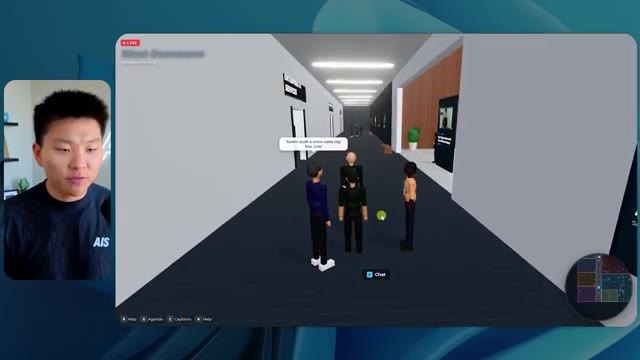
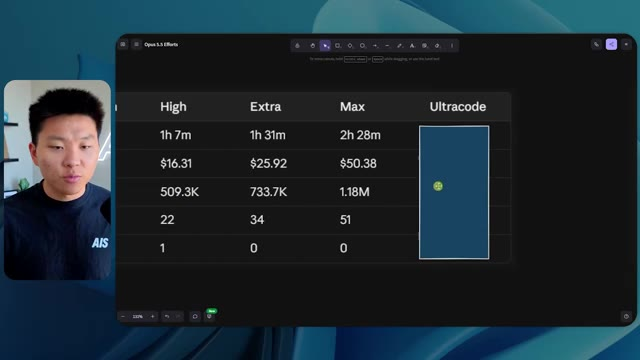

# 🎬 AI News in 5 Mins: GPT-6 Astra

> **Chaîne** : [Nate Herk | AI Automation](https://www.youtube.com/@nateherk/featured)  
> **Lien YouTube** : [https://www.youtube.com/watch?v=NbUTIFEEXLY](https://www.youtube.com/watch?v=NbUTIFEEXLY)  
> **Date de publication** : 20260903  
> **Durée** : 00:05:42  
> **Identifiant vidéo** : `NbUTIFEEXLY`  
> **Transcription & Analyse** : `whisper-v3-large-turbo+gemini-3.5-flash-lite`  

---

## 📌 Synthèse Exécutive & Outils

### 💡 Résumé

Dans cette vidéo issue de la chaîne de Nate Herk | AI Automation, l'analyste explore les capacités de génération et d'exécution du modèle **Opus 5.5** en le soumettant au même prompt complexe à travers différents niveaux d'effort (faible, moyen, élevé, etc.). Le défi technique imposé à l'agent IA consiste à transformer un dossier brut de 105 gigaoctets d'enregistrements vidéo de l'événement virtuel *AIS Live* (provenant de Frame.io) en un monde 3D interactif et explorable en vue à la troisième personne. Ce monde virtuel doit intégrer des salles, des scènes, des pistes de conférence, des éléments de marque spécifiques et exploiter des outils de génération d'images comme *key.ai* au sein du système d'exploitation IA *Herc 2*.

La comparaison des résultats met en lumière des contrastes saisissants en termes de rendu visuel, de fidélité à la marque, de gestion des PNJ (personnages non-joueurs) et de performances d'exécution. Alors que le niveau d'effort "faible" génère un prototype rudimentaire truffé de bugs graphiques (personnages fantômes, images fixes au lieu de vidéos, absence d'identité visuelle), le niveau d'effort "moyen" produit un environnement 3D étonnamment cohérent et fonctionnel. Ce dernier intègre des flux vidéo en direct, une palette de couleurs respectant les directives de la marque, une mini-carte synchronisée et des animations dynamiques de PNJ, le tout pour un temps d'exécution d'un peu plus d'une heure et un coût d'API calculé à 12,44 dollars.

L'expérience démontre l'importance cruciale du paramétrage de l'effort dans l'utilisation des agents IA modernes comme ceux d'Anthropic. Malgré des temps de traitement et des volumes de jetons croissants (allant de 191 000 jetons pour le niveau bas à 490 000 jetons pour le niveau moyen), les agents font preuve d'une autonomie totale en exécutant des dizaines de vérifications automatisées (ouverture de navigateur, tests visuels) sans nécessiter la moindre intervention humaine ni poser de questions complémentaires à l'utilisateur.

### 🛠️ Outils, Modèles & Logiciels Présentés

* **Opus 5.5** : Modèle d'intelligence artificielle de pointe développé par Anthropic, réputé pour sa polyvalence, son coût abordable et ses performances élevées, testé ici sous divers niveaux d'effort.
* **Claude Code** : Outil de développement et d'assistance au code par Anthropic utilisé pour l'ingénierie logicielle et l'intégration des environnements de travail.
* **Herc 2** : Système d'exploitation IA personnalisé de Nate Herk servant de plateforme centrale pour orchestrer les projets d'automatisation.
* **Hostinger Connector** : Extension gratuite pour éditeurs de code permettant d'importer directement un compte d'hébergement pour déployer rapidement des projets terminés.
* **Frame.io** : Solution de stockage et de collaboration vidéo utilisée ici pour héberger les 105 gigaoctets d'enregistrements bruts de l'événement *AIS Live*.
* **Key.ai** : Outil de génération d'images et de vidéos par IA sollicité par l'agent pour créer des éléments visuels contextuels dans le monde 3D.
* **VS Code & Cursor** : Environnements de développement intégrés (IDE) compatibles avec les extensions d'automatisation et de connectivité cloud.

### 🔑 Points Clés & Enseignements Stratégiques

* **Impact du niveau d'effort (*Effort Level*)** : Ajuster le paramètre d'effort d'un modèle d'IA modifie drastiquement la profondeur de traitement, la rigueur logique et la qualité esthétique du livrable final.
* **Gestion autonome des tâches complexes** : Face à un objectif global (*slash goal*) hautement complexe, Opus 5.5 exécute la mission de bout en bout sans formuler de questions de clarification, illustrant un haut degré d'autonomie agentique.
* **Automatisation des tests visuels (*Verifications*)** : Les agents exécutent des boucles de validation itératives (comme l'ouverture répétée de navigateurs pour inspecter le rendu) — jusqu'à 23 vérifications enregistrées pour le niveau moyen.
* **Rapport coût-performance de l'API** : Pour des tâches d'ingénierie lourdes générant un monde interactif complet, un coût d'API d'environ 12,44 dollars et un traitement d'une heure (pour le niveau moyen) constituent un retour sur investissement technique exceptionnel.
* **Consommation de jetons et volumétrie** : L'augmentation du niveau d'effort s'accompagne d'une explosion de la consommation de jetons (passant de 191k à 490k), nécessaire pour traiter le contexte enrichi et les boucles de rétroaction.
* **Fidélité contextuelle et image de marque** : Les niveaux d'effort supérieurs démontrent une meilleure capacité à analyser les directives de design, restituant avec précision les palettes de couleurs et l'identité visuelle de l'entreprise.
* **Intégration multimédia dynamique** : Contrairement aux niveaux faibles qui se contentent d'images statiques boguées, les configurations poussées intègrent avec succès des flux vidéo en lecture directe au sein d'environnements 3D explorables.
* **Comportement et animation des PNJ** : Les agents dotés d'un effort supérieur parviennent à insuffler de la vie dans l'environnement virtuel en programmant des réactions basiques et des mouvements pour les personnages non-joueurs.
* **Le gouffre entre le code et le déploiement** : La création automatisée d'applications fonctionnelles par l'IA accentue le besoin d'outils de transition fluides (tels que les extensions d'hébergement direct) pour éviter les frictions lors de la mise en ligne.
* **Méthodologie de prompt engineering** : Selon les recommandations d'Anthropic, il est stratégique de débuter les expérimentations complexes au niveau d'effort "moyen" avant d'ajuster itérativement vers le haut ou vers le bas selon la criticité du besoin.

---

## ⏱️ Chronologie & Transcription Complète Audio & Visuelle (Mot pour Mot)

### ⏱️ `[00:00:00 - 00:00:20]` | Segment #01

**🔊 Audio (Transcription Intégrale Mot pour Mot en Français) :**
> Opus 5,5, Opus 5,5, Opus 5,5, Opus 5,5, Opus 5,5. Ce modèle est littéralement partout et pour de très bonnes raisons. Il est intelligent, il est bon marché, il a un goût incroyable, c'est un modèle d'IA incroyable. Mais avec chaque modèle d'IA, vous avez le choix de l'effort, que ce soit faible, moyen, élevé, extra, max ou code ultra.

**👁️ Analyse Visuelle d'Écran (gemini-3.5-flash-lite) :**
**Interface & Outils** : Interface web de X (anciennement Twitter)

**Contenu textuel & Code** : Publication sur le réseau social parlant de l'impact des modèles d'IA sur les créateurs techniques, accompagnée d'un visuel de rendu 3D.

**Action / Démonstration** : Présentation visuelle d'un exemple de contenu généré par IA pour illustrer le propos.

*⏱️ 00:00:05 — Capture d'écran montrant un post sur les réseaux sociaux (X/Twitter) avec une vidéo intégrée affichant un paysage tropical généré par IA.*

---

### ⏱️ `[00:00:20 - 00:00:38]` | Segment #02

**🔊 Audio (Transcription Intégrale Mot pour Mot en Français) :**
> Donc dans cette vidéo, j'ai donné exactement le même prompt à Opus 5.5 et je l'ai exécuté à tous les niveaux d'effort possibles, et nous allons comparer les résultats. Nous examinerons la qualité de toutes les différentes sorties réelles, mais nous allons également voir combien de temps chacun d'eux a pris pour s'exécuter, combien cela nous a coûté si c'était facturé par l'API, le total des jetons, combien de vérifications ils ont effectuées, et combien de questions ils m'ont réellement posées tout au long du processus.

**👁️ Analyse Visuelle d'Écran (gemini-3.5-flash-lite) :**
**Interface & Outils** : Interface web de tableau / canevas de comparaison (type Miro ou application web personnalisée)

**Contenu textuel & Code** : Tableau avec les en-têtes Low, Medium, High, Extra, Max, Ultracode et les lignes Run time, API cost, Total tokens, Checks, Questions asked.

**Action / Démonstration** : Affichage et présentation comparative des différents niveaux d'effort d'Opus 5.5.

*⏱️ 00:00:29 — Tableau de comparaison montrant différents niveaux d'effort (Low, Medium, High, Extra, Max, Ultracode) avec des métriques comme Run time, API cost, Total tokens, etc.*

---

### ⏱️ `[00:00:39 - 00:00:58]` | Segment #03

**🔊 Audio (Transcription Intégrale Mot pour Mot en Français) :**
> Et les résultats que nous avons obtenus ne sont pas du tout ce à quoi je m'attendais, donc j'ai hâte de partager cela avec vous les gars. Ne perdons pas de temps et allons directement à celui-ci. D'accord, alors plongeons directement dans celui-ci. Je veux commencer juste en vous montrant le prompt réel que nous avons utilisé, que nous avons donné à chacun de ces différents agents. Je vais aller dans les fichiers ici, et nous allons ouvrir ce fichier markdown de prompt, et je vais vous montrer ce que nous avons obtenu. Voici donc le slash objectif que j'ai fourni.

**👁️ Analyse Visuelle d'Écran (gemini-3.5-flash-lite) :**
**Interface & Outils** : Interface de développement (type éditeur de code ou assistant IA avec panneau latéral de navigation et zone de chat).

**Contenu textuel & Code** : Texte du prompt affiché à l'écran : "Hi Nate. This worktree has the effort-test task queued in PROMPT.md : build a walkable third-person 3D world..."

**Action / Démonstration** : Le présentateur présente l'interface et s'apprête à montrer le prompt et les résultats de l'outil d'IA.

*⏱️ 00:00:48 — Interface d'un éditeur ou d'un outil de développement avec le présentateur incrusté en miniature à gauche.*

---

### ⏱️ `[00:00:58 - 00:01:34]` | Segment #04

**🔊 Audio (Transcription Intégrale Mot pour Mot en Français) :**
> J'ai dit, tu dois me créer un monde en 3D qui est une conférence tech réaliste dans laquelle je peux me promener en vue à la troisième personne. Tu vas regarder ce dossier, qui contient mes éléments d'enregistrement d'événements provenant d'AIS Live. Et ce dossier est un dossier frame IO de 105 gigaoctets d'enregistrements vidéo. C'était un événement entièrement virtuel. Tout a été enregistré et tous les enregistrements sont juste ici. J'ai dit, ton objectif est de prendre cet événement et de le transformer en un monde explorable en 3D qui me donne l'impression d'être réellement allé à une vraie conférence en personne avec différentes salles, différentes pistes, différentes scènes, bla, bla, bla. N'hésite pas à utiliser key.ai si tu as besoin de générer des images ou des vidéos. Et tu peux aussi utiliser n'importe quoi d'autre à l'intérieur de mon projet Herc 2, qui est comme mon système d'exploitation IA. J'ai dit,

**👁️ Analyse Visuelle d'Écran (gemini-3.5-flash-lite) :**
**Interface & Outils** : VS Code / Éditeur de code, et interface web Frame.io

**Contenu textuel & Code** : Fichier PROMPT.md contenant le prompt complet demandant de convertir les enregistrements d'une conférence virtuelle en monde 3D explorable en vue à la troisième personne, avec lien Frame.io (https://f.io/sPdlo-Si).

**Action / Démonstration** : Présentation du prompt de configuration et des fichiers sources vidéo de la conférence sur Frame.io d'une taille de 105 Go.

*⏱️ 00:01:07 — Éditeur de texte affichant le fichier PROMPT.md avec les instructions pour créer un monde 3D interactif et un lien Frame.io.*

*⏱️ 00:01:16 — Interface de la plateforme Frame.io montrant le dossier des enregistrements d'événements "Sep 22, 2026" d'une taille de 105.69 Go.*

*⏱️ 00:01:25 — Éditeur de texte affichant à nouveau le fichier PROMPT.md avec les consignes détaillées du projet.*

---

### ⏱️ `[00:01:34 - 00:02:08]` | Segment #05

**🔊 Audio (Transcription Intégrale Mot pour Mot en Français) :**
> vous serez jugé sur la créativité, le design, la physique, et la sensation générale alors que j'explore le monde 3D que vous avez construit. Et c'était pratiquement la fin des instructions. Donc comme vous pouvez le voir sur ce côté gauche, j'ai exécuté ceci à travers tous les différents niveaux d'effort. Commençons par le niveau bas et progressons jusqu'à l'ultra code. Très bien. Donc ici nous avons le résultat du niveau bas. Ouvrons ceci et jetons un coup d'œil. Donc nous avons AIS Live, le sommet des services IA en personne enfin, et nous avons pu cliquer partout. Tout d'abord, on ne sent pas vraiment l'identité de la marque. Genre, ce n'est pas le logo d'IS Live. Ce ne sont même pas nos couleurs. Donc je n'aimes pas trop ça, mais entrons ici. D'accord. C'est bien trop lumineux. Hum, nous avons une carte en haut à droite. Nous avons une ville par ici. Je ne peux pas dire quelle ville c'est

**👁️ Analyse Visuelle d'Écran (gemini-3.5-flash-lite) :**
**Interface & Outils** : Application de type interface de chat ou assistant IA (style interface de codage/agent)

**Contenu textuel & Code** : Message de l'assistant IA proposant de construire un monde 3D en vue à la troisième personne basé sur un fichier PROMPT.md, avec la liste des niveaux d'effort affichée à gauche.

**Action / Démonstration** : Sélection et navigation à travers les différents niveaux d'effort de l'agent IA dans la barre latérale gauche.

*⏱️ 00:01:42 — Interface d'une application d'IA montrant une barre latérale avec différents niveaux d'effort (Hello, Extra, High, Max, Ultracode, Medium, Low) et un panneau de discussion à droite.*

---

### ⏱️ `[00:02:08 - 00:02:40]` | Segment #06

**🔊 Audio (Transcription Intégrale Mot pour Mot en Français) :**
> C'est. D'accord. C'est Chicago, ce qui est plutôt cool parce que tu sais, j'habite à Chicago, mais bref, en haut à droite, on peut voir une carte. Nous avons un hall d'accueil. Nous avons un hall d'exposition. Nous avons un salon VIP sur la scène principale. La carte montre également où se trouve chaque autre personne et cela se synchronise en direct. Donc on peut voir l'enregistrement. On peut voir le premier jour, la keynote de l'hyper agent, le débriefing en direct. Cool. Donc il connaît vraiment le programme et puis il y a le deuxième jour. Donc il a trouvé ça, c'est bien. Nous avons ces petites boules ici que je peux, espérons-le, lancer. D'accord. Le visage, Oh, regarde ça. Si je vais par ici, tous les gens disparaissent tout simplement. Très mauvais. Très mauvais. D'accord. Alors voyons voir. Est-ce que je peux courir ? D'accord.

**👁️ Analyse Visuelle d'Écran (gemini-3.5-flash-lite) :**
**Interface & Outils** : Application web interactive / Plateforme virtuelle d'événement en 3D avec mini-carte de navigation.

**Contenu textuel & Code** : Menus d'événements, programmes de la journée, plans de la salle interactive.
[DESC_IMAGE_3] Navigation et exploration d'un environnement virtuel 3D simulant une conférence en ligne.

**Action / Démonstration** : Explications face caméra et démonstration conceptuelle.

*⏱️ 00:02:16 — Vue d'un espace virtuel interactif (Badge pickup) montrant des avatars et une mini-carte en haut à droite.*

*⏱️ 00:02:24 — Vue du hall d'accueil (Lobby) virtuel avec un panneau affichant le programme du jour et la mini-carte.*

*⏱️ 00:02:32 — Vue de l'Expo Hall virtuel avec des stands, des avatars et une structure lumineuse centrale.*

---

### ⏱️ `[00:02:40 - 00:03:04]` | Segment #07

**🔊 Audio (Transcription Intégrale Mot pour Mot en Français) :**
> Je peux avancer un peu plus vite. Je vais d'abord aller par ici. Il y a des produits dérivés, euh, un sweat à capuche certifié AIS plus. D'accord. Donc, il y a les vrais stands qu'on avait dans l'événement virtuel. On avait des stands. Donc c'est plutôt cool. Un petit endroit pour prendre des photos. Salle C. En ce moment, nous avons Tangy Frederick qui anime un atelier. D'accord. Mais ce n'est pas une vidéo. Comme vous pouvez le voir, c'est juste une image. Elle ne bouge pas. C'est donc juste une image. Ces gens sont en train de disparaître. Ça doit être des fantômes. Allons par ici dans la salle A.

**👁️ Analyse Visuelle d'Écran (gemini-3.5-flash-lite) :**
**Interface & Outils** : Environnement virtuel 3D (type jeu ou métavers).

**Contenu textuel & Code** : Aucun code source ou terminal, uniquement des éléments graphiques d'un monde virtuel interactif.
[DESC_IMAGE_3] Navigation et exploration d'un espace d'exposition virtuel par un avatar 3D.

**Action / Démonstration** : Explications face caméra et démonstration conceptuelle.

---

### ⏱️ `[00:03:04 - 00:03:30]` | Segment #08

**🔊 Audio (Transcription Intégrale Mot pour Mot en Français) :**
> Nous avons Liberty White. D'accord. Très cool. Vos 30 premiers jours en automatisation. Encore une fois, c'est juste une image fixe et les gens ont des bugs d'affichage. Donc ce n'est pas très bon ici. Je vais aller sur la scène principale et voir ce que nous avons. D'accord, cool. Donc nous avons une scène principale. Les gens ont de gros bugs d'affichage. Vraiment mauvais. Ce n'est vraiment pas bon du tout. Notre vidéo est en train de bouger. Genre, j'ai vu mon visage ici et j'ai vu celui de Devin, mais maintenant ils ont disparu. Donc je ne sais pas ce qui s'est passé. D'accord. On dirait plutôt un diaporama. Rien n'est vraiment joué pour l'instant. Bref, entrons ici.

**👁️ Analyse Visuelle d'Écran (gemini-3.5-flash-lite) :**
**Interface & Outils** : Application de monde virtuel 3D / Événement virtuel en ligne type métavers.

**Contenu textuel & Code** : Interface utilisateur virtuelle affichant des indications de déplacement (WASD move) et de navigation entre les différentes salles de l'événement.

**Action / Démonstration** : Le présentateur navigue et se déplace à l'aide de son avatar dans l'espace virtuel de l'événement pour visiter les différentes scènes et ateliers.

*⏱️ 00:03:11 — Vue d'un monde virtuel interactif (style 3D avatar) montrant une salle d'atelier 'Workshop Room A - Foundation track' avec des plateformes circulaires lumineuses.*

*⏱️ 00:03:17 — Navigation dans un auditorium virtuel rempli d'avatars, affichant le titre 'Hyperagent Workshop: How to Build an Always-On Fleet of Agents' sur la scène principale.*

*⏱️ 00:03:24 — Vue en face d'une grande scène virtuelle d'événement 'AIS Live AI Services Summit' avec des écrans géants et des éléments interactifs.*

---

### ⏱️ `[00:03:30 - 00:03:58]` | Segment #09

**🔊 Audio (Transcription Intégrale Mot pour Mot en Français) :**
> Nous avons plus de stands. Nous avons hyper agent. Nous avons Claude Code. Nous avons plus de goodies. La salle B, c'est Dave Ebelor. Je suppose que c'est exactement la même chose. Nous avons du café. Et ensuite, je suppose que le salon VIP, accès VIP seulement. C'est plutôt cool, mais il n'y a vraiment rien qui se passe ici. Cet écran est bien trop lumineux. D'accord. Donc je pense que vous comprenez l'ambiance qu'on obtient ici avec Opus 5.5 en faible effort. Et c'est là que les choses deviennent intéressantes. Combien de temps pensez-vous que cela a duré ? Combien de temps ? Celui-ci a duré 16 minutes et 43 secondes. Combien pensez-vous que cela a coûté ?

**👁️ Analyse Visuelle d'Écran (gemini-3.5-flash-lite) :**
**Interface & Outils** : Application web collaborative / Tableau blanc (Opus 5.5 Efforts).

**Contenu textuel & Code** : Tableau comparatif évaluant Run time, API cost, Total tokens, Checks et Questions asked selon différents niveaux d'effort.

**Action / Démonstration** : Présentation des différents modes et niveaux de performance d'un modèle ou agent.

*⏱️ 00:03:51 — Tableau comparatif intitulé "Opus 5.5 Efforts" montrant des métriques de performance par niveau d'effort (Low, Medium, High, Extra, Max, Ultracode).*

---

### ⏱️ `[00:03:58 - 00:04:26]` | Segment #10

**🔊 Audio (Transcription Intégrale Mot pour Mot en Français) :**
> 3,91 dollars si c'était une facturation par API. J'utilise évidemment mon abonnement ici, mais nous allons simplement calculer cela avec la facturation par API. Le total des jetons était de 191 000. Il a fait 22 vérifications. Donc pour la vérification, 22 fois il a ouvert le navigateur et a exécuté différents types de vérifications. Donc 22 catégories de vérifications. Et combien de questions m'a-t-il posées ? Il m'a posé un total de zéro question tout au long de cette invite de type « slash goal ». D'accord. Alors ouvrons l'effort moyen et voyons ce que nous avons. D'accord, c'est parti. Effort moyen. Nous avons Nate Herc. Nous avons mon badge. C'est la marque d'AI's life.

**👁️ Analyse Visuelle d'Écran (gemini-3.5-flash-lite) :**
**Interface & Outils** : Application de tableau blanc / diagramme en ligne (style Excalidraw)

**Contenu textuel & Code** : Tableau avec les lignes 'Run time' (16m 43s), 'API cost' ($3.91), 'Total tokens' (191.3K), 'Checks', et 'Questions asked', sous des colonnes 'Low', 'Medium', 'High', 'Ex'.

**Action / Démonstration** : Le présentateur explique les métriques de coût et de jetons affichées dans le tableau du tableau blanc.

*⏱️ 00:04:05 — Un tableau comparatif des performances et coûts d'exécution affiché dans une application de tableau blanc ou de diagramme (comme Excalidraw), montrant un temps d'exécution de 16m 43s, un coût API de 3,91 $, un total de 191,3K tokens et des vérifications ('Checks').*

---

### ⏱️ `[00:04:26 - 00:04:46]` | Segment #11

**🔊 Audio (Transcription Intégrale Mot pour Mot en Français) :**
> Donc ça a déjà l'air un tout petit peu mieux. Ça ressemble à nos palettes de couleurs qui utilisaient nos directives de marque. Premier jour de construction, deuxième jour de gain, VIP. Cool. D'accord. Je vais entrer dans le lieu. D'accord. Waouh. Donc une ambiance similaire en gros. C'est en arrière-plan. Ça ne ressemble pas à Chicago, n'est-ce pas ? Non, ça ressemble à, honnêtement, ça ressemble à une ville inventée. Quoi qu'il en soit, c'est marrant qu'ils aient décidé de faire ça. Voyons si je peux avancer un peu plus vite. Oh, waouh.

**👁️ Analyse Visuelle d'Écran (gemini-3.5-flash-lite) :**
**Interface & Outils** : Application web interactive / Environnement virtuel 3D type metaverse

**Contenu textuel & Code** : Écran de bienvenue 'AIS Live' avec badge d'accès, commandes de navigation clavier (WASD, Shift, Space) et vue d'un espace de réunion virtuel.

**Action / Démonstration** : Navigation et entrée dans le lieu virtuel de l'événement.

*⏱️ 00:04:31 — Interface web de l'application 'AIS Live' montrant un badge nominatif virtuel pour 'NATE HERK' et le bouton 'ENTER THE VENUE'.*

*⏱️ 00:04:41 — Vue à la première personne dans l'environnement virtuel 3D de l'application 'AIS Live' avec des avatars et un décor urbain en arrière-plan.*

---

### ⏱️ `[00:04:46 - 00:05:21]` | Segment #12

**🔊 Audio (Transcription Intégrale Mot pour Mot en Français) :**
> Les gens interagissent avec moi. Regardez. Si je m'approche de ce type, il vient juste de lever le bras. Bon, maintenant il ne veut plus rien savoir de moi du tout. Mais tous ces petits robots ici doivent prendre des décisions. Je ne suis pas sûr s'ils utilisent Jev. C'est sûr que non. Je ne le lui ai pas dit. En fait, ma clé Jev est à l'arrière. Je ne sais pas. Peut-être qu'il l'a utilisée. Quoi qu'il en soit, nous pouvons voir ici que nous avons la salle d'atelier C, le laboratoire des agents. Sympa. Donc celui-ci est en fait en train de tourner. Vous pouvez voir qu'il s'agit d'une vraie vidéo lue par Tangy. Tout le monde ici est en train de travailler sur un ordinateur portable. Ils ne buguent pas. C'est plutôt cool. De plus, mon badge est sur ma poitrine, ce qui est plutôt cool. Je peux venir par ici. Nous avons une carte en haut à droite, comme vous pouvez le voir, mais je peux venir par ici. Nous avons un

**👁️ Analyse Visuelle d'Écran (gemini-3.5-flash-lite) :**
**Interface & Outils** : Application ou plateforme virtuelle 3D / type métavers / jeu vidéo de simulation sociale.

**Contenu textuel & Code** : Environnement virtuel 3D interactif avec interface utilisateur (mini-carte, bannières d'événements, indicateurs de session).

**Action / Démonstration** : Navigation et exploration d'un monde virtuel 3D peuplé d'avatars et de robots autonomes.

*⏱️ 00:04:55 — Vue en jeu d'un monde virtuel interactif type métavers montrant plusieurs avatars de robots et de personnages.*

*⏱️ 00:05:04 — Vue de l'entrée d'un espace nommé 'Agents Lab' avec des rangées de bureaux et des participants virtuels.*

*⏱️ 00:05:12 — Vue en plongée d'une grande salle de classe ou de conférence virtuelle remplie de bureaux avec des ordinateurs portables et des avatars.*

---

### ⏱️ `[00:05:21 - 00:05:47]` | Segment #13

**🔊 Audio (Transcription Intégrale Mot pour Mot en Français) :**
> hall d'exposition. C'est là que nous avons le stand Glido. Et ça diffuse actuellement. Oui, ça diffuse la vidéo de nous en train de parler de Glido. Ça diffuse la vidéo d'Ed et moi parlant de notre programme de certification. Nous avons le logo AIS Plus ici à l'arrière, qui est un peu mal placé. Ce sont les diapositives des conférenciers et les points clés. Donc wow, ce sont toutes les ressources que nous avons distribuées après l'événement. Elles sont toutes là aussi. Nous pouvons voir que nous avons un projecteur sur la communauté. Donc c'est Aiden qui parle de son contrat qu'il a décroché et ça joue en direct. Ces gens regardent.

**👁️ Analyse Visuelle d'Écran (gemini-3.5-flash-lite) :**
**Interface & Outils** : Environnement virtuel 3D / Plateforme de webinaire interactive.

**Contenu textuel & Code** : Textes de présentation de certification AIS+, diaporamas et affichage d'avatars virtuels.

**Action / Démonstration** : Navigation et visite guidée d'un espace d'exposition virtuel.

---

### ⏱️ `[00:05:47 - 00:06:21]` | Segment #14

**🔊 Audio (Transcription Intégrale Mot pour Mot en Français) :**
> Ils sont plutôt engagés. On a l'hyper agent. C'était, c'est ce que je voulais dire. Si vous avez vu ces gens lever les bras pour dire bonjour, c'était plutôt marrant. Regardez, regardez, le voilà qui recommence. Bref. Bon. Où est-ce que je suis maintenant ? Maintenant, je suis dans le hall principal. On a un bar à café. On a un grand logo, qui est le vrai logo. C'est trop lumineux, mais on a le logo. On peut voir si on peut entrer ici dans le parcours des fondations. On a Sabrina Romanov et Liberty White. Donc différentes formations juste là. On peut entrer dans cette salle. C'est le parcours avancé. Alors, qu'est-ce qui se passe ici ? On a Dave Ebelar et Saman qui parlent de différentes choses là-dedans. Et maintenant, allons jeter un œil à la scène principale. Oh, attendez, il y a une vidéo de moi là-haut. C'est genre un VIP

**👁️ Analyse Visuelle d'Écran (gemini-3.5-flash-lite) :**
**Interface & Outils** : Application ou plateforme virtuelle 3D interactive (type Gather ou monde virtuel événementiel).

**Contenu textuel & Code** : Éléments graphiques 3D, avatars d'utilisateurs, interface de navigation, mini-carte du monde virtuel et texte "Main Lobby".

**Action / Démonstration** : Exploration et déplacement d'un avatar dans le hall principal d'une plateforme virtuelle interactive.

---

### ⏱️ `[00:06:21 - 00:06:50]` | Segment #15

**🔊 Audio (Transcription Intégrale Mot pour Mot en Français) :**
> section ? Ouais, on ira voir ça dans une minute. Mais bref, voici la scène principale. Ça a l'air vraiment, vraiment super. On a une grande scène. On a genre quatre personnes assises ici. On a les trois écrans d'Alex là-haut avec l'hyper agent. Est-ce que j'ai le droit de monter sur scène ? Oh, et il me laisse monter sur scène. D'accord. C'est plutôt sympa. Bon les gars, faisons un selfie. Laissez-moi prendre tout le monde en arrière-plan. Venez par ici. Bref, c'est vraiment, vraiment cool. Toutes les places ne sont pas prises par contre. Donc il faut qu'on travaille là-dessus. Mais bref, je vais courir voir ce que c'était que cette section VIP. D'accord. Le salon VIP. J'ai l'impression que c'est comme un aéroport ou un truc comme ça.

**👁️ Analyse Visuelle d'Écran (gemini-3.5-flash-lite) :**
**Interface & Outils** : Environnement virtuel 3D / plateforme de conférence en ligne.

**Contenu textuel & Code** : Interface utilisateur de la keynote avec encadré d'information "Hyperagent Keynote - Alex McDonnell, Hyperagent".

**Action / Démonstration** : Navigation et exploration de l'espace virtuel 3D par le présentateur sous forme d'avatar.

---

### ⏱️ `[00:06:51 - 00:07:14]` | Segment #16

**🔊 Audio (Transcription Intégrale Mot pour Mot en Français) :**
> OK, super. Donc maintenant, nous avons les sessions VIP ici. Une séance de questions-réponses VIP avec Nate, une lecture vidéo en direct ici même. Très, très cool. Et nous avons comme un bar ou quelque chose comme ça. Génial. Je dirais que c'est un plutôt bon résultat. Maintenant, en ce qui concerne les statistiques ici, celle-ci a pris une heure et 13 minutes à s'exécuter. Cela nous aurait coûté 12 dollars et 44 cents. Elle a utilisé 490 000 jetons et elle a effectué 23 vérifications.

**👁️ Analyse Visuelle d'Écran (gemini-3.5-flash-lite) :**
**Interface & Outils** : Application virtuelle 3D / Interface de tableau de bord de données (Opus 5.5 Efforts)

**Contenu textuel & Code** : Métriques d'exécution et de coûts : Run time, API cost ($3.91), Total tokens (191.3K), Checks, Questions asked.

**Action / Démonstration** : Présentation des fonctionnalités de la session VIP virtuelle et des statistiques de performance affichées sur le tableau de bord.

*⏱️ 00:06:56 — Vue d'un espace virtuel 3D (salon VIP) avec un écran géant affichant une vidéo en direct du présentateur et un espace de discussion type bar.*

*⏱️ 00:07:02 — Tableau de bord d'analyse montrant des métriques de performance telles que le temps d'exécution (16m 43s), le coût API ($3.91) et le nombre total de jetons.*

---

### ⏱️ `[00:07:14 - 00:07:48]` | Segment #17

**🔊 Audio (Transcription Intégrale Mot pour Mot en Français) :**
> Et il nous a posé un total de zéro question une fois de plus. Très bien, passons à élevé. C'était déjà un résultat plutôt correct, et Anthropic eux-mêmes dans leur vidéo de conseils sur le prompt d'Opus 5.5, ou désolé, pas une vidéo, un article. Ils ont dit de commencer simplement par moyen et de l'ajuster à la hausse ou à la baisse si nécessaire. C'était donc un résultat moyen. Passons à élevé et voyons ce qu'on obtient. Très rapidement, les gars, je dois prendre une seconde pour vous parler du sponsor de la vidéo d'aujourd'hui, Hostinger. Donc, ces deux modèles viennent de me créer une version fonctionnelle de la même chose. Et maintenant, je me retrouve exactement là où je finis toujours, avec un projet terminé sur mon ordinateur portable et aucun moyen rapide de le mettre en ligne. Et c'est ce fossé que le connecteur d'Hostinger comble. C'est une extension gratuite

**👁️ Analyse Visuelle d'Écran (gemini-3.5-flash-lite) :**
**Interface & Outils** : Tableau comparatif sur interface canvas / Éditeur de code (VS Code / interface similaire) avec assistant IA et panneau de chat/code.

**Contenu textuel & Code** : Tableau de métriques (Run time : 16m 43s / 1h 13m, API cost : $3.91 / $12.44, Total tokens, etc.) et code/prompt pour générer un fichier HTML unique de calculateur de ROI.

**Action / Démonstration** : Analyse comparative des coûts et temps d'exécution selon les niveaux d'effort de l'IA et génération de code en cours.

*⏱️ 00:07:22 — Un tableau comparatif des performances de l'IA (Run time, API cost, Total tokens, Checks, Questions asked) selon différents niveaux d'effort (Low, Medium, High, Extra) avec le présentateur en médaillon.*

*⏱️ 00:07:39 — Une interface d'éditeur de code divisée en deux panneaux montrant l'exécution d'un prompt pour créer un calculateur ROI (« Build Northwind ROI calculator ») avec des indicateurs de réflexion de l'IA.*

---

### ⏱️ `[00:07:48 - 00:08:23]` | Segment #18

**🔊 Audio (Transcription Intégrale Mot pour Mot en Français) :**
> pour votre éditeur qui importe votre compte Hostinger dans ce sur quoi vous êtes déjà en train de coder. Donc VS Code, Cursor, Cloud Code, Codex, j'en passe. Vous vous connectez une seule fois en un seul clic, et à partir de là, votre agent peut déployer le site, y pointer un domaine, configurer les enregistrements DNS et vérifier votre VPS sans jamais avoir à quitter l'éditeur. Donc, peu importe celui de ces outils que vous finirez par préférer, ce qu'il a construit se trouve à quelques minutes d'une véritable URL sur un hébergement géré. Connector est gratuit avec chaque formule d'hébergement, donc si vous avez toujours besoin de l'hébergement sous-jacent, profitez de la formule illimitée grâce au lien dans la description et utilisez le code NATEHERK pour obtenir 10 % de réduction. Cela inclut également un domaine gratuit et un e-mail professionnel pour un an. Et c'est toujours le moyen le moins cher que j'ai trouvé pour obtenir quelque chose

**👁️ Analyse Visuelle d'Écran (gemini-3.5-flash-lite) :**
**Interface & Outils** : Interface de gestion Hostinger intégrée et Claude Code.

**Contenu textuel & Code** : Statut "Connected via OAuth", version Node.js 24.13.0, liste des outils disponibles avec cases à cocher (Websites, Domains, Subscriptions & Payments, Email Marketing).

**Action / Démonstration** : Connexion réussie du compte Hostinger à l'éditeur pour permettre à l'agent d'accéder aux outils de gestion.

*⏱️ 00:07:57 — Interface montrant la connexion entre Hostinger et un IDE (comme Claude Code) avec les outils disponibles (Websites, Domains, Subscriptions, Email Marketing).*

---

### ⏱️ `[00:08:23 - 00:08:47]` | Segment #19

**🔊 Audio (Transcription Intégrale Mot pour Mot en Français) :**
> tu as construit sur une vraie URL. Donc revenons à la vidéo. D'accord. Encore une fois, très, très marqué par la marque. C'est un écran de chargement encore mieux que le précédent. Nous avons ce joli petit effet en arrière-plan. Nous avons le logo. Nous allons entrer dans le lieu. D'accord. Nous y voilà. Ça a l'air plutôt bien. Nous commençons à l'extérieur et vous pouvez voir que nous avons ces drapeaux pour tous les intervenants, Wyatt, Casper, Alex, Ed, Aiden, Sabrina, Liberty. C'est plutôt cool. Nous avons des blocs en direct ici.

**👁️ Analyse Visuelle d'Écran (gemini-3.5-flash-lite) :**
**Interface & Outils** : Application web interactive en 3D (AIS Live)

**Contenu textuel & Code** : Interface utilisateur avec des commandes de déplacement (WASD), affichage du lieu (AIS Live Plaza) et bannières informatives

**Action / Démonstration** : Navigation et entrée dans l'environnement virtuel 3D de la plateforme événementielle AIS Live

*⏱️ 00:08:29 — Écran de chargement et d'accueil de la plateforme virtuelle AIS Live, affichant le logo et les instructions de contrôle.*

*⏱️ 00:08:35 — Entrée dans le monde virtuel en 3D d'AIS Live Plaza avec un avatar et des bâtiments en arrière-plan.*

*⏱️ 00:08:41 — Exploration de la place virtuelle AIS Live Plaza montrant des bannières de conférenciers et des éléments interactifs.*

---

### ⏱️ `[00:08:47 - 00:09:23]` | Segment #20

**🔊 Audio (Transcription Intégrale Mot pour Mot en Français) :**
> Il a pris cette photo de moi, votre hôte, Nate Herc, John, Dave, Nate Herc. Voilà. OK. Les portes. Génial. Ce sont des portes coulissantes automatiques en verre. J'adore ça. On peut voir l'enregistrement VIP. On peut voir l'admission générale (GA). On peut venir par ici et on peut découvrir l'expo avec différents stands, le coin de la communauté. Vous pouvez aussi voir qu'en haut à gauche, j'ai un passeport. Donc c'est comme, ça montrera combien d'endroits j'ai visités. Tout cela est une vraie lecture. Nous avons un mur de ressources avec tous les différents intervenants. Ils ont aussi une session de réseautage par ici. Donc je vais y aller très vite et voir de quoi il s'agit. Nous avons donc le bar à cold brew AIS. Nous avons différents membres de la communauté qui ont été mis en avant ou en valeur.

**👁️ Analyse Visuelle d'Écran (gemini-3.5-flash-lite) :**
**Interface & Outils** : Application ou plateforme virtuelle 3D (Metaverse / environnement virtuel d'événement).

**Contenu textuel & Code** : Éléments visuels d'un événement virtuel, bannières "Registration", "VIP Check-in", "Main Stage" et "Expo Hall".

**Action / Démonstration** : Navigation et exploration de l'espace virtuel par l'avatar du présentateur.

*⏱️ 00:08:56 — Vue d'un espace de conférence virtuel 3D (Registration Concourse) avec des avatars et des comptoirs d'accueil.*

*⏱️ 00:09:05 — Exploration de l'Expo Hall virtuel avec des stands d'exposition et des bannières informatives.*

*⏱️ 00:09:14 — Navigation dans le hall d'enregistrement virtuel au milieu d'autres avatars de participants.*

---

### ⏱️ `[00:09:23 - 00:09:56]` | Segment #21

**🔊 Audio (Transcription Intégrale Mot pour Mot en Français) :**
> On a la zone VIP. Attends, quoi ? Prends un bracelet. Ah, je dois vraiment aller chercher le bracelet. D'accord. Laisse-moi m'enregistrer rapidement. Le bracelet est déjà mis. Attends, quoi ? D'accord. Oh, d'accord. Maintenant, les portes se sont ouvertes pour moi. Cool. Je peux entrer ici. Oh, ça mène juste à la scène principale. Salon VIP. Il y a une séance de questions-réponses en cours. Ça a l'air très cool. Je veux dire, je suis très impressionné par la façon dont il est capable de faire ça. Wouah. D'accord. Donc c'est vraiment bien. Ce qu'on a fait, c'est qu'on a eu des salles de discussion VIP avec différentes personnes. Tu peux voir qu'il y a différentes salles, différents membres de l'équipe AIS qui vont dans des trucs. C'est vraiment cool. C'est très cool. C'est un VIP bien meilleur

**👁️ Analyse Visuelle d'Écran (gemini-3.5-flash-lite) :**
**Interface & Outils** : Environnement virtuel 3D en ligne (type salon virtuel ou espace métavers de conférence).

**Contenu textuel & Code** : Avatars 3D, écrans de visioconférence intégrés et panneaux d'information contextuels.

**Action / Démonstration** : Exploration d'un espace virtuel 3D interactif et navigation d'un avatar à travers différentes salles.

---

### ⏱️ `[00:09:56 - 00:10:30]` | Segment #22

**🔊 Audio (Transcription Intégrale Mot pour Mot en Français) :**
> expérience que ce qui a été montré dans la première partie. D'accord. After party VIP. Regardez ça. On a une piste de danse. On a tous ces éléments ici. On a la lecture de l'after party VIP juste ici. Et il y a une estrade de DJ. C'est trop marrant. Il y a un petit bug ici, un petit glitch ici, mais c'est génial. Oh, cool. Donc quand je suis ici sur la scène principale, on a des sous-titres. Vous pouvez voir juste ici en bas de mon écran, on a ces sous-titres de Wyatt qui est en train de parler là-haut. On a des lumières. On a le panel. Très sympa. Jolie scène principale. Je vais aller par ici. On peut aller vers la fondation,

**👁️ Analyse Visuelle d'Écran (gemini-3.5-flash-lite) :**
**Interface & Outils** : Application web d'événement virtuel en 3D (metaverse / plateforme de conférence virtuelle)

**Contenu textuel & Code** : Environnement virtuel 3D avec avatars, interface de conférence, écrans vidéo et éléments de navigation textuels

**Action / Démonstration** : Navigation et exploration d'un espace virtuel 3D par le présentateur lors de l'after-party et de la scène principale

*⏱️ 00:10:04 — Capture d'écran montrant l'interface d'un événement virtuel en 3D représentant une after-party VIP avec un avatar naviguant sur une piste de danse.*

*⏱️ 00:10:13 — Vue légèrement différente de la même after-party virtuelle avec des avatars et un grand écran montrant des participants en visio.*

*⏱️ 00:10:21 — Capture d'écran montrant la scène principale (Main Stage) de l'événement virtuel avec des avatars assis dans une salle de conférence face à un grand écran.*

---

### ⏱️ `[00:10:30 - 00:11:06]` | Segment #23

**🔊 Audio (Transcription Intégrale Mot pour Mot en Français) :**
> avancé, et les parcours d'entreprise par ici. Alors voyons voir. Nous avons l'anatomie de trois vraies transactions. Nous avons l'hyper agent. Nous avons les évaluations avec Nate et Ed ici. Nous avons Dave qui s'occupe des trucs avancés. C'est vraiment bien. Je veux dire, évidemment, chacun, chacun de ces résultats jusqu'à présent, faible était correct. Moyen était meilleur. Élevé a été encore meilleur. Voyons si cette tendance se poursuit et allons voir ce que cela nous a coûté. Donc, élevé a fonctionné pendant une heure et sept minutes. Donc un peu plus rapide que moyen, cela nous aurait coûté 16 dollars et 31 cents. Il a utilisé un demi-million de tokens, 509 000. Il a fait 22 vérifications. Et il nous a aussi demandé, enfin, non, je me suis trompé. Ce

**👁️ Analyse Visuelle d'Écran (gemini-3.5-flash-lite) :**
**Interface & Outils** : Application de tableau blanc / interface de présentation (Opus 5.5 Efforts).

**Contenu textuel & Code** : Tableau avec des métriques : Run time (16m 43s, 1h 13m, 1h 7m), API cost ($3.91, $12.44, $16.31), Total tokens, Checks, Questions asked.

**Action / Démonstration** : Analyse et présentation des résultats comparatifs selon les différents niveaux d'effort de l'agent.

*⏱️ 00:10:57 — Un tableau comparatif des coûts et performances d'Opus 5.5 (Low, Medium, High, Extra) avec les temps d'exécution et les coûts API.*

---

### ⏱️ `[00:11:06 - 00:11:25]` | Segment #24

**🔊 Audio (Transcription Intégrale Mot pour Mot en Français) :**
> l'un m'a posé une question et, divulgâcheur, c'était le seul qui nous a posé une question pendant tout ça. Alors voyons voir, il nous en reste trois : Extra, Max et Ultra Code. Laissez-moi ouvrir Extra et nous verrons ce que nous avons. D'accord. Donc celui-ci a l'air plutôt bien. Je dirais honnêtement que jusqu'à présent, l'écran de chargement haut était le meilleur. Celui que nous venons juste de voir, mais bref, entrons dans AIS Live.

**👁️ Analyse Visuelle d'Écran (gemini-3.5-flash-lite) :**
**Interface & Outils** : Application de tableau blanc ou de prise de notes numérique avec un tableau structuré (style Obsidian Canvas ou similaire).

**Contenu textuel & Code** : Tableau avec des colonnes : Low, Medium, High, Extra et des lignes : Run time, API cost, Total tokens, Checks, Questions asked.

**Action / Démonstration** : Le présentateur commente les résultats affichés dans le tableau et sélectionne la colonne 'Extra'.

*⏱️ 00:11:11 — Un tableau comparatif montrant les métriques de performance pour différents niveaux de réglage ('Low', 'Medium', 'High', 'Extra') incluant le temps d'exécution, le coût de l'API, les tokens, les vérifications et les questions posées.*

---

### ⏱️ `[00:11:26 - 00:11:51]` | Segment #25

**🔊 Audio (Transcription Intégrale Mot pour Mot en Français) :**
> Waouh. D'accord. Donc nous avons comme de petits extraits sonores. Je peux discuter avec des gens. Le panneau de la guerre des outils a réglé quelques débats pour moi. Sympa. Bonne perspective là-bas. Nous sommes à nouveau dehors. Nous avons ces différentes bannières, bien qu'elles soient toutes les mêmes. Elles ne portent pas le nom de différentes personnes. Donc grand logo Big AIS Live. L'aile de l'atelier est par ici. Et passons par les portes coulissantes en verre pour voir ce que nous avons. Nous avons donc le café AIS. La carte est en bas à droite, et elle n'est pas très descriptive.

**👁️ Analyse Visuelle d'Écran (gemini-3.5-flash-lite) :**
**Interface & Outils** : Application web ou plateforme interactive virtuelle 3D avec affichage en vue à la troisième personne et mini-carte en bas à droite.

**Contenu textuel & Code** : Environnement virtuel 3D interactif avec avatars, bannières publicitaires et interface de navigation en ligne.

**Action / Démonstration** : Exploration d'un monde virtuel interactif en 3D avec déplacement d'avatar.

*⏱️ 00:11:32 — Vue d'un monde virtuel interactif montrant un avatar de type personnage de jeu vidéo se déplaçant sur une place publique en extérieur.*

*⏱️ 00:11:38 — L'avatar poursuit sa progression dans l'environnement virtuel en plein air avec des bâtiments éclairés en arrière-plan et des panneaux affichant 'AIS LIVE'.*

*⏱️ 00:11:45 — L'avatar se dirige vers l'entrée lumineuse d'un grand bâtiment de type hall d'exposition ou centre de convention virtuel.*

---

### ⏱️ `[00:11:51 - 00:12:26]` | Segment #26

**🔊 Audio (Transcription Intégrale Mot pour Mot en Français) :**
> J'aime bien comment les autres cartes nous ont montré ce que, genre où étaient les choses, mais celle-ci a l'air très professionnelle. On peut voir ici c'est la scène principale. Allons y faire un tour rapidement. Elles ont toutes ces balles qui volent partout, ce qui je trouve est plutôt marrant. Les ballons de plage AIS. On nous voit là-haut en train de parler. Je crois que j'étais en train d'introduire l'un des jours. Continuons par ici vers la salle d'atelier sur ce côté gauche. OK. Donc ici nous avons le théâtre Hyper Agent. Nous avons cette session sponsorisée ici par Hyper Agent, mais ça nous montre aussi ce qui va s'y passer. C'est vraiment marrant qu'on puisse discuter avec les gens. Salmon a créé un commercial vocal en direct. La salle "The Price Is Right" était comble. Tu as récupéré le guide du compagnon VIP ? C'est trop marrant. Nous avons le parcours avancé dans

**👁️ Analyse Visuelle d'Écran (gemini-3.5-flash-lite) :**
**Interface & Outils** : Application web de monde virtuel 3D / métavers de conférence.

**Contenu textuel & Code** : Environnement 3D interactif avec avatars, écrans vidéo intégrés et infobulles de chat.

**Action / Démonstration** : Exploration et visite guidée du monde virtuel par le présentateur.

*⏱️ 00:12:00 — Vue dans un monde virtuel 3D de type métavers montrant la scène principale (Main Stage) avec un écran géant affichant le présentateur et un public d'avatars assis.*

*⏱️ 00:12:09 — Vue dans le hall d'un monde virtuel 3D avec des avatars interactifs et l'accès à différentes zones comme 'Workshops'.*

*⏱️ 00:12:17 — Navigation dans un couloir virtuel en 3D à l'intérieur de l'espace de conférence interactif.*

---

### ⏱️ `[00:12:26 - 00:12:58]` | Segment #27

**🔊 Audio (Transcription Intégrale Mot pour Mot en Français) :**
> ici. Encore une fois, nous avons une lecture en direct. Est-ce que c'est une lecture en direct ? Oh, d'accord. Ça a commencé une fois que je suis entré, mais je peux prendre place. Oh la la. Je peux regarder ça. Je peux me lever. Je veux m'asseoir au premier rang. C'est plutôt cool. C'est très bien. J'aime bien ça. Et vous savez ce que j'ai remarqué jusqu'à présent ? Le personnage réel que j'incarne me ressemble un peu. Je pense qu'il a été modélisé à partir de mes photos de profil ou quelque chose comme ça. Quoi qu'il en soit, nous avons Sabrina ici, l'animatrice de la salle ici, prenez n'importe quel siège libre. D'accord, cool. Et j'ai vraiment aimé la fonctionnalité pour s'asseoir. C'est plutôt marrant. Genre, on pourrait vraiment assister à cet atelier et participer. Bref, ça nous montre les intervenants. Ça nous montre les

**👁️ Analyse Visuelle d'Écran (gemini-3.5-flash-lite) :**
**Interface & Outils** : Application de réalité virtuelle / plateforme de webinaire interactive (metavers éducatif)

**Contenu textuel & Code** : Interface d'un espace de formation virtuel avec projection sur grand écran et avatars de participants.

**Action / Démonstration** : Navigation et exploration de l'espace virtuel par le présentateur.

---

### ⏱️ `[00:12:58 - 00:13:31]` | Segment #28

**🔊 Audio (Transcription Intégrale Mot pour Mot en Français) :**
> programme. Il y a un petit tapis rouge ici pour prendre des photos. On peut prendre la pose. Oh, wouah. C'est plutôt cool. Bibliothèque de ressources, obtenez la certification AIS Plus, Glido, Hyper Agent, AIS Plus, trois vraies affaires. Génial. Je veux dire, je dirais vraiment que jusqu'à présent, chacune est meilleure que la précédente. Et on n'a même pas encore vu la section VIP, le salon VIP. Montons par ici très vite. J'espère que je pourrai entrer. Sympa. On a une réinitialisation des outils. Ce sont les différentes salles dans lesquelles nous pourrions aller. Donc encore une fois, je pourrais prendre la feuille de calcul et je pourrais essayer de comprendre comment tarifer mes trucs. C'est tellement cool. C'est vraiment mieux que la précédente où on a en quelque sorte juste

**👁️ Analyse Visuelle d'Écran (gemini-3.5-flash-lite) :**
**Interface & Outils** : Monde virtuel 3D / application web interactive

**Contenu textuel & Code** : Environnement virtuel 3D avec avatars, panneaux et interfaces textuelles intégrées.

**Action / Démonstration** : Navigation et exploration d'un événement virtuel à l'aide d'avatars.

---

### ⏱️ `[00:13:31 - 00:13:59]` | Segment #29

**🔊 Audio (Transcription Intégrale Mot pour Mot en Français) :**
> genre, j'ai regardé des trucs. Génial. Je peux aller derrière le bar et venir ici. C'est très bien. Bon. Alors, en ce qui concerne les statistiques, celui-ci a duré une heure et demie. Il a coûté 25,92 dollars. Je ne sais pas pourquoi je dis point 25, 92 cents. Il y a eu 733 000 jetons et 34 vérifications. Il a donc eu le plus grand nombre de vérifications de loin jusqu'à présent. Et il nous a posé zéro question. J' Hâte de voir ce qu'on a obtenu ici de max et ultra code. Bon. Voici les écrans de chargement de max, ennuyeux, mais c'est dans l'esprit de la marque et il y a notre logo.

**👁️ Analyse Visuelle d'Écran (gemini-3.5-flash-lite) :**
**Interface & Outils** : Outil de tableau blanc ou d'édition de notes/graphiques en ligne (style Excalidraw ou similaire).

**Contenu textuel & Code** : Tableau avec les en-têtes Medium, High, Extra (1h 31m, $12.44, 419.2K, 23, 0), Max, Ultracode.

**Action / Démonstration** : Le présentateur commente les statistiques affichées à l'écran concernant les performances et coûts des différents niveaux de modèles ou configurations.

*⏱️ 00:13:38 — Tableau comparatif sous forme de tableau ou graphique avec des colonnes (Medium, High, Extra, Max, Ultracode) affichant des statistiques de temps, de coût et de jetons.*

---

### ⏱️ `[00:14:00 - 00:14:35]` | Segment #30

**🔊 Audio (Transcription Intégrale Mot pour Mot en Français) :**
> Alors c'était bien. J'aime bien. On va continuer et entrer dans AIS en direct. Oh, petite animation sympa ici qui nous fait entrer. Encore une fois, le personnage me ressemble. Ils m'ont tous ressemblé. Enfin, en gros, nous sommes assis en arrière-plan. Ça ressemble à Chicago. Comme je l'ai mentionné plus tôt, beaucoup de ces éléments jouent des sons et je ne les inclus pas parce que ce serait très perturbateur pour vous d'essayer d'écouter ce qui se passe en même temps que je parle. Il y a donc une légère musique dans tout ça. Je déteste la façon dont il marche. Cette démarche est vraiment, vraiment mauvaise. Je veux dire, la marche, ouais, je n'aime pas du tout ça. Donc ce n'est pas génial. Mais à part ça, allons explorer. Remarquez ces ombres quand je rentre, elles basculent vraiment, je ne sais pas trop pourquoi,

**👁️ Analyse Visuelle d'Écran (gemini-3.5-flash-lite) :**
**Interface & Outils** : Interface web de métavers / monde virtuel 3D avec mini-carte et commandes clavier affichées.

**Contenu textuel & Code** : Interface utilisateur virtuelle affichant "Arrival Plaza", un panneau "The Tool War Panel", et des indications de touches de contrôle (WASD, Shift, Space).

**Action / Démonstration** : Exploration et navigation en temps réel d'un avatar dans un environnement virtuel 3D de type métavers ou salon virtuel.

*⏱️ 00:14:08 — Vue d'un monde virtuel 3D (Arrival Plaza) avec un avatar personnage et le présentateur Nate Herk en incrustation vidéo à gauche.*

*⏱️ 00:14:17 — Navigation dans l'environnement virtuel 3D montrant des bâtiments, des arbres stylisés et plusieurs avatars en mouvement.*

*⏱️ 00:14:26 — Approche d'un bâtiment moderne vitré dans le métavers virtuel avec des bannières informatives et des commandes de déplacement en bas.*

---

### ⏱️ `[00:14:35 - 00:15:11]` | Segment #31

**🔊 Audio (Transcription Intégrale Mot pour Mot en Français) :**
> mais de toute façon, on peut discuter avec des gens ici aussi. Le stand Hyperagent est juste là où on entre dans l'expo. Tout va bien. OK, super. Je peux continuer à appuyer sur E pour changer ce qu'ils disent. On a les conférenciers juste ici. Ça a l'air plutôt bien. Même si on avait vraiment la photo de profil de tout le monde. Je ne sais donc pas trop pourquoi ce n'est pas inclus là. On voit des gens prendre des photos juste ici. J'adore ça. Et ça enregistre une petite photo. OK. La carte n'est pas super non plus, genre elle ne donne pas une super explication de ce qui se passe, mais j'aime bien ces stands. Ils sont cool. Je pense que ces stands sont les meilleurs que j'ai vu jusqu'à présent. Genre ils ont juste l'air bien. Il y a des représentants. Il y a de superbes diapositives derrière eux. Ouais. Ces stands sont cool. OK. On a un petit théâtre en vedette

**👁️ Analyse Visuelle d'Écran (gemini-3.5-flash-lite) :**
**Interface & Outils** : Application web de métavers / espace virtuel 3D de conférence en ligne

**Contenu textuel & Code** : Environnement virtuel 3D avec des avatars, des panneaux d'information, des stands d'exposition (Evals Lab, Enterprise AI) et une mini-carte radar en bas à droite.
[DESC_IMAGE_3] Navigation et exploration dans l'espace virtuel 3D de la conférence interactive.

**Action / Démonstration** : Explications face caméra et démonstration conceptuelle.

*⏱️ 00:14:44 — Vue d'un espace virtuel 3D de réception de conférence avec des avatars et des panneaux affichant des conférenciers, tandis que le présentateur apparaît en incrustation vidéo à gauche.*

*⏱️ 00:14:53 — Le présentateur navigue dans l'espace virtuel 3D et s'approche d'un groupe d'avatars près d'une table haute, avec une notification photo affichée en haut.*

*⏱️ 00:15:02 — Vue de la salle d'exposition virtuelle (Expo Hall) montrant différents stands thématiques comme Evals Lab et Enterprise AI où les avatars peuvent interagir.*

---

### ⏱️ `[00:15:11 - 00:15:35]` | Segment #32

**🔊 Audio (Transcription Intégrale Mot pour Mot en Français) :**
> qui se passe par ici. C'est Casper. Bien que pourquoi est-ce que ça ne joue pas ? J'ai l'impression que ça devrait jouer, non ? Comme dans les autres, ils étaient toujours en train de jouer. On peut parler à d'autres personnes par ici. Le café est gratuit. Blabla. Amy Simpson, Matt Wolf. Sympa. D'accord. C'est juste la zone de networking où nous sommes en ce moment, mais on peut voir en haut à droite. On peut aussi voir ce qui est en direct sur la scène principale en ce moment. C'est un panel de guerre des outils. Alors allons par ici. Nous avons Devin, Cole, Dave et Russ qui discutent ici. Nous avons en quelque sorte de l'audiovisuel, des petits trucs de lumière qui se passent par ici.

**👁️ Analyse Visuelle d'Écran (gemini-3.5-flash-lite) :**
**Interface & Outils** : Application de métavers / plateforme de conférence virtuelle 3D

**Contenu textuel & Code** : Interface utilisateur virtuelle affichant des avatars, des stands d'exposition et des panneaux de présentation en direct.

**Action / Démonstration** : Navigation et exploration de l'espace virtuel par le présentateur.

---

### ⏱️ `[00:15:36 - 00:15:55]` | Segment #33

**🔊 Audio (Transcription Intégrale Mot pour Mot en Français) :**
> Passons la scène principale à ce qui compte vraiment en ce moment. Je peux donc changer de sujet. Cool. Je viens donc de passer à moi et Matt. On peut passer à l'anatomie de trois vraies transactions. C'est plutôt cool. La scène a l'air bien. On a un petit panneau sympa ici. Je peux monter sur scène ? Sympas. Sympas. Enfin, je ne peux pas aller trop loin, en fait. Bon, tout le monde, laissez-moi prendre le selfie. Tout le monde vient là-dedans. Je peux aussi m'asseoir dans ce public par ici et juste profiter de la session.

**👁️ Analyse Visuelle d'Écran (gemini-3.5-flash-lite) :**
**Interface & Outils** : Application web interactive 3D / Plateforme d'événement virtuel (AIS Live)

**Contenu textuel & Code** : Interface de conférence virtuelle avec graphismes 3D, avatars et panneaux d'information contextuels.

**Action / Démonstration** : Navigation et déplacement d'un avatar dans un environnement virtuel de conférence 3D.

---

### ⏱️ `[00:15:55 - 00:16:14]` | Segment #34

**🔊 Audio (Transcription Intégrale Mot pour Mot en Français) :**
> Très cool, très cool. OK, allons par ici. Je vois une section à l'étage. C'est marrant comme ils choisissent tous de mettre la section VIP à l'étage. Je veux dire, je ne déteste pas ça. Oh la la, ils ont un escalator. Pas possible. Je vais discuter avec ce type sur l'escalator. Glenn a 15 ans d'expérience en agence. Ses trucs de "land and expand" étaient en or. Du beau boulot, Glenn. Cool, donc je vais, je n'arrive même pas à passer devant ce type par contre.

**👁️ Analyse Visuelle d'Écran (gemini-3.5-flash-lite) :**
**Interface & Outils** : Interface de plateforme virtuelle 3D / environnement de métavers interactif.

**Contenu textuel & Code** : Environnement 3D avec mini-carte, indicateurs de touches (WASD), affichage en direct (Live) et bulles de discussion textuelles d'avatars.

**Action / Démonstration** : Navigation de l'avatar dans le hall virtuel vers l'escalier mécanique menant au niveau VIP.

*⏱️ 00:16:00 — Vue d'un espace de réception virtuel en 3D avec de grandes baies vitrées et des personnages d'avatars.*

*⏱️ 00:16:04 — Gros plan sur un escalier mécanique virtuel menant au niveau VIP dans l'application de métavers.*

*⏱️ 00:16:09 — Affichage d'une bulle de dialogue au-dessus d'un avatar sur l'escalier mécanique (« Glenn a 15 ans d'expérience... »).*

---

### ⏱️ `[00:16:14 - 00:16:48]` | Segment #35

**🔊 Audio (Transcription Intégrale Mot pour Mot en Français) :**
> Oh, il a fallu que je saute par-dessus lui. D'accord, niveau VIP, badge requis. Oh la la. Tu te moques de moi ? Je dois aller chercher mon badge. D'accord, cool. Maintenant, ça montre que je suis un vrai VIP et je peux aller ici dans la section VIP. On a de superbes petites sessions de travail par ici, qu'on peut rejoindre. Je me demande si ça va me laisser m'asseoir ici. Je peux juste discuter. Est-ce que je peux participer ? Ça ne me laisse pas m'asseoir et participer. C'est pas grave. On a la "War Room" sur les prix. Oh, ça pourrait être l'after-party. Allons voir ce qui se passe par ici. Ou peut-être que je dois juste entrer par ici. D'accord. C'est bizarre. Je devais juste entrer par ici. Cet after-party n'est pas aussi cool que l'autre. Mais bref, allons voir ce qui se passe par ici.

**👁️ Analyse Visuelle d'Écran (gemini-3.5-flash-lite) :**
**Interface & Outils** : Application web 3D immersive / métavers interactif.

**Contenu textuel & Code** : Interface utilisateur virtuelle avec badges VIP, mini-carte et sessions de travail en direct.

**Action / Démonstration** : Navigation et exploration dans l'espace virtuel de l'événement.

*⏱️ 00:16:23 — Vue d'un monde virtuel 3D de type métavers avec un avatar en bas d'un escalier.*

*⏱️ 00:16:31 — L'avatar se trouve dans une salle de réunion VIP avec d'autres participants autour d'une table ronde.*

*⏱️ 00:16:39 — L'avatar explore un espace virtuel VIP avec un écran affichant des informations exclusives.*

---

### ⏱️ `[00:16:48 - 00:17:07]` | Segment #36

**🔊 Audio (Transcription Intégrale Mot pour Mot en Français) :**
> dans les ateliers. D'accord. Ce n'était pas bien. Regardez ça. On peut tout voir et je viens de bugger et maintenant boum. Donc ce n'est pas bon. Je dirais qu'globalement, je veux dire, vous avez l'ambiance de la façon dont ça fonctionne, but je dirais que celui d'avant, qui était, je crois, "high" [élevé], celui-là, je l'aimais mieux. Je ne peux pas m'asseoir dans ces chaises non plus. Ouais. Donc je n'aime pas la façon de marcher dans celui-ci.

**👁️ Analyse Visuelle d'Écran (gemini-3.5-flash-lite) :**
**Interface & Outils** : Application web de monde virtuel / salon virtuel 3D interactif

**Contenu textuel & Code** : Environnement virtuel 3D, avatars, panneaux d'affichage, mini-carte et interfaces de chat/interaction.
[DESC_IMAGE_3] Navigation et exploration interactive de l'espace de l'événement virtuel par l'utilisateur.

**Action / Démonstration** : Explications face caméra et démonstration conceptuelle.

*⏱️ 00:16:53 — Vue en 3D d'un avatar virtuel naviguant dans un couloir d'événement virtuel (Workshop Wing) avec le présentateur en incrustation.*

*⏱️ 00:16:57 — L'avatar s'approche de l'entrée d'une salle de conférence virtuelle (Room C).*

*⏱️ 00:17:02 — L'avatar entre dans la Room C - HyperAgent Lab où se déroule une présentation virtuelle avec des participants assis.*

---

### ⏱️ `[00:17:07 - 00:17:43]` | Segment #37

**🔊 Audio (Transcription Intégrale Mot pour Mot en Français) :**
> Je n'aime pas autant l'ambiance et il y a quelques bugs. Donc, jusqu'à présent, si nous voulons regarder notre liste, j'aime bien, extra extra était celui que j'aimais le plus jusqu'à présent. Mais bref, celui-ci était au maximum. Celui-ci était au maximum juste ici. Voyons donc combien de temps cela a duré, deux heures et 28 minutes. Ça a donc duré très longtemps, 50 dollars et 38 cents, 1,18 million de jetons. Donc, ça a en fait atteint une compaction et a dû faire une auto-compasction. Et puis ça a fait 51 vérifications. Est-ce que ça l'a vraiment fait ? Parce qu'il y avait beaucoup de bugs là-dedans. Et bref, celui-ci ne nous a posé zéro question. Donc, jusqu'à présent, chaque fois, c'est pratiquement devenu plus cher et ça a pris plus de temps, à part ici. Mais ceux-ci fondamentalement

**👁️ Analyse Visuelle d'Écran (gemini-3.5-flash-lite) :**
**Interface & Outils** : Application web de tableau ou de mind mapping, avec le présentateur incrusté en haut à gauche.

**Contenu textuel & Code** : Tableau avec les en-têtes : Medium, High, Extra, Max, Ultracode. Lignes de données montrant des durées (ex: 1h 13m, 1h 7m, 1h 31m), des coûts en dollars (ex: $12.44, $16.31, $25.92) et des scores numériques.

**Action / Démonstration** : Le présentateur commente et analyse les résultats affichés dans le tableau pour les différents niveaux.

*⏱️ 00:17:16 — Un tableau comparatif affichant différentes configurations (Medium, High, Extra, Max, Ultracode) avec des métriques de temps, de coût et de performance.*

---

### ⏱️ `[00:17:43 - 00:18:17]` | Segment #38

**🔊 Audio (Transcription Intégrale Mot pour Mot en Français) :**
> a pris à peu près le même laps de temps, mais à chaque fois, il a utilisé plus de jetons parce qu'il a davantage réfléchi. Et puis, vous savez, ces jetons vont coûter plus cher. Mais bref, passons au dernier, qui est Ultra Code. Donc, nous espérons vraiment que celui-ci sera le meilleur. Alors, allons sur ce localhost et voyons ce que nous avons. D'accord, super. Regardez ce badge. C'est un joli badge, « Host All Access ». Nous avons un joli petit visuel juste ici. Nous allons cliquer sur « Enter AIS Live ». Super. D'accord. Bienvenue, Nate. J'aime bien la marche. Ça a l'air réaliste. J'aime le logo, même s'il lui manque le petit point rouge qui donne l'impression que c'est en direct. La carte en haut à droite

**👁️ Analyse Visuelle d'Écran (gemini-3.5-flash-lite) :**
**Interface & Outils** : Tableau de données de performance et interface graphique 3D / application virtuelle.

**Contenu textuel & Code** : Tableau comparatif avec des durées (1h 7m, 1h 31m, 2h 28m), des coûts en dollars ($16.31, $25.92, $50.38) et des volumes de jetons (509.3K, 733.7K, 1.18M).

**Action / Démonstration** : Présentation des résultats comparatifs des différents modes de traitement et démonstration d'un monde virtuel 3D.

*⏱️ 00:17:52 — Un tableau comparatif montrant les métriques pour différents niveaux de performance (High, Extra, Max, Ultracode) incluant le temps, le coût et le nombre de jetons.*

*⏱️ 00:18:09 — Une interface virtuelle 3D représentant un salon ou une conférence en ligne intitulée "AIS LIVE".*

---

### ⏱️ `[00:18:17 - 00:18:49]` | Segment #39

**🔊 Audio (Transcription Intégrale Mot pour Mot en Français) :**
> est un tout petit peu mieux étiqueté, donc je peux voir ce qui se passe. Je vais venir ici et récupérer mon bracelet VIP rapidement. Ok, super. Ça me dit aussi ce que je dois faire. Donc en haut à gauche, il est écrit de badger à l'entrée VIP sur le mur est du hall. Donc je crois que l'est serait par là, non ? Never eat soggy waffles. Ouais. Ailes VIP, badger le bracelet. Ok, cool. Maintenant je suis dans la section VIP. Je peux voir ces différentes salles. L'outil a été réinitialisé. La vidéo en direct est diffusée. Je suis capable de voir les sous-titres juste là de ce dont on est en train de parler. Ça diffuse aussi les sons, mais je ne diffuse tout simplement pas l'audio pour vous les gars parce que je ne veux pas surcharger.

**👁️ Analyse Visuelle d'Écran (gemini-3.5-flash-lite) :**
**Interface & Outils** : Application web ou jeu virtuel en 3D représentant un événement en ligne (AIS LIVE 2026).

**Contenu textuel & Code** : Interface utilisateur virtuelle affichant les instructions textuelles de mission, une minimap en haut à droite et les noms des différentes salles.

**Action / Démonstration** : Navigation du personnage virtuel dans l'espace 3D pour accéder à l'aile VIP et assister à une session de travail.

*⏱️ 00:18:25 — Vue générale du hall d'accueil virtuel (Registration & Lobby) avec le personnage du joueur naviguant dans l'espace.*

*⏱️ 00:18:33 — Le personnage franchit l'entrée de la zone 'VIP Wing' après avoir scanné son badge.*

*⏱️ 00:18:41 — Le personnage arrive dans la salle 'VIP Room 5' où plusieurs avatars participent à une session de travail autour d'une table ronde.*

---

### ⏱️ `[00:18:50 - 00:19:08]` | Segment #40

**🔊 Audio (Transcription Intégrale Mot pour Mot en Français) :**
> Encore une fois, celui-ci fonctionne avec Cody et Mustafa là-dedans. C'est génial. Vidéo en direct. La vidéo ne se lance pas tant qu'on n'entre pas, par contre. Donc, honnêtement, je pense que c'est un bon choix. Dès que j'entre, cependant, la vidéo démarre. Sympa. Belle attention. Toutes ces pièces. Génial. Ouais. Je veux dire, ça fait très haut de gamme. Voici une salle de guerre des prix. Entrons ici. Moi et John là-dedans.

**👁️ Analyse Visuelle d'Écran (gemini-3.5-flash-lite) :**
**Interface & Outils** : Application web ou environnement virtuel 3D de conférence en ligne.

**Contenu textuel & Code** : Environnement virtuel 3D avec affichage textuel 'VIP Wing', 'VIP ROOM 1', et des indications de navigation.

**Action / Démonstration** : Navigation d'un avatar dans l'espace virtuel vers une salle de réunion pour activer le flux vidéo en direct.

*⏱️ 00:18:54 — Un espace virtuel 3D représentant un couloir de conférence appelé 'VIP Wing' où un avatar se déplace et s'approche d'une salle de réunion avec une vidéo en direct.*

---

### ⏱️ `[00:19:08 - 00:19:42]` | Segment #41

**🔊 Audio (Transcription Intégrale Mot pour Mot en Français) :**
> Et ensuite nous avons l'après-fête sympa. Cette après-fête n'est pas encore aussi animée. Et nous avons plus de ballons de plage pour une raison quelconque, mais cette après-fête est cool. Je veux dire, ça nous donne une bonne ambiance et il y a la relecture juste ici de notre questions-réponses de l'après-fête, tout cela est en direct aussi. Génial. D'accord. Allons vers la scène principale. Cela m'invite aussi à prendre un siège côté allée à la scène principale, qui est tout droit à travers l'exposition. Alors en fait, traversons d'abord l'exposition. Qu'est-ce que vous construisez ? Il y a beaucoup de gens qui parlent de différentes choses par ici. Waouh. Il y a aussi comme un petit truc de basketball. Est-ce que je peux le lancer ? Je peux. Dois-je regarder en haut pour le lancer ? D'accord.

**👁️ Analyse Visuelle d'Écran (gemini-3.5-flash-lite) :**
**Interface & Outils** : Environnement virtuel 3D en ligne (type metaverse / plateforme d'événements virtuels).

**Contenu textuel & Code** : Éléments graphiques d'un monde virtuel interactif (mini-carte, affichages textuels de navigation, avatars).
[DESC_IMAGE_3] Navigation dans un espace virtuel d'exposition.

**Action / Démonstration** : Explications face caméra et démonstration conceptuelle.

---

### ⏱️ `[00:19:42 - 00:20:08]` | Segment #42

**🔊 Audio (Transcription Intégrale Mot pour Mot en Français) :**
> Eh bien, pas terrible. Mais de toute façon, nous avons un stand AIS plus. Nous avons le stand Glido. Est-ce que ça diffuse en direct ? Oui, ça diffuse définitivement en direct. Sympa. Nous avons le stand de l'hyper agent. Nous avons d'autres trucs par ici. OK, cool. Je vais aller sur la scène principale et voir si on peut trouver une place côté allée. Dès qu'on entre, tout commence à jouer. On a une très bonne ambiance de scène. Comment je fais pour trouver une place côté allée, par contre. Voilà. Il fallait que je trouve la bonne. Je prends la place côté allée. Il n'y a personne sur la scène, ce qui est bizarre. J'aimais bien quand il y avait du monde sur la scène dans les versions précédentes.

**👁️ Analyse Visuelle d'Écran (gemini-3.5-flash-lite) :**
**Interface & Outils** : Application de conférence ou d'événement virtuel en 3D dans le navigateur.

**Contenu textuel & Code** : Environnement virtuel 3D interactif avec des stands, des écrans de diffusion en direct et des avatars.

**Action / Démonstration** : Navigation et exploration de l'espace virtuel par le présentateur se dirigeant vers la scène principale.

*⏱️ 00:19:48 — Vue d'un espace d'exposition virtuel 3D avec des avatars d'utilisateurs et différents stands de présentation.*

*⏱️ 00:19:55 — Navigation vers la scène principale ("Main Stage") dans l'espace virtuel avec un grand écran de diffusion.*

*⏱️ 00:20:01 — Vue rapprochée de la scène principale avec des avatars assis dans l'auditorium virtuel assistant à une session.*

---

### ⏱️ `[00:20:08 - 00:20:31]` | Segment #43

**🔊 Audio (Transcription Intégrale Mot pour Mot en Français) :**
> Prenons un selfie rapide. Quoi qu'il en soit, on m'a mis moi et Pat là-haut. Pat est tout habillé comme un ouvrier du bâtiment. Comme vous pouvez le voir, nous faisions un petit appel de découverte simulé dans cet exemple. Je vais revenir par l'expo et nous allons aller ici dans l'aile de l'atelier et juste vérifier si ces salles sont fondamentalement exactement les mêmes qu'elles devraient l'être. Maintenant, je ne peux pas vraiment discuter avec les gens. Je le pouvais avant, dans les versions précédentes, discuter avec les gens, ce que je trouvais être une très belle touche. Et nous avons l'atelier d'une piste de fondation. Est-ce que je peux m'asseoir ?

**👁️ Analyse Visuelle d'Écran (gemini-3.5-flash-lite) :**
**Interface & Outils** : Application virtuelle 3D interactive (type metavers / événement virtuel).

**Contenu textuel & Code** : Environnement virtuel 3D avec des avatars, des affiches d'événements et une mini-carte de navigation.

**Action / Démonstration** : Navigation et exploration dans les différents espaces de l'événement virtuel.

*⏱️ 00:20:14 — Vue de la scène principale d'une application virtuelle 3D avec un présentateur à gauche et un public virtuel.*

*⏱️ 00:20:20 — Navigation dans le hall d'exposition virtuel avec des avatars et des indications textuelles "Expo Hall".*

*⏱️ 00:20:25 — Exploration de l'aile de l'atelier virtuel montrant des couloirs et des avatars en discussion.*

---

### ⏱️ `[00:20:32 - 00:21:04]` | Segment #44

**🔊 Audio (Transcription Intégrale Mot pour Mot en Français) :**
> Je ne peux pas m'asseoir. Je ne sais pas. Nous avons Liberty qui est en train de parler en ce moment même et elle parle et nous pouvons l'entendre. C'est donc sympa, mais ça ne me laisse pas m'asseoir. Et regardez ça. Je deviens assez instable ici. Ça buguait de la façon dont je marchais. Ça ne me laissera pour ainsi dire pas marcher. Ce n'est pas bon. Pareil. Nous avons cette piste avancée là-dedans. Génial. Donc, dans l'ensemble, ils ont une ambiance très similaire. Je dirai que je suis impressionné par la façon dont ils ont pu raconter une histoire à partir de ce que nous faisaient. Bibliothèque de points clés des intervenants. D'accord. C'est cool. Je ne pense pas que nous ayons vu cela depuis différents endroits, mais ce sont comme les ressources et qui montrent des choses cool. Oh, ouah. Je

**👁️ Analyse Visuelle d'Écran (gemini-3.5-flash-lite) :**
**Interface & Outils** : Environnement virtuel 3D de type métavers / plateforme de webinaire interactive.

**Contenu textuel & Code** : Interface d'un espace virtuel avec avatars, indications textuelles et mini-carte.

**Action / Démonstration** : Exploration et navigation dans les différentes pièces de l'espace virtuel.

*⏱️ 00:20:40 — Le présentateur navigue dans une salle virtuelle étiquetée "Workshop A - Foundation Track".*

*⏱️ 00:20:48 — Le personnage virtuel entre dans une salle de classe virtuelle "Workshop B - Advanced Track".*

*⏱️ 00:20:56 — Le présentateur explore une autre section virtuelle appelée "Speaker Takeaways Library".*

---

### ⏱️ `[00:21:04 - 00:21:41]` | Segment #45

**🔊 Audio (Transcription Intégrale Mot pour Mot en Français) :**
> peut effectivement ouvrir toutes ces choses et nous pouvons prendre des photos ici même aussi. Symbole. Prendre une photo. Je peux sauvegarder ceci aussi. Genre, je peux vraiment télécharger ceci. Et maintenant nous avons cette photo que nous venons de prendre à cet événement en direct d'AIS. Très bien. Eh bien, je pense qu'il est temps pour moi de tirer quelques conclusions, mais voyons d'abord ce que cette exécution nous a coûté. Cela a pris une heure et 35 minutes. C'était donc beaucoup plus rapide que max. Cela n'a coûté que 18 dollars et 69 cents. Waouh. C'était donc un peu plus cher que high, moins cher que extra et beaucoup moins cher que max. Cela a également consommé 606 000 jetons et 42 vérifications avec zéro question. Maintenant, une autre chose intéressante à noter est que tout

**👁️ Analyse Visuelle d'Écran (gemini-3.5-flash-lite) :**
**Interface & Outils** : Visionneuse d'images native Windows et application de tableau/diagramme.

**Contenu textuel & Code** : Photo d'un événement virtuel 'AIS LIVE' avec deux avatars et un panneau de fond.

**Action / Démonstration** : Visualisation d'une photo prise lors de la démonstration en direct.

*⏱️ 00:21:13 — Visionneuse de photos affichant l'image 'ais-live-photo.png' avec deux avatars virtuels sur un tapis rouge devant un panneau 'AIS LIVE'.*

---

### ⏱️ `[00:21:41 - 00:22:13]` | Segment #46

**🔊 Audio (Transcription Intégrale Mot pour Mot en Français) :**
> ces exécutions, aucune d'entre elles n'a utilisé de sous-agent. J'ai vérifié et je me suis assuré qu'aucune d'entre elles n'avait utilisé de sous-agents. Ils ne voulaient déléguer aucun travail, ce qui était intéressant. Donc ces jetons sont ce qui a été reflété à l'intérieur de cette session. Évidemment, comme je l'ai dit, celle-ci a dépassé, vous savez, 950 000, donc, ou peu importe quelle est la fenêtre de compaction. Je ne la laisse généralement jamais monter si haut, mais comme c'était un objectif global et que je n'étais pas impliqué, celle-ci a dû se compacter, mais le reste d'entre elles a simplement fonctionné dans cette unique session. Et ce sont les statistiques globales. Et aussi, très rapidement concernant le truc d'UltraCode, les gars, je ne sais pas si vous avez remarqué cela, mais quand j'ai exécuté UltraCode ces derniers temps, ça a juste fait bizarre. Ça a semblé un peu buggé. J'ai, à quelques reprises, je l'ai exécuté

**👁️ Analyse Visuelle d'Écran (gemini-3.5-flash-lite) :**
**Interface & Outils** : Application web ou tableau de bord de visualisation de données (style Excalidraw ou Miro)

**Contenu textuel & Code** : Tableau avec les colonnes : Low, Medium, High, Extra, Max, Ultracode et les lignes : Run time (16m 43s à 2h 28m), API cost ($3.91 à $50.38), Total tokens (191.3K à 1.18M), Checks (22 à 51), Questions asked (0 à 1).

**Action / Démonstration** : Le présentateur explique les résultats et les métriques des différentes exécutions du modèle d'IA affichées dans le tableau.

*⏱️ 00:21:49 — Tableau comparatif des performances de l'IA (Run time, API cost, Total tokens, Checks, Questions asked) selon différents niveaux d'effort (Low, Medium, High, Extra, Max, Ultracode) avec le présentateur en médaillon à gauche.*

---

### ⏱️ `[00:22:13 - 00:22:34]` | Segment #47

**🔊 Audio (Transcription Intégrale Mot pour Mot en Français) :**
> et de me dire, est-ce que ça tourne vraiment sous UltraCode ? Ça a fait pas mal de vérifications de plus que ces autres-là, mais pour une raison quelconque, ça ne me semblait pas correct, parce qu'essentiellemment, ce qu'est UltraCode, c'est un effort supplémentaire et c'est juste comme utiliser des flux de travail plus dynamiques afin de faire les choses. Et donc, à force de fouiller dans les journaux de session et même quand je regardais ce truc se construire dans UltraCode, ça ne lançait aucun de ces flux de travail dynamiques et j'ai essayé plusieurs fois.

**👁️ Analyse Visuelle d'Écran (gemini-3.5-flash-lite) :**
**Interface & Outils** : Tableau de bord analytique ou interface web de visualisation de données.

**Contenu textuel & Code** : Tableau avec les colonnes Low, Medium, High, Extra, Max, Ultracode et les lignes Run time, API cost, Total tokens, Checks, Questions asked.

**Action / Démonstration** : Analyse et comparaison des performances et des coûts des différents modes d'effort de l'IA.

*⏱️ 00:22:18 — Tableau comparatif affichant les métriques de différents niveaux d'effort (Low, Medium, High, Extra, Max, Ultracode) incluant le temps d'exécution, le coût API, le nombre total de tokens, les vérifications et les questions posées.*

---

### ⏱️ `[00:22:35 - 00:23:00]` | Segment #48

**🔊 Audio (Transcription Intégrale Mot pour Mot en Français) :**
> Donc je ne sais pas si c'est un bug en ce moment dans le harnais de CloudCode ou si c'est juste avec Opus 5.5, c'est un tout petit peu pire avec UltraCode en ce moment ou quelque chose comme ça, mais dans les deux cas, ce sont les niveaux d'effort globaux réels et tout cela semble tout à fait logique quand on examine un peu la façon dont ils progressent. Jetons donc un œil à ceci. Coût maximum par rapport au coût minimum, nous avons eu 12,9 fois sur l'exécution la moins chère par rapport à l'exécution la plus chère, ce qui, je crois, allait de 3,98 dollars à 50,38 dollars.

**👁️ Analyse Visuelle d'Écran (gemini-3.5-flash-lite) :**
**Interface & Outils** : Application de tableau blanc ou de notes (type Miro/Obsidian/Notion) affichant un tableau comparatif.

**Contenu textuel & Code** : Tableau avec les colonnes : Low, Medium, High, Extra, Max, Ultracode, et les lignes : Run time, API cost, Total tokens, Checks, Questions asked.

**Action / Démonstration** : Le présentateur commente les données comparatives des différents niveaux d'effort affichées à l'écran.

*⏱️ 00:22:41 — Un tableau comparatif montrant les performances et coûts de différents niveaux d'effort pour Opus 5.5 et Ultracode (Run time, API cost, Total tokens, Checks, Questions asked).*

---

### ⏱️ `[00:23:01 - 00:23:19]` | Segment #49

**🔊 Audio (Transcription Intégrale Mot pour Mot en Français) :**
> Donc c'était « low » et « max ». En ce qui concerne les vérifications « max » par rapport à « low », nous avons eu un multiple de 2,3. Le total pour les six était de 127 balles et « ultra code » était de 18,69 dollars. Regardons la vitesse par rapport au coût ici. Laissez-moi donc dézoomer un peu pour qu'on puisse voir tout ça. Donc sur l'axe des X, nous avons le temps d'exécution. Sur l'axe des Y, nous avons le coût.

**👁️ Analyse Visuelle d'Écran (gemini-3.5-flash-lite) :**
**Interface & Outils** : Application web de tableau de bord / interface de test d'effort.

**Contenu textuel & Code** : Texte descriptif des sessions (« Six sessions ran the same prompt at different effort settings... ») et cartes de métriques : 12.9x (Max cost vs Low), 2.3x (Max checks vs Low), $18.69 (Ultracode cost, 42 checks), $127.65 (Total across all six).

**Action / Démonstration** : Le présentateur commente les résultats chiffrés des tests comparatifs de coût et de performance affichés à l'écran.

*⏱️ 00:23:05 — Capture d'écran montrant le présentateur à gauche et une interface web de test (« Opus Effort Test ») à droite affichant des métriques comparatives sous forme de cartes (coût Max vs Low, vérifications Max vs Low, coût Ultracode, et total).*

---

### ⏱️ `[00:23:19 - 00:23:42]` | Segment #50

**🔊 Audio (Transcription Intégrale Mot pour Mot en Français) :**
> Donc j'ai l'impression que le mieux serait en bas à gauche, mais pas vraiment. Bref, vous pouvez voir que Low était bon marché et rapide. Max était lent et coûteux. Mais ce genre de graphique a généralement du sens. À mesure que vous augmentez l'effort, ça va coûter plus cher et ça va prendre un peu plus de temps. C'est logique. Voyons maintenant la croissance par rapport à Low. Nous avons donc le temps d'exécution en bleu, les coûts d'API en orange, les jetons en vert, et les vérifications en or jaunâtre, moutarde.

**👁️ Analyse Visuelle d'Écran (gemini-3.5-flash-lite) :**
**Interface & Outils** : Interface web d'analyse de données ou tableau de bord de test d'effort 'Opus Effort Test' avec affichage d'un graphique en nuage de points.

**Contenu textuel & Code** : Graphique avec des points colorés représentant des sessions (Low: 16m 43s - $3.91 - 191.3K tokens - 22 checks, Max, etc.) et le présentateur à gauche en incrustation vidéo.

**Action / Démonstration** : Le présentateur commente les résultats du test de performance et de coût affichés sur le graphique en survolant le point 'Low'.

*⏱️ 00:23:25 — Un graphique comparatif 'Speed vs Cost' montrant le temps d'exécution en abscisse et le coût en ordonnée pour différents niveaux d'effort (Low, Medium, High, Extra, Ultracode, Max).*

---

### ⏱️ `[00:23:42 - 00:24:01]` | Segment #51

**🔊 Audio (Transcription Intégrale Mot pour Mot en Français) :**
> Et d'ailleurs, la raison pour laquelle UltraCode apparaît comme ça, c'est parce qu'il utilise réellement un niveau d'effort supplémentaire. Il est simplement incité à le faire et il utilise plutôt des flux de travail dynamiques et des choses de ce genre, ce qui explique pourquoi cela, vous savez, cela a du sens, car il utilisait fondamentalement un effort supplémentaire sous le capot. C'est aussi pour cela que Claude l'a étiqueté ici en orange. Quoi qu'il en soit, si nous continuons plus bas ici, c'est généralement logique, n'est-ce pas ?

**👁️ Analyse Visuelle d'Écran (gemini-3.5-flash-lite) :**
**Interface & Outils** : Interface web de test d'effort avec graphique analytique.

**Contenu textuel & Code** : Courbes représentant le temps d'exécution (Run time), le coût API (API cost), les tokens et les vérifications (Checks).

**Action / Démonstration** : Visualisation des performances et des coûts comparatifs des différents modes d'effort, avec le curseur pointant sur le niveau "Extra".

*⏱️ 00:23:47 — Un graphique montrant la croissance relative des coûts, du temps d'exécution et des tokens selon différents niveaux d'effort (Low, Medium, High, Extra, Max, Ultracode).*

---

### ⏱️ `[00:24:02 - 00:24:21]` | Segment #52

**🔊 Audio (Transcription Intégrale Mot pour Mot en Français) :**
> À mesure que le niveau d'effort augmente, encore une fois, ces métriques vont augmenter. Le temps d'exécution, les coûts d'API, les jetons et les vérifications. C'est la même chose ici avec le temps d'exécution. Cela nous donne simplement des graphiques linéaires individuels pour chacune de ces différentes métriques, comme le coût d'API, les vérifications, le total des jetons, le coût par vérification, et tous les chiffres au même endroit. Des données plutôt cool, donc.

**👁️ Analyse Visuelle d'Écran (gemini-3.5-flash-lite) :**
**Interface & Outils** : Tableau de bord web de tests de performance / analyse de données.

**Contenu textuel & Code** : Graphique linéaire comparant 'API cost' (12.9x), 'Run time' (8.9x), 'Tokens' (6.2x) et 'Checks' (2.3x) en fonction des niveaux d'effort (Low, Medium, High, Extra, Max, Ultracode).

**Action / Démonstration** : Le présentateur commente l'augmentation des métriques (temps d'exécution, coûts API, jetons et vérifications) en fonction du niveau d'effort.

*⏱️ 00:24:06 — Capture d'écran montrant le présentateur à gauche et un graphique de test de performance 'Opus Effort Test' à droite, illustrant la croissance relative des métriques (Run time, API cost, Tokens, Checks) selon le niveau d'effort.*

---

### ⏱️ `[00:24:21 - 00:24:40]` | Segment #53

**🔊 Audio (Transcription Intégrale Mot pour Mot en Français) :**
> Je dirais que rien ici n'est trop choquant. Ce qui a été le plus choquant pour moi, ce sont ces résultats. Mes deux principaux favoris étaient high, qui est celui-ci, et extra, qui est celui-ci. Je dois donc retourner ici et me rappeler ce que j'en pensais. J'ai vraiment aimé cette sensation. Celui-ci donne aussi simplement l'impression d'être le plus fluide. La physique était agréable. La porte coulissante en verre était agréable. Je n'ai pas vraiment remarqué beaucoup de bugs dans celui-ci, ce qui est ce que j'ai vraiment aimé.

**👁️ Analyse Visuelle d'Écran (gemini-3.5-flash-lite) :**
**Interface & Outils** : Application web interactive 3D type métavers ou monde virtuel (RingCentral).

**Contenu textuel & Code** : Interface utilisateur avec commandes de déplacement (WASD, Mouse, Space, Tab) et nom de la zone 'AIS Live Plaza'.

**Action / Démonstration** : Exploration d'un espace événementiel virtuel en 3D en contrôlant un avatar.

*⏱️ 00:24:26 — Écran d'accueil de la plateforme virtuelle 'AIS LIVE' avec le titre et les instructions de contrôle (clavier/souris).*

*⏱️ 00:24:31 — Vue de la place virtuelle 'AIS Live Plaza' montrant un avatar de joueur entouré de personnages non-joueurs et de bannières d'événements.*

*⏱️ 00:24:35 — L'avatar du présentateur se déplaçant sur la place virtuelle en 3D vers l'entrée d'un bâtiment.*

---

### ⏱️ `[00:24:40 - 00:25:13]` | Segment #54

**🔊 Audio (Transcription Intégrale Mot pour Mot en Français) :**
> Je ne me souviens pas si celui-ci était un de ceux où, oh, je ne pouvais pas parler aux gens par contre. Je pouvais juste traverser tout droit. Je ne pouvais pas m'asseoir dans celui-ci non plus. Voici un autre petit truc visuel où je traverse carrément ce mur. Donc je n'adore pas ça. Mais je crois, est-ce que c'était celui-là où je pouvais m'asseoir dans ces sessions ? Non. D'accord. Donc je ne pense pas que c'était mon gagnant alors. Celui-ci est super haut. Je pense que c'est le gagnant. Ouais. Je crois que c'était celui que j'aimais le plus. J'adorais toute cette ambiance. J'adorais le fait de pouvoir discuter avec les gens. C'était clairement celui où on pouvait venir ici et s'asseoir où on voulait, s'asseoir, se lever. Je pouvais lire ces trois offres et je pouvais discuter avec eux. J'ai aussi réalisé qu'il y avait de petites sections pour simuler des appels de découverte ici aussi.

**👁️ Analyse Visuelle d'Écran (gemini-3.5-flash-lite) :**
**Interface & Outils** : Interface web de l'application virtuelle 3D AIS LIVE.

**Contenu textuel & Code** : Écran d'accueil et environnement virtuel 3D interactif avec avatars et flux vidéo.

**Action / Démonstration** : Exploration et navigation de l'utilisateur dans l'environnement virtuel 3D de la plateforme AIS LIVE.

*⏱️ 00:24:48 — Vue dans l'espace virtuel 3D montrant l'avatar près de la scène principale avec des détails de session affichés en bas à gauche.*

*⏱️ 00:24:57 — Écran d'accueil de l'application web "AIS LIVE" avec le bouton "ENTER AIS LIVE" et les commandes de navigation.*

*⏱️ 00:25:05 — Navigation dans le hall virtuel 3D ("Grand Lobby") de l'application AIS LIVE avec un écran géant affichant une retransmission vidéo.*

---

### ⏱️ `[00:25:13 - 00:25:51]` | Segment #55

**🔊 Audio (Transcription Intégrale Mot pour Mot en Français) :**
> Nous avons des objets publicitaires et des sacs, ce qui est de la vraie physique. J'aime bien ça. C'était celui où l'on pouvait s'asseoir partout. Oui, j'ai vraiment, vraiment aimé celui-là. Bien que je pense que le seul inconvénient de celui-ci, c'était qu'il n'y avait pas vraiment d'after party VIP, parce que je pense que c'était le salon. Et je pense que c'était la seule partie de la section VIP, qui était constituée de ces différentes pièces dans lesquelles on pouvait entrer et s'asseoir. Mais à part ça, il n'y avait pas une super expérience VIP par rapport à certains des autres que nous avons vus. Donc mon gagnant ici va définitivement être Extra. Extra a fait un travail phénoménal. C'était à peu près la moitié de la durée et la moitié du coût de Max. Donc Max, je pense, c'était vraiment trop pour pas assez de bien. Je pense que les points forts étaient corrects. Ça aurait pu,

**👁️ Analyse Visuelle d'Écran (gemini-3.5-flash-lite) :**
**Interface & Outils** : Application virtuelle 3D / Metavers et tableau de bord de données ou outil d'analyse (Opus 5.5 Efforts).

**Contenu textuel & Code** : Texte de présentation de salle virtuelle, questions de séminaire et tableau comparatif de métriques de modèles (Run time, API cost, Total tokens).

**Action / Démonstration** : Navigation dans un espace virtuel 3D et sélection d'une colonne de données dans un tableau comparatif.

*⏱️ 00:25:23 — Vue d'un monde virtuel 3D représentant un couloir de conférence ("West Concourse") avec des avatars en mouvement.*

*⏱️ 00:25:32 — Vue de l'intérieur d'un espace virtuel interactif ("VIP Lounge") montrant des avatars assis autour d'une table avec des écrans affichant du texte.*

*⏱️ 00:25:42 — Tableau comparatif des performances et coûts de différents niveaux d'effort (Low, Medium, High, Extra, Max, Ultracode) affichant le temps d'exécution, le coût API et le nombre de tokens.*

---

### ⏱️ `[00:25:51 - 00:26:25]` | Segment #56

**🔊 Audio (Transcription Intégrale Mot pour Mot en Français) :**
> avec peut-être un ou deux prompts de plus, j'en suis arrivé là où je l'aimais vraiment. Mais pour un objectif de niveau slash, Extra a fourni un résultat incroyable ici. Je n'ai pas adoré Medium. Et pour une grande partie de mon travail intellectuel et de ce que je fais, Medium fonctionne très bien. Mais pour cette tâche précisément, j'avais besoin de beaucoup de raisonnement. Il devait passer au peigne fin des tonnes de choses. Il devait passer au peigne fin des tonnes de vidéos. Il devait trouver beaucoup de choses à l'intérieur de mes projets. Il devait créer une expérience et raconter une histoire à partir de tout cela. Je pense qu'Extra a fait un travail phénoménal. En général, cependant, j'ai aimé beaucoup de ces résultats, mais Extra est celui avec lequel je voudrais commencer dès maintenant. Si je voulais vraiment en faire une application et un univers super, super léchés et cool, je commencerais par le résultat d'Extra et probablement

**👁️ Analyse Visuelle d'Écran (gemini-3.5-flash-lite) :**
**Interface & Outils** : Application web ou tableau de bord de benchmark (Opus 5.5 Efforts) avec incrustation vidéo du présentateur.

**Contenu textuel & Code** : Tableau comparatif montrant les colonnes Low, Medium, High, Extra, Max, Ultracode et les lignes Run time, API cost, Total tokens, Checks, Questions asked.

**Action / Démonstration** : Le présentateur commente et compare les résultats des différents niveaux d'effort affichés dans le tableau.

*⏱️ 00:26:00 — Tableau comparatif affichant les performances selon différents niveaux d'effort (Low, Medium, High, Extra, Max, Ultracode) avec des métriques telles que le temps d'exécution, le coût API, les tokens et les vérifications.*

---

### ⏱️ `[00:26:25 - 00:26:37]` | Segment #57

**🔊 Audio (Transcription Intégrale Mot pour Mot en Français) :**
> continuez à faire des itérations avec Extra. Donc de toute façon, les gars, c'était l'expérience. J'espère que vous avez trouvé cela instructif. J'espère que vous avez appris quelque chose de nouveau. Et si c'est le cas, veuillez mettre un pouce bleu. Ça m'aide énormément. Et comme toujours, je vous remercie d'être arrivés jusqu'à la fin de la vidéo, et je vous vois dans la suivante. Merci à tous.

**👁️ Analyse Visuelle d'Écran (gemini-3.5-flash-lite) :**
**Interface & Outils** : Aucune interface visible

**Contenu textuel & Code** : Aucun contenu technique ou de code affiché

**Action / Démonstration** : Le présentateur s'adresse aux spectateurs pour conclure la vidéo

---

