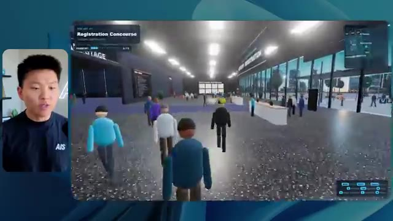
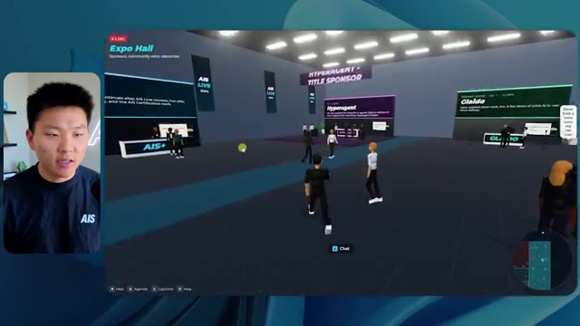
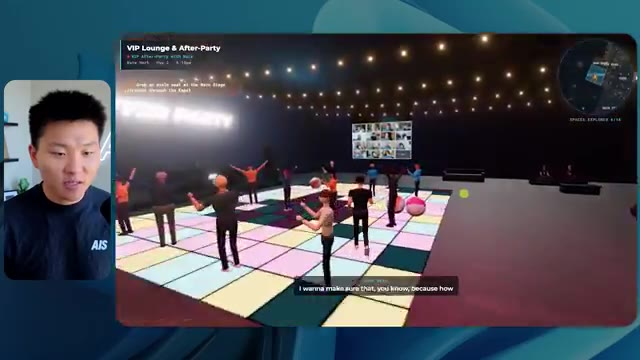

# 🎬 GPT-6 Astra FINALLY Kills AI Website Slop

> **Chaîne** : [Nate Herk | AI Automation](https://www.youtube.com/@nateherk/featured)  
> **Lien YouTube** : [https://www.youtube.com/watch?v=QhmhUgccaS0](https://www.youtube.com/watch?v=QhmhUgccaS0)  
> **Date de publication** : 20260904  
> **Durée** : 00:08:37  
> **Identifiant vidéo** : `QhmhUgccaS0`  
> **Transcription & Analyse** : `whisper-v3-large-turbo+gemini-3.5-flash-lite`  

---

## 📌 Synthèse Exécutive & Outils

### 💡 Résumé
La vidéo de Nate Herk aborde l'évaluation pratique et comparative du modèle d'IA **Opus 5.5** à travers ses différents niveaux d'effort (faible, moyen, élevé, etc.), en utilisant l'outil d'ingénierie **Claude Code**. Le défi technique lancé aux agents consistait à transformer un dossier Frame.io de 105 gigaoctets d'enregistrements vidéo bruts de la conférence virtuelle *AIS Live* en un monde 3D interactif et explorable à la troisième personne, intégrant physique, design et respect de l'identité de marque. 

Les résultats mettent en lumière des dynamiques fascinantes en matière d'ingénierie des invites (prompt engineering) et de gestion des ressources par les modèles de pointe. En mode « effort faible », l'agent a produit en 16 minutes un prototype basique, certes fonctionnel mais souffrant de nombreux bugs visuels (personnages fantômes, images fixes au lieu de flux vidéo) et d'un coût de 3,91 $ en équivalent API, sans poser la moindre question. En comparaison, le mode « effort moyen » a nécessité plus de temps (1 h 13) et un coût supérieur (12,44 $ pour 490 000 jetons), mais a livré un résultat spectaculaire et bien plus immersif : respect des chartes graphiques, PNJ dynamiques, intégration réussie des flux vidéo en direct, de la carte interactive et des stands virtuels.

Enfin, la vidéo aborde l'éternel défi du déploiement en fin de chaîne de développement. Après la génération de code fonctionnel par l'IA, le créateur met en avant l'importance d'outils de publication fluides, illustré par le sponsor **Hostinger** et son extension d'éditeur, permettant de combler le fossé critique entre le code brut sur l'ordinateur portable et la mise en ligne immédiate de l'application Web.

### 🛠️ Outils, Modèles & Logiciels Présentés
- **Opus 5.5** : Modèle d'intelligence artificielle de pointe d'Anthropic, reconnu pour sa grande intelligence, son coût abordable et sa polyvalence dans la génération de code et de structures complexes.
- **Claude Code** : Environnement de développement et agent de codage avancé permettant d'exécuter des tâches d'ingénierie complexes directement dans les dossiers de projet.
- **Frame.io** : Plateforme de collaboration et de stockage cloud utilisée ici pour héberger les 105 Go d'enregistrements vidéo de la conférence *AIS Live*.
- **Hostinger** : Hébergeur web dont l'extension gratuite pour éditeur de code permet de connecter directement l'environnement de développement à un compte d'hébergement pour un déploiement instantané.
- **Système Herc 2** : Système d'exploitation IA propriétaire et écosystème de ressources de Nate Herk utilisé comme contexte de référence par l'agent.
- **Key.ai** : Outil de génération d'images et de vidéos, mobilisé par l'agent pour créer des ressources visuelles à la volée dans le monde 3D.

### 🔑 Points Clés & Enseignements Stratégiques
- **Impact critique des niveaux d'effort** : Ajuster le paramètre d'effort d'un modèle comme Opus 5.5 modifie radicalement la qualité, la complexité et la robustesse du livrable final.
- **Arbitrage temps-coût-performance** : Le mode « effort faible » s'exécute rapidement (16 min) pour un coût modique (~3,91 $), mais sacrifie la fidélité visuelle et l'expérience utilisateur, tandis que le mode « moyen » triple le temps d'exécution et le coût mais offre un résultat professionnel.
- **Autonomie vs. Interaction** : Dans les tests présentés, les agents exécutant des objectifs complexes aux niveaux faible et moyen ont résolu l'intégralité de la tâche en autonomie totale, affichant un compteur de zéro question posée à l'utilisateur.
- **Capacité de contextualisation massive** : L'IA a réussi à analyser un volume titanesque de données (105 Go de vidéos) pour en extraire la logique événementielle, structurant intelligemment l'agenda sur deux jours, les différentes salles et les intervenants.
- **Respect de l'identité de marque** : Un niveau d'effort supérieur est indispensable pour que l'IA prenne en compte les subtilités graphiques (palettes de couleurs, logos, chartes visuelles de *AIS Live*), évitant ainsi le piège du design générique ("website slop").
- **Dynamisme des environnements 3D** : Les modes plus avancés permettent de générer non seulement des décors statiques, mais aussi des personnages non-joueurs (PNJ) réactifs, des flux vidéo en direct fonctionnels et des éléments interactifs fluides.
- **Le goulet d'étranglement du déploiement** : Générer une application fonctionnelle sur sa machine locale n'est que la première étape ; l'intégration d'outils de publication automatisés (comme le connecteur Hostinger) est vitale pour industrialiser le passage de l'idée au web.
- **Alignement avec les recommandations officielles** : Les tests confirment la bonne pratique recommandée par Anthropic, qui conseille de débuter l'ingénierie de prompt sur un effort moyen avant d'itérer vers le haut ou vers le bas selon la complexité requise.
- **Automatisation des vérifications (Browser Testing)** : L'utilisation de boucles de vérification automatisées (via l'ouverture itérative du navigateur par l'agent) garantit une auto-correction progressive de la disposition spatiale et des bugs d'affichage.

---

## ⏱️ Chronologie & Transcription Complète Audio & Visuelle (Mot pour Mot)

### ⏱️ `[00:00:00 - 00:00:20]` | Segment #01

**🔊 Audio (Transcription Intégrale Mot pour Mot en Français) :**
> Opus 5.5, Opus 5.5, Opus 5.5, Opus 5.5, Opus 5.5. Ce modèle est littéralement partout et pour de très bonnes raisons. Il est intelligent, il est bon marché, il a un goût incroyable, c'est un modèle d'IA incroyable. Mais avec chaque modèle d'IA, vous avez le choix de l'effort, que ce soit faible, moyen, élevé, extra, max ou code ultra.

**👁️ Analyse Visuelle d'Écran (gemini-3.5-flash-lite) :**
**Interface & Outils** : X (Twitter)

**Contenu textuel & Code** : Publication X montrant une capture vidéo d'un environnement 3D virtuel style île tropicale.

**Action / Démonstration** : Affichage d'un exemple de contenu issu des réseaux sociaux pour illustrer le sujet abordé.

*⏱️ 00:00:05 — Capture d'écran d'un tweet sur X (anciennement Twitter) montrant un post sur les créatifs techniques avec une vidéo intégrée représentant un paysage tropical en 3D.*

---

### ⏱️ `[00:00:20 - 00:00:38]` | Segment #02

**🔊 Audio (Transcription Intégrale Mot pour Mot en Français) :**
> Donc dans cette vidéo, j'ai donné exactement le même prompt à Opus 5.5 et je l'ai exécuté à chaque niveau d'effort, et nous allons comparer les résultats. Nous allons examiner la qualité de tous les différents résultats réels, mais nous allons aussi examiner combien de temps chacun d'eux a pris, combien cela nous a coûté si c'était une facturation par API, le nombre total de tokens, combien de vérifications ils ont exécutées, et combien de questions ils m'ont réellement posées tout au long du processus.

**👁️ Analyse Visuelle d'Écran (gemini-3.5-flash-lite) :**
**Interface & Outils** : Application web de tableau comparatif (type tableau blanc ou application de notes)

**Contenu textuel & Code** : Tableau comparatif avec les lignes : Run time, API cost, Total tokens, Checks, Questions asked, et les colonnes : Low, Medium, High, Extra, Max, Ultracode.

**Action / Démonstration** : Présentation du tableau comparatif des performances de l'IA selon les différents niveaux d'effort.

*⏱️ 00:00:29 — Interface d'un tableau comparatif sombre montrant les différents niveaux d'effort d'Opus 5.5 (Low, Medium, High, Extra, Max, Ultracode) et des métriques (Run time, API cost, Total tokens, etc.).*

---

### ⏱️ `[00:00:39 - 00:00:58]` | Segment #03

**🔊 Audio (Transcription Intégrale Mot pour Mot en Français) :**
> Et les résultats que nous avons obtenus ne sont pas du tout ce à quoi je m'attendais, donc j'ai hâte de partager cela avec vous les gars. Ne perdons pas de temps et allons directement à celui-ci. D'accord, alors plongeons-nous directement dans celui-ci. Je veux commencer juste en vous montrant, les gars, le prompt réel que nous avons utilisé, que nous avons donné à chacun de ces différents agents. Je vais aller dans les fichiers ici, et nous allons ouvrir ce fichier markdown de prompt, et je vais vous montrer ce que nous avons obtenu. Voici donc le slash objectif que j'ai fourni.

**👁️ Analyse Visuelle d'Écran (gemini-3.5-flash-lite) :**
**Interface & Outils** : Interface de l'application de développement / outil de chat IA (type Claude / Opus 5.5).

**Contenu textuel & Code** : Texte du prompt demandant de créer un monde 3D interactif de la conférence AIS Live à partir d'enregistrements f.io avec des salles, pistes et scènes distinctes, et d'envoyer un lien localhost.

**Action / Démonstration** : Le présentateur présente l'interface et le prompt initial de l'outil d'IA avant d'exécuter la tâche.

*⏱️ 00:00:48 — Image #2 : Interface d'un éditeur ou outil d'IA montrant un prompt de tâche pour construire un monde 3D interactif.*

---

### ⏱️ `[00:00:58 - 00:01:34]` | Segment #04

**🔊 Audio (Transcription Intégrale Mot pour Mot en Français) :**
> J'ai dit : tu dois me créer un monde 3D qui est une conférence tech réaliste dans laquelle je peux me promener en vue à la troisième personne. Tu vas regarder ce dossier, qui contient mes ressources d'enregistrement d'événements de AIS Live. Et ce dossier est un dossier Frame.io de 105 gigaoctets d'enregistrements vidéo. C'était un événement entièrement virtuel. Tout a été enregistré et tous les enregistrements sont juste ici. J'ai dit : ton objectif est de prendre cet événement et de le transformer en un monde 3D explorable qui me donne l'impression d'être réellement allé à une vraie conférence en personne avec différentes salles, différentes pistes, différentes scènes, bla, bla, bla. N'hésite pas à utiliser key.ai si tu as besoin de générer des images ou des vidéos. Et tu peux aussi utiliser tout ce qui se trouve dans mon projet Herc 2, qui est en quelque sorte mon système d'exploitation IA. J'ai dit,

**👁️ Analyse Visuelle d'Écran (gemini-3.5-flash-lite) :**
**Interface & Outils** : Éditeur de code (type VS Code / éditeur web) et interface cloud Frame.io

**Contenu textuel & Code** : Texte du prompt demandant de créer un monde 3D d'une conférence tech réaliste basé sur des ressources Frame.io.

**Action / Démonstration** : Navigation entre l'éditeur de code contenant le prompt et la plateforme cloud Frame.io présentant le dossier d'enregistrements.

*⏱️ 00:01:07 — Un éditeur de texte affichant le fichier PROMPT.md avec les instructions données à l'IA pour créer un monde 3D.*

*⏱️ 00:01:16 — Une interface web Frame.io montrant un dossier de ressources d'événements de 105 Go intitulé "Sep 22, 2026".*

*⏱️ 00:01:25 — Retour sur l'éditeur de texte affichant le détail du prompt et les instructions pour le projet de conférence 3D.*

---

### ⏱️ `[00:01:34 - 00:02:08]` | Segment #05

**🔊 Audio (Transcription Intégrale Mot pour Mot en Français) :**
> vous serez jugé sur la créativité, le design, la physique et la sensation générale lorsque j'explorerai le monde 3D que vous avez construit. Et c'était fondamentalement la fin des instructions. Donc, comme vous pouvez le voir sur ce côté gauche, j'ai exécuté cela à travers tous les différents niveaux d'effort. Commençons par le niveau bas et montons jusqu'à ultra code. Très bien. Nous avons donc ici le résultat du niveau bas. Ouvrons ceci et jetons un œil. Nous avons donc AIS live, le sommet des services d'IA en personne enfin, et nous avons pu cliquer partout. Tout d'abord, on ne sent pas vraiment la marque. Genre, ce n'is pas le logo d'IS Live. Ce n'est même pas nos couleurs. Donc je n'aime pas trop ça, mais entrons ici. D'accord. C'est beaucoup trop lumineux. Euh, nous avons une carte en haut à droite. Nous avons une ville ici en arrière-plan. Je n'arrive pas à deviner quelle ville c'est

**👁️ Analyse Visuelle d'Écran (gemini-3.5-flash-lite) :**
**Interface & Outils** : Interface web d'un assistant de développement ou de chat d'IA (style interface moderne de type agent de code ou gestionnaire de worktree).

**Contenu textuel & Code** : Texte du prompt demandant de construire un monde 3D interactif à la troisième personne basé sur des enregistrements vidéo, avec différents niveaux de test (Hello, Extra, High, Max, Ultracode, Medium, Low) listés dans la barre latérale.

**Action / Démonstration** : Le présentateur commente les différents niveaux affichés dans l'interface et la liste des sessions de test d'effort.

*⏱️ 00:01:42 — Capture d'écran montrant l'interface d'un assistant IA de type éditeur/agent avec une liste de sessions sur le panneau de gauche et un échange de messages concernant la construction d'un monde 3D sur le panneau de droite.*

---

### ⏱️ `[00:02:08 - 00:02:40]` | Segment #06

**🔊 Audio (Transcription Intégrale Mot pour Mot en Français) :**
> C'est. D'accord. C'est Chicago, ce qui est plutôt sympa parce que tu sais, j'habite à Chicago, mais bref, en haut à droite, nous pouvons voir une carte. Nous avons un hall d'accueil. Nous avons une salle d'exposition. Nous avons un salon VIP, la scène principale. De plus, la carte montre où se trouve chaque autre personne et cela se synchronise en direct. Nous pouvons donc voir l'enregistrement. Nous pouvons voir le premier jour, la keynote de l'hyper agent, le débrief en direct. Cool. Donc il connaît réellement l'agenda et puis il y a le deuxième jour. Donc il a trouvé ça, c'est bien. Nous avons ces petites boules ici que je peux espérer botter. D'accord. Le visage, oh, regarde ça. Si je vais par ici, tous les gens disparaissent tout simplement. Très mauvais. Très mauvais. D'accord. Alors voyons voir. Est-ce que je peux sprinter ? D'accord.

**👁️ Analyse Visuelle d'Écran (gemini-3.5-flash-lite) :**
**Interface & Outils** : Application web virtuelle en 3D (type Gather.town ou similaire)

**Contenu textuel & Code** : Carte de navigation, planning du salon (Day 1), avatars 3D

**Action / Démonstration** : Navigation et exploration des différentes zones de l'événement virtuel par le présentateur

*⏱️ 00:02:16 — Vue d'une plateforme virtuelle en 3D avec un avatar et une mini-carte en haut à droite indiquant les différentes zones.*

*⏱️ 00:02:24 — Vue dans le lobby virtuel montrant un panneau affichant le programme du premier jour et la mini-carte en haut à droite.*

*⏱️ 00:02:32 — Vue de la salle d'exposition virtuelle (Expo Hall) avec des avatars et des éléments lumineux interactifs.*

---

### ⏱️ `[00:02:40 - 00:03:04]` | Segment #07

**🔊 Audio (Transcription Intégrale Mot pour Mot en Français) :**
> Je peux avancer un peu plus vite. Je vais d'abord aller par ici. Il y a des produits dérivés, euh, un sweat à capuche certifié AIS plus. D'accord. Donc, il y a les vrais stands qu'on avait dans l'événement virtuel. On avait des stands. Donc c'est plutôt cool. Un petit endroit pour prendre des photos. Salle C. En ce moment, nous avons Tangy Frederick qui anime un atelier. D'accord. Mais ce n'est pas une vidéo. Comme vous pouvez le voir, c'est juste une image. Elle ne bouge pas. C'est donc juste une image. Ces gens sont en train de disparaître. Ce doivent être des fantômes. Allons par ici vers la salle A.

**👁️ Analyse Visuelle d'Écran (gemini-3.5-flash-lite) :**
**Interface & Outils** : Environnement virtuel 3D interactif (type métavers ou jeu vidéo)

**Contenu textuel & Code** : Affichage de stands virtuels, panneaux d'information et instructions didactiques dans un espace 3D

**Action / Démonstration** : Navigation et exploration d'un événement virtuel à l'aide d'un avatar 3D

---

### ⏱️ `[00:03:04 - 00:03:30]` | Segment #08

**🔊 Audio (Transcription Intégrale Mot pour Mot en Français) :**
> Nous avons Liberty White. D'accord. Très cool. Vos 30 premiers jours en automatisation. Encore une fois, c'est juste une image fixe et les gens ont des bugs d'affichage. Donc ce n'est pas très bon ici. Je vais aller sur la scène principale et voir ce que nous avons. D'accord, cool. Donc nous avons une scène principale. Les gens ont de gros bugs d'affichage. Vraiment mauvais. Ce n'est vraiment pas bon du tout. Notre vidéo est en train de bouger. Genre, j'ai vu mon visage ici et j'ai vu celui de Devin, mais maintenant ils ont disparu. Donc je ne sais pas ce qui s'est passé. D'accord. On dirait que c'est plutôt un diaporama. Rien n'est vraiment en train de jouer pour l'instant. Quoi qu'il en soit, entrons ici.

**👁️ Analyse Visuelle d'Écran (gemini-3.5-flash-lite) :**
**Interface & Outils** : Environnement virtuel 3D interactif de type metaverse / plateforme d'événements virtuels.

**Contenu textuel & Code** : Interface d'événement virtuel avec affichage des titres de sessions et navigation par avatar 3D.

**Action / Démonstration** : Le présentateur navigue et explore différentes salles et scènes dans l'environnement virtuel 3D.

*⏱️ 00:03:11 — Vue d'un avatar dans un espace virtuel 3D de type metaverse montrant une salle d'atelier ("Workshop Room A - Foundation track").*

*⏱️ 00:03:17 — Vue de l'avatar naviguant dans une grande salle de conférence virtuelle ("Main Stage") remplie de participants modélisés, avec le titre "Hyperagent Workshop".*

*⏱️ 00:03:24 — Vue de l'avatar s'approchant de la grande scène centrale affichant le logo "AIS LIVE - AI Services Summit" dans l'environnement virtuel.*

---

### ⏱️ `[00:03:30 - 00:03:58]` | Segment #09

**🔊 Audio (Transcription Intégrale Mot pour Mot en Français) :**
> Nous avons plus de stands. Nous avons hyper agent. Nous avons Claude Code. Nous avons plus de goodies. La salle B, c'est Dave Ebelor. Je suppose que c'est exactement la même chose. Nous avons du café. Et ensuite, je suppose que le salon VIP, c'est un accès VIP uniquement. C'est plutôt cool, mais il n'y a vraiment rien qui se passe ici. Cet écran est beaucoup trop lumineux. D'accord. Donc je pense que vous comprenez l'ambiance que nous obtenons ici de la part d'Opus 5.5 en mode effort faible. Et c'est là que les choses deviennent intéressantes. Combien de temps pensez-vous que cela a duré ? Combien de temps ? Celui-ci a duré 16 minutes et 43 secondes. Combien pensez-vous que cela a coûté ?

**👁️ Analyse Visuelle d'Écran (gemini-3.5-flash-lite) :**
**Interface & Outils** : Application de canevas / tableau blanc interactif (Opus 5.5 Efforts) et monde virtuel 3D.

**Contenu textuel & Code** : Tableau comparatif évaluant les niveaux Low, Medium, High, Extra, Max et Ultracode selon plusieurs métriques (Run time, API cost, Total tokens, Checks, Questions asked).

**Action / Démonstration** : Présentation d'un tableau comparatif des différents niveaux d'effort et de performance.

*⏱️ 00:03:51 — Tableau comparatif sur une interface de type canvas montrant les niveaux de performance (Low, Medium, High, Extra, Max, Ultracode) et des métriques associées (Run time, API cost, Total tokens).*

---

### ⏱️ `[00:03:58 - 00:04:26]` | Segment #10

**🔊 Audio (Transcription Intégrale Mot pour Mot en Français) :**
> 3,91 dollars si c'était une facturation par API. J'utilise évidemment mon abonnement ici, mais nous allons simplement calculer cela en facturation par API. Le total des jetons était de 191 000. Il a effectué 22 vérifications. Donc la vérification, 22 fois il a ouvert le navigateur et a exécuté différentes sortes de vérifications. Donc 22 catégories de vérifications. Et combien de questions m'a-t-il posées ? Il m'a posé un total de zéro question tout au long de cette invite de commande d'objectif. D'accord. Alors, ouvrons l'effort moyen et voyons ce que nous avons. D'accord, c'est parti. Effort moyen. Nous avons Nate Herc. Nous avons mon badge. C'est la marque de la vie de l'IA.

**👁️ Analyse Visuelle d'Écran (gemini-3.5-flash-lite) :**
**Interface & Outils** : Outil de tableau blanc numérique / présentation visuelle (type Excalidraw ou similaire)

**Contenu textuel & Code** : Tableau avec les colonnes Low, Medium, High et des lignes Run time (16m 43s), API cost ($3.91), Total tokens (191.3K), Checks et Questions asked.

**Action / Démonstration** : Le présentateur explique et commente les coûts et les performances affichés dans le tableau pour le niveau bas (Low).

*⏱️ 00:04:05 — Capture d'écran montrant le présentateur à gauche et un tableau de données sur un outil de type tableau blanc à droite, affichant des métriques telles que Run time, API cost ($3.91) et Total tokens (191.3K).*

---

### ⏱️ `[00:04:26 - 00:04:46]` | Segment #11

**🔊 Audio (Transcription Intégrale Mot pour Mot en Français) :**
> Donc ça a déjà l'air un petit peu mieux. Ça ressemble à nos palettes de couleurs qui ont utilisé nos directives de marque. Premier jour de construction, deuxième jour de gain, VIP. Cool. D'accord. Je vais entrer dans le lieu. D'accord. Waouh. Une ambiance similaire, en somme. C'est en arrière-plan. Ça ne ressemble pas à Chicago, hein ? Non, ça ressemble à, honnêtement, ça ressemble à une ville inventée. Quoi qu'il en soit, c'est marrant qu'ils aient décidé de faire ça. Voyons si je peux me déplacer un peu plus vite. Oh, waouh.

**👁️ Analyse Visuelle d'Écran (gemini-3.5-flash-lite) :**
**Interface & Outils** : Interface web d'application interactive 3D / Navigateur web.

**Contenu textuel & Code** : Écran d'accueil de l'événement virtuel "AIS Live" avec badges et contrôles de navigation, puis scène virtuelle 3D interactive.

**Action / Démonstration** : Le présentateur clique sur le bouton pour entrer dans le lieu virtuel de l'événement.

*⏱️ 00:04:31 — Interface web de l'application "AIS Live" montrant un badge nominatif virtuel pour "Nate Herk" avec les options "DAY 1 BUILD", "DAY 2 EARN", "VIP", et un bouton "ENTER THE VENUE".*

*⏱️ 00:04:41 — Vue à la première ou troisième personne à l'intérieur de l'espace virtuel 3D de l'événement "AIS Live", avec des avatars modélisés et un panorama urbain de nuit en arrière-plan.*

---

### ⏱️ `[00:04:46 - 00:05:21]` | Segment #12

**🔊 Audio (Transcription Intégrale Mot pour Mot en Français) :**
> Les gens interagissent avec moi. Regardez. Si je m'approche de ce type, il vient de lever le bras. Bon, maintenant il ne veut plus du tout avoir affaire à moi. Mais tous ces petits robots ici doivent prendre des décisions. Je ne sais pas s'ils utilisent Jev. C'est sûr que non. Je ne le lui ai pas dit. En fait, ma clé Jev est à l'arrière. Je ne sais pas. Peut-être qu'il l'a utilisée. Quoi qu'il en soit, nous pouvons voir ici que nous avons la salle d'atelier C, le laboratoire des agents. Sympa. Donc celui-ci est en fait en train d'être exécuté. Vous pouvez voir qu'il s'agit d'une vraie vidéo lue par Tangy. Tout le monde ici est en train de travailler sur un ordinateur portable. Ils ne buguent pas. C'est plutôt cool. De plus, mon badge est sur ma poitrine, ce qui est plutôt cool. Je peux venir par ici. Nous avons une carte en haut à droite, comme vous pouvez le voir, mais je peux venir par ici. Nous avons un

**👁️ Analyse Visuelle d'Écran (gemini-3.5-flash-lite) :**
**Interface & Outils** : Application de monde virtuel 3D / plateforme collaborative.

**Contenu textuel & Code** : Environnement virtuel peuplé d'avatars et d'interfaces de visioconférence intégrées.

**Action / Démonstration** : Navigation et exploration dans l'espace virtuel par le présentateur.

---

### ⏱️ `[00:05:21 - 00:05:47]` | Segment #13

**🔊 Audio (Transcription Intégrale Mot pour Mot en Français) :**
> halle d'exposition. C'est ici que nous avons le stand Glido. Et ça diffuse en ce moment. Oui, ça diffuse la vidéo de nous en train de parler de Glido. Ça diffuse la vidéo d'Ed et de moi en train de parler de notre programme de certification. Nous avons le logo AIS Plus ici derrière, qui est un peu mal placé. Ce sont les diapositives des conférenciers et les points clés. Alors waouh, ce sont toutes les ressources que nous avons distribuées après l'événement. Elles sont toutes là aussi. Nous pouvons voir que nous avons un projecteur sur la communauté. Donc c'est Aiden qui parle de son contrat qu'il a décroché et ça se joue en direct. Ces gens regardent.

**👁️ Analyse Visuelle d'Écran (gemini-3.5-flash-lite) :**
**Interface & Outils** : Environnement virtuel 3D / Metavers de conférence.

**Contenu textuel & Code** : Aucun code source, terminal ou prompt visible.

**Action / Démonstration** : Navigation et visite dans un espace d'exposition virtuel en 3D.

---

### ⏱️ `[00:05:47 - 00:06:21]` | Segment #14

**🔊 Audio (Transcription Intégrale Mot pour Mot en Français) :**
> Ils sont plutôt engagés. On a l'hyper agent. C'était, c'est ce que je voulais dire. Si vous avez vu ces gens lever les bras pour dire bonjour, c'était plutôt marrant. Regardez, regardez, le voilà qui recommence. Bref. Bon. Où est-ce que je suis maintenant ? Maintenant, je suis dans le hall principal. On a un bar à café. On a un grand logo, qui est le vrai logo. Il est trop lumineux, mais on a le logo. On peut voir si on peut entrer ici dans le parcours fondation. On a Sabrina Romanov et Liberty White. Donc différentes formations juste là. On peut entrer dans cette salle. C'est le parcours avancé. Alors, qu'est-ce qui se passe ici ? On a Dave Ebelar et Saman qui parlent de différentes choses là-dedans. Et maintenant, allons jeter un œil à la scène principale. Oh, attendez, il y a une vidéo de moi là-haut. C'est genre un VIP

**👁️ Analyse Visuelle d'Écran (gemini-3.5-flash-lite) :**
**Interface & Outils** : Application web de monde virtuel 3D / métavers d'événement en ligne

**Contenu textuel & Code** : Interface utilisateur affichant "Main Lobby", une minimap et des avatars de participants

**Action / Démonstration** : Navigation et déplacement d'un avatar à l'intérieur du monde virtuel interactif

---

### ⏱️ `[00:06:21 - 00:06:50]` | Segment #15

**🔊 Audio (Transcription Intégrale Mot pour Mot en Français) :**
> section ? Ouais, on ira voir ça dans une minute. Mais bref, voici la scène principale. Ça a l'air vraiment, vraiment très bien. On a une grande scène. On a genre quatre personnes assises ici. On a les les trois écrans d'Alex là-haut avec hyper agent. Est-ce que j'ai le droit de monter sur scène ? Oh, et il me laisse monter sur scène. D'accord. C'est plutôt sympa. Bon, les gars, faisons un selfie. Laissez-moi prendre tout le monde en arrière-plan. Venez par ici. Bref, ça c'est vraiment, vraiment cool. Par contre, toutes les places ne sont pas occupées. Donc il faut qu'on travaille là-dessus. Mais bref, je vais y retourner en courant pour voir ce qu'était cette section VIP. D'accord. Le salon VIP. J'ai l'impression que c'est comme un aéroport ou un truc comme ça.

**👁️ Analyse Visuelle d'Écran (gemini-3.5-flash-lite) :**
**Interface & Outils** : Plateforme virtuelle 3D (Hyperagent / environnement virtuel type métavers).

**Contenu textuel & Code** : Interface d'événement virtuel avec affichage des sessions et mini-carte de localisation.

**Action / Démonstration** : Navigation et déplacement d'un avatar dans l'espace virtuel de la conférence.

---

### ⏱️ `[00:06:51 - 00:07:14]` | Segment #16

**🔊 Audio (Transcription Intégrale Mot pour Mot en Français) :**
> D'accord, super. Donc maintenant nous avons les sessions VIP ici. Une séance de questions-réponses VIP avec Nate, lecture vidéo en direct juste ici. Très, très cool. Et nous avons comme un bar ou quelque chose du genre. Génial. Je dirais que c'est un assez bon résultat. Maintenant, en ce qui concerne les statistiques ici, celle-ci a pris une heure et 13 minutes à s'exécuter. Cela nous aurait coûté 12 dollars et 44 cents. Elle a utilisé 490 000 jetons et elle a effectué 23 vérifications.

**👁️ Analyse Visuelle d'Écran (gemini-3.5-flash-lite) :**
**Interface & Outils** : Application de monde virtuel 3D et tableau de bord d'analyse (Opus 5.5 Efforts)

**Contenu textuel & Code** : Métriques de performance : Run time (16m 43s), API cost ($3.91), Total tokens (191.3K), Checks (22), Questions asked (0).

**Action / Démonstration** : Navigation et présentation d'un salon VIP virtuel et analyse des métriques de performance.

*⏱️ 00:06:56 — Capture montrant un espace virtuel en 3D représentant un salon VIP avec des avatars, un grand écran affichant une session vidéo en direct et le présentateur Nate en médaillon à gauche.*

*⏱️ 00:07:02 — Capture montrant un tableau de bord d'analyse nommé 'Opus 5.5 Efforts' affichant des métriques de performance telles que le temps d'exécution (16m 43s), le coût de l'API ($3.91) et le nombre de tokens.*

---

### ⏱️ `[00:07:14 - 00:07:48]` | Segment #17

**🔊 Audio (Transcription Intégrale Mot pour Mot en Français) :**
> Et il nous a posé un total de zéro question une fois de plus. Très bien, passons à élevé. C'était déjà un résultat plutôt correct et Anthropic eux-mêmes dans leur vidéo sur comment prompter Opus 5.5, ou désolé, pas une vidéo, un article. Ils ont dit de commencer simplement par moyen et de l'ajuster vers le haut ou vers le bas si nécessaire. C'était donc un résultat moyen. Passons à élevé et voyons ce qu'on a obtenu. Très rapidement, les gars, je dois prendre une seconde pour vous parler du sponsor de la vidéo d'aujourd'hui, Hostinger. Donc ces deux modèles viennent de me construire une version fonctionnelle de la même chose. Et maintenant, je me retrouve exactement là où je finis toujours, avec un produit fini sur mon ordinateur portable et aucun moyen rapide de le mettre en ligne. Et c'est précisément le fossé que comble le connecteur d'Hostinger. C'est une extension gratuite

**👁️ Analyse Visuelle d'Écran (gemini-3.5-flash-lite) :**
**Interface & Outils** : Tableau comparatif type Notion / Miro pour l'image #1, et éditeur de code / interface d'agent IA (type Cursor ou VS Code avec extension IA) pour l'image #2.

**Contenu textuel & Code** : Image #1 : Métriques comparatives (Run time, API cost, Total tokens, Checks, Questions asked). Image #2 : Prompt pour créer une calculatrice de ROI en HTML, logs d'exécution de l'agent ("Thought for 30s", "dataviz skill", "Thinking... - 2.3k tokens").

**Action / Démonstration** : Analyse comparative des résultats par niveau d'effort et démonstration d'un agent générant une application web à partir d'un prompt détaillé.

*⏱️ 00:07:22 — Tableau de comparaison des performances et des coûts selon les niveaux d'effort (Low, Medium, High, Extra) pour Opus 5.5, montrant le temps d'exécution, le coût API, les tokens et le nombre de questions posées.*

*⏱️ 00:07:39 — Interface de développement (IDE) avec un agent IA en cours d'exécution, affichant le processus de réflexion, les compétences chargées et le code généré pour une calculatrice de ROI (Northwind ROI calculator).*

---

### ⏱️ `[00:07:48 - 00:08:23]` | Segment #18

**🔊 Audio (Transcription Intégrale Mot pour Mot en Français) :**
> pour votre éditeur qui intègre votre compte Hostinger dans l'environnement où vous codez déjà. Que ce soit VS Code, Cursor, Cloud Code, Codex, peu importe. Vous vous connectez une seule fois en un clic, et à partir de là, votre agent peut déployer le site, y associer un domaine, configurer les enregistrements DNS et vérifier votre VPS sans que vous ayez à quitter votre éditeur. Ainsi, peu importe celui que vous préférez au final, ce qu'il a construit se trouve à quelques minutes d'une vraie URL sur un hébergement géré. Connector est gratuit avec chaque formule d'hébergement, donc si vous avez toujours besoin de l'hébergement sous-jacent, profitez de la formule illimitée via le lien dans la description et utilisez le code NATEHERK pour obtenir 10 % de réduction. Cela inclut également un nom de domaine gratuit et un e-mail professionnel pour un an. Et c'est toujours le moyen le moins cher que j'ai trouvé pour obtenir quelque chose

**👁️ Analyse Visuelle d'Écran (gemini-3.5-flash-lite) :**
**Interface & Outils** : Interface de gestion Hostinger (gauche) et Claude Code (droite)

**Contenu textuel & Code** : Statut "Connected", "Manage Hostinger from your IDE", outils disponibles avec options cochées (Websites, Domains, Subscriptions & Payments, Email Marketing).

**Action / Démonstration** : Connexion du compte Hostinger à l'IDE pour permettre à l'assistant d'accéder aux outils de gestion.

*⏱️ 00:07:57 — Interface montrant l'intégration de Hostinger dans l'IDE avec le statut connecté via OAuth et les outils disponibles (Websites, Domains, etc.) à gauche, et Claude Code à droite.*

---

### ⏱️ `[00:08:23 - 00:08:47]` | Segment #19

**🔊 Audio (Transcription Intégrale Mot pour Mot en Français) :**
> tu as construit sur une vraie URL. Donc revenons à la vidéo. D'accord. Encore une fois, très, très thématisé par la marque. C'est un écran de chargement encore mieux que le précédent. Nous avons ce joli petit effet en arrière-plan. Nous avons le logo. Nous allons entrer dans le lieu. D'accord. Nous y voilà. Ça a l'air plutôt bien. Nous commençons à l'extérieur et tu peux voir que nous avons ces drapeaux pour tous les intervenants, Wyatt, Casper, Alex, Ed, Aiden, Sabrina, Liberty. C'est plutôt cool. Nous avons des blocs en direct ici.

**👁️ Analyse Visuelle d'Écran (gemini-3.5-flash-lite) :**
**Interface & Outils** : Application web interactive / Environnement virtuel 3D (RingCentral / AIS Live)

**Contenu textuel & Code** : Interface utilisateur virtuelle avec mini-carte, bannières d'intervenants (Alex McDonnell, Wyatt Lyonsmith) et indications de contrôles (WASD, Mouse).

**Action / Démonstration** : Navigation et exploration d'un monde virtuel 3D représentant un espace de conférence en ligne.

*⏱️ 00:08:29 — Écran de chargement et d'accueil de la plateforme virtuelle AIS Live avec les instructions de contrôle clavier et souris.*

*⏱️ 00:08:35 — Vue de la place virtuelle 3D (AIS Live Plaza) avec des avatars de participants et des bâtiments de type urbain en arrière-plan.*

*⏱️ 00:08:41 — Exploration de la place virtuelle avec des bannières verticales affichant le nom des intervenants de l'événement.*

---

### ⏱️ `[00:08:47 - 00:09:23]` | Segment #20

**🔊 Audio (Transcription Intégrale Mot pour Mot en Français) :**
> il a pris cette photo de moi, votre hôte, Nate Herc, John, Dave, Nate Herc. Voilà. D'accord. Les portes. Génial. Ce sont des portes coulissantes automatiques en verre. J'adore ça. Nous pouvons voir l'enregistrement VIP. Nous pouvons voir l'admission générale. Nous pouvons venir ici et nous pouvons découvrir l'exposition avec différents stands, le projecteur sur la communauté. Vous pouvez également voir qu'en haut à gauche, j'ai un passeport. Donc c'est comme si, cela montrera combien d'endroits j'ai visités. Tout cela est une vraie lecture. Nous avons un mur de ressources avec tous les différents intervenants. Ils ont également une session de réseautage par ici. Je vais donc venir très vite et voir de quoi il s'agit. Nous avons donc le bar à cold brew AIS. Nous avons différents membres de la communauté qui ont été mis en avant ou mis en lumière.

**👁️ Analyse Visuelle d'Écran (gemini-3.5-flash-lite) :**
**Interface & Outils** : Application virtuelle 3D / Metavers de conférence (AIS Live)

**Contenu textuel & Code** : Interface de navigation virtuelle montrant les zones 'Registration Concourse' et 'Expo Hall' avec des options de check-in et des bannières informatives.

**Action / Démonstration** : Exploration et navigation interactive dans l'espace virtuel 3D de la conférence par le présentateur.

*⏱️ 00:08:56 — Vue d'un espace virtuel 3D représentant une zone d'enregistrement (Registration Concourse) avec des avatars et des comptoirs d'accueil.*

*⏱️ 00:09:05 — Navigation dans un hall d'exposition virtuel (Expo Hall) en 3D avec des stands et des avatars interactifs.*

*⏱️ 00:09:14 — Déplacement dans le hall virtuel montrant des baies vitrées, des écrans d'affichage et plusieurs avatars en mouvement.*

---

### ⏱️ `[00:09:23 - 00:09:56]` | Segment #21

**🔊 Audio (Transcription Intégrale Mot pour Mot en Français) :**
> On a la zone VIP. Attends, quoi ? Prends un bracelet. Ah, je dois vraiment aller chercher le bracelet. D'accord. Laisse-moi m'enregistrer rapidement. Le bracelet est déjà mis. Attends, quoi ? D'accord. Oh, d'accord. Maintenant, les portes se sont ouvertes pour moi. Cool. Je peux entrer ici. Oh, ça mène juste à la scène principale. Salon VIP. Il y a une séance de questions-réponses en cours. Ça a l'air très cool. Je veux dire, je suis très impressionné par la façon dont il est capable de faire ça. Waouh. D'accord. Donc c'est vraiment bien. Ce qu'on a fait, c'est qu'on a eu des salles de discussion VIP avec différentes personnes. Tu peux voir qu'il y a différentes salles, différents membres de l'équipe AIS qui participent à des trucs. C'est vraiment cool. C'est très cool. C'est un bien meilleur VIP

**👁️ Analyse Visuelle d'Écran (gemini-3.5-flash-lite) :**
**Interface & Outils** : Application web virtuelle interactive 3D type metaverse pour événements et conférences en ligne.

**Contenu textuel & Code** : Interface utilisateur virtuelle affichant le statut du badge VIP, la carte de navigation et les indications textuelles des zones.
[DESC_IMAGE_3]

**Action / Démonstration** : Navigation à l'intérieur du monde virtuel 3D pour accéder aux différentes zones et salles de travail VIP.

*⏱️ 00:09:32 — Vue dans l'espace virtuel du hall d'enregistrement (Registration Concourse) avec le personnage du présentateur et l'indication de l'obtention du bracelet VIP.*

*⏱️ 00:09:40 — Entrée dans le salon VIP (VIP Lounge) où un écran affiche une visioconférence avec d'autres participants et le présentateur.*

*⏱️ 00:09:48 — Exploration des sessions de travail VIP (VIP Working Sessions) avec différents espaces thématiques comme 'Price It Right' et 'Land Your First Paying Client'.*

---

### ⏱️ `[00:09:56 - 00:10:30]` | Segment #22

**🔊 Audio (Transcription Intégrale Mot pour Mot en Français) :**
> expérience que ce qui a été montré dans la première partie. D'accord. After party VIP. Regardez ça. On a une piste de danse. On a tous ces éléments ici. On a la lecture de l'after party VIP juste ici. Et il y a une estrade pour DJ. C'est tellement marrant. Il y a un petit bug ici, un petit glitch juste là, mais c'est génial. Oh, super. Donc quand je suis ici sur la scène principale, on a des sous-titres. Vous pouvez voir juste ici en bas de mon écran, on a ces sous-titres de Wyatt qui est en train de parler ici. On a des lumières. On a le panel. Très cool. Belle scène principale. Je vais aller par ici. On peut aller à la fondation,

**👁️ Analyse Visuelle d'Écran (gemini-3.5-flash-lite) :**
**Interface & Outils** : Metaspaces

**Contenu textuel & Code** : Aucune information visible à l'écran.

**Action / Démonstration** : Aucune action démontrée dans ces images.

*⏱️ 00:10:04 — Une scène virtuelle d'after-party VIP avec une piste de danse et un écran affichant plusieurs participants.*

*⏱️ 00:10:13 — Une scène virtuelle d'after-party VIP avec une piste de danse, un écran et des avatars de participants.*

---

### ⏱️ `[00:10:30 - 00:11:06]` | Segment #23

**🔊 Audio (Transcription Intégrale Mot pour Mot en Français) :**
> avancé, et les parcours d'entreprise par ici. Alors voyons voir. Nous avons l'anatomie de trois vraies transactions. Nous avons l'hyper agent. Nous avons les évaluations avec Nate et Ed ici. Nous avons Dave qui s'occupe des trucs avancés. C'est vraiment bien. Je veux dire, évidemment, chacun, chacun de ces résultats jusqu'à présent, faible était correct. Moyen était meilleur. Élevé a été encore meilleur. Voyons si cette tendance se poursuit et voyons combien cela nous a coûté. Donc, élevé a fonctionné pendant une heure et sept minutes. Donc, un peu plus rapide que moyen, cela nous aurait coûté 16 dollars et 31 cents. Il a utilisé un demi-million de jetons, 509 000. Il a fait 22 vérifications. Et il nous a aussi demandé, enfin, non, je me suis trompé. Ce

**👁️ Analyse Visuelle d'Écran (gemini-3.5-flash-lite) :**
**Interface & Outils** : Tableau blanc ou application de notes et diagrammes (style Excalidraw ou équivalent)

**Contenu textuel & Code** : Tableau avec des colonnes Low, Medium, High, Extra et des lignes Run time, API cost, Total tokens, Checks, Questions asked.

**Action / Démonstration** : Analyse des coûts d'API et des temps d'exécution selon les niveaux de performance configurés.

*⏱️ 00:10:57 — Un tableau comparatif montrant les métriques de performance et de coût (Run time, API cost, Total tokens) pour différents niveaux (Low, Medium, High, Extra).*

---

### ⏱️ `[00:11:06 - 00:11:25]` | Segment #24

**🔊 Audio (Transcription Intégrale Mot pour Mot en Français) :**
> l'un m'a posé une question et, divulgâcheur, c'était le seul qui nous a posé une question tout au long de tout ça. Voyons voir, il nous en reste trois, extra, max et ultra code. Laissez-moi ouvrir extra et nous verrons ce que nous avons. D'accord. Donc celui-ci a l'air plutôt bien. Je dirais honnêtement que jusqu'à présent, l'écran de chargement haut était le meilleur. Celui qu'on vient juste de voir, mais bref, entrons dans AIS live.

**👁️ Analyse Visuelle d'Écran (gemini-3.5-flash-lite) :**
**Interface & Outils** : Application de tableau de bord ou interface web de gestion de projets d'IA ("Opus 5.5 Efforts").

**Contenu textuel & Code** : Tableau de données avec les colonnes Low, Medium, High, Extra et les lignes Run time, API cost, Total tokens, Checks, Questions asked.

**Action / Démonstration** : Le présentateur commente les résultats du tableau et s'apprête à ouvrir les détails de la colonne "Extra".

*⏱️ 00:11:11 — Tableau comparatif affichant les métriques (Run time, API cost, Total tokens, Checks, Questions asked) pour différentes configurations (Low, Medium, High, Extra) avec le présentateur en incrustation.*

---

### ⏱️ `[00:11:26 - 00:11:51]` | Segment #25

**🔊 Audio (Transcription Intégrale Mot pour Mot en Français) :**
> Whoa. D'accord. Donc on a genre des petits extraits sonores. Je peux discuter avec des gens. Le panneau sur la guerre des outils a réglé quelques débats pour moi. Sympa. Bonne perspective là-bas. On est dehors à nouveau. On a ces différentes bannières, bien qu'elles soient toutes les mêmes. Elles n'affichent pas du genre les noms de différentes personnes. Donc gros logo AIS live. L'aile des ateliers est par ici. Et passons par les portes coulissantes en verre et voyons ce qu'on a. Donc on a le café AIS. La carte est en bas à droite, et elle n'est pas très descriptive.

**👁️ Analyse Visuelle d'Écran (gemini-3.5-flash-lite) :**
**Interface & Outils** : Environnement virtuel 3D (type métavers ou jeu vidéo) affiché sur l'écran principal avec incrustation vidéo du présentateur.

**Contenu textuel & Code** : Interface utilisateur virtuelle incluant une mini-carte, des bannières textuelles "AIS LIVE" et des bulles de dialogue.

**Action / Démonstration** : Navigation et déplacement d'un avatar à travers un espace de convention virtuel en 3D.

---

### ⏱️ `[00:11:51 - 00:12:26]` | Segment #26

**🔊 Audio (Transcription Intégrale Mot pour Mot en Français) :**
> J'aime bien comment les autres cartes nous ont indiqué ce que, genre où étaient les choses, mais celle-ci a l'air très professionnelle. On peut voir ici la scène principale. Allons y faire un saut rapidement. Ils ont tous ces ballons qui volent partout, ce qui, je trouve, est plutôt marrant. Les ballons de plage AIS. On me voit là-haut en train de parler. Je crois que j'étais en train de présenter l'une des journées. Continuons à avancer par ici vers la salle d'atelier sur ce côté gauche. OK. Donc ici nous avons le théâtre Hyper Agent. Nous avons cette session sponsorisée ici par Hyper Agent, mais ça nous montre aussi ce qui va se passer ici. C'est vraiment marrant qu'on puisse discuter avec les gens. Salmon a créé un commercial vocal en direct. La salle "Le Juste Prix" était comble. Tu as pris le guide du compagnon VIP ? C'est trop marrant. Nous avons le parcours avancé dans

**👁️ Analyse Visuelle d'Écran (gemini-3.5-flash-lite) :**
**Interface & Outils** : Environnement virtuel 3D, Plateforme d'événements virtuels

**Contenu textuel & Code** : Texte : "LIVE", "Grand Ballroom", "Day 2 Open Now Let's Turn This Into Money", "Foundation · Advanced · Enterprise", "ENTERPRISE AI SERVICES"

**Action / Démonstration** : Exploration d'un espace événementiel virtuel et interaction avec différents éléments.

*⏱️ 00:12:00 — La scène principale d'un événement virtuel avec un présentateur sur scène et une foule d'avatars dans les gradins.*

*⏱️ 00:12:09 — Un espace d'exposition virtuel avec plusieurs avatars se déplaçant entre différents stands.*

*⏱️ 00:12:17 — Un couloir dans un espace virtuel où plusieurs avatars discutent.*

---

### ⏱️ `[00:12:26 - 00:12:58]` | Segment #27

**🔊 Audio (Transcription Intégrale Mot pour Mot en Français) :**
> ici. Encore une fois, nous avons la lecture en direct. Est-ce que c'est la lecture en direct ? Oh, d'accord. Ça a commencé une fois que je suis entré, mais je peux prendre place. Oh la la. Je peux regarder ça. Je peux me lever. Je veux m'asseoir au premier rang. C'est plutôt cool. C'est très bien. J'aime ça. Et vous savez ce que j'ai remarqué jusqu'à présent ? Le personnage réel que j'incarne me ressemble un peu. Je pense qu'il s'est inspiré de mes images miniatures ou quelque chose comme ça. Quoi qu'il en soit, nous avons Sabrina ici, l'animatrice de la salle ici, prenez n'importe quel siège libre. D'accord, super. Et j'ai vraiment aimé la fonctionnalité pour s'asseoir. C'est plutôt marrant. Genre, nous pourrions réellement assister à cet atelier et participer. Quoi qu'il en soit, cela nous montre les conférenciers. Cela nous montre les

**👁️ Analyse Visuelle d'Écran (gemini-3.5-flash-lite) :**
**Interface & Outils** : Application de réalité virtuelle / événement en ligne 3D (type Gather Town ou plateforme similaire).

**Contenu textuel & Code** : Interface utilisateur virtuelle affichant des ateliers en direct ("Workshop Block 2") et des options de navigation (Map, Agenda, Captions).

**Action / Démonstration** : Exploration d'un espace d'événement virtuel en 3D par le présentateur.

*⏱️ 00:12:34 — Vue d'une salle de classe virtuelle 3D avec un écran géant affichant un atelier sur l'IA vocale, le présentateur apparaissant dans un encadré à gauche.*

*⏱️ 00:12:42 — Navigation dans une autre salle virtuelle verte dédiée au "Foundation Track" avec des avatars assis et un écran de présentation.*

*⏱️ 00:12:50 — Déplacement de l'avatar dans la salle virtuelle face à un grand écran affichant des flux vidéo en direct de participants.*

---

### ⏱️ `[00:12:58 - 00:13:31]` | Segment #28

**🔊 Audio (Transcription Intégrale Mot pour Mot en Français) :**
> programme. Il y a un petit tapis rouge ici pour prendre des photos. On peut prendre la pose. Oh, waouh. C'est plutôt cool. Bibliothèque de ressources, obtenez la certification AIS Plus, Glido, Hyper Agent, AIS Plus, trois vraies offres. Génial. Je veux dire, je dirais vraiment que jusqu'à présent, chacune est meilleure. Et on n'a même pas encore vu la section VIP, le salon VIP. Montons ici rapidement. J'espère que je pourrai entrer. Sympa. On a une réinitialisation des outils. Ce sont les différentes salles où l'on peut aller. Donc encore une fois, je pourrais prendre la feuille d'exercices et essayer de comprendre comment fixer mes prix. C'est tellement cool. C'est vraiment mieux que le précédent où l'on faisait juste

**👁️ Analyse Visuelle d'Écran (gemini-3.5-flash-lite) :**
**Interface & Outils** : Application ou plateforme virtuelle 3D d'événement en ligne (type salon virtuel).

**Contenu textuel & Code** : Environnement virtuel interactif, stands d'exposition, avatars, textes de questions et de navigation.

**Action / Démonstration** : Navigation et exploration de l'espace virtuel par le présentateur.

*⏱️ 00:13:07 — Vue d'un hall d'exposition virtuel avec des stands de sponsors (Hyperagent, Glaido) et des avatars interactifs.*

*⏱️ 00:13:15 — Hall d'entrée virtuel d'un événement avec des escalators, une zone VIP et plusieurs avatars en mouvement.*

*⏱️ 00:13:23 — Scène virtuelle dans un salon VIP avec des avatars assis autour d'une table et des questions affichées à l'écran.*

---

### ⏱️ `[00:13:31 - 00:13:59]` | Segment #29

**🔊 Audio (Transcription Intégrale Mot pour Mot en Français) :**
> Genre, j'ai regardé des trucs. Génial. Je peux aller derrière le bar et venir ici. C'est très bien. Bon. Alors, en ce qui concerne les statistiques, celui-ci a tourné pendant une heure et demie. Il a coûté 25,92 dollars. Je ne sais pas pourquoi je dis point 25,92 cents. Il y a eu 733 000 jetons et 34 vérifications. C'est donc de loin le plus grand nombre de vérifications jusqu'à présent, et il nous a posé zéro question. J'ai hâte de voir ce qu'on a obtenu ici de la part de max et ultra code. Bon. Voici les écrans de chargement de max, ennuyeux, mais c'est dans l'esprit de la marque et il y a notre logo.

**👁️ Analyse Visuelle d'Écran (gemini-3.5-flash-lite) :**
**Interface & Outils** : Tableau blanc ou application de dessin/diagramme (style Excalidraw ou similaire).

**Contenu textuel & Code** : Tableau avec des colonnes : Medium (1h 13m, $12.44, 419.2K, 23, 0), High (1h 7m, $16.31, 509.3K, 22, 1), Extra (1h 31m), et des graphiques à barres.

**Action / Démonstration** : Le présentateur commente les statistiques du tableau comparatif affiché à l'écran.

*⏱️ 00:13:38 — Un tableau comparatif montrant les durées, coûts et statistiques pour différents niveaux d'effort (Medium, High, Extra, Max, Ultracode).*

---

### ⏱️ `[00:14:00 - 00:14:35]` | Segment #30

**🔊 Audio (Transcription Intégrale Mot pour Mot en Français) :**
> Donc c'était bien. J'aime bien ça. On va continuer et entrer dans AIS en direct. Ooh, petite animation sympa ici qui nous fait entrer. Encore une fois, le personnage me ressemble. Ils m'ont tous ressemblé. Je veux dire, en gros, nous sommes assis en arrière-plan. On dirait Chicago. Comme je l'ai mentionné plus tôt, beaucoup de ces éléments jouent des sons et je ne les inclus pas parce que ce serait très perturbant pour vous d'essayer d'écouter ce qui se passe en même temps que je parle. Il y a donc une légère musique dans tout ça. Je déteste la façon dont il marche. Cette démarche est vraiment, vraiment mauvaise. Je veux dire, la démarche, ouais, je n'aime pas du tout ça. Ce n'est donc pas génial. Mais à part ça, allons explorer. Remarquez ces ombres quand je rentre, elles basculent vraiment, je ne sais pas trop pourquoi,

**👁️ Analyse Visuelle d'Écran (gemini-3.5-flash-lite) :**
**Interface & Outils** : Environnement virtuel 3D interactif (type metaverse/plateforme événementielle en ligne) avec mini-carte et affichage en incrustation de la webcam du créateur.

**Contenu textuel & Code** : Interface graphique de navigation virtuelle, bannières informatives ("The Tool War Panel"), mini-carte et contrôles à l'écran.

**Action / Démonstration** : Navigation et déplacement en temps réel d'un avatar à travers un espace virtuel d'exposition 3D.

*⏱️ 00:14:08 — Le présentateur commente une interface 3D représentant une place virtuelle ("Arrival Plaza") avec des avatars et des bâtiments modernes.*

*⏱️ 00:14:17 — La caméra virtuelle se déplace dans l'environnement 3D, montrant l'approche d'un grand bâtiment d'exposition avec des bannières publicitaires.*

*⏱️ 00:14:26 — L'avatar du présentateur s'approche et entre dans le bâtiment virtuel sous le regard d'autres avatars en arrière-plan.*

---

### ⏱️ `[00:14:35 - 00:15:11]` | Segment #31

**🔊 Audio (Transcription Intégrale Mot pour Mot en Français) :**
> mais de toute façon, nous pouvons aussi discuter avec les gens ici. Le stand Hyperagent est juste là où l'on entre dans l'exposition. Tout va bien. D'accord, super. Je peux continuer à cliquer sur E pour changer ce qu'ils disent. Nous avons les conférenciers juste ici. Ça a l'air plutôt bien. Même si nous avions vraiment la photo de profil de tout le monde. Je ne sais donc pas pourquoi ce n'est pas inclus là. Nous voyons des gens prendre des photos juste ici. J'adore ça. Et ça enregistre une petite photo. D'accord. La carte n'est pas non plus super, genre ne me donne pas une super explication de ce qui se passe, mais j'aime ces stands. Ils sont cool. Je pense que ces stands sont les meilleurs que j'ai vus jusqu'à présent. Genre, ils ont juste l'air bien. Ils ont des représentants. Il y a de belles diapos derrière eux. Oui. Ces stands sont cool. D'accord. Nous avons un petit théâtre en vedette

**👁️ Analyse Visuelle d'Écran (gemini-3.5-flash-lite) :**
**Interface & Outils** : Application web interactive de métavers / salon virtuel en 3D.

**Contenu textuel & Code** : Interface utilisateur virtuelle affichant des stands de conférence, des listes de conférenciers et des mini-cartes de navigation.

**Action / Démonstration** : Exploration d'un salon virtuel 3D avec un avatar et interaction avec les stands.

*⏱️ 00:14:44 — Vue principale dans un environnement virtuel 3D montrant l'espace de réception, les listes des conférenciers et des avatars interagissant.*

*⏱️ 00:14:53 — Navigation dans le monde virtuel près de la zone d'exposition avec une photo souvenir prise sur le stand "AIS Live".*

*⏱️ 00:15:02 — Exploration de la salle d'exposition virtuelle (Expo Hall) montrant différents stands comme "Evals Lab" et "Enterprise AI".*

---

### ⏱️ `[00:15:11 - 00:15:35]` | Segment #32

**🔊 Audio (Transcription Intégrale Mot pour Mot en Français) :**
> qui se passe par ici. C'est Casper. Bien que, pourquoi est-ce que ça ne joue pas ? J'ai l'impression que ça devrait jouer, non ? Comme dans les autres, ils étaient toujours en train de jouer. On peut parler à d'autres personnes par ici. Le café est gratuit, bla, bla, bla. Amy Simpson, Matt Wolf. Sympa. D'accord. C'est juste la zone de réseautage dans laquelle nous sommes en ce moment, mais on peut voir en haut à droite. On peut aussi voir ce qui est en direct sur la scène principale en ce moment. C'est un panel sur la guerre des outils. Allons donc par ici. On a Devin, Cole, Dave et Russ qui discutent ici. On a en quelque sorte de l'audiovisuel, des petits trucs de lumière qui se passent par ici.

**👁️ Analyse Visuelle d'Écran (gemini-3.5-flash-lite) :**
**Interface & Outils** : AUCUNE

**Contenu textuel & Code** : AUCUNE

**Action / Démonstration** : AUCUNE

---

### ⏱️ `[00:15:36 - 00:15:55]` | Segment #33

**🔊 Audio (Transcription Intégrale Mot pour Mot en Français) :**
> Bascule la scène principale sur ce qui compte vraiment en ce moment. Je peux donc changer de sujet. Cool. Je viens donc de basculer sur moi et Matt. On peut passer à l'anatomie de trois vraies transactions. C'est plutôt cool. La scène a l'air bien. On a un petit panneau sympa ici. Je peux monter sur la scène ? Sympa. Sympa. Bon, je ne peux pas aller trop loin, en fait. Bon tout le monde, laissez-moi prendre le selfie. Tout le monde vient là-dedans. Je peux aussi m'asseoir dans le public par ici et juste profiter de la session.

**👁️ Analyse Visuelle d'Écran (gemini-3.5-flash-lite) :**
**Interface & Outils** : Interface web d'un espace virtuel 3D (type Gather.town ou monde virtuel de conférence).

**Contenu textuel & Code** : Environnement virtuel 3D avec des écrans affichant "Main Stage" et des avatars de participants assis dans une salle.

**Action / Démonstration** : Navigation et déplacement d'un avatar 3D dans un environnement virtuel pour changer de scène de conférence.

---

### ⏱️ `[00:15:55 - 00:16:14]` | Segment #34

**🔊 Audio (Transcription Intégrale Mot pour Mot en Français) :**
> Très cool, très cool. OK, allons par ici. Je vois une section à l'étage. C'est marrant comme ils choisissent tous de mettre la section VIP à l'étage. Je veux dire, je ne déteste pas ça. Oh la la, ils ont un escalator. Pas possible. Je vais discuter avec ce type sur l'escalator. Glenn a 15 ans d'expérience en agence. Ses trucs de "land and expand" étaient en or. Du beau boulot, Glenn. Cool, donc je vais, je n'arrive même pas à dépasser ce type par contre.

**👁️ Analyse Visuelle d'Écran (gemini-3.5-flash-lite) :**
**Interface & Outils** : Interface d'un espace virtuel 3D (probablement une plateforme événementielle ou de metaverse).

**Contenu textuel & Code** : Menu interactif en bas de l'écran avec des options comme "Murs", "Espace", "Infos", "Carte", "Chat", "Handicap", "Localisation". Dans l'Image 3, un texte superposé donne des informations sur un avatar.

**Action / Démonstration** : Navigation dans un espace virtuel. L'objectif semble être d'observer l'environnement et d'interagir potentiellement avec d'autres avatars.

*⏱️ 00:16:04 — Le présentateur est visible dans le coin gauche. À droite, un espace virtuel 3D où des avatars montent un escalier mécanique. L'avatar principal est au milieu, montant l'escalier mécanique.*

*⏱️ 00:16:09 — Le présentateur est visible dans le coin gauche. À droite, un espace virtuel 3D où des avatars montent un escalier mécanique. Un texte superposé indique "Glenn a 15 ans d'expérience...". L'avatar principal est sur l'escalier mécanique.*

---

### ⏱️ `[00:16:14 - 00:16:48]` | Segment #35

**🔊 Audio (Transcription Intégrale Mot pour Mot en Français) :**
> Oh, je devais sauter par-dessus lui. D'accord, niveau VIP, badge requis. Oh la la. Tu te moques de moi ? Je dois aller chercher mon badge. D'accord, cool. Maintenant, ça montre que je suis un vrai VIP et je peux aller ici dans la section VIP. Nous avons de petites sessions de travail sympas là-bas, auxquelles nous pouvons participer. Je me demande si ça va me laisser m'asseoir ici. Je peux juste discuter. Est-ce que je peux participer ? Ça ne me laisse pas m'asseoir et participer. C'est pas grave. Nous avons la salle de crise sur les prix. Oh, c'est peut-être l'after-party. Allons voir ce qui se passe par ici. Ou peut-être que je dois juste entrer par ici. D'accord. C'est bizarre. Je devais juste entrer par ici. Cette after-party n'est pas aussi cool que l'autre. Mais bref, allons voir ce qui se passe par ici.

**👁️ Analyse Visuelle d'Écran (gemini-3.5-flash-lite) :**
**Interface & Outils** : Espace virtuel 3D (probablement une plateforme d'événement virtuel ou de metaverse)

**Contenu textuel & Code** : "NATE HERK", "VIP Level", "Day 1 - Scope to Ship", "Day 2 - First Sales Call Prep", "Anatomy of Three Real Deals"

**Action / Démonstration** : Navigation et interaction dans un environnement virtuel. L'utilisateur accède à une zone VIP.

*⏱️ 00:16:23 — L'image montre une vue de première personne dans un espace virtuel 3D, ressemblant à un lobby ou une réception. Un avatar est visible près d'un escalier, et des informations sur "Nate Herk VIP" apparaissent dans un coin de l'écran.*

*⏱️ 00:16:31 — Une vue d'un espace virtuel 3D, montrant une salle de réunion avec plusieurs avatars assis autour d'une table. Un tableau blanc avec des détails sur "Day 1 - Scope to Ship" et "Day 2 - First Sales Call Prep" est visible. Le badge VIP de "Nate Herk" est également affiché.*

*⏱️ 00:16:39 — Une scène dans un espace virtuel 3D, avec des avatars se déplaçant. Il y a des éléments visuels comme des écrans et des décorations festives en arrière-plan. Le badge VIP et le nom "Nate Herk" sont visibles.*

---

### ⏱️ `[00:16:48 - 00:17:07]` | Segment #36

**🔊 Audio (Transcription Intégrale Mot pour Mot en Français) :**
> dans les ateliers. D'accord. Ce n'était pas bien. Regardez ça. On peut tout voir et je viens de bugger et maintenant boum. Donc ce n'est pas bien. Je dirais qu'globalement, je veux dire, vous captez l'ambiance de comment ça fonctionne, mais je dirais que celui d'avant, qui était, je crois, "high", j'aimais mieux celui-là. Je ne peux pas m'asseoir dans ces chaises non plus. Ouais. Donc je n'aime pas la marche dans celui-ci.

**👁️ Analyse Visuelle d'Écran (gemini-3.5-flash-lite) :**
**Interface & Outils** : Présentation ou face-caméra explicatif sans interface logicielle partagée.

**Contenu textuel & Code** : Explications orales et mise en contexte méthodologique.

**Action / Démonstration** : Explications face caméra et démonstration conceptuelle.

---

### ⏱️ `[00:17:07 - 00:17:43]` | Segment #37

**🔊 Audio (Transcription Intégrale Mot pour Mot en Français) :**
> Je n'aime pas autant l'ambiance et il y a quelques bugs. Donc, jusqu'à présent, si nous voulons regarder notre liste, j'aime bien, extra extra était celui que j'ai préféré jusqu'à présent. Mais de toute façon, celui-ci était au maximum. Celui-ci était au maximum juste ici. Alors voyons combien de temps cela a duré, deux heures et 28 minutes. Donc ça a tourné pendant longtemps, 50 dollars et 38 cents, 1,18 million de jetons. Donc il a effectivement atteint une compaction et a dû s'auto-compacter. Et ensuite il a fait 51 vérifications. Est-ce qu'il l'a vraiment fait, hein ? Parce qu'il y avait beaucoup de bugs là-dedans. Et de toute façon, celui-ci ne nous a posé zéro question. Donc, jusqu'à présent, à chaque fois, ça a presque été plus cher et ça a pris plus de temps à part ici. Mais ceux-ci fondamentalement

**👁️ Analyse Visuelle d'Écran (gemini-3.5-flash-lite) :**
**Interface & Outils** : Application web de tableau de bord / interface de visualisation de données.

**Contenu textuel & Code** : Tableau avec des colonnes Medium, High, Extra, Max, Ultracode et des lignes de données (durées en heures/minutes, coûts en dollars, tokens, etc.).

**Action / Démonstration** : Le présentateur commente et analyse les différents niveaux de configuration et leurs résultats chiffrés.

*⏱️ 00:17:16 — Un tableau comparatif affichant différents niveaux de performance et de coût (Medium, High, Extra, Max, Ultracode) avec des métriques telles que le temps, le prix et les jetons.*

---

### ⏱️ `[00:17:43 - 00:18:17]` | Segment #38

**🔊 Audio (Transcription Intégrale Mot pour Mot en Français) :**
> a pris à peu près le même temps, mais à chaque fois il a utilisé plus de jetons parce qu'ils ont davantage réfléchi. Et puis, vous savez, ces jetons vont coûter plus cher. Mais bref, passons au dernier, qui est ultra code. Donc on espère vraiment que celui-ci sera le meilleur. Alors allons sur ce localhost et voyons ce que nous avons. OK, super. Regardez ce badge. C'est un joli badge, hôte accès complet. Nous avons un joli petit visuel juste ici. On va aller entrer dans AIS Live. Sympathique. OK. Bienvenue, Nate. J'aime la marche. Ça a l'air réaliste. J'aime le logo, bien qu'il manque le petit point rouge qui donne l'impression que c'est en direct. La carte en haut à droite

**👁️ Analyse Visuelle d'Écran (gemini-3.5-flash-lite) :**
**Interface & Outils** : Tableau, interface de simulation 3D

**Contenu textuel & Code** : Tableaux comparatifs de performance pour différents modèles (High, Extra, Max, Ultracode) avec des métriques telles que le temps, le coût et le nombre de jetons. Une scène virtuelle d'un événement.

**Action / Démonstration** : Présentation comparative des performances de différents modèles IA, potentiellement lors d'un événement virtuel.

*⏱️ 00:17:52 — Une personne est à gauche de l'écran, regardant vers la droite. Un tableau est à droite de l'écran, avec des données sous les titres "High", "Extra", "Max" et "Ultracode". La colonne "Ultracode" contient un petit carré bleu avec un point vert au milieu.*

---

### ⏱️ `[00:18:17 - 00:18:49]` | Segment #39

**🔊 Audio (Transcription Intégrale Mot pour Mot en Français) :**
> est un peu mieux étiqueté, donc je peux voir ce qui se passe. Je vais venir ici et récupérer mon bracelet VIP rapidement. Ok, super. Ça me dit aussi quoi faire. Donc en haut à gauche, il est écrit de scanner au portail VIP sur le mur est du hall. Je crois donc que l'est serait par ici, non ? Ne mange jamais de gaufres détrempées. Ouais. Ailes VIP, scanner le bracelet. Ok, super. Maintenant, je suis dans la section VIP. Je peux voir ces différentes pièces. L'outil a été réinitialisé. La vidéo en direct est diffusée. Je peux voir les sous-titres juste là de ce dont on parle. Ça diffuse aussi les sons, mais je ne diffuse tout simplement pas l'audio pour vous les gars parce que je ne veux pas saturer.

**👁️ Analyse Visuelle d'Écran (gemini-3.5-flash-lite) :**
**Interface & Outils** : Application de métaverse / plateforme virtuelle 3D (ex: environnement virtuel de conférence).

**Contenu textuel & Code** : Interface utilisateur virtuelle affichant des instructions textuelles (ex: "Scan in at the VIP gate"), des titres de salles ("VIP Wing", "VIP Room 5 - Tooling Reset") et une mini-carte.

**Action / Démonstration** : Navigation et exploration de l'espace virtuel par le présentateur contrôlant un avatar.

---

### ⏱️ `[00:18:50 - 00:19:08]` | Segment #40

**🔊 Audio (Transcription Intégrale Mot pour Mot en Français) :**
> Encore une fois, celui-ci fonctionne avec Cody et Mustafa là-dedans. C'est génial. Vidéo en direct. La vidéo ne se lance pas tant qu'on n'entre pas, par contre. Donc, honnêtement, je pense que c'est un bon choix. Dès que j'entre, par contre, la vidéo démarre. Sympa. Belle attention. Toutes ces pièces. Génial. Ouais. Je veux dire, ça fait très haut de gamme. Voici une salle de guerre des prix. Allons voir ça. Moi et John là-dedans.

**👁️ Analyse Visuelle d'Écran (gemini-3.5-flash-lite) :**
**Interface & Outils** : Application web / Monde virtuel 3D interactif

**Contenu textuel & Code** : Environnement virtuel avec affichage du texte 'VIP Wing', 'VIP Room 3 - WORKING SESSION', et un écran vidéo en direct montrant des participants.

**Action / Démonstration** : Navigation et exploration de l'espace virtuel par l'avatar.

*⏱️ 00:18:54 — Capture d'écran montrant l'interface d'un monde virtuel interactif en 3D (espace VIP Wing) où l'on aperçoit un avatar se déplaçant près d'une salle de réunion virtuelle avec un écran vidéo en direct.*

---

### ⏱️ `[00:19:08 - 00:19:42]` | Segment #41

**🔊 Audio (Transcription Intégrale Mot pour Mot en Français) :**
> Et ensuite, nous avons l'after-party sympa. Cet after-party n'est pas encore aussi animé. Et nous avons plus de ballons de plage pour une raison quelconque, mais cet after-party est cool. Je veux dire, ça nous donne une bonne ambiance et il y a la retransmission juste ici de notre séance de questions-réponses de l'after-party, tout cela est en direct aussi. Génial. D'accord. Dirigeons-nous vers la scène principale. Cela m'invite également à prendre une place côté allée à la scène principale, qui se trouve tout droit en traversant l'exposition. Donc en fait, allons d'abord faire un tour dans l'exposition. Qu'est-ce que vous construisez ? Il y a beaucoup de gens qui parlent de différentes choses par ici. Waouh. Il y a aussi genre un petit truc de basket. Est-ce que je peux le lancer ? Je peux. Est-ce que je dois regarder en l'air pour le lancer ? D'accord.

**👁️ Analyse Visuelle d'Écran (gemini-3.5-flash-lite) :**
**Interface & Outils** : Environnement virtuel 3D de type métavers / espace de réunion interactif

**Contenu textuel & Code** : Interface d'un espace virtuel interactif montrant une salle de réception, des avatars et une mini-carte en haut à droite.

**Action / Démonstration** : Exploration d'un monde virtuel 3D illustrant l'after-party d'un événement en ligne.

*⏱️ 00:19:17 — Le présentateur commente une visite virtuelle dans une salle de réception animée (after-party) avec des avatars sur une piste de danse.*

---

### ⏱️ `[00:19:42 - 00:20:08]` | Segment #42

**🔊 Audio (Transcription Intégrale Mot pour Mot en Français) :**
> Eh bien, pas terrible. Mais bref, nous avons un stand AIS plus. Nous avons le stand Glido. Est-ce que ça diffuse en direct ? Oui, ça diffuse définitivement en direct. Sympa. Nous avons le stand Hyper Agent. Nous avons d'autres trucs par ici. Bon, cool. Je vais aller sur la scène principale et voir si on peut choper une place côté allée. Dès qu'on entre, tout commence à jouer. On a une très bonne ambiance de scène. Comment je fais pour choper une place côté allée par contre. Voilà. Il a fallu que je trouve la bonne. Je prends la place côté allée. Il n'y a personne sur la scène, ce qui est bizarre. J'aimais bien quand il y avait du monde sur la scène dans les versions précédentes.

**👁️ Analyse Visuelle d'Écran (gemini-3.5-flash-lite) :**
**Interface & Outils** : Environnement virtuel 3D (metaverse/plateforme d'événement en ligne AIS Live)

**Contenu textuel & Code** : Interface de navigation en 3D avec avatars et écrans de diffusion en direct

**Action / Démonstration** : Navigation et exploration de l'espace virtuel de conférence

---

### ⏱️ `[00:20:08 - 00:20:31]` | Segment #43

**🔊 Audio (Transcription Intégrale Mot pour Mot en Français) :**
> Prenons un petit selfie. Bref, il y a moi et Pat là-haut. Pat est habillé comme un ouvrier du bâtiment. Comme vous pouvez le voir, nous faisions un petit appel de découverte simulé dans cet exemple. Je vais revenir par l'expo et nous allons aller ici dans l'aile de l'atelier et simplement vérifier si ces rooms sont fondamentalement exactement les mêmes qu'elles devraient l'être. Maintenant, je ne peux pas vraiment discuter avec les gens. Je le pouvais avant, dans les versions précédentes, discuter avec les gens, ce que je trouvais vraiment très sympa. Et nous avons l'atelier d'une piste de fondation. Est-ce que je peux m'asseoir ?

**👁️ Analyse Visuelle d'Écran (gemini-3.5-flash-lite) :**
**Interface & Outils** : Application de métavers / espace virtuel interactif 3D (type Gather Town ou similaire)

**Contenu textuel & Code** : Environnement virtuel 3D avec interface de navigation et mini-carte en haut à droite

**Action / Démonstration** : Exploration et navigation virtuelle à travers les différentes salles de l'événement (Main Stage, Expo Hall, Workshop Wing)

*⏱️ 00:20:14 — Vue d'une scène principale virtuelle avec des avatars d'utilisateurs et une estrade (Main Stage).*

*⏱️ 00:20:20 — Navigation dans le hall d'exposition virtuel (Expo Hall) montrant divers avatars et panneaux indicateurs.*

*⏱️ 00:20:25 — Déplacement dans l'aile de l'atelier (Workshop Wing) au sein de l'environnement virtuel.*

---

### ⏱️ `[00:20:32 - 00:21:04]` | Segment #44

**🔊 Audio (Transcription Intégrale Mot pour Mot en Français) :**
> Je ne peux pas m'asseoir. Je ne sais pas. Nous avons Liberty qui est en train de parler en ce moment et elle parle et nous pouvons l'entendre. Donc c'est bien, mais ça ne me laisse pas m'asseoir. Et regardez ça. Je deviens assez instable ici même. Ça buguait de la façon dont je marchais. Ça ne voulait pour ainsi dire pas me laisser marcher. Ce n'est pas bon. Pareil. Nous avons cette piste avancée là-dedans. Génial. Donc dans l'ensemble, ils ont une ambiance très similaire. Je dirai que je suis impressionné par la façon dont ils ont été capables de raconter une histoire à partir de ce que nous faisions. Bibliothèque de points clés des intervenants. D'accord. C'est cool. Je ne pense pas que nous ayons vu cela depuis différents endroits, mais ce sont comme les ressources et ça montre des trucs sympas. Oh, ouah. Je

**👁️ Analyse Visuelle d'Écran (gemini-3.5-flash-lite) :**
**Interface & Outils** : Environnement virtuel 3D interactif (metaverse / espace de conférence en ligne)

**Contenu textuel & Code** : Interface utilisateur avec mini-carte, indications textuelles et affichage des pistes d'ateliers

**Action / Démonstration** : Déplacement et exploration de différents espaces virtuels au sein de la plateforme interactive

*⏱️ 00:20:40 — Vue d'un environnement virtuel 3D interactif montrant l'avatar du présentateur dans un espace nommé 'Workshop A - Foundation Track'.*

*⏱️ 00:20:48 — Navigation de l'avatar dans une grande salle de conférence virtuelle étiquetée 'Workshop B - Advanced Track'.*

*⏱️ 00:20:56 — Exploration par l'avatar de la salle 'Speaker Takeaways Library' dans l'environnement virtuel.*

---

### ⏱️ `[00:21:04 - 00:21:41]` | Segment #45

**🔊 Audio (Transcription Intégrale Mot pour Mot en Français) :**
> peut réellement ouvrir toutes ces choses et nous pouvons prendre des photos ici même aussi. Sympathique. Prendre une photo. Je peux aussi l'enregistrer. Genre, je peux vraiment télécharger ceci. Et maintenant nous avons cette photo que nous venons de prendre à cet événement en direct de l'IA. Très bien. Eh bien, je pense qu'il est temps pour moi de tirer quelques conclusions, mais d'abord voyons ce que cette exécution nous a coûté. Cela a pris une heure et 35 minutes. C'était donc beaucoup plus rapide que max. Cela n'a coûté que 18 dollars et 69 cents. Waouh. C'était donc un peu plus cher que high, moins cher que extra et beaucoup moins cher que max. Cela a également consommé 606 000 jetons et 42 vérifications avec zéro question. Maintenant, une autre chose intéressante à noter est que tout

**👁️ Analyse Visuelle d'Écran (gemini-3.5-flash-lite) :**
**Interface & Outils** : Visionneuse de photos Windows / Application de visualisation d'images.

**Contenu textuel & Code** : Photo intitulée "ais-live-photo.png" montrant une scène virtuelle d'événement en direct avec des avatars d'utilisateurs.

**Action / Démonstration** : Affichage de la photo qui vient d'être capturée et enregistrée lors de la démonstration en direct.

*⏱️ 00:21:13 — Visionneuse d'images affichant une photo prise lors de l'événement en direct montrant des avatars 3D sur un tapis rouge avec le logo AIS LIVE.*

---

### ⏱️ `[00:21:41 - 00:22:13]` | Segment #46

**🔊 Audio (Transcription Intégrale Mot pour Mot en Français) :**
> ces exécutions, aucune d'entre elles n'a utilisé de sous-agent. J'ai vérifié et je me suis assuré qu'aucune d'entre elles n'avait utilisé de sous-agents. Elles ne voulaient déléguer aucun travail, ce qui était intéressant. Donc ces jetons sont ce qui a été reflété à l'intérieur de cette session. Évidemment, comme je l'ai dit, celle-ci a dépassé, vous savez, 950 000, donc, ou quelle que soit la fenêtre de compaction. Je ne laisse généralement jamais monter aussi haut, mais comme c'était un objectif « slash » et que je n'étais pas impliqué, celle-ci a dû se compacter, mais le reste d'entre elles a simplement fonctionné dans cette seule session. Et ce sont les statistiques globales. Et aussi, très rapidement concernant le truc UltraCode, les gars, je ne sais pas si vous avez remarqué cela, mais quand j'ai exécuté UltraCode ces derniers temps, ça a juste fait bizarre. Ça a semblé un peu buggé. J'ai, à quelques reprises, je l'ai exécuté

**👁️ Analyse Visuelle d'Écran (gemini-3.5-flash-lite) :**
**Interface & Outils** : Tableau de bord ou interface web de présentation de données (Opus 5.5 Efforts).

**Contenu textuel & Code** : Un tableau de données avec des lignes "Run time", "API cost", "Total tokens", "Checks", "Questions asked" et des colonnes de niveaux d'effort allant de Low à Ultracode.

**Action / Démonstration** : Présentation et analyse des résultats de performance des différentes configurations d'exécution d'agents IA.

*⏱️ 00:21:49 — Tableau comparatif affichant les métriques de performance et de coût pour différents niveaux d'effort (Low, Medium, High, Extra, Max, Ultracode) comprenant le temps d'exécution, le coût API, les tokens totaux, les vérifications et les questions posées.*

---

### ⏱️ `[00:22:13 - 00:22:34]` | Segment #47

**🔊 Audio (Transcription Intégrale Mot pour Mot en Français) :**
> et on s'est dit, est-ce que ça tourne vraiment sous UltraCode ? Il a fait pas mal de vérifications de plus que ces autres-là, mais pour une raison quelconque, ça ne collait pas, parce que fondamentalement, ce qu'est UltraCode, c'est un effort supplémentaire, puis c'est juste comme utiliser des flux de travail plus dynamiques pour faire les choses. Et donc, à force de fouiller dans les journaux de session et même quand je regardais cet outil se construire dans UltraCode, il ne lançait aucun de ces flux de travail dynamiques, et j'ai essayé plusieurs fois.

**👁️ Analyse Visuelle d'Écran (gemini-3.5-flash-lite) :**
**Interface & Outils** : Application web ou outil d'analyse avec un tableau comparatif de performances

**Contenu textuel & Code** : Tableau avec les colonnes : Low, Medium, High, Extra, Max, Ultracode, et les lignes : Run time, API cost, Total tokens, Checks, Questions asked.

**Action / Démonstration** : Le présentateur commente et analyse les données comparatives affichées dans le tableau des différents niveaux d'effort.

*⏱️ 00:22:18 — Un tableau comparatif montrant les performances de différents niveaux d'effort (Low, Medium, High, Extra, Max, Ultracode) avec des métriques comme le temps d'exécution, le coût API, les tokens et le nombre de vérifications, avec la vidéo du présentateur incrustée à gauche.*

---

### ⏱️ `[00:22:35 - 00:23:00]` | Segment #48

**🔊 Audio (Transcription Intégrale Mot pour Mot en Français) :**
> Alors je ne sais pas si c'est un bug en ce moment dans le harnais CloudCode ou si c'est juste avec Opus 5.5, c'est un peu pire avec UltraCode en ce moment ou quelque chose comme ça, mais dans tous les cas, ce sont les niveaux d'effort réels en vrac et tout cela semble avoir beaucoup de sens quand on examine comment ils progressent. Alors, jetons un coup d'œil à ceci. Coût maximum par rapport au minimum, nous avons eu 12,9X sur la course la moins chère par rapport à la course la plus chère, qui je crois était de 3,98 $ à 50,38 $.

**👁️ Analyse Visuelle d'Écran (gemini-3.5-flash-lite) :**
**Interface & Outils** : Application de tableau ou outil de mind-mapping/notes en ligne, avec la vidéo du présentateur incrustée à gauche.

**Contenu textuel & Code** : Tableau avec les colonnes : Low, Medium, High, Extra, Max, Ultracode et les lignes : Run time, API cost, Total tokens, Checks, Questions asked.

**Action / Démonstration** : Le présentateur commente les différentes métriques de performance et de coût des niveaux d'effort affichés dans le tableau.

*⏱️ 00:22:41 — Un tableau comparatif montrant les différents niveaux d'effort (Low, Medium, High, Extra, Max, Ultracode) avec leurs temps d'exécution, coûts API, tokens totaux, vérifications et questions posées.*

---

### ⏱️ `[00:23:01 - 00:23:19]` | Segment #49

**🔊 Audio (Transcription Intégrale Mot pour Mot en Français) :**
> Donc c'était bas et max. Pour ce qui est des chèques max par rapport aux bas, nous avions un multiple de 2,3X. Le total sur les six était de 127 dollars et ultra code était de 18,69 dollars. Regardons la vitesse par rapport au coût ici. Alors laissez-moi zoomer un peu pour que nous puissions voir tout ça. Donc sur l'axe des X, nous avons le temps d'exécution. Sur l'axe des Y, nous avons le coût.

**👁️ Analyse Visuelle d'Écran (gemini-3.5-flash-lite) :**
**Interface & Outils** : Interface web de test d'effort (Opus Effort Test) avec des cartes de métriques.

**Contenu textuel & Code** : Texte explicatif et cartes de données : "12.9x Max cost vs Low", "2.3x Max checks vs Low", "$18.69 Ultracode cost, 42 checks", "$127.65 Total across all six".

**Action / Démonstration** : Le présentateur commente et analyse les différentes métriques affichées concernant le coût et les performances des tests.

*⏱️ 00:23:05 — Capture d'écran montrant le présentateur à gauche et une interface sombre affichant des métriques et des statistiques de tests d'effort Opus.*

---

### ⏱️ `[00:23:19 - 00:23:42]` | Segment #50

**🔊 Audio (Transcription Intégrale Mot pour Mot en Français) :**
> Donc j'ai l'impression que le meilleur serait en bas à gauche, mais pas vraiment. Donc de toute façon, vous pouvez voir que low était bon marché et rapide. Max était lent et cher. Mais ce genre de graphique a généralement du sens. À mesure que vous augmentez l'effort, ça va coûter plus cher et ça va tourner un peu plus longtemps. C'est logique. Maintenant, voyons la croissance par rapport à low. Nous avons donc le temps d'exécution en bleu, les coûts d'API en orange, les tokens en vert, et les vérifications en or jaunâtre, moutarde.

**👁️ Analyse Visuelle d'Écran (gemini-3.5-flash-lite) :**
**Interface & Outils** : Application web affichant un graphique de données et le présentateur dans une vignette à gauche.

**Contenu textuel & Code** : Graphique de dispersion intitulé 'Speed vs Cost' avec des points représentant les niveaux d'effort (Low : 16m 43s - $3.91 - 191.3K tokens - 22 checks, Max : 51 checks, etc.).

**Action / Démonstration** : Le présentateur commente le graphique et survole le point 'Low' pour afficher les détails de la session.

*⏱️ 00:23:25 — Un graphique comparatif 'Speed vs Cost' montrant le coût de l'API en fonction du temps d'exécution pour différents niveaux d'effort (Low, Medium, High, Extra, Ultracode, Max).*

---

### ⏱️ `[00:23:42 - 00:24:01]` | Segment #51

**🔊 Audio (Transcription Intégrale Mot pour Mot en Français) :**
> Et au fait, la raison pour laquelle UltraCode s'affiche comme ça, c'est parce qu'il utilise en fait un niveau d'effort supplémentaire. Il est simplement incité et il utilise davantage de flux de travail dynamiques et des choses comme ça, c'est pourquoi ceci, vous savez, ceci a du sens parce qu'il utilisait essentiellement de l'extra en coulisses. C'est aussi pourquoi Claude l'a étiqueté ici en orange. Quoi qu'il en soit, si nous continuons par ici, cela a généralement du sens, n'est-ce pas ?

**👁️ Analyse Visuelle d'Écran (gemini-3.5-flash-lite) :**
**Interface & Outils** : Interface web de test et de visualisation de données ("Opus Effort Test") avec graphique interactif.

**Contenu textuel & Code** : Graphique linéaire affichant les courbes pour "Run time" (8.9x), "API cost" (12.9x), "Tokens" (6.2x) et "Checks" (2.3x) aux niveaux de performance croissants jusqu'à Ultracode.

**Action / Démonstration** : Présentation des résultats de performance d'un modèle d'IA en fonction du niveau d'effort configuré.

*⏱️ 00:23:47 — Un graphique montrant la croissance relative par rapport à un niveau faible ("Growth relative to Low"), comparant plusieurs métriques (temps d'exécution, coût API, tokens, vérifications) selon différents niveaux d'effort (Low, Medium, High, Extra, Max, Ultracode).*

---

### ⏱️ `[00:24:02 - 00:24:21]` | Segment #52

**🔊 Audio (Transcription Intégrale Mot pour Mot en Français) :**
> À mesure que le niveau d'effort augmente, encore une fois, ces métriques vont augmenter. Temps d'exécution, coûts d'API, jetons et vérifications. Même chose ici avec le temps d'exécution. Cela nous donne simplement plus de graphiques linéaires individuels maintenant pour chacune de ces différentes métriques, comme le coût d'API, les vérifications, le total des jetons, le coût par vérification, et tous les chiffres en un seul endroit. Donc des données assez intéressantes.

**👁️ Analyse Visuelle d'Écran (gemini-3.5-flash-lite) :**
**Interface & Outils** : Interface web de test et de visualisation de données.

**Contenu textuel & Code** : Graphiques linéaires montrant la croissance relative par rapport au niveau 'Low' (faible) pour les métriques de performance et de coût.

**Action / Démonstration** : Le présentateur commente l'augmentation des métriques (temps d'exécution, coût d'API, jetons, vérifications) en fonction du niveau d'effort.

*⏱️ 00:24:06 — Capture d'écran montrant un graphique de résultats intitulé 'Opus Effort Test' comparant l'impact du niveau d'effort sur différentes métriques : Run time (temps d'exécution), API cost (coût d'API), Tokens et Checks (vérifications).*

---

### ⏱️ `[00:24:21 - 00:24:40]` | Segment #53

**🔊 Audio (Transcription Intégrale Mot pour Mot en Français) :**
> Je vais dire que rien ici n'est trop choquant. Ce qui a été le plus choquant pour moi, ce sont ces résultats. Mes deux principaux concurrents étaient high, qui est celui-ci, et extra, qui est celui-ci. Je dois donc retourner ici et me souvenir de ce que j'en pensais. J'ai vraiment aimé cette sensation. Celui-ci donne aussi simplement l'impression d'être le plus fluide. La physique était agréable. La porte coulissante en verre était agréable. Je n'ai pas vraiment remarqué beaucoup de bugs dans celui-ci, ce qui est ce que j'ai vraiment aimé.

**👁️ Analyse Visuelle d'Écran (gemini-3.5-flash-lite) :**
**Interface & Outils** : Application web 3D interactive, environnement virtuel style métavers ou jeu.

**Contenu textuel & Code** : Texte d'accueil 'AIS LIVE: Real Projects, Real Revenue - July 11-12, 2026' et commandes de déplacement (WASD, Mouse).

**Action / Démonstration** : Connexion et exploration d'un espace virtuel 3D en ligne.

*⏱️ 00:24:26 — Écran d'accueil de l'application virtuelle 'AIS LIVE' avec un bouton 'Enter the venue' et des instructions de contrôle clavier/souris.*

*⏱️ 00:24:31 — Vue en 3D isométrique/première personne de l'espace virtuel 'AIS Live Plaza' avec des avatars et des bannières explicatives.*

*⏱️ 00:24:35 — Navigation dans l'environnement virtuel 3D montrant l'avatar du présentateur se déplaçant sur une place pavée bordée de bâtiments.*

---

### ⏱️ `[00:24:40 - 00:25:13]` | Segment #54

**🔊 Audio (Transcription Intégrale Mot pour Mot en Français) :**
> Je ne me rappelle plus si celui-ci était un de ceux où, oh, je ne pouvais pas parler aux gens par contre. Je pouvais juste traverser tout droit. Je ne pouvais pas m'asseoir dans celui-ci non plus. Voici un autre petit truc visuel où je fais essentiellement juste traverser tout droit ce mur. Donc je n'aime pas trop ça. Mais je pense, est-ce que c'était celui où je pouvais m'asseoir dans ces sessions ? Non. D'accord. Donc je ne pense pas que c'était mon gagnant alors. Celui-ci est super haut. Je pense que c'est le gagnant. Ouais. Je pense que c'est celui que j'aimais le plus. J'adorais toute cette ambiance. J'adorais le fait que je pouvais discuter avec les gens. C'était vraiment celui où nous pouvions venir ici et nous pouvions nous asseoir où nous voulions, prendre une place, nous lever. Je pouvais lire ces trois offres et je pouvais discuter avec eux. J'ai aussi réalisé qu'il y avait de petites sections pour simuler des appels de découverte ici aussi.

**👁️ Analyse Visuelle d'Écran (gemini-3.5-flash-lite) :**
**Interface & Outils** : Application web 3D interactive (AIS Live)

**Contenu textuel & Code** : Interface d'accueil et monde virtuel 3D avec avatars et retransmission vidéo

**Action / Démonstration** : Navigation et exploration d'un environnement virtuel interactif en 3D

*⏱️ 00:24:48 — Vue à l'intérieur d'un espace virtuel 3D (AIS Live) montrant un avatar et des personnages, avec des informations sur la scène principale.*

*⏱️ 00:24:57 — Écran d'accueil de la plateforme web "AIS Live" avec le logo, le sous-titre "Real Projects, Real Revenue" et un bouton "ENTER AIS LIVE".*

*⏱️ 00:25:05 — Vue en 3D d'un avatar se déplaçant dans le hall d'un événement virtuel, avec un grand écran affichant une retransmission vidéo.*

---

### ⏱️ `[00:25:13 - 00:25:51]` | Segment #55

**🔊 Audio (Transcription Intégrale Mot pour Mot en Français) :**
> Nous avons des goodies et des sacs cabas, ce qui est de la vraie physique. J'aime bien ça. C'était celui où l'on pouvait s'asseoir partout. Oui, j'ai vraiment, vraiment aimé celui-là. Bien que je pense que le seul inconvénient de celui-ci, c'était qu'il n'y avait pas vraiment d'after-party VIP, parce que je pense que c'était le salon. Et je pense que c'était la seule partie de la section VIP, qui consistait en ces différentes pièces où l'on pouvait entrer et s'asseoir. Mais à part ça, il n'y avait pas une super expérience VIP par rapport à certains des autres que nous avons vus. Donc mon gagnant ici va définitivement être Extra. Extra a fait un travail phénoménal. C'était environ la moitié de la durée et la moitié du coût de Max. Donc Max, je pense, c'était tout simplement beaucoup too much pour pas assez de bien. Je pense que les points forts étaient corrects. Ça pouvait,

**👁️ Analyse Visuelle d'Écran (gemini-3.5-flash-lite) :**
**Interface & Outils** : Application 3D interactive et interface web/tableau de données.

**Contenu textuel & Code** : Environnement virtuel 3D de conférence et tableau de benchmarks 'Opus 5.5 Efforts' (Run time, API cost, Total tokens, Checks).

**Action / Démonstration** : Navigation dans l'espace virtuel 3D et sélection d'une colonne dans le tableau comparatif des efforts.

*⏱️ 00:25:23 — Capture montrant un espace virtuel 3D de type métavers ou salon virtuel avec un avatar en vue subjective (West Concourse).*

*⏱️ 00:25:32 — Capture montrant un espace virtuel 3D étiqueté 'VIP Lounge' où des avatars sont assis autour de tables face à un écran de présentation.*

*⏱️ 00:25:42 — Capture affichant un tableau comparatif sur fond sombre intitulé 'Opus 5.5 Efforts' détaillant les temps d'exécution, coûts API et tokens selon les niveaux.*

---

### ⏱️ `[00:25:51 - 00:26:25]` | Segment #56

**🔊 Audio (Transcription Intégrale Mot pour Mot en Français) :**
> avec peut-être un ou deux prompts de plus, j'en suis arrivé là où je l'aimais vraiment. Mais pour un objectif de niveau slash, Extra a fourni un résultat incroyable ici. Je n'ai pas adoré Medium. Et pour une grande partie de mon travail de réflexion et de ce que je fais, Medium fonctionne très bien. Mais pour cette tâche précisément, j'avais besoin de beaucoup de raisonnement. Il devait passer par des tonnes de choses. Il devait passer par des tonnes de vidéos. Il devait trouver beaucoup de choses à l'intérieur de mes projets. Il devait créer une expérience et raconter une histoire à partir de tout cela. Je pense qu'Extra a fait un travail phénoménal. En général, cependant, j'ai aimé beaucoup de ces résultats, mais Extra est celui avec lequel je voudrais commencer dès maintenant. Si je voulais vraiment en faire une application et un univers super, super polis et sympas, je commencerais par le résultat d'Extra et probablement

**👁️ Analyse Visuelle d'Écran (gemini-3.5-flash-lite) :**
**Interface & Outils** : Interface web de tableau de bord / application de benchmark ou analyse de performance (type tableau comparatif).

**Contenu textuel & Code** : Tableau avec des colonnes de niveaux (Low, Medium, High, Extra, Max, Ultracode) et des lignes de métriques (Run time, API cost, Total tokens, Checks, Questions asked).

**Action / Démonstration** : Le présentateur commente et compare les résultats des différents niveaux d'effort affichés dans le tableau.

*⏱️ 00:26:00 — Tableau comparatif affichant les performances de différents niveaux d'effort (Low, Medium, High, Extra, Max, Ultracode) avec le temps d'exécution, le coût API, le nombre de tokens, de vérifications et de questions posées.*

---

### ⏱️ `[00:26:25 - 00:26:37]` | Segment #57

**🔊 Audio (Transcription Intégrale Mot pour Mot en Français) :**
> continuez à itérer avec Extra. Donc de toute façon, les gars, c'was l'expérience. J'espère que vous avez trouvé cela instructif. J'espère que vous avez appris quelque chose de nouveau. Et si c'est le cas, veuillez lui donner un j'aime. Ça m'aide énormément. Et comme toujours, je vous remercie d'être arrivés jusqu'à la fin de la vidéo, et je vous vois sur la prochaine. Merci à tous.

**👁️ Analyse Visuelle d'Écran (gemini-3.5-flash-lite) :**
**Interface & Outils** : Aucune

**Contenu textuel & Code** : Aucun

**Action / Démonstration** : Le présentateur s'adresse directement au public pour conclure la vidéo.

---

