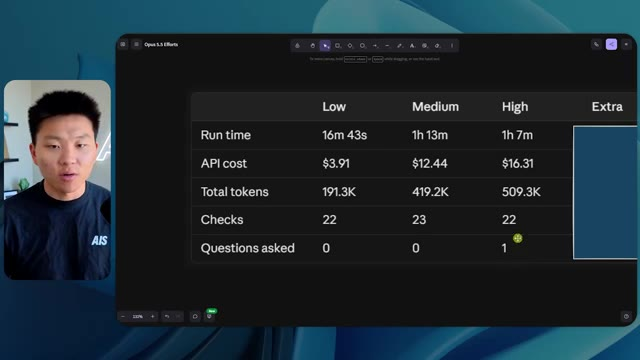
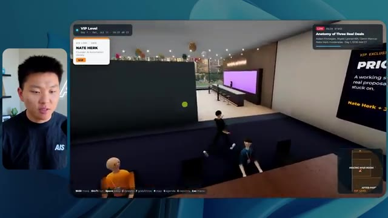
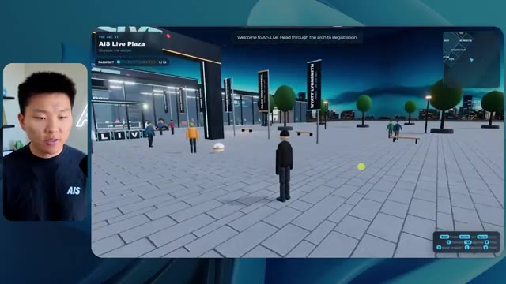

# 🎬 GPT-6 Astra Made This Entire Video

> **Chaîne** : [Nate Herk | AI Automation](https://www.youtube.com/@nateherk/featured)  
> **Lien YouTube** : [https://www.youtube.com/watch?v=dT5-x3u5nCg](https://www.youtube.com/watch?v=dT5-x3u5nCg)  
> **Date de publication** : 20260904  
> **Durée** : 00:04:39  
> **Identifiant vidéo** : `dT5-x3u5nCg`  
> **Transcription & Analyse** : `whisper-v3-large-turbo+gemini-3.5-flash-lite`  

---

## 📌 Synthèse Exécutive & Outils

### 💡 Résumé

Cette vidéo immersive de la chaîne *Nate Herk | AI Automation* propose une expérience comparative inédite et hautement instructive : soumettre exactement le même prompt d'ingénierie complexe à des agents d'intelligence artificielle fonctionnant sous **Opus 5.5**, en faisant varier un paramètre critique souvent négligé, à savoir le **niveau d'effort** (*Effort Level*). L'objectif assigné à l'IA était d'une ambition redoutable : transformer un dossier brut de 105 gigaoctets d'enregistrements vidéo issus d'un événement virtuel (AIS Live) en un monde virtuel 3D interactif et explorable à la troisième personne, complet, fidèle à la charte graphique, intégrant des flux vidéo en direct, des PNJ, une physique et une cartographie dynamique.

À travers l'analyse comparative des versions générées (allant du niveau d'effort faible au niveau moyen, jusqu'aux paliers supérieurs), l'analyste décortique non seulement les rendus visuels et fonctionnels finaux (bugs d'affichage, PNJ fantômes, intégration des badges, lecture des flux vidéo), mais évalue aussi des métriques techniques et financières cruciales : temps d'exécution, coût simulé par l'API, volume total de tokens consommés, nombre de vérifications autonomes dans le navigateur, et nombre de questions posées à l'utilisateur. Les résultats démontrent que si un niveau d'effort faible produit un monde chaotique, statique et visuellement décevant en plus de 16 minutes, le passage à un niveau d'effort moyen élève drastiquement la qualité globale (respect de la charte de marque, PNJ dynamiques, intégration réussie des vidéos et des ressources post-événement).

Enfin, la vidéo met en lumière le goulet d'étranglement classique du développement assisté par IA : le passage du code fonctionnel généré localement sur la machine au déploiement en production sur une véritable URL publique. Pour combler ce fossé, la démonstration intègre une solution de pontage native permettant aux agents de déployer, configurer les DNS et pointer des domaines directement depuis l'environnement de développement, bouclant ainsi la boucle d'un workflow d'automatisation logicielle de bout en bout.

---

### 🛠️ Outils, Modèles & Logiciels Présentés

* **Opus 5.5** : Modèle d'IA de pointe ultra-rapide, économique et performant, servant de moteur principal à l'agent pour concevoir l'intégralité du monde 3D interactif.
* **Claude Code** : Environnement de développement et assistant de codage avancé utilisé pour orchestrer les agents et exécuter les modifications de code à la volée.
* **Agents IA** : Entités autonomes capables d'analyser un prompt d'objectif, de manipuler des dossiers de données massifs (105 Go) et d'effectuer des itérations correctives.
* **Frame.io** : Plateforme cloud de stockage et de gestion vidéo utilisée comme source pour centraliser les 105 gigaoctets d'enregistrements de l'événement AIS Live.
* **VS Code / Cursor** : Éditeurs de code de référence intégrant les assistants IA où s'exécutent les flux de développement et les déploiements automatisés.
* **Hostinger Connector** : Extension gratuite pour éditeur de code permettant d'intégrer le compte d'hébergement pour déployer instantanément des applications, configurer les enregistrements DNS et pointer un domaine sans quitter son environnement de travail.
* **Système d'exploitation IA Herc 2** : Écosystème propriétaire et modulaire de Nate Herk utilisé comme bibliothèque d'outils et de briques logicielles lors de la génération.

---

### 🔑 Points Clés & Enseignements Stratégiques

* **L'importance critique du paramètre d'effort (*Effort Level*)** : La modification du niveau d'effort (faible, moyen, élevé, etc.) sur un même modèle de pointe comme Opus 5.5 modifie radicalement la complexité du raisonnement alloué, transformant un prototype instable en une application fonctionnelle et esthétique.
* **Le piège des ressources non structurées** : Demander à un agent de traiter 105 Go de données vidéo (Frame.io) sans structuration préalable exige des capacités de tri et d'indexation contextuelle élevées de la part du modèle, prouvant l'efficacité des efforts moyens et supérieurs.
* **Autonomie vs Interactivité humaine** : À travers tous les tests menés avec les différents niveaux d'effort, l'agent a fait preuve d'une autonomie totale en posant **zéro question** à l'utilisateur, exécutant l'intégralité de la vision créative sur la seule base du prompt d'objectif initial.
* **Arbitrage coût/temps/performance** : Le niveau d'effort faible a nécessité plus de 16 minutes d'exécution pour un coût API d'environ 3,91 $ et 191 000 tokens consommés, tout en produisant un résultat médiocre (bugs visuels, PNJ invisibles, images fixes au lieu de flux vidéo).
* **Alignement rigoureux avec la charte de marque** : Un niveau d'effort insuffisant génère des éléments génériques (palettes de couleurs aléatoires, faux logos), tandis qu'un effort accru permet à l'IA d'assimiler et de restituer fidèlement l'identité visuelle et les directives de marque (AIS Live).
* **Dynamisme et immersion des PNJ** : L'ingénierie des mondes 3D générés par IA progresse de simples décors statiques (effort faible) vers des environnements vivants où les personnages interagissent, bougent et réagissent de manière contextuelle (effort moyen).
* **Intégration multimédia fluide** : La réussite d'un monde virtuel événementiel repose sur la capacité de l'IA à mapper correctement des flux vidéo en direct et des ressources post-événement (diapositives, ateliers, stands virtuels) aux bons emplacements spatiaux.
* **Le fossé du déploiement en production (*Deployment Gap*)** : La génération d'un code fonctionnel en local ne résout pas la problématique de la mise en ligne, soulignant la nécessité d'outils d'automatisation du déploiement intégrés directement aux assistants de code.
* **L'approche recommandée par Anthropic** : Les directives officielles suggèrent de démarrer l'ingénierie de prompt avec un niveau d'effort moyen, puis d'ajuster itérativement vers le haut ou vers le bas selon la complexité et les exigences de la tâche ciblée.
* **L'automatisation DevOps de bout en bout** : Grâce à des connecteurs d'hébergement natifs dans les éditeurs (comme celui d'Hostinger), l'étape de mise en ligne d'un projet généré par IA passe d'une corvée technique complexe à une action en un clic, réduisant le *Time-to-Market* à quelques minutes.

---

## ⏱️ Chronologie & Transcription Complète Audio & Visuelle (Mot pour Mot)

### ⏱️ `[00:00:00 - 00:00:20]` | Segment #01

**🔊 Audio (Transcription Intégrale Mot pour Mot en Français) :**
> Opus 5.5, Opus 5.5, Opus 5.5, Opus 5.5, Opus 5.5. Ce modèle est littéralement partout et pour de très bonnes raisons. Il est intelligent, il est bon marché, il a un goût incroyable, c'est un modèle d'IA incroyable. Mais avec chaque modèle d'IA, vous avez le choix de l'effort, que ce soit faible, moyen, élevé, extra, max ou code ultra.

**👁️ Analyse Visuelle d'Écran (gemini-3.5-flash-lite) :**
**Interface & Outils** : X (anciennement Twitter)

**Contenu textuel & Code** : Un post sur X montrant une image/vidéo de paysage 3D généré avec du texte sur la disruption des créatifs techniques.

**Action / Démonstration** : Le présentateur introduit le sujet et illustre ses propos avec une publication externe sur les réseaux sociaux.

*⏱️ 00:00:05 — Une capture d'écran d'un tweet montrant une vidéo ou une simulation 3D d'un paysage côtier tropical avec des habitations et des palmiers.*

---

### ⏱️ `[00:00:20 - 00:00:38]` | Segment #02

**🔊 Audio (Transcription Intégrale Mot pour Mot en Français) :**
> Donc, dans cette vidéo, j'ai donné exactement le même prompt à Opus 5.5 et je l'ai exécuté à tous les niveaux d'effort possibles, et nous allons comparer les résultats. Nous examinerons la qualité de tous les différents résultats réels, mais nous examinerons également combien de temps chacun d'eux a pris, combien cela nous a coûté si c'était facturé par l'API, le total des jetons, combien de vérifications ils ont effectuées, et combien de questions ils m'ont réellement posées tout au long du processus.

**👁️ Analyse Visuelle d'Écran (gemini-3.5-flash-lite) :**
**Interface & Outils** : Application de tableau blanc / interface de présentation (type Miro ou Figma).

**Contenu textuel & Code** : Tableau comparatif avec les colonnes : Low, Medium, High, Extra, Max, Ultracode, et les lignes : Run time, API cost, Total tokens, Checks, Questions asked.

**Action / Démonstration** : Présentation du tableau comparatif des différents niveaux d'effort pour Opus 5.5.

*⏱️ 00:00:29 — Un tableau comparatif montrant différents niveaux d'effort (Low, Medium, High, Extra, Max, Ultracode) et des métriques associées (Run time, API cost, Total tokens, etc.).*

---

### ⏱️ `[00:00:39 - 00:00:58]` | Segment #03

**🔊 Audio (Transcription Intégrale Mot pour Mot en Français) :**
> Et les résultats que nous avons obtenus ne sont pas du tout ce à quoi je m'attendais, donc j'ai hâte de partager cela avec vous les gars. Ne perdons pas de temps et allons directement à celui-ci. D'accord, alors plongeons-nous directement dans celui-ci. Je veux commencer juste en vous montrant, les gars, le prompt réel que nous avons utilisé, que nous avons donné à chacun de ces différents agents. Je vais aller dans les fichiers ici, et nous allons ouvrir ce fichier markdown de prompt, et je vais vous montrer ce que nous avons obtenu. Voici donc le slash objectif que j'ai fourni.

**👁️ Analyse Visuelle d'Écran (gemini-3.5-flash-lite) :**
**Interface & Outils** : Interface logicielle d'un outil d'IA (type éditeur ou terminal graphique).

**Contenu textuel & Code** : Texte du prompt : "Hi Nate. This worktree has the effort-test task queued in PROMPT.md : build a walkable third-person 3D world of the AIS Live conference from your fjo recordings..."

**Action / Démonstration** : Affichage et lecture de l'interface de l'outil d'IA présentant la tâche en attente.

*⏱️ 00:00:48 — Image #2 : Interface d'un éditeur ou d'une application d'agent IA (avec le présentateur en incrustation vidéo à gauche) affichant un prompt sur un projet de monde 3D.*

---

### ⏱️ `[00:00:58 - 00:01:34]` | Segment #04

**🔊 Audio (Transcription Intégrale Mot pour Mot en Français) :**
> J'ai dit : tu dois me créer un monde en 3D qui est une conférence tech réaliste dans laquelle je peux me promener en vue à la troisième personne. Tu vas regarder ce dossier, qui contient mes éléments d'enregistrement d'événement d'AIS Live. Et ce dossier est un dossier Frame.io de 105 gigaoctets d'enregistrements vidéo. C'était un événement entièrement virtuel. Tout a été enregistré et tous les enregistrements sont juste ici. J'ai dit, ton objectif est de prendre cet événement et de le transformer en un monde explorable en 3D qui me donne l'impression d'être réellement allé à une vraie conférence en personne avec différentes salles, différentes pistes, différentes scènes, bla, bla, bla. N'hésite pas à utiliser key.ai si tu as besoin de générer des images ou des vidéos. Et tu peux aussi utiliser tout ce qui se trouve dans mon projet Herc 2, qui est comme mon système d'exploitation IA. J'ai dit,

**👁️ Analyse Visuelle d'Écran (gemini-3.5-flash-lite) :**
**Interface & Outils** : Éditeur de code (VS Code / Cursor) et interface web Frame.io

**Contenu textuel & Code** : Fichier Markdown contenant le prompt détaillé demandant de transformer des enregistrements d'événements virtuels en un monde 3D explorable à la troisième personne.

**Action / Démonstration** : Présentation du prompt de configuration pour l'agent IA et visualisation du dossier source des enregistrements sur Frame.io.

*⏱️ 00:01:07 — Éditeur de code affichant un fichier PROMPT.md avec les instructions détaillées pour créer un monde 3D interactif d'une conférence tech.*

*⏱️ 00:01:16 — Interface Frame.io montrant un dossier d'enregistrements d'événements AIS Live d'une taille totale de 105,69 gigaoctets.*

---

### ⏱️ `[00:01:34 - 00:02:08]` | Segment #05

**🔊 Audio (Transcription Intégrale Mot pour Mot en Français) :**
> vous serez jugé sur la créativité, le design, la physique et la sensation générale lorsque j'explorerai le monde 3D que vous avez construit. Et c'était fondamentalement la fin des instructions. Donc, comme vous pouvez le voir sur ce côté gauche, j'ai exécuté ceci à travers tous les différents niveaux d'effort. Commençons par le niveau bas et montons jusqu'au code ultra. Très bien. Donc ici, nous avons le résultat du niveau bas. Ouvrons ceci et jetons un œil. Nous avons donc AIS Live, le sommet des services d'IA en personne enfin, et nous avons pu cliquer partout. Tout d'abord, cela ne fait pas très personnalisé. Genre, ce n'is pas le logo d'IS Live. Ce n'est même pas nos couleurs. Donc je n'aime pas trop ça, mais entrons ici. D'accord. C'est beaucoup trop lumineux. Euh, nous avons une carte en haut à droite. Nous avons une ville ici en arrière-plan. Je ne peux pas dire quelle ville c'est

**👁️ Analyse Visuelle d'Écran (gemini-3.5-flash-lite) :**
**Interface & Outils** : Application web / Interface d'agent IA (type Claude ou similaire) avec panneau de navigation à gauche et zone de chat à droite.

**Contenu textuel & Code** : Texte du prompt : "Hi Nate. This worktree has the effort-test task queued in PROMPT.md : build a walkable third-person 3D world..." et réponse utilisateur dans le champ de saisie : "yes, start the task in PROMPT.md".

**Action / Démonstration** : Navigation et sélection des différents niveaux d'effort (tests) dans le panneau latéral gauche de l'interface.

*⏱️ 00:01:42 — Interface d'une application d'agent IA montrant différents niveaux de tests (Hello, Extra, High, Max, Ultracode, Medium, Low) dans un panneau latéral et un message de l'IA proposant de commencer la tâche de construction d'un monde 3D.*

---

### ⏱️ `[00:02:08 - 00:02:40]` | Segment #06

**🔊 Audio (Transcription Intégrale Mot pour Mot en Français) :**
> c'est. D'accord. C'est Chicago, ce qui est plutôt cool parce que tu sais, j'habite à Chicago, mais bref, en haut à droite, on peut voir une carte. Nous avons un hall d'accueil. Nous avons une salle d'exposition. Nous avons un salon VIP, la scène principale. La carte montre également où se trouve chaque autre personne et cela se synchronise en direct. Donc on peut voir l'inscription. On peut voir le premier jour, la keynote de l'agent hyper, le débriefing en direct. Cool. Donc ça connaît réellement le programme et puis il y a le deuxième jour. Donc il a trouvé ça, c'est bien. Nous avons ces petites boules ici que je peux espérer botter. D'accord. Le visage, oh, regarde ça. Si je vais par ici, tous les gens disparaissent tout simplement. Très mauvais. Très mauvais. D'accord. Alors voyons voir. Est-ce que je peux sprinter ? D'accord.

**👁️ Analyse Visuelle d'Écran (gemini-3.5-flash-lite) :**
**Interface & Outils** : Application de métavers ou de salon virtuel en 3D (type Gather.town ou environnement 3D personnalisé).

**Contenu textuel & Code** : Menus de navigation, listes de sessions (« Day 1 »), mini-carte de l'événement et avatars de participants.

**Action / Démonstration** : Navigation et exploration interactive de différents espaces d'un événement virtuel en 3D (lobby, zone de badges, hall d'exposition).

*⏱️ 00:02:16 — Vue d'un monde virtuel 3D montrant une zone de retrait de badges avec des avatars, une mini-carte en haut à droite et le présentateur à gauche.*

*⏱️ 00:02:24 — Vue du lobby virtuel avec un panneau affichant le programme du premier jour (« Day 1 »), une mini-carte et le présentateur.*

*⏱️ 00:02:32 — Vue de l'Expo Hall virtuel avec des stands, des avatars et une grande installation lumineuse centrale, accompagnée de la mini-carte.*

---

### ⏱️ `[00:02:40 - 00:03:04]` | Segment #07

**🔊 Audio (Transcription Intégrale Mot pour Mot en Français) :**
> Je peux aller un peu plus vite. Je vais d'abord aller par ici. Il y a des produits promotionnels, euh, certifié AIS plus glido. D'accord. Donc il y a les vrais stands que nous avions dans l'événement virtuel. Nous avions des stands. C'est donc plutôt cool. Un petit endroit pour prendre des photos. Salle C. En ce moment, nous avons Tangy Frederick qui anime un atelier. D'accord. Mais ce n'est pas une vidéo. Comme vous pouvez le voir, c'est juste une image. Elle ne bouge pas. C'est donc juste une image. Ces gens sont en train de disparaître. Ce doivent être des fantômes. Allons par ici vers la salle A.

**👁️ Analyse Visuelle d'Écran (gemini-3.5-flash-lite) :**
**Interface & Outils** : Environnement virtuel 3D interactif (type Gather ou similaire).

**Contenu textuel & Code** : Affichage d'instructions textuelles d'intégration d'API et de stands virtuels.

**Action / Démonstration** : Exploration d'un espace virtuel d'événement en ligne par le présentateur.

*⏱️ 00:02:46 — Vue d'un monde virtuel interactif montrant le stand d'un sponsor nommé Glaido avec des cubes promotionnels.*

*⏱️ 00:02:52 — Navigation dans une salle d'atelier virtuelle sur un thème d'entreprise avec des tables lumineuses.*

*⏱️ 00:02:58 — Avatars et affichages interactifs dans l'espace virtuel montrant des instructions pour générer une clé API.*

---

### ⏱️ `[00:03:04 - 00:03:30]` | Segment #08

**🔊 Audio (Transcription Intégrale Mot pour Mot en Français) :**
> Nous avons Liberty White. D'accord. Très cool. Vos 30 premiers jours en automatisation. Encore une fois, c'est juste une image fixe et les gens ont des bugs d'affichage. Donc ce n'est pas très bien ici. Je vais aller sur la scène principale et voir ce que nous avons. D'accord, cool. Donc nous avons une scène principale. Les gens ont des bugs d'affichage. Vraiment mauvais. Ce n'est vraiment pas terrible. Notre vidéo est en train de bouger. Genre, j'ai vu mon visage ici et j'ai vu celui de Devin, mais maintenant ils ont disparu. Donc je ne sais pas ce qui s'est passé. D'accord. On dirait que c'est plutôt un diaporama. Rien n'est réellement diffusé pour l'instant. Quoi qu'il en soit, entrons ici.

**👁️ Analyse Visuelle d'Écran (gemini-3.5-flash-lite) :**
**Interface & Outils** : Environnement virtuel 3D de type métavers ou jeu en ligne (plateforme de conférence virtuelle).

**Contenu textuel & Code** : Aucun code source ni terminal visible ; affichage d'un événement virtuel avec bannières et écrans de présentation.
[DESC_IMAGE_1] L'animateur navigue dans un monde virtuel 3D.
[DESC_IMAGE_2] L'animateur déplace son avatar vers la scène principale d'une conférence virtuelle.
[DESC_IMAGE_3] L'animateur explore la salle de conférence principale affichant le logo "AIS LIVE".

**Action / Démonstration** : Explications face caméra et démonstration conceptuelle.

---

### ⏱️ `[00:03:30 - 00:03:58]` | Segment #09

**🔊 Audio (Transcription Intégrale Mot pour Mot en Français) :**
> Nous avons d'autres stands. Nous avons hyper agent. Nous avons Claude Code. Nous avons plus de gadgets publicitaires. La salle B, c'est Dave Ebelor. Je suppose que c'est exactement la même chose. Nous avons du café. Et ensuite, je suppose, le salon VIP, accès VIP seulement. C'est plutôt cool, mais il n'y a vraiment rien qui se passe ici. Cet écran est bien trop lumineux. D'accord. Donc je pense que vous comprenez l'ambiance que nous obtenons ici d'Opus 5.5 en effort faible. Et c'est là que les choses deviennent intéressantes. Combien de temps pensez-vous que cela a duré ? Combien de temps ? Celui-ci a duré 16 minutes et 43 secondes. Combien pensez-vous que cela a coûté ?

**👁️ Analyse Visuelle d'Écran (gemini-3.5-flash-lite) :**
**Interface & Outils** : Tableau blanc numérique / Application de mindmapping (Opus 5.5 Efforts)

**Contenu textuel & Code** : Tableau comparatif avec les critères : Run time, API cost, Total tokens, Checks, Questions asked selon différents niveaux d'effort (Low, Medium, High, Extra, Max, Ultracode).

**Action / Démonstration** : Présentation des différents niveaux de performance et de coûts d'API associés au modèle Opus 5.5.

*⏱️ 00:03:51 — Interface de tableau comparatif (Opus 5.5 Efforts) avec des colonnes Low, Medium, High, Extra, Max et Ultracode.*

---

### ⏱️ `[00:03:58 - 00:04:26]` | Segment #10

**🔊 Audio (Transcription Intégrale Mot pour Mot en Français) :**
> 3,91 dollars si c'était une facturation par API. J'utilise évidemment mon abonnement ici, mais nous allons simplement calculer cela en facturation par API. Le total des jetons était de 191 000. Il a effectué 22 vérifications. Donc la vérification, 22 fois il a ouvert le navigateur et a exécuté différentes sortes de vérifications. Donc 22 catégories de vérifications. Et combien de questions m'a-t-il posées ? Il m'a posé un total de zéro question tout au long de cette invite de commande d'objectif. D'accord. Alors, ouvrons l'effort moyen et voyons ce que nous avons. D'accord, y voilà. Effort moyen. Nous avons Nate Herc. Nous avons mon badge. C'est la marque de commerce de la vie de l'IA.

**👁️ Analyse Visuelle d'Écran (gemini-3.5-flash-lite) :**
**Interface & Outils** : Tableau blanc ou application de mind mapping/diagramme (style Excalidraw).

**Contenu textuel & Code** : Tableau avec les valeurs : Run time : 16m 43s, API cost : $3.91, Total tokens : 191.3K, ainsi que des lignes pour « Checks » et « Questions asked ».

**Action / Démonstration** : Le présentateur commente les coûts d'API et les statistiques d'utilisation des jetons affichés à l'écran.

*⏱️ 00:04:05 — Un tableau affichant les métriques d'exécution d'un agent IA (« Run time », « API cost », « Total tokens », « Checks », « Questions asked ») pour un niveau de complexité « Low ».*

---

### ⏱️ `[00:04:26 - 00:04:46]` | Segment #11

**🔊 Audio (Transcription Intégrale Mot pour Mot en Français) :**
> Donc ça a déjà l'air un petit peu mieux. Ça ressemble à nos palettes de couleurs qui ont utilisé nos directives de marque. Premier jour de construction, deuxième jour de gain, VIP. Cool. D'accord. Je vais entrer dans le lieu. D'accord. Waouh. Une ambiance similaire, en gros. C'est en arrière-plan. Ça ne ressemble pas à Chicago, hein ? Non, ça ressemble à, honnêtement, ça ressemble à une ville inventée. Quoi qu'il en soit, c'est marrant qu'ils aient décidé de faire ça. Voyons si je peux me déplacer un peu plus vite. Oh, waouh.

**👁️ Analyse Visuelle d'Écran (gemini-3.5-flash-lite) :**
**Interface & Outils** : Application web interactive 3D type metaverse / événement virtuel 'AIS Live'.

**Contenu textuel & Code** : Interface utilisateur avec badge virtuel, texte 'Welcome to AIS Live', commandes de déplacement (WASD, Shift, Space) et boutons de navigation.
[DESC_IMAGE_1] Nate Herk présente l'écran d'accueil de l'application et s'apprête à entrer dans le lieu virtuel en cliquant sur le bouton 'Enter the venue'.
[DESC_IMAGE_2] Navigation à l'intérieur de l'espace virtuel 3D avec des avatars modélisés.

**Action / Démonstration** : Explications face caméra et démonstration conceptuelle.

*⏱️ 00:04:31 — Interface d'accueil de l'application 'AIS Live' avec un badge nominatif virtuel au nom de Nate Herk et des boutons pour entrer dans le lieu virtuel.*

*⏱️ 00:04:41 — Vue à la première personne ou en caméra virtuelle à l'intérieur du lieu virtuel montrant des avatars 3D et un décor de bureau avec vue sur une ville la nuit.*

---

### ⏱️ `[00:04:46 - 00:05:21]` | Segment #12

**🔊 Audio (Transcription Intégrale Mot pour Mot en Français) :**
> Les gens interagissent avec moi. Regardez. Si je m'approche de ce type, il vient de lever le bras. Bon, maintenant il ne veut plus du tout avoir affaire à moi. Mais tous ces petits robots ici doivent prendre des décisions. Je ne sais pas s'ils utilisent Jev. C'est sûr que non. Je ne le lui ai pas dit. En fait, ma clé Jev est à l'arrière. Je ne sais pas. Peut-être qu'elle l'a utilisée. Quoi qu'il en soit, nous pouvons voir ici que nous avons la Salle d'atelier C, le Laboratoire des agents. Sympa. Donc celui-ci est en fait en train de tourner. Vous pouvez voir qu'il s'agit d'une vraie vidéo diffusée par Tangy. Tout le monde ici est en train de travailler sur un ordinateur portable. Ils ne buguent pas. C'est plutôt cool. De plus, mon badge est sur ma poitrine, ce qui est plutôt cool. Je peux venir par ici. Nous avons une carte en haut à droite, comme vous pouvez le voir, mais je peux venir par ici. Nous avons un

**👁️ Analyse Visuelle d'Écran (gemini-3.5-flash-lite) :**
**Interface & Outils** : Environnement virtuel en 3D (type métavers / plateforme de réunion virtuelle).

**Contenu textuel & Code** : Avatars numériques dans un espace virtuel avec interface de navigation.

**Action / Démonstration** : Exploration et navigation dans un monde virtuel 3D.

---

### ⏱️ `[00:05:21 - 00:05:47]` | Segment #13

**🔊 Audio (Transcription Intégrale Mot pour Mot en Français) :**
> hall d'exposition. C'est là que nous avons le stand Glido. Et ça diffuse actuellement. Oui, ça diffuse la vidéo de nous en train de parler de Glido. Ça diffuse la vidéo d'Ed et moi parlant de notre programme de certification. Nous avons le logo AIS Plus ici à l'arrière, qui est un peu mal placé. Ce sont les diapositives des conférenciers et les points clés. Alors wow, ce sont toutes les ressources que nous avons distribuées après l'événement. Elles sont toutes là aussi. Nous pouvons voir que nous avons un projecteur sur la communauté. Donc c'est Aiden qui parle de son contrat qu'il a décroché et ça se joue en direct. Ces gens regardent.

**👁️ Analyse Visuelle d'Écran (gemini-3.5-flash-lite) :**
**Interface & Outils** : Environnement virtuel 3D (type métavers / plateforme d'événement virtuel)

**Contenu textuel & Code** : Panneaux d'affichage virtuels, avatars, présentations et interfaces de navigation d'événement.

**Action / Démonstration** : Navigation et exploration dans l'espace d'exposition virtuel.

---

### ⏱️ `[00:05:47 - 00:06:21]` | Segment #14

**🔊 Audio (Transcription Intégrale Mot pour Mot en Français) :**
> Ils sont plutôt engagés. On a l'hyper agent. C'était, c'est ce que je voulais dire. Si vous avez vu ces gens lever les bras en disant bonjour, c'était plutôt marrant. Regardez, regardez, le voilà qui recommence. Bref. Bon. Où est-ce que je suis maintenant ? Maintenant, je suis dans le hall principal. On a un bar à café. On a un grand logo, qui est le vrai logo. C'est trop lumineux, mais on a le logo. On peut voir si on peut entrer ici dans le parcours fondation. On a Sabrina Romanov et Liberty White. Donc différentes formations juste là. On peut entrer dans cette salle. C'est le parcours avancé. Alors qu'est-ce qui se passe ici. On a Dave Ebelar et Saman qui parlent de différentes choses là-dedans. Et maintenant, allons jeter un œil à la scène principale. Oh, attendez, il y a une vidéo de moi là-haut. C'est du genre VIP

**👁️ Analyse Visuelle d'Écran (gemini-3.5-flash-lite) :**
**Interface & Outils** : Application de métavers ou espace virtuel 3D en ligne (type Gather / espace événementiel virtuel) avec interface utilisateur incrustée (mini-carte, menus contextuels).

**Contenu textuel & Code** : Environnement graphique 3D simulant un hall d'accueil avec affichage 'Main Lobby', bar à café et participants virtuels.

**Action / Démonstration** : Navigation et déplacement d'un avatar à travers le hall principal et les différentes salles de l'événement virtuel.

*⏱️ 00:05:55 — Le présentateur présente un espace virtuel 3D interactif représentant le 'Main Lobby' d'un événement en ligne, avec des avatars d'utilisateurs et une mini-carte en haut à droite.*

*⏱️ 00:06:04 — L'avatar se déplace dans un espace virtuel 3D montrant une salle de conférence ou une estrade avec un écran géant de présentation et plusieurs spectateurs virtuels.*

*⏱️ 00:06:12 — Vue en contre-plongée d'avatars 3D interagissant dans le hall principal virtuel au milieu de participants connectés à l'événement.*

---

### ⏱️ `[00:06:21 - 00:06:50]` | Segment #15

**🔊 Audio (Transcription Intégrale Mot pour Mot en Français) :**
> section ? Ouais, on ira voir ça dans une minute. Mais bref, voici la scène principale. Ça a l'air vraiment, vraiment très bien. On a une grande scène. On a genre quatre personnes assises ici. On a les trois écrans d'Alex là-haut avec Hyper Agent. Est-ce que j'ai le droit de monter sur scène ? Oh, et il me laisse monter sur scène. OK. C'est plutôt sympa. Bon les gars, faisons un selfie. Laissez-moi prendre tout le monde en arrière-plan. Venez par ici. Bref, c'est vraiment, vraiment cool. Par contre, toutes les places ne sont pas occupées. Donc il faut qu'on travaille là-dessus. Mais bref, je vais retourner voir ce que c'était que cette section VIP. OK. Le salon VIP. J'ai l'impression que c'est comme à l'aéroport ou un truc du genre.

**👁️ Analyse Visuelle d'Écran (gemini-3.5-flash-lite) :**
**Interface & Outils** : Application virtuelle 3D / Plateforme d'événement virtuel Hyper Agent

**Contenu textuel & Code** : Interface utilisateur affichant les informations de la session « Hyper Agent Keynote - Alex McDonnell » en bas à gauche et une mini-carte en haut à droite.

**Action / Démonstration** : Navigation et exploration d'un environnement virtuel 3D interactif représentant une keynote.

---

### ⏱️ `[00:06:51 - 00:07:14]` | Segment #16

**🔊 Audio (Transcription Intégrale Mot pour Mot en Français) :**
> [Séquence sonore / Ambiance musicale]

**👁️ Analyse Visuelle d'Écran (gemini-3.5-flash-lite) :**
**Interface & Outils** : Tableau de bord d'analyse de performances / application web.

**Contenu textuel & Code** : Tableau avec métriques : Run time (16m 43s), API cost ($3.91), Total tokens (191.3K), Checks (22), Questions asked (0).

**Action / Démonstration** : Présentation des coûts et temps d'exécution d'un modèle d'IA (niveau Low).

*⏱️ 00:07:02 — Capture montrant un tableau comparatif de performances (Run time, API cost, Total tokens, Checks, Questions asked) avec des colonnes Low, Medium, High.*

---

### ⏱️ `[00:07:14 - 00:07:48]` | Segment #17

**🔊 Audio (Transcription Intégrale Mot pour Mot en Français) :**
> Et il nous a posé un total de zéro question une fois de plus. Très bien, passons à élevé. C'était déjà un résultat plutôt correct et Anthropic eux-mêmes dans leur vidéo sur comment prompter Opus 5.5, ou désolé, pas une vidéo, un article. Ils ont dit de commencer simplement par moyen et d'ajuster à la hausse ou à la baisse si nécessaire. C'était donc un résultat moyen. Passons à élevé et voyons ce qu'on a obtenu. Très rapidement, les gars, je dois prendre une seconde pour vous parler du sponsor de la vidéo d'aujourd'hui, Hostinger. Donc ces deux modèles viennent de me créer une version fonctionnelle de la même chose. Et maintenant je me retrouve exactement là où je finis toujours, avec un produit fini sur mon ordinateur portable et aucun moyen rapide de le mettre en ligne. Et c'est précisément le fossé que comble le connecteur d'Hostinger. C'est une extension gratuite

**👁️ Analyse Visuelle d'Écran (gemini-3.5-flash-lite) :**
**Interface & Outils** : Tableau de bord analytique et interface de développement (IDE/outil d'IA).

**Contenu textuel & Code** : Tableaux de métriques comparatives (Run time, API cost, Total tokens, Checks, Questions asked) et panneau de configuration d'agent IA.
[DESC_IMAGE_2] Analyse comparative des performances des différents modes d'effort d'Opus 5.5.

**Action / Démonstration** : Explications face caméra et démonstration conceptuelle.

*⏱️ 00:07:22 — Un tableau comparatif montrant les performances des différents niveaux d'effort (Low, Medium, High, Extra) avec des métriques comme le temps d'exécution, le coût API, les tokens et le nombre de questions posées.*

*⏱️ 00:07:39 — Une interface de développement ou d'agent IA montrant un panneau divisé avec du code, des journaux d'exécution et une caméra incrustée du présentateur.*

---

### ⏱️ `[00:07:48 - 00:08:23]` | Segment #18

**🔊 Audio (Transcription Intégrale Mot pour Mot en Français) :**
> pour votre éditeur qui intègre votre compte Hostinger dans l'environnement où vous codez déjà. Donc VS Code, Cursor, Cloud Code, Codex, peu importe. Vous vous connectez une seule fois en un clic, et à partir de là, votre agent peut déployer le site, y pointer un domaine, configurer les enregistrements DNS et vérifier votre VPS sans jamais avoir à quitter l'éditeur. Ainsi, peu importe celui que vous finirez par préférer, ce qu'il a construit n'est qu'à quelques minutes d'une vraie URL sur un hébergement géré. Le connecteur est gratuit avec chaque formule d'hébergement, donc si vous avez toujours besoin de l'hébergement en dessous, prenez la formule illimitée avec le lien dans la description et utilisez le code NATEHERK pour obtenir 10 % de réduction. Cela inclut également un domaine gratuit et un e-mail professionnel pour l'année. Et c'est toujours le moyen le plus économique que j'ai trouvé pour obtenir quelque chose

**👁️ Analyse Visuelle d'Écran (gemini-3.5-flash-lite) :**
**Interface & Outils** : Interface web d'intégration Hostinger / Claude Code

**Contenu textuel & Code** : "Manage Hostinger from your IDE", statut "Connected VIA OAUTH", Node.js 24.13.0, liste des outils disponibles (Websites, Domains, Subscriptions & Payments, Email Marketing).

**Action / Démonstration** : Connexion du compte Hostinger à l'IDE en un clic pour permettre à l'agent d'accéder aux outils de gestion.

*⏱️ 00:07:57 — Interface montrant l'intégration de Hostinger dans l'IDE avec le statut connecté via OAuth et les outils disponibles (Websites, Domains, Subscriptions, Email Marketing), ainsi que le panneau Claude Code sur la droite.*

---

### ⏱️ `[00:08:23 - 00:08:47]` | Segment #19

**🔊 Audio (Transcription Intégrale Mot pour Mot en Français) :**
> tu as construit cela sur une vraie URL. Alors revenons à la vidéo. D'accord. Encore une fois, très, très marqué par la marque. C'est un écran de chargement encore meilleur que le précédent. Nous avons ce joli petit effet en arrière-plan. Nous avons le logo. Nous allons entrer dans le lieu. D'accord. Nous y voilà. Ça a l'air plutôt bien. Nous commençons à l'extérieur et vous pouvez voir que nous avons ces drapeaux pour tous les intervenants, Wyatt, Casper, Alex, Ed, Aiden, Sabrina, Liberty. C'est plutôt cool. Nous avons des blocs en direct ici.

**👁️ Analyse Visuelle d'Écran (gemini-3.5-flash-lite) :**
**Interface & Outils** : Application web 3D immersive / plateforme événementielle virtuelle (RingCentral / AIS Live).

**Contenu textuel & Code** : Interface graphique avec commandes de déplacement (WASD), affichage de la zone ('AIS Live Plaza') et bannières d'événements.

**Action / Démonstration** : Entrée dans le lieu virtuel et navigation au sein de la place 3D avec les avatars.

*⏱️ 00:08:29 — Écran de chargement et d'accueil de la plateforme virtuelle 'AIS LIVE', affichant le logo, les instructions de contrôle et le bouton 'Enter the Venue'.*

*⏱️ 00:08:35 — Vue de la place virtuelle 'AIS Live Plaza' avec des avatars 3D se déplaçant dans un environnement urbain modélisé en 3D.*

*⏱️ 00:08:41 — Exploration de l'espace virtuel 'AIS Live Plaza' montrant des bannières verticales avec les noms de intervenants et un petit robot sphérique au premier plan.*

---

### ⏱️ `[00:08:47 - 00:09:23]` | Segment #20

**🔊 Audio (Transcription Intégrale Mot pour Mot en Français) :**
> Il a pris cette photo de moi, votre hôte, Nate Herc, John, Dave, Nate Herc. Voilà. OK. Les portes. Génial. Ce sont des portes coulissantes automatiques en verre. J'adore ça. On peut voir l'enregistrement VIP. On peut voir l'admission générale. On peut venir par ici et on peut découvrir l'expo avec différents stands, le projecteur sur la communauté. Vous pouvez aussi voir qu'en haut à gauche, j'ai un passeport. Donc c'est comme si, ça montrera combien d'endroits j'ai visités. Tout cela est une vraie lecture. Nous avons un mur de ressources avec tous les différents intervenants. Ils ont aussi une session de réseautage par ici. Donc je vais venir très vite et voir de quoi il retourne. Donc nous avons le bar à cold brew AIS. Nous avons différents membres de la communauté qui ont été mis en avant ou en lumière.

**👁️ Analyse Visuelle d'Écran (gemini-3.5-flash-lite) :**
**Interface & Outils** : Environnement virtuel 3D / Jeu ou plateforme de métavers.

**Contenu textuel & Code** : Interface utilisateur virtuelle affichant le hall d'exposition, les zones d'enregistrement et les contrôles de navigation.

**Action / Démonstration** : Exploration d'un espace virtuel de conférence en 3D par l'hôte.

*⏱️ 00:08:56 — Vue d'un monde virtuel 3D représentant une zone d'enregistrement de conférence avec une scène principale et des comptoirs d'accueil.*

*⏱️ 00:09:05 — Navigation dans un hall d'exposition virtuel 3D avec des stands et des avatars d'utilisateurs.*

*⏱️ 00:09:14 — Déplacement d'un avatar dans le hall virtuel entouré d'autres avatars de participants.*

---

### ⏱️ `[00:09:23 - 00:09:56]` | Segment #21

**🔊 Audio (Transcription Intégrale Mot pour Mot en Français) :**
> Nous avons l'aile VIP. Attends, quoi ? Prends un bracelet. Oh, je dois vraiment aller chercher le bracelet. D'accord. Laisse-moi m'enregistrer rapidement. Le bracelet est déjà mis. Attends, quoi ? D'accord. Oh, d'accord. Maintenant, les portes se sont ouvertes pour moi. Cool. Je peux entrer ici. Oh, ça mène juste à la scène principale. Salon VIP. Il y a une séance de questions-réponses en cours. Ça a l'air très cool. Je veux dire, je suis très impressionné par la façon dont il est capable de faire ça. Waouh. D'accord. Donc c'est vraiment bien. Ce qu'on a fait, c'est qu'on a eu des salles de discussion VIP avec différentes personnes. Tu peux voir qu'il y a différentes salles, différents membres de l'équipe AIS qui vont dans des trucs. C'est vraiment cool. C'est très cool. C'est un VIP bien meilleur

**👁️ Analyse Visuelle d'Écran (gemini-3.5-flash-lite) :**
**Interface & Outils** : Application de métavers / espace virtuel 3D de conférence en ligne.

**Contenu textuel & Code** : Textes d'orientation, noms de salles ("Registration Concourse", "VIP Lounge", "VIP Working Sessions"), mini-carte et sous-titres de dialogue.

**Action / Démonstration** : Navigation et exploration de différentes salles d'un événement virtuel par l'avatar.

*⏱️ 00:09:32 — Vue d'un espace virtuel en 3D représentant une zone d'enregistrement (Registration Concourse) avec un avatar naviguant et des panneaux textuels.*

*⏱️ 00:09:40 — Vue du salon VIP virtuel (VIP Lounge) avec un grand écran montrant une visioconférence et des avatars assis sur des canapés.*

*⏱️ 00:09:48 — Vue de sessions de travail VIP virtuelles (VIP Working Sessions) avec plusieurs salles thématiques et des groupes d'avatars en discussion.*

---

### ⏱️ `[00:09:56 - 00:10:30]` | Segment #22

**🔊 Audio (Transcription Intégrale Mot pour Mot en Français) :**
> expérience que ce qui a été montré dans la première partie. D'accord. After party VIP. Regardez ça. On a une piste de danse. On a tous ces éléments ici. On a la lecture de l'after party VIP juste ici. Et il y a une estrade de DJ. C'est trop marrant. Il y a un petit bug ici, un petit glitch ici, mais c'est génial. Oh, cool. Donc quand je suis ici sur la scène principale, on a des sous-titres. Vous pouvez voir juste ici en bas de mon écran, on a ces sous-titres de Wyatt qui est en train de parler là-haut. On a des lumières. On a le panel. Très cool. Belle scène principale. Je vais aller ici. On peut aller à la fondation,

**👁️ Analyse Visuelle d'Écran (gemini-3.5-flash-lite) :**
**Interface & Outils** : Application web virtuelle en 3D (environnement virtuel interactif de type Metaverse / événement en ligne).

**Contenu textuel & Code** : Éléments d'interface utilisateur incluant des sous-titres, des mini-cartes, des badges de statut ("VIP After-Party", "Main Stage") et des flux vidéo de participants.
[CONSULTATION] Navigation et exploration d'un environnement virtuel interactif représentant un événement en ligne avec différentes salles (after party, scène principale).

**Action / Démonstration** : Explications face caméra et démonstration conceptuelle.

*⏱️ 00:10:04 — Capture montrant l'interface virtuelle 3D d'une after party VIP avec des avatars, une piste de danse lumineuse et un grand écran vidéo affichant des participants.*

*⏱️ 00:10:13 — Capture montrant une vue plus large de l'after party VIP virtuelle avec une boule à facettes, des ballons et une foule d'avatars.*

*⏱️ 00:10:21 — Capture montrant une transition vers la scène principale (Main Stage) d'un événement virtuel en 3D avec des rangées de sièges et un présentateur sur écran géant.*

---

### ⏱️ `[00:10:30 - 00:11:06]` | Segment #23

**🔊 Audio (Transcription Intégrale Mot pour Mot en Français) :**
> avancé, et les parcours d'entreprise par ici. Donc voyons voir. Nous avons l'anatomie de trois vrais contrats. Nous avons hyper agent. Nous avons les évaluations avec Nate et Ed ici. Nous avons Dave qui s'occupe des trucs avancés. C'est vraiment bien. Je veux dire, évidemment, chacun, chacun de ces résultats jusqu'à présent, faible était correct. Moyen était meilleur. Élevé a été encore meilleur. Voyons si cette tendance se poursuit et allons voir ce que cela nous a coûté. Donc, élevé a tourné pendant une heure et sept minutes. Donc un peu plus rapide que moyen, cela nous aurait coûté 16 dollars et 31 cents. Il a utilisé un demi-million de jetons, 509 000. Il a fait 22 vérifications. Et il nous a aussi demandé, enfin, non, je me suis trompé. Ce

**👁️ Analyse Visuelle d'Écran (gemini-3.5-flash-lite) :**
**Interface & Outils** : Tableau de bord / application de tableau blanc ou d'édition (Excalidraw ou similaire).

**Contenu textuel & Code** : Tableau comparatif affichant les métriques Low, Medium, High et Extra : Run time (16m 43s, 1h 13m, etc.), API cost ($3.91, $12.44, $16.31), Total tokens (191.3K, 419.2K), Checks (22, 23), et Questions asked (0).

**Action / Démonstration** : Le présentateur analyse un tableau comparatif des coûts et temps d'exécution selon différents niveaux d'effort d'intelligence artificielle.

*⏱️ 00:10:57 — Capture montrant le présentateur à gauche et un tableau comparatif de performance et de coûts (Run time, API cost, Total tokens) dans un outil d'édition.*

---

### ⏱️ `[00:11:06 - 00:11:25]` | Segment #24

**🔊 Audio (Transcription Intégrale Mot pour Mot en Français) :**
> L'un m'a posé une question, et attention au spoiler, c'était le seul qui nous a posé une question pendant tout ça. Donc voyons voir, il nous en reste trois : Extra, Max et Ultra Code. Laissez-moi ouvrir Extra et on verra ce qu'on a. D'accord. Celui-ci a l'air plutôt bien. Je dirais honnêtement que jusqu'à présent, l'écran de chargement était le meilleur, celui qu'on vient juste de voir, mais bref, entrons dans AIS Live.

**👁️ Analyse Visuelle d'Écran (gemini-3.5-flash-lite) :**
**Interface & Outils** : Application de tableau blanc ou de gestion de projet avec tableau comparatif.

**Contenu textuel & Code** : Données chiffrées : Run time, API cost, Total tokens, Checks, et Questions asked (avec un total de 1 pour la colonne High).

**Action / Démonstration** : Le présentateur commente les résultats du tableau et s'apprête à ouvrir les détails de la colonne Extra.

*⏱️ 00:11:11 — Tableau comparatif affichant les métriques de performance pour différentes configurations (Low, Medium, High, Extra) incluant le temps d'exécution, le coût API, les tokens et le nombre de questions posées.*

---

### ⏱️ `[00:11:26 - 00:11:51]` | Segment #25

**🔊 Audio (Transcription Intégrale Mot pour Mot en Français) :**
> Waouh. D'accord. Donc nous avons comme de petits extraits sonores. Je peux discuter avec des gens. Le panneau de la guerre des outils a réglé quelques débats pour moi. Sympathetic. Bonne perspective là-bas. Nous sommes de nouveau dehors. Nous avons ces différentes bannières, bien qu'elles soient toutes les mêmes. Elles n'indiquent pas de noms de personnes différents. Donc grand logo Big AIS Live. L'aile de l'atelier est par ici. Et passons par les portes coulissantes en verre pour voir ce que nous avons. Nous avons donc le café AIS. La carte est en bas à droite, et elle n'est pas très descriptive.

**👁️ Analyse Visuelle d'Écran (gemini-3.5-flash-lite) :**
**Interface & Outils** : Environnement virtuel 3D / Metavers

**Contenu textuel & Code** : Interface utilisateur de simulation avec mini-carte et bannières textuelles

**Action / Démonstration** : Exploration et déplacement de l'avatar dans le monde virtuel

*⏱️ 00:11:32 — Vue d'un monde virtuel en 3D représentant une place avec des avatars et des bannières publicitaires*

*⏱️ 00:11:38 — Navigation d'un avatar dans l'environnement virtuel 3D vers une zone de convention*

*⏱️ 00:11:45 — Entrée de l'avatar dans le bâtiment principal de la convention virtuelle*

---

### ⏱️ `[00:11:51 - 00:12:26]` | Segment #26

**🔊 Audio (Transcription Intégrale Mot pour Mot en Français) :**
> J'aime bien comment les autres cartes nous ont dit ce que, genre où se trouvaient les choses, mais celle-ci a l'air très professionnelle. On peut voir ici c'est la scène principale. Allons y faire un tour rapidement. Ils ont tous ces ballons qui volent partout, ce qui je trouve est plutôt marrant. Les ballons de plage AIS. On nous voit moi là-haut en train de parler. Je crois que j'introduisais l'un des jours. Continuons à avancer par ici vers la salle d'atelier sur ce côté gauche. OK. Donc ici nous avons le théâtre Hyper Agent. Nous avons cette session sponsorisée ici par Hyper Agent, mais ça nous montre aussi ce qui va s'y passer. C'est vraiment marrant qu'on puisse discuter avec les gens. Salmon a créé un commercial vocal en direct. La salle "Le Juste Prix" était comble. As-tu pris le guide du compagnon VIP ? C'est trop marrant. Nous avons le parcours avancé dans

**👁️ Analyse Visuelle d'Écran (gemini-3.5-flash-lite) :**
**Interface & Outils** : Application de métavers / plateforme de conférence virtuelle 3D.

**Contenu textuel & Code** : Environnement virtuel 3D interactif avec avatars, écrans vidéo en direct et signalétique textuelle.
[DESC_IMAGE_3] Navigation et exploration de l'espace virtuel de conférence par l'utilisateur.

**Action / Démonstration** : Explications face caméra et démonstration conceptuelle.

*⏱️ 00:12:00 — Vue de la scène principale d'une conférence virtuelle 3D avec un écran géant montrant un présentateur et des spectateurs assis.*

*⏱️ 00:12:09 — Vue du grand hall d'accueil virtuel (Grand Lobby) avec des avatars d'utilisateurs et des panneaux de signalisation pour les ateliers.*

*⏱️ 00:12:17 — Vue d'un couloir virtuel d'un espace de conférence 3D avec des avatars en discussion et des indications de services.*

---

### ⏱️ `[00:12:26 - 00:12:58]` | Segment #27

**🔊 Audio (Transcription Intégrale Mot pour Mot en Français) :**
> ici. Encore une fois, nous avons la lecture en direct. Est-ce que c'est la lecture en direct ? Oh, d'accord. Ça a commencé une fois que je suis entré, mais je peux m'asseoir. Oh la la. Je peux regarder ça. Je peux me lever. Je veux m'asseoir au premier rang. C'est plutôt cool. C'est très bien. J'aime ça. Et tu sais ce que j'ai remarqué jusqu'à présent ? Le personnage réel que j'incarne me ressemble un peu. Je pense qu'il a été modélisé à partir de mes photos de profil ou quelque chose comme ça. Bref, nous avons Sabrina ici, l'animatrice de la salle ici, prenez n'importe quel siège libre. D'accord, cool. Et j'ai vraiment aimé la fonctionnalité pour s'asseoir. C'est plutôt marrant. Genre, nous pourrions réellement assister à cet atelier et participer. Bref, ça nous montre les intervenants. Ça nous montre les

**👁️ Analyse Visuelle d'Écran (gemini-3.5-flash-lite) :**
**Interface & Outils** : Environnement virtuel 3D de type métavers ou plateforme de webinaire interactive.

**Contenu textuel & Code** : Avatars 3D d'utilisateurs assis dans une salle de classe virtuelle avec écran de projection et présentateur en médaillon.

**Action / Démonstration** : Navigation et exploration de l'espace virtuel par le présentateur.

---

### ⏱️ `[00:12:58 - 00:13:31]` | Segment #28

**🔊 Audio (Transcription Intégrale Mot pour Mot en Français) :**
> programme. Il y a un petit tapis rouge ici pour prendre des photos. On peut prendre la pose. Oh, wouah. C'est plutôt cool. Bibliothèque de ressources, obtenez la certification AIS Plus, Glido, Hyper Agent, AIS Plus, trois vraies affaires. Génial. Je veux dire, je dirais vraiment que jusqu'à présent, chacune est meilleure. Et on n'a même pas encore vu la section VIP, le salon VIP. Montons ici très vite. J'espère que je pourrai entrer. Sympa. On a le réinitialisation des outils. Ce sont les différentes salles où l'on peut aller. Donc encore une fois, je pourrais prendre la feuille d'exercice et je pourrais essayer de comprendre comment tarifer mes trucs. C'est tellement cool. C'est vraiment mieux que le précédent où on a juste fait en quelque sorte

**👁️ Analyse Visuelle d'Écran (gemini-3.5-flash-lite) :**
**Interface & Outils** : Application ou plateforme virtuelle 3D en ligne (type métavers / salon virtuel).

**Contenu textuel & Code** : Environnement virtuel 3D interactif avec des stands d'exposition, des avatars et des interfaces textuelles contextuelles.

**Action / Démonstration** : Navigation et exploration d'un salon virtuel en 3D par le présentateur.

---

### ⏱️ `[00:13:31 - 00:13:59]` | Segment #29

**🔊 Audio (Transcription Intégrale Mot pour Mot en Français) :**
> comme j'ai regardé des trucs. Génial. Je peux passer derrière le bar et venir ici. C'est très bien. Bon. Alors, en ce qui concerne les statistiques, celui-ci a duré une heure et demie. Il a coûté 25,92 dollars. Je ne sais pas pourquoi je dis point $25, 92 cents. Il y a eu 733 000 jetons et 34 vérifications. Il a donc eu le plus grand nombre de vérifications de loin jusqu'à présent. Et il nous a posé zéro question. J'ai hâte de voir ce qu'on a obtenu ici de max et ultra code. Bon. Voici les écrans de chargement de max, ennuyeux, mais c'est dans l'esprit de la marque et il y a notre logo.

**👁️ Analyse Visuelle d'Écran (gemini-3.5-flash-lite) :**
**Interface & Outils** : Application de tableau blanc / interface de présentation (style Excalidraw).

**Contenu textuel & Code** : Tableau avec des colonnes de niveaux (Medium: 1h13m, $12.44, 419.2K, 23, 0 ; High: 1h7m, $16.31, 509.3K, 22, 1 ; Extra: 1h31m) et le présentateur visible à l'écran.

**Action / Démonstration** : Le présentateur commente et analyse les statistiques de durée, de coût et de jetons pour chaque niveau d'effort.

*⏱️ 00:13:38 — Un tableau comparatif montrant les statistiques de performance de différents niveaux d'effort ("Medium", "High", "Extra", "Max", "Ultracode") avec le temps, le coût, le nombre de jetons et les vérifications.*

---

### ⏱️ `[00:14:00 - 00:14:35]` | Segment #30

**🔊 Audio (Transcription Intégrale Mot pour Mot en Français) :**
> Donc c'était bien. J'aime bien. On va continuer et entrer dans AIS live. Ooh, petite animation sympa ici qui nous fait entrer. Encore une fois, le personnage me ressemble. Ils m'ont tous ressemblé. Je veux dire, en quelque sorte, on est assis en arrière-plan. Ça ressemble à Chicago. Comme je l'ai mentionné plus tôt, beaucoup de ceux-ci jouent des sons et je n'inclut pas cela parce que ce serait très distrayant pour vous d'essayer d'écouter ce qui se passe en même temps que je parle. Il y a donc une légère musique dans tout ça. Je déteste la façon dont il marche. Cette marche est vraiment, vraiment mauvaise. Je veux dire, la marche, ouais, je n'aime pas du tout ça. Ce n'est donc pas génial. Mais à part ça, allons explorer. Remarquez ces ombres quand j'entre, elles changent vraiment brusquement, je ne sais pas trop pourquoi,

**👁️ Analyse Visuelle d'Écran (gemini-3.5-flash-lite) :**
**Interface & Outils** : Application ou plateforme virtuelle 3D (AIS live)

**Contenu textuel & Code** : Interface utilisateur virtuelle affichant "Arrival Plaza", mini-map, informations de diffusion en direct ("The Tool War Panel"), et commandes clavier.

**Action / Démonstration** : Navigation et déplacement d'un avatar dans l'espace virtuel 3D de l'application.

*⏱️ 00:14:08 — Vue d'un monde virtuel 3D (AIS live) avec le présentateur incrusté à gauche et un avatar se déplaçant sur une place urbaine.*

*⏱️ 00:14:17 — Progression de l'avatar dans l'environnement virtuel 3D montrant des bâtiments modernes et des bannières publicitaires.*

*⏱️ 00:14:26 — Approche d'un bâtiment principal dans l'univers virtuel 3D avec affichage de commandes et de mini-map.*

---

### ⏱️ `[00:14:35 - 00:15:11]` | Segment #31

**🔊 Audio (Transcription Intégrale Mot pour Mot en Français) :**
> Mais de toute façon, nous pouvons aussi discuter avec des gens ici. Le stand Hyperagent est juste là où l'on entre dans l'exposition. Tout va bien. D'accord, super. Je peux continuer à appuyer sur E pour changer ce qu'ils disent. Nous avons les intervenants juste ici. Ça a l'air plutôt bien. Bien que nous avions définitivement la photo de profil de tout le monde. Je ne sais donc pas pourquoi ce n'est pas inclus là. Nous voyons des gens prendre des photos juste ici. J'adore ça. Et ça sauvegarde une petite photo. D'accord. La carte n'est pas non plus super, genre ne me donne pas une super explication de ce qui se passe, mais j'aime ces stands. Ils sont cool. Je pense que ces stands sont les meilleurs que j'ai vu jusqu'à présent. Genre, ils ont juste l'air bien. Ils ont des représentants. Il y a de superbes diapositives derrière eux. Ouais. Ces stands sont cool. D'accord. Nous avons un petit théâtre vedette

**👁️ Analyse Visuelle d'Écran (gemini-3.5-flash-lite) :**
**Interface & Outils** : Application web virtuelle en 3D (metaverse / salon virtuel d'exposition).

**Contenu textuel & Code** : Environnement virtuel 3D interactif avec des stands d'exposition, des listes d'intervenants et des avatars.

**Action / Démonstration** : Navigation et déplacement dans l'espace virtuel et interaction avec les stands.

*⏱️ 00:14:44 — Vue d'un espace d'exposition virtuel en 3D avec des avatars d'utilisateurs et des panneaux d'affichage d'intervenants.*

*⏱️ 00:14:53 — Navigation dans le hall virtuel près de l'entrée de l'exposition avec une bulle de dialogue affichant une discussion.*

*⏱️ 00:15:02 — Exploration de l'Expo Hall virtuel montrant différents stands (Evals Lab, Enterprise AI).*

---

### ⏱️ `[00:15:11 - 00:15:35]` | Segment #32

**🔊 Audio (Transcription Intégrale Mot pour Mot en Français) :**
> qui se passe par ici. C'est Casper. Bien que pourquoi est-ce que ça ne joue pas ? J'ai l'impression que ça devrait jouer, non ? Comme dans les autres, ils étaient toujours en train de jouer. On peut parler à d'autres personnes par ici. Le café est gratuit. Blabla. Amy Simpson, Matt Wolf. Sympa. D'accord. C'est juste la zone de networking où nous sommes en ce moment, mais on peut voir en haut à droite. On peut aussi voir ce qui est en direct sur la scène principale en ce moment. C'est un panel de guerre des outils. Alors allons par ici. Nous avons Devin, Cole, Dave et Russ qui discutent ici. Nous avons en quelque sorte de l'audiovisuel, des petits trucs de lumière qui se passent derrière ici.

**👁️ Analyse Visuelle d'Écran (gemini-3.5-flash-lite) :**
**Interface & Outils** : Application web virtuelle interactive 3D (type salon virtuel / metaverse d'événement).

**Contenu textuel & Code** : Environnement virtuel 3D avec des avatars d'utilisateurs, des panneaux d'affichage de projets et des écrans vidéo en direct.

**Action / Démonstration** : Navigation et exploration de l'espace virtuel par un avatar.

---

### ⏱️ `[00:15:36 - 00:15:55]` | Segment #33

**🔊 Audio (Transcription Intégrale Mot pour Mot en Français) :**
> Passons la scène principale à ce qui compte vraiment en ce moment. Je peux donc changer de sujet. Cool. Je viens de basculer sur moi et Matt. On peut passer à l'anatomie de trois vraies transactions. C'est plutôt cool. La scène a l'air bien. On a un petit panneau sympa ici. Je peux monter sur scène ? Sympathique. Sympathique. Bon, je ne peux pas aller trop loin, en fait. Bon tout le monde, laissez-moi prendre un selfie. Tout le monde vient là-dedans. Je peux aussi m'asseoir dans le public par ici et juste profiter de la session.

**👁️ Analyse Visuelle d'Écran (gemini-3.5-flash-lite) :**
**Interface & Outils** : Application de metaverse / simulation virtuelle 3D de type Gather.town ou similaire.

**Contenu textuel & Code** : Interface utilisateur virtuelle affichant des commandes de déplacement et des flux vidéo de conférence en direct.

**Action / Démonstration** : Navigation et déplacement d'un avatar dans l'environnement virtuel 3D de la conférence.

---

### ⏱️ `[00:15:55 - 00:16:14]` | Segment #34

**🔊 Audio (Transcription Intégrale Mot pour Mot en Français) :**
> Très cool, très cool. OK, allons par ici. Je vois une section à l'étage. C'est marrant comme ils choisissent tous de mettre la section VIP à l'étage. Je veux dire, je ne déteste pas ça. Oh la la, ils ont un escalator. Pas possible. Je vais discuter avec ce type sur l'escalator. Glenn a 15 ans d'expérience en agence. Ses trucs de "land and expand" étaient en or. Du beau boulot, Glenn. Cool, donc je vais, je ne peux même pas passer devant ce type par contre.

**👁️ Analyse Visuelle d'Écran (gemini-3.5-flash-lite) :**
**Interface & Outils** : Application ou plateforme virtuelle 3D (environnement de type métavers ou événementiel en ligne).

**Contenu textuel & Code** : Environnement virtuel 3D interactif avec avatars, interface de navigation, mini-carte et bulles de discussion.

**Action / Démonstration** : Navigation et déplacement dans un espace virtuel 3D, approche d'un escalator menant à la zone VIP.

*⏱️ 00:16:00 — Vue d'un espace de réception virtuel en 3D avec des personnages, de grandes baies vitrées et le présentateur dans une vignette à gauche.*

*⏱️ 00:16:04 — Vue de l'espace virtuel montrant l'approche des escaliers et d'un escalator menant au niveau VIP.*

*⏱️ 00:16:09 — Vue de l'escalator virtuel avec un personnage en train de monter, affichant une bulle de dialogue textuelle indiquant l'expérience de Glenn.*

---

### ⏱️ `[00:16:14 - 00:16:48]` | Segment #35

**🔊 Audio (Transcription Intégrale Mot pour Mot en Français) :**
> Oh, j'ai dû sauter par-dessus lui. D'accord, niveau VIP, badge requis. Oh mon Dieu. Tu te moques de moi ? Je dois aller chercher mon badge. D'accord, super. Maintenant, ça montre que je suis un vrai VIP et je peux aller ici dans la section VIP. On a de superbes petites sessions de travail par ici, qu'on peut rejoindre. Je me demande si ça va me laisser m'asseoir ici. Je peux juste discuter. Est-ce que je peux participer ? Ça ne me laisse pas m'asseoir et participer. C'est pas grave. On a la salle de crise sur les prix. Oh, ça pourrait être l'after-party. Allons voir ce qui se passe par ici. Ou peut-être que je dois juste entrer par ici. D'accord. C'est bizarre. Je devais juste entrer par ici. Cet after-party n'est pas aussi cool que l'autre. Mais bref, allons voir ce qui se passe par ici.

**👁️ Analyse Visuelle d'Écran (gemini-3.5-flash-lite) :**
**Interface & Outils** : Environnement virtuel interactif (probablement un salon d'événements en ligne)

**Contenu textuel & Code** : Informations sur le niveau VIP, la biographie de Nate Herk, le titre et le contenu de sessions de travail ("Day 1 - Scope to Ship", "Day 2 - First Sales Call Prep", "Did you learn Anatomy of Three Real Deals...").

**Action / Démonstration** : Navigation dans un environnement virtuel, interaction avec des participants et des sessions de travail.

*⏱️ 00:16:31 — Une scène de discussion virtuelle avec des avatars représentant des participants, des bulles de texte indiquant le contenu de la conversation, et des informations sur une session de travail.*

*⏱️ 00:16:39 — Une vue d'ensemble d'un espace événementiel virtuel, avec des avatars se déplaçant, des zones interactives et un écran affichant "VIP EXCLUSIVE".*

---

### ⏱️ `[00:16:48 - 00:17:07]` | Segment #36

**🔊 Audio (Transcription Intégrale Mot pour Mot en Français) :**
> dans les ateliers. D'accord. Ce n'était pas bien. Regardez ça. On peut tout voir et je viens de bugger et maintenant boum. Donc ce n'est pas bon. Je dirais qu'globalement, je veux dire, vous avez l'ambiance de la façon dont ça fonctionne, but je dirais que celui d'avant, qui était, je crois, "élevé", j'aimais mieux celui-là. Je ne peux pas m'asseoir dans ces chaises non plus. Ouais. Donc je n'aime pas la façon de marcher dans celui-ci.

**👁️ Analyse Visuelle d'Écran (gemini-3.5-flash-lite) :**
**Interface & Outils** : Environnement virtuel 3D / Métavers d'événements en ligne

**Contenu textuel & Code** : Interface utilisateur virtuelle avec mini-carte, indicateurs de session, badges VIP et interactions textuelles

**Action / Démonstration** : Navigation et exploration d'un espace virtuel 3D simulant des ateliers et conférences d'IA

*⏱️ 00:16:53 — Le présentateur navigue dans un environnement virtuel 3D de type métavers représentant un couloir d'ateliers.*

*⏱️ 00:16:57 — L'avatar s'approche de l'entrée d'une salle de conférence (Room C) dans le monde virtuel.*

*⏱️ 00:17:02 — L'avatar est maintenant à l'intérieur de la salle de conférence virtuelle 'HyperAgent Lab' où se déroule un atelier.*

---

### ⏱️ `[00:17:07 - 00:17:43]` | Segment #37

**🔊 Audio (Transcription Intégrale Mot pour Mot en Français) :**
> Je n'aime pas autant l'ambiance et il y a quelques bugs. Donc, jusqu'à présent, si nous voulons regarder notre liste, j'aime bien, extra extra était celui que j'ai préféré jusqu'à présent. Mais de toute façon, celui-ci était au maximum. Celui-ci était au maximum juste ici. Voyons donc combien de temps cela a duré, deux heures et 28 minutes. Ça a donc duré longtemps, 50 dollars et 38 cents, 1,18 million de jetons. Donc, il a en fait atteint une compaction et a dû s'auto-compacter. Et ensuite, il a fait 51 vérifications. Est-ce vraiment le cas ? Parce qu'il y avait beaucoup de bugs là-dedans. Et de toute façon, celui-ci ne nous a posé zéro question. Donc, jusqu'à présent, à chaque fois, c'est devenu à peu près plus cher et ça a pris plus de temps, à part ici. Mais ceux-ci fondamentalement

**👁️ Analyse Visuelle d'Écran (gemini-3.5-flash-lite) :**
**Interface & Outils** : Application web ou tableau de bord d'analyse.

**Contenu textuel & Code** : Tableau avec des colonnes de configuration (Medium, High, Extra, Max, Ultracode) et des lignes de données chiffrées (durées, coûts en dollars, tokens/métriques, etc.).

**Action / Démonstration** : Le présentateur commente et analyse les résultats chiffrés affichés dans le tableau comparatif.

*⏱️ 00:17:16 — Un tableau comparatif montrant différentes catégories (Medium, High, Extra, Max, Ultracode) avec des métriques de temps, de coût et de performance.*

---

### ⏱️ `[00:17:43 - 00:18:17]` | Segment #38

**🔊 Audio (Transcription Intégrale Mot pour Mot en Français) :**
> a pris à peu près le même laps de temps, mais à chaque fois, il a utilisé plus de jetons parce qu'il a davantage réfléchi. Et puis, vous savez, ces jetons vont coûter plus cher. Mais bref, passons au dernier, qui est Ultra Code. Donc, nous espérons vraiment que celui-ci sera le meilleur. Alors, allons sur ce localhost et voyons ce que nous avons. D'accord, super. Regardez ce badge. C'est un joli badge "host all access". Nous avons un joli petit visuel juste ici. Allons-y et entrons "AIS Live". Super. D'accord. Bienvenue, Nate. J'aime bien la marche. Ça a l'air réaliste. J'aime le logo, même s'il manque le petit point rouge qui donne l'air d'un direct. La carte en haut à droite

**👁️ Analyse Visuelle d'Écran (gemini-3.5-flash-lite) :**
**Interface & Outils** : Tableau comparatif de données et interface d'application web 3D.

**Contenu textuel & Code** : Tableau de métriques (temps, coût en dollars, nombre de jetons) et environnement virtuel 3D interactif.

**Action / Démonstration** : Présentation des résultats comparatifs et visualisation d'une application ou d'un monde virtuel généré.

*⏱️ 00:17:52 — Tableau de comparaison montrant les performances de différents niveaux (High, Extra, Max, Ultracode) avec des métriques de temps, de coût et de jetons.*

*⏱️ 00:18:09 — Interface virtuelle 3D d'un événement nommé "AIS LIVE" avec des avatars de personnages et une signalétique d'accueil.*

---

### ⏱️ `[00:18:17 - 00:18:49]` | Segment #39

**🔊 Audio (Transcription Intégrale Mot pour Mot en Français) :**
> est un tout petit peu mieux étiqueté, donc je peux voir ce qui se passe. Je vais venir ici et récupérer mon bracelet VIP rapidement. Ok, super. Ça me dit aussi ce que je dois faire. Donc en haut à gauche, il est écrit de badger à l'entrée VIP au mur est du hall. Donc je crois que l'est serait par là, n'est-ce pas ? Ne mange jamais de gaufres détrempées. Ouais. Ailes VIP, badger le bracelet. Ok, cool. Maintenant je suis dans la section VIP. Je peux voir ces différentes salles. L'outil s'est réinitialisé. La vidéo en direct est diffusée. Je peux voir les sous-titres juste là de ce qui est en train d'être discuté. Ça joue aussi les sons, mais je ne diffuse tout simplement pas l'audio pour vous les gars parce que je ne veux pas submerger.

**👁️ Analyse Visuelle d'Écran (gemini-3.5-flash-lite) :**
**Interface & Outils** : Application web interactive / monde virtuel 3D (AIS Live 2026).

**Contenu textuel & Code** : Textes d'indications de quête et noms de salles virtuelles ("Registration & Lobby", "VIP Wing", "VIP Room 5").

**Action / Démonstration** : Navigation de l'avatar dans l'espace virtuel pour accéder à l'entrée VIP et aux différentes salles.

*⏱️ 00:18:25 — Avatar dans le hall d'enregistrement virtuel avec instructions textuelles en haut à gauche.*

*⏱️ 00:18:33 — Entrée dans l'espace VIP Wing du monde virtuel.*

*⏱️ 00:18:41 — Intérieur de la VIP Room 5 avec des avatars assis autour d'une table ronde.*

---

### ⏱️ `[00:18:50 - 00:19:08]` | Segment #40

**🔊 Audio (Transcription Intégrale Mot pour Mot en Français) :**
> Encore une fois, celui-ci fonctionne avec Cody et Mustafa là-dedans. C'est génial. Vidéo en direct. La vidéo ne se lance pas tant qu'on n'entre pas, par contre. Donc, honnêtement, je pense que c'est un bon choix. Dès que j'entre, par contre, la vidéo démarre. Sympa. Belle attention. Toutes ces pièces. Génial. Ouais. Je veux dire, ça fait très haut de gamme. Voici une salle de guerre des prix. Allons voir ça. Moi et John là-dedans.

**👁️ Analyse Visuelle d'Écran (gemini-3.5-flash-lite) :**
**Interface & Outils** : Navigateur web / Application de monde virtuel 3D interactif

**Contenu textuel & Code** : Environnement virtuel 3D affichant une zone "VIP Wing", des panneaux textuels explicatifs, un plan de mini-map et une salle de réunion avec un écran vidéo en direct.

**Action / Démonstration** : Navigation et exploration d'un espace virtuel interactif 3D par l'utilisateur.

*⏱️ 00:18:54 — Capture d'écran montrant l'interface d'un espace virtuel 3D (type Gather Town ou plateforme similaire) dans la "VIP Wing" où un avatar se déplace et s'approche d'une salle de réunion.*

---

### ⏱️ `[00:19:08 - 00:19:42]` | Segment #41

**🔊 Audio (Transcription Intégrale Mot pour Mot en Français) :**
> Et ensuite nous avons l'après-fête qui est sympa. Cette après-fête n'est pas encore aussi animée. Et nous avons plus de ballons de plage pour une raison quelconque, mais cette après-fête est cool. Je veux dire, ça nous donne une bonne ambiance et il y a la retransmission juste ici de notre questions-réponses de l'après-fête, c'est en direct aussi, super. D'accord. Allons vers la scène principale. Ça me demande aussi de prendre un siège côté allée à la scène principale, qui est tout droit en traversant l'exposition. Alors en fait, traversons d'abord l'exposition. Qu'est-ce que vous construisez ? Il y a beaucoup de gens qui parlent de différentes choses par ici. Waouh. Il y a aussi comme un petit truc de basketball. Est-ce que je peux le lancer ? Je peux. Est-ce que je dois regarder en l'air pour le lancer ? D'accord.

**👁️ Analyse Visuelle d'Écran (gemini-3.5-flash-lite) :**
**Interface & Outils** : Application de métavers ou de monde virtuel 3D en ligne

**Contenu textuel & Code** : Environnement virtuel interactif, avatars 3D, panneaux d'affichage et mini-carte de navigation

**Action / Démonstration** : Navigation et exploration de différents espaces virtuels (salon VIP et hall d'exposition) dans un monde en 3D

---

### ⏱️ `[00:19:42 - 00:20:08]` | Segment #42

**🔊 Audio (Transcription Intégrale Mot pour Mot en Français) :**
> Eh bien, pas terrible. Mais bref, nous avons un stand AIS plus. Nous avons le stand Glido. Est-ce que ça diffuse en direct ? Ouais, ça diffuse définitivement en direct. Sympa. Nous avons le stand Hyper Agent. Nous avons d'autres trucs par ici. Ok, cool. Je vais aller sur la scène principale et voir si on peut choper un siège côté allée. Dès qu'on entre, tout commence à jouer. On a une très belle ambiance de scène. Comment je fais pour choper un siège côté allée par contre. Voilà. Il a fallu que je trouve le bon. Je prends le siège côté allée. Il n'y a personne sur la scène, ce qui est bizarre. J'aimais bien quand il y avait du monde sur la scène dans les versions précédentes.

**👁️ Analyse Visuelle d'Écran (gemini-3.5-flash-lite) :**
**Interface & Outils** : Application de métaverse ou plateforme de conférence virtuelle 3D (AIS Live).

**Contenu textuel & Code** : Environnement virtuel 3D avec affichage textuel des sessions en cours et de la navigation.

**Action / Démonstration** : Navigation et exploration d'un événement virtuel, déplacement vers la scène principale.

---

### ⏱️ `[00:20:08 - 00:20:31]` | Segment #43

**🔊 Audio (Transcription Intégrale Mot pour Mot en Français) :**
> Prenons un petit selfie. Bref, il y a Pat et moi là-haut. Pat est habillé en ouvrier du bâtiment. Comme vous pouvez le voir, nous faisions un petit appel de découverte simulé dans cet exemple. Je vais revenir par l'exposition et nous allons aller ici dans l'aile de l'atelier et simplement vérifier si ces rooms sont fondamentalement exactement telles qu'elles devraient l'être. Maintenant, je ne peux pas vraiment discuter avec les gens. Je le pouvais avant, dans les versions précédentes, discuter avec les gens, ce que je trouvais être une très belle attention. Et nous avons l'atelier d'un parcours de fondation. Est-ce que je peux m'asseoir ?

**👁️ Analyse Visuelle d'Écran (gemini-3.5-flash-lite) :**
**Interface & Outils** : Application virtuelle 3D / plateforme interactive de type métavers ou événement virtuel.

**Contenu textuel & Code** : Environnement virtuel 3D interactif avec interface de navigation et mini-carte en haut à droite.

**Action / Démonstration** : Navigation et exploration de l'espace virtuel par le présentateur.

*⏱️ 00:20:20 — Navigation dans le hall d'exposition virtuel (Expo Hall) montrant divers avatars et espaces.*

*⏱️ 00:20:25 — Déplacement dans l'aile de l'atelier (Workshop Wing) montrant des couloirs virtuels et des avatars.*

---

### ⏱️ `[00:20:32 - 00:21:04]` | Segment #44

**🔊 Audio (Transcription Intégrale Mot pour Mot en Français) :**
> Je ne peux pas m'asseoir. Je ne sais pas. Nous avons Liberty qui est en train de parler en ce moment même et elle parle et nous pouvons l'entendre. Donc c'est bien, mais ça ne me laisse pas m'asseoir. Et regardez ça. Je deviens assez instable ici. Ça faisait bugger la façon dont je marchais. C'était genre comme si ça ne me laissait pas marcher. Ce n'est pas bon. Pareil. Nous avons cette piste avancée là-dedans. Génial. Donc dans l'ensemble, ils ont une ambiance très similaire. Je dirai que je suis impressionné par la façon dont ils ont pu raconter une histoire à partir de ce que nous faisaient. Bibliothèque des points clés des intervenants. D'accord. C'est cool. Je ne pense pas que nous ayons vu cela de différents endroits, mais ce sont comme les ressources et qui montrent des trucs sympas. Oh, waouh. Je

**👁️ Analyse Visuelle d'Écran (gemini-3.5-flash-lite) :**
**Interface & Outils** : Application virtuelle 3D interactive (type monde virtuel ou métaverse éducatif).

**Contenu textuel & Code** : Interface utilisateur avec titres de sections, mini-carte en haut à droite, bannières textuelles et sous-titres de dialogue.

**Action / Démonstration** : Exploration et déplacement du personnage dans différents espaces d'un monde virtuel interactif.

*⏱️ 00:20:40 — Vue d'un espace virtuel 3D intitulé « Workshop A - Foundation Track » avec le présentateur à gauche.*

*⏱️ 00:20:48 — Navigation dans la zone « Workshop B - Advanced Track » de l'environnement virtuel 3D.*

*⏱️ 00:20:56 — Exploration de la section « Speaker Takeaways Library » dans l'application virtuelle.*

---

### ⏱️ `[00:21:04 - 00:21:41]` | Segment #45

**🔊 Audio (Transcription Intégrale Mot pour Mot en Français) :**
> on peut effectivement ouvrir toutes ces choses et nous pouvons prendre des photos ici même aussi. Super. Prendre une photo. Je peux aussi l'enregistrer. Genre, je peux vraiment télécharger ceci. Et maintenant nous avons cette photo que nous venons de prendre à cet événement en direct de l'IA. Très bien. Eh bien, je pense qu'il est temps pour moi de tirer quelques conclusions, mais d'abord, voyons ce que cette exécution nous a coûté. Cela a pris une heure et 35 minutes. C'était donc beaucoup plus rapide que max. Cela n'a coûté que 18 dollars et 69 cents. Waouh. C'était donc un peu plus cher que high, moins cher que extra et beaucoup moins cher que max. Cela a également consommé 606 000 jetons et 42 vérifications avec zéro question. Maintenant, une autre chose intéressante à noter est que tout

**👁️ Analyse Visuelle d'Écran (gemini-3.5-flash-lite) :**
**Interface & Outils** : Visionneuse d'images Windows et application de type tableau blanc/diagramme (Excalidraw ou similaire).

**Contenu textuel & Code** : Photo de l'événement IA en direct, tableau de données avec des métriques de temps et de coûts.

**Action / Démonstration** : Visualisation d'une photo enregistrée puis navigation vers un tableau de données/diagramme.

*⏱️ 00:21:13 — Visionneuse d'images affichant une photo prise lors d'un événement virtuel (tapis rouge avec des avatars 3D et le logo 'AISLIVE').*

*⏱️ 00:21:22 — Interface de tableau blanc ou d'outil de diagramme affichant un tableau comparatif avec des colonnes comme 'Ultracode', 'Max', 'Extra', etc., avec un menu latéral d'options de style.*

---

### ⏱️ `[00:21:41 - 00:22:13]` | Segment #46

**🔊 Audio (Transcription Intégrale Mot pour Mot en Français) :**
> ces exécutions, aucune d'entre elles n'a utilisé de sous-agent. J'ai vérifié et je me suis assuré qu'aucune d'elles n'avait utilisé de sous-agents. Ils ne voulaient déléguer aucun travail, ce qui était intéressant. Donc ces jetons sont ce qui a été reflété à l'intérieur de cette session. Évidemment, comme je l'ai dit, celle-ci a dépassé, vous savez, 950 000, donc, ou quelle que soit la fenêtre de compactage. Je ne laisse jamais habituellement monter aussi haut, mais comme c'était un objectif global et que je n'étais pas impliqué, celle-ci a dû se compacter, mais le reste d'entre elles a simplement tourné dans cette seule session. Et voici les statistiques globales. Et aussi, très rapidement concernant les trucs d'UltraCode, les gars, je ne sais pas si vous avez remarqué cela, mais quand j'ai fait tourner UltraCode ces derniers temps, ça a juste fait bizarre. Ça a l'air un peu buggé. À quelques reprises, je l'ai fait tourner

**👁️ Analyse Visuelle d'Écran (gemini-3.5-flash-lite) :**
**Interface & Outils** : Application de tableau ou interface web de présentation de données avec incrustation vidéo du présentateur.

**Contenu textuel & Code** : Tableau avec des métriques de performance : Run time (16m 43s à 2h 28m), API cost ($3.91 à $50.38), Total tokens (191.3K à 1.18M), Checks et Questions asked.

**Action / Démonstration** : Le présentateur commente et analyse les résultats chiffrés du tableau comparatif affiché à l'écran.

*⏱️ 00:21:49 — Un tableau comparatif montrant les performances et les coûts selon différents niveaux d'effort (Low, Medium, High, Extra, Max, Ultracode) incluant le temps d'exécution, le coût API et le total des jetons.*

---

### ⏱️ `[00:22:13 - 00:22:34]` | Segment #47

**🔊 Audio (Transcription Intégrale Mot pour Mot en Français) :**
> et on s'est dit, est-ce que ça tourne vraiment sous UltraCode ? Ça a fait pas mal de vérifications de plus que ces autres-là, mais pour une raison quelconque, ça ne semblait pas correct, car essentiellement, ce qu'est UltraCode, c'est un effort supplémentaire, et ensuite c'est comme utiliser des flux de travail plus dynamiques pour faire les choses. Et donc, à force de fouiller dans les journaux de session et même quand je regardais ce truc se construire dans UltraCode, ça ne lançait aucun de ces flux de travail dynamiques, et j'ai essayé plusieurs fois.

**👁️ Analyse Visuelle d'Écran (gemini-3.5-flash-lite) :**
**Interface & Outils** : Application web ou tableau de bord de statistiques (Opus 5.5 Efforts)

**Contenu textuel & Code** : Tableau avec des colonnes de configuration d'effort et des lignes de données (Run time, API cost, Total tokens, Checks, Questions asked).
[SSC_ACTION] Analyse comparative des différents niveaux d'effort affichés à l'écran.

**Action / Démonstration** : Explications face caméra et démonstration conceptuelle.

*⏱️ 00:22:18 — Un tableau comparatif montrant les performances de différents niveaux d'effort (Low, Medium, High, Extra, Max, Ultracode) avec des métriques telles que le temps d'exécution, le coût API, le nombre total de jetons, les vérifications et les questions posées.*

---

### ⏱️ `[00:22:35 - 00:23:00]` | Segment #48

**🔊 Audio (Transcription Intégrale Mot pour Mot en Français) :**
> Donc je ne sais pas si c'est un bug actuellement dans le harnais CloudCode ou si c'est juste avec Opus 5,5, c'est un petit peu pire avec UltraCode en ce moment ou quelque chose comme ça, mais dans les deux cas, ce sont les niveaux d'effort globaux réels et tout cela semble tout à fait logique quand on examine la façon dont ils progressent. Alors jetons un œil à ceci. Coût maximum par rapport au minimum, nous avons eu 12,9 fois sur l'exécution la moins chère par rapport à l'exécution la plus chère, ce qui, je crois, allait de 3,98 dollars à 50,38 dollars.

**👁️ Analyse Visuelle d'Écran (gemini-3.5-flash-lite) :**
**Interface & Outils** : Application de tableau ou outil de mind-mapping/notes en ligne (type Miro ou équivalent) avec une incrustation vidéo du présentateur.

**Contenu textuel & Code** : Tableau avec les colonnes : Low, Medium, High, Extra, Max, Ultracode ; et les lignes : Run time, API cost, Total tokens, Checks, Questions asked.

**Action / Démonstration** : Le présentateur commente les résultats et les différents niveaux d'effort affichés dans le tableau comparatif.

*⏱️ 00:22:41 — Un tableau comparatif affichant les performances selon différents niveaux d'effort (Low, Medium, High, Extra, Max, Ultracode) avec des métriques comme le temps d'exécution, le coût API, les tokens et les vérifications.*

---

### ⏱️ `[00:23:01 - 00:23:19]` | Segment #49

**🔊 Audio (Transcription Intégrale Mot pour Mot en Français) :**
> Donc c'était bas et max. En ce qui concerne les vérifications max par rapport aux vérifications basses, nous avions un multiple de 2,3X. Le total sur les six était de 127 dollars et ultra code était de 18,69 dollars. Regardons la vitesse par rapport au coût ici. Donc laissez-moi dézoomer un peu pour que nous puissions voir tout cela. Donc sur l'axe des X, nous avons le temps d'exécution. Sur l'axe des Y, nous avons le coût.

**👁️ Analyse Visuelle d'Écran (gemini-3.5-flash-lite) :**
**Interface & Outils** : Tableau de bord web ou interface d'application de type rapport analytique ("Opus Effort Test").

**Contenu textuel & Code** : Statistiques comparatives : 12.9x (Max cost vs Low), 2.3x (Max checks vs Low), $18.69 (Ultracode cost), $127.65 (Total across all six).

**Action / Démonstration** : Présentation des données comparatives de coût et de performance entre les différents réglages d'effort d'un agent IA.

*⏱️ 00:23:05 — Capture d'écran montrant le présentateur à gauche et un tableau de bord analytique à droite affichant les résultats de tests de performance et de coûts sur différents niveaux d'effort (Low vs Max).*

---

### ⏱️ `[00:23:19 - 00:23:42]` | Segment #50

**🔊 Audio (Transcription Intégrale Mot pour Mot en Français) :**
> Donc, j'ai l'impression que le mieux serait en bas à gauche, mais pas vraiment. Donc de toute façon, vous pouvez voir que Low était bon marché et rapide. Max était lent et cher. Mais ce genre de graphique a généralement du sens. Plus vous augmentez l'effort, plus ça va coûter cher et plus ça va prendre un peu plus de temps. C'est logique. Maintenant, voyons la croissance par rapport à Low. Nous avons donc le temps d'exécution en bleu, les coûts de l'API en orange, les jetons en vert, et les vérifications en or jaunâtre, moutarde.

**👁️ Analyse Visuelle d'Écran (gemini-3.5-flash-lite) :**
**Interface & Outils** : Interface web de test d'effort (Opus Effort Test) avec un graphique de dispersion (scatter plot).

**Contenu textuel & Code** : Graphique comparant le temps d'exécution (Run time) et le coût de l'API ($), avec une infobulle affichant les détails pour "Low" (16m 43s - $3.91 - 191.3K tokens - 22 checks).

**Action / Démonstration** : Le curseur survole le point "Low" sur le graphique pour afficher les détails de la session.

*⏱️ 00:23:25 — Un graphique montrant la vitesse par rapport au coût (Speed vs cost) avec différentes sessions étiquetées (Low, Medium, High, Extra, Ultracode, Max) sur une interface sombre, et le présentateur visible dans une vignette à gauche.*

---

### ⏱️ `[00:23:42 - 00:24:01]` | Segment #51

**🔊 Audio (Transcription Intégrale Mot pour Mot en Français) :**
> Et d'ailleurs, la raison pour laquelle UltraCode apparaît comme ça, c'est parce qu'il utilise réellement un niveau d'effort supplémentaire. Il est simplement incité et il utilise plutôt des flux de travail dynamiques et des choses comme ça, ce qui fait que, vous savez, c'est logique, car il utilisait essentiellement un effort supplémentaire sous le capot. C'est aussi pour cela que Claude l'a marqué ici en orange. Bref, si nous continuons plus bas ici, c'est généralement logique, n'est-ce pas ?

**👁️ Analyse Visuelle d'Écran (gemini-3.5-flash-lite) :**
**Interface & Outils** : Application web de tableau de bord ou de test de performance (interface sombre avec graphique en courbes).

**Contenu textuel & Code** : Graphique intitulé « Growth relative to Low » comparant les métriques : Run time, API cost, Tokens, Checks, selon les niveaux Low, Medium, High, Extra, Max et Ultracode.

**Action / Démonstration** : Présentation visuelle et analyse comparative des performances et coûts des différents niveaux d'effort de l'IA.

*⏱️ 00:23:47 — Un graphique montrant la croissance relative des coûts, du temps d'exécution, des tokens et des vérifications (checks) en fonction du niveau d'effort, avec une section dédiée à Ultracode.*

---

### ⏱️ `[00:24:02 - 00:24:21]` | Segment #52

**🔊 Audio (Transcription Intégrale Mot pour Mot en Français) :**
> Alors que le niveau d'effort augmente, encore une fois, ces métriques vont augmenter. Le temps d'exécution, les coûts d'API, les jetons et les vérifications. C'est la même chose ici avec le temps d'exécution. Ça nous donne simplement en quelque sorte des graphiques linéaires individuels maintenant pour chacune de ces différentes métriques, comme le coût d'API, les vérifications, le total des jetons, le coût par vérification, et tous les chiffres au même endroit. Des données plutôt cool donc.

**👁️ Analyse Visuelle d'Écran (gemini-3.5-flash-lite) :**
**Interface & Outils** : Interface web de tableau de bord ou d'application de test.

**Contenu textuel & Code** : Graphiques linéaires montrant l'évolution des métriques 'Run time', 'API cost', 'Tokens' et 'Checks' sur une échelle allant de 'Low' à 'Max' et 'Ultracode'.

**Action / Démonstration** : Le présentateur commente les courbes de croissance des métriques affichées sur le graphique.

*⏱️ 00:24:06 — Un graphique linéaire comparant la croissance de différentes métriques (temps d'exécution, coût API, jetons et vérifications) en fonction du niveau d'effort, avec le présentateur visible à gauche.*

---

### ⏱️ `[00:24:21 - 00:24:40]` | Segment #53

**🔊 Audio (Transcription Intégrale Mot pour Mot en Français) :**
> Je dirais que rien ici n'est trop choquant. Ce qui m'a le plus choqué, ce sont ces résultats. Mes deux principaux favoris étaient high, qui est celui-ci, et extra, qui est celui-ci. Je dois donc retourner ici et me rappeler ce que j'en pensais. J'ai vraiment aimé cette sensation. Celui-ci donne aussi simplement l'impression d'être le plus fluide. La physique était agréable. La porte coulissante en verre était agréable. Je n'ai pas vraiment remarqué beaucoup de bugs dans celui-ci, ce qui est ce que j'ai vraiment aimé.

**👁️ Analyse Visuelle d'Écran (gemini-3.5-flash-lite) :**
**Interface & Outils** : Application web interactive / Environnement virtuel 3D (AIS LIVE)

**Contenu textuel & Code** : Interface d'accueil avec informations sur l'événement et contrôles clavier/souris, puis vue 3D avec bannières et avatars.

**Action / Démonstration** : Connexion et exploration de l'espace virtuel interactif en 3D par le présentateur.

*⏱️ 00:24:26 — Écran d'accueil de l'application virtuelle AIS LIVE affichant les détails de l'événement et le bouton pour entrer dans le lieu.*

*⏱️ 00:24:31 — Vue à la troisième personne dans l'espace virtuel AIS Live Plaza montrant des avatars et des bannières informatives.*

*⏱️ 00:24:35 — Navigation dans la place virtuelle AIS Live avec un avatar se déplaçant devant des stands et des écrans interactifs.*

---

### ⏱️ `[00:24:40 - 00:25:13]` | Segment #54

**🔊 Audio (Transcription Intégrale Mot pour Mot en Français) :**
> Je ne me souviens pas si celui-ci était un de ceux où, oh, je ne pouvais pas parler aux gens par contre. Je pouvais juste les traverser tout droit. Je ne pouvais pas m'asseoir dans celui-là non plus. Voici un autre petit truc visuel où je traverse carrément ce mur tout droit. Donc, je n'aime pas trop ça. Mais je crois, est-ce que c'était celui où je pouvais m'asseoir dans ces sessions ? Non. Bon. Donc je ne pense pas que c'était mon gagnant alors. Celui-là est extra haut. Je crois que c'est le gagnant. Ouais. Je pense que c'était celui que j'aimais le plus. J'adorais toute cette ambiance. J'adorais le fait de pouvoir discuter avec les gens. C'était définitivement celui où on pouvait venir ici et où on pouvait s'asseoir où on voulait, s'asseoir, se lever. Je pouvais lire ces trois offres et je pouvais discuter avec eux. J'ai aussi réalisé qu'il y avait de petites sections pour simuler des appels de découverte ici aussi.

**👁️ Analyse Visuelle d'Écran (gemini-3.5-flash-lite) :**
**Interface & Outils** : Application web interactive d'événement virtuel en 3D (AIS Live).

**Contenu textuel & Code** : Interface utilisateur avec commandes clavier, indications de zone (Main Stage, Grand Lobby) et flux vidéo en direct.

**Action / Démonstration** : Navigation et exploration de l'espace virtuel 3D à l'aide d'un avatar.

*⏱️ 00:24:48 — Capture montrant l'intérieur d'un espace virtuel 3D (AIS Live) avec des avatars et des indications textuelles en bas et en haut.*

*⏱️ 00:25:05 — Vue de l'avatar dans le hall virtuel d'AIS Live se dirigeant vers la scène principale ("Main Stage").*

---

### ⏱️ `[00:25:13 - 00:25:51]` | Segment #55

**🔊 Audio (Transcription Intégrale Mot pour Mot en Français) :**
> Nous avons des goodies et des sacs cabas, ce qui est de la vraie physique. J'aime bien ça. C'était celui où l'on pouvait s'asseoir partout. Oui, j'ai vraiment, vraiment aimé celui-là. Bien que je pense que le seul inconvénient de celui-ci, c'est qu'il n'y avait pas vraiment d'after-party VIP, parce que je pense que c'était le salon. Et je pense que c'était la seule partie de la section VIP, c'est-à-dire que c'étaient les différentes pièces dans lesquelles on pouvait entrer et s'asseoir. Mais à part ça, il n'y avait pas une super expérience VIP comparée à certaines des autres qu'on a vues. Donc mon gagnant ici va définitivement être Extra. Extra a fait un travail phénoménal. C'était environ la moitié de la durée et la moitié du coût de Max. Donc Max, je pense, c'était juste beaucoup trop pour pas assez de bien. Je pense que les points forts étaient corrects. Ça aurait pu,

**👁️ Analyse Visuelle d'Écran (gemini-3.5-flash-lite) :**
**Interface & Outils** : Environnement virtuel 3D (Metaverse / Gather town ou similaire) et interface de tableau/document web (Opus 5.5 Efforts).
[DESC_CONTENU] Présentation d'un espace virtuel interactif et tableau de statistiques d'exécution d'IA (Run time, API cost, Total tokens, Checks, Questions asked).

**Contenu textuel & Code** : Explications orales et mise en contexte méthodologique.

**Action / Démonstration** : Navigation dans l'espace virtuel 3D et sélection d'une colonne dans un tableau comparatif.

*⏱️ 00:25:23 — Vue d'un monde virtuel 3D (un couloir d'un espace de type salon ou conférence "West Concourse") avec des avatars de participants.*

*⏱️ 00:25:32 — Vue rapprochée dans l'espace virtuel 3D montrant des avatars assis à des tables rondes dans un salon VIP avec des écrans de présentation.*

*⏱️ 00:25:42 — Tableau comparatif de performances et de coûts d'API ("Opus 5.5 Efforts") détaillant les durées, coûts et nombres de tokens selon les niveaux de complexité.*

---

### ⏱️ `[00:25:51 - 00:26:25]` | Segment #56

**🔊 Audio (Transcription Intégrale Mot pour Mot en Français) :**
> avec peut-être une ou deux instructions supplémentaires, pour arriver là où je l'aimais vraiment. Mais pour un objectif de niveau slash, Extra a fourni un résultat incroyable ici. Je n'ai pas adoré Medium. Et pour une grande partie de mon travail de réflexion et de ce que je fais, Medium fonctionne très bien. Mais pour cette tâche spécifique, j'avais besoin de beaucoup de raisonnement. Il devait passer au peigne fin des tonnes de choses. Il devait passer au peigne fin des tonnes de vidéos. Il devait trouver beaucoup de choses à l'intérieur de mes projets. Il devait créer une expérience et raconter une histoire à partir de tout cela. Je pense qu'Extra a fait un travail phénoménal. En général, cependant, j'ai aimé beaucoup de ces résultats, mais Extra est celui avec lequel je voudrais commencer dès maintenant. Si je voulais vraiment faire de cette application et de cet univers quelque chose de super, super soigné et cool, je commencerais par le résultat d'Extra et probablement

**👁️ Analyse Visuelle d'Écran (gemini-3.5-flash-lite) :**
**Interface & Outils** : Application de tableau ou outil de présentation (type interface web/tableau blanc).

**Contenu textuel & Code** : Données comparatives de performance : Run time (16m 43s à 2h 28m), API cost ($3.91 à $50.38), Total tokens (191.3K à 1.18M), Checks (22 à 51), Questions asked.

**Action / Démonstration** : Le présentateur analyse les résultats des différents niveaux de configuration affichés dans le tableau.

*⏱️ 00:26:00 — Un tableau comparatif affiché à l'écran montrant les performances selon différents niveaux de réglage (Low, Medium, High, Extra, Max, Ultracode) avec des métriques telles que le temps d'exécution, le coût API, le nombre total de jetons, les vérifications et les questions posées.*

---

### ⏱️ `[00:26:25 - 00:26:37]` | Segment #57

**🔊 Audio (Transcription Intégrale Mot pour Mot en Français) :**
> continuez à faire des itérations avec Extra. Donc de toute façon, les gars, c'était l'expérience. J'espère que vous avez trouvé cela instructif. J'espère que vous avez appris quelque chose de nouveau. Et si c'est le cas, veuillez mettre un pouce bleu. Ça m'aide énormément. Et comme toujours, je vous remercie d'être arrivés jusqu'à la fin de la vidéo, et je vous verrai sur la prochaine. Merci, tout le monde.

**👁️ Analyse Visuelle d'Écran (gemini-3.5-flash-lite) :**
**Interface & Outils** : Aucun logiciel ou interface affiché (plan de présentation standard).

**Contenu textuel & Code** : Aucun code, terminal ou donnée visible.

**Action / Démonstration** : Le présentateur conclut la vidéo en parlant à l'audience.

---

