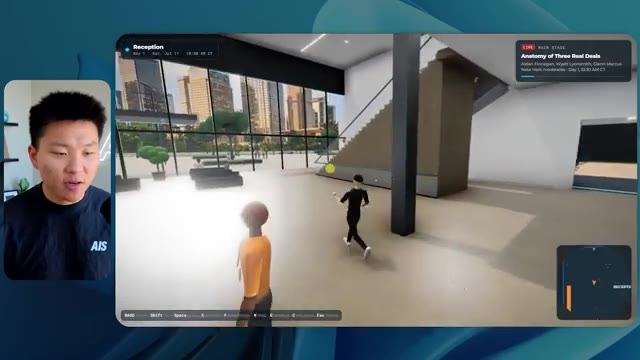

# 🎬 I Tested Opus 5.5 vs. GPT-6 Astra on 12 Real Use Cases

> **Chaîne** : [Nate Herk | AI Automation](https://www.youtube.com/@nateherk/featured)  
> **Lien YouTube** : [https://www.youtube.com/watch?v=GmLcJVzkxPA](https://www.youtube.com/watch?v=GmLcJVzkxPA)  
> **Date de publication** : 20260923  
> **Durée** : 00:42:54  
> **Identifiant vidéo** : `GmLcJVzkxPA`  
> **Transcription & Analyse** : `whisper-v3-large-turbo+gemini-3.5-flash-lite`  

---

## 📌 Synthèse Exécutive & Outils

### 💡 Résumé
Dans cette vidéo intitulée **J'ai testé Opus 5.5 face à GPT-6 Astra sur 12 cas d'usage réels**, Nate Herk décortique les capacités pratiques d'automatisation et de développement propulsées par les modèles de pointe.

### 🛠️ Outils, Modèles & Logiciels Présentés
- **Opus 5.5 & Claude Code** : Modèles d'ingénierie et agents de codage autonome.

### 🔑 Points Clés & Enseignements Stratégiques
- Optimiser le niveau d'effort et le raisonnement des modèles IA pour des résultats industriels.
- Automatiser les cycles de création logicielle de bout en bout.

---

## ⏱️ Chronologie & Transcription Complète Audio & Visuelle (Mot pour Mot)

### ⏱️ `[00:00:00 - 00:00:20]` | Segment #01

**🔊 Audio (Transcription Intégrale Mot pour Mot en Français) :**
> Opus 5.5, Opus 5.5, Opus 5.5, Opus 5.5, Opus 5.5. Ce modèle est littéralement partout et pour de très bonnes raisons. Il est intelligent, il est bon marché, il a un goût incroyable, c'est un modèle d'IA incroyable. Mais avec chaque modèle d'IA, vous avez le choix de l'effort, que ce soit faible, moyen, élevé, extra, max ou code ultra.

**👁️ Analyse Visuelle d'Écran (gemini-3.5-flash-lite) :**
**Interface & Outils** : Réseau social X (Twitter)

**Contenu textuel & Code** : Publication de type tweet avec une vidéo intégrée et du texte descriptif.

**Action / Démonstration** : Affichage d'un exemple concret de contenu généré par IA pour illustrer le propos.

*⏱️ 00:00:05 — Capture d'écran d'un post sur le réseau social X montrant une vidéo de paysage tropical généré par IA et un texte sur la perturbation des métiers créatifs.*

---

### ⏱️ `[00:00:20 - 00:00:38]` | Segment #02

**🔊 Audio (Transcription Intégrale Mot pour Mot en Français) :**
> Donc dans cette vidéo, j'ai donné exactement le même prompt à Opus 5.5 et je l'ai exécuté sur chaque niveau d'effort et nous allons comparer les résultats. Nous allons examiner la qualité de tous les différents résultats réels, mais nous allons aussi examiner combien de temps chacun d'eux a pris pour s'exécuter, combien cela nous a coûté si c'était facturé par API, le nombre total de tokens, combien de vérifications ils ont effectuées, et combien de questions ils m'ont réellement posées tout au long du processus.

**👁️ Analyse Visuelle d'Écran (gemini-3.5-flash-lite) :**
**Interface & Outils** : Application web ou tableau de bord de présentation de données (type tableau comparatif).

**Contenu textuel & Code** : Tableau comparatif des niveaux d'effort d'Opus 5.5 avec des lignes de métriques (Run time, API cost, Total tokens, Checks, Questions asked).

**Action / Démonstration** : Présentation de la structure de comparaison des résultats selon les niveaux d'effort.

*⏱️ 00:00:29 — Capture d'écran montrant un tableau comparatif avec les différents niveaux d'effort (Low, Medium, High, Extra, Max, Ultracode) et des métriques (Run time, API cost, Total tokens, etc.).*

---

### ⏱️ `[00:00:39 - 00:00:58]` | Segment #03

**🔊 Audio (Transcription Intégrale Mot pour Mot en Français) :**
> And the results that we got are not what I expected at all, so I can't wait to share this with you guys. Let's not waste any time and just get straight into this one. Okay, so let's jump right into this one. I want to start off just by showing you guys the actual prompt that we used that we gave to every single one of these different agents. I'm going to go into the files over here, and we're going to open up this prompt markdown file, and I'll show you what we got. So here is the slash goal that I fed in.

**👁️ Analyse Visuelle d'Écran (gemini-3.5-flash-lite) :**
**Interface & Outils** : Opus 5.5 / Interface CLI / Éditeur de code

**Contenu textuel & Code** : "Hi Nate. This worktree has the effort-test task queued in PROMPT.md : build a walkable third-person 3D world of the AIS Live conference..."

**Action / Démonstration** : Affichage et lecture du prompt initial dans l'interface de développement de l'agent IA.

*⏱️ 00:00:48 — Interface de l'outil Opus 5.5 / CLI montrant un prompt et le présentateur en vignette vidéo.*

---

### ⏱️ `[00:00:58 - 00:01:34]` | Segment #04

**🔊 Audio (Transcription Intégrale Mot pour Mot en Français) :**
> J'ai dit : tu dois me créer un monde en 3D qui est une conférence technologique réaliste dans laquelle je peux me promener en vue à la troisième personne. Tu vas regarder ce dossier, qui contient mes ressources d'enregistrement d'événements d'AIS Live. Et ce dossier est un dossier Frame.io de 105 gigaoctets d'enregistrements vidéo. C'était un événement entièrement virtuel. Tout a été enregistré et tous les enregistrements sont ici. J'ai dit, ton objectif est de prendre cet événement et de le transformer en un monde explorable en 3D qui me donne l'impression d'être réellement allé à une vraie conférence en personne avec différentes salles, différentes pistes, différentes scènes, bla, bla, bla. N'hésite pas à utiliser key.ai si tu as besoin de générer des images ou des vidéos. Et tu peux aussi utiliser tout ce qui se trouve dans mon projet Herc 2, qui est comme mon système d'exploitation IA. J'ai dit,

**👁️ Analyse Visuelle d'Écran (gemini-3.5-flash-lite) :**
**Interface & Outils** : Éditeur de code (VS Code / Cursor) et interface cloud Frame.io

**Contenu textuel & Code** : Fichier Markdown PROMPT.md avec les instructions de génération du monde 3D et les dossiers Frame.io (GA Access, VIP Access)

**Action / Démonstration** : Présentation des instructions textuelles et des ressources de 105 Go fournies à l'agent IA pour la création de la conférence virtuelle en 3D.

*⏱️ 00:01:07 — Éditeur de code affichant le fichier PROMPT.md avec les instructions détaillées pour créer un monde 3D interactif et le lien vers les ressources Frame.io.*

*⏱️ 00:01:16 — Interface de stockage cloud Frame.io montrant le dossier des ressources de l'événement AIS Live d'une taille de 105,69 Go.*

*⏱️ 00:01:25 — Retour sur l'éditeur de code affichant le fichier PROMPT.md contenant le prompt complet pour l'agent IA.*

---

### ⏱️ `[00:01:34 - 00:02:08]` | Segment #05

**🔊 Audio (Transcription Intégrale Mot pour Mot en Français) :**
> Vous serez jugé sur la créativité, le design, la physique et la sensation générale lors de mon exploration du monde 3D que vous avez construit. Et c'était à peu près la fin des instructions. Donc, comme vous pouvez le voir sur ce côté gauche, j'ai exécuté cela à travers tous les différents niveaux d'effort. Commençons par le niveau bas et montons jusqu'à l'ultra code. Très bien. Nous avons donc ici le résultat du niveau bas. Ouvrons ceci et jetons un coup d'œil. Nous avons donc AIS Live, le sommet des services IA enfin en personne, et nous avons pu cliquer partout. Tout d'abord, on ne sent pas vraiment l'image de marque. Genre, ce n'ha pas le logo d'IS Live. Ce ne sont même pas nos couleurs. Donc je n'aime pas trop ça, mais entrons ici. D'accord. C'est beaucoup trop lumineux. Euh, nous avons une carte en haut à droite. Nous avons une ville ici en arrière-plan. Je ne peux pas dire quelle ville c'est.

**👁️ Analyse Visuelle d'Écran (gemini-3.5-flash-lite) :**
**Interface & Outils** : Interface de l'outil d'IA (similaire à Cursor/Claude interface) avec un panneau de navigation latéral à gauche et la zone de chat à droite.

**Contenu textuel & Code** : Texte du prompt initial de l'agent IA : "Hi Nate. This worktree has the effort-test task queued in PROMPT.md : build a walkable third-person 3D world..." et la réponse de l'utilisateur dans la zone de saisie en bas : "yes, start the task in PROMPT.md".

**Action / Démonstration** : Navigation et sélection des différents niveaux de test ("effort-test") dans la liste des sessions à gauche, montrant les différentes configurations exécutées.

*⏱️ 00:01:42 — Interface d'une application de type assistant IA (style interface de coding/agent) affichant des niveaux de test ("Hello", "Extra", "High", "Max", "Ultracode", "Medium", "Low") dans le panneau latéral gauche, tandis que le panneau central montre un échange textuel avec un agent proposant de créer un monde 3D interactif.*

---

### ⏱️ `[00:02:08 - 00:02:40]` | Segment #06

**🔊 Audio (Transcription Intégrale Mot pour Mot en Français) :**
> c'est. D'accord. C'est Chicago, ce qui est plutôt cool parce que tu sais, j'habite à Chicago, mais bref, en haut à droite, on peut voir une carte. Nous avons un hall d'accueil. Nous avons un hall d'exposition. Nous avons un salon VIP sur la scène principale. La carte montre également où se trouve chaque autre personne et cela se synchronise en direct. On peut donc voir l'enregistrement. On peut voir le premier jour, la keynote de l'hyper agent, le débriefing en direct. Cool. Donc ça connaît réellement l'agenda et puis il y a le deuxième jour. Donc il a trouvé ça, c'est bien. Nous avons ces petites boules ici que je peux espérer botter. D'accord. Le visage, Oh, regarde ça. Si je vais par ici, tous les gens disparaissent tout simplement. Très mauvais. Très mauvais. D'accord. Alors voyons voir. Est-ce que je peux sprinter ? D'accord.

**👁️ Analyse Visuelle d'Écran (gemini-3.5-flash-lite) :**
**Interface & Outils** : Environnement virtuel 3D en ligne (plateforme d'événement virtuel style métavers ou jeu web).

**Contenu textuel & Code** : Interface utilisateur avec mini-carte en haut à droite, affichage des zones (Lobby, Expo Hall, Main Stage, VIP Lounge) et panneaux textuels listant des sessions de conférence (Day 1).

**Action / Démonstration** : Navigation et exploration interactive d'un espace de conférence virtuel 3D par le présentateur.

---

### ⏱️ `[00:02:40 - 00:03:04]` | Segment #07

**🔊 Audio (Transcription Intégrale Mot pour Mot en Français) :**
> Je peux avancer un peu plus vite. Je vais d'abord aller par ici. Il y a des goodies, euh, certifiés AIS plus glido. D'accord. Donc, il y a les vrais stands qu'on avait dans l'événement virtuel. On avait des stands. Donc, c'est plutôt cool. Un petit endroit pour prendre des photos. Salle C. En ce moment, nous avons Tangy Frederick qui anime un atelier. D'accord. Mais ce n'est pas une vidéo. Comme vous pouvez le voir, c'est juste une image. Elle ne bouge pas. Donc c'est juste une image. Ces gens sont en train de disparaître. Ce doivent être des fantômes. Allons par ici dans la salle A.

**👁️ Analyse Visuelle d'Écran (gemini-3.5-flash-lite) :**
**Interface & Outils** : Environnement virtuel 3D de type jeu en ligne/plateforme d'événement virtuel.

**Contenu textuel & Code** : Affichage des stands, indications de salles, bannières de sponsors (Glaido) et instructions de navigation.

**Action / Démonstration** : Exploration et déplacement de l'avatar dans l'espace virtuel de l'événement.

*⏱️ 00:02:46 — Le présentateur navigue dans l'événement virtuel montrant le stand Glaido avec des goodies.*

*⏱️ 00:02:52 — Le présentateur entre dans la Salle C (Workshop Room C / Enterprise track) de l'événement virtuel.*

*⏱️ 00:02:58 — Vue rapprochée d'une présentation sur écran géant à l'intérieur de la salle d'atelier.*

---

### ⏱️ `[00:03:04 - 00:03:30]` | Segment #08

**🔊 Audio (Transcription Intégrale Mot pour Mot en Français) :**
> We have Liberty White. Okay. Very cool. Your first 30 days in automation. Once again, it's just a still image and the people are glitchy. So not very good here. I'm going to go over to the main stage and see what we've got going. Okay, cool. So we have a main looking stage. The people are glitching. Really bad. That's not very good at all. Our video is actually moving. Like I saw my face here and I saw Devin's, but now they're gone. So I'm not sure what happened. Okay. It's, it looks like it's more of a slideshow. Nothing is actually being played still. Anyways, let's come in here.

**👁️ Analyse Visuelle d'Écran (gemini-3.5-flash-lite) :**
**Interface & Outils** : Environnement virtuel 3D (metavers / plateforme événementielle virtuelle)

**Contenu textuel & Code** : Aucun code ni terminal affiché, uniquement l'interface visuelle 3D de l'événement en ligne.

**Action / Démonstration** : Navigation et exploration de l'espace virtuel par le présentateur ou son avatar.

---

### ⏱️ `[00:03:30 - 00:03:58]` | Segment #09

**🔊 Audio (Transcription Intégrale Mot pour Mot en Français) :**
> We have more booths. We have hyper agent. We have Claude Code. We have more swag. Room B is Dave Ebelor. I'm assuming it's the same exact thing. We've got coffee. And then I'm assuming VIP lounge, VIP access only. That's pretty cool, but there's really nothing going on right here. That screen's way too bright. Okay. So I think you guys understand the vibe that we're getting here from Opus 5.5 on low effort. And here's where things get interesting. How much do you guys think that this ran for? How long? This one ran for 16 minutes and 43 seconds. How much do you think this cost?

**👁️ Analyse Visuelle d'Écran (gemini-3.5-flash-lite) :**
**Interface & Outils** : Application de tableau de bord / canevas de données 'Opus 5.5 Efforts'.

**Contenu textuel & Code** : Tableau avec des colonnes de niveaux (Low à Ultracode) et des lignes de métriques d'exécution (Run time, API cost, Total tokens, Checks, Questions asked).

**Action / Démonstration** : Présentation d'un tableau comparatif des différents niveaux d'effort et de coût pour le modèle Opus 5.5.

*⏱️ 00:03:51 — Interface de tableau comparatif nommée 'Opus 5.5 Efforts' avec des niveaux de performance (Low, Medium, High, Extra, Max, Ultracode) et des métriques (Run time, API cost, Total tokens, etc.).*

---

### ⏱️ `[00:03:58 - 00:04:26]` | Segment #10

**🔊 Audio (Transcription Intégrale Mot pour Mot en Français) :**
> $3.91 if this was API billing. I'm obviously using my subscription here, but we're just going to calculate this in API billing. Total tokens was 191,000. It did 22 checks. So the verification, 22 times it opened up the browser and ran different sorts of checks. So 22 categories of checks. And how many questions did it ask me? It asked me a total of zero questions throughout this slash goal prompt. Okay. So let's open up medium effort and see what we've got. Okay, here we go. Medium effort. We've got Nate Herc. We've got my badge. This is AI's life branded.

**👁️ Analyse Visuelle d'Écran (gemini-3.5-flash-lite) :**
**Interface & Outils** : Application de type tableau blanc interactif ou outil de mind-mapping/diagramme (ex: Excalidraw ou similaire).

**Contenu textuel & Code** : Tableau avec les lignes : 'Run time' (16m 43s), 'API cost' ($3.91), 'Total tokens' (191.3K), 'Checks', 'Questions asked'.

**Action / Démonstration** : Le présentateur présente les résultats chiffrés d'un test d'agent IA, détaillant le temps d'exécution, le coût de l'API et le nombre total de tokens.

*⏱️ 00:04:05 — Un tableau comparatif dans un outil de dessin ou de tableau blanc montrant les métriques de performance pour différents niveaux (Low, Medium, High, Ex).*

---

### ⏱️ `[00:04:26 - 00:04:46]` | Segment #11

**🔊 Audio (Transcription Intégrale Mot pour Mot en Français) :**
> Donc ça a déjà l'air un petit peu mieux. Ça ressemble à nos palettes de couleurs qui ont utilisé nos directives de marque. Premier jour de construction, deuxième jour de gain, VIP. Cool. D'accord. Je vais entrer dans le lieu. D'accord. Waouh. Une ambiance similaire, en somme. C'est en arrière-plan. Ça ne ressemble pas à Chicago, n'est-ce pas ? Non, ça ressemble à un, honnêtement, ça ressemble à une ville inventée. Quoi qu'il en soit, c'est drôle qu'ils aient décidé de faire ça. Voyons si je peux avancer un peu plus vite. Oh, waouh.

**👁️ Analyse Visuelle d'Écran (gemini-3.5-flash-lite) :**
**Interface & Outils** : Application web interactive de type monde virtuel 3D / événement en ligne (AIS Live).

**Contenu textuel & Code** : Écran de bienvenue, badge virtuel personnalisé, contrôles de déplacement et interface d'un espace virtuel 3D.

**Action / Démonstration** : Le présentateur clique pour entrer dans le lieu virtuel 3D de l'événement.

*⏱️ 00:04:31 — Interface web de l'application 'AIS Live' montrant un badge nominatif personnalisé ('NATE HERK') avec des boutons de navigation et le bouton 'ENTER THE VENUE'.*

*⏱️ 00:04:41 — Vue à la première ou troisième personne à l'intérieur d'un espace virtuel 3D avec des avatars et une grande baie vitrée donnant sur une ville la nuit.*

---

### ⏱️ `[00:04:46 - 00:05:21]` | Segment #12

**🔊 Audio (Transcription Intégrale Mot pour Mot en Français) :**
> Les gens interagissent avec moi. Regardez. Si je m'approche de ce type, il vient de lever le bras. Bon, maintenant il ne veut plus du tout avoir affaire à moi. Mais tous ces petits robots ici doivent prendre des décisions. Je ne sais pas s'ils utilisent Jev. C'est sûr que non. Je ne le lui ai pas dit. En fait, ma clé Jev est à l'arrière. Je ne sais pas. Peut-être qu'il l'a utilisée. Quoi qu'il en soit, nous pouvons voir ici que nous avons la salle d'atelier C, le laboratoire des agents. Sympa. Donc celui-ci est en fait en train d'être exécuté. Vous pouvez voir qu'il s'agit d'une vraie vidéo lue par Tangy. Tout le monde ici est en train de travailler sur un ordinateur portable. Ils ne buguent pas. C'est plutôt cool. De plus, mon badge est sur ma poitrine, ce qui est plutôt cool. Je peux venir par ici. Nous avons une carte en haut à droite, comme vous pouvez le voir, mais je peux venir par ici. Nous avons un

**👁️ Analyse Visuelle d'Écran (gemini-3.5-flash-lite) :**
**Interface & Outils** : Environnement virtuel 3D en ligne de type metaverse ou espace de travail virtuel.

**Contenu textuel & Code** : Avatars 3D modélisés, interface utilisateur de navigation dans un monde virtuel.

**Action / Démonstration** : Exploration et navigation dans un monde virtuel interactif peuplé d'avatars.

---

### ⏱️ `[00:05:21 - 00:05:47]` | Segment #13

**🔊 Audio (Transcription Intégrale Mot pour Mot en Français) :**
> expo hall. This is where we have the Glido booth. And this is actually playing. Yeah, it's playing the video of us talking about Glido. It's playing the video of Ed and I talking about our certification program. We've got the AIS Plus logo back here, which is kind of in a weird spot. This is a speaker slides and takeaways. So wow, this is all the resources that we gave out after the event. They're all sitting right there as well. We can see we've got a community spotlight. So this is Aiden talking about his deal that he landed and it's playing live. These people are watching.

**👁️ Analyse Visuelle d'Écran (gemini-3.5-flash-lite) :**
**Interface & Outils** : Présentation ou face-caméra explicatif sans interface logicielle partagée.

**Contenu textuel & Code** : Explications orales et mise en contexte méthodologique.

**Action / Démonstration** : Explications face caméra et démonstration conceptuelle.

---

### ⏱️ `[00:05:47 - 00:06:21]` | Segment #14

**🔊 Audio (Transcription Intégrale Mot pour Mot en Français) :**
> They're pretty engaged. We've got hyper agent. That was, that's what I meant. If you guys saw those people like raising their arms saying hi, that was kind of funny. Look, look, there he goes again. Anyways. Okay. Where am I now? Now I'm in the main lobby. We've got a coffee bar. We've got a big logo, which is the real logo. It's too bright, but we have the logo. We can see if we can come in here to the foundation track. We've got Sabrina Romanov and Liberty White. So different trainings right there. We can come into this room. This is the advanced track. So what's going on here. We've got Dave Ebelar and Saman talking about some different stuff in there. And now let's go take a look at the main stage. Oh, wait, there's a video of me up there. Is that like a VIP

**👁️ Analyse Visuelle d'Écran (gemini-3.5-flash-lite) :**
**Interface & Outils** : Présentation ou face-caméra explicatif sans interface logicielle partagée.

**Contenu textuel & Code** : Explications orales et mise en contexte méthodologique.

**Action / Démonstration** : Explications face caméra et démonstration conceptuelle.

---

### ⏱️ `[00:06:21 - 00:06:50]` | Segment #15

**🔊 Audio (Transcription Intégrale Mot pour Mot en Français) :**
> section ? Ouais, on ira voir ça dans une minute. Mais bref, voici la scène principale. Ça a l'air vraiment, vraiment super. On a une grande scène. On a genre quatre personnes assises ici. On a les trois écrans d'Alex là-haut avec l'hyper agent. Est-ce que j'ai le droit de monter sur scène ? Oh, et il me laisse monter sur scène. D'accord. C'est plutôt sympa. Bon les gars, faisons un selfie. Laissez-moi prendre tout le monde en arrière-plan. Venez par ici. Bref, c'est vraiment, vraiment cool. Toutes les places ne sont pas occupées par contre. Il va donc falloir travailler là-dessus. Mais bon, je vais y retourner en courant pour voir ce que c'était que cette section VIP. D'accord. Salon VIP. J'ai l'impression que c'est comme un aéroport ou un truc comme ça.

**👁️ Analyse Visuelle d'Écran (gemini-3.5-flash-lite) :**
**Interface & Outils** : Présentation ou face-caméra explicatif sans interface logicielle partagée.

**Contenu textuel & Code** : Explications orales et mise en contexte méthodologique.

**Action / Démonstration** : Explications face caméra et démonstration conceptuelle.

---

### ⏱️ `[00:06:51 - 00:07:14]` | Segment #16

**🔊 Audio (Transcription Intégrale Mot pour Mot en Français) :**
> Ok, super. Donc maintenant nous avons les sessions VIP ici. Session de questions-réponses VIP avec Nate, lecture vidéo en direct juste ici. Très, très cool. Et nous avons comme un bar ou quelque chose comme ça. Génial. Je dirais que c'est un plutôt bon résultat. Maintenant, en ce qui concerne les statistiques ici, celle-ci a pris une heure et 13 minutes à s'exécuter. Cela nous aurait coûté 12 dollars et 44 cents. Elle a utilisé 490 000 jetons et a fait 23 vérifications.

**👁️ Analyse Visuelle d'Écran (gemini-3.5-flash-lite) :**
**Interface & Outils** : Application virtuelle 3D / Interface web de tableau de bord de métriques (Opus 5.5 Efforts)

**Contenu textuel & Code** : Métriques de performance affichées : Run time (16m 43s), API cost ($3.91), Total tokens (191.3K), Checks (22), Questions asked (0).

**Action / Démonstration** : Présentation d'un espace virtuel VIP interactif et analyse des coûts et performances d'exécution d'un agent/modèle via un tableau de bord.

*⏱️ 00:06:56 — Capture montrant une interface virtuelle 3D (type métaverse/espace VIP) avec un écran affichant une session vidéo en direct (VIP Q&A with Nate) et un espace bar/lounge en arrière-plan.*

*⏱️ 00:07:02 — Capture montrant un tableau de bord analytique ou une interface web intitulée "Opus 5.5 Efforts" affichant des métriques telles que le temps d'exécution (Run time), le coût API ($3.91), le nombre total de tokens (191.3K), les vérifications et les questions posées pour différents niveaux d'effort (Low, Medium, High, etc.).*

---

### ⏱️ `[00:07:14 - 00:07:48]` | Segment #17

**🔊 Audio (Transcription Intégrale Mot pour Mot en Français) :**
> And it asked us a grand total of zero questions once again. All right, let's move on to high. This was already a pretty decent output and Anthropic themselves in their how to prompt Opus 5.5 video, or sorry, not video, article. They said to just start on medium and scale it up or down if you need. So that was a medium output. Let's move over to high and see what we got. Real quick, guys, I need to take a second to tell you about the sponsor of today's video, Hostinger. So both of these models just built me a working version of the same thing. And now I'm right where I always end up with something finished sitting on my laptop and no quick way to get it online. And that's the gap that Hostinger's connector closes. It's a free extension

**👁️ Analyse Visuelle d'Écran (gemini-3.5-flash-lite) :**
**Interface & Outils** : Présentation ou face-caméra explicatif sans interface logicielle partagée.

**Contenu textuel & Code** : Explications orales et mise en contexte méthodologique.

**Action / Démonstration** : Explications face caméra et démonstration conceptuelle.

---

### ⏱️ `[00:07:48 - 00:08:23]` | Segment #18

**🔊 Audio (Transcription Intégrale Mot pour Mot en Français) :**
> for your editor that pulls your Hostinger account into whatever you're already coding in. So VS Code, cursor, cloud code, codex, you name it. You sign in once with a single click, and from there, your agent can deploy the site, point a domain at it, set the DNS records, and check on your VPS without you ever having to leave the editor. So whichever one of these you end up liking better, the thing it built is a couple minutes away from a real URL on managed hosting. Connector is free on every hosting or plan, so if you still need the hosting underneath it, grab the unlimited plan with the link in the description and use code NATEHERK for 10% off. That also comes with a free domain and business email for the year. And it's still the cheapest way that I found to get something

**👁️ Analyse Visuelle d'Écran (gemini-3.5-flash-lite) :**
**Interface & Outils** : Présentation ou face-caméra explicatif sans interface logicielle partagée.

**Contenu textuel & Code** : Explications orales et mise en contexte méthodologique.

**Action / Démonstration** : Explications face caméra et démonstration conceptuelle.

---

### ⏱️ `[00:08:23 - 00:08:47]` | Segment #19

**🔊 Audio (Transcription Intégrale Mot pour Mot en Français) :**
> you built onto a real URL. So let's get back to the video. Okay. Once again, very, very branded. This is even better of a loading screen than the previous one. We've got this nice little effect in the background. We've got the logo. We'll enter the venue. Okay. Here we are. This looks pretty nice. We start outside and you can see that we have these flags for all the speakers, Wyatt, Casper, Alex, Ed, Aiden, Sabrina, Liberty. This is pretty cool. We got live blocks here.

**👁️ Analyse Visuelle d'Écran (gemini-3.5-flash-lite) :**
**Interface & Outils** : Interface web d'un monde virtuel interactif (AIS LIVE sur RingCentral)

**Contenu textuel & Code** : Écran de chargement de l'événement virtuel avec commandes clavier/souris, interface 3D avec avatars et bannières nominatives

**Action / Démonstration** : Navigation et exploration de l'espace virtuel 3D après le chargement initial de l'application

*⏱️ 00:08:29 — Écran de chargement et d'accueil de l'application 'AIS LIVE' avec logo, informations sur l'événement et boutons de contrôle des touches.*

*⏱️ 00:08:35 — Vue de la place virtuelle 'AIS Live Plaza' avec des avatars 3D et des bâtiments urbains en arrière-plan.*

*⏱️ 00:08:41 — Exploration de la place virtuelle 'AIS Live Plaza' montrant des bannières verticales avec les noms de intervenants et des éléments interactifs au sol.*

---

### ⏱️ `[00:08:47 - 00:09:23]` | Segment #20

**🔊 Audio (Transcription Intégrale Mot pour Mot en Français) :**
> it took this picture from me, your host, Nate Herc, John, Dave, Nate Herc. There we go. Okay. The doors. Awesome. They're automatic sliding glass doors. I love that. We can see VIP check-in. We can see GA. We can come over here and we can check out the expo with different booths, community spotlight. You can also see that in the top left, I have a passport. So it's like, it will be showing how many of the places I've visited. All of these are real playback. We've got a resource wall with all of the different speakers. They've also got a networking session over here. So I'm going to come over real quick and see what that's all about. So we've got the AIS cold brew bar. We've got different community members that were spotlighted or highlighted.

**👁️ Analyse Visuelle d'Écran (gemini-3.5-flash-lite) :**
**Interface & Outils** : Environnement virtuel 3D interactif (plateforme d'événement en ligne).

**Contenu textuel & Code** : Éléments textuels d'interface ("Registration Concourse", "VIP CHECK-IN", "Main Stage", "Expo Hall").

**Action / Démonstration** : Navigation et exploration de l'espace virtuel par l'avatar du présentateur.

*⏱️ 00:08:56 — Vue principale de l'espace virtuel avec la zone d'enregistrement et la scène principale.*

*⏱️ 00:09:05 — Exploration de l'expo hall virtuel avec différents stands et bannières communautaires.*

*⏱️ 00:09:14 — Navigation dans le hall virtuel montrant des avatars et de larges baies vitrées.*

---

### ⏱️ `[00:09:23 - 00:09:56]` | Segment #21

**🔊 Audio (Transcription Intégrale Mot pour Mot en Français) :**
> Nous avons l'aile VIP. Attends, quoi ? Prends un bracelet. Oh, je dois vraiment aller chercher le bracelet. D'accord. Laisse-moi m'enregistrer rapidement. Le bracelet est déjà mis. Attends, quoi ? D'accord. Oh, d'accord. Maintenant, les portes se sont ouvertes pour moi. Cool. Je peux entrer ici. Oh, ça mène juste à la scène principale. Salon VIP. Il y a une séance de questions-réponses en cours. Ça a l'air très cool. Je veux dire, je suis très impressionné par la façon dont il est capable de faire ça. Waouh. D'accord. Donc c'est vraiment bien. Ce qu'on a fait, c'est qu'on a eu des salles de discussion VIP avec différentes personnes. Tu peux voir qu'il y a différentes salles, différents membres de l'équipe AIS qui vont dans des trucs. C'est vraiment cool. C'est très cool. C'est un VIP bien meilleur

**👁️ Analyse Visuelle d'Écran (gemini-3.5-flash-lite) :**
**Interface & Outils** : Présentation ou face-caméra explicatif sans interface logicielle partagée.

**Contenu textuel & Code** : Explications orales et mise en contexte méthodologique.

**Action / Démonstration** : Explications face caméra et démonstration conceptuelle.

---

### ⏱️ `[00:09:56 - 00:10:30]` | Segment #22

**🔊 Audio (Transcription Intégrale Mot pour Mot en Français) :**
> expérience que celle qui a été montrée dans le premier morceau. D'accord. After party VIP. Regardez ça. Nous avons une piste de danse. Nous avons tous ces éléments ici. Nous avons la lecture de l'after party VIP juste ici. Et il y a une estrade de DJ. C'est tellement drôle. Il y a un petit bug ici, un petit dysfonctionnement juste là, mais c'est génial. Oh, chouette. Donc quand je suis ici sur la scène principale, nous avons des sous-titres. Vous pouvez voir juste ici au bas de mon écran, nous avons ces sous-titres de Wyatt qui est en train de parler ici. Nous avons des lumières. Nous avons le panel. Très cool. Belle scène principale. Je vais aller par ici. Nous pouvons aller à la fondation,

**👁️ Analyse Visuelle d'Écran (gemini-3.5-flash-lite) :**
**Interface & Outils** : Présentation ou face-caméra explicatif sans interface logicielle partagée.

**Contenu textuel & Code** : Explications orales et mise en contexte méthodologique.

**Action / Démonstration** : Explications face caméra et démonstration conceptuelle.

---

### ⏱️ `[00:10:30 - 00:11:06]` | Segment #23

**🔊 Audio (Transcription Intégrale Mot pour Mot en Français) :**
> advanced, and the enterprise tracks over here. So let's see. We have anatomy of a three real deals. We've got hyper agent. We've got the evals with Nate and Ed in here. We've got Dave going on in the advanced stuff. This is really nice. I mean, obviously each, each of these outputs so far, low was okay. Medium was better. High has been even better. Let's see if that trend continues and let's go ahead and see what this cost us. So high ran for one hour and seven minutes. So a little bit quicker than medium, it would have cost us $16 and 31 cents. It used half a million tokens, 509,000. It did 22 checks. And it also asked us, well, actually, no, I was wrong. This

**👁️ Analyse Visuelle d'Écran (gemini-3.5-flash-lite) :**
**Interface & Outils** : Application de tableau blanc / infographie (type Excalidraw) affichant des données comparatives.

**Contenu textuel & Code** : Tableau avec les colonnes Low, Medium, High, Extra et les lignes Run time (16m 43s, etc.), API cost ($3.91, $12.44, $16.31), Total tokens (191.3K, 419.2K), Checks (22, 23), Questions asked (0, 0).

**Action / Démonstration** : Le présentateur commente les résultats comparatifs affichés dans le tableau selon les différents niveaux de coûts et de temps d'exécution.

*⏱️ 00:10:57 — Tableau comparatif sous forme d'infographie affichant les métriques (Run time, API cost, Total tokens, Checks, Questions asked) pour différents niveaux de performance (Low, Medium, High, Extra).*

---

### ⏱️ `[00:11:06 - 00:11:25]` | Segment #24

**🔊 Audio (Transcription Intégrale Mot pour Mot en Français) :**
> l'un m'a posé une question et, divulgâcheur, c'était le seul qui nous a posé une question tout au long de tout cela. Voyons voir, il nous en reste trois : Extra, Max et Ultra Code. Laissez-moi ouvrir Extra et nous verrons ce que nous avons. D'accord. Donc celui-ci a l'air plutôt bien. Je dirais honnêtement que jusqu'à présent, l'écran de chargement haut était le meilleur. Celui que nous venons de voir, mais de toute façon, entrons dans AIS Live.

**👁️ Analyse Visuelle d'Écran (gemini-3.5-flash-lite) :**
**Interface & Outils** : Présentation ou face-caméra explicatif sans interface logicielle partagée.

**Contenu textuel & Code** : Explications orales et mise en contexte méthodologique.

**Action / Démonstration** : Explications face caméra et démonstration conceptuelle.

---

### ⏱️ `[00:11:26 - 00:11:51]` | Segment #25

**🔊 Audio (Transcription Intégrale Mot pour Mot en Français) :**
> Waouh. D'accord. Donc nous avons comme de petits extraits sonores. Je peux discuter avec des gens. Le panneau sur la guerre des outils a réglé quelques débats pour moi. Sympa. Bonne perspective là-bas. Nous sommes dehors à nouveau. Nous avons ces différentes bannières, bien qu'elles soient toutes les mêmes. Elles n'affichent pas les noms de différentes personnes. Donc grand logo AIS Live. L'aile de l'atelier est par ici. Et passons par les portes coulissantes en verre pour voir ce que nous avons. Donc nous avons le café AIS. La carte est en bas à droite, et elle n'est pas très descriptive.

**👁️ Analyse Visuelle d'Écran (gemini-3.5-flash-lite) :**
**Interface & Outils** : Application ou plateforme virtuelle 3D interactive en ligne

**Contenu textuel & Code** : Environnement virtuel 3D avec avatars, bannières et interface de mini-carte en bas à droite.

**Action / Démonstration** : Navigation et exploration d'un monde virtuel 3D avec des avatars interactifs.

*⏱️ 00:11:32 — Vue d'un monde virtuel interactif 3D avec un avatar qui se déplace près d'autres personnages non-joueurs.*

*⏱️ 00:11:38 — Poursuite de la navigation dans l'environnement virtuel 3D vers une zone de convention extérieure.*

*⏱️ 00:11:45 — L'avatar s'approche de l'entrée principale d'un bâtiment virtuel lumineux.*

---

### ⏱️ `[00:11:51 - 00:12:26]` | Segment #26

**🔊 Audio (Transcription Intégrale Mot pour Mot en Français) :**
> I like how the other maps have told us what, like where things were, but this one looks very professional. We can see here's the main stage. Let's hop in here real quick. They've all got these balls flying around, which I think is pretty funny. The AIS beach balls. We have me up there speaking. I think I was introing one of the days. Let's keep on moving here to the workshop room on this left side. Okay. So here we've got the Hyper Agent Theater. We've got this sponsored session in here by Hyper Agent, but it's showing us what's coming up in here as well. It's really funny that we can chat to people. Salmon built a voice sales rep live. The price it right room was packed. Did you grab the VIP companion guide? That's so funny. We have the advanced track in

**👁️ Analyse Visuelle d'Écran (gemini-3.5-flash-lite) :**
**Interface & Outils** : Présentation ou face-caméra explicatif sans interface logicielle partagée.

**Contenu textuel & Code** : Explications orales et mise en contexte méthodologique.

**Action / Démonstration** : Explications face caméra et démonstration conceptuelle.

---

### ⏱️ `[00:12:26 - 00:12:58]` | Segment #27

**🔊 Audio (Transcription Intégrale Mot pour Mot en Français) :**
> ici. Encore une fois, nous avons la lecture en direct. Est-ce que c'est la lecture en direct ? Oh, d'accord. Ça a commencé une fois que je suis entré, mais je peux prendre place. Oh la la. Je peux regarder ça. Je peux me lever. Je veux m'asseoir au premier rang. C'est plutôt cool. C'est très bien. J'aime bien ça. Et vous savez ce que j'ai remarqué jusqu'à présent ? Le personnage que j'incarne me ressemble un peu. Je pense qu'il a été modélisé à partir de mes photos de profil ou quelque chose comme ça. Bref, nous avons Sabrina ici, l'animatrice de la salle, prenez n'importe quelle place libre. D'accord, cool. Et j'ai vraiment aimé la fonctionnalité pour s'asseoir. C'est plutôt marrant. Genre, on pourrait vraiment assister à cet atelier et participer. Bref, ça nous montre les intervenants. Ça nous montre les

**👁️ Analyse Visuelle d'Écran (gemini-3.5-flash-lite) :**
**Interface & Outils** : Environnement virtuel 3D interactif (plateforme de conférence ou de salon virtuel en ligne)

**Contenu textuel & Code** : Avatars virtuels assis dans un amphithéâtre ou une salle de classe virtuelle, avec affichage de flux vidéo sur un grand écran de projection.

**Action / Démonstration** : Navigation et exploration de l'espace virtuel par l'utilisateur (visite d'une salle de conférence en ligne).

---

### ⏱️ `[00:12:58 - 00:13:31]` | Segment #28

**🔊 Audio (Transcription Intégrale Mot pour Mot en Français) :**
> programme. Il y a un petit tapis rouge ici pour prendre des photos. On peut prendre la pose. Oh, wouah. C'est plutôt cool. Bibliothèque de ressources, obtenir la certification AIS Plus, Glido, Hyper Agent, AIS Plus, trois vraies offres. Génial. Je veux dire, je dirais vraiment que jusqu'à présent, chacune est meilleure que la précédente. Et on n'a même pas encore vu la section VIP, le salon VIP. Montons par ici très vite. J'espère que je pourrai entrer. Sympa. On a une réinitialisation des outils. Ce sont les différentes salles dans lesquelles nous pourrions aller. Donc encore une fois, je pourrais prendre la feuille de calcul et je pourrais essayer de comprendre comment tarifer mes trucs. C'est tellement cool. C'est vraiment mieux que le précédent où l'on faisait juste en quelque sorte

**👁️ Analyse Visuelle d'Écran (gemini-3.5-flash-lite) :**
**Interface & Outils** : Application ou plateforme virtuelle interactive en 3D (espace métavers d'exposition et de conférence).

**Contenu textuel & Code** : Environnement virtuel 3D avec des stands d'exposition, des avatars d'utilisateurs et des éléments d'interface utilisateur (mini-carte, chat, agenda).

**Action / Démonstration** : Navigation et exploration dans un espace virtuel d'événement ou de conférence en ligne.

*⏱️ 00:13:07 — Vue d'un hall d'exposition virtuel avec des stands (Hyperagent, Glido) et des avatars interactifs.*

*⏱️ 00:13:15 — Hall d'accueil virtuel à plusieurs niveaux avec des escaliers mécaniques et des panneaux d'indication.*

*⏱️ 00:13:23 — Scène dans un salon VIP virtuel avec plusieurs avatars assis autour d'une table ronde.*

---

### ⏱️ `[00:13:31 - 00:13:59]` | Segment #29

**🔊 Audio (Transcription Intégrale Mot pour Mot en Français) :**
> genre, a regardé des trucs. Génial. Je peux aller derrière le bar et venir ici. C'est très bien. Bon. Alors, en ce qui concerne les statistiques, celui-ci a duré une heure et demie. Il coûte 25,92 dollars. Je ne sais pas pourquoi je dis point 25,92 dollars. Il y avait 733 000 jetons et 34 vérifications. Il a donc eu le plus grand nombre de vérifications de loin jusqu'à présent. Et il nous a posé zéro question. J'ai hâte de voir ce qu'on a obtenu ici de max et ultra code. D'accord. Voici les écrans de chargement de max, ennuyeux, mais c'est dans l'esprit de la marque et il y a notre logo.

**👁️ Analyse Visuelle d'Écran (gemini-3.5-flash-lite) :**
**Interface & Outils** : Tableau blanc ou application de notes/diagrammes (Excalidraw ou similaire).

**Contenu textuel & Code** : Tableau avec des colonnes Medium, High, Extra, Max, Ultracode montrant des durées (ex: 1h 31m), des coûts (ex: $12.44), des tokens (ex: 419.2K) et des statistiques associées.

**Action / Démonstration** : Le présentateur commente les statistiques du niveau « Extra » affichées dans le tableau.

*⏱️ 00:13:38 — Un tableau comparatif affichant les statistiques de différents niveaux d'effort (« Medium », « High », « Extra », « Max », « Ultracode ») avec le temps, le coût, le nombre de tokens et de vérifications.*

---

### ⏱️ `[00:14:00 - 00:14:35]` | Segment #30

**🔊 Audio (Transcription Intégrale Mot pour Mot en Français) :**
> So that was good. I like that. We will go ahead and enter AIS live. Ooh, nice little animation here that brings us in. Once again, the character looks like me. They've all looked like me. I mean, sort of, we have sitting in the background. This looks like Chicago. Like I mentioned earlier, a lot of these are playing sounds and I'm not including that because it would be very distracting for you guys to try to listen to what's going on as well as me speaking. So there is like some slight music in all these. I hate how this is walking. This walking is really, really bad. I mean, the walking, yeah, I don't like this at all. So that's not great. But besides that, let's go in and explore. Notice these shadows when I walk in, they like really switch. I'm not sure why that is,

**👁️ Analyse Visuelle d'Écran (gemini-3.5-flash-lite) :**
**Interface & Outils** : Présentation ou face-caméra explicatif sans interface logicielle partagée.

**Contenu textuel & Code** : Explications orales et mise en contexte méthodologique.

**Action / Démonstration** : Explications face caméra et démonstration conceptuelle.

---

### ⏱️ `[00:14:35 - 00:15:11]` | Segment #31

**🔊 Audio (Transcription Intégrale Mot pour Mot en Français) :**
> Mais de toute façon, nous pouvons aussi discuter avec des gens ici. Le stand Hyperagent est juste là où l'on entre dans l'exposition. Tout va bien. D'accord, super. Je peux continuer à appuyer sur E pour changer ce qu'ils disent. Nous avons les intervenants juste ici. Ça a l'air plutôt bien. Bien que nous ayons définitivement la photo de profil de tout le monde. Je ne sais donc pas pourquoi ce n'est pas inclus là. Nous voyons des gens prendre des photos juste ici. J'adore ça. Et ça enregistre une petite photo. D'accord. La carte n'est pas non plus super, genre ne me donne pas une super explication de ce qui se passe, mais j'aime ces stands. Ils sont cool. Je pense que ces stands sont les meilleurs que j'ai vus jusqu'à présent. Genre, ils ont juste l'air bien. Ils ont des représentants. Il y a de superbes diaporamas derrière eux. Ouais. Ces stands sont cool. D'accord. Nous avons un petit théâtre vedette

**👁️ Analyse Visuelle d'Écran (gemini-3.5-flash-lite) :**
**Interface & Outils** : Application virtuelle 3D / Navigateur web de monde virtuel

**Contenu textuel & Code** : Environnement virtuel 3D interactif avec interface de navigation et mini-carte

**Action / Démonstration** : Exploration et déplacement d'un avatar dans un espace d'exposition virtuel

*⏱️ 00:14:44 — Vue d'un espace de réception virtuel en 3D avec des avatars d'utilisateurs et des panneaux d'affichage d'intervenants.*

*⏱️ 00:14:53 — Navigation dans le monde virtuel près d'une zone d'accueil avec une photo prise et affichée à l'écran.*

*⏱️ 00:15:02 — Entrée dans le hall d'exposition virtuel (Expo Hall) avec des stands thématisés comme 'Evals Lab' et 'Enterprise AI'.*

---

### ⏱️ `[00:15:11 - 00:15:35]` | Segment #32

**🔊 Audio (Transcription Intégrale Mot pour Mot en Français) :**
> going on over here. It's Casper. Although why is this not playing? I feel like this should be playing, right? Like in the other ones, they were always playing. We can talk to some other people over here. Coffee's free. Blah, blah, blah. Amy Simpson, Matt Wolf. Nice. Okay. This is just the networking area that we're in right now, but we can see in the top right. We can also see what's live on the main stage right now. It is a tool war panel. So let's head in here. We've got Devin, Cole, Dave, and Russ chatting in here. We've got sort of AV, some light stuff going on back here.

**👁️ Analyse Visuelle d'Écran (gemini-3.5-flash-lite) :**
**Interface & Outils** : Navigateur web affichant une plateforme virtuelle 3D (type événement virtuel ou métavers).

**Contenu textuel & Code** : Interface utilisateur virtuelle 3D avec avatars, panneaux d'affichage et mini-carte.

**Action / Démonstration** : Navigation et exploration d'un environnement virtuel interactif en 3D.

*⏱️ 00:15:23 — Le présentateur à gauche et une navigation dans un monde virtuel 3D de type métavers/salon de réseautage (Networking Lounge).*

*⏱️ 00:15:29 — Le présentateur à gauche et l'entrée dans une salle de conférence virtuelle (Main Stage) avec un écran géant montrant des participants en visio.*

---

### ⏱️ `[00:15:36 - 00:15:55]` | Segment #33

**🔊 Audio (Transcription Intégrale Mot pour Mot en Français) :**
> Basculons la scène principale sur ce qui compte vraiment en ce moment. Je peux donc changer de sujet. C'est cool. Je viens donc de basculer sur moi et Matt. Nous pouvons passer à l'anatomie de trois vraies transactions. C'est plutôt cool. La scène a l'air bien. Nous avons un petit panel sympa ici. Je peux monter sur la scène ? Sympa. Sympa. Bon, je ne peux pas aller trop loin, en fait. Bon, tout le monde, laissez-moi prendre le selfie. Tout le monde, venez là-dedans. Je peux aussi m'asseoir dans ce public par ici et simplement profiter de la session.

**👁️ Analyse Visuelle d'Écran (gemini-3.5-flash-lite) :**
**Interface & Outils** : Application web de métavers / plateforme d'événement virtuel 3D (AIS LIVE)

**Contenu textuel & Code** : Interface utilisateur de visioconférence et d'événement virtuel avec commandes de navigation (WASD, Shift, Espace) et affichage d'une scène principale.

**Action / Démonstration** : Navigation et exploration de l'environnement virtuel 3D de la plateforme de conférence par le présentateur.

---

### ⏱️ `[00:15:55 - 00:16:14]` | Segment #34

**🔊 Audio (Transcription Intégrale Mot pour Mot en Français) :**
> Very cool, very cool. Okay, let's go over here. I see an upstairs section. So it's funny how they all choose to put the VIP section upstairs. I mean, I don't hate it. Oh my gosh, they have an escalator. No way. I'm gonna chat with this guy on the escalator. Glenn has 15 years of agency experience. His land and expand stuff was gold. Great work, Glenn. Cool, so I'm gonna, I can't even get past this guy though.

**👁️ Analyse Visuelle d'Écran (gemini-3.5-flash-lite) :**
**Interface & Outils** : Application web virtuelle en 3D (metavers / événement virtuel).

**Contenu textuel & Code** : Interface de navigation virtuelle avec mini-carte, commandes clavier affichées en bas et panneaux informatifs.
[N/A] Navigation dans l'espace virtuel 3D et interaction avec un avatar sur un escalier mécanique.

**Action / Démonstration** : Explications face caméra et démonstration conceptuelle.

*⏱️ 00:16:00 — Vue d'un espace virtuel en 3D avec un avatar se déplaçant dans un hall moderne.*

*⏱️ 00:16:04 — L'avatar s'approche d'un escalier mécanique menant à la zone 'VIP Level'.*

*⏱️ 00:16:09 — L'avatar monte sur l'escalier mécanique et une bulle de dialogue affiche des informations sur un autre participant ('Glenn has 15 years of agency experience...').*

---

### ⏱️ `[00:16:14 - 00:16:48]` | Segment #35

**🔊 Audio (Transcription Intégrale Mot pour Mot en Français) :**
> Oh, I had to jump over him. Okay, VIP level, badge required. Oh my gosh. Are you kidding me? I have to go get my badge. Okay, cool. Now it shows that I'm an actual VIP and I can go up here to the VIP section. We have nice little working sessions back there, which we can hop in. I wonder if it'll let me like sit down in here. I can just chat. Can I participate? It's not letting me sit and participate. That's okay. We've got the pricing war room. Oh, this might be the after party. Let's go see what's going on back here. Or maybe I just have to enter from over here. Okay. That's weird. I just had to enter from over here. This after party is not as cool as the other one. But anyways, let's go see what's going on back here

**👁️ Analyse Visuelle d'Écran (gemini-3.5-flash-lite) :**
**Interface & Outils** : Application de métavers / plateforme d'événement virtuel 3D dans le navigateur.

**Contenu textuel & Code** : Interface utilisateur virtuelle affichant le profil utilisateur "Nate Herk", des infobulles de chat, et la carte de la zone VIP.

**Action / Démonstration** : Navigation et exploration de l'espace virtuel par le présentateur en vue à la troisième personne.

---

### ⏱️ `[00:16:48 - 00:17:07]` | Segment #36

**🔊 Audio (Transcription Intégrale Mot pour Mot en Français) :**
> in the workshops. Okay. That was not good. Look at this. You can see everything and I just glitched and now boom. So that's not good. I would say overall, I mean, you guys are getting the vibe of how this works, but I would say that the one before, which was, I believe high, I liked that one better. I can't sit in these chairs either. Yeah. So I don't like the walking in this one.

**👁️ Analyse Visuelle d'Écran (gemini-3.5-flash-lite) :**
**Interface & Outils** : Présentation ou face-caméra explicatif sans interface logicielle partagée.

**Contenu textuel & Code** : Explications orales et mise en contexte méthodologique.

**Action / Démonstration** : Explications face caméra et démonstration conceptuelle.

---

### ⏱️ `[00:17:07 - 00:17:43]` | Segment #37

**🔊 Audio (Transcription Intégrale Mot pour Mot en Français) :**
> Je n'aime pas autant l'ambiance et il y a quelques bugs. Donc, jusqu'à présent, si nous voulons regarder notre liste, j'aime bien, extra extra était celui que j'aimais le plus jusqu'à présent. Mais bref, celui-ci était au maximum. Celui-ci était au maximum juste ici. Voyons donc combien de temps cela a duré : deux heures et 28 minutes. Ça a donc duré très longtemps, 50 dollars et 38 cents, 1,18 million de tokens. Ça a donc atteint une compaction et a dû s'auto-compacter. Et ensuite, ça a fait 51 vérifications. Est-ce que ça l'a vraiment fait, par contre ? Parce qu'il y avait beaucoup de bugs là-dedans. Et de toute façon, celui-ci ne nous a posé aucune question. Donc, jusqu'à présent, à chaque fois, c'est devenu à peu près plus cher et ça a pris plus de temps, à part ici. Mais ceux-ci fondamentalement

**👁️ Analyse Visuelle d'Écran (gemini-3.5-flash-lite) :**
**Interface & Outils** : Application web ou tableau de bord sous forme de tableau interactif.

**Contenu textuel & Code** : Lignes de données comparatives : temps (ex: 1h 13m, 1h 7m, 1h 31m), coûts (ex: $12.44, $16.31, $25.92) et autres métriques chiffrées.

**Action / Démonstration** : Le présentateur commente et compare les différentes colonnes et options du tableau.

*⏱️ 00:17:16 — Un tableau comparatif montrant différentes options (Medium, High, Extra, Max, Ultracode) avec des métriques de temps, de coût et de performance.*

---

### ⏱️ `[00:17:43 - 00:18:17]` | Segment #38

**🔊 Audio (Transcription Intégrale Mot pour Mot en Français) :**
> a pris à peu près le même laps de temps, mais à chaque fois, il a utilisé plus de jetons parce qu'il a davantage réfléchi. Et puis, vous savez, ces jetons vont coûter plus cher. Mais bref, passons au dernier, qui est ultra code. Donc, nous espérons vraiment que celui-ci sera le meilleur. Allons donc sur ce serveur local et voyons ce que nous avons. D'accord, super. Regardez ce badge. C'est un joli badge, hôte accès complet. Nous avons un joli petit visuel juste ici. Nous allons continuer et entrer dans AIS Live. Sympathique. D'accord. Bienvenue, Nate. J'aime bien la marche. Ça a l'air réaliste. J'aime le logo, même s'il lui manque le petit point rouge qui donne l'impression que c'est du direct. La carte en haut à droite

**👁️ Analyse Visuelle d'Écran (gemini-3.5-flash-lite) :**
**Interface & Outils** : Application web 3D interactive, navigateur

**Contenu textuel & Code** : Environnement virtuel 3D de type salon ou conférence avec affichage "AIS LIVE" et avatars de participants.

**Action / Démonstration** : Navigation et présentation du résultat final généré sous forme d'application 3D interactive.

*⏱️ 00:18:09 — Interface virtuelle 3D 'AIS LIVE' montrant un hall d'accueil avec des avatars et des écrans d'affichage.*

---

### ⏱️ `[00:18:17 - 00:18:49]` | Segment #39

**🔊 Audio (Transcription Intégrale Mot pour Mot en Français) :**
> est un petit peu mieux étiqueté, donc je peux voir ce qui se passe. Je vais venir ici et récupérer mon bracelet VIP rapidement. Ok, super. Ça me dit aussi ce que je dois faire. Donc en haut à gauche, ça dit de scanner au portail VIP sur le mur est du hall. Donc je crois que l'est serait par là, non ? Ne mange jamais de gaufres détrempées. Ouais. Ailes VIP, scanner le bracelet. Ok, cool. Maintenant je suis dans la section VIP. Je peux voir ces différentes pièces. L'outil s'est réinitialisé. La vidéo en direct est en train d'être diffusée. Je peux voir les sous-titres juste là de ce dont on est en train de parler. Ça diffuse aussi les sons, mais je ne diffuse tout simplement pas l'audio pour vous les gars parce que je ne veux pas submerger.

**👁️ Analyse Visuelle d'Écran (gemini-3.5-flash-lite) :**
**Interface & Outils** : Application de simulation virtuelle 3D / Jeu d'exploration en ligne

**Contenu textuel & Code** : Interface utilisateur virtuelle affichant des instructions de quête ou d'objectifs ('Scan in at the VIP gate', 'VIP Wing', 'VIP Room 5')

**Action / Démonstration** : Exploration d'un espace virtuel 3D par un avatar contrôlé par le présentateur (navigation dans le hall, franchissement d'un portail VIP et arrivée dans une salle de réunion)

---

### ⏱️ `[00:18:50 - 00:19:08]` | Segment #40

**🔊 Audio (Transcription Intégrale Mot pour Mot en Français) :**
> Encore une fois, celui-ci fonctionne avec Cody et Mustafa là-dedans. C'est génial. Vidéo en direct. La vidéo ne se lance pas tant qu'on n'entre pas, par contre. Donc, honnêtement, je pense que c'est un bon choix. Dès que j'entre, par contre, la vidéo démarre. Sympathique. Belle attention. Toutes ces pièces. Génial. Ouais. Je veux dire, ça fait très haut de gamme. Voici une salle de crise pour les prix. Entrons ici. Moi et John là-dedans.

**👁️ Analyse Visuelle d'Écran (gemini-3.5-flash-lite) :**
**Interface & Outils** : Présentation ou face-caméra explicatif sans interface logicielle partagée.

**Contenu textuel & Code** : Explications orales et mise en contexte méthodologique.

**Action / Démonstration** : Explications face caméra et démonstration conceptuelle.

---

### ⏱️ `[00:19:08 - 00:19:42]` | Segment #41

**🔊 Audio (Transcription Intégrale Mot pour Mot en Français) :**
> And then we have nice the after party. This after party is not as busy yet. And we have more beach balls for some reason, but this after party is cool. I mean, it gives us the good vibe and there's the playback right here of our after party Q and a, this is all live as well. Sweet. Okay. Let's head into the main stage. It's also prompting me to grab an aisle seat at the main stage, which is straight through the expo. So actually let's go through the expo first. What are you building. There's a lot of people talking about different things over here. Wow. There's also like a little, a basketball thing. Can I throw it? I can. Do I have to look up to throw it up? Okay.

**👁️ Analyse Visuelle d'Écran (gemini-3.5-flash-lite) :**
**Interface & Outils** : Présentation ou face-caméra explicatif sans interface logicielle partagée.

**Contenu textuel & Code** : Explications orales et mise en contexte méthodologique.

**Action / Démonstration** : Explications face caméra et démonstration conceptuelle.

---

### ⏱️ `[00:19:42 - 00:20:08]` | Segment #42

**🔊 Audio (Transcription Intégrale Mot pour Mot en Français) :**
> Eh bien, pas terrible. Mais bref, nous avons un stand AIS plus. Nous avons le stand Glido. Est-ce que ça diffuse en direct ? Ouais, ça diffuse définitivement en direct. Sympa. Nous avons le stand Hyper Agent. Nous avons d'autres trucs par ici. Ok, cool. Je vais aller dans la salle principale et voir si on peut choper un siège côté allée. Dès qu'on entre, tout se met à jouer. On a une ambiance de scène très sympa. Comment je fais pour choper un siège côté allée, par contre. Voilà. Il a fallu que je trouve le bon. Je chope le siège côté allée. Il n'y a personne sur scène, ce qui est bizarre. J'aimais bien quand il y avait du monde sur scène dans les versions précédentes.

**👁️ Analyse Visuelle d'Écran (gemini-3.5-flash-lite) :**
**Interface & Outils** : Présentation ou face-caméra explicatif sans interface logicielle partagée.

**Contenu textuel & Code** : Explications orales et mise en contexte méthodologique.

**Action / Démonstration** : Explications face caméra et démonstration conceptuelle.

---

### ⏱️ `[00:20:08 - 00:20:31]` | Segment #43

**🔊 Audio (Transcription Intégrale Mot pour Mot en Français) :**
> Prenons un petit selfie. Bref, il y a moi et Pat là-haut. Pat est habillé comme un ouvrier du bâtiment. Comme vous pouvez le voir, nous faisions un petit appel de découverte simulé dans cet exemple. Je vais revenir par l'expo et nous allons aller ici vers l'aile des ateliers et simplement vérifier si ces salles sont fondamentalement exactement les mêmes qu'elles devraient l'être. Maintenant, je ne peux plus vraiment the discuter avec les gens. Je le pouvais avant, dans les versions précédentes, discuter avec les gens, ce que je trouvais être une très belle attention. Et nous avons l'atelier d'une piste de fondation. Est-ce que je peux m'asseoir ?

**👁️ Analyse Visuelle d'Écran (gemini-3.5-flash-lite) :**
**Interface & Outils** : Présentation ou face-caméra explicatif sans interface logicielle partagée.

**Contenu textuel & Code** : Explications orales et mise en contexte méthodologique.

**Action / Démonstration** : Explications face caméra et démonstration conceptuelle.

---

### ⏱️ `[00:20:32 - 00:21:04]` | Segment #44

**🔊 Audio (Transcription Intégrale Mot pour Mot en Français) :**
> I can't sit down. I don't know. We do have Liberty actually talking right now and she is speaking and we can hear it. So that's nice, but it's not letting me sit down. And look at this. I'm getting pretty glitchy right here. That was glitching the way I was walking. It like wasn't letting me walk. That's not good. Same thing. We got this advanced track in there. Awesome. So overall, they have a very similar vibe. I will say I'm impressed by the way they were able to tell a story out of what we were doing. Speaker takeaways library. Okay. This is cool. I don't think we saw this from different places, but these are like the resources and showing some cool stuff. Oh, wow. I

**👁️ Analyse Visuelle d'Écran (gemini-3.5-flash-lite) :**
**Interface & Outils** : Présentation ou face-caméra explicatif sans interface logicielle partagée.

**Contenu textuel & Code** : Explications orales et mise en contexte méthodologique.

**Action / Démonstration** : Explications face caméra et démonstration conceptuelle.

---

### ⏱️ `[00:21:04 - 00:21:41]` | Segment #45

**🔊 Audio (Transcription Intégrale Mot pour Mot en Français) :**
> can actually open all of these things and we can take pictures right here as well. Nice. Take a photo. I can save this as well. Like I can actually download this. And now we have this photo that we just took at this AIS live event. All right. Well, I think it is time for me to make some conclusions, but first let us see what this run cost us. This took a one hour and 35 minutes. So it was much faster than max. It only took $18 and 69 cents. Wow. So it was a little bit more expensive than high, cheaper than extra and much cheaper than max. It also ran 606,000 tokens and 42 checks with zero questions. Now, one other thing that's interesting to note is that all of

**👁️ Analyse Visuelle d'Écran (gemini-3.5-flash-lite) :**
**Interface & Outils** : Présentation ou face-caméra explicatif sans interface logicielle partagée.

**Contenu textuel & Code** : Explications orales et mise en contexte méthodologique.

**Action / Démonstration** : Explications face caméra et démonstration conceptuelle.

---

### ⏱️ `[00:21:41 - 00:22:13]` | Segment #46

**🔊 Audio (Transcription Intégrale Mot pour Mot en Français) :**
> these runs, none of them used a sub agent. I looked through and I made sure none of them used sub agents. They didn't want to delegate any work around, which was interesting. So these tokens are what was reflected inside of that session. Obviously, like I said, this one went over, you know, 950K, so, or whatever the compaction window is. I never usually let it get that high, but because this was a slash goal and I wasn't involved, this one had to compact, but the rest of them just ran in this one session. And these are the overall stats. And also real quick on the UltraCode stuff, guys, I don't know if you've been noticing this, but when I've been running UltraCode lately, it's just felt weird. It's felt a little buggy. I, a couple of times I've ran it

**👁️ Analyse Visuelle d'Écran (gemini-3.5-flash-lite) :**
**Interface & Outils** : Présentation ou face-caméra explicatif sans interface logicielle partagée.

**Contenu textuel & Code** : Explications orales et mise en contexte méthodologique.

**Action / Démonstration** : Explications face caméra et démonstration conceptuelle.

---

### ⏱️ `[00:22:13 - 00:22:34]` | Segment #47

**🔊 Audio (Transcription Intégrale Mot pour Mot en Français) :**
> and been like, is it even running UltraCode? It did quite a few more checks than these other ones, but for some reason it just didn't feel right because essentially what UltraCode is, is it's extra effort and then it's just like using more dynamic workflows in order to do things. And so through all my digging on the session logs and even when I was watching this thing build in UltraCode, it wasn't spinning up any of these dynamic workflows and I tried this a few times.

**👁️ Analyse Visuelle d'Écran (gemini-3.5-flash-lite) :**
**Interface & Outils** : Présentation ou face-caméra explicatif sans interface logicielle partagée.

**Contenu textuel & Code** : Explications orales et mise en contexte méthodologique.

**Action / Démonstration** : Explications face caméra et démonstration conceptuelle.

---

### ⏱️ `[00:22:35 - 00:23:00]` | Segment #48

**🔊 Audio (Transcription Intégrale Mot pour Mot en Français) :**
> So I don't know if that's a bug right now in the CloudCode harness or if it's just with Opus 5.5, it's a little bit worse with UltraCode right now or something, but either way, these are the actual bulk effort levels and this all seems to make a lot of sense when you kind of look through how they progress. So let's take a look at this. Max cost versus low, we had 12.9X on the cheapest run compared to the most expensive run, which I believe was $3.98 to $50.38.

**👁️ Analyse Visuelle d'Écran (gemini-3.5-flash-lite) :**
**Interface & Outils** : Présentation ou face-caméra explicatif sans interface logicielle partagée.

**Contenu textuel & Code** : Explications orales et mise en contexte méthodologique.

**Action / Démonstration** : Explications face caméra et démonstration conceptuelle.

---

### ⏱️ `[00:23:01 - 00:23:19]` | Segment #49

**🔊 Audio (Transcription Intégrale Mot pour Mot en Français) :**
> So that was low and max. As far as max checks versus low, we had a 2.3X multiple. The total across all six was 127 bucks and ultra code was $18.69. Let's look at speed versus cost here. So let me zoom out a little bit so we can see this whole thing. So on the X axis, we have runtime. In the Y axis, we have cost.

**👁️ Analyse Visuelle d'Écran (gemini-3.5-flash-lite) :**
**Interface & Outils** : Présentation ou face-caméra explicatif sans interface logicielle partagée.

**Contenu textuel & Code** : Explications orales et mise en contexte méthodologique.

**Action / Démonstration** : Explications face caméra et démonstration conceptuelle.

---

### ⏱️ `[00:23:19 - 00:23:42]` | Segment #50

**🔊 Audio (Transcription Intégrale Mot pour Mot en Français) :**
> So I feel like what the best would be is in the bottom left, but not really. So anyways, you can see that low was cheap and fast. Max was slow and expensive. But this sort of chart typically makes sense. As you increase in effort, it's gonna cost more and it's gonna run a little bit longer. That makes sense. Now let's see growth relative to low. So we have runtime in blue, API costs in orange, tokens in green, and checks in yellowish gold, mustard.

**👁️ Analyse Visuelle d'Écran (gemini-3.5-flash-lite) :**
**Interface & Outils** : Présentation ou face-caméra explicatif sans interface logicielle partagée.

**Contenu textuel & Code** : Explications orales et mise en contexte méthodologique.

**Action / Démonstration** : Explications face caméra et démonstration conceptuelle.

---

### ⏱️ `[00:23:42 - 00:24:01]` | Segment #51

**🔊 Audio (Transcription Intégrale Mot pour Mot en Français) :**
> And by the way, the reason why UltraCode shows up like this is because it actually uses extra effort level. It's just incentivized and it uses more like dynamic workflows and things like that, which is why this, you know, this makes sense because it basically was using extra under the hood. That's also why Claude tagged it here in orange. Anyways, if we continue back down here, this typically makes sense, right?

**👁️ Analyse Visuelle d'Écran (gemini-3.5-flash-lite) :**
**Interface & Outils** : Présentation ou face-caméra explicatif sans interface logicielle partagée.

**Contenu textuel & Code** : Explications orales et mise en contexte méthodologique.

**Action / Démonstration** : Explications face caméra et démonstration conceptuelle.

---

### ⏱️ `[00:24:02 - 00:24:21]` | Segment #52

**🔊 Audio (Transcription Intégrale Mot pour Mot en Français) :**
> As the effort level increases, once again, these metrics are gonna increase. Runtime, API costs, tokens, and checks. Same thing here with runtime. It's just kind of giving us more individual line charts now for each of these different metrics, like API cost, checks, total tokens, cost per check, and all the numbers in one spot. So pretty cool data.

**👁️ Analyse Visuelle d'Écran (gemini-3.5-flash-lite) :**
**Interface & Outils** : Présentation ou face-caméra explicatif sans interface logicielle partagée.

**Contenu textuel & Code** : Explications orales et mise en contexte méthodologique.

**Action / Démonstration** : Explications face caméra et démonstration conceptuelle.

---

### ⏱️ `[00:24:21 - 00:24:40]` | Segment #53

**🔊 Audio (Transcription Intégrale Mot pour Mot en Français) :**
> I will say nothing here is too shocking. What was more shocking to me was those results. My top two contenders were high, which is this one, and extra, which is this one. So I need to go back in here and just remember what I thought about them. I really liked this feel. This one also just feels the smoothest. The physics were nice. The sliding glass door was nice. I didn't really notice many bugs in this one, which is what I really liked.

**👁️ Analyse Visuelle d'Écran (gemini-3.5-flash-lite) :**
**Interface & Outils** : Présentation ou face-caméra explicatif sans interface logicielle partagée.

**Contenu textuel & Code** : Explications orales et mise en contexte méthodologique.

**Action / Démonstration** : Explications face caméra et démonstration conceptuelle.

---

### ⏱️ `[00:24:40 - 00:25:13]` | Segment #54

**🔊 Audio (Transcription Intégrale Mot pour Mot en Français) :**
> I can't remember if this one was one where, oh, I couldn't talk to people though. I could just walk right through them. I couldn't sit in this one either. Here is another little visual thing where I basically just walk right through this wall. So don't love that. But I think, was this the one where I could sit in these sessions? No. Okay. So I don't think this was my winner then. This is extra high. I think this is the winner. Yeah. I think this was the one that I liked the most. I loved this whole vibe. I loved that I could chat to people. This was definitely the one where we could come in here and we could sit wherever we wanted, take a seat, stand up. I could read these three deals and I could chat with them. I also realized that there was little sections to mock discovery calls in here too.

**👁️ Analyse Visuelle d'Écran (gemini-3.5-flash-lite) :**
**Interface & Outils** : Présentation ou face-caméra explicatif sans interface logicielle partagée.

**Contenu textuel & Code** : Explications orales et mise en contexte méthodologique.

**Action / Démonstration** : Explications face caméra et démonstration conceptuelle.

---

### ⏱️ `[00:25:13 - 00:25:51]` | Segment #55

**🔊 Audio (Transcription Intégrale Mot pour Mot en Français) :**
> We have some swag and totes, which is real physics. I like that. This was the one where we could sit down everywhere. Yeah, I really, really liked this one. Although I think the one downside about this one was that it didn't have like a VIP after party because I think this was the lounge. And I think this was the only piece of the VIP section, which was these being the different rooms that you could come in and sit in. But besides that, it didn't have a great VIP experience compared to some of the other ones that we saw. So my winner here is definitely going to be Extra. Extra did a phenomenal job. It was about half the runtime and half the cost of Max. So Max, I think, was just way too much for not enough good. I think that highs was decent. It could have,

**👁️ Analyse Visuelle d'Écran (gemini-3.5-flash-lite) :**
**Interface & Outils** : Présentation ou face-caméra explicatif sans interface logicielle partagée.

**Contenu textuel & Code** : Explications orales et mise en contexte méthodologique.

**Action / Démonstration** : Explications face caméra et démonstration conceptuelle.

---

### ⏱️ `[00:25:51 - 00:26:25]` | Segment #56

**🔊 Audio (Transcription Intégrale Mot pour Mot en Français) :**
> with maybe one or two more prompts, gotten to where I really liked it. But for a slash goal, Extra delivered an amazing result here. I didn't love Medium. And for a lot of my knowledge work and stuff I'm doing, Medium works just fine. But for this task specifically, I needed a lot of reasoning. It had to go through tons of stuff. It had to go through tons of videos. It had to find a lot of things inside of my projects. It had to create an experience and tell a story out of everything. I think Extra did a phenomenal job. In general, though, I liked a lot of these outputs, but Extra is the one that I'd want to start from right now. If I wanted to really make that like a super, super polished and cool app and world, I would start with Extra's output and probably

**👁️ Analyse Visuelle d'Écran (gemini-3.5-flash-lite) :**
**Interface & Outils** : Présentation ou face-caméra explicatif sans interface logicielle partagée.

**Contenu textuel & Code** : Explications orales et mise en contexte méthodologique.

**Action / Démonstration** : Explications face caméra et démonstration conceptuelle.

---

### ⏱️ `[00:26:25 - 00:26:37]` | Segment #57

**🔊 Audio (Transcription Intégrale Mot pour Mot en Français) :**
> keep iterating with Extra. So anyways, guys, that was the experiment. I hope that you found that insightful. I hope that you learned something new. And if you did, please give it a like. It helps me out a ton. And as always, I appreciate you guys making it to the end of the video, and I'll see you on the next one. Thanks, everyone.

**👁️ Analyse Visuelle d'Écran (gemini-3.5-flash-lite) :**
**Interface & Outils** : Présentation ou face-caméra explicatif sans interface logicielle partagée.

**Contenu textuel & Code** : Explications orales et mise en contexte méthodologique.

**Action / Démonstration** : Explications face caméra et démonstration conceptuelle.

---

