# 🎬 I Had Opus 5.5 Build me the Same App at Every Effort Level

> **Chaîne** : [Nate Herk | AI Automation](https://www.youtube.com/@nateherk/featured)  
> **Lien YouTube** : [https://www.youtube.com/watch?v=QCkHIyEPIYo](https://www.youtube.com/watch?v=QCkHIyEPIYo)  
> **Date de publication** : 20260924  
> **Durée** : 00:26:38  
> **Identifiant vidéo** : `QCkHIyEPIYo`  
> **Transcription & Analyse** : `gemini-3.5-flash-lite+gemini-3.5-flash-lite`  

---

## 📌 Synthèse Exécutive & Outils

### 💡 Résumé

Dans cette vidéo publiée sur la chaîne *Nate Herk | AI Automation*, l'analyste explore en profondeur l'impact des différents niveaux d'effort (de bas à ultra) appliqués au modèle avancé Opus 5.5 (accompagné de l'outil Claude Code et d'agents IA) pour résoudre une tâche d'ingénierie logicielle et de génération procédurale extrêmement complexe : transformer un dossier de 105 Go de vidéos enregistrées (provenant d'un événement virtuel baptisé *AIS Live*) en un monde 3D interactif et explorable à la troisième personne, simulant une conférence tech réaliste. Le test consiste à soumettre exactement le même prompt à l'agent sous différents paliers d'effort pour comparer rigoureusement les livrables finaux selon plusieurs métriques quantitatives et qualitatives : temps d'exécution, coût estimé via l'API, consommation totale de jetons, nombre de vérifications (*checks*) et interactions avec l'utilisateur.

Les résultats empiriques révèlent des dynamiques surprenantes quant au comportement des agents autonomes face à l'accroissement de la puissance de calcul allouée. Les exécutions de niveau bas, moyen, haut, extra et supérieur génèrent des mondes virtuels dotés de fonctionnalités variées (salles de conférence, scènes principales avec écrans dynamiques, intégration de flux vidéo, espaces de réseautage, bars à café, passeports de visite et mécaniques de badges). Toutefois, la corrélation entre le niveau d'effort, la stabilité du code (gestion des bugs de collision, fluidité des animations de marche) et le coût financier (oscillant de moins de 4 $ à plus de 16 $) démontre que plus d'effort ne rime pas systématiquement avec une perfection logicielle exempte de bugs, soulignant l'importance critique du choix du paramétrage selon la complexité réelle du cas d'usage en automatisation.

### 🛠️ Outils, Modèles & Logiciels Présentés

* **Claude Code** : Environnement de développement piloté par l'IA et assistant de codage utilisé pour orchestrer la création et l'exécution du projet 3D.
* **Opus 5.5** : Modèle d'intelligence artificielle ultra-performant et économique au cœur des expérimentations, capable de raisonnement complexe et de génération de code applicatif massif.
* **Agents IA** : Systèmes autonomes capables d'analyser des arborescences de fichiers lourdes, de manipuler des navigateurs et de valider itérativement des programmes informatiques.
* **Frame IO** : Plateforme cloud de gestion multimédia hébergeant les 105 Go de vidéos d'archives de l'événement *AIS Live*.

### 🔑 Points Clés & Enseignements Stratégiques

* **Complexité de l'ingénierie de prompt en milieu lourd** : Traduire un répertoire de 105 Go de données vidéo hétérogènes en une application 3D fonctionnelle démontre la capacité des agents actuels à structurer des environnements virtuels immersifs à partir de consignes textuelles vagues.
* **Variabilité des coûts et des temps de calcul** : Les exécutions d'agents requièrent des ressources substantielles, avec des durées variant de 16 minutes à plus d'une heure, et des coûts API théoriques s'étalant d'environ 3,91 $ à plus de 16 $ selon le niveau d'effort configuré.
* **Consommation de jetons et profondeur contextuelle** : L'utilisation de jetons grimpe de manière significative avec les paliers d'effort (passant d'environ 191 000 jetons en mode bas à plus de 500 000 à 730 000 jetons pour les niveaux supérieurs), traduisant une phase d'exploration et d'auto-correction plus profonde du code.
* **Fréquence des vérifications autonomes** : Les agents exécutent de multiples cycles de vérification (de 22 à 34 *checks*), ouvrant des navigateurs et testant de manière itérative les rendus pour s'assurer du bon fonctionnement de l'application générée.
* **Autonomie décisionnelle vs interaction humaine** : Contrairement aux attentes, la quasi-totalité des niveaux d'effort n'a posé aucune question à l'utilisateur (zéro question pour la majorité), le niveau *High* constituant l'unique exception en posant une seule et unique question durant tout le processus.
* **Défis de l'ergonomie et de la cinématique 3D** : La génération de code pour des interactions physiques (comme les animations de marche du personnage avatar, la gestion des collisions ou l'accès aux sièges) reste un point de friction majeur, produisant parfois des bugs visuels notables ou des comportements de déplacement jugés insatisfaisants.
* **Richesse fonctionnelle des environnements générés** : Les agents parviennent à implémenter des logiques métier sophistiquées au sein de l'application 3D : systèmes de badges/passeports, flux vidéo dynamiques, murs de ressources pour les intervenants, et espaces de networking interactifs.
* **Arbitrage entre performances et stabilité logicielle** : Le niveau d'effort le plus élevé ne garantit pas une absence totale de bugs visuels (glitches de géométrie, ombrages brusques, impossibilité de s'asseoir), rappelant qu'une vérification humaine finale reste indispensable dans les workflows d'automatisation complexes.
* **Optimisation des ressources en production** : Comprendre le ratio coût/bénéfice des niveaux d'effort permet aux ingénieurs en IA d'éviter le gaspillage de ressources calculatoires sur des tâches où un paramètre moyen ou extra offre un meilleur compromis.
* **Intégration multimédia contextuelle** : L'agent montre une excellente aptitude à contextualiser des données massives en extrayant des intervenants et des sessions spécifiques pour les positionner dynamiquement sur des scènes virtuelles et des écrans interactifs.

---

## ⏱️ Chronologie & Transcription Complète Audio & Visuelle (Mot pour Mot)

### ⏱️ `[00:00:00 - 00:00:28]` | Segment #01

**🔊 Audio (Transcription Intégrale Mot pour Mot en Français) :**
> Opus 5.5, Opus 5.5, Opus 5.5, Opus 5.5, Opus 5.5. Ce modèle est littéralement partout et pour de très bonnes raisons. Il est intelligent, il est pas cher, il a un goût incroyable, c'est un modèle AI incroyable. Mais avec chaque modèle AI, vous avez un choix d'effort, que ce soit bas, moyen, haut, extra, max ou ultra-code. Donc dans cette vidéo, j'ai donné Opus 5.5 les mêmes exacts prompts et je l'ai fait tourner sur chaque niveau d'effort unique et on va comparer les résultats. Nous allons regarder la qualité de tous les différents

**👁️ Analyse Visuelle d'Écran (gemini-3.5-flash-lite) :**
**Interface & Outils** : Aucun éditeur ou interface logicielle visible.

**Contenu textuel & Code** : Aucun code ni terminal affiché.

**Action / Démonstration** : Présentation orale du sujet sans manipulation technique.

---

### ⏱️ `[00:00:28 - 00:00:56]` | Segment #02

**🔊 Audio (Transcription Intégrale Mot pour Mot en Français) :**
> outputs et nous allons aussi regarder combien de temps chacun de ces run a duré, combien ça a coûté si c'était facturé par l'API, le total des jetons, combien de vérifications ils ont exécuté et combien de questions ils m'ont réellement posé tout au long du processus. Les résultats que nous avons obtenus ne sont pas du tout ce à quoi je m'attendais. J'ai hâte de partager cela avec vous tous. Ne perdons pas de temps et passons directement à celui-ci. Très bien, sautons directement dedans. Je veux commencer par vous montrer le prompt exact que nous avons utilisé et donné à chacun de ces agents.

**👁️ Analyse Visuelle d'Écran (gemini-3.5-flash-lite) :**
**Interface & Outils** : Tableau analytique personnalisé et interface de l'application de l'agent IA.

**Contenu textuel & Code** : Métriques comparatives de performance d'IA et prompt textuel d'interaction avec l'agent (« Hi Nate. This worktree has the effort-test task queued in PROMPT.md... »).

**Action / Démonstration** : Présentation des résultats de performance et des coûts d'API selon différents niveaux d'efforts d'exécution.

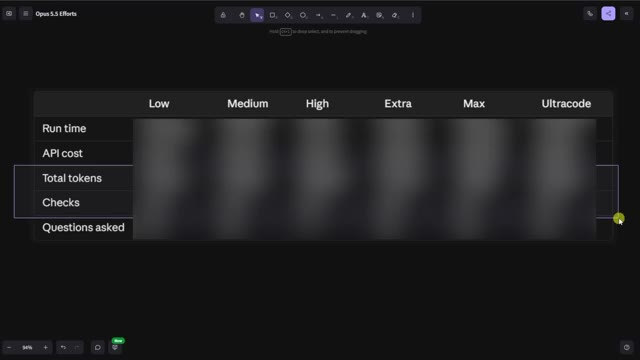
*⏱️ 00:00:35 — Tableau de bord comparatif affichant les métriques des différents niveaux d'efforts (Run time, API cost, Total tokens, Checks, Questions asked) pour Low, Medium, High, Extra, Max et Ultracode.*

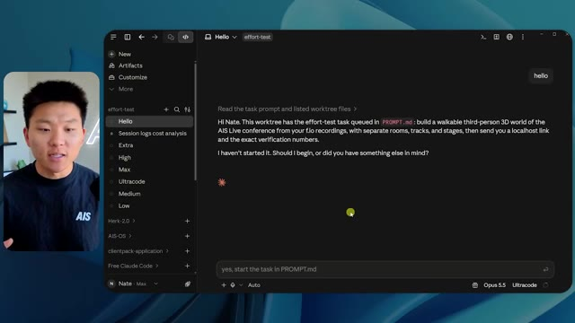
*⏱️ 00:00:49 — Interface de l'application montrant une conversation de l'agent IA (avec un encart vidéo du présentateur à gauche) posant une question sur la tâche à exécuter.*

---

### ⏱️ `[00:00:56 - 00:01:24]` | Segment #03

**🔊 Audio (Transcription Intégrale Mot pour Mot en Français) :**
> Tu as besoin de créer un monde 3D qui soit une conférence tech réaliste dans laquelle je peux me promener en vue à la troisième personne. Tu vas regarder ce dossier qui est mon événement d'enregistrement d'actifs à partir d'AIS Live. Dans ce dossier se trouve un dossier Frame IO de 105 Go de vidéos enregistrées. C'était un événement totalement virtuel, tout a été enregistré et toutes les enregistrements sont là. J'ai dit que ton objectif était de prendre cet événement et de le transformer en un monde 3D explorable qui me donne l'impression que je suis réellement allé à une conférence en personne.

**👁️ Analyse Visuelle d'Écran (gemini-3.5-flash-lite) :**
**Interface & Outils** : Éditeur de code (VS Code / interface similaire) et interface web Frame.io

**Contenu textuel & Code** : Fichier Markdown PROMPT.md contenant les instructions de génération du monde 3D et URL Frame.io

**Action / Démonstration** : Navigation entre les fichiers de configuration du projet et consultation du dossier d'actifs vidéo en ligne

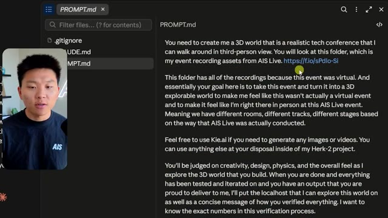
*⏱️ 00:01:03 — Éditeur de texte affichant le fichier PROMPT.md avec les instructions pour créer un monde 3D interactif.*

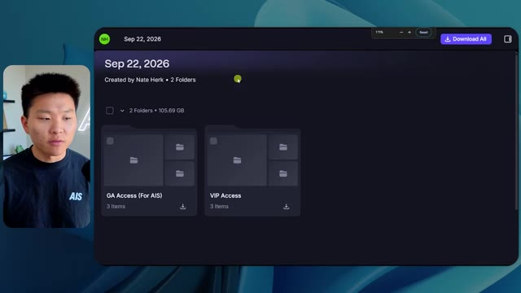
*⏱️ 00:01:10 — Interface de gestion de fichiers Frame.io montrant un dossier d'enregistrements d'événements de 105,69 Go.*

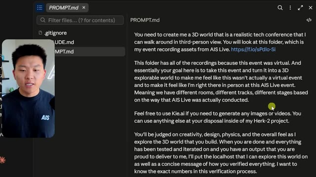
*⏱️ 00:01:17 — Retour sur l'éditeur de texte PROMPT.md détaillant les consignes de conception du monde virtuel.*

---

### ⏱️ `[00:01:24 - 00:01:52]` | Segment #04

**🔊 Audio (Transcription Intégrale Mot pour Mot en Français) :**
> Donc, nous avons ici le résultat pour bas. Ouvrons-le et jetons un coup d'œil. Nous avons donc IA Slive.

**👁️ Analyse Visuelle d'Écran (gemini-3.5-flash-lite) :**
**Interface & Outils** : Éditeur de code (VS Code ou similaire) et interface d'agent IA personnalisé (Opus 5.5).

**Contenu textuel & Code** : Fichier PROMPT.md contenant les instructions détaillées pour générer un monde 3D réaliste de conférence avec différentes salles et pistes.

**Action / Démonstration** : Présentation du prompt initial et navigation dans l'interface de l'agent IA pour démarrer l'exécution de la tâche.

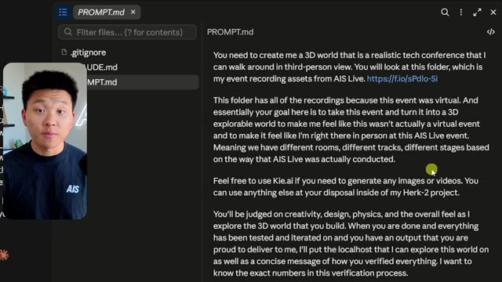
*⏱️ 00:01:31 — Éditeur de code affichant le contenu du fichier PROMPT.md décrivant la création d'un monde 3D interactif basé sur un événement virtuel AIS Live.*

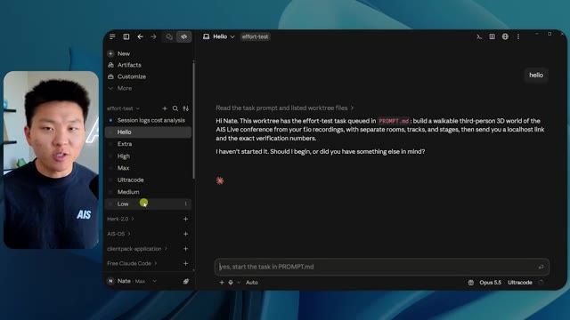
*⏱️ 00:01:45 — Interface d'une application IA avec un panneau latéral montrant différents niveaux de tests d'effort et une conversation demandant de lancer la tâche.*

---

### ⏱️ `[00:01:52 - 00:02:20]` | Segment #05

**🔊 Audio (Transcription Intégrale Mot pour Mot en Français) :**
> OK, cette fois, je pense que nous avons un lieu. C'est l'étage principal où il y a le coin salon principal. C'est sympa parce qu'il y a un groupe en train de jouer de la musique en bas, donc vous l'entendez un peu en arrière-plan. Voyons si nous pouvons monter. Allons-y.

**👁️ Analyse Visuelle d'Écran (gemini-3.5-flash-lite) :**
**Interface & Outils** : Application web interactive en 3D / environnement virtuel web.

**Contenu textuel & Code** : Interface graphique d'un événement virtuel 3D (AIS Live) avec des éléments de navigation textuels et spatiaux.

**Action / Démonstration** : Exploration d'un environnement virtuel 3D, navigation dans un espace de sommet en ligne.

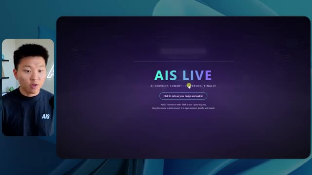
*⏱️ 00:01:59 — Écran d'accueil d'une application web intitulée "AIS LIVE - AI SERVICES SUMMIT - IN PERSON, FINALLY" avec un bouton pour récupérer son badge.*

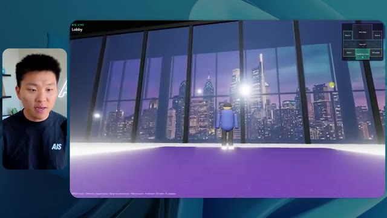
*⏱️ 00:02:06 — Vue de l'intérieur d'un espace virtuel 3D avec un avatar et de grandes baies vitrées donnant sur une ligne d'horizon urbaine la nuit.*

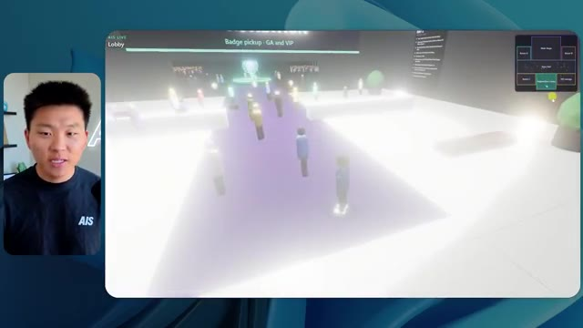
*⏱️ 00:02:13 — Vue en plongée d'un espace de type salon ou hall d'exposition virtuel avec des avatars et une mini-carte en haut à droite.*

---

### ⏱️ `[00:02:20 - 00:02:48]` | Segment #06

**🔊 Audio (Transcription Intégrale Mot pour Mot en Français) :**
> Alors, d'abord, on va aller voir l'heure. D'accord, alors il est 12h23. La keynote commence dans moins de deux heures. C'est quand même assez fou d'y penser. Donc, je suis vraiment impatient. Bon, je viens de faire un petit café. Maintenant, je vais vérifier si j'ai reçu des e-mails. OK, pas de nouveau mail. Bon, ce n'est pas grave, je vais retourner sur le site Web de l'événement et voir si le flux en direct est disponible. Bon, rien pour l'instant. C'est normal, c'est encore tôt. Je vais aller voir le programme de la journée.

**👁️ Analyse Visuelle d'Écran (gemini-3.5-flash-lite) :**
**Interface & Outils** : Environnement virtuel 3D / Navigateur web ou plateforme d'événement virtuel.

**Contenu textuel & Code** : Aucun code source, terminal ou prompt n'est affiché.

**Action / Démonstration** : Navigation et exploration d'un monde virtuel 3D par un avatar.

---

### ⏱️ `[00:02:48 - 00:03:16]` | Segment #07

**🔊 Audio (Transcription Intégrale Mot pour Mot en Français) :**
> [Séquence sonore / Musique d'ambiance]

**👁️ Analyse Visuelle d'Écran (gemini-3.5-flash-lite) :**
**Interface & Outils** : Application de réalité virtuelle / Monde virtuel interactif (style metaverse ou jeu de simulation).

**Contenu textuel & Code** : Instructions textuelles sur un panneau virtuel : 'Step 1: Go to Settings', 'Step 2: Go to API integrations', 'Step 3: Go to Create A New Token'.

**Action / Démonstration** : Navigation et exploration de l'espace virtuel par le présentateur ou son avatar pour présenter les différentes sections d'un atelier.

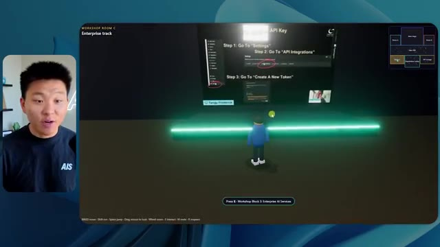
*⏱️ 00:02:55 — Vue d'un monde virtuel interactif (style Roblox/metaverse) montrant un avatar devant un écran géant affichant des instructions de configuration d'API.*

---

### ⏱️ `[00:03:16 - 00:03:44]` | Segment #08

**🔊 Audio (Transcription Intégrale Mot pour Mot en Français) :**
> [Séquence sonore / Musique d'ambiance]

**👁️ Analyse Visuelle d'Écran (gemini-3.5-flash-lite) :**
**Interface & Outils** : Interface web de simulation 3D interactive (type monde virtuel ou salon virtuel).

**Contenu textuel & Code** : Environnement virtuel 3D avec affichage de salles de conférence, salons d'exposition et éléments textuels informatifs.

**Action / Démonstration** : Navigation et exploration interactive d'un espace virtuel 3D de type métavers ou plateforme événementielle en ligne.

---

### ⏱️ `[00:03:44 - 00:04:12]` | Segment #09

**🔊 Audio (Transcription Intégrale Mot pour Mot en Français) :**
> Ok, donc je pense que vous comprenez l'ambiance qu'on obtient ici d'opus 5.5 à bas effort. Et c'est là que les choses deviennent intéressantes. Combien est-ce que vous pensez que cette requête a duré, combien de temps ? Celle-ci a duré 16 minutes et 43 secondes. Combien est-ce que vous pensez que ça coûte ? 3,91 $, si c'était une facturation par API. J'utilise évidemment mon abonnement ici, mais on va juste calculer ça en facturation par API. Total de jetons : 191000. Elle a fait 22 vérifications, donc la vérification 22 fois. Elle a ouvert le navigateur et a exécuté différentes sortes de vérifications.

**👁️ Analyse Visuelle d'Écran (gemini-3.5-flash-lite) :**
**Interface & Outils** : Interface de tableau blanc / application de mindmapping ou tableau de données (type Miro ou similaire).

**Contenu textuel & Code** : Tableau avec des colonnes de niveau d'effort et des lignes de paramètres de performance (Run time, API cost, Total tokens, Checks, Questions asked).

**Action / Démonstration** : Le présentateur commente le tableau et survole la colonne "Low".

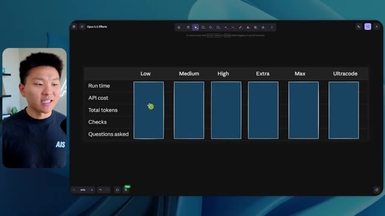
*⏱️ 00:03:51 — Un tableau comparatif montrant les différents niveaux d'effort (Low, Medium, High, Extra, Max, Ultracode) par rapport à divers métriques (Run time, API cost, Total tokens, etc.), avec le présentateur incrusté à gauche.*

---

### ⏱️ `[00:04:12 - 00:04:40]` | Segment #10

**🔊 Audio (Transcription Intégrale Mot pour Mot en Français) :**
> [Séquence sonore / Musique d'ambiance]

**👁️ Analyse Visuelle d'Écran (gemini-3.5-flash-lite) :**
**Interface & Outils** : Tableau de bord d'analyse de performance et interface d'événement virtuel 3D.

**Contenu textuel & Code** : Tableaux comparatifs de coûts d'API, temps d'exécution, nombre de tokens et interface de métavers/événement en ligne.

**Action / Démonstration** : Présentation des résultats de tests de performance d'agents et navigation dans un espace virtuel 3D.

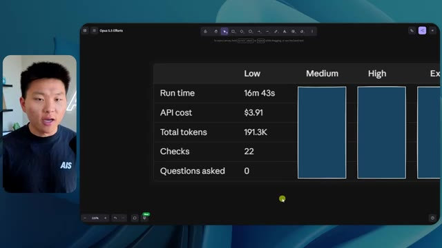
*⏱️ 00:04:19 — Tableau de bord comparatif affichant les métriques d'exécution (Run time: 16m 43s, API cost: $3.91, Total tokens: 191.3K) pour différents niveaux d'effort (Low, Medium, High).*

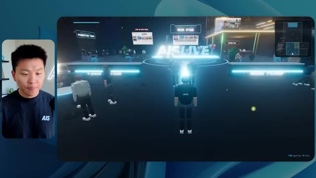
*⏱️ 00:04:33 — Interface virtuelle 3D interactive "AIS LIVE" montrant un espace virtuel avec des avatars et des écrans d'affichage.*

---

### ⏱️ `[00:04:40 - 00:05:08]` | Segment #11

**🔊 Audio (Transcription Intégrale Mot pour Mot en Français) :**
> [Séquence sonore / Musique d'ambiance]

**👁️ Analyse Visuelle d'Écran (gemini-3.5-flash-lite) :**
**Interface & Outils** : Environnement virtuel 3D / Interface de monde virtuel en ligne

**Contenu textuel & Code** : Aucun code, terminal ou prompt n'est affiché ; il s'agit d'une simulation ou d'un monde virtuel 3D.
[DESC_IMAGE_3] Navigation et exploration d'un espace virtuel 3D par le présentateur.

**Action / Démonstration** : Explications face caméra et démonstration conceptuelle.

---

### ⏱️ `[00:05:08 - 00:05:36]` | Segment #12

**🔊 Audio (Transcription Intégrale Mot pour Mot en Français) :**
> Cela est un système hautement capable, capable d'analyser des feuilles de calcul et de générer du code ou d'écrire des essais de manière similaire à ce qui est démontré ici.

**👁️ Analyse Visuelle d'Écran (gemini-3.5-flash-lite) :**
**Interface & Outils** : Application de métavers ou espace virtuel 3D de conférence en ligne.

**Contenu textuel & Code** : Menus contextuels de sessions de conférence, bannières informatives "Enterprise AI Services" et "AIS+ Certified".

**Action / Démonstration** : Navigation et exploration de l'espace virtuel 3D par le présentateur.

---

### ⏱️ `[00:05:36 - 00:06:04]` | Segment #13

**🔊 Audio (Transcription Intégrale Mot pour Mot en Français) :**
> On peut voir qu'on a un 'community spotlight' donc ça c'est Aiden qui parle de son deal qu'il a landé et c'est en train de jouer live.

**👁️ Analyse Visuelle d'Écran (gemini-3.5-flash-lite) :**
**Interface & Outils** : Application de conférence ou d'événement virtuel en 3D (type Gather, Topia ou similaire) avec avatars interactifs et affichage d'informations de session en bas à gauche.

**Contenu textuel & Code** : Titre de session 'How I Landed a $14,000 AI Deal' par Aidan Finnegan, affichage des panneaux de zone 'Community Spotlight' et 'Hyperagent'.

**Action / Démonstration** : Navigation et exploration d'un environnement virtuel 3D lors d'une session de communauté en direct.

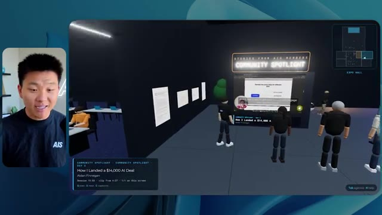
*⏱️ 00:05:43 — Vue d'un espace virtuel 3D de type salon ou conférence en ligne, montrant un écran affichant 'Community Spotlight' avec le titre 'How I Landed a $14,000 AI Deal' par Aidan Finnegan.*

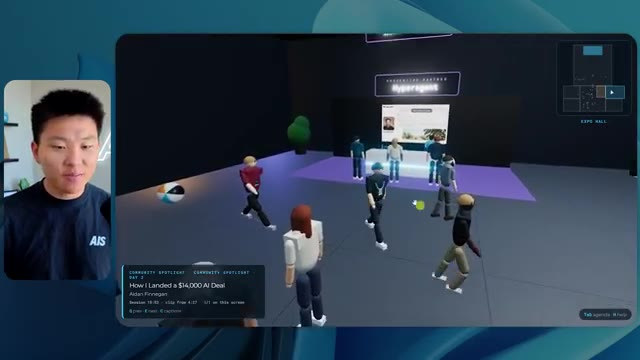
*⏱️ 00:05:50 — Vue générale d'un espace virtuel 3D avec des avatars d'utilisateurs se déplaçant, montrant un stand ou une zone de présentation partenaire étiquetée 'Hyperagent'.*

---

### ⏱️ `[00:06:04 - 00:06:32]` | Segment #14

**🔊 Audio (Transcription Intégrale Mot pour Mot en Français) :**
> fondation. Nous avons Sabrina Romanov et Liberty White. Donc, différentes formations juste là. Nous pouvons venir dans cette pièce. C’est la piste avancée. Qu'est-ce qui se passe ici ? Nous avons Dave Abelard et Simon qui parlent de différentes choses là-bas. Et maintenant, allons voir la scène principale. Oh attendez, il y a une vidéo de moi là-haut. Est-ce que c'est comme une section VIP ? Oui, nous irons voir cela dans une seconde. Mais de toute façon, c'est la scène principale. Cela a l'air très, très bien. Nous avons une grande scène, nous avons comme quatre personnes assises ici. Nous avons les trois écrans d'Alex là-haut avec Hyper.

**👁️ Analyse Visuelle d'Écran (gemini-3.5-flash-lite) :**
**Interface & Outils** : Application de métavers ou de salon virtuel 3D (espace événementiel en ligne).

**Contenu textuel & Code** : Environnement 3D interactif affichant "Main Lobby", "Main Stage", des bannières de session ("Hyperagent Keynote") et des mini-cartes de navigation.

**Action / Démonstration** : Explications face caméra et démonstration conceptuelle.

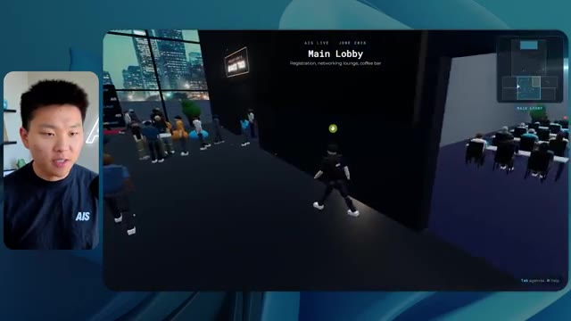
*⏱️ 00:06:11 — Vue d'un monde virtuel interactif (le Main Lobby) avec un avatar se déplaçant dans un espace de conférence virtuel.*

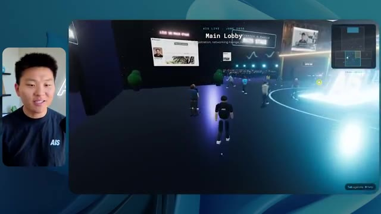
*⏱️ 00:06:18 — Poursuite de la navigation dans le hall virtuel montrant les écrans d'information et les autres participants sous forme d'avatars.*

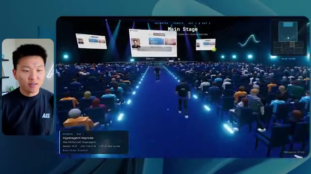
*⏱️ 00:06:25 — Arrivée dans la salle principale (Main Stage) avec un public d'avatars assis et une estrade avec des écrans de présentation.*

---

### ⏱️ `[00:06:32 - 00:07:00]` | Segment #15

**🔊 Audio (Transcription Intégrale Mot pour Mot en Français) :**
> [Séquence sonore / Musique d'ambiance]

**👁️ Analyse Visuelle d'Écran (gemini-3.5-flash-lite) :**
**Interface & Outils** : Application de métavers / plateforme de conférence virtuelle 3D (Hyperagent Keynote).

**Contenu textuel & Code** : Interface utilisateur de conférence virtuelle, flux vidéo en direct, menus de sélection d'agents ("Hiring the fleet").

**Action / Démonstration** : Navigation et exploration d'un environnement virtuel interactif en 3D avec des avatars.

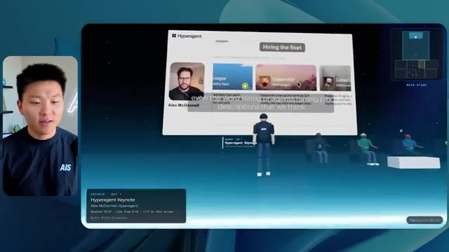
*⏱️ 00:06:39 — Vue d'une interface de conférence virtuelle 3D (Hyperagent Keynote) montrant un avatar et des écrans interactifs avec des options de gestion d'agents.*

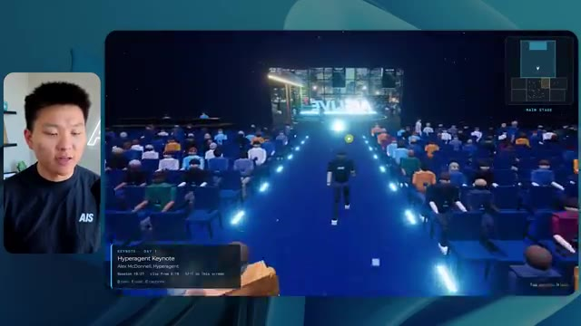
*⏱️ 00:06:46 — Vue de l'auditorium virtuel avec des avatars assis dans une salle de conférence 3D.*

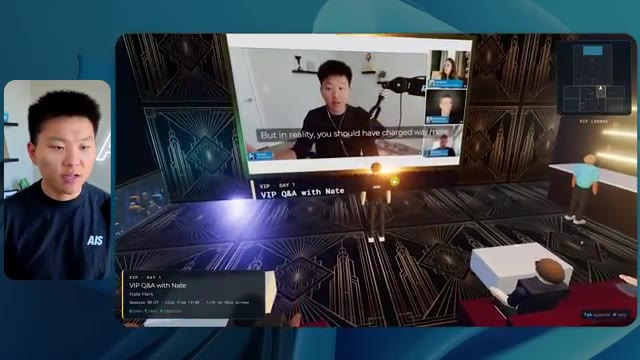
*⏱️ 00:06:53 — Scène d'un salon VIP virtuel (VIP Q&A with Nate) affichant un écran géant avec une session vidéo interactive.*

---

### ⏱️ `[00:07:00 - 00:07:28]` | Segment #16

**🔊 Audio (Transcription Intégrale Mot pour Mot en Français) :**
> Il aurait coûté 12,44 $, utilisé 490000 jetons et effectué 23 vérifications. Et cela nous a donné un total de zéro question, encore une fois.

**👁️ Analyse Visuelle d'Écran (gemini-3.5-flash-lite) :**
**Interface & Outils** : Outil de tableau de bord ou d'analyse de données (style application web ou tableau blanc type Excalidraw)

**Contenu textuel & Code** : Tableau comparatif affichant les données pour le niveau 'Medium' : Run time (1h 13m), API cost ($3.91), Total tokens (191.3K), Checks (22), Questions asked (0).

**Action / Démonstration** : Analyse et présentation des métriques de performance et des coûts d'exécution de l'agent IA.

*⏱️ 00:07:07 — Capture d'écran montrant un tableau comparatif de performances pour 'Opus 5.5 Efforts' avec les colonnes Low, Medium, High, et des métriques détaillées telles que Run time, API cost, Total tokens, Checks et Questions asked. Le présentateur apparaît dans une incrustation vidéo à gauche.*

---

### ⏱️ `[00:07:28 - 00:07:56]` | Segment #17

**🔊 Audio (Transcription Intégrale Mot pour Mot en Français) :**
> Hostinger.

**👁️ Analyse Visuelle d'Écran (gemini-3.5-flash-lite) :**
**Interface & Outils** : Navigateur web, interface Hostinger, outils de développement (VS Code, Cursor, Claude Code, Devin).

**Contenu textuel & Code** : Options d'installation d'extensions et de commandes CLI pour connecter les éditeurs et agents IA à Hostinger.
[DESC_IMAGE_3] Présentation des méthodes de connexion pour intégrer les outils de développement et agents IA avec Hostinger.

**Action / Démonstration** : Explications face caméra et démonstration conceptuelle.

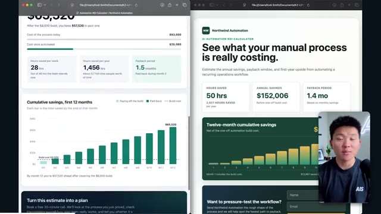
*⏱️ 00:07:42 — Capture de deux fenêtres de navigateur montrant un calculateur de ROI pour l'automatisation IA (Northwind Automation).*

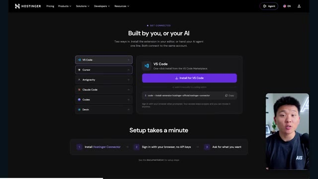
*⏱️ 00:07:49 — Interface web de Hostinger présentant les options d'intégration pour les éditeurs de code et agents IA (VS Code, Cursor, Claude Code, Devin).*

---

### ⏱️ `[00:07:56 - 00:08:24]` | Segment #18

**🔊 Audio (Transcription Intégrale Mot pour Mot en Français) :**
> Alors, lequel de ces services préférez-vous ? Le code, le point, ou quelque chose de plus traditionnel ? Faites-moi savoir dans les commentaires. Et pour rappel, si vous voulez automatiser vos propres tâches, vous trouverez les liens vers toutes les applications mentionnées dans la description ci-dessous. Merci d'avoir regardé cette vidéo et à bientôt dans le prochain tutoriel.

**👁️ Analyse Visuelle d'Écran (gemini-3.5-flash-lite) :**
**Interface & Outils** : Site web Hostinger et interface de présentation de services d'hébergement.

**Contenu textuel & Code** : Offres tarifaires ($3.99/mo, $7.99/mo), options de déploiement et intégrations d'outils d'IA.

**Action / Démonstration** : Navigation et présentation des différentes formules d'abonnement et des fonctionnalités d'automatisation d'Hostinger.

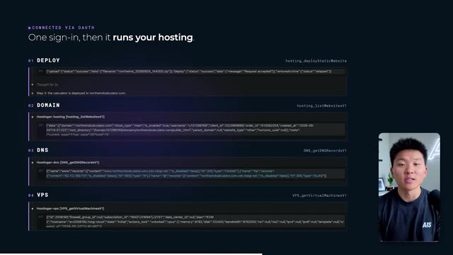
*⏱️ 00:08:03 — Présentation des fonctionnalités connectées via OAuth avec des sections 'Deploy', 'Domain', 'DNS' et 'VPS'.*

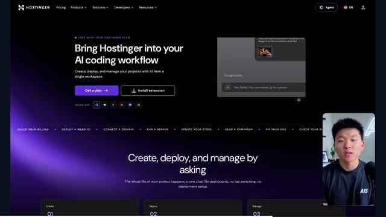
*⏱️ 00:08:10 — Page d'accueil du site web Hostinger montrant l'intégration avec les flux de travail de codage IA.*

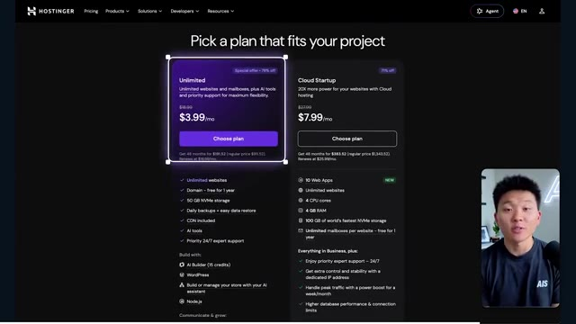
*⏱️ 00:08:17 — Page des tarifs de Hostinger affichant différentes offres d'abonnement comme 'Unlimited' et 'Cloud Startup'.*

---

### ⏱️ `[00:08:24 - 00:08:52]` | Segment #19

**🔊 Audio (Transcription Intégrale Mot pour Mot en Français) :**
> [Séquence sonore / Musique d'ambiance]

**👁️ Analyse Visuelle d'Écran (gemini-3.5-flash-lite) :**
**Interface & Outils** : Application web 3D interactive (RingCentral / Environnement virtuel 3D)

**Contenu textuel & Code** : Interface utilisateur de monde virtuel 3D avec bannières, mini-carte et commandes clavier/souris affichées à l'écran.

**Action / Démonstration** : Navigation et exploration d'un espace événementiel virtuel en 3D par un avatar.

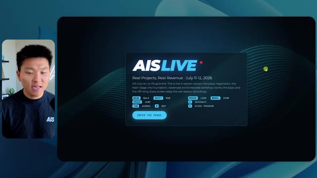
*⏱️ 00:08:31 — Écran d'accueil de l'application virtuelle "AIS LIVE" avec le bouton "Enter the Venue" et les instructions de contrôle (WASD, Mouse).*

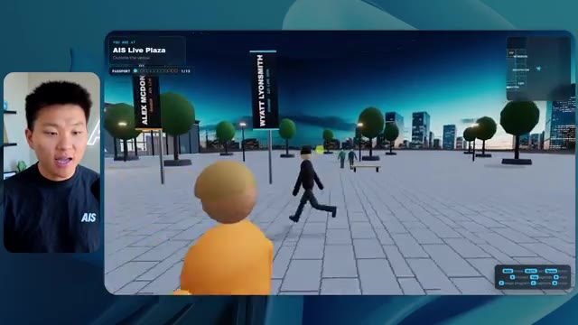
*⏱️ 00:08:38 — Vue en 3D d'un monde virtuel interactif (AIS Live Plaza) avec des avatars et des bannières nominatives.*

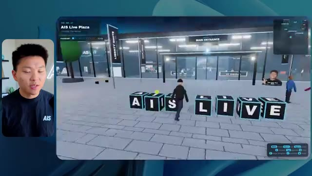
*⏱️ 00:08:45 — Approche de l'entrée principale du bâtiment virtuel AIS Live avec des cubes affichant le logo "AIS LIVE".*

---

### ⏱️ `[00:08:52 - 00:09:20]` | Segment #20

**🔊 Audio (Transcription Intégrale Mot pour Mot en Français) :**
> et on peut vérifier l'Expo avec différents stands, et le projecteur communautaire. On peut également voir qu'en haut à gauche, j'ai un passeport. Donc, l'idée est que cela montre combien d'endroits j'ai visités. Tous ces endroits sont de vraies rediffusions. Nous avons un mur de ressources avec tous les différents haut-parleurs. Ils ont aussi une session de réseautage ici. Je vais donc venir voir rapidement de quoi il s'agit. Nous avons le bar à café AIS, nous avons

**👁️ Analyse Visuelle d'Écran (gemini-3.5-flash-lite) :**
**Interface & Outils** : Application de métaverse ou plateforme d'événement virtuel en 3D

**Contenu textuel & Code** : Interface utilisateur avec un passeport de visite et des stands d'exposition virtuelle

**Action / Démonstration** : Navigation et exploration de différents stands dans un environnement virtuel 3D

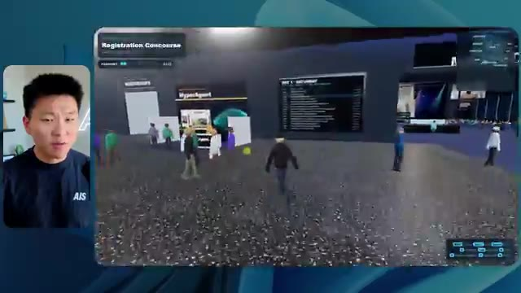
*⏱️ 00:08:59 — Vue d'un espace virtuel 3D montrant l'Expo avec différents stands et un passeport affiché en haut à gauche.*

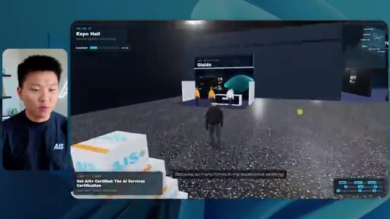
*⏱️ 00:09:06 — Navigation dans la salle d'exposition virtuelle avec le compteur de passeport visible dans le coin supérieur gauche.*

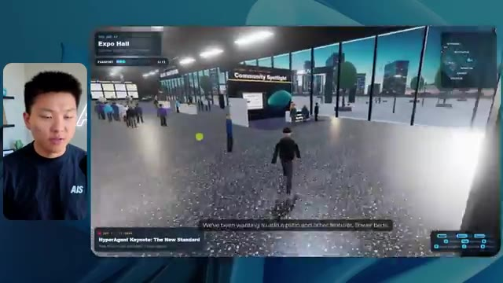
*⏱️ 00:09:13 — Exploration du hall d'exposition virtuel mettant en avant le projecteur communautaire et divers stands.*

---

### ⏱️ `[00:09:20 - 00:09:48]` | Segment #21

**🔊 Audio (Transcription Intégrale Mot pour Mot en Français) :**
> Ok, laissez-moi vérifier rapidement. Le bracelet est déjà activé. Attendez, quoi ? OK. Oh, OK, maintenant les portes se sont ouvertes pour moi. Cool. Je peux entrer ici. Oh, ça va directement à la scène principale. Salon VIP, c'est une séance de questions-réponses en cours, on dirait. Très cool. Je veux dire, je suis très impressionné par la façon dont il peut faire ça. Waouh ! OK, donc, c'est vraiment bien.

**👁️ Analyse Visuelle d'Écran (gemini-3.5-flash-lite) :**
**Interface & Outils** : Application de monde virtuel 3D / plateforme de métavers.

**Contenu textuel & Code** : Interface utilisateur avec mini-carte, indicateurs de progression et sous-titres de la discussion en cours (« So evals are super, super important »).

**Action / Démonstration** : Navigation et exploration d'un espace virtuel 3D par l'avatar, transition vers le salon VIP.

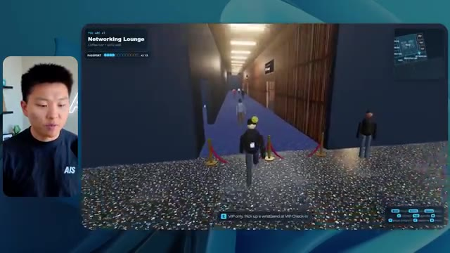
*⏱️ 00:09:27 — Vue d'un monde virtuel 3D avec l'avatar du présentateur s'approchant d'une zone VIP bloquée, avec le flux vidéo webcam du présentateur à gauche.*

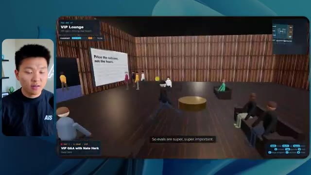
*⏱️ 00:09:41 — L'avatar du présentateur entre dans le salon VIP du monde virtuel 3D où se déroule une présentation avec un écran affichant du contenu.*

---

### ⏱️ `[00:09:48 - 00:10:16]` | Segment #22

**🔊 Audio (Transcription Intégrale Mot pour Mot en Français) :**
> [Séquence sonore / Musique d'ambiance]

**👁️ Analyse Visuelle d'Écran (gemini-3.5-flash-lite) :**
**Interface & Outils** : Application ou plateforme virtuelle 3D (type metavers ou espace de réunion virtuel interactif).

**Contenu textuel & Code** : Éléments textuels de navigation, interfaces de réunion vidéo intégrées, avatars virtuels et boutons d'interaction contextuels.

**Action / Démonstration** : Navigation et exploration d'un environnement virtuel interactif avec des avatars et des flux vidéo de participants.

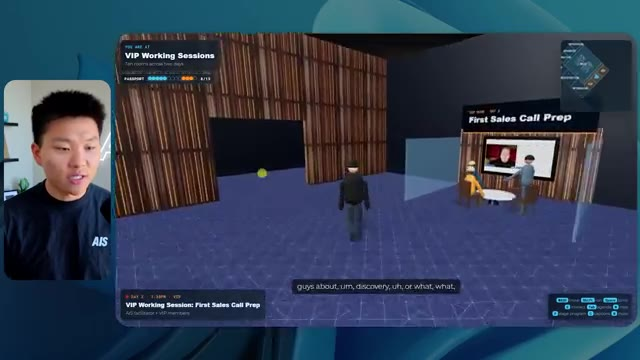
*⏱️ 00:09:55 — Capture montrant un avatar dans un espace virtuel 3D de session de travail VIP intitulé 'First Sales Call Prep'.*

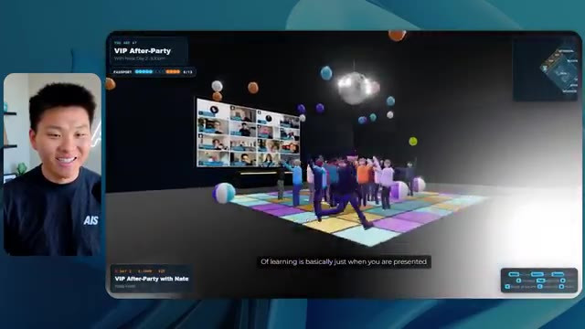
*⏱️ 00:10:02 — Capture montrant une fête virtuelle 3D avec des avatars dansant sous une boule à facettes et un grand écran affichant des participants en visio.*

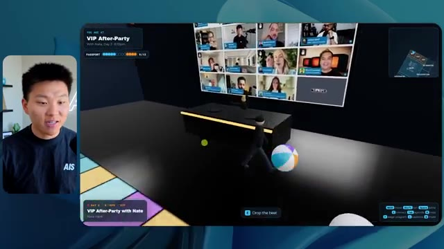
*⏱️ 00:10:09 — Capture montrant un avatar évoluant dans un espace virtuel avec un grand écran de visioconférence et des contrôles affichés en bas.*

---

### ⏱️ `[00:10:16 - 00:10:44]` | Segment #23

**🔊 Audio (Transcription Intégrale Mot pour Mot en Français) :**
> Je vais aller sur le site Web de Claude et copier le code, et nous pourrons commencer à construire notre chatbot de service client.

**👁️ Analyse Visuelle d'Écran (gemini-3.5-flash-lite) :**
**Interface & Outils** : AUCUNE

**Contenu textuel & Code** : AUCUN

**Action / Démonstration** : AUCUNE

---

### ⏱️ `[00:10:44 - 00:11:12]` | Segment #24

**🔊 Audio (Transcription Intégrale Mot pour Mot en Français) :**
> C’est tout pour le moment. Low était correct, Medium était meilleur, High a été encore meilleur. Voyons si cette tendance continue et voyons ce que cela nous a coûté. Alors High a tourné pendant 1 heure et 7 minutes, donc un peu plus rapide que Medium, il aurait coûté 16,31 $, il a utilisé un demi-million de tokens, 509 000, il a effectué 22 vérifications et il nous a également demandé... Enfin, en fait non, j’avais tort, celui-ci m’a demandé une question. Et spoiler, c’était le seul qui nous a posé une question tout au long de tout cela. Donc

**👁️ Analyse Visuelle d'Écran (gemini-3.5-flash-lite) :**
**Interface & Outils** : Application de tableau blanc ou d'édition de diagrammes (type Excalidraw) affichant un tableau comparatif.

**Contenu textuel & Code** : Tableau comparant les niveaux Low, Medium, High et Extra : Run time (16m 43s, 1h 13m, 1h 7m), API cost ($3.91, $12.44, $16.31), Total tokens (191.3K, 419.2K), Checks (22, 23), Questions asked (0, 0).

**Action / Démonstration** : Le présentateur commente le tableau comparant les performances et les coûts des différents niveaux d'effort d'un modèle d'IA.

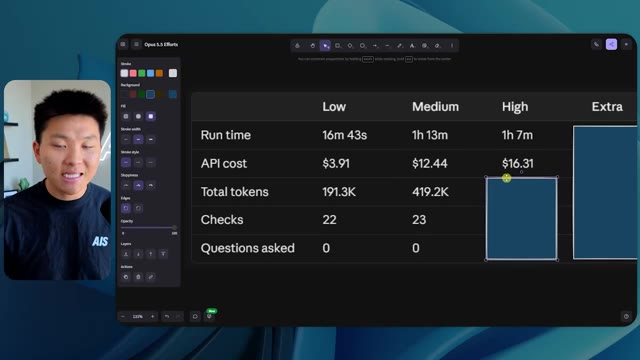
*⏱️ 00:10:58 — Tableau comparatif montrant les métriques de performance et de coût pour différents niveaux d'effort (Low, Medium, High, Extra) avec les durées d'exécution, les coûts API, le nombre de tokens et de vérifications.*

---

### ⏱️ `[00:11:12 - 00:11:40]` | Segment #25

**🔊 Audio (Transcription Intégrale Mot pour Mot en Français) :**
> Mais de toute façon, c'est ce qui nous a permis de progresser. Bon, alors voilà l'intégration.

**👁️ Analyse Visuelle d'Écran (gemini-3.5-flash-lite) :**
**Interface & Outils** : Application web interactive / métavers 3D "AIS LIVE"

**Contenu textuel & Code** : Interface utilisateur virtuelle interactive avec des contrôles clavier affichés en bas (WASD, Shift, Space, etc.)

**Action / Démonstration** : Exploration et navigation dans un environnement virtuel 3D représentant une convention ou un espace d'événement en ligne.

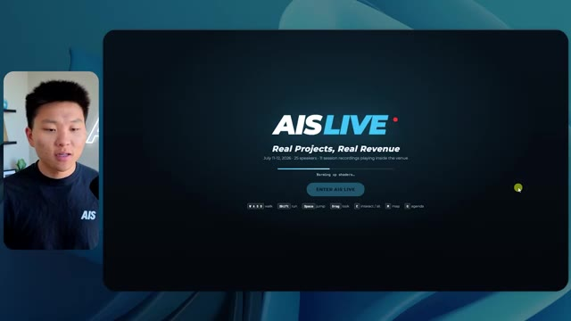
*⏱️ 00:11:19 — Écran de chargement d'une application virtuelle interactive "AIS LIVE - Real Projects, Real Revenue".*

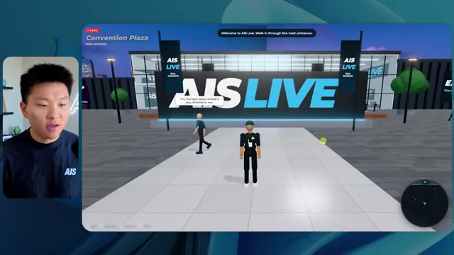
*⏱️ 00:11:26 — Vue de face d'un environnement virtuel de type métavers avec un avatar de joueur devant un bâtiment "AIS LIVE".*

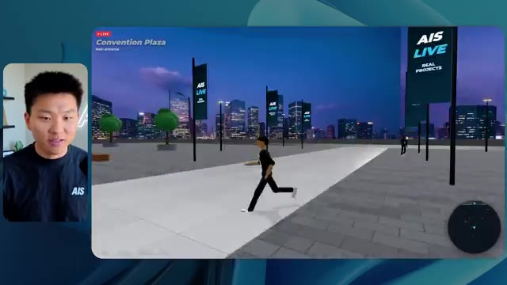
*⏱️ 00:11:33 — Avatar d'utilisateur en train de courir dans un monde virtuel avec des bâtiments urbains en arrière-plan.*

---

### ⏱️ `[00:11:40 - 00:12:08]` | Segment #26

**🔊 Audio (Transcription Intégrale Mot pour Mot en Français) :**
> workshop wing is over here and let's go through the sliding glass doors and see what we've got. So we've got the AIS cafe. The map is in the bottom right and it's not too descriptive. I like how the other maps have told us what like where things were, but this one looks very professional. We can see here is the main stage, let's hop in here real quick. They've all got these balls flying around, which I think is pretty funny. The AIS beach balls. We have me up there speaking. I think I was introwing one of the days. Let's keep on moving here to the workshop

**👁️ Analyse Visuelle d'Écran (gemini-3.5-flash-lite) :**
**Interface & Outils** : AUCUNE

**Contenu textuel & Code** : AUCUNE

**Action / Démonstration** : AUCUNE

---

### ⏱️ `[00:12:08 - 00:12:36]` | Segment #27

**🔊 Audio (Transcription Intégrale Mot pour Mot en Français) :**
> Le Price Right room était plein.

**👁️ Analyse Visuelle d'Écran (gemini-3.5-flash-lite) :**
**Interface & Outils** : Environnement virtuel 3D (metaverse / plateforme de conférence virtuelle)

**Contenu textuel & Code** : Affiches virtuelles d'ateliers et interface utilisateur de navigation dans un monde virtuel

**Action / Démonstration** : Navigation et exploration d'un événement virtuel en 3D avec des avatars

---

### ⏱️ `[00:12:36 - 00:13:04]` | Segment #28

**🔊 Audio (Transcription Intégrale Mot pour Mot en Français) :**
> Room host ici, grab AnyOpenSeat, OK, cool. Et j'ai vraiment aimé la sitting functionality, c'est assez drôle, genre on peut cultiver cette tendance, ce workshop et participer. Anyways, en montrant les speakers, et en montrant l'agenda, il y a un petit red carpet ici pour prendre des images, on peut strike un pause. Oh wow, c'est plutôt cool.

**👁️ Analyse Visuelle d'Écran (gemini-3.5-flash-lite) :**
**Interface & Outils** : Application web de conférence virtuelle 3D (espace métavers type AnyOpenSeat).

**Contenu textuel & Code** : Interface utilisateur virtuelle avec affichage de la liste des speakers, agenda et flux vidéo en direct.

**Action / Démonstration** : Navigation et déplacement d'avatar dans l'environnement virtuel 3D de la conférence.

---

### ⏱️ `[00:13:04 - 00:13:32]` | Segment #29

**🔊 Audio (Transcription Intégrale Mot pour Mot en Français) :**
> [Séquence sonore / Musique d'ambiance]

**👁️ Analyse Visuelle d'Écran (gemini-3.5-flash-lite) :**
**Interface & Outils** : Application web 3D immersive / Metavers (AIS Live)

**Contenu textuel & Code** : Environnement virtuel 3D interactif avec affichage d'informations textuelles, panneaux de session et questions de travail en groupe.

**Action / Démonstration** : Navigation et déplacement d'un avatar à travers le hall virtuel, puis montée des escaliers et participation à une table ronde de travail.

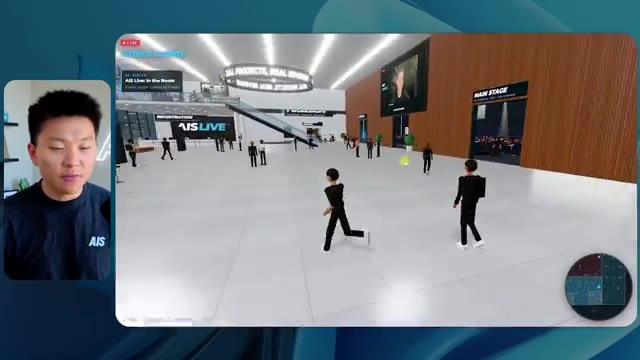
*⏱️ 00:13:11 — Vue d'un monde virtuel 3D représentant un grand hall d'accueil (Grand Lobby) avec des avatars d'utilisateurs qui se déplacent.*

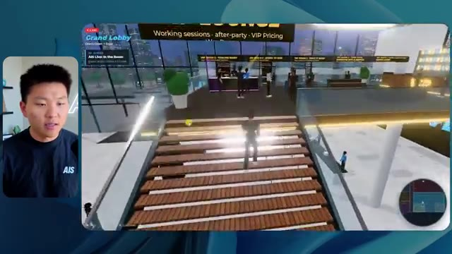
*⏱️ 00:13:18 — Un avatar monte un grand escalier en bois dans le monde virtuel 3D accédant au niveau supérieur (VIP Lounge).*

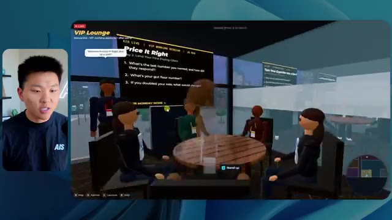
*⏱️ 00:13:25 — Des avatars assis autour d'une table ronde dans le VIP Lounge participant à une session de travail interactive avec des écrans affichant des questions ("Price It Right").*

---

### ⏱️ `[00:13:32 - 00:14:00]` | Segment #30

**🔊 Audio (Transcription Intégrale Mot pour Mot en Français) :**
> Il y avait 733 000 jetons et 34 chèques. Donc il avait le plus de chèques de loin, de loin, et il nous a posé zéro questions.

**👁️ Analyse Visuelle d'Écran (gemini-3.5-flash-lite) :**
**Interface & Outils** : Application de tableau blanc ou diagramme (style Excalidraw).

**Contenu textuel & Code** : Tableau comparatif avec les colonnes Medium (1h 13m, $12.44, 419.2K, 23, 0), High (1h 7m, $16.31, 509.3K, 22, 1), Extra (1h 31m), Max et Ultracode.

**Action / Démonstration** : Le présentateur commente les résultats du tableau comparatif affiché à l'écran.

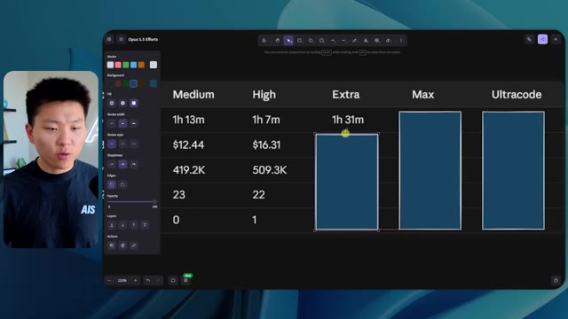
*⏱️ 00:13:39 — Tableau comparatif avec des graphiques en barres montrant les métriques de différents niveaux d'effort (Medium, High, Extra, Max, Ultracode) avec le présentateur incrusté à gauche.*

---

### ⏱️ `[00:14:00 - 00:14:28]` | Segment #31

**🔊 Audio (Transcription Intégrale Mot pour Mot en Français) :**
> Bien, j'aime ça. On va continuer et entrer dans « AI is live ». Oh, une jolie petite animation ici qui nous fait entrer. Encore une fois, le personnage me ressemble. Ils m'ont tous ressemblé, enfin, plus ou moins. Nous avons une ville en arrière-plan, ça ressemble à Chicago. Comme je l'ai mentionné plus tôt, beaucoup d'entre eux diffusent des sons, et je n'inclus pas cela parce que ce serait très distrayant pour vous d'essayer d'écouter ce qui se passe en même temps que je parle. Il y a donc une légère musique dans tout cela. Je... je déteste la façon dont ça marche. Cette démarche est vraiment, vraiment mauvaise. Je veux dire, la marche, ouais, je n'aime pas du tout ça.

**👁️ Analyse Visuelle d'Écran (gemini-3.5-flash-lite) :**
**Interface & Outils** : Application web interactive 3D / Plateforme virtuelle « AI is live »

**Contenu textuel & Code** : Interface utilisateur virtuelle affichant un mini-carte en bas à droite, des informations de session en haut à droite (« The Tool War Panel »), et des commandes de navigation clavier en bas.

**Action / Démonstration** : Exploration de l'espace virtuel 3D avec l'avatar et navigation dans l'application web de la conférence.

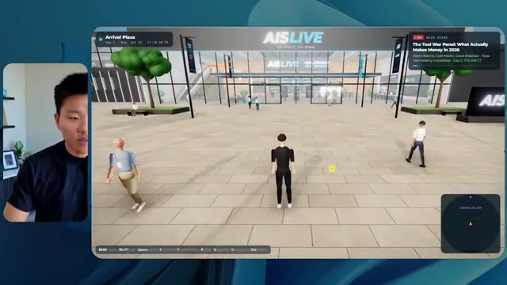
*⏱️ 00:14:07 — Vue principale de l'interface virtuelle « AI is live » montrant l'avatar du personnage devant un grand bâtiment style convention, avec le présentateur incrusté à gauche.*

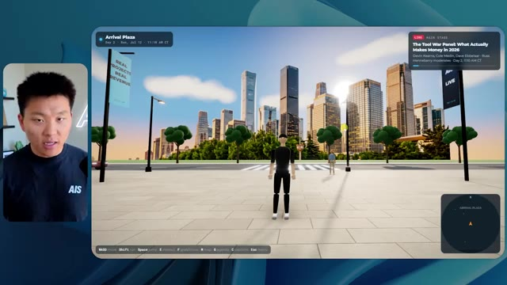
*⏱️ 00:14:14 — Vue de l'environnement virtuel avec un panorama de gratte-ciels en arrière-plan sous un ciel ensoleillé, devant lequel se tient l'avatar.*

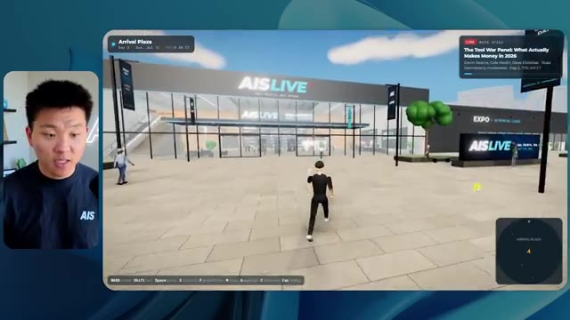
*⏱️ 00:14:21 — L'avatar en mouvement se dirigeant vers l'entrée du bâtiment « AI is live » dans l'univers virtuel interactif.*

---

### ⏱️ `[00:14:28 - 00:14:56]` | Segment #32

**🔊 Audio (Transcription Intégrale Mot pour Mot en Français) :**
> tout, donc ce n'est pas génial. Mais à part ça, entrons et explorons. Remarquez ces ombres quand j'entre, elles basculent vraiment brusquement, je ne sais pas trop pourquoi, mais bref, on peut aussi discuter avec les gens ici. Le stand Hyperagent se trouve juste là où vous entrez dans l'expo, tout va bien. D'accord, cool, je peux continuer à cliquer sur E pour leur faire changer ce qu'ils disent. Nous avons les intervenants juste ici, ça a l'air plutôt bien, même si nous avions absolument la photo de profil de tout le monde, donc je ne sais pas pourquoi ce n'est pas inclus là. On voit des gens prendre des photos juste ici, j'adore ça, et ça enregistre une petite photo. Bon, la carte n'est pas non plus super...

**👁️ Analyse Visuelle d'Écran (gemini-3.5-flash-lite) :**
**Interface & Outils** : Environnement virtuel 3D en ligne (plateforme de conférence virtuelle ou métaverse).

**Contenu textuel & Code** : Interface utilisateur virtuelle affichant des informations de navigation, une mini-carte, des listes de conférenciers et des bulles de dialogue.

**Action / Démonstration** : Exploration d'un monde virtuel 3D et déplacement d'un avatar dans un espace d'exposition.

---

### ⏱️ `[00:14:56 - 00:15:24]` | Segment #33

**🔊 Audio (Transcription Intégrale Mot pour Mot en Français) :**
> Genre, ça ne me donne pas une super explication de ce qui se passe, mais j'aime bien ces stands. Ils sont cool. Je pense que ces stands sont les meilleurs que j'ai vus jusqu'à présent. Genre, ils ont juste l'air sympa, ils ont des représentants, il y a de jolies, genre, diapositives derrière eux. Ouais, ces stands sont cool. D'accord, on a un petit cinéma mis en avant par ici, c'est Casper. Bien que, pourquoi ça ne passe pas ? J'ai l'impression que ça devrait être diffusé, non ? Comme dans les autres, ça tournait toujours. On peut parler à d'autres personnes par ici, le café est gratuit, bla bla bla, Amy Simpson, Matt Wolfe, sympa, d'accord. C'est juste l'espace de réseautage dans lequel nous sommes en ce moment.

**👁️ Analyse Visuelle d'Écran (gemini-3.5-flash-lite) :**
**Interface & Outils** : Application de salon virtuel 3D / métavers de conférence.

**Contenu textuel & Code** : Environnement virtuel représentant une exposition avec des stands interactifs et des écrans de présentation.

**Action / Démonstration** : Navigation d'un avatar dans l'espace virtuel du salon de conférence.

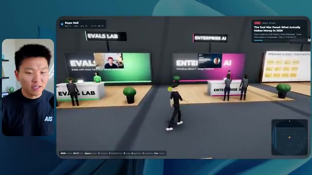
*⏱️ 00:15:03 — Vue d'un salon virtuel en 3D avec des stands étiquetés "EVALS LAB" et "ENTERPRISE AI".*

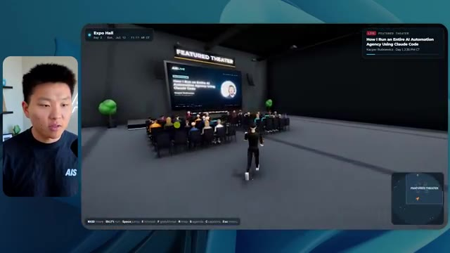
*⏱️ 00:15:10 — Vue de l'intérieur d'un auditorium virtuel en 3D ("FEATURED THEATER") avec un public assis face à un grand écran de présentation.*

---

### ⏱️ `[00:15:24 - 00:15:52]` | Segment #34

**🔊 Audio (Transcription Intégrale Mot pour Mot en Français) :**
> Mais on peut voir en haut à droite, on peut aussi voir ce qui est en direct sur la scène principale. En ce moment, c'est un panel « Tool War ». Allons donc par là. Nous avons Devon, Cole, Dave et Russ qui discutent ici. On a une sorte d'audiovisuel, des jeux de lumière qui se passent par ici. Basculer la scène principale sur ce qui compte vraiment en ce moment. Je peux donc changer de sujet. Cool, donc je viens de basculer sur moi et Matt. On peut aller sur « Anatomy of Three Real Deals », c'est plutôt cool. La scène a l'air bien, on a un joli petit panel là-haut. Est-ce que je peux monter sur scène ? Sympa, sympa. Bon, je ne peux pas aller trop loin en réalité. Très

**👁️ Analyse Visuelle d'Écran (gemini-3.5-flash-lite) :**
**Interface & Outils** : Application de métavers / environnement virtuel 3D (AIS Live)

**Contenu textuel & Code** : Interface utilisateur avec mini-carte, commandes de déplacement et affichage vidéo en direct de la scène principale.

**Action / Démonstration** : Navigation et exploration d'un environnement virtuel de conférence 3D.

---

### ⏱️ `[00:15:52 - 00:16:20]` | Segment #35

**🔊 Audio (Transcription Intégrale Mot pour Mot en Français) :**
> Glenn a 15 ans d'expérience en agence, son land in expand stuffer est or. Great work Glenn. Cool. Je m'en vais je peux même pas get past ce guy though. Oh, I have to jump over him. Okay, VIP level, badge acquired. Oh my gosh, you have to Are you kidding me? I have to go get my badge.

**👁️ Analyse Visuelle d'Écran (gemini-3.5-flash-lite) :**
**Interface & Outils** : Application web 3D interactive (Metaverse / Virtual Event platform)

**Contenu textuel & Code** : Environnement virtuel 3D de conférence avec avatars et bulles de texte interactives

**Action / Démonstration** : Navigation et déplacement d'un avatar dans l'espace virtuel 3D vers le niveau VIP

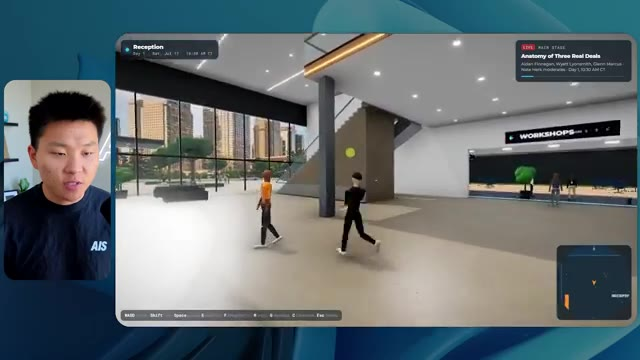
*⏱️ 00:15:59 — Vue générale du hall virtuel avec le présentateur en incrustation à gauche.*

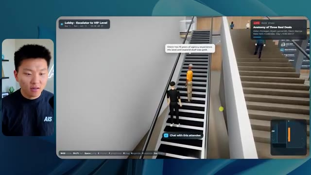
*⏱️ 00:16:06 — Vue de l'avatar du présentateur sur un escalier mécanique virtuel interagissant avec un autre participant.*

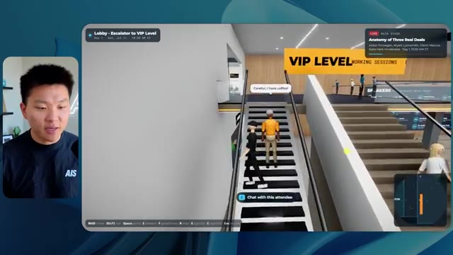
*⏱️ 00:16:13 — L'avatar s'approche de la zone VIP Level dans l'environnement virtuel.*

---

### ⏱️ `[00:16:20 - 00:16:48]` | Segment #36

**🔊 Audio (Transcription Intégrale Mot pour Mot en Français) :**
> Oh, cette fois-ci, c'est la bonne. Ah, attends, laisse-moi voir s'il y a quelque chose de nouveau. Un nouveau message. "Le système est à jour", cool. Allez, allons voir la suite.

**👁️ Analyse Visuelle d'Écran (gemini-3.5-flash-lite) :**
**Interface & Outils** : Navigateur web / Application de monde virtuel 3D (plateforme de conférence ou événement en ligne).

**Contenu textuel & Code** : Environnement virtuel 3D interactif avec interface utilisateur affichant des informations de session ("VIP Level", "Anatomy of Three Real Deals") et une mini-carte en bas à droite.

**Action / Démonstration** : Navigation et exploration d'un espace virtuel 3D par un avatar contrôlé par le présentateur.

---

### ⏱️ `[00:16:48 - 00:17:16]` | Segment #37

**🔊 Audio (Transcription Intégrale Mot pour Mot en Français) :**
> ateliers. OK, ça, c'était pas bon. Regarde ça. Tu vois tout ? Et là, j'ai juste glitché et maintenant, boom. Donc, c'est pas bon. Je dirais qu'en gros, vous avez l'ambiance de comment ça marche, mais je dirais que le précédent, qui était, je crois, high, je l'aimais mieux. Je ne peux pas m'asseoir dans ces chaises non plus. Ouais. Donc, je n'aime pas la marche dans celui-là, et je n'aime pas tellement l'ambiance, et il y a des bugs. Donc, jusqu'à présent, si on va à notre liste, j'aime extra. Extra était celui que j'aimais le plus jusqu'à présent.

**👁️ Analyse Visuelle d'Écran (gemini-3.5-flash-lite) :**
**Interface & Outils** : Application metaverse / plateforme de salon virtuel 3D (type Gather ou environnement web 3D interactif).

**Contenu textuel & Code** : Environnement virtuel 3D avec avatars, panneaux d'orientation, écrans de présentation et mini-carte en bas à droite.

**Action / Démonstration** : Navigation et exploration de l'espace virtuel par le présentateur sous forme d'avatar.

---

### ⏱️ `[00:17:16 - 00:17:44]` | Segment #38

**🔊 Audio (Transcription Intégrale Mot pour Mot en Français) :**
> Did it really though? Because there was a lot of bugs in there. And anyways, this one asked us zero questions. So, so far, each time pretty much has gotten more expensive and took longer, besides right here, but these basically took like very similar

**👁️ Analyse Visuelle d'Écran (gemini-3.5-flash-lite) :**
**Interface & Outils** : Application de tableau blanc / outil de mindmapping ou de design (ex: Excalidraw ou similaire).

**Contenu textuel & Code** : Tableau avec les colonnes High (1h 7m, $16.31, 509.3K tokens, 22, 1), Extra (1h 31m, $25.92, 733.7K tokens, 34, 0), Max (2h 28m, $50.38) et Ultracode.

**Action / Démonstration** : Le présentateur commente et analyse les résultats chiffrés et l'évolution des coûts en fonction du niveau d'effort sélectionné.

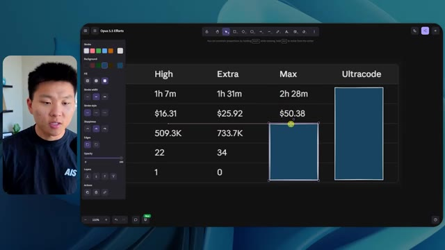
*⏱️ 00:17:23 — Un tableau comparatif montrant les métriques de différents efforts (High, Extra, Max, Ultracode) avec les temps d'exécution, les coûts et le nombre de bugs.*

---

### ⏱️ `[00:17:44 - 00:18:12]` | Segment #39

**🔊 Audio (Transcription Intégrale Mot pour Mot en Français) :**
> C'est un beau badge, Host all access. Nous avons un beau visuel juste ici. Nous allons aller dans AI's live. Cool. OK, bienvenue Nate. J'aime la marche, ça fait réaliste. J'aime le logo.

**👁️ Analyse Visuelle d'Écran (gemini-3.5-flash-lite) :**
**Interface & Outils** : Application web AIS LIVE et interface de tableau de bord analytique.

**Contenu textuel & Code** : Tableaux comparatifs de performances (Run time, API cost, Total tokens, Checks) et écran de connexion/accueil "AIS LIVE" avec nom d'utilisateur.

**Action / Démonstration** : Présentation de la plateforme interactive AIS LIVE et consultation de métriques d'évaluation de modèles ou d'agents.

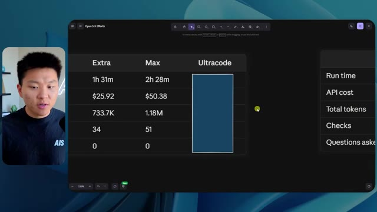
*⏱️ 00:17:51 — Un tableau de bord ou interface montrant des métriques comparatives (Extra, Max, Ultracode) avec des données de temps d'exécution, coût API et tokens, avec le présentateur en incrustation.*

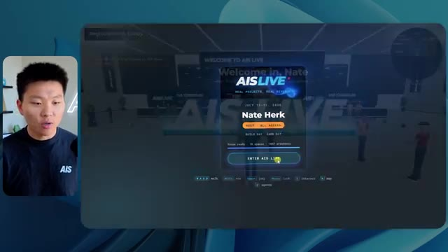
*⏱️ 00:18:05 — L'interface d'accueil de la plateforme "AIS LIVE" montrant le profil de Nate Herk avec un badge "HOST ALL ACCESS" et des boutons d'interaction.*

---

### ⏱️ `[00:18:12 - 00:18:40]` | Segment #40

**🔊 Audio (Transcription Intégrale Mot pour Mot en Français) :**
> Nevers Eats soggy Waffles.

**👁️ Analyse Visuelle d'Écran (gemini-3.5-flash-lite) :**
**Interface & Outils** : Simulation virtuelle 3D / Jeu vidéo en ligne

**Contenu textuel & Code** : Environnement virtuel de conférence (AIS Live) avec des instructions textuelles à l'écran

**Action / Démonstration** : Navigation d'un avatar dans un espace virtuel d'exposition et d'enregistrement

---

### ⏱️ `[00:18:40 - 00:19:08]` | Segment #41

**🔊 Audio (Transcription Intégrale Mot pour Mot en Français) :**
> Ce n'est pas le cas pour les deux et c'est ce que nous faisons avec une équipe spéciale chez Anthropic, pour nous assurer que chaque grand modèle linguistique que nous lançons répond à nos normes de sécurité avant sa sortie, et c'est le travail que nous avons fait pour Claude 3.5 Sonnet. Et donc, dans l'évaluation de la sécurité, ce que nous examinons, ce sont les capacités du modèle, ses capacités dangereuses, et nous voulons également voir s'il peut faciliter l'augmentation de la puissance des cyberattaques ou l'autonomie.

**👁️ Analyse Visuelle d'Écran (gemini-3.5-flash-lite) :**
**Interface & Outils** : Application ou plateforme de simulation virtuelle 3D en ligne.

**Contenu textuel & Code** : Environnement virtuel 3D interactif avec des affichages textuels contextuels ("VIP Wing", "Scope to Ship").

**Action / Démonstration** : Navigation et exploration d'un monde virtuel 3D.

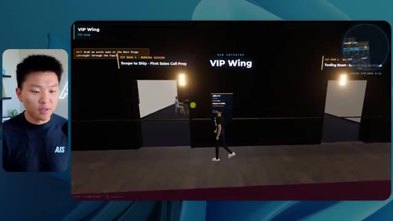
*⏱️ 00:18:47 — Vue d'un espace virtuel 3D montrant un personnage évoluant dans une zone nommée "VIP Wing", avec le présentateur incrusté à gauche.*

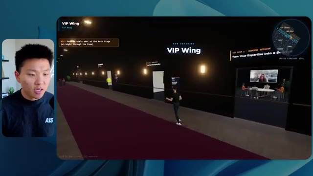
*⏱️ 00:19:01 — Autre angle de la simulation virtuelle 3D montrant des salles de réunion virtuelles et le personnage se déplaçant dans le couloir.*

---

### ⏱️ `[00:19:08 - 00:19:36]` | Segment #42

**🔊 Audio (Transcription Intégrale Mot pour Mot en Français) :**
> [Séquence sonore / Musique d'ambiance]

**👁️ Analyse Visuelle d'Écran (gemini-3.5-flash-lite) :**
**Interface & Outils** : Application de métavers / espace virtuel 3D en ligne.

**Contenu textuel & Code** : Interface d'un monde virtuel avec mini-carte en haut à droite, sous-titres et indications textuelles de navigation.

**Action / Démonstration** : Exploration et navigation interactive dans un environnement 3D virtuel.

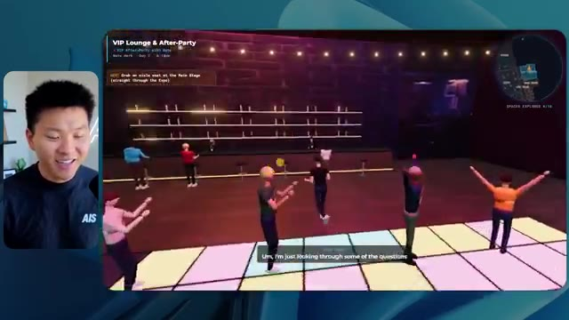
*⏱️ 00:19:15 — Vue dans un espace virtuel 3D (« VIP Lounge & After-Party ») avec des avatars d'utilisateurs et une piste de danse.*

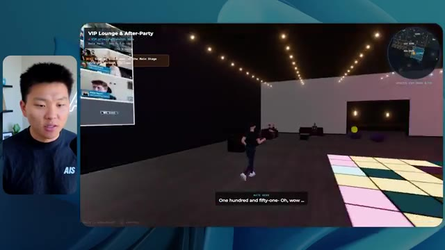
*⏱️ 00:19:22 — Navigation de l'avatar dans une grande salle virtuelle sombre avec des panneaux vidéo latéraux.*

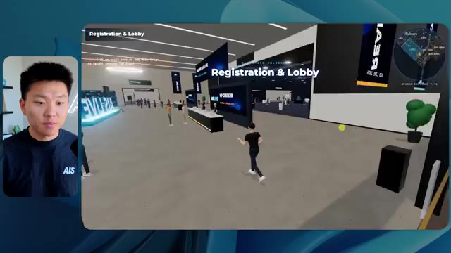
*⏱️ 00:19:29 — Exploration de l'espace virtuel « Registration & Lobby » dans un monde 3D en ligne.*

---

### ⏱️ `[00:19:36 - 00:20:04]` | Segment #43

**🔊 Audio (Transcription Intégrale Mot pour Mot en Français) :**
> Dès qu'on entre, tout commence à jouer. On a une très belle ambiance de scène. Comment on fait pour obtenir un siège d'allée ?

**👁️ Analyse Visuelle d'Écran (gemini-3.5-flash-lite) :**
**Interface & Outils** : Application web interactive / plateforme virtuelle en 3D

**Contenu textuel & Code** : Interface utilisateur avec mini-carte, instructions textuelles et sous-titres de la vidéo

**Action / Démonstration** : Navigation et exploration d'un environnement virtuel interactif en 3D

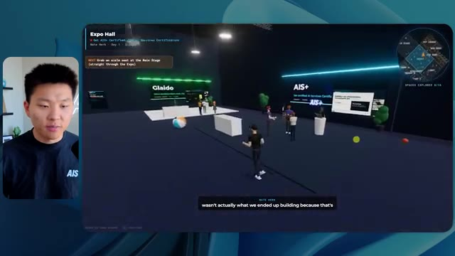
*⏱️ 00:19:43 — Vue d'un hall d'exposition virtuel en 3D avec des stands et des avatars, commentée par le présentateur Nate Herk à l'écran.*

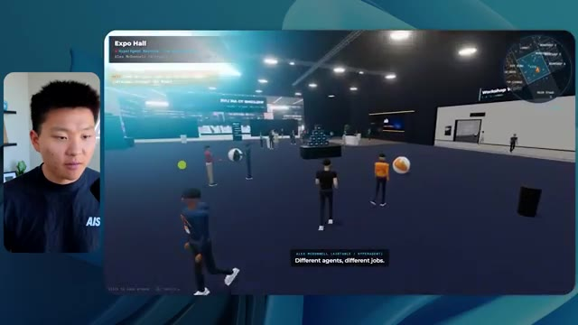
*⏱️ 00:19:50 — Navigation dans l'espace virtuel de l'Expo Hall montrant différents avatars et stands d'exposition.*

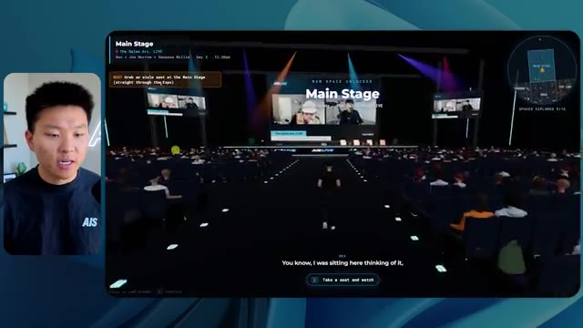
*⏱️ 00:19:57 — Arrivée dans la salle de conférence principale (Main Stage) avec des sièges et des écrans géants, illustrant la recherche d'une place.*

---

### ⏱️ `[00:20:04 - 00:20:32]` | Segment #44

**🔊 Audio (Transcription Intégrale Mot pour Mot en Français) :**
> tu pourrais dans les précédentes versions chatter avec des personnes, ce qui je trouve était une vraiment une belle touche. Et nous avons Workshop A Foundation track, can I sit down ?

**👁️ Analyse Visuelle d'Écran (gemini-3.5-flash-lite) :**
**Interface & Outils** : Application web de monde virtuel 3D interactif (type événement virtuel ou metaverse).

**Contenu textuel & Code** : Environnement virtuel 3D avec affichage textuel des lieux (Main Stage, Expo Hall, Workshop Wing) et sous-titres des conversations.

**Action / Démonstration** : Exploration et navigation interactive au sein d'un événement virtuel en 3D avec des avatars.

---

### ⏱️ `[00:20:32 - 00:21:00]` | Segment #45

**🔊 Audio (Transcription Intégrale Mot pour Mot en Français) :**
> [Séquence sonore / Musique d'ambiance]

**👁️ Analyse Visuelle d'Écran (gemini-3.5-flash-lite) :**
**Interface & Outils** : Application de simulation virtuelle 3D / environnement virtuel en ligne.

**Contenu textuel & Code** : Interface d'un espace virtuel collaboratif montrant des ateliers (Workshop A et B) et des avatars de participants.

**Action / Démonstration** : Navigation et exploration de l'espace virtuel interactif par le présentateur.

---

### ⏱️ `[00:21:00 - 00:21:28]` | Segment #46

**🔊 Audio (Transcription Intégrale Mot pour Mot en Français) :**
> Cela a pris 1 heure et 35 minutes, donc c'était beaucoup plus rapide que Max.

**👁️ Analyse Visuelle d'Écran (gemini-3.5-flash-lite) :**
**Interface & Outils** : Application de tableau blanc / diagramme en ligne (style Excalidraw) nommé "Opus 5.5 Efforts".

**Contenu textuel & Code** : Tableau comparatif de performances avec les colonnes High, Extra, Max et Ultracode, affichant des durées (ex: 1h 35m pour Ultracode) et des coûts.

**Action / Démonstration** : Le présentateur commente le tableau comparatif des durées et coûts des différents modèles d'IA.

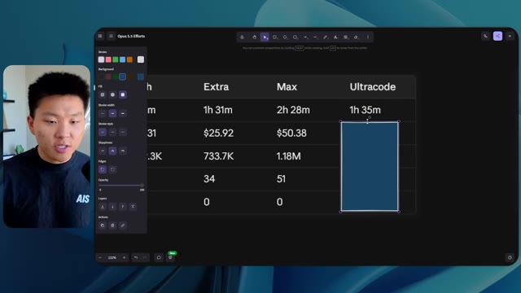
*⏱️ 00:21:21 — Tableau comparatif sous forme de diagramme (Excalidraw ou similaire) affichant les métriques des différents modèles, montrant "1h 35m" sous la colonne "Ultracode".*

---

### ⏱️ `[00:21:28 - 00:21:56]` | Segment #47

**🔊 Audio (Transcription Intégrale Mot pour Mot en Français) :**
> qui était réfléchi à l'intérieur de cette session. Évidemment, comme j'ai dit, celui-ci est allé au-delà, vous savez, de 950 K, donc, ou quelle que soit la taille de la fenêtre de compaction. Je n'ai jamais

**👁️ Analyse Visuelle d'Écran (gemini-3.5-flash-lite) :**
**Interface & Outils** : Application de tableau blanc ou d'édition de graphiques, avec le présentateur visible en incrustation.

**Contenu textuel & Code** : Tableau avec des colonnes 'h', 'Extra', 'Max', 'Ultracode' et des lignes affichant des durées (ex: 1h 31m, 2h 28m), des coûts (ex: $25.92, $50.38) et des nombres de tokens.

**Action / Démonstration** : Le présentateur commente les données et les performances affichées dans le tableau.

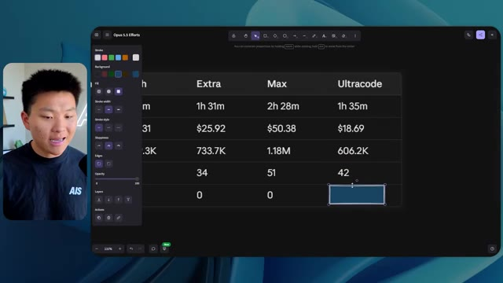
*⏱️ 00:21:35 — Un tableau comparatif montrant des métriques de temps, de coûts et de tokens pour différents modes comme 'Extra', 'Max' et 'Ultracode'.*

---

### ⏱️ `[00:21:56 - 00:22:24]` | Segment #48

**🔊 Audio (Transcription Intégrale Mot pour Mot en Français) :**
> mais pour une raison, ça n'a juste pas l'air bien, parce qu'essentiellement ce qu'ultracode est, est son effort supplémentaire, et puis

**👁️ Analyse Visuelle d'Écran (gemini-3.5-flash-lite) :**
**Interface & Outils** : Application de tableau de bord / interface web de benchmark (Opus 5.5 Efforts).

**Contenu textuel & Code** : Tableau de données comparant les modes de performance : Run time, API cost, Total tokens, Checks, Questions asked.

**Action / Démonstration** : Analyse comparative des différents niveaux d'effort et du mode Ultracode.

*⏱️ 00:22:03 — Un tableau comparatif montrant les métriques de performance de différents niveaux d'effort (Low, Medium, High, Extra, Max, Ultracode) incluant le temps d'exécution, le coût API, les tokens et les vérifications.*

---

### ⏱️ `[00:22:24 - 00:22:52]` | Segment #49

**🔊 Audio (Transcription Intégrale Mot pour Mot en Français) :**
> comme tu l'as vu, comment ils progressent.

**👁️ Analyse Visuelle d'Écran (gemini-3.5-flash-lite) :**
**Interface & Outils** : Tableau de bord d'analyse ou interface de visualisation de données

**Contenu textuel & Code** : Tableau avec colonnes Low, Medium, High, Extra, Max, Ultracode et lignes Run time, API cost, Total tokens, Checks, Questions asked.

**Action / Démonstration** : Analyse comparative des coûts et performances des différents modes d'exécution.

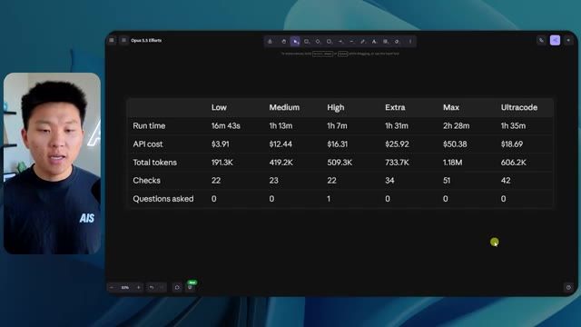
*⏱️ 00:22:31 — Un tableau comparatif des performances de différents niveaux d'effort (Low, Medium, High, Extra, Max, Ultracode) affichant le temps d'exécution, le coût API, le nombre total de tokens, les vérifications et les questions posées.*

---

### ⏱️ `[00:22:52 - 00:23:20]` | Segment #50

**🔊 Audio (Transcription Intégrale Mot pour Mot en Français) :**
> had 12.9x on the cheapest run compared to the most expensive run, which I believe was $3.98 to $50.38. So that was low and max. As far as max checks versus low, we had a 2.3x multiple. The total across all six was 127 bucks, and Ultra Code was $18.69. Let's look at speed versus cost here. So let me zoom out a little bit so we can see this whole thing. So on the X-axis, we have runtime and the Y-axis, we have cost. So I feel like

**👁️ Analyse Visuelle d'Écran (gemini-3.5-flash-lite) :**
**Interface & Outils** : Interface web / Tableau de données comparatif.

**Contenu textuel & Code** : Tableau de données : Run time (16m 43s à 2h 28m), API cost ($3.91 à $50.38), Total tokens (191.3K à 1.18M), Checks (22 à 51), Questions asked (0 à 1).

**Action / Démonstration** : Le présentateur commente les résultats de coût et de performance affichés dans le tableau pour chaque niveau d'effort.

*⏱️ 00:22:59 — Un tableau comparatif montrant les métriques de performance et de coût pour différents niveaux d'effort (Low, Medium, High, Extra, Max, Ultracode), incluant le temps d'exécution, le coût de l'API, les tokens totaux, les vérifications et les questions posées.*

---

### ⏱️ `[00:23:20 - 00:23:48]` | Segment #51

**🔊 Audio (Transcription Intégrale Mot pour Mot en Français) :**
> Et d'ailleurs, la raison pour laquelle UltraCode montre ça est parce qu'il utilise en fait un niveau d'effort supplémentaire. C'est juste

**👁️ Analyse Visuelle d'Écran (gemini-3.5-flash-lite) :**
**Interface & Outils** : Interface web de test de performance (graphique interactif type benchmark).

**Contenu textuel & Code** : Graphique de dispersion évaluant le temps d'exécution (Run time) et le coût en API ($), avec des points étiquetés "Low", "Medium", "High", "Extra", "Ultracode" et "Max". Une infobulle indique les détails pour le niveau Max : 2h 28m, $50.38, 1.18M tokens, 51 checks.

**Action / Démonstration** : Le curseur survole un point du graphique pour afficher les détails d'une session de test.

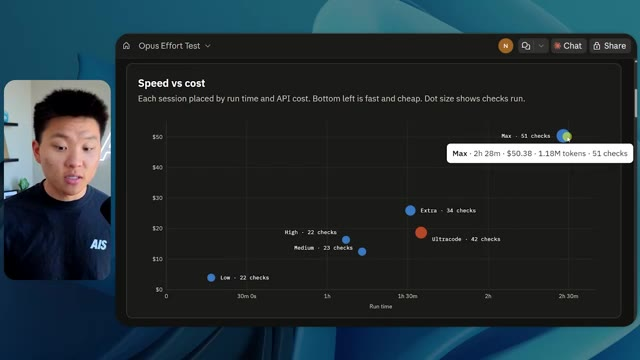
*⏱️ 00:23:27 — Un graphique montrant la vitesse par rapport au coût (Speed vs cost) pour différents niveaux d'effort, avec le présentateur en médaillon à gauche.*

---

### ⏱️ `[00:23:48 - 00:24:16]` | Segment #52

**🔊 Audio (Transcription Intégrale Mot pour Mot en Français) :**
> et d'autres modèles, comme je l'ai mentionné. Donc Claude 3.5 Sonnet prend tout simplement le dessus. C'est pourquoi j'utilise beaucoup plus ces flux de travail dynamiques et de ce genre, ce qui explique pourquoi celui-ci, vous savez, cela a du sens, car il utilisait essentiellement des éléments supplémentaires en arrière-plan. C'est également pour cette raison que Claude l'a étiqueté ici en orange. Quoi qu'il en soit, si nous continuons à remonter d'ici, cela a généralement du sens, n'est-ce pas ?

**👁️ Analyse Visuelle d'Écran (gemini-3.5-flash-lite) :**
**Interface & Outils** : Interface web de test et de monitoring (« Opus Effort Test »)

**Contenu textuel & Code** : Graphique de dispersion (scatter plot) intitulé « Speed vs cost » montrant le temps d'exécution (Run time) en abscisse et le coût en dollars en ordonnée, avec une info-bulle sur le point « Extra » (1h 31m, $25.92, 733.7K tokens, 34 checks).

**Action / Démonstration** : Le présentateur commente les résultats de performance et de coût affichés sur le tableau de bord.

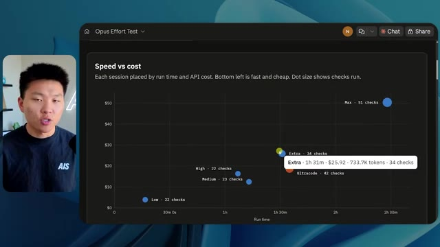
*⏱️ 00:23:55 — Capture d'écran montrant le présentateur à gauche et un graphique de performance comparant la vitesse et le coût de différents tests d'effort sur un modèle d'IA à droite.*

---

### ⏱️ `[00:24:16 - 00:24:44]` | Segment #53

**🔊 Audio (Transcription Intégrale Mot pour Mot en Français) :**
> Je ne peux pas vraiment me rappeler si celui-ci était un de ceux où oh, je ne pouvais pas parler aux gens là, je pouvais juste

**👁️ Analyse Visuelle d'Écran (gemini-3.5-flash-lite) :**
**Interface & Outils** : Interface web de test et jeu/plateforme virtuelle 3D (type metaverse ou salon virtuel).

**Contenu textuel & Code** : Graphique de statistiques de modèle IA et environnement virtuel 3D avec interface de navigation et de discussion.

**Action / Démonstration** : Navigation et exploration de l'espace virtuel et affichage de graphiques de performance.

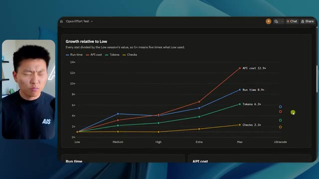
*⏱️ 00:24:23 — Graphique montrant les performances relatives (API cost, run time, tokens, checks) selon l'effort d'Opus.*

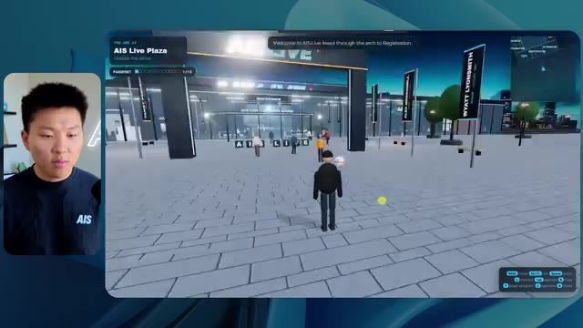
*⏱️ 00:24:30 — Vue de la place virtuelle 'AIS Live Plaza' avec un avatar de joueur naviguant en 3D.*

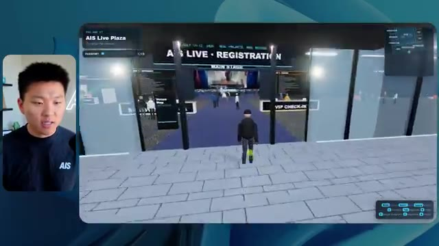
*⏱️ 00:24:37 — L'avatar s'approche de l'entrée principale du bâtiment 'AIS Live • Registration'.*

---

### ⏱️ `[00:24:44 - 00:25:12]` | Segment #54

**🔊 Audio (Transcription Intégrale Mot pour Mot en Français) :**
> walk right through them. I couldn't sit in this one either. Here is another little visual thing where I basically just walk right through this wall, so don't love that. But I think was this one where I could sit in these sessions? No, okay, so I don't think this was my winner then. This is extra high. I think this is the winner. Yeah, I think this is the one that I liked the most. I loved this whole vibe. I loved that I could chat to people. This was definitely the one where we could come in here and we could sit wherever we wanted. Take a seat, stand up. I could read these three deals and I could chat with them. I also realized that there was a little section to do Motic or

**👁️ Analyse Visuelle d'Écran (gemini-3.5-flash-lite) :**
**Interface & Outils** : Application ou plateforme virtuelle 3D interactive (environnement type métavers ou événement virtuel).

**Contenu textuel & Code** : Environnement virtuel 3D avec avatars, mini-carte, indicateurs d'objectifs et interface de contrôle.

**Action / Démonstration** : Exploration d'un espace virtuel 3D et test des interactions avec les différents décors et salles de conférence.

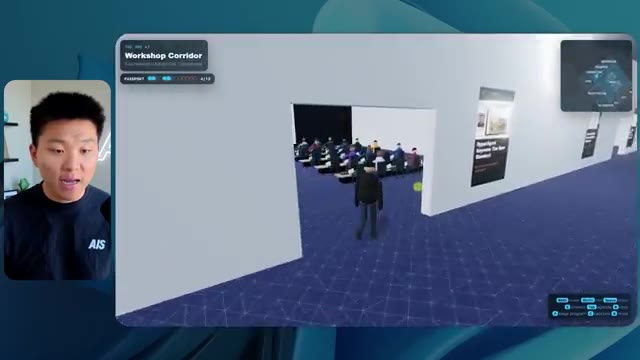
*⏱️ 00:24:51 — Vue en jeu d'un avatar explorant un couloir de conférence virtuel, avec interface utilisateur de navigation.*

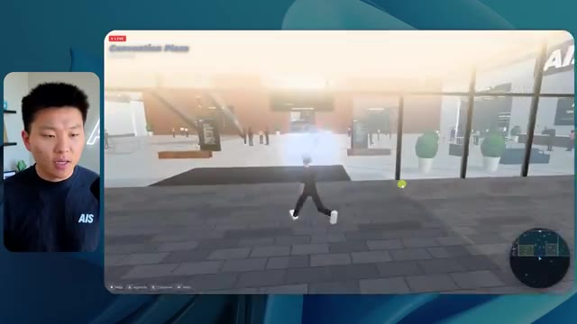
*⏱️ 00:24:58 — Vue de l'avatar se déplaçant dans un hall de convention virtuel avec effet de lumière.*

*⏱️ 00:25:05 — Vue en jeu d'un avatar s'approchant d'une grande salle de conférence virtuelle affichant une retransmission vidéo.*

---

### ⏱️ `[00:25:12 - 00:25:40]` | Segment #55

**🔊 Audio (Transcription Intégrale Mot pour Mot en Français) :**
> Donc mon gagnant ici est définitivement 00:25:00 à être 00:25:00 extra. 00:25:00 Extra dit

**👁️ Analyse Visuelle d'Écran (gemini-3.5-flash-lite) :**
**Interface & Outils** : Application ou plateforme virtuelle 3D interactive (type métavers / salon virtuel).

**Contenu textuel & Code** : Environnement 3D avec interface utilisateur incrustée (mini-carte en bas à droite, boutons d'interaction).

**Action / Démonstration** : Navigation et exploration de l'espace virtuel 3D par le présentateur.

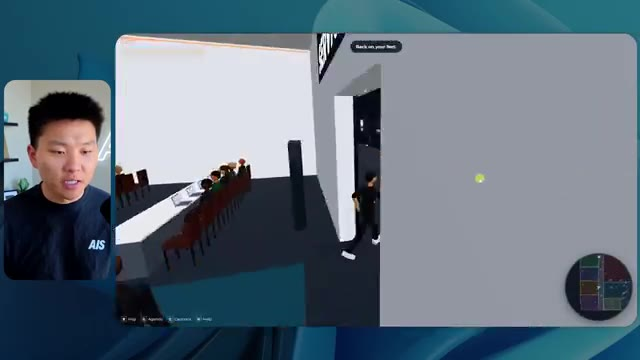
*⏱️ 00:25:19 — Vue d'une application virtuelle 3D avec des avatars de type jeu vidéo se déplaçant dans une salle de conférence ou un bureau.*

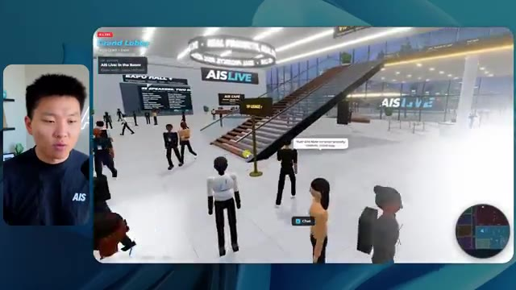
*⏱️ 00:25:26 — Vue du grand hall virtuel (Grand Lobby) d'une plateforme d'événement en ligne avec des écrans d'affichage, des escaliers et plusieurs avatars.*

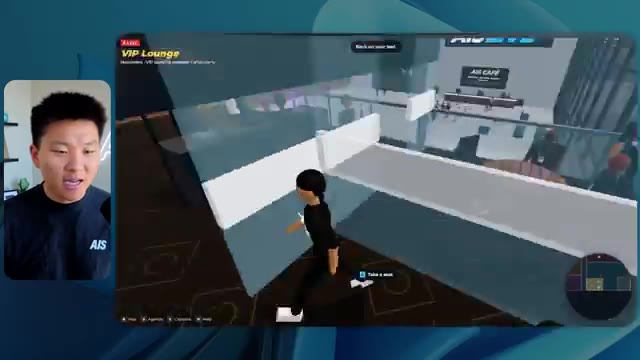
*⏱️ 00:25:33 — Vue en hauteur d'un espace de type salon VIP (VIP Lounge) dans l'environnement virtuel 3D.*

---

### ⏱️ `[00:25:40 - 00:26:08]` | Segment #56

**🔊 Audio (Transcription Intégrale Mot pour Mot en Français) :**
> Il a eu beaucoup de raisonnement, il a dû faire face à des tonnes de choses, il a dû faire face à des tonnes de vidéos, il a dû

**👁️ Analyse Visuelle d'Écran (gemini-3.5-flash-lite) :**
**Interface & Outils** : Interface web ou application de tableau de bord d'évaluation avec une incrustation vidéo du présentateur à gauche.

**Contenu textuel & Code** : Tableau avec des métriques de performance : Run time (de 16m 43s à 2h 28m), API cost (de $3.91 à $50.38), Total tokens (de 191.3K à 1.18M), Checks (22 à 51), et Questions asked (0 ou 1).

**Action / Démonstration** : Présentation des résultats d'analyse et de test comparant l'impact des différents niveaux de raisonnement sur les coûts et les durées d'exécution.

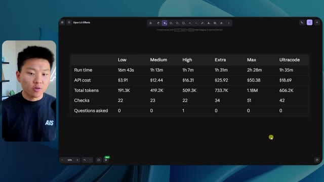
*⏱️ 00:25:47 — Un tableau comparatif montrant les performances de différents niveaux d'effort (Low, Medium, High, Extra, Max, Ultracode) avec le temps d'exécution, le coût API, le nombre total de tokens, les vérifications et les questions posées.*

---

### ⏱️ `[00:26:08 - 00:26:36]` | Segment #57

**🔊 Audio (Transcription Intégrale Mot pour Mot en Français) :**
> et je vous verrai tous dans le prochain.

**👁️ Analyse Visuelle d'Écran (gemini-3.5-flash-lite) :**
**Interface & Outils** : Interface de tableau de bord ou canvas de présentation.

**Contenu textuel & Code** : Tableau avec des métriques de performance et de coûts d'API par niveau d'effort.

**Action / Démonstration** : Présentation des résultats comparatifs des différents tests d'efforts.

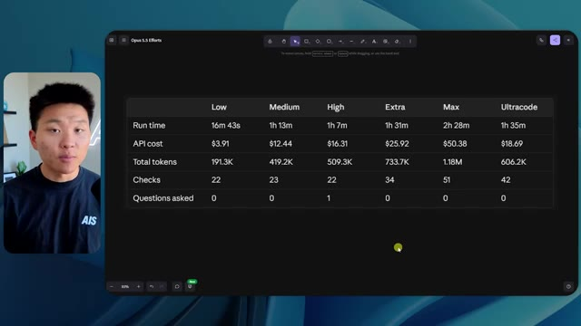
*⏱️ 00:26:15 — Tableau comparatif des performances de différents niveaux d'effort (Low, Medium, High, Extra, Max, Ultracode) affichant le temps d'exécution, le coût API, le nombre de tokens et de vérifications.*

---

### ⏱️ `[00:26:36 - 00:26:38]` | Segment #58

**🔊 Audio (Transcription Intégrale Mot pour Mot en Français) :**
> OK. Merci tout le monde.

**👁️ Analyse Visuelle d'Écran (gemini-3.5-flash-lite) :**
**Interface & Outils** : Aucune interface logicielle visible.

**Contenu textuel & Code** : Aucun code, terminal ou donnée affiché.

**Action / Démonstration** : Le présentateur s'adresse à la caméra pour conclure la vidéo.

---

