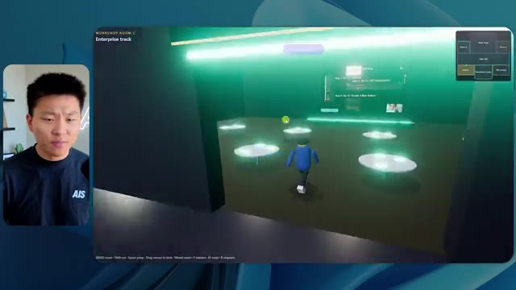
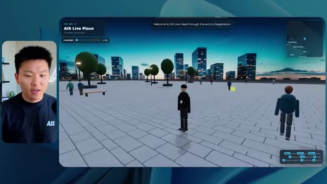
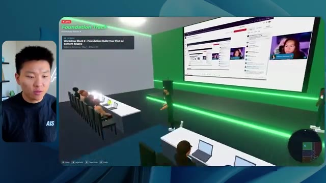
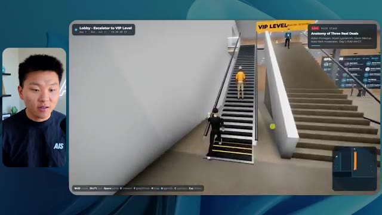

# 🎬 I Had Opus 5.5 Build me the Same App at Every Effort Level

> **Chaîne** : [Nate Herk | AI Automation](https://www.youtube.com/@nateherk/featured)  
> **Lien YouTube** : [https://www.youtube.com/watch?v=QCkHIyEPIYo](https://www.youtube.com/watch?v=QCkHIyEPIYo)  
> **Date de publication** : 20260924  
> **Durée** : 00:26:38  
> **Identifiant vidéo** : `QCkHIyEPIYo`  
> **Transcription & Analyse** : `whisper-v3-large-turbo+gemini-3.5-flash-lite`  

---

## 📌 Synthèse Exécutive & Outils

### 💡 Résumé

La vidéo de la chaîne *Nate Herk | AI Automation* explore l'impact du paramètre « niveau d'effort » sur les performances du modèle **Opus 5.5**, à travers un cas d'usage concret et particulièrement exigeant : la transformation d'un dossier de 105 gigaoctets d'enregistrements vidéo (provenant de l'événement virtuel *AIS Live*) en un monde 3D interactif et explorable à la troisième personne. L'objectif était de simuler une véritable conférence technologique en personne, avec des salles thématiques, des scènes, des éléments de design, de la physique et des intégrations multimédias, tout en exploitant les ressources du système d'exploitation IA du créateur.

À travers les différents niveaux d'effort testés (de « bas » à « code ultra »), l'analyse comparative met en lumière des écarts spectaculaires en matière de temps d'exécution, de coûts API estimés, de consommation de tokens, de vérifications autonomes et de qualité visuelle et fonctionnelle. Alors que le niveau « bas » génère rapidement un prototype rudimentaire truffé de bugs graphiques (éléments visuels figés, personnages fantômes et respect approximatif de la charte graphique), le niveau « moyen » surprend par sa capacité à intégrer la palette de couleurs de la marque, à animer des PNJ (personnages non-joueurs) et à diffuser de véritables flux vidéo en direct dans les stands et sur les scènes virtuelles, le tout sans poser la moindre question intermédiaire à l'utilisateur.

Cette expérimentation souligne l'importance cruciale d'ajuster le niveau d'effort en fonction de la complexité architecturale attendue. Elle démontre également la puissance de l'agentique dans le développement logiciel autonome, tout en rappelant qu'un produit fonctionnel généré par l'IA nécessite immanquablement des solutions d'hébergement et de déploiement fluides pour passer de l'environnement local à la mise en ligne publique, un besoin comblé par des outils de connectivité intégrés aux éditeurs de code.

---

### 🛠️ Outils, Modèles & Logiciels Présentés

* **Opus 5.5** : Modèle d'IA de pointe développé par Anthropic, réputé pour son intelligence, son coût abordable et sa polyvalence, utilisé ici pour piloter la génération d'applications complexes.
* **Claude Code** : Outil de développement assisté par IA d'Anthropic permettant d'exécuter des tâches de programmation directement depuis l'environnement de travail.
* **Hostinger Connector** : Extension gratuite pour éditeurs de code (VS Code, Cursor, Claude Code, etc.) permettant d'importer un compte d'hébergement et de déployer rapidement des applications locales sur le web.
* **Frame.io** : Plateforme cloud de stockage et de collaboration vidéo, utilisée ici pour stocker les 105 gigaoctets d'enregistrements de l'événement *AIS Live*.
* **Cursor** : Éditeur de code assisté par IA mentionné comme alternative de développement et d'intégration.
* **VS Code** : Environnement de développement intégré (IDE) largement utilisé pour l'ingénierie logicielle et le codage agentique.

---

### 🔑 Points Clés & Enseignements Stratégiques

* **Impact direct du niveau d'effort** : Le choix du niveau d'effort (faible, moyen, élevé, extra, max, code ultra) modifie radicalement la profondeur du code généré, le temps de traitement et la robustesse architecturale de l'application finale.
* **Évolution de la qualité visuelle** : Les niveaux d'effort bas produisent des interfaces génériques, des bugs d'affichage importants et des images fixes, tandis que les niveaux supérieurs intègrent des chartes graphiques personnalisées, des animations fluides et des flux vidéo fonctionnels.
* **Autonomie des agents IA** : Quel que soit le niveau d'effort testé dans cette démonstration, l'agent a mené à bien sa mission d'ingénierie complexe en posant exactement zéro question à l'utilisateur, illustrant un haut degré d'autonomie opérationnelle.
* **Coûts et ressources calculés** : L'expérimentation montre une corrélation directe entre l'effort demandé, le temps d'exécution (allant de 16 minutes pour le niveau bas à plus d'une heure pour le niveau moyen), la consommation de tokens et les coûts facturables par API.
* **Boucle de rétroaction autonome** : Les agents effectuent un nombre significatif de vérifications autonomes (par exemple, des ouvertures successives du navigateur pour tester le rendu, soit 22 à 23 vérifications enregistrées), garantissant une auto-évaluation rudimentaire du code produit.
* **Gestion de gros volumes de données** : L'ingestion et l'exploitation de 105 gigaoctets de ressources vidéo (provenant de Frame.io) démontrent la capacité des agents modernes à cartographier et structurer des bases documentaires ou multimédias massives.
* **Intégration de la logique métier** : Les niveaux d'effort intermédiaires et supérieurs parviennent à restituer fidèlement l'agenda d'un événement réel (jours 1 et 2, keynotes, ateliers, parcours de formation) dans l'architecture 3D de l'application.
* **Expérience utilisateur et interactivité** : Les modèles les plus poussés introduisent des éléments de design immersifs avancés, tels que des cartes dynamiques en temps réel, des zones VIP restrictives et des PNJ réactifs qui simulent une ambiance de conférence physique.
* **Le goulet d'étranglement du déploiement** : La génération locale d'une application complète par l'IA met en évidence le besoin critique d'outils de pontage (comme les extensions d'hôtes web) pour combler le fossé entre le code terminé sur la machine et sa mise en ligne immédiate.
* **Recommandation méthodologique d'Anthropic** : Il est conseillé de débuter les prompts complexes par un niveau d'effort moyen, puis d'ajuster vers le haut ou vers le bas selon les résultats obtenus et les contraintes de performance ou de budget.

---

## ⏱️ Chronologie & Transcription Complète Audio & Visuelle (Mot pour Mot)

### ⏱️ `[00:00:00 - 00:00:20]` | Segment #01

**🔊 Audio (Transcription Intégrale Mot pour Mot en Français) :**
> Opus 5.5, Opus 5.5, Opus 5.5, Opus 5.5, Opus 5.5. Ce modèle est littéralement partout et pour de très bonnes raisons. Il est intelligent, il est bon marché, il a un goût incroyable, c'est un modèle d'IA incroyable. Mais avec chaque modèle d'IA, vous avez le choix de l'effort, que ce soit faible, moyen, haut, extra, max ou code ultra.

**👁️ Analyse Visuelle d'Écran (gemini-3.5-flash-lite) :**
**Interface & Outils** : Présentation ou face-caméra explicatif sans interface logicielle partagée.

**Contenu textuel & Code** : Explications orales et mise en contexte méthodologique.

**Action / Démonstration** : Explications face caméra et démonstration conceptuelle.

---

### ⏱️ `[00:00:20 - 00:00:38]` | Segment #02

**🔊 Audio (Transcription Intégrale Mot pour Mot en Français) :**
> Donc, dans cette vidéo, j'ai donné exactement le même prompt à Opus 5.5 et je l'ai exécuté à chaque niveau d'effort, et nous allons comparer les résultats. Nous examinerons la qualité de tous les différents résultats réels, mais nous examinerons également le temps d'exécution de chacun d'eux, combien cela nous a coûté s'il s'agissait d'une facturation par API, le nombre total de tokens, le nombre de vérifications qu'ils ont effectuées et le nombre de questions qu'ils m'ont réellement posées tout au long du processus.

**👁️ Analyse Visuelle d'Écran (gemini-3.5-flash-lite) :**
**Interface & Outils** : Présentation ou face-caméra explicatif sans interface logicielle partagée.

**Contenu textuel & Code** : Explications orales et mise en contexte méthodologique.

**Action / Démonstration** : Explications face caméra et démonstration conceptuelle.

---

### ⏱️ `[00:00:39 - 00:00:58]` | Segment #03

**🔊 Audio (Transcription Intégrale Mot pour Mot en Français) :**
> Et les résultats que nous avons obtenus ne sont pas du tout ce à quoi je m'attendais, donc j'ai hâte de partager cela avec vous les gars. Ne perdons pas de temps et allons directement à celui-ci. D'accord, alors plongeons-nous directement dans celui-ci. Je veux commencer juste en vous montrant le prompt réel que nous avons utilisé que nous avons donné à chacun de ces différents agents. Je vais aller dans les fichiers ici, et nous allons ouvrir ce fichier markdown de prompt, et je vais vous montrer ce que nous avons obtenu. Voici donc le slash objectif que j'ai fourni.

**👁️ Analyse Visuelle d'Écran (gemini-3.5-flash-lite) :**
**Interface & Outils** : Présentation ou face-caméra explicatif sans interface logicielle partagée.

**Contenu textuel & Code** : Explications orales et mise en contexte méthodologique.

**Action / Démonstration** : Explications face caméra et démonstration conceptuelle.

---

### ⏱️ `[00:00:58 - 00:01:34]` | Segment #04

**🔊 Audio (Transcription Intégrale Mot pour Mot en Français) :**
> J'ai dit, tu dois me créer un monde 3D qui est une conférence tech réaliste dans laquelle je peux me promener en vue à la troisième personne. Tu vas regarder ce dossier, qui contient mes ressources d'enregistrement d'événements de AIS Live. Et ce dossier est un dossier frame IO de 105 gigaoctets d'enregistrements vidéo. C'était un événement entièrement virtuel. Tout a été enregistré et tous les enregistrements sont juste ici. J'ai dit, ton objectif est de prendre cet événement et de le transformer en un monde 3D explorable qui me donne l'impression d'être réellement allé à une vraie conférence en personne avec différentes salles, différentes pistes, différentes scènes, bla, bla, bla. N'hésite pas à utiliser key.ai si tu as besoin de générer des images ou des vidéos. Et tu peux aussi utiliser tout le reste à l'intérieur de mon projet Herc 2, qui est comme mon système d'exploitation IA. J'ai dit,

**👁️ Analyse Visuelle d'Écran (gemini-3.5-flash-lite) :**
**Interface & Outils** : Présentation ou face-caméra explicatif sans interface logicielle partagée.

**Contenu textuel & Code** : Explications orales et mise en contexte méthodologique.

**Action / Démonstration** : Explications face caméra et démonstration conceptuelle.

---

### ⏱️ `[00:01:34 - 00:02:08]` | Segment #05

**🔊 Audio (Transcription Intégrale Mot pour Mot en Français) :**
> Vous serez jugé sur la créativité, le design, la physique et la sensation générale lors de mon exploration du monde 3D que vous avez construit. Et c'était fondamentalement la fin des instructions. Donc, comme vous pouvez le voir sur ce côté gauche, j'ai exécuté ceci à travers tous les différents niveaux d'effort. Commençons par le niveau bas et remontons jusqu'à code ultra. Très bien. Nous avons donc ici le résultat du niveau bas. Ouvrons ceci et jetons un œil. Nous avons donc AIS live, le sommet des services IA enfin en personne, et nous avons pu cliquer partout. Tout d'abord, cela ne fait pas très "marqué". Genre, ce n'ha pas le logo d'IS Live. Ce ne sont même pas nos couleurs. Donc je n'aime pas trop ça, mais entrons ici. D'accord. C'est beaucoup trop lumineux. Euh, nous avons une carte en haut à droite. Nous avons une ville par ici. Je ne peux pas dire quelle ville c'est.

**👁️ Analyse Visuelle d'Écran (gemini-3.5-flash-lite) :**
**Interface & Outils** : Présentation ou face-caméra explicatif sans interface logicielle partagée.

**Contenu textuel & Code** : Explications orales et mise en contexte méthodologique.

**Action / Démonstration** : Explications face caméra et démonstration conceptuelle.

---

### ⏱️ `[00:02:08 - 00:02:40]` | Segment #06

**🔊 Audio (Transcription Intégrale Mot pour Mot en Français) :**
> c'est. D'accord. C'est Chicago, ce qui est plutôt cool parce que tu sais, j'habite à Chicago, mais bref, en haut, à droite, nous pouvons voir une carte. Nous avons un hall d'accueil. Nous avons un hall d'exposition. Nous avons un salon VIP, la scène principale. La carte montre également où se trouve chaque autre personne et cela se synchronise en direct. Nous pouvons donc voir l'enregistrement. Nous pouvons voir le premier jour, la keynote de l'hyper agent, le débriefing en direct. Cool. Donc il connaît réellement l'agenda et puis il y a le deuxième jour. Donc il a trouvé ça, c'est bien. Nous avons ces petites boules ici que je peux espérer pousser du pied. D'accord. Le visage, oh, regarde ça. Si je vais par ici, toutes les personnes disparaissent tout simplement. Très mauvais. Très mauvais. D'accord. Alors voyons voir. Est-ce que je peux sprinter ? D'accord.

**👁️ Analyse Visuelle d'Écran (gemini-3.5-flash-lite) :**
**Interface & Outils** : Application web interactive / monde virtuel 3D de type conférence en ligne.

**Contenu textuel & Code** : Carte de navigation, panneaux de signalétique, affichage du programme (Day 1) et avatars d'utilisateurs.

**Action / Démonstration** : Navigation et exploration de l'espace virtuel par le présentateur.

*⏱️ 00:02:16 — Vue d'un monde virtuel interactif montrant un personnage de type avatar se déplaçant dans un espace d'événement avec une carte de navigation en haut à droite.*

*⏱️ 00:02:24 — Vue du monde virtuel montrant le hall (Lobby) avec un panneau affichant le programme de l'événement et la mini-carte en haut à droite.*

*⏱️ 00:02:32 — Vue du hall d'exposition virtuel (Expo Hall) montrant des avatars rassemblés autour d'une installation lumineuse centrale et une mini-carte de navigation.*

---

### ⏱️ `[00:02:40 - 00:03:04]` | Segment #07

**🔊 Audio (Transcription Intégrale Mot pour Mot en Français) :**
> Je peux avancer un peu plus vite. Je vais d'abord aller par ici. Il y a des produits dérivés, euh, un sweat à capuche certifié AIS plus. D'accord. Il y a donc les vrais stands qu'on avait lors de l'événement virtuel. On avait des stands. C'est donc plutôt cool. Un petit endroit pour prendre des photos. La salle C. En ce moment, nous avons Tangy Frederick qui anime un atelier. D'accord. Mais ce n'est pas une vidéo. Comme vous pouvez le voir, c'est juste une image. Elle ne bouge pas. C'est donc juste une image. Ces gens sont en train de disparaître. Ce doivent être des fantômes. Allons par ici dans la salle A.

**👁️ Analyse Visuelle d'Écran (gemini-3.5-flash-lite) :**
**Interface & Outils** : Environnement virtuel 3D interactif (type metaverse/jeu avec avatar).

**Contenu textuel & Code** : Textes explicatifs de tutoriels et indications de touches affichés sur les écrans virtuels.

**Action / Démonstration** : Exploration d'un monde virtuel interactif contenant des stands d'exposition et des présentations de services IA.

*⏱️ 00:02:46 — Le présentateur navigue dans un environnement virtuel 3D (type jeu vidéo) représentant un hall d'exposition virtuel avec des stands de sponsors et des cubes de produits dérivés.*

*⏱️ 00:02:52 — L'avatar du présentateur entre dans une salle d'atelier aux lumières vertes avec des tables circulaires interactives.*

*⏱️ 00:02:58 — L'avatar s'approche d'un écran géant affichant des instructions textuelles et des étapes (tutoriel API Key).*

---

### ⏱️ `[00:03:04 - 00:03:30]` | Segment #08

**🔊 Audio (Transcription Intégrale Mot pour Mot en Français) :**
> Nous avons Liberty White. D'accord. Très cool. Vos 30 premiers jours en automatisation. Encore une fois, c'est juste une image fixe et les gens ont des bugs d'affichage. Donc ce n'est pas très bien ici. Je vais aller sur la scène principale et voir ce que nous avons. D'accord, cool. Donc nous avons une scène principale. Les gens ont des bugs d'affichage. Vraiment mauvais. Ce n'est vraiment pas terrible. Notre vidéo est en fait en train de bouger. Comme j'ai vu mon visage ici et j'ai vu celui de Devin, mais maintenant ils ont disparu. Donc je ne sais pas ce qui s'est passé. D'accord. On dirait que c'est plutôt un diaporama. Rien n'est encore vraiment diffusé. Bref, entrons ici.

**👁️ Analyse Visuelle d'Écran (gemini-3.5-flash-lite) :**
**Interface & Outils** : Environnement virtuel 3D interactif (type metaverse/plateforme de webinaire virtuel) avec interface de navigation et mini-carte.

**Contenu textuel & Code** : Texte affiché à l'écran virtuel : "Now showing: Hyperagent Workshop: How to Build an Always-On Fleet of Agents" et "AIS Live AI Services Summit".

**Action / Démonstration** : Le présentateur navigue (marche) avec son avatar à l'intérieur de l'espace virtuel pour explorer différentes salles et scènes.

*⏱️ 00:03:17 — Le présentateur navigue dans une salle de conférence virtuelle ("Main Stage") remplie d'avatars représentant un public lors d'un atelier sur les agents IA.*

*⏱️ 00:03:24 — Vue panoramique de la scène principale "AIS Live AI Services Summit" dans l'environnement virtuel avec un grand écran central affichant le logo du sommet.*

---

### ⏱️ `[00:03:30 - 00:03:58]` | Segment #09

**🔊 Audio (Transcription Intégrale Mot pour Mot en Français) :**
> Nous avons plus de stands. Nous avons hyper agent. Nous avons Claude Code. Nous avons plus de goodies. La salle B, c'est Dave Ebelor. Je suppose que c'est exactement la même chose. Nous avons du café. Et ensuite, je suppose le salon VIP, accès VIP seulement. C'est plutôt cool, mais il n'y a vraiment rien qui se passe ici. Cet écran est bien trop lumineux. D'accord. Donc je pense que vous comprenez l'ambiance qu'on a là avec Opus 5.5 en effort faible. Et c'est là que les choses deviennent intéressantes. Combien de temps pensez-vous que cela a duré ? Combien de temps ? Celui-ci a duré 16 minutes et 43 secondes. Combien pensez-vous que cela a coûté ?

**👁️ Analyse Visuelle d'Écran (gemini-3.5-flash-lite) :**
**Interface & Outils** : Interface web / Canvas (Opus 5.5 Efforts)

**Contenu textuel & Code** : Tableau avec des colonnes de niveaux (Low à Ultracode) et des lignes de métriques d'exécution et de coûts d'API.

**Action / Démonstration** : Présentation ou analyse des performances et coûts de différents niveaux d'effort d'un modèle d'IA.

*⏱️ 00:03:51 — Tableau comparatif sur une interface de type canvas montrant les niveaux d'effort (Low, Medium, High, Extra, Max, Ultracode) et des métriques (Run time, API cost, Total tokens, Checks, Questions asked).*

---

### ⏱️ `[00:03:58 - 00:04:26]` | Segment #10

**🔊 Audio (Transcription Intégrale Mot pour Mot en Français) :**
> 3,91 dollars si c'était une facturation par API. J'utilise évidemment mon abonnement ici, mais nous allons simplement calculer cela en facturation par API. Le total des jetons était de 191 000. Il a effectué 22 vérifications. Donc pour la vérification, il a ouvert le navigateur 22 fois et a exécuté différentes sortes de vérifications. Donc 22 catégories de vérifications. Et combien de questions m'a-t-il posées ? Il m'a posé un total de zéro question tout au long de cette invite de type « slash goal ». D'accord. Alors, ouvrons l'effort moyen et voyons ce que nous avons. D'accord, c'est parti. Effort moyen. Nous avons Nate Herc. Nous avons mon badge. C'est du contenu de la marque AI's life.

**👁️ Analyse Visuelle d'Écran (gemini-3.5-flash-lite) :**
**Interface & Outils** : Tableau de bord d'analyse de données ou outil de visualisation (type tableau de bord ou tableur).

**Contenu textuel & Code** : Tableau avec des colonnes "Low", "Medium", "High" et des lignes : "Run time" (16m 43s), "API cost" ($3.91), "Total tokens" (191.3K), "Checks", "Questions asked".

**Action / Démonstration** : Le présentateur explique et commente les coûts d'API, le temps d'exécution et le nombre total de jetons affichés à l'écran.

*⏱️ 00:04:05 — Un tableau comparatif sur fond sombre avec le présentateur incrusté en médaillon à gauche, montrant les métriques de performance et de coût.*

---

### ⏱️ `[00:04:26 - 00:04:46]` | Segment #11

**🔊 Audio (Transcription Intégrale Mot pour Mot en Français) :**
> Donc ça a déjà l'air un petit peu mieux. Ça ressemble à nos palettes de couleurs qui ont utilisé nos directives de marque. Premier jour de construction, deuxième jour de gain, VIP. Cool. D'accord. Je vais entrer dans le lieu. D'accord. Waouh. Une ambiance similaire, en somme. C'est en arrière-plan. Ça ne ressemble pas à Chicago, hein ? Non, ça ressemble à, honnêtement, ça ressemble à une ville inventée. Quoi qu'il en soit, c'est marrant qu'ils aient décidé de faire ça. Voyons si je peux me déplacer un peu plus vite. Oh, waouh.

**👁️ Analyse Visuelle d'Écran (gemini-3.5-flash-lite) :**
**Interface & Outils** : Application web interactive / Plateforme virtuelle 3D (AIS Live)

**Contenu textuel & Code** : Écran de chargement et interface d'accueil avec badge utilisateur ('NATE HERK', 'Host - All Access') et instructions de contrôle (WASD walk, Shift sprint, etc.).

**Action / Démonstration** : Navigation et entrée dans le lieu virtuel de l'événement en 3D.

*⏱️ 00:04:31 — Interface web de bienvenue 'Welcome to AIS Live' affichant un badge nominatif virtuel avec les options de navigation et de sessions.*

*⏱️ 00:04:41 — Vue à la première ou troisième personne dans un espace virtuel 3D avec des avatars et un paysage urbain nocturne en arrière-plan.*

---

### ⏱️ `[00:04:46 - 00:05:21]` | Segment #12

**🔊 Audio (Transcription Intégrale Mot pour Mot en Français) :**
> Les gens interagissent avec moi. Regardez. Si je m'approche de ce type, il vient de lever le bras. Bon, maintenant il ne veut plus du tout avoir affaire à moi. Mais tous ces petits robots ici doivent prendre des décisions. Je ne sais pas s'ils utilisent Jev. C'est sûr que non. Je ne lui ai pas dit de le faire. En fait, ma clé Jev est à l'arrière. Je ne sais pas. Peut-être qu'il l'a utilisée. Quoi qu'il en soit, nous pouvons voir ici que nous avons la salle d'atelier C, le laboratoire des agents. Sympa. Donc celui-ci est réellement en train de tourner. Vous pouvez voir qu'il s'agit d'une vraie vidéo lue par Tangy. Tout le monde ici est en train de travailler sur un ordinateur portable. Ils ne buguent pas. C'est plutôt cool. De plus, mon badge est sur ma poitrine, ce qui est plutôt cool. Je peux venir par ici. Nous avons une carte en haut à droite, comme vous pouvez le voir, mais je peux venir par ici. Nous avons un

**👁️ Analyse Visuelle d'Écran (gemini-3.5-flash-lite) :**
**Interface & Outils** : Présentation ou face-caméra explicatif sans interface logicielle partagée.

**Contenu textuel & Code** : Explications orales et mise en contexte méthodologique.

**Action / Démonstration** : Explications face caméra et démonstration conceptuelle.

---

### ⏱️ `[00:05:21 - 00:05:47]` | Segment #13

**🔊 Audio (Transcription Intégrale Mot pour Mot en Français) :**
> hall d'exposition. C'est là que nous avons le stand Glido. Et ça diffuse effectivement. Ouais, ça diffuse la vidéo de nous parlant de Glido. Ça diffuse la vidéo d'Ed et moi parlant de notre programme de certification. Nous avons le logo AIS Plus ici à l'arrière, qui est un peu mal placé. Ce sont les diapositives des conférenciers et les points clés. Alors waouh, ce sont toutes les ressources que nous avons distribuées après l'événement. Elles sont toutes là aussi. Nous pouvons voir que nous avons un projecteur sur la communauté. Donc c'est Aiden qui parle de son contrat qu'il a décroché et ça se joue en direct. Ces gens regardent.

**👁️ Analyse Visuelle d'Écran (gemini-3.5-flash-lite) :**
**Interface & Outils** : Environnement virtuel 3D / plateforme de métavers ou de salon virtuel.

**Contenu textuel & Code** : Aucun code, terminal ou prompt visible ; uniquement des éléments visuels de hall d'exposition virtuel.

**Action / Démonstration** : Navigation et visite guidée d'un espace d'exposition virtuel 3D.

---

### ⏱️ `[00:05:47 - 00:06:21]` | Segment #14

**🔊 Audio (Transcription Intégrale Mot pour Mot en Français) :**
> Ils sont plutôt engagés. On a l'hyper agent. C'était, c'est ce que je voulais dire. Si vous avez vu ces gens lever les mains pour dire bonjour, c'était plutôt marrant. Regardez, regardez, le voilà qui recommence. Bref. Bon. Où est-ce que je suis maintenant ? Maintenant, je suis dans le hall principal. On a un bar à café. On a un grand logo, qui est le vrai logo. C'est trop lumineux, mais on a le logo. On peut voir si on peut entrer ici dans le parcours des fondations. On a Sabrina Romanov et Liberty White. Donc différentes formations juste là. On peut entrer dans cette salle. C'est le parcours avancé. Alors qu'est-ce qui se passe ici. On a Dave Ebelar et Saman qui parlent de trucs différents là-dedans. Et maintenant allons jeter un œil à la scène principale. Oh, attendez, il y a une vidéo de moi là-haut. C'est genre un VIP

**👁️ Analyse Visuelle d'Écran (gemini-3.5-flash-lite) :**
**Interface & Outils** : Présentation ou face-caméra explicatif sans interface logicielle partagée.

**Contenu textuel & Code** : Explications orales et mise en contexte méthodologique.

**Action / Démonstration** : Explications face caméra et démonstration conceptuelle.

---

### ⏱️ `[00:06:21 - 00:06:50]` | Segment #15

**🔊 Audio (Transcription Intégrale Mot pour Mot en Français) :**
> section ? Ouais, on ira voir ça dans une minute. Mais bref, voici la scène principale. Ça a l'air vraiment, vraiment super. On a une grande scène. On a genre quatre personnes assises ici. On a les trois écrans d'Alex là-haut avec "hyper agent". Est-ce que j'ai le droit de monter sur scène ? Oh, et ça me laisse monter sur scène. D'accord. C'est plutôt sympa. Bon les gars, faisons un selfie. Laissez-moi prendre tout le monde en arrière-plan. Venez par ici. Bref, c'est vraiment, vraiment cool. Par contre, toutes les places ne sont pas occupées. Donc il faut qu'on travaille là-dessus. Mais bref, je vais y retourner en courant pour voir ce qu'était cette section VIP. D'accord. Salon VIP. J'ai l'impression que c'est comme un salon d'aéroport ou un truc du genre.

**👁️ Analyse Visuelle d'Écran (gemini-3.5-flash-lite) :**
**Interface & Outils** : Présentation ou face-caméra explicatif sans interface logicielle partagée.

**Contenu textuel & Code** : Explications orales et mise en contexte méthodologique.

**Action / Démonstration** : Explications face caméra et démonstration conceptuelle.

---

### ⏱️ `[00:06:51 - 00:07:14]` | Segment #16

**🔊 Audio (Transcription Intégrale Mot pour Mot en Français) :**
> Ok, super. Donc maintenant nous avons les sessions VIP ici. Une FAQ VIP avec Nate, lecture vidéo en direct juste ici. Très, très cool. Et nous avons comme un bar ou quelque chose comme ça. Génial. Je dirais que c'est un assez bon résultat. Maintenant, en ce qui concerne les statistiques ici, celle-ci a pris une heure et 13 minutes à s'exécuter. Cela nous aurait coûté 12 dollars et 44 cents. Elle a utilisé 490 000 jetons et elle a effectué 23 vérifications.

**👁️ Analyse Visuelle d'Écran (gemini-3.5-flash-lite) :**
**Interface & Outils** : Application de salon virtuel 3D et tableau de bord de statistiques (Opus 5.5 Efforts).

**Contenu textuel & Code** : Statistiques de performance affichées : Run time (16m 43s), API cost ($3.91), Total tokens (191.3K), Checks (22), Questions asked (0).

**Action / Démonstration** : Le présentateur commente l'interface 3D de l'événement VIP puis passe en revue les statistiques de coût et de temps d'exécution.

*⏱️ 00:06:56 — Capture montrant un espace virtuel 3D (salon VIP) avec des avatars et un grand écran vidéo affichant le présentateur.*

*⏱️ 00:07:02 — Capture montrant un tableau de statistiques comparatives avec des colonnes de niveau d'effort (Low, Medium, High).*

---

### ⏱️ `[00:07:14 - 00:07:48]` | Segment #17

**🔊 Audio (Transcription Intégrale Mot pour Mot en Français) :**
> Et il ne nous a posé absolument aucune question une nouvelle fois. Très bien, passons au niveau élevé. C'était déjà un résultat plutôt correct, et Anthropic eux-mêmes dans leur vidéo sur comment prompter Opus 5.5, ou désolé, pas une vidéo, un article. Ils ont dit de commencer simplement par le niveau moyen et d'ajuster à la hausse ou à la baisse si nécessaire. C'était donc un résultat moyen. Passons au niveau élevé et voyons ce qu'on a obtenu. Très rapidement, les gars, je dois prendre un instant pour vous parler du sponsor de la vidéo d'aujourd'hui, Hostinger. Donc, ces deux modèles viennent juste de me construire une version fonctionnelle de la même chose. Et maintenant, je me retrouve exactement là où je finis toujours, avec quelque chose de terminé sur mon ordinateur portable et aucun moyen rapide de le mettre en ligne. Et c'est précisément le fossé que comble le connecteur d'Hostinger. C'est une extension gratuite.

**👁️ Analyse Visuelle d'Écran (gemini-3.5-flash-lite) :**
**Interface & Outils** : Présentation ou face-caméra explicatif sans interface logicielle partagée.

**Contenu textuel & Code** : Explications orales et mise en contexte méthodologique.

**Action / Démonstration** : Explications face caméra et démonstration conceptuelle.

---

### ⏱️ `[00:07:48 - 00:08:23]` | Segment #18

**🔊 Audio (Transcription Intégrale Mot pour Mot en Français) :**
> pour votre éditeur qui importe votre compte Hostinger dans l'outil où vous codez déjà. Donc VS Code, Cursor, Cloud Code, Codex, peu importe. Vous vous connectez une seule fois en un seul clic, et à partir de là, votre agent peut déployer le site, y pointer un domaine, configurer les enregistrements DNS et vérifier votre VPS sans jamais avoir à quitter l'éditeur. Donc, peu importe celui que vous finirez par préférer, ce qu'il a construit est à quelques minutes d'une vraie URL sur un hébergement géré. Connector est gratuit avec chaque formule d'hébergement, donc si vous avez toujours besoin de l'hébergement en dessous, prenez la formule illimitée avec le lien dans la description et utilisez le code NATEHERK pour 10 % de réduction. Cela comprend également un domaine gratuit et un e-mail professionnel pour l'année. Et c'est toujours le moyen le moins cher que j'ai trouvé pour obtenir quelque chose

**👁️ Analyse Visuelle d'Écran (gemini-3.5-flash-lite) :**
**Interface & Outils** : Interface web d'intégration Hostinger et terminal Claude Code

**Contenu textuel & Code** : Panneau de configuration Hostinger connecté via OAuth avec divers outils d'automatisation et de gestion de sites web, domaines et abonnements.

**Action / Démonstration** : Connexion unique du compte Hostinger à l'éditeur/agent pour permettre la gestion et le déploiement.

*⏱️ 00:07:57 — Interface montrant la connexion du compte Hostinger à l'IDE (Manage Hostinger from your IDE) avec les outils disponibles (Websites, Domains, Subscriptions & Payments, Email Marketing) et le panneau Claude Code sur la droite.*

---

### ⏱️ `[00:08:23 - 00:08:47]` | Segment #19

**🔊 Audio (Transcription Intégrale Mot pour Mot en Français) :**
> vous avez construit sur une vraie URL. Donc revenons à la vidéo. D'accord. Encore une fois, très, très marqué par la marque. C'est un écran de chargement encore mieux que le précédent. Nous avons ce joli petit effet en arrière-plan. Nous avons le logo. Nous allons entrer dans le lieu. D'accord. Nous y voilà. Ça a l'air plutôt bien. Nous commençons à l'extérieur et vous pouvez voir que nous avons ces drapeaux pour tous les intervenants, Wyatt, Casper, Alex, Ed, Aiden, Sabrina, Liberty. C'est plutôt cool. Nous avons des blocs en direct ici.

**👁️ Analyse Visuelle d'Écran (gemini-3.5-flash-lite) :**
**Interface & Outils** : Application web 3D immersive (plateforme événementielle virtuelle type RingCentral).

**Contenu textuel & Code** : Interface utilisateur avec bannières d'événements, commandes de déplacement à l'écran, et affichage du lieu 'AIS Live Plaza'.

**Action / Démonstration** : Navigation et entrée dans l'espace virtuel 3D de l'événement.

*⏱️ 00:08:29 — Écran de chargement de l'application 'AIS LIVE' avec logo, description de l'événement et touches de contrôle (WASD, MOUSE, TAB).*

*⏱️ 00:08:35 — Vue de la place virtuelle 'AIS Live Plaza' en 3D isométrique avec des avatars et des bâtiments en arrière-plan.*

*⏱️ 00:08:41 — Exploration de la place virtuelle 'AIS Live Plaza' montrant des bannières verticales avec les noms de conférenciers.*

---

### ⏱️ `[00:08:47 - 00:09:23]` | Segment #20

**🔊 Audio (Transcription Intégrale Mot pour Mot en Français) :**
> Il a pris cette photo de moi, votre hôte, Nate Herc, John, Dave, Nate Herc. Voilà. OK. Les portes. Génial. Ce sont des portes coulissantes automatiques en verre. J'adore ça. Nous pouvons voir l'enregistrement VIP. Nous pouvons voir l'admission générale. Nous pouvons venir ici et nous pouvons découvrir l'exposition avec différents stands, le projecteur sur la communauté. Vous pouvez également voir qu'en haut à gauche, j'ai un passeport. Donc c'est comme, ça montrera combien d'endroits j'ai visités. Tout cela est une vraie lecture. Nous avons un mur de ressources avec tous les différents conférenciers. Ils ont aussi une session de networking ici. Donc je vais venir très vite et voir de quoi il s'agit. Nous avons donc le bar à cold brew AIS. Nous avons différents membres de la communauté qui ont été mis en avant ou mis en lumière.

**👁️ Analyse Visuelle d'Écran (gemini-3.5-flash-lite) :**
**Interface & Outils** : Présentation ou face-caméra explicatif sans interface logicielle partagée.

**Contenu textuel & Code** : Explications orales et mise en contexte méthodologique.

**Action / Démonstration** : Explications face caméra et démonstration conceptuelle.

---

### ⏱️ `[00:09:23 - 00:09:56]` | Segment #21

**🔊 Audio (Transcription Intégrale Mot pour Mot en Français) :**
> Nous avons l'aile VIP. Attends, quoi ? Prends un bracelet. Oh, je dois vraiment aller chercher le bracelet. D'accord. Laisse-moi m'enregistrer rapidement. Le bracelet est déjà mis. Attends, quoi ? D'accord. Oh, d'accord. Maintenant, les portes se sont ouvertes pour moi. Cool. Je peux entrer ici. Oh, ça mène juste à la scène principale. Salon VIP. Il y a une séance de questions-réponses en cours. Ça a l'air très cool. Je veux dire, je suis très impressionné par la façon dont il est capable de faire ça. Waouh. D'accord. Donc c'est vraiment bien. Ce qu'on a fait, c'est qu'on a eu des salles de discussion VIP avec différentes personnes. Tu peux voir qu'il y a différentes salles, différents membres de l'équipe AIS qui participent à des trucs. C'est vraiment cool. C'est très cool. C'est un VIP bien meilleur

**👁️ Analyse Visuelle d'Écran (gemini-3.5-flash-lite) :**
**Interface & Outils** : Présentation ou face-caméra explicatif sans interface logicielle partagée.

**Contenu textuel & Code** : Explications orales et mise en contexte méthodologique.

**Action / Démonstration** : Explications face caméra et démonstration conceptuelle.

---

### ⏱️ `[00:09:56 - 00:10:30]` | Segment #22

**🔊 Audio (Transcription Intégrale Mot pour Mot en Français) :**
> expérience que ce qui a été montré dans la première partie. D'accord. After party VIP. Regardez ça. On a une piste de danse. On a tous ces éléments ici. On a la lecture de l'after party VIP juste ici. Et il y a une estrade de DJ. C'est trop marrant. Il y a un petit bug ici, un petit glitch ici, mais c'est génial. Oh, cool. Donc quand je suis ici sur la scène principale, on a des sous-titres. Vous pouvez voir juste ici en bas de mon écran, on a ces sous-titres de Wyatt qui est en train de parler là-haut. On a des lumières. On a le panel. Très cool. Belle scène principale. Je vais aller ici. On peut aller à la fondation,

**👁️ Analyse Visuelle d'Écran (gemini-3.5-flash-lite) :**
**Interface & Outils** : Présentation ou face-caméra explicatif sans interface logicielle partagée.

**Contenu textuel & Code** : Explications orales et mise en contexte méthodologique.

**Action / Démonstration** : Explications face caméra et démonstration conceptuelle.

---

### ⏱️ `[00:10:30 - 00:11:06]` | Segment #23

**🔊 Audio (Transcription Intégrale Mot pour Mot en Français) :**
> avancé, et les parcours d'entreprise par ici. Donc voyons voir. Nous avons l'anatomie de trois vrais contrats. Nous avons l'hyper agent. Nous avons les évaluations avec Nate et Ed ici. Nous avons Dave qui s'occupe des trucs avancés. C'est vraiment bien. Je veux dire, évidemment, chacun, chacun de ces résultats jusqu'à présent, bas était correct. Moyen était meilleur. Élevé a été encore meilleur. Voyons si cette tendance se poursuit et allons voir ce que cela nous a coûté. Donc, élevé a tourné pendant une heure et sept minutes. Donc un peu plus rapide que moyen, cela nous aurait coûté 16 dollars et 31 cents. Cela a utilisé un demi-million de tokens, 509 000. Cela a fait 22 vérifications. Et cela nous a aussi demandé, enfin, non, je me suis trompé. Ce

**👁️ Analyse Visuelle d'Écran (gemini-3.5-flash-lite) :**
**Interface & Outils** : Présentation ou face-caméra explicatif sans interface logicielle partagée.

**Contenu textuel & Code** : Explications orales et mise en contexte méthodologique.

**Action / Démonstration** : Explications face caméra et démonstration conceptuelle.

---

### ⏱️ `[00:11:06 - 00:11:25]` | Segment #24

**🔊 Audio (Transcription Intégrale Mot pour Mot en Français) :**
> l'un m'a posé une question et, divulgâcheur, c'était le seul qui nous a posé une question pendant tout ça. Donc voyons voir, il nous en reste trois : Extra, Max et Ultra Code. Laissez-moi ouvrir Extra et nous verrons ce que nous avons. D'accord. Donc celui-ci a l'air plutôt bien. Je dirais honnêtement que jusqu'à présent, l'écran de chargement haut était le meilleur, celui qu'on vient juste de voir, mais bref, entrons dans AIS live.

**👁️ Analyse Visuelle d'Écran (gemini-3.5-flash-lite) :**
**Interface & Outils** : Présentation ou face-caméra explicatif sans interface logicielle partagée.

**Contenu textuel & Code** : Explications orales et mise en contexte méthodologique.

**Action / Démonstration** : Explications face caméra et démonstration conceptuelle.

---

### ⏱️ `[00:11:26 - 00:11:51]` | Segment #25

**🔊 Audio (Transcription Intégrale Mot pour Mot en Français) :**
> Whoa. Okay. So we have like little sound bites. I can chat with people. The tool war panel settled a few debates for me. Nice. Good perspective there. We're outside again. We have these different banners, although they're all the same. They don't say like different people's names. So big AIS live logo. Workshop wing is over here. And let's go through the sliding glass doors and see what we've got. So we've got the AIS cafe. The map is in the bottom right, and it's not too descriptive.

**👁️ Analyse Visuelle d'Écran (gemini-3.5-flash-lite) :**
**Interface & Outils** : Application ou jeu en monde virtuel 3D (type navigateur ou plateforme d'événement virtuel)

**Contenu textuel & Code** : Environnement 3D interactif avec des bannières "AIS Live", des avatars et une mini-carte

**Action / Démonstration** : Exploration et déplacement d'un avatar dans l'espace virtuel 3D d'une convention

*⏱️ 00:11:32 — Vue d'un monde virtuel 3D de type convention en extérieur avec des avatars et des bannières "AIS Live".*

*⏱️ 00:11:38 — Navigation d'un avatar dans la place extérieure du monde virtuel 3D vers un bâtiment.*

*⏱️ 00:11:45 — L'avatar s'approche de l'entrée principale d'un bâtiment du monde virtuel 3D.*

---

### ⏱️ `[00:11:51 - 00:12:26]` | Segment #26

**🔊 Audio (Transcription Intégrale Mot pour Mot en Français) :**
> I like how the other maps have told us what, like where things were, but this one looks very professional. We can see here's the main stage. Let's hop in here real quick. They've all got these balls flying around, which I think is pretty funny. The AIS beach balls. We have me up there speaking. I think I was introing one of the days. Let's keep on moving here to the workshop room on this left side. Okay. So here we've got the Hyper Agent Theater. We've got this sponsored session in here by Hyper Agent, but it's showing us what's coming up in here as well. It's really funny that we can chat to people. Salmon built a voice sales rep live. The price it right room was packed. Did you grab the VIP companion guide? That's so funny. We have the advanced track in

**👁️ Analyse Visuelle d'Écran (gemini-3.5-flash-lite) :**
**Interface & Outils** : Application virtuelle 3D / plateforme de conférence en ligne

**Contenu textuel & Code** : Environnement virtuel 3D représentant une conférence avec avatars, écran géant et bulles de discussion.

**Action / Démonstration** : Exploration de l'espace virtuel par le présentateur et visualisation de la scène principale.

*⏱️ 00:12:00 — Vue d'une scène virtuelle 3D avec un écran géant affichant le présentateur en direct.*

*⏱️ 00:12:09 — Navigation dans le hall virtuel 3D avec des avatars d'utilisateurs et des panneaux d'indication.*

*⏱️ 00:12:17 — Déplacement d'avatars dans un couloir virtuel au sein d'une application 3D interactive.*

---

### ⏱️ `[00:12:26 - 00:12:58]` | Segment #27

**🔊 Audio (Transcription Intégrale Mot pour Mot en Français) :**
> here. Once again, we've got live playback. Is that live playback? Oh, okay. It started once I got in, but I can take a seat. Oh my. I can watch this. I can stand up. I want to sit in the front. That's pretty cool. That's very nice. I like that. And you know what I noticed so far? The actual character that I'm playing kind of looks like me. I think it modeled it off of my thumbnail pictures or something. Anyways, we have Sabrina in here, room host here, grab any open seat. Okay, cool. And I really liked the sitting functionality. It's kind of funny. Like we could actually attend this workshop and participate. Anyways, it's showing us the speakers. It's showing us the

**👁️ Analyse Visuelle d'Écran (gemini-3.5-flash-lite) :**
**Interface & Outils** : Application de métavers / plateforme de webinaire virtuel 3D.

**Contenu textuel & Code** : Interface d'événement virtuel, avatars interactifs, écran de présentation avec flux vidéo et outils de navigation.

**Action / Démonstration** : Exploration d'un espace virtuel interactif 3D lors d'un atelier en direct.

*⏱️ 00:12:34 — Vue d'une salle de classe virtuelle 3D avec des avatars d'utilisateurs assis et un écran géant affichant une interface de webinaire.*

*⏱️ 00:12:42 — Autre angle de la salle de classe virtuelle 3D, montrant un espace avec des murs verts et des rangées de bureaux.*

*⏱️ 00:12:50 — Vue en caméra rapprochée d'une salle virtuelle avec un grand écran de présentation et un panneau de diffusion en direct.*

---

### ⏱️ `[00:12:58 - 00:13:31]` | Segment #28

**🔊 Audio (Transcription Intégrale Mot pour Mot en Français) :**
> agenda. There's a little red carpet here to take some pictures. We can strike a pose. Oh, wow. That's pretty cool. Resource library, get AIS Plus certified, Glido, Hyper Agent, AIS Plus, three real deals. Awesome. I mean, I would definitely say so far, each one is getting better. And we didn't even check out the VIP section yet, the VIP lounge. Let's go up here real quick. Hopefully I can get in. Nice. We've got tooling reset. These are the different rooms we could go in. So once again, I could grab the worksheet and I could try to understand how to price my stuff. This is so cool. This is definitely better than the previous one where we kind of just

**👁️ Analyse Visuelle d'Écran (gemini-3.5-flash-lite) :**
**Interface & Outils** : Application ou plateforme virtuelle 3D (metaverse / salon virtuel interactif).

**Contenu textuel & Code** : Éléments textuels et graphiques intégrés dans l'environnement virtuel 3D.

**Action / Démonstration** : Navigation et exploration de l'espace virtuel par le présentateur.

---

### ⏱️ `[00:13:31 - 00:13:59]` | Segment #29

**🔊 Audio (Transcription Intégrale Mot pour Mot en Français) :**
> like looked at stuff. Awesome. I can get behind the bar and come in here. This is very nice. Okay. So as far as statistics go, this one ran for an hour and a half. It costs 25.92 bucks. I don't know why I say point $25, 92 cents. It was 733,000 tokens and 34 checks. So it had the most checks so far by far. And it asked us zero questions. I can't wait to see what we got here from max and ultra code. Okay. Here is max loading screens, boring, but it's on brand and it has our logo.

**👁️ Analyse Visuelle d'Écran (gemini-3.5-flash-lite) :**
**Interface & Outils** : Outil de tableau de bord / présentation (type Excalidraw ou interface web de mindmapping/diagramme).

**Contenu textuel & Code** : Tableau avec des colonnes "Medium", "High", "Extra", "Max", "Ultracode" et des lignes indiquant la durée (ex. 1h 31m), le coût (ex. $12.44), le nombre de tokens et de vérifications.

**Action / Démonstration** : Le présentateur commente et analyse les données statistiques du run d'une heure et demie affichées à l'écran.

*⏱️ 00:13:38 — Tableau comparatif sous forme de diagramme ou tableau de bord montrant les statistiques des différents niveaux d'efforts d'Opus 5.5, avec le présentateur en médaillon à gauche.*

---

### ⏱️ `[00:14:00 - 00:14:35]` | Segment #30

**🔊 Audio (Transcription Intégrale Mot pour Mot en Français) :**
> So that was good. I like that. We will go ahead and enter AIS live. Ooh, nice little animation here that brings us in. Once again, the character looks like me. They've all looked like me. I mean, sort of, we have sitting in the background. This looks like Chicago. Like I mentioned earlier, a lot of these are playing sounds and I'm not including that because it would be very distracting for you guys to try to listen to what's going on as well as me speaking. So there is like some slight music in all these. I hate how this is walking. This walking is really, really bad. I mean, the walking, yeah, I don't like this at all. So that's not great. But besides that, let's go in and explore. Notice these shadows when I walk in, they like really switch. I'm not sure why that is,

**👁️ Analyse Visuelle d'Écran (gemini-3.5-flash-lite) :**
**Interface & Outils** : Application web ou plateforme virtuelle 3D (AIS live)

**Contenu textuel & Code** : Environnement 3D interactif avec avatars, bannières et mini-carte de navigation

**Action / Démonstration** : Navigation et déplacement d'un avatar dans un monde virtuel 3D

*⏱️ 00:14:08 — Le présentateur commente une interface virtuelle interactive montrant un espace 3D avec un avatar et des bâtiments urbains en arrière-plan.*

*⏱️ 00:14:17 — L'avatar se déplace dans l'environnement virtuel 3D de la plateforme AIS live, s'approchant de bâtiments modernes.*

*⏱️ 00:14:26 — L'avatar avance vers l'entrée d'un bâtiment vitré au sein de la simulation virtuelle 3D présentée à l'écran.*

---

### ⏱️ `[00:14:35 - 00:15:11]` | Segment #31

**🔊 Audio (Transcription Intégrale Mot pour Mot en Français) :**
> mais de toute façon, nous pouvons aussi discuter avec les gens ici. Le stand Hyperagent est juste là où l'on entre dans l'exposition. Tout va bien. D'accord, cool. Je peux continuer à cliquer sur E pour changer ce qu'ils disent. Nous avons les conférenciers juste ici. Ça a l'air plutôt bien. Bien que nous avions définitivement la photo de profil de tout le monde. Je ne sais donc pas pourquoi ce n'est pas inclus ici. Nous voyons des gens prendre des photos juste ici. J'adore ça. Et ça enregistre une petite photo. D'accord. La carte n'est pas non plus super, genre ne me donne pas une super explication de ce qui se passe, mais j'aime ces stands. Ils sont cool. Je pense que ces stands sont les meilleurs que j'ai vu jusqu'à présent. Genre, ils ont juste l'air bien. Ils ont des représentants. Il y a de superbes diapositives derrière eux. Ouais. Ces stands sont cool. D'accord. Nous avons un petit théâtre en vedette

**👁️ Analyse Visuelle d'Écran (gemini-3.5-flash-lite) :**
**Interface & Outils** : Application de métavers ou de salon virtuel en 3D avec interface de navigation web.

**Contenu textuel & Code** : Éléments d'interface utilisateur 3D, mini-carte en bas à droite, panneaux d'affichage et avatars virtuels.

**Action / Démonstration** : Exploration et navigation dans l'espace virtuel du salon professionnel par le présentateur.

*⏱️ 00:14:44 — Vue principale dans un environnement virtuel 3D représentant une conférence ou un salon, montrant des avatars et des écrans d'affichage de conférenciers.*

*⏱️ 00:14:53 — Navigation dans l'espace virtuel 3D avec l'avatar s'approchant de stands et d'autres participants virtuels.*

*⏱️ 00:15:02 — Entrée dans l'Expo Hall virtuel avec différents stands thématiques comme 'Evals Lab' et 'Enterprise AI'.*

---

### ⏱️ `[00:15:11 - 00:15:35]` | Segment #32

**🔊 Audio (Transcription Intégrale Mot pour Mot en Français) :**
> qui se passe par ici. C'est Casper. Bien que pourquoi est-ce que ça ne joue pas ? J'ai l'impression que ça devrait jouer, non ? Comme dans les autres, ils étaient toujours en train de jouer. On peut parler à d'autres personnes par ici. Le café est gratuit. Blabla. Amy Simpson, Matt Wolf. Sympa. D'accord. C'est juste la zone de networking où nous sommes en ce moment, mais on peut voir en haut à droite. On peut aussi voir ce qui est en direct sur la scène principale en ce moment. C'est un panel de guerre des outils. Alors allons par ici. Nous avons Devin, Cole, Dave et Russ qui discutent ici. Nous avons en quelque sorte de l'audiovisuel, des petits trucs de lumière qui se passent par ici.

**👁️ Analyse Visuelle d'Écran (gemini-3.5-flash-lite) :**
**Interface & Outils** : Application web de monde virtuel / salon virtuel en 3D (type Gather.town ou plateforme similaire).

**Contenu textuel & Code** : Environnement 3D interactif avec avatars, panneaux d'affichage et interfaces de streaming en direct.

**Action / Démonstration** : Navigation d'un utilisateur à travers les différents espaces de l'événement virtuel (hall d'expo, salon, scène principale).

---

### ⏱️ `[00:15:36 - 00:15:55]` | Segment #33

**🔊 Audio (Transcription Intégrale Mot pour Mot en Français) :**
> Basculons la scène principale sur ce qui compte vraiment en ce moment. Je peux donc changer de sujet. Cool. Je viens de basculer sur moi et Matt. Nous pouvons passer à l'anatomie de trois vraies transactions. C'est plutôt cool. La scène a l'air bien. On a un petit panneau sympa ici. Je peux monter sur la scène ? Sympa. Sympa. Bon, je ne peux pas aller trop loin, en fait. Bon tout le monde, laissez-moi prendre le selfie. Tout le monde, venez là-dedans. Je peux aussi m'asseoir dans le public par ici et simplement profiter de la session.

**👁️ Analyse Visuelle d'Écran (gemini-3.5-flash-lite) :**
**Interface & Outils** : Environnement virtuel 3D interactif (type metaverse/plateforme de conférence en ligne)

**Contenu textuel & Code** : Aucun code source, terminal ou prompt visible ; affichage d'éléments d'interface de jeu ou de monde virtuel (mini-map, instructions de déplacement).

**Action / Démonstration** : Navigation et déplacement de l'avatar dans la scène virtuelle 3D.

---

### ⏱️ `[00:15:55 - 00:16:14]` | Segment #34

**🔊 Audio (Transcription Intégrale Mot pour Mot en Français) :**
> Très cool, très cool. Ok, allons par ici. Je vois une section à l'étage. Donc c'est marrant comme ils choisissent tous de mettre la section VIP à l'étage. Je veux dire, je ne déteste pas ça. Oh la vache, ils ont un escalator. Pas possible. Je vais discuter avec ce type sur l'escalator. Glenn a 15 ans d'expérience en agence. Ses trucs de "land and expand" étaient en or. Du beau boulot, Glenn. Cool, donc je vais, je n'arrive même pas à dépasser ce type par contre.

**👁️ Analyse Visuelle d'Écran (gemini-3.5-flash-lite) :**
**Interface & Outils** : Application de métaverse / plateforme virtuelle 3D d'événement en ligne.

**Contenu textuel & Code** : Interface utilisateur virtuelle affichant le titre de la session "Anatomy of Three Real Deals" et une mini-carte radar.

**Action / Démonstration** : Navigation d'un avatar dans l'espace virtuel et interaction avec un autre participant.

*⏱️ 00:16:00 — Vue générale du hall d'accueil virtuel avec des avatars d'utilisateurs et de grandes baies vitrées.*

*⏱️ 00:16:04 — Gros plan sur un escalator menant au niveau VIP dans l'environnement virtuel.*

*⏱️ 00:16:09 — Interaction avec un avatar sur l'escalator affichant une bulle de dialogue avec du texte informatif.*

---

### ⏱️ `[00:16:14 - 00:16:48]` | Segment #35

**🔊 Audio (Transcription Intégrale Mot pour Mot en Français) :**
> Oh, je devais sauter par-dessus lui. D'accord, niveau VIP, badge requis. Oh la vache. Tu te moques de moi ? Je dois aller chercher mon badge. D'accord, super. Maintenant, ça montre que je suis un vrai VIP et je peux aller par ici dans la section VIP. On a de superbes petites sessions de travail par là, qu'on peut rejoindre. Je me demande si ça va me laisser m'asseoir ici. Je peux juste discuter. Est-ce que je peux participer ? Ça ne me laisse pas m'asseoir et participer. C'est pas grave. On a la salle de crise sur les prix. Oh, c'est peut-être l'after-party. Allons voir ce qui se passe par ici. Ou peut-être que je dois juste entrer par ici. D'accord. C'est bizarre. Je devais juste entrer par ici. Cet after-party n'est pas aussi cool que l'autre. Mais bref, allons voir ce qui se passe par là.

**👁️ Analyse Visuelle d'Écran (gemini-3.5-flash-lite) :**
**Interface & Outils** : Application ou plateforme virtuelle web 3D (type Gather.town ou environnement virtuel personnalisé)

**Contenu textuel & Code** : Interface d'un espace virtuel avec des panneaux d'affichage ("Day 1 - Scope to Ship", "VIP Exclusive") et des avatars d'utilisateurs.

**Action / Démonstration** : Navigation et exploration de l'espace virtuel par le présentateur sous forme d'avatar.

---

### ⏱️ `[00:16:48 - 00:17:07]` | Segment #36

**🔊 Audio (Transcription Intégrale Mot pour Mot en Français) :**
> dans les ateliers. D'accord. Ce n'était pas bien. Regardez ça. On peut tout voir et je viens de bugger et maintenant boum. Donc ce n'est pas bon. Je dirais qu'globalement, je veux dire, vous avez l'ambiance de la façon dont cela fonctionne, mais je dirais que celui d'avant, qui était, je crois élevé, j'aimais mieux celui-là. Je ne peux pas m'asseoir dans ces chaises non plus. Ouais. Donc je n'aime pas la façon de marcher dans celui-ci.

**👁️ Analyse Visuelle d'Écran (gemini-3.5-flash-lite) :**
**Interface & Outils** : Application de métavers / conférence virtuelle 3D interactive

**Contenu textuel & Code** : Environnement virtuel 3D avec avatars, panneaux d'affichage et diapositives de présentation

**Action / Démonstration** : Navigation et exploration d'un espace de conférence virtuel 3D en ligne

*⏱️ 00:16:53 — Vue d'un avatar virtuel explorant un couloir de salon virtuel 3D (Workshop Wing) avec le présentateur en incrustation.*

*⏱️ 00:16:57 — L'avatar s'approche de l'entrée d'une salle de conférence virtuelle (Room C).*

*⏱️ 00:17:02 — L'avatar entre dans la salle de conférence virtuelle et assiste à un atelier avec d'autres participants et une présentation sur écran géant.*

---

### ⏱️ `[00:17:07 - 00:17:43]` | Segment #37

**🔊 Audio (Transcription Intégrale Mot pour Mot en Français) :**
> Je n'aime pas autant l'ambiance et il y a quelques bugs. Donc, jusqu'à présent, si nous voulons regarder notre liste, j'aime extra extra, c'était celui que j'aimais le plus jusqu'à présent. Mais de toute façon, celui-ci était au maximum. Celui-ci était au maximum juste ici. Voyons donc combien de temps cela a duré, deux heures et 28 minutes. Ça a donc duré longtemps, 50 dollars et 38 centimes, 1,18 million de jetons. Donc, ça a en fait atteint une compaction et a dû s'auto-compacter. Et puis ça a fait 51 vérifications. Est-ce que ça l'a vraiment fait, par contre ? Parce qu'il y avait beaucoup de bugs là-dedans. Et de toute façon, celui-ci ne nous a posé zéro question. Donc, jusqu'à présent, à chaque fois, c'est devenu à peu près plus cher et ça a pris plus de temps, à part ici. Mais ceux-ci fondamentalement

**👁️ Analyse Visuelle d'Écran (gemini-3.5-flash-lite) :**
**Interface & Outils** : Application web de tableau comparatif ou d'analyse.

**Contenu textuel & Code** : Tableau avec des colonnes Medium (1h 13m, $12.44, 419.2K, 23, 0), High (1h 7m, $16.31, 509.3K, 22, 1), Extra (1h 31m, $25.92, 733.7K, 34, 0), Max et Ultracode.

**Action / Démonstration** : Comparaison des différentes options et des coûts associés dans le tableau.

*⏱️ 00:17:16 — Un tableau comparatif affichant différentes configurations (Medium, High, Extra, Max, Ultracode) avec des métriques de temps, de coûts et de performances, accompagné du présentateur à l'écran.*

---

### ⏱️ `[00:17:43 - 00:18:17]` | Segment #38

**🔊 Audio (Transcription Intégrale Mot pour Mot en Français) :**
> a pris à peu près le même temps, mais à chaque fois il a utilisé plus de jetons parce qu'ils ont davantage réfléchi. Et puis, vous savez, ces jetons vont coûter plus cher. Mais bref, passons au dernier, qui est ultra code. Donc on espérerait vraiment que celui-ci soit le meilleur. Alors allons sur ce localhost et voyons ce qu'on a. Ok, super. Regardez ce badge. C'est un joli badge hôte accès total. On a un petit visuel sympa juste ici. On va aller de l'avant et entrer AIS Live. Cool. Ok. Bienvenue, Nate. J'aime bien la marche. Ça a l'air réaliste. J'aime le logo, même s'il manque le petit point rouge qui donne l'air d'un direct. La carte en haut à droite

**👁️ Analyse Visuelle d'Écran (gemini-3.5-flash-lite) :**
**Interface & Outils** : Tableau de données comparatives et interface web d'application 3D en cours de test.

**Contenu textuel & Code** : Tableau de benchmark affichant les colonnes High, Extra, Max et Ultracode avec des statistiques de performance, et environnement virtuel 3D.

**Action / Démonstration** : Le présentateur analyse les résultats des différents niveaux de performance de l'IA et présente l'application générée finale.

*⏱️ 00:17:52 — Un tableau comparatif montrant les métriques des différents modes de l'IA (High, Extra, Max, Ultracode) incluant le temps, le coût et l'utilisation des jetons.*

*⏱️ 00:18:09 — Une interface virtuelle 3D d'événement en ligne nommée "AIS LIVE" avec des avatars d'utilisateurs et un grand logo lumineux.*

---

### ⏱️ `[00:18:17 - 00:18:49]` | Segment #39

**🔊 Audio (Transcription Intégrale Mot pour Mot en Français) :**
> est un tout petit peu mieux étiqueté, donc je peux voir ce qui se passe. Je vais venir ici et récupérer mon bracelet VIP rapidement. Ok, super. Ça me dit aussi ce que je dois faire. Donc en haut à gauche, ça dit de scanner à l'entrée VIP sur le mur est du hall. Donc je crois que l'est serait par là, non ? "Never eat soggy waffles". Ouais. Ailes VIP, scanner le bracelet. Ok, super. Maintenant je suis dans la section VIP. Je peux voir ces différentes salles. L'outil a été réinitialisé. La vidéo en direct est diffusée. Je peux voir les sous-titres juste là de ce dont on est en train de parler. Ça diffuse aussi les sons, mais je ne diffuse tout simplement pas l'audio pour vous les gars parce que je ne veux pas saturer.

**👁️ Analyse Visuelle d'Écran (gemini-3.5-flash-lite) :**
**Interface & Outils** : Application web / environnement virtuel 3D de conférence en ligne (AIS LIVE)

**Contenu textuel & Code** : Interface utilisateur virtuelle affichant des instructions de mission, une mini-carte en haut à droite et des indications textuelles ("Registration & Lobby", "VIP Wing").

**Action / Démonstration** : Navigation et exploration de l'espace virtuel par l'avatar du présentateur, de l'accueil jusqu'à la salle de réunion VIP.

*⏱️ 00:18:25 — L'avatar du présentateur se déplace dans le hall d'enregistrement virtuel d'AIS LIVE, avec des instructions de quête affichées en haut à gauche.*

*⏱️ 00:18:33 — L'avatar franchit l'entrée de la zone VIP nouvellement débloquée ("VIP Wing") dans l'espace virtuel.*

*⏱️ 00:18:41 — L'avatar entre dans la salle VIP 5 ("VIP Room 5 • Tooling Reset / Solo to Real Business") où des participants virtuels sont assis autour d'une table ronde.*

---

### ⏱️ `[00:18:50 - 00:19:08]` | Segment #40

**🔊 Audio (Transcription Intégrale Mot pour Mot en Français) :**
> Encore une fois, celui-ci fonctionne avec Cody et Mustafa là-dedans. C'est génial. Vidéo en direct. La vidéo ne se lance pas tant qu'on n'entre pas, par contre. Donc, honnêtement, je pense que c'est un bon choix. Dès que j'entre, par contre, la vidéo démarre. Sympa. Belle attention. Toutes ces pièces. Génial. Ouais. Je veux dire, ça fait très haut de gamme. Voici une salle de guerre des prix. Allons voir ça. Moi et John là-dedans.

**👁️ Analyse Visuelle d'Écran (gemini-3.5-flash-lite) :**
**Interface & Outils** : Interface web d'un monde virtuel 3D interactif.

**Contenu textuel & Code** : Affichage d'un environnement virtuel nommé "VIP Wing" avec des indications textuelles et des salles de réunion interactives.

**Action / Démonstration** : Navigation et exploration d'un espace virtuel 3D avec un avatar.

*⏱️ 00:18:54 — Capture d'écran montrant l'interface d'un espace virtuel en 3D (type Gather ou monde virtuel) où un avatar se déplace dans une aile VIP avec des salles de réunion.*

---

### ⏱️ `[00:19:08 - 00:19:42]` | Segment #41

**🔊 Audio (Transcription Intégrale Mot pour Mot en Français) :**
> Et ensuite, nous avons la super after-party. Cette after-party n'est pas encore aussi animée. Et nous avons plus de ballons de plage pour une raison quelconque, mais cette after-party est cool. Je veux dire, ça nous donne une bonne ambiance et il y a la retransmission juste ici de notre session de questions-réponses de l'after-party, tout cela est en direct aussi. Génial. D'accord. Dirigeons-nous vers la scène principale. Ça m'invite aussi à prendre un siège côté allée à la scène principale, qui est tout droit en traversant l'expo. Donc en fait, allons d'abord traverser l'expo. Qu'est-ce que vous construisez ? Il y a beaucoup de gens qui parlent de différentes choses par ici. Waouh. Il y a aussi genre un petit truc de basketball. Est-ce que je peux le lancer ? Je peux. Est-ce que je dois regarder en l'air pour le lancer ? D'accord.

**👁️ Analyse Visuelle d'Écran (gemini-3.5-flash-lite) :**
**Interface & Outils** : Environnement virtuel 3D (metaverse / plateforme web interactive)

**Contenu textuel & Code** : Aucun code source, terminal ou prompt visible, uniquement des éléments graphiques d'un monde virtuel.

**Action / Démonstration** : Navigation et visite guidée d'un espace virtuel 3D par le présentateur.

---

### ⏱️ `[00:19:42 - 00:20:08]` | Segment #42

**🔊 Audio (Transcription Intégrale Mot pour Mot en Français) :**
> Eh bien, pas terrible. Mais bref, nous avons un stand AIS plus. Nous avons le stand Glido. Est-ce que ça diffuse en direct ? Ouais, ça diffuse définitivement en direct. Sympa. Nous avons le stand Hyper Agent. Nous avons d'autres trucs par ici. OK, super. Je vais aller sur la scène principale et voir si on peut trouver une place côté allée. Dès qu'on entre, tout se met à jouer. On a une très belle ambiance de scène. Comment faire pour trouver une place côté allée par contre ? Voilà. Il a fallu que je trouve la bonne. Je prends la place côté allée. Il n'y a personne sur la scène, ce qui est bizarre. J'aimais bien quand il y avait du monde sur la scène dans les versions précédentes.

**👁️ Analyse Visuelle d'Écran (gemini-3.5-flash-lite) :**
**Interface & Outils** : Application virtuelle web / plateforme d'événement virtuel en 3D (AIS Live)

**Contenu textuel & Code** : Environnement virtuel 3D interactif avec affichage d'informations sur les sessions (Expo Hall, Main Stage, stands Glido et Hyper Agent)

**Action / Démonstration** : Navigation et exploration de l'espace virtuel par le présentateur pour se rendre vers la scène principale

*⏱️ 00:19:48 — Vue d'un espace d'exposition virtuel (Expo Hall) avec différents stands et avatars.*

*⏱️ 00:19:55 — Vue d'ensemble de la scène principale (Main Stage) dans l'environnement virtuel.*

*⏱️ 00:20:01 — Gros plan sur l'amphithéâtre de la scène principale où les avatars s'assoient pour assister à une session.*

---

### ⏱️ `[00:20:08 - 00:20:31]` | Segment #43

**🔊 Audio (Transcription Intégrale Mot pour Mot en Français) :**
> Prenons un petit selfie. Bref, il y a moi et Pat là-haut. Pat est habillé comme un ouvrier du bâtiment. Comme vous pouvez le voir, nous faisions un petit appel de découverte simulé dans cet exemple. Je vais revenir par l'expo et nous allons sortir ici dans l'aile de l'atelier et simplement vérifier si ces rooms sont fondamentalement exactement les mêmes qu'elles devraient l'être. Maintenant, je ne peux pas vraiment discuter avec les gens. Avant, je pouvais, dans les versions précédentes, discuter avec les gens, ce que je trouvais être une très jolie touche. Et nous avons l'atelier, un parcours fondamental. Est-ce que je peux m'asseoir ?

**👁️ Analyse Visuelle d'Écran (gemini-3.5-flash-lite) :**
**Interface & Outils** : Application ou plateforme virtuelle interactive en 3D

**Contenu textuel & Code** : Environnement virtuel 3D avec avatars, mini-carte en haut à droite et textes d'indications

**Action / Démonstration** : Exploration guidée et navigation à travers les différentes zones de l'espace virtuel de conférence

*⏱️ 00:20:14 — Vue d'une scène principale virtuelle avec des avatars et un présentateur incrusté à gauche.*

*⏱️ 00:20:20 — Navigation dans la zone de l'exposition virtuelle (« Expo Hall ») avec des avatars interactifs.*

*⏱️ 00:20:25 — Déplacement dans l'aile de l'atelier (« Workshop Wing ») de l'environnement virtuel.*

---

### ⏱️ `[00:20:32 - 00:21:04]` | Segment #44

**🔊 Audio (Transcription Intégrale Mot pour Mot en Français) :**
> Je ne peux pas m'asseoir. Je ne sais pas. Nous avons Liberty qui est en train de parler en ce moment même et elle parle et nous pouvons l'entendre. Donc c'est bien, mais ça ne me laisse pas m'asseoir. Et regardez ça. Je deviens assez instable ici. Ça faisait bugger la façon dont je marchais. C'était genre comme si ça ne me laissait pas marcher. Ce n'est pas bon. Pareil. Nous avons cette piste avancée là-dedans. Génial. Donc dans l'ensemble, ils ont une ambiance très similaire. Je dirai que je suis impressionné par la façon dont ils ont été capables de raconter une histoire à partir de ce que nous faisions. Bibliothèque de points clés de l'intervenant. D'accord. C'est cool. Je ne pense pas que nous ayons vu cela de différents endroits, mais ce sont comme les ressources et ça montre des trucs sympas. Oh, waouh. Je

**👁️ Analyse Visuelle d'Écran (gemini-3.5-flash-lite) :**
**Interface & Outils** : Présentation ou face-caméra explicatif sans interface logicielle partagée.

**Contenu textuel & Code** : Explications orales et mise en contexte méthodologique.

**Action / Démonstration** : Explications face caméra et démonstration conceptuelle.

---

### ⏱️ `[00:21:04 - 00:21:41]` | Segment #45

**🔊 Audio (Transcription Intégrale Mot pour Mot en Français) :**
> can actually open all of these things and we can take pictures right here as well. Nice. Take a photo. I can save this as well. Like I can actually download this. And now we have this photo that we just took at this AIS live event. All right. Well, I think it is time for me to make some conclusions, but first let us see what this run cost us. This took a one hour and 35 minutes. So it was much faster than max. It only took $18 and 69 cents. Wow. So it was a little bit more expensive than high, cheaper than extra and much cheaper than max. It also ran 606,000 tokens and 42 checks with zero questions. Now, one other thing that's interesting to note is that all of

**👁️ Analyse Visuelle d'Écran (gemini-3.5-flash-lite) :**
**Interface & Outils** : Présentation ou face-caméra explicatif sans interface logicielle partagée.

**Contenu textuel & Code** : Explications orales et mise en contexte méthodologique.

**Action / Démonstration** : Explications face caméra et démonstration conceptuelle.

---

### ⏱️ `[00:21:41 - 00:22:13]` | Segment #46

**🔊 Audio (Transcription Intégrale Mot pour Mot en Français) :**
> these runs, none of them used a sub agent. I looked through and I made sure none of them used sub agents. They didn't want to delegate any work around, which was interesting. So these tokens are what was reflected inside of that session. Obviously, like I said, this one went over, you know, 950K, so, or whatever the compaction window is. I never usually let it get that high, but because this was a slash goal and I wasn't involved, this one had to compact, but the rest of them just ran in this one session. And these are the overall stats. And also real quick on the UltraCode stuff, guys, I don't know if you've been noticing this, but when I've been running UltraCode lately, it's just felt weird. It's felt a little buggy. I, a couple of times I've ran it

**👁️ Analyse Visuelle d'Écran (gemini-3.5-flash-lite) :**
**Interface & Outils** : Application web ou tableau de bord affichant un tableau comparatif avec le présentateur incrusté en médaillon vidéo à gauche.

**Contenu textuel & Code** : Tableau de données avec les colonnes : Low (16m 43s, $3.91, 191.3K tokens, 22 checks, 0 questions), Medium (1h 13m, $12.44, 419.2K tokens, 23 checks, 0 questions), High (1h 7m, $16.31, 509.3K tokens, 22 checks, 1 question), Extra (1h 31m, $25.92, 733.7K tokens, 34 checks, 0 questions), Max (2h 28m, $50.38, 1.18M tokens, 51 checks, 0 questions), Ultracode (1h 35m, $18.69, 606.2K tokens, 42 checks, 0 questions).

**Action / Démonstration** : Présentation et analyse comparative des performances et des coûts par le présentateur.

*⏱️ 00:21:49 — Un tableau comparatif montrant les métriques de performance de différents niveaux d'effort (Low, Medium, High, Extra, Max, Ultracode) incluant le temps d'exécution, le coût API, le total des tokens, les vérifications et les questions posées.*

---

### ⏱️ `[00:22:13 - 00:22:34]` | Segment #47

**🔊 Audio (Transcription Intégrale Mot pour Mot en Français) :**
> and been like, is it even running UltraCode? It did quite a few more checks than these other ones, but for some reason it just didn't feel right because essentially what UltraCode is, is it's extra effort and then it's just like using more dynamic workflows in order to do things. And so through all my digging on the session logs and even when I was watching this thing build in UltraCode, it wasn't spinning up any of these dynamic workflows and I tried this a few times.

**👁️ Analyse Visuelle d'Écran (gemini-3.5-flash-lite) :**
**Interface & Outils** : Interface web de tableau de bord ou d'outil d'analyse (intitulé "Opus 5.5 Efforts").

**Contenu textuel & Code** : Tableau avec des colonnes Low, Medium, High, Extra, Max, Ultracode et des lignes Run time, API cost, Total tokens, Checks, Questions asked.

**Action / Démonstration** : Le présentateur commente les performances et les coûts associés aux différents modes d'effort de l'IA.

*⏱️ 00:22:18 — Un tableau comparatif des différents niveaux d'effort (Low, Medium, High, Extra, Max, Ultracode) avec des métriques telles que le temps d'exécution, le coût API, les tokens totaux et le nombre de vérifications.*

---

### ⏱️ `[00:22:35 - 00:23:00]` | Segment #48

**🔊 Audio (Transcription Intégrale Mot pour Mot en Français) :**
> So I don't know if that's a bug right now in the CloudCode harness or if it's just with Opus 5.5, it's a little bit worse with UltraCode right now or something, but either way, these are the actual bulk effort levels and this all seems to make a lot of sense when you kind of look through how they progress. So let's take a look at this. Max cost versus low, we had 12.9X on the cheapest run compared to the most expensive run, which I believe was $3.98 to $50.38.

**👁️ Analyse Visuelle d'Écran (gemini-3.5-flash-lite) :**
**Interface & Outils** : Interface web / Tableau de bord de statistiques

**Contenu textuel & Code** : Tableau avec les en-têtes : Low, Medium, High, Extra, Max, Ultracode, et les lignes : Run time, API cost, Total tokens, Checks, Questions asked.

**Action / Démonstration** : Présentation et analyse des performances et des coûts selon les différents niveaux d'effort des modèles d'IA.

*⏱️ 00:22:41 — Tableau comparatif des niveaux d'effort (Low, Medium, High, Extra, Max, Ultracode) affichant le temps d'exécution, le coût API, le nombre de tokens, les vérifications et les questions posées.*

---

### ⏱️ `[00:23:01 - 00:23:19]` | Segment #49

**🔊 Audio (Transcription Intégrale Mot pour Mot en Français) :**
> Donc c'était bas et max. En ce qui concerne les vérifications max par rapport au bas, nous avons eu un multiple de 2,3 fois. Le total pour les six était de 127 dollars et le code ultra était de 18,69 dollars. Regardons la vitesse par rapport au coût ici. Laissez-moi donc dézoomer un peu pour que nous puissions voir tout cela. Sur l'axe des X, nous avons le temps d'exécution. Sur l'axe des Y, nous avons le coût.

**👁️ Analyse Visuelle d'Écran (gemini-3.5-flash-lite) :**
**Interface & Outils** : Interface web de test et de visualisation de données.

**Contenu textuel & Code** : Métriques : 12.9x (Max cost vs Low), 2.3x (Max checks vs Low), $18.69 (Ultracode cost, 42 checks), $127.65 (Total across all six).

**Action / Démonstration** : Présentation et analyse comparative des coûts et des vérifications entre différents niveaux d'effort.

*⏱️ 00:23:05 — Interface affichant les résultats de tests de performance d'Opus avec des métriques de coût et de vérifications, ainsi que la vidéo incrustée du présentateur.*

---

### ⏱️ `[00:23:19 - 00:23:42]` | Segment #50

**🔊 Audio (Transcription Intégrale Mot pour Mot en Français) :**
> Donc, j'ai l'impression que le mieux serait en bas à gauche, mais pas vraiment. Donc de toute façon, vous pouvez voir que Low était bon marché et rapide. Max était lent et coûteux. Mais ce genre de graphique a généralement du sens. À mesure que vous augmentez l'effort, cela va coûter plus cher et cela va prendre un peu plus de temps. C'est logique. Maintenant, voyons la croissance par rapport à Low. Nous avons le temps d'exécution en bleu, les coûts de l'API en orange, les jetons en vert, et les vérifications en or jaunâtre, moutarde.

**👁️ Analyse Visuelle d'Écran (gemini-3.5-flash-lite) :**
**Interface & Outils** : Interface web d'évaluation et de visualisation de données ("Opus Effort Test")

**Contenu textuel & Code** : Graphique de dispersion montrant les résultats de différents niveaux d'effort (Low, Medium, High, Extra, Ultracode, Max) en fonction du temps d'exécution et du coût de l'API. Une infobulle affiche les détails pour le niveau "Low" : 16m 43s - $3.91 - 191.3K tokens - 22 checks.

**Action / Démonstration** : Le présentateur commente le graphique et survole le point représentant le niveau d'effort "Low".

*⏱️ 00:23:25 — Capture d'écran montrant un graphique de performance comparant la vitesse et le coût ("Speed vs cost") intitulé "Opus Effort Test", avec le présentateur en incrustation vidéo à gauche.*

---

### ⏱️ `[00:23:42 - 00:24:01]` | Segment #51

**🔊 Audio (Transcription Intégrale Mot pour Mot en Français) :**
> Et d'ailleurs, la raison pour laquelle UltraCode apparaît comme ça, c'est parce qu'il utilise en fait un niveau d'effort supplémentaire. Il est simplement incité et il utilise plutôt des flux de travail dynamiques et des choses de ce genre, ce qui explique pourquoi ceci, vous savez, cela a du sens parce qu'il utilisait essentiellement des ressources supplémentaires sous le capot. C'est aussi pourquoi Claude l'a marqué ici en orange. Quoi qu'il en soit, si nous continuons plus bas ici, cela a généralement du sens, n'est-ce pas ?

**👁️ Analyse Visuelle d'Écran (gemini-3.5-flash-lite) :**
**Interface & Outils** : Interface web de visualisation de données ou de tableau de bord d'analyse.

**Contenu textuel & Code** : Graphique linéaire comparant la croissance relative selon différents niveaux d'effort (Low, Medium, High, Extra, Max, Ultracode) pour le temps d'exécution (Run time), le coût API (API cost), les tokens et les vérifications (Checks).

**Action / Démonstration** : Analyse visuelle et explication des performances relatives et des coûts associés aux différents niveaux d'effort de l'IA, incluant Ultracode.

*⏱️ 00:23:47 — Capture d'écran montrant un graphique de résultats comparatifs intitulé "Opus Effort Test" avec le présentateur incrusté à gauche.*

---

### ⏱️ `[00:24:02 - 00:24:21]` | Segment #52

**🔊 Audio (Transcription Intégrale Mot pour Mot en Français) :**
> Alors que le niveau d'effort augmente, une fois de plus, ces métriques vont augmenter. Le temps d'exécution, les coûts d'API, les jetons et les vérifications. C'est la même chose ici avec le temps d'exécution. Cela nous donne simplement des graphiques linéaires individuels maintenant pour chacune de ces différentes métriques, comme le coût d'API, les vérifications, le total des jetons, le coût par vérification, et tous les chiffres au même endroit. Donc des données plutôt cool.

**👁️ Analyse Visuelle d'Écran (gemini-3.5-flash-lite) :**
**Interface & Outils** : Présentation ou face-caméra explicatif sans interface logicielle partagée.

**Contenu textuel & Code** : Explications orales et mise en contexte méthodologique.

**Action / Démonstration** : Explications face caméra et démonstration conceptuelle.

---

### ⏱️ `[00:24:21 - 00:24:40]` | Segment #53

**🔊 Audio (Transcription Intégrale Mot pour Mot en Français) :**
> Je vais dire que rien ici n'est trop choquant. Ce qui a été le plus choquant pour moi, ce sont ces résultats. Mes deux principaux favoris étaient high, qui est celui-ci, et extra, qui est celui-là. Je dois donc retourner ici et me rappeler ce que j'en pensais. J'ai vraiment aimé cette sensation. Celui-ci donne aussi simplement l'impression d'être le plus fluide. La physique était agréable. La porte coulissante en verre était agréable. Je n'ai pas vraiment remarqué beaucoup de bugs dans celui-ci, ce qui est ce que j'ai vraiment aimé.

**👁️ Analyse Visuelle d'Écran (gemini-3.5-flash-lite) :**
**Interface & Outils** : Application web interactive en 3D / Navigateur web

**Contenu textuel & Code** : Interface 'AIS LIVE' avec des instructions de contrôle clavier/souris (WASD, Mouse, Space)

**Action / Démonstration** : Navigation et exploration d'un monde virtuel 3D interactif avec des avatars

*⏱️ 00:24:26 — Écran d'accueil de l'application 'AIS LIVE' avec un bouton pour entrer dans le lieu virtuel.*

*⏱️ 00:24:31 — Vue en 3D de la place principale 'AIS Live Plaza' avec des avatars et des bannières informatives.*

*⏱️ 00:24:35 — Navigation dans l'environnement virtuel 3D de la place principale montrant les options de déplacement de l'avatar.*

---

### ⏱️ `[00:24:40 - 00:25:13]` | Segment #54

**🔊 Audio (Transcription Intégrale Mot pour Mot en Français) :**
> Je ne me souviens pas si celui-ci était un de ceux où, oh, je ne pouvais pas parler aux gens par contre. Je pouvais juste passer à travers eux. Je ne pouvais pas m'asseoir dans celui-là non plus. Voici un autre petit truc visuel où je traverse simplement ce mur. Donc, je n'aime pas trop ça. Mais je pense, est-ce que c'était celui où je pouvais m'asseoir dans ces sessions ? Non. D'accord. Donc je ne pense pas que c'était mon gagnant alors. Celui-ci est super haut. Je pense que c'est le gagnant. Ouais. Je pense que c'était celui que j'aimais le plus. J'adorais toute cette ambiance. J'adorais le fait de pouvoir discuter avec les gens. C'était définitivement celui où l'on pouvait entrer ici et s'asseoir où l'on voulait, prendre une place, se lever. Je pouvais lire ces trois offres et je pouvais discuter avec eux. J'ai aussi réalisé qu'il y avait de petites sections pour simuler des appels de découverte ici aussi.

**👁️ Analyse Visuelle d'Écran (gemini-3.5-flash-lite) :**
**Interface & Outils** : Application web interactive en 3D (AIS Live)

**Contenu textuel & Code** : Interface utilisateur virtuelle 3D avec des commandes de déplacement et des écrans d'affichage pour les sessions en direct.

**Action / Démonstration** : Exploration et navigation dans un espace virtuel 3D interactif.

*⏱️ 00:24:48 — Vue d'un monde virtuel 3D avec des avatars représentés sous forme de blocs et une interface affichant le statut de la scène principale.*

*⏱️ 00:25:05 — Navigation dans un espace événementiel virtuel en 3D avec un avatar se dirigeant vers la scène principale (Main Stage) et un écran géant affichant une retransmission.*

---

### ⏱️ `[00:25:13 - 00:25:51]` | Segment #55

**🔊 Audio (Transcription Intégrale Mot pour Mot en Français) :**
> Nous avons des goodies et des sacs cabas, ce qui est de la physique réelle. J'aime bien. C'était celui où l'on pouvait s'asseoir partout. Oui, j'ai vraiment, vraiment aimé celui-ci. Bien que je pense que le seul inconvénient de celui-ci, c'était qu'il n'avait pas genre d'after-party VIP, parce que je pense que c'était le salon. Et je pense que c'était la seule partie de la section VIP, c'était que ce soient les différentes pièces où l'on pouvait entrer et s'asseoir. Mais à part ça, il n'avait pas une super expérience VIP par rapport à certains des autres que nous avons vus. Donc mon gagnant ici va définitivement être Extra. Extra a fait un travail phénoménal. C'était environ la moitié de la durée et la moitié du coût de Max. Donc Max, je pense, c'était juste bien trop pour pas assez de bien. Je pense que les points forts étaient corrects. Ça pouvait,

**👁️ Analyse Visuelle d'Écran (gemini-3.5-flash-lite) :**
**Interface & Outils** : Application de métavers virtuel 3D et tableau de bord de métriques analytiques.

**Contenu textuel & Code** : Questions de workshop ("Where did the boundary break on your last project?", etc.) et tableau de statistiques de performance d'API/tokens.
[DESC_IMAGE_3] Navigation dans un espace virtuel 3D et sélection d'une colonne de données dans un tableau de bord analytique.

**Action / Démonstration** : Explications face caméra et démonstration conceptuelle.

*⏱️ 00:25:23 — Vue en perspective d'un environnement virtuel 3D représentant un couloir d'événement avec des avatars.*

*⏱️ 00:25:32 — Vue d'un salon VIP virtuel 3D avec des participants assis autour d'une table et des écrans affichant des questions de réflexion.*

*⏱️ 00:25:42 — Tableau comparatif des performances (Run time, API cost, Total tokens, Checks, Questions asked) selon différents niveaux d'effort (Low, Medium, High, Extra, Max, Ultracode).*

---

### ⏱️ `[00:25:51 - 00:26:25]` | Segment #56

**🔊 Audio (Transcription Intégrale Mot pour Mot en Français) :**
> with maybe one or two more prompts, gotten to where I really liked it. But for a slash goal, Extra delivered an amazing result here. I didn't love Medium. And for a lot of my knowledge work and stuff I'm doing, Medium works just fine. But for this task specifically, I needed a lot of reasoning. It had to go through tons of stuff. It had to go through tons of videos. It had to find a lot of things inside of my projects. It had to create an experience and tell a story out of everything. I think Extra did a phenomenal job. In general, though, I liked a lot of these outputs, but Extra is the one that I'd want to start from right now. If I wanted to really make that like a super, super polished and cool app and world, I would start with Extra's output and probably

**👁️ Analyse Visuelle d'Écran (gemini-3.5-flash-lite) :**
**Interface & Outils** : Présentation ou face-caméra explicatif sans interface logicielle partagée.

**Contenu textuel & Code** : Explications orales et mise en contexte méthodologique.

**Action / Démonstration** : Explications face caméra et démonstration conceptuelle.

---

### ⏱️ `[00:26:25 - 00:26:37]` | Segment #57

**🔊 Audio (Transcription Intégrale Mot pour Mot en Français) :**
> continuez à itérer avec Extra. Donc de toute façon, les gars, c'était l'expérience. J'espère que vous avez trouvé cela instructif. J'espère que vous avez appris quelque chose de nouveau. Et si c'est le cas, veuillez mettre un pouce bleu. Ça m'aide énormément. Et comme toujours, je vous remercie d'être arrivés jusqu'à la fin de la vidéo, et je vous dis à la prochaine. Merci à tous.

**👁️ Analyse Visuelle d'Écran (gemini-3.5-flash-lite) :**
**Interface & Outils** : Aucune

**Contenu textuel & Code** : Aucun

**Action / Démonstration** : Aucune

---

