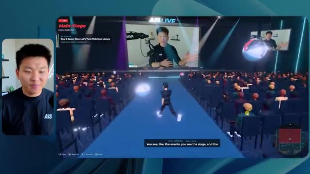
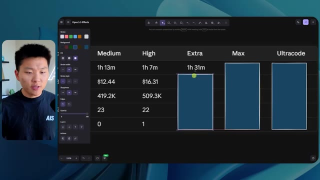

# 🎬 No, Seriously. Claude Code is Starting To Get Dangerous

> **Chaîne** : [Nate Herk | AI Automation](https://www.youtube.com/@nateherk/featured)  
> **Lien YouTube** : [https://www.youtube.com/watch?v=Ktnwygcnd8U](https://www.youtube.com/watch?v=Ktnwygcnd8U)  
> **Date de publication** : 20260927  
> **Durée** : 00:13:42  
> **Identifiant vidéo** : `Ktnwygcnd8U`  
> **Transcription & Analyse** : `whisper-v3-large-turbo+gemini-3.5-flash-lite`  

---

## 📌 Synthèse Exécutive & Outils

### 💡 Résumé
Dans cette vidéo d'analyse technique, le créateur de la chaîne Nate Herk | AI Automation explore l'utilisation poussée de l'IA générative et des agents autonomes à travers le modèle de pointe **Opus 5.5** et l'environnement **Claude Code**. Pour tester les limites et la dangerosité fonctionnelle de ces outils, il a soumis un prompt d'objectif extrêmement ambitieux à différents niveaux d'effort (du mode bas au mode code ultra) : concevoir entièrement et de zéro un monde 3D explorable à la troisième personne simulant une conférence tech réaliste (AIS Live), en exploitant 105 gigaoctets d'enregistrements vidéo bruts issus d'un dossier Frame.io, ainsi qu'en intégrant des visuels dynamiques, des PNJ (personnages non-joueurs) réactifs, des salles de conférence thématiques et des flux vidéo en direct.

Les démonstrations mettent en lumière des écarts spectaculaires de comportement, de rendu visuel, de consommation de ressources et de robustesse architecturale selon le niveau d'effort configuré. En mode faible effort (exécution en 16 minutes, 3,91 $ équivalent API), le résultat souffre de bugs graphiques majeurs, de PNJ fantômes et d'un manque criant de personnalisation de la marque. À l'inverse, le mode moyen (exécution en 1 h 13, 12,44 $ équivalent API, près de 500 000 jetons) livre un monde 3D fonctionnel et bluffant, doté de PNJ interactifs réactifs, d'écrans diffusant de vraies vidéos de l'événement, d'une interface HUD synchronisée et d'une direction artistique respectueuse de l'identité visuelle d'AIS Live, le tout sans nécessiter la moindre intervention humaine ni poser de questions de clarification.

### 🛠️ Outils, Modèles & Logiciels Présentés
* **Opus 5.5** : Modèle d'IA de pointe d'Anthropic, extrêmement intelligent et économique, capable de générer du code complexe et d'orchestrer des agents autonomes à travers différents niveaux d'effort.
* **Claude Code** : Outil de programmation et d'ingénierie logicielle basé sur l'IA, utilisé pour exécuter les agents et transformer des consignes de haut niveau en applications fonctionnelles.
* **AIS Live** : Événement virtuel de référence dont les 105 gigaoctets d'archives vidéo sur Frame.io ont servi de base de données multimédia pour alimenter le monde 3D généré.
* **Herc 2** : Système d'exploitation IA personnel du créateur, intégré comme ressource de référence contextuelle dans le prompt initial.
* **Key.ai** : Solution de génération d'images et de vidéos intégrée ou mobilisée par l'agent pour pallier les besoins graphiques du monde virtuel.
* **Hostinger Connector** : Extension gratuite pour éditeurs de code (VS Code, Cursor, Claude Code, etc.) permettant de relier directement le compte d'hébergement au flux de développement pour un déploiement instantané.

### 🔑 Points Clés & Enseignements Stratégiques
* **Scalabilité des performances selon l'effort** : La modification du niveau d'effort dans Opus 5.5 ne modifie pas seulement la longueur de la réponse, mais transforme radicalement la qualité architecturale, la stabilité physique et la complexité des logiques comportementales injectées dans le code.
* **Autonomie totale des agents** : Fait marquant de l'expérimentation, que ce soit en mode faible ou moyen effort, l'agent a exécuté des dizaines de vérifications autonomes dans le navigateur (jusqu'à 23 itérations) sans poser une seule question de clarification à l'utilisateur.
* **Gestion massive du contexte multimédia** : L'agent a démontré une capacité redoutable à exploiter et référencer des volumes de données brutes gigantesques (105 Go de vidéos sur Frame.io) pour les mapper intelligemment dans un environnement interactif.
* **Respect de l'identité de marque** : Si le mode faible effort produit un design générique et déconnecté des couleurs de l'entreprise, le mode moyen applique spontanément les directives de marque et les palettes de couleurs officielles de l'organisation.
* **Immersion et dynamisme comportemental** : Les niveaux d'effort supérieurs permettent d'implanter des PNJ dotés de micro-interactions contextuelles (salutations, mouvements de bras) et d'intégrer de vrais flux vidéo fonctionnels plutôt que de simples images statiques.
* **Économie de prototypage vs coût d'API** : Malgré des coûts théoriques d'API avoisinant les 12,44 dollars et des durées de traitement d'un peu plus d'une heure pour le mode moyen, le retour sur investissement en termes de temps de développement épargné est colossal.
* **Recommandation officielle de prompt engineering** : Selon les directives d'Anthropic pour Opus 5.5, il est fortement conseillé de démarrer directement au niveau d'effort "moyen" avant d'ajuster le curseur à la hausse ou à la baisse selon la criticité de la tâche.
* **Le goulet d'étranglement du déploiement** : L'automatisation extrême de la création logicielle par l'IA déplace le défi technologique de la phase de codage vers la phase de mise en ligne et d'hébergement, nécessitant des outils de liaison directe comme le connecteur Hostinger.

---

## ⏱️ Chronologie & Transcription Complète Audio & Visuelle (Mot pour Mot)

### ⏱️ `[00:00:00 - 00:00:20]` | Segment #01

**🔊 Audio (Transcription Intégrale Mot pour Mot en Français) :**
> Opus 5.5, Opus 5.5, Opus 5.5, Opus 5.5, Opus 5.5. Ce modèle est littéralement partout et pour de très bonnes raisons. Il est intelligent, il est bon marché, il a un goût incroyable, c'est un modèle d'IA incroyable. Mais avec chaque modèle d'IA, vous avez le choix de l'effort, que ce soit faible, moyen, élevé, extra, max ou code ultra.

**👁️ Analyse Visuelle d'Écran (gemini-3.5-flash-lite) :**
**Interface & Outils** : Twitter / X (interface web)

**Contenu textuel & Code** : Un tweet avec une vidéo montrant une simulation ou un rendu 3D paysager, et du texte en anglais sur l'impact de l'IA pour les créatifs techniques.

**Action / Démonstration** : Affichage d'une publication sur les réseaux sociaux illustrant les performances des modèles d'IA récents.

*⏱️ 00:00:05 — Une capture d'écran d'un tweet montrant une vidéo générée par IA représentant un paysage côtier tropical avec des palmiers et des habitations.*

---

### ⏱️ `[00:00:20 - 00:00:38]` | Segment #02

**🔊 Audio (Transcription Intégrale Mot pour Mot en Français) :**
> Dans cette vidéo, j'ai donné exactement le même prompt à Opus 5.5 et je l'ai exécuté sur chaque niveau d'effort, et nous allons comparer les résultats. Nous examinerons la qualité de tous les différents résultats réels, mais nous examinerons également le temps d'exécution de chacun d'eux, le coût si c'était facturé par API, le nombre total de jetons, combien de vérifications ils ont exécutées et combien de questions ils m'ont réellement posées tout au long du processus.

**👁️ Analyse Visuelle d'Écran (gemini-3.5-flash-lite) :**
**Interface & Outils** : Interface web de tableau blanc / mindmapping (type Miro ou Obsidian)

**Contenu textuel & Code** : Tableau comparatif affichant les niveaux d'effort (Low à Ultracode) et les métriques de performance (Run time, API cost, Total tokens, etc.)

**Action / Démonstration** : Présentation du tableau comparatif des différents niveaux d'effort d'Opus 5.5

*⏱️ 00:00:29 — Tableau comparatif sur interface web intitulé "Opus 5.5 Efforts" avec des colonnes de niveau d'effort (Low, Medium, High, Extra, Max, Ultracode) et des critères en lignes (Run time, API cost, Total tokens, Checks, Questions asked).*

---

### ⏱️ `[00:00:39 - 00:00:58]` | Segment #03

**🔊 Audio (Transcription Intégrale Mot pour Mot en Français) :**
> Et les résultats que nous avons obtenus ne sont pas du tout ce à quoi je m'attendais, donc j'ai hâte de partager cela avec vous les gars. Ne perdons pas de temps et allons directement à celui-ci. D'accord, alors plongeons-nous directement dans celui-ci. Je veux commencer juste en vous montrant le prompt réel que nous avons utilisé que nous avons donné à chacun de ces différents agents. Je vais aller dans les fichiers ici, et nous allons ouvrir ce fichier markdown de prompt, et je vais vous montrer ce que nous avons obtenu. Voici donc le slash objectif que j'ai fourni.

**👁️ Analyse Visuelle d'Écran (gemini-3.5-flash-lite) :**
**Interface & Outils** : Interface de développement avec assistant IA (Opus 5.5, Ultracode)

**Contenu textuel & Code** : Prompt affiché : "Hi Nate. This worktree has the effort-test task queued in PROMPT.md : build a walkable third-person 3D world of the AIS Live conference from your f.io recordings..."

**Action / Démonstration** : Le présentateur présente l'interface de l'outil de développement IA et le prompt initial de test d'effort.

*⏱️ 00:00:48 — Interface d'un outil de développement avec un agent IA (Opus 5.5 / interface type Cursor ou IDE web) montrant un prompt demandant de construire un monde 3D en troisième personne pour la conférence AIS Live.*

---

### ⏱️ `[00:00:58 - 00:01:34]` | Segment #04

**🔊 Audio (Transcription Intégrale Mot pour Mot en Français) :**
> J'ai dit, tu dois me créer un monde 3D qui est une conférence tech réaliste dans laquelle je peux me promener en vue à la troisième personne. Tu vas regarder ce dossier, qui contient mes ressources d'enregistrement d'événements de AIS Live. Et ce dossier est un dossier frame IO de 105 gigaoctets d'enregistrements vidéo. C'était un événement entièrement virtuel. Tout a été enregistré et tous les enregistrements sont juste ici. J'ai dit, ton objectif est de prendre cet événement et de le transformer en un monde 3D explorable qui me donne l'impression d'être réellement allé à une vraie conférence en personne avec différentes salles, différentes pistes, différentes scènes, bla, bla, bla. N'hésite pas à utiliser key.ai si tu as besoin de générer des images ou des vidéos. Et tu peux aussi utiliser tout le reste à l'intérieur de mon projet Herc 2, qui est comme mon système d'exploitation IA. J'ai dit,

**👁️ Analyse Visuelle d'Écran (gemini-3.5-flash-lite) :**
**Interface & Outils** : Éditeur de code (type VS Code / Cursor) et interface web Frame.io.

**Contenu textuel & Code** : Fichier Markdown contenant le prompt complet demandant de transformer des enregistrements d'événements virtuels en monde 3D explorable à la troisième personne.

**Action / Démonstration** : Présentation du prompt initial et du dossier de ressources Frame.io de 105 Go pour le projet de monde 3D.

*⏱️ 00:01:07 — Éditeur de code affichant un fichier PROMPT.md avec des instructions détaillées pour créer un monde 3D interactif basé sur un dossier d'enregistrements.*

*⏱️ 00:01:16 — Interface de gestion de fichiers Cloud (Frame.io) montrant le dossier 'Sep 22, 2026' de 105,69 Go contenant les accès GA et VIP de l'événement AIS Live.*

*⏱️ 00:01:25 — Retour sur l'éditeur de code affichant le fichier PROMPT.md avec le détail des consignes données à l'IA pour générer la conférence 3D.*

---

### ⏱️ `[00:01:34 - 00:02:08]` | Segment #05

**🔊 Audio (Transcription Intégrale Mot pour Mot en Français) :**
> vous serez jugé sur la créativité, le design, la physique, et la sensation générale alors que j'explore le monde 3D que vous avez construit. Et c'était pratiquement la fin des instructions. Donc comme vous pouvez le voir sur ce côté gauche, j'ai exécuté ceci à travers tous les différents niveaux d'effort. Commençons par le niveau bas et progressons jusqu'à code ultra. Très bien. Donc ici nous avons le résultat du niveau bas. Ouvrons ceci et jetons un œil. Donc nous avons AIS Live, le sommet des services IA en personne enfin, et nous pouvions cliquer partout. Tout d'abord, ça ne fait pas très personnalisé. Genre ce n'is pas le logo d'IS Live. Ce n'est même pas nos couleurs. Donc je n'aime pas trop ça, mais entrons ici. D'accord. C'est beaucoup trop lumineux. Euh, nous avons une carte en haut à droite; nous avons une ville par ici. Je ne peux pas dire quelle ville c'est.

**👁️ Analyse Visuelle d'Écran (gemini-3.5-flash-lite) :**
**Interface & Outils** : Application de développement / interface web d'un agent de code (type Cursor ou outil similaire avec sidebar de sessions)

**Contenu textuel & Code** : Message de l'agent demandant si le travail dans PROMPT.md pour construire le monde 3D doit commencer, avec la liste des niveaux de test dans le panneau latéral.

**Action / Démonstration** : Sélection des différents niveaux de test dans la barre latérale gauche par l'utilisateur.

*⏱️ 00:01:42 — Interface d'un assistant de code affichant différents niveaux de test (Hello, Extra, High, Max, Ultracode, Medium, Low) dans la barre latérale gauche.*

---

### ⏱️ `[00:02:08 - 00:02:40]` | Segment #06

**🔊 Audio (Transcription Intégrale Mot pour Mot en Français) :**
> c'est. D'accord. C'est Chicago, ce qui est plutôt cool parce que tu sais, j'habite à Chicago, mais bref, en haut, à droite, nous pouvons voir une carte. Nous avons un hall d'accueil. Nous avons un hall d'exposition. Nous avons un salon VIP, la scène principale. La carte montre également où se trouve chaque autre personne et cela se synchronise en direct. Nous pouvons donc voir l'enregistrement. Nous pouvons voir le premier jour, la keynote de l'hyper agent, le débriefing en direct. Cool. Donc il connaît réellement l'agenda et puis il y a le deuxième jour. Donc il a trouvé ça, c'est bien. Nous avons ces petites boules ici que je peux espérer pousser du pied. D'accord. Le visage, oh, regarde ça. Si je vais par ici, tous les gens disparaissent tout simplement. Très mauvais. Très mauvais. D'accord. Alors voyons voir. Est-ce que je peux sprinter ? D'accord.

**👁️ Analyse Visuelle d'Écran (gemini-3.5-flash-lite) :**
**Interface & Outils** : Application web de monde virtuel / métavers de conférence.

**Contenu textuel & Code** : Carte de navigation, planning de l'événement et avatars virtuels.

**Action / Démonstration** : Navigation et exploration de différentes zones d'une conférence virtuelle en 3D.

---

### ⏱️ `[00:02:40 - 00:03:04]` | Segment #07

**🔊 Audio (Transcription Intégrale Mot pour Mot en Français) :**
> Je peux avancer un peu plus vite. Je vais d'abord aller par ici. Il y a des produits dérivés, euh, un sweat à capuche certifié AIS plus. D'accord. Il y a donc les vrais stands qu'on avait dans l'événement virtuel. On avait des stands. C'est donc plutôt cool. Un petit endroit pour prendre des photos. La salle C. En ce moment, nous avons Tangy Frederick qui anime un atelier. D'accord. Mais ce n'est pas une vidéo. Comme vous pouvez le voir, c'est juste une image. Elle ne bouge pas. C'est donc juste une image. Ces gens sont en train de disparaître. Ce doivent être des fantômes. Allons par ici vers la salle A.

**👁️ Analyse Visuelle d'Écran (gemini-3.5-flash-lite) :**
**Interface & Outils** : Environnement virtuel 3D interactif (type Spatial Web / Gather ou similaire) affiché à l'écran.

**Contenu textuel & Code** : Aucun code source, terminal ou prompt visible ; affichage d'un monde virtuel avec des éléments graphiques d'exposition.
[DESC_IMAGE_3] Navigation et exploration de l'espace virtuel par le présentateur.

**Action / Démonstration** : Explications face caméra et démonstration conceptuelle.

---

### ⏱️ `[00:03:04 - 00:03:30]` | Segment #08

**🔊 Audio (Transcription Intégrale Mot pour Mot en Français) :**
> Nous avons Liberty White. D'accord. Très cool. Vos 30 premiers jours en automatisation. Encore une fois, c'est juste une image fixe et les gens ont des bugs d'affichage. Donc ce n'est pas très bien ici. Je vais aller sur la scène principale et voir ce que nous avons. D'accord, cool. Donc nous avons une scène principale. Les gens ont de gros bugs d'affichage. Vraiment mauvais. Ce n'est vraiment pas terrible. Notre vidéo est en train de bouger. Genre, j'ai vu mon visage ici et j'ai vu celui de Devin, mais maintenant ils ont disparu. Donc je ne sais pas trop ce qui s'est passé. D'accord. C'est, on dirait plutôt un diaporama. Rien n'est vraiment diffusé pour l'instant. Quoi qu'il en soit, entrons ici.

**👁️ Analyse Visuelle d'Écran (gemini-3.5-flash-lite) :**
**Interface & Outils** : Application ou plateforme virtuelle 3D (type métavers) simulant un événement en direct ("AIS Live AI Services Summit").

**Contenu textuel & Code** : Interface utilisateur virtuelle 3D avec des avatars de participants assis dans une salle de conférence, un écran géant affichant le titre de l'événement et un menu de navigation par carte en haut à droite.
[DESC_IMAGE_1] Le présentateur commente une vue en 3D d'une pièce de l'événement virtuel (Workshop Room A).
[DESC_IMAGE_2] Le présentateur navigue dans l'environnement virtuel pour rejoindre la scène principale ("Main Stage").
[DESC_IMAGE_3] L'avatar se déplace dans la salle principale de l'événement virtuel face à un grand écran de présentation.

**Action / Démonstration** : Navigation et exploration en temps réel d'un espace virtuel 3D d'une conférence d'automatisation IA par le présentateur.

*⏱️ 00:03:17 — Le présentateur regarde l'écran virtuel qui affiche une grande salle de conférence 3D remplie d'avatars de participants assistant à un atelier.*

*⏱️ 00:03:24 — Vue plus large de la grande salle de conférence virtuelle affichant le logo "AIS LIVE AI Services Summit" sur un écran géant au fond.*

---

### ⏱️ `[00:03:30 - 00:03:58]` | Segment #09

**🔊 Audio (Transcription Intégrale Mot pour Mot en Français) :**
> Nous avons d'autres stands. Nous avons hyper agent. Nous avons Claude Code. Nous avons plus de cadeaux publicitaires. La salle B, c'est Dave Ebelor. Je suppose que c'est exactement la même chose. Nous avons du café. Et ensuite, je suppose, le salon VIP, accès VIP seulement. C'est plutôt cool, mais il n'y a vraiment rien qui se passe ici. Cet écran est beaucoup trop lumineux. D'accord. Donc je pense que vous comprenez l'ambiance que nous obtenons ici de la part d'Opus 5.5 en mode faible effort. Et c'est là que les choses deviennent intéressantes. Combien de temps pensez-vous que cela a duré ? Combien de temps ? Celui-ci a duré 16 minutes et 43 secondes. Combien pensez-vous que cela a coûté ?

**👁️ Analyse Visuelle d'Écran (gemini-3.5-flash-lite) :**
**Interface & Outils** : Interface web de tableau blanc ou de prise de notes.

**Contenu textuel & Code** : Tableau comparatif des niveaux d'effort avec Run time, API cost, Total tokens, Checks et Questions asked.

**Action / Démonstration** : Présentation du tableau comparatif des différents niveaux d'effort.

*⏱️ 00:03:51 — Un tableau comparatif sur une interface web avec les niveaux Low, Medium, High, Extra, Max et Ultracode.*

---

### ⏱️ `[00:03:58 - 00:04:26]` | Segment #10

**🔊 Audio (Transcription Intégrale Mot pour Mot en Français) :**
> 3,91 dollars si c'était une facturation par API. J'utilise évidemment mon abonnement ici, mais nous allons simplement calculer cela avec la facturation par API. Le total des jetons était de 191 000. Il a fait 22 vérifications. Donc la vérification, 22 fois il a ouvert le navigateur et a exécuté différents types de vérifications. Donc 22 catégories de vérifications. Et combien de questions m'a-t-il posées ? Il m'a posé un total de zéro question tout au long de cette invite de commande d'objectif. D'accord. Alors, ouvrons l'effort moyen et voyons ce que nous avons. D'accord, c'est parti. Effort moyen. Nous avons Nate Herc. Nous avons mon badge. C'est la marque de commerce AI's life.

**👁️ Analyse Visuelle d'Écran (gemini-3.5-flash-lite) :**
**Interface & Outils** : Application de tableau blanc numérique / outil de mindmapping et de diagrammes (type Excalidraw) avec un panneau de configuration des formes à gauche.

**Contenu textuel & Code** : Un tableau avec les lignes : Run time (16m 43s), API cost ($3.91), Total tokens (191.3K), Checks, et Questions asked, réparties sur différents niveaux d'effort (Low, Medium, High).

**Action / Démonstration** : Le présentateur commente les métriques d'exécution, le coût de l'API ($3.91) et le nombre total de jetons (191.3K).

*⏱️ 00:04:05 — Capture d'écran montrant le présentateur à gauche et un tableau de données et de métriques d'évaluation sur un tableau blanc virtuel à droite.*

---

### ⏱️ `[00:04:26 - 00:04:46]` | Segment #11

**🔊 Audio (Transcription Intégrale Mot pour Mot en Français) :**
> Donc ça a déjà l'air un petit peu mieux. Ça ressemble à nos palettes de couleurs qui ont utilisé nos directives de marque. Premier jour de construction, deuxième jour de gain, VIP. Cool. D'accord. Je vais entrer dans le lieu. D'accord. Waouh. Une ambiance similaire, en somme. C'est en arrière-plan. Ça ne ressemble pas à Chicago, hein ? Non, ça ressemble à, honnêtement, ça ressemble à une ville inventée. Quoi qu'il en soit, c'est marrant qu'ils aient décidé de faire ça. Voyons si je peux me déplacer un peu plus vite. Oh, waouh.

**👁️ Analyse Visuelle d'Écran (gemini-3.5-flash-lite) :**
**Interface & Outils** : Application web interactive en 3D (type metaverse ou espace virtuel).

**Contenu textuel & Code** : Écran de bienvenue avec badge d'identification, contrôles clavier (WASD, Shift, Espace), et environnement virtuel 3D avec des avatars.

**Action / Démonstration** : Le présentateur entre dans l'espace virtuel du lieu de l'événement et navigue à l'intérieur.

*⏱️ 00:04:31 — Interface web de l'application 'Welcome to AIS Live' avec un badge d'accès au nom de Nate Herk et un bouton 'Enter the Venue'.*

*⏱️ 00:04:41 — Vue à l'intérieur du lieu virtuel interactif en 3D avec des avatars d'utilisateurs et une vue sur une ville de nuit à travers de grandes baies vitrées.*

---

### ⏱️ `[00:04:46 - 00:05:21]` | Segment #12

**🔊 Audio (Transcription Intégrale Mot pour Mot en Français) :**
> Les gens interagissent avec moi. Regardez. Si je m'approche de ce type, il vient de lever le bras. Bon, maintenant il ne veut plus du tout avoir affaire à moi. Mais tous ces petits robots ici doivent prendre des décisions. Je ne suis pas sûr qu'ils utilisent Jev. C'est sûr que non. Je ne le lui ai pas dit. En fait, ma clé Jev est à l'arrière. Je ne sais pas. Peut-être qu'il l'a utilisée. Quoi qu'il en soit, nous pouvons voir ici que nous avons la salle d'atelier C, le laboratoire des agents. Sympa. Donc celui-ci est en fait en train de fonctionner. Vous pouvez voir qu'il s'agit d'une vraie vidéo lue par Tangy. Tout le monde ici est en train de travailler sur un ordinateur portable. Ils ne buguent pas. C'est plutôt cool. De plus, mon badge est sur ma poitrine, ce qui est plutôt cool. Je peux venir par ici. Nous avons une carte en haut à droite, comme vous pouvez le voir, mais je peux venir par ici. Nous avons un

**👁️ Analyse Visuelle d'Écran (gemini-3.5-flash-lite) :**
**Interface & Outils** : Environnement virtuel 3D / Simulation interactive type métavers ou jeu.

**Contenu textuel & Code** : Avatars virtuels 3D dans un espace de travail ou de conférence interactif.

**Action / Démonstration** : Exploration et navigation dans un environnement virtuel 3D peuplé d'agents ou d'utilisateurs.

---

### ⏱️ `[00:05:21 - 00:05:47]` | Segment #13

**🔊 Audio (Transcription Intégrale Mot pour Mot en Français) :**
> hall d'exposition. C'est là que nous avons le stand Glido. Et ça diffuse en ce moment. Oui, ça diffuse la vidéo de nous parlant de Glido. Ça diffuse la vidéo d'Ed et moi parlant de notre programme de certification. Nous avons le logo AIS Plus juste ici, qui est un peu mal placé. Ce sont les diapositives des conférenciers et les points clés. Donc waouh, ce sont toutes les ressources que nous avons distribuées après l'événement. Elles sont toutes affichées là également. Nous pouvons voir que nous avons un projecteur sur la communauté. Donc c'est Aiden qui parle de son contrat qu'il a décroché et c'est diffusé en direct. Ces gens sont en train de regarder.

**👁️ Analyse Visuelle d'Écran (gemini-3.5-flash-lite) :**
**Interface & Outils** : Environnement virtuel 3D en ligne (type salon virtuel ou monde persistant).

**Contenu textuel & Code** : Écrans affichant des présentations, des diaporamas de conférence et le logo AIS Plus.

**Action / Démonstration** : Navigation et visite guidée d'un stand et d'une exposition virtuelle 3D par l'intervenant.

---

### ⏱️ `[00:05:47 - 00:06:21]` | Segment #14

**🔊 Audio (Transcription Intégrale Mot pour Mot en Français) :**
> Ils sont plutôt engagés. On a l'hyper agent. C'était, c'est ce que je voulais dire. Si vous avez vu ces gens lever les bras pour dire bonjour, c'était plutôt marrant. Regardez, regardez, le voilà qui recommence. Bref. Bon. Où est-ce que je suis maintenant ? Maintenant, je suis dans le hall principal. On a un bar à café. On a un grand logo, qui est le vrai logo. Il est trop lumineux, mais on a le logo. On peut voir si on peut entrer ici dans le parcours fondation. On a Sabrina Romanov et Liberty White. Donc différentes formations juste là. On peut entrer dans cette salle. C'est le parcours avancé. Alors, qu'est-ce qui se passe ici ? On a Dave Ebelar et Saman qui parlent de trucs différents là-dedans. Et maintenant, allons jeter un œil à la scène principale. Oh, attendez, il y a une vidéo de moi là-haut. C'est genre un VIP

**👁️ Analyse Visuelle d'Écran (gemini-3.5-flash-lite) :**
**Interface & Outils** : Application ou plateforme virtuelle 3D (metaverse/salon virtuel).

**Contenu textuel & Code** : Environnement virtuel 3D avec des avatars de participants et une interface de mini-carte.

**Action / Démonstration** : Navigation et déplacement d'un avatar à travers le hall principal et vers une salle de conférence virtuelle.

---

### ⏱️ `[00:06:21 - 00:06:50]` | Segment #15

**🔊 Audio (Transcription Intégrale Mot pour Mot en Français) :**
> section ? Ouais, on ira voir ça dans une minute. Mais bref, voici la scène principale. Ça a l'air vraiment, vraiment super. On a une grande scène. On a genre quatre personnes assises ici. On a les trois écrans d'Alex là-haut avec "hyper agent". Est-ce que j'ai le droit de monter sur scène ? Oh, et il me laisse monter sur scène. D'accord. C'est plutôt sympa. Bon les gars, faisons un selfie. Laissez-moi prendre tout le monde en arrière-plan. Venez par ici. Bref, c'est vraiment, vraiment cool. Toutes les places ne sont pas occupées par contre. Donc il faut qu'on travaille là-dessus. Mais bref, je vais retourner voir ce qu'était cette section VIP. D'accord. Le salon VIP. J'ai l'impression que c'est comme à l'aéroport ou un truc comme ça.

**👁️ Analyse Visuelle d'Écran (gemini-3.5-flash-lite) :**
**Interface & Outils** : Application web ou plateforme virtuelle immersive (type metaverse/événementiel virtuel 3D).

**Contenu textuel & Code** : Interface d'événement virtuel avec incrustation d'une infographie 'Keynote Day 1 - Hyperagent Keynote' et mini-carte de navigation.

**Action / Démonstration** : Exploration interactive de l'espace virtuel par le présentateur guidant son avatar dans la salle de conférence.

*⏱️ 00:06:28 — Vue d'un monde virtuel interactif avec un avatar se déplaçant dans une grande salle de conférence dotée d'écrans géants affichant 'Hyperagent Keynote'.*

*⏱️ 00:06:36 — Vue de l'arrière de la scène virtuelle montrant l'avatar s'approchant des sièges des intervenants face à l'audience.*

*⏱️ 00:06:43 — Vue en contre-plongée depuis l'arrière de la salle de conférence virtuelle montrant les nombreux spectateurs assis face à la scène principale.*

---

### ⏱️ `[00:06:51 - 00:07:14]` | Segment #16

**🔊 Audio (Transcription Intégrale Mot pour Mot en Français) :**
> Ok, super. Donc maintenant nous avons les sessions VIP ici. Une séance de questions-réponses VIP avec Nate, lecture vidéo en direct juste ici. Très, très cool. Et nous avons comme un bar ou quelque chose du genre. Génial. Je dirais que c'est un plutôt bon résultat. Maintenant, en ce qui concerne les statistiques ici, celle-ci a pris une heure et 13 minutes à s'exécuter. Cela nous aurait coûté 12 dollars et 44 cents. Elle a utilisé 490 000 jetons et elle a effectué 23 vérifications.

**👁️ Analyse Visuelle d'Écran (gemini-3.5-flash-lite) :**
**Interface & Outils** : Application de monde virtuel 3D / plateforme de streaming et tableau de bord de métriques d'exécution.

**Contenu textuel & Code** : Session VIP Q&A with Nate, métriques de coût API ($3.91, 191.3K tokens).

**Action / Démonstration** : Présentation de l'environnement virtuel 3D de la session VIP, puis affichage des statistiques d'exécution.

*⏱️ 00:06:56 — Vue d'un espace virtuel 3D avec un écran géant affichant une session vidéo en direct et le présentateur.*

*⏱️ 00:07:02 — Tableau de données montrant les métriques de performance et de coût d'une exécution (Run time: 16m 43s, API cost: $3.91).*

---

### ⏱️ `[00:07:14 - 00:07:48]` | Segment #17

**🔊 Audio (Transcription Intégrale Mot pour Mot en Français) :**
> Et il ne nous a posé absolument zéro question une fois de plus. Très bien, passons au niveau élevé. C'était déjà un résultat plutôt correct, et Anthropic eux-mêmes dans leur vidéo, ou désolé, pas une vidéo, un article sur la façon de prompter Opus 5.5. Ils ont dit de commencer directement au niveau moyen et de l'ajuster à la hausse ou à la baisse si nécessaire. C'était donc un résultat moyen. Passons au niveau élevé et voyons ce qu'on a obtenu. Très rapidement, les gars, je dois prendre une seconde pour vous parler du sponsor de la vidéo d'aujourd'hui, Hostinger. Donc, ces deux modèles viennent de me créer une version fonctionnelle de la même chose. Et maintenant, je me retrouve exactement là où je finis toujours, avec un projet terminé sur mon ordinateur portable et aucun moyen rapide de le mettre en ligne. Et c'est le fossé que comble le connecteur d'Hostinger. C'est une extension gratuite

**👁️ Analyse Visuelle d'Écran (gemini-3.5-flash-lite) :**
**Interface & Outils** : Tableau blanc de synthèse (Image 1) et interface de développement / éditeur de code avec assistant IA (Image 2).

**Contenu textuel & Code** : Tableau de métriques d'exécution d'IA pour les niveaux Low et Medium (Image 1) ; code et invite de génération pour "Northwind ROI calculator" avec des indicateurs de statut comme "Ruminating..." (Image 2).

**Action / Démonstration** : Analyse comparative des coûts et temps d'exécution d'Opus 5.5 selon le niveau d'effort, et démonstration du processus de génération de code par l'agent.

*⏱️ 00:07:22 — Un tableau comparatif des performances de l'IA (Run time, API cost, Total tokens, Checks, Questions asked) selon différents niveaux d'effort (Low, Medium, High, Extra) avec le présentateur en médaillon.*

*⏱️ 00:07:39 — Une interface de développement avec des panneaux montrant un éditeur de code et l'avancement d'un agent IA construisant un calculateur ROI (Northwind ROI calculator).*

---

### ⏱️ `[00:07:48 - 00:08:23]` | Segment #18

**🔊 Audio (Transcription Intégrale Mot pour Mot en Français) :**
> pour votre éditeur qui intègre votre compte Hostinger dans l'outil de programmation que vous utilisez déjà, que ce soit VS Code, Cursor, Cloud Code, Codex, et j'en passe. Vous vous connectez une seule fois en un clic, et à partir de là, votre agent peut déployer le site, y associer un domaine, configurer les enregistrements DNS et vérifier votre VPS sans que vous ayez à quitter votre éditeur. Ainsi, quel que soit celui que vous finirez par préférer, ce qu'il a construit se trouve à quelques minutes d'une véritable URL sur un hébergement géré. Connector est gratuit avec tous les plans d'hébergement, donc si vous avez toujours besoin de l'hébergement sous-jacent, profitez du plan illimité via le lien dans la description et utilisez le code NATEHERK pour obtenir 10 % de réduction. Cela inclut également un nom de domaine gratuit et un e-mail professionnel pour un an. Et c'est toujours le moyen le moins cher que j'ai trouvé pour obtenir quelque chose

**👁️ Analyse Visuelle d'Écran (gemini-3.5-flash-lite) :**
**Interface & Outils** : Interface web Hostinger / IDE et Claude Code (avec l'incrustation vidéo du présentateur en bas à droite)

**Contenu textuel & Code** : Statut "Connected" via OAuth (Node.js 24.13.0), options d'outils disponibles pour l'assistant ("Websites", "Domains", "Subscriptions & Payments", "Email Marketing")

**Action / Démonstration** : Connexion unique établie entre le compte Hostinger et l'éditeur de code pour permettre à l'agent de gérer le déploiement et les domaines

*⏱️ 00:07:57 — Interface montrant la connexion entre Hostinger et l'IDE, avec les outils disponibles (Websites, Domains, Subscriptions, Email Marketing) et Claude Code ouvert sur le panneau de droite.*

---

### ⏱️ `[00:08:23 - 00:08:47]` | Segment #19

**🔊 Audio (Transcription Intégrale Mot pour Mot en Français) :**
> tu as construit sur une vraie URL. Donc revenons à la vidéo. D'accord. Encore une fois, très, très thématisé par la marque. C'est un écran de chargement encore mieux que le précédent. Nous avons ce petit effet sympa en arrière-plan. Nous avons le logo. Nous allons entrer dans le lieu. D'accord. Nous y voilà. Ça a l'air plutôt bien. Nous commençons à l'extérieur et vous pouvez voir que nous avons ces drapeaux pour tous les intervenants, Wyatt, Casper, Alex, Ed, Aiden, Sabrina, Liberty. C'est plutôt cool. Nous avons des blocs en direct ici.

**👁️ Analyse Visuelle d'Écran (gemini-3.5-flash-lite) :**
**Interface & Outils** : Navigateur web affichant la plateforme virtuelle 3D AIS Live.

**Contenu textuel & Code** : Interface utilisateur virtuelle interactive avec bannières textuelles, contrôles de déplacement et mini-carte.

**Action / Démonstration** : Connexion et exploration du monde virtuel 3D de l'événement en ligne.

*⏱️ 00:08:29 — Écran de chargement et d'accueil de la plateforme virtuelle AIS Live avec logo et bouton 'Enter the Venue'.*

*⏱️ 00:08:35 — Vue de la place virtuelle 3D (AIS Live Plaza) avec des avatars d'utilisateurs et des bâtiments en arrière-plan.*

*⏱️ 00:08:41 — Navigation dans la place virtuelle 3D d'AIS Live montrant des bannières verticales informatives et des avatars.*

---

### ⏱️ `[00:08:47 - 00:09:23]` | Segment #20

**🔊 Audio (Transcription Intégrale Mot pour Mot en Français) :**
> Il a pris cette photo de moi, votre hôte, Nate Herc, John, Dave, Nate Herc. Voilà. OK. Les portes. Génial. Ce sont des portes coulissantes automatiques en verre. J'adore ça. On peut voir l'enregistrement VIP. On peut voir l'admission générale. On peut venir par ici et on peut découvrir l'expo avec différents stands, le projecteur sur la communauté. Vous pouvez aussi voir qu'en haut à gauche, j'ai un passeport. Donc c'est comme si, ça va montrer combien d'endroits j'ai visités. Tout cela est une vraie lecture. Nous avons un mur de ressources avec tous les différents intervenants. Ils ont aussi une session de réseautage par ici. Donc je vais venir très vite et voir de quoi il s'agit. Nous avons donc le bar à cold brew AIS. Nous avons différents membres de la communauté qui ont été mis en avant ou en lumière.

**👁️ Analyse Visuelle d'Écran (gemini-3.5-flash-lite) :**
**Interface & Outils** : Application virtuelle 3D / Metavers de conférence en ligne

**Contenu textuel & Code** : Environnement virtuel 3D interactif avec affichage d'informations de conférence et d'avatars

**Action / Démonstration** : Exploration et navigation dans l'espace virtuel de la conférence par le présentateur

*⏱️ 00:08:56 — Vue d'un monde virtuel 3D représentant une zone d'enregistrement de conférence avec des avatars.*

*⏱️ 00:09:05 — Navigation dans le hall d'exposition virtuel avec des stands et des écrans interactifs.*

*⏱️ 00:09:14 — Déplacement d'avatars dans le hall d'accueil avec vue sur les grandes baies vitrées.*

---

### ⏱️ `[00:09:23 - 00:09:56]` | Segment #21

**🔊 Audio (Transcription Intégrale Mot pour Mot en Français) :**
> On a la zone VIP. Attends, quoi ? Prends un bracelet. Ah, je dois vraiment aller chercher le bracelet. D'accord. Laisse-moi m'enregistrer rapidement. Le bracelet est déjà mis. Attends, quoi ? D'accord. Ah, d'accord. Maintenant, les portes se sont ouvertes pour moi. Cool. Je peux entrer ici. Oh, ça mène juste à la scène principale. Salon VIP. Il y a une séance de questions-réponses en cours. Ça a l'air très cool. Je veux dire, je suis très impressionné par la façon dont il est capable de faire ça. Waouh. D'accord. Donc c'est vraiment bien. Ce qu'on a fait, c'est qu'on a eu des salles de discussion VIP avec différentes personnes. Tu peux voir qu'il y a différentes salles, différents membres de l'équipe AIS qui vont dans des trucs. C'est vraiment cool. C'est très cool. C'est un VIP bien meilleur

**👁️ Analyse Visuelle d'Écran (gemini-3.5-flash-lite) :**
**Interface & Outils** : Application web interactive de monde virtuel 3D (Gather ou équivalent)

**Contenu textuel & Code** : Interface utilisateur virtuelle affichant le statut du passport, des zones VIP et des écrans vidéo interactifs

**Action / Démonstration** : Navigation et exploration d'un environnement virtuel 3D en ligne de type métavers professionnel

*⏱️ 00:09:32 — Le présentateur navigue dans une application de monde virtuel 3D représentant la 'Registration Concourse' avec d'autres avatars.*

*⏱️ 00:09:40 — L'avatar du présentateur se trouve dans la 'VIP Lounge' avec des écrans montrant des visioconférences.*

*⏱️ 00:09:48 — L'avatar se déplace dans une section 'VIP Working Sessions' avec différentes salles de discussion thématiques.*

---

### ⏱️ `[00:09:56 - 00:10:30]` | Segment #22

**🔊 Audio (Transcription Intégrale Mot pour Mot en Français) :**
> expérience que ce qui a été montré dans le premier élément. D'accord. After party VIP. Regardez ça. Nous avons une piste de danse. Nous avons tous ces éléments ici. Nous avons la lecture de l'after party VIP juste ici. Et il y a une estrade de DJ. C'est trop marrant. Il y a un petit bug ici, un petit glitch ici, mais c'est génial. Oh, super. Donc quand je suis ici sur la scène principale, nous obtenons des sous-titres. Vous pouvez voir juste ici en bas de mon écran, nous obtenons ces sous-titres de Wyatt qui est en train de parler ici. Nous avons des lumières. Nous avons le panneau. Très cool. Belle scène principale. Je vais aller ici. Nous pouvons aller à la fondation,

**👁️ Analyse Visuelle d'Écran (gemini-3.5-flash-lite) :**
**Interface & Outils** : Application web 3D immersive (plateforme d'événement virtuel)

**Contenu textuel & Code** : Environnement virtuel 3D interactif avec interface d'événement, avatars, et retransmissions vidéo en direct.

**Action / Démonstration** : Navigation et présentation de la plateforme virtuelle 3D par le présentateur.

*⏱️ 00:10:04 — Vue d'un espace virtuel 3D représentant une after-party VIP avec piste de danse, avatars et écran de diffusion vidéo.*

*⏱️ 00:10:13 — Vue plus large de la piste de danse virtuelle avec des avatars et des ballons de plage.*

*⏱️ 00:10:21 — Vue d'une scène principale virtuelle avec des rangées de sièges et un écran géant affichant des intervenants en visioconférence.*

---

### ⏱️ `[00:10:30 - 00:11:06]` | Segment #23

**🔊 Audio (Transcription Intégrale Mot pour Mot en Français) :**
> avancé, et les parcours d'entreprise par ici. Alors voyons voir. Nous avons l'anatomie de trois vraies transactions. Nous avons hyper agent. Nous avons les évaluations avec Nate et Ed ici. Nous avons Dave qui s'occupe des trucs avancés. C'est vraiment bien. Je veux dire, évidemment, chacun de ces résultats jusqu'à présent, faible était correct. Moyen était meilleur. Élevé a été encore meilleur. Voyons si cette tendance se poursuit et allons voir ce que cela nous a coûté. Donc, le mode élevé a duré une heure et sept minutes. Donc un peu plus rapide que moyen, cela nous aurait coûté 16 dollars et 31 cents. Il a utilisé un demi-million de tokens, 509 000. Il a fait 22 vérifications. Et il nous a aussi demandé, enfin, non, je me suis trompé, ce

**👁️ Analyse Visuelle d'Écran (gemini-3.5-flash-lite) :**
**Interface & Outils** : Application de tableau blanc / interface de présentation (style Excalidraw / outil de mind-mapping).

**Contenu textuel & Code** : Données tabulaires avec Run time (16m 43s, 1h 13m, etc.), API cost ($3.91, $12.44, $16.31), Total tokens (191.3K, 419.2K), Checks et Questions asked.

**Action / Démonstration** : Présentation et analyse comparative des coûts d'API et des temps d'exécution selon l'effort demandé à l'agent IA.

*⏱️ 00:10:57 — Tableau comparatif montrant les métriques de performance et de coûts selon différents niveaux d'effort (« Low », « Medium », « High », « Extra »).*

---

### ⏱️ `[00:11:06 - 00:11:25]` | Segment #24

**🔊 Audio (Transcription Intégrale Mot pour Mot en Français) :**
> l'un m'a posé une question et spoiler, c'était le seul qui nous a posé une question de tout ça. Donc voyons voir, il nous en reste trois, extra, max et ultra code. Laissez-moi ouvrir extra et nous verrons ce que nous avons. D'accord. Donc celui-ci a l'air plutôt bien. Je dirais honnêtement que jusqu'à présent, le temps de chargement était le meilleur. Celui qu'on vient juste de voir, mais bref, entrons dans AIS live.

**👁️ Analyse Visuelle d'Écran (gemini-3.5-flash-lite) :**
**Interface & Outils** : Application de tableau de bord ou interface web de gestion de projet / comparateur de modèles.

**Contenu textuel & Code** : Tableau de données chiffrées : Run time (16m 43s, 1h 13m, 1h 7m), API cost ($3.91, $12.44, $16.31), Total tokens (191.3K, 419.2K, 509.3K), Checks (22, 23, 22), Questions asked (0, 0, 1).

**Action / Démonstration** : Le présentateur commente les résultats du tableau et s'apprête à ouvrir la section « Extra ».

*⏱️ 00:11:11 — Tableau comparatif affichant les métriques (Run time, API cost, Total tokens, Checks, Questions asked) pour différentes configurations (Low, Medium, High, Extra) avec le présentateur en incrustation à gauche.*

---

### ⏱️ `[00:11:26 - 00:11:51]` | Segment #25

**🔊 Audio (Transcription Intégrale Mot pour Mot en Français) :**
> Whoa. D'accord. Donc on a genre des petits extraits sonores. Je peux discuter avec des gens. Le panneau sur la guerre des outils a réglé quelques débats pour moi. Sympa. Bonne perspective là-bas. On est dehors à nouveau. On a ces différentes bannières, bien qu'elles soient toutes les mêmes. Elles n'affichent pas genre les noms de différentes personnes. Donc gros logo AIS live. L'aile des ateliers est par ici. Et passons par les portes coulissantes en verre pour voir ce qu'on a. Donc on a le café AIS. La carte est en bas à droite, et elle n'est pas très descriptive.

**👁️ Analyse Visuelle d'Écran (gemini-3.5-flash-lite) :**
**Interface & Outils** : Application de monde virtuel 3D / Navigateur web

**Contenu textuel & Code** : Environnement virtuel interactif avec avatars, bannières publicitaires et mini-carte

**Action / Démonstration** : Navigation et exploration d'un espace virtuel en 3D avec un avatar

---

### ⏱️ `[00:11:51 - 00:12:26]` | Segment #26

**🔊 Audio (Transcription Intégrale Mot pour Mot en Français) :**
> J'aime la façon dont les autres cartes nous indiquaient ce que, enfin où étaient les choses, mais celle-ci a l'air très professionnelle. On peut voir qu'ici se trouve la scène principale. Faisons un tour rapide par ici. Ils ont tous ces ballons qui volent dans tous les sens, ce que je trouve assez marrant. Les ballons de plage AIS. On me voit là-haut en train de parler. Je crois que je faisais l'introduction d'une des journées. Continuons d'avancer par ici vers la salle d'ateliers sur ce côté gauche. OK. Donc ici, on a le Hyper Agent Theater. On a cette session sponsorisée ici par Hyper Agent, mais ça nous montre aussi ce qui arrive par ici également. C'est vraiment drôle qu'on puisse discuter avec les gens. Salmon a créé un commercial vocal en direct. La salle « Price it right » était bondée. As-tu pris le guide d'accompagnement VIP ? C'est tellement marrant. On a le parcours avancé dans

**👁️ Analyse Visuelle d'Écran (gemini-3.5-flash-lite) :**
**Interface & Outils** : Application web 3D de type métavers / plateforme virtuelle d'événements.

**Contenu textuel & Code** : Interface utilisateur virtuelle avec mini-carte, boutons de chat, et affichage vidéo en direct sur écran virtuel.

**Action / Démonstration** : Visite guidée et exploration d'un environnement virtuel interactif en 3D par le présentateur.

*⏱️ 00:12:00 — Le présentateur navigue dans une salle de conférence virtuelle 3D montrant une scène principale avec un écran géant diffusant une vidéo.*

*⏱️ 00:12:09 — Vue du hall d'entrée virtuel avec des avatars d'utilisateurs et des panneaux indicateurs pour les ateliers et services d'entreprise.*

*⏱️ 00:12:17 — Navigation dans un couloir virtuel de l'événement en ligne avec plusieurs avatars d'utilisateurs interagissant.*

---

### ⏱️ `[00:12:26 - 00:12:58]` | Segment #27

**🔊 Audio (Transcription Intégrale Mot pour Mot en Français) :**
> ici. Encore une fois, on a une diffusion en direct. Est-ce que c'est une diffusion en direct ? Oh, d'accord. Ça a commencé dès que je suis entré, mais je peux m'asseoir. Oh là là. Je peux regarder ça. Je peux me lever. Je veux m'asseoir devant. C'est plutôt cool. C'est très sympa. J'aime bien ça. Et vous savez ce que j'ai remarqué jusqu'ici ? En fait, le personnage que j'incarne me ressemble un peu. Je pense qu'il l'a modélisé à partir de mes photos de miniatures ou un truc du genre. Bref, nous avons Sabrina ici, l'hôte de la salle ici, prenez n'importe quelle place libre. D'accord, cool. Et j'ai vraiment bien aimé la fonctionnalité pour s'asseoir. C'est assez marrant. Genre, on pourrait vraiment assister à cet atelier et participer. Bref, ça nous montre les intervenants. Ça nous montre les

**👁️ Analyse Visuelle d'Écran (gemini-3.5-flash-lite) :**
**Interface & Outils** : Environnement virtuel en 3D / plateforme de type metaverse ou réunion virtuelle interactive.

**Contenu textuel & Code** : Interface utilisateur d'un événement virtuel avec des affichages de type "Workshop Block", des options de navigation et des flux vidéo de présentateurs.

**Action / Démonstration** : Navigation et exploration de l'espace virtuel par le présentateur en direct.

---

### ⏱️ `[00:12:58 - 00:13:31]` | Segment #28

**🔊 Audio (Transcription Intégrale Mot pour Mot en Français) :**
> programme. Il y a un petit tapis rouge ici pour prendre des photos. On peut prendre la pose. Oh, waouh. C'est plutôt cool. Bibliothèque de ressources, obtenir la certification AIS Plus, Glido, Hyper Agent, AIS Plus, trois vraies offres. Génial. Je veux dire, je dirais vraiment que jusqu'à présent, chacun est de mieux en mieux. Et on n'a même pas encore jeté un œil à la section VIP, le salon VIP. Montons par ici très vite. En espérant que je puisse entrer. Super. On a « tooling reset ». Ce sont les différentes salles dans lesquelles on pourrait entrer. Donc une fois de plus, je pourrais récupérer la feuille de travail et je pourrais essayer de comprendre comment tarifer mes trucs. C'est tellement cool. C'est vraiment bien meilleur que le précédent où on a en quelque sorte juste

**👁️ Analyse Visuelle d'Écran (gemini-3.5-flash-lite) :**
**Interface & Outils** : Application ou plateforme virtuelle en 3D de type métavers/événement en ligne.

**Contenu textuel & Code** : Environnement virtuel 3D avec des éléments d'interface utilisateur (minimap, boutons de chat, panneaux de texte).

**Action / Démonstration** : Navigation et exploration d'un événement virtuel en 3D à l'aide d'avatars.

---

### ⏱️ `[00:13:31 - 00:13:59]` | Segment #29

**🔊 Audio (Transcription Intégrale Mot pour Mot en Français) :**
> comme j'ai regardé des trucs. Génial. Je peux passer derrière le bar et venir ici. C'est très bien. OK. Donc, en ce qui concerne les statistiques, celui-ci a duré une heure et demie. Il a coûté 25,92 dollars. Je ne sais pas pourquoi je dis 25 dollars, 92 cents. C'était 733 000 tokens et 34 vérifications. Donc, il avait de loin le plus de vérifications jusqu'à présent. Et il nous a posé zéro question. J'ai hâte de voir ce que nous avons ici de la part de Max et Ultra Code. OK. Voici les écrans de chargement de Max, ennuyeux, mais c'est dans la marque et ça a notre logo.

**👁️ Analyse Visuelle d'Écran (gemini-3.5-flash-lite) :**
**Interface & Outils** : Application de tableau blanc / diagramme (type Excalidraw) avec le présentateur visible à l'écran dans une vignette à gauche.

**Contenu textuel & Code** : Un tableau avec les en-têtes Medium, High, Extra, Max, Ultracode. Pour 'Extra', les valeurs affichées sont 1h 31m, $12.44, 419.2K, 23, 0.

**Action / Démonstration** : Le présentateur commente les statistiques affichées dans le tableau comparatif des différents niveaux d'effort.

*⏱️ 00:13:38 — Un tableau comparatif montrant les statistiques de performance de différents niveaux d'effort (Medium, High, Extra, Max, Ultracode), incluant le temps, le coût et le nombre de tokens.*

---

### ⏱️ `[00:14:00 - 00:14:35]` | Segment #30

**🔊 Audio (Transcription Intégrale Mot pour Mot en Français) :**
> Alors c'était bien. J'aime bien ça. On va continuer et entrer dans AIS live. Oh, jolie petite animation ici qui nous fait entrer. Une fois de plus, le personnage me ressemble. Ils m'ont tous ressemblé. Enfin, plus ou moins, on a assis à l'arrière-plan. Ça ressemble à Chicago. Comme je l'ai mentionné plus tôt, beaucoup d'entre eux émettent des sons et je n'inclus pas ça parce que ce serait très distrayant pour vous d'essayer d'écouter ce qui se passe en même temps que je parle. Donc il y a comme une légère musique dans tous ceux-là. Je déteste la façon dont il marche. Cette démarche est vraiment, vraiment mauvaise. Je veux dire, la démarche, ouais, je n'aime pas du tout ça. Donc ce n'est pas génial. Mais à part ça, entrons et explorons. Remarquez ces ombres quand j'entre, elles changent vraiment d'un coup. Je ne sais pas trop pourquoi,

**👁️ Analyse Visuelle d'Écran (gemini-3.5-flash-lite) :**
**Interface & Outils** : Application ou plateforme virtuelle 3D interactive (AIS Live)

**Contenu textuel & Code** : Environnement virtuel 3D avec interface de type jeu vidéo, mini-carte en bas à droite, indications de touches de contrôle et panneaux d'événements.
[DESC_IMAGE_3] Navigation et exploration de l'espace virtuel 3D avec le personnage contrôlé à l'écran.

**Action / Démonstration** : Explications face caméra et démonstration conceptuelle.

*⏱️ 00:14:08 — Vue d'un monde virtuel 3D (Arrival Plaza) montrant un avatar de personnage et des bâtiments dans un style de simulation ou de métavers.*

*⏱️ 00:14:17 — Poursuite de la navigation dans l'environnement virtuel 3D avec l'avatar se déplaçant vers un grand bâtiment style centre de congrès.*

*⏱️ 00:14:26 — L'avatar se rapproche de l'entrée d'un bâtiment moderne en verre au sein de la plateforme virtuelle interactive AIS Live.*

---

### ⏱️ `[00:14:35 - 00:15:11]` | Segment #31

**🔊 Audio (Transcription Intégrale Mot pour Mot en Français) :**
> Mais de toute façon, nous pouvons aussi discuter avec des gens ici. Le stand de Hyperagent est juste là où l'on entre dans l'exposition. Tout va bien. D'accord, super. Je peux continuer à appuyer sur E pour faire changer ce qu'ils disent. Nous avons les intervenants juste ici. Ça a l'air plutôt bien. Bien que nous ayons vraiment eu la photo de profil de tout le monde. Je ne sais donc pas pourquoi ce n'est pas inclus là. Nous voyons des gens prendre des photos juste ici. J'adore ça. Et ça enregistre une petite photo. D'accord. La carte n'est pas non plus super, genre ne me donne pas une super explication de ce qui se passe, mais j'aime ces stands. Ils sont cool. Je pense que ces stands sont les meilleurs que j'ai vu jusqu'à présent. Genre, ils ont juste l'air bien. Ils ont des représentants. Il y a de superbes diaporamas derrière eux. Ouais. Ces stands sont cool. D'accord. Nous avons un petit théâtre mis en avant.

**👁️ Analyse Visuelle d'Écran (gemini-3.5-flash-lite) :**
**Interface & Outils** : Application virtuelle 3D interactive (environnement de type métavers ou salon virtuel).

**Contenu textuel & Code** : Interface utilisateur virtuelle avec des listes d'intervenants, des panneaux d'exposition et des commandes de navigation (WASD, E).

**Action / Démonstration** : Exploration de l'espace virtuel et interaction avec les personnages/stands par l'utilisateur.

*⏱️ 00:14:44 — Vue d'un espace de réception virtuel en 3D avec des avatars d'utilisateurs et des panneaux d'affichage listant des intervenants.*

*⏱️ 00:14:53 — Navigation de l'avatar près d'une zone de discussion, avec une bulle de dialogue affichant du texte interactif.*

*⏱️ 00:15:02 — Entrée dans le hall d'exposition virtuel (Expo Hall) montrant différents stands comme "Evals Lab" et "Enterprise AI".*

---

### ⏱️ `[00:15:11 - 00:15:35]` | Segment #32

**🔊 Audio (Transcription Intégrale Mot pour Mot en Français) :**
> qui se passe par ici. C'est Casper. Bien que, pourquoi est-ce que ça ne joue pas ? J'ai l'impression que ça devrait jouer, non ? Comme dans les autres, ils étaient toujours en train de jouer. On peut parler à d'autres personnes par ici. Le café est gratuit, bla, bla, bla. Amy Simpson, Matt Wolf. Sympa. D'accord. C'est juste la zone de réseautage dans laquelle nous sommes en ce moment, mais on peut voir en haut à droite. On peut aussi voir ce qui est en direct sur la scène principale en ce moment. C'est un panel sur la guerre des outils. Alors allons par ici. Nous avons Devin, Cole, Dave et Russ qui discutent ici. Nous avons de l'audiovisuel, des trucs de lumière par ici.

**👁️ Analyse Visuelle d'Écran (gemini-3.5-flash-lite) :**
**Interface & Outils** : Environnement virtuel 3D en ligne (type metaverse ou plateforme événementielle virtuelle)

**Contenu textuel & Code** : Interface d'événement virtuel avec des sections comme 'Expo Hall', 'Networking Lounge', 'Main Stage' et des graphiques textuels de projets et revenus.

**Action / Démonstration** : Navigation et déplacement d'un avatar virtuel à travers les différents espaces de l'événement en ligne.

---

### ⏱️ `[00:15:36 - 00:15:55]` | Segment #33

**🔊 Audio (Transcription Intégrale Mot pour Mot en Français) :**
> Bascule la scène principale sur ce qui compte vraiment en ce moment. Comme ça, je peux changer de sujet. Cool. Je viens de basculer sur moi et Matt. On peut passer à l'anatomie de trois vraies transactions. C'est plutôt cool. La scène a l'air bien. On a un petit panel sympa ici. Je peux monter sur scène ? Sympathique. Sympathique. Bon, je ne peux pas aller trop loin, en fait. Très bien tout le monde, laissez-moi prendre le selfie. Tout le monde vient là-dedans. Je peux aussi m'asseoir dans le public par ici et juste profiter de la session.

**👁️ Analyse Visuelle d'Écran (gemini-3.5-flash-lite) :**
**Interface & Outils** : Monde virtuel 3D / Interface de conférence en ligne (AIS LIVE)

**Contenu textuel & Code** : Environnement virtuel 3D interactif avec des avatars, un public virtuel et des écrans de présentation.

**Action / Démonstration** : Navigation et déplacement d'un avatar dans l'espace virtuel de conférence.

---

### ⏱️ `[00:15:55 - 00:16:14]` | Segment #34

**🔊 Audio (Transcription Intégrale Mot pour Mot en Français) :**
> Très cool, très cool. Ok, allons par ici. Je vois une section à l'étage. C'est marrant comme ils choisissent tous de mettre la section VIP à l'étage. Je veux dire, je ne déteste pas ça. Oh la la, ils ont un escalator. Pas possible. Je vais discuter avec ce type sur l'escalator. Glenn a 15 ans d'expérience en agence. Ses trucs de "land and expand" étaient en or. Du beau travail, Glenn. Cool, donc je vais, je n'arrive même pas à passer devant ce type par contre.

**👁️ Analyse Visuelle d'Écran (gemini-3.5-flash-lite) :**
**Interface & Outils** : Environnement virtuel 3D en ligne type salon virtuel ou métavers.

**Contenu textuel & Code** : Interface utilisateur virtuelle affichant des indications de navigation (WASD, commandes), un mini-plan en bas à droite et des informations textuelles au-dessus des avatars.
[DESC_IMAGE_3] Navigation dans un espace virtuel et interaction avec un autre avatar sur un escalator.

**Action / Démonstration** : Explications face caméra et démonstration conceptuelle.

*⏱️ 00:16:00 — Vue générale du hall d'accueil virtuel en 3D avec des avatars en mouvement et de grandes baies vitrées.*

*⏱️ 00:16:04 — L'avatar s'approche d'un escalator menant au niveau VIP dans l'environnement virtuel.*

*⏱️ 00:16:09 — L'avatar emprunte l'escalator derrière un autre participant avec une bulle de dialogue affichant des informations sur Glenn.*

---

### ⏱️ `[00:16:14 - 00:16:48]` | Segment #35

**🔊 Audio (Transcription Intégrale Mot pour Mot en Français) :**
> Oh, je devais sauter par-dessus lui. D'accord, niveau VIP, badge requis. Oh la la. Tu te moques de moi ? Je dois aller chercher mon badge. D'accord, super. Maintenant, ça montre que je suis un vrai VIP et je peux monter ici dans la section VIP. Nous avons de superbes petites sessions de travail là-bas, auxquelles nous pouvons participer. Je me demande si ça va me laisser m'asseoir ici. Je peux juste discuter. Est-ce que je peux participer ? Ça ne me laisse pas m'asseoir et participer. C'est pas grave. On a la salle de crise des tarifs. Oh, ça pourrait être l'after-party. Allons voir ce qui se passe par ici. Ou peut-être que je dois juste entrer par ici. D'accord. C'est bizarre. Je devais juste entrer par ici. Cet after-party n'est pas aussi cool que l'autre. Mais bref, allons voir ce qui se passe par ici.

**👁️ Analyse Visuelle d'Écran (gemini-3.5-flash-lite) :**
**Interface & Outils** : Application web virtuelle de type metaverse/espace de conférence interactif 3D.

**Contenu textuel & Code** : Interface utilisateur virtuelle affichant le profil VIP de Nate Herk, le plan du niveau et les commandes de navigation.

**Action / Démonstration** : Navigation et exploration de l'espace virtuel par l'avatar du présentateur.

*⏱️ 00:16:23 — L'avatar du présentateur navigue dans le hall virtuel d'une conférence en ligne (réception avec escalier).*

*⏱️ 00:16:31 — L'avatar accède à une salle de réunion VIP avec des participants virtuels assis autour d'une table et un écran affichant "Day 1 - Scope to Ship".*

*⏱️ 00:16:39 — L'avatar explore l'étage VIP avec une zone de discussion et des panneaux d'affichage d'événements.*

---

### ⏱️ `[00:16:48 - 00:17:07]` | Segment #36

**🔊 Audio (Transcription Intégrale Mot pour Mot en Français) :**
> dans les ateliers. D'accord. Ce n'était pas bien. Regardez ça. On peut tout voir et je viens de bugger et maintenant boum. Donc ce n'est pas bon. Je dirais qu'globalement, je veux dire, vous saisissez l'ambiance de la façon dont ça fonctionne, mais je dirais que celui d'avant, qui était, je crois, "high", j'aimais mieux celui-là. Je ne peux pas m'asseoir dans ces chaises non plus. Ouais. Donc je n'aime pas la façon de marcher dans celui-ci.

**👁️ Analyse Visuelle d'Écran (gemini-3.5-flash-lite) :**
**Interface & Outils** : Application web de monde virtuel 3D / métavers de conférence.

**Contenu textuel & Code** : Environnement virtuel 3D interactif avec avatars, interfaces de chat et affichage d'ateliers.

**Action / Démonstration** : Navigation et exploration de l'espace virtuel de conférence par l'utilisateur.

*⏱️ 00:16:53 — Vue en réalité virtuelle d'un avatar se déplaçant dans le couloir d'un centre de conférence virtuel (Workshop Wing).*

*⏱️ 00:16:57 — L'avatar s'approche de l'entrée d'une salle de conférence virtuelle (Room C).*

*⏱️ 00:17:02 — L'avatar est entré dans la salle de conférence virtuelle où se déroule un atelier ("HyperAgent Workshop").*

---

### ⏱️ `[00:17:07 - 00:17:43]` | Segment #37

**🔊 Audio (Transcription Intégrale Mot pour Mot en Français) :**
> Je n'aime pas autant l'ambiance et il y a quelques bugs. Donc, jusqu'à présent, si nous voulons regarder notre liste, j'aime bien Extra Extra, c'était celui que j'aimais le plus jusqu'à présent. Mais de toute façon, celui-ci était au maximum. Celui-ci était au maximum juste ici. Voyons donc combien de temps cela a duré, deux heures et 28 minutes. Ça a donc duré longtemps, 50 dollars et 38 cents, 1,18 million de tokens. Donc il a en fait atteint une compaction et a dû s'auto-compacter. Et ensuite il a fait 51 vérifications. L'a-t-il vraiment fait cependant ? Parce qu'il y avait beaucoup de bugs là-dedans. Et de toute façon, celui-ci ne nous a posé zéro question. Donc, jusqu'à présent, à chaque fois, c'est presque devenu plus cher et ça a pris plus de temps, à part ici. Mais ceux-ci fondamentalement

**👁️ Analyse Visuelle d'Écran (gemini-3.5-flash-lite) :**
**Interface & Outils** : Application web ou tableau de bord d'analyse de performance (interface de type interface de notes ou de canvas) avec affichage sous forme de tableau comparatif.

**Contenu textuel & Code** : Tableau avec des colonnes Medium, High, Extra, Max et Ultracode, et des lignes indiquant des durées (ex: 1h 13m, 1h 7m), des coûts ($12.44, $16.31, $25.92) et des scores chiffrés.

**Action / Démonstration** : Le présentateur commente et analyse les différents niveaux de performance et de coût affichés dans le tableau comparatif.

*⏱️ 00:17:16 — Un tableau comparatif montrant différentes options (Medium, High, Extra, Max, Ultracode) avec des métriques de temps, de coût et de performance, tandis que le présentateur apparaît dans une petite vignette à gauche.*

---

### ⏱️ `[00:17:43 - 00:18:17]` | Segment #38

**🔊 Audio (Transcription Intégrale Mot pour Mot en Français) :**
> a pris à peu près le même laps de temps, mais à chaque fois, il a utilisé plus de jetons parce qu'il a davantage réfléchi. Et puis, vous savez, ces jetons vont coûter plus cher. Mais bref, passons au dernier, qui est Ultra Code. Donc, nous espérons vraiment que celui-ci sera le meilleur. Alors, allons sur ce localhost et voyons ce que nous avons. D'accord, super. Regardez ce badge. C'est un joli badge "host all access". Nous avons un joli petit visuel juste ici. Nous allons aller de l'avant et entrer "AIS Live". Cool. D'accord. Bienvenue, Nate. J'aime bien la marche. Ça a l'air réaliste. J'aime le logo, même s'il lui manque le petit point rouge qui donne l'impression que c'est du direct. La carte en haut à droite

**👁️ Analyse Visuelle d'Écran (gemini-3.5-flash-lite) :**
**Interface & Outils** : Application de tableau comparatif et environnement virtuel 3D.

**Contenu textuel & Code** : Tableau avec des colonnes High, Extra, Max, Ultracode et des lignes de données chiffrées (temps, prix $16.31, $25.92, $50.38, jetons 509.3K, etc.) ainsi qu'une scène 3D interactive.

**Action / Démonstration** : Présentation des résultats comparatifs et navigation dans l'environnement virtuel.

*⏱️ 00:17:52 — Tableau de comparaison montrant les performances de différents niveaux (High, Extra, Max, Ultracode) avec des métriques de temps, de coût et de jetons.*

*⏱️ 00:18:09 — Interface d'un jeu ou d'un environnement virtuel en 3D affichant 'WELCOME TO AIS LIVE'.*

---

### ⏱️ `[00:18:17 - 00:18:49]` | Segment #39

**🔊 Audio (Transcription Intégrale Mot pour Mot en Français) :**
> est un petit peu mieux étiqueté, donc je peux voir ce qui se passe. Je vais venir ici et récupérer mon bracelet VIP rapidement. Ok, super. Ça me dit aussi quoi faire. Donc en haut à gauche, ça dit de flasher au portail VIP sur le mur est du hall. Donc je crois que l'est serait par là, non ? Never eat soggy waffles. Ouais. Ailes VIP, flasher le bracelet. Ok, cool. Maintenant je suis dans la section VIP. Je peux voir ces différentes salles. L'outil a été réinitialisé. La vidéo en direct est diffusée. Je peux voir les sous-titres juste là de ce dont on parle. Ça joue aussi les sons, mais je ne mets tout simplement pas l'audio pour vous les gars parce que je ne veux pas surcharger.

**👁️ Analyse Visuelle d'Écran (gemini-3.5-flash-lite) :**
**Interface & Outils** : Environnement virtuel 3D (jeu ou métavers de conférence en ligne)

**Contenu textuel & Code** : Interface utilisateur affichant des instructions textuelles en haut à gauche ("Scan in at the VIP gate...") et une mini-carte radar en haut à droite.

**Action / Démonstration** : Navigation et exploration d'un espace virtuel 3D par un avatar contrôlé par l'utilisateur.

---

### ⏱️ `[00:18:50 - 00:19:08]` | Segment #40

**🔊 Audio (Transcription Intégrale Mot pour Mot en Français) :**
> Encore une fois, celui-ci fonctionne avec Cody et Mustafa là-dedans. C'est génial. Vidéo en direct. La vidéo ne se lance pas tant qu'on n'entre pas, par contre. Donc, honnêtement, je pense que c'est un bon choix. Dès que j'entre, par contre, la vidéo démarre. Sympa. Belle attention. Toutes ces pièces. Génial. Ouais. Je veux dire, ça fait très haut de gamme. Voici une salle de guerre des prix. Entrons ici. Moi et John là-dedans.

**👁️ Analyse Visuelle d'Écran (gemini-3.5-flash-lite) :**
**Interface & Outils** : Application web / environnement virtuel 3D interactif.

**Contenu textuel & Code** : Environnement 3D avec des salles de réunion, des panneaux indicateurs ('VIP Wing', 'Price It Right') et un avatar en mouvement.

**Action / Démonstration** : Navigation et exploration de l'espace virtuel par l'utilisateur.

*⏱️ 00:18:54 — Capture d'écran montrant l'interface d'un espace virtuel 3D (metaverse ou plateforme interactive) avec un avatar qui se déplace dans une aile VIP.*

---

### ⏱️ `[00:19:08 - 00:19:42]` | Segment #41

**🔊 Audio (Transcription Intégrale Mot pour Mot en Français) :**
> Et ensuite nous avons l'after-party sympa. Cet after-party n'est pas encore aussi animé. Et nous avons plus de ballons de plage pour une raison quelconque, mais cet after-party est cool. Je veux dire, ça nous donne une bonne ambiance et il y a la retransmission juste ici de notre session de questions-réponses de l'after-party, tout cela est en direct aussi. Génial. Bon. Allons sur la scène principale. Ça m'invite aussi à prendre un siège côté allée sur la scène principale, qui se trouve tout droit à travers l'expo. Donc en fait, allons d'abord à travers l'expo. Qu'est-ce que vous construisez ? Il y a beaucoup de gens qui parlent de différentes choses par ici. Waouh. Il y a aussi genre un petit truc de basket. Est-ce que je peux le lancer ? Je peux. Est-ce que je dois regarder en l'air pour le lancer ? D'accord.

**👁️ Analyse Visuelle d'Écran (gemini-3.5-flash-lite) :**
**Interface & Outils** : Application virtuelle 3D / environnement virtuel en ligne

**Contenu textuel & Code** : Environnement virtuel interactif avec interface de navigation et affichage de texte informatif (panneaux, post-its)

**Action / Démonstration** : Navigation et visite guidée d'un espace virtuel 3D par le présentateur

---

### ⏱️ `[00:19:42 - 00:20:08]` | Segment #42

**🔊 Audio (Transcription Intégrale Mot pour Mot en Français) :**
> Eh bien, pas terrible. Mais bref, nous avons un stand AIS plus. Nous avons le stand Glido. Est-ce que ça diffuse en direct ? Oui, ça diffuse définitivement en direct. Sympa. Nous avons le stand Hyper Agent. Nous avons d'autres trucs par ici. Bon, cool. Je vais aller dans la salle principale et voir si on peut choper une place côté couloir. Dès qu'on entre, tout se met à jouer. On a une très bonne ambiance de scène. Comment faire pour choper une place côté couloir par contre. Voilà. Il a fallu que je trouve la bonne. Je prends la place côté couloir. Il n'y a personne sur scène, ce qui est bizarre. J'aimais bien quand il y avait du monde sur scène dans les versions précédentes.

**👁️ Analyse Visuelle d'Écran (gemini-3.5-flash-lite) :**
**Interface & Outils** : Environnement virtuel 3D de type salon/conférence en ligne.

**Contenu textuel & Code** : Éléments textuels de navigation (« Expo Hall », « Main Stage », « Grab a seat ») et affichage des sessions en direct.

**Action / Démonstration** : Navigation et exploration de l'espace virtuel par le présentateur.

---

### ⏱️ `[00:20:08 - 00:20:31]` | Segment #43

**🔊 Audio (Transcription Intégrale Mot pour Mot en Français) :**
> Prenons un petit selfie rapidement. Bref, on a moi et Pat là-haut. Pat est tout habillé comme un ouvrier du bâtiment. Comme vous pouvez voir, on faisait un petit appel de découverte simulé dans cet exemple. Je vais revenir par l'expo et on va aller ici dans l'aile des ateliers et juste vérifier si ces rooms sont fondamentalement exactement pareilles qu'elles le devraient. Maintenant je ne peux plus vraiment chatter avec les gens. J'en avais la capacité, dans les versions précédentes, de chatter avec les gens, ce que je trouvais être une très jolie touche. Et on a un atelier, une piste de fondations. Est-ce que je peux m'asseoir ?

**👁️ Analyse Visuelle d'Écran (gemini-3.5-flash-lite) :**
**Interface & Outils** : Application web 3D immersive de type salon virtuel (Metaverse / plateforme événementielle virtuelle).

**Contenu textuel & Code** : Environnement virtuel 3D avec interface de navigation, mini-carte en haut à droite et sous-titres textuels.

**Action / Démonstration** : Navigation et exploration de différents espaces virtuels (scène principale, expo hall et aile des ateliers).

*⏱️ 00:20:14 — Vue d'une scène virtuelle 3D (Main Stage) montrant un espace de conférence virtuel avec des avatars.*

*⏱️ 00:20:20 — Navigation dans l'Expo Hall virtuel avec des personnages et des panneaux indicateurs.*

*⏱️ 00:20:25 — Déplacement dans l'aile des ateliers (Workshop Wing) montrant des couloirs et des avatars en discussion.*

---

### ⏱️ `[00:20:32 - 00:21:04]` | Segment #44

**🔊 Audio (Transcription Intégrale Mot pour Mot en Français) :**
> Je ne peux pas m'asseoir. Je ne sais pas. Nous avons Liberty qui est en train de parler en ce moment et elle parle et nous pouvons l'entendre. C'est donc sympa, mais ça ne me laisse pas m'asseoir. Et regardez ça. Je deviens assez instable ici même. Ça buguait de la façon dont je marchais. Ça ne me laissera pour ainsi dire pas marcher. Ce n'est pas bon. Pareil. Nous avons cette piste avancée là-dedans. Génial. Donc, dans l'ensemble, ils ont une ambiance très similaire. Je dirai que je suis impressionné par la façon dont ils ont pu raconter une histoire à partir de ce que nous faisaient. Bibliothèque de points clés de l'intervenant. D'accord. C'est cool. Je ne pense pas que nous ayons vu cela depuis différents endroits, mais ce sont comme les ressources et qui montrent des choses cool. Oh, ouah. Je

**👁️ Analyse Visuelle d'Écran (gemini-3.5-flash-lite) :**
**Interface & Outils** : Environnement virtuel 3D interactif (plateforme de conférence ou de formation en ligne)

**Contenu textuel & Code** : Textes d'indications de navigation et de salles (« Workshop A - Foundation Track », « Workshop B - Advanced Track », « Speaker Takeaways Library »).

**Action / Démonstration** : Navigation et exploration de différentes salles dans un monde virtuel interactif à l'aide d'avatars.

*⏱️ 00:20:40 — Vue dans un espace virtuel 3D intitulée 'Workshop A - Foundation Track' montrant un avatar de personnage et une interface de type monde virtuel.*

*⏱️ 00:20:48 — Navigation dans la salle 'Workshop B - Advanced Track' d'une plateforme virtuelle en ligne avec des avatars et des écrans informatifs.*

*⏱️ 00:20:56 — Exploration de l'espace 'Speaker Takeaways Library' dans l'environnement virtuel avec des avatars et des supports de présentation.*

---

### ⏱️ `[00:21:04 - 00:21:41]` | Segment #45

**🔊 Audio (Transcription Intégrale Mot pour Mot en Français) :**
> peut effectivement ouvrir toutes ces choses et nous pouvons prendre des photos ici même aussi. Super. Prendre une photo. Je peux enregistrer cela aussi. Genre, je peux effectivement télécharger ceci. Et maintenant nous avons cette photo que nous venons de prendre à cet événement en direct de l'IA. Très bien. Eh bien, je pense qu'il est temps pour moi de tirer quelques conclusions, mais d'abord, voyons ce que cette exécution nous a coûté. Cela a pris une heure et 35 minutes. C'était donc beaucoup plus rapide que max. Cela n'a coûté que 18 dollars et 69 cents. Waouh. C'était donc un peu plus cher que high, moins cher que extra et beaucoup moins cher que max. Cela a également consommé 606 000 jetons et 42 vérifications avec zéro question. Maintenant, une autre chose intéressante à noter est que tout

**👁️ Analyse Visuelle d'Écran (gemini-3.5-flash-lite) :**
**Interface & Outils** : Visionneuse de photos Windows / application de retouche d'image

**Contenu textuel & Code** : Photo prise lors de l'événement virtuel avec le logo "AIS LIVE" et deux avatars sur un tapis rouge.

**Action / Démonstration** : Le présentateur affiche la photo prise et téléchargée depuis l'application d'événement en direct.

*⏱️ 00:21:13 — L'image montre une visionneuse de photos affichant l'image d'un événement virtuel "AIS LIVE" avec deux avatars, avec le présentateur à gauche.*

---

### ⏱️ `[00:21:41 - 00:22:13]` | Segment #46

**🔊 Audio (Transcription Intégrale Mot pour Mot en Français) :**
> ces exécutions, aucune d'entre elles n'a utilisé de sous-agent. J'ai regardé et je me suis assuré qu'aucune d'entre elles n'avait utilisé de sous-agents. Ils ne voulaient déléguer aucun travail, ce qui était intéressant. Donc ces jetons sont ce qui a été reflété à l'intérieur de cette session. Évidemment, comme je l'ai dit, celle-ci a dépassé, vous savez, 950 000, donc, ou quelle que soit la fenêtre de compaction. Je ne laisse jamais habituellement monter si haut, mais comme c'était un objectif global et que je n'étais pas impliqué, celle-ci a dû se compacter, mais le reste d'entre elles a simplement fonctionné dans cette session unique. Et ce sont les statistiques globales. Et aussi rapidement sur les trucs d'UltraCode, les gars, je ne sais pas si vous l'avez remarqué, mais quand j'ai exécuté UltraCode ces derniers temps, ça a juste fait bizarre. Ça a semblé un peu buggé. J'ai, plusieurs fois je l'ai exécuté

**👁️ Analyse Visuelle d'Écran (gemini-3.5-flash-lite) :**
**Interface & Outils** : Tableau comparatif sur une interface web ou un outil de type tableau de bord (titre "Opus 5.5 Efforts").

**Contenu textuel & Code** : Tableau avec les lignes : Run time, API cost, Total tokens, Checks, Questions asked et les colonnes Low (16m 43s, $3.91, 191.3K, 22, 0), Medium (1h 13m, $12.44, 419.2K, 23, 0), High (1h 7m, $16.31, 509.3K, 22, 1), Extra (1h 31m, $25.92, 733.7K, 34, 0), Max (2h 28m, $50.38, 1.18M, 51, 0), Ultracode (1h 35m, $18.69, 606.2K, 42, 0).

**Action / Démonstration** : Le présentateur commente les résultats chiffrés et l'absence d'utilisation de sous-agents pour ces exécutions.

*⏱️ 00:21:49 — Un tableau comparatif des performances de différents niveaux d'effort (Low, Medium, High, Extra, Max, Ultracode) affichant le temps d'exécution, le coût API, le nombre total de jetons, les vérifications et les questions posées.*

---

### ⏱️ `[00:22:13 - 00:22:34]` | Segment #47

**🔊 Audio (Transcription Intégrale Mot pour Mot en Français) :**
> et à me dire, est-ce que ça tourne vraiment sous UltraCode ? Il a fait pas mal de vérifications de plus que ces autres-là, mais pour une raison quelconque, ça ne me semblait pas correct, parce qu'essentiellemment, ce qu'est UltraCode, c'est un effort supplémentaire, et ensuite c'est juste comme utiliser des flux de travail plus dynamiques afin de faire les choses. Et donc, à force de fouiller dans les journaux de session et même quand je regardais ce truc se construire dans UltraCode, il ne lançait aucun de ces flux de travail dynamiques, et j'ai essayé plusieurs fois.

**👁️ Analyse Visuelle d'Écran (gemini-3.5-flash-lite) :**
**Interface & Outils** : Tableau de bord comparatif / Interface web

**Contenu textuel & Code** : Tableau de données avec les colonnes : Low, Medium, High, Extra, Max, Ultracode, et les lignes : Run time, API cost, Total tokens, Checks, Questions asked.

**Action / Démonstration** : Analyse comparative des différents niveaux d'effort et du mode Ultracode.

*⏱️ 00:22:18 — Tableau comparatif affichant les performances, coûts d'API, tokens, vérifications et questions posées selon différents niveaux d'effort (Low, Medium, High, Extra, Max, Ultracode) avec le présentateur en médaillon.*

---

### ⏱️ `[00:22:35 - 00:23:00]` | Segment #48

**🔊 Audio (Transcription Intégrale Mot pour Mot en Français) :**
> Donc je ne sais pas si c'est un bug actuellement dans le harnais CloudCode ou si c'est juste avec Opus 5.5, c'est un tout petit peu pire avec UltraCode en ce moment ou quelque chose comme ça, mais dans les deux cas, ce sont les niveaux d'effort globaux réels et tout cela semble tout à fait logique quand on examine un peu la façon dont ils progressent. Donc jetons un coup d'œil à ceci. Coût maximal par rapport au coût minimal, nous avons eu 12,9 fois sur l'exécution la moins chère par rapport à l'exécution la plus chère, ce qui, je crois, allait de 3,98 $ à 50,38 $.

**👁️ Analyse Visuelle d'Écran (gemini-3.5-flash-lite) :**
**Interface & Outils** : Tableau blanc ou application de notes de type Miro/Notion avec une webcam du présentateur dans le coin inférieur gauche.

**Contenu textuel & Code** : Tableau avec des colonnes de niveaux d'effort (Low: 16m 43s, $3.91, 191.3K tokens ; Medium: 1h 13m, $12.44, 419.2K tokens ; High: 1h 7m, $16.31, 509.3K tokens ; Extra: 1h 31m, $25.92, 733.7K tokens ; Max: 2h 28m, $50.38, 1.18M tokens ; Ultracode: 1h 35m, $18.69, 606.2K tokens).

**Action / Démonstration** : Présentation des résultats comparatifs des différents niveaux d'effort des modèles d'IA.

*⏱️ 00:22:41 — Un tableau comparatif montrant les performances de différents niveaux d'effort (Low, Medium, High, Extra, Max, Ultracode) avec le temps d'exécution, le coût API, le total des tokens, les vérifications et les questions posées.*

---

### ⏱️ `[00:23:01 - 00:23:19]` | Segment #49

**🔊 Audio (Transcription Intégrale Mot pour Mot en Français) :**
> Donc c'était « low » et « max ». En ce qui concerne les vérifications « max » par rapport à « low », nous avons eu un multiple de 2,3. Le total pour les six était de 127 balles et « ultra code » était de 18,69 $. Regardons la vitesse par rapport au coût ici. Laissez-moi donc dézoomer un peu pour que nous puissions voir tout cela. Sur l'axe des X, nous avons le temps d'exécution. Sur l'axe des Y, nous avons le coût.

**👁️ Analyse Visuelle d'Écran (gemini-3.5-flash-lite) :**
**Interface & Outils** : Application web / Tableau de bord analytique (« Opus Effort Test »)

**Contenu textuel & Code** : Texte explicatif et métriques : « 12.9x Max cost vs Low », « 2.3x Max checks vs Low », « $18.69 Ultracode cost, 42 checks », « $127.65 Total across all six ».

**Action / Démonstration** : Analyse et présentation des résultats comparatifs entre différents niveaux d'effort (Low, Max, Ultracode).

*⏱️ 00:23:05 — Interface affichant les résultats d'un test d'effort sur Opus avec des métriques de coût et de performance sous forme de cartes.*

---

### ⏱️ `[00:23:19 - 00:23:42]` | Segment #50

**🔊 Audio (Transcription Intégrale Mot pour Mot en Français) :**
> Donc j'ai l'impression que le mieux serait en bas à gauche, mais pas vraiment. Donc de toute façon, vous pouvez voir que Low était bon marché et rapide. Max était lent et cher. Mais ce genre de graphique a généralement du sens. Plus l'effort augmente, plus ça va coûter cher et plus ça va prendre un peu plus de temps. C'est logique. Voyons maintenant la croissance par rapport à Low. Nous avons donc le temps d'exécution en bleu, les coûts de l'API en orange, les jetons en vert et les vérifications en or jaunâtre, moutarde.

**👁️ Analyse Visuelle d'Écran (gemini-3.5-flash-lite) :**
**Interface & Outils** : Interface web de test ou de tableau de bord d'analyse de performance (graphique de dispersion).

**Contenu textuel & Code** : Un graphique en nuage de points comparant le temps d'exécution et le coût de l'API pour différents niveaux d'effort (Low, Medium, High, Extra, Ultracode, Max). Une infobulle affiche les détails pour « Low » : 16m 43s - $3.91 - 191.3K tokens - 22 checks.

**Action / Démonstration** : Le présentateur commente le graphique et survole le point représentant le niveau d'effort « Low ».

*⏱️ 00:23:25 — Un graphique montrant la vitesse par rapport au coût (Speed vs Cost) intitulé « Opus Effort Test », avec le présentateur visible dans un encadré à gauche.*

---

### ⏱️ `[00:23:42 - 00:24:01]` | Segment #51

**🔊 Audio (Transcription Intégrale Mot pour Mot en Français) :**
> Et d'ailleurs, la raison pour laquelle UltraCode apparaît comme ça, c'est parce qu'il utilise réellement un niveau d'effort supplémentaire. Il est simplement incité et il utilise plutôt des flux de travail dynamiques et des choses comme ça, ce qui fait que, vous savez, c'est logique parce qu'il utilisait essentiellement des ressources supplémentaires sous le capot. C'est aussi pourquoi Claude l'a étiqueté ici en orange. Quoi qu'il en soit, si nous continuons plus bas ici, c'est généralement logique, n'est-ce pas ?

**👁️ Analyse Visuelle d'Écran (gemini-3.5-flash-lite) :**
**Interface & Outils** : Interface web de test et de visualisation de données (graphique linéaire).

**Contenu textuel & Code** : Courbes de croissance des coûts API, temps d'exécution, tokens et vérifications avec des multiplicateurs allant jusqu'à 12.9x pour l'API cost.

**Action / Démonstration** : Le présentateur commente le graphique comparant les différents niveaux d'effort et l'impact sur l'utilisation des ressources.

*⏱️ 00:23:47 — Graphique de résultats intitulé 'Growth relative to Low' montrant l'évolution des performances selon différents niveaux d'effort (Low, Medium, High, Extra, Max, Ultracode) pour quatre métriques : Run time, API cost, Tokens et Checks.*

---

### ⏱️ `[00:24:02 - 00:24:21]` | Segment #52

**🔊 Audio (Transcription Intégrale Mot pour Mot en Français) :**
> À mesure que le niveau d'effort augmente, une fois de plus, ces métriques vont augmenter. Le temps d'exécution, les coûts d'API, les jetons et les vérifications. C'est la même chose ici avec le temps d'exécution. Cela nous donne simplement des graphiques linéaires individuels maintenant pour chacune de ces différentes métriques, comme le coût d'API, les vérifications, le total des jetons, le coût par vérification, et tous les chiffres au même endroit. Des données plutôt cool donc.

**👁️ Analyse Visuelle d'Écran (gemini-3.5-flash-lite) :**
**Interface & Outils** : Interface web d'analyse ou de tableau de bord personnalisé.

**Contenu textuel & Code** : Graphique linéaire comparant quatre métriques : Run time (8.9x), API cost (12.9x), Tokens (6.2x) et Checks (2.3x) selon différents niveaux d'effort (Low, Medium, High, Extra, Max, Ultracode).

**Action / Démonstration** : Le présentateur commente l'augmentation des métriques (temps d'exécution, coûts d'API, jetons et vérifications) à mesure que le niveau d'effort augmente.

*⏱️ 00:24:06 — Capture d'écran montrant un graphique de résultats d'un test intitulé 'Opus Effort Test', affichant la croissance relative de plusieurs métriques (temps d'exécution, coût API, jetons, vérifications) en fonction du niveau d'effort, avec le présentateur visible à gauche.*

---

### ⏱️ `[00:24:21 - 00:24:40]` | Segment #53

**🔊 Audio (Transcription Intégrale Mot pour Mot en Français) :**
> Je vais dire que rien ici n'est trop choquant. Ce qui a été le plus choquant pour moi, ce sont ces résultats. Mes deux principaux favoris étaient high, qui est celui-ci, et extra, qui est celui-là. Je dois donc retourner ici et me rappeler ce que j'en pensais. J'ai vraiment aimé cette sensation. Celui-ci donne aussi simplement l'impression d'être le plus fluide. La physique était agréable. La porte coulissante en verre était agréable. Je n'ai pas vraiment remarqué beaucoup de bugs dans celui-ci, ce qui est ce que j'ai vraiment aimé.

**👁️ Analyse Visuelle d'Écran (gemini-3.5-flash-lite) :**
**Interface & Outils** : Navigateur web / Application web interactive 3D

**Contenu textuel & Code** : Interface utilisateur de la plateforme 'AIS LIVE' avec indications de touches et bannières d'événements

**Action / Démonstration** : Exploration et navigation dans l'environnement virtuel 3D de la conférence

*⏱️ 00:24:26 — Écran d'accueil de la plateforme virtuelle 'AIS LIVE' avec le titre et les instructions de contrôle.*

*⏱️ 00:24:31 — Vue à la première/troisième personne dans l'environnement virtuel 3D 'AIS Live Plaza' avec des avatars.*

*⏱️ 00:24:35 — Navigation de l'avatar dans la place virtuelle 'AIS Live Plaza' montrant les bannières et les stands.*

---

### ⏱️ `[00:24:40 - 00:25:13]` | Segment #54

**🔊 Audio (Transcription Intégrale Mot pour Mot en Français) :**
> Je ne me rappelle plus si celui-ci était un de ceux où, oh, je ne pouvais pas parler aux gens par contre. Je pouvais juste traverser tout droit. Je ne pouvais pas m'asseoir dans celui-là non plus. Voici un autre petit truc visuel où je fais essentiellement juste traverser ce mur tout droit. Donc, je n'adore pas ça. Mais je pense, est-ce que c'était celui où je pouvais m'asseoir dans ces sessions ? Non. D'accord. Donc je ne pense pas que c'était mon gagnant alors. Celui-ci est super haut. Je pense que c'est le gagnant. Ouais. Je pense que c'était celui que j'aimais le plus. J'adorais toute cette ambiance. J'adorais le fait que je pouvais discuter avec les gens. C'était définitivement celui où nous pouvions venir ici et nous pouvions nous asseoir où nous voulions, prendre une place, nous lever. Je pouvais lire ces trois offres et je pouvais discuter avec eux. J'ai aussi réalisé qu'il y avait de petites sections pour simuler des appels de découverte ici aussi.

**👁️ Analyse Visuelle d'Écran (gemini-3.5-flash-lite) :**
**Interface & Outils** : Interface web de l'application virtuelle AIS Live

**Contenu textuel & Code** : Écran d'accueil avec titre "AIS LIVE - Real Projects, Real Revenue" et commandes de navigation 3D (WASD, Shift, Space, etc.)

**Action / Démonstration** : Navigation et exploration de l'espace virtuel 3D interactif AIS Live

*⏱️ 00:24:48 — Vue à la première personne dans l'espace virtuel 3D avec des avatars d'utilisateurs et une interface de scène principale.*

*⏱️ 00:24:57 — Écran de démarrage de l'application web "AIS LIVE" avec un bouton central "ENTER AIS LIVE".*

*⏱️ 00:25:05 — Vue en 3D d'un hall virtuel avec un avatar se déplaçant vers une grande scène principale affichant une retransmission vidéo.*

---

### ⏱️ `[00:25:13 - 00:25:51]` | Segment #55

**🔊 Audio (Transcription Intégrale Mot pour Mot en Français) :**
> Nous avons des objets publicitaires et des sacs, ce qui est de la vraie physique. J'aime bien ça. C'était celui où l'on pouvait s'asseoir partout. Oui, j'ai vraiment, vraiment aimé celui-là. Bien que je pense que le seul inconvénient de celui-ci était qu'il n'avait pas genre d'after-party VIP parce que je pense que c'était le salon. Et je pense que c'était la seule partie de la section VIP, qui était ces différentes pièces dans lesquelles on pouvait entrer et s'asseoir. Mais à part ça, il n'avait pas une super expérience VIP par rapport à certains des autres que nous avons vus. Donc mon gagnant ici va définitivement être Extra. Extra a fait un travail phénoménal. C'était à peu près la moitié du temps d'exécution et la moitié du coût de Max. Donc Max, je pense, c'était juste beaucoup trop pour pas assez de bien. Je pense que les points forts étaient corrects. Ça pouvait,

**👁️ Analyse Visuelle d'Écran (gemini-3.5-flash-lite) :**
**Interface & Outils** : Application metaverse 3D, Interface web de tableau comparatif.

**Contenu textuel & Code** : Métriques de performances, temps d'exécution, coûts API, total des tokens pour différents niveaux d'effort (Low, Medium, High, Extra, Max, Ultracode).

**Action / Démonstration** : Navigation dans l'espace virtuel et sélection d'une colonne dans le tableau comparatif.

*⏱️ 00:25:23 — Vue d'un monde virtuel 3D (type metaverse) montrant un couloir et des avatars.*

*⏱️ 00:25:32 — Vue de l'intérieur d'un espace virtuel VIP Lounge avec des avatars assis autour d'une table.*

*⏱️ 00:25:42 — Tableau comparatif des performances et coûts de différents niveaux (Low à Ultracode) pour Opus 5.5 Efforts.*

---

### ⏱️ `[00:25:51 - 00:26:25]` | Segment #56

**🔊 Audio (Transcription Intégrale Mot pour Mot en Français) :**
> avec peut-être un ou deux prompts de plus, j'en suis arrivé là où je l'aimais vraiment. Mais pour un objectif de slash, Extra a fourni un résultat incroyable ici. Je n'ai pas adoré Medium. Et pour une grande partie de mon travail de réflexion et de ce que je fais, Medium fonctionne très bien. Mais pour cette tâche précisément, j'avais besoin de beaucoup de raisonnement. Il devait passer au crible des tonnes de choses. Il devait passer au crible des tonnes de vidéos. Il devait trouver beaucoup de choses à l'intérieur de mes projets. Il devait créer une expérience et raconter une histoire à partir de tout cela. Je pense qu'Extra a fait un travail phénoménal. En général, cependant, j'ai aimé beaucoup de ces résultats, mais Extra est celui avec lequel je voudrais commencer dès maintenant. Si je voulais vraiment faire de cette application et de cet univers un truc super, super léché et cool, je commencerais par le résultat d'Extra et probablement

**👁️ Analyse Visuelle d'Écran (gemini-3.5-flash-lite) :**
**Interface & Outils** : Application de tableau ou interface web de présentation de données.

**Contenu textuel & Code** : Tableau avec des colonnes de niveau d'effort et des lignes de statistiques d'exécution et de coûts d'API.
[RESUME] Présentation et analyse comparative des résultats de différents niveaux d'effort (Low à Ultracode).

**Action / Démonstration** : Explications face caméra et démonstration conceptuelle.

*⏱️ 00:26:00 — Tableau comparatif affichant les performances selon différents niveaux d'effort (Low, Medium, High, Extra, Max, Ultracode) avec les métriques associées (Run time, API cost, Total tokens, Checks, Questions asked).*

---

### ⏱️ `[00:26:25 - 00:26:37]` | Segment #57

**🔊 Audio (Transcription Intégrale Mot pour Mot en Français) :**
> continuez à faire des itérations avec Extra. Donc de toute façon, les gars, c'était l'expérience. J'espère que vous avez trouvé cela instructif. J'espère que vous avez appris quelque chose de nouveau. Et si c'est le cas, veuillez mettre un pouce bleu. Ça m'aide énormément. Et comme toujours, je vous remercie d'être arrivés jusqu'à la fin de la vidéo, et je vous vois dans la suivante. Merci à tous.

**👁️ Analyse Visuelle d'Écran (gemini-3.5-flash-lite) :**
**Interface & Outils** : Aucun logiciel ou interface n'est affiché.

**Contenu textuel & Code** : Aucun code, commande ou donnée visible.

**Action / Démonstration** : Le présentateur conclut la vidéo en parlant à l'audience.

---

