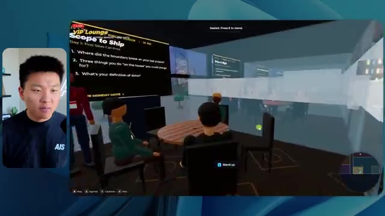

# 🎬 I Gave GPT 6 Astra $10,000 to Trade Stocks...And This Happened

> **Chaîne** : [Nate Herk | AI Automation](https://www.youtube.com/@nateherk/featured)  
> **Lien YouTube** : [https://www.youtube.com/watch?v=eg_1NXDcoPk](https://www.youtube.com/watch?v=eg_1NXDcoPk)  
> **Date de publication** : 20260928  
> **Durée** : 00:17:59  
> **Identifiant vidéo** : `eg_1NXDcoPk`  
> **Transcription & Analyse** : `whisper-v3-large-turbo+gemini-3.5-flash-lite`  

---

## 📌 Synthèse Exécutive & Outils

### 💡 Résumé

Cette vidéo immersive de la chaîne *Nate Herk | AI Automation* propose une expérimentation technique fascinante autour de l'évaluation empirique d'un modèle d'intelligence artificielle de pointe — **Opus 5.5** — à travers ses différents niveaux d'effort (de faible à ultra code). L'objectif fixé à l'agent IA était particulièrement ambitieux et complexe : concevoir intégralement un monde virtuel en 3D explorable à la troisième personne, reproduisant fidèlement une conférence technologique physique (AIS Live), en exploitant dynamiquement un dossier brut de 105 gigaoctets de ressources vidéo (Frame.io), des outils de génération multimédia (key.ai) et l'écosystème de développement du créateur.

La démonstration met en lumière les écarts de performance, de qualité visuelle, de fidélité contextuelle et de robustesse technique entre les configurations d'effort. Alors que le niveau **faible** livre une application instable, truffée de bugs d'affichage, d'images figées et d'artefacts visuels après 16 minutes d'exécution, le niveau **moyen** surprend par sa pertinence fonctionnelle. Ce dernier respecte scrupuleusement la charte graphique de la marque, intègre correctement les flux vidéo en direct, positionne des PNJ interactifs cohérents et structure un espace virtuel crédible (hall, salon VIP, scènes principales, pistes de formation), le tout en 1 heure et 13 minutes pour un coût API simulé de 12,44 dollars, sans jamais nécessiter d'intervention humaine ou de questions de clarification.

L'analyse de cette expérimentation démontre l'importance critique du paramétrage de l'effort dans l'ingénierie des agents IA autonomes. Elle souligne également l'efficacité redoutable de ces flux de travail pour transformer des données brutes massives en interfaces logicielles fonctionnelles, tout en posant la problématique récurrente du déploiement en production, habilement résolue ici par l'intégration d'outils d'hébergement et d'extensions de développement.

### 🛠️ Outils, Modèles & Logiciels Présentés

* **Opus 5.5** : Modèle d'IA central de pointe développé par Anthropic, réputé pour son intelligence supérieure, son coût avantageux et sa capacité à s'adapter finement aux différents niveaux d'effort demandés.
* **Claude Code** : Environnement et assistant de programmation par la ligne de commande utilisé pour exécuter les tâches de développement logiciel complexes et interagir avec les dossiers de code.
* **Niveau d'Effort (Effort Level)** : Paramètre de configuration granulaire (faible, moyen, haut, extra, max, code ultra) permettant d'ajuster la profondeur de réflexion, le temps d'exécution et la consommation de jetons d'un agent IA.
* **Frame.io** : Plateforme cloud collaborative de gestion vidéo utilisée pour stocker et structurer les 105 gigaoctets d'enregistrements bruts de la conférence AIS Live.
* **key.ai** : Outil de génération d'actifs visuels (images et vidéos) mobilisé par l'agent pour enrichir le design du monde 3D.
* **Herc 2** : Système d'exploitation d'intelligence artificielle propriétaire du créateur, servant de base contextuelle et d'écosystème de ressources pour les agents.
* **Hostinger Connector** : Extension gratuite pour éditeurs de code (VS Code, Cursor, Claude Code, Codex) permettant de connecter et de déployer rapidement des projets directement depuis l'environnement de développement.

### 🔑 Points Clés & Enseignements Stratégiques

* **Impact direct du niveau d'effort sur la qualité finale** : L'expérimentation prouve de manière empirique qu'augmenter le niveau d'effort d'un agent IA ne se limite pas à consommer plus de jetons, mais modifie radicalement la structure, la stabilité et la finition esthétique du produit logiciel généré.
* **Pertinence de la recommandation d'Anthropic** : Suivre les directives officielles d'Anthropic — qui conseillent d'initier les tâches complexes au niveau "moyen" avant d'ajuster itérativement — s'avère être une stratégie optimale pour équilibrer temps de calcul, coûts API et qualité de rendu.
* **Autonomie totale des agents sous « slash goal »** : Sur l'ensemble des exécutions testées, l'agent a mené à bien la création du monde virtuel complexe sans poser la moindre question de clarification, démontrant une excellente autonomie face à des objectifs globaux et ouverts.
* **Exploitation contextuelle de données massives** : L'agent a démontré une capacité remarquable à ingérer, trier et exploiter intelligemment un volume brut considérable de 105 Go de vidéos (via Frame.io) pour contextualiser les horaires, les pistes, les salles et les intervenants de la vraie conférence.
* **Gestion des identités de marque et de la charte graphique** : Le passage d'un effort faible (génération générique non alignée) à un effort moyen (respect strict des palettes de couleurs, des logos et des badges personnalisés) illustre la capacité des modèles avancés à intégrer des directives de design complexes.
* **Dynamisme et interactivité des environnements virtuels** : Le niveau moyen a surpassé les attentes en introduisant des PNJ (personnages non-joueurs) capables d'interagir visuellement (lever les bras), des flux vidéo réels intégrés sur des écrans 3D et une navigation fluide à la troisième personne.
* **Rationalisation économique des coûts d'ingénierie** : Pour un coût API simulé de seulement 12,44 dollars et un temps de traitement d'un peu plus d'une heure, l'agent a accompli un travail de prototypage 3D complet qui aurait nécessité des semaines de développement humain traditionnel.
* **Consommation de jetons et métriques d'exécution** : L'augmentation de la complexité se traduit par une consommation exponentielle des ressources (passant de 191 000 jetons et 16 minutes en mode faible à 490 000 jetons et 1 heure 13 minutes en mode moyen), soulignant un arbitrage nécessaire entre la précision et les contraintes de temps.
* **Validation itérative automatisée** : L'agent a utilisé des boucles de vérification (comme l'ouverture répétée du navigateur à 22 ou 23 reprises) pour tester et auditer de manière autonome son propre travail visuel au fil de sa construction.
* **Le goulet d'étranglement du déploiement post-développement** : La vidéo met en lumière une friction classique de l'ingénierie moderne : l'IA génère un projet fonctionnel parfait sur la machine locale, mais nécessite des intégrations fluides (comme le connecteur Hostinger) pour combler le fossé vers la mise en ligne en production.

---

## ⏱️ Chronologie & Transcription Complète Audio & Visuelle (Mot pour Mot)

### ⏱️ `[00:00:00 - 00:00:20]` | Segment #01

**🔊 Audio (Transcription Intégrale Mot pour Mot en Français) :**
> Opus 5.5, Opus 5.5, Opus 5.5, Opus 5.5, Opus 5.5. Ce modèle est littéralement partout et pour de très bonnes raisons. Il est intelligent, il est bon marché, il a un goût incroyable, c'est un modèle d'IA incroyable. Mais avec chaque modèle d'IA, vous avez le choix de l'effort, que ce soit faible, moyen, haut, extra, max ou code ultra.

**👁️ Analyse Visuelle d'Écran (gemini-3.5-flash-lite) :**
**Interface & Outils** : X (anciennement Twitter)

**Contenu textuel & Code** : Publication sur X avec texte et vidéo/image intégrée montrant un environnement 3D tropical.

**Action / Démonstration** : Le présentateur illustre ses propos en affichant un post sur les réseaux sociaux concernant l'impact des modèles d'IA sur les créateurs.

*⏱️ 00:00:05 — Une capture d'écran d'un post sur le réseau social X montrant une image avec un paysage en 3D d'une île tropicale et le commentaire textuel d'un utilisateur sur les créateurs techniques.*

---

### ⏱️ `[00:00:20 - 00:00:38]` | Segment #02

**🔊 Audio (Transcription Intégrale Mot pour Mot en Français) :**
> Donc dans cette vidéo, j'ai donné exactement le même prompt à Opus 5.5 et je l'ai exécuté à chaque niveau d'effort, et nous allons comparer les résultats. Nous allons examiner la qualité de tous les différents résultats réels, mais nous allons aussi examiner combien de temps chacun d'eux a pris pour s'exécuter, combien cela nous a coûté si c'était une facturation par API, le nombre total de jetons, combien de vérifications ils ont exécutées, et combien de questions ils m'ont réellement posées tout au long du processus.

**👁️ Analyse Visuelle d'Écran (gemini-3.5-flash-lite) :**
**Interface & Outils** : Application de tableau ou outil de mindmapping en ligne (type Miro/Obsidian/Canvas).

**Contenu textuel & Code** : Tableau comparatif avec les lignes : Run time, API cost, Total tokens, Checks, Questions asked, pour les colonnes Low, Medium, High, Extra, Max et Ultracode.

**Action / Démonstration** : Présentation du tableau comparatif des différents niveaux d'effort d'Opus 5.5.

*⏱️ 00:00:29 — Capture d'une interface de tableau comparatif intitulé "Opus 5.5 Efforts" listant différents niveaux d'effort (Low, Medium, High, Extra, Max, Ultracode) et métriques.*

---

### ⏱️ `[00:00:39 - 00:00:58]` | Segment #03

**🔊 Audio (Transcription Intégrale Mot pour Mot en Français) :**
> Et les résultats que nous avons obtenus ne sont pas du tout ce à quoi je m'attendais, donc j'ai hâte de partager cela avec vous les gars. Ne perdons pas de temps et allons directement à celui-ci. D'accord, alors plongeons-nous directement dans celui-ci. Je veux commencer juste en vous montrant, les gars, le prompt réel que nous avons utilisé, que nous avons donné à chacun de ces différents agents. Je vais aller dans les fichiers ici, et nous allons ouvrir ce fichier markdown de prompt, et je vais vous montrer ce que nous avons obtenu. Voici donc le slash objectif que j'ai fourni.

**👁️ Analyse Visuelle d'Écran (gemini-3.5-flash-lite) :**
**Interface & Outils** : Interface de développement IA / éditeur (type Cursor ou outil propriétaire).

**Contenu textuel & Code** : Prompt de l'IA : "Hi Nate. This worktree has the effort-test task queued in PROMPT.md : build a walkable third-person 3D world of the AIS Live conference... I haven't started it. Should I begin, or did you have something else in mind?"

**Action / Démonstration** : Affichage de l'interface de l'agent IA avec les options de niveau d'effort (Hello, Extra, High, Max, Ultracode, Medium, Low) et la vue incrustée du présentateur.

*⏱️ 00:00:48 — Interface de l'application montrant l'éditeur de code avec le panneau latéral d'effort-test et le prompt de l'assistant IA demandant s'il doit commencer à construire le monde 3D.*

---

### ⏱️ `[00:00:58 - 00:01:34]` | Segment #04

**🔊 Audio (Transcription Intégrale Mot pour Mot en Français) :**
> J'ai dit, tu dois me créer un monde en 3D qui est une conférence tech réaliste dans laquelle je peux me déplacer en vue à la troisième personne. Tu vas regarder ce dossier, qui contient mes ressources d'enregistrement d'événements de AIS Live. Et ce dossier est un dossier Frame.io de 105 gigaoctets d'enregistrements vidéo. C'était un événement entièrement virtuel. Tout a été enregistré et tous les enregistrements sont juste ici. J'ai dit, ton objectif est de prendre cet événement et de le transformer en un monde 3D explorable qui me donne l'impression d'être réellement allé à une vraie conférence en personne avec différentes salles, différentes pistes, différentes scènes, bla, bla, bla. N'hésite pas à utiliser key.ai si tu as besoin de générer des images ou des vidéos. Et tu peux aussi utiliser tout le reste à l'intérieur de mon projet Herc 2, qui est comme mon système d'exploitation IA. J'ai dit,

**👁️ Analyse Visuelle d'Écran (gemini-3.5-flash-lite) :**
**Interface & Outils** : Éditeur de code (interface sombre) et navigateur web (Interface Frame.io).

**Contenu textuel & Code** : Texte du prompt demandant de créer un monde 3D de conférence tech réaliste à partir de ressources d'enregistrement Frame.io (105 Go).

**Action / Démonstration** : Présentation du prompt initial et du dossier Frame.io contenant les ressources vidéo pour le projet de monde 3D.

*⏱️ 00:01:07 — Un fichier PROMPT.md affiché dans un éditeur de code, détaillant les instructions pour créer un monde 3D interactif basé sur un événement AIS Live.*

*⏱️ 00:01:16 — Une interface web Frame.io montrant un dossier d'enregistrements d'événements de 105,69 Go (AIS Live).*

*⏱️ 00:01:25 — Le même éditeur de code affichant le fichier PROMPT.md avec le prompt complet demandant de transformer les enregistrements en monde 3D explorable.*

---

### ⏱️ `[00:01:34 - 00:02:08]` | Segment #05

**🔊 Audio (Transcription Intégrale Mot pour Mot en Français) :**
> vous serez jugé sur la créativité, le design, la physique et la sensation générale lorsque j'explorerai le monde 3D que vous avez construit. Et c'était fondamentalement la fin des instructions. Donc, comme vous pouvez le voir sur ce côté gauche, j'ai exécuté ceci à travers tous les différents niveaux d'effort. Commençons par le niveau bas et remontons jusqu'à ultra code. Très bien. Donc ici, nous avons le résultat du niveau bas. Ouvrons ceci et jetons un œil. Donc nous avons AIS Live, le sommet des services IA en personne enfin, et nous avons pu cliquer partout. Tout d'abord, on ne sent pas vraiment la marque. Genre, ce n'ce n'est pas le logo d'IS Live. Ce n'est même pas nos couleurs. Donc je n'aime pas trop ça, mais entrons ici. D'accord. C'est beaucoup trop lumineux. Euh, nous avons une carte en haut à droite ; nous avons une ville par ici, je ne peux pas dire quelle ville c'est.

**👁️ Analyse Visuelle d'Écran (gemini-3.5-flash-lite) :**
**Interface & Outils** : Interface web de l'application de développement IA (style Claude / agent de coding).

**Contenu textuel & Code** : Liste des sessions de test d'effort ("Session logs cost analysis" avec les options Hello, Extra, High, Max, Ultracode, Medium, Low) et un message de l'assistant IA proposant de commencer la tâche de construction d'un monde 3D.

**Action / Démonstration** : Navigation et sélection des différents niveaux d'effort dans le panneau latéral gauche de l'interface.

*⏱️ 00:01:42 — Interface d'une application d'assistant IA affichant les différents niveaux d'effort (Hello, Extra, High, Max, Ultracode, Medium, Low) dans un panneau latéral et une discussion avec l'agent dans la zone principale.*

---

### ⏱️ `[00:02:08 - 00:02:40]` | Segment #06

**🔊 Audio (Transcription Intégrale Mot pour Mot en Français) :**
> c'est. D'accord. C'est Chicago, ce qui est plutôt cool parce que tu sais, j'habite à Chicago, mais bref, en haut à droite, on peut voir une carte. Nous avons un hall d'accueil. Nous avons une salle d'exposition. Nous avons un salon VIP, la scène principale. La carte montre également où se trouve chaque autre personne et cela se synchronise en direct. On peut donc voir l'enregistrement. On peut voir le premier jour, la keynote de l'hyper agent, le débriefing en direct. Cool. Donc il connaît réellement l'agenda et puis il y a le deuxième jour. Donc il a trouvé ça, c'est bien. Nous avons ces petites boules ici que je peux espérer botter. D'accord. Le visage, oh, regardez ça. Si je vais par ici, tous les gens disparaissent tout simplement. Très mauvais. Très mauvais. D'accord. Alors voyons voir. Est-ce que je peux sprinter ? D'accord.

**👁️ Analyse Visuelle d'Écran (gemini-3.5-flash-lite) :**
**Interface & Outils** : Application web virtuelle en 3D (type Gather.town ou environnement virtuel de conférence).

**Contenu textuel & Code** : Plan du site, affichage des zones (Lobby, Exposition, Salon VIP, Scène principale) et planning des sessions.
[DESC_IMAGE_3] Navigation dans l'espace virtuel et exploration des différentes zones de la conférence.

**Action / Démonstration** : Explications face caméra et démonstration conceptuelle.

*⏱️ 00:02:16 — Vue d'un espace virtuel en 3D avec un avatar et une mini-carte en haut à droite montrant différentes zones de l'événement.*

*⏱️ 00:02:24 — Vue du lobby virtuel affichant le programme du premier jour sur un panneau interactif.*

*⏱️ 00:02:32 — Vue de la salle d'exposition virtuelle (Expo Hall) montrant des avatars et des éléments lumineux interactifs.*

---

### ⏱️ `[00:02:40 - 00:03:04]` | Segment #07

**🔊 Audio (Transcription Intégrale Mot pour Mot en Français) :**
> Je peux avancer un peu plus vite. Je vais d'abord aller par ici. Il y a des produits dérivés, euh, un sweat à capuche certifié AIS plus. D'accord. Donc il y a les vrais stands qu'on avait dans l'événement virtuel. On avait des stands. Donc c'est plutôt cool. Un petit endroit pour prendre des photos. Salle C. En ce moment, nous avons Tangy Frederick qui anime un atelier. D'accord. Mais ce n'est pas une vidéo. Comme vous pouvez le voir, c'est juste une image. Elle ne bouge pas. Donc c'est juste une image. Ces gens sont en train de disparaître. Ça doit être des fantômes. Allons par ici vers la salle A.

**👁️ Analyse Visuelle d'Écran (gemini-3.5-flash-lite) :**
**Interface & Outils** : Environnement virtuel 3D de type métavers / jeu vidéo.

**Contenu textuel & Code** : Éléments graphiques d'un événement virtuel, stands de sponsors et panneaux d'affichage d'instructions.

**Action / Démonstration** : Navigation et exploration de l'espace virtuel par le présentateur.

---

### ⏱️ `[00:03:04 - 00:03:30]` | Segment #08

**🔊 Audio (Transcription Intégrale Mot pour Mot en Français) :**
> Nous avons Liberty White. D'accord. Très cool. Vos 30 premiers jours en automatisation. Encore une fois, c'est juste une image fixe et les gens ont des bugs d'affichage. Donc ce n'est pas très bon ici. Je vais aller sur la scène principale et voir ce que nous avons. D'accord, cool. Donc nous avons une scène principale. Les gens ont de gros bugs d'affichage. Vraiment mauvais. Ce n'est vraiment pas bon du tout. Notre vidéo est en train de bouger. Genre, j'ai vu mon visage ici et j'ai vu celui de Devin, mais maintenant ils ont disparu. Donc je ne sais pas ce qui s'est passé. D'accord. On dirait que c'est plutôt un diaporama. Rien n'est vraiment lu pour l'instant. Quoi qu'il en soit, entrons ici.

**👁️ Analyse Visuelle d'Écran (gemini-3.5-flash-lite) :**
**Interface & Outils** : Application de métavers / monde virtuel 3D interactif (similaire à Gather Town ou un environnement 3D personnalisé).

**Contenu textuel & Code** : Interface utilisateur virtuelle affichant 'AIS LIVE AI Services Summit' et 'Now showing: Hyperagent Workshop: How to Build an Always-On Fleet of Agents'.

**Action / Démonstration** : Navigation et déplacement d'un avatar 3D à l'intérieur d'un espace de conférence virtuel.

*⏱️ 00:03:11 — Vue dans une salle virtuelle 3D (Workshop Room A - Foundation track) avec un avatar joueur et des plateformes lumineuses au sol.*

*⏱️ 00:03:17 — Vue de la scène principale d'un événement virtuel (Main Stage) montrant une salle comble remplie d'avatars virtuels assis et l'avatar du présentateur se déplaçant.*

*⏱️ 00:03:24 — Vue de face de la scène principale avec le grand écran affichant 'AIS LIVE AI Services Summit' et l'avatar du présentateur qui court.*

---

### ⏱️ `[00:03:30 - 00:03:58]` | Segment #09

**🔊 Audio (Transcription Intégrale Mot pour Mot en Français) :**
> Nous avons plus de stands. Nous avons hyper agent. Nous avons Claude Code. Nous avons plus de goodies. La salle B, c'est Dave Ebelor. Je suppose que c'est exactement la même chose. Nous avons du café. Et ensuite, je suppose que le salon VIP, accès VIP uniquement. C'est plutôt cool, mais il n'y a vraiment rien qui se passe ici. Cet écran est bien trop lumineux. Bon. Donc je pense que vous comprenez l'ambiance qu'on obtient ici de la part d'Opus 5.5 en effort faible. Et c'est là que les choses deviennent intéressantes. À combien est-ce que vous estimez que cela a fonctionné ? Combien de temps ? Celui-ci a duré 16 minutes et 43 secondes. Combien pensez-vous que cela a coûté ?

**👁️ Analyse Visuelle d'Écran (gemini-3.5-flash-lite) :**
**Interface & Outils** : Application web de tableau blanc / interface de comparaison de modèles (Opus 5.5 Efforts).

**Contenu textuel & Code** : Tableau avec des colonnes de niveau d'effort (Low, Medium, High, Extra, Max, Ultracode) et des lignes de métriques (Run time, API cost, Total tokens, Checks, Questions asked).

**Action / Démonstration** : Présentation et analyse comparative des différents niveaux d'effort et de leurs coûts/performances.

*⏱️ 00:03:51 — Tableau comparatif intitulé 'Opus 5.5 Efforts' montrant différentes métriques (Run time, API cost, Total tokens, Checks, Questions asked) selon plusieurs niveaux (Low, Medium, High, Extra, Max, Ultracode).*

---

### ⏱️ `[00:03:58 - 00:04:26]` | Segment #10

**🔊 Audio (Transcription Intégrale Mot pour Mot en Français) :**
> 3,91 dollars si c'était une facturation par API. J'utilise évidemment mon abonnement ici, mais nous allons simplement calculer cela en facturation par API. Le total des jetons était de 191 000. Il a effectué 22 vérifications. Donc pour la vérification, il a ouvert le navigateur 22 fois et a exécuté différents types de vérifications. Donc 22 catégories de vérifications. Et combien de questions m'a-t-il posées ? Il m'a posé un total de zéro question tout au long de cette invite de type « slash goal ». D'accord. Alors, ouvrons l'effort moyen et voyons ce que nous avons. D'accord, c'est parti. Effort moyen. Nous avons Nate Herc. Nous avons mon badge. C'est marqué aux couleurs d'AI's life.

**👁️ Analyse Visuelle d'Écran (gemini-3.5-flash-lite) :**
**Interface & Outils** : Application de tableau blanc ou de prise de notes de type Excalidraw ou similaire.

**Contenu textuel & Code** : Tableau de données chiffrées : Run time (16m 43s), API cost ($3.91), Total tokens (191.3K), Checks, Questions asked.

**Action / Démonstration** : Le présentateur commente les résultats chiffrés affichés dans le tableau pour le niveau 'Low'.

*⏱️ 00:04:05 — Un tableau comparatif sur fond sombre montrant les métriques d'exécution pour différents niveaux ('Low', 'Medium', 'High', 'Ex'), avec la colonne 'Low' remplie : 'Run time' 16m 43s, 'API cost' $3.91, 'Total tokens' 191.3K, 'Checks' et 'Questions asked'. Le présentateur est visible en incrustation vidéo à gauche.*

---

### ⏱️ `[00:04:26 - 00:04:46]` | Segment #11

**🔊 Audio (Transcription Intégrale Mot pour Mot en Français) :**
> Donc ça a déjà l'air un petit peu mieux. Ça ressemble à nos palettes de couleurs qui ont utilisé nos directives de marque. Premier jour de construction, deuxième jour de gain, VIP. Cool. D'accord. Je vais entrer dans le lieu. D'accord. Waouh. Une ambiance similaire, en gros. C'est en arrière-plan. Ça ne ressemble pas à Chicago, hein ? Non, ça ressemble à, honnêtement, ça ressemble à une ville inventée. Quoi qu'il en soit, c'est marrant qu'ils aient décidé de faire ça. Voyons si je peux me déplacer un peu plus vite. Oh, waouh.

**👁️ Analyse Visuelle d'Écran (gemini-3.5-flash-lite) :**
**Interface & Outils** : Application web interactive / Plateforme virtuelle 3D AIS Live.

**Contenu textuel & Code** : Écran d'accueil avec badge utilisateur personnalisable ('NATE HERK', 'Host - All Access'), boutons de navigation et contrôles clavier, puis vue d'un salon virtuel 3D avec avatars.

**Action / Démonstration** : Le présentateur entre dans le lieu virtuel en cliquant sur le bouton d'accès et découvre l'environnement 3D.

*⏱️ 00:04:31 — Interface d'accueil de l'application 'AIS Live' avec un badge d'accès au nom de Nate Herk et des options de navigation.*

*⏱️ 00:04:41 — Vue en 3D d'un espace virtuel interactif (type métavers) avec des avatars d'utilisateurs et un décor urbain en arrière-plan.*

---

### ⏱️ `[00:04:46 - 00:05:21]` | Segment #12

**🔊 Audio (Transcription Intégrale Mot pour Mot en Français) :**
> Les gens interagissent avec moi. Regardez. Si je m'approche de ce type, il vient de lever le bras. Bon, maintenant il ne veut plus du tout avoir affaire à moi. Mais tous ces petits robots ici doivent prendre des décisions. Je ne sais pas s'ils utilisent Jev. C'est sûr que non. Je ne lui ai pas dit de le faire. En fait, ma clé Jev est à l'arrière. Je ne sais pas. Peut-être qu'il l'a utilisée. Quoi qu'il en soit, nous pouvons voir ici que nous avons la salle d'atelier C, le laboratoire des agents. Sympa. Donc celui-ci est réellement en train de tourner. Vous pouvez voir qu'il s'agit d'une vraie vidéo lue par Tangy. Tout le monde ici est en train de travailler sur un ordinateur portable. Ils ne buguent pas. C'est plutôt cool. De plus, mon badge est sur ma poitrine, ce qui est plutôt cool. Je peux venir par ici. Nous avons une carte en haut à droite, comme vous pouvez le voir, mais je peux venir par ici. Nous avons un

**👁️ Analyse Visuelle d'Écran (gemini-3.5-flash-lite) :**
**Interface & Outils** : Environnement virtuel 3D de type métavers ou simulation d'agents.

**Contenu textuel & Code** : Aucun code, terminal ou prompt visible à l'écran.

**Action / Démonstration** : Navigation et exploration d'un monde virtuel peuplé d'avatars représentant des agents.

---

### ⏱️ `[00:05:21 - 00:05:47]` | Segment #13

**🔊 Audio (Transcription Intégrale Mot pour Mot en Français) :**
> hall d'exposition. C'est ici que nous avons le stand Glido. Et ça diffuse en ce moment. Oui, ça diffuse la vidéo de nous en train de parler de Glido. Ça diffuse la vidéo d'Ed et moi parlant de notre programme de certification. Nous avons le logo AIS Plus ici à l'arrière, qui est placé dans un endroit un peu bizarre. Ce sont les diapositives des conférenciers et les points clés. Alors wow, ce sont toutes les ressources que nous avons distribuées après l'événement. Elles sont toutes là aussi. Nous pouvons voir que nous avons un projecteur sur la communauté. Donc c'est Aiden qui parle de son contrat qu'il a décroché et c'est diffusé en direct. Ces gens regardent.

**👁️ Analyse Visuelle d'Écran (gemini-3.5-flash-lite) :**
**Interface & Outils** : Environnement virtuel 3D interactif (type metaverse/salon virtuel).

**Contenu textuel & Code** : Présentation virtuelle d'un stand avec des diapositives et des avatars d'utilisateurs.

**Action / Démonstration** : Navigation et visite interactive d'un salon virtuel en 3D.

---

### ⏱️ `[00:05:47 - 00:06:21]` | Segment #14

**🔊 Audio (Transcription Intégrale Mot pour Mot en Français) :**
> Ils sont plutôt engagés. On a l'hyper agent. C'était, c'est ce que je voulais dire. Si vous avez vu ces gens lever les bras pour dire bonjour, c'était plutôt marrant. Regardez, regardez, le voilà qui recommence. Bref. Bon. Où est-ce que je suis maintenant ? Maintenant, je suis dans le hall principal. On a un bar à café. On a un grand logo, qui est le vrai logo. C'est trop lumineux, mais on a le logo. On peut voir si on peut entrer ici dans le parcours des fondations. On a Sabrina Romanov et Liberty White. Donc différentes formations juste là. On peut entrer dans cette salle. C'est le parcours avancé. Alors qu'est-ce qui se passe ici. On a Dave Ebelar et Saman qui parlent de trucs différents là-dedans. Et maintenant, allons jeter un œil à la scène principale. Oh, attendez, il y a une vidéo de moi là-haut. C'est du genre VIP ?

**👁️ Analyse Visuelle d'Écran (gemini-3.5-flash-lite) :**
**Interface & Outils** : Monde virtuel 3D (type métaverse/plateforme de conférence virtuelle) et webcam du présentateur.

**Contenu textuel & Code** : Environnement virtuel en 3D avec des avatars d'utilisateurs, une mini-carte en haut à droite et le titre "Main Lobby".

**Action / Démonstration** : Navigation et déplacement d'un avatar dans l'environnement virtuel 3D.

---

### ⏱️ `[00:06:21 - 00:06:50]` | Segment #15

**🔊 Audio (Transcription Intégrale Mot pour Mot en Français) :**
> section ? Ouais, on va aller voir ça dans une minute. Mais bref, voici la scène principale. Ça a l'air très, très bien. On a une grande scène. On a genre quatre personnes assises ici. On a les trois écrans d'Alex là-haut avec hyper agent. Est-ce que j'ai le droit de monter sur scène ? Oh, et il me laisse monter sur scène. OK. C'est plutôt sympa. Bon les gars, faisons un selfie. Laissez-moi prendre tout le monde en arrière-plan. Venez ici. Bref, c'est vraiment, vraiment cool. Tout le monde n'est pas assis par contre. Donc il faut qu'on travaille là-dessus. Mais bref, je vais y retourner en courant pour voir ce qu'était cette section VIP. OK. Salon VIP. J'ai l'impression que c'est comme un aéroport ou un truc comme ça.

**👁️ Analyse Visuelle d'Écran (gemini-3.5-flash-lite) :**
**Interface & Outils** : Application web ou plateforme virtuelle 3D (Hyperagent Keynote)

**Contenu textuel & Code** : Interface utilisateur affichant les détails de la session "Hyperagent Keynote - Alex McDonnell, Hyperagent"

**Action / Démonstration** : Navigation et exploration de l'espace virtuel 3D de la conférence par le présentateur

---

### ⏱️ `[00:06:51 - 00:07:14]` | Segment #16

**🔊 Audio (Transcription Intégrale Mot pour Mot en Français) :**
> Ok, super. Donc maintenant nous avons les sessions VIP ici. Une FAQ VIP avec la lecture vidéo en direct de Nate juste ici. Très, très cool. Et nous avons comme un bar ou quelque chose comme ça. Génial. Je dirais que c'est un assez bon résultat. Maintenant, en ce qui concerne les statistiques ici, celle-ci a pris une heure et 13 minutes à s'exécuter. Cela nous aurait coûté 12 dollars et 44 cents. Elle a utilisé 490 000 jetons et elle a effectué 23 vérifications.

**👁️ Analyse Visuelle d'Écran (gemini-3.5-flash-lite) :**
**Interface & Outils** : Application virtuelle 3D (espace VIP) et tableau de bord de statistiques Opus 5.5.

**Contenu textuel & Code** : Vidéo en direct de Nate, flux vidéo, espace lounge virtuel, et tableau chiffré (Run time: 16m 43s, API cost: $3.91, Total tokens: 191.3K, Checks: 22).

**Action / Démonstration** : Navigation et présentation de l'espace virtuel VIP puis transition vers l'analyse des statistiques d'exécution et de coûts de l'agent.

*⏱️ 00:06:56 — Capture montrant une application virtuelle interactive avec avatars et un écran diffusant une vidéo Q&A avec Nate, ainsi qu'un espace lounge VIP.*

*⏱️ 00:07:02 — Tableau de statistiques affichant les performances (temps d'exécution, coût API, jetons totaux, vérifications) sous l'interface Opus 5.5.*

---

### ⏱️ `[00:07:14 - 00:07:48]` | Segment #17

**🔊 Audio (Transcription Intégrale Mot pour Mot en Français) :**
> Et il nous a posé un total de zéro question une fois de plus. Très bien, passons à élevé. C'était déjà un résultat plutôt correct et Anthropic eux-mêmes dans leur vidéo, ou désolé, pas une vidéo, un article sur comment prompter Opus 5.5. Ils ont dit de commencer simplement par moyen et de l'ajuster vers le haut ou vers le bas si nécessaire. C'était donc un résultat moyen. Passons à élevé et voyons ce qu'on a obtenu. Très rapidement, les gars, je dois prendre une seconde pour vous parler du sponsor de la vidéo d'aujourd'hui, Hostinger. Donc ces deux modèles viennent de me créer une version fonctionnelle de la même chose. Et maintenant, je me retrouve exactement là où je finis toujours, avec un projet terminé sur mon ordinateur portable et aucun moyen rapide de le mettre en ligne. Et c'est précisément le fossé que comble le connecteur d'Hostinger. C'est une extension gratuite.

**👁️ Analyse Visuelle d'Écran (gemini-3.5-flash-lite) :**
**Interface & Outils** : Tableau de bord graphique et environnement de développement de type éditeur de code / interface d'assistant IA.

**Contenu textuel & Code** : Tableau comparatif des coûts et temps d'exécution d'Opus 5.5, et code/instructions pour la création d'un calculateur ROI en HTML.

**Action / Démonstration** : Analyse comparative des différents niveaux d'effort d'IA et suivi de la génération d'un outil web par un agent.

*⏱️ 00:07:22 — Un tableau comparatif affichant les performances selon différents niveaux d'effort (Low, Medium, High, Extra) avec les métriques associées (Run time, API cost, Total tokens, Checks, Questions asked).*

*⏱️ 00:07:39 — Une interface de développement avec un éditeur de code et un panneau de chat montrant l'exécution d'un prompt pour construire un calculateur ROI pour une agence.*

---

### ⏱️ `[00:07:48 - 00:08:23]` | Segment #18

**🔊 Audio (Transcription Intégrale Mot pour Mot en Français) :**
> pour votre éditeur qui intègre votre compte Hostinger dans l'outil de programmation que vous utilisez déjà, que ce soit VS Code, Cursor, Cloud Code, Codex, et j'en passe. Vous vous connectez une seule fois en un clic, et à partir de là, votre agent peut déployer le site, y associer un domaine, configurer les enregistrements DNS et vérifier votre VPS sans que vous n'ayez jamais à quitter l'éditeur. Ainsi, peu importe celui de ces outils que vous finirez par préférer, ce qu'il a construit n'est qu'à quelques minutes d'une véritable URL sur un hébergement géré. Le connecteur est gratuit avec chaque formule d'hébergement. Si vous avez donc encore besoin de l'hébergement sous-jacent, profitez de la formule illimitée grâce au lien dans la description et utilisez le code NATEHERK pour obtenir 10 % de réduction. Cela inclut également un nom de domaine gratuit et un e-mail professionnel pour un an. Et c'est toujours le moyen le plus économique que j'ai trouvé pour obtenir un

**👁️ Analyse Visuelle d'Écran (gemini-3.5-flash-lite) :**
**Interface & Outils** : Interface web Hostinger, Claude Code.

**Contenu textuel & Code** : Statut "Connected", options de gestion des sites web, domaines, abonnements et marketing.

**Action / Démonstration** : Connexion du compte Hostinger à l'éditeur via OAuth.

*⏱️ 00:07:57 — Interface d'intégration Hostinger connectée à un IDE avec les outils disponibles (Websites, Domains, Subscriptions, Email Marketing) et Claude Code en arrière-plan.*

---

### ⏱️ `[00:08:23 - 00:08:47]` | Segment #19

**🔊 Audio (Transcription Intégrale Mot pour Mot en Français) :**
> Tu as construit sur une vraie URL. Donc revenons à la vidéo. D'accord. Encore une fois, très, très marqué par la marque. C'est un écran de chargement encore mieux que le précédent. Nous avons ce joli petit effet en arrière-plan. Nous avons le logo. Nous allons entrer dans le lieu. D'accord. Nous y voilà. Ça a l'air plutôt bien. Nous commençons dehors et vous pouvez voir que nous avons ces drapeaux pour tous les intervenants, Wyatt, Casper, Alex, Ed, Aiden, Sabrina, Liberty. C'est plutôt cool. Nous avons des blocs en direct ici.

**👁️ Analyse Visuelle d'Écran (gemini-3.5-flash-lite) :**
**Interface & Outils** : Application web 3D interactive (RingCentral / AIS Live)

**Contenu textuel & Code** : Interface utilisateur de monde virtuel 3D avec bannières d'événements, mini-carte et contrôles clavier/souris affichés à l'écran.

**Action / Démonstration** : Connexion et entrée dans le lieu virtuel 3D de l'événement AIS Live.

*⏱️ 00:08:29 — Écran de chargement de l'application web "AIS LIVE" avec logo, informations sur l'événement et bouton "Enter the venue".*

*⏱️ 00:08:35 — Vue de la place virtuelle 3D "AIS Live Plaza" montrant un environnement urbain stylisé avec des avatars de personnages.*

*⏱️ 00:08:41 — Exploration de la place virtuelle 3D "AIS Live Plaza" avec des panneaux affichant des noms d'intervenants.*

---

### ⏱️ `[00:08:47 - 00:09:23]` | Segment #20

**🔊 Audio (Transcription Intégrale Mot pour Mot en Français) :**
> il a pris cette photo de moi, votre hôte, Nate Herc, John, Dave, Nate Herc. Voilà. D'accord. Les portes. Génial. Ce sont des portes coulissantes automatiques en verre. J'adore ça. Nous pouvons voir l'enregistrement VIP. Nous pouvons voir l'admission générale. Nous pouvons venir ici et nous pouvons découvrir l'exposition avec différents stands, le projecteur sur la communauté. Vous pouvez également voir qu'en haut à gauche, j'ai un passeport. Donc c'est comme si, cela montrera combien d'endroits j'ai visités. Tout cela est une vraie lecture. Nous avons un mur de ressources avec tous les différents intervenants. Ils ont aussi une session de réseautage par ici. Je vais donc venir très vite et voir de quoi il s'agit. Nous avons donc le bar à cold brew AIS. Nous avons différents membres de la communauté qui ont été mis en avant ou mis en lumière.

**👁️ Analyse Visuelle d'Écran (gemini-3.5-flash-lite) :**
**Interface & Outils** : Application web interactive 3D / Environnement virtuel d'événement en ligne.

**Contenu textuel & Code** : Interface utilisateur virtuelle affichant "Registration Concourse", des bannières "VIP Check-in" et des éléments de navigation 3D.

**Action / Démonstration** : Navigation et exploration d'un environnement virtuel interactif en 3D par l'utilisateur.

*⏱️ 00:08:56 — Vue d'un monde virtuel interactif montrant l'accueil d'un événement avec des comptoirs d'enregistrement et une scène principale.*

*⏱️ 00:09:05 — Navigation dans le hall d'exposition virtuel avec des stands et des panneaux d'information interactifs.*

*⏱️ 00:09:14 — Déplacement d'avatars virtuels dans un grand hall d'accueil vitré avec des comptoirs d'inscription.*

---

### ⏱️ `[00:09:23 - 00:09:56]` | Segment #21

**🔊 Audio (Transcription Intégrale Mot pour Mot en Français) :**
> Nous avons l'aile VIP. Attends, quoi ? Prends un bracelet. Oh, je dois vraiment aller chercher le bracelet. D'accord. Laisse-moi m'enregistrer rapidement. Le bracelet est déjà mis. Attends, quoi ? D'accord. Oh, d'accord. Maintenant, les portes se sont ouvertes pour moi. Cool. Je peux entrer ici. Oh, ça mène juste à la scène principale. Salon VIP. Il y a une séance de questions-réponses en cours. Ça a l'air très cool. Je veux dire, je suis très impressionné par la façon dont il est capable de faire ça. Waouh. D'accord. Donc c'est vraiment bien. Ce qu'on a fait, c'est qu'on a eu des salles de discussion VIP avec différentes personnes. Tu peux voir qu'il y a différentes salles, différents membres de l'équipe AIS qui vont dans des trucs. C'est vraiment cool. C'est très cool. C'est un VIP bien meilleur

**👁️ Analyse Visuelle d'Écran (gemini-3.5-flash-lite) :**
**Interface & Outils** : Application de métaverse / plateforme virtuelle 3D (Gather ou similaire).

**Contenu textuel & Code** : Éléments d'interface virtuelle : carte, progression (Passport), indications textuelles ("Registration Concourse", "VIP Lounge", "VIP Working Sessions").
[DESC_IMAGE_3] Navigation de l'avatar et exploration des différentes zones VIP de l'événement virtuel.

**Action / Démonstration** : Explications face caméra et démonstration conceptuelle.

*⏱️ 00:09:32 — Vue d'un espace virtuel en 3D avec un avatar et une interface de hall d'enregistrement (Registration Concourse).*

*⏱️ 00:09:40 — Vue de la salle VIP Lounge dans l'environnement virtuel avec un écran affichant une visioconférence.*

*⏱️ 00:09:48 — Vue de l'espace VIP Working Sessions avec plusieurs tables de travail et des affiches thématiques.*

---

### ⏱️ `[00:09:56 - 00:10:30]` | Segment #22

**🔊 Audio (Transcription Intégrale Mot pour Mot en Français) :**
> expérience que ce qui a été montré dans la première partie. D'accord. After party VIP. Regardez ça. Nous avons une piste de danse. Nous avons tous ces éléments ici. Nous avons la lecture de l'after party VIP juste ici. Et il y a une estrade de DJ. C'est trop drôle. Il y a un petit bug ici, un petit pépin ici, mais c'est génial. Oh, chouette. Donc quand je suis ici sur la scène principale, nous avons des sous-titres. Vous pouvez voir juste ici au bas de mon écran, nous avons ces sous-titres de Wyatt qui est en train de parler ici. Nous avons des lumières. Nous avons le panneau. Très cool. Belle scène principale. Je vais aller ici. Nous pouvons aller à la fondation,

**👁️ Analyse Visuelle d'Écran (gemini-3.5-flash-lite) :**
**Interface & Outils** : Application ou plateforme virtuelle 3D de type métavers pour événement en ligne.

**Contenu textuel & Code** : Interface utilisateur virtuelle avec affichage de la scène, des participants en vidéo et des contrôles de navigation.

**Action / Démonstration** : Navigation et présentation de l'espace virtuel par le présentateur.

---

### ⏱️ `[00:10:30 - 00:11:06]` | Segment #23

**🔊 Audio (Transcription Intégrale Mot pour Mot en Français) :**
> avancé, et les parcours d'entreprise par ici. Donc voyons voir. Nous avons l'anatomie de trois vrais contrats. Nous avons hyper agent. Nous avons les évaluations avec Nate et Ed ici. Nous avons Dave qui s'occupe des trucs avancés. C'est vraiment bien. Je veux dire, évidemment, chacun, chacun de ces résultats jusqu'à présent, faible était correct. Moyen était meilleur. Élevé a été encore meilleur. Voyons si cette tendance se poursuit et voyons combien cela nous a coûté. Donc, élevé a fonctionné pendant une heure et sept minutes. Donc un peu plus rapide que moyen, cela nous aurait coûté 16 dollars et 31 cents. Il a utilisé un demi-million de jetons, 509 000. Il a fait 22 vérifications. Et il nous a aussi demandé, enfin, non, je me suis trompé. Ce

**👁️ Analyse Visuelle d'Écran (gemini-3.5-flash-lite) :**
**Interface & Outils** : Application de tableau blanc / interface de présentation (type Excalidraw ou similaire).

**Contenu textuel & Code** : Tableau comparatif des coûts et performances d'exécution (Run time de 16m à 1h13, API cost de 3,91 $ à 16,31 $, Total tokens de 191K à 419K, Checks, Questions asked).

**Action / Démonstration** : Le présentateur analyse ou édite les données chiffrées comparatives affichées dans le tableau.

*⏱️ 00:10:57 — Capture montrant un tableau comparatif avec les colonnes Low, Medium, High et Extra détaillant Run time, API cost, Total tokens, Checks et Questions asked.*

---

### ⏱️ `[00:11:06 - 00:11:25]` | Segment #24

**🔊 Audio (Transcription Intégrale Mot pour Mot en Français) :**
> L'un m'a posé une question et, attention spoiler, c'était le seul à nous poser une question de tout ça. Voyons voir, il nous en reste trois : extra, max et ultra code. Laisse-moi ouvrir extra et nous verrons ce que nous avons. D'accord. Celui-ci a l'air plutôt bien. Je dirais honnêtement que jusqu'à présent, l'écran de chargement haut était le meilleur. Celui que nous venons juste de voir, mais bref, entrons dans AIS live.

**👁️ Analyse Visuelle d'Écran (gemini-3.5-flash-lite) :**
**Interface & Outils** : Application de tableau blanc ou tableau de bord analytique (Opus 5.5 Efforts).

**Contenu textuel & Code** : Tableau avec des colonnes Low, Medium, High, Extra et des lignes Run time, API cost, Total tokens, Checks, Questions asked.

**Action / Démonstration** : Le présentateur commente les résultats du tableau et s'apprête à ouvrir la section 'Extra'.

*⏱️ 00:11:11 — Tableau comparatif affichant les métriques de différents efforts (Low, Medium, High, Extra) incluant le temps d'exécution, le coût API, les tokens, les vérifications et les questions posées.*

---

### ⏱️ `[00:11:26 - 00:11:51]` | Segment #25

**🔊 Audio (Transcription Intégrale Mot pour Mot en Français) :**
> Ouaouh. D'accord. Donc nous avons comme de petits extraits sonores. Je peux discuter avec des gens. Le panneau sur la guerre des outils a réglé quelques débats pour moi. Sympa. Bonne perspective là-bas. Nous sommes dehors à nouveau. Nous avons ces différentes bannières, bien qu'elles soient toutes les mêmes. Elles n'affichent pas les noms de différentes personnes. Donc, grand logo AIS Live. L'aile de l'atelier est par ici. Et passons par les portes coulissantes en verre et voyons ce que nous avons. Nous avons donc le café AIS. La carte est en bas à droite, et elle n'est pas très descriptive.

**👁️ Analyse Visuelle d'Écran (gemini-3.5-flash-lite) :**
**Interface & Outils** : Environnement virtuel 3D / Interface de métavers ou monde virtuel interactif.

**Contenu textuel & Code** : Aucun code source, terminal, prompt ou données textuelles affichés (uniquement l'environnement virtuel avec des avatars et des bannières).

**Action / Démonstration** : Navigation et déplacement d'un avatar dans l'espace virtuel 3D de la convention.

---

### ⏱️ `[00:11:51 - 00:12:26]` | Segment #26

**🔊 Audio (Transcription Intégrale Mot pour Mot en Français) :**
> J'aime bien comment les autres cartes nous ont indiqué ce à quoi, genre où étaient les choses, mais celle-ci a l'air très professionnelle. On peut voir ici la scène principale. Allons y faire un tour rapidement. Elles ont toutes ces balles qui volent partout, ce qui je trouve est plutôt marrant. Les ballons de plage AIS. On me voit là-haut en train de parler. Je crois que j'introduisais l'un des jours. Continuons à avancer par ici vers la salle d'atelier sur ce côté gauche. OK. Donc ici nous avons le théâtre Hyper Agent. Nous avons cette session sponsorisée ici par Hyper Agent, mais cela nous montre aussi ce qui va s'y passer. C'est vraiment marrant qu'on puisse discuter avec des gens. Salmon a créé un commercial vocal en direct. La salle "Le Juste Prix" était comble. Avez-vous pris le guide du compagnon VIP ? C'قص tellement marrant. Nous avons le parcours avancé en

**👁️ Analyse Visuelle d'Écran (gemini-3.5-flash-lite) :**
**Interface & Outils** : Application web de monde virtuel 3D (type Gather.town ou événement virtuel interactif)

**Contenu textuel & Code** : Environnement virtuel 3D interactif avec avatars, écrans vidéo en direct et chat textuel

**Action / Démonstration** : Navigation et exploration de l'espace virtuel par l'avatar du présentateur

*⏱️ 00:12:00 — Vue d'une scène principale virtuelle avec un public et des écrans vidéo affichant le présentateur.*

*⏱️ 00:12:09 — Vue du hall d'accueil virtuel d'un événement en ligne avec des avatars de participants.*

*⏱️ 00:12:17 — Vue d'un couloir virtuel d'exposition avec des avatars et des bulles de discussion.*

---

### ⏱️ `[00:12:26 - 00:12:58]` | Segment #27

**🔊 Audio (Transcription Intégrale Mot pour Mot en Français) :**
> ici. Encore une fois, nous avons la lecture en direct. C'est bien une lecture en direct ? Oh, d'accord. Ça a commencé une fois que je suis entré, mais je peux m'asseoir. Oh la la. Je peux regarder ça. Je peux me lever. Je veux m'asseoir au premier rang. C'est plutôt cool. C'est très bien. J'aime bien. Et tu sais ce que j'ai remarqué jusqu'à présent ? Le personnage que j'incarne me ressemble un peu. Je pense qu'il s'est inspiré de mes photos de profil ou quelque chose comme ça. Bref, nous avons Sabrina ici, l'animatrice de la salle, prenez n'importe quelle place libre. D'accord, cool. Et j'ai vraiment aimé la fonctionnalité pour s'asseoir. C'est assez marrant. Genre, on pourrait vraiment assister à cet atelier et participer. Bref, ça nous montre les intervenants. Ça nous montre les

**👁️ Analyse Visuelle d'Écran (gemini-3.5-flash-lite) :**
**Interface & Outils** : Plateforme de webinaire ou métavers virtuel avec salles interactives.

**Contenu textuel & Code** : Interface utilisateur virtuelle de conférence avec écrans de présentation, avatars et sous-titres en direct.

**Action / Démonstration** : Navigation et exploration de l'espace virtuel par le présentateur.

---

### ⏱️ `[00:12:58 - 00:13:31]` | Segment #28

**🔊 Audio (Transcription Intégrale Mot pour Mot en Français) :**
> ordre du jour. Il y a un petit tapis rouge ici pour prendre des photos. On peut prendre la pose. Oh, wouah. C'est plutôt cool. Bibliothèque de ressources, obtenez la certification AIS Plus, Glido, Hyper Agent, AIS Plus, trois vraies affaires. C'est génial. Je veux dire, je dirais vraiment que jusqu'à présent, chacune est meilleure que la précédente. Et on n'a même pas encore vu la section VIP, le salon VIP. Allons par ici très vite. J'espère que je pourrai entrer. Sympa. On a une réinitialisation des outils. Ce sont les différentes salles dans lesquelles on peut aller. Donc encore une fois, je pourrais prendre la feuille d'exercices et je pourrais essayer de comprendre comment tarifer mes produits. C'est tellement cool. C'est vraiment mieux que le précédent où on a juste en quelque sorte

**👁️ Analyse Visuelle d'Écran (gemini-3.5-flash-lite) :**
**Interface & Outils** : Application ou plateforme virtuelle 3D (Metaverse / espace virtuel événementiel)

**Contenu textuel & Code** : Environnement virtuel interactif avec des panneaux d'information, des avatars et des textes d'aide.

**Action / Démonstration** : Navigation et exploration d'un espace virtuel 3D par le présentateur.

---

### ⏱️ `[00:13:31 - 00:13:59]` | Segment #29

**🔊 Audio (Transcription Intégrale Mot pour Mot en Français) :**
> on a regardé des trucs. Génial. Je peux aller derrière le bar et venir ici. C'est très bien. Bon. Alors, en ce qui concerne les statistiques, celui-ci a tourné pendant une heure et demie. Il a coûté 25,92 dollars. Je ne sais pas pourquoi je dis point, 25 dollars et 92 cents. Il y a eu 733 000 jetons et 34 vérifications. Il a donc eu le plus grand nombre de vérifications de loin jusqu'à présent. Et il nous a posé zéro question. J'ai hâte de voir ce qu'on a obtenu ici de max et d'ultra code. D'accord. Voici les écrans de chargement de max, ennuyeux, mais c'est dans l'esprit de la marque et il y a notre logo.

**👁️ Analyse Visuelle d'Écran (gemini-3.5-flash-lite) :**
**Interface & Outils** : Application de tableau blanc ou de prise de notes numérique (type Excalidraw ou similaire).

**Contenu textuel & Code** : Tableau avec les colonnes Medium (1h 13m, $12.44, 419.2K), High (1h 7m, $16.31, 509.3K), et Extra (1h 31m).

**Action / Démonstration** : Le présentateur commente les statistiques de performance et de coût des différents niveaux affichés à l'écran.

*⏱️ 00:13:38 — Tableau comparatif affichant les statistiques de différents niveaux d'effort (Medium, High, Extra, Max, Ultracode) avec des durées, des coûts et des consommations de tokens.*

---

### ⏱️ `[00:14:00 - 00:14:35]` | Segment #30

**🔊 Audio (Transcription Intégrale Mot pour Mot en Français) :**
> Donc c'était bien. J'aime bien ça. Nous allons continuer et entrer dans AIS live. Ooh, petite animation sympa ici qui nous fait entrer. Encore une fois, le personnage me ressemble. Ils m'ont tous ressemblé. Je veux dire, en quelque sorte, nous sommes assis en arrière-plan. Ça ressemble à Chicago. Comme je l'ai mentionné plus tôt, beaucoup de ceux-ci jouent des sons et je n'inclurai pas cela parce que ce serait très distrayant pour vous d'essayer d'écouter ce qui se passe en même temps que moi je parle. Il y a donc une légère musique dans tout cela. Je déteste la façon dont il marche. Cette marche est vraiment, vraiment mauvaise. Je veux dire, la marche, ouais, je n'aime pas du tout ça. Donc ce n'est pas génial. Mais à part ça, entrons et explorons. Remarquez ces ombres quand je rentre, elles basculent vraiment. Je ne sais pas trop pourquoi,

**👁️ Analyse Visuelle d'Écran (gemini-3.5-flash-lite) :**
**Interface & Outils** : Environnement virtuel 3D interactif (plateforme AIS live).

**Contenu textuel & Code** : Interface utilisateur d'un métavers avec mini-carte, indicateurs de diffusion en direct ("Live") et commandes de déplacement (WASD).

**Action / Démonstration** : Navigation et exploration de l'espace virtuel 3D par le présentateur.

*⏱️ 00:14:08 — Vue d'un monde virtuel 3D (AIS live) montrant une place publique avec des avatars et des bâtiments style urbain, avec la webcam du présentateur à gauche.*

*⏱️ 00:14:17 — Avancée dans l'univers virtuel 3D (AIS live) vers un bâtiment étiqueté, montrant des arbres stylisés et divers avatars en mouvement.*

*⏱️ 00:14:26 — Approche de l'entrée d'un bâtiment moderne dans l'environnement virtuel 3D interactif (AIS live).*

---

### ⏱️ `[00:14:35 - 00:15:11]` | Segment #31

**🔊 Audio (Transcription Intégrale Mot pour Mot en Français) :**
> Mais de toute façon, on peut discuter avec des gens ici aussi. Le stand Hyperagent est juste là où l'on entre dans l'exposition. Tout va bien. D'accord, super. Je peux continuer à appuyer sur E pour changer ce qu'ils disent. On a les conférenciers juste ici. Ça a l'air plutôt bien. Bien qu'on ait vraiment eu la photo de profil de tout le monde. Je ne sais donc pas trop pourquoi ce n'est pas inclus là. On voit des gens prendre des photos juste ici. J'adore ça. Et ça enregistre une petite photo. D'accord. La carte n'est pas non plus super, genre ne donne pas une super explication de ce qui se passe, mais j'aime bien ces stands. Ils sont chouettes. Je pense que ces stands sont les meilleurs que j'aie vus jusqu'à présent. Genre, ils ont juste une belle apparence. Ils ont des représentants. Il y a de jolis diapositives derrière eux. Ouais. Ces stands sont chouettes. D'accord. On a un petit théâtre mis en avant

**👁️ Analyse Visuelle d'Écran (gemini-3.5-flash-lite) :**
**Interface & Outils** : Présentation ou face-caméra explicatif sans interface logicielle partagée.

**Contenu textuel & Code** : Explications orales et mise en contexte méthodologique.

**Action / Démonstration** : Explications face caméra et démonstration conceptuelle.

---

### ⏱️ `[00:15:11 - 00:15:35]` | Segment #32

**🔊 Audio (Transcription Intégrale Mot pour Mot en Français) :**
> going on over here. It's Casper. Although why is this not playing? I feel like this should be playing, right? Like in the other ones, they were always playing. We can talk to some other people over here. Coffee's free. Blah, blah, blah. Amy Simpson, Matt Wolf. Nice. Okay. This is just the networking area that we're in right now, but we can see in the top right. We can also see what's live on the main stage right now. It is a tool war panel. So let's head in here. We've got Devin, Cole, Dave, and Russ chatting in here. We've got sort of AV, some light stuff going on back here.

**👁️ Analyse Visuelle d'Écran (gemini-3.5-flash-lite) :**
**Interface & Outils** : Présentation ou face-caméra explicatif sans interface logicielle partagée.

**Contenu textuel & Code** : Explications orales et mise en contexte méthodologique.

**Action / Démonstration** : Explications face caméra et démonstration conceptuelle.

---

### ⏱️ `[00:15:36 - 00:15:55]` | Segment #33

**🔊 Audio (Transcription Intégrale Mot pour Mot en Français) :**
> Basculons la scène principale sur ce qui compte vraiment en ce moment. Je peux donc changer de sujet. Cool. Je viens donc de passer à moi et Matt. Nous pouvons passer à l'anatomie de trois vraies transactions. C'est plutôt cool. La scène a l'air bien. Nous avons un petit panel sympa ici. Est-ce que je peux monter sur scène ? Super. Super. Eh bien, je ne peux pas aller trop loin, en fait. Bon, tout le monde, laissez-moi prendre le selfie. Tout le monde, venez là-dedans. Je peux aussi m'asseoir dans le public par ici et simplement profiter de la session.

**👁️ Analyse Visuelle d'Écran (gemini-3.5-flash-lite) :**
**Interface & Outils** : Présentation ou face-caméra explicatif sans interface logicielle partagée.

**Contenu textuel & Code** : Explications orales et mise en contexte méthodologique.

**Action / Démonstration** : Explications face caméra et démonstration conceptuelle.

---

### ⏱️ `[00:15:55 - 00:16:14]` | Segment #34

**🔊 Audio (Transcription Intégrale Mot pour Mot en Français) :**
> Very cool, very cool. Okay, let's go over here. I see an upstairs section. So it's funny how they all choose to put the VIP section upstairs. I mean, I don't hate it. Oh my gosh, they have an escalator. No way. I'm gonna chat with this guy on the escalator. Glenn has 15 years of agency experience. His land and expand stuff was gold. Great work, Glenn. Cool, so I'm gonna, I can't even get past this guy though.

**👁️ Analyse Visuelle d'Écran (gemini-3.5-flash-lite) :**
**Interface & Outils** : Présentation ou face-caméra explicatif sans interface logicielle partagée.

**Contenu textuel & Code** : Explications orales et mise en contexte méthodologique.

**Action / Démonstration** : Explications face caméra et démonstration conceptuelle.

---

### ⏱️ `[00:16:14 - 00:16:48]` | Segment #35

**🔊 Audio (Transcription Intégrale Mot pour Mot en Français) :**
> Oh, I had to jump over him. Okay, VIP level, badge required. Oh my gosh. Are you kidding me? I have to go get my badge. Okay, cool. Now it shows that I'm an actual VIP and I can go up here to the VIP section. We have nice little working sessions back there, which we can hop in. I wonder if it'll let me like sit down in here. I can just chat. Can I participate? It's not letting me sit and participate. That's okay. We've got the pricing war room. Oh, this might be the after party. Let's go see what's going on back here. Or maybe I just have to enter from over here. Okay. That's weird. I just had to enter from over here. This after party is not as cool as the other one. But anyways, let's go see what's going on back here

**👁️ Analyse Visuelle d'Écran (gemini-3.5-flash-lite) :**
**Interface & Outils** : Application web de monde virtuel 3D (type événement virtuel / métavers)

**Contenu textuel & Code** : Interface utilisateur affichant des informations de profil utilisateur, des badges VIP, et une mini-carte de navigation.

**Action / Démonstration** : Navigation et exploration d'un environnement virtuel interactif en 3D.

---

### ⏱️ `[00:16:48 - 00:17:07]` | Segment #36

**🔊 Audio (Transcription Intégrale Mot pour Mot en Français) :**
> in the workshops. Okay. That was not good. Look at this. You can see everything and I just glitched and now boom. So that's not good. I would say overall, I mean, you guys are getting the vibe of how this works, but I would say that the one before, which was, I believe high, I liked that one better. I can't sit in these chairs either. Yeah. So I don't like the walking in this one.

**👁️ Analyse Visuelle d'Écran (gemini-3.5-flash-lite) :**
**Interface & Outils** : Environnement virtuel 3D en ligne (plateforme de conférence virtuelle ou métavers).

**Contenu textuel & Code** : Interface utilisateur affichant des informations sur l'événement, les noms des intervenants et des fenêtres de discussion/chat avec les participants.

**Action / Démonstration** : Navigation et exploration d'un espace de conférence virtuel 3D par le présentateur.

---

### ⏱️ `[00:17:07 - 00:17:43]` | Segment #37

**🔊 Audio (Transcription Intégrale Mot pour Mot en Français) :**
> I don't like the vibe as much and there's some bugs. So, so far, if we want to go to our list, I like extra extra was the one that I liked the most so far. But anyways, this one was max. This one was max right here. So let's see how long this ran for two hours and 28 minutes. So it ran for a long time, $50 and 38 cents, 1.18 million tokens. So it actually hit a compaction and had to auto compact. And then it did 51 checks. Did it really though? Cause there was a lot of bugs in there. And anyways, this one asked us zero questions. So, so far each time pretty much has gotten more expensive and took longer besides right here. But these basically

**👁️ Analyse Visuelle d'Écran (gemini-3.5-flash-lite) :**
**Interface & Outils** : Application de tableau blanc ou de notes visuelles (type Opus 5.5 Efforts).

**Contenu textuel & Code** : Tableau avec des colonnes Medium, High, Extra, Max, Ultracode et des lignes de données (temps : 1h13m, 1h7m, 1h31m ; coûts : $12.44, $16.31, $25.92 ; tokens : 419.2K, 509.3K, 733.7K ; métriques : 23, 22, 34 ; 0, 1, 0).

**Action / Démonstration** : Le présentateur commente et compare les résultats des différents tests d'efforts listés dans le tableau.

*⏱️ 00:17:16 — Tableau comparatif affichant les performances de différents niveaux d'effort (Medium, High, Extra, Max, Ultracode) avec des métriques de temps, de coût et de jetons.*

---

### ⏱️ `[00:17:43 - 00:18:17]` | Segment #38

**🔊 Audio (Transcription Intégrale Mot pour Mot en Français) :**
> a pris à peu près le même laps de temps, mais à chaque fois, il a utilisé plus de jetons parce qu'il a davantage réfléchi. Et puis, vous savez, ces jetons vont coûter plus cher. Mais bref, passons au dernier, qui est l'ultra code. Donc, nous espérons vraiment que celui-ci sera le meilleur. Alors, allons voir sur ce localhost et voyons ce que nous avons. D'accord, super. Regardez ce badge. C'est un beau badge d'accès complet à l'hôte. Nous avons un joli petit visuel juste ici. Nous allons entrer sur AIS Live. Super. D'accord. Bienvenue, Nate. J'aime bien la marche. Ça a l'air réaliste. J'aime le logo, même s'il lui manque le petit point rouge qui donne l'air d'un direct. La carte en haut à droite

**👁️ Analyse Visuelle d'Écran (gemini-3.5-flash-lite) :**
**Interface & Outils** : Tableau blanc ou application de mind mapping / tableau de bord (Image 1) et interface web 3D (Image 2).

**Contenu textuel & Code** : Tableau comparatif avec les métriques : temps (1h 7m, 1h 31m, 2h 28m), coûts ($16.31, $25.92, $50.38) et nombre de jetons pour chaque mode de performance.

**Action / Démonstration** : Présentation et analyse comparative des différents niveaux de performance d'un modèle d'IA (Opus 5.5 Efforts).

*⏱️ 00:17:52 — Tableau de comparaison montrant les performances des modes High, Extra, Max et Ultracode.*

---

### ⏱️ `[00:18:17 - 00:18:49]` | Segment #39

**🔊 Audio (Transcription Intégrale Mot pour Mot en Français) :**
> est un peu mieux étiqueté, donc je peux voir ce qui se passe. Je vais venir ici et récupérer mon bracelet VIP très rapidement. D'accord, sympa. Ça me dit aussi ce que je dois faire. Donc en haut à gauche, il est écrit de scanner au portail VIP sur le mur est du hall. Donc je crois que l'est serait par ici, n'est-ce pas ? Ne mange jamais de gaufres molles. Ouais. Ailes VIP, scanner le bracelet. D'accord, cool. Maintenant, je suis dans la section VIP. Je peux voir ces différentes pièces. L'outil a été réinitialisé. La vidéo en direct est diffusée. Je peux voir les sous-titres juste là de ce dont on parle. Ça diffuse aussi les sons, mais je ne diffuse tout simplement pas l'audio pour vous les gars parce que je ne veux pas submerger.

**👁️ Analyse Visuelle d'Écran (gemini-3.5-flash-lite) :**
**Interface & Outils** : Environnement virtuel 3D (jeu ou plateforme métavers) avec interface utilisateur incrustée (instructions textuelles et mini-carte).

**Contenu textuel & Code** : Instructions textuelles dans le jeu ("Scan in at the VIP gate", "VIP Wing", "VIP Room 5").

**Action / Démonstration** : Navigation et exploration de l'espace virtuel par le présentateur.

*⏱️ 00:18:25 — Vue dans le monde virtuel montrant le présentateur naviguant dans le hall d'enregistrement (Registration & Lobby).*

*⏱️ 00:18:33 — Entrée dans la zone VIP Wing du monde virtuel après le passage du portail.*

*⏱️ 00:18:41 — Arrivée dans la salle VIP Room 5 pour une session de travail avec des avatars.*

---

### ⏱️ `[00:18:50 - 00:19:08]` | Segment #40

**🔊 Audio (Transcription Intégrale Mot pour Mot en Français) :**
> Encore une fois, celui-ci fonctionne avec Cody et Mustafa là-dedans. C'est génial. Vidéo en direct. La vidéo ne se lance pas tant qu'on n'entre pas, par contre. Donc, honnêtement, je pense que c'est un bon choix. Dès que j'entre, par contre, la vidéo démarre. Sympathique. Belle attention. Toutes ces pièces. Génial. Ouais. Je veux dire, ça fait très haut de gamme. Voici une salle de crise pour les prix. Entrons ici. Moi et John là-dedans.

**👁️ Analyse Visuelle d'Écran (gemini-3.5-flash-lite) :**
**Interface & Outils** : Application web de monde virtuel 3D / metaverse

**Contenu textuel & Code** : Environnement virtuel 3D avec des salles VIP, des affichages textuels contextuels et un avatar de personnage

**Action / Démonstration** : Navigation et exploration de l'espace virtuel par le présentateur ou son avatar

*⏱️ 00:18:54 — Capture d'écran montrant l'interface d'un espace virtuel en 3D (type metaverse) avec un avatar qui se déplace dans une section nommée 'VIP Wing', et à gauche la webcam du présentateur.*

---

### ⏱️ `[00:19:08 - 00:19:42]` | Segment #41

**🔊 Audio (Transcription Intégrale Mot pour Mot en Français) :**
> Et ensuite, nous avons une super after-party. Cette after-party n'est pas encore aussi animée. Et nous avons plus de ballons de plage pour une raison quelconque, mais cette after-party est cool. Je veux dire, ça nous donne une bonne ambiance et il y a la retransmission juste ici de notre session de questions-réponses de l'after-party, tout cela est en direct aussi. Génial. Bon, allons sur la scène principale. Ça m'invite aussi à prendre une place côté allée sur la scène principale, qui est tout droit en traversant l'exposition. Donc en fait, allons d'abord traverser l'exposition. Qu'est-ce que vous construisez ? Il y a beaucoup de gens qui parlent de différentes choses par ici. Waouh. Il y a aussi comme un petit truc de basketball. Je peux le lancer ? Je peux. Est-ce que je dois regarder en l'air pour le lancer ? D'accord.

**👁️ Analyse Visuelle d'Écran (gemini-3.5-flash-lite) :**
**Interface & Outils** : Environnement virtuel 3D interactif (type Gather.town ou similaire).

**Contenu textuel & Code** : Aucun code, terminal ou prompt visible, uniquement des éléments visuels d'un monde virtuel.
[DESC_IMAGE_1] Navigation et exploration d'un espace virtuel par le présentateur.

**Action / Démonstration** : Explications face caméra et démonstration conceptuelle.

---

### ⏱️ `[00:19:42 - 00:20:08]` | Segment #42

**🔊 Audio (Transcription Intégrale Mot pour Mot en Français) :**
> Eh bien, pas terrible. Mais de toute façon, nous avons un stand AIS plus. Nous avons le stand Glido. Est-ce que ça diffuse en direct ? Oui, ça diffuse définitivement en direct. Sympa. Nous avons le stand de l'hyper agent. Nous avons d'autres trucs par ici. OK, super. Je vais aller sur la scène principale et voir si on peut trouver une place côté allée. Dès qu'on entre, tout commence à diffuser. On a une très bonne ambiance de scène. Comment faire pour trouver une place côté allée par contre. Voilà. Il a fallu que je trouve la bonne. Je prends la place côté allée. Il n'y a personne sur la scène, ce qui est bizarre. J'aimais bien quand il y avait du monde sur la scène dans les versions précédentes.

**👁️ Analyse Visuelle d'Écran (gemini-3.5-flash-lite) :**
**Interface & Outils** : Application virtuelle 3D (metaverse/salon virtuel de conférence AIS LIVE)

**Contenu textuel & Code** : Environnement virtuel 3D interactif avec des stands d'exposition, des avatars et une scène principale de conférence.

**Action / Démonstration** : Navigation et déplacement de l'avatar utilisateur à travers l'espace virtuel du salon vers la scène principale.

*⏱️ 00:19:48 — Vue de l'Expo Hall virtuel dans un environnement 3D avec des avatars d'utilisateurs et des stands.*

*⏱️ 00:19:55 — Vue de la Main Stage (scène principale) virtuelle montrant une grande salle de conférence avec des écrans de retransmission.*

*⏱️ 00:20:01 — Gros plan sur la Main Stage virtuelle avec l'interface indiquant 'Grab a seat' (Prendre une place).*

---

### ⏱️ `[00:20:08 - 00:20:31]` | Segment #43

**🔊 Audio (Transcription Intégrale Mot pour Mot en Français) :**
> Prenons un petit selfie rapidement. Bref, il y a Pat et moi là-haut. Pat est habillé comme un ouvrier du bâtiment. Comme vous pouvez le voir, nous faisions un petit appel de découverte simulé dans cet exemple. Je vais revenir par l'expo et nous allons aller ici vers l'aile des ateliers et simplement vérifier si ces salles sont fondamentalement exactement telles qu'elles devraient l'être. Maintenant, je ne peux plus vraiment discuter avec les gens. Je le pouvais avant, dans les versions précédentes, discuter avec les gens, ce que je trouvais être une très belle touche. Et nous avons l'atelier d'une piste de fondation. Est-ce que je peux m'asseoir ?

**👁️ Analyse Visuelle d'Écran (gemini-3.5-flash-lite) :**
**Interface & Outils** : Environnement virtuel 3D de type métavers / plateforme de conférence en ligne.

**Contenu textuel & Code** : Interface de navigation virtuelle, mini-carte en haut à droite, indications textuelles des zones.

**Action / Démonstration** : Exploration et navigation interactive de l'espace virtuel par le présentateur.

---

### ⏱️ `[00:20:32 - 00:21:04]` | Segment #44

**🔊 Audio (Transcription Intégrale Mot pour Mot en Français) :**
> Je ne peux pas m'asseoir. Je ne sais pas. Nous avons Liberty qui est en train de parler en ce moment même et elle parle et nous pouvons l'entendre. Donc c'est bien, mais ça ne me laisse pas m'asseoir. Et regardez ça. Je deviens assez instable ici. Ça faisait bugger la façon dont je marchais. C'était genre comme si ça ne me laissait pas marcher. Ce n'est pas bon. Pareil. Nous avons cette piste avancée là-dedans. Génial. Donc dans l'ensemble, ils ont une ambiance très similaire. Je dirai que je suis impressionné par la façon dont ils ont pu raconter une histoire à partir de ce que nous faisaient. Bibliothèque de points clés des intervenants. D'accord. C'est cool. Je ne pense pas qu'on ait vu ça depuis différents endroits, mais ce sont comme les ressources et qui montrent des trucs sympas. Oh, waouh. Je

**👁️ Analyse Visuelle d'Écran (gemini-3.5-flash-lite) :**
**Interface & Outils** : Environnement virtuel 3D interactif (plateforme de métavers ou de conférence virtuelle en ligne).

**Contenu textuel & Code** : Interface utilisateur affichant le titre des ateliers (Workshop A, Workshop B, Speaker Takeaways Library), une mini-carte en haut à droite, des objectifs de mission et des sous-titres de discussion en bas.

**Action / Démonstration** : Exploration et navigation en temps réel d'un avatar à l'intérieur d'un espace virtuel interactif lors d'un événement en ligne.

*⏱️ 00:20:40 — Vue d'un environnement virtuel 3D interactif montrant le Workshop A - Foundation Track avec des avatars et des sous-titres textuels.*

*⏱️ 00:20:48 — Navigation dans une autre section de l'espace virtuel 3D étiquetée Workshop B - Advanced Track avec des rangées de bureaux et des écrans.*

*⏱️ 00:20:56 — Exploration d'une grande salle virtuelle nommée Speaker Takeaways Library avec des panneaux d'affichage et plusieurs avatars.*

---

### ⏱️ `[00:21:04 - 00:21:41]` | Segment #45

**🔊 Audio (Transcription Intégrale Mot pour Mot en Français) :**
> peut effectivement ouvrir toutes ces choses et nous pouvons prendre des photos ici même aussi. Super. Prendre une photo. Je peux aussi l'enregistrer. Genre, je peux vraiment télécharger ceci. Et maintenant nous avons cette photo que nous venons de prendre à cet événement en direct d'AIS. Très bien. Eh bien, je pense qu'il est temps pour moi de tirer quelques conclusions, mais voyons d'abord ce que cette exécution nous a coûté. Cela a pris une heure et 35 minutes. C'était donc beaucoup plus rapide que max. Cela n'a coûté que 18 dollars et 69 cents. Waouh. C'était donc un peu plus cher que high, moins cher qu'extra et beaucoup moins cher que max. Cela a également consommé 606 000 jetons et 42 vérifications avec zéro question. Maintenant, une autre chose intéressante à noter est que tout

**👁️ Analyse Visuelle d'Écran (gemini-3.5-flash-lite) :**
**Interface & Outils** : Visionneuse de photos Windows et application de type tableau blanc/diagramme (Excalidraw).

**Contenu textuel & Code** : Photo d'événement virtuel 'AIS LIVE' et tableau comparatif avec des métriques de temps, coûts et volumes.

**Action / Démonstration** : Le présentateur montre la photo qui vient d'être téléchargée et prise lors de l'événement en direct, puis navigue vers un tableau de données.

*⏱️ 00:21:13 — Visionneuse d'images affichant une photo prise lors d'un événement en direct avec des avatars virtuels sur un tapis rouge siglé 'AIS LIVE'.*

*⏱️ 00:21:22 — Interface d'un outil de tableau de bord ou d'édition (Excalidraw/Figma) affichant des données tabulaires avec des colonnes 'Extra', 'Max' et 'Ultracode'.*

---

### ⏱️ `[00:21:41 - 00:22:13]` | Segment #46

**🔊 Audio (Transcription Intégrale Mot pour Mot en Français) :**
> Ces exécutions, aucune d'entre elles n'a utilisé de sous-agent. J'ai vérifié et je me suis assuré qu'aucune d'entre elles n'avait utilisé de sous-agents. Elles ne voulaient déléguer aucun travail, ce qui était intéressant. Donc ces jetons sont ce qui a été reflété à l'intérieur de cette session. Évidemment, comme je l'ai dit, celle-ci a dépassé, vous savez, 950 000, donc, ou quelle que soit la fenêtre de compaction. Je ne laisse jamais habituellement monter aussi haut, mais comme c'était un objectif « slash » et que je n'étais pas impliqué, celle-ci a dû se compacter, mais le reste d'entre elles a simplement fonctionné dans cette unique session. Et ce sont les statistiques globales. Et aussi, très rapidement concernant les trucs d'UltraCode, les gars, je ne sais pas si vous l'avez remarqué, mais quand j'ai fait tourner UltraCode ces derniers temps, ça a juste semblé bizarre. Ça a semblé un peu buggé. Moi, à quelques reprises, je l'ai fait tourner

**👁️ Analyse Visuelle d'Écran (gemini-3.5-flash-lite) :**
**Interface & Outils** : Application web ou tableau de bord de type interface de benchmark ou outil d'analyse de LLM.

**Contenu textuel & Code** : Tableau avec les lignes : Run time (16m 43s à 2h 28m), API cost ($3.91 à $50.38), Total tokens (191.3K à 1.18M), Checks (22 à 51), et Questions asked (0 ou 1).

**Action / Démonstration** : Le présentateur commente les résultats du tableau et explique l'utilisation des jetons et le manque de sous-agents.

*⏱️ 00:21:49 — Tableau comparatif affichant les métriques de performance et de coût pour différents niveaux d'effort (Low, Medium, High, Extra, Max, Ultracode).*

---

### ⏱️ `[00:22:13 - 00:22:34]` | Segment #47

**🔊 Audio (Transcription Intégrale Mot pour Mot en Français) :**
> et je me suis dit, est-ce que ça tourne vraiment sous UltraCode ? Ça a fait pas mal de vérifications de plus que ces autres-là, mais pour une raison quelconque, ça ne me semblait pas correct, parce qu'essentiellemment, ce qu'est UltraCode, c'est un effort supplémentaire, et ensuite c'est comme utiliser des flux de travail plus dynamiques pour faire les choses. Et donc, à force de fouiller dans les journaux de session et même quand je regardais cette chose se construire en UltraCode, ça ne lançait aucun de ces flux de travail dynamiques, et j'ai essayé plusieurs fois.

**👁️ Analyse Visuelle d'Écran (gemini-3.5-flash-lite) :**
**Interface & Outils** : Application web ou tableau de bord avec une interface sombre contenant un tableau de benchmarks.

**Contenu textuel & Code** : Tableau avec les colonnes Low, Medium, High, Extra, Max, Ultracode et les lignes Run time, API cost, Total tokens, Checks, Questions asked.

**Action / Démonstration** : Analyse ou présentation visuelle des résultats comparatifs de différents niveaux d'effort d'un modèle d'IA.

*⏱️ 00:22:18 — Tableau comparatif affichant les performances de différents niveaux d'effort (Low, Medium, High, Extra, Max, Ultracode) incluant le temps d'exécution, le coût API, les tokens et le nombre de vérifications.*

---

### ⏱️ `[00:22:35 - 00:23:00]` | Segment #48

**🔊 Audio (Transcription Intégrale Mot pour Mot en Français) :**
> Donc je ne sais pas si c'est un bug en ce moment dans l'infrastructure de CloudCode ou si c'est juste avec Opus 5.5, c'est un tout petit peu pire avec UltraCode en ce moment ou quelque chose comme ça, mais dans les deux cas, ce sont les niveaux d'effort globaux réels et tout cela semble tout à fait logique quand on examine la façon dont ils progressent. Jetez donc un œil à ceci. Coût maximum par rapport au minimum, nous avons eu 12,9 fois sur l'exécution la moins chère par rapport à l'exécution la plus chère, ce qui, je crois, allait de 3,98 dollars à 50,38 dollars.

**👁️ Analyse Visuelle d'Écran (gemini-3.5-flash-lite) :**
**Interface & Outils** : Application web ou tableau de bord avec une vue de type canvas ou tableau noir.

**Contenu textuel & Code** : Tableau de données comparatif avec les colonnes Low, Medium, High, Extra, Max, Ultracode et les lignes Run time, API cost, Total tokens, Checks, Questions asked.

**Action / Démonstration** : Le présentateur commente et analyse les résultats chiffrés du tableau comparant les différents niveaux d'effort.

*⏱️ 00:22:41 — Un tableau comparatif montrant les performances et coûts de différents niveaux d'effort (Low, Medium, High, Extra, Max, Ultracode) avec des métriques comme le temps d'exécution, le coût API, les jetons totaux, les vérifications et les questions posées.*

---

### ⏱️ `[00:23:01 - 00:23:19]` | Segment #49

**🔊 Audio (Transcription Intégrale Mot pour Mot en Français) :**
> Donc c'était bas et maximum. En ce qui concerne les vérifications maximales par rapport aux minimales, nous avons eu un multiplicateur de 2,3. Le total pour les six était de 127 dollars et ultra code était de 18,69 dollars. Regardons la vitesse par rapport au coût ici. Laissez-moi donc dézoomer un peu pour que nous puissions voir tout cela. Sur l'axe des X, nous avons le temps d'exécution. Sur l'axe des Y, nous avons le coût.

**👁️ Analyse Visuelle d'Écran (gemini-3.5-flash-lite) :**
**Interface & Outils** : Interface web de tableau de bord analytique et présentation vidéo avec le présentateur à gauche.

**Contenu textuel & Code** : Statistiques : "12.9x Max cost vs Low", "2.3x Max checks vs Low", "$18.69 Ultracode cost, 42 checks", "$127.65 Total across all six".

**Action / Démonstration** : Présentation des résultats comparatifs des tests d'effort d'Opus avec différentes configurations.

*⏱️ 00:23:05 — Une interface de tableau de bord affichant des statistiques de performance et de coûts sur les tests d'effort Opus, avec des métriques telles que 2.3x pour Max checks vs Low et $127.65 pour le total.*

---

### ⏱️ `[00:23:19 - 00:23:42]` | Segment #50

**🔊 Audio (Transcription Intégrale Mot pour Mot en Français) :**
> Donc j'ai l'impression que le mieux serait en bas à gauche, mais pas vraiment. Donc de toute façon, vous pouvez voir que low était bon marché et rapide. Max était lent et cher. Mais ce genre de graphique a généralement du sens. Plus vous augmentez l'effort, plus ça va coûter cher et plus ça va prendre un peu plus de temps. C'est logique. Voyons maintenant la croissance par rapport à low. Nous avons donc le temps d'exécution en bleu, les coûts de l'API en orange, les jetons en vert et les vérifications en or jaunâtre, moutarde.

**👁️ Analyse Visuelle d'Écran (gemini-3.5-flash-lite) :**
**Interface & Outils** : Interface web de test ou d'analyse comparative de modèles d'IA.

**Contenu textuel & Code** : Graphique à dispersion représentant différents niveaux d'effort (Low, Medium, High, Extra, Ultracode, Max) en fonction du temps d'exécution (Run time) et du coût de l'API ($), avec des infobulles détaillant les métriques (ex: Low - 16m 43s - $3.91 - 191.3K tokens - 22 checks).

**Action / Démonstration** : Le présentateur commente le graphique et survole un point pour afficher les détails d'une session de test.

*⏱️ 00:23:25 — Capture d'écran montrant un graphique de comparaison 'Speed vs cost' (vitesse par rapport au coût) intitulé 'Opus Effort Test', avec le présentateur visible dans une vignette à gauche.*

---

### ⏱️ `[00:23:42 - 00:24:01]` | Segment #51

**🔊 Audio (Transcription Intégrale Mot pour Mot en Français) :**
> Et d'ailleurs, la raison pour laquelle UltraCode apparaît comme ça, c'est parce qu'il utilise réellement un niveau d'effort supplémentaire. Il est simplement incité à le faire et il utilise plutôt des flux de travail dynamiques et des choses de ce genre, ce qui fait que, vous savez, c'est logique parce qu'il utilisait essentiellement un effort supplémentaire sous le capot. C'est aussi pour cela que Claude l'a marqué ici en orange. Quoi qu'il en soit, si nous continuons un peu plus bas, c'est généralement logique, n'est-ce pas ?

**👁️ Analyse Visuelle d'Écran (gemini-3.5-flash-lite) :**
**Interface & Outils** : Interface web de test et de visualisation de données (graphique de performance d'agent IA).

**Contenu textuel & Code** : Graphique "Growth relative to Low" avec des courbes pour Run time (8.9x), API cost (12.9x), Tokens (6.2x) et Checks (2.3x).

**Action / Démonstration** : Visualisation des performances et des coûts relatifs des différents niveaux d'effort d'un modèle d'IA, incluant Ultracode.

*⏱️ 00:23:47 — Un graphique montrant la croissance relative des coûts API, du temps d'exécution, des tokens et des vérifications en fonction de différents niveaux d'effort (Low, Medium, High, Extra, Max, Ultracode).*

---

### ⏱️ `[00:24:02 - 00:24:21]` | Segment #52

**🔊 Audio (Transcription Intégrale Mot pour Mot en Français) :**
> À mesure que le niveau d'effort augmente, une fois de plus, ces métriques vont augmenter. Le temps d'exécution, les coûts d'API, les jetons et les vérifications. C'est la même chose ici avec le temps d'exécution. Cela nous donne simplement des graphiques linéaires individuels maintenant pour chacune de ces différentes métriques, comme le coût d'API, les vérifications, le total des jetons, le coût par vérification, et tous les chiffres au même endroit. Donc, des données plutôt cool.

**👁️ Analyse Visuelle d'Écran (gemini-3.5-flash-lite) :**
**Interface & Outils** : Interface web de test ou de tableau de bord analytique.

**Contenu textuel & Code** : Graphiques linéaires comparatifs des performances et coûts avec des courbes pour chaque métrique : API cost (12.9x), Run time (8.9x), Tokens (6.2x), et Checks (2.3x).

**Action / Démonstration** : Présentation et analyse des résultats comparatifs des différentes métriques selon le niveau d'effort configuré.

*⏱️ 00:24:06 — Capture d'écran montrant un graphique de résultats d'un test intitulé 'Opus Effort Test', affichant l'évolution des métriques (Run time, API cost, Tokens, Checks) selon différents niveaux d'effort (Low, Medium, High, Extra, Max, Ultracode). Le présentateur apparaît en incrustation à gauche.*

---

### ⏱️ `[00:24:21 - 00:24:40]` | Segment #53

**🔊 Audio (Transcription Intégrale Mot pour Mot en Français) :**
> Je dirais que rien ici n'est trop choquant. Ce qui a été le plus choquant pour moi, ce sont ces résultats. Mes deux principaux favoris étaient high, qui est celui-ci, et extra, qui est celui-là. Je dois donc retourner ici et me rappeler ce que j'ai pensé d'eux. J'ai vraiment aimé cette sensation. Celui-ci donne aussi simplement l'impression d'être le plus fluide. La physique était agréable. La porte coulissante en verre était agréable. Je n'ai pas vraiment remarqué beaucoup de bugs dans celui-ci, ce qui est ce que j'ai vraiment aimé.

**👁️ Analyse Visuelle d'Écran (gemini-3.5-flash-lite) :**
**Interface & Outils** : Application web 3D (AIS Live)

**Contenu textuel & Code** : Interface utilisateur virtuelle, instructions de navigation (WASD, Mouse, etc.), et environnement 3D interactif

**Action / Démonstration** : Exploration et navigation dans l'espace virtuel de l'événement AIS Live

*⏱️ 00:24:26 — Écran d'accueil de l'application virtuelle 'AIS Live' avec le logo et les instructions de contrôle.*

*⏱️ 00:24:31 — Vue dans l'espace virtuel 3D 'AIS Live Plaza' avec des avatars et une mini-carte.*

*⏱️ 00:24:35 — Déplacement d'un avatar dans la place virtuelle 3D face aux bâtiments de l'événement.*

---

### ⏱️ `[00:24:40 - 00:25:13]` | Segment #54

**🔊 Audio (Transcription Intégrale Mot pour Mot en Français) :**
> Je ne me rappelle pas si celui-ci était un de ceux où, oh, je ne pouvais pas parler aux gens par contre. Je pouvais juste passer à travers eux. Je ne pouvais pas m'asseoir dans celui-ci non plus. Voici un autre petit truc visuel où je passe fondamentalement juste à travers ce mur. Donc je n'aime pas trop ça. Mais je pense, est-ce que c'était celui où je pouvais m'asseoir dans ces sessions ? Non. D'accord. Donc je ne pense pas que c'était mon gagnant alors. Celui-ci est super haut. Je pense que c'est le gagnant. Ouais. Je pense que c'était celui que j'aimais le plus. J'adorais toute cette ambiance. J'adorais le fait que je pouvais discuter avec les gens. C'était vraiment celui où nous pouvions venir ici et nous pouvions nous asseoir où nous voulions, prendre une place, nous lever. Je pouvais lire ces trois offres et je pouvais discuter avec eux. J'ai aussi réalisé qu'il y avait de petites sections pour simuler des appels de découverte ici aussi.

**👁️ Analyse Visuelle d'Écran (gemini-3.5-flash-lite) :**
**Interface & Outils** : Application web 3D de type monde virtuel / événement en ligne (AIS LIVE).

**Contenu textuel & Code** : Interface utilisateur virtuelle affichant une scène principale et des avatars de participants.

**Action / Démonstration** : Exploration d'un environnement virtuel 3D lors d'une présentation.

*⏱️ 00:24:48 — Vue à l'intérieur d'un espace virtuel 3D montrant des avatars et une scène principale ("Main Stage").*

*⏱️ 00:25:05 — Navigation d'un avatar dans un couloir virtuel devant une grande scène ("MAIN STAGE").*

---

### ⏱️ `[00:25:13 - 00:25:51]` | Segment #55

**🔊 Audio (Transcription Intégrale Mot pour Mot en Français) :**
> Nous avons des produits publicitaires et des sacs, ce qui est de la vraie physique. J'aime ça. C'était celui où nous pouvions nous asseoir partout. Ouais, j'ai vraiment, vraiment aimé celui-ci. Bien que je pense que le seul inconvénient de celui-ci, c'est qu'il n'y avait pas genre d'after-party VIP, parce que je pense que c'était le salon. Et je pense que c'était la seule partie de la section VIP, qui consistait en ces différentes pièces dans lesquelles on pouvait entrer et s'asseoir. Mais à part ça, il n'y avait pas une super expérience VIP par rapport à certains des autres que nous avons vus. Donc mon gagnant ici va définitivement être Extra. Extra a fait un travail phénoménal. C'était environ la moitié de la durée et la moitié du coût de Max. Donc Max, je pense, c'était juste beaucoup trop pour pas assez de bien. Je pense que les points forts étaient corrects. Ça aurait pu,

**👁️ Analyse Visuelle d'Écran (gemini-3.5-flash-lite) :**
**Interface & Outils** : Application 3D interactive (monde virtuel/metaverse) et interface web de tableau comparatif (Opus 5.5 Efforts).

**Contenu textuel & Code** : Questions de workshop affichées sur grand écran virtuel et tableau de métriques de performance et de coûts d'API par niveau d'effort.
[DESC_IMAGE_3] Navigation dans le monde virtuel et sélection d'une colonne dans le tableau de données.

**Action / Démonstration** : Exploration d'un environnement virtuel collaboratif et analyse de performances de modèles d'IA.

*⏱️ 00:25:23 — Vue d'un monde virtuel 3D (type metaverse ou jeu) montrant un couloir (« West Concourse ») et un avatar qui se déplace.*

*⏱️ 00:25:32 — Vue de l'intérieur d'un espace virtuel (« VIP Lounge ») avec des avatars assis autour d'une table et des écrans affichant du contenu textuel.*

*⏱️ 00:25:42 — Tableau comparatif sous l'interface « Opus 5.5 Efforts » détaillant les temps d'exécution, les coûts API, le nombre de tokens et de vérifications pour différents niveaux (Low, Medium, High, Extra, Max, Ultracode).*

---

### ⏱️ `[00:25:51 - 00:26:25]` | Segment #56

**🔊 Audio (Transcription Intégrale Mot pour Mot en Français) :**
> avec peut-être un ou deux prompts de plus, j'en suis arrivé là où je l'aimais vraiment. Mais pour un objectif de niveau slash, Extra a fourni un résultat incroyable ici. Je n'ai pas adoré Medium. Et pour une grande partie de mon travail intellectuel et de ce que je fais, Medium fonctionne très bien. Mais pour cette tâche précisément, j'avais besoin de beaucoup de raisonnement. Il devait passer au peigne fin des tonnes de choses. Il devait passer au peigne fin des tonnes de vidéos. Il devait trouver beaucoup de choses à l'intérieur de mes projets. Il devait créer une expérience et raconter une histoire à partir de tout cela. Je pense qu'Extra a fait un travail phénoménal. En général, cependant, j'ai aimé beaucoup de ces résultats, mais Extra est celui avec lequel je voudrais commencer dès maintenant. Si je voulais vraiment faire de cela une application et un univers super, super polis et cool, je commencerais par le résultat d'Extra et probablement

**👁️ Analyse Visuelle d'Écran (gemini-3.5-flash-lite) :**
**Interface & Outils** : Application web ou tableau de bord de type interface de benchmark ou outil de mind mapping/notes, avec le présentateur incrusté en médaillon vidéo en bas à gauche.

**Contenu textuel & Code** : Tableau avec les colonnes : Low, Medium, High, Extra, Max, Ultracode, et les lignes : Run time, API cost, Total tokens, Checks, Questions asked.
[DESC_IMAGE_1] Analyse et comparaison visuelle des différents niveaux d'effort et de leurs coûts/performances respectifs par le présentateur.

**Action / Démonstration** : Explications face caméra et démonstration conceptuelle.

*⏱️ 00:26:00 — Un tableau comparatif montrant les performances de différents niveaux d'effort (Low, Medium, High, Extra, Max, Ultracode) avec des métriques telles que le temps d'exécution, le coût API, les tokens totaux, les vérifications et les questions posées.*

---

### ⏱️ `[00:26:25 - 00:26:37]` | Segment #57

**🔊 Audio (Transcription Intégrale Mot pour Mot en Français) :**
> continuez à itérer avec Extra. Donc de toute façon, les gars, c'était l'expérience. J'espère que vous avez trouvé cela instructif. J'espère que vous avez appris quelque chose de nouveau. Et si c'est le cas, veuillez mettre un pouce bleu. Ça m'aide énormément. Et comme toujours, je vous remercie d'être arrivés jusqu'à la fin de la vidéo, et je vous vois dans la suivante. Merci à tous.

**👁️ Analyse Visuelle d'Écran (gemini-3.5-flash-lite) :**
**Interface & Outils** : Aucune interface logicielle visible (plan de coupe du présentateur).

**Contenu textuel & Code** : Aucun code, terminal ou interface technique affiché.

**Action / Démonstration** : Le présentateur fait ses adieux et demande un pouce bleu.

---

