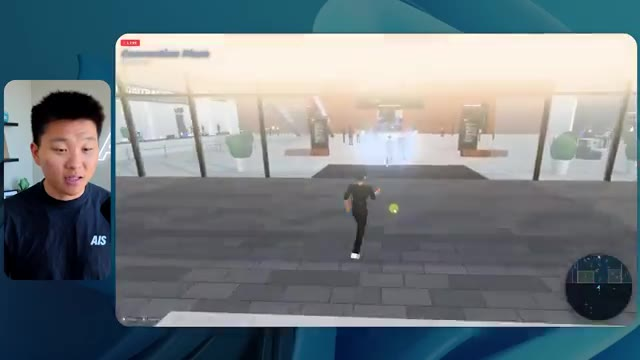
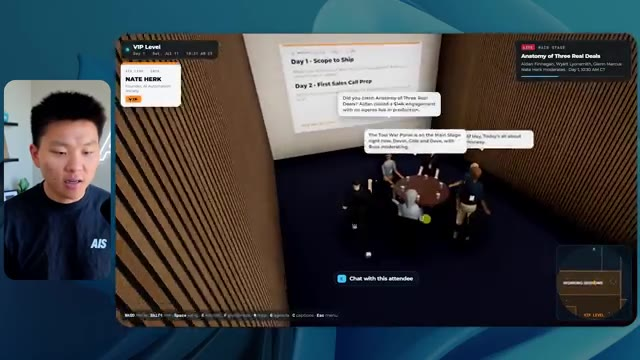
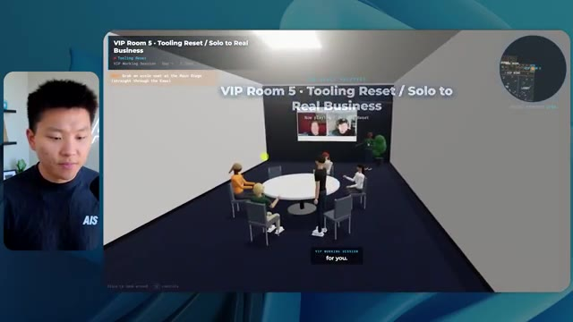

# 🎬 I Tested Sonnet 5.5 vs Opus 5.5. What You Need to Know.

> **Chaîne** : [Nate Herk | AI Automation](https://www.youtube.com/@nateherk/featured)  
> **Lien YouTube** : [https://www.youtube.com/watch?v=7eo-11K2e3c](https://www.youtube.com/watch?v=7eo-11K2e3c)  
> **Date de publication** : 20260929  
> **Durée** : 00:25:48  
> **Identifiant vidéo** : `7eo-11K2e3c`  
> **Transcription & Analyse** : `whisper-v3-large-turbo+gemini-3.5-flash-lite`  

---

## 📌 Synthèse Exécutive & Outils

### 💡 Résumé

Dans cette vidéo de la chaîne *Nate Herk | AI Automation*, l'analyste et expert en ingénierie IA plonge au cœur d'une expérimentation comparative de premier plan autour d'**Opus 5.5**, le modèle de pointe d'Anthropic. L'objectif technique consistait à fournir exactement le même prompt complexe (« slash goal ») à plusieurs instances du modèle exécutées à des niveaux d'effort croissants (du niveau bas à l'ultra code). Le défi lancé à l'agent IA était d'ingérer un dossier Frame.io de 105 gigaoctets contenant les enregistrements vidéo bruts de la conférence virtuelle *AIS Live*, puis de concevoir de zéro un monde virtuel 3D explorable à la troisième personne, intégrant la physique, le design, des PNJ (personnages non joueurs) dynamiques, des flux vidéo en direct, les véritables programmes des intervenants et une identité visuelle conforme aux directives de la marque.

Les démonstrations en conditions réelles révèlent des écarts de performance spectaculaires entre les configurations d'effort. En mode **bas**, l'agent produit un résultat médiocre en 16 minutes et 43 secondes pour un coût API estimé à 3,91 $ (191 000 jetons, 22 vérifications, 0 question) : les couleurs de la marque sont absentes, les personnages disparaissent comme des fantômes, les flux vidéo restent désespérément figés sous forme d'images fixes et des bugs d'affichage majeurs nuisent à l'immersion. En revanche, le passage au mode **moyen** métamorphose radicalement l'expérience : en 1 heure et 13 minutes pour 12,44 $ (490 000 jetons, 23 vérifications, 0 question), Opus 5.5 génère un monde 3D fonctionnel, esthétiquement fidèle à la charte graphique, peuplé de PNJ réactifs qui saluent l'utilisateur, et intègre de véritables flux vidéo en streaming pour les ateliers, les stands et les salles de conférence. 

Cette analyse met en lumière la pertinence opérationnelle des recommandations officielles d'Anthropic — qui préconisent d'ajuster dynamiquement l'échelle d'effort selon la complexité de la tâche — tout en soulignant la transition inévitable vers la phase de déploiement et d'hébergement des prototypes générés par l'IA grâce à des solutions intégrées comme Hostinger.

### 🛠️ Outils, Modèles & Logiciels Présentés

*   **Opus 5.5** : Modèle d'IA de pointe d'Anthropic, extrêmement intelligent et économique, piloté ici à travers différents niveaux d'effort pour accomplir des tâches d'ingénierie logicielle complexes.
*   **Claude Code** : Environnement de développement et assistant de codage avancé d'Anthropic utilisé pour orchestrer la création d'applications et de mondes virtuels.
*   **Frame.io** : Plateforme de collaboration vidéo cloud utilisée pour stocker et structurer le dossier massif de 105 gigaoctets d'enregistrements de la conférence *AIS Live*.
*   **Herc 2** : Système d'exploitation IA propriétaire de Nate Herk, servant d'écosystème de référence et de brique d'intégration pour les flux de travail automatisés.
*   **Hostinger** : Sponsor de la vidéo et solution d'hébergement web proposant une extension gratuite pour éditeur de code, comblant le fossé entre le prototypage local par IA et la mise en ligne instantanée.

### 🔑 Points Clés & Enseignements Stratégiques

*   **Impact critique du niveau d'effort (Effort Level)** : La manipulation de l'échelle d'effort (faible, moyen, haut, extra, max, code ultra) modifie drastiquement la profondeur du raisonnement, la qualité du code généré et la fidélité fonctionnelle du livrable final.
*   **Validation de la méthodologie Anthropic** : Les résultats confirment la recommandation officielle d'Anthropic d'utiliser le niveau "moyen" comme point de départ standard pour des tâches de génération d'applications complexes avant d'ajuster vers le haut ou le bas.
*   **Gestion autonome des prompts complexes ("Slash Goal")** : Dans les deux niveaux d'effort testés (bas et moyen), Opus 5.5 a exécuté la mission de bout en bout sans formuler la moindre question de clarification, démontrant une excellente autonomie contextuelle.
*   **Corrélation entre temps de calcul et complexité visuelle** : Un niveau d'effort supérieur multiplie le temps d'exécution par plus de quatre (de 16 minutes à plus d'une heure) et le coût par API, mais garantit une structure logicielle exempte de bugs visuels majeurs.
*   **Intégration de données massives hétérogènes** : L'agent a prouvé sa capacité à ingérer et structurer intelligemment un volume brut de 105 Go de vidéos (via Frame.io) pour en extraire une chronologie cohérente (jours, keynotes, ateliers).
*   **Immersion et comportement des PNJ (Agents IA)** : Le passage au niveau moyen active des comportements dynamiques chez les personnages non joueurs (saluts, interactions de proximité), transformant un décor statique en un monde vivant.
*   **Restauration de l'identité de marque** : Un effort accru permet au modèle de respecter strictement les palettes de couleurs, les logos et les directives de design spécifiques de l'entreprise, éliminant les rendus génériques.
*   **Rendu multimédia en temps réel** : Alors que le niveau bas échoue en affichant de simples images fixes boguées, le niveau moyen intègre avec succès de véritables flux vidéo de streaming pour les scènes principales et les stands d'exposition.
*   **Rationalisation des coûts par rapport à la valeur** : Pour un coût d'à peine 12,44 $ en facturation API au niveau moyen, le modèle automatise un travail de développement 3D et d'intégration multimédia qui aurait requis des semaines d'ingénierie humaine.
*   **Le goulet d'étranglement du déploiement** : L'expérimentation met en lumière un frein classique du développement assisté par IA : la friction entre l'obtention d'un projet fonctionnel en local et sa mise en production rapide.
*   **Rôle des extensions de code pour l'hébergement** : L'utilisation d'outils connectés (comme l'extension éditeur Hostinger) est indispensable pour fluidifier la transition entre la phase de génération par l'agent IA et le déploiement web en direct.

---

## ⏱️ Chronologie & Transcription Complète Audio & Visuelle (Mot pour Mot)

### ⏱️ `[00:00:00 - 00:00:20]` | Segment #01

**🔊 Audio (Transcription Intégrale Mot pour Mot en Français) :**
> Opus 5.5, Opus 5.5, Opus 5.5, Opus 5.5, Opus 5.5. Ce modèle est littéralement partout et pour de très bonnes raisons. Il est intelligent, il est bon marché, il a un goût incroyable, c'est un modèle d'IA extraordinaire. Mais avec chaque modèle d'IA, vous avez le choix de l'effort, que ce soit faible, moyen, haut, extra, max ou code ultra.

**👁️ Analyse Visuelle d'Écran (gemini-3.5-flash-lite) :**
**Interface & Outils** : Interface du réseau social X (Twitter).

**Contenu textuel & Code** : Publication sur X avec texte et vidéo intégrée illustrant les capacités des modèles d'IA.

**Action / Démonstration** : Affichage d'un exemple de contenu généré par IA sur les réseaux sociaux pour illustrer le sujet.

*⏱️ 00:00:05 — Capture d'écran d'un tweet sur X (anciennement Twitter) montrant une vidéo de paysage tropical ou de jeu vidéo généré par IA avec du texte sur la perturbation des créateurs techniques.*

---

### ⏱️ `[00:00:20 - 00:00:38]` | Segment #02

**🔊 Audio (Transcription Intégrale Mot pour Mot en Français) :**
> Donc dans cette vidéo, j'ai donné exactement le même prompt à Opus 5.5 et je l'ai exécuté à chaque niveau d'effort, et nous allons comparer les résultats. Nous allons examiner la qualité de tous les différents résultats réels, mais nous allons aussi examiner le temps d'exécution de chacun d'eux, combien cela nous a coûté si c'était facturé par API, le total des jetons, combien de vérifications ils ont effectuées, et combien de questions ils m'ont réellement posées tout au long du processus.

**👁️ Analyse Visuelle d'Écran (gemini-3.5-flash-lite) :**
**Interface & Outils** : Application de tableau blanc / interface de comparaison de modèles (style Miro ou interface web personnalisée).

**Contenu textuel & Code** : Tableau comparatif avec les colonnes de niveaux d'effort et des lignes de métriques floutées (Run time, API cost, Total tokens, Checks, Questions asked).

**Action / Démonstration** : Affichage et présentation du tableau comparatif des différents niveaux d'effort d'Opus 5.5.

*⏱️ 00:00:29 — Tableau comparatif sur fond sombre montrant les différents niveaux d'effort d'Opus 5.5 (Low, Medium, High, Extra, Max, Ultracode) et des métriques (Run time, API cost, Total tokens, etc.).*

---

### ⏱️ `[00:00:39 - 00:00:58]` | Segment #03

**🔊 Audio (Transcription Intégrale Mot pour Mot en Français) :**
> Et les résultats que nous avons obtenus ne sont pas du tout ce à quoi je m'attendais, donc j'ai hâte de partager cela avec vous les gars. Ne perdons pas de temps et allons directement à celui-ci. D'accord, alors plongeons-nous directement dans celui-ci. Je veux commencer juste en vous montrant le prompt réel que nous avons utilisé que nous avons donné à chacun de ces différents agents. Je vais aller dans les fichiers ici, et nous allons ouvrir ce fichier markdown de prompt, et je vais vous montrer ce que nous avons obtenu. Voici donc le slash objectif que j'ai fourni.

**👁️ Analyse Visuelle d'Écran (gemini-3.5-flash-lite) :**
**Interface & Outils** : Interface de l'application de développement/agent IA (Opus 5.5).

**Contenu textuel & Code** : Message de l'agent IA proposant de commencer la tâche définie dans PROMPT.md : construire un monde 3D en vue à la troisième personne de la conférence AIS Live à partir d'enregistrements f.io.

**Action / Démonstration** : Le présentateur montre l'interface de l'outil d'IA et le prompt initial en vue de démarrer ou d'analyser la tâche.

*⏱️ 00:00:48 — Interface de l'application affichant le panneau latéral de gestion des projets (effort-test, session logs, etc.) et le chat principal avec le modèle Opus 5.5.*

---

### ⏱️ `[00:00:58 - 00:01:34]` | Segment #04

**🔊 Audio (Transcription Intégrale Mot pour Mot en Français) :**
> J'ai dit, tu dois me créer un monde en 3D qui est une conférence technologique réaliste dans laquelle je peux me promener en vue à la troisième personne. Tu vas regarder ce dossier, qui contient mes éléments d'enregistrement d'événements d'AIS Live. Et ce dossier est un dossier Frame.io de 105 gigaoctets d'enregistrements vidéo. C'était un événement complètement virtuel. Tout a été enregistré et tous les enregistrements sont ici. J'ai dit, ton objectif est de prendre cet événement et de le transformer en un monde explorable en 3D qui me donne l'impression d'être réellement allé à une vraie conférence en personne avec différentes salles, différentes pistes, différentes scènes, bla, bla, bla. N'hésite pas à utiliser key.ai si tu as besoin de générer des images ou des vidéos. Et tu peux aussi utiliser tout ce qui se trouve dans mon projet Herc 2, qui est comme mon système d'exploitation IA. J'ai dit,

**👁️ Analyse Visuelle d'Écran (gemini-3.5-flash-lite) :**
**Interface & Outils** : Éditeur de code (type VS Code / Cursor) et interface web Frame.io

**Contenu textuel & Code** : Fichier PROMP.md avec le prompt demandant de créer un monde 3D explorable de conférence tech, et interface Frame.io affichant 105,69 Go de données d'événements.

**Action / Démonstration** : Présentation du prompt de configuration et du dossier de ressources vidéo de 105 Go pour le projet de monde virtuel 3D.

*⏱️ 00:01:07 — Visualisation d'un fichier Markdown (PROMP.md) dans un éditeur, détaillant les consignes pour créer un monde 3D interactif basé sur des enregistrements.*

*⏱️ 00:01:16 — Interface de partage de fichiers Frame.io montrant un dossier de 105 Go nommé « Sep 22, 2026 » contenant les accès GA et VIP de l'événement AIS Live.*

*⏱️ 00:01:25 — Retour sur le fichier PROMP.md dans l'éditeur de code, affichant les instructions sur l'utilisation des outils et le rendu attendu.*

---

### ⏱️ `[00:01:34 - 00:02:08]` | Segment #05

**🔊 Audio (Transcription Intégrale Mot pour Mot en Français) :**
> vous serez jugé sur la créativité, le design, la physique et la sensation générale lorsque j'explorerai le monde 3D que vous avez construit. Et c'était fondamentalement la fin des instructions. Donc, comme vous pouvez le voir sur ce côté gauche, j'ai exécuté cela à travers tous les différents niveaux d'effort. Commençons par le niveau bas et progressons jusqu'à l'ultra code. Très bien. Donc ici, nous avons le résultat du niveau bas. Ouvrons ceci et jetons un œil. Nous avons donc AIS Live, le sommet des services IA en personne enfin, et nous avons pu cliquer partout. Tout d'abord, on ne sent pas vraiment l'identité de la marque. Genre, ce n'is pas le logo d'AIS Live. Ce ne sont même pas nos couleurs. Donc je n'aime pas trop ça, mais entrons ici. D'accord. C'est beaucoup trop lumineux. Euh, nous avons une carte en haut à droite. Nous avons une ville ici en arrière-plan. Je ne peux pas dire quelle ville c'est.

**👁️ Analyse Visuelle d'Écran (gemini-3.5-flash-lite) :**
**Interface & Outils** : Application ou interface web d'assistant IA / éditeur de code avec un panneau de sessions (effort-test) à gauche et une fenêtre de discussion à droite.

**Contenu textuel & Code** : Texte du prompt demandant de construire un monde 3D navigable à la troisième personne pour la conférence AIS Live à partir d'enregistrements f.io, avec des salles, pistes et scènes séparées, ainsi que des options de configuration en bas (Opus 5.5, Ultracode, curseur sur le niveau "Low").

**Action / Démonstration** : Le présentateur survole ou sélectionne différents niveaux d'effort (tests) dans la barre latérale pour analyser les sessions.

*⏱️ 00:01:42 — Capture d'écran montrant l'interface d'un assistant IA de type éditeur/chat (semblable à Claude ou Cursor) avec un panneau latéral listant différents niveaux de test (Hello, Extra, High, Max, Ultracode, Medium, Low) et une conversation affichant un prompt lié à la création d'un monde 3D.*

---

### ⏱️ `[00:02:08 - 00:02:40]` | Segment #06

**🔊 Audio (Transcription Intégrale Mot pour Mot en Français) :**
> C'est. D'accord. C'est Chicago, ce qui est plutôt cool parce que, tu sais, je vis à Chicago, mais bref, en haut à droite, nous pouvons voir une carte. Nous avons un hall d'accueil. Nous avons un hall d'exposition. Nous avons le salon VIP de la scène principale. La carte montre également où se trouve chaque autre personne et cela se synchronise en direct. Nous pouvons donc voir l'enregistrement. Nous pouvons voir le premier jour, la keynote de l'agent Hyper, le débriefing en direct. Cool. Donc ça connaît réellement l'ordre du jour et puis il y a le deuxième jour. Donc ça a trouvé ça, c'est bien. Nous avons ces petites boules ici que je peux espérer projeter d'un coup de pied. D'accord. Le visage, Oh, regarde ça. Si je vais par ici, tous les gens disparaissent tout simplement. Très mauvais. Très mauvais. D'accord. Voyons voir. Est-ce que je peux sprinter ? D'accord.

**👁️ Analyse Visuelle d'Écran (gemini-3.5-flash-lite) :**
**Interface & Outils** : Environnement virtuel 3D interactif avec interface de navigation et mini-carte.

**Contenu textuel & Code** : Menus d'événements virtuels, programme (Day 1 - Main Stage events), plans et indications de navigation.
[DESC_IMAGE_1] Navigation d'un avatar dans l'espace virtuel de l'événement.

**Action / Démonstration** : Explications face caméra et démonstration conceptuelle.

*⏱️ 00:02:16 — Vue d'un espace virtuel 3D de type événement virtuel avec un panneau de retrait des badges et une mini-carte en haut à droite.*

*⏱️ 00:02:24 — Vue du hall d'accueil virtuel affichant le programme du premier jour sur un panneau interactif.*

*⏱️ 00:02:32 — Vue de la halle d'exposition virtuelle (Expo Hall) montrant des avatars et des zones de discussion.*

---

### ⏱️ `[00:02:40 - 00:03:04]` | Segment #07

**🔊 Audio (Transcription Intégrale Mot pour Mot en Français) :**
> Je peux avancer un peu plus vite. Je vais d'abord aller par ici. Il y a des produits dérivés, euh, un sweat à capuche certifié AIS plus. D'accord. Il y a donc les vrais stands qu'on avait dans l'événement virtuel. On avait des stands. C'est donc plutôt cool. Un petit endroit pour prendre des photos. La salle C. En ce moment, nous avons Tangy Frederick qui anime un atelier. D'accord. Mais ce n'est pas une vidéo. Comme vous pouvez le voir, c'est juste une image. Elle ne bouge pas. C'est donc juste une image. Ces gens sont en train de disparaître. Ce doivent être des fantômes. Allons par ici dans la salle A.

**👁️ Analyse Visuelle d'Écran (gemini-3.5-flash-lite) :**
**Interface & Outils** : Environnement virtuel 3D / Jeu / Espace métavers (Gather.town ou similaire).

**Contenu textuel & Code** : Aucun code source ou terminal, uniquement des éléments visuels 3D d'un événement virtuel et des présentations sur écrans virtuels.

**Action / Démonstration** : Navigation et exploration de l'espace virtuel par l'avatar.

---

### ⏱️ `[00:03:04 - 00:03:30]` | Segment #08

**🔊 Audio (Transcription Intégrale Mot pour Mot en Français) :**
> Nous avons Liberty White. D'accord. Très cool. Vos 30 premiers jours en automatisation. Encore une fois, c'est juste une image fixe et les gens ont des bugs d'affichage. Donc ce n'est pas très bien ici. Je vais aller sur la scène principale et voir ce que nous avons. D'accord, cool. Donc nous avons une scène d'apparence principale. Les gens ont de gros bugs d'affichage. Vraiment mauvais. Ce n'est vraiment pas terrible. Notre vidéo est en fait en train de bouger. Genre, j'ai vu mon visage ici et j'ai vu celui de Devin, mais maintenant ils ont disparu. Donc je ne sais pas ce qui s'est passé. D'accord. Ça ressemble plutôt à un diaporama. Rien n'est vraiment lu pour l'instant. Bref, entrons ici.

**👁️ Analyse Visuelle d'Écran (gemini-3.5-flash-lite) :**
**Interface & Outils** : Environnement virtuel 3D de type métavers / plateforme de conférence interactive

**Contenu textuel & Code** : Interface de conférence virtuelle affichant "AIS Live" et "Hyperagent Workshop"

**Action / Démonstration** : Navigation d'un avatar à travers l'espace virtuel de conférence pour rejoindre la scène principale

*⏱️ 00:03:17 — Le présentateur commente la scène principale, montrant un avatar se déplaçant dans une grande salle de conférence virtuelle remplie d'avatars de participants.*

*⏱️ 00:03:24 — Vue de la scène principale "AIS Live AI Services Summit" dans l'environnement virtuel, montrant un avatar s'approchant de la scène centrale avec des écrans de présentation.*

---

### ⏱️ `[00:03:30 - 00:03:58]` | Segment #09

**🔊 Audio (Transcription Intégrale Mot pour Mot en Français) :**
> Nous avons d'autres stands. Nous avons hyper agent. Nous avons Claude Code. Nous avons plus de cadeaux publicitaires. La salle B, c'est Dave Ebelor. Je suppose que c'est exactement la même chose. Nous avons du café. Et puis, je suppose que le salon VIP, c'est accès VIP uniquement. C'est plutôt cool, mais il n'y a vraiment rien qui se passe ici. Cet écran est bien trop lumineux. D'accord. Donc je pense que vous comprenez l'ambiance qu'on a là avec Opus 5.5 en effort faible. Et c'est là que les choses deviennent intéressantes. Combien de temps pensez-vous que cela a pris ? Combien de temps ? Celui-ci a duré 16 minutes et 43 secondes. Combien pensez-vous que cela a coûté ?

**👁️ Analyse Visuelle d'Écran (gemini-3.5-flash-lite) :**
**Interface & Outils** : Application de tableau blanc / interface de présentation Opus 5.5.

**Contenu textuel & Code** : Tableau avec les lignes : Run time, API cost, Total tokens, Checks, Questions asked.

**Action / Démonstration** : Présentation du tableau comparatif des niveaux d'effort d'Opus 5.5.

*⏱️ 00:03:51 — Tableau comparatif "Opus 5.5 Efforts" avec des niveaux de performance (Low, Medium, High, Extra, Max, Ultracode).*

---

### ⏱️ `[00:03:58 - 00:04:26]` | Segment #10

**🔊 Audio (Transcription Intégrale Mot pour Mot en Français) :**
> 3,91 dollars si c'était une facturation par API. J'utilise évidemment mon abonnement ici, mais nous allons simplement calculer cela en facturation par API. Le nombre total de jetons était de 191 000. Il a effectué 22 vérifications. Donc, pour la vérification, il a ouvert le navigateur à 22 reprises et a exécuté différentes sortes de vérifications. Donc, 22 catégories de vérifications. Et combien de questions m'a-t-il posées ? Il m'a posé un total de zéro question tout au long de cette invite de type « slash goal ». D'accord. Alors, ouvrons l'effort moyen et voyons ce que nous avons. D'accord, c'est parti. Effort moyen. Nous avons Nate Herc. Nous avons mon badge. C'est la marque d'AI's life.

**👁️ Analyse Visuelle d'Écran (gemini-3.5-flash-lite) :**
**Interface & Outils** : Application de tableau blanc ou de prise de notes de type Excalidraw, avec le présentateur incrusté en haut à gauche.

**Contenu textuel & Code** : Tableau avec les lignes : Run time, API cost, Total tokens, Checks, Questions asked, et les colonnes Low, Medium, High, Ex.

**Action / Démonstration** : Le présentateur explique les résultats des tests d'effort et commente les coûts d'API et le nombre de tokens.

*⏱️ 00:04:05 — Un tableau comparatif montrant les métriques d'exécution pour un niveau 'Low' (Run time : 16m 43s, API cost : $3.91, Total tokens : 191.3K, Checks, Questions asked).*

---

### ⏱️ `[00:04:26 - 00:04:46]` | Segment #11

**🔊 Audio (Transcription Intégrale Mot pour Mot en Français) :**
> Donc ça a déjà l'air un petit peu mieux. Ça donne l'impression d'être nos palettes de couleurs qui ont utilisé nos directives de marque. Premier jour construction, deuxième jour gain, VIP. Cool. D'accord. Je vais entrer dans le lieu. D'accord. Waouh. Une ambiance similaire en gros. C'est en arrière-plan. Ça ne ressemble pas à Chicago par contre, n'est-ce pas ? Non, ça ressemble à un, honnêtement, ça ressemble à une ville inventée. Quoi qu'il en soit, c'est marrant qu'ils aient décidé de faire ça. Voyons si je peux me déplacer un peu plus vite. Oh, waouh.

**👁️ Analyse Visuelle d'Écran (gemini-3.5-flash-lite) :**
**Interface & Outils** : Interface web de l'application interactive 'AIS Live' en 3D/métavers.

**Contenu textuel & Code** : Écran de bienvenue, badge numérique avec le nom de l'hôte, et environnement virtuel 3D avec personnages.

**Action / Démonstration** : Le présentateur clique sur le bouton pour entrer dans le lieu virtuel et navigue dans l'application 3D.

*⏱️ 00:04:31 — Interface d'accueil de l'application 'AIS Live' avec un badge de pass nominatif et un bouton 'ENTER THE VENUE'.*

*⏱️ 00:04:41 — Vue en 3D d'un espace virtuel interactif de type métavers avec des avatars de personnages et une vue sur une ville la nuit à travers de grandes baies vitrées.*

---

### ⏱️ `[00:04:46 - 00:05:21]` | Segment #12

**🔊 Audio (Transcription Intégrale Mot pour Mot en Français) :**
> Les gens interagissent avec moi. Regardez. Si je m'approche de ce type, il vient de lever le bras. Bon, maintenant il ne veut plus du tout avoir affaire à moi. Mais tous ces petits robots ici doivent prendre des décisions. Je ne sais pas s'ils utilisent Jev. C'est sûr que non. Je ne lui ai pas dit de le faire. En fait, ma clé Jev est à l'arrière. Je ne sais pas. Peut-être qu'il l'a utilisée. Quoi qu'il en soit, nous pouvons voir ici que nous avons la Salle d'atelier C, le Laboratoire des agents. Sympa. Donc celui-ci est en fait exécuté. Vous pouvez voir qu'il s'agit d'une vraie vidéo lue par Tangy. Tout le monde ici est en train de travailler sur un ordinateur portable. Ils ne buguent pas. C'est plutôt cool. De plus, mon badge est sur ma poitrine, ce qui est plutôt cool. Je peux venir par ici. Nous avons une carte en haut à droite, comme vous pouvez le voir, mais je peux venir par ici. Nous avons un

**👁️ Analyse Visuelle d'Écran (gemini-3.5-flash-lite) :**
**Interface & Outils** : Application de monde virtuel 3D / Métavers interactif

**Contenu textuel & Code** : Environnement virtuel 3D peuplé d'avatars et d'agents simulant une activité de bureau ou de séminaire (Agents Lab)

**Action / Démonstration** : Navigation et exploration d'un monde virtuel interactif habité par des avatars contrôlés par IA

*⏱️ 00:04:55 — Vue en jeu d'un monde virtuel style métavers avec des avatars de robots interagissant et se déplaçant dans un espace de bureau moderne.*

*⏱️ 00:05:04 — Vue générale d'une salle de conférence virtuelle (Agents Lab) remplie d'avatars assis à des tables avec un écran de présentation au fond.*

*⏱️ 00:05:12 — Vue en plongée d'une salle de classe virtuelle avec de nombreux avatars assis à des pupitres équipés d'ordinateurs portables.*

---

### ⏱️ `[00:05:21 - 00:05:47]` | Segment #13

**🔊 Audio (Transcription Intégrale Mot pour Mot en Français) :**
> hall d'exposition. C'est là que nous avons le stand Glido. Et ça diffuse actuellement. Oui, ça diffuse la vidéo de nous en train de parler de Glido. Ça diffuse la vidéo d'Ed et moi parlant de notre programme de certification. Nous avons le logo AIS Plus juste ici, qui est un peu dans un endroit bizarre. Ce sont les diapositives des conférenciers et les points clés. Alors wow, ce sont toutes les ressources que nous avons distribuées après l'événement. Elles sont toutes installées là aussi. Nous pouvons voir que nous avons un coup de projecteur sur la communauté. Donc c'est Aiden qui parle de son contrat qu'il a décroché et ça se lit en direct. Ces gens sont en train de regarder.

**👁️ Analyse Visuelle d'Écran (gemini-3.5-flash-lite) :**
**Interface & Outils** : Environnement virtuel 3D / Metavers d'exposition

**Contenu textuel & Code** : Présentations, diapositives de conférence et éléments d'interface utilisateur en incrustation (HUD)

**Action / Démonstration** : Navigation et exploration de l'espace virtuel d'exposition par les avatars

---

### ⏱️ `[00:05:47 - 00:06:21]` | Segment #14

**🔊 Audio (Transcription Intégrale Mot pour Mot en Français) :**
> Ils sont plutôt engagés. On a l'hyper agent. C'était, c'est ce que je voulais dire. Si vous avez vu ces gens lever les bras pour dire bonjour, c'était plutôt marrant. Regardez, regardez, le voilà qui recommence. Bref. Bon. Où est-ce que je suis maintenant ? Maintenant, je suis dans le hall principal. On a un bar à café. On a un grand logo, qui est le vrai logo. Il est trop lumineux, mais on a le logo. On peut voir si on peut entrer ici dans le parcours des fondations. On a Sabrina Romanov et Liberty White. Donc différentes formations juste là. On peut entrer dans cette salle. C'est le parcours avancé. Alors qu'est-ce qui se passe ici. On a Dave Ebelar et Saman qui parlent de trucs différents là-dedans. Et maintenant allons jeter un œil à la scène principale. Oh, attendez, il y a une vidéo de moi là-haut. C'est genre un VIP

**👁️ Analyse Visuelle d'Écran (gemini-3.5-flash-lite) :**
**Interface & Outils** : Application de monde virtuel 3D / Metaverse interactif

**Contenu textuel & Code** : Environnement virtuel en ligne avec avatars de participants, mini-carte et indicateurs d'interface utilisateur (Main Lobby, bar à café, etc.).

**Action / Démonstration** : Navigation et exploration de l'espace virtuel par le présentateur et les avatars des participants.

---

### ⏱️ `[00:06:21 - 00:06:50]` | Segment #15

**🔊 Audio (Transcription Intégrale Mot pour Mot en Français) :**
> section ? Ouais, on ira voir ça dans une minute. Mais bref, voici la scène principale. Ça a l'air vraiment, vraiment super. On a une grande scène. On a genre quatre personnes assises ici. On a les trois écrans d'Alex là-haut avec l'hyper agent. Est-ce que j'ai le droit de monter sur scène ? Oh, et il me laisse monter sur scène. D'accord. C'est plutôt sympa. Bon les gars, faisons un selfie. Laissez-moi prendre tout le monde en arrière-plan. Venez par ici. Bref, c'est vraiment, vraiment cool. Toutes les places ne sont pas occupées par contre. Donc il va falloir qu'on travaille là-dessus. Mais bref, je vais y retourner en courant pour voir ce qu'était cette section VIP. D'accord. Le salon VIP. J'ai l'impression que c'est comme un aéroport ou un truc du genre.

**👁️ Analyse Visuelle d'Écran (gemini-3.5-flash-lite) :**
**Interface & Outils** : Environnement virtuel 3D / Plateforme de métavers ou de conférence interactive.

**Contenu textuel & Code** : Interface utilisateur de conférence virtuelle affichant les détails de la session "Hyperagent Keynote".

**Action / Démonstration** : Exploration et navigation dans un espace de conférence virtuel 3D.

---

### ⏱️ `[00:06:51 - 00:07:14]` | Segment #16

**🔊 Audio (Transcription Intégrale Mot pour Mot en Français) :**
> Ok, super. Donc maintenant nous avons les sessions VIP ici. Une FAQ VIP avec la lecture vidéo en direct de Nate juste ici. Très, très cool. Et nous avons comme un bar ou quelque chose comme ça. Génial. Je dirais que c'est un assez bon résultat. Maintenant, en ce qui concerne les statistiques ici, celle-ci a pris une heure et 13 minutes à s'exécuter. Cela nous aurait coûté 12 dollars et 44 cents. Elle a utilisé 490 000 jetons et elle a effectué 23 vérifications.

**👁️ Analyse Visuelle d'Écran (gemini-3.5-flash-lite) :**
**Interface & Outils** : Espace virtuel 3D et tableau de bord de statistiques (Opus 5.5 Efforts).

**Contenu textuel & Code** : Statistiques affichées : Run time de 16m 43s, coût API de 3,91 $, 191,3K tokens au total, 22 vérifications.

**Action / Démonstration** : Navigation et présentation de l'espace virtuel VIP, puis passage à l'examen des statistiques d'exécution.

*⏱️ 00:06:56 — Capture montrant un espace virtuel VIP avec un écran géant affichant une session vidéo en direct de Nate Herk.*

*⏱️ 00:07:02 — Capture montrant un tableau de statistiques comparatives (Run time, API cost, Total tokens) dans une interface de type tableau de bord ou canvas.*

---

### ⏱️ `[00:07:14 - 00:07:48]` | Segment #17

**🔊 Audio (Transcription Intégrale Mot pour Mot en Français) :**
> Et il nous a posé un total de zéro question une fois de plus. Très bien, passons à élevé. C'était déjà un résultat plutôt correct et Anthropic eux-mêmes dans leur vidéo, ou désolé, pas une vidéo, un article sur comment prompter Opus 5.5, ils ont dit de commencer simplement par moyen et de l'ajuster vers le haut ou vers le bas si besoin. C'était donc un résultat moyen. Passons à élevé et voyons ce qu'on a obtenu. Très rapidement, les gars, je dois prendre une seconde pour vous parler du sponsor de la vidéo d'aujourd'hui, Hostinger. Donc ces deux modèles viennent de me créer une version fonctionnelle de la même chose. Et maintenant, je me retrouve exactement là où je finis toujours, avec un projet terminé sur mon ordinateur portable et aucun moyen rapide de le mettre en ligne. Et c'est ce fossé que le connecteur d'Hostinger comble. C'est une extension gratuite

**👁️ Analyse Visuelle d'Écran (gemini-3.5-flash-lite) :**
**Interface & Outils** : Tableau de bord de type canvas / Éditeur VS Code avec interface de chat pour assistant de codage.

**Contenu textuel & Code** : Tableau de métriques d'exécution et prompt de génération d'un fichier HTML unique de calculateur de retour sur investissement (ROI calculator).

**Action / Démonstration** : Comparaison des métriques selon les niveaux d'effort et suivi de la génération de code par l'IA dans l'éditeur.

*⏱️ 00:07:22 — Tableau comparatif des performances de différents niveaux d'effort (Low, Medium, High, Extra) pour Opus 5.5, affichant le temps d'exécution, le coût API, les tokens et les questions posées.*

*⏱️ 00:07:39 — Interface de développement avec VS Code et un panneau latéral affichant les détails de génération d'un calculateur ROI (Northwind ROI calculator) par l'agent IA.*

---

### ⏱️ `[00:07:48 - 00:08:23]` | Segment #18

**🔊 Audio (Transcription Intégrale Mot pour Mot en Français) :**
> for your editor that pulls your Hostinger account into whatever you're already coding in. So VS Code, cursor, cloud code, codex, you name it. You sign in once with a single click, and from there, your agent can deploy the site, point a domain at it, set the DNS records, and check on your VPS without you ever having to leave the editor. So whichever one of these you end up liking better, the thing it built is a couple minutes away from a real URL on managed hosting. Connector is free on every hosting or plan, so if you still need the hosting underneath it, grab the unlimited plan with the link in the description and use code NATEHERK for 10% off. That also comes with a free domain and business email for the year. And it's still the cheapest way that I found to get something

**👁️ Analyse Visuelle d'Écran (gemini-3.5-flash-lite) :**
**Interface & Outils** : Interface web de gestion Hostinger et Claude Code

**Contenu textuel & Code** : Panneau de connexion Hostinger ("Connected VIA OAUTH", "Manage Hostinger from your IDE") avec des options cochées pour les outils (Websites, Domains, Subscriptions & Payments, Email Marketing) et affichage de Claude Code.

**Action / Démonstration** : Connexion du compte Hostinger à l'IDE pour permettre à l'assistant d'accéder aux outils de gestion de sites, domaines et abonnements.

*⏱️ 00:07:57 — Interface d'intégration Hostinger connectée via OAuth montrant les outils disponibles pour l'assistant, à côté d'une fenêtre Claude Code.*

---

### ⏱️ `[00:08:23 - 00:08:47]` | Segment #19

**🔊 Audio (Transcription Intégrale Mot pour Mot en Français) :**
> you built onto a real URL. So let's get back to the video. Okay. Once again, very, very branded. This is even better of a loading screen than the previous one. We've got this nice little effect in the background. We've got the logo. We'll enter the venue. Okay. Here we are. This looks pretty nice. We start outside and you can see that we have these flags for all the speakers, Wyatt, Casper, Alex, Ed, Aiden, Sabrina, Liberty. This is pretty cool. We got live blocks here.

**👁️ Analyse Visuelle d'Écran (gemini-3.5-flash-lite) :**
**Interface & Outils** : Application web 3D interactive (RingCentral / espace virtuel personnalisé AIS Live)

**Contenu textuel & Code** : Interface utilisateur 3D avec bannières d'événements, mini-carte et instructions de déplacement au clavier

**Action / Démonstration** : Navigation et exploration de l'environnement virtuel de la conférence après l'écran de chargement

*⏱️ 00:08:29 — Écran de chargement de l'événement virtuel AIS Live avec un logo stylisé et les contrôles de navigation.*

*⏱️ 00:08:35 — Entrée dans l'environnement virtuel 3D (AIS Live Plaza) avec des avatars et des bâtiments urbains en arrière-plan.*

*⏱️ 00:08:41 — Exploration de la place virtuelle avec des bannières verticales affichant les noms des intervenants.*

---

### ⏱️ `[00:08:47 - 00:09:23]` | Segment #20

**🔊 Audio (Transcription Intégrale Mot pour Mot en Français) :**
> il a pris cette photo de moi, votre hôte, Nate Herc, John, Dave, Nate Herc. Voilà. D'accord. Les portes. C'est génial. Ce sont des portes coulissantes automatiques en verre. J'adore ça. On peut voir l'enregistrement VIP. On peut voir l'admission générale. On peut venir par ici et on peut découvrir l'exposition avec différents stands, le coin de la communauté. Vous pouvez aussi voir qu'en haut à gauche, j'ai un passeport. Donc c'est comme, ça montrera combien d'endroits j'ai visités. Tout cela est une lecture réelle. Nous avons un mur de ressources avec tous les différents conférenciers. Ils ont aussi une session de networking par ici. Donc je vais venir très vite voir de quoi il retourne. Nous avons donc le bar à cold brew AIS. Nous avons différents membres de la communauté qui ont été mis en avant ou présentés.

**👁️ Analyse Visuelle d'Écran (gemini-3.5-flash-lite) :**
**Interface & Outils** : Application de monde virtuel 3D / plateforme d'événement virtuel.

**Contenu textuel & Code** : Environnement virtuel 3D interactif avec avatars, bannières d'événements et interfaces de navigation.

**Action / Démonstration** : Exploration et navigation dans un espace virtuel d'événement en 3D par l'hôte.

*⏱️ 00:08:56 — Vue d'un monde virtuel 3D montrant une zone d'enregistrement de conférence ("Registration Concourse") avec des avatars et des comptoirs VIP Check-In.*

*⏱️ 00:09:05 — Navigation dans un hall d'exposition virtuel 3D ("Expo Hall") avec des stands et des avatars d'utilisateurs.*

*⏱️ 00:09:14 — Déplacement d'un avatar au milieu d'autres avatars dans un hall virtuel spacieux avec des parois vitrées.*

---

### ⏱️ `[00:09:23 - 00:09:56]` | Segment #21

**🔊 Audio (Transcription Intégrale Mot pour Mot en Français) :**
> On a la zone VIP. Attends, quoi ? Prends un bracelet. Ah, je dois vraiment aller chercher le bracelet. D'accord. Laisse-moi m'enregistrer rapidement. Le bracelet est déjà mis. Attends, quoi ? D'accord. Oh, d'accord. Maintenant, les portes se sont ouvertes pour moi. Cool. Je peux entrer ici. Oh, ça mène juste à la scène principale. Salon VIP. Il y a une séance de questions-réponses en cours. Ça a l'air très cool. Je veux dire, je suis très impressionné par la façon dont il parvient à faire ça. Waouh. D'accord. Donc c'est vraiment bien. Ce qu'on a fait, c'est qu'on a eu des salles de discussion VIP avec différentes personnes. Tu peux voir qu'il y a différentes salles, différents membres de l'équipe AIS qui participent à des trucs. C'est vraiment cool. C'est très cool. C'est un bien meilleur VIP

**👁️ Analyse Visuelle d'Écran (gemini-3.5-flash-lite) :**
**Interface & Outils** : Environnement virtuel 3D de type métavers / plateforme de conférence en ligne.

**Contenu textuel & Code** : Interface utilisateur virtuelle affichant des indications de navigation, des mini-cartes et des salles thématiques.

**Action / Démonstration** : Navigation et exploration de l'espace virtuel et des différentes salles par l'avatar.

*⏱️ 00:09:32 — Vue d'un espace virtuel 3D représentant la zone d'enregistrement (Registration Concourse) avec un avatar qui se déplace.*

*⏱️ 00:09:40 — Vue de l'intérieur de la salle VIP Lounge avec un avatar et un écran affichant une visioconférence.*

*⏱️ 00:09:48 — Vue de l'espace 'VIP Working Sessions' avec plusieurs salles thématiques virtuelles (Price It Right, Land Your First Paying Client).*

---

### ⏱️ `[00:09:56 - 00:10:30]` | Segment #22

**🔊 Audio (Transcription Intégrale Mot pour Mot en Français) :**
> experience than what was shown in the first piece. Okay. VIP after party. Look at this. We've got a dance floor. We've got all these elements in here. We have the actual VIP after party playback right here. And there's a DJ booth. That is so funny. There's a bit of a bug right here, a glitch right there, but this is awesome. Oh, cool. So when I'm in here in the main stage, we get closed captions. You can see right here in the bottom of my screen, we're getting these closed captions of Wyatt actually talking up here. We've got lights. We've got the panel. Very cool. Nice main stage. I'm going to go over here. We can go to the foundation,

**👁️ Analyse Visuelle d'Écran (gemini-3.5-flash-lite) :**
**Interface & Outils** : Application web de réunion virtuelle en 3D / métavers.

**Contenu textuel & Code** : Interface utilisateur virtuelle avec affichage des participants en vidéo, mini-carte et commandes de navigation.

**Action / Démonstration** : Navigation et exploration dans l'environnement virtuel 3D de l'événement.

*⏱️ 00:10:04 — Vue rapprochée d'une salle virtuelle VIP avec piste de danse, avatars et écran géant montrant des participants en visio.*

*⏱️ 00:10:13 — Vue plus large de la salle virtuelle VIP montrant l'ensemble de la piste de danse et les différents éléments de décor.*

*⏱️ 00:10:21 — Vue de l'espace principal de conférence (Main Stage) avec des avatars assis face à une scène et un écran de présentation.*

---

### ⏱️ `[00:10:30 - 00:11:06]` | Segment #23

**🔊 Audio (Transcription Intégrale Mot pour Mot en Français) :**
> advanced, and the enterprise tracks over here. So let's see. We have anatomy of a three real deals. We've got hyper agent. We've got the evals with Nate and Ed in here. We've got Dave going on in the advanced stuff. This is really nice. I mean, obviously each, each of these outputs so far, low was okay. Medium was better. High has been even better. Let's see if that trend continues and let's go ahead and see what this cost us. So high ran for one hour and seven minutes. So a little bit quicker than medium, it would have cost us $16 and 31 cents. It used half a million tokens, 509,000. It did 22 checks. And it also asked us, well, actually, no, I was wrong. This

**👁️ Analyse Visuelle d'Écran (gemini-3.5-flash-lite) :**
**Interface & Outils** : Application de tableau blanc / interface de diagramme (Opus 5.5 Efforts)

**Contenu textuel & Code** : Tableau comparatif montrant les métriques 'Run time', 'API cost', 'Total tokens', 'Checks' et 'Questions asked' pour les niveaux 'Low', 'Medium', 'High' et 'Extra'.

**Action / Démonstration** : Analyse et présentation visuelle des résultats comparatifs de performances et de coûts par niveau d'effort.

*⏱️ 00:10:57 — Capture d'écran affichant un tableau comparatif sur une application de tableau blanc ou de design (Opus 5.5 Efforts) détaillant les coûts, temps d'exécution et tokens pour différents niveaux de performance (Low, Medium, High, Extra).*

---

### ⏱️ `[00:11:06 - 00:11:25]` | Segment #24

**🔊 Audio (Transcription Intégrale Mot pour Mot en Français) :**
> l'un m'a posé une question et, divulgâcheur, c'était le seul qui nous a posé une question tout au long de tout ça. Voyons voir, il nous en reste trois : Extra, Max et Ultra Code. Laissez-moi ouvrir Extra et nous verrons ce que nous avons. D'accord. Donc celui-ci a l'air plutôt bien. Je dirais honnêtement que jusqu'à présent, l'écran de chargement haut était le meilleur. Celui qu'on vient de voir, mais bref, entrons dans AIS Live.

**👁️ Analyse Visuelle d'Écran (gemini-3.5-flash-lite) :**
**Interface & Outils** : Application web ou tableau blanc numérique affichant un tableau de données.

**Contenu textuel & Code** : Tableau comparatif avec les lignes : Run time (16m 43s, 1h 13m, 1h 7m), API cost ($3.91, $12.44, $16.31), Total tokens (191.3K, 419.2K, 509.3K), Checks (22, 23, 22), Questions asked (0, 0, 1), et une colonne 'Extra' en surbrillance.

**Action / Démonstration** : Le présentateur présente et analyse les résultats chiffrés du tableau comparatif.

*⏱️ 00:11:11 — Un tableau comparatif montrant les métriques de différents niveaux (Low, Medium, High, Extra) avec le présentateur incrusté à gauche.*

---

### ⏱️ `[00:11:26 - 00:11:51]` | Segment #25

**🔊 Audio (Transcription Intégrale Mot pour Mot en Français) :**
> Wouah. D'accord. Donc nous avons comme de petits extraits sonores. Je peux discuter avec des gens. Le panneau de la guerre des outils a réglé quelques débats pour moi. Sympa. Bonne perspective là-bas. Nous sommes dehors à nouveau. Nous avons ces différentes bannières, bien qu'elles soient toutes les mêmes. Elles n'indiquent pas de noms de personnes différents. Donc grand logo AIS en direct. L'aile de l'atelier est par ici. Et passons par les portes coulissantes en verre pour voir ce que nous avons. Nous avons donc le café AIS. La carte est en bas à droite, et elle n'est pas très descriptive.

**👁️ Analyse Visuelle d'Écran (gemini-3.5-flash-lite) :**
**Interface & Outils** : Environnement virtuel 3D interactif (type métavers ou jeu).

**Contenu textuel & Code** : Scène virtuelle 3D avec interface de navigation et avatars.

**Action / Démonstration** : Exploration et déplacement d'un avatar dans un espace virtuel 3D.

*⏱️ 00:11:32 — Vue dans un monde virtuel 3D avec un avatar et des personnages non-joueurs, montrant une place urbaine de type convention.*

*⏱️ 00:11:38 — L'avatar se déplace sur la place extérieure du monde virtuel 3D vers un bâtiment portant des bannières 'AIS LIVE'.*

*⏱️ 00:11:45 — L'avatar s'approche de l'entrée principale lumineuse du bâtiment du monde virtuel 3D.*

---

### ⏱️ `[00:11:51 - 00:12:26]` | Segment #26

**🔊 Audio (Transcription Intégrale Mot pour Mot en Français) :**
> J'aime bien comment les autres cartes nous ont dit ce que, genre où se trouvaient les choses, mais celle-ci a l'air très professionnelle. On peut voir ici la scène principale. Allons y faire un saut rapidement. Ils ont tous ces ballons qui volent partout, ce qui je trouve est plutôt marrant. Les ballons de plage AIS. On me voit là-haut en train de parler. Je crois que j'introduisais l'un des jours. Continuons à avancer par ici vers la salle d'atelier sur ce côté gauche. D'accord. Donc ici, nous avons le théâtre Hyper Agent. Nous avons cette session sponsorisée ici par Hyper Agent, mais ça nous montre aussi ce qui va s'y passer. C'est vraiment marrant qu'on puisse discuter avec les gens. Salmon a créé un commercial vocal en direct. La salle "Le Juste Prix" était comble. As-tu pris le guide du compagnon VIP ? C'est tellement marrant. Nous avons le parcours avancé en

**👁️ Analyse Visuelle d'Écran (gemini-3.5-flash-lite) :**
**Interface & Outils** : Application ou plateforme virtuelle 3D en ligne (monde virtuel d'événement).

**Contenu textuel & Code** : Environnement virtuel 3D interactif avec avatars, écrans vidéo en direct, mini-carte en bas à droite et infobulles de chat.

**Action / Démonstration** : Navigation et exploration d'un monde virtuel 3D représentant un espace de conférence en ligne.

*⏱️ 00:12:00 — Vue dans une plateforme virtuelle 3D d'une scène principale avec un écran géant affichant un présentateur et un public assis.*

*⏱️ 00:12:09 — Vue dans le hall d'entrée (Grand Lobby) d'un espace virtuel 3D avec des avatars d'utilisateurs et des panneaux indiquant des ateliers (Workshops).*

*⏱️ 00:12:17 — Vue dans un couloir d'un espace virtuel 3D montrant plusieurs avatars interactifs discutant entre eux.*

---

### ⏱️ `[00:12:26 - 00:12:58]` | Segment #27

**🔊 Audio (Transcription Intégrale Mot pour Mot en Français) :**
> ici. Encore une fois, nous avons la lecture en direct. Est-ce que c'est une lecture en direct ? Oh, d'accord. Ça a commencé une fois que je suis entré, mais je peux m'asseoir. Oh la la. Je peux regarder ça. Je peux me lever. Je veux m'asseoir au premier rang. C'est plutôt cool. C'est très bien. J'aime bien ça. Et tu sais ce que j'ai remarqué jusqu'à présent ? Le personnage réel que j'incarne me ressemble un peu. Je pense qu'il a été modélisé à partir de mes photos miniatures ou quelque chose comme ça. Bref, nous avons Sabrina ici, l'animatrice de la salle ici, prenez n'importe quel siège libre. D'accord, cool. Et j'ai vraiment aimé la fonction pour s'asseoir. C'est assez marrant. Genre, nous pourrions réellement assister à cet atelier et participer. Bref, ça nous montre les intervenants. Ça nous montre les

**👁️ Analyse Visuelle d'Écran (gemini-3.5-flash-lite) :**
**Interface & Outils** : Application de métavers ou de salle de classe virtuelle 3D interactive.

**Contenu textuel & Code** : Interface utilisateur virtuelle de conférence avec des écrans de présentation, des avatars d'utilisateurs et des menus de navigation (Map, Agenda, Captions).

**Action / Démonstration** : Navigation et exploration de l'espace virtuel interactif en 3D par l'utilisateur.

*⏱️ 00:12:34 — Vue d'une salle de classe virtuelle 3D violette avec des avatars assis et un écran de projection affichant un atelier de vente par IA vocale.*

*⏱️ 00:12:42 — Vue d'une salle de classe virtuelle 3D verte avec des rangées de bureaux et un écran affichant un atelier sur le premier moteur de contenu IA.*

*⏱️ 00:12:50 — Vue en angle de la salle de classe virtuelle verte montrant l'écran de projection géant avec des flux vidéo de participants.*

---

### ⏱️ `[00:12:58 - 00:13:31]` | Segment #28

**🔊 Audio (Transcription Intégrale Mot pour Mot en Français) :**
> agenda. Il y a un petit tapis rouge ici pour prendre des photos. On peut prendre la pose. Oh, waouh. C'est plutôt cool. Bibliothèque de ressources, obtenez la certification AIS Plus, Glido, Hyper Agent, AIS Plus, trois vraies affaires. Génial. Je veux dire, je dirais vraiment que jusqu'à présent, chacune est meilleure. Et nous n'avons même pas encore vérifié la section VIP, le salon VIP. Montons ici très vite. J'espère que je pourrai entrer. Sympa. Nous avons la réinitialisation des outils. Ce sont les différentes pièces dans lesquelles nous pouvons aller. Donc encore une fois, je pourrais prendre la feuille de travail et je pourrais essayer de comprendre comment tarifer mes trucs. C'est tellement cool. C'est vraiment mieux que le précédent où l'on faisait juste en quelque sorte

**👁️ Analyse Visuelle d'Écran (gemini-3.5-flash-lite) :**
**Interface & Outils** : Environnement virtuel 3D de type métavers / plateforme de conférence en ligne.

**Contenu textuel & Code** : Éléments graphiques d'un salon virtuel avec des panneaux textuels (Expo Hall, Hyperagent, Glido, VIP Lounge).

**Action / Démonstration** : Navigation et exploration de l'espace virtuel par le présentateur.

---

### ⏱️ `[00:13:31 - 00:13:59]` | Segment #29

**🔊 Audio (Transcription Intégrale Mot pour Mot en Français) :**
> J'ai regardé des trucs. Génial. Je peux passer derrière la barre et entrer ici. C'est très bien. Bon. Alors, en ce qui concerne les statistiques, celui-ci a duré une heure et demie. Il a coûté 25,92 dollars. Je ne sais pas pourquoi je dis point 25 dollars 92 centimes. Il y a eu 733 000 jetons et 34 vérifications. Il a donc eu le plus grand nombre de vérifications de loin jusqu'à présent. Et il ne nous a posé zéro question. J'ai hâte de voir ce qu'on a obtenu ici de max et d'ultra code. D'accord. Voici les écrans de chargement de max, ennuyeux, mais c'est dans l'esprit de la marque et il y a notre logo.

**👁️ Analyse Visuelle d'Écran (gemini-3.5-flash-lite) :**
**Interface & Outils** : Outil de tableau blanc ou d'édition visuelle (type Excalidraw ou équivalent).

**Contenu textuel & Code** : Tableau avec des en-têtes "Medium", "High", "Extra", "Max", "Ultracode" affichant des durées (ex. 1h 13m, 1h 31m) et des coûts (ex. $12.44, $16.31).

**Action / Démonstration** : Le présentateur commente les statistiques de performance et de coût affichées dans le tableau comparatif.

*⏱️ 00:13:38 — Tableau comparatif sous forme de tableau de données ou de diagramme présentant différentes métriques (durées, coûts en dollars, nombre de jetons) pour plusieurs niveaux d'effort (Medium, High, Extra, Max, Ultracode).*

---

### ⏱️ `[00:14:00 - 00:14:35]` | Segment #30

**🔊 Audio (Transcription Intégrale Mot pour Mot en Français) :**
> Donc c'était bien. J'aime bien ça. On va continuer et entrer dans AIS live. Ooh, une jolie petite animation ici qui nous fait entrer. Encore une fois, le personnage me ressemble. Ils m'ont tous ressemblé. Enfin, en quelque sorte, on a assis à l'arrière-plan. Ça ressemble à Chicago. Comme je l'ai mentionné plus tôt, beaucoup d'entre eux diffusent des sons et je ne les inclus pas parce que ce serait très distrayant pour vous d'essayer d'écouter ce qui se passe en même temps que je parle. Donc il y a comme une légère musique dans tous ceux-là. Je déteste la façon dont ça marche. Cette démarche est vraiment, vraiment mauvaise. Enfin, la démarche, ouais, je n'aime pas du tout ça. Donc ce n'est pas génial. Mais à part ça, entrons et explorons. Remarquez ces ombres quand j'entre, elles basculent vraiment d'un coup. Je ne sais pas trop pourquoi,

**👁️ Analyse Visuelle d'Écran (gemini-3.5-flash-lite) :**
**Interface & Outils** : Application ou plateforme virtuelle 3D (AIS live) affichée dans un navigateur web avec webcam incrustée.

**Contenu textuel & Code** : Environnement virtuel 3D type métavers avec interface utilisateur de type jeu (mini-map, indications de touches en bas).

**Action / Démonstration** : Navigation et exploration d'un monde virtuel 3D représentant une conférence ou un événement en ligne.

*⏱️ 00:14:08 — Vue d'une place virtuelle en 3D avec des avatars, montrant le présentateur dans un encadré à gauche et l'interface de navigation virtuelle principale à droite.*

*⏱️ 00:14:17 — Avancée dans l'environnement virtuel 3D vers un bâtiment moderne avec des bannières et des arbres stylisés.*

*⏱️ 00:14:26 — Approche de l'entrée d'un bâtiment d'exposition virtuel au sein de la plateforme AIS live.*

---

### ⏱️ `[00:14:35 - 00:15:11]` | Segment #31

**🔊 Audio (Transcription Intégrale Mot pour Mot en Français) :**
> mais de toute façon, on peut discuter avec des gens ici aussi. Le stand Hyperagent est juste là où on entre dans l'exposition. Tout va bien. OK, super. Je peux continuer à appuyer sur E pour changer ce qu'ils disent. On a les conférenciers juste ici. Ça a l'air plutôt bien. Même si on avait vraiment la photo de profil de tout le monde. Donc je ne sais pas trop pourquoi ce n'est pas inclus là. On voit des gens prendre des photos juste ici. J'adore ça. Et ça enregistre une petite photo. OK. La carte n'est pas non plus super, genre ne donne pas une super explication de ce qui se passe, mais j'aime bien ces stands. Ils sont cool. Je pense que ces stands sont les meilleurs que j'aie vus jusqu'à présent. Genre, ils ont juste l'air bien. Ils ont des représentants. Il y a de superbes diapos derrière eux. Ouais. Ces stands sont cool. OK. On a un petit théâtre en vedette

**👁️ Analyse Visuelle d'Écran (gemini-3.5-flash-lite) :**
**Interface & Outils** : Application de métavers ou espace virtuel 3D interactif dans un navigateur.

**Contenu textuel & Code** : Environnement virtuel 3D avec affichage de listes de conférenciers et de stands d'exposition.

**Action / Démonstration** : Exploration et navigation dans le monde virtuel de la conférence en ligne.

*⏱️ 00:14:44 — Vue d'un espace de réception virtuel en 3D avec des avatars d'utilisateurs et un panneau listant les conférenciers.*

*⏱️ 00:14:53 — Navigation dans le monde virtuel près de la zone d'exposition avec un avatar interagissant et une photo prise à l'écran.*

*⏱️ 00:15:02 — Entrée dans le hall d'exposition virtuel montrant des stands étiquetés 'Evals Lab' et 'Enterprise AI'.*

---

### ⏱️ `[00:15:11 - 00:15:35]` | Segment #32

**🔊 Audio (Transcription Intégrale Mot pour Mot en Français) :**
> qui se passe par ici. C'est Casper. Bien que pourquoi est-ce que ça ne joue pas ? J'ai l'impression que ça devrait jouer, non ? Comme dans les autres, ça jouait toujours. On peut parler à d'autres personnes par ici. Le café est gratuit, blabla. Amy Simpson, Matt Wolf. Sympa. D'accord. C'est juste la zone de réseautage dans laquelle nous sommes en ce moment, mais on peut voir en haut à droite. On peut aussi voir ce qui est en direct sur la scène principale en ce moment. C'est un panel de guerre des outils. Alors allons par ici. Nous avons Devin, Cole, Dave et Russ qui discutent ici. Nous avons en quelque sorte de l'audiovisuel, des petits trucs d'éclairage qui se passent ici à l'arrière.

**👁️ Analyse Visuelle d'Écran (gemini-3.5-flash-lite) :**
**Interface & Outils** : Environnement virtuel 3D / plateforme de métavers ou de conférence en ligne.

**Contenu textuel & Code** : Interface de navigation virtuelle avec mini-carte, contrôles clavier affichés en bas et affichage des zones de conférence.

**Action / Démonstration** : Navigation et exploration d'un espace virtuel en 3D par un avatar contrôlé par l'utilisateur.

---

### ⏱️ `[00:15:36 - 00:15:55]` | Segment #33

**🔊 Audio (Transcription Intégrale Mot pour Mot en Français) :**
> Bascule la scène principale sur ce qui compte vraiment en ce moment. Je peux donc changer de sujet. Cool. Je viens donc de basculer sur moi et Matt. On peut passer à l'anatomie de trois vraies transactions. C'est plutôt cool. La scène a l'air bien. On a un petit panneau sympa ici. Je peux monter sur la scène ? Sympa. Sympa. Bon, je ne peux pas aller trop loin, en fait. Bon tout le monde, laissez-moi prendre le selfie. Tout le monde vient là-dedans. Je peux aussi m'asseoir dans ce public là-bas et juste profiter de la session.

**👁️ Analyse Visuelle d'Écran (gemini-3.5-flash-lite) :**
**Interface & Outils** : Monde virtuel 3D / Metavers web (AIS LIVE)

**Contenu textuel & Code** : Interface utilisateur du jeu/plateforme virtuelle avec mini-carte et commandes clavier en bas de l'écran.

**Action / Démonstration** : Navigation et déplacement de l'avatar dans l'espace virtuel pour interagir avec les éléments de la scène.

---

### ⏱️ `[00:15:55 - 00:16:14]` | Segment #34

**🔊 Audio (Transcription Intégrale Mot pour Mot en Français) :**
> Très cool, très cool. OK, allons par ici. Je vois une section à l'étage. C'est marrant comme ils choisissent tous de mettre la section VIP à l'étage. Je veux dire, je ne déteste pas ça. Oh la la, ils ont un escalator. Pas possible. Je vais discuter avec ce type sur l'escalator. Glenn a 15 ans d'expérience en agence. Ses trucs de "land and expand" étaient en or. Du super boulot, Glenn. Cool, donc je vais, je n'arrive même pas à passer devant ce type par contre.

**👁️ Analyse Visuelle d'Écran (gemini-3.5-flash-lite) :**
**Interface & Outils** : Application ou plateforme virtuelle 3D interactive (type salon virtuel ou métavers).

**Contenu textuel & Code** : Environnement virtuel 3D, indications de navigation, interface de conférence en direct, mini-carte et bulles de dialogue textuelles.

**Action / Démonstration** : Navigation et déplacement d'un avatar dans l'espace virtuel vers la section VIP.

*⏱️ 00:16:00 — Vue d'un espace de réception virtuel en 3D avec de grandes baies vitrées et des personnages d'avatars.*

*⏱️ 00:16:04 — L'avatar s'approche d'un escalator menant au niveau VIP dans l'environnement virtuel.*

*⏱️ 00:16:09 — L'avatar monte sur l'escalator derrière un autre participant virtuel, affichant une bulle de dialogue avec du texte informatif sur un intervenant.*

---

### ⏱️ `[00:16:14 - 00:16:48]` | Segment #35

**🔊 Audio (Transcription Intégrale Mot pour Mot en Français) :**
> Oh, il a fallu que je saute par-dessus lui. D'accord, niveau VIP, badge requis. Oh la la. Tu te moques de moi ? Je dois aller chercher mon badge. D'accord, cool. Maintenant, ça montre que je suis un vrai VIP et je peux aller ici dans la section VIP. On a de superbes petites sessions de travail par ici, qu'on peut rejoindre. Je me demande si ça va me laisser m'asseoir ici. Je peux juste discuter. Je peux participer ? Ça ne me laisse pas m'asseoir et participer. C'est pas grave. On a la "War Room" des prix. Oh, ça pourrait être l'after-party. Allons voir ce qui se passe par ici. Ou peut-être que je dois juste entrer par ici. D'accord. C'est bizarre. Je devais juste entrer par ici. Cette after-party n'est pas aussi cool que l'autre. Mais bref, allons voir ce qui se passe par ici.

**👁️ Analyse Visuelle d'Écran (gemini-3.5-flash-lite) :**
**Interface & Outils** : Application virtuelle 3D / Plateforme d'événement en ligne interactive

**Contenu textuel & Code** : Interface utilisateur virtuelle avec cartes d'identité, badges VIP et panneaux d'affichage de sessions en direct.

**Action / Démonstration** : Navigation et exploration de différentes zones virtuelles (réception, salle VIP, sessions de travail) avec un avatar 3D.

*⏱️ 00:16:23 — L'avatar du présentateur navigue dans le hall de réception d'une application virtuelle 3D, près d'un escalier.*

*⏱️ 00:16:31 — L'avatar accède à une salle de réunion VIP où des participants virtuels sont assis autour d'une table avec des écrans de présentation.*

*⏱️ 00:16:39 — L'avatar se déplace dans une zone exclusive VIP avec un écran affichant des informations sur les sessions de travail.*

---

### ⏱️ `[00:16:48 - 00:17:07]` | Segment #36

**🔊 Audio (Transcription Intégrale Mot pour Mot en Français) :**
> dans les ateliers. D'accord. Ce n'était pas bien. Regardez ça. On peut tout voir et je viens de bugger et maintenant boum. Donc ce n'est pas bon. Je dirais qu'globalement, je veux dire, vous avez l'ambiance de la façon dont cela fonctionne, mais je dirais que celui d'avant, qui était, je crois, "high", j'aimais mieux celui-là. Je ne peux pas m'asseoir dans ces chaises non plus. Ouais. Donc je n'aime pas la marche dans celui-ci.

**👁️ Analyse Visuelle d'Écran (gemini-3.5-flash-lite) :**
**Interface & Outils** : Application web virtuelle en 3D (espace de conférence virtuel).

**Contenu textuel & Code** : Environnement virtuel interactif 3D avec affichage d'informations de conférence et de mini-carte.

**Action / Démonstration** : Navigation d'un avatar à travers un espace virtuel de conférence et d'ateliers.

*⏱️ 00:16:53 — Vue en 3D d'un avatar se déplaçant dans un couloir d'un espace virtuel (Workshop Wing).*

*⏱️ 00:16:57 — L'avatar s'approche de l'entrée d'une salle de réunion virtuelle (Room C).*

*⏱️ 00:17:02 — L'avatar entre dans la salle "Room C - HyperAgent Lab" où des présentations et des participants virtuels sont visibles.*

---

### ⏱️ `[00:17:07 - 00:17:43]` | Segment #37

**🔊 Audio (Transcription Intégrale Mot pour Mot en Français) :**
> Je n'aime pas autant l'ambiance et il y a quelques bugs. Donc, jusqu'à présent, si nous voulons regarder notre liste, j'aime bien, extra extra était celui que j'aimais le plus jusqu'à présent. Mais de toute façon, celui-ci était au maximum. Celui-ci était au maximum juste ici. Voyons donc combien de temps cela a tourné, deux heures et 28 minutes. Ça a donc tourné pendant longtemps, 50 dollars et 38 cents, 1,18 million de jetons. Donc ça a effectivement atteint une compacité et a dû s'auto-compacter. Et puis ça a fait 51 vérifications. Est-ce que ça l'a vraiment fait, par contre ? Parce qu'il y avait beaucoup de bugs là-dedans. Et de toute façon, celui-ci ne nous a posé zéro question. Donc, jusqu'à présent, à chaque fois, ça a presque été plus cher et ça a pris plus de temps, à part ici. Mais ceux-ci fondamentalement

**👁️ Analyse Visuelle d'Écran (gemini-3.5-flash-lite) :**
**Interface & Outils** : Interface web de tableau de bord ou d'outil d'analyse avec le présentateur en médaillon.

**Contenu textuel & Code** : Tableau de données avec des colonnes Medium, High, Extra, Max, Ultracode et des lignes de métriques (ex. : durées en heures/minutes, coûts en dollars, et valeurs numériques).

**Action / Démonstration** : Le présentateur commente et compare les résultats affichés dans le tableau pour chaque niveau d'effort ou de modèle.

*⏱️ 00:17:16 — Un tableau comparatif montrant différentes options (Medium, High, Extra, Max, Ultracode) avec des métriques de temps, de coût et de performance.*

---

### ⏱️ `[00:17:43 - 00:18:17]` | Segment #38

**🔊 Audio (Transcription Intégrale Mot pour Mot en Français) :**
> a pris à peu près le même laps de temps, mais à chaque fois, il a utilisé plus de jetons parce qu'il a davantage réfléchi. Et puis, vous savez, ces jetons vont coûter plus cher. Mais bref, passons au dernier, qui est Ultra Code. Donc, nous espérons vraiment que celui-ci sera le meilleur. Alors, allons sur ce localhost et voyons ce que nous avons. D'accord, super. Regardez ce badge. C'est un joli badge "host all access". Nous avons un joli petit visuel juste ici. Allons-y et entrons "AIS Live". Super. D'accord. Bienvenue, Nate. J'aime bien la marche. Ça a l'air réaliste. J'aime le logo, même s'il manque le petit point rouge qui donne l'air d'un direct. La carte en haut à droite

**👁️ Analyse Visuelle d'Écran (gemini-3.5-flash-lite) :**
**Interface & Outils** : Tableau comparatif de données et interface d'application web 3D.

**Contenu textuel & Code** : Données chiffrées de coûts et de temps d'exécution pour chaque mode, interface utilisateur d'un environnement virtuel 3D.

**Action / Démonstration** : Présentation comparative des résultats des différents modes d'exécution d'IA, puis affichage de l'application générée en 3D.

*⏱️ 00:17:52 — Un tableau comparatif affichant les performances de différents modes (High, Extra, Max, Ultracode) avec des métriques de temps, de coût et de jetons.*

*⏱️ 00:18:09 — Une interface virtuelle 3D représentant un événement nommé 'AIS LIVE' avec un avatar au premier plan et un panneau de bienvenue.*

---

### ⏱️ `[00:18:17 - 00:18:49]` | Segment #39

**🔊 Audio (Transcription Intégrale Mot pour Mot en Français) :**
> est un petit peu mieux étiqueté, donc je peux voir ce qui se passe. Je vais venir ici et récupérer mon bracelet VIP rapidement. Ok, super. Ça me dit aussi quoi faire. Donc en haut à gauche, il est écrit de scanner au portail VIP sur le mur est du hall. Donc je crois que l'est serait par ici, n'est-ce pas ? Ne mangez pas de gaufres mouillées. Ouais. Ailes VIP, scanner le bracelet. Ok, cool. Maintenant je suis dans la section VIP. Je peux voir ces différentes pièces. L'outil a été réinitialisé. La vidéo en direct est jouée. Je peux voir les sous-titres juste là de ce dont on est en train de parler. Ça joue aussi les sons, mais je ne diffuse tout simplement pas l'audio pour vous les gars parce que je ne veux pas submerger.

**👁️ Analyse Visuelle d'Écran (gemini-3.5-flash-lite) :**
**Interface & Outils** : Environnement virtuel 3D interactif (plateforme événementielle en ligne).

**Contenu textuel & Code** : Indications textuelles de navigation et panneaux d'orientation de l'événement (« VIP Wing », « VIP Room 5 »).
[DESC_IMAGE_3] Navigation dans l'espace virtuel et exploration des différentes salles de l'événement.

**Action / Démonstration** : Explications face caméra et démonstration conceptuelle.

*⏱️ 00:18:25 — Vue dans le monde virtuel montrant le présentateur naviguant dans le hall d'enregistrement avec l'interface indiquant de scanner au portail VIP.*

*⏱️ 00:18:33 — Le personnage du joueur franchit l'entrée de la zone 'VIP Wing' après avoir validé son accès.*

*⏱️ 00:18:41 — Le personnage arrive dans la 'VIP Room 5' où des participants virtuels sont assis autour d'une table ronde pour une session de travail.*

---

### ⏱️ `[00:18:50 - 00:19:08]` | Segment #40

**🔊 Audio (Transcription Intégrale Mot pour Mot en Français) :**
> Encore une fois, celui-ci fonctionne avec Cody et Mustafa là-dedans. C'est génial. Vidéo en direct. La vidéo ne se lance pas tant qu'on n'entre pas, par contre. Donc, honnêtement, je pense que c'est un bon choix. Dès que j'entre, par contre, la vidéo démarre. Sympa. Belle attention. Toutes ces pièces. Génial. Ouais. Je veux dire, ça fait très haut de gamme. Voici une salle de guerre des prix. Allons voir ça. Moi et John là-dedans.

**👁️ Analyse Visuelle d'Écran (gemini-3.5-flash-lite) :**
**Interface & Outils** : Présentation ou face-caméra explicatif sans interface logicielle partagée.

**Contenu textuel & Code** : Explications orales et mise en contexte méthodologique.

**Action / Démonstration** : Explications face caméra et démonstration conceptuelle.

---

### ⏱️ `[00:19:08 - 00:19:42]` | Segment #41

**🔊 Audio (Transcription Intégrale Mot pour Mot en Français) :**
> Et ensuite nous avons l'after-party sympa. Cet after-party n'est pas encore aussi animé. Et nous avons plus de ballons de plage pour une raison quelconque, mais cet after-party est cool. Je veux dire, ça nous donne une bonne ambiance et il y a la retransmission juste ici de notre session de questions-réponses de l'after-party, tout cela est en direct aussi. Génial. D'accord. Dirigeons-nous vers la scène principale. Cela m'invite aussi à prendre un siège côté allée à la scène principale, qui se trouve tout droit en traversant l'expo. Donc en fait, allons d'abord à travers l'expo. Qu'est-ce que vous construisez ? Il y a beaucoup de gens qui parlent de différentes choses par ici. Waouh. Il y a aussi genre un petit truc de basket. Est-ce que je peux le lancer ? Je peux. Est-ce que je dois regarder en haut pour le lancer vers le haut ? D'accord.

**👁️ Analyse Visuelle d'Écran (gemini-3.5-flash-lite) :**
**Interface & Outils** : Présentation ou face-caméra explicatif sans interface logicielle partagée.

**Contenu textuel & Code** : Explications orales et mise en contexte méthodologique.

**Action / Démonstration** : Explications face caméra et démonstration conceptuelle.

---

### ⏱️ `[00:19:42 - 00:20:08]` | Segment #42

**🔊 Audio (Transcription Intégrale Mot pour Mot en Français) :**
> Eh bien, pas terrible. Mais bref, nous avons un stand AIS plus. Nous avons le stand Glido. Est-ce que ça diffuse en direct ? Ouais, ça diffuse définitivement en direct. Sympa. Nous avons le stand hyper agent. Nous avons d'autres trucs par ici. OK, cool. Je vais aller sur la scène principale et voir si on peut trouver une place côté allée. Dès qu'on entre, tout commence à diffuser. On a une très bonne ambiance de scène. Comment faire pour trouver une place côté allée par contre. Voilà. Il a fallu que je trouve la bonne. Je prends la place côté allée. Il n'y a personne sur la scène, ce qui est bizarre. J'aimais bien quand il y avait du monde sur la scène dans les versions précédentes.

**👁️ Analyse Visuelle d'Écran (gemini-3.5-flash-lite) :**
**Interface & Outils** : Application de métavers ou espace virtuel 3D (AIS Live)

**Contenu textuel & Code** : Environnement virtuel 3D représentant une conférence avec stands et salle de spectacle

**Action / Démonstration** : Navigation et exploration de l'espace virtuel de conférence par l'utilisateur

---

### ⏱️ `[00:20:08 - 00:20:31]` | Segment #43

**🔊 Audio (Transcription Intégrale Mot pour Mot en Français) :**
> Prenons un petit selfie. Bref, il y a moi et Pat là-haut. Pat est habillé comme un ouvrier du bâtiment. Comme vous pouvez le voir, nous faisions un petit appel de découverte simulé dans cet exemple. Je vais revenir par l'expo et nous allons aller ici dans l'aile de l'atelier et simplement vérifier si ces salles sont fondamentalement exactement les mêmes qu'elles devraient l'être. Maintenant, je ne peux plus vraiment discuter avec les gens. Je le pouvais avant, dans les versions précédentes, discuter avec les gens, ce que je trouvais être une très belle touche. Et nous avons l'atelier d'une piste de fondation. Est-ce que je peux m'asseoir ?

**👁️ Analyse Visuelle d'Écran (gemini-3.5-flash-lite) :**
**Interface & Outils** : Application virtuelle 3D (type Metaverse / plateforme événementielle interactive)

**Contenu textuel & Code** : Environnement virtuel 3D avec des avatars d'utilisateurs, mini-carte radar, et indications textuelles de navigation.
[DESC_IMAGE_1] [DESC_IMAGE_2] [DESC_IMAGE_3] Navigation et exploration guidée à travers les différents espaces de l'événement virtuel 3D.

**Action / Démonstration** : Explications face caméra et démonstration conceptuelle.

*⏱️ 00:20:14 — Vue d'une scène principale virtuelle avec des avatars et un présentateur en incrustation vidéo.*

*⏱️ 00:20:20 — Navigation dans un hall d'exposition virtuel (Expo Hall) montrant divers avatars et espaces de discussion.*

*⏱️ 00:20:25 — Déplacement dans l'aile de l'atelier (Workshop Wing) d'un espace virtuel interactif.*

---

### ⏱️ `[00:20:32 - 00:21:04]` | Segment #44

**🔊 Audio (Transcription Intégrale Mot pour Mot en Français) :**
> Je ne peux pas m'asseoir. Je ne sais pas. Nous avons Liberty qui est en train de parler en ce moment même et elle parle et nous pouvons l'entendre. C'est donc sympa, mais ça ne me laisse pas m'asseoir. Et regardez ça. Je deviens assez instable ici. Ça buguait de la façon dont je marchais. Ça ne me laissera pour ainsi dire pas marcher. Ce n'est pas bon. C'est la même chose. Nous avons cette piste avancée là-dedans. Génial. Donc, dans l'ensemble, ils ont une ambiance très similaire. Je dirais que je suis impressionné par la façon dont ils ont réussi à raconter une histoire à partir de ce que nous faisions. Bibliothèque de points clés des intervenants. D'accord. C'est cool. Je ne pense pas que nous ayons vu cela de différents endroits, mais ce sont comme les ressources et qui montrent des choses sympas. Oh, waouh. Je

**👁️ Analyse Visuelle d'Écran (gemini-3.5-flash-lite) :**
**Interface & Outils** : Présentation ou face-caméra explicatif sans interface logicielle partagée.

**Contenu textuel & Code** : Explications orales et mise en contexte méthodologique.

**Action / Démonstration** : Explications face caméra et démonstration conceptuelle.

---

### ⏱️ `[00:21:04 - 00:21:41]` | Segment #45

**🔊 Audio (Transcription Intégrale Mot pour Mot en Français) :**
> peut réellement ouvrir toutes ces choses et nous pouvons prendre des photos ici même aussi. Symbole. Prendre une photo. Je peux enregistrer ceci également. Comme je peux vraiment télécharger ceci. Et maintenant nous avons cette photo que nous venons de prendre à cet événement en direct de l'AIS. Très bien. Eh bien, je pense qu'il est temps pour moi de tirer quelques conclusions, mais d'abord voyons ce que cette exécution nous a coûté. Cela a pris une heure et 35 minutes. C'était donc beaucoup plus rapide que max. Cela n'a coûté que 18 dollars et 69 cents. Waouh. C'était donc un peu plus cher que high, moins cher que extra et beaucoup moins cher que max. Cela a également utilisé 606 000 jetons et 42 vérifications avec zéro question. Maintenant, une autre chose intéressante à noter est que tous les

**👁️ Analyse Visuelle d'Écran (gemini-3.5-flash-lite) :**
**Interface & Outils** : Visionneuse d'images Windows et application de tableau blanc / diagramme en ligne (type Excalidraw).

**Contenu textuel & Code** : Photo d'événement virtuel "AIS Live" et tableau de métriques/données ("Ultracode", durées, prix).

**Action / Démonstration** : Présentation de la photo capturée dans l'environnement virtuel puis basculement vers une interface de diagramme.

*⏱️ 00:21:13 — Visualisation d'une photo virtuelle prise lors de l'événement AIS Live montrant des avatars sur un tapis rouge.*

*⏱️ 00:21:22 — Interface graphique montrant un tableau de données comparatives avec des colonnes et des options d'édition.*

---

### ⏱️ `[00:21:41 - 00:22:13]` | Segment #46

**🔊 Audio (Transcription Intégrale Mot pour Mot en Français) :**
> ces exécutions, aucune d'entre elles n'a utilisé de sous-agent. J'ai regardé et je me suis assuré qu'aucune d'elles n'avait utilisé de sous-agents. Ils ne voulaient déléguer aucun travail, ce qui était intéressant. Donc ces jetons sont ce qui a été reflété à l'intérieur de cette session. Évidemment, comme je l'ai dit, celle-ci a dépassé, vous savez, 950K, donc, ou peu importe quelle est la fenêtre de compaction. Je ne la laisse généralement jamais monter aussi haut, mais comme c'était un objectif global et que je n'étais pas impliqué, celle-ci a dû se compacter, mais le reste d'entre elles a simplement fonctionné dans cette unique session. Et ce sont les statistiques globales. Et aussi rapidement concernant les trucs d'UltraCode, les gars, je ne sais pas si vous l'avez remarqué, mais quand j'ai fait tourner UltraCode ces derniers temps, ça a juste fait bizarre. Ça a semblé un peu buggé. J'ai, plusieurs fois où je l'ai fait tourner

**👁️ Analyse Visuelle d'Écran (gemini-3.5-flash-lite) :**
**Interface & Outils** : Application web ou tableau de bord de type "Opus 5.5 Efforts"

**Contenu textuel & Code** : Tableau comparatif des coûts et performances d'exécution (Run time, API cost, Total tokens, Checks, Questions asked)

**Action / Démonstration** : Analyse et présentation comparative des résultats d'exécution par niveau d'effort de l'agent.

*⏱️ 00:21:49 — Un tableau comparatif affichant les performances selon différents niveaux d'effort (Low, Medium, High, Extra, Max, Ultracode) avec le temps d'exécution, le coût API, le total des jetons et d'autres métriques.*

---

### ⏱️ `[00:22:13 - 00:22:34]` | Segment #47

**🔊 Audio (Transcription Intégrale Mot pour Mot en Français) :**
> et je me suis dit, est-ce que ça tourne vraiment sous UltraCode ? Ça a fait pas mal de vérifications de plus que ces autres-là, mais pour une raison quelconque, ça ne me semblait pas correct, parce qu'essentiellement, ce qu'est UltraCode, c'est un effort supplémentaire, et ensuite c'est juste comme utiliser des flux de travail plus dynamiques afin de faire les choses. Et donc, à force de fouiller dans les journaux de session et même quand je regardais cette chose se construire dans UltraCode, ça ne lançait aucun de ces flux de travail dynamiques, et j'ai essayé plusieurs fois.

**👁️ Analyse Visuelle d'Écran (gemini-3.5-flash-lite) :**
**Interface & Outils** : Présentation ou face-caméra explicatif sans interface logicielle partagée.

**Contenu textuel & Code** : Explications orales et mise en contexte méthodologique.

**Action / Démonstration** : Explications face caméra et démonstration conceptuelle.

---

### ⏱️ `[00:22:35 - 00:23:00]` | Segment #48

**🔊 Audio (Transcription Intégrale Mot pour Mot en Français) :**
> Donc je ne sais pas si c'est un bug actuellement dans le harnais CloudCode ou si c'est juste avec Opus 5.5, c'est un tout petit peu pire avec UltraCode en ce moment ou quelque chose comme ça, mais dans les deux cas, ce sont les véritables niveaux d'effort globaux et tout cela semble tout à fait logique quand on examine un peu la façon dont ils progressent. Jetez donc un œil à ceci. Coût maximum par rapport au minimum, nous avons eu 12,9 fois sur l'exécution la moins chère par rapport à l'exécution la plus chère, ce qui, je crois, allait de 3,98 $ à 50,38 $.

**👁️ Analyse Visuelle d'Écran (gemini-3.5-flash-lite) :**
**Interface & Outils** : Application web ou tableau de bord de statistiques (Opus 5.5 Efforts).

**Contenu textuel & Code** : Tableau avec des métriques de performance : Run time (16m 43s à 2h 28m), API cost ($3.91 à $50.38), Total tokens (191.3K à 1.18M), Checks, Questions asked.

**Action / Démonstration** : Analyse et présentation des résultats de performance des différents niveaux d'effort par le présentateur.

*⏱️ 00:22:41 — Tableau comparatif des niveaux d'effort (Low, Medium, High, Extra, Max, Ultracode) détaillant le temps d'exécution, le coût API, le nombre de tokens, les vérifications et les questions posées.*

---

### ⏱️ `[00:23:01 - 00:23:19]` | Segment #49

**🔊 Audio (Transcription Intégrale Mot pour Mot en Français) :**
> Donc c'était le minimum et le maximum. En ce qui concerne les vérifications maximales par rapport au minimum, nous avons eu un multiple de 2,3. Le total pour les six était de 127 dollars et l'ultracode était de 18,69 dollars. Examinons la vitesse par rapport au coût ici. Laissez-moi donc dézoomer un peu pour que nous puissions voir tout cela. Sur l'axe des X, nous avons le temps d'exécution. Sur l'axe des Y, nous avons le coût.

**👁️ Analyse Visuelle d'Écran (gemini-3.5-flash-lite) :**
**Interface & Outils** : Application web ou tableau de bord analytique personnalisé (titre : Opus Effort Test).

**Contenu textuel & Code** : Métriques affichées : 12.9x (Max cost vs Low), 2.3x (Max checks vs Low), $18.69 (Ultracode cost, 42 checks), $127.65 (Total across all six), ainsi qu'un texte explicatif sur les sessions et les réglages d'effort.

**Action / Démonstration** : Présentation des résultats comparatifs des coûts et des vérifications entre les différentes sessions d'effort.

*⏱️ 00:23:05 — Capture d'écran montrant le présentateur à gauche et un tableau de bord analytique présentant des métriques de performance et de coût pour différentes configurations d'effort.*

---

### ⏱️ `[00:23:19 - 00:23:42]` | Segment #50

**🔊 Audio (Transcription Intégrale Mot pour Mot en Français) :**
> Donc j'ai l'impression que le mieux serait en bas à gauche, mais pas vraiment. Bref, vous pouvez voir que Low était bon marché et rapide. Max était lent et coûteux. Mais ce genre de graphique a généralement du sens. À mesure que vous augmentez l'effort, ça va coûter plus cher et ça va prendre un peu plus de temps. C'est logique. Voyons maintenant la croissance par rapport à Low. Nous avons donc le temps d'exécution en bleu, les coûts de l'API en orange, les jetons en vert, et les vérifications en or jaunâtre, moutarde.

**👁️ Analyse Visuelle d'Écran (gemini-3.5-flash-lite) :**
**Interface & Outils** : Interface web d'analyse de test (Opus Effort Test).

**Contenu textuel & Code** : Graphique en nuage de points avec le temps d'exécution (Run time) en abscisse et le coût en ordonnée, illustrant les points Low ($3.91, 16m 43s), Max, Ultracode, etc.

**Action / Démonstration** : Le présentateur commente le graphique comparant le coût et le temps d'exécution selon le niveau d'effort.

*⏱️ 00:23:25 — Un graphique montrant la vitesse par rapport au coût (Speed vs cost) pour différents niveaux d'effort (Low, Medium, High, Extra, Ultracode, Max).*

---

### ⏱️ `[00:23:42 - 00:24:01]` | Segment #51

**🔊 Audio (Transcription Intégrale Mot pour Mot en Français) :**
> Et d'ailleurs, la raison pour laquelle UltraCode apparaît comme ça, c'est parce qu'il utilise réellement un niveau d'effort supplémentaire. Il est simplement incité à le faire et il utilise plutôt des flux de travail dynamiques et des choses de ce genre, ce qui explique pourquoi ceci, vous savez, cela a du sens, car il utilisait fondamentalement un effort supplémentaire sous le capot. C'est aussi pourquoi Claude l'a étiqueté ici en orange. Bref, si nous continuons plus bas ici, cela a généralement du sens, n'est-ce pas ?

**👁️ Analyse Visuelle d'Écran (gemini-3.5-flash-lite) :**
**Interface & Outils** : Interface web d'analyse de données ou tableau de bord de test de performance avec un graphique interactif sombre.

**Contenu textuel & Code** : Courbes représentant le temps d'exécution (Run time), le coût de l'API (API cost), les tokens et les vérifications (Checks), avec des données chiffrées (ex. API cost 12.9x, Run time 8.9x, Tokens 6.2x, Checks 2.3x).

**Action / Démonstration** : Visualisation et analyse des courbes de croissance relatives aux différents niveaux d'effort de l'IA, avec le curseur survolant le niveau "Extra".

*⏱️ 00:23:47 — Un graphique comparatif intitulé "Growth relative to Low" montrant l'évolution des performances, des coûts d'API, des tokens et des vérifications selon différents niveaux d'effort (Low, Medium, High, Extra, Max, Ultracode).*

---

### ⏱️ `[00:24:02 - 00:24:21]` | Segment #52

**🔊 Audio (Transcription Intégrale Mot pour Mot en Français) :**
> À mesure que le niveau d'effort augmente, une fois de plus, ces métriques vont augmenter. Le temps d'exécution, les coûts d'API, les jetons et les vérifications. C'est la même chose ici avec le temps d'exécution. Cela nous donne simplement des graphiques linéaires individuels maintenant pour chacune de ces différentes métriques, comme le coût d'API, les vérifications, le total des jetons, le coût par vérification, et tous les chiffres au même endroit. Donc des données plutôt cool.

**👁️ Analyse Visuelle d'Écran (gemini-3.5-flash-lite) :**
**Interface & Outils** : Interface web de test des performances d'Opus avec des graphiques de données analytiques.

**Contenu textuel & Code** : Graphiques montrant l'augmentation des coûts d'API (12.9x), du temps d'exécution (8.9x), des jetons (6.2x) et des vérifications (2.3x) à mesure que l'effort augmente.

**Action / Démonstration** : Le présentateur commente l'évolution des métriques en fonction du niveau d'effort, illustrée par le graphique.

*⏱️ 00:24:06 — Un graphique linéaire comparant la croissance relative par rapport à un niveau bas (Low) pour quatre métriques : Run time, API cost, Tokens et Checks, selon différents niveaux d'effort (Low, Medium, High, Extra, Max, Ultracode).*

---

### ⏱️ `[00:24:21 - 00:24:40]` | Segment #53

**🔊 Audio (Transcription Intégrale Mot pour Mot en Français) :**
> I will say nothing here is too shocking. What was more shocking to me was those results. My top two contenders were high, which is this one, and extra, which is this one. So I need to go back in here and just remember what I thought about them. I really liked this feel. This one also just feels the smoothest. The physics were nice. The sliding glass door was nice. I didn't really notice many bugs in this one, which is what I really liked.

**👁️ Analyse Visuelle d'Écran (gemini-3.5-flash-lite) :**
**Interface & Outils** : Application web interactive en 3D (AIS Live)

**Contenu textuel & Code** : Interface utilisateur avec instructions de navigation, bannières d'événements et espace virtuel 3D

**Action / Démonstration** : Exploration et navigation interactive dans l'environnement virtuel 3D de la conférence

*⏱️ 00:24:26 — Écran d'accueil de la plateforme interactive 'AIS LIVE' avec un bouton 'Enter the venue'.*

*⏱️ 00:24:31 — Vue en 3D d'une place virtuelle interactive ('AIS Live Plaza') avec des avatars et des bannières informatives.*

*⏱️ 00:24:35 — Navigation de l'utilisateur à la troisième personne dans l'environnement virtuel 'AIS Live Plaza'.*

---

### ⏱️ `[00:24:40 - 00:25:13]` | Segment #54

**🔊 Audio (Transcription Intégrale Mot pour Mot en Français) :**
> Je ne me rappelle plus si celui-ci en était un où, oh, je ne pouvais pas parler aux gens par contre. Je pouvais juste passer à travers eux. Je ne pouvais pas non plus m'asseoir dans celui-là. Voici un autre petit truc visuel où je passe fondamentalement juste à travers ce mur. Donc je n'aime pas trop ça. Mais je pense, est-ce que c'était celui où je pouvais m'asseoir dans ces sessions ? Non. D'accord. Donc je ne pense pas que c'était mon gagnant alors. Celui-ci est extra haut. Je pense que c'est le gagnant. Ouais. Je pense que c'était celui que j'aimais le plus. J'adorais toute cette ambiance. J'adorais le fait que je pouvais discuter avec les gens. C'était définitivement celui où nous pouvions venir ici et nous pouvions nous asseoir où nous voulions, prendre une place, nous lever. Je pouvais lire ces trois offres et je pouvais discuter avec eux. J'ai aussi réalisé qu'il y avait de petites sections pour simuler des appels de découverte ici aussi.

**👁️ Analyse Visuelle d'Écran (gemini-3.5-flash-lite) :**
**Interface & Outils** : Application web 3D « AIS LIVE »

**Contenu textuel & Code** : Interface utilisateur virtuelle interactive avec des avatars, des menus de navigation et des flux vidéo en direct.

**Action / Démonstration** : Exploration d'un espace événementiel virtuel en 3D et navigation entre différentes salles.

*⏱️ 00:24:48 — Vue d'un monde virtuel 3D avec des avatars, montrant l'intérieur de la scène principale.*

*⏱️ 00:25:05 — Navigation d'un avatar dans le hall virtuel avec un grand écran affichant la vidéo d'une conférence.*

---

### ⏱️ `[00:25:13 - 00:25:51]` | Segment #55

**🔊 Audio (Transcription Intégrale Mot pour Mot en Français) :**
> We have some swag and totes, which is real physics. I like that. This was the one where we could sit down everywhere. Yeah, I really, really liked this one. Although I think the one downside about this one was that it didn't have like a VIP after party because I think this was the lounge. And I think this was the only piece of the VIP section, which was these being the different rooms that you could come in and sit in. But besides that, it didn't have a great VIP experience compared to some of the other ones that we saw. So my winner here is definitely going to be Extra. Extra did a phenomenal job. It was about half the runtime and half the cost of Max. So Max, I think, was just way too much for not enough good. I think that highs was decent. It could have,

**👁️ Analyse Visuelle d'Écran (gemini-3.5-flash-lite) :**
**Interface & Outils** : Application de tableau de bord ou outil d'analyse (Opus 5.5 Efforts).

**Contenu textuel & Code** : Tableau de données montrant Run time, API cost, Total tokens, Checks et Questions asked pour chaque niveau.

**Action / Démonstration** : Sélection ou survol d'une colonne de données dans le tableau comparatif.

*⏱️ 00:25:42 — Tableau comparatif des performances de différents niveaux d'effort (Low, Medium, High, Extra, Max, Ultracode) affichant le temps d'exécution, le coût API, les tokens et les vérifications.*

---

### ⏱️ `[00:25:51 - 00:26:25]` | Segment #56

**🔊 Audio (Transcription Intégrale Mot pour Mot en Français) :**
> with maybe one or two more prompts, gotten to where I really liked it. But for a slash goal, Extra delivered an amazing result here. I didn't love Medium. And for a lot of my knowledge work and stuff I'm doing, Medium works just fine. But for this task specifically, I needed a lot of reasoning. It had to go through tons of stuff. It had to go through tons of videos. It had to find a lot of things inside of my projects. It had to create an experience and tell a story out of everything. I think Extra did a phenomenal job. In general, though, I liked a lot of these outputs, but Extra is the one that I'd want to start from right now. If I wanted to really make that like a super, super polished and cool app and world, I would start with Extra's output and probably

**👁️ Analyse Visuelle d'Écran (gemini-3.5-flash-lite) :**
**Interface & Outils** : Application web / Tableau de bord de test de performance d'IA (intitulé 'Opus 5.5 Efforts')

**Contenu textuel & Code** : Tableau de données comparant Run time, API cost, Total tokens, Checks et Questions asked pour chaque niveau de réglage (Low à Ultracode).

**Action / Démonstration** : Analyse comparative des différents niveaux de performance et de coûts affichés dans le tableau.

*⏱️ 00:26:00 — Tableau comparatif montrant les performances de différents niveaux de raisonnement (Low, Medium, High, Extra, Max, Ultracode) avec des métriques telles que le temps d'exécution, le coût API, le total des tokens, les vérifications et les questions posées.*

---

### ⏱️ `[00:26:25 - 00:26:37]` | Segment #57

**🔊 Audio (Transcription Intégrale Mot pour Mot en Français) :**
> continuez d'itérer avec Extra. Bref, les gars, c'était l'expérience. J'espère que vous avez trouvé ça instructif. J'espère que vous avez appris quelque chose de nouveau. Et si c'est le cas, mettez un like s'il vous plaît. Ça m'aide énormément. Et comme toujours, j'apprécie que vous soyez allés jusqu'à la fin de la vidéo, et on se retrouve dans la prochaine. Merci à tous.

**👁️ Analyse Visuelle d'Écran (gemini-3.5-flash-lite) :**
**Interface & Outils** : Aucun (plan de coupe du présentateur)

**Contenu textuel & Code** : Aucun

**Action / Démonstration** : Le présentateur s'adresse directement au public pour conclure la vidéo.

---

