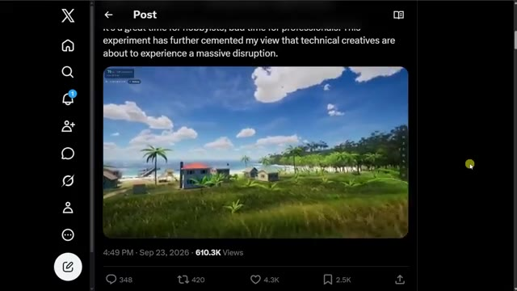
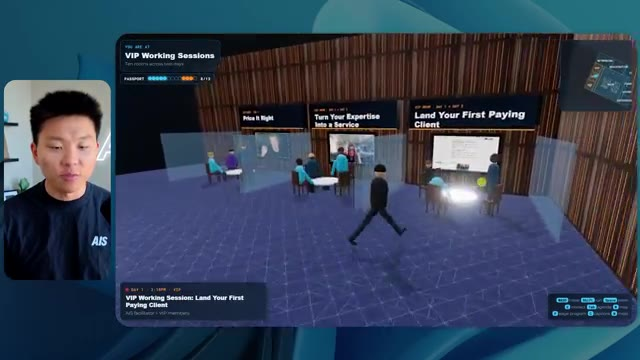
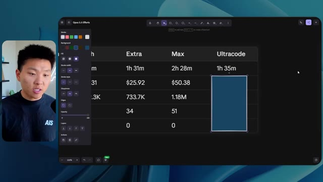

# 🎬 I Tested OpenAI's Dots vs. Meta's Muse. What You Need to Know.

> **Chaîne** : [Nate Herk | AI Automation](https://www.youtube.com/@nateherk/featured)  
> **Lien YouTube** : [https://www.youtube.com/watch?v=BvvfZKKz4Yo](https://www.youtube.com/watch?v=BvvfZKKz4Yo)  
> **Date de publication** : 20260930  
> **Durée** : 00:16:30  
> **Identifiant vidéo** : `BvvfZKKz4Yo`  
> **Transcription & Analyse** : `whisper-v3-large-turbo+gemini-3.5-flash-lite`  

---

## 📌 Synthèse Exécutive & Outils

### 💡 Résumé

Dans cette vidéo issue de la chaîne de Nate Herk, l'analyste se penche sur l'évaluation comparative du modèle **Opus 5.5** à travers ses différents niveaux d'effort (faible, moyen, élevé, ultra code, etc.) pour une tâche complexe d'ingénierie logicielle et d'IA générative. L'objectif assigné à l'agent consistait à transformer un dossier Frame.io de 105 gigaoctets d'enregistrements vidéo issus d'un événement virtuel (« AIS Live ») en un monde 3D explorable, interactif et réaliste, simulant une conférence en personne avec différentes salles, scènes et pistes.

Les tests révèlent des contrastes saisissants tant sur le plan de la qualité visuelle que de l'efficacité opérationnelle. En mode d'effort **faible**, le modèle génère rapidement (16 minutes, ~3,91 $ d'équivalent API) une ébauche fonctionnelle mais truffée de bugs d'affichage, d'images fixes non lues et d'une esthétique générique éloignée de la marque. À l'inverse, le mode d'effort **moyen**, recommandé par Anthropic dans ses documentations, livre en 1 heure et 13 minutes (~12,44 $) un résultat nettement supérieur : intégration correcte de la charte graphique, PNJ (personnages non-joueurs) dotés de micro-comportements dynamiques, diffusion fluide de véritables flux vidéo de l'événement et modélisation fidèle des espaces (hall, salon VIP, scènes principales).

Fait remarquable, les agents parviennent à concevoir ces environnements entièrement autonomes sans nécessiter la moindre intervention humaine intermédiaire, affichant systématiquement un total de zéro question posée durant l'exécution, tout en s'appuyant sur des dizaines de vérifications automatisées dans le navigateur.

---

### 🛠️ Outils, Modèles & Logiciels Présentés

* **Opus 5.5** : Modèle d'intelligence artificielle de pointe d'Anthropic, réputé pour sa polyvalence, son coût modéré et ses performances élevées en développement et raisonnement.
* **Claude Code** : Outil de développement assisté par IA d'Anthropic permettant de coder, d'exécuter et de tester des applications directement depuis l'environnement de travail.
* **Frame.io** : Plateforme de collaboration vidéo cloud utilisée ici pour stocker et structurer les 105 gigaoctets d'archives de l'événement « AIS Live ».
* **Hostinger Connector** : Extension gratuite pour éditeurs de code (VS Code, Cursor, Claude Code, etc.) permettant de déployer et de mettre en ligne des projets terminés en un clin d'œil.
* **Key.ai / Jev** : Services et clés d'API potentiellement sollicités par l'agent pour la génération dynamique d'actifs visuels ou la gestion comportementale des agents dans le monde 3D.
* **Cursor & VS Code** : Environnements de développement intégrés (IDE) couramment couplés aux agents IA pour le prototypage et l'ingénierie logicielle.

---

### 🔑 Points Clés & Enseignements Stratégiques

* **Impact direct du niveau d'effort sur la qualité** : Ajuster le paramètre d'effort d'Opus 5.5 modifie radicalement la profondeur du rendu, transformant un prototype grossier et bogué en un produit fini immersif et cohérent.
* **Autonomie totale des agents** : L'utilisation de prompts orientés « objectifs » (*slash goals*) permet à l'IA d'exécuter des tâches d'ingénierie complexes de bout en bout sans bloquer le processus pour poser des questions de clarification.
* **Validation visuelle automatisée** : L'agent effectue de multiples ouvertures de navigateur (22 à 23 vérifications) pour auditer son propre travail en temps réel, garantissant une boucle de rétroaction autonome.
* **Gestion du coût et du temps de calcul** : Le passage du mode faible au mode moyen multiplie par quatre le temps d'exécution (de 16 min à 1h13) et le coût API (de ~3,91 $ à ~12,44 $), un investissement largement justifié par le saut qualitatif.
* **Respect de l'identité de marque** : Un niveau d'effort insuffisant entraîne des approximations esthétiques (logos génériques, couleurs erronées), tandis qu'un effort accru intègre fidèlement les directives de design et palettes de couleurs originelles.
* **Dynamisme des PNJ et interactivité** : Les niveaux d'effort supérieurs dotent l'environnement 3D de comportements autonomes pour les personnages (mouvements de bras, réactions), évitant l'effet de « fantômes » ou de statues figées.
* **Intégration multimédia complexe** : L'agent est capable de cartographier et d'injecter de vrais flux vidéo issus d'archives lourdes (105 Go) dans des écrans virtuels situés dans les différentes salles de la conférence.
* **Suivi précis des métriques d'exécution** : L'analyse rigoureuse des jetons consommés (~191k à ~490k), du temps, du coût et des vérifications offre une visibilité indispensable pour optimiser les flux de travail par agent.
* **Alignement avec les recommandations officielles** : Les résultats empiriques confirment la méthodologie conseillée par Anthropic, qui préconise de débuter par un niveau d'effort moyen avant d'ajuster selon les besoins.
* **Résolution du goulet d'étranglement du déploiement** : La transition fluide entre le développement local assisté par IA et la mise en production en ligne reste un défi critique résolu par des outils intégrés comme l'extension Hostinger.

---

## ⏱️ Chronologie & Transcription Complète Audio & Visuelle (Mot pour Mot)

### ⏱️ `[00:00:00 - 00:00:20]` | Segment #01

**🔊 Audio (Transcription Intégrale Mot pour Mot en Français) :**
> Opus 5.5, Opus 5.5, Opus 5.5, Opus 5.5, Opus 5.5. Ce modèle est littéralement partout et pour de très bonnes raisons. Il est intelligent, il est bon marché, il a un goût incroyable, c'est un modèle d'IA incroyable. Mais avec chaque modèle d'IA, vous avez le choix de l'effort, que ce soit faible, moyen, élevé, extra, max ou code ultra.

**👁️ Analyse Visuelle d'Écran (gemini-3.5-flash-lite) :**
**Interface & Outils** : Réseau social X (Twitter)

**Contenu textuel & Code** : Publication textuelle sur l'impact de l'IA sur les créateurs et vidéo générée affichée dans un tweet.

**Action / Démonstration** : Affichage d'un post externe illustrant le sujet abordé sur l'intelligence artificielle et la création.

*⏱️ 00:00:05 — Capture d'écran d'un tweet sur X (anciennement Twitter) montrant un post sur les créateurs techniques et une vidéo de paysage tropical en 3D.*

---

### ⏱️ `[00:00:20 - 00:00:38]` | Segment #02

**🔊 Audio (Transcription Intégrale Mot pour Mot en Français) :**
> Donc dans cette vidéo, j'ai donné exactement le même prompt à Opus 5.5 et je l'ai exécuté à chaque niveau d'effort, et nous allons comparer les résultats. Nous examinerons la qualité de toutes les différentes sorties réelles, mais nous allons aussi examiner combien de temps chacun d'eux a pris pour s'exécuter, combien cela nous a coûté si c'était une facturation par API, le total des jetons, combien de vérifications ils ont effectuées, et combien de questions ils m'ont réellement posées tout au long du processus.

**👁️ Analyse Visuelle d'Écran (gemini-3.5-flash-lite) :**
**Interface & Outils** : Application de tableau blanc ou d'interface de notes (style Miro ou Canvas)

**Contenu textuel & Code** : Tableau comparatif des niveaux d'effort de l'IA (Low à Ultracode) et critères d'évaluation (Run time, API cost, Total tokens, Checks, Questions asked).

**Action / Démonstration** : Présentation du tableau comparatif des différents niveaux d'effort d'Opus 5.5.

*⏱️ 00:00:29 — Capture d'écran montrant un tableau comparatif avec les niveaux d'effort (Low, Medium, High, Extra, Max, Ultracode) et des métriques (Run time, API cost, Total tokens, Checks, Questions asked).*

---

### ⏱️ `[00:00:39 - 00:00:58]` | Segment #03

**🔊 Audio (Transcription Intégrale Mot pour Mot en Français) :**
> Et les résultats qu'on a obtenus ne sont pas du tout ce à quoi je m'attends, donc j'ai hâte de partager ça avec vous les gars. Ne perdons pas de temps et entrons directement dans le vif du sujet. Bon, alors passons directement à celui-là. Je veux commencer juste en vous montrant le prompt réel qu'on a utilisé, qu'on a donné à chacun de ces différents agents. Je vais aller dans les fichiers ici, et nous allons ouvrir ce fichier markdown de prompt, et je vais vous montrer ce qu'on a obtenu. Donc voici le slash objectif que j'ai fourni.

**👁️ Analyse Visuelle d'Écran (gemini-3.5-flash-lite) :**
**Interface & Outils** : Interface de l'application de développement / interface web ou IDE d'IA avec un panneau latéral de navigation et une zone de chat.

**Contenu textuel & Code** : Texte du prompt affiché : "Hi Nate. This worktree has the effort-test task queued in PROMPT.md : build a walkable third-person 3D world of the AIS Live conference..."

**Action / Démonstration** : Affichage et lecture de l'interface de l'outil de développement avec le prompt de test d'effort.

*⏱️ 00:00:48 — Interface de l'outil de développement IA affichant un prompt textuel demandant de construire un monde 3D interactif et le présentateur incrusté en vignette vidéo.*

---

### ⏱️ `[00:00:58 - 00:01:34]` | Segment #04

**🔊 Audio (Transcription Intégrale Mot pour Mot en Français) :**
> J'ai dit, tu dois me créer un monde 3D qui est une conférence tech réaliste dans laquelle je peux me promener en vue à la troisième personne. Tu vas regarder ce dossier, qui contient mes ressources d'enregistrement d'événements de AIS Live. Et ce dossier est un dossier Frame.io de 105 gigaoctets d'enregistrements vidéo. C'était un événement complètement virtuel. Tout a été enregistré et tous les enregistrements sont ici. J'ai dit, ton objectif est de prendre cet événement et de le transformer en un monde 3D explorable qui me donne l'impression d'être réellement allé à une vraie conférence en personne avec différentes salles, différentes pistes, différentes scènes, bla, bla, bla. N'hésite pas à utiliser key.ai si tu as besoin de générer des images ou des vidéos. Et tu peux aussi utiliser n'importe quoi d'autre à l'intérieur de mon projet Herc 2, qui est comme mon système d'exploitation IA. J'ai dit,

**👁️ Analyse Visuelle d'Écran (gemini-3.5-flash-lite) :**
**Interface & Outils** : Éditeur de code (VS Code / interface similaire) et interface web Frame.io.

**Contenu textuel & Code** : Fichier Markdown (PROMPT.md) contenant les consignes textuelles pour concevoir un espace 3D explorable avec différentes salles et scènes.

**Action / Démonstration** : Présentation du prompt de configuration et des ressources d'enregistrement d'événements sur Frame.io (105 Go).

*⏱️ 00:01:07 — Un éditeur de texte affichant le fichier PROMPT.md avec les instructions détaillées pour créer un monde 3D interactif et réaliste basé sur les enregistrements d'un événement virtuel.*

*⏱️ 00:01:16 — Une interface web Frame.io affichant un dossier d'enregistrements d'événements de 105,69 Go contenant des sous-dossiers de types GA Access et VIP Access.*

*⏱️ 00:01:25 — L'éditeur de code montrant à nouveau le contenu textuel complet du prompt pour la génération du monde virtuel 3D de la conférence.*

---

### ⏱️ `[00:01:34 - 00:02:08]` | Segment #05

**🔊 Audio (Transcription Intégrale Mot pour Mot en Français) :**
> vous serez jugé sur la créativité, le design, la physique et la sensation générale lorsque j'explorerai le monde 3D que vous avez construit. Et c'était fondamentalement la fin des instructions. Donc, comme vous pouvez le voir sur ce côté gauche, j'ai exécuté ceci à travers tous les différents niveaux d'effort. Commençons par le niveau bas et progressons jusqu'à l'ultra code. Très bien. Donc ici, nous avons le résultat du niveau bas. Ouvrons ceci et jetons un œil. Nous avons donc AIS Live, le sommet des services IA en personne enfin, et nous avons pu cliquer partout. Tout d'abord, cela ne fait pas très personnalisé. Genre, ce n' ce n'est pas le logo d'IS Live. Ce n'est même pas nos couleurs. Donc je n'aime pas trop ça, mais entrons ici. D'accord. C'est beaucoup trop lumineux. Euh, nous avons une carte en haut à droite ; nous avons une ville par ici, je ne peux pas dire quelle ville c'est.

**👁️ Analyse Visuelle d'Écran (gemini-3.5-flash-lite) :**
**Interface & Outils** : Interface web de développement / assistant IA

**Contenu textuel & Code** : "Hi Nate. This worktree has the effort-test task queued in PROMPT.md : build a walkable third-person 3D world..."

**Action / Démonstration** : Sélection des différents niveaux de test d'effort dans le panneau latéral gauche.

*⏱️ 00:01:42 — Interface d'une application d'IA montrant différents niveaux de tests d'effort dans un panneau latéral et une conversation avec un assistant IA.*

---

### ⏱️ `[00:02:08 - 00:02:40]` | Segment #06

**🔊 Audio (Transcription Intégrale Mot pour Mot en Français) :**
> C'est. D'accord. C'est Chicago, ce qui est plutôt sympa parce que tu sais, je vis à Chicago, mais bref, en haut à droite, nous pouvons voir une carte. Nous avons un lobby. Nous avons un hall d'exposition. Nous avons un salon VIP, la scène principale. La carte montre également où se trouve chaque autre personne et cela se synchronise en direct. Nous pouvons donc voir l'enregistrement. Nous pouvons voir le premier jour, la keynote de l'agent hyper, le débriefing en direct. Cool. Donc il connaît réellement l'agenda et puis il y a le deuxième jour. Donc il a trouvé ça, c'est bien. Nous avons ces petites boules ici que je peux espérer lancer autour de moi. D'accord. Le visage, oh, regardez ça. Si je vais par ici, tous les gens disparaissent tout simplement. Très mauvais. Très mauvais. D'accord. Alors voyons voir. Est-ce que je peux sprinter ? D'accord.

**👁️ Analyse Visuelle d'Écran (gemini-3.5-flash-lite) :**
**Interface & Outils** : Application virtuelle 3D / plateforme de conférence en ligne avec mini-carte de navigation.

**Contenu textuel & Code** : Menus de conférence, programme de la journée 'Day 1', noms des différentes zones (Lobby, Expo Hall, Main Stage, VIP lounge).

**Action / Démonstration** : Navigation et exploration de l'espace virtuel 3D de la conférence par le présentateur.

*⏱️ 00:02:16 — Vue d'un espace virtuel en 3D avec un avatar et une mini-carte en haut à droite indiquant l'emplacement (Badge pickup - GA and VIP).*

*⏱️ 00:02:24 — Vue du lobby virtuel en 3D avec un panneau affichant le programme du jour 'Day 1' et une mini-carte interactive.*

*⏱️ 00:02:32 — Vue de l'Expo Hall virtuel montrant les stands des sponsors, les avatars des participants et l'interface de navigation.*

---

### ⏱️ `[00:02:40 - 00:03:04]` | Segment #07

**🔊 Audio (Transcription Intégrale Mot pour Mot en Français) :**
> Je peux avancer un peu plus vite. Je vais d'abord aller par ici. Il y a des produits dérivés, euh, un sweat à capuche certifié AIS plus. D'accord. Donc il y a les vrais stands qu'on avait dans l'événement virtuel. On avait des stands. Donc c'est plutôt cool. Un petit endroit pour prendre des photos. La salle C. En ce moment, nous avons Tangy Frederick qui anime un atelier. D'accord. Mais ce n'est pas une vidéo. Comme vous pouvez le voir, c'est juste une image. Elle ne bouge pas. C'est donc juste une image. Ces gens sont en train de disparaître. Ce doivent être des fantômes. Allons par ici dans la salle A.

**👁️ Analyse Visuelle d'Écran (gemini-3.5-flash-lite) :**
**Interface & Outils** : Environnement virtuel 3D interactif (type metaverse/jeu).

**Contenu textuel & Code** : Textes explicatifs, instructions de configuration d'API et plans de salles.

**Action / Démonstration** : Navigation et exploration de l'espace virtuel par le présentateur sous forme d'avatar.

---

### ⏱️ `[00:03:04 - 00:03:30]` | Segment #08

**🔊 Audio (Transcription Intégrale Mot pour Mot en Français) :**
> Nous avons Liberty White. D'accord. Très cool. Vos 30 premiers jours en automatisation. Encore une fois, c'est juste une image fixe et les gens ont des bugs d'affichage. Donc ce n'est pas très bien ici. Je vais aller sur la scène principale et voir ce que nous avons. D'accord, cool. Donc nous avons une scène d'apparence principale. Les gens ont de gros bugs d'affichage. Vraiment mauvais. Ce n'est vraiment pas terrible. Notre vidéo est en fait en train de bouger. Genre, j'ai vu mon visage ici et j'ai vu celui de Devin, mais maintenant ils ont disparu. Donc je ne sais pas ce qui s'est passé. D'accord. C'est, on dirait que c'est plutôt un diaporama. Rien n'est vraiment lu pour l'instant. Quoi qu'il en soit, entrons ici.

**👁️ Analyse Visuelle d'Écran (gemini-3.5-flash-lite) :**
**Interface & Outils** : Environnement virtuel 3D de type métavers ou plateforme de conférence en ligne (type Gather.town ou similaire).

**Contenu textuel & Code** : Interface d'événement virtuel affichant "Now showing: Hyperagent Workshop: How to Build an Always-On Fleet of Agents" et le logo "AIS LIVE AI Services Summit".
[DESC_IMAGE_3] Navigation de l'avatar de l'utilisateur à l'intérieur de l'espace de conférence virtuel pour explorer les différentes salles et ateliers.

**Action / Démonstration** : Explications face caméra et démonstration conceptuelle.

*⏱️ 00:03:17 — Le présentateur navigue dans une salle de conférence virtuelle (Main Stage) remplie d'avatars assis, montrant l'événement "Hyperagent Workshop".*

*⏱️ 00:03:24 — Vue de la scène principale "AIS LIVE AI Services Summit" dans l'environnement virtuel avec un grand écran central et des avatars.*

---

### ⏱️ `[00:03:30 - 00:03:58]` | Segment #09

**🔊 Audio (Transcription Intégrale Mot pour Mot en Français) :**
> Nous avons d'autres stands. Nous avons hyper agent. Nous avons Claude Code. Nous avons plus de cadeaux publicitaires. La salle B, c'est Dave Ebelor. Je suppose que c'est exactement la même chose. Nous avons du café. Et ensuite, je suppose, le salon VIP, accès VIP seulement. C'est plutôt cool, mais il n'y a vraiment rien qui se passe ici. Cet écran est bien trop lumineux. D'accord. Donc je pense que vous comprenez l'ambiance que nous obtenons ici avec Opus 5.5 en effort faible. Et c'est là que les choses deviennent intéressantes. Combien de temps pensez-vous que cela a duré ? Combien de temps ? Celui-ci a duré 16 minutes et 43 secondes. Combien pensez-vous que cela a coûté ?

**👁️ Analyse Visuelle d'Écran (gemini-3.5-flash-lite) :**
**Interface & Outils** : Application web / tableau de bord de gestion d'effort IA (Opus 5.5 Efforts).

**Contenu textuel & Code** : Tableau comparatif des niveaux d'effort (Low à Ultracode) mesurant le temps d'exécution, le coût API, les tokens totaux, les vérifications et les questions posées.

**Action / Démonstration** : Analyse ou configuration des paramètres d'effort et des performances d'exécution des modèles d'agents IA.

*⏱️ 00:03:51 — Interface de tableau de bord montrant des niveaux d'effort (Low, Medium, High, Extra, Max, Ultracode) avec des métriques (Run time, API cost, Total tokens, Checks, Questions asked).*

---

### ⏱️ `[00:03:58 - 00:04:26]` | Segment #10

**🔊 Audio (Transcription Intégrale Mot pour Mot en Français) :**
> 3,91 dollars si c'était une facturation par API. J'utilise évidemment mon abonnement ici, mais nous allons simplement calculer cela avec la facturation par API. Le total des jetons était de 191 000. Il a effectué 22 vérifications. Donc, pour la vérification, il a ouvert le navigateur 22 fois et a exécuté différentes sortes de vérifications. Donc 22 catégories de vérifications. Et combien de questions m'a-t-il posées ? Il m'a posé un total de zéro question tout au long de cette invite de type « slash goal ». D'accord. Alors, ouvrons l'effort moyen et voyons ce que nous avons. D'accord, c'est parti. Effort moyen. Nous avons Nate Herc. Nous avons mon badge. C'est de la marque AI's Life.

**👁️ Analyse Visuelle d'Écran (gemini-3.5-flash-lite) :**
**Interface & Outils** : Application de tableau blanc ou d'outil de visualisation de données (type Excalidraw ou similaire).

**Contenu textuel & Code** : Tableau comparatif avec les lignes "Run time", "API cost", "Total tokens", "Checks" et "Questions asked", et les colonnes "Low", "Medium", "High", "Ex". Les valeurs affichées incluent "16m 43s", "$3.91" et "191.3K".

**Action / Démonstration** : Le présentateur commente les métriques affichées sur le tableau, détaillant le coût API et le nombre total de jetons.

*⏱️ 00:04:05 — Capture d'écran montrant le présentateur à gauche et un tableau de données et de métriques sur fond sombre à droite. Le tableau présente des statistiques telles que le temps d'exécution (16m 43s), le coût API (3,91 dollars), le total des jetons (191,3K), les vérifications et les questions posées.*

---

### ⏱️ `[00:04:26 - 00:04:46]` | Segment #11

**🔊 Audio (Transcription Intégrale Mot pour Mot en Français) :**
> Donc ça a déjà l'air un petit peu mieux. Ça ressemble à nos palettes de couleurs qui ont utilisé nos directives de marque. Premier jour de construction, deuxième jour de gain, VIP. Cool. D'accord. Je vais entrer dans le lieu. D'accord. Waouh. Une ambiance similaire, en gros. C'est en arrière-plan. Ça ne ressemble pas à Chicago, hein ? Non, ça ressemble à, honnêtement, ça ressemble à une ville inventée. Quoi qu'il en soit, c'est marrant qu'ils aient décidé de faire ça. Voyons si je peux me déplacer un peu plus vite. Oh, waouh.

**👁️ Analyse Visuelle d'Écran (gemini-3.5-flash-lite) :**
**Interface & Outils** : Interface web d'application virtuelle / environnement 3D interactif

**Contenu textuel & Code** : Écran d'accueil de l'événement 'AIS Live', badges VIP, instructions de déplacement (WASD, Shift, Space) et environnement virtuel 3D.

**Action / Démonstration** : Navigation et entrée dans le lieu virtuel de l'événement.

*⏱️ 00:04:31 — Interface d'accueil de la plateforme virtuelle 'AIS Live' avec un badge d'accès au nom de Nate Herk et des options de navigation.*

*⏱️ 00:04:41 — Vue à la première ou troisième personne à l'intérieur du lieu virtuel 'AIS Live', montrant des avatars et un décor de gratte-ciels la nuit.*

---

### ⏱️ `[00:04:46 - 00:05:21]` | Segment #12

**🔊 Audio (Transcription Intégrale Mot pour Mot en Français) :**
> Les gens interagissent avec moi. Regardez. Si je m'approche de ce type, il vient de lever le bras. Bon, maintenant il ne veut plus du tout avoir affaire à moi. Mais tous ces petits robots ici doivent prendre des décisions. Je ne sais pas s'ils utilisent Jev. C'est sûr que non. Je ne lui ai pas dit de le faire. En fait, ma clé Jev est à l'arrière. Je ne sais pas. Peut-être qu'il l'a utilisée. Quoi qu'il en soit, nous pouvons voir ici que nous avons la salle d'atelier C, le laboratoire des agents. Sympa. Donc celui-ci est en fait en train de tourner. Vous pouvez voir qu'il s'agit d'une vraie vidéo lue par Tangy. Tout le monde ici est en train de travailler sur un ordinateur portable. Ils ne buguent pas. C'est plutôt cool. De plus, mon badge est sur ma poitrine, ce qui est plutôt cool. Je peux venir par ici. Nous avons une carte en haut à droite, comme vous pouvez le voir, mais je peux venir par ici. Nous avons un

**👁️ Analyse Visuelle d'Écran (gemini-3.5-flash-lite) :**
**Interface & Outils** : Environnement virtuel 3D / plateforme de type métavers ou espace de travail collaboratif virtuel.

**Contenu textuel & Code** : Avatars virtuels, interface de salle de classe (Agents Lab), éléments d'interface utilisateur en bas à gauche et carte miniature en haut à droite.

**Action / Démonstration** : Exploration et navigation dans un monde virtuel 3D interactif peuplé d'avatars.

---

### ⏱️ `[00:05:21 - 00:05:47]` | Segment #13

**🔊 Audio (Transcription Intégrale Mot pour Mot en Français) :**
> hall d'exposition. C'est ici que nous avons le stand Glido. Et ça diffuse actuellement. Oui, ça diffuse la vidéo de nous parlant de Glido. Ça diffuse la vidéo d'Ed et moi parlant de notre programme de certification. Nous avons le logo AIS Plus juste ici, qui est un peu mal placé. Ce sont les diapositives des conférenciers et les points clés. Donc waouh, ce sont toutes les ressources que nous avons distribuées après l'événement. Elles sont toutes affichées là également. Nous pouvons voir que nous avons un coup de projecteur sur la communauté. Donc c'est Aiden qui parle de son contrat qu'il a décroché et c'est diffusé en direct. Ces gens regardent.

**👁️ Analyse Visuelle d'Écran (gemini-3.5-flash-lite) :**
**Interface & Outils** : Environnement virtuel 3D / Metavers d'exposition

**Contenu textuel & Code** : Aucun code source, terminal ou prompt visible (uniquement du texte de présentation sur des diapositives virtuelles).

**Action / Démonstration** : Navigation et visite dans un espace d'exposition virtuel 3D.

---

### ⏱️ `[00:05:47 - 00:06:21]` | Segment #14

**🔊 Audio (Transcription Intégrale Mot pour Mot en Français) :**
> Ils sont plutôt engagés. On a l'hyper agent. C'était, c'est ce que je voulais dire. Si vous avez vu ces gens lever les bras en disant bonjour, c'était plutôt marrant. Regardez, regardez, le voilà qui recommence. Bref. Bon. Où est-ce que je suis maintenant ? Maintenant, je suis dans le hall principal. On a un bar à café. On a un grand logo, qui est le vrai logo. C'est trop lumineux, mais on a le logo. On peut voir si on peut entrer ici dans le parcours fondation. On a Sabrina Romanov et Liberty White. Donc différentes formations juste là. On peut entrer dans cette salle. C'est le parcours avancé. Alors qu'est-ce qui se passe ici. On a Dave Ebelar et Saman qui parlent de différentes choses là-dedans. Et maintenant, allons jeter un œil à la scène principale. Oh, attendez, il y a une vidéo de moi là-haut. C'est du genre VIP

**👁️ Analyse Visuelle d'Écran (gemini-3.5-flash-lite) :**
**Interface & Outils** : Application de métavers / espace virtuel 3D en ligne.

**Contenu textuel & Code** : Environnement virtuel 3D interactif avec avatars, mini-carte et interfaces de navigation.

**Action / Démonstration** : Exploration et déplacement de l'avatar dans le hall principal de l'événement virtuel.

*⏱️ 00:05:55 — Vue dans un espace virtuel 3D montrant le hall principal avec des avatars et une mini-carte en haut à droite.*

*⏱️ 00:06:04 — Navigation dans l'environnement virtuel vers une salle de conférence avec des participants assis.*

*⏱️ 00:06:12 — Vue en angle large de la zone d'accueil et des tables avec plusieurs avatars interactifs.*

---

### ⏱️ `[00:06:21 - 00:06:50]` | Segment #15

**🔊 Audio (Transcription Intégrale Mot pour Mot en Français) :**
> section ? Ouais, on ira voir ça dans une minute. Mais bref, voici la scène principale. Ça a l'air très, très bien. On a une grande scène. On a genre quatre personnes assises ici. On a les trois écrans d'Alex là-haut avec hyper agent. Est-ce que j'ai le droit de monter sur scène ? Oh, et il me laisse monter sur scène. D'accord. C'est plutôt sympa. Bon les gars, faisons un selfie. Laissez-moi prendre tout le monde en arrière-plan. Venez par ici. Bref, c'est vraiment, vraiment cool. Par contre, toutes les places ne sont pas occupées. Donc il faut qu'on travaille là-dessus. Mais bref, je vais courir voir ce qu'était cette section VIP. D'accord. Le salon VIP. J'ai l'impression que c'est comme un salon d'aéroport ou un truc comme ça.

**👁️ Analyse Visuelle d'Écran (gemini-3.5-flash-lite) :**
**Interface & Outils** : Environnement virtuel 3D de type métavers / plateforme de conférence en ligne.

**Contenu textuel & Code** : Interface utilisateur affichant les détails d'une keynote "Hyperagent Keynote" avec des écrans de présentation.

**Action / Démonstration** : Navigation et déplacement d'un avatar dans un espace de conférence virtuel.

---

### ⏱️ `[00:06:51 - 00:07:14]` | Segment #16

**🔊 Audio (Transcription Intégrale Mot pour Mot en Français) :**
> Ok, super. Donc maintenant nous avons les sessions VIP ici. Une séance de questions-réponses VIP avec Nate, lecture vidéo en direct juste ici. Très, très cool. Et nous avons comme un bar ou quelque chose du genre. Génial. Je dirais que c'est un très bon résultat. Maintenant, en ce qui concerne les statistiques ici, celle-ci a pris une heure et 13 minutes à s'exécuter. Cela nous aurait coûté 12 dollars et 44 cents. Elle a utilisé 490 000 jetons et elle a effectué 23 vérifications.

**👁️ Analyse Visuelle d'Écran (gemini-3.5-flash-lite) :**
**Interface & Outils** : Application virtuelle 3D / Navigateur web, et tableau de bord analytique.

**Contenu textuel & Code** : Métriques de performance : Run time (16m 43s), API cost ($3.91), Total tokens (191.3K), Checks (22), Questions asked (0).

**Action / Démonstration** : Navigation et présentation de l'espace virtuel VIP et des métriques associées à la session.

*⏱️ 00:06:56 — Capture montrant un espace virtuel en 3D avec des avatars, un écran géant affichant une vidéo en direct avec des sous-titres, et le présentateur en médaillon à gauche.*

*⏱️ 00:07:02 — Capture montrant un tableau de bord d'analyse de performances (Run time 16m 43s, API cost $3.91, Total tokens 191.3K, etc.) dans une interface logicielle.*

---

### ⏱️ `[00:07:14 - 00:07:48]` | Segment #17

**🔊 Audio (Transcription Intégrale Mot pour Mot en Français) :**
> Et il nous a posé un total de zéro question une fois de plus. Très bien, passons au niveau élevé. C'était déjà un résultat plutôt correct et Anthropic eux-mêmes dans leur vidéo sur comment prompter Opus 5.5, ou désolé, pas une vidéo, un article. Ils ont dit de commencer simplement par moyen et de l'ajuster à la hausse ou à la baisse si nécessaire. C'était donc un résultat moyen. Passons au niveau élevé et voyons ce qu'on a obtenu. Très rapidement, les gars, je dois prendre une seconde pour vous parler du sponsor de la vidéo d'aujourd'hui, Hostinger. Donc ces deux modèles viennent de me construire une version fonctionnelle de la même chose. Et maintenant je suis exactement là où je finis toujours, avec quelque chose de terminé sur mon ordinateur portable et aucun moyen rapide de le mettre en ligne. Et c'est le fossé que comble le connecteur d'Hostinger. C'est une extension gratuite.

**👁️ Analyse Visuelle d'Écran (gemini-3.5-flash-lite) :**
**Interface & Outils** : Tableau blanc ou application de notes/tableaux, et éditeur de code ou environnement de développement assisté par IA.

**Contenu textuel & Code** : Métriques de performance (Run time, API cost, Total tokens, Checks, Questions asked) et code/prompt pour "Northwind ROI calculator".
[DESC_IMAGE_2] Analyse comparative des coûts et performances d'exécution de modèles d'IA avec différents niveaux d'effort.

**Action / Démonstration** : Explications face caméra et démonstration conceptuelle.

*⏱️ 00:07:22 — Tableau comparatif des performances selon différents niveaux d'effort (Low, Medium, High, Extra) montrant le temps d'exécution, le coût API, le nombre de tokens et de questions posées.*

*⏱️ 00:07:39 — Interface de développement ou d'éditeur de code divisée en deux panneaux montrant l'exécution d'un prompt pour créer un calculateur de ROI.*

---

### ⏱️ `[00:07:48 - 00:08:23]` | Segment #18

**🔊 Audio (Transcription Intégrale Mot pour Mot en Français) :**
> pour votre éditeur qui intègre votre compte Hostinger dans l'environnement où vous codez déjà. Donc VS Code, Cursor, Cloud Code, Codex, peu importe. Vous vous connectez une seule fois en un clic, et à partir de là, votre agent peut déployer le site, y pointer un domaine, configurer les enregistrements DNS et vérifier votre VPS sans jamais avoir à quitter l'éditeur. Ainsi, peu importe celui de ces outils que vous finirez par préférer, ce qu'il a construit est à quelques minutes d'une vraie URL sur un hébergement géré. Le connecteur est gratuit avec chaque formule d'hébergement, donc si vous avez toujours besoin de l'hébergement sous-jacent, profitez de la formule illimitée avec le lien dans la description et utilisez le code NATEHERK pour obtenir 10 % de réduction. Cela comprend également un nom de domaine gratuit et un e-mail professionnel pour un an. Et c'est toujours le moyen le moins cher que j'ai trouvé pour obtenir un

**👁️ Analyse Visuelle d'Écran (gemini-3.5-flash-lite) :**
**Interface & Outils** : Interface web Hostinger et terminal Claude Code dans un éditeur

**Contenu textuel & Code** : Statut "Connected", version Node.js 24.13.0, et liste des outils d'assistance (154 outils pour les sites web, 49 pour les domaines).

**Action / Démonstration** : Affichage de la configuration et de la connexion réussie du compte Hostinger dans l'environnement de développement.

*⏱️ 00:07:57 — Interface d'intégration Hostinger avec affichage de la connexion réussie (Connected via OAuth) et des outils disponibles (Websites, Domains, Subscriptions, Email Marketing), avec le terminal Claude Code à droite.*

---

### ⏱️ `[00:08:23 - 00:08:47]` | Segment #19

**🔊 Audio (Transcription Intégrale Mot pour Mot en Français) :**
> tu as construit par-dessus une vraie URL. Donc revenons-en à la vidéo. D'accord. Encore une fois, très, très thématisé par la marque. C'est un écran de chargement encore mieux que le précédent. Nous avons ce joli petit effet en arrière-plan. Nous avons le logo. Nous allons entrer dans le lieu. D'accord. Nous y voilà. Ça a l'air plutôt bien. Nous commençons à l'extérieur et tu peux voir que nous avons ces drapeaux pour tous les intervenants, Wyatt, Casper, Alex, Ed, Aiden, Sabrina, Liberty. C'est plutôt cool. Nous avons des blocs en direct ici.

**👁️ Analyse Visuelle d'Écran (gemini-3.5-flash-lite) :**
**Interface & Outils** : Application web interactive / Environnement virtuel 3D de l'événement AIS Live.

**Contenu textuel & Code** : Interface utilisateur avec mini-carte, indicateurs de progression, bannières d'événements et commandes de navigation clavier/souris.

**Action / Démonstration** : Navigation et exploration de l'espace virtuel 3D de l'événement par le présentateur.

*⏱️ 00:08:29 — Écran de chargement de l'événement virtuel AIS Live avec le logo et les instructions de contrôle.*

*⏱️ 00:08:35 — Entrée dans la place virtuelle 3D (AIS Live Plaza) avec des avatars et des bâtiments en arrière-plan.*

*⏱️ 00:08:41 — Exploration de la place virtuelle avec des bannières affichant les noms des intervenants et un petit robot sphérique au sol.*

---

### ⏱️ `[00:08:47 - 00:09:23]` | Segment #20

**🔊 Audio (Transcription Intégrale Mot pour Mot en Français) :**
> elle a pris cette photo de moi, votre hôte, Nate Herc, John, Dave, Nate Herc. Voilà. OK. Les portes. Génial. Ce sont des portes coulissantes automatiques en verre. J'adore ça. On peut voir l'enregistrement VIP. On peut voir l'admission générale. On peut venir par ici et on peut découvrir l'exposition avec différents stands, le coin de la communauté. Vous pouvez aussi voir qu'en haut à gauche, j'ai un passeport. Donc c'est dugenre, ça va montrer combien d'endroits j'ai visités. Tout cela est une vraie lecture. Nous avons un mur de ressources avec tous les différents conférenciers. Ils ont aussi une session de réseautage par ici. Donc je vais venir très vite pour voir de quoi il s'agit. Nous avons donc le bar à cold brew AIS. Nous avons différents membres de la communauté qui ont été mis en avant ou en lumière.

**👁️ Analyse Visuelle d'Écran (gemini-3.5-flash-lite) :**
**Interface & Outils** : Application de métavers / monde virtuel 3D interactif

**Contenu textuel & Code** : Environnement virtuel 3D avec affichage d'informations d'événement, avatars, et zones d'exposition (Registration Concourse, Expo Hall)

**Action / Démonstration** : Exploration d'un espace événementiel virtuel en 3D par le présentateur

*⏱️ 00:08:56 — Vue d'un monde virtuel interactif montrant l'accueil d'un événement avec des comptoirs d'enregistrement et des écrans d'affichage.*

*⏱️ 00:09:05 — Navigation dans un hall d'exposition virtuel avec des stands et des avatars d'utilisateurs.*

*⏱️ 00:09:14 — Déplacement d'un avatar dans le hall virtuel avec vue sur d'autres participants et des portes vitrées.*

---

### ⏱️ `[00:09:23 - 00:09:56]` | Segment #21

**🔊 Audio (Transcription Intégrale Mot pour Mot en Français) :**
> Nous avons l'aile VIP. Attends, quoi ? Prends un bracelet. Oh, je dois vraiment aller chercher le bracelet. D'accord. Laisse-moi m'enregistrer rapidement. Le bracelet est déjà mis. Attends, quoi ? D'accord. Oh, d'accord. Maintenant, les portes se sont ouvertes pour moi. Cool. Je peux entrer ici. Oh, ça mène juste à la scène principale. Salon VIP. Il y a une séance de questions-réponses en cours. Ça a l'air très cool. Je veux dire, je suis très impressionné par la façon dont il est capable de faire ça. Waouh. D'accord. Donc c'est vraiment bien. Ce qu'on a fait, c'est qu'on a eu des salles de discussion VIP avec différentes personnes. Tu peux voir qu'il y a différentes salles, différents membres de l'équipe AIS qui participent à des trucs. C'est vraiment cool. C'est très cool. C'est un VIP bien meilleur

**👁️ Analyse Visuelle d'Écran (gemini-3.5-flash-lite) :**
**Interface & Outils** : Application de métavers ou espace virtuel 3D interactif.

**Contenu textuel & Code** : Éléments d'interface utilisateur virtuels, bannières d'événements, avatars et cartes de navigation.

**Action / Démonstration** : Navigation et exploration de différents espaces virtuels (hall d'enregistrement, salon VIP et salles de travail).

*⏱️ 00:09:32 — Vue principale du hall d'enregistrement virtuel avec un avatar se déplaçant.*

*⏱️ 00:09:40 — Intérieur du salon VIP virtuel où des avatars assistent à une session de questions-réponses.*

*⏱️ 00:09:48 — Espace de travail virtuel affichant différentes sessions de travail VIP ("Price It Right", "Turn Your Expertise into a Service", etc.).*

---

### ⏱️ `[00:09:56 - 00:10:30]` | Segment #22

**🔊 Audio (Transcription Intégrale Mot pour Mot en Français) :**
> expérience que ce qui a été montré dans la première partie. D'accord. After party VIP. Regardez ça. On a une piste de danse. On a tous ces éléments ici. On a la lecture de l'after party VIP juste ici. Et il y a une estrade de DJ. C'est trop marrant. Il y a un petit bug ici, un petit glitch ici, mais c'est génial. Oh, cool. Donc quand je suis ici sur la scène principale, on a des sous-titres. Vous pouvez voir juste ici en bas de mon écran, on a ces sous-titres de Wyatt qui est en train de parler là-haut. On a des lumières. On a le panel. Très cool. Belle scène principale. Je vais aller ici. On peut aller à la fondation,

**👁️ Analyse Visuelle d'Écran (gemini-3.5-flash-lite) :**
**Interface & Outils** : Présentation ou face-caméra explicatif sans interface logicielle partagée.

**Contenu textuel & Code** : Explications orales et mise en contexte méthodologique.

**Action / Démonstration** : Explications face caméra et démonstration conceptuelle.

---

### ⏱️ `[00:10:30 - 00:11:06]` | Segment #23

**🔊 Audio (Transcription Intégrale Mot pour Mot en Français) :**
> avancé, et les parcours d'entreprise ici. Alors voyons voir. Nous avons l'anatomie de trois vrais dossiers. Nous avons hyper agent. Nous avons les évals avec Nate et Ed ici. Nous avons Dave qui s'occupe des trucs avancés. C'est vraiment bien. Je veux dire, évidemment, chacun, chacun de ces résultats jusqu'à présent, faible était correct. Moyen était meilleur. Élevé a été encore meilleur. Voyons si cette tendance se poursuit et allons voir ce que cela nous a coûté. Donc, élevé a fonctionné pendant une heure et sept minutes. Donc un peu plus rapide que moyen, cela nous aurait coûté 16 dollars et 31 cents. Il a utilisé un demi-million de jetons, 509 000. Il a fait 22 vérifications. Et il nous a aussi demandé, enfin, non, je me suis trompé. Ce

**👁️ Analyse Visuelle d'Écran (gemini-3.5-flash-lite) :**
**Interface & Outils** : Tableau de bord / application web de type tableau comparatif ou outil de design.

**Contenu textuel & Code** : Tableau avec métriques : Run time (16m 43s, 1h 13m, 1h 7m), API cost ($3.91, $12.44, $16.31), Total tokens (191.3K, 419.2K), Checks (22, 23), Questions asked (0, 0).

**Action / Démonstration** : Analyse et comparaison des performances et des coûts selon différents niveaux d'effort (Low, Medium, High, Extra).

*⏱️ 00:10:57 — Capture montrant un tableau comparatif avec les colonnes Low, Medium, High, Extra affichant les temps d'exécution, coûts API, tokens et vérifications.*

---

### ⏱️ `[00:11:06 - 00:11:25]` | Segment #24

**🔊 Audio (Transcription Intégrale Mot pour Mot en Français) :**
> l'un m'a posé une question et spoiler, c'était le seul qui nous a posé une question tout au long de tout ça. Donc voyons voir, il nous en reste trois extra, max et ultra code. Laissez-moi ouvrir extra et nous verrons ce que nous avons. D'accord. Donc celui-ci a l'air plutôt bien. Je dirais honnêtement qu'jusqu'à présent, l'écran de chargement haut était le meilleur. Celui qu'on vient juste de voir, mais bref, entrons dans AIS live.

**👁️ Analyse Visuelle d'Écran (gemini-3.5-flash-lite) :**
**Interface & Outils** : Application de tableau de bord / interface web avec tableau comparatif (intitulée "Opus 5.5 Efforts").

**Contenu textuel & Code** : Tableau avec des lignes : Run time (16m 43s, 1h 13m, 1h 7m), API cost ($3.91, $12.44, $16.31), Total tokens (191.3K, 419.2K, 509.3K), Checks (22, 23, 22), Questions asked (0, 0, 1).

**Action / Démonstration** : Le présentateur examine les résultats du tableau et s'apprête à ouvrir les détails de la colonne "Extra".

*⏱️ 00:11:11 — Un tableau comparatif montrant les métriques de performance et de coût pour différents niveaux d'effort (Low, Medium, High, Extra) avec le présentateur en incrustation vidéo à gauche.*

---

### ⏱️ `[00:11:26 - 00:11:51]` | Segment #25

**🔊 Audio (Transcription Intégrale Mot pour Mot en Français) :**
> Whoa. D'accord. Donc on a comme de petits extraits sonores. Je peux discuter avec des gens. Le panneau sur la guerre des outils a réglé quelques débats pour moi. Sympa. Bonne perspective là-bas. On est dehors à nouveau. On a ces différentes bannières, bien qu'elles soient toutes les mêmes. Elles n'affichent pas de noms de personnes différents. Donc grand logo AIS live. L'aile de l'atelier est par ici. Et passons par les portes coulissantes en verre pour voir ce qu'on a. Donc on a le café AIS. La carte est en bas à droite, et elle n'est pas très descriptive.

**👁️ Analyse Visuelle d'Écran (gemini-3.5-flash-lite) :**
**Interface & Outils** : Application de métavers / monde virtuel 3D en ligne.

**Contenu textuel & Code** : Environnement 3D urbain nocturne interactif avec interface de mini-carte et bannières "AIS LIVE".

**Action / Démonstration** : Exploration et déplacement de l'avatar du présentateur dans l'espace virtuel 3D.

*⏱️ 00:11:32 — Vue d'un monde virtuel interactif montrant un avatar se déplaçant sur une place extérieure, avec des bannières publicitaires et un personnage discutant.*

*⏱️ 00:11:38 — Poursuite de la navigation de l'avatar en extérieur dans l'environnement virtuel, s'approchant de nouveaux bâtiments et bannières.*

*⏱️ 00:11:45 — L'avatar s'approche de l'entrée principale couverte d'un grand bâtiment virtuel (Convention Plaza).*

---

### ⏱️ `[00:11:51 - 00:12:26]` | Segment #26

**🔊 Audio (Transcription Intégrale Mot pour Mot en Français) :**
> J'aime bien comment les autres cartes nous ont dit ce que, genre où se trouvaient les choses, mais celle-ci a l'air très professionnelle. On peut voir ici la scène principale. Allons y faire un saut rapidement. Ils ont tous ces ballons qui volent partout, ce qui je trouve est plutôt marrant. Les ballons de plage AIS. On me voit là-haut en train de parler. Je crois que j'étais en train de présenter l'une des journées. Continuons par ici vers la salle d'atelier sur ce côté gauche. OK. Donc ici nous avons le théâtre Hyper Agent. Nous avons cette session sponsorisée ici par Hyper Agent, mais ça nous montre aussi ce qui va s'y passer. C'est vraiment marrant qu'on puisse discuter avec des gens. Salmon a créé un commercial vocal en direct. La salle "Le Juste Prix" était comble. Tu as pris le guide du compagnon VIP ? C'est trop marrant. On a le parcours avancé dans

**👁️ Analyse Visuelle d'Écran (gemini-3.5-flash-lite) :**
**Interface & Outils** : Présentation ou face-caméra explicatif sans interface logicielle partagée.

**Contenu textuel & Code** : Explications orales et mise en contexte méthodologique.

**Action / Démonstration** : Explications face caméra et démonstration conceptuelle.

---

### ⏱️ `[00:12:26 - 00:12:58]` | Segment #27

**🔊 Audio (Transcription Intégrale Mot pour Mot en Français) :**
> ici. Encore une fois, nous avons la lecture en direct. Est-ce que c'est la lecture en direct ? Oh, d'accord. Ça a commencé une fois que je suis entré, mais je peux m'asseoir. Oh la la. Je peux regarder ça. Je peux me lever. Je veux m'asseoir au premier rang. C'est plutôt cool. C'est très bien. J'aime ça. Et tu sais ce que j'ai remarqué jusqu'à présent ? Le personnage réel que j'incarne me ressemble un peu. Je pense qu'il a été modélisé à partir de mes photos de profil ou quelque chose comme ça. Quoi qu'il en soit, nous avons Sabrina ici, l'animatrice de la salle ici, prenez n'importe quel siège disponible. D'accord, cool. Et j'ai vraiment aimé la fonctionnalité pour s'asseoir. C'est plutôt marrant. Genre, nous pourrions réellement assister à cet atelier et participer. Quoi qu'il en soit, cela nous montre les conférenciers. Cela nous montre les

**👁️ Analyse Visuelle d'Écran (gemini-3.5-flash-lite) :**
**Interface & Outils** : Environnement virtuel 3D interactif (plateforme de webinaire ou de conférence virtuelle)

**Contenu textuel & Code** : Interface utilisateur de réunion/atelier virtuel avec affichage de l'intervenant et des participants sous forme d'avatars

**Action / Démonstration** : Navigation et exploration d'un événement en ligne au format virtuel 3D

*⏱️ 00:12:34 — Vue d'une salle de classe virtuelle 3D avec des avatars assis et un écran géant affichant un atelier en direct ("Advanced Track").*

*⏱️ 00:12:42 — Autre angle de la salle de classe virtuelle 3D avec une ambiance verte, montrant des participants et un écran de présentation.*

*⏱️ 00:12:50 — Vue rapprochée de l'intérieur de l'espace virtuel 3D interactif avec des interfaces vidéo incrustées sur grand écran.*

---

### ⏱️ `[00:12:58 - 00:13:31]` | Segment #28

**🔊 Audio (Transcription Intégrale Mot pour Mot en Français) :**
> agenda. There's a little red carpet here to take some pictures. We can strike a pose. Oh, wow. That's pretty cool. Resource library, get AIS Plus certified, Glido, Hyper Agent, AIS Plus, three real deals. Awesome. I mean, I would definitely say so far, each one is getting better. And we didn't even check out the VIP section yet, the VIP lounge. Let's go up here real quick. Hopefully I can get in. Nice. We've got tooling reset. These are the different rooms we could go in. So once again, I could grab the worksheet and I could try to understand how to price my stuff. This is so cool. This is definitely better than the previous one where we kind of just

**👁️ Analyse Visuelle d'Écran (gemini-3.5-flash-lite) :**
**Interface & Outils** : Présentation ou face-caméra explicatif sans interface logicielle partagée.

**Contenu textuel & Code** : Explications orales et mise en contexte méthodologique.

**Action / Démonstration** : Explications face caméra et démonstration conceptuelle.

---

### ⏱️ `[00:13:31 - 00:13:59]` | Segment #29

**🔊 Audio (Transcription Intégrale Mot pour Mot en Français) :**
> genre regardé des trucs. Génial. Je peux passer derrière le bar et venir ici. C'est très sympa. Okay. Donc, pour ce qui est des statistiques, celui-ci a tourné pendant une heure et demie. Ça a coûté 25,92 dollars. Je ne sais pas pourquoi je dis virgule... 25 dollars, 92 centimes. C'était 733 000 tokens et 34 vérifications. Il a donc eu le plus de vérifications jusqu'à présent, et de loin. Et il nous a posé zéro question. J'ai hâte de voir ce qu'on a obtenu ici de la part de max et ultra code. Okay. Voici les écrans de chargement de max, ennuyeux, mais c'est fidèle à la marque et il y a notre logo.

**👁️ Analyse Visuelle d'Écran (gemini-3.5-flash-lite) :**
**Interface & Outils** : Présentation ou face-caméra explicatif sans interface logicielle partagée.

**Contenu textuel & Code** : Explications orales et mise en contexte méthodologique.

**Action / Démonstration** : Explications face caméra et démonstration conceptuelle.

---

### ⏱️ `[00:14:00 - 00:14:35]` | Segment #30

**🔊 Audio (Transcription Intégrale Mot pour Mot en Français) :**
> Donc c'était bien. J'aime bien ça. On va continuer et entrer dans AIS live. Ooh, une jolie petite animation ici qui nous fait entrer. Encore une fois, le personnage me ressemble. Ils m'ont tous ressemblé. Enfin, en quelque sorte, on a assis en arrière-plan. Ça ressemble à Chicago. Comme je l'ai mentionné plus tôt, beaucoup d'entre eux diffusent du son et je ne l'inclus pas parce que ce serait très distrayant pour vous d'essayer d'écouter ce qui se passe tout en m'écoutant parler. Donc il y a comme une légère musique dans tout ça. Je déteste la façon dont ça marche. Cette démarche est vraiment, vraiment mauvaise. Je veux dire, la marche, ouais, je n'aime pas du tout ça. Donc ce n'est pas génial. Mais à part ça, entrons et explorons. Remarquez ces ombres quand j'entre, elles changent vraiment d'un coup. Je ne sais pas trop pourquoi,

**👁️ Analyse Visuelle d'Écran (gemini-3.5-flash-lite) :**
**Interface & Outils** : Présentation ou face-caméra explicatif sans interface logicielle partagée.

**Contenu textuel & Code** : Explications orales et mise en contexte méthodologique.

**Action / Démonstration** : Explications face caméra et démonstration conceptuelle.

---

### ⏱️ `[00:14:35 - 00:15:11]` | Segment #31

**🔊 Audio (Transcription Intégrale Mot pour Mot en Français) :**
> mais de toute façon, on peut aussi discuter avec les gens ici. Le stand Hyperagent est pile là où on entre dans l'expo. Tout va bien. D'accord, cool. Je peux continuer à appuyer sur E pour leur faire changer ce qu'ils disent. On a les intervenants juste ici. Ça rend plutôt bien. Même si on avait clairement la photo de profil de tout le monde. Donc je ne sais pas trop pourquoi ce n'est pas inclus là. On voit des gens prendre des photos juste ici. J'adore ça. Et ça enregistre une petite photo. D'accord. La carte n'est pas non plus super, genre elle ne me donne pas une très bonne explication de ce qui se passe, mais j'aime bien ces stands. Ils sont cool. Je pense que ces stands sont les meilleurs que j'ai vus jusqu'à présent. Genre, ils ont juste une belle allure. Ils ont des représentants. Il y a de belles diapositives derrière eux. Ouais. Ces stands sont cool. D'accord. On a un petit théâtre mis en avant

**👁️ Analyse Visuelle d'Écran (gemini-3.5-flash-lite) :**
**Interface & Outils** : Application web 3D immersive / plateforme virtuelle d'événement en ligne.

**Contenu textuel & Code** : Environnement virtuel 3D avec avatars, panneaux de signalétique et mini-carte de géolocalisation.

**Action / Démonstration** : Exploration et navigation interactive dans un monde virtuel avec un avatar 3D.

*⏱️ 00:14:44 — Vue principale de l'espace de réception virtuel 3D avec les avatars et écrans d'information.*

*⏱️ 00:14:53 — Capture d'écran montrant l'interaction avec d'autres avatars dans l'environnement virtuel 3D.*

*⏱️ 00:15:02 — Navigation dans la zone de l'Expo Hall montrant différents stands (Evals Lab, Enterprise AI).*

---

### ⏱️ `[00:15:11 - 00:15:35]` | Segment #32

**🔊 Audio (Transcription Intégrale Mot pour Mot en Français) :**
> ...qui se passe par ici. C'est Casper. Pourtant, pourquoi est-ce que ça ne se lance pas ? J'ai l'impression que ça devrait tourner, non ? Comme dans les autres, ça tournait toujours. On peut parler à d'autres personnes par ici. Le café est gratuit. Bla, bla, bla. Amy Simpson, Matt Wolf. Sympa. D'accord. C'est juste l'espace de réseautage dans lequel on se trouve en ce moment, mais on peut voir en haut à droite. On peut aussi voir ce qui passe en direct sur la scène principale en ce moment. C'est un panel sur la guerre des outils. Alors entrons ici. On a Devin, Cole, Dave et Russ qui discutent ici. On a une sorte d'équipe audiovisuelle, quelques trucs de lumière qui se passent là derrière.

**👁️ Analyse Visuelle d'Écran (gemini-3.5-flash-lite) :**
**Interface & Outils** : Présentation ou face-caméra explicatif sans interface logicielle partagée.

**Contenu textuel & Code** : Explications orales et mise en contexte méthodologique.

**Action / Démonstration** : Explications face caméra et démonstration conceptuelle.

---

### ⏱️ `[00:15:36 - 00:15:55]` | Segment #33

**🔊 Audio (Transcription Intégrale Mot pour Mot en Français) :**
> Bascule la scène principale sur ce qui compte vraiment en ce moment. Comme ça, je peux changer de sujet. Cool. Je viens de basculer sur moi et Matt. On peut passer à l'anatomie de trois vraies transactions. C'est plutôt cool. La scène a l'air bien. On a un petit panel sympa ici. Je peux monter sur la scène ? Sympa. Sympa. Bon, je ne peux pas aller trop loin, en fait. Bon tout le monde, laissez-moi prendre le selfie. Tout le monde vient là-dedans. Je peux aussi m'asseoir dans le public par ici et juste profiter de la session.

**👁️ Analyse Visuelle d'Écran (gemini-3.5-flash-lite) :**
**Interface & Outils** : Application web de monde virtuel 3D (type Gather.town ou similaire)

**Contenu textuel & Code** : Interface utilisateur virtuelle affichant une salle de conférence, un écran de présentation et un mini-plan.

**Action / Démonstration** : Navigation et déplacement d'un avatar dans l'espace virtuel de conférence 3D.

---

### ⏱️ `[00:15:55 - 00:16:14]` | Segment #34

**🔊 Audio (Transcription Intégrale Mot pour Mot en Français) :**
> Très cool, très cool. OK, allons par ici. Je vois une section à l'étage. C'est marrant comme ils choisissent tous de mettre la section VIP à l'étage. Je veux dire, je ne déteste pas ça. Oh la la, ils ont un escalator. Pas possible. Je vais discuter avec ce type sur l'escalator. Glenn a 15 ans d'expérience en agence. Ses trucs de "land and expand" étaient en or. Du beau boulot, Glenn. Cool, donc je vais, je n'arrive même pas à passer devant ce type par contre.

**👁️ Analyse Visuelle d'Écran (gemini-3.5-flash-lite) :**
**Interface & Outils** : Application web 3D immersive ou monde virtuel de conférence.

**Contenu textuel & Code** : Interface utilisateur virtuelle affichant le lieu (Lobby - Escalator to VIP Level), des commandes de navigation (WASD) et des informations sur les sessions en direct.

**Action / Démonstration** : Navigation et déplacement de l'avatar dans l'espace virtuel vers la section VIP par l'escalator.

*⏱️ 00:16:00 — Vue générale du hall d'accueil virtuel avec de grandes baies vitrées et des personnages d'avatars en 3D.*

*⏱️ 00:16:04 — Gros plan montrant l'avatar s'approchant d'un escalator menant au niveau VIP.*

*⏱️ 00:16:09 — L'avatar monte sur l'escalator derrière un autre participant avec une bulle de dialogue affichant une conversation sur l'expérience en agence.*

---

### ⏱️ `[00:16:14 - 00:16:48]` | Segment #35

**🔊 Audio (Transcription Intégrale Mot pour Mot en Français) :**
> Oh, j'ai dû sauter par-dessus lui. D'accord, niveau VIP, badge requis. Oh mon Dieu. Tu te moques de moi ? Je dois aller chercher mon badge. D'accord, super. Maintenant, ça montre que je suis un vrai VIP et je peux aller ici dans la section VIP. On a de super petites sessions de travail par ici, auxquelles on peut se joindre. Je me demande si ça va me laisser m'asseoir ici. Je peux juste discuter. Est-ce que je peux participer ? Ça ne me laisse pas m'asseoir et participer. C'est pas grave. On a la "war room" sur les prix. Oh, c'est peut-être l'after-party. Allons voir ce qui se passe par ici. Ou peut-être que je dois juste entrer par ici. D'accord. C'est bizarre. Je devais juste entrer par ici. Cette after-party n'est pas aussi cool que l'autre. Mais de toute façon, allons voir ce qui se passe par ici.

**👁️ Analyse Visuelle d'Écran (gemini-3.5-flash-lite) :**
**Interface & Outils** : Application de métavers ou de conférence virtuelle en 3D

**Contenu textuel & Code** : Environnement virtuel 3D avec des avatars, des panneaux informatifs et une mini-carte

**Action / Démonstration** : Navigation et exploration de l'espace virtuel en 3D par le présentateur

*⏱️ 00:16:23 — Vue d'un espace virtuel 3D montrant un avatar près d'un escalier dans la zone de réception.*

*⏱️ 00:16:31 — Vue de l'espace virtuel montrant une table ronde de session de travail VIP avec des avatars et des écrans de présentation.*

*⏱️ 00:16:39 — Vue de l'espace virtuel montrant un bar ou une zone de discussion VIP avec des écrans d'affichage.*

---

### ⏱️ `[00:16:48 - 00:17:07]` | Segment #36

**🔊 Audio (Transcription Intégrale Mot pour Mot en Français) :**
> dans les ateliers. D'accord. Ce n'était pas bien. Regardez ça. On peut tout voir et je viens de bugger et maintenant boum. Donc ce n'est pas bon. Je dirais qu'globalement, je veux dire, vous avez l'ambiance de la façon dont ça fonctionne, but je dirais que celui d'avant, qui était, je crois, "high", j'aimais mieux celui-là. Je ne peux pas m'asseoir dans ces chaises non plus. Ouais. Donc je n'aime pas la façon de marcher dans celui-ci.

**👁️ Analyse Visuelle d'Écran (gemini-3.5-flash-lite) :**
**Interface & Outils** : Application de métavers 3D / événement virtuel en ligne.

**Contenu textuel & Code** : Interface utilisateur virtuelle affichant les détails de l'événement et de la salle de conférence.

**Action / Démonstration** : Navigation d'un avatar à travers un espace virtuel d'atelier en ligne.

---

### ⏱️ `[00:17:07 - 00:17:43]` | Segment #37

**🔊 Audio (Transcription Intégrale Mot pour Mot en Français) :**
> Je n'aime pas autant l'ambiance et il y a quelques bugs. Donc, jusqu'à présent, si nous voulons regarder notre liste, j'aime extra extra, c'était celui que j'aimais le plus jusqu'à présent. Mais de toute façon, celui-ci était max. Celui-ci était max juste ici. Alors voyons combien de temps cela a duré, deux heures et 28 minutes. Donc ça a duré longtemps, 50 dollars et 38 cents, 1,18 million de tokens. Donc ça a en fait atteint une compaction et a dû s'auto-compacter. Et puis ça a fait 51 vérifications. Est-ce que ça l'a vraiment fait, hein ? Parce qu'il y avait beaucoup de bugs là-dedans. Et de toute façon, celui-ci nous a posé zéro question. Donc, jusqu'à présent, à chaque fois, ça a pratiquement été plus cher et ça a pris plus de temps à part ici. Mais ceux-ci fondamentalement

**👁️ Analyse Visuelle d'Écran (gemini-3.5-flash-lite) :**
**Interface & Outils** : Application web de tableau de bord ou d'analyse.

**Contenu textuel & Code** : Tableau avec des colonnes Medium (1h 13m, $12.44, 419.2K, 23, 0), High (1h 7m, $16.31, 509.3K, 22, 1), Extra (1h 31m, $25.92, 733.7K, 34, 0), Max et Ultracode.

**Action / Démonstration** : Le présentateur commente et compare les résultats des différents niveaux de performance affichés dans le tableau.

*⏱️ 00:17:16 — Tableau comparatif affichant les performances de différents niveaux (Medium, High, Extra, Max, Ultracode) avec des durées, des coûts et des métriques.*

---

### ⏱️ `[00:17:43 - 00:18:17]` | Segment #38

**🔊 Audio (Transcription Intégrale Mot pour Mot en Français) :**
> a pris à peu près le même laps de temps, mais à chaque fois, il a utilisé plus de jetons parce qu'il a davantage réfléchi. Et puis, vous savez, ces jetons vont coûter plus cher. Mais bref, passons au dernier, qui est Ultra Code. Donc, nous espérons vraiment que celui-ci sera le meilleur. Alors, allons sur ce localhost et voyons ce que nous avons. D'accord, super. Regardez ce badge. C'est un joli badge "host all access". Nous avons un joli petit visuel juste ici. Allons-y et entrons "AIS Live". Super. D'accord. Bienvenue, Nate. J'aime bien la marche. Ça a l'air réaliste. J'aime le logo, même s'il manque le petit point rouge qui donne l'air d'un direct. La carte en haut à droite

**👁️ Analyse Visuelle d'Écran (gemini-3.5-flash-lite) :**
**Interface & Outils** : Tableau comparatif de données et interface d'application web 3D.

**Contenu textuel & Code** : Tableau de métriques comparatives (temps d'exécution, coût en dollars, nombre de tokens) et scène virtuelle 3D interactive.
[DESC_IMAGE_1] Analyse des performances par niveau d'effort et présentation du mode Ultracode.
[DESC_IMAGE_2] Navigation dans l'interface de l'application virtuelle générée.

**Action / Démonstration** : Explications face caméra et démonstration conceptuelle.

*⏱️ 00:17:52 — Tableau de comparaison montrant les performances de différents niveaux d'effort (High, Extra, Max, Ultracode) avec des métriques de temps, de coût et de jetons.*

*⏱️ 00:18:09 — Interface d'un jeu ou d'un environnement virtuel 3D affichant un hall d'accueil avec le texte "WELCOME TO AIS LIVE".*

---

### ⏱️ `[00:18:17 - 00:18:49]` | Segment #39

**🔊 Audio (Transcription Intégrale Mot pour Mot en Français) :**
> est un petit peu mieux étiqueté, donc je peux voir ce qui se passe. Je vais venir ici et récupérer mon bracelet VIP rapidement. Ok, super. Ça me dit aussi quoi faire. Donc en haut à gauche, ça dit de scanner au portail VIP sur le mur est du hall. Donc je crois que l'est serait par là, non ? "Never eat soggy waffles". Ouais. Ailes VIP, scanner le bracelet. Ok, cool. Maintenant je suis dans la section VIP. Je peux voir ces différentes salles. L'outil a été réinitialisé. La vidéo en direct est en train d'être diffusée. Je peux voir les sous-titres juste là de ce dont on est en train de parler. Ça diffuse aussi les sons, mais je ne diffuse tout simplement pas l'audio pour vous les gars parce que je ne veux pas saturer.

**👁️ Analyse Visuelle d'Écran (gemini-3.5-flash-lite) :**
**Interface & Outils** : Application virtuelle 3D / Navigateur web

**Contenu textuel & Code** : Environnement virtuel 3D avec interface utilisateur incrustée (instructions textuelles, mini-carte, noms de salles)

**Action / Démonstration** : Navigation d'un avatar dans un espace virtuel d'événement en ligne

---

### ⏱️ `[00:18:50 - 00:19:08]` | Segment #40

**🔊 Audio (Transcription Intégrale Mot pour Mot en Français) :**
> Encore une fois, celui-ci fonctionne avec Cody et Mustafa là-dedans. C'est génial. Vidéo en direct. La vidéo ne se lance pas tant qu'on n'entre pas, par contre. Donc, honnêtement, je pense que c'est un bon choix. Dès que j'entre, par contre, la vidéo démarre. Sympa. Belle attention. Toutes ces pièces. Génial. Ouais. Je veux dire, ça fait très haut de gamme. Voici une salle de guerre des prix. Allons voir ça. Moi et John là-dedans.

**👁️ Analyse Visuelle d'Écran (gemini-3.5-flash-lite) :**
**Interface & Outils** : Navigateur web / Application 3D virtuelle

**Contenu textuel & Code** : Un avatar explore le "VIP Wing" dans un environnement virtuel comprenant des salles de réunion et des écrans vidéo interactifs.

**Action / Démonstration** : Navigation et exploration de l'espace virtuel par le présentateur.

*⏱️ 00:18:54 — Capture d'écran montrant l'interface d'un espace virtuel 3D (metaverse ou plateforme interactive) avec le présentateur incrusté à gauche.*

---

### ⏱️ `[00:19:08 - 00:19:42]` | Segment #41

**🔊 Audio (Transcription Intégrale Mot pour Mot en Français) :**
> Et ensuite nous avons l'after-party sympa. Cet after-party n'est pas encore aussi animé. Et nous avons plus de ballons de plage pour une raison quelconque, mais cet after-party est cool. Je veux dire, ça nous donne une bonne ambiance et il y a la retransmission juste ici de notre session de questions-réponses de l'after-party, tout cela est en direct aussi. Génial. D'accord. Dirigeons-nous vers la scène principale. Cela m'invite aussi à prendre une place côté allée à la scène principale, qui se trouve tout droit à travers l'expo. Donc en fait, allons d'abord à travers l'expo. Qu'est-ce que vous construisez ? Il y a beaucoup de gens qui parlent de différentes choses par ici. Waouh. Il y a aussi genre un petit truc de basketball. Est-ce que je peux le lancer ? Je peux. Est-ce que je dois regarder en haut pour le lancer vers le haut ? D'accord.

**👁️ Analyse Visuelle d'Écran (gemini-3.5-flash-lite) :**
**Interface & Outils** : Application de monde virtuel 3D / métavers

**Contenu textuel & Code** : Environnement virtuel 3D avec des avatars, des panneaux et une minimap

**Action / Démonstration** : Navigation et visite guidée du monde virtuel par le présentateur

---

### ⏱️ `[00:19:42 - 00:20:08]` | Segment #42

**🔊 Audio (Transcription Intégrale Mot pour Mot en Français) :**
> Eh bien, pas terrible. Mais bref, nous avons un stand AIS plus. Nous avons le stand Glido. Est-ce que ça diffuse en direct ? Ouais, ça diffuse définitivement en direct. Sympa. Nous avons le stand Hyper Agent. Nous avons d'autres trucs par ici. OK, cool. Je vais aller sur la scène principale et voir si on peut trouver une place côté allée. Dès qu'on entre, tout commence à jouer. On a une très belle ambiance de scène. Comment faire pour trouver une place côté allée par contre. Voilà. Il a fallu que je trouve la bonne. Je prends la place côté allée. Il n'y a personne sur la scène, ce qui est bizarre. J'aimais bien quand il y avait du monde sur la scène dans les versions précédentes.

**👁️ Analyse Visuelle d'Écran (gemini-3.5-flash-lite) :**
**Interface & Outils** : Application web ou univers virtuel 3D de conférence en ligne

**Contenu textuel & Code** : Environnement virtuel 3D interactif représentant une exposition et une conférence

**Action / Démonstration** : Navigation et déplacement de l'avatar dans l'espace virtuel de l'événement

---

### ⏱️ `[00:20:08 - 00:20:31]` | Segment #43

**🔊 Audio (Transcription Intégrale Mot pour Mot en Français) :**
> Prenons un petit selfie. Bref, il y a moi et Pat là-haut. Pat est habillé comme un ouvrier du bâtiment. Comme vous pouvez le voir, nous faisions un petit appel de découverte simulé dans cet exemple. Je vais revenir par l'expo et nous allons sortir ici dans l'aile de l'atelier et simplement vérifier si ces rooms sont fondamentalement exactement les mêmes qu'elles devraient l'être. Maintenant, je ne peux plus vraiment discuter avec les gens. Je le pouvais avant, dans les versions précédentes, discuter avec les gens, ce que je trouvais être une très jolie attention. Et nous avons l'atelier d'une piste de fondation. Est-ce que je peux m'asseoir ?

**👁️ Analyse Visuelle d'Écran (gemini-3.5-flash-lite) :**
**Interface & Outils** : Application de métavers / espace virtuel 3D en ligne

**Contenu textuel & Code** : Environnement virtuel interactif simulant un salon professionnel ou une conférence avec des avatars

**Action / Démonstration** : Exploration visuelle du hall d'exposition et déplacement vers l'aile de l'atelier virtuel

*⏱️ 00:20:14 — Vue d'une scène principale virtuelle avec des avatars 3D et des bannières 'AIS LIVE'*

*⏱️ 00:20:20 — Navigation dans le hall d'exposition virtuel ('Expo Hall') avec différents avatars et panneaux indicateurs*

*⏱️ 00:20:25 — Déplacement dans l'aile de l'atelier virtuel ('Workshop Wing') avec des participants modélisés en 3D*

---

### ⏱️ `[00:20:32 - 00:21:04]` | Segment #44

**🔊 Audio (Transcription Intégrale Mot pour Mot en Français) :**
> Je ne peux pas m'asseoir. Je ne sais pas. Nous avons Liberty qui est en train de parler en ce moment même et elle parle et nous pouvons l'entendre. Donc c'est bien, mais ça ne me laisse pas m'asseoir. Et regardez ça. Je deviens assez instable ici. Ça faisait bugger la façon dont je marchais. C'était genre comme si ça ne me laissait pas marcher. Ce n'est pas bon. Pareil. Nous avons cette piste avancée là-dedans. Génial. Donc dans l'ensemble, ils ont une ambiance très similaire. Je dirai que je suis impressionné par la façon dont ils ont pu raconter une histoire à partir de ce que nous faisaient. Bibliothèque de points clés des intervenants. D'accord. C'est cool. Je ne pense pas que nous ayons vu cela de différents endroits, mais ce sont comme les ressources et ça montre des trucs sympas. Oh, waouh. Je

**👁️ Analyse Visuelle d'Écran (gemini-3.5-flash-lite) :**
**Interface & Outils** : Environnement virtuel 3D de type métavers ou plateforme d'apprentissage en ligne interactive.

**Contenu textuel & Code** : Interfaces de salles virtuelles avec affichage des titres de sessions et sous-titres des intervenants.

**Action / Démonstration** : Exploration et déplacement d'un avatar à l'intérieur des différentes salles virtuelles d'un atelier.

*⏱️ 00:20:40 — Vue d'un espace virtuel 3D « Workshop A - Foundation Track » avec un avatar et des sous-titres de Liberty White en bas.*

*⏱️ 00:20:48 — Navigation dans un second espace virtuel 3D « Workshop B - Advanced Track » avec des tables de classe et des écrans.*

*⏱️ 00:20:56 — Exploration d'un espace virtuel nommé « Speaker Takeaways Library » avec des avatars se déplaçant.*

---

### ⏱️ `[00:21:04 - 00:21:41]` | Segment #45

**🔊 Audio (Transcription Intégrale Mot pour Mot en Français) :**
> peut effectivement ouvrir toutes ces choses et nous pouvons prendre des photos ici même aussi. Super. Prendre une photo. Je peux aussi enregistrer ceci. Genre, je peux effectivement télécharger ceci. Et maintenant nous avons cette photo que nous venons de prendre à cet événement en direct de l'IA. Très bien. Eh bien, je pense qu'il est temps pour moi de tirer quelques conclusions, mais voyons d'abord ce que cette exécution nous a coûté. Cela a pris une heure et 35 minutes. C'était donc beaucoup plus rapide que max. Cela n'a coûté que 18 dollars et 69 cents. Waouh. C'était donc un peu plus cher que high, moins cher que extra et beaucoup moins cher que max. Cela a également consommé 606 000 jetons et 42 vérifications avec zéro question. Maintenant, une autre chose intéressante à noter est que tout

**👁️ Analyse Visuelle d'Écran (gemini-3.5-flash-lite) :**
**Interface & Outils** : Visionneuse d'images Windows et interface graphique de design (style Excalidraw ou similaire).

**Contenu textuel & Code** : Photo d'événement virtuel avec le logo AIS LIVE et tableau de données comparatives.

**Action / Démonstration** : Affichage de la photo capturée lors de l'événement et navigation dans l'interface de design.

*⏱️ 00:21:13 — Visionneuse d'images affichant une photo prise lors de l'événement en direct de l'IA (AIS LIVE), montrant des avatars sur un tapis rouge.*

*⏱️ 00:21:22 — Interface de design ou de tableau blanc montrant un tableau avec des colonnes (Extra, Max, Ultracode) et des options de personnalisation graphique.*

---

### ⏱️ `[00:21:41 - 00:22:13]` | Segment #46

**🔊 Audio (Transcription Intégrale Mot pour Mot en Français) :**
> ces exécutions, aucune d'entre elles n'a utilisé de sous-agent. J'ai vérifié et je me suis assuré qu'aucune d'entre elles n'avait utilisé de sous-agents. Ils ne voulaient déléguer aucun travail, ce qui était intéressant. Donc ces jetons sont ce qui a été reflété à l'intérieur de cette session. Évidemment, comme je l'ai dit, celle-ci a dépassé, vous savez, 950 000, donc, ou peu importe quelle est la fenêtre de compaction. Je ne laisse jamais habituellement monter aussi haut, mais comme c'était un objectif global et que je n'étais pas impliqué, celle-ci a dû se compacter, mais le reste d'entre elles ont simplement tourné dans cette session unique. Et ce sont les statistiques globales. Et aussi, très rapidement, concernant les trucs d'UltraCode, les gars, je ne sais pas si vous avez remarqué cela, mais quand j'ai fait tourner UltraCode ces derniers temps, ça a juste fait bizarre. Ça a semblé un peu buggé. J'ai, plusieurs fois où je l'ai fait tourner

**👁️ Analyse Visuelle d'Écran (gemini-3.5-flash-lite) :**
**Interface & Outils** : Application web / tableau de bord de statistiques (Opus 5.5 Efforts) avec la vidéo incrustée du présentateur à gauche.

**Contenu textuel & Code** : Tableau de données : Run time (16m 43s à 2h 28m), API cost ($3.91 à $50.38), Total tokens (191.3K à 1.18M), Checks (22 à 51), Questions asked (0 ou 1).

**Action / Démonstration** : Analyse comparative des coûts, du temps d'exécution et de la consommation de jetons en fonction du niveau d'effort configuré.

*⏱️ 00:21:49 — Tableau comparatif affichant les performances selon différents niveaux d'effort (Low, Medium, High, Extra, Max, Ultracode) avec le temps d'exécution, le coût API, le total des jetons, les vérifications et les questions posées.*

---

### ⏱️ `[00:22:13 - 00:22:34]` | Segment #47

**🔊 Audio (Transcription Intégrale Mot pour Mot en Français) :**
> et je me suis dit, est-ce que ça tourne vraiment sous UltraCode ? Ça a fait pas mal de vérifications de plus que ces autres-là, mais pour une raison quelconque, ça ne me semblait pas correct, car essentiellement, ce qu'est UltraCode, c'est un effort supplémentaire, et ensuite, c'est juste comme utiliser des flux de travail plus dynamiques afin de faire les choses. Et donc, à travers toutes mes recherches dans les journaux de session et même quand je regardais cette chose se construire dans UltraCode, ça ne lançait aucun de ces flux de travail dynamiques et j'ai essayé cela plusieurs fois.

**👁️ Analyse Visuelle d'Écran (gemini-3.5-flash-lite) :**
**Interface & Outils** : Application de tableau de bord ou interface web de présentation de données avec le présentateur en médaillon vidéo à gauche.

**Contenu textuel & Code** : Tableau comparatif des coûts et temps d'exécution par niveau d'effort, avec le niveau Ultracode affichant un temps de 1h 35m, un coût de 18.69 $, 606.2K tokens et 42 vérifications (Checks).

**Action / Démonstration** : Analyse comparative des différents modes d'exécution et de leurs métriques respectives.

*⏱️ 00:22:18 — Tableau comparatif affichant les performances selon différents niveaux d'effort, incluant Low, Medium, High, Extra, Max et Ultracode, avec des métriques telles que Run time, API cost, Total tokens, Checks et Questions asked.*

---

### ⏱️ `[00:22:35 - 00:23:00]` | Segment #48

**🔊 Audio (Transcription Intégrale Mot pour Mot en Français) :**
> Donc je ne sais pas si c'est un bug actuellement dans le harnais CloudCode ou si c'est juste avec Opus 5.5, c'رش est un tout petit peu pire avec UltraCode en ce moment ou quelque chose comme ça, mais dans les deux cas, ce sont les niveaux d'effort globaux réels et tout cela semble tout à fait logique quand on examine un peu leur progression. Jetons donc un coup d'œil à ceci. Coût maximal par rapport au coût minimal, nous avons eu 12,9 fois sur l'exécution la moins chère par rapport à l'exécution la plus chère, ce qui, je crois, allait de 3,98 $ à 50,38 $.

**👁️ Analyse Visuelle d'Écran (gemini-3.5-flash-lite) :**
**Interface & Outils** : Présentation ou face-caméra explicatif sans interface logicielle partagée.

**Contenu textuel & Code** : Explications orales et mise en contexte méthodologique.

**Action / Démonstration** : Explications face caméra et démonstration conceptuelle.

---

### ⏱️ `[00:23:01 - 00:23:19]` | Segment #49

**🔊 Audio (Transcription Intégrale Mot pour Mot en Français) :**
> C'était donc les valeurs minimale et maximale. Pour ce qui est des vérifications maximales par rapport aux minimales, nous avons eu un multiple de 2,3. Le total pour les six s'élevait à 127 dollars et l'ultracode était à 18,69 dollars. Examinons maintenant la vitesse par rapport au coût. Laissez-moi dézoomer un peu pour qu'on puisse voir tout ça dans son ensemble. Sur l'axe des X, nous avons le temps d'exécution. Sur l'axe des Y, nous avons le coût.

**👁️ Analyse Visuelle d'Écran (gemini-3.5-flash-lite) :**
**Interface & Outils** : Présentation ou face-caméra explicatif sans interface logicielle partagée.

**Contenu textuel & Code** : Explications orales et mise en contexte méthodologique.

**Action / Démonstration** : Explications face caméra et démonstration conceptuelle.

---

### ⏱️ `[00:23:19 - 00:23:42]` | Segment #50

**🔊 Audio (Transcription Intégrale Mot pour Mot en Français) :**
> Donc j'ai l'impression que le mieux serait en bas à gauche, mais pas vraiment. Donc de toute façon, vous pouvez voir que Low était bon marché et rapide. Max était lent et cher. Mais ce genre de graphique a généralement du sens. Plus vous augmentez l'effort, plus ça va coûter cher et plus ça va prendre un peu plus de temps. C'est logique. Voyons maintenant la croissance par rapport à Low. Nous avons donc le temps d'exécution en bleu, les coûts de l'API en orange, les jetons en vert, et les vérifications en or jaunâtre, moutarde.

**👁️ Analyse Visuelle d'Écran (gemini-3.5-flash-lite) :**
**Interface & Outils** : Présentation ou face-caméra explicatif sans interface logicielle partagée.

**Contenu textuel & Code** : Explications orales et mise en contexte méthodologique.

**Action / Démonstration** : Explications face caméra et démonstration conceptuelle.

---

### ⏱️ `[00:23:42 - 00:24:01]` | Segment #51

**🔊 Audio (Transcription Intégrale Mot pour Mot en Français) :**
> Et d'ailleurs, la raison pour laquelle UltraCode apparaît comme ça, c'est parce qu'il utilise réellement un niveau d'effort supplémentaire. Il est simplement incité et il utilise plutôt des flux de travail dynamiques et des choses de ce genre, ce qui fait que, vous savez, c'est logique parce qu'en gros, il utilisait un effort supplémentaire sous le capot. C'est aussi pour cela que Claude l'a étiqueté ici en orange. Quoi qu'il en soit, si nous continuons par ici, c'est généralement logique, n'est-ce pas ?

**👁️ Analyse Visuelle d'Écran (gemini-3.5-flash-lite) :**
**Interface & Outils** : Présentation ou face-caméra explicatif sans interface logicielle partagée.

**Contenu textuel & Code** : Explications orales et mise en contexte méthodologique.

**Action / Démonstration** : Explications face caméra et démonstration conceptuelle.

---

### ⏱️ `[00:24:02 - 00:24:21]` | Segment #52

**🔊 Audio (Transcription Intégrale Mot pour Mot en Français) :**
> À mesure que le niveau d'effort augmente, une fois de plus, ces mesures vont augmenter. Le temps d'exécution, les coûts d'API, les jetons et les vérifications. C'est la même chose ici avec le temps d'exécution. Cela nous donne simplement des graphiques linéaires individuels maintenant pour chacune de ces différentes mesures, comme le coût d'API, les vérifications, le total des jetons, le coût par vérification, et tous les chiffres au même endroit. Donc des données plutôt chouettes.

**👁️ Analyse Visuelle d'Écran (gemini-3.5-flash-lite) :**
**Interface & Outils** : Présentation ou face-caméra explicatif sans interface logicielle partagée.

**Contenu textuel & Code** : Explications orales et mise en contexte méthodologique.

**Action / Démonstration** : Explications face caméra et démonstration conceptuelle.

---

### ⏱️ `[00:24:21 - 00:24:40]` | Segment #53

**🔊 Audio (Transcription Intégrale Mot pour Mot en Français) :**
> Je dirais que rien ici n'est trop choquant. Ce qui a été le plus choquant pour moi, ce sont ces résultats. Mes deux principaux favoris étaient high, qui est celui-ci, et extra, qui est celui-ci. Je dois donc retourner ici et me rappeler ce que j'en pensais. J'ai vraiment aimé cette sensation. Celui-ci donne aussi simplement l'impression d'être le plus fluide. La physique était agréable. La porte coulissante en verre était agréable. Je n'ai pas vraiment remarqué beaucoup de bugs dans celui-ci, ce qui est ce que j'ai vraiment aimé.

**👁️ Analyse Visuelle d'Écran (gemini-3.5-flash-lite) :**
**Interface & Outils** : Présentation ou face-caméra explicatif sans interface logicielle partagée.

**Contenu textuel & Code** : Explications orales et mise en contexte méthodologique.

**Action / Démonstration** : Explications face caméra et démonstration conceptuelle.

---

### ⏱️ `[00:24:40 - 00:25:13]` | Segment #54

**🔊 Audio (Transcription Intégrale Mot pour Mot en Français) :**
> Je ne me rappelle pas si celui-ci était un de ceux où, oh, je ne pouvais pas parler aux gens par contre. Je pouvais juste traverser tout droit. Je ne pouvais pas m'asseoir dans celui-là non plus. Voici un autre petit truc visuel où je fais essentiellement juste traverser ce mur tout droit. Donc, je n'adore pas ça. Mais je pense, est-ce que c'était celui où je pouvais m'asseoir dans ces sessions ? Non. D'accord. Donc je ne pense pas que c'était mon gagnant alors. Celui-ci est extra haut. Je pense que c'est le gagnant. Ouais. Je pense que c'était celui que j'aimais le plus. J'adorais toute cette ambiance. J'adorais le fait que je pouvais discuter avec les gens. C'était définitivement celui où nous pouvions venir ici et nous pouvions nous asseoir où nous voulions, prendre une place, nous lever. Je pouvais lire ces trois offres et je pouvais discuter avec eux. J'ai aussi réalisé qu'il y avait de petites sections pour simuler des appels de découverte ici aussi.

**👁️ Analyse Visuelle d'Écran (gemini-3.5-flash-lite) :**
**Interface & Outils** : Présentation ou face-caméra explicatif sans interface logicielle partagée.

**Contenu textuel & Code** : Explications orales et mise en contexte méthodologique.

**Action / Démonstration** : Explications face caméra et démonstration conceptuelle.

---

### ⏱️ `[00:25:13 - 00:25:51]` | Segment #55

**🔊 Audio (Transcription Intégrale Mot pour Mot en Français) :**
> Nous avons des produits dérivés et des sacs cabas, ce qui est de la physique réelle. J'aime bien ça. C'était celui où l'on pouvait s'asseoir partout. Oui, j'ai vraiment, vraiment aimé celui-là. Bien que je pense que le seul inconvénient de celui-ci, c'est qu'il n'y avait pas vraiment d'after-party VIP, parce que je pense que c'était le salon. Et je pense que c'était la seule partie de la section VIP, c'est-à-dire ces différentes pièces dans lesquelles on pouvait entrer et s'asseoir. Mais à part ça, il n'y avait pas une super expérience VIP par rapport à certains des autres que nous avons vus. Donc mon gagnant ici va définitivement être Extra. Extra a fait un travail phénoménal. C'était à peu près moitié moins long et moitié moins cher que Max. Donc Max, je pense, c'était vraiment beaucoup trop pour pas assez de bien. Je pense que les points forts étaient corrects. Ça pouvait,

**👁️ Analyse Visuelle d'Écran (gemini-3.5-flash-lite) :**
**Interface & Outils** : Présentation ou face-caméra explicatif sans interface logicielle partagée.

**Contenu textuel & Code** : Explications orales et mise en contexte méthodologique.

**Action / Démonstration** : Explications face caméra et démonstration conceptuelle.

---

### ⏱️ `[00:25:51 - 00:26:25]` | Segment #56

**🔊 Audio (Transcription Intégrale Mot pour Mot en Français) :**
> avec peut-être un ou deux prompts de plus, j'en suis arrivé là où je l'aimais vraiment. Mais pour un objectif avec slash, Extra a fourni un résultat incroyable ici. Je n'ai pas adoré Medium. Et pour une grande partie de mon travail de réflexion et de ce que je fais, Medium fonctionne très bien. Mais pour cette tâche précisément, j'avais besoin de beaucoup de raisonnement. Il devait passer au crible des tonnes de choses. Il devait passer au crible des tonnes de vidéos. Il devait trouver beaucoup de choses à l'intérieur de mes projets. Il devait créer une expérience et raconter une histoire à partir de tout cela. Je pense qu'Extra a fait un travail phénoménal. En général, cependant, j'ai aimé beaucoup de ces résultats, mais Extra est celui avec lequel je voudrais commencer dès maintenant. Si je voulais vraiment faire de ça une application et un univers super, super léchés et sympas, je commencerais avec le résultat d'Extra et probablement

**👁️ Analyse Visuelle d'Écran (gemini-3.5-flash-lite) :**
**Interface & Outils** : Présentation ou face-caméra explicatif sans interface logicielle partagée.

**Contenu textuel & Code** : Explications orales et mise en contexte méthodologique.

**Action / Démonstration** : Explications face caméra et démonstration conceptuelle.

---

### ⏱️ `[00:26:25 - 00:26:37]` | Segment #57

**🔊 Audio (Transcription Intégrale Mot pour Mot en Français) :**
> continuez à itérer avec Extra. Donc de toute façon, les gars, c'était l'expérience. J'espère que vous avez trouvé cela instructif. J'espère que vous avez appris quelque chose de nouveau. Et si c'est le cas, veuillez mettre un pouce bleu. Ça m'aide énormément. Et comme toujours, je vous remercie d'être arrivés jusqu'à la fin de la vidéo, et je vous vois dans la prochaine. Merci à tous, tout le monde.

**👁️ Analyse Visuelle d'Écran (gemini-3.5-flash-lite) :**
**Interface & Outils** : Présentation ou face-caméra explicatif sans interface logicielle partagée.

**Contenu textuel & Code** : Explications orales et mise en contexte méthodologique.

**Action / Démonstration** : Explications face caméra et démonstration conceptuelle.

---

