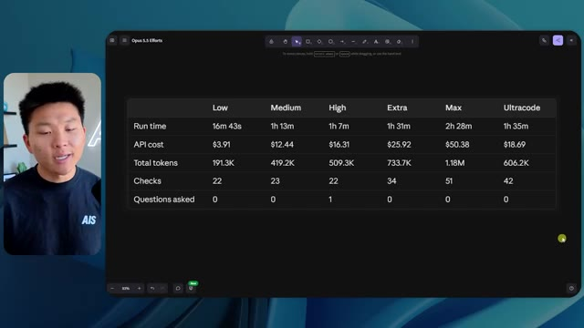

# 🎬 I Tested Codex's $500/mo Ultrafast. What You Need to Know.

> **Chaîne** : [Nate Herk | AI Automation](https://www.youtube.com/@nateherk/featured)  
> **Lien YouTube** : [https://www.youtube.com/watch?v=pY5_Ux_YJjo](https://www.youtube.com/watch?v=pY5_Ux_YJjo)  
> **Date de publication** : 20261001  
> **Durée** : 00:09:03  
> **Identifiant vidéo** : `pY5_Ux_YJjo`  
> **Transcription & Analyse** : `whisper-v3-large-turbo+gemini-3.5-flash-lite`  

---

## 📌 Synthèse Exécutive & Outils

### 💡 Résumé

Dans cette vidéo issue de la chaîne de Nate Herk, l'analyste explore le comportement du modèle de pointe **Opus 5.5** (Anthropic) soumis à un prompt complexe d'ingénierie d'agents IA. L'objectif technique consistait à transformer un dossier Frame.io brut de 105 gigaoctets d'enregistrements vidéo d'un événement virtuel (« AIS Live ») en un monde 3D interactif, explorable en vue à la troisième personne, intégrant physique, design, agenda en direct et éléments multimédias. 

Pour évaluer l'impact des paramètres d'inférence, Nate a exécuté exactement le même prompt à travers différents niveaux d'effort (faible, moyen, élevé, jusqu'à code ultra). Les résultats démontrent des divergences drastiques en matière de rendu visuel, de fidélité contextuelle, de durée d'exécution et de coûts induits. Le mode « faible » (16 min, 3,91 $, 0 question) a produit un environnement minimaliste truffé de bugs graphiques et d'images statiques, tandis que le mode « moyen » (1 h 13 min, 12,44 $, 0 question) a fourni un résultat qualitativement impressionnant, générant des PNJ dotés de mouvements, des flux vidéo synchronisés et un respect rigoureux de la charte graphique de la marque.

Cette expérimentation met en lumière le gouffre existant entre le prototypage local et le déploiement en production. Le créateur en profite pour introduire les problématiques d'infrastructure et de mise en ligne rapide, illustrant l'importance cruciale d'intégrer des outils de connectivité adaptés pour combler le fossé entre le code généré par l'agent et sa mise à disposition sur le web.

---

### 🛠️ Outils, Modèles & Logiciels Présentés

* **Opus 5.5** : Modèle d'intelligence artificielle de pointe développé par Anthropic, réputé pour sa vitesse, son coût abordable, son intelligence et ses performances élevées en développement logiciel.
* **Claude Code** : Environnement ou outil de programmation assistée par IA utilisé pour exécuter et orchestrer le développement du projet 3D.
* **Frame.io** : Plateforme de collaboration et de stockage cloud utilisée pour héberger les 105 gigaoctets d'enregistrements vidéo de l'événement « AIS Live ».
* **Key.ai** : Solution d'IA générative intégrée par l'agent pour créer à la volée des ressources visuelles, images ou vidéos complémentaires.
* **Système Herc 2** : Écosystème personnalisé de type « système d'exploitation IA » exploité par le créateur pour alimenter et contextualiser ses agents.
* **Hostinger** : Sponsor de la vidéo et fournisseur d'hébergement web, dont l'extension gratuite permet d'intégrer directement un compte d'hébergement dans l'éditeur de code.

---

### 🔑 Points Clés & Enseignements Stratégiques

* **Impact direct des niveaux d'effort** : Modifier le paramètre d'effort d'Opus 5.5 ne change pas seulement la complexité du code produit, mais modifie radicalement la structure visuelle, l'interactivité et la stabilité globale de l'application finale.
* **Corrélation effort/temps/coût** : Les tests montrent une progression linéaire du temps de calcul et des coûts API (passant de 16 minutes / 3,91 $ pour l'effort faible à plus d'une heure / 12,44 $ pour l'effort moyen), nécessitant un arbitrage économique pour le développement d'agents.
* **Autonomie totale des agents** : Quel que soit le niveau d'effort testé (faible ou moyen), l'agent a exécuté l'intégralité du prompt sans poser une seule question de clarification à l'utilisateur, soulignant une excellente autonomie textuelle mais un risque de dérive interprétative.
* **Gestion des flux multimédias complexes** : Un niveau d'effort supérieur est indispensable pour que l'agent ne se contente pas d'insérer des images statiques, mais intègre et synchronise correctement de véritables flux vidéo dynamiques issus des sources brutes.
* **Respect de l'identité de marque** : Les modes bas de gamme génèrent des univers génériques aux couleurs aléatoires, tandis que les modes plus poussés appliquent avec précision les directives de design et les palettes de couleurs de l'entreprise (« AIS Live »).
* **Immersion et physique procédurale** : Les agents configurés avec plus de ressources sont capables d'injecter des comportements interactifs aux personnages non-joueurs (PNJ), transformant une simple visite passive en une expérience vivante et animée.
* **Intégration d'un écosystème de données massif** : L'agent a démontré une capacité remarquable à ingérer, trier et structurer l'équivalent de 105 Go de données hétérogènes (agendas, ateliers, stands, ressources VIP) pour les cartographier dans un espace 3D cohérent.
* **Le gouffre du déploiement** : Générer une application fonctionnelle et complète sur sa machine locale n'est que la première étape ; le véritable défi réside dans la capacité à la mettre en ligne rapidement sur le web sans friction technique.
* **Rôle des extensions de développement** : L'utilisation d'outils de pontage (comme le connecteur Hostinger) directement dans l'éditeur de code permet d'éliminer la rupture entre la phase de programmation par agent et la phase de mise en production.
* **Validation empirique des bonnes pratiques** : Les résultats empiriques de cette vidéo rejoignent les recommandations d'Anthropic, qui conseille de débuter l'ingénierie par un effort moyen avant d'ajuster les curseurs selon la complexité métier requise.

---

## ⏱️ Chronologie & Transcription Complète Audio & Visuelle (Mot pour Mot)

### ⏱️ `[00:00:00 - 00:00:20]` | Segment #01

**🔊 Audio (Transcription Intégrale Mot pour Mot en Français) :**
> Opus 5.5, Opus 5.5, Opus 5.5, Opus 5.5, Opus 5.5. Ce modèle est littéralement partout et pour de très bonnes raisons. Il est intelligent, il est bon marché, il a un goût incroyable, c'est un modèle d'IA incroyable. Mais avec chaque modèle d'IA, vous avez le choix de l'effort, que ce soit faible, moyen, élevé, extra, max ou code ultra.

**👁️ Analyse Visuelle d'Écran (gemini-3.5-flash-lite) :**
**Interface & Outils** : Réseau social X (Twitter).

**Contenu textuel & Code** : Un post avec du texte en anglais sur l'impact de l'IA et une vidéo intégrée montrant un environnement 3D tropical.

**Action / Démonstration** : Le présentateur illustre ses propos en montrant une publication virale sur les réseaux sociaux.

*⏱️ 00:00:05 — Une capture d'écran d'un post sur le réseau social X montrant une vidéo de paysage tropical généré par IA.*

---

### ⏱️ `[00:00:20 - 00:00:38]` | Segment #02

**🔊 Audio (Transcription Intégrale Mot pour Mot en Français) :**
> Donc dans cette vidéo, j'ai donné à Opus 5.5 exactement le même prompt et je l'ai exécuté sur chaque niveau d'effort, et nous allons comparer les résultats. Nous examinerons la qualité de toutes les différentes sorties réelles, mais nous allons aussi examiner combien de temps chacun d'eux a fonctionné, combien cela nous a coûté si c'était une facturation par API, le total des jetons, combien de vérifications ils ont exécutées, et combien de questions ils m'ont réellement posées tout au long du processus.

**👁️ Analyse Visuelle d'Écran (gemini-3.5-flash-lite) :**
**Interface & Outils** : Interface web de tableau de bord / application de mindmapping ou de notes

**Contenu textuel & Code** : Tableau comparatif avec les colonnes Low, Medium, High, Extra, Max, Ultracode et les lignes Run time, API cost, Total tokens, Checks, Questions asked

**Action / Démonstration** : Comparaison visuelle des différents niveaux d'effort d'Opus 5.5 dans un tableau de métriques brouillé ou masqué

*⏱️ 00:00:29 — Capture d'écran d'un tableau comparatif sombre montrant les différents niveaux d'effort (Low, Medium, High, Extra, Max, Ultracode) et des métriques telles que Run time, API cost, Total tokens, Checks et Questions asked.*

---

### ⏱️ `[00:00:39 - 00:00:58]` | Segment #03

**🔊 Audio (Transcription Intégrale Mot pour Mot en Français) :**
> Et les résultats que nous avons obtenus ne correspondent pas du tout à ce que j'attendais, donc j'ai hâte de partager cela avec vous les gars. Ne perdons pas de temps et entrons directement dans le vif du sujet. D'accord, alors plongeons directement dans le vif du sujet. Je veux commencer simplement en vous montrant le prompt réel que nous avons utilisé, que nous avons donné à chacun de ces différents agents. Je vais aller dans les fichiers ici, et nous allons ouvrir ce fichier markdown de prompt, et je vais vous montrer ce que nous avons obtenu. Voici donc le slash objectif que j'ai fourni.

**👁️ Analyse Visuelle d'Écran (gemini-3.5-flash-lite) :**
**Interface & Outils** : Interface web d'un outil de développement / assistant IA (type Claude Code ou interface personnalisée).

**Contenu textuel & Code** : Message de l'assistant IA demandant confirmation pour démarrer la tâche de création d'un monde 3D interactif : "Hi Nate. This worktree has the effort-test task queued in PROMPT.md : build a walkable third-person 3D world...".

**Action / Démonstration** : Navigation et affichage de l'interface de l'assistant IA montrant les instructions de la tâche en attente.

*⏱️ 00:00:48 — Interface de l'application affichant un environnement de travail avec un panneau latéral de configuration et une conversation textuelle d'un assistant IA.*

---

### ⏱️ `[00:00:58 - 00:01:34]` | Segment #04

**🔊 Audio (Transcription Intégrale Mot pour Mot en Français) :**
> J'ai dit : tu dois me créer un monde en 3D qui est une conférence tech réaliste dans laquelle je peux me promener en vue à la troisième personne. Tu vas regarder ce dossier, qui contient mes éléments d'enregistrement d'événements d'AIS Live. Et ce dossier est un dossier Frame.io de 105 gigaoctets d'enregistrements vidéo. C'était un événement complètement virtuel. Tout a été enregistré et tous les enregistrements sont juste ici. J'ai dit, ton objectif est de prendre cet événement et de le transformer en un monde explorable en 3D qui me donne l'impression d'être réellement allé à une vraie conférence en personne avec différentes salles, différentes pistes, différentes scènes, bla, bla, bla. N'hésite pas à utiliser key.ai si tu as besoin de générer des images ou des vidéos. Et tu peux aussi utiliser tout le reste à l'intérieur de mon projet Herc 2, qui est comme mon système d'exploitation IA. J'ai dit,

**👁️ Analyse Visuelle d'Écran (gemini-3.5-flash-lite) :**
**Interface & Outils** : Éditeur de code et interface cloud Frame.io

**Contenu textuel & Code** : Fichier Markdown contenant le prompt complet pour l'IA et interface de gestion de fichiers volumineux (105 Go)

**Action / Démonstration** : Présentation du prompt de génération 3D et du dossier de ressources Frame.io de l'événement

*⏱️ 00:01:07 — Vue d'un fichier PROMPT.md dans un éditeur montrant les instructions pour créer un monde 3D à partir d'enregistrements d'événements.*

*⏱️ 00:01:16 — Interface Frame.io affichant un dossier de 105,69 Go contenant les éléments d'enregistrement de l'événement AIS Live (GA Access et VIP Access).*

*⏱️ 00:01:25 — Retour sur le fichier PROMPT.md détaillant les consignes de conception du monde 3D interactif.*

---

### ⏱️ `[00:01:34 - 00:02:08]` | Segment #05

**🔊 Audio (Transcription Intégrale Mot pour Mot en Français) :**
> vous serez jugé sur la créativité, le design, la physique et la sensation générale lorsque j'explorerai le monde 3D que vous avez construit. Et c'était fondamentalement la fin des instructions. Donc, comme vous pouvez le voir sur ce côté gauche, j'ai exécuté ceci à travers tous les différents niveaux d'effort. Commençons par le niveau bas et progressons jusqu'à l'ultra code. Très bien. Donc ici, nous avons le résultat du niveau bas. Ouvrons ceci et jetons un œil. Nous avons donc AIS Live, le sommet des services IA en personne enfin, et nous avons pu cliquer partout. Tout d'abord, cela ne fait pas très personnalisé. Genre, ce n' ce n'est pas le logo d'IS Live. Ce n'est même pas nos couleurs. Donc je n'aime pas trop ça, mais entrons ici. D'accord. C'est beaucoup trop lumineux. Euh, nous avons une carte en haut à droite. Nous avons une ville par ici. Je ne peux pas dire quelle ville c'est

**👁️ Analyse Visuelle d'Écran (gemini-3.5-flash-lite) :**
**Interface & Outils** : Interface utilisateur web d'une application d'assistant IA (similaire à Claude ou une interface sur mesure).

**Contenu textuel & Code** : Panneau latéral montrant les sessions 'effort-test' (Hello, Extra, High, Max, Ultracode, Medium, Low) et la conversation : 'Hi Nate. This worktree has the effort-test task queued in PROMPT.md : build a walkable third-person 3D world...'.

**Action / Démonstration** : Navigation et sélection des différents niveaux de test de l'agent dans le menu latéral gauche.

*⏱️ 00:01:42 — Interface d'une application d'assistant IA affichant différents niveaux de test ('effort-test') dans un panneau latéral et un échange textuel relatif à la construction d'un monde 3D.*

---

### ⏱️ `[00:02:08 - 00:02:40]` | Segment #06

**🔊 Audio (Transcription Intégrale Mot pour Mot en Français) :**
> C'est. D'accord. C'est Chicago, ce qui est plutôt cool parce que vous savez, je vis à Chicago, mais bref, en haut à droite, nous pouvons voir une carte. Nous avons un lobby. Nous avons un hall d'exposition. Nous avons un salon VIP sur la scène principale. La carte montre également où se trouve chaque autre personne et cela se synchronise en direct. Nous pouvons donc voir l'inscription. Nous pouvons voir le premier jour, la keynote de l'hyper agent, le débriefing en direct. Cool. Donc il connaît réellement l'agenda et puis il y a le deuxième jour. Donc il a trouvé ça, c'est bien. Nous avons ces petites boules ici que je peux espérer botter. D'accord. Le visage, Oh, regardez ça. Si je vais par ici, toutes les personnes disparaissent tout simplement. Très mauvais. Très mauvais. D'accord. Alors voyons voir. Est-ce que je peux sprinter ? D'accord.

**👁️ Analyse Visuelle d'Écran (gemini-3.5-flash-lite) :**
**Interface & Outils** : Application web interactive en 3D (metaverse de conférence virtuelle)

**Contenu textuel & Code** : Carte de navigation, planning des sessions et avatars dans un environnement virtuel 3D

**Action / Démonstration** : Navigation et exploration de l'espace virtuel de la conférence en 3D

*⏱️ 00:02:16 — Vue d'un espace virtuel en 3D avec un avatar et une mini-carte en haut à droite indiquant l'emplacement.*

*⏱️ 00:02:24 — Vue du lobby virtuel d'une conférence en ligne avec un panneau affichant le programme du jour 1.*

*⏱️ 00:02:32 — Vue de la halle d'exposition virtuelle en 3D montrant des avatars et des zones d'interaction.*

---

### ⏱️ `[00:02:40 - 00:03:04]` | Segment #07

**🔊 Audio (Transcription Intégrale Mot pour Mot en Français) :**
> Je peux avancer un peu plus vite. Je vais d'abord aller par ici. Il y a des produits dérivés, euh, un sweat à capuche certifié AIS plus. D'accord. Donc il y a les vrais stands qu'on avait dans l'événement virtuel. On avait des stands. Donc c'est plutôt cool. Un petit endroit pour prendre des photos. La salle C. En ce moment, nous avons Tangy Frederick qui anime un atelier. D'accord. Mais ce n'est pas une vidéo. Comme vous pouvez le voir, c'est juste une image. Elle ne bouge pas. Donc c'est juste une image. Ces gens sont en train de disparaître. Ce doivent être des fantômes. Allons par ici dans la salle A.

**👁️ Analyse Visuelle d'Écran (gemini-3.5-flash-lite) :**
**Interface & Outils** : Environnement virtuel 3D interactif (plateforme d'événement virtuel).

**Contenu textuel & Code** : Interface de navigation 3D avec affichage de stands, bannières et écrans de présentation.

**Action / Démonstration** : Navigation et exploration d'un salon virtuel 3D par le présentateur.

---

### ⏱️ `[00:03:04 - 00:03:30]` | Segment #08

**🔊 Audio (Transcription Intégrale Mot pour Mot en Français) :**
> Nous avons Liberty White. D'accord. Très cool. Vos 30 premiers jours en automatisation. Encore une fois, c'est juste une image fixe et les gens ont des bugs d'affichage. Donc ce n'est pas très bien ici. Je vais aller sur la scène principale et voir ce que nous avons. D'accord, cool. Donc nous avons une scène principale. Les gens ont de gros bugs d'affichage. Vraiment mauvais. Ce n'est vraiment pas terrible. Notre vidéo est en fait en train de bouger. Genre, j'ai vu mon visage ici et j'ai vu celui de Devin, mais maintenant ils ont disparu. Donc je ne sais pas ce qui s'est passé. D'accord. On dirait que c'est plutôt un diaporama. Rien n'est vraiment lu pour l'instant. Quoi qu'il en soit, entrons ici.

**👁️ Analyse Visuelle d'Écran (gemini-3.5-flash-lite) :**
**Interface & Outils** : Application ou plateforme virtuelle 3D (style métavers / Gather Town).

**Contenu textuel & Code** : Environnement virtuel 3D avec affichage de la scène principale "AIS LIVE AI Services Summit".
[DESC_IMAGE_1] (Non retenue)
[DESC_IMAGE_2] Navigation d'un avatar dans la salle de conférence virtuelle principale.
[DESC_IMAGE_3] Vue d'ensemble de la scène principale de l'événement virtuel.
[INTERFACE] Plateforme de conférence virtuelle 3D.

**Action / Démonstration** : Le présentateur déplace son avatar vers la scène principale.

*⏱️ 00:03:17 — Le présentateur navigue dans l'environnement virtuel 3D représentant une conférence avec une salle remplie d'avatars.*

*⏱️ 00:03:24 — Vue panoramique de la scène principale "AIS LIVE AI Services Summit" dans l'environnement virtuel 3D.*

---

### ⏱️ `[00:03:30 - 00:03:58]` | Segment #09

**🔊 Audio (Transcription Intégrale Mot pour Mot en Français) :**
> Nous avons d'autres stands. Nous avons hyper agent. Nous avons Claude Code. Nous avons plus de goodies. La salle B, c'est Dave Ebelor. Je suppose que c'est exactement la même chose. Nous avons du café. Et ensuite, je suppose que le salon VIP, accès VIP seulement. C'est plutôt cool, mais il ne se passe vraiment rien ici. Cet écran est bien trop lumineux. D'accord. Donc je pense que vous comprenez l'ambiance que nous obtenons ici de la part d'Opus 5.5 en mode effort faible. Et c'est là que les choses deviennent intéressantes. À combien est-ce que vous pensez que cela a tourné ? Combien de temps ? Celui-ci a tourné pendant 16 minutes et 43 secondes. Combien est-ce que vous pensez que cela a coûté ?

**👁️ Analyse Visuelle d'Écran (gemini-3.5-flash-lite) :**
**Interface & Outils** : Application web interactive / tableau de bord Opus 5.5 Efforts.

**Contenu textuel & Code** : Tableau comparatif des niveaux d'effort (Low, Medium, High, Extra, Max, Ultracode) et métriques associées.

**Action / Démonstration** : Navigation et présentation du tableau comparatif des performances et des coûts.

*⏱️ 00:03:51 — Interface de tableau de bord montrant des niveaux d'effort pour Opus 5.5 avec des métriques (Run time, API cost, Total tokens, Checks, Questions asked).*

---

### ⏱️ `[00:03:58 - 00:04:26]` | Segment #10

**🔊 Audio (Transcription Intégrale Mot pour Mot en Français) :**
> 3,91 dollars si c'était une facturation par API. J'utilise évidemment mon abonnement ici, mais nous allons simplement calculer cela en facturation par API. Le total des jetons était de 191 000. Il a effectué 22 vérifications. Donc la vérification, 22 fois il a ouvert le navigateur et a exécuté différentes sortes de vérifications. Donc 22 catégories de vérifications. Et combien de questions m'a-t-il posées ? Il m'a posé un total de zéro question tout au long de cette invite de commande d'objectif. D'accord. Alors, ouvrons l'effort moyen et voyons ce que nous avons. D'accord, c'est parti. Effort moyen. Nous avons Nate Herc. Nous avons mon badge. C'est marqué aux couleurs d'AI's life.

**👁️ Analyse Visuelle d'Écran (gemini-3.5-flash-lite) :**
**Interface & Outils** : Outil de tableau blanc / application de design (type Excalidraw ou similaire) intitulé 'Opus 5.5 Efforts'

**Contenu textuel & Code** : Tableau avec les lignes : Run time (16m 43s), API cost ($3.91), Total tokens (191.3K), Checks, et Questions asked.

**Action / Démonstration** : Le présentateur explique et commente les coûts et performances affichés dans le tableau pour chaque niveau d'effort.

*⏱️ 00:04:05 — Un tableau comparatif sur un outil de type tableau blanc affichant les métriques d'exécution pour un niveau 'Low', incluant le temps d'exécution, le coût de l'API et le nombre de tokens.*

---

### ⏱️ `[00:04:26 - 00:04:46]` | Segment #11

**🔊 Audio (Transcription Intégrale Mot pour Mot en Français) :**
> Donc ça a déjà l'air un petit peu mieux. Ça ressemble à nos palettes de couleurs qui ont utilisé nos directives de marque. Premier jour de construction, deuxième jour de gain, VIP. Cool. D'accord. Je vais entrer dans le lieu. D'accord. Waouh. Une ambiance un peu similaire. C'est en arrière-plan. Ça ne ressemble pas à Chicago, n'est-ce pas ? Non, ça ressemble à un, honnêtement, ça ressemble à une ville imaginaire. Quoi qu'il en soit, c'est drôle qu'ils aient décidé de faire ça. Voyons si je peux avancer un peu plus vite. Oh, waouh.

**👁️ Analyse Visuelle d'Écran (gemini-3.5-flash-lite) :**
**Interface & Outils** : Application web interactive / Plateforme virtuelle 3D (AIS Live)

**Contenu textuel & Code** : Interface utilisateur de connexion avec badge virtuel, commandes de déplacement (WASD, Shift, Espace) et menu "ENTER THE VENUE".

**Action / Démonstration** : Le présentateur navigue sur la page d'accueil de l'événement virtuel puis entre dans le lieu 3D interactif.

*⏱️ 00:04:31 — Interface web "Welcome to AIS Live" avec un badge d'accès virtuel au nom de Nate Herk et des options de navigation.*

*⏱️ 00:04:41 — Vue à la première ou troisième personne dans un espace virtuel 3D avec des avatars et une vue sur une ville de nuit à travers de grandes baies vitrées.*

---

### ⏱️ `[00:04:46 - 00:05:21]` | Segment #12

**🔊 Audio (Transcription Intégrale Mot pour Mot en Français) :**
> Les gens interagissent avec moi. Regardez. Si je m'approche de ce type, il vient de lever le bras. Bon, maintenant il ne veut plus du tout avoir affaire à moi. Mais tous ces petits robots ici doivent prendre des décisions. Je ne sais pas s'ils utilisent Jev. C'est sûr que non. Je ne le lui ai pas dit. En fait, ma clé Jev est à l'arrière. Je ne sais pas. Peut-être qu'il l'a utilisée. Quoi qu'il en soit, nous pouvons voir ici que nous avons la salle d'atelier C, le laboratoire des agents. Sympa. Donc celui-ci est en fait en train d'être exécuté. Vous pouvez voir qu'il s'agit d'une vraie vidéo lue par Tangy. Tout le monde ici est en train de travailler sur un ordinateur portable. Ils ne buguent pas. C'est plutôt cool. De plus, mon badge est sur ma poitrine, ce qui est plutôt cool. Je peux venir par ici. Nous avons une carte en haut à droite, comme vous pouvez le voir, mais je peux venir par ici. Nous avons un

**👁️ Analyse Visuelle d'Écran (gemini-3.5-flash-lite) :**
**Interface & Outils** : Environnement virtuel 3D (metaverse / plateforme collaborative en ligne)

**Contenu textuel & Code** : Avatars numériques dans un espace virtuel d'apprentissage ou de réunion avec mini-carte radar en haut à droite.

**Action / Démonstration** : Navigation et exploration d'un environnement virtuel interactif en 3D représentant une salle de séminaire.

---

### ⏱️ `[00:05:21 - 00:05:47]` | Segment #13

**🔊 Audio (Transcription Intégrale Mot pour Mot en Français) :**
> hall d'exposition. C'est là que nous avons le stand Glido. Et ça diffuse en ce moment. Oui, ça diffuse la vidéo de nous parlant de Glido. Ça diffuse la vidéo d'Ed et moi parlant de notre programme de certification. Nous avons le logo AIS Plus juste ici, qui est un peu mal placé. Ce sont les diapositives des conférenciers et les points clés. Donc waouh, ce sont toutes les ressources que nous avons distribuées après l'événement. Elles sont toutes affichées là également. Nous pouvons voir que nous avons un projecteur de communauté. Donc c'est Aiden qui parle de son contrat qu'il a décroché et c'est diffusé en direct. Ces gens sont en train de regarder.

**👁️ Analyse Visuelle d'Écran (gemini-3.5-flash-lite) :**
**Interface & Outils** : Environnement virtuel 3D / plateforme de type metaverse d'exposition en ligne.

**Contenu textuel & Code** : Affiches, présentations visuelles et diapositives affichées sur les murs du salon virtuel.

**Action / Démonstration** : Navigation et visite guidée d'un salon d'exposition virtuel avec des avatars.

---

### ⏱️ `[00:05:47 - 00:06:21]` | Segment #14

**🔊 Audio (Transcription Intégrale Mot pour Mot en Français) :**
> Ils sont plutôt engagés. On a l'hyper agent. C'était, c'est ce que je voulais dire. Si vous avez vu ces gens lever les bras pour dire bonjour, c'était plutôt marrant. Regardez, regardez, le voilà qui recommence. Bref. Bon. Où est-ce que je suis maintenant ? Maintenant, je suis dans le hall principal. On a un bar à café. On a un grand logo, qui est le vrai logo. C'est trop lumineux, mais on a le logo. On peut voir si on peut entrer ici dans le parcours des fondations. On a Sabrina Romanov et Liberty White. Donc différentes formations juste là. On peut entrer dans cette salle. C'est le parcours avancé. Alors qu'est-ce qui se passe ici. On a Dave Ebelar et Saman qui parlent de trucs différents là-dedans. Et maintenant, allons jeter un œil à la scène principale. Oh, attendez, il y a une vidéo de moi là-haut. C'est du genre VIP ?

**👁️ Analyse Visuelle d'Écran (gemini-3.5-flash-lite) :**
**Interface & Outils** : Application ou plateforme web virtuelle 3D (Metaverse / espace événementiel).

**Contenu textuel & Code** : Environnement virtuel 3D avec interface de mini-carte et texte 'Main Lobby'.

**Action / Démonstration** : Exploration et déplacement d'un avatar dans l'espace virtuel par le présentateur.

---

### ⏱️ `[00:06:21 - 00:06:50]` | Segment #15

**🔊 Audio (Transcription Intégrale Mot pour Mot en Français) :**
> section ? Ouais, on ira voir ça dans une minute. Mais bref, voici la scène principale. Ça a l'air vraiment, vraiment super. On a une grande scène. On a genre quatre personnes assises ici. On a les trois écrans d'Alex là-haut avec "hyper agent". Est-ce que j'ai le droit de monter sur scène ? Oh, et il me laisse monter sur scène. D'accord. C'est plutôt sympa. Bon les gars, faisons un selfie. Laissez-moi prendre tout le monde en arrière-plan. Venez par ici. Bref, c'est vraiment, vraiment cool. Toutes les places ne sont pas prises par contre. Donc il faut qu'on travaille là-dessus. Mais bref, je vais retourner voir ce que c'était que cette section VIP. D'accord. Le salon VIP. J'ai l'impression que c'est genre un truc d'aéroport ou un truc comme ça.

**👁️ Analyse Visuelle d'Écran (gemini-3.5-flash-lite) :**
**Interface & Outils** : Application web ou plateforme virtuelle 3D de conférence (Hyperagent Keynote).

**Contenu textuel & Code** : Interface utilisateur virtuelle affichant les détails de la session "Hyperagent Keynote" par Alex McDonnell.

**Action / Démonstration** : Exploration d'un environnement virtuel 3D et navigation dans une keynote interactive avec des avatars.

*⏱️ 00:06:28 — Vue de face d'un espace virtuel 3D (Hyperagent Keynote) avec une grande scène, un public assis et trois écrans affichant des présentations.*

*⏱️ 00:06:36 — Vue de profil de la scène virtuelle 3D avec l'avatar se déplaçant près de la zone des intervenants assis.*

*⏱️ 00:06:43 — Vue en plongée d'un grand auditorium virtuel rempli d'avatars dans le cadre d'une keynote interactive en ligne.*

---

### ⏱️ `[00:06:51 - 00:07:14]` | Segment #16

**🔊 Audio (Transcription Intégrale Mot pour Mot en Français) :**
> Ok, super. Donc maintenant nous avons les sessions VIP ici. Une FAQ VIP avec la lecture vidéo en direct de Nate juste ici. Très, très cool. Et nous avons comme un bar ou quelque chose comme ça. Génial. Je dirais que c'est un assez bon résultat. Maintenant, en ce qui concerne les statistiques ici, celui-ci a pris une heure et 13 minutes à s'exécuter. Il nous aurait coûté 12 dollars et 44 cents. Il a utilisé 490 000 jetons et il a fait 23 vérifications.

**👁️ Analyse Visuelle d'Écran (gemini-3.5-flash-lite) :**
**Interface & Outils** : Espace virtuel 3D et interface de tableau de bord analytique.

**Contenu textuel & Code** : Statistiques d'exécution : Run time: 16m 43s, API cost: $3.91, Total tokens: 191.3K, Checks: 22, Questions asked: 0.

**Action / Démonstration** : Navigation dans l'espace virtuel VIP puis présentation des statistiques d'exécution sur le tableau de bord.

*⏱️ 00:06:56 — Capture montrant un espace virtuel VIP avec un écran géant affichant une session vidéo en direct de Nate et des avatars d'utilisateurs.*

*⏱️ 00:07:02 — Capture montrant un tableau de statistiques comparatives (Low, Medium, High, Ex) incluant Run time (16m 43s), API cost ($3.91) et Total tokens (191.3K).*

---

### ⏱️ `[00:07:14 - 00:07:48]` | Segment #17

**🔊 Audio (Transcription Intégrale Mot pour Mot en Français) :**
> Et il nous a posé un total de zéro question une fois de plus. Très bien, passons à élevé. C'était déjà un résultat plutôt correct et Anthropic eux-mêmes dans leur vidéo sur comment prompter Opus 5.5, ou désolé, pas une vidéo, un article. Ils ont dit de commencer simplement par moyen et de l'ajuster vers le haut ou vers le bas si nécessaire. C'était donc un résultat moyen. Passons à élevé et voyons ce qu'on a obtenu. Très rapidement, les gars, je dois prendre une seconde pour vous parler du sponsor de la vidéo d'aujourd'hui, Hostinger. Donc ces deux modèles viennent de me construire une version fonctionnelle de la même chose. Et maintenant, je me retrouve exactement là où je finis toujours, avec quelque chose de terminé sur mon ordinateur portable et aucun moyen rapide de le mettre en ligne. Et c'est le fossé que le connecteur d'Hostinger comble. C'est une extension gratuite

**👁️ Analyse Visuelle d'Écran (gemini-3.5-flash-lite) :**
**Interface & Outils** : Tableau blanc/application de notes (Image #1) et interface de développement / éditeur de code (Image #2).

**Contenu textuel & Code** : Tableau comparatif (Run time, API cost, Total tokens, Checks, Questions asked) et prompt complet pour "Build a single-page ROI calculator" avec les détails des tokens et du statut de l'agent.

**Action / Démonstration** : Présentation des résultats comparatifs des différents niveaux d'effort d'Opus 5.5 et affichage du processus de génération de l'application de calcul de ROI.

*⏱️ 00:07:22 — Tableau de comparaison des performances et des coûts selon les niveaux d'effort (Low, Medium, High, Extra).*

*⏱️ 00:07:39 — Interface de développement avec un éditeur affichant le prompt de création d'un calculateur de ROI et l'activité de l'agent IA.*

---

### ⏱️ `[00:07:48 - 00:08:23]` | Segment #18

**🔊 Audio (Transcription Intégrale Mot pour Mot en Français) :**
> pour votre éditeur qui intègre votre compte Hostinger dans l'outil de programmation que vous utilisez déjà, que ce soit VS Code, Cursor, Cloud Code, Codex, et j'en passe. Vous vous connectez une seule fois en un clic, et à partir de là, votre agent peut déployer le site, y pointer un domaine, configurer les enregistrements DNS et vérifier votre VPS sans que vous ayez à quitter votre éditeur. Ainsi, quel que soit celui de ces outils que vous finirez par préférer, ce qu'il a construit est à seulement quelques minutes d'une vraie URL sur un hébergement géré. Le connecteur est gratuit sur chaque plan d'hébergement, donc si vous avez toujours besoin de l'hébergement en dessous, procurez-vous le plan illimité avec le lien dans la description et utilisez le code NATEHERK pour 10 % de réduction. Cela inclut également un domaine gratuit et un e-mail professionnel pour l'année. Et c'est toujours le moyen le moins cher que j'ai trouvé pour obtenir quelque chose

**👁️ Analyse Visuelle d'Écran (gemini-3.5-flash-lite) :**
**Interface & Outils** : Interface de gestion Hostinger MCP / IDE et Claude Code (avec incrustation vidéo du présentateur).

**Contenu textuel & Code** : Statut "Connected", "Node.js 24.13.0", options pour Websites (154 tools), Domains (49 tools), Subscriptions & Payments (9 tools), et Email Marketing (52 tools).

**Action / Démonstration** : Connexion unique validée via OAuth permettant à l'assistant d'accéder aux outils de gestion Hostinger directement depuis l'éditeur.

*⏱️ 00:07:57 — Interface montrant l'intégration de Hostinger connectée via OAuth à un IDE, avec la liste des outils disponibles (Websites, Domains, Subscriptions, Email Marketing) et Claude Code sur le panneau de droite.*

---

### ⏱️ `[00:08:23 - 00:08:47]` | Segment #19

**🔊 Audio (Transcription Intégrale Mot pour Mot en Français) :**
> vous avez construit sur une vraie URL. Donc revenons à la vidéo. D'accord. Encore une fois, très, très marqué par la marque. C'est un écran de chargement encore mieux que le précédent. Nous avons ce petit effet sympa en arrière-plan. Nous avons le logo. Nous allons entrer dans le lieu. D'accord. Nous y voilà. Ça a l'air plutôt bien. Nous commençons à l'extérieur et vous pouvez voir que nous avons ces drapeaux pour tous les intervenants, Wyatt, Casper, Alex, Ed, Aiden, Sabrina, Liberty. C'est plutôt cool. Nous avons des blocs en direct ici.

**👁️ Analyse Visuelle d'Écran (gemini-3.5-flash-lite) :**
**Interface & Outils** : Application web 3D immersive et interactive 'AIS Live'

**Contenu textuel & Code** : Interface d'accueil avec logo AIS LIVE, description de l'événement, contrôles clavier/souris, et vue 3D d'un monde virtuel interactif (plaza) avec avatars et bannières

**Action / Démonstration** : Chargement de l'application web 3D puis entrée dans l'espace virtuel pour explorer la place de l'événement

*⏱️ 00:08:29 — Écran de chargement et d'accueil de la plateforme virtuelle 'AIS LIVE', affichant le logo, les informations de l'événement et les instructions de contrôle.*

*⏱️ 00:08:35 — Vue de la place virtuelle 'AIS Live Plaza' avec des avatars 3D et des bâtiments urbains en arrière-plan.*

*⏱️ 00:08:41 — Exploration de la place virtuelle 'AIS Live Plaza' montrant des bannières verticales avec des noms de conférenciers.*

---

### ⏱️ `[00:08:47 - 00:09:23]` | Segment #20

**🔊 Audio (Transcription Intégrale Mot pour Mot en Français) :**
> il a pris cette photo de moi, votre hôte, Nate Herc, John, Dave, Nate Herc. Voilà. D'accord. Les portes. Génial. Ce sont des portes coulissantes automatiques en verre. J'adore ça. On peut voir l'enregistrement VIP. On peut voir l'admission générale. On peut venir par ici et on peut découvrir l'expo avec différents stands, le projecteur sur la communauté. Vous pouvez aussi voir qu'en haut à gauche, j'ai un passeport. Donc c'est comme si, ça va montrer combien d'endroits j'ai visités. Tout ceci est une vraie lecture. Nous avons un mur de ressources avec tous les différents intervenants. Ils ont aussi une session de networking par ici. Donc je vais venir très vite et voir de quoi il s'agit. Donc nous avons le bar à cold brew AIS. Nous avons différents membres de la communauté qui ont été mis en avant ou en lumière.

**👁️ Analyse Visuelle d'Écran (gemini-3.5-flash-lite) :**
**Interface & Outils** : Application ou plateforme virtuelle 3D en ligne

**Contenu textuel & Code** : Environnement virtuel interactif 3D avec affichages d'événements et interface utilisateur de navigation

**Action / Démonstration** : Navigation et exploration de l'espace virtuel 3D par l'hôte et les participants

*⏱️ 00:08:56 — Vue d'un monde virtuel 3D montrant l'accueil d'un événement avec des comptoirs d'enregistrement et une scène principale.*

*⏱️ 00:09:05 — Navigation dans le hall d'exposition virtuel 3D avec des stands de présentation et des avatars de visiteurs.*

*⏱️ 00:09:14 — Déplacement d'avatars dans le hall d'entrée virtuel avec de grandes baies vitrées et des panneaux d'affichage.*

---

### ⏱️ `[00:09:23 - 00:09:56]` | Segment #21

**🔊 Audio (Transcription Intégrale Mot pour Mot en Français) :**
> Nous avons l'aile VIP. Attends, quoi ? Prends un bracelet. Oh, je dois vraiment aller chercher le bracelet. D'accord. Laisse-moi m'enregistrer rapidement. Le bracelet est déjà mis. Attends, quoi ? D'accord. Oh, d'accord. Maintenant, les portes se sont ouvertes pour moi. Cool. Je peux entrer ici. Oh, ça mène juste à la scène principale. Salon VIP. Il y a une séance de questions-réponses en cours. Ça a l'air très cool. Je veux dire, je suis très impressionné par la façon dont il est capable de faire ça. Waouh. D'accord. Donc c'est vraiment bien. Ce qu'on a fait, c'est qu'on a eu des salles de discussion VIP avec différentes personnes. Tu peux voir qu'il y a différentes salles, différents membres de l'équipe AIS qui participent à des trucs. C'est vraiment cool. C'est très cool. C'est un VIP bien meilleur

**👁️ Analyse Visuelle d'Écran (gemini-3.5-flash-lite) :**
**Interface & Outils** : Environnement virtuel 3D interactif (type monde virtuel ou plateforme de réunion virtuelle).

**Contenu textuel & Code** : Menus de navigation, indications textuelles des salles (Registration Concourse, VIP Lounge, VIP Working Sessions) et affichage des avatars.

**Action / Démonstration** : Navigation et déplacement de l'avatar dans l'espace virtuel pour accéder aux différentes zones VIP.

*⏱️ 00:09:32 — Vue d'un espace virtuel en 3D avec un avatar et une interface de hall d'enregistrement (Registration Concourse).*

*⏱️ 00:09:40 — Vue de l'intérieur de la salle VIP Lounge avec des avatars assis sur des canapés et un écran affichant une visioconférence.*

*⏱️ 00:09:48 — Vue d'une session de travail VIP (VIP Working Sessions) avec plusieurs tables de discussion et écrans thématiques.*

---

### ⏱️ `[00:09:56 - 00:10:30]` | Segment #22

**🔊 Audio (Transcription Intégrale Mot pour Mot en Français) :**
> expérience que ce qui a été montré dans la première partie. D'accord. After-party VIP. Regardez ça. On a une piste de danse. On a tous ces éléments ici. On a la véritable rediffusion de l'after-party VIP juste ici. Et il y a une cabine de DJ. C'est tellement drôle. Il y a un petit bug juste ici, un glitch juste là, mais c'est génial. Oh, cool. Donc quand je suis ici sur la scène principale, on a les sous-titres. Vous pouvez voir juste ici en bas de mon écran, on a ces sous-titres avec Wyatt en train de parler là-haut. On a des lumières. On a le panel. Très cool. Belle scène principale. Je vais aller par ici. On peut aller à la fondation,

**👁️ Analyse Visuelle d'Écran (gemini-3.5-flash-lite) :**
**Interface & Outils** : Application web 3D / Environnement virtuel interactif

**Contenu textuel & Code** : Interface utilisateur virtuelle de conférence ou d'événement en ligne avec avatars, écrans vidéo en direct et commandes de navigation

**Action / Démonstration** : Navigation et présentation au sein d'un monde virtuel interactif d'after-party ou de conférence en ligne

*⏱️ 00:10:04 — Capture d'écran montrant l'interface d'un espace virtuel 3D (« VIP After-Party ») avec des avatars sur une piste de danse et un grand écran vidéo.*

*⏱️ 00:10:13 — Capture d'écran montrant une vue plus large de la piste de danse virtuelle avec des avatars et des ballons de plage.*

*⏱️ 00:10:21 — Capture d'écran montrant un espace virtuel de conférence (« Main Stage ») avec des rangées de sièges et un écran géant affichant un intervenant.*

---

### ⏱️ `[00:10:30 - 00:11:06]` | Segment #23

**🔊 Audio (Transcription Intégrale Mot pour Mot en Français) :**
> avancé, et les parcours d'entreprise par ici. Donc voyons voir. Nous avons l'anatomie de trois vrais dossiers. Nous avons hyper agent. Nous avons les évals avec Nate et Ed ici. Nous avons Dave qui s'occupe des trucs avancés. C'est vraiment chouette. Je veux dire, évidemment, chaque, chacun de ces résultats jusqu'à présent, bas était correct. Moyen était meilleur. Élevé a été encore meilleur. Voyons si cette tendance se poursuit et allons voir ce que cela nous a coûté. Donc, élevé a tourné pendant une heure et sept minutes. Donc un peu plus rapide que moyen, cela nous aurait coûté 16 dollars et 31 cents. Il a utilisé un demi-million de jetons, 509 000. Il a fait 22 vérifications. Et il nous a aussi demandé, enfin, non, je me suis trompé, ce

**👁️ Analyse Visuelle d'Écran (gemini-3.5-flash-lite) :**
**Interface & Outils** : Tableau blanc ou application de mind mapping / tableau de données (type Excalidraw ou similaire).

**Contenu textuel & Code** : Tableau comparatif des coûts d'API ($3.91, $12.44, $16.31), des temps d'exécution (16m 43s, 1h 13m, 1h 7m) et du nombre de tokens pour différents niveaux d'effort.

**Action / Démonstration** : Analyse et présentation comparative des performances et coûts de différents niveaux de configuration d'IA.

*⏱️ 00:10:57 — Tableau comparatif sous forme de matrice affichant les métriques (Run time, API cost, Total tokens, Checks, Questions asked) selon différents niveaux (Low, Medium, High, Extra).*

---

### ⏱️ `[00:11:06 - 00:11:25]` | Segment #24

**🔊 Audio (Transcription Intégrale Mot pour Mot en Français) :**
> L'un m'a posé une question et, attention spoiler, c'était le seul qui nous a posé une question pendant tout ça. Donc voyons voir, il nous en reste trois : Extra, Max et Ultra Code. Laissez-moi ouvrir Extra et on va voir ce qu'on a. D'accord. Donc celui-ci a l'air plutôt bien. Je dirais honnêtement que jusqu'à présent, l'écran de chargement haut était le meilleur. Celui qu'on vient juste de voir, mais bref, entrons dans AIS live.

**👁️ Analyse Visuelle d'Écran (gemini-3.5-flash-lite) :**
**Interface & Outils** : Tableau de bord d'analyse ou interface de visualisation de données.

**Contenu textuel & Code** : Tableau avec des colonnes Low, Medium, High, Extra et des lignes Run time, API cost, Total tokens, Checks, Questions asked.

**Action / Démonstration** : Le présentateur commente les résultats du tableau et s'apprête à examiner la colonne 'Extra'.

*⏱️ 00:11:11 — Un tableau comparatif montrant les métriques de différentes configurations (Low, Medium, High, Extra) incluant le temps d'exécution, le coût API, les tokens et le nombre de questions posées.*

---

### ⏱️ `[00:11:26 - 00:11:51]` | Segment #25

**🔊 Audio (Transcription Intégrale Mot pour Mot en Français) :**
> Oups. D'accord. Donc nous avons comme de petits extraits sonores. Je peux discuter avec des gens. Le panneau de la guerre des outils a réglé quelques débats pour moi. Sympa. Bon point de vue là-dessus. Nous sommes dehors à nouveau. Nous avons ces différentes bannières, bien qu'elles soient toutes les mêmes. Elles n'affichent pas les noms de différentes personnes. Donc grand logo AIS en direct. L'aile de l'atelier est par ici. Et passons par les portes coulissantes en verre pour voir ce que nous avons. Nous avons donc le café AIS. La carte est en bas à droite, et elle n'est pas très descriptive.

**👁️ Analyse Visuelle d'Écran (gemini-3.5-flash-lite) :**
**Interface & Outils** : Application de métavers 3D / Navigateur web

**Contenu textuel & Code** : Environnement virtuel interactif avec avatars, bannières et mini-carte

**Action / Démonstration** : Navigation et déplacement d'un avatar à travers un espace virtuel 3D

*⏱️ 00:11:32 — Vue d'un monde virtuel 3D de type métavers ou jeu montrant un avatar en mouvement près d'un personnage non-joueur dans une place de convention.*

*⏱️ 00:11:38 — Vue de l'avatar naviguant à l'extérieur de la place de convention virtuelle avec des bannières publicitaires et des gratte-ciels en arrière-plan.*

*⏱️ 00:11:45 — L'avatar se déplace vers l'entrée lumineuse d'un bâtiment ou d'un hall d'exposition virtuel.*

---

### ⏱️ `[00:11:51 - 00:12:26]` | Segment #26

**🔊 Audio (Transcription Intégrale Mot pour Mot en Français) :**
> J'aime bien comment les autres cartes nous ont indiqué ce que, genre où étaient les choses, mais celle-ci a l'air très professionnelle. On peut voir ici la scène principale. Allons y faire un saut rapidement. Ils ont tous ces ballons qui volent partout, ce qui je trouve est plutôt marrant. Les ballons de plage AIS. On nous voit là-haut en train de parler. Je crois que j'introduisais l'un des jours. Continuons à avancer par ici vers la salle d'atelier sur ce côté gauche. OK. Donc ici nous avons le théâtre Hyper Agent. Nous avons cette session sponsorisée ici par Hyper Agent, mais ça nous montre aussi ce qui va se passer ici. C'est vraiment marrant qu'on puisse discuter avec des gens. Salmon a créé un représentant commercial vocal en direct. La salle "Le Juste Prix" était comble. Tu as pris le guide du compagnon VIP ? C'est trop marrant. Nous avons la piste avancée dans

**👁️ Analyse Visuelle d'Écran (gemini-3.5-flash-lite) :**
**Interface & Outils** : Application web interactive 3D / Plateforme d'événement virtuel en ligne

**Contenu textuel & Code** : Environnement virtuel 3D avec avatars, écrans vidéo intégrés, bannières d'ateliers et interface de chat

**Action / Démonstration** : Navigation et exploration d'un monde virtuel interactif en 3D représentant une conférence en ligne

*⏱️ 00:12:00 — Vue d'une scène principale virtuelle avec des avatars dans un auditorium, le présentateur apparaissant sur un écran géant au fond.*

*⏱️ 00:12:09 — Navigation dans un hall d'exposition virtuel (Grand Lobby) avec des avatars interactifs et des panneaux indicateurs d'ateliers.*

*⏱️ 00:12:17 — Déplacement dans un couloir virtuel d'un espace événementiel en ligne, entouré d'autres avatars d'utilisateurs.*

---

### ⏱️ `[00:12:26 - 00:12:58]` | Segment #27

**🔊 Audio (Transcription Intégrale Mot pour Mot en Français) :**
> ici. Encore une fois, nous avons la lecture en direct. Est-ce que c'est la lecture en direct ? Oh, d'accord. Ça a commencé une fois que je suis entré, mais je peux prendre place. Oh la la. Je peux regarder ça. Je peux me lever. Je veux m'asseoir au premier rang. C'est plutôt cool. C'est très bien. J'aime bien ça. Et tu sais ce que j'ai remarqué jusqu'à présent ? Le personnage réel que j'incarne me ressemble un peu. Je pense qu'il a été modélisé à partir de mes photos de profil ou quelque chose comme ça. Bref, nous avons Sabrina ici, l'animatrice de la salle ici, prenez n'importe quel siège libre. D'accord, cool. Et j'ai vraiment aimé la fonctionnalité pour s'asseoir. C'est assez marrant. Genre, nous pourrions réellement assister à cet atelier et participer. Bref, ça nous montre les intervenants. Ça nous montre les

**👁️ Analyse Visuelle d'Écran (gemini-3.5-flash-lite) :**
**Interface & Outils** : Application de salle de classe virtuelle 3D / plateforme de webinaire interactive.

**Contenu textuel & Code** : Interface utilisateur virtuelle de conférence, menus d'interaction (Map, Agenda, Captions), et écran de projection avec diffusion vidéo en direct.

**Action / Démonstration** : Navigation et exploration de l'espace de réunion virtuel 3D par l'utilisateur.

---

### ⏱️ `[00:12:58 - 00:13:31]` | Segment #28

**🔊 Audio (Transcription Intégrale Mot pour Mot en Français) :**
> ordre du jour. Il y a un petit tapis rouge ici pour prendre quelques photos. On peut prendre la pose. Oh, wouah. C'est plutôt cool. Bibliothèque de ressources, obtenez la certification AIS Plus, Glido, Hyper Agent, AIS Plus, trois vraies affaires. Génial. Je veux dire, je dirais vraiment que jusqu'à présent, chacune est meilleure que la précédente. Et on n'a même pas encore vu la section VIP, le salon VIP. Montons par ici très vite. J'espère que je pourrai entrer. Sympa. On a une réinitialisation des outils. Ce sont les différentes salles dans lesquelles nous pourrions aller. Donc encore une fois, je pourrais prendre la feuille d'exercice et je pourrais essayer de comprendre comment tarifer mes trucs. C'est tellement cool. C'est vraiment mieux que la précédente où on a juste en quelque sorte

**👁️ Analyse Visuelle d'Écran (gemini-3.5-flash-lite) :**
**Interface & Outils** : Application virtuelle 3D (Metaverse / plateforme d'événement virtuel)

**Contenu textuel & Code** : Environnement virtuel interactif montrant des stands d'exposition et des avatars d'utilisateurs.

**Action / Démonstration** : Navigation et exploration de l'espace virtuel par le présentateur.

---

### ⏱️ `[00:13:31 - 00:13:59]` | Segment #29

**🔊 Audio (Transcription Intégrale Mot pour Mot en Français) :**
> J'ai regardé des trucs. Génial. Je peux passer derrière le bar et venir ici. C'est très bien. Bon. Alors, en ce qui concerne les statistiques, celui-ci a tourné pendant une heure et demie. Il a coûté 25,92 dollars. Je ne sais pas pourquoi je dis point 25 dollars et 92 centimes. Il y a eu 733 000 jetons et 34 vérifications. Il a donc eu le plus grand nombre de vérifications de loin jusqu'à présent. Et il ne nous a posé aucune question. J'ai hâte de voir ce qu'on a obtenu ici de la part de max et ultra code. Bon. Voici les écrans de chargement de max, ennuyeux, mais c'est dans l'esprit de la marque et il y a notre logo.

**👁️ Analyse Visuelle d'Écran (gemini-3.5-flash-lite) :**
**Interface & Outils** : Application de tableau blanc ou de diagramme en ligne (type Excalidraw ou similaire).

**Contenu textuel & Code** : Tableau avec des colonnes "Medium", "High", "Extra", "Max", "Ultracode" affichant des durées (ex: 1h 31m pour Extra) et des coûts (ex: $12.44, $16.31).

**Action / Démonstration** : Le présentateur commente les statistiques de performance et de coût affichées dans le tableau comparatif.

*⏱️ 00:13:38 — Un tableau comparatif montrant les statistiques de différents niveaux d'effort (Medium, High, Extra, Max, Ultracode) avec des durées, des coûts et des métriques.*

---

### ⏱️ `[00:14:00 - 00:14:35]` | Segment #30

**🔊 Audio (Transcription Intégrale Mot pour Mot en Français) :**
> Donc c'était bien. J'aime bien. On va continuer et entrer dans AIS live. Ooh, petite animation sympa ici qui nous fait entrer. Encore une fois, le personnage me ressemble. Ils m'ont tous ressemblé. Enfin, en gros, on a [quelqu'un] assis en arrière-plan. Ça ressemble à Chicago. Comme je l'ai mentionné plus tôt, beaucoup de ces [éléments] jouent des sons et je ne les inclus pas parce que ce serait très perturbant pour vous d'essayer d'écouter ce qui se passe en même temps que je parle. Donc il y a comme une légère musique dans tout ça. Je déteste la façon dont il marche. Cette démarche est vraiment, vraiment mauvaise. Je veux dire, la démarche, ouais, je n'aime pas du tout ça. Donc ce n'est pas génial. Mais à part ça, allons explorer. Remarquez ces ombres quand je rentre, elles basculent vraiment. Je ne sais pas trop pourquoi,

**👁️ Analyse Visuelle d'Écran (gemini-3.5-flash-lite) :**
**Interface & Outils** : Application Web 3D / Environnement virtuel virtuel "AIS Live"

**Contenu textuel & Code** : Interface 3D interactive avec mini-carte, bannières informatives et commandes de déplacement (WASD).

**Action / Démonstration** : Exploration visuelle et navigation en temps réel dans un monde virtuel 3D inspiré de Chicago.

*⏱️ 00:14:08 — Le présentateur commente une interface virtuelle 3D (Arrival Plaza) représentant une place urbaine animée.*

*⏱️ 00:14:17 — Navigation dans l'environnement virtuel 3D montrant des bâtiments modernes et des personnages avatar.*

*⏱️ 00:14:26 — Avancée de l'avatar dans le monde virtuel 3D vers l'entrée d'un bâtiment d'exposition.*

---

### ⏱️ `[00:14:35 - 00:15:11]` | Segment #31

**🔊 Audio (Transcription Intégrale Mot pour Mot en Français) :**
> Mais de toute façon, on peut aussi discuter avec les gens ici. Le stand d'Hyperagent se trouve juste là où vous entrez dans l'expo. Tout est bon. D'accord, cool. Je peux continuer à appuyer sur E pour leur faire changer ce qu'ils disent. On a les conférenciers juste ici. Ça rend plutôt bien. Même si on avait bien la photo de profil de tout le monde. Donc je ne sais pas trop pourquoi ce n'est pas inclus là. On voit des gens prendre des photos juste ici. J'adore ça. Et ça enregistre une petite photo. D'accord. La carte n'est pas super non plus, genre elle ne me donne pas une très bonne explication de ce qui se passe, mais j'aime bien ces stands. Ils sont cool. Je pense que ces stands sont les meilleurs que j'aie vus jusqu'à présent. Genre, ils rendent vraiment bien. Ils ont des représentants. Il y a de belles diapositives, genre, derrière eux. Ouais. Ces stands sont cool. D'accord. On a un petit théâtre mis en vedette

**👁️ Analyse Visuelle d'Écran (gemini-3.5-flash-lite) :**
**Interface & Outils** : Environnement virtuel 3D interactif (metavers / plateforme d'événement virtuel)

**Contenu textuel & Code** : Interface utilisateur avec contrôles de navigation, mini-carte, liste des conférenciers et flux vidéo en direct.

**Action / Démonstration** : Navigation et déplacement d'un avatar dans l'espace virtuel de l'exposition.

---

### ⏱️ `[00:15:11 - 00:15:35]` | Segment #32

**🔊 Audio (Transcription Intégrale Mot pour Mot en Français) :**
> qui se passe par ici. C'est Casper. Bien que, pourquoi est-ce que ça ne joue pas ? J'ai l'impression que ça devrait jouer, non ? Comme dans les autres, ils étaient toujours en train de jouer. On peut parler à d'autres personnes par ici. Le café est gratuit, bla, bla, bla. Amy Simpson, Matt Wolf. Sympa. D'accord. C'est juste la zone de réseautage dans laquelle nous sommes en ce moment, mais on peut voir en haut à droite. On peut aussi voir ce qui est en direct sur la scène principale en ce moment. C'est un panel sur la guerre des outils. Alors allons par ici. Nous avons Devin, Cole, Dave et Russ qui discutent ici. Nous avons de l'audiovisuel, des trucs de lumière par ici.

**👁️ Analyse Visuelle d'Écran (gemini-3.5-flash-lite) :**
**Interface & Outils** : Application de métavers ou de salon virtuel en 3D

**Contenu textuel & Code** : Interface utilisateur de monde virtuel montrant un avatar en train de se déplacer dans un hall d'exposition et un espace de conférence.

**Action / Démonstration** : Navigation et exploration de l'espace virtuel par le présentateur sous forme d'avatar.

---

### ⏱️ `[00:15:36 - 00:15:55]` | Segment #33

**🔊 Audio (Transcription Intégrale Mot pour Mot en Français) :**
> Bascule la scène principale sur ce qui compte vraiment en ce moment. Je peux donc changer de sujet. Cool. Je viens donc de basculer sur moi et Matt. On peut passer à l'anatomie de trois vraies transactions. C'est plutôt cool. La scène a l'air bien. On a un petit panneau sympa ici. Je peux monter sur la scène ? Sympa. Sympa. Bon, je ne peux pas aller trop loin, en fait. Bon tout le monde, laissez-moi prendre le selfie. Tout le monde vient là-dedans. Je peux aussi m'asseoir dans ce public par ici et juste profiter de la session.

**👁️ Analyse Visuelle d'Écran (gemini-3.5-flash-lite) :**
**Interface & Outils** : Environnement virtuel 3D de type métavers ou plateforme de conférence virtuelle (AIS LIVE).

**Contenu textuel & Code** : Interface d'un monde virtuel interactif avec commandes de déplacement (WASD), mini-carte et affichage des sessions en direct.

**Action / Démonstration** : Navigation d'un avatar dans l'espace virtuel pour changer de scène et se diriger vers le podium.

---

### ⏱️ `[00:15:55 - 00:16:14]` | Segment #34

**🔊 Audio (Transcription Intégrale Mot pour Mot en Français) :**
> Très cool, très cool. OK, allons par ici. Je vois une section à l'étage. C'est marrant comme ils choisissent tous de mettre la section VIP à l'étage. Je veux dire, je ne déteste pas ça. Oh la la, ils ont un escalator. Pas possible. Je vais discuter avec ce type sur l'escalator. Glenn a 15 ans d'expérience en agence. Ses trucs de "land and expand" étaient en or. Du beau boulot, Glenn. Cool, donc je vais... Je n'arrive même pas à dépasser ce type, par contre.

**👁️ Analyse Visuelle d'Écran (gemini-3.5-flash-lite) :**
**Interface & Outils** : Application web 3D immersive ou monde virtuel de conférence en ligne

**Contenu textuel & Code** : Interface utilisateur virtuelle affichant une carte miniature, des contrôles de navigation (WASD) et des bulles de discussion textuelles au-dessus des avatars.

**Action / Démonstration** : Navigation dans l'espace virtuel 3D et interaction textuelle avec un autre participant (avatar) dans l'escalator.

*⏱️ 00:16:00 — Vue générale du hall d'accueil virtuel en 3D avec de grandes baies vitrées et des personnages.*

*⏱️ 00:16:04 — Approche des escaliers mécaniques menant au niveau VIP avec un panneau indicateur jaune.*

*⏱️ 00:16:09 — Interaction avec un avatar sur l'escalator affichant une bulle de dialogue sur son expérience en agence.*

---

### ⏱️ `[00:16:14 - 00:16:48]` | Segment #35

**🔊 Audio (Transcription Intégrale Mot pour Mot en Français) :**
> Oh, je devais sauter par-dessus lui. D'accord, niveau VIP, badge requis. Oh la la. Tu te moques de moi ? Je dois aller chercher mon badge. D'accord, super. Maintenant, ça montre que je suis un vrai VIP et je peux aller ici dans la section VIP. Nous avons de petites sessions de travail sympas là-bas, auxquelles nous pouvons participer. Je me demande si ça va me laisser m'asseoir ici. Je peux juste discuter. Est-ce que je peux participer ? Ça ne me laisse pas m'asseoir et participer. C'est pas grave. Nous avons la "War Room" sur les tarifications. Oh, c'est peut-être l'after-party. Allons voir ce qui se passe par ici. Ou peut-être que je dois juste entrer par ici. D'accord. C'est bizarre. Je devais juste entrer par ici. Cet after-party n'est pas aussi cool que l'autre. Mais bref, allons voir ce qui se passe par ici.

**👁️ Analyse Visuelle d'Écran (gemini-3.5-flash-lite) :**
**Interface & Outils** : Présentation ou face-caméra explicatif sans interface logicielle partagée.

**Contenu textuel & Code** : Explications orales et mise en contexte méthodologique.

**Action / Démonstration** : Explications face caméra et démonstration conceptuelle.

---

### ⏱️ `[00:16:48 - 00:17:07]` | Segment #36

**🔊 Audio (Transcription Intégrale Mot pour Mot en Français) :**
> dans les ateliers. D'accord. Ce n'était pas bien. Regardez ça. On peut tout voir et je viens de bugger et maintenant boum. Donc ce n'est pas bon. Je dirais qu'globalement, je veux dire, vous saisissez l'ambiance de comment ça fonctionne, mais je dirais que celui d'avant, qui était, je crois, élevé, j'aimais mieux celui-là. Je ne peux pas m'asseoir dans ces chaises non plus. Ouais. Donc je n'aime pas la façon de marcher dans celui-ci.

**👁️ Analyse Visuelle d'Écran (gemini-3.5-flash-lite) :**
**Interface & Outils** : Application web de métaverse ou espace virtuel interactif 3D pour des ateliers

**Contenu textuel & Code** : Interface utilisateur virtuelle affichant le nom de l'intervenant (Nate Herk), un mini-plan, des options de contrôle (WASD, shift, space) et des présentations de conférence

**Action / Démonstration** : Navigation et exploration d'un environnement de conférence virtuel en 3D avec des avatars

*⏱️ 00:16:53 — Vue d'un avatar virtuel naviguant dans un couloir d'un espace virtuel 3D (Workshop Wing) avec le présentateur incrusté à gauche.*

*⏱️ 00:16:57 — L'avatar s'approche de l'entrée de la salle Room C - HyperAgent Lab montrant l'intérieur de la salle de conférence virtuelle.*

*⏱️ 00:17:02 — L'avatar est entré dans la salle de conférence virtuelle où des avatars assistent à un atelier avec des présentations et des infobulles de chat.*

---

### ⏱️ `[00:17:07 - 00:17:43]` | Segment #37

**🔊 Audio (Transcription Intégrale Mot pour Mot en Français) :**
> Je n'aime pas autant l'ambiance et il y a quelques bugs. Donc, jusqu'à présent, si nous voulons regarder notre liste, j'aime extra extra, c'était celui que j'aimais le plus jusqu'à présent. Mais de toute façon, celui-ci était au maximum. Celui-ci était au maximum juste ici. Alors voyons combien de temps cela a tourné, pendant deux heures et 28 minutes. Donc ça a tourné pendant longtemps, 50 dollars et 38 cents, 1,18 million de jetons. Donc il a effectivement atteint une compaction et a dû s'auto-compacter. Et puis il a fait 51 vérifications. L'a-t-il vraiment fait, par contre ? Parce qu'il y avait beaucoup de bugs là-dedans. Et de toute façon, celui-ci ne nous a posé zéro question. Donc, jusqu'à présent, à chaque fois, ça a presque été plus cher et ça a pris plus de temps, à part ici. Mais ceux-ci fondamentalement

**👁️ Analyse Visuelle d'Écran (gemini-3.5-flash-lite) :**
**Interface & Outils** : Application web de tableau ou outil de visualisation de données.

**Contenu textuel & Code** : Tableau avec colonnes : Medium, High, Extra, Max, Ultracode, présentant des durées, des coûts en dollars et des volumes de tokens.

**Action / Démonstration** : Le présentateur commente et compare les résultats des différents niveaux affichés dans le tableau.

*⏱️ 00:17:16 — Tableau comparatif affichant les performances de différents niveaux (Medium, High, Extra, Max, Ultracode) avec diverses métriques (temps, coût, tokens) et le présentateur en médaillon à gauche.*

---

### ⏱️ `[00:17:43 - 00:18:17]` | Segment #38

**🔊 Audio (Transcription Intégrale Mot pour Mot en Français) :**
> a pris à peu près le même laps de temps, mais à chaque fois, il a utilisé plus de jetons parce qu'il a davantage réfléchi. Et puis, vous savez, ces jetons vont coûter plus cher. Mais bref, passons au dernier, qui est ultra code. Donc, nous espérons vraiment que celui-ci sera le meilleur. Alors, allons sur ce serveur local et voyons ce que nous avons. D'accord, super. Regardez ce badge. C'est un joli badge, hôte accès complet. Nous avons un joli petit visuel juste ici. Nous allons aller de l'avant et entrer dans AIS Live. Super. D'accord. Bienvenue, Nate. J'aime bien la marche. Ça a l'air réaliste. J'aime le logo, bien qu'il lui manque le petit point rouge qui donne l'impression que c'est du direct. La carte en haut à droite

**👁️ Analyse Visuelle d'Écran (gemini-3.5-flash-lite) :**
**Interface & Outils** : Tableau comparatif de données et interface d'application web 3D.

**Contenu textuel & Code** : Tableau avec métriques de temps, coûts en dollars, tokens et résultats pour différents niveaux d'efforts d'IA.

**Action / Démonstration** : Analyse comparative et présentation des performances des différents modes de traitement.

*⏱️ 00:17:52 — Tableau de comparaison montrant les niveaux d'effort 'High', 'Extra', 'Max' et 'Ultracode'.*

*⏱️ 00:18:09 — Interface virtuelle 3D d'un événement en ligne baptisé 'AIS LIVE' avec des avatars.*

---

### ⏱️ `[00:18:17 - 00:18:49]` | Segment #39

**🔊 Audio (Transcription Intégrale Mot pour Mot en Français) :**
> est un peu mieux étiqueté, donc je peux voir ce qui se passe. Je vais venir ici et récupérer mon bracelet VIP rapidement. Ok, super. Ça me dit aussi quoi faire. Donc en haut à gauche, il est écrit de flasher au portail VIP sur le mur est du hall. Je crois donc que l'est serait par là, non ? Never eat soggy waffles. Ouais. Ailes VIP, flasher le bracelet. Ok, cool. Maintenant, je suis dans la section VIP. Je peux voir ces différentes pièces. L'outil a été réinitialisé. La vidéo en direct est diffusée. Je peux voir les sous-titres juste là de ce qui est en train d'être dit. Ça diffuse aussi les sons, mais je ne diffuse tout simplement pas l'audio pour vous les gars parce que je ne veux pas saturer.

**👁️ Analyse Visuelle d'Écran (gemini-3.5-flash-lite) :**
**Interface & Outils** : Environnement virtuel 3D en ligne (AIS Live 2026) affiché dans le navigateur.

**Contenu textuel & Code** : Éléments d'interface de jeu ou d'événement virtuel 3D incluant des instructions textuelles de quête, une mini-carte et des titres de salles ("Registration & Lobby", "VIP Wing", "VIP Room 5").

**Action / Démonstration** : Navigation et déplacement du personnage dans l'espace virtuel 3D pour explorer l'événement et accéder à la zone VIP.

---

### ⏱️ `[00:18:50 - 00:19:08]` | Segment #40

**🔊 Audio (Transcription Intégrale Mot pour Mot en Français) :**
> Encore une fois, celui-ci fonctionne avec Cody et Mustafa là-dedans. C'est génial. Vidéo en direct. La vidéo ne se lance pas tant qu'on n'entre pas, par contre. Donc, honnêtement, je pense que c'est un bon choix. Dès que j'entre, par contre, la vidéo démarre. Sympa. Belle attention. Toutes ces pièces. Génial. Ouais. Je veux dire, ça fait très haut de gamme. Voici une salle de guerre des prix. Allons voir ça. Moi et John là-dedans.

**👁️ Analyse Visuelle d'Écran (gemini-3.5-flash-lite) :**
**Interface & Outils** : Interface web d'un espace virtuel 3D / métavers

**Contenu textuel & Code** : Environnement virtuel 3D avec affichage de salles (« VIP Wing », « VIP Room »), de panneaux informatifs et d'un écran vidéo montrant des participants en direct.

**Action / Démonstration** : Navigation et exploration de l'espace virtuel par l'utilisateur avec l'avatar.

*⏱️ 00:18:54 — Capture d'écran montrant l'interface d'un espace virtuel 3D (type Gather.town ou métavers) dans la section VIP Wing, avec un avatar qui se déplace et une salle de réunion affichant une vidéo en direct.*

---

### ⏱️ `[00:19:08 - 00:19:42]` | Segment #41

**🔊 Audio (Transcription Intégrale Mot pour Mot en Français) :**
> Et ensuite, nous avons la super after-party. Cette after-party n'est pas encore aussi animée. Et nous avons plus de ballons de plage pour une raison quelconque, mais cette after-party est cool. Je veux dire, ça nous donne une bonne ambiance et il y a la relecture juste ici de notre session de questions-réponses de l'after-party, tout cela est en direct aussi. Trop bien. Bon. Dirigeons-nous vers la scène principale. Ça m'invite aussi à prendre une place côté allée à la scène principale, qui est tout droit en traversant l'exposition. Donc en fait, allons d'abord traverser l'exposition. Qu'est-ce que vous construisez ? Il y a beaucoup de gens qui parlent de différentes choses par ici. Waouh. Il y a aussi comme un petit truc de basketball. Est-ce que je peux le lancer ? Je peux. Est-ce que je dois regarder en l'air pour le lancer ? D'accord.

**👁️ Analyse Visuelle d'Écran (gemini-3.5-flash-lite) :**
**Interface & Outils** : Présentation ou face-caméra explicatif sans interface logicielle partagée.

**Contenu textuel & Code** : Explications orales et mise en contexte méthodologique.

**Action / Démonstration** : Explications face caméra et démonstration conceptuelle.

---

### ⏱️ `[00:19:42 - 00:20:08]` | Segment #42

**🔊 Audio (Transcription Intégrale Mot pour Mot en Français) :**
> Eh bien, pas terrible. Mais bref, nous avons un stand AIS plus. Nous avons le stand Glido. Est-ce que ça diffuse en direct ? Oui, ça diffuse définitivement en direct. Sympa. Nous avons le stand Hyper Agent. Nous avons d'autres trucs par ici. Bon, cool. Je vais aller dans la salle principale et voir si on peut choper une place côté couloir. Dès qu'on entre, tout se met à jouer. On a une très bonne ambiance de scène. Comment je fais pour choper une place côté couloir par contre ? Voilà. Il a fallu que je trouve la bonne. Je prends la place côté couloir. Il n'y a personne sur scène, ce qui est bizarre. J'aimais bien quand il y avait du monde sur scène dans les versions précédentes.

**👁️ Analyse Visuelle d'Écran (gemini-3.5-flash-lite) :**
**Interface & Outils** : Application ou plateforme virtuelle 3D d'événement en ligne (AIS Live).

**Contenu textuel & Code** : Interface utilisateur virtuelle de navigation, mini-carte de l'espace, flux vidéo en direct sur grand écran.

**Action / Démonstration** : Navigation et exploration de l'espace virtuel par le présentateur.

---

### ⏱️ `[00:20:08 - 00:20:31]` | Segment #43

**🔊 Audio (Transcription Intégrale Mot pour Mot en Français) :**
> Prenons un petit selfie rapidement. Bref, on a moi et Pat là-haut. Pat est tout habillé comme un ouvrier du bâtiment. Comme vous pouvez voir, on faisait une petite simulation d'appel de découverte dans cet exemple. Je vais revenir par l'expo et on va aller ici dans l'aile des ateliers et juste vérifier si ces salles sont fondamentalement exactement telles qu'elles devraient l'être. Maintenant, je ne peux pas vraiment discuter avec les gens. Je le pouvais avant, dans les versions précédentes, discuter avec les gens, ce que je trouvais être une très jolie attention. Et on a un atelier, une piste de fondation. Est-ce que je peux m'asseoir ?

**👁️ Analyse Visuelle d'Écran (gemini-3.5-flash-lite) :**
**Interface & Outils** : Application ou plateforme virtuelle 3D interactive (type salon virtuel ou monde virtuel de conférence en ligne).

**Contenu textuel & Code** : Environnement virtuel 3D multi-utilisateurs avec avatars, mini-carte en haut à droite, sous-titres et indications textuelles de navigation.

**Action / Démonstration** : Exploration et navigation en vue subjective à travers les différents espaces virtuels d'une conférence ou d'un salon (scène principale, hall d'exposition, aile des ateliers).

*⏱️ 00:20:14 — Vue principale d'une scène virtuelle 3D (AIS Live) montrant une estrade avec des avatars numériques et un public assis.*

*⏱️ 00:20:20 — Navigation dans un hall d'exposition virtuel en 3D avec des avatars interactifs et l'indication 'Expo Hall' au plafond.*

*⏱️ 00:20:25 — Déplacement dans un couloir virtuel représentant l'aile des ateliers ('Workshop Wing') avec des avatars en discussion.*

---

### ⏱️ `[00:20:32 - 00:21:04]` | Segment #44

**🔊 Audio (Transcription Intégrale Mot pour Mot en Français) :**
> Je ne peux pas m'asseoir. Je ne sais pas. Nous avons Liberty qui est en train de parler en ce moment même et elle parle et nous pouvons l'entendre. C'est donc sympa, mais ça ne me laisse pas m'asseoir. Et regardez ça. Je deviens assez instable ici. Ça buguait de la façon dont je marchais. Ça ne me laissera pour ainsi dire pas marcher. Ce n'est pas bon. Pareil. Nous avons cette piste avancée là-dedans. Génial. Donc dans l'ensemble, ils ont une ambiance très similaire. Je dirais que je suis impressionné par la façon dont ils ont été capables de raconter une histoire à partir de ce que nous faisaient. Bibliothèque de points clés des intervenants. D'accord. C'est cool. Je ne pense pas que nous ayons vu cela depuis différents endroits, mais ce sont comme les ressources et qui montrent des choses sympas. Oh, ouah. Je

**👁️ Analyse Visuelle d'Écran (gemini-3.5-flash-lite) :**
**Interface & Outils** : Environnement virtuel 3D en ligne type Gather.town ou métaverse éducatif

**Contenu textuel & Code** : Textes d'indication de salles ('Workshop A', 'Workshop B', 'Speaker Takeaways Library') et sous-titres de discussion.

**Action / Démonstration** : Navigation et exploration interactive d'un espace virtuel 3D par le présentateur.

*⏱️ 00:20:40 — Le présentateur navigue dans un environnement virtuel 3D représentant un espace d'atelier nommé 'Workshop A - Foundation Track'.*

*⏱️ 00:20:48 — Vue de l'avatar dans l'espace virtuel 3D intitulé 'Workshop B - Advanced Track' avec des tables de classe.*

*⏱️ 00:20:56 — L'avatar se déplace dans une grande salle virtuelle étiquetée 'Speaker Takeaways Library'.*

---

### ⏱️ `[00:21:04 - 00:21:41]` | Segment #45

**🔊 Audio (Transcription Intégrale Mot pour Mot en Français) :**
> peut réellement ouvrir toutes ces choses et nous pouvons prendre des photos ici même aussi. Sympathique. Prendre une photo. Je peux aussi l'enregistrer. Genre, je peux vraiment télécharger ceci. Et maintenant nous avons cette photo que nous venons de prendre à cet événement en direct de l'IA. Très bien. Eh bien, je pense qu'il est temps pour moi de tirer quelques conclusions, mais voyons d'abord ce que cette exécution nous a coûté. Cela a pris une heure et 35 minutes. C'était donc beaucoup plus rapide que max. Cela n'a coûté que 18 dollars et 69 cents. Waouh. C'était donc un peu plus cher que high, moins cher que extra et beaucoup moins cher que max. Cela a également consommé 606 000 jetons et 42 vérifications avec zéro question. Maintenant, une autre chose intéressante à noter est que tout

**👁️ Analyse Visuelle d'Écran (gemini-3.5-flash-lite) :**
**Interface & Outils** : Visionneuse d'images Windows et application de tableau blanc / diagramme en ligne (Opus 5.5 Efforts).

**Contenu textuel & Code** : Fichier photo 'ais-live-photo.png' et tableau de données comparatives/efforts avec options de style (couleur, opacité).

**Action / Démonstration** : Présentation de la photo prise lors de l'événement en direct, puis transition vers un outil de diagramme/tableau blanc.

*⏱️ 00:21:13 — Visionneuse d'images affichant une photo prise lors de l'événement en direct de l'IA (ais-live-photo.png) avec des avatars sur un tapis rouge.*

*⏱️ 00:21:22 — Interface de tableau blanc ou diagramme (Opus 5.5 Efforts) montrant un tableau avec des colonnes comme 'Ultracode' et des options d'édition.*

---

### ⏱️ `[00:21:41 - 00:22:13]` | Segment #46

**🔊 Audio (Transcription Intégrale Mot pour Mot en Français) :**
> ces exécutions, aucune d'entre elles n'a utilisé de sous-agent. J'ai regardé et je me suis assuré qu'aucune d'entre elles n'avait utilisé de sous-agents. Elles ne voulaient déléguer aucun travail, ce qui était intéressant. Donc ces jetons sont ce qui a été reflété à l'intérieur de cette session. Évidemment, comme je l'ai dit, celle-ci a dépassé, vous savez, 950 000, donc, ou quelle que soit la fenêtre de compaction. Je ne la laisse généralement jamais monter si haut, mais comme c'était un objectif global et que je n'étais pas impliqué, celle-ci a dû se compacter, mais le reste d'entre elles a simplement fonctionné dans cette seule session. Et voici les statistiques globales. Et aussi, très rapidement, à propos des trucs d'UltraCode, les gars, je ne sais pas si vous avez remarqué cela, mais quand j'ai fait tourner UltraCode ces derniers temps, ça a juste fait bizarre. Ça a l'air un peu buggé. Je, plusieurs fois, je l'ai fait tourner

**👁️ Analyse Visuelle d'Écran (gemini-3.5-flash-lite) :**
**Interface & Outils** : Tableau de bord analytique ou outil de visualisation de données.

**Contenu textuel & Code** : Tableau avec des métriques : Run time (temps d'exécution), API cost (coût de l'API), Total tokens (nombre total de jetons), Checks, et Questions asked (questions posées).

**Action / Démonstration** : Analyse comparative des coûts en jetons et du temps d'exécution pour chaque niveau d'effort.

*⏱️ 00:21:49 — Un tableau comparatif montrant les performances et les coûts selon différents niveaux d'effort (Low, Medium, High, Extra, Max, Ultracode).*

---

### ⏱️ `[00:22:13 - 00:22:34]` | Segment #47

**🔊 Audio (Transcription Intégrale Mot pour Mot en Français) :**
> et je me suis dit, est-ce que ça tourne vraiment sous UltraCode ? Ça a fait pas mal de vérifications de plus que ces autres, mais pour une raison quelconque, ça ne me semblait pas correct, car essentiellement ce qu'est UltraCode, c'est un effort supplémentaire et c'est ensuite comme utiliser des flux de travail plus dynamiques afin de faire les choses. Et donc à force de fouiller dans les journaux de session et même quand je regardais ce truc se construire dans UltraCode, ça ne lançait aucun de ces flux de travail dynamiques et j'ai essayé plusieurs fois.

**👁️ Analyse Visuelle d'Écran (gemini-3.5-flash-lite) :**
**Interface & Outils** : Application web ou tableau de bord de benchmark ("Opus 5.5 Efforts")

**Contenu textuel & Code** : Tableau de données comparatives : Run time (16m 43s à 2h 28m), API cost ($3.91 à $50.38), Total tokens, Checks (22 à 51), Questions asked.

**Action / Démonstration** : Présentation et analyse comparative des performances et des coûts selon les différents modes d'effort de l'IA.

*⏱️ 00:22:18 — Tableau comparatif des performances de différents niveaux d'effort (Low, Medium, High, Extra, Max, Ultracode) affichant le temps d'exécution, le coût API, le nombre total de jetons, les vérifications et les questions posées.*

---

### ⏱️ `[00:22:35 - 00:23:00]` | Segment #48

**🔊 Audio (Transcription Intégrale Mot pour Mot en Français) :**
> Donc je ne sais pas si c'est un bug en ce moment dans le harnais de CloudCode ou si c'est juste avec Opus 5.5, c'est un tout petit peu pire avec UltraCode en ce moment ou quelque chose comme ça, mais dans les deux cas, ce sont les niveaux d'effort globaux réels et tout cela semble tout à fait logique quand on examine un peu la façon dont ils progressent. Donc jetons un œil à ceci. Coût maximal par rapport au coût minimal, nous avons eu 12,9 fois sur l'exécution la moins chère par rapport à l'exécution la plus chère, ce qui, je crois, allait de 3,98 dollars à 50,38 dollars.

**👁️ Analyse Visuelle d'Écran (gemini-3.5-flash-lite) :**
**Interface & Outils** : Application de tableau blanc ou de prise de notes numérique sombre (ex: Miro, Excalidraw) avec incrustation vidéo du présentateur.

**Contenu textuel & Code** : Tableau de données : Run time (16m 43s à 2h 28m), API cost ($3.91 à $50.38), Total tokens (191.3K à 1.18M), Checks (22 à 51), Questions asked (0 ou 1).

**Action / Démonstration** : Le présentateur commente et analyse les résultats chiffrés du tableau comparatif des différents niveaux d'effort des modèles.

*⏱️ 00:22:41 — Un tableau comparatif montrant les performances de différents niveaux d'effort (Low, Medium, High, Extra, Max, Ultracode) avec des métriques telles que le temps d'exécution, le coût API, les jetons totaux, les vérifications et les questions posées.*

---

### ⏱️ `[00:23:01 - 00:23:19]` | Segment #49

**🔊 Audio (Transcription Intégrale Mot pour Mot en Français) :**
> Donc c'était bas et max. En ce qui concerne les vérifications max par rapport au bas, nous avons eu un multiple de 2,3 fois. Le total pour les six était de 127 dollars et ultra code était de 18,69 dollars. Regardons la vitesse par rapport au coût ici. Laissez-moi donc dézoomer un peu pour que nous puissions voir tout cela. Donc sur l'axe des X, nous avons le temps d'exécution. Sur l'axe des Y, nous avons le coût.

**👁️ Analyse Visuelle d'Écran (gemini-3.5-flash-lite) :**
**Interface & Outils** : Interface web de tableau de bord analytique / application de visualisation de données.

**Contenu textuel & Code** : Texte et métriques chiffrées : 'Six sessions ran the same prompt...', '12.9x Max cost vs Low', '2.3x Max checks vs Low', '$18.69 Ultracode cost, 42 checks', '$127.65 Total across all six'.

**Action / Démonstration** : Présentation des résultats comparatifs des différents niveaux d'effort (Low vs Max) et des coûts associés.

*⏱️ 00:23:05 — Capture d'écran montrant le présentateur à gauche et un tableau de bord analytique à droite présentant des métriques de coût et de performance pour Opus Effort Test, avec des blocs affichant '12.9x Max cost vs Low', '2.3x Max checks vs Low', '$18.69 Ultracode cost', et '$127.65 Total across all six'.*

---

### ⏱️ `[00:23:19 - 00:23:42]` | Segment #50

**🔊 Audio (Transcription Intégrale Mot pour Mot en Français) :**
> Donc j'ai l'impression que le mieux serait en bas à gauche, mais pas vraiment. Donc de toute façon, vous pouvez voir que low était bon marché et rapide. Max était lent et cher. Mais ce genre de graphique a généralement du sens. Plus vous augmentez l'effort, plus ça va coûter cher et plus ça va prendre un peu plus de temps. C'est logique. Voyons maintenant la croissance par rapport à low. Nous avons donc le temps d'exécution en bleu, les coûts de l'API en orange, les jetons en vert, et les vérifications en or jaunâtre, moutarde.

**👁️ Analyse Visuelle d'Écran (gemini-3.5-flash-lite) :**
**Interface & Outils** : Application web "Opus Effort Test" avec un graphique de performance et de coût.

**Contenu textuel & Code** : Graphique en nuage de points comparant le temps d'exécution (Run time) et le coût de l'API ($), avec le détail pour le point "Low" (16m 43s - $3.91 - 191.3K tokens - 22 checks).

**Action / Démonstration** : Le présentateur commente le graphique montrant que le niveau "Low" est rapide et peu coûteux tandis que "Max" est plus lent et plus cher.

*⏱️ 00:23:25 — Un graphique montrant la vitesse par rapport au coût (Speed vs cost) avec différentes sessions étiquetées (Low, Medium, High, Extra, Ultracode, Max).*

---

### ⏱️ `[00:23:42 - 00:24:01]` | Segment #51

**🔊 Audio (Transcription Intégrale Mot pour Mot en Français) :**
> Et d'ailleurs, la raison pour laquelle UltraCode apparaît comme ça, c'est parce qu'il utilise réellement un niveau d'effort supplémentaire. Il est simplement incité et il utilise plutôt des flux de travail dynamiques et des choses comme ça, ce qui fait que, vous savez, c'est logique parce qu'il utilisait essentiellement des ressources supplémentaires sous le capot. C'est aussi pour cela que Claude l'a marqué ici en orange. Bref, si on continue plus bas ici, c'est généralement logique, n'est-ce pas ?

**👁️ Analyse Visuelle d'Écran (gemini-3.5-flash-lite) :**
**Interface & Outils** : Interface web de test ou de tableau de bord analytique intitulée "Opus Effort Test".

**Contenu textuel & Code** : Graphique linéaire comparant "Run time", "API cost", "Tokens" et "Checks" avec des multiplicateurs allant jusqu'à 12.9x pour l'API cost, ainsi qu'une section Ultracode à l'extrême droite.

**Action / Démonstration** : Le présentateur commente le graphique et met en évidence l'impact des différents niveaux d'effort sur les coûts et les performances.

*⏱️ 00:23:47 — Un graphique montrant la croissance relative des performances et des coûts (temps d'exécution, coût API, jetons, vérifications) en fonction de différents niveaux d'effort (Low, Medium, High, Extra, Max, Ultracode).*

---

### ⏱️ `[00:24:02 - 00:24:21]` | Segment #52

**🔊 Audio (Transcription Intégrale Mot pour Mot en Français) :**
> Alors que le niveau d'effort augmente, encore une fois, ces métriques vont augmenter. Le temps d'exécution, les coûts d'API, les jetons et les vérifications. C'est la même chose ici avec le temps d'exécution. Ça nous donne simplement en quelque sorte plus de graphiques linéaires individuels maintenant pour chacune de ces différentes métriques, comme le coût d'API, les vérifications, le total des jetons, le coût par vérification, et tous les chiffres au même endroit. Des données plutôt cool donc.

**👁️ Analyse Visuelle d'Écran (gemini-3.5-flash-lite) :**
**Interface & Outils** : Application web ou tableau de bord d'analyse de métriques d'IA ("Opus Effort Test").

**Contenu textuel & Code** : Graphique linéaire comparant quatre métriques : Run time (8.9x), API cost (12.9x), Tokens (6.2x), et Checks (2.3x) par rapport au niveau d'effort.

**Action / Démonstration** : Le présentateur commente les courbes du graphique montrant la croissance des métriques en fonction de l'augmentation du niveau d'effort de l'IA.

*⏱️ 00:24:06 — Capture d'écran montrant un graphique de résultats d'un test d'effort ("Opus Effort Test") avec le présentateur à gauche. Le graphique compare l'évolution du coût API, du temps d'exécution (Run time), des jetons (Tokens) et des vérifications (Checks) en fonction du niveau d'effort (Low, Medium, High, Extra, Max, Ultracode).*

---

### ⏱️ `[00:24:21 - 00:24:40]` | Segment #53

**🔊 Audio (Transcription Intégrale Mot pour Mot en Français) :**
> Je vais dire que rien ici n'est trop choquant. Ce qui a été le plus choquant pour moi, ce sont ces résultats. Mes deux principaux favoris étaient high, qui est celui-ci, et extra, qui est celui-là. Je dois donc revenir ici et me rappeler ce que j'en pensais. J'ai vraiment aimé cette sensation. Celui-ci donne aussi simplement l'impression d'être le plus fluide. La physique était agréable. La porte coulissante en verre était agréable. Je n'ai pas vraiment remarqué beaucoup de bugs dans celui-ci, ce qui est ce que j'ai vraiment aimé.

**👁️ Analyse Visuelle d'Écran (gemini-3.5-flash-lite) :**
**Interface & Outils** : Interface web d'un espace événementiel virtuel 3D (AIS Live)

**Contenu textuel & Code** : Textes d'information sur l'événement "AIS LIVE", instructions de navigation (WASD, Mouse, Space), bannières nominatives d'intervenants

**Action / Démonstration** : Exploration et navigation interactive dans un monde virtuel 3D reproduisant un salon ou une conférence en ligne

*⏱️ 00:24:26 — Écran d'accueil de la plateforme "AIS LIVE" avec le titre, les dates de l'événement (July 11-12, 2026), les contrôles clavier/souris et un bouton "Enter the venue".*

*⏱️ 00:24:31 — Vue interactive à la première/troisième personne d'un monde virtuel 3D représentant "AIS Live Plaza" avec des avatars et des bannières d'intervenants.*

*⏱️ 00:24:35 — Navigation dans la place virtuelle 3D "AIS Live Plaza" avec un avatar en vue arrière se déplaçant sur le parvis pavé.*

---

### ⏱️ `[00:24:40 - 00:25:13]` | Segment #54

**🔊 Audio (Transcription Intégrale Mot pour Mot en Français) :**
> Je ne me souviens pas si celui-ci était un de ceux où, oh, je ne pouvais pas parler aux gens par contre. Je pouvais juste traverser tout droit. Je ne pouvais pas m'asseoir dans celui-là non plus. Voici un autre petit truc visuel où je traverse pratiquement ce mur tout droit. Donc, je n'aime pas trop ça. Mais je pense, est-ce que c'était celui où je pouvais m'asseoir dans ces sessions ? Non. D'accord. Donc je ne pense pas que c'était mon gagnant alors. Celui-ci est super haut. Je pense que c'est le gagnant. Ouais. Je pense que c'était celui que j'aimais le plus. J'adorais toute cette ambiance. J'adorais le fait que je pouvais discuter avec les gens. C'était définitivement celui où nous pouvions venir ici et nous pouvions nous asseoir où nous voulions, prendre une place, nous lever. Je pouvais lire ces trois offres et je pouvais discuter avec eux. J'ai aussi réalisé qu'il y avait de petites sections pour simuler des appels de découverte ici aussi.

**👁️ Analyse Visuelle d'Écran (gemini-3.5-flash-lite) :**
**Interface & Outils** : Navigateur web / Plateforme virtuelle 3D (AIS Live)

**Contenu textuel & Code** : Interface d'un événement virtuel en 3D avec avatars, zones interactives, mini-carte et commandes de déplacement (WASD, Shift, E, M).

**Action / Démonstration** : Navigation et exploration de l'espace virtuel 3D avec des avatars de personnages.

*⏱️ 00:24:48 — Capture d'écran montrant l'intérieur d'un monde virtuel 3D (AIS Live) avec des avatars et des indications de scène principale.*

*⏱️ 00:25:05 — Vue à la troisième personne dans l'environnement virtuel 3D montrant un avatar se déplaçant vers une scène principale avec écran géant.*

---

### ⏱️ `[00:25:13 - 00:25:51]` | Segment #55

**🔊 Audio (Transcription Intégrale Mot pour Mot en Français) :**
> Nous avons des produits publicitaires et des sacs, ce qui est de la physique réelle. J'aime bien ça. C'était celui où l'on pouvait s'asseoir partout. Oui, j'ai vraiment, vraiment aimé celui-là. Bien que je pense que le seul inconvénient de celui-ci, c'était qu'il n'avait pas genre d'after-party VIP, parce que je pense que c'était le salon. Et je pense que c'était la seule partie de la section VIP, qui était constituée de ces différentes pièces dans lesquelles on pouvait entrer et s'asseoir. Mais à part ça, il n'avait pas une super expérience VIP par rapport à certains des autres que nous avons vus. Donc mon gagnant ici va définitivement être Extra. Extra a fait un travail phénoménal. C'était environ la moitié de la durée et la moitié du coût de Max. Donc Max, je pense, c'était juste beaucoup trop pour pas assez de bien. Je pense que les hauts étaient corrects. Ça pouvait,

**👁️ Analyse Visuelle d'Écran (gemini-3.5-flash-lite) :**
**Interface & Outils** : Application de monde virtuel 3D et tableau de bord de statistiques / application web

**Contenu textuel & Code** : Environnement virtuel 3D avec avatars et tableaux de bord de métriques de performance d'IA (Run time, coûts API, tokens)

**Action / Démonstration** : Navigation et exploration d'un espace virtuel 3D, puis consultation d'un tableau comparatif de performance d'IA

*⏱️ 00:25:23 — Vue d'un monde virtuel 3D (West Concourse) avec des avatars d'utilisateurs et un couloir.*

*⏱️ 00:25:32 — Vue dans un salon virtuel (VIP Lounge) montrant des avatars assis autour d'une table avec des tableaux de présentation.*

*⏱️ 00:25:42 — Tableau comparatif des performances de différents niveaux de modèles (Low, Medium, High, Extra, Max, Ultracode) affichant Run time, API cost, Total tokens, etc.*

---

### ⏱️ `[00:25:51 - 00:26:25]` | Segment #56

**🔊 Audio (Transcription Intégrale Mot pour Mot en Français) :**
> avec peut-être une ou deux instructions de plus, arrivé à un point où je l'aimais vraiment. Mais pour un objectif global, Extra a fourni un résultat incroyable ici. Je n'ai pas adoré Medium. Et pour une grande partie de mon travail intellectuel et de ce que je fais, Medium fonctionne très bien. Mais pour cette tâche précisément, j'avais besoin de beaucoup de raisonnement. Il devait passer au peigne fin des tonnes de choses. Il devait analyser des tonnes de vidéos. Il devait trouver beaucoup de choses dans mes projets. Il devait créer une expérience et raconter une histoire à partir de tout cela. Je pense qu'Extra a fait un travail phénoménal. En général, cependant, j'ai aimé beaucoup de ces résultats, mais Extra est celui avec lequel je voudrais commencer dès maintenant. Si je voulais vraiment faire de cette application et de cet univers quelque chose de super, super léché et cool, je commencerais par le résultat d'Extra et probablement

**👁️ Analyse Visuelle d'Écran (gemini-3.5-flash-lite) :**
**Interface & Outils** : Tableau de bord d'analyse de performances IA.

**Contenu textuel & Code** : Tableau avec les colonnes : Low, Medium, High, Extra, Max, Ultracode, et les lignes Run time, API cost, Total tokens, Checks, Questions asked.

**Action / Démonstration** : Présentation comparative des résultats selon les différents modes d'effort de l'IA.

*⏱️ 00:26:00 — Un tableau comparatif montrant les performances de différents niveaux d'effort (Low, Medium, High, Extra, Max, Ultracode) avec des métriques comme le temps d'exécution, le coût API, les jetons totaux et les vérifications.*

---

### ⏱️ `[00:26:25 - 00:26:37]` | Segment #57

**🔊 Audio (Transcription Intégrale Mot pour Mot en Français) :**
> continuez à itérer avec Extra. Donc de toute façon, les gars, c'était l'expérience. J'espère que vous avez trouvé cela instructif. J'espère que vous avez appris quelque chose de nouveau. Et si c'est le cas, veuillez mettre un pouce bleu. Ça m'aide énormément. Et comme toujours, je vous remercie d'être arrivés jusqu'à la fin de la vidéo, et je vous vois dans la suivante. Merci à tous.

**👁️ Analyse Visuelle d'Écran (gemini-3.5-flash-lite) :**
**Interface & Outils** : Aucune interface logicielle ou technique affichée.

**Contenu textuel & Code** : Aucun code, terminal ou interface technique visible.

**Action / Démonstration** : Le présentateur s'adresse aux spectateurs pour conclure la vidéo et demander un pouce bleu.

---

