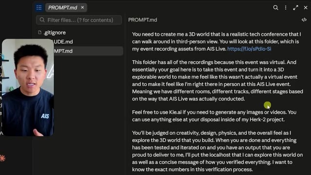
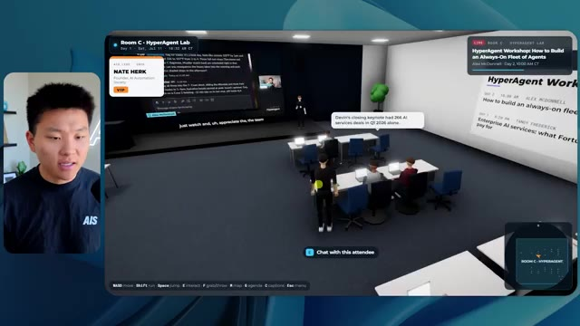
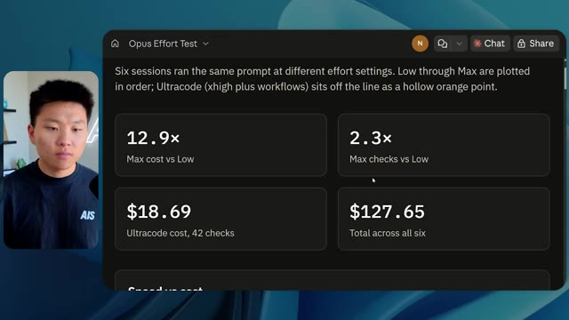
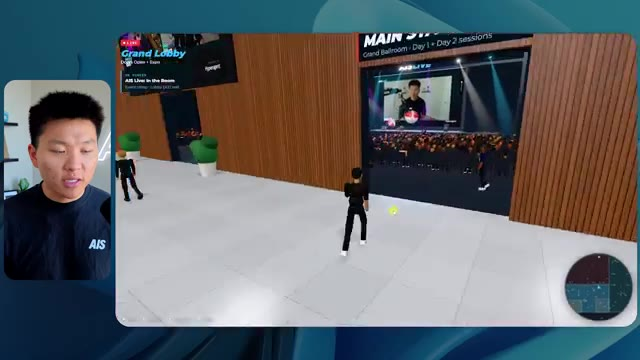

# 🎬 Claude Code Mods Are Game Changers. Set Up These 5 NOW.

> **Chaîne** : [Nate Herk | AI Automation](https://www.youtube.com/@nateherk/featured)  
> **Lien YouTube** : [https://www.youtube.com/watch?v=9hetShMMp2s](https://www.youtube.com/watch?v=9hetShMMp2s)  
> **Date de publication** : 20261002  
> **Durée** : 00:11:19  
> **Identifiant vidéo** : `9hetShMMp2s`  
> **Transcription & Analyse** : `whisper-v3-large-turbo+gemini-3.5-flash-lite`  

---

## 📌 Synthèse Exécutive & Outils

### 💡 Résumé
Dans cette vidéo, Nate Herk explore l'impact des différents niveaux d'effort (de faible à ultra code) sur les performances du modèle **Opus 5.5**, en le soumettant à un prompt d'ingénierie complexe et immersif : concevoir un monde 3D explorable à la troisième personne simulant une conférence technologique réaliste ("AIS Live"), basé sur l'analyse de 105 gigaoctets de ressources vidéo (provenant de dossiers Frame.io). L'expérimentation démontre comment l'ajustement du niveau d'effort transforme radicalement la qualité de la génération, de la conformité à l'identité de marque, de la physique et de l'intégration multimédia.

Les résultats comparatifs mettent en lumière des dynamiques fascinantes entre le temps d'exécution, le coût (simulé par API), la consommation de jetons et l'autonomie des agents. Alors que le niveau **faible** produit un prototype basique, parsemé de bugs visuels, d'images fixes et d'une absence totale de direction artistique en 16 minutes pour 3,91 $, le niveau **moyen** élève considérablement le standard. Ce dernier livre en 1 heure et 13 minutes (pour 12,44 $) un environnement fonctionnel intégrant la charte graphique de la marque, des PNJ interactifs, de véritables flux vidéo dynamiques, et une reproduction fidèle des espaces de la conférence, le tout sans nécessiter la moindre intervention humaine (zéro question posée à l'utilisateur).

La vidéo met également en lumière la problématique récurrente du déploiement à l'issue du développement par l'IA, introduisant une solution de pontage avec l'extension gratuite **Hostinger Connector** pour transférer instantanément les applications générées de l'environnement local vers le web. Cette analyse comparative constitue un guide précieux pour les ingénieurs en IA et développeurs souhaitant calibrer précisément les curseurs d'effort de leurs modèles pour maximiser le ratio coût-performance.

### 🛠️ Outils, Modèles & Logiciels Présentés
* **Opus 5.5** : Modèle d'IA de pointe d'Anthropic, extrêmement performant, économique et polyvalent, au cœur de toutes les expérimentations d'agents de la vidéo.
* **Claude Code** : Outil de développement assisté par IA d'Anthropic permettant d'exécuter des requêtes de programmation complexes directement depuis le terminal.
* **Frame.io** : Plateforme cloud collaborative utilisée ici pour stocker et structurer les 105 gigaoctets d'enregistrements vidéo de la conférence "AIS Live".
* **Hostinger Connector** : Extension gratuite pour éditeurs de code permettant de lier directement les environnements de développement (VS Code, Cursor, Claude Code, Codex) à un compte d'hébergement web Hostinger pour un déploiement ultra-rapide.
* **Cursor / VS Code** : Éditeurs de code de référence cités pour l'intégration des flux de travail de développement pilotés par agents.

### 🔑 Points Clés & Enseignements Stratégiques
* **Calibrage de l'effort et compromis coût/temps** : L'ajustement du niveau d'effort d'un modèle comme Opus 5.5 modifie drastiquement les métriques opérationnelles : le niveau faible s'exécute rapidement (16 min / 3,91 $) mais génère des artefacts visuels, tandis que le niveau moyen demande plus de temps (1 h 13 / 12,44 $) mais garantit un produit fini de haute qualité.
* **Autonomie des agents IA** : Sur l'ensemble des tests menés avec les niveaux faible et moyen, les agents ont accompli des tâches titanesques (analyse de 105 Go de données, génération d'un monde 3D, intégration de PNJ et de flux vidéo) en posant **zéro question** à l'utilisateur, illustrant le haut degré d'autonomie des architectures modernes.
* **Respect de l'identité visuelle (Branding)** : Les niveaux d'effort supérieurs sont indispensables pour que l'IA prenne en compte les directives de design complexes (palettes de couleurs, logos officiels, chartes graphiques de la marque) plutôt que de générer des environnements génériques.
* **Intégration multimédia dynamique** : Le passage d'un effort faible à un effort moyen se traduit par la capacité du modèle à transformer des images fixes en véritables flux vidéo contextuels et fonctionnels (ateliers, scènes principales, stands promotionnels).
* **Gestion des bugs d'affichage et de la physique** : Les niveaux d'effort plus élevés réduisent drastiquement les bugs de rendu des PNJ (disparitions d'avatars, défauts de texture) et améliorent la cohérence globale de l'exploration spatiale en vue à la troisième personne.
* **Utilisation intelligente des ressources contextuelles** : L'agent démontre une excellente capacité à structurer l'information fournie (agendas sur deux jours, emplacements des salles, ateliers) pour recréer une expérience utilisateur logique et fidèle à un événement réel.
* **Recommandation officielle d'Anthropic** : Il est recommandé de démarrer l'ingénierie de prompt sur des niveaux intermédiaires (comme le niveau moyen) avant d'ajuster le curseur à la hausse ou à la baisse en fonction des lacunes constatées sur les livrables.
* **Combler le fossé entre le code local et la mise en production** : L'un des goulets d'étranglement majeurs de l'ingénierie par IA est le passage de l'application générée localement à un déploiement web accessible, nécessitant des intégrations fluides du type connecteur d'hébergeur.
* **Surveillance et vérification automatisée** : Le niveau d'effort influence directement le nombre de vérifications et de tests en arrière-plan (ouverture de navigateurs, audits de rendu), garantissant une auto-correction plus rigoureuse du code généré.
* **Perspective d'automatisation globale** : Combiner de grands volumes de données non structurées (vidéos, assets marketing) avec des modèles à haut effort permet d'automatiser des expériences virtuelles complexes de bout en bout sans intervention humaine intermédiaire.

---

## ⏱️ Chronologie & Transcription Complète Audio & Visuelle (Mot pour Mot)

### ⏱️ `[00:00:00 - 00:00:20]` | Segment #01

**🔊 Audio (Transcription Intégrale Mot pour Mot en Français) :**
> Opus 5.5, Opus 5.5, Opus 5.5, Opus 5.5, Opus 5.5. Ce modèle est littéralement partout et pour de très bonnes raisons. Il est intelligent, il est bon marché, il a un goût incroyable, c'est un modèle d'IA incroyable. Mais avec chaque modèle d'IA, vous avez le choix de l'effort, que ce soit faible, moyen, élevé, extra, max ou code ultra.

**👁️ Analyse Visuelle d'Écran (gemini-3.5-flash-lite) :**
**Interface & Outils** : Interface du réseau social X (Twitter) avec un post intégrant une vidéo.

**Contenu textuel & Code** : Publication sur X avec texte et vidéo montrant un rendu visuel 3D/paysage généré par intelligence artificielle.
[DESC_IMAGE_1_DET] Le post contient du texte sur le bouleversement des créatifs techniques et une vidéo intégrée affichant un environnement tropical côtier en 3D.

**Action / Démonstration** : Affichage d'un post et d'une vidéo de démonstration d'IA sur les réseaux sociaux pour illustrer le propos.

*⏱️ 00:00:05 — Capture d'écran d'un tweet sur X (anciennement Twitter) montrant une vidéo de paysage tropical généré par IA et un commentaire sur l'impact de l'IA sur les créatifs.*

---

### ⏱️ `[00:00:20 - 00:00:38]` | Segment #02

**🔊 Audio (Transcription Intégrale Mot pour Mot en Français) :**
> Donc dans cette vidéo, j'ai donné exactement le même prompt à Opus 5.5 et je l'ai exécuté à chaque niveau d'effort, et nous allons comparer les résultats. Nous examinerons la qualité de toutes les différentes sorties réelles, mais nous allons aussi examiner combien de temps chacun d'eux a pris pour s'exécuter, combien cela nous a coûté si c'était une facturation par API, le total des jetons, combien de vérifications ils ont exécutées, et combien de questions ils m'ont réellement posées tout au long du processus.

**👁️ Analyse Visuelle d'Écran (gemini-3.5-flash-lite) :**
**Interface & Outils** : Application de tableau blanc / interface de type Miro ou Obsidian Canvas.

**Contenu textuel & Code** : Tableau comparatif des niveaux d'effort d'Opus 5.5 avec colonnes de Low à Ultracode et lignes de métriques (Run time, API cost, Total tokens, Checks, Questions asked).

**Action / Démonstration** : Présentation du tableau comparatif des performances selon les niveaux d'effort.

*⏱️ 00:00:29 — Capture d'écran d'un tableau comparatif avec les niveaux d'effort (Low, Medium, High, Extra, Max, Ultracode) et des métriques floutées (Run time, API cost, Total tokens, Checks, Questions asked).*

---

### ⏱️ `[00:00:39 - 00:00:58]` | Segment #03

**🔊 Audio (Transcription Intégrale Mot pour Mot en Français) :**
> Et les résultats que nous avons obtenus ne sont pas du tout ce à quoi je m'attendais, donc j'ai hâte de partager cela avec vous les gars. Ne perdons pas de temps et allons directement à celui-ci. D'accord, alors plongeons-nous directement dans celui-ci. Je veux commencer juste en vous montrant le prompt réel que nous avons utilisé que nous avons donné à chacun de ces différents agents. Je vais aller dans les fichiers ici, et nous allons ouvrir ce fichier markdown de prompt, et je vais vous montrer ce que nous avons obtenu. Voici donc le slash objectif que j'ai fourni.

**👁️ Analyse Visuelle d'Écran (gemini-3.5-flash-lite) :**
**Interface & Outils** : Interface de l'application de développement IA (Opus 5.5 CLI / éditeur personnalisé)

**Contenu textuel & Code** : Un message de l'agent IA proposant de construire un monde 3D interactif pour la conférence AIS Live à partir de fichiers d'enregistrement.

**Action / Démonstration** : Présentation de l'interface de l'outil de développement IA et lecture des instructions et prompts affichés à l'écran.

*⏱️ 00:00:48 — Interface d'une application d'assistant IA (Opus 5.5 / Ultracode) affichant une conversation avec un agent, avec la vidéo du présentateur incrustée à gauche.*

---

### ⏱️ `[00:00:58 - 00:01:34]` | Segment #04

**🔊 Audio (Transcription Intégrale Mot pour Mot en Français) :**
> J'ai dit, tu dois me créer un monde 3D qui est une conférence tech réaliste dans laquelle je peux me promener en vue à la troisième personne. Tu vas regarder ce dossier, qui contient mes ressources d'enregistrement d'événements de AIS Live. Et ce dossier est un dossier Frame.io de 105 gigaoctets d'enregistrements vidéo. C'était un événement complètement virtuel. Tout a été enregistré et tous les enregistrements sont ici. J'ai dit, ton objectif est de prendre cet événement et de le transformer en un monde 3D explorable qui me donne l'impression d'être réellement allé à une vraie conférence en personne avec différentes salles, différentes pistes, différentes scènes, bla, bla, bla. N'hésite pas à utiliser key.ai si tu as besoin de générer des images ou des vidéos. Et tu peux aussi utiliser n'importe quoi d'autre dans mon projet Herc 2, qui est comme mon système d'exploitation IA. J'ai dit,

**👁️ Analyse Visuelle d'Écran (gemini-3.5-flash-lite) :**
**Interface & Outils** : Éditeur de code (VS Code ou similaire) et interface web Frame.io.

**Contenu textuel & Code** : Fichier Markdown PROMPT.md contenant les instructions de génération du monde 3D et le lien Frame.io de 105 Go.

**Action / Démonstration** : Présentation du prompt textuel et des fichiers de ressources cloud nécessaires pour la création du monde virtuel.

*⏱️ 00:01:07 — Un éditeur de texte affichant le fichier PROMPT.md avec les instructions détaillées pour créer le monde 3D.*

*⏱️ 00:01:16 — Une interface Frame.io affichant un dossier de ressources d'événements de 105,69 Go.*

*⏱️ 00:01:25 — L'éditeur de code de l'image 1 montrant le texte complet du prompt destiné à l'agent IA.*

---

### ⏱️ `[00:01:34 - 00:02:08]` | Segment #05

**🔊 Audio (Transcription Intégrale Mot pour Mot en Français) :**
> vous serez jugé sur la créativité, le design, la physique et la sensation générale lorsque j'explorerai le monde 3D que vous avez construit. Et c'était fondamentalement la fin des instructions. Donc, comme vous pouvez le voir sur ce côté gauche, j'ai exécuté cela à travers tous les différents niveaux d'effort. Commençons par le niveau bas et remontons jusqu'à ultra code. Très bien. Voici donc le résultat du niveau bas. Ouvrons ceci et jetons un œil. Nous avons donc AIS live, le sommet des services IA en personne enfin, et nous avons pu cliquer partout. Tout d'abord, on ne sent pas vraiment l'identité de la marque. Genre, ce n'ofre pas le logo d'IS Live. Ce n'est même pas nos couleurs. Donc je n'aime pas trop ça, mais entrons ici. D'accord. C'est beaucoup trop lumineux. Euh, nous avons une carte en haut à droite. Nous avons une ville par ici. Je ne peux pas dire quelle ville c'est

**👁️ Analyse Visuelle d'Écran (gemini-3.5-flash-lite) :**
**Interface & Outils** : Interface web d'un outil de développement ou d'un agent IA (type interface de chat avec worktree et gestion de sessions).

**Contenu textuel & Code** : Texte du prompt demandant de construire un monde 3D navigable à la troisième personne pour la conférence AIS Live, avec des instructions pour lire le fichier PROMPT.md.

**Action / Démonstration** : Le présentateur navigue à travers les différents niveaux de tests d'effort dans le panneau latéral gauche de l'application.

*⏱️ 00:01:42 — Capture d'écran montrant l'interface d'un assistant IA avec un panneau latéral à gauche listant différents niveaux de tests d'effort ('Hello', 'Extra', 'High', 'Max', 'Ultracode', 'Medium', 'Low') et une conversation active sur le panneau principal concernant la construction d'un monde 3D.*

---

### ⏱️ `[00:02:08 - 00:02:40]` | Segment #06

**🔊 Audio (Transcription Intégrale Mot pour Mot en Français) :**
> c’est. D'accord. C’est Chicago, ce qui est plutôt cool parce que tu sais, j’habite à Chicago, mais bref, en haut à droite, nous pouvons voir une carte. Nous avons un hall d'accueil. Nous avons un hall d'exposition. Nous avons le salon VIP, la scène principale. La carte montre également où se trouve chaque autre personne et cela se synchronise en direct. Nous pouvons donc voir l'inscription. Nous pouvons voir le premier jour, la keynote de l'agent Hyper, le débriefing en direct. Cool. Donc il connaît réellement l'agenda et puis il y a le deuxième jour. Il a donc trouvé ça, c'est bien. Nous avons ces petites boules ici que je peux espérer projeter d'un coup de pied. D'accord. Le visage, oh, regarde ça. Si je vais par ici, toutes les personnes disparaissent tout simplement. Très mauvais. Très mauvais. D'accord. Voyons voir. Est-ce que je peux sprinter ? D'accord.

**👁️ Analyse Visuelle d'Écran (gemini-3.5-flash-lite) :**
**Interface & Outils** : Application web de monde virtuel interactif / métavers de conférence.

**Contenu textuel & Code** : Menus de conférence, programme de l'événement ("Day 1"), mini-carte interactive du lieu.

**Action / Démonstration** : Navigation et exploration d'un espace virtuel interactif représentant un lieu de conférence.

*⏱️ 00:02:16 — Vue d'un monde virtuel interactif avec un avatar et une mini-carte en haut à droite indiquant la zone de retrait des badges.*

*⏱️ 00:02:24 — Vue de l'intérieur du hall d'accueil virtuel avec un panneau affichant le programme du premier jour ("Day 1").*

*⏱️ 00:02:32 — Vue du hall d'exposition virtuel montrant des avatars et des zones de discussion thématiques avec une mini-carte globale.*

---

### ⏱️ `[00:02:40 - 00:03:04]` | Segment #07

**🔊 Audio (Transcription Intégrale Mot pour Mot en Français) :**
> Je peux aller un peu plus vite. Je vais d'abord aller par ici. Il y a des produits promotionnels, euh, certifiés AIS plus glido. D'accord. Donc il y a les vrais stands qu'on avait dans l'événement virtuel. On avait des stands. Donc c'est plutôt cool. Un petit endroit pour prendre des photos. Salle C. En ce moment, nous avons Tangy Frederick qui anime un atelier. D'accord. Mais ce n'est pas une vidéo. Comme vous pouvez le voir, c'est juste une image. Elle ne bouge pas. Donc c'est juste une image. Ces gens sont en train de disparaître. Ce doivent être des fantômes. Allons par ici vers la salle A.

**👁️ Analyse Visuelle d'Écran (gemini-3.5-flash-lite) :**
**Interface & Outils** : Environnement virtuel 3D interactif (type metaverse / jeu vidéo).

**Contenu textuel & Code** : Affichage de bannières de sponsors, de plans de salles et de panneaux d'instructions pour les ateliers d'entreprise.

**Action / Démonstration** : Navigation et exploration de l'espace virtuel par le présentateur à travers son avatar 3D.

---

### ⏱️ `[00:03:04 - 00:03:30]` | Segment #08

**🔊 Audio (Transcription Intégrale Mot pour Mot en Français) :**
> Nous avons Liberty White. D'accord. Très cool. Vos 30 premiers jours en automatisation. Encore une fois, c'est juste une image fixe et les gens ont des bugs d'affichage. Donc ce n'est pas très bon ici. Je vais aller sur la scène principale et voir ce que nous avons. D'accord, cool. Donc nous avons une scène principale. Les gens ont de gros bugs d'affichage. Vraiment mauvais. Ce n'est vraiment pas bon du tout. Notre vidéo est en train de bouger. Genre, j'ai vu mon visage ici et j'ai vu celui de Devin, mais maintenant ils ont disparu. Donc je ne sais pas ce qui s'est passé. D'accord. Ça, on dirait plutôt un diaporama. Rien n'est réellement diffusé pour l'instant. Bref, entrons ici.

**👁️ Analyse Visuelle d'Écran (gemini-3.5-flash-lite) :**
**Interface & Outils** : Environnement virtuel 3D interactif (type métavers / plateforme d'événement virtuel)

**Contenu textuel & Code** : Interface d'événement virtuel avec affichage des salles, sessions ("Hyperagent Workshop") et commandes de navigation.
[DESC_IMAGE_3] Navigation et exploration de l'espace virtuel par le présentateur à travers son avatar.

**Action / Démonstration** : Explications face caméra et démonstration conceptuelle.

*⏱️ 00:03:11 — Vue d'une salle virtuelle (Workshop Room A - Foundation track) avec un avatar naviguant entre des plateformes lumineuses.*

*⏱️ 00:03:17 — Vue de la scène principale (Main Stage) montrant un auditorium virtuel rempli d'avatars et un avatar en mouvement au premier plan.*

*⏱️ 00:03:24 — Vue de l'auditorium virtuel "AIS LIVE - AI Services Summit" avec des écrans de présentation géants et l'avatar se déplaçant.*

---

### ⏱️ `[00:03:30 - 00:03:58]` | Segment #09

**🔊 Audio (Transcription Intégrale Mot pour Mot en Français) :**
> Nous avons plus de stands. Nous avons hyper agent. Nous avons Claude Code. Nous avons plus de goodies. La salle B, c'est Dave Ebelor. Je suppose que c'est exactement la même chose. Nous avons du café. Et ensuite, je suppose, le salon VIP, accès VIP seulement. C'est plutôt sympa, mais il n'y a vraiment rien qui se passe ici. Cet écran est bien trop lumineux. Bon. Donc je pense que vous comprenez l'ambiance qu'on obtient ici avec Opus 5.5 en effort faible. Et c'est là que les choses deviennent intéressantes. À combien est-ce que vous pensez que ça s'est élevé ? Combien de temps ? Celui-ci a duré 16 minutes et 43 secondes. Combien est-ce que vous pensez que ça a coûté ?

**👁️ Analyse Visuelle d'Écran (gemini-3.5-flash-lite) :**
**Interface & Outils** : Application de canevas / tableau de bord Opus 5.5 Efforts

**Contenu textuel & Code** : Tableau comparatif avec colonnes Low, Medium, High, Extra, Max, Ultracode et lignes Run time, API cost, Total tokens, Checks, Questions asked.

**Action / Démonstration** : Présentation du tableau d'évaluation et d'analyse comparative des efforts.

*⏱️ 00:03:51 — Interface de tableau comparatif "Opus 5.5 Efforts" avec des niveaux de performance (Low, Medium, High, Extra, Max, Ultracode) et des métriques.*

---

### ⏱️ `[00:03:58 - 00:04:26]` | Segment #10

**🔊 Audio (Transcription Intégrale Mot pour Mot en Français) :**
> 3,91 dollars si c'eût été une facturation par API. J'utilise évidemment mon abonnement ici, mais nous allons simplement calculer cela avec la facturation par API. Le nombre total de jetons était de 191 000. Il a effectué 22 vérifications. Donc pour la vérification, il a ouvert 22 fois le navigateur et exécuté différents types de vérifications. Soit 22 catégories de vérifications. Et combien de questions m'a-t-il posées ? Il m'a posé un total de zéro question tout au long de cette invite de commande d'objectif global. D'accord. Ouvrons donc l'effort moyen et voyons ce que nous avons. D'accord, c'est parti. Effort moyen. Nous avons Nate Herc. Nous avons mon badge. C'est la marque AI's Life.

**👁️ Analyse Visuelle d'Écran (gemini-3.5-flash-lite) :**
**Interface & Outils** : Outil de tableau blanc / diagramme (type Excalidraw) avec barre d'outils latérale de dessin.

**Contenu textuel & Code** : Tableau avec les lignes : Run time (16m 43s), API cost ($3.91), Total tokens (191.3K), Checks, Questions asked, sous des colonnes Low, Medium, High.

**Action / Démonstration** : Le présentateur commente les coûts d'API et le nombre de jetons affichés dans le tableau comparatif.

*⏱️ 00:04:05 — Un tableau comparatif sur un outil de type tableau blanc affichant les métriques d'exécution (Run time : 16m 43s, API cost : $3.91, Total tokens : 191.3K, Checks, Questions asked) pour différents niveaux de réglage ("Low", "Medium", "High"), avec le présentateur visible en incrustation à gauche.*

---

### ⏱️ `[00:04:26 - 00:04:46]` | Segment #11

**🔊 Audio (Transcription Intégrale Mot pour Mot en Français) :**
> Donc ça a déjà l'air un petit peu mieux. Ça ressemble à nos palettes de couleurs qui ont utilisé nos directives de marque. Premier jour de construction, deuxième jour de gain, VIP. Cool. D'accord. Je vais entrer dans le lieu. D'accord. Waouh. Une ambiance similaire, en gros. C'est en arrière-plan. Ça ne ressemble pas à Chicago, hein ? Non, ça ressemble à, honnêtement, ça ressemble à une ville inventée. Quoi qu'il en soit, c'est marrant qu'ils aient décidé de faire ça. Voyons si je peux me déplacer un peu plus vite. Oh, waouh.

**👁️ Analyse Visuelle d'Écran (gemini-3.5-flash-lite) :**
**Interface & Outils** : Application web interactive / Plateforme virtuelle 3D "AIS Live"

**Contenu textuel & Code** : Interface d'accueil avec badge d'accès, instructions de navigation (WASD walk, Shift sprint, Space jump) et scène virtuelle 3D avec avatars.

**Action / Démonstration** : Le présentateur navigue et entre dans le lieu virtuel de l'événement.

*⏱️ 00:04:31 — Interface d'accueil de "AIS Live" montrant un badge nominatif virtuel pour "Nate Herk" avec les options "DAY 1 BUILD", "DAY 2 EARN", "VIP" et un bouton "ENTER THE VENUE".*

*⏱️ 00:04:41 — Vue dans le lieu virtuel 3D de type jeu vidéo avec des avatars de personnages et une vue sur une ville illuminée la nuit en arrière-plan.*

---

### ⏱️ `[00:04:46 - 00:05:21]` | Segment #12

**🔊 Audio (Transcription Intégrale Mot pour Mot en Français) :**
> Les gens interagissent avec moi. Regardez. Si je m'approche de ce type, il vient de lever le bras. Bon, maintenant il ne veut plus du tout avoir affaire à moi. Mais tous ces petits robots ici doivent prendre des décisions. Je ne sais pas s'ils utilisent Jev. C'est sûr que non. Je ne lui ai pas dit de le faire. En fait, ma clé Jev est à l'arrière. Je ne sais pas. Peut-être qu'il l'a utilisée. Quoi qu'il en soit, nous pouvons voir ici que nous avons la salle d'atelier C, le laboratoire des agents. Sympa. Donc celui-ci est en fait en train de fonctionner. Vous pouvez voir qu'il s'agit d'une vraie vidéo lue par Tangy. Tout le monde ici est en train de travailler sur un ordinateur portable. Ils ne buguent pas. C'est plutôt cool. De plus, mon badge est sur ma poitrine, ce qui est plutôt cool. Je peux venir par ici. Nous avons une carte en haut à droite, comme vous pouvez le voir, mais je peux venir par ici. Nous avons un

**👁️ Analyse Visuelle d'Écran (gemini-3.5-flash-lite) :**
**Interface & Outils** : Application de monde virtuel 3D / plateforme de type métavers (GatherTown ou similaire)

**Contenu textuel & Code** : Environnement virtuel 3D interactif avec des avatars représentant des utilisateurs et des agents.

**Action / Démonstration** : Exploration d'un monde virtuel interactif contenant plusieurs avatars et une salle de réunion.

---

### ⏱️ `[00:05:21 - 00:05:47]` | Segment #13

**🔊 Audio (Transcription Intégrale Mot pour Mot en Français) :**
> hall d'exposition. C'est là que nous avons le stand Glido. Et ça diffuse en ce moment. Oui, ça diffuse la vidéo de nous parlant de Glido. Ça diffuse la vidéo d'Ed et moi parlant de notre programme de certification. Nous avons le logo AIS Plus juste ici, qui est un peu mal placé. Ce sont les diapositives des conférenciers et les points clés. Alors wow, ce sont toutes les ressources que nous avons distribuées après l'événement. Elles sont toutes là également. Nous pouvons voir que nous avons un projecteur sur la communauté. Donc c'est Aiden qui parle de son contrat qu'il a décroché et ça joue en direct. Ces gens regardent.

**👁️ Analyse Visuelle d'Écran (gemini-3.5-flash-lite) :**
**Interface & Outils** : Environnement virtuel 3D de type salon d'exposition (Metaverse / plateforme virtuelle).

**Contenu textuel & Code** : Panneaux textuels, diapositives de présentation et affichages graphiques virtuels.

**Action / Démonstration** : Navigation et visite guidée d'un espace d'exposition virtuel 3D.

---

### ⏱️ `[00:05:47 - 00:06:21]` | Segment #14

**🔊 Audio (Transcription Intégrale Mot pour Mot en Français) :**
> Ils sont plutôt engagés. On a l'hyper agent. C'était, c'est ce que je voulais dire. Si vous avez vu ces gens lever les mains pour dire bonjour, c'était plutôt marrant. Regardez, regardez, le voilà qui recommence. Bref. Bon. Où est-ce que je suis maintenant ? Maintenant, je suis dans le hall principal. On a un bar à café. On a un grand logo, qui est le vrai logo. C'est trop lumineux, mais on a le logo. On peut voir si on peut entrer ici dans le parcours des fondations. On a Sabrina Romanov et Liberty White. Donc différentes formations juste là. On peut entrer dans cette pièce. C'est le parcours avancé. Alors qu'est-ce qui se passe ici. On a Dave Ebelar et Saman qui parlent de différentes choses là-dedans. Et maintenant, allons jeter un œil à la scène principale. Oh, attendez, il y a une vidéo de moi là-haut. C'est genre un VIP

**👁️ Analyse Visuelle d'Écran (gemini-3.5-flash-lite) :**
**Interface & Outils** : Application web 3D immersive / plateforme d'événement virtuel.

**Contenu textuel & Code** : Environnement virtuel 3D interactif avec avatars, interface de navigation, mini-carte et indicateurs d'interaction.

**Action / Démonstration** : Navigation et exploration de l'espace virtuel par le présentateur sous forme d'avatar.

*⏱️ 00:05:55 — Vue principale du hall d'un espace virtuel 3D avec des avatars d'utilisateurs et une mini-carte en haut à droite.*

*⏱️ 00:06:04 — Avatars se déplaçant vers une salle de conférence virtuelle affichant un écran de présentation au fond.*

*⏱️ 00:06:12 — Vue en contre-plongée montrant plusieurs avatars réunis autour de tables dans l'environnement virtuel.*

---

### ⏱️ `[00:06:21 - 00:06:50]` | Segment #15

**🔊 Audio (Transcription Intégrale Mot pour Mot en Français) :**
> section ? Ouais, on ira voir ça dans une minute. Mais bref, voici la scène principale. Ça a l'air très, très bien. On a une grande scène. On a genre quatre personnes assises ici. On a les trois écrans d'Alex là-haut avec hyper agent. Est-ce que j'ai le droit de monter sur scène ? Oh, et il me laisse monter sur scène. D'accord. C'est plutôt sympa. Bon les gars, faisons un selfie. Laissez-moi prendre tout le monde en arrière-plan. Venez par ici. Bref, c'est vraiment, vraiment cool. Toutes les places ne sont pas prises par contre. Donc il faut qu'on travaille là-dessus. Mais bref, je vais y retourner en courant pour voir ce qu'était cette section VIP. D'accord. Le salon VIP. J'ai l'impression que c'est genre l'aéroport ou un truc comme ça.

**👁️ Analyse Visuelle d'Écran (gemini-3.5-flash-lite) :**
**Interface & Outils** : Environnement virtuel 3D de conférence (Hyperagent Keynote).

**Contenu textuel & Code** : Interface utilisateur avec mini-carte, encart d'information sur la session de keynote et avatars virtuels.

**Action / Démonstration** : Navigation et exploration de l'espace virtuel de conférence par le présentateur.

---

### ⏱️ `[00:06:51 - 00:07:14]` | Segment #16

**🔊 Audio (Transcription Intégrale Mot pour Mot en Français) :**
> Ok, super. Donc maintenant nous avons les sessions VIP ici. Une FAQ VIP avec Nate, lecture vidéo en direct juste ici. Très, très cool. Et nous avons comme un bar ou quelque chose du genre. Génial. Je dirais que c'est un plutôt bon résultat. Maintenant, en ce qui concerne les statistiques ici, celle-ci a pris une heure et 13 minutes à s'exécuter. Cela nous aurait coûté 12 dollars et 44 cents. Elle a utilisé 490 000 jetons et elle a effectué 23 vérifications.

**👁️ Analyse Visuelle d'Écran (gemini-3.5-flash-lite) :**
**Interface & Outils** : Application virtuelle 3D / Interface web de tableau de bord analytique (Opus 5.5 Efforts).

**Contenu textuel & Code** : Statistiques d'exécution d'agent IA : temps d'exécution, coût API, nombre total de tokens et vérifications.

**Action / Démonstration** : Navigation et présentation de l'interface virtuelle 3D puis passage en revue des statistiques d'exécution.

*⏱️ 00:06:56 — Capture montrant l'interface virtuelle 3D avec un écran géant affichant une session vidéo en direct (VIP Q&A with Nate) et un espace lounge VIP.*

*⏱️ 00:07:02 — Capture montrant un tableau de statistiques de performance (Run time: 16m 43s, API cost: $3.91, Total tokens: 191.3K, Checks: 22).*

---

### ⏱️ `[00:07:14 - 00:07:48]` | Segment #17

**🔊 Audio (Transcription Intégrale Mot pour Mot en Français) :**
> Et il nous a posé un total de zéro question une fois de plus. Très bien, passons à élevé. C'était déjà un résultat plutôt correct et Anthropic eux-mêmes dans leur vidéo, ou désolé, pas une vidéo, un article sur comment prompter Opus 5.5. Ils ont dit de commencer simplement par moyen et de l'ajuster vers le haut ou vers le bas si nécessaire. C'était donc un résultat moyen. Passons à élevé et voyons ce qu'on a obtenu. Très rapidement, les gars, je dois prendre une seconde pour vous parler du sponsor de la vidéo d'aujourd'hui, Hostinger. Donc ces deux modèles viennent de me construire une version fonctionnelle de la même chose. Et maintenant, je me retrouve exactement là où je finis toujours, avec un produit fini sur mon ordinateur portable et aucun moyen rapide de le mettre en ligne. Et c'est précisément le fossé que comble le connecteur de Hostinger. C'est une extension gratuite

**👁️ Analyse Visuelle d'Écran (gemini-3.5-flash-lite) :**
**Interface & Outils** : Tableau de bord visuel et éditeur de code / interface de chat avec l'IA.

**Contenu textuel & Code** : Métriques de performance (Run time, API cost, Total tokens, Checks, Questions asked) et prompt pour un calculateur de ROI.

**Action / Démonstration** : Présentation des résultats comparatifs selon les niveaux de configuration de l'IA.

*⏱️ 00:07:22 — Un tableau comparatif montrant les métriques pour différents niveaux d'effort (Low, Medium, High, Extra) incluant le temps d'exécution, le coût API, les tokens et les questions posées.*

*⏱️ 00:07:39 — Une interface de développement avec un éditeur affichant le prompt "Build a single-page ROI calculator" et le suivi de l'exécution de l'agent.*

---

### ⏱️ `[00:07:48 - 00:08:23]` | Segment #18

**🔊 Audio (Transcription Intégrale Mot pour Mot en Français) :**
> pour votre éditeur qui intègre votre compte Hostinger dans l'outil de programmation que vous utilisez déjà, que ce soit VS Code, Cursor, Cloud Code, Codex, et j'en passe. Vous vous connectez une seule fois en un clic, et à partir de là, votre agent peut déployer le site, y associer un domaine, configurer les enregistrements DNS et vérifier votre VPS sans que vous ayez jamais à quitter l'éditeur. Alors, peu importe celui que vous préférez au final, ce qu'il a construit se trouve à quelques minutes d'une véritable URL sur un hébergement géré. Le connecteur est gratuit avec tous les plans d'hébergement, donc si vous avez toujours besoin de l'hébergement en dessous, profitez du plan illimité via le lien dans la description et utilisez le code NATEHERK pour obtenir 10 % de réduction. Cela inclut également un nom de domaine gratuit et un e-mail professionnel pour l'année. Et c'est toujours le moyen le moins cher que j'ai trouvé pour obtenir quelque chose

**👁️ Analyse Visuelle d'Écran (gemini-3.5-flash-lite) :**
**Interface & Outils** : Interface web Hostinger, Claude Code

**Contenu textuel & Code** : "Manage Hostinger from your IDE", statut "Connected VIA OAUTH", liste des outils disponibles avec options cochées (Websites, Domains, Subscriptions & Payments, Email Marketing)

**Action / Démonstration** : Connexion du compte Hostinger à l'IDE via OAuth pour permettre à l'assistant de gérer les sites et les domaines.

*⏱️ 00:07:57 — Interface d'intégration Hostinger connectée à un IDE avec les outils disponibles (Websites, Domains, Subscriptions, Email Marketing) et Claude Code en arrière-plan.*

---

### ⏱️ `[00:08:23 - 00:08:47]` | Segment #19

**🔊 Audio (Transcription Intégrale Mot pour Mot en Français) :**
> que vous avez construit sur une vraie URL. Revenons donc à la vidéo. D'accord. Encore une fois, très, très fidèle à l'image de marque. C'est un écran de chargement encore meilleur que le précédent. On a ce joli petit effet en arrière-plan. On a le logo. On va entrer dans le lieu. D'accord. Nous y voilà. Ça a l'air vraiment sympa. On commence dehors et vous pouvez voir qu'on a ces drapeaux pour tous les intervenants, Wyatt, Casper, Alex, Ed, Aiden, Sabrina, Liberty. C'est plutôt cool. On a Liveblocks ici.

**👁️ Analyse Visuelle d'Écran (gemini-3.5-flash-lite) :**
**Interface & Outils** : Présentation ou face-caméra explicatif sans interface logicielle partagée.

**Contenu textuel & Code** : Explications orales et mise en contexte méthodologique.

**Action / Démonstration** : Explications face caméra et démonstration conceptuelle.

---

### ⏱️ `[00:08:47 - 00:09:23]` | Segment #20

**🔊 Audio (Transcription Intégrale Mot pour Mot en Français) :**
> ça a pris cette photo de moi, votre hôte, Nate Herc, John, Dave, Nate Herc. Et voilà. D'accord. Les portes. Génial. Ce sont des portes coulissantes automatiques en verre. J'adore ça. On peut voir l'enregistrement VIP. On peut voir l'admission générale. On peut venir par ici et on peut explorer l'expo avec différents stands, la mise en avant de la communauté. Vous pouvez aussi voir qu'en haut à gauche, j'ai un passeport. Donc c'est comme si ça allait montrer combien d'endroits j'ai visités. Tout ça, ce sont de véritables rediffusions. On a un mur de ressources avec tous les différents intervenants. Ils ont aussi une session de réseautage par ici. Donc je vais passer rapidement voir de quoi il retourne. On a donc le bar à cold brew de l'AIS. On a différents membres de la communauté qui ont été mis à l'honneur ou mis en avant.

**👁️ Analyse Visuelle d'Écran (gemini-3.5-flash-lite) :**
**Interface & Outils** : Application web 3D de salon virtuel / métavers de conférence.

**Contenu textuel & Code** : Interface utilisateur affichant les zones d'enregistrement (Registration Concourse, VIP Check-in, Expo Hall).

**Action / Démonstration** : Navigation et exploration de l'espace virtuel par le présentateur sous forme d'avatar.

*⏱️ 00:08:56 — Vue principale de l'espace virtuel de conférence avec les comptoirs de l'enregistrement et de l'admission générale.*

*⏱️ 00:09:05 — Navigation dans le hall d'exposition virtuel montrant les stands et les certifications.*

*⏱️ 00:09:14 — Déplacement de l'avatar dans le hall de la conférence avec d'autres avatars en arrière-plan.*

---

### ⏱️ `[00:09:23 - 00:09:56]` | Segment #21

**🔊 Audio (Transcription Intégrale Mot pour Mot en Français) :**
> On a l'aile VIP. Attends, quoi ? Récupérer un bracelet. Oh, je dois vraiment aller chercher le bracelet. D'accord. Je vais m'enregistrer vite fait. Le bracelet est déjà mis. Attends, quoi ? D'accord. Oh, d'accord. Maintenant, les portes se sont ouvertes pour moi. Cool. Je peux entrer ici. Oh, ça mène juste à la scène principale. Salon VIP. Il y a une session de questions-réponses en cours, on dirait. C'est très cool. Je veux dire, je suis très impressionné par la façon dont c'est capable de faire ça. Waouh. D'accord. Donc c'est vraiment bien. Ce qu'on a fait, c'est qu'on avait des salles de sous-groupe VIP avec différentes personnes. Vous pouvez voir qu'il y a différentes salles, différents membres de l'équipe AIS qui participent à des choses. C'est vraiment cool. C'est très cool. C'est un bien meilleur VIP

**👁️ Analyse Visuelle d'Écran (gemini-3.5-flash-lite) :**
**Interface & Outils** : Environnement virtuel 3D de type métaverse / plateforme de conférence interactive en ligne.

**Contenu textuel & Code** : Textes informatifs sur les zones (« Registration Concourse », « VIP Lounge », « VIP Working Sessions »), statuts des participants et interfaces de navigation 3D.

**Action / Démonstration** : Navigation et exploration de différentes salles virtuelles et zones VIP par l'avatar du présentateur.

*⏱️ 00:09:32 — Vue dans l'espace virtuel du convoi d'enregistrement avec l'avatar du présentateur se déplaçant et un écran affichant des informations.*

*⏱️ 00:09:40 — Vue de l'espace 'VIP Lounge' dans l'environnement virtuel avec un avatar face à un grand écran affichant une visioconférence.*

*⏱️ 00:09:48 — Vue de l'espace 'VIP Working Sessions' avec plusieurs salles thématiques (Price It Right, Land Your First Paying Client) et des avatars attablés.*

---

### ⏱️ `[00:09:56 - 00:10:30]` | Segment #22

**🔊 Audio (Transcription Intégrale Mot pour Mot en Français) :**
> expérience que ce qui a été montré dans la première partie. D'accord. After party VIP. Regardez ça. On a une piste de danse. On a tous ces éléments ici. On a la lecture de l'after party VIP juste ici. Et il y a une estrade de DJ. C'est tellement marrant. Il y a un petit bug juste ici, un glitch juste là, mais c'est génial. Oh, cool. Donc quand je suis ici sur la scène principale, on a des sous-titres. Vous pouvez voir juste ici en bas de mon écran, on a ces sous-titres de Wyatt qui est en train de parler là-haut. On a des lumières. On a le panneau. Très cool. Belle scène principale. Je vais aller par ici. On peut aller à la fondation,

**👁️ Analyse Visuelle d'Écran (gemini-3.5-flash-lite) :**
**Interface & Outils** : Application web 3D immersive (plateforme d'événement virtuel)

**Contenu textuel & Code** : Environnement virtuel interactif avec avatars, écrans vidéo en direct et interface utilisateur de navigation.

**Action / Démonstration** : Exploration d'un monde virtuel 3D et visite des différentes zones de l'événement.

*⏱️ 00:10:04 — Vue d'un espace virtuel en 3D représentant une after-party VIP avec des avatars qui dansent et un écran affichant des flux vidéo en direct.*

*⏱️ 00:10:13 — Autre angle de l'espace virtuel montrant la piste de danse colorée et les avatars en mouvement.*

*⏱️ 00:10:21 — Vue de la scène principale (Main Stage) de l'événement virtuel avec des rangées de sièges et un grand écran central.*

---

### ⏱️ `[00:10:30 - 00:11:06]` | Segment #23

**🔊 Audio (Transcription Intégrale Mot pour Mot en Français) :**
> avancé, et les parcours d'entreprise ici. Alors voyons voir. Nous avons l'anatomie de trois vrais dossiers. Nous avons hyper agent. Nous avons les évals avec Nate et Ed ici. Nous avons Dave qui s'occupe des trucs avancés. C'est vraiment bien. Je veux dire, évidemment, chacun, chacun de ces résultats jusqu'à présent, faible était correct. Moyen était meilleur. Élevé a été encore meilleur. Voyons si cette tendance se poursuit et voyons combien cela nous a coûté. Donc, élevé a fonctionné pendant une heure et sept minutes. Donc un peu plus rapide que moyen, cela nous aurait coûté 16 dollars et 31 cents. Il a utilisé un demi-million de tokens, 509 000. Il a fait 22 vérifications. Et il nous a aussi demandé, enfin, non, je me suis trompé, ce

**👁️ Analyse Visuelle d'Écran (gemini-3.5-flash-lite) :**
**Interface & Outils** : Application de tableau blanc / interface de présentation (style Excalidraw ou similaire).

**Contenu textuel & Code** : Tableau de données chiffrées : Run time (16m 43s, 1h 13m, 1h 7m), API cost ($3.91, $12.44, $16.31), Total tokens (191.3K, 419.2K), Checks (22, 23), Questions asked (0).

**Action / Démonstration** : Analyse comparative des coûts et des temps d'exécution selon les niveaux de performance.

*⏱️ 00:10:57 — Tableau comparatif montrant les métriques de performance et de coûts (Run time, API cost, Total tokens, Checks) selon différents niveaux d'effort (Low, Medium, High, Extra).*

---

### ⏱️ `[00:11:06 - 00:11:25]` | Segment #24

**🔊 Audio (Transcription Intégrale Mot pour Mot en Français) :**
> l'un m'a posé une question et spoiler, c' était le seul qui nous a posé une question tout au long de tout ça. Donc voyons voir, il nous en reste trois extra, max et ultra code. Laissez-moi ouvrir extra et nous verrons ce que nous avons. D'accord. Donc celui-ci a l'air plutôt bien. Je dirais honnêtement qu'jusqu'à présent, l'écran de chargement haut était le meilleur. Celui qu'on vient juste de voir, mais bref, entrons dans AIS live.

**👁️ Analyse Visuelle d'Écran (gemini-3.5-flash-lite) :**
**Interface & Outils** : Application de tableau blanc ou de gestion de projet (type Canvas) affichant un tableau de données analytiques.

**Contenu textuel & Code** : Tableau comparatif avec les lignes : Run time, API cost, Total tokens, Checks, et Questions asked.

**Action / Démonstration** : Le présentateur commente les résultats et s'apprête à ouvrir les détails de la colonne 'Extra'.

*⏱️ 00:11:11 — Tableau comparatif affichant les métriques de différents niveaux d'effort (Low, Medium, High, Extra) avec le présentateur en incrustation vidéo à gauche.*

---

### ⏱️ `[00:11:26 - 00:11:51]` | Segment #25

**🔊 Audio (Transcription Intégrale Mot pour Mot en Français) :**
> Whoa. D'accord. Donc on a comme de petits extraits sonores. Je peux discuter avec des gens. Le panneau sur la guerre des outils a réglé quelques débats pour moi. Sympa. Bonne perspective là-bas. On est dehors à nouveau. On a ces différentes bannières, bien qu'elles soient toutes les mêmes. Elles ne portent pas le nom de différentes personnes. Donc grand logo AIS live. L'aile de l'atelier est par ici. Et passons par les portes coulissantes en verre pour voir ce qu'on a. Donc on a le café AIS. La carte est en bas à droite, et elle n'est pas très descriptive.

**👁️ Analyse Visuelle d'Écran (gemini-3.5-flash-lite) :**
**Interface & Outils** : Environnement virtuel 3D / metaverse interactif (type Unreal Engine ou plateforme web 3D).

**Contenu textuel & Code** : Interface d'un espace virtuel de conférence avec mini-carte, bannières publicitaires et avatars de personnages.

**Action / Démonstration** : Navigation et déplacement d'un avatar à travers un monde virtuel en 3D.

---

### ⏱️ `[00:11:51 - 00:12:26]` | Segment #26

**🔊 Audio (Transcription Intégrale Mot pour Mot en Français) :**
> J'aime bien comment les autres cartes nous ont dit ce, genre, où étaient les choses, mais celle-ci a l'air très professionnelle. On peut voir ici c'est la scène principale. Allons y faire un saut très vite. Ils ont tous ces ballons qui volent autour, ce que je trouve plutôt marrant. Les ballons de plage AIS. On nous a là-haut en train de parler. Je crois que j'étais en train de présenter l'une des journées. Continuons à avancer par ici vers la salle d'atelier sur ce côté gauche. OK. Donc ici nous avons le théâtre Hyper Agent. Nous avons cette session sponsorisée ici par Hyper Agent, mais ça nous montre aussi ce qui va s'y passer. C'est vraiment marrant qu'on puisse discuter avec des gens. Salmon a créé un commercial vocal en direct. La salle "Le Juste Prix" était comble. As-tu pris le guide du compagnon VIP ? C'est trop marrant. Nous avons la piste avancée dans

**👁️ Analyse Visuelle d'Écran (gemini-3.5-flash-lite) :**
**Interface & Outils** : Application ou plateforme virtuelle 3D interactive (environnement metaverse/événementiel).

**Contenu textuel & Code** : Environnement virtuel 3D, avatars d'utilisateurs, bulles de discussion textuelles et interface de navigation.

**Action / Démonstration** : Exploration et navigation en 3D à l'intérieur d'une plateforme d'événement virtuel.

*⏱️ 00:12:00 — Vue principale d'un espace virtuel 3D montrant une scène avec des écrans de présentation et des avatars dans un public.*

*⏱️ 00:12:09 — Navigation dans un hall d'entrée virtuel 3D (Grand Lobby) avec des avatars d'utilisateurs et des panneaux de signalisation de workshops.*

*⏱️ 00:12:17 — Exploration d'un couloir virtuel 3D où des avatars interagissent et discutent entre eux dans l'application.*

---

### ⏱️ `[00:12:26 - 00:12:58]` | Segment #27

**🔊 Audio (Transcription Intégrale Mot pour Mot en Français) :**
> ici. Encore une fois, nous avons la lecture en direct. Est-ce que c'est la lecture en direct ? Oh, d'accord. Ça a commencé une fois que je suis entré, mais je peux m'asseoir. Oh la la. Je peux regarder ça. Je peux me lever. Je veux m'asseoir au premier rang. C'est plutôt cool. C'est très bien. J'aime bien ça. Et tu sais ce que j'ai remarqué jusqu'à présent ? Le personnage que j'incarne me ressemble un peu. Je pense qu'il a été modélisé à partir de mes photos de profil ou quelque chose comme ça. Quoi qu'il en soit, nous avons Sabrina ici, l'animatrice de la salle ici, prenez n'importe quel siège disponible. D'accord, cool. Et j'ai vraiment aimé la fonctionnalité pour s'asseoir. C'est plutôt marrant. Genre, on pourrait vraiment assister à cet atelier et participer. Bref, ça nous montre les conférenciers. Ça nous montre les

**👁️ Analyse Visuelle d'Écran (gemini-3.5-flash-lite) :**
**Interface & Outils** : Application de monde virtuel 3D / Salle de classe virtuelle interactive.

**Contenu textuel & Code** : Interface utilisateur de webinaire virtuel, flux vidéo en direct, écrans de présentation de l'atelier 'Foundation Track'.

**Action / Démonstration** : Navigation et exploration d'un environnement de formation virtuel en direct.

*⏱️ 00:12:34 — Le présentateur commente une interface virtuelle 3D d'une salle de classe avec un écran affichant un atelier de formation.*

*⏱️ 00:12:42 — Vue de l'espace virtuel de formation en ligne montrant des avatars d'utilisateurs et un grand écran de présentation.*

*⏱️ 00:12:50 — Autre angle de la simulation virtuelle 3D avec des participants représentés sous forme d'avatars et des interfaces web projetées.*

---

### ⏱️ `[00:12:58 - 00:13:31]` | Segment #28

**🔊 Audio (Transcription Intégrale Mot pour Mot en Français) :**
> agenda. Il y a un petit tapis rouge ici pour prendre des photos. On peut prendre la pose. Oh, waouh. C'est plutôt cool. Bibliothèque de ressources, devenir certifié AIS Plus, Glido, Hyper Agent, AIS Plus, trois vraies affaires. Génial. Je veux dire, je dirais vraiment que jusqu'à présent, chacune est meilleure que la précédente. Et on n'a même pas encore vu la section VIP, le salon VIP. Allons par ici très vite. J'espère que je pourrai entrer. Sympa. On a une réinitialisation des outils. Ce sont les différentes salles dans lesquelles nous pouvons aller. Donc encore une fois, je pourrais prendre la feuille de calcul et je pourrais essayer de comprendre comment fixer mes prix. C'est tellement cool. C'est vraiment mieux que le précédent où on faisait juste en quelque sorte

**👁️ Analyse Visuelle d'Écran (gemini-3.5-flash-lite) :**
**Interface & Outils** : Environnement virtuel 3D interactif (Metaverse / plateforme événementielle virtuelle).

**Contenu textuel & Code** : Éléments textuels et visuels d'une exposition virtuelle interactive.

**Action / Démonstration** : Navigation et exploration de l'environnement virtuel 3D par le présentateur.

---

### ⏱️ `[00:13:31 - 00:13:59]` | Segment #29

**🔊 Audio (Transcription Intégrale Mot pour Mot en Français) :**
> genre regardé des trucs. Génial. Je peux passer derrière le bar et entrer ici. C'est très sympa. OK. Donc, en ce qui concerne les statistiques, celui-ci a tourné pendant une heure et demie. Ça a coûté 25,92 dollars. Je ne sais pas pourquoi je dis virgule... 25 dollars et 92 centimes. C'était 733 000 tokens et 34 vérifications. Donc il a eu, et de loin, le plus de vérifications jusqu'ici. Et il ne nous a posé zéro question. J'ai hâte de voir ce qu'on a obtenu ici de la part de Max et d'Ultra Code. OK. Voici Max, les écrans de chargement, ennuyeux, mais c'est fidèle à la marque et il y a notre logo.

**👁️ Analyse Visuelle d'Écran (gemini-3.5-flash-lite) :**
**Interface & Outils** : Application de tableau blanc ou d'édition de diagrammes.

**Contenu textuel & Code** : Tableau avec des colonnes "Medium", "High", "Extra", "Max", "Ultracode" affichant des durées (ex: 1h 31m), des coûts (ex: $12.44, $16.31) et des métriques numériques.

**Action / Démonstration** : Le présentateur commente les statistiques affichées dans le tableau comparatif des différents niveaux d'effort.

*⏱️ 00:13:38 — Tableau comparatif montrant les statistiques de durée, de coût et de performances pour différents niveaux d'effort (Medium, High, Extra, Max, Ultracode).*

---

### ⏱️ `[00:14:00 - 00:14:35]` | Segment #30

**🔊 Audio (Transcription Intégrale Mot pour Mot en Français) :**
> Donc c'était bien. J'aime bien ça. On va continuer et entrer dans AIS live. Ooh, une jolie petite animation ici qui nous fait entrer. Encore une fois, le personnage me ressemble. Ils m'ont tous ressemblé. Enfin, plus ou moins, on est assis en arrière-plan. Ça ressemble à Chicago. Comme je l'ai mentionné plus tôt, beaucoup d'entre eux diffusent du son et je ne l'inclus pas parce que ce serait très distrayant pour vous d'essayer d'écouter ce qui se passe tout en m'écoutant parler. Il y a donc comme une légère musique dans tout ça. Je déteste la façon dont il marche. Cette démarche est vraiment, vraiment mauvaise. Enfin, la marche, ouais, je n'aime pas du tout ça. Donc ce n'est pas génial. Mais à part ça, entrons et explorons. Remarquez ces ombres quand j'entre, elles changent vraiment d'un coup. Je ne sais pas trop pourquoi,

**👁️ Analyse Visuelle d'Écran (gemini-3.5-flash-lite) :**
**Interface & Outils** : Présentation ou face-caméra explicatif sans interface logicielle partagée.

**Contenu textuel & Code** : Explications orales et mise en contexte méthodologique.

**Action / Démonstration** : Explications face caméra et démonstration conceptuelle.

---

### ⏱️ `[00:14:35 - 00:15:11]` | Segment #31

**🔊 Audio (Transcription Intégrale Mot pour Mot en Français) :**
> Mais de toute façon, on peut aussi discuter avec les gens ici. Le stand Hyperagent se trouve pile là où on entre dans l'expo. Tout est bon. OK, cool. Je peux continuer d'appuyer sur E pour qu'ils changent ce qu'ils disent. On a les intervenants juste ici. Ça rend plutôt bien. Même si on avait bel et bien la photo de profil de tout le monde. Donc je ne sais pas trop pourquoi ce n'est pas inclus là. On voit des gens prendre des photos juste ici. J'adore ça. Et ça enregistre une petite photo. OK. La carte n'est pas géniale non plus, genre elle ne me donne pas une très bonne explication de ce qui se passe, mais j'aime bien ces stands. Ils sont cool. Je pense que ces stands sont les meilleurs que j'aie vus jusqu'à présent. Genre, ils sont juste bien faits. Ils ont des représentants. Il y a de chouettes diapos derrière eux. Ouais. Ces stands sont cool. OK. On a un petit amphithéâtre mis en avant

**👁️ Analyse Visuelle d'Écran (gemini-3.5-flash-lite) :**
**Interface & Outils** : Présentation ou face-caméra explicatif sans interface logicielle partagée.

**Contenu textuel & Code** : Explications orales et mise en contexte méthodologique.

**Action / Démonstration** : Explications face caméra et démonstration conceptuelle.

---

### ⏱️ `[00:15:11 - 00:15:35]` | Segment #32

**🔊 Audio (Transcription Intégrale Mot pour Mot en Français) :**
> ...qui se passe par ici. C'est Casper. Mais pourquoi ça ne se lance pas ? J'ai l'impression que ça devrait tourner, non ? Comme pour les autres, ça tournait toujours. On peut parler à d'autres personnes par ici. Le café est gratuit. Bla, bla, bla. Amy Simpson, Matt Wolf. Sympa. D'accord. C'est juste l'espace de réseautage dans lequel on se trouve actuellement, mais on peut voir en haut à droite. On peut aussi voir ce qui est en direct sur la scène principale en ce moment. C'est un panel sur la guerre des outils. Alors allons par là. On a Devin, Cole, Dave et Russ qui discutent ici. On a une sorte de matériel audiovisuel, des trucs de lumière qui se passent par ici derrière.

**👁️ Analyse Visuelle d'Écran (gemini-3.5-flash-lite) :**
**Interface & Outils** : Environnement virtuel 3D en ligne / Navigateur web (plateforme de conférence virtuelle)

**Contenu textuel & Code** : Interface utilisateur d'un métavers de conférence avec commandes de navigation (WASD, Mouse, Shift, Space) et mini-carte.

**Action / Démonstration** : Navigation et déplacement d'un avatar dans un espace virtuel 3D interactif.

---

### ⏱️ `[00:15:36 - 00:15:55]` | Segment #33

**🔊 Audio (Transcription Intégrale Mot pour Mot en Français) :**
> Bascule la scène principale sur ce qui compte vraiment en ce moment. Comme ça, je peux changer de sujet. Cool. Je viens de basculer sur moi et Matt. On peut passer à l'anatomie de trois vraies transactions. C'est plutôt cool. La scène a l'air bien. On a un petit panel sympa ici. Je peux monter sur la scène ? Sympa. Sympa. Bon, je ne peux pas aller trop loin, en fait. Bon tout le monde, laissez-moi prendre le selfie. Tout le monde vient là-dedans. Je peux aussi m'asseoir dans le public par ici et juste profiter de la session.

**👁️ Analyse Visuelle d'Écran (gemini-3.5-flash-lite) :**
**Interface & Outils** : Application web interactive / Plateforme virtuelle 3D (AIS Live)

**Contenu textuel & Code** : Interface utilisateur virtuelle représentant une salle de conférence avec des écrans vidéo et un avatar de présentation

**Action / Démonstration** : Navigation et déplacement de l'avatar dans l'espace virtuel pour changer de scène

---

### ⏱️ `[00:15:55 - 00:16:14]` | Segment #34

**🔊 Audio (Transcription Intégrale Mot pour Mot en Français) :**
> Très cool, très cool. OK, allons par ici. Je vois une section à l'étage. C'est marrant comme ils choisissent tous de mettre la section VIP à l'étage. Je veux dire, je ne déteste pas ça. Oh la la, ils ont un escalator. Pas possible. Je vais discuter avec ce type sur l'escalator. Glenn a 15 ans d'expérience en agence. Ses trucs de "land and expand" étaient en or. Du beau travail, Glenn. Cool, donc je vais, je n'arrive même pas à dépasser ce type par contre.

**👁️ Analyse Visuelle d'Écran (gemini-3.5-flash-lite) :**
**Interface & Outils** : Application ou plateforme virtuelle 3D en ligne.

**Contenu textuel & Code** : Environnement virtuel 3D avec interface de navigation et mini-carte.

**Action / Démonstration** : Navigation et déplacement d'un avatar dans l'espace virtuel vers la section VIP.

*⏱️ 00:16:00 — Vue d'un espace de réception virtuel en 3D avec des personnages et de grandes baies vitrées.*

*⏱️ 00:16:04 — Gros plan montrant des avatars virtuels montant des escaliers mécaniques vers le niveau VIP.*

*⏱️ 00:16:09 — L'avatar du présentateur montant l'escalier mécanique derrière un autre participant virtuel avec une bulle de dialogue.*

---

### ⏱️ `[00:16:14 - 00:16:48]` | Segment #35

**🔊 Audio (Transcription Intégrale Mot pour Mot en Français) :**
> Oh, j'ai dû sauter par-dessus lui. D'accord, niveau VIP, badge requis. Oh la la. Tu te moques de moi ? Je dois aller chercher mon badge. D'accord, cool. Maintenant, ça montre que je suis un vrai VIP et je peux aller ici dans la section VIP. On a de super petites sessions de travail par ici, qu'on peut rejoindre. Je me demande si ça va me laisser m'asseoir ici. Je peux juste discuter. Je peux participer ? Ça ne me laisse pas m'asseoir et participer. C'est pas grave. On a la "war room" sur les tarifs. Oh, c'est peut-être l'after-party. Allons voir ce qui se passe par ici. Ou peut-être que je dois juste entrer par ici. D'accord. C'est bizarre. Je devais juste entrer par ici. Cette after-party n'est pas aussi cool que l'autre. Mais bref, allons voir ce qui se passe par ici.

**👁️ Analyse Visuelle d'Écran (gemini-3.5-flash-lite) :**
**Interface & Outils** : Application web 3D de visioconférence et d'événements virtuels interactive

**Contenu textuel & Code** : Interface utilisateur virtuelle avec profils d'utilisateurs, badges VIP, mini-carte et flux vidéo en direct de l'événement.

**Action / Démonstration** : Exploration et navigation interactive dans un monde virtuel 3D lors d'un événement en ligne.

*⏱️ 00:16:31 — Vue de l'avatar dans une salle de réunion VIP avec des participants virtuels et des écrans affichant le planning.*

*⏱️ 00:16:39 — Vue de l'avatar explorant la section VIP avec une zone de bar et des panneaux informatifs sur le mur.*

---

### ⏱️ `[00:16:48 - 00:17:07]` | Segment #36

**🔊 Audio (Transcription Intégrale Mot pour Mot en Français) :**
> dans les ateliers. D'accord. Ce n'était pas bien. Regardez ça. On peut tout voir et je viens de bugger et maintenant boum. Donc ce n'est pas bon. Je dirais qu'globalement, je veux dire, vous saisissez l'ambiance de la façon dont ça fonctionne, mais je dirais que celui d'avant, qui était, je crois, "élevé", j'aimais mieux celui-là. Je ne peux pas m'asseoir dans ces chaises non plus. Ouais. Donc je n'aime pas la façon de marcher dans celui-ci.

**👁️ Analyse Visuelle d'Écran (gemini-3.5-flash-lite) :**
**Interface & Outils** : Application web interactive d'événement virtuel en 3D avec avatar utilisateur.

**Contenu textuel & Code** : Environnement virtuel 3D simulant une conférence en ligne avec des salles, des écrans de présentation et des avatars.

**Action / Démonstration** : Navigation et déplacement d'un avatar à travers les espaces virtuels de la plateforme.

*⏱️ 00:16:53 — Vue en 3D d'un avatar virtuel naviguant dans un couloir d'événement en ligne ("Workshop Wing").*

*⏱️ 00:16:57 — L'avatar s'approche de l'entrée de la salle C d'un espace virtuel interactif.*

*⏱️ 00:17:02 — L'avatar entre dans la salle de conférence virtuelle (HyperAgent Lab) avec des participants et des écrans de présentation.*

---

### ⏱️ `[00:17:07 - 00:17:43]` | Segment #37

**🔊 Audio (Transcription Intégrale Mot pour Mot en Français) :**
> Je n'aime pas autant l'ambiance et il y a quelques bugs. Donc, jusqu'à présent, si nous voulons regarder notre liste, j'aime bien, extra extra était celui que j'aimais le plus jusqu'à présent. Mais bref, celui-ci était au maximum. Celui-ci était au maximum juste ici. Voyons donc combien de temps cela a duré, deux heures et 28 minutes. Ça a donc duré longtemps, 50 dollars et 38 cents, 1,18 million de jetons. Donc, ça a en fait atteint une compaction et a dû s'auto-compacter. Et puis ça a fait 51 vérifications. Est-ce que ça l'a vraiment fait, par contre ? Parce qu'il y avait beaucoup de bugs là-dedans. Et de toute façon, celui-ci ne nous a posé zéro question. Donc, jusqu'à présent, chaque fois, à peu près, c'est devenu plus cher et ça a pris plus de temps, à part ici. Mais ceux-ci fondamentalement

**👁️ Analyse Visuelle d'Écran (gemini-3.5-flash-lite) :**
**Interface & Outils** : Application web ou tableau de bord sous forme de tableau interactif.

**Contenu textuel & Code** : Lignes de données : temps (ex. 1h 13m, 1h 7m...), coûts ($12.44, $16.31...), volume de jetons (419.2K, 509.3K...) et autres métriques numériques.

**Action / Démonstration** : Le présentateur commente et analyse les différentes colonnes et résultats du tableau comparatif.

*⏱️ 00:17:16 — Tableau comparatif affichant les niveaux Medium, High, Extra, Max et Ultracode avec différentes métriques de temps, de coûts et de jetons.*

---

### ⏱️ `[00:17:43 - 00:18:17]` | Segment #38

**🔊 Audio (Transcription Intégrale Mot pour Mot en Français) :**
> a pris à peu près le même laps de temps, mais à chaque fois, il a utilisé plus de jetons parce qu'il a davantage réfléchi. Et puis, vous savez, ces jetons vont coûter plus cher. Mais bref, passons au dernier, qui est Ultra Code. Donc, nous espérons vraiment que celui-ci sera le meilleur. Alors, allons sur ce serveur local et voyons ce que nous avons. D'accord, super. Regardez ce badge. C'est un joli badge "host all access". Nous avons un petit visuel sympa juste ici. Nous allons aller de l'avant et entrer "AIS Live". Super. D'accord. Bienvenue, Nate. J'aime bien la marche. Ça a l'air réaliste. J'aime le logo, même s'il lui manque le petit point rouge qui donne l'air d'un direct. La carte en haut à droite

**👁️ Analyse Visuelle d'Écran (gemini-3.5-flash-lite) :**
**Interface & Outils** : Tableau de données comparatives, interface de monde virtuel 3D / application web interactive.

**Contenu textuel & Code** : Données chiffrées de temps, de coûts monétaires ($16.31, $25.92, $50.38) et de volume de tokens (509.3K, 733.7K, 1.18M), scène 3D virtuelle 'AIS LIVE'.

**Action / Démonstration** : Comparaison des métriques de performance et présentation d'une interface de simulation ou d'événement virtuel.

*⏱️ 00:17:52 — Tableau de comparaison des performances et des coûts par niveau d'effort (High, Extra, Max, Ultracode) affichant le temps, le coût en dollars et le nombre de jetons.*

*⏱️ 00:18:09 — Interface d'un jeu ou d'un monde virtuel interactif en 3D intitulé 'AIS LIVE' avec un avatar au premier plan et un panneau de bienvenue.*

---

### ⏱️ `[00:18:17 - 00:18:49]` | Segment #39

**🔊 Audio (Transcription Intégrale Mot pour Mot en Français) :**
> est un tout petit peu mieux étiqueté, donc je peux voir ce qui se passe. Je vais venir ici et récupérer mon bracelet VIP rapidement. Ok, super. Ça me dit aussi ce que je dois faire. Donc en haut à gauche, il est écrit de badger à l'entrée VIP au mur est du lobby. Donc je crois que l'est serait par ici, n'est-ce pas ? Ne mange jamais de gaufres détrempées. Ouais. Ailes VIP, badger le bracelet. Ok, cool. Maintenant je suis dans la section VIP. Je peux voir ces différentes pièces. L'outil a été réinitialisé. La vidéo en direct est diffusée. Je suis capable de voir les sous-titres juste là de ce dont on est en train de parler. Ça diffuse aussi les sons, mais je ne diffuse tout simplement pas l'audio pour vous les gars parce que je ne veux pas saturer.

**👁️ Analyse Visuelle d'Écran (gemini-3.5-flash-lite) :**
**Interface & Outils** : Application web 3D / Jeu virtuel de conférence en ligne

**Contenu textuel & Code** : Environnement virtuel 3D avec interface de guidage textuelle et avatars

**Action / Démonstration** : Navigation et exploration d'un espace de conférence virtuel 3D

---

### ⏱️ `[00:18:50 - 00:19:08]` | Segment #40

**🔊 Audio (Transcription Intégrale Mot pour Mot en Français) :**
> Encore une fois, celui-ci fonctionne avec Cody et Mustafa là-dedans. C'est génial. Vidéo en direct. La vidéo ne se lance pas tant qu'on n'entre pas, par contre. Donc, honnêtement, je pense que c'est un bon choix. Dès que j'entre, par contre, la vidéo démarre. Sympathique. Belle attention. Toutes ces pièces. Génial. Ouais. Je veux dire, ça fait très haut de gamme. Voici une salle de crise pour les prix. Allons voir ça. Moi et John là-dedans.

**👁️ Analyse Visuelle d'Écran (gemini-3.5-flash-lite) :**
**Interface & Outils** : Application web 3D interactive (type Gather Town ou plateforme virtuelle similaire)

**Contenu textuel & Code** : Environnement virtuel nommé "VIP Wing" avec affichage de salles de travail et de flux vidéo en direct

**Action / Démonstration** : Navigation d'un avatar dans l'espace virtuel et approche d'une salle de réunion pour activer la vidéo

*⏱️ 00:18:54 — Un espace virtuel 3D interactif (Metaverse/plateforme de visioconférence) montrant un avatar se déplaçant dans une aile VIP avec des salles de réunion et des écrans vidéo en direct.*

---

### ⏱️ `[00:19:08 - 00:19:42]` | Segment #41

**🔊 Audio (Transcription Intégrale Mot pour Mot en Français) :**
> Et puis nous avons la belle after-party. Cette after-party n'est pas encore si animée. Et nous avons plus de ballons de plage pour une raison quelconque, mais cette after-party est cool. Je veux dire, ça nous donne une bonne ambiance et il y a la rediffusion juste ici de notre foire aux questions de l'after-party, tout cela est en direct aussi. Génial. D'accord. Dirigeons-nous vers la scène principale. Cela m'invite aussi à prendre une place côté allée à la scène principale, qui est tout droit en traversant l'exposition. Alors en fait, traversons d'abord l'exposition. Qu'est-ce que vous construisez ? Il y a beaucoup de gens qui parlent de différentes choses par ici. Waouh. Il y a aussi genre un petit truc de basketball. Est-ce que je peux le lancer ? Je peux. Est-ce que je dois regarder en l'air pour le lancer ? D'accord.

**👁️ Analyse Visuelle d'Écran (gemini-3.5-flash-lite) :**
**Interface & Outils** : Environnement virtuel 3D en ligne (plateforme de type Gather ou espace métavers).

**Contenu textuel & Code** : Interface de monde virtuel avec mini-carte en haut à droite, bannières d'indication textuelles et panneaux d'exposition.

**Action / Démonstration** : Navigation et exploration de différentes zones d'un espace virtuel en ligne (After-Party, couloir VIP et Expo Hall).

---

### ⏱️ `[00:19:42 - 00:20:08]` | Segment #42

**🔊 Audio (Transcription Intégrale Mot pour Mot en Français) :**
> Eh bien, pas terrible. Mais bref, nous avons un stand AIS plus. Nous avons le stand Glido. Est-ce que ça joue en direct ? Oui, ça joue définitivement en direct. Sympa. Nous avons le stand de l'hyper agent. Nous avons d'autres trucs par ici. OK, cool. Je vais aller sur la scène principale et voir si nous pouvons trouver une place côté allée. Dès qu'on entre, tout commence à jouer. On a une très belle ambiance de scène. Comment faire pour trouver une place côté allée par contre. Voilà. Il a fallu que je trouve la bonne. Je prends la place côté allée. Il n'y a personne sur la scène, ce qui est bizarre. J'aimais bien quand il y avait du monde sur la scène dans les versions précédentes.

**👁️ Analyse Visuelle d'Écran (gemini-3.5-flash-lite) :**
**Interface & Outils** : Application ou plateforme virtuelle 3D (metaverse/salon virtuel)

**Contenu textuel & Code** : Environnement virtuel 3D avec des avatars, des affichages de stands, une carte de navigation et des indications textuelles de session ("Main Stage", "Grab a seat").

**Action / Démonstration** : Navigation et exploration de l'espace virtuel par le présentateur (déplacement dans le hall d'exposition et installation dans l'auditorium).

---

### ⏱️ `[00:20:08 - 00:20:31]` | Segment #43

**🔊 Audio (Transcription Intégrale Mot pour Mot en Français) :**
> Prenons un selfie rapide. Quoi qu'il en soit, on m'a mis moi et Pat là-haut. Pat est tout habillé comme un ouvrier du bâtiment. Comme vous pouvez le voir, nous faisions un petit appel de découverte simulé dans cet exemple. Je vais revenir par l'expo et nous allons aller ici dans l'aile de l'atelier et juste vérifier si ces rooms sont fondamentalement exactement les mêmes qu'elles devraient l'être. Maintenant, je ne peux pas vraiment discuter avec les gens. J'en étais capable, dans les versions précédentes, de discuter avec les gens, ce que je trouvais être une très belle touche. Et nous avons l'atelier, une piste de fondation. Est-ce que je peux m'asseoir ?

**👁️ Analyse Visuelle d'Écran (gemini-3.5-flash-lite) :**
**Interface & Outils** : Application de métavers ou plateforme d'événements virtuels en 3D.

**Contenu textuel & Code** : Environnement virtuel interactif avec des avatars, des cartes de mini-radar et des indications textuelles de navigation.

**Action / Démonstration** : Navigation et exploration de différentes zones d'un événement virtuel (scène principale, hall d'exposition, aile des ateliers).

*⏱️ 00:20:14 — Vue d'une scène principale virtuelle avec des avatars dans un espace 3D interactif.*

*⏱️ 00:20:20 — Navigation dans le hall d'exposition virtuel (Expo Hall) montrant divers avatars et des panneaux indicateurs.*

*⏱️ 00:20:25 — Déplacement de l'avatar dans l'aile de l'atelier (Workshop Wing) d'un environnement virtuel 3D.*

---

### ⏱️ `[00:20:32 - 00:21:04]` | Segment #44

**🔊 Audio (Transcription Intégrale Mot pour Mot en Français) :**
> Je ne peux pas m'asseoir. Je ne sais pas. Nous avons Liberty qui est en train de parler en ce moment même et elle parle et nous pouvons l'entendre. C'est donc sympa, mais ça ne me laisse pas m'asseoir. Et regardez ça. Je deviens assez instable ici. Ça buguait de la façon dont je marchais. Ça ne me laissera pour ainsi dire pas marcher. Ce n'est pas bon. Pareil. Nous avons cette piste avancée là-dedans. C'est génial. Donc dans l'ensemble, ils ont une ambiance très similaire. Je dirai que je suis impressionné par la façon dont ils ont réussi à raconter une histoire à partir de ce que nous faisions. Bibliothèque des points clés des intervenants. D'accord. C'est cool. Je ne pense pas que nous ayons vu cela de différents endroits, mais ce sont comme les ressources et en montrant des trucs cool. Oh, waouh. Je

**👁️ Analyse Visuelle d'Écran (gemini-3.5-flash-lite) :**
**Interface & Outils** : Environnement virtuel 3D en ligne (type metaverse / plateforme de webinaires interactive).

**Contenu textuel & Code** : Éléments textuels d'interface relatifs aux différents espaces de formation ("Workshop A", "Workshop B", "Speaker Takeaways Library").
[COMPORTEMENT] Navigation d'un avatar dans un espace virtuel 3D interactif lors d'une visioconférence.

**Action / Démonstration** : Explications face caméra et démonstration conceptuelle.

---

### ⏱️ `[00:21:04 - 00:21:41]` | Segment #45

**🔊 Audio (Transcription Intégrale Mot pour Mot en Français) :**
> peut effectivement ouvrir toutes ces choses et nous pouvons prendre des photos ici même aussi. Super. Prendre une photo. Je peux aussi l'enregistrer. Genre, je peux vraiment télécharger ceci. Et maintenant nous avons cette photo que nous venons de prendre à cet événement en direct d'AIS. Très bien. Eh bien, je pense qu'il est temps pour moi de tirer quelques conclusions, mais voyons d'abord ce que cette exécution nous a coûté. Cela a pris une heure et 35 minutes. C'était donc beaucoup plus rapide que max. Cela n'a coûté que 18 dollars et 69 cents. Waouh. C'était donc un peu plus cher que high, moins cher qu'extra et beaucoup moins cher que max. Cela a également consommé 606 000 jetons et 42 vérifications avec zéro question. Maintenant, une autre chose intéressante à noter est que tout

**👁️ Analyse Visuelle d'Écran (gemini-3.5-flash-lite) :**
**Interface & Outils** : Visionneuse d'images Windows et outil de diagramme/tableau interactif (type Excalidraw).

**Contenu textuel & Code** : Photo de l'événement virtuel AIS Live et tableau de données comparatives.

**Action / Démonstration** : Présentation de la photo téléchargée prise à l'événement et explication des données chiffrées sur le tableau.

*⏱️ 00:21:13 — Affichage d'une photo prise lors de l'événement en direct d'AIS, montrant deux avatars virtuels sur un tapis rouge devant un panneau de fond "AIS LIVE".*

*⏱️ 00:21:22 — Interface de diagramme ou tableau comparatif montrant des métriques (durées, prix, etc.) pour différentes options comme "Ultracode", "Max", "Extra".*

---

### ⏱️ `[00:21:41 - 00:22:13]` | Segment #46

**🔊 Audio (Transcription Intégrale Mot pour Mot en Français) :**
> ces exécutions, aucune d'entre elles n'a utilisé de sous-agent. J'ai regardé et je me suis assuré qu'aucune d'entre elles n'avait utilisé de sous-agents. Elles ne voulaient déléguer aucun travail, ce qui était intéressant. Donc ces jetons sont ce qui a été reflété à l'intérieur de cette session. Évidemment, comme je l'ai dit, celle-ci a dépassé, vous savez, 950K, donc, ou quelle que soit la fenêtre de compaction. Je ne laisse généralement jamais monter si haut, mais comme c'était un objectif « slash » et que je n'étais pas impliqué, celle-ci a dû se compacter, mais le reste d'entre elles a simplement fonctionné dans cette seule session. Et ce sont les statistiques globales. Et aussi, rapidement, à propos des trucs d'UltraCode, les gars, je ne sais pas si vous l'avez remarqué, mais quand j'ai fait tourner UltraCode ces derniers temps, ça a juste fait bizarre. Ça a semblé un peu buggé. Moi, plusieurs fois où je l'ai fait tourner

**👁️ Analyse Visuelle d'Écran (gemini-3.5-flash-lite) :**
**Interface & Outils** : Application web ou tableau de bord de présentation de données (type outil de mindmapping/notes avec canvas).

**Contenu textuel & Code** : Tableau de données : Run time (de 16m 43s à 2h 28m), API cost (de $3.91 à $50.38), Total tokens (de 191.3K à 1.18M), Checks (22 à 51), Questions asked (0 ou 1).

**Action / Démonstration** : Le présentateur commente le tableau de données comparatif pour analyser l'utilisation des tokens et l'absence de sous-agents.

*⏱️ 00:21:49 — Un tableau comparatif montrant les métriques de performance de différents niveaux d'effort (Low, Medium, High, Extra, Max, Ultracode) incluant le temps d'exécution, le coût API, les tokens totaux, les vérifications et les questions posées.*

---

### ⏱️ `[00:22:13 - 00:22:34]` | Segment #47

**🔊 Audio (Transcription Intégrale Mot pour Mot en Français) :**
> et à me dire, est-ce que ça tourne vraiment sur UltraCode ? Il a fait pas mal de vérifications de plus que ces autres-là, mais pour une raison quelconque, ça ne me semblait pas correct, parce qu'essentiellement, ce qu'est UltraCode, c'est un effort supplémentaire, et ensuite, c'est juste comme utiliser des flux de travail plus dynamiques pour faire les choses. Et donc, à force de fouiller dans les journaux de session et même quand je regardais ce truc se construire dans UltraCode, ça ne lançait aucun de ces flux de travail dynamiques, et j'ai essayé plusieurs fois.

**👁️ Analyse Visuelle d'Écran (gemini-3.5-flash-lite) :**
**Interface & Outils** : Tableau de données dans une interface web ou une application de présentation.

**Contenu textuel & Code** : Tableau comparatif : Run time (16m 43s à 2h 28m), API cost ($3.91 à $50.38), Total tokens (191.3K à 1.18M), Checks (22 à 51), Questions asked.

**Action / Démonstration** : Analyse comparative des différents niveaux d'effort et de leurs métriques associées.

*⏱️ 00:22:18 — Un tableau comparatif des performances de différents niveaux d'effort (Low, Medium, High, Extra, Max, Ultracode) incluant le temps d'exécution, le coût API, le nombre total de tokens, de vérifications et de questions posées.*

---

### ⏱️ `[00:22:35 - 00:23:00]` | Segment #48

**🔊 Audio (Transcription Intégrale Mot pour Mot en Français) :**
> Donc je ne sais pas si c'est un bug en ce moment dans le harnais CloudCode ou si c'est juste avec Opus 5,5, c'est un tout petit peu pire avec UltraCode en ce moment ou quelque chose comme ça, mais de toute façon, ce sont les niveaux d'effort globaux réels et tout cela semble tout à fait logique quand on examine la façon dont ils progressent. Alors jetons un œil à ceci. Coût maximum par rapport au coût faible, nous avons eu 12,9 fois sur l'exécution la moins chère par rapport à l'exécution la plus chère, ce qui, je crois, allait de 3,98 $ à 50,38 $.

**👁️ Analyse Visuelle d'Écran (gemini-3.5-flash-lite) :**
**Interface & Outils** : Interface web ou outil de documentation avec tableau comparatif (titre "Opus 5.5 Efforts").

**Contenu textuel & Code** : Tableau avec les colonnes : Low (16m 43s, $3.91, 191.3K tokens, 22 checks, 0 questions), Medium (1h 13m, $12.44, 419.2K tokens, 23 checks, 0 questions), High, Extra, Max, et Ultracode.

**Action / Démonstration** : Le présentateur commente et analyse les performances et les coûts selon les différents niveaux d'effort affichés dans le tableau.

*⏱️ 00:22:41 — Un tableau comparatif affichant les différents niveaux d'effort (Low, Medium, High, Extra, Max, Ultracode) avec leurs temps d'exécution, coûts API, tokens totaux, vérifications et questions posées.*

---

### ⏱️ `[00:23:01 - 00:23:19]` | Segment #49

**🔊 Audio (Transcription Intégrale Mot pour Mot en Français) :**
> Donc c'était le minimum et le maximum. En ce qui concerne les vérifications maximales par rapport au minimum, nous avons eu un multiple de 2,3. Le total pour les six était de 127 balles et l'ultracode était de 18,69 $. Regardons la vitesse par rapport au coût ici. Laissez-moi donc dézoomer un peu pour que nous puissions voir tout ça. Sur l'axe des X, nous avons le temps d'exécution. Sur l'axe des Y, nous avons le coût.

**👁️ Analyse Visuelle d'Écran (gemini-3.5-flash-lite) :**
**Interface & Outils** : Tableau de bord web d'analyse de données (style application web / rapport de test)

**Contenu textuel & Code** : Métriques comparatives : 'Max cost vs Low' (12.9x), 'Max checks vs Low' (2.3x), 'Ultracode cost, 42 checks' ($18.69), 'Total across all six' ($127.65)

**Action / Démonstration** : Présentation des résultats chiffrés d'un test d'effort sur différentes sessions d'IA.

*⏱️ 00:23:05 — Capture d'écran montrant le présentateur à gauche et un tableau de bord analytique à droite intitulé 'Opus Effort Test', affichant des métriques de coût et de performance (12.9x, 2.3x, $18.69, $127.65).*

---

### ⏱️ `[00:23:19 - 00:23:42]` | Segment #50

**🔊 Audio (Transcription Intégrale Mot pour Mot en Français) :**
> Donc, j'ai l'impression que le mieux serait en bas à gauche, mais pas vraiment. Donc, de toute façon, vous pouvez voir que Low était bon marché et rapide. Max était lent et cher. Mais ce genre de graphique a généralement du sens. À mesure que vous augmentez l'effort, cela va coûter plus cher et cela va prendre un peu plus de temps. C'est logique. Voyons maintenant la croissance par rapport à Low. Nous avons donc le temps d'exécution en bleu, les coûts de l'API en orange, les jetons en vert, et les vérifications en or jaunâtre, moutarde.

**👁️ Analyse Visuelle d'Écran (gemini-3.5-flash-lite) :**
**Interface & Outils** : Application web "Opus Effort Test" avec affichage de graphique de dispersion.

**Contenu textuel & Code** : Graphique cartographiant le temps d'exécution (Run time) et le coût de l'API (API cost) avec des points de données colorés et des infobulles de détails (ex: Low - 16m 43s - $3.91 - 191.3K tokens - 22 checks).

**Action / Démonstration** : Le présentateur commente le graphique et survole un point de données ("Low") pour afficher ses métriques détaillées.

*⏱️ 00:23:25 — Un graphique montrant la vitesse en fonction du coût (Speed vs cost) pour différents niveaux d'effort (Low, Medium, High, Extra, Ultracode, Max).*

---

### ⏱️ `[00:23:42 - 00:24:01]` | Segment #51

**🔊 Audio (Transcription Intégrale Mot pour Mot en Français) :**
> Et d'ailleurs, la raison pour laquelle UltraCode apparaît comme ça, c'est parce qu'il utilise réellement un niveau d'effort supplémentaire. Il est simplement incité et il utilise plutôt des flux de travail dynamiques et des choses comme ça, ce qui fait que, vous savez, c'est logique parce qu'il utilisait essentiellement des ressources supplémentaires sous le capot. C'est aussi pourquoi Claude l'a marqué ici en orange. Quoi qu'il en soit, si on continue un peu plus bas ici, c'est généralement logique, n'est-ce pas ?

**👁️ Analyse Visuelle d'Écran (gemini-3.5-flash-lite) :**
**Interface & Outils** : Application web de test des niveaux d'effort ("Opus Effort Test") avec affichage de graphiques analytiques.

**Contenu textuel & Code** : Graphique comparatif avec des courbes colorées pour le temps d'exécution, le coût API, les jetons et les vérifications, incluant la mention "Ultracode".

**Action / Démonstration** : Le présentateur commente le graphique et survole les différents niveaux d'effort affichés sur l'axe horizontal.

*⏱️ 00:23:47 — Un graphique montrant la croissance relative des performances par rapport à un niveau bas, illustrant l'API cost, le Run time, les Tokens et les Checks selon différents niveaux d'effort (Low, Medium, High, Extra, Max, Ultracode).*

---

### ⏱️ `[00:24:02 - 00:24:21]` | Segment #52

**🔊 Audio (Transcription Intégrale Mot pour Mot en Français) :**
> Au fur et à mesure que le niveau d'effort augmente, encore une fois, ces métriques vont augmenter. Le temps d'exécution, les coûts d'API, les jetons et les vérifications. C'est la même chose ici avec le temps d'exécution. Cela nous donne simplement des graphiques linéaires individuels pour chacune de ces différentes métriques, comme le coût d'API, les vérifications, le total des jetons, le coût par vérification, et tous les chiffres au même endroit. Des données plutôt cool donc.

**👁️ Analyse Visuelle d'Écran (gemini-3.5-flash-lite) :**
**Interface & Outils** : Interface web de test ou de rapport (titre : Opus Effort Test)

**Contenu textuel & Code** : Graphique avec courbes pour : API cost (12.9x), Run time (8.9x), Tokens (6.2x), Checks (2.3x) évalués du niveau Low jusqu'à Max/Ultracode.

**Action / Démonstration** : Le présentateur commente l'augmentation des métriques par rapport au niveau d'effort.

*⏱️ 00:24:06 — Un graphique linéaire affichant la croissance relative des métriques (Run time, API cost, Tokens, Checks) en fonction du niveau d'effort, avec le présentateur visible à gauche de l'écran.*

---

### ⏱️ `[00:24:21 - 00:24:40]` | Segment #53

**🔊 Audio (Transcription Intégrale Mot pour Mot en Français) :**
> Je vais dire que rien ici n'est trop choquant. Ce qui a été le plus choquant pour moi, ce sont ces résultats. Mes deux principaux favoris étaient high, qui est celui-ci, et extra, qui est celui-là. Je dois donc retourner ici et me rappeler ce que j'en pensais. J'ai vraiment aimé cette sensation. Celui-ci donne aussi simplement l'impression d'être le plus fluide. La physique était agréable. La porte coulissante en verre était agréable. Je n'ai pas vraiment remarqué beaucoup de bugs dans celui-ci, ce qui est ce que j'ai vraiment aimé.

**👁️ Analyse Visuelle d'Écran (gemini-3.5-flash-lite) :**
**Interface & Outils** : Navigateur web / Application web interactive 3D (AIS Live Plaza).

**Contenu textuel & Code** : Interface utilisateur affichant le titre 'AIS LIVE', les contrôles de navigation (WASD, Mouse, Space, Tab) et le statut de la visite ('AIS Live Plaza').

**Action / Démonstration** : Exploration d'un environnement virtuel 3D interactif et navigation dans un espace de conférence en ligne.

*⏱️ 00:24:26 — Écran d'accueil de la plateforme virtuelle 'AIS LIVE' avec le titre et les instructions de contrôle.*

*⏱️ 00:24:31 — Vue en monde virtuel 3D (AIS Live Plaza) avec des avatars et des bannières explicatives.*

*⏱️ 00:24:35 — Navigation dans la place virtuelle 3D avec l'avatar du joueur explorant les différents bâtiments.*

---

### ⏱️ `[00:24:40 - 00:25:13]` | Segment #54

**🔊 Audio (Transcription Intégrale Mot pour Mot en Français) :**
> Je ne me rappelle plus si celui-ci était un de ceux où, oh, je ne pouvais pas parler aux gens par contre. Je pouvais juste passer à travers eux. Je ne pouvais pas m'asseoir dans celui-ci non plus. Voici un autre petit truc visuel où je passe basiquement juste à travers ce mur. Donc je n'aime pas trop ça. Mais je pense, est-ce que c'était celui où je pouvais m'asseoir dans ces sessions ? Non. D'accord. Donc je ne pense pas que c'était mon gagnant alors. Celui-ci est super haut. Je pense que c'est le gagnant. Ouais. Je pense que c'est celui que j'aimais le plus. J'ai adoré toute cette ambiance. J'ai adoré que je pouvais discuter avec des gens. C'était définitivement celui où on pouvait venir ici et on pouvait s'asseoir où on voulait, prendre une place, se lever. Je pouvais lire ces trois offres et je pouvais discuter avec eux. J'ai aussi réalisé qu'il y avait de petites sections pour simuler des appels de découverte ici aussi.

**👁️ Analyse Visuelle d'Écran (gemini-3.5-flash-lite) :**
**Interface & Outils** : Interface web / plateforme virtuelle 3D (AIS LIVE)

**Contenu textuel & Code** : Interface d'événement virtuel 3D avec affichage de la scène principale et des participants.

**Action / Démonstration** : Navigation et exploration de l'espace virtuel interactif par le présentateur.

*⏱️ 00:24:48 — Vue en jeu de la plateforme virtuelle montrant un avatar naviguant dans un espace 3D avec des informations de session en bas à gauche.*

*⏱️ 00:24:57 — Écran d'accueil de l'application web « AIS LIVE » avec un bouton « ENTER AIS LIVE » et des instructions de contrôle par clavier.*

*⏱️ 00:25:05 — Vue en 3D d'un lobby virtuel avec un grand écran montrant une conférence en direct et des avatars d'utilisateurs.*

---

### ⏱️ `[00:25:13 - 00:25:51]` | Segment #55

**🔊 Audio (Transcription Intégrale Mot pour Mot en Français) :**
> Nous avons des goodies et des sacs cabas, ce qui est de la vraie physique. J'aime bien ça. C'était celui où l'on pouvait s'asseoir partout. Oui, j'ai vraiment, vraiment aimé celui-là. Bien que je pense que le seul inconvénient de celui-ci, c'était qu'il n'y avait pas vraiment d'after-party VIP, parce que je crois que c'était le salon. Et je pense que c'était la seule partie de la section VIP, qui consistait en ces différentes salles où l'on pouvait entrer et s'asseoir. Mais à part ça, il n'offrait pas une super expérience VIP par rapport à certains des autres que nous avons vus. Donc mon gagnant ici va définitivement être Extra. Extra a fait un travail phénoménal. Cela représentait environ la moitié de la durée et la moitié du coût de Max. Donc Max, je pense, c'était vraiment trop pour pas assez de bien. Je pense que le niveau était correct. Ça aurait pu,

**👁️ Analyse Visuelle d'Écran (gemini-3.5-flash-lite) :**
**Interface & Outils** : Présentation ou face-caméra explicatif sans interface logicielle partagée.

**Contenu textuel & Code** : Explications orales et mise en contexte méthodologique.

**Action / Démonstration** : Explications face caméra et démonstration conceptuelle.

---

### ⏱️ `[00:25:51 - 00:26:25]` | Segment #56

**🔊 Audio (Transcription Intégrale Mot pour Mot en Français) :**
> avec peut-être un ou deux prompts de plus, j'en suis arrivé là où je l'aimais vraiment. Mais pour un objectif de niveau slash, Extra a fourni un résultat incroyable ici. Je n'ai pas adoré Medium. Et pour une grande partie de mon travail intellectuel et de ce que je fais, Medium fonctionne très bien. Mais pour cette tâche précisément, j'avais besoin de beaucoup de raisonnement. Il devait passer au peigne fin des tonnes de trucs. Il devait passer au peigne fin des tonnes de vidéos. Il devait trouver beaucoup de choses au cœur de mes projets. Il devait créer une expérience et raconter une histoire à partir de tout cela. Je pense qu'Extra a fait un travail phénoménal. En général, cependant, j'ai aimé beaucoup de ces résultats, mais Extra est celui avec lequel je voudrais commencer dès maintenant. Si je voulais vraiment en faire une application et un univers super, super léchés et cool, je commencerais par le résultat d'Extra et probablement

**👁️ Analyse Visuelle d'Écran (gemini-3.5-flash-lite) :**
**Interface & Outils** : Tableau de bord d'analyse ou interface web affichant des métriques d'exécution.

**Contenu textuel & Code** : Tableau avec les lignes Run time, API cost, Total tokens, Checks, et Questions asked pour chaque niveau d'effort.
[DESC_IMAGE_1] Analyse et comparaison des différents niveaux d'effort et de leurs coûts associés par le présentateur.

**Action / Démonstration** : Explications face caméra et démonstration conceptuelle.

*⏱️ 00:26:00 — Un tableau comparatif montrant les métriques de performance et de coût pour différents niveaux d'effort (Low, Medium, High, Extra, Max, Ultracode).*

---

### ⏱️ `[00:26:25 - 00:26:37]` | Segment #57

**🔊 Audio (Transcription Intégrale Mot pour Mot en Français) :**
> continuez à faire des itérations avec Extra. Donc de toute façon, les gars, c'était l'expérience. J'espère que vous avez trouvé cela instructif. J'espère que vous avez appris quelque chose de nouveau. Et si c'est le cas, veuillez mettre un pouce bleu. Ça m'aide énormément. Et comme toujours, je vous remercie d'être arrivés jusqu'à la fin de la vidéo, et je vous verrai sur la prochaine. Merci à tous.

**👁️ Analyse Visuelle d'Écran (gemini-3.5-flash-lite) :**
**Interface & Outils** : Présentation ou face-caméra explicatif sans interface logicielle partagée.

**Contenu textuel & Code** : Explications orales et mise en contexte méthodologique.

**Action / Démonstration** : Explications face caméra et démonstration conceptuelle.

---

