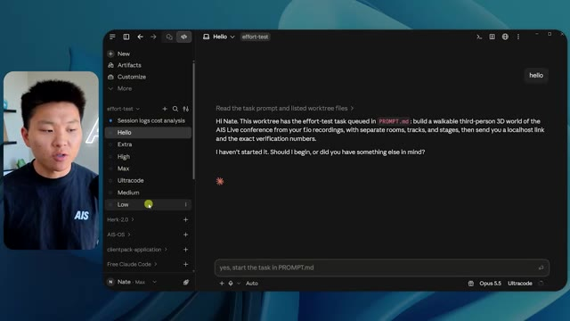
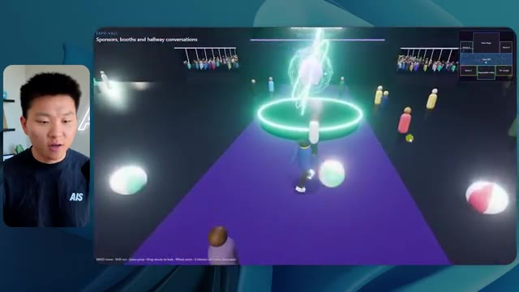
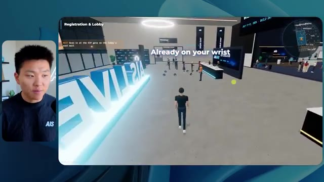

# 🎬 How to Actually Build & Sell Software with AI as a Non-Techie

> **Chaîne** : [Nate Herk | AI Automation](https://www.youtube.com/@nateherk/featured)  
> **Lien YouTube** : [https://www.youtube.com/watch?v=l8ywUsEJ2XQ](https://www.youtube.com/watch?v=l8ywUsEJ2XQ)  
> **Date de publication** : 20261002  
> **Durée** : 01:09:33  
> **Identifiant vidéo** : `l8ywUsEJ2XQ`  
> **Transcription & Analyse** : `whisper-v3-large-turbo+gemini-3.5-flash-lite`  

---

## 📌 Synthèse Exécutive & Outils

### 💡 Résumé

Dans cette vidéo de la chaîne Nate Herk | AI Automation, l'analyste explore en profondeur les capacités d'**Opus 5.5** — un modèle d'IA de pointe salué pour sa puissance et son coût abordable — à travers une expérimentation rigoureuse sur les niveaux d'effort (de faible à *code ultra*). L'objectif fixé à l'agent IA était extrêmement ambitieux : transformer un dossier brut de 105 gigaoctets de vidéos issues d'un événement virtuel (AIS Live sur Frame.io) en un monde 3D interactif, explorable en vue à la troisième personne, reproduisant fidèlement une conférence tech physique avec ses différentes scènes, pistes, salles et identités de marque. 

L'expérimentation démontre des écarts spectaculaires entre les itérations. En mode *faible*, l'agent a produit un résultat en 16 minutes pour environ 3,91 $, mais truffé de bugs visuels majeurs, d'éléments manquants et d'une esthétique non conforme à l'image de marque. En revanche, le passage au mode *moyen* a révélé un bond qualitatif impressionnant (durant 1 h 13 pour 12,44 $) : intégration de la palette de couleurs officielle, personnages dotés de comportements dynamiques, intégration parfaite des flux vidéo en direct, et modélisation réaliste des stands et des scènes. 

Fait remarquable, pour ces deux niveaux d'effort, l'agent a fonctionné de manière totalement autonome, effectuant des dizaines de vérifications dans un navigateur sans poser la moindre question à l'utilisateur. La vidéo met également en lumière le goulet d'étranglement classique du développement assisté par IA — le passage du code local au déploiement en ligne — résolu par le sponsor Hostinger.

### 🛠️ Outils, Modèles & Logiciels Présentés

* **Opus 5.5** : Modèle d'IA central de la démonstration, réputé pour sa grande intelligence, sa rapidité, son faible coût et ses capacités avancées de génération de code et d'exécution d'agents.
* **Claude Code** : Environnement de programmation et outil d'ingénierie logicielle utilisé pour orchestrer et exécuter les agents.
* **Frame.io** : Plateforme cloud de gestion multimédia utilisée pour stocker le dossier massif de 105 gigaoctets d'enregistrements vidéo de l'événement.
* **AIS Live** : Événement tech virtuel dont les archives vidéo ont servi de matière première pour la création du monde 3D.
* **Cursor / VS Code** : Éditeurs de code mentionnés comme environnements de travail standard pour le développement assisté par IA.
* **Hostinger Connector** : Extension gratuite pour éditeurs de code permettant d'intégrer directement un compte d'hébergement pour un déploiement web rapide.

### 🔑 Points Clés & Enseignements Stratégiques

* **L'impact critique du réglage de l'effort** : Modifier le niveau d'effort d'Opus 5.5 ne change pas seulement la durée de traitement, mais modifie radicalement la structure, la logique et la qualité esthétique du code produit.
* **Autonomie totale des agents** : Tant au niveau *faible* qu'au niveau *moyen*, l'agent a exécuté l'intégralité du prompt sans poser une seule question, démontrant une formidable capacité d'interprétation contextuelle.
* **Gestion automatisée des ressources multimédias** : L'IA est capable d'analyser un volume massif de données (105 Go sur Frame.io) et d'en extraire la sémantique pour structurer un parcours utilisateur cohérent (jours, pistes, scènes, ateliers).
* **Attention aux détails de l'identité visuelle** : Le mode *faible* a échoué à respecter la charte graphique, tandis que le mode *moyen* a réussi à intégrer les palettes de couleurs, les logos et le badge nominatif de l'utilisateur.
* **Complexité de la simulation physique 3D** : Générer un environnement 3D explorable génère des défis inhérents (bugs d'affichage des PNJ, disparitions d'avatars) qui nécessitent des paliers d'effort supérieurs pour être résolus.
* **Rapport coût-bénéfice des API** : Un agent complexe fonctionnant pendant plus d'une heure (mode moyen) représente un coût de calcul par API modique (12,44 $ pour près de 500 000 tokens), ce qui boulevient l'économie du développement logiciel.
* **Automatisation des vérifications visuelles** : L'utilisation de 22 à 23 vérifications automatisées (ouverture de navigateurs pour tester le rendu) montre que les agents modernes s'auto-testent et valident leur propre travail en temps réel.
* **Le fossé du déploiement ("Deployment Gap")** : La création d'un logiciel fonctionnel en local ne résout pas le problème de sa mise en ligne, soulignant la nécessité d'intégrer des outils de publication instantanée dans le workflow.
* **Recommandation officielle d'Anthropic** : Il est conseillé de débuter les prompts complexes au niveau de complexité *moyen* avant d'ajuster les curseurs vers le haut ou le bas selon les besoins spécifiques de performance et de fidélité.
* **Synergie entre IA générative et environnements de production** : Combiner des agents de code de pointe avec des connecteurs d'hébergement universels permet à des non-développeurs de concevoir, tester et publier des applications logicielles complexes en un temps record.

---

## ⏱️ Chronologie & Transcription Complète Audio & Visuelle (Mot pour Mot)

### ⏱️ `[00:00:00 - 00:00:20]` | Segment #01

**🔊 Audio (Transcription Intégrale Mot pour Mot en Français) :**
> Opus 5.5, Opus 5.5, Opus 5.5, Opus 5.5, Opus 5.5. Ce modèle est littéralement partout et pour de très bonnes raisons. Il est intelligent, il est bon marché, il a un goût incroyable, c'est un modèle d'IA incroyable. Mais avec chaque modèle d'IA, vous avez le choix de l'effort, que ce soit faible, moyen, élevé, extra, max ou code ultra.

**👁️ Analyse Visuelle d'Écran (gemini-3.5-flash-lite) :**
**Interface & Outils** : Twitter (X)

**Contenu textuel & Code** : Publication Twitter avec une vidéo intégrée illustrant le sujet abordé.

**Action / Démonstration** : Présentation d'un exemple concret de création assistée par IA sur les réseaux sociaux.

*⏱️ 00:00:05 — Capture d'écran d'un tweet montrant une vidéo générée par IA représentant un paysage côtier tropical.*

---

### ⏱️ `[00:00:20 - 00:00:38]` | Segment #02

**🔊 Audio (Transcription Intégrale Mot pour Mot en Français) :**
> Donc, dans cette vidéo, j'ai donné exactement le même prompt à Opus 5.5 et je l'ai exécuté à chaque niveau d'effort, et nous allons comparer les résultats. Nous examinerons la qualité de toutes les différentes sorties réelles, mais nous allons aussi regarder combien de temps chacun d'eux a fonctionné, combien cela nous a coûté si c'était une facturation par API, le nombre total de tokens, combien de vérifications ils ont exécutées, et combien de questions ils m'ont réellement posées tout au long du processus.

**👁️ Analyse Visuelle d'Écran (gemini-3.5-flash-lite) :**
**Interface & Outils** : Application de tableau blanc / interface de comparaison de données (type Canvas).

**Contenu textuel & Code** : Tableau comparatif des niveaux d'effort de l'IA (Low, Medium, High, Extra, Max, Ultracode) avec des lignes de métriques (Run time, API cost, Total tokens, etc.).

**Action / Démonstration** : Présentation du tableau comparatif analysant les différents niveaux d'effort d'Opus 5.5.

*⏱️ 00:00:29 — Capture montrant un tableau comparatif avec les niveaux d'effort (Low, Medium, High, Extra, Max, Ultracode) et des métriques floutées (Run time, API cost, Total tokens, Checks, Questions asked).*

---

### ⏱️ `[00:00:39 - 00:00:58]` | Segment #03

**🔊 Audio (Transcription Intégrale Mot pour Mot en Français) :**
> Et les résultats que nous avons obtenus ne correspondent pas du tout à ce que j'attendais, donc j'ai hâte de partager cela avec vous les gars. Ne perdons pas de temps et entrons directement dans le vif du sujet. D'accord, alors plongeons directement là-dedans. Je veux commencer simplement en vous montrant le prompt réel que nous avons utilisé et que nous avons donné à chacun de ces différents agents. Je vais aller dans les fichiers ici, et nous allons ouvrir ce fichier markdown de prompt, et je vais vous montrer ce que nous avons obtenu. Voici donc le slash goal que j'ai fourni.

**👁️ Analyse Visuelle d'Écran (gemini-3.5-flash-lite) :**
**Interface & Outils** : Interface de type éditeur / outil IA (probablement Cursor ou un IDE spécialisé) avec panneau latéral de navigation et zone de discussion/prompt principale.

**Contenu textuel & Code** : Texte du prompt affiché à l'écran : "Hi Nate. This worktree has the effort-test task queued in PROMPT.md : build a walkable third-person 3D world of the AIS Live conference..."

**Action / Démonstration** : Navigation et présentation de l'interface de développement par le créateur.

*⏱️ 00:00:48 — Interface d'un outil de développement avec un assistant IA (style éditeur de code/terminal étendu), affichant un prompt concernant un monde 3D et une petite incrustation vidéo du présentateur sur le côté gauche.*

---

### ⏱️ `[00:00:58 - 00:01:34]` | Segment #04

**🔊 Audio (Transcription Intégrale Mot pour Mot en Français) :**
> J'ai dit : tu dois me créer un monde en 3D qui est une conférence tech réaliste dans laquelle je peux me promener en vue à la troisième personne. Tu vas regarder ce dossier, qui contient mes éléments d'enregistrement d'événements provenant d'AIS Live. Et ce dossier est un dossier Frame.io de 105 gigaoctets d'enregistrements vidéo. C'était un événement complètement virtuel. Tout a été enregistré et tous les enregistrements sont ici même. J'ai dit, ton objectif est de prendre cet événement et de le transformer en un monde 3D explorable qui me donne l'impression d'avoir réellement assisté à une vraie conférence en personne avec différentes salles, différentes pistes, différentes scènes, bla, bla, bla. N'hésite pas à utiliser key.ai si tu as besoin de générer des images ou des vidéos. Et tu peux aussi utiliser n'importe quoi d'autre dans mon projet Herc 2, qui est comme mon système d'exploitation IA. J'ai dit,

**👁️ Analyse Visuelle d'Écran (gemini-3.5-flash-lite) :**
**Interface & Outils** : Éditeur de code (type VS Code / Cursor) et interface web Frame.io

**Contenu textuel & Code** : Fichier Markdown de prompt pour l'IA demandant la création d'une conférence tech 3D à partir d'un dossier Frame.io de 105 Go.

**Action / Démonstration** : Présentation du prompt de configuration et visualisation des dossiers de ressources vidéo de l'événement.

*⏱️ 00:01:07 — Éditeur de code affichant le fichier PROMPT.md avec les instructions pour créer un monde 3D interactif et le lien Frame.io.*

*⏱️ 00:01:16 — Interface de partage Frame.io montrant le dossier "Sep 22, 2026" contenant les éléments d'enregistrement d'un poids total de 105,69 Go.*

*⏱️ 00:01:25 — Retour sur l'éditeur de code affichant le fichier PROMPT.md détaillant les consignes pour l'agent IA.*

---

### ⏱️ `[00:01:34 - 00:02:08]` | Segment #05

**🔊 Audio (Transcription Intégrale Mot pour Mot en Français) :**
> tu seras jugé sur la créativité, le design, la physique et la sensation générale lorsque j'explorerai le monde 3D que tu as construit. Et c'était pratiquement la fin des instructions. Donc comme vous pouvez le voir sur ce côté gauche, j'ai exécuté ceci à travers tous les différents niveaux d'effort. Commençons par le niveau bas et progressons jusqu'à code ultra. Très bien. Donc ici nous avons le résultat du niveau bas. Ouvrons ceci et jetons un œil. Nous avons donc AIS live, le sommet des services IA en personne enfin, et nous avons pu cliquer autour. Tout d'abord, on ne sent pas vraiment l'identité de la marque. Genre, ce n'ego pas le logo d'IS Live. Ce ne sont même pas nos couleurs. Donc je n'aime pas trop ça, mais entrons ici. D'accord. C'est beaucoup trop lumineux. Euh, nous avons une carte en haut à droite. Nous avons une ville par ici. Je ne peux pas dire quelle ville c'est

**👁️ Analyse Visuelle d'Écran (gemini-3.5-flash-lite) :**
**Interface & Outils** : Interface de l'outil de développement d'agent IA (style client Cursor/Claude).

**Contenu textuel & Code** : Texte du prompt dans la zone principale : "Hi Nate. This worktree has the effort-test task queued in PROMPT.md : build a walkable third-person 3D world..." et liste des sessions/niveaux d'effort à gauche.

**Action / Démonstration** : Navigation ou sélection des différents niveaux d'effort dans le panneau latéral de l'application pour examiner les résultats des tests.

*⏱️ 00:01:42 — Interface d'une application d'agent IA montrant différents niveaux d'effort (Hello, Extra, High, Max, Ultracode, Medium, Low) dans le panneau latéral gauche et une conversation avec un prompt concernant la création d'un monde 3D.*

---

### ⏱️ `[00:02:08 - 00:02:40]` | Segment #06

**🔊 Audio (Transcription Intégrale Mot pour Mot en Français) :**
> C'est. D'accord. C'est Chicago, ce qui est plutôt cool parce que tu sais, j'habite à Chicago, mais bref, en haut à droite, on peut voir une carte. Nous avons un hall d'accueil. Nous avons un hall d'exposition. Nous avons un salon VIP, la scène principale. La carte montre aussi où se trouve chaque autre personne et cela se synchronise en direct. Donc on peut voir l'enregistrement. On peut voir le premier jour, la keynote de l'hyper agent, le débriefing en direct. Cool. Donc ça connaît réellement l'programme et puis il y a le deuxième jour. Donc il a trouvé ça, c'est bien. Nous avons ces petites boules ici que je peux espérer botter. D'accord. Le visage, oh, regarde ça. Si je vais par ici, toutes les personnes disparaissent tout simplement. Très mauvais. Très mauvais. D'accord. Donc voyons voir. Est-ce que je peux sprinter ? D'accord.

**👁️ Analyse Visuelle d'Écran (gemini-3.5-flash-lite) :**
**Interface & Outils** : Application web de salon virtuel / métavers interactif avec mini-carte de navigation.

**Contenu textuel & Code** : Menus de navigation du salon virtuel, programme de conférence, plan des différentes zones (Lobby, Expo Hall, VIP).

**Action / Démonstration** : Navigation et exploration de l'espace virtuel 3D avec les différents stands et salles de conférence.

*⏱️ 00:02:16 — Vue d'une plateforme virtuelle interactive affichant un espace de type hall d'accueil avec des avatars et une mini-carte en haut à droite.*

*⏱️ 00:02:24 — Vue du lobby de la plateforme virtuelle affichant le programme du premier jour (Day 1) sur un panneau d'affichage.*

*⏱️ 00:02:32 — Vue de l'expo hall de la plateforme virtuelle montrant un espace d'exposition avec des avatars et des animations lumineuses.*

---

### ⏱️ `[00:02:40 - 00:03:04]` | Segment #07

**🔊 Audio (Transcription Intégrale Mot pour Mot en Français) :**
> Je peux avancer un peu plus vite. Je vais d'abord aller par ici. Il y a des produits dérivés, euh, un sweat à capuche certifié AIS plus. D'accord. Donc il y a les vrais stands qu'on avait dans l'événement virtuel. On avait des stands. Donc c'est plutôt cool. Un petit endroit pour prendre des photos. La salle C. En ce moment, nous avons Tangy Frederick qui anime un atelier. D'accord. Mais ce n'est pas une vidéo. Comme vous pouvez le voir, c'est juste une image. Elle ne bouge pas. C'est donc juste une image. Ces gens sont en train de disparaître. Ce doivent être des fantômes. Allons par ici dans la salle A.

**👁️ Analyse Visuelle d'Écran (gemini-3.5-flash-lite) :**
**Interface & Outils** : Environnement virtuel 3D interactif (type metavers ou plateforme de conférence virtuelle).

**Contenu textuel & Code** : Textes explicatifs d'intégration d'API et graphiques d'exposition virtuelle.

**Action / Démonstration** : Exploration et navigation d'un avatar dans le monde virtuel pour visiter les stands et ateliers.

---

### ⏱️ `[00:03:04 - 00:03:30]` | Segment #08

**🔊 Audio (Transcription Intégrale Mot pour Mot en Français) :**
> Nous avons Liberty White. D'accord. Très sympa. Vos 30 premiers jours en automatisation. Encore une fois, c'est juste une image fixe et les gens ont des bugs d'affichage. Donc ce n'est pas très bon ici. Je vais aller sur la scène principale et voir ce que nous avons. D'accord, sympa. Donc nous avons une scène principale. Les gens ont des bugs d'affichage. Vraiment beaucoup. Ce n'est vraiment pas terrible. Notre vidéo est en train de bouger. Genre, j'ai vu mon visage ici et j'ai vu celui de Devin, mais maintenant ils ont disparu. Donc je ne sais pas ce qui s'est passé. D'accord. On dirait que c'est plutôt un diaporama. Rien n'est vraiment diffusé pour l'instant. Quoi qu'il en soit, entrons ici.

**👁️ Analyse Visuelle d'Écran (gemini-3.5-flash-lite) :**
**Interface & Outils** : Application de métavers ou plateforme de conférence virtuelle 3D (style Gather.town ou similaire).

**Contenu textuel & Code** : Interface de navigation 3D avec affichage textuel de l'événement en haut et mini-carte de localisation en haut à droite.
[DESC_IMAGE_1] Navigation d'un avatar dans un espace virtuel 3D représentant un événement en ligne.

**Action / Démonstration** : Explications face caméra et démonstration conceptuelle.

*⏱️ 00:03:11 — Vue dans un espace virtuel 3D montrant une salle de type atelier (Workshop Room A - Foundation track) avec un avatar au premier plan.*

*⏱️ 00:03:17 — Navigation dans un auditorium virtuel rempli d'avatars de participants assistant à un atelier sur les agents IA.*

*⏱️ 00:03:24 — Vue de la scène principale d'une conférence virtuelle (AIS Live - AI Services Summit) avec un grand écran central et des avatars.*

---

### ⏱️ `[00:03:30 - 00:03:58]` | Segment #09

**🔊 Audio (Transcription Intégrale Mot pour Mot en Français) :**
> Nous avons d'autres stands. Nous avons hyper agent. Nous avons Claude Code. Nous avons plus de goodies. La salle B, c'est Dave Ebelor. Je suppose que c'est exactement la même chose. Nous avons du café. Et ensuite, je suppose que le salon VIP, c'est accès VIP uniquement. C'est plutôt cool, mais il n'y a vraiment rien qui se passe ici. Cet écran est beaucoup trop lumineux. D'accord. Donc je pense que vous comprenez l'ambiance qu'on obtient ici d'Opus 5.5 en effort faible. Et c'est là que les choses deviennent intéressantes. Combien de temps pensez-vous que cela a duré ? Combien de temps ? Celui-ci a duré 16 minutes et 43 secondes. Combien pensez-vous que cela a coûté ?

**👁️ Analyse Visuelle d'Écran (gemini-3.5-flash-lite) :**
**Interface & Outils** : Application de tableau blanc / interface de diagrammes en ligne (Opus 5.5 Efforts).

**Contenu textuel & Code** : Tableau comparatif avec les critères : Run time, API cost, Total tokens, Checks, Questions asked.

**Action / Démonstration** : Navigation et présentation des différents niveaux d'effort et métriques sur un tableau de planification.

*⏱️ 00:03:51 — Interface de tableau blanc ou de diagramme avec un tableau comparatif comportant les colonnes Low, Medium, High, Extra, Max et Ultracode.*

---

### ⏱️ `[00:03:58 - 00:04:26]` | Segment #10

**🔊 Audio (Transcription Intégrale Mot pour Mot en Français) :**
> 3,91 dollars si c'était une facturation par API. J'utilise évidemment mon abonnement ici, mais nous allons simplement calculer cela en facturation par API. Le total des jetons était de 191 000. Il a effectué 22 vérifications. Donc la vérification, 22 fois il a ouvert le navigateur et a exécuté différentes sortes de vérifications. Donc 22 catégories de vérifications. Et combien de questions m'a-t-il posées ? Il m'a posé un total de zéro question tout au long de cette invite de commande d'objectif. D'accord. Alors, ouvrons l'effort moyen et voyons ce que nous avons. D'accord, c'est parti. Effort moyen. Nous avons Nate Herc. Nous avons mon badge. C'est la marque de la vie de l'IA.

**👁️ Analyse Visuelle d'Écran (gemini-3.5-flash-lite) :**
**Interface & Outils** : Outil de tableau blanc / diagramme (ex: Excalidraw, avec le titre 'Opus 5.5 Efforts' en haut à gauche)

**Contenu textuel & Code** : Tableau avec des colonnes 'Low', 'Medium', 'High', 'Ex' et des lignes 'Run time' (16m 43s), 'API cost' ($3.91), 'Total tokens' (191.3K), 'Checks', 'Questions asked'.

**Action / Démonstration** : Le présentateur explique et commente les coûts et les statistiques d'utilisation affichés dans le tableau pour le niveau d'effort bas.

*⏱️ 00:04:05 — Un tableau affiché sur un outil de type tableau blanc interactif ou application de prise de notes (ex: Excalidraw), montrant les métriques de performance et de coût pour le niveau 'Low' (Run time : 16m 43s, API cost : $3.91, Total tokens : 191.3K, Checks, Questions asked). Le présentateur apparaît dans une petite fenêtre incrustée à gauche.*

---

### ⏱️ `[00:04:26 - 00:04:46]` | Segment #11

**🔊 Audio (Transcription Intégrale Mot pour Mot en Français) :**
> Donc ça a déjà l'air un petit peu mieux. Ça ressemble à nos palettes de couleurs qui ont utilisé nos directives de marque. Premier jour de construction, deuxième jour de gain, VIP. Cool. D'accord. Je vais entrer dans le lieu. D'accord. Waouh. Une ambiance un peu similaire. C'est en arrière-plan. Ça ne ressemble pas à Chicago, n'est-ce pas ? Non, ça ressemble à un, honnêtement, ça ressemble à une ville imaginaire. Quoi qu'il en soit, c'est drôle qu'ils aient décidé de faire ça. Voyons si je peux avancer un peu plus vite. Oh, waouh.

**👁️ Analyse Visuelle d'Écran (gemini-3.5-flash-lite) :**
**Interface & Outils** : Interface web interactive et monde virtuel 3D de type jeu vidéo ou métavers.

**Contenu textuel & Code** : Écran d'accueil de l'application avec le texte "Welcome to AIS Live", des informations sur les sessions et des badges utilisateurs.

**Action / Démonstration** : Le présentateur consulte l'écran d'accueil puis entre dans le lieu virtuel de l'événement en 3D.

*⏱️ 00:04:31 — Interface d'accueil de l'événement virtuel "AIS Live" avec un badge personnalisé au nom de Nate Herk et des options de navigation.*

*⏱️ 00:04:41 — Vue à la première personne ou en 3D dans le lieu virtuel "AIS Live", montrant des avatars et un décor intérieur avec vue sur une ville la nuit.*

---

### ⏱️ `[00:04:46 - 00:05:21]` | Segment #12

**🔊 Audio (Transcription Intégrale Mot pour Mot en Français) :**
> Les gens interagissent avec moi. Regardez. Si je m'approche de ce type, il vient de lever le bras. Bon, maintenant il ne veut plus du tout avoir affaire à moi. Mais tous ces petits robots ici doivent prendre des décisions. Je ne sais pas s'ils utilisent Jev. C'est sûr que non. Je ne le lui ai pas dit. En fait, ma clé Jev est à l'arrière. Je ne sais pas. Peut-être qu'il l'a utilisée. Quoi qu'il en soit, nous pouvons voir ici que nous avons la salle d'atelier C, le laboratoire des agents. Sympa. Donc celui-ci est en fait en train d'être exécuté. Vous pouvez voir qu'il s'agit d'une vraie vidéo lue par Tangy. Tout le monde ici est en train de travailler sur un ordinateur portable. Ils ne buguent pas. C'est plutôt cool. De plus, mon badge est sur ma poitrine, ce qui est plutôt cool. Je peux venir par ici. Nous avons une carte en haut à droite, comme vous pouvez le voir, mais je peux venir par ici. Nous avons un

**👁️ Analyse Visuelle d'Écran (gemini-3.5-flash-lite) :**
**Interface & Outils** : Environnement virtuel 3D / Metavers

**Contenu textuel & Code** : Avatars numériques dans un espace virtuel d'apprentissage ou de réunion.

**Action / Démonstration** : Navigation et exploration d'un environnement virtuel 3D en vue à la première ou troisième personne.

---

### ⏱️ `[00:05:21 - 00:05:47]` | Segment #13

**🔊 Audio (Transcription Intégrale Mot pour Mot en Français) :**
> halle d'exposition. C'est là que nous avons le stand Glido. Et ça diffuse en ce moment. Oui, ça diffuse la vidéo de nous en train de parler de Glido. Ça diffuse la vidéo d'Ed et moi parlant de notre programme de certification. Nous avons le logo AIS Plus ici à l'arrière, qui est un peu mal placé. Ce sont les diapositives des conférenciers et les points clés. Alors waouh, ce sont toutes les ressources que nous avons distribuées après l'événement. Elles sont toutes là aussi. Nous pouvons voir que nous avons un projecteur sur la communauté. C'est donc Aiden qui parle de l'accord qu'il a conclu et ça joue en direct. Ces gens regardent.

**👁️ Analyse Visuelle d'Écran (gemini-3.5-flash-lite) :**
**Interface & Outils** : Environnement virtuel 3D / Metaverse

**Contenu textuel & Code** : Présentation virtuelle avec stands et diaporamas affichés sur les murs.

**Action / Démonstration** : Navigation et visite d'une exposition virtuelle en 3D.

---

### ⏱️ `[00:05:47 - 00:06:21]` | Segment #14

**🔊 Audio (Transcription Intégrale Mot pour Mot en Français) :**
> Ils sont plutôt engagés. On a l'hyper agent. C'était, c'est ce que je voulais dire. Si vous avez vu ces gens lever les bras en disant salut, c'était plutôt marrant. Regardez, regardez, le voilà qui recommence. Bref. Bon. Où est-ce que je suis maintenant ? Maintenant, je suis dans le hall principal. On a un bar à café. On a un grand logo, qui est le vrai logo. C'est trop lumineux, mais on a le logo. On peut voir si on peut entrer ici dans le parcours des fondations. On a Sabrina Romanov et Liberty White. Donc différentes formations juste là. On peut entrer dans cette salle. C'est le parcours avancé. Alors qu'est-ce qui se passe ici. On a Dave Ebelar et Saman qui parlent de différentes choses là-dedans. Et maintenant, allons jeter un œil à la scène principale. Oh, attendez, il y a une vidéo de moi là-haut. Est-ce que c'est genre un VIP

**👁️ Analyse Visuelle d'Écran (gemini-3.5-flash-lite) :**
**Interface & Outils** : Application metaverse / monde virtuel 3D interactif

**Contenu textuel & Code** : Environnement virtuel 3D avec interface de type jeu vidéo et mini-carte de navigation

**Action / Démonstration** : Exploration et déplacement d'un avatar dans l'espace virtuel du metaverse

---

### ⏱️ `[00:06:21 - 00:06:50]` | Segment #15

**🔊 Audio (Transcription Intégrale Mot pour Mot en Français) :**
> section ? Ouais, on va aller voir ça dans une minute. Mais bref, voici la scène principale. Ça a l'air vraiment, vraiment bien. On a une grande scène. On a genre quatre personnes assises ici. On a les trois écrans d'Alex là-haut avec "hyper agent". Est-ce que j'ai le droit de monter sur scène ? Oh, et ça me laisse monter sur scène. D'accord. C'est plutôt sympa. Bon les gars, faisons un selfie. Laissez-moi prendre tout le monde en arrière-plan. Venez par ici. Bref, c'est vraiment, vraiment cool. Toutes les places ne sont pas occupées par contre. Donc il va falloir qu'on travaille là-dessus. Mais bref, je vais y retourner en courant pour voir ce que c'était que cette section VIP. D'accord. Salon VIP. J'ai l'impression que c'est comme un salon d'aéroport ou un truc du genre.

**👁️ Analyse Visuelle d'Écran (gemini-3.5-flash-lite) :**
**Interface & Outils** : Environnement virtuel 3D interactif / plateforme de conférence en ligne.

**Contenu textuel & Code** : Interface utilisateur affichant les détails de la session "Hyperagent Keynote" avec Alex McDonnell et mini-carte de navigation.

**Action / Démonstration** : Navigation et exploration d'un événement virtuel en 3D par l'avatar de l'utilisateur.

*⏱️ 00:06:28 — Vue d'un espace virtuel en 3D représentant une grande salle de conférence avec des écrans affichant "Hyperagent Keynote" et des spectateurs assis.*

*⏱️ 00:06:36 — Vue de dos d'un avatar se déplaçant sur la scène virtuelle face à des sièges et des écrans.*

*⏱️ 00:06:43 — Vue en plongée d'un avatar marchant dans l'allée centrale d'un grand auditoire virtuel rempli de participants.*

---

### ⏱️ `[00:06:51 - 00:07:14]` | Segment #16

**🔊 Audio (Transcription Intégrale Mot pour Mot en Français) :**
> Ok, super. Donc maintenant nous avons les sessions VIP ici. Une FAQ VIP avec Nate, lecture vidéo en direct ici. Très, très cool. Et nous avons comme un bar ou quelque chose comme ça. Génial. Je dirais que c'est un très bon résultat. Maintenant, en ce qui concerne les statistiques ici, celle-ci a pris une heure et 13 minutes à s'exécuter. Cela nous aurait coûté 12 dollars et 44 cents. Elle a utilisé 490 000 jetons et elle a effectué 23 vérifications.

**👁️ Analyse Visuelle d'Écran (gemini-3.5-flash-lite) :**
**Interface & Outils** : Application de salon virtuel en 3D et tableau de bord analytique (Opus 5.5 Efforts).

**Contenu textuel & Code** : Métriques de performance : Run time (16m 43s), API cost ($3.91), Total tokens (191.3K), Checks (22), Questions asked (0).

**Action / Démonstration** : Présentation et navigation dans l'espace virtuel VIP puis analyse des statistiques d'exécution.

*⏱️ 00:06:56 — Vue d'un espace virtuel interactif ou d'un salon VIP avec des avatars et un grand écran affichant une vidéo en direct avec des sous-titres.*

*⏱️ 00:07:02 — Tableau de bord de statistiques ou de performances affichant des métriques telles que le temps d'exécution (Run time), le coût API et le nombre total de jetons.*

---

### ⏱️ `[00:07:14 - 00:07:48]` | Segment #17

**🔊 Audio (Transcription Intégrale Mot pour Mot en Français) :**
> Et il nous a posé un total de zéro question une fois de plus. Très bien, passons à élevé. C'était déjà un résultat plutôt correct et Anthropic eux-mêmes dans leur vidéo sur comment prompter Opus 5.5, ou désolé, pas une vidéo, un article. Ils ont dit de commencer simplement par moyen et de l'ajuster vers le haut ou vers le bas si nécessaire. C'était donc un résultat moyen. Passons à élevé et voyons ce qu'on a obtenu. Très rapidement, les gars, je dois prendre une seconde pour vous parler du sponsor de la vidéo d'aujourd'hui, Hostinger. Donc ces deux modèles viennent de me créer une version fonctionnelle de la même chose. Et maintenant, je me retrouve exactement là où je finis toujours, avec un projet terminé sur mon ordinateur portable et aucun moyen rapide de le mettre en ligne. Et c'est précisément le fossé que comble le connecteur d'Hostinger. C'est une extension gratuite

**👁️ Analyse Visuelle d'Écran (gemini-3.5-flash-lite) :**
**Interface & Outils** : Tableau de bord de type canvas / Interface de développement et IDE

**Contenu textuel & Code** : Tableau comparatif des métriques (Run time : 16m43s, 1h13m ; API cost : $3.91, $12.44 ; Tokens : 191.3K, 419.2K) et prompt de construction d'une application ROI calculator.

**Action / Démonstration** : Analyse comparative des coûts et performances d'exécution des différents niveaux de l'agent IA, puis configuration et lancement d'une tâche de génération de code.

*⏱️ 00:07:22 — Tableau de comparaison des performances d'Opus 5.5 selon différents niveaux d'effort (Low, Medium, High, Extra), affichant le temps d'exécution, le coût API, les tokens et le nombre de questions posées.*

*⏱️ 00:07:39 — Interface de développement avec un éditeur affichant les détails d'un projet de calculatrice ROI pour agence et l'exécution de l'agent IA.*

---

### ⏱️ `[00:07:48 - 00:08:23]` | Segment #18

**🔊 Audio (Transcription Intégrale Mot pour Mot en Français) :**
> pour votre éditeur qui intègre votre compte Hostinger dans l'outil de programmation que vous utilisez déjà. Que ce soit VS Code, Cursor, Cloud Code, Codex, et j'en passe. Vous vous connectez une seule fois en un clic, et à partir de là, votre agent peut déployer le site, y pointer un domaine, configurer les enregistrements DNS et vérifier votre VPS sans que vous n'ayez jamais à quitter l'éditeur. Ainsi, peu importe celui de ces outils que vous finirez par préférer, ce qu'il a construit se trouve à quelques minutes d'une vraie URL sur un hébergement géré. Le connecteur est gratuit avec toutes les formules d'hébergement, donc si vous avez toujours besoin de l'hébergement sous-jacent, profitez de la formule illimitée grâce au lien dans la description et utilisez le code NATEHERK pour obtenir 10 % de réduction. Cela inclut également un nom de domaine gratuit et un e-mail professionnel pour un an. Et c'est toujours le moyen le plus économique que j'ai trouvé pour obtenir quelque

**👁️ Analyse Visuelle d'Écran (gemini-3.5-flash-lite) :**
**Interface & Outils** : Interface web de gestion Hostinger (panneau de gauche) et interface Claude Code (panneau de droite) avec la webcam du présentateur en bas à droite.

**Contenu textuel & Code** : Statut de connexion ("Connected", "VIA OAUTH", Node.js 24.13.0) et outils disponibles (Websites, Domains, Subscriptions & Payments, Email Marketing).

**Action / Démonstration** : Configuration et affichage de l'intégration Hostinger avec l'assistant Claude Code dans l'IDE.

*⏱️ 00:07:57 — Interface montrant la connexion entre Hostinger et un IDE, avec l'outil Claude Code affiché sur le panneau de droite.*

---

### ⏱️ `[00:08:23 - 00:08:47]` | Segment #19

**🔊 Audio (Transcription Intégrale Mot pour Mot en Français) :**
> tu as construit sur une vraie URL. Donc revenons à la vidéo. D'accord. Encore une fois, très, très marqué par la marque. C'est un écran de chargement encore mieux que le précédent. Nous avons ce petit effet sympa en arrière-plan. Nous avons le logo. Nous allons entrer dans le lieu. D'accord. Nous y voilà. Ça a l'air plutôt bien. Nous commençons dehors et vous pouvez voir que nous avons ces drapeaux pour tous les intervenants, Wyatt, Casper, Alex, Ed, Aiden, Sabrina, Liberty. C'est plutôt cool. Nous avons des blocs en direct ici.

**👁️ Analyse Visuelle d'Écran (gemini-3.5-flash-lite) :**
**Interface & Outils** : Application web interactive en 3D (monde virtuel de type métavers).

**Contenu textuel & Code** : Interface utilisateur virtuelle avec mini-carte, indicateur de position, et bannières informatives.

**Action / Démonstration** : Connexion au monde virtuel 3D et navigation de l'avatar dans la place AIS Live.

*⏱️ 00:08:29 — Écran de chargement et d'accueil de la plateforme virtuelle AIS Live avec les contrôles clavier/souris affichés.*

*⏱️ 00:08:35 — Entrée de l'utilisateur dans l'univers virtuel en 3D représentant une place avec des avatars et des bâtiments.*

*⏱️ 00:08:41 — Exploration de l'espace virtuel avec des bannières verticales affichant les noms des intervenants (speakers).*

---

### ⏱️ `[00:08:47 - 00:09:23]` | Segment #20

**🔊 Audio (Transcription Intégrale Mot pour Mot en Français) :**
> Il a pris cette photo de moi, votre hôte, Nate Herc, John, Dave, Nate Herc. Voilà. OK. Les portes. Génial. Ce sont des portes coulissantes automatiques en verre. J'adore ça. On peut voir l'enregistrement VIP. On peut voir l'admission générale. On peut venir par ici et on peut découvrir l'expo avec différents stands, le projecteur sur la communauté. Vous pouvez aussi voir qu'en haut à gauche, j'ai un passeport. Donc c'est comme, ça montrera combien d'endroits j'ai visités. Tout cela est une lecture réelle. Nous avons un mur de ressources avec tous les différents conférenciers. Ils ont aussi une session de réseautage par ici. Donc je vais venir très vite et voir de quoi il s'agit. Nous avons donc le bar à cold brew AIS. Nous avons différents membres de la communauté qui ont été mis en avant ou en valeur.

**👁️ Analyse Visuelle d'Écran (gemini-3.5-flash-lite) :**
**Interface & Outils** : Application web 3D / Monde virtuel interactif

**Contenu textuel & Code** : Environnement virtuel 3D simulant une conférence en ligne avec des zones d'enregistrement et des halls d'exposition

**Action / Démonstration** : Navigation d'un avatar à l'intérieur de l'espace virtuel de la conférence

*⏱️ 00:08:56 — Vue principale de l'espace virtuel avec la scène principale et les comptoirs d'enregistrement.*

*⏱️ 00:09:05 — Exploration de l'expo hall virtuel avec des stands et des avatars interactifs.*

*⏱️ 00:09:14 — Vue en mouvement dans le hall d'entrée virtuel avec de nombreux avatars de participants.*

---

### ⏱️ `[00:09:23 - 00:09:56]` | Segment #21

**🔊 Audio (Transcription Intégrale Mot pour Mot en Français) :**
> Nous avons l'aile VIP. Attends, quoi ? Récupère un bracelet. Oh, je dois vraiment aller chercher le bracelet. D'accord. Laisse-moi m'enregistrer rapidement. Le bracelet est déjà mis. Attends, quoi ? D'accord. Oh, d'accord. Maintenant, les portes se sont ouvertes pour moi. Cool. Je peux entrer ici. Oh, ça mène juste à la scène principale. Salon VIP. Il y a une séance de questions-réponses en cours. Ça a l'air très cool. Je veux dire, je suis très impressionné par la façon dont il est capable de faire ça. Waouh. D'accord. Donc c'est vraiment bien. Ce que nous avons fait, c'est que nous avons eu des salles de discussion VIP avec différentes personnes. Tu peux voir qu'il y a différentes salles, différents membres de l'équipe AIS qui participent à des trucs. C'est vraiment cool. C'est très cool. C'est un VIP bien meilleur

**👁️ Analyse Visuelle d'Écran (gemini-3.5-flash-lite) :**
**Interface & Outils** : Environnement virtuel 3D en ligne (type salon virtuel ou métavers pour événement)

**Contenu textuel & Code** : Interface utilisateur avec bannières d'événements, mini-carte et indicateurs de progression.

**Action / Démonstration** : Navigation et exploration de l'espace virtuel par l'utilisateur.

---

### ⏱️ `[00:09:56 - 00:10:30]` | Segment #22

**🔊 Audio (Transcription Intégrale Mot pour Mot en Français) :**
> expérience que ce qui a été montré dans le premier élément. D'accord. After party VIP. Regardez ça. On a une piste de danse. On a tous ces éléments ici. On a la lecture de l'after party VIP juste ici. Et il y a une estrade de DJ. C'est trop marrant. Il y a un petit bug ici, un petit glitch ici, mais c'est génial. Oh, cool. Donc quand je suis ici sur la scène principale, on a des sous-titres. Vous pouvez voir juste ici en bas de mon écran, on a ces sous-titres de Wyatt qui est en train de parler là-haut. On a des lumières. On a le panel. Très cool. Belle scène principale. Je vais aller ici. On peut aller à la fondation,

**👁️ Analyse Visuelle d'Écran (gemini-3.5-flash-lite) :**
**Interface & Outils** : Espace virtuel 3D / Metaverse interactif (plateforme de conférence virtuelle).

**Contenu textuel & Code** : Interface utilisateur virtuelle affichant une zone VIP After-Party, une piste de danse, des avatars, des fenêtres de visioconférence et des contrôles de navigation.
[DESC_ACTION] Navigation et exploration de différents espaces virtuels (after-party VIP et scène principale) au sein de la plateforme de conférence 3D.

**Action / Démonstration** : Explications face caméra et démonstration conceptuelle.

*⏱️ 00:10:04 — Capture d'écran montrant l'interface d'un espace virtuel 3D (Metaverse) simulant une piste de danse d'after-party VIP avec des avatars et un grand écran de visioconférence.*

*⏱️ 00:10:13 — Capture d'écran montrant une vue plus large de la piste de danse virtuelle de l'after-party VIP avec une enseigne lumineuse et plusieurs avatars d'utilisateurs.*

*⏱️ 00:10:21 — Capture d'écran montrant l'auditorium virtuel de la scène principale ("Main Stage") avec des sièges occupés par des avatars et un écran géant affichant des participants en direct.*

---

### ⏱️ `[00:10:30 - 00:11:06]` | Segment #23

**🔊 Audio (Transcription Intégrale Mot pour Mot en Français) :**
> avancé, et les parcours d'entreprise par ici. Donc voyons voir. Nous avons l'anatomie de trois vrais contrats. Nous avons hyper agent. Nous avons les évaluations avec Nate et Ed ici. Nous avons Dave qui s'occupe des trucs avancés. C'est vraiment bien. Je veux dire, évidemment, chacun, chacun de ces résultats jusqu'à présent, faible était correct. Moyen était meilleur. Élevé a été encore meilleur. Voyons si cette tendance se poursuit et allons voir ce que cela nous a coûté. Donc, élevé a tourné pendant une heure et sept minutes. Donc un peu plus rapide que moyen, cela nous aurait coûté 16 dollars et 31 cents. Cela a utilisé un demi-million de tokens, 509 000. Cela a fait 22 vérifications. Et cela nous a aussi demandé, enfin, non, je me suis trompé, ça

**👁️ Analyse Visuelle d'Écran (gemini-3.5-flash-lite) :**
**Interface & Outils** : Tableau blanc ou application de notes/diagrammes (style Excalidraw) avec un tableau de données comparatives.

**Contenu textuel & Code** : Tableau comparatif des efforts 'Opus 5.5' avec les métriques : Run time (16m 43s, 1h 13m, 1h 7m), API cost ($3.91, $12.44, $16.31), Total tokens (191.3K, 419.2K), Checks (22, 23), Questions asked (0, 0).

**Action / Démonstration** : Le présentateur commente ou manipule le tableau comparatif des coûts et performances d'exécution des modèles.

*⏱️ 00:10:57 — Capture montrant le présentateur à gauche et un tableau comparatif avec les niveaux 'Low', 'Medium', 'High' et 'Extra' montrant les temps d'exécution, coûts API et tokens.*

---

### ⏱️ `[00:11:06 - 00:11:25]` | Segment #24

**🔊 Audio (Transcription Intégrale Mot pour Mot en Français) :**
> l'un m'a posé une question et spoiler, c'était le seul qui nous a posé une question tout au long de tout ça. Donc voyons voir, il nous en reste trois extra, max et ultra code. Laissez-moi ouvrir extra et nous verrons ce qu'on a. D'accord. Donc celui-ci a l'air plutôt bien. Je dirais honnêtement qu'jusqu'à présent, l'écran de chargement était le meilleur. Celui qu'on vient juste de voir, mais bref, entrons dans AIS live.

**👁️ Analyse Visuelle d'Écran (gemini-3.5-flash-lite) :**
**Interface & Outils** : Application de tableau de bord / interface de visualisation de données (titre "Opus 5.5 Efforts").

**Contenu textuel & Code** : Tableau avec des colonnes Low, Medium, High et Extra affichant des données comparatives (Run time, API cost, Total tokens, Checks, Questions asked).

**Action / Démonstration** : Le présentateur analyse et commente les données du tableau comparatif affiché à l'écran.

*⏱️ 00:11:11 — Un tableau comparatif montrant les métriques de différents efforts (Low, Medium, High, Extra) incluant le temps d'exécution, le coût API, le nombre total de tokens, les vérifications et les questions posées, avec le présentateur en incrustation à gauche.*

---

### ⏱️ `[00:11:26 - 00:11:51]` | Segment #25

**🔊 Audio (Transcription Intégrale Mot pour Mot en Français) :**
> Whoa. D'accord. Donc on a genre des petits extraits sonores. Je peux discuter avec des gens. Le panneau de la guerre des outils a réglé quelques débats pour moi. Sympa. Bonne perspective là-bas. On est dehors à nouveau. On a ces différentes bannières, bien qu'elles soient toutes pareilles. Elles n'affichent pas genre les noms de différentes personnes. Donc gros logo AIS live. L'aile des ateliers est par ici. Et passons par les portes coulissantes en verre et voyons ce qu'on a. Donc on a le café AIS. La carte est en bas à droite, et elle n'est pas très descriptive.

**👁️ Analyse Visuelle d'Écran (gemini-3.5-flash-lite) :**
**Interface & Outils** : Environnement virtuel 3D interactif / jeu de simulation ou plateforme métavers.

**Contenu textuel & Code** : Interface utilisateur de monde virtuel avec mini-carte en bas à droite, indicateurs de zone ("Convention Plaza"), bannières "AIS LIVE" et personnages 3D.

**Action / Démonstration** : Exploration et déplacement du joueur à travers l'environnement virtuel 3D du salon.

*⏱️ 00:11:32 — Vue en jeu d'un personnage virtuel évoluant sur une place urbaine virtuelle (Convention Plaza) avec des bannières publicitaires et des PNJ, le présentateur apparaissant dans un encadré à gauche.*

*⏱️ 00:11:38 — Vue de la place virtuelle montrant le personnage se dirigeant vers des zones d'exposition et des bâtiments illuminés de nuit.*

*⏱️ 00:11:45 — Le personnage virtuel s'approche de l'entrée principale d'un bâtiment du salon virtuel, entouré d'une lueur lumineuse.*

---

### ⏱️ `[00:11:51 - 00:12:26]` | Segment #26

**🔊 Audio (Transcription Intégrale Mot pour Mot en Français) :**
> J'aime bien comment les autres cartes nous ont indiqué ce à quoi, genre où se trouvaient les choses, mais celle-ci a l'air très professionnelle. On peut voir ici la scène principale. Allons y faire un tour rapide. Elles ont toutes ces balles qui volent partout, ce qui, je trouve, est plutôt marrant. Les ballons de plage AIS. On me voit là-haut en train de parler. Je crois que j'étais en train de présenter l'une des journées. Continuons à avancer par ici vers la salle d'atelier sur ce côté gauche. D'accord. Donc ici, nous avons le théâtre Hyper Agent. Nous avons cette session sponsorisée ici par Hyper Agent, mais cela nous montre aussi ce qui va s'y passer. C'est vraiment marrant qu'on puisse discuter avec des gens. Salmon a créé un représentant commercial vocal en direct. La salle du juste prix était comble. Tu as pris le guide du compagnon VIP ? C'est trop marrant. Nous avons le parcours avancé dans

**👁️ Analyse Visuelle d'Écran (gemini-3.5-flash-lite) :**
**Interface & Outils** : Application ou plateforme virtuelle 3D (metaverse / événement virtuel en ligne)

**Contenu textuel & Code** : Environnement virtuel 3D avec avatars, salles de conférence, écrans vidéo intégrés et bulles de discussion.

**Action / Démonstration** : Navigation et exploration de l'espace virtuel de la conférence par l'utilisateur.

*⏱️ 00:12:00 — Vue dans un monde virtuel 3D montrant une scène principale de conférence avec des avatars et un écran géant de présentation.*

*⏱️ 00:12:09 — Vue de l'entrée d'un espace de type hall de conférence virtuel (Grand Lobby) avec des avatars interactifs.*

*⏱️ 00:12:17 — Vue d'un couloir de l'environnement virtuel avec des avatars d'utilisateurs et des panneaux informatifs.*

---

### ⏱️ `[00:12:26 - 00:12:58]` | Segment #27

**🔊 Audio (Transcription Intégrale Mot pour Mot en Français) :**
> ici. Encore une fois, nous avons la lecture en direct. Est-ce que c'est la lecture en direct ? Oh, d'accord. Ça a commencé une fois que je suis entré, mais je peux prendre place. Oh la la. Je peux regarder ça. Je peux me lever. Je veux m'asseoir au premier rang. C'est plutôt cool. C'est très bien. J'aime ça. Et vous savez ce que j'ai remarqué jusqu'à présent ? Le personnage réel que j'incarne me ressemble un peu. Je pense qu'il s'est inspiré de mes photos de profil ou quelque chose comme ça. Bref, nous avons Sabrina ici, l'animatrice de la salle ici, prenez n'importe quelle place libre. D'accord, cool. Et j'ai vraiment aimé la fonctionnalité pour s'asseoir. C'est plutôt marrant. Genre, on pourrait vraiment assister à cet atelier et participer. Bref, ça nous montre les intervenants. Ça nous montre les

**👁️ Analyse Visuelle d'Écran (gemini-3.5-flash-lite) :**
**Interface & Outils** : Application ou plateforme virtuelle de webinaire/conférence en ligne (type Metaverse ou Gather Town)

**Contenu textuel & Code** : Interface utilisateur virtuelle affichant des ateliers en direct ("Workshop Block 2") et des options de navigation spatiale.

**Action / Démonstration** : Le présentateur explore l'espace virtuel et assiste à la conférence en direct sous forme d'avatar.

*⏱️ 00:12:34 — Vue d'un espace virtuel interactif (style conférence en ligne) où un présentateur explore une salle de classe virtuelle avec écran de diffusion et avatars.*

*⏱️ 00:12:42 — Navigation du présentateur dans une autre section de l'événement virtuel avec un thème vert, montrant un atelier sur l'IA et le contenu.*

*⏱️ 00:12:50 — Angle de vue différent dans l'environnement virtuel montrant l'auditoire et l'écran principal affichant la retransmission de l'intervenante.*

---

### ⏱️ `[00:12:58 - 00:13:31]` | Segment #28

**🔊 Audio (Transcription Intégrale Mot pour Mot en Français) :**
> ordre du jour. Il y a un petit tapis rouge ici pour prendre quelques photos. On peut prendre la pose. Oh, wouah. C'est plutôt sympa. Bibliothèque de ressources, obtenir la certification AIS Plus, Glido, Hyper Agent, AIS Plus, trois vraies affaires. Génial. Je veux dire, je dirais vraiment que jusqu'à présent, chacune est meilleure que la précédente. Et on n'a même pas encore vu la section VIP, le salon VIP. Montons par ici rapidement. J'espère que je pourrai entrer. Sympas. On a une réinitialisation des outils. Ce sont les différentes salles dans lesquelles nous pourrions aller. Donc encore une fois, je pourrais prendre la feuille de calcul et je pourrais essayer de comprendre comment tarifer mes trucs. C'est tellement cool. C'est vraiment mieux que le précédent où on faisait juste en quelque sorte

**👁️ Analyse Visuelle d'Écran (gemini-3.5-flash-lite) :**
**Interface & Outils** : Application ou plateforme virtuelle 3D (environnement virtuel de type métavers ou événementiel).

**Contenu textuel & Code** : Éléments graphiques d'un espace virtuel, panneaux d'affichage de stands, avatars de participants, mini-carte et interfaces de discussion.
[DESC_IMAGE_1] Navigation et exploration dans l'espace virtuel de l'événement.
[DESC_IMAGE_2] Exploration du lobby principal de l'événement virtuel.
[DESC_IMAGE_3] Interaction et discussion autour d'une table ronde virtuelle dans le salon VIP.

**Action / Démonstration** : Explications face caméra et démonstration conceptuelle.

*⏱️ 00:13:07 — Vue d'un hall d'exposition virtuel en 3D avec des stands sponsorisés (Hyperagent, Glido) et des avatars de participants.*

*⏱️ 00:13:15 — Vue du hall d'accueil virtuel principal (Grand Lobby) avec des escalators, des comptoirs d'accueil et des avatars en mouvement.*

*⏱️ 00:13:23 — Vue d'une table ronde virtuelle dans un salon VIP avec des avatars assis et des questions affichées à l'écran.*

---

### ⏱️ `[00:13:31 - 00:13:59]` | Segment #29

**🔊 Audio (Transcription Intégrale Mot pour Mot en Français) :**
> genre j'ai regardé des trucs. Génial. Je peux aller derrière le bar et venir ici. C'est très bien. Bon. Alors, en ce qui concerne les statistiques, celui-ci a duré une heure et demie. Il coûte 25,92 dollars. Je ne sais pas pourquoi je dis point 25,92 dollars. C'était 733 000 jetons et 34 vérifications. Il a donc eu le plus grand nombre de vérifications de loin jusqu'à présent. Et il ne nous a posé zéro question. J'ai hâte de voir ce qu'on a obtenu ici de max et ultra code. D'accord. Voici les écrans de chargement de max, ennuyeux, mais c'est dans l'esprit de la marque et il y a notre logo.

**👁️ Analyse Visuelle d'Écran (gemini-3.5-flash-lite) :**
**Interface & Outils** : Application de tableau blanc ou de notes (type Excalidraw ou similaire).

**Contenu textuel & Code** : Tableau avec les colonnes Medium, High, Extra, Max, Ultracode et les lignes correspondant aux durées (ex: 1h 31m pour Extra), aux coûts (ex: $12.44, $16.31) et aux jetons (ex: 419.2K, 509.3K).

**Action / Démonstration** : Le présentateur commente les statistiques affichées à l'écran concernant les coûts et la durée des tests.

*⏱️ 00:13:38 — Un tableau comparatif montrant les statistiques de performance de différents niveaux d'effort (Medium, High, Extra, Max, Ultracode), avec des durées, des coûts et des consommations de jetons.*

---

### ⏱️ `[00:14:00 - 00:14:35]` | Segment #30

**🔊 Audio (Transcription Intégrale Mot pour Mot en Français) :**
> Alors c'était bien. J'aime bien. On va continuer et entrer dans AIS live. Ooh, petite animation sympa ici qui nous fait entrer. Encore une fois, le personnage me ressemble. Ils m'ont tous ressemblé. Je veux dire, en gros, nous sommes assis en arrière-plan. Ça ressemble à Chicago. Comme je l'ai mentionné plus tôt, beaucoup de ces jeux diffusent des sons et je ne les inclus pas parce que ce serait très perturbant pour vous d'essayer d'écouter ce qui se passe en même temps que je parle. Il y a donc une légère musique dans tout ça. Je déteste la façon dont il marche. Cette marche est vraiment, vraiment mauvaise. Je veux dire, la marche, ouais, je n'aime pas du tout ça. Donc ce n'est pas génial. Mais à part ça, allons explorer. Remarquez ces ombres quand je rentre, elles basculent vraiment, je ne sais pas trop pourquoi.

**👁️ Analyse Visuelle d'Écran (gemini-3.5-flash-lite) :**
**Interface & Outils** : Application virtuelle 3D (metaverse/plateforme d'événement en ligne).

**Contenu textuel & Code** : Aucun code source, terminal ou prompt textuel visible.
[DESC_ACTION] Navigation et exploration d'un monde virtuel 3D par le présentateur.

**Action / Démonstration** : Explications face caméra et démonstration conceptuelle.

---

### ⏱️ `[00:14:35 - 00:15:11]` | Segment #31

**🔊 Audio (Transcription Intégrale Mot pour Mot en Français) :**
> Mais de toute façon, on peut discuter avec des gens ici aussi. Le stand Hyperagent est juste là où on entre dans l'exposition. Tout va bien. OK, super. Je peux continuer à appuyer sur E pour changer ce qu'ils disent. On a les conférenciers juste ici. Ça a l'air plutôt bien. Bien qu'on avait vraiment la photo de profil de tout le monde. Je ne sais donc pas pourquoi ce n'est pas inclus là. On voit des gens prendre des photos juste ici. J'adore ça. Et ça enregistre une petite photo. OK. La carte n'est pas super non plus, genre elle ne donne pas une super explication de ce qui se passe, mais j'aime bien ces stands. Ils sont cool. Je pense que ces stands sont les meilleurs que j'ai vu jusqu'à présent. Genre, ils ont juste l'air bien. Ils ont des représentants. Il y a de superbes diapositives derrière eux. Ouais. Ces stands sont cool. OK. On a un petit théâtre en vedette

**👁️ Analyse Visuelle d'Écran (gemini-3.5-flash-lite) :**
**Interface & Outils** : Application web de monde virtuel 3D / métavers interactif avec mini-carte et commandes à l'écran.

**Contenu textuel & Code** : Environnement virtuel 3D interactif avec des panneaux d'information, des stands d'exposition et des avatars de participants.

**Action / Démonstration** : Navigation et exploration de l'espace virtuel par le présentateur contrôlant son avatar.

*⏱️ 00:14:44 — Le présentateur navigue dans une exposition virtuelle en 3D avec des avatars, explorant le hall d'accueil et les écrans des conférenciers.*

*⏱️ 00:14:53 — L'avatar se rapproche d'un groupe de personnes virtuelles près d'un espace de discussion dans l'environnement 3D.*

*⏱️ 00:15:02 — L'avatar entre dans le hall d'exposition ('Expo Hall') montrant différents stands de stands thématiques comme 'Evals Lab' et 'Enterprise AI'.*

---

### ⏱️ `[00:15:11 - 00:15:35]` | Segment #32

**🔊 Audio (Transcription Intégrale Mot pour Mot en Français) :**
> qui se passe par ici. C'est Casper. Bien que pourquoi est-ce que ça ne joue pas ? J'ai l'impression que ça devrait jouer, non ? Comme dans les autres, ils étaient toujours en train de jouer. On peut parler à d'autres personnes par ici. Le café est gratuit. Blabla. Amy Simpson, Matt Wolf. Sympa. D'accord. C'est juste la zone de réseautage dans laquelle nous sommes en ce moment, mais on peut voir en haut à droite. On peut aussi voir ce qui est en direct sur la scène principale en ce moment. C'est un panel de guerre des outils. Alors allons-y. Nous avons Devin, Cole, Dave et Russ qui discutent ici. Nous avons en quelque sorte de l'audiovisuel, des petits trucs de lumière qui se passent ici derrière.

**👁️ Analyse Visuelle d'Écran (gemini-3.5-flash-lite) :**
**Interface & Outils** : Application web 3D de type monde virtuel / métaverse pour événement (Gather ou similaire).

**Contenu textuel & Code** : Environnement virtuel 3D interactif avec des panneaux d'affichage et des avatars.

**Action / Démonstration** : Navigation d'un avatar à l'intérieur d'un espace virtuel d'exposition.

---

### ⏱️ `[00:15:36 - 00:15:55]` | Segment #33

**🔊 Audio (Transcription Intégrale Mot pour Mot en Français) :**
> Basculons la scène principale sur ce qui compte vraiment en ce moment. Je peux donc changer de sujet. C'est cool. Je viens donc de passer à moi et Matt. On peut passer à l'anatomie de trois vraies affaires. C'est plutôt cool. La scène a l'air bien. On a un petit panneau sympa ici. Je peux monter sur la scène ? Sympa. Sympa. Bon, je ne peux pas aller trop loin, en fait. Bon, tout le monde, laissez-moi prendre le selfie. Tout le monde vient là-dedans. Je peux aussi m'asseoir dans le public par ici et juste profiter de la session.

**👁️ Analyse Visuelle d'Écran (gemini-3.5-flash-lite) :**
**Interface & Outils** : Environnement virtuel 3D de conférence (plateforme type Gather Town)

**Contenu textuel & Code** : Interface utilisateur affichant une vue à la troisième personne d'un espace de conférence virtuel avec des écrans de diffusion et des avatars.

**Action / Démonstration** : Navigation et déplacement d'un avatar dans l'espace virtuel pour changer de scène.

---

### ⏱️ `[00:15:55 - 00:16:14]` | Segment #34

**🔊 Audio (Transcription Intégrale Mot pour Mot en Français) :**
> Très cool, très cool. OK, allons par ici. Je vois une section à l'étage. C'est marrant comme ils choisissent tous de mettre la section VIP à l'étage. Je veux dire, je ne déteste pas ça. Oh la la, ils ont un escalator. Pas possible. Je vais discuter avec ce type sur l'escalator. Glenn a 15 ans d'expérience en agence. Ses trucs de "land and expand" étaient en or. Du beau boulot, Glenn. Cool, donc je vais, je n'arrive même pas à passer devant ce type par contre.

**👁️ Analyse Visuelle d'Écran (gemini-3.5-flash-lite) :**
**Interface & Outils** : Application ou plateforme virtuelle 3D d'événements en ligne.

**Contenu textuel & Code** : Interface utilisateur virtuelle affichant le hall, une mini-carte, des indications de touches en bas et des bannières informatives.

**Action / Démonstration** : Navigation de l'avatar dans le hall virtuel et approche des escaliers mécaniques menant au niveau VIP.

*⏱️ 00:16:00 — Vue générale du hall d'accueil virtuel moderne avec des avatars d'utilisateurs se déplaçant.*

*⏱️ 00:16:04 — Approche des escaliers mécaniques menant au niveau VIP dans l'environnement virtuel.*

*⏱️ 00:16:09 — Affichage d'une bulle de dialogue au-dessus d'un avatar sur l'escalier mécanique avec le texte sur l'expérience de Glenn.*

---

### ⏱️ `[00:16:14 - 00:16:48]` | Segment #35

**🔊 Audio (Transcription Intégrale Mot pour Mot en Français) :**
> Oh, j'ai dû sauter par-dessus lui. D'accord, niveau VIP, badge requis. Oh mon Dieu. Tu te moques de moi ? Je dois aller chercher mon badge. D'accord, cool. Maintenant, ça montre que je suis un vrai VIP et je peux aller ici dans la section VIP. Nous avons de petites sessions de travail sympas par ici, auxquelles nous pouvons participer. Je me demande si ça va me laisser m'asseoir ici. Je peux juste discuter. Est-ce que je peux participer ? Ça ne me laisse pas m'asseoir et participer. C'est pas grave. Nous avons la "War Room" sur les prix. Oh, ça pourrait être l'after-party. Allons voir ce qui se passe par ici. Ou peut-être que je dois juste entrer par ici. D'accord. C'est bizarre. Je devais juste entrer par ici. Cet after-party n'est pas aussi cool que l'autre. Mais bref, allons voir ce qui se passe par ici.

**👁️ Analyse Visuelle d'Écran (gemini-3.5-flash-lite) :**
**Interface & Outils** : Application de métavers ou espace virtuel 3D interactif (type Gather.town ou équivalent).

**Contenu textuel & Code** : Interface utilisateur avec badges d'identification, mini-carte en bas à droite et affichages textuels d'événements en direct.

**Action / Démonstration** : Exploration d'un environnement virtuel 3D et visite de la section VIP pour participer à des sessions de travail.

*⏱️ 00:16:23 — Vue d'un espace virtuel 3D montrant un personnage en train de sauter ou se déplacer près d'un escalier dans le hall d'accueil.*

*⏱️ 00:16:31 — Navigation dans la section VIP d'un monde virtuel avec plusieurs avatars réunis autour d'une table ronde pour une session de travail.*

*⏱️ 00:16:39 — Déplacement dans la section VIP du monde virtuel avec des écrans affichant des informations sur les événements en cours.*

---

### ⏱️ `[00:16:48 - 00:17:07]` | Segment #36

**🔊 Audio (Transcription Intégrale Mot pour Mot en Français) :**
> dans les ateliers. D'accord. Ce n'était pas bien. Regardez ça. On peut tout voir et je viens de bugger et maintenant boum. Donc ce n'est pas bien. Je dirais qu'globalement, je veux dire, vous captez l'ambiance de comment ça fonctionne, mais je dirais que celui d'avant, qui était, je crois, "haut", celui-là, je l'aimais mieux. Je ne peux pas m'asseoir dans ces chaises non plus. Ouais. Donc je n'aime pas la façon de marcher dans celui-ci.

**👁️ Analyse Visuelle d'Écran (gemini-3.5-flash-lite) :**
**Interface & Outils** : Environnement virtuel 3D de type métavers / plateforme de conférence en ligne.

**Contenu textuel & Code** : Avatars 3D, écrans de présentation virtuels, bannières d'événements et interfaces utilisateur de conférence.
[DESC_IMAGE_3] Navigation dans un espace de réunion virtuel interactif et discussion avec d'autres participants.

**Action / Démonstration** : Explications face caméra et démonstration conceptuelle.

*⏱️ 00:16:53 — Vue d'un monde virtuel 3D représentant un couloir d'événement avec des avatars et une interface de conférence en ligne.*

*⏱️ 00:16:57 — L'avatar se dirige vers une salle de conférence (Room C) dans l'environnement virtuel 3D.*

*⏱️ 00:17:02 — L'avatar entre dans une salle de conférence interactive avec des participants virtuels et des présentations affichées sur les écrans.*

---

### ⏱️ `[00:17:07 - 00:17:43]` | Segment #37

**🔊 Audio (Transcription Intégrale Mot pour Mot en Français) :**
> Je n'aime pas autant l'ambiance et il y a quelques bugs. Donc, jusqu'à présent, si nous voulons regarder notre liste, j'aime bien, extra extra était celui que j'ai préféré jusqu'à présent. Mais de toute façon, celui-ci était au maximum. Celui-ci était au maximum juste ici. Voyons donc combien de temps cela a duré, deux heures et 28 minutes. Ça a donc duré longtemps, 50 dollars et 38 centimes, 1,18 million de tokens. Donc ça a en fait atteint une compaction et a dû s'auto-compacter. Et ensuite, ça a fait 51 vérifications. Est-ce que ça l'a vraiment fait, hein ? Parce qu'il y avait beaucoup de bugs là-dedans. Et de toute façon, celui-ci ne nous a posé zéro question. Donc, jusqu'à présent, à chaque fois, c'est pratiquement devenu plus cher et ça a pris plus de temps, à part ici. Mais ceux-ci en gros

**👁️ Analyse Visuelle d'Écran (gemini-3.5-flash-lite) :**
**Interface & Outils** : Interface web de tableau de bord ou d'outil d'analyse (style canvas/tableau de notes).

**Contenu textuel & Code** : Tableau avec les colonnes Medium, High, Extra, Max, Ultracode et des lignes de données chiffrées (durées comme 1h 13m, coûts comme $12.44, etc.).

**Action / Démonstration** : Le présentateur commente et compare les différentes colonnes et métriques affichées dans le tableau.

*⏱️ 00:17:16 — Tableau comparatif affichant les résultats de différents niveaux de performance (Medium, High, Extra, Max, Ultracode) avec des métriques de temps, de coût et d'autres indicateurs.*

---

### ⏱️ `[00:17:43 - 00:18:17]` | Segment #38

**🔊 Audio (Transcription Intégrale Mot pour Mot en Français) :**
> a pris à peu près le même laps de temps, mais à chaque fois, il a utilisé plus de jetons parce qu'ils ont réfléchi davantage. Et puis, vous savez, ces jetons vont coûter plus cher. Mais bref, passons au dernier, qui est Ultra Code. Donc, nous espérons vraiment que celui-ci sera le meilleur. Alors, allons voir sur ce localhost ce que nous avons. D'accord, super. Regardez ce badge. C'est un joli badge "host all access". Nous avons un joli petit visuel juste ici. Nous allons aller de l'avant et entrer dans "AIS Live". Super. D'accord. Bienvenue, Nate. J'aime bien la marche. Ça a l'air réaliste. J'aime le logo, même s'il lui manque le petit point rouge qui donne l'impression que c'est du direct. La carte en haut à droite

**👁️ Analyse Visuelle d'Écran (gemini-3.5-flash-lite) :**
**Interface & Outils** : Tableau comparatif de données et interface d'application web 3D.

**Contenu textuel & Code** : Tableau de métriques de performance d'IA et rendu visuel 3D d'un événement virtuel.

**Action / Démonstration** : Présentation comparative des résultats de performance et démonstration d'une interface générée.

*⏱️ 00:17:52 — Tableau comparatif affichant les métriques (temps, coût, jetons) des différents niveaux d'effort (High, Extra, Max, Ultracode).*

*⏱️ 00:18:09 — Interface d'un monde virtuel 3D ou application interactive montrant un hall d'accueil avec le logo 'AIS LIVE'.*

---

### ⏱️ `[00:18:17 - 00:18:49]` | Segment #39

**🔊 Audio (Transcription Intégrale Mot pour Mot en Français) :**
> est un tout petit peu mieux étiqueté, donc je peux voir ce qui se passe. Je vais venir ici et récupérer mon bracelet VIP rapidement. Ok, super. Ça me dit aussi ce que je dois faire. Donc en haut à gauche, ça dit de badger à l'entrée VIP du mur est du hall. Donc je crois que l'est serait par là, non ? Never eat soggy waffles. Ouais. Ailes VIP, badger le bracelet. Ok, cool. Maintenant je suis dans la section VIP. Je peux voir ces différentes pièces. L'outil a été réinitialisé. La vidéo en direct est diffusée. Je peux voir les sous-titres juste là de ce dont on est en train de parler. Ça diffuse aussi les sons, mais je ne diffuse tout simplement pas l'audio pour vous les gars parce que je ne veux pas submerger.

**👁️ Analyse Visuelle d'Écran (gemini-3.5-flash-lite) :**
**Interface & Outils** : Environnement virtuel 3D en ligne (plateforme de conférence virtuelle ou métavers).

**Contenu textuel & Code** : Textes de guidage de mission affichés à l'écran (« Scan in at the VIP gate », « VIP Wing », « VIP Room 5 · Tooling Reset »).

**Action / Démonstration** : Exploration et navigation interactive dans un événement virtuel 3D avec un avatar.

*⏱️ 00:18:25 — L'avatar du présentateur se déplace dans le hall d'accueil virtuel (Registration & Lobby) avec des instructions de quête affichées à l'écran.*

*⏱️ 00:18:33 — L'avatar franchit l'entrée de la zone VIP Wing après avoir validé son badge virtuel.*

*⏱️ 00:18:41 — L'avatar entre dans la pièce VIP Room 5 pour assister à une session de travail en groupe autour d'une table ronde.*

---

### ⏱️ `[00:18:50 - 00:19:08]` | Segment #40

**🔊 Audio (Transcription Intégrale Mot pour Mot en Français) :**
> Encore une fois, celui-ci fonctionne avec Cody et Mustafa là-dedans. C'est génial. Vidéo en direct. La vidéo ne se lance pas tant qu'on n'entre pas, par contre. Donc, honnêtement, je pense que c'est un bon choix. Dès que j'entre, par contre, la vidéo démarre. Sympa. Belle attention. Toutes ces pièces. Génial. Ouais. Je veux dire, ça fait très haut de gamme. Voici une salle de guerre des prix. Allons voir ça. Moi et John là-dedans.

**👁️ Analyse Visuelle d'Écran (gemini-3.5-flash-lite) :**
**Interface & Outils** : Navigateur web / Application de monde virtuel 3D

**Contenu textuel & Code** : Environnement virtuel en 3D avec affichage textuel ('VIP Wing', 'Price It Right'), mini-carte en haut à droite et avatar en mouvement.

**Action / Démonstration** : Navigation et exploration de l'espace virtuel interactif avec des salles de réunion et des écrans vidéo.

*⏱️ 00:18:54 — Capture d'écran montrant l'interface d'un espace virtuel 3D (type Gather ou monde virtuel) où l'avatar du présentateur se déplace dans un couloir nommé 'VIP Wing'.*

---

### ⏱️ `[00:19:08 - 00:19:42]` | Segment #41

**🔊 Audio (Transcription Intégrale Mot pour Mot en Français) :**
> Et puis nous avons la belle after-party. Cette after-party n'est pas encore aussi animée. Et nous avons plus de ballons de plage pour une raison quelconque, mais cette after-party est cool. Je veux dire, cela nous donne une bonne ambiance et il y a la retransmission juste ici de notre foire aux questions de l'after-party, tout cela est en direct aussi. Génial. Bon. Allons sur la scène principale. Cela m'invite aussi à prendre un siège côté allée sur la scène principale, qui se trouve tout droit à travers l'expo. Donc en fait, allons d'abord à travers l'expo. Qu'est-ce que vous construisez ? Il y a beaucoup de gens qui parlent de différentes choses par ici. Waouh. Il y a aussi comme un petit truc de basketball. Est-ce que je peux le lancer ? Je peux. Est-ce que je dois regarder en l'air pour le lancer ? D'accord.

**👁️ Analyse Visuelle d'Écran (gemini-3.5-flash-lite) :**
**Interface & Outils** : Application ou plateforme virtuelle 3D (type Metaverse / Gather.town ou similaire).

**Contenu textuel & Code** : Environnement virtuel 3D avec des avatars, des panneaux informatifs et une mini-carte.

**Action / Démonstration** : Navigation et visite guidée à travers différents espaces virtuels d'un événement en ligne.

---

### ⏱️ `[00:19:42 - 00:20:08]` | Segment #42

**🔊 Audio (Transcription Intégrale Mot pour Mot en Français) :**
> Eh bien, pas terrible. Mais bref, nous avons un stand AIS plus. Nous avons le stand Glido. Est-ce que ça diffuse en direct ? Ouais, ça diffuse définitivement en direct. Sympa. Nous avons le stand hyper agent. Nous avons d'autres trucs par ici. OK, cool. Je vais aller sur la scène principale et voir si on peut trouver une place côté allée. Dès qu'on entre, tout commence à diffuser. On a une très bonne ambiance de scène. Comment faire pour trouver une place côté allée, par contre. Voilà. Il fallait que je trouve la bonne. Je prends la place côté allée. Il n'y a personne sur la scène, ce qui est bizarre. J'aimais bien quand il y avait du monde sur la scène dans les versions précédentes.

**👁️ Analyse Visuelle d'Écran (gemini-3.5-flash-lite) :**
**Interface & Outils** : Application ou plateforme virtuelle 3D (metaverse/événement virtuel).

**Contenu textuel & Code** : Éléments d'interface utilisateur virtuels, panneaux de signalisation de l'événement (AIS LIVE).

**Action / Démonstration** : Navigation et déplacement de l'avatar dans l'espace virtuel de l'événement vers la scène principale.

---

### ⏱️ `[00:20:08 - 00:20:31]` | Segment #43

**🔊 Audio (Transcription Intégrale Mot pour Mot en Français) :**
> Prenons un petit selfie. Bref, il y a moi et Pat là-haut. Pat est habillé comme un ouvrier du bâtiment. Comme vous pouvez le voir, nous faisions un petit appel de découverte simulé dans cet exemple. Je vais revenir par l'expo et nous allons sortir ici dans l'aile de l'atelier et juste vérifier si ces rooms sont fondamentalement exactement les mêmes qu'elles devraient l'être. Maintenant, je ne peux plus vraiment discuter avec les gens. Je le pouvais avant, dans les versions précédentes, discuter avec les gens, ce que je trouvais être une très jolie touche. Et nous avons l'atelier, un parcours de base. Est-ce que je peux m'asseoir ?

**👁️ Analyse Visuelle d'Écran (gemini-3.5-flash-lite) :**
**Interface & Outils** : Présentation ou face-caméra explicatif sans interface logicielle partagée.

**Contenu textuel & Code** : Explications orales et mise en contexte méthodologique.

**Action / Démonstration** : Explications face caméra et démonstration conceptuelle.

---

### ⏱️ `[00:20:32 - 00:21:04]` | Segment #44

**🔊 Audio (Transcription Intégrale Mot pour Mot en Français) :**
> Je ne peux pas m'asseoir. Je ne sais pas. On a bien Liberty qui parle en ce moment même, elle s'exprime et on peut l'entendre. Donc c'est sympa, mais ça ne me laisse pas m'asseoir. Et regardez ça. Je bugue pas mal juste ici. Ça buguait dans ma façon de marcher. C'est comme si ça ne me laissait pas marcher. Ce n'est pas bon. Même chose. On a cette piste avancée là-dedans. Génial. Donc dans l'ensemble, ils ont une ambiance très similaire. Je dois dire que je suis impressionné par la façon dont ils ont réussi à raconter une histoire à partir de ce qu'on faisait. Bibliothèque des points à retenir des intervenants. D'accord. C'est cool. Je ne pense pas qu'on ait vu ça à d'autres endroits, mais ce sont un peu les ressources et ça montre des trucs sympas. Oh, waouh. Je

**👁️ Analyse Visuelle d'Écran (gemini-3.5-flash-lite) :**
**Interface & Outils** : Environnement virtuel 3D interactif (plateforme de type métavers ou monde virtuel éducatif).

**Contenu textuel & Code** : Textes d'indication de salles ('Workshop A', 'Workshop B', 'Speaker Takeaways Library') et sous-titres de dialogue.

**Action / Démonstration** : Exploration et déplacement d'un avatar dans les différentes salles du monde virtuel.

*⏱️ 00:20:40 — Vue d'un environnement virtuel en 3D représentant un espace d'atelier ('Workshop A - Foundation Track') avec un avatar de personnage au centre.*

*⏱️ 00:20:48 — Navigation dans une autre salle de l'espace virtuel intitulée 'Workshop B - Advanced Track' avec des bureaux et des présentations.*

*⏱️ 00:20:56 — Exploration de l'espace virtuel 'Speaker Takeaways Library' montrant des avatars et des panneaux informatifs le long des murs.*

---

### ⏱️ `[00:21:04 - 00:21:41]` | Segment #45

**🔊 Audio (Transcription Intégrale Mot pour Mot en Français) :**
> on peut réellement ouvrir toutes ces choses et on peut aussi prendre des photos juste ici. Sympa. Prendre une photo. Je peux aussi enregistrer ça. Genre, je peux vraiment télécharger ça. Et maintenant, on a cette photo qu'on vient tout juste de prendre à cet événement en direct d'AIS. Très bien. Bon, je pense qu'il est temps pour moi de tirer quelques conclusions, mais voyons d'abord ce que cette exécution nous a coûté. Cela a pris une heure et 35 minutes. C'était donc beaucoup plus rapide que Max. Cela n'a coûté que 18 dollars et 69 centimes. Waouh. C'était donc un peu plus cher que High, moins cher qu'Extra et bien moins cher que Max. Cela a également traité 606 000 tokens et 42 vérifications avec zéro question. Maintenant, une autre chose intéressante à noter, c'est que tout

**👁️ Analyse Visuelle d'Écran (gemini-3.5-flash-lite) :**
**Interface & Outils** : Visionneuse d'images Windows / Application de visualisation photo

**Contenu textuel & Code** : Photo capturée intitulée 'ais-live-photo.png' montrant deux avatars stylisés sur un tapis rouge avec un panneau de fond 'AIS LIVE'.

**Action / Démonstration** : Affichage et téléchargement d'une capture photo prise lors de l'événement virtuel en direct de l'AIS.

*⏱️ 00:21:13 — Visionneuse d'images affichant la photo téléchargée d'un événement virtuel en direct de l'AIS montrant des avatars sur un tapis rouge.*

---

### ⏱️ `[00:21:41 - 00:22:13]` | Segment #46

**🔊 Audio (Transcription Intégrale Mot pour Mot en Français) :**
> Ces exécutions, aucune d'entre elles n'a utilisé de sous-agent. J'ai tout vérifié et je me suis assuré qu'aucune d'entre elles n'utilisait de sous-agents. Ils n'ont voulu déléguer aucun travail, ce qui était intéressant. Donc ces tokens sont ce qui s'est reflété à l'intérieur de cette session. Évidemment, comme je l'ai dit, celle-ci a dépassé, vous savez, les 950 k, donc, ou quelle que soit la fenêtre de compactage. D'habitude, je ne la laisse jamais monter aussi haut, mais comme c'était un slash goal et que je n'étais pas impliqué, celle-ci a dû se compacter, mais le reste a simplement tourné dans cette seule session. Et ce sont là les statistiques globales. Et aussi très rapidement sur le sujet d'UltraCode, les gars, je ne sais pas si vous l'avez remarqué, mais quand j'ai fait tourner UltraCode ces derniers temps, ça faisait tout simplement bizarre. Ça semblait un peu buggé. Je, deux ou trois fois où je l'ai exécuté

**👁️ Analyse Visuelle d'Écran (gemini-3.5-flash-lite) :**
**Interface & Outils** : Application de tableau blanc ou de présentation (type Excalidraw ou Miro) affichant un tableau de données, avec le présentateur incrusté en médaillon vidéo à gauche.

**Contenu textuel & Code** : Tableau avec les colonnes : Low (16m 43s, $3.91, 191.3K tokens, 22 checks, 0 questions), Medium (1h 13m, $12.44, 419.2K tokens, 23 checks, 0 questions), High, Extra, Max, et Ultracode.

**Action / Démonstration** : Le présentateur commente et analyse les résultats de performance et la consommation de tokens affichés dans le tableau comparatif.

*⏱️ 00:21:49 — Un tableau comparatif affichant les métriques d'exécution (temps d'exécution, coût API, total des tokens, vérifications et questions posées) pour différents niveaux d'effort (Low, Medium, High, Extra, Max, Ultracode).*

---

### ⏱️ `[00:22:13 - 00:22:34]` | Segment #47

**🔊 Audio (Transcription Intégrale Mot pour Mot en Français) :**
> et à me dire : est-ce que ça fait ne serait-ce que tourner UltraCode ? Ça a fait pas mal plus de vérifications que ces autres-là, mais pour une raison ou une autre, ça ne semblait tout simplement pas normal, parce qu'essentiellement, ce qu'est UltraCode, c'est un effort supplémentaire et ensuite c'est simplement comme utiliser des workflows plus dynamiques afin de faire les choses. Et donc, à travers toutes mes fouilles dans les logs de session et même quand je regardais ce truc se construire dans UltraCode, ça ne lançait aucun de ces workflows dynamiques, et j'ai essayé ça plusieurs fois.

**👁️ Analyse Visuelle d'Écran (gemini-3.5-flash-lite) :**
**Interface & Outils** : Tableau de bord de métriques d'exécution et de coûts d'API (interface web ou application de tableau blanc/notes).

**Contenu textuel & Code** : Tableau avec des colonnes de niveaux (Low à Ultracode) et des lignes pour Run time, API cost, Total tokens, Checks, et Questions asked.

**Action / Démonstration** : Analyse comparative des coûts et des performances des différents modes d'exécution d'IA.

*⏱️ 00:22:18 — Un tableau comparatif montrant les métriques de performance et de coût pour différents niveaux d'effort (Low, Medium, High, Extra, Max, Ultracode).*

---

### ⏱️ `[00:22:35 - 00:23:00]` | Segment #48

**🔊 Audio (Transcription Intégrale Mot pour Mot en Français) :**
> Donc je ne sais pas si c'est un bug en ce moment dans le harnais de CloudCode ou si c'est juste avec Opus 5.5, c'est un tout petit peu pire avec UltraCode en ce moment ou quelque chose comme ça, mais dans les deux cas, ce sont les niveaux d'effort globaux réels et tout cela semble tout à fait logique quand on regarde un peu la façon dont ils progressent. Donc jetons un coup d'œil à ceci. Coût maximum par rapport au coût faible, nous avons eu un facteur de 12,9 fois sur l'exécution la moins chère par rapport à l'exécution la plus chère, ce qui, je crois, allait de 3,98 dollars à 50,38 dollars.

**👁️ Analyse Visuelle d'Écran (gemini-3.5-flash-lite) :**
**Interface & Outils** : Application de tableau de bord ou outil de visualisation de données avec incrustation vidéo du présentateur.

**Contenu textuel & Code** : Données comparatives chiffrées : Run time (16m 43s à 2h 28m), API cost ($3.91 à $50.38), Total tokens (191.3K à 1.18M), Checks (22 à 51), Questions asked (0 à 1).

**Action / Démonstration** : Analyse et présentation des résultats comparatifs des différents niveaux d'effort des modèles d'IA.

*⏱️ 00:22:41 — Un tableau comparatif montrant les performances de différents niveaux d'effort (Low, Medium, High, Extra, Max, Ultracode) avec des métriques telles que le temps d'exécution (Run time), le coût API (API cost), le nombre total de tokens, les vérifications (Checks) et les questions posées (Questions asked).*

---

### ⏱️ `[00:23:01 - 00:23:19]` | Segment #49

**🔊 Audio (Transcription Intégrale Mot pour Mot en Français) :**
> Donc c'était le minimum et le maximum. En ce qui concerne les vérifications maximales par rapport au minimum, nous avons eu un multiple de 2,3. Le total pour les six était de 127 dollars et l'ultracode était de 18,69 dollars. Examinons la vitesse par rapport au coût ici. Laissez-moi donc dézoomer un peu pour que nous puissions voir tout cela. Sur l'axe des X, nous avons le temps d'exécution. Sur l'axe des Y, nous avons le coût.

**👁️ Analyse Visuelle d'Écran (gemini-3.5-flash-lite) :**
**Interface & Outils** : Interface web de tableau de bord ou application de notes/statistiques.

**Contenu textuel & Code** : Texte et métriques : "12.9x Max cost vs Low", "2.3x Max checks vs Low", "$18.69 Ultracode cost, 42 checks", "$127.65 Total across all six".

**Action / Démonstration** : Le présentateur commente les résultats chiffrés des tests d'effort comparant différentes configurations (Low, Max, Ultracode).

*⏱️ 00:23:05 — Capture d'écran montrant le présentateur à gauche et un tableau de bord d'analyse avec des métriques de coût et de performance à droite ("Opus Effort Test").*

---

### ⏱️ `[00:23:19 - 00:23:42]` | Segment #50

**🔊 Audio (Transcription Intégrale Mot pour Mot en Français) :**
> Donc j'ai l'impression que le mieux serait en bas à gauche, mais pas vraiment. Donc de toute façon, vous pouvez voir que low était bon marché et rapide. Max était lent et cher. Mais ce genre de graphique a généralement du sens. Plus vous fournissez d'efforts, plus ça va coûter cher et plus ça va prendre un peu plus de temps. C'est logique. Voyons maintenant la croissance par rapport à low. Nous avons donc le temps d'exécution en bleu, les coûts de l'API en orange, les jetons en vert et les vérifications en or jaunâtre, moutarde.

**👁️ Analyse Visuelle d'Écran (gemini-3.5-flash-lite) :**
**Interface & Outils** : Application web ou tableau de bord d'analyse de tests (Opus Effort Test).

**Contenu textuel & Code** : Graphique à nuage de points (axes Run time vs Cost) affichant des points pour Low (vert), Medium, High, Extra, Ultracode et Max (bleu), avec une info-bulle détaillée pour "Low".

**Action / Démonstration** : Le présentateur commente le graphique en survolant le point représentant le niveau d'effort "Low".

*⏱️ 00:23:25 — Capture d'écran montrant un graphique de performance intitulé "Speed vs cost" comparant le temps d'exécution et le coût API de différents niveaux d'effort (Low, Medium, High, Extra, Ultracode, Max).*

---

### ⏱️ `[00:23:42 - 00:24:01]` | Segment #51

**🔊 Audio (Transcription Intégrale Mot pour Mot en Français) :**
> Et d'ailleurs, la raison pour laquelle UltraCode apparaît comme ça, c'est parce qu'il utilise réellement un niveau d'effort supplémentaire. Il est simplement incité et il utilise plutôt des flux de travail dynamiques et des choses comme ça, ce qui fait que, vous savez, c'est logique parce qu'il utilisait essentiellement un supplément sous le capot. C'est aussi pourquoi Claude l'a étiqueté ici en orange. Bref, si on continue par ici, c'est généralement logique, n'est-ce pas ?

**👁️ Analyse Visuelle d'Écran (gemini-3.5-flash-lite) :**
**Interface & Outils** : Interface web de test des niveaux d'effort d'Opus avec graphique comparatif.

**Contenu textuel & Code** : Graphique "Growth relative to Low" avec des courbes pour Run time (8.9x), API cost (12.9x), Tokens (6.2x) et Checks (2.3x) jusqu'au niveau Ultracode.

**Action / Démonstration** : Le présentateur commente le graphique comparatif des performances et des coûts selon les différents niveaux d'effort, notamment le niveau Ultracode.

*⏱️ 00:23:47 — Un graphique montrant la croissance relative des performances et des coûts (temps d'exécution, coût API, jetons, vérifications) en fonction de différents niveaux d'effort (Low, Medium, High, Extra, Max, Ultracode).*

---

### ⏱️ `[00:24:02 - 00:24:21]` | Segment #52

**🔊 Audio (Transcription Intégrale Mot pour Mot en Français) :**
> À mesure que le niveau d'effort augmente, une fois de plus, ces métriques vont augmenter. Le temps d'exécution, les coûts d'API, les jetons et les vérifications. C'est la même chose ici avec le temps d'exécution. Cela nous donne simplement des graphiques linéaires individuels maintenant pour chacune de ces différentes métriques, comme le coût d'API, les vérifications, le total des jetons, le coût par vérification, et tous les chiffres au même endroit. Des données plutôt cool donc.

**👁️ Analyse Visuelle d'Écran (gemini-3.5-flash-lite) :**
**Interface & Outils** : Interface web de test et de visualisation de données montrant des graphiques linéaires.

**Contenu textuel & Code** : Graphiques avec courbes pour les métriques de coût API (12.9x), de temps d'exécution (Run time 8.9x), de tokens (6.2x) et de vérifications (Checks 2.3x).

**Action / Démonstration** : Le présentateur commente l'augmentation des métriques (temps d'exécution, coûts d'API, jetons, vérifications) lorsque le niveau d'effort augmente.

*⏱️ 00:24:06 — Capture d'écran montrant un graphique de résultats d'un test intitulé "Opus Effort Test", illustrant la croissance relative par rapport au niveau 'Low' de différentes métriques (Run time, API cost, Tokens, Checks) en fonction du niveau d'effort (Low, Medium, High, Extra, Max, Ultracode).*

---

### ⏱️ `[00:24:21 - 00:24:40]` | Segment #53

**🔊 Audio (Transcription Intégrale Mot pour Mot en Français) :**
> Je vais dire que rien ici n'est trop choquant. Ce qui a été le plus choquant pour moi, ce sont ces résultats. Mes deux principaux favoris étaient high, qui est celui-ci, et extra, qui est celui-là. Je dois donc retourner ici et me rappeler ce que j'en pensais. J'ai vraiment aimé cette sensation. Celui-ci donne aussi simplement l'impression d'être le plus fluide. La physique était agréable. La porte coulissante en verre était agréable. Je n'ai pas vraiment remarqué beaucoup de bugs dans celui-ci, ce qui est ce que j'ai vraiment aimé.

**👁️ Analyse Visuelle d'Écran (gemini-3.5-flash-lite) :**
**Interface & Outils** : Présentation ou face-caméra explicatif sans interface logicielle partagée.

**Contenu textuel & Code** : Explications orales et mise en contexte méthodologique.

**Action / Démonstration** : Explications face caméra et démonstration conceptuelle.

---

### ⏱️ `[00:24:40 - 00:25:13]` | Segment #54

**🔊 Audio (Transcription Intégrale Mot pour Mot en Français) :**
> Je ne me rappelle pas si celui-ci était un de ceux où, oh, je ne pouvais pas parler aux gens par contre. Je pouvais juste passer à travers eux. Je ne pouvais pas m'asseoir dans celui-là non plus. Voici un autre petit truc visuel où je passe pratiquement juste à travers ce mur. Donc, je n'aime pas trop ça. Mais je pense, est-ce que c'était celui où je pouvais m'asseoir dans ces sessions ? Non. D'accord. Donc, je ne pense pas que c'était mon gagnant alors. Celui-ci est super haut. Je pense que c'est le gagnant. Ouais. Je pense que c'était celui que j'aimais le plus. J'adorais toute cette ambiance. J'adorais le fait que je pouvais discuter avec les gens. C'était définitivement celui où nous pouvions venir ici et nous pouvions nous asseoir où nous voulions, prendre une place, nous lever. Je pouvais lire ces trois offres et je pouvais discuter avec eux. J'ai aussi réalisé qu'il y avait de petites sections pour simuler des appels de découverte ici aussi.

**👁️ Analyse Visuelle d'Écran (gemini-3.5-flash-lite) :**
**Interface & Outils** : Application web 3D "AIS LIVE" / Plateforme virtuelle interactive

**Contenu textuel & Code** : Interface utilisateur avec options de navigation, mini-carte, indicateurs d'événements et boutons d'interaction.

**Action / Démonstration** : Navigation et exploration de l'environnement virtuel interactif de la plateforme AIS LIVE.

*⏱️ 00:24:48 — Vue dans l'espace virtuel 3D montrant des avatars et une interface d'événement ("Main Stage").*

*⏱️ 00:24:57 — Écran d'accueil de la plateforme "AIS LIVE" avec le bouton "ENTER AIS LIVE".*

*⏱️ 00:25:05 — Navigation d'un avatar dans le hall virtuel d'une conférence en ligne avec écran géant.*

---

### ⏱️ `[00:25:13 - 00:25:51]` | Segment #55

**🔊 Audio (Transcription Intégrale Mot pour Mot en Français) :**
> Nous avons des goodies et des sacs cabas, ce qui est de la vraie physique. J'aime bien ça. C'était celui où on pouvait s'asseoir partout. Oui, j'ai vraiment, vraiment aimé celui-là. Bien que je pense que le seul inconvénient de celui-ci, c'était qu'il n'avait pas vraiment d'after-party VIP, parce que je pense que c'était le salon. Et je pense que c'était la seule partie de la section VIP, qui consistait en ces différentes pièces où l'on pouvait entrer et s'asseoir. Mais à part ça, il n'offrait pas une super expérience VIP par rapport à certains des autres que nous avons vus. Donc mon gagnant ici va définitivement être Extra. Extra a fait un travail phénoménal. C'était environ la moitié de la durée et la moitié du coût de Max. Donc Max, je pense, c'était vraiment trop pour pas assez de bien. Je pense que les points forts étaient corrects. Ça pouvait,

**👁️ Analyse Visuelle d'Écran (gemini-3.5-flash-lite) :**
**Interface & Outils** : Présentation ou face-caméra explicatif sans interface logicielle partagée.

**Contenu textuel & Code** : Explications orales et mise en contexte méthodologique.

**Action / Démonstration** : Explications face caméra et démonstration conceptuelle.

---

### ⏱️ `[00:25:51 - 00:26:25]` | Segment #56

**🔊 Audio (Transcription Intégrale Mot pour Mot en Français) :**
> avec peut-être un ou deux prompts de plus, être arrivé à un résultat qui me plaisait vraiment. Mais pour un objectif slash, Extra a fourni un résultat incroyable ici. Je n'ai pas adoré Medium. Et pour une grande partie de mon travail intellectuel et des trucs que je fais, Medium fonctionne très bien. Mais pour cette tâche en particulier, j'avais besoin de beaucoup de raisonnement. Il a dû parcourir des tonnes de choses. Il a dû parcourir des tonnes de vidéos. Il a dû trouver beaucoup de choses à l'intérieur de mes projets. Il a dû créer une expérience et raconter une histoire à partir de tout ça. Je pense qu'Extra a fait un travail phénoménal. De manière générale, pourtant, j'ai aimé beaucoup de ces résultats, mais Extra est celui à partir duquel je voudrais commencer dès maintenant. Si je voulais vraiment en faire une application et un monde super, super peaufinés et cools, je commencerais avec le résultat d'Extra et probablement

**👁️ Analyse Visuelle d'Écran (gemini-3.5-flash-lite) :**
**Interface & Outils** : Application web ou tableau de bord de type interface de benchmark / tableau de données.

**Contenu textuel & Code** : Tableau avec des colonnes de niveaux (Low, Medium, High, Extra, Max, Ultracode) et des lignes de métriques (Run time de 16m à 2h28, API cost de $3.91 à $50.38, Total tokens, Checks, Questions asked).

**Action / Démonstration** : Le présentateur commente les résultats comparatifs des différents niveaux de performance affichés à l'écran.

*⏱️ 00:26:00 — Un tableau comparatif montrant les performances de différents niveaux d'effort (Low, Medium, High, Extra, Max, Ultracode) avec les métriques associées (Run time, API cost, Total tokens, Checks, Questions asked).*

---

### ⏱️ `[00:26:25 - 00:26:37]` | Segment #57

**🔊 Audio (Transcription Intégrale Mot pour Mot en Français) :**
> continuez à itérer avec Extra. Enfin bref, les gars, c'était ça l'expérience. J'espère que vous avez trouvé ça instructif. J'espère que vous avez appris quelque chose de nouveau. Et si c'est le cas, s'il vous plaît, mettez un like. Ça m'aide énormément. Et comme toujours, j'apprécie que vous soyez allés jusqu'à la fin de la vidéo, et je vous retrouve dans la prochaine. Merci à tous.

**👁️ Analyse Visuelle d'Écran (gemini-3.5-flash-lite) :**
**Interface & Outils** : Aucune interface logicielle ou technique visible.

**Contenu textuel & Code** : Aucun code, terminal ou diagramme visible.

**Action / Démonstration** : Le présentateur s'adresse à l'audience pour conclure la vidéo.

---

