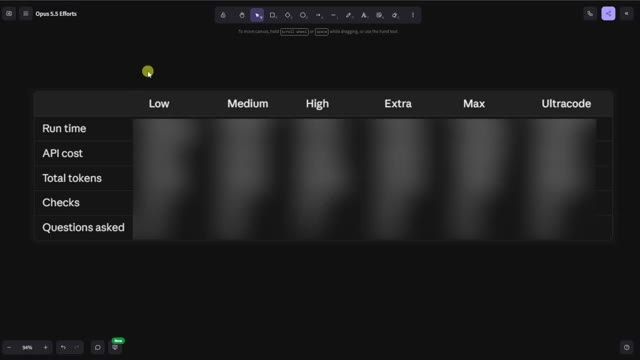

# 🎬 Every Codex Concept Explained for Non-Coders

> **Chaîne** : [Nate Herk | AI Automation](https://www.youtube.com/@nateherk/featured)  
> **Lien YouTube** : [https://www.youtube.com/watch?v=DFlELTiSPk8](https://www.youtube.com/watch?v=DFlELTiSPk8)  
> **Date de publication** : 20261003  
> **Durée** : 00:34:33  
> **Identifiant vidéo** : `DFlELTiSPk8`  
> **Transcription & Analyse** : `whisper-v3-large-turbo+gemini-3.5-flash-lite`  

---

## 📌 Synthèse Exécutive & Outils

### 💡 Résumé

Dans cette vidéo de la chaîne *Nate Herk | AI Automation*, l'analyste explore en profondeur les capacités du modèle d'IA **Opus 5.5** à travers l'une des fonctionnalités les plus puissantes de l'ingénierie moderne : la gestion des niveaux d'effort (*Effort Level*). Pour tester les limites du modèle, Nate lui soumet un prompt complexe sous forme d'objectif (*slash goal*) : transformer un dossier brut de 105 gigaoctets d'enregistrements vidéo (provenant d'un événement virtuel baptisé *AIS Live*) en un monde 3D interactif et explorable en vue à la troisième personne, simulant une conférence tech en personne avec des scènes, des salles de classe, des stands et une direction artistique fidèle.

La démonstration compare méthodiquement l'exécution de ce même prompt à différents niveaux d'effort (faible, moyen, élevé, etc.). Le test démontre des variations spectaculaires dans la qualité des rendus, l'autonomie des agents, le temps de calcul, les coûts d'API estimés et le nombre de vérifications automatisées dans le navigateur. Alors que le niveau *faible* génère un environnement bogué, des images statiques et des PNJ (personnages non joueurs) qui disparaissent après 16 minutes de traitement, le niveau *moyen* livre, pour 12,44 $ et un peu plus d'une heure de calcul, un résultat bluffant : des flux vidéo fonctionnels, le respect de la charte graphique, des PNJ interactifs et une navigation fluide dans un univers 3D complet.

Cette analyse met en lumière l'écart critique entre les promesses textuelles des modèles d'IA et leur concrétisation logicielle autonome. Elle aborde également les frictions opérationnelles classiques du développement piloté par l'IA, notamment le passage crucial de la génération de code local sur la machine de l'utilisateur au déploiement en production, transition fluidifiée par des solutions d'hébergement intégrées.

### 🛠️ Outils, Modèles & Logiciels Présentés

* **Opus 5.5** : Modèle d'intelligence artificielle de pointe d'Anthropic, réputé pour sa vitesse, son coût abordable et ses performances élevées, doté d'un paramètre de réglage de l'effort d'exécution.
* **Claude Code** : Environnement de développement et assistant de codage avancé basé sur les modèles Anthropic, utilisé pour orchestrer la création d'applications complexes directement depuis le terminal.
* **Codex** : Outil de programmation et d'automatisation logicielle de nouvelle génération employé pour exécuter des flux de travail complexes.
* **Cursor** : Éditeur de code assisté par IA de premier plan, servant de base de travail pour l'intégration de scripts et d'agents autonomes.
* **VS Code** : Éditeur de code source extensible de référence, utilisé pour manipuler les fichiers markdown de prompts et piloter les agents.
* **Hostinger Connector** : Extension gratuite pour les éditeurs de code permettant d'intégrer nativement un compte d'hébergement Web pour combler le fossé entre le développement local et la mise en ligne en production.
* **Frame.io** : Plateforme de stockage cloud et de collaboration vidéo, hébergeant ici le dossier massif de 105 Go des ressources brutes de l'événement *AIS Live*.
* **key.ai** : Outil de génération d'images et de vidéos par IA sollicité par le modèle pour produire des ressources visuelles contextuelles si nécessaire.

### 🔑 Points Clés & Enseignements Stratégiques

* **Impact direct du niveau d'effort (*Effort Level*)** : Ajuster l'effort d'un modèle comme Opus 5.5 ne modifie pas seulement la longueur de la réponse, mais change radicalement la profondeur du raisonnement, la rigueur de l'implémentation technique et la gestion des cas limites graphiques et physiques.
* **Autonomie totale sans supervision humaine** : À travers les différents niveaux testés, l'agent a résolu l'intégralité du problème sans poser une seule question (*zéro question posée*), illustrant la capacité des agents modernes à interpréter des directives macroscopiques complexes.
* **Le compromis temps-coût-qualité** : Le mode *faible* a nécessité 16 minutes et coûté l'équivalent de 3,91 $ en API pour un résultat médiocre et bogué, tandis que le mode *moyen*, pour 1 heure 13 minutes et 12,44 $, a livré une application 3D fonctionnelle, esthétique et riche en détails multimédias.
* **Boucles de rétroaction autonomes (Vérifications)** : Les agents ne se contentent pas d'écrire du code à l'aveugle ; ils effectuent itérativement des tests visuels (par exemple, 22 à 23 ouvertures de navigateur de vérification) pour valider leurs propres livrables en temps réel.
* **Exploitation contextuelle de grands volumes de données** : Le modèle a su analyser et structurer intelligemment un ensemble brut hétérogène de 105 Go (provenant de Frame.io) pour recréer fidèlement l'agenda, les pistes, les noms des intervenants et les contenus visuels de l'événement *AIS Live*.
* **Recommandation officielle d'Anthropic** : Pour l'utilisation d'Opus 5.5 sur des tâches complexes, il est stratégiquement conseillé de commencer par un niveau d'effort *moyen*, puis d'ajuster itérativement vers le haut ou le bas selon la criticité du livrable attendu.
* **Friction entre local et production** : L'un des goulets d'étranglement majeurs de l'ingénierie assistée par IA réside dans la transition entre la génération d'un prototype fonctionnel sur la machine locale et son déploiement public instantané.
* **Intégration des outils de déploiement (*DevOps*)** : L'utilisation d'extensions d'hébergement directement dans les environnements de développement (comme le connecteur Hostinger) résout le problème du fossé de mise en ligne, évitant aux non-codeurs de s'enliser dans les configurations de serveurs complexes.
* **Immersion et design d'expérience utilisateur (*UX/UI*)** : Les tests montrent qu'un agent performant ne se limite pas à faire "fonctionner" du code, mais intègre des aspects de design d'interface, de respect de l'identité de marque (palettes de couleurs, logos) et de physique interactive.
* **Limites de la génération procédurale par IA** : Même avec des niveaux d'effort élevés, certains artefacts persistent (personnages fantômes, PNJ figés ou bugs d'affichage occasionnels), rappelant la nécessité d'une phase de recette humaine pour les applications destinées au grand public.

---

## ⏱️ Chronologie & Transcription Complète Audio & Visuelle (Mot pour Mot)

### ⏱️ `[00:00:00 - 00:00:20]` | Segment #01

**🔊 Audio (Transcription Intégrale Mot pour Mot en Français) :**
> Opus 5.5, Opus 5.5, Opus 5.5, Opus 5.5, Opus 5.5. Ce modèle est littéralement partout et pour de très bonnes raisons. Il est intelligent, il est bon marché, il a un goût incroyable, c'est un modèle d'IA incroyable. Mais avec chaque modèle d'IA, vous avez le choix de l'effort, que ce soit faible, moyen, élevé, extra, max ou code ultra.

**👁️ Analyse Visuelle d'Écran (gemini-3.5-flash-lite) :**
**Interface & Outils** : X (anciennement Twitter)

**Contenu textuel & Code** : Publication sur les réseaux sociaux avec une vidéo intégrée représentant un environnement 3D tropical.

**Action / Démonstration** : Affichage d'un exemple concret de contenu généré par l'IA pour illustrer les propos sur les capacités des nouveaux modèles.

*⏱️ 00:00:05 — Capture d'écran d'un post sur X (Twitter) montrant une vidéo de paysage généré en 3D avec des maisons et des palmiers, accompagnée d'un commentaire sur l'impact de l'IA.*

---

### ⏱️ `[00:00:20 - 00:00:38]` | Segment #02

**🔊 Audio (Transcription Intégrale Mot pour Mot en Français) :**
> Donc dans cette vidéo, j'ai donné exactement le même prompt à Opus 5.5 et je l'ai exécuté à chaque niveau d'effort, et nous allons comparer les résultats. Nous allons examiner la qualité de tous les différents résultats réels, mais nous allons aussi examiner combien de temps chacun d'eux a pris, combien cela nous a coûté si c'était facturé par l'API, le total des jetons, combien de vérifications ils ont effectuées, et combien de questions ils m'ont réellement posées tout au long du processus.

**👁️ Analyse Visuelle d'Écran (gemini-3.5-flash-lite) :**
**Interface & Outils** : Application web / Tableau de bord de comparaison (type outil de mindmapping ou tableau blanc).

**Contenu textuel & Code** : Tableau comparatif des niveaux d'effort de l'IA (Low à Ultracode) et de leurs métriques de performance.

**Action / Démonstration** : Présentation du tableau comparatif analysant les différents niveaux d'effort d'Opus 5.5.

*⏱️ 00:00:29 — Un tableau comparatif sur fond noir intitulé 'Opus 5.5 Efforts' avec des colonnes de niveaux d'effort (Low, Medium, High, Extra, Max, Ultracode) et des lignes de métriques (Run time, API cost, Total tokens, Checks, Questions asked).*

---

### ⏱️ `[00:00:39 - 00:00:58]` | Segment #03

**🔊 Audio (Transcription Intégrale Mot pour Mot en Français) :**
> Et les résultats que nous avons obtenus ne sont pas du tout ce à quoi je m'attendais, donc j'ai hâte de partager cela avec vous les gars. Ne perdons pas de temps et allons directement à celui-ci. D'accord, alors plongeons-nous directement dans celui-ci. Je veux commencer juste en vous montrant, les gars, le prompt réel que nous avons utilisé, que nous avons donné à chacun de ces différents agents. Je vais aller dans les fichiers ici, et nous allons ouvrir ce fichier markdown de prompt, et je vais vous montrer ce que nous avons obtenu. Voici donc le slash objectif que j'ai fourni.

**👁️ Analyse Visuelle d'Écran (gemini-3.5-flash-lite) :**
**Interface & Outils** : Interface de type éditeur ou application IA avec panneau de chat (Opus 5.5 / Ultracode).

**Contenu textuel & Code** : Texte du prompt dans l'interface d'IA : "Hi Nate. This worktree has the effort-test task queued in PROMPT.md : build a walkable third-person 3D world of the AIS Live conference..."

**Action / Démonstration** : Présentation d'une interface de développement d'IA et lecture du prompt initial d'un test d'effort.

*⏱️ 00:00:48 — Interface d'un outil de développement avec un panneau latéral et une fenêtre de chat affichant un prompt d'IA, avec une petite incrustation vidéo du présentateur à gauche.*

---

### ⏱️ `[00:00:58 - 00:01:34]` | Segment #04

**🔊 Audio (Transcription Intégrale Mot pour Mot en Français) :**
> J'ai dit, tu dois me créer un monde 3D qui est une conférence tech réaliste dans laquelle je peux me promener en vue à la troisième personne. Tu vas regarder ce dossier, qui contient mes ressources d'enregistrement d'événements de AIS Live. Et ce dossier est un dossier frame IO de 105 gigaoctets d'enregistrements vidéo. C'était un événement entièrement virtuel. Tout a été enregistré et tous les enregistrements sont juste ici. J'ai dit, ton objectif est de prendre cet événement et de le transformer en un monde 3D explorable qui me donne l'impression d'être réellement allé à une vraie conférence en personne avec différentes salles, différentes pistes, différentes scènes, bla, bla, bla. N'hésite pas à utiliser key.ai si tu as besoin de générer des images ou des vidéos. Et tu peux aussi utiliser tout le reste à l'intérieur de mon projet Herc 2, qui est comme mon système d'exploitation IA. J'ai dit,

**👁️ Analyse Visuelle d'Écran (gemini-3.5-flash-lite) :**
**Interface & Outils** : Éditeur de code (type VS Code / Cursor) et interface cloud Frame.io.

**Contenu textuel & Code** : Instructions markdown détaillant la création d'un monde 3D de conférence tech basé sur des enregistrements virtuels et lien Frame.io (f.io/sPdlo-Si).

**Action / Démonstration** : Présentation du prompt de configuration et du dossier de ressources de 105 Go pour le projet de monde 3D.

*⏱️ 00:01:07 — Éditeur de code affichant le fichier PROMPT.md avec les instructions pour créer un monde 3D interactif et le lien vers les ressources Frame.io.*

*⏱️ 00:01:16 — Interface de stockage cloud Frame.io montrant un dossier d'enregistrements d'événements AIS Live d'une taille de 105,69 Go.*

*⏱️ 00:01:25 — Vue de l'éditeur de code sur le fichier PROMPT.md détaillant les exigences de design, de physique et d'exploration pour l'agent IA.*

---

### ⏱️ `[00:01:34 - 00:02:08]` | Segment #05

**🔊 Audio (Transcription Intégrale Mot pour Mot en Français) :**
> vous serez jugé sur la créativité, le design, la physique et la sensation générale lorsque j'explorerai le monde 3D que vous avez construit. Et c'était fondamentalement la fin des instructions. Donc, comme vous pouvez le voir sur ce côté gauche, j'ai exécuté cela à travers tous les différents niveaux d'effort. Commençons par le niveau bas et progressons jusqu'à l'ultra code. Très bien. Donc ici, nous avons le résultat du niveau bas. Ouvrons ceci et jetons un œil. Nous avons donc AIS Live, le sommet des services IA en personne enfin, et nous avons pu cliquer partout. Tout d'abord, on ne sent pas vraiment l'identité de la marque. Genre, ce n'ce n'est pas le logo d'IS Live. Ce n'est même pas nos couleurs. Donc je n'aime pas trop ça, mais entrons ici. D'accord. C'est beaucoup trop lumineux. Euh, nous avons une carte en haut à droite. Nous avons une ville ici en arrière-plan. Je ne peux pas dire quelle ville c'est.

**👁️ Analyse Visuelle d'Écran (gemini-3.5-flash-lite) :**
**Interface & Outils** : Interface web d'un outil de développement ou d'un agent IA (type client Claude Code ou interface personnalisée).

**Contenu textuel & Code** : Texte du prompt : 'Hi Nate. This worktree has the effort-test task queued in PROMPT.md : build a walkable third-person 3D world...'.

**Action / Démonstration** : Le présentateur montre et survole les différents niveaux d'effort configurés pour l'exécution de la tâche dans le panneau latéral gauche.

*⏱️ 00:01:42 — Capture d'écran montrant l'interface d'un assistant IA avec un panneau latéral à gauche listant différents niveaux de tests d'effort ('Hello', 'Extra', 'High', 'Max', 'Ultracode', 'Medium', 'Low') et une conversation à droite affichant le prompt demandant de construire un monde 3D.*

---

### ⏱️ `[00:02:08 - 00:02:40]` | Segment #06

**🔊 Audio (Transcription Intégrale Mot pour Mot en Français) :**
> c'est. D'accord. C'est Chicago, ce qui est plutôt cool parce que vous savez, j'habite à Chicago, mais bref, en haut à droite, nous pouvons voir une carte. Nous avons un hall d'accueil. Nous avons un hall d'exposition. Nous avons un salon VIP sur la scène principale. La carte montre également où se trouve chaque autre personne et cela se synchronise en direct. Donc nous pouvons voir l'enregistrement. Nous pouvons voir le premier jour, la keynote sur l'hyper-agent, le débriefing en direct. Cool. Donc il connaît réellement l'agenda et puis il y a le deuxième jour. Donc il a trouvé ça, c'est bien. Nous avons ces petites boules ici que je peux espérer projeter d'un coup de pied. D'accord. Le visage, oh, regardez ça. Si je vais par ici, tous les gens disparaissent tout simplement. Très mauvais. Très mauvais. D'accord. Alors voyons voir. Est-ce que je peux sprinter ? D'accord.

**👁️ Analyse Visuelle d'Écran (gemini-3.5-flash-lite) :**
**Interface & Outils** : Application web virtuelle interactive (plateforme de conférence en ligne en 3D).

**Contenu textuel & Code** : Interface utilisateur virtuelle avec carte de localisation en haut à droite, menus textuels de conférence et avatars d'utilisateurs.

**Action / Démonstration** : Navigation et exploration d'un environnement de conférence virtuel en 3D par le présentateur.

---

### ⏱️ `[00:02:40 - 00:03:04]` | Segment #07

**🔊 Audio (Transcription Intégrale Mot pour Mot en Français) :**
> Je peux avancer un peu plus vite. Je vais d'abord aller par ici. Il y a des produits promotionnels, euh, certifié AIS plus glido. D'accord. Donc, il y a les vrais stands qu'on avait dans l'événement virtuel. On avait des stands. C'est donc plutôt cool. Un petit endroit pour prendre des photos. Salle C. En ce moment, nous avons Tangy Frederick qui anime un atelier. D'accord. Mais ce n'est pas une vidéo. Comme vous pouvez le voir, c'est juste une image. Elle ne bouge pas. C'est donc juste une image. Ces gens sont en train de disparaître. Ce doivent être des fantômes. Allons par ici dans la salle A.

**👁️ Analyse Visuelle d'Écran (gemini-3.5-flash-lite) :**
**Interface & Outils** : Application web 3D interactive (environnement virtuel type événementiel).

**Contenu textuel & Code** : Éléments textuels et visuels d'un stand virtuel et instructions d'intégration API affichées sur écran virtuel.
[DESC_IMAGE_3] Navigation et exploration de l'espace virtuel par l'utilisateur.

**Action / Démonstration** : Explications face caméra et démonstration conceptuelle.

---

### ⏱️ `[00:03:04 - 00:03:30]` | Segment #08

**🔊 Audio (Transcription Intégrale Mot pour Mot en Français) :**
> Nous avons Liberty White. D'accord. Très cool. Vos 30 premiers jours dans l'automatisation. Encore une fois, c'est juste une image fixe et les gens ont des bugs d'affichage. Donc ce n'est pas très bon ici. Je vais aller sur la scène principale et voir ce que nous avons. D'accord, cool. Donc nous avons une scène principale. Les gens ont de gros bugs d'affichage. Vraiment mauvais. Ce n'est vraiment pas bon du tout. Notre vidéo est en train de bouger. Genre, j'ai vu mon visage ici et j'ai vu celui de Devin, mais maintenant ils ont disparu. Donc je ne sais pas ce qui s'est passé. D'accord. On dirait que c'est plutôt un diaporama. Rien n'est encore vraiment en train d'être diffusé. Bref, entrons ici.

**👁️ Analyse Visuelle d'Écran (gemini-3.5-flash-lite) :**
**Interface & Outils** : Application ou plateforme virtuelle 3D interactive (type metaverse ou événementiel virtuel).

**Contenu textuel & Code** : Textes d'indication de salles, affichages de conférences et bannières "AIS LIVE - AI Services Summit".

**Action / Démonstration** : Navigation et déplacement d'un avatar à l'intérieur d'un espace virtuel de conférence.

*⏱️ 00:03:11 — Vue d'une salle virtuelle (Workshop Room A) dans une simulation 3D avec un avatar et des plateformes lumineuses.*

*⏱️ 00:03:17 — Vue de la scène principale d'une conférence virtuelle 3D (Hyperagent Workshop) remplie d'avatars assis.*

*⏱️ 00:03:24 — Vue large de la scène principale de l'événement virtuel "AIS LIVE - AI Services Summit" avec grand écran et projecteurs.*

---

### ⏱️ `[00:03:30 - 00:03:58]` | Segment #09

**🔊 Audio (Transcription Intégrale Mot pour Mot en Français) :**
> Nous avons d'autres stands. Nous avons hyper agent. Nous avons Claude Code. Nous avons plus de goodies. La salle B, c'est Dave Ebelor. Je suppose que c'est exactement la même chose. Nous avons du café. Et ensuite, je suppose que le salon VIP, accès VIP seulement. C'est plutôt cool, mais il ne se passe vraiment rien ici. Cet écran est bien trop lumineux. Bon. Donc je pense que vous comprenez l'ambiance qu'on obtient ici avec Opus 5.5 en faible effort. Et c'est là que les choses deviennent intéressantes. Combien de temps pensez-vous que cela a duré ? Combien de temps ? Celui-ci a duré 16 minutes et 43 secondes. Combien pensez-vous que cela a coûté ?

**👁️ Analyse Visuelle d'Écran (gemini-3.5-flash-lite) :**
**Interface & Outils** : Application web (tableau blanc ou interface de tableau de bord Opus 5.5 Efforts).

**Contenu textuel & Code** : Tableau comparatif avec les colonnes : Low, Medium, High, Extra, Max, Ultracode, et les lignes : Run time, API cost, Total tokens, Checks, Questions asked.

**Action / Démonstration** : Affichage et présentation d'un tableau comparatif des différents niveaux d'effort et de performance d'un modèle d'IA.

*⏱️ 00:03:51 — Tableau comparatif sur une interface web intitulé "Opus 5.5 Efforts" avec des colonnes de Low à Ultracode et des lignes de métriques (Run time, API cost, Total tokens, etc.).*

---

### ⏱️ `[00:03:58 - 00:04:26]` | Segment #10

**🔊 Audio (Transcription Intégrale Mot pour Mot en Français) :**
> 3,91 dollars si c'était une facturation par API. J'utilise évidemment mon abonnement ici, mais nous allons simplement calculer cela avec la facturation par API. Le total des jetons était de 191 000. Il a fait 22 vérifications. Donc la vérification, 22 fois il a ouvert le navigateur et a exécuté différentes sortes de vérifications. Donc 22 catégories de vérifications. Et combien de questions m'a-t-il posées ? Il m'a posé un total de zéro question tout au long de cette invite de type slash goal. D'accord. Alors, ouvrons l'effort moyen et voyons ce que nous avons. D'accord, c'est parti. Effort moyen. Nous avons Nate Herc. Nous avons mon badge. C'est de la marque AI's Life.

**👁️ Analyse Visuelle d'Écran (gemini-3.5-flash-lite) :**
**Interface & Outils** : Application de tableau blanc ou de diagramme (type Excalidraw) avec un tableau de performances.

**Contenu textuel & Code** : Tableau comparatif avec les lignes : Run time (16m 43s), API cost ($3.91), Total tokens (191.3K), Checks, Questions asked, sous les colonnes Low, Medium, High, Ex.

**Action / Démonstration** : Le présentateur explique et commente les coûts d'API, le temps d'exécution et le nombre total de tokens affichés dans le tableau.

*⏱️ 00:04:05 — Capture d'écran montrant le présentateur à gauche et un tableau de données et de métriques d'évaluation à l'écran à droite.*

---

### ⏱️ `[00:04:26 - 00:04:46]` | Segment #11

**🔊 Audio (Transcription Intégrale Mot pour Mot en Français) :**
> Donc ça a déjà l'air un petit peu mieux. Ça ressemble à nos palettes de couleurs qui ont utilisé nos directives de marque. Premier jour de construction, deuxième jour de gain, VIP. Cool. D'accord. Je vais entrer dans le lieu. D'accord. Waouh. Une ambiance similaire, en gros. C'est en arrière-plan. Ça ne ressemble pas à Chicago, hein ? Non, ça ressemble à, honnêtement, ça ressemble à une ville inventée. Quoi qu'il en soit, c'est drôle qu'ils aient décidé de faire ça. Voyons si je peux me déplacer un peu plus vite. Oh, waouh.

**👁️ Analyse Visuelle d'Écran (gemini-3.5-flash-lite) :**
**Interface & Outils** : Application web interactive / Plateforme virtuelle 3D (AIS Live)

**Contenu textuel & Code** : Page d'accueil avec badge 'NATE HERK' et instructions de navigation, suivie d'une scène 3D avec des avatars.

**Action / Démonstration** : Le présentateur entre dans le lieu virtuel en cliquant sur 'Enter the venue'.

*⏱️ 00:04:31 — Interface d'accueil de la plateforme virtuelle 'AIS Live' montrant un badge nominatif et un bouton 'Enter the venue'.*

*⏱️ 00:04:41 — Vue à la première personne à l'intérieur du lieu virtuel avec des avatars 3D et une vue sur une ville la nuit à travers de grandes baies vitrées.*

---

### ⏱️ `[00:04:46 - 00:05:21]` | Segment #12

**🔊 Audio (Transcription Intégrale Mot pour Mot en Français) :**
> Les gens interagissent avec moi. Regardez. Si je m'approche de ce type, il vient de lever le bras. Bon, maintenant il ne veut plus du tout avoir affaire à moi. Mais tous ces petits robots ici doivent prendre des décisions. Je ne sais pas s'ils utilisent Jev. C'est sûr que non. Je ne le lui ai pas dit. En fait, ma clé Jev est à l'arrière. Je ne sais pas. Peut-être qu'il l'a utilisée. Quoi qu'il en soit, nous pouvons voir ici que nous avons la salle d'atelier C, le laboratoire des agents. Sympa. Donc celui-ci est en fait en train d'être exécuté. Vous pouvez voir qu'il s'agit d'une vraie vidéo lue par Tangy. Tout le monde ici est en train de travailler sur un ordinateur portable. Ils ne buguent pas. C'est plutôt cool. De plus, mon badge est sur ma poitrine, ce qui est plutôt cool. Je peux venir par ici. Nous avons une carte en haut à droite, comme vous pouvez le voir, mais je peux venir par ici. Nous avons un

**👁️ Analyse Visuelle d'Écran (gemini-3.5-flash-lite) :**
**Interface & Outils** : Environnement virtuel 3D / Metavers de type Gather.town ou similaire

**Contenu textuel & Code** : Avatars 3D interagissant dans un espace virtuel d'apprentissage ou de réunion (Agents Lab)

**Action / Démonstration** : Navigation et exploration de l'environnement virtuel 3D par le présentateur

---

### ⏱️ `[00:05:21 - 00:05:47]` | Segment #13

**🔊 Audio (Transcription Intégrale Mot pour Mot en Français) :**
> hall d'exposition. C'est là que nous avons le stand Glido. Et ça diffuse en ce moment. Oui, ça diffuse la vidéo de nous parlant de Glido. Ça diffuse la vidéo d'Ed et moi parlant de notre programme de certification. Nous avons le logo AIS Plus juste ici, qui est un peu mal placé. Ce sont les diapositives des conférenciers et les points clés. Donc waouh, ce sont toutes les ressources que nous avons distribuées après l'événement. Elles sont toutes affichées juste là également. Nous pouvons voir que nous avons un projecteur sur la communauté. C'est donc Aiden qui parle de son contrat qu'il a décroché et c'est diffusé en direct. Ces gens regardent.

**👁️ Analyse Visuelle d'Écran (gemini-3.5-flash-lite) :**
**Interface & Outils** : Environnement virtuel 3D interactif de type métavers / hall d'exposition en ligne.

**Contenu textuel & Code** : Affiches, diapositives de présentation ("Speaker Slides & Takeaways"), signalétique "AIS+ Certified" et bannières informatives.
[DESC_IMAGE_3] Navigation et exploration d'un hall d'exposition virtuel par un avatar.

**Action / Démonstration** : Explications face caméra et démonstration conceptuelle.

---

### ⏱️ `[00:05:47 - 00:06:21]` | Segment #14

**🔊 Audio (Transcription Intégrale Mot pour Mot en Français) :**
> Ils sont plutôt engagés. On a hyper agent. C'était, c'est ce que je voulais dire. Si vous avez vu ces gens lever les mains pour dire bonjour, c'était plutôt marrant. Regardez, regardez, le voilà qui recommence. Bref. Bon. Où est-ce que je suis maintenant ? Maintenant, je suis dans le hall principal. On a un bar à café. On a un grand logo, qui est le vrai logo. C'est trop lumineux, mais on a le logo. On peut voir si on peut entrer ici dans le parcours des fondations. On a Sabrina Romanov et Liberty White. Donc différentes formations juste là. On peut entrer dans cette salle. C'est le parcours avancé. Alors qu'est-ce qui se passe ici. On a Dave Ebelar et Saman qui parlent de différentes choses là-dedans. Et maintenant, allons jeter un œil à la scène principale. Oh, attendez, il y a une vidéo de moi là-haut. C'est genre un VIP

**👁️ Analyse Visuelle d'Écran (gemini-3.5-flash-lite) :**
**Interface & Outils** : Environnement virtuel 3D / plateforme de métavers ou de conférence en ligne.

**Contenu textuel & Code** : Avatars numériques 3D, interface de navigation, mini-carte en haut à droite, texte "Main Lobby" et options d'interaction.
[COMPILATION] Navigation et exploration d'un espace virtuel 3D par le présentateur et les participants.

**Action / Démonstration** : Explications face caméra et démonstration conceptuelle.

---

### ⏱️ `[00:06:21 - 00:06:50]` | Segment #15

**🔊 Audio (Transcription Intégrale Mot pour Mot en Français) :**
> section ? Ouais, on va aller voir ça dans une minute. Mais bref, voici la scène principale. Ça a l'air vraiment, vraiment bien. On a une grande scène. On a genre quatre personnes assises ici. On a les trois écrans d'Alex là-haut avec "hyper agent". Est-ce que j'ai le droit de monter sur scène ? Oh, et il me laisse monter sur scène. D'accord. C'est plutôt sympa. Bon les gars, faisons un selfie. Laissez-moi prendre tout le monde en arrière-plan. Venez par ici. Bref, c'est plutôt, plutôt cool. Par contre, toutes les places ne sont pas occupées. Donc il va falloir qu'on travaille là-dessus. Mais bref, je vais y retourner en courant pour voir ce qu'était cette section VIP. D'accord. Le salon VIP. J'ai l'impression que c'est comme un aéroport ou un truc comme ça.

**👁️ Analyse Visuelle d'Écran (gemini-3.5-flash-lite) :**
**Interface & Outils** : Application web / plateforme de conférence virtuelle 3D (Hyperagent)

**Contenu textuel & Code** : Interface d'événement virtuel, écrans de keynote, mini-carte en haut à droite, informations de session "Hyperagent Keynote - Alex McDonnell" en bas à gauche.

**Action / Démonstration** : Navigation et déplacement d'un avatar dans un espace de conférence virtuel 3D lors d'une keynote.

*⏱️ 00:06:28 — Vue générale de la salle de conférence virtuelle (Hyperagent Keynote) montrant l'auditorium, la grande scène avec des écrans de présentation, et l'avatar du présentateur.*

*⏱️ 00:06:36 — Vue de l'arrière de la scène virtuelle avec un groupe de personnes assises sur des fauteuils et l'avatar se déplaçant.*

*⏱️ 00:06:43 — Vue en plongée dans l'auditorium virtuel avec les rangées de spectateurs assis et l'allée centrale éclairée.*

---

### ⏱️ `[00:06:51 - 00:07:14]` | Segment #16

**🔊 Audio (Transcription Intégrale Mot pour Mot en Français) :**
> D'accord, super. Donc maintenant nous avons les sessions VIP ici. Une foire aux questions VIP avec Nate en lecture vidéo en direct juste ici. Très, très cool. Et nous avons comme un bar ou quelque chose comme ça. Génial. Je dirais que c'est un assez bon résultat. Maintenant, en ce qui concerne les statistiques ici, celle-ci a pris une heure et 13 minutes à s'exécuter. Cela nous aurait coûté 12 dollars et 44 cents. Elle a utilisé 490 000 jetons et elle a effectué 23 vérifications.

**👁️ Analyse Visuelle d'Écran (gemini-3.5-flash-lite) :**
**Interface & Outils** : Application de salon virtuel 3D et interface de tableau de bord analytique (Opus 5.5 Efforts).

**Contenu textuel & Code** : Affichage d'une session vidéo en direct avec sous-titres, avatars d'utilisateurs dans l'espace virtuel, et tableau de métriques de performance (Run time: 16m 43s, API cost: $3.91, Total tokens: 191.3K).

**Action / Démonstration** : Présentation de la visite guidée d'un espace VIP virtuel avec diffusion vidéo en direct et analyse des métriques d'exécution.

*⏱️ 00:06:56 — Capture montrant un espace virtuel en 3D représentant un salon VIP avec un écran géant affichant une session vidéo en direct ("VIP Q&A with Nate") et un espace de bar à l'arrière-plan.*

*⏱️ 00:07:02 — Capture montrant un tableau de bord ou un canevas comparatif ("Opus 5.5 Efforts") présentant des métriques telles que le temps d'exécution (Run time), le coût API et le nombre total de tokens.*

---

### ⏱️ `[00:07:14 - 00:07:48]` | Segment #17

**🔊 Audio (Transcription Intégrale Mot pour Mot en Français) :**
> Et il nous a posé un total de zéro question une fois de plus. Très bien, passons à élevé. C'était déjà un résultat plutôt correct et Anthropic eux-mêmes dans leur vidéo, ou désolé, pas une vidéo, un article sur comment prompter Opus 5.5, ils ont dit de commencer simplement par moyen et de l'ajuster vers le haut ou vers le bas si nécessaire. C'était donc un résultat moyen. Passons à élevé et voyons ce qu'on a obtenu. Très rapidement, les gars, je dois prendre une seconde pour vous parler du sponsor de la vidéo d'aujourd'hui, Hostinger. Donc ces deux modèles viennent de me construire une version fonctionnelle de la même chose. Et maintenant, je suis exactement là où je finis toujours, avec un produit fini sur mon ordinateur portable et aucun moyen rapide de le mettre en ligne. Et c'est le fossé que comble le connecteur d'Hostinger. C'est une extension gratuite

**👁️ Analyse Visuelle d'Écran (gemini-3.5-flash-lite) :**
**Interface & Outils** : Tableau de bord de type canvas / application de notes et interface de développement ou éditeur de code avec assistant IA.

**Contenu textuel & Code** : Tableau comparatif avec les colonnes Low, Medium, High, Extra et lignes Run time, API cost, Total tokens, Checks, Questions asked. Fenêtre de chat affichant un prompt "Build a single-page ROI calculator...".

**Action / Démonstration** : Comparaison des performances de différents niveaux de configuration d'un modèle d'IA (Low vs Medium) et affichage des logs d'un agent générant une application web.

*⏱️ 00:07:22 — Tableau comparatif affichant les métriques (temps d'exécution, coût API, tokens, vérifications, questions posées) pour différents niveaux d'effort (Low, Medium, High, Extra).*

*⏱️ 00:07:39 — Interface de développement (éditeur de code ou IDE) avec un panneau de chat montrant un prompt et l'exécution d'un agent IA pour construire un calculateur ROI.*

---

### ⏱️ `[00:07:48 - 00:08:23]` | Segment #18

**🔊 Audio (Transcription Intégrale Mot pour Mot en Français) :**
> pour votre éditeur qui intègre votre compte Hostinger dans l'outil de programmation que vous utilisez déjà, que ce soit VS Code, Cursor, Cloud Code, Codex, et j'en passe. Vous vous connectez une seule fois en un clic, et à partir de là, votre agent peut déployer le site, y associer un domaine, configurer les enregistrements DNS et vérifier votre VPS sans que vous n'ayez jamais à quitter l'éditeur. Alors, peu importe celui de ces outils que vous finirez par préférer, ce qu'il a créé n'est qu'à quelques minutes d'une véritable URL sur un hébergement géré. Connector est gratuit avec chaque formule d'hébergement, donc si vous avez toujours besoin de l'hébergement en dessous, profitez de la formule illimitée avec le lien dans la description et utilisez le code NATEHERK pour 10 % de réduction. Cela inclut également un domaine gratuit et un e-mail professionnel pour l'année. Et c'est toujours le moyen le moins cher que j'ai trouvé pour obtenir quelque

**👁️ Analyse Visuelle d'Écran (gemini-3.5-flash-lite) :**
**Interface & Outils** : Interface web d'intégration Hostinger, Claude Code, IDE

**Contenu textuel & Code** : Statut "Connected", mention "VIA OAUTH", version Node.js 24.13.0, et liste des outils accessibles (Websites, Domains, etc.).

**Action / Démonstration** : Connexion unique du compte Hostinger à l'IDE et affichage des outils de gestion activés pour l'agent.

*⏱️ 00:07:57 — Interface d'intégration Hostinger connectée via OAuth à un IDE, affichant les outils disponibles (Websites, Domains, Subscriptions & Payments, Email Marketing) à côté d'une fenêtre Claude Code.*

---

### ⏱️ `[00:08:23 - 00:08:47]` | Segment #19

**🔊 Audio (Transcription Intégrale Mot pour Mot en Français) :**
> tu as construit par-dessus une vraie URL. Donc revenons-en à la vidéo. D'accord. Encore une fois, très, très marqué par la marque. C'est un écran de chargement encore mieux que le précédent. On a ce petit effet sympa en arrière-plan. On a le logo. On va entrer dans le lieu. D'accord. Nous y voilà. Ça a l'air plutôt bien. On commence dehors et tu peux voir qu'on a ces drapeaux pour tous les intervenants, Wyatt, Casper, Alex, Ed, Aiden, Sabrina, Liberty. C'est plutôt cool. On a des blocs en direct ici.

**👁️ Analyse Visuelle d'Écran (gemini-3.5-flash-lite) :**
**Interface & Outils** : Application web interactive en 3D (metaverse / espace virtuel d'événement).

**Contenu textuel & Code** : Interface utilisateur avec mini-carte, indicateur de passeport, consignes de touches (WASD, Mouse, Space) et noms des conférenciers sur bannières.

**Action / Démonstration** : Exploration et navigation en vue à la troisième personne dans l'espace virtuel de l'événement.

*⏱️ 00:08:29 — Écran de chargement et d'accueil de la plateforme virtuelle 'AIS LIVE', avec le logo et les instructions de contrôle clavier/souris.*

*⏱️ 00:08:35 — Vue dans le monde virtuel 3D 'AIS Live Plaza', montrant l'avatar du présentateur et d'autres participants dans une place publique numérique.*

*⏱️ 00:08:41 — Navigation dans l'environnement virtuel 3D montrant des bannières verticales avec des noms de conférenciers au milieu de la place.*

---

### ⏱️ `[00:08:47 - 00:09:23]` | Segment #20

**🔊 Audio (Transcription Intégrale Mot pour Mot en Français) :**
> ça a pris cette photo de moi, votre hôte, Nate Herc, John, Dave, Nate Herc. Voilà. OK. Les portes. Génial. Ce sont des portes coulissantes automatiques en verre. J'adore ça. On peut voir l'enregistrement VIP. On peut voir l'admission générale. On peut venir ici et on peut découvrir l'expo avec différents stands, le projecteur sur la communauté. Vous pouvez aussi voir qu'en haut à gauche, j'ai un passeport. Donc c'est du genre, ça va montrer combien d'endroits j'ai visités. Tout cela est une vraie lecture. Nous avons un mur de ressources avec tous les différents intervenants. Ils ont aussi une session de réseautage par ici. Donc je vais venir très vite et voir de quoi il s'agit. Donc nous avons le bar à cold brew AIS. Nous avons différents membres de la communauté qui ont été mis en avant ou en lumière.

**👁️ Analyse Visuelle d'Écran (gemini-3.5-flash-lite) :**
**Interface & Outils** : Application web interactive / Environnement virtuel 3D

**Contenu textuel & Code** : Interface utilisateur d'un événement virtuel (Live Registration, Expo Hall)

**Action / Démonstration** : Exploration et navigation dans un monde virtuel 3D interactif

*⏱️ 00:08:56 — Vue d'un monde virtuel interactif montrant l'accueil d'un événement avec des comptoirs de "Registration GA" et "VIP Check-in".*

*⏱️ 00:09:05 — Navigation dans un hall d'exposition virtuel avec des stands et des avatars interactifs.*

*⏱️ 00:09:14 — Vue à la troisième personne d'un avatar évoluant dans un espace virtuel animé avec d'autres participants.*

---

### ⏱️ `[00:09:23 - 00:09:56]` | Segment #21

**🔊 Audio (Transcription Intégrale Mot pour Mot en Français) :**
> On a l'aile VIP. Attends, quoi ? Prends un bracelet. Ah, je dois vraiment aller chercher le bracelet. D'accord. Laisse-moi m'enregistrer rapidement. Le bracelet est déjà mis. Attends, quoi ? D'accord. Oh, d'accord. Maintenant, les portes se sont ouvertes pour moi. Cool. Je peux entrer ici. Oh, ça mène juste à la scène principale. Salon VIP. Il y a une séance de questions-réponses en cours. Ça a l'air très cool. Je veux dire, je suis très impressionné par sa capacité à faire ça. Waouh. D'accord. Donc c'est vraiment bien. Ce qu'on a fait, c'est qu'on a eu des salles de discussion VIP avec différentes personnes. Tu peux voir qu'il y a différentes salles, différents membres de l'équipe AIS qui participent à des trucs. C'est vraiment cool. C'est très cool. C'est un VIP nettement meilleur.

**👁️ Analyse Visuelle d'Écran (gemini-3.5-flash-lite) :**
**Interface & Outils** : Application de métavers / espace virtuel 3D de conférence en ligne.

**Contenu textuel & Code** : Interface utilisateur avec mini-carte, indicateurs de statut, menus de navigation et écrans de présentation.

**Action / Démonstration** : Exploration et navigation d'un avatar dans l'espace virtuel de conférence.

*⏱️ 00:09:32 — Le présentateur navigue dans le hall d'accueil virtuel (Registration Concourse) d'un espace 3D en ligne.*

*⏱️ 00:09:40 — Le présentateur se trouve dans le salon VIP (VIP Lounge) avec un écran affichant une visioconférence.*

*⏱️ 00:09:48 — Le présentateur explore la zone des sessions de travail VIP avec des salles thématiques.*

---

### ⏱️ `[00:09:56 - 00:10:30]` | Segment #22

**🔊 Audio (Transcription Intégrale Mot pour Mot en Français) :**
> expérience que ce qui a été montré dans la première partie. D'accord. After party VIP. Regardez ça. On a une piste de danse. On a tous ces éléments ici. On a la lecture de l'after party VIP juste ici. Et il y a une estrade de DJ. C'est trop marrant. Il y a un petit bug ici, un petit glitch ici, mais c'est génial. Oh, cool. Donc quand je suis ici sur la scène principale, on a des sous-titres. Vous pouvez voir juste ici en bas de mon écran, on a ces sous-titres de Wyatt qui est en train de parler ici. On a des lumières. On a le panel. Très cool. Belle scène principale. Je vais aller ici. On peut aller à la fondation,

**👁️ Analyse Visuelle d'Écran (gemini-3.5-flash-lite) :**
**Interface & Outils** : Application web 3D / Metavers virtuel (type événement en ligne).

**Contenu textuel & Code** : Interface utilisateur virtuelle affichant les zones "VIP After-Party" et "Main Stage", des avatars d'utilisateurs et des flux vidéo de participants.
[CONSULTATION] Navigation et visite guidée à travers différentes salles d'un événement virtuel en 3D.

**Action / Démonstration** : Explications face caméra et démonstration conceptuelle.

*⏱️ 00:10:04 — Capture montrant l'interface d'un espace virtuel 3D (after party VIP) avec une piste de danse et des avatars.*

*⏱️ 00:10:13 — Capture montrant un autre angle de l'espace virtuel 3D de l'after party VIP avec des écrans de visioconférence.*

*⏱️ 00:10:21 — Capture montrant une autre zone de l'événement virtuel 3D, la scène principale (Main Stage) avec des participants assis.*

---

### ⏱️ `[00:10:30 - 00:11:06]` | Segment #23

**🔊 Audio (Transcription Intégrale Mot pour Mot en Français) :**
> avancé, et les parcours d'entreprise par ici. Donc voyons voir. Nous avons l'anatomie de trois vrais contrats. Nous avons hyper agent. Nous avons les évaluations avec Nate et Ed ici. Nous avons Dave qui s'occupe des trucs avancés. C'est vraiment bien. Je veux dire, évidemment, chacun, chacun de ces résultats jusqu'à présent, faible était correct. Moyen était meilleur. Élevé a été encore meilleur. Voyons si cette tendance se poursuit et voyons combien cela nous a coûté. Donc, élevé a tourné pendant une heure et sept minutes. Donc un peu plus rapide que moyen, cela nous aurait coûté 16 dollars et 31 cents. Il a utilisé un demi-million de tokens, 509 000. Il a fait 22 vérifications. Et il nous a aussi demandé, enfin, non, je me suis trompé. Ce

**👁️ Analyse Visuelle d'Écran (gemini-3.5-flash-lite) :**
**Interface & Outils** : Application de tableau blanc / interface de données (Opus 5.5 Efforts)

**Contenu textuel & Code** : Tableau comparatif affichant le temps d'exécution, le coût API, le nombre total de jetons, les vérifications et les questions posées pour les niveaux Low, Medium, High et Extra.

**Action / Démonstration** : Présentation et analyse comparative des performances et coûts des différents niveaux d'effort d'un modèle d'IA.

*⏱️ 00:10:57 — Le présentateur à gauche et un tableau de données comparatives intitulé 'Opus 5.5 Efforts' montrant des métriques (Run time, API cost, Total tokens, Checks, Questions asked) pour différents niveaux (Low, Medium, High, Extra).*

---

### ⏱️ `[00:11:06 - 00:11:25]` | Segment #24

**🔊 Audio (Transcription Intégrale Mot pour Mot en Français) :**
> l'un m'a posé une question et spoiler, c'était le seul qui nous a posé une question de tout ça. Donc voyons voir, il nous en reste trois, extra, max et ultra code. Laissez-moi ouvrir extra et nous verrons ce qu'on a. D'accord. Donc celui-ci a l'air plutôt bien. Je dirais honnêtement que jusqu'à présent, l'écran de chargement haut était le meilleur, celui qu'on vient juste de voir, mais bref, entrons dans AIS live.

**👁️ Analyse Visuelle d'Écran (gemini-3.5-flash-lite) :**
**Interface & Outils** : Interface web sous forme de tableau de bord ou tableur montrant les résultats d'exécution.

**Contenu textuel & Code** : Tableau avec les lignes Run time, API cost, Total tokens, Checks, et Questions asked pour chaque niveau.

**Action / Démonstration** : Le présentateur passe en revue les résultats et compare les colonnes du tableau.

*⏱️ 00:11:11 — Tableau comparatif affichant les métriques de performance pour différents niveaux d'effort (Low, Medium, High, Extra).*

---

### ⏱️ `[00:11:26 - 00:11:51]` | Segment #25

**🔊 Audio (Transcription Intégrale Mot pour Mot en Français) :**
> Waouh. D'accord. Donc nous avons comme de petits extraits sonores. Je peux discuter avec des gens. Le panneau sur la guerre des outils a réglé quelques débats pour moi. Sympa. Bonne perspective là-bas. Nous sommes dehors à nouveau. Nous avons ces différentes bannières, bien qu'elles soient toutes les mêmes. Elles n'affichent pas les noms de différentes personnes. Donc grand logo AIS Live. L'aile des ateliers est par ici. Et passons par les portes coulissantes en verre pour voir ce que nous avons. Nous avons donc le café AIS. La carte est en bas à droite, et elle n'est pas très descriptive.

**👁️ Analyse Visuelle d'Écran (gemini-3.5-flash-lite) :**
**Interface & Outils** : Environnement virtuel 3D interactif / Application web metavers

**Contenu textuel & Code** : Interface utilisateur virtuelle avec mini-carte en bas à droite, bannières publicitaires et interactions textuelles entre avatars.

**Action / Démonstration** : Navigation d'un avatar dans l'espace virtuel et exploration interactive de la convention en ligne.

*⏱️ 00:11:32 — Vue d'un monde virtuel interactif en 3D représentant une place de convention avec des avatars et des bannières informatives.*

*⏱️ 00:11:38 — Poursuite de la navigation dans l'environnement virtuel 3D montrant l'avatar du joueur se déplaçant vers des groupes d'utilisateurs.*

*⏱️ 00:11:45 — L'avatar s'approche de l'entrée principale lumineuse du centre de convention virtuel.*

---

### ⏱️ `[00:11:51 - 00:12:26]` | Segment #26

**🔊 Audio (Transcription Intégrale Mot pour Mot en Français) :**
> J'aime bien comment les autres cartes nous disaient quoi, du genre où étaient les choses, mais celle-ci a l'air très professionnelle. On peut voir ici, c'est la scène principale. Allons y faire un tour rapide. Elles ont toutes ces balles qui volent autour, ce que je trouve assez marrant. Les ballons de plage AIS. On me voit là-haut en train de parler. Je crois que j'introduisais l'une des journées. Continuons à avancer par ici vers la salle d'atelier sur ce côté gauche. OK. Donc ici, nous avons le théâtre Hyper Agent. Nous avons cette session sponsorisée ici par Hyper Agent, mais ça nous montre aussi ce qui va s'y passer. C'est vraiment marrant qu'on puisse discuter avec les gens. Salmon a créé un commercial vocal en direct. La salle "Le Juste Prix" était comble. Avez-vous pris le guide du compagnon VIP ? C'est trop marrant. Nous avons le parcours avancé dans

**👁️ Analyse Visuelle d'Écran (gemini-3.5-flash-lite) :**
**Interface & Outils** : None

**Contenu textuel & Code** : None

**Action / Démonstration** : Exploration d'un environnement virtuel.

*⏱️ 00:12:00 — Un avatar se tient sur une scène principale virtuelle, avec des avatars du public assis dans la foule.*

*⏱️ 00:12:09 — Plusieurs avatars se tiennent dans un espace virtuel à l'intérieur des "AI Workshops" (Ateliers IA) avec des indications pour "Foundation", "Advanced" et "Enterprise".*

*⏱️ 00:12:17 — Trois avatars se tiennent dans un couloir virtuel, avec des panneaux indiquant "AI SERVICES".*

---

### ⏱️ `[00:12:26 - 00:12:58]` | Segment #27

**🔊 Audio (Transcription Intégrale Mot pour Mot en Français) :**
> ici. Encore une fois, on a une diffusion en direct. Est-ce que c'est une diffusion en direct ? Oh, d'accord. Ça a commencé dès que je suis entré, mais je peux m'asseoir. Oh là là. Je peux regarder ça. Je peux me lever. Je veux m'asseoir devant. C'est plutôt cool. C'est très sympa. J'aime bien ça. Et vous savez ce que j'ai remarqué jusqu'ici ? Le personnage que j'incarne me ressemble un peu. Je pense qu'il a été modélisé d'après les photos de mes miniatures ou un truc du genre. Bref, on a Sabrina ici, l'hôte de la salle ici, prenez n'importe quelle place libre. D'accord, cool. Et j'ai vraiment bien aimé la fonctionnalité pour s'asseoir. C'est assez marrant. Genre on pourrait vraiment assister à cet atelier et participer. Bref, ça nous montre les intervenants. Ça nous montre les

**👁️ Analyse Visuelle d'Écran (gemini-3.5-flash-lite) :**
**Interface & Outils** : Application de webinaire virtuel / Plateforme d'événement en ligne 3D.

**Contenu textuel & Code** : Interface utilisateur de la plateforme virtuelle avec affichage d'un atelier en direct ("Workshop Block 2").

**Action / Démonstration** : Navigation et exploration de l'espace virtuel par le présentateur.

---

### ⏱️ `[00:12:58 - 00:13:31]` | Segment #28

**🔊 Audio (Transcription Intégrale Mot pour Mot en Français) :**
> agenda. Il y a un petit tapis rouge ici pour prendre quelques photos. On peut prendre la pose. Oh, wow. C'est plutôt cool. Bibliothèque de ressources, obtenez votre certification AIS Plus, Glido, Hyper Agent, AIS Plus, trois vraies affaires. Génial. Je veux dire, je dirais certainement que jusqu'à présent, chacun s'améliore. Et nous n'avons même pas encore regardé la section VIP, le salon VIP. Allons-y rapidement. J'espère que je pourrai entrer. Bien. Nous avons le réinitialisation des outils. Ce sont les différentes salles dans lesquelles nous pourrions aller. Donc encore une fois, je pourrais prendre la feuille de travail et essayer de comprendre comment fixer le prix de mes affaires. C'est tellement cool. C'est vraiment mieux que le précédent où nous avons juste

**👁️ Analyse Visuelle d'Écran (gemini-3.5-flash-lite) :**
**Interface & Outils** : Application virtuelle 3D (metaverse / plateforme événementielle en ligne)

**Contenu textuel & Code** : Environnement virtuel 3D avec affichage de bannières et de questions textuelles

**Action / Démonstration** : Navigation et exploration d'un monde virtuel interactif par le présentateur

---

### ⏱️ `[00:13:31 - 00:13:59]` | Segment #29

**🔊 Audio (Transcription Intégrale Mot pour Mot en Français) :**
> genre regardé des trucs. Génial. Je peux passer derrière le bar et venir ici. C'est très sympa. Bon. Alors, pour ce qui est des statistiques, celui-ci a tourné pendant une heure et demie. Ça coûte 25,92 dollars. Je ne sais pas pourquoi je dis virgule... 25 dollars, 92 centimes. C'était 733 000 tokens et 34 vérifications. Il a donc eu, et de loin, le plus grand nombre de vérifications jusqu'ici. Et il nous a posé zéro question. J'ai hâte de voir ce qu'on a obtenu ici de la part de Max et d'Ultra Code. OK. Voici Max... des écrans de chargement, ennuyeux, mais c'est bien dans l'image de marque et il y a notre logo.

**👁️ Analyse Visuelle d'Écran (gemini-3.5-flash-lite) :**
**Interface & Outils** : Application de tableau blanc ou de prise de notes numérique avec des options de dessin et de mise en forme.

**Contenu textuel & Code** : Un tableau avec les colonnes Medium, High, Extra, Max, Ultracode, affichant des statistiques telles que "1h 31m", "$25.92" (ou des coûts variables selon les colonnes) et "733K tokens".

**Action / Démonstration** : Le présentateur commente les statistiques du tableau et pointe vers les données de la colonne "Extra".

*⏱️ 00:13:38 — Un tableau comparatif montrant les durées d'exécution, les coûts en dollars et le nombre de tokens pour différents niveaux d'effort, avec le présentateur visible dans une incrustation vidéo à gauche.*

---

### ⏱️ `[00:14:00 - 00:14:35]` | Segment #30

**🔊 Audio (Transcription Intégrale Mot pour Mot en Français) :**
> Donc c'était bien. J'aime bien. On va continuer et entrer dans AIS en direct. Oh, une jolie petite animation ici qui nous fait entrer. Encore une fois, le personnage me ressemble. Ils m'ont tous ressemblé. Enfin, en gros, nous sommes assis en arrière-plan. On dirait Chicago. Comme je l'mentionnais plus tôt, beaucoup de ceux-ci jouent des sons et je n'inclus pas cela parce que ce serait très perturbateur pour vous d'essayer d'écouter ce qui se passe en même temps que je parle. Il y a donc comme une légère musique dans tout ça. Je déteste la façon dont il marche. Cette démarche est vraiment, vraiment mauvaise. Je veux dire, la démarche, ouais, je n'aime pas du tout ça. Donc ce n'est pas génial. Mais à part ça, entrons et explorons. Remarquez ces ombres quand je rentre, elles basculent vraiment. Je ne sais pas trop pourquoi,

**👁️ Analyse Visuelle d'Écran (gemini-3.5-flash-lite) :**
**Interface & Outils** : Application ou plateforme virtuelle en 3D (monde virtuel interactif)

**Contenu textuel & Code** : Environnement virtuel 3D représentant une place publique avec des bâtiments, des arbres et des avatars.

**Action / Démonstration** : Navigation et exploration de l'espace virtuel 3D par le présentateur.

---

### ⏱️ `[00:14:35 - 00:15:11]` | Segment #31

**🔊 Audio (Transcription Intégrale Mot pour Mot en Français) :**
> mais de toute façon, nous pouvons aussi discuter avec les gens ici. Le stand Hyperagent est juste là où l'on entre dans l'exposition. Tout va bien. D'accord, super. Je peux continuer à cliquer sur E pour faire changer ce qu'ils disent. Nous avons les intervenants juste ici. Ça a l'air plutôt bien. Bien que nous ayons vraiment eu la photo de profil de tout le monde. Je ne sais donc pas pourquoi ce n'est pas inclus là. Nous voyons des gens prendre des photos juste ici. J'adore ça. Et ça enregistre une petite photo. D'accord. La carte n'est pas non plus super, genre ne donne pas une super explication de ce qui se passe, mais j'aime ces stands. Ils sont cool. Je pense que ces stands sont les meilleurs que j'ai vu jusqu'à présent. Genre, ils ont juste l'air bien. Ils ont des représentants. Il y a de superbes diapositives derrière eux. Ouais. Ces stands sont cool. D'accord. Nous avons un petit théâtre en vedette

**👁️ Analyse Visuelle d'Écran (gemini-3.5-flash-lite) :**
**Interface & Outils** : Application web de monde virtuel 3D / métavers d'événement en ligne (type Gather / espace virtuel de conférence).

**Contenu textuel & Code** : Interface utilisateur affichant la mini-carte, les commandes de déplacement (WASD, Shift, Espace), l'agenda et les flux vidéo en direct d'une conférence.

**Action / Démonstration** : Navigation et exploration de l'espace virtuel 3D en contrôlant l'avatar pour visiter les différents stands et zones de la conférence.

*⏱️ 00:14:44 — Vue d'un espace virtuel en 3D avec des avatars d'utilisateurs et un panneau affichant la liste des intervenants.*

*⏱️ 00:14:53 — Navigation dans l'environnement virtuel 3D montrant des avatars qui interagissent près d'une table haute et un encart photo instantanée.*

*⏱️ 00:15:02 — Exploration de la halle d'exposition virtuelle (Expo Hall) avec les stands 'Evals Lab' et 'Enterprise AI' visibles.*

---

### ⏱️ `[00:15:11 - 00:15:35]` | Segment #32

**🔊 Audio (Transcription Intégrale Mot pour Mot en Français) :**
> qui se passe par ici. C'est Casper. Bien que pourquoi est-ce que ça ne joue pas ? J'ai l'impression que ça devrait jouer, non ? Comme dans les autres, ils étaient toujours en train de jouer. On peut parler à d'autres personnes par ici. Le café est gratuit. Blabla. Amy Simpson, Matt Wolf. Sympa. D'accord. C'est juste la zone de réseautage dans laquelle nous sommes en ce moment, mais on peut voir en haut à droite. On peut aussi voir ce qui est en direct sur la scène principale en ce moment. C'est un panel de guerre des outils. Alors allons-y. Nous avons Devin, Cole, Dave et Russ qui discutent ici. Nous avons de l'audiovisuel, des trucs de lumière par ici.

**👁️ Analyse Visuelle d'Écran (gemini-3.5-flash-lite) :**
**Interface & Outils** : Application web 3D / Environnement virtuel interactif.

**Contenu textuel & Code** : Aucun code source, terminal ou prompt visible.

**Action / Démonstration** : Navigation et exploration de l'espace virtuel par un avatar.

---

### ⏱️ `[00:15:36 - 00:15:55]` | Segment #33

**🔊 Audio (Transcription Intégrale Mot pour Mot en Français) :**
> Bascule la scène principale sur ce qui compte vraiment en ce moment. Je peux donc changer de sujet. Cool. Je viens donc de basculer sur moi et Matt. On peut passer à l'anatomie de trois vraies transactions. C'est plutôt cool. La scène a l'air bien. On a un petit panneau sympa ici. Je peux monter sur la scène ? Sympa. Sympa. Bon, je ne peux pas aller trop loin, en fait. Bon tout le monde, laissez-moi prendre le selfie. Tout le monde vient là-dedans. Je peux aussi m'asseoir dans ce public par ici et juste profiter de la session.

**👁️ Analyse Visuelle d'Écran (gemini-3.5-flash-lite) :**
**Interface & Outils** : Application de monde virtuel 3D / Navigateur web

**Contenu textuel & Code** : Environnement virtuel représentant une conférence (AIS Live) avec des avatars et des écrans de diffusion

**Action / Démonstration** : Navigation et déplacement d'un avatar dans l'espace virtuel de la conférence

---

### ⏱️ `[00:15:55 - 00:16:14]` | Segment #34

**🔊 Audio (Transcription Intégrale Mot pour Mot en Français) :**
> Très cool, très cool. OK, allons par ici. Je vois une section à l'étage. C'est marrant comme ils choisissent tous de mettre la section VIP à l'étage. Je veux dire, je ne déteste pas ça. Oh la la, ils ont un escalator. Pas possible. Je vais discuter avec ce type sur l'escalator. Glenn a 15 ans d'expérience en agence. Ses trucs de "land and expand" étaient en or. Du beau boulot, Glenn. Cool, donc je vais, je n'arrive même pas à passer devant ce type par contre.

**👁️ Analyse Visuelle d'Écran (gemini-3.5-flash-lite) :**
**Interface & Outils** : Application virtuelle 3D / plateforme de conférence en ligne interactive.

**Contenu textuel & Code** : Interface utilisateur virtuelle affichant "VIP LEVEL", le statut "Lobby - Escalator to VIP Level" et une mini-carte en bas à droite.

**Action / Démonstration** : Navigation et déplacement d'un avatar dans un environnement virtuel 3D vers l'étage VIP.

*⏱️ 00:16:00 — Vue d'un espace de réception virtuel en 3D avec des personnages et de grandes baies vitrées.*

*⏱️ 00:16:04 — Le personnage se dirige vers un escalier mécanique menant au niveau VIP.*

*⏱️ 00:16:09 — Le personnage monte l'escalier mécanique derrière un autre avatar avec une bulle de dialogue affichant l'expérience de Glenn.*

---

### ⏱️ `[00:16:14 - 00:16:48]` | Segment #35

**🔊 Audio (Transcription Intégrale Mot pour Mot en Français) :**
> Oh, j'ai dû sauter par-dessus lui. D'accord, niveau VIP, badge requis. Oh mon Dieu. Tu te moques de moi ? Je dois aller chercher mon badge. D'accord, super. Maintenant, ça montre que je suis un vrai VIP et je peux aller ici dans la section VIP. Nous avons de petites sessions de travail sympas par ici, auxquelles nous pouvons participer. Je me demande si ça va me laisser m'asseoir ici. Je peux juste discuter. Puis-je participer ? Ça ne me laisse pas m'asseoir et participer. C'est pas grave. Nous avons la salle de crise des prix. Oh, c'est peut-être l'after-party. Allons voir ce qui se passe par ici. Ou peut-être que je dois juste entrer par ici. D'accord. C'est bizarre. Je devais juste entrer par ici. Cet after-party n'est pas aussi cool que l'autre. Mais bref, allons voir ce qui se passe par ici.

**👁️ Analyse Visuelle d'Écran (gemini-3.5-flash-lite) :**
**Interface & Outils** : Application ou plateforme virtuelle web 3D (type espace événementiel virtuel / métavers).

**Contenu textuel & Code** : Interface graphique d'un événement virtuel avec cartes, mini-map, badges VIP, panneaux d'agenda et infobulles de chat.

**Action / Démonstration** : Le présentateur navigue dans l'espace virtuel et accède aux différentes sections (VIP, salles de travail).

*⏱️ 00:16:23 — L'écran montre un espace virtuel en 3D (un hall de réception ou d'événement) où le présentateur navigue avec un avatar.*

*⏱️ 00:16:31 — L'avatar se trouve dans une salle de réunion VIP virtuelle, entouré d'autres avatars participant à une session de travail avec des présentations à l'écran.*

*⏱️ 00:16:39 — L'avatar explore une autre zone VIP de l'événement virtuel, avec des panneaux d'affichage indiquant les salles exclusives.*

---

### ⏱️ `[00:16:48 - 00:17:07]` | Segment #36

**🔊 Audio (Transcription Intégrale Mot pour Mot en Français) :**
> dans les ateliers. D'accord. Ce n'était pas bien. Regardez ça. On peut tout voir et je viens de bugger et maintenant boum. Donc ce n'est pas bon. Je dirais qu'globalement, je veux dire, vous avez l'ambiance de comment ça fonctionne, mais je dirais que celui d'avant, qui était, je crois, élevé, j'ai préféré celui-là. Je ne peux pas m'asseoir dans ces chaises non plus. Ouais. Donc je n'aime pas la marche dans celui-ci.

**👁️ Analyse Visuelle d'Écran (gemini-3.5-flash-lite) :**
**Interface & Outils** : Interface web d'un événement virtuel en 3D (type Gather.town ou similaire).

**Contenu textuel & Code** : Environnement virtuel 3D avec interface utilisateur d'événement en ligne, affichant des informations sur les sessions et les intervenants.

**Action / Démonstration** : Navigation et exploration d'un monde virtuel 3D représentant un espace d'ateliers et de conférences en ligne.

---

### ⏱️ `[00:17:07 - 00:17:43]` | Segment #37

**🔊 Audio (Transcription Intégrale Mot pour Mot en Français) :**
> Je n'aime pas autant l'ambiance et il y a quelques bugs. Donc, jusqu'à présent, si nous voulons regarder notre liste, j'aime extra extra, c'était celui que j'aimais le plus jusqu'à présent. Mais de toute façon, celui-ci était au maximum. Celui-ci était au maximum juste ici. Voyons donc combien de temps cela a duré : deux heures et 28 minutes. Ça a donc duré longtemps, 50 dollars et 38 cents, 1,18 million de jetons. Donc, ça a en fait atteint une compaction et a dû s'auto-compacter. Et puis ça a fait 51 vérifications. Est-ce que ça l'a vraiment fait ? Parce qu'il y avait beaucoup de bugs là-dedans. Et de toute façon, celui-ci ne nous a posé zéro question. Donc, jusqu'à présent, à chaque fois, c'est presque devenu plus cher et ça a pris plus de temps, à part ici. Mais ceux-ci fondamentalement

**👁️ Analyse Visuelle d'Écran (gemini-3.5-flash-lite) :**
**Interface & Outils** : Application web de tableau ou de comparaison de modèles d'IA.

**Contenu textuel & Code** : Tableau avec des colonnes Medium, High, Extra, Max, Ultracode et des lignes de données (temps, prix en dollars, métriques numériques).

**Action / Démonstration** : Le présentateur commente et compare les différentes options affichées dans le tableau.

*⏱️ 00:17:16 — Un tableau comparatif montrant différentes options (Medium, High, Extra, Max, Ultracode) avec des métriques de temps, de coût et de performance.*

---

### ⏱️ `[00:17:43 - 00:18:17]` | Segment #38

**🔊 Audio (Transcription Intégrale Mot pour Mot en Français) :**
> a pris à peu près le même laps de temps, mais à chaque fois, il a utilisé plus de jetons parce qu'il a davantage réfléchi. Et puis, vous savez, ces jetons vont coûter plus cher. Mais bref, passons au dernier, qui est Ultra Code. Donc, nous espérons vraiment que celui-ci sera le meilleur. Alors, allons sur ce localhost et voyons ce que nous avons. D'accord, super. Regardez ce badge. C'est un beau badge d'hôte "all access". Nous avons un joli petit visuel juste ici. Nous allons aller de l'avant et entrer dans "AIS Live". Cool. D'accord. Bienvenue, Nate. J'aime bien la marche. Ça a l'air réaliste. J'aime le logo, même s'il lui manque le petit point rouge qui donne l'impression que c'est du direct. La carte en haut à droite

**👁️ Analyse Visuelle d'Écran (gemini-3.5-flash-lite) :**
**Interface & Outils** : Tableau de données comparatives et interface d'application web 3D interactive

**Contenu textuel & Code** : Tableau avec les en-têtes High, Extra, Max, Ultracode et différentes métriques de temps, coûts et tokens.

**Action / Démonstration** : Présentation comparative des différents niveaux de performance et d'exécution du code par l'IA.

*⏱️ 00:17:52 — Un tableau comparatif montrant les métriques de performance pour différents modes (High, Extra, Max, Ultracode) incluant le temps, le coût et le nombre de jetons.*

*⏱️ 00:18:09 — Une interface virtuelle 3D représentant un événement nommé 'AIS LIVE' avec un avatar de personnage au premier plan.*

---

### ⏱️ `[00:18:17 - 00:18:49]` | Segment #39

**🔊 Audio (Transcription Intégrale Mot pour Mot en Français) :**
> est un petit peu mieux étiqueté, donc je peux voir ce qui se passe. Je vais venir ici et récupérer mon bracelet VIP rapidement. Ok, super. Ça me dit aussi ce que je dois faire. Donc en haut à gauche, ça dit de scanner au portail VIP sur le mur est du hall. Donc je crois que l'est serait par là, non ? Ne mange jamais de gaufres détrempées. Ouais. Ailes VIP, scanner le bracelet. Ok, cool. Maintenant je suis dans la section VIP. Je peux voir ces différentes pièces. L'outil a été réinitialisé. La vidéo en direct est en train d'être diffusée. Je peux voir les sous-titres juste là de ce dont on est en train de parler. Ça diffuse aussi les sons, mais je ne diffuse tout simplement pas l'audio pour vous les gars parce que je ne veux pas saturer.

**👁️ Analyse Visuelle d'Écran (gemini-3.5-flash-lite) :**
**Interface & Outils** : Environnement virtuel 3D interactif de type plateforme d'événement en ligne.

**Contenu textuel & Code** : Textes informatifs et instructions de navigation affichés dans l'interface virtuelle 3D.

**Action / Démonstration** : Navigation et exploration de l'espace virtuel par l'avatar du présentateur.

---

### ⏱️ `[00:18:50 - 00:19:08]` | Segment #40

**🔊 Audio (Transcription Intégrale Mot pour Mot en Français) :**
> Encore une fois, celle-ci fonctionne avec Cody et Mustafa là-dedans. C'est génial. Vidéo en direct. La vidéo ne se lance pas tant qu'on n'entre pas, par contre. Donc, honnêtement, je pense que c'est un bon choix. Dès que j'entre, par contre, la vidéo démarre. Sympa. Belle attention. Toutes ces pièces. Génial. Ouais. Je veux dire, ça fait très haut de gamme. Voici une salle de réunion pour la tarification. Allons-hop, entrons ici. Moi et John là-dedans.

**👁️ Analyse Visuelle d'Écran (gemini-3.5-flash-lite) :**
**Interface & Outils** : Application web ou plateforme virtuelle 3D interactive.

**Contenu textuel & Code** : Environnement virtuel 3D montrant une salle de réunion avec une vidéo en direct, des panneaux textuels ('VIP Wing', 'Price It Right - First 10 Clients Plan'), et une mini-carte en haut à droite.

**Action / Démonstration** : Navigation d'un avatar dans un espace virtuel 3D avec des éléments interactifs et des flux vidéo en direct.

*⏱️ 00:18:54 — Capture d'écran montrant l'interface d'un espace virtuel 3D (metaverse ou plateforme interactive) avec un avatar qui se déplace dans une section nommée 'VIP Wing'.*

---

### ⏱️ `[00:19:08 - 00:19:42]` | Segment #41

**🔊 Audio (Transcription Intégrale Mot pour Mot en Français) :**
> Et ensuite nous avons l'après-fête sympa. Cette après-fête n'est pas encore aussi animée. Et nous avons plus de ballons de plage pour une raison quelconque, mais cette après-fête est cool. Je veux dire, ça nous donne une bonne ambiance et il y a la relecture juste ici de notre questions-réponses de l'après-fête, tout cela est en direct aussi. Génial. D'accord. Allons vers la scène principale. Cela m'invite aussi à prendre un siège côté allée à la scène principale, qui est tout droit à travers l'expo. Donc en fait, allons d'abord à travers l'expo. Qu'est-ce que vous construisez. Il y a beaucoup de gens qui parlent de différentes choses par ici. Waouh. Il y a aussi comme un petit truc de basketball. Est-ce que je peux le lancer ? Je peux. Dois-je regarder en haut pour le lancer vers le haut ? D'accord.

**👁️ Analyse Visuelle d'Écran (gemini-3.5-flash-lite) :**
**Interface & Outils** : Application de métavers ou espace virtuel 3D interactif.

**Contenu textuel & Code** : Environnement virtuel 3D multi-utilisateurs avec avatars, mini-carte de navigation et affichages textuels.

**Action / Démonstration** : Exploration d'un monde virtuel, visite des différentes zones de l'événement en ligne.

*⏱️ 00:19:17 — Vue d'une piste de danse virtuelle avec des avatars lors d'une fête d'après-événement (VIP Lounge & After-Party).*

*⏱️ 00:19:25 — Navigation dans un couloir virtuel d'une aile VIP avec une mini-carte en haut à droite.*

*⏱️ 00:19:34 — Vue de l'Expo Hall virtuel avec un grand mur de notes adhésives (post-its) et des avatars.*

---

### ⏱️ `[00:19:42 - 00:20:08]` | Segment #42

**🔊 Audio (Transcription Intégrale Mot pour Mot en Français) :**
> Eh bien, pas terrible. Mais bref, nous avons un stand AIS plus. Nous avons le stand Glido. Est-ce que ça diffuse en direct ? Ouais, ça diffuse définitivement en direct. Sympa. Nous avons le stand de l'hyper agent. Nous avons d'autres trucs par ici. Bon, cool. Je vais aller sur la scène principale et voir si on peut choper un siège côté allée. Dès qu'on entre, tout commence à jouer. On a une très belle ambiance de scène. Comment faire pour choper un siège côté allée par contre. Voilà. Il a fallu que je trouve le bon. Choper le siège côté allée. Il n'y a personne sur la scène, ce qui est bizarre. J'aimais bien quand il y avait du monde sur la scène dans les versions précédentes.

**👁️ Analyse Visuelle d'Écran (gemini-3.5-flash-lite) :**
**Interface & Outils** : Environnement virtuel 3D (Metaverse / plateforme événementielle en ligne)

**Contenu textuel & Code** : Interface de navigation virtuelle, affichage de stands et de salles de conférence en ligne

**Action / Démonstration** : Navigation et déplacement de l'avatar vers la scène principale de l'événement virtuel

---

### ⏱️ `[00:20:08 - 00:20:31]` | Segment #43

**🔊 Audio (Transcription Intégrale Mot pour Mot en Français) :**
> Prenons un petit selfie. Bref, il y a moi et Pat là-haut. Pat est habillé comme un ouvrier du bâtiment. Comme vous pouvez le voir, nous faisions un petit appel de découverte simulé dans cet exemple. Je vais revenir par l'expo et nous allons sortir ici dans l'aile de l'atelier et simplement vérifier si ces rooms sont fondamentalement exactement les mêmes qu'elles devraient l'être. Maintenant, je ne peux plus vraiment discuter avec les gens. Je le pouvais avant, dans les versions précédentes, discuter avec les gens, ce que je trouvais être une très jolie attention. Et nous avons l'atelier d'une piste de fondation. Est-ce que je peux m'asseoir ?

**👁️ Analyse Visuelle d'Écran (gemini-3.5-flash-lite) :**
**Interface & Outils** : Environnement virtuel 3D de conférence en ligne.

**Contenu textuel & Code** : Aucun code ni terminal, affichage d'une plateforme de métavers/conférence virtuelle avec des avatars.

**Action / Démonstration** : Navigation et exploration de l'espace virtuel par le présentateur.

---

### ⏱️ `[00:20:32 - 00:21:04]` | Segment #44

**🔊 Audio (Transcription Intégrale Mot pour Mot en Français) :**
> Je ne peux pas m'asseoir. Je ne sais pas. Nous avons Liberty qui est en train de parler en ce moment même et elle parle et nous pouvons l'entendre. Donc c'est bien, mais ça ne me laisse pas m'asseoir. Et regardez ça. Je deviens assez instable ici. Ça faisait bugger la façon dont je marchais. C'était genre comme si ça ne me laissait pas marcher. Ce n'est pas bon. Pareil. Nous avons cette piste avancée là-dedans. C'est génial. Donc dans l'ensemble, ils ont une ambiance très similaire. Je dois dire que je suis impressionné par la façon dont ils ont réussi à raconter une histoire à partir de ce que nous faisions. Bibliothèque de points clés des intervenants. D'accord. C'est cool. Je ne pense pas que nous ayons vu cela depuis différents endroits, mais ce sont comme les ressources et ça montre des trucs sympas. Oh, waouh. Je

**👁️ Analyse Visuelle d'Écran (gemini-3.5-flash-lite) :**
**Interface & Outils** : Présentation ou face-caméra explicatif sans interface logicielle partagée.

**Contenu textuel & Code** : Explications orales et mise en contexte méthodologique.

**Action / Démonstration** : Explications face caméra et démonstration conceptuelle.

---

### ⏱️ `[00:21:04 - 00:21:41]` | Segment #45

**🔊 Audio (Transcription Intégrale Mot pour Mot en Français) :**
> peut effectivement ouvrir toutes ces choses et nous pouvons prendre des photos ici même aussi. Symbole. Prendre une photo. Je peux enregistrer ça aussi. Genre, je peux vraiment télécharger ça. Et maintenant nous avons cette photo que nous venons de prendre à cet événement en direct de l'AIS. Très bien. Eh bien, je pense qu'il est temps pour moi de tirer quelques conclusions, mais d'abord voyons ce que cette exécution nous a coûté. Cela a pris une heure et 35 minutes. C'était donc beaucoup plus rapide que max. Cela n'a coûté que 18 dollars et 69 cents. Waouh. C'était donc un peu plus cher que high, moins cher que extra et beaucoup moins cher que max. Cela a également consommé 606 000 jetons et 42 vérifications avec zéro question. Maintenant, une autre chose intéressante à noter est que tout

**👁️ Analyse Visuelle d'Écran (gemini-3.5-flash-lite) :**
**Interface & Outils** : Visionneuse d'images Windows et application de tableau blanc ou de diagramme (type Excalidraw ou similaire).

**Contenu textuel & Code** : Photo d'un événement virtuel AIS Live et tableau de données comparatives.

**Action / Démonstration** : Affichage de la photo prise lors de l'événement et présentation de données chiffrées.

*⏱️ 00:21:13 — Visionneuse d'images affichant une photo prise lors d'un événement en direct avec des avatars sur un tapis rouge arborant le logo AIS LIVE.*

*⏱️ 00:21:22 — Interface de tableau de bord ou d'outil de diagramme montrant un tableau comparatif avec des colonnes telles que Extra, Max et Ultracode.*

---

### ⏱️ `[00:21:41 - 00:22:13]` | Segment #46

**🔊 Audio (Transcription Intégrale Mot pour Mot en Français) :**
> ces exécutions, aucune d'entre elles n'a utilisé de sous-agent. J'ai vérifié et je me suis assuré qu'aucune d'elles n'avait utilisé de sous-agents. Ils ne voulaient déléguer aucun travail, ce qui était intéressant. Donc ces jetons sont ce qui a été reflété à l'intérieur de cette session. Évidemment, comme je l'ai dit, celle-ci a dépassé, vous savez, 950K, donc, ou peu importe quelle est la fenêtre de compaction. Je ne laisse jamais habituellement monter si haut, mais comme c'était un objectif « slash » et que je n'étais pas impliqué, celle-ci a dû se compacter, mais le reste d'entre elles ont juste fonctionné dans cette seule session. Et ce sont les statistiques globales. Et aussi, très rapidement, concernant les trucs d'UltraCode, les gars, je ne sais pas si vous avez remarqué cela, mais quand j'ai exécuté UltraCode ces derniers temps, ça a juste fait bizarre. Ça a semblé un peu buggé. J'ai, à quelques reprises, je l'ai exécuté

**👁️ Analyse Visuelle d'Écran (gemini-3.5-flash-lite) :**
**Interface & Outils** : Interface web de tableau de bord / présentation avec le présentateur en médaillon vidéo.

**Contenu textuel & Code** : Tableau avec les colonnes Low (Run time: 16m 43s, API cost: $3.91, Tokens: 191.3K, Checks: 22, Questions: 0), Medium, High, Extra, Max et Ultracode.

**Action / Démonstration** : Le présentateur commente et analyse les résultats chiffrés du tableau comparatif des différents niveaux d'effort.

*⏱️ 00:21:49 — Tableau comparatif affichant les performances de différents niveaux d'effort (Low, Medium, High, Extra, Max, Ultracode) avec le temps d'exécution, le coût API, le nombre total de tokens, les vérifications et les questions posées.*

---

### ⏱️ `[00:22:13 - 00:22:34]` | Segment #47

**🔊 Audio (Transcription Intégrale Mot pour Mot en Français) :**
> et je me suis dit, est-ce que ça tourne vraiment sous UltraCode ? Ça a fait pas mal de vérifications de plus que ces autres-là, mais pour une raison quelconque, ça ne me semblait pas correct, parce qu'essentiellemment, ce qu'est UltraCode, c'est un effort supplémentaire, et ensuite c'est juste comme utiliser des flux de travail plus dynamiques pour faire les choses. Et donc, à travers toutes mes recherches dans les journaux de session et même quand je regardais ce truc se construire dans UltraCode, ça ne lançait aucun de ces flux de travail dynamiques et j'ai essayé ça plusieurs fois.

**👁️ Analyse Visuelle d'Écran (gemini-3.5-flash-lite) :**
**Interface & Outils** : Tableau de bord ou application web affichant un tableau de données analytiques.

**Contenu textuel & Code** : Tableau avec les en-têtes Low, Medium, High, Extra, Max, Ultracode et les lignes Run time, API cost, Total tokens, Checks, Questions asked.

**Action / Démonstration** : Analyse comparative des différents modes et niveaux d'effort affichés à l'écran.

*⏱️ 00:22:18 — Un tableau comparatif montrant les performances de différents niveaux d'effort (Low, Medium, High, Extra, Max, Ultracode) avec des métriques comme le temps d'exécution (Run time), le coût API, le nombre total de tokens, les vérifications (Checks) et les questions posées.*

---

### ⏱️ `[00:22:35 - 00:23:00]` | Segment #48

**🔊 Audio (Transcription Intégrale Mot pour Mot en Français) :**
> Donc je ne sais pas si c'est un bug en ce moment dans l'infrastructure de CloudCode ou si c'est juste avec Opus 5.5, c'est un tout petit peu pire avec UltraCode en ce moment ou quelque chose comme ça, mais dans les deux cas, ce sont les niveaux d'effort globaux réels et tout cela semble tout à fait logique quand on examine la façon dont ils progressent. Jetez donc un œil à ceci. Coût maximum par rapport au minimum, nous avons eu 12,9 fois plus sur l'exécution la moins chère par rapport à l'exécution la plus chère, ce qui, je crois, allait de 3,98 $ à 50,38 $.

**👁️ Analyse Visuelle d'Écran (gemini-3.5-flash-lite) :**
**Interface & Outils** : Application web / Tableau de bord de métriques de modèles d'IA

**Contenu textuel & Code** : Tableau avec colonnes : Low (16m 43s, $3.91, 191.3K tokens, 22 checks, 0 questions), Medium (1h 13m, $12.44, 419.2K tokens, 23 checks, 0 questions), High (1h 7m, $16.31, 509.3K tokens, 22 checks, 1 question), Extra (1h 31m, $25.92, 733.7K tokens, 34 checks, 0 questions), Max (2h 28m, $50.38, 1.18M tokens, 51 checks, 0 questions), et Ultracode (1h 35m, $18.69, 606.2K tokens, 42 checks, 0 questions).

**Action / Démonstration** : Le présentateur commente et analyse les performances et les coûts comparatifs des différents niveaux d'effort des modèles affichés dans le tableau.

*⏱️ 00:22:41 — Tableau comparatif des niveaux d'effort (Low, Medium, High, Extra, Max, Ultracode) affichant le temps d'exécution, le coût API, les tokens totaux, les vérifications et les questions posées, avec la vidéo du présentateur en incrustation à gauche.*

---

### ⏱️ `[00:23:01 - 00:23:19]` | Segment #49

**🔊 Audio (Transcription Intégrale Mot pour Mot en Français) :**
> Donc c'était bas et max. En ce qui concerne les vérifications max par rapport au bas, nous avons eu un multiple de 2,3 fois. Le total pour les six était de 127 dollars et ultra code était de 18,69 dollars. Examinons la vitesse par rapport au coût ici. Laissez-moi donc dézoomer un peu pour que nous puissions voir tout cela. Sur l'axe des X, nous avons le temps d'exécution. Sur l'axe des Y, nous avons le coût.

**👁️ Analyse Visuelle d'Écran (gemini-3.5-flash-lite) :**
**Interface & Outils** : Interface web de tableau de bord ou application de test (Opus Effort Test).

**Contenu textuel & Code** : Statistiques textuelles et chiffrées comparant le coût et le nombre de vérifications entre différents niveaux d'effort (Low, Max, Ultracode).

**Action / Démonstration** : Présentation des résultats d'analyse de coûts et de performances par le présentateur.

*⏱️ 00:23:05 — Capture d'écran montrant le présentateur à gauche et une interface de tableau de bord affichant des statistiques sur les coûts et les vérifications d'effort (Max cost vs Low : 12.9x, Max checks vs Low : 2.3x, Ultracode cost : $18.69, Total across all six : $127.65).*

---

### ⏱️ `[00:23:19 - 00:23:42]` | Segment #50

**🔊 Audio (Transcription Intégrale Mot pour Mot en Français) :**
> Donc j'ai l'impression que le mieux serait en bas à gauche, mais pas vraiment. Bref, vous pouvez voir que Low était bon marché et rapide. Max était lent et coûteux. Mais ce genre de graphique a généralement du sens. À mesure que l'effort augmente, ça va coûter plus cher et ça va prendre un peu plus de temps. C'est logique. Voyons maintenant la croissance par rapport à Low. Nous avons donc le temps d'exécution en bleu, les coûts de l'API en orange, les jetons en vert, et les vérifications en jaune doré, moutarde.

**👁️ Analyse Visuelle d'Écran (gemini-3.5-flash-lite) :**
**Interface & Outils** : Application web ou tableau de bord analytique sombre affichant un graphique de dispersion (scatter plot).

**Contenu textuel & Code** : Graphique avec axes 'Run time' (temps) et '$' (coût), montrant des points pour Low (16m 43s - $3.91 - 191.3K tokens - 22 checks), Medium, High, Extra, Ultracode et Max.

**Action / Démonstration** : Le présentateur commente le graphique et survole le point 'Low' pour afficher les détails de la session.

*⏱️ 00:23:25 — Un graphique comparatif 'Speed vs cost' intitulé 'Opus Effort Test' montrant différents niveaux d'effort (Low, Medium, High, Extra, Ultracode, Max) en fonction du temps d'exécution et du coût de l'API.*

---

### ⏱️ `[00:23:42 - 00:24:01]` | Segment #51

**🔊 Audio (Transcription Intégrale Mot pour Mot en Français) :**
> Et d'ailleurs, la raison pour laquelle UltraCode apparaît comme ça, c'est parce qu'il utilise réellement un niveau d'effort supplémentaire. Il est simplement incité et il utilise plutôt des flux de travail dynamiques et des choses comme ça, ce qui fait que, vous savez, c'est logique parce qu'il utilisait essentiellement un supplément sous le capot. C'est aussi pour cela que Claude l'a étiqueté ici en orange. Quoi qu'il en soit, si nous continuons plus bas ici, c'est généralement logique, n'est-ce pas ?

**👁️ Analyse Visuelle d'Écran (gemini-3.5-flash-lite) :**
**Interface & Outils** : Interface web de test et de visualisation de données (« Opus Effort Test »).

**Contenu textuel & Code** : Graphique linéaire comparant l'augmentation des coûts API, du temps d'exécution, des tokens et des vérifications pour les niveaux Low, Medium, High, Extra, Max et Ultracode.

**Action / Démonstration** : Présentation et analyse des performances et des coûts relatifs aux différents niveaux d'effort des agents IA, avec un focus sur le niveau « Ultracode ».

*⏱️ 00:23:47 — Graphique de résultats montrant la croissance relative par rapport au niveau bas (« Low ») selon différents niveaux d'effort, avec les courbes « Run time », « API cost », « Tokens » et « Checks », incluant le niveau « Ultracode ».*

---

### ⏱️ `[00:24:02 - 00:24:21]` | Segment #52

**🔊 Audio (Transcription Intégrale Mot pour Mot en Français) :**
> À mesure que le niveau d'effort augmente, encore une fois, ces métriques vont augmenter. Le temps d'exécution, les coûts d'API, les jetons et les vérifications. C'est la même chose ici avec le temps d'exécution. Cela nous donne simplement des graphiques linéaires individuels maintenant pour chacune de ces différentes métriques, comme le coût d'API, les vérifications, le total des jetons, le coût par vérification, et tous les chiffres au même endroit. Des données plutôt cool donc.

**👁️ Analyse Visuelle d'Écran (gemini-3.5-flash-lite) :**
**Interface & Outils** : Interface web de visualisation de données ou tableau de bord analytique.

**Contenu textuel & Code** : Graphique linéaire comparant l'augmentation des coûts et des ressources (API cost 12.9x, Run time 8.9x, Tokens 6.2x, Checks 2.3x) selon différents niveaux d'effort (Low, Medium, High, Extra, Max, Ultracode).

**Action / Démonstration** : Le présentateur commente l'augmentation proportionnelle des métriques en fonction du niveau d'effort configuré.

*⏱️ 00:24:06 — Capture d'écran montrant un graphique de résultats d'un test intitulé "Opus Effort Test", illustrant l'évolution de différentes métriques (coût API, temps d'exécution, tokens, vérifications) en fonction du niveau d'effort.*

---

### ⏱️ `[00:24:21 - 00:24:40]` | Segment #53

**🔊 Audio (Transcription Intégrale Mot pour Mot en Français) :**
> Je vais dire que rien ici n'est trop choquant. Ce qui a été le plus choquant pour moi, ce sont ces résultats. Mes deux principaux favoris étaient high, qui est celui-ci, et extra, qui est celui-là. Donc, je dois retourner ici et me rappeler ce que j'en pensais. J'ai vraiment aimé cette sensation. Celui-ci donne aussi simplement l'impression d'être le plus fluide. La physique était sympa. La porte coulissante en verre était sympa. Je n'ai pas vraiment remarqué beaucoup de bugs dans celui-ci, ce qui est ce que j'ai vraiment aimé.

**👁️ Analyse Visuelle d'Écran (gemini-3.5-flash-lite) :**
**Interface & Outils** : Application web interactive 3D type métavers ou monde virtuel (AIS Live)

**Contenu textuel & Code** : Interface utilisateur affichant 'AIS Live Plaza', mini-carte, commandes clavier/souris et bannières d'événements

**Action / Démonstration** : Exploration et navigation interactive dans l'espace virtuel 3D de la conférence AIS Live

*⏱️ 00:24:26 — Écran d'accueil de la plateforme interactive AIS LIVE avec les instructions de navigation.*

*⏱️ 00:24:31 — Vue immersive en 3D représentant la place principale 'AIS Live Plaza' avec des avatars et des bannières.*

*⏱️ 00:24:35 — Navigation de l'avatar du joueur sur la place virtuelle en direction des bâtiments principaux.*

---

### ⏱️ `[00:24:40 - 00:25:13]` | Segment #54

**🔊 Audio (Transcription Intégrale Mot pour Mot en Français) :**
> Je ne me rappelle plus si celui-ci en était un où, oh, je ne pouvais pas parler aux gens par contre. Je pouvais juste passer à travers eux. Je ne pouvais pas m'asseoir dans celui-ci non plus. Voici un autre petit truc visuel où je passe fondamentalement juste à travers ce mur. Donc je n'aime pas trop ça. Mais je pense, est-ce que c'était celui où je pouvais m'asseoir dans ces sessions ? Non. D'accord. Donc je ne pense pas que c'était mon gagnant alors. Celui-ci est extra haut. Je pense que c'ذest le gagnant. Ouais. Je pense que c'était celui que j'aimais le plus. J'ai adoré toute cette ambiance. J'ai adoré que je pouvais discuter avec les gens. C'était définitivement celui où nous pouvions venir ici et nous pouvions nous asseoir où nous voulions, prendre une place, nous lever. Je pouvais lire ces trois offres et je pouvais discuter avec eux. J'ai aussi réalisé qu'il y avait de petites sections pour simuler des appels de découverte ici aussi.

**👁️ Analyse Visuelle d'Écran (gemini-3.5-flash-lite) :**
**Interface & Outils** : Application web interactive 3D de l'événement AIS Live.

**Contenu textuel & Code** : Interface utilisateur avec des contrôles de navigation, indicateurs de sessions et nom de l'événement "AIS LIVE - Real Projects, Real Revenue".

**Action / Démonstration** : Navigation et exploration de l'espace virtuel 3D de l'événement.

*⏱️ 00:24:48 — Vue à la troisième personne dans l'espace virtuel de la scène principale de l'événement AIS Live avec des avatars.*

*⏱️ 00:24:57 — Écran d'accueil de l'application web interactive "AIS LIVE" avec le bouton "ENTER AIS LIVE".*

*⏱️ 00:25:05 — Vue du hall principal (Grand Lobby) de l'événement virtuel montrant un avatar se déplaçant devant une scène.*

---

### ⏱️ `[00:25:13 - 00:25:51]` | Segment #55

**🔊 Audio (Transcription Intégrale Mot pour Mot en Français) :**
> Nous avons des produits publicitaires et des sacs, ce qui est de la vraie physique. J'aime ça. C'était celui où nous pouvions nous asseoir partout. Oui, j'ai vraiment, vraiment aimé celui-là. Bien que je pense que le seul inconvénient de celui-ci, c'était qu'il n'avait pas genre d'after-party VIP parce que je pense que c'était le salon. Et je pense que c'était la seule partie de la section VIP, qui consistait en ces différentes pièces où l'on pouvait entrer et s'asseoir. Mais à part ça, il n'avait pas une super expérience VIP par rapport à certains des autres que nous avons vus. Donc mon gagnant ici va définitivement être Extra. Extra a fait un travail phénoménal. C'était environ la moitié de la durée et la moitié du coût de Max. Donc Max, je pense, c'était juste beaucoup trop pour pas assez de bien. Je pense que les points forts étaient corrects. Ça aurait pu,

**👁️ Analyse Visuelle d'Écran (gemini-3.5-flash-lite) :**
**Interface & Outils** : Présentation ou face-caméra explicatif sans interface logicielle partagée.

**Contenu textuel & Code** : Explications orales et mise en contexte méthodologique.

**Action / Démonstration** : Explications face caméra et démonstration conceptuelle.

---

### ⏱️ `[00:25:51 - 00:26:25]` | Segment #56

**🔊 Audio (Transcription Intégrale Mot pour Mot en Français) :**
> avec peut-être un ou deux prompts de plus, j'en suis arrivé là où je l'aimais vraiment. Mais pour un objectif de slash, Extra a fourni un résultat incroyable ici. Je n'ai pas adoré Medium. Et pour une grande partie de mon travail intellectuel et de ce que je fais, Medium fonctionne très bien. Mais pour cette tâche précisément, j'avais besoin de beaucoup de raisonnement. Il devait passer au peigne fin des tonnes de choses. Il devait passer au peigne fin des tonnes de vidéos. Il devait trouver beaucoup de choses à l'intérieur de mes projets. Il devait créer une expérience et raconter une histoire à partir de tout cela. Je pense qu'Extra a fait un travail phénoménal. En général, cependant, j'ai aimé beaucoup de ces résultats, mais Extra est celui avec lequel je voudrais commencer dès maintenant. Si je voulais vraiment faire de cette application et de cet univers quelque chose de super, super polissé et cool, je commencerais par le résultat d'Extra et probablement

**👁️ Analyse Visuelle d'Écran (gemini-3.5-flash-lite) :**
**Interface & Outils** : Interface web ou application de benchmark/analyse de modèles d'IA (intitulée "Opus 5.5 Efforts").

**Contenu textuel & Code** : Un tableau de données comparatif avec les colonnes Low, Medium, High, Extra, Max, Ultracode et les lignes Run time, API cost, Total tokens, Checks, Questions asked.

**Action / Démonstration** : Le présentateur commente et compare les résultats des différents niveaux d'effort affichés dans le tableau.

*⏱️ 00:26:00 — Tableau comparatif affichant les performances selon différents niveaux d'effort (Low, Medium, High, Extra, Max, Ultracode) avec le temps d'exécution, le coût API, le nombre total de tokens, les vérifications et les questions posées.*

---

### ⏱️ `[00:26:25 - 00:26:37]` | Segment #57

**🔊 Audio (Transcription Intégrale Mot pour Mot en Français) :**
> continuez à itérer avec Extra. Donc de toute façon, les gars, c'était l'expérience. J'espère que vous avez trouvé cela instructif. J'espère que vous avez appris quelque chose de nouveau. Et si c'est le cas, veuillez mettre un pouce bleu. Ça m'aide énormément. Et comme toujours, je vous remercie d'être arrivés jusqu'à la fin de la vidéo, et je vous vois dans la prochaine. Merci à tous.

**👁️ Analyse Visuelle d'Écran (gemini-3.5-flash-lite) :**
**Interface & Outils** : Aucune interface logicielle ou outil technique affiché.

**Contenu textuel & Code** : Aucun code, terminal ou données visibles.

**Action / Démonstration** : Le présentateur conclut la vidéo en parlant à l'écran.

---

