# 🎬 I Built Another Andrej Karpathy Using Claude

> **Chaîne** : [Nate Herk | AI Automation](https://www.youtube.com/@nateherk/featured)  
> **Lien YouTube** : [https://www.youtube.com/watch?v=bvGptCLDhyo](https://www.youtube.com/watch?v=bvGptCLDhyo)  
> **Date de publication** : 20261005  
> **Durée** : 00:10:45  
> **Identifiant vidéo** : `bvGptCLDhyo`  
> **Transcription & Analyse** : `whisper-v3-large-turbo+gemini-3.5-flash-lite`  

---

## 📌 Synthèse Exécutive & Outils

### 💡 Résumé

Cette vidéo présentée par Nate Herk explore une approche novatrice de l'ingénierie par agents IA en transformant l'expertise cognitive d'Andrej Karpathy — pionnier de l'IA (OpenAI, Tesla, Anthropic) et pédagogue d'exception — en un agent conversationnel et pédagogique fonctionnel sous Claude Code. Plutôt qu'un simple clone vocal ou stylistique, l'objectif est de condenser la méthodologie de pensée, les frameworks d'apprentissage et les exigences techniques de Karpathy pour pallier les défauts inhérents aux LLM, tels que le zèle explicatif excessif ou l'hallucination de code non vérifié. 

La démonstration technique détaille un pipeline rigoureux en quatre étapes majeures : l'ingestion massive de données publiques et privées (blogs, dépôts GitHub, publications sur X, transcriptions YouTube via des API dédiées), la structuration de ces données brutes (plus de 700 000 mots) dans un second cerveau organisé sous forme de wiki LLM interconnecté (visualisable via Obsidian), l'extraction de règles comportementales strictes fondées sur des citations vérifiables, et enfin la génération de sous-agents modulaires et de compétences personnalisées (`/karpathi-teach`). Le résultat obtenu est un tuteur et un partenaire de code taillé sur mesure, capable d'enseigner et de développer selon des principes stricts de vérification empirique et de simplicité itérative.

Cette méthodologie démontre qu'il est possible de démocratiser l'accès à l'expertise de classe mondiale en injectant de la connaissance hautement qualifiée dans des flux de travail automatisés. En répliquant cette architecture pour d'autres domaines (vente, coaching, recherche), les développeurs et créateurs peuvent s'affranchir des limites de leur propre champ de compétences et concevoir des systèmes d'IA robustes, transparents et alignés sur les meilleures pratiques de l'industrie.

### 🛠️ Outils, Modèles & Logiciels Présentés

* **Claude Code** : Environnement de développement et d'exécution principal utilisé pour orchestrer les agents, traiter les prompts et intégrer les compétences personnalisées.
* **Claude / Opus 5.5** : Modèle de langage sous-jacent servant de moteur cognitif pour interpréter les sources, structurer le wiki et exécuter les sous-agents.
* **YouTube Transcript API** : Paquet Python open source permettant d'extraire automatiquement et gratuitement les sous-titres des vidéos YouTube.
* **YTDLP** : Outil de téléchargement et d'extraction de données multimédias open source, combiné pour collecter les ressources vidéo de référence.
* **TwitterAPI.io** : API payante (à faible coût) utilisée pour extraire l'historique complet des publications sur X (anciennement Twitter) d'Andrej Karpathy depuis 2023.
* **Obsidian** : Interface logicielle visuelle optionnelle permettant de naviguer à travers le wiki LLM interconnecté et d'explorer la cartographie des concepts.
* **Kit AIOS** : Kit de système d'exploitation pour agents et automatisations mis à disposition gratuitement par le créateur pour accélérer la mise à l'échelle des architectures IA.

### 🔑 Points Clés & Enseignements Stratégiques

* **Dépassement des limites des LLM par la spécialisation cognitive** : Demander à un LLM généraliste d'expliquer un concept complexe conduit souvent à des réponses verbeuses, superficielles ou erronées. Injecter la structure mentale d'un expert reconnu résout ce problème en privilégiant la rigueur pédagogique et factuelle.
* **Le clonage de raisonnement plutôt que de surface** : L'initiative ne vise pas à imiter le style superficiel ou la voix d'une personnalité, mais à modéliser sa structure de pensée, ses méthodes de débogage et ses critères de validation du code.
* **Ingestion de données multi-sources à grande échelle** : L'extraction de la matière première repose sur la consolidation de flux hétérogènes (blogs, GitHub, X, transcriptions YouTube) traités en parallèle par des agents spécialisés pour optimiser le temps d'exécution.
* **Le passage des données brutes au wiki interconnecté (Second Cerveau)** : Pour éviter l'effet « aiguille dans une botte de foin », les 700 000 mots collectés sont structurés par un LLM sous forme de wiki où les concepts, règles et sources sont reliés par des liens dynamiques indexés.
* **Traçabilité et vérifiabilité des règles** : Chaque règle comportementale extraite doit impérativement être adossée à une citation exacte ou à un horodatage d'origine, éliminant ainsi les suppositions infondées de l'IA et garantissant son ancrage empirique.
* **Application du principe « Construis-le ou tu ne le comprends pas »** : La première règle fondamentale héritée de Karpathy impose une validation par l'exécution pratique, évitant de livrer ou d'expliquer du code dont le fonctionnement n'a pas été prouvé au préalable.
* **Priorité au terme du premier ordre** : La méthodologie enseigne l'art de l'essentialalisme technique : identifier la composante unique et critique qui fait fonctionner le système, valider son intégrité, puis complexifier progressivement par l'ajout d'une seule brique à la fois.
* **Pédagogie de l'erreur intentionnelle** : À l'instar des cours de Karpathy, l'agent intègre la pratique salutaire de montrer d'abord la version boguée ou défaillante du code, exposant ainsi les causes racines plutôt que de présenter un résultat magique mais incompréhensible.
* **Architecture modulaire via les sous-agents** : L'utilisation de sous-agents dotés de fenêtres de contexte et de mémoires isolées permet d'exécuter des tâches spécifiques sans polluer ni saturer la conversation principale en cours avec l'utilisateur.
* **Intégration de compétences sur mesure (`/commands`)** : La création de commandes personnalisées (comme `/karpathi-teach`) permet d'injecter des consignes strictes et d'évaluer les réponses de l'IA à l'aide d'une liste de contrôle rigoureuse basée sur les règles de l'expert.
* **Transférabilité de la méthode à d'autres disciplines** : Le pipeline de construction présenté n'est pas limité à l'IA ; il peut être répliqué pour modéliser n'importe quel expert sectoriel (experts en vente, auteurs, coachs) afin de se constituer des tuteurs personnalisés ultra-performants.
* **Synergie entre automatisation et montée en compétences** : En interagissant avec ces agents experts, l'utilisateur s'approprie progressivement les concepts sous-jacents, intégrant de nouvelles compétences qu'il peut ensuite réinjecter dans ses propres flux de travail et systèmes autonomes.

---

## ⏱️ Chronologie & Transcription Complète Audio & Visuelle (Mot pour Mot)

### ⏱️ `[00:00:00 - 00:00:33]` | Segment #01

**🔊 Audio (Transcription Intégrale Mot pour Mot en Français) :**
> Donc ce n'est pas le Claude que vous connaissez. Je viens de transformer l'un des plus grands esprits de l'IA en un agent Claude. Andrej Karpathy est l'un des ingénieurs principaux d'Anthropic, un cofondateur d'OpenAI, et la personne dont tout le monde dit qu'elle explique l'IA mieux que quiconque sur Terre. Et aujourd'hui, je vais vous montrer les quatre étapes exactes pour transformer ses pensées en votre propre agent Claude, alors allons-y. Bon, alors rapidement, qui est ce type ? Il a été l'un des membres fondateurs d'OpenAI en 2015. Ensuite, il a dirigé l'IA chez Tesla pendant environ cinq années, menant l'équipe de vision par ordinateur derrière l'Autopilot. Puis il est parti pour se consacrer à l'éducation à plein temps et a fondé Eureka Labs. Et depuis le mois de mai de cette année, il est chez Anthropic sur le pré-entraînement.

**👁️ Analyse Visuelle d'Écran (gemini-3.5-flash-lite) :**
**Interface & Outils** : Navigateur web (TechCrunch)

**Contenu textuel & Code** : Titre d'article de presse sur l'embauche d'Andrej Karpathy par Tesla.
[DESC_IMAGE_1] [DESC_IMAGE_2] [DESC_IMAGE_3]

**Action / Démonstration** : Affichage d'un article d'archive illustrant le parcours professionnel d'Andrej Karpathy.

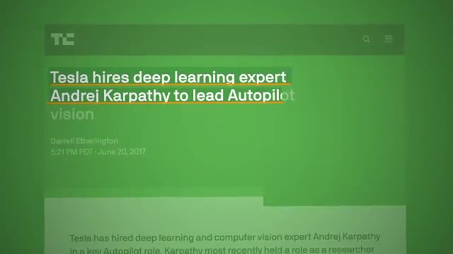
*⏱️ 00:00:25 — Image 3 : Capture d'écran d'un article de TechCrunch titré "Tesla hires deep learning expert Andrej Karpathy to lead Autopilot vision".*

---

### ⏱️ `[00:00:33 - 00:01:04]` | Segment #02

**🔊 Audio (Transcription Intégrale Mot pour Mot en Français) :**
> équipe, qui est l'équipe qui entraîne les modèles Claude avant qu'ils ne soient rendus publics. Et à côté, il a publié tellement de vidéos YouTube et de cours différents sur la création avec l'IA. Donc ce que nous construisons aujourd'hui n'est pas un clone vocal d'Andrej Karpathy. Ce n'est pas une imitation de lui. C'est un agent qui condense la façon dont le meilleur professeur d'IA, Andrej Karpathy, explique les choses, et il vous l'enseigne de la même manière. Il suit donc sept règles qui proviennent toutes de ses propres écrits, de ses blogs et de ses conférences, des choses comme construire d'abord la plus petite version, prédire ce qui va se passer avant de l'exécuter, montrer la version cassée, et ne jamais donner de code que vous n'avez pas exécuté vous-même.

**👁️ Analyse Visuelle d'Écran (gemini-3.5-flash-lite) :**
**Interface & Outils** : YouTube, Interface web personnalisée / application

**Contenu textuel & Code** : Titre de vidéo YouTube et interface de démonstration interactive avec options numérotées.

**Action / Démonstration** : Navigation et présentation de l'interface du projet Agent Karpathy.

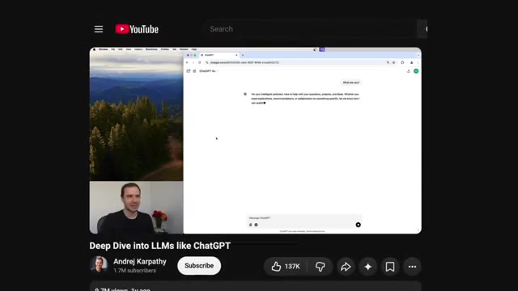
*⏱️ 00:00:41 — Capture montrant une vidéo YouTube intitulée 'Deep Dive into LLMs like ChatGPT' par Andrej Karpathy.*

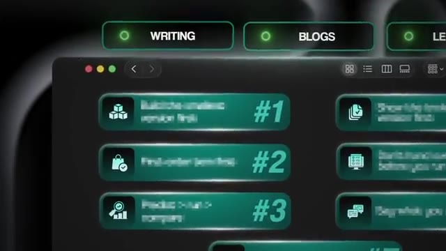
*⏱️ 00:00:57 — Gros plan sur une interface utilisateur moderne avec des boutons clairs étiquetés '#1', '#2', '#3', 'WRITING', et 'BLOGS'.*

---

### ⏱️ `[00:01:05 - 00:01:27]` | Segment #03

**🔊 Audio (Transcription Intégrale Mot pour Mot en Français) :**
> Donc c'est bien plus qu'un simple clone d'une personne. Il s'agit plutôt de cloner la façon dont son cerveau pense. Alors maintenant, je parie que vous vous demandez, pourquoi est-ce qu'on construirait réellement un truc pareil ? Pensons à ce qui se passe quand vous demandez à Claude d'expliquer quelque chose que vous ne comprenez pas. Il risque d'en faire trop dans ses explications. Il pourrait inventer des trucs en chemin. Et au final, vous avez juste l'impression de n'avoir rien appris et de vous sentir encore plus submergé. Et si vous construisez quelque chose pour un client, c'est comme ça que vous finissez par livrer du code que vous ne pouvez ni réparer ni expliquer quand il plante.

**👁️ Analyse Visuelle d'Écran (gemini-3.5-flash-lite) :**
**Interface & Outils** : Interface web de type application de chat "Claude Code".

**Contenu textuel & Code** : Question utilisateur : "Can you explain what the difference between API and MCP is?" et réponse en cours de génération "API vs MCP Imagine you have...".

**Action / Démonstration** : Affichage d'une démonstration de l'interface de chat posant une question technique sur l'API et le MCP.

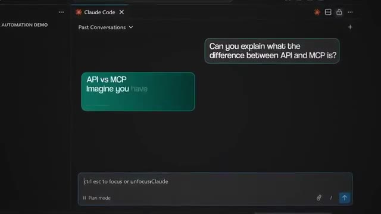
*⏱️ 00:01:16 — Une capture d'écran de l'interface "Claude Code" montrant une conversation où l'utilisateur demande la différence entre API et MCP.*

---

### ⏱️ `[00:01:27 - 00:01:47]` | Segment #04

**🔊 Audio (Transcription Intégrale Mot pour Mot en Français) :**
> Et Andrej Karpathy a été confronté exactement au même problème. En août de l'année dernière, il a effectivement publié publiquement qu'il avait essayé de demander à Claude Code de lui enseigner en même temps qu'il écrivait le code. Et selon ses propres mots, cela n'a pas du tout fonctionné, car il veut vraiment beaucoup plus écrire du code que d'expliquer quoi que ce soit en cours de route. Donc, construire cet agent ici va corriger la pire habitude de l'IA, qui est d'avoir l'air d'avoir raison au lieu d'avoir réellement raison.

**👁️ Analyse Visuelle d'Écran (gemini-3.5-flash-lite) :**
**Interface & Outils** : Interface de publication sur les réseaux sociaux (X / Twitter)

**Contenu textuel & Code** : Texte du tweet d'Andrej Karpathy détaillant ses flux de travail avec les LLM (Cursor, Claude Code) et son constat sur l'apprentissage simultané.

**Action / Démonstration** : Affichage à l'écran d'une citation textuelle d'Andrej Karpathy à l'appui des propos du présentateur.

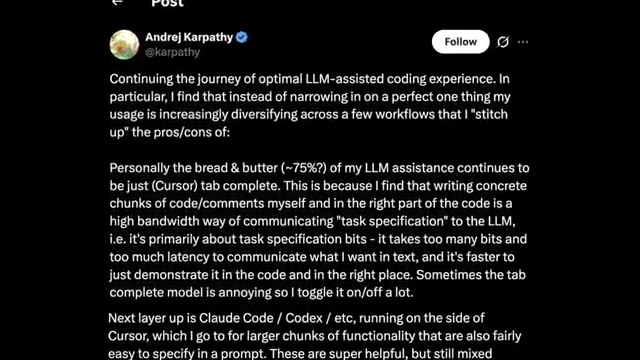
*⏱️ 00:01:32 — Capture d'écran d'un message publié sur les réseaux sociaux par Andrej Karpathy concernant son expérience avec l'assistance des LLM pour le codage.*

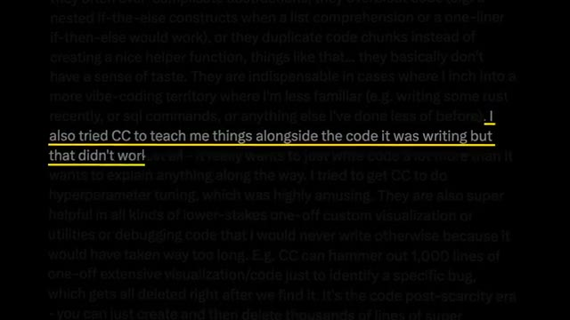
*⏱️ 00:01:37 — Suite du message d'Andrej Karpathy avec une ligne surlignée en jaune soulignant qu'il a essayé d'utiliser Claude Code pour lui apprendre des choses en même temps.*

---

### ⏱️ `[00:01:47 - 00:02:06]` | Segment #05

**🔊 Audio (Transcription Intégrale Mot pour Mot en Français) :**
> Et la raison la plus importante, c'est honnêtement ceci : la qualité de ce que vous construisez avec l'IA dépend de l'expertise présente dans le système. Et vous n'allez pas être un expert en tout. Vous savez, je ne suis pas un chercheur en apprentissage automatique. Je ne suis pas un expert en apprentissage automatique, mais je peux certainement demander à des agents de rassembler tout ce qu'un véritable expert a dit, de compiler le tout en quelque chose que Claude peut réellement utiliser, et ensuite je peux simplement discuter avec lui jusqu'à ce que je comprenne.

**👁️ Analyse Visuelle d'Écran (gemini-3.5-flash-lite) :**
**Interface & Outils** : AUCUNE

**Contenu textuel & Code** : AUCUNE

**Action / Démonstration** : AUCUNE

---

### ⏱️ `[00:02:06 - 00:02:28]` | Segment #06

**🔊 Audio (Transcription Intégrale Mot pour Mot en Français) :**
> Et ensuite, une fois que je comprends un peu mieux, j'ai déjà toutes ces connaissances dans mon projet et je peux intégrer ces connaissances dans mes propres compétences, mes propres agents et mes propres flux de travail, ce qui est exactement ce que nous faisons aujourd'hui avec Carpathie. Et ce qui est vraiment génial, c'est qu'une fois que vous avez fait cela avec Carpathie, vous pouvez le faire avec pratiquement n'importe qui. Vous pouvez le faire avec votre professeur de vente préféré, ou un auteur que vous aimez vraiment, ou un coach que vous payez déjà. Et ce sont fondamentalement les quatre mêmes étapes, de la même manière que nous construisons cette sorte de second cerveau.

**👁️ Analyse Visuelle d'Écran (gemini-3.5-flash-lite) :**
**Interface & Outils** : Graphisme d'animation / Interface vidéo standard

**Contenu textuel & Code** : Texte schématique 'CLAUDE' relié à 'SKILLS'

**Action / Démonstration** : Animation graphique illustrant l'intégration des compétences d'IA

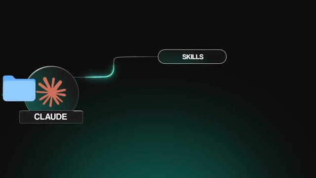
*⏱️ 00:02:12 — Schéma graphique animé illustrant une connexion entre un dossier 'CLAUDE' et un module 'SKILLS'.*

---

### ⏱️ `[00:02:29 - 00:02:52]` | Segment #07

**🔊 Audio (Transcription Intégrale Mot pour Mot en Français) :**
> Maintenant, très rapidement, avant qu'on ne passe à la création, j'ai tout à fait gratuitement ce kit AIOS pour vous les gars pour vous aider à créer et faire passer à l'échelle vos systèmes d'exploitation. Si vous combinez ce genre de configuration avec des choses comme le cerveau de Carpathie, ça va juste être un énorme déclic et c'est comme ça que je suis capable d'aller aussi vite. Donc le lien pour ça sera en bas dans la description, mais passons à la création. Bon, alors je vais faire ça à l'intérieur de Cloud Code et il va y avoir six prompts à exécuter ici et je vais tous les montrer à l'écran pour que vous puissiez simplement faire une capture d'écran et les coller dans votre propre Cloud Code.

**👁️ Analyse Visuelle d'Écran (gemini-3.5-flash-lite) :**
**Interface & Outils** : Interface de type graphe de connaissances / notes et liste graphique de prompts.

**Contenu textuel & Code** : Noms des différents prompts et structure de graphe visuel du kit AIOS.

**Action / Démonstration** : Présentation visuelle des composants du kit AIOS et de ses structures de prompts.

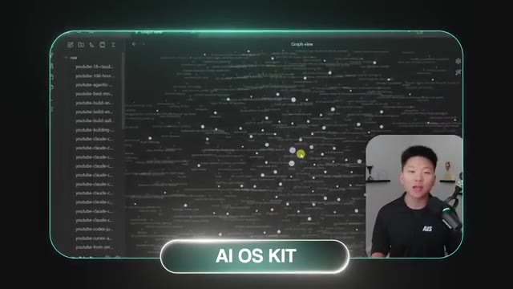
*⏱️ 00:02:35 — Aperçu du kit AIOS présenté sous forme de graphe de notes interconnectées avec le présentateur incrusté en bas à droite.*

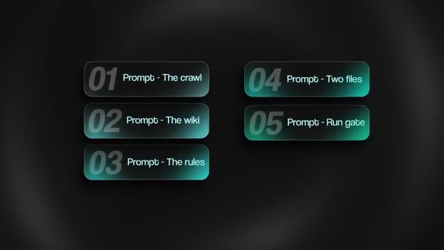
*⏱️ 00:02:46 — Liste numérotée de cinq prompts du kit AIOS (The crawl, The wiki, The rules, Two files, Run gate).*

---

### ⏱️ `[00:02:52 - 00:03:13]` | Segment #08

**🔊 Audio (Transcription Intégrale Mot pour Mot en Français) :**
> Donc d'abord, Claude a besoin de tout ce qui se trouve à l'intérieur de la tête d'Andrej Karpathy. Des choses comme ses blogs, les transcriptions de ses cours, ses dépôts GitHub, ses publications sur X. Tout cela va être fondamentalement gratuit et public. Mais Claude Code pourrait ne pas être capable de tout récupérer gratuitement, car cela pourrait se trouver derrière une sorte de mur payant ou de barrière logicielle. Donc ce que j'ai fait pour YouTube, c'est que je lui ai fait récupérer les sous-titres avec deux paquets Python gratuits.

**👁️ Analyse Visuelle d'Écran (gemini-3.5-flash-lite) :**
**Interface & Outils** : Interface web de Claude et page de documentation technique / rapport de sécurité.

**Contenu textuel & Code** : Code source Python montrant l'utilisation de `subprocess.Popen` avec `shell=True` et des explications sur une faille d'injection de commande.
[DESC_IMAGE_3] Présentation d'une vulnérabilité de sécurité logicielle liée à une injection de commande dans un webhook.

**Action / Démonstration** : Explications face caméra et démonstration conceptuelle.

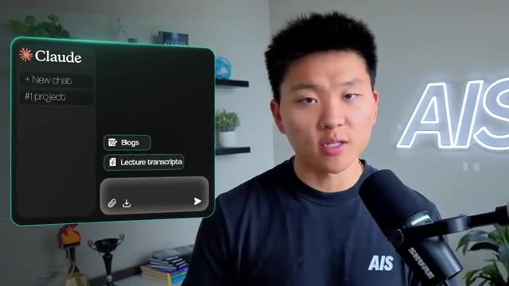
*⏱️ 00:02:57 — Le présentateur s'exprime face caméra avec une fenêtre d'interface Claude en incrustation à gauche montrant des options de chat et des boutons 'Blogs' et 'Lecture transcripts'.*

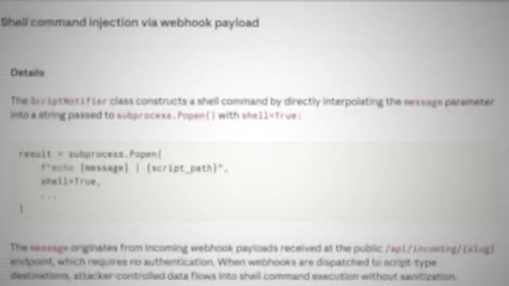
*⏱️ 00:03:08 — Une page de documentation ou de rapport technique affichant du code Python lié à une vulnérabilité de type 'Shell command injection via webhook payload'.*

---

### ⏱️ `[00:03:13 - 00:03:46]` | Segment #09

**🔊 Audio (Transcription Intégrale Mot pour Mot en Français) :**
> YouTube Transcript API et YTDLP. Et puis pour X, j'utilise une API appelée TwitterAPI.io, qui est une API payante, mais j'ai extrait pratiquement chaque publication qu'il a faite depuis 2023, et ça a coûté environ un dollar. Ce n'est vraiment pas une API très chère du tout. Donc voici le prompt pour le parcours. Il indique essentiellement où tout récupérer, quel outil utiliser pour chaque source. Et je lui ai dit d'exécuter un agent par source, pour qu'ils fonctionnent tous en même temps et en parallèle, afin que ça ne prenne pas une éternité. Je lui ai dit de noter ce qu'il a obtenu pour que vous puissiez réellement le vérifier. Et ça m'a pris environ 45 minutes à une heure pour que tous ces agents s'exécutent et récupèrent tout. Et ce qu'on obtient à la fin, c'est un dossier brut avec un sous-dossier.

**👁️ Analyse Visuelle d'Écran (gemini-3.5-flash-lite) :**
**Interface & Outils** : Interface graphique textuelle / Éditeur de prompt

**Contenu textuel & Code** : Texte du prompt "01 Prompt - The crawl" détaillant l'utilisation de youtube-transcript-api, yt-dlp et TwitterAPI.io pour collecter et structurer les données.

**Action / Démonstration** : Affichage à l'écran du prompt utilisé pour orchestrer les agents d'extraction de données.

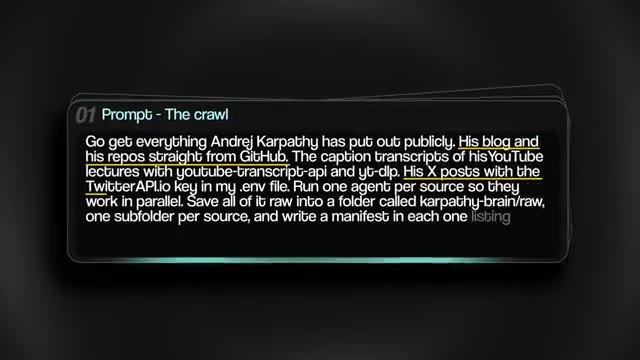
*⏱️ 00:03:30 — Fenêtre de terminal ou d'interface affichant le texte "01 Prompt - The crawl" avec des instructions de web scraping pour collecter les données d'Andrej Karpathy.*

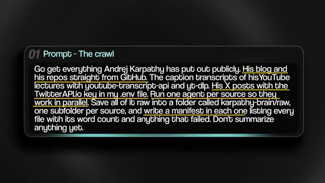
*⏱️ 00:03:38 — Vue complète et nette du même prompt de crawl montrant l'ensemble des instructions pour récupérer le contenu public (blog, GitHub, transcriptions YouTube, posts X via TwitterAPI.io).*

---

### ⏱️ `[00:03:46 - 00:04:22]` | Segment #10

**🔊 Audio (Transcription Intégrale Mot pour Mot en Français) :**
> par source et plus de 700 000 mots provenant directement d'Andrej Karpathy lui-même. Maintenant, vous pourriez tout simplement vous arrêter là et pointer Claude vers ce dossier, mais tous ces mots, vous savez, brouillons, ça ne rentre pas vraiment dans la tête de Claude de la bonne manière pour qu'il puisse réellement filtrer tout ça correctement, n'est-ce pas ? Du genre, ça va être trop désordonné. C'est comme chercher une aiguille dans une botte de foin. Donc ce que nous allons faire, c'est ce que Karpathy a dit à tout le monde de faire en avril dernier. Il a publié un message expliquant qu'il fait compiler par un LLM ses sources brutes sous forme de wiki. Les fichiers bruts ne sont pas touchés, mais le LLM les lit essentiellement tous, puis les relie entre eux avec des pages, tient un index, tient un journal, et maintenant vous êtes capable d'interroger tout cela d'une manière qui a beaucoup plus de sens parce qu'il y a

**👁️ Analyse Visuelle d'Écran (gemini-3.5-flash-lite) :**
**Interface & Outils** : Interface graphique animée / Schéma conceptuel

**Contenu textuel & Code** : Étiquettes de modules et icônes de fichiers divers (PDF, Excel, audio) pointant vers un modèle de langage (LLM).

**Action / Démonstration** : Illustration visuelle du traitement de données brutes par un modèle de langage.

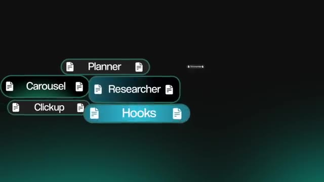
*⏱️ 00:03:55 — Schéma animé montrant des blocs de modules reliés (Planner, Carousel, Clickup, Researcher, Hooks).*

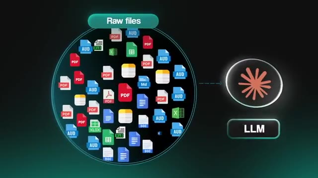
*⏱️ 00:04:13 — Schéma animé représentant une multitude de fichiers bruts ("Raw files") de types variés (PDF, AUD, XLSX, DOC) connectés à un LLM.*

---

### ⏱️ `[00:04:22 - 00:04:57]` | Segment #11

**🔊 Audio (Transcription Intégrale Mot pour Mot en Français) :**
> comme des relations. Et vous résumez toute cette idée dans un gist, et c'est ce que je vais coller dans l'agent de codage. Le lien vers le gist est dans la description de cette vidéo. Donc ce que nous faisons est plutôt amusant. Nous stockons le cerveau de Carpathia à l'intérieur du propre système de mémoire wiki LLM de Carpathia. Et si vous me suivez depuis un moment, vous savez que j'ai fait pas mal de vidéos sur ce sujet et que j'ai configuré tout un tas de wikis LLM différents dans mon propre AIOS. Très bien, voici donc le prompt pour configurer le wiki. Vous allez coller le gist, puis vous allez dire à Claude de l'utiliser sur le dossier brut, qui est simplement tout ce que Claude vient juste d'extraire pour vous. Et ce qui en ressort, c'est un wiki à l'intérieur d'Obsidian. Maintenant, Obsidian n'est en fait que la couche visuelle par-dessus, c'est ce que je vous montre ici. Et vous n'avez pas besoin d'Obsidian pour obtenir ce

**👁️ Analyse Visuelle d'Écran (gemini-3.5-flash-lite) :**
**Interface & Outils** : Obsidian (ou application de prise de notes similaire avec vue graphique) et interface de prompt textuel.

**Contenu textuel & Code** : URL de gist GitHub ("gist.github.com/karpathy/442a6bf555914893e9891c11519de94f") et instruction : "Use it as the framework and compile everything in karpathy-brain/raw into a wiki of his brain".

**Action / Démonstration** : Présentation du processus d'intégration du gist de Karpathy dans un système de connaissances et de l'utilisation du prompt avec un agent de codage.

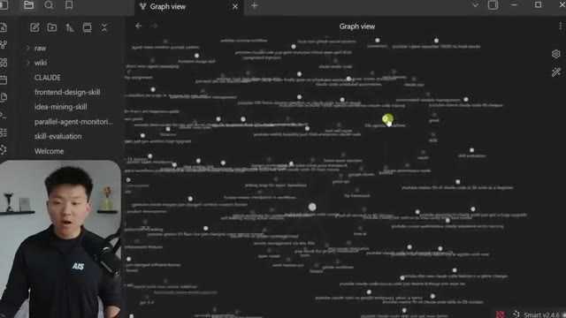
*⏱️ 00:04:39 — Vue graphique d'un wiki (type Obsidian) montrant les relations entre différentes notes et concepts liés à l'IA.*

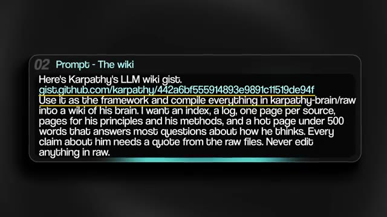
*⏱️ 00:04:48 — Un bloc de texte affichant un prompt ("Prompt - The wiki") faisant référence au gist de Karpathy et aux instructions pour compiler les données dans un wiki.*

---

### ⏱️ `[00:04:57 - 00:05:32]` | Segment #12

**🔊 Audio (Transcription Intégrale Mot pour Mot en Français) :**
> pour fonctionner. Mais si vous voulez le voir visuellement, Obsidian fonctionne. Vous pouvez voir ici en bas, nous avons les sources. Nous avons une page par chose qu'il a écrite ou dite. Nous avons des sujets sur ce qu'il sait. Nous avons des principes. Nous avons les règles. Nous avons des méthodes. Nous avons la façon dont il explique. Nous avons la façon dont il débogue. Nous avons en gros, juste comme je l'ai dit, la façon dont son cerveau fonctionne et chaque fois que vous voyez l'un de ces liens violets, c'est le wiki qui connecte une page à une autre ou une méthode à une autre. Chaque règle renvoie à la source d'où elle vient ou aux sources d'où elle vient. Chaque source renvoie aux règles qu'elle soutient. Donc, au lieu d'avoir simplement un tas de notes comme nous l'avions tout à l'heure, nous avons maintenant comme cette toile interconnectée ou une sorte de carte des relations et chaque fois que quelque chose de nouveau y est entré

**👁️ Analyse Visuelle d'Écran (gemini-3.5-flash-lite) :**
**Interface & Outils** : Obsidian (application de prise de notes et gestion de connaissances)

**Contenu textuel & Code** : Liste de principes et méthodes de travail (ex: '03-predict-then-run-then-compare', '12-memory-that-compounds'), métadonnées YAML, tags (anthropic, openai, career)

**Action / Démonstration** : Navigation et consultation de notes structurées dans le coffre-fort Obsidian

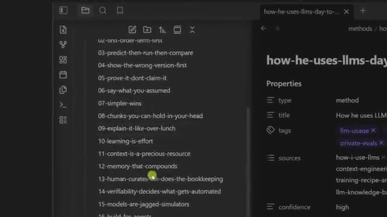
*⏱️ 00:05:06 — Vue d'Obsidian montrant une liste de méthodes numérotées dans le volet de gauche et les propriétés d'une note dans le panneau de droite.*

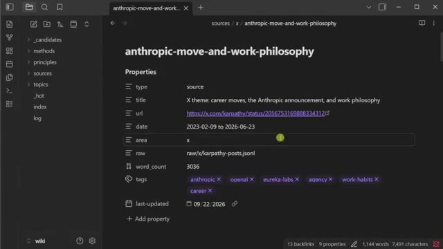
*⏱️ 00:05:24 — Interface d'Obsidian affichant les métadonnées et propriétés détaillées d'une page de source intitulée 'anthropic-move-and-work-philosophy'.*

---

### ⏱️ `[00:05:32 - 00:05:52]` | Segment #13

**🔊 Audio (Transcription Intégrale Mot pour Mot en Français) :**
> Vous absorbez un nouveau blog ou une nouvelle idée, le LLM va une fois de plus l'absorber et le lier à tout un tas d'autres concepts. Maintenant, cette prochaine étape est ce qui le fait penser comme lui au lieu de simplement savoir ce qu'il a dit par le passé. Voici donc le prompt pour configurer les règles. Il extrait fondamentalement ses règles du wiki, et chaque règle doit être connectée à une citation exacte de lui et d'où elle provient, parce que nous ne voulons pas que Claude invente des choses.

**👁️ Analyse Visuelle d'Écran (gemini-3.5-flash-lite) :**
**Interface & Outils** : Présentation graphique / Diapositive textuelle

**Contenu textuel & Code** : "03 Prompt - The rules: Read the wiki and write his rules for how he builds and how he teaches. Only keep a rule if it shows up in at least two different places, like his blog and a lecture. Every rule needs an exact quote from him with the source it came from. Give me the seven strongest ones."

**Action / Démonstration** : Affichage à l'écran du prompt configurant les règles d'extraction pour le LLM.

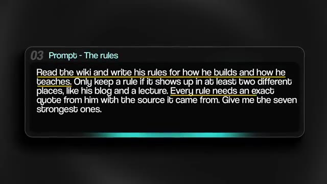
*⏱️ 00:05:47 — Capture d'écran affichant une boîte de dialogue avec le titre "03 Prompt - The rules" et un prompt textuel détaillé sur fond sombre.*

---

### ⏱️ `[00:05:52 - 00:06:15]` | Segment #14

**🔊 Audio (Transcription Intégrale Mot pour Mot en Français) :**
> Donc ce qu'on a là, c'était sept règles. Numéro un : construis-le ou tu ne le comprends pas. Numéro deux : le terme du premier ordre d'abord. En gros, trouve la seule pièce qui compte, montre qu'elle fonctionne, puis ajoute juste une chose à la fois. Et à peu près tout ce cours est construit de cette façon. Numéro trois : prédire, puis exécuter, puis comparer. Il dira le nombre qu'il attend avant d'exécuter la cellule parce que, selon ses mots, la plupart du temps, ça s'entraînera, mais en fonctionnant silencieusement un peu moins bien.

**👁️ Analyse Visuelle d'Écran (gemini-3.5-flash-lite) :**
**Interface & Outils** : AUCUNE

**Contenu textuel & Code** : AUCUNE

**Action / Démonstration** : AUCUNE

---

### ⏱️ `[00:06:16 - 00:06:34]` | Segment #15

**🔊 Audio (Transcription Intégrale Mot pour Mot en Français) :**
> Le numéro quatre est de montrer d'abord la mauvaise version. Il laisse ses propres bugs dans l'enregistrement exprès. Le numéro cinq est de le prouver, ne l'affirmez pas. Le numéro six est de dire ce que vous avez supposé. Sa principale critique concernant Cloud Code est que les modèles font de mauvaises suppositions à votre place et foncent ensuite tête baissée sans vérifier. Et le numéro sept est que la simplicité l'emporte. Et ce qui est génial, c'est que vous pouvez vérifier n'importe lequel de ces points.

**👁️ Analyse Visuelle d'Écran (gemini-3.5-flash-lite) :**
**Interface & Outils** : Interface logicielle de présentation de liste.

**Contenu textuel & Code** : Texte à l'écran listant les règles avec 'Show the wrong version first' au numéro 4.

**Action / Démonstration** : Affichage des points clés de la critique à l'écran sous forme de liste numérotée.

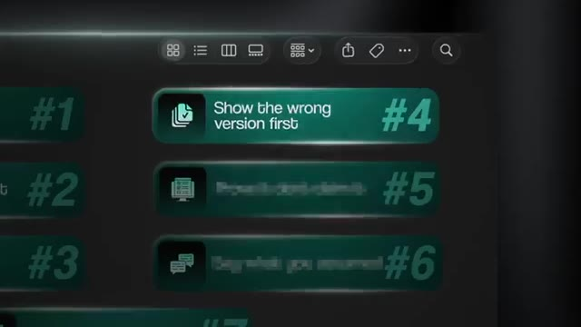
*⏱️ 00:06:20 — Capture d'écran montrant une interface graphique avec des listes numérotées et des boutons verts étiquetés avec des directives de présentation comme 'Show the wrong version first' (#4).*

---

### ⏱️ `[00:06:34 - 00:06:57]` | Segment #16

**🔊 Audio (Transcription Intégrale Mot pour Mot en Français) :**
> Vous pouvez cliquer sur la citation et cela ouvrira la page d'où elle provient avec l'horodatage ou avec la source exacte. Et s'il n'y a pas de source, l'agent doit dire explicitement qu'il fait déduire à partir de choses que Carpathie a dites. Maintenant, ces règles doivent vivre quelque part où l'agent peut réellement les lire. Voici donc le prompt quatre, et il demande à Claude de les transformer en deux fichiers pour nous. Ce premier fichier est un sous-agent. Et au cas où vous ne sauriez pas ce que c'est, c'est un Claude séparé avec ses propres instructions et sa propre mémoire et fenêtre de contexte.

**👁️ Analyse Visuelle d'Écran (gemini-3.5-flash-lite) :**
**Interface & Outils** : Interface graphique textuelle affichant un prompt de configuration de sous-agent.

**Contenu textuel & Code** : Texte du prompt demandant de transformer des règles en un sous-agent Claude Code appelé "karpathy", configuré pour lire le wiki, citer ses sources, et créer une compétence "karpathy-teach".

**Action / Démonstration** : Affichage à l'écran du prompt détaillé pour la création et la configuration du sous-agent IA.

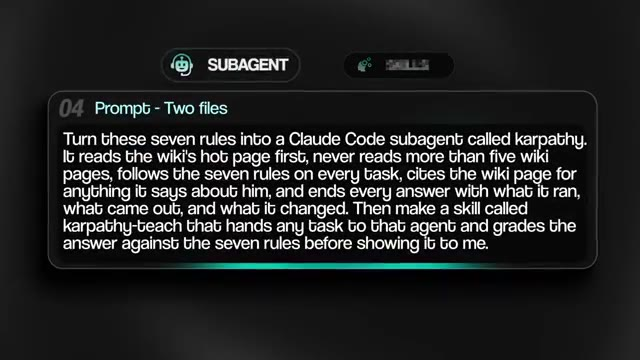
*⏱️ 00:06:51 — Capture d'écran montrant un encadré de prompt intitulé "04 Prompt - Two files" avec l'étiquette "SUBAGENT".*

---

### ⏱️ `[00:06:57 - 00:07:27]` | Segment #17

**🔊 Audio (Transcription Intégrale Mot pour Mot en Français) :**
> De sorte que si vous voulez confier une tâche à un sous-agent, cela ne traîne pas toute votre conversation avec lui. Et vous pouvez voir ici, à l'intérieur du fichier du sous-agent, nous pouvons voir les sept règles. Nous pouvons également voir comment il parle, et nous pouvons voir la boucle sur laquelle il tourne pour chaque tâche. C'est donc fondamentalement comme un petit agent Carpathic miniature. Maintenant, le second est une compétence. Vous pouvez donc voir ici que lorsque je tape barre oblique Carpathic tiret teach, puis tout ce sur quoi je bloque, cela entre dans l'agent avec les règles, et ensuite cela évalue la réponse par rapport à une liste de contrôle, une ligne par règle, et ensuite cela va réellement me montrer tout. Ce sont donc les deux choses que nous avons, un agent Carpathic et une compétence Carpathic.

**👁️ Analyse Visuelle d'Écran (gemini-3.5-flash-lite) :**
**Interface & Outils** : Interface de terminal sombre / environnement de développement, éditeur de code ou assistant IA.

**Contenu textuel & Code** : Texte de prompt détaillé pour configurer le sous-agent 'karpathy' avec sept règles et une commande '/karpathy-teach' en cours d'exécution.

**Action / Démonstration** : Configuration d'un sous-agent IA et exécution d'une tâche de revue de code déléguée avec évaluation par grille de notation.

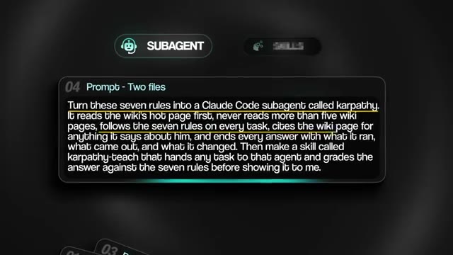
*⏱️ 00:07:04 — Un encadré sombre affichant un prompt textuel décrivant la configuration de règles pour un sous-agent Claude Code nommé karpathy.*

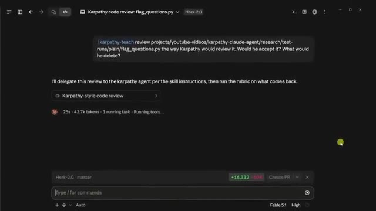
*⏱️ 00:07:19 — Une interface de développement avec un terminal sombre montrant une exécution de commande '/karpathy-teach' pour une revue de code Python.*

---

### ⏱️ `[00:07:27 - 00:08:01]` | Segment #18

**🔊 Audio (Transcription Intégrale Mot pour Mot en Français) :**
> Bon, maintenant, voici une autre chose qui est vraiment importante lorsque nous configurons ceci. Nous voulons que l'agent s'assure qu'il exécute son code avant de vous répondre. Et c'est pourquoi construire ceci à l'intérieur de Cloud Code fonctionne si bien, parce qu'il peut déjà écrire et exécuter du code. Et c'est une étape dont nous devons nous assurer que l'agent ne peut pas sauter selon les propres règles de Carpathie. Donc, voici le cinquième prompt. Il s'agit essentiellement d'ajouter une barrière d'exécution. Il ajoute un crochet, qui est un petit script qui s'exécute juste au moment où l'agent essaie de terminer son tour. Donc, s'il a écrit du code et ne l'a jamais exécuté, le crochet va essentiellement bloquer la réponse et il la renverra avec un message disant, hé, vous devez exécuter ceci avant de dire que ça fonctionne. Donc, nous intégrons en quelque sorte une boucle de vérification. Et vous n'avez évidemment pas besoin de coder ou d'écrire ce crochet vous-même. Vous le demandez simplement avec ce prompt.

**👁️ Analyse Visuelle d'Écran (gemini-3.5-flash-lite) :**
**Interface & Outils** : Interface CLI (Claude), Éditeur de prompt / Fenêtre de chat, Bloc de code Python

**Contenu textuel & Code** : Commandes terminal, prompt textuel « Add a Stop hook to this project... », code source Python de test de revues (dictionnaire `review` avec `pros`, `cons`, `score`)

**Action / Démonstration** : Configuration d'un hook d'arrêt (Stop hook) pour exiger que l'agent exécute son code avant de valider son fonctionnement

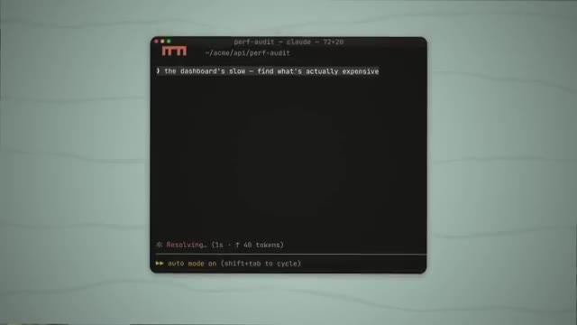
*⏱️ 00:07:35 — Capture d'écran montrant une interface de terminal de type CLI (perf-audit - claude) avec une invite de commande et le mode automatique activé.*

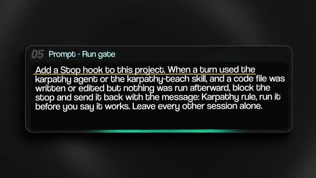
*⏱️ 00:07:44 — Capture d'écran affichant une boîte de texte contenant un prompt de configuration (Prompt - Run gate) définissant une règle d'arrêt pour l'agent.*

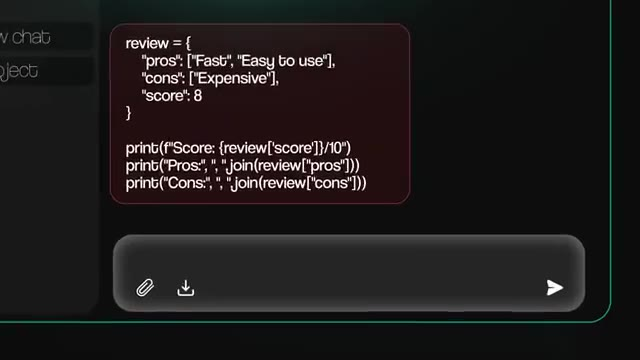
*⏱️ 00:07:52 — Capture d'écran montrant un extrait de code Python dans une interface de chat, manipulant des dictionnaires de revues et affichant des scores.*

---

### ⏱️ `[00:08:01 - 00:08:34]` | Segment #19

**🔊 Audio (Transcription Intégrale Mot pour Mot en Français) :**
> Donc maintenant, il va s'exécuter, il va tester et il va corriger. Et ce n'est qu'après tout cela que vous verrez réellement la chose finale. Et puis la dernière étape, bien sûr, c'est juste de le tester. Donc quelques prompts différents que nous utilisons pour le tester. Je lui ai demandé ici de construire quelque chose de réel et de m'apprendre comment ça marche, ce qui était un tokeniseur par paires d'octets, qui est la chose qui transforme le texte en nombres avant qu'un grand modèle de langage ne le voie jamais. Et regardez ce qu'il fait ici. La première fois, il écrit ce que « terminé » signifie avant de toucher au moindre code. Et puis il construit la plus petite version qui fonctionne sur une minuscule entrée, et avant de l'exécuter, il me dit ce qu'il s'attend à voir. Ensuite, il l'exécute et me montre le résultat réel, puis il me montre une version qui plante et pourquoi, et ensuite il la corrige. Et puis à

**👁️ Analyse Visuelle d'Écran (gemini-3.5-flash-lite) :**
**Interface & Outils** : Interface web d'un éditeur de projet ou d'un outil de documentation (Herk-2.0).

**Contenu textuel & Code** : Texte explicatif sur le tokenizer BPE, les modèles de langage et des extraits de code Python (count_pairs, merge).

**Action / Démonstration** : Affichage et lecture d'une spécification technique pour la construction d'un tokenizer.

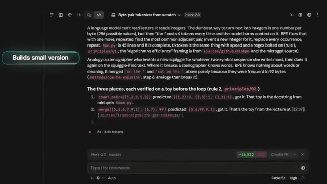
*⏱️ 00:08:25 — Capture d'écran d'une interface de développement montrant un document technique sur le "Byte-pair tokenizer from scratch" avec des explications textuelles et du code.*

---

### ⏱️ `[00:08:34 - 00:08:56]` | Segment #20

**🔊 Audio (Transcription Intégrale Mot pour Mot en Français) :**
> en bas, il liste fondamentalement tout ce qu'il a exécuté, ce qui est sorti, ce qu'il a changé, et quelle règle il suivait pour chacun de ces mouvements. Donc, au lieu d'obtenir juste un bloc de code en retour et puis l'agent qui dit, hé, ça fonctionne, j'ai pratiquement été guidé à travers tout cela, une étape à la fois, et maintenant je peux comprendre beaucoup mieux ce qui vient de se passer. Maintenant, une autre chose que vous pouvez tester, c'est sa révision. Donc, avant qu'un élément ne soit envoyé à un client, je peux lui poser une question, qui est : est-ce que le client accepterait ceci, et qu'est-ce qu'il voudrait supprimer ou, vous savez, des questions de ce genre.

**👁️ Analyse Visuelle d'Écran (gemini-3.5-flash-lite) :**
**Interface & Outils** : Interface de terminal ou de sortie textuelle d'un agent IA.

**Contenu textuel & Code** : Texte explicatif décrivant les modifications du code source (bpe.py) et les sources référencées.

**Action / Démonstration** : Affichage des explications détaillées et de la traçabilité des modifications effectuées par l'agent IA.

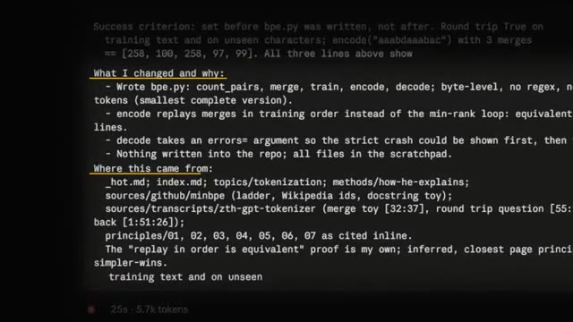
*⏱️ 00:08:39 — Capture d'écran montrant du texte technique avec les sections 'What I changed and why' et 'Where this came from', listant les actions d'un agent IA.*

---

### ⏱️ `[00:08:56 - 00:09:16]` | Segment #21

**🔊 Audio (Transcription Intégrale Mot pour Mot en Français) :**
> Et voici un script que Claude m'a écrit et que je peux utiliser comme exemple. Ce script extrait des commentaires YouTube et il a fonctionné sans problème lorsque Claude l'a testé. L'agent le lit, prédit qu'il va planter à cause d'un emoji sous un terminal Windows normal, l'exécute quand même de cette façon, puis plante avant d'écrire le moindre fichier. Dire que ça fonctionne n'était donc vrai que dans un contexte ou un terminal bien précis. Donc ici, vous pouvez voir que Claude a été capable de passer en revue et de supprimer tout un tas d'éléments superflus.

**👁️ Analyse Visuelle d'Écran (gemini-3.5-flash-lite) :**
**Interface & Outils** : Interface de l'agent IA de code (style Fable/Karpathy).

**Contenu textuel & Code** : Texte du rapport de code mentionnant le plantage sous Windows console (cp1252) sur le premier emoji.

**Action / Démonstration** : Affichage des résultats d'analyse et de test de l'agent sur le script Python.

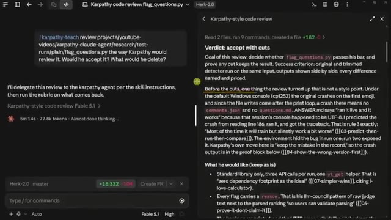
*⏱️ 00:09:01 — Interface d'un agent IA affichant un rapport de code de style Karpathy avec un texte analysant les plantages sous Windows.*

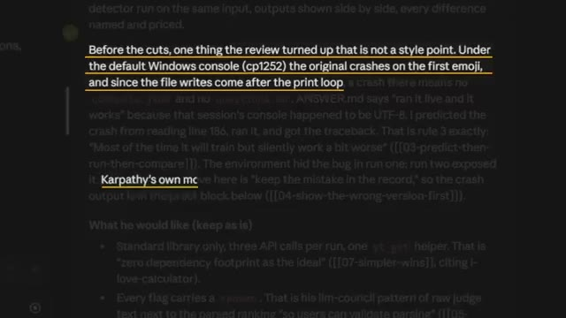
*⏱️ 00:09:06 — Gros plan sur le texte du rapport de code expliquant le problème de plantage de la console Windows (cp1252) à cause d'un emoji.*

---

### ⏱️ `[00:09:16 - 00:09:35]` | Segment #22

**🔊 Audio (Transcription Intégrale Mot pour Mot en Français) :**
> Et a été capable de me donner une analyse sur la façon dont nous résolvons réellement cela, le nettoyons et l'examinons avant de pouvoir réellement, genre, l'expédier. Et ensuite, cela prouve que la version allégée attrape les mêmes questions en les faisant tourner toutes les deux côte à côte et en me le montrant réellement. Et puis l'autre chose que je voulais soulever, c'est que cette chose va simplement continuer à apprendre. En juillet dernier, Carpathie a publié des messages sur la façon dont il parle de manière incohérente au modèle par la voix pendant 10 minutes, et ensuite il laisse le modèle nettoyer tout ce texte.

**👁️ Analyse Visuelle d'Écran (gemini-3.5-flash-lite) :**
**Interface & Outils** : Interface web de documentation / revue de code et Twitter (X).

**Contenu textuel & Code** : Texte de critères de réussite (Rubric) et publication sur les LLM par Andrej Karpathy.

**Action / Démonstration** : Présentation des critères de validation et affichage de retours d'expérience sur l'utilisation des IA.

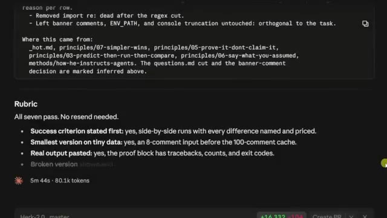
*⏱️ 00:09:21 — Capture d'écran montrant un panneau d'évaluation et de revue de code (Rubric) avec des critères de succès.*

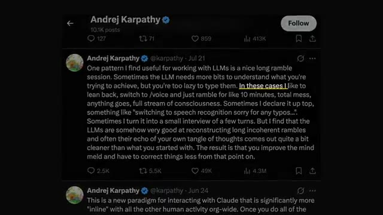
*⏱️ 00:09:31 — Capture d'écran d'un tweet d'Andrej Karpathy sur les interactions avec les LLM.*

---

### ⏱️ `[00:09:36 - 00:09:57]` | Segment #23

**🔊 Audio (Transcription Intégrale Mot pour Mot en Français) :**
> Je peux donc exécuter slash Carpathie tiret ingest avec n'importe quel type de lien. Il vérifiera ensuite le dossier brut, écrira une page source pour la publication, puis mettra à jour chaque page touchée par cette publication. Il a ajouté un nouveau comportement ici à la règle 6. Donc maintenant, l'agent sait qu'il doit me poser quelques questions lorsque ma requête est trop succincte au lieu de simplement deviner. Et une règle qui était sur le banc de touche avec une seule source derrière elle a obtenu sa seconde source et est devenue une règle officielle.

**👁️ Analyse Visuelle d'Écran (gemini-3.5-flash-lite) :**
**Interface & Outils** : Interface de l'outil d'ingestion et éditeur de texte/notes.

**Contenu textuel & Code** : Résumé des pages créées et modifiées après l'exécution de la commande de traitement (Source page, Pages touched, Principle 06).

**Action / Démonstration** : Exécution d'une commande d'ingestion de données et mise à jour automatique des fichiers de documentation.

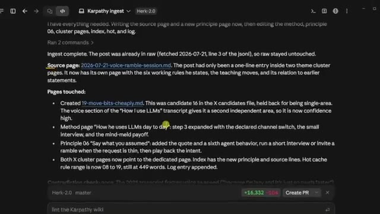
*⏱️ 00:09:41 — Vue d'ensemble de l'interface montrant les résultats d'exécution de la commande de traitement des données (Ingest).*

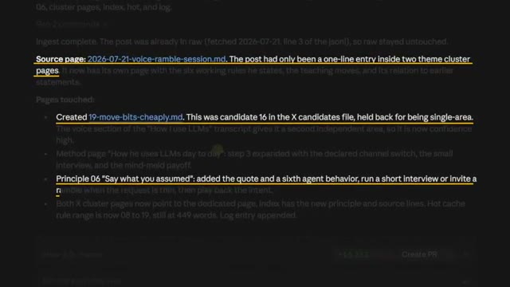
*⏱️ 00:09:46 — Gros plan sur le texte détaillant les pages modifiées, notamment le comportement de la règle 06.*

---

### ⏱️ `[00:09:57 - 00:10:16]` | Segment #24

**🔊 Audio (Transcription Intégrale Mot pour Mot en Français) :**
> Et ensuite, comme il comprend comment ce wiki fonctionne, il va mettre à jour l'index, il va mettre à jour la page tendance, il va mettre à jour le journal. Donc le cerveau vient de s'améliorer grâce à l'ajout d'un seul lien, et je n'ai jamais eu à toucher au wiki à la main ou à configurer manuellement ces relations ou ces liens. Et c'était bien sûr sa règle aussi. D'accord, donc en prenant du recul, nous avions quatre étapes. Nous avons donné à Claude tout ce qui se trouvait dans la tête de quelqu'un, la tête de Karpathy, et nous l'avons compilé dans un wiki.

**👁️ Analyse Visuelle d'Écran (gemini-3.5-flash-lite) :**
**Interface & Outils** : AUCUNE

**Contenu textuel & Code** : AUCUNE

**Action / Démonstration** : AUCUNE

---

### ⏱️ `[00:10:16 - 00:10:35]` | Segment #25

**🔊 Audio (Transcription Intégrale Mot pour Mot en Français) :**
> Nous transformons cela en ses propres règles avec une citation pour chacune d'elles. Nous le faisons s'exécuter avant qu'il ne parle, et nous le faisons tester sur des choses qui sont réelles. Et la phrase avec laquelle je voudrais vous laisser aujourd'hui est l'une de mes citations préférées, et c'est quelque chose qu'il a lui-même dit cette année, à savoir que vous pouvez externaliser votre réflexion, mais vous ne pouvez pas externaliser votre compréhension. Vous n'allez pas être l'expert en tout, et c'est très bien ainsi, mais vous pouvez certainement faire appel à l'expert et vous construire sur sa base.

**👁️ Analyse Visuelle d'Écran (gemini-3.5-flash-lite) :**
**Interface & Outils** : Graphique de présentation animé (overlay vidéo)

**Contenu textuel & Code** : Texte des 4 étapes clés de la méthodologie d'automatisation IA

**Action / Démonstration** : Affichage visuel des étapes de la stratégie présentée

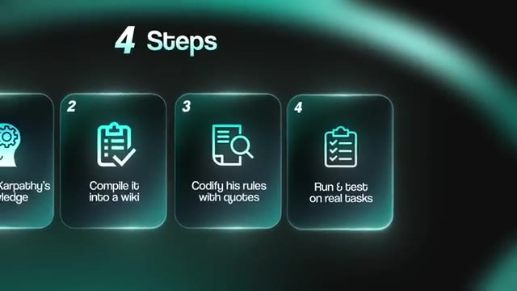
*⏱️ 00:10:21 — Un graphique montrant les 4 étapes de la méthode avec des cartes numérotées, notamment "Compile it into a wiki", "Codify his rules with quotes" et "Run & test on real tasks".*

---

### ⏱️ `[00:10:35 - 00:10:44]` | Segment #26

**🔊 Audio (Transcription Intégrale Mot pour Mot en Français) :**
> Mais de toute façon, c'est tout pour celui-ci, alors si vous avez apprécié la vidéo ou si vous avez appris quelque chose de nouveau, n'hésitez pas à laisser un pouce bleu. Ça m'aide vraiment énormément, et comme toujours, je vous remercie d'être arrivés jusqu'à la fin de la vidéo, et je vous dis à la prochaine. Merci tout le monde.

**👁️ Analyse Visuelle d'Écran (gemini-3.5-flash-lite) :**
**Interface & Outils** : AUCUNE

**Contenu textuel & Code** : AUCUNE

**Action / Démonstration** : AUCUNE

---

