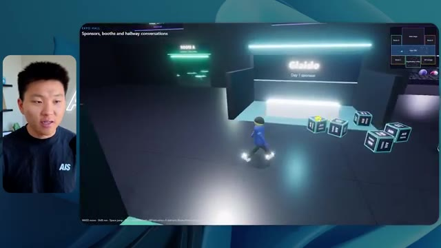
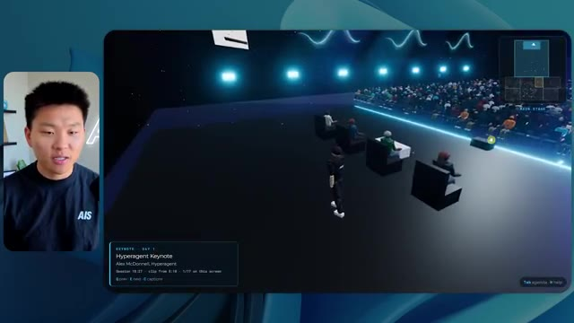

# 🎬 Anthropic Engineers Just 10x'd Everyone's Claude Code

> **Chaîne** : [Nate Herk | AI Automation](https://www.youtube.com/@nateherk/featured)  
> **Lien YouTube** : [https://www.youtube.com/watch?v=oz2CwrPV2Rg](https://www.youtube.com/watch?v=oz2CwrPV2Rg)  
> **Date de publication** : 20261008  
> **Durée** : 00:12:22  
> **Identifiant vidéo** : `oz2CwrPV2Rg`  
> **Transcription & Analyse** : `whisper-v3-large-turbo+gemini-3.5-flash-lite`  

---

## 📌 Synthèse Exécutive & Outils

### 💡 Résumé

Cette vidéo de la chaîne *Nate Herk | AI Automation* plonge au cœur des capacités d'ingénierie et d'automatisation d'**Opus 5.5**, le modèle d'intelligence artificielle hautement performant d'Anthropic. Pour tester les limites de cette technologie, l'analyste soumet un prompt complexe et global (**slash goal**) consistant à transformer un dossier Frame.io de 105 gigaoctets d'enregistrements vidéo bruts (provenant de l'événement virtuel *AIS Live*) en un monde 3D interactif et explorable en vue à la troisième personne. L'expérience évalue comment la variation des niveaux d'effort (de faible à moyen, puis vers les niveaux supérieurs) impacte radicalement la qualité architecturale, la logique comportementale et le rendu visuel de l'application générée de manière autonome par l'agent.

La démonstration comparative met en lumière l'évolution saisissante de la complexité logicielle générée. En mode **effort faible**, le modèle produit un monde basique en 16 minutes, souffrant de bugs d'affichage majeurs, d'une absence de direction artistique fidèle (fausses couleurs, logos absents) et de PNJ (personnages non-joueurs) instables qui disparaissent de manière erratique, le tout sans poser la moindre question à l'utilisateur. En revanche, le passage au mode **effort moyen** métamorphose complètement le résultat après 1 heure et 13 minutes d'exécution : le monde 3D adopte la charte graphique officielle de la marque, intègre des PNJ dotés de micro-comportements rudimentaires (salutations, mouvements de bras), diffuse de véritables flux vidéo fonctionnels dans les différentes salles virtuelles (ateliers, stands, scène principale, salon VIP) et respecte fidèlement l'agenda de l'événement. 

Au-delà de la prouesse technique de création logicielle de bout en bout, cette expérimentation souligne l'un des défis majeurs de l'ingénierie agentique moderne : le fossé entre le code fonctionnel produit localement et son déploiement en production. C'est précisément pour combler cette friction que des solutions d'intégration directe comme le connecteur Hostinger s'avèrent indispensables, permettant de lier instantanément l'environnement de développement à l'hébergement web.

### 🛠️ Outils, Modèles & Logiciels Présentés

* **Opus 5.5** : Modèle d'IA de pointe développé par Anthropic, salué pour sa grande intelligence, son coût abordable et sa capacité à s'adapter finement à différents niveaux d'effort computationnel.
* **Claude Code** : Outil de développement assisté par IA d'Anthropic permettant d'exécuter des tâches de génie logiciel complexes directement depuis l'environnement de code.
* **Frame.io** : Plateforme de collaboration vidéo cloud utilisée ici pour stocker les 105 gigaoctets d'enregistrements bruts de l'événement *AIS Live*.
* **Hostinger (et son connecteur)** : Solution d'hébergement et extension gratuite pour éditeurs de code (VS Code, Cursor, Claude Code, etc.) permettant de déployer et mettre en ligne instantanément des applications générées par IA.
* **Système Herc 2** : Écosystème propriétaire d'automatisation et d'exploitation par IA utilisé comme base de ressources par l'agent lors de la génération du projet.

### 🔑 Points Clés & Enseignements Stratégiques

* **Impact direct du paramètre d'effort** : Faire varier le niveau d'effort d'un modèle d'IA modifie radicalement la profondeur de raisonnement, la rigueur de l'implémentation logicielle et la qualité visuelle finale du livrable sans modifier le prompt initial.
* **Arbitrage temps-ressources vs complexité** : Un niveau d'effort faible génère un prototype grossier en 16 minutes (~191k tokens, ~3,91 $ équivalent API, 22 vérifications), tandis qu'un niveau moyen produit une application mature, fluide et esthétiquement fidèle en 1 heure 13 minutes (~490k tokens, ~12,44 $ équivalent API, 23 vérifications).
* **Autonomie totale des agents** : Dans les deux configurations testées, l'agent a mené l'intégralité du processus de développement (de l'analyse des dossiers massifs à la construction du monde 3D) en posant **zéro question** à l'utilisateur, démontrant une formidable autonomie contextuelle.
* **Respect de l'identité de marque** : Alors que l'effort faible échoue à restituer la palette de couleurs et les logos officiels de la marque *AIS Live*, le niveau moyen intègre avec précision les directives graphiques, renforçant la crédibilité du monde virtuel.
* **Gestion dynamique des flux médias** : Le passage à un niveau d'effort supérieur permet à l'agent de passer de simples images fixes boguées à de véritables intégrations de flux vidéo fonctionnels, simulant avec réalisme des conférences et des ateliers en direct.
* **Rudiments comportementaux (PNJ)** : L'effort moyen dote les avatars et robots du monde 3D de micro-interactions basiques (lever les bras, réagir à la proximité de l'utilisateur), insufflant une sensation d'immersion nettement supérieure.
* **Exploitation de données massives hétérogènes** : L'agent est capable d'analyser et de structurer intelligemment un volume colossal de données non structurées (105 Go de vidéos) pour en extraire des sections thématiques cohérentes (salles de conférence, pistes d'apprentissage, espaces VIP).
* **La friction du déploiement** : L'un des goulets d'étranglement de l'ingénierie logicielle pilotée par IA réside dans le passage entre l'obtention d'un code fonctionnel en local sur sa machine et sa mise en ligne effective sur le web.
* **Intégration des environnements de dev** : L'utilisation d'extensions d'IDE connectées directement aux services d'hébergement (comme le connecteur Hostinger pour VS Code ou Cursor) élimine la friction opérationnelle du déploiement.
* **Recommandation méthodologique d'Anthropic** : Pour l'utilisation d'Opus 5.5 sur des tâches de génération complexes, il est recommandé de débuter par un niveau d'effort moyen, puis d'ajuster le curseur à la hausse ou à la baisse en fonction de la criticité du livrable attendu.

---

## ⏱️ Chronologie & Transcription Complète Audio & Visuelle (Mot pour Mot)

### ⏱️ `[00:00:00 - 00:00:20]` | Segment #01

**🔊 Audio (Transcription Intégrale Mot pour Mot en Français) :**
> Opus 5.5, Opus 5.5, Opus 5.5, Opus 5.5, Opus 5.5. Ce modèle est littéralement partout et pour de très bonnes raisons. Il est intelligent, il est bon marché, il a un goût incroyable, c'est un modèle d'IA incroyable. Mais avec chaque modèle d'IA, vous avez le choix de l'effort, que ce soit faible, moyen, élevé, extra, max ou code ultra.

**👁️ Analyse Visuelle d'Écran (gemini-3.5-flash-lite) :**
**Interface & Outils** : Interface du réseau social X (Twitter).

**Contenu textuel & Code** : Publication sur X avec texte sur les créatifs techniques et vidéo intégrée d'un paysage côtier tropical.

**Action / Démonstration** : Affichage d'un exemple concret de contenu généré par IA à l'appui du commentaire audio sur le modèle Opus 5.5.

*⏱️ 00:00:05 — Capture d'écran d'un tweet sur X (anciennement Twitter) montrant un post et une vidéo de paysage généré par IA.*

---

### ⏱️ `[00:00:20 - 00:00:38]` | Segment #02

**🔊 Audio (Transcription Intégrale Mot pour Mot en Français) :**
> Donc, dans cette vidéo, j'ai donné exactement le même prompt à Opus 5.5 et je l'ai exécuté sur chaque niveau d'effort, et nous allons comparer les résultats. Nous examinerons la qualité de tous les différents résultats réels, mais nous examinerons également combien de temps chacun d'eux a pris pour s'exécuter, combien cela nous a coûté si c'était facturé par API, le nombre total de tokens, combien de vérifications ils ont effectuées, et combien de questions ils m'ont réellement posées tout au long du processus.

**👁️ Analyse Visuelle d'Écran (gemini-3.5-flash-lite) :**
**Interface & Outils** : Interface web d'analyse comparative et application 3D interactive.

**Contenu textuel & Code** : Tableau de comparaison des performances de l'IA avec les colonnes Low, Medium, High, Extra, Max, Ultracode et les lignes Run time, API cost, Total tokens, Checks, Questions asked.

**Action / Démonstration** : Présentation du tableau comparatif des différents niveaux d'effort d'Opus 5.5.

*⏱️ 00:00:29 — Tableau comparatif sur une interface web intitulé "Opus 5.5 Efforts", présentant différentes métriques (Run time, API cost, Total tokens, Checks, Questions asked) selon les niveaux d'effort (Low, Medium, High, Extra, Max, Ultracode).*

---

### ⏱️ `[00:00:39 - 00:00:58]` | Segment #03

**🔊 Audio (Transcription Intégrale Mot pour Mot en Français) :**
> Et les résultats qu'on a obtenus ne sont pas du tout ce à quoi je m'attendais, donc j'ai hâte de partager ça avec vous les gars. Ne perdons pas de temps et entrons directement dans le vif du sujet. Bon, alors plongeons- directement là-dedans. Je veux commencer simplement en vous montrant le prompt réel qu'on a utilisé, qu'on a donné à absolument chacun de ces différents agents. Je vais aller dans les fichiers ici, et on va ouvrir ce fichier markdown de prompt, et je vais vous montrer ce qu'on a obtenu. Alors voici le slash goal que j'ai fourni.

**👁️ Analyse Visuelle d'Écran (gemini-3.5-flash-lite) :**
**Interface & Outils** : Interface de type éditeur/chat d'agent IA (Opus 5.5 / Claude Code) avec panneau latéral de navigation et zone de discussion.

**Contenu textuel & Code** : Message de l'assistant IA demandant : "Hi Nate. This worktree has the effort-test task queued in PROMPT.md : build a walkable third-person 3D world of the AIS Live conference..." et champ de saisie en bas "Type / for commands".

**Action / Démonstration** : Le présentateur présente l'interface de l'outil d'IA et le prompt initial de la tâche en cours.

*⏱️ 00:00:48 — Interface de l'application montrant une session de chat avec un assistant IA, avec la vidéo du présentateur incrustée en haut à gauche.*

---

### ⏱️ `[00:00:58 - 00:01:34]` | Segment #04

**🔊 Audio (Transcription Intégrale Mot pour Mot en Français) :**
> J'ai dit, tu dois me créer un monde 3D qui est une conférence technologique réaliste dans laquelle je peux me promener en vue à la troisième personne. Tu vas regarder ce dossier, qui contient mes ressources d'enregistrement d'événements d'AIS Live. Et ce dossier est un dossier Frame.io de 105 gigaoctets d'enregistrements vidéo. C'était un événement complètement virtuel. Tout a été enregistré et tous les enregistrements sont ici même. J'ai dit, ton objectif est de prendre cet événement et de le transformer en un monde 3D explorable qui me donne l'impression d'être réellement allé à une vraie conférence en personne avec différentes salles, différentes pistes, différentes scènes, bla, bla, bla. N'hésite pas à utiliser key.ai si tu as besoin de générer des images ou des vidéos. Et tu peux aussi utiliser n'importe quoi d'autre à l'intérieur de mon projet Herc 2, qui est comme mon système d'exploitation IA. J'ai dit,

**👁️ Analyse Visuelle d'Écran (gemini-3.5-flash-lite) :**
**Interface & Outils** : Éditeur de code (VS Code / Cursor) et interface web Frame.io

**Contenu textuel & Code** : Fichier Markdown (PROMPT.md) détaillant la création d'un monde 3D de conférence virtuelle, incluant un lien Frame.io.

**Action / Démonstration** : Présentation du prompt initial et du dossier de ressources vidéo de 105 Go fourni à l'agent IA.

*⏱️ 00:01:07 — Éditeur de code affichant le fichier PROMPT.md contenant les instructions pour créer un monde 3D interactif.*

*⏱️ 00:01:16 — Interface Frame.io montrant un dossier d'enregistrements d'événements AIS Live de 105,69 Go.*

*⏱️ 00:01:25 — Éditeur de code montrant le contenu détaillé du prompt avec les consignes de conception du monde 3D.*

---

### ⏱️ `[00:01:34 - 00:02:08]` | Segment #05

**🔊 Audio (Transcription Intégrale Mot pour Mot en Français) :**
> vous serez jugé sur la créativité, le design, la physique et la sensation générale lorsque j'explorerai le monde en 3D que vous avez construit. Et c'était fondamentalement la fin des instructions. Donc, comme vous pouvez le voir sur ce côté gauche, j'ai exécuté cela à travers tous les différents niveaux d'effort. Commençons par le niveau bas et remontons jusqu'au code ultra. Très bien. Donc ici, nous avons le résultat du niveau bas. Ouvrons ceci et jetons un coup d'œil. Nous avons donc AIS Live, le sommet des services IA enfin en personne, et nous avons pu cliquer partout. Tout d'abord, cela ne fait pas très personnalisé. Genre, ce n'ha pas le logo d'IS Live. Ce n'est même pas nos couleurs. Donc je n'aime pas trop ça, mais entrons ici. D'accord. C'est beaucoup trop lumineux. Euh, nous avons une carte en haut à droite. Nous avons une ville par ici. Je ne peux pas dire quelle ville c'est

**👁️ Analyse Visuelle d'Écran (gemini-3.5-flash-lite) :**
**Interface & Outils** : Application web ou de bureau avec interface de type agent IA (panneau latéral et zone de chat)

**Contenu textuel & Code** : Texte du prompt demandant de construire un monde 3D en vue à la troisième personne avec des salles, pistes et scènes, et une liste de sessions sur la gauche ("Hello", "Extra", "High", "Max", "Ultracode", "Medium", "Low").

**Action / Démonstration** : Sélection de différents niveaux ou sessions dans le panneau de gauche et affichage du message de l'agent IA.

*⏱️ 00:01:42 — Interface d'une application montrant une conversation avec une IA sur le panneau de droite et une liste de sessions ou worktrees sur le panneau de gauche.*

---

### ⏱️ `[00:02:08 - 00:02:40]` | Segment #06

**🔊 Audio (Transcription Intégrale Mot pour Mot en Français) :**
> C'est. D'accord. C'est Chicago, ce qui est plutôt cool parce que tu sais, j'habite à Chicago, mais bref, en haut à droite, nous pouvons voir une carte. Nous avons un hall d'accueil. Nous avons un hall d'exposition. Nous avons le salon VIP de la scène principale. De plus, la carte montre où se trouve chaque autre personne et cela se synchronise en direct. Nous pouvons donc voir l'inscription. Nous pouvons voir le premier jour, la keynote de l'hyper agent, le débriefing en direct. Cool. Donc ça connaît réellement l'agenda et ensuite il y a le deuxième jour. Donc il a trouvé ça, c'est bien. Nous avons ces petites boules ici que je peux espérer botter. D'accord. Le visage, Oh, regarde ça. Si je vais par ici, toutes les personnes disparaissent tout simplement. Très mauvais. Très mauvais. D'accord. Alors voyons voir. Est-ce que je peux sprinter ? D'accord.

**👁️ Analyse Visuelle d'Écran (gemini-3.5-flash-lite) :**
**Interface & Outils** : Application ou plateforme virtuelle interactive en 3D (environnement type metaverse de conférence).

**Contenu textuel & Code** : Menus d'événements, programmes de conférences et indications de navigation spatiale.

**Action / Démonstration** : Navigation et exploration de différentes zones virtuelles d'une conférence en ligne.

*⏱️ 00:02:16 — Vue d'un espace virtuel en 3D avec un avatar et une mini-carte en haut à droite indiquant l'emplacement actuel (Badge pickup).*

*⏱️ 00:02:24 — Vue du hall d'accueil virtuel affichant le programme du premier jour (Day 1) sur un panneau d'affichage.*

*⏱️ 00:02:32 — Vue de l'Expo Hall virtuel avec des stands, des avatars de participants et un effet lumineux central.*

---

### ⏱️ `[00:02:40 - 00:03:04]` | Segment #07

**🔊 Audio (Transcription Intégrale Mot pour Mot en Français) :**
> Je peux avancer un peu plus vite. Je vais d'abord aller par ici. Il y a des produits dérivés, euh, un sweat glido certifié AIS plus. D'accord. Donc il y a les vrais stands qu'on avait lors de l'événement virtuel. On avait des stands. Donc c'est plutôt cool. Un petit endroit pour prendre des photos. La salle C. En ce moment, nous avons Tangy Frederick qui anime un atelier. D'accord. Mais ce n'est pas une vidéo. Comme vous pouvez le voir, c'est juste une image. Elle ne bouge pas. C'est donc juste une image. Ces gens sont en train de disparaître. Ce doivent être des fantômes. Allons par ici dans la salle A.

**👁️ Analyse Visuelle d'Écran (gemini-3.5-flash-lite) :**
**Interface & Outils** : Environnement virtuel 3D interactif (plateforme d'événement virtuel)

**Contenu textuel & Code** : Panneaux explicatifs virtuels, instructions d'intégration d'API, mini-carte de navigation

**Action / Démonstration** : Navigation et exploration de l'espace virtuel de l'événement par le présentateur (avatar)

*⏱️ 00:02:46 — Vue d'un espace virtuel 3D (type événement virtuel) avec un avatar se déplaçant devant un stand sponsorisé "Glaido".*

*⏱️ 00:02:52 — L'avatar se déplace dans une salle de conférence virtuelle (Workshop Room C) avec des tables et un panneau explicatif sur les API.*

*⏱️ 00:02:58 — L'avatar s'approche d'un grand écran virtuel affichant des instructions étape par étape sur la création de tokens et clés API.*

---

### ⏱️ `[00:03:04 - 00:03:30]` | Segment #08

**🔊 Audio (Transcription Intégrale Mot pour Mot en Français) :**
> Nous avons Liberty White. D'accord. Très cool. Vos 30 premiers jours en automatisation. Encore une fois, c'est juste une image fixe et les gens ont des bugs d'affichage. Donc ce n'est pas très bien ici. Je vais aller sur la scène principale et voir ce que nous avons. D'accord, cool. Donc nous avons une scène d'apparence principale. Les gens ont des bugs d'affichage. Vraiment grave. Ce n'est vraiment pas terrible. Notre vidéo est en fait en train de bouger. Genre, j'ai vu mon visage ici et j'ai vu celui de Devin, mais maintenant ils ont disparu. Donc je ne sais pas ce qui s'est passé. D'accord. On dirait que c'est plutôt un diaporama. Rien n'est réellement diffusé pour l'instant. Quoi qu'il en soit, entrons ici.

**👁️ Analyse Visuelle d'Écran (gemini-3.5-flash-lite) :**
**Interface & Outils** : Environnement virtuel 3D de type métavers / plateforme virtuelle de conférence (semblable à Gather ou spatial.io).

**Contenu textuel & Code** : Textes d'indication sur l'interface : "Workshop Room A", "Foundation track", et sur la scène principale "Now showing: Hyperagent Workshop: How to Build an Always-On Fleet of Agents".

**Action / Démonstration** : Navigation et déplacement de l'avatar utilisateur à l'intérieur de l'espace virtuel de conférence.

*⏱️ 00:03:11 — Vue dans une salle d'atelier virtuelle (Workshop Room A) montrant un avatar dans un environnement 3D interactif.*

*⏱️ 00:03:17 — Navigation de l'avatar dans la grande scène principale (Main Stage) remplie de spectateurs virtuels assistants à une conférence.*

*⏱️ 00:03:24 — Vue face à l'écran géant de la scène principale affichant le logo "AIS LIVE - AI Services Summit".*

---

### ⏱️ `[00:03:30 - 00:03:58]` | Segment #09

**🔊 Audio (Transcription Intégrale Mot pour Mot en Français) :**
> Nous avons d'autres stands. Nous avons hyper agent. Nous avons Claude Code. Nous avons plus de goodies. La salle B, c'est Dave Ebelor. Je suppose que c'est exactement la même chose. Nous avons du café. Et ensuite, je suppose que le salon VIP est réservé à l'accès VIP uniquement. C'est plutôt cool, mais il n'y a vraiment rien qui se passe ici. Cet écran est beaucoup trop lumineux. D'accord. Donc je pense que vous comprenez l'ambiance qu'on obtient ici avec Opus 5.5 en effort faible. Et c'est là que les choses deviennent intéressantes. Combien de temps pensez-vous que cela a duré ? Combien de temps ? Celui-ci a duré 16 minutes et 43 secondes. Combien pensez-vous que cela a coûté ?

**👁️ Analyse Visuelle d'Écran (gemini-3.5-flash-lite) :**
**Interface & Outils** : Tableau blanc interactif / application web de présentation (Opus 5.5 Efforts).

**Contenu textuel & Code** : Tableau comparatif affichant les colonnes Low, Medium, High, Extra, Max, Ultracode et les lignes Run time, API cost, Total tokens, Checks, Questions asked.

**Action / Démonstration** : Présentation et analyse comparative des différents niveaux de performance et d'efforts d'un agent IA.

*⏱️ 00:03:51 — Tableau comparatif des niveaux de performance (Low, Medium, High, Extra, Max, Ultracode) avec des métriques telles que Run time, API cost, Total tokens, Checks et Questions asked.*

---

### ⏱️ `[00:03:58 - 00:04:26]` | Segment #10

**🔊 Audio (Transcription Intégrale Mot pour Mot en Français) :**
> 3,91 dollars si c' تھا۔ J'utilise évidemment mon abonnement ici, mais on va simplement calculer ça en facturation API. Le total des jetons était de 191 000. Il a fait 22 vérifications. Donc la vérification, 22 fois il a ouvert le navigateur et a exécuté différentes sortes de vérifications. Donc 22 catégories de vérifications. Et combien de questions m'a-t-il posé ? Il m'a posé un total de zéro question tout au long de cette invite de commande d'objectif global. D'accord. Alors, ouvrons l'effort moyen et voyons ce que nous avons. D'accord, c'est parti. Effort moyen. Nous avons Nate Herc. Nous avons mon badge. C'est marqué AI's life.

**👁️ Analyse Visuelle d'Écran (gemini-3.5-flash-lite) :**
**Interface & Outils** : Application de tableau blanc ou diagramme en ligne (type Excalidraw ou similaire).

**Contenu textuel & Code** : Tableau avec des colonnes Low, Medium, High et des lignes Run time, API cost ($3.91), Total tokens (191.3K), Checks, Questions asked.

**Action / Démonstration** : Le présentateur explique les coûts et les performances en montrant le tableau des métriques.

*⏱️ 00:04:05 — Un tableau comparatif affichant les métriques d'exécution d'un agent IA (Run time : 16m 43s, API cost : $3.91, Total tokens : 191.3K, Checks, Questions asked).*

---

### ⏱️ `[00:04:26 - 00:04:46]` | Segment #11

**🔊 Audio (Transcription Intégrale Mot pour Mot en Français) :**
> Alors ça a déjà l'air un peu mieux. Ça ressemble à nos palettes de couleurs qui ont utilisé nos directives de marque. Premier jour de construction, deuxième jour de gain, VIP. Cool. D'accord. Je vais entrer dans le lieu. D'accord. Waouh. Une ambiance similaire, en somme. C'est en arrière-plan. Ça ne ressemble pas à Chicago, hein ? Non, ça ressemble à un, honnêtement, ça ressemble à une ville imaginaire. Quoi qu'il en soit, c'est marrant qu'ils aient décidé de faire ça. Voyons si je peux avancer un peu plus vite. Oh, waouh.

**👁️ Analyse Visuelle d'Écran (gemini-3.5-flash-lite) :**
**Interface & Outils** : Interface web d'application interactive / monde virtuel 3D

**Contenu textuel & Code** : Écran de bienvenue 'Welcome to AIS Live' avec badge d'identification, instructions de contrôle clavier/souris et interface de jeu ou d'événement virtuel.

**Action / Démonstration** : Le présentateur commente l'interface graphique de l'application web puis clique pour entrer dans le lieu virtuel.

*⏱️ 00:04:31 — Interface web 'AIS Live' montrant un écran de bienvenue avec un badge virtuel au nom de Nate Herk et des boutons de navigation et d'options.*

*⏱️ 00:04:41 — Vue à la première ou troisième personne dans un environnement virtuel 3D avec des avatars minimalistes dans un salon aux grandes baies vitrées donnant sur une ville la nuit.*

---

### ⏱️ `[00:04:46 - 00:05:21]` | Segment #12

**🔊 Audio (Transcription Intégrale Mot pour Mot en Français) :**
> Les gens interagissent avec moi. Regardez. Si je m'approche de ce type, il vient de lever le bras. Bon, maintenant il ne veut plus du tout avoir affaire à moi. Mais tous ces petits robots ici doivent prendre des décisions. Je ne sais pas s'ils utilisent Jev. C'est sûr que non. Je ne le lui ai pas dit. En fait, ma clé Jev est à l'arrière. Je ne sais pas. Peut-être qu'il l'a utilisée. Quoi qu'il en soit, nous pouvons voir ici que nous avons la salle d'atelier C, le laboratoire des agents. Sympa. Donc celui-ci est réellement en cours d'exécution. Vous pouvez voir qu'il s'agit d'une vraie vidéo diffusée par Tangy. Tout le monde ici est en train de travailler sur un ordinateur portable. Ils ne buguent pas. C'est plutôt cool. De plus, mon badge est sur ma poitrine, ce qui est plutôt cool. Je peux venir par ici. Nous avons une carte en haut à droite, comme vous pouvez le voir, mais je peux venir par ici. Nous avons un

**👁️ Analyse Visuelle d'Écran (gemini-3.5-flash-lite) :**
**Interface & Outils** : Environnement virtuel 3D de type métavers ou jeu

**Contenu textuel & Code** : Interface d'un espace virtuel collaboratif avec mini-carte et informations sur l'atelier en bas à gauche ("Enterprise AI Services").

**Action / Démonstration** : Navigation et exploration de l'environnement virtuel 3D par l'avatar du présentateur.

---

### ⏱️ `[00:05:21 - 00:05:47]` | Segment #13

**🔊 Audio (Transcription Intégrale Mot pour Mot en Français) :**
> hall d'exposition. C'est là que nous avons le stand Glido. Et ça diffuse en ce moment. Oui, ça diffuse la vidéo de nous en train de parler de Glido. Ça diffuse la vidéo d'Ed et moi parlant de notre programme de certification. Nous avons le logo AIS Plus ici à l'arrière, qui est un peu mal placé. Ce sont les diapositives des conférenciers et les points clés. Alors wow, ce sont toutes les ressources que nous avons distribuées après l'événement. Elles sont toutes là également. Nous pouvons voir que nous avons un "community spotlight". C'est donc Aiden qui parle de son contrat qu'il a décroché et c'est diffusé en direct. Ces gens regardent.

**👁️ Analyse Visuelle d'Écran (gemini-3.5-flash-lite) :**
**Interface & Outils** : Environnement virtuel 3D / plateforme de type métavers ou événement virtuel.

**Contenu textuel & Code** : Aucun code source, terminal ou prompt visible ; affichage de présentations et d'éléments graphiques virtuels.

**Action / Démonstration** : Navigation et exploration d'un hall d'exposition virtuel avec des avatars.

---

### ⏱️ `[00:05:47 - 00:06:21]` | Segment #14

**🔊 Audio (Transcription Intégrale Mot pour Mot en Français) :**
> Ils sont plutôt engagés. On a un hyper agent. C'était, c'est ce que je voulais dire. Si vous avez vu ces gens lever les bras en disant bonjour, c'était plutôt marrant. Regardez, regardez, le voilà qui recommence. Bref. Bon. Où est-ce que je suis maintenant ? Maintenant, je suis dans le hall principal. On a un bar à café. On a un grand logo, qui est le vrai logo. C'est trop lumineux, mais on a le logo. On peut voir si on peut entrer ici dans le parcours des fondations. On a Sabrina Romanov et Liberty White. Donc différentes formations juste là. On peut entrer dans cette salle. C'est le parcours avancé. Alors qu'est-ce qui se passe ici ? On a Dave Ebelar et Saman qui parlent de différentes choses là-dedans. Et maintenant, allons jeter un œil à la scène principale. Oh, attendez, il y a une vidéo de moi là-haut. C'est genre un VIP

**👁️ Analyse Visuelle d'Écran (gemini-3.5-flash-lite) :**
**Interface & Outils** : Application de monde virtuel / salon virtuel 3D

**Contenu textuel & Code** : Environnement virtuel 3D interactif avec des avatars d'utilisateurs

**Action / Démonstration** : Exploration et navigation dans le hall principal et les salles de conférence virtuelles

*⏱️ 00:05:55 — Vue principale dans le monde virtuel montrant le présentateur et le hall d'accueil (Main Lobby).*

*⏱️ 00:06:04 — Le personnage virtuel navigue vers une salle de conférence ou une zone de présentation.*

*⏱️ 00:06:12 — Vue de l'avatar au milieu d'autres participants virtuels dans le monde 3D.*

---

### ⏱️ `[00:06:21 - 00:06:50]` | Segment #15

**🔊 Audio (Transcription Intégrale Mot pour Mot en Français) :**
> section ? Ouais, on ira voir ça dans une minute. Mais bref, voici la scène principale. Ça a l'air vraiment, vraiment bien. On a une grande scène. On a genre quatre personnes assises ici. On a les trois écrans d'Alex là-haut avec Hyper Agent. Est-ce que j'ai le droit de monter sur scène ? Oh, et il me laisse monter sur scène. D'accord. C'est plutôt sympa. Bon les gars, prenons un selfie. Laissez-moi prendre tout le monde en fond. Venez par ici. Bref, c'est vraiment, vraiment cool. Toutes les places ne sont pas prises par contre. Donc il faut qu'on travaille là-dessus. Mais bref, je vais y retourner en courant pour voir ce qu'était cette section VIP. D'accord. Salon VIP. J'ai l'impression que c'est comme l'aéroport ou un truc du genre.

**👁️ Analyse Visuelle d'Écran (gemini-3.5-flash-lite) :**
**Interface & Outils** : Application de métavers ou plateforme virtuelle d'événement (Hyper Agent).

**Contenu textuel & Code** : Interface utilisateur affichant les détails de la keynote ("Hyperagent Keynote - Alex McDonnell") et une mini-carte en haut à droite.

**Action / Démonstration** : Exploration d'un environnement virtuel 3D simulant une conférence en direct.

*⏱️ 00:06:28 — Vue d'ensemble de la grande salle virtuelle avec des écrans de présentation et le public.*

*⏱️ 00:06:36 — Vue de l'avatar naviguant près de la scène principale avec des sièges pour les participants.*

*⏱️ 00:06:43 — Vue en plongée de l'allée centrale de l'auditorium virtuel rempli d'avatars.*

---

### ⏱️ `[00:06:51 - 00:07:14]` | Segment #16

**🔊 Audio (Transcription Intégrale Mot pour Mot en Français) :**
> D'accord, super. Donc maintenant nous avons les sessions VIP ici. Une foire aux questions VIP avec la lecture vidéo en direct de Nate juste ici. Très, très cool. Et nous avons comme un bar ou quelque chose comme ça. Génial. Je dirais que c'est un très bon résultat. Maintenant, en ce qui concerne les statistiques ici, celui-ci a pris une heure et 13 minutes à s'exécuter. Il nous aurait coûté 12 dollars et 44 cents. Il a utilisé 490 000 jetons et il a effectué 23 vérifications.

**👁️ Analyse Visuelle d'Écran (gemini-3.5-flash-lite) :**
**Interface & Outils** : Opus 5.5, Tableau de bord d'application

**Contenu textuel & Code** : Run time: 16m 43s
API cost: $3.91
Total tokens: 191.3K
Checks: 22
Questions asked: 0

**Action / Démonstration** : Visualisation de données relatives à l'exécution d'un programme ou d'un agent IA.

*⏱️ 00:07:02 — Capture d'écran d'une interface de tableau de bord affichant des statistiques sur l'exécution d'un programme, notamment le temps d'exécution, le coût de l'API, le nombre total de jetons, les vérifications et le nombre de questions posées.*

---

### ⏱️ `[00:07:14 - 00:07:48]` | Segment #17

**🔊 Audio (Transcription Intégrale Mot pour Mot en Français) :**
> Et il nous a posé un total de zéro question une fois de plus. Très bien, passons au niveau élevé. C'était déjà un résultat plutôt correct et Anthropic eux-mêmes dans leur vidéo, ou désolé, pas une vidéo, un article sur comment prompter Opus 5.5. Ils ont dit de commencer simplement par moyen et d'ajuster à la hausse ou à la baisse si nécessaire. C'était donc un résultat moyen. Passons au niveau élevé et voyons ce que nous avons obtenu. Très rapidement, les gars, je dois prendre une seconde pour vous parler du sponsor de la vidéo d'aujourd'hui, Hostinger. Donc, ces deux modèles viennent de me construire une version fonctionnelle de la même chose. Et maintenant, je suis exactement là où je finis toujours, avec quelque chose de terminé sur mon ordinateur portable et aucun moyen rapide de le mettre en ligne. Et c'est le fossé que comble le connecteur d'Hostinger. C'est une extension gratuite

**👁️ Analyse Visuelle d'Écran (gemini-3.5-flash-lite) :**
**Interface & Outils** : Tableau de bord visuel et interface de développement / éditeur de code avec assistant IA.

**Contenu textuel & Code** : Tableau de métriques comparatives (Run time, API cost, Total tokens, Checks, Questions asked) et interface de chat/code pour la génération d'un outil de calcul ROI.

**Action / Démonstration** : Analyse comparative des coûts et performances d'exécution des différents modes d'effort de l'IA.

*⏱️ 00:07:22 — Un tableau comparatif des performances d'Opus 5.5 selon différents niveaux d'effort (Low, Medium, High, Extra) montrant les temps d'exécution, les coûts API, le nombre de tokens et de questions posées.*

*⏱️ 00:07:39 — Une interface de développement avec des fenêtres divisées montrant le prompt pour construire une calculatrice de ROI Northwind et l'activité de l'agent IA.*

---

### ⏱️ `[00:07:48 - 00:08:23]` | Segment #18

**🔊 Audio (Transcription Intégrale Mot pour Mot en Français) :**
> pour votre éditeur qui intègre votre compte Hostinger directement dans l'outil avec lequel vous codez déjà. Donc VS Code, Cursor, Cloud Code, Codex, et bien d'autres. Vous vous connectez une fois en un seul clic, et à partir de là, votre agent peut déployer le site, y associer un domaine, configurer les enregistrements DNS et vérifier votre VPS sans que vous ayez jamais à quitter l'éditeur. Ainsi, peu importe celui que vous finirez par préférer, ce qu'il a conçu n'est qu'à deux minutes d'une véritable URL sur un hébergement infogéré. Connector est gratuit avec chaque forfait Hostinger, donc si vous avez encore besoin de l'hébergement sous-jacent, prenez le forfait illimité via le lien dans la description et utilisez le code NATEHERK pour 10 % de réduction. Cela inclut également un nom de domaine gratuit et un e-mail professionnel pour l'année. Et c'est toujours le moyen le plus économique que j'ai trouvé pour obtenir quelque chose

**👁️ Analyse Visuelle d'Écran (gemini-3.5-flash-lite) :**
**Interface & Outils** : Interface de gestion Hostinger et terminal Claude Code

**Contenu textuel & Code** : Statut "Connected" via OAuth, liste des outils disponibles (Websites, Domains, Subscriptions & Payments, Email Marketing)

**Action / Démonstration** : Connexion réussie du compte Hostinger à l'IDE pour permettre à l'agent de gérer les sites, domaines et abonnements.

*⏱️ 00:07:57 — Interface montrant l'intégration de Hostinger dans l'IDE avec un statut connecté et la liste des outils disponibles.*

---

### ⏱️ `[00:08:23 - 00:08:47]` | Segment #19

**🔊 Audio (Transcription Intégrale Mot pour Mot en Français) :**
> Vous avez construit sur une vraie URL. Donc revenons à la vidéo. D'accord. Encore une fois, très, très marqué par la marque. C'est un écran de chargement encore meilleur que le précédent. Nous avons ce joli petit effet en arrière-plan. Nous avons le logo. Nous allons entrer dans le lieu. D'accord. Nous y voilà. Ça a l'air plutôt bien. Nous commençons à l'extérieur et vous pouvez voir que nous avons ces drapeaux pour tous les intervenants, Wyatt, Casper, Alex, Ed, Aiden, Sabrina, Liberty. C'est plutôt cool. Nous avons des blocs en direct ici.

**👁️ Analyse Visuelle d'Écran (gemini-3.5-flash-lite) :**
**Interface & Outils** : Navigateur web / Application web 3D interactive (environnement virtuel type métavers).

**Contenu textuel & Code** : Interface graphique avec boutons d'action (ENTER THE VENUE), instructions de touches (WASD, MOUSE), et bannières informatives de l'événement.

**Action / Démonstration** : Entrée dans le lieu virtuel et déplacement de l'avatar dans l'espace 3D de la place d'exposition.

*⏱️ 00:08:29 — Écran de chargement et d'accueil de la plateforme virtuelle 'AIS LIVE' affichant les détails de l'événement et les contrôles de navigation.*

*⏱️ 00:08:35 — Vue dans le monde virtuel 3D 'AIS Live Plaza' avec un avatar de joueur au premier plan et des bâtiments stylisés en arrière-plan.*

*⏱️ 00:08:41 — Navigation dans la place virtuelle montrant des bannières verticales aux noms de conférenciers (Alex McDonnell, Wyatt Lyonsmith) et des avatars interactifs.*

---

### ⏱️ `[00:08:47 - 00:09:23]` | Segment #20

**🔊 Audio (Transcription Intégrale Mot pour Mot en Français) :**
> it took this picture from me, your host, Nate Herc, John, Dave, Nate Herc. There we go. Okay. The doors. Awesome. They're automatic sliding glass doors. I love that. We can see VIP check-in. We can see GA. We can come over here and we can check out the expo with different booths, community spotlight. You can also see that in the top left, I have a passport. So it's like, it will be showing how many of the places I've visited. All of these are real playback. We've got a resource wall with all of the different speakers. They've also got a networking session over here. So I'm going to come over real quick and see what that's all about. So we've got the AIS cold brew bar. We've got different community members that were spotlighted or highlighted.

**👁️ Analyse Visuelle d'Écran (gemini-3.5-flash-lite) :**
**Interface & Outils** : Application ou plateforme virtuelle 3D interactive (metaverse/événement virtuel).

**Contenu textuel & Code** : Environnement virtuel 3D avec interface de navigation, bannières d'événements et avatars d'utilisateurs.

**Action / Démonstration** : Navigation et exploration interactive de l'espace virtuel par le présentateur.

*⏱️ 00:08:56 — Vue principale de l'espace virtuel avec la scène principale, les comptoirs d'enregistrement GA et le VIP check-in.*

*⏱️ 00:09:05 — Exploration de l'expo hall virtuel montrant les différents stands et panneaux communautaires.*

*⏱️ 00:09:14 — Déplacement d'avatars dans le hall d'entrée virtuel avec des portes vitrées coulissantes et des écrans d'affichage.*

---

### ⏱️ `[00:09:23 - 00:09:56]` | Segment #21

**🔊 Audio (Transcription Intégrale Mot pour Mot en Français) :**
> We've got the VIP wing. Wait, what? Pick up a wristband. Oh, I have to actually go get the wristband. Okay. Let me check in real quick. Wristband's already on. Wait, what? Okay. Oh, okay. Now the doors have opened for me. Cool. I can come into here. Oh, that just goes to the main stage. VIP lounge. This is a Q and A going on. It looks like very cool. I mean, I'm very impressed by how it's able to do this. Wow. Okay. So this is really good. What we did is we had VIP breakout rooms with different people. You can see that there's different rooms, different members of the AIS team going into stuff. This is really cool. This is very cool. That's a much better VIP

**👁️ Analyse Visuelle d'Écran (gemini-3.5-flash-lite) :**
**Interface & Outils** : Environnement virtuel 3D en ligne type Gather.town ou métavers.

**Contenu textuel & Code** : Interface utilisateur virtuelle avec mini-carte, indicateurs de statut et bannières textuelles (« VIP Working Sessions », « Price It Right »).

**Action / Démonstration** : Navigation et exploration de différents espaces virtuels (hall, salon VIP, salles de travail) avec l'avatar.

---

### ⏱️ `[00:09:56 - 00:10:30]` | Segment #22

**🔊 Audio (Transcription Intégrale Mot pour Mot en Français) :**
> expérience que ce qui a été montré dans le premier élément. D'accord. After party VIP. Regardez ça. Nous avons une piste de danse. Nous avons tous ces éléments ici. Nous avons la lecture de l'after party VIP juste ici. Et il y a une estrade de DJ. C'est trop marrant. Il y a un petit bug ici, un petit glitch juste là, mais c'est génial. Oh, chouette. Donc quand je suis ici sur la scène principale, nous avons des sous-titres. Vous pouvez voir juste ici au bas de mon écran, nous obtenons ces sous-titres de Wyatt qui est en train de parler ici. Nous avons des lumières. Nous avons le panel. Très cool. Belle scène principale. Je vais aller par ici. Nous pouvons aller à la fondation,

**👁️ Analyse Visuelle d'Écran (gemini-3.5-flash-lite) :**
**Interface & Outils** : Application web 3D immersive de type métavers / événement virtuel interactif.

**Contenu textuel & Code** : Environnement virtuel 3D avec avatars, interfaces de visioconférence intégrées et affichage textuel de l'événement.

**Action / Démonstration** : Navigation et présentation interactive d'un espace virtuel 3D par le présentateur.

*⏱️ 00:10:04 — Vue d'un espace virtuel d'after party VIP avec avatars et piste de danse lumineuse.*

*⏱️ 00:10:13 — Vue légèrement reculée de la même scène virtuelle avec un grand écran de visioconférence en arrière-plan.*

*⏱️ 00:10:21 — Vue d'une autre zone virtuelle appelée "Main Stage" avec des avatars assis face à une grande scène de conférence.*

---

### ⏱️ `[00:10:30 - 00:11:06]` | Segment #23

**🔊 Audio (Transcription Intégrale Mot pour Mot en Français) :**
> advanced, and the enterprise tracks over here. So let's see. We have anatomy of a three real deals. We've got hyper agent. We've got the evals with Nate and Ed in here. We've got Dave going on in the advanced stuff. This is really nice. I mean, obviously each, each of these outputs so far, low was okay. Medium was better. High has been even better. Let's see if that trend continues and let's go ahead and see what this cost us. So high ran for one hour and seven minutes. So a little bit quicker than medium, it would have cost us $16 and 31 cents. It used half a million tokens, 509,000. It did 22 checks. And it also asked us, well, actually, no, I was wrong. This

**👁️ Analyse Visuelle d'Écran (gemini-3.5-flash-lite) :**
**Interface & Outils** : Tableau blanc ou application de notes/diagrammes (type Excalidraw ou similaire) affichant des données comparatives.

**Contenu textuel & Code** : Tableau de données comparatives : Run time (16m 43s, 1h 13m, 1h 7m), API cost ($3.91, $12.44, $16.31), Total tokens (191.3K, 419.2K), Checks (22, 23), Questions asked (0, 0).

**Action / Démonstration** : Analyse et présentation comparative des coûts et performances d'exécution des différents modes d'effort.

*⏱️ 00:10:57 — Tableau comparatif des performances et coûts de différents niveaux d'effort (Low, Medium, High, Extra) affichant le temps d'exécution, le coût API, les tokens et les vérifications.*

---

### ⏱️ `[00:11:06 - 00:11:25]` | Segment #24

**🔊 Audio (Transcription Intégrale Mot pour Mot en Français) :**
> l'un m'a posé une question et, divulgâcheur, c'était le seul qui nous a posé une question tout au long de tout cela. Voyons voir, il nous en reste trois : extra, max et ultra code. Laissez-moi ouvrir extra et nous verrons ce que nous avons. D'accord. Donc celui-ci a l'air plutôt bien. Je dirais honnêtement que jusqu'à présent, l'écran de chargement haut était le meilleur. Celui que nous venons de voir, mais bref, entrons dans le direct d'AIS.

**👁️ Analyse Visuelle d'Écran (gemini-3.5-flash-lite) :**
**Interface & Outils** : Interface de tableau de bord / Canvas (Opus 5.5 Efforts)

**Contenu textuel & Code** : Tableau comparatif affichant les métriques : Run time (16m 43s, 1h 13m, 1h 7m), API cost ($3.91, $12.44, $16.31), Total tokens, Checks et Questions asked (0 pour Low et Medium, 1 pour High).

**Action / Démonstration** : Le présentateur commente le tableau et s'apprête à ouvrir la section 'Extra'.

*⏱️ 00:11:11 — Capture d'écran montrant le présentateur à gauche et un tableau comparatif détaillé sur l'interface d'Opus 5.5 Efforts avec les colonnes Low, Medium, High et Extra.*

---

### ⏱️ `[00:11:26 - 00:11:51]` | Segment #25

**🔊 Audio (Transcription Intégrale Mot pour Mot en Français) :**
> Whoa. Okay. Donc nous avons comme de petits extraits sonores. Je peux discuter avec des gens. Le panel sur la guerre des outils a réglé quelques débats pour moi. Bien. Bonne perspective là. Nous sommes dehors encore. Nous avons ces différentes bannières, bien qu'elles soient toutes les mêmes. Elles ne disent pas comme des noms de personnes différents. Donc le grand logo AIS live. L'aile atelier est ici. Et allons traverser les portes coulissantes en verre pour voir ce que nous avons. Donc nous avons le café AIS. La carte est en bas à droite, et elle n'est pas très descriptive.

**👁️ Analyse Visuelle d'Écran (gemini-3.5-flash-lite) :**
**Interface & Outils** : Environnement virtuel 3D interactif (type metaverse / plateforme de type Gather ou espace virtuel 3D).

**Contenu textuel & Code** : Interface utilisateur de simulation 3D avec mini-carte en bas à droite et indications de lieu ("Convention Plaza").

**Action / Démonstration** : Navigation et exploration de l'espace virtuel par le personnage.

*⏱️ 00:11:32 — Vue d'un monde virtuel en 3D (convention center) avec le présentateur en médaillon à gauche et un personnage contrôlé par l'utilisateur marchant sur une place pavée.*

*⏱️ 00:11:38 — Le personnage virtuel continue d'explorer la place extérieure du centre de convention, montrant des bannières et des bâtiments avec un ciel au crépuscule.*

*⏱️ 00:11:45 — Le personnage virtuel s'approche de l'entrée principale lumineuse du bâtiment de la convention.*

---

### ⏱️ `[00:11:51 - 00:12:26]` | Segment #26

**🔊 Audio (Transcription Intégrale Mot pour Mot en Français) :**
> J'aime bien comment les autres cartes nous ont dit quoi, genre où étaient les choses, mais celle-ci a l'air très professionnelle. On peut voir ici la scène principale. Allons y faire un saut rapidement. Ils ont tous ces ballons qui volent partout, ce que je trouve assez marrant. Les ballons de plage AIS. On nous voit là-haut en train de parler. Je crois que j'introduisais l'un des jours. Continuons à avancer par ici vers la salle d'atelier sur ce côté gauche. OK. Donc ici nous avons le théâtre Hyper Agent. Nous avons cette session sponsorisée ici par Hyper Agent, mais ça nous montre aussi ce qui va se passer ici. C'est vraiment marrant qu'on puisse discuter avec les gens. Salmon a créé un représentant commercial vocal en direct. La salle "Le Juste Prix" était comble. Tu as pris le guide du compagnon VIP ? C'est trop marrant. On a le parcours avancé en

**👁️ Analyse Visuelle d'Écran (gemini-3.5-flash-lite) :**
**Interface & Outils** : Environnement virtuel 3D / plateforme de conférence en ligne interactive.

**Contenu textuel & Code** : Interface d'événement virtuel avec mini-carte, options de chat et flux vidéo en direct incrustés.

**Action / Démonstration** : Navigation et exploration dans le monde virtuel de la conférence par le présentateur.

*⏱️ 00:12:00 — Vue d'une scène principale virtuelle avec des rangées de sièges, un écran géant affichant un présentateur et des avatars numériques.*

*⏱️ 00:12:09 — Navigation dans un hall d'accueil virtuel 3D avec des avatars d'utilisateurs et des panneaux indicateurs d'ateliers.*

*⏱️ 00:12:17 — Exploration d'un couloir virtuel 3D montrant d'autres avatars en interaction et des bulles de discussion.*

---

### ⏱️ `[00:12:26 - 00:12:58]` | Segment #27

**🔊 Audio (Transcription Intégrale Mot pour Mot en Français) :**
> ici. Encore une fois, nous avons la lecture en direct. Est-ce que c'est une lecture en direct ? Oh, d'accord. Ça a commencé une fois que je suis entré, mais je peux m'asseoir. Oh la la. Je peux regarder ça. Je peux me lever. Je veux m'asseoir au premier rang. C'est plutôt cool. C'est très bien. J'aime bien ça. Et tu sais ce que j'ai remarqué jusqu'à présent ? Le personnage que j'incarne me ressemble un peu. Je pense qu'il a été modélisé à partir de mes photos de profil ou quelque chose comme ça. Bref, nous avons Sabrina ici, l'animatrice de la salle ici, prenez n'importe quel siège libre. D'accord, cool. Et j'ai vraiment aimé la fonctionnalité pour s'asseoir. C'est plutôt marrant. Genre, on pourrait vraiment assister à cet atelier et participer. Bref, ça nous montre les intervenants. Ça nous montre les

**👁️ Analyse Visuelle d'Écran (gemini-3.5-flash-lite) :**
**Interface & Outils** : Application de réunion virtuelle 3D / environnement virtuel.

**Contenu textuel & Code** : Environnement virtuel en 3D avec avatars, écrans de présentation et interface utilisateur de navigation.

**Action / Démonstration** : Navigation et exploration de l'espace de réunion virtuel par le présentateur.

---

### ⏱️ `[00:12:58 - 00:13:31]` | Segment #28

**🔊 Audio (Transcription Intégrale Mot pour Mot en Français) :**
> programme. Il y a un petit tapis rouge ici pour prendre des photos. On peut prendre la pose. Oh, waouh. C'est plutôt cool. Bibliothèque de ressources, devenir certifié AIS Plus, Glido, Hyper Agent, AIS Plus, trois vraies affaires. Génial. Je veux dire, je dirais vraiment que jusqu'à présent, chacune est meilleure. Et on n'a même pas encore vu la section VIP, le salon VIP. Montons ici très vite. J'espère que je pourrai entrer. Sympa. On a la réinitialisation des outils. Ce sont les différentes salles dans lesquelles nous pouvons aller. Donc encore une fois, je pourrais prendre la feuille de calcul et je pourrais essayer de comprendre comment tarifer mes trucs. C'est tellement cool. C'est vraiment mieux que le précédent où on a juste un peu

**👁️ Analyse Visuelle d'Écran (gemini-3.5-flash-lite) :**
**Interface & Outils** : Application ou plateforme virtuelle 3D interactive (environnement virtuel d'événement).

**Contenu textuel & Code** : Environnement virtuel 3D affichant des stands, des avatars, des panneaux d'affichage textuels et des menus d'interaction.

**Action / Démonstration** : Navigation et exploration de l'espace virtuel par le présentateur au sein d'une plateforme d'événement en ligne.

---

### ⏱️ `[00:13:31 - 00:13:59]` | Segment #29

**🔊 Audio (Transcription Intégrale Mot pour Mot en Français) :**
> comme j'ai regardé des trucs. Génial. Je peux passer derrière le bar et venir ici. C'est très bien. Bon. Alors, en ce qui concerne les statistiques, celui-ci a duré une heure et demie. Il a coûté 25,92 dollars. Je ne sais pas pourquoi je dis point 25 dollars et 92 centimes. Il y a eu 733 000 jetons et 34 vérifications. Il a donc eu le plus grand nombre de vérifications de loin jusqu'à présent. Et il ne nous a posé zéro question. J'ai hâte de voir ce qu'on a obtenu ici de la part de max et ultra code. D'accord. Voici les écrans de chargement de max, c'est ennuyeux, mais c'est dans l'esprit de la marque et il y a notre logo.

**👁️ Analyse Visuelle d'Écran (gemini-3.5-flash-lite) :**
**Interface & Outils** : Application de tableau blanc ou de prise de notes numérique avec des options d'édition (Excalidraw ou similaire).

**Contenu textuel & Code** : Tableau comparatif : Medium (1h 13m, $12.44, 419.2K, 23, 0), High (1h 7m, $16.31, 509.3K, 22, 1), Extra (1h 31m). Le présentateur commente ces statistiques en direct.

**Action / Démonstration** : Le présentateur présente et commente les statistiques du tableau comparatif affiché à l'écran.

*⏱️ 00:13:38 — Un tableau comparatif montrant les statistiques de performance pour différents niveaux d'effort (Medium, High, Extra, Max, Ultracode), avec des durées, des coûts et d'autres métriques.*

---

### ⏱️ `[00:14:00 - 00:14:35]` | Segment #30

**🔊 Audio (Transcription Intégrale Mot pour Mot en Français) :**
> Donc c'était bien. J'aime bien ça. On va continuer et entrer dans AIS live. Oh, une jolie petite animation ici qui nous fait entrer. Encore une fois, le personnage me ressemble. Ils m'ont tous ressemblé. Enfin, en quelque sorte, nous sommes assis en arrière-plan. Ça ressemble à Chicago. Comme je l'ai mentionné plus tôt, beaucoup de ces éléments jouent des sons et je n'inclurai pas cela parce que ce serait très perturbant pour vous d'essayer d'écouter ce qui se passe en même temps que je parle. Il y a donc une légère musique dans tout cela. Je déteste la façon dont il marche. Cette démarche est vraiment, vraiment mauvaise. Je veux dire, la marche, ouais, je n'aime pas du tout ça. Donc ce n'est pas génial. Mais à part ça, allons explorer. Remarquez ces ombres quand j'entre, elles basculent vraiment. Je ne sais pas trop pourquoi,

**👁️ Analyse Visuelle d'Écran (gemini-3.5-flash-lite) :**
**Interface & Outils** : Application ou plateforme virtuelle en 3D (type métavers / conférence virtuelle).

**Contenu textuel & Code** : Environnement virtuel 3D avec interface de navigation (mini-carte, indications de touches).

**Action / Démonstration** : Exploration d'un monde virtuel en 3D par un avatar.

---

### ⏱️ `[00:14:35 - 00:15:11]` | Segment #31

**🔊 Audio (Transcription Intégrale Mot pour Mot en Français) :**
> Mais bref, on peut discuter avec des gens ici aussi. Le stand Hyperagent est juste là où l'on entre dans l'expo. Tout va bien. Bon, super. Je peux continuer à appuyer sur E pour changer ce qu'ils disent. On a les conférenciers juste ici. Ça a l'air plutôt bien. Même si on avait vraiment la photo de profil de tout le monde. Je ne sais donc pas trop pourquoi ce n'est pas inclus là. On voit des gens prendre des photos juste ici. J'adore ça. Et ça enregistre une petite photo. D'accord. La carte n'est pas non plus super, genre elle ne m'explique pas vraiment ce qui se passe, mais j'aime bien ces stands. Ils sont chouettes. Je trouve que ces stands sont les meilleurs que j'aie vus jusqu'à présent. Genre, ils ont juste une belle apparence. Il y a des représentants. Il y a de superbes diapositives derrière eux. Ouais. Ces stands sont chouettes. D'accord. On a un petit théâtre mis en avant

**👁️ Analyse Visuelle d'Écran (gemini-3.5-flash-lite) :**
**Interface & Outils** : Application web interactive / Plateforme virtuelle 3D (espace événementiel virtuel)

**Contenu textuel & Code** : Interface utilisateur virtuelle affichant des informations de navigation, des panneaux de conférence en direct et des avatars interactifs.

**Action / Démonstration** : Exploration d'un salon virtuel en 3D et interaction avec l'environnement et les avatars.

*⏱️ 00:14:44 — Vue d'un espace virtuel en 3D avec des avatars, montrant la zone de réception d'un événement avec des écrans de présentation des conférenciers.*

*⏱️ 00:14:53 — Navigation dans l'espace virtuel avec un avatar s'approchant de stands et affichant une photo souvenir prise sur l'événement.*

*⏱️ 00:15:02 — Exploration de la zone d'exposition virtuelle (Expo Hall) montrant différents stands comme 'Evals Lab' et 'Enterprise AI'.*

---

### ⏱️ `[00:15:11 - 00:15:35]` | Segment #32

**🔊 Audio (Transcription Intégrale Mot pour Mot en Français) :**
> qui se passe par ici. C'est Casper. Bien que, pourquoi est-ce que ça ne se lit pas ? J'ai l'impression que ça devrait se lire, non ? Comme dans les autres, ils étaient toujours en train de jouer. On peut parler à d'autres personnes par ici. Le café est gratuit. Blabla. Amy Simpson, Matt Wolf. Sympa. D'accord. C'est juste la zone de réseautage dans laquelle nous sommes en ce moment, mais on peut voir en haut à droite. On peut aussi voir ce qui est en direct sur la scène principale en ce moment. C'est un panel de guerre des outils. Alors allons par ici. Nous avons Devin, Cole, Dave et Russ qui discutent ici. Nous avons en quelque sorte de l'audiovisuel, des petits trucs de lumière qui se passent par ici.

**👁️ Analyse Visuelle d'Écran (gemini-3.5-flash-lite) :**
**Interface & Outils** : Environnement virtuel 3D / Navigateur web de métavers.

**Contenu textuel & Code** : Aucun code ni prompt textuel, affichage d'un monde virtuel interactif avec des avatars et des panneaux informatifs.

**Action / Démonstration** : Exploration et déplacement d'un avatar à l'intérieur de la plateforme virtuelle 3D.

---

### ⏱️ `[00:15:36 - 00:15:55]` | Segment #33

**🔊 Audio (Transcription Intégrale Mot pour Mot en Français) :**
> Basculer la scène principale vers ce qui compte vraiment en ce moment. Je peux donc changer de sujet. C'est cool. Je viens donc de passer à moi et Matt. On peut passer à l'anatomie de trois vraies transactions. C'est plutôt cool. La scène a l'air bien. On a un petit panneau sympa ici. Je peux monter sur la scène ? Sympa. Sympa. Bon, je ne peux pas aller trop loin, en fait. Très bien tout le monde, laissez-moi prendre le selfie. Tout le monde vient là-dedans. Je peux aussi m'asseoir dans le public par ici et juste profiter de la session.

**👁️ Analyse Visuelle d'Écran (gemini-3.5-flash-lite) :**
**Interface & Outils** : Monde virtuel 3D / plateforme de conférence en ligne.

**Contenu textuel & Code** : Interface utilisateur de simulation de conférence avec des écrans de retransmission vidéo et un public virtuel.

**Action / Démonstration** : Navigation et déplacement d'un avatar dans l'espace virtuel de conférence.

---

### ⏱️ `[00:15:55 - 00:16:14]` | Segment #34

**🔊 Audio (Transcription Intégrale Mot pour Mot en Français) :**
> Très cool, très cool. OK, allons par ici. Je vois une section à l'étage. C'est marrant comme ils choisissent tous de mettre la section VIP à l'étage. Je veux dire, je ne déteste pas ça. Oh la la, ils ont un escalator. Pas possible. Je vais discuter avec ce type sur l'escalator. Glenn a 15 ans d'expérience en agence. Ses trucs de "land and expand" étaient en or. Du bon boulot, Glenn. Cool, donc je vais, je n'arrive même pas à dépasser ce type par contre.

**👁️ Analyse Visuelle d'Écran (gemini-3.5-flash-lite) :**
**Interface & Outils** : Application web virtuelle 3D / environnement virtuel de conférence

**Contenu textuel & Code** : Interface utilisateur de métavers 3D, mini-carte en bas à droite, commandes de navigation, panneaux d'information sur les sessions en cours

**Action / Démonstration** : Navigation de l'avatar dans l'espace virtuel vers l'étage VIP en utilisant l'escalator

*⏱️ 00:16:00 — Vue d'un espace virtuel 3D avec réception et escalier menant à l'étage.*

*⏱️ 00:16:04 — L'avatar s'approche d'un escalator menant à la zone VIP LEVEL.*

*⏱️ 00:16:09 — L'avatar emprunte l'escalator derrière un autre participant avec une bulle de dialogue affichant l'expérience de Glenn.*

---

### ⏱️ `[00:16:14 - 00:16:48]` | Segment #35

**🔊 Audio (Transcription Intégrale Mot pour Mot en Français) :**
> Oh, j'ai dû sauter par-dessus lui. D'accord, niveau VIP, badge requis. Oh la la. Tu te moques de moi ? Je dois aller chercher mon badge. D'accord, cool. Maintenant, ça montre que je suis un vrai VIP et je peux aller ici dans la section VIP. On a de superbes petites sessions de travail là-bas, qu'on peut rejoindre. Je me demande si ça va me laisser m'asseoir ici. Je peux juste discuter. Je peux participer ? Ça ne me laisse pas m'asseoir et participer. C'est pas grave. On a la "War Room" sur les prix. Oh, c'est peut-être l'after-party. Allons voir ce qui se passe par ici. Ou peut-être que je dois juste entrer par ici. D'accord. C'est bizarre. J'avais juste besoin d'entrer par ici. Cet after-party n'est pas aussi cool que l'autre. Mais bref, allons voir ce qui se passe par ici.

**👁️ Analyse Visuelle d'Écran (gemini-3.5-flash-lite) :**
**Interface & Outils** : Application web d'événement virtuel en 3D (type Gather Town ou équivalent)

**Contenu textuel & Code** : Environnement virtuel 3D interactif avec avatars, mini-carte en bas à droite, panneaux d'information et interface de visioconférence/événement.

**Action / Démonstration** : Navigation et exploration de l'espace virtuel 3D par l'utilisateur.

*⏱️ 00:16:23 — L'avatar de Nate navigue dans un environnement virtuel 3D représentant une réception d'événement en ligne.*

*⏱️ 00:16:31 — L'avatar se trouve dans une section VIP de l'événement virtuel, participant à une session de travail autour d'une table avec d'autres avatars.*

*⏱️ 00:16:39 — L'avatar se déplace dans une autre zone VIP de l'espace virtuel affichant des affiches de conférence et des espaces de discussion.*

---

### ⏱️ `[00:16:48 - 00:17:07]` | Segment #36

**🔊 Audio (Transcription Intégrale Mot pour Mot en Français) :**
> dans les ateliers. D'accord. Ce n'était pas bien. Regardez ça. On peut tout voir et j'ai juste bugué et maintenant boum. Donc ce n'est pas bon. Je dirais qu'globalement, je veux dire, vous captez l'ambiance de la façon dont ça fonctionne, mais je dirais que celui d'avant, qui était, je crois, élevé, j'ai préféré celui-là. Je ne peux pas m'asseoir dans ces chaises non plus. Ouais. Donc je n'aime pas la façon de marcher dans celui-ci.

**👁️ Analyse Visuelle d'Écran (gemini-3.5-flash-lite) :**
**Interface & Outils** : Application de métavers ou plateforme de conférence virtuelle 3D.

**Contenu textuel & Code** : Environnement 3D interactif avec des avatars, des affichages de présentation et des mini-cartes de navigation.

**Action / Démonstration** : Navigation et exploration d'un événement virtuel en 3D par le présentateur.

*⏱️ 00:16:53 — Vue d'un avatar virtuel naviguant dans un couloir d'un espace virtuel 3D de conférence.*

*⏱️ 00:16:57 — L'avatar s'approche de l'entrée d'une salle de conférence virtuelle (Room C).*

*⏱️ 00:17:02 — L'avatar entre dans la salle et interagit avec d'autres participants virtuels lors d'un atelier.*

---

### ⏱️ `[00:17:07 - 00:17:43]` | Segment #37

**🔊 Audio (Transcription Intégrale Mot pour Mot en Français) :**
> Je n'aime pas trop l'ambiance et il y a quelques bugs. Donc, jusqu'à présent, si nous voulons regarder notre liste, j'aime extra extra, c'était celui que j'aimais le plus jusqu'à présent. Mais de toute façon, celui-ci était au maximum. Celui-ci était au maximum juste ici. Voyons donc combien de temps cela a duré : deux heures et 28 minutes. Ça a donc duré très longtemps, 50 dollars et 38 cents, 1,18 million de jetons. Il a donc effectivement atteint une compaction et a dû s'auto-compacter. Et puis il a fait 51 vérifications. L'a-t-il vraiment fait, par contre ? Parce qu'il y avait beaucoup de bugs là-dedans. Et de toute façon, celui-ci ne nous a posé zéro question. Donc, jusqu'à présent, chaque fois, c'est pratiquement devenu plus cher et ça a pris plus de temps, à part ici. Mais ceux-ci fondamentalement

**👁️ Analyse Visuelle d'Écran (gemini-3.5-flash-lite) :**
**Interface & Outils** : Application web de tableau ou de mind mapping (interface sombre).

**Contenu textuel & Code** : Tableau avec les colonnes Medium, High, Extra, Max, Ultracode, et des lignes indiquant des durées (ex. 1h 13m), des coûts en dollars (ex. $12.44), des nombres de tokens (ex. 419.2K), etc.

**Action / Démonstration** : Le présentateur commente et compare les résultats des différents niveaux d'effort affichés dans le tableau.

*⏱️ 00:17:16 — Un tableau comparatif affichant différentes métriques (temps, coût, tokens) pour plusieurs niveaux d'effort (Medium, High, Extra, Max, Ultracode). Le présentateur est visible en incrustation à gauche.*

---

### ⏱️ `[00:17:43 - 00:18:17]` | Segment #38

**🔊 Audio (Transcription Intégrale Mot pour Mot en Français) :**
> a pris à peu près le même temps, mais à chaque fois, il utilise plus de tokens parce qu'ils ont plus réfléchi. Et puis, vous savez, ces tokens vont coûter plus cher. Mais bref, passons au dernier, qui est ultra code. Donc, on espérerait vraiment que celui-ci soit le meilleur. Alors, allons voir sur ce localhost ce que nous avons. OK, super. Regardez ce badge. C'est un joli badge, hôte all access. Nous avons un petit visuel sympa juste ici. On va aller entrer AIS Live. Cool. OK. Bienvenue, Nate. J'aime bien la marche. Ça a l'air réaliste. J'aime le logo, même s'il lui manque le petit point rouge qui donne l'impression que c'est en direct. La carte en haut à droite

**👁️ Analyse Visuelle d'Écran (gemini-3.5-flash-lite) :**
**Interface & Outils** : Tableau de données interactif et interface 3D d'événement virtuel.

**Contenu textuel & Code** : Tableaux statistiques comparatifs et environnement virtuel 3D avec bannières textuelles « AIS LIVE ».

**Action / Démonstration** : Présentation comparative des performances des différents modes d'effort d'IA.

*⏱️ 00:17:52 — Tableau comparatif affichant les métriques (temps, coût, tokens) pour différents niveaux d'effort incluant High, Extra, Max et Ultracode.*

*⏱️ 00:18:09 — Interface virtuelle 3D d'un événement (« AIS LIVE ») avec des avatars d'utilisateurs.*

---

### ⏱️ `[00:18:17 - 00:18:49]` | Segment #39

**🔊 Audio (Transcription Intégrale Mot pour Mot en Français) :**
> est un petit peu mieux étiqueté, donc je peux voir ce qui se passe. Je vais venir ici et récupérer mon bracelet VIP très rapidement. D'accord, super. Ça me dit aussi quoi faire. Donc en haut à gauche, il est écrit de scanner au portail VIP sur le mur est du hall. Donc je crois que l'est serait par ici, n'est-ce pas ? Ne mange jamais de gaufres molles. Ouais. Ailes VIP, scanner le bracelet. D'accord, cool. Maintenant, je suis dans la section VIP. Je peux voir ces différentes pièces. La réinitialisation des outils. Une vidéo en direct est diffusée. Je peux voir les sous-titres juste là de ce dont on parle. Ça diffuse aussi les sons, mais je ne diffuse tout simplement pas l'audio pour vous les gars parce que je ne veux pas submerger.

**👁️ Analyse Visuelle d'Écran (gemini-3.5-flash-lite) :**
**Interface & Outils** : Application ou plateforme virtuelle 3D (environnement virtuel de conférence/événement)

**Contenu textuel & Code** : Interface de jeu/monde virtuel montrant des indications de navigation (objectifs en haut à gauche) et une minimap.

**Action / Démonstration** : Navigation et exploration de l'espace virtuel pour accéder à la zone VIP et rejoindre une session de travail.

*⏱️ 00:18:25 — Vue d'un monde virtuel 3D représentant un hall d'accueil de conférence, avec le présentateur incrusté à gauche.*

*⏱️ 00:18:33 — Entrée vers l'espace "VIP Wing" dans l'environnement virtuel 3D, le personnage s'approche du portail.*

*⏱️ 00:18:41 — Intérieur d'une salle de réunion virtuelle intitulée "VIP Room 5 - Tooling Reset / Solo to Real Business" avec des avatars assis autour d'une table ronde.*

---

### ⏱️ `[00:18:50 - 00:19:08]` | Segment #40

**🔊 Audio (Transcription Intégrale Mot pour Mot en Français) :**
> Encore une fois, celui-ci fonctionne avec Cody et Mustafa là-dedans. C'est génial. Vidéo en direct. La vidéo ne se lance pas tant qu'on n'entre pas, par contre. Donc, honnêtement, je pense que c'est un bon choix. Dès que j'entre, par contre, la vidéo commence. Sympathique. Belle attention. Toutes ces pièces. Génial. Ouais. Je veux dire, ça fait très haut de gamme. Voici une salle de guerre des prix. Allons voir ça. Moi et John là-dedans.

**👁️ Analyse Visuelle d'Écran (gemini-3.5-flash-lite) :**
**Interface & Outils** : Interface web d'un espace virtuel 3D interactif et outil de visioconférence

**Contenu textuel & Code** : Environnement virtuel en 3D isométrique/vue à la troisième personne avec des salles de réunion, des panneaux textuels indiquant 'VIP Wing' et 'Price It Right - First 10 Clients Plan', ainsi qu'un écran affichant une vidéo en direct.

**Action / Démonstration** : Navigation d'un avatar dans l'espace virtuel pour entrer dans une salle de réunion et déclencher la lecture d'une vidéo en direct.

*⏱️ 00:18:54 — Capture d'écran montrant l'interface d'un espace virtuel 3D (type Gather.town ou métaverse) où un avatar navigue dans une zone nommée 'VIP Wing'. Le présentateur apparaît dans une petite vignette vidéo à gauche.*

---

### ⏱️ `[00:19:08 - 00:19:42]` | Segment #41

**🔊 Audio (Transcription Intégrale Mot pour Mot en Français) :**
> Et ensuite nous avons l'after-party sympa. Cet after-party n'est pas encore aussi animé. Et nous avons plus de ballons de plage pour une raison quelconque, mais cet after-party est cool. Je veux dire, ça nous donne une bonne ambiance et il y a la rediffusion juste ici de notre questions-réponses de l'after-party, tout cela est en direct aussi. Génial. Ok. Allons vers la scène principale. Ça m'invite aussi à prendre une place côté allée à la scène principale, qui est tout droit en traversant l'expo. Donc en fait, allons d'abord à travers l'expo. Qu'est-ce que vous construisez. Il y a beaucoup de gens qui parlent de différentes choses par ici. Waouh. Il y a aussi genre un petit truc de basketball. Est-ce que je peux le lancer ? Je peux. Est-ce que je dois regarder en l'air pour le lancer ? Ok.

**👁️ Analyse Visuelle d'Écran (gemini-3.5-flash-lite) :**
**Interface & Outils** : Application de monde virtuel 3D / Metavers

**Contenu textuel & Code** : Environnement virtuel interactif avec avatars, mini-carte et affichage textuel des zones.

**Action / Démonstration** : Navigation et visite guidée des différents espaces virtuels de la conférence.

*⏱️ 00:19:17 — Vue d'un espace virtuel en 3D représentant une piste de danse (After-Party) avec des avatars et des ballons de plage.*

---

### ⏱️ `[00:19:42 - 00:20:08]` | Segment #42

**🔊 Audio (Transcription Intégrale Mot pour Mot en Français) :**
> Eh bien, pas terrible. Mais bref, nous avons un stand AIS plus. Nous avons le stand Glido. Est-ce que ça diffuse en direct ? Ouais, ça diffuse définitivement en direct. Sympa. Nous avons le stand de l'hyper agent. Nous avons d'autres trucs par ici. OK, cool. Je vais aller sur la scène principale et voir si on peut trouver une place côté allée. Dès qu'on entre, tout commence à jouer. On a une très bonne ambiance de scène. Comment je fais pour trouver une place côté allée par contre. Voilà. Il a fallu que je trouve la bonne. Je prends la place côté allée. Il n'y a personne sur la scène, ce qui est bizarre. J'aimais bien quand il y avait des gens sur la scène dans les versions précédentes.

**👁️ Analyse Visuelle d'Écran (gemini-3.5-flash-lite) :**
**Interface & Outils** : Application web de métaverse ou espace virtuel en 3D (AIS Live) affichant des environnements virtuels interactifs.

**Contenu textuel & Code** : Interface graphique d'un événement virtuel 3D montrant des halls d'exposition, des stands de stands, une scène principale et des avatars d'utilisateurs.

**Action / Démonstration** : Exploration des différents espaces virtuels de la conférence et recherche d'une place assise sur la scène principale.

*⏱️ 00:19:48 — Le présentateur navigue dans un monde virtuel 3D représentant un salon d'exposition (Expo Hall) avec différents stands d'entreprises.*

*⏱️ 00:19:55 — Le personnage virtuel du présentateur se déplace dans la grande salle de conférence (Main Stage) de l'événement virtuel.*

*⏱️ 00:20:01 — Vue en gros plan du public et de la scène principale où le présentateur s'installe pour suivre la session en direct.*

---

### ⏱️ `[00:20:08 - 00:20:31]` | Segment #43

**🔊 Audio (Transcription Intégrale Mot pour Mot en Français) :**
> Prenons un selfie rapide. Bref, il y a Pat et moi là-haut. Pat est habillé comme un ouvrier du bâtiment. Comme vous pouvez le voir, nous avons fait un petit appel de découverte simulé dans cet exemple. Je vais revenir par l'expo et nous allons aller ici dans l'aile des ateliers et simplement vérifier si ces pièces sont fondamentalement exactement telles qu'elles devraient être. Maintenant, je ne peux pas vraiment discuter avec les gens. Je le pouvais avant, dans les versions précédentes, discuter avec les gens, ce que je trouvais vraiment très agréable. Et nous avons l'atelier d'un parcours de base. Est-ce que je peux m'asseoir ?

**👁️ Analyse Visuelle d'Écran (gemini-3.5-flash-lite) :**
**Interface & Outils** : Application virtuelle 3D en ligne / Plateforme de métavers ou de conférence interactive.

**Contenu textuel & Code** : Environnement virtuel 3D interactif avec avatars, interface de navigation, mini-carte et sous-titres textuels.

**Action / Démonstration** : Exploration et navigation en temps réel dans l'espace virtuel de la conférence par le présentateur.

*⏱️ 00:20:14 — Vue principale d'une scène virtuelle 3D avec des avatars dans un espace de type conférence "AIS LIVE" et le présentateur à gauche.*

*⏱️ 00:20:20 — Navigation du présentateur dans le hall d'exposition virtuel (Expo Hall) où l'on aperçoit des avatars interactifs et la mini-carte en haut à droite.*

*⏱️ 00:20:25 — Entrée du présentateur dans l'aile des ateliers (Workshop Wing) montrant un couloir virtuel et plusieurs avatars en discussion.*

---

### ⏱️ `[00:20:32 - 00:21:04]` | Segment #44

**🔊 Audio (Transcription Intégrale Mot pour Mot en Français) :**
> Je ne peux pas m'asseoir. Je ne sais pas. Nous avons Liberty qui parle en ce moment et elle parle et nous pouvons l'entendre. Donc c'est bien, mais ça ne me laisse pas m'asseoir. Et regardez ça. Je deviens assez beugué ici même. Ça beuguait de la façon dont je marchais. Genre, ça ne me laissait pas marcher. Ce n'est pas bon. Pareil. Nous avons cette piste avancée là-dedans. Génial. Donc dans l'ensemble, ils ont une ambiance très similaire. Je dirai que je suis impressionné par la façon dont ils ont pu raconter une histoire à partir de ce que nous faisions. Bibliothèque de points clés des intervenants. D'accord. C'est cool. Je ne pense pas que nous ayons vu cela de différents endroits, mais ce sont comme les ressources et montrant des trucs cool. Oh, ouah. Je

**👁️ Analyse Visuelle d'Écran (gemini-3.5-flash-lite) :**
**Interface & Outils** : Présentation ou face-caméra explicatif sans interface logicielle partagée.

**Contenu textuel & Code** : Explications orales et mise en contexte méthodologique.

**Action / Démonstration** : Explications face caméra et démonstration conceptuelle.

---

### ⏱️ `[00:21:04 - 00:21:41]` | Segment #45

**🔊 Audio (Transcription Intégrale Mot pour Mot en Français) :**
> peut en fait ouvrir toutes ces choses et nous pouvons prendre des photos ici même aussi. Super. Prendre une photo. Je peux sauvegarder ceci aussi. Genre, je peux en fait télécharger ceci. Et maintenant nous avons cette photo que nous venons de prendre à cet événement en direct d'AIS. Très bien. Eh bien, je pense qu'il est temps pour moi de tirer quelques conclusions, mais voyons d'abord ce que cette exécution nous a coûté. Cela a pris une heure et 35 minutes. C'était donc beaucoup plus rapide que max. Cela n'a coûté que 18 dollars et 69 cents. Waouh. C'était donc un peu plus cher que high, moins cher que extra et beaucoup moins cher que max. Cela a également consommé 606 000 jetons et 42 vérifications avec zéro question. Maintenant, une autre chose intéressante à noter est que tout

**👁️ Analyse Visuelle d'Écran (gemini-3.5-flash-lite) :**
**Interface & Outils** : Visionneuse d'images Windows / Application web de simulation

**Contenu textuel & Code** : Photo de l'événement en direct "AIS" affichée dans la visionneuse de fichiers

**Action / Démonstration** : Visualisation et téléchargement de la photo prise lors de la démonstration en direct

*⏱️ 00:21:13 — L'image montre le présentateur à gauche et, à l'écran principal, une visionneuse d'images Windows affichant une photo téléchargée depuis l'application interactive, représentant des avatars sur un tapis rouge avec un panneau de fond "AIS LIVE".*

---

### ⏱️ `[00:21:41 - 00:22:13]` | Segment #46

**🔊 Audio (Transcription Intégrale Mot pour Mot en Français) :**
> ces exécutions, aucune d'entre elles n'a utilisé de sous-agent. J'ai vérifié et je me suis assuré qu'aucune d'elles n'avait utilisé de sous-agents. Elles ne voulaient déléguer aucun travail, ce qui était intéressant. Donc ces jetons sont ce qui a été reflété à l'intérieur de cette session. Évidemment, comme je l'ai dit, celle-ci a dépassé, vous savez, 950K, donc, ou peu importe quelle est la fenêtre de compaction. Je ne laisse jamais habituellement monter si haut, mais comme c'était un objectif slash et que je n'étais pas impliqué, celle-ci a dû se compacter, mais le reste d'entre elles ont juste tourné dans cette seule session. Et ce sont les statistiques globales. Et aussi rapidement concernant les trucs d'UltraCode, les gars, je ne sais pas si vous l'avez remarqué, mais quand j'ai exécuté UltraCode ces derniers temps, ça a juste fait bizarre. Ça a fait un peu buggé. Je, plusieurs fois je l'ai exécuté

**👁️ Analyse Visuelle d'Écran (gemini-3.5-flash-lite) :**
**Interface & Outils** : Tableau de bord / application web de statistiques et de benchmark des modèles d'IA (intitulé « Opus 5.5 Efforts »).

**Contenu textuel & Code** : Tableau de données montrant les durées d'exécution (de 16m 43s à 2h 28m), les coûts API (de 3,91 $ à 50,38 $), le nombre total de jetons (de 191,3K à 1,18M), le nombre de vérifications (Checks) et le nombre de questions posées (0 ou 1).

**Action / Démonstration** : Le présentateur commente les résultats du tableau de données sans manipulation en cours.

*⏱️ 00:21:49 — Tableau comparatif affichant les performances selon différents niveaux d'effort (Low, Medium, High, Extra, Max, Ultracode) avec des métriques telles que Run time, API cost, Total tokens, Checks et Questions asked.*

---

### ⏱️ `[00:22:13 - 00:22:34]` | Segment #47

**🔊 Audio (Transcription Intégrale Mot pour Mot en Français) :**
> et je me suis dit, est-ce que ça tourne vraiment sous UltraCode ? Ça a fait pas mal de vérifications de plus que ces autres, mais pour une raison quelconque, ça ne me semblait pas correct, car essentiellement, ce qu'est UltraCode, c'est un effort supplémentaire et ensuite c'est juste comme utiliser des flux de travail plus dynamiques afin de faire les choses. Et donc, à force de fouiller dans les journaux de session et même quand je regardais ce truc se construire dans UltraCode, ça ne lançait aucun de ces flux de travail dynamiques et j'ai essayé plusieurs fois.

**👁️ Analyse Visuelle d'Écran (gemini-3.5-flash-lite) :**
**Interface & Outils** : Tableau de bord d'analyse ou application web de benchmark (Opus 5.5 Efforts).

**Contenu textuel & Code** : Tableau avec les colonnes : Low, Medium, High, Extra, Max, Ultracode, et les lignes : Run time, API cost, Total tokens, Checks, Questions asked.

**Action / Démonstration** : Le présentateur commente les résultats et les métriques affichées dans le tableau comparatif.

*⏱️ 00:22:18 — Un tableau comparatif affichant les performances de différents niveaux d'effort (Low, Medium, High, Extra, Max, Ultracode) avec des métriques comme le temps d'exécution, le coût API, les tokens et le nombre de vérifications.*

---

### ⏱️ `[00:22:35 - 00:23:00]` | Segment #48

**🔊 Audio (Transcription Intégrale Mot pour Mot en Français) :**
> Donc je ne sais pas si c'est un bug en ce moment dans le harnais CloudCode ou si c'est juste avec Opus 5.5, c'est un petit peu pire avec UltraCode en ce moment ou quelque chose comme ça, mais de toute façon, ce sont les véritables niveaux d'effort en masse et tout cela semble tout à fait logique quand on examine un peu la façon dont ils progressent. Jetez donc un œil à ceci. Coût maximum par rapport au coût minimum, nous avons eu 12,9 fois sur l'exécution la moins chère par rapport à l'exécution la plus chère, ce qui, je crois, allait de 3,98 dollars à 50,38 dollars.

**👁️ Analyse Visuelle d'Écran (gemini-3.5-flash-lite) :**
**Interface & Outils** : Tableau de bord d'analyse ou application de notes/diagrammes (style interface web sombre).

**Contenu textuel & Code** : Tableau avec les colonnes : Low, Medium, High, Extra, Max, Ultracode. Lignes : Run time (16m 43s à 2h 28m), API cost ($3.91 à $50.38), Total tokens (191.3K à 1.18M), Checks (22 à 51), Questions asked (0 ou 1).

**Action / Démonstration** : Présentation des résultats de tests d'exécution comparant le temps, le coût des API, les tokens et les vérifications pour chaque niveau d'effort.

*⏱️ 00:22:41 — Un tableau comparatif montrant les performances et les coûts selon différents niveaux d'effort (Low, Medium, High, Extra, Max, Ultracode) pour un modèle IA (Opus 5.5).*

---

### ⏱️ `[00:23:01 - 00:23:19]` | Segment #49

**🔊 Audio (Transcription Intégrale Mot pour Mot en Français) :**
> Donc c'était le minimum et le maximum. En ce qui concerne les vérifications maximales par rapport au minimum, nous avons eu un multiple de 2,3. Le total pour les six était de 127 dollars et ultra code était de 18,69 dollars. Examinons la vitesse par rapport au coût ici. Laissez-moi donc dézoomer un peu pour que nous puissions voir tout cela. Sur l'axe des X, nous avons le temps d'exécution. Sur l'axe des Y, nous avons le coût.

**👁️ Analyse Visuelle d'Écran (gemini-3.5-flash-lite) :**
**Interface & Outils** : Interface web de tableau de bord / application de notes ou de rapports

**Contenu textuel & Code** : Texte et métriques : 'Six sessions ran the same prompt at different effort settings...', '12.9x Max cost vs Low', '2.3x Max checks vs Low', '$18.69 Ultracode cost, 42 checks', '$127.65 Total across all six'

**Action / Démonstration** : Présentation des résultats chiffrés d'un test comparatif sur les coûts et performances de différents niveaux d'effort (Low, Max, Ultracode).

*⏱️ 00:23:05 — Capture d'écran montrant le présentateur à gauche et un tableau de bord analytique à droite intitulé 'Opus Effort Test', affichant des statistiques sur le coût et les vérifications ('12.9x', '2.3x', '$18.69', '$127.65').*

---

### ⏱️ `[00:23:19 - 00:23:42]` | Segment #50

**🔊 Audio (Transcription Intégrale Mot pour Mot en Français) :**
> Donc j'ai l'impression que le mieux serait en bas à gauche, mais pas vraiment. Donc de toute façon, vous pouvez voir que low était bon marché et rapide. Max était lent et cher. Mais ce genre de graphique a généralement du sens. Plus vous augmentez l'effort, plus ça va coûter cher et plus ça va prendre un peu plus de temps. C'est logique. Voyons maintenant la croissance par rapport à low. Nous avons donc le temps d'exécution en bleu, les coûts de l'API en orange, les jetons en vert, et les vérifications en or jaunâtre, moutarde.

**👁️ Analyse Visuelle d'Écran (gemini-3.5-flash-lite) :**
**Interface & Outils** : Interface web de test 'Opus Effort Test' affichant un graphique de dispersion.

**Contenu textuel & Code** : Graphique montrant le rapport vitesse (Run time) et coût (API cost) pour différents niveaux d'effort (Low, Medium, High, Extra, Ultracode, Max) avec infobulle détaillée sur 'Low' (16m 43s - $3.91 - 191.3K tokens - 22 checks).

**Action / Démonstration** : Le présentateur commente le graphique comparatif des coûts et des performances d'exécution des différents niveaux d'effort.

*⏱️ 00:23:25 — Capture d'écran montrant le présentateur à gauche et un graphique de comparaison intitulé 'Speed vs cost' sur une interface web à droite.*

---

### ⏱️ `[00:23:42 - 00:24:01]` | Segment #51

**🔊 Audio (Transcription Intégrale Mot pour Mot en Français) :**
> Et d'ailleurs, la raison pour laquelle UltraCode apparaît comme ça, c'est parce qu'il utilise réellement un niveau d'effort supplémentaire. Il est simplement incité à le faire et il utilise plutôt des flux de travail dynamiques et des choses de ce genre, ce qui fait que, vous savez, c'est logique parce qu'en gros, il utilisait un effort supplémentaire sous le capot. C'est aussi pour cela que Claude l'a étiqueté ici en orange. Quoi qu'il en soit, si nous continuons plus bas ici, c'est généralement logique, n'est-ce pas ?

**👁️ Analyse Visuelle d'Écran (gemini-3.5-flash-lite) :**
**Interface & Outils** : Interface web de tableau de bord ou d'application de test (« Opus Effort Test »).

**Contenu textuel & Code** : Graphique à courbes avec axes X (Low, Medium, High, Extra, Max, Ultracode) et axe Y représentant le facteur multiplicateur.

**Action / Démonstration** : Le présentateur commente le graphique et met en évidence les métriques du mode Ultracode.

*⏱️ 00:23:47 — Un graphique montrant la croissance relative des performances par rapport au niveau 'Low' (Run time, API cost, Tokens, Checks) avec différents niveaux d'effort incluant 'Ultracode'.*

---

### ⏱️ `[00:24:02 - 00:24:21]` | Segment #52

**🔊 Audio (Transcription Intégrale Mot pour Mot en Français) :**
> Alors que le niveau d'effort augmente, une fois de plus, ces métriques vont augmenter. Le temps d'exécution, les coûts d'API, les jetons et les vérifications. C'est la même chose ici avec le temps d'exécution. Cela nous donne simplement des graphiques linéaires individuels maintenant pour chacune de ces différentes métriques, comme le coût d'API, les vérifications, le total des jetons, le coût par vérification, et tous les chiffres au même endroit. Des données plutôt cool donc.

**👁️ Analyse Visuelle d'Écran (gemini-3.5-flash-lite) :**
**Interface & Outils** : Interface web d'analyse de données ou tableau de bord avec graphiques de performance.

**Contenu textuel & Code** : Graphique linéaire comparant le coût d'API (12.9x), le temps d'exécution ("Run time" 8.9x), les jetons ("Tokens" 6.2x) et les vérifications ("Checks" 2.3x) selon différents niveaux d'effort (Low, Medium, High, Extra, Max, Ultracode).

**Action / Démonstration** : Le présentateur commente l'augmentation des métriques (coûts, temps d'exécution, jetons, vérifications) en fonction du niveau d'effort.

*⏱️ 00:24:06 — Capture d'écran montrant un graphique de résultats d'un test d'effort ("Opus Effort Test") avec le présentateur à gauche.*

---

### ⏱️ `[00:24:21 - 00:24:40]` | Segment #53

**🔊 Audio (Transcription Intégrale Mot pour Mot en Français) :**
> Je dirais que rien ici n'est trop choquant. Ce qui a été le plus choquant pour moi, ce sont ces résultats. Mes deux principaux favoris étaient high, qui est celui-ci, et extra, qui est celui-là. Je dois donc revenir ici et me rappeler ce que j'ai pensé d'eux. J'ai vraiment aimé cette sensation. Celui-ci donne aussi l'impression d'être le plus fluide. La physique était agréable. La porte coulissante en verre était agréable. Je n'ai pas vraiment remarqué beaucoup de bugs dans celui-ci, ce qui est ce que j'ai vraiment aimé.

**👁️ Analyse Visuelle d'Écran (gemini-3.5-flash-lite) :**
**Interface & Outils** : Application web virtuelle interactive 'AIS LIVE'

**Contenu textuel & Code** : Interface graphique 3D de type métavers avec contrôles clavier/souris et bannières de navigation.

**Action / Démonstration** : Navigation et exploration de l'espace virtuel 3D de la conférence.

*⏱️ 00:24:26 — Écran d'accueil de l'application virtuelle 'AIS LIVE' avec le titre, les dates et les instructions de contrôle.*

*⏱️ 00:24:31 — Vue de l'espace virtuel en 3D 'AIS Live Plaza' avec des avatars de personnages et des bannières informatives.*

*⏱️ 00:24:35 — Navigation dans la place virtuelle 'AIS Live Plaza' montrant le déplacement d'un avatar et les bâtiments environnants.*

---

### ⏱️ `[00:24:40 - 00:25:13]` | Segment #54

**🔊 Audio (Transcription Intégrale Mot pour Mot en Français) :**
> Je ne me rappelle pas si celui-ci était un de ceux où, oh, je ne pouvais pas parler aux gens par contre. Je pouvais juste traverser tout droit à travers eux. Je ne pouvais pas m'asseoir dans celui-ci non plus. Voici un autre petit truc visuel où je fais essentiellement juste traverser tout droit ce mur. Donc je n'aime pas trop ça. Mais je pense, est-ce que c'était celui où je pouvais m'asseoir dans ces sessions ? Non. D'accord. Donc je ne pense pas que c'était mon gagnant alors. Celui-ci est super haut. Je pense que c'est le gagnant. Ouais. Je pense que c'était celui que j'aimais le plus. J'ai adoré toute cette ambiance. J'ai adoré que je pouvais discuter avec les gens. C'était définitivement celui où nous pouvions venir ici et nous pouvions nous asseoir où nous voulions, prendre un siège, nous lever. Je pouvais lire ces trois offres et je pouvais discuter avec eux. J'ai aussi réalisé qu'il y avait de petites sections pour simuler des appels de découverte ici aussi.

**👁️ Analyse Visuelle d'Écran (gemini-3.5-flash-lite) :**
**Interface & Outils** : Interface web de l'application interactive 3D AIS Live.

**Contenu textuel & Code** : Écran d'accueil de l'événement virtuel avec le logo "AIS LIVE", sous-titré "Real Projects, Real Revenue", et environnement 3D avec avatars.

**Action / Démonstration** : Navigation et exploration de l'espace virtuel 3D de la plateforme AIS Live par l'utilisateur.

*⏱️ 00:24:48 — Vue à la première personne dans l'univers virtuel 3D de l'application AIS Live, montrant des avatars de participants et l'interface de navigation.*

*⏱️ 00:24:57 — Écran d'accueil de l'application web interactive "AIS Live - Real Projects, Real Revenue" avec un bouton central "ENTER AIS LIVE".*

*⏱️ 00:25:05 — Vue en 3D isométrique d'un avatar naviguant dans le hall principal (Grand Lobby) de l'événement virtuel AIS Live avec une estrade principale en arrière-plan.*

---

### ⏱️ `[00:25:13 - 00:25:51]` | Segment #55

**🔊 Audio (Transcription Intégrale Mot pour Mot en Français) :**
> Nous avons des goodies et des sacs cabas, ce qui est de la vraie physique. J'aime bien ça. C'était celui où on pouvait s'asseoir partout. Oui, j'ai vraiment, vraiment aimé celui-là. Même si je pense que le seul inconvénient de celui-ci, c'est qu'il n'y avait pas genre d'after-party VIP, parce que je pense que c'était le salon. Et je pense que c'était la seule partie de la section VIP, qui consistait en ces différentes pièces où l'on pouvait entrer et s'asseoir. Mais à part ça, il n'offrait pas une super expérience VIP comparé à certains des autres qu'on a vus. Donc mon gagnant ici va définitivement être Extra. Extra a fait un travail phénoménal. C'était environ la moitié du temps d'exécution et la moitié du coût de Max. Donc Max, je pense, c'était tout simplement beaucoup trop pour pas assez de bien. Je pense que les hauts étaient corrects. Ça pouvait,

**👁️ Analyse Visuelle d'Écran (gemini-3.5-flash-lite) :**
**Interface & Outils** : Application virtuelle 3D / Interface de tableau comparatif (Opus 5.5 Efforts).

**Contenu textuel & Code** : Environnement virtuel 3D avec avatars et tableaux d'affichage, et tableau de métriques de performance d'IA (Run time, API cost, Total tokens).

**Action / Démonstration** : Navigation dans un monde virtuel 3D interactif et analyse d'un tableau comparatif de données d'IA.

*⏱️ 00:25:23 — Vue en 3D d'un espace virtuel interactif (West Concourse) avec un avatar se déplaçant dans un couloir.*

*⏱️ 00:25:32 — Vue de l'intérieur d'un espace virtuel (VIP Lounge) où des avatars sont assis autour d'une table avec des écrans de présentation.*

*⏱️ 00:25:42 — Tableau comparatif de performances "Opus 5.5 Efforts" détaillant les coûts d'API, le temps d'exécution et le nombre de tokens.*

---

### ⏱️ `[00:25:51 - 00:26:25]` | Segment #56

**🔊 Audio (Transcription Intégrale Mot pour Mot en Français) :**
> avec peut-être un ou deux prompts de plus, arrivé là où je l'aimais vraiment. Mais pour un objectif de slash, Extra a fourni un résultat incroyable ici. Je n'ai pas adoré Medium. Et pour une grande partie de mon travail intellectuel et de ce que je fais, Medium fonctionne très bien. Mais pour cette tâche spécifiquement, j'avais besoin de beaucoup de raisonnement. Il devait passer par des tonnes de choses. Il devait passer par des tonnes de vidéos. Il devait trouver beaucoup de choses dans mes projets. Il devait créer une expérience et raconter une histoire à partir de tout. Je pense qu'Extra a fait un travail phénoménal. En général, cependant, j'ai aimé beaucoup de ces résultats, mais Extra est celui avec lequel je voudrais commencer dès maintenant. Si je voulais vraiment en faire une application et un monde super, super polis et cool, je commencerais par le résultat d'Extra et probablement

**👁️ Analyse Visuelle d'Écran (gemini-3.5-flash-lite) :**
**Interface & Outils** : Tableau de bord d'analyse ou interface de benchmark sur fond sombre.

**Contenu textuel & Code** : Tableau comparatif avec les colonnes Low, Medium, High, Extra, Max, Ultracode et les lignes Run time, API cost, Total tokens, Checks, Questions asked.

**Action / Démonstration** : Comparaison des coûts et des performances des différents modes d'effort d'un modèle d'IA.

*⏱️ 00:26:00 — Un tableau comparatif montrant les performances de différents niveaux d'effort (Low, Medium, High, Extra, Max, Ultracode) avec des métriques comme le temps d'exécution, le coût API, le nombre total de tokens, les vérifications et les questions posées.*

---

### ⏱️ `[00:26:25 - 00:26:37]` | Segment #57

**🔊 Audio (Transcription Intégrale Mot pour Mot en Français) :**
> continuez à itérer avec Extra. Donc de toute façon, les gars, c'était l'expérience. J'espère que vous avez trouvé cela instructif. J'espère que vous avez appris quelque chose de nouveau. Et si c'est le cas, veuillez mettre un pouce bleu. Ça m'aide énormément. Et comme toujours, je vous remercie d'être arrivés jusqu'à la fin de la vidéo, et je vous dis à la prochaine. Merci à tous.

**👁️ Analyse Visuelle d'Écran (gemini-3.5-flash-lite) :**
**Interface & Outils** : Aucune interface logicielle ou technique affichée.

**Contenu textuel & Code** : Aucun code, terminal ou donnée visible.

**Action / Démonstration** : Le présentateur parle face caméra pour faire ses adieux et demander un pouce bleu.

---

