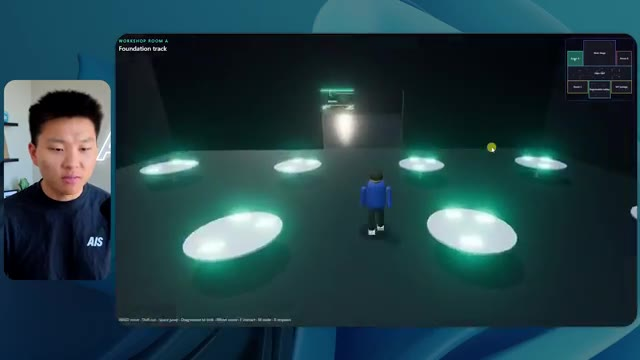
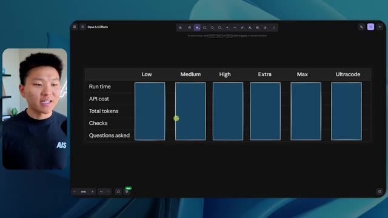
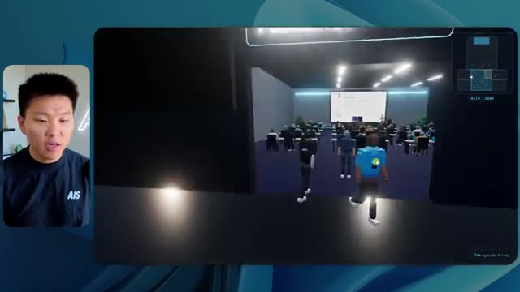
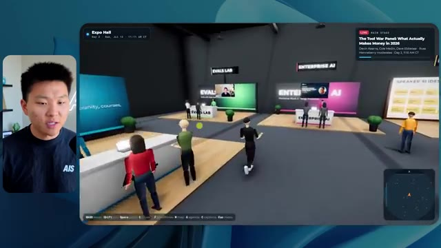
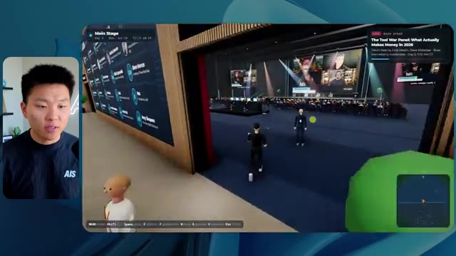
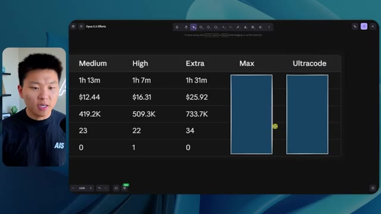
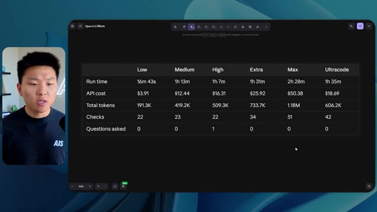
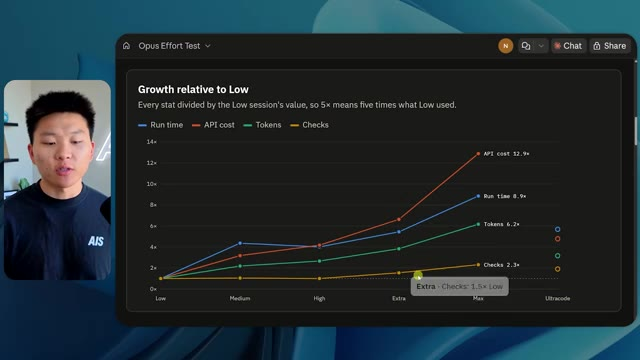
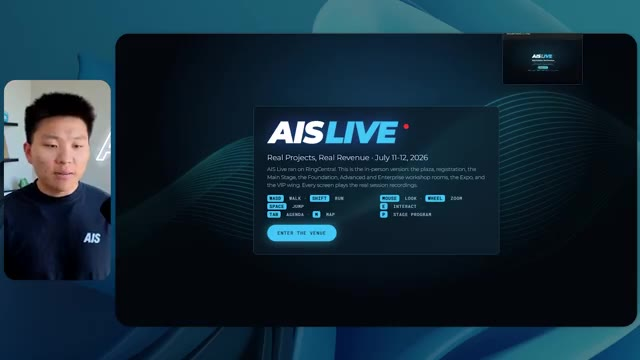
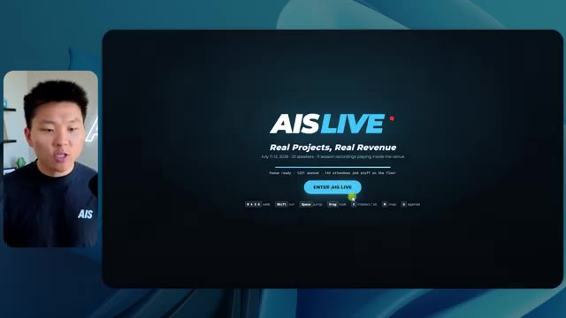

# 🎬 Oracle’s New AI Only Thinks When It Has To

> **Chaîne** : [Nate Herk | AI Automation](https://www.youtube.com/@nateherk/featured)  
> **Lien YouTube** : [https://www.youtube.com/watch?v=A8YuAEUQEos](https://www.youtube.com/watch?v=A8YuAEUQEos)  
> **Date de publication** : 20261009  
> **Durée** : 00:00:51  
> **Identifiant vidéo** : `A8YuAEUQEos`  
> **Transcription & Analyse** : `whisper-v3-large-turbo+gemini-3.5-flash-lite`  

---

## 📌 Synthèse Exécutive & Outils

### 💡 Résumé

Dans cette vidéo de la chaîne *Nate Herk | AI Automation*, l'analyste explore en profondeur les performances comparatives du modèle d'IA de pointe **Opus 5.5** lorsqu'il est soumis à différents niveaux d'effort (faible, moyen, élevé, ultra code, etc.) pour une tâche complexe d'ingénierie logicielle et d'automatisation. L'expérience consiste à fournir un unique prompt de type « slash goal » (objectif global) visant à transformer un répertoire Frame.io de 105 gigaoctets d'enregistrements vidéo (provenant de l'événement virtuel *AIS Live*) en un monde virtuel 3D explorable en vue à la troisième personne, simulant une conférence physique réaliste avec des pistes, des salles et du contenu multimédia dynamique.

Les résultats démontrent des contrastes saisissants entre les niveaux d'effort. Le niveau « faible » génère rapidement (16 minutes, ~3,91 $ en équivalent API, 191 000 tokens) un prototype rudimentaire mais bogué, souffrant d'incohérences visuelles (personnages fantômes, images fixes au lieu de vidéos) et d'un manque d'alignement avec l'identité de marque. À l'inverse, le niveau « moyen » pousse l'autonomie de l'agent à un niveau supérieur : pour un coût et un temps accrus (1 heure 13 minutes, ~12,44 $, 490 000 tokens, 23 vérifications autonomes), il produit un environnement 3D fonctionnel, esthétiquement cohérent avec la charte graphique, intégrant des PNJ dotés de comportements dynamiques et des flux vidéo en direct parfaitement intégrés dans les différentes salles (ateliers, stands, scène principale et salon VIP).

Cette démonstration met en lumière la pertinence de la méthodologie recommandée par Anthropic, qui conseille de débuter par un effort moyen avant d'ajuster si nécessaire. Elle illustre également le défi classique du développement piloté par l'IA : la transition fluide entre la génération du code fonctionnel sur la machine de l'agent et son déploiement public en production, un fossé que des outils d'infrastructure et d'hébergement modernes cherchent à combler.

### 🛠️ Outils, Modèles & Logiciels Présentés

* **Opus 5.5** : Modèle d'IA de pointe développé par Anthropic, reconnu pour son intelligence, son coût abordable et sa polyvalence dans l'exécution de tâches d'ingénierie et de génération de contenu complexes.
* **Claude Code** : Environnement de développement et assistant de codage avancé d'Anthropic utilisé pour piloter des agents logiciels et exécuter des flux de travail complexes.
* **Cadre de gestion d'effort (Effort Level)** : Paramètre de configuration des modèles d'IA (faible, moyen, élevé, max, code ultra) permettant d'alloyer dynamiquement la puissance de calcul et le temps de réflexion selon la criticité de la tâche.
* **Frame.io** : Plateforme de collaboration cloud et de stockage utilisée ici pour héberger 105 gigaoctets d'enregistrements vidéo bruts de l'événement *AIS Live*.
* **Hostinger (et son connecteur)** : Solution d'hébergement web et extension gratuite pour éditeurs de code (VS Code, Cursor, Claude Code) permettant de combler le fossé entre le développement local et le déploiement en ligne.
* **Herc 2** : Système d'exploitation IA propriétaire de Nate Herk servant d'écosystème de référence pour l'intégration d'agents et de ressources d'automatisation.

### 🔑 Points Clés & Enseignements Stratégiques

* **Impact direct du niveau d'effort sur la qualité** : Ajuster l'effort d'un modèle comme Opus 5.5 ne modifie pas seulement le temps d'exécution, mais transforme radicalement la structure, la robustesse et la finition visuelle du code généré.
* **Pertinence de la recommandation d'Anthropic** : Commencer par un niveau d'effort « moyen » constitue la meilleure pratique empirique pour trouver l'équilibre idéal entre la profondeur du raisonnement et l'efficacité opérationnelle (coût/temps).
* **Autonomie des agents et vérifications itératives** : Un effort accru se traduit par un plus grand nombre de boucles de rétroaction autonomes (par exemple, 23 vérifications de navigateur pour le niveau moyen contre 22 pour le niveau faible), garantissant une meilleure détection et correction des bugs graphiques.
* **Gestion des ressources multimédias lourdes** : La capacité d'un agent IA à ingérer, structurer et référencer intelligemment un volume massif de données (105 Go de vidéos sur Frame.io) démontre la maturité des modèles actuels pour le traitement de projets d'ingénierie multimédia.
* **Respect de l'identité de marque** : Les niveaux d'effort supérieurs sont capables d'interpréter et d'appliquer avec précision des directives de marque (palettes de couleurs, badges personnalisés, logos officiels), évitant le rendu générique des versions basiques.
* **Immersion et comportement des PNJ (Personnages Non-Joueurs)** : Le niveau moyen a su doter l'univers virtuel d'éléments dynamiques (personnages interagissant ou levant les bras), renforçant le réalisme d'une conférence tech virtuelle.
* **Intégration de flux vidéo en direct** : Contrairement au niveau faible qui se contente d'images fixes, le niveau moyen intègre avec succès des flux vidéo dynamiques et fonctionnels dans les espaces clés (ateliers, stands, scènes).
* **Économie d'utilisation des API** : L'analyse des coûts par API (passant de ~3,91 $ à ~12,44 $ entre le niveau faible et moyen) met en évidence l'arbitrage financier nécessaire selon la complexité et la criticité du livrable attendu.
* **Absence de sollicitation superflue** : Dans les cas présentés, l'agent a atteint ses objectifs sans nécessiter d'interventions humaines itératives (zéro question posée), soulignant l'autonomie des instructions de type « slash goal ».
* **Le dernier kilomètre du déploiement logiciel** : Produire une application fonctionnelle en local ne résout pas à lui seul la friction du passage en production, d'où la nécessité d'intégrer des connecteurs d'hébergement directement dans l'environnement de développement.
* **Convergence de l'IA et de la 3D procédurale** : L'utilisation de prompts complexes pour générer des architectures logicielles 3D explorables préfigure l'avenir de la conception d'événements virtuels et de jumeaux numériques pilotés par des agents.

---

## ⏱️ Chronologie & Transcription Complète Audio & Visuelle (Mot pour Mot)

### ⏱️ `[00:00:00 - 00:00:20]` | Segment #01

**🔊 Audio (Transcription Intégrale Mot pour Mot en Français) :**
> Opus 5.5, Opus 5.5, Opus 5.5, Opus 5.5, Opus 5.5. Ce modèle est littéralement partout et pour de très bonnes raisons. Il est intelligent, il est bon marché, il a un goût extraordinaire, c'est un modèle d'IA incroyable. Mais avec chaque modèle d'IA, vous avez le choix de l'effort, que ce soit faible, moyen, élevé, extra, max ou code ultra.

**👁️ Analyse Visuelle d'Écran (gemini-3.5-flash-lite) :**
**Interface & Outils** : Plateforme de réseau social X (Twitter)

**Contenu textuel & Code** : Publication sur X avec une vidéo intégrée montrant un rendu 3D de paysage tropical et du texte sur la perturbation des créatifs techniques.

**Action / Démonstration** : Affichage d'une capture d'écran d'un post illustrant les capacités des nouveaux modèles d'IA générative visuelle.

*⏱️ 00:00:05 — Capture d'écran d'un tweet sur X (anciennement Twitter) montrant un paysage tropical généré par IA et un commentaire sur l'impact sur les créatifs techniques.*

---

### ⏱️ `[00:00:20 - 00:00:38]` | Segment #02

**🔊 Audio (Transcription Intégrale Mot pour Mot en Français) :**
> Dans cette vidéo, j’ai donné exactement le même prompt à Opus 5.5 et je l’ai exécuté sur chaque niveau d’effort, et nous allons comparer les résultats. Nous examinerons la qualité de toutes les différentes sorties réelles, mais nous allons aussi regarder combien de temps chacun d’eux a pris, combien cela nous a coûté si c’était facturé par API, le nombre total de tokens, combien de vérifications ils ont effectuées, et combien de questions ils m’ont réellement posées tout au long du processus.

**👁️ Analyse Visuelle d'Écran (gemini-3.5-flash-lite) :**
**Interface & Outils** : Application web de tableau blanc ou de prise de notes (type Miro ou Obsidian Canvas).

**Contenu textuel & Code** : Tableau comparatif avec les lignes : Run time, API cost, Total tokens, Checks, Questions asked, et les colonnes de niveaux d'effort : Low, Medium, High, Extra, Max, Ultracode.

**Action / Démonstration** : Présentation du tableau comparatif évaluant les différents niveaux d'effort de l'IA.

*⏱️ 00:00:29 — Capture d'un tableau comparatif sombre montrant les différents niveaux d'effort (Low, Medium, High, Extra, Max, Ultracode) et des métriques telles que Run time, API cost, Total tokens, Checks et Questions asked.*

---

### ⏱️ `[00:00:39 - 00:00:58]` | Segment #03

**🔊 Audio (Transcription Intégrale Mot pour Mot en Français) :**
> Et les résultats que nous avons obtenus ne sont pas du tout ce à quoi je m'attends, donc j'ai hâte de partager cela avec vous les gars. Ne perdons pas de temps et entrons directement dans le vif du sujet. D'accord, alors plongeons directement dans celui-ci. Je veux commencer simplement en vous montrant le prompt réel que nous avons utilisé, que nous avons donné à chacun de ces différents agents. Je vais aller dans les fichiers ici, et nous allons ouvrir ce fichier markdown de prompt, et je vais vous montrer ce que nous avons obtenu. Voici donc le slash objectif que j'ai fourni.

**👁️ Analyse Visuelle d'Écran (gemini-3.5-flash-lite) :**
**Interface & Outils** : Interface graphique d'un outil de développement / assistant IA (Opus 5.5, mode Ultracode).

**Contenu textuel & Code** : Message de l'assistant IA demandant confirmation pour commencer une tâche : "Hi Nate. This worktree has the effort-test task queued in PROMPT.md : build a walkable third-person 3D world...".

**Action / Démonstration** : Affichage de l'interface de l'assistant IA avec le prompt initial en attente de validation.

*⏱️ 00:00:48 — Interface d'un éditeur ou d'un outil de développement (Opus 5.5 CLI / interface d'agent IA) montrant un prompt de tâche pour construire un monde 3D interactif.*

---

### ⏱️ `[00:00:58 - 00:01:34]` | Segment #04

**🔊 Audio (Transcription Intégrale Mot pour Mot en Français) :**
> J'ai dit, tu dois me créer un monde en 3D qui est une conférence tech réaliste dans laquelle je peux me promener en vue à la troisième personne. Tu vas regarder ce dossier, qui contient mes ressources d'enregistrement d'événements d'AIS Live. Et ce dossier est un dossier Frame.io de 105 gigaoctets d'enregistrements vidéo. C'était un événement entièrement virtuel. Tout a été enregistré et tous les enregistrements sont juste ici. J'ai dit, ton objectif est de prendre cet événement et de le transformer en un monde explorable en 3D qui me donne l'impression d'être réellement allé à une vraie conférence en personne avec différentes salles, différentes pistes, différentes scènes, bla, bla, bla. N'hésite pas à utiliser key.ai si tu as besoin de générer des images ou des vidéos. Et tu peux aussi utiliser tout ce qui se trouve dans mon projet Herc 2, qui est comme mon système d'exploitation IA. J'ai dit,

**👁️ Analyse Visuelle d'Écran (gemini-3.5-flash-lite) :**
**Interface & Outils** : IDE (Éditeur de code) et interface web Frame.io

**Contenu textuel & Code** : Fichier Markdown (PROMPT.md) détaillant la création d'un monde 3D interactif et lien vers des ressources Frame.io.

**Action / Démonstration** : Présentation du prompt initial et des ressources média (enregistrements) nécessaires à la création du projet.

*⏱️ 00:01:07 — Éditeur de code affichant le fichier PROMPT.md avec les instructions pour créer le monde 3D de la conférence tech.*

*⏱️ 00:01:16 — Interface Frame.io montrant un dossier d'enregistrements d'événements de 105,69 Go (AIS Live).*

*⏱️ 00:01:25 — Vue similaire de l'éditeur de texte affichant les détails et consignes du prompt de génération 3D.*

---

### ⏱️ `[00:01:34 - 00:02:08]` | Segment #05

**🔊 Audio (Transcription Intégrale Mot pour Mot en Français) :**
> tu seras jugé sur la créativité, le design, la physique et la sensation générale lorsque j'explorerai le monde en 3D que tu as construit. Et c'était fondamentalement la fin des instructions. Donc, comme vous pouvez le voir sur ce côté gauche, j'ai exécuté cela à travers tous les différents niveaux d'effort. Commençons par le niveau bas et remontons jusqu'à ultra code. Très bien. Donc ici, nous avons le résultat du niveau bas. Ouvrons ceci et jetons un œil. Nous avons donc AIS live, le sommet des services IA en personne enfin, et nous avons pu cliquer autour. Tout d'abord, cela ne fait pas très personnalisé. Genre, ce n'is pas le logo d'IS Live. Ce n'est même pas nos couleurs. Donc je n'aime pas trop ça, mais entrons ici. D'accord. C'est beaucoup trop lumineux. Euh, nous avons une carte en haut à droite ? Nous avons une ville par ici. Je ne peux pas dire quelle ville c'est.

**👁️ Analyse Visuelle d'Écran (gemini-3.5-flash-lite) :**
**Interface & Outils** : Application de développement assisté par IA avec interface sombre.

**Contenu textuel & Code** : Message de l'agent IA proposant de commencer la tâche de construction d'un monde 3D navigable basée sur un fichier PROMPT.md, et champ de saisie avec le prompt de réponse.

**Action / Démonstration** : Sélection des différents niveaux de test d'effort dans l'interface de l'agent.

*⏱️ 00:01:42 — Interface d'une application d'agent IA montrant un panneau latéral avec différents niveaux d'effort (Hello, Extra, High, Max, Ultracode, Medium, Low) et un panneau de discussion à droite.*

---

### ⏱️ `[00:02:08 - 00:02:40]` | Segment #06

**🔊 Audio (Transcription Intégrale Mot pour Mot en Français) :**
> C'est. D'accord. C'est Chicago, ce qui est plutôt cool parce que vous savez, je vis à Chicago, mais bref, en haut à droite, nous pouvons voir une carte. Nous avons un hall d'accueil. Nous avons un hall d'exposition. Nous avons un salon VIP sur la scène principale. La carte montre également où se trouve chaque autre personne et cela se synchronise en direct. Nous pouvons donc voir l'enregistrement. Nous pouvons voir le premier jour, la conférence inaugurale de l'hyper agent, le débriefing en direct. Cool. Donc ça connaît réellement l'ordre du jour et puis il y a le deuxième jour. Donc il a trouvé ça, c'est bien. Nous avons ces petites boules ici que je peux espérer lancer. D'accord. Le visage, oh, regardez ça. Si je vais par ici, toutes les personnes disparaissent tout simplement. Très mauvais. Très mauvais. D'accord. Voyons voir. Est-ce que je peux sprinter ? D'accord.

**👁️ Analyse Visuelle d'Écran (gemini-3.5-flash-lite) :**
**Interface & Outils** : Application web d'événement virtuel en 3D avec interface de navigation et mini-carte.

**Contenu textuel & Code** : Menus d'événements virtuels et affichage de la carte de navigation de l'espace.

**Action / Démonstration** : Navigation et exploration de différents espaces virtuels (hall d'accueil, retrait des badges, hall d'exposition).

*⏱️ 00:02:16 — Vue d'un espace virtuel interactif montrant le point de retrait des badges avec une mini-carte en haut à droite.*

*⏱️ 00:02:24 — Vue du hall d'accueil (Lobby) d'un événement virtuel avec un panneau affichant le programme du premier jour.*

*⏱️ 00:02:32 — Vue du hall d'exposition virtuel avec des avatars et des éléments lumineux interactifs.*

---

### ⏱️ `[00:02:40 - 00:03:04]` | Segment #07

**🔊 Audio (Transcription Intégrale Mot pour Mot en Français) :**
> Je peux avancer un peu plus vite. Je vais d'abord aller par ici. Il y a des produits dérivés, euh, certifiés AIS plus glido. D'accord. Donc, il y a les stands réels qu'on avait lors de l'événement virtuel. On avait des stands. Donc, c'est plutôt cool. Un petit endroit pour prendre des photos. Salle C. En ce moment, nous avons Tangy Frederick qui anime un atelier. D'accord. Mais ce n'est pas une vidéo. Comme vous pouvez le voir, c'est juste une image. Elle ne bouge pas. Donc, c'est juste une image. Ces gens sont en train de disparaître. Ce doivent être des fantômes. Allons par ici vers la salle A.

**👁️ Analyse Visuelle d'Écran (gemini-3.5-flash-lite) :**
**Interface & Outils** : Environnement virtuel 3D (type métavers ou jeu) avec mini-carte et commandes de déplacement.

**Contenu textuel & Code** : Texte sur l'écran virtuel concernant la configuration d'une clé API en trois étapes.

**Action / Démonstration** : Navigation et exploration de l'espace virtuel par le présentateur.

---

### ⏱️ `[00:03:04 - 00:03:30]` | Segment #08

**🔊 Audio (Transcription Intégrale Mot pour Mot en Français) :**
> Nous avons Liberty White. D'accord. Très cool. Vos trente premiers jours en automatisation. Encore une fois, c'est juste une image fixe et les gens ont des bugs visuels. Donc pas très bien ici. Je vais aller sur la scène principale et voir ce que nous avons. D'accord, cool. Donc nous avons une scène d'apparence principale. Les gens ont des bugs. Vraiment mauvais. Ce n'est pas très bien du tout. Notre vidéo est en train de bouger. Genre, j'ai vu mon visage ici et j'ai vu celui de Devin, mais maintenant ils ont disparu. Donc je ne sais pas ce qui s'est passé. D'accord. C'est, on dirait que c'est plutôt un diaporama. Rien n'est réellement diffusé pour l'instant. Quoi qu'il en soit, entrons ici.

**👁️ Analyse Visuelle d'Écran (gemini-3.5-flash-lite) :**
**Interface & Outils** : Application ou plateforme virtuelle 3D interactive (type Gather Town en 3D / événement virtuel en ligne)

**Contenu textuel & Code** : Environnement virtuel 3D interactif avec avatars, salles de conférence virtuelles et écrans de présentation

**Action / Démonstration** : Exploration et navigation en vue à la troisième personne dans l'espace virtuel de la conférence en ligne

*⏱️ 00:03:11 — Vue d'un monde virtuel 3D (style métaverse/plateforme de conférence) montrant une salle d'atelier avec des plates-formes lumineuses.*

*⏱️ 00:03:17 — Navigation d'un avatar dans un grand auditorium virtuel rempli de nombreux participants virtuels assis.*

*⏱️ 00:03:24 — Avancée de l'avatar vers la scène principale affichant le logo "AIS LIVE - AI Services Summit" dans le monde virtuel 3D.*

---

### ⏱️ `[00:03:30 - 00:03:58]` | Segment #09

**🔊 Audio (Transcription Intégrale Mot pour Mot en Français) :**
> Nous avons d'autres stands. Nous avons hyper agent. Nous avons Claude Code. Nous avons plus de gadgets publicitaires. La salle B, c'est Dave Ebelor. Je suppose que c'est exactement la même chose. Nous avons du café. Et puis, je suppose que le salon VIP, c'est accès VIP uniquement. C'est plutôt cool, mais il n'y a vraiment rien qui se passe ici. Cet écran est bien trop lumineux. D'accord. Donc je pense que vous comprenez l'ambiance qu'on obtient ici avec Opus 5.5 à faible effort. Et c'est là que les choses deviennent intéressantes. Combien de temps pensez-vous que cela a duré ? Combien de temps ? Celui-ci a duré 16 minutes et 43 secondes. Combien pensez-vous que cela a coûté ?

**👁️ Analyse Visuelle d'Écran (gemini-3.5-flash-lite) :**
**Interface & Outils** : Interface de tableau blanc / canvas numérique (Opus 5.5 Efforts)

**Contenu textuel & Code** : Tableau avec des colonnes de niveau d'effort (Low à Ultracode) et des lignes de métriques (Run time, API cost, Total tokens, Checks, Questions asked).

**Action / Démonstration** : Présentation d'un tableau comparatif des différents niveaux d'effort et coûts pour l'utilisation d'un modèle d'IA.

*⏱️ 00:03:51 — Tableau comparatif dans une interface de type canvas (Opus 5.5 Efforts) évaluant différents niveaux de performance (Low, Medium, High, Extra, Max, Ultracode) selon plusieurs critères (Run time, API cost, Total tokens, Checks, Questions asked).*

---

### ⏱️ `[00:03:58 - 00:04:26]` | Segment #10

**🔊 Audio (Transcription Intégrale Mot pour Mot en Français) :**
> 3,91 dollars si c'était une facturation par API. J'utilise évidemment mon abonnement ici, mais nous allons juste calculer cela en facturation API. Le total des jetons était de 191 000. Il a effectué 22 vérifications. Donc la vérification, 22 fois il a ouvert le navigateur et a exécuté différents types de vérifications. Donc 22 catégories de vérifications. Et combien de questions m'a-t-il posées ? Il m'a posé un total de zéro questions tout au long de cette invite de type slash goal. D'accord. Alors, ouvrons l'effort moyen et voyons ce que nous avons. D'accord, c'est parti. Effort moyen. Nous avons Nate Herc. Nous avons mon badge. C'est aux couleurs de la marque AI's life.

**👁️ Analyse Visuelle d'Écran (gemini-3.5-flash-lite) :**
**Interface & Outils** : Application de tableau blanc ou de diagramme (type Excalidraw) nommée « Opus 5.5 Efforts ».

**Contenu textuel & Code** : Tableau avec les valeurs pour le niveau 'Low' : Run time '16m 43s', API cost '$3.91', Total tokens '191.3K', et des lignes pour 'Checks' et 'Questions asked'.

**Action / Démonstration** : Présentation des résultats chiffrés et des coûts d'API associés à l'exécution de l'agent.

*⏱️ 00:04:05 — Capture d'écran montrant un tableau comparatif avec les métriques d'exécution (Run time, API cost, Total tokens, Checks, Questions asked) pour différents niveaux d'effort (Low, Medium, High).*

---

### ⏱️ `[00:04:26 - 00:04:46]` | Segment #11

**🔊 Audio (Transcription Intégrale Mot pour Mot en Français) :**
> Donc ça a déjà l'air un tout petit peu mieux. Ça ressemble à nos palettes de couleurs qui utilisaient nos directives de marque. Premier jour, construction, deuxième jour, gain, VIP. Cool. D'accord. Je vais entrer dans le lieu. D'accord. Waouh. Donc une ambiance un peu similaire. C'est en arrière-plan. Ça ne ressemble pas à Chicago, hein ? Non, ça ressemble à un, honnêtement, ça ressemble à une ville inventée. Quoi qu'il en soit, c'est drôle qu'ils aient décidé de faire ça. Voyons si je peux avancer un peu plus vite. Oh, waouh.

**👁️ Analyse Visuelle d'Écran (gemini-3.5-flash-lite) :**
**Interface & Outils** : Application web interactive / Environnement virtuel 3D de type métaverse

**Contenu textuel & Code** : Page de connexion et de sélection avec badge "AIS Live", instructions de déplacement (WASD, Shift, Espace) et interface de salon virtuel 3D

**Action / Démonstration** : Navigation et entrée dans le lieu virtuel de l'événement avec les avatars des participants

*⏱️ 00:04:31 — Interface web "Welcome to AIS Live" avec un badge d'accès au nom de Nate Herk et des boutons de navigation.*

*⏱️ 00:04:41 — Vue dans l'espace virtuel 3D avec des avatars d'utilisateurs et un décor nocturne de gratte-ciels en arrière-plan.*

---

### ⏱️ `[00:04:46 - 00:05:21]` | Segment #12

**🔊 Audio (Transcription Intégrale Mot pour Mot en Français) :**
> Les gens interagissent avec moi. Regardez. Si je m'approche de ce type, il vient juste de lever le bras. Bon, maintenant il ne veut plus du tout avoir affaire à moi. Mais tous ces petits robots ici doivent prendre des décisions. Je ne sais pas s'ils utilisent Jev. C'est sûr que non. Je ne lui ai pas dit de le faire. En fait, ma clé Jev est à l'arrière. Je ne sais pas. Peut-être qu'il l'a utilisée. Quoi qu'il en soit, nous pouvons voir ici que nous avons la salle d'atelier C, le laboratoire des agents. Sympa. Donc celui-ci est en fait en train de fonctionner. Vous pouvez voir qu'il s'agit d'une vraie vidéo lue par Tangy. Tout le monde ici est en train de travailler sur un ordinateur portable. Ils ne buguent pas. C'est plutôt cool. De plus, mon badge est sur ma poitrine, ce qui est plutôt cool. Je peux venir par ici. Nous avons une carte en haut à droite, comme vous pouvez le voir, mais je peux venir par ici. Nous avons un

**👁️ Analyse Visuelle d'Écran (gemini-3.5-flash-lite) :**
**Interface & Outils** : Application de monde virtuel 3D / Simulation d'agents

**Contenu textuel & Code** : Avatars virtuels dans un environnement de bureau ou de salle de classe 3D

**Action / Démonstration** : Navigation et exploration de l'environnement virtuel 3D par le présentateur

---

### ⏱️ `[00:05:21 - 00:05:47]` | Segment #13

**🔊 Audio (Transcription Intégrale Mot pour Mot en Français) :**
> hall d'exposition. C'est là que nous avons le stand Glido. Et ça diffuse en ce moment. Oui, ça diffuse la vidéo de nous parlant de Glido. Ça diffuse la vidéo d'Ed et moi parlant de notre programme de certification. Nous avons le logo AIS Plus juste ici, qui est un peu mal placé. Ce sont les diapositives des conférenciers et les points clés. Alors wow, ce sont toutes les ressources que nous avons distribuées après l'événement. Elles sont toutes affichées là également. Nous pouvons voir que nous avons un coup de projecteur sur la communauté. Donc c'est Aiden qui parle de son contrat qu'il a décroché et c'est diffusé en direct. Ces gens regardent.

**👁️ Analyse Visuelle d'Écran (gemini-3.5-flash-lite) :**
**Interface & Outils** : Application de metaverse / monde virtuel 3D en ligne pour événements.

**Contenu textuel & Code** : Éléments graphiques 3D, avatars, panneaux d'affichage virtuels avec texte et diapositives.

**Action / Démonstration** : Navigation et exploration de l'espace virtuel par le présentateur.

---

### ⏱️ `[00:05:47 - 00:06:21]` | Segment #14

**🔊 Audio (Transcription Intégrale Mot pour Mot en Français) :**
> Ils sont plutôt engagés. On a un hyper agent. C'était, c'est ce que je voulais dire. Si vous avez vu ces gens lever les bras en disant salut, c'était plutôt marrant. Regardez, regardez, le voilà qui recommence. Bref. Bon. Où est-ce que je suis maintenant ? Maintenant je suis dans le hall principal. On a un bar à café. On a un grand logo, qui est le vrai logo. C'est trop lumineux, mais on a le logo. On peut voir si on peut entrer ici dans le parcours des fondations. On a Sabrina Romanov et Liberty White. Donc différentes formations juste là. On peut entrer dans cette salle. C'est le parcours avancé. Donc qu'est-ce qui se passe ici. On a Dave Ebelar et Saman qui parlent de différentes choses là-dedans. Et maintenant, allons jeter un œil à la scène principale. Oh, attendez, il y a une vidéo de moi là-haut. Est-ce que c'est genre un VIP

**👁️ Analyse Visuelle d'Écran (gemini-3.5-flash-lite) :**
**Interface & Outils** : Application web de monde virtuel 3D de type métavers.

**Contenu textuel & Code** : Interface de navigation virtuelle avec mini-carte et indication "Main Lobby".

**Action / Démonstration** : Navigation et déplacement d'un avatar à l'intérieur d'un événement virtuel.

*⏱️ 00:05:55 — Vue d'un monde virtuel 3D représentant un hall principal avec des avatars d'utilisateurs.*

*⏱️ 00:06:04 — Déplacement de l'avatar dans le monde virtuel vers une salle de conférence remplie d'avatars.*

*⏱️ 00:06:12 — Vue en arrière-plan d'avatars regroupés autour de tables dans l'espace virtuel.*

---

### ⏱️ `[00:06:21 - 00:06:50]` | Segment #15

**🔊 Audio (Transcription Intégrale Mot pour Mot en Français) :**
> section ? Ouais, on ira voir ça dans une minute. Mais bref, voici la scène principale. Ça a l'air vraiment, vraiment très bien. On a une grande scène. On a genre quatre personnes assises ici. On a les trois écrans d'Alex là-haut avec Hyper Agent. Est-ce que j'ai le droit de monter sur scène ? Oh, et il me laisse monter sur scène. D'accord. C'est plutôt sympa. Bon les gars, prenons un selfie. Laissez-moi mettre tout le monde en arrière-plan. Venez par ici. Bref, c'est plutôt, plutôt cool. Par contre, toutes les places ne sont pas occupées. Donc il va falloir qu'on travaille là-dessus. Mais bref, je vais y retourner en courant pour voir ce qu'était cette section VIP. D'accord. Le salon VIP. J'ai l'impression que c'est comme un aéroport ou un truc comme ça.

**👁️ Analyse Visuelle d'Écran (gemini-3.5-flash-lite) :**
**Interface & Outils** : Application ou plateforme virtuelle interactive en 3D (Hyper Agent)

**Contenu textuel & Code** : Interface utilisateur virtuelle de conférence (Hyperagent Keynote, écrans de présentation, mini-carte de navigation).

**Action / Démonstration** : Navigation et exploration de l'espace virtuel de conférence par l'utilisateur.

*⏱️ 00:06:28 — Vue d'une conférence virtuelle 3D (Hyper Agent) montrant un grand public assis, des écrans de présentation et un avatar se déplaçant.*

*⏱️ 00:06:36 — Vue sous un autre angle de la scène principale et des fauteuils occupés par des avatars dans l'espace virtuel.*

*⏱️ 00:06:43 — Vue en contre-plongée depuis l'arrière de l'auditorium virtuel avec les spectateurs et l'écran principal affichant le contenu.*

---

### ⏱️ `[00:06:51 - 00:07:14]` | Segment #16

**🔊 Audio (Transcription Intégrale Mot pour Mot en Français) :**
> D'accord, super. Donc maintenant nous avons les sessions VIP ici. Une foire aux questions VIP avec la lecture vidéo en direct de Nate juste ici. Très, très cool. Et nous avons comme un bar ou quelque chose comme ça. Génial. Je dirais que c'est un très bon résultat. Maintenant, en ce qui concerne les statistiques ici, celui-ci a pris une heure et 13 minutes à s'exécuter. Il nous aurait coûté 12 dollars et 44 cents. Il a utilisé 490 000 jetons et il a fait 23 vérifications.

**👁️ Analyse Visuelle d'Écran (gemini-3.5-flash-lite) :**
**Interface & Outils** : Application de métavers / espace virtuel 3D et tableau de bord de métriques d'IA.

**Contenu textuel & Code** : Métriques de coût API ($3.91), de temps d'exécution (16m 43s) et de tokens (191.3K) pour l'effort d'IA "Low".

**Action / Démonstration** : Présentation des sessions VIP virtuelles et analyse des coûts et performances d'exécution des modèles d'IA.

*⏱️ 00:06:56 — Visuel de l'espace virtuel VIP avec un écran géant affichant une session vidéo de questions-réponses et un espace lounge avec bar et avatars.*

*⏱️ 00:07:02 — Tableau de données comparatives "Opus 5.5 Efforts" montrant les métriques de performance pour le niveau "Low" (Run time 16m 43s, API cost $3.91, Total tokens 191.3K, Checks 22).*

---

### ⏱️ `[00:07:14 - 00:07:48]` | Segment #17

**🔊 Audio (Transcription Intégrale Mot pour Mot en Français) :**
> Et il nous a posé un total de zéro question une fois de plus. Très bien, passons à élevé. C'était déjà un résultat plutôt correct et Anthropic eux-mêmes dans leur vidéo, ou désolé, pas une vidéo, un article sur comment prompter Opus 5.5. Ils ont dit de commencer simplement par moyen et de l'ajuster à la hausse ou à la baisse si nécessaire. C'était donc un résultat moyen. Passons à élevé et voyons ce qu'on a obtenu. Très rapidement, les gars, je dois prendre une seconde pour vous parler du sponsor de la vidéo d'aujourd'hui, Hostinger. Donc ces deux modèles viennent de me construire une version fonctionnelle de la même chose. Et maintenant, je suis exactement là où je finis toujours, avec quelque chose de terminé sur mon ordinateur portable et aucun moyen rapide de le mettre en ligne. Et c'est le fossé que le connecteur d'Hostinger comble. C'est une extension gratuite

**👁️ Analyse Visuelle d'Écran (gemini-3.5-flash-lite) :**
**Interface & Outils** : Tableau comparatif type Notion/Miro (Image 1) et interface de développement / éditeur de code avec assistant IA (Image 2).

**Contenu textuel & Code** : Métriques de performance des modèles d'IA (Run time, API cost, Total tokens, Checks, Questions asked) et prompt pour le calcul de ROI.
[DESC_IMAGE_2] Présentation des résultats comparatifs et analyse des performances de l'agent IA selon les différents niveaux d'effort configurés.

**Action / Démonstration** : Analyse comparative des coûts et du temps d'exécution en fonction du niveau d'effort configuré pour l'IA.

*⏱️ 00:07:22 — Un tableau comparatif affichant les résultats de différents niveaux d'effort (Low, Medium, High, Extra) avec des métriques comme le temps d'exécution, le coût API, les tokens et les questions posées.*

*⏱️ 00:07:39 — Une interface de développement avec un éditeur de code et un panneau de chat montrant le prompt pour créer un calculateur ROI Northwind et le processus de réflexion de l'IA.*

---

### ⏱️ `[00:07:48 - 00:08:23]` | Segment #18

**🔊 Audio (Transcription Intégrale Mot pour Mot en Français) :**
> pour votre éditeur qui intègre votre compte Hostinger dans l'environnement où vous codez déjà. Donc VS Code, Cursor, Cloud Code, Codex, peu importe. Vous vous connectez une seule fois en un seul clic, et à partir de là, votre agent peut déployer le site, y pointer un domaine, configurer les enregistrements DNS et vérifier votre VPS sans que vous n'ayez jamais à quitter l'éditeur. Ainsi, peu importe celui de ces outils que vous finirez par préférer, ce qu'il a construit se trouve à quelques minutes d'une vraie URL sur un hébergement géré. Le connecteur est gratuit avec chaque formule d'hébergement, donc si vous avez toujours besoin de l'hébergement en dessous, profitez de la formule illimitée avec le lien dans la description et utilisez le code NATEHERK pour obtenir 10 % de réduction. Cela inclut également un nom de domaine gratuit et un e-mail professionnel pour l'année. Et c'est toujours le moyen le moins cher que j'ai trouvé pour obtenir quelque chose

**👁️ Analyse Visuelle d'Écran (gemini-3.5-flash-lite) :**
**Interface & Outils** : Interface web Hostinger et interface de terminal Claude Code.

**Contenu textuel & Code** : Panneau "Manage Hostinger from your IDE" indiquant un statut "Connected" via OAuth, avec la liste des outils disponibles (Websites, Domains, Subscriptions & Payments, Email Marketing).

**Action / Démonstration** : Affichage de la connexion réussie du compte Hostinger dans l'environnement de développement et de la liste des outils accessibles à l'assistant.

*⏱️ 00:07:57 — Capture d'écran montrant l'intégration Hostinger avec l'IDE d'un côté et Claude Code de l'autre, avec le compte connecté et les outils disponibles.*

---

### ⏱️ `[00:08:23 - 00:08:47]` | Segment #19

**🔊 Audio (Transcription Intégrale Mot pour Mot en Français) :**
> vous avez construit sur une vraie URL. Donc revenons à la vidéo. D'accord. Encore une fois, très, très thématisé par la marque. C'est un écran de chargement encore meilleur que le précédent. Nous avons ce joli petit effet en arrière-plan. Nous avons le logo. Nous allons entrer dans le lieu. D'accord. Nous y voilà. Ça a l'air plutôt bien. Nous commençons à l'extérieur et vous pouvez voir que nous avons ces drapeaux pour tous les intervenants, Wyatt, Casper, Alex, Ed, Aiden, Sabrina, Liberty. C'est plutôt cool. Nous avons des blocs en direct ici.

**👁️ Analyse Visuelle d'Écran (gemini-3.5-flash-lite) :**
**Interface & Outils** : Application web interactive en 3D / Navigateur web.

**Contenu textuel & Code** : Interface d'événement virtuel AIS Live, bannières d'intervenants, minimap et contrôles clavier/souris.
[DESC_ACTION_NAVIGATE] Navigation dans le monde virtuel en 3D depuis la page d'accueil vers la place principale.

**Action / Démonstration** : Explications face caméra et démonstration conceptuelle.

*⏱️ 00:08:29 — Écran de chargement et d'accueil de la plateforme virtuelle AIS Live avec les contrôles affichés.*

*⏱️ 00:08:35 — Entrée dans l'environnement virtuel 3D (AIS Live Plaza) avec des avatars et des bâtiments.*

*⏱️ 00:08:41 — Exploration de la place virtuelle avec des bannières nominatives et des éléments interactifs au sol.*

---

### ⏱️ `[00:08:47 - 00:09:23]` | Segment #20

**🔊 Audio (Transcription Intégrale Mot pour Mot en Français) :**
> Il a pris cette photo de moi, votre hôte, Nate Herc, John, Dave, Nate Herc. Voilà. D'accord. Les portes. C'est génial. Ce sont des portes coulissantes automatiques en verre. J'adore ça. Nous pouvons voir l'enregistrement VIP. Nous pouvons voir l'admission générale. Nous pouvons venir ici et nous pouvons découvrir l'exposition avec différents stands, le coin de la communauté. Vous pouvez également voir qu'en haut à gauche, j'ai un passeport. C'est donc comme si cela allait montrer combien d'endroits j'ai visités. Tout cela est une lecture réelle. Nous avons un mur de ressources avec tous les différents intervenants. Ils ont également une session de networking ici. Je vais donc venir très vite et voir de quoi il s'agit. Nous avons donc le bar à cold brew AIS. Nous avons différents membres de la communauté qui ont été mis en avant ou mis en lumière.

**👁️ Analyse Visuelle d'Écran (gemini-3.5-flash-lite) :**
**Interface & Outils** : Application ou plateforme virtuelle 3D interactive (métavers / salon virtuel).

**Contenu textuel & Code** : Environnement virtuel 3D interactif avec interface utilisateur d'événement en ligne.

**Action / Démonstration** : Navigation et exploration d'un salon virtuel en 3D avec des avatars.

*⏱️ 00:08:56 — Vue d'un espace virtuel 3D de type salon ou conférence, montrant la zone d'inscription avec des bannières 'Registration' et 'VIP Check-In'.*

*⏱️ 00:09:05 — Navigation dans un hall d'exposition virtuel 3D avec des stands d'information et des avatars de participants.*

*⏱️ 00:09:14 — Déplacement dans un hall d'accueil virtuel 3D avec de larges baies vitrées et plusieurs avatars d'utilisateurs.*

---

### ⏱️ `[00:09:23 - 00:09:56]` | Segment #21

**🔊 Audio (Transcription Intégrale Mot pour Mot en Français) :**
> On a l'aile VIP. Attends, quoi ? Récupère un bracelet. Oh, je dois vraiment aller chercher le bracelet. D'accord. Laisse-moi m'enregistrer rapidement. Le bracelet est déjà mis. Attends, quoi ? D'accord. Oh, d'accord. Maintenant, les portes se sont ouvertes pour moi. Cool. Je peux entrer ici. Oh, ça mène juste à la scène principale. Salon VIP. Il y a une séance de questions-réponses en cours. Ça a l'air très sympa. Je veux dire, je suis très impressionné par la façon dont il parvient à faire ça. Waouh. D'accord. Donc c'est vraiment bien. Ce qu'on a fait, c'est qu'on a eu des salles de discussion VIP avec différentes personnes. Tu peux voir qu'il y a différentes salles, différents membres de l'équipe AIS qui participent à des trucs. C'est vraiment cool. C'est très cool. C'est un VIP bien meilleur

**👁️ Analyse Visuelle d'Écran (gemini-3.5-flash-lite) :**
**Interface & Outils** : Espace virtuel en ligne interactif (plateforme type salon virtuel / metaverse).

**Contenu textuel & Code** : Éléments textuels d'orientation (« Registration Concourse », « VIP Lounge », « VIP Working Sessions », « Land Your First Paying Client »).

**Action / Démonstration** : Navigation et exploration de l'espace virtuel par le présentateur sous forme d'avatar.

*⏱️ 00:09:32 — Vue d'un espace virtuel interactif (Registration Concourse) avec un avatar se déplaçant et des indications textuelles sur l'aile VIP.*

*⏱️ 00:09:40 — Vue de la section VIP Lounge avec des avatars assis et un écran affichant une visioconférence.*

*⏱️ 00:09:48 — Vue de l'espace VIP Working Sessions avec plusieurs salles thématiques (Price It Right, Turn Your Expertise into a Service, Land Your First Paying Client).*

---

### ⏱️ `[00:09:56 - 00:10:30]` | Segment #22

**🔊 Audio (Transcription Intégrale Mot pour Mot en Français) :**
> expérience que ce qui a été montré dans la première partie. D'accord. After party VIP. Regardez ça. On a une piste de danse. On a tous ces éléments ici. On a la lecture de l'after party VIP juste ici. Et il y a une estrade de DJ. C'est tellement marrant. Il y a un petit bug ici, un petit glitch par là, mais c'est génial. Oh, chouette. Donc quand je suis ici sur la scène principale, on a des sous-titres. Vous pouvez voir juste ici en bas de mon écran, on a ces sous-titres de Wyatt qui est en train de parler ici. On a des lumières. On a le panel. Très sympa. Jolie scène principale. Je vais aller par ici, on peut aller à la fondation,

**👁️ Analyse Visuelle d'Écran (gemini-3.5-flash-lite) :**
**Interface & Outils** : Application web de réunion virtuelle en 3D / métavers interactif.

**Contenu textuel & Code** : Environnement virtuel 3D avec avatars, panneaux de navigation et flux vidéo en direct.

**Action / Démonstration** : Navigation et exploration de l'espace virtuel par le présentateur.

*⏱️ 00:10:04 — Vue d'un espace virtuel d'after party VIP avec des avatars animés sur une piste de danse et un écran géant affichant des participants.*

*⏱️ 00:10:13 — Vue alternative de l'after party VIP montrant un angle plus large de la piste de danse et des ballons virtuels.*

*⏱️ 00:10:21 — Vue de la scène principale virtuelle avec des rangées de sièges et un grand écran de présentation.*

---

### ⏱️ `[00:10:30 - 00:11:06]` | Segment #23

**🔊 Audio (Transcription Intégrale Mot pour Mot en Français) :**
> avancé, et les parcours d'entreprise par ici. Alors voyons voir. Nous avons l'anatomie de trois vraies transactions. Nous avons hyper agent. Nous avons les évaluations avec Nate et Ed ici. Nous avons Dave qui s'occupe des trucs avancés. C'est vraiment bien. Je veux dire, évidemment, chacun, chacun de ces résultats jusqu'à présent, le niveau bas était correct. Le niveau moyen était meilleur. Le niveau élevé a été encore meilleur. Voyons si cette tendance se poursuit et allons voir ce que cela nous a coûté. Le niveau élevé a donc tourné pendant une heure et sept minutes. Donc un peu plus rapide que le niveau moyen, cela nous aurait coûté 16 dollars et 31 cents. Il a utilisé un demi-million de tokens, 509 000. Il a fait 22 vérifications. Et il nous a aussi demandé, enfin, non, je me suis trompé. Ce

**👁️ Analyse Visuelle d'Écran (gemini-3.5-flash-lite) :**
**Interface & Outils** : Tableau blanc interactif / application de diagramme (type Excalidraw) affichant des données comparatives.

**Contenu textuel & Code** : Tableau avec colonnes Low, Medium, High, Extra comparant le temps d'exécution, le coût d'API, le nombre de tokens et de vérifications.

**Action / Démonstration** : Présentation des analyses de performance et des coûts d'API selon le niveau d'effort configuré.

*⏱️ 00:10:57 — Tableau comparatif montrant différentes métriques d'exécution (Run time, API cost, Total tokens, Checks, Questions asked) selon les niveaux d'effort (Low, Medium, High, Extra).*

---

### ⏱️ `[00:11:06 - 00:11:25]` | Segment #24

**🔊 Audio (Transcription Intégrale Mot pour Mot en Français) :**
> L'un m'a posé une question, et spoiler, c'était le seul qui nous a posé une question pendant tout ça. Donc voyons voir, il nous en reste trois : Extra, Max et Ultra Code. Laissez-moi ouvrir Extra et nous verrons ce que nous avons. OK. Donc celui-ci a l'air plutôt bien. Je dirais honnêtement que jusqu'à présent, l'écran de chargement haut était le meilleur, celui que nous venons de voir, mais bref, entrons dans AIS Live.

**👁️ Analyse Visuelle d'Écran (gemini-3.5-flash-lite) :**
**Interface & Outils** : Application web ou tableau de bord de type interface de canvas ou gestion de projet (marqué 'Opus 5.5 Efforts').

**Contenu textuel & Code** : Tableau avec les colonnes Low, Medium, High et Extra, et les lignes : Run time, API cost, Total tokens, Checks, Questions asked.

**Action / Démonstration** : Le présentateur passe en revue les résultats et sélectionne la colonne 'Extra' pour examiner les détails.

*⏱️ 00:11:11 — Tableau comparatif affichant les métriques de différents modèles (Low, Medium, High, Extra) incluant le temps d'exécution, le coût API, les tokens et les questions posées.*

---

### ⏱️ `[00:11:26 - 00:11:51]` | Segment #25

**🔊 Audio (Transcription Intégrale Mot pour Mot en Français) :**
> Wouah. D'accord. Donc on a comme de petits extraits sonores. Je peux discuter avec des gens. Le panneau de la guerre des outils a réglé quelques débats pour moi. Sympa. Bonne perspective là-bas. Nous sommes à nouveau dehors. Nous avons ces différentes bannières, bien qu'elles soient toutes les mêmes. Elles n'affichent pas de noms de personnes différentes. Donc grand logo AIS Live. L'aile des ateliers est par ici. Et passons par les portes coulissantes en verre pour voir ce que nous avons. Nous avons donc le café AIS. La carte est en bas à droite, et elle n'est pas très descriptive.

**👁️ Analyse Visuelle d'Écran (gemini-3.5-flash-lite) :**
**Interface & Outils** : Application 3D interactive ou jeu en ligne de type métavers.

**Contenu textuel & Code** : Environnement virtuel 3D avec avatars, bannières et mini-carte en bas à droite.

**Action / Démonstration** : Exploration d'un espace virtuel 3D avec un avatar contrôlé par le présentateur.

*⏱️ 00:11:32 — Vue d'un monde virtuel interactif montrant un personnage se déplaçant sur une place avec des bannières publicitaires.*

*⏱️ 00:11:38 — Poursuite de la navigation du joueur à l'extérieur près de bâtiments et d'arbres stylisés.*

*⏱️ 00:11:45 — Approche et entrée du personnage virtuel dans un grand bâtiment de type convention.*

---

### ⏱️ `[00:11:51 - 00:12:26]` | Segment #26

**🔊 Audio (Transcription Intégrale Mot pour Mot en Français) :**
> J'aime bien comment les autres cartes nous ont dit ce que, genre où se trouvaient les choses, mais celle-ci a l'air très professionnelle. On peut voir ici c'est la scène principale. Allons y faire un saut rapidement. Ils ont tous ces ballons qui volent partout, ce qui je trouve est plutôt marrant. Les ballons de plage AIS. On nous voit moi là-haut en train de parler. Je crois que j'étais en train de faire l'intro d'un des jours. Continuons à avancer par ici vers la salle d'atelier sur ce côté gauche. D'accord. Donc ici nous avons le Hyper Agent Theater. Nous avons cette session sponsorisée ici par Hyper Agent, mais ça nous montre aussi ce qui va se passer ici. C'est vraiment marrant qu'on puisse discuter avec des gens. Salmon a construit un représentant commercial vocal en direct. La salle du Juste Prix était comble. Tu as pris le guide du compagnon VIP ? C'est trop marrant. Nous avons le parcours avancé dans

**👁️ Analyse Visuelle d'Écran (gemini-3.5-flash-lite) :**
**Interface & Outils** : Application web 3D immersive d'événements virtuels interactifs.

**Contenu textuel & Code** : Environnement virtuel 3D avec avatars, écrans vidéo intégrés et bulles de discussion textuelles.
[DESC_IMAGE_3] Navigation de l'utilisateur à travers les différents espaces de l'événement virtuel 3D.

**Action / Démonstration** : Explications face caméra et démonstration conceptuelle.

*⏱️ 00:12:00 — Vue d'une scène principale virtuelle avec des avatars assis dans une salle de conférence et une vidéo du présentateur sur grand écran.*

*⏱️ 00:12:09 — Navigation dans le hall d'entrée virtuel d'une plateforme d'événements 3D avec des panneaux 'Workshops'.*

*⏱️ 00:12:17 — Exploration d'un couloir virtuel avec des avatars interagissant et des bulles de discussion.*

---

### ⏱️ `[00:12:26 - 00:12:58]` | Segment #27

**🔊 Audio (Transcription Intégrale Mot pour Mot en Français) :**
> ici. Encore une fois, nous avons la lecture en direct. Est-ce que c'est la lecture en direct ? Oh, d'accord. Ça a commencé une fois que je suis entré, mais je peux prendre place. Oh la la. Je peux regarder ça. Je peux me lever. Je veux m'asseoir au premier rang. C'est plutôt cool. C'est très bien. J'aime bien ça. Et tu sais ce que j'ai remarqué jusqu'à présent ? Le personnage que j'incarne me ressemble un peu. Je pense qu'il s'est inspiré de mes photos de profil ou quelque chose comme ça. Bref, nous avons Sabrina ici, l'animatrice de la salon, prenez n'importe quel siège libre. D'accord, super. Et j'ai vraiment aimé la fonctionnalité pour s'asseoir. C'est plutôt marrant. Genre, on pourrait vraiment assister à cet atelier et participer. Bref, ça nous montre les intervenants. Ça nous montre les

**👁️ Analyse Visuelle d'Écran (gemini-3.5-flash-lite) :**
**Interface & Outils** : Simulation de salle de classe virtuelle / environnement 3D en ligne.

**Contenu textuel & Code** : Environnement virtuel avec des avatars, des sièges, un écran de projection affichant un atelier et des interfaces de visioconférence intégrées.

**Action / Démonstration** : Navigation et exploration de l'environnement virtuel 3D par le présentateur.

---

### ⏱️ `[00:12:58 - 00:13:31]` | Segment #28

**🔊 Audio (Transcription Intégrale Mot pour Mot en Français) :**
> agenda. Il y a un petit tapis rouge ici pour prendre des photos. On peut prendre la pose. Oh, waouh. C'est plutôt cool. Bibliothèque de ressources, devenir certifié AIS Plus, Glido, Hyper Agent, AIS Plus, trois vraies affaires. Génial. Je veux dire, je dirais vraiment que jusqu'à présent, chacune est meilleure. Et on n'a même pas encore regardé la section VIP, le salon VIP. Allons par ici très vite. J'espère que je pourrai entrer. Sympa. On a une réinitialisation des outils. Ce sont les différentes pièces dans lesquelles on pourrait aller. Donc encore une fois, je pourrais prendre la feuille de calcul et je pourrais essayer de comprendre comment tarifer mes trucs. C'est tellement cool. C'est vraiment mieux que le précédent où on a juste en quelque sorte

**👁️ Analyse Visuelle d'Écran (gemini-3.5-flash-lite) :**
**Interface & Outils** : Application ou plateforme virtuelle 3D (metaverse / événement virtuel).

**Contenu textuel & Code** : Environnement virtuel 3D avec des avatars, des panneaux de signalétique et des zones interactives.

**Action / Démonstration** : Navigation et exploration d'un espace événementiel virtuel 3D par le présentateur.

---

### ⏱️ `[00:13:31 - 00:13:59]` | Segment #29

**🔊 Audio (Transcription Intégrale Mot pour Mot en Français) :**
> comme regardé des trucs. Génial. Je peux passer derrière le bar et venir ici. C'est très bien. Bon. Alors, en ce qui concerne les statistiques, celui-ci a tourné pendant une heure et demie. Il a coûté 25,92 dollars. Je ne sais pas pourquoi je dis point 25,92 cents. C'était 733 000 jetons et 34 vérifications. Il a donc eu le plus grand nombre de vérifications de loin jusqu'à présent. Et il nous a posé zéro question. J'ai hâte de voir ce qu'on a obtenu ici de max et ultra code. Bon. Voici les écrans de chargement de max, ennuyeux, mais c'est dans l'esprit de la marque et il y a notre logo.

**👁️ Analyse Visuelle d'Écran (gemini-3.5-flash-lite) :**
**Interface & Outils** : Tableau de bord interactif ou outil de mindmapping/notes (type Excalidraw ou similaire).

**Contenu textuel & Code** : Tableau avec des colonnes : Medium, High, Extra (sélectionné : 1h 31m, $25.92, 419.2K), Max, Ultracode, affichant des durées et des coûts en dollars.

**Action / Démonstration** : Présentation des statistiques de temps et de coût associées à un niveau d'effort spécifique.

*⏱️ 00:13:38 — Un tableau comparatif montrant les statistiques de performance de différents niveaux d'effort, avec le présentateur à gauche.*

---

### ⏱️ `[00:14:00 - 00:14:35]` | Segment #30

**🔊 Audio (Transcription Intégrale Mot pour Mot en Français) :**
> Donc c'était bien. J'aime bien. On va continuer et entrer dans AIS live. Ooh, petite animation sympa ici qui nous fait entrer. Encore une fois, le personnage me ressemble. Ils m'ont tous ressemblé. Enfin, en gros, nous sommes assis en arrière-plan. Ça ressemble à Chicago. Comme je l'mentionné plus tôt, beaucoup de ceux-ci jouent des sons et je n'inclus pas cela parce que ce serait très perturbateur pour vous d'essayer d'écouter ce qui se passe en même temps que je parle. Il y a donc comme une légère musique dans tout ça. Je déteste la façon dont il marche. Cette marche est vraiment, vraiment mauvaise. Je veux dire, la marche, ouais, je n'aime pas du tout ça. Donc ce n'est pas génial. Mais à part ça, allons explorer. Remarquez ces ombres quand j'entre, elles changent vraiment brusquement, je ne sais pas trop pourquoi,

**👁️ Analyse Visuelle d'Écran (gemini-3.5-flash-lite) :**
**Interface & Outils** : Application web interactive / Environnement virtuel 3D (AIS live)

**Contenu textuel & Code** : Interface de monde virtuel avec mini-carte en bas à droite, panneaux d'information et commandes de déplacement (WASD).

**Action / Démonstration** : Navigation et exploration d'un monde virtuel en 3D représentant un espace de conférence ou d'exposition.

*⏱️ 00:14:08 — Vue d'un monde virtuel 3D (AIS live) montrant un avatar de personnage et un paysage urbain de style Chicago.*

*⏱️ 00:14:17 — Poursuite de la navigation dans l'environnement virtuel 3D avec des bâtiments modernes et des arbres stylisés.*

*⏱️ 00:14:26 — L'avatar se déplace vers l'entrée d'un bâtiment dans la plateforme virtuelle interactive AIS.*

---

### ⏱️ `[00:14:35 - 00:15:11]` | Segment #31

**🔊 Audio (Transcription Intégrale Mot pour Mot en Français) :**
> mais de toute façon, on peut discuter avec des gens ici aussi. Le stand Hyperagent est juste là où on entre dans l'expo. Tout va bien. OK, super. Je peux continuer à cliquer sur E pour faire changer ce qu'ils disent. On a les conférenciers juste ici. Ça a l'air plutôt bien. Même si on avait vraiment la photo de profil de tout le monde. Donc je ne sais pas trop pourquoi ce n'est pas inclus là. On voit des gens prendre des photos juste ici. J'adore ça. Et ça enregistre une petite photo. OK. La carte n'est pas non plus géniale, du genre elle ne m'explique pas vraiment ce qui se passe, mais j'aime bien ces stands. Ils sont chics. Je pense que ces stands sont les meilleurs que j'aie vus jusqu'à présent. Ils ont juste une belle apparence. Il y a des représentants. Il y a de jolis diaporamas derrière eux. Ouais. Ces stands sont sympas. OK. On a un petit théâtre en vedette

**👁️ Analyse Visuelle d'Écran (gemini-3.5-flash-lite) :**
**Interface & Outils** : Application web 3D / metaverse virtuel de conférence en ligne

**Contenu textuel & Code** : Environnement virtuel 3D interactif avec affichage de panneaux de conférence, mini-carte de navigation et commandes utilisateur (WASD, touches d'interaction)

**Action / Démonstration** : Navigation et exploration de l'espace virtuel de l'exposition par l'utilisateur via son avatar 3D

*⏱️ 00:14:44 — Le présentateur explore une plateforme virtuelle 3D (metaverse) représentant une réception de conférence avec des avatars, des écrans d'affichage et des panneaux d'information.*

*⏱️ 00:14:53 — L'avatar du présentateur se déplace près de tables hautes dans le hall virtuel, avec une notification photo et une mini-carte visible en bas à droite.*

*⏱️ 00:15:02 — L'avatar pénètre dans le hall d'exposition ("Expo Hall") virtuel montrant différents stands thématiques ("Evals Lab", "Enterprise AI") et d'autres avatars en interaction.*

---

### ⏱️ `[00:15:11 - 00:15:35]` | Segment #32

**🔊 Audio (Transcription Intégrale Mot pour Mot en Français) :**
> qui se passe par ici. C'est Casper. Bien que, pourquoi est-ce que ça ne se lit pas ? J'ai l'impression que ça devrait se lire, non ? Comme dans les autres, ils étaient toujours en train de jouer. On peut parler à d'autres personnes par ici. Le café est gratuit. Blabla. Amy Simpson, Matt Wolf. Sympa. D'accord. C'est juste la zone de networking où nous sommes en ce moment, mais on peut voir en haut à droite. On peut aussi voir ce qui est en direct sur la scène principale en ce moment. C'est un panel sur la guerre des outils. Alors allons par ici. Nous avons Devin, Cole, Dave et Russ qui discutent ici. Nous avons en quelque sorte de l'audiovisuel, des petits trucs d'éclairage qui se passent ici.

**👁️ Analyse Visuelle d'Écran (gemini-3.5-flash-lite) :**
**Interface & Outils** : Expo Hall (hall virtuel), Networking Lounge (salon virtuel), Main Stage (scène virtuelle)

**Contenu textuel & Code** : "REAL PROJECTS, REAL REVENUE", "14k", "$20k", "1st call", "15 yrs", "266", "3-5x"

**Action / Démonstration** : Navigation et exploration dans un environnement virtuel d'exposition.

*⏱️ 00:15:17 — Vue d'un grand panneau "REAL PROJECTS, REAL REVENUE" dans le hall d'exposition virtuel. Des statistiques comme 14k, 20k, 1st call, 15 yrs, 266, 3-5x sont visibles.*

*⏱️ 00:15:23 — Vue d'un espace de réseautage dans le salon de réseautage virtuel de l'expo. Des avatars interagissent dans cet espace virtuel.*

*⏱️ 00:15:29 — Vue d'une scène principale dans la salle principale virtuelle, avec des écrans et des personnes assises. Des avatars sont présents sur scène et dans l'assistance.*

---

### ⏱️ `[00:15:36 - 00:15:55]` | Segment #33

**🔊 Audio (Transcription Intégrale Mot pour Mot en Français) :**
> Passons la scène principale à ce qui importe vraiment en ce moment. Je peux donc changer de sujet. Cool. Je viens donc de passer à moi et Matt. On peut passer à l'anatomie de trois vraies transactions. C'est plutôt cool. La scène a l'air bien. On a un petit panneau sympa ici. Je peux monter sur la scène ? Sympathetic. Sympa. Bon, je ne peux pas aller trop loin, en fait. Bon, tout le monde, laissez-moi prendre un selfie. Venez tous dans le cadre. Je peux aussi m'asseoir dans le public par ici et simplement profiter de la session.

**👁️ Analyse Visuelle d'Écran (gemini-3.5-flash-lite) :**
**Interface & Outils** : Espace virtuel 3D / Navigateur web

**Contenu textuel & Code** : Interface d'événement virtuel avec écrans de présentation, avatars et mini-carte.

**Action / Démonstration** : Navigation et exploration d'un environnement virtuel interactif.

---

### ⏱️ `[00:15:55 - 00:16:14]` | Segment #34

**🔊 Audio (Transcription Intégrale Mot pour Mot en Français) :**
> Très cool, très cool. OK, allons par ici. Je vois une section à l'étage. C'est marrant comme ils choisissent tous de mettre la section VIP à l'étage. Je veux dire, je ne déteste pas ça. Oh la la, ils ont un escalator. Pas possible. Je vais discuter avec ce type sur l'escalator. Glenn a 15 ans d'expérience en agence. Ses trucs de "land and expand" étaient en or. Du bon travail, Glenn. Cool, donc je vais, je n'arrive même pas à passer devant ce type en fait.

**👁️ Analyse Visuelle d'Écran (gemini-3.5-flash-lite) :**
**Interface & Outils** : Application web virtuelle 3D / plateforme d'événement virtuel.

**Contenu textuel & Code** : Interface utilisateur virtuelle affichant "VIP Level", des commandes de navigation (WASD, Shift, Space), et une bulle de chat avec un participant ("Glenn has 15 years of agency experience").

**Action / Démonstration** : Navigation et déplacement d'un avatar 3D dans un environnement virtuel, montée sur un escalator et interaction avec un autre participant.

*⏱️ 00:16:00 — Vue dans l'espace virtuel montrant un grand hall d'accueil avec des fenêtres, un escalier et un mini-avatar en bas à gauche de l'écran (présentateur).*

*⏱️ 00:16:04 — Le présentateur navigue dans l'espace virtuel et s'approche d'un escalator menant à la zone VIP.*

*⏱️ 00:16:09 — Gros plan sur l'avatar du présentateur sur l'escalator, avec une bulle de dialogue affichant les informations d'un autre participant (Glenn).*

---

### ⏱️ `[00:16:14 - 00:16:48]` | Segment #35

**🔊 Audio (Transcription Intégrale Mot pour Mot en Français) :**
> Oh, j'ai dû sauter par-dessus lui. D'accord, niveau VIP, badge requis. Oh mon Dieu. Tu te moques de moi ? Je dois aller chercher mon badge. D'accord, cool. Maintenant, ça montre que je suis un vrai VIP et je peux aller ici dans la section VIP. Nous avons de petites sessions de travail sympas là-bas, auxquelles nous pouvons participer. Je me demande si ça va me laisser m'asseoir ici. Je peux juste discuter. Est-ce que je peux participer ? Ça ne me laisse pas m'asseoir et participer. C'est pas grave. On a la salle de crise des prix. Oh, ça pourrait être l'after-party. Allons voir ce qui se passe par ici. Ou peut-être que je dois juste entrer par ici. D'accord. C'est bizarre. Je devais juste entrer par ici. Cette after-party n'est pas aussi cool que l'autre. Mais bref, allons voir ce qui se passe par ici.

**👁️ Analyse Visuelle d'Écran (gemini-3.5-flash-lite) :**
**Interface & Outils** : Espace virtuel (plateforme de conférence/événement virtuel)

**Contenu textuel & Code** : Panneau "VIP Level", Bulles de dialogue de discussion

**Action / Démonstration** : Navigation et interaction dans un espace virtuel

*⏱️ 00:16:31 — Une vue d'une salle de réunion virtuelle avec des avatars assis autour d'une table. Des bulles de dialogue indiquent des discussions.*

---

### ⏱️ `[00:16:48 - 00:17:07]` | Segment #36

**🔊 Audio (Transcription Intégrale Mot pour Mot en Français) :**
> dans les ateliers. D'accord. Ce n'était pas bon. Regardez ça. On peut tout voir et je viens de glitcher et maintenant boum. Donc ce n'est pas bon. Je dirais que dans l'ensemble, je veux dire, vous commencez à capter le principe de comment ça fonctionne, mais je dirais que celui d'avant, qui était, je crois, élevé, je le préférais. Je ne peux pas m'asseoir sur ces chaises non plus. Ouais. Donc je n'aime pas la marche dans celui-ci.

**👁️ Analyse Visuelle d'Écran (gemini-3.5-flash-lite) :**
**Interface & Outils** : Application web 3D immersive de type salon virtuel / espace de conférence (Gather ou similaire).

**Contenu textuel & Code** : Interface utilisateur de conférence virtuelle montrant des avatars, des panneaux d'information et un mini-plan de navigation.

**Action / Démonstration** : Navigation et déplacement d'un avatar à travers les différents espaces de l'événement virtuel.

*⏱️ 00:16:53 — Un avatar virtuel navigue dans un couloir 3D représentant un espace de conférence virtuel (Workshop Wing).*

*⏱️ 00:16:57 — L'avatar s'approche de l'entrée de la salle de conférence 'ROOM C' dans l'environnement virtuel.*

*⏱️ 00:17:02 — L'avatar entre dans la salle de séminaire interactive avec des écrans et des participants virtuels.*

---

### ⏱️ `[00:17:07 - 00:17:43]` | Segment #37

**🔊 Audio (Transcription Intégrale Mot pour Mot en Français) :**
> Je n'aime pas trop l'ambiance et il y a quelques bugs. Donc, jusqu'à présent, si on veut regarder notre liste, j'aime extra extra, c'était celui que j'aimais le plus jusqu'à présent. Mais bon, celui-ci était au maximum. Celui-ci était au maximum juste ici. Voyons donc combien de temps cela a duré, deux heures et 28 minutes. Donc ça a duré longtemps, 50 dollars et 38 cents, 1,18 million de jetons. Donc il y a eu une compaction et il a dû faire une compaction automatique. Et ensuite il a fait 51 vérifications. Est-ce vraiment le cas ? Parce qu'il y avait beaucoup de bugs là-dedans. Et de toute façon, celui-ci ne nous a posé aucune question. Donc, jusqu'à présent, à chaque fois, c'est pratiquement devenu plus cher et ça a pris plus de temps, à part ici. Mais ceux-ci fondamentalement

**👁️ Analyse Visuelle d'Écran (gemini-3.5-flash-lite) :**
**Interface & Outils** : Tableau de bord d'analyse ou application de prise de notes/tableau blanc numérique.

**Contenu textuel & Code** : Tableau comparatif avec les colonnes : Medium (1h 13m, $12.44, 419.2K, 23, 0), High (1h 7m, $16.31, 509.3K, 22, 1), Extra (1h 31m, $25.92, 733.7K, 34, 0), Max, et Ultracode.

**Action / Démonstration** : Le présentateur commente et compare les performances et les coûts des différents niveaux affichés dans le tableau.

*⏱️ 00:17:16 — Un tableau comparatif affichant les résultats de différents niveaux d'effort (Medium, High, Extra, Max, Ultracode) avec des métriques telles que le temps, le coût ($), et divers scores.*

---

### ⏱️ `[00:17:43 - 00:18:17]` | Segment #38

**🔊 Audio (Transcription Intégrale Mot pour Mot en Français) :**
> a pris à peu près le même temps, mais à chaque fois il a utilisé plus de tokens parce qu'ils ont réfléchi davantage. Et puis, vous savez, ces tokens vont coûter plus cher. Mais bref, passons au dernier, qui est ultra code. Donc on espère vraiment que celui-ci est le meilleur. Alors allons sur ce localhost et voyons ce qu'on a. OK, super. Regardez ce badge. C'est un joli badge host all access. On a un petit visuel sympa juste ici. On va aller de l'avant et entrer AIS Live. Cool. OK. Bienvenue, Nate. J'aime bien la marche. Ça a l'air réaliste. J'aime le logo, même s'il lui manque le petit point rouge qui donne l'impression que c'est du direct. La carte en haut à droite

**👁️ Analyse Visuelle d'Écran (gemini-3.5-flash-lite) :**
**Interface & Outils** : Aucune interface logicielle spécifique clairement identifiable autre que le tableau dans l'image 1 et l'environnement virtuel dans l'image 2.

**Contenu textuel & Code** : Le tableau dans l'image 1 contient des données comparatives de performance et de coût pour différentes options, y compris "Ultracode". L'image 2 montre des textes comme "AIS LIVE", "WELCOME TO AIS LIVE", "REAL PRODUCTS. REAL REVENUE." et "REGISTRATION & LOBBY".

**Action / Démonstration** : Dans l'image 1, le présentateur semble discuter ou présenter les données du tableau. Dans l'image 2, le présentateur navigue dans un environnement virtuel.

*⏱️ 00:18:09 — Une personne est à moitié dans le cadre à gauche, regardant vers la droite. L'image principale montre un environnement virtuel 3D avec des avatars se déplaçant dans un espace appelé "AIS LIVE". Il y a des panneaux d'information et des logos "AIS LIVE" flottant dans l'air.*

---

### ⏱️ `[00:18:17 - 00:18:49]` | Segment #39

**🔊 Audio (Transcription Intégrale Mot pour Mot en Français) :**
> est un tout petit peu mieux étiqueté, pour que je puisse voir ce qui se passe. Je vais venir ici et récupérer mon bracelet VIP rapidement. D'accord, sympa. Ça me dit aussi quoi faire. Donc en haut à gauche, il est écrit de badger à l'entrée VIP au mur est du hall. Donc je crois que l'est serait par là, non ? Never eat soggy waffles. Oui. Ailes VIP, badger le bracelet. D'accord, cool. Maintenant je suis dans la section VIP. Je peux voir ces différentes salles. La réinitialisation des outils. Une vidéo en direct est diffusée. Je peux voir les sous-titres juste là de ce qui est en train d'être dit. Ça diffuse aussi les sons, mais je ne diffuse tout simplement pas l'audio pour vous les gars parce que je ne veux pas submerger.

**👁️ Analyse Visuelle d'Écran (gemini-3.5-flash-lite) :**
**Interface & Outils** : Application virtuelle 3D / Jeu de simulation

**Contenu textuel & Code** : Interface utilisateur virtuelle affichant les zones d'un événement en ligne, des indications textuelles d'objectifs et des avatars.

**Action / Démonstration** : Navigation et exploration d'un environnement virtuel 3D par un avatar.

---

### ⏱️ `[00:18:50 - 00:19:08]` | Segment #40

**🔊 Audio (Transcription Intégrale Mot pour Mot en Français) :**
> Encore une fois, celui-ci fonctionne avec Cody et Mustafa là-dedans. C'est génial. Vidéo en direct. La vidéo ne se lance pas tant qu'on n'entre pas, par contre. Donc, honnêtement, je pense que c'est un bon choix. Dès que j'entre, par contre, la vidéo démarre. Sympathique. Belle attention. Toutes ces pièces. Génial. Ouais. Je veux dire, ça fait très haut de gamme. Voici une salle de crise pour les prix. Entrons ici. Moi et John là-dedans.

**👁️ Analyse Visuelle d'Écran (gemini-3.5-flash-lite) :**
**Interface & Outils** : Environnement virtuel 3D

**Contenu textuel & Code** : Texte de signalisation : "VIP Wing", "NOW ENTERING", "VIP Room 1", "MONDAY SESSION", "Price It Right - First 10 Clients Plan", "Next: Grab an aisle seat at the Main Stage (straight through the Expo)", "MAP", "SPACES EXPLORED 3/14".

**Action / Démonstration** : Exploration de l'environnement virtuel

*⏱️ 00:18:54 — Un aperçu d'un événement virtuel interactif où une personne se tient près d'une réception dans un "VIP Wing". Divers écrans et panneaux d'information sont visibles, ainsi qu'une mini-carte dans le coin supérieur droit.*

---

### ⏱️ `[00:19:08 - 00:19:42]` | Segment #41

**🔊 Audio (Transcription Intégrale Mot pour Mot en Français) :**
> Et ensuite nous avons l'after-party sympa. Cet after-party n'est pas encore aussi animé. Et nous avons plus de ballons de plage pour une raison quelconque, mais cet after-party est cool. Je veux dire, ça nous donne une bonne ambiance et il y a la rediffusion juste ici de notre questions-réponses de l'after-party, tout cela est en direct aussi. Génial. Ok. Allons vers la scène principale. Ça m'invite aussi à prendre une place côté allée à la scène principale, qui est tout droit à travers l'expo. Donc en fait, allons d'abord à travers l'expo. Qu'est-ce que vous construisez ? Il y a beaucoup de gens qui parlent de différentes choses par ici. Waouh. Il y a aussi genre un petit truc de basketball. Est-ce que je peux le lancer ? Je peux. Est-ce que je dois regarder en haut pour le lancer ? Ok.

**👁️ Analyse Visuelle d'Écran (gemini-3.5-flash-lite) :**
**Interface & Outils** : Interface d'un environnement virtuel (probablement un espace métavers ou une application similaire).

**Contenu textuel & Code** : Notes post-it avec du texte dessus (illisible en détail).

**Action / Démonstration** : Navigation dans l'environnement virtuel.

*⏱️ 00:19:17 — Vue de l'after-party virtuelle avec des avatars et une piste de danse.*

*⏱️ 00:19:34 — Vue de l'Expo Hall virtuelle avec un mur de notes post-it et une personne discutant avec un avatar.*

---

### ⏱️ `[00:19:42 - 00:20:08]` | Segment #42

**🔊 Audio (Transcription Intégrale Mot pour Mot en Français) :**
> Eh bien, pas terrible. Mais bref, nous avons un stand AIS plus. Nous avons le stand Glido. Est-ce que ça diffuse en direct ? Ouais, ça diffuse définitivement en direct. Sympa. Nous avons le stand de l'hyper agent. Nous avons d'autres trucs par ici. Ok, cool. Je vais aller dans la scène principale et voir si on peut prendre une place côté allée. Dès qu'on entre, tout commence à diffuser. On a une très belle ambiance de scène. Comment je fais pour prendre une place côté allée par contre. Voilà. Il a fallu que je trouve la bonne. Prendre la place côté allée. Il n'y a personne sur la scène, ce qui est bizarre. J'aimais bien quand il y avait du monde sur la scène dans les versions précédentes.

**👁️ Analyse Visuelle d'Écran (gemini-3.5-flash-lite) :**
**Interface & Outils** : Application de métavers ou de salon virtuel 3D (AIS Live)

**Contenu textuel & Code** : Environnement virtuel 3D avec avatars et retransmissions vidéo en direct.

**Action / Démonstration** : Navigation et exploration de l'espace virtuel par le présentateur.

---

### ⏱️ `[00:20:08 - 00:20:31]` | Segment #43

**🔊 Audio (Transcription Intégrale Mot pour Mot en Français) :**
> Prenons un rapide selfie. Bref, on a moi et Pat là-haut. Pat est habillé comme un ouvrier du bâtiment. Comme vous pouvez le voir, on faisait une petite simulation d'appel de découverte dans cet exemple. Je vais revenir par l'exposition et on va aller ici dans l'aile des ateliers et juste vérifier si ces rooms sont fondamentalement exactement les mêmes qu'elles devraient l'être. Maintenant, je ne peux pas vraiment discuter avec les gens. Avant, je le pouvais, dans les versions précédentes, discuter avec les gens, ce que je trouvais vraiment très sympa. Et nous avons l'atelier d'une piste de base. Est-ce que je peux m'asseoir ?

**👁️ Analyse Visuelle d'Écran (gemini-3.5-flash-lite) :**
**Interface & Outils** : Application de métavers ou monde virtuel 3D interactif (type Gather ou similaire).

**Contenu textuel & Code** : Environnement virtuel interactif avec avatars, mini-carte en haut à droite et indications textuelles d'exploration.

**Action / Démonstration** : Navigation et exploration de l'espace virtuel par le présentateur se déplaçant dans le hall d'exposition et les couloirs.

---

### ⏱️ `[00:20:32 - 00:21:04]` | Segment #44

**🔊 Audio (Transcription Intégrale Mot pour Mot en Français) :**
> Je ne peux pas m'asseoir. Je ne sais pas. Nous avons Liberty qui parle en ce moment même et elle est en train de parler et nous pouvons l'entendre. Donc c'est bien, mais ça ne me laisse pas m'asseoir. Et regardez ça. Je deviens assez instable juste ici. Ça faisait un bug de la façon dont je marchais. Ça genre ne me laissait pas marcher. Ce n'est pas bon. Pareil. Nous avons cette piste avancée là-dedans. Génial. Donc dans l'ensemble, ils ont une ambiance très similaire. Je dirai que je suis impressionné par la façon dont ils ont pu raconter une histoire à partir de ce que nous faisions. Bibliothèque des points clés des intervenants. D'accord. C'est cool. Je ne pense pas que nous ayons vu ça depuis différents endroits, mais ce sont comme les ressources et ça montre des trucs sympas. Oh, waouh. Je

**👁️ Analyse Visuelle d'Écran (gemini-3.5-flash-lite) :**
**Interface & Outils** : Application virtuelle 3D / environnement virtuel de type métavers ou plateforme de conférence en ligne.

**Contenu textuel & Code** : Textes d'indication de zones de l'événement virtuel et avatars représentant des participants.

**Action / Démonstration** : Navigation et exploration au sein de l'environnement virtuel 3D par l'avatar.

---

### ⏱️ `[00:21:04 - 00:21:41]` | Segment #45

**🔊 Audio (Transcription Intégrale Mot pour Mot en Français) :**
> peut réellement ouvrir toutes ces choses et nous pouvons prendre des photos ici même aussi. Super. Prends une photo. Je peux sauvegarder ça aussi. Genre, je peux vraiment télécharger ceci. Et maintenant nous avons cette photo que nous venons de prendre à cet événement en direct d'AIS. Très bien. Eh bien, je pense qu'il est temps pour moi de tirer quelques conclusions, mais voyons d'abord ce que cette exécution nous a coûté. Cela a pris une heure et 35 minutes. C'était donc beaucoup plus rapide que max. Cela n'a coûté que 18 dollars et 69 cents. Waouh. C'était donc un peu plus cher que high, moins cher que extra et beaucoup moins cher que max. Ça a aussi consommé 606 000 jetons et 42 vérifications avec zéro question. Maintenant, une autre chose intéressante à noter est que tout

**👁️ Analyse Visuelle d'Écran (gemini-3.5-flash-lite) :**
**Interface & Outils** : Visionneuse d'images native et interface d'application de type tableau/diagramme (style Excalidraw).

**Contenu textuel & Code** : Photo d'un événement virtuel "AIS Live" sur l'image 1 ; tableau de données comparatives sur l'image 2.

**Action / Démonstration** : Visualisation et téléchargement de la photo prise lors de l'événement interactif.

*⏱️ 00:21:13 — Visionneuse de photos affichant l'image prise lors de l'événement en direct "AIS Live" avec des avatars 3D.*

*⏱️ 00:21:22 — Interface d'un outil de tableau/diagramme montrant des colonnes de données (Extra, Max, Ultracode) avec une cellule mise en surbrillance en bleu.*

---

### ⏱️ `[00:21:41 - 00:22:13]` | Segment #46

**🔊 Audio (Transcription Intégrale Mot pour Mot en Français) :**
> ces exécutions, aucune d'entre elles n'a utilisé de sous-agent. J'ai vérifié et je me suis assuré qu'aucune d'entre elles n'avait utilisé de sous-agents. Ils ne voulaient déléguer aucun travail, ce qui était intéressant. Donc ces jetons sont ce qui a été reflété à l'intérieur de cette session. Évidemment, comme je l'ai dit, celle-ci a dépassé, vous savez, 950K, donc, ou peu importe quelle est la fenêtre de compaction. Je ne laisse jamais habituellement monter aussi haut, mais comme c'était un objectif global et que je n'étais pas impliqué, celle-ci a dû se compacter, mais les autres ont simplement tourné dans cette session unique. Et ce sont les statistiques globales. Et aussi, très rapidement concernant les trucs d'UltraCode, les gars, je ne sais pas si vous l'avez remarqué, mais quand j'ai exécuté UltraCode ces derniers temps, ça a juste fait bizarre. Ça a l'air un peu buggé. J'ai, plusieurs fois je l'ai exécuté

**👁️ Analyse Visuelle d'Écran (gemini-3.5-flash-lite) :**
**Interface & Outils** : Application de tableau ou interface web de présentation de données (Opus 5.5 Efforts)

**Contenu textuel & Code** : Tableau avec des colonnes de niveaux d'effort et des lignes pour Run time, API cost, Total tokens, Checks et Questions asked.

**Action / Démonstration** : Le présentateur commente le tableau de données comparatif des différents niveaux d'effort.

*⏱️ 00:21:49 — Un tableau comparatif montrant les métriques de performance de différents niveaux d'effort (Low, Medium, High, Extra, Max, Ultracode) incluant le temps d'exécution, le coût API, les tokens totaux, les vérifications et les questions posées.*

---

### ⏱️ `[00:22:13 - 00:22:34]` | Segment #47

**🔊 Audio (Transcription Intégrale Mot pour Mot en Français) :**
> et je me suis dit, est-ce que ça tourne vraiment sur UltraCode ? Ça a fait pas mal de vérifications de plus que ces autres, mais pour une raison quelconque, ça ne me semblait pas correct, parce qu'essentiellement, ce qu'est UltraCode, c'est un effort supplémentaire, et ensuite c'est juste comme utiliser des flux de travail plus dynamiques pour faire les choses. Et donc, à force de fouiller dans les journaux de session et même quand je regardais ce truc se construire dans UltraCode, ça ne lançait aucun de ces flux de travail dynamiques et j'ai essayé plusieurs fois.

**👁️ Analyse Visuelle d'Écran (gemini-3.5-flash-lite) :**
**Interface & Outils** : Application de tableau blanc / interface web de benchmark (Opus 5.5 Efforts)

**Contenu textuel & Code** : Tableau de données avec colonnes Low, Medium, High, Extra, Max, Ultracode et lignes Run time, API cost, Total tokens, Checks, Questions asked.

**Action / Démonstration** : Analyse et présentation des résultats comparatifs de performances et de coûts selon les différents modes d'effort de l'agent.

*⏱️ 00:22:18 — Un tableau comparatif montrant les métriques de différents niveaux d'effort (Low, Medium, High, Extra, Max, Ultracode) incluant le temps d'exécution, le coût API, le nombre total de tokens, de vérifications et de questions posées, avec le présentateur visible en incrustation à gauche.*

---

### ⏱️ `[00:22:35 - 00:23:00]` | Segment #48

**🔊 Audio (Transcription Intégrale Mot pour Mot en Français) :**
> Donc je ne sais pas si c'est un bug en ce moment dans le harnais CloudCode ou si c'est juste avec Opus 5.5, c'est un petit peu pire avec UltraCode en ce moment ou quelque chose comme ça, mais dans les deux cas, ce sont les niveaux d'effort globaux réels et tout cela semble tout à fait logique quand on examine un peu la façon dont ils progressent. Donc jetons un œil à ceci. Coût maximum par rapport au minimum, nous avons eu 12,9 fois sur l'exécution la moins chère par rapport à l'exécution la plus chère, ce qui, je crois, allait de 3,98 dollars à 50,38 dollars.

**👁️ Analyse Visuelle d'Écran (gemini-3.5-flash-lite) :**
**Interface & Outils** : Application de tableau ou outil de notes (style interface web/logiciel)

**Contenu textuel & Code** : Tableau avec les colonnes Low (16m 43s, $3.91, 191.3K, 22, 0), Medium (1h 13m, $12.44, 419.2K, 23, 0), High, Extra, Max et Ultracode.

**Action / Démonstration** : Analyse et présentation comparative des différents niveaux d'effort et de leurs coûts/temps d'exécution.

*⏱️ 00:22:41 — Un tableau comparatif montrant les performances de différents niveaux d'effort (Low, Medium, High, Extra, Max, Ultracode) avec des métriques telles que le temps d'exécution (Run time), le coût API (API cost), le nombre total de tokens (Total tokens), les vérifications (Checks) et les questions posées (Questions asked).*

---

### ⏱️ `[00:23:01 - 00:23:19]` | Segment #49

**🔊 Audio (Transcription Intégrale Mot pour Mot en Français) :**
> Donc c'était bas et max. En ce qui concerne les vérifications max par rapport au bas, nous avons eu un multiple de 2,3 fois. Le total pour les six était de 127 dollars et ultra code était de 18,69 dollars. Regardons la vitesse par rapport au coût ici. Laissez-moi donc dézoomer un peu pour que nous puissions voir tout cela. Sur l'axe des X, nous avons le temps d'exécution. Sur l'axe des Y, nous avons le coût.

**👁️ Analyse Visuelle d'Écran (gemini-3.5-flash-lite) :**
**Interface & Outils** : Interface web de tableau de bord analytique (Opus Effort Test).

**Contenu textuel & Code** : Texte explicatif et cartes de métriques chiffrées comparant les coûts, le nombre de vérifications et les ratios entre différents niveaux d'effort (Low, Max, Ultracode).

**Action / Démonstration** : Le présentateur commente les résultats comparatifs affichés sur le tableau de bord des coûts et de l'effort des sessions.

*⏱️ 00:23:05 — Capture d'écran montrant le présentateur à gauche et une interface de tableau de bord affichant des statistiques sur les coûts et performances d'Opus Effort Test, avec des blocs de métriques (12.9x Max cost vs Low, 2.3x Max checks vs Low, 18.69$ Ultracode cost, 127.65$ Total across all six).*

---

### ⏱️ `[00:23:19 - 00:23:42]` | Segment #50

**🔊 Audio (Transcription Intégrale Mot pour Mot en Français) :**
> Donc j'ai l'impression que le mieux serait en bas à gauche, mais pas vraiment. Donc de toute façon, vous pouvez voir que low était bon marché et rapide. Max était lent et cher. Mais ce genre de graphique a généralement du sens. Plus vous augmentez l'effort, plus ça va coûter cher et plus ça va prendre un peu plus de temps. C'est logique. Voyons maintenant la croissance par rapport à low. Nous avons donc le temps d'exécution en bleu, les coûts de l'API en orange, les jetons en vert, et les vérifications en or jaunâtre, moutarde.

**👁️ Analyse Visuelle d'Écran (gemini-3.5-flash-lite) :**
**Interface & Outils** : Interface web de test et de visualisation de données (Opus Effort Test)

**Contenu textuel & Code** : Graphique en nuage de points comparant vitesse et coût avec différents niveaux d'effort (Low, Medium, High, Extra, Ultracode, Max) et affichant une infobulle pour le point "Low" (16m 43s - $3.91 - 191.3K tokens - 22 checks).

**Action / Démonstration** : Le présentateur commente le graphique montrant que le niveau bas (Low) est rapide et bon marché, tandis que Max est lent et cher.

*⏱️ 00:23:25 — Capture d'écran montrant le présentateur à gauche et un graphique de résultats d'un test intitulé "Speed vs cost" sur l'interface "Opus Effort Test", comparant le temps d'exécution et le coût des API selon différents niveaux d'effort.*

---

### ⏱️ `[00:23:42 - 00:24:01]` | Segment #51

**🔊 Audio (Transcription Intégrale Mot pour Mot en Français) :**
> Et d'ailleurs, la raison pour laquelle UltraCode apparaît comme ça, c'est parce qu'il utilise réellement un niveau d'effort supplémentaire. Il est simplement incité et il utilise plutôt des flux de travail dynamiques et des choses comme ça, ce qui fait que, vous savez, c'est logique parce qu'en gros, il utilisait un supplément sous le capot. C'est aussi pour cela que Claude l'a étiqueté ici en orange. Quoi qu'il en soit, si nous continuons un peu plus bas ici, c'est généralement logique, n'est-ce pas ?

**👁️ Analyse Visuelle d'Écran (gemini-3.5-flash-lite) :**
**Interface & Outils** : Interface web de test et de visualisation de données ("Opus Effort Test")

**Contenu textuel & Code** : Graphique linéaire comparant "Run time", "API cost", "Tokens" et "Checks" sur différents niveaux d'effort (Low, Medium, High, Extra, Max, Ultracode).

**Action / Démonstration** : Analyse visuelle des performances comparatives des différents niveaux d'effort affichés sur le graphique.

*⏱️ 00:23:47 — Un graphique montrant la croissance relative des performances par rapport à un niveau bas, incluant des courbes pour le coût de l'API, le temps d'exécution, les jetons et les vérifications, avec le présentateur visible dans une vignette à gauche.*

---

### ⏱️ `[00:24:02 - 00:24:21]` | Segment #52

**🔊 Audio (Transcription Intégrale Mot pour Mot en Français) :**
> À mesure que le niveau d'effort augmente, encore une fois, ces métriques vont augmenter. Le temps d'exécution, les coûts d'API, les jetons et les vérifications. C'est la même chose ici avec le temps d'exécution. Cela nous donne simplement des graphiques linéaires individuels maintenant pour chacune de ces différentes métriques, comme le coût d'API, les vérifications, le total des jetons, le coût par vérification, et tous les chiffres au même endroit. Donc, des données plutôt cool.

**👁️ Analyse Visuelle d'Écran (gemini-3.5-flash-lite) :**
**Interface & Outils** : Interface web de test et de visualisation de données (tableaux de bord d'analyse de performance).

**Contenu textuel & Code** : Graphiques linéaires montrant l'évolution de la croissance relative des métriques (API cost à 12.9x, Run time à 8.9x, Tokens à 6.2x, Checks à 2.3x) en fonction du niveau d'effort.

**Action / Démonstration** : Le présentateur commente l'augmentation des différentes métriques (temps d'exécution, coût d'API, jetons, vérifications) à mesure que le niveau d'effort augmente.

*⏱️ 00:24:06 — Capture d'écran montrant un graphique de résultats intitulé « Opus Effort Test » comparant le temps d'exécution, le coût API, les jetons et les vérifications selon différents niveaux d'effort (Low, Medium, High, Extra, Max, Ultracode), avec le présentateur visible dans un encadré à gauche.*

---

### ⏱️ `[00:24:21 - 00:24:40]` | Segment #53

**🔊 Audio (Transcription Intégrale Mot pour Mot en Français) :**
> Je dirais que rien ici n'est trop choquant. Ce qui a été le plus choquant pour moi, ce sont ces résultats. Mes deux principaux favoris étaient high, qui est celui-ci, et extra, qui est celui-ci. Je dois donc retourner ici et me souvenir de ce que j'en pensais. J'ai vraiment aimé cette sensation. Celui-ci donne aussi simplement l'impression d'être le plus fluide. La physique était agréable. La porte coulissante en verre était agréable. Je n'ai vraiment pas remarqué beaucoup de bugs dans celui-ci, ce qui est ce que j'ai vraiment aimé.

**👁️ Analyse Visuelle d'Écran (gemini-3.5-flash-lite) :**
**Interface & Outils** : Application web interactive 3D de type métavers ou événement virtuel.

**Contenu textuel & Code** : Interface utilisateur affichant les commandes de déplacement (WASD, Mouse), des informations sur l'événement et une boussole.

**Action / Démonstration** : Exploration et navigation interactive dans l'environnement virtuel 3D de l'événement.

*⏱️ 00:24:26 — Écran d'accueil de la plateforme interactive 'AIS Live' montrant le titre et les instructions de contrôle.*

*⏱️ 00:24:31 — Vue dans l'environnement virtuel 3D 'AIS Live Plaza' avec des avatars et des bannières informatives.*

*⏱️ 00:24:35 — Navigation de l'avatar dans la place virtuelle 'AIS Live Plaza' à proximité de bâtiments d'exposition.*

---

### ⏱️ `[00:24:40 - 00:25:13]` | Segment #54

**🔊 Audio (Transcription Intégrale Mot pour Mot en Français) :**
> Je ne me souviens pas si celui-ci était un de ceux où, oh, je ne pouvais pas parler aux gens par contre. Je pouvais juste passer à travers eux. Je ne pouvais pas m'asseoir dans celui-ci non plus. Voici un autre petit truc visuel où je fais essentiellement juste passer à travers ce mur. Donc je n'aime pas trop ça. Mais je pense, est-ce que c'était celui où je pouvais m'asseoir dans ces sessions ? Non. D'accord. Donc je ne pense pas que c'était mon gagnant alors. Celui-ci est super haut. Je pense que c'est le gagnant. Ouais. Je pense que c'était celui que j'aimais le plus. J'adorais toute cette ambiance. J'adorais le fait de pouvoir discuter avec les gens. C'était définitivement celui où nous pouvions venir ici et nous pouvions nous asseoir où nous voulions, prendre un siège, nous lever. Je pouvais lire ces trois offres et je pouvais discuter avec eux. J'ai aussi réalisé qu'il y avait de petites sections pour simuler des appels de découverte ici aussi.

**👁️ Analyse Visuelle d'Écran (gemini-3.5-flash-lite) :**
**Interface & Outils** : Application web interactive / plateforme virtuelle 3D (AIS LIVE).

**Contenu textuel & Code** : Interface d'un événement virtuel en ligne avec des avatars, des affichages de scènes et des contrôles de navigation.
[DESC_IMAGE_3] Navigation dans l'environnement virtuel 3D de la plateforme AIS LIVE.

**Action / Démonstration** : Explications face caméra et démonstration conceptuelle.

*⏱️ 00:24:48 — Capture d'écran montrant l'intérieur d'un monde virtuel 3D avec des avatars, indiquant "Main Stage" en haut à gauche.*

*⏱️ 00:24:57 — Écran d'accueil de l'application "AIS LIVE" avec le bouton "ENTER AIS LIVE" pour accéder à l'événement virtuel.*

*⏱️ 00:25:05 — Vue du hall d'un événement virtuel 3D avec un avatar se déplaçant vers la scène principale ("MAIN STAGE").*

---

### ⏱️ `[00:25:13 - 00:25:51]` | Segment #55

**🔊 Audio (Transcription Intégrale Mot pour Mot en Français) :**
> Nous avons des objets publicitaires et des sacs, ce qui est de la vraie physique. J'aime bien. C'était celui où nous pouvions nous asseoir partout. Oui, j'ai vraiment, vraiment aimé celui-là. Bien que je pense que le seul inconvénient de celui-ci, c'était qu'il n'y avait pas vraiment d'after VIP, parce que je pense que c'était le salon. Et je pense que c'était la seule partie de la section VIP, c'est-à-dire ces différentes pièces dans lesquelles on pouvait entrer et s'asseoir. Mais à part ça, il n'offrait pas une super expérience VIP par rapport à certains des autres que nous avons vus. Donc mon gagnant ici sera définitivement Extra. Extra a fait un travail phénoménal. C'était environ la moitié du temps d'exécution et la moitié du coût de Max. Donc Max, je pense, c'était tout simplement beaucoup trop pour pas assez de bien. Je pense que le niveau était correct. Ça aurait pu,

**👁️ Analyse Visuelle d'Écran (gemini-3.5-flash-lite) :**
**Interface & Outils** : Application virtuelle 3D / metaverse et interface de tableau de données (Opus 5.5 Efforts)

**Contenu textuel & Code** : Environnement virtuel 3D avec avatars, écran de salon VIP avec questions et tableau comparatif de coûts/tokens d'IA (Low, Medium, High, Extra, Max, Ultracode)

**Action / Démonstration** : Navigation et exploration dans un espace virtuel en 3D, puis consultation d'un tableau comparatif des efforts et coûts d'API d'IA

*⏱️ 00:25:23 — Vue à la première personne d'un environnement virtuel en 3D représentant un couloir ("West Concourse") avec des avatars.*

*⏱️ 00:25:32 — Vue dans un espace virtuel type salon VIP ("VIP Lounge") avec des avatars assis autour de tables et des écrans affichant du texte.*

*⏱️ 00:25:42 — Tableau comparatif de performances ("Opus 5.5 Efforts") montrant des métriques telles que Run time, API cost, Total tokens, Checks et Questions asked selon différents niveaux.*

---

### ⏱️ `[00:25:51 - 00:26:25]` | Segment #56

**🔊 Audio (Transcription Intégrale Mot pour Mot en Français) :**
> avec peut-être une ou deux invites supplémentaires, j'en suis arrivé là où je l'aimais vraiment. Mais pour un objectif de niveau slash, Extra a fourni un résultat incroyable ici. Je n'ai pas adoré Medium. Et pour une grande partie de mon travail intellectuel et de ce que je fais, Medium fonctionne très bien. Mais pour cette tâche en particulier, j'avais besoin de beaucoup de raisonnement. Il devait passer au peigne fin des tonnes de choses. Il devait passer au peigne fin des tonnes de vidéos. Il devait trouver beaucoup de choses à l'intérieur de mes projets. Il devait créer une expérience et raconter une histoire à partir de tout cela. Je pense qu'Extra a fait un travail phénoménal. En général, cependant, j'ai aimé beaucoup de ces résultats, mais Extra est celui avec lequel je voudrais commencer dès maintenant. Si je voulais vraiment faire de cette application et de cet univers quelque chose de super, super léché et cool, je commencerais par le résultat d'Extra et probablement

**👁️ Analyse Visuelle d'Écran (gemini-3.5-flash-lite) :**
**Interface & Outils** : Tableau comparatif sur une interface web sombre, avec la vidéo du présentateur incrustée à gauche.

**Contenu textuel & Code** : Tableau avec les colonnes Low, Medium, High, Extra, Max, Ultracode et les lignes Run time ($16\text{m }43\text{s}$ à $2\text{h }28\text{m}$), API cost ($\$3.91$ à $\$50.38$), Total tokens ($191.3\text{K}$ à $1.18\text{M}$), Checks ($22$ à $51$), et Questions asked ($0$ à $1$).

**Action / Démonstration** : Le présentateur commente et compare les résultats des différents niveaux d'effort affichés dans le tableau.

*⏱️ 00:26:00 — Un tableau comparatif montrant les performances de différents niveaux d'effort (Low, Medium, High, Extra, Max, Ultracode) avec des métriques telles que le temps d'exécution (Run time), le coût de l'API (API cost), le nombre total de jetons (Total tokens), les vérifications (Checks) et les questions posées (Questions asked).*

---

### ⏱️ `[00:26:25 - 00:26:37]` | Segment #57

**🔊 Audio (Transcription Intégrale Mot pour Mot en Français) :**
> continuez à itérer avec Extra. Donc de toute façon, les gars, c'était l'expérience. J'espère que vous avez trouvé cela instructif. J'espère que vous avez appris quelque chose de nouveau. Et si c'est le cas, veuillez mettre un pouce bleu. Ça m'aide énormément. Et comme toujours, je vous remercie d'être arrivés jusqu'à la fin de la vidéo, et je vous dis à la prochaine. Merci à tous.

**👁️ Analyse Visuelle d'Écran (gemini-3.5-flash-lite) :**
**Interface & Outils** : Aucune interface logicielle ou technique visible.

**Contenu textuel & Code** : Aucun code source, terminal ou donnée affiché à l'écran.

**Action / Démonstration** : Le présentateur parle directement à la caméra, effectuant sa conclusion (appel à l'action pour les pouces bleus).

---

